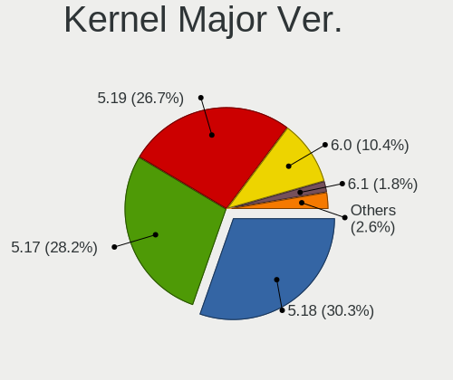
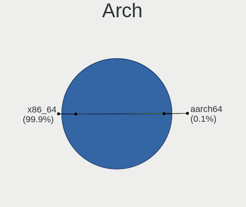
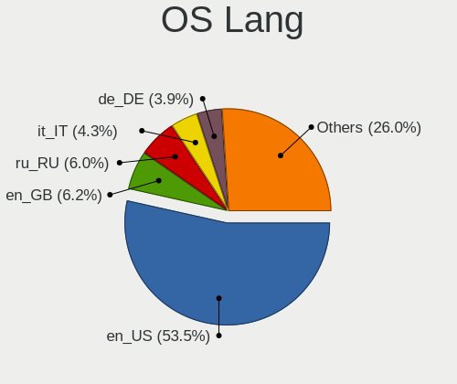
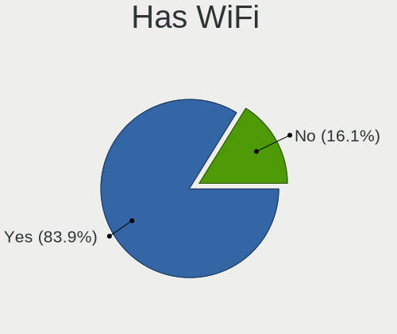
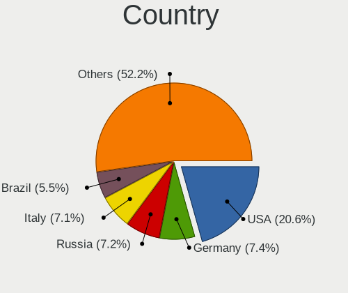
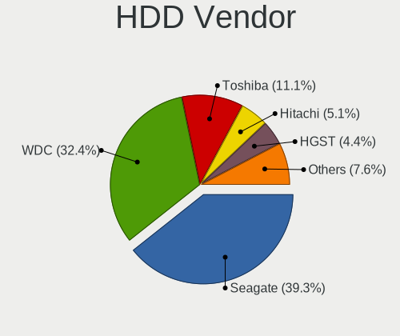
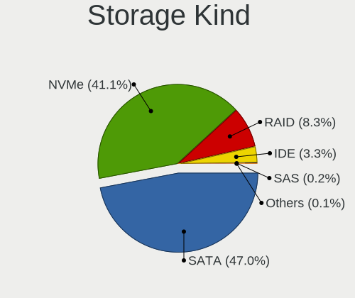
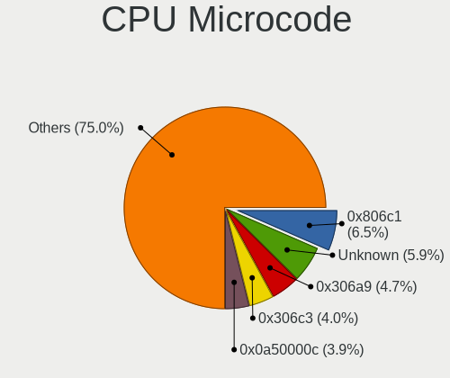
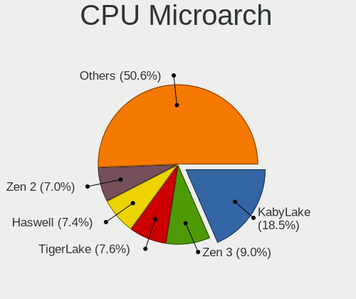
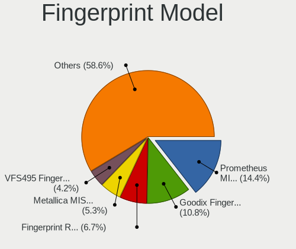

Fedora 36 - Tested Hardware & Statistics
----------------------------------------

A project to collect tested hardware configurations for Fedora 36.

Anyone can contribute to this report by the [hw-probe](https://github.com/linuxhw/hw-probe) tool:

    sudo -E hw-probe -all -upload

Please contribute! Especially if your hardware is rare.

This is a report for all computer types. See also reports for [desktops](/Dist/Fedora_36/Desktop/README.md) and [notebooks](/Dist/Fedora_36/Notebook/README.md).

Contents
--------

* [ Test Cases ](#test-cases)

* [ System ](#system)
  - [ Kernel                   ](#kernel)
  - [ Kernel Family            ](#kernel-family)
  - [ Kernel Major Ver.        ](#kernel-major-ver)
  - [ Arch                     ](#arch)
  - [ DE                       ](#de)
  - [ Display Server           ](#display-server)
  - [ Display Manager          ](#display-manager)
  - [ OS Lang                  ](#os-lang)
  - [ Boot Mode                ](#boot-mode)
  - [ Filesystem               ](#filesystem)
  - [ Part. scheme             ](#part-scheme)
  - [ Dual Boot with Linux/BSD ](#dual-boot-with-linuxbsd)
  - [ Dual Boot (Win)          ](#dual-boot-win)

* [ Board ](#board)
  - [ Vendor                   ](#vendor)
  - [ Model                    ](#model)
  - [ Model Family             ](#model-family)
  - [ MFG Year                 ](#mfg-year)
  - [ Form Factor              ](#form-factor)
  - [ Secure Boot              ](#secure-boot)
  - [ Coreboot                 ](#coreboot)
  - [ RAM Size                 ](#ram-size)
  - [ RAM Used                 ](#ram-used)
  - [ Total Drives             ](#total-drives)
  - [ Has CD-ROM               ](#has-cd-rom)
  - [ Has Ethernet             ](#has-ethernet)
  - [ Has WiFi                 ](#has-wifi)
  - [ Has Bluetooth            ](#has-bluetooth)

* [ Location ](#location)
  - [ Country                  ](#country)
  - [ City                     ](#city)

* [ Drives ](#drives)
  - [ Drive Vendor             ](#drive-vendor)
  - [ Drive Model              ](#drive-model)
  - [ HDD Vendor               ](#hdd-vendor)
  - [ SSD Vendor               ](#ssd-vendor)
  - [ Drive Kind               ](#drive-kind)
  - [ Drive Connector          ](#drive-connector)
  - [ Drive Size               ](#drive-size)
  - [ Space Total              ](#space-total)
  - [ Space Used               ](#space-used)
  - [ Malfunc. Drives          ](#malfunc-drives)
  - [ Malfunc. Drive Vendor    ](#malfunc-drive-vendor)
  - [ Malfunc. HDD Vendor      ](#malfunc-hdd-vendor)
  - [ Malfunc. Drive Kind      ](#malfunc-drive-kind)
  - [ Failed Drives            ](#failed-drives)
  - [ Failed Drive Vendor      ](#failed-drive-vendor)
  - [ Drive Status             ](#drive-status)

* [ Storage controller ](#storage-controller)
  - [ Storage Vendor           ](#storage-vendor)
  - [ Storage Model            ](#storage-model)
  - [ Storage Kind             ](#storage-kind)

* [ Processor ](#processor)
  - [ CPU Vendor               ](#cpu-vendor)
  - [ CPU Model                ](#cpu-model)
  - [ CPU Model Family         ](#cpu-model-family)
  - [ CPU Cores                ](#cpu-cores)
  - [ CPU Sockets              ](#cpu-sockets)
  - [ CPU Threads              ](#cpu-threads)
  - [ CPU Op-Modes             ](#cpu-op-modes)
  - [ CPU Microcode            ](#cpu-microcode)
  - [ CPU Microarch            ](#cpu-microarch)

* [ Graphics ](#graphics)
  - [ GPU Vendor               ](#gpu-vendor)
  - [ GPU Model                ](#gpu-model)
  - [ GPU Combo                ](#gpu-combo)
  - [ GPU Driver               ](#gpu-driver)
  - [ GPU Memory               ](#gpu-memory)

* [ Monitor ](#monitor)
  - [ Monitor Vendor           ](#monitor-vendor)
  - [ Monitor Model            ](#monitor-model)
  - [ Monitor Resolution       ](#monitor-resolution)
  - [ Monitor Diagonal         ](#monitor-diagonal)
  - [ Monitor Width            ](#monitor-width)
  - [ Aspect Ratio             ](#aspect-ratio)
  - [ Monitor Area             ](#monitor-area)
  - [ Pixel Density            ](#pixel-density)
  - [ Multiple Monitors        ](#multiple-monitors)

* [ Network ](#network)
  - [ Net Controller Vendor    ](#net-controller-vendor)
  - [ Net Controller Model     ](#net-controller-model)
  - [ Wireless Vendor          ](#wireless-vendor)
  - [ Wireless Model           ](#wireless-model)
  - [ Ethernet Vendor          ](#ethernet-vendor)
  - [ Ethernet Model           ](#ethernet-model)
  - [ Net Controller Kind      ](#net-controller-kind)
  - [ Used Controller          ](#used-controller)
  - [ NICs                     ](#nics)
  - [ IPv6                     ](#ipv6)

* [ Bluetooth ](#bluetooth)
  - [ Bluetooth Vendor         ](#bluetooth-vendor)
  - [ Bluetooth Model          ](#bluetooth-model)

* [ Sound ](#sound)
  - [ Sound Vendor             ](#sound-vendor)
  - [ Sound Model              ](#sound-model)

* [ Memory ](#memory)
  - [ Memory Vendor            ](#memory-vendor)
  - [ Memory Model             ](#memory-model)
  - [ Memory Kind              ](#memory-kind)
  - [ Memory Form Factor       ](#memory-form-factor)
  - [ Memory Size              ](#memory-size)
  - [ Memory Speed             ](#memory-speed)

* [ Printers & scanners ](#printers--scanners)
  - [ Printer Vendor           ](#printer-vendor)
  - [ Printer Model            ](#printer-model)
  - [ Scanner Vendor           ](#scanner-vendor)
  - [ Scanner Model            ](#scanner-model)

* [ Camera ](#camera)
  - [ Camera Vendor            ](#camera-vendor)
  - [ Camera Model             ](#camera-model)

* [ Security ](#security)
  - [ Fingerprint Vendor       ](#fingerprint-vendor)
  - [ Fingerprint Model        ](#fingerprint-model)
  - [ Chipcard Vendor          ](#chipcard-vendor)
  - [ Chipcard Model           ](#chipcard-model)

* [ Unsupported ](#unsupported)
  - [ Unsupported Devices      ](#unsupported-devices)
  - [ Unsupported Device Types ](#unsupported-device-types)

Test Cases
----------

Total: 1690

| Vendor        | Model                       | Form-Factor | Probe                                                      | Date         |
|---------------|-----------------------------|-------------|------------------------------------------------------------|--------------|
| Dell          | Inspiron 5490               | Notebook    | [3ef6519b6d](https://linux-hardware.org/?probe=3ef6519b6d) | Sep 01, 2022 |
| Lenovo        | ThinkPad X13 Yoga Gen 2 ... | Convertible | [969ebd4d3a](https://linux-hardware.org/?probe=969ebd4d3a) | Sep 01, 2022 |
| HP            | OMEN Laptop 15-en0xxx       | Notebook    | [e4a4630b4e](https://linux-hardware.org/?probe=e4a4630b4e) | Sep 01, 2022 |
| Dell          | 0MWYPT A02                  | Desktop     | [e2f98387b0](https://linux-hardware.org/?probe=e2f98387b0) | Sep 01, 2022 |
| Lenovo        | IdeaPad 3 15ITL6 82H8       | Notebook    | [5ad5d3809b](https://linux-hardware.org/?probe=5ad5d3809b) | Sep 01, 2022 |
| Dell          | Inspiron 13 5310            | Notebook    | [b6b7c6dc62](https://linux-hardware.org/?probe=b6b7c6dc62) | Sep 01, 2022 |
| Dell          | Inspiron 13 5310            | Notebook    | [6b3c188071](https://linux-hardware.org/?probe=6b3c188071) | Sep 01, 2022 |
| Dell          | Inspiron 13 5310            | Notebook    | [b0d6660da8](https://linux-hardware.org/?probe=b0d6660da8) | Sep 01, 2022 |
| Gigabyte      | GA-MA785G-UD3H              | Desktop     | [2cf98644bc](https://linux-hardware.org/?probe=2cf98644bc) | Sep 01, 2022 |
| Dell          | Inspiron 3542               | Notebook    | [945ec7d987](https://linux-hardware.org/?probe=945ec7d987) | Sep 01, 2022 |
| Lenovo        | ThinkPad X220 4291WSH       | Notebook    | [c86e73aed6](https://linux-hardware.org/?probe=c86e73aed6) | Sep 01, 2022 |
| MSI           | MPG B550I GAMING EDGE WI... | Desktop     | [c5547cac7c](https://linux-hardware.org/?probe=c5547cac7c) | Aug 31, 2022 |
| ASUSTek       | X541UJ                      | Notebook    | [0cd33aa36a](https://linux-hardware.org/?probe=0cd33aa36a) | Aug 31, 2022 |
| Dell          | Latitude 7430               | Notebook    | [8876fb0448](https://linux-hardware.org/?probe=8876fb0448) | Aug 31, 2022 |
| Eluktronic... | MAG-15 2070                 | Notebook    | [d7fb373622](https://linux-hardware.org/?probe=d7fb373622) | Aug 31, 2022 |
| MSI           | MPG B550I GAMING EDGE WI... | Desktop     | [e5c7462ead](https://linux-hardware.org/?probe=e5c7462ead) | Aug 31, 2022 |
| Gigabyte      | X570S AORUS ELITE AX        | Desktop     | [36eb80672f](https://linux-hardware.org/?probe=36eb80672f) | Aug 31, 2022 |
| Dell          | Latitude E5570              | Notebook    | [91513d0ee3](https://linux-hardware.org/?probe=91513d0ee3) | Aug 31, 2022 |
| Dell          | 0KV3RP A00                  | Desktop     | [731a14ee10](https://linux-hardware.org/?probe=731a14ee10) | Aug 31, 2022 |
| Acer          | Aspire E5-521               | Notebook    | [9ce49fc3a3](https://linux-hardware.org/?probe=9ce49fc3a3) | Aug 31, 2022 |
| Acer          | Aspire E5-521               | Notebook    | [b9d306c31b](https://linux-hardware.org/?probe=b9d306c31b) | Aug 31, 2022 |
| MSI           | B450 GAMING PRO CARBON A... | Desktop     | [2c72dfccbb](https://linux-hardware.org/?probe=2c72dfccbb) | Aug 30, 2022 |
| ASUSTek       | ROG Zephyrus G14 GA402RK... | Notebook    | [c2d66050b5](https://linux-hardware.org/?probe=c2d66050b5) | Aug 30, 2022 |
| HP            | Pavilion x360 Convertibl... | Convertible | [26d60edae6](https://linux-hardware.org/?probe=26d60edae6) | Aug 30, 2022 |
| Lenovo        | ThinkPad L15 Gen 1 20U70... | Notebook    | [71cd60f1b9](https://linux-hardware.org/?probe=71cd60f1b9) | Aug 30, 2022 |
| HP            | Laptop 15s-eq2xxx           | Notebook    | [d927e47d1f](https://linux-hardware.org/?probe=d927e47d1f) | Aug 30, 2022 |
| Lenovo        | IdeaPad 3 15ITL6 82H8       | Notebook    | [30457b898c](https://linux-hardware.org/?probe=30457b898c) | Aug 30, 2022 |
| HP            | ENVY Laptop 13-ad1xx        | Notebook    | [7399a32997](https://linux-hardware.org/?probe=7399a32997) | Aug 30, 2022 |
| Lenovo        | IdeaPad C340-14IWL 81N4     | Convertible | [05c3d5d7b7](https://linux-hardware.org/?probe=05c3d5d7b7) | Aug 30, 2022 |
| HP            | 255 G8 Notebook PC          | Notebook    | [c96e8a8254](https://linux-hardware.org/?probe=c96e8a8254) | Aug 30, 2022 |
| Dell          | G3 3579                     | Notebook    | [a3fc82fe9a](https://linux-hardware.org/?probe=a3fc82fe9a) | Aug 30, 2022 |
| HP            | Laptop 14-fq1xxx            | Notebook    | [8ea91d6b4b](https://linux-hardware.org/?probe=8ea91d6b4b) | Aug 30, 2022 |
| HP            | 8464                        | Desktop     | [16bb2588e0](https://linux-hardware.org/?probe=16bb2588e0) | Aug 30, 2022 |
| HP            | 250 G7 Notebook PC          | Notebook    | [96a56c7cb9](https://linux-hardware.org/?probe=96a56c7cb9) | Aug 30, 2022 |
| Dell          | Inspiron 15 5510            | Notebook    | [346eda373e](https://linux-hardware.org/?probe=346eda373e) | Aug 29, 2022 |
| Dell          | Inspiron 15 5510            | Notebook    | [ecdb2875da](https://linux-hardware.org/?probe=ecdb2875da) | Aug 29, 2022 |
| Dell          | Inspiron 5721               | Notebook    | [d483434965](https://linux-hardware.org/?probe=d483434965) | Aug 29, 2022 |
| Timi          | Redmi Book Pro 15 2022      | Notebook    | [473daa5ce3](https://linux-hardware.org/?probe=473daa5ce3) | Aug 29, 2022 |
| Gigabyte      | Z170-D3H-CF                 | Desktop     | [d9d75bc1f0](https://linux-hardware.org/?probe=d9d75bc1f0) | Aug 29, 2022 |
| HP            | Pavilion x360 Convertibl... | Convertible | [e19d574682](https://linux-hardware.org/?probe=e19d574682) | Aug 29, 2022 |
| Lenovo        | IdeaPad Gaming 3 15ACH6 ... | Notebook    | [c407e3a17c](https://linux-hardware.org/?probe=c407e3a17c) | Aug 29, 2022 |
| MSI           | Prestige 14Evo A11MO        | Notebook    | [22cf60f50b](https://linux-hardware.org/?probe=22cf60f50b) | Aug 29, 2022 |
| Intel         | NUC6i7KYB H90766-408        | Mini pc     | [14f4c7e248](https://linux-hardware.org/?probe=14f4c7e248) | Aug 29, 2022 |
| ASUSTek       | TUF Gaming B550-PLUS        | Desktop     | [9fbdc83458](https://linux-hardware.org/?probe=9fbdc83458) | Aug 29, 2022 |
| ASUSTek       | TUF Gaming B550-PLUS        | Desktop     | [7b0113a203](https://linux-hardware.org/?probe=7b0113a203) | Aug 29, 2022 |
| Infinix       | INBOOK X2                   | Notebook    | [02ae752ba2](https://linux-hardware.org/?probe=02ae752ba2) | Aug 29, 2022 |
| HP            | OMEN Laptop 15-en0xxx       | Notebook    | [f921aef61e](https://linux-hardware.org/?probe=f921aef61e) | Aug 29, 2022 |
| MSI           | MPG Z390I GAMING EDGE AC    | Desktop     | [cf0cdab1da](https://linux-hardware.org/?probe=cf0cdab1da) | Aug 29, 2022 |
| MSI           | MPG Z390 GAMING PLUS        | Desktop     | [60bc287a81](https://linux-hardware.org/?probe=60bc287a81) | Aug 29, 2022 |
| HP            | 8751                        | Desktop     | [62c8c2f25e](https://linux-hardware.org/?probe=62c8c2f25e) | Aug 29, 2022 |
| MSI           | MPG Z390 GAMING PLUS        | Desktop     | [7d1dae1de6](https://linux-hardware.org/?probe=7d1dae1de6) | Aug 29, 2022 |
| Supermicro    | X9DRD-7LN4F                 | Server      | [302c3f11ec](https://linux-hardware.org/?probe=302c3f11ec) | Aug 29, 2022 |
| HP            | ENVY Laptop 15-ep1xxx       | Notebook    | [d82227c6d3](https://linux-hardware.org/?probe=d82227c6d3) | Aug 29, 2022 |
| MSI           | Z77A-G43                    | Desktop     | [1d1864dabc](https://linux-hardware.org/?probe=1d1864dabc) | Aug 29, 2022 |
| Dell          | Precision 5750              | Notebook    | [2ee41b471e](https://linux-hardware.org/?probe=2ee41b471e) | Aug 28, 2022 |
| Lenovo        | IdeaPadFlex 5-1570 81CA     | Convertible | [ecaac234f3](https://linux-hardware.org/?probe=ecaac234f3) | Aug 28, 2022 |
| HUAWEI        | KLVL-WXXW                   | Notebook    | [829a45ed6f](https://linux-hardware.org/?probe=829a45ed6f) | Aug 28, 2022 |
| Google        | Eve                         | Notebook    | [4c83027c9a](https://linux-hardware.org/?probe=4c83027c9a) | Aug 28, 2022 |
| Dell          | Precision 5750              | Notebook    | [af9992756f](https://linux-hardware.org/?probe=af9992756f) | Aug 28, 2022 |
| ASUSTek       | ROG Strix G733QS_G733QS     | Notebook    | [589154a65e](https://linux-hardware.org/?probe=589154a65e) | Aug 28, 2022 |
| ASUSTek       | ROG Strix G733QS_G733QS     | Notebook    | [8d17bfec23](https://linux-hardware.org/?probe=8d17bfec23) | Aug 28, 2022 |
| ASUSTek       | TUF Gaming X570-PLUS        | Desktop     | [505d987d1e](https://linux-hardware.org/?probe=505d987d1e) | Aug 28, 2022 |
| Lenovo        | Legion 5 Pro 16ARH7H 82R... | Notebook    | [af00be0ff8](https://linux-hardware.org/?probe=af00be0ff8) | Aug 28, 2022 |
| Quanta        | 2AC5 101                    | All in one  | [b32f35a4b1](https://linux-hardware.org/?probe=b32f35a4b1) | Aug 28, 2022 |
| Lenovo        | Yoga C940-14IIL 81Q9        | Convertible | [dc431e4826](https://linux-hardware.org/?probe=dc431e4826) | Aug 28, 2022 |
| HP            | ProBook 650 G1              | Notebook    | [7738c266d6](https://linux-hardware.org/?probe=7738c266d6) | Aug 28, 2022 |
| Apple         | MacBookPro8,1               | Notebook    | [5efa863ca3](https://linux-hardware.org/?probe=5efa863ca3) | Aug 28, 2022 |
| Chuwi         | UBook X                     | Tablet      | [27c118eaf1](https://linux-hardware.org/?probe=27c118eaf1) | Aug 28, 2022 |
| Acer          | Aspire E5-521               | Notebook    | [a94da62004](https://linux-hardware.org/?probe=a94da62004) | Aug 28, 2022 |
| Acer          | Aspire E5-521               | Notebook    | [64cefbec58](https://linux-hardware.org/?probe=64cefbec58) | Aug 28, 2022 |
| Lenovo        | IdeaPad 5 15ALC05 82LN      | Notebook    | [70b2e9f836](https://linux-hardware.org/?probe=70b2e9f836) | Aug 27, 2022 |
| Dell          | Inspiron 3442               | Notebook    | [46a68b981e](https://linux-hardware.org/?probe=46a68b981e) | Aug 27, 2022 |
| MSI           | MAG X570S TOMAHAWK MAX W... | Desktop     | [3de4d575a9](https://linux-hardware.org/?probe=3de4d575a9) | Aug 27, 2022 |
| Apple         | MacBookAir6,2               | Notebook    | [0454b1e087](https://linux-hardware.org/?probe=0454b1e087) | Aug 27, 2022 |
| Acidanther... | MacBookPro12,1              | Notebook    | [9e48c5e245](https://linux-hardware.org/?probe=9e48c5e245) | Aug 27, 2022 |
| HP            | 805D                        | Desktop     | [419598ebba](https://linux-hardware.org/?probe=419598ebba) | Aug 27, 2022 |
| Lenovo        | IdeaPad 3 15ITL6 82H8       | Notebook    | [559d6f0e42](https://linux-hardware.org/?probe=559d6f0e42) | Aug 27, 2022 |
| Lenovo        | ThinkPad S1 Yoga 20CDCTO... | Notebook    | [f4dd9de519](https://linux-hardware.org/?probe=f4dd9de519) | Aug 27, 2022 |
| HP            | Spectre Folio Convertibl... | Convertible | [1bf525d79a](https://linux-hardware.org/?probe=1bf525d79a) | Aug 27, 2022 |
| Acer          | One S1003                   | Tablet      | [0d0621c875](https://linux-hardware.org/?probe=0d0621c875) | Aug 27, 2022 |
| Acer          | Nitro AN515-57              | Notebook    | [8d314e1557](https://linux-hardware.org/?probe=8d314e1557) | Aug 27, 2022 |
| Lenovo        | G50-45 80E3                 | Notebook    | [be9921e0e0](https://linux-hardware.org/?probe=be9921e0e0) | Aug 27, 2022 |
| Acer          | One S1003                   | Tablet      | [14016e8e79](https://linux-hardware.org/?probe=14016e8e79) | Aug 27, 2022 |
| HP            | EliteBook 840 G5            | Notebook    | [7bd19ce9a1](https://linux-hardware.org/?probe=7bd19ce9a1) | Aug 27, 2022 |
| Gigabyte      | GA-78LMT-USB3 SEx           | Desktop     | [7642980e6e](https://linux-hardware.org/?probe=7642980e6e) | Aug 27, 2022 |
| Exo           | Smart Serie L               | Notebook    | [5cbaef571b](https://linux-hardware.org/?probe=5cbaef571b) | Aug 27, 2022 |
| Microsoft     | Surface Pro 3               | Tablet      | [9fe64d4a60](https://linux-hardware.org/?probe=9fe64d4a60) | Aug 27, 2022 |
| Acer          | Aspire VN7-592G             | Notebook    | [cec4df79eb](https://linux-hardware.org/?probe=cec4df79eb) | Aug 26, 2022 |
| HP            | ProBook 4530s               | Notebook    | [be1270c998](https://linux-hardware.org/?probe=be1270c998) | Aug 26, 2022 |
| Dell          | XPS 13 7390 2-in-1          | Convertible | [fa74c338ed](https://linux-hardware.org/?probe=fa74c338ed) | Aug 26, 2022 |
| ASUSTek       | X541NA                      | Notebook    | [4755f121e3](https://linux-hardware.org/?probe=4755f121e3) | Aug 26, 2022 |
| Dell          | 0KV3RP A00                  | Desktop     | [f73bf383ce](https://linux-hardware.org/?probe=f73bf383ce) | Aug 26, 2022 |
| Acer          | Spin SP313-51N              | Convertible | [a55342c2f7](https://linux-hardware.org/?probe=a55342c2f7) | Aug 26, 2022 |
| Lenovo        | ThinkPad T490 20N2005VMX    | Notebook    | [264a4fd9a7](https://linux-hardware.org/?probe=264a4fd9a7) | Aug 26, 2022 |
| ASUSTek       | ROG Flow X16 GV601RW_GV6... | Convertible | [aa28bc2c61](https://linux-hardware.org/?probe=aa28bc2c61) | Aug 26, 2022 |
| Dell          | Latitude 5175               | Tablet      | [c751321ab1](https://linux-hardware.org/?probe=c751321ab1) | Aug 26, 2022 |
| ASUSTek       | P5QL-E                      | Desktop     | [f1c16cf6e7](https://linux-hardware.org/?probe=f1c16cf6e7) | Aug 26, 2022 |
| ASUSTek       | ROG STRIX X570-E GAMING ... | Desktop     | [dd68273352](https://linux-hardware.org/?probe=dd68273352) | Aug 26, 2022 |
| Dell          | Inspiron 3593               | Notebook    | [c3ae4b86ac](https://linux-hardware.org/?probe=c3ae4b86ac) | Aug 26, 2022 |
| ASUSTek       | P5QL-E                      | Desktop     | [e69218ea58](https://linux-hardware.org/?probe=e69218ea58) | Aug 26, 2022 |
| Gigabyte      | B550 GAMING X V2            | Desktop     | [f37ee1975e](https://linux-hardware.org/?probe=f37ee1975e) | Aug 26, 2022 |
| Lenovo        | IdeaPad 5 14ARE05 81YM      | Notebook    | [c8b4d18767](https://linux-hardware.org/?probe=c8b4d18767) | Aug 25, 2022 |
| HP            | ENVY Laptop 13-aq1xxx       | Notebook    | [095ecf5f87](https://linux-hardware.org/?probe=095ecf5f87) | Aug 25, 2022 |
| MSI           | Modern 14 A10RAS            | Notebook    | [af216b7b4a](https://linux-hardware.org/?probe=af216b7b4a) | Aug 25, 2022 |
| ASUSTek       | ROG STRIX B550-F GAMING     | Desktop     | [2388b95ce9](https://linux-hardware.org/?probe=2388b95ce9) | Aug 25, 2022 |
| ASUSTek       | UN62                        | Desktop     | [49fcd1324f](https://linux-hardware.org/?probe=49fcd1324f) | Aug 25, 2022 |
| HP            | Victus by Laptop 16-e0xx... | Notebook    | [2b52864870](https://linux-hardware.org/?probe=2b52864870) | Aug 25, 2022 |
| Lenovo        | ThinkBook 14 G3 ACL 21A2    | Notebook    | [9f3be0c9b5](https://linux-hardware.org/?probe=9f3be0c9b5) | Aug 25, 2022 |
| ASRock        | B450M Pro4                  | Desktop     | [69fd53a234](https://linux-hardware.org/?probe=69fd53a234) | Aug 25, 2022 |
| ASRock        | B450M Pro4                  | Desktop     | [47dc749c6c](https://linux-hardware.org/?probe=47dc749c6c) | Aug 25, 2022 |
| Dell          | 01TKCC A01                  | Desktop     | [9a362ed844](https://linux-hardware.org/?probe=9a362ed844) | Aug 25, 2022 |
| Dell          | 0PU052                      | Desktop     | [2bffd37724](https://linux-hardware.org/?probe=2bffd37724) | Aug 24, 2022 |
| HP            | Pavilion dv6                | Notebook    | [7fd7791035](https://linux-hardware.org/?probe=7fd7791035) | Aug 24, 2022 |
| Lenovo        | IdeaPad 320-15IKB 80XL      | Notebook    | [4378f177a8](https://linux-hardware.org/?probe=4378f177a8) | Aug 24, 2022 |
| ASUSTek       | Z97-AR                      | Desktop     | [a766ce2d5a](https://linux-hardware.org/?probe=a766ce2d5a) | Aug 24, 2022 |
| HP            | Laptop 15s-fq2xxx           | Notebook    | [f8213e35a4](https://linux-hardware.org/?probe=f8213e35a4) | Aug 24, 2022 |
| ASUSTek       | TUF Gaming B550-PLUS        | Desktop     | [ae4a81a473](https://linux-hardware.org/?probe=ae4a81a473) | Aug 24, 2022 |
| GPU Compan... | GWTC116-2                   | Notebook    | [f9090c46a9](https://linux-hardware.org/?probe=f9090c46a9) | Aug 24, 2022 |
| GPU Compan... | GWTC116-2                   | Notebook    | [ac93dd480f](https://linux-hardware.org/?probe=ac93dd480f) | Aug 24, 2022 |
| ASUSTek       | T100HAN                     | Notebook    | [9438c7bb11](https://linux-hardware.org/?probe=9438c7bb11) | Aug 23, 2022 |
| ASRock        | X570M Pro4                  | Desktop     | [f2bc1e0fae](https://linux-hardware.org/?probe=f2bc1e0fae) | Aug 23, 2022 |
| ASUSTek       | ROG Zephyrus G15 GA503QR... | Notebook    | [1e79d17c85](https://linux-hardware.org/?probe=1e79d17c85) | Aug 23, 2022 |
| Lenovo        | 3151 SDK0J40697 WIN 3305... | Mini pc     | [199e70a85c](https://linux-hardware.org/?probe=199e70a85c) | Aug 23, 2022 |
| Gigabyte      | H81M-S                      | Desktop     | [0b1e1d125d](https://linux-hardware.org/?probe=0b1e1d125d) | Aug 23, 2022 |
| HP            | Laptop 15s-eq2xxx           | Notebook    | [efc85efba2](https://linux-hardware.org/?probe=efc85efba2) | Aug 23, 2022 |
| HP            | Pavilion x360 Convertibl... | Convertible | [cc66ac722b](https://linux-hardware.org/?probe=cc66ac722b) | Aug 23, 2022 |
| Lenovo        | IdeaPad 3 15ARE05 81W4      | Notebook    | [33c24103bf](https://linux-hardware.org/?probe=33c24103bf) | Aug 23, 2022 |
| ASUSTek       | ROG Flow X16 GV601RM_GV6... | Convertible | [704cec73e1](https://linux-hardware.org/?probe=704cec73e1) | Aug 23, 2022 |
| Lenovo        | IdeaPad 720S-13IKB 81BV     | Notebook    | [1b1c9cb460](https://linux-hardware.org/?probe=1b1c9cb460) | Aug 23, 2022 |
| Lenovo        | ThinkPad T470 20HDCTO1WW    | Notebook    | [2e88f854f8](https://linux-hardware.org/?probe=2e88f854f8) | Aug 23, 2022 |
| MSI           | Z170A GAMING PRO CARBON     | Desktop     | [0796a8df9d](https://linux-hardware.org/?probe=0796a8df9d) | Aug 23, 2022 |
| Dell          | Inspiron 5567               | Notebook    | [7b0f03259b](https://linux-hardware.org/?probe=7b0f03259b) | Aug 23, 2022 |
| Gigabyte      | X570 I AORUS PRO WIFI       | Desktop     | [b0af95356c](https://linux-hardware.org/?probe=b0af95356c) | Aug 22, 2022 |
| Gigabyte      | X570 I AORUS PRO WIFI       | Desktop     | [bc32a93168](https://linux-hardware.org/?probe=bc32a93168) | Aug 22, 2022 |
| Dell          | XPS L421X                   | Notebook    | [80a474140e](https://linux-hardware.org/?probe=80a474140e) | Aug 22, 2022 |
| Gigabyte      | B550 AORUS ELITE V2         | Desktop     | [a25c6f8d64](https://linux-hardware.org/?probe=a25c6f8d64) | Aug 22, 2022 |
| Gigabyte      | EP45-DS3P                   | Desktop     | [2af48f00ac](https://linux-hardware.org/?probe=2af48f00ac) | Aug 22, 2022 |
| Gigabyte      | EP45-DS3P                   | Desktop     | [0910ca3887](https://linux-hardware.org/?probe=0910ca3887) | Aug 22, 2022 |
| ASUSTek       | VivoBook_ASUSLaptop TP41... | Convertible | [1b2c235511](https://linux-hardware.org/?probe=1b2c235511) | Aug 22, 2022 |
| ASUSTek       | VivoBook_ASUSLaptop TP41... | Convertible | [c563f4b965](https://linux-hardware.org/?probe=c563f4b965) | Aug 22, 2022 |
| ASUSTek       | PRIME H370-PLUS             | Desktop     | [eb81df27ce](https://linux-hardware.org/?probe=eb81df27ce) | Aug 22, 2022 |
| Apple         | MacBook9,1                  | Notebook    | [a6726b8439](https://linux-hardware.org/?probe=a6726b8439) | Aug 22, 2022 |
| Aquarius      | Cmp NS765                   | Notebook    | [991487a61b](https://linux-hardware.org/?probe=991487a61b) | Aug 22, 2022 |
| Apple         | MacBook9,1                  | Notebook    | [aff9259c2c](https://linux-hardware.org/?probe=aff9259c2c) | Aug 22, 2022 |
| Lenovo        | MIIX 320-10ICR 80XF         | Tablet      | [e404ccb462](https://linux-hardware.org/?probe=e404ccb462) | Aug 22, 2022 |
| Apple         | MacBookPro5,5               | Notebook    | [f25926e1fa](https://linux-hardware.org/?probe=f25926e1fa) | Aug 22, 2022 |
| Apple         | MacBookPro5,5               | Notebook    | [784c6d89a6](https://linux-hardware.org/?probe=784c6d89a6) | Aug 22, 2022 |
| ASRock        | 890GM Pro3                  | Desktop     | [51f5d50d85](https://linux-hardware.org/?probe=51f5d50d85) | Aug 22, 2022 |
| ASRock        | 890GM Pro3                  | Desktop     | [002a0c3f5a](https://linux-hardware.org/?probe=002a0c3f5a) | Aug 22, 2022 |
| Apple         | MacBookPro11,2              | Notebook    | [9856ca2463](https://linux-hardware.org/?probe=9856ca2463) | Aug 21, 2022 |
| Acer          | TravelMate P215-52G         | Notebook    | [1d36fcbc9f](https://linux-hardware.org/?probe=1d36fcbc9f) | Aug 21, 2022 |
| ASRock        | X370 Taichi                 | Desktop     | [8f952ff258](https://linux-hardware.org/?probe=8f952ff258) | Aug 21, 2022 |
| HP            | Compaq 15                   | Notebook    | [c2bdac6148](https://linux-hardware.org/?probe=c2bdac6148) | Aug 21, 2022 |
| Acer          | Aspire E1-522               | Notebook    | [f4f0162d9a](https://linux-hardware.org/?probe=f4f0162d9a) | Aug 21, 2022 |
| Lenovo        | ThinkPad E595 20NF001PTX    | Notebook    | [98b92cfe3a](https://linux-hardware.org/?probe=98b92cfe3a) | Aug 21, 2022 |
| ASRock        | AD2700-ITX                  | Desktop     | [4be47e3738](https://linux-hardware.org/?probe=4be47e3738) | Aug 21, 2022 |
| ASUSTek       | ROG STRIX Z690-E GAMING ... | Desktop     | [5f90bb65a6](https://linux-hardware.org/?probe=5f90bb65a6) | Aug 21, 2022 |
| ASUSTek       | ROG Strix G533ZM_G533ZM     | Notebook    | [390e67b458](https://linux-hardware.org/?probe=390e67b458) | Aug 21, 2022 |
| Acer          | Popcorn                     | Notebook    | [1c3d0d6b87](https://linux-hardware.org/?probe=1c3d0d6b87) | Aug 21, 2022 |
| HUAWEI        | EMD-WXX                     | Notebook    | [1ee66f2c65](https://linux-hardware.org/?probe=1ee66f2c65) | Aug 20, 2022 |
| HP            | ENVY x360 Convertible 13... | Convertible | [47b1480e61](https://linux-hardware.org/?probe=47b1480e61) | Aug 20, 2022 |
| HP            | ENVY Notebook               | Notebook    | [7d790e2b4d](https://linux-hardware.org/?probe=7d790e2b4d) | Aug 20, 2022 |
| ASUSTek       | TUF B350M-PLUS GAMING       | Desktop     | [b2ac87cffc](https://linux-hardware.org/?probe=b2ac87cffc) | Aug 20, 2022 |
| Gigabyte      | G1.Sniper B5-CF             | Desktop     | [7dbac78a87](https://linux-hardware.org/?probe=7dbac78a87) | Aug 20, 2022 |
| Lenovo        | 312A SDK0J40697 WIN 3305... | Desktop     | [abbb1d7360](https://linux-hardware.org/?probe=abbb1d7360) | Aug 20, 2022 |
| Lenovo        | Yoga 7 14ITL5 82BH          | Convertible | [c3e335499f](https://linux-hardware.org/?probe=c3e335499f) | Aug 20, 2022 |
| HONOR         | NBD-WXX9                    | Notebook    | [1fdf41de8b](https://linux-hardware.org/?probe=1fdf41de8b) | Aug 20, 2022 |
| Dell          | Latitude E6430              | Notebook    | [c7a98ce916](https://linux-hardware.org/?probe=c7a98ce916) | Aug 20, 2022 |
| Gigabyte      | B550M DS3H                  | Desktop     | [fd0604d0fb](https://linux-hardware.org/?probe=fd0604d0fb) | Aug 20, 2022 |
| ASUSTek       | ROG Zephyrus M16 GU603ZE... | Notebook    | [8dd3a87210](https://linux-hardware.org/?probe=8dd3a87210) | Aug 20, 2022 |
| Lenovo        | IdeaPad S340-14API 81NB     | Notebook    | [93c259f492](https://linux-hardware.org/?probe=93c259f492) | Aug 20, 2022 |
| ASUSTek       | Zephyrus S GX531GX_GX531... | Notebook    | [0041774402](https://linux-hardware.org/?probe=0041774402) | Aug 20, 2022 |
| Gigabyte      | GA-MA780G-UD3H              | Desktop     | [c9738d69e9](https://linux-hardware.org/?probe=c9738d69e9) | Aug 20, 2022 |
| HP            | ProBook 655 G1              | Notebook    | [e37e59a165](https://linux-hardware.org/?probe=e37e59a165) | Aug 20, 2022 |
| ASUSTek       | Z97-PRO GAMER               | Desktop     | [2f5ef1300f](https://linux-hardware.org/?probe=2f5ef1300f) | Aug 19, 2022 |
| HP            | ENVY x360 Convertible 15... | Convertible | [20c406b9b0](https://linux-hardware.org/?probe=20c406b9b0) | Aug 19, 2022 |
| MACHINIST     | X99-RS9 V2.0                | Desktop     | [ffb095f0c3](https://linux-hardware.org/?probe=ffb095f0c3) | Aug 19, 2022 |
| Lenovo        | Yoga 9 14IAP7 82LU          | Convertible | [b745244bb7](https://linux-hardware.org/?probe=b745244bb7) | Aug 19, 2022 |
| ASUSTek       | P8H67-M LE                  | Desktop     | [ce8c93b28f](https://linux-hardware.org/?probe=ce8c93b28f) | Aug 19, 2022 |
| Dell          | Inspiron M5010              | Notebook    | [266f9fc41d](https://linux-hardware.org/?probe=266f9fc41d) | Aug 19, 2022 |
| Fujitsu       | LIFEBOOK UH552              | Notebook    | [ad8ec93f74](https://linux-hardware.org/?probe=ad8ec93f74) | Aug 19, 2022 |
| Dell          | Inspiron 5490               | Notebook    | [98f795ee5f](https://linux-hardware.org/?probe=98f795ee5f) | Aug 19, 2022 |
| ASUSTek       | VivoBook_ASUSLaptop TP42... | Convertible | [c7f7373ed5](https://linux-hardware.org/?probe=c7f7373ed5) | Aug 19, 2022 |
| ASRock        | B450 Pro4                   | Desktop     | [ed013e82aa](https://linux-hardware.org/?probe=ed013e82aa) | Aug 19, 2022 |
| HUAWEI        | EMD-WXX                     | Notebook    | [9c4217c76b](https://linux-hardware.org/?probe=9c4217c76b) | Aug 19, 2022 |
| Lenovo        | ThinkPad E14 Gen 3 20Y70... | Notebook    | [81be616c6b](https://linux-hardware.org/?probe=81be616c6b) | Aug 19, 2022 |
| Apple         | MacBook6,1                  | Notebook    | [f7703b1b38](https://linux-hardware.org/?probe=f7703b1b38) | Aug 19, 2022 |
| ASUSTek       | K45A                        | Notebook    | [b007d7ae1d](https://linux-hardware.org/?probe=b007d7ae1d) | Aug 18, 2022 |
| Lenovo        | ThinkPad E520 1143CWG       | Notebook    | [bc6f3f891a](https://linux-hardware.org/?probe=bc6f3f891a) | Aug 18, 2022 |
| HP            | ProBook 450 G5              | Notebook    | [68697e720d](https://linux-hardware.org/?probe=68697e720d) | Aug 18, 2022 |
| Acidanther... | MacBookPro12,1              | Notebook    | [6afa5c842e](https://linux-hardware.org/?probe=6afa5c842e) | Aug 18, 2022 |
| Acer          | Aspire A515-45              | Notebook    | [9e48793165](https://linux-hardware.org/?probe=9e48793165) | Aug 18, 2022 |
| ASUSTek       | TUF Gaming B550M-PLUS       | Desktop     | [8fc237babf](https://linux-hardware.org/?probe=8fc237babf) | Aug 17, 2022 |
| Acer          | Aspire E5-573               | Notebook    | [1815c3a2f2](https://linux-hardware.org/?probe=1815c3a2f2) | Aug 17, 2022 |
| Lenovo        | ThinkPad X240 20ALA0AHRT    | Notebook    | [cfc3d5853c](https://linux-hardware.org/?probe=cfc3d5853c) | Aug 17, 2022 |
| Lenovo        | IdeaPad 5 Pro 14ACN6 82L... | Notebook    | [97fb16fc3f](https://linux-hardware.org/?probe=97fb16fc3f) | Aug 17, 2022 |
| Lenovo        | SHARKBAY NOK                | Desktop     | [e73d7ae317](https://linux-hardware.org/?probe=e73d7ae317) | Aug 17, 2022 |
| Lenovo        | IdeaPad 330-15IKB 81DE      | Notebook    | [7f3311afd4](https://linux-hardware.org/?probe=7f3311afd4) | Aug 17, 2022 |
| ASUSTek       | K45A                        | Notebook    | [cbbc0ff58a](https://linux-hardware.org/?probe=cbbc0ff58a) | Aug 17, 2022 |
| HP            | Pavilion Laptop 15-cs0xx... | Notebook    | [8aea7a68ee](https://linux-hardware.org/?probe=8aea7a68ee) | Aug 17, 2022 |
| Lenovo        | IdeaPad 330-15IKB 81DE      | Notebook    | [f1d6bc684c](https://linux-hardware.org/?probe=f1d6bc684c) | Aug 17, 2022 |
| Dell          | 09M8Y8 A01                  | Desktop     | [9defe532c0](https://linux-hardware.org/?probe=9defe532c0) | Aug 17, 2022 |
| MSI           | Modern 14 B11SBL            | Notebook    | [ad56f2a352](https://linux-hardware.org/?probe=ad56f2a352) | Aug 17, 2022 |
| Lenovo        | ThinkPad T480s 20L70044A... | Notebook    | [f90559618b](https://linux-hardware.org/?probe=f90559618b) | Aug 17, 2022 |
| MSI           | Modern 14 A10RAS            | Notebook    | [f7102225ca](https://linux-hardware.org/?probe=f7102225ca) | Aug 17, 2022 |
| MSI           | Modern 14 A10RAS            | Notebook    | [3a57a6329f](https://linux-hardware.org/?probe=3a57a6329f) | Aug 17, 2022 |
| HP            | EliteBook 8460p             | Notebook    | [26f646cca0](https://linux-hardware.org/?probe=26f646cca0) | Aug 17, 2022 |
| Eluktronic... | MAX-17                      | Notebook    | [b0aec6f095](https://linux-hardware.org/?probe=b0aec6f095) | Aug 17, 2022 |
| ASUSTek       | Z97-C                       | Desktop     | [58f88a4494](https://linux-hardware.org/?probe=58f88a4494) | Aug 17, 2022 |
| Lenovo        | ThinkPad T460s 20F9004NU... | Notebook    | [3b35e8e9da](https://linux-hardware.org/?probe=3b35e8e9da) | Aug 17, 2022 |
| Lenovo        | IdeaPad 330S-15IKB 81F5     | Notebook    | [78ff8418f9](https://linux-hardware.org/?probe=78ff8418f9) | Aug 17, 2022 |
| MSI           | Delta 15 A5EFK              | Notebook    | [4b165c8f79](https://linux-hardware.org/?probe=4b165c8f79) | Aug 17, 2022 |
| HP            | EliteBook 8460p             | Notebook    | [98b5311ef6](https://linux-hardware.org/?probe=98b5311ef6) | Aug 17, 2022 |
| Lenovo        | Yoga Slim 7 ProX 14ARH7 ... | Notebook    | [0793e37f62](https://linux-hardware.org/?probe=0793e37f62) | Aug 17, 2022 |
| Gigabyte      | D525TUD                     | Desktop     | [e68748c0f1](https://linux-hardware.org/?probe=e68748c0f1) | Aug 16, 2022 |
| Gigabyte      | B550M AORUS PRO-P           | Desktop     | [8b591b08b0](https://linux-hardware.org/?probe=8b591b08b0) | Aug 16, 2022 |
| ASUSTek       | Z97-C                       | Desktop     | [e68b5affa4](https://linux-hardware.org/?probe=e68b5affa4) | Aug 16, 2022 |
| Lenovo        | IdeaPad 3 15ITL6 82H8       | Notebook    | [1b12b01004](https://linux-hardware.org/?probe=1b12b01004) | Aug 16, 2022 |
| Acer          | Aspire A715-42G             | Notebook    | [fbeff3bff5](https://linux-hardware.org/?probe=fbeff3bff5) | Aug 16, 2022 |
| MSI           | GT72S 6QE                   | Notebook    | [20121e68c8](https://linux-hardware.org/?probe=20121e68c8) | Aug 16, 2022 |
| Acer          | Aspire E5-573               | Notebook    | [d3bd05f20b](https://linux-hardware.org/?probe=d3bd05f20b) | Aug 16, 2022 |
| HP            | Laptop 17-by0xxx            | Notebook    | [59db95ffee](https://linux-hardware.org/?probe=59db95ffee) | Aug 16, 2022 |
| ASUSTek       | X453MA                      | Notebook    | [2b63761318](https://linux-hardware.org/?probe=2b63761318) | Aug 16, 2022 |
| Lenovo        | ThinkBook Plus 20TG         | Notebook    | [1f39fbc5a8](https://linux-hardware.org/?probe=1f39fbc5a8) | Aug 16, 2022 |
| ASUSTek       | ROG STRIX X570-I GAMING     | Desktop     | [97ff4c0078](https://linux-hardware.org/?probe=97ff4c0078) | Aug 16, 2022 |
| Panasonic     | CFMX4-1                     | Notebook    | [01074aea14](https://linux-hardware.org/?probe=01074aea14) | Aug 16, 2022 |
| Gigabyte      | B550M DS3H                  | Desktop     | [6ef5e022c7](https://linux-hardware.org/?probe=6ef5e022c7) | Aug 15, 2022 |
| ASUSTek       | X453MA                      | Notebook    | [fa2c1b6a14](https://linux-hardware.org/?probe=fa2c1b6a14) | Aug 15, 2022 |
| ECS           | H61H2-MV                    | Desktop     | [0b95f78b15](https://linux-hardware.org/?probe=0b95f78b15) | Aug 15, 2022 |
| HP            | Pavilion TS 15              | Notebook    | [22194522c7](https://linux-hardware.org/?probe=22194522c7) | Aug 15, 2022 |
| Gigabyte      | GA-MA785G-UD3H              | Desktop     | [8072e15459](https://linux-hardware.org/?probe=8072e15459) | Aug 15, 2022 |
| Acer          | Aspire A515-51G             | Notebook    | [9ee5f23f82](https://linux-hardware.org/?probe=9ee5f23f82) | Aug 15, 2022 |
| Lenovo        | ThinkPad T14 Gen 1 20UD0... | Notebook    | [d9f8a6ea69](https://linux-hardware.org/?probe=d9f8a6ea69) | Aug 15, 2022 |
| Apple         | MacBookPro10,1              | Notebook    | [c4738a316c](https://linux-hardware.org/?probe=c4738a316c) | Aug 15, 2022 |
| Lenovo        | ThinkBook 15 G2 ITL 20VE    | Notebook    | [d333f2698e](https://linux-hardware.org/?probe=d333f2698e) | Aug 15, 2022 |
| ASUSTek       | Z97-PRO GAMER               | Desktop     | [bbbda98d21](https://linux-hardware.org/?probe=bbbda98d21) | Aug 15, 2022 |
| Notebook      | N15_17RD                    | Notebook    | [eef224fc6b](https://linux-hardware.org/?probe=eef224fc6b) | Aug 15, 2022 |
| Gigabyte      | H77N-WIFI                   | Desktop     | [20d9ba44b5](https://linux-hardware.org/?probe=20d9ba44b5) | Aug 15, 2022 |
| Lenovo        | V110-15ISK 80TL             | Notebook    | [757de6f4df](https://linux-hardware.org/?probe=757de6f4df) | Aug 15, 2022 |
| Lenovo        | ThinkBook 14 G3 ACL 21A2    | Notebook    | [4f73fd7cf8](https://linux-hardware.org/?probe=4f73fd7cf8) | Aug 15, 2022 |
| Avell High... | A70 HYB                     | Notebook    | [c0e0f2d0a4](https://linux-hardware.org/?probe=c0e0f2d0a4) | Aug 15, 2022 |
| Lenovo        | ThinkPad T460s 20F9004NU... | Notebook    | [e09e349f03](https://linux-hardware.org/?probe=e09e349f03) | Aug 15, 2022 |
| Sony          | VPCS131FM                   | Notebook    | [22e32938e6](https://linux-hardware.org/?probe=22e32938e6) | Aug 14, 2022 |
| Intel         | NUC8BEB J72692-308          | Mini pc     | [3decfcd64a](https://linux-hardware.org/?probe=3decfcd64a) | Aug 14, 2022 |
| Acer          | Spin SP314-54N              | Convertible | [24b804043b](https://linux-hardware.org/?probe=24b804043b) | Aug 14, 2022 |
| Toshiba       | TECRA R940                  | Notebook    | [f7a6618519](https://linux-hardware.org/?probe=f7a6618519) | Aug 14, 2022 |
| ASUSTek       | B85M-G                      | Desktop     | [b44e802677](https://linux-hardware.org/?probe=b44e802677) | Aug 14, 2022 |
| Dell          | XPS 15 9500                 | Notebook    | [08ef9ef965](https://linux-hardware.org/?probe=08ef9ef965) | Aug 14, 2022 |
| Lenovo        | ThinkPad T430 2349V4B       | Notebook    | [0f919e20c7](https://linux-hardware.org/?probe=0f919e20c7) | Aug 14, 2022 |
| UNOWHY        | Y13G010S4EI                 | Notebook    | [b7352cd745](https://linux-hardware.org/?probe=b7352cd745) | Aug 14, 2022 |
| Lenovo        | IdeaPad 3 15ALC6 82MF       | Notebook    | [7209cc1bd4](https://linux-hardware.org/?probe=7209cc1bd4) | Aug 14, 2022 |
| Dell          | XPS 15 9550                 | Notebook    | [ad3ad84c75](https://linux-hardware.org/?probe=ad3ad84c75) | Aug 14, 2022 |
| Apple         | MacBookPro5,5               | Notebook    | [76483c9f78](https://linux-hardware.org/?probe=76483c9f78) | Aug 14, 2022 |
| AXDIA Inte... | WINPAD V10                  | Notebook    | [a44a9b065b](https://linux-hardware.org/?probe=a44a9b065b) | Aug 14, 2022 |
| ASUSTek       | VivoBook_ASUSLaptop X509... | Notebook    | [a533aea5e5](https://linux-hardware.org/?probe=a533aea5e5) | Aug 14, 2022 |
| Dell          | Inspiron 13 5320            | Notebook    | [cee0d5a717](https://linux-hardware.org/?probe=cee0d5a717) | Aug 14, 2022 |
| ASUSTek       | P8H77-V                     | Desktop     | [83abda5bc9](https://linux-hardware.org/?probe=83abda5bc9) | Aug 14, 2022 |
| ASUSTek       | Zephyrus G GU502DU_GA502... | Notebook    | [d5862f21f5](https://linux-hardware.org/?probe=d5862f21f5) | Aug 14, 2022 |
| Unknown       | Unknown                     | Notebook    | [dbf529a586](https://linux-hardware.org/?probe=dbf529a586) | Aug 14, 2022 |
| HP            | ENVY Laptop 17-ch0xxx       | Notebook    | [ca9974d27e](https://linux-hardware.org/?probe=ca9974d27e) | Aug 14, 2022 |
| Acer          | Aspire E5-521               | Notebook    | [c127df7597](https://linux-hardware.org/?probe=c127df7597) | Aug 13, 2022 |
| Huanan        | X99-BD4 V1.33               | Desktop     | [a250b39eec](https://linux-hardware.org/?probe=a250b39eec) | Aug 13, 2022 |
| HP            | 14                          | Notebook    | [92172385ef](https://linux-hardware.org/?probe=92172385ef) | Aug 13, 2022 |
| ASUSTek       | STRIX Z270E GAMING          | Desktop     | [6a0c6ab778](https://linux-hardware.org/?probe=6a0c6ab778) | Aug 13, 2022 |
| Dell          | G3 3590                     | Notebook    | [fbe948e194](https://linux-hardware.org/?probe=fbe948e194) | Aug 13, 2022 |
| ASUSTek       | ROG STRIX Z370-H GAMING     | Desktop     | [4983efddbb](https://linux-hardware.org/?probe=4983efddbb) | Aug 13, 2022 |
| Lenovo        | IdeaPad S340-14API 81NB     | Notebook    | [7af785fc65](https://linux-hardware.org/?probe=7af785fc65) | Aug 13, 2022 |
| ASRock        | FM2A88M-HD+ R2.0            | Desktop     | [e1f4ef0670](https://linux-hardware.org/?probe=e1f4ef0670) | Aug 12, 2022 |
| Dell          | XPS 15 9510                 | Notebook    | [3cb2744dbe](https://linux-hardware.org/?probe=3cb2744dbe) | Aug 12, 2022 |
| HP            | ProBook 6570b               | Notebook    | [d67ec558d4](https://linux-hardware.org/?probe=d67ec558d4) | Aug 12, 2022 |
| MSI           | Z97 GAMING 5                | Desktop     | [e7c81a6ce7](https://linux-hardware.org/?probe=e7c81a6ce7) | Aug 12, 2022 |
| MSI           | MPG X570 GAMING PLUS        | Desktop     | [6a8f06be23](https://linux-hardware.org/?probe=6a8f06be23) | Aug 12, 2022 |
| HP            | 8183                        | Desktop     | [19f5199de8](https://linux-hardware.org/?probe=19f5199de8) | Aug 12, 2022 |
| HP            | ProBook 440 G7              | Notebook    | [ee57cf772f](https://linux-hardware.org/?probe=ee57cf772f) | Aug 12, 2022 |
| Gigabyte      | H370 HD3-CF                 | Desktop     | [3d93d807ca](https://linux-hardware.org/?probe=3d93d807ca) | Aug 12, 2022 |
| Lenovo        | ThinkPad T14 Gen 1 20S00... | Notebook    | [a7cdb45aa6](https://linux-hardware.org/?probe=a7cdb45aa6) | Aug 12, 2022 |
| MSI           | MS-16F1                     | Notebook    | [0a28da4f53](https://linux-hardware.org/?probe=0a28da4f53) | Aug 12, 2022 |
| HP            | Pavilion 17                 | Notebook    | [25a07691ec](https://linux-hardware.org/?probe=25a07691ec) | Aug 12, 2022 |
| Sony          | SVT15115CXS                 | Notebook    | [f7915ecf99](https://linux-hardware.org/?probe=f7915ecf99) | Aug 12, 2022 |
| Dell          | Inspiron 7506 2n1           | Convertible | [c39429aed6](https://linux-hardware.org/?probe=c39429aed6) | Aug 11, 2022 |
| MSI           | X370 SLI PLUS               | Desktop     | [8b4bc6f127](https://linux-hardware.org/?probe=8b4bc6f127) | Aug 11, 2022 |
| Lenovo        | Legion 5 Pro 16ACH6H 82J... | Notebook    | [1604d7a824](https://linux-hardware.org/?probe=1604d7a824) | Aug 11, 2022 |
| MSI           | Z87-G45 GAMING              | Desktop     | [5f25d77994](https://linux-hardware.org/?probe=5f25d77994) | Aug 11, 2022 |
| HP            | 8183                        | Desktop     | [c441ead9f8](https://linux-hardware.org/?probe=c441ead9f8) | Aug 11, 2022 |
| Dell          | Latitude E6420              | Notebook    | [bd610e8bd8](https://linux-hardware.org/?probe=bd610e8bd8) | Aug 11, 2022 |
| MSI           | Z87-G45 GAMING              | Desktop     | [0790b09ae3](https://linux-hardware.org/?probe=0790b09ae3) | Aug 11, 2022 |
| Gigabyte      | B150M-D3H-CF                | Desktop     | [43b4579869](https://linux-hardware.org/?probe=43b4579869) | Aug 11, 2022 |
| ASUSTek       | VivoBook_ASUSLaptop X412... | Notebook    | [26b1a32b84](https://linux-hardware.org/?probe=26b1a32b84) | Aug 11, 2022 |
| Acer          | Predator PH317-53           | Notebook    | [8578e9a77a](https://linux-hardware.org/?probe=8578e9a77a) | Aug 11, 2022 |
| Lenovo        | ThinkPad X1 Carbon 6th 2... | Notebook    | [05042a439b](https://linux-hardware.org/?probe=05042a439b) | Aug 11, 2022 |
| AZW           | SEi                         | Notebook    | [fb26f11a19](https://linux-hardware.org/?probe=fb26f11a19) | Aug 11, 2022 |
| ASUSTek       | Zephyrus G GU502DU_GA502... | Notebook    | [15488377fb](https://linux-hardware.org/?probe=15488377fb) | Aug 10, 2022 |
| Dell          | XPS 13 7390                 | Notebook    | [149d92cd3e](https://linux-hardware.org/?probe=149d92cd3e) | Aug 10, 2022 |
| HP            | EliteBook 8460p             | Notebook    | [fe464db60d](https://linux-hardware.org/?probe=fe464db60d) | Aug 10, 2022 |
| Microsoft     | Surface Pro 7               | Tablet      | [064c009010](https://linux-hardware.org/?probe=064c009010) | Aug 10, 2022 |
| Lenovo        | Legion 5 17ACH6H 82JY       | Notebook    | [4c3d230572](https://linux-hardware.org/?probe=4c3d230572) | Aug 10, 2022 |
| Lenovo        | ThinkBook 16p Gen 2 20YM    | Notebook    | [5484873fd7](https://linux-hardware.org/?probe=5484873fd7) | Aug 10, 2022 |
| Gigabyte      | Z390 GAMING X-CF            | Desktop     | [edf947ace6](https://linux-hardware.org/?probe=edf947ace6) | Aug 10, 2022 |
| Lenovo        | SHARKBAY NOK                | Desktop     | [c788f4d7a8](https://linux-hardware.org/?probe=c788f4d7a8) | Aug 10, 2022 |
| Lenovo        | 3307 SDK0J40700 WIN 3258... | Mini pc     | [5dde7d8c6b](https://linux-hardware.org/?probe=5dde7d8c6b) | Aug 10, 2022 |
| Lenovo        | Z40-70 20366                | Notebook    | [2378dda760](https://linux-hardware.org/?probe=2378dda760) | Aug 10, 2022 |
| Lenovo        | ThinkPad T460s 20F9004NU... | Notebook    | [21044cebb3](https://linux-hardware.org/?probe=21044cebb3) | Aug 10, 2022 |
| Lenovo        | IdeaPadFlex 5 14ITL05 82... | Convertible | [962a39b2c3](https://linux-hardware.org/?probe=962a39b2c3) | Aug 10, 2022 |
| ASRock        | B450M Steel Legend          | Desktop     | [a24161deaa](https://linux-hardware.org/?probe=a24161deaa) | Aug 10, 2022 |
| ASRock        | AB350 Gaming-ITX/ac         | Desktop     | [d586bdd82d](https://linux-hardware.org/?probe=d586bdd82d) | Aug 10, 2022 |
| HUAWEI        | MACH-WX9                    | Notebook    | [18f9226bc0](https://linux-hardware.org/?probe=18f9226bc0) | Aug 09, 2022 |
| Timi          | TM1701                      | Notebook    | [676fc52004](https://linux-hardware.org/?probe=676fc52004) | Aug 09, 2022 |
| Microsoft     | Surface Pro 4               | Tablet      | [f64a4de8a6](https://linux-hardware.org/?probe=f64a4de8a6) | Aug 09, 2022 |
| Gigabyte      | X570 AORUS PRO              | Desktop     | [8558001fa2](https://linux-hardware.org/?probe=8558001fa2) | Aug 09, 2022 |
| MSI           | Prestige 15 A10SC           | Notebook    | [9471547f71](https://linux-hardware.org/?probe=9471547f71) | Aug 09, 2022 |
| HUAWEI        | CREM-WXX9                   | Notebook    | [1a95dd7974](https://linux-hardware.org/?probe=1a95dd7974) | Aug 09, 2022 |
| Lenovo        | IdeaPad 320-15IKB 80XL      | Notebook    | [1c9cd79646](https://linux-hardware.org/?probe=1c9cd79646) | Aug 09, 2022 |
| Gigabyte      | Z87-HD3                     | Desktop     | [ee1bdd9333](https://linux-hardware.org/?probe=ee1bdd9333) | Aug 09, 2022 |
| Gigabyte      | Z87-HD3                     | Desktop     | [a0243ce6f0](https://linux-hardware.org/?probe=a0243ce6f0) | Aug 09, 2022 |
| ASUSTek       | UX430UAR                    | Notebook    | [e11856fcbc](https://linux-hardware.org/?probe=e11856fcbc) | Aug 09, 2022 |
| Gigabyte      | GA-MA780G-UD3H              | Desktop     | [e74a95c4d9](https://linux-hardware.org/?probe=e74a95c4d9) | Aug 09, 2022 |
| Gigabyte      | GA-MA785G-UD3H              | Desktop     | [42d32cdfda](https://linux-hardware.org/?probe=42d32cdfda) | Aug 09, 2022 |
| Lenovo        | ThinkPad T14 Gen 1 20UES... | Notebook    | [dee5c21fb7](https://linux-hardware.org/?probe=dee5c21fb7) | Aug 09, 2022 |
| ECS           | H61H2-MV                    | Desktop     | [21fadb20ca](https://linux-hardware.org/?probe=21fadb20ca) | Aug 09, 2022 |
| MSI           | Z87-G45 GAMING              | Desktop     | [093a936372](https://linux-hardware.org/?probe=093a936372) | Aug 08, 2022 |
| Dell          | Precision 5510              | Notebook    | [02dd64eff3](https://linux-hardware.org/?probe=02dd64eff3) | Aug 08, 2022 |
| Lenovo        | ThinkPad E595 20NF001PTX    | Notebook    | [9855f862c2](https://linux-hardware.org/?probe=9855f862c2) | Aug 08, 2022 |
| ASUSTek       | ROG STRIX B660-F GAMING ... | Desktop     | [b421a8c6c4](https://linux-hardware.org/?probe=b421a8c6c4) | Aug 08, 2022 |
| ASUSTek       | P8H67-M LE                  | Desktop     | [07c89bcbc6](https://linux-hardware.org/?probe=07c89bcbc6) | Aug 08, 2022 |
| Lenovo        | IdeaPad 330-15IKB 81DE      | Notebook    | [e0403fe18f](https://linux-hardware.org/?probe=e0403fe18f) | Aug 08, 2022 |
| Gigabyte      | X470 AORUS GAMING 7 WIFI... | Desktop     | [08b891334e](https://linux-hardware.org/?probe=08b891334e) | Aug 08, 2022 |
| Lenovo        | SHARKBAY NOK                | Desktop     | [f08a60d37c](https://linux-hardware.org/?probe=f08a60d37c) | Aug 07, 2022 |
| ASUSTek       | ROG Flow X13 GV301RA_GV3... | Convertible | [b9f6292104](https://linux-hardware.org/?probe=b9f6292104) | Aug 07, 2022 |
| ASUSTek       | PRIME B550M-A               | Desktop     | [64e8ddf1c9](https://linux-hardware.org/?probe=64e8ddf1c9) | Aug 07, 2022 |
| Lenovo        | ThinkPad X270 20HMS2R900    | Notebook    | [30a447f95c](https://linux-hardware.org/?probe=30a447f95c) | Aug 07, 2022 |
| HP            | Laptop 15-da0xxx            | Notebook    | [0e35955798](https://linux-hardware.org/?probe=0e35955798) | Aug 07, 2022 |
| ECS           | H61H2-MV                    | Desktop     | [7dbc1a26ca](https://linux-hardware.org/?probe=7dbc1a26ca) | Aug 07, 2022 |
| MSI           | MAG B460M MORTAR            | Desktop     | [a823925843](https://linux-hardware.org/?probe=a823925843) | Aug 07, 2022 |
| Alienware     | x17 R2                      | Notebook    | [4e7fe87198](https://linux-hardware.org/?probe=4e7fe87198) | Aug 07, 2022 |
| Acer          | Aspire 7741                 | Notebook    | [bc1daa0005](https://linux-hardware.org/?probe=bc1daa0005) | Aug 07, 2022 |
| HP            | 1587h                       | Desktop     | [d9d1b6832f](https://linux-hardware.org/?probe=d9d1b6832f) | Aug 07, 2022 |
| HP            | 1587h                       | Desktop     | [737b509512](https://linux-hardware.org/?probe=737b509512) | Aug 07, 2022 |
| Lenovo        | Legion 5 15IMH05 82AU       | Notebook    | [9d837de022](https://linux-hardware.org/?probe=9d837de022) | Aug 07, 2022 |
| HP            | Stream Laptop 14-ax0XX      | Notebook    | [438f5cce2a](https://linux-hardware.org/?probe=438f5cce2a) | Aug 07, 2022 |
| Toshiba       | Satellite Pro L300D         | Notebook    | [b3ed30ac52](https://linux-hardware.org/?probe=b3ed30ac52) | Aug 07, 2022 |
| Lenovo        | IdeaPad 100S-11IBY 80R2     | Notebook    | [699bd44c36](https://linux-hardware.org/?probe=699bd44c36) | Aug 07, 2022 |
| Gigabyte      | A320M-S2H-CF                | Desktop     | [31c87abaf3](https://linux-hardware.org/?probe=31c87abaf3) | Aug 07, 2022 |
| Lenovo        | IdeaPad Slim 7 Pro 14IHU... | Notebook    | [572cb48d3c](https://linux-hardware.org/?probe=572cb48d3c) | Aug 07, 2022 |
| Lenovo        | SHARKBAY SDK0E50512 STD     | Desktop     | [154440549c](https://linux-hardware.org/?probe=154440549c) | Aug 06, 2022 |
| Dell          | Inspiron 14 7425 2-in-1     | Convertible | [a1caede3ea](https://linux-hardware.org/?probe=a1caede3ea) | Aug 06, 2022 |
| ECS           | H61H2-MV                    | Desktop     | [6dbb0a4eb9](https://linux-hardware.org/?probe=6dbb0a4eb9) | Aug 06, 2022 |
| Lenovo        | ThinkPad T14 Gen 1 20UES... | Notebook    | [7dc1825a38](https://linux-hardware.org/?probe=7dc1825a38) | Aug 06, 2022 |
| Lenovo        | ThinkPad T14 Gen 1 20UES... | Notebook    | [0a6068ab6b](https://linux-hardware.org/?probe=0a6068ab6b) | Aug 06, 2022 |
| ASUSTek       | SABERTOOTH X79              | Desktop     | [4f10e80880](https://linux-hardware.org/?probe=4f10e80880) | Aug 06, 2022 |
| HP            | Pavilion Aero Laptop 13-... | Notebook    | [8f7a78b973](https://linux-hardware.org/?probe=8f7a78b973) | Aug 06, 2022 |
| Lenovo        | SHARKBAY SDK0E50512 STD     | Desktop     | [4f12a5e11e](https://linux-hardware.org/?probe=4f12a5e11e) | Aug 06, 2022 |
| ASUSTek       | TUF Gaming FX505DY_FX505... | Notebook    | [2eb53b5701](https://linux-hardware.org/?probe=2eb53b5701) | Aug 06, 2022 |
| BESSTAR Te... | HM90                        | Desktop     | [36e148426c](https://linux-hardware.org/?probe=36e148426c) | Aug 06, 2022 |
| BESSTAR Te... | HM90                        | Desktop     | [28ec23aa22](https://linux-hardware.org/?probe=28ec23aa22) | Aug 06, 2022 |
| Gigabyte      | 945GCM-S2L                  | Desktop     | [fd6cf872ae](https://linux-hardware.org/?probe=fd6cf872ae) | Aug 06, 2022 |
| HP            | ENVY x360 2-in-1 Laptop ... | Convertible | [0b1216cb50](https://linux-hardware.org/?probe=0b1216cb50) | Aug 06, 2022 |
| Samsung       | 355V4C/356V4C/3445VC/354... | Notebook    | [157da4bcd2](https://linux-hardware.org/?probe=157da4bcd2) | Aug 05, 2022 |
| ASUSTek       | ROG Flow X16 GV601RM_GV6... | Convertible | [c87812a2ae](https://linux-hardware.org/?probe=c87812a2ae) | Aug 05, 2022 |
| Lenovo        | ThinkPad P14s Gen 1 20Y1... | Notebook    | [d975e76a17](https://linux-hardware.org/?probe=d975e76a17) | Aug 05, 2022 |
| ASRock        | B460M Pro4S/ac              | Desktop     | [79f01ebf66](https://linux-hardware.org/?probe=79f01ebf66) | Aug 05, 2022 |
| HP            | ENVY x360 Convertible 13... | Convertible | [aee6d50427](https://linux-hardware.org/?probe=aee6d50427) | Aug 05, 2022 |
| Gigabyte      | GA-MA785G-UD3H              | Desktop     | [1798c25088](https://linux-hardware.org/?probe=1798c25088) | Aug 05, 2022 |
| HP            | Laptop 15-da0xxx            | Notebook    | [75c4deee10](https://linux-hardware.org/?probe=75c4deee10) | Aug 05, 2022 |
| Acer          | Spin SP513-51               | Convertible | [7531ebdab5](https://linux-hardware.org/?probe=7531ebdab5) | Aug 05, 2022 |
| HP            | Laptop 17-by4xxx            | Notebook    | [7867c6d24c](https://linux-hardware.org/?probe=7867c6d24c) | Aug 05, 2022 |
| Lenovo        | 3111 SDK0J40697 WIN 3305... | Mini pc     | [cff355ec5f](https://linux-hardware.org/?probe=cff355ec5f) | Aug 05, 2022 |
| Acer          | Aspire 7741                 | Notebook    | [eae703cf6f](https://linux-hardware.org/?probe=eae703cf6f) | Aug 05, 2022 |
| Acer          | Aspire A515-51              | Notebook    | [6c5e2de730](https://linux-hardware.org/?probe=6c5e2de730) | Aug 05, 2022 |
| Gigabyte      | H77N-WIFI                   | Desktop     | [caa404d4c6](https://linux-hardware.org/?probe=caa404d4c6) | Aug 05, 2022 |
| HP            | ZBook 15 G3                 | Notebook    | [d59939b336](https://linux-hardware.org/?probe=d59939b336) | Aug 05, 2022 |
| Acer          | Aspire V3-572               | Notebook    | [dadff5cef8](https://linux-hardware.org/?probe=dadff5cef8) | Aug 05, 2022 |
| Gigabyte      | AX370-Gaming 5              | Desktop     | [46f109ed37](https://linux-hardware.org/?probe=46f109ed37) | Aug 05, 2022 |
| Gateway       | NE56R                       | Notebook    | [44de22f108](https://linux-hardware.org/?probe=44de22f108) | Aug 04, 2022 |
| Lenovo        | ThinkPad X1 Carbon 34604... | Notebook    | [ec2efe1636](https://linux-hardware.org/?probe=ec2efe1636) | Aug 04, 2022 |
| ASUSTek       | ROG STRIX B550-E GAMING     | Desktop     | [c6e5356615](https://linux-hardware.org/?probe=c6e5356615) | Aug 04, 2022 |
| Samsung       | 355V4C/356V4C/3445VC/354... | Notebook    | [503200514f](https://linux-hardware.org/?probe=503200514f) | Aug 04, 2022 |
| MSI           | Modern 14 A10M              | Notebook    | [f8a0b1d6e6](https://linux-hardware.org/?probe=f8a0b1d6e6) | Aug 04, 2022 |
| Gigabyte      | M68MT-S2P                   | Desktop     | [7c41cd3006](https://linux-hardware.org/?probe=7c41cd3006) | Aug 04, 2022 |
| HP            | Snappy                      | Notebook    | [d5e91bd56c](https://linux-hardware.org/?probe=d5e91bd56c) | Aug 04, 2022 |
| Gigabyte      | GA-78LMT-USB3 SEx           | Desktop     | [b932802b52](https://linux-hardware.org/?probe=b932802b52) | Aug 04, 2022 |
| HP            | ENVY x360 2-in-1 Laptop ... | Convertible | [d31b834cdf](https://linux-hardware.org/?probe=d31b834cdf) | Aug 03, 2022 |
| HP            | Pavilion Laptop 14-dv0xx... | Notebook    | [fcef4276cb](https://linux-hardware.org/?probe=fcef4276cb) | Aug 03, 2022 |
| ASUSTek       | H110M-K                     | Desktop     | [df01e617f2](https://linux-hardware.org/?probe=df01e617f2) | Aug 03, 2022 |
| MSI           | MPG X570 GAMING PLUS        | Desktop     | [6e77095fb6](https://linux-hardware.org/?probe=6e77095fb6) | Aug 03, 2022 |
| Gateway       | NV55C                       | Notebook    | [cc3c8d23e4](https://linux-hardware.org/?probe=cc3c8d23e4) | Aug 03, 2022 |
| HP            | Snappy                      | Notebook    | [0a73175862](https://linux-hardware.org/?probe=0a73175862) | Aug 03, 2022 |
| HP            | Laptop 17-by4xxx            | Notebook    | [711cf515aa](https://linux-hardware.org/?probe=711cf515aa) | Aug 03, 2022 |
| Dell          | 05GD68 A00                  | Desktop     | [32bda73b5e](https://linux-hardware.org/?probe=32bda73b5e) | Aug 03, 2022 |
| ASRock        | AB350M-HDV                  | Desktop     | [4678a0f755](https://linux-hardware.org/?probe=4678a0f755) | Aug 03, 2022 |
| ASUSTek       | GL552VW                     | Notebook    | [cd24503d2f](https://linux-hardware.org/?probe=cd24503d2f) | Aug 02, 2022 |
| Dell          | Inspiron 3521               | Notebook    | [b947e19278](https://linux-hardware.org/?probe=b947e19278) | Aug 02, 2022 |
| HP            | ProBook 650 G8 Notebook ... | Notebook    | [1b11fecca3](https://linux-hardware.org/?probe=1b11fecca3) | Aug 02, 2022 |
| Lenovo        | ThinkPad X220 4290KJ6       | Notebook    | [ef5ee2a01e](https://linux-hardware.org/?probe=ef5ee2a01e) | Aug 02, 2022 |
| HP            | Laptop 17-cp0xxx            | Notebook    | [492d014205](https://linux-hardware.org/?probe=492d014205) | Aug 02, 2022 |
| HP            | 8767 A                      | Desktop     | [3679ccede7](https://linux-hardware.org/?probe=3679ccede7) | Aug 02, 2022 |
| Dell          | Inspiron 5580               | Notebook    | [49d857e7bf](https://linux-hardware.org/?probe=49d857e7bf) | Aug 02, 2022 |
| MSI           | H510M-A PRO                 | Desktop     | [b570321ffa](https://linux-hardware.org/?probe=b570321ffa) | Aug 02, 2022 |
| Notebook      | NS50_70MU                   | Notebook    | [35cb4f8526](https://linux-hardware.org/?probe=35cb4f8526) | Aug 02, 2022 |
| Lenovo        | ThinkPad T430 2347AP9       | Notebook    | [b4d00ecb36](https://linux-hardware.org/?probe=b4d00ecb36) | Aug 02, 2022 |
| LG Electro... | 14Z990-V.AR52A2             | Notebook    | [6a1b44dfe0](https://linux-hardware.org/?probe=6a1b44dfe0) | Aug 02, 2022 |
| Lenovo        | Yoga Slim 7 Pro 14IHU5 8... | Notebook    | [a67d881d6f](https://linux-hardware.org/?probe=a67d881d6f) | Aug 02, 2022 |
| HP            | ProBook 4540s               | Notebook    | [c96c493e64](https://linux-hardware.org/?probe=c96c493e64) | Aug 02, 2022 |
| Lenovo        | IdeaPad 3 14ALC6 82KT       | Notebook    | [2abfab93cb](https://linux-hardware.org/?probe=2abfab93cb) | Aug 02, 2022 |
| Dell          | 0Y56T3 A00                  | Desktop     | [c52a590c5b](https://linux-hardware.org/?probe=c52a590c5b) | Aug 02, 2022 |
| Dell          | Inspiron 7386               | Convertible | [d29be38cd9](https://linux-hardware.org/?probe=d29be38cd9) | Aug 02, 2022 |
| ASUSTek       | X750JN                      | Notebook    | [b321cd29a8](https://linux-hardware.org/?probe=b321cd29a8) | Aug 02, 2022 |
| ASRock        | Z390 Extreme4               | Desktop     | [9983a0cc64](https://linux-hardware.org/?probe=9983a0cc64) | Aug 02, 2022 |
| Dell          | Precision 5530              | Notebook    | [a5177f0edb](https://linux-hardware.org/?probe=a5177f0edb) | Aug 02, 2022 |
| Gigabyte      | Z690I AORUS ULTRA DDR4      | Desktop     | [4bd0f9e461](https://linux-hardware.org/?probe=4bd0f9e461) | Aug 02, 2022 |
| Gigabyte      | B550I AORUS PRO AX          | Desktop     | [37b8171416](https://linux-hardware.org/?probe=37b8171416) | Aug 01, 2022 |
| MSI           | H81M-E34                    | Desktop     | [c0be356e96](https://linux-hardware.org/?probe=c0be356e96) | Aug 01, 2022 |
| Lenovo        | ThinkBook 14 G3 ACL 21A2    | Notebook    | [3a496f366f](https://linux-hardware.org/?probe=3a496f366f) | Aug 01, 2022 |
| HP            | ZBook Fury 15 G7 Mobile ... | Notebook    | [16a3f81537](https://linux-hardware.org/?probe=16a3f81537) | Aug 01, 2022 |
| Gigabyte      | GA-MA785G-UD3H              | Desktop     | [dcccfd1beb](https://linux-hardware.org/?probe=dcccfd1beb) | Aug 01, 2022 |
| Dell          | Latitude D620               | Notebook    | [f378606941](https://linux-hardware.org/?probe=f378606941) | Aug 01, 2022 |
| Gigabyte      | Z68MA-D2H-B3                | Desktop     | [4956d72048](https://linux-hardware.org/?probe=4956d72048) | Aug 01, 2022 |
| ASUSTek       | VivoBook Flip 14_ASUS Fl... | Convertible | [827883d38c](https://linux-hardware.org/?probe=827883d38c) | Aug 01, 2022 |
| ASUSTek       | TUF Gaming X570-PLUS        | Desktop     | [163affcbb8](https://linux-hardware.org/?probe=163affcbb8) | Aug 01, 2022 |
| HONOR         | NBR-WAX9                    | Notebook    | [e9fcbc7798](https://linux-hardware.org/?probe=e9fcbc7798) | Aug 01, 2022 |
| HP            | ENVY Laptop 13-ad1xx        | Notebook    | [c79c2bd215](https://linux-hardware.org/?probe=c79c2bd215) | Jul 31, 2022 |
| ASUSTek       | M2N-MX SE Plus              | Desktop     | [7a0035ad18](https://linux-hardware.org/?probe=7a0035ad18) | Jul 31, 2022 |
| HP            | Laptop 15s-eq0xxx           | Notebook    | [d1ae6a188c](https://linux-hardware.org/?probe=d1ae6a188c) | Jul 31, 2022 |
| HP            | Laptop 15s-eq0xxx           | Notebook    | [bce4496b78](https://linux-hardware.org/?probe=bce4496b78) | Jul 31, 2022 |
| Gigabyte      | GA-880GM-UD2H               | Desktop     | [f6a106d6df](https://linux-hardware.org/?probe=f6a106d6df) | Jul 31, 2022 |
| HP            | Laptop 15s-eq2xxx           | Notebook    | [fc1b36d062](https://linux-hardware.org/?probe=fc1b36d062) | Jul 31, 2022 |
| ASUSTek       | PRIME X370-PRO              | Desktop     | [d8bfe4a00b](https://linux-hardware.org/?probe=d8bfe4a00b) | Jul 31, 2022 |
| ASUSTek       | PRIME X370-PRO              | Desktop     | [0f72d43717](https://linux-hardware.org/?probe=0f72d43717) | Jul 31, 2022 |
| Apple         | Mac-27ADBB7B4CEE8E61 iMa... | All in one  | [6699e8b6ea](https://linux-hardware.org/?probe=6699e8b6ea) | Jul 31, 2022 |
| ASUSTek       | ROG Strix G533ZM_G533ZM     | Notebook    | [0f38b878b5](https://linux-hardware.org/?probe=0f38b878b5) | Jul 31, 2022 |
| ASRock        | X570 Steel Legend           | Desktop     | [f43e0c2c81](https://linux-hardware.org/?probe=f43e0c2c81) | Jul 31, 2022 |
| Lenovo        | ThinkPad X270 W10DG 20K6... | Notebook    | [4b9354d287](https://linux-hardware.org/?probe=4b9354d287) | Jul 31, 2022 |
| HP            | Pavilion g6                 | Notebook    | [5867423d27](https://linux-hardware.org/?probe=5867423d27) | Jul 31, 2022 |
| ASUSTek       | Zenbook UX5401ZA_UX5401Z... | Notebook    | [b8daa2d973](https://linux-hardware.org/?probe=b8daa2d973) | Jul 30, 2022 |
| Samsung       | 355V4C/356V4C/3445VC/354... | Notebook    | [85208906cd](https://linux-hardware.org/?probe=85208906cd) | Jul 30, 2022 |
| HP            | EliteBook 8570w             | Notebook    | [1876d4e53d](https://linux-hardware.org/?probe=1876d4e53d) | Jul 30, 2022 |
| ASUSTek       | ROG Strix G533ZM_G533ZM     | Notebook    | [8a472804e4](https://linux-hardware.org/?probe=8a472804e4) | Jul 30, 2022 |
| Apple         | Mac-F2268CC8                | All in one  | [ec939adba9](https://linux-hardware.org/?probe=ec939adba9) | Jul 30, 2022 |
| Lenovo        | IdeaPad 5 14ALC05 82LM      | Notebook    | [0359549c36](https://linux-hardware.org/?probe=0359549c36) | Jul 30, 2022 |
| Lenovo        | IdeaPad D330-10IGM 81MD     | Tablet      | [d21006410b](https://linux-hardware.org/?probe=d21006410b) | Jul 30, 2022 |
| Dell          | Inspiron M5010              | Notebook    | [bd4cf45b33](https://linux-hardware.org/?probe=bd4cf45b33) | Jul 30, 2022 |
| Acer          | Aspire A715-41G             | Notebook    | [3881e3998f](https://linux-hardware.org/?probe=3881e3998f) | Jul 30, 2022 |
| Acer          | Nitro AN515-55              | Notebook    | [b279b1558f](https://linux-hardware.org/?probe=b279b1558f) | Jul 30, 2022 |
| ASUSTek       | M4A77TD                     | Desktop     | [f10ef09086](https://linux-hardware.org/?probe=f10ef09086) | Jul 30, 2022 |
| ASUSTek       | VivoBook_ASUSLaptop X512... | Notebook    | [320bc76144](https://linux-hardware.org/?probe=320bc76144) | Jul 30, 2022 |
| Dell          | Latitude E6520              | Notebook    | [0a7e1cdcaf](https://linux-hardware.org/?probe=0a7e1cdcaf) | Jul 30, 2022 |
| MSI           | MPG B550 GAMING EDGE WIF... | Desktop     | [9258c864d5](https://linux-hardware.org/?probe=9258c864d5) | Jul 29, 2022 |
| ASUSTek       | ROG STRIX B450-F GAMING ... | Desktop     | [3b661517b1](https://linux-hardware.org/?probe=3b661517b1) | Jul 29, 2022 |
| MSI           | MPG B550I GAMING EDGE WI... | Desktop     | [efa02942f2](https://linux-hardware.org/?probe=efa02942f2) | Jul 29, 2022 |
| MSI           | MPG B550 GAMING EDGE WIF... | Desktop     | [ebe9fe3b1a](https://linux-hardware.org/?probe=ebe9fe3b1a) | Jul 29, 2022 |
| ASUSTek       | Zenbook UM3402YA_UM3402Y... | Notebook    | [e5e5cc4bbc](https://linux-hardware.org/?probe=e5e5cc4bbc) | Jul 29, 2022 |
| HP            | Victus by Gaming Laptop ... | Notebook    | [8d729c2a6b](https://linux-hardware.org/?probe=8d729c2a6b) | Jul 29, 2022 |
| Samsung       | 355V4C/356V4C/3445VC/354... | Notebook    | [cd5aa49da7](https://linux-hardware.org/?probe=cd5aa49da7) | Jul 29, 2022 |
| Lenovo        | Yoga S740-14IIL 81RM        | Notebook    | [a308d89f1f](https://linux-hardware.org/?probe=a308d89f1f) | Jul 29, 2022 |
| ZOTAC         | ZBOX-ECM73070C/53060C       | Mini pc     | [e4dfdaf9a0](https://linux-hardware.org/?probe=e4dfdaf9a0) | Jul 29, 2022 |
| ASUSTek       | Zenbook UM3402YA_UM3402Y... | Notebook    | [486ef751f0](https://linux-hardware.org/?probe=486ef751f0) | Jul 29, 2022 |
| ASUSTek       | PRIME B450M-K               | Desktop     | [25d688e258](https://linux-hardware.org/?probe=25d688e258) | Jul 29, 2022 |
| ASUSTek       | PRIME B450M-K               | Desktop     | [93caf82d7a](https://linux-hardware.org/?probe=93caf82d7a) | Jul 29, 2022 |
| Dell          | XPS 15 9560                 | Notebook    | [40ba0a0b07](https://linux-hardware.org/?probe=40ba0a0b07) | Jul 29, 2022 |
| ZOTAC         | ZBOX-ECM73070C/53060C       | Mini pc     | [87d143ab3d](https://linux-hardware.org/?probe=87d143ab3d) | Jul 29, 2022 |
| Lenovo        | ThinkPad T14s Gen 3 21CQ... | Notebook    | [3986399fe4](https://linux-hardware.org/?probe=3986399fe4) | Jul 29, 2022 |
| Lenovo        | ThinkPad X240 20AMS28505    | Notebook    | [f159c45adf](https://linux-hardware.org/?probe=f159c45adf) | Jul 29, 2022 |
| Dell          | Inspiron 7460               | Notebook    | [9f3420ac40](https://linux-hardware.org/?probe=9f3420ac40) | Jul 29, 2022 |
| HUAWEI        | WRT-WX9                     | Notebook    | [ed09406e6c](https://linux-hardware.org/?probe=ed09406e6c) | Jul 28, 2022 |
| HP            | EliteBook 820 G3            | Notebook    | [a96c616d62](https://linux-hardware.org/?probe=a96c616d62) | Jul 28, 2022 |
| Pegatron      | IPM41-D3                    | Desktop     | [ce24b0bab7](https://linux-hardware.org/?probe=ce24b0bab7) | Jul 28, 2022 |
| ASUSTek       | WS Z390 PRO                 | Desktop     | [256172b01e](https://linux-hardware.org/?probe=256172b01e) | Jul 28, 2022 |
| Lenovo        | 3717 SDK0R32862 WIN 3258... | Desktop     | [757ba0f252](https://linux-hardware.org/?probe=757ba0f252) | Jul 28, 2022 |
| HP            | 348 G4                      | Notebook    | [034e49f6dc](https://linux-hardware.org/?probe=034e49f6dc) | Jul 28, 2022 |
| Lenovo        | ThinkPad P14s Gen 1 20Y1... | Notebook    | [238fa8aa34](https://linux-hardware.org/?probe=238fa8aa34) | Jul 28, 2022 |
| Acer          | Aspire A515-45              | Notebook    | [47dee227ba](https://linux-hardware.org/?probe=47dee227ba) | Jul 28, 2022 |
| Dell          | XPS 13 7390 2-in-1          | Convertible | [ba8e73bd09](https://linux-hardware.org/?probe=ba8e73bd09) | Jul 28, 2022 |
| Samsung       | 355V4C/356V4C/3445VC/354... | Notebook    | [066e5eb95d](https://linux-hardware.org/?probe=066e5eb95d) | Jul 28, 2022 |
| ASUSTek       | X750JN                      | Notebook    | [58fe3e4ae8](https://linux-hardware.org/?probe=58fe3e4ae8) | Jul 28, 2022 |
| Samsung       | 355V4C/356V4C/3445VC/354... | Notebook    | [1bc8715e4e](https://linux-hardware.org/?probe=1bc8715e4e) | Jul 27, 2022 |
| ASRock        | B450M Pro4-F                | Desktop     | [af4d396115](https://linux-hardware.org/?probe=af4d396115) | Jul 27, 2022 |
| Gigabyte      | GA-78LMT-USB3 SEx           | Desktop     | [32e82dc9ae](https://linux-hardware.org/?probe=32e82dc9ae) | Jul 27, 2022 |
| Lenovo        | IdeaPad 5 14ARE05 81YM      | Notebook    | [c68abe4e1a](https://linux-hardware.org/?probe=c68abe4e1a) | Jul 27, 2022 |
| HP            | 1494                        | Desktop     | [6805afe809](https://linux-hardware.org/?probe=6805afe809) | Jul 27, 2022 |
| Lenovo        | Yoga C740-15IML 81TD        | Convertible | [2816cacd1b](https://linux-hardware.org/?probe=2816cacd1b) | Jul 27, 2022 |
| Clevo         | M570TU                      | Notebook    | [b1f3c16be7](https://linux-hardware.org/?probe=b1f3c16be7) | Jul 27, 2022 |
| Lenovo        | IdeaPad 5 Pro 14ACN6 82L... | Notebook    | [e3fff7dcf4](https://linux-hardware.org/?probe=e3fff7dcf4) | Jul 27, 2022 |
| HP            | ZBook 17 G5                 | Notebook    | [c1ab099582](https://linux-hardware.org/?probe=c1ab099582) | Jul 27, 2022 |
| ASUSTek       | VivoBook_ASUSLaptop X515... | Notebook    | [f7d226a34a](https://linux-hardware.org/?probe=f7d226a34a) | Jul 27, 2022 |
| HP            | ZBook 17 G5                 | Notebook    | [b690b57222](https://linux-hardware.org/?probe=b690b57222) | Jul 27, 2022 |
| HP            | ZBook 17 G5                 | Notebook    | [af6e67c798](https://linux-hardware.org/?probe=af6e67c798) | Jul 27, 2022 |
| Lenovo        | ThinkBook 14 G3 ACL 21A2    | Notebook    | [2773e9510b](https://linux-hardware.org/?probe=2773e9510b) | Jul 27, 2022 |
| HP            | Laptop 15s-eq2xxx           | Notebook    | [90b6fd9754](https://linux-hardware.org/?probe=90b6fd9754) | Jul 27, 2022 |
| HP            | Laptop 15s-eq2xxx           | Notebook    | [1af666a847](https://linux-hardware.org/?probe=1af666a847) | Jul 27, 2022 |
| ASUSTek       | X750JN                      | Notebook    | [a4f3fc8ddd](https://linux-hardware.org/?probe=a4f3fc8ddd) | Jul 27, 2022 |
| HUAWEI        | HVY-WXX9                    | Notebook    | [c2fc2235eb](https://linux-hardware.org/?probe=c2fc2235eb) | Jul 27, 2022 |
| HUAWEI        | HVY-WXX9                    | Notebook    | [f18835e5a1](https://linux-hardware.org/?probe=f18835e5a1) | Jul 27, 2022 |
| HP            | Pavilion x360 Convertibl... | Convertible | [015e810904](https://linux-hardware.org/?probe=015e810904) | Jul 26, 2022 |
| MSI           | B450M PRO-VDH MAX           | Desktop     | [d63a6f2607](https://linux-hardware.org/?probe=d63a6f2607) | Jul 26, 2022 |
| HP            | Notebook                    | Notebook    | [f85df4e2d5](https://linux-hardware.org/?probe=f85df4e2d5) | Jul 26, 2022 |
| MSI           | PRO B660M-A WIFI DDR4       | Desktop     | [a0e19ce405](https://linux-hardware.org/?probe=a0e19ce405) | Jul 26, 2022 |
| ASRock        | Z690 PG Riptide             | Desktop     | [87c499b088](https://linux-hardware.org/?probe=87c499b088) | Jul 26, 2022 |
| Apple         | Mac-F2268CC8                | All in one  | [4a49386ad2](https://linux-hardware.org/?probe=4a49386ad2) | Jul 26, 2022 |
| MSI           | B150M PRO-VD                | Desktop     | [8194e1dc19](https://linux-hardware.org/?probe=8194e1dc19) | Jul 26, 2022 |
| ASRock        | B450M Steel Legend          | Desktop     | [30fd52a2a5](https://linux-hardware.org/?probe=30fd52a2a5) | Jul 26, 2022 |
| Dell          | Latitude E6520              | Notebook    | [b7436c1d3d](https://linux-hardware.org/?probe=b7436c1d3d) | Jul 26, 2022 |
| Lenovo        | ThinkPad T430 2349DN4       | Notebook    | [0c145b1409](https://linux-hardware.org/?probe=0c145b1409) | Jul 25, 2022 |
| Gigabyte      | X570 AORUS MASTER           | Desktop     | [3a34e9c018](https://linux-hardware.org/?probe=3a34e9c018) | Jul 25, 2022 |
| Dell          | Latitude 7320               | Notebook    | [83301910d0](https://linux-hardware.org/?probe=83301910d0) | Jul 25, 2022 |
| Lenovo        | ThinkPad P14s Gen 2a 21A... | Notebook    | [52d58f31bb](https://linux-hardware.org/?probe=52d58f31bb) | Jul 25, 2022 |
| Lenovo        | ThinkBook 15 G3 ACL 21A4    | Notebook    | [d3ac2d72dd](https://linux-hardware.org/?probe=d3ac2d72dd) | Jul 25, 2022 |
| ASUSTek       | K55VJ                       | Notebook    | [7c0ae7deec](https://linux-hardware.org/?probe=7c0ae7deec) | Jul 25, 2022 |
| ASUSTek       | H81M-K                      | Desktop     | [a3eeaecb07](https://linux-hardware.org/?probe=a3eeaecb07) | Jul 25, 2022 |
| Lenovo        | ThinkBook 15 G2 ITL 20VE    | Notebook    | [2db0d89beb](https://linux-hardware.org/?probe=2db0d89beb) | Jul 25, 2022 |
| Dell          | Latitude E6520              | Notebook    | [0675bbd9d0](https://linux-hardware.org/?probe=0675bbd9d0) | Jul 25, 2022 |
| MSI           | B550M PRO-VDH WIFI          | Desktop     | [24fec424ff](https://linux-hardware.org/?probe=24fec424ff) | Jul 25, 2022 |
| Gigabyte      | X99-UD4-CF                  | Desktop     | [f00c831f5b](https://linux-hardware.org/?probe=f00c831f5b) | Jul 25, 2022 |
| MSI           | B365M PRO-VH                | Desktop     | [f254ee30b7](https://linux-hardware.org/?probe=f254ee30b7) | Jul 25, 2022 |
| Gigabyte      | X99-UD4-CF                  | Desktop     | [58f727d948](https://linux-hardware.org/?probe=58f727d948) | Jul 25, 2022 |
| Aquarius      | Cmp NS765                   | Notebook    | [9c9200701e](https://linux-hardware.org/?probe=9c9200701e) | Jul 24, 2022 |
| Dell          | 0DF42J A00                  | Desktop     | [6a75ac249a](https://linux-hardware.org/?probe=6a75ac249a) | Jul 24, 2022 |
| ASUSTek       | Z170-P                      | Desktop     | [85e3fee140](https://linux-hardware.org/?probe=85e3fee140) | Jul 24, 2022 |
| Dell          | Latitude E5420              | Notebook    | [b298e3bffa](https://linux-hardware.org/?probe=b298e3bffa) | Jul 24, 2022 |
| HP            | Notebook                    | Notebook    | [d5802ce082](https://linux-hardware.org/?probe=d5802ce082) | Jul 24, 2022 |
| Dell          | Latitude E6520              | Notebook    | [b5d9fa066a](https://linux-hardware.org/?probe=b5d9fa066a) | Jul 24, 2022 |
| Lenovo        | ThinkPad T590 20N5S4R800    | Notebook    | [60dd75eca9](https://linux-hardware.org/?probe=60dd75eca9) | Jul 24, 2022 |
| Gigabyte      | Z370 AORUS Gaming 5-CF      | Desktop     | [793c3d4e22](https://linux-hardware.org/?probe=793c3d4e22) | Jul 24, 2022 |
| HP            | Pavilion Laptop 15-cs0xx... | Notebook    | [3721b1c82a](https://linux-hardware.org/?probe=3721b1c82a) | Jul 24, 2022 |
| Apple         | MacBookPro9,2               | Notebook    | [99ee81b243](https://linux-hardware.org/?probe=99ee81b243) | Jul 23, 2022 |
| Lenovo        | IdeaPad 5 Pro 16IHU6 82L... | Notebook    | [b16e17a798](https://linux-hardware.org/?probe=b16e17a798) | Jul 23, 2022 |
| Lenovo        | ThinkPad T480s 20L8S02D0... | Notebook    | [ce6a0d666e](https://linux-hardware.org/?probe=ce6a0d666e) | Jul 23, 2022 |
| HP            | Pavilion Laptop 15-cs0xx... | Notebook    | [1c50bea602](https://linux-hardware.org/?probe=1c50bea602) | Jul 23, 2022 |
| MSI           | MAG X570S TOMAHAWK MAX W... | Desktop     | [2ae14bcbc1](https://linux-hardware.org/?probe=2ae14bcbc1) | Jul 23, 2022 |
| ASUSTek       | ROG STRIX Z370-H GAMING     | Desktop     | [9c0899916c](https://linux-hardware.org/?probe=9c0899916c) | Jul 23, 2022 |
| ASUSTek       | SABERTOOTH X79              | Desktop     | [88c35211e1](https://linux-hardware.org/?probe=88c35211e1) | Jul 23, 2022 |
| Lenovo        | 3702 SDK0J40700 WIN 3258... | All in one  | [95af4e4f8e](https://linux-hardware.org/?probe=95af4e4f8e) | Jul 23, 2022 |
| ASUSTek       | ROG Strix G513QY_G513QY     | Notebook    | [e06aafac8c](https://linux-hardware.org/?probe=e06aafac8c) | Jul 23, 2022 |
| Lenovo        | ThinkPad T480s 20L8S02D0... | Notebook    | [6a1cb48f15](https://linux-hardware.org/?probe=6a1cb48f15) | Jul 23, 2022 |
| HP            | ProBook 440 G8 Notebook ... | Notebook    | [1077085bf6](https://linux-hardware.org/?probe=1077085bf6) | Jul 23, 2022 |
| ASUSTek       | ROG STRIX X570-E GAMING ... | Desktop     | [6889befce9](https://linux-hardware.org/?probe=6889befce9) | Jul 23, 2022 |
| MSI           | PRO Z690-A                  | Desktop     | [9264d3b652](https://linux-hardware.org/?probe=9264d3b652) | Jul 22, 2022 |
| MSI           | B450 GAMING PLUS MAX        | Desktop     | [edcecb5e13](https://linux-hardware.org/?probe=edcecb5e13) | Jul 22, 2022 |
| Lenovo        | 81FV                        | Notebook    | [aa9e5c9f73](https://linux-hardware.org/?probe=aa9e5c9f73) | Jul 22, 2022 |
| HP            | ENVY x360 2-in-1 Laptop ... | Convertible | [f2eb36554b](https://linux-hardware.org/?probe=f2eb36554b) | Jul 22, 2022 |
| Gigabyte      | GA-78LMT-S2P                | Desktop     | [f90d74f5b5](https://linux-hardware.org/?probe=f90d74f5b5) | Jul 22, 2022 |
| Dell          | Latitude E7440              | Notebook    | [d5ca3d7f7e](https://linux-hardware.org/?probe=d5ca3d7f7e) | Jul 22, 2022 |
| Fujitsu       | D3643-H1 S26361-D3643-H1    | Desktop     | [cda18f8739](https://linux-hardware.org/?probe=cda18f8739) | Jul 22, 2022 |
| Lenovo        | ThinkPad T480s 20L8S02D0... | Notebook    | [55f1eaa96c](https://linux-hardware.org/?probe=55f1eaa96c) | Jul 22, 2022 |
| HP            | Laptop 15s-eq2xxx           | Notebook    | [5670dc3033](https://linux-hardware.org/?probe=5670dc3033) | Jul 22, 2022 |
| Lenovo        | ThinkPad T480s 20L8S02D0... | Notebook    | [090cc78b83](https://linux-hardware.org/?probe=090cc78b83) | Jul 22, 2022 |
| Lenovo        | ThinkPad T430 2349DN4       | Notebook    | [fa8f2adca9](https://linux-hardware.org/?probe=fa8f2adca9) | Jul 22, 2022 |
| ASUSTek       | ROG CROSSHAIR VIII DARK ... | Desktop     | [6e4f170da9](https://linux-hardware.org/?probe=6e4f170da9) | Jul 22, 2022 |
| ASUSTek       | P7H55-M                     | Desktop     | [d7ba204d31](https://linux-hardware.org/?probe=d7ba204d31) | Jul 22, 2022 |
| ASUSTek       | X750JN                      | Notebook    | [6bf181ed49](https://linux-hardware.org/?probe=6bf181ed49) | Jul 22, 2022 |
| Lenovo        | ThinkCentre M58p 7220A72    | Desktop     | [d57e35934f](https://linux-hardware.org/?probe=d57e35934f) | Jul 22, 2022 |
| Acer          | Aspire V3-572               | Notebook    | [5938905628](https://linux-hardware.org/?probe=5938905628) | Jul 22, 2022 |
| HP            | ENVY x360 Convertible 13... | Convertible | [946035188a](https://linux-hardware.org/?probe=946035188a) | Jul 22, 2022 |
| Samsung       | 550XBE/350XBE               | Notebook    | [b23cfb57cf](https://linux-hardware.org/?probe=b23cfb57cf) | Jul 21, 2022 |
| HP            | 240 G4                      | Notebook    | [449fb8b8f8](https://linux-hardware.org/?probe=449fb8b8f8) | Jul 21, 2022 |
| ASUSTek       | ROG CROSSHAIR VIII HERO     | Desktop     | [41dbccf7d9](https://linux-hardware.org/?probe=41dbccf7d9) | Jul 21, 2022 |
| Dell          | 0WMJ54 A01                  | Desktop     | [dace7a0b12](https://linux-hardware.org/?probe=dace7a0b12) | Jul 21, 2022 |
| Dell          | XPS 15 9520                 | Notebook    | [51ddccaf88](https://linux-hardware.org/?probe=51ddccaf88) | Jul 21, 2022 |
| ASUSTek       | X541NA                      | Notebook    | [51aefa0464](https://linux-hardware.org/?probe=51aefa0464) | Jul 21, 2022 |
| Lenovo        | ThinkPad T580 20LAS27000    | Notebook    | [a78a8e806f](https://linux-hardware.org/?probe=a78a8e806f) | Jul 21, 2022 |
| HP            | Laptop 17-by0xxx            | Notebook    | [afa7d8ba6c](https://linux-hardware.org/?probe=afa7d8ba6c) | Jul 21, 2022 |
| Lenovo        | IdeaPadFlex 5 14ALC7 82R... | Convertible | [46fa52e67a](https://linux-hardware.org/?probe=46fa52e67a) | Jul 21, 2022 |
| ASUSTek       | X541UVK                     | Notebook    | [a34ee52169](https://linux-hardware.org/?probe=a34ee52169) | Jul 21, 2022 |
| Gigabyte      | X99-UD4-CF                  | Desktop     | [9c98b2fcd6](https://linux-hardware.org/?probe=9c98b2fcd6) | Jul 21, 2022 |
| ASRock        | H81M-HG4 R4.0               | Desktop     | [4628e310fd](https://linux-hardware.org/?probe=4628e310fd) | Jul 20, 2022 |
| Gigabyte      | X99-UD4-CF                  | Desktop     | [f42ed5053a](https://linux-hardware.org/?probe=f42ed5053a) | Jul 20, 2022 |
| ASUSTek       | ROG CROSSHAIR VIII DARK ... | Desktop     | [6e4fbc6688](https://linux-hardware.org/?probe=6e4fbc6688) | Jul 20, 2022 |
| HP            | ProBook 450 G8 Notebook ... | Notebook    | [c1204438f8](https://linux-hardware.org/?probe=c1204438f8) | Jul 20, 2022 |
| ASUSTek       | PRIME X470-PRO              | Desktop     | [c763e49e7e](https://linux-hardware.org/?probe=c763e49e7e) | Jul 20, 2022 |
| ASUSTek       | ROG STRIX X570-E GAMING     | Desktop     | [a04d18d87a](https://linux-hardware.org/?probe=a04d18d87a) | Jul 20, 2022 |
| GPU Compan... | GWNR51416                   | Notebook    | [ea200c839f](https://linux-hardware.org/?probe=ea200c839f) | Jul 20, 2022 |
| HP            | EliteBook 850 G5            | Notebook    | [0ffa75c50b](https://linux-hardware.org/?probe=0ffa75c50b) | Jul 20, 2022 |
| Lenovo        | ThinkPad X1 Carbon Gen 1... | Notebook    | [3c346ed8da](https://linux-hardware.org/?probe=3c346ed8da) | Jul 20, 2022 |
| HP            | Pavilion Aero Laptop 13-... | Notebook    | [4cde663cf9](https://linux-hardware.org/?probe=4cde663cf9) | Jul 20, 2022 |
| GPU Compan... | GWNR51416                   | Notebook    | [effe49f996](https://linux-hardware.org/?probe=effe49f996) | Jul 20, 2022 |
| GPU Compan... | GWNR51416                   | Notebook    | [8d18b6813f](https://linux-hardware.org/?probe=8d18b6813f) | Jul 20, 2022 |
| NCR           | Pocono BIOS.6.0             | Desktop     | [3026f24fe3](https://linux-hardware.org/?probe=3026f24fe3) | Jul 19, 2022 |
| ASUSTek       | ROG STRIX B550-F GAMING     | Desktop     | [190936df71](https://linux-hardware.org/?probe=190936df71) | Jul 19, 2022 |
| Dell          | G3 3590                     | Notebook    | [920eed9524](https://linux-hardware.org/?probe=920eed9524) | Jul 19, 2022 |
| Lenovo        | ThinkBook 14 G3 ACL 21A2    | Notebook    | [944ba71eef](https://linux-hardware.org/?probe=944ba71eef) | Jul 19, 2022 |
| Lenovo        | ThinkPad P53 20QN0011IV     | Notebook    | [56e3efd7bc](https://linux-hardware.org/?probe=56e3efd7bc) | Jul 19, 2022 |
| HP            | Notebook                    | Notebook    | [79c0f60f74](https://linux-hardware.org/?probe=79c0f60f74) | Jul 19, 2022 |
| SLIMBOOK      | PROX-AMD5                   | Notebook    | [ac6aba12f5](https://linux-hardware.org/?probe=ac6aba12f5) | Jul 19, 2022 |
| SLIMBOOK      | PROX-AMD5                   | Notebook    | [7f4f42a3f7](https://linux-hardware.org/?probe=7f4f42a3f7) | Jul 19, 2022 |
| Lenovo        | IdeaPadFlex 5-1570 81CA     | Convertible | [5d7f42f3f9](https://linux-hardware.org/?probe=5d7f42f3f9) | Jul 19, 2022 |
| HP            | EliteBook 8570w             | Notebook    | [6b8bf59f68](https://linux-hardware.org/?probe=6b8bf59f68) | Jul 19, 2022 |
| Lenovo        | IdeaPad U430 Touch 20270    | Notebook    | [2c43b01e55](https://linux-hardware.org/?probe=2c43b01e55) | Jul 18, 2022 |
| Dell          | Latitude E6230              | Notebook    | [a66cad27e9](https://linux-hardware.org/?probe=a66cad27e9) | Jul 18, 2022 |
| Dell          | Latitude E7470              | Notebook    | [709a460528](https://linux-hardware.org/?probe=709a460528) | Jul 18, 2022 |
| ASUSTek       | M11BB                       | Desktop     | [582292657c](https://linux-hardware.org/?probe=582292657c) | Jul 18, 2022 |
| MSI           | MS-B090                     | All in one  | [b5df4140d1](https://linux-hardware.org/?probe=b5df4140d1) | Jul 18, 2022 |
| MSI           | MS-14Y1                     | Notebook    | [782beac866](https://linux-hardware.org/?probe=782beac866) | Jul 18, 2022 |
| Google        | Kohaku                      | Notebook    | [2f21de3ff6](https://linux-hardware.org/?probe=2f21de3ff6) | Jul 18, 2022 |
| ASUSTek       | ROG Flow X13 GV301RA_GV3... | Convertible | [e52633f694](https://linux-hardware.org/?probe=e52633f694) | Jul 17, 2022 |
| MSI           | MEG B550 UNIFY              | Desktop     | [d6ecbbbfda](https://linux-hardware.org/?probe=d6ecbbbfda) | Jul 17, 2022 |
| ASUSTek       | PRIME B450M-GAMING/BR       | Desktop     | [39fd39c3b0](https://linux-hardware.org/?probe=39fd39c3b0) | Jul 17, 2022 |
| Pegatron      | D15K                        | Notebook    | [7f8fa03161](https://linux-hardware.org/?probe=7f8fa03161) | Jul 17, 2022 |
| ASRock        | AD2700-ITX                  | Desktop     | [870cda5796](https://linux-hardware.org/?probe=870cda5796) | Jul 17, 2022 |
| Intel         | NUC11TNBi3 M11908-403       | Mini pc     | [a3a42d9ae3](https://linux-hardware.org/?probe=a3a42d9ae3) | Jul 17, 2022 |
| Framework     | Laptop                      | Notebook    | [84d20eb09a](https://linux-hardware.org/?probe=84d20eb09a) | Jul 17, 2022 |
| Framework     | Laptop                      | Notebook    | [0489cc39db](https://linux-hardware.org/?probe=0489cc39db) | Jul 17, 2022 |
| ASUSTek       | ROG STRIX B550-I GAMING     | Desktop     | [aae1bec902](https://linux-hardware.org/?probe=aae1bec902) | Jul 17, 2022 |
| HP            | ENVY x360 2-in-1 Laptop ... | Convertible | [7518095b97](https://linux-hardware.org/?probe=7518095b97) | Jul 17, 2022 |
| Lenovo        | ThinkBook 14 G3 ACL 21A2    | Notebook    | [df94c841af](https://linux-hardware.org/?probe=df94c841af) | Jul 17, 2022 |
| Intel         | NUC11TNBi3 M11908-403       | Mini pc     | [1d4583cea8](https://linux-hardware.org/?probe=1d4583cea8) | Jul 17, 2022 |
| MSI           | X370 KRAIT GAMING           | Desktop     | [e74a442ccc](https://linux-hardware.org/?probe=e74a442ccc) | Jul 17, 2022 |
| Dell          | Inspiron 5515               | Notebook    | [502c19838a](https://linux-hardware.org/?probe=502c19838a) | Jul 17, 2022 |
| Unknown       | Unknown                     | Notebook    | [251f348fe5](https://linux-hardware.org/?probe=251f348fe5) | Jul 17, 2022 |
| Huanan        | B75                         | Desktop     | [0580a5a948](https://linux-hardware.org/?probe=0580a5a948) | Jul 17, 2022 |
| Huanan        | B75                         | Desktop     | [e1788853ec](https://linux-hardware.org/?probe=e1788853ec) | Jul 17, 2022 |
| ASUSTek       | X541NA                      | Notebook    | [3caa5cc13d](https://linux-hardware.org/?probe=3caa5cc13d) | Jul 17, 2022 |
| ASUSTek       | ROG STRIX X570-F GAMING     | Desktop     | [326c97ba50](https://linux-hardware.org/?probe=326c97ba50) | Jul 16, 2022 |
| Dell          | Latitude E5440              | Notebook    | [c8e68471c1](https://linux-hardware.org/?probe=c8e68471c1) | Jul 16, 2022 |
| Acer          | Aspire A315-23              | Notebook    | [5f1ff52baa](https://linux-hardware.org/?probe=5f1ff52baa) | Jul 16, 2022 |
| Dell          | Inspiron 5482               | Convertible | [5d4f4ba0de](https://linux-hardware.org/?probe=5d4f4ba0de) | Jul 16, 2022 |
| HP            | 250 G5                      | Notebook    | [979d1aea6f](https://linux-hardware.org/?probe=979d1aea6f) | Jul 16, 2022 |
| Dell          | Inspiron 5482               | Convertible | [aab7583472](https://linux-hardware.org/?probe=aab7583472) | Jul 16, 2022 |
| Dell          | Inspiron 16 7620 2-in-1     | Convertible | [3ac265beda](https://linux-hardware.org/?probe=3ac265beda) | Jul 16, 2022 |
| Lenovo        | ThinkPad T420 4236C92       | Notebook    | [40d837716b](https://linux-hardware.org/?probe=40d837716b) | Jul 16, 2022 |
| Alienware     | x17 R1                      | Notebook    | [9fc2d6416d](https://linux-hardware.org/?probe=9fc2d6416d) | Jul 16, 2022 |
| Lenovo        | IdeaPadFlex 5 14ALC05 82... | Convertible | [c72b02d7d4](https://linux-hardware.org/?probe=c72b02d7d4) | Jul 16, 2022 |
| ASUSTek       | ROG CROSSHAIR VIII IMPAC... | Desktop     | [d60e6afc41](https://linux-hardware.org/?probe=d60e6afc41) | Jul 16, 2022 |
| Gigabyte      | GA-A55M-S2V                 | Desktop     | [713765e224](https://linux-hardware.org/?probe=713765e224) | Jul 16, 2022 |
| System76      | Bonobo Extreme              | Notebook    | [6c7f545300](https://linux-hardware.org/?probe=6c7f545300) | Jul 16, 2022 |
| ASUSTek       | ROG CROSSHAIR VIII HERO     | Desktop     | [41517adf39](https://linux-hardware.org/?probe=41517adf39) | Jul 16, 2022 |
| Lenovo        | IdeaPad S540-14API 81NH     | Notebook    | [18d1378620](https://linux-hardware.org/?probe=18d1378620) | Jul 16, 2022 |
| ASUSTek       | ROG STRIX Z490-I GAMING     | Desktop     | [34a905d705](https://linux-hardware.org/?probe=34a905d705) | Jul 16, 2022 |
| Dell          | XPS 13 7390                 | Notebook    | [eff723b9f2](https://linux-hardware.org/?probe=eff723b9f2) | Jul 16, 2022 |
| ASUSTek       | PRIME B450-PLUS             | Desktop     | [fc316a6331](https://linux-hardware.org/?probe=fc316a6331) | Jul 16, 2022 |
| Acer          | Aspire V3-572               | Notebook    | [48dd04e4c8](https://linux-hardware.org/?probe=48dd04e4c8) | Jul 16, 2022 |
| Acer          | Aspire V3-572               | Notebook    | [3378b0fc15](https://linux-hardware.org/?probe=3378b0fc15) | Jul 16, 2022 |
| Toshiba       | Satellite L505D             | Notebook    | [1d7b1ed7c8](https://linux-hardware.org/?probe=1d7b1ed7c8) | Jul 15, 2022 |
| Lenovo        | IdeaPad 5 14ALC05 82LM      | Notebook    | [42de47cdc1](https://linux-hardware.org/?probe=42de47cdc1) | Jul 15, 2022 |
| ASUSTek       | ROG STRIX B550-F GAMING     | Desktop     | [86ac444b35](https://linux-hardware.org/?probe=86ac444b35) | Jul 15, 2022 |
| HP            | 88BF                        | Desktop     | [92b12df551](https://linux-hardware.org/?probe=92b12df551) | Jul 15, 2022 |
| MSI           | B450M PRO-VDH MAX           | Desktop     | [1338941bd0](https://linux-hardware.org/?probe=1338941bd0) | Jul 15, 2022 |
| ASUSTek       | ROG STRIX Z490-F GAMING     | Desktop     | [7efe67fd9a](https://linux-hardware.org/?probe=7efe67fd9a) | Jul 15, 2022 |
| Gigabyte      | H77N-WIFI                   | Desktop     | [f655a34cc1](https://linux-hardware.org/?probe=f655a34cc1) | Jul 15, 2022 |
| Lenovo        | ThinkPad T480 20L6S0EK00    | Notebook    | [dd43fd4b04](https://linux-hardware.org/?probe=dd43fd4b04) | Jul 15, 2022 |
| Lenovo        | ThinkPad T480 20L6S0EK00    | Notebook    | [9ca58ddce1](https://linux-hardware.org/?probe=9ca58ddce1) | Jul 15, 2022 |
| ASUSTek       | ASUS TUF Gaming F15 FX50... | Notebook    | [329ce2f7f8](https://linux-hardware.org/?probe=329ce2f7f8) | Jul 15, 2022 |
| Dell          | G3 3590                     | Notebook    | [86835e6c2b](https://linux-hardware.org/?probe=86835e6c2b) | Jul 15, 2022 |
| ASUSTek       | X541NA                      | Notebook    | [b9476b6cf9](https://linux-hardware.org/?probe=b9476b6cf9) | Jul 15, 2022 |
| ASUSTek       | ROG Zephyrus G15 GA503RW... | Notebook    | [7812a0737e](https://linux-hardware.org/?probe=7812a0737e) | Jul 15, 2022 |
| ASUSTek       | ASUS TUF Gaming F15 FX50... | Notebook    | [ea97effc52](https://linux-hardware.org/?probe=ea97effc52) | Jul 14, 2022 |
| ASUSTek       | M5A97 PRO                   | Desktop     | [e963ba85db](https://linux-hardware.org/?probe=e963ba85db) | Jul 14, 2022 |
| ASUSTek       | ROG CROSSHAIR VIII HERO     | Desktop     | [165cdc7df2](https://linux-hardware.org/?probe=165cdc7df2) | Jul 14, 2022 |
| Dell          | Inspiron M5010              | Notebook    | [56be64f444](https://linux-hardware.org/?probe=56be64f444) | Jul 14, 2022 |
| MSI           | MPG X570 GAMING PLUS        | Desktop     | [ea3f033d93](https://linux-hardware.org/?probe=ea3f033d93) | Jul 14, 2022 |
| ASUSTek       | PRIME Z390-A                | Desktop     | [7486493ea1](https://linux-hardware.org/?probe=7486493ea1) | Jul 14, 2022 |
| Dell          | 0J3C2F A00                  | Desktop     | [e9be99b44d](https://linux-hardware.org/?probe=e9be99b44d) | Jul 14, 2022 |
| ASUSTek       | GL702ZC                     | Notebook    | [755f571a3e](https://linux-hardware.org/?probe=755f571a3e) | Jul 14, 2022 |
| ASUSTek       | STRIX B250F GAMING          | Desktop     | [4355281f8e](https://linux-hardware.org/?probe=4355281f8e) | Jul 13, 2022 |
| ASUSTek       | STRIX B250F GAMING          | Desktop     | [36f96a4ef6](https://linux-hardware.org/?probe=36f96a4ef6) | Jul 13, 2022 |
| Lenovo        | G400s VILG1                 | Notebook    | [fbaf6e2d8f](https://linux-hardware.org/?probe=fbaf6e2d8f) | Jul 13, 2022 |
| Lenovo        | G400s VILG1                 | Notebook    | [33853365fd](https://linux-hardware.org/?probe=33853365fd) | Jul 13, 2022 |
| ASRock        | X570 Taichi                 | Desktop     | [98ffa2e8b0](https://linux-hardware.org/?probe=98ffa2e8b0) | Jul 13, 2022 |
| Gigabyte      | AERO 17 KC                  | Notebook    | [b6398b12e2](https://linux-hardware.org/?probe=b6398b12e2) | Jul 13, 2022 |
| Lenovo        | ThinkPad P50 20EQA05JCL     | Notebook    | [43f5b3c05d](https://linux-hardware.org/?probe=43f5b3c05d) | Jul 13, 2022 |
| ASUSTek       | ZenBook UX534FTC_UX534FT    | Notebook    | [f91143bc89](https://linux-hardware.org/?probe=f91143bc89) | Jul 13, 2022 |
| GPD           | G1621-02                    | Notebook    | [25da86e752](https://linux-hardware.org/?probe=25da86e752) | Jul 13, 2022 |
| Sony          | SVF1531V8CW                 | Notebook    | [bebf2fb162](https://linux-hardware.org/?probe=bebf2fb162) | Jul 13, 2022 |
| Dell          | Inspiron 5559               | Notebook    | [a687046e06](https://linux-hardware.org/?probe=a687046e06) | Jul 13, 2022 |
| Dell          | Inspiron 5559               | Notebook    | [c4b25937a7](https://linux-hardware.org/?probe=c4b25937a7) | Jul 13, 2022 |
| ASUSTek       | TUF Gaming FX505GT_FX505... | Notebook    | [de328d9562](https://linux-hardware.org/?probe=de328d9562) | Jul 13, 2022 |
| Lenovo        | ThinkPad X220 4291WSH       | Notebook    | [f422c77bb1](https://linux-hardware.org/?probe=f422c77bb1) | Jul 12, 2022 |
| HP            | 1632                        | Desktop     | [d2582aff1d](https://linux-hardware.org/?probe=d2582aff1d) | Jul 12, 2022 |
| Lenovo        | ThinkPad T490s 20NYS0LY0... | Notebook    | [882680a962](https://linux-hardware.org/?probe=882680a962) | Jul 12, 2022 |
| Lenovo        | ThinkPad E15 Gen 3 20YG0... | Notebook    | [eb883a57f4](https://linux-hardware.org/?probe=eb883a57f4) | Jul 12, 2022 |
| HP            | 8768 A                      | Desktop     | [f4afb80e18](https://linux-hardware.org/?probe=f4afb80e18) | Jul 12, 2022 |
| Apple         | Mac-942B5BF58194151B        | All in one  | [cce19df6f9](https://linux-hardware.org/?probe=cce19df6f9) | Jul 12, 2022 |
| ASUSTek       | T102HA                      | Tablet      | [3ec331da1f](https://linux-hardware.org/?probe=3ec331da1f) | Jul 12, 2022 |
| HP            | Sona                        | Notebook    | [504fddb8e9](https://linux-hardware.org/?probe=504fddb8e9) | Jul 12, 2022 |
| Lenovo        | Yoga C930-13IKB 81C4        | Convertible | [59a92ab345](https://linux-hardware.org/?probe=59a92ab345) | Jul 12, 2022 |
| MSI           | Z370-OC PRO                 | Desktop     | [2c9d1d78df](https://linux-hardware.org/?probe=2c9d1d78df) | Jul 12, 2022 |
| MSI           | MPG B550 GAMING PLUS        | Desktop     | [c69dd8da85](https://linux-hardware.org/?probe=c69dd8da85) | Jul 12, 2022 |
| MSI           | H97M-G43                    | Desktop     | [c8b2844540](https://linux-hardware.org/?probe=c8b2844540) | Jul 11, 2022 |
| Lenovo        | ThinkPad X1 Carbon 4th 2... | Notebook    | [ea08980c33](https://linux-hardware.org/?probe=ea08980c33) | Jul 11, 2022 |
| VALE          | Notebook Classic C140       | Notebook    | [d6cc520dbe](https://linux-hardware.org/?probe=d6cc520dbe) | Jul 11, 2022 |
| Lenovo        | ThinkPad X220 4291WSH       | Notebook    | [6b29072d9e](https://linux-hardware.org/?probe=6b29072d9e) | Jul 11, 2022 |
| HP            | 3646h                       | Desktop     | [88b38da161](https://linux-hardware.org/?probe=88b38da161) | Jul 11, 2022 |
| HP            | ProBook 440 G8 Notebook ... | Notebook    | [ce42b6cb75](https://linux-hardware.org/?probe=ce42b6cb75) | Jul 11, 2022 |
| Dell          | 02YYK5 A00                  | Desktop     | [6592ae8873](https://linux-hardware.org/?probe=6592ae8873) | Jul 11, 2022 |
| HP            | ProBook 6570b               | Notebook    | [5796920cf8](https://linux-hardware.org/?probe=5796920cf8) | Jul 11, 2022 |
| Apple         | Mac-AA95B1DDAB278B95 iMa... | All in one  | [66e3305634](https://linux-hardware.org/?probe=66e3305634) | Jul 11, 2022 |
| Lenovo        | IdeaPad 3 14IIL05 81WD      | Notebook    | [c1ed74053e](https://linux-hardware.org/?probe=c1ed74053e) | Jul 11, 2022 |
| Lenovo        | SHARKBAY 31900059 WIN       | All in one  | [f27df86fda](https://linux-hardware.org/?probe=f27df86fda) | Jul 11, 2022 |
| MSI           | MAG B550 TOMAHAWK           | Desktop     | [05b0102f01](https://linux-hardware.org/?probe=05b0102f01) | Jul 11, 2022 |
| Framework     | Laptop                      | Notebook    | [a13ef2beee](https://linux-hardware.org/?probe=a13ef2beee) | Jul 11, 2022 |
| Dell          | 0XCR8D A03                  | Desktop     | [b6771bbe08](https://linux-hardware.org/?probe=b6771bbe08) | Jul 11, 2022 |
| ASUSTek       | ROG Zephyrus G15 GA503RW... | Notebook    | [a379e2a103](https://linux-hardware.org/?probe=a379e2a103) | Jul 11, 2022 |
| MSI           | B450 GAMING PLUS MAX        | Desktop     | [8739a403bc](https://linux-hardware.org/?probe=8739a403bc) | Jul 11, 2022 |
| Dell          | 09WH54 A00                  | Desktop     | [8570e35470](https://linux-hardware.org/?probe=8570e35470) | Jul 11, 2022 |
| Lenovo        | IdeaPadFlex 6-14IKB 81EM    | Convertible | [ccb360e8fe](https://linux-hardware.org/?probe=ccb360e8fe) | Jul 10, 2022 |
| ASUSTek       | PRIME X470-PRO              | Desktop     | [314c3aaf0e](https://linux-hardware.org/?probe=314c3aaf0e) | Jul 10, 2022 |
| HP            | ProBook 6570b               | Notebook    | [4b10924d6a](https://linux-hardware.org/?probe=4b10924d6a) | Jul 10, 2022 |
| ASUSTek       | PRIME X470-PRO              | Desktop     | [d6f1e47bf5](https://linux-hardware.org/?probe=d6f1e47bf5) | Jul 10, 2022 |
| Panasonic     | FZG1-3                      | Notebook    | [753cc1d311](https://linux-hardware.org/?probe=753cc1d311) | Jul 10, 2022 |
| Panasonic     | FZG1-3                      | Notebook    | [01d4651376](https://linux-hardware.org/?probe=01d4651376) | Jul 10, 2022 |
| HP            | 8906 SMVB                   | Desktop     | [cf71ced9a0](https://linux-hardware.org/?probe=cf71ced9a0) | Jul 10, 2022 |
| HP            | 8906 SMVB                   | Desktop     | [cf470317b1](https://linux-hardware.org/?probe=cf470317b1) | Jul 10, 2022 |
| MSI           | GL75 Leopard 10SEK          | Notebook    | [532348a02c](https://linux-hardware.org/?probe=532348a02c) | Jul 10, 2022 |
| ASUSTek       | TUF Gaming B450-PLUS II     | Desktop     | [45e46ac933](https://linux-hardware.org/?probe=45e46ac933) | Jul 10, 2022 |
| Gigabyte      | GA-MA780G-UD3H              | Desktop     | [cdf7b9a4d1](https://linux-hardware.org/?probe=cdf7b9a4d1) | Jul 10, 2022 |
| Dell          | Inspiron 3558               | Notebook    | [14cacca8ad](https://linux-hardware.org/?probe=14cacca8ad) | Jul 09, 2022 |
| Intel         | DH61WW AAG23116-301         | Desktop     | [3b4120b3af](https://linux-hardware.org/?probe=3b4120b3af) | Jul 09, 2022 |
| Lenovo        | IdeaPad 110-14ISK 80UC      | Notebook    | [269ebd1a4d](https://linux-hardware.org/?probe=269ebd1a4d) | Jul 09, 2022 |
| HP            | ZBook Power G7 Mobile Wo... | Notebook    | [8270068517](https://linux-hardware.org/?probe=8270068517) | Jul 09, 2022 |
| Microsoft     | Surface Pro                 | Tablet      | [c696783c30](https://linux-hardware.org/?probe=c696783c30) | Jul 09, 2022 |
| MSI           | Summit E13FlipEvo A11MT     | Notebook    | [36151ae5c3](https://linux-hardware.org/?probe=36151ae5c3) | Jul 09, 2022 |
| MSI           | PRO B660M-A DDR4            | Desktop     | [65c661af95](https://linux-hardware.org/?probe=65c661af95) | Jul 09, 2022 |
| MSI           | Bravo 17 A4DDK              | Notebook    | [9f9d1cac61](https://linux-hardware.org/?probe=9f9d1cac61) | Jul 09, 2022 |
| Dell          | Vostro 3590                 | Notebook    | [7195de93ae](https://linux-hardware.org/?probe=7195de93ae) | Jul 09, 2022 |
| HP            | Laptop 17z-cp000            | Notebook    | [f6f0740c36](https://linux-hardware.org/?probe=f6f0740c36) | Jul 09, 2022 |
| ZOTAC         | Unknown                     | Desktop     | [70105d0f43](https://linux-hardware.org/?probe=70105d0f43) | Jul 09, 2022 |
| ASRock        | Z170 Extreme4               | Desktop     | [34f14d654f](https://linux-hardware.org/?probe=34f14d654f) | Jul 09, 2022 |
| HP            | ProBook 6570b               | Notebook    | [b90b75215d](https://linux-hardware.org/?probe=b90b75215d) | Jul 09, 2022 |
| Acer          | Predator PH315-53           | Notebook    | [b6c6516360](https://linux-hardware.org/?probe=b6c6516360) | Jul 09, 2022 |
| ASUSTek       | M5A99FX PRO R2.0            | Desktop     | [6513be6d44](https://linux-hardware.org/?probe=6513be6d44) | Jul 09, 2022 |
| Dell          | Latitude 3400               | Notebook    | [6a36fb9dd9](https://linux-hardware.org/?probe=6a36fb9dd9) | Jul 09, 2022 |
| HP            | EliteBook 8470p             | Notebook    | [c048bb9697](https://linux-hardware.org/?probe=c048bb9697) | Jul 09, 2022 |
| MSI           | GF63 Thin 8RCS              | Notebook    | [886728c1b6](https://linux-hardware.org/?probe=886728c1b6) | Jul 08, 2022 |
| Lenovo        | V14-ADA 82C6                | Notebook    | [e72ccdd0c6](https://linux-hardware.org/?probe=e72ccdd0c6) | Jul 08, 2022 |
| ASUSTek       | X550CC                      | Notebook    | [a57dba854b](https://linux-hardware.org/?probe=a57dba854b) | Jul 08, 2022 |
| Notebook      | NH55RGQ                     | Notebook    | [37de891a60](https://linux-hardware.org/?probe=37de891a60) | Jul 08, 2022 |
| Lenovo        | ThinkPad T460 20FMS2292S    | Notebook    | [cd5635c63c](https://linux-hardware.org/?probe=cd5635c63c) | Jul 08, 2022 |
| HP            | Pavilion g6                 | Notebook    | [30085f92b1](https://linux-hardware.org/?probe=30085f92b1) | Jul 08, 2022 |
| HP            | 8455                        | Desktop     | [62b146bca0](https://linux-hardware.org/?probe=62b146bca0) | Jul 08, 2022 |
| Lenovo        | IdeaPad 3 14IML05 81WA      | Notebook    | [a64c483143](https://linux-hardware.org/?probe=a64c483143) | Jul 08, 2022 |
| ASUSTek       | TUF Gaming B550-PLUS WIF... | Desktop     | [44db6036ce](https://linux-hardware.org/?probe=44db6036ce) | Jul 08, 2022 |
| ASUSTek       | ROG Zephyrus G14 GA401QM... | Notebook    | [84f475721b](https://linux-hardware.org/?probe=84f475721b) | Jul 08, 2022 |
| HP            | Pavilion Laptop 14-dv0xx... | Notebook    | [447ba923ac](https://linux-hardware.org/?probe=447ba923ac) | Jul 08, 2022 |
| HP            | Pavilion Laptop 14-dv0xx... | Notebook    | [75f67b342a](https://linux-hardware.org/?probe=75f67b342a) | Jul 08, 2022 |
| Acer          | Predator PH315-53           | Notebook    | [69b6f2bdad](https://linux-hardware.org/?probe=69b6f2bdad) | Jul 08, 2022 |
| HP            | Pavilion x360 Convertibl... | Convertible | [3672d4926e](https://linux-hardware.org/?probe=3672d4926e) | Jul 08, 2022 |
| ASUSTek       | ROG STRIX B550-I GAMING     | Desktop     | [546a26c882](https://linux-hardware.org/?probe=546a26c882) | Jul 07, 2022 |
| HP            | 8455                        | Desktop     | [9954a77308](https://linux-hardware.org/?probe=9954a77308) | Jul 07, 2022 |
| Gigabyte      | GA-MA785G-UD3H              | Desktop     | [4da61d3e61](https://linux-hardware.org/?probe=4da61d3e61) | Jul 07, 2022 |
| Samsung       | 300E4A/300E5A/300E7A/343... | Notebook    | [e850b43a12](https://linux-hardware.org/?probe=e850b43a12) | Jul 07, 2022 |
| Lenovo        | IdeaPad 3 14IML05 81WA      | Notebook    | [39e56d90b1](https://linux-hardware.org/?probe=39e56d90b1) | Jul 07, 2022 |
| ASUSTek       | ROG STRIX B550-I GAMING     | Desktop     | [234b2b0ee8](https://linux-hardware.org/?probe=234b2b0ee8) | Jul 07, 2022 |
| ECS           | H61H2-MV                    | Desktop     | [80e2fc79da](https://linux-hardware.org/?probe=80e2fc79da) | Jul 07, 2022 |
| Acer          | Nitro AN515-55              | Notebook    | [85845c3282](https://linux-hardware.org/?probe=85845c3282) | Jul 07, 2022 |
| ASUSTek       | X555DG                      | Notebook    | [b7a2c97bf2](https://linux-hardware.org/?probe=b7a2c97bf2) | Jul 07, 2022 |
| ASUSTek       | ROG Zephyrus G14 GA401QM... | Notebook    | [e1f5b40789](https://linux-hardware.org/?probe=e1f5b40789) | Jul 07, 2022 |
| Lenovo        | ThinkPad T500 2242CTO       | Notebook    | [106199561c](https://linux-hardware.org/?probe=106199561c) | Jul 07, 2022 |
| Dell          | XPS 17 9710                 | Notebook    | [81b2d3fa4f](https://linux-hardware.org/?probe=81b2d3fa4f) | Jul 06, 2022 |
| Gigabyte      | B660M AORUS PRO AX DDR4     | Desktop     | [342362a5f8](https://linux-hardware.org/?probe=342362a5f8) | Jul 06, 2022 |
| Toshiba       | Satellite L505D             | Notebook    | [cf5fedc6e5](https://linux-hardware.org/?probe=cf5fedc6e5) | Jul 06, 2022 |
| HP            | ProBook 450 G2              | Notebook    | [aeb16eb1eb](https://linux-hardware.org/?probe=aeb16eb1eb) | Jul 06, 2022 |
| Lenovo        | ThinkPad L380 20M5000FUS    | Notebook    | [9c6ab1a171](https://linux-hardware.org/?probe=9c6ab1a171) | Jul 06, 2022 |
| Lenovo        | ThinkPad X1 Extreme 20MF... | Notebook    | [c75201835c](https://linux-hardware.org/?probe=c75201835c) | Jul 06, 2022 |
| Dell          | Inspiron 16 5625            | Notebook    | [dcbe63005c](https://linux-hardware.org/?probe=dcbe63005c) | Jul 06, 2022 |
| Lenovo        | ThinkPad X1 Carbon 5th 2... | Notebook    | [c8b9e41a50](https://linux-hardware.org/?probe=c8b9e41a50) | Jul 06, 2022 |
| MSI           | G31TM-P21                   | Desktop     | [8c15268c47](https://linux-hardware.org/?probe=8c15268c47) | Jul 06, 2022 |
| Unknown       | Unknown                     | Desktop     | [c22b57692e](https://linux-hardware.org/?probe=c22b57692e) | Jul 06, 2022 |
| MSI           | G31TM-P21                   | Desktop     | [a0a2cd9568](https://linux-hardware.org/?probe=a0a2cd9568) | Jul 06, 2022 |
| Lenovo        | IdeaPad 110-15ACL 80TJ      | Notebook    | [dcd03a28be](https://linux-hardware.org/?probe=dcd03a28be) | Jul 06, 2022 |
| Lenovo        | 3098 NOK                    | Desktop     | [0fb5f3cc66](https://linux-hardware.org/?probe=0fb5f3cc66) | Jul 06, 2022 |
| MSI           | MPG B550 GAMING EDGE WIF... | Desktop     | [699e033557](https://linux-hardware.org/?probe=699e033557) | Jul 06, 2022 |
| HP            | ZBook Firefly 15.6 inch ... | Notebook    | [454fed051a](https://linux-hardware.org/?probe=454fed051a) | Jul 06, 2022 |
| Lenovo        | IdeaPad 5 15ARE05 81YQ      | Notebook    | [5afb466a35](https://linux-hardware.org/?probe=5afb466a35) | Jul 06, 2022 |
| Lenovo        | IdeaPad 5 15ARE05 81YQ      | Notebook    | [162080ffcf](https://linux-hardware.org/?probe=162080ffcf) | Jul 06, 2022 |
| Acer          | Aspire V3-572               | Notebook    | [4df173f8f2](https://linux-hardware.org/?probe=4df173f8f2) | Jul 06, 2022 |
| Acer          | Aspire V3-572               | Notebook    | [8dbec85d36](https://linux-hardware.org/?probe=8dbec85d36) | Jul 06, 2022 |
| Gigabyte      | 970A-DS3P                   | Desktop     | [54f8e71da0](https://linux-hardware.org/?probe=54f8e71da0) | Jul 06, 2022 |
| ASUSTek       | ROG STRIX B660-F GAMING ... | Desktop     | [0954f0b44c](https://linux-hardware.org/?probe=0954f0b44c) | Jul 06, 2022 |
| Lenovo        | ThinkPad T460p 20FXS0550... | Notebook    | [a3c85d395b](https://linux-hardware.org/?probe=a3c85d395b) | Jul 05, 2022 |
| System76      | Oryx Pro                    | Notebook    | [338a8ed5ab](https://linux-hardware.org/?probe=338a8ed5ab) | Jul 05, 2022 |
| Lenovo        | ThinkPad X1 Extreme 20MF... | Notebook    | [4009adaca2](https://linux-hardware.org/?probe=4009adaca2) | Jul 05, 2022 |
| Gigabyte      | F2A68HM-DS2                 | Desktop     | [779bc20f77](https://linux-hardware.org/?probe=779bc20f77) | Jul 05, 2022 |
| ASUSTek       | ROG Zephyrus G14 GA401QE... | Notebook    | [4826df34b3](https://linux-hardware.org/?probe=4826df34b3) | Jul 05, 2022 |
| Lenovo        | ThinkBook 14 G3 ACL 21A2    | Notebook    | [0d03afb249](https://linux-hardware.org/?probe=0d03afb249) | Jul 05, 2022 |
| Lenovo        | ThinkPad E15 Gen 2 20T80... | Notebook    | [4d4cd5bae0](https://linux-hardware.org/?probe=4d4cd5bae0) | Jul 05, 2022 |
| Lenovo        | IdeaPad Flex-14API 81SS     | Notebook    | [2cbcdfe2db](https://linux-hardware.org/?probe=2cbcdfe2db) | Jul 05, 2022 |
| Acer          | Aspire Z3-715               | All in one  | [03c59534f5](https://linux-hardware.org/?probe=03c59534f5) | Jul 05, 2022 |
| Lenovo        | IdeaPadFlex 5 14IIL05 81... | Convertible | [cea4b92a7d](https://linux-hardware.org/?probe=cea4b92a7d) | Jul 04, 2022 |
| Lenovo        | IdeaPadFlex 5 14IIL05 81... | Convertible | [0ffa87cfad](https://linux-hardware.org/?probe=0ffa87cfad) | Jul 04, 2022 |
| HP            | ZBook Power G7 Mobile Wo... | Notebook    | [7f64f81a29](https://linux-hardware.org/?probe=7f64f81a29) | Jul 04, 2022 |
| MSI           | MEG X570 UNIFY              | Desktop     | [f1de99a0da](https://linux-hardware.org/?probe=f1de99a0da) | Jul 04, 2022 |
| HP            | ProBook 645 G3              | Notebook    | [5c37a32531](https://linux-hardware.org/?probe=5c37a32531) | Jul 04, 2022 |
| Lenovo        | IdeaPad 100-15IBD 80QQ      | Notebook    | [7bb2a0b59a](https://linux-hardware.org/?probe=7bb2a0b59a) | Jul 04, 2022 |
| HUAWEI        | KLVL-WXXW                   | Notebook    | [59a1c1c8b1](https://linux-hardware.org/?probe=59a1c1c8b1) | Jul 04, 2022 |
| Chuwi         | GemiBook                    | Notebook    | [881c250e4f](https://linux-hardware.org/?probe=881c250e4f) | Jul 04, 2022 |
| MSI           | MS-B0A1                     | Desktop     | [9b53e39bad](https://linux-hardware.org/?probe=9b53e39bad) | Jul 04, 2022 |
| Dell          | Inspiron 5406 2n1           | Convertible | [a19593fa3e](https://linux-hardware.org/?probe=a19593fa3e) | Jul 04, 2022 |
| ASUSTek       | ROG Zephyrus G14 GA401IH... | Notebook    | [9e9a46d8ec](https://linux-hardware.org/?probe=9e9a46d8ec) | Jul 04, 2022 |
| ASUSTek       | PRIME B350-PLUS             | Desktop     | [729fab1a51](https://linux-hardware.org/?probe=729fab1a51) | Jul 04, 2022 |
| HP            | ENVY Laptop 13-ad1xx        | Notebook    | [2ed808bbcc](https://linux-hardware.org/?probe=2ed808bbcc) | Jul 04, 2022 |
| ASUSTek       | ROG Zephyrus G14 GA401IH... | Notebook    | [5a6c158296](https://linux-hardware.org/?probe=5a6c158296) | Jul 04, 2022 |
| ASUSTek       | TP501UB                     | Notebook    | [4cebce6bab](https://linux-hardware.org/?probe=4cebce6bab) | Jul 04, 2022 |
| ASUSTek       | TP501UB                     | Notebook    | [6ee62813e8](https://linux-hardware.org/?probe=6ee62813e8) | Jul 04, 2022 |
| Lenovo        | ThinkBook 14 G3 ACL 21A2    | Notebook    | [d2dd306cb4](https://linux-hardware.org/?probe=d2dd306cb4) | Jul 04, 2022 |
| HP            | Notebook                    | Notebook    | [b9eb2e4cdd](https://linux-hardware.org/?probe=b9eb2e4cdd) | Jul 04, 2022 |
| MSI           | MPG X570 GAMING PLUS        | Desktop     | [58b8e08cf9](https://linux-hardware.org/?probe=58b8e08cf9) | Jul 04, 2022 |
| HP            | 255 G8 Notebook PC          | Notebook    | [af74b651d5](https://linux-hardware.org/?probe=af74b651d5) | Jul 04, 2022 |
| Gigabyte      | A320M-S2H-CF                | Desktop     | [7f4faab065](https://linux-hardware.org/?probe=7f4faab065) | Jul 04, 2022 |
| Gigabyte      | A320M-S2H-CF                | Desktop     | [24d32e73bd](https://linux-hardware.org/?probe=24d32e73bd) | Jul 03, 2022 |
| HP            | EliteBook 8470p             | Notebook    | [4600681149](https://linux-hardware.org/?probe=4600681149) | Jul 03, 2022 |
| HP            | EliteBook 8470p             | Notebook    | [85c5a62101](https://linux-hardware.org/?probe=85c5a62101) | Jul 03, 2022 |
| Lenovo        | IdeaPad Gaming 3 15ARH05... | Notebook    | [d0e94cff94](https://linux-hardware.org/?probe=d0e94cff94) | Jul 03, 2022 |
| HP            | EliteBook 840 G1            | Notebook    | [9705c40e85](https://linux-hardware.org/?probe=9705c40e85) | Jul 03, 2022 |
| Apple         | MacBookPro5,1               | Notebook    | [ac53d2f956](https://linux-hardware.org/?probe=ac53d2f956) | Jul 02, 2022 |
| Dell          | XPS 13 9350                 | Notebook    | [0c8bcdbcb1](https://linux-hardware.org/?probe=0c8bcdbcb1) | Jul 02, 2022 |
| Lenovo        | ThinkPad T480s 20L7004NM... | Notebook    | [716bd7e41f](https://linux-hardware.org/?probe=716bd7e41f) | Jul 02, 2022 |
| Lenovo        | ThinkPad T480 20L6S2EQ00    | Notebook    | [576f59ec1b](https://linux-hardware.org/?probe=576f59ec1b) | Jul 02, 2022 |
| MSI           | MPG Z490 GAMING PLUS        | Desktop     | [963029db26](https://linux-hardware.org/?probe=963029db26) | Jul 02, 2022 |
| MSI           | B450 TOMAHAWK MAX II        | Desktop     | [2d22d14874](https://linux-hardware.org/?probe=2d22d14874) | Jul 02, 2022 |
| Lenovo        | ThinkPad T480 20L6S2EQ00    | Notebook    | [4d9cb098c8](https://linux-hardware.org/?probe=4d9cb098c8) | Jul 01, 2022 |
| Lenovo        | ThinkPad T480 20L6S2EQ00    | Notebook    | [1b45ef7d10](https://linux-hardware.org/?probe=1b45ef7d10) | Jul 01, 2022 |
| Lenovo        | ThinkPad P14s Gen 1 20Y1... | Notebook    | [16413aeb23](https://linux-hardware.org/?probe=16413aeb23) | Jul 01, 2022 |
| HP            | Laptop 14s-cf2xxx           | Notebook    | [8da2258fea](https://linux-hardware.org/?probe=8da2258fea) | Jul 01, 2022 |
| ASUSTek       | ROG STRIX B550-F GAMING     | Desktop     | [8e6d23cf01](https://linux-hardware.org/?probe=8e6d23cf01) | Jul 01, 2022 |
| Dell          | Inspiron M5010              | Notebook    | [14b9aa33d2](https://linux-hardware.org/?probe=14b9aa33d2) | Jul 01, 2022 |
| Gigabyte      | B85M-D3H                    | Desktop     | [a32cb9b3f1](https://linux-hardware.org/?probe=a32cb9b3f1) | Jul 01, 2022 |
| Lenovo        | IdeaPad 5 15ITL05 82FG      | Notebook    | [2671f4ffe2](https://linux-hardware.org/?probe=2671f4ffe2) | Jul 01, 2022 |
| ASUSTek       | VivoBook_ASUSLaptop X512... | Notebook    | [c9d0d64896](https://linux-hardware.org/?probe=c9d0d64896) | Jul 01, 2022 |
| Gigabyte      | Z590I AORUS ULTRA           | Desktop     | [febb798e92](https://linux-hardware.org/?probe=febb798e92) | Jul 01, 2022 |
| Framework     | Laptop                      | Notebook    | [1089f37daf](https://linux-hardware.org/?probe=1089f37daf) | Jul 01, 2022 |
| Dell          | 0M9KCM A00                  | Desktop     | [e72232ee43](https://linux-hardware.org/?probe=e72232ee43) | Jul 01, 2022 |
| Gigabyte      | Z87-HD3                     | Desktop     | [c38c4e9cb9](https://linux-hardware.org/?probe=c38c4e9cb9) | Jun 30, 2022 |
| Dell          | 0M9KCM A00                  | Desktop     | [5e80242b43](https://linux-hardware.org/?probe=5e80242b43) | Jun 30, 2022 |
| Lenovo        | ThinkPad T460 20FMS2292S    | Notebook    | [cf313915ab](https://linux-hardware.org/?probe=cf313915ab) | Jun 30, 2022 |
| ASUSTek       | TUF Gaming X570-PLUS        | Desktop     | [7e14880c80](https://linux-hardware.org/?probe=7e14880c80) | Jun 30, 2022 |
| ASUSTek       | PRIME Z370-A                | Desktop     | [28479b3edf](https://linux-hardware.org/?probe=28479b3edf) | Jun 30, 2022 |
| Lenovo        | ThinkCentre M58p 7220A72    | Desktop     | [cea6c9ea52](https://linux-hardware.org/?probe=cea6c9ea52) | Jun 30, 2022 |
| Acer          | Spin SP313-51N              | Convertible | [2049536427](https://linux-hardware.org/?probe=2049536427) | Jun 30, 2022 |
| HP            | Pavilion Aero Laptop 13-... | Notebook    | [3af286a188](https://linux-hardware.org/?probe=3af286a188) | Jun 30, 2022 |
| HP            | EliteBook 8470p             | Notebook    | [cd488e4f64](https://linux-hardware.org/?probe=cd488e4f64) | Jun 30, 2022 |
| HP            | EliteBook 8470p             | Notebook    | [52dfa0a4ee](https://linux-hardware.org/?probe=52dfa0a4ee) | Jun 30, 2022 |
| Acer          | Aspire A315-55G             | Notebook    | [e6d7a2a642](https://linux-hardware.org/?probe=e6d7a2a642) | Jun 30, 2022 |
| HP            | Laptop 15-da0xxx            | Notebook    | [9c512247ff](https://linux-hardware.org/?probe=9c512247ff) | Jun 30, 2022 |
| Lenovo        | ThinkPad T410 2518A37       | Notebook    | [4e15b37546](https://linux-hardware.org/?probe=4e15b37546) | Jun 30, 2022 |
| Gigabyte      | B560M DS3H V2               | Desktop     | [85b8793585](https://linux-hardware.org/?probe=85b8793585) | Jun 29, 2022 |
| Dell          | Inspiron 3543               | Notebook    | [1f9d3b4a6c](https://linux-hardware.org/?probe=1f9d3b4a6c) | Jun 29, 2022 |
| ASUSTek       | ROG CROSSHAIR VIII HERO     | Desktop     | [01d9100427](https://linux-hardware.org/?probe=01d9100427) | Jun 29, 2022 |
| HP            | Laptop 15s-eq2xxx           | Notebook    | [5acbf09f01](https://linux-hardware.org/?probe=5acbf09f01) | Jun 29, 2022 |
| HP            | Pavilion x360 Convertibl... | Convertible | [8ddfd26738](https://linux-hardware.org/?probe=8ddfd26738) | Jun 29, 2022 |
| ASUSTek       | UX302LA                     | Notebook    | [6092e85ae8](https://linux-hardware.org/?probe=6092e85ae8) | Jun 29, 2022 |
| Getac         | B300-X                      | Notebook    | [eb752b6c15](https://linux-hardware.org/?probe=eb752b6c15) | Jun 29, 2022 |
| HP            | ENVY x360 Convertible 13... | Convertible | [1eed1dcced](https://linux-hardware.org/?probe=1eed1dcced) | Jun 29, 2022 |
| HUAWEI        | BOD-WXX9                    | Notebook    | [9c3e14320e](https://linux-hardware.org/?probe=9c3e14320e) | Jun 29, 2022 |
| ASUSTek       | ProArt Z690-CREATOR WIFI    | Desktop     | [392d5c7c12](https://linux-hardware.org/?probe=392d5c7c12) | Jun 29, 2022 |
| HP            | Pavilion Gaming Laptop 1... | Notebook    | [43c87260b2](https://linux-hardware.org/?probe=43c87260b2) | Jun 29, 2022 |
| Lenovo        | ThinkPad X220 4291WSH       | Notebook    | [7406ba0eb2](https://linux-hardware.org/?probe=7406ba0eb2) | Jun 29, 2022 |
| Alienware     | 17                          | Notebook    | [715b5b0dce](https://linux-hardware.org/?probe=715b5b0dce) | Jun 29, 2022 |
| Apple         | MacBookAir6,1               | Notebook    | [c3172fd9cf](https://linux-hardware.org/?probe=c3172fd9cf) | Jun 28, 2022 |
| Gigabyte      | D525TUD                     | Desktop     | [b6cfc5d2df](https://linux-hardware.org/?probe=b6cfc5d2df) | Jun 28, 2022 |
| Dell          | Precision M6800             | Notebook    | [027cb621ef](https://linux-hardware.org/?probe=027cb621ef) | Jun 28, 2022 |
| Dell          | Latitude 5511               | Notebook    | [c361c37273](https://linux-hardware.org/?probe=c361c37273) | Jun 28, 2022 |
| ASUSTek       | X750JN                      | Notebook    | [4ba4d14a1a](https://linux-hardware.org/?probe=4ba4d14a1a) | Jun 28, 2022 |
| Gigabyte      | B85M-D3V-A                  | Desktop     | [3417dd6a9a](https://linux-hardware.org/?probe=3417dd6a9a) | Jun 28, 2022 |
| Gigabyte      | G41MT-D3                    | Desktop     | [20de16a046](https://linux-hardware.org/?probe=20de16a046) | Jun 28, 2022 |
| Lenovo        | IdeaPad 5 14ALC05 82LM      | Notebook    | [d240efa39f](https://linux-hardware.org/?probe=d240efa39f) | Jun 28, 2022 |
| Apple         | MacBookPro12,1              | Notebook    | [570dd2f164](https://linux-hardware.org/?probe=570dd2f164) | Jun 28, 2022 |
| Toshiba       | Satellite C855-12R          | Notebook    | [e94a109546](https://linux-hardware.org/?probe=e94a109546) | Jun 28, 2022 |
| Dell          | Inspiron N5110              | Notebook    | [239e8c86c0](https://linux-hardware.org/?probe=239e8c86c0) | Jun 28, 2022 |
| Lenovo        | Yoga C740-15IML 81TD        | Convertible | [c450ce45a6](https://linux-hardware.org/?probe=c450ce45a6) | Jun 28, 2022 |
| Lenovo        | Yoga C740-15IML 81TD        | Convertible | [5d2f94f859](https://linux-hardware.org/?probe=5d2f94f859) | Jun 28, 2022 |
| Apple         | Mac-031B6874CF7F642A iMa... | All in one  | [ba68b99167](https://linux-hardware.org/?probe=ba68b99167) | Jun 27, 2022 |
| Dell          | Latitude E6520              | Notebook    | [f688527838](https://linux-hardware.org/?probe=f688527838) | Jun 27, 2022 |
| Gigabyte      | RC14UD                      | Notebook    | [d2b55252d8](https://linux-hardware.org/?probe=d2b55252d8) | Jun 27, 2022 |
| HP            | Pavilion Gaming Laptop 1... | Notebook    | [1c4ace32a2](https://linux-hardware.org/?probe=1c4ace32a2) | Jun 27, 2022 |
| Lenovo        | ThinkPad L390 Yoga 20NT0... | Convertible | [f20fc8c349](https://linux-hardware.org/?probe=f20fc8c349) | Jun 27, 2022 |
| Apple         | MacBookPro5,1               | Notebook    | [1e14793557](https://linux-hardware.org/?probe=1e14793557) | Jun 27, 2022 |
| ASUSTek       | VivoBook_ASUSLaptop X515... | Notebook    | [3a651b23fb](https://linux-hardware.org/?probe=3a651b23fb) | Jun 26, 2022 |
| ASRock        | N68-VS3 UCC                 | Desktop     | [2c7959c607](https://linux-hardware.org/?probe=2c7959c607) | Jun 26, 2022 |
| ASUSTek       | PRIME H410M-E               | Desktop     | [3eb97735b3](https://linux-hardware.org/?probe=3eb97735b3) | Jun 26, 2022 |
| Lenovo        | ThinkPad P1 Gen 3 20TJS5... | Notebook    | [de3ca4e422](https://linux-hardware.org/?probe=de3ca4e422) | Jun 26, 2022 |
| Acer          | Swift SF114-32              | Notebook    | [25e6653354](https://linux-hardware.org/?probe=25e6653354) | Jun 26, 2022 |
| MSI           | GF63 Thin 9SCXR             | Notebook    | [db6195eed2](https://linux-hardware.org/?probe=db6195eed2) | Jun 26, 2022 |
| Timi          | A35S                        | Notebook    | [606e376264](https://linux-hardware.org/?probe=606e376264) | Jun 26, 2022 |
| Dell          | Latitude 7300               | Notebook    | [a7939aeb9e](https://linux-hardware.org/?probe=a7939aeb9e) | Jun 26, 2022 |
| Microsoft     | Surface Pro 7               | Tablet      | [2f4500ddad](https://linux-hardware.org/?probe=2f4500ddad) | Jun 26, 2022 |
| HP            | 3398                        | Desktop     | [4241fd0ba0](https://linux-hardware.org/?probe=4241fd0ba0) | Jun 26, 2022 |
| Gigabyte      | 990FXA-UD5 R5               | Desktop     | [9a853085ea](https://linux-hardware.org/?probe=9a853085ea) | Jun 26, 2022 |
| ASUSTek       | ROG Zephyrus G14 GA402RJ... | Notebook    | [400eaba39f](https://linux-hardware.org/?probe=400eaba39f) | Jun 26, 2022 |
| ASUSTek       | ROG STRIX Z370-G GAMING     | Desktop     | [519e378380](https://linux-hardware.org/?probe=519e378380) | Jun 25, 2022 |
| ASUSTek       | TUF Z370-PLUS GAMING        | Desktop     | [6c6d94e4b7](https://linux-hardware.org/?probe=6c6d94e4b7) | Jun 25, 2022 |
| HP            | Compaq CQ58                 | Notebook    | [5948b56a82](https://linux-hardware.org/?probe=5948b56a82) | Jun 25, 2022 |
| Dell          | XPS 13 9310                 | Notebook    | [fa3d29c80b](https://linux-hardware.org/?probe=fa3d29c80b) | Jun 25, 2022 |
| BESSTAR Te... | HM90                        | Desktop     | [e8a4e37cc6](https://linux-hardware.org/?probe=e8a4e37cc6) | Jun 25, 2022 |
| Lenovo        | ThinkPad E14 Gen 2 20T60... | Notebook    | [81a9b9847d](https://linux-hardware.org/?probe=81a9b9847d) | Jun 25, 2022 |
| ASRock        | H87 Pro4                    | Desktop     | [47cf388077](https://linux-hardware.org/?probe=47cf388077) | Jun 25, 2022 |
| Dell          | Inspiron 5437               | Notebook    | [e206b319a2](https://linux-hardware.org/?probe=e206b319a2) | Jun 25, 2022 |
| Gigabyte      | G5 KC                       | Notebook    | [5ef620811f](https://linux-hardware.org/?probe=5ef620811f) | Jun 25, 2022 |
| ASUSTek       | TUF Gaming Z690-PLUS WIF... | Desktop     | [c3c48bb18e](https://linux-hardware.org/?probe=c3c48bb18e) | Jun 25, 2022 |
| HP            | Pavilion g6                 | Notebook    | [d2e82f01d9](https://linux-hardware.org/?probe=d2e82f01d9) | Jun 25, 2022 |
| MSI           | MPG X570 GAMING PRO CARB... | Desktop     | [c6c59e12b6](https://linux-hardware.org/?probe=c6c59e12b6) | Jun 25, 2022 |
| MSI           | B360M MORTAR                | Desktop     | [607f489961](https://linux-hardware.org/?probe=607f489961) | Jun 25, 2022 |
| HP            | Laptop 15s-fq2xxx           | Notebook    | [170f5de9e2](https://linux-hardware.org/?probe=170f5de9e2) | Jun 25, 2022 |
| HP            | OMEN Notebook PC 15         | Notebook    | [66f845b63e](https://linux-hardware.org/?probe=66f845b63e) | Jun 25, 2022 |
| Unknown       | Unknown                     | Notebook    | [6e62883390](https://linux-hardware.org/?probe=6e62883390) | Jun 25, 2022 |
| ASRock        | H87 Pro4                    | Desktop     | [73eb3e0db6](https://linux-hardware.org/?probe=73eb3e0db6) | Jun 25, 2022 |
| Lenovo        | ThinkPad X1 Carbon Gen 1... | Notebook    | [66283ad8cd](https://linux-hardware.org/?probe=66283ad8cd) | Jun 24, 2022 |
| ASUSTek       | ROG Strix G513QM_G513QM     | Notebook    | [3b78b34416](https://linux-hardware.org/?probe=3b78b34416) | Jun 24, 2022 |
| HP            | 89D8 SMVB                   | Desktop     | [f92ff0c37f](https://linux-hardware.org/?probe=f92ff0c37f) | Jun 24, 2022 |
| Lenovo        | ThinkPad E490 20N8CTO1WW    | Notebook    | [58ab145788](https://linux-hardware.org/?probe=58ab145788) | Jun 24, 2022 |
| HP            | Laptop 15-ef2xxx            | Notebook    | [3e16709617](https://linux-hardware.org/?probe=3e16709617) | Jun 24, 2022 |
| HP            | Elite Dragonfly G2 Noteb... | Convertible | [7c532e5712](https://linux-hardware.org/?probe=7c532e5712) | Jun 24, 2022 |
| Packard Be... | EasyNote TE69HW             | Notebook    | [d292d79bbe](https://linux-hardware.org/?probe=d292d79bbe) | Jun 24, 2022 |
| Lenovo        | ThinkPad T520 4243VE1       | Notebook    | [7fcfec26eb](https://linux-hardware.org/?probe=7fcfec26eb) | Jun 24, 2022 |
| MSI           | IONA                        | Desktop     | [9f4e8871a7](https://linux-hardware.org/?probe=9f4e8871a7) | Jun 24, 2022 |
| Lenovo        | IdeaPad 5 14ARE05 81YM      | Notebook    | [2c0b9c6402](https://linux-hardware.org/?probe=2c0b9c6402) | Jun 24, 2022 |
| ASUSTek       | ZenBook UX534FTC_UX534FT    | Notebook    | [bb8541d805](https://linux-hardware.org/?probe=bb8541d805) | Jun 24, 2022 |
| HP            | ENVY x360 Convertible 15... | Convertible | [a4d7f0fbeb](https://linux-hardware.org/?probe=a4d7f0fbeb) | Jun 24, 2022 |
| ASRock        | H77 Pro4/MVP                | Desktop     | [f022b1b430](https://linux-hardware.org/?probe=f022b1b430) | Jun 24, 2022 |
| Acer          | Nitro AN515-54              | Notebook    | [afce38a95a](https://linux-hardware.org/?probe=afce38a95a) | Jun 24, 2022 |
| HP            | Pavilion Gaming Laptop 1... | Notebook    | [d4b96de9b6](https://linux-hardware.org/?probe=d4b96de9b6) | Jun 24, 2022 |
| Dell          | Precision 5550              | Notebook    | [0811e8c956](https://linux-hardware.org/?probe=0811e8c956) | Jun 23, 2022 |
| HP            | Pavilion Laptop 14-dv0xx... | Notebook    | [ac634d8aa9](https://linux-hardware.org/?probe=ac634d8aa9) | Jun 23, 2022 |
| ASUSTek       | CROSSHAIR V FORMULA-Z       | Desktop     | [5129e4893a](https://linux-hardware.org/?probe=5129e4893a) | Jun 23, 2022 |
| ASUSTek       | CROSSHAIR V FORMULA-Z       | Desktop     | [dbfad9b8fe](https://linux-hardware.org/?probe=dbfad9b8fe) | Jun 23, 2022 |
| ASUSTek       | CROSSHAIR V FORMULA-Z       | Desktop     | [6f13e0f8a0](https://linux-hardware.org/?probe=6f13e0f8a0) | Jun 23, 2022 |
| Dell          | Precision 5550              | Notebook    | [0ae65f654e](https://linux-hardware.org/?probe=0ae65f654e) | Jun 23, 2022 |
| Gigabyte      | Z690I AORUS ULTRA           | Desktop     | [eeac425783](https://linux-hardware.org/?probe=eeac425783) | Jun 23, 2022 |
| Lenovo        | IdeaPad Gaming 3 15ARH05... | Notebook    | [926d4055f7](https://linux-hardware.org/?probe=926d4055f7) | Jun 23, 2022 |
| HP            | Pavilion Laptop 15-cw1xx... | Notebook    | [223e43004a](https://linux-hardware.org/?probe=223e43004a) | Jun 23, 2022 |
| Medion        | AXA                         | All in one  | [0cbda6d693](https://linux-hardware.org/?probe=0cbda6d693) | Jun 23, 2022 |
| HP            | 250 G7 Notebook PC          | Notebook    | [6ec1b55ac0](https://linux-hardware.org/?probe=6ec1b55ac0) | Jun 23, 2022 |
| Unknown       | HX90                        | Desktop     | [837e70229a](https://linux-hardware.org/?probe=837e70229a) | Jun 23, 2022 |
| Lenovo        | G510 20238                  | Notebook    | [1b382e0eb0](https://linux-hardware.org/?probe=1b382e0eb0) | Jun 23, 2022 |
| HP            | ENVY x360 Convertible 13... | Convertible | [9f67f6836e](https://linux-hardware.org/?probe=9f67f6836e) | Jun 23, 2022 |
| Lenovo        | Yoga 7 14ITL5 82BH          | Convertible | [32a4f6d3e0](https://linux-hardware.org/?probe=32a4f6d3e0) | Jun 23, 2022 |
| Gigabyte      | B360M AORUS Gaming 3-CF     | Desktop     | [167acd417b](https://linux-hardware.org/?probe=167acd417b) | Jun 23, 2022 |
| ASUSTek       | ZenBook UX534FTC_UX534FT    | Notebook    | [5dd91493a8](https://linux-hardware.org/?probe=5dd91493a8) | Jun 23, 2022 |
| Gigabyte      | AB350-Gaming 3-CF           | Desktop     | [d11995947a](https://linux-hardware.org/?probe=d11995947a) | Jun 23, 2022 |
| ASUSTek       | K46CB                       | Notebook    | [65344cb089](https://linux-hardware.org/?probe=65344cb089) | Jun 23, 2022 |
| Gigabyte      | Z270X-Ultra Gaming-CF       | Desktop     | [92944b1e97](https://linux-hardware.org/?probe=92944b1e97) | Jun 22, 2022 |
| HP            | 2B05                        | Desktop     | [677bb9d569](https://linux-hardware.org/?probe=677bb9d569) | Jun 22, 2022 |
| ASRock        | B550M Pro4                  | Desktop     | [45871f6d61](https://linux-hardware.org/?probe=45871f6d61) | Jun 22, 2022 |
| Lenovo        | ThinkPad P1 Gen 3 20TJS2... | Notebook    | [f002062377](https://linux-hardware.org/?probe=f002062377) | Jun 22, 2022 |
| ASRock        | B450 Gaming K4              | Desktop     | [05c977bf65](https://linux-hardware.org/?probe=05c977bf65) | Jun 22, 2022 |
| Dell          | 02YYK5 A00                  | Desktop     | [7a571de1b9](https://linux-hardware.org/?probe=7a571de1b9) | Jun 22, 2022 |
| System76      | Thelio Mira thelio-mira-... | Desktop     | [58c9da7f20](https://linux-hardware.org/?probe=58c9da7f20) | Jun 22, 2022 |
| Apple         | Mac-942B59F58194171B iMa... | All in one  | [f140cafa9f](https://linux-hardware.org/?probe=f140cafa9f) | Jun 22, 2022 |
| HP            | ZBook Fury 15 G7 Mobile ... | Notebook    | [1967dad271](https://linux-hardware.org/?probe=1967dad271) | Jun 22, 2022 |
| Apple         | Mac-942B59F58194171B iMa... | All in one  | [b60cfda63f](https://linux-hardware.org/?probe=b60cfda63f) | Jun 22, 2022 |
| MSI           | B85M-E45                    | Desktop     | [f5e1312d31](https://linux-hardware.org/?probe=f5e1312d31) | Jun 22, 2022 |
| Gigabyte      | H61M-S2P                    | Desktop     | [ac99674975](https://linux-hardware.org/?probe=ac99674975) | Jun 22, 2022 |
| Lenovo        | ThinkPad X1 Yoga Gen 6 2... | Convertible | [e02fbb350d](https://linux-hardware.org/?probe=e02fbb350d) | Jun 22, 2022 |
| Positivo      | VJF155F11UAR                | Notebook    | [77c5ca4f1e](https://linux-hardware.org/?probe=77c5ca4f1e) | Jun 22, 2022 |
| Dell          | 04YP6J A02                  | Desktop     | [11151bb62c](https://linux-hardware.org/?probe=11151bb62c) | Jun 22, 2022 |
| Acer          | NC-E5-774G-75TJ             | Notebook    | [55fce68116](https://linux-hardware.org/?probe=55fce68116) | Jun 22, 2022 |
| ASUSTek       | TUF Z390-PLUS GAMING        | Desktop     | [04927da7b6](https://linux-hardware.org/?probe=04927da7b6) | Jun 22, 2022 |
| HP            | ZBook 17 G4                 | Notebook    | [bf03eb0fa7](https://linux-hardware.org/?probe=bf03eb0fa7) | Jun 22, 2022 |
| Fujitsu       | LIFEBOOK U745               | Notebook    | [0fffb61902](https://linux-hardware.org/?probe=0fffb61902) | Jun 22, 2022 |
| Lenovo        | IdeaPad L340-15API 81LW     | Notebook    | [dda5fb9c20](https://linux-hardware.org/?probe=dda5fb9c20) | Jun 21, 2022 |
| HUAWEI        | MACH-WX9                    | Notebook    | [c6f721f315](https://linux-hardware.org/?probe=c6f721f315) | Jun 21, 2022 |
| HP            | EliteBook 830 G6            | Notebook    | [7c7d9af667](https://linux-hardware.org/?probe=7c7d9af667) | Jun 21, 2022 |
| Microsoft     | Surface Laptop              | Tablet      | [8c621a2c68](https://linux-hardware.org/?probe=8c621a2c68) | Jun 21, 2022 |
| Lenovo        | IdeaPad 3 15ITL6 82H8       | Notebook    | [ae54449547](https://linux-hardware.org/?probe=ae54449547) | Jun 21, 2022 |
| GEO           | GeoBook 240                 | Notebook    | [f08637137c](https://linux-hardware.org/?probe=f08637137c) | Jun 21, 2022 |
| Lenovo        | ThinkPad L13 Yoga 20R5CT... | Convertible | [79c59719f7](https://linux-hardware.org/?probe=79c59719f7) | Jun 21, 2022 |
| MSI           | MPG B550 GAMING EDGE WIF... | Desktop     | [f3176204c8](https://linux-hardware.org/?probe=f3176204c8) | Jun 21, 2022 |
| Dell          | XPS 13 9380                 | Notebook    | [dc134b17e9](https://linux-hardware.org/?probe=dc134b17e9) | Jun 21, 2022 |
| HP            | ProBook 440 G6              | Notebook    | [eeeee7321e](https://linux-hardware.org/?probe=eeeee7321e) | Jun 20, 2022 |
| MSI           | B450-A PRO MAX              | Desktop     | [490076a383](https://linux-hardware.org/?probe=490076a383) | Jun 20, 2022 |
| Lenovo        | SHARKBAY SDK0E50512 STD     | Desktop     | [b7a6099e25](https://linux-hardware.org/?probe=b7a6099e25) | Jun 20, 2022 |
| Lenovo        | ThinkPad X1 Carbon Gen 9... | Notebook    | [27623895a1](https://linux-hardware.org/?probe=27623895a1) | Jun 20, 2022 |
| MSI           | MS-B0A1                     | Desktop     | [3193cbe3fd](https://linux-hardware.org/?probe=3193cbe3fd) | Jun 20, 2022 |
| Lenovo        | ThinkPad T495s 20QJ0012G... | Notebook    | [92638f1b46](https://linux-hardware.org/?probe=92638f1b46) | Jun 20, 2022 |
| ASUSTek       | ROG Zephyrus G14 GA401QM... | Notebook    | [52aa806063](https://linux-hardware.org/?probe=52aa806063) | Jun 20, 2022 |
| ASUSTek       | TUF Gaming Z690-PLUS WIF... | Desktop     | [a384703b5e](https://linux-hardware.org/?probe=a384703b5e) | Jun 20, 2022 |
| Panasonic     | CFSV9-1                     | Notebook    | [4b7dd23ccd](https://linux-hardware.org/?probe=4b7dd23ccd) | Jun 20, 2022 |
| Apple         | MacBookPro12,1              | Notebook    | [666e91f182](https://linux-hardware.org/?probe=666e91f182) | Jun 20, 2022 |
| Dell          | XPS 15 9520                 | Notebook    | [ec6f5cce04](https://linux-hardware.org/?probe=ec6f5cce04) | Jun 20, 2022 |
| Google        | Droid                       | Notebook    | [5a175a2a78](https://linux-hardware.org/?probe=5a175a2a78) | Jun 20, 2022 |
| Apple         | MacBookPro12,1              | Notebook    | [5d9f65fbc9](https://linux-hardware.org/?probe=5d9f65fbc9) | Jun 20, 2022 |
| HP            | EliteBook 865 16 inch G9... | Notebook    | [9a543a0273](https://linux-hardware.org/?probe=9a543a0273) | Jun 20, 2022 |
| Lenovo        | ThinkPad X13 Gen 1 20T3S... | Notebook    | [bbb3795dc2](https://linux-hardware.org/?probe=bbb3795dc2) | Jun 20, 2022 |
| Lenovo        | ThinkPad P53 20QN0011IV     | Notebook    | [9cf3c1f84c](https://linux-hardware.org/?probe=9cf3c1f84c) | Jun 19, 2022 |
| HP            | ENVY Laptop 13-ad1xx        | Notebook    | [df2017f7d5](https://linux-hardware.org/?probe=df2017f7d5) | Jun 19, 2022 |
| ASUSTek       | ROG CROSSHAIR VIII DARK ... | Desktop     | [560fa88cad](https://linux-hardware.org/?probe=560fa88cad) | Jun 19, 2022 |
| HP            | 2B05                        | Desktop     | [a49ebb4aed](https://linux-hardware.org/?probe=a49ebb4aed) | Jun 19, 2022 |
| MSI           | B450 TOMAHAWK MAX II        | Desktop     | [4fc1134f6d](https://linux-hardware.org/?probe=4fc1134f6d) | Jun 19, 2022 |
| MSI           | MAG B550M MORTAR WIFI       | Desktop     | [a59676f7be](https://linux-hardware.org/?probe=a59676f7be) | Jun 19, 2022 |
| ASUSTek       | M5A97 R2.0                  | Desktop     | [707f314c74](https://linux-hardware.org/?probe=707f314c74) | Jun 19, 2022 |
| Micro Elec... | MG-VCP17I-3070              | Notebook    | [e09cfb9236](https://linux-hardware.org/?probe=e09cfb9236) | Jun 19, 2022 |
| HP            | Pavilion dv7                | Notebook    | [ab34fbb528](https://linux-hardware.org/?probe=ab34fbb528) | Jun 19, 2022 |
| Lenovo        | IdeaPad 5 15ITL05 82FG      | Notebook    | [3c8a4e8226](https://linux-hardware.org/?probe=3c8a4e8226) | Jun 18, 2022 |
| MSI           | H510I PRO WIFI              | Desktop     | [b9d3cb4755](https://linux-hardware.org/?probe=b9d3cb4755) | Jun 18, 2022 |
| HUAWEI        | KLVL-WXX9                   | Notebook    | [a71adbf68f](https://linux-hardware.org/?probe=a71adbf68f) | Jun 18, 2022 |
| ASUSTek       | Q170M2                      | Desktop     | [76f5dd0027](https://linux-hardware.org/?probe=76f5dd0027) | Jun 18, 2022 |
| ASUSTek       | Q170M2                      | Desktop     | [32713d6759](https://linux-hardware.org/?probe=32713d6759) | Jun 18, 2022 |
| HP            | ProBook 470 G5              | Notebook    | [b070339877](https://linux-hardware.org/?probe=b070339877) | Jun 18, 2022 |
| HP            | ZBook Fury 15 G7 Mobile ... | Notebook    | [4a1a0294d8](https://linux-hardware.org/?probe=4a1a0294d8) | Jun 18, 2022 |
| Dell          | Precision 3571              | Notebook    | [9d6985b0f0](https://linux-hardware.org/?probe=9d6985b0f0) | Jun 18, 2022 |
| Dell          | Precision 3571              | Notebook    | [285846e1a4](https://linux-hardware.org/?probe=285846e1a4) | Jun 18, 2022 |
| ASUSTek       | ROG Zephyrus G14 GA402RJ... | Notebook    | [91af0ec6df](https://linux-hardware.org/?probe=91af0ec6df) | Jun 18, 2022 |
| Acer          | Swift SF314-43              | Notebook    | [a6116d2e8c](https://linux-hardware.org/?probe=a6116d2e8c) | Jun 18, 2022 |
| ASUSTek       | TUF Gaming FX505DY_TUF50... | Notebook    | [df304b4da1](https://linux-hardware.org/?probe=df304b4da1) | Jun 17, 2022 |
| Acer          | Swift SF314-43              | Notebook    | [674addd96b](https://linux-hardware.org/?probe=674addd96b) | Jun 17, 2022 |
| ASRock        | X370 Gaming-ITX/ac          | Desktop     | [292cc4bcab](https://linux-hardware.org/?probe=292cc4bcab) | Jun 17, 2022 |
| Lenovo        | IdeaPad S145-15IIL 82DJ     | Notebook    | [e0b7e5c636](https://linux-hardware.org/?probe=e0b7e5c636) | Jun 17, 2022 |
| Dell          | XPS 13 7390                 | Notebook    | [9cbdc324b7](https://linux-hardware.org/?probe=9cbdc324b7) | Jun 17, 2022 |
| ASUSTek       | ROG STRIX B550-I GAMING     | Desktop     | [f54dda344d](https://linux-hardware.org/?probe=f54dda344d) | Jun 17, 2022 |
| Lenovo        | ThinkPad X1 Carbon 5th 2... | Notebook    | [cb6bf6ab7c](https://linux-hardware.org/?probe=cb6bf6ab7c) | Jun 17, 2022 |
| ASUSTek       | ROG CROSSHAIR VIII IMPAC... | Desktop     | [6647ddd346](https://linux-hardware.org/?probe=6647ddd346) | Jun 17, 2022 |
| Sony          | SVE15128CNB                 | Notebook    | [029a230c77](https://linux-hardware.org/?probe=029a230c77) | Jun 17, 2022 |
| Gigabyte      | GA-MA785G-UD3H              | Desktop     | [dfed0867e1](https://linux-hardware.org/?probe=dfed0867e1) | Jun 17, 2022 |
| ASUSTek       | ROG Flow X13 GV301QE_GV3... | Notebook    | [2a28e582b5](https://linux-hardware.org/?probe=2a28e582b5) | Jun 17, 2022 |
| ASUSTek       | P8H67-M LE                  | Desktop     | [7205fff536](https://linux-hardware.org/?probe=7205fff536) | Jun 17, 2022 |
| Acer          | Aspire E5-476G              | Notebook    | [df4b512aa8](https://linux-hardware.org/?probe=df4b512aa8) | Jun 17, 2022 |
| HP            | OMEN Laptop 15-en0xxx       | Notebook    | [a7431ef0c5](https://linux-hardware.org/?probe=a7431ef0c5) | Jun 17, 2022 |
| MSI           | MAG B460M MORTAR            | Desktop     | [9074247e52](https://linux-hardware.org/?probe=9074247e52) | Jun 17, 2022 |
| Samsung       | 500R5M/500R5W/501R5M        | Notebook    | [91f1df8a58](https://linux-hardware.org/?probe=91f1df8a58) | Jun 17, 2022 |
| Acer          | Predator PH315-53           | Notebook    | [7e65c001a5](https://linux-hardware.org/?probe=7e65c001a5) | Jun 17, 2022 |
| Dell          | 0XC7MM A01                  | Desktop     | [8c8a1ef522](https://linux-hardware.org/?probe=8c8a1ef522) | Jun 16, 2022 |
| Lenovo        | IdeaPad 3 15ALC6 82KU       | Notebook    | [e4d5856a72](https://linux-hardware.org/?probe=e4d5856a72) | Jun 16, 2022 |
| Lenovo        | ThinkPad E15 Gen 2 20T80... | Notebook    | [4e53a55031](https://linux-hardware.org/?probe=4e53a55031) | Jun 16, 2022 |
| Dell          | XPS 13 7390                 | Notebook    | [7dbb9f4adf](https://linux-hardware.org/?probe=7dbb9f4adf) | Jun 16, 2022 |
| Gigabyte      | H87N-WIFI                   | Desktop     | [613bb8fe40](https://linux-hardware.org/?probe=613bb8fe40) | Jun 16, 2022 |
| ASUSTek       | PRIME B550M-A               | Desktop     | [527aea0d6e](https://linux-hardware.org/?probe=527aea0d6e) | Jun 16, 2022 |
| Micro Elec... | MG-VCP17I-3070              | Notebook    | [c6d123b5ec](https://linux-hardware.org/?probe=c6d123b5ec) | Jun 16, 2022 |
| Micro Elec... | MG-VCP17I-3070              | Notebook    | [d28d429121](https://linux-hardware.org/?probe=d28d429121) | Jun 16, 2022 |
| Lenovo        | ThinkPad X13 Gen 1 20T3S... | Notebook    | [7d8683dfac](https://linux-hardware.org/?probe=7d8683dfac) | Jun 16, 2022 |
| ASRock        | B550M-ITX/ac                | Desktop     | [42fd0dcad9](https://linux-hardware.org/?probe=42fd0dcad9) | Jun 16, 2022 |
| Gigabyte      | 990FXA-UD5 R5               | Desktop     | [08527d664b](https://linux-hardware.org/?probe=08527d664b) | Jun 16, 2022 |
| Lenovo        | ThinkPad P51 20HHCTO1WW     | Notebook    | [f83da947b8](https://linux-hardware.org/?probe=f83da947b8) | Jun 16, 2022 |
| ASUSTek       | ROG STRIX B450-F GAMING ... | Desktop     | [8d106f8677](https://linux-hardware.org/?probe=8d106f8677) | Jun 16, 2022 |
| Itautec       | Infoway w7430               | Notebook    | [776d876064](https://linux-hardware.org/?probe=776d876064) | Jun 16, 2022 |
| ASUSTek       | VivoBook 15_ASUS Laptop ... | Notebook    | [388285efe8](https://linux-hardware.org/?probe=388285efe8) | Jun 15, 2022 |
| HP            | Laptop 17-cp0xxx            | Notebook    | [6b73227c17](https://linux-hardware.org/?probe=6b73227c17) | Jun 15, 2022 |
| Acer          | Predator PH315-53           | Notebook    | [155af690bd](https://linux-hardware.org/?probe=155af690bd) | Jun 15, 2022 |
| Dell          | XPS 15 9520                 | Notebook    | [bdd4ec2ef9](https://linux-hardware.org/?probe=bdd4ec2ef9) | Jun 15, 2022 |
| Gigabyte      | Z170-D3H-CF                 | Desktop     | [701de0d7ad](https://linux-hardware.org/?probe=701de0d7ad) | Jun 15, 2022 |
| ASRock        | B450M Pro4                  | Desktop     | [041f94473b](https://linux-hardware.org/?probe=041f94473b) | Jun 15, 2022 |
| Dell          | XPS 15 9520                 | Notebook    | [03140c6f93](https://linux-hardware.org/?probe=03140c6f93) | Jun 15, 2022 |
| HP            | Laptop 17-cp0xxx            | Notebook    | [6f25a1e394](https://linux-hardware.org/?probe=6f25a1e394) | Jun 15, 2022 |
| Dell          | Inspiron 7472               | Notebook    | [788b7856ca](https://linux-hardware.org/?probe=788b7856ca) | Jun 15, 2022 |
| Timi          | Redmi Book Pro 15 2022      | Notebook    | [76fd9cba2e](https://linux-hardware.org/?probe=76fd9cba2e) | Jun 15, 2022 |
| ASUSTek       | ROG CROSSHAIR VIII DARK ... | Desktop     | [131a938c5e](https://linux-hardware.org/?probe=131a938c5e) | Jun 14, 2022 |
| Foxconn       | nT-i1000 Series PCB         | Desktop     | [e61344b416](https://linux-hardware.org/?probe=e61344b416) | Jun 14, 2022 |
| Gigabyte      | H61M-S2PV                   | Desktop     | [cc88cec642](https://linux-hardware.org/?probe=cc88cec642) | Jun 14, 2022 |
| Dell          | Precision 3551              | Notebook    | [3499839fd0](https://linux-hardware.org/?probe=3499839fd0) | Jun 14, 2022 |
| HP            | Pavilion Gaming Laptop 1... | Notebook    | [b6f26fecef](https://linux-hardware.org/?probe=b6f26fecef) | Jun 14, 2022 |
| HP            | Notebook                    | Notebook    | [390f55db2e](https://linux-hardware.org/?probe=390f55db2e) | Jun 14, 2022 |
| HP            | OMEN by Laptop 15-dc1xxx    | Notebook    | [17077cf1d8](https://linux-hardware.org/?probe=17077cf1d8) | Jun 14, 2022 |
| Dell          | XPS 15 9510                 | Notebook    | [61104911ed](https://linux-hardware.org/?probe=61104911ed) | Jun 14, 2022 |
| Lenovo        | ThinkPad E14 Gen 3 20YDC... | Notebook    | [b10e894950](https://linux-hardware.org/?probe=b10e894950) | Jun 14, 2022 |
| Timi          | Redmi Book Pro 15 2022      | Notebook    | [b3259c0af4](https://linux-hardware.org/?probe=b3259c0af4) | Jun 14, 2022 |
| Lenovo        | ThinkPad T14 Gen 2i 20W1... | Notebook    | [35cbb5ff8b](https://linux-hardware.org/?probe=35cbb5ff8b) | Jun 14, 2022 |
| ASUSTek       | PRIME Z370-A                | Desktop     | [1bb2aa2c68](https://linux-hardware.org/?probe=1bb2aa2c68) | Jun 14, 2022 |
| ASUSTek       | VivoBook_ASUSLaptop X515... | Notebook    | [e2385e525c](https://linux-hardware.org/?probe=e2385e525c) | Jun 14, 2022 |
| Lenovo        | ThinkBook 16 G4+ IAP 21C... | Notebook    | [605cab3041](https://linux-hardware.org/?probe=605cab3041) | Jun 14, 2022 |
| HP            | Pavilion Notebook           | Notebook    | [cf08ff4333](https://linux-hardware.org/?probe=cf08ff4333) | Jun 14, 2022 |
| HP            | Pavilion Notebook           | Notebook    | [4b4bd76de7](https://linux-hardware.org/?probe=4b4bd76de7) | Jun 14, 2022 |
| ASUSTek       | Zenbook UX5401ZA_UX5401Z... | Notebook    | [2b87adfa9f](https://linux-hardware.org/?probe=2b87adfa9f) | Jun 13, 2022 |
| Dell          | Inspiron 5400 2n1           | Convertible | [33c22b2507](https://linux-hardware.org/?probe=33c22b2507) | Jun 13, 2022 |
| Dell          | 00V62H A00                  | Desktop     | [dc89caf09f](https://linux-hardware.org/?probe=dc89caf09f) | Jun 13, 2022 |
| Gigabyte      | B560M DS3H V2               | Desktop     | [61d456c166](https://linux-hardware.org/?probe=61d456c166) | Jun 13, 2022 |
| HP            | Pavilion g6                 | Notebook    | [20bd05081e](https://linux-hardware.org/?probe=20bd05081e) | Jun 13, 2022 |
| HP            | Pavilion g6                 | Notebook    | [d147676849](https://linux-hardware.org/?probe=d147676849) | Jun 13, 2022 |
| ASUSTek       | ASUS EXPERTBOOK B3302FEA... | Convertible | [a5d23b52d1](https://linux-hardware.org/?probe=a5d23b52d1) | Jun 13, 2022 |
| Lenovo        | ThinkPad E14 Gen 2 20TB0... | Notebook    | [b8b4869fa1](https://linux-hardware.org/?probe=b8b4869fa1) | Jun 13, 2022 |
| ASUSTek       | ROG Flow X13 GV301QE_GV3... | Notebook    | [221099208b](https://linux-hardware.org/?probe=221099208b) | Jun 13, 2022 |
| Lenovo        | ThinkPad X220 4291WSH       | Notebook    | [0a985a9f53](https://linux-hardware.org/?probe=0a985a9f53) | Jun 13, 2022 |
| HP            | ENVY x360 Convertible 13... | Convertible | [e69ce900b7](https://linux-hardware.org/?probe=e69ce900b7) | Jun 13, 2022 |
| ASUSTek       | H87-PLUS                    | Desktop     | [1c5488bdf7](https://linux-hardware.org/?probe=1c5488bdf7) | Jun 13, 2022 |
| ASUSTek       | H87-PLUS                    | Desktop     | [fd8af28ed5](https://linux-hardware.org/?probe=fd8af28ed5) | Jun 13, 2022 |
| Lenovo        | Y50-70 20378                | Notebook    | [6153f90073](https://linux-hardware.org/?probe=6153f90073) | Jun 13, 2022 |
| ASUSTek       | ASUS TUF Gaming A15 FA50... | Notebook    | [17d6efccfa](https://linux-hardware.org/?probe=17d6efccfa) | Jun 12, 2022 |
| Lenovo        | ThinkPad X12 Detachable ... | Tablet      | [08a04e0c7c](https://linux-hardware.org/?probe=08a04e0c7c) | Jun 12, 2022 |
| Acer          | Aspire E5-573G              | Notebook    | [967ef390e0](https://linux-hardware.org/?probe=967ef390e0) | Jun 12, 2022 |
| HP            | 18E5                        | Desktop     | [275b8ca77c](https://linux-hardware.org/?probe=275b8ca77c) | Jun 12, 2022 |
| HP            | Pavilion Laptop 15-cw1xx... | Notebook    | [dbe7d6b6bf](https://linux-hardware.org/?probe=dbe7d6b6bf) | Jun 12, 2022 |
| HP            | Pavilion Laptop 15-cw1xx... | Notebook    | [554002fe47](https://linux-hardware.org/?probe=554002fe47) | Jun 12, 2022 |
| HP            | Laptop 15s-fq3xxx           | Notebook    | [6acd8f6081](https://linux-hardware.org/?probe=6acd8f6081) | Jun 12, 2022 |
| Acer          | Aspire R7-371T              | Notebook    | [b791797ef3](https://linux-hardware.org/?probe=b791797ef3) | Jun 12, 2022 |
| Acer          | Aspire R7-371T              | Notebook    | [d573a80e21](https://linux-hardware.org/?probe=d573a80e21) | Jun 12, 2022 |
| ASUSTek       | P5K Premium                 | Desktop     | [c7243df0c6](https://linux-hardware.org/?probe=c7243df0c6) | Jun 12, 2022 |
| ASUSTek       | A8R32-MVP Deluxe            | Desktop     | [0c0715a9b2](https://linux-hardware.org/?probe=0c0715a9b2) | Jun 12, 2022 |
| Gigabyte      | B75-D3V                     | Desktop     | [f0fe22dfe7](https://linux-hardware.org/?probe=f0fe22dfe7) | Jun 12, 2022 |
| Apple         | MacBookPro6,2               | Notebook    | [a677849f96](https://linux-hardware.org/?probe=a677849f96) | Jun 12, 2022 |
| ASUSTek       | P5G41T-M                    | Desktop     | [0fd96bfcf3](https://linux-hardware.org/?probe=0fd96bfcf3) | Jun 12, 2022 |
| ASUSTek       | X750JN                      | Notebook    | [6748bf6f1e](https://linux-hardware.org/?probe=6748bf6f1e) | Jun 11, 2022 |
| HP            | ProBook 650 G1              | Notebook    | [8f468e1fc9](https://linux-hardware.org/?probe=8f468e1fc9) | Jun 11, 2022 |
| Lenovo        | ThinkPad T420 4180BE1       | Notebook    | [a3c2ffc8e0](https://linux-hardware.org/?probe=a3c2ffc8e0) | Jun 11, 2022 |
| MSI           | B450M MORTAR                | Desktop     | [18240b9552](https://linux-hardware.org/?probe=18240b9552) | Jun 11, 2022 |
| Lenovo        | ThinkBook 16p Gen 2 20YM    | Notebook    | [3c8959c8dc](https://linux-hardware.org/?probe=3c8959c8dc) | Jun 11, 2022 |
| HP            | Laptop 17-bs1xx             | Notebook    | [aa23e1d53e](https://linux-hardware.org/?probe=aa23e1d53e) | Jun 11, 2022 |
| Gigabyte      | GA-MA69GM-S2H               | Desktop     | [a382b54934](https://linux-hardware.org/?probe=a382b54934) | Jun 11, 2022 |
| HUAWEI        | WRT-WX9                     | Notebook    | [13dcf888fe](https://linux-hardware.org/?probe=13dcf888fe) | Jun 10, 2022 |
| Acer          | Swift SF114-32              | Notebook    | [63f76026b7](https://linux-hardware.org/?probe=63f76026b7) | Jun 10, 2022 |
| Lenovo        | ThinkPad X13 Gen 1 20UF0... | Notebook    | [1967d32245](https://linux-hardware.org/?probe=1967d32245) | Jun 10, 2022 |
| Dell          | XPS 15 9570                 | Notebook    | [f37ad0aba6](https://linux-hardware.org/?probe=f37ad0aba6) | Jun 10, 2022 |
| ASUSTek       | ROG Flow X13 GV301QE_GV3... | Notebook    | [14e32dc3cb](https://linux-hardware.org/?probe=14e32dc3cb) | Jun 10, 2022 |
| HP            | Laptop 14s-fq0xxx           | Notebook    | [0a77925edb](https://linux-hardware.org/?probe=0a77925edb) | Jun 10, 2022 |
| MSI           | X470 GAMING PLUS MAX        | Desktop     | [661f4f701b](https://linux-hardware.org/?probe=661f4f701b) | Jun 10, 2022 |
| Lenovo        | SKYBAY SDK0J40697 WIN 33... | Desktop     | [9c7b2faf2c](https://linux-hardware.org/?probe=9c7b2faf2c) | Jun 10, 2022 |
| Gigabyte      | GA-MA785G-UD3H              | Desktop     | [b771c75e31](https://linux-hardware.org/?probe=b771c75e31) | Jun 10, 2022 |
| ASUSTek       | PRIME B360M-A               | Desktop     | [272c6283d4](https://linux-hardware.org/?probe=272c6283d4) | Jun 10, 2022 |
| Gigabyte      | H55M-S2                     | Desktop     | [86b61f1ef6](https://linux-hardware.org/?probe=86b61f1ef6) | Jun 10, 2022 |
| Lenovo        | ThinkPad P50 20EQS3B30R     | Notebook    | [c97b8918a0](https://linux-hardware.org/?probe=c97b8918a0) | Jun 10, 2022 |
| ASUSTek       | PRIME B660-PLUS D4          | Desktop     | [4458c8a8ca](https://linux-hardware.org/?probe=4458c8a8ca) | Jun 09, 2022 |
| HP            | ZBook 15                    | Notebook    | [540fada7d4](https://linux-hardware.org/?probe=540fada7d4) | Jun 09, 2022 |
| HP            | ZBook 15                    | Notebook    | [5e3ff70430](https://linux-hardware.org/?probe=5e3ff70430) | Jun 09, 2022 |
| HP            | OMEN Laptop 15-en0xxx       | Notebook    | [158a18f6d1](https://linux-hardware.org/?probe=158a18f6d1) | Jun 09, 2022 |
| Lenovo        | ThinkPad E480 20KNS0E200    | Notebook    | [321a2df7db](https://linux-hardware.org/?probe=321a2df7db) | Jun 09, 2022 |
| Intel         | X79 V2.4E                   | Desktop     | [12a530acde](https://linux-hardware.org/?probe=12a530acde) | Jun 09, 2022 |
| Lenovo        | ThinkPad E14 Gen 2 20TB0... | Notebook    | [e934effe87](https://linux-hardware.org/?probe=e934effe87) | Jun 09, 2022 |
| HP            | ENVY dv7                    | Notebook    | [f7401e6566](https://linux-hardware.org/?probe=f7401e6566) | Jun 09, 2022 |
| ASUSTek       | ROG Flow X13 GV301RE_GV3... | Convertible | [e0505ec400](https://linux-hardware.org/?probe=e0505ec400) | Jun 08, 2022 |
| Toshiba       | Satellite C50-A             | Notebook    | [1f5918622d](https://linux-hardware.org/?probe=1f5918622d) | Jun 08, 2022 |
| ASUSTek       | ProArt X570-CREATOR WIFI    | Desktop     | [35b29ccf1d](https://linux-hardware.org/?probe=35b29ccf1d) | Jun 08, 2022 |
| Toshiba       | Satellite C50-A             | Notebook    | [20a629adc2](https://linux-hardware.org/?probe=20a629adc2) | Jun 08, 2022 |
| HUAWEI        | KLVL-WXX9                   | Notebook    | [4ce4c3ad20](https://linux-hardware.org/?probe=4ce4c3ad20) | Jun 08, 2022 |
| Gigabyte      | A520M DS3H                  | Desktop     | [e12c11bc94](https://linux-hardware.org/?probe=e12c11bc94) | Jun 08, 2022 |
| Lenovo        | ThinkPad T400 6475AJ1       | Notebook    | [3ef905b44a](https://linux-hardware.org/?probe=3ef905b44a) | Jun 08, 2022 |
| Intel         | NUC12EDBi9 M27907-302       | Mini pc     | [0d87deee9d](https://linux-hardware.org/?probe=0d87deee9d) | Jun 08, 2022 |
| VIT           | M2420                       | Notebook    | [8152d4c61b](https://linux-hardware.org/?probe=8152d4c61b) | Jun 08, 2022 |
| VIT           | M2420                       | Notebook    | [d09de8cbd7](https://linux-hardware.org/?probe=d09de8cbd7) | Jun 07, 2022 |
| Microsoft     | Surface 3                   | Tablet      | [7f2eeb5b16](https://linux-hardware.org/?probe=7f2eeb5b16) | Jun 07, 2022 |
| ASUSTek       | ASUS EXPERTBOOK B9400CEA... | Notebook    | [73823d7212](https://linux-hardware.org/?probe=73823d7212) | Jun 07, 2022 |
| Lenovo        | IdeaPad S540-15IWL          | Notebook    | [1a79b3a2ab](https://linux-hardware.org/?probe=1a79b3a2ab) | Jun 07, 2022 |
| HP            | 250 G7 Notebook PC          | Notebook    | [c45207e9ed](https://linux-hardware.org/?probe=c45207e9ed) | Jun 07, 2022 |
| Gigabyte      | H410M S2H V3                | Desktop     | [feaff6859d](https://linux-hardware.org/?probe=feaff6859d) | Jun 07, 2022 |
| Lenovo        | ThinkPad X1 Carbon Gen 9... | Notebook    | [14a3f31e7d](https://linux-hardware.org/?probe=14a3f31e7d) | Jun 07, 2022 |
| HP            | ENVY x360 Convertible 15... | Convertible | [5cd425083f](https://linux-hardware.org/?probe=5cd425083f) | Jun 07, 2022 |
| HP            | ENVY x360 Convertible 15... | Convertible | [f4120531ac](https://linux-hardware.org/?probe=f4120531ac) | Jun 07, 2022 |
| HP            | 250 G7 Notebook PC          | Notebook    | [fa7cd44609](https://linux-hardware.org/?probe=fa7cd44609) | Jun 07, 2022 |
| HP            | 8710                        | Mini pc     | [a4b6fd8f8a](https://linux-hardware.org/?probe=a4b6fd8f8a) | Jun 07, 2022 |
| ASUSTek       | TUF Gaming B550-PLUS        | Desktop     | [c446ea33eb](https://linux-hardware.org/?probe=c446ea33eb) | Jun 07, 2022 |
| Apple         | MacBook4,1                  | Notebook    | [c8e7bd54a3](https://linux-hardware.org/?probe=c8e7bd54a3) | Jun 07, 2022 |
| Apple         | Mac-031B6874CF7F642A iMa... | All in one  | [937c62f908](https://linux-hardware.org/?probe=937c62f908) | Jun 07, 2022 |
| ASUSTek       | PRIME A320M-K/BR            | Desktop     | [f23f59523b](https://linux-hardware.org/?probe=f23f59523b) | Jun 07, 2022 |
| ASUSTek       | PRIME A320M-K/BR            | Desktop     | [2e5071518f](https://linux-hardware.org/?probe=2e5071518f) | Jun 07, 2022 |
| Dell          | Inspiron 3542               | Notebook    | [8fcf9a9913](https://linux-hardware.org/?probe=8fcf9a9913) | Jun 07, 2022 |
| Apple         | Mac-7BA5B2DFE22DDD8C Mac... | Mini pc     | [8446232909](https://linux-hardware.org/?probe=8446232909) | Jun 07, 2022 |
| HP            | Laptop 15-dy0xxx            | Notebook    | [e2a9ba60e2](https://linux-hardware.org/?probe=e2a9ba60e2) | Jun 07, 2022 |
| Unknown       | Unknown                     | Notebook    | [6c562bbebb](https://linux-hardware.org/?probe=6c562bbebb) | Jun 06, 2022 |
| Apple         | MacBookPro14,3              | Notebook    | [0d56225d08](https://linux-hardware.org/?probe=0d56225d08) | Jun 06, 2022 |
| Lenovo        | IdeaPad 330-17IKB 81DM      | Notebook    | [5f55cd1869](https://linux-hardware.org/?probe=5f55cd1869) | Jun 06, 2022 |
| Dell          | XPS 13 9310 2-in-1          | Convertible | [75d7cde897](https://linux-hardware.org/?probe=75d7cde897) | Jun 06, 2022 |
| HP            | EliteBook 8740w             | Notebook    | [178b330cc1](https://linux-hardware.org/?probe=178b330cc1) | Jun 06, 2022 |
| ASUSTek       | TUF Gaming B550M-PLUS       | Desktop     | [9fe17edc24](https://linux-hardware.org/?probe=9fe17edc24) | Jun 06, 2022 |
| ASUSTek       | P8H67-M LE                  | Desktop     | [d1409ca910](https://linux-hardware.org/?probe=d1409ca910) | Jun 06, 2022 |
| Lenovo        | ThinkPad T14 Gen 2i 20W0... | Notebook    | [bec76e5f74](https://linux-hardware.org/?probe=bec76e5f74) | Jun 06, 2022 |
| Dell          | 0XC7MM A01                  | Desktop     | [ed376c819b](https://linux-hardware.org/?probe=ed376c819b) | Jun 06, 2022 |
| Lenovo        | IdeaPad Gaming 3 15ARH05... | Notebook    | [0732a60437](https://linux-hardware.org/?probe=0732a60437) | Jun 06, 2022 |
| HP            | 250 G5                      | Notebook    | [1cbf1a1c53](https://linux-hardware.org/?probe=1cbf1a1c53) | Jun 06, 2022 |
| Lenovo        | 81WE                        | Notebook    | [31217f3c4a](https://linux-hardware.org/?probe=31217f3c4a) | Jun 06, 2022 |
| ASUSTek       | ROG CROSSHAIR VIII DARK ... | Desktop     | [0b042e37b3](https://linux-hardware.org/?probe=0b042e37b3) | Jun 06, 2022 |
| Lenovo        | G580 2689PWG                | Notebook    | [e7e658bc95](https://linux-hardware.org/?probe=e7e658bc95) | Jun 06, 2022 |
| Dell          | 08K0X7 A00                  | Desktop     | [28a29e32c6](https://linux-hardware.org/?probe=28a29e32c6) | Jun 06, 2022 |
| Dell          | 06JWJY A00                  | Desktop     | [577bbe62e1](https://linux-hardware.org/?probe=577bbe62e1) | Jun 06, 2022 |
| Dell          | XPS 13 9370                 | Notebook    | [568a879289](https://linux-hardware.org/?probe=568a879289) | Jun 06, 2022 |
| Apple         | Mac-FFE5EF870D7BA81A iMa... | All in one  | [28c5fad176](https://linux-hardware.org/?probe=28c5fad176) | Jun 06, 2022 |
| HP            | Elite Dragonfly Max Note... | Convertible | [3b16bdeb2c](https://linux-hardware.org/?probe=3b16bdeb2c) | Jun 06, 2022 |
| Lenovo        | G580 2689PWG                | Notebook    | [e51b9086bd](https://linux-hardware.org/?probe=e51b9086bd) | Jun 06, 2022 |
| HP            | 250 G5                      | Notebook    | [7cbd2a6796](https://linux-hardware.org/?probe=7cbd2a6796) | Jun 06, 2022 |
| HP            | 250 G5                      | Notebook    | [6668b9ad94](https://linux-hardware.org/?probe=6668b9ad94) | Jun 06, 2022 |
| Apple         | Mac-F2268CC8                | All in one  | [f5ded88514](https://linux-hardware.org/?probe=f5ded88514) | Jun 06, 2022 |
| Apple         | MacBookAir5,1               | Notebook    | [f9ac66019f](https://linux-hardware.org/?probe=f9ac66019f) | Jun 06, 2022 |
| Apple         | MacBookPro14,3              | Notebook    | [8fbfe75f53](https://linux-hardware.org/?probe=8fbfe75f53) | Jun 06, 2022 |
| Intel         | AB2L .A001                  | All in one  | [21da21e426](https://linux-hardware.org/?probe=21da21e426) | Jun 06, 2022 |
| Lenovo        | ThinkPad T420 4177CTO       | Notebook    | [fe28db8adc](https://linux-hardware.org/?probe=fe28db8adc) | Jun 06, 2022 |
| HP            | EliteBook 2560p             | Notebook    | [9cd1c3d383](https://linux-hardware.org/?probe=9cd1c3d383) | Jun 05, 2022 |
| ASUSTek       | ROG STRIX B560-G GAMING ... | Desktop     | [8b87017c24](https://linux-hardware.org/?probe=8b87017c24) | Jun 05, 2022 |
| Gigabyte      | B460M DS3H V2               | Desktop     | [afb7427d61](https://linux-hardware.org/?probe=afb7427d61) | Jun 05, 2022 |
| Foxconn       | H81MXV FAB A                | Desktop     | [1f880ea008](https://linux-hardware.org/?probe=1f880ea008) | Jun 05, 2022 |
| Gigabyte      | B75M-HD3                    | Desktop     | [63a565a5e1](https://linux-hardware.org/?probe=63a565a5e1) | Jun 05, 2022 |
| Apple         | MacBookPro10,1              | Notebook    | [9e49a2cbac](https://linux-hardware.org/?probe=9e49a2cbac) | Jun 05, 2022 |
| ASUSTek       | VivoBook_ASUSLaptop X512... | Notebook    | [7084316e82](https://linux-hardware.org/?probe=7084316e82) | Jun 05, 2022 |
| Acer          | Aspire R3-131T              | Notebook    | [f1becc237d](https://linux-hardware.org/?probe=f1becc237d) | Jun 05, 2022 |
| HP            | OMEN Laptop 15-en0xxx       | Notebook    | [155a8dd1a5](https://linux-hardware.org/?probe=155a8dd1a5) | Jun 05, 2022 |
| Dell          | Latitude 7490               | Notebook    | [feb1fc06d4](https://linux-hardware.org/?probe=feb1fc06d4) | Jun 05, 2022 |
| ASUSTek       | X541NA                      | Notebook    | [0c40d3f3d2](https://linux-hardware.org/?probe=0c40d3f3d2) | Jun 05, 2022 |
| ASUSTek       | VivoBook_ASUSLaptop X515... | Notebook    | [84d72b2b06](https://linux-hardware.org/?probe=84d72b2b06) | Jun 05, 2022 |
| ASUSTek       | CROSSHAIR V FORMULA-Z       | Desktop     | [feec15b490](https://linux-hardware.org/?probe=feec15b490) | Jun 04, 2022 |
| Positivo      | POS-PIH55BO                 | Desktop     | [cffe8043b8](https://linux-hardware.org/?probe=cffe8043b8) | Jun 04, 2022 |
| HP            | ProBook 650 G1              | Notebook    | [be6fcc008b](https://linux-hardware.org/?probe=be6fcc008b) | Jun 04, 2022 |
| ASUSTek       | PRIME B450M-A               | Desktop     | [1813b3a9a5](https://linux-hardware.org/?probe=1813b3a9a5) | Jun 04, 2022 |
| Acer          | Aspire E5-573G              | Notebook    | [31de2e546e](https://linux-hardware.org/?probe=31de2e546e) | Jun 04, 2022 |
| ASUSTek       | CROSSHAIR                   | Desktop     | [11834759e2](https://linux-hardware.org/?probe=11834759e2) | Jun 04, 2022 |
| Apple         | Mac-031B6874CF7F642A iMa... | All in one  | [d0797577a9](https://linux-hardware.org/?probe=d0797577a9) | Jun 04, 2022 |
| MSI           | B450M PRO-VDH MAX           | Desktop     | [2e9cc784ac](https://linux-hardware.org/?probe=2e9cc784ac) | Jun 03, 2022 |
| HP            | Pavilion Aero Laptop 13-... | Notebook    | [41862e04b8](https://linux-hardware.org/?probe=41862e04b8) | Jun 03, 2022 |
| ASUSTek       | ROG STRIX B660-I GAMING ... | Desktop     | [68a1616b4a](https://linux-hardware.org/?probe=68a1616b4a) | Jun 03, 2022 |
| Dell          | Precision 5540              | Notebook    | [641aabe445](https://linux-hardware.org/?probe=641aabe445) | Jun 03, 2022 |
| ASUSTek       | ROG CROSSHAIR VIII IMPAC... | Desktop     | [909d9cb8d5](https://linux-hardware.org/?probe=909d9cb8d5) | Jun 03, 2022 |
| Intel         | AB2L .A001                  | All in one  | [84023f2b4d](https://linux-hardware.org/?probe=84023f2b4d) | Jun 03, 2022 |
| Chuwi         | UBOOK                       | Convertible | [6e2b3d6ee7](https://linux-hardware.org/?probe=6e2b3d6ee7) | Jun 03, 2022 |
| Notebook      | NL40_50CU                   | Notebook    | [df0357703d](https://linux-hardware.org/?probe=df0357703d) | Jun 03, 2022 |
| ASUSTek       | ROG CROSSHAIR VIII DARK ... | Desktop     | [9829bd8f60](https://linux-hardware.org/?probe=9829bd8f60) | Jun 03, 2022 |
| Dell          | XPS 15 9560                 | Notebook    | [38de8409ef](https://linux-hardware.org/?probe=38de8409ef) | Jun 02, 2022 |
| Framework     | Laptop                      | Notebook    | [625917cfcd](https://linux-hardware.org/?probe=625917cfcd) | Jun 02, 2022 |
| HP            | Laptop 15s-eq2xxx           | Notebook    | [3aa4194ab3](https://linux-hardware.org/?probe=3aa4194ab3) | Jun 02, 2022 |
| Lenovo        | IdeaPad L340-17IWL 81M0     | Notebook    | [b5bb3c0725](https://linux-hardware.org/?probe=b5bb3c0725) | Jun 02, 2022 |
| ASUSTek       | N82JV                       | Notebook    | [623436f0c3](https://linux-hardware.org/?probe=623436f0c3) | Jun 02, 2022 |
| MSI           | B560M PRO-VDH               | Desktop     | [2e9996424a](https://linux-hardware.org/?probe=2e9996424a) | Jun 02, 2022 |
| Lenovo        | Legion S7 15ACH6 82K8       | Notebook    | [ff63d0c19b](https://linux-hardware.org/?probe=ff63d0c19b) | Jun 02, 2022 |
| Lenovo        | ThinkPad T14 Gen 2a 20XL... | Notebook    | [978a80c358](https://linux-hardware.org/?probe=978a80c358) | Jun 02, 2022 |
| Lenovo        | ThinkPad X220 4291WSH       | Notebook    | [d81154a7e1](https://linux-hardware.org/?probe=d81154a7e1) | Jun 02, 2022 |
| ASUSTek       | ASUS EXPERTBOOK B3302CEA... | Notebook    | [ad66932f23](https://linux-hardware.org/?probe=ad66932f23) | Jun 02, 2022 |
| ASRock        | H81M-HG4 R4.0               | Desktop     | [2a09c108e5](https://linux-hardware.org/?probe=2a09c108e5) | Jun 02, 2022 |
| Dell          | Inspiron 3531               | Notebook    | [c2d9f4b84b](https://linux-hardware.org/?probe=c2d9f4b84b) | Jun 02, 2022 |
| HUAWEI        | MACH-WX9                    | Notebook    | [70ad46aa8e](https://linux-hardware.org/?probe=70ad46aa8e) | Jun 01, 2022 |
| Acer          | Swift SFX14-41G             | Notebook    | [38fb3963cd](https://linux-hardware.org/?probe=38fb3963cd) | Jun 01, 2022 |
| Acer          | Swift SFX14-41G             | Notebook    | [6f5f1c9373](https://linux-hardware.org/?probe=6f5f1c9373) | Jun 01, 2022 |
| Apple         | Mac-031B6874CF7F642A iMa... | All in one  | [aed2597085](https://linux-hardware.org/?probe=aed2597085) | Jun 01, 2022 |
| Lenovo        | Edge 15 80K9                | Notebook    | [5c8bb97759](https://linux-hardware.org/?probe=5c8bb97759) | Jun 01, 2022 |
| HP            | ENVY x360 Convertible 13... | Convertible | [86b732afda](https://linux-hardware.org/?probe=86b732afda) | Jun 01, 2022 |
| Gigabyte      | B85M-D3V-A                  | Desktop     | [88d5e21b42](https://linux-hardware.org/?probe=88d5e21b42) | Jun 01, 2022 |
| ASUSTek       | Maximus VII IMPACT          | Desktop     | [8b0844f325](https://linux-hardware.org/?probe=8b0844f325) | Jun 01, 2022 |
| Lenovo        | IdeaPad 5 Pro 14ACN6 82L... | Notebook    | [ae39e96b1a](https://linux-hardware.org/?probe=ae39e96b1a) | Jun 01, 2022 |
| ASUSTek       | ROG STRIX Z490-H GAMING     | Desktop     | [0d91ffc3e9](https://linux-hardware.org/?probe=0d91ffc3e9) | Jun 01, 2022 |
| ASUSTek       | ROG STRIX Z490-H GAMING     | Desktop     | [6190087942](https://linux-hardware.org/?probe=6190087942) | Jun 01, 2022 |
| Lenovo        | IdeaPad L340-15IRH Gamin... | Notebook    | [0f84f94a6a](https://linux-hardware.org/?probe=0f84f94a6a) | Jun 01, 2022 |
| HP            | EliteBook 2560p             | Notebook    | [af6a91d3c7](https://linux-hardware.org/?probe=af6a91d3c7) | Jun 01, 2022 |
| ASUSTek       | PRIME B560M-A               | Desktop     | [b68bcf6b84](https://linux-hardware.org/?probe=b68bcf6b84) | Jun 01, 2022 |
| Dell          | Inspiron 5415               | Notebook    | [942b343fff](https://linux-hardware.org/?probe=942b343fff) | Jun 01, 2022 |
| Lenovo        | ThinkPad X380 Yoga 20LJS... | Convertible | [1ab6112525](https://linux-hardware.org/?probe=1ab6112525) | Jun 01, 2022 |
| HP            | Pavilion Laptop 14-dv0xx... | Notebook    | [1e6ab0f183](https://linux-hardware.org/?probe=1e6ab0f183) | May 31, 2022 |
| ASUSTek       | X541NA                      | Notebook    | [3d32754542](https://linux-hardware.org/?probe=3d32754542) | May 31, 2022 |
| Lenovo        | ThinkPad X1 Carbon 2nd 2... | Notebook    | [dc3ee2e520](https://linux-hardware.org/?probe=dc3ee2e520) | May 31, 2022 |
| Lenovo        | Edge 15 80K9                | Notebook    | [9bbdfc95bb](https://linux-hardware.org/?probe=9bbdfc95bb) | May 31, 2022 |
| HP            | OMEN Laptop 15-en0xxx       | Notebook    | [956299505f](https://linux-hardware.org/?probe=956299505f) | May 31, 2022 |
| HP            | Pavilion Laptop 14-dv0xx... | Notebook    | [9b53c4df9d](https://linux-hardware.org/?probe=9b53c4df9d) | May 31, 2022 |
| ASUSTek       | N501VW                      | Notebook    | [2f8215fb0a](https://linux-hardware.org/?probe=2f8215fb0a) | May 31, 2022 |
| HP            | EliteBook 840 G3            | Notebook    | [92acbd4c3f](https://linux-hardware.org/?probe=92acbd4c3f) | May 31, 2022 |
| Apple         | MacBookPro8,3               | Notebook    | [38f4cc4c5a](https://linux-hardware.org/?probe=38f4cc4c5a) | May 31, 2022 |
| Dell          | XPS 15 9520                 | Notebook    | [4d4c32223e](https://linux-hardware.org/?probe=4d4c32223e) | May 31, 2022 |
| Dell          | Inspiron 5547               | Notebook    | [066f6369b2](https://linux-hardware.org/?probe=066f6369b2) | May 31, 2022 |
| ASUSTek       | TUF Gaming B450-PLUS II     | Desktop     | [53dbc2fe14](https://linux-hardware.org/?probe=53dbc2fe14) | May 31, 2022 |
| HP            | 255 G1                      | Notebook    | [86f7198193](https://linux-hardware.org/?probe=86f7198193) | May 31, 2022 |
| MSI           | B450M PRO-VDH MAX           | Desktop     | [ece9950c65](https://linux-hardware.org/?probe=ece9950c65) | May 31, 2022 |
| Lenovo        | ThinkPad E595 20NF001PTX    | Notebook    | [cf41cc78f7](https://linux-hardware.org/?probe=cf41cc78f7) | May 30, 2022 |
| Lenovo        | ThinkPad X1 Carbon 2nd 2... | Notebook    | [5a813419eb](https://linux-hardware.org/?probe=5a813419eb) | May 30, 2022 |
| Lenovo        | Edge 15 80K9                | Notebook    | [586a31368f](https://linux-hardware.org/?probe=586a31368f) | May 30, 2022 |
| MSI           | B450M PRO-VDH MAX           | Desktop     | [07a1bcfa9e](https://linux-hardware.org/?probe=07a1bcfa9e) | May 30, 2022 |
| Google        | Droid                       | Notebook    | [35e3edeab3](https://linux-hardware.org/?probe=35e3edeab3) | May 30, 2022 |
| Framework     | Laptop                      | Notebook    | [f1c2a80b70](https://linux-hardware.org/?probe=f1c2a80b70) | May 30, 2022 |
| Lenovo        | ThinkPad X240 20AM0040BR    | Notebook    | [e0ff07b590](https://linux-hardware.org/?probe=e0ff07b590) | May 30, 2022 |
| IT Channel... | PA70Hx                      | Notebook    | [091ad22c2d](https://linux-hardware.org/?probe=091ad22c2d) | May 30, 2022 |
| HP            | ProBook x360 435 G8 Note... | Convertible | [60a88b2d81](https://linux-hardware.org/?probe=60a88b2d81) | May 30, 2022 |
| ASUSTek       | ZenBook UX325SA_UM325SA     | Notebook    | [378e6ca9c6](https://linux-hardware.org/?probe=378e6ca9c6) | May 30, 2022 |
| ASUSTek       | ROG STRIX B550-F GAMING     | Desktop     | [7b27373492](https://linux-hardware.org/?probe=7b27373492) | May 30, 2022 |
| ASUSTek       | P5Q SE                      | Desktop     | [386a88c2b6](https://linux-hardware.org/?probe=386a88c2b6) | May 30, 2022 |
| Dell          | XPS 15 9520                 | Notebook    | [eee1a317b6](https://linux-hardware.org/?probe=eee1a317b6) | May 30, 2022 |
| MSI           | GE60 2PE                    | Notebook    | [1e15d749ee](https://linux-hardware.org/?probe=1e15d749ee) | May 30, 2022 |
| ASUSTek       | P5Q SE                      | Desktop     | [5a51cc8767](https://linux-hardware.org/?probe=5a51cc8767) | May 30, 2022 |
| ASUSTek       | X541NA                      | Notebook    | [c1fd0c2d4f](https://linux-hardware.org/?probe=c1fd0c2d4f) | May 30, 2022 |
| MSI           | GE60 2PE                    | Notebook    | [b52762040d](https://linux-hardware.org/?probe=b52762040d) | May 30, 2022 |
| Apple         | Mac-031B6874CF7F642A iMa... | All in one  | [cdc051336a](https://linux-hardware.org/?probe=cdc051336a) | May 30, 2022 |
| Apple         | Mac-031B6874CF7F642A iMa... | All in one  | [2e1fd846a3](https://linux-hardware.org/?probe=2e1fd846a3) | May 30, 2022 |
| HP            | EliteBook 840 G8 Noteboo... | Notebook    | [15fb1b0353](https://linux-hardware.org/?probe=15fb1b0353) | May 30, 2022 |
| Dell          | 0R6PCT A01                  | Desktop     | [23c83c37e6](https://linux-hardware.org/?probe=23c83c37e6) | May 29, 2022 |
| Dell          | Inspiron 7472               | Notebook    | [7d8d96d851](https://linux-hardware.org/?probe=7d8d96d851) | May 29, 2022 |
| ASUSTek       | UX51VZA                     | Notebook    | [c7c6e27cae](https://linux-hardware.org/?probe=c7c6e27cae) | May 29, 2022 |
| Dell          | Latitude E7470              | Notebook    | [159516aefb](https://linux-hardware.org/?probe=159516aefb) | May 29, 2022 |
| ASUSTek       | ROG Maximus X HERO          | Desktop     | [33a2de91a2](https://linux-hardware.org/?probe=33a2de91a2) | May 29, 2022 |
| Acer          | Aspire E5-573G              | Notebook    | [bd9b967f9b](https://linux-hardware.org/?probe=bd9b967f9b) | May 29, 2022 |
| Dell          | XPS 15 9520                 | Notebook    | [75d345243e](https://linux-hardware.org/?probe=75d345243e) | May 29, 2022 |
| Notebook      | P65_P67SG                   | Notebook    | [a2aecd5cd3](https://linux-hardware.org/?probe=a2aecd5cd3) | May 29, 2022 |
| MSI           | GE60 2PE                    | Notebook    | [84d5af4ebe](https://linux-hardware.org/?probe=84d5af4ebe) | May 29, 2022 |
| MSI           | GE60 2PE                    | Notebook    | [c8d325a744](https://linux-hardware.org/?probe=c8d325a744) | May 29, 2022 |
| HP            | Pavilion 17                 | Notebook    | [077be5d10b](https://linux-hardware.org/?probe=077be5d10b) | May 28, 2022 |
| Dell          | Precision 7710              | Notebook    | [befe390051](https://linux-hardware.org/?probe=befe390051) | May 28, 2022 |
| Dell          | Vostro 5515                 | Notebook    | [ae8649e10b](https://linux-hardware.org/?probe=ae8649e10b) | May 28, 2022 |
| Lenovo        | Y70-70 Touch 80DU           | Notebook    | [4c4689f4b7](https://linux-hardware.org/?probe=4c4689f4b7) | May 28, 2022 |
| ASUSTek       | H81M-A                      | Desktop     | [0aa77d107c](https://linux-hardware.org/?probe=0aa77d107c) | May 28, 2022 |
| Lenovo        | IdeaPad 530S-14IKB 81EU     | Notebook    | [df2d7a274d](https://linux-hardware.org/?probe=df2d7a274d) | May 28, 2022 |
| Lenovo        | MIIX 510-12IKB 80XE         | Tablet      | [512d3f18ce](https://linux-hardware.org/?probe=512d3f18ce) | May 28, 2022 |
| Lenovo        | ThinkPad P52 20MAS3X200     | Notebook    | [da2a67f904](https://linux-hardware.org/?probe=da2a67f904) | May 28, 2022 |
| Lenovo        | Yoga 300-11IBY 80M0         | Notebook    | [8d120a2350](https://linux-hardware.org/?probe=8d120a2350) | May 28, 2022 |
| ASUSTek       | TUF Gaming FX505DY_FX505... | Notebook    | [af42d8d0b4](https://linux-hardware.org/?probe=af42d8d0b4) | May 27, 2022 |
| Samsung       | 950QDB                      | Convertible | [99178c7961](https://linux-hardware.org/?probe=99178c7961) | May 27, 2022 |
| Timi          | A35S                        | Notebook    | [8a1bee3210](https://linux-hardware.org/?probe=8a1bee3210) | May 27, 2022 |
| Dell          | XPS 15 9570                 | Notebook    | [93d1ebbb72](https://linux-hardware.org/?probe=93d1ebbb72) | May 27, 2022 |
| ASUSTek       | TUF X299 MARK 2             | Desktop     | [8409764263](https://linux-hardware.org/?probe=8409764263) | May 27, 2022 |
| Login Info... | LOG-QAL30                   | Notebook    | [5643c9fb9b](https://linux-hardware.org/?probe=5643c9fb9b) | May 27, 2022 |
| Login Info... | LOG-QAL30                   | Notebook    | [644f3a8dbc](https://linux-hardware.org/?probe=644f3a8dbc) | May 27, 2022 |
| Lenovo        | ThinkBook 14 G3 ACL 21A2    | Notebook    | [983144763a](https://linux-hardware.org/?probe=983144763a) | May 27, 2022 |
| Lenovo        | 14w 81MQS02H00              | Notebook    | [e31087bfa9](https://linux-hardware.org/?probe=e31087bfa9) | May 27, 2022 |
| Dell          | Inspiron 7460               | Notebook    | [3171915433](https://linux-hardware.org/?probe=3171915433) | May 27, 2022 |
| Sony          | VPCEE3S1E                   | Notebook    | [f3c7988996](https://linux-hardware.org/?probe=f3c7988996) | May 27, 2022 |
| Lenovo        | ThinkPad P1 Gen 3 20TJS3... | Notebook    | [88aabea122](https://linux-hardware.org/?probe=88aabea122) | May 27, 2022 |
| ASUSTek       | UX51VZA                     | Notebook    | [5507c9109e](https://linux-hardware.org/?probe=5507c9109e) | May 27, 2022 |
| Lenovo        | IdeaPad 3 15ARE05 81W4      | Notebook    | [9b4287fa8b](https://linux-hardware.org/?probe=9b4287fa8b) | May 26, 2022 |
| HP            | EliteBook x360 830 G6       | Convertible | [f9df0f4196](https://linux-hardware.org/?probe=f9df0f4196) | May 26, 2022 |
| HP            | Pavilion TS 14              | Notebook    | [b7b3d504e2](https://linux-hardware.org/?probe=b7b3d504e2) | May 26, 2022 |
| Dell          | Inspiron 5502               | Notebook    | [90ee31b219](https://linux-hardware.org/?probe=90ee31b219) | May 26, 2022 |
| Dell          | XPS 13 7390                 | Notebook    | [4aa126f1e7](https://linux-hardware.org/?probe=4aa126f1e7) | May 26, 2022 |
| Dell          | Inspiron 3543               | Notebook    | [bf6cb72634](https://linux-hardware.org/?probe=bf6cb72634) | May 26, 2022 |
| HUAWEI        | HN-WX9X                     | Notebook    | [ebb7ce2605](https://linux-hardware.org/?probe=ebb7ce2605) | May 26, 2022 |
| HP            | Pavilion Laptop 15-cd0xx    | Notebook    | [ad9da27671](https://linux-hardware.org/?probe=ad9da27671) | May 26, 2022 |
| Samsung       | 550XDA                      | Notebook    | [807781d70e](https://linux-hardware.org/?probe=807781d70e) | May 26, 2022 |
| BESSTAR Te... | UM700                       | Desktop     | [f754f78f66](https://linux-hardware.org/?probe=f754f78f66) | May 25, 2022 |
| ASUSTek       | ProArt Z690-CREATOR WIFI    | Desktop     | [c01e0f9ac4](https://linux-hardware.org/?probe=c01e0f9ac4) | May 25, 2022 |
| Acer          | Aspire E5-573G              | Notebook    | [6f5b6d8d03](https://linux-hardware.org/?probe=6f5b6d8d03) | May 25, 2022 |
| Gigabyte      | B450M DS3H-CF               | Desktop     | [06e3526c59](https://linux-hardware.org/?probe=06e3526c59) | May 25, 2022 |
| ASUSTek       | GL502VMK                    | Notebook    | [dfca615a89](https://linux-hardware.org/?probe=dfca615a89) | May 25, 2022 |
| ZoomSmart     | A8006                       | Tablet      | [c5ae648f10](https://linux-hardware.org/?probe=c5ae648f10) | May 25, 2022 |
| HP            | Notebook                    | Notebook    | [05e785c8c2](https://linux-hardware.org/?probe=05e785c8c2) | May 25, 2022 |
| HP            | Notebook                    | Notebook    | [17ca21b3a4](https://linux-hardware.org/?probe=17ca21b3a4) | May 25, 2022 |
| ASRock        | X99 Taichi                  | Desktop     | [18ec1a6a1a](https://linux-hardware.org/?probe=18ec1a6a1a) | May 25, 2022 |
| Lenovo        | IdeaPad 5 15ARE05 81YQ      | Notebook    | [dcbaf5defc](https://linux-hardware.org/?probe=dcbaf5defc) | May 25, 2022 |
| HP            | Unknown                     | Notebook    | [c6b346ecc6](https://linux-hardware.org/?probe=c6b346ecc6) | May 25, 2022 |
| Lenovo        | ThinkPad W540 20BHS04B00    | Notebook    | [376f43287f](https://linux-hardware.org/?probe=376f43287f) | May 25, 2022 |
| ASUSTek       | KCMA-D8                     | Desktop     | [2d8bea4f55](https://linux-hardware.org/?probe=2d8bea4f55) | May 24, 2022 |
| ASUSTek       | ROG Zephyrus G15 GA503RS... | Notebook    | [940a448ea6](https://linux-hardware.org/?probe=940a448ea6) | May 24, 2022 |
| Dell          | 0PU052                      | Desktop     | [4e3e3cc0fd](https://linux-hardware.org/?probe=4e3e3cc0fd) | May 24, 2022 |
| ASUSTek       | ASUS TUF Gaming A15 FA50... | Notebook    | [93c67e62e7](https://linux-hardware.org/?probe=93c67e62e7) | May 24, 2022 |
| Lenovo        | ThinkPad T14 Gen 1 20UDC... | Notebook    | [00baf8a2ff](https://linux-hardware.org/?probe=00baf8a2ff) | May 24, 2022 |
| ROCK Pi       | Unknown                     | Notebook    | [aa891c0178](https://linux-hardware.org/?probe=aa891c0178) | May 24, 2022 |
| ASUSTek       | TUF Gaming B550-PLUS        | Desktop     | [282c849b82](https://linux-hardware.org/?probe=282c849b82) | May 24, 2022 |
| Lenovo        | ThinkPad P53 20QN0011IV     | Notebook    | [24c2ad0798](https://linux-hardware.org/?probe=24c2ad0798) | May 24, 2022 |
| Dell          | Precision 3561              | Notebook    | [71657d24c1](https://linux-hardware.org/?probe=71657d24c1) | May 24, 2022 |
| Dell          | Precision 3561              | Notebook    | [385a286d0d](https://linux-hardware.org/?probe=385a286d0d) | May 24, 2022 |
| HP            | EliteBook 840 G8 Noteboo... | Notebook    | [eccd990241](https://linux-hardware.org/?probe=eccd990241) | May 24, 2022 |
| Lenovo        | IdeaPad S340-14API 81NB     | Notebook    | [1b061ef293](https://linux-hardware.org/?probe=1b061ef293) | May 24, 2022 |
| Lenovo        | Yoga 9 14ITL5 82BG          | Convertible | [4f43d0fc78](https://linux-hardware.org/?probe=4f43d0fc78) | May 24, 2022 |
| Apple         | Mac-FFE5EF870D7BA81A iMa... | All in one  | [7e8bde85cc](https://linux-hardware.org/?probe=7e8bde85cc) | May 24, 2022 |
| Apple         | Mac-FFE5EF870D7BA81A iMa... | All in one  | [02c35436fd](https://linux-hardware.org/?probe=02c35436fd) | May 24, 2022 |
| Lenovo        | SHARKBAY SDK0E50512 STD     | Desktop     | [da5f6c9ba0](https://linux-hardware.org/?probe=da5f6c9ba0) | May 23, 2022 |
| Lenovo        | ThinkPad W540 20BHS04B00    | Notebook    | [8d62205131](https://linux-hardware.org/?probe=8d62205131) | May 23, 2022 |
| Lenovo        | ThinkPad T480s 20L8S1RS0... | Notebook    | [174f6e2270](https://linux-hardware.org/?probe=174f6e2270) | May 23, 2022 |
| MSI           | Z77A-G43                    | Desktop     | [7d35f08c28](https://linux-hardware.org/?probe=7d35f08c28) | May 23, 2022 |
| ASUSTek       | X550CL                      | Notebook    | [49ebd9e68d](https://linux-hardware.org/?probe=49ebd9e68d) | May 23, 2022 |
| HP            | Pavilion Laptop 15-eg0xx... | Notebook    | [377330c2b5](https://linux-hardware.org/?probe=377330c2b5) | May 23, 2022 |
| ASUSTek       | PRIME Z270-P                | Desktop     | [afb47f4860](https://linux-hardware.org/?probe=afb47f4860) | May 23, 2022 |
| Dell          | Vostro 5490                 | Notebook    | [413a708e81](https://linux-hardware.org/?probe=413a708e81) | May 23, 2022 |
| Gigabyte      | P34V5                       | Notebook    | [6fa844b91e](https://linux-hardware.org/?probe=6fa844b91e) | May 23, 2022 |
| Gigabyte      | P34V5                       | Notebook    | [3ad8e4b239](https://linux-hardware.org/?probe=3ad8e4b239) | May 23, 2022 |
| Lenovo        | 364F SDK0J40700 WIN 3258... | Desktop     | [2034bf506d](https://linux-hardware.org/?probe=2034bf506d) | May 23, 2022 |
| Dell          | XPS 13 9310                 | Notebook    | [a76a3417d7](https://linux-hardware.org/?probe=a76a3417d7) | May 23, 2022 |
| Toshiba       | Unknown                     | Notebook    | [56ac954440](https://linux-hardware.org/?probe=56ac954440) | May 23, 2022 |
| Lenovo        | ThinkPad X230 2325AC7       | Notebook    | [bf82ad1cc3](https://linux-hardware.org/?probe=bf82ad1cc3) | May 23, 2022 |
| ASUSTek       | ROG STRIX B550-F GAMING     | Desktop     | [2bd8d64c3b](https://linux-hardware.org/?probe=2bd8d64c3b) | May 22, 2022 |
| Sony          | VPCSA2Z9R                   | Notebook    | [5697622de7](https://linux-hardware.org/?probe=5697622de7) | May 22, 2022 |
| Lenovo        | ThinkPad X270 20HMS1QT0E    | Notebook    | [f17079bdce](https://linux-hardware.org/?probe=f17079bdce) | May 22, 2022 |
| ASUSTek       | ROG Strix G513QY_G513QY     | Notebook    | [bdb9536c9c](https://linux-hardware.org/?probe=bdb9536c9c) | May 22, 2022 |
| Acer          | Swift SF514-52T             | Notebook    | [d49880e4c2](https://linux-hardware.org/?probe=d49880e4c2) | May 22, 2022 |
| Acer          | Swift SF514-52T             | Notebook    | [40d5ca6bab](https://linux-hardware.org/?probe=40d5ca6bab) | May 22, 2022 |
| ASUSTek       | P8P67-M                     | Desktop     | [83917315b7](https://linux-hardware.org/?probe=83917315b7) | May 22, 2022 |
| HP            | EliteBook x360 1030 G2      | Convertible | [0ea1ce7372](https://linux-hardware.org/?probe=0ea1ce7372) | May 22, 2022 |
| HP            | 15-dc1018ur                 | Notebook    | [aceb1a1011](https://linux-hardware.org/?probe=aceb1a1011) | May 22, 2022 |
| Dell          | Inspiron 5567               | Notebook    | [afca2e1045](https://linux-hardware.org/?probe=afca2e1045) | May 22, 2022 |
| Lenovo        | ThinkPad W520 42763JF       | Notebook    | [2b87bae835](https://linux-hardware.org/?probe=2b87bae835) | May 22, 2022 |
| Gigabyte      | B550 GAMING X V2            | Desktop     | [a84132c514](https://linux-hardware.org/?probe=a84132c514) | May 22, 2022 |
| HP            | ProBook 470 G5              | Notebook    | [4be19d46e1](https://linux-hardware.org/?probe=4be19d46e1) | May 21, 2022 |
| Lenovo        | Legion 7 15IMH05 81YT       | Notebook    | [a44f38fd50](https://linux-hardware.org/?probe=a44f38fd50) | May 21, 2022 |
| Lenovo        | ThinkPad X220 Tablet 429... | Notebook    | [1c2288918d](https://linux-hardware.org/?probe=1c2288918d) | May 21, 2022 |
| HP            | Unknown                     | Notebook    | [2277c14d4d](https://linux-hardware.org/?probe=2277c14d4d) | May 21, 2022 |
| Dell          | XPS 13 9310                 | Notebook    | [06943bb7f1](https://linux-hardware.org/?probe=06943bb7f1) | May 21, 2022 |
| Acer          | Swift SF314-54              | Notebook    | [478550abf1](https://linux-hardware.org/?probe=478550abf1) | May 21, 2022 |
| ASRock        | AB350 Pro4                  | Desktop     | [49223fe44b](https://linux-hardware.org/?probe=49223fe44b) | May 21, 2022 |
| ASRock        | AB350 Pro4                  | Desktop     | [40cb336486](https://linux-hardware.org/?probe=40cb336486) | May 21, 2022 |
| Dell          | Latitude 5490               | Notebook    | [450756ee49](https://linux-hardware.org/?probe=450756ee49) | May 21, 2022 |
| MSI           | B450M-A PRO MAX             | Desktop     | [fce678a9e8](https://linux-hardware.org/?probe=fce678a9e8) | May 21, 2022 |
| HP            | Laptop 15s-eq1xxx           | Notebook    | [702e495c23](https://linux-hardware.org/?probe=702e495c23) | May 21, 2022 |
| ASUSTek       | PRIME Z690-P D4             | Desktop     | [01e2d063e8](https://linux-hardware.org/?probe=01e2d063e8) | May 21, 2022 |
| ASUSTek       | PRIME Z690-P D4             | Desktop     | [f3986d7e7d](https://linux-hardware.org/?probe=f3986d7e7d) | May 21, 2022 |
| Dell          | XPS 13 7390 2-in-1          | Convertible | [c90fe96957](https://linux-hardware.org/?probe=c90fe96957) | May 21, 2022 |
| Lenovo        | IdeaPad 330S-15ARR 81FB     | Notebook    | [cc0b92bd45](https://linux-hardware.org/?probe=cc0b92bd45) | May 21, 2022 |
| MSI           | B450M PRO-M2 MAX            | Desktop     | [1984313b19](https://linux-hardware.org/?probe=1984313b19) | May 20, 2022 |
| Lenovo        | ThinkPad X1 Carbon Gen 9... | Notebook    | [d5b9f1fd4a](https://linux-hardware.org/?probe=d5b9f1fd4a) | May 20, 2022 |
| HP            | Pavilion g4                 | Notebook    | [b29455a037](https://linux-hardware.org/?probe=b29455a037) | May 20, 2022 |
| Lenovo        | ThinkPad X1 Carbon Gen 9... | Notebook    | [567c91351f](https://linux-hardware.org/?probe=567c91351f) | May 20, 2022 |
| HP            | Pavilion g4                 | Notebook    | [001f7d91d2](https://linux-hardware.org/?probe=001f7d91d2) | May 20, 2022 |
| Acer          | Aspire 8940G                | Notebook    | [f6f8622b30](https://linux-hardware.org/?probe=f6f8622b30) | May 20, 2022 |
| Google        | Glimmer                     | Notebook    | [78c39ceda9](https://linux-hardware.org/?probe=78c39ceda9) | May 20, 2022 |
| Dell          | Inspiron 5459               | Notebook    | [ea99252046](https://linux-hardware.org/?probe=ea99252046) | May 20, 2022 |
| Samsung       | 550XDA                      | Notebook    | [1f77e9f8f6](https://linux-hardware.org/?probe=1f77e9f8f6) | May 19, 2022 |
| Samsung       | 550XDA                      | Notebook    | [8c31783747](https://linux-hardware.org/?probe=8c31783747) | May 19, 2022 |
| Lenovo        | ThinkPad X1 Carbon 2nd 2... | Notebook    | [e8df231af7](https://linux-hardware.org/?probe=e8df231af7) | May 19, 2022 |
| Lenovo        | ThinkPad P14s Gen 2a 21A... | Notebook    | [711e483bb9](https://linux-hardware.org/?probe=711e483bb9) | May 19, 2022 |
| Lenovo        | IdeaPad Creator 5 15IMH0... | Notebook    | [59d945a9b3](https://linux-hardware.org/?probe=59d945a9b3) | May 19, 2022 |
| ASRock        | Z390 Taichi Ultimate        | Desktop     | [68d0cdd597](https://linux-hardware.org/?probe=68d0cdd597) | May 19, 2022 |
| HP            | ENVY x360 Convertible 13... | Convertible | [28b26566bf](https://linux-hardware.org/?probe=28b26566bf) | May 19, 2022 |
| eMachines     | E525                        | Notebook    | [2c397d4229](https://linux-hardware.org/?probe=2c397d4229) | May 19, 2022 |
| eMachines     | E525                        | Notebook    | [7a1e439150](https://linux-hardware.org/?probe=7a1e439150) | May 19, 2022 |
| Lenovo        | ThinkPad X1 Carbon 5th 2... | Notebook    | [0e0fc0905a](https://linux-hardware.org/?probe=0e0fc0905a) | May 19, 2022 |
| SKIKK         | GREEN 4                     | Notebook    | [f58c4904f7](https://linux-hardware.org/?probe=f58c4904f7) | May 19, 2022 |
| Toshiba       | Satellite U940              | Notebook    | [249374be01](https://linux-hardware.org/?probe=249374be01) | May 19, 2022 |
| Apple         | MacBookPro8,1               | Notebook    | [94d2bd3233](https://linux-hardware.org/?probe=94d2bd3233) | May 19, 2022 |
| HP            | 82A2                        | Desktop     | [56d6c8d749](https://linux-hardware.org/?probe=56d6c8d749) | May 19, 2022 |
| Lenovo        | ThinkPad P52 20MAS3X200     | Notebook    | [7f0fc0c72e](https://linux-hardware.org/?probe=7f0fc0c72e) | May 19, 2022 |
| Lenovo        | ThinkPad P50 20EQS1DD00     | Notebook    | [819420bd66](https://linux-hardware.org/?probe=819420bd66) | May 19, 2022 |
| Lenovo        | ThinkPad P50 20EQS1DD00     | Notebook    | [479ab8b5d7](https://linux-hardware.org/?probe=479ab8b5d7) | May 19, 2022 |
| HP            | 82A2                        | Desktop     | [6e0efeba1d](https://linux-hardware.org/?probe=6e0efeba1d) | May 19, 2022 |
| ASUSTek       | Z97-PRO GAMER               | Desktop     | [4a971be254](https://linux-hardware.org/?probe=4a971be254) | May 19, 2022 |
| Lenovo        | ThinkPad X1 Carbon Gen 8... | Notebook    | [592a32a1af](https://linux-hardware.org/?probe=592a32a1af) | May 18, 2022 |
| Intel         | DH77EB AAG39073-304         | Desktop     | [dc2f9f56a5](https://linux-hardware.org/?probe=dc2f9f56a5) | May 18, 2022 |
| Lenovo        | IdeaPad Slim 1-14AST-05 ... | Notebook    | [e83ddc569f](https://linux-hardware.org/?probe=e83ddc569f) | May 18, 2022 |
| HP            | 8767 A                      | Desktop     | [0f564fe004](https://linux-hardware.org/?probe=0f564fe004) | May 18, 2022 |
| MSI           | B450M PRO-VDH MAX           | Desktop     | [9c3b90c60d](https://linux-hardware.org/?probe=9c3b90c60d) | May 18, 2022 |
| ASRock        | 970M Pro3                   | Desktop     | [d39e962536](https://linux-hardware.org/?probe=d39e962536) | May 18, 2022 |
| Dell          | XPS 13 7390                 | Notebook    | [98752f9fb4](https://linux-hardware.org/?probe=98752f9fb4) | May 18, 2022 |
| Dell          | Latitude E6420              | Notebook    | [0f06571934](https://linux-hardware.org/?probe=0f06571934) | May 18, 2022 |
| ASUSTek       | P8Z68-V PRO GEN3            | Desktop     | [8a6fc346c5](https://linux-hardware.org/?probe=8a6fc346c5) | May 18, 2022 |
| ASUSTek       | X556URK                     | Notebook    | [b217fd2c65](https://linux-hardware.org/?probe=b217fd2c65) | May 18, 2022 |
| Dell          | 0DF42J A00                  | Desktop     | [ac9f539524](https://linux-hardware.org/?probe=ac9f539524) | May 18, 2022 |
| Raspberry ... | Raspberry Pi 4 Model B      | Soc         | [5e6298871c](https://linux-hardware.org/?probe=5e6298871c) | May 18, 2022 |
| Apple         | MacBookAir7,2               | Notebook    | [a46fea4edb](https://linux-hardware.org/?probe=a46fea4edb) | May 18, 2022 |
| HP            | 8767 A                      | Desktop     | [caad4001f1](https://linux-hardware.org/?probe=caad4001f1) | May 18, 2022 |
| Samsung       | 270E5G/270E5U               | Notebook    | [8d8783e43f](https://linux-hardware.org/?probe=8d8783e43f) | May 18, 2022 |
| Samsung       | 270E5G/270E5U               | Notebook    | [6e01c5c9f5](https://linux-hardware.org/?probe=6e01c5c9f5) | May 18, 2022 |
| Lenovo        | IdeaPad Y500 20193          | Notebook    | [a3931c5e60](https://linux-hardware.org/?probe=a3931c5e60) | May 17, 2022 |
| ASRock        | 970M Pro3                   | Desktop     | [6f48a71a87](https://linux-hardware.org/?probe=6f48a71a87) | May 17, 2022 |
| HP            | Laptop 15s-eq2xxx           | Notebook    | [9e7bf270db](https://linux-hardware.org/?probe=9e7bf270db) | May 17, 2022 |
| Dell          | Latitude E6230              | Notebook    | [1afeba4362](https://linux-hardware.org/?probe=1afeba4362) | May 17, 2022 |
| ASUSTek       | P8H67-M LE                  | Desktop     | [ef70fd2699](https://linux-hardware.org/?probe=ef70fd2699) | May 17, 2022 |
| Gigabyte      | X470 AORUS ULTRA GAMING-... | Desktop     | [d831b6cb22](https://linux-hardware.org/?probe=d831b6cb22) | May 17, 2022 |
| Lenovo        | ThinkBook 15 G2 ITL 20VE    | Notebook    | [f86ea538c8](https://linux-hardware.org/?probe=f86ea538c8) | May 17, 2022 |
| Dell          | Latitude 5520               | Notebook    | [320ed1c4fc](https://linux-hardware.org/?probe=320ed1c4fc) | May 17, 2022 |
| Dell          | Latitude 5520               | Notebook    | [18823f33fb](https://linux-hardware.org/?probe=18823f33fb) | May 17, 2022 |
| ASUSTek       | ROG Strix G513RM_G513RM     | Notebook    | [331099a3da](https://linux-hardware.org/?probe=331099a3da) | May 17, 2022 |
| Microsoft     | Surface 3                   | Tablet      | [9159a8f839](https://linux-hardware.org/?probe=9159a8f839) | May 17, 2022 |
| Apple         | Mac-FFE5EF870D7BA81A iMa... | All in one  | [c006d01be7](https://linux-hardware.org/?probe=c006d01be7) | May 17, 2022 |
| Lenovo        | IdeaPad Slim 7 14ITL05 8... | Notebook    | [2179a16a87](https://linux-hardware.org/?probe=2179a16a87) | May 17, 2022 |
| Notebook      | N8xEJEK                     | Notebook    | [5c2c66e8f5](https://linux-hardware.org/?probe=5c2c66e8f5) | May 17, 2022 |
| Apple         | Mac-FFE5EF870D7BA81A iMa... | All in one  | [de37f2b586](https://linux-hardware.org/?probe=de37f2b586) | May 17, 2022 |
| Microsoft     | Surface 3                   | Tablet      | [94494528f6](https://linux-hardware.org/?probe=94494528f6) | May 16, 2022 |
| Dell          | 0NKW6Y A02                  | Desktop     | [ffee0745b6](https://linux-hardware.org/?probe=ffee0745b6) | May 16, 2022 |
| Gigabyte      | X99-UD4-CF                  | Desktop     | [21b3b45491](https://linux-hardware.org/?probe=21b3b45491) | May 16, 2022 |
| Gigabyte      | X99-UD4-CF                  | Desktop     | [81e0a19eaa](https://linux-hardware.org/?probe=81e0a19eaa) | May 16, 2022 |
| ASUSTek       | ROG STRIX X570-F GAMING     | Desktop     | [d1dbcd7651](https://linux-hardware.org/?probe=d1dbcd7651) | May 16, 2022 |
| Lenovo        | ThinkPad E15 Gen 2 20T80... | Notebook    | [61c1716210](https://linux-hardware.org/?probe=61c1716210) | May 16, 2022 |
| Lenovo        | IdeaPad 330S-14IKB 81F4     | Notebook    | [e99a8117ba](https://linux-hardware.org/?probe=e99a8117ba) | May 16, 2022 |
| Dell          | XPS 13 9350                 | Notebook    | [cf7f597752](https://linux-hardware.org/?probe=cf7f597752) | May 16, 2022 |
| Lenovo        | ThinkPad T14s Gen 2i 20W... | Notebook    | [06afc33451](https://linux-hardware.org/?probe=06afc33451) | May 16, 2022 |
| ASUSTek       | K30AD_M31AD_M51AD_M32AD     | Desktop     | [efe02f8593](https://linux-hardware.org/?probe=efe02f8593) | May 16, 2022 |
| Gigabyte      | B450 I AORUS PRO WIFI-CF    | Desktop     | [2f12c77058](https://linux-hardware.org/?probe=2f12c77058) | May 16, 2022 |
| Lenovo        | ThinkPad T440p 20AW000KU... | Notebook    | [66fc91a0d0](https://linux-hardware.org/?probe=66fc91a0d0) | May 16, 2022 |
| Dell          | XPS 15 7590                 | Notebook    | [7f7463682a](https://linux-hardware.org/?probe=7f7463682a) | May 16, 2022 |
| Lenovo        | IdeaPad 320S-14IKB 81BN     | Notebook    | [1661f9e71d](https://linux-hardware.org/?probe=1661f9e71d) | May 16, 2022 |
| Acer          | Nitro AN515-45              | Notebook    | [2dac9974af](https://linux-hardware.org/?probe=2dac9974af) | May 16, 2022 |
| ASUSTek       | ROG STRIX X470-I GAMING     | Desktop     | [fa17134027](https://linux-hardware.org/?probe=fa17134027) | May 16, 2022 |
| MSI           | MPG B550I GAMING EDGE WI... | Desktop     | [26f332bc9c](https://linux-hardware.org/?probe=26f332bc9c) | May 16, 2022 |
| ASUSTek       | ROG STRIX X470-I GAMING     | Desktop     | [16bd9d3c6d](https://linux-hardware.org/?probe=16bd9d3c6d) | May 16, 2022 |
| Lenovo        | ThinkPad T440 20B7A1P700    | Notebook    | [ee54db9f9e](https://linux-hardware.org/?probe=ee54db9f9e) | May 16, 2022 |
| ASUSTek       | ROG Zephyrus G14 GA401IH... | Notebook    | [a15788c695](https://linux-hardware.org/?probe=a15788c695) | May 15, 2022 |
| Intel         | DH77EB AAG39073-304         | Desktop     | [22f5a0269f](https://linux-hardware.org/?probe=22f5a0269f) | May 15, 2022 |
| Intel         | DH77EB AAG39073-304         | Desktop     | [8b8bd9dead](https://linux-hardware.org/?probe=8b8bd9dead) | May 15, 2022 |
| ASUSTek       | TUF Gaming B550M-PLUS       | Desktop     | [12d277d32c](https://linux-hardware.org/?probe=12d277d32c) | May 15, 2022 |
| HP            | 250 G7 Notebook PC          | Notebook    | [4e824e7eac](https://linux-hardware.org/?probe=4e824e7eac) | May 15, 2022 |
| Positivo      | H14BU08                     | Notebook    | [ba7d402358](https://linux-hardware.org/?probe=ba7d402358) | May 15, 2022 |
| ASRock        | 880GMH/U3S3                 | Desktop     | [57c85dd37a](https://linux-hardware.org/?probe=57c85dd37a) | May 15, 2022 |
| HP            | ENVY x360 Convertible 13... | Convertible | [74cb2084ef](https://linux-hardware.org/?probe=74cb2084ef) | May 15, 2022 |
| Lenovo        | V14-IIL 82C4                | Notebook    | [b95acee640](https://linux-hardware.org/?probe=b95acee640) | May 15, 2022 |
| ASUSTek       | VivoBook_ASUSLaptop X571... | Notebook    | [a442279a0b](https://linux-hardware.org/?probe=a442279a0b) | May 15, 2022 |
| Acer          | Swift SF515-51T             | Notebook    | [3e3380c801](https://linux-hardware.org/?probe=3e3380c801) | May 15, 2022 |
| Gigabyte      | Z390 AORUS MASTER-CF        | Desktop     | [ec0ec5ea27](https://linux-hardware.org/?probe=ec0ec5ea27) | May 15, 2022 |
| Lenovo        | ThinkPad X1 Extreme 2nd ... | Notebook    | [6c635e0f3d](https://linux-hardware.org/?probe=6c635e0f3d) | May 15, 2022 |
| ASUSTek       | ASUS TUF Gaming F15 FX50... | Notebook    | [88c0d2c252](https://linux-hardware.org/?probe=88c0d2c252) | May 15, 2022 |
| Acer          | AO532h                      | Notebook    | [6055013560](https://linux-hardware.org/?probe=6055013560) | May 15, 2022 |
| ASUSTek       | PRIME B450-PLUS             | Desktop     | [a2ae5d95dd](https://linux-hardware.org/?probe=a2ae5d95dd) | May 15, 2022 |
| ASUSTek       | Pro WS X570-ACE             | Desktop     | [6fc56522d6](https://linux-hardware.org/?probe=6fc56522d6) | May 14, 2022 |
| ASUSTek       | ROG STRIX X570-E GAMING     | Desktop     | [1bde2ca3e7](https://linux-hardware.org/?probe=1bde2ca3e7) | May 14, 2022 |
| ASUSTek       | P8Z77-V LK                  | Desktop     | [70809098f6](https://linux-hardware.org/?probe=70809098f6) | May 14, 2022 |
| ASUSTek       | VivoBook_ASUSLaptop X412... | Notebook    | [6adb7e22c5](https://linux-hardware.org/?probe=6adb7e22c5) | May 14, 2022 |
| MSI           | MPG B550 GAMING PLUS        | Desktop     | [3112931a28](https://linux-hardware.org/?probe=3112931a28) | May 14, 2022 |
| HP            | EliteBook x360 1030 G2      | Convertible | [210d27dd90](https://linux-hardware.org/?probe=210d27dd90) | May 14, 2022 |
| Lenovo        | Yoga 920-13IKB 80Y7         | Convertible | [b04a0b8046](https://linux-hardware.org/?probe=b04a0b8046) | May 13, 2022 |
| ASRock        | B560M-C                     | Desktop     | [b4946d836b](https://linux-hardware.org/?probe=b4946d836b) | May 13, 2022 |
| ASRock        | B560M-C                     | Desktop     | [16360de6cd](https://linux-hardware.org/?probe=16360de6cd) | May 13, 2022 |
| Gigabyte      | GA-K8NF-9                   | Desktop     | [f9d59e3770](https://linux-hardware.org/?probe=f9d59e3770) | May 13, 2022 |
| Lenovo        | ThinkPad T14 Gen 2a 20XL... | Notebook    | [8c71a3bd1b](https://linux-hardware.org/?probe=8c71a3bd1b) | May 13, 2022 |
| HP            | EliteBook 8470p             | Notebook    | [2c8d1eec1e](https://linux-hardware.org/?probe=2c8d1eec1e) | May 13, 2022 |
| TUXEDO        | Pulse 14 Gen1               | Notebook    | [31d9027f23](https://linux-hardware.org/?probe=31d9027f23) | May 13, 2022 |
| HP            | EliteBook 8470p             | Notebook    | [074043a5ca](https://linux-hardware.org/?probe=074043a5ca) | May 13, 2022 |
| ASRock        | X570M Pro4                  | Desktop     | [fca86a854a](https://linux-hardware.org/?probe=fca86a854a) | May 13, 2022 |
| Gigabyte      | Z170-D3H-CF                 | Desktop     | [ec4bd74f0b](https://linux-hardware.org/?probe=ec4bd74f0b) | May 13, 2022 |
| ASUSTek       | VivoBook_ASUSLaptop X409... | Notebook    | [ffbf67b890](https://linux-hardware.org/?probe=ffbf67b890) | May 12, 2022 |
| Lenovo        | IdeaPad 510-15ISK 80SR      | Notebook    | [deb6fa57ef](https://linux-hardware.org/?probe=deb6fa57ef) | May 12, 2022 |
| HP            | Pavilion Aero Laptop 13-... | Notebook    | [7aaffeda48](https://linux-hardware.org/?probe=7aaffeda48) | May 12, 2022 |
| Lenovo        | ThinkPad P51 20HJS02H00     | Notebook    | [fc7562c140](https://linux-hardware.org/?probe=fc7562c140) | May 12, 2022 |
| Lenovo        | ThinkPad P51 20HJS02H00     | Notebook    | [810fda94b1](https://linux-hardware.org/?probe=810fda94b1) | May 12, 2022 |
| Dell          | XPS 13 9310 2-in-1          | Convertible | [50946adee3](https://linux-hardware.org/?probe=50946adee3) | May 12, 2022 |
| Gigabyte      | B85M-D3V-A                  | Desktop     | [46481247b1](https://linux-hardware.org/?probe=46481247b1) | May 12, 2022 |
| Dell          | Latitude 5420               | Notebook    | [ac04d4cb5b](https://linux-hardware.org/?probe=ac04d4cb5b) | May 12, 2022 |
| ICL           | Unknown                     | Notebook    | [cfb2a7c82f](https://linux-hardware.org/?probe=cfb2a7c82f) | May 12, 2022 |
| HUAWEI        | NBLB-WAX9N                  | Notebook    | [9baa4a9f57](https://linux-hardware.org/?probe=9baa4a9f57) | May 12, 2022 |
| HP            | ENVY x360 Convertible 15... | Convertible | [6212c4d612](https://linux-hardware.org/?probe=6212c4d612) | May 12, 2022 |
| Dell          | XPS 15 9500                 | Notebook    | [da0e4e32b4](https://linux-hardware.org/?probe=da0e4e32b4) | May 12, 2022 |
| Lenovo        | IdeaPad S540-15IWL          | Notebook    | [bbf4ef2a08](https://linux-hardware.org/?probe=bbf4ef2a08) | May 11, 2022 |
| Lenovo        | ThinkPad X395 20NL0007US    | Notebook    | [aea9571086](https://linux-hardware.org/?probe=aea9571086) | May 11, 2022 |
| Acer          | Aspire M3985                | Desktop     | [e650ae1a26](https://linux-hardware.org/?probe=e650ae1a26) | May 11, 2022 |
| Lenovo        | ThinkPad X1 Carbon 6th 2... | Notebook    | [b0951956fa](https://linux-hardware.org/?probe=b0951956fa) | May 11, 2022 |
| ASUSTek       | ROG STRIX B550-E GAMING     | Desktop     | [927afa0c20](https://linux-hardware.org/?probe=927afa0c20) | May 11, 2022 |
| Gigabyte      | A320M-S2H-CF                | Desktop     | [c703872774](https://linux-hardware.org/?probe=c703872774) | May 11, 2022 |
| ASUSTek       | ROG STRIX B550-E GAMING     | Desktop     | [b9766a94d7](https://linux-hardware.org/?probe=b9766a94d7) | May 11, 2022 |
| Lenovo        | ThinkPad T480 20L6S5M40M    | Notebook    | [f2213829f0](https://linux-hardware.org/?probe=f2213829f0) | May 11, 2022 |
| Lenovo        | ThinkPad P1 Gen 3 20TJS2... | Notebook    | [607c0a2833](https://linux-hardware.org/?probe=607c0a2833) | May 11, 2022 |
| Lenovo        | ThinkPad E570 20H5CTO1WW    | Notebook    | [a22c347eaf](https://linux-hardware.org/?probe=a22c347eaf) | May 11, 2022 |
| Lenovo        | ThinkPad T590 20N5S2NC0N    | Notebook    | [61327f1e21](https://linux-hardware.org/?probe=61327f1e21) | May 11, 2022 |
| ASRock        | X470 Taichi                 | Desktop     | [9ead3d53b0](https://linux-hardware.org/?probe=9ead3d53b0) | May 11, 2022 |
| Positivo      | C41TB                       | Notebook    | [2df08b295b](https://linux-hardware.org/?probe=2df08b295b) | May 11, 2022 |
| Lenovo        | Z50-70 20354                | Notebook    | [7dd92b7a41](https://linux-hardware.org/?probe=7dd92b7a41) | May 11, 2022 |
| Positivo      | C41TB                       | Notebook    | [164d3a45c4](https://linux-hardware.org/?probe=164d3a45c4) | May 11, 2022 |
| Lenovo        | B40-70 80F30017BR           | Notebook    | [352c705bf3](https://linux-hardware.org/?probe=352c705bf3) | May 11, 2022 |
| MSI           | X470 GAMING PLUS            | Desktop     | [565dfeea66](https://linux-hardware.org/?probe=565dfeea66) | May 11, 2022 |
| Gigabyte      | Q35M-S2                     | Desktop     | [784ac96428](https://linux-hardware.org/?probe=784ac96428) | May 11, 2022 |
| Lenovo        | B40-70 80F30017BR           | Notebook    | [cb100c3884](https://linux-hardware.org/?probe=cb100c3884) | May 11, 2022 |
| ASUSTek       | Z97-PRO GAMER               | Desktop     | [173fac4f5b](https://linux-hardware.org/?probe=173fac4f5b) | May 11, 2022 |
| Dell          | Inspiron 3542               | Notebook    | [9762e9155b](https://linux-hardware.org/?probe=9762e9155b) | May 11, 2022 |
| Lenovo        | ThinkPad P15s Gen 2i 20W... | Notebook    | [6cacb1c49c](https://linux-hardware.org/?probe=6cacb1c49c) | May 11, 2022 |
| Lenovo        | ThinkBook 16p Gen 2 20YM    | Notebook    | [a8c09f53de](https://linux-hardware.org/?probe=a8c09f53de) | May 10, 2022 |
| Acer          | Swift SF314-54              | Notebook    | [cc3411e0b4](https://linux-hardware.org/?probe=cc3411e0b4) | May 10, 2022 |
| Dell          | XPS 13 7390                 | Notebook    | [a5630f81ad](https://linux-hardware.org/?probe=a5630f81ad) | May 10, 2022 |
| ASRock        | 880GMH/U3S3                 | Desktop     | [73e6cb3b6b](https://linux-hardware.org/?probe=73e6cb3b6b) | May 10, 2022 |
| ASRock        | X470 Taichi                 | Desktop     | [fb1d5703eb](https://linux-hardware.org/?probe=fb1d5703eb) | May 10, 2022 |
| Lenovo        | IdeaPad 5 15ARE05 81YQ      | Notebook    | [03fc6852e2](https://linux-hardware.org/?probe=03fc6852e2) | May 10, 2022 |
| MSI           | H110M PRO-VD                | Desktop     | [f43f2e2bee](https://linux-hardware.org/?probe=f43f2e2bee) | May 10, 2022 |
| MSI           | H110M PRO-VD                | Desktop     | [3d0c46dc84](https://linux-hardware.org/?probe=3d0c46dc84) | May 10, 2022 |
| Lenovo        | IdeaPad 5 15ARE05 81YQ      | Notebook    | [20eb5bfb9f](https://linux-hardware.org/?probe=20eb5bfb9f) | May 10, 2022 |
| ASUSTek       | VivoBook_ASUSLaptop X515... | Notebook    | [2c069935d3](https://linux-hardware.org/?probe=2c069935d3) | May 10, 2022 |
| ASUSTek       | ROG Strix G513QY_G513QY     | Notebook    | [a0dd43509d](https://linux-hardware.org/?probe=a0dd43509d) | May 09, 2022 |
| Standard      | Unknown                     | Notebook    | [3d9f8907fd](https://linux-hardware.org/?probe=3d9f8907fd) | May 09, 2022 |
| ASUSTek       | ROG CROSSHAIR VII HERO      | Desktop     | [d7e92b0ac7](https://linux-hardware.org/?probe=d7e92b0ac7) | May 09, 2022 |
| HP            | Pavilion Gaming Laptop 1... | Notebook    | [ef9c4b3841](https://linux-hardware.org/?probe=ef9c4b3841) | May 09, 2022 |
| ASUSTek       | ASUS TUF Dash F15 FX516P... | Notebook    | [86acc529d3](https://linux-hardware.org/?probe=86acc529d3) | May 09, 2022 |
| Gigabyte      | Z170-D3H-CF                 | Desktop     | [fbe61c70ff](https://linux-hardware.org/?probe=fbe61c70ff) | May 09, 2022 |
| LG Electro... | 16Z90P-K.AAS9U1             | Notebook    | [26536e15bf](https://linux-hardware.org/?probe=26536e15bf) | May 09, 2022 |
| ASUSTek       | ASUS TUF Dash F15 FX516P... | Notebook    | [11cb46c902](https://linux-hardware.org/?probe=11cb46c902) | May 08, 2022 |
| HP            | ENVY x360 Convertible 13... | Convertible | [a1f8265785](https://linux-hardware.org/?probe=a1f8265785) | May 08, 2022 |
| Acer          | Aspire ES1-531              | Notebook    | [a7927b8b27](https://linux-hardware.org/?probe=a7927b8b27) | May 08, 2022 |
| ASUSTek       | N76VZ                       | Notebook    | [f1e06f5c2f](https://linux-hardware.org/?probe=f1e06f5c2f) | May 08, 2022 |
| Gigabyte      | EP45-DS3L                   | Desktop     | [76e67361ea](https://linux-hardware.org/?probe=76e67361ea) | May 08, 2022 |
| MSI           | MPG X570 GAMING PLUS        | Desktop     | [d24bbea844](https://linux-hardware.org/?probe=d24bbea844) | May 08, 2022 |
| ASUSTek       | PRIME X570-PRO              | Desktop     | [f12944a9bd](https://linux-hardware.org/?probe=f12944a9bd) | May 07, 2022 |
| Lenovo        | Yoga Slim 7 14ITL05 82A3    | Notebook    | [7894bd4591](https://linux-hardware.org/?probe=7894bd4591) | May 07, 2022 |
| Lenovo        | ThinkPad T14 Gen 2a 20XL... | Notebook    | [8fda480b12](https://linux-hardware.org/?probe=8fda480b12) | May 06, 2022 |
| ASUSTek       | PRIME X470-PRO              | Desktop     | [be200c9e57](https://linux-hardware.org/?probe=be200c9e57) | May 06, 2022 |
| Huanan        | X99-BD4 V1.1, NALEX         | Desktop     | [e69b3ef962](https://linux-hardware.org/?probe=e69b3ef962) | May 06, 2022 |
| ASUSTek       | TUF Gaming X570-PRO         | Desktop     | [52d956751f](https://linux-hardware.org/?probe=52d956751f) | May 06, 2022 |
| MSI           | B550M PRO-DASH              | Desktop     | [585987ecf7](https://linux-hardware.org/?probe=585987ecf7) | May 06, 2022 |
| Dell          | Precision 3520              | Notebook    | [2d5c4aa671](https://linux-hardware.org/?probe=2d5c4aa671) | May 05, 2022 |
| Gigabyte      | H410M H V3                  | Desktop     | [ddc4d88d20](https://linux-hardware.org/?probe=ddc4d88d20) | May 05, 2022 |
| HP            | Laptop 15s-eq1xxx           | Notebook    | [f255a41930](https://linux-hardware.org/?probe=f255a41930) | May 05, 2022 |
| Toshiba       | IS 1413G                    | Notebook    | [8ca57528af](https://linux-hardware.org/?probe=8ca57528af) | May 04, 2022 |
| Toshiba       | IS 1413G                    | Notebook    | [3bc61ca207](https://linux-hardware.org/?probe=3bc61ca207) | May 04, 2022 |
| ASUSTek       | P8H67-M LE                  | Desktop     | [302e27b974](https://linux-hardware.org/?probe=302e27b974) | May 04, 2022 |
| ASUSTek       | P8H67-M LE                  | Desktop     | [a9cf3bc268](https://linux-hardware.org/?probe=a9cf3bc268) | May 04, 2022 |
| HP            | Laptop 15s-eq2xxx           | Notebook    | [8fbc520a1b](https://linux-hardware.org/?probe=8fbc520a1b) | May 03, 2022 |
| ASUSTek       | N76VZ                       | Notebook    | [b9c2a28ba0](https://linux-hardware.org/?probe=b9c2a28ba0) | May 03, 2022 |
| HP            | 1589                        | Desktop     | [79df2c00dc](https://linux-hardware.org/?probe=79df2c00dc) | May 03, 2022 |
| HP            | Laptop 15s-eq1xxx           | Notebook    | [7636de5c44](https://linux-hardware.org/?probe=7636de5c44) | May 02, 2022 |
| Lenovo        | IdeaPad 310-14ISK 80UG      | Notebook    | [72f6ebfc11](https://linux-hardware.org/?probe=72f6ebfc11) | May 01, 2022 |
| Lenovo        | IdeaPad 310-14ISK 80UG      | Notebook    | [0205c9da07](https://linux-hardware.org/?probe=0205c9da07) | May 01, 2022 |
| Dell          | XPS 13 9310                 | Notebook    | [03b461596c](https://linux-hardware.org/?probe=03b461596c) | May 01, 2022 |
| Dell          | XPS 15 9570                 | Notebook    | [133b6670de](https://linux-hardware.org/?probe=133b6670de) | May 01, 2022 |
| Lenovo        | Legion Y530-15ICH 81FV      | Notebook    | [428509b262](https://linux-hardware.org/?probe=428509b262) | May 01, 2022 |
| Toshiba       | IS 1413G                    | Notebook    | [6d0ad0b8f2](https://linux-hardware.org/?probe=6d0ad0b8f2) | May 01, 2022 |
| HP            | Laptop 14-dq2xxx            | Notebook    | [6cefd4f4de](https://linux-hardware.org/?probe=6cefd4f4de) | May 01, 2022 |
| Gigabyte      | B550 AORUS ELITE AX V2      | Desktop     | [cb6d49fe71](https://linux-hardware.org/?probe=cb6d49fe71) | Apr 30, 2022 |
| ASUSTek       | G75VX                       | Notebook    | [fb58cab830](https://linux-hardware.org/?probe=fb58cab830) | Apr 30, 2022 |
| Gigabyte      | B550 AORUS ELITE AX V2      | Desktop     | [83e47f9c91](https://linux-hardware.org/?probe=83e47f9c91) | Apr 30, 2022 |
| ASUSTek       | PRIME Z390-A                | Desktop     | [c4d7dc5e80](https://linux-hardware.org/?probe=c4d7dc5e80) | Apr 30, 2022 |
| MSI           | MAG B460M MORTAR            | Desktop     | [07cb268e5e](https://linux-hardware.org/?probe=07cb268e5e) | Apr 30, 2022 |
| HP            | ZBook Firefly 15 inch G8... | Notebook    | [6cdff366fa](https://linux-hardware.org/?probe=6cdff366fa) | Apr 28, 2022 |
| ASUSTek       | PRIME H310M-D R2.0          | Desktop     | [2999ff1487](https://linux-hardware.org/?probe=2999ff1487) | Apr 28, 2022 |
| ASRock        | B450 Steel Legend           | Desktop     | [bf0a56358c](https://linux-hardware.org/?probe=bf0a56358c) | Apr 27, 2022 |
| MSI           | Stealth GS66 12UGS          | Notebook    | [bf36d72c14](https://linux-hardware.org/?probe=bf36d72c14) | Apr 26, 2022 |
| Acer          | Nitro AN515-43              | Notebook    | [99527fd065](https://linux-hardware.org/?probe=99527fd065) | Apr 26, 2022 |
| MSI           | Stealth GS66 12UGS          | Notebook    | [273526bab2](https://linux-hardware.org/?probe=273526bab2) | Apr 26, 2022 |
| ASUSTek       | ROG STRIX B550-I GAMING     | Desktop     | [5456280ec0](https://linux-hardware.org/?probe=5456280ec0) | Apr 26, 2022 |
| HP            | ZBook Fury 15 G7 Mobile ... | Notebook    | [620718bb9e](https://linux-hardware.org/?probe=620718bb9e) | Apr 26, 2022 |
| Acer          | Aspire A515-45              | Notebook    | [128cdc0a61](https://linux-hardware.org/?probe=128cdc0a61) | Apr 26, 2022 |
| ASUSTek       | ROG Zephyrus G14 GA402RJ... | Notebook    | [0d3c8ed904](https://linux-hardware.org/?probe=0d3c8ed904) | Apr 25, 2022 |
| Lenovo        | IdeaPad 320-15ISK 80XH      | Notebook    | [b4577b2374](https://linux-hardware.org/?probe=b4577b2374) | Apr 25, 2022 |
| Dell          | Latitude 7280               | Notebook    | [7ad22b030d](https://linux-hardware.org/?probe=7ad22b030d) | Apr 24, 2022 |
| Gigabyte      | X570 AORUS PRO              | Desktop     | [187db4f8e4](https://linux-hardware.org/?probe=187db4f8e4) | Apr 23, 2022 |
| ASUSTek       | ROG STRIX B550-I GAMING     | Desktop     | [b9ea98672f](https://linux-hardware.org/?probe=b9ea98672f) | Apr 23, 2022 |
| Lenovo        | ThinkPad T450s 20BWS2HP0... | Notebook    | [762843e768](https://linux-hardware.org/?probe=762843e768) | Apr 23, 2022 |
| Lenovo        | ThinkPad T450s 20BWS2HP0... | Notebook    | [11ec4d291b](https://linux-hardware.org/?probe=11ec4d291b) | Apr 23, 2022 |
| Microsoft     | Surface Pro 7               | Tablet      | [8c3b142c85](https://linux-hardware.org/?probe=8c3b142c85) | Apr 23, 2022 |
| ASUSTek       | ROG STRIX B550-I GAMING     | Desktop     | [c3f809fc02](https://linux-hardware.org/?probe=c3f809fc02) | Apr 23, 2022 |
| Dell          | Latitude E7450              | Notebook    | [5ce1623306](https://linux-hardware.org/?probe=5ce1623306) | Apr 22, 2022 |
| ASUSTek       | ROG Strix G513QM_G513QM     | Notebook    | [b6a457c33a](https://linux-hardware.org/?probe=b6a457c33a) | Apr 21, 2022 |
| MSI           | MAG X570 TOMAHAWK WIFI      | Desktop     | [68a04098ec](https://linux-hardware.org/?probe=68a04098ec) | Apr 21, 2022 |
| Wiltronic     | iVIEW i896QW                | Notebook    | [34e1873984](https://linux-hardware.org/?probe=34e1873984) | Apr 21, 2022 |
| ASUSTek       | ROG STRIX B550-F GAMING     | Desktop     | [466f67adb3](https://linux-hardware.org/?probe=466f67adb3) | Apr 20, 2022 |
| Gigabyte      | H81M-S2H                    | Desktop     | [85082e6de6](https://linux-hardware.org/?probe=85082e6de6) | Apr 19, 2022 |
| Lenovo        | IdeaPad C340-14API 81N6     | Notebook    | [9e1d98199a](https://linux-hardware.org/?probe=9e1d98199a) | Apr 18, 2022 |
| Lenovo        | ThinkPad W530 2463A49       | Notebook    | [202b5d34a1](https://linux-hardware.org/?probe=202b5d34a1) | Apr 18, 2022 |
| ASUSTek       | ROG Zephyrus G14 GA402RJ... | Notebook    | [81b837dc13](https://linux-hardware.org/?probe=81b837dc13) | Apr 18, 2022 |
| Lenovo        | IdeaPad S340-15IWL 81N8     | Notebook    | [b895187681](https://linux-hardware.org/?probe=b895187681) | Apr 17, 2022 |
| MSI           | Modern 14 B4MW              | Notebook    | [5d8e6ca082](https://linux-hardware.org/?probe=5d8e6ca082) | Apr 16, 2022 |
| Gigabyte      | H110M-H-CF                  | Desktop     | [66ef9c9e5f](https://linux-hardware.org/?probe=66ef9c9e5f) | Apr 16, 2022 |
| Lenovo        | ThinkPad L14 Gen 2 20X10... | Notebook    | [6f75f679f9](https://linux-hardware.org/?probe=6f75f679f9) | Apr 16, 2022 |
| HP            | ProBook 455 G8 Notebook ... | Notebook    | [5bff5642ba](https://linux-hardware.org/?probe=5bff5642ba) | Apr 15, 2022 |
| Toshiba       | Satellite U840              | Notebook    | [9468123a43](https://linux-hardware.org/?probe=9468123a43) | Apr 15, 2022 |
| Dell          | Studio 1537                 | Notebook    | [56c84908d2](https://linux-hardware.org/?probe=56c84908d2) | Apr 15, 2022 |
| Nvidia        | Jetson Xavier NX Develop... | Soc         | [a786d1f74e](https://linux-hardware.org/?probe=a786d1f74e) | Apr 15, 2022 |
| Lenovo        | IdeaPad 530S-14IKB 81EU     | Notebook    | [7436528d4f](https://linux-hardware.org/?probe=7436528d4f) | Apr 14, 2022 |
| Acer          | Aspire TC-895 V:1.0         | Desktop     | [22a1a17a81](https://linux-hardware.org/?probe=22a1a17a81) | Apr 14, 2022 |
| Dell          | Inspiron 3505               | Notebook    | [719a1712f2](https://linux-hardware.org/?probe=719a1712f2) | Apr 14, 2022 |
| Dell          | Inspiron 3505               | Notebook    | [5781ceb5ca](https://linux-hardware.org/?probe=5781ceb5ca) | Apr 14, 2022 |
| Gigabyte      | B550 AORUS ELITE            | Desktop     | [85b4ecf9d3](https://linux-hardware.org/?probe=85b4ecf9d3) | Apr 14, 2022 |
| ASUSTek       | P8P67 LE                    | Desktop     | [84abfd3112](https://linux-hardware.org/?probe=84abfd3112) | Apr 14, 2022 |
| MSI           | FM2-A75IA-E53               | Desktop     | [25ffe3d211](https://linux-hardware.org/?probe=25ffe3d211) | Apr 14, 2022 |
| Dell          | Inspiron 5548               | Notebook    | [77a3c1a7ce](https://linux-hardware.org/?probe=77a3c1a7ce) | Apr 14, 2022 |
| Lenovo        | ThinkPad P14s Gen 1 20Y1... | Notebook    | [9dd2675f34](https://linux-hardware.org/?probe=9dd2675f34) | Apr 14, 2022 |
| Dell          | XPS 13 9370                 | Notebook    | [0175e41474](https://linux-hardware.org/?probe=0175e41474) | Apr 14, 2022 |
| Dell          | XPS 13 9305                 | Notebook    | [48c7781b77](https://linux-hardware.org/?probe=48c7781b77) | Apr 14, 2022 |
| Dell          | Precision 7540              | Notebook    | [2aff9a81ff](https://linux-hardware.org/?probe=2aff9a81ff) | Apr 13, 2022 |
| Toshiba       | Satellite U840              | Notebook    | [c6fe138c8f](https://linux-hardware.org/?probe=c6fe138c8f) | Apr 13, 2022 |
| Gigabyte      | Z170MX-Gaming 5             | Desktop     | [d1b267f496](https://linux-hardware.org/?probe=d1b267f496) | Apr 13, 2022 |
| Raspberry ... | Raspberry Pi 3 Model B R... | Soc         | [43769378a7](https://linux-hardware.org/?probe=43769378a7) | Apr 13, 2022 |
| Gigabyte      | B450 AORUS M                | Desktop     | [c1beed0e9b](https://linux-hardware.org/?probe=c1beed0e9b) | Apr 13, 2022 |
| Gigabyte      | B450 AORUS M                | Desktop     | [e5a9e99dbc](https://linux-hardware.org/?probe=e5a9e99dbc) | Apr 13, 2022 |
| HP            | Laptop 15-dw3xxx            | Notebook    | [95cff2fbb1](https://linux-hardware.org/?probe=95cff2fbb1) | Apr 13, 2022 |
| Dell          | 0GWHMW A03                  | Desktop     | [ff312c5929](https://linux-hardware.org/?probe=ff312c5929) | Apr 13, 2022 |
| Dell          | 00NH4P A14                  | Server      | [274931609f](https://linux-hardware.org/?probe=274931609f) | Apr 13, 2022 |
| Lenovo        | Legion Y540-15IRH 81SX      | Notebook    | [c3d7c67155](https://linux-hardware.org/?probe=c3d7c67155) | Apr 12, 2022 |
| Lenovo        | IdeaPad L340-15IRH Gamin... | Notebook    | [73bb0eeab0](https://linux-hardware.org/?probe=73bb0eeab0) | Apr 12, 2022 |
| Lenovo        | Yoga 6 13ALC6 82ND          | Convertible | [7349c76e13](https://linux-hardware.org/?probe=7349c76e13) | Apr 11, 2022 |
| Intel         | W7650                       | Notebook    | [4bd778e810](https://linux-hardware.org/?probe=4bd778e810) | Apr 11, 2022 |
| MSI           | GS66 Stealth 10UH           | Notebook    | [5589b339ed](https://linux-hardware.org/?probe=5589b339ed) | Apr 11, 2022 |
| Dell          | Studio 1537                 | Notebook    | [048fceac96](https://linux-hardware.org/?probe=048fceac96) | Apr 11, 2022 |
| Gigabyte      | Z170-D3H-CF                 | Desktop     | [8a1cecc21c](https://linux-hardware.org/?probe=8a1cecc21c) | Apr 11, 2022 |
| ASUSTek       | VivoBook_ASUSLaptop X512... | Notebook    | [5a60603c45](https://linux-hardware.org/?probe=5a60603c45) | Apr 11, 2022 |
| HP            | Pavilion 15                 | Notebook    | [c913cb5a4a](https://linux-hardware.org/?probe=c913cb5a4a) | Apr 11, 2022 |
| Lenovo        | ThinkPad X12 Detachable ... | Tablet      | [84927bf894](https://linux-hardware.org/?probe=84927bf894) | Apr 10, 2022 |
| MSI           | B450M PRO-VDH PLUS          | Desktop     | [5b861faffd](https://linux-hardware.org/?probe=5b861faffd) | Apr 09, 2022 |
| Gigabyte      | Z490 UD                     | Desktop     | [31ecc9c776](https://linux-hardware.org/?probe=31ecc9c776) | Apr 09, 2022 |
| Biostar       | B550MH                      | Desktop     | [abd373497b](https://linux-hardware.org/?probe=abd373497b) | Apr 09, 2022 |
| Gigabyte      | B450 AORUS M                | Desktop     | [1a4b90c894](https://linux-hardware.org/?probe=1a4b90c894) | Apr 08, 2022 |
| MSI           | Z170A XPOWER GAMING TITA... | Desktop     | [ffcbeed952](https://linux-hardware.org/?probe=ffcbeed952) | Apr 08, 2022 |
| ASUSTek       | VivoBook_ASUSLaptop X421... | Notebook    | [ff93a4d2f5](https://linux-hardware.org/?probe=ff93a4d2f5) | Apr 08, 2022 |
| Lenovo        | ThinkPad T495 20NJ000XIX    | Notebook    | [f00fb05977](https://linux-hardware.org/?probe=f00fb05977) | Apr 07, 2022 |
| Microsoft     | Surface Pro                 | Tablet      | [92966a1240](https://linux-hardware.org/?probe=92966a1240) | Apr 06, 2022 |
| Intel         | NUC8i7HVB J68196-502        | Mini pc     | [45a343796d](https://linux-hardware.org/?probe=45a343796d) | Apr 06, 2022 |
| MSI           | GS66 Stealth 10UH           | Notebook    | [bd6f031bc8](https://linux-hardware.org/?probe=bd6f031bc8) | Apr 06, 2022 |
| Gigabyte      | Z170N-Gaming 5              | Desktop     | [f0472bcf0d](https://linux-hardware.org/?probe=f0472bcf0d) | Apr 05, 2022 |
| Gigabyte      | Z170N-Gaming 5              | Desktop     | [9ee2f76c12](https://linux-hardware.org/?probe=9ee2f76c12) | Apr 05, 2022 |
| Acer          | Swift SF114-32              | Notebook    | [3947799e36](https://linux-hardware.org/?probe=3947799e36) | Apr 05, 2022 |
| MSI           | Prestige 14Evo A11M         | Notebook    | [29b43c3e27](https://linux-hardware.org/?probe=29b43c3e27) | Apr 05, 2022 |
| Acer          | Swift SF314-41              | Notebook    | [564cfd1f31](https://linux-hardware.org/?probe=564cfd1f31) | Apr 04, 2022 |
| ASUSTek       | B150M-K                     | Desktop     | [016a08bf47](https://linux-hardware.org/?probe=016a08bf47) | Apr 04, 2022 |
| Acer          | Aspire A515-45              | Notebook    | [eb69a7978b](https://linux-hardware.org/?probe=eb69a7978b) | Apr 04, 2022 |
| Lenovo        | IdeaPad 320S-13IKB 81AK     | Notebook    | [8444b44333](https://linux-hardware.org/?probe=8444b44333) | Apr 04, 2022 |
| Chuwi         | Hi10 Go                     | Notebook    | [cfa6610288](https://linux-hardware.org/?probe=cfa6610288) | Apr 04, 2022 |
| Gigabyte      | B550I AORUS PRO AX          | Desktop     | [b697fd5f0a](https://linux-hardware.org/?probe=b697fd5f0a) | Apr 03, 2022 |
| HP            | ENVY x360 Convertible 15... | Convertible | [1cc5b6fbc3](https://linux-hardware.org/?probe=1cc5b6fbc3) | Apr 03, 2022 |
| Gigabyte      | 970A-DS3P                   | Desktop     | [5bbc4cbbf5](https://linux-hardware.org/?probe=5bbc4cbbf5) | Apr 03, 2022 |
| Lenovo        | ThinkPad X1 Carbon 6th 2... | Notebook    | [8c1841d2d0](https://linux-hardware.org/?probe=8c1841d2d0) | Apr 03, 2022 |
| Lenovo        | ThinkPad X1 Carbon 7th 2... | Notebook    | [5eef69398a](https://linux-hardware.org/?probe=5eef69398a) | Apr 03, 2022 |
| Lenovo        | ThinkBook 13s G3 ACN 20Y... | Notebook    | [ba4863a7bb](https://linux-hardware.org/?probe=ba4863a7bb) | Apr 02, 2022 |
| Lenovo        | IdeaPad Yoga 13 20175       | Notebook    | [cd942b0305](https://linux-hardware.org/?probe=cd942b0305) | Apr 02, 2022 |
| Dell          | 088DT1 A01                  | Desktop     | [718a7d42cc](https://linux-hardware.org/?probe=718a7d42cc) | Apr 02, 2022 |
| Dell          | Inspiron 5548               | Notebook    | [9e35cab29a](https://linux-hardware.org/?probe=9e35cab29a) | Apr 02, 2022 |
| Gigabyte      | H81M-S2H                    | Desktop     | [8a810aa9f6](https://linux-hardware.org/?probe=8a810aa9f6) | Apr 02, 2022 |
| Dell          | XPS 13 9333                 | Notebook    | [f4fb42182f](https://linux-hardware.org/?probe=f4fb42182f) | Apr 01, 2022 |
| MSI           | MPG Z590 GAMING CARBON W... | Desktop     | [f7946783ea](https://linux-hardware.org/?probe=f7946783ea) | Mar 31, 2022 |
| Lenovo        | ThinkPad L13 Gen 2 20VJS... | Notebook    | [4c0c1422e7](https://linux-hardware.org/?probe=4c0c1422e7) | Mar 31, 2022 |
| Lenovo        | ThinkPad X260 20F5S0HK1J    | Notebook    | [a83d3cbe5f](https://linux-hardware.org/?probe=a83d3cbe5f) | Mar 31, 2022 |
| Lenovo        | ThinkBook 15 G2 ITL 20VE    | Notebook    | [cc95f0e3ab](https://linux-hardware.org/?probe=cc95f0e3ab) | Mar 31, 2022 |
| Gigabyte      | H370M DS3H-CF               | Desktop     | [1110b2974c](https://linux-hardware.org/?probe=1110b2974c) | Mar 31, 2022 |
| VALE          | Notebook Slim S132          | Notebook    | [138a4f1d68](https://linux-hardware.org/?probe=138a4f1d68) | Mar 31, 2022 |
| Lenovo        | ThinkPad P15 Gen 1 20STS... | Notebook    | [05c02cbe41](https://linux-hardware.org/?probe=05c02cbe41) | Mar 31, 2022 |
| HP            | EliteBook x360 830 G5       | Convertible | [d384ca307e](https://linux-hardware.org/?probe=d384ca307e) | Mar 30, 2022 |
| Avell High... | B.ON                        | Notebook    | [697fc1d4ec](https://linux-hardware.org/?probe=697fc1d4ec) | Mar 29, 2022 |
| Framework     | Laptop                      | Notebook    | [a22656afee](https://linux-hardware.org/?probe=a22656afee) | Mar 28, 2022 |
| Dell          | XPS 17 9710                 | Notebook    | [461d175c44](https://linux-hardware.org/?probe=461d175c44) | Mar 28, 2022 |
| Dell          | XPS 13 9310 2-in-1          | Convertible | [fd1c735c98](https://linux-hardware.org/?probe=fd1c735c98) | Mar 27, 2022 |
| Gigabyte      | EP45-DS3L                   | Desktop     | [c7d6879a86](https://linux-hardware.org/?probe=c7d6879a86) | Mar 26, 2022 |
| Gigabyte      | B85M-D3V-A                  | Desktop     | [b7679b78be](https://linux-hardware.org/?probe=b7679b78be) | Mar 25, 2022 |
| ASUSTek       | ROG Zephyrus Duo 15 SE G... | Notebook    | [16ac712c84](https://linux-hardware.org/?probe=16ac712c84) | Mar 24, 2022 |
| Gigabyte      | B550 AORUS ELITE            | Desktop     | [7977e70f86](https://linux-hardware.org/?probe=7977e70f86) | Mar 22, 2022 |
| HUAWEI        | DRC-WXX                     | Tablet      | [927252e84e](https://linux-hardware.org/?probe=927252e84e) | Mar 20, 2022 |
| HUAWEI        | DRC-WXX                     | Tablet      | [be2a3fd33b](https://linux-hardware.org/?probe=be2a3fd33b) | Mar 20, 2022 |
| Lenovo        | IdeaPad 530S-14ARR 81H1     | Notebook    | [1b57f1f410](https://linux-hardware.org/?probe=1b57f1f410) | Mar 13, 2022 |
| HP            | ZBook Fury 15 G7 Mobile ... | Notebook    | [917a6b65a8](https://linux-hardware.org/?probe=917a6b65a8) | Mar 10, 2022 |
| ASUSTek       | TUF Gaming B550M-PLUS       | Desktop     | [97eedd34f4](https://linux-hardware.org/?probe=97eedd34f4) | Mar 05, 2022 |
| Gigabyte      | EP45-DS3L                   | Desktop     | [da3962a1da](https://linux-hardware.org/?probe=da3962a1da) | Mar 03, 2022 |
| Apple         | Mac-77F17D7DA9285301 iMa... | All in one  | [841ab4ffe2](https://linux-hardware.org/?probe=841ab4ffe2) | Mar 01, 2022 |
| Sony          | VGN-FW21E                   | Notebook    | [930ce5581f](https://linux-hardware.org/?probe=930ce5581f) | Feb 25, 2022 |
| Biostar       | H55 HD                      | Desktop     | [b0d5843b6e](https://linux-hardware.org/?probe=b0d5843b6e) | Feb 13, 2022 |
| Biostar       | H55 HD                      | Desktop     | [e08da3e685](https://linux-hardware.org/?probe=e08da3e685) | Feb 03, 2022 |
| Unknown       | Unknown                     | Notebook    | [033354ee53](https://linux-hardware.org/?probe=033354ee53) | Jan 02, 2022 |
| Unknown       | Unknown                     | Notebook    | [ea795a97e1](https://linux-hardware.org/?probe=ea795a97e1) | Dec 26, 2021 |
| Unknown       | Unknown                     | Notebook    | [2b26e185d0](https://linux-hardware.org/?probe=2b26e185d0) | Dec 06, 2021 |
| Lenovo        | ThinkPad 10 20C10027SP      | Tablet      | [1c4e6ab62b](https://linux-hardware.org/?probe=1c4e6ab62b) | Nov 29, 2021 |
| Positivo      | CHT12CP                     | Notebook    | [53054c8f7a](https://linux-hardware.org/?probe=53054c8f7a) | Nov 20, 2021 |
| Lenovo        | IdeaPadFlex 14 20308        | Notebook    | [1734da4566](https://linux-hardware.org/?probe=1734da4566) | Nov 13, 2021 |
| Lenovo        | ThinkBook 14 G3 ACL 21A2    | Notebook    | [2da0673527](https://linux-hardware.org/?probe=2da0673527) | Nov 01, 2021 |
| MSI           | B550M PRO-VDH WIFI          | Desktop     | [f1a1a21c56](https://linux-hardware.org/?probe=f1a1a21c56) | Oct 26, 2021 |
| Dell          | 0KC9NP A01                  | Desktop     | [ff356cba89](https://linux-hardware.org/?probe=ff356cba89) | Oct 22, 2021 |
| Notebook      | PCx0Dx                      | Notebook    | [b1a527acdc](https://linux-hardware.org/?probe=b1a527acdc) | Oct 11, 2021 |
| Notebook      | PCx0Dx                      | Notebook    | [90d4556fdf](https://linux-hardware.org/?probe=90d4556fdf) | Oct 11, 2021 |
| MSI           | FM2-A55M-E33                | Desktop     | [bcf7dcdd2c](https://linux-hardware.org/?probe=bcf7dcdd2c) | Oct 09, 2021 |
| MSI           | FM2-A55M-E33                | Desktop     | [0b3691d096](https://linux-hardware.org/?probe=0b3691d096) | Oct 09, 2021 |
| Unknown       | Unknown                     | Notebook    | [af4bbffabf](https://linux-hardware.org/?probe=af4bbffabf) | Sep 27, 2021 |
| Unknown       | Unknown                     | Notebook    | [81fd834473](https://linux-hardware.org/?probe=81fd834473) | Sep 26, 2021 |
| HP            | ProBook 4740s               | Notebook    | [77b2eed991](https://linux-hardware.org/?probe=77b2eed991) | Sep 22, 2021 |
| HP            | 304Ah                       | Desktop     | [047d1b0887](https://linux-hardware.org/?probe=047d1b0887) | Aug 18, 2021 |
| Dell          | 0KC9NP A01                  | Desktop     | [2ca8cc81b1](https://linux-hardware.org/?probe=2ca8cc81b1) | Aug 18, 2021 |

...

See full list of test cases in the file [Test_Cases.md](</Dist/Fedora_36/All/Test_Cases.md>).

System
------

Kernel
------

Version of the Linux kernel

| Version                                             | Computers | Percent |
|-----------------------------------------------------|-----------|---------|
| 5.18.13-200.fc36.x86_64                             | 113       | 8.31%   |
| 5.17.5-300.fc36.x86_64                              | 105       | 7.73%   |
| 5.18.11-200.fc36.x86_64                             | 90        | 6.62%   |
| 5.18.16-200.fc36.x86_64                             | 84        | 6.18%   |
| 5.18.5-200.fc36.x86_64                              | 76        | 5.59%   |
| 5.17.6-300.fc36.x86_64                              | 74        | 5.45%   |
| 5.17.11-300.fc36.x86_64                             | 72        | 5.3%    |
| 5.17.13-300.fc36.x86_64                             | 54        | 3.97%   |
| 5.18.17-200.fc36.x86_64                             | 48        | 3.53%   |
| 5.18.9-200.fc36.x86_64                              | 47        | 3.46%   |
| 5.17.12-300.fc36.x86_64                             | 47        | 3.46%   |
| 5.18.10-200.fc36.x86_64                             | 46        | 3.38%   |
| 5.18.18-200.fc36.x86_64                             | 44        | 3.24%   |
| 5.17.8-300.fc36.x86_64                              | 44        | 3.24%   |
| 5.18.6-200.fc36.x86_64                              | 39        | 2.87%   |
| 5.18.7-200.fc36.x86_64                              | 36        | 2.65%   |
| 5.18.19-200.fc36.x86_64                             | 36        | 2.65%   |
| 5.17.7-300.fc36.x86_64                              | 33        | 2.43%   |
| 5.17.9-300.fc36.x86_64                              | 29        | 2.13%   |
| 5.17.1-300.fc36.x86_64                              | 29        | 2.13%   |
| 5.17.2-300.fc36.x86_64                              | 25        | 1.84%   |
| 5.19.4-200.fc36.x86_64                              | 24        | 1.77%   |
| 5.17.3-302.fc36.x86_64                              | 20        | 1.47%   |
| 5.17.0-0.rc7.116.fc36.x86_64                        | 18        | 1.32%   |
| 5.18.15-200.fc36.x86_64                             | 15        | 1.1%    |
| 5.17.14-300.fc36.x86_64                             | 8         | 0.59%   |
| 5.18.1-200.fc36.x86_64                              | 5         | 0.37%   |
| 5.17.0-0.rc5.102.fc36.x86_64                        | 5         | 0.37%   |
| 5.18.5-201.fsync.fc36.x86_64                        | 4         | 0.29%   |
| 5.17.4-300.fc36.x86_64                              | 4         | 0.29%   |
| 5.17.0-300.fc36.x86_64                              | 4         | 0.29%   |
| 5.18.10-201.fsync.fc36.x86_64                       | 3         | 0.22%   |
| 5.17.5-301.fsync.fc36.x86_64                        | 3         | 0.22%   |
| 5.19.2-300.fc36.x86_64                              | 2         | 0.15%   |
| 5.19.0-xm2.0.fc36.x86_64                            | 2         | 0.15%   |
| 5.18.2-200.fc36.x86_64                              | 2         | 0.15%   |
| 5.18.1-602.inttf.fc36.x86_64                        | 2         | 0.15%   |
| 5.17.7-301.fsync.fc36.x86_64                        | 2         | 0.15%   |
| 5.17.11-602.inttf.fc36.x86_64                       | 2         | 0.15%   |
| 5.15.0-0.rc6.47.fc36.x86_64                         | 2         | 0.15%   |
| 5.14.0-0.rc5.20210813gitf8e6dfc64f61.46.fc36.x86_64 | 2         | 0.15%   |
| 5.19.6-200.fc36.x86_64                              | 1         | 0.07%   |
| 5.19.4-250.vanilla.1.fc36.x86_64                    | 1         | 0.07%   |
| 5.19.3-603.inttf.fc36.x86_64                        | 1         | 0.07%   |
| 5.19.1-xm1.0e20220803.fc36.x86_64                   | 1         | 0.07%   |
| 5.19.1-325.vanilla.1.fc36.x86_64                    | 1         | 0.07%   |
| 5.19.1-300.fc36.x86_64                              | 1         | 0.07%   |
| 5.19.0-xm1.0e20220803.fc36.x86_64                   | 1         | 0.07%   |
| 5.19.0-rc7+                                         | 1         | 0.07%   |
| 5.19.0-0.rc5.39.fc37.x86_64                         | 1         | 0.07%   |
| 5.18.9-gnu                                          | 1         | 0.07%   |
| 5.18.9-201.fsync.fc36.x86_64                        | 1         | 0.07%   |
| 5.18.9-100.fc35.x86_64                              | 1         | 0.07%   |
| 5.18.8-xm1.0.fc36.x86_64                            | 1         | 0.07%   |
| 5.18.8-200.fsync.fc36.x86_64                        | 1         | 0.07%   |
| 5.18.8-200.fc36.x86_64                              | 1         | 0.07%   |
| 5.18.7-1.surface.fc36.x86_64                        | 1         | 0.07%   |
| 5.18.6-201.fsync.fc36.x86_64                        | 1         | 0.07%   |
| 5.18.5-gnu                                          | 1         | 0.07%   |
| 5.18.5-250.vanilla.1.fc36.x86_64                    | 1         | 0.07%   |

Kernel Family
-------------

Linux kernel without a distro release

| Version | Computers | Percent |
|---------|-----------|---------|
| 5.18.13 | 113       | 8.32%   |
| 5.17.5  | 108       | 7.95%   |
| 5.18.11 | 90        | 6.63%   |
| 5.18.16 | 85        | 6.26%   |
| 5.18.5  | 82        | 6.04%   |
| 5.17.6  | 77        | 5.67%   |
| 5.17.11 | 75        | 5.52%   |
| 5.17.13 | 54        | 3.98%   |
| 5.18.9  | 50        | 3.68%   |
| 5.18.10 | 50        | 3.68%   |
| 5.18.17 | 48        | 3.53%   |
| 5.17.12 | 48        | 3.53%   |
| 5.18.18 | 47        | 3.46%   |
| 5.17.8  | 44        | 3.24%   |
| 5.18.6  | 40        | 2.95%   |
| 5.18.7  | 37        | 2.72%   |
| 5.18.19 | 36        | 2.65%   |
| 5.17.7  | 35        | 2.58%   |
| 5.17.9  | 32        | 2.36%   |
| 5.17.1  | 30        | 2.21%   |
| 5.17.0  | 27        | 1.99%   |
| 5.17.2  | 26        | 1.91%   |
| 5.19.4  | 25        | 1.84%   |
| 5.17.3  | 22        | 1.62%   |
| 5.18.15 | 15        | 1.1%    |
| 5.17.14 | 8         | 0.59%   |
| 5.15.0  | 8         | 0.59%   |
| 5.18.1  | 7         | 0.52%   |
| 5.19.0  | 5         | 0.37%   |
| 5.17.4  | 4         | 0.29%   |
| 5.19.1  | 3         | 0.22%   |
| 5.18.8  | 3         | 0.22%   |
| 5.18.4  | 3         | 0.22%   |
| 5.18.2  | 3         | 0.22%   |
| 5.18.0  | 3         | 0.22%   |
| 5.19.2  | 2         | 0.15%   |
| 5.16.9  | 2         | 0.15%   |
| 5.16.0  | 2         | 0.15%   |
| 5.14.0  | 2         | 0.15%   |
| 5.19.6  | 1         | 0.07%   |
| 5.19.3  | 1         | 0.07%   |
| 5.16.17 | 1         | 0.07%   |
| 5.16.16 | 1         | 0.07%   |
| 5.14.14 | 1         | 0.07%   |
| 5.14.10 | 1         | 0.07%   |
| 5.11.12 | 1         | 0.07%   |

Kernel Major Ver.
-----------------

Linux kernel major version

| Version | Computers | Percent |
|---------|-----------|---------|
| 5.18    | 674       | 51.93%  |
| 5.17    | 568       | 43.76%  |
| 5.19    | 37        | 2.85%   |
| 5.15    | 8         | 0.62%   |
| 5.16    | 6         | 0.46%   |
| 5.14    | 4         | 0.31%   |
| 5.11    | 1         | 0.08%   |

Arch
----

OS architecture (x86_64, i586, etc.)

| Name    | Computers | Percent |
|---------|-----------|---------|
| x86_64  | 1247      | 99.76%  |
| aarch64 | 3         | 0.24%   |

DE
--

Desktop Environment

| Name          | Computers | Percent |
|---------------|-----------|---------|
| GNOME         | 945       | 75.24%  |
| KDE5          | 197       | 15.68%  |
| Unknown       | 30        | 2.39%   |
| XFCE          | 22        | 1.75%   |
| X-Cinnamon    | 18        | 1.43%   |
| Cinnamon      | 15        | 1.19%   |
| i3            | 8         | 0.64%   |
| MATE          | 7         | 0.56%   |
| LXQt          | 3         | 0.24%   |
| GNOME Classic | 3         | 0.24%   |
| awesome       | 3         | 0.24%   |
| Deepin        | 2         | 0.16%   |
| sway          | 1         | 0.08%   |
| openbox       | 1         | 0.08%   |
| bspwm         | 1         | 0.08%   |

Display Server
--------------

X11 or Wayland

| Name    | Computers | Percent |
|---------|-----------|---------|
| Wayland | 911       | 72.07%  |
| X11     | 311       | 24.6%   |
| Tty     | 26        | 2.06%   |
| Unknown | 14        | 1.11%   |
| Web     | 2         | 0.16%   |

Display Manager
---------------

SDDM, LightDM, etc.

| Name    | Computers | Percent |
|---------|-----------|---------|
| Unknown | 683       | 54.42%  |
| GDM     | 406       | 32.35%  |
| SDDM    | 99        | 7.89%   |
| LightDM | 66        | 5.26%   |
| Ly      | 1         | 0.08%   |

OS Lang
-------

Language

| Lang    | Computers | Percent |
|---------|-----------|---------|
| en_US   | 689       | 55.08%  |
| ru_RU   | 85        | 6.79%   |
| en_GB   | 68        | 5.44%   |
| pt_BR   | 55        | 4.4%    |
| de_DE   | 46        | 3.68%   |
| en_AU   | 37        | 2.96%   |
| fr_FR   | 31        | 2.48%   |
| pl_PL   | 24        | 1.92%   |
| it_IT   | 20        | 1.6%    |
| es_ES   | 19        | 1.52%   |
| en_IN   | 14        | 1.12%   |
| en_CA   | 14        | 1.12%   |
| es_MX   | 13        | 1.04%   |
| en_NZ   | 11        | 0.88%   |
| es_AR   | 8         | 0.64%   |
| cs_CZ   | 8         | 0.64%   |
| nl_NL   | 7         | 0.56%   |
| nl_BE   | 7         | 0.56%   |
| es_CL   | 6         | 0.48%   |
| zh_CN   | 5         | 0.4%    |
| tr_TR   | 5         | 0.4%    |
| pt_PT   | 5         | 0.4%    |
| hu_HU   | 5         | 0.4%    |
| de_AT   | 5         | 0.4%    |
| sv_SE   | 4         | 0.32%   |
| en_ZA   | 4         | 0.32%   |
| ru_UA   | 3         | 0.24%   |
| fr_BE   | 3         | 0.24%   |
| da_DK   | 3         | 0.24%   |
| C       | 3         | 0.24%   |
| sr_RS   | 2         | 0.16%   |
| ja_JP   | 2         | 0.16%   |
| hr_HR   | 2         | 0.16%   |
| fi_FI   | 2         | 0.16%   |
| es_EC   | 2         | 0.16%   |
| es_CO   | 2         | 0.16%   |
| en_SG   | 2         | 0.16%   |
| en_IL   | 2         | 0.16%   |
| en_IE   | 2         | 0.16%   |
| en_DK   | 2         | 0.16%   |
| de_CH   | 2         | 0.16%   |
| ca_ES   | 2         | 0.16%   |
| Unknown | 2         | 0.16%   |
| sk_SK   | 1         | 0.08%   |
| nb_NO   | 1         | 0.08%   |
| id_ID   | 1         | 0.08%   |
| gl_ES   | 1         | 0.08%   |
| ga_IE   | 1         | 0.08%   |
| fr_CA   | 1         | 0.08%   |
| es_VE   | 1         | 0.08%   |
| es_UY   | 1         | 0.08%   |
| es_SV   | 1         | 0.08%   |
| es_GT   | 1         | 0.08%   |
| es_CR   | 1         | 0.08%   |
| es_BO   | 1         | 0.08%   |
| en_PH   | 1         | 0.08%   |
| en_NL   | 1         | 0.08%   |
| el_GR   | 1         | 0.08%   |
| Default | 1         | 0.08%   |
| ba_RU   | 1         | 0.08%   |

Boot Mode
---------

EFI or BIOS

| Mode | Computers | Percent |
|------|-----------|---------|
| EFI  | 1022      | 81.5%   |
| BIOS | 232       | 18.5%   |

Filesystem
----------

Type of filesystem

| Type    | Computers | Percent |
|---------|-----------|---------|
| Btrfs   | 1018      | 81.37%  |
| Ext4    | 201       | 16.07%  |
| Xfs     | 29        | 2.32%   |
| F2fs    | 2         | 0.16%   |
| Unknown | 1         | 0.08%   |

Part. scheme
------------

Scheme of partitioning

| Type    | Computers | Percent |
|---------|-----------|---------|
| Unknown | 685       | 54.54%  |
| GPT     | 507       | 40.37%  |
| MBR     | 64        | 5.1%    |

Dual Boot with Linux/BSD
------------------------

Hosting more than one Linux/BSD

| Dual boot | Computers | Percent |
|-----------|-----------|---------|
| No        | 1116      | 89.07%  |
| Yes       | 137       | 10.93%  |

Dual Boot (Win)
---------------

Hosting Linux and Windows

| Dual boot | Computers | Percent |
|-----------|-----------|---------|
| No        | 983       | 78.39%  |
| Yes       | 271       | 21.61%  |

Board
-----

Vendor
------

Motherboard manufacturer

| Name                    | Computers | Percent |
|-------------------------|-----------|---------|
| Lenovo                  | 263       | 21.04%  |
| ASUSTek Computer        | 214       | 17.12%  |
| Hewlett-Packard         | 171       | 13.68%  |
| Dell                    | 142       | 11.36%  |
| MSI                     | 90        | 7.2%    |
| Gigabyte Technology     | 86        | 6.88%   |
| Acer                    | 47        | 3.76%   |
| ASRock                  | 37        | 2.96%   |
| Apple                   | 32        | 2.56%   |
| HUAWEI                  | 13        | 1.04%   |
| Intel                   | 10        | 0.8%    |
| Microsoft               | 9         | 0.72%   |
| Toshiba                 | 8         | 0.64%   |
| Samsung Electronics     | 8         | 0.64%   |
| Sony                    | 7         | 0.56%   |
| Notebook                | 7         | 0.56%   |
| Unknown                 | 7         | 0.56%   |
| Framework               | 6         | 0.48%   |
| Timi                    | 5         | 0.4%    |
| Positivo                | 5         | 0.4%    |
| Chuwi                   | 4         | 0.32%   |
| System76                | 3         | 0.24%   |
| Panasonic               | 3         | 0.24%   |
| Huanan                  | 3         | 0.24%   |
| GPU Company             | 3         | 0.24%   |
| Google                  | 3         | 0.24%   |
| Fujitsu                 | 3         | 0.24%   |
| BESSTAR Tech            | 3         | 0.24%   |
| Alienware               | 3         | 0.24%   |
| ZOTAC                   | 2         | 0.16%   |
| VALE                    | 2         | 0.16%   |
| Raspberry Pi Foundation | 2         | 0.16%   |
| Pegatron                | 2         | 0.16%   |
| LG Electronics          | 2         | 0.16%   |
| HONOR                   | 2         | 0.16%   |
| Gateway                 | 2         | 0.16%   |
| Foxconn                 | 2         | 0.16%   |
| ECS                     | 2         | 0.16%   |
| Biostar                 | 2         | 0.16%   |
| Avell High Performance  | 2         | 0.16%   |
| ZoomSmart               | 1         | 0.08%   |
| Wiltronic               | 1         | 0.08%   |
| VIT                     | 1         | 0.08%   |
| UNOWHY                  | 1         | 0.08%   |
| TUXEDO                  | 1         | 0.08%   |
| Supermicro              | 1         | 0.08%   |
| Standard                | 1         | 0.08%   |
| SLIMBOOK                | 1         | 0.08%   |
| SKIKK                   | 1         | 0.08%   |
| ROCK Pi                 | 1         | 0.08%   |
| Quanta                  | 1         | 0.08%   |
| Packard Bell            | 1         | 0.08%   |
| Nvidia                  | 1         | 0.08%   |
| NCR                     | 1         | 0.08%   |
| Micro Electronics       | 1         | 0.08%   |
| Medion                  | 1         | 0.08%   |
| MACHINIST               | 1         | 0.08%   |
| Login Informatica       | 1         | 0.08%   |
| Itautec                 | 1         | 0.08%   |
| IT Channel Pty          | 1         | 0.08%   |

Model
-----

Motherboard model

| Name                                   | Computers | Percent |
|----------------------------------------|-----------|---------|
| Unknown                                | 14        | 1.12%   |
| ASUS All Series                        | 10        | 0.8%    |
| ASUS ROG STRIX B550-F GAMING           | 7         | 0.56%   |
| MSI MS-7A38                            | 6         | 0.48%   |
| Framework Laptop                       | 6         | 0.48%   |
| MSI MS-7C37                            | 5         | 0.4%    |
| HP Notebook                            | 5         | 0.4%    |
| Lenovo ThinkBook 15 G2 ITL 20VE        | 4         | 0.32%   |
| Lenovo IdeaPad 5 15ARE05 81YQ          | 4         | 0.32%   |
| Lenovo IdeaPad 3 15ITL6 82H8           | 4         | 0.32%   |
| HP Pavilion g6                         | 4         | 0.32%   |
| HP EliteBook 8470p                     | 4         | 0.32%   |
| ASUS TUF Gaming B550M-PLUS             | 4         | 0.32%   |
| MSI MS-7C95                            | 3         | 0.24%   |
| MSI MS-7C91                            | 3         | 0.24%   |
| Microsoft Surface Pro 7                | 3         | 0.24%   |
| Lenovo ThinkBook 16p Gen 2 20YM        | 3         | 0.24%   |
| Lenovo ThinkBook 14 G3 ACL 21A2        | 3         | 0.24%   |
| Lenovo IdeaPad S340-14API 81NB         | 3         | 0.24%   |
| Lenovo IdeaPad Gaming 3 15ARH05 82EY   | 3         | 0.24%   |
| Lenovo IdeaPad 5 Pro 14ACN6 82L7       | 3         | 0.24%   |
| Lenovo IdeaPad 5 14ARE05 81YM          | 3         | 0.24%   |
| HP Pavilion Laptop 15-cs0xxx           | 3         | 0.24%   |
| HP Pavilion Aero Laptop 13-be0xxx      | 3         | 0.24%   |
| HP ENVY x360 2-in-1 Laptop 15-ey0xxx   | 3         | 0.24%   |
| Dell XPS 15 9570                       | 3         | 0.24%   |
| Dell XPS 13 9310                       | 3         | 0.24%   |
| Dell XPS 13 7390 2-in-1                | 3         | 0.24%   |
| Dell OptiPlex 9020                     | 3         | 0.24%   |
| ASUS TUF Gaming X570-PLUS              | 3         | 0.24%   |
| ASUS ROG Zephyrus G14 GA402RJ_GA402RJ  | 3         | 0.24%   |
| ASUS ROG Strix G513QY_G513QY           | 3         | 0.24%   |
| ASUS ROG STRIX B550-I GAMING           | 3         | 0.24%   |
| ASUS PRIME X470-PRO                    | 3         | 0.24%   |
| ASUS CROSSHAIR V FORMULA-Z             | 3         | 0.24%   |
| Timi Redmi Book Pro 15 2022            | 2         | 0.16%   |
| Timi A35S                              | 2         | 0.16%   |
| Samsung 550XDA                         | 2         | 0.16%   |
| MSI MS-7D54                            | 2         | 0.16%   |
| MSI MS-7D43                            | 2         | 0.16%   |
| MSI MS-7C92                            | 2         | 0.16%   |
| MSI MS-7C56                            | 2         | 0.16%   |
| MSI MS-7B86                            | 2         | 0.16%   |
| MSI MS-7B79                            | 2         | 0.16%   |
| MSI MS-7A33                            | 2         | 0.16%   |
| MSI MS-7996                            | 2         | 0.16%   |
| MSI MS-7817                            | 2         | 0.16%   |
| MSI MS-7758                            | 2         | 0.16%   |
| MSI Modern 14 A10RAS                   | 2         | 0.16%   |
| Microsoft Surface Pro                  | 2         | 0.16%   |
| Lenovo Yoga C740-15IML 81TD            | 2         | 0.16%   |
| Lenovo IdeaPad 530S-14IKB 81EU         | 2         | 0.16%   |
| Lenovo IdeaPad 5 14ALC05 82LM          | 2         | 0.16%   |
| Lenovo IdeaPad 3 15ARE05 81W4          | 2         | 0.16%   |
| Intel DH77EB AAG39073-304              | 2         | 0.16%   |
| HUAWEI MACH-WX9                        | 2         | 0.16%   |
| HUAWEI KLVL-WXXW                       | 2         | 0.16%   |
| HUAWEI KLVL-WXX9                       | 2         | 0.16%   |
| HP ZBook Fury 15 G7 Mobile Workstation | 2         | 0.16%   |
| HP ZBook 17 G5                         | 2         | 0.16%   |

Model Family
------------

Motherboard model prefix

| Name               | Computers | Percent |
|--------------------|-----------|---------|
| Lenovo ThinkPad    | 118       | 9.44%   |
| Lenovo IdeaPad     | 69        | 5.52%   |
| ASUS ROG           | 64        | 5.12%   |
| Dell Inspiron      | 40        | 3.2%    |
| HP Pavilion        | 36        | 2.88%   |
| Dell XPS           | 36        | 2.88%   |
| Dell Latitude      | 26        | 2.08%   |
| ASUS PRIME         | 25        | 2%      |
| Acer Aspire        | 24        | 1.92%   |
| HP Laptop          | 21        | 1.68%   |
| ASUS TUF           | 21        | 1.68%   |
| Dell Precision     | 20        | 1.6%    |
| HP ProBook         | 19        | 1.52%   |
| HP EliteBook       | 19        | 1.52%   |
| HP ENVY            | 17        | 1.36%   |
| ASUS VivoBook      | 17        | 1.36%   |
| Lenovo Yoga        | 14        | 1.12%   |
| Lenovo ThinkBook   | 14        | 1.12%   |
| Unknown            | 14        | 1.12%   |
| Dell OptiPlex      | 12        | 0.96%   |
| HP ZBook           | 10        | 0.8%    |
| ASUS All           | 10        | 0.8%    |
| Microsoft Surface  | 9         | 0.72%   |
| Lenovo Legion      | 9         | 0.72%   |
| Lenovo ThinkCentre | 8         | 0.64%   |
| ASUS ASUS          | 8         | 0.64%   |
| Lenovo IdeaPadFlex | 7         | 0.56%   |
| Acer Swift         | 7         | 0.56%   |
| Toshiba Satellite  | 6         | 0.48%   |
| MSI MS-7A38        | 6         | 0.48%   |
| HP Compaq          | 6         | 0.48%   |
| Framework Laptop   | 6         | 0.48%   |
| Acer Nitro         | 6         | 0.48%   |
| MSI MS-7C37        | 5         | 0.4%    |
| MSI Modern         | 5         | 0.4%    |
| HP Notebook        | 5         | 0.4%    |
| Gigabyte B550      | 5         | 0.4%    |
| ASRock B450M       | 5         | 0.4%    |
| HP Z2              | 4         | 0.32%   |
| Gigabyte X570      | 4         | 0.32%   |
| ASUS ZenBook       | 4         | 0.32%   |
| ASUS CROSSHAIR     | 4         | 0.32%   |
| MSI Prestige       | 3         | 0.24%   |
| MSI MS-7C95        | 3         | 0.24%   |
| MSI MS-7C91        | 3         | 0.24%   |
| Lenovo IdeaCentre  | 3         | 0.24%   |
| HP Victus          | 3         | 0.24%   |
| HP OMEN            | 3         | 0.24%   |
| HP EliteDesk       | 3         | 0.24%   |
| HP 250             | 3         | 0.24%   |
| Gigabyte B550M     | 3         | 0.24%   |
| Gigabyte B450      | 3         | 0.24%   |
| Dell Vostro        | 3         | 0.24%   |
| Dell G3            | 3         | 0.24%   |
| ASUS ProArt        | 3         | 0.24%   |
| ASRock B450        | 3         | 0.24%   |
| Apple MacBookPro8  | 3         | 0.24%   |
| Apple MacBookPro5  | 3         | 0.24%   |
| Acer Spin          | 3         | 0.24%   |
| VALE Notebook      | 2         | 0.16%   |

MFG Year
--------

Motherboard manufacture year

| Year    | Computers | Percent |
|---------|-----------|---------|
| 2021    | 219       | 17.52%  |
| 2020    | 214       | 17.12%  |
| 2019    | 144       | 11.52%  |
| 2018    | 126       | 10.08%  |
| 2017    | 73        | 5.84%   |
| 2012    | 66        | 5.28%   |
| 2022    | 62        | 4.96%   |
| 2013    | 59        | 4.72%   |
| 2015    | 58        | 4.64%   |
| 2016    | 56        | 4.48%   |
| 2014    | 56        | 4.48%   |
| 2011    | 51        | 4.08%   |
| 2010    | 22        | 1.76%   |
| 2009    | 18        | 1.44%   |
| 2008    | 15        | 1.2%    |
| 2007    | 6         | 0.48%   |
| 2006    | 3         | 0.24%   |
| 2005    | 1         | 0.08%   |
| Unknown | 1         | 0.08%   |

Form Factor
-----------

Physical design of the computer

| Name           | Computers | Percent |
|----------------|-----------|---------|
| Notebook       | 730       | 58.4%   |
| Desktop        | 398       | 31.84%  |
| Convertible    | 69        | 5.52%   |
| Tablet         | 20        | 1.6%    |
| All in one     | 17        | 1.36%   |
| Mini pc        | 11        | 0.88%   |
| System on chip | 3         | 0.24%   |
| Server         | 2         | 0.16%   |

Secure Boot
-----------

Enabled or disabled

| State    | Computers | Percent |
|----------|-----------|---------|
| Disabled | 1018      | 81.12%  |
| Enabled  | 237       | 18.88%  |

Coreboot
--------

Have coreboot on board

| Used | Computers | Percent |
|------|-----------|---------|
| No   | 1245      | 99.6%   |
| Yes  | 5         | 0.4%    |

RAM Size
--------

Total RAM memory

| Size in GB  | Computers | Percent |
|-------------|-----------|---------|
| 4.01-8.0    | 318       | 25.36%  |
| 16.01-24.0  | 297       | 23.68%  |
| 8.01-16.0   | 237       | 18.9%   |
| 32.01-64.0  | 215       | 17.15%  |
| 3.01-4.0    | 93        | 7.42%   |
| 64.01-256.0 | 53        | 4.23%   |
| 24.01-32.0  | 21        | 1.67%   |
| 1.01-2.0    | 16        | 1.28%   |
| 2.01-3.0    | 3         | 0.24%   |
| 0.51-1.0    | 1         | 0.08%   |

RAM Used
--------

Used RAM memory

| Used GB    | Computers | Percent |
|------------|-----------|---------|
| 4.01-8.0   | 390       | 29.84%  |
| 2.01-3.0   | 348       | 26.63%  |
| 3.01-4.0   | 312       | 23.87%  |
| 1.01-2.0   | 137       | 10.48%  |
| 8.01-16.0  | 89        | 6.81%   |
| 0.51-1.0   | 14        | 1.07%   |
| 16.01-24.0 | 11        | 0.84%   |
| 24.01-32.0 | 3         | 0.23%   |
| 0.01-0.5   | 3         | 0.23%   |

Total Drives
------------

Number of drives on board

| Drives | Computers | Percent |
|--------|-----------|---------|
| 1      | 739       | 58.7%   |
| 2      | 323       | 25.66%  |
| 3      | 103       | 8.18%   |
| 4      | 56        | 4.45%   |
| 5      | 15        | 1.19%   |
| 6      | 13        | 1.03%   |
| 7      | 6         | 0.48%   |
| 10     | 2         | 0.16%   |
| 9      | 1         | 0.08%   |
| 0      | 1         | 0.08%   |

Has CD-ROM
----------

Has CD-ROM on board

| Presented | Computers | Percent |
|-----------|-----------|---------|
| No        | 983       | 78.64%  |
| Yes       | 267       | 21.36%  |

Has Ethernet
------------

Has Ethernet on board

| Presented | Computers | Percent |
|-----------|-----------|---------|
| Yes       | 948       | 75.84%  |
| No        | 302       | 24.16%  |

Has WiFi
--------

Has WiFi module

| Presented | Computers | Percent |
|-----------|-----------|---------|
| Yes       | 1058      | 84.57%  |
| No        | 193       | 15.43%  |

Has Bluetooth
-------------

Has Bluetooth module

| Presented | Computers | Percent |
|-----------|-----------|---------|
| Yes       | 941       | 75.04%  |
| No        | 313       | 24.96%  |

Location
--------

Country
-------

Geographic location (country)

| Country      | Computers | Percent |
|--------------|-----------|---------|
| USA          | 281       | 22.37%  |
| Russia       | 99        | 7.88%   |
| Germany      | 77        | 6.13%   |
| Brazil       | 77        | 6.13%   |
| India        | 44        | 3.5%    |
| Poland       | 41        | 3.26%   |
| Australia    | 41        | 3.26%   |
| UK           | 40        | 3.18%   |
| Italy        | 39        | 3.11%   |
| France       | 39        | 3.11%   |
| Netherlands  | 35        | 2.79%   |
| Spain        | 28        | 2.23%   |
| Mexico       | 28        | 2.23%   |
| Canada       | 22        | 1.75%   |
| Turkey       | 21        | 1.67%   |
| Belgium      | 21        | 1.67%   |
| Argentina    | 18        | 1.43%   |
| Indonesia    | 17        | 1.35%   |
| Sweden       | 15        | 1.19%   |
| Switzerland  | 11        | 0.88%   |
| Hungary      | 11        | 0.88%   |
| Czechia      | 11        | 0.88%   |
| Finland      | 10        | 0.8%    |
| Norway       | 9         | 0.72%   |
| New Zealand  | 9         | 0.72%   |
| Israel       | 9         | 0.72%   |
| Belarus      | 9         | 0.72%   |
| Austria      | 9         | 0.72%   |
| Romania      | 8         | 0.64%   |
| Portugal     | 8         | 0.64%   |
| Ireland      | 7         | 0.56%   |
| Colombia     | 7         | 0.56%   |
| Chile        | 7         | 0.56%   |
| South Africa | 6         | 0.48%   |
| Japan        | 6         | 0.48%   |
| Denmark      | 6         | 0.48%   |
| Bulgaria     | 6         | 0.48%   |
| Ukraine      | 5         | 0.4%    |
| Slovakia     | 5         | 0.4%    |
| Philippines  | 5         | 0.4%    |
| Croatia      | 5         | 0.4%    |
| China        | 5         | 0.4%    |
| Taiwan       | 4         | 0.32%   |
| Singapore    | 4         | 0.32%   |
| Greece       | 4         | 0.32%   |
| Estonia      | 4         | 0.32%   |
| Egypt        | 4         | 0.32%   |
| Uruguay      | 3         | 0.24%   |
| Thailand     | 3         | 0.24%   |
| Saudi Arabia | 3         | 0.24%   |
| Pakistan     | 3         | 0.24%   |
| Moldova      | 3         | 0.24%   |
| Kenya        | 3         | 0.24%   |
| Hong Kong    | 3         | 0.24%   |
| Ecuador      | 3         | 0.24%   |
| Costa Rica   | 3         | 0.24%   |
| Venezuela    | 2         | 0.16%   |
| Uzbekistan   | 2         | 0.16%   |
| South Korea  | 2         | 0.16%   |
| Serbia       | 2         | 0.16%   |

City
----

Geographic location (city)

| City           | Computers | Percent |
|----------------|-----------|---------|
| Moscow         | 25        | 1.95%   |
| St Petersburg  | 16        | 1.25%   |
| Warsaw         | 13        | 1.01%   |
| Sao Paulo      | 12        | 0.94%   |
| Melbourne      | 12        | 0.94%   |
| Berlin         | 10        | 0.78%   |
| Launceston     | 9         | 0.7%    |
| New York       | 8         | 0.62%   |
| Minsk          | 8         | 0.62%   |
| Mexico City    | 8         | 0.62%   |
| Istanbul       | 8         | 0.62%   |
| Chicago        | 8         | 0.62%   |
| Brisbane       | 8         | 0.62%   |
| Sydney         | 7         | 0.55%   |
| Paris          | 7         | 0.55%   |
| Munich         | 7         | 0.55%   |
| Auckland       | 7         | 0.55%   |
| Kolkata        | 6         | 0.47%   |
| Budapest       | 6         | 0.47%   |
| Antwerp        | 6         | 0.47%   |
| Amsterdam      | 6         | 0.47%   |
| Vienna         | 5         | 0.39%   |
| Rome           | 5         | 0.39%   |
| Prague         | 5         | 0.39%   |
| Portland       | 5         | 0.39%   |
| Oslo           | 5         | 0.39%   |
| Novosibirsk    | 5         | 0.39%   |
| Los Angeles    | 5         | 0.39%   |
| Jakarta        | 5         | 0.39%   |
| Brussels       | 5         | 0.39%   |
| Bogot        | 5         | 0.39%   |
| Bengaluru      | 5         | 0.39%   |
| Zurich         | 4         | 0.31%   |
| Vitria       | 4         | 0.31%   |
| Tallinn        | 4         | 0.31%   |
| Surabaya       | 4         | 0.31%   |
| Stockholm      | 4         | 0.31%   |
| Sofia          | 4         | 0.31%   |
| Singapore      | 4         | 0.31%   |
| Santiago       | 4         | 0.31%   |
| Rio de Janeiro | 4         | 0.31%   |
| Porto Alegre   | 4         | 0.31%   |
| Pasco          | 4         | 0.31%   |
| Mundelein      | 4         | 0.31%   |
| Montreal       | 4         | 0.31%   |
| Marietta       | 4         | 0.31%   |
| Las Vegas      | 4         | 0.31%   |
| Izmir          | 4         | 0.31%   |
| Helsinki       | 4         | 0.31%   |
| Dublin         | 4         | 0.31%   |
| Dallas         | 4         | 0.31%   |
| Buenos Aires   | 4         | 0.31%   |
| Bucharest      | 4         | 0.31%   |
| Zagreb         | 3         | 0.23%   |
| Yekaterinburg  | 3         | 0.23%   |
| Wroclaw        | 3         | 0.23%   |
| Tel Aviv       | 3         | 0.23%   |
| Southampton    | 3         | 0.23%   |
| Seattle        | 3         | 0.23%   |
| San Jose       | 3         | 0.23%   |

Drives
------

Drive Vendor
------------

Hard drive vendors

| Vendor                         | Computers | Drives | Percent |
|--------------------------------|-----------|--------|---------|
| Samsung Electronics            | 369       | 492    | 19.62%  |
| WDC                            | 238       | 330    | 12.65%  |
| Seagate                        | 210       | 279    | 11.16%  |
| SanDisk                        | 122       | 138    | 6.49%   |
| Kingston                       | 104       | 118    | 5.53%   |
| Toshiba                        | 91        | 103    | 4.84%   |
| Crucial                        | 76        | 92     | 4.04%   |
| SK hynix                       | 67        | 73     | 3.56%   |
| Unknown                        | 60        | 75     | 3.19%   |
| Intel                          | 58        | 76     | 3.08%   |
| Micron Technology              | 50        | 57     | 2.66%   |
| Phison                         | 32        | 35     | 1.7%    |
| KIOXIA                         | 32        | 43     | 1.7%    |
| Hitachi                        | 25        | 29     | 1.33%   |
| A-DATA Technology              | 25        | 27     | 1.33%   |
| HGST                           | 19        | 23     | 1.01%   |
| Apple                          | 16        | 17     | 0.85%   |
| China                          | 15        | 16     | 0.8%    |
| Unknown                        | 15        | 15     | 0.8%    |
| Silicon Motion                 | 14        | 14     | 0.74%   |
| XPG                            | 13        | 18     | 0.69%   |
| PNY                            | 13        | 16     | 0.69%   |
| Micron/Crucial Technology      | 13        | 14     | 0.69%   |
| Patriot                        | 9         | 11     | 0.48%   |
| LITEON                         | 9         | 9      | 0.48%   |
| SABRENT                        | 8         | 10     | 0.43%   |
| UMIS                           | 7         | 9      | 0.37%   |
| SSSTC                          | 7         | 7      | 0.37%   |
| Netac                          | 7         | 7      | 0.37%   |
| Intenso                        | 7         | 9      | 0.37%   |
| Corsair                        | 7         | 9      | 0.37%   |
| SPCC                           | 6         | 9      | 0.32%   |
| Gigabyte Technology            | 6         | 10     | 0.32%   |
| Transcend                      | 5         | 5      | 0.27%   |
| Hewlett-Packard                | 5         | 5      | 0.27%   |
| GOODRAM                        | 5         | 8      | 0.27%   |
| Team                           | 4         | 4      | 0.21%   |
| OCZ                            | 4         | 5      | 0.21%   |
| Lenovo                         | 4         | 5      | 0.21%   |
| Fujitsu                        | 4         | 4      | 0.21%   |
| Union Memory (Shenzhen)        | 3         | 3      | 0.16%   |
| Solid State Storage Technology | 3         | 3      | 0.16%   |
| Realtek Semiconductor          | 3         | 3      | 0.16%   |
| LITEONIT                       | 3         | 3      | 0.16%   |
| Lite-On                        | 3         | 3      | 0.16%   |
| Lexar                          | 3         | 3      | 0.16%   |
| KIOXIA-EXCERIA                 | 3         | 3      | 0.16%   |
| KingDian                       | 3         | 3      | 0.16%   |
| GALAX                          | 3         | 3      | 0.16%   |
| ADATA Technology               | 3         | 3      | 0.16%   |
| T-FORCE                        | 2         | 2      | 0.11%   |
| Plextor                        | 2         | 3      | 0.11%   |
| Phison Electronics             | 2         | 3      | 0.11%   |
| Maxtor                         | 2         | 4      | 0.11%   |
| MAXIO Technology (Hangzhou)    | 2         | 2      | 0.11%   |
| Leven                          | 2         | 2      | 0.11%   |
| KingFast                       | 2         | 3      | 0.11%   |
| JMicron Technology             | 2         | 2      | 0.11%   |
| ASMT                           | 2         | 2      | 0.11%   |
| Apacer                         | 2         | 2      | 0.11%   |

Drive Model
-----------

Hard drive models

| Model                                   | Computers | Percent |
|-----------------------------------------|-----------|---------|
| Samsung NVMe SSD Drive 1TB              | 31        | 1.5%    |
| SanDisk NVMe SSD Drive 512GB            | 25        | 1.21%   |
| Samsung NVMe SSD Drive 512GB            | 24        | 1.16%   |
| Samsung NVMe SSD Drive 500GB            | 24        | 1.16%   |
| Samsung SM963 2.5" NVMe PCIe SSD 1024GB | 20        | 0.97%   |
| Samsung NVMe SSD Drive 256GB            | 20        | 0.97%   |
| Kingston SA400S37240G 240GB SSD         | 20        | 0.97%   |
| Seagate ST1000LM024 HN-M101MBB 1TB      | 17        | 0.82%   |
| SanDisk NVMe SSD Drive 1TB              | 17        | 0.82%   |
| Samsung NVMe SSD Drive 2TB              | 16        | 0.77%   |
| Intel NVMe SSD Drive 512GB              | 16        | 0.77%   |
| Seagate ST1000LM035-1RK172 1TB          | 15        | 0.73%   |
| Seagate ST1000DM010-2EP102 1TB          | 15        | 0.73%   |
| Samsung SSD 850 EVO 250GB               | 15        | 0.73%   |
| Unknown                                 | 15        | 0.73%   |
| Crucial CT1000MX500SSD1 1TB             | 14        | 0.68%   |
| SK hynix NVMe SSD Drive 512GB           | 13        | 0.63%   |
| Samsung SSD 850 EVO 500GB               | 13        | 0.63%   |
| KIOXIA NVMe SSD Drive 512GB             | 13        | 0.63%   |
| Unknown MMC Card  64GB                  | 12        | 0.58%   |
| Seagate ST500DM002-1BD142 500GB         | 12        | 0.58%   |
| SanDisk NVMe SSD Drive 500GB            | 12        | 0.58%   |
| Samsung SSD 860 EVO 500GB               | 12        | 0.58%   |
| HGST HTS721010A9E630 1TB                | 12        | 0.58%   |
| Kingston SA400S37120G 120GB SSD         | 11        | 0.53%   |
| Crucial CT500MX500SSD1 500GB            | 11        | 0.53%   |
| Micron NVMe SSD Drive 512GB             | 10        | 0.48%   |
| Crucial CT480BX500SSD1 480GB            | 10        | 0.48%   |
| Crucial CT240BX500SSD1 240GB            | 10        | 0.48%   |
| Seagate ST2000DM008-2FR102 2TB          | 9         | 0.44%   |
| SanDisk NVMe SSD Drive 1024GB           | 9         | 0.44%   |
| Samsung NVMe SSD Drive 250GB            | 9         | 0.44%   |
| Unknown MMC Card  32GB                  | 8         | 0.39%   |
| Toshiba MQ01ABD100 1TB                  | 8         | 0.39%   |
| Toshiba KBG30ZMS128G 128GB NVMe SSD     | 8         | 0.39%   |
| SK hynix NVMe SSD Drive 256GB           | 8         | 0.39%   |
| Samsung SSD 980 PRO 1TB                 | 8         | 0.39%   |
| Samsung SSD 970 EVO Plus 500GB          | 8         | 0.39%   |
| Samsung SSD 970 EVO Plus 1TB            | 8         | 0.39%   |
| SABRENT Disk 480GB                      | 8         | 0.39%   |
| WDC WD10EZEX-08WN4A0 1TB                | 7         | 0.34%   |
| Toshiba NVMe SSD Drive 512GB            | 7         | 0.34%   |
| Seagate Expansion 500GB                 | 7         | 0.34%   |
| Samsung SSD 870 QVO 2TB                 | 7         | 0.34%   |
| Samsung SSD 850 EVO 1TB                 | 7         | 0.34%   |
| Micron NVMe SSD Drive 1024GB            | 7         | 0.34%   |
| Kingston SA400S37480G 480GB SSD         | 7         | 0.34%   |
| Kingston NVMe SSD Drive 1TB             | 7         | 0.34%   |
| WDC WDS500G2B0A-00SM50 500GB SSD        | 6         | 0.29%   |
| WDC WDS100T2B0A-00SM50 1TB SSD          | 6         | 0.29%   |
| WDC WD40EFRX-68N32N0 4TB                | 6         | 0.29%   |
| WDC WD10EZEX-00WN4A0 1TB                | 6         | 0.29%   |
| Unknown MMC Card  128GB                 | 6         | 0.29%   |
| Toshiba MQ04ABF100 1TB                  | 6         | 0.29%   |
| SK hynix NVMe SSD Drive 1024GB          | 6         | 0.29%   |
| Silicon Motion NVMe SSD Drive 256GB     | 6         | 0.29%   |
| Seagate ST500LT012-1DG142 500GB         | 6         | 0.29%   |
| Samsung SSD 870 EVO 500GB               | 6         | 0.29%   |
| Samsung SSD 860 EVO 250GB               | 6         | 0.29%   |
| Samsung SSD 860 EVO 1TB                 | 6         | 0.29%   |

HDD Vendor
----------

Hard disk drive vendors

| Vendor              | Computers | Drives | Percent |
|---------------------|-----------|--------|---------|
| Seagate             | 201       | 265    | 40.77%  |
| WDC                 | 156       | 228    | 31.64%  |
| Toshiba             | 52        | 56     | 10.55%  |
| Hitachi             | 25        | 29     | 5.07%   |
| HGST                | 19        | 23     | 3.85%   |
| Samsung Electronics | 8         | 11     | 1.62%   |
| SABRENT             | 8         | 10     | 1.62%   |
| Apple               | 5         | 5      | 1.01%   |
| Unknown             | 4         | 5      | 0.81%   |
| Fujitsu             | 4         | 4      | 0.81%   |
| Hewlett-Packard     | 2         | 2      | 0.41%   |
| ASMT                | 2         | 2      | 0.41%   |
| USB3.0              | 1         | 1      | 0.2%    |
| USB                 | 1         | 1      | 0.2%    |
| RSH-339             | 1         | 1      | 0.2%    |
| Maxtor              | 1         | 3      | 0.2%    |
| Intenso             | 1         | 1      | 0.2%    |
| IB-AC703            | 1         | 1      | 0.2%    |
| ASMT106x            | 1         | 1      | 0.2%    |

SSD Vendor
----------

Solid state drive vendors

| Vendor              | Computers | Drives | Percent |
|---------------------|-----------|--------|---------|
| Samsung Electronics | 146       | 184    | 25.66%  |
| Kingston            | 68        | 78     | 11.95%  |
| Crucial             | 68        | 84     | 11.95%  |
| SanDisk             | 47        | 50     | 8.26%   |
| WDC                 | 35        | 44     | 6.15%   |
| Micron Technology   | 14        | 14     | 2.46%   |
| Intel               | 14        | 15     | 2.46%   |
| China               | 14        | 15     | 2.46%   |
| A-DATA Technology   | 14        | 15     | 2.46%   |
| PNY                 | 12        | 14     | 2.11%   |
| Patriot             | 9         | 11     | 1.58%   |
| Apple               | 9         | 9      | 1.58%   |
| LITEON              | 8         | 8      | 1.41%   |
| Netac               | 7         | 7      | 1.23%   |
| Seagate             | 6         | 6      | 1.05%   |
| Intenso             | 6         | 8      | 1.05%   |
| Gigabyte Technology | 6         | 10     | 1.05%   |
| Transcend           | 5         | 5      | 0.88%   |
| Toshiba             | 5         | 5      | 0.88%   |
| SPCC                | 5         | 8      | 0.88%   |
| SK hynix            | 5         | 5      | 0.88%   |
| GOODRAM             | 5         | 8      | 0.88%   |
| Corsair             | 5         | 6      | 0.88%   |
| OCZ                 | 4         | 5      | 0.7%    |
| Team                | 3         | 3      | 0.53%   |
| LITEONIT            | 3         | 3      | 0.53%   |
| Lexar               | 3         | 3      | 0.53%   |
| GALAX               | 3         | 3      | 0.53%   |
| Unknown             | 3         | 3      | 0.53%   |
| Plextor             | 2         | 3      | 0.35%   |
| Leven               | 2         | 2      | 0.35%   |
| KIOXIA-EXCERIA      | 2         | 2      | 0.35%   |
| KingDian            | 2         | 2      | 0.35%   |
| Apacer              | 2         | 2      | 0.35%   |
| XSTAR               | 1         | 1      | 0.18%   |
| Win Memory          | 1         | 1      | 0.18%   |
| WDC WDS2            | 1         | 1      | 0.18%   |
| Verbatim            | 1         | 1      | 0.18%   |
| Vaseky              | 1         | 1      | 0.18%   |
| Timetec             | 1         | 1      | 0.18%   |
| Teclast             | 1         | 1      | 0.18%   |
| StoreJet            | 1         | 1      | 0.18%   |
| Origin              | 1         | 1      | 0.18%   |
| OCZ-VERTEX3         | 1         | 1      | 0.18%   |
| MyDigitalSSD        | 1         | 1      | 0.18%   |
| Mushkin             | 1         | 1      | 0.18%   |
| Maxtor              | 1         | 1      | 0.18%   |
| KUIJIA              | 1         | 1      | 0.18%   |
| KingSpec            | 1         | 1      | 0.18%   |
| KingFast            | 1         | 2      | 0.18%   |
| JMicron Technology  | 1         | 1      | 0.18%   |
| INTEL SS            | 1         | 1      | 0.18%   |
| HPE                 | 1         | 1      | 0.18%   |
| GLOWAY              | 1         | 1      | 0.18%   |
| EZCOOL              | 1         | 1      | 0.18%   |
| EAGET               | 1         | 1      | 0.18%   |
| Drevo               | 1         | 1      | 0.18%   |
| Dogfish             | 1         | 1      | 0.18%   |
| AMD                 | 1         | 1      | 0.18%   |
| AGI                 | 1         | 1      | 0.18%   |

Drive Kind
----------

HDD or SSD

| Kind    | Computers | Drives | Percent |
|---------|-----------|--------|---------|
| NVMe    | 709       | 904    | 41.71%  |
| SSD     | 482       | 668    | 28.35%  |
| HDD     | 420       | 649    | 24.71%  |
| MMC     | 56        | 75     | 3.29%   |
| Unknown | 33        | 38     | 1.94%   |

Drive Connector
---------------

SATA, SAS, NVMe, etc.

| Type | Computers | Drives | Percent |
|------|-----------|--------|---------|
| SATA | 716       | 1260   | 45.99%  |
| NVMe | 709       | 903    | 45.54%  |
| SAS  | 76        | 96     | 4.88%   |
| MMC  | 56        | 75     | 3.6%    |

Drive Size
----------

Size of hard drive

| Size in TB | Computers | Drives | Percent |
|------------|-----------|--------|---------|
| 0.01-0.5   | 494       | 698    | 50.98%  |
| 0.51-1.0   | 308       | 385    | 31.79%  |
| 1.01-2.0   | 87        | 126    | 8.98%   |
| 3.01-4.0   | 38        | 52     | 3.92%   |
| 4.01-10.0  | 22        | 32     | 2.27%   |
| 2.01-3.0   | 18        | 20     | 1.86%   |
| 10.01-20.0 | 2         | 4      | 0.21%   |

Space Total
-----------

Amount of disk space available on the file system

| Size in GB     | Computers | Percent |
|----------------|-----------|---------|
| 501-1000       | 264       | 20.75%  |
| 251-500        | 230       | 18.08%  |
| 1001-2000      | 175       | 13.76%  |
| 101-250        | 164       | 12.89%  |
| 1-20           | 137       | 10.77%  |
| More than 3000 | 100       | 7.86%   |
| Unknown        | 85        | 6.68%   |
| 2001-3000      | 55        | 4.32%   |
| 51-100         | 45        | 3.54%   |
| 21-50          | 17        | 1.34%   |

Space Used
----------

Amount of used disk space

| Used GB        | Computers | Percent |
|----------------|-----------|---------|
| 1-20           | 387       | 29.84%  |
| 21-50          | 201       | 15.5%   |
| 51-100         | 155       | 11.95%  |
| 101-250        | 151       | 11.64%  |
| 251-500        | 130       | 10.02%  |
| 501-1000       | 93        | 7.17%   |
| Unknown        | 85        | 6.55%   |
| 1001-2000      | 53        | 4.09%   |
| More than 3000 | 27        | 2.08%   |
| 2001-3000      | 15        | 1.16%   |

Malfunc. Drives
---------------

Drive models with a malfunction

| Model                                        | Computers | Drives | Percent |
|----------------------------------------------|-----------|--------|---------|
| Seagate ST500DM002-1BD142 500GB              | 4         | 6      | 5.33%   |
| Seagate ST3500418AS 500GB                    | 3         | 3      | 4%      |
| Seagate ST1000LM024 HN-M101MBB 1TB           | 3         | 3      | 4%      |
| Samsung Electronics SSD 870 EVO 1TB          | 3         | 3      | 4%      |
| Seagate ST500LT012-1DG142 500GB              | 2         | 2      | 2.67%   |
| Samsung Electronics HD322HJ 320GB            | 2         | 2      | 2.67%   |
| Intel SSDSC2CT120A3 120GB                    | 2         | 3      | 2.67%   |
| HGST HTS721010A9E630 1TB                     | 2         | 2      | 2.67%   |
| WDC WD5000LPCX-24C6HT0 500GB                 | 1         | 1      | 1.33%   |
| WDC WD5000LPCX-00VHAT0 500GB                 | 1         | 1      | 1.33%   |
| WDC WD5000AAKX-08ERMA0 500GB                 | 1         | 1      | 1.33%   |
| WDC WD5000AAKX-003CA0 500GB                  | 1         | 1      | 1.33%   |
| WDC WD3200AAKS-75B3A0 320GB                  | 1         | 1      | 1.33%   |
| WDC WD30EZRX-00SPEB0 3TB                     | 1         | 1      | 1.33%   |
| WDC WD2500AAKX-753CA1 250GB                  | 1         | 1      | 1.33%   |
| WDC WD20EZRX-00D8PB0 2TB                     | 1         | 1      | 1.33%   |
| WDC WD20EFRX-68EUZN0 2TB                     | 1         | 1      | 1.33%   |
| WDC WD2003FYYS-02W0B1 2TB                    | 1         | 6      | 1.33%   |
| WDC WD10EZEX-60ZF5A0 1TB                     | 1         | 1      | 1.33%   |
| WDC WD10EARS-22Y5B1 1TB                      | 1         | 1      | 1.33%   |
| WDC WD10EARS-00Y5B1 1TB                      | 1         | 1      | 1.33%   |
| WDC WD10EADS-65M2B1 1TB                      | 1         | 1      | 1.33%   |
| WDC WD1003FBYX-01Y7B1 1TB                    | 1         | 2      | 1.33%   |
| Toshiba MQ01ABF050 500GB                     | 1         | 1      | 1.33%   |
| Toshiba MQ01ABD050 500GB                     | 1         | 2      | 1.33%   |
| Toshiba MK5055GSX 500GB                      | 1         | 1      | 1.33%   |
| Toshiba MK3275GSX 320GB                      | 1         | 1      | 1.33%   |
| Toshiba DT01ACA100 1TB                       | 1         | 1      | 1.33%   |
| SPCC Solid State Disk 1TB                    | 1         | 2      | 1.33%   |
| Seagate ST9320325AS 320GB                    | 1         | 1      | 1.33%   |
| Seagate ST500LM030-2E717D 500GB              | 1         | 1      | 1.33%   |
| Seagate ST500LM021-1KJ152 500GB              | 1         | 1      | 1.33%   |
| Seagate ST500LM012 HN-M500MBB 500GB          | 1         | 1      | 1.33%   |
| Seagate ST4000VN008-2DR166 4TB               | 1         | 1      | 1.33%   |
| Seagate ST32000542AS 2TB                     | 1         | 2      | 1.33%   |
| Seagate ST31000528AS 1TB                     | 1         | 1      | 1.33%   |
| Seagate ST2000DX001-1CM164 2TB               | 1         | 1      | 1.33%   |
| Seagate ST1000LM035-1RK172 1TB               | 1         | 1      | 1.33%   |
| Seagate ST1000DM010-2EP102 1TB               | 1         | 1      | 1.33%   |
| SanDisk SD6SB1M128G1022 128GB SSD            | 1         | 1      | 1.33%   |
| SanDisk SD6PP4M-256G-1006 256GB SSD          | 1         | 1      | 1.33%   |
| Samsung Electronics SSD 980 PRO 500GB        | 1         | 1      | 1.33%   |
| Samsung Electronics SSD 870 EVO 500GB        | 1         | 2      | 1.33%   |
| Samsung Electronics SSD 870 EVO 2TB          | 1         | 1      | 1.33%   |
| Samsung Electronics SSD 850 EVO 1TB          | 1         | 1      | 1.33%   |
| Samsung Electronics SSD 840 Series 250GB     | 1         | 1      | 1.33%   |
| Samsung Electronics HD502HJ 500GB            | 1         | 1      | 1.33%   |
| Samsung Electronics HD501LJ 500GB            | 1         | 4      | 1.33%   |
| Origin Inception TLC830 Pro Series 256GB SSD | 1         | 1      | 1.33%   |
| OCZ-VERTEX3 MI 120GB SSD                     | 1         | 1      | 1.33%   |
| Micron Technology 1100 SATA 256GB SSD        | 1         | 1      | 1.33%   |
| LITEONIT LCS-128M6S-HP 128GB SSD             | 1         | 1      | 1.33%   |
| Lenovo LENSE20512GMSP34MEAT2TA 512GB         | 1         | 1      | 1.33%   |
| Kingston SUV400S37480G 480GB SSD             | 1         | 1      | 1.33%   |
| Kingston SHFS37A120G 120GB SSD               | 1         | 1      | 1.33%   |
| Hitachi HTS727550A9E364 500GB                | 1         | 1      | 1.33%   |
| Hitachi HTS725032A9A364 320GB                | 1         | 1      | 1.33%   |
| Hitachi HTS547575A9E384 752GB                | 1         | 1      | 1.33%   |
| Hitachi HTS545025B9SA02 250GB                | 1         | 1      | 1.33%   |
| Hitachi HDS721010CLA332 1TB                  | 1         | 1      | 1.33%   |

Malfunc. Drive Vendor
---------------------

Vendors of faulty drives

| Vendor              | Computers | Drives | Percent |
|---------------------|-----------|--------|---------|
| Seagate             | 21        | 25     | 28.77%  |
| WDC                 | 14        | 21     | 19.18%  |
| Samsung Electronics | 12        | 16     | 16.44%  |
| Toshiba             | 5         | 6      | 6.85%   |
| Hitachi             | 5         | 5      | 6.85%   |
| SanDisk             | 2         | 2      | 2.74%   |
| Kingston            | 2         | 2      | 2.74%   |
| Intel               | 2         | 3      | 2.74%   |
| HGST                | 2         | 2      | 2.74%   |
| SPCC                | 1         | 2      | 1.37%   |
| Origin              | 1         | 1      | 1.37%   |
| OCZ-VERTEX3         | 1         | 1      | 1.37%   |
| Micron Technology   | 1         | 1      | 1.37%   |
| LITEONIT            | 1         | 1      | 1.37%   |
| Lenovo              | 1         | 1      | 1.37%   |
| Fujitsu             | 1         | 1      | 1.37%   |
| Crucial             | 1         | 1      | 1.37%   |

Malfunc. HDD Vendor
-------------------

Vendors of faulty HDD drives

| Vendor              | Computers | Drives | Percent |
|---------------------|-----------|--------|---------|
| Seagate             | 21        | 25     | 40.38%  |
| WDC                 | 14        | 21     | 26.92%  |
| Toshiba             | 5         | 6      | 9.62%   |
| Hitachi             | 5         | 5      | 9.62%   |
| Samsung Electronics | 4         | 7      | 7.69%   |
| HGST                | 2         | 2      | 3.85%   |
| Fujitsu             | 1         | 1      | 1.92%   |

Malfunc. Drive Kind
-------------------

Kinds of faulty drives

| Kind | Computers | Drives | Percent |
|------|-----------|--------|---------|
| HDD  | 51        | 67     | 70.83%  |
| SSD  | 19        | 22     | 26.39%  |
| NVMe | 2         | 2      | 2.78%   |

Failed Drives
-------------

Failed drive models

| Model                             | Computers | Drives | Percent |
|-----------------------------------|-----------|--------|---------|
| Samsung Electronics SSD 980 500GB | 1         | 2      | 100%    |

Failed Drive Vendor
-------------------

Failed drive vendors

| Vendor              | Computers | Drives | Percent |
|---------------------|-----------|--------|---------|
| Samsung Electronics | 1         | 2      | 100%    |

Drive Status
------------

Number of failed and malfunc. drives

| Status   | Computers | Drives | Percent |
|----------|-----------|--------|---------|
| Detected | 753       | 1408   | 55.86%  |
| Works    | 523       | 833    | 38.8%   |
| Malfunc  | 71        | 91     | 5.27%   |
| Failed   | 1         | 2      | 0.07%   |

Storage controller
------------------

Storage Vendor
--------------

Storage controller vendors

| Vendor                         | Computers | Percent |
|--------------------------------|-----------|---------|
| Intel                          | 692       | 39.57%  |
| AMD                            | 275       | 15.72%  |
| Samsung Electronics            | 251       | 14.35%  |
| SanDisk                        | 121       | 6.92%   |
| SK hynix                       | 61        | 3.49%   |
| Phison Electronics             | 39        | 2.23%   |
| Toshiba America Info Systems   | 38        | 2.17%   |
| Kingston Technology Company    | 37        | 2.12%   |
| Micron Technology              | 35        | 2%      |
| KIOXIA                         | 29        | 1.66%   |
| ASMedia Technology             | 28        | 1.6%    |
| ADATA Technology               | 25        | 1.43%   |
| Micron/Crucial Technology      | 21        | 1.2%    |
| Silicon Motion                 | 18        | 1.03%   |
| Nvidia                         | 11        | 0.63%   |
| Marvell Technology Group       | 10        | 0.57%   |
| Union Memory (Shenzhen)        | 9         | 0.51%   |
| Solid State Storage Technology | 9         | 0.51%   |
| JMicron Technology             | 9         | 0.51%   |
| Realtek Semiconductor          | 4         | 0.23%   |
| Lite-On Technology             | 4         | 0.23%   |
| Lenovo                         | 4         | 0.23%   |
| Seagate Technology             | 3         | 0.17%   |
| Unknown                        | 2         | 0.11%   |
| Silicon Image                  | 2         | 0.11%   |
| MAXIO Technology (Hangzhou)    | 2         | 0.11%   |
| Apple                          | 2         | 0.11%   |
| VIA Technologies               | 1         | 0.06%   |
| ULi Electronics                | 1         | 0.06%   |
| Netac Technology               | 1         | 0.06%   |
| LSI Logic / Symbios Logic      | 1         | 0.06%   |
| Integrated Technology Express  | 1         | 0.06%   |
| Broadcom / LSI                 | 1         | 0.06%   |
| Biwin Storage Technology       | 1         | 0.06%   |
| Unknown                        | 1         | 0.06%   |

Storage Model
-------------

Storage controller models

| Model                                                                          | Computers | Percent |
|--------------------------------------------------------------------------------|-----------|---------|
| AMD FCH SATA Controller [AHCI mode]                                            | 190       | 9.91%   |
| Samsung NVMe SSD Controller SM981/PM981/PM983                                  | 110       | 5.74%   |
| Samsung NVMe SSD Controller 980                                                | 64        | 3.34%   |
| Intel Sunrise Point-LP SATA Controller [AHCI mode]                             | 64        | 3.34%   |
| Intel Volume Management Device NVMe RAID Controller                            | 63        | 3.29%   |
| Intel 8 Series/C220 Series Chipset Family 6-port SATA Controller 1 [AHCI mode] | 50        | 2.61%   |
| AMD 500 Series Chipset SATA Controller                                         | 47        | 2.45%   |
| Intel 7 Series Chipset Family 6-port SATA Controller [AHCI mode]               | 46        | 2.4%    |
| Samsung NVMe SSD Controller PM9A1/PM9A3/980PRO                                 | 45        | 2.35%   |
| AMD 400 Series Chipset SATA Controller                                         | 45        | 2.35%   |
| Intel 82801 Mobile SATA Controller [RAID mode]                                 | 44        | 2.3%    |
| SanDisk Non-Volatile memory controller                                         | 36        | 1.88%   |
| Micron Non-Volatile memory controller                                          | 35        | 1.83%   |
| SanDisk WD Black SN750 / PC SN730 NVMe SSD                                     | 34        | 1.77%   |
| Intel Q170/Q150/B150/H170/H110/Z170/CM236 Chipset SATA Controller [AHCI Mode]  | 32        | 1.67%   |
| Samsung NVMe SSD Controller SM961/PM961/SM963                                  | 30        | 1.56%   |
| SanDisk WD Blue SN550 NVMe SSD                                                 | 27        | 1.41%   |
| Intel Cannon Lake Mobile PCH SATA AHCI Controller                              | 27        | 1.41%   |
| Intel 8 Series SATA Controller 1 [AHCI mode]                                   | 27        | 1.41%   |
| ASMedia ASM1062 Serial ATA Controller                                          | 27        | 1.41%   |
| KIOXIA NVMe SSD Controller BG4                                                 | 26        | 1.36%   |
| SK hynix Gold P31 SSD                                                          | 25        | 1.3%    |
| Phison E12 NVMe Controller                                                     | 23        | 1.2%    |
| Intel 6 Series/C200 Series Chipset Family 6 port Mobile SATA AHCI Controller   | 23        | 1.2%    |
| Intel Comet Lake SATA AHCI Controller                                          | 22        | 1.15%   |
| Toshiba America Info Systems XG6 NVMe SSD Controller                           | 21        | 1.1%    |
| Intel SATA Controller [RAID mode]                                              | 19        | 0.99%   |
| Intel 400 Series Chipset Family SATA AHCI Controller                           | 19        | 0.99%   |
| AMD SB7x0/SB8x0/SB9x0 SATA Controller [AHCI mode]                              | 19        | 0.99%   |
| Intel Non-Volatile memory controller                                           | 18        | 0.94%   |
| Intel Cannon Lake PCH SATA AHCI Controller                                     | 18        | 0.94%   |
| Intel Tiger Lake-LP SATA Controller                                            | 17        | 0.89%   |
| Intel SSD 660P Series                                                          | 17        | 0.89%   |
| Intel Alder Lake-S PCH SATA Controller [AHCI Mode]                             | 17        | 0.89%   |
| Intel 200 Series PCH SATA controller [AHCI mode]                               | 17        | 0.89%   |
| ADATA XPG SX8200 Pro PCIe Gen3x4 M.2 2280 Solid State Drive                    | 17        | 0.89%   |
| Intel Wildcat Point-LP SATA Controller [AHCI Mode]                             | 15        | 0.78%   |
| AMD SB7x0/SB8x0/SB9x0 IDE Controller                                           | 15        | 0.78%   |
| Intel 500 Series Chipset Family SATA AHCI Controller                           | 14        | 0.73%   |
| Intel Celeron/Pentium Silver Processor SATA Controller                         | 13        | 0.68%   |
| Intel 6 Series/C200 Series Chipset Family 6 port Desktop SATA AHCI Controller  | 13        | 0.68%   |
| Kingston Company Company Non-Volatile memory controller                        | 12        | 0.63%   |
| Intel HM170/QM170 Chipset SATA Controller [AHCI Mode]                          | 12        | 0.63%   |
| SK hynix BC511                                                                 | 11        | 0.57%   |
| Silicon Motion SM2263EN/SM2263XT SSD Controller                                | 11        | 0.57%   |
| Intel Cannon Point-LP SATA Controller [AHCI Mode]                              | 11        | 0.57%   |
| Intel 7 Series/C210 Series Chipset Family 6-port SATA Controller [AHCI mode]   | 11        | 0.57%   |
| Union Memory (Shenzhen) Non-Volatile memory controller                         | 9         | 0.47%   |
| Solid State Storage Non-Volatile memory controller                             | 9         | 0.47%   |
| SK hynix BC501 NVMe Solid State Drive                                          | 9         | 0.47%   |
| Micron/Crucial P2 NVMe PCIe SSD                                                | 9         | 0.47%   |
| Toshiba America Info Systems BG3 NVMe SSD Controller                           | 8         | 0.42%   |
| SK hynix PC401 NVMe Solid State Drive 256GB                                    | 8         | 0.42%   |
| SanDisk WD PC SN810 / Black SN850 NVMe SSD                                     | 8         | 0.42%   |
| Kingston Company A2000 NVMe SSD                                                | 8         | 0.42%   |
| Intel 9 Series Chipset Family SATA Controller [AHCI Mode]                      | 8         | 0.42%   |
| AMD 300 Series Chipset SATA Controller                                         | 8         | 0.42%   |
| SK hynix Non-Volatile memory controller                                        | 7         | 0.37%   |
| Phison E16 PCIe4 NVMe Controller                                               | 7         | 0.37%   |
| Kingston Company U-SNS8154P3 NVMe SSD                                          | 7         | 0.37%   |

Storage Kind
------------

Kind of storage controller (IDE, SATA, NVMe, SAS, ...)

| Kind | Computers | Percent |
|------|-----------|---------|
| SATA | 823       | 47.52%  |
| NVMe | 707       | 40.82%  |
| RAID | 134       | 7.74%   |
| IDE  | 66        | 3.81%   |
| SAS  | 2         | 0.12%   |

Processor
---------

CPU Vendor
----------

Processor vendors

| Vendor  | Computers | Percent |
|---------|-----------|---------|
| Intel   | 854       | 68.32%  |
| AMD     | 392       | 31.36%  |
| ARM     | 2         | 0.16%   |
| Unknown | 2         | 0.16%   |

CPU Model
---------

Processor models

| Model                                         | Computers | Percent |
|-----------------------------------------------|-----------|---------|
| Intel 11th Gen Core i7-1165G7 @ 2.80GHz       | 34        | 2.72%   |
| Intel 11th Gen Core i5-1135G7 @ 2.40GHz       | 26        | 2.08%   |
| Intel Core i5-8250U CPU @ 1.60GHz             | 24        | 1.92%   |
| Intel Core i7-8550U CPU @ 1.80GHz             | 22        | 1.76%   |
| AMD Ryzen 5 5600X 6-Core Processor            | 19        | 1.52%   |
| AMD Ryzen 5 5500U with Radeon Graphics        | 18        | 1.44%   |
| AMD Ryzen 5 3500U with Radeon Vega Mobile Gfx | 18        | 1.44%   |
| Intel Core i7-10510U CPU @ 1.80GHz            | 15        | 1.2%    |
| AMD Ryzen 5 3600 6-Core Processor             | 15        | 1.2%    |
| AMD Ryzen 7 5700U with Radeon Graphics        | 14        | 1.12%   |
| Intel Core i7-8750H CPU @ 2.20GHz             | 12        | 0.96%   |
| Intel Core i5-8265U CPU @ 1.60GHz             | 12        | 0.96%   |
| Intel 11th Gen Core i7-1185G7 @ 3.00GHz       | 12        | 0.96%   |
| AMD Ryzen 9 5900X 12-Core Processor           | 12        | 0.96%   |
| AMD Ryzen 7 5800X 8-Core Processor            | 12        | 0.96%   |
| AMD Ryzen 5 5600G with Radeon Graphics        | 12        | 0.96%   |
| Intel Core i7-7500U CPU @ 2.70GHz             | 11        | 0.88%   |
| Intel Core i5-7200U CPU @ 2.50GHz             | 11        | 0.88%   |
| Intel Core i5-10210U CPU @ 1.60GHz            | 11        | 0.88%   |
| AMD Ryzen 9 5900HX with Radeon Graphics       | 11        | 0.88%   |
| Intel Core i7-9750H CPU @ 2.60GHz             | 10        | 0.8%    |
| Intel Core i7-6700HQ CPU @ 2.60GHz            | 9         | 0.72%   |
| Intel Core i7-10750H CPU @ 2.60GHz            | 8         | 0.64%   |
| Intel Core i5-6200U CPU @ 2.30GHz             | 8         | 0.64%   |
| Intel Core i5-3320M CPU @ 2.60GHz             | 8         | 0.64%   |
| AMD Ryzen 9 3900X 12-Core Processor           | 8         | 0.64%   |
| AMD Ryzen 7 4700U with Radeon Graphics        | 8         | 0.64%   |
| Intel Core i7-10850H CPU @ 2.70GHz            | 7         | 0.56%   |
| Intel Core i7-1065G7 CPU @ 1.30GHz            | 7         | 0.56%   |
| Intel Core i5-5200U CPU @ 2.20GHz             | 7         | 0.56%   |
| Intel Core i5-2520M CPU @ 2.50GHz             | 7         | 0.56%   |
| Intel Core i5-10400F CPU @ 2.90GHz            | 7         | 0.56%   |
| AMD Ryzen 9 6900HS with Radeon Graphics       | 7         | 0.56%   |
| AMD Ryzen 9 5950X 16-Core Processor           | 7         | 0.56%   |
| AMD Ryzen 7 5700G with Radeon Graphics        | 7         | 0.56%   |
| AMD Ryzen 5 4500U with Radeon Graphics        | 7         | 0.56%   |
| Intel Core i7-8700K CPU @ 3.70GHz             | 6         | 0.48%   |
| Intel Core i7-7700HQ CPU @ 2.80GHz            | 6         | 0.48%   |
| Intel Core i7-3770 CPU @ 3.40GHz              | 6         | 0.48%   |
| Intel Core i5-8350U CPU @ 1.70GHz             | 6         | 0.48%   |
| Intel Core i5-1035G1 CPU @ 1.00GHz            | 6         | 0.48%   |
| AMD Ryzen 7 PRO 4750U with Radeon Graphics    | 6         | 0.48%   |
| AMD Ryzen 7 5800U with Radeon Graphics        | 6         | 0.48%   |
| AMD Ryzen 7 5800H with Radeon Graphics        | 6         | 0.48%   |
| AMD Ryzen 7 4800H with Radeon Graphics        | 6         | 0.48%   |
| AMD Ryzen 7 2700X Eight-Core Processor        | 6         | 0.48%   |
| AMD Ryzen 5 5600U with Radeon Graphics        | 6         | 0.48%   |
| AMD Ryzen 5 2600 Six-Core Processor           | 6         | 0.48%   |
| Intel Core i7-8565U CPU @ 1.80GHz             | 5         | 0.4%    |
| Intel Core i7-4790K CPU @ 4.00GHz             | 5         | 0.4%    |
| Intel Core i7-4790 CPU @ 3.60GHz              | 5         | 0.4%    |
| Intel Core i7-4510U CPU @ 2.00GHz             | 5         | 0.4%    |
| Intel Core i5-4570 CPU @ 3.20GHz              | 5         | 0.4%    |
| Intel Core i5-4460 CPU @ 3.20GHz              | 5         | 0.4%    |
| Intel Core i5-4210U CPU @ 1.70GHz             | 5         | 0.4%    |
| Intel Core i5-10300H CPU @ 2.50GHz            | 5         | 0.4%    |
| Intel Celeron N4020 CPU @ 1.10GHz             | 5         | 0.4%    |
| Intel Atom x5-Z8350 CPU @ 1.44GHz             | 5         | 0.4%    |
| Intel 11th Gen Core i7-11800H @ 2.30GHz       | 5         | 0.4%    |
| AMD Ryzen 9 5900HS with Radeon Graphics       | 5         | 0.4%    |

CPU Model Family
----------------

Processor model prefix

| Model                          | Computers | Percent |
|--------------------------------|-----------|---------|
| Intel Core i7                  | 263       | 21.02%  |
| Intel Core i5                  | 261       | 20.86%  |
| Other                          | 146       | 11.67%  |
| AMD Ryzen 5                    | 141       | 11.27%  |
| AMD Ryzen 7                    | 100       | 7.99%   |
| Intel Core i3                  | 61        | 4.88%   |
| AMD Ryzen 9                    | 56        | 4.48%   |
| Intel Celeron                  | 30        | 2.4%    |
| Intel Core 2 Duo               | 21        | 1.68%   |
| Intel Xeon                     | 19        | 1.52%   |
| Intel Atom                     | 16        | 1.28%   |
| AMD Ryzen 7 PRO                | 15        | 1.2%    |
| Intel Core i9                  | 13        | 1.04%   |
| AMD FX                         | 13        | 1.04%   |
| Intel Pentium                  | 12        | 0.96%   |
| AMD Ryzen 3                    | 12        | 0.96%   |
| AMD A10                        | 11        | 0.88%   |
| AMD A8                         | 6         | 0.48%   |
| Intel Pentium Silver           | 5         | 0.4%    |
| AMD A6                         | 5         | 0.4%    |
| Intel Core 2 Quad              | 4         | 0.32%   |
| AMD Phenom II X4               | 4         | 0.32%   |
| AMD Ryzen 5 PRO                | 3         | 0.24%   |
| AMD Phenom II X2               | 3         | 0.24%   |
| Intel Pentium Gold             | 2         | 0.16%   |
| Intel Pentium Dual-Core        | 2         | 0.16%   |
| Intel Core m3                  | 2         | 0.16%   |
| AMD E1                         | 2         | 0.16%   |
| AMD Athlon Dual Core           | 2         | 0.16%   |
| AMD Athlon 64 X2               | 2         | 0.16%   |
| AMD Athlon                     | 2         | 0.16%   |
| AMD A4                         | 2         | 0.16%   |
| Intel Genuine                  | 1         | 0.08%   |
| Intel Core m5                  | 1         | 0.08%   |
| Intel Core 2                   | 1         | 0.08%   |
| AMD Turion X2 Dual-Core Mobile | 1         | 0.08%   |
| AMD Turion 64 X2 Mobile        | 1         | 0.08%   |
| AMD PRO A8                     | 1         | 0.08%   |
| AMD PRO A10                    | 1         | 0.08%   |
| AMD Phenom II X6               | 1         | 0.08%   |
| AMD Phenom II                  | 1         | 0.08%   |
| AMD Opteron                    | 1         | 0.08%   |
| AMD Athlon X4                  | 1         | 0.08%   |
| AMD Athlon II X2               | 1         | 0.08%   |
| AMD Athlon II Dual-Core        | 1         | 0.08%   |
| AMD Athlon II                  | 1         | 0.08%   |
| AMD Athlon 64                  | 1         | 0.08%   |

CPU Cores
---------

Number of processor cores

| Number  | Computers | Percent |
|---------|-----------|---------|
| 4       | 481       | 38.45%  |
| 2       | 316       | 25.26%  |
| 6       | 204       | 16.31%  |
| 8       | 166       | 13.27%  |
| 12      | 37        | 2.96%   |
| 16      | 12        | 0.96%   |
| 10      | 12        | 0.96%   |
| 14      | 10        | 0.8%    |
| 3       | 6         | 0.48%   |
| 1       | 3         | 0.24%   |
| Unknown | 3         | 0.24%   |
| 18      | 1         | 0.08%   |

CPU Sockets
-----------

Number of sockets

| Number  | Computers | Percent |
|---------|-----------|---------|
| 1       | 1242      | 99.36%  |
| 2       | 5         | 0.4%    |
| Unknown | 3         | 0.24%   |

CPU Threads
-----------

Threads per core (Hyper-Threading)

| Number  | Computers | Percent |
|---------|-----------|---------|
| 2       | 1032      | 82.49%  |
| 1       | 216       | 17.27%  |
| Unknown | 3         | 0.24%   |

CPU Op-Modes
------------

CPU Operation Modes (32-bit, 64-bit)

| Op mode        | Computers | Percent |
|----------------|-----------|---------|
| 32-bit, 64-bit | 1249      | 99.92%  |
| 64-bit         | 1         | 0.08%   |

CPU Microcode
-------------

Microcode number

| Number     | Computers | Percent |
|------------|-----------|---------|
| 0x806c1    | 85        | 6.78%   |
| 0x306a9    | 62        | 4.95%   |
| 0x0a50000c | 58        | 4.63%   |
| 0x306c3    | 55        | 4.39%   |
| 0x806ea    | 53        | 4.23%   |
| 0x906ea    | 51        | 4.07%   |
| Unknown    | 51        | 4.07%   |
| 0x206a7    | 50        | 3.99%   |
| 0x806ec    | 46        | 3.67%   |
| 0x506e3    | 38        | 3.03%   |
| 0x806e9    | 35        | 2.79%   |
| 0x40651    | 32        | 2.55%   |
| 0x08701021 | 30        | 2.39%   |
| 0xa0652    | 29        | 2.31%   |
| 0x0a201016 | 27        | 2.15%   |
| 0x08608103 | 26        | 2.08%   |
| 0x08108109 | 26        | 2.08%   |
| 0x08600106 | 24        | 1.92%   |
| 0x406e3    | 22        | 1.76%   |
| 0x906e9    | 19        | 1.52%   |
| 0x706e5    | 19        | 1.52%   |
| 0x306d4    | 19        | 1.52%   |
| 0x0800820d | 18        | 1.44%   |
| 0x1067a    | 17        | 1.36%   |
| 0x906a3    | 13        | 1.04%   |
| 0x08108102 | 13        | 1.04%   |
| 0xa0653    | 12        | 0.96%   |
| 0x90672    | 12        | 0.96%   |
| 0xa0655    | 11        | 0.88%   |
| 0x0a404101 | 11        | 0.88%   |
| 0x706a8    | 10        | 0.8%    |
| 0x906ed    | 9         | 0.72%   |
| 0x806d1    | 9         | 0.72%   |
| 0x20655    | 9         | 0.72%   |
| 0x08600104 | 9         | 0.72%   |
| 0xa0671    | 8         | 0.64%   |
| 0x806eb    | 8         | 0.64%   |
| 0x506c9    | 8         | 0.64%   |
| 0x30678    | 8         | 0.64%   |
| 0x0a201009 | 8         | 0.64%   |
| 0x08608102 | 8         | 0.64%   |
| 0x406c4    | 7         | 0.56%   |
| 0x08101016 | 7         | 0.56%   |
| 0x06000822 | 7         | 0.56%   |
| 0x106e5    | 6         | 0.48%   |
| 0x10676    | 6         | 0.48%   |
| 0x806c2    | 5         | 0.4%    |
| 0x706a1    | 5         | 0.4%    |
| 0x306f2    | 5         | 0.4%    |
| 0x0a50000b | 5         | 0.4%    |
| 0x0a404102 | 5         | 0.4%    |
| 0x0a20120a | 5         | 0.4%    |
| 0x0a201205 | 5         | 0.4%    |
| 0x08701013 | 5         | 0.4%    |
| 0x08600103 | 5         | 0.4%    |
| 0x0600611a | 5         | 0.4%    |
| 0x906ec    | 4         | 0.32%   |
| 0x906c0    | 4         | 0.32%   |
| 0x6fb      | 4         | 0.32%   |
| 0x406c3    | 4         | 0.32%   |

CPU Microarch
-------------

Microarchitecture

| Name             | Computers | Percent |
|------------------|-----------|---------|
| KabyLake         | 236       | 18.86%  |
| Zen 3            | 123       | 9.83%   |
| Haswell          | 97        | 7.75%   |
| TigerLake        | 93        | 7.43%   |
| Zen 2            | 75        | 6%      |
| IvyBridge        | 65        | 5.2%    |
| Skylake          | 63        | 5.04%   |
| Zen+             | 60        | 4.8%    |
| Unknown          | 58        | 4.64%   |
| CometLake        | 56        | 4.48%   |
| SandyBridge      | 54        | 4.32%   |
| Icelake          | 37        | 2.96%   |
| Alderlake Hybrid | 28        | 2.24%   |
| Penryn           | 24        | 1.92%   |
| Zen              | 22        | 1.76%   |
| Broadwell        | 21        | 1.68%   |
| Silvermont       | 19        | 1.52%   |
| Piledriver       | 16        | 1.28%   |
| Westmere         | 15        | 1.2%    |
| Goldmont plus    | 15        | 1.2%    |
| K10              | 13        | 1.04%   |
| Excavator        | 11        | 0.88%   |
| Goldmont         | 8         | 0.64%   |
| Nehalem          | 6         | 0.48%   |
| K8 Hammer        | 6         | 0.48%   |
| Core             | 6         | 0.48%   |
| Tremont          | 4         | 0.32%   |
| Jaguar           | 4         | 0.32%   |
| Bonnell          | 4         | 0.32%   |
| Puma             | 3         | 0.24%   |
| Bulldozer        | 3         | 0.24%   |
| Steamroller      | 2         | 0.16%   |
| K10 Llano        | 2         | 0.16%   |
| K8 & K10 hybrid  | 1         | 0.08%   |
| Bobcat           | 1         | 0.08%   |

Graphics
--------

GPU Vendor
----------

Vendors of graphics cards

| Vendor                     | Computers | Percent |
|----------------------------|-----------|---------|
| Intel                      | 695       | 45.42%  |
| Nvidia                     | 422       | 27.58%  |
| AMD                        | 410       | 26.8%   |
| Matrox Electronics Systems | 2         | 0.13%   |
| ASPEED Technology          | 1         | 0.07%   |

GPU Model
---------

Graphics card models

| Model                                                                                    | Computers | Percent |
|------------------------------------------------------------------------------------------|-----------|---------|
| Intel TigerLake-LP GT2 [Iris Xe Graphics]                                                | 84        | 5.36%   |
| AMD Cezanne                                                                              | 59        | 3.76%   |
| Intel UHD Graphics 620                                                                   | 54        | 3.44%   |
| Intel 3rd Gen Core processor Graphics Controller                                         | 40        | 2.55%   |
| AMD Renoir                                                                               | 40        | 2.55%   |
| AMD Picasso/Raven 2 [Radeon Vega Series / Radeon Vega Mobile Series]                     | 40        | 2.55%   |
| Intel 2nd Generation Core Processor Family Integrated Graphics Controller                | 39        | 2.49%   |
| AMD Lucienne                                                                             | 34        | 2.17%   |
| Intel Haswell-ULT Integrated Graphics Controller                                         | 32        | 2.04%   |
| Intel HD Graphics 620                                                                    | 31        | 1.98%   |
| Intel CometLake-U GT2 [UHD Graphics]                                                     | 30        | 1.91%   |
| AMD Ellesmere [Radeon RX 470/480/570/570X/580/580X/590]                                  | 30        | 1.91%   |
| Intel CometLake-H GT2 [UHD Graphics]                                                     | 29        | 1.85%   |
| Intel CoffeeLake-H GT2 [UHD Graphics 630]                                                | 29        | 1.85%   |
| Intel WhiskeyLake-U GT2 [UHD Graphics 620]                                               | 25        | 1.59%   |
| Intel HD Graphics 530                                                                    | 23        | 1.47%   |
| Nvidia GA106M [GeForce RTX 3060 Mobile / Max-Q]                                          | 21        | 1.34%   |
| Intel Xeon E3-1200 v3/4th Gen Core Processor Integrated Graphics Controller              | 19        | 1.21%   |
| AMD Navi 22 [Radeon RX 6700/6700 XT/6750 XT / 6800M]                                     | 19        | 1.21%   |
| Intel Skylake GT2 [HD Graphics 520]                                                      | 18        | 1.15%   |
| AMD Navi 23 [Radeon RX 6600/6600 XT/6600M]                                               | 18        | 1.15%   |
| AMD Rembrandt [Radeon 680M]                                                              | 17        | 1.08%   |
| Intel HD Graphics 5500                                                                   | 16        | 1.02%   |
| Intel CometLake-S GT2 [UHD Graphics 630]                                                 | 14        | 0.89%   |
| Nvidia GP107 [GeForce GTX 1050 Ti]                                                       | 13        | 0.83%   |
| Intel Alder Lake-P Integrated Graphics Controller                                        | 13        | 0.83%   |
| Intel 4th Gen Core Processor Integrated Graphics Controller                              | 13        | 0.83%   |
| Nvidia GP108M [GeForce MX150]                                                            | 12        | 0.77%   |
| Intel GeminiLake [UHD Graphics 600]                                                      | 12        | 0.77%   |
| Nvidia GM206 [GeForce GTX 960]                                                           | 11        | 0.7%    |
| Intel Core Processor Integrated Graphics Controller                                      | 11        | 0.7%    |
| Intel CoffeeLake-S GT2 [UHD Graphics 630]                                                | 11        | 0.7%    |
| Intel Atom/Celeron/Pentium Processor x5-E8000/J3xxx/N3xxx Integrated Graphics Controller | 11        | 0.7%    |
| AMD Navi 10 [Radeon RX 5600 OEM/5600 XT / 5700/5700 XT]                                  | 11        | 0.7%    |
| Intel Iris Plus Graphics G1 (Ice Lake)                                                   | 10        | 0.64%   |
| AMD Topaz XT [Radeon R7 M260/M265 / M340/M360 / M440/M445 / 530/535 / 620/625 Mobile]    | 10        | 0.64%   |
| AMD Raven Ridge [Radeon Vega Series / Radeon Vega Mobile Series]                         | 10        | 0.64%   |
| AMD Baffin [Radeon RX 460/560D / Pro 450/455/460/555/555X/560/560X]                      | 10        | 0.64%   |
| Nvidia TU117M [GeForce GTX 1650 Mobile / Max-Q]                                          | 9         | 0.57%   |
| Nvidia GP106 [GeForce GTX 1060 6GB]                                                      | 9         | 0.57%   |
| Nvidia GA107M [GeForce RTX 3050 Ti Mobile]                                               | 9         | 0.57%   |
| Intel TigerLake-H GT1 [UHD Graphics]                                                     | 9         | 0.57%   |
| Intel HD Graphics 630                                                                    | 9         | 0.57%   |
| AMD Wani [Radeon R5/R6/R7 Graphics]                                                      | 9         | 0.57%   |
| Nvidia TU117M [GeForce GTX 1650 Ti Mobile]                                               | 8         | 0.51%   |
| Nvidia GP107M [GeForce GTX 1050 Ti Mobile]                                               | 8         | 0.51%   |
| Nvidia GM204 [GeForce GTX 970]                                                           | 8         | 0.51%   |
| Intel Atom Processor Z36xxx/Z37xxx Series Graphics & Display                             | 8         | 0.51%   |
| Intel AlderLake-S GT1                                                                    | 8         | 0.51%   |
| Nvidia TU117M                                                                            | 7         | 0.45%   |
| Nvidia TU117GLM [Quadro T1000 Mobile]                                                    | 7         | 0.45%   |
| Nvidia TU116M [GeForce GTX 1660 Ti Mobile]                                               | 7         | 0.45%   |
| Nvidia GM108M [GeForce 940MX]                                                            | 7         | 0.45%   |
| Intel Tiger Lake UHD Graphics                                                            | 7         | 0.45%   |
| Intel Iris Plus Graphics G7                                                              | 7         | 0.45%   |
| Intel HD Graphics 500                                                                    | 7         | 0.45%   |
| AMD Vega 10 XL/XT [Radeon RX Vega 56/64]                                                 | 7         | 0.45%   |
| AMD Sun XT [Radeon HD 8670A/8670M/8690M / R5 M330 / M430 / Radeon 520 Mobile]            | 7         | 0.45%   |
| AMD Navi 21 [Radeon RX 6800/6800 XT / 6900 XT]                                           | 7         | 0.45%   |
| Nvidia GP108M [GeForce MX250]                                                            | 6         | 0.38%   |

GPU Combo
---------

Combinations of graphics cards

| Name            | Computers | Percent |
|-----------------|-----------|---------|
| 1 x Intel       | 455       | 36.4%   |
| 1 x AMD         | 314       | 25.12%  |
| Intel + Nvidia  | 195       | 15.6%   |
| 1 x Nvidia      | 179       | 14.32%  |
| AMD + Nvidia    | 42        | 3.36%   |
| 2 x AMD         | 28        | 2.24%   |
| Intel + AMD     | 25        | 2%      |
| Other           | 4         | 0.32%   |
| 2 x Nvidia      | 3         | 0.24%   |
| 2 x Intel       | 1         | 0.08%   |
| Nvidia + Matrox | 1         | 0.08%   |
| 1 x Matrox      | 1         | 0.08%   |
| Intel + 2 x AMD | 1         | 0.08%   |
| 1 x ASPEED      | 1         | 0.08%   |

GPU Driver
----------

Free vs proprietary

| Driver      | Computers | Percent |
|-------------|-----------|---------|
| Free        | 1017      | 80.91%  |
| Proprietary | 212       | 16.87%  |
| Unknown     | 28        | 2.23%   |

GPU Memory
----------

Total video memory

| Size in GB | Computers | Percent |
|------------|-----------|---------|
| Unknown    | 625       | 49.6%   |
| 1.01-2.0   | 169       | 13.41%  |
| 0.01-0.5   | 145       | 11.51%  |
| 3.01-4.0   | 107       | 8.49%   |
| 7.01-8.0   | 75        | 5.95%   |
| 0.51-1.0   | 67        | 5.32%   |
| 8.01-16.0  | 34        | 2.7%    |
| 5.01-6.0   | 31        | 2.46%   |
| 2.01-3.0   | 7         | 0.56%   |

Monitor
-------

Monitor Vendor
--------------

Monitor vendors

| Vendor                  | Computers | Percent |
|-------------------------|-----------|---------|
| AU Optronics            | 197       | 13.71%  |
| BOE                     | 169       | 11.76%  |
| Samsung Electronics     | 125       | 8.7%    |
| LG Display              | 125       | 8.7%    |
| Chimei Innolux          | 119       | 8.28%   |
| Goldstar                | 95        | 6.61%   |
| Dell                    | 87        | 6.05%   |
| Sharp                   | 40        | 2.78%   |
| Philips                 | 37        | 2.57%   |
| Hewlett-Packard         | 36        | 2.51%   |
| Acer                    | 36        | 2.51%   |
| BenQ                    | 32        | 2.23%   |
| Apple                   | 31        | 2.16%   |
| AOC                     | 31        | 2.16%   |
| Lenovo                  | 29        | 2.02%   |
| Ancor Communications    | 23        | 1.6%    |
| ViewSonic               | 19        | 1.32%   |
| PANDA                   | 18        | 1.25%   |
| CSO                     | 18        | 1.25%   |
| InfoVision              | 14        | 0.97%   |
| Iiyama                  | 14        | 0.97%   |
| ASUSTek Computer        | 12        | 0.84%   |
| MSI                     | 10        | 0.7%    |
| Chi Mei Optoelectronics | 10        | 0.7%    |
| Gigabyte Technology     | 8         | 0.56%   |
| TMX                     | 7         | 0.49%   |
| Sceptre Tech            | 7         | 0.49%   |
| Vizio                   | 5         | 0.35%   |
| Eizo                    | 5         | 0.35%   |
| HannStar                | 4         | 0.28%   |
| Sony                    | 3         | 0.21%   |
| NEC Computers           | 3         | 0.21%   |
| Mi                      | 3         | 0.21%   |
| JDI                     | 3         | 0.21%   |
| HUAWEI                  | 3         | 0.21%   |
| Unknown                 | 2         | 0.14%   |
| Toshiba                 | 2         | 0.14%   |
| SKY                     | 2         | 0.14%   |
| SGT                     | 2         | 0.14%   |
| RTK                     | 2         | 0.14%   |
| Pixio                   | 2         | 0.14%   |
| Panasonic               | 2         | 0.14%   |
| ONN                     | 2         | 0.14%   |
| Mitsubishi              | 2         | 0.14%   |
| Marantz                 | 2         | 0.14%   |
| KDC                     | 2         | 0.14%   |
| Insignia                | 2         | 0.14%   |
| Fujitsu Siemens         | 2         | 0.14%   |
| YCT                     | 1         | 0.07%   |
| Westinghouse            | 1         | 0.07%   |
| VIE                     | 1         | 0.07%   |
| Unknown (CEC)           | 1         | 0.07%   |
| Unknown (1080)          | 1         | 0.07%   |
| SKK                     | 1         | 0.07%   |
| Planar                  | 1         | 0.07%   |
| Pioneer                 | 1         | 0.07%   |
| Packard Bell            | 1         | 0.07%   |
| Onkyo                   | 1         | 0.07%   |
| NEX                     | 1         | 0.07%   |
| MIT                     | 1         | 0.07%   |

Monitor Model
-------------

Monitor models

| Model                                                                 | Computers | Percent |
|-----------------------------------------------------------------------|-----------|---------|
| AU Optronics LCD Monitor AUO21ED 1920x1080 344x193mm 15.5-inch        | 10        | 0.67%   |
| Chimei Innolux LCD Monitor CMN14D4 1920x1080 309x173mm 13.9-inch      | 9         | 0.61%   |
| Goldstar FULL HD GSM5B55 1920x1080 480x270mm 21.7-inch                | 8         | 0.54%   |
| AU Optronics LCD Monitor AUO403D 1920x1080 309x173mm 13.9-inch        | 8         | 0.54%   |
| Chimei Innolux LCD Monitor CMN15F5 1920x1080 344x193mm 15.5-inch      | 7         | 0.47%   |
| LG Display LCD Monitor LGD05E5 1920x1080 344x194mm 15.5-inch          | 6         | 0.4%    |
| BOE LCD Monitor BOE095F 2256x1504 285x190mm 13.5-inch                 | 6         | 0.4%    |
| BOE LCD Monitor BOE08D7 1920x1080 309x174mm 14.0-inch                 | 6         | 0.4%    |
| AU Optronics LCD Monitor AUO573D 1920x1080 309x174mm 14.0-inch        | 6         | 0.4%    |
| LG Display LCD Monitor LGD0555 1536x1024 263x175mm 12.4-inch          | 5         | 0.34%   |
| Goldstar HDR 4K GSM7706 3840x2160 600x340mm 27.2-inch                 | 5         | 0.34%   |
| Chimei Innolux LCD Monitor CMN15E7 1920x1080 344x193mm 15.5-inch      | 5         | 0.34%   |
| BOE LCD Monitor BOE08A8 1920x1080 344x194mm 15.5-inch                 | 5         | 0.34%   |
| BOE LCD Monitor BOE06DF 1920x1080 309x173mm 13.9-inch                 | 5         | 0.34%   |
| AU Optronics LCD Monitor AUO61ED 1920x1080 344x193mm 15.5-inch        | 5         | 0.34%   |
| AU Optronics LCD Monitor AUO38ED 1920x1080 344x193mm 15.5-inch        | 5         | 0.34%   |
| AU Optronics LCD Monitor AUO2E8D 1920x1080 344x194mm 15.5-inch        | 5         | 0.34%   |
| AU Optronics LCD Monitor AUO23ED 1920x1080 344x194mm 15.5-inch        | 5         | 0.34%   |
| Samsung Electronics C24F390 SAM0D2C 1920x1080 520x290mm 23.4-inch     | 4         | 0.27%   |
| PANDA LCD Monitor NCP002D 1920x1080 344x194mm 15.5-inch               | 4         | 0.27%   |
| LG Display LCD Monitor LGD05FA 1920x1080 309x174mm 14.0-inch          | 4         | 0.27%   |
| LG Display LCD Monitor LGD02D8 1366x768 277x156mm 12.5-inch           | 4         | 0.27%   |
| Goldstar TV SSCR2 GSMC0C8 3840x2160                                   | 4         | 0.27%   |
| Goldstar LCD Monitor GSM5AB8 1920x1080 480x270mm 21.7-inch            | 4         | 0.27%   |
| Goldstar HDR WFHD GSM7714 2560x1080 798x334mm 34.1-inch               | 4         | 0.27%   |
| Dell U2412M DELA07B 1920x1200 518x324mm 24.1-inch                     | 4         | 0.27%   |
| Dell E2216H DELF069 1920x1080 476x268mm 21.5-inch                     | 4         | 0.27%   |
| Chimei Innolux LCD Monitor CMN15C4 1920x1080 344x193mm 15.5-inch      | 4         | 0.27%   |
| Chimei Innolux LCD Monitor CMN1540 2560x1440 344x193mm 15.5-inch      | 4         | 0.27%   |
| Chimei Innolux LCD Monitor CMN1521 1920x1080 344x193mm 15.5-inch      | 4         | 0.27%   |
| Chimei Innolux LCD Monitor CMN14E5 1920x1080 309x173mm 13.9-inch      | 4         | 0.27%   |
| Chimei Innolux LCD Monitor CMN14D5 1920x1080 309x173mm 13.9-inch      | 4         | 0.27%   |
| BOE LCD Monitor BOE0A1D 2560x1600 302x189mm 14.0-inch                 | 4         | 0.27%   |
| BOE LCD Monitor BOE06A4 1366x768 344x194mm 15.5-inch                  | 4         | 0.27%   |
| BenQ GW2480 BNQ78E7 1920x1080 527x296mm 23.8-inch                     | 4         | 0.27%   |
| AU Optronics LCD Monitor AUO408D 1920x1080 309x174mm 14.0-inch        | 4         | 0.27%   |
| AU Optronics LCD Monitor AUO213E 1600x900 309x174mm 14.0-inch         | 4         | 0.27%   |
| AU Optronics LCD Monitor AUO203D 1920x1080 309x174mm 14.0-inch        | 4         | 0.27%   |
| AOC 24G2W1G4 AOC2402 1920x1080 527x296mm 23.8-inch                    | 4         | 0.27%   |
| Ancor Communications VS248 ACI2498 1920x1080 531x299mm 24.0-inch      | 4         | 0.27%   |
| TMX TL156MDMP11-0 TMX1560 3200x2000 336x210mm 15.6-inch               | 3         | 0.2%    |
| TMX TL140BDXP01-0 TMX1400 2560x1440 310x174mm 14.0-inch               | 3         | 0.2%    |
| Sharp LCD Monitor SHP148D 3840x2160 344x194mm 15.5-inch               | 3         | 0.2%    |
| Samsung Electronics U28E590 SAM0C4E 3840x2160 610x350mm 27.7-inch     | 3         | 0.2%    |
| Samsung Electronics S24F350 SAM0D20 1920x1080 521x293mm 23.5-inch     | 3         | 0.2%    |
| Samsung Electronics LCD Monitor SDC4158 1920x1080 294x165mm 13.3-inch | 3         | 0.2%    |
| Philips PHL 276E8V PHLC18F 3840x2160 597x336mm 27.0-inch              | 3         | 0.2%    |
| Philips PHL 273V7 PHLC156 1920x1080 598x336mm 27.0-inch               | 3         | 0.2%    |
| PANDA LCD Monitor NCP004D 1920x1080 344x194mm 15.5-inch               | 3         | 0.2%    |
| MSI Optix G241VC MSI1462 1920x1080 521x294mm 23.6-inch                | 3         | 0.2%    |
| Mi Monitor XMI3444 3440x1440 797x334mm 34.0-inch                      | 3         | 0.2%    |
| LG Display LCD Monitor LGD056D 1920x1080 382x215mm 17.3-inch          | 3         | 0.2%    |
| LG Display LCD Monitor LGD0456 1366x768 344x194mm 15.5-inch           | 3         | 0.2%    |
| LG Display LCD Monitor LGD0306 1600x900 310x174mm 14.0-inch           | 3         | 0.2%    |
| Hewlett-Packard 24f HPN3545 1920x1080 527x296mm 23.8-inch             | 3         | 0.2%    |
| Goldstar ULTRAWIDE GSM76F9 2560x1080 531x298mm 24.0-inch              | 3         | 0.2%    |
| Goldstar MP59G GSM5B34 1920x1080 480x270mm 21.7-inch                  | 3         | 0.2%    |
| Goldstar LG ULTRAGEAR GSM774B 3440x1440 800x330mm 34.1-inch           | 3         | 0.2%    |
| Goldstar 22MP55 GSM5A26 1920x1080 477x268mm 21.5-inch                 | 3         | 0.2%    |
| Gigabyte Technology G32QC GBT3200 2560x1440 697x392mm 31.5-inch       | 3         | 0.2%    |

Monitor Resolution
------------------

Monitor screen resolution

| Resolution         | Computers | Percent |
|--------------------|-----------|---------|
| 1920x1080 (FHD)    | 695       | 50.88%  |
| 1366x768 (WXGA)    | 162       | 11.86%  |
| 3840x2160 (4K)     | 109       | 7.98%   |
| 2560x1440 (QHD)    | 98        | 7.17%   |
| 1920x1200 (WUXGA)  | 48        | 3.51%   |
| 1600x900 (HD+)     | 39        | 2.86%   |
| 3440x1440          | 37        | 2.71%   |
| 1280x1024 (SXGA)   | 21        | 1.54%   |
| 2560x1600          | 19        | 1.39%   |
| 2560x1080          | 15        | 1.1%    |
| 1680x1050 (WSXGA+) | 15        | 1.1%    |
| 1440x900 (WXGA+)   | 12        | 0.88%   |
| 1280x800 (WXGA)    | 11        | 0.81%   |
| 3840x2400          | 10        | 0.73%   |
| 2880x1800          | 9         | 0.66%   |
| 2160x1440          | 8         | 0.59%   |
| 2736x1824          | 6         | 0.44%   |
| 2256x1504          | 6         | 0.44%   |
| 3456x2160          | 5         | 0.37%   |
| 1360x768           | 5         | 0.37%   |
| 3840x1080          | 3         | 0.22%   |
| 3200x2000          | 3         | 0.22%   |
| 2240x1400          | 3         | 0.22%   |
| 1920x540           | 3         | 0.22%   |
| 1600x1200          | 3         | 0.22%   |
| 3840x1600          | 2         | 0.15%   |
| 3000x2000          | 2         | 0.15%   |
| 2520x1680          | 2         | 0.15%   |
| 2288x1287          | 2         | 0.15%   |
| 1920x1280          | 2         | 0.15%   |
| 1024x768 (XGA)     | 2         | 0.15%   |
| 3200x1800 (QHD+)   | 1         | 0.07%   |
| 3072x1920          | 1         | 0.07%   |
| 2400x1600          | 1         | 0.07%   |
| 2304x1440          | 1         | 0.07%   |
| 2200x1650          | 1         | 0.07%   |
| 2160x1200          | 1         | 0.07%   |
| 1920x550           | 1         | 0.07%   |
| 1640x2048          | 1         | 0.07%   |
| 1024x600           | 1         | 0.07%   |

Monitor Diagonal
----------------

Diagonal size in inches

| Inches  | Computers | Percent |
|---------|-----------|---------|
| 15      | 347       | 23.96%  |
| 13      | 172       | 11.88%  |
| 14      | 170       | 11.74%  |
| 27      | 139       | 9.6%    |
| 24      | 102       | 7.04%   |
| 23      | 80        | 5.52%   |
| 21      | 80        | 5.52%   |
| 17      | 59        | 4.07%   |
| 31      | 50        | 3.45%   |
| 34      | 43        | 2.97%   |
| 12      | 30        | 2.07%   |
| 18      | 23        | 1.59%   |
| 16      | 17        | 1.17%   |
| 20      | 15        | 1.04%   |
| 22      | 14        | 0.97%   |
| 19      | 14        | 0.97%   |
| Unknown | 11        | 0.76%   |
| 32      | 10        | 0.69%   |
| 72      | 7         | 0.48%   |
| 11      | 7         | 0.48%   |
| 84      | 6         | 0.41%   |
| 40      | 6         | 0.41%   |
| 26      | 6         | 0.41%   |
| 25      | 5         | 0.35%   |
| 48      | 4         | 0.28%   |
| 54      | 3         | 0.21%   |
| 39      | 3         | 0.21%   |
| 29      | 3         | 0.21%   |
| 10      | 3         | 0.21%   |
| 142     | 2         | 0.14%   |
| 100     | 2         | 0.14%   |
| 69      | 2         | 0.14%   |
| 42      | 2         | 0.14%   |
| 37      | 2         | 0.14%   |
| 75      | 1         | 0.07%   |
| 52      | 1         | 0.07%   |
| 49      | 1         | 0.07%   |
| 46      | 1         | 0.07%   |
| 43      | 1         | 0.07%   |
| 38      | 1         | 0.07%   |
| 36      | 1         | 0.07%   |
| 35      | 1         | 0.07%   |
| 28      | 1         | 0.07%   |

Monitor Width
-------------

Physical width

| Width in mm    | Computers | Percent |
|----------------|-----------|---------|
| 301-350        | 608       | 42.73%  |
| 501-600        | 299       | 21.01%  |
| 201-300        | 135       | 9.49%   |
| 401-500        | 132       | 9.28%   |
| 351-400        | 70        | 4.92%   |
| 601-700        | 69        | 4.85%   |
| 701-800        | 53        | 3.72%   |
| 1501-2000      | 16        | 1.12%   |
| 801-900        | 12        | 0.84%   |
| Unknown        | 11        | 0.77%   |
| 1001-1500      | 9         | 0.63%   |
| 901-1000       | 5         | 0.35%   |
| More than 2000 | 4         | 0.28%   |

Aspect Ratio
------------

Proportional relationship between the width and the height

| Ratio   | Computers | Percent |
|---------|-----------|---------|
| 16/9    | 1017      | 79.58%  |
| 16/10   | 146       | 11.42%  |
| 21/9    | 50        | 3.91%   |
| 3/2     | 27        | 2.11%   |
| 5/4     | 18        | 1.41%   |
| 4/3     | 7         | 0.55%   |
| 32/9    | 4         | 0.31%   |
| Unknown | 3         | 0.23%   |
| 6/5     | 2         | 0.16%   |
| 1.00    | 2         | 0.16%   |
| 1.96    | 1         | 0.08%   |
| 0.80    | 1         | 0.08%   |

Monitor Area
------------

Area in inch

| Area in inch | Computers | Percent |
|----------------|-----------|---------|
| 101-110        | 349       | 24.35%  |
| 81-90          | 262       | 18.28%  |
| 201-250        | 210       | 14.65%  |
| 301-350        | 146       | 10.19%  |
| 351-500        | 103       | 7.19%   |
| 71-80          | 84        | 5.86%   |
| 151-200        | 56        | 3.91%   |
| 121-130        | 48        | 3.35%   |
| 251-300        | 38        | 2.65%   |
| 141-150        | 27        | 1.88%   |
| More than 1000 | 25        | 1.74%   |
| 61-70          | 23        | 1.61%   |
| 501-1000       | 20        | 1.4%    |
| 111-120        | 15        | 1.05%   |
| Unknown        | 11        | 0.77%   |
| 51-60          | 7         | 0.49%   |
| 131-140        | 4         | 0.28%   |
| 41-50          | 3         | 0.21%   |
| 91-100         | 2         | 0.14%   |

Pixel Density
-------------

Pixels per inch

| Density       | Computers | Percent |
|---------------|-----------|---------|
| 121-160       | 494       | 35.21%  |
| 51-100        | 369       | 26.3%   |
| 101-120       | 300       | 21.38%  |
| 161-240       | 155       | 11.05%  |
| More than 240 | 56        | 3.99%   |
| 1-50          | 18        | 1.28%   |
| Unknown       | 11        | 0.78%   |

Multiple Monitors
-----------------

Total monitors connected

| Total | Computers | Percent |
|-------|-----------|---------|
| 1     | 970       | 76.86%  |
| 2     | 226       | 17.91%  |
| 0     | 33        | 2.61%   |
| 3     | 25        | 1.98%   |
| 4     | 7         | 0.55%   |
| 5     | 1         | 0.08%   |

Network
-------

Net Controller Vendor
---------------------

Controller vendors

| Vendor                            | Computers | Percent |
|-----------------------------------|-----------|---------|
| Intel                             | 709       | 38.7%   |
| Realtek Semiconductor             | 649       | 35.43%  |
| Qualcomm Atheros                  | 143       | 7.81%   |
| Broadcom                          | 67        | 3.66%   |
| MediaTek                          | 55        | 3%      |
| TP-Link                           | 19        | 1.04%   |
| Broadcom Limited                  | 14        | 0.76%   |
| Ralink Technology                 | 12        | 0.66%   |
| Nvidia                            | 11        | 0.6%    |
| Marvell Technology Group          | 10        | 0.55%   |
| Sierra Wireless                   | 9         | 0.49%   |
| Ralink                            | 9         | 0.49%   |
| Qualcomm Atheros Communications   | 9         | 0.49%   |
| Lenovo                            | 8         | 0.44%   |
| ASIX Electronics                  | 8         | 0.44%   |
| Microsoft                         | 7         | 0.38%   |
| Xiaomi                            | 6         | 0.33%   |
| Realtek                           | 6         | 0.33%   |
| Aquantia                          | 6         | 0.33%   |
| Qualcomm                          | 5         | 0.27%   |
| Ericsson Business Mobile Networks | 5         | 0.27%   |
| ASUSTek Computer                  | 5         | 0.27%   |
| Samsung Electronics               | 4         | 0.22%   |
| Hewlett-Packard                   | 4         | 0.22%   |
| D-Link                            | 4         | 0.22%   |
| Huawei Technologies               | 3         | 0.16%   |
| Fibocom                           | 3         | 0.16%   |
| DisplayLink                       | 3         | 0.16%   |
| Dell                              | 3         | 0.16%   |
| Belkin Components                 | 3         | 0.16%   |
| Apple                             | 3         | 0.16%   |
| OnePlus Technology (Shenzhen)     | 2         | 0.11%   |
| NetGear                           | 2         | 0.11%   |
| MicroPython                       | 2         | 0.11%   |
| Mellanox Technologies             | 2         | 0.11%   |
| Google                            | 2         | 0.11%   |
| Edimax Technology                 | 2         | 0.11%   |
| U-Blox                            | 1         | 0.05%   |
| T & A Mobile Phones               | 1         | 0.05%   |
| Sundance Technology Inc / IC Plus | 1         | 0.05%   |
| QNAP System                       | 1         | 0.05%   |
| Prolific Technology               | 1         | 0.05%   |
| PLANEX                            | 1         | 0.05%   |
| OPPO Electronics                  | 1         | 0.05%   |
| Motorola PCS                      | 1         | 0.05%   |
| Microchip Technology              | 1         | 0.05%   |
| LSI                               | 1         | 0.05%   |
| Linksys                           | 1         | 0.05%   |
| LG Electronics                    | 1         | 0.05%   |
| InterBiometrics                   | 1         | 0.05%   |
| HMD Global                        | 1         | 0.05%   |
| Davicom Semiconductor             | 1         | 0.05%   |
| D-Link System                     | 1         | 0.05%   |
| Conexant Systems                  | 1         | 0.05%   |
| Adafruit                          | 1         | 0.05%   |

Net Controller Model
--------------------

Controller models

| Model                                                             | Computers | Percent |
|-------------------------------------------------------------------|-----------|---------|
| Realtek RTL8111/8168/8411 PCI Express Gigabit Ethernet Controller | 390       | 17.85%  |
| Intel Wi-Fi 6 AX200                                               | 108       | 4.94%   |
| Intel Wi-Fi 6 AX201                                               | 74        | 3.39%   |
| Realtek RTL810xE PCI Express Fast Ethernet controller             | 57        | 2.61%   |
| Realtek RTL8125 2.5GbE Controller                                 | 52        | 2.38%   |
| Realtek RTL8153 Gigabit Ethernet Adapter                          | 50        | 2.29%   |
| Intel Wireless 8265 / 8275                                        | 49        | 2.24%   |
| Intel I211 Gigabit Network Connection                             | 41        | 1.88%   |
| Intel 82579LM Gigabit Network Connection (Lewisville)             | 40        | 1.83%   |
| Realtek RTL8822CE 802.11ac PCIe Wireless Network Adapter          | 36        | 1.65%   |
| Realtek RTL8821CE 802.11ac PCIe Wireless Network Adapter          | 35        | 1.6%    |
| Intel Wi-Fi 6 AX210/AX211/AX411 160MHz                            | 35        | 1.6%    |
| Intel Ethernet Controller I225-V                                  | 35        | 1.6%    |
| Qualcomm Atheros QCA6174 802.11ac Wireless Network Adapter        | 34        | 1.56%   |
| MediaTek MT7921 802.11ax PCI Express Wireless Network Adapter     | 30        | 1.37%   |
| Qualcomm Atheros QCA9377 802.11ac Wireless Network Adapter        | 28        | 1.28%   |
| Intel Comet Lake PCH CNVi WiFi                                    | 28        | 1.28%   |
| Intel Wireless 7265                                               | 24        | 1.1%    |
| Qualcomm Atheros AR9485 Wireless Network Adapter                  | 23        | 1.05%   |
| Intel Comet Lake PCH-LP CNVi WiFi                                 | 23        | 1.05%   |
| Intel Cannon Lake PCH CNVi WiFi                                   | 21        | 0.96%   |
| Intel Wireless 8260                                               | 19        | 0.87%   |
| Intel Ethernet Connection (2) I219-V                              | 19        | 0.87%   |
| Realtek RTL8822BE 802.11a/b/g/n/ac WiFi adapter                   | 18        | 0.82%   |
| Qualcomm Atheros QCA9565 / AR9565 Wireless Network Adapter        | 18        | 0.82%   |
| Intel Wireless 7260                                               | 18        | 0.82%   |
| Intel Cannon Point-LP CNVi [Wireless-AC]                          | 18        | 0.82%   |
| Intel Wireless-AC 9260                                            | 17        | 0.78%   |
| Intel Ice Lake-LP PCH CNVi WiFi                                   | 17        | 0.78%   |
| Intel Dual Band Wireless-AC 3168NGW [Stone Peak]                  | 17        | 0.78%   |
| Realtek RTL8852AE 802.11ax PCIe Wireless Network Adapter          | 16        | 0.73%   |
| Intel Wireless 3165                                               | 16        | 0.73%   |
| Intel Ethernet Connection (2) I219-LM                             | 16        | 0.73%   |
| Intel Ethernet Connection (7) I219-V                              | 15        | 0.69%   |
| Intel Ethernet Connection I217-LM                                 | 14        | 0.64%   |
| Intel Centrino Ultimate-N 6300                                    | 14        | 0.64%   |
| Realtek RTL8723BE PCIe Wireless Network Adapter                   | 13        | 0.59%   |
| Intel Ethernet Connection (4) I219-V                              | 12        | 0.55%   |
| Intel Ethernet Connection (4) I219-LM                             | 12        | 0.55%   |
| Intel Alder Lake-P PCH CNVi WiFi                                  | 12        | 0.55%   |
| Intel Tiger Lake PCH CNVi WiFi                                    | 10        | 0.46%   |
| Intel Centrino Advanced-N 6205 [Taylor Peak]                      | 10        | 0.46%   |
| Qualcomm Atheros AR9285 Wireless Network Adapter (PCI-Express)    | 9         | 0.41%   |
| MediaTek WLAN controller                                          | 9         | 0.41%   |
| Intel Wireless 3160                                               | 9         | 0.41%   |
| Intel Ethernet Connection (7) I219-LM                             | 9         | 0.41%   |
| Intel Ethernet Connection (13) I219-V                             | 9         | 0.41%   |
| Broadcom BCM4360 802.11ac Wireless Network Adapter                | 9         | 0.41%   |
| Realtek RTL88x2bu [AC1200 Techkey]                                | 8         | 0.37%   |
| Realtek RTL8188EUS 802.11n Wireless Network Adapter               | 8         | 0.37%   |
| Realtek 802.11ac NIC                                              | 8         | 0.37%   |
| MediaTek MT7921K (RZ608) Wi-Fi 6E 80MHz                           | 8         | 0.37%   |
| Intel Ethernet Connection I218-LM                                 | 8         | 0.37%   |
| Intel Ethernet Connection (2) I218-V                              | 8         | 0.37%   |
| Intel Ethernet Connection (10) I219-V                             | 8         | 0.37%   |
| Intel Alder Lake-S PCH CNVi WiFi                                  | 8         | 0.37%   |
| ASIX AX88179 Gigabit Ethernet                                     | 8         | 0.37%   |
| Realtek Killer E2600 Gigabit Ethernet Controller                  | 7         | 0.32%   |
| Ralink MT7601U Wireless Adapter                                   | 7         | 0.32%   |
| Qualcomm Atheros AR9271 802.11n                                   | 7         | 0.32%   |

Wireless Vendor
---------------

Wireless vendors

| Vendor                            | Computers | Percent |
|-----------------------------------|-----------|---------|
| Intel                             | 581       | 52.3%   |
| Realtek Semiconductor             | 190       | 17.1%   |
| Qualcomm Atheros                  | 120       | 10.8%   |
| Broadcom                          | 55        | 4.95%   |
| MediaTek                          | 54        | 4.86%   |
| TP-Link                           | 17        | 1.53%   |
| Ralink Technology                 | 12        | 1.08%   |
| Broadcom Limited                  | 12        | 1.08%   |
| Ralink                            | 9         | 0.81%   |
| Qualcomm Atheros Communications   | 9         | 0.81%   |
| Sierra Wireless                   | 8         | 0.72%   |
| Microsoft                         | 7         | 0.63%   |
| Realtek                           | 6         | 0.54%   |
| Marvell Technology Group          | 6         | 0.54%   |
| Qualcomm                          | 4         | 0.36%   |
| ASUSTek Computer                  | 4         | 0.36%   |
| D-Link                            | 3         | 0.27%   |
| Belkin Components                 | 3         | 0.27%   |
| NetGear                           | 2         | 0.18%   |
| Fibocom                           | 2         | 0.18%   |
| Edimax Technology                 | 2         | 0.18%   |
| PLANEX                            | 1         | 0.09%   |
| Linksys                           | 1         | 0.09%   |
| Ericsson Business Mobile Networks | 1         | 0.09%   |
| Dell                              | 1         | 0.09%   |
| D-Link System                     | 1         | 0.09%   |

Wireless Model
--------------

Wireless models

| Model                                                          | Computers | Percent |
|----------------------------------------------------------------|-----------|---------|
| Intel Wi-Fi 6 AX200                                            | 108       | 9.7%    |
| Intel Wi-Fi 6 AX201                                            | 74        | 6.65%   |
| Intel Wireless 8265 / 8275                                     | 49        | 4.4%    |
| Realtek RTL8822CE 802.11ac PCIe Wireless Network Adapter       | 36        | 3.23%   |
| Realtek RTL8821CE 802.11ac PCIe Wireless Network Adapter       | 35        | 3.14%   |
| Intel Wi-Fi 6 AX210/AX211/AX411 160MHz                         | 35        | 3.14%   |
| Qualcomm Atheros QCA6174 802.11ac Wireless Network Adapter     | 34        | 3.05%   |
| MediaTek MT7921 802.11ax PCI Express Wireless Network Adapter  | 30        | 2.7%    |
| Qualcomm Atheros QCA9377 802.11ac Wireless Network Adapter     | 28        | 2.52%   |
| Intel Comet Lake PCH CNVi WiFi                                 | 28        | 2.52%   |
| Intel Wireless 7265                                            | 24        | 2.16%   |
| Qualcomm Atheros AR9485 Wireless Network Adapter               | 23        | 2.07%   |
| Intel Comet Lake PCH-LP CNVi WiFi                              | 23        | 2.07%   |
| Intel Cannon Lake PCH CNVi WiFi                                | 21        | 1.89%   |
| Intel Wireless 8260                                            | 19        | 1.71%   |
| Realtek RTL8822BE 802.11a/b/g/n/ac WiFi adapter                | 18        | 1.62%   |
| Qualcomm Atheros QCA9565 / AR9565 Wireless Network Adapter     | 18        | 1.62%   |
| Intel Wireless 7260                                            | 18        | 1.62%   |
| Intel Cannon Point-LP CNVi [Wireless-AC]                       | 18        | 1.62%   |
| Intel Wireless-AC 9260                                         | 17        | 1.53%   |
| Intel Ice Lake-LP PCH CNVi WiFi                                | 17        | 1.53%   |
| Intel Dual Band Wireless-AC 3168NGW [Stone Peak]               | 17        | 1.53%   |
| Realtek RTL8852AE 802.11ax PCIe Wireless Network Adapter       | 16        | 1.44%   |
| Intel Wireless 3165                                            | 16        | 1.44%   |
| Intel Centrino Ultimate-N 6300                                 | 14        | 1.26%   |
| Realtek RTL8723BE PCIe Wireless Network Adapter                | 13        | 1.17%   |
| Intel Alder Lake-P PCH CNVi WiFi                               | 12        | 1.08%   |
| Intel Tiger Lake PCH CNVi WiFi                                 | 10        | 0.9%    |
| Intel Centrino Advanced-N 6205 [Taylor Peak]                   | 10        | 0.9%    |
| Qualcomm Atheros AR9285 Wireless Network Adapter (PCI-Express) | 9         | 0.81%   |
| MediaTek WLAN controller                                       | 9         | 0.81%   |
| Intel Wireless 3160                                            | 9         | 0.81%   |
| Broadcom BCM4360 802.11ac Wireless Network Adapter             | 9         | 0.81%   |
| Realtek RTL88x2bu [AC1200 Techkey]                             | 8         | 0.72%   |
| Realtek RTL8188EUS 802.11n Wireless Network Adapter            | 8         | 0.72%   |
| Realtek 802.11ac NIC                                           | 8         | 0.72%   |
| MediaTek MT7921K (RZ608) Wi-Fi 6E 80MHz                        | 8         | 0.72%   |
| Intel Alder Lake-S PCH CNVi WiFi                               | 8         | 0.72%   |
| Ralink MT7601U Wireless Adapter                                | 7         | 0.63%   |
| Qualcomm Atheros AR9271 802.11n                                | 7         | 0.63%   |
| Intel Dual Band Wireless-AC 3165 Plus Bluetooth                | 7         | 0.63%   |
| Broadcom BCM43602 802.11ac Wireless LAN SoC                    | 7         | 0.63%   |
| Broadcom BCM43228 802.11a/b/g/n                                | 7         | 0.63%   |
| Realtek RTL8821AE 802.11ac PCIe Wireless Network Adapter       | 6         | 0.54%   |
| Realtek 802.11ac NIC                                           | 6         | 0.54%   |
| Marvell Group 88W8897 [AVASTAR] 802.11ac Wireless              | 6         | 0.54%   |
| Broadcom BCM43142 802.11b/g/n                                  | 6         | 0.54%   |
| Realtek RTL8723DE Wireless Network Adapter                     | 5         | 0.45%   |
| Realtek 802.11n WLAN Adapter                                   | 5         | 0.45%   |
| Ralink RT3290 Wireless 802.11n 1T/1R PCIe                      | 5         | 0.45%   |
| MediaTek MT7922 802.11ax PCI Express Wireless Network Adapter  | 5         | 0.45%   |
| Intel Gemini Lake PCH CNVi WiFi                                | 5         | 0.45%   |
| Intel Centrino Wireless-N 2230                                 | 5         | 0.45%   |
| Intel Centrino Advanced-N 6235                                 | 5         | 0.45%   |
| Broadcom BCM4313 802.11bgn Wireless Network Adapter            | 5         | 0.45%   |
| TP-Link TL-WN722N v2                                           | 4         | 0.36%   |
| Realtek RTL8192EU 802.11b/g/n WLAN Adapter                     | 4         | 0.36%   |
| Broadcom Limited BCM4360 802.11ac Wireless Network Adapter     | 4         | 0.36%   |
| Broadcom BCM4331 802.11a/b/g/n                                 | 4         | 0.36%   |
| Broadcom BCM43224 802.11a/b/g/n                                | 4         | 0.36%   |

Ethernet Vendor
---------------

Ethernet vendors

| Vendor                            | Computers | Percent |
|-----------------------------------|-----------|---------|
| Realtek Semiconductor             | 561       | 54.68%  |
| Intel                             | 325       | 31.68%  |
| Qualcomm Atheros                  | 36        | 3.51%   |
| Broadcom                          | 24        | 2.34%   |
| Nvidia                            | 11        | 1.07%   |
| Lenovo                            | 8         | 0.78%   |
| ASIX Electronics                  | 8         | 0.78%   |
| Xiaomi                            | 6         | 0.58%   |
| Aquantia                          | 6         | 0.58%   |
| Samsung Electronics               | 4         | 0.39%   |
| Marvell Technology Group          | 4         | 0.39%   |
| TP-Link                           | 3         | 0.29%   |
| DisplayLink                       | 3         | 0.29%   |
| Apple                             | 3         | 0.29%   |
| Huawei Technologies               | 2         | 0.19%   |
| Google                            | 2         | 0.19%   |
| Broadcom Limited                  | 2         | 0.19%   |
| T & A Mobile Phones               | 1         | 0.1%    |
| Sundance Technology Inc / IC Plus | 1         | 0.1%    |
| Sierra Wireless                   | 1         | 0.1%    |
| Qualcomm                          | 1         | 0.1%    |
| QNAP System                       | 1         | 0.1%    |
| OPPO Electronics                  | 1         | 0.1%    |
| OnePlus Technology (Shenzhen)     | 1         | 0.1%    |
| Motorola PCS                      | 1         | 0.1%    |
| Microchip Technology              | 1         | 0.1%    |
| Mellanox Technologies             | 1         | 0.1%    |
| MediaTek                          | 1         | 0.1%    |
| LG Electronics                    | 1         | 0.1%    |
| HMD Global                        | 1         | 0.1%    |
| Hewlett-Packard                   | 1         | 0.1%    |
| Fibocom                           | 1         | 0.1%    |
| Davicom Semiconductor             | 1         | 0.1%    |
| D-Link                            | 1         | 0.1%    |
| ASUSTek Computer                  | 1         | 0.1%    |

Ethernet Model
--------------

Ethernet models

| Model                                                               | Computers | Percent |
|---------------------------------------------------------------------|-----------|---------|
| Realtek RTL8111/8168/8411 PCI Express Gigabit Ethernet Controller   | 390       | 37.07%  |
| Realtek RTL810xE PCI Express Fast Ethernet controller               | 57        | 5.42%   |
| Realtek RTL8125 2.5GbE Controller                                   | 52        | 4.94%   |
| Realtek RTL8153 Gigabit Ethernet Adapter                            | 50        | 4.75%   |
| Intel I211 Gigabit Network Connection                               | 41        | 3.9%    |
| Intel 82579LM Gigabit Network Connection (Lewisville)               | 40        | 3.8%    |
| Intel Ethernet Controller I225-V                                    | 35        | 3.33%   |
| Intel Ethernet Connection (2) I219-V                                | 19        | 1.81%   |
| Intel Ethernet Connection (2) I219-LM                               | 16        | 1.52%   |
| Intel Ethernet Connection (7) I219-V                                | 15        | 1.43%   |
| Intel Ethernet Connection I217-LM                                   | 14        | 1.33%   |
| Intel Ethernet Connection (4) I219-V                                | 12        | 1.14%   |
| Intel Ethernet Connection (4) I219-LM                               | 12        | 1.14%   |
| Intel Ethernet Connection (7) I219-LM                               | 9         | 0.86%   |
| Intel Ethernet Connection (13) I219-V                               | 9         | 0.86%   |
| Intel Ethernet Connection I218-LM                                   | 8         | 0.76%   |
| Intel Ethernet Connection (2) I218-V                                | 8         | 0.76%   |
| Intel Ethernet Connection (10) I219-V                               | 8         | 0.76%   |
| ASIX AX88179 Gigabit Ethernet                                       | 8         | 0.76%   |
| Realtek Killer E2600 Gigabit Ethernet Controller                    | 7         | 0.67%   |
| Realtek Killer E3000 2.5GbE Controller                              | 6         | 0.57%   |
| Qualcomm Atheros Killer E220x Gigabit Ethernet Controller           | 6         | 0.57%   |
| Qualcomm Atheros AR8161 Gigabit Ethernet                            | 6         | 0.57%   |
| Qualcomm Atheros AR8151 v2.0 Gigabit Ethernet                       | 6         | 0.57%   |
| Nvidia MCP79 Ethernet                                               | 6         | 0.57%   |
| Intel Ethernet Connection I219-LM                                   | 6         | 0.57%   |
| Intel Ethernet Connection I217-V                                    | 6         | 0.57%   |
| Intel 82579V Gigabit Network Connection                             | 6         | 0.57%   |
| Broadcom NetXtreme BCM57766 Gigabit Ethernet PCIe                   | 6         | 0.57%   |
| Broadcom NetXtreme BCM57765 Gigabit Ethernet PCIe                   | 6         | 0.57%   |
| Realtek RTL8152 Fast Ethernet Adapter                               | 5         | 0.48%   |
| Realtek RTL-8100/8101L/8139 PCI Fast Ethernet Adapter               | 5         | 0.48%   |
| Intel Ethernet Connection (6) I219-V                                | 5         | 0.48%   |
| Xiaomi Mi/Redmi series (RNDIS + ADB)                                | 4         | 0.38%   |
| Samsung Galaxy series, misc. (tethering mode)                       | 4         | 0.38%   |
| Qualcomm Atheros AR8131 Gigabit Ethernet                            | 4         | 0.38%   |
| Intel I210 Gigabit Network Connection                               | 4         | 0.38%   |
| Intel Ethernet Connection (11) I219-V                               | 4         | 0.38%   |
| Intel Ethernet Connection (11) I219-LM                              | 4         | 0.38%   |
| Intel 82577LM Gigabit Network Connection                            | 4         | 0.38%   |
| Intel 82574L Gigabit Network Connection                             | 4         | 0.38%   |
| Broadcom NetLink BCM57780 Gigabit Ethernet PCIe                     | 4         | 0.38%   |
| TP-Link UE300 10/100/1000 LAN (ethernet mode) [Realtek RTL8153]     | 3         | 0.29%   |
| Nvidia MCP61 Ethernet                                               | 3         | 0.29%   |
| Lenovo ThinkPad TBT 3 Dock                                          | 3         | 0.29%   |
| Lenovo ThinkPad Lan                                                 | 3         | 0.29%   |
| Intel Ethernet Connection (6) I219-LM                               | 3         | 0.29%   |
| Intel Ethernet Connection (5) I219-LM                               | 3         | 0.29%   |
| Intel Ethernet Connection (3) I218-LM                               | 3         | 0.29%   |
| Intel Ethernet Connection (13) I219-LM                              | 3         | 0.29%   |
| Intel 82583V Gigabit Network Connection                             | 3         | 0.29%   |
| Intel 82566DM-2 Gigabit Network Connection                          | 3         | 0.29%   |
| Broadcom NetXtreme BCM57786 Gigabit Ethernet PCIe                   | 3         | 0.29%   |
| Broadcom NetXtreme BCM57762 Gigabit Ethernet PCIe                   | 3         | 0.29%   |
| Aquantia AQC113CS NBase-T/IEEE 802.3bz Ethernet Controller [AQtion] | 3         | 0.29%   |
| Xiaomi Mi/Redmi series (RNDIS)                                      | 2         | 0.19%   |
| Realtek RTL8169 PCI Gigabit Ethernet Controller                     | 2         | 0.19%   |
| Realtek RTL-8110SC/8169SC Gigabit Ethernet                          | 2         | 0.19%   |
| Qualcomm Atheros QCA8172 Fast Ethernet                              | 2         | 0.19%   |
| Qualcomm Atheros Killer E2500 Gigabit Ethernet Controller           | 2         | 0.19%   |

Net Controller Kind
-------------------

Ethernet, WiFi or modem

| Kind     | Computers | Percent |
|----------|-----------|---------|
| WiFi     | 1060      | 52.29%  |
| Ethernet | 947       | 46.72%  |
| Modem    | 17        | 0.84%   |
| Unknown  | 3         | 0.15%   |

Used Controller
---------------

Currently used network controller

| Kind     | Computers | Percent |
|----------|-----------|---------|
| WiFi     | 856       | 65.1%   |
| Ethernet | 459       | 34.9%   |

NICs
----

Total network controllers on board

| Total | Computers | Percent |
|-------|-----------|---------|
| 2     | 629       | 50.28%  |
| 1     | 559       | 44.68%  |
| 3     | 41        | 3.28%   |
| 0     | 20        | 1.6%    |
| 4     | 2         | 0.16%   |

IPv6
----

IPv6 vs IPv4

| Used | Computers | Percent |
|------|-----------|---------|
| No   | 932       | 74.03%  |
| Yes  | 327       | 25.97%  |

Bluetooth
---------

Bluetooth Vendor
----------------

Controller vendors

| Vendor                          | Computers | Percent |
|---------------------------------|-----------|---------|
| Intel                           | 513       | 53.83%  |
| Realtek Semiconductor           | 114       | 11.96%  |
| Qualcomm Atheros Communications | 65        | 6.82%   |
| IMC Networks                    | 40        | 4.2%    |
| Cambridge Silicon Radio         | 39        | 4.09%   |
| Foxconn / Hon Hai               | 34        | 3.57%   |
| Broadcom                        | 32        | 3.36%   |
| Apple                           | 31        | 3.25%   |
| Lite-On Technology              | 20        | 2.1%    |
| ASUSTek Computer                | 18        | 1.89%   |
| MediaTek                        | 8         | 0.84%   |
| Realtek                         | 7         | 0.73%   |
| Marvell Semiconductor           | 6         | 0.63%   |
| TP-Link                         | 5         | 0.52%   |
| Ralink                          | 5         | 0.52%   |
| Hewlett-Packard                 | 4         | 0.42%   |
| Dell                            | 4         | 0.42%   |
| Toshiba                         | 3         | 0.31%   |
| Opticis                         | 2         | 0.21%   |
| USI                             | 1         | 0.1%    |
| Qcom                            | 1         | 0.1%    |
| HTC (High Tech Computer)        | 1         | 0.1%    |

Bluetooth Model
---------------

Controller models

| Model                                                                               | Computers | Percent |
|-------------------------------------------------------------------------------------|-----------|---------|
| Intel Bluetooth wireless interface                                                  | 130       | 13.64%  |
| Intel AX201 Bluetooth                                                               | 125       | 13.12%  |
| Intel AX200 Bluetooth                                                               | 103       | 10.81%  |
| Realtek Bluetooth Radio                                                             | 79        | 8.29%   |
| Intel Bluetooth 9460/9560 Jefferson Peak (JfP)                                      | 69        | 7.24%   |
| Cambridge Silicon Radio Bluetooth Dongle (HCI mode)                                 | 39        | 4.09%   |
| Intel AX210 Bluetooth                                                               | 33        | 3.46%   |
| Qualcomm Atheros  Bluetooth Device                                                  | 29        | 3.04%   |
| IMC Networks Wireless_Device                                                        | 20        | 2.1%    |
| Realtek  Bluetooth 4.2 Adapter                                                      | 19        | 1.99%   |
| Foxconn / Hon Hai Wireless_Device                                                   | 18        | 1.89%   |
| Intel Wireless-AC 9260 Bluetooth Adapter                                            | 16        | 1.68%   |
| Intel Wireless-AC 3168 Bluetooth                                                    | 16        | 1.68%   |
| Qualcomm Atheros QCA61x4 Bluetooth 4.0                                              | 15        | 1.57%   |
| Apple Bluetooth Host Controller                                                     | 13        | 1.36%   |
| Apple Bluetooth USB Host Controller                                                 | 12        | 1.26%   |
| Intel Bluetooth Device                                                              | 11        | 1.15%   |
| IMC Networks Bluetooth Radio                                                        | 11        | 1.15%   |
| Realtek RTL8822BE Bluetooth 4.2 Adapter                                             | 9         | 0.94%   |
| Intel Centrino Bluetooth Wireless Transceiver                                       | 9         | 0.94%   |
| MediaTek Wireless_Device                                                            | 8         | 0.84%   |
| Realtek Bluetooth Radio                                                             | 7         | 0.73%   |
| Qualcomm Atheros AR3012 Bluetooth 4.0                                               | 7         | 0.73%   |
| Lite-On Qualcomm Atheros QCA9377 Bluetooth                                          | 7         | 0.73%   |
| Broadcom BCM2045B (BDC-2.1)                                                         | 7         | 0.73%   |
| Qualcomm Atheros AR9462 Bluetooth                                                   | 6         | 0.63%   |
| Foxconn / Hon Hai Bluetooth Device                                                  | 6         | 0.63%   |
| TP-Link UB500 Adapter                                                               | 5         | 0.52%   |
| Ralink RT3290 Bluetooth                                                             | 5         | 0.52%   |
| Marvell Bluetooth and Wireless LAN Composite                                        | 5         | 0.52%   |
| Lite-On Wireless_Device                                                             | 5         | 0.52%   |
| IMC Networks Atheros AR3012 Bluetooth 4.0 Adapter                                   | 5         | 0.52%   |
| Broadcom HP Portable SoftSailing                                                    | 5         | 0.52%   |
| ASUS Broadcom BCM20702A0 Bluetooth                                                  | 5         | 0.52%   |
| ASUS Bluetooth Radio                                                                | 5         | 0.52%   |
| Apple Built-in Bluetooth 2.0+EDR HCI                                                | 5         | 0.52%   |
| Realtek RTL8821A Bluetooth                                                          | 4         | 0.42%   |
| Qualcomm Atheros AR3011 Bluetooth                                                   | 4         | 0.42%   |
| Lite-On Bluetooth Device                                                            | 4         | 0.42%   |
| ASUS ASUS USB-BT500                                                                 | 4         | 0.42%   |
| Realtek RTL8723B Bluetooth                                                          | 3         | 0.31%   |
| IMC Networks Bluetooth Device                                                       | 3         | 0.31%   |
| HP Broadcom 2070 Bluetooth Combo                                                    | 3         | 0.31%   |
| Broadcom HP Portable Bumble Bee                                                     | 3         | 0.31%   |
| Broadcom BCM43142A0 Bluetooth Device                                                | 3         | 0.31%   |
| Qualcomm Atheros Bluetooth                                                          | 2         | 0.21%   |
| Opticis Bluetooth Radio                                                             | 2         | 0.21%   |
| Lite-On Atheros AR3012 Bluetooth                                                    | 2         | 0.21%   |
| Foxconn / Hon Hai Foxconn T77H114 BCM2070 [Single-Chip Bluetooth 2.1 + EDR Adapter] | 2         | 0.21%   |
| Foxconn / Hon Hai Bluetooth USB Host Controller                                     | 2         | 0.21%   |
| Foxconn / Hon Hai BCM20702A0                                                        | 2         | 0.21%   |
| Dell DW375 Bluetooth Module                                                         | 2         | 0.21%   |
| Broadcom BCM20702 Bluetooth 4.0 [ThinkPad]                                          | 2         | 0.21%   |
| Broadcom BCM2045A0                                                                  | 2         | 0.21%   |
| USI Bluetooth Device                                                                | 1         | 0.1%    |
| Toshiba RT Bluetooth Radio                                                          | 1         | 0.1%    |
| Toshiba Bluetooth USB Host Controller                                               | 1         | 0.1%    |
| Toshiba Askey Bluetooth Module                                                      | 1         | 0.1%    |
| Qualcomm Atheros Bluetooth USB Host Controller                                      | 1         | 0.1%    |
| Qualcomm Atheros AR3012 Bluetooth                                                   | 1         | 0.1%    |

Sound
-----

Sound Vendor
------------

Sound card vendors

| Vendor                      | Computers | Percent |
|-----------------------------|-----------|---------|
| Intel                       | 831       | 45.02%  |
| AMD                         | 445       | 24.11%  |
| Nvidia                      | 304       | 16.47%  |
| C-Media Electronics         | 37        | 2%      |
| Logitech                    | 14        | 0.76%   |
| Realtek Semiconductor       | 11        | 0.6%    |
| Texas Instruments           | 10        | 0.54%   |
| Plantronics                 | 10        | 0.54%   |
| Creative Technology         | 10        | 0.54%   |
| Lenovo                      | 9         | 0.49%   |
| JMTek                       | 9         | 0.49%   |
| GN Netcom                   | 9         | 0.49%   |
| XMOS                        | 8         | 0.43%   |
| Creative Labs               | 8         | 0.43%   |
| Corsair                     | 8         | 0.43%   |
| Hewlett-Packard             | 7         | 0.38%   |
| SteelSeries ApS             | 6         | 0.33%   |
| Kingston Technology         | 6         | 0.33%   |
| Focusrite-Novation          | 6         | 0.33%   |
| Samson Technologies         | 5         | 0.27%   |
| Razer USA                   | 5         | 0.27%   |
| Conexant Systems            | 5         | 0.27%   |
| Sony                        | 4         | 0.22%   |
| Generalplus Technology      | 4         | 0.22%   |
| Blue Microphones            | 4         | 0.22%   |
| Micro Star International    | 3         | 0.16%   |
| FiiO Electronics Technology | 3         | 0.16%   |
| Tenx Technology             | 2         | 0.11%   |
| Sennheiser Communications   | 2         | 0.11%   |
| Schiit Audio                | 2         | 0.11%   |
| Samsung Electronics         | 2         | 0.11%   |
| RODE Microphones            | 2         | 0.11%   |
| PreSonus Audio Electronics  | 2         | 0.11%   |
| No brand                    | 2         | 0.11%   |
| Native Instruments          | 2         | 0.11%   |
| GYROCOM C&C                 | 2         | 0.11%   |
| Giga-Byte Technology        | 2         | 0.11%   |
| FIFINE Microphones          | 2         | 0.11%   |
| Cooler Master               | 2         | 0.11%   |
| ASUSTek Computer            | 2         | 0.11%   |
| Astro Gaming                | 2         | 0.11%   |
| Apple                       | 2         | 0.11%   |
| Yamaha                      | 1         | 0.05%   |
| VIA Technologies            | 1         | 0.05%   |
| USB PnP Sound Device        | 1         | 0.05%   |
| USB MICROPHONE              | 1         | 0.05%   |
| Turtle Beach                | 1         | 0.05%   |
| Trust                       | 1         | 0.05%   |
| TerraTec Electronic         | 1         | 0.05%   |
| ROCCAT                      | 1         | 0.05%   |
| Pro-Ject                    | 1         | 0.05%   |
| ONN                         | 1         | 0.05%   |
| Microdia                    | 1         | 0.05%   |
| Meridian                    | 1         | 0.05%   |
| M-Audio                     | 1         | 0.05%   |
| KORG                        | 1         | 0.05%   |
| iRiver                      | 1         | 0.05%   |
| Huawei Technologies         | 1         | 0.05%   |
| Hangzhou Worlde             | 1         | 0.05%   |
| Goldvish                    | 1         | 0.05%   |

Sound Model
-----------

Sound card models

| Model                                                                      | Computers | Percent |
|----------------------------------------------------------------------------|-----------|---------|
| AMD Family 17h/19h HD Audio Controller                                     | 205       | 9.07%   |
| AMD Renoir Radeon High Definition Audio Controller                         | 130       | 5.75%   |
| Intel Sunrise Point-LP HD Audio                                            | 114       | 5.05%   |
| Intel Tiger Lake-LP Smart Sound Technology Audio Controller                | 93        | 4.12%   |
| AMD Starship/Matisse HD Audio Controller                                   | 83        | 3.67%   |
| Intel 7 Series/C216 Chipset Family High Definition Audio Controller        | 67        | 2.97%   |
| Intel Cannon Lake PCH cAVS                                                 | 56        | 2.48%   |
| Intel 8 Series/C220 Series Chipset High Definition Audio Controller        | 53        | 2.35%   |
| AMD Navi 21/23 HDMI/DP Audio Controller                                    | 51        | 2.26%   |
| AMD Raven/Raven2/Fenghuang HDMI/DP Audio Controller                        | 49        | 2.17%   |
| Intel 6 Series/C200 Series Chipset Family High Definition Audio Controller | 46        | 2.04%   |
| Intel Comet Lake PCH cAVS                                                  | 42        | 1.86%   |
| Intel 100 Series/C230 Series Chipset Family HD Audio Controller            | 40        | 1.77%   |
| Intel Xeon E3-1200 v3/4th Gen Core Processor HD Audio Controller           | 34        | 1.51%   |
| Intel Haswell-ULT HD Audio Controller                                      | 32        | 1.42%   |
| Intel Comet Lake PCH-LP cAVS                                               | 32        | 1.42%   |
| Intel 8 Series HD Audio Controller                                         | 32        | 1.42%   |
| AMD Family 17h (Models 00h-0fh) HD Audio Controller                        | 30        | 1.33%   |
| AMD Ellesmere HDMI Audio [Radeon RX 470/480 / 570/580/590]                 | 30        | 1.33%   |
| Intel Cannon Point-LP High Definition Audio Controller                     | 29        | 1.28%   |
| Nvidia GP107GL High Definition Audio Controller                            | 28        | 1.24%   |
| Nvidia GA106 High Definition Audio Controller                              | 26        | 1.15%   |
| AMD SBx00 Azalia (Intel HDA)                                               | 24        | 1.06%   |
| Nvidia TU107 GeForce GTX 1650 High Definition Audio Controller             | 22        | 0.97%   |
| Nvidia GA104 High Definition Audio Controller                              | 21        | 0.93%   |
| Intel Broadwell-U Audio Controller                                         | 21        | 0.93%   |
| Nvidia TU116 High Definition Audio Controller                              | 20        | 0.89%   |
| Intel Ice Lake-LP Smart Sound Technology Audio Controller                  | 20        | 0.89%   |
| Intel 5 Series/3400 Series Chipset High Definition Audio                   | 20        | 0.89%   |
| Intel Wildcat Point-LP High Definition Audio Controller                    | 19        | 0.84%   |
| Intel 200 Series PCH HD Audio                                              | 19        | 0.84%   |
| AMD FCH Azalia Controller                                                  | 19        | 0.84%   |
| Intel Tiger Lake-H HD Audio Controller                                     | 17        | 0.75%   |
| Intel Alder Lake-S HD Audio Controller                                     | 17        | 0.75%   |
| Nvidia TU106 High Definition Audio Controller                              | 16        | 0.71%   |
| AMD Kabini HDMI/DP Audio                                                   | 16        | 0.71%   |
| AMD Baffin HDMI/DP Audio [Radeon RX 550 640SP / RX 560/560X]               | 16        | 0.71%   |
| Intel Celeron/Pentium Silver Processor High Definition Audio               | 15        | 0.66%   |
| Intel Alder Lake PCH-P High Definition Audio Controller                    | 15        | 0.66%   |
| AMD Rembrandt Radeon High Definition Audio Controller                      | 15        | 0.66%   |
| Nvidia GM107 High Definition Audio Controller [GeForce 940MX]              | 14        | 0.62%   |
| AMD Navi 10 HDMI Audio                                                     | 14        | 0.62%   |
| Nvidia GP106 High Definition Audio Controller                              | 13        | 0.58%   |
| Nvidia GP104 High Definition Audio Controller                              | 13        | 0.58%   |
| Nvidia GK107 HDMI Audio Controller                                         | 13        | 0.58%   |
| Nvidia GM206 High Definition Audio Controller                              | 12        | 0.53%   |
| Nvidia GM204 High Definition Audio Controller                              | 12        | 0.53%   |
| Nvidia GF119 HDMI Audio Controller                                         | 11        | 0.49%   |
| AMD Turks HDMI Audio [Radeon HD 6500/6600 / 6700M Series]                  | 11        | 0.49%   |
| AMD Family 15h (Models 60h-6fh) Audio Controller                           | 11        | 0.49%   |
| Nvidia GK208 HDMI/DP Audio Controller                                      | 10        | 0.44%   |
| Intel NM10/ICH7 Family High Definition Audio Controller                    | 10        | 0.44%   |
| Intel 9 Series Chipset Family HD Audio Controller                          | 10        | 0.44%   |
| Intel 82801I (ICH9 Family) HD Audio Controller                             | 10        | 0.44%   |
| C-Media Electronics USB Audio Device                                       | 10        | 0.44%   |
| Realtek Semiconductor USB Audio                                            | 9         | 0.4%    |
| Nvidia TU104 HD Audio Controller                                           | 9         | 0.4%    |
| Nvidia GK104 HDMI Audio Controller                                         | 9         | 0.4%    |
| Intel CM238 HD Audio Controller                                            | 9         | 0.4%    |
| Intel Celeron N3350/Pentium N4200/Atom E3900 Series Audio Cluster          | 8         | 0.35%   |

Memory
------

Memory Vendor
-------------

Memory module vendors

| Vendor                                           | Computers | Percent |
|--------------------------------------------------|-----------|---------|
| Samsung Electronics                              | 160       | 23.09%  |
| SK hynix                                         | 123       | 17.75%  |
| Micron Technology                                | 92        | 13.28%  |
| Kingston                                         | 69        | 9.96%   |
| Crucial                                          | 49        | 7.07%   |
| Unknown                                          | 41        | 5.92%   |
| G.Skill                                          | 33        | 4.76%   |
| Corsair                                          | 27        | 3.9%    |
| Ramaxel Technology                               | 13        | 1.88%   |
| A-DATA Technology                                | 13        | 1.88%   |
| Unknown (ABCD)                                   | 10        | 1.44%   |
| Unknown                                          | 9         | 1.3%    |
| Team                                             | 8         | 1.15%   |
| Nanya Technology                                 | 6         | 0.87%   |
| Smart                                            | 5         | 0.72%   |
| Patriot                                          | 5         | 0.72%   |
| Elpida                                           | 5         | 0.72%   |
| Silicon Power                                    | 2         | 0.29%   |
| PNY                                              | 2         | 0.29%   |
| AMD                                              | 2         | 0.29%   |
| V-GeN                                            | 1         | 0.14%   |
| Unknown (0x4E41324D3030314733374455202020202020) | 1         | 0.14%   |
| Unknown (0x4D342037305432393533455A332D43453620) | 1         | 0.14%   |
| Timetec                                          | 1         | 0.14%   |
| Smart Brazil                                     | 1         | 0.14%   |
| Sesame                                           | 1         | 0.14%   |
| Samsung 1                                        | 1         | 0.14%   |
| Qimonda                                          | 1         | 0.14%   |
| PUSKILL                                          | 1         | 0.14%   |
| Neo Forza                                        | 1         | 0.14%   |
| Mushkin                                          | 1         | 0.14%   |
| Mircon                                           | 1         | 0.14%   |
| Kllisre                                          | 1         | 0.14%   |
| Hikvision                                        | 1         | 0.14%   |
| Goodram                                          | 1         | 0.14%   |
| Goldkey                                          | 1         | 0.14%   |
| ChangXin Memory                                  | 1         | 0.14%   |
| Atermiter                                        | 1         | 0.14%   |
| A-TECH                                           | 1         | 0.14%   |

Memory Model
------------

Memory module models

| Model                                                               | Computers | Percent |
|---------------------------------------------------------------------|-----------|---------|
| Samsung RAM M471A1G44AB0-CWE 8GB SODIMM DDR4 3200MT/s               | 12        | 1.65%   |
| Samsung RAM M471A5244CB0-CWE 4GB SODIMM DDR4 3200MT/s               | 10        | 1.37%   |
| Unknown (ABCD) RAM 123456789012345678 2048MB SODIMM LPDDR4 2400MT/s | 9         | 1.24%   |
| Samsung RAM M471A5244CB0-CTD 4096MB SODIMM DDR4 3266MT/s            | 9         | 1.24%   |
| Unknown                                                             | 9         | 1.24%   |
| SK hynix RAM HMA81GS6AFR8N-UH 8GB SODIMM DDR4 2667MT/s              | 7         | 0.96%   |
| Samsung RAM M471A1K43DB1-CWE 8GB SODIMM DDR4 3200MT/s               | 7         | 0.96%   |
| Micron RAM 4ATF51264HZ-2G6E1 4GB SODIMM DDR4 2667MT/s               | 7         | 0.96%   |
| SK hynix RAM HMAA1GS6CJR6N-XN 8GB SODIMM DDR4 3200MT/s              | 6         | 0.82%   |
| SK hynix RAM HMA81GS6DJR8N-XN 8GB SODIMM DDR4 3200MT/s              | 6         | 0.82%   |
| Samsung RAM M471A5244CB0-CWE 4GB Row Of Chips DDR4 3200MT/s         | 6         | 0.82%   |
| Samsung RAM M471A1K43EB1-CWE 8GB SODIMM DDR4 3200MT/s               | 6         | 0.82%   |
| Samsung RAM M471A1K43CB1-CTD 8GB SODIMM DDR4 2667MT/s               | 6         | 0.82%   |
| Micron RAM 4ATF1G64HZ-3G2E1 8GB SODIMM DDR4 3200MT/s                | 6         | 0.82%   |
| SK hynix RAM HMA851S6CJR6N-VK 4GB SODIMM DDR4 2667MT/s              | 5         | 0.69%   |
| Samsung RAM M471A5244CB0-CRC 4GB SODIMM DDR4 2667MT/s               | 5         | 0.69%   |
| Samsung RAM M471A2K43DB1-CWE 16GB SODIMM DDR4 3200MT/s              | 5         | 0.69%   |
| G.Skill RAM F4-3200C16-16GVK 16GB DIMM DDR4 3600MT/s                | 5         | 0.69%   |
| SK hynix RAM HMA851S6AFR6N-UH 4GB SODIMM DDR4 2667MT/s              | 4         | 0.55%   |
| Samsung RAM UBE3D4AA-MGCR 2GB Row Of Chips LPDDR4 4267MT/s          | 4         | 0.55%   |
| Samsung RAM M471B5173DB0-YK0 4096MB SODIMM DDR3 1600MT/s            | 4         | 0.55%   |
| Samsung RAM M471B1G73DB0-YK0 8GB SODIMM DDR3 1600MT/s               | 4         | 0.55%   |
| Samsung RAM M471A2G44AM0-CWE 16GB SODIMM DDR4 3200MT/s              | 4         | 0.55%   |
| Samsung RAM M471A1G44AB0-CWE 8GB Row Of Chips DDR4 3200MT/s         | 4         | 0.55%   |
| Micron RAM 8ATF1G64HZ-2G6E1 8GB SODIMM DDR4 2667MT/s                | 4         | 0.55%   |
| Unknown RAM Module 2GB SODIMM DDR3 1600MT/s                         | 3         | 0.41%   |
| SK hynix RAM Module 4GB SODIMM DDR3 1600MT/s                        | 3         | 0.41%   |
| SK hynix RAM HMT451U6AFR8C-PB 4GB DIMM DDR3                         | 3         | 0.41%   |
| SK hynix RAM HMT451S6AFR8A-PB 4096MB SODIMM DDR3 1600MT/s           | 3         | 0.41%   |
| SK hynix RAM HMA82GS6JJR8N-VK 16GB SODIMM DDR4 2667MT/s             | 3         | 0.41%   |
| SK hynix RAM HMA81GS6CJR8N-VK 8GB SODIMM DDR4 2667MT/s              | 3         | 0.41%   |
| SK hynix RAM H9CCNNNBJTALAR-NUD 4GB Row Of Chips LPDDR3 1867MT/s    | 3         | 0.41%   |
| Samsung RAM M471B5173EB0-YK0 4GB SODIMM DDR3 1600MT/s               | 3         | 0.41%   |
| Samsung RAM M471B1G73QH0-YK0 8GB SODIMM DDR3 1600MT/s               | 3         | 0.41%   |
| Samsung RAM M471A1K43DB1-CTD 8GB SODIMM DDR4 2667MT/s               | 3         | 0.41%   |
| Micron RAM 8ATF1G64HZ-3G2J1 8GB SODIMM DDR4 3200MT/s                | 3         | 0.41%   |
| Micron RAM 4ATF51264HZ-3G2J1 4GB SODIMM DDR4 3200MT/s               | 3         | 0.41%   |
| Micron RAM 4ATF51264HZ-3G2J1 4GB Row Of Chips DDR4 3200MT/s         | 3         | 0.41%   |
| Micron RAM 4ATF1G64HZ-3G2E2 8GB SODIMM DDR4 3200MT/s                | 3         | 0.41%   |
| Micron RAM 4ATF1G64HZ-3G2B1 8GB Row Of Chips DDR4 3200MT/s          | 3         | 0.41%   |
| Kingston RAM KHX3200C16D4/16GX 16GB DIMM DDR4 3600MT/s              | 3         | 0.41%   |
| Kingston RAM KHX2666C16/8G 8GB DIMM DDR4 3466MT/s                   | 3         | 0.41%   |
| Kingston RAM KHX1866C10D3/8G 8GB DIMM DDR3 1867MT/s                 | 3         | 0.41%   |
| Corsair RAM CMK16GX4M2E3200C16 8GB DIMM DDR4 3200MT/s               | 3         | 0.41%   |
| Corsair RAM CMK16GX4M2B3200C16 8GB DIMM DDR4 3600MT/s               | 3         | 0.41%   |
| Unknown RAM Module 8GB DIMM 1600MT/s                                | 2         | 0.27%   |
| Unknown RAM Module 4GB SODIMM DDR3                                  | 2         | 0.27%   |
| Unknown RAM Module 4GB DIMM 400MT/s                                 | 2         | 0.27%   |
| Unknown RAM Module 2GB SODIMM DDR3 1333MT/s                         | 2         | 0.27%   |
| Unknown RAM Module 2GB Row Of Chips LPDDR4 4267MT/s                 | 2         | 0.27%   |
| Unknown RAM Module 2GB DIMM 800MT/s                                 | 2         | 0.27%   |
| Unknown RAM Module 2GB DIMM 667MT/s                                 | 2         | 0.27%   |
| Unknown RAM Module 2GB DIMM 400MT/s                                 | 2         | 0.27%   |
| Team RAM TEAMGROUP-SD4-3200 16GB SODIMM DDR4 3200MT/s               | 2         | 0.27%   |
| Smart RAM SF4641G8CK8IEHLSBG 8192MB SODIMM DDR4 2667MT/s            | 2         | 0.27%   |
| SK hynix RAM Module 8GB SODIMM DDR4 2400MT/s                        | 2         | 0.27%   |
| SK hynix RAM HMT451S6BFR8A-PB 4GB SODIMM DDR3 1600MT/s              | 2         | 0.27%   |
| SK hynix RAM HMT351S6EFR8A-PB 4GB SODIMM DDR3 1600MT/s              | 2         | 0.27%   |
| SK hynix RAM HMT351S6CFR8C-PB 4GB SODIMM DDR3 1600MT/s              | 2         | 0.27%   |
| SK hynix RAM HMAA4GS6AJR8N-XN 32GB SODIMM DDR4 3200MT/s             | 2         | 0.27%   |

Memory Kind
-----------

Memory module kinds

| Kind    | Computers | Percent |
|---------|-----------|---------|
| DDR4    | 341       | 57.6%   |
| DDR3    | 140       | 23.65%  |
| LPDDR4  | 47        | 7.94%   |
| Unknown | 23        | 3.89%   |
| LPDDR3  | 20        | 3.38%   |
| LPDDR5  | 6         | 1.01%   |
| DDR2    | 6         | 1.01%   |
| DDR5    | 5         | 0.84%   |
| SDRAM   | 2         | 0.34%   |
| DDR     | 2         | 0.34%   |

Memory Form Factor
------------------

Physical design of the memory module

| Name         | Computers | Percent |
|--------------|-----------|---------|
| SODIMM       | 349       | 57.78%  |
| DIMM         | 160       | 26.49%  |
| Row Of Chips | 86        | 14.24%  |
| Chip         | 5         | 0.83%   |
| RIMM         | 2         | 0.33%   |
| Unknown      | 2         | 0.33%   |

Memory Size
-----------

Memory module size

| Size  | Computers | Percent |
|-------|-----------|---------|
| 8192  | 252       | 39.75%  |
| 4096  | 187       | 29.5%   |
| 16384 | 106       | 16.72%  |
| 2048  | 48        | 7.57%   |
| 32768 | 30        | 4.73%   |
| 1024  | 10        | 1.58%   |
| 3072  | 1         | 0.16%   |

Memory Speed
------------

Memory module speed

| Speed   | Computers | Percent |
|---------|-----------|---------|
| 3200    | 160       | 25.44%  |
| 1600    | 106       | 16.85%  |
| 2667    | 96        | 15.26%  |
| 2400    | 40        | 6.36%   |
| 2133    | 36        | 5.72%   |
| 4267    | 24        | 3.82%   |
| 1333    | 21        | 3.34%   |
| 3600    | 20        | 3.18%   |
| 1867    | 16        | 2.54%   |
| 4800    | 10        | 1.59%   |
| 3266    | 9         | 1.43%   |
| 6400    | 8         | 1.27%   |
| 1067    | 8         | 1.27%   |
| 1334    | 6         | 0.95%   |
| 667     | 6         | 0.95%   |
| Unknown | 6         | 0.95%   |
| 3733    | 5         | 0.79%   |
| 3000    | 5         | 0.79%   |
| 2933    | 5         | 0.79%   |
| 3466    | 4         | 0.64%   |
| 8400    | 3         | 0.48%   |
| 4266    | 3         | 0.48%   |
| 3400    | 3         | 0.48%   |
| 2666    | 3         | 0.48%   |
| 800     | 3         | 0.48%   |
| 400     | 3         | 0.48%   |
| 3866    | 2         | 0.32%   |
| 2800    | 2         | 0.32%   |
| 1066    | 2         | 0.32%   |
| 5200    | 1         | 0.16%   |
| 3800    | 1         | 0.16%   |
| 3467    | 1         | 0.16%   |
| 3333    | 1         | 0.16%   |
| 3100    | 1         | 0.16%   |
| 3067    | 1         | 0.16%   |
| 2733    | 1         | 0.16%   |
| 2600    | 1         | 0.16%   |
| 2048    | 1         | 0.16%   |
| 1639    | 1         | 0.16%   |
| 1200    | 1         | 0.16%   |
| 533     | 1         | 0.16%   |
| 333     | 1         | 0.16%   |
| 200     | 1         | 0.16%   |

Printers & scanners
-------------------

Printer Vendor
--------------

Printer device vendors

| Vendor              | Computers | Percent |
|---------------------|-----------|---------|
| Brother Industries  | 6         | 33.33%  |
| Hewlett-Packard     | 4         | 22.22%  |
| Canon               | 3         | 16.67%  |
| Seiko Epson         | 1         | 5.56%   |
| Samsung Electronics | 1         | 5.56%   |
| Prolific Technology | 1         | 5.56%   |
| Kyocera             | 1         | 5.56%   |
| Graphtec America    | 1         | 5.56%   |

Printer Model
-------------

Printer device models

| Model                             | Computers | Percent |
|-----------------------------------|-----------|---------|
| Seiko Epson L300 Series           | 1         | 5.56%   |
| Samsung M2070 Series              | 1         | 5.56%   |
| Prolific PL2305 Parallel Port     | 1         | 5.56%   |
| Kyocera ECOSYS M5521cdw           | 1         | 5.56%   |
| HP Neverstop Laser 100x           | 1         | 5.56%   |
| HP Ink Tank 310 series            | 1         | 5.56%   |
| HP DeskJet 3700 series            | 1         | 5.56%   |
| HP DeskJet 3630 series            | 1         | 5.56%   |
| Graphtec America Graphtec Printer | 1         | 5.56%   |
| Canon TR150 series                | 1         | 5.56%   |
| Canon PIXMA MG3500 Series         | 1         | 5.56%   |
| Canon CanoScan LiDE 300           | 1         | 5.56%   |
| Brother Printer                   | 1         | 5.56%   |
| Brother MFC-9330CDW               | 1         | 5.56%   |
| Brother HL-1110 series            | 1         | 5.56%   |
| Brother DCP-T510W                 | 1         | 5.56%   |
| Brother DCP-L2530DW series        | 1         | 5.56%   |
| Brother DCP-7055W                 | 1         | 5.56%   |

Scanner Vendor
--------------

Scanner device vendors

| Vendor      | Computers | Percent |
|-------------|-----------|---------|
| Canon       | 5         | 71.43%  |
| Seiko Epson | 2         | 28.57%  |

Scanner Model
-------------

Scanner device models

| Model                                                   | Computers | Percent |
|---------------------------------------------------------|-----------|---------|
| Canon CanoScan LiDE 100                                 | 2         | 28.57%  |
| Seiko Epson GT-X770 [Perfection V500]                   | 1         | 14.29%  |
| Seiko Epson GT-F720 [GT-S620/Perfection V30/V300 Photo] | 1         | 14.29%  |
| Canon CanoScan LiDE 220                                 | 1         | 14.29%  |
| Canon CanoScan LiDE 210                                 | 1         | 14.29%  |
| Canon CanoScan LiDE 200                                 | 1         | 14.29%  |

Camera
------

Camera Vendor
-------------

Camera device vendors

| Vendor                                 | Computers | Percent |
|----------------------------------------|-----------|---------|
| Chicony Electronics                    | 185       | 21.12%  |
| IMC Networks                           | 108       | 12.33%  |
| Acer                                   | 69        | 7.88%   |
| Microdia                               | 67        | 7.65%   |
| Realtek Semiconductor                  | 62        | 7.08%   |
| Logitech                               | 56        | 6.39%   |
| Quanta                                 | 52        | 5.94%   |
| Sunplus Innovation Technology          | 37        | 4.22%   |
| Cheng Uei Precision Industry (Foxlink) | 35        | 4%      |
| Syntek                                 | 33        | 3.77%   |
| Apple                                  | 31        | 3.54%   |
| Luxvisions Innotech Limited            | 23        | 2.63%   |
| Lite-On Technology                     | 18        | 2.05%   |
| Suyin                                  | 9         | 1.03%   |
| Microsoft                              | 9         | 1.03%   |
| Ricoh                                  | 8         | 0.91%   |
| SunplusIT                              | 6         | 0.68%   |
| Silicon Motion                         | 6         | 0.68%   |
| Samsung Electronics                    | 6         | 0.68%   |
| Primax Electronics                     | 6         | 0.68%   |
| Lenovo                                 | 5         | 0.57%   |
| KYE Systems (Mouse Systems)            | 5         | 0.57%   |
| Alcor Micro                            | 5         | 0.57%   |
| Hewlett-Packard                        | 3         | 0.34%   |
| Generalplus Technology                 | 3         | 0.34%   |
| Unknown                                | 2         | 0.23%   |
| Sonix Technology                       | 2         | 0.23%   |
| Intel                                  | 2         | 0.23%   |
| icSpring                               | 2         | 0.23%   |
| Creative Technology                    | 2         | 0.23%   |
| Asuscom Network                        | 2         | 0.23%   |
| Z-Star Microelectronics                | 1         | 0.11%   |
| Xiaomi                                 | 1         | 0.11%   |
| webcam                                 | 1         | 0.11%   |
| ShineTech                              | 1         | 0.11%   |
| Razer USA                              | 1         | 0.11%   |
| Polycom                                | 1         | 0.11%   |
| OPPO Electronics                       | 1         | 0.11%   |
| MacroSilicon                           | 1         | 0.11%   |
| Jieli Technology                       | 1         | 0.11%   |
| Importek                               | 1         | 0.11%   |
| Huawei Technologies                    | 1         | 0.11%   |
| Google                                 | 1         | 0.11%   |
| FPL-2053-191010                        | 1         | 0.11%   |
| Cubeternet                             | 1         | 0.11%   |
| BKX-210918                             | 1         | 0.11%   |
| Aveo Technology                        | 1         | 0.11%   |
| ARC International                      | 1         | 0.11%   |

Camera Model
------------

Camera device models

| Model                                                   | Computers | Percent |
|---------------------------------------------------------|-----------|---------|
| Chicony Integrated Camera                               | 61        | 6.87%   |
| IMC Networks Integrated Camera                          | 50        | 5.63%   |
| Microdia Integrated_Webcam_HD                           | 41        | 4.62%   |
| IMC Networks USB2.0 HD UVC WebCam                       | 33        | 3.72%   |
| Realtek Integrated_Webcam_HD                            | 26        | 2.93%   |
| Syntek Integrated Camera                                | 24        | 2.7%    |
| Acer Integrated Camera                                  | 23        | 2.59%   |
| Chicony HD Webcam                                       | 20        | 2.25%   |
| Logitech HD Pro Webcam C920                             | 17        | 1.91%   |
| Quanta HD User Facing                                   | 13        | 1.46%   |
| Chicony Integrated Camera (1280x720@30)                 | 12        | 1.35%   |
| Chicony HP Wide Vision HD Camera                        | 12        | 1.35%   |
| IMC Networks USB2.0 VGA UVC WebCam                      | 11        | 1.24%   |
| Apple FaceTime HD Camera (Built-in)                     | 11        | 1.24%   |
| Quanta HP HD Camera                                     | 10        | 1.13%   |
| Chicony HP Truevision HD camera                         | 9         | 1.01%   |
| Lite-On Integrated Camera                               | 8         | 0.9%    |
| Acer HD Webcam                                          | 8         | 0.9%    |
| Sunplus Integrated_Webcam_HD                            | 7         | 0.79%   |
| Quanta HP TrueVision HD Camera                          | 7         | 0.79%   |
| Luxvisions Innotech Limited HP TrueVision HD Camera     | 7         | 0.79%   |
| Apple iPhone 5/5C/5S/6/SE                               | 7         | 0.79%   |
| Apple Built-in iSight                                   | 7         | 0.79%   |
| Acer Lenovo EasyCamera                                  | 7         | 0.79%   |
| Samsung Galaxy series, misc. (MTP mode)                 | 6         | 0.68%   |
| Primax HP HD Webcam [Fixed]                             | 6         | 0.68%   |
| Logitech Webcam C270                                    | 6         | 0.68%   |
| Chicony HP HD Camera                                    | 6         | 0.68%   |
| Cheng Uei Precision Industry (Foxlink) HD Camera        | 6         | 0.68%   |
| Sunplus HD WebCam                                       | 5         | 0.56%   |
| Microdia Webcam Vitade AF                               | 5         | 0.56%   |
| Luxvisions Innotech Limited Integrated Camera           | 5         | 0.56%   |
| Luxvisions Innotech Limited HP Wide Vision HD Camera    | 5         | 0.56%   |
| Logitech C920 PRO HD Webcam                             | 5         | 0.56%   |
| Lite-On HP Wide Vision HD Camera                        | 5         | 0.56%   |
| Chicony USB2.0 HD UVC WebCam                            | 5         | 0.56%   |
| Chicony USB 2.0 Camera                                  | 5         | 0.56%   |
| Chicony Lenovo Integrated Camera (0.3MP)                | 5         | 0.56%   |
| Chicony EasyCamera                                      | 5         | 0.56%   |
| Cheng Uei Precision Industry (Foxlink) Webcam           | 5         | 0.56%   |
| Alcor Micro USB 2.0 Camera                              | 5         | 0.56%   |
| Acer BisonCam, NB Pro                                   | 5         | 0.56%   |
| Syntek EasyCamera                                       | 4         | 0.45%   |
| Sunplus HD 720P webcam                                  | 4         | 0.45%   |
| Realtek Integrated Webcam                               | 4         | 0.45%   |
| Realtek Front Camera                                    | 4         | 0.45%   |
| Realtek Back Camera                                     | 4         | 0.45%   |
| Quanta HP Wide Vision HD Camera                         | 4         | 0.45%   |
| Microdia USB 2.0 Camera                                 | 4         | 0.45%   |
| Logitech C922 Pro Stream Webcam                         | 4         | 0.45%   |
| Logitech BRIO Ultra HD Webcam                           | 4         | 0.45%   |
| Lite-On HP HD Camera                                    | 4         | 0.45%   |
| KYE Systems (Mouse Systems) PC-LM1E Camera              | 4         | 0.45%   |
| IMC Networks HD Camera                                  | 4         | 0.45%   |
| Chicony USB2.0 Camera                                   | 4         | 0.45%   |
| Cheng Uei Precision Industry (Foxlink) HP Truevision HD | 4         | 0.45%   |
| Apple FaceTime HD Camera                                | 4         | 0.45%   |
| Acer HD Camera                                          | 4         | 0.45%   |
| Syntek Lenovo EasyCamera                                | 3         | 0.34%   |
| SunplusIT MTD camera                                    | 3         | 0.34%   |

Security
--------

Fingerprint Vendor
------------------

Fingerprint sensor vendors

| Vendor                     | Computers | Percent |
|----------------------------|-----------|---------|
| Synaptics                  | 84        | 37.84%  |
| Shenzhen Goodix Technology | 50        | 22.52%  |
| Validity Sensors           | 48        | 21.62%  |
| Elan Microelectronics      | 14        | 6.31%   |
| LighTuning Technology      | 9         | 4.05%   |
| Upek                       | 7         | 3.15%   |
| AuthenTec                  | 4         | 1.8%    |
| Focal-systems.Corp         | 3         | 1.35%   |
| DigitalPersona             | 2         | 0.9%    |
| Dell                       | 1         | 0.45%   |

Fingerprint Model
-----------------

Fingerprint sensor models

| Model                                                                      | Computers | Percent |
|----------------------------------------------------------------------------|-----------|---------|
| Synaptics Prometheus MIS Touch Fingerprint Reader                          | 34        | 15.32%  |
| Shenzhen Goodix  FingerPrint Device                                        | 24        | 10.81%  |
| Unknown                                                                    | 23        | 10.36%  |
| Shenzhen Goodix Fingerprint Reader                                         | 19        | 8.56%   |
| Synaptics Metallica MIS Touch Fingerprint Reader                           | 12        | 5.41%   |
| Validity Sensors VFS495 Fingerprint Reader                                 | 10        | 4.5%    |
| Elan ELAN:ARM-M4                                                           | 8         | 3.6%    |
| Validity Sensors VFS491                                                    | 7         | 3.15%   |
| Upek Biometric Touchchip/Touchstrip Fingerprint Sensor                     | 7         | 3.15%   |
| Shenzhen Goodix FingerPrint                                                | 7         | 3.15%   |
| Validity Sensors VFS 5011 fingerprint sensor                               | 6         | 2.7%    |
| Synaptics  WBDI                                                            | 6         | 2.7%    |
| Elan ELAN:Fingerprint                                                      | 6         | 2.7%    |
| Validity Sensors VFS7500 Touch Fingerprint Sensor                          | 5         | 2.25%   |
| Validity Sensors Synaptics WBDI                                            | 5         | 2.25%   |
| LighTuning EgisTec Touch Fingerprint Sensor                                | 5         | 2.25%   |
| Validity Sensors VFS471 Fingerprint Reader                                 | 4         | 1.8%    |
| Validity Sensors Synaptics VFS7552 Touch Fingerprint Sensor with PurePrint | 3         | 1.35%   |
| Synaptics  VFS7552 Touch Fingerprint Sensor with PurePrint                 | 3         | 1.35%   |
| Synaptics Metallica MOH Touch Fingerprint Reader                           | 3         | 1.35%   |
| LighTuning ES603 Swipe Fingerprint Sensor                                  | 3         | 1.35%   |
| Focal-systems.Corp FT9201Fingerprint.                                      | 3         | 1.35%   |
| Validity Sensors VFS7552 Touch Fingerprint Sensor                          | 2         | 0.9%    |
| Validity Sensors VFS451 Fingerprint Reader                                 | 2         | 0.9%    |
| Synaptics WBDI Device                                                      | 2         | 0.9%    |
| DigitalPersona Fingerprint Reader                                          | 2         | 0.9%    |
| Validity Sensors VFS5011 Fingerprint Reader                                | 1         | 0.45%   |
| Validity Sensors VFS301 Fingerprint Reader                                 | 1         | 0.45%   |
| Validity Sensors Synaptics VFS7552 Touch Fingerprint Sensor                | 1         | 0.45%   |
| Validity Sensors Fingerprint scanner                                       | 1         | 0.45%   |
| Synaptics  FS7604 Touch Fingerprint Sensor with PurePrint                  | 1         | 0.45%   |
| LighTuning Fingerprint Reader                                              | 1         | 0.45%   |
| Dell MS819 Wired Mouse With Fingerprint Reader                             | 1         | 0.45%   |
| AuthenTec Fingerprint Sensor                                               | 1         | 0.45%   |
| AuthenTec AES2810                                                          | 1         | 0.45%   |
| AuthenTec AES2550 Fingerprint Sensor                                       | 1         | 0.45%   |
| AuthenTec AES1660 Fingerprint Sensor                                       | 1         | 0.45%   |

Chipcard Vendor
---------------

Chipcard module vendors

| Vendor                     | Computers | Percent |
|----------------------------|-----------|---------|
| Alcor Micro                | 29        | 45.31%  |
| Broadcom                   | 20        | 31.25%  |
| Upek                       | 3         | 4.69%   |
| SCM Microsystems           | 2         | 3.13%   |
| OmniKey                    | 2         | 3.13%   |
| O2 Micro                   | 2         | 3.13%   |
| Yubico.com                 | 1         | 1.56%   |
| Realtek Semiconductor      | 1         | 1.56%   |
| Lenovo                     | 1         | 1.56%   |
| Gemalto (was Gemplus)      | 1         | 1.56%   |
| Athena Smartcard Solutions | 1         | 1.56%   |
| Aktiv                      | 1         | 1.56%   |

Chipcard Model
--------------

Chipcard module models

| Model                                                                        | Computers | Percent |
|------------------------------------------------------------------------------|-----------|---------|
| Alcor Micro AU9540 Smartcard Reader                                          | 28        | 43.75%  |
| Broadcom 58200                                                               | 7         | 10.94%  |
| Broadcom 5880                                                                | 6         | 9.38%   |
| Broadcom BCM5880 Secure Applications Processor                               | 4         | 6.25%   |
| Upek TouchChip Fingerprint Coprocessor (WBF advanced mode)                   | 3         | 4.69%   |
| Broadcom BCM5880 Secure Applications Processor with fingerprint swipe sensor | 3         | 4.69%   |
| SCM Microsystems SCR331-LC1 / SCR3310 SmartCard Reader                       | 2         | 3.13%   |
| OmniKey CardMan 1021                                                         | 2         | 3.13%   |
| Yubico.com Yubikey 4/5 CCID                                                  | 1         | 1.56%   |
| Realtek Semiconductor Smart Card Reader Interface                            | 1         | 1.56%   |
| O2 Micro Oz776 SmartCard Reader                                              | 1         | 1.56%   |
| O2 Micro OZ776 CCID Smartcard Reader                                         | 1         | 1.56%   |
| Lenovo Integrated Smart Card Reader                                          | 1         | 1.56%   |
| Gemalto (was Gemplus) Compact Smart Card Reader Writer                       | 1         | 1.56%   |
| Athena Smartcard Solutions ASEDrive CCID                                     | 1         | 1.56%   |
| Alcor Micro EMV Smartcard Reader                                             | 1         | 1.56%   |
| Aktiv Rutoken lite                                                           | 1         | 1.56%   |

Unsupported
-----------

Unsupported Devices
-------------------

Total unsupported devices on board

| Total | Computers | Percent |
|-------|-----------|---------|
| 0     | 811       | 64.16%  |
| 1     | 369       | 29.19%  |
| 2     | 70        | 5.54%   |
| 3     | 11        | 0.87%   |
| 4     | 2         | 0.16%   |
| 8     | 1         | 0.08%   |

Unsupported Device Types
------------------------

Types of unsupported devices

| Type                     | Computers | Percent |
|--------------------------|-----------|---------|
| Fingerprint reader       | 218       | 41.21%  |
| Graphics card            | 113       | 21.36%  |
| Net/wireless             | 59        | 11.15%  |
| Multimedia controller    | 54        | 10.21%  |
| Camera                   | 22        | 4.16%   |
| Bluetooth                | 12        | 2.27%   |
| Chipcard                 | 10        | 1.89%   |
| Card reader              | 8         | 1.51%   |
| Sound                    | 7         | 1.32%   |
| Storage                  | 5         | 0.95%   |
| Unassigned class         | 4         | 0.76%   |
| Network                  | 4         | 0.76%   |
| Modem                    | 4         | 0.76%   |
| Communication controller | 4         | 0.76%   |
| Net/ethernet             | 3         | 0.57%   |
| Wireless                 | 1         | 0.19%   |
| Firewire controller      | 1         | 0.19%   |

