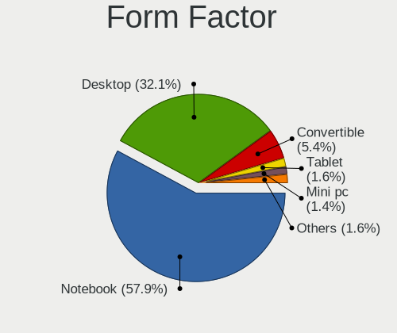
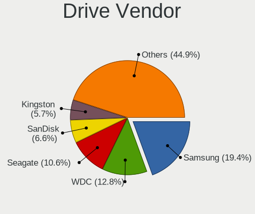
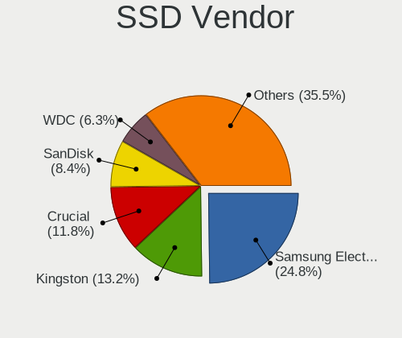
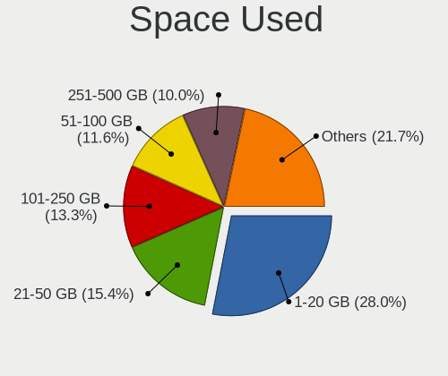
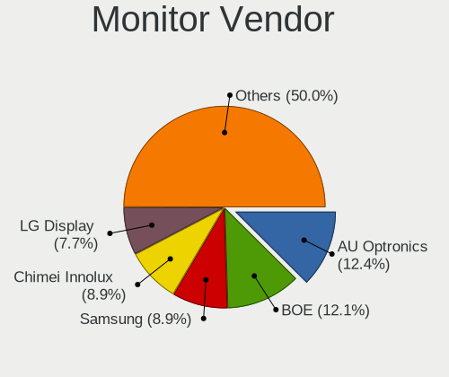
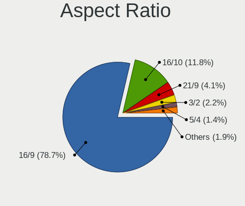
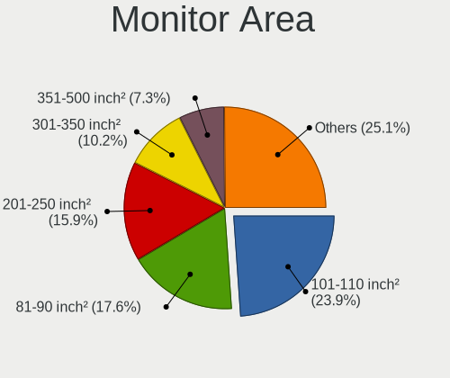
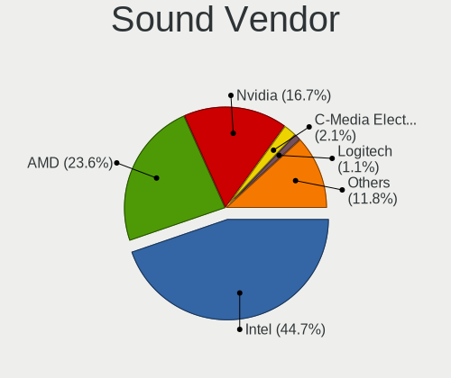
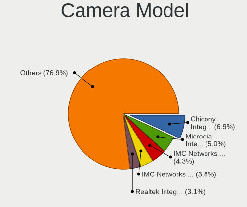
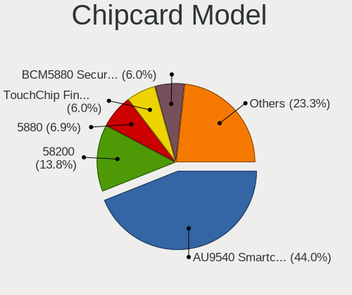

Fedora 36 - Tested Hardware & Statistics
----------------------------------------

A project to collect tested hardware configurations for Fedora 36.

Anyone can contribute to this report by the [hw-probe](https://github.com/linuxhw/hw-probe) tool:

    sudo -E hw-probe -all -upload

Please submit a probe of your configuration if it's not presented on the page or is rare.

This is a report for all computer types. See also reports for [desktops](/Dist/Fedora_36/Desktop/README.md) and [notebooks](/Dist/Fedora_36/Notebook/README.md).

Full-feature report is available here: https://linux-hardware.org/?view=trends

Contents
--------

* [ Test Cases ](#test-cases)

* [ System ](#system)
  - [ Kernel                   ](#kernel)
  - [ Kernel Family            ](#kernel-family)
  - [ Kernel Major Ver.        ](#kernel-major-ver)
  - [ Arch                     ](#arch)
  - [ DE                       ](#de)
  - [ Display Server           ](#display-server)
  - [ Display Manager          ](#display-manager)
  - [ OS Lang                  ](#os-lang)
  - [ Boot Mode                ](#boot-mode)
  - [ Filesystem               ](#filesystem)
  - [ Part. scheme             ](#part-scheme)
  - [ Dual Boot with Linux/BSD ](#dual-boot-with-linuxbsd)
  - [ Dual Boot (Win)          ](#dual-boot-win)

* [ Board ](#board)
  - [ Vendor                   ](#vendor)
  - [ Model                    ](#model)
  - [ Model Family             ](#model-family)
  - [ MFG Year                 ](#mfg-year)
  - [ Form Factor              ](#form-factor)
  - [ Secure Boot              ](#secure-boot)
  - [ Coreboot                 ](#coreboot)
  - [ RAM Size                 ](#ram-size)
  - [ RAM Used                 ](#ram-used)
  - [ Total Drives             ](#total-drives)
  - [ Has CD-ROM               ](#has-cd-rom)
  - [ Has Ethernet             ](#has-ethernet)
  - [ Has WiFi                 ](#has-wifi)
  - [ Has Bluetooth            ](#has-bluetooth)

* [ Location ](#location)
  - [ Country                  ](#country)
  - [ City                     ](#city)

* [ Drives ](#drives)
  - [ Drive Vendor             ](#drive-vendor)
  - [ Drive Model              ](#drive-model)
  - [ HDD Vendor               ](#hdd-vendor)
  - [ SSD Vendor               ](#ssd-vendor)
  - [ Drive Kind               ](#drive-kind)
  - [ Drive Connector          ](#drive-connector)
  - [ Drive Size               ](#drive-size)
  - [ Space Total              ](#space-total)
  - [ Space Used               ](#space-used)
  - [ Malfunc. Drives          ](#malfunc-drives)
  - [ Malfunc. Drive Vendor    ](#malfunc-drive-vendor)
  - [ Malfunc. HDD Vendor      ](#malfunc-hdd-vendor)
  - [ Malfunc. Drive Kind      ](#malfunc-drive-kind)
  - [ Failed Drives            ](#failed-drives)
  - [ Failed Drive Vendor      ](#failed-drive-vendor)
  - [ Drive Status             ](#drive-status)

* [ Storage controller ](#storage-controller)
  - [ Storage Vendor           ](#storage-vendor)
  - [ Storage Model            ](#storage-model)
  - [ Storage Kind             ](#storage-kind)

* [ Processor ](#processor)
  - [ CPU Vendor               ](#cpu-vendor)
  - [ CPU Model                ](#cpu-model)
  - [ CPU Model Family         ](#cpu-model-family)
  - [ CPU Cores                ](#cpu-cores)
  - [ CPU Sockets              ](#cpu-sockets)
  - [ CPU Threads              ](#cpu-threads)
  - [ CPU Op-Modes             ](#cpu-op-modes)
  - [ CPU Microcode            ](#cpu-microcode)
  - [ CPU Microarch            ](#cpu-microarch)

* [ Graphics ](#graphics)
  - [ GPU Vendor               ](#gpu-vendor)
  - [ GPU Model                ](#gpu-model)
  - [ GPU Combo                ](#gpu-combo)
  - [ GPU Driver               ](#gpu-driver)
  - [ GPU Memory               ](#gpu-memory)

* [ Monitor ](#monitor)
  - [ Monitor Vendor           ](#monitor-vendor)
  - [ Monitor Model            ](#monitor-model)
  - [ Monitor Resolution       ](#monitor-resolution)
  - [ Monitor Diagonal         ](#monitor-diagonal)
  - [ Monitor Width            ](#monitor-width)
  - [ Aspect Ratio             ](#aspect-ratio)
  - [ Monitor Area             ](#monitor-area)
  - [ Pixel Density            ](#pixel-density)
  - [ Multiple Monitors        ](#multiple-monitors)

* [ Network ](#network)
  - [ Net Controller Vendor    ](#net-controller-vendor)
  - [ Net Controller Model     ](#net-controller-model)
  - [ Wireless Vendor          ](#wireless-vendor)
  - [ Wireless Model           ](#wireless-model)
  - [ Ethernet Vendor          ](#ethernet-vendor)
  - [ Ethernet Model           ](#ethernet-model)
  - [ Net Controller Kind      ](#net-controller-kind)
  - [ Used Controller          ](#used-controller)
  - [ NICs                     ](#nics)
  - [ IPv6                     ](#ipv6)

* [ Bluetooth ](#bluetooth)
  - [ Bluetooth Vendor         ](#bluetooth-vendor)
  - [ Bluetooth Model          ](#bluetooth-model)

* [ Sound ](#sound)
  - [ Sound Vendor             ](#sound-vendor)
  - [ Sound Model              ](#sound-model)

* [ Memory ](#memory)
  - [ Memory Vendor            ](#memory-vendor)
  - [ Memory Model             ](#memory-model)
  - [ Memory Kind              ](#memory-kind)
  - [ Memory Form Factor       ](#memory-form-factor)
  - [ Memory Size              ](#memory-size)
  - [ Memory Speed             ](#memory-speed)

* [ Printers & scanners ](#printers--scanners)
  - [ Printer Vendor           ](#printer-vendor)
  - [ Printer Model            ](#printer-model)
  - [ Scanner Vendor           ](#scanner-vendor)
  - [ Scanner Model            ](#scanner-model)

* [ Camera ](#camera)
  - [ Camera Vendor            ](#camera-vendor)
  - [ Camera Model             ](#camera-model)

* [ Security ](#security)
  - [ Fingerprint Vendor       ](#fingerprint-vendor)
  - [ Fingerprint Model        ](#fingerprint-model)
  - [ Chipcard Vendor          ](#chipcard-vendor)
  - [ Chipcard Model           ](#chipcard-model)

* [ Unsupported ](#unsupported)
  - [ Unsupported Devices      ](#unsupported-devices)
  - [ Unsupported Device Types ](#unsupported-device-types)

Test Cases
----------

Total: 51

| Vendor        | Model                       | Form-Factor | Probe                                                      | Date         |
|---------------|-----------------------------|-------------|------------------------------------------------------------|--------------|
| Lenovo        | ThinkPad P15 Gen 1 20STS... | Notebook    | [05c02cbe41](https://linux-hardware.org/?probe=05c02cbe41) | Mar 31, 2022 |
| Gigabyte      | EP45-DS3L                   | Desktop     | [7879818528](https://linux-hardware.org/?probe=7879818528) | Mar 30, 2022 |
| HP            | EliteBook x360 830 G5       | Convertible | [d384ca307e](https://linux-hardware.org/?probe=d384ca307e) | Mar 30, 2022 |
| Avell High... | B.ON                        | Notebook    | [697fc1d4ec](https://linux-hardware.org/?probe=697fc1d4ec) | Mar 29, 2022 |
| Framework     | Laptop                      | Notebook    | [a22656afee](https://linux-hardware.org/?probe=a22656afee) | Mar 28, 2022 |
| Dell          | XPS 17 9710                 | Notebook    | [461d175c44](https://linux-hardware.org/?probe=461d175c44) | Mar 28, 2022 |
| Dell          | XPS 13 9310 2-in-1          | Convertible | [fd1c735c98](https://linux-hardware.org/?probe=fd1c735c98) | Mar 27, 2022 |
| Gigabyte      | EP45-DS3L                   | Desktop     | [c7d6879a86](https://linux-hardware.org/?probe=c7d6879a86) | Mar 26, 2022 |
| Gigabyte      | B85M-D3V-A                  | Desktop     | [b7679b78be](https://linux-hardware.org/?probe=b7679b78be) | Mar 25, 2022 |
| ASUSTek       | ROG Zephyrus Duo 15 SE G... | Notebook    | [16ac712c84](https://linux-hardware.org/?probe=16ac712c84) | Mar 24, 2022 |
| Gigabyte      | B550 AORUS ELITE            | Desktop     | [7977e70f86](https://linux-hardware.org/?probe=7977e70f86) | Mar 22, 2022 |
| HUAWEI        | DRC-WXX                     | Tablet      | [927252e84e](https://linux-hardware.org/?probe=927252e84e) | Mar 20, 2022 |
| HUAWEI        | DRC-WXX                     | Tablet      | [be2a3fd33b](https://linux-hardware.org/?probe=be2a3fd33b) | Mar 20, 2022 |
| Lenovo        | IdeaPad 530S-14ARR 81H1     | Notebook    | [1b57f1f410](https://linux-hardware.org/?probe=1b57f1f410) | Mar 13, 2022 |
| HP            | ZBook Fury 15 G7 Mobile ... | Notebook    | [917a6b65a8](https://linux-hardware.org/?probe=917a6b65a8) | Mar 10, 2022 |
| Gigabyte      | EP45-DS3L                   | Desktop     | [efdb29ff92](https://linux-hardware.org/?probe=efdb29ff92) | Mar 07, 2022 |
| ASUSTek       | TUF GAMING B550M-PLUS       | Desktop     | [97eedd34f4](https://linux-hardware.org/?probe=97eedd34f4) | Mar 05, 2022 |
| Gigabyte      | EP45-DS3L                   | Desktop     | [0efde9a187](https://linux-hardware.org/?probe=0efde9a187) | Mar 03, 2022 |
| Gigabyte      | EP45-DS3L                   | Desktop     | [da3962a1da](https://linux-hardware.org/?probe=da3962a1da) | Mar 03, 2022 |
| Apple         | Mac-77F17D7DA9285301 iMa... | All in one  | [841ab4ffe2](https://linux-hardware.org/?probe=841ab4ffe2) | Mar 01, 2022 |
| Sony          | VGN-FW21E                   | Notebook    | [930ce5581f](https://linux-hardware.org/?probe=930ce5581f) | Feb 25, 2022 |
| Biostar       | H55 HD                      | Desktop     | [b0d5843b6e](https://linux-hardware.org/?probe=b0d5843b6e) | Feb 13, 2022 |
| Biostar       | H55 HD                      | Desktop     | [e08da3e685](https://linux-hardware.org/?probe=e08da3e685) | Feb 03, 2022 |
| Unknown       | Unknown                     | Notebook    | [033354ee53](https://linux-hardware.org/?probe=033354ee53) | Jan 02, 2022 |
| Unknown       | Unknown                     | Notebook    | [809200ad60](https://linux-hardware.org/?probe=809200ad60) | Jan 02, 2022 |
| Unknown       | Unknown                     | Notebook    | [ea795a97e1](https://linux-hardware.org/?probe=ea795a97e1) | Dec 26, 2021 |
| Unknown       | Unknown                     | Notebook    | [2b26e185d0](https://linux-hardware.org/?probe=2b26e185d0) | Dec 06, 2021 |
| Unknown       | Unknown                     | Notebook    | [f09a7c7125](https://linux-hardware.org/?probe=f09a7c7125) | Dec 06, 2021 |
| Lenovo        | ThinkPad 10 20C10027SP      | Tablet      | [1c4e6ab62b](https://linux-hardware.org/?probe=1c4e6ab62b) | Nov 29, 2021 |
| Positivo      | CHT12CP                     | Notebook    | [53054c8f7a](https://linux-hardware.org/?probe=53054c8f7a) | Nov 20, 2021 |
| Lenovo        | IdeaPadFlex 14 20308        | Notebook    | [1734da4566](https://linux-hardware.org/?probe=1734da4566) | Nov 13, 2021 |
| Lenovo        | ThinkBook 14 G3 ACL 21A2    | Notebook    | [2da0673527](https://linux-hardware.org/?probe=2da0673527) | Nov 01, 2021 |
| MSI           | B550M PRO-VDH WIFI          | Desktop     | [f1a1a21c56](https://linux-hardware.org/?probe=f1a1a21c56) | Oct 26, 2021 |
| Dell          | 0KC9NP A01                  | Desktop     | [ff356cba89](https://linux-hardware.org/?probe=ff356cba89) | Oct 22, 2021 |
| Dell          | 0KC9NP A01                  | Desktop     | [a072a33607](https://linux-hardware.org/?probe=a072a33607) | Oct 12, 2021 |
| Notebook      | PCx0Dx                      | Notebook    | [b1a527acdc](https://linux-hardware.org/?probe=b1a527acdc) | Oct 11, 2021 |
| Notebook      | PCx0Dx                      | Notebook    | [90d4556fdf](https://linux-hardware.org/?probe=90d4556fdf) | Oct 11, 2021 |
| MSI           | FM2-A55M-E33                | Desktop     | [bcf7dcdd2c](https://linux-hardware.org/?probe=bcf7dcdd2c) | Oct 09, 2021 |
| MSI           | FM2-A55M-E33                | Desktop     | [0b3691d096](https://linux-hardware.org/?probe=0b3691d096) | Oct 09, 2021 |
| Unknown       | Unknown                     | Notebook    | [af4bbffabf](https://linux-hardware.org/?probe=af4bbffabf) | Sep 27, 2021 |
| Unknown       | Unknown                     | Notebook    | [81fd834473](https://linux-hardware.org/?probe=81fd834473) | Sep 26, 2021 |
| HP            | ProBook 4740s               | Notebook    | [77b2eed991](https://linux-hardware.org/?probe=77b2eed991) | Sep 22, 2021 |
| Dell          | 0KC9NP A01                  | Desktop     | [95229554a9](https://linux-hardware.org/?probe=95229554a9) | Sep 19, 2021 |
| Dell          | 0KC9NP A01                  | Desktop     | [d235dcf0d1](https://linux-hardware.org/?probe=d235dcf0d1) | Sep 18, 2021 |
| Dell          | 0KC9NP A01                  | Desktop     | [ad5f2b8ea5](https://linux-hardware.org/?probe=ad5f2b8ea5) | Sep 04, 2021 |
| Dell          | 0KC9NP A01                  | Desktop     | [f191342fa8](https://linux-hardware.org/?probe=f191342fa8) | Sep 02, 2021 |
| Dell          | 0KC9NP A01                  | Desktop     | [270961aa02](https://linux-hardware.org/?probe=270961aa02) | Aug 30, 2021 |
| Dell          | 0KC9NP A01                  | Desktop     | [1257d6c6f4](https://linux-hardware.org/?probe=1257d6c6f4) | Aug 27, 2021 |
| Dell          | 0KC9NP A01                  | Desktop     | [373f7e6861](https://linux-hardware.org/?probe=373f7e6861) | Aug 22, 2021 |
| HP            | 304Ah                       | Desktop     | [047d1b0887](https://linux-hardware.org/?probe=047d1b0887) | Aug 18, 2021 |
| Dell          | 0KC9NP A01                  | Desktop     | [2ca8cc81b1](https://linux-hardware.org/?probe=2ca8cc81b1) | Aug 18, 2021 |

System
------

Kernel
------

Version of the Linux kernel

| Version                                                       | Computers | Percent |
|---------------------------------------------------------------|-----------|---------|
| 5.17.0-0.rc7.116.fc36.x86_64                                  | 5         | 16.67%  |
| 5.17.0-0.rc5.102.fc36.x86_64                                  | 4         | 13.33%  |
| 5.17.1-300.fc36.x86_64                                        | 3         | 10%     |
| 5.17.0-300.fc36.x86_64                                        | 3         | 10%     |
| 5.15.0-0.rc4.20211008git1da38549dd64.36.fc36.x86_64           | 2         | 6.67%   |
| 5.14.0-0.rc5.20210813gitf8e6dfc64f61.46.fc36.x86_64           | 2         | 6.67%   |
| 5.17.0-0.rc0.20220112gitdaadb3bd0e8d.63.fc36.x86_64           | 1         | 3.33%   |
| 5.16.0-0.rc7.20211231git4f3d93c6eaff.52.vanilla.1.fc36.x86_64 | 1         | 3.33%   |
| 5.16.0-0.rc2.20211126gita4849f6000e2.21.fc36.x86_64           | 1         | 3.33%   |
| 5.15.0-0.rc7.20211028git1fc596a56b33.56.fc36.x86_64           | 1         | 3.33%   |
| 5.15.0-0.rc6.47.fc36.x86_64                                   | 1         | 3.33%   |
| 5.15.0-0.rc4.20211008git1da38549dd64.36.vanilla.1.fc36.x86_64 | 1         | 3.33%   |
| 5.15.0-0.rc2.20210923git58e2cf5d7946.21.vanilla.1.fc36.x86_64 | 1         | 3.33%   |
| 5.15.0-0.rc2.18.fc36.x86_64                                   | 1         | 3.33%   |
| 5.15.0-0.rc0.20210831gitb91db6a0b52e.1.fc36.x86_64            | 1         | 3.33%   |
| 5.14.14-300.fc35.x86_64                                       | 1         | 3.33%   |
| 5.14.10-300.fc35.x86_64                                       | 1         | 3.33%   |

Kernel Family
-------------

Linux kernel without a distro release

| Version | Computers | Percent |
|---------|-----------|---------|
| 5.17.0  | 13        | 44.83%  |
| 5.15.0  | 7         | 24.14%  |
| 5.17.1  | 3         | 10.34%  |
| 5.16.0  | 2         | 6.9%    |
| 5.14.0  | 2         | 6.9%    |
| 5.14.14 | 1         | 3.45%   |
| 5.14.10 | 1         | 3.45%   |

Kernel Major Ver.
-----------------

Linux kernel major version

| Version | Computers | Percent |
|---------|-----------|---------|
| 5.17    | 16        | 55.17%  |
| 5.15    | 7         | 24.14%  |
| 5.14    | 4         | 13.79%  |
| 5.16    | 2         | 6.9%    |

Arch
----

OS architecture (x86_64, i586, etc.)

| Name   | Computers | Percent |
|--------|-----------|---------|
| x86_64 | 27        | 100%    |

DE
--

Desktop Environment

| Name    | Computers | Percent |
|---------|-----------|---------|
| GNOME   | 22        | 78.57%  |
| KDE5    | 4         | 14.29%  |
| Unknown | 2         | 7.14%   |

Display Server
--------------

X11 or Wayland

| Name    | Computers | Percent |
|---------|-----------|---------|
| Wayland | 21        | 77.78%  |
| X11     | 5         | 18.52%  |
| Tty     | 1         | 3.7%    |

Display Manager
---------------

SDDM, LightDM, etc.

| Name    | Computers | Percent |
|---------|-----------|---------|
| GDM     | 11        | 40.74%  |
| Unknown | 11        | 40.74%  |
| SDDM    | 4         | 14.81%  |
| LightDM | 1         | 3.7%    |

OS Lang
-------

Language

| Lang  | Computers | Percent |
|-------|-----------|---------|
| en_US | 12        | 44.44%  |
| en_GB | 4         | 14.81%  |
| ru_RU | 2         | 7.41%   |
| pt_BR | 2         | 7.41%   |
| pl_PL | 2         | 7.41%   |
| pt_PT | 1         | 3.7%    |
| hr_HR | 1         | 3.7%    |
| fr_FR | 1         | 3.7%    |
| es_ES | 1         | 3.7%    |
| de_DE | 1         | 3.7%    |

Boot Mode
---------

EFI or BIOS

| Mode | Computers | Percent |
|------|-----------|---------|
| EFI  | 20        | 74.07%  |
| BIOS | 7         | 25.93%  |

Filesystem
----------

Type of filesystem

| Type  | Computers | Percent |
|-------|-----------|---------|
| Btrfs | 20        | 74.07%  |
| Ext4  | 6         | 22.22%  |
| Xfs   | 1         | 3.7%    |

Part. scheme
------------

Scheme of partitioning

| Type    | Computers | Percent |
|---------|-----------|---------|
| GPT     | 13        | 46.43%  |
| Unknown | 12        | 42.86%  |
| MBR     | 3         | 10.71%  |

Dual Boot with Linux/BSD
------------------------

Hosting more than one Linux/BSD

| Dual boot | Computers | Percent |
|-----------|-----------|---------|
| No        | 26        | 96.3%   |
| Yes       | 1         | 3.7%    |

Dual Boot (Win)
---------------

Hosting Linux and Windows

| Dual boot | Computers | Percent |
|-----------|-----------|---------|
| No        | 18        | 66.67%  |
| Yes       | 9         | 33.33%  |

Board
-----

Vendor
------

Motherboard manufacturer

| Name                   | Computers | Percent |
|------------------------|-----------|---------|
| Lenovo                 | 5         | 18.52%  |
| Hewlett-Packard        | 4         | 14.81%  |
| Gigabyte Technology    | 3         | 11.11%  |
| Dell                   | 3         | 11.11%  |
| MSI                    | 2         | 7.41%   |
| ASUSTek Computer       | 2         | 7.41%   |
| Sony                   | 1         | 3.7%    |
| Positivo               | 1         | 3.7%    |
| Notebook               | 1         | 3.7%    |
| Framework              | 1         | 3.7%    |
| Biostar                | 1         | 3.7%    |
| Avell High Performance | 1         | 3.7%    |
| Apple                  | 1         | 3.7%    |
| Unknown                | 1         | 3.7%    |

Model
-----

Motherboard model

| Name                                        | Computers | Percent |
|---------------------------------------------|-----------|---------|
| Sony VGN-FW21E                              | 1         | 3.7%    |
| Positivo CHT12CP                            | 1         | 3.7%    |
| Notebook PCx0Dx                             | 1         | 3.7%    |
| MSI MS-7C95                                 | 1         | 3.7%    |
| MSI MS-7721                                 | 1         | 3.7%    |
| Lenovo ThinkPad P15 Gen 1 20STS0J500        | 1         | 3.7%    |
| Lenovo ThinkPad 10 20C10027SP               | 1         | 3.7%    |
| Lenovo ThinkBook 14 G3 ACL 21A2             | 1         | 3.7%    |
| Lenovo IdeaPadFlex 14 20308                 | 1         | 3.7%    |
| Lenovo IdeaPad 530S-14ARR 81H1              | 1         | 3.7%    |
| HP ZBook Fury 15 G7 Mobile Workstation      | 1         | 3.7%    |
| HP ProBook 4740s                            | 1         | 3.7%    |
| HP EliteBook x360 830 G5                    | 1         | 3.7%    |
| HP Compaq 8100 Elite SFF PC                 | 1         | 3.7%    |
| Gigabyte EP45-DS3L                          | 1         | 3.7%    |
| Gigabyte B85M-D3V-A                         | 1         | 3.7%    |
| Gigabyte B550 AORUS ELITE                   | 1         | 3.7%    |
| Framework Laptop                            | 1         | 3.7%    |
| Dell XPS 17 9710                            | 1         | 3.7%    |
| Dell XPS 13 9310 2-in-1                     | 1         | 3.7%    |
| Dell OptiPlex 9020                          | 1         | 3.7%    |
| Biostar H55 HD                              | 1         | 3.7%    |
| Avell High Performance B.ON                 | 1         | 3.7%    |
| ASUS TUF GAMING B550M-PLUS                  | 1         | 3.7%    |
| ASUS ROG Zephyrus Duo 15 SE GX551QS_GX551QS | 1         | 3.7%    |
| Apple iMac18,2                              | 1         | 3.7%    |
| Unknown                                     | 1         | 3.7%    |

Model Family
------------

Motherboard model prefix

| Name                        | Computers | Percent |
|-----------------------------|-----------|---------|
| Lenovo ThinkPad             | 2         | 7.41%   |
| Dell XPS                    | 2         | 7.41%   |
| Sony VGN-FW21E              | 1         | 3.7%    |
| Positivo CHT12CP            | 1         | 3.7%    |
| Notebook PCx0Dx             | 1         | 3.7%    |
| MSI MS-7C95                 | 1         | 3.7%    |
| MSI MS-7721                 | 1         | 3.7%    |
| Lenovo ThinkBook            | 1         | 3.7%    |
| Lenovo IdeaPadFlex          | 1         | 3.7%    |
| Lenovo IdeaPad              | 1         | 3.7%    |
| HP ZBook                    | 1         | 3.7%    |
| HP ProBook                  | 1         | 3.7%    |
| HP EliteBook                | 1         | 3.7%    |
| HP Compaq                   | 1         | 3.7%    |
| Gigabyte EP45-DS3L          | 1         | 3.7%    |
| Gigabyte B85M-D3V-A         | 1         | 3.7%    |
| Gigabyte B550               | 1         | 3.7%    |
| Framework Laptop            | 1         | 3.7%    |
| Dell OptiPlex               | 1         | 3.7%    |
| Biostar H55                 | 1         | 3.7%    |
| Avell High Performance B.ON | 1         | 3.7%    |
| ASUS TUF                    | 1         | 3.7%    |
| ASUS ROG                    | 1         | 3.7%    |
| Apple iMac18                | 1         | 3.7%    |
| Unknown                     | 1         | 3.7%    |

MFG Year
--------

Motherboard manufacture year

| Year | Computers | Percent |
|------|-----------|---------|
| 2021 | 8         | 29.63%  |
| 2020 | 5         | 18.52%  |
| 2018 | 2         | 7.41%   |
| 2017 | 2         | 7.41%   |
| 2015 | 2         | 7.41%   |
| 2013 | 2         | 7.41%   |
| 2008 | 2         | 7.41%   |
| 2014 | 1         | 3.7%    |
| 2012 | 1         | 3.7%    |
| 2010 | 1         | 3.7%    |
| 2009 | 1         | 3.7%    |

Form Factor
-----------

Physical design of the computer

| Name        | Computers | Percent |
|-------------|-----------|---------|
| Notebook    | 14        | 51.85%  |
| Desktop     | 9         | 33.33%  |
| Convertible | 2         | 7.41%   |
| Tablet      | 1         | 3.7%    |
| All in one  | 1         | 3.7%    |

Secure Boot
-----------

Enabled or disabled

| State    | Computers | Percent |
|----------|-----------|---------|
| Disabled | 23        | 85.19%  |
| Enabled  | 4         | 14.81%  |

Coreboot
--------

Have coreboot on board

| Used | Computers | Percent |
|------|-----------|---------|
| No   | 27        | 100%    |

RAM Size
--------

Total RAM memory

| Size in GB  | Computers | Percent |
|-------------|-----------|---------|
| 3.01-4.0    | 8         | 29.63%  |
| 32.01-64.0  | 6         | 22.22%  |
| 4.01-8.0    | 5         | 18.52%  |
| 16.01-24.0  | 4         | 14.81%  |
| 8.01-16.0   | 3         | 11.11%  |
| 64.01-256.0 | 1         | 3.7%    |

RAM Used
--------

Used RAM memory

| Used GB  | Computers | Percent |
|----------|-----------|---------|
| 3.01-4.0 | 10        | 35.71%  |
| 2.01-3.0 | 10        | 35.71%  |
| 4.01-8.0 | 4         | 14.29%  |
| 1.01-2.0 | 3         | 10.71%  |
| 0.51-1.0 | 1         | 3.57%   |

Total Drives
------------

Number of drives on board

| Drives | Computers | Percent |
|--------|-----------|---------|
| 1      | 18        | 64.29%  |
| 2      | 7         | 25%     |
| 3      | 3         | 10.71%  |

Has CD-ROM
----------

Has CD-ROM on board

| Presented | Computers | Percent |
|-----------|-----------|---------|
| No        | 21        | 77.78%  |
| Yes       | 6         | 22.22%  |

Has Ethernet
------------

Has Ethernet on board

| Presented | Computers | Percent |
|-----------|-----------|---------|
| Yes       | 19        | 70.37%  |
| No        | 8         | 29.63%  |

Has WiFi
--------

Has WiFi module

| Presented | Computers | Percent |
|-----------|-----------|---------|
| Yes       | 21        | 77.78%  |
| No        | 6         | 22.22%  |

Has Bluetooth
-------------

Has Bluetooth module

| Presented | Computers | Percent |
|-----------|-----------|---------|
| Yes       | 17        | 62.96%  |
| No        | 10        | 37.04%  |

Location
--------

Country
-------

Geographic location (country)

| Country     | Computers | Percent |
|-------------|-----------|---------|
| UK          | 4         | 14.81%  |
| USA         | 3         | 11.11%  |
| Poland      | 3         | 11.11%  |
| Brazil      | 3         | 11.11%  |
| Netherlands | 2         | 7.41%   |
| Belarus     | 2         | 7.41%   |
| Uzbekistan  | 1         | 3.7%    |
| Switzerland | 1         | 3.7%    |
| Spain       | 1         | 3.7%    |
| Romania     | 1         | 3.7%    |
| Norway      | 1         | 3.7%    |
| Indonesia   | 1         | 3.7%    |
| Germany     | 1         | 3.7%    |
| France      | 1         | 3.7%    |
| Croatia     | 1         | 3.7%    |
| Bangladesh  | 1         | 3.7%    |

City
----

Geographic location (city)

| City                 | Computers | Percent |
|----------------------|-----------|---------|
| Minsk                | 2         | 7.41%   |
| Halstead             | 2         | 7.41%   |
| Zurich               | 1         | 3.7%    |
| Zagreb               | 1         | 3.7%    |
| Warsaw               | 1         | 3.7%    |
| Warrington           | 1         | 3.7%    |
| Vegarshei            | 1         | 3.7%    |
| Trzciel              | 1         | 3.7%    |
| Torrejón de Ardoz | 1         | 3.7%    |
| Tashkent             | 1         | 3.7%    |
| Solihull             | 1         | 3.7%    |
| Sao Paulo            | 1         | 3.7%    |
| Paris                | 1         | 3.7%    |
| Milicz               | 1         | 3.7%    |
| Joinville            | 1         | 3.7%    |
| Jakarta              | 1         | 3.7%    |
| Houston              | 1         | 3.7%    |
| Hoofddorp            | 1         | 3.7%    |
| Goiânia             | 1         | 3.7%    |
| Fort Collins         | 1         | 3.7%    |
| Dhaka                | 1         | 3.7%    |
| Delft                | 1         | 3.7%    |
| Bucharest            | 1         | 3.7%    |
| Berlin               | 1         | 3.7%    |
| Beaverton            | 1         | 3.7%    |

Drives
------

Drive Vendor
------------

Hard drive vendors

| Vendor              | Computers | Drives | Percent |
|---------------------|-----------|--------|---------|
| Samsung Electronics | 10        | 14     | 27.03%  |
| WDC                 | 5         | 5      | 13.51%  |
| Kingston            | 3         | 5      | 8.11%   |
| Unknown             | 2         | 4      | 5.41%   |
| Toshiba             | 2         | 2      | 5.41%   |
| Seagate             | 2         | 2      | 5.41%   |
| KIOXIA              | 2         | 2      | 5.41%   |
| XPG                 | 1         | 1      | 2.7%    |
| SK Hynix            | 1         | 1      | 2.7%    |
| SanDisk             | 1         | 1      | 2.7%    |
| PNY                 | 1         | 2      | 2.7%    |
| Phison              | 1         | 1      | 2.7%    |
| Leven               | 1         | 1      | 2.7%    |
| Hitachi             | 1         | 1      | 2.7%    |
| Fujitsu             | 1         | 1      | 2.7%    |
| Apple               | 1         | 1      | 2.7%    |
| A-DATA Technology   | 1         | 1      | 2.7%    |
| Unknown             | 1         | 1      | 2.7%    |

Drive Model
-----------

Hard drive models

| Model                                | Computers | Percent |
|--------------------------------------|-----------|---------|
| Samsung NVMe SSD Drive 500GB         | 3         | 7.89%   |
| Unknown MMC Card  64GB               | 2         | 5.26%   |
| Samsung SSD 860 EVO 250GB            | 2         | 5.26%   |
| Samsung NVMe SSD Drive 1TB           | 2         | 5.26%   |
| XPG GAMMIX S11 Pro 256GB             | 1         | 2.63%   |
| WDC WDS500G1X0E-00AFY0 500GB         | 1         | 2.63%   |
| WDC WD6400AAKS-22A7B2 640GB          | 1         | 2.63%   |
| WDC WD5000AAKX-001CA0 500GB          | 1         | 2.63%   |
| WDC WD10EZEX-00ZF5A0 1TB             | 1         | 2.63%   |
| WDC PC SN530 SDBPMPZ-512G-1101 512GB | 1         | 2.63%   |
| Toshiba THNSNJ128GCSU 128GB SSD      | 1         | 2.63%   |
| Toshiba HDWD120 2TB                  | 1         | 2.63%   |
| SK Hynix HFM256GDHTNG-8310A 256GB    | 1         | 2.63%   |
| Seagate ST3500413AS 500GB            | 1         | 2.63%   |
| Seagate Expansion+ 2TB               | 1         | 2.63%   |
| SanDisk DF4032  32GB                 | 1         | 2.63%   |
| Samsung SSD 970 EVO 250GB            | 1         | 2.63%   |
| Samsung SSD 870 QVO 2TB              | 1         | 2.63%   |
| Samsung NVMe SSD Drive 512GB         | 1         | 2.63%   |
| Samsung NVMe SSD Drive 1024GB        | 1         | 2.63%   |
| PNY CS3040 4TB SSD                   | 1         | 2.63%   |
| Phison NVMe SSD Drive 512GB          | 1         | 2.63%   |
| Leven JAJS600M256C 256GB             | 1         | 2.63%   |
| KIOXIA NVMe SSD Drive 256GB          | 1         | 2.63%   |
| KIOXIA KXG60ZNV1T02 1TB              | 1         | 2.63%   |
| Kingston SUV500MS240G 240GB SSD      | 1         | 2.63%   |
| Kingston SA400S37240G 240GB SSD      | 1         | 2.63%   |
| Kingston SA400S37120G 120GB SSD      | 1         | 2.63%   |
| Hitachi HTS543232A7A384 320GB        | 1         | 2.63%   |
| Fujitsu MJA2500BH G1 500GB           | 1         | 2.63%   |
| Apple HDD HTS541010A9E632 1TB        | 1         | 2.63%   |
| A-DATA IM2P33F8ABR1-256GB            | 1         | 2.63%   |
| Unknown                              | 1         | 2.63%   |

HDD Vendor
----------

Hard disk drive vendors

| Vendor  | Computers | Drives | Percent |
|---------|-----------|--------|---------|
| WDC     | 3         | 3      | 33.33%  |
| Seagate | 2         | 2      | 22.22%  |
| Toshiba | 1         | 1      | 11.11%  |
| Hitachi | 1         | 1      | 11.11%  |
| Fujitsu | 1         | 1      | 11.11%  |
| Apple   | 1         | 1      | 11.11%  |

SSD Vendor
----------

Solid state drive vendors

| Vendor              | Computers | Drives | Percent |
|---------------------|-----------|--------|---------|
| Samsung Electronics | 3         | 5      | 37.5%   |
| Kingston            | 3         | 5      | 37.5%   |
| Toshiba             | 1         | 1      | 12.5%   |
| Leven               | 1         | 1      | 12.5%   |

Drive Kind
----------

HDD or SSD

| Kind | Computers | Drives | Percent |
|------|-----------|--------|---------|
| NVMe | 14        | 19     | 41.18%  |
| HDD  | 9         | 9      | 26.47%  |
| SSD  | 7         | 12     | 20.59%  |
| MMC  | 4         | 6      | 11.76%  |

Drive Connector
---------------

SATA, SAS, NVMe, etc.

| Type | Computers | Drives | Percent |
|------|-----------|--------|---------|
| NVMe | 14        | 19     | 45.16%  |
| SATA | 12        | 20     | 38.71%  |
| MMC  | 4         | 6      | 12.9%   |
| SAS  | 1         | 1      | 3.23%   |

Drive Size
----------

Size of hard drive

| Size in TB | Computers | Drives | Percent |
|------------|-----------|--------|---------|
| 0.01-0.5   | 9         | 15     | 60%     |
| 1.01-2.0   | 3         | 3      | 20%     |
| 0.51-1.0   | 3         | 3      | 20%     |

Space Total
-----------

Amount of disk space available on the file system

| Size in GB | Computers | Percent |
|------------|-----------|---------|
| 101-250    | 7         | 25.93%  |
| 251-500    | 6         | 22.22%  |
| 1-20       | 4         | 14.81%  |
| 501-1000   | 4         | 14.81%  |
| 1001-2000  | 3         | 11.11%  |
| 51-100     | 2         | 7.41%   |
| Unknown    | 1         | 3.7%    |

Space Used
----------

Amount of used disk space

| Used GB   | Computers | Percent |
|-----------|-----------|---------|
| 1-20      | 10        | 37.04%  |
| 21-50     | 5         | 18.52%  |
| 101-250   | 4         | 14.81%  |
| 51-100    | 3         | 11.11%  |
| 251-500   | 2         | 7.41%   |
| 1001-2000 | 1         | 3.7%    |
| 501-1000  | 1         | 3.7%    |
| Unknown   | 1         | 3.7%    |

Malfunc. Drives
---------------

Drive models with a malfunction

| Model                      | Computers | Drives | Percent |
|----------------------------|-----------|--------|---------|
| Fujitsu MJA2500BH G1 500GB | 1         | 1      | 100%    |

Malfunc. Drive Vendor
---------------------

Vendors of faulty drives

| Vendor  | Computers | Drives | Percent |
|---------|-----------|--------|---------|
| Fujitsu | 1         | 1      | 100%    |

Malfunc. HDD Vendor
-------------------

Vendors of faulty HDD drives

| Vendor  | Computers | Drives | Percent |
|---------|-----------|--------|---------|
| Fujitsu | 1         | 1      | 100%    |

Malfunc. Drive Kind
-------------------

Kinds of faulty drives

| Kind | Computers | Drives | Percent |
|------|-----------|--------|---------|
| HDD  | 1         | 1      | 100%    |

Failed Drives
-------------

Failed drive models

Zero info for selected period =(

Failed Drive Vendor
-------------------

Failed drive vendors

Zero info for selected period =(

Drive Status
------------

Number of failed and malfunc. drives

| Status   | Computers | Drives | Percent |
|----------|-----------|--------|---------|
| Detected | 15        | 25     | 51.72%  |
| Works    | 13        | 20     | 44.83%  |
| Malfunc  | 1         | 1      | 3.45%   |

Storage controller
------------------

Storage Vendor
--------------

Storage controller vendors

| Vendor                       | Computers | Percent |
|------------------------------|-----------|---------|
| Intel                        | 12        | 33.33%  |
| Samsung Electronics          | 7         | 19.44%  |
| AMD                          | 5         | 13.89%  |
| Sandisk                      | 2         | 5.56%   |
| Phison Electronics           | 2         | 5.56%   |
| ADATA Technology             | 2         | 5.56%   |
| VIA Technologies             | 1         | 2.78%   |
| Toshiba America Info Systems | 1         | 2.78%   |
| SK Hynix                     | 1         | 2.78%   |
| KIOXIA                       | 1         | 2.78%   |
| JMicron Technology           | 1         | 2.78%   |
| ASMedia Technology           | 1         | 2.78%   |

Storage Model
-------------

Storage controller models

| Model                                                                          | Computers | Percent |
|--------------------------------------------------------------------------------|-----------|---------|
| Samsung NVMe SSD Controller SM981/PM981/PM983                                  | 5         | 12.2%   |
| AMD FCH SATA Controller [AHCI mode]                                            | 3         | 7.32%   |
| AMD 500 Series Chipset SATA Controller                                         | 3         | 7.32%   |
| Intel 8 Series/C220 Series Chipset Family 6-port SATA Controller 1 [AHCI mode] | 2         | 4.88%   |
| Intel 5 Series/3400 Series Chipset 4 port SATA IDE Controller                  | 2         | 4.88%   |
| Intel 5 Series/3400 Series Chipset 2 port SATA IDE Controller                  | 2         | 4.88%   |
| VIA VT6415 PATA IDE Host Controller                                            | 1         | 2.44%   |
| Toshiba America Info Systems XG6 NVMe SSD Controller                           | 1         | 2.44%   |
| SK Hynix BC501 NVMe Solid State Drive                                          | 1         | 2.44%   |
| Sandisk WD PC SN810 / Black SN850 NVMe SSD                                     | 1         | 2.44%   |
| Sandisk Non-Volatile memory controller                                         | 1         | 2.44%   |
| Samsung NVMe SSD Controller SM961/PM961/SM963                                  | 1         | 2.44%   |
| Samsung NVMe SSD Controller PM9A1/PM9A3/980PRO                                 | 1         | 2.44%   |
| Samsung NVMe SSD Controller 980                                                | 1         | 2.44%   |
| Phison E16 PCIe4 NVMe Controller                                               | 1         | 2.44%   |
| Phison E12 NVMe Controller                                                     | 1         | 2.44%   |
| KIOXIA Non-Volatile memory controller                                          | 1         | 2.44%   |
| JMicron JMB368 IDE controller                                                  | 1         | 2.44%   |
| Intel Volume Management Device NVMe RAID Controller                            | 1         | 2.44%   |
| Intel Q170/Q150/B150/H170/H110/Z170/CM236 Chipset SATA Controller [AHCI Mode]  | 1         | 2.44%   |
| Intel Celeron N3350/Pentium N4200/Atom E3900 Series SATA AHCI Controller       | 1         | 2.44%   |
| Intel 82801JI (ICH10 Family) 4 port SATA IDE Controller #1                     | 1         | 2.44%   |
| Intel 82801JI (ICH10 Family) 2 port SATA IDE Controller #2                     | 1         | 2.44%   |
| Intel 82801IBM/IEM (ICH9M/ICH9M-E) 4 port SATA Controller [AHCI mode]          | 1         | 2.44%   |
| Intel 8 Series SATA Controller 1 [AHCI mode]                                   | 1         | 2.44%   |
| Intel 7 Series Chipset Family 6-port SATA Controller [AHCI mode]               | 1         | 2.44%   |
| Intel 400 Series Chipset Family SATA AHCI Controller                           | 1         | 2.44%   |
| ASMedia ASM1062 Serial ATA Controller                                          | 1         | 2.44%   |
| ADATA XPG SX8200 Pro PCIe Gen3x4 M.2 2280 Solid State Drive                    | 1         | 2.44%   |
| ADATA Non-Volatile memory controller                                           | 1         | 2.44%   |

Storage Kind
------------

Kind of storage controller (IDE, SATA, NVMe, SAS, ...)

| Kind | Computers | Percent |
|------|-----------|---------|
| NVMe | 14        | 45.16%  |
| SATA | 13        | 41.94%  |
| IDE  | 3         | 9.68%   |
| RAID | 1         | 3.23%   |

Processor
---------

CPU Vendor
----------

Processor vendors

| Vendor | Computers | Percent |
|--------|-----------|---------|
| Intel  | 20        | 74.07%  |
| AMD    | 7         | 25.93%  |

CPU Model
---------

Processor models

| Model                                         | Computers | Percent |
|-----------------------------------------------|-----------|---------|
| Intel Core i5 CPU 650 @ 3.20GHz               | 2         | 7.41%   |
| Intel 11th Gen Core i5-1135G7 @ 2.40GHz       | 2         | 7.41%   |
| Intel Pentium 3556U @ 1.70GHz                 | 1         | 3.7%    |
| Intel Core i7-3632QM CPU @ 2.20GHz            | 1         | 3.7%    |
| Intel Core i7-10875H CPU @ 2.30GHz            | 1         | 3.7%    |
| Intel Core i7-10870H CPU @ 2.20GHz            | 1         | 3.7%    |
| Intel Core i7-10850H CPU @ 2.70GHz            | 1         | 3.7%    |
| Intel Core i5-8250U CPU @ 1.60GHz             | 1         | 3.7%    |
| Intel Core i5-7400 CPU @ 3.00GHz              | 1         | 3.7%    |
| Intel Core i5-4590S CPU @ 3.00GHz             | 1         | 3.7%    |
| Intel Core i3-4160 CPU @ 3.60GHz              | 1         | 3.7%    |
| Intel Core 2 Duo CPU P8400 @ 2.26GHz          | 1         | 3.7%    |
| Intel Core 2 Duo CPU E7400 @ 2.80GHz          | 1         | 3.7%    |
| Intel Celeron CPU J3455 @ 1.50GHz             | 1         | 3.7%    |
| Intel Atom x5-Z8350 CPU @ 1.44GHz             | 1         | 3.7%    |
| Intel Atom CPU Z3795 @ 1.60GHz                | 1         | 3.7%    |
| Intel 11th Gen Core i9-11900H @ 2.50GHz       | 1         | 3.7%    |
| Intel 11th Gen Core i7-1165G7 @ 2.80GHz       | 1         | 3.7%    |
| AMD Ryzen 9 5900HX with Radeon Graphics       | 1         | 3.7%    |
| AMD Ryzen 7 5700U with Radeon Graphics        | 1         | 3.7%    |
| AMD Ryzen 7 2700X Eight-Core Processor        | 1         | 3.7%    |
| AMD Ryzen 5 3600X 6-Core Processor            | 1         | 3.7%    |
| AMD Ryzen 5 3600 6-Core Processor             | 1         | 3.7%    |
| AMD Ryzen 5 2500U with Radeon Vega Mobile Gfx | 1         | 3.7%    |
| AMD A8-5500 APU with Radeon HD Graphics       | 1         | 3.7%    |

CPU Model Family
----------------

Processor model prefix

| Model            | Computers | Percent |
|------------------|-----------|---------|
| Intel Core i5    | 5         | 18.52%  |
| Other            | 4         | 14.81%  |
| Intel Core i7    | 4         | 14.81%  |
| AMD Ryzen 5      | 3         | 11.11%  |
| Intel Core 2 Duo | 2         | 7.41%   |
| Intel Atom       | 2         | 7.41%   |
| AMD Ryzen 7      | 2         | 7.41%   |
| Intel Pentium    | 1         | 3.7%    |
| Intel Core i3    | 1         | 3.7%    |
| Intel Celeron    | 1         | 3.7%    |
| AMD Ryzen 9      | 1         | 3.7%    |
| AMD A8           | 1         | 3.7%    |

CPU Cores
---------

Number of processor cores

| Number | Computers | Percent |
|--------|-----------|---------|
| 4      | 11        | 40.74%  |
| 2      | 7         | 25.93%  |
| 8      | 6         | 22.22%  |
| 6      | 3         | 11.11%  |

CPU Sockets
-----------

Number of sockets

| Number | Computers | Percent |
|--------|-----------|---------|
| 1      | 27        | 100%    |

CPU Threads
-----------

Threads per core (Hyper-Threading)

| Number | Computers | Percent |
|--------|-----------|---------|
| 2      | 19        | 70.37%  |
| 1      | 8         | 29.63%  |

CPU Op-Modes
------------

CPU Operation Modes (32-bit, 64-bit)

| Op mode        | Computers | Percent |
|----------------|-----------|---------|
| 32-bit, 64-bit | 27        | 100%    |

CPU Microcode
-------------

Microcode number

| Number     | Computers | Percent |
|------------|-----------|---------|
| 0xa0652    | 3         | 11.11%  |
| 0x806c1    | 3         | 11.11%  |
| 0x306c3    | 2         | 7.41%   |
| 0x08701021 | 2         | 7.41%   |
| 0x906e9    | 1         | 3.7%    |
| 0x806ea    | 1         | 3.7%    |
| 0x806d1    | 1         | 3.7%    |
| 0x506c9    | 1         | 3.7%    |
| 0x406c4    | 1         | 3.7%    |
| 0x40651    | 1         | 3.7%    |
| 0x306a9    | 1         | 3.7%    |
| 0x30678    | 1         | 3.7%    |
| 0x20655    | 1         | 3.7%    |
| 0x20652    | 1         | 3.7%    |
| 0x1067a    | 1         | 3.7%    |
| 0x10676    | 1         | 3.7%    |
| 0x0a50000c | 1         | 3.7%    |
| 0x08608103 | 1         | 3.7%    |
| 0x0810100b | 1         | 3.7%    |
| 0x0800820d | 1         | 3.7%    |
| 0x06001119 | 1         | 3.7%    |

CPU Microarch
-------------

Microarchitecture

| Name       | Computers | Percent |
|------------|-----------|---------|
| TigerLake  | 3         | 11.11%  |
| Haswell    | 3         | 11.11%  |
| CometLake  | 3         | 11.11%  |
| Zen 2      | 2         | 7.41%   |
| Westmere   | 2         | 7.41%   |
| Silvermont | 2         | 7.41%   |
| Penryn     | 2         | 7.41%   |
| KabyLake   | 2         | 7.41%   |
| Zen+       | 1         | 3.7%    |
| Zen 3      | 1         | 3.7%    |
| Zen        | 1         | 3.7%    |
| Piledriver | 1         | 3.7%    |
| IvyBridge  | 1         | 3.7%    |
| Icelake    | 1         | 3.7%    |
| Goldmont   | 1         | 3.7%    |
| Unknown    | 1         | 3.7%    |

Graphics
--------

GPU Vendor
----------

Vendors of graphics cards

| Vendor | Computers | Percent |
|--------|-----------|---------|
| Intel  | 17        | 50%     |
| AMD    | 9         | 26.47%  |
| Nvidia | 8         | 23.53%  |

GPU Model
---------

Graphics card models

| Model                                                                                    | Computers | Percent |
|------------------------------------------------------------------------------------------|-----------|---------|
| Intel TigerLake-LP GT2 [Iris Xe Graphics]                                                | 3         | 8.82%   |
| Intel CometLake-H GT2 [UHD Graphics]                                                     | 3         | 8.82%   |
| Nvidia TU117GLM [Quadro T1000 Mobile]                                                    | 2         | 5.88%   |
| Nvidia GA106M [GeForce RTX 3060 Mobile / Max-Q]                                          | 2         | 5.88%   |
| Intel Core Processor Integrated Graphics Controller                                      | 2         | 5.88%   |
| AMD Ellesmere [Radeon RX 470/480/570/570X/580/580X/590]                                  | 2         | 5.88%   |
| Nvidia GM107 [GeForce GTX 750 Ti]                                                        | 1         | 2.94%   |
| Nvidia GK208B [GeForce GT 710]                                                           | 1         | 2.94%   |
| Nvidia GK107 [GeForce GT 740]                                                            | 1         | 2.94%   |
| Nvidia GA104M [GeForce RTX 3080 Mobile / Max-Q 8GB/16GB]                                 | 1         | 2.94%   |
| Intel Xeon E3-1200 v3/4th Gen Core Processor Integrated Graphics Controller              | 1         | 2.94%   |
| Intel UHD Graphics 620                                                                   | 1         | 2.94%   |
| Intel TigerLake-H GT1 [UHD Graphics]                                                     | 1         | 2.94%   |
| Intel HD Graphics 500                                                                    | 1         | 2.94%   |
| Intel Haswell-ULT Integrated Graphics Controller                                         | 1         | 2.94%   |
| Intel Atom/Celeron/Pentium Processor x5-E8000/J3xxx/N3xxx Integrated Graphics Controller | 1         | 2.94%   |
| Intel Atom Processor Z36xxx/Z37xxx Series Graphics & Display                             | 1         | 2.94%   |
| Intel 4th Generation Core Processor Family Integrated Graphics Controller                | 1         | 2.94%   |
| Intel 3rd Gen Core processor Graphics Controller                                         | 1         | 2.94%   |
| AMD Thames [Radeon HD 7550M/7570M/7650M]                                                 | 1         | 2.94%   |
| AMD RV620/M82 [Mobility Radeon HD 3450/3470]                                             | 1         | 2.94%   |
| AMD Raven Ridge [Radeon Vega Series / Radeon Vega Mobile Series]                         | 1         | 2.94%   |
| AMD Lucienne                                                                             | 1         | 2.94%   |
| AMD Lexa PRO [Radeon 540/540X/550/550X / RX 540X/550/550X]                               | 1         | 2.94%   |
| AMD Cezanne                                                                              | 1         | 2.94%   |
| AMD Baffin [Radeon RX 460/560D / Pro 450/455/460/555/555X/560/560X]                      | 1         | 2.94%   |

GPU Combo
---------

Combinations of graphics cards

| Name           | Computers | Percent |
|----------------|-----------|---------|
| 1 x Intel      | 11        | 40.74%  |
| 1 x AMD        | 7         | 25.93%  |
| Intel + Nvidia | 5         | 18.52%  |
| 1 x Nvidia     | 2         | 7.41%   |
| Intel + AMD    | 1         | 3.7%    |
| AMD + Nvidia   | 1         | 3.7%    |

GPU Driver
----------

Free vs proprietary

| Driver      | Computers | Percent |
|-------------|-----------|---------|
| Free        | 24        | 85.71%  |
| Proprietary | 3         | 10.71%  |
| Unknown     | 1         | 3.57%   |

GPU Memory
----------

Total video memory

| Size in GB | Computers | Percent |
|------------|-----------|---------|
| Unknown    | 13        | 48.15%  |
| 3.01-4.0   | 5         | 18.52%  |
| 1.01-2.0   | 4         | 14.81%  |
| 0.01-0.5   | 3         | 11.11%  |
| 7.01-8.0   | 1         | 3.7%    |
| 0.51-1.0   | 1         | 3.7%    |

Monitor
-------

Monitor Vendor
--------------

Monitor vendors

| Vendor               | Computers | Percent |
|----------------------|-----------|---------|
| AU Optronics         | 4         | 13.79%  |
| Sharp                | 3         | 10.34%  |
| BOE                  | 3         | 10.34%  |
| AOC                  | 3         | 10.34%  |
| Ancor Communications | 3         | 10.34%  |
| LG Display           | 2         | 6.9%    |
| Hewlett-Packard      | 2         | 6.9%    |
| Goldstar             | 2         | 6.9%    |
| Chimei Innolux       | 2         | 6.9%    |
| Samsung Electronics  | 1         | 3.45%   |
| Philips              | 1         | 3.45%   |
| InfoVision           | 1         | 3.45%   |
| Dell                 | 1         | 3.45%   |
| Apple                | 1         | 3.45%   |

Monitor Model
-------------

Monitor models

| Model                                                                | Computers | Percent |
|----------------------------------------------------------------------|-----------|---------|
| Ancor Communications VE247 ACI2493 1920x1080 531x299mm 24.0-inch     | 2         | 6.67%   |
| Sharp LQ156M1JW25 SHP152C 1920x1080 344x194mm 15.5-inch              | 1         | 3.33%   |
| Sharp LCD Monitor SHP1517 3840x2400 366x229mm 17.0-inch              | 1         | 3.33%   |
| Sharp LCD Monitor SHP14F7 1920x1200 288x180mm 13.4-inch              | 1         | 3.33%   |
| Samsung Electronics T24D390 SAM0B6E 1920x1080 520x290mm 23.4-inch    | 1         | 3.33%   |
| Samsung Electronics LCD Monitor SEC3554 1600x900 382x215mm 17.3-inch | 1         | 3.33%   |
| Philips PHL 272E1GJ PHLC245 1920x1080 598x336mm 27.0-inch            | 1         | 3.33%   |
| LG Display LCD Monitor LGD0625 1920x1080 344x194mm 15.5-inch         | 1         | 3.33%   |
| LG Display LCD Monitor LGD0599 1920x1080 309x174mm 14.0-inch         | 1         | 3.33%   |
| InfoVision LCD Monitor IVO3D40 1920x1080 344x194mm 15.5-inch         | 1         | 3.33%   |
| Hewlett-Packard V270 HPN3521 1920x1080 598x336mm 27.0-inch           | 1         | 3.33%   |
| Hewlett-Packard E223 HPN345B 1920x1080 480x270mm 21.7-inch           | 1         | 3.33%   |
| Goldstar W2442 GSM56D9 1920x1080 531x299mm 24.0-inch                 | 1         | 3.33%   |
| Goldstar M2280A GSM57EC 1920x1080 476x268mm 21.5-inch                | 1         | 3.33%   |
| Dell E2216H DELF069 1920x1080 480x270mm 21.7-inch                    | 1         | 3.33%   |
| Chimei Innolux LCD Monitor CMN150C 1920x1080 344x193mm 15.5-inch     | 1         | 3.33%   |
| Chimei Innolux LCD Monitor CMN140A 1920x1080 309x173mm 13.9-inch     | 1         | 3.33%   |
| BOE LCD Monitor BOE095F 2256x1504 285x190mm 13.5-inch                | 1         | 3.33%   |
| BOE LCD Monitor BOE0922 1920x550                                     | 1         | 3.33%   |
| BOE LCD Monitor BOE08F5 1920x1080 344x194mm 15.5-inch                | 1         | 3.33%   |
| AU Optronics LCD Monitor AUO572D 1920x1080 293x165mm 13.2-inch       | 1         | 3.33%   |
| AU Optronics LCD Monitor AUO4100 1920x1200 216x136mm 10.0-inch       | 1         | 3.33%   |
| AU Optronics LCD Monitor AUO405C 1366x768 256x144mm 11.6-inch        | 1         | 3.33%   |
| AU Optronics LCD Monitor AUO103C 1366x768 309x173mm 13.9-inch        | 1         | 3.33%   |
| Apple iMac APPAE19 3840x2160 475x267mm 21.5-inch                     | 1         | 3.33%   |
| AOC 28E850 AOC0CCD 2560x1600 480x270mm 21.7-inch                     | 1         | 3.33%   |
| AOC 2450W AOC2450 1920x1080 521x293mm 23.5-inch                      | 1         | 3.33%   |
| AOC 2043 AOC2043 1600x900 443x249mm 20.0-inch                        | 1         | 3.33%   |
| Ancor Communications VS248 ACI2498 1920x1080 531x299mm 24.0-inch     | 1         | 3.33%   |

Monitor Resolution
------------------

Monitor screen resolution

| Resolution        | Computers | Percent |
|-------------------|-----------|---------|
| 1920x1080 (FHD)   | 16        | 59.26%  |
| 1920x1200 (WUXGA) | 2         | 7.41%   |
| 1600x900 (HD+)    | 2         | 7.41%   |
| 1366x768 (WXGA)   | 2         | 7.41%   |
| 3840x2400         | 1         | 3.7%    |
| 3840x2160 (4K)    | 1         | 3.7%    |
| 2560x1440 (QHD)   | 1         | 3.7%    |
| 2256x1504         | 1         | 3.7%    |
| 1920x550          | 1         | 3.7%    |

Monitor Diagonal
----------------

Diagonal size in inches

| Inches  | Computers | Percent |
|---------|-----------|---------|
| 15      | 5         | 17.24%  |
| 13      | 5         | 17.24%  |
| 24      | 4         | 13.79%  |
| 21      | 4         | 13.79%  |
| 27      | 2         | 6.9%    |
| 23      | 2         | 6.9%    |
| 17      | 2         | 6.9%    |
| 20      | 1         | 3.45%   |
| 14      | 1         | 3.45%   |
| 11      | 1         | 3.45%   |
| 10      | 1         | 3.45%   |
| Unknown | 1         | 3.45%   |

Monitor Width
-------------

Physical width

| Width in mm | Computers | Percent |
|-------------|-----------|---------|
| 501-600     | 8         | 27.59%  |
| 301-350     | 8         | 27.59%  |
| 401-500     | 5         | 17.24%  |
| 201-300     | 5         | 17.24%  |
| 351-400     | 2         | 6.9%    |
| Unknown     | 1         | 3.45%   |

Aspect Ratio
------------

Proportional relationship between the width and the height

| Ratio | Computers | Percent |
|-------|-----------|---------|
| 16/9  | 20        | 80%     |
| 16/10 | 3         | 12%     |
| 32/9  | 1         | 4%      |
| 3/2   | 1         | 4%      |

Monitor Area
------------

Area in inch²

| Area in inch² | Computers | Percent |
|----------------|-----------|---------|
| 201-250        | 7         | 25%     |
| 101-110        | 5         | 17.86%  |
| 81-90          | 4         | 14.29%  |
| 151-200        | 3         | 10.71%  |
| 71-80          | 2         | 7.14%   |
| 301-350        | 2         | 7.14%   |
| 121-130        | 2         | 7.14%   |
| 51-60          | 1         | 3.57%   |
| 41-50          | 1         | 3.57%   |
| Unknown        | 1         | 3.57%   |

Pixel Density
-------------

Pixels per inch

| Density       | Computers | Percent |
|---------------|-----------|---------|
| 121-160       | 9         | 31.03%  |
| 51-100        | 9         | 31.03%  |
| 161-240       | 5         | 17.24%  |
| 101-120       | 4         | 13.79%  |
| More than 240 | 1         | 3.45%   |
| Unknown       | 1         | 3.45%   |

Multiple Monitors
-----------------

Total monitors connected

| Total | Computers | Percent |
|-------|-----------|---------|
| 1     | 21        | 75%     |
| 2     | 4         | 14.29%  |
| 0     | 2         | 7.14%   |
| 3     | 1         | 3.57%   |

Network
-------

Net Controller Vendor
---------------------

Controller vendors

| Vendor                            | Computers | Percent |
|-----------------------------------|-----------|---------|
| Intel                             | 17        | 42.5%   |
| Realtek Semiconductor             | 13        | 32.5%   |
| Qualcomm Atheros                  | 2         | 5%      |
| Broadcom                          | 2         | 5%      |
| Belkin Components                 | 2         | 5%      |
| Ralink Technology                 | 1         | 2.5%    |
| MicroPython                       | 1         | 2.5%    |
| Marvell Technology Group          | 1         | 2.5%    |
| Ericsson Business Mobile Networks | 1         | 2.5%    |

Net Controller Model
--------------------

Controller models

| Model                                                              | Computers | Percent |
|--------------------------------------------------------------------|-----------|---------|
| Realtek RTL8111/8168/8411 PCI Express Gigabit Ethernet Controller  | 10        | 22.22%  |
| Intel Wi-Fi 6 AX200                                                | 3         | 6.67%   |
| Intel Comet Lake PCH CNVi WiFi                                     | 3         | 6.67%   |
| Realtek RTL8125 2.5GbE Controller                                  | 2         | 4.44%   |
| Intel Wi-Fi 6 AX201                                                | 2         | 4.44%   |
| Belkin Components F5D7050 Wireless G Adapter v4000 [Zydas ZD1211B] | 2         | 4.44%   |
| Realtek RTL8153 Gigabit Ethernet Adapter                           | 1         | 2.22%   |
| Realtek RTL810xE PCI Express Fast Ethernet controller              | 1         | 2.22%   |
| Realtek 802.11n                                                    | 1         | 2.22%   |
| Ralink MT7601U Wireless Adapter                                    | 1         | 2.22%   |
| Qualcomm Atheros QCA9377 802.11ac Wireless Network Adapter         | 1         | 2.22%   |
| Qualcomm Atheros AR9485 Wireless Network Adapter                   | 1         | 2.22%   |
| MicroPython Board in FS mode                                       | 1         | 2.22%   |
| Marvell Group 88E8055 PCI-E Gigabit Ethernet Controller            | 1         | 2.22%   |
| Intel Wireless 8265 / 8275                                         | 1         | 2.22%   |
| Intel Wireless 7260                                                | 1         | 2.22%   |
| Intel Wireless 3165                                                | 1         | 2.22%   |
| Intel WiFi Link 5100                                               | 1         | 2.22%   |
| Intel Wi-Fi 6 AX210/AX211/AX411 160MHz                             | 1         | 2.22%   |
| Intel Tiger Lake PCH CNVi WiFi                                     | 1         | 2.22%   |
| Intel Ethernet Connection I217-LM                                  | 1         | 2.22%   |
| Intel Ethernet Connection (11) I219-LM                             | 1         | 2.22%   |
| Intel Ethernet Connection (10) I219-LM                             | 1         | 2.22%   |
| Intel Dual Band Wireless-AC 3168NGW [Stone Peak]                   | 1         | 2.22%   |
| Intel 82578DM Gigabit Network Connection                           | 1         | 2.22%   |
| Ericsson Business Mobile Networks N5321 gw                         | 1         | 2.22%   |
| Broadcom NetXtreme BCM57766 Gigabit Ethernet PCIe                  | 1         | 2.22%   |
| Broadcom BCM43602 802.11ac Wireless LAN SoC                        | 1         | 2.22%   |
| Broadcom BCM43222 802.11abgn Wireless Network Adapter              | 1         | 2.22%   |

Wireless Vendor
---------------

Wireless vendors

| Vendor                            | Computers | Percent |
|-----------------------------------|-----------|---------|
| Intel                             | 15        | 62.5%   |
| Qualcomm Atheros                  | 2         | 8.33%   |
| Broadcom                          | 2         | 8.33%   |
| Belkin Components                 | 2         | 8.33%   |
| Realtek Semiconductor             | 1         | 4.17%   |
| Ralink Technology                 | 1         | 4.17%   |
| Ericsson Business Mobile Networks | 1         | 4.17%   |

Wireless Model
--------------

Wireless models

| Model                                                              | Computers | Percent |
|--------------------------------------------------------------------|-----------|---------|
| Intel Wi-Fi 6 AX200                                                | 3         | 12.5%   |
| Intel Comet Lake PCH CNVi WiFi                                     | 3         | 12.5%   |
| Intel Wi-Fi 6 AX201                                                | 2         | 8.33%   |
| Belkin Components F5D7050 Wireless G Adapter v4000 [Zydas ZD1211B] | 2         | 8.33%   |
| Realtek 802.11n                                                    | 1         | 4.17%   |
| Ralink MT7601U Wireless Adapter                                    | 1         | 4.17%   |
| Qualcomm Atheros QCA9377 802.11ac Wireless Network Adapter         | 1         | 4.17%   |
| Qualcomm Atheros AR9485 Wireless Network Adapter                   | 1         | 4.17%   |
| Intel Wireless 8265 / 8275                                         | 1         | 4.17%   |
| Intel Wireless 7260                                                | 1         | 4.17%   |
| Intel Wireless 3165                                                | 1         | 4.17%   |
| Intel WiFi Link 5100                                               | 1         | 4.17%   |
| Intel Wi-Fi 6 AX210/AX211/AX411 160MHz                             | 1         | 4.17%   |
| Intel Tiger Lake PCH CNVi WiFi                                     | 1         | 4.17%   |
| Intel Dual Band Wireless-AC 3168NGW [Stone Peak]                   | 1         | 4.17%   |
| Ericsson Business Mobile Networks N5321 gw                         | 1         | 4.17%   |
| Broadcom BCM43602 802.11ac Wireless LAN SoC                        | 1         | 4.17%   |
| Broadcom BCM43222 802.11abgn Wireless Network Adapter              | 1         | 4.17%   |

Ethernet Vendor
---------------

Ethernet vendors

| Vendor                   | Computers | Percent |
|--------------------------|-----------|---------|
| Realtek Semiconductor    | 13        | 68.42%  |
| Intel                    | 4         | 21.05%  |
| Marvell Technology Group | 1         | 5.26%   |
| Broadcom                 | 1         | 5.26%   |

Ethernet Model
--------------

Ethernet models

| Model                                                             | Computers | Percent |
|-------------------------------------------------------------------|-----------|---------|
| Realtek RTL8111/8168/8411 PCI Express Gigabit Ethernet Controller | 10        | 50%     |
| Realtek RTL8125 2.5GbE Controller                                 | 2         | 10%     |
| Realtek RTL8153 Gigabit Ethernet Adapter                          | 1         | 5%      |
| Realtek RTL810xE PCI Express Fast Ethernet controller             | 1         | 5%      |
| Marvell Group 88E8055 PCI-E Gigabit Ethernet Controller           | 1         | 5%      |
| Intel Ethernet Connection I217-LM                                 | 1         | 5%      |
| Intel Ethernet Connection (11) I219-LM                            | 1         | 5%      |
| Intel Ethernet Connection (10) I219-LM                            | 1         | 5%      |
| Intel 82578DM Gigabit Network Connection                          | 1         | 5%      |
| Broadcom NetXtreme BCM57766 Gigabit Ethernet PCIe                 | 1         | 5%      |

Net Controller Kind
-------------------

Ethernet, WiFi or modem

| Kind     | Computers | Percent |
|----------|-----------|---------|
| WiFi     | 21        | 51.22%  |
| Ethernet | 19        | 46.34%  |
| Modem    | 1         | 2.44%   |

Used Controller
---------------

Currently used network controller

| Kind     | Computers | Percent |
|----------|-----------|---------|
| WiFi     | 19        | 61.29%  |
| Ethernet | 12        | 38.71%  |

NICs
----

Total network controllers on board

| Total | Computers | Percent |
|-------|-----------|---------|
| 2     | 13        | 48.15%  |
| 1     | 12        | 44.44%  |
| 0     | 2         | 7.41%   |

IPv6
----

IPv6 vs IPv4

| Used | Computers | Percent |
|------|-----------|---------|
| No   | 14        | 51.85%  |
| Yes  | 13        | 48.15%  |

Bluetooth
---------

Bluetooth Vendor
----------------

Controller vendors

| Vendor                          | Computers | Percent |
|---------------------------------|-----------|---------|
| Intel                           | 13        | 76.47%  |
| Qualcomm Atheros Communications | 2         | 11.76%  |
| Cambridge Silicon Radio         | 1         | 5.88%   |
| Apple                           | 1         | 5.88%   |

Bluetooth Model
---------------

Controller models

| Model                                               | Computers | Percent |
|-----------------------------------------------------|-----------|---------|
| Intel AX201 Bluetooth                               | 5         | 29.41%  |
| Intel AX200 Bluetooth                               | 3         | 17.65%  |
| Intel Bluetooth Device                              | 2         | 11.76%  |
| Qualcomm Atheros  Bluetooth Device                  | 1         | 5.88%   |
| Qualcomm Atheros Bluetooth                          | 1         | 5.88%   |
| Intel Wireless-AC 3168 Bluetooth                    | 1         | 5.88%   |
| Intel Bluetooth wireless interface                  | 1         | 5.88%   |
| Intel AX210 Bluetooth                               | 1         | 5.88%   |
| Cambridge Silicon Radio Bluetooth Dongle (HCI mode) | 1         | 5.88%   |
| Apple Bluetooth USB Host Controller                 | 1         | 5.88%   |

Sound
-----

Sound Vendor
------------

Sound card vendors

| Vendor              | Computers | Percent |
|---------------------|-----------|---------|
| Intel               | 18        | 47.37%  |
| AMD                 | 9         | 23.68%  |
| Nvidia              | 8         | 21.05%  |
| Texas Instruments   | 1         | 2.63%   |
| Plantronics         | 1         | 2.63%   |
| C-Media Electronics | 1         | 2.63%   |

Sound Model
-----------

Sound card models

| Model                                                               | Computers | Percent |
|---------------------------------------------------------------------|-----------|---------|
| Intel Tiger Lake-LP Smart Sound Technology Audio Controller         | 3         | 6.67%   |
| Intel Comet Lake PCH cAVS                                           | 3         | 6.67%   |
| AMD Family 17h/19h HD Audio Controller                              | 3         | 6.67%   |
| Nvidia TU107 GeForce GTX 1650 High Definition Audio Controller      | 2         | 4.44%   |
| Nvidia Audio device                                                 | 2         | 4.44%   |
| Intel 8 Series/C220 Series Chipset High Definition Audio Controller | 2         | 4.44%   |
| Intel 5 Series/3400 Series Chipset High Definition Audio            | 2         | 4.44%   |
| AMD Starship/Matisse HD Audio Controller                            | 2         | 4.44%   |
| AMD Ellesmere HDMI Audio [Radeon RX 470/480 / 570/580/590]          | 2         | 4.44%   |
| AMD Baffin HDMI/DP Audio [Radeon RX 550 640SP / RX 560/560X]        | 2         | 4.44%   |
| Texas Instruments PCM2903B Audio CODEC                              | 1         | 2.22%   |
| Plantronics Blackwire 325.1                                         | 1         | 2.22%   |
| Nvidia GM107 High Definition Audio Controller [GeForce 940MX]       | 1         | 2.22%   |
| Nvidia GK208 HDMI/DP Audio Controller                               | 1         | 2.22%   |
| Nvidia GK107 HDMI Audio Controller                                  | 1         | 2.22%   |
| Nvidia GA104 High Definition Audio Controller                       | 1         | 2.22%   |
| Intel Xeon E3-1200 v3/4th Gen Core Processor HD Audio Controller    | 1         | 2.22%   |
| Intel Tiger Lake-H HD Audio Controller                              | 1         | 2.22%   |
| Intel Sunrise Point-LP HD Audio                                     | 1         | 2.22%   |
| Intel Haswell-ULT HD Audio Controller                               | 1         | 2.22%   |
| Intel Celeron N3350/Pentium N4200/Atom E3900 Series Audio Cluster   | 1         | 2.22%   |
| Intel 82801JI (ICH10 Family) HD Audio Controller                    | 1         | 2.22%   |
| Intel 82801I (ICH9 Family) HD Audio Controller                      | 1         | 2.22%   |
| Intel 8 Series HD Audio Controller                                  | 1         | 2.22%   |
| Intel 7 Series/C216 Chipset Family High Definition Audio Controller | 1         | 2.22%   |
| Intel 100 Series/C230 Series Chipset Family HD Audio Controller     | 1         | 2.22%   |
| C-Media Electronics Audio Adapter (Unitek Y-247A)                   | 1         | 2.22%   |
| AMD RV620 HDMI Audio [Radeon HD 3450/3470/3550/3570]                | 1         | 2.22%   |
| AMD Renoir Radeon High Definition Audio Controller                  | 1         | 2.22%   |
| AMD Raven/Raven2/Fenghuang HDMI/DP Audio Controller                 | 1         | 2.22%   |
| AMD FCH Azalia Controller                                           | 1         | 2.22%   |
| AMD Family 17h (Models 00h-0fh) HD Audio Controller                 | 1         | 2.22%   |

Memory
------

Memory Vendor
-------------

Memory module vendors

| Vendor              | Computers | Percent |
|---------------------|-----------|---------|
| Unknown             | 4         | 20%     |
| Micron Technology   | 4         | 20%     |
| Samsung Electronics | 3         | 15%     |
| Crucial             | 3         | 15%     |
| SK Hynix            | 2         | 10%     |
| V-GeN               | 1         | 5%      |
| Unknown (ABCD)      | 1         | 5%      |
| Silicon Power       | 1         | 5%      |
| GOODRAM             | 1         | 5%      |

Memory Model
------------

Memory module models

| Model                                                          | Computers | Percent |
|----------------------------------------------------------------|-----------|---------|
| V-GeN RAM D4H8GL32A8TS 8GB DIMM DDR4 3200MT/s                  | 1         | 5%      |
| Unknown RAM Module 4GB SODIMM DDR3 1066MT/s                    | 1         | 5%      |
| Unknown RAM Module 2GB SODIMM DDR2                             | 1         | 5%      |
| Unknown RAM Module 2GB DIMM 800MT/s                            | 1         | 5%      |
| Unknown RAM 3460-1664 8GB DIMM DDR3 1600MT/s                   | 1         | 5%      |
| Unknown (ABCD) RAM 123456789012345678 1GB SODIMM DDR3 2400MT/s | 1         | 5%      |
| SK Hynix RAM Module 32GB SODIMM DDR4 2667MT/s                  | 1         | 5%      |
| SK Hynix RAM HMAA1GS6CJR6N-XN 8192MB SODIMM DDR4 3200MT/s      | 1         | 5%      |
| Silicon Power RAM SP016GBSFU266B02 16GB SODIMM DDR4 2667MT/s   | 1         | 5%      |
| Samsung RAM M474A4G43AB1-CWE 32GB SODIMM DDR4 3200MT/s         | 1         | 5%      |
| Samsung RAM M471A5244CB0-CTD 4096MB SODIMM DDR4 3266MT/s       | 1         | 5%      |
| Samsung RAM M471A1G44AB0-CWE 8GB SODIMM DDR4 3200MT/s          | 1         | 5%      |
| Micron RAM Module 4GB SODIMM DDR4 2400MT/s                     | 1         | 5%      |
| Micron RAM 8KTF51264AZ-1G6E1 4GB DIMM DDR3 1600MT/s            | 1         | 5%      |
| Micron RAM 8JTF25664AZ-1G4D1 2GB DIMM DDR3 1333MT/s            | 1         | 5%      |
| Micron RAM 53E1G32D4NQ-046 2GB Row Of Chips LPDDR4 4267MT/s    | 1         | 5%      |
| GOODRAM RAM GR1600D364L11S/4G 4GB DIMM DDR3 1600MT/s           | 1         | 5%      |
| Crucial RAM ST102464BA1339.16F 8GB DIMM DDR3 1333MT/s          | 1         | 5%      |
| Crucial RAM CT51264BA160BJ.M8F 4GB DIMM DDR3 1600MT/s          | 1         | 5%      |
| Crucial RAM CT32G4SFD832A.C16FB 32GB SODIMM DDR4 3200MT/s      | 1         | 5%      |

Memory Kind
-----------

Memory module kinds

| Kind    | Computers | Percent |
|---------|-----------|---------|
| DDR4    | 7         | 43.75%  |
| DDR3    | 5         | 31.25%  |
| LPDDR4  | 2         | 12.5%   |
| DDR2    | 1         | 6.25%   |
| Unknown | 1         | 6.25%   |

Memory Form Factor
------------------

Physical design of the memory module

| Name         | Computers | Percent |
|--------------|-----------|---------|
| SODIMM       | 9         | 56.25%  |
| DIMM         | 6         | 37.5%   |
| Row Of Chips | 1         | 6.25%   |

Memory Size
-----------

Memory module size

| Size  | Computers | Percent |
|-------|-----------|---------|
| 4096  | 6         | 35.29%  |
| 2048  | 4         | 23.53%  |
| 32768 | 3         | 17.65%  |
| 8192  | 3         | 17.65%  |
| 16384 | 1         | 5.88%   |

Memory Speed
------------

Memory module speed

| Speed   | Computers | Percent |
|---------|-----------|---------|
| 3200    | 4         | 22.22%  |
| 1600    | 3         | 16.67%  |
| 2667    | 2         | 11.11%  |
| 2400    | 2         | 11.11%  |
| 1333    | 2         | 11.11%  |
| 4267    | 1         | 5.56%   |
| 3266    | 1         | 5.56%   |
| 1066    | 1         | 5.56%   |
| 800     | 1         | 5.56%   |
| Unknown | 1         | 5.56%   |

Printers & scanners
-------------------

Printer Vendor
--------------

Printer device vendors

| Vendor             | Computers | Percent |
|--------------------|-----------|---------|
| Brother Industries | 1         | 100%    |

Printer Model
-------------

Printer device models

| Model           | Computers | Percent |
|-----------------|-----------|---------|
| Brother Printer | 1         | 100%    |

Scanner Vendor
--------------

Scanner device vendors

| Vendor | Computers | Percent |
|--------|-----------|---------|
| Canon  | 1         | 100%    |

Scanner Model
-------------

Scanner device models

| Model                   | Computers | Percent |
|-------------------------|-----------|---------|
| Canon CanoScan LiDE 200 | 1         | 100%    |

Camera
------

Camera Vendor
-------------

Camera device vendors

| Vendor                      | Computers | Percent |
|-----------------------------|-----------|---------|
| Syntek                      | 2         | 14.29%  |
| Microdia                    | 2         | 14.29%  |
| IMC Networks                | 2         | 14.29%  |
| Ricoh                       | 1         | 7.14%   |
| Primax Electronics          | 1         | 7.14%   |
| Luxvisions Innotech Limited | 1         | 7.14%   |
| Logitech                    | 1         | 7.14%   |
| Chicony Electronics         | 1         | 7.14%   |
| Apple                       | 1         | 7.14%   |
| Alcor Micro                 | 1         | 7.14%   |
| Acer                        | 1         | 7.14%   |

Camera Model
------------

Camera device models

| Model                                    | Computers | Percent |
|------------------------------------------|-----------|---------|
| Microdia Integrated_Webcam_HD            | 2         | 14.29%  |
| IMC Networks Integrated Camera           | 2         | 14.29%  |
| Syntek Lenovo EasyCamera                 | 1         | 7.14%   |
| Syntek Integrated Camera                 | 1         | 7.14%   |
| Ricoh Sony Vaio Integrated Webcam        | 1         | 7.14%   |
| Primax HP HD Webcam [Fixed]              | 1         | 7.14%   |
| Luxvisions Innotech Limited HP HD Camera | 1         | 7.14%   |
| Logitech QuickCam Communicate Deluxe     | 1         | 7.14%   |
| Chicony HP HD Camera                     | 1         | 7.14%   |
| Apple FaceTime HD Camera (Built-in)      | 1         | 7.14%   |
| Alcor Micro USB 2.0 PC cam               | 1         | 7.14%   |
| Acer BisonCam,NB Pro                     | 1         | 7.14%   |

Security
--------

Fingerprint Vendor
------------------

Fingerprint sensor vendors

| Vendor    | Computers | Percent |
|-----------|-----------|---------|
| Synaptics | 4         | 100%    |

Fingerprint Model
-----------------

Fingerprint sensor models

| Model                                                      | Computers | Percent |
|------------------------------------------------------------|-----------|---------|
| Synaptics  VFS7552 Touch Fingerprint Sensor with PurePrint | 1         | 25%     |
| Synaptics  FS7604 Touch Fingerprint Sensor with PurePrint  | 1         | 25%     |
| Synaptics Prometheus MIS Touch Fingerprint Reader          | 1         | 25%     |
| Unknown                                                    | 1         | 25%     |

Chipcard Vendor
---------------

Chipcard module vendors

| Vendor      | Computers | Percent |
|-------------|-----------|---------|
| Alcor Micro | 1         | 100%    |

Chipcard Model
--------------

Chipcard module models

| Model                               | Computers | Percent |
|-------------------------------------|-----------|---------|
| Alcor Micro AU9540 Smartcard Reader | 1         | 100%    |

Unsupported
-----------

Unsupported Devices
-------------------

Total unsupported devices on board

| Total | Computers | Percent |
|-------|-----------|---------|
| 0     | 15        | 53.57%  |
| 1     | 8         | 28.57%  |
| 2     | 3         | 10.71%  |
| 3     | 2         | 7.14%   |

Unsupported Device Types
------------------------

Types of unsupported devices

| Type                  | Computers | Percent |
|-----------------------|-----------|---------|
| Graphics card         | 5         | 33.33%  |
| Fingerprint reader    | 4         | 26.67%  |
| Multimedia controller | 3         | 20%     |
| Sound                 | 1         | 6.67%   |
| Net/wireless          | 1         | 6.67%   |
| Card reader           | 1         | 6.67%   |

