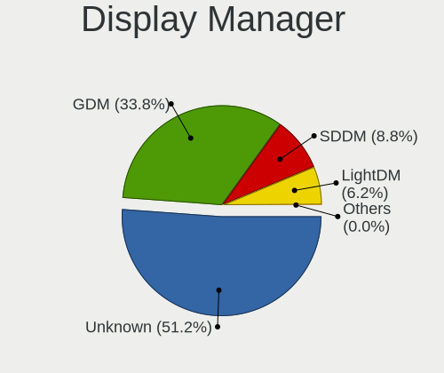
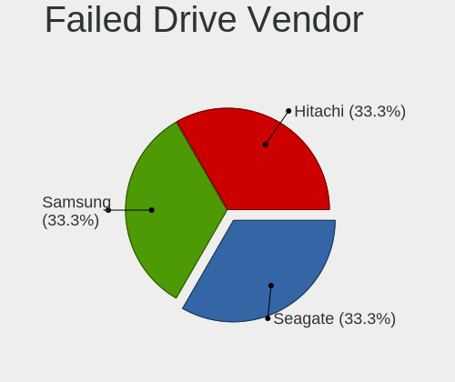
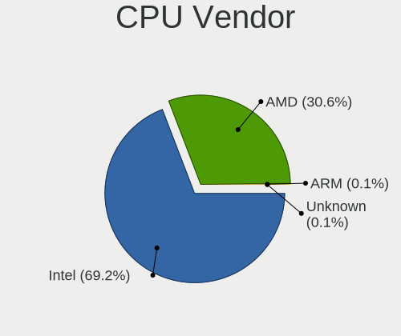
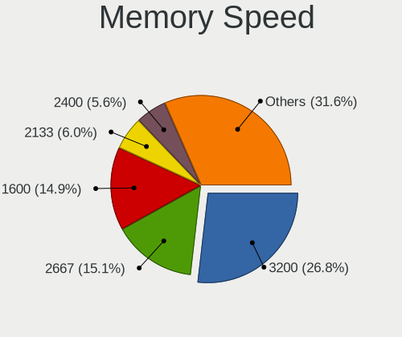

Fedora 36 - Tested Hardware & Statistics
----------------------------------------

A project to collect tested hardware configurations for Fedora 36.

Anyone can contribute to this report by the [hw-probe](https://github.com/linuxhw/hw-probe) tool:

    sudo -E hw-probe -all -upload

Please contribute! Especially if your hardware is rare.

This is a report for all computer types. See also reports for [desktops](/Dist/Fedora_36/Desktop/README.md) and [notebooks](/Dist/Fedora_36/Notebook/README.md).

Contents
--------

* [ Test Cases ](#test-cases)

* [ System ](#system)
  - [ Kernel                   ](#kernel)
  - [ Kernel Family            ](#kernel-family)
  - [ Kernel Major Ver.        ](#kernel-major-ver)
  - [ Arch                     ](#arch)
  - [ DE                       ](#de)
  - [ Display Server           ](#display-server)
  - [ Display Manager          ](#display-manager)
  - [ OS Lang                  ](#os-lang)
  - [ Boot Mode                ](#boot-mode)
  - [ Filesystem               ](#filesystem)
  - [ Part. scheme             ](#part-scheme)
  - [ Dual Boot with Linux/BSD ](#dual-boot-with-linuxbsd)
  - [ Dual Boot (Win)          ](#dual-boot-win)

* [ Board ](#board)
  - [ Vendor                   ](#vendor)
  - [ Model                    ](#model)
  - [ Model Family             ](#model-family)
  - [ MFG Year                 ](#mfg-year)
  - [ Form Factor              ](#form-factor)
  - [ Secure Boot              ](#secure-boot)
  - [ Coreboot                 ](#coreboot)
  - [ RAM Size                 ](#ram-size)
  - [ RAM Used                 ](#ram-used)
  - [ Total Drives             ](#total-drives)
  - [ Has CD-ROM               ](#has-cd-rom)
  - [ Has Ethernet             ](#has-ethernet)
  - [ Has WiFi                 ](#has-wifi)
  - [ Has Bluetooth            ](#has-bluetooth)

* [ Location ](#location)
  - [ Country                  ](#country)
  - [ City                     ](#city)

* [ Drives ](#drives)
  - [ Drive Vendor             ](#drive-vendor)
  - [ Drive Model              ](#drive-model)
  - [ HDD Vendor               ](#hdd-vendor)
  - [ SSD Vendor               ](#ssd-vendor)
  - [ Drive Kind               ](#drive-kind)
  - [ Drive Connector          ](#drive-connector)
  - [ Drive Size               ](#drive-size)
  - [ Space Total              ](#space-total)
  - [ Space Used               ](#space-used)
  - [ Malfunc. Drives          ](#malfunc-drives)
  - [ Malfunc. Drive Vendor    ](#malfunc-drive-vendor)
  - [ Malfunc. HDD Vendor      ](#malfunc-hdd-vendor)
  - [ Malfunc. Drive Kind      ](#malfunc-drive-kind)
  - [ Failed Drives            ](#failed-drives)
  - [ Failed Drive Vendor      ](#failed-drive-vendor)
  - [ Drive Status             ](#drive-status)

* [ Storage controller ](#storage-controller)
  - [ Storage Vendor           ](#storage-vendor)
  - [ Storage Model            ](#storage-model)
  - [ Storage Kind             ](#storage-kind)

* [ Processor ](#processor)
  - [ CPU Vendor               ](#cpu-vendor)
  - [ CPU Model                ](#cpu-model)
  - [ CPU Model Family         ](#cpu-model-family)
  - [ CPU Cores                ](#cpu-cores)
  - [ CPU Sockets              ](#cpu-sockets)
  - [ CPU Threads              ](#cpu-threads)
  - [ CPU Op-Modes             ](#cpu-op-modes)
  - [ CPU Microcode            ](#cpu-microcode)
  - [ CPU Microarch            ](#cpu-microarch)

* [ Graphics ](#graphics)
  - [ GPU Vendor               ](#gpu-vendor)
  - [ GPU Model                ](#gpu-model)
  - [ GPU Combo                ](#gpu-combo)
  - [ GPU Driver               ](#gpu-driver)
  - [ GPU Memory               ](#gpu-memory)

* [ Monitor ](#monitor)
  - [ Monitor Vendor           ](#monitor-vendor)
  - [ Monitor Model            ](#monitor-model)
  - [ Monitor Resolution       ](#monitor-resolution)
  - [ Monitor Diagonal         ](#monitor-diagonal)
  - [ Monitor Width            ](#monitor-width)
  - [ Aspect Ratio             ](#aspect-ratio)
  - [ Monitor Area             ](#monitor-area)
  - [ Pixel Density            ](#pixel-density)
  - [ Multiple Monitors        ](#multiple-monitors)

* [ Network ](#network)
  - [ Net Controller Vendor    ](#net-controller-vendor)
  - [ Net Controller Model     ](#net-controller-model)
  - [ Wireless Vendor          ](#wireless-vendor)
  - [ Wireless Model           ](#wireless-model)
  - [ Ethernet Vendor          ](#ethernet-vendor)
  - [ Ethernet Model           ](#ethernet-model)
  - [ Net Controller Kind      ](#net-controller-kind)
  - [ Used Controller          ](#used-controller)
  - [ NICs                     ](#nics)
  - [ IPv6                     ](#ipv6)

* [ Bluetooth ](#bluetooth)
  - [ Bluetooth Vendor         ](#bluetooth-vendor)
  - [ Bluetooth Model          ](#bluetooth-model)

* [ Sound ](#sound)
  - [ Sound Vendor             ](#sound-vendor)
  - [ Sound Model              ](#sound-model)

* [ Memory ](#memory)
  - [ Memory Vendor            ](#memory-vendor)
  - [ Memory Model             ](#memory-model)
  - [ Memory Kind              ](#memory-kind)
  - [ Memory Form Factor       ](#memory-form-factor)
  - [ Memory Size              ](#memory-size)
  - [ Memory Speed             ](#memory-speed)

* [ Printers & scanners ](#printers--scanners)
  - [ Printer Vendor           ](#printer-vendor)
  - [ Printer Model            ](#printer-model)
  - [ Scanner Vendor           ](#scanner-vendor)
  - [ Scanner Model            ](#scanner-model)

* [ Camera ](#camera)
  - [ Camera Vendor            ](#camera-vendor)
  - [ Camera Model             ](#camera-model)

* [ Security ](#security)
  - [ Fingerprint Vendor       ](#fingerprint-vendor)
  - [ Fingerprint Model        ](#fingerprint-model)
  - [ Chipcard Vendor          ](#chipcard-vendor)
  - [ Chipcard Model           ](#chipcard-model)

* [ Unsupported ](#unsupported)
  - [ Unsupported Devices      ](#unsupported-devices)
  - [ Unsupported Device Types ](#unsupported-device-types)

Test Cases
----------

Total: 486

| Vendor        | Model                       | Form-Factor | Probe                                                      | Date         |
|---------------|-----------------------------|-------------|------------------------------------------------------------|--------------|
| Lenovo        | IdeaPad 5 Pro 14ACN6 82L... | Notebook    | [ae39e96b1a](https://linux-hardware.org/?probe=ae39e96b1a) | Jun 01, 2022 |
| ASUSTek       | ROG STRIX Z490-H GAMING     | Desktop     | [0d91ffc3e9](https://linux-hardware.org/?probe=0d91ffc3e9) | Jun 01, 2022 |
| ASUSTek       | ROG STRIX Z490-H GAMING     | Desktop     | [6190087942](https://linux-hardware.org/?probe=6190087942) | Jun 01, 2022 |
| Lenovo        | IdeaPad L340-15IRH Gamin... | Notebook    | [0f84f94a6a](https://linux-hardware.org/?probe=0f84f94a6a) | Jun 01, 2022 |
| HP            | EliteBook 2560p             | Notebook    | [af6a91d3c7](https://linux-hardware.org/?probe=af6a91d3c7) | Jun 01, 2022 |
| ASUSTek       | PRIME B560M-A               | Desktop     | [b68bcf6b84](https://linux-hardware.org/?probe=b68bcf6b84) | Jun 01, 2022 |
| Dell          | Inspiron 5415               | Notebook    | [942b343fff](https://linux-hardware.org/?probe=942b343fff) | Jun 01, 2022 |
| Lenovo        | ThinkPad X380 Yoga 20LJS... | Convertible | [1ab6112525](https://linux-hardware.org/?probe=1ab6112525) | Jun 01, 2022 |
| HP            | Pavilion Laptop 14-dv0xx... | Notebook    | [1e6ab0f183](https://linux-hardware.org/?probe=1e6ab0f183) | May 31, 2022 |
| ASUSTek       | X541NA                      | Notebook    | [3d32754542](https://linux-hardware.org/?probe=3d32754542) | May 31, 2022 |
| Lenovo        | ThinkPad X1 Carbon 2nd 2... | Notebook    | [dc3ee2e520](https://linux-hardware.org/?probe=dc3ee2e520) | May 31, 2022 |
| Lenovo        | Edge 15 80K9                | Notebook    | [9bbdfc95bb](https://linux-hardware.org/?probe=9bbdfc95bb) | May 31, 2022 |
| HP            | OMEN Laptop 15-en0xxx       | Notebook    | [956299505f](https://linux-hardware.org/?probe=956299505f) | May 31, 2022 |
| HP            | Pavilion Laptop 14-dv0xx... | Notebook    | [9b53c4df9d](https://linux-hardware.org/?probe=9b53c4df9d) | May 31, 2022 |
| ASUSTek       | N501VW                      | Notebook    | [2f8215fb0a](https://linux-hardware.org/?probe=2f8215fb0a) | May 31, 2022 |
| HP            | EliteBook 840 G3            | Notebook    | [92acbd4c3f](https://linux-hardware.org/?probe=92acbd4c3f) | May 31, 2022 |
| Apple         | MacBookPro8,3               | Notebook    | [38f4cc4c5a](https://linux-hardware.org/?probe=38f4cc4c5a) | May 31, 2022 |
| Dell          | XPS 15 9520                 | Notebook    | [4d4c32223e](https://linux-hardware.org/?probe=4d4c32223e) | May 31, 2022 |
| Dell          | Inspiron 5547               | Notebook    | [066f6369b2](https://linux-hardware.org/?probe=066f6369b2) | May 31, 2022 |
| ASUSTek       | TUF Gaming B450-PLUS II     | Desktop     | [53dbc2fe14](https://linux-hardware.org/?probe=53dbc2fe14) | May 31, 2022 |
| HP            | 255 G1                      | Notebook    | [86f7198193](https://linux-hardware.org/?probe=86f7198193) | May 31, 2022 |
| MSI           | B450M PRO-VDH MAX           | Desktop     | [ece9950c65](https://linux-hardware.org/?probe=ece9950c65) | May 31, 2022 |
| Lenovo        | ThinkPad E595 20NF001PTX    | Notebook    | [cf41cc78f7](https://linux-hardware.org/?probe=cf41cc78f7) | May 30, 2022 |
| Lenovo        | ThinkPad X1 Carbon 2nd 2... | Notebook    | [5a813419eb](https://linux-hardware.org/?probe=5a813419eb) | May 30, 2022 |
| Lenovo        | Edge 15 80K9                | Notebook    | [586a31368f](https://linux-hardware.org/?probe=586a31368f) | May 30, 2022 |
| MSI           | B450M PRO-VDH MAX           | Desktop     | [07a1bcfa9e](https://linux-hardware.org/?probe=07a1bcfa9e) | May 30, 2022 |
| Google        | Droid                       | Notebook    | [35e3edeab3](https://linux-hardware.org/?probe=35e3edeab3) | May 30, 2022 |
| Framework     | Laptop                      | Notebook    | [f1c2a80b70](https://linux-hardware.org/?probe=f1c2a80b70) | May 30, 2022 |
| Lenovo        | ThinkPad X240 20AM0040BR    | Notebook    | [e0ff07b590](https://linux-hardware.org/?probe=e0ff07b590) | May 30, 2022 |
| IT Channel... | PA70Hx                      | Notebook    | [091ad22c2d](https://linux-hardware.org/?probe=091ad22c2d) | May 30, 2022 |
| HP            | ProBook x360 435 G8 Note... | Convertible | [60a88b2d81](https://linux-hardware.org/?probe=60a88b2d81) | May 30, 2022 |
| ASUSTek       | ZenBook UX325SA_UM325SA     | Notebook    | [378e6ca9c6](https://linux-hardware.org/?probe=378e6ca9c6) | May 30, 2022 |
| ASUSTek       | ROG STRIX B550-F GAMING     | Desktop     | [7b27373492](https://linux-hardware.org/?probe=7b27373492) | May 30, 2022 |
| ASUSTek       | P5Q SE                      | Desktop     | [386a88c2b6](https://linux-hardware.org/?probe=386a88c2b6) | May 30, 2022 |
| Dell          | XPS 15 9520                 | Notebook    | [eee1a317b6](https://linux-hardware.org/?probe=eee1a317b6) | May 30, 2022 |
| MSI           | GE60 2PE                    | Notebook    | [1e15d749ee](https://linux-hardware.org/?probe=1e15d749ee) | May 30, 2022 |
| ASUSTek       | P5Q SE                      | Desktop     | [5a51cc8767](https://linux-hardware.org/?probe=5a51cc8767) | May 30, 2022 |
| ASUSTek       | X541NA                      | Notebook    | [c1fd0c2d4f](https://linux-hardware.org/?probe=c1fd0c2d4f) | May 30, 2022 |
| MSI           | GE60 2PE                    | Notebook    | [b52762040d](https://linux-hardware.org/?probe=b52762040d) | May 30, 2022 |
| Apple         | Mac-031B6874CF7F642A iMa... | All in one  | [cdc051336a](https://linux-hardware.org/?probe=cdc051336a) | May 30, 2022 |
| Apple         | Mac-031B6874CF7F642A iMa... | All in one  | [2e1fd846a3](https://linux-hardware.org/?probe=2e1fd846a3) | May 30, 2022 |
| HP            | EliteBook 840 G8 Noteboo... | Notebook    | [15fb1b0353](https://linux-hardware.org/?probe=15fb1b0353) | May 30, 2022 |
| Dell          | 0R6PCT A01                  | Desktop     | [23c83c37e6](https://linux-hardware.org/?probe=23c83c37e6) | May 29, 2022 |
| Dell          | Inspiron 7472               | Notebook    | [7d8d96d851](https://linux-hardware.org/?probe=7d8d96d851) | May 29, 2022 |
| ASUSTek       | UX51VZA                     | Notebook    | [c7c6e27cae](https://linux-hardware.org/?probe=c7c6e27cae) | May 29, 2022 |
| Dell          | Latitude E7470              | Notebook    | [159516aefb](https://linux-hardware.org/?probe=159516aefb) | May 29, 2022 |
| ASUSTek       | ROG Maximus X HERO          | Desktop     | [33a2de91a2](https://linux-hardware.org/?probe=33a2de91a2) | May 29, 2022 |
| Acer          | Aspire E5-573G              | Notebook    | [bd9b967f9b](https://linux-hardware.org/?probe=bd9b967f9b) | May 29, 2022 |
| Dell          | XPS 15 9520                 | Notebook    | [75d345243e](https://linux-hardware.org/?probe=75d345243e) | May 29, 2022 |
| Notebook      | P65_P67SG                   | Notebook    | [a2aecd5cd3](https://linux-hardware.org/?probe=a2aecd5cd3) | May 29, 2022 |
| MSI           | GE60 2PE                    | Notebook    | [84d5af4ebe](https://linux-hardware.org/?probe=84d5af4ebe) | May 29, 2022 |
| MSI           | GE60 2PE                    | Notebook    | [c8d325a744](https://linux-hardware.org/?probe=c8d325a744) | May 29, 2022 |
| HP            | Pavilion 17                 | Notebook    | [077be5d10b](https://linux-hardware.org/?probe=077be5d10b) | May 28, 2022 |
| Dell          | Precision 7710              | Notebook    | [befe390051](https://linux-hardware.org/?probe=befe390051) | May 28, 2022 |
| Dell          | Vostro 5515                 | Notebook    | [ae8649e10b](https://linux-hardware.org/?probe=ae8649e10b) | May 28, 2022 |
| Lenovo        | Y70-70 Touch 80DU           | Notebook    | [4c4689f4b7](https://linux-hardware.org/?probe=4c4689f4b7) | May 28, 2022 |
| ASUSTek       | H81M-A                      | Desktop     | [0aa77d107c](https://linux-hardware.org/?probe=0aa77d107c) | May 28, 2022 |
| Lenovo        | IdeaPad 530S-14IKB 81EU     | Notebook    | [df2d7a274d](https://linux-hardware.org/?probe=df2d7a274d) | May 28, 2022 |
| Lenovo        | MIIX 510-12IKB 80XE         | Tablet      | [512d3f18ce](https://linux-hardware.org/?probe=512d3f18ce) | May 28, 2022 |
| Lenovo        | ThinkPad P52 20MAS3X200     | Notebook    | [da2a67f904](https://linux-hardware.org/?probe=da2a67f904) | May 28, 2022 |
| Lenovo        | Yoga 300-11IBY 80M0         | Notebook    | [8d120a2350](https://linux-hardware.org/?probe=8d120a2350) | May 28, 2022 |
| ASUSTek       | TUF Gaming FX505DY_FX505... | Notebook    | [af42d8d0b4](https://linux-hardware.org/?probe=af42d8d0b4) | May 27, 2022 |
| Samsung       | 950QDB                      | Convertible | [99178c7961](https://linux-hardware.org/?probe=99178c7961) | May 27, 2022 |
| Timi          | A35S                        | Notebook    | [8a1bee3210](https://linux-hardware.org/?probe=8a1bee3210) | May 27, 2022 |
| Dell          | XPS 15 9570                 | Notebook    | [93d1ebbb72](https://linux-hardware.org/?probe=93d1ebbb72) | May 27, 2022 |
| ASUSTek       | TUF X299 MARK 2             | Desktop     | [8409764263](https://linux-hardware.org/?probe=8409764263) | May 27, 2022 |
| Login Info... | LOG-QAL30                   | Notebook    | [5643c9fb9b](https://linux-hardware.org/?probe=5643c9fb9b) | May 27, 2022 |
| Login Info... | LOG-QAL30                   | Notebook    | [644f3a8dbc](https://linux-hardware.org/?probe=644f3a8dbc) | May 27, 2022 |
| Lenovo        | ThinkBook 14 G3 ACL 21A2    | Notebook    | [983144763a](https://linux-hardware.org/?probe=983144763a) | May 27, 2022 |
| Lenovo        | 14w 81MQS02H00              | Notebook    | [e31087bfa9](https://linux-hardware.org/?probe=e31087bfa9) | May 27, 2022 |
| Dell          | Inspiron 7460               | Notebook    | [3171915433](https://linux-hardware.org/?probe=3171915433) | May 27, 2022 |
| Sony          | VPCEE3S1E                   | Notebook    | [f3c7988996](https://linux-hardware.org/?probe=f3c7988996) | May 27, 2022 |
| Lenovo        | ThinkPad P1 Gen 3 20TJS3... | Notebook    | [88aabea122](https://linux-hardware.org/?probe=88aabea122) | May 27, 2022 |
| ASUSTek       | UX51VZA                     | Notebook    | [5507c9109e](https://linux-hardware.org/?probe=5507c9109e) | May 27, 2022 |
| Lenovo        | IdeaPad 3 15ARE05 81W4      | Notebook    | [9b4287fa8b](https://linux-hardware.org/?probe=9b4287fa8b) | May 26, 2022 |
| HP            | EliteBook x360 830 G6       | Convertible | [f9df0f4196](https://linux-hardware.org/?probe=f9df0f4196) | May 26, 2022 |
| HP            | Pavilion TS 14              | Notebook    | [b7b3d504e2](https://linux-hardware.org/?probe=b7b3d504e2) | May 26, 2022 |
| Dell          | Inspiron 5502               | Notebook    | [90ee31b219](https://linux-hardware.org/?probe=90ee31b219) | May 26, 2022 |
| Dell          | XPS 13 7390                 | Notebook    | [4aa126f1e7](https://linux-hardware.org/?probe=4aa126f1e7) | May 26, 2022 |
| Dell          | Inspiron 3543               | Notebook    | [bf6cb72634](https://linux-hardware.org/?probe=bf6cb72634) | May 26, 2022 |
| HUAWEI        | HN-WX9X                     | Notebook    | [ebb7ce2605](https://linux-hardware.org/?probe=ebb7ce2605) | May 26, 2022 |
| HP            | Pavilion Laptop 15-cd0xx    | Notebook    | [ad9da27671](https://linux-hardware.org/?probe=ad9da27671) | May 26, 2022 |
| Samsung       | 550XDA                      | Notebook    | [807781d70e](https://linux-hardware.org/?probe=807781d70e) | May 26, 2022 |
| BESSTAR Te... | UM700                       | Desktop     | [f754f78f66](https://linux-hardware.org/?probe=f754f78f66) | May 25, 2022 |
| ASUSTek       | ProArt Z690-CREATOR WIFI    | Desktop     | [c01e0f9ac4](https://linux-hardware.org/?probe=c01e0f9ac4) | May 25, 2022 |
| Acer          | Aspire E5-573G              | Notebook    | [6f5b6d8d03](https://linux-hardware.org/?probe=6f5b6d8d03) | May 25, 2022 |
| Gigabyte      | B450M DS3H-CF               | Desktop     | [06e3526c59](https://linux-hardware.org/?probe=06e3526c59) | May 25, 2022 |
| ASUSTek       | GL502VMK                    | Notebook    | [dfca615a89](https://linux-hardware.org/?probe=dfca615a89) | May 25, 2022 |
| ZoomSmart     | A8006                       | Tablet      | [c5ae648f10](https://linux-hardware.org/?probe=c5ae648f10) | May 25, 2022 |
| HP            | Notebook                    | Notebook    | [05e785c8c2](https://linux-hardware.org/?probe=05e785c8c2) | May 25, 2022 |
| HP            | Notebook                    | Notebook    | [17ca21b3a4](https://linux-hardware.org/?probe=17ca21b3a4) | May 25, 2022 |
| ASRock        | X99 Taichi                  | Desktop     | [18ec1a6a1a](https://linux-hardware.org/?probe=18ec1a6a1a) | May 25, 2022 |
| Lenovo        | IdeaPad 5 15ARE05 81YQ      | Notebook    | [dcbaf5defc](https://linux-hardware.org/?probe=dcbaf5defc) | May 25, 2022 |
| HP            | Unknown                     | Notebook    | [c6b346ecc6](https://linux-hardware.org/?probe=c6b346ecc6) | May 25, 2022 |
| Lenovo        | ThinkPad W540 20BHS04B00    | Notebook    | [376f43287f](https://linux-hardware.org/?probe=376f43287f) | May 25, 2022 |
| ASUSTek       | KCMA-D8                     | Desktop     | [2d8bea4f55](https://linux-hardware.org/?probe=2d8bea4f55) | May 24, 2022 |
| ASUSTek       | ROG Zephyrus G15 GA503RS... | Notebook    | [940a448ea6](https://linux-hardware.org/?probe=940a448ea6) | May 24, 2022 |
| Dell          | 0PU052                      | Desktop     | [4e3e3cc0fd](https://linux-hardware.org/?probe=4e3e3cc0fd) | May 24, 2022 |
| ASUSTek       | ASUS TUF Gaming A15 FA50... | Notebook    | [93c67e62e7](https://linux-hardware.org/?probe=93c67e62e7) | May 24, 2022 |
| Lenovo        | ThinkPad T14 Gen 1 20UDC... | Notebook    | [00baf8a2ff](https://linux-hardware.org/?probe=00baf8a2ff) | May 24, 2022 |
| ROCK Pi       | Unknown                     | Notebook    | [aa891c0178](https://linux-hardware.org/?probe=aa891c0178) | May 24, 2022 |
| ASUSTek       | TUF Gaming B550-PLUS        | Desktop     | [282c849b82](https://linux-hardware.org/?probe=282c849b82) | May 24, 2022 |
| Lenovo        | ThinkPad P53 20QN0011IV     | Notebook    | [24c2ad0798](https://linux-hardware.org/?probe=24c2ad0798) | May 24, 2022 |
| Dell          | Precision 3561              | Notebook    | [71657d24c1](https://linux-hardware.org/?probe=71657d24c1) | May 24, 2022 |
| Dell          | Precision 3561              | Notebook    | [385a286d0d](https://linux-hardware.org/?probe=385a286d0d) | May 24, 2022 |
| HP            | EliteBook 840 G8 Noteboo... | Notebook    | [eccd990241](https://linux-hardware.org/?probe=eccd990241) | May 24, 2022 |
| Lenovo        | IdeaPad S340-14API 81NB     | Notebook    | [1b061ef293](https://linux-hardware.org/?probe=1b061ef293) | May 24, 2022 |
| Lenovo        | Yoga 9 14ITL5 82BG          | Convertible | [4f43d0fc78](https://linux-hardware.org/?probe=4f43d0fc78) | May 24, 2022 |
| Apple         | Mac-FFE5EF870D7BA81A iMa... | All in one  | [7e8bde85cc](https://linux-hardware.org/?probe=7e8bde85cc) | May 24, 2022 |
| Apple         | Mac-FFE5EF870D7BA81A iMa... | All in one  | [02c35436fd](https://linux-hardware.org/?probe=02c35436fd) | May 24, 2022 |
| Lenovo        | SHARKBAY SDK0E50512 STD     | Desktop     | [da5f6c9ba0](https://linux-hardware.org/?probe=da5f6c9ba0) | May 23, 2022 |
| Lenovo        | ThinkPad W540 20BHS04B00    | Notebook    | [8d62205131](https://linux-hardware.org/?probe=8d62205131) | May 23, 2022 |
| Lenovo        | ThinkPad T480s 20L8S1RS0... | Notebook    | [174f6e2270](https://linux-hardware.org/?probe=174f6e2270) | May 23, 2022 |
| MSI           | Z77A-G43                    | Desktop     | [7d35f08c28](https://linux-hardware.org/?probe=7d35f08c28) | May 23, 2022 |
| ASUSTek       | X550CL                      | Notebook    | [49ebd9e68d](https://linux-hardware.org/?probe=49ebd9e68d) | May 23, 2022 |
| HP            | Pavilion Laptop 15-eg0xx... | Notebook    | [377330c2b5](https://linux-hardware.org/?probe=377330c2b5) | May 23, 2022 |
| ASUSTek       | PRIME Z270-P                | Desktop     | [afb47f4860](https://linux-hardware.org/?probe=afb47f4860) | May 23, 2022 |
| Dell          | Vostro 5490                 | Notebook    | [413a708e81](https://linux-hardware.org/?probe=413a708e81) | May 23, 2022 |
| Gigabyte      | P34V5                       | Notebook    | [6fa844b91e](https://linux-hardware.org/?probe=6fa844b91e) | May 23, 2022 |
| Gigabyte      | P34V5                       | Notebook    | [3ad8e4b239](https://linux-hardware.org/?probe=3ad8e4b239) | May 23, 2022 |
| Lenovo        | 364F SDK0J40700 WIN 3258... | Desktop     | [2034bf506d](https://linux-hardware.org/?probe=2034bf506d) | May 23, 2022 |
| Dell          | XPS 13 9310                 | Notebook    | [a76a3417d7](https://linux-hardware.org/?probe=a76a3417d7) | May 23, 2022 |
| Toshiba       | Unknown                     | Notebook    | [56ac954440](https://linux-hardware.org/?probe=56ac954440) | May 23, 2022 |
| Lenovo        | ThinkPad X230 2325AC7       | Notebook    | [bf82ad1cc3](https://linux-hardware.org/?probe=bf82ad1cc3) | May 23, 2022 |
| ASUSTek       | ROG STRIX B550-F GAMING     | Desktop     | [2bd8d64c3b](https://linux-hardware.org/?probe=2bd8d64c3b) | May 22, 2022 |
| Sony          | VPCSA2Z9R                   | Notebook    | [5697622de7](https://linux-hardware.org/?probe=5697622de7) | May 22, 2022 |
| Lenovo        | ThinkPad X270 20HMS1QT0E    | Notebook    | [f17079bdce](https://linux-hardware.org/?probe=f17079bdce) | May 22, 2022 |
| ASUSTek       | ROG Strix G513QY_G513QY     | Notebook    | [bdb9536c9c](https://linux-hardware.org/?probe=bdb9536c9c) | May 22, 2022 |
| Acer          | Swift SF514-52T             | Notebook    | [d49880e4c2](https://linux-hardware.org/?probe=d49880e4c2) | May 22, 2022 |
| Acer          | Swift SF514-52T             | Notebook    | [40d5ca6bab](https://linux-hardware.org/?probe=40d5ca6bab) | May 22, 2022 |
| ASUSTek       | P8P67-M                     | Desktop     | [83917315b7](https://linux-hardware.org/?probe=83917315b7) | May 22, 2022 |
| HP            | EliteBook x360 1030 G2      | Convertible | [0ea1ce7372](https://linux-hardware.org/?probe=0ea1ce7372) | May 22, 2022 |
| HP            | 15-dc1018ur                 | Notebook    | [aceb1a1011](https://linux-hardware.org/?probe=aceb1a1011) | May 22, 2022 |
| Dell          | Inspiron 5567               | Notebook    | [afca2e1045](https://linux-hardware.org/?probe=afca2e1045) | May 22, 2022 |
| Lenovo        | ThinkPad W520 42763JF       | Notebook    | [2b87bae835](https://linux-hardware.org/?probe=2b87bae835) | May 22, 2022 |
| Gigabyte      | B550 GAMING X V2            | Desktop     | [a84132c514](https://linux-hardware.org/?probe=a84132c514) | May 22, 2022 |
| HP            | ProBook 470 G5              | Notebook    | [4be19d46e1](https://linux-hardware.org/?probe=4be19d46e1) | May 21, 2022 |
| Lenovo        | Legion 7 15IMH05 81YT       | Notebook    | [a44f38fd50](https://linux-hardware.org/?probe=a44f38fd50) | May 21, 2022 |
| Lenovo        | ThinkPad X220 Tablet 429... | Notebook    | [1c2288918d](https://linux-hardware.org/?probe=1c2288918d) | May 21, 2022 |
| HP            | Unknown                     | Notebook    | [2277c14d4d](https://linux-hardware.org/?probe=2277c14d4d) | May 21, 2022 |
| Dell          | XPS 13 9310                 | Notebook    | [06943bb7f1](https://linux-hardware.org/?probe=06943bb7f1) | May 21, 2022 |
| Acer          | Swift SF314-54              | Notebook    | [478550abf1](https://linux-hardware.org/?probe=478550abf1) | May 21, 2022 |
| ASRock        | AB350 Pro4                  | Desktop     | [49223fe44b](https://linux-hardware.org/?probe=49223fe44b) | May 21, 2022 |
| ASRock        | AB350 Pro4                  | Desktop     | [40cb336486](https://linux-hardware.org/?probe=40cb336486) | May 21, 2022 |
| Dell          | Latitude 5490               | Notebook    | [450756ee49](https://linux-hardware.org/?probe=450756ee49) | May 21, 2022 |
| MSI           | B450M-A PRO MAX             | Desktop     | [fce678a9e8](https://linux-hardware.org/?probe=fce678a9e8) | May 21, 2022 |
| HP            | Laptop 15s-eq1xxx           | Notebook    | [702e495c23](https://linux-hardware.org/?probe=702e495c23) | May 21, 2022 |
| ASUSTek       | PRIME Z690-P D4             | Desktop     | [01e2d063e8](https://linux-hardware.org/?probe=01e2d063e8) | May 21, 2022 |
| ASUSTek       | PRIME Z690-P D4             | Desktop     | [f3986d7e7d](https://linux-hardware.org/?probe=f3986d7e7d) | May 21, 2022 |
| Dell          | XPS 13 7390 2-in-1          | Convertible | [c90fe96957](https://linux-hardware.org/?probe=c90fe96957) | May 21, 2022 |
| Lenovo        | IdeaPad 330S-15ARR 81FB     | Notebook    | [cc0b92bd45](https://linux-hardware.org/?probe=cc0b92bd45) | May 21, 2022 |
| MSI           | B450M PRO-M2 MAX            | Desktop     | [1984313b19](https://linux-hardware.org/?probe=1984313b19) | May 20, 2022 |
| Lenovo        | ThinkPad X1 Carbon Gen 9... | Notebook    | [d5b9f1fd4a](https://linux-hardware.org/?probe=d5b9f1fd4a) | May 20, 2022 |
| HP            | Pavilion g4                 | Notebook    | [b29455a037](https://linux-hardware.org/?probe=b29455a037) | May 20, 2022 |
| Lenovo        | ThinkPad X1 Carbon Gen 9... | Notebook    | [567c91351f](https://linux-hardware.org/?probe=567c91351f) | May 20, 2022 |
| HP            | Pavilion g4                 | Notebook    | [001f7d91d2](https://linux-hardware.org/?probe=001f7d91d2) | May 20, 2022 |
| Acer          | Aspire 8940G                | Notebook    | [f6f8622b30](https://linux-hardware.org/?probe=f6f8622b30) | May 20, 2022 |
| Google        | Glimmer                     | Notebook    | [78c39ceda9](https://linux-hardware.org/?probe=78c39ceda9) | May 20, 2022 |
| Dell          | Inspiron 5459               | Notebook    | [ea99252046](https://linux-hardware.org/?probe=ea99252046) | May 20, 2022 |
| Samsung       | 550XDA                      | Notebook    | [1f77e9f8f6](https://linux-hardware.org/?probe=1f77e9f8f6) | May 19, 2022 |
| Samsung       | 550XDA                      | Notebook    | [8c31783747](https://linux-hardware.org/?probe=8c31783747) | May 19, 2022 |
| Lenovo        | ThinkPad X1 Carbon 2nd 2... | Notebook    | [e8df231af7](https://linux-hardware.org/?probe=e8df231af7) | May 19, 2022 |
| Lenovo        | ThinkPad P14s Gen 2a 21A... | Notebook    | [711e483bb9](https://linux-hardware.org/?probe=711e483bb9) | May 19, 2022 |
| Lenovo        | IdeaPad Creator 5 15IMH0... | Notebook    | [59d945a9b3](https://linux-hardware.org/?probe=59d945a9b3) | May 19, 2022 |
| ASRock        | Z390 Taichi Ultimate        | Desktop     | [68d0cdd597](https://linux-hardware.org/?probe=68d0cdd597) | May 19, 2022 |
| HP            | ENVY x360 Convertible 13... | Convertible | [28b26566bf](https://linux-hardware.org/?probe=28b26566bf) | May 19, 2022 |
| eMachines     | E525                        | Notebook    | [2c397d4229](https://linux-hardware.org/?probe=2c397d4229) | May 19, 2022 |
| eMachines     | E525                        | Notebook    | [7a1e439150](https://linux-hardware.org/?probe=7a1e439150) | May 19, 2022 |
| Lenovo        | ThinkPad X1 Carbon 5th 2... | Notebook    | [0e0fc0905a](https://linux-hardware.org/?probe=0e0fc0905a) | May 19, 2022 |
| SKIKK         | GREEN 4                     | Notebook    | [f58c4904f7](https://linux-hardware.org/?probe=f58c4904f7) | May 19, 2022 |
| Toshiba       | Satellite U940              | Notebook    | [249374be01](https://linux-hardware.org/?probe=249374be01) | May 19, 2022 |
| Apple         | MacBookPro8,1               | Notebook    | [94d2bd3233](https://linux-hardware.org/?probe=94d2bd3233) | May 19, 2022 |
| HP            | 82A2                        | Desktop     | [56d6c8d749](https://linux-hardware.org/?probe=56d6c8d749) | May 19, 2022 |
| Lenovo        | ThinkPad P52 20MAS3X200     | Notebook    | [7f0fc0c72e](https://linux-hardware.org/?probe=7f0fc0c72e) | May 19, 2022 |
| Lenovo        | ThinkPad P50 20EQS1DD00     | Notebook    | [819420bd66](https://linux-hardware.org/?probe=819420bd66) | May 19, 2022 |
| Lenovo        | ThinkPad P50 20EQS1DD00     | Notebook    | [479ab8b5d7](https://linux-hardware.org/?probe=479ab8b5d7) | May 19, 2022 |
| HP            | 82A2                        | Desktop     | [6e0efeba1d](https://linux-hardware.org/?probe=6e0efeba1d) | May 19, 2022 |
| ASUSTek       | Z97-PRO GAMER               | Desktop     | [4a971be254](https://linux-hardware.org/?probe=4a971be254) | May 19, 2022 |
| Lenovo        | ThinkPad X1 Carbon Gen 8... | Notebook    | [592a32a1af](https://linux-hardware.org/?probe=592a32a1af) | May 18, 2022 |
| Intel         | DH77EB AAG39073-304         | Desktop     | [dc2f9f56a5](https://linux-hardware.org/?probe=dc2f9f56a5) | May 18, 2022 |
| Lenovo        | IdeaPad Slim 1-14AST-05 ... | Notebook    | [e83ddc569f](https://linux-hardware.org/?probe=e83ddc569f) | May 18, 2022 |
| HP            | 8767 A                      | Desktop     | [0f564fe004](https://linux-hardware.org/?probe=0f564fe004) | May 18, 2022 |
| MSI           | B450M PRO-VDH MAX           | Desktop     | [9c3b90c60d](https://linux-hardware.org/?probe=9c3b90c60d) | May 18, 2022 |
| ASRock        | 970M Pro3                   | Desktop     | [d39e962536](https://linux-hardware.org/?probe=d39e962536) | May 18, 2022 |
| Dell          | XPS 13 7390                 | Notebook    | [98752f9fb4](https://linux-hardware.org/?probe=98752f9fb4) | May 18, 2022 |
| Dell          | Latitude E6420              | Notebook    | [0f06571934](https://linux-hardware.org/?probe=0f06571934) | May 18, 2022 |
| ASUSTek       | P8Z68-V PRO GEN3            | Desktop     | [8a6fc346c5](https://linux-hardware.org/?probe=8a6fc346c5) | May 18, 2022 |
| ASUSTek       | X556URK                     | Notebook    | [b217fd2c65](https://linux-hardware.org/?probe=b217fd2c65) | May 18, 2022 |
| Dell          | 0DF42J A00                  | Desktop     | [ac9f539524](https://linux-hardware.org/?probe=ac9f539524) | May 18, 2022 |
| Raspberry ... | Raspberry Pi 4 Model B      | Soc         | [5e6298871c](https://linux-hardware.org/?probe=5e6298871c) | May 18, 2022 |
| Apple         | MacBookAir7,2               | Notebook    | [a46fea4edb](https://linux-hardware.org/?probe=a46fea4edb) | May 18, 2022 |
| HP            | 8767 A                      | Desktop     | [caad4001f1](https://linux-hardware.org/?probe=caad4001f1) | May 18, 2022 |
| Samsung       | 270E5G/270E5U               | Notebook    | [8d8783e43f](https://linux-hardware.org/?probe=8d8783e43f) | May 18, 2022 |
| Samsung       | 270E5G/270E5U               | Notebook    | [6e01c5c9f5](https://linux-hardware.org/?probe=6e01c5c9f5) | May 18, 2022 |
| Lenovo        | IdeaPad Y500 20193          | Notebook    | [a3931c5e60](https://linux-hardware.org/?probe=a3931c5e60) | May 17, 2022 |
| ASRock        | 970M Pro3                   | Desktop     | [6f48a71a87](https://linux-hardware.org/?probe=6f48a71a87) | May 17, 2022 |
| HP            | Laptop 15s-eq2xxx           | Notebook    | [9e7bf270db](https://linux-hardware.org/?probe=9e7bf270db) | May 17, 2022 |
| Dell          | Latitude E6230              | Notebook    | [1afeba4362](https://linux-hardware.org/?probe=1afeba4362) | May 17, 2022 |
| ASUSTek       | P8H67-M LE                  | Desktop     | [ef70fd2699](https://linux-hardware.org/?probe=ef70fd2699) | May 17, 2022 |
| Gigabyte      | X470 AORUS ULTRA GAMING-... | Desktop     | [d831b6cb22](https://linux-hardware.org/?probe=d831b6cb22) | May 17, 2022 |
| Lenovo        | ThinkBook 15 G2 ITL 20VE    | Notebook    | [f86ea538c8](https://linux-hardware.org/?probe=f86ea538c8) | May 17, 2022 |
| Dell          | Latitude 5520               | Notebook    | [320ed1c4fc](https://linux-hardware.org/?probe=320ed1c4fc) | May 17, 2022 |
| Dell          | Latitude 5520               | Notebook    | [18823f33fb](https://linux-hardware.org/?probe=18823f33fb) | May 17, 2022 |
| ASUSTek       | ROG Strix G513RM_G513RM     | Notebook    | [331099a3da](https://linux-hardware.org/?probe=331099a3da) | May 17, 2022 |
| Microsoft     | Surface 3                   | Tablet      | [9159a8f839](https://linux-hardware.org/?probe=9159a8f839) | May 17, 2022 |
| Apple         | Mac-FFE5EF870D7BA81A iMa... | All in one  | [c006d01be7](https://linux-hardware.org/?probe=c006d01be7) | May 17, 2022 |
| Lenovo        | IdeaPad Slim 7 14ITL05 8... | Notebook    | [2179a16a87](https://linux-hardware.org/?probe=2179a16a87) | May 17, 2022 |
| Notebook      | N8xEJEK                     | Notebook    | [5c2c66e8f5](https://linux-hardware.org/?probe=5c2c66e8f5) | May 17, 2022 |
| Apple         | Mac-FFE5EF870D7BA81A iMa... | All in one  | [de37f2b586](https://linux-hardware.org/?probe=de37f2b586) | May 17, 2022 |
| Microsoft     | Surface 3                   | Tablet      | [94494528f6](https://linux-hardware.org/?probe=94494528f6) | May 16, 2022 |
| Dell          | 0NKW6Y A02                  | Desktop     | [ffee0745b6](https://linux-hardware.org/?probe=ffee0745b6) | May 16, 2022 |
| Gigabyte      | X99-UD4-CF                  | Desktop     | [21b3b45491](https://linux-hardware.org/?probe=21b3b45491) | May 16, 2022 |
| Gigabyte      | X99-UD4-CF                  | Desktop     | [81e0a19eaa](https://linux-hardware.org/?probe=81e0a19eaa) | May 16, 2022 |
| ASUSTek       | ROG STRIX X570-F GAMING     | Desktop     | [d1dbcd7651](https://linux-hardware.org/?probe=d1dbcd7651) | May 16, 2022 |
| Lenovo        | ThinkPad E15 Gen 2 20T80... | Notebook    | [61c1716210](https://linux-hardware.org/?probe=61c1716210) | May 16, 2022 |
| Lenovo        | IdeaPad 330S-14IKB 81F4     | Notebook    | [e99a8117ba](https://linux-hardware.org/?probe=e99a8117ba) | May 16, 2022 |
| Dell          | XPS 13 9350                 | Notebook    | [cf7f597752](https://linux-hardware.org/?probe=cf7f597752) | May 16, 2022 |
| Lenovo        | ThinkPad T14s Gen 2i 20W... | Notebook    | [06afc33451](https://linux-hardware.org/?probe=06afc33451) | May 16, 2022 |
| ASUSTek       | K30AD_M31AD_M51AD_M32AD     | Desktop     | [efe02f8593](https://linux-hardware.org/?probe=efe02f8593) | May 16, 2022 |
| Gigabyte      | B450 I AORUS PRO WIFI-CF    | Desktop     | [2f12c77058](https://linux-hardware.org/?probe=2f12c77058) | May 16, 2022 |
| Lenovo        | ThinkPad T440p 20AW000KU... | Notebook    | [66fc91a0d0](https://linux-hardware.org/?probe=66fc91a0d0) | May 16, 2022 |
| Dell          | XPS 15 7590                 | Notebook    | [7f7463682a](https://linux-hardware.org/?probe=7f7463682a) | May 16, 2022 |
| Lenovo        | IdeaPad 320S-14IKB 81BN     | Notebook    | [1661f9e71d](https://linux-hardware.org/?probe=1661f9e71d) | May 16, 2022 |
| Acer          | Nitro AN515-45              | Notebook    | [2dac9974af](https://linux-hardware.org/?probe=2dac9974af) | May 16, 2022 |
| ASUSTek       | ROG STRIX X470-I GAMING     | Desktop     | [fa17134027](https://linux-hardware.org/?probe=fa17134027) | May 16, 2022 |
| MSI           | MPG B550I GAMING EDGE WI... | Desktop     | [26f332bc9c](https://linux-hardware.org/?probe=26f332bc9c) | May 16, 2022 |
| ASUSTek       | ROG STRIX X470-I GAMING     | Desktop     | [16bd9d3c6d](https://linux-hardware.org/?probe=16bd9d3c6d) | May 16, 2022 |
| Lenovo        | ThinkPad T440 20B7A1P700    | Notebook    | [ee54db9f9e](https://linux-hardware.org/?probe=ee54db9f9e) | May 16, 2022 |
| ASUSTek       | ROG Zephyrus G14 GA401IH... | Notebook    | [a15788c695](https://linux-hardware.org/?probe=a15788c695) | May 15, 2022 |
| Intel         | DH77EB AAG39073-304         | Desktop     | [22f5a0269f](https://linux-hardware.org/?probe=22f5a0269f) | May 15, 2022 |
| Intel         | DH77EB AAG39073-304         | Desktop     | [8b8bd9dead](https://linux-hardware.org/?probe=8b8bd9dead) | May 15, 2022 |
| ASUSTek       | TUF Gaming B550M-PLUS       | Desktop     | [12d277d32c](https://linux-hardware.org/?probe=12d277d32c) | May 15, 2022 |
| HP            | 250 G7 Notebook PC          | Notebook    | [4e824e7eac](https://linux-hardware.org/?probe=4e824e7eac) | May 15, 2022 |
| Positivo      | H14BU08                     | Notebook    | [ba7d402358](https://linux-hardware.org/?probe=ba7d402358) | May 15, 2022 |
| ASRock        | 880GMH/U3S3                 | Desktop     | [57c85dd37a](https://linux-hardware.org/?probe=57c85dd37a) | May 15, 2022 |
| HP            | ENVY x360 Convertible 13... | Convertible | [74cb2084ef](https://linux-hardware.org/?probe=74cb2084ef) | May 15, 2022 |
| Lenovo        | V14-IIL 82C4                | Notebook    | [b95acee640](https://linux-hardware.org/?probe=b95acee640) | May 15, 2022 |
| ASUSTek       | VivoBook_ASUSLaptop X571... | Notebook    | [a442279a0b](https://linux-hardware.org/?probe=a442279a0b) | May 15, 2022 |
| Acer          | Swift SF515-51T             | Notebook    | [3e3380c801](https://linux-hardware.org/?probe=3e3380c801) | May 15, 2022 |
| Gigabyte      | Z390 AORUS MASTER-CF        | Desktop     | [ec0ec5ea27](https://linux-hardware.org/?probe=ec0ec5ea27) | May 15, 2022 |
| Lenovo        | ThinkPad X1 Extreme 2nd ... | Notebook    | [6c635e0f3d](https://linux-hardware.org/?probe=6c635e0f3d) | May 15, 2022 |
| ASUSTek       | ASUS TUF Gaming F15 FX50... | Notebook    | [88c0d2c252](https://linux-hardware.org/?probe=88c0d2c252) | May 15, 2022 |
| Acer          | AO532h                      | Notebook    | [6055013560](https://linux-hardware.org/?probe=6055013560) | May 15, 2022 |
| ASUSTek       | PRIME B450-PLUS             | Desktop     | [a2ae5d95dd](https://linux-hardware.org/?probe=a2ae5d95dd) | May 15, 2022 |
| ASUSTek       | Pro WS X570-ACE             | Desktop     | [6fc56522d6](https://linux-hardware.org/?probe=6fc56522d6) | May 14, 2022 |
| ASUSTek       | ROG STRIX X570-E GAMING     | Desktop     | [1bde2ca3e7](https://linux-hardware.org/?probe=1bde2ca3e7) | May 14, 2022 |
| ASUSTek       | P8Z77-V LK                  | Desktop     | [70809098f6](https://linux-hardware.org/?probe=70809098f6) | May 14, 2022 |
| ASUSTek       | VivoBook_ASUSLaptop X412... | Notebook    | [6adb7e22c5](https://linux-hardware.org/?probe=6adb7e22c5) | May 14, 2022 |
| MSI           | MPG B550 GAMING PLUS        | Desktop     | [3112931a28](https://linux-hardware.org/?probe=3112931a28) | May 14, 2022 |
| HP            | EliteBook x360 1030 G2      | Convertible | [210d27dd90](https://linux-hardware.org/?probe=210d27dd90) | May 14, 2022 |
| Lenovo        | Yoga 920-13IKB 80Y7         | Convertible | [b04a0b8046](https://linux-hardware.org/?probe=b04a0b8046) | May 13, 2022 |
| ASRock        | B560M-C                     | Desktop     | [b4946d836b](https://linux-hardware.org/?probe=b4946d836b) | May 13, 2022 |
| ASRock        | B560M-C                     | Desktop     | [16360de6cd](https://linux-hardware.org/?probe=16360de6cd) | May 13, 2022 |
| Gigabyte      | GA-K8NF-9                   | Desktop     | [f9d59e3770](https://linux-hardware.org/?probe=f9d59e3770) | May 13, 2022 |
| Lenovo        | ThinkPad T14 Gen 2a 20XL... | Notebook    | [8c71a3bd1b](https://linux-hardware.org/?probe=8c71a3bd1b) | May 13, 2022 |
| HP            | EliteBook 8470p             | Notebook    | [2c8d1eec1e](https://linux-hardware.org/?probe=2c8d1eec1e) | May 13, 2022 |
| TUXEDO        | Pulse 14 Gen1               | Notebook    | [31d9027f23](https://linux-hardware.org/?probe=31d9027f23) | May 13, 2022 |
| HP            | EliteBook 8470p             | Notebook    | [074043a5ca](https://linux-hardware.org/?probe=074043a5ca) | May 13, 2022 |
| ASRock        | X570M Pro4                  | Desktop     | [fca86a854a](https://linux-hardware.org/?probe=fca86a854a) | May 13, 2022 |
| Gigabyte      | Z170-D3H-CF                 | Desktop     | [ec4bd74f0b](https://linux-hardware.org/?probe=ec4bd74f0b) | May 13, 2022 |
| ASUSTek       | VivoBook_ASUSLaptop X409... | Notebook    | [ffbf67b890](https://linux-hardware.org/?probe=ffbf67b890) | May 12, 2022 |
| Lenovo        | IdeaPad 510-15ISK 80SR      | Notebook    | [deb6fa57ef](https://linux-hardware.org/?probe=deb6fa57ef) | May 12, 2022 |
| HP            | Pavilion Aero Laptop 13-... | Notebook    | [7aaffeda48](https://linux-hardware.org/?probe=7aaffeda48) | May 12, 2022 |
| Lenovo        | ThinkPad P51 20HJS02H00     | Notebook    | [fc7562c140](https://linux-hardware.org/?probe=fc7562c140) | May 12, 2022 |
| Lenovo        | ThinkPad P51 20HJS02H00     | Notebook    | [810fda94b1](https://linux-hardware.org/?probe=810fda94b1) | May 12, 2022 |
| Dell          | XPS 13 9310 2-in-1          | Convertible | [50946adee3](https://linux-hardware.org/?probe=50946adee3) | May 12, 2022 |
| Gigabyte      | B85M-D3V-A                  | Desktop     | [46481247b1](https://linux-hardware.org/?probe=46481247b1) | May 12, 2022 |
| Dell          | Latitude 5420               | Notebook    | [ac04d4cb5b](https://linux-hardware.org/?probe=ac04d4cb5b) | May 12, 2022 |
| ICL           | Unknown                     | Notebook    | [cfb2a7c82f](https://linux-hardware.org/?probe=cfb2a7c82f) | May 12, 2022 |
| HUAWEI        | NBLB-WAX9N                  | Notebook    | [9baa4a9f57](https://linux-hardware.org/?probe=9baa4a9f57) | May 12, 2022 |
| HP            | ENVY x360 Convertible 15... | Convertible | [6212c4d612](https://linux-hardware.org/?probe=6212c4d612) | May 12, 2022 |
| Dell          | XPS 15 9500                 | Notebook    | [da0e4e32b4](https://linux-hardware.org/?probe=da0e4e32b4) | May 12, 2022 |
| Lenovo        | IdeaPad S540-15IWL          | Notebook    | [bbf4ef2a08](https://linux-hardware.org/?probe=bbf4ef2a08) | May 11, 2022 |
| Lenovo        | ThinkPad X395 20NL0007US    | Notebook    | [aea9571086](https://linux-hardware.org/?probe=aea9571086) | May 11, 2022 |
| Acer          | Aspire M3985                | Desktop     | [e650ae1a26](https://linux-hardware.org/?probe=e650ae1a26) | May 11, 2022 |
| Lenovo        | ThinkPad X1 Carbon 6th 2... | Notebook    | [b0951956fa](https://linux-hardware.org/?probe=b0951956fa) | May 11, 2022 |
| ASUSTek       | ROG STRIX B550-E GAMING     | Desktop     | [927afa0c20](https://linux-hardware.org/?probe=927afa0c20) | May 11, 2022 |
| Gigabyte      | A320M-S2H-CF                | Desktop     | [c703872774](https://linux-hardware.org/?probe=c703872774) | May 11, 2022 |
| ASUSTek       | ROG STRIX B550-E GAMING     | Desktop     | [b9766a94d7](https://linux-hardware.org/?probe=b9766a94d7) | May 11, 2022 |
| Lenovo        | ThinkPad T480 20L6S5M40M    | Notebook    | [f2213829f0](https://linux-hardware.org/?probe=f2213829f0) | May 11, 2022 |
| Lenovo        | ThinkPad P1 Gen 3 20TJS2... | Notebook    | [607c0a2833](https://linux-hardware.org/?probe=607c0a2833) | May 11, 2022 |
| Lenovo        | ThinkPad E570 20H5CTO1WW    | Notebook    | [a22c347eaf](https://linux-hardware.org/?probe=a22c347eaf) | May 11, 2022 |
| Lenovo        | ThinkPad T590 20N5S2NC0N    | Notebook    | [61327f1e21](https://linux-hardware.org/?probe=61327f1e21) | May 11, 2022 |
| ASRock        | X470 Taichi                 | Desktop     | [9ead3d53b0](https://linux-hardware.org/?probe=9ead3d53b0) | May 11, 2022 |
| Positivo      | C41TB                       | Notebook    | [2df08b295b](https://linux-hardware.org/?probe=2df08b295b) | May 11, 2022 |
| Lenovo        | Z50-70 20354                | Notebook    | [7dd92b7a41](https://linux-hardware.org/?probe=7dd92b7a41) | May 11, 2022 |
| Positivo      | C41TB                       | Notebook    | [164d3a45c4](https://linux-hardware.org/?probe=164d3a45c4) | May 11, 2022 |
| Lenovo        | B40-70 80F30017BR           | Notebook    | [352c705bf3](https://linux-hardware.org/?probe=352c705bf3) | May 11, 2022 |
| MSI           | X470 GAMING PLUS            | Desktop     | [565dfeea66](https://linux-hardware.org/?probe=565dfeea66) | May 11, 2022 |
| Gigabyte      | Q35M-S2                     | Desktop     | [784ac96428](https://linux-hardware.org/?probe=784ac96428) | May 11, 2022 |
| Lenovo        | B40-70 80F30017BR           | Notebook    | [cb100c3884](https://linux-hardware.org/?probe=cb100c3884) | May 11, 2022 |
| ASUSTek       | Z97-PRO GAMER               | Desktop     | [173fac4f5b](https://linux-hardware.org/?probe=173fac4f5b) | May 11, 2022 |
| Dell          | Inspiron 3542               | Notebook    | [9762e9155b](https://linux-hardware.org/?probe=9762e9155b) | May 11, 2022 |
| Lenovo        | ThinkPad P15s Gen 2i 20W... | Notebook    | [6cacb1c49c](https://linux-hardware.org/?probe=6cacb1c49c) | May 11, 2022 |
| Lenovo        | ThinkBook 16p Gen 2 20YM    | Notebook    | [a8c09f53de](https://linux-hardware.org/?probe=a8c09f53de) | May 10, 2022 |
| Acer          | Swift SF314-54              | Notebook    | [cc3411e0b4](https://linux-hardware.org/?probe=cc3411e0b4) | May 10, 2022 |
| Dell          | XPS 13 7390                 | Notebook    | [a5630f81ad](https://linux-hardware.org/?probe=a5630f81ad) | May 10, 2022 |
| ASRock        | 880GMH/U3S3                 | Desktop     | [73e6cb3b6b](https://linux-hardware.org/?probe=73e6cb3b6b) | May 10, 2022 |
| ASRock        | X470 Taichi                 | Desktop     | [fb1d5703eb](https://linux-hardware.org/?probe=fb1d5703eb) | May 10, 2022 |
| Lenovo        | IdeaPad 5 15ARE05 81YQ      | Notebook    | [03fc6852e2](https://linux-hardware.org/?probe=03fc6852e2) | May 10, 2022 |
| MSI           | H110M PRO-VD                | Desktop     | [f43f2e2bee](https://linux-hardware.org/?probe=f43f2e2bee) | May 10, 2022 |
| MSI           | H110M PRO-VD                | Desktop     | [3d0c46dc84](https://linux-hardware.org/?probe=3d0c46dc84) | May 10, 2022 |
| Lenovo        | IdeaPad 5 15ARE05 81YQ      | Notebook    | [20eb5bfb9f](https://linux-hardware.org/?probe=20eb5bfb9f) | May 10, 2022 |
| ASUSTek       | VivoBook_ASUSLaptop X515... | Notebook    | [2c069935d3](https://linux-hardware.org/?probe=2c069935d3) | May 10, 2022 |
| ASUSTek       | ROG Strix G513QY_G513QY     | Notebook    | [a0dd43509d](https://linux-hardware.org/?probe=a0dd43509d) | May 09, 2022 |
| Standard      | Unknown                     | Notebook    | [3d9f8907fd](https://linux-hardware.org/?probe=3d9f8907fd) | May 09, 2022 |
| ASUSTek       | ROG CROSSHAIR VII HERO      | Desktop     | [d7e92b0ac7](https://linux-hardware.org/?probe=d7e92b0ac7) | May 09, 2022 |
| HP            | Pavilion Gaming Laptop 1... | Notebook    | [ef9c4b3841](https://linux-hardware.org/?probe=ef9c4b3841) | May 09, 2022 |
| ASUSTek       | ASUS TUF Dash F15 FX516P... | Notebook    | [86acc529d3](https://linux-hardware.org/?probe=86acc529d3) | May 09, 2022 |
| Gigabyte      | Z170-D3H-CF                 | Desktop     | [fbe61c70ff](https://linux-hardware.org/?probe=fbe61c70ff) | May 09, 2022 |
| LG Electro... | 16Z90P-K.AAS9U1             | Notebook    | [26536e15bf](https://linux-hardware.org/?probe=26536e15bf) | May 09, 2022 |
| ASUSTek       | ASUS TUF Dash F15 FX516P... | Notebook    | [11cb46c902](https://linux-hardware.org/?probe=11cb46c902) | May 08, 2022 |
| HP            | ENVY x360 Convertible 13... | Convertible | [a1f8265785](https://linux-hardware.org/?probe=a1f8265785) | May 08, 2022 |
| Acer          | Aspire ES1-531              | Notebook    | [a7927b8b27](https://linux-hardware.org/?probe=a7927b8b27) | May 08, 2022 |
| ASUSTek       | N76VZ                       | Notebook    | [f1e06f5c2f](https://linux-hardware.org/?probe=f1e06f5c2f) | May 08, 2022 |
| Gigabyte      | EP45-DS3L                   | Desktop     | [76e67361ea](https://linux-hardware.org/?probe=76e67361ea) | May 08, 2022 |
| MSI           | MPG X570 GAMING PLUS        | Desktop     | [d24bbea844](https://linux-hardware.org/?probe=d24bbea844) | May 08, 2022 |
| ASUSTek       | PRIME X570-PRO              | Desktop     | [f12944a9bd](https://linux-hardware.org/?probe=f12944a9bd) | May 07, 2022 |
| Lenovo        | Yoga Slim 7 14ITL05 82A3    | Notebook    | [7894bd4591](https://linux-hardware.org/?probe=7894bd4591) | May 07, 2022 |
| Lenovo        | ThinkPad T14 Gen 2a 20XL... | Notebook    | [8fda480b12](https://linux-hardware.org/?probe=8fda480b12) | May 06, 2022 |
| ASUSTek       | PRIME X470-PRO              | Desktop     | [be200c9e57](https://linux-hardware.org/?probe=be200c9e57) | May 06, 2022 |
| Huanan        | X99-BD4 V1.1, NALEX         | Desktop     | [e69b3ef962](https://linux-hardware.org/?probe=e69b3ef962) | May 06, 2022 |
| ASUSTek       | TUF Gaming X570-PRO         | Desktop     | [52d956751f](https://linux-hardware.org/?probe=52d956751f) | May 06, 2022 |
| MSI           | B550M PRO-DASH              | Desktop     | [585987ecf7](https://linux-hardware.org/?probe=585987ecf7) | May 06, 2022 |
| Dell          | Precision 3520              | Notebook    | [2d5c4aa671](https://linux-hardware.org/?probe=2d5c4aa671) | May 05, 2022 |
| Gigabyte      | H410M H V3                  | Desktop     | [ddc4d88d20](https://linux-hardware.org/?probe=ddc4d88d20) | May 05, 2022 |
| HP            | Laptop 15s-eq1xxx           | Notebook    | [f255a41930](https://linux-hardware.org/?probe=f255a41930) | May 05, 2022 |
| Toshiba       | IS 1413G                    | Notebook    | [8ca57528af](https://linux-hardware.org/?probe=8ca57528af) | May 04, 2022 |
| Toshiba       | IS 1413G                    | Notebook    | [3bc61ca207](https://linux-hardware.org/?probe=3bc61ca207) | May 04, 2022 |
| ASUSTek       | P8H67-M LE                  | Desktop     | [302e27b974](https://linux-hardware.org/?probe=302e27b974) | May 04, 2022 |
| ASUSTek       | P8H67-M LE                  | Desktop     | [a9cf3bc268](https://linux-hardware.org/?probe=a9cf3bc268) | May 04, 2022 |
| HP            | Laptop 15s-eq2xxx           | Notebook    | [8fbc520a1b](https://linux-hardware.org/?probe=8fbc520a1b) | May 03, 2022 |
| ASUSTek       | N76VZ                       | Notebook    | [b9c2a28ba0](https://linux-hardware.org/?probe=b9c2a28ba0) | May 03, 2022 |
| HP            | 1589                        | Desktop     | [79df2c00dc](https://linux-hardware.org/?probe=79df2c00dc) | May 03, 2022 |
| HP            | Laptop 15s-eq1xxx           | Notebook    | [7636de5c44](https://linux-hardware.org/?probe=7636de5c44) | May 02, 2022 |
| Lenovo        | IdeaPad 310-14ISK 80UG      | Notebook    | [72f6ebfc11](https://linux-hardware.org/?probe=72f6ebfc11) | May 01, 2022 |
| Lenovo        | IdeaPad 310-14ISK 80UG      | Notebook    | [0205c9da07](https://linux-hardware.org/?probe=0205c9da07) | May 01, 2022 |
| Dell          | XPS 13 9310                 | Notebook    | [03b461596c](https://linux-hardware.org/?probe=03b461596c) | May 01, 2022 |
| Dell          | XPS 15 9570                 | Notebook    | [133b6670de](https://linux-hardware.org/?probe=133b6670de) | May 01, 2022 |
| Lenovo        | Legion Y530-15ICH 81FV      | Notebook    | [428509b262](https://linux-hardware.org/?probe=428509b262) | May 01, 2022 |
| Toshiba       | IS 1413G                    | Notebook    | [6d0ad0b8f2](https://linux-hardware.org/?probe=6d0ad0b8f2) | May 01, 2022 |
| HP            | Laptop 14-dq2xxx            | Notebook    | [6cefd4f4de](https://linux-hardware.org/?probe=6cefd4f4de) | May 01, 2022 |
| Gigabyte      | B550 AORUS ELITE AX V2      | Desktop     | [cb6d49fe71](https://linux-hardware.org/?probe=cb6d49fe71) | Apr 30, 2022 |
| ASUSTek       | G75VX                       | Notebook    | [fb58cab830](https://linux-hardware.org/?probe=fb58cab830) | Apr 30, 2022 |
| Gigabyte      | B550 AORUS ELITE AX V2      | Desktop     | [83e47f9c91](https://linux-hardware.org/?probe=83e47f9c91) | Apr 30, 2022 |
| ASUSTek       | PRIME Z390-A                | Desktop     | [c4d7dc5e80](https://linux-hardware.org/?probe=c4d7dc5e80) | Apr 30, 2022 |
| MSI           | MAG B460M MORTAR            | Desktop     | [07cb268e5e](https://linux-hardware.org/?probe=07cb268e5e) | Apr 30, 2022 |
| HP            | ZBook Firefly 15 inch G8... | Notebook    | [6cdff366fa](https://linux-hardware.org/?probe=6cdff366fa) | Apr 28, 2022 |
| ASUSTek       | PRIME H310M-D R2.0          | Desktop     | [2999ff1487](https://linux-hardware.org/?probe=2999ff1487) | Apr 28, 2022 |
| ASRock        | B450 Steel Legend           | Desktop     | [bf0a56358c](https://linux-hardware.org/?probe=bf0a56358c) | Apr 27, 2022 |
| MSI           | Stealth GS66 12UGS          | Notebook    | [bf36d72c14](https://linux-hardware.org/?probe=bf36d72c14) | Apr 26, 2022 |
| Acer          | Nitro AN515-43              | Notebook    | [99527fd065](https://linux-hardware.org/?probe=99527fd065) | Apr 26, 2022 |
| MSI           | Stealth GS66 12UGS          | Notebook    | [273526bab2](https://linux-hardware.org/?probe=273526bab2) | Apr 26, 2022 |
| ASUSTek       | ROG STRIX B550-I GAMING     | Desktop     | [5456280ec0](https://linux-hardware.org/?probe=5456280ec0) | Apr 26, 2022 |
| HP            | ZBook Fury 15 G7 Mobile ... | Notebook    | [620718bb9e](https://linux-hardware.org/?probe=620718bb9e) | Apr 26, 2022 |
| Acer          | Aspire A515-45              | Notebook    | [128cdc0a61](https://linux-hardware.org/?probe=128cdc0a61) | Apr 26, 2022 |
| ASUSTek       | ROG Zephyrus G14 GA402RJ... | Notebook    | [0d3c8ed904](https://linux-hardware.org/?probe=0d3c8ed904) | Apr 25, 2022 |
| Lenovo        | IdeaPad 320-15ISK 80XH      | Notebook    | [b4577b2374](https://linux-hardware.org/?probe=b4577b2374) | Apr 25, 2022 |
| Dell          | Latitude 7280               | Notebook    | [7ad22b030d](https://linux-hardware.org/?probe=7ad22b030d) | Apr 24, 2022 |
| Gigabyte      | X570 AORUS PRO              | Desktop     | [187db4f8e4](https://linux-hardware.org/?probe=187db4f8e4) | Apr 23, 2022 |
| ASUSTek       | ROG STRIX B550-I GAMING     | Desktop     | [b9ea98672f](https://linux-hardware.org/?probe=b9ea98672f) | Apr 23, 2022 |
| Lenovo        | ThinkPad T450s 20BWS2HP0... | Notebook    | [762843e768](https://linux-hardware.org/?probe=762843e768) | Apr 23, 2022 |
| Lenovo        | ThinkPad T450s 20BWS2HP0... | Notebook    | [11ec4d291b](https://linux-hardware.org/?probe=11ec4d291b) | Apr 23, 2022 |
| Microsoft     | Surface Pro 7               | Tablet      | [8c3b142c85](https://linux-hardware.org/?probe=8c3b142c85) | Apr 23, 2022 |
| ASUSTek       | ROG STRIX B550-I GAMING     | Desktop     | [c3f809fc02](https://linux-hardware.org/?probe=c3f809fc02) | Apr 23, 2022 |
| Dell          | Latitude E7450              | Notebook    | [5ce1623306](https://linux-hardware.org/?probe=5ce1623306) | Apr 22, 2022 |
| ASUSTek       | ROG Strix G513QM_G513QM     | Notebook    | [b6a457c33a](https://linux-hardware.org/?probe=b6a457c33a) | Apr 21, 2022 |
| MSI           | MAG X570 TOMAHAWK WIFI      | Desktop     | [68a04098ec](https://linux-hardware.org/?probe=68a04098ec) | Apr 21, 2022 |
| Wiltronic     | iVIEW i896QW                | Notebook    | [34e1873984](https://linux-hardware.org/?probe=34e1873984) | Apr 21, 2022 |
| ASUSTek       | ROG STRIX B550-F GAMING     | Desktop     | [466f67adb3](https://linux-hardware.org/?probe=466f67adb3) | Apr 20, 2022 |
| Gigabyte      | H81M-S2H                    | Desktop     | [85082e6de6](https://linux-hardware.org/?probe=85082e6de6) | Apr 19, 2022 |
| Lenovo        | IdeaPad C340-14API 81N6     | Notebook    | [9e1d98199a](https://linux-hardware.org/?probe=9e1d98199a) | Apr 18, 2022 |
| Lenovo        | ThinkPad W530 2463A49       | Notebook    | [202b5d34a1](https://linux-hardware.org/?probe=202b5d34a1) | Apr 18, 2022 |
| ASUSTek       | ROG Zephyrus G14 GA402RJ... | Notebook    | [81b837dc13](https://linux-hardware.org/?probe=81b837dc13) | Apr 18, 2022 |
| Lenovo        | IdeaPad S340-15IWL 81N8     | Notebook    | [b895187681](https://linux-hardware.org/?probe=b895187681) | Apr 17, 2022 |
| MSI           | Modern 14 B4MW              | Notebook    | [5d8e6ca082](https://linux-hardware.org/?probe=5d8e6ca082) | Apr 16, 2022 |
| Gigabyte      | H110M-H-CF                  | Desktop     | [66ef9c9e5f](https://linux-hardware.org/?probe=66ef9c9e5f) | Apr 16, 2022 |
| Lenovo        | ThinkPad L14 Gen 2 20X10... | Notebook    | [6f75f679f9](https://linux-hardware.org/?probe=6f75f679f9) | Apr 16, 2022 |
| HP            | ProBook 455 G8 Notebook ... | Notebook    | [5bff5642ba](https://linux-hardware.org/?probe=5bff5642ba) | Apr 15, 2022 |
| Toshiba       | Satellite U840              | Notebook    | [9468123a43](https://linux-hardware.org/?probe=9468123a43) | Apr 15, 2022 |
| Dell          | Studio 1537                 | Notebook    | [56c84908d2](https://linux-hardware.org/?probe=56c84908d2) | Apr 15, 2022 |
| Nvidia        | Jetson Xavier NX Develop... | Soc         | [a786d1f74e](https://linux-hardware.org/?probe=a786d1f74e) | Apr 15, 2022 |
| Lenovo        | IdeaPad 530S-14IKB 81EU     | Notebook    | [7436528d4f](https://linux-hardware.org/?probe=7436528d4f) | Apr 14, 2022 |
| Acer          | Aspire TC-895 V:1.0         | Desktop     | [22a1a17a81](https://linux-hardware.org/?probe=22a1a17a81) | Apr 14, 2022 |
| Dell          | Inspiron 3505               | Notebook    | [719a1712f2](https://linux-hardware.org/?probe=719a1712f2) | Apr 14, 2022 |
| Dell          | Inspiron 3505               | Notebook    | [5781ceb5ca](https://linux-hardware.org/?probe=5781ceb5ca) | Apr 14, 2022 |
| Gigabyte      | B550 AORUS ELITE            | Desktop     | [85b4ecf9d3](https://linux-hardware.org/?probe=85b4ecf9d3) | Apr 14, 2022 |
| ASUSTek       | P8P67 LE                    | Desktop     | [84abfd3112](https://linux-hardware.org/?probe=84abfd3112) | Apr 14, 2022 |
| MSI           | FM2-A75IA-E53               | Desktop     | [25ffe3d211](https://linux-hardware.org/?probe=25ffe3d211) | Apr 14, 2022 |
| Dell          | Inspiron 5548               | Notebook    | [77a3c1a7ce](https://linux-hardware.org/?probe=77a3c1a7ce) | Apr 14, 2022 |
| Lenovo        | ThinkPad P14s Gen 1 20Y1... | Notebook    | [9dd2675f34](https://linux-hardware.org/?probe=9dd2675f34) | Apr 14, 2022 |
| Dell          | XPS 13 9370                 | Notebook    | [0175e41474](https://linux-hardware.org/?probe=0175e41474) | Apr 14, 2022 |
| Dell          | XPS 13 9305                 | Notebook    | [48c7781b77](https://linux-hardware.org/?probe=48c7781b77) | Apr 14, 2022 |
| Dell          | Precision 7540              | Notebook    | [2aff9a81ff](https://linux-hardware.org/?probe=2aff9a81ff) | Apr 13, 2022 |
| Toshiba       | Satellite U840              | Notebook    | [c6fe138c8f](https://linux-hardware.org/?probe=c6fe138c8f) | Apr 13, 2022 |
| Gigabyte      | Z170MX-Gaming 5             | Desktop     | [d1b267f496](https://linux-hardware.org/?probe=d1b267f496) | Apr 13, 2022 |
| Raspberry ... | Raspberry Pi 3 Model B R... | Soc         | [43769378a7](https://linux-hardware.org/?probe=43769378a7) | Apr 13, 2022 |
| Gigabyte      | B450 AORUS M                | Desktop     | [c1beed0e9b](https://linux-hardware.org/?probe=c1beed0e9b) | Apr 13, 2022 |
| Gigabyte      | B450 AORUS M                | Desktop     | [e5a9e99dbc](https://linux-hardware.org/?probe=e5a9e99dbc) | Apr 13, 2022 |
| HP            | Laptop 15-dw3xxx            | Notebook    | [95cff2fbb1](https://linux-hardware.org/?probe=95cff2fbb1) | Apr 13, 2022 |
| Dell          | 0GWHMW A03                  | Desktop     | [ff312c5929](https://linux-hardware.org/?probe=ff312c5929) | Apr 13, 2022 |
| Dell          | 00NH4P A14                  | Server      | [274931609f](https://linux-hardware.org/?probe=274931609f) | Apr 13, 2022 |
| Lenovo        | Legion Y540-15IRH 81SX      | Notebook    | [c3d7c67155](https://linux-hardware.org/?probe=c3d7c67155) | Apr 12, 2022 |
| Lenovo        | IdeaPad L340-15IRH Gamin... | Notebook    | [73bb0eeab0](https://linux-hardware.org/?probe=73bb0eeab0) | Apr 12, 2022 |
| Lenovo        | Yoga 6 13ALC6 82ND          | Convertible | [7349c76e13](https://linux-hardware.org/?probe=7349c76e13) | Apr 11, 2022 |
| Intel         | W7650                       | Notebook    | [4bd778e810](https://linux-hardware.org/?probe=4bd778e810) | Apr 11, 2022 |
| MSI           | GS66 Stealth 10UH           | Notebook    | [5589b339ed](https://linux-hardware.org/?probe=5589b339ed) | Apr 11, 2022 |
| Dell          | Studio 1537                 | Notebook    | [048fceac96](https://linux-hardware.org/?probe=048fceac96) | Apr 11, 2022 |
| Gigabyte      | Z170-D3H-CF                 | Desktop     | [8a1cecc21c](https://linux-hardware.org/?probe=8a1cecc21c) | Apr 11, 2022 |
| ASUSTek       | VivoBook_ASUSLaptop X512... | Notebook    | [5a60603c45](https://linux-hardware.org/?probe=5a60603c45) | Apr 11, 2022 |
| HP            | Pavilion 15                 | Notebook    | [c913cb5a4a](https://linux-hardware.org/?probe=c913cb5a4a) | Apr 11, 2022 |
| Lenovo        | ThinkPad X12 Detachable ... | Tablet      | [84927bf894](https://linux-hardware.org/?probe=84927bf894) | Apr 10, 2022 |
| MSI           | B450M PRO-VDH PLUS          | Desktop     | [5b861faffd](https://linux-hardware.org/?probe=5b861faffd) | Apr 09, 2022 |
| Gigabyte      | Z490 UD                     | Desktop     | [31ecc9c776](https://linux-hardware.org/?probe=31ecc9c776) | Apr 09, 2022 |
| Biostar       | B550MH                      | Desktop     | [abd373497b](https://linux-hardware.org/?probe=abd373497b) | Apr 09, 2022 |
| Gigabyte      | B450 AORUS M                | Desktop     | [1a4b90c894](https://linux-hardware.org/?probe=1a4b90c894) | Apr 08, 2022 |
| MSI           | Z170A XPOWER GAMING TITA... | Desktop     | [ffcbeed952](https://linux-hardware.org/?probe=ffcbeed952) | Apr 08, 2022 |
| ASUSTek       | VivoBook_ASUSLaptop X421... | Notebook    | [ff93a4d2f5](https://linux-hardware.org/?probe=ff93a4d2f5) | Apr 08, 2022 |
| Lenovo        | ThinkPad T495 20NJ000XIX    | Notebook    | [f00fb05977](https://linux-hardware.org/?probe=f00fb05977) | Apr 07, 2022 |
| Microsoft     | Surface Pro                 | Tablet      | [92966a1240](https://linux-hardware.org/?probe=92966a1240) | Apr 06, 2022 |
| Intel         | NUC8i7HVB J68196-502        | Mini pc     | [45a343796d](https://linux-hardware.org/?probe=45a343796d) | Apr 06, 2022 |
| MSI           | GS66 Stealth 10UH           | Notebook    | [bd6f031bc8](https://linux-hardware.org/?probe=bd6f031bc8) | Apr 06, 2022 |
| Gigabyte      | Z170N-Gaming 5              | Desktop     | [f0472bcf0d](https://linux-hardware.org/?probe=f0472bcf0d) | Apr 05, 2022 |
| Gigabyte      | Z170N-Gaming 5              | Desktop     | [9ee2f76c12](https://linux-hardware.org/?probe=9ee2f76c12) | Apr 05, 2022 |
| Acer          | Swift SF114-32              | Notebook    | [3947799e36](https://linux-hardware.org/?probe=3947799e36) | Apr 05, 2022 |
| MSI           | Prestige 14Evo A11M         | Notebook    | [29b43c3e27](https://linux-hardware.org/?probe=29b43c3e27) | Apr 05, 2022 |
| Acer          | Swift SF314-41              | Notebook    | [564cfd1f31](https://linux-hardware.org/?probe=564cfd1f31) | Apr 04, 2022 |
| ASUSTek       | B150M-K                     | Desktop     | [016a08bf47](https://linux-hardware.org/?probe=016a08bf47) | Apr 04, 2022 |
| Acer          | Aspire A515-45              | Notebook    | [eb69a7978b](https://linux-hardware.org/?probe=eb69a7978b) | Apr 04, 2022 |
| Lenovo        | IdeaPad 320S-13IKB 81AK     | Notebook    | [8444b44333](https://linux-hardware.org/?probe=8444b44333) | Apr 04, 2022 |
| Chuwi         | Hi10 Go                     | Notebook    | [cfa6610288](https://linux-hardware.org/?probe=cfa6610288) | Apr 04, 2022 |
| Gigabyte      | B550I AORUS PRO AX          | Desktop     | [b697fd5f0a](https://linux-hardware.org/?probe=b697fd5f0a) | Apr 03, 2022 |
| HP            | ENVY x360 Convertible 15... | Convertible | [1cc5b6fbc3](https://linux-hardware.org/?probe=1cc5b6fbc3) | Apr 03, 2022 |
| Gigabyte      | 970A-DS3P                   | Desktop     | [5bbc4cbbf5](https://linux-hardware.org/?probe=5bbc4cbbf5) | Apr 03, 2022 |
| Lenovo        | ThinkPad X1 Carbon 6th 2... | Notebook    | [8c1841d2d0](https://linux-hardware.org/?probe=8c1841d2d0) | Apr 03, 2022 |
| Lenovo        | ThinkPad X1 Carbon 7th 2... | Notebook    | [5eef69398a](https://linux-hardware.org/?probe=5eef69398a) | Apr 03, 2022 |
| Lenovo        | ThinkBook 13s G3 ACN 20Y... | Notebook    | [ba4863a7bb](https://linux-hardware.org/?probe=ba4863a7bb) | Apr 02, 2022 |
| Lenovo        | IdeaPad Yoga 13 20175       | Notebook    | [cd942b0305](https://linux-hardware.org/?probe=cd942b0305) | Apr 02, 2022 |
| Dell          | 088DT1 A01                  | Desktop     | [718a7d42cc](https://linux-hardware.org/?probe=718a7d42cc) | Apr 02, 2022 |
| Dell          | Inspiron 5548               | Notebook    | [9e35cab29a](https://linux-hardware.org/?probe=9e35cab29a) | Apr 02, 2022 |
| Gigabyte      | H81M-S2H                    | Desktop     | [8a810aa9f6](https://linux-hardware.org/?probe=8a810aa9f6) | Apr 02, 2022 |
| Dell          | XPS 13 9333                 | Notebook    | [f4fb42182f](https://linux-hardware.org/?probe=f4fb42182f) | Apr 01, 2022 |
| MSI           | MPG Z590 GAMING CARBON W... | Desktop     | [f7946783ea](https://linux-hardware.org/?probe=f7946783ea) | Mar 31, 2022 |
| Lenovo        | ThinkPad L13 Gen 2 20VJS... | Notebook    | [4c0c1422e7](https://linux-hardware.org/?probe=4c0c1422e7) | Mar 31, 2022 |
| Lenovo        | ThinkPad X260 20F5S0HK1J    | Notebook    | [a83d3cbe5f](https://linux-hardware.org/?probe=a83d3cbe5f) | Mar 31, 2022 |
| Lenovo        | ThinkBook 15 G2 ITL 20VE    | Notebook    | [cc95f0e3ab](https://linux-hardware.org/?probe=cc95f0e3ab) | Mar 31, 2022 |
| Gigabyte      | H370M DS3H-CF               | Desktop     | [1110b2974c](https://linux-hardware.org/?probe=1110b2974c) | Mar 31, 2022 |
| VALE          | Notebook Slim S132          | Notebook    | [138a4f1d68](https://linux-hardware.org/?probe=138a4f1d68) | Mar 31, 2022 |
| Lenovo        | ThinkPad P15 Gen 1 20STS... | Notebook    | [05c02cbe41](https://linux-hardware.org/?probe=05c02cbe41) | Mar 31, 2022 |
| HP            | EliteBook x360 830 G5       | Convertible | [d384ca307e](https://linux-hardware.org/?probe=d384ca307e) | Mar 30, 2022 |
| Avell High... | B.ON                        | Notebook    | [697fc1d4ec](https://linux-hardware.org/?probe=697fc1d4ec) | Mar 29, 2022 |
| Framework     | Laptop                      | Notebook    | [a22656afee](https://linux-hardware.org/?probe=a22656afee) | Mar 28, 2022 |
| Dell          | XPS 17 9710                 | Notebook    | [461d175c44](https://linux-hardware.org/?probe=461d175c44) | Mar 28, 2022 |
| Dell          | XPS 13 9310 2-in-1          | Convertible | [fd1c735c98](https://linux-hardware.org/?probe=fd1c735c98) | Mar 27, 2022 |
| Gigabyte      | EP45-DS3L                   | Desktop     | [c7d6879a86](https://linux-hardware.org/?probe=c7d6879a86) | Mar 26, 2022 |
| Gigabyte      | B85M-D3V-A                  | Desktop     | [b7679b78be](https://linux-hardware.org/?probe=b7679b78be) | Mar 25, 2022 |
| ASUSTek       | ROG Zephyrus Duo 15 SE G... | Notebook    | [16ac712c84](https://linux-hardware.org/?probe=16ac712c84) | Mar 24, 2022 |
| Gigabyte      | B550 AORUS ELITE            | Desktop     | [7977e70f86](https://linux-hardware.org/?probe=7977e70f86) | Mar 22, 2022 |
| HUAWEI        | DRC-WXX                     | Tablet      | [927252e84e](https://linux-hardware.org/?probe=927252e84e) | Mar 20, 2022 |
| HUAWEI        | DRC-WXX                     | Tablet      | [be2a3fd33b](https://linux-hardware.org/?probe=be2a3fd33b) | Mar 20, 2022 |
| Lenovo        | IdeaPad 530S-14ARR 81H1     | Notebook    | [1b57f1f410](https://linux-hardware.org/?probe=1b57f1f410) | Mar 13, 2022 |
| HP            | ZBook Fury 15 G7 Mobile ... | Notebook    | [917a6b65a8](https://linux-hardware.org/?probe=917a6b65a8) | Mar 10, 2022 |
| ASUSTek       | TUF Gaming B550M-PLUS       | Desktop     | [97eedd34f4](https://linux-hardware.org/?probe=97eedd34f4) | Mar 05, 2022 |
| Gigabyte      | EP45-DS3L                   | Desktop     | [da3962a1da](https://linux-hardware.org/?probe=da3962a1da) | Mar 03, 2022 |
| Apple         | Mac-77F17D7DA9285301 iMa... | All in one  | [841ab4ffe2](https://linux-hardware.org/?probe=841ab4ffe2) | Mar 01, 2022 |
| Sony          | VGN-FW21E                   | Notebook    | [930ce5581f](https://linux-hardware.org/?probe=930ce5581f) | Feb 25, 2022 |
| Biostar       | H55 HD                      | Desktop     | [b0d5843b6e](https://linux-hardware.org/?probe=b0d5843b6e) | Feb 13, 2022 |
| Biostar       | H55 HD                      | Desktop     | [e08da3e685](https://linux-hardware.org/?probe=e08da3e685) | Feb 03, 2022 |
| Unknown       | Unknown                     | Notebook    | [033354ee53](https://linux-hardware.org/?probe=033354ee53) | Jan 02, 2022 |
| Unknown       | Unknown                     | Notebook    | [ea795a97e1](https://linux-hardware.org/?probe=ea795a97e1) | Dec 26, 2021 |
| Unknown       | Unknown                     | Notebook    | [2b26e185d0](https://linux-hardware.org/?probe=2b26e185d0) | Dec 06, 2021 |
| Lenovo        | ThinkPad 10 20C10027SP      | Tablet      | [1c4e6ab62b](https://linux-hardware.org/?probe=1c4e6ab62b) | Nov 29, 2021 |
| Positivo      | CHT12CP                     | Notebook    | [53054c8f7a](https://linux-hardware.org/?probe=53054c8f7a) | Nov 20, 2021 |
| Lenovo        | IdeaPadFlex 14 20308        | Notebook    | [1734da4566](https://linux-hardware.org/?probe=1734da4566) | Nov 13, 2021 |
| Lenovo        | ThinkBook 14 G3 ACL 21A2    | Notebook    | [2da0673527](https://linux-hardware.org/?probe=2da0673527) | Nov 01, 2021 |
| MSI           | B550M PRO-VDH WIFI          | Desktop     | [f1a1a21c56](https://linux-hardware.org/?probe=f1a1a21c56) | Oct 26, 2021 |
| Dell          | 0KC9NP A01                  | Desktop     | [ff356cba89](https://linux-hardware.org/?probe=ff356cba89) | Oct 22, 2021 |
| Notebook      | PCx0Dx                      | Notebook    | [b1a527acdc](https://linux-hardware.org/?probe=b1a527acdc) | Oct 11, 2021 |
| Notebook      | PCx0Dx                      | Notebook    | [90d4556fdf](https://linux-hardware.org/?probe=90d4556fdf) | Oct 11, 2021 |
| MSI           | FM2-A55M-E33                | Desktop     | [bcf7dcdd2c](https://linux-hardware.org/?probe=bcf7dcdd2c) | Oct 09, 2021 |
| MSI           | FM2-A55M-E33                | Desktop     | [0b3691d096](https://linux-hardware.org/?probe=0b3691d096) | Oct 09, 2021 |
| Unknown       | Unknown                     | Notebook    | [af4bbffabf](https://linux-hardware.org/?probe=af4bbffabf) | Sep 27, 2021 |
| Unknown       | Unknown                     | Notebook    | [81fd834473](https://linux-hardware.org/?probe=81fd834473) | Sep 26, 2021 |
| HP            | ProBook 4740s               | Notebook    | [77b2eed991](https://linux-hardware.org/?probe=77b2eed991) | Sep 22, 2021 |
| HP            | 304Ah                       | Desktop     | [047d1b0887](https://linux-hardware.org/?probe=047d1b0887) | Aug 18, 2021 |
| Dell          | 0KC9NP A01                  | Desktop     | [2ca8cc81b1](https://linux-hardware.org/?probe=2ca8cc81b1) | Aug 18, 2021 |

System
------

Kernel
------

Version of the Linux kernel

| Version                                                       | Computers | Percent |
|---------------------------------------------------------------|-----------|---------|
| 5.17.6-300.fc36.x86_64                                        | 74        | 18.69%  |
| 5.17.5-300.fc36.x86_64                                        | 51        | 12.88%  |
| 5.17.8-300.fc36.x86_64                                        | 42        | 10.61%  |
| 5.17.7-300.fc36.x86_64                                        | 33        | 8.33%   |
| 5.17.11-300.fc36.x86_64                                       | 31        | 7.83%   |
| 5.17.1-300.fc36.x86_64                                        | 29        | 7.32%   |
| 5.17.9-300.fc36.x86_64                                        | 26        | 6.57%   |
| 5.17.2-300.fc36.x86_64                                        | 25        | 6.31%   |
| 5.17.3-302.fc36.x86_64                                        | 20        | 5.05%   |
| 5.17.0-0.rc7.116.fc36.x86_64                                  | 18        | 4.55%   |
| 5.17.0-0.rc5.102.fc36.x86_64                                  | 5         | 1.26%   |
| 5.17.4-300.fc36.x86_64                                        | 4         | 1.01%   |
| 5.17.5-301.fsync.fc36.x86_64                                  | 3         | 0.76%   |
| 5.17.0-300.fc36.x86_64                                        | 3         | 0.76%   |
| 5.17.7-301.fsync.fc36.x86_64                                  | 2         | 0.51%   |
| 5.15.0-0.rc6.47.fc36.x86_64                                   | 2         | 0.51%   |
| 5.14.0-0.rc5.20210813gitf8e6dfc64f61.46.fc36.x86_64           | 2         | 0.51%   |
| 5.18.0-0.rc4.20220428git8f4dd16603ce834.36.fc37.x86_64        | 1         | 0.25%   |
| 5.18.0-0.rc3.220422.d569e86915b7f2f.31.vanilla.1.fc36.x86_64  | 1         | 0.25%   |
| 5.18.0                                                        | 1         | 0.25%   |
| 5.17.9-602.inttf.fc36.x86_64                                  | 1         | 0.25%   |
| 5.17.9-301.fsync.fc36.x86_64                                  | 1         | 0.25%   |
| 5.17.6-602.inttf.fc36.x86_64                                  | 1         | 0.25%   |
| 5.17.6-300.fc36.aarch64                                       | 1         | 0.25%   |
| 5.17.3-301.fsync.fc36.x86_64                                  | 1         | 0.25%   |
| 5.17.3-300.fc36.aarch64                                       | 1         | 0.25%   |
| 5.17.2-300.fc36.aarch64                                       | 1         | 0.25%   |
| 5.17.11-602.inttf.fc36.x86_64                                 | 1         | 0.25%   |
| 5.17.11-301.fsync.fc36.x86_64                                 | 1         | 0.25%   |
| 5.17.1-xanmod1                                                | 1         | 0.25%   |
| 5.17.0-0.rc0.20220112gitdaadb3bd0e8d.63.fc36.x86_64           | 1         | 0.25%   |
| 5.16.9-200.fc35.x86_64                                        | 1         | 0.25%   |
| 5.16.17-200.fc35.x86_64                                       | 1         | 0.25%   |
| 5.16.16-200.fc35.x86_64                                       | 1         | 0.25%   |
| 5.16.0-0.rc7.20211231git4f3d93c6eaff.52.vanilla.1.fc36.x86_64 | 1         | 0.25%   |
| 5.16.0-0.rc2.20211126gita4849f6000e2.21.fc36.x86_64           | 1         | 0.25%   |
| 5.15.0-0.rc7.20211028git1fc596a56b33.56.fc36.x86_64           | 1         | 0.25%   |
| 5.15.0-0.rc4.20211008git1da38549dd64.36.vanilla.1.fc36.x86_64 | 1         | 0.25%   |
| 5.15.0-0.rc4.20211008git1da38549dd64.36.fc36.x86_64           | 1         | 0.25%   |
| 5.15.0-0.rc2.20210923git58e2cf5d7946.21.vanilla.1.fc36.x86_64 | 1         | 0.25%   |
| 5.15.0-0.rc2.18.fc36.x86_64                                   | 1         | 0.25%   |
| 5.14.14-300.fc35.x86_64                                       | 1         | 0.25%   |
| 5.14.10-300.fc35.x86_64                                       | 1         | 0.25%   |

Kernel Family
-------------

Linux kernel without a distro release

| Version | Computers | Percent |
|---------|-----------|---------|
| 5.17.6  | 76        | 19.19%  |
| 5.17.5  | 54        | 13.64%  |
| 5.17.8  | 42        | 10.61%  |
| 5.17.7  | 35        | 8.84%   |
| 5.17.11 | 33        | 8.33%   |
| 5.17.1  | 30        | 7.58%   |
| 5.17.9  | 28        | 7.07%   |
| 5.17.0  | 27        | 6.82%   |
| 5.17.2  | 26        | 6.57%   |
| 5.17.3  | 22        | 5.56%   |
| 5.15.0  | 7         | 1.77%   |
| 5.17.4  | 4         | 1.01%   |
| 5.18.0  | 3         | 0.76%   |
| 5.16.0  | 2         | 0.51%   |
| 5.14.0  | 2         | 0.51%   |
| 5.16.9  | 1         | 0.25%   |
| 5.16.17 | 1         | 0.25%   |
| 5.16.16 | 1         | 0.25%   |
| 5.14.14 | 1         | 0.25%   |
| 5.14.10 | 1         | 0.25%   |

Kernel Major Ver.
-----------------

Linux kernel major version

| Version | Computers | Percent |
|---------|-----------|---------|
| 5.17    | 372       | 95.14%  |
| 5.15    | 7         | 1.79%   |
| 5.16    | 5         | 1.28%   |
| 5.14    | 4         | 1.02%   |
| 5.18    | 3         | 0.77%   |

Arch
----

OS architecture (x86_64, i586, etc.)

| Name    | Computers | Percent |
|---------|-----------|---------|
| x86_64  | 386       | 99.23%  |
| aarch64 | 3         | 0.77%   |

DE
--

Desktop Environment

| Name       | Computers | Percent |
|------------|-----------|---------|
| GNOME      | 316       | 81.03%  |
| KDE5       | 47        | 12.05%  |
| Unknown    | 13        | 3.33%   |
| XFCE       | 4         | 1.03%   |
| X-Cinnamon | 3         | 0.77%   |
| i3         | 2         | 0.51%   |
| Cinnamon   | 2         | 0.51%   |
| MATE       | 1         | 0.26%   |
| Deepin     | 1         | 0.26%   |
| awesome    | 1         | 0.26%   |

Display Server
--------------

X11 or Wayland

| Name    | Computers | Percent |
|---------|-----------|---------|
| Wayland | 298       | 76.41%  |
| X11     | 82        | 21.03%  |
| Tty     | 6         | 1.54%   |
| Unknown | 4         | 1.03%   |

Display Manager
---------------

SDDM, LightDM, etc.

| Name    | Computers | Percent |
|---------|-----------|---------|
| Unknown | 211       | 54.24%  |
| GDM     | 142       | 36.5%   |
| SDDM    | 23        | 5.91%   |
| LightDM | 13        | 3.34%   |

OS Lang
-------

Language

| Lang  | Computers | Percent |
|-------|-----------|---------|
| en_US | 218       | 56.04%  |
| en_GB | 28        | 7.2%    |
| ru_RU | 23        | 5.91%   |
| pt_BR | 18        | 4.63%   |
| de_DE | 16        | 4.11%   |
| pl_PL | 10        | 2.57%   |
| fr_FR | 9         | 2.31%   |
| it_IT | 6         | 1.54%   |
| es_ES | 6         | 1.54%   |
| en_CA | 6         | 1.54%   |
| en_AU | 6         | 1.54%   |
| en_IN | 4         | 1.03%   |
| cs_CZ | 4         | 1.03%   |
| hr_HR | 2         | 0.51%   |
| fi_FI | 2         | 0.51%   |
| es_AR | 2         | 0.51%   |
| zh_CN | 1         | 0.26%   |
| tr_TR | 1         | 0.26%   |
| sv_SE | 1         | 0.26%   |
| sr_RS | 1         | 0.26%   |
| pt_PT | 1         | 0.26%   |
| nl_NL | 1         | 0.26%   |
| nl_BE | 1         | 0.26%   |
| nb_NO | 1         | 0.26%   |
| ja_JP | 1         | 0.26%   |
| hu_HU | 1         | 0.26%   |
| fr_CA | 1         | 0.26%   |
| fr_BE | 1         | 0.26%   |
| es_UY | 1         | 0.26%   |
| es_EC | 1         | 0.26%   |
| es_CO | 1         | 0.26%   |
| es_CL | 1         | 0.26%   |
| en_ZA | 1         | 0.26%   |
| en_NZ | 1         | 0.26%   |
| en_NL | 1         | 0.26%   |
| en_IL | 1         | 0.26%   |
| en_IE | 1         | 0.26%   |
| en_DK | 1         | 0.26%   |
| el_GR | 1         | 0.26%   |
| de_CH | 1         | 0.26%   |
| de_AT | 1         | 0.26%   |
| da_DK | 1         | 0.26%   |
| C     | 1         | 0.26%   |
| ba_RU | 1         | 0.26%   |
| ar_SA | 1         | 0.26%   |

Boot Mode
---------

EFI or BIOS

| Mode | Computers | Percent |
|------|-----------|---------|
| EFI  | 328       | 84.1%   |
| BIOS | 62        | 15.9%   |

Filesystem
----------

Type of filesystem

| Type    | Computers | Percent |
|---------|-----------|---------|
| Btrfs   | 311       | 79.95%  |
| Ext4    | 66        | 16.97%  |
| Xfs     | 10        | 2.57%   |
| F2fs    | 1         | 0.26%   |
| Unknown | 1         | 0.26%   |

Part. scheme
------------

Scheme of partitioning

| Type    | Computers | Percent |
|---------|-----------|---------|
| Unknown | 207       | 53.08%  |
| GPT     | 165       | 42.31%  |
| MBR     | 18        | 4.62%   |

Dual Boot with Linux/BSD
------------------------

Hosting more than one Linux/BSD

| Dual boot | Computers | Percent |
|-----------|-----------|---------|
| No        | 343       | 88.17%  |
| Yes       | 46        | 11.83%  |

Dual Boot (Win)
---------------

Hosting Linux and Windows

| Dual boot | Computers | Percent |
|-----------|-----------|---------|
| No        | 309       | 79.43%  |
| Yes       | 80        | 20.57%  |

Board
-----

Vendor
------

Motherboard manufacturer

| Name                    | Computers | Percent |
|-------------------------|-----------|---------|
| Lenovo                  | 96        | 24.68%  |
| ASUSTek Computer        | 67        | 17.22%  |
| Dell                    | 52        | 13.37%  |
| Hewlett-Packard         | 42        | 10.8%   |
| Gigabyte Technology     | 27        | 6.94%   |
| MSI                     | 25        | 6.43%   |
| Acer                    | 14        | 3.6%    |
| ASRock                  | 10        | 2.57%   |
| Apple                   | 6         | 1.54%   |
| Samsung Electronics     | 4         | 1.03%   |
| Toshiba                 | 3         | 0.77%   |
| Sony                    | 3         | 0.77%   |
| Positivo                | 3         | 0.77%   |
| Notebook                | 3         | 0.77%   |
| Microsoft               | 3         | 0.77%   |
| Intel                   | 3         | 0.77%   |
| Raspberry Pi Foundation | 2         | 0.51%   |
| HUAWEI                  | 2         | 0.51%   |
| Framework               | 2         | 0.51%   |
| Biostar                 | 2         | 0.51%   |
| ZoomSmart               | 1         | 0.26%   |
| Wiltronic               | 1         | 0.26%   |
| VALE                    | 1         | 0.26%   |
| TUXEDO                  | 1         | 0.26%   |
| Timi                    | 1         | 0.26%   |
| Standard                | 1         | 0.26%   |
| SKIKK                   | 1         | 0.26%   |
| ROCK Pi                 | 1         | 0.26%   |
| Nvidia                  | 1         | 0.26%   |
| Login Informatica       | 1         | 0.26%   |
| LG Electronics          | 1         | 0.26%   |
| IT Channel Pty          | 1         | 0.26%   |
| ICL                     | 1         | 0.26%   |
| Huanan                  | 1         | 0.26%   |
| Google                  | 1         | 0.26%   |
| eMachines               | 1         | 0.26%   |
| Chuwi                   | 1         | 0.26%   |
| BESSTAR Tech            | 1         | 0.26%   |
| Avell High Performance  | 1         | 0.26%   |
| Unknown                 | 1         | 0.26%   |

Model
-----

Motherboard model

| Name                                            | Computers | Percent |
|-------------------------------------------------|-----------|---------|
| Unknown                                         | 7         | 1.8%    |
| MSI MS-7A38                                     | 4         | 1.03%   |
| Lenovo IdeaPad 5 15ARE05 81YQ                   | 3         | 0.77%   |
| Dell XPS 13 9310                                | 3         | 0.77%   |
| ASUS ROG STRIX B550-F GAMING                    | 3         | 0.77%   |
| ASUS All Series                                 | 3         | 0.77%   |
| Samsung 550XDA                                  | 2         | 0.51%   |
| MSI MS-7C95                                     | 2         | 0.51%   |
| Lenovo ThinkBook 15 G2 ITL 20VE                 | 2         | 0.51%   |
| Lenovo ThinkBook 14 G3 ACL 21A2                 | 2         | 0.51%   |
| Lenovo IdeaPad 530S-14IKB 81EU                  | 2         | 0.51%   |
| Intel DH77EB AAG39073-304                       | 2         | 0.51%   |
| HP ENVY x360 Convertible 13-ay0xxx              | 2         | 0.51%   |
| Gigabyte B450 AORUS M                           | 2         | 0.51%   |
| Framework Laptop                                | 2         | 0.51%   |
| Dell XPS 15 9570                                | 2         | 0.51%   |
| Dell XPS 13 9310 2-in-1                         | 2         | 0.51%   |
| Dell XPS 13 7390                                | 2         | 0.51%   |
| ASUS TUF Gaming B550M-PLUS                      | 2         | 0.51%   |
| ASUS ROG Zephyrus G14 GA402RJ_GA402RJ           | 2         | 0.51%   |
| ASUS ROG Strix G513QY_G513QY                    | 2         | 0.51%   |
| ASRock X470 Taichi                              | 2         | 0.51%   |
| Acer Aspire E5-573G                             | 2         | 0.51%   |
| ZoomSmart A8006                                 | 1         | 0.26%   |
| Wiltronic iVIEW i896QW                          | 1         | 0.26%   |
| VALE Notebook Slim S132                         | 1         | 0.26%   |
| TUXEDO Pulse 14 Gen1                            | 1         | 0.26%   |
| Toshiba Satellite U940                          | 1         | 0.26%   |
| Toshiba Satellite U840                          | 1         | 0.26%   |
| Timi A35S                                       | 1         | 0.26%   |
| Sony VPCSA2Z9R                                  | 1         | 0.26%   |
| Sony VPCEE3S1E                                  | 1         | 0.26%   |
| Sony VGN-FW21E                                  | 1         | 0.26%   |
| SKIKK GREEN 4                                   | 1         | 0.26%   |
| Samsung 950QDB                                  | 1         | 0.26%   |
| Samsung 270E5G/270E5U                           | 1         | 0.26%   |
| RPi Raspberry Pi 4 Model B                      | 1         | 0.26%   |
| RPi Raspberry Pi 3 Model B Rev 1.2              | 1         | 0.26%   |
| Positivo H14BU08                                | 1         | 0.26%   |
| Positivo CHT12CP                                | 1         | 0.26%   |
| Positivo C41TB                                  | 1         | 0.26%   |
| Nvidia Jetson Xavier NX Developer Kit (SD-card) | 1         | 0.26%   |
| Notebook PCx0Dx                                 | 1         | 0.26%   |
| Notebook P65_P67SG                              | 1         | 0.26%   |
| Notebook N8xEJEK                                | 1         | 0.26%   |
| MSI Stealth GS66 12UGS                          | 1         | 0.26%   |
| MSI Prestige 14Evo A11M                         | 1         | 0.26%   |
| MSI MS-7D06                                     | 1         | 0.26%   |
| MSI MS-7C92                                     | 1         | 0.26%   |
| MSI MS-7C84                                     | 1         | 0.26%   |
| MSI MS-7C82                                     | 1         | 0.26%   |
| MSI MS-7C56                                     | 1         | 0.26%   |
| MSI MS-7C52                                     | 1         | 0.26%   |
| MSI MS-7C37                                     | 1         | 0.26%   |
| MSI MS-7B84                                     | 1         | 0.26%   |
| MSI MS-7B79                                     | 1         | 0.26%   |
| MSI MS-7996                                     | 1         | 0.26%   |
| MSI MS-7968                                     | 1         | 0.26%   |
| MSI MS-7792                                     | 1         | 0.26%   |
| MSI MS-7758                                     | 1         | 0.26%   |

Model Family
------------

Motherboard model prefix

| Name              | Computers | Percent |
|-------------------|-----------|---------|
| Lenovo ThinkPad   | 47        | 12.08%  |
| Lenovo IdeaPad    | 25        | 6.43%   |
| Dell XPS          | 20        | 5.14%   |
| ASUS ROG          | 20        | 5.14%   |
| Dell Inspiron     | 12        | 3.08%   |
| HP Pavilion       | 10        | 2.57%   |
| Dell Latitude     | 8         | 2.06%   |
| ASUS PRIME        | 8         | 2.06%   |
| HP EliteBook      | 7         | 1.8%    |
| ASUS TUF          | 7         | 1.8%    |
| Acer Aspire       | 7         | 1.8%    |
| Unknown           | 7         | 1.8%    |
| Lenovo ThinkBook  | 6         | 1.54%   |
| ASUS VivoBook     | 6         | 1.54%   |
| Lenovo Yoga       | 5         | 1.29%   |
| HP ENVY           | 5         | 1.29%   |
| Dell Precision    | 5         | 1.29%   |
| MSI MS-7A38       | 4         | 1.03%   |
| HP ProBook        | 4         | 1.03%   |
| HP Laptop         | 4         | 1.03%   |
| Acer Swift        | 4         | 1.03%   |
| Microsoft Surface | 3         | 0.77%   |
| Lenovo Legion     | 3         | 0.77%   |
| Gigabyte B550     | 3         | 0.77%   |
| Gigabyte B450     | 3         | 0.77%   |
| Dell OptiPlex     | 3         | 0.77%   |
| ASUS ASUS         | 3         | 0.77%   |
| ASUS All          | 3         | 0.77%   |
| Toshiba Satellite | 2         | 0.51%   |
| Samsung 550XDA    | 2         | 0.51%   |
| RPi Raspberry     | 2         | 0.51%   |
| MSI MS-7C95       | 2         | 0.51%   |
| Intel DH77EB      | 2         | 0.51%   |
| HP ZBook          | 2         | 0.51%   |
| Framework Laptop  | 2         | 0.51%   |
| Dell Vostro       | 2         | 0.51%   |
| ASRock X470       | 2         | 0.51%   |
| Apple MacBookPro8 | 2         | 0.51%   |
| Acer Nitro        | 2         | 0.51%   |
| ZoomSmart A8006   | 1         | 0.26%   |
| Wiltronic iVIEW   | 1         | 0.26%   |
| VALE Notebook     | 1         | 0.26%   |
| TUXEDO Pulse      | 1         | 0.26%   |
| Timi A35S         | 1         | 0.26%   |
| Sony VPCSA2Z9R    | 1         | 0.26%   |
| Sony VPCEE3S1E    | 1         | 0.26%   |
| Sony VGN-FW21E    | 1         | 0.26%   |
| SKIKK GREEN       | 1         | 0.26%   |
| Samsung 950QDB    | 1         | 0.26%   |
| Samsung 270E5G    | 1         | 0.26%   |
| Positivo H14BU08  | 1         | 0.26%   |
| Positivo CHT12CP  | 1         | 0.26%   |
| Positivo C41TB    | 1         | 0.26%   |
| Nvidia Jetson     | 1         | 0.26%   |
| Notebook PCx0Dx   | 1         | 0.26%   |
| Notebook P65      | 1         | 0.26%   |
| Notebook N8xEJEK  | 1         | 0.26%   |
| MSI Stealth       | 1         | 0.26%   |
| MSI Prestige      | 1         | 0.26%   |
| MSI MS-7D06       | 1         | 0.26%   |

MFG Year
--------

Motherboard manufacture year

| Year    | Computers | Percent |
|---------|-----------|---------|
| 2020    | 77        | 19.79%  |
| 2021    | 64        | 16.45%  |
| 2018    | 45        | 11.57%  |
| 2019    | 41        | 10.54%  |
| 2017    | 24        | 6.17%   |
| 2016    | 22        | 5.66%   |
| 2012    | 22        | 5.66%   |
| 2015    | 21        | 5.4%    |
| 2014    | 19        | 4.88%   |
| 2013    | 17        | 4.37%   |
| 2022    | 11        | 2.83%   |
| 2011    | 11        | 2.83%   |
| 2008    | 5         | 1.29%   |
| 2009    | 4         | 1.03%   |
| 2010    | 2         | 0.51%   |
| 2007    | 2         | 0.51%   |
| 2005    | 1         | 0.26%   |
| Unknown | 1         | 0.26%   |

Form Factor
-----------

Physical design of the computer

| Name           | Computers | Percent |
|----------------|-----------|---------|
| Notebook       | 241       | 61.95%  |
| Desktop        | 116       | 29.82%  |
| Convertible    | 17        | 4.37%   |
| Tablet         | 7         | 1.8%    |
| System on chip | 3         | 0.77%   |
| All in one     | 3         | 0.77%   |
| Mini pc        | 1         | 0.26%   |
| Server         | 1         | 0.26%   |

Secure Boot
-----------

Enabled or disabled

| State    | Computers | Percent |
|----------|-----------|---------|
| Disabled | 312       | 80.21%  |
| Enabled  | 77        | 19.79%  |

Coreboot
--------

Have coreboot on board

| Used | Computers | Percent |
|------|-----------|---------|
| No   | 388       | 99.74%  |
| Yes  | 1         | 0.26%   |

RAM Size
--------

Total RAM memory

| Size in GB  | Computers | Percent |
|-------------|-----------|---------|
| 16.01-24.0  | 105       | 26.99%  |
| 4.01-8.0    | 82        | 21.08%  |
| 8.01-16.0   | 79        | 20.31%  |
| 32.01-64.0  | 69        | 17.74%  |
| 3.01-4.0    | 26        | 6.68%   |
| 64.01-256.0 | 18        | 4.63%   |
| 24.01-32.0  | 5         | 1.29%   |
| 1.01-2.0    | 4         | 1.03%   |
| 0.51-1.0    | 1         | 0.26%   |

RAM Used
--------

Used RAM memory

| Used GB    | Computers | Percent |
|------------|-----------|---------|
| 4.01-8.0   | 134       | 33.92%  |
| 2.01-3.0   | 99        | 25.06%  |
| 3.01-4.0   | 89        | 22.53%  |
| 1.01-2.0   | 42        | 10.63%  |
| 8.01-16.0  | 22        | 5.57%   |
| 0.51-1.0   | 3         | 0.76%   |
| 0.01-0.5   | 3         | 0.76%   |
| 16.01-24.0 | 2         | 0.51%   |
| 24.01-32.0 | 1         | 0.25%   |

Total Drives
------------

Number of drives on board

| Drives | Computers | Percent |
|--------|-----------|---------|
| 1      | 221       | 56.67%  |
| 2      | 103       | 26.41%  |
| 3      | 38        | 9.74%   |
| 4      | 21        | 5.38%   |
| 5      | 4         | 1.03%   |
| 6      | 2         | 0.51%   |
| 7      | 1         | 0.26%   |

Has CD-ROM
----------

Has CD-ROM on board

| Presented | Computers | Percent |
|-----------|-----------|---------|
| No        | 317       | 81.49%  |
| Yes       | 72        | 18.51%  |

Has Ethernet
------------

Has Ethernet on board

| Presented | Computers | Percent |
|-----------|-----------|---------|
| Yes       | 292       | 75.06%  |
| No        | 97        | 24.94%  |

Has WiFi
--------

Has WiFi module

| Presented | Computers | Percent |
|-----------|-----------|---------|
| Yes       | 325       | 83.55%  |
| No        | 64        | 16.45%  |

Has Bluetooth
-------------

Has Bluetooth module

| Presented | Computers | Percent |
|-----------|-----------|---------|
| Yes       | 298       | 76.61%  |
| No        | 91        | 23.39%  |

Location
--------

Country
-------

Geographic location (country)

| Country      | Computers | Percent |
|--------------|-----------|---------|
| USA          | 76        | 19.54%  |
| Russia       | 29        | 7.46%   |
| Germany      | 28        | 7.2%    |
| Brazil       | 28        | 7.2%    |
| UK           | 20        | 5.14%   |
| India        | 17        | 4.37%   |
| Italy        | 15        | 3.86%   |
| Poland       | 14        | 3.6%    |
| France       | 10        | 2.57%   |
| Canada       | 9         | 2.31%   |
| Spain        | 8         | 2.06%   |
| Norway       | 8         | 2.06%   |
| Australia    | 8         | 2.06%   |
| Netherlands  | 7         | 1.8%    |
| Indonesia    | 7         | 1.8%    |
| Belgium      | 7         | 1.8%    |
| Sweden       | 5         | 1.29%   |
| Israel       | 5         | 1.29%   |
| Finland      | 5         | 1.29%   |
| Turkey       | 4         | 1.03%   |
| Switzerland  | 4         | 1.03%   |
| Romania      | 4         | 1.03%   |
| Mexico       | 4         | 1.03%   |
| Czechia      | 4         | 1.03%   |
| Belarus      | 4         | 1.03%   |
| Argentina    | 4         | 1.03%   |
| Saudi Arabia | 3         | 0.77%   |
| Portugal     | 3         | 0.77%   |
| Hungary      | 3         | 0.77%   |
| Estonia      | 3         | 0.77%   |
| Colombia     | 3         | 0.77%   |
| Austria      | 3         | 0.77%   |
| South Africa | 2         | 0.51%   |
| Slovakia     | 2         | 0.51%   |
| Ireland      | 2         | 0.51%   |
| Hong Kong    | 2         | 0.51%   |
| Greece       | 2         | 0.51%   |
| Croatia      | 2         | 0.51%   |
| Bulgaria     | 2         | 0.51%   |
| Venezuela    | 1         | 0.26%   |
| Uzbekistan   | 1         | 0.26%   |
| Ukraine      | 1         | 0.26%   |
| Thailand     | 1         | 0.26%   |
| Singapore    | 1         | 0.26%   |
| Serbia       | 1         | 0.26%   |
| Peru         | 1         | 0.26%   |
| New Zealand  | 1         | 0.26%   |
| Nepal        | 1         | 0.26%   |
| Moldova      | 1         | 0.26%   |
| Latvia       | 1         | 0.26%   |
| Kenya        | 1         | 0.26%   |
| Kazakhstan   | 1         | 0.26%   |
| Japan        | 1         | 0.26%   |
| Iceland      | 1         | 0.26%   |
| Haiti        | 1         | 0.26%   |
| El Salvador  | 1         | 0.26%   |
| Ecuador      | 1         | 0.26%   |
| Denmark      | 1         | 0.26%   |
| China        | 1         | 0.26%   |
| Chile        | 1         | 0.26%   |

City
----

Geographic location (city)

| City                 | Computers | Percent |
|----------------------|-----------|---------|
| Moscow               | 12        | 3.08%   |
| St Petersburg        | 7         | 1.8%    |
| Sao Paulo            | 7         | 1.8%    |
| Warsaw               | 5         | 1.29%   |
| Oslo                 | 5         | 1.29%   |
| Munich               | 4         | 1.03%   |
| Montreal             | 4         | 1.03%   |
| Minsk                | 4         | 1.03%   |
| Melbourne            | 4         | 1.03%   |
| Kolkata              | 4         | 1.03%   |
| Tallinn              | 3         | 0.77%   |
| Oulu                 | 3         | 0.77%   |
| Berlin               | 3         | 0.77%   |
| Allen                | 3         | 0.77%   |
| Wroclaw              | 2         | 0.51%   |
| Sydney               | 2         | 0.51%   |
| San Jose             | 2         | 0.51%   |
| Rosario              | 2         | 0.51%   |
| Rome                 | 2         | 0.51%   |
| Porto Alegre         | 2         | 0.51%   |
| Portland             | 2         | 0.51%   |
| Paris                | 2         | 0.51%   |
| Milan                | 2         | 0.51%   |
| Liverpool            | 2         | 0.51%   |
| Jakarta              | 2         | 0.51%   |
| Istanbul             | 2         | 0.51%   |
| Houston              | 2         | 0.51%   |
| Halstead             | 2         | 0.51%   |
| Haifa                | 2         | 0.51%   |
| Folsom               | 2         | 0.51%   |
| Dachau               | 2         | 0.51%   |
| Central              | 2         | 0.51%   |
| Bucharest            | 2         | 0.51%   |
| Brooklyn             | 2         | 0.51%   |
| Bratislava           | 2         | 0.51%   |
| Bonn                 | 2         | 0.51%   |
| Bogot              | 2         | 0.51%   |
| Athens               | 2         | 0.51%   |
| Andrezieux-Boutheon  | 2         | 0.51%   |
| Al Qatif             | 2         | 0.51%   |
| Zurich               | 1         | 0.26%   |
| Zagreb               | 1         | 0.26%   |
| Yekaterinburg        | 1         | 0.26%   |
| Yaroslavl            | 1         | 0.26%   |
| Xalapa               | 1         | 0.26%   |
| Woodbine             | 1         | 0.26%   |
| White River Junction | 1         | 0.26%   |
| Weilheim             | 1         | 0.26%   |
| Warrington           | 1         | 0.26%   |
| Vladivostok          | 1         | 0.26%   |
| Vladimir             | 1         | 0.26%   |
| Vitria             | 1         | 0.26%   |
| Villamanta           | 1         | 0.26%   |
| Vigodarzere          | 1         | 0.26%   |
| Vegarshei            | 1         | 0.26%   |
| Vechta               | 1         | 0.26%   |
| Vrzea Grande       | 1         | 0.26%   |
| Varallo Pombia       | 1         | 0.26%   |
| Vancouver            | 1         | 0.26%   |
| Urbana               | 1         | 0.26%   |

Drives
------

Drive Vendor
------------

Hard drive vendors

| Vendor                         | Computers | Drives | Percent |
|--------------------------------|-----------|--------|---------|
| Samsung Electronics            | 143       | 184    | 24.32%  |
| WDC                            | 64        | 80     | 10.88%  |
| Seagate                        | 61        | 72     | 10.37%  |
| Kingston                       | 36        | 40     | 6.12%   |
| Toshiba                        | 27        | 28     | 4.59%   |
| Sandisk                        | 27        | 28     | 4.59%   |
| Unknown                        | 24        | 28     | 4.08%   |
| SK Hynix                       | 23        | 23     | 3.91%   |
| Crucial                        | 23        | 24     | 3.91%   |
| Intel                          | 18        | 19     | 3.06%   |
| Micron Technology              | 13        | 14     | 2.21%   |
| KIOXIA                         | 13        | 14     | 2.21%   |
| Phison                         | 10        | 11     | 1.7%    |
| A-DATA Technology              | 10        | 11     | 1.7%    |
| PNY                            | 7         | 9      | 1.19%   |
| HGST                           | 6         | 7      | 1.02%   |
| Corsair                        | 6         | 7      | 1.02%   |
| LITEON                         | 5         | 5      | 0.85%   |
| Hitachi                        | 5         | 5      | 0.85%   |
| China                          | 5         | 6      | 0.85%   |
| Unknown                        | 5         | 5      | 0.85%   |
| XPG                            | 4         | 5      | 0.68%   |
| Silicon Motion                 | 4         | 4      | 0.68%   |
| Apple                          | 4         | 4      | 0.68%   |
| Intenso                        | 3         | 4      | 0.51%   |
| UMIS                           | 2         | 2      | 0.34%   |
| SSSTC                          | 2         | 2      | 0.34%   |
| Solid State Storage Technology | 2         | 2      | 0.34%   |
| Micron/Crucial Technology      | 2         | 2      | 0.34%   |
| Lexar                          | 2         | 2      | 0.34%   |
| WDC WDS2                       | 1         | 1      | 0.17%   |
| USB                            | 1         | 1      | 0.17%   |
| Transcend                      | 1         | 1      | 0.17%   |
| SSK                            | 1         | 1      | 0.17%   |
| SPCC                           | 1         | 1      | 0.17%   |
| Realtek Semiconductor          | 1         | 1      | 0.17%   |
| Origin                         | 1         | 1      | 0.17%   |
| OCZ-VERTEX3                    | 1         | 1      | 0.17%   |
| Netac                          | 1         | 1      | 0.17%   |
| N300                           | 1         | 1      | 0.17%   |
| MAXTOR                         | 1         | 1      | 0.17%   |
| MAXIO Technology (Hangzhou)    | 1         | 1      | 0.17%   |
| Mass                           | 1         | 1      | 0.17%   |
| LITEONIT                       | 1         | 1      | 0.17%   |
| Lite-On                        | 1         | 1      | 0.17%   |
| Leven                          | 1         | 1      | 0.17%   |
| Lenovo                         | 1         | 1      | 0.17%   |
| KingFast                       | 1         | 1      | 0.17%   |
| KingDian                       | 1         | 1      | 0.17%   |
| IB-AC703                       | 1         | 1      | 0.17%   |
| HP SSD S                       | 1         | 1      | 0.17%   |
| Hewlett-Packard                | 1         | 1      | 0.17%   |
| GOODRAM                        | 1         | 1      | 0.17%   |
| Gigabyte Technology            | 1         | 2      | 0.17%   |
| G-CB0166                       | 1         | 1      | 0.17%   |
| Fujitsu                        | 1         | 1      | 0.17%   |
| EAGET                          | 1         | 1      | 0.17%   |
| Drevo                          | 1         | 1      | 0.17%   |
| Apacer                         | 1         | 1      | 0.17%   |
| AMicro                         | 1         | 1      | 0.17%   |

Drive Model
-----------

Hard drive models

| Model                                    | Computers | Percent |
|------------------------------------------|-----------|---------|
| Samsung SSD 850 EVO 250GB                | 10        | 1.57%   |
| Samsung NVMe SSD Drive 512GB             | 10        | 1.57%   |
| Sandisk NVMe SSD Drive 512GB             | 9         | 1.41%   |
| Seagate ST1000DM010-2EP102 1TB           | 8         | 1.26%   |
| Kingston SA400S37240G 240GB SSD          | 8         | 1.26%   |
| Unknown MMC Card  64GB                   | 7         | 1.1%    |
| Samsung NVMe SSD Drive 500GB             | 7         | 1.1%    |
| Samsung NVMe SSD Drive 1TB               | 7         | 1.1%    |
| Intel NVMe SSD Drive 512GB               | 7         | 1.1%    |
| Seagate ST1000LM035-1RK172 1TB           | 6         | 0.94%   |
| Sandisk NVMe SSD Drive 1TB               | 6         | 0.94%   |
| Samsung SSD 970 EVO Plus 500GB           | 6         | 0.94%   |
| Samsung SSD 870 EVO 500GB                | 6         | 0.94%   |
| Samsung SSD 860 EVO 250GB                | 6         | 0.94%   |
| Samsung NVMe SSD Drive 2TB               | 6         | 0.94%   |
| Kingston SA400S37120G 120GB SSD          | 6         | 0.94%   |
| Unknown MMC Card  32GB                   | 5         | 0.78%   |
| SK Hynix NVMe SSD Drive 512GB            | 5         | 0.78%   |
| Samsung SSD 850 EVO 1TB                  | 5         | 0.78%   |
| Samsung NVMe SSD Drive 256GB             | 5         | 0.78%   |
| Samsung NVMe SSD Drive 1024GB            | 5         | 0.78%   |
| HGST HTS721010A9E630 1TB                 | 5         | 0.78%   |
| Crucial CT480BX500SSD1 480GB             | 5         | 0.78%   |
| Unknown                                  | 5         | 0.78%   |
| WDC WDS100T2B0A-00SM50 1TB SSD           | 4         | 0.63%   |
| Unknown MMC Card  128GB                  | 4         | 0.63%   |
| Toshiba KBG30ZMS128G 128GB NVMe SSD      | 4         | 0.63%   |
| Samsung SSD 860 EVO 500GB                | 4         | 0.63%   |
| Samsung SSD 840 EVO 250GB                | 4         | 0.63%   |
| KIOXIA NVMe SSD Drive 512GB              | 4         | 0.63%   |
| WDC WDS500G2B0B-00YS70 500GB SSD         | 3         | 0.47%   |
| WDC WD10EZEX-00WN4A0 1TB                 | 3         | 0.47%   |
| Toshiba MQ01ABD100 1TB                   | 3         | 0.47%   |
| SK Hynix NVMe SSD Drive 1TB              | 3         | 0.47%   |
| Seagate ST2000DM001-1ER164 2TB           | 3         | 0.47%   |
| Samsung SSD 970 EVO Plus 1TB             | 3         | 0.47%   |
| Samsung SSD 870 QVO 2TB                  | 3         | 0.47%   |
| Samsung SSD 850 EVO 500GB                | 3         | 0.47%   |
| Samsung MZVLB1T0HBLR-000L7 1TB           | 3         | 0.47%   |
| PNY CS900 240GB SSD                      | 3         | 0.47%   |
| Kingston NVMe SSD Drive 1TB              | 3         | 0.47%   |
| Crucial CT240BX500SSD1 240GB             | 3         | 0.47%   |
| Crucial CT2000MX500SSD1 2TB              | 3         | 0.47%   |
| WDC WD5000AZRX-00A8LB0 500GB             | 2         | 0.31%   |
| WDC WD20EZRZ-00Z5HB0 2TB                 | 2         | 0.31%   |
| WDC WD10SPZX-24Z10 1TB                   | 2         | 0.31%   |
| WDC WD10EZEX-08WN4A0 1TB                 | 2         | 0.31%   |
| WDC PC SN530 SDBPNPZ-256G-1006 256GB     | 2         | 0.31%   |
| WDC PC SN530 SDBPMPZ-256G-1101 256GB     | 2         | 0.31%   |
| Unknown DA4064  64GB                     | 2         | 0.31%   |
| Toshiba NVMe SSD Drive 512GB             | 2         | 0.31%   |
| Toshiba HDWD120 2TB                      | 2         | 0.31%   |
| Solid State Storage NVMe SSD Drive 256GB | 2         | 0.31%   |
| SK Hynix NVMe SSD Drive 256GB            | 2         | 0.31%   |
| SK Hynix NVMe SSD Drive 1024GB           | 2         | 0.31%   |
| Silicon Motion NVMe SSD Drive 256GB      | 2         | 0.31%   |
| Seagate ST500LM012 HN-M500MBB 500GB      | 2         | 0.31%   |
| Seagate ST500DM002-1BD142 500GB          | 2         | 0.31%   |
| Seagate ST4000DM000-1F2168 4TB           | 2         | 0.31%   |
| Seagate ST2000LM015-2E8174 2TB           | 2         | 0.31%   |

HDD Vendor
----------

Hard disk drive vendors

| Vendor              | Computers | Drives | Percent |
|---------------------|-----------|--------|---------|
| Seagate             | 56        | 66     | 41.79%  |
| WDC                 | 44        | 56     | 32.84%  |
| Toshiba             | 14        | 15     | 10.45%  |
| HGST                | 6         | 7      | 4.48%   |
| Hitachi             | 5         | 5      | 3.73%   |
| Samsung Electronics | 2         | 2      | 1.49%   |
| Apple               | 2         | 2      | 1.49%   |
| USB                 | 1         | 1      | 0.75%   |
| Unknown             | 1         | 1      | 0.75%   |
| MAXTOR              | 1         | 1      | 0.75%   |
| IB-AC703            | 1         | 1      | 0.75%   |
| Fujitsu             | 1         | 1      | 0.75%   |

SSD Vendor
----------

Solid state drive vendors

| Vendor              | Computers | Drives | Percent |
|---------------------|-----------|--------|---------|
| Samsung Electronics | 65        | 86     | 34.95%  |
| Kingston            | 26        | 29     | 13.98%  |
| Crucial             | 20        | 21     | 10.75%  |
| WDC                 | 11        | 13     | 5.91%   |
| SanDisk             | 6         | 6      | 3.23%   |
| PNY                 | 6         | 7      | 3.23%   |
| Intel               | 5         | 5      | 2.69%   |
| Corsair             | 5         | 6      | 2.69%   |
| Micron Technology   | 4         | 4      | 2.15%   |
| LITEON              | 4         | 4      | 2.15%   |
| China               | 4         | 5      | 2.15%   |
| A-DATA Technology   | 4         | 5      | 2.15%   |
| Toshiba             | 3         | 3      | 1.61%   |
| Seagate             | 3         | 3      | 1.61%   |
| Intenso             | 3         | 4      | 1.61%   |
| Lexar               | 2         | 2      | 1.08%   |
| Apple               | 2         | 2      | 1.08%   |
| WDC WDS2            | 1         | 1      | 0.54%   |
| Transcend           | 1         | 1      | 0.54%   |
| SPCC                | 1         | 1      | 0.54%   |
| Origin              | 1         | 1      | 0.54%   |
| OCZ-VERTEX3         | 1         | 1      | 0.54%   |
| Netac               | 1         | 1      | 0.54%   |
| LITEONIT            | 1         | 1      | 0.54%   |
| Leven               | 1         | 1      | 0.54%   |
| GOODRAM             | 1         | 1      | 0.54%   |
| Gigabyte Technology | 1         | 2      | 0.54%   |
| EAGET               | 1         | 1      | 0.54%   |
| Drevo               | 1         | 1      | 0.54%   |
| Apacer              | 1         | 1      | 0.54%   |

Drive Kind
----------

HDD or SSD

| Kind    | Computers | Drives | Percent |
|---------|-----------|--------|---------|
| NVMe    | 225       | 259    | 41.98%  |
| SSD     | 153       | 219    | 28.54%  |
| HDD     | 120       | 158    | 22.39%  |
| MMC     | 26        | 31     | 4.85%   |
| Unknown | 12        | 13     | 2.24%   |

Drive Connector
---------------

SATA, SAS, NVMe, etc.

| Type | Computers | Drives | Percent |
|------|-----------|--------|---------|
| NVMe | 225       | 259    | 45.92%  |
| SATA | 218       | 366    | 44.49%  |
| MMC  | 26        | 31     | 5.31%   |
| SAS  | 21        | 24     | 4.29%   |

Drive Size
----------

Size of hard drive

| Size in TB | Computers | Drives | Percent |
|------------|-----------|--------|---------|
| 0.01-0.5   | 142       | 198    | 49.13%  |
| 0.51-1.0   | 93        | 105    | 32.18%  |
| 1.01-2.0   | 29        | 44     | 10.03%  |
| 3.01-4.0   | 15        | 18     | 5.19%   |
| 4.01-10.0  | 7         | 9      | 2.42%   |
| 2.01-3.0   | 3         | 3      | 1.04%   |

Space Total
-----------

Amount of disk space available on the file system

| Size in GB     | Computers | Percent |
|----------------|-----------|---------|
| 251-500        | 83        | 21.34%  |
| 501-1000       | 75        | 19.28%  |
| 1001-2000      | 55        | 14.14%  |
| 101-250        | 50        | 12.85%  |
| 1-20           | 44        | 11.31%  |
| More than 3000 | 28        | 7.2%    |
| Unknown        | 26        | 6.68%   |
| 2001-3000      | 14        | 3.6%    |
| 51-100         | 11        | 2.83%   |
| 21-50          | 3         | 0.77%   |

Space Used
----------

Amount of used disk space

| Used GB        | Computers | Percent |
|----------------|-----------|---------|
| 1-20           | 121       | 31.11%  |
| 21-50          | 58        | 14.91%  |
| 101-250        | 50        | 12.85%  |
| 251-500        | 42        | 10.8%   |
| 51-100         | 40        | 10.28%  |
| Unknown        | 26        | 6.68%   |
| 501-1000       | 25        | 6.43%   |
| 1001-2000      | 15        | 3.86%   |
| More than 3000 | 8         | 2.06%   |
| 2001-3000      | 4         | 1.03%   |

Malfunc. Drives
---------------

Drive models with a malfunction

| Model                                        | Computers | Drives | Percent |
|----------------------------------------------|-----------|--------|---------|
| WDC WD30EZRX-00SPEB0 3TB                     | 1         | 1      | 5%      |
| WDC WD20EZRX-00D8PB0 2TB                     | 1         | 1      | 5%      |
| WDC WD2003FYYS-02W0B1 2TB                    | 1         | 6      | 5%      |
| Toshiba MK5055GSX 500GB                      | 1         | 1      | 5%      |
| Seagate ST500LT012-1DG142 500GB              | 1         | 1      | 5%      |
| Seagate ST500DM002-1BD142 500GB              | 1         | 1      | 5%      |
| Seagate ST4000VN008-2DR166 4TB               | 1         | 1      | 5%      |
| Seagate ST32000542AS 2TB                     | 1         | 2      | 5%      |
| Seagate ST31000528AS 1TB                     | 1         | 1      | 5%      |
| Seagate ST1000LM024 HN-M101MBB 1TB           | 1         | 1      | 5%      |
| Samsung Electronics SSD 870 EVO 500GB        | 1         | 1      | 5%      |
| Samsung Electronics SSD 870 EVO 2TB          | 1         | 1      | 5%      |
| Samsung Electronics SSD 870 EVO 1TB          | 1         | 1      | 5%      |
| Samsung Electronics SSD 840 Series 250GB     | 1         | 1      | 5%      |
| Samsung Electronics HD502HJ 500GB            | 1         | 1      | 5%      |
| Origin Inception TLC830 Pro Series 256GB SSD | 1         | 1      | 5%      |
| OCZ-VERTEX3 MI 240GB SSD                     | 1         | 1      | 5%      |
| Lenovo LENSE20512GMSP34MEAT2TA 512GB         | 1         | 1      | 5%      |
| Hitachi HTS725032A9A364 320GB                | 1         | 1      | 5%      |
| Fujitsu MJA2500BH G1 500GB                   | 1         | 1      | 5%      |

Malfunc. Drive Vendor
---------------------

Vendors of faulty drives

| Vendor              | Computers | Drives | Percent |
|---------------------|-----------|--------|---------|
| Seagate             | 6         | 7      | 30%     |
| Samsung Electronics | 5         | 5      | 25%     |
| WDC                 | 3         | 8      | 15%     |
| Toshiba             | 1         | 1      | 5%      |
| Origin              | 1         | 1      | 5%      |
| OCZ-VERTEX3         | 1         | 1      | 5%      |
| Lenovo              | 1         | 1      | 5%      |
| Hitachi             | 1         | 1      | 5%      |
| Fujitsu             | 1         | 1      | 5%      |

Malfunc. HDD Vendor
-------------------

Vendors of faulty HDD drives

| Vendor              | Computers | Drives | Percent |
|---------------------|-----------|--------|---------|
| Seagate             | 6         | 7      | 46.15%  |
| WDC                 | 3         | 8      | 23.08%  |
| Toshiba             | 1         | 1      | 7.69%   |
| Samsung Electronics | 1         | 1      | 7.69%   |
| Hitachi             | 1         | 1      | 7.69%   |
| Fujitsu             | 1         | 1      | 7.69%   |

Malfunc. Drive Kind
-------------------

Kinds of faulty drives

| Kind | Computers | Drives | Percent |
|------|-----------|--------|---------|
| HDD  | 13        | 19     | 65%     |
| SSD  | 6         | 6      | 30%     |
| NVMe | 1         | 1      | 5%      |

Failed Drives
-------------

Failed drive models

| Model                             | Computers | Drives | Percent |
|-----------------------------------|-----------|--------|---------|
| Samsung Electronics SSD 980 500GB | 1         | 2      | 100%    |

Failed Drive Vendor
-------------------

Failed drive vendors

| Vendor              | Computers | Drives | Percent |
|---------------------|-----------|--------|---------|
| Samsung Electronics | 1         | 2      | 100%    |

Drive Status
------------

Number of failed and malfunc. drives

| Status   | Computers | Drives | Percent |
|----------|-----------|--------|---------|
| Detected | 230       | 401    | 54.89%  |
| Works    | 169       | 251    | 40.33%  |
| Malfunc  | 19        | 26     | 4.53%   |
| Failed   | 1         | 2      | 0.24%   |

Storage controller
------------------

Storage Vendor
--------------

Storage controller vendors

| Vendor                         | Computers | Percent |
|--------------------------------|-----------|---------|
| Intel                          | 208       | 38.52%  |
| Samsung Electronics            | 88        | 16.3%   |
| AMD                            | 84        | 15.56%  |
| Sandisk                        | 31        | 5.74%   |
| SK Hynix                       | 23        | 4.26%   |
| Toshiba America Info Systems   | 13        | 2.41%   |
| Phison Electronics             | 12        | 2.22%   |
| KIOXIA                         | 10        | 1.85%   |
| Kingston Technology Company    | 10        | 1.85%   |
| ASMedia Technology             | 10        | 1.85%   |
| Micron Technology              | 9         | 1.67%   |
| ADATA Technology               | 9         | 1.67%   |
| Silicon Motion                 | 5         | 0.93%   |
| Micron/Crucial Technology      | 5         | 0.93%   |
| JMicron Technology             | 4         | 0.74%   |
| Solid State Storage Technology | 3         | 0.56%   |
| Marvell Technology Group       | 3         | 0.56%   |
| Union Memory (Shenzhen)        | 2         | 0.37%   |
| Realtek Semiconductor          | 2         | 0.37%   |
| Lite-On Technology             | 2         | 0.37%   |
| VIA Technologies               | 1         | 0.19%   |
| Unknown                        | 1         | 0.19%   |
| Seagate Technology             | 1         | 0.19%   |
| Nvidia                         | 1         | 0.19%   |
| MAXIO Technology (Hangzhou)    | 1         | 0.19%   |
| LSI Logic / Symbios Logic      | 1         | 0.19%   |
| Lenovo                         | 1         | 0.19%   |

Storage Model
-------------

Storage controller models

| Model                                                                          | Computers | Percent |
|--------------------------------------------------------------------------------|-----------|---------|
| AMD FCH SATA Controller [AHCI mode]                                            | 56        | 9.57%   |
| Samsung NVMe SSD Controller SM981/PM981/PM983                                  | 40        | 6.84%   |
| AMD 400 Series Chipset SATA Controller                                         | 20        | 3.42%   |
| Intel Sunrise Point-LP SATA Controller [AHCI mode]                             | 19        | 3.25%   |
| Samsung NVMe SSD Controller 980                                                | 18        | 3.08%   |
| Intel 82801 Mobile SATA Controller [RAID mode]                                 | 18        | 3.08%   |
| AMD 500 Series Chipset SATA Controller                                         | 17        | 2.91%   |
| Intel Volume Management Device NVMe RAID Controller                            | 16        | 2.74%   |
| Intel 8 Series/C220 Series Chipset Family 6-port SATA Controller 1 [AHCI mode] | 14        | 2.39%   |
| Samsung NVMe SSD Controller SM961/PM961/SM963                                  | 13        | 2.22%   |
| Samsung NVMe SSD Controller PM9A1/PM9A3/980PRO                                 | 12        | 2.05%   |
| Intel 8 Series SATA Controller 1 [AHCI mode]                                   | 12        | 2.05%   |
| Intel 7 Series Chipset Family 6-port SATA Controller [AHCI mode]               | 12        | 2.05%   |
| Toshiba America Info Systems XG6 NVMe SSD Controller                           | 11        | 1.88%   |
| KIOXIA Non-Volatile memory controller                                          | 10        | 1.71%   |
| Intel Q170/Q150/B150/H170/H110/Z170/CM236 Chipset SATA Controller [AHCI Mode]  | 10        | 1.71%   |
| ASMedia ASM1062 Serial ATA Controller                                          | 10        | 1.71%   |
| SK Hynix Gold P31 SSD                                                          | 9         | 1.54%   |
| Sandisk Non-Volatile memory controller                                         | 9         | 1.54%   |
| Micron Non-Volatile memory controller                                          | 9         | 1.54%   |
| Intel Cannon Lake Mobile PCH SATA AHCI Controller                              | 9         | 1.54%   |
| Sandisk WD Blue SN550 NVMe SSD                                                 | 8         | 1.37%   |
| Sandisk WD Black SN750 / PC SN730 NVMe SSD                                     | 8         | 1.37%   |
| Phison E12 NVMe Controller                                                     | 8         | 1.37%   |
| Intel Wildcat Point-LP SATA Controller [AHCI Mode]                             | 8         | 1.37%   |
| Intel Tiger Lake-LP SATA Controller [AHCI mode]                                | 6         | 1.03%   |
| Intel SATA Controller [RAID mode]                                              | 6         | 1.03%   |
| Intel 400 Series Chipset Family SATA AHCI Controller                           | 6         | 1.03%   |
| Silicon Motion SM2263EN/SM2263XT SSD Controller                                | 5         | 0.85%   |
| Intel SSD 660P Series                                                          | 5         | 0.85%   |
| Intel Non-Volatile memory controller                                           | 5         | 0.85%   |
| Intel 6 Series/C200 Series Chipset Family 6 port Mobile SATA AHCI Controller   | 5         | 0.85%   |
| Intel 6 Series/C200 Series Chipset Family 6 port Desktop SATA AHCI Controller  | 5         | 0.85%   |
| Intel 500 Series Chipset Family SATA AHCI Controller                           | 5         | 0.85%   |
| Intel 200 Series PCH SATA controller [AHCI mode]                               | 5         | 0.85%   |
| SK Hynix PC401 NVMe Solid State Drive 256GB                                    | 4         | 0.68%   |
| SK Hynix BC511                                                                 | 4         | 0.68%   |
| SK Hynix BC501 NVMe Solid State Drive                                          | 4         | 0.68%   |
| Kingston Company Company Non-Volatile memory controller                        | 4         | 0.68%   |
| Intel HM170/QM170 Chipset SATA Controller [AHCI Mode]                          | 4         | 0.68%   |
| Intel Comet Lake SATA AHCI Controller                                          | 4         | 0.68%   |
| Intel 82801IBM/IEM (ICH9M/ICH9M-E) 4 port SATA Controller [AHCI mode]          | 4         | 0.68%   |
| Intel 7 Series/C210 Series Chipset Family 6-port SATA Controller [AHCI mode]   | 4         | 0.68%   |
| AMD SB7x0/SB8x0/SB9x0 SATA Controller [AHCI mode]                              | 4         | 0.68%   |
| AMD SB7x0/SB8x0/SB9x0 IDE Controller                                           | 4         | 0.68%   |
| ADATA XPG SX8200 Pro PCIe Gen3x4 M.2 2280 Solid State Drive                    | 4         | 0.68%   |
| ADATA Non-Volatile memory controller                                           | 4         | 0.68%   |
| Solid State Storage Non-Volatile memory controller                             | 3         | 0.51%   |
| Samsung NVMe SSD Controller SM951/PM951                                        | 3         | 0.51%   |
| Samsung Electronics SATA controller                                            | 3         | 0.51%   |
| JMicron JMB368 IDE controller                                                  | 3         | 0.51%   |
| Intel Celeron/Pentium Silver Processor SATA Controller                         | 3         | 0.51%   |
| Intel Celeron N3350/Pentium N4200/Atom E3900 Series SATA AHCI Controller       | 3         | 0.51%   |
| Intel Alder Lake-S PCH SATA Controller [AHCI Mode]                             | 3         | 0.51%   |
| Union Memory (Shenzhen) Non-Volatile memory controller                         | 2         | 0.34%   |
| SK Hynix Non-Volatile memory controller                                        | 2         | 0.34%   |
| Sandisk WD Blue SN500 / PC SN520 NVMe SSD                                      | 2         | 0.34%   |
| Sandisk PC SN520 NVMe SSD                                                      | 2         | 0.34%   |
| Phison E16 PCIe4 NVMe Controller                                               | 2         | 0.34%   |
| Micron/Crucial P2 NVMe PCIe SSD                                                | 2         | 0.34%   |

Storage Kind
------------

Kind of storage controller (IDE, SATA, NVMe, SAS, ...)

| Kind | Computers | Percent |
|------|-----------|---------|
| SATA | 248       | 46.62%  |
| NVMe | 225       | 42.29%  |
| RAID | 41        | 7.71%   |
| IDE  | 17        | 3.2%    |
| SAS  | 1         | 0.19%   |

Processor
---------

CPU Vendor
----------

Processor vendors

| Vendor  | Computers | Percent |
|---------|-----------|---------|
| Intel   | 266       | 68.38%  |
| AMD     | 120       | 30.85%  |
| ARM     | 2         | 0.51%   |
| Unknown | 1         | 0.26%   |

CPU Model
---------

Processor models

| Model                                         | Computers | Percent |
|-----------------------------------------------|-----------|---------|
| Intel 11th Gen Core i7-1165G7 @ 2.80GHz       | 14        | 3.6%    |
| Intel 11th Gen Core i7-1185G7 @ 3.00GHz       | 8         | 2.06%   |
| Intel 11th Gen Core i5-1135G7 @ 2.40GHz       | 8         | 2.06%   |
| Intel Core i5-8250U CPU @ 1.60GHz             | 7         | 1.8%    |
| AMD Ryzen 5 5600X 6-Core Processor            | 7         | 1.8%    |
| AMD Ryzen 5 3600 6-Core Processor             | 6         | 1.54%   |
| Intel Core i7-8750H CPU @ 2.20GHz             | 5         | 1.29%   |
| Intel Core i7-8550U CPU @ 1.80GHz             | 5         | 1.29%   |
| Intel Core i7-3770 CPU @ 3.40GHz              | 5         | 1.29%   |
| AMD Ryzen 9 3900X 12-Core Processor           | 5         | 1.29%   |
| AMD Ryzen 5 3500U with Radeon Vega Mobile Gfx | 5         | 1.29%   |
| Intel Core i7-7500U CPU @ 2.70GHz             | 4         | 1.03%   |
| Intel Core i5-8350U CPU @ 1.70GHz             | 4         | 1.03%   |
| Intel Core i5-6200U CPU @ 2.30GHz             | 4         | 1.03%   |
| Intel Core i5-5200U CPU @ 2.20GHz             | 4         | 1.03%   |
| AMD Ryzen 9 5900HX with Radeon Graphics       | 4         | 1.03%   |
| AMD Ryzen 7 5800U with Radeon Graphics        | 4         | 1.03%   |
| Intel Core i7-9750H CPU @ 2.60GHz             | 3         | 0.77%   |
| Intel Core i7-4510U CPU @ 2.00GHz             | 3         | 0.77%   |
| Intel Core i7-10870H CPU @ 2.20GHz            | 3         | 0.77%   |
| Intel Core i7-1065G7 CPU @ 1.30GHz            | 3         | 0.77%   |
| Intel Core i7-10510U CPU @ 1.80GHz            | 3         | 0.77%   |
| Intel Core i5-8265U CPU @ 1.60GHz             | 3         | 0.77%   |
| Intel Core i5-7200U CPU @ 2.50GHz             | 3         | 0.77%   |
| Intel Core i5-6600K CPU @ 3.50GHz             | 3         | 0.77%   |
| Intel Core i5-6300U CPU @ 2.40GHz             | 3         | 0.77%   |
| Intel Core i5-4210U CPU @ 1.70GHz             | 3         | 0.77%   |
| Intel Core i5-3320M CPU @ 2.60GHz             | 3         | 0.77%   |
| Intel Core i5-10400F CPU @ 2.90GHz            | 3         | 0.77%   |
| AMD Ryzen 9 6900HS with Radeon Graphics       | 3         | 0.77%   |
| AMD Ryzen 9 5950X 16-Core Processor           | 3         | 0.77%   |
| AMD Ryzen 9 5900X 12-Core Processor           | 3         | 0.77%   |
| AMD Ryzen 7 PRO 5850U with Radeon Graphics    | 3         | 0.77%   |
| AMD Ryzen 7 5800X 8-Core Processor            | 3         | 0.77%   |
| AMD Ryzen 7 5700U with Radeon Graphics        | 3         | 0.77%   |
| AMD Ryzen 7 4700U with Radeon Graphics        | 3         | 0.77%   |
| AMD Ryzen 5 5600G with Radeon Graphics        | 3         | 0.77%   |
| AMD Ryzen 5 4500U with Radeon Graphics        | 3         | 0.77%   |
| AMD Ryzen 5 2600 Six-Core Processor           | 3         | 0.77%   |
| AMD Ryzen 5 2500U with Radeon Vega Mobile Gfx | 3         | 0.77%   |
| Intel Core i9-9900K CPU @ 3.60GHz             | 2         | 0.51%   |
| Intel Core i9-10885H CPU @ 2.40GHz            | 2         | 0.51%   |
| Intel Core i7-8700 CPU @ 3.20GHz              | 2         | 0.51%   |
| Intel Core i7-7820HQ CPU @ 2.90GHz            | 2         | 0.51%   |
| Intel Core i7-7700K CPU @ 4.20GHz             | 2         | 0.51%   |
| Intel Core i7-6820HQ CPU @ 2.70GHz            | 2         | 0.51%   |
| Intel Core i7-6700HQ CPU @ 2.60GHz            | 2         | 0.51%   |
| Intel Core i7-4600U CPU @ 2.10GHz             | 2         | 0.51%   |
| Intel Core i7-10875H CPU @ 2.30GHz            | 2         | 0.51%   |
| Intel Core i7-10850H CPU @ 2.70GHz            | 2         | 0.51%   |
| Intel Core i7-10750H CPU @ 2.60GHz            | 2         | 0.51%   |
| Intel Core i5-9300H CPU @ 2.40GHz             | 2         | 0.51%   |
| Intel Core i5-7300U CPU @ 2.60GHz             | 2         | 0.51%   |
| Intel Core i5-4460 CPU @ 3.20GHz              | 2         | 0.51%   |
| Intel Core i5-4300U CPU @ 1.90GHz             | 2         | 0.51%   |
| Intel Core i5-3337U CPU @ 1.80GHz             | 2         | 0.51%   |
| Intel Core i5-3317U CPU @ 1.70GHz             | 2         | 0.51%   |
| Intel Core i5-3230M CPU @ 2.60GHz             | 2         | 0.51%   |
| Intel Core i5-2520M CPU @ 2.50GHz             | 2         | 0.51%   |
| Intel Core i5-2500K CPU @ 3.30GHz             | 2         | 0.51%   |

CPU Model Family
----------------

Processor model prefix

| Model                   | Computers | Percent |
|-------------------------|-----------|---------|
| Intel Core i7           | 86        | 22.11%  |
| Intel Core i5           | 85        | 21.85%  |
| Other                   | 48        | 12.34%  |
| AMD Ryzen 5             | 46        | 11.83%  |
| AMD Ryzen 7             | 27        | 6.94%   |
| AMD Ryzen 9             | 20        | 5.14%   |
| Intel Core i3           | 15        | 3.86%   |
| Intel Celeron           | 8         | 2.06%   |
| AMD Ryzen 3             | 8         | 2.06%   |
| Intel Core 2 Duo        | 7         | 1.8%    |
| Intel Atom              | 6         | 1.54%   |
| AMD Ryzen 7 PRO         | 6         | 1.54%   |
| Intel Core i9           | 5         | 1.29%   |
| Intel Xeon              | 4         | 1.03%   |
| Intel Pentium           | 2         | 0.51%   |
| AMD FX                  | 2         | 0.51%   |
| AMD A6                  | 2         | 0.51%   |
| Intel Pentium Silver    | 1         | 0.26%   |
| Intel Pentium Dual-Core | 1         | 0.26%   |
| Intel Genuine           | 1         | 0.26%   |
| AMD Ryzen 5 PRO         | 1         | 0.26%   |
| AMD Phenom II X4        | 1         | 0.26%   |
| AMD Phenom II           | 1         | 0.26%   |
| AMD Opteron             | 1         | 0.26%   |
| AMD E1                  | 1         | 0.26%   |
| AMD Athlon X4           | 1         | 0.26%   |
| AMD Athlon 64           | 1         | 0.26%   |
| AMD A8                  | 1         | 0.26%   |
| AMD A10                 | 1         | 0.26%   |

CPU Cores
---------

Number of processor cores

| Number  | Computers | Percent |
|---------|-----------|---------|
| 4       | 157       | 40.36%  |
| 2       | 90        | 23.14%  |
| 6       | 62        | 15.94%  |
| 8       | 51        | 13.11%  |
| 12      | 14        | 3.6%    |
| 16      | 5         | 1.29%   |
| Unknown | 3         | 0.77%   |
| 14      | 2         | 0.51%   |
| 3       | 2         | 0.51%   |
| 1       | 2         | 0.51%   |
| 10      | 1         | 0.26%   |

CPU Sockets
-----------

Number of sockets

| Number  | Computers | Percent |
|---------|-----------|---------|
| 1       | 383       | 98.46%  |
| 2       | 3         | 0.77%   |
| Unknown | 3         | 0.77%   |

CPU Threads
-----------

Threads per core (Hyper-Threading)

| Number  | Computers | Percent |
|---------|-----------|---------|
| 2       | 323       | 83.03%  |
| 1       | 63        | 16.2%   |
| Unknown | 3         | 0.77%   |

CPU Op-Modes
------------

CPU Operation Modes (32-bit, 64-bit)

| Op mode        | Computers | Percent |
|----------------|-----------|---------|
| 32-bit, 64-bit | 388       | 99.74%  |
| 64-bit         | 1         | 0.26%   |

CPU Microcode
-------------

Microcode number

| Number     | Computers | Percent |
|------------|-----------|---------|
| 0x806c1    | 34        | 8.74%   |
| 0x306a9    | 20        | 5.14%   |
| 0x806ea    | 18        | 4.63%   |
| 0x0a50000c | 17        | 4.37%   |
| 0x906ea    | 16        | 4.11%   |
| 0x306c3    | 14        | 3.6%    |
| 0x206a7    | 14        | 3.6%    |
| Unknown    | 14        | 3.6%    |
| 0xa0652    | 13        | 3.34%   |
| 0x40651    | 13        | 3.34%   |
| 0x08701021 | 13        | 3.34%   |
| 0x906e9    | 11        | 2.83%   |
| 0x08108109 | 11        | 2.83%   |
| 0x806ec    | 10        | 2.57%   |
| 0x0800820d | 10        | 2.57%   |
| 0x806e9    | 9         | 2.31%   |
| 0x506e3    | 9         | 2.31%   |
| 0x306d4    | 9         | 2.31%   |
| 0x0a201016 | 9         | 2.31%   |
| 0x08600106 | 9         | 2.31%   |
| 0x406e3    | 8         | 2.06%   |
| 0xa0653    | 5         | 1.29%   |
| 0x08608103 | 5         | 1.29%   |
| 0x706e5    | 4         | 1.03%   |
| 0x10676    | 4         | 1.03%   |
| 0x0a404101 | 4         | 1.03%   |
| 0x08108102 | 4         | 1.03%   |
| 0x0810100b | 4         | 1.03%   |
| 0x806eb    | 3         | 0.77%   |
| 0x706a8    | 3         | 0.77%   |
| 0x506c9    | 3         | 0.77%   |
| 0x406c4    | 3         | 0.77%   |
| 0x306f2    | 3         | 0.77%   |
| 0x30678    | 3         | 0.77%   |
| 0x1067a    | 3         | 0.77%   |
| 0x0a201009 | 3         | 0.77%   |
| 0x08600104 | 3         | 0.77%   |
| 0xa0671    | 2         | 0.51%   |
| 0xa0655    | 2         | 0.51%   |
| 0x906ed    | 2         | 0.51%   |
| 0x906ec    | 2         | 0.51%   |
| 0x906a3    | 2         | 0.51%   |
| 0x90672    | 2         | 0.51%   |
| 0x806d1    | 2         | 0.51%   |
| 0x20655    | 2         | 0.51%   |
| 0x0a201205 | 2         | 0.51%   |
| 0x0a201204 | 2         | 0.51%   |
| 0x08701013 | 2         | 0.51%   |
| 0x08608102 | 2         | 0.51%   |
| 0x08600103 | 2         | 0.51%   |
| 0x08101016 | 2         | 0.51%   |
| 0x06006705 | 2         | 0.51%   |
| 0x06000817 | 2         | 0.51%   |
| 0xa0660    | 1         | 0.26%   |
| 0x906c0    | 1         | 0.26%   |
| 0x806c2    | 1         | 0.26%   |
| 0x706a1    | 1         | 0.26%   |
| 0x6fb      | 1         | 0.26%   |
| 0x406c3    | 1         | 0.26%   |
| 0x40671    | 1         | 0.26%   |

CPU Microarch
-------------

Microarchitecture

| Name             | Computers | Percent |
|------------------|-----------|---------|
| KabyLake         | 72        | 18.51%  |
| Zen 3            | 37        | 9.51%   |
| TigerLake        | 36        | 9.25%   |
| Haswell          | 32        | 8.23%   |
| Zen 2            | 29        | 7.46%   |
| Zen+             | 25        | 6.43%   |
| CometLake        | 21        | 5.4%    |
| IvyBridge        | 20        | 5.14%   |
| Skylake          | 18        | 4.63%   |
| SandyBridge      | 15        | 3.86%   |
| Unknown          | 15        | 3.86%   |
| Broadwell        | 10        | 2.57%   |
| Icelake          | 8         | 2.06%   |
| Silvermont       | 7         | 1.8%    |
| Penryn           | 7         | 1.8%    |
| Zen              | 6         | 1.54%   |
| Westmere         | 4         | 1.03%   |
| Piledriver       | 4         | 1.03%   |
| Goldmont plus    | 4         | 1.03%   |
| Alderlake Hybrid | 4         | 1.03%   |
| K10              | 3         | 0.77%   |
| Goldmont         | 3         | 0.77%   |
| Excavator        | 3         | 0.77%   |
| Tremont          | 1         | 0.26%   |
| Nehalem          | 1         | 0.26%   |
| K8 Hammer        | 1         | 0.26%   |
| Core             | 1         | 0.26%   |
| Bonnell          | 1         | 0.26%   |
| Bobcat           | 1         | 0.26%   |

Graphics
--------

GPU Vendor
----------

Vendors of graphics cards

| Vendor                     | Computers | Percent |
|----------------------------|-----------|---------|
| Intel                      | 212       | 44.63%  |
| Nvidia                     | 138       | 29.05%  |
| AMD                        | 123       | 25.89%  |
| Matrox Electronics Systems | 1         | 0.21%   |
| ASPEED Technology          | 1         | 0.21%   |

GPU Model
---------

Graphics card models

| Model                                                                                    | Computers | Percent |
|------------------------------------------------------------------------------------------|-----------|---------|
| Intel TigerLake-LP GT2 [Iris Xe Graphics]                                                | 33        | 6.82%   |
| AMD Cezanne                                                                              | 19        | 3.93%   |
| Intel UHD Graphics 620                                                                   | 17        | 3.51%   |
| AMD Picasso/Raven 2 [Radeon Vega Series / Radeon Vega Mobile Series]                     | 15        | 3.1%    |
| AMD Renoir                                                                               | 14        | 2.89%   |
| Intel Haswell-ULT Integrated Graphics Controller                                         | 13        | 2.69%   |
| Intel CometLake-H GT2 [UHD Graphics]                                                     | 13        | 2.69%   |
| Intel 3rd Gen Core processor Graphics Controller                                         | 12        | 2.48%   |
| Intel CoffeeLake-H GT2 [UHD Graphics 630]                                                | 11        | 2.27%   |
| Intel 2nd Generation Core Processor Family Integrated Graphics Controller                | 11        | 2.27%   |
| Intel HD Graphics 620                                                                    | 10        | 2.07%   |
| AMD Ellesmere [Radeon RX 470/480/570/570X/580/580X/590]                                  | 10        | 2.07%   |
| Nvidia GP107 [GeForce GTX 1050 Ti]                                                       | 8         | 1.65%   |
| Intel Skylake GT2 [HD Graphics 520]                                                      | 8         | 1.65%   |
| Intel HD Graphics 5500                                                                   | 8         | 1.65%   |
| Intel CometLake-U GT2 [UHD Graphics]                                                     | 7         | 1.45%   |
| AMD Navi 23 [Radeon RX 6600/6600 XT/6600M]                                               | 7         | 1.45%   |
| AMD Lucienne                                                                             | 7         | 1.45%   |
| Nvidia GA106M [GeForce RTX 3060 Mobile / Max-Q]                                          | 6         | 1.24%   |
| Intel WhiskeyLake-U GT2 [UHD Graphics 620]                                               | 6         | 1.24%   |
| AMD Raven Ridge [Radeon Vega Series / Radeon Vega Mobile Series]                         | 6         | 1.24%   |
| AMD Navi 22 [Radeon RX 6700/6700 XT/6750 XT / 6800M]                                     | 6         | 1.24%   |
| AMD Navi 10 [Radeon RX 5600 OEM/5600 XT / 5700/5700 XT]                                  | 6         | 1.24%   |
| Nvidia TU117M [GeForce GTX 1650 Mobile / Max-Q]                                          | 5         | 1.03%   |
| Intel HD Graphics 530                                                                    | 5         | 1.03%   |
| Intel 4th Gen Core Processor Integrated Graphics Controller                              | 5         | 1.03%   |
| Nvidia GM206 [GeForce GTX 960]                                                           | 4         | 0.83%   |
| Intel Atom/Celeron/Pentium Processor x5-E8000/J3xxx/N3xxx Integrated Graphics Controller | 4         | 0.83%   |
| AMD Rembrandt [Radeon 680M]                                                              | 4         | 0.83%   |
| Nvidia TU117M [GeForce GTX 1650 Ti Mobile]                                               | 3         | 0.62%   |
| Nvidia GP107M [GeForce GTX 1050 Ti Mobile]                                               | 3         | 0.62%   |
| Nvidia GP106 [GeForce GTX 1060 6GB]                                                      | 3         | 0.62%   |
| Nvidia GP104 [GeForce GTX 1070]                                                          | 3         | 0.62%   |
| Nvidia GM204 [GeForce GTX 970]                                                           | 3         | 0.62%   |
| Nvidia GM108M [GeForce 840M]                                                             | 3         | 0.62%   |
| Nvidia GK107M [GeForce GT 650M]                                                          | 3         | 0.62%   |
| Nvidia GA104M [GeForce RTX 3080 Mobile / Max-Q 8GB/16GB]                                 | 3         | 0.62%   |
| Intel Iris Plus Graphics G7                                                              | 3         | 0.62%   |
| Intel HD Graphics 630                                                                    | 3         | 0.62%   |
| Intel HD Graphics 500                                                                    | 3         | 0.62%   |
| Intel GeminiLake [UHD Graphics 600]                                                      | 3         | 0.62%   |
| Intel Core Processor Integrated Graphics Controller                                      | 3         | 0.62%   |
| Intel CometLake-S GT2 [UHD Graphics 630]                                                 | 3         | 0.62%   |
| Intel Atom Processor Z36xxx/Z37xxx Series Graphics & Display                             | 3         | 0.62%   |
| AMD Vega 10 XL/XT [Radeon RX Vega 56/64]                                                 | 3         | 0.62%   |
| AMD Baffin [Radeon RX 460/560D / Pro 450/455/460/555/555X/560/560X]                      | 3         | 0.62%   |
| Nvidia TU117M                                                                            | 2         | 0.41%   |
| Nvidia TU117GLM [Quadro T500 Mobile]                                                     | 2         | 0.41%   |
| Nvidia TU117GLM [Quadro T1000 Mobile]                                                    | 2         | 0.41%   |
| Nvidia TU117 [GeForce GTX 1650]                                                          | 2         | 0.41%   |
| Nvidia TU116M [GeForce GTX 1660 Ti Mobile]                                               | 2         | 0.41%   |
| Nvidia TU106M [GeForce RTX 2060 Mobile]                                                  | 2         | 0.41%   |
| Nvidia GP108M [GeForce MX150]                                                            | 2         | 0.41%   |
| Nvidia GM108M [GeForce MX130]                                                            | 2         | 0.41%   |
| Nvidia GM108M [GeForce 940MX]                                                            | 2         | 0.41%   |
| Nvidia GM108M [GeForce 930MX]                                                            | 2         | 0.41%   |
| Nvidia GM107M [GeForce GTX 960M]                                                         | 2         | 0.41%   |
| Nvidia GM107M [GeForce GTX 860M]                                                         | 2         | 0.41%   |
| Nvidia GM107 [GeForce GTX 750 Ti]                                                        | 2         | 0.41%   |
| Nvidia GK208BM [GeForce 920M]                                                            | 2         | 0.41%   |

GPU Combo
---------

Combinations of graphics cards

| Name           | Computers | Percent |
|----------------|-----------|---------|
| 1 x Intel      | 133       | 34.19%  |
| 1 x AMD        | 96        | 24.68%  |
| Intel + Nvidia | 65        | 16.71%  |
| 1 x Nvidia     | 62        | 15.94%  |
| AMD + Nvidia   | 11        | 2.83%   |
| 2 x AMD        | 8         | 2.06%   |
| Intel + AMD    | 8         | 2.06%   |
| Other          | 4         | 1.03%   |
| 1 x Matrox     | 1         | 0.26%   |
| 1 x ASPEED     | 1         | 0.26%   |

GPU Driver
----------

Free vs proprietary

| Driver      | Computers | Percent |
|-------------|-----------|---------|
| Free        | 313       | 79.85%  |
| Proprietary | 70        | 17.86%  |
| Unknown     | 9         | 2.3%    |

GPU Memory
----------

Total video memory

| Size in GB | Computers | Percent |
|------------|-----------|---------|
| Unknown    | 186       | 47.69%  |
| 1.01-2.0   | 51        | 13.08%  |
| 3.01-4.0   | 43        | 11.03%  |
| 0.01-0.5   | 40        | 10.26%  |
| 7.01-8.0   | 32        | 8.21%   |
| 0.51-1.0   | 18        | 4.62%   |
| 8.01-16.0  | 9         | 2.31%   |
| 5.01-6.0   | 8         | 2.05%   |
| 2.01-3.0   | 3         | 0.77%   |

Monitor
-------

Monitor Vendor
--------------

Monitor vendors

| Vendor                  | Computers | Percent |
|-------------------------|-----------|---------|
| AU Optronics            | 63        | 13.88%  |
| BOE                     | 56        | 12.33%  |
| LG Display              | 43        | 9.47%   |
| Chimei Innolux          | 39        | 8.59%   |
| Samsung Electronics     | 38        | 8.37%   |
| Dell                    | 28        | 6.17%   |
| Goldstar                | 27        | 5.95%   |
| Philips                 | 15        | 3.3%    |
| Hewlett-Packard         | 15        | 3.3%    |
| Sharp                   | 14        | 3.08%   |
| Lenovo                  | 10        | 2.2%    |
| BenQ                    | 10        | 2.2%    |
| Ancor Communications    | 10        | 2.2%    |
| AOC                     | 8         | 1.76%   |
| Acer                    | 8         | 1.76%   |
| Apple                   | 7         | 1.54%   |
| CSO                     | 6         | 1.32%   |
| Chi Mei Optoelectronics | 6         | 1.32%   |
| ViewSonic               | 5         | 1.1%    |
| InfoVision              | 5         | 1.1%    |
| Gigabyte Technology     | 4         | 0.88%   |
| ASUSTek Computer        | 4         | 0.88%   |
| PANDA                   | 3         | 0.66%   |
| MSI                     | 3         | 0.66%   |
| Iiyama                  | 3         | 0.66%   |
| Sony                    | 2         | 0.44%   |
| SKY                     | 2         | 0.44%   |
| Sceptre Tech            | 2         | 0.44%   |
| Mi                      | 2         | 0.44%   |
| Marantz                 | 2         | 0.44%   |
| Eizo                    | 2         | 0.44%   |
| Vizio                   | 1         | 0.22%   |
| TMX                     | 1         | 0.22%   |
| Pixio                   | 1         | 0.22%   |
| ONN                     | 1         | 0.22%   |
| Onkyo                   | 1         | 0.22%   |
| Mitsubishi              | 1         | 0.22%   |
| Medion                  | 1         | 0.22%   |
| Insignia                | 1         | 0.22%   |
| HUAWEI                  | 1         | 0.22%   |
| Fujitsu Siemens         | 1         | 0.22%   |
| DMG                     | 1         | 0.22%   |
| Aosiman                 | 1         | 0.22%   |

Monitor Model
-------------

Monitor models

| Model                                                                     | Computers | Percent |
|---------------------------------------------------------------------------|-----------|---------|
| Chimei Innolux LCD Monitor CMN14D4 1920x1080 309x173mm 13.9-inch          | 5         | 1.07%   |
| Chimei Innolux LCD Monitor CMN1540 2560x1440 344x193mm 15.5-inch          | 4         | 0.86%   |
| Samsung Electronics C24F390 SAM0D2C 1920x1080 521x293mm 23.5-inch         | 3         | 0.64%   |
| LG Display LCD Monitor LGD05FA 1920x1080 309x174mm 14.0-inch              | 3         | 0.64%   |
| Goldstar TV SSCR GSMC0C8 3840x2160                                        | 3         | 0.64%   |
| Goldstar FULL HD GSM5B55 1920x1080 480x270mm 21.7-inch                    | 3         | 0.64%   |
| Chimei Innolux LCD Monitor CMN15F5 1920x1080 344x193mm 15.5-inch          | 3         | 0.64%   |
| Chimei Innolux LCD Monitor CMN1482 1600x900 309x174mm 14.0-inch           | 3         | 0.64%   |
| AU Optronics LCD Monitor AUO573D 1920x1080 309x174mm 14.0-inch            | 3         | 0.64%   |
| AU Optronics LCD Monitor AUO403D 1920x1080 309x174mm 14.0-inch            | 3         | 0.64%   |
| AU Optronics LCD Monitor AUO21ED 1920x1080 344x194mm 15.5-inch            | 3         | 0.64%   |
| AU Optronics LCD Monitor AUO11EC 1366x768 344x193mm 15.5-inch             | 3         | 0.64%   |
| SKY TV-PHILCO SKY0104 1920x1080 885x498mm 40.0-inch                       | 2         | 0.43%   |
| Sharp LCD Monitor SHP14F7 1920x1200 288x180mm 13.4-inch                   | 2         | 0.43%   |
| Samsung Electronics C27F390 SAM0D32 1920x1080 598x336mm 27.0-inch         | 2         | 0.43%   |
| Philips PHL 273V7 PHLC156 1920x1080 598x336mm 27.0-inch                   | 2         | 0.43%   |
| Mi Monitor XMI3444 3440x1440 797x334mm 34.0-inch                          | 2         | 0.43%   |
| Marantz AVR MJI0031 1920x1080 2210x1250mm 100.0-inch                      | 2         | 0.43%   |
| LG Display LCD Monitor LGD05E5 1920x1080 344x194mm 15.5-inch              | 2         | 0.43%   |
| LG Display LCD Monitor LGD056D 1920x1080 382x215mm 17.3-inch              | 2         | 0.43%   |
| LG Display LCD Monitor LGD0555 1536x1024 263x175mm 12.4-inch              | 2         | 0.43%   |
| LG Display LCD Monitor LGD02D8 1366x768 277x156mm 12.5-inch               | 2         | 0.43%   |
| Lenovo LCD Monitor LEN40B2 1920x1080 344x193mm 15.5-inch                  | 2         | 0.43%   |
| Hewlett-Packard E243 HPN3468 1920x1080 527x296mm 23.8-inch                | 2         | 0.43%   |
| Hewlett-Packard 24f HPN3545 1920x1080 527x296mm 23.8-inch                 | 2         | 0.43%   |
| Goldstar W2442 GSM56D9 1920x1080 531x299mm 24.0-inch                      | 2         | 0.43%   |
| Goldstar ULTRAWIDE GSM76F9 2560x1080 531x298mm 24.0-inch                  | 2         | 0.43%   |
| Goldstar HDR 4K GSM7706 3840x2160 600x340mm 27.2-inch                     | 2         | 0.43%   |
| Dell U2415 DELA0B8 1920x1200 518x324mm 24.1-inch                          | 2         | 0.43%   |
| Chimei Innolux LCD Monitor CMN1521 1920x1080 344x193mm 15.5-inch          | 2         | 0.43%   |
| Chimei Innolux LCD Monitor CMN151E 1920x1080 344x193mm 15.5-inch          | 2         | 0.43%   |
| Chimei Innolux LCD Monitor CMN14E5 1920x1080 309x173mm 13.9-inch          | 2         | 0.43%   |
| Chimei Innolux LCD Monitor CMN14C8 1920x1080 309x173mm 13.9-inch          | 2         | 0.43%   |
| Chi Mei Optoelectronics LCD Monitor CMO1720 1920x1080 382x215mm 17.3-inch | 2         | 0.43%   |
| BOE LCD Monitor BOE0A1D 2560x1600 302x189mm 14.0-inch                     | 2         | 0.43%   |
| BOE LCD Monitor BOE095F 2256x1504 285x190mm 13.5-inch                     | 2         | 0.43%   |
| BOE LCD Monitor BOE08EA 1920x1080 344x194mm 15.5-inch                     | 2         | 0.43%   |
| BOE LCD Monitor BOE0812 1920x1080 344x194mm 15.5-inch                     | 2         | 0.43%   |
| BOE LCD Monitor BOE0700 1920x1080 344x194mm 15.5-inch                     | 2         | 0.43%   |
| BOE LCD Monitor BOE06FB 1920x1080 344x194mm 15.5-inch                     | 2         | 0.43%   |
| AU Optronics LCD Monitor AUO5B2D 1920x1080 293x162mm 13.2-inch            | 2         | 0.43%   |
| AU Optronics LCD Monitor AUO42EB 3840x2160 344x193mm 15.5-inch            | 2         | 0.43%   |
| AU Optronics LCD Monitor AUO38ED 1920x1080 344x193mm 15.5-inch            | 2         | 0.43%   |
| AU Optronics LCD Monitor AUO313D 1920x1080 309x174mm 14.0-inch            | 2         | 0.43%   |
| AU Optronics LCD Monitor AUO2E8D 1920x1080 344x194mm 15.5-inch            | 2         | 0.43%   |
| AU Optronics LCD Monitor AUO103C 1366x768 309x173mm 13.9-inch             | 2         | 0.43%   |
| Ancor Communications VS248 ACI2498 1920x1080 531x299mm 24.0-inch          | 2         | 0.43%   |
| Ancor Communications VE247 ACI2493 1920x1080 530x300mm 24.0-inch          | 2         | 0.43%   |
| Vizio M260VA VIZ0067 1360x768 575x323mm 26.0-inch                         | 1         | 0.21%   |
| ViewSonic VX2757 VSCF931 1920x1080 598x336mm 27.0-inch                    | 1         | 0.21%   |
| ViewSonic VX2703 SERIES VSCF62B 1920x1080 597x336mm 27.0-inch             | 1         | 0.21%   |
| ViewSonic VX2245wm VSCBB1E 1680x1050 474x296mm 22.0-inch                  | 1         | 0.21%   |
| ViewSonic VA2719-2K VSC6B34 2560x1440 597x336mm 27.0-inch                 | 1         | 0.21%   |
| ViewSonic VA2445 SERIES VSC712E 1920x1080 521x293mm 23.5-inch             | 1         | 0.21%   |
| TMX TL140BDXP01-0 TMX1400 2560x1440 310x174mm 14.0-inch                   | 1         | 0.21%   |
| Sony TV SNY9402 1920x1080                                                 | 1         | 0.21%   |
| Sony TV *00 SNYF303 1920x1080 1439x809mm 65.0-inch                        | 1         | 0.21%   |
| Sharp LQ156M1JW25 SHP152C 1920x1080 344x194mm 15.5-inch                   | 1         | 0.21%   |
| Sharp LQ156M1JW23 SHP1514 1920x1080 344x194mm 15.5-inch                   | 1         | 0.21%   |
| Sharp LQ156M1JW03 SHP155D 1920x1080 344x194mm 15.5-inch                   | 1         | 0.21%   |

Monitor Resolution
------------------

Monitor screen resolution

| Resolution         | Computers | Percent |
|--------------------|-----------|---------|
| 1920x1080 (FHD)    | 236       | 55.01%  |
| 1366x768 (WXGA)    | 42        | 9.79%   |
| 3840x2160 (4K)     | 39        | 9.09%   |
| 2560x1440 (QHD)    | 29        | 6.76%   |
| 1920x1200 (WUXGA)  | 16        | 3.73%   |
| 3440x1440          | 14        | 3.26%   |
| 1600x900 (HD+)     | 11        | 2.56%   |
| 2560x1600          | 5         | 1.17%   |
| 2560x1080          | 5         | 1.17%   |
| 3840x2400          | 3         | 0.7%    |
| 3456x2160          | 3         | 0.7%    |
| 1680x1050 (WSXGA+) | 3         | 0.7%    |
| 1280x800 (WXGA)    | 3         | 0.7%    |
| 3840x1600          | 2         | 0.47%   |
| 2736x1824          | 2         | 0.47%   |
| 2256x1504          | 2         | 0.47%   |
| 1280x1024 (SXGA)   | 2         | 0.47%   |
| 3840x1080          | 1         | 0.23%   |
| 3200x1800 (QHD+)   | 1         | 0.23%   |
| 2880x1800          | 1         | 0.23%   |
| 2240x1400          | 1         | 0.23%   |
| 2160x1440          | 1         | 0.23%   |
| 1920x550           | 1         | 0.23%   |
| 1920x540           | 1         | 0.23%   |
| 1920x1280          | 1         | 0.23%   |
| 1440x900 (WXGA+)   | 1         | 0.23%   |
| 1360x768           | 1         | 0.23%   |
| 1024x768 (XGA)     | 1         | 0.23%   |
| 1024x600           | 1         | 0.23%   |

Monitor Diagonal
----------------

Diagonal size in inches

| Inches  | Computers | Percent |
|---------|-----------|---------|
| 15      | 109       | 23.8%   |
| 13      | 64        | 13.97%  |
| 14      | 51        | 11.14%  |
| 27      | 47        | 10.26%  |
| 24      | 39        | 8.52%   |
| 21      | 26        | 5.68%   |
| 23      | 23        | 5.02%   |
| 34      | 15        | 3.28%   |
| 31      | 15        | 3.28%   |
| 17      | 13        | 2.84%   |
| 12      | 11        | 2.4%    |
| 72      | 4         | 0.87%   |
| 40      | 4         | 0.87%   |
| 32      | 4         | 0.87%   |
| 22      | 3         | 0.66%   |
| 20      | 3         | 0.66%   |
| 18      | 3         | 0.66%   |
| 16      | 3         | 0.66%   |
| 10      | 3         | 0.66%   |
| Unknown | 3         | 0.66%   |
| 100     | 2         | 0.44%   |
| 37      | 2         | 0.44%   |
| 29      | 2         | 0.44%   |
| 25      | 2         | 0.44%   |
| 11      | 2         | 0.44%   |
| 84      | 1         | 0.22%   |
| 75      | 1         | 0.22%   |
| 48      | 1         | 0.22%   |
| 42      | 1         | 0.22%   |
| 19      | 1         | 0.22%   |

Monitor Width
-------------

Physical width

| Width in mm    | Computers | Percent |
|----------------|-----------|---------|
| 301-350        | 191       | 42.44%  |
| 501-600        | 98        | 21.78%  |
| 201-300        | 49        | 10.89%  |
| 401-500        | 37        | 8.22%   |
| 601-700        | 22        | 4.89%   |
| 701-800        | 19        | 4.22%   |
| 351-400        | 15        | 3.33%   |
| 801-900        | 6         | 1.33%   |
| 1501-2000      | 6         | 1.33%   |
| Unknown        | 3         | 0.67%   |
| More than 2000 | 2         | 0.44%   |
| 1001-1500      | 1         | 0.22%   |
| 901-1000       | 1         | 0.22%   |

Aspect Ratio
------------

Proportional relationship between the width and the height

| Ratio   | Computers | Percent |
|---------|-----------|---------|
| 16/9    | 325       | 82.49%  |
| 16/10   | 38        | 9.64%   |
| 21/9    | 18        | 4.57%   |
| 3/2     | 7         | 1.78%   |
| 5/4     | 2         | 0.51%   |
| 32/9    | 2         | 0.51%   |
| 4/3     | 1         | 0.25%   |
| Unknown | 1         | 0.25%   |

Monitor Area
------------

Area in inch

| Area in inch | Computers | Percent |
|----------------|-----------|---------|
| 101-110        | 110       | 24.44%  |
| 81-90          | 83        | 18.44%  |
| 201-250        | 68        | 15.11%  |
| 301-350        | 48        | 10.67%  |
| 71-80          | 33        | 7.33%   |
| 351-500        | 33        | 7.33%   |
| 251-300        | 14        | 3.11%   |
| 151-200        | 11        | 2.44%   |
| 121-130        | 11        | 2.44%   |
| More than 1000 | 8         | 1.78%   |
| 61-70          | 8         | 1.78%   |
| 501-1000       | 7         | 1.56%   |
| 141-150        | 4         | 0.89%   |
| 41-50          | 3         | 0.67%   |
| Unknown        | 3         | 0.67%   |
| 51-60          | 2         | 0.44%   |
| 111-120        | 2         | 0.44%   |
| 131-140        | 1         | 0.22%   |
| 91-100         | 1         | 0.22%   |

Pixel Density
-------------

Pixels per inch

| Density       | Computers | Percent |
|---------------|-----------|---------|
| 121-160       | 163       | 36.71%  |
| 51-100        | 115       | 25.9%   |
| 101-120       | 87        | 19.59%  |
| 161-240       | 53        | 11.94%  |
| More than 240 | 19        | 4.28%   |
| 1-50          | 4         | 0.9%    |
| Unknown       | 3         | 0.68%   |

Multiple Monitors
-----------------

Total monitors connected

| Total | Computers | Percent |
|-------|-----------|---------|
| 1     | 299       | 76.47%  |
| 2     | 69        | 17.65%  |
| 0     | 11        | 2.81%   |
| 3     | 8         | 2.05%   |
| 4     | 3         | 0.77%   |
| 5     | 1         | 0.26%   |

Network
-------

Net Controller Vendor
---------------------

Controller vendors

| Vendor                            | Computers | Percent |
|-----------------------------------|-----------|---------|
| Intel                             | 221       | 39.82%  |
| Realtek Semiconductor             | 196       | 35.32%  |
| Qualcomm Atheros                  | 48        | 8.65%   |
| MEDIATEK                          | 16        | 2.88%   |
| Broadcom                          | 15        | 2.7%    |
| TP-Link                           | 6         | 1.08%   |
| Lenovo                            | 5         | 0.9%    |
| Broadcom Limited                  | 5         | 0.9%    |
| Sierra Wireless                   | 3         | 0.54%   |
| Marvell Technology Group          | 3         | 0.54%   |
| D-Link                            | 3         | 0.54%   |
| Ralink Technology                 | 2         | 0.36%   |
| Qualcomm Atheros Communications   | 2         | 0.36%   |
| Qualcomm                          | 2         | 0.36%   |
| Microsoft                         | 2         | 0.36%   |
| Ericsson Business Mobile Networks | 2         | 0.36%   |
| Belkin Components                 | 2         | 0.36%   |
| ASUSTek Computer                  | 2         | 0.36%   |
| Aquantia                          | 2         | 0.36%   |
| U-Blox                            | 1         | 0.18%   |
| Samsung Electronics               | 1         | 0.18%   |
| Ralink                            | 1         | 0.18%   |
| PLANEX                            | 1         | 0.18%   |
| OPPO Electronics                  | 1         | 0.18%   |
| OnePlus Technology (Shenzhen)     | 1         | 0.18%   |
| Nvidia                            | 1         | 0.18%   |
| NetGear                           | 1         | 0.18%   |
| MicroPython                       | 1         | 0.18%   |
| Microchip Technology              | 1         | 0.18%   |
| Mellanox Technologies             | 1         | 0.18%   |
| Hewlett-Packard                   | 1         | 0.18%   |
| Edimax Technology                 | 1         | 0.18%   |
| DisplayLink                       | 1         | 0.18%   |
| Dell                              | 1         | 0.18%   |
| ASIX Electronics                  | 1         | 0.18%   |
| Apple                             | 1         | 0.18%   |
| Adafruit                          | 1         | 0.18%   |

Net Controller Model
--------------------

Controller models

| Model                                                             | Computers | Percent |
|-------------------------------------------------------------------|-----------|---------|
| Realtek RTL8111/8168/8411 PCI Express Gigabit Ethernet Controller | 122       | 18.32%  |
| Intel Wi-Fi 6 AX200                                               | 36        | 5.41%   |
| Intel Wi-Fi 6 AX201                                               | 26        | 3.9%    |
| Intel Wireless 8265 / 8275                                        | 20        | 3%      |
| Qualcomm Atheros QCA6174 802.11ac Wireless Network Adapter        | 16        | 2.4%    |
| Realtek RTL8125 2.5GbE Controller                                 | 15        | 2.25%   |
| Realtek RTL810xE PCI Express Fast Ethernet controller             | 15        | 2.25%   |
| Intel I211 Gigabit Network Connection                             | 15        | 2.25%   |
| Realtek RTL8822CE 802.11ac PCIe Wireless Network Adapter          | 14        | 2.1%    |
| Realtek RTL8153 Gigabit Ethernet Adapter                          | 11        | 1.65%   |
| MEDIATEK MT7921 802.11ax PCI Express Wireless Network Adapter     | 11        | 1.65%   |
| Realtek RTL8822BE 802.11a/b/g/n/ac WiFi adapter                   | 10        | 1.5%    |
| Intel Wireless 7260                                               | 10        | 1.5%    |
| Intel Wi-Fi 6 AX210/AX211/AX411 160MHz                            | 10        | 1.5%    |
| Intel Ethernet Controller I225-V                                  | 10        | 1.5%    |
| Intel 82579LM Gigabit Network Connection (Lewisville)             | 10        | 1.5%    |
| Intel Comet Lake PCH CNVi WiFi                                    | 9         | 1.35%   |
| Qualcomm Atheros QCA9377 802.11ac Wireless Network Adapter        | 8         | 1.2%    |
| Intel Wireless 8260                                               | 7         | 1.05%   |
| Intel Ethernet Connection (4) I219-LM                             | 7         | 1.05%   |
| Realtek RTL8821CE 802.11ac PCIe Wireless Network Adapter          | 6         | 0.9%    |
| Qualcomm Atheros QCA9565 / AR9565 Wireless Network Adapter        | 6         | 0.9%    |
| Qualcomm Atheros AR9485 Wireless Network Adapter                  | 6         | 0.9%    |
| Intel Wireless-AC 9260                                            | 6         | 0.9%    |
| Intel Wireless 7265                                               | 6         | 0.9%    |
| Intel Wireless 3160                                               | 6         | 0.9%    |
| Intel Comet Lake PCH-LP CNVi WiFi                                 | 6         | 0.9%    |
| Realtek RTL8852AE 802.11ax PCIe Wireless Network Adapter          | 5         | 0.75%   |
| Intel Wireless 3165                                               | 5         | 0.75%   |
| Intel Ethernet Connection I217-LM                                 | 5         | 0.75%   |
| Intel Ethernet Connection (7) I219-V                              | 5         | 0.75%   |
| Intel Dual Band Wireless-AC 3165 Plus Bluetooth                   | 5         | 0.75%   |
| Intel Cannon Lake PCH CNVi WiFi                                   | 5         | 0.75%   |
| Intel Ethernet Connection I218-LM                                 | 4         | 0.6%    |
| Intel Ethernet Connection (2) I219-V                              | 4         | 0.6%    |
| Intel Ethernet Connection (2) I218-V                              | 4         | 0.6%    |
| Intel Ethernet Connection (13) I219-V                             | 4         | 0.6%    |
| Intel Dual Band Wireless-AC 3168NGW [Stone Peak]                  | 4         | 0.6%    |
| Intel Centrino Advanced-N 6205 [Taylor Peak]                      | 4         | 0.6%    |
| Realtek RTL8821AE 802.11ac PCIe Wireless Network Adapter          | 3         | 0.45%   |
| Realtek RTL8723BE PCIe Wireless Network Adapter                   | 3         | 0.45%   |
| Qualcomm Atheros Killer E220x Gigabit Ethernet Controller         | 3         | 0.45%   |
| Qualcomm Atheros AR8161 Gigabit Ethernet                          | 3         | 0.45%   |
| Qualcomm Atheros AR8151 v2.0 Gigabit Ethernet                     | 3         | 0.45%   |
| Intel WiFi Link 5100                                              | 3         | 0.45%   |
| Intel Ice Lake-LP PCH CNVi WiFi                                   | 3         | 0.45%   |
| Intel Ethernet Connection I219-LM                                 | 3         | 0.45%   |
| Intel Ethernet Connection (7) I219-LM                             | 3         | 0.45%   |
| Intel Ethernet Connection (2) I219-LM                             | 3         | 0.45%   |
| Intel Cannon Point-LP CNVi [Wireless-AC]                          | 3         | 0.45%   |
| Intel 82579V Gigabit Network Connection                           | 3         | 0.45%   |
| D-Link 802.11ac NIC                                               | 3         | 0.45%   |
| Broadcom NetXtreme BCM57766 Gigabit Ethernet PCIe                 | 3         | 0.45%   |
| Broadcom BCM43142 802.11b/g/n                                     | 3         | 0.45%   |
| TP-Link 802.11ac WLAN Adapter                                     | 2         | 0.3%    |
| Sierra Wireless EM7455                                            | 2         | 0.3%    |
| Realtek RTL88x2bu [AC1200 Techkey]                                | 2         | 0.3%    |
| Realtek RTL8723DE Wireless Network Adapter                        | 2         | 0.3%    |
| Realtek RTL8188EUS 802.11n Wireless Network Adapter               | 2         | 0.3%    |
| Realtek Killer E3000 2.5GbE Controller                            | 2         | 0.3%    |

Wireless Vendor
---------------

Wireless vendors

| Vendor                          | Computers | Percent |
|---------------------------------|-----------|---------|
| Intel                           | 184       | 53.64%  |
| Realtek Semiconductor           | 58        | 16.91%  |
| Qualcomm Atheros                | 38        | 11.08%  |
| MEDIATEK                        | 16        | 4.66%   |
| Broadcom                        | 13        | 3.79%   |
| TP-Link                         | 6         | 1.75%   |
| Broadcom Limited                | 4         | 1.17%   |
| Sierra Wireless                 | 3         | 0.87%   |
| D-Link                          | 3         | 0.87%   |
| Ralink Technology               | 2         | 0.58%   |
| Qualcomm Atheros Communications | 2         | 0.58%   |
| Qualcomm                        | 2         | 0.58%   |
| Microsoft                       | 2         | 0.58%   |
| Marvell Technology Group        | 2         | 0.58%   |
| Belkin Components               | 2         | 0.58%   |
| ASUSTek Computer                | 2         | 0.58%   |
| Ralink                          | 1         | 0.29%   |
| PLANEX                          | 1         | 0.29%   |
| NetGear                         | 1         | 0.29%   |
| Edimax Technology               | 1         | 0.29%   |

Wireless Model
--------------

Wireless models

| Model                                                              | Computers | Percent |
|--------------------------------------------------------------------|-----------|---------|
| Intel Wi-Fi 6 AX200                                                | 36        | 10.5%   |
| Intel Wi-Fi 6 AX201                                                | 26        | 7.58%   |
| Intel Wireless 8265 / 8275                                         | 20        | 5.83%   |
| Qualcomm Atheros QCA6174 802.11ac Wireless Network Adapter         | 16        | 4.66%   |
| Realtek RTL8822CE 802.11ac PCIe Wireless Network Adapter           | 14        | 4.08%   |
| MEDIATEK MT7921 802.11ax PCI Express Wireless Network Adapter      | 11        | 3.21%   |
| Realtek RTL8822BE 802.11a/b/g/n/ac WiFi adapter                    | 10        | 2.92%   |
| Intel Wireless 7260                                                | 10        | 2.92%   |
| Intel Wi-Fi 6 AX210/AX211/AX411 160MHz                             | 10        | 2.92%   |
| Intel Comet Lake PCH CNVi WiFi                                     | 9         | 2.62%   |
| Qualcomm Atheros QCA9377 802.11ac Wireless Network Adapter         | 8         | 2.33%   |
| Intel Wireless 8260                                                | 7         | 2.04%   |
| Realtek RTL8821CE 802.11ac PCIe Wireless Network Adapter           | 6         | 1.75%   |
| Qualcomm Atheros QCA9565 / AR9565 Wireless Network Adapter         | 6         | 1.75%   |
| Qualcomm Atheros AR9485 Wireless Network Adapter                   | 6         | 1.75%   |
| Intel Wireless-AC 9260                                             | 6         | 1.75%   |
| Intel Wireless 7265                                                | 6         | 1.75%   |
| Intel Wireless 3160                                                | 6         | 1.75%   |
| Intel Comet Lake PCH-LP CNVi WiFi                                  | 6         | 1.75%   |
| Realtek RTL8852AE 802.11ax PCIe Wireless Network Adapter           | 5         | 1.46%   |
| Intel Wireless 3165                                                | 5         | 1.46%   |
| Intel Dual Band Wireless-AC 3165 Plus Bluetooth                    | 5         | 1.46%   |
| Intel Cannon Lake PCH CNVi WiFi                                    | 5         | 1.46%   |
| Intel Dual Band Wireless-AC 3168NGW [Stone Peak]                   | 4         | 1.17%   |
| Intel Centrino Advanced-N 6205 [Taylor Peak]                       | 4         | 1.17%   |
| Realtek RTL8821AE 802.11ac PCIe Wireless Network Adapter           | 3         | 0.87%   |
| Realtek RTL8723BE PCIe Wireless Network Adapter                    | 3         | 0.87%   |
| Intel WiFi Link 5100                                               | 3         | 0.87%   |
| Intel Ice Lake-LP PCH CNVi WiFi                                    | 3         | 0.87%   |
| Intel Cannon Point-LP CNVi [Wireless-AC]                           | 3         | 0.87%   |
| D-Link 802.11ac NIC                                                | 3         | 0.87%   |
| Broadcom BCM43142 802.11b/g/n                                      | 3         | 0.87%   |
| TP-Link 802.11ac WLAN Adapter                                      | 2         | 0.58%   |
| Sierra Wireless EM7455                                             | 2         | 0.58%   |
| Realtek RTL88x2bu [AC1200 Techkey]                                 | 2         | 0.58%   |
| Realtek RTL8723DE Wireless Network Adapter                         | 2         | 0.58%   |
| Realtek RTL8188EUS 802.11n Wireless Network Adapter                | 2         | 0.58%   |
| Qualcomm QCA6390 Wireless Network Adapter                          | 2         | 0.58%   |
| Qualcomm Atheros AR9271 802.11n                                    | 2         | 0.58%   |
| Qualcomm Atheros AR9285 Wireless Network Adapter (PCI-Express)     | 2         | 0.58%   |
| Microsoft Xbox 360 Wireless Adapter                                | 2         | 0.58%   |
| MEDIATEK WLAN controller                                           | 2         | 0.58%   |
| MEDIATEK MT7921K (RZ608) Wi-Fi 6E 80MHz                            | 2         | 0.58%   |
| Marvell Group 88W8897 [AVASTAR] 802.11ac Wireless                  | 2         | 0.58%   |
| Intel Tiger Lake PCH CNVi WiFi                                     | 2         | 0.58%   |
| Intel Gemini Lake PCH CNVi WiFi                                    | 2         | 0.58%   |
| Intel Centrino Wireless-N 2230                                     | 2         | 0.58%   |
| Broadcom Limited BCM4352 802.11ac Wireless Network Adapter         | 2         | 0.58%   |
| Broadcom BCM43602 802.11ac Wireless LAN SoC                        | 2         | 0.58%   |
| Broadcom BCM4360 802.11ac Wireless Network Adapter                 | 2         | 0.58%   |
| Broadcom BCM4331 802.11a/b/g/n                                     | 2         | 0.58%   |
| Broadcom BCM4313 802.11bgn Wireless Network Adapter                | 2         | 0.58%   |
| Belkin Components F5D7050 Wireless G Adapter v4000 [Zydas ZD1211B] | 2         | 0.58%   |
| TP-Link TL-WN823N v2/v3 [Realtek RTL8192EU]                        | 1         | 0.29%   |
| TP-Link TL-WN722N v2/v3 [Realtek RTL8188EUS]                       | 1         | 0.29%   |
| TP-Link Archer T4U ver.3                                           | 1         | 0.29%   |
| TP-Link 802.11ac NIC                                               | 1         | 0.29%   |
| Sierra Wireless EM7345 4G LTE                                      | 1         | 0.29%   |
| Realtek RTL8812AE 802.11ac PCIe Wireless Network Adapter           | 1         | 0.29%   |
| Realtek RTL8723AU 802.11n WLAN Adapter                             | 1         | 0.29%   |

Ethernet Vendor
---------------

Ethernet vendors

| Vendor                   | Computers | Percent |
|--------------------------|-----------|---------|
| Realtek Semiconductor    | 166       | 54.07%  |
| Intel                    | 103       | 33.55%  |
| Qualcomm Atheros         | 15        | 4.89%   |
| Broadcom                 | 7         | 2.28%   |
| Lenovo                   | 5         | 1.63%   |
| Aquantia                 | 2         | 0.65%   |
| Samsung Electronics      | 1         | 0.33%   |
| OPPO Electronics         | 1         | 0.33%   |
| Nvidia                   | 1         | 0.33%   |
| Microchip Technology     | 1         | 0.33%   |
| Marvell Technology Group | 1         | 0.33%   |
| DisplayLink              | 1         | 0.33%   |
| Broadcom Limited         | 1         | 0.33%   |
| ASIX Electronics         | 1         | 0.33%   |
| Apple                    | 1         | 0.33%   |

Ethernet Model
--------------

Ethernet models

| Model                                                             | Computers | Percent |
|-------------------------------------------------------------------|-----------|---------|
| Realtek RTL8111/8168/8411 PCI Express Gigabit Ethernet Controller | 122       | 38.85%  |
| Realtek RTL8125 2.5GbE Controller                                 | 15        | 4.78%   |
| Realtek RTL810xE PCI Express Fast Ethernet controller             | 15        | 4.78%   |
| Intel I211 Gigabit Network Connection                             | 15        | 4.78%   |
| Realtek RTL8153 Gigabit Ethernet Adapter                          | 11        | 3.5%    |
| Intel Ethernet Controller I225-V                                  | 10        | 3.18%   |
| Intel 82579LM Gigabit Network Connection (Lewisville)             | 10        | 3.18%   |
| Intel Ethernet Connection (4) I219-LM                             | 7         | 2.23%   |
| Intel Ethernet Connection I217-LM                                 | 5         | 1.59%   |
| Intel Ethernet Connection (7) I219-V                              | 5         | 1.59%   |
| Intel Ethernet Connection I218-LM                                 | 4         | 1.27%   |
| Intel Ethernet Connection (2) I219-V                              | 4         | 1.27%   |
| Intel Ethernet Connection (2) I218-V                              | 4         | 1.27%   |
| Intel Ethernet Connection (13) I219-V                             | 4         | 1.27%   |
| Qualcomm Atheros Killer E220x Gigabit Ethernet Controller         | 3         | 0.96%   |
| Qualcomm Atheros AR8161 Gigabit Ethernet                          | 3         | 0.96%   |
| Qualcomm Atheros AR8151 v2.0 Gigabit Ethernet                     | 3         | 0.96%   |
| Intel Ethernet Connection I219-LM                                 | 3         | 0.96%   |
| Intel Ethernet Connection (7) I219-LM                             | 3         | 0.96%   |
| Intel Ethernet Connection (2) I219-LM                             | 3         | 0.96%   |
| Intel 82579V Gigabit Network Connection                           | 3         | 0.96%   |
| Broadcom NetXtreme BCM57766 Gigabit Ethernet PCIe                 | 3         | 0.96%   |
| Realtek Killer E3000 2.5GbE Controller                            | 2         | 0.64%   |
| Qualcomm Atheros AR8152 v2.0 Fast Ethernet                        | 2         | 0.64%   |
| Qualcomm Atheros AR8132 Fast Ethernet                             | 2         | 0.64%   |
| Lenovo ThinkPad TBT 3 Dock                                        | 2         | 0.64%   |
| Lenovo ThinkPad Lan                                               | 2         | 0.64%   |
| Intel Ethernet Connection (5) I219-LM                             | 2         | 0.64%   |
| Intel Ethernet Connection (4) I219-V                              | 2         | 0.64%   |
| Intel Ethernet Connection (13) I219-LM                            | 2         | 0.64%   |
| Intel Ethernet Connection (10) I219-V                             | 2         | 0.64%   |
| Intel 82566DM-2 Gigabit Network Connection                        | 2         | 0.64%   |
| Broadcom NetXtreme BCM57765 Gigabit Ethernet PCIe                 | 2         | 0.64%   |
| Broadcom NetXtreme BCM57762 Gigabit Ethernet PCIe                 | 2         | 0.64%   |
| Samsung Galaxy series, misc. (tethering mode)                     | 1         | 0.32%   |
| Realtek RTL8152 Fast Ethernet Adapter                             | 1         | 0.32%   |
| Realtek RTL-8100/8101L/8139 PCI Fast Ethernet Adapter             | 1         | 0.32%   |
| Realtek Killer E2600 Gigabit Ethernet Controller                  | 1         | 0.32%   |
| Qualcomm Atheros Killer E2400 Gigabit Ethernet Controller         | 1         | 0.32%   |
| Qualcomm Atheros AR8121/AR8113/AR8114 Gigabit or Fast Ethernet    | 1         | 0.32%   |
| OPPO realme X50 5G                                                | 1         | 0.32%   |
| Nvidia CK804 Ethernet Controller                                  | 1         | 0.32%   |
| Microchip SMSC9512/9514 Fast Ethernet Adapter                     | 1         | 0.32%   |
| Marvell Group 88E8055 PCI-E Gigabit Ethernet Controller           | 1         | 0.32%   |
| Lenovo USB-C Dock Ethernet                                        | 1         | 0.32%   |
| Intel WiMAX Connection 2400m                                      | 1         | 0.32%   |
| Intel I210 Gigabit Network Connection                             | 1         | 0.32%   |
| Intel Ethernet controller                                         | 1         | 0.32%   |
| Intel Ethernet Connection I217-V                                  | 1         | 0.32%   |
| Intel Ethernet Connection (6) I219-V                              | 1         | 0.32%   |
| Intel Ethernet Connection (6) I219-LM                             | 1         | 0.32%   |
| Intel Ethernet Connection (3) I218-V                              | 1         | 0.32%   |
| Intel Ethernet Connection (3) I218-LM                             | 1         | 0.32%   |
| Intel Ethernet Connection (14) I219-V                             | 1         | 0.32%   |
| Intel Ethernet Connection (14) I219-LM                            | 1         | 0.32%   |
| Intel Ethernet Connection (11) I219-V                             | 1         | 0.32%   |
| Intel Ethernet Connection (11) I219-LM                            | 1         | 0.32%   |
| Intel Ethernet Connection (10) I219-LM                            | 1         | 0.32%   |
| Intel 82578DM Gigabit Network Connection                          | 1         | 0.32%   |
| Intel 82577LM Gigabit Network Connection                          | 1         | 0.32%   |

Net Controller Kind
-------------------

Ethernet, WiFi or modem

| Kind     | Computers | Percent |
|----------|-----------|---------|
| WiFi     | 325       | 51.92%  |
| Ethernet | 292       | 46.65%  |
| Modem    | 6         | 0.96%   |
| Unknown  | 3         | 0.48%   |

Used Controller
---------------

Currently used network controller

| Kind     | Computers | Percent |
|----------|-----------|---------|
| WiFi     | 274       | 68.5%   |
| Ethernet | 126       | 31.5%   |

NICs
----

Total network controllers on board

| Total | Computers | Percent |
|-------|-----------|---------|
| 2     | 195       | 50.13%  |
| 1     | 174       | 44.73%  |
| 3     | 12        | 3.08%   |
| 0     | 6         | 1.54%   |
| 4     | 2         | 0.51%   |

IPv6
----

IPv6 vs IPv4

| Used | Computers | Percent |
|------|-----------|---------|
| No   | 285       | 73.26%  |
| Yes  | 104       | 26.74%  |

Bluetooth
---------

Bluetooth Vendor
----------------

Controller vendors

| Vendor                          | Computers | Percent |
|---------------------------------|-----------|---------|
| Intel                           | 162       | 54%     |
| Realtek Semiconductor           | 34        | 11.33%  |
| Qualcomm Atheros Communications | 24        | 8%      |
| IMC Networks                    | 14        | 4.67%   |
| Foxconn / Hon Hai               | 13        | 4.33%   |
| Cambridge Silicon Radio         | 11        | 3.67%   |
| Broadcom                        | 9         | 3%      |
| Apple                           | 7         | 2.33%   |
| Lite-On Technology              | 6         | 2%      |
| ASUSTek Computer                | 6         | 2%      |
| TP-Link                         | 3         | 1%      |
| Toshiba                         | 2         | 0.67%   |
| MediaTek                        | 2         | 0.67%   |
| Marvell Semiconductor           | 2         | 0.67%   |
| Hewlett-Packard                 | 2         | 0.67%   |
| Realtek                         | 1         | 0.33%   |
| Ralink                          | 1         | 0.33%   |
| Dell                            | 1         | 0.33%   |

Bluetooth Model
---------------

Controller models

| Model                                                                               | Computers | Percent |
|-------------------------------------------------------------------------------------|-----------|---------|
| Intel Bluetooth wireless interface                                                  | 53        | 17.67%  |
| Intel AX201 Bluetooth                                                               | 34        | 11.33%  |
| Intel AX200 Bluetooth                                                               | 34        | 11.33%  |
| Intel Bluetooth 9460/9560 Jefferson Peak (JfP)                                      | 16        | 5.33%   |
| Realtek Bluetooth Radio                                                             | 15        | 5%      |
| Qualcomm Atheros  Bluetooth Device                                                  | 14        | 4.67%   |
| Cambridge Silicon Radio Bluetooth Dongle (HCI mode)                                 | 11        | 3.67%   |
| Intel AX210 Bluetooth                                                               | 10        | 3.33%   |
| Realtek 802.11ac WLAN Adapter                                                       | 8         | 2.67%   |
| IMC Networks Wireless_Device                                                        | 7         | 2.33%   |
| Realtek  Bluetooth 4.2 Adapter                                                      | 6         | 2%      |
| Qualcomm Atheros QCA61x4 Bluetooth 4.0                                              | 6         | 2%      |
| Intel Wireless-AC 9260 Bluetooth Adapter                                            | 6         | 2%      |
| Foxconn / Hon Hai Wireless_Device                                                   | 5         | 1.67%   |
| Apple Bluetooth USB Host Controller                                                 | 5         | 1.67%   |
| Realtek RTL8822BE Bluetooth 4.2 Adapter                                             | 4         | 1.33%   |
| Intel Wireless-AC 3168 Bluetooth                                                    | 4         | 1.33%   |
| TP-Link UB500 Adapter                                                               | 3         | 1%      |
| Qualcomm Atheros AR3012 Bluetooth 4.0                                               | 3         | 1%      |
| Intel Centrino Bluetooth Wireless Transceiver                                       | 3         | 1%      |
| IMC Networks Bluetooth Radio                                                        | 3         | 1%      |
| IMC Networks Atheros AR3012 Bluetooth 4.0 Adapter                                   | 3         | 1%      |
| Foxconn / Hon Hai Bluetooth Device                                                  | 3         | 1%      |
| MediaTek Wireless_Device                                                            | 2         | 0.67%   |
| Marvell Bluetooth and Wireless LAN Composite                                        | 2         | 0.67%   |
| Lite-On Wireless_Device                                                             | 2         | 0.67%   |
| Lite-On Bluetooth Device                                                            | 2         | 0.67%   |
| Intel Bluetooth Device                                                              | 2         | 0.67%   |
| Foxconn / Hon Hai Foxconn T77H114 BCM2070 [Single-Chip Bluetooth 2.1 + EDR Adapter] | 2         | 0.67%   |
| Foxconn / Hon Hai BCM20702A0                                                        | 2         | 0.67%   |
| Broadcom BCM43142A0 Bluetooth Device                                                | 2         | 0.67%   |
| ASUS Bluetooth Radio                                                                | 2         | 0.67%   |
| ASUS ASUS USB-BT500                                                                 | 2         | 0.67%   |
| Apple Bluetooth Host Controller                                                     | 2         | 0.67%   |
| Toshiba RT Bluetooth Radio                                                          | 1         | 0.33%   |
| Toshiba Bluetooth USB Host Controller                                               | 1         | 0.33%   |
| Realtek RTL8723B Bluetooth                                                          | 1         | 0.33%   |
| Realtek Bluetooth Radio                                                             | 1         | 0.33%   |
| Ralink RT3290 Bluetooth                                                             | 1         | 0.33%   |
| Qualcomm Atheros Bluetooth                                                          | 1         | 0.33%   |
| Lite-On Qualcomm Atheros QCA9377 Bluetooth                                          | 1         | 0.33%   |
| Lite-On Bluetooth Radio                                                             | 1         | 0.33%   |
| IMC Networks Bluetooth Device                                                       | 1         | 0.33%   |
| HP Broadcom 2070 Bluetooth Combo                                                    | 1         | 0.33%   |
| HP Bluetooth 2.0 Interface [Broadcom BCM2045]                                       | 1         | 0.33%   |
| Foxconn / Hon Hai Acer Bluetooth module                                             | 1         | 0.33%   |
| Dell Wireless 370 Bluetooth Mini-card                                               | 1         | 0.33%   |
| Broadcom HP Portable SoftSailing                                                    | 1         | 0.33%   |
| Broadcom BCM43142 Bluetooth 4.0                                                     | 1         | 0.33%   |
| Broadcom BCM20702A0 Bluetooth 4.0                                                   | 1         | 0.33%   |
| Broadcom BCM20702 Bluetooth 4.0 [ThinkPad]                                          | 1         | 0.33%   |
| Broadcom BCM2070 Bluetooth 2.1 + EDR                                                | 1         | 0.33%   |
| Broadcom BCM2045B (BDC-2.1)                                                         | 1         | 0.33%   |
| Broadcom BCM2045A0                                                                  | 1         | 0.33%   |
| ASUS Broadcom BCM20702A0 Bluetooth                                                  | 1         | 0.33%   |
| ASUS Bluetooth Adapter                                                              | 1         | 0.33%   |

Sound
-----

Sound Vendor
------------

Sound card vendors

| Vendor                      | Computers | Percent |
|-----------------------------|-----------|---------|
| Intel                       | 258       | 44.71%  |
| AMD                         | 133       | 23.05%  |
| Nvidia                      | 101       | 17.5%   |
| C-Media Electronics         | 11        | 1.91%   |
| Logitech                    | 5         | 0.87%   |
| Lenovo                      | 5         | 0.87%   |
| Texas Instruments           | 4         | 0.69%   |
| Plantronics                 | 4         | 0.69%   |
| Creative Technology         | 4         | 0.69%   |
| Creative Labs               | 4         | 0.69%   |
| XMOS                        | 3         | 0.52%   |
| Razer USA                   | 3         | 0.52%   |
| JMTek                       | 3         | 0.52%   |
| GN Netcom                   | 3         | 0.52%   |
| Corsair                     | 3         | 0.52%   |
| Conexant Systems            | 3         | 0.52%   |
| Sony                        | 2         | 0.35%   |
| Sennheiser Communications   | 2         | 0.35%   |
| Kingston Technology         | 2         | 0.35%   |
| Hewlett-Packard             | 2         | 0.35%   |
| Focusrite-Novation          | 2         | 0.35%   |
| Blue Microphones            | 2         | 0.35%   |
| Yamaha                      | 1         | 0.17%   |
| USB PnP Sound Device        | 1         | 0.17%   |
| Turtle Beach                | 1         | 0.17%   |
| Tenx Technology             | 1         | 0.17%   |
| SteelSeries ApS             | 1         | 0.17%   |
| Samson Technologies         | 1         | 0.17%   |
| RODE Microphones            | 1         | 0.17%   |
| Realtek Semiconductor       | 1         | 0.17%   |
| Native Instruments          | 1         | 0.17%   |
| Microdia                    | 1         | 0.17%   |
| Micro Star International    | 1         | 0.17%   |
| KORG                        | 1         | 0.17%   |
| GYROCOM C&C                 | 1         | 0.17%   |
| FiiO Electronics Technology | 1         | 0.17%   |
| fifinemicrophone.com        | 1         | 0.17%   |
| FIFINE Microphones          | 1         | 0.17%   |
| Cambridge Silicon Radio     | 1         | 0.17%   |
| Bose                        | 1         | 0.17%   |

Sound Model
-----------

Sound card models

| Model                                                                      | Computers | Percent |
|----------------------------------------------------------------------------|-----------|---------|
| AMD Family 17h/19h HD Audio Controller                                     | 65        | 9.15%   |
| AMD Renoir Radeon High Definition Audio Controller                         | 38        | 5.35%   |
| Intel Tiger Lake-LP Smart Sound Technology Audio Controller                | 36        | 5.07%   |
| Intel Sunrise Point-LP HD Audio                                            | 36        | 5.07%   |
| AMD Starship/Matisse HD Audio Controller                                   | 30        | 4.23%   |
| Intel 7 Series/C216 Chipset Family High Definition Audio Controller        | 22        | 3.1%    |
| AMD Raven/Raven2/Fenghuang HDMI/DP Audio Controller                        | 21        | 2.96%   |
| Intel Cannon Lake PCH cAVS                                                 | 17        | 2.39%   |
| AMD Navi 21/23 HDMI/DP Audio Controller                                    | 17        | 2.39%   |
| Intel Comet Lake PCH cAVS                                                  | 15        | 2.11%   |
| Intel 8 Series/C220 Series Chipset High Definition Audio Controller        | 14        | 1.97%   |
| Intel Haswell-ULT HD Audio Controller                                      | 13        | 1.83%   |
| Intel 8 Series HD Audio Controller                                         | 13        | 1.83%   |
| Nvidia GP107GL High Definition Audio Controller                            | 12        | 1.69%   |
| Intel 6 Series/C200 Series Chipset Family High Definition Audio Controller | 12        | 1.69%   |
| Nvidia TU107 GeForce GTX 1650 High Definition Audio Controller             | 11        | 1.55%   |
| Intel 100 Series/C230 Series Chipset Family HD Audio Controller            | 11        | 1.55%   |
| Intel Broadwell-U Audio Controller                                         | 10        | 1.41%   |
| AMD Ellesmere HDMI Audio [Radeon RX 470/480 / 570/580/590]                 | 10        | 1.41%   |
| Nvidia GA104 High Definition Audio Controller                              | 9         | 1.27%   |
| Intel Wildcat Point-LP High Definition Audio Controller                    | 9         | 1.27%   |
| AMD Family 17h (Models 00h-0fh) HD Audio Controller                        | 9         | 1.27%   |
| Nvidia Audio device                                                        | 8         | 1.13%   |
| Intel Comet Lake PCH-LP cAVS                                               | 8         | 1.13%   |
| Intel Xeon E3-1200 v3/4th Gen Core Processor HD Audio Controller           | 7         | 0.99%   |
| Intel Cannon Point-LP High Definition Audio Controller                     | 7         | 0.99%   |
| AMD Navi 10 HDMI Audio                                                     | 7         | 0.99%   |
| Nvidia GM204 High Definition Audio Controller                              | 6         | 0.85%   |
| Intel 82801I (ICH9 Family) HD Audio Controller                             | 6         | 0.85%   |
| Intel 200 Series PCH HD Audio                                              | 6         | 0.85%   |
| Nvidia GP106 High Definition Audio Controller                              | 5         | 0.7%    |
| Nvidia GP104 High Definition Audio Controller                              | 5         | 0.7%    |
| Nvidia GM206 High Definition Audio Controller                              | 5         | 0.7%    |
| Nvidia GM107 High Definition Audio Controller [GeForce 940MX]              | 5         | 0.7%    |
| Intel CM238 HD Audio Controller                                            | 5         | 0.7%    |
| AMD Baffin HDMI/DP Audio [Radeon RX 550 640SP / RX 560/560X]               | 5         | 0.7%    |
| Nvidia TU106 High Definition Audio Controller                              | 4         | 0.56%   |
| Nvidia GK107 HDMI Audio Controller                                         | 4         | 0.56%   |
| Nvidia GK104 HDMI Audio Controller                                         | 4         | 0.56%   |
| Intel Tiger Lake-H HD Audio Controller                                     | 4         | 0.56%   |
| Intel Ice Lake-LP Smart Sound Technology Audio Controller                  | 4         | 0.56%   |
| Intel Celeron/Pentium Silver Processor High Definition Audio               | 4         | 0.56%   |
| Intel 5 Series/3400 Series Chipset High Definition Audio                   | 4         | 0.56%   |
| C-Media Electronics SADES Luna                                             | 4         | 0.56%   |
| Nvidia TU116 High Definition Audio Controller                              | 3         | 0.42%   |
| Nvidia TU104 HD Audio Controller                                           | 3         | 0.42%   |
| Nvidia GK208 HDMI/DP Audio Controller                                      | 3         | 0.42%   |
| Nvidia GK106 HDMI Audio Controller                                         | 3         | 0.42%   |
| Nvidia GA102 High Definition Audio Controller                              | 3         | 0.42%   |
| Lenovo ThinkPad Thunderbolt 3 Dock USB Audio                               | 3         | 0.42%   |
| Intel Celeron N3350/Pentium N4200/Atom E3900 Series Audio Cluster          | 3         | 0.42%   |
| Intel C610/X99 series chipset HD Audio Controller                          | 3         | 0.42%   |
| Intel Alder Lake-S HD Audio Controller                                     | 3         | 0.42%   |
| Intel 9 Series Chipset Family HD Audio Controller                          | 3         | 0.42%   |
| C-Media Electronics Audio Adapter (Unitek Y-247A)                          | 3         | 0.42%   |
| AMD Vega 10 HDMI Audio [Radeon Vega 56/64]                                 | 3         | 0.42%   |
| AMD SBx00 Azalia (Intel HDA)                                               | 3         | 0.42%   |
| AMD Rembrandt Radeon High Definition Audio Controller                      | 3         | 0.42%   |
| AMD FCH Azalia Controller                                                  | 3         | 0.42%   |
| AMD Family 15h (Models 60h-6fh) Audio Controller                           | 3         | 0.42%   |

Memory
------

Memory Vendor
-------------

Memory module vendors

| Vendor              | Computers | Percent |
|---------------------|-----------|---------|
| Samsung Electronics | 57        | 26.15%  |
| SK Hynix            | 42        | 19.27%  |
| Kingston            | 23        | 10.55%  |
| Micron Technology   | 20        | 9.17%   |
| G.Skill             | 13        | 5.96%   |
| Crucial             | 13        | 5.96%   |
| Unknown             | 12        | 5.5%    |
| Corsair             | 7         | 3.21%   |
| Ramaxel Technology  | 6         | 2.75%   |
| Nanya Technology    | 3         | 1.38%   |
| A-DATA Technology   | 3         | 1.38%   |
| Unknown (ABCD)      | 2         | 0.92%   |
| Smart               | 2         | 0.92%   |
| Unknown             | 2         | 0.92%   |
| V-GeN               | 1         | 0.46%   |
| Team                | 1         | 0.46%   |
| Silicon Power       | 1         | 0.46%   |
| Sesame              | 1         | 0.46%   |
| Samsung 1           | 1         | 0.46%   |
| PNY                 | 1         | 0.46%   |
| Patriot             | 1         | 0.46%   |
| Mushkin             | 1         | 0.46%   |
| Kllisre             | 1         | 0.46%   |
| Hikvision           | 1         | 0.46%   |
| GOODRAM             | 1         | 0.46%   |
| Elpida              | 1         | 0.46%   |
| A-TECH              | 1         | 0.46%   |

Memory Model
------------

Memory module models

| Model                                                           | Computers | Percent |
|-----------------------------------------------------------------|-----------|---------|
| Samsung RAM M471A5244CB0-CTD 4GB SODIMM DDR4 3266MT/s           | 4         | 1.75%   |
| Samsung RAM M471A1K43DB1-CWE 8GB SODIMM DDR4 3200MT/s           | 4         | 1.75%   |
| Samsung RAM UBE3D4AA-MGCR 2GB Row Of Chips LPDDR4 4267MT/s      | 3         | 1.32%   |
| Micron RAM 4ATF1G64HZ-3G2E1 8GB SODIMM DDR4 3200MT/s            | 3         | 1.32%   |
| Unknown RAM Module 2GB Row Of Chips LPDDR4 4267MT/s             | 2         | 0.88%   |
| Unknown RAM Module 2GB DIMM 800MT/s                             | 2         | 0.88%   |
| Unknown (ABCD) RAM 123456789012345678 2GB SODIMM DDR4 2400MT/s  | 2         | 0.88%   |
| SK Hynix RAM HMT451U6AFR8C-PB 4096MB DIMM DDR3 1600MT/s         | 2         | 0.88%   |
| SK Hynix RAM HMAA4GS6AJR8N-XN 32GB SODIMM DDR4 3200MT/s         | 2         | 0.88%   |
| SK Hynix RAM HMA851S6CJR6N-VK 4GB SODIMM DDR4 2667MT/s          | 2         | 0.88%   |
| SK Hynix RAM HMA851S6AFR6N-UH 4GB SODIMM DDR4 2400MT/s          | 2         | 0.88%   |
| SK Hynix RAM HMA81GS6AFR8N-UH 8GB SODIMM DDR4 2667MT/s          | 2         | 0.88%   |
| Samsung RAM Module 8GB SODIMM DDR4 3200MT/s                     | 2         | 0.88%   |
| Samsung RAM M471B1G73DB0-YK0 8192MB SODIMM DDR3 1600MT/s        | 2         | 0.88%   |
| Samsung RAM M471B1G73BH0-CK0 8GB SODIMM DDR3 1600MT/s           | 2         | 0.88%   |
| Samsung RAM M471A5244CB0-CWE 4GB SODIMM DDR4 3200MT/s           | 2         | 0.88%   |
| Samsung RAM M471A2K43CB1-CRC 16384MB SODIMM DDR4 2667MT/s       | 2         | 0.88%   |
| Samsung RAM M471A1K43CB1-CTD 8GB SODIMM DDR4 2667MT/s           | 2         | 0.88%   |
| Samsung RAM M471A1K43BB0-CPB 8GB SODIMM DDR4 2133MT/s           | 2         | 0.88%   |
| Samsung RAM M471A1G44AB0-CWE 8GB SODIMM DDR4 3200MT/s           | 2         | 0.88%   |
| Samsung RAM M471A1G44AB0-CWE 8GB Row Of Chips DDR4 3200MT/s     | 2         | 0.88%   |
| Samsung RAM M425R1GB4BB0-CQKOL 8GB SODIMM 4800MT/s              | 2         | 0.88%   |
| Ramaxel RAM RMSA3320MJ78HAF-3200 8GB SODIMM DDR4 3200MT/s       | 2         | 0.88%   |
| Kingston RAM KHX2666C15S4/8G 8GB SODIMM DDR4 2667MT/s           | 2         | 0.88%   |
| G.Skill RAM F4-3200C16-16GVK 16GB DIMM DDR4 3600MT/s            | 2         | 0.88%   |
| G.Skill RAM F4-3200C14-8GTZR 8GB DIMM DDR4 3200MT/s             | 2         | 0.88%   |
| Unknown                                                         | 2         | 0.88%   |
| V-GeN RAM D4H8GL32A8TS 8GB DIMM DDR4 3200MT/s                   | 1         | 0.44%   |
| Unknown RAM Module 8GB SODIMM DDR4 2667MT/s                     | 1         | 0.44%   |
| Unknown RAM Module 8GB SODIMM DDR3 1600MT/s                     | 1         | 0.44%   |
| Unknown RAM Module 4GB SODIMM DDR3 1066MT/s                     | 1         | 0.44%   |
| Unknown RAM Module 4GB SODIMM DDR3                              | 1         | 0.44%   |
| Unknown RAM Module 2GB SODIMM DDR3 1600MT/s                     | 1         | 0.44%   |
| Unknown RAM Module 2GB SODIMM DDR3                              | 1         | 0.44%   |
| Unknown RAM Module 2GB SODIMM DDR2                              | 1         | 0.44%   |
| Unknown RAM 3460-1664 8GB DIMM DDR3 1600MT/s                    | 1         | 0.44%   |
| Team RAM TEAMGROUP-SD4-2400 16GB SODIMM DDR4 8400MT/s           | 1         | 0.44%   |
| Smart RAM SH5641G8FJ8NWRNSQR 8GB SODIMM DDR3 1600MT/s           | 1         | 0.44%   |
| Smart RAM SH564128FJ8NWRNSQG 4096MB SODIMM DDR3 1600MT/s        | 1         | 0.44%   |
| SK Hynix RAM Module 8GB SODIMM DDR4 3200MT/s                    | 1         | 0.44%   |
| SK Hynix RAM Module 4GB SODIMM DDR3 1600MT/s                    | 1         | 0.44%   |
| SK Hynix RAM Module 32GB SODIMM DDR4 2667MT/s                   | 1         | 0.44%   |
| SK Hynix RAM Module 2GB SODIMM DDR3 1333MT/s                    | 1         | 0.44%   |
| SK Hynix RAM HMT851S6AMR6R-PB N0 4GB Chip DDR3 1600MT/s         | 1         | 0.44%   |
| SK Hynix RAM HMT451S6BFR8A-PB 4GB SODIMM DDR3 1600MT/s          | 1         | 0.44%   |
| SK Hynix RAM HMT425S6AFR6A-PB 2GB SODIMM DDR3 1600MT/s          | 1         | 0.44%   |
| SK Hynix RAM HMT41GS6MFR8C-PB 8GB SODIMM DDR3 1600MT/s          | 1         | 0.44%   |
| SK Hynix RAM HMT351S6EFR8C-PB 4GB SODIMM DDR3 1600MT/s          | 1         | 0.44%   |
| SK Hynix RAM HMT31GR7BFR4A-H9 8GB DIMM DDR3 1333MT/s            | 1         | 0.44%   |
| SK Hynix RAM HMCG78MEBSA095N 16384MB SODIMM 4800MT/s            | 1         | 0.44%   |
| SK Hynix RAM HMAB2GS6CMR6N-XN 16GB SODIMM DDR4 3200MT/s         | 1         | 0.44%   |
| SK Hynix RAM HMAA51S6AMR6N-UH 8GB SODIMM DDR4 2400MT/s          | 1         | 0.44%   |
| SK Hynix RAM HMAA2GS6CJR8N-XN 16384MB SODIMM DDR4 3200MT/s      | 1         | 0.44%   |
| SK Hynix RAM HMAA1GS6CMR6N-XN 8GB SODIMM DDR4 3200MT/s          | 1         | 0.44%   |
| SK Hynix RAM HMAA1GS6CMR6N-XN 8GB Row Of Chips DDR4 3200MT/s    | 1         | 0.44%   |
| SK Hynix RAM HMAA1GS6CJR6N-XN 8192MB SODIMM DDR4 3200MT/s       | 1         | 0.44%   |
| SK Hynix RAM HMAA1GS6CJR6N-XN 8192MB Row Of Chips DDR4 3200MT/s | 1         | 0.44%   |
| SK Hynix RAM HMAA1GS6C.R8N-VK 8GB SODIMM DDR4 2667MT/s          | 1         | 0.44%   |
| SK Hynix RAM HMA851S6AFR6N-UH 4GB SODIMM DDR4 2667MT/s          | 1         | 0.44%   |
| SK Hynix RAM HMA82GR7AFR4N-UH 16GB RIMM DDR4 2133MT/s           | 1         | 0.44%   |

Memory Kind
-----------

Memory module kinds

| Kind    | Computers | Percent |
|---------|-----------|---------|
| DDR4    | 108       | 58.7%   |
| DDR3    | 41        | 22.28%  |
| LPDDR4  | 16        | 8.7%    |
| LPDDR3  | 8         | 4.35%   |
| Unknown | 8         | 4.35%   |
| DDR2    | 2         | 1.09%   |
| SDRAM   | 1         | 0.54%   |

Memory Form Factor
------------------

Physical design of the memory module

| Name         | Computers | Percent |
|--------------|-----------|---------|
| SODIMM       | 113       | 60.43%  |
| DIMM         | 44        | 23.53%  |
| Row Of Chips | 25        | 13.37%  |
| RIMM         | 2         | 1.07%   |
| Chip         | 2         | 1.07%   |
| Unknown      | 1         | 0.53%   |

Memory Size
-----------

Memory module size

| Size  | Computers | Percent |
|-------|-----------|---------|
| 8192  | 82        | 40.8%   |
| 4096  | 50        | 24.88%  |
| 16384 | 40        | 19.9%   |
| 2048  | 16        | 7.96%   |
| 32768 | 9         | 4.48%   |
| 1024  | 3         | 1.49%   |
| 3072  | 1         | 0.5%    |

Memory Speed
------------

Memory module speed

| Speed   | Computers | Percent |
|---------|-----------|---------|
| 3200    | 50        | 25.25%  |
| 1600    | 31        | 15.66%  |
| 2667    | 27        | 13.64%  |
| 2400    | 15        | 7.58%   |
| 2133    | 15        | 7.58%   |
| 4267    | 10        | 5.05%   |
| 3600    | 7         | 3.54%   |
| 1867    | 7         | 3.54%   |
| 1333    | 6         | 3.03%   |
| 4800    | 4         | 2.02%   |
| 3266    | 4         | 2.02%   |
| Unknown | 3         | 1.52%   |
| 3466    | 2         | 1.01%   |
| 2933    | 2         | 1.01%   |
| 800     | 2         | 1.01%   |
| 8400    | 1         | 0.51%   |
| 4266    | 1         | 0.51%   |
| 3866    | 1         | 0.51%   |
| 3000    | 1         | 0.51%   |
| 2666    | 1         | 0.51%   |
| 2600    | 1         | 0.51%   |
| 2048    | 1         | 0.51%   |
| 1639    | 1         | 0.51%   |
| 1334    | 1         | 0.51%   |
| 1200    | 1         | 0.51%   |
| 1066    | 1         | 0.51%   |
| 667     | 1         | 0.51%   |
| 200     | 1         | 0.51%   |

Printers & scanners
-------------------

Printer Vendor
--------------

Printer device vendors

| Vendor             | Computers | Percent |
|--------------------|-----------|---------|
| Hewlett-Packard    | 2         | 50%     |
| Kyocera            | 1         | 25%     |
| Brother Industries | 1         | 25%     |

Printer Model
-------------

Printer device models

| Model                   | Computers | Percent |
|-------------------------|-----------|---------|
| Kyocera ECOSYS M5521cdw | 1         | 25%     |
| HP Neverstop Laser 100x | 1         | 25%     |
| HP Ink Tank 310 series  | 1         | 25%     |
| Brother Printer         | 1         | 25%     |

Scanner Vendor
--------------

Scanner device vendors

| Vendor | Computers | Percent |
|--------|-----------|---------|
| Canon  | 5         | 100%    |

Scanner Model
-------------

Scanner device models

| Model                   | Computers | Percent |
|-------------------------|-----------|---------|
| Canon CanoScan LiDE 100 | 2         | 40%     |
| Canon CanoScan LiDE 220 | 1         | 20%     |
| Canon CanoScan LiDE 210 | 1         | 20%     |
| Canon CanoScan LiDE 200 | 1         | 20%     |

Camera
------

Camera Vendor
-------------

Camera device vendors

| Vendor                                 | Computers | Percent |
|----------------------------------------|-----------|---------|
| Chicony Electronics                    | 63        | 22.91%  |
| IMC Networks                           | 31        | 11.27%  |
| Acer                                   | 28        | 10.18%  |
| Microdia                               | 24        | 8.73%   |
| Logitech                               | 21        | 7.64%   |
| Realtek Semiconductor                  | 20        | 7.27%   |
| Syntek                                 | 12        | 4.36%   |
| Sunplus Innovation Technology          | 12        | 4.36%   |
| Quanta                                 | 11        | 4%      |
| Lite-On Technology                     | 8         | 2.91%   |
| Luxvisions Innotech Limited            | 7         | 2.55%   |
| Cheng Uei Precision Industry (Foxlink) | 5         | 1.82%   |
| Apple                                  | 5         | 1.82%   |
| Ricoh                                  | 4         | 1.45%   |
| Suyin                                  | 3         | 1.09%   |
| Silicon Motion                         | 3         | 1.09%   |
| Unknown                                | 2         | 0.73%   |
| Samsung Electronics                    | 2         | 0.73%   |
| Microsoft                              | 2         | 0.73%   |
| KYE Systems (Mouse Systems)            | 2         | 0.73%   |
| Z-Star Microelectronics                | 1         | 0.36%   |
| USB Camera                             | 1         | 0.36%   |
| SunplusIT                              | 1         | 0.36%   |
| Sonix Technology                       | 1         | 0.36%   |
| Primax Electronics                     | 1         | 0.36%   |
| Lenovo                                 | 1         | 0.36%   |
| Hewlett-Packard                        | 1         | 0.36%   |
| Generalplus Technology                 | 1         | 0.36%   |
| Asuscom Network                        | 1         | 0.36%   |
| Alcor Micro                            | 1         | 0.36%   |

Camera Model
------------

Camera device models

| Model                                                | Computers | Percent |
|------------------------------------------------------|-----------|---------|
| Microdia Integrated_Webcam_HD                        | 22        | 7.89%   |
| Chicony Integrated Camera                            | 21        | 7.53%   |
| IMC Networks Integrated Camera                       | 14        | 5.02%   |
| Acer Integrated Camera                               | 12        | 4.3%    |
| IMC Networks USB2.0 HD UVC WebCam                    | 10        | 3.58%   |
| Realtek Integrated_Webcam_HD                         | 8         | 2.87%   |
| Chicony HD WebCam                                    | 8         | 2.87%   |
| Syntek Integrated Camera                             | 7         | 2.51%   |
| Lite-On Integrated Camera                            | 7         | 2.51%   |
| Logitech HD Pro Webcam C920                          | 6         | 2.15%   |
| Chicony HP Wide Vision HD Camera                     | 5         | 1.79%   |
| Chicony HP Truevision HD camera                      | 5         | 1.79%   |
| Quanta HD User Facing                                | 4         | 1.43%   |
| IMC Networks USB2.0 VGA UVC WebCam                   | 4         | 1.43%   |
| Chicony Integrated Camera (1280x720@30)              | 4         | 1.43%   |
| Acer Lenovo EasyCamera                               | 4         | 1.43%   |
| Syntek EasyCamera                                    | 3         | 1.08%   |
| Sunplus Integrated_Webcam_HD                         | 3         | 1.08%   |
| Realtek Integrated Webcam                            | 3         | 1.08%   |
| Quanta HP HD Camera                                  | 3         | 1.08%   |
| Logitech C920 PRO HD Webcam                          | 3         | 1.08%   |
| Chicony HP HD Camera                                 | 3         | 1.08%   |
| Apple FaceTime HD Camera (Built-in)                  | 3         | 1.08%   |
| Sunplus HD WebCam                                    | 2         | 0.72%   |
| Sunplus HD 720P webcam                               | 2         | 0.72%   |
| Sunplus Asus Webcam                                  | 2         | 0.72%   |
| Samsung Galaxy A5 (MTP)                              | 2         | 0.72%   |
| Luxvisions Innotech Limited HP Wide Vision HD Camera | 2         | 0.72%   |
| Luxvisions Innotech Limited HP TrueVision HD Camera  | 2         | 0.72%   |
| Luxvisions Innotech Limited HP HD Camera             | 2         | 0.72%   |
| Logitech Webcam C925e                                | 2         | 0.72%   |
| Logitech Webcam C270                                 | 2         | 0.72%   |
| Logitech BRIO Ultra HD Webcam                        | 2         | 0.72%   |
| KYE Systems (Mouse Systems) PC-LM1E Camera           | 2         | 0.72%   |
| Chicony USB2.0 HD UVC WebCam                         | 2         | 0.72%   |
| Chicony USB 2.0 Camera                               | 2         | 0.72%   |
| Chicony Lenovo Integrated Camera (0.3MP)             | 2         | 0.72%   |
| Chicony HP IR Camera                                 | 2         | 0.72%   |
| Chicony EasyCamera                                   | 2         | 0.72%   |
| Cheng Uei Precision Industry (Foxlink) VGA Camera    | 2         | 0.72%   |
| Apple FaceTime HD Camera                             | 2         | 0.72%   |
| Acer SunplusIT INC. Integrated Camera                | 2         | 0.72%   |
| Acer HD Camera                                       | 2         | 0.72%   |
| Acer BisonCam, NB Pro                                | 2         | 0.72%   |
| Z-Star Full HD 1080P PC Camera                       | 1         | 0.36%   |
| USB Camera USB Camera                                | 1         | 0.36%   |
| Unknown USB Camera                                   | 1         | 0.36%   |
| Unknown 720p HD Camera                               | 1         | 0.36%   |
| Syntek Lenovo EasyCamera                             | 1         | 0.36%   |
| Syntek Integrated RGB Camera                         | 1         | 0.36%   |
| Suyin Integrated_Webcam_HD                           | 1         | 0.36%   |
| Suyin HD Video WebCam                                | 1         | 0.36%   |
| Suyin Acer/Lenovo Webcam [CN0316]                    | 1         | 0.36%   |
| SunplusIT USB Camera                                 | 1         | 0.36%   |
| Sunplus Laptop Integrated Webcam HD                  | 1         | 0.36%   |
| Sunplus HK 1080P K20Pro                              | 1         | 0.36%   |
| Sunplus Dell E5570 integrated webcam                 | 1         | 0.36%   |
| Sonix USB2.0 HD UVC WebCam                           | 1         | 0.36%   |
| Silicon Motion WebCam SC-10HDD12636N                 | 1         | 0.36%   |
| Silicon Motion HP Webcam-50                          | 1         | 0.36%   |

Security
--------

Fingerprint Vendor
------------------

Fingerprint sensor vendors

| Vendor                     | Computers | Percent |
|----------------------------|-----------|---------|
| Synaptics                  | 38        | 49.35%  |
| Validity Sensors           | 14        | 18.18%  |
| Shenzhen Goodix Technology | 12        | 15.58%  |
| LighTuning Technology      | 6         | 7.79%   |
| Elan Microelectronics      | 4         | 5.19%   |
| Upek                       | 1         | 1.3%    |
| DigitalPersona             | 1         | 1.3%    |
| AuthenTec                  | 1         | 1.3%    |

Fingerprint Model
-----------------

Fingerprint sensor models

| Model                                                       | Computers | Percent |
|-------------------------------------------------------------|-----------|---------|
| Synaptics Prometheus MIS Touch Fingerprint Reader           | 17        | 22.08%  |
| Unknown                                                     | 11        | 14.29%  |
| Validity Sensors VFS 5011 fingerprint sensor                | 4         | 5.19%   |
| Synaptics Metallica MIS Touch Fingerprint Reader            | 4         | 5.19%   |
| Shenzhen Goodix  FingerPrint Device                         | 4         | 5.19%   |
| Shenzhen Goodix Fingerprint Reader                          | 4         | 5.19%   |
| Shenzhen Goodix FingerPrint                                 | 4         | 5.19%   |
| LighTuning EgisTec Touch Fingerprint Sensor                 | 4         | 5.19%   |
| Validity Sensors Synaptics WBDI                             | 3         | 3.9%    |
| Synaptics  WBDI                                             | 2         | 2.6%    |
| Synaptics  VFS7552 Touch Fingerprint Sensor with PurePrint  | 2         | 2.6%    |
| Elan ELAN:Fingerprint                                       | 2         | 2.6%    |
| Elan ELAN:ARM-M4                                            | 2         | 2.6%    |
| Validity Sensors VFS7500 Touch Fingerprint Sensor           | 1         | 1.3%    |
| Validity Sensors VFS5011 Fingerprint Reader                 | 1         | 1.3%    |
| Validity Sensors VFS495 Fingerprint Reader                  | 1         | 1.3%    |
| Validity Sensors VFS491                                     | 1         | 1.3%    |
| Validity Sensors VFS471 Fingerprint Reader                  | 1         | 1.3%    |
| Validity Sensors VFS451 Fingerprint Reader                  | 1         | 1.3%    |
| Validity Sensors Synaptics VFS7552 Touch Fingerprint Sensor | 1         | 1.3%    |
| Upek Biometric Touchchip/Touchstrip Fingerprint Sensor      | 1         | 1.3%    |
| Synaptics WBDI Device                                       | 1         | 1.3%    |
| Synaptics  FS7604 Touch Fingerprint Sensor with PurePrint   | 1         | 1.3%    |
| LighTuning Fingerprint Reader                               | 1         | 1.3%    |
| LighTuning ES603 Swipe Fingerprint Sensor                   | 1         | 1.3%    |
| DigitalPersona Fingerprint Reader                           | 1         | 1.3%    |
| AuthenTec AES1660 Fingerprint Sensor                        | 1         | 1.3%    |

Chipcard Vendor
---------------

Chipcard module vendors

| Vendor           | Computers | Percent |
|------------------|-----------|---------|
| Alcor Micro      | 14        | 53.85%  |
| Broadcom         | 9         | 34.62%  |
| Upek             | 1         | 3.85%   |
| SCM Microsystems | 1         | 3.85%   |
| OmniKey          | 1         | 3.85%   |

Chipcard Model
--------------

Chipcard module models

| Model                                                                        | Computers | Percent |
|------------------------------------------------------------------------------|-----------|---------|
| Alcor Micro AU9540 Smartcard Reader                                          | 14        | 53.85%  |
| Broadcom 5880                                                                | 3         | 11.54%  |
| Broadcom 58200                                                               | 3         | 11.54%  |
| Broadcom BCM5880 Secure Applications Processor with fingerprint swipe sensor | 2         | 7.69%   |
| Upek TouchChip Fingerprint Coprocessor (WBF advanced mode)                   | 1         | 3.85%   |
| SCM Microsystems SCR331-LC1 / SCR3310 SmartCard Reader                       | 1         | 3.85%   |
| OmniKey CardMan 1021                                                         | 1         | 3.85%   |
| Broadcom BCM5880 Secure Applications Processor                               | 1         | 3.85%   |

Unsupported
-----------

Unsupported Devices
-------------------

Total unsupported devices on board

| Total | Computers | Percent |
|-------|-----------|---------|
| 0     | 250       | 64.1%   |
| 1     | 108       | 27.69%  |
| 2     | 23        | 5.9%    |
| 3     | 8         | 2.05%   |
| 4     | 1         | 0.26%   |

Unsupported Device Types
------------------------

Types of unsupported devices

| Type                     | Computers | Percent |
|--------------------------|-----------|---------|
| Fingerprint reader       | 75        | 44.12%  |
| Graphics card            | 31        | 18.24%  |
| Multimedia controller    | 17        | 10%     |
| Net/wireless             | 15        | 8.82%   |
| Chipcard                 | 6         | 3.53%   |
| Camera                   | 6         | 3.53%   |
| Card reader              | 5         | 2.94%   |
| Unassigned class         | 4         | 2.35%   |
| Bluetooth                | 4         | 2.35%   |
| Sound                    | 3         | 1.76%   |
| Modem                    | 2         | 1.18%   |
| Storage                  | 1         | 0.59%   |
| Communication controller | 1         | 0.59%   |

