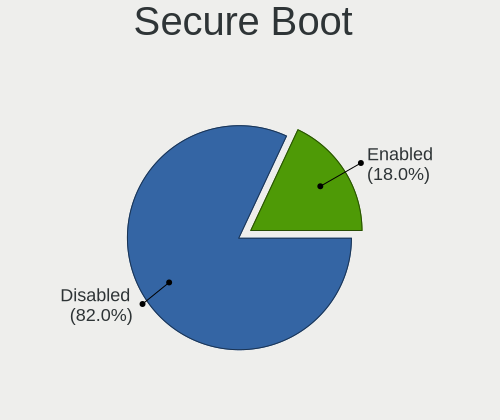
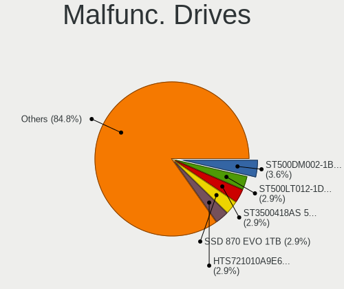
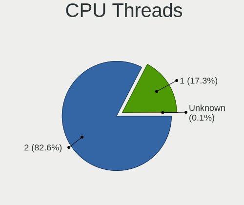
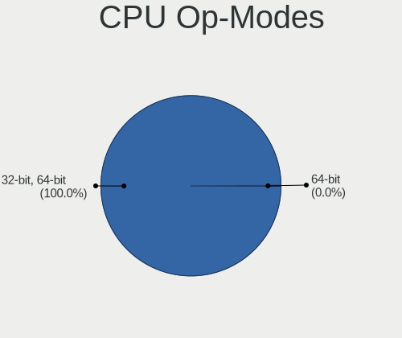
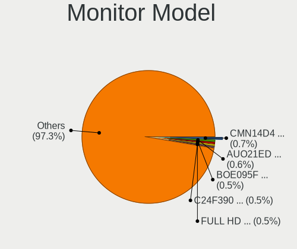
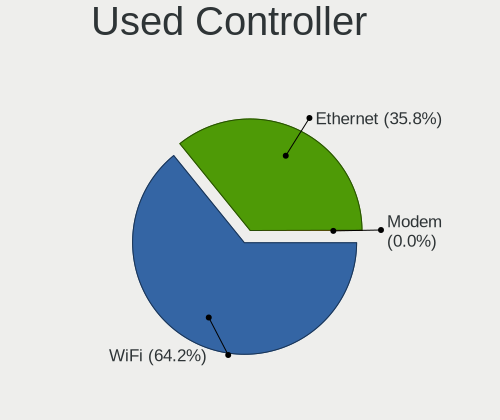
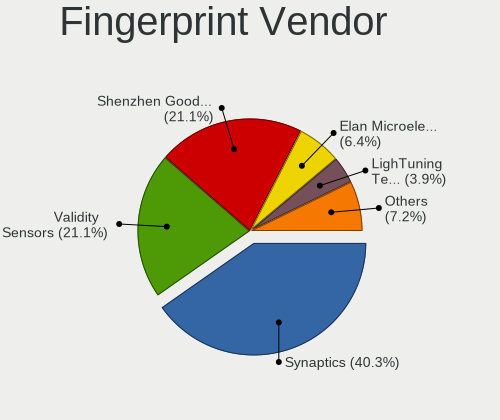

Fedora 36 - Tested Hardware & Statistics
----------------------------------------

A project to collect tested hardware configurations for Fedora 36.

Anyone can contribute to this report by the [hw-probe](https://github.com/linuxhw/hw-probe) tool:

    sudo -E hw-probe -all -upload

Please contribute! Especially if your hardware is rare.

This is a report for all computer types. See also reports for [desktops](/Dist/Fedora_36/Desktop/README.md) and [notebooks](/Dist/Fedora_36/Notebook/README.md).

Contents
--------

* [ Test Cases ](#test-cases)

* [ System ](#system)
  - [ Kernel                   ](#kernel)
  - [ Kernel Family            ](#kernel-family)
  - [ Kernel Major Ver.        ](#kernel-major-ver)
  - [ Arch                     ](#arch)
  - [ DE                       ](#de)
  - [ Display Server           ](#display-server)
  - [ Display Manager          ](#display-manager)
  - [ OS Lang                  ](#os-lang)
  - [ Boot Mode                ](#boot-mode)
  - [ Filesystem               ](#filesystem)
  - [ Part. scheme             ](#part-scheme)
  - [ Dual Boot with Linux/BSD ](#dual-boot-with-linuxbsd)
  - [ Dual Boot (Win)          ](#dual-boot-win)

* [ Board ](#board)
  - [ Vendor                   ](#vendor)
  - [ Model                    ](#model)
  - [ Model Family             ](#model-family)
  - [ MFG Year                 ](#mfg-year)
  - [ Form Factor              ](#form-factor)
  - [ Secure Boot              ](#secure-boot)
  - [ Coreboot                 ](#coreboot)
  - [ RAM Size                 ](#ram-size)
  - [ RAM Used                 ](#ram-used)
  - [ Total Drives             ](#total-drives)
  - [ Has CD-ROM               ](#has-cd-rom)
  - [ Has Ethernet             ](#has-ethernet)
  - [ Has WiFi                 ](#has-wifi)
  - [ Has Bluetooth            ](#has-bluetooth)

* [ Location ](#location)
  - [ Country                  ](#country)
  - [ City                     ](#city)

* [ Drives ](#drives)
  - [ Drive Vendor             ](#drive-vendor)
  - [ Drive Model              ](#drive-model)
  - [ HDD Vendor               ](#hdd-vendor)
  - [ SSD Vendor               ](#ssd-vendor)
  - [ Drive Kind               ](#drive-kind)
  - [ Drive Connector          ](#drive-connector)
  - [ Drive Size               ](#drive-size)
  - [ Space Total              ](#space-total)
  - [ Space Used               ](#space-used)
  - [ Malfunc. Drives          ](#malfunc-drives)
  - [ Malfunc. Drive Vendor    ](#malfunc-drive-vendor)
  - [ Malfunc. HDD Vendor      ](#malfunc-hdd-vendor)
  - [ Malfunc. Drive Kind      ](#malfunc-drive-kind)
  - [ Failed Drives            ](#failed-drives)
  - [ Failed Drive Vendor      ](#failed-drive-vendor)
  - [ Drive Status             ](#drive-status)

* [ Storage controller ](#storage-controller)
  - [ Storage Vendor           ](#storage-vendor)
  - [ Storage Model            ](#storage-model)
  - [ Storage Kind             ](#storage-kind)

* [ Processor ](#processor)
  - [ CPU Vendor               ](#cpu-vendor)
  - [ CPU Model                ](#cpu-model)
  - [ CPU Model Family         ](#cpu-model-family)
  - [ CPU Cores                ](#cpu-cores)
  - [ CPU Sockets              ](#cpu-sockets)
  - [ CPU Threads              ](#cpu-threads)
  - [ CPU Op-Modes             ](#cpu-op-modes)
  - [ CPU Microcode            ](#cpu-microcode)
  - [ CPU Microarch            ](#cpu-microarch)

* [ Graphics ](#graphics)
  - [ GPU Vendor               ](#gpu-vendor)
  - [ GPU Model                ](#gpu-model)
  - [ GPU Combo                ](#gpu-combo)
  - [ GPU Driver               ](#gpu-driver)
  - [ GPU Memory               ](#gpu-memory)

* [ Monitor ](#monitor)
  - [ Monitor Vendor           ](#monitor-vendor)
  - [ Monitor Model            ](#monitor-model)
  - [ Monitor Resolution       ](#monitor-resolution)
  - [ Monitor Diagonal         ](#monitor-diagonal)
  - [ Monitor Width            ](#monitor-width)
  - [ Aspect Ratio             ](#aspect-ratio)
  - [ Monitor Area             ](#monitor-area)
  - [ Pixel Density            ](#pixel-density)
  - [ Multiple Monitors        ](#multiple-monitors)

* [ Network ](#network)
  - [ Net Controller Vendor    ](#net-controller-vendor)
  - [ Net Controller Model     ](#net-controller-model)
  - [ Wireless Vendor          ](#wireless-vendor)
  - [ Wireless Model           ](#wireless-model)
  - [ Ethernet Vendor          ](#ethernet-vendor)
  - [ Ethernet Model           ](#ethernet-model)
  - [ Net Controller Kind      ](#net-controller-kind)
  - [ Used Controller          ](#used-controller)
  - [ NICs                     ](#nics)
  - [ IPv6                     ](#ipv6)

* [ Bluetooth ](#bluetooth)
  - [ Bluetooth Vendor         ](#bluetooth-vendor)
  - [ Bluetooth Model          ](#bluetooth-model)

* [ Sound ](#sound)
  - [ Sound Vendor             ](#sound-vendor)
  - [ Sound Model              ](#sound-model)

* [ Memory ](#memory)
  - [ Memory Vendor            ](#memory-vendor)
  - [ Memory Model             ](#memory-model)
  - [ Memory Kind              ](#memory-kind)
  - [ Memory Form Factor       ](#memory-form-factor)
  - [ Memory Size              ](#memory-size)
  - [ Memory Speed             ](#memory-speed)

* [ Printers & scanners ](#printers--scanners)
  - [ Printer Vendor           ](#printer-vendor)
  - [ Printer Model            ](#printer-model)
  - [ Scanner Vendor           ](#scanner-vendor)
  - [ Scanner Model            ](#scanner-model)

* [ Camera ](#camera)
  - [ Camera Vendor            ](#camera-vendor)
  - [ Camera Model             ](#camera-model)

* [ Security ](#security)
  - [ Fingerprint Vendor       ](#fingerprint-vendor)
  - [ Fingerprint Model        ](#fingerprint-model)
  - [ Chipcard Vendor          ](#chipcard-vendor)
  - [ Chipcard Model           ](#chipcard-model)

* [ Unsupported ](#unsupported)
  - [ Unsupported Devices      ](#unsupported-devices)
  - [ Unsupported Device Types ](#unsupported-device-types)

Test Cases
----------

Total: 163

| Vendor        | Model                       | Form-Factor | Probe                                                      | Date         |
|---------------|-----------------------------|-------------|------------------------------------------------------------|--------------|
| Gigabyte      | B550 AORUS ELITE AX V2      | Desktop     | [cb6d49fe71](https://linux-hardware.org/?probe=cb6d49fe71) | Apr 30, 2022 |
| ASUSTek       | G75VX                       | Notebook    | [fb58cab830](https://linux-hardware.org/?probe=fb58cab830) | Apr 30, 2022 |
| Gigabyte      | B550 AORUS ELITE AX V2      | Desktop     | [83e47f9c91](https://linux-hardware.org/?probe=83e47f9c91) | Apr 30, 2022 |
| ASUSTek       | PRIME Z390-A                | Desktop     | [c4d7dc5e80](https://linux-hardware.org/?probe=c4d7dc5e80) | Apr 30, 2022 |
| MSI           | MAG B460M MORTAR            | Desktop     | [07cb268e5e](https://linux-hardware.org/?probe=07cb268e5e) | Apr 30, 2022 |
| HP            | ZBook Firefly 15 inch G8... | Notebook    | [6cdff366fa](https://linux-hardware.org/?probe=6cdff366fa) | Apr 28, 2022 |
| ASUSTek       | PRIME H310M-D R2.0          | Desktop     | [2999ff1487](https://linux-hardware.org/?probe=2999ff1487) | Apr 28, 2022 |
| ASRock        | B450 Steel Legend           | Desktop     | [bf0a56358c](https://linux-hardware.org/?probe=bf0a56358c) | Apr 27, 2022 |
| MSI           | Stealth GS66 12UGS          | Notebook    | [bf36d72c14](https://linux-hardware.org/?probe=bf36d72c14) | Apr 26, 2022 |
| Acer          | Nitro AN515-43              | Notebook    | [99527fd065](https://linux-hardware.org/?probe=99527fd065) | Apr 26, 2022 |
| MSI           | Stealth GS66 12UGS          | Notebook    | [273526bab2](https://linux-hardware.org/?probe=273526bab2) | Apr 26, 2022 |
| ASUSTek       | ROG STRIX B550-I GAMING     | Desktop     | [5456280ec0](https://linux-hardware.org/?probe=5456280ec0) | Apr 26, 2022 |
| HP            | ZBook Fury 15 G7 Mobile ... | Notebook    | [620718bb9e](https://linux-hardware.org/?probe=620718bb9e) | Apr 26, 2022 |
| Acer          | Aspire A515-45              | Notebook    | [128cdc0a61](https://linux-hardware.org/?probe=128cdc0a61) | Apr 26, 2022 |
| ASUSTek       | ROG Zephyrus G14 GA402RJ... | Notebook    | [0d3c8ed904](https://linux-hardware.org/?probe=0d3c8ed904) | Apr 25, 2022 |
| Lenovo        | IdeaPad 320-15ISK 80XH      | Notebook    | [b4577b2374](https://linux-hardware.org/?probe=b4577b2374) | Apr 25, 2022 |
| Dell          | Latitude 7280               | Notebook    | [7ad22b030d](https://linux-hardware.org/?probe=7ad22b030d) | Apr 24, 2022 |
| Gigabyte      | X570 AORUS PRO              | Desktop     | [187db4f8e4](https://linux-hardware.org/?probe=187db4f8e4) | Apr 23, 2022 |
| ASUSTek       | ROG STRIX B550-I GAMING     | Desktop     | [b9ea98672f](https://linux-hardware.org/?probe=b9ea98672f) | Apr 23, 2022 |
| Lenovo        | ThinkPad T450s 20BWS2HP0... | Notebook    | [762843e768](https://linux-hardware.org/?probe=762843e768) | Apr 23, 2022 |
| Lenovo        | ThinkPad T450s 20BWS2HP0... | Notebook    | [11ec4d291b](https://linux-hardware.org/?probe=11ec4d291b) | Apr 23, 2022 |
| Microsoft     | Surface Pro 7               | Tablet      | [8c3b142c85](https://linux-hardware.org/?probe=8c3b142c85) | Apr 23, 2022 |
| ASUSTek       | ROG STRIX B550-I GAMING     | Desktop     | [c3f809fc02](https://linux-hardware.org/?probe=c3f809fc02) | Apr 23, 2022 |
| Dell          | Latitude E7450              | Notebook    | [5ce1623306](https://linux-hardware.org/?probe=5ce1623306) | Apr 22, 2022 |
| ASUSTek       | ROG Strix G513QM_G513QM     | Notebook    | [b6a457c33a](https://linux-hardware.org/?probe=b6a457c33a) | Apr 21, 2022 |
| Gigabyte      | EP45-DS3L                   | Desktop     | [948b64fcc9](https://linux-hardware.org/?probe=948b64fcc9) | Apr 21, 2022 |
| MSI           | MAG X570 TOMAHAWK WIFI      | Desktop     | [68a04098ec](https://linux-hardware.org/?probe=68a04098ec) | Apr 21, 2022 |
| Wiltronic     | iVIEW i896QW                | Notebook    | [34e1873984](https://linux-hardware.org/?probe=34e1873984) | Apr 21, 2022 |
| ASUSTek       | ROG STRIX B550-F GAMING     | Desktop     | [466f67adb3](https://linux-hardware.org/?probe=466f67adb3) | Apr 20, 2022 |
| Gigabyte      | EP45-DS3L                   | Desktop     | [35d6ec9f89](https://linux-hardware.org/?probe=35d6ec9f89) | Apr 19, 2022 |
| Gigabyte      | H81M-S2H                    | Desktop     | [85082e6de6](https://linux-hardware.org/?probe=85082e6de6) | Apr 19, 2022 |
| Lenovo        | IdeaPad C340-14API 81N6     | Notebook    | [9e1d98199a](https://linux-hardware.org/?probe=9e1d98199a) | Apr 18, 2022 |
| Lenovo        | ThinkPad W530 2463A49       | Notebook    | [202b5d34a1](https://linux-hardware.org/?probe=202b5d34a1) | Apr 18, 2022 |
| ASUSTek       | ROG Zephyrus G14 GA402RJ... | Notebook    | [81b837dc13](https://linux-hardware.org/?probe=81b837dc13) | Apr 18, 2022 |
| Lenovo        | IdeaPad S340-15IWL 81N8     | Notebook    | [b895187681](https://linux-hardware.org/?probe=b895187681) | Apr 17, 2022 |
| MSI           | Modern 14 B4MW              | Notebook    | [5d8e6ca082](https://linux-hardware.org/?probe=5d8e6ca082) | Apr 16, 2022 |
| Gigabyte      | Z170-D3H-CF                 | Desktop     | [6a9e2b3174](https://linux-hardware.org/?probe=6a9e2b3174) | Apr 16, 2022 |
| Gigabyte      | H110M-H-CF                  | Desktop     | [66ef9c9e5f](https://linux-hardware.org/?probe=66ef9c9e5f) | Apr 16, 2022 |
| Lenovo        | ThinkPad L14 Gen 2 20X10... | Notebook    | [6f75f679f9](https://linux-hardware.org/?probe=6f75f679f9) | Apr 16, 2022 |
| HP            | ProBook 455 G8 Notebook ... | Notebook    | [5bff5642ba](https://linux-hardware.org/?probe=5bff5642ba) | Apr 15, 2022 |
| Toshiba       | Satellite U840              | Notebook    | [9468123a43](https://linux-hardware.org/?probe=9468123a43) | Apr 15, 2022 |
| Dell          | Studio 1537                 | Notebook    | [56c84908d2](https://linux-hardware.org/?probe=56c84908d2) | Apr 15, 2022 |
| Nvidia        | Jetson Xavier NX Develop... | Soc         | [a786d1f74e](https://linux-hardware.org/?probe=a786d1f74e) | Apr 15, 2022 |
| Lenovo        | IdeaPad 530S-14IKB 81EU     | Notebook    | [7436528d4f](https://linux-hardware.org/?probe=7436528d4f) | Apr 14, 2022 |
| Acer          | Aspire TC-895 V:1.0         | Desktop     | [22a1a17a81](https://linux-hardware.org/?probe=22a1a17a81) | Apr 14, 2022 |
| Dell          | Inspiron 3505               | Notebook    | [719a1712f2](https://linux-hardware.org/?probe=719a1712f2) | Apr 14, 2022 |
| Dell          | Inspiron 3505               | Notebook    | [5781ceb5ca](https://linux-hardware.org/?probe=5781ceb5ca) | Apr 14, 2022 |
| Gigabyte      | B550 AORUS ELITE            | Desktop     | [85b4ecf9d3](https://linux-hardware.org/?probe=85b4ecf9d3) | Apr 14, 2022 |
| Gigabyte      | B550 AORUS ELITE            | Desktop     | [abe538f1ed](https://linux-hardware.org/?probe=abe538f1ed) | Apr 14, 2022 |
| ASUSTek       | P8P67 LE                    | Desktop     | [84abfd3112](https://linux-hardware.org/?probe=84abfd3112) | Apr 14, 2022 |
| MSI           | FM2-A75IA-E53               | Desktop     | [25ffe3d211](https://linux-hardware.org/?probe=25ffe3d211) | Apr 14, 2022 |
| Dell          | Inspiron 5548               | Notebook    | [77a3c1a7ce](https://linux-hardware.org/?probe=77a3c1a7ce) | Apr 14, 2022 |
| Lenovo        | ThinkPad P14s Gen 1 20Y1... | Notebook    | [9dd2675f34](https://linux-hardware.org/?probe=9dd2675f34) | Apr 14, 2022 |
| Dell          | XPS 13 9370                 | Notebook    | [0175e41474](https://linux-hardware.org/?probe=0175e41474) | Apr 14, 2022 |
| Dell          | XPS 13 9305                 | Notebook    | [48c7781b77](https://linux-hardware.org/?probe=48c7781b77) | Apr 14, 2022 |
| Dell          | Precision 7540              | Notebook    | [2aff9a81ff](https://linux-hardware.org/?probe=2aff9a81ff) | Apr 13, 2022 |
| Toshiba       | Satellite U840              | Notebook    | [c6fe138c8f](https://linux-hardware.org/?probe=c6fe138c8f) | Apr 13, 2022 |
| Gigabyte      | Z170MX-Gaming 5             | Desktop     | [d1b267f496](https://linux-hardware.org/?probe=d1b267f496) | Apr 13, 2022 |
| Unknown       | Unknown                     | Soc         | [43769378a7](https://linux-hardware.org/?probe=43769378a7) | Apr 13, 2022 |
| Gigabyte      | B450 AORUS M                | Desktop     | [c1beed0e9b](https://linux-hardware.org/?probe=c1beed0e9b) | Apr 13, 2022 |
| Gigabyte      | B450 AORUS M                | Desktop     | [e5a9e99dbc](https://linux-hardware.org/?probe=e5a9e99dbc) | Apr 13, 2022 |
| HP            | Laptop 15-dw3xxx            | Notebook    | [95cff2fbb1](https://linux-hardware.org/?probe=95cff2fbb1) | Apr 13, 2022 |
| Dell          | 0GWHMW A03                  | Desktop     | [ff312c5929](https://linux-hardware.org/?probe=ff312c5929) | Apr 13, 2022 |
| HP            | ZBook Fury 15 G7 Mobile ... | Notebook    | [8421f0505f](https://linux-hardware.org/?probe=8421f0505f) | Apr 13, 2022 |
| Gigabyte      | Z170-D3H-CF                 | Desktop     | [33b4ba0b02](https://linux-hardware.org/?probe=33b4ba0b02) | Apr 13, 2022 |
| Dell          | 00NH4P A14                  | Server      | [274931609f](https://linux-hardware.org/?probe=274931609f) | Apr 13, 2022 |
| Lenovo        | Legion Y540-15IRH 81SX      | Notebook    | [c3d7c67155](https://linux-hardware.org/?probe=c3d7c67155) | Apr 12, 2022 |
| Lenovo        | IdeaPad L340-15IRH Gamin... | Notebook    | [73bb0eeab0](https://linux-hardware.org/?probe=73bb0eeab0) | Apr 12, 2022 |
| Lenovo        | Yoga 6 13ALC6 82ND          | Convertible | [7349c76e13](https://linux-hardware.org/?probe=7349c76e13) | Apr 11, 2022 |
| Intel         | W7650                       | Notebook    | [4bd778e810](https://linux-hardware.org/?probe=4bd778e810) | Apr 11, 2022 |
| MSI           | GS66 Stealth 10UH           | Notebook    | [5589b339ed](https://linux-hardware.org/?probe=5589b339ed) | Apr 11, 2022 |
| Dell          | Studio 1537                 | Notebook    | [048fceac96](https://linux-hardware.org/?probe=048fceac96) | Apr 11, 2022 |
| Gigabyte      | Z170-D3H-CF                 | Desktop     | [8a1cecc21c](https://linux-hardware.org/?probe=8a1cecc21c) | Apr 11, 2022 |
| ASUSTek       | VivoBook_ASUSLaptop X512... | Notebook    | [5a60603c45](https://linux-hardware.org/?probe=5a60603c45) | Apr 11, 2022 |
| HP            | Pavilion 15                 | Notebook    | [c913cb5a4a](https://linux-hardware.org/?probe=c913cb5a4a) | Apr 11, 2022 |
| Lenovo        | ThinkPad X12 Detachable ... | Tablet      | [84927bf894](https://linux-hardware.org/?probe=84927bf894) | Apr 10, 2022 |
| MSI           | B450M PRO-VDH PLUS          | Desktop     | [5b861faffd](https://linux-hardware.org/?probe=5b861faffd) | Apr 09, 2022 |
| Gigabyte      | Z490 UD                     | Desktop     | [31ecc9c776](https://linux-hardware.org/?probe=31ecc9c776) | Apr 09, 2022 |
| Biostar       | B550MH                      | Desktop     | [abd373497b](https://linux-hardware.org/?probe=abd373497b) | Apr 09, 2022 |
| Gigabyte      | B450 AORUS M                | Desktop     | [1a4b90c894](https://linux-hardware.org/?probe=1a4b90c894) | Apr 08, 2022 |
| MSI           | Z170A XPOWER GAMING TITA... | Desktop     | [ffcbeed952](https://linux-hardware.org/?probe=ffcbeed952) | Apr 08, 2022 |
| ASUSTek       | VivoBook_ASUSLaptop X421... | Notebook    | [ff93a4d2f5](https://linux-hardware.org/?probe=ff93a4d2f5) | Apr 08, 2022 |
| Lenovo        | ThinkPad T495 20NJ000XIX    | Notebook    | [f00fb05977](https://linux-hardware.org/?probe=f00fb05977) | Apr 07, 2022 |
| Microsoft     | Surface Pro                 | Tablet      | [92966a1240](https://linux-hardware.org/?probe=92966a1240) | Apr 06, 2022 |
| Intel         | NUC8i7HVB J68196-502        | Mini pc     | [45a343796d](https://linux-hardware.org/?probe=45a343796d) | Apr 06, 2022 |
| MSI           | GS66 Stealth 10UH           | Notebook    | [bd6f031bc8](https://linux-hardware.org/?probe=bd6f031bc8) | Apr 06, 2022 |
| Gigabyte      | Z170N-Gaming 5              | Desktop     | [f0472bcf0d](https://linux-hardware.org/?probe=f0472bcf0d) | Apr 05, 2022 |
| Gigabyte      | Z170N-Gaming 5              | Desktop     | [9ee2f76c12](https://linux-hardware.org/?probe=9ee2f76c12) | Apr 05, 2022 |
| Acer          | Swift SF114-32              | Notebook    | [3947799e36](https://linux-hardware.org/?probe=3947799e36) | Apr 05, 2022 |
| MSI           | Prestige 14Evo A11M         | Notebook    | [29b43c3e27](https://linux-hardware.org/?probe=29b43c3e27) | Apr 05, 2022 |
| Acer          | Swift SF314-41              | Notebook    | [564cfd1f31](https://linux-hardware.org/?probe=564cfd1f31) | Apr 04, 2022 |
| ASUSTek       | B150M-K                     | Desktop     | [016a08bf47](https://linux-hardware.org/?probe=016a08bf47) | Apr 04, 2022 |
| Acer          | Aspire A515-45              | Notebook    | [eb69a7978b](https://linux-hardware.org/?probe=eb69a7978b) | Apr 04, 2022 |
| Lenovo        | IdeaPad 320S-13IKB 81AK     | Notebook    | [8444b44333](https://linux-hardware.org/?probe=8444b44333) | Apr 04, 2022 |
| Chuwi         | Hi10 Go                     | Notebook    | [cfa6610288](https://linux-hardware.org/?probe=cfa6610288) | Apr 04, 2022 |
| Gigabyte      | B550I AORUS PRO AX          | Desktop     | [b697fd5f0a](https://linux-hardware.org/?probe=b697fd5f0a) | Apr 03, 2022 |
| HP            | ENVY x360 Convertible 15... | Convertible | [1cc5b6fbc3](https://linux-hardware.org/?probe=1cc5b6fbc3) | Apr 03, 2022 |
| Gigabyte      | 970A-DS3P                   | Desktop     | [5bbc4cbbf5](https://linux-hardware.org/?probe=5bbc4cbbf5) | Apr 03, 2022 |
| Lenovo        | ThinkPad X1 Carbon 6th 2... | Notebook    | [8c1841d2d0](https://linux-hardware.org/?probe=8c1841d2d0) | Apr 03, 2022 |
| Lenovo        | ThinkPad X1 Carbon 7th 2... | Notebook    | [5eef69398a](https://linux-hardware.org/?probe=5eef69398a) | Apr 03, 2022 |
| Lenovo        | ThinkBook 13s G3 ACN 20Y... | Notebook    | [ba4863a7bb](https://linux-hardware.org/?probe=ba4863a7bb) | Apr 02, 2022 |
| Lenovo        | IdeaPad Yoga 13 20175       | Notebook    | [cd942b0305](https://linux-hardware.org/?probe=cd942b0305) | Apr 02, 2022 |
| Dell          | 088DT1 A01                  | Desktop     | [718a7d42cc](https://linux-hardware.org/?probe=718a7d42cc) | Apr 02, 2022 |
| Dell          | Inspiron 5548               | Notebook    | [9e35cab29a](https://linux-hardware.org/?probe=9e35cab29a) | Apr 02, 2022 |
| Gigabyte      | H81M-S2H                    | Desktop     | [8a810aa9f6](https://linux-hardware.org/?probe=8a810aa9f6) | Apr 02, 2022 |
| Dell          | XPS 13 9333                 | Notebook    | [f4fb42182f](https://linux-hardware.org/?probe=f4fb42182f) | Apr 01, 2022 |
| MSI           | MPG Z590 GAMING CARBON W... | Desktop     | [f7946783ea](https://linux-hardware.org/?probe=f7946783ea) | Mar 31, 2022 |
| Lenovo        | ThinkPad L13 Gen 2 20VJS... | Notebook    | [4c0c1422e7](https://linux-hardware.org/?probe=4c0c1422e7) | Mar 31, 2022 |
| Lenovo        | ThinkPad X260 20F5S0HK1J    | Notebook    | [a83d3cbe5f](https://linux-hardware.org/?probe=a83d3cbe5f) | Mar 31, 2022 |
| Lenovo        | ThinkBook 15 G2 ITL 20VE    | Notebook    | [cc95f0e3ab](https://linux-hardware.org/?probe=cc95f0e3ab) | Mar 31, 2022 |
| Gigabyte      | H370M DS3H-CF               | Desktop     | [1110b2974c](https://linux-hardware.org/?probe=1110b2974c) | Mar 31, 2022 |
| VALE          | Notebook Slim S132          | Notebook    | [138a4f1d68](https://linux-hardware.org/?probe=138a4f1d68) | Mar 31, 2022 |
| Lenovo        | ThinkPad P15 Gen 1 20STS... | Notebook    | [05c02cbe41](https://linux-hardware.org/?probe=05c02cbe41) | Mar 31, 2022 |
| Gigabyte      | EP45-DS3L                   | Desktop     | [7879818528](https://linux-hardware.org/?probe=7879818528) | Mar 30, 2022 |
| HP            | EliteBook x360 830 G5       | Convertible | [d384ca307e](https://linux-hardware.org/?probe=d384ca307e) | Mar 30, 2022 |
| Avell High... | B.ON                        | Notebook    | [697fc1d4ec](https://linux-hardware.org/?probe=697fc1d4ec) | Mar 29, 2022 |
| Framework     | Laptop                      | Notebook    | [a22656afee](https://linux-hardware.org/?probe=a22656afee) | Mar 28, 2022 |
| Dell          | XPS 17 9710                 | Notebook    | [461d175c44](https://linux-hardware.org/?probe=461d175c44) | Mar 28, 2022 |
| Dell          | XPS 13 9310 2-in-1          | Convertible | [fd1c735c98](https://linux-hardware.org/?probe=fd1c735c98) | Mar 27, 2022 |
| Gigabyte      | EP45-DS3L                   | Desktop     | [c7d6879a86](https://linux-hardware.org/?probe=c7d6879a86) | Mar 26, 2022 |
| Gigabyte      | B85M-D3V-A                  | Desktop     | [b7679b78be](https://linux-hardware.org/?probe=b7679b78be) | Mar 25, 2022 |
| ASUSTek       | ROG Zephyrus Duo 15 SE G... | Notebook    | [16ac712c84](https://linux-hardware.org/?probe=16ac712c84) | Mar 24, 2022 |
| Gigabyte      | B550 AORUS ELITE            | Desktop     | [7977e70f86](https://linux-hardware.org/?probe=7977e70f86) | Mar 22, 2022 |
| HUAWEI        | DRC-WXX                     | Tablet      | [927252e84e](https://linux-hardware.org/?probe=927252e84e) | Mar 20, 2022 |
| HUAWEI        | DRC-WXX                     | Tablet      | [be2a3fd33b](https://linux-hardware.org/?probe=be2a3fd33b) | Mar 20, 2022 |
| Lenovo        | IdeaPad 530S-14ARR 81H1     | Notebook    | [1b57f1f410](https://linux-hardware.org/?probe=1b57f1f410) | Mar 13, 2022 |
| HP            | ZBook Fury 15 G7 Mobile ... | Notebook    | [917a6b65a8](https://linux-hardware.org/?probe=917a6b65a8) | Mar 10, 2022 |
| Gigabyte      | EP45-DS3L                   | Desktop     | [efdb29ff92](https://linux-hardware.org/?probe=efdb29ff92) | Mar 07, 2022 |
| ASUSTek       | TUF GAMING B550M-PLUS       | Desktop     | [97eedd34f4](https://linux-hardware.org/?probe=97eedd34f4) | Mar 05, 2022 |
| Gigabyte      | EP45-DS3L                   | Desktop     | [0efde9a187](https://linux-hardware.org/?probe=0efde9a187) | Mar 03, 2022 |
| Gigabyte      | EP45-DS3L                   | Desktop     | [da3962a1da](https://linux-hardware.org/?probe=da3962a1da) | Mar 03, 2022 |
| Apple         | Mac-77F17D7DA9285301 iMa... | All in one  | [841ab4ffe2](https://linux-hardware.org/?probe=841ab4ffe2) | Mar 01, 2022 |
| Sony          | VGN-FW21E                   | Notebook    | [930ce5581f](https://linux-hardware.org/?probe=930ce5581f) | Feb 25, 2022 |
| Biostar       | H55 HD                      | Desktop     | [b0d5843b6e](https://linux-hardware.org/?probe=b0d5843b6e) | Feb 13, 2022 |
| Biostar       | H55 HD                      | Desktop     | [e08da3e685](https://linux-hardware.org/?probe=e08da3e685) | Feb 03, 2022 |
| Unknown       | Unknown                     | Notebook    | [033354ee53](https://linux-hardware.org/?probe=033354ee53) | Jan 02, 2022 |
| Unknown       | Unknown                     | Notebook    | [809200ad60](https://linux-hardware.org/?probe=809200ad60) | Jan 02, 2022 |
| Unknown       | Unknown                     | Notebook    | [ea795a97e1](https://linux-hardware.org/?probe=ea795a97e1) | Dec 26, 2021 |
| Unknown       | Unknown                     | Notebook    | [2b26e185d0](https://linux-hardware.org/?probe=2b26e185d0) | Dec 06, 2021 |
| Unknown       | Unknown                     | Notebook    | [f09a7c7125](https://linux-hardware.org/?probe=f09a7c7125) | Dec 06, 2021 |
| Lenovo        | ThinkPad 10 20C10027SP      | Tablet      | [1c4e6ab62b](https://linux-hardware.org/?probe=1c4e6ab62b) | Nov 29, 2021 |
| Positivo      | CHT12CP                     | Notebook    | [53054c8f7a](https://linux-hardware.org/?probe=53054c8f7a) | Nov 20, 2021 |
| Lenovo        | IdeaPadFlex 14 20308        | Notebook    | [1734da4566](https://linux-hardware.org/?probe=1734da4566) | Nov 13, 2021 |
| Lenovo        | ThinkBook 14 G3 ACL 21A2    | Notebook    | [2da0673527](https://linux-hardware.org/?probe=2da0673527) | Nov 01, 2021 |
| MSI           | B550M PRO-VDH WIFI          | Desktop     | [f1a1a21c56](https://linux-hardware.org/?probe=f1a1a21c56) | Oct 26, 2021 |
| Dell          | 0KC9NP A01                  | Desktop     | [ff356cba89](https://linux-hardware.org/?probe=ff356cba89) | Oct 22, 2021 |
| Dell          | 0KC9NP A01                  | Desktop     | [a072a33607](https://linux-hardware.org/?probe=a072a33607) | Oct 12, 2021 |
| Notebook      | PCx0Dx                      | Notebook    | [b1a527acdc](https://linux-hardware.org/?probe=b1a527acdc) | Oct 11, 2021 |
| Notebook      | PCx0Dx                      | Notebook    | [90d4556fdf](https://linux-hardware.org/?probe=90d4556fdf) | Oct 11, 2021 |
| MSI           | FM2-A55M-E33                | Desktop     | [bcf7dcdd2c](https://linux-hardware.org/?probe=bcf7dcdd2c) | Oct 09, 2021 |
| MSI           | FM2-A55M-E33                | Desktop     | [0b3691d096](https://linux-hardware.org/?probe=0b3691d096) | Oct 09, 2021 |
| Unknown       | Unknown                     | Notebook    | [af4bbffabf](https://linux-hardware.org/?probe=af4bbffabf) | Sep 27, 2021 |
| Unknown       | Unknown                     | Notebook    | [81fd834473](https://linux-hardware.org/?probe=81fd834473) | Sep 26, 2021 |
| HP            | ProBook 4740s               | Notebook    | [77b2eed991](https://linux-hardware.org/?probe=77b2eed991) | Sep 22, 2021 |
| Dell          | 0KC9NP A01                  | Desktop     | [95229554a9](https://linux-hardware.org/?probe=95229554a9) | Sep 19, 2021 |
| Dell          | 0KC9NP A01                  | Desktop     | [d235dcf0d1](https://linux-hardware.org/?probe=d235dcf0d1) | Sep 18, 2021 |
| Dell          | 0KC9NP A01                  | Desktop     | [ad5f2b8ea5](https://linux-hardware.org/?probe=ad5f2b8ea5) | Sep 04, 2021 |
| Dell          | 0KC9NP A01                  | Desktop     | [f191342fa8](https://linux-hardware.org/?probe=f191342fa8) | Sep 02, 2021 |
| Dell          | 0KC9NP A01                  | Desktop     | [270961aa02](https://linux-hardware.org/?probe=270961aa02) | Aug 30, 2021 |
| Dell          | 0KC9NP A01                  | Desktop     | [1257d6c6f4](https://linux-hardware.org/?probe=1257d6c6f4) | Aug 27, 2021 |
| Dell          | 0KC9NP A01                  | Desktop     | [373f7e6861](https://linux-hardware.org/?probe=373f7e6861) | Aug 22, 2021 |
| HP            | 304Ah                       | Desktop     | [047d1b0887](https://linux-hardware.org/?probe=047d1b0887) | Aug 18, 2021 |
| Dell          | 0KC9NP A01                  | Desktop     | [2ca8cc81b1](https://linux-hardware.org/?probe=2ca8cc81b1) | Aug 18, 2021 |

System
------

Kernel
------

Version of the Linux kernel

| Version                                                       | Computers | Percent |
|---------------------------------------------------------------|-----------|---------|
| 5.17.1-300.fc36.x86_64                                        | 29        | 23.77%  |
| 5.17.2-300.fc36.x86_64                                        | 26        | 21.31%  |
| 5.17.0-0.rc7.116.fc36.x86_64                                  | 17        | 13.93%  |
| 5.17.3-302.fc36.x86_64                                        | 12        | 9.84%   |
| 5.17.4-300.fc36.x86_64                                        | 4         | 3.28%   |
| 5.17.0-300.fc36.x86_64                                        | 4         | 3.28%   |
| 5.17.0-0.rc5.102.fc36.x86_64                                  | 4         | 3.28%   |
| 5.15.0-0.rc4.20211008git1da38549dd64.36.fc36.x86_64           | 2         | 1.64%   |
| 5.14.0-0.rc5.20210813gitf8e6dfc64f61.46.fc36.x86_64           | 2         | 1.64%   |
| 5.18.0-0.rc4.20220428git8f4dd16603ce834.36.fc37.x86_64        | 1         | 0.82%   |
| 5.18.0-0.rc3.220422.d569e86915b7f2f.31.vanilla.1.fc36.x86_64  | 1         | 0.82%   |
| 5.17.5-300.fc36.x86_64                                        | 1         | 0.82%   |
| 5.17.3-301.fsync.fc36.x86_64                                  | 1         | 0.82%   |
| 5.17.3-300.fc36.x86_64                                        | 1         | 0.82%   |
| 5.17.3-300.fc36.aarch64                                       | 1         | 0.82%   |
| 5.17.2-300.fc36.aarch64                                       | 1         | 0.82%   |
| 5.17.1-xanmod1                                                | 1         | 0.82%   |
| 5.17.0-0.rc0.20220112gitdaadb3bd0e8d.63.fc36.x86_64           | 1         | 0.82%   |
| 5.16.9-200.fc35.x86_64                                        | 1         | 0.82%   |
| 5.16.17-200.fc35.x86_64                                       | 1         | 0.82%   |
| 5.16.16-200.fc35.x86_64                                       | 1         | 0.82%   |
| 5.16.0-0.rc7.20211231git4f3d93c6eaff.52.vanilla.1.fc36.x86_64 | 1         | 0.82%   |
| 5.16.0-0.rc2.20211126gita4849f6000e2.21.fc36.x86_64           | 1         | 0.82%   |
| 5.15.0-0.rc7.20211028git1fc596a56b33.56.fc36.x86_64           | 1         | 0.82%   |
| 5.15.0-0.rc6.47.fc36.x86_64                                   | 1         | 0.82%   |
| 5.15.0-0.rc4.20211008git1da38549dd64.36.vanilla.1.fc36.x86_64 | 1         | 0.82%   |
| 5.15.0-0.rc2.20210923git58e2cf5d7946.21.vanilla.1.fc36.x86_64 | 1         | 0.82%   |
| 5.15.0-0.rc2.18.fc36.x86_64                                   | 1         | 0.82%   |
| 5.15.0-0.rc0.20210831gitb91db6a0b52e.1.fc36.x86_64            | 1         | 0.82%   |
| 5.14.14-300.fc35.x86_64                                       | 1         | 0.82%   |
| 5.14.10-300.fc35.x86_64                                       | 1         | 0.82%   |

Kernel Family
-------------

Linux kernel without a distro release

| Version | Computers | Percent |
|---------|-----------|---------|
| 5.17.1  | 30        | 24.79%  |
| 5.17.2  | 27        | 22.31%  |
| 5.17.0  | 26        | 21.49%  |
| 5.17.3  | 15        | 12.4%   |
| 5.15.0  | 7         | 5.79%   |
| 5.17.4  | 4         | 3.31%   |
| 5.18.0  | 2         | 1.65%   |
| 5.16.0  | 2         | 1.65%   |
| 5.14.0  | 2         | 1.65%   |
| 5.17.5  | 1         | 0.83%   |
| 5.16.9  | 1         | 0.83%   |
| 5.16.17 | 1         | 0.83%   |
| 5.16.16 | 1         | 0.83%   |
| 5.14.14 | 1         | 0.83%   |
| 5.14.10 | 1         | 0.83%   |

Kernel Major Ver.
-----------------

Linux kernel major version

| Version | Computers | Percent |
|---------|-----------|---------|
| 5.17    | 100       | 84.75%  |
| 5.15    | 7         | 5.93%   |
| 5.16    | 5         | 4.24%   |
| 5.14    | 4         | 3.39%   |
| 5.18    | 2         | 1.69%   |

Arch
----

OS architecture (x86_64, i586, etc.)

| Name    | Computers | Percent |
|---------|-----------|---------|
| x86_64  | 114       | 98.28%  |
| aarch64 | 2         | 1.72%   |

DE
--

Desktop Environment

| Name    | Computers | Percent |
|---------|-----------|---------|
| GNOME   | 99        | 84.62%  |
| KDE5    | 10        | 8.55%   |
| Unknown | 7         | 5.98%   |
| i3      | 1         | 0.85%   |

Display Server
--------------

X11 or Wayland

| Name    | Computers | Percent |
|---------|-----------|---------|
| Wayland | 94        | 81.03%  |
| X11     | 15        | 12.93%  |
| Tty     | 4         | 3.45%   |
| Unknown | 3         | 2.59%   |

Display Manager
---------------

SDDM, LightDM, etc.

| Name    | Computers | Percent |
|---------|-----------|---------|
| GDM     | 61        | 52.59%  |
| Unknown | 47        | 40.52%  |
| SDDM    | 6         | 5.17%   |
| LightDM | 2         | 1.72%   |

OS Lang
-------

Language

| Lang  | Computers | Percent |
|-------|-----------|---------|
| en_US | 65        | 56.03%  |
| en_GB | 11        | 9.48%   |
| pl_PL | 6         | 5.17%   |
| ru_RU | 4         | 3.45%   |
| fr_FR | 4         | 3.45%   |
| de_DE | 4         | 3.45%   |
| pt_BR | 3         | 2.59%   |
| es_ES | 3         | 2.59%   |
| es_AR | 2         | 1.72%   |
| cs_CZ | 2         | 1.72%   |
| pt_PT | 1         | 0.86%   |
| nl_NL | 1         | 0.86%   |
| it_IT | 1         | 0.86%   |
| hu_HU | 1         | 0.86%   |
| hr_HR | 1         | 0.86%   |
| fi_FI | 1         | 0.86%   |
| es_UY | 1         | 0.86%   |
| es_CO | 1         | 0.86%   |
| en_IN | 1         | 0.86%   |
| en_CA | 1         | 0.86%   |
| C     | 1         | 0.86%   |
| ba_RU | 1         | 0.86%   |

Boot Mode
---------

EFI or BIOS

| Mode | Computers | Percent |
|------|-----------|---------|
| EFI  | 100       | 86.21%  |
| BIOS | 16        | 13.79%  |

Filesystem
----------

Type of filesystem

| Type  | Computers | Percent |
|-------|-----------|---------|
| Btrfs | 85        | 73.28%  |
| Ext4  | 24        | 20.69%  |
| Xfs   | 7         | 6.03%   |

Part. scheme
------------

Scheme of partitioning

| Type    | Computers | Percent |
|---------|-----------|---------|
| GPT     | 64        | 54.7%   |
| Unknown | 46        | 39.32%  |
| MBR     | 7         | 5.98%   |

Dual Boot with Linux/BSD
------------------------

Hosting more than one Linux/BSD

| Dual boot | Computers | Percent |
|-----------|-----------|---------|
| No        | 95        | 81.9%   |
| Yes       | 21        | 18.1%   |

Dual Boot (Win)
---------------

Hosting Linux and Windows

| Dual boot | Computers | Percent |
|-----------|-----------|---------|
| No        | 76        | 65.52%  |
| Yes       | 40        | 34.48%  |

Board
-----

Vendor
------

Motherboard manufacturer

| Name                   | Computers | Percent |
|------------------------|-----------|---------|
| Lenovo                 | 26        | 22.41%  |
| Gigabyte Technology    | 16        | 13.79%  |
| Dell                   | 15        | 12.93%  |
| ASUSTek Computer       | 14        | 12.07%  |
| MSI                    | 12        | 10.34%  |
| Hewlett-Packard        | 9         | 7.76%   |
| Acer                   | 5         | 4.31%   |
| Microsoft              | 2         | 1.72%   |
| Biostar                | 2         | 1.72%   |
| Unknown                | 2         | 1.72%   |
| Wiltronic              | 1         | 0.86%   |
| VALE                   | 1         | 0.86%   |
| Toshiba                | 1         | 0.86%   |
| Sony                   | 1         | 0.86%   |
| Positivo               | 1         | 0.86%   |
| Nvidia                 | 1         | 0.86%   |
| Notebook               | 1         | 0.86%   |
| Intel                  | 1         | 0.86%   |
| Framework              | 1         | 0.86%   |
| Chuwi                  | 1         | 0.86%   |
| Avell High Performance | 1         | 0.86%   |
| ASRock                 | 1         | 0.86%   |
| Apple                  | 1         | 0.86%   |

Model
-----

Motherboard model

| Name                                              | Computers | Percent |
|---------------------------------------------------|-----------|---------|
| Gigabyte B450 AORUS M                             | 2         | 1.72%   |
| ASUS ROG Zephyrus G14 GA402RJ_GA402RJ             | 2         | 1.72%   |
| Unknown                                           | 2         | 1.72%   |
| Wiltronic iVIEW i896QW                            | 1         | 0.86%   |
| VALE Notebook Slim S132                           | 1         | 0.86%   |
| Toshiba Satellite U840                            | 1         | 0.86%   |
| Sony VGN-FW21E                                    | 1         | 0.86%   |
| Positivo CHT12CP                                  | 1         | 0.86%   |
| Nvidia Jetson Xavier NX Developer Kit (SD-card)   | 1         | 0.86%   |
| Notebook PCx0Dx                                   | 1         | 0.86%   |
| MSI Stealth GS66 12UGS                            | 1         | 0.86%   |
| MSI Prestige 14Evo A11M                           | 1         | 0.86%   |
| MSI MS-7D06                                       | 1         | 0.86%   |
| MSI MS-7C95                                       | 1         | 0.86%   |
| MSI MS-7C84                                       | 1         | 0.86%   |
| MSI MS-7C82                                       | 1         | 0.86%   |
| MSI MS-7A38                                       | 1         | 0.86%   |
| MSI MS-7968                                       | 1         | 0.86%   |
| MSI MS-7792                                       | 1         | 0.86%   |
| MSI MS-7721                                       | 1         | 0.86%   |
| MSI Modern 14 B4MW                                | 1         | 0.86%   |
| MSI GS66 Stealth 10UH                             | 1         | 0.86%   |
| Microsoft Surface Pro 7                           | 1         | 0.86%   |
| Microsoft Surface Pro                             | 1         | 0.86%   |
| Lenovo Yoga 6 13ALC6 82ND                         | 1         | 0.86%   |
| Lenovo ThinkPad X260 20F5S0HK1J                   | 1         | 0.86%   |
| Lenovo ThinkPad X12 Detachable Gen 1 20UW0013US   | 1         | 0.86%   |
| Lenovo ThinkPad X1 Carbon 7th 20R1S05B00          | 1         | 0.86%   |
| Lenovo ThinkPad X1 Carbon 6th 20KGS23S0P          | 1         | 0.86%   |
| Lenovo ThinkPad W530 2463A49                      | 1         | 0.86%   |
| Lenovo ThinkPad T495 20NJ000XIX                   | 1         | 0.86%   |
| Lenovo ThinkPad T450s 20BWS2HP00                  | 1         | 0.86%   |
| Lenovo ThinkPad P15 Gen 1 20STS0J500              | 1         | 0.86%   |
| Lenovo ThinkPad P14s Gen 1 20Y1000SUK             | 1         | 0.86%   |
| Lenovo ThinkPad L14 Gen 2 20X10044EQ              | 1         | 0.86%   |
| Lenovo ThinkPad L13 Gen 2 20VJS0HB00              | 1         | 0.86%   |
| Lenovo ThinkPad 10 20C10027SP                     | 1         | 0.86%   |
| Lenovo ThinkBook 15 G2 ITL 20VE                   | 1         | 0.86%   |
| Lenovo ThinkBook 14 G3 ACL 21A2                   | 1         | 0.86%   |
| Lenovo ThinkBook 13s G3 ACN 20YA                  | 1         | 0.86%   |
| Lenovo Legion Y540-15IRH 81SX                     | 1         | 0.86%   |
| Lenovo IdeaPadFlex 14 20308                       | 1         | 0.86%   |
| Lenovo IdeaPad Yoga 13 20175                      | 1         | 0.86%   |
| Lenovo IdeaPad S340-15IWL 81N8                    | 1         | 0.86%   |
| Lenovo IdeaPad L340-15IRH Gaming 81TR             | 1         | 0.86%   |
| Lenovo IdeaPad C340-14API 81N6                    | 1         | 0.86%   |
| Lenovo IdeaPad 530S-14IKB 81EU                    | 1         | 0.86%   |
| Lenovo IdeaPad 530S-14ARR 81H1                    | 1         | 0.86%   |
| Lenovo IdeaPad 320S-13IKB 81AK                    | 1         | 0.86%   |
| Lenovo IdeaPad 320-15ISK 80XH                     | 1         | 0.86%   |
| Intel NUC8i7HVK                                   | 1         | 0.86%   |
| HP ZBook Fury 15 G7 Mobile Workstation            | 1         | 0.86%   |
| HP ZBook Firefly 15 inch G8 Mobile Workstation PC | 1         | 0.86%   |
| HP ProBook 4740s                                  | 1         | 0.86%   |
| HP ProBook 455 G8 Notebook PC                     | 1         | 0.86%   |
| HP Pavilion 15                                    | 1         | 0.86%   |
| HP Laptop 15-dw3xxx                               | 1         | 0.86%   |
| HP ENVY x360 Convertible 15-cp0xxx                | 1         | 0.86%   |
| HP EliteBook x360 830 G5                          | 1         | 0.86%   |
| HP Compaq 8100 Elite SFF PC                       | 1         | 0.86%   |

Model Family
------------

Motherboard model prefix

| Name                   | Computers | Percent |
|------------------------|-----------|---------|
| Lenovo ThinkPad        | 12        | 10.34%  |
| Lenovo IdeaPad         | 8         | 6.9%    |
| ASUS ROG               | 6         | 5.17%   |
| Dell XPS               | 5         | 4.31%   |
| Lenovo ThinkBook       | 3         | 2.59%   |
| Dell Inspiron          | 3         | 2.59%   |
| Microsoft Surface      | 2         | 1.72%   |
| HP ZBook               | 2         | 1.72%   |
| HP ProBook             | 2         | 1.72%   |
| Gigabyte B550          | 2         | 1.72%   |
| Gigabyte B450          | 2         | 1.72%   |
| Dell Precision         | 2         | 1.72%   |
| Dell Latitude          | 2         | 1.72%   |
| ASUS VivoBook          | 2         | 1.72%   |
| ASUS PRIME             | 2         | 1.72%   |
| Acer Swift             | 2         | 1.72%   |
| Acer Aspire            | 2         | 1.72%   |
| Unknown                | 2         | 1.72%   |
| Wiltronic iVIEW        | 1         | 0.86%   |
| VALE Notebook          | 1         | 0.86%   |
| Toshiba Satellite      | 1         | 0.86%   |
| Sony VGN-FW21E         | 1         | 0.86%   |
| Positivo CHT12CP       | 1         | 0.86%   |
| Nvidia Jetson          | 1         | 0.86%   |
| Notebook PCx0Dx        | 1         | 0.86%   |
| MSI Stealth            | 1         | 0.86%   |
| MSI Prestige           | 1         | 0.86%   |
| MSI MS-7D06            | 1         | 0.86%   |
| MSI MS-7C95            | 1         | 0.86%   |
| MSI MS-7C84            | 1         | 0.86%   |
| MSI MS-7C82            | 1         | 0.86%   |
| MSI MS-7A38            | 1         | 0.86%   |
| MSI MS-7968            | 1         | 0.86%   |
| MSI MS-7792            | 1         | 0.86%   |
| MSI MS-7721            | 1         | 0.86%   |
| MSI Modern             | 1         | 0.86%   |
| MSI GS66               | 1         | 0.86%   |
| Lenovo Yoga            | 1         | 0.86%   |
| Lenovo Legion          | 1         | 0.86%   |
| Lenovo IdeaPadFlex     | 1         | 0.86%   |
| Intel NUC8i7HVK        | 1         | 0.86%   |
| HP Pavilion            | 1         | 0.86%   |
| HP Laptop              | 1         | 0.86%   |
| HP ENVY                | 1         | 0.86%   |
| HP EliteBook           | 1         | 0.86%   |
| HP Compaq              | 1         | 0.86%   |
| Gigabyte Z490          | 1         | 0.86%   |
| Gigabyte Z170N-Gaming  | 1         | 0.86%   |
| Gigabyte Z170MX-Gaming | 1         | 0.86%   |
| Gigabyte Z170-D3H      | 1         | 0.86%   |
| Gigabyte X570          | 1         | 0.86%   |
| Gigabyte H81M-S2H      | 1         | 0.86%   |
| Gigabyte H370M-DS3H    | 1         | 0.86%   |
| Gigabyte H110M-H       | 1         | 0.86%   |
| Gigabyte EP45-DS3L     | 1         | 0.86%   |
| Gigabyte B85M-D3V-A    | 1         | 0.86%   |
| Gigabyte B550I         | 1         | 0.86%   |
| Gigabyte 970A-DS3P     | 1         | 0.86%   |
| Framework Laptop       | 1         | 0.86%   |
| Dell Studio            | 1         | 0.86%   |

MFG Year
--------

Motherboard manufacture year

| Year    | Computers | Percent |
|---------|-----------|---------|
| 2020    | 24        | 20.69%  |
| 2021    | 21        | 18.1%   |
| 2019    | 13        | 11.21%  |
| 2018    | 13        | 11.21%  |
| 2013    | 9         | 7.76%   |
| 2016    | 7         | 6.03%   |
| 2015    | 6         | 5.17%   |
| 2017    | 5         | 4.31%   |
| 2022    | 4         | 3.45%   |
| 2012    | 4         | 3.45%   |
| 2014    | 3         | 2.59%   |
| 2008    | 3         | 2.59%   |
| 2011    | 1         | 0.86%   |
| 2010    | 1         | 0.86%   |
| 2009    | 1         | 0.86%   |
| Unknown | 1         | 0.86%   |

Form Factor
-----------

Physical design of the computer

| Name           | Computers | Percent |
|----------------|-----------|---------|
| Notebook       | 64        | 55.17%  |
| Desktop        | 39        | 33.62%  |
| Tablet         | 4         | 3.45%   |
| Convertible    | 4         | 3.45%   |
| System on chip | 2         | 1.72%   |
| Mini pc        | 1         | 0.86%   |
| All in one     | 1         | 0.86%   |
| Server         | 1         | 0.86%   |

Secure Boot
-----------

Enabled or disabled

| State    | Computers | Percent |
|----------|-----------|---------|
| Disabled | 93        | 80.17%  |
| Enabled  | 23        | 19.83%  |

Coreboot
--------

Have coreboot on board

| Used | Computers | Percent |
|------|-----------|---------|
| No   | 116       | 100%    |

RAM Size
--------

Total RAM memory

| Size in GB  | Computers | Percent |
|-------------|-----------|---------|
| 16.01-24.0  | 29        | 25%     |
| 8.01-16.0   | 27        | 23.28%  |
| 4.01-8.0    | 21        | 18.1%   |
| 32.01-64.0  | 20        | 17.24%  |
| 3.01-4.0    | 10        | 8.62%   |
| 64.01-256.0 | 6         | 5.17%   |
| 24.01-32.0  | 1         | 0.86%   |
| 1.01-2.0    | 1         | 0.86%   |
| 0.51-1.0    | 1         | 0.86%   |

RAM Used
--------

Used RAM memory

| Used GB    | Computers | Percent |
|------------|-----------|---------|
| 4.01-8.0   | 39        | 32.77%  |
| 3.01-4.0   | 33        | 27.73%  |
| 2.01-3.0   | 27        | 22.69%  |
| 1.01-2.0   | 10        | 8.4%    |
| 8.01-16.0  | 6         | 5.04%   |
| 0.51-1.0   | 2         | 1.68%   |
| 24.01-32.0 | 1         | 0.84%   |
| 0.01-0.5   | 1         | 0.84%   |

Total Drives
------------

Number of drives on board

| Drives | Computers | Percent |
|--------|-----------|---------|
| 1      | 64        | 54.7%   |
| 2      | 28        | 23.93%  |
| 3      | 14        | 11.97%  |
| 4      | 7         | 5.98%   |
| 5      | 2         | 1.71%   |
| 7      | 1         | 0.85%   |
| 6      | 1         | 0.85%   |

Has CD-ROM
----------

Has CD-ROM on board

| Presented | Computers | Percent |
|-----------|-----------|---------|
| No        | 96        | 82.76%  |
| Yes       | 20        | 17.24%  |

Has Ethernet
------------

Has Ethernet on board

| Presented | Computers | Percent |
|-----------|-----------|---------|
| Yes       | 82        | 70.69%  |
| No        | 34        | 29.31%  |

Has WiFi
--------

Has WiFi module

| Presented | Computers | Percent |
|-----------|-----------|---------|
| Yes       | 95        | 81.9%   |
| No        | 21        | 18.1%   |

Has Bluetooth
-------------

Has Bluetooth module

| Presented | Computers | Percent |
|-----------|-----------|---------|
| Yes       | 84        | 72.41%  |
| No        | 32        | 27.59%  |

Location
--------

Country
-------

Geographic location (country)

| Country      | Computers | Percent |
|--------------|-----------|---------|
| USA          | 26        | 22.41%  |
| UK           | 8         | 6.9%    |
| Poland       | 8         | 6.9%    |
| Brazil       | 6         | 5.17%   |
| Russia       | 5         | 4.31%   |
| Germany      | 5         | 4.31%   |
| Norway       | 4         | 3.45%   |
| Netherlands  | 4         | 3.45%   |
| Italy        | 4         | 3.45%   |
| France       | 4         | 3.45%   |
| Spain        | 3         | 2.59%   |
| India        | 3         | 2.59%   |
| Belarus      | 3         | 2.59%   |
| Turkey       | 2         | 1.72%   |
| Sweden       | 2         | 1.72%   |
| Saudi Arabia | 2         | 1.72%   |
| Romania      | 2         | 1.72%   |
| Czechia      | 2         | 1.72%   |
| Belgium      | 2         | 1.72%   |
| Argentina    | 2         | 1.72%   |
| Uzbekistan   | 1         | 0.86%   |
| Switzerland  | 1         | 0.86%   |
| South Africa | 1         | 0.86%   |
| Slovakia     | 1         | 0.86%   |
| Portugal     | 1         | 0.86%   |
| Nepal        | 1         | 0.86%   |
| Mexico       | 1         | 0.86%   |
| Latvia       | 1         | 0.86%   |
| Ireland      | 1         | 0.86%   |
| Indonesia    | 1         | 0.86%   |
| Iceland      | 1         | 0.86%   |
| Hungary      | 1         | 0.86%   |
| Finland      | 1         | 0.86%   |
| Estonia      | 1         | 0.86%   |
| Croatia      | 1         | 0.86%   |
| Colombia     | 1         | 0.86%   |
| Canada       | 1         | 0.86%   |
| Bangladesh   | 1         | 0.86%   |
| Austria      | 1         | 0.86%   |

City
----

Geographic location (city)

| City                      | Computers | Percent |
|---------------------------|-----------|---------|
| Warsaw                    | 4         | 3.45%   |
| Moscow                    | 4         | 3.45%   |
| Sao Paulo                 | 3         | 2.59%   |
| Minsk                     | 3         | 2.59%   |
| Allen                     | 3         | 2.59%   |
| Oslo                      | 2         | 1.72%   |
| Halstead                  | 2         | 1.72%   |
| Folsom                    | 2         | 1.72%   |
| Brooklyn                  | 2         | 1.72%   |
| Al Qatif                  | 2         | 1.72%   |
| Zurich                    | 1         | 0.86%   |
| Zagreb                    | 1         | 0.86%   |
| Xalapa                    | 1         | 0.86%   |
| Wroclaw                   | 1         | 0.86%   |
| Warrington                | 1         | 0.86%   |
| Vigodarzere               | 1         | 0.86%   |
| Vegarshei                 | 1         | 0.86%   |
| Vancouver                 | 1         | 0.86%   |
| Turku                     | 1         | 0.86%   |
| Tulsa                     | 1         | 0.86%   |
| Trzciel                   | 1         | 0.86%   |
| Trier                     | 1         | 0.86%   |
| Torrejn de Ardoz      | 1         | 0.86%   |
| Tashkent                  | 1         | 0.86%   |
| Tarragona                 | 1         | 0.86%   |
| Tallinn                   | 1         | 0.86%   |
| St Petersburg             | 1         | 0.86%   |
| Sollentuna                | 1         | 0.86%   |
| Solihull                  | 1         | 0.86%   |
| Soddy-Daisy               | 1         | 0.86%   |
| Scorrano                  | 1         | 0.86%   |
| Sarpsborg                 | 1         | 0.86%   |
| Sangli                    | 1         | 0.86%   |
| San Jose                  | 1         | 0.86%   |
| San Antonio               | 1         | 0.86%   |
| Rozmital pod Tremsinem    | 1         | 0.86%   |
| Rijssen                   | 1         | 0.86%   |
| Riga                      | 1         | 0.86%   |
| Reykjavik                 | 1         | 0.86%   |
| Princeton                 | 1         | 0.86%   |
| Porto                     | 1         | 0.86%   |
| Portland                  | 1         | 0.86%   |
| Paris                     | 1         | 0.86%   |
| Orpington                 | 1         | 0.86%   |
| Newport                   | 1         | 0.86%   |
| Mlten                   | 1         | 0.86%   |
| Milicz                    | 1         | 0.86%   |
| Meitingen                 | 1         | 0.86%   |
| Maryville                 | 1         | 0.86%   |
| Marseille                 | 1         | 0.86%   |
| Macaiba                   | 1         | 0.86%   |
| Lyme                      | 1         | 0.86%   |
| Lontzen                   | 1         | 0.86%   |
| Liverpool                 | 1         | 0.86%   |
| Leiderdorp                | 1         | 0.86%   |
| Las Vegas                 | 1         | 0.86%   |
| Kensington                | 1         | 0.86%   |
| Kathmandu                 | 1         | 0.86%   |
| Kasten bei Boeheimkirchen | 1         | 0.86%   |
| Kanne                     | 1         | 0.86%   |

Drives
------

Drive Vendor
------------

Hard drive vendors

| Vendor              | Computers | Drives | Percent |
|---------------------|-----------|--------|---------|
| Samsung Electronics | 46        | 65     | 25.7%   |
| WDC                 | 22        | 32     | 12.29%  |
| Seagate             | 16        | 17     | 8.94%   |
| Kingston            | 12        | 15     | 6.7%    |
| Unknown             | 10        | 13     | 5.59%   |
| Toshiba             | 9         | 10     | 5.03%   |
| Sandisk             | 8         | 9      | 4.47%   |
| SK Hynix            | 7         | 7      | 3.91%   |
| PNY                 | 4         | 6      | 2.23%   |
| Phison              | 4         | 4      | 2.23%   |
| Micron Technology   | 4         | 5      | 2.23%   |
| A-DATA Technology   | 4         | 4      | 2.23%   |
| Intel               | 3         | 3      | 1.68%   |
| Corsair             | 3         | 4      | 1.68%   |
| Unknown             | 3         | 3      | 1.68%   |
| XPG                 | 2         | 3      | 1.12%   |
| KIOXIA              | 2         | 3      | 1.12%   |
| Hitachi             | 2         | 2      | 1.12%   |
| HGST                | 2         | 2      | 1.12%   |
| Crucial             | 2         | 2      | 1.12%   |
| WDC WDS2            | 1         | 1      | 0.56%   |
| Transcend           | 1         | 1      | 0.56%   |
| Silicon Motion      | 1         | 1      | 0.56%   |
| N300                | 1         | 1      | 0.56%   |
| Mass                | 1         | 1      | 0.56%   |
| Leven               | 1         | 1      | 0.56%   |
| KingFast            | 1         | 1      | 0.56%   |
| KingDian            | 1         | 1      | 0.56%   |
| Hewlett-Packard     | 1         | 1      | 0.56%   |
| G-CB0166            | 1         | 1      | 0.56%   |
| Fujitsu             | 1         | 1      | 0.56%   |
| EAGET               | 1         | 1      | 0.56%   |
| China               | 1         | 1      | 0.56%   |
| Apple               | 1         | 1      | 0.56%   |

Drive Model
-----------

Hard drive models

| Model                                | Computers | Percent |
|--------------------------------------|-----------|---------|
| Seagate ST1000DM010-2EP102 1TB       | 4         | 2.03%   |
| Samsung SSD 970 EVO Plus 500GB       | 4         | 2.03%   |
| Samsung SSD 850 EVO 250GB            | 4         | 2.03%   |
| Samsung NVMe SSD Drive 500GB         | 4         | 2.03%   |
| Unknown MMC Card  32GB               | 3         | 1.52%   |
| Sandisk NVMe SSD Drive 512GB         | 3         | 1.52%   |
| Samsung SSD 970 EVO Plus 1TB         | 3         | 1.52%   |
| Samsung SSD 870 QVO 2TB              | 3         | 1.52%   |
| Samsung SSD 860 EVO 250GB            | 3         | 1.52%   |
| Kingston SA400S37240G 240GB SSD      | 3         | 1.52%   |
| Unknown                              | 3         | 1.52%   |
| WDC WDS100T2B0A-00SM50 1TB SSD       | 2         | 1.02%   |
| Unknown MMC Card  64GB               | 2         | 1.02%   |
| SK Hynix NVMe SSD Drive 512GB        | 2         | 1.02%   |
| Sandisk NVMe SSD Drive 1TB           | 2         | 1.02%   |
| Samsung SSD 980 1TB                  | 2         | 1.02%   |
| Samsung SSD 970 EVO 250GB            | 2         | 1.02%   |
| Samsung SSD 860 EVO 500GB            | 2         | 1.02%   |
| Samsung SSD 850 EVO 500GB            | 2         | 1.02%   |
| Samsung SSD 840 EVO 250GB            | 2         | 1.02%   |
| Samsung NVMe SSD Drive 512GB         | 2         | 1.02%   |
| Samsung NVMe SSD Drive 1TB           | 2         | 1.02%   |
| Samsung NVMe SSD Drive 1024GB        | 2         | 1.02%   |
| Phison Sabrent 512GB                 | 2         | 1.02%   |
| Kingston SA400S37120G 120GB SSD      | 2         | 1.02%   |
| XPG NVMe SSD Drive 1024GB            | 1         | 0.51%   |
| XPG GAMMIX S11 Pro 512GB             | 1         | 0.51%   |
| WDC WDS500G2B0B-00YS70 500GB SSD     | 1         | 0.51%   |
| WDC WDS500G1X0E-00AFY0 500GB         | 1         | 0.51%   |
| WDC WDS500G1B0C-00S6U0 500GB         | 1         | 0.51%   |
| WDC WDS250G2B0A-00SM50 250GB SSD     | 1         | 0.51%   |
| WDC WDS240G2G0A-00JH30 240GB SSD     | 1         | 0.51%   |
| WDC WDS2 40G2G0B-00EP 240GB SSD      | 1         | 0.51%   |
| WDC WDS100T2G0A-00JH30 1TB SSD       | 1         | 0.51%   |
| WDC WD7500BPVT-60HXZT3 752GB         | 1         | 0.51%   |
| WDC WD6400AAKS-22A7B2 640GB          | 1         | 0.51%   |
| WDC WD5000LPLX-75ZNTT0 500GB         | 1         | 0.51%   |
| WDC WD5000AAKX-001CA0 500GB          | 1         | 0.51%   |
| WDC WD40EZRZ-22GXCB0 4TB             | 1         | 0.51%   |
| WDC WD40EZRZ-00WN9B0 4TB             | 1         | 0.51%   |
| WDC WD30EZRX-00SPEB0 3TB             | 1         | 0.51%   |
| WDC WD20EZRZ-00Z5HB0 2TB             | 1         | 0.51%   |
| WDC WD20EZRX-00D8PB0 2TB             | 1         | 0.51%   |
| WDC WD20EARS-00MVWB0 2TB             | 1         | 0.51%   |
| WDC WD2003FYYS-02W0B1 2TB            | 1         | 0.51%   |
| WDC WD10SPZX-24Z10T0 1TB             | 1         | 0.51%   |
| WDC WD10SPZX-24Z10 1TB               | 1         | 0.51%   |
| WDC WD10EZEX-08WN4A0 1TB             | 1         | 0.51%   |
| WDC WD10EZEX-00ZF5A0 1TB             | 1         | 0.51%   |
| WDC PC SN530 SDBPMPZ-512G-1101 512GB | 1         | 0.51%   |
| WDC PC SN530 SDBPMPZ-256G-1101 256GB | 1         | 0.51%   |
| Unknown SU32G  32GB                  | 1         | 0.51%   |
| Unknown SM32G  32GB                  | 1         | 0.51%   |
| Unknown SD/MMC/MS PRO 16GB           | 1         | 0.51%   |
| Unknown MMC64G  64GB                 | 1         | 0.51%   |
| Unknown MMC Card  128GB              | 1         | 0.51%   |
| Unknown ED2S5  128GB                 | 1         | 0.51%   |
| Transcend TS240GMTS420S 240GB SSD    | 1         | 0.51%   |
| Toshiba TR200 240GB SSD              | 1         | 0.51%   |
| Toshiba THNSNJ128GCSU 128GB SSD      | 1         | 0.51%   |

HDD Vendor
----------

Hard disk drive vendors

| Vendor  | Computers | Drives | Percent |
|---------|-----------|--------|---------|
| Seagate | 16        | 17     | 40%     |
| WDC     | 13        | 22     | 32.5%   |
| Toshiba | 4         | 5      | 10%     |
| Hitachi | 2         | 2      | 5%      |
| HGST    | 2         | 2      | 5%      |
| Unknown | 1         | 1      | 2.5%    |
| Fujitsu | 1         | 1      | 2.5%    |
| Apple   | 1         | 1      | 2.5%    |

SSD Vendor
----------

Solid state drive vendors

| Vendor              | Computers | Drives | Percent |
|---------------------|-----------|--------|---------|
| Samsung Electronics | 22        | 34     | 42.31%  |
| Kingston            | 8         | 10     | 15.38%  |
| WDC                 | 6         | 6      | 11.54%  |
| PNY                 | 3         | 4      | 5.77%   |
| Toshiba             | 2         | 2      | 3.85%   |
| Corsair             | 2         | 3      | 3.85%   |
| WDC WDS2            | 1         | 1      | 1.92%   |
| Transcend           | 1         | 1      | 1.92%   |
| Micron Technology   | 1         | 1      | 1.92%   |
| Leven               | 1         | 1      | 1.92%   |
| Intel               | 1         | 1      | 1.92%   |
| EAGET               | 1         | 1      | 1.92%   |
| Crucial             | 1         | 1      | 1.92%   |
| China               | 1         | 1      | 1.92%   |
| A-DATA Technology   | 1         | 1      | 1.92%   |

Drive Kind
----------

HDD or SSD

| Kind    | Computers | Drives | Percent |
|---------|-----------|--------|---------|
| NVMe    | 68        | 83     | 41.46%  |
| SSD     | 43        | 68     | 26.22%  |
| HDD     | 36        | 51     | 21.95%  |
| MMC     | 12        | 16     | 7.32%   |
| Unknown | 5         | 5      | 3.05%   |

Drive Connector
---------------

SATA, SAS, NVMe, etc.

| Type | Computers | Drives | Percent |
|------|-----------|--------|---------|
| NVMe | 68        | 83     | 46.9%   |
| SATA | 60        | 119    | 41.38%  |
| MMC  | 12        | 16     | 8.28%   |
| SAS  | 5         | 5      | 3.45%   |

Drive Size
----------

Size of hard drive

| Size in TB | Computers | Drives | Percent |
|------------|-----------|--------|---------|
| 0.01-0.5   | 39        | 59     | 47.56%  |
| 0.51-1.0   | 24        | 28     | 29.27%  |
| 1.01-2.0   | 12        | 23     | 14.63%  |
| 3.01-4.0   | 5         | 7      | 6.1%    |
| 2.01-3.0   | 1         | 1      | 1.22%   |
| 4.01-10.0  | 1         | 1      | 1.22%   |

Space Total
-----------

Amount of disk space available on the file system

| Size in GB     | Computers | Percent |
|----------------|-----------|---------|
| 251-500        | 21        | 18.1%   |
| 501-1000       | 21        | 18.1%   |
| 1-20           | 19        | 16.38%  |
| 1001-2000      | 18        | 15.52%  |
| 101-250        | 15        | 12.93%  |
| More than 3000 | 9         | 7.76%   |
| Unknown        | 5         | 4.31%   |
| 51-100         | 4         | 3.45%   |
| 2001-3000      | 3         | 2.59%   |
| 21-50          | 1         | 0.86%   |

Space Used
----------

Amount of used disk space

| Used GB        | Computers | Percent |
|----------------|-----------|---------|
| 1-20           | 42        | 36.21%  |
| 21-50          | 14        | 12.07%  |
| 101-250        | 14        | 12.07%  |
| 51-100         | 12        | 10.34%  |
| 251-500        | 11        | 9.48%   |
| 1001-2000      | 7         | 6.03%   |
| 501-1000       | 7         | 6.03%   |
| Unknown        | 5         | 4.31%   |
| More than 3000 | 2         | 1.72%   |
| 2001-3000      | 2         | 1.72%   |

Malfunc. Drives
---------------

Drive models with a malfunction

| Model                               | Computers | Drives | Percent |
|-------------------------------------|-----------|--------|---------|
| WDC WD30EZRX-00SPEB0 3TB            | 1         | 1      | 14.29%  |
| WDC WD20EZRX-00D8PB0 2TB            | 1         | 1      | 14.29%  |
| WDC WD2003FYYS-02W0B1 2TB           | 1         | 6      | 14.29%  |
| Seagate ST31000528AS 1TB            | 1         | 1      | 14.29%  |
| Samsung Electronics SSD 870 EVO 2TB | 1         | 1      | 14.29%  |
| Hitachi HTS725032A9A364 320GB       | 1         | 1      | 14.29%  |
| Fujitsu MJA2500BH G1 500GB          | 1         | 1      | 14.29%  |

Malfunc. Drive Vendor
---------------------

Vendors of faulty drives

| Vendor              | Computers | Drives | Percent |
|---------------------|-----------|--------|---------|
| WDC                 | 3         | 8      | 42.86%  |
| Seagate             | 1         | 1      | 14.29%  |
| Samsung Electronics | 1         | 1      | 14.29%  |
| Hitachi             | 1         | 1      | 14.29%  |
| Fujitsu             | 1         | 1      | 14.29%  |

Malfunc. HDD Vendor
-------------------

Vendors of faulty HDD drives

| Vendor  | Computers | Drives | Percent |
|---------|-----------|--------|---------|
| WDC     | 3         | 8      | 50%     |
| Seagate | 1         | 1      | 16.67%  |
| Hitachi | 1         | 1      | 16.67%  |
| Fujitsu | 1         | 1      | 16.67%  |

Malfunc. Drive Kind
-------------------

Kinds of faulty drives

| Kind | Computers | Drives | Percent |
|------|-----------|--------|---------|
| HDD  | 6         | 11     | 85.71%  |
| SSD  | 1         | 1      | 14.29%  |

Failed Drives
-------------

Failed drive models

Zero info for selected period =(

Failed Drive Vendor
-------------------

Failed drive vendors

Zero info for selected period =(

Drive Status
------------

Number of failed and malfunc. drives

| Status   | Computers | Drives | Percent |
|----------|-----------|--------|---------|
| Works    | 65        | 112    | 50.78%  |
| Detected | 56        | 99     | 43.75%  |
| Malfunc  | 7         | 12     | 5.47%   |

Storage controller
------------------

Storage Vendor
--------------

Storage controller vendors

| Vendor                       | Computers | Percent |
|------------------------------|-----------|---------|
| Intel                        | 55        | 35.26%  |
| Samsung Electronics          | 26        | 16.67%  |
| AMD                          | 24        | 15.38%  |
| Sandisk                      | 11        | 7.05%   |
| SK Hynix                     | 7         | 4.49%   |
| Phison Electronics           | 6         | 3.85%   |
| ADATA Technology             | 5         | 3.21%   |
| Kingston Technology Company  | 4         | 2.56%   |
| Toshiba America Info Systems | 3         | 1.92%   |
| Micron Technology            | 3         | 1.92%   |
| ASMedia Technology           | 3         | 1.92%   |
| Silicon Motion               | 2         | 1.28%   |
| KIOXIA                       | 2         | 1.28%   |
| VIA Technologies             | 1         | 0.64%   |
| Micron/Crucial Technology    | 1         | 0.64%   |
| Marvell Technology Group     | 1         | 0.64%   |
| LSI Logic / Symbios Logic    | 1         | 0.64%   |
| JMicron Technology           | 1         | 0.64%   |

Storage Model
-------------

Storage controller models

| Model                                                                          | Computers | Percent |
|--------------------------------------------------------------------------------|-----------|---------|
| AMD FCH SATA Controller [AHCI mode]                                            | 15        | 8.93%   |
| Samsung NVMe SSD Controller SM981/PM981/PM983                                  | 13        | 7.74%   |
| Samsung NVMe SSD Controller 980                                                | 9         | 5.36%   |
| AMD 500 Series Chipset SATA Controller                                         | 8         | 4.76%   |
| Intel Q170/Q150/B150/H170/H110/Z170/CM236 Chipset SATA Controller [AHCI Mode]  | 7         | 4.17%   |
| Phison E12 NVMe Controller                                                     | 5         | 2.98%   |
| Intel Volume Management Device NVMe RAID Controller                            | 4         | 2.38%   |
| Intel Sunrise Point-LP SATA Controller [AHCI mode]                             | 4         | 2.38%   |
| Intel 8 Series/C220 Series Chipset Family 6-port SATA Controller 1 [AHCI mode] | 4         | 2.38%   |
| Intel 7 Series Chipset Family 6-port SATA Controller [AHCI mode]               | 4         | 2.38%   |
| AMD 400 Series Chipset SATA Controller                                         | 4         | 2.38%   |
| Toshiba America Info Systems XG6 NVMe SSD Controller                           | 3         | 1.79%   |
| SK Hynix BC501 NVMe Solid State Drive                                          | 3         | 1.79%   |
| Sandisk Non-Volatile memory controller                                         | 3         | 1.79%   |
| Samsung NVMe SSD Controller PM9A1/PM9A3/980PRO                                 | 3         | 1.79%   |
| Micron Non-Volatile memory controller                                          | 3         | 1.79%   |
| Intel Wildcat Point-LP SATA Controller [AHCI Mode]                             | 3         | 1.79%   |
| Intel Cannon Lake Mobile PCH SATA AHCI Controller                              | 3         | 1.79%   |
| Intel 8 Series SATA Controller 1 [AHCI mode]                                   | 3         | 1.79%   |
| Intel 400 Series Chipset Family SATA AHCI Controller                           | 3         | 1.79%   |
| ASMedia ASM1062 Serial ATA Controller                                          | 3         | 1.79%   |
| ADATA XPG SX8200 Pro PCIe Gen3x4 M.2 2280 Solid State Drive                    | 3         | 1.79%   |
| SK Hynix PC401 NVMe Solid State Drive 256GB                                    | 2         | 1.19%   |
| Silicon Motion SM2263EN/SM2263XT SSD Controller                                | 2         | 1.19%   |
| Sandisk WD Blue SN550 NVMe SSD                                                 | 2         | 1.19%   |
| Sandisk WD Blue SN500 / PC SN520 NVMe SSD                                      | 2         | 1.19%   |
| Sandisk WD Black SN750 / PC SN730 NVMe SSD                                     | 2         | 1.19%   |
| KIOXIA Non-Volatile memory controller                                          | 2         | 1.19%   |
| Intel Tiger Lake-LP SATA Controller [AHCI mode]                                | 2         | 1.19%   |
| Intel Celeron/Pentium Silver Processor SATA Controller                         | 2         | 1.19%   |
| Intel Cannon Lake PCH SATA AHCI Controller                                     | 2         | 1.19%   |
| Intel 82801IBM/IEM (ICH9M/ICH9M-E) 4 port SATA Controller [AHCI mode]          | 2         | 1.19%   |
| Intel 82801 Mobile SATA Controller [RAID mode]                                 | 2         | 1.19%   |
| Intel 5 Series/3400 Series Chipset 4 port SATA IDE Controller                  | 2         | 1.19%   |
| Intel 5 Series/3400 Series Chipset 2 port SATA IDE Controller                  | 2         | 1.19%   |
| ADATA Non-Volatile memory controller                                           | 2         | 1.19%   |
| VIA VT6415 PATA IDE Host Controller                                            | 1         | 0.6%    |
| SK Hynix Non-Volatile memory controller                                        | 1         | 0.6%    |
| SK Hynix Gold P31 SSD                                                          | 1         | 0.6%    |
| Sandisk WD PC SN810 / Black SN850 NVMe SSD                                     | 1         | 0.6%    |
| Sandisk PC SN520 NVMe SSD                                                      | 1         | 0.6%    |
| Samsung NVMe SSD Controller SM961/PM961/SM963                                  | 1         | 0.6%    |
| Samsung Electronics Non-Volatile memory controller                             | 1         | 0.6%    |
| Phison E16 PCIe4 NVMe Controller                                               | 1         | 0.6%    |
| Micron/Crucial P2 NVMe PCIe SSD                                                | 1         | 0.6%    |
| Marvell Group 88SE912x SATA 6Gb/s Controller [IDE mode]                        | 1         | 0.6%    |
| Marvell Group 88SE912x IDE Controller                                          | 1         | 0.6%    |
| LSI Logic / Symbios Logic MegaRAID SAS 2108 [Liberator]                        | 1         | 0.6%    |
| Kingston Company U-SNS8154P3 NVMe SSD                                          | 1         | 0.6%    |
| Kingston Company Company Non-Volatile memory controller                        | 1         | 0.6%    |
| Kingston Company SNVS2000G [NV1 NVMe PCIe SSD 2TB]                             | 1         | 0.6%    |
| Kingston Company KC2000 NVMe SSD                                               | 1         | 0.6%    |
| JMicron JMB368 IDE controller                                                  | 1         | 0.6%    |
| Intel SSD 600P Series                                                          | 1         | 0.6%    |
| Intel Non-Volatile memory controller                                           | 1         | 0.6%    |
| Intel Jasper Lake SATA AHCI Controller                                         | 1         | 0.6%    |
| Intel Comet Lake SATA AHCI Controller                                          | 1         | 0.6%    |
| Intel Celeron N3350/Pentium N4200/Atom E3900 Series SATA AHCI Controller       | 1         | 0.6%    |
| Intel C610/X99 series chipset 6-Port SATA Controller [AHCI mode]               | 1         | 0.6%    |
| Intel 82801JI (ICH10 Family) 4 port SATA IDE Controller #1                     | 1         | 0.6%    |

Storage Kind
------------

Kind of storage controller (IDE, SATA, NVMe, SAS, ...)

| Kind | Computers | Percent |
|------|-----------|---------|
| SATA | 70        | 46.67%  |
| NVMe | 68        | 45.33%  |
| RAID | 7         | 4.67%   |
| IDE  | 5         | 3.33%   |

Processor
---------

CPU Vendor
----------

Processor vendors

| Vendor  | Computers | Percent |
|---------|-----------|---------|
| Intel   | 78        | 67.24%  |
| AMD     | 36        | 31.03%  |
| ARM     | 1         | 0.86%   |
| Unknown | 1         | 0.86%   |

CPU Model
---------

Processor models

| Model                                         | Computers | Percent |
|-----------------------------------------------|-----------|---------|
| Intel 11th Gen Core i7-1165G7 @ 2.80GHz       | 5         | 4.31%   |
| Intel 11th Gen Core i5-1135G7 @ 2.40GHz       | 4         | 3.45%   |
| Intel Core i5-8250U CPU @ 1.60GHz             | 3         | 2.59%   |
| AMD Ryzen 5 3500U with Radeon Vega Mobile Gfx | 3         | 2.59%   |
| Intel Core i7-10870H CPU @ 2.20GHz            | 2         | 1.72%   |
| Intel Core i5-6600K CPU @ 3.50GHz             | 2         | 1.72%   |
| Intel Core i5-5200U CPU @ 2.20GHz             | 2         | 1.72%   |
| Intel Core i5-4460 CPU @ 3.20GHz              | 2         | 1.72%   |
| Intel Core i5 CPU 650 @ 3.20GHz               | 2         | 1.72%   |
| AMD Ryzen 9 6900HS with Radeon Graphics       | 2         | 1.72%   |
| AMD Ryzen 9 5900HX with Radeon Graphics       | 2         | 1.72%   |
| AMD Ryzen 7 5800X 8-Core Processor            | 2         | 1.72%   |
| AMD Ryzen 7 5700U with Radeon Graphics        | 2         | 1.72%   |
| AMD Ryzen 5 2500U with Radeon Vega Mobile Gfx | 2         | 1.72%   |
| Intel Xeon CPU X5660 @ 2.80GHz                | 1         | 0.86%   |
| Intel Xeon CPU E5-2620 v3 @ 2.40GHz           | 1         | 0.86%   |
| Intel Pentium Silver N5030 CPU @ 1.10GHz      | 1         | 0.86%   |
| Intel Pentium 3556U @ 1.70GHz                 | 1         | 0.86%   |
| Intel Core i9-9900K CPU @ 3.60GHz             | 1         | 0.86%   |
| Intel Core i7-9850H CPU @ 2.60GHz             | 1         | 0.86%   |
| Intel Core i7-9750H CPU @ 2.60GHz             | 1         | 0.86%   |
| Intel Core i7-8809G CPU @ 3.10GHz             | 1         | 0.86%   |
| Intel Core i7-8700 CPU @ 3.20GHz              | 1         | 0.86%   |
| Intel Core i7-8650U CPU @ 1.90GHz             | 1         | 0.86%   |
| Intel Core i7-8550U CPU @ 1.80GHz             | 1         | 0.86%   |
| Intel Core i7-7700K CPU @ 4.20GHz             | 1         | 0.86%   |
| Intel Core i7-7600U CPU @ 2.80GHz             | 1         | 0.86%   |
| Intel Core i7-6700K CPU @ 4.00GHz             | 1         | 0.86%   |
| Intel Core i7-5600U CPU @ 2.60GHz             | 1         | 0.86%   |
| Intel Core i7-4510U CPU @ 2.00GHz             | 1         | 0.86%   |
| Intel Core i7-3720QM CPU @ 2.60GHz            | 1         | 0.86%   |
| Intel Core i7-3632QM CPU @ 2.20GHz            | 1         | 0.86%   |
| Intel Core i7-3630QM CPU @ 2.40GHz            | 1         | 0.86%   |
| Intel Core i7-10875H CPU @ 2.30GHz            | 1         | 0.86%   |
| Intel Core i7-10850H CPU @ 2.70GHz            | 1         | 0.86%   |
| Intel Core i7-10710U CPU @ 1.10GHz            | 1         | 0.86%   |
| Intel Core i7-1065G7 CPU @ 1.30GHz            | 1         | 0.86%   |
| Intel Core i5-9400F CPU @ 2.90GHz             | 1         | 0.86%   |
| Intel Core i5-9300H CPU @ 2.40GHz             | 1         | 0.86%   |
| Intel Core i5-7400 CPU @ 3.00GHz              | 1         | 0.86%   |
| Intel Core i5-7300U CPU @ 2.60GHz             | 1         | 0.86%   |
| Intel Core i5-6500 CPU @ 3.20GHz              | 1         | 0.86%   |
| Intel Core i5-6300U CPU @ 2.40GHz             | 1         | 0.86%   |
| Intel Core i5-4590S CPU @ 3.00GHz             | 1         | 0.86%   |
| Intel Core i5-4210U CPU @ 1.70GHz             | 1         | 0.86%   |
| Intel Core i5-3337U CPU @ 1.80GHz             | 1         | 0.86%   |
| Intel Core i5-3317U CPU @ 1.70GHz             | 1         | 0.86%   |
| Intel Core i5-2500K CPU @ 3.30GHz             | 1         | 0.86%   |
| Intel Core i5-10600K CPU @ 4.10GHz            | 1         | 0.86%   |
| Intel Core i5-10400 CPU @ 2.90GHz             | 1         | 0.86%   |
| Intel Core i3-8145U CPU @ 2.10GHz             | 1         | 0.86%   |
| Intel Core i3-7100 CPU @ 3.90GHz              | 1         | 0.86%   |
| Intel Core i3-6006U CPU @ 2.00GHz             | 1         | 0.86%   |
| Intel Core i3-4160 CPU @ 3.60GHz              | 1         | 0.86%   |
| Intel Core i3-10110U CPU @ 2.10GHz            | 1         | 0.86%   |
| Intel Core i3-10100 CPU @ 3.60GHz             | 1         | 0.86%   |
| Intel Core 2 Duo CPU T9600 @ 2.80GHz          | 1         | 0.86%   |
| Intel Core 2 Duo CPU P8400 @ 2.26GHz          | 1         | 0.86%   |
| Intel Core 2 Duo CPU E7400 @ 2.80GHz          | 1         | 0.86%   |
| Intel Celeron N5100 @ 1.10GHz                 | 1         | 0.86%   |

CPU Model Family
----------------

Processor model prefix

| Model                | Computers | Percent |
|----------------------|-----------|---------|
| Intel Core i5        | 24        | 20.69%  |
| Intel Core i7        | 20        | 17.24%  |
| Other                | 16        | 13.79%  |
| AMD Ryzen 5          | 14        | 12.07%  |
| AMD Ryzen 7          | 9         | 7.76%   |
| AMD Ryzen 9          | 7         | 6.03%   |
| Intel Core i3        | 6         | 5.17%   |
| Intel Core 2 Duo     | 3         | 2.59%   |
| Intel Celeron        | 3         | 2.59%   |
| Intel Atom           | 3         | 2.59%   |
| Intel Xeon           | 2         | 1.72%   |
| Intel Pentium Silver | 1         | 0.86%   |
| Intel Pentium        | 1         | 0.86%   |
| Intel Core i9        | 1         | 0.86%   |
| AMD Ryzen 7 PRO      | 1         | 0.86%   |
| AMD Ryzen 5 PRO      | 1         | 0.86%   |
| AMD Ryzen 3          | 1         | 0.86%   |
| AMD Phenom II X4     | 1         | 0.86%   |
| AMD Athlon X4        | 1         | 0.86%   |
| AMD A8               | 1         | 0.86%   |

CPU Cores
---------

Number of processor cores

| Number  | Computers | Percent |
|---------|-----------|---------|
| 4       | 49        | 42.24%  |
| 2       | 24        | 20.69%  |
| 8       | 19        | 16.38%  |
| 6       | 16        | 13.79%  |
| 12      | 4         | 3.45%   |
| Unknown | 2         | 1.72%   |
| 16      | 1         | 0.86%   |
| 14      | 1         | 0.86%   |

CPU Sockets
-----------

Number of sockets

| Number  | Computers | Percent |
|---------|-----------|---------|
| 1       | 112       | 96.55%  |
| 2       | 2         | 1.72%   |
| Unknown | 2         | 1.72%   |

CPU Threads
-----------

Threads per core (Hyper-Threading)

| Number  | Computers | Percent |
|---------|-----------|---------|
| 2       | 90        | 77.59%  |
| 1       | 24        | 20.69%  |
| Unknown | 2         | 1.72%   |

CPU Op-Modes
------------

CPU Operation Modes (32-bit, 64-bit)

| Op mode        | Computers | Percent |
|----------------|-----------|---------|
| 32-bit, 64-bit | 116       | 100%    |

CPU Microcode
-------------

Microcode number

| Number     | Computers | Percent |
|------------|-----------|---------|
| 0x806c1    | 10        | 8.62%   |
| Unknown    | 6         | 5.17%   |
| 0x806ea    | 5         | 4.31%   |
| 0x306a9    | 5         | 4.31%   |
| 0x08108109 | 5         | 4.31%   |
| 0xa0652    | 4         | 3.45%   |
| 0x906ea    | 4         | 3.45%   |
| 0x906e9    | 4         | 3.45%   |
| 0x506e3    | 4         | 3.45%   |
| 0x306c3    | 4         | 3.45%   |
| 0x0a50000c | 4         | 3.45%   |
| 0x0800820d | 4         | 3.45%   |
| 0x40651    | 3         | 2.59%   |
| 0x306d4    | 3         | 2.59%   |
| 0x0a201016 | 3         | 2.59%   |
| 0x08701021 | 3         | 2.59%   |
| 0xa0655    | 2         | 1.72%   |
| 0x806e9    | 2         | 1.72%   |
| 0x706a8    | 2         | 1.72%   |
| 0x406e3    | 2         | 1.72%   |
| 0x30678    | 2         | 1.72%   |
| 0x10676    | 2         | 1.72%   |
| 0x0a404101 | 2         | 1.72%   |
| 0x08608103 | 2         | 1.72%   |
| 0x0810100b | 2         | 1.72%   |
| 0xa0671    | 1         | 0.86%   |
| 0xa0660    | 1         | 0.86%   |
| 0xa0653    | 1         | 0.86%   |
| 0x906ed    | 1         | 0.86%   |
| 0x906ec    | 1         | 0.86%   |
| 0x906c0    | 1         | 0.86%   |
| 0x906a3    | 1         | 0.86%   |
| 0x806ec    | 1         | 0.86%   |
| 0x806eb    | 1         | 0.86%   |
| 0x806d1    | 1         | 0.86%   |
| 0x706e5    | 1         | 0.86%   |
| 0x506c9    | 1         | 0.86%   |
| 0x406c4    | 1         | 0.86%   |
| 0x306f2    | 1         | 0.86%   |
| 0x206a7    | 1         | 0.86%   |
| 0x20655    | 1         | 0.86%   |
| 0x20652    | 1         | 0.86%   |
| 0x1067a    | 1         | 0.86%   |
| 0x0a50000b | 1         | 0.86%   |
| 0x0a201205 | 1         | 0.86%   |
| 0x0a201204 | 1         | 0.86%   |
| 0x08608102 | 1         | 0.86%   |
| 0x08600106 | 1         | 0.86%   |
| 0x08600104 | 1         | 0.86%   |
| 0x08108102 | 1         | 0.86%   |
| 0x06001119 | 1         | 0.86%   |
| 0x010000c6 | 1         | 0.86%   |

CPU Microarch
-------------

Microarchitecture

| Name             | Computers | Percent |
|------------------|-----------|---------|
| KabyLake         | 19        | 16.38%  |
| Zen 3            | 11        | 9.48%   |
| TigerLake        | 11        | 9.48%   |
| Zen+             | 10        | 8.62%   |
| Haswell          | 8         | 6.9%    |
| CometLake        | 8         | 6.9%    |
| Unknown          | 7         | 6.03%   |
| Skylake          | 6         | 5.17%   |
| Zen 2            | 5         | 4.31%   |
| IvyBridge        | 5         | 4.31%   |
| Westmere         | 3         | 2.59%   |
| Silvermont       | 3         | 2.59%   |
| Penryn           | 3         | 2.59%   |
| Icelake          | 3         | 2.59%   |
| Broadwell        | 3         | 2.59%   |
| Zen              | 2         | 1.72%   |
| Piledriver       | 2         | 1.72%   |
| Goldmont plus    | 2         | 1.72%   |
| Tremont          | 1         | 0.86%   |
| SandyBridge      | 1         | 0.86%   |
| K10              | 1         | 0.86%   |
| Goldmont         | 1         | 0.86%   |
| Alderlake Hybrid | 1         | 0.86%   |

Graphics
--------

GPU Vendor
----------

Vendors of graphics cards

| Vendor                     | Computers | Percent |
|----------------------------|-----------|---------|
| Intel                      | 60        | 44.44%  |
| AMD                        | 40        | 29.63%  |
| Nvidia                     | 34        | 25.19%  |
| Matrox Electronics Systems | 1         | 0.74%   |

GPU Model
---------

Graphics card models

| Model                                                                       | Computers | Percent |
|-----------------------------------------------------------------------------|-----------|---------|
| Intel TigerLake-LP GT2 [Iris Xe Graphics]                                   | 10        | 7.3%    |
| AMD Ellesmere [Radeon RX 470/480/570/570X/580/580X/590]                     | 7         | 5.11%   |
| AMD Picasso/Raven 2 [Radeon Vega Series / Radeon Vega Mobile Series]        | 6         | 4.38%   |
| Intel UHD Graphics 620                                                      | 5         | 3.65%   |
| AMD Cezanne                                                                 | 5         | 3.65%   |
| Intel CometLake-H GT2 [UHD Graphics]                                        | 4         | 2.92%   |
| Intel 3rd Gen Core processor Graphics Controller                            | 4         | 2.92%   |
| Nvidia GA106M [GeForce RTX 3060 Mobile / Max-Q]                             | 3         | 2.19%   |
| Intel HD Graphics 5500                                                      | 3         | 2.19%   |
| Intel Haswell-ULT Integrated Graphics Controller                            | 3         | 2.19%   |
| AMD Navi 23 [Radeon RX 6600/6600 XT/6600M]                                  | 3         | 2.19%   |
| AMD Lucienne                                                                | 3         | 2.19%   |
| Nvidia TU117GLM [Quadro T1000 Mobile]                                       | 2         | 1.46%   |
| Nvidia GP106 [GeForce GTX 1060 6GB]                                         | 2         | 1.46%   |
| Nvidia GA104M [GeForce RTX 3080 Mobile / Max-Q 8GB/16GB]                    | 2         | 1.46%   |
| Nvidia GA104 [GeForce RTX 3070]                                             | 2         | 1.46%   |
| Intel HD Graphics 620                                                       | 2         | 1.46%   |
| Intel Core Processor Integrated Graphics Controller                         | 2         | 1.46%   |
| Intel CometLake-S GT2 [UHD Graphics 630]                                    | 2         | 1.46%   |
| Intel CoffeeLake-H GT2 [UHD Graphics 630]                                   | 2         | 1.46%   |
| Intel Atom Processor Z36xxx/Z37xxx Series Graphics & Display                | 2         | 1.46%   |
| AMD Renoir                                                                  | 2         | 1.46%   |
| AMD Rembrandt [Radeon 680M]                                                 | 2         | 1.46%   |
| AMD Raven Ridge [Radeon Vega Series / Radeon Vega Mobile Series]            | 2         | 1.46%   |
| AMD Navi 23 [Radeon RX 6650 XT]                                             | 2         | 1.46%   |
| AMD Baffin [Radeon RX 460/560D / Pro 450/455/460/555/555X/560/560X]         | 2         | 1.46%   |
| Nvidia TU117M [GeForce GTX 1650 Mobile / Max-Q]                             | 1         | 0.73%   |
| Nvidia TU117GLM [Quadro T500 Mobile]                                        | 1         | 0.73%   |
| Nvidia TU117 [GeForce GTX 1650]                                             | 1         | 0.73%   |
| Nvidia TU116 [GeForce GTX 1660]                                             | 1         | 0.73%   |
| Nvidia TU106M [GeForce RTX 2060 Mobile]                                     | 1         | 0.73%   |
| Nvidia TU102 [GeForce RTX 2080 Ti Rev. A]                                   | 1         | 0.73%   |
| Nvidia GP108M [GeForce MX150]                                               | 1         | 0.73%   |
| Nvidia GP107M [GeForce GTX 1050 3 GB Max-Q]                                 | 1         | 0.73%   |
| Nvidia GP107 [GeForce GTX 1050 Ti]                                          | 1         | 0.73%   |
| Nvidia GP106 [GeForce GTX 1060 3GB]                                         | 1         | 0.73%   |
| Nvidia GP104 [GeForce GTX 1070 Ti]                                          | 1         | 0.73%   |
| Nvidia GM206 [GeForce GTX 960]                                              | 1         | 0.73%   |
| Nvidia GM204GL [Quadro M4000]                                               | 1         | 0.73%   |
| Nvidia GM204 [GeForce GTX 970]                                              | 1         | 0.73%   |
| Nvidia GM108M [GeForce MX130]                                               | 1         | 0.73%   |
| Nvidia GM108M [GeForce 840M]                                                | 1         | 0.73%   |
| Nvidia GM107 [GeForce GTX 750 Ti]                                           | 1         | 0.73%   |
| Nvidia GK208B [GeForce GT 710]                                              | 1         | 0.73%   |
| Nvidia GK107 [GeForce GT 740]                                               | 1         | 0.73%   |
| Nvidia GK104M [GeForce GTX 670MX]                                           | 1         | 0.73%   |
| Nvidia GF106 [GeForce GTS 450]                                              | 1         | 0.73%   |
| Nvidia GA104 [Geforce RTX 3070 Ti Laptop GPU]                               | 1         | 0.73%   |
| Nvidia GA102 [GeForce RTX 3080]                                             | 1         | 0.73%   |
| Matrox Electronics Systems MGA G200eW WPCM450                               | 1         | 0.73%   |
| Intel Xeon E3-1200 v3/4th Gen Core Processor Integrated Graphics Controller | 1         | 0.73%   |
| Intel WhiskeyLake-U GT2 [UHD Graphics 620]                                  | 1         | 0.73%   |
| Intel TigerLake-H GT1 [UHD Graphics]                                        | 1         | 0.73%   |
| Intel Tiger Lake Iris Xe Graphics                                           | 1         | 0.73%   |
| Intel Skylake GT2 [HD Graphics 520]                                         | 1         | 0.73%   |
| Intel RocketLake-S GT1 [UHD Graphics 750]                                   | 1         | 0.73%   |
| Intel Mobile 4 Series Chipset Integrated Graphics Controller                | 1         | 0.73%   |
| Intel JasperLake [UHD Graphics]                                             | 1         | 0.73%   |
| Intel Iris Plus Graphics G7                                                 | 1         | 0.73%   |
| Intel HD Graphics 630                                                       | 1         | 0.73%   |

GPU Combo
---------

Combinations of graphics cards

| Name           | Computers | Percent |
|----------------|-----------|---------|
| 1 x Intel      | 42        | 36.21%  |
| 1 x AMD        | 33        | 28.45%  |
| 1 x Nvidia     | 18        | 15.52%  |
| Intel + Nvidia | 13        | 11.21%  |
| AMD + Nvidia   | 3         | 2.59%   |
| Other          | 2         | 1.72%   |
| 2 x AMD        | 2         | 1.72%   |
| Intel + AMD    | 2         | 1.72%   |
| 1 x Matrox     | 1         | 0.86%   |

GPU Driver
----------

Free vs proprietary

| Driver      | Computers | Percent |
|-------------|-----------|---------|
| Free        | 96        | 82.05%  |
| Proprietary | 18        | 15.38%  |
| Unknown     | 3         | 2.56%   |

GPU Memory
----------

Total video memory

| Size in GB | Computers | Percent |
|------------|-----------|---------|
| Unknown    | 56        | 48.28%  |
| 1.01-2.0   | 16        | 13.79%  |
| 3.01-4.0   | 15        | 12.93%  |
| 7.01-8.0   | 12        | 10.34%  |
| 0.01-0.5   | 8         | 6.9%    |
| 5.01-6.0   | 3         | 2.59%   |
| 0.51-1.0   | 3         | 2.59%   |
| 2.01-3.0   | 2         | 1.72%   |
| 8.01-16.0  | 1         | 0.86%   |

Monitor
-------

Monitor Vendor
--------------

Monitor vendors

| Vendor               | Computers | Percent |
|----------------------|-----------|---------|
| AU Optronics         | 17        | 12.69%  |
| BOE                  | 14        | 10.45%  |
| Chimei Innolux       | 12        | 8.96%   |
| LG Display           | 11        | 8.21%   |
| Goldstar             | 10        | 7.46%   |
| Samsung Electronics  | 9         | 6.72%   |
| Philips              | 6         | 4.48%   |
| Ancor Communications | 6         | 4.48%   |
| Sharp                | 5         | 3.73%   |
| Hewlett-Packard      | 5         | 3.73%   |
| AOC                  | 5         | 3.73%   |
| Lenovo               | 4         | 2.99%   |
| Dell                 | 4         | 2.99%   |
| InfoVision           | 3         | 2.24%   |
| BenQ                 | 3         | 2.24%   |
| Acer                 | 3         | 2.24%   |
| Mi                   | 2         | 1.49%   |
| Marantz              | 2         | 1.49%   |
| Eizo                 | 2         | 1.49%   |
| Vizio                | 1         | 0.75%   |
| PANDA                | 1         | 0.75%   |
| Medion               | 1         | 0.75%   |
| Insignia             | 1         | 0.75%   |
| Iiyama               | 1         | 0.75%   |
| Gigabyte Technology  | 1         | 0.75%   |
| DMG                  | 1         | 0.75%   |
| CSO                  | 1         | 0.75%   |
| ASUSTek Computer     | 1         | 0.75%   |
| Apple                | 1         | 0.75%   |
| Aosiman              | 1         | 0.75%   |

Monitor Model
-------------

Monitor models

| Model                                                                 | Computers | Percent |
|-----------------------------------------------------------------------|-----------|---------|
| Chimei Innolux LCD Monitor CMN14D4 1920x1080 309x173mm 13.9-inch      | 3         | 2.19%   |
| Mi Monitor XMI3444 3440x1440 797x334mm 34.0-inch                      | 2         | 1.46%   |
| Marantz AVR MJI0031 1920x1080 2210x1250mm 100.0-inch                  | 2         | 1.46%   |
| LG Display LCD Monitor LGD05FA 1920x1080 309x174mm 14.0-inch          | 2         | 1.46%   |
| LG Display LCD Monitor LGD0555 1536x1024 263x175mm 12.4-inch          | 2         | 1.46%   |
| Hewlett-Packard 24f HPN3545 1920x1080 527x296mm 23.8-inch             | 2         | 1.46%   |
| Goldstar W2442 GSM56D9 1920x1080 531x299mm 24.0-inch                  | 2         | 1.46%   |
| Goldstar TV SSCR2 GSMC0C8 3840x2160                                   | 2         | 1.46%   |
| BOE LCD Monitor BOE0A1D 2560x1600 302x189mm 14.0-inch                 | 2         | 1.46%   |
| Ancor Communications VE247 ACI2493 1920x1080 531x299mm 24.0-inch      | 2         | 1.46%   |
| Vizio M260VA VIZ0067 1360x768 575x323mm 26.0-inch                     | 1         | 0.73%   |
| Sharp LQ156M1JW25 SHP152C 1920x1080 344x194mm 15.5-inch               | 1         | 0.73%   |
| Sharp LQ156M1JW23 SHP1514 1920x1080 344x194mm 15.5-inch               | 1         | 0.73%   |
| Sharp LQ156M1JW03 SHP155D 1920x1080 344x194mm 15.5-inch               | 1         | 0.73%   |
| Sharp LCD Monitor SHP1517 3840x2400 366x229mm 17.0-inch               | 1         | 0.73%   |
| Sharp LCD Monitor SHP14F7 1920x1200 288x180mm 13.4-inch               | 1         | 0.73%   |
| Samsung Electronics T24D390 SAM0B6E 1920x1080 520x290mm 23.4-inch     | 1         | 0.73%   |
| Samsung Electronics SyncMaster SAM049B 1920x1080 477x268mm 21.5-inch  | 1         | 0.73%   |
| Samsung Electronics SyncMaster SAM0304 1680x1050 490x320mm 23.0-inch  | 1         | 0.73%   |
| Samsung Electronics LCD Monitor SEC5441 1366x768 309x174mm 14.0-inch  | 1         | 0.73%   |
| Samsung Electronics LCD Monitor SEC5044 1920x1080 382x215mm 17.3-inch | 1         | 0.73%   |
| Samsung Electronics LCD Monitor SEC3554 1600x900 382x215mm 17.3-inch  | 1         | 0.73%   |
| Samsung Electronics LC27G5xT SAM7079 2560x1440 597x336mm 27.0-inch    | 1         | 0.73%   |
| Samsung Electronics C49RG9x SAM0F9C 3840x1080 1190x340mm 48.7-inch    | 1         | 0.73%   |
| Samsung Electronics C27F390 SAM0D32 1920x1080 598x336mm 27.0-inch     | 1         | 0.73%   |
| Samsung Electronics C24F390 SAM0D2C 1920x1080 521x293mm 23.5-inch     | 1         | 0.73%   |
| Philips PHL BDM3470UP PHL08DA 3440x1440 800x335mm 34.1-inch           | 1         | 0.73%   |
| Philips PHL 278E1 PHLC217 3840x2160 597x336mm 27.0-inch               | 1         | 0.73%   |
| Philips PHL 276E8V PHLC18F 1920x1080 597x336mm 27.0-inch              | 1         | 0.73%   |
| Philips PHL 273V7 PHLC156 1920x1080 598x336mm 27.0-inch               | 1         | 0.73%   |
| Philips PHL 272E1GZ PHLC24D 1920x1080 598x336mm 27.0-inch             | 1         | 0.73%   |
| Philips PHL 272E1GJ PHLC245 1920x1080 598x336mm 27.0-inch             | 1         | 0.73%   |
| PANDA LCD Monitor NCP0040 1920x1080 344x194mm 15.5-inch               | 1         | 0.73%   |
| Medion MD21473 MED461C 2560x1440 597x336mm 27.0-inch                  | 1         | 0.73%   |
| LG Display LCD Monitor LGD0625 1920x1080 344x194mm 15.5-inch          | 1         | 0.73%   |
| LG Display LCD Monitor LGD05F6 1920x1080 309x174mm 14.0-inch          | 1         | 0.73%   |
| LG Display LCD Monitor LGD05E5 1920x1080 344x194mm 15.5-inch          | 1         | 0.73%   |
| LG Display LCD Monitor LGD0599 1920x1080 309x174mm 14.0-inch          | 1         | 0.73%   |
| LG Display LCD Monitor LGD046D 1920x1080 309x174mm 14.0-inch          | 1         | 0.73%   |
| LG Display LCD Monitor LGD03ED 1366x768 277x156mm 12.5-inch           | 1         | 0.73%   |
| LG Display LCD Monitor LGD0360 1600x900 294x166mm 13.3-inch           | 1         | 0.73%   |
| Lenovo Q27q-10 LEN65F4 2560x1440 597x336mm 27.0-inch                  | 1         | 0.73%   |
| Lenovo M14 LEN61DD 1920x1080 309x174mm 14.0-inch                      | 1         | 0.73%   |
| Lenovo LEN T32h-20 LEN61F1 2560x1440 698x393mm 31.5-inch              | 1         | 0.73%   |
| Lenovo LCD Monitor LEN40B2 1920x1080 344x193mm 15.5-inch              | 1         | 0.73%   |
| Lenovo D24-20 LEN66AE 1920x1080 527x296mm 23.8-inch                   | 1         | 0.73%   |
| Insignia DX-19L150A11 BBY1911 1360x768 410x230mm 18.5-inch            | 1         | 0.73%   |
| InfoVision LCD Monitor IVO854A 1920x1200 286x179mm 13.3-inch          | 1         | 0.73%   |
| InfoVision LCD Monitor IVO3D40 1920x1080 344x194mm 15.5-inch          | 1         | 0.73%   |
| InfoVision LCD Monitor IVO0536 1920x1080 294x165mm 13.3-inch          | 1         | 0.73%   |
| Iiyama PL3270Q IVM7608 2560x1440 698x393mm 31.5-inch                  | 1         | 0.73%   |
| Hewlett-Packard V270 HPN3521 1920x1080 598x336mm 27.0-inch            | 1         | 0.73%   |
| Hewlett-Packard E243 HPN3469 1920x1080 527x296mm 23.8-inch            | 1         | 0.73%   |
| Hewlett-Packard E223 HPN345B 1920x1080 480x270mm 21.7-inch            | 1         | 0.73%   |
| Goldstar ULTRAWIDE GSM76FC 3840x1600 874x366mm 37.3-inch              | 1         | 0.73%   |
| Goldstar QHD GSM778E 2560x1440 698x392mm 31.5-inch                    | 1         | 0.73%   |
| Goldstar M2280A GSM57EC 1920x1080 476x268mm 21.5-inch                 | 1         | 0.73%   |
| Goldstar HDR 4K GSM7706 3840x2160 600x340mm 27.2-inch                 | 1         | 0.73%   |
| Goldstar 34GL750 GSM773B 2560x1080 798x334mm 34.1-inch                | 1         | 0.73%   |
| Goldstar 22MP55 GSM5A26 1920x1080 477x268mm 21.5-inch                 | 1         | 0.73%   |

Monitor Resolution
------------------

Monitor screen resolution

| Resolution         | Computers | Percent |
|--------------------|-----------|---------|
| 1920x1080 (FHD)    | 72        | 58.06%  |
| 2560x1440 (QHD)    | 11        | 8.87%   |
| 3840x2160 (4K)     | 7         | 5.65%   |
| 1366x768 (WXGA)    | 7         | 5.65%   |
| 3440x1440          | 5         | 4.03%   |
| 1920x1200 (WUXGA)  | 4         | 3.23%   |
| 1600x900 (HD+)     | 4         | 3.23%   |
| 2736x1824          | 2         | 1.61%   |
| 2560x1600          | 2         | 1.61%   |
| 3840x2400          | 1         | 0.81%   |
| 3840x1600          | 1         | 0.81%   |
| 3840x1080          | 1         | 0.81%   |
| 2560x1080          | 1         | 0.81%   |
| 2256x1504          | 1         | 0.81%   |
| 1920x550           | 1         | 0.81%   |
| 1920x1280          | 1         | 0.81%   |
| 1680x1050 (WSXGA+) | 1         | 0.81%   |
| 1360x768           | 1         | 0.81%   |
| 1024x768 (XGA)     | 1         | 0.81%   |

Monitor Diagonal
----------------

Diagonal size in inches

| Inches  | Computers | Percent |
|---------|-----------|---------|
| 15      | 27        | 20.3%   |
| 13      | 19        | 14.29%  |
| 27      | 14        | 10.53%  |
| 24      | 13        | 9.77%   |
| 14      | 13        | 9.77%   |
| 21      | 9         | 6.77%   |
| 23      | 8         | 6.02%   |
| 31      | 6         | 4.51%   |
| 34      | 5         | 3.76%   |
| 12      | 5         | 3.76%   |
| 17      | 3         | 2.26%   |
| 100     | 2         | 1.5%    |
| 72      | 2         | 1.5%    |
| 48      | 1         | 0.75%   |
| 37      | 1         | 0.75%   |
| 20      | 1         | 0.75%   |
| 18      | 1         | 0.75%   |
| 11      | 1         | 0.75%   |
| 10      | 1         | 0.75%   |
| Unknown | 1         | 0.75%   |

Monitor Width
-------------

Physical width

| Width in mm    | Computers | Percent |
|----------------|-----------|---------|
| 301-350        | 46        | 35.38%  |
| 501-600        | 32        | 24.62%  |
| 201-300        | 18        | 13.85%  |
| 401-500        | 12        | 9.23%   |
| 601-700        | 6         | 4.62%   |
| 701-800        | 5         | 3.85%   |
| 351-400        | 4         | 3.08%   |
| More than 2000 | 2         | 1.54%   |
| 1501-2000      | 2         | 1.54%   |
| 801-900        | 1         | 0.77%   |
| 1001-1500      | 1         | 0.77%   |
| Unknown        | 1         | 0.77%   |

Aspect Ratio
------------

Proportional relationship between the width and the height

| Ratio | Computers | Percent |
|-------|-----------|---------|
| 16/9  | 92        | 80.7%   |
| 16/10 | 8         | 7.02%   |
| 21/9  | 6         | 5.26%   |
| 3/2   | 5         | 4.39%   |
| 32/9  | 2         | 1.75%   |
| 4/3   | 1         | 0.88%   |

Monitor Area
------------

Area in inch

| Area in inch | Computers | Percent |
|----------------|-----------|---------|
| 101-110        | 27        | 20.77%  |
| 201-250        | 23        | 17.69%  |
| 81-90          | 22        | 16.92%  |
| 301-350        | 14        | 10.77%  |
| 71-80          | 13        | 10%     |
| 351-500        | 11        | 8.46%   |
| More than 1000 | 4         | 3.08%   |
| 151-200        | 4         | 3.08%   |
| 121-130        | 3         | 2.31%   |
| 61-70          | 2         | 1.54%   |
| 251-300        | 2         | 1.54%   |
| 51-60          | 1         | 0.77%   |
| 41-50          | 1         | 0.77%   |
| 141-150        | 1         | 0.77%   |
| 501-1000       | 1         | 0.77%   |
| Unknown        | 1         | 0.77%   |

Pixel Density
-------------

Pixels per inch

| Density       | Computers | Percent |
|---------------|-----------|---------|
| 121-160       | 45        | 34.88%  |
| 51-100        | 37        | 28.68%  |
| 101-120       | 22        | 17.05%  |
| 161-240       | 21        | 16.28%  |
| 1-50          | 2         | 1.55%   |
| More than 240 | 1         | 0.78%   |
| Unknown       | 1         | 0.78%   |

Multiple Monitors
-----------------

Total monitors connected

| Total | Computers | Percent |
|-------|-----------|---------|
| 1     | 87        | 73.73%  |
| 2     | 19        | 16.1%   |
| 0     | 8         | 6.78%   |
| 3     | 2         | 1.69%   |
| 5     | 1         | 0.85%   |
| 4     | 1         | 0.85%   |

Network
-------

Net Controller Vendor
---------------------

Controller vendors

| Vendor                            | Computers | Percent |
|-----------------------------------|-----------|---------|
| Intel                             | 66        | 40.99%  |
| Realtek Semiconductor             | 54        | 33.54%  |
| Qualcomm Atheros                  | 13        | 8.07%   |
| MEDIATEK                          | 6         | 3.73%   |
| Broadcom                          | 5         | 3.11%   |
| Ralink Technology                 | 2         | 1.24%   |
| Microsoft                         | 2         | 1.24%   |
| Marvell Technology Group          | 2         | 1.24%   |
| Belkin Components                 | 2         | 1.24%   |
| TP-Link                           | 1         | 0.62%   |
| NetGear                           | 1         | 0.62%   |
| MicroPython                       | 1         | 0.62%   |
| Microchip Technology              | 1         | 0.62%   |
| Mellanox Technologies             | 1         | 0.62%   |
| Lenovo                            | 1         | 0.62%   |
| Ericsson Business Mobile Networks | 1         | 0.62%   |
| DisplayLink                       | 1         | 0.62%   |
| ASUSTek Computer                  | 1         | 0.62%   |

Net Controller Model
--------------------

Controller models

| Model                                                              | Computers | Percent |
|--------------------------------------------------------------------|-----------|---------|
| Realtek RTL8111/8168/8411 PCI Express Gigabit Ethernet Controller  | 35        | 18.62%  |
| Intel Wi-Fi 6 AX200                                                | 14        | 7.45%   |
| Intel Wi-Fi 6 AX201                                                | 7         | 3.72%   |
| Realtek RTL8125 2.5GbE Controller                                  | 6         | 3.19%   |
| Intel Wireless 8265 / 8275                                         | 5         | 2.66%   |
| Intel Wi-Fi 6 AX210/AX211/AX411 160MHz                             | 5         | 2.66%   |
| Realtek RTL8822CE 802.11ac PCIe Wireless Network Adapter           | 3         | 1.6%    |
| Realtek RTL8821CE 802.11ac PCIe Wireless Network Adapter           | 3         | 1.6%    |
| Realtek RTL8153 Gigabit Ethernet Adapter                           | 3         | 1.6%    |
| Realtek RTL810xE PCI Express Fast Ethernet controller              | 3         | 1.6%    |
| Qualcomm Atheros QCA9377 802.11ac Wireless Network Adapter         | 3         | 1.6%    |
| Qualcomm Atheros QCA6174 802.11ac Wireless Network Adapter         | 3         | 1.6%    |
| MEDIATEK MT7921 802.11ax PCI Express Wireless Network Adapter      | 3         | 1.6%    |
| Intel Wireless 7260                                                | 3         | 1.6%    |
| Intel Ethernet Controller I225-V                                   | 3         | 1.6%    |
| Intel Comet Lake PCH CNVi WiFi                                     | 3         | 1.6%    |
| Realtek RTL8822BE 802.11a/b/g/n/ac WiFi adapter                    | 2         | 1.06%   |
| Qualcomm Atheros Killer E220x Gigabit Ethernet Controller          | 2         | 1.06%   |
| Qualcomm Atheros AR9485 Wireless Network Adapter                   | 2         | 1.06%   |
| Microsoft Xbox 360 Wireless Adapter                                | 2         | 1.06%   |
| MEDIATEK RZ608 Wi-Fi 6E 80MHz                                      | 2         | 1.06%   |
| Intel Wireless 8260                                                | 2         | 1.06%   |
| Intel Wireless 7265                                                | 2         | 1.06%   |
| Intel Wireless 3165                                                | 2         | 1.06%   |
| Intel WiFi Link 5100                                               | 2         | 1.06%   |
| Intel Ethernet Connection I217-LM                                  | 2         | 1.06%   |
| Intel Ethernet Connection (7) I219-V                               | 2         | 1.06%   |
| Intel Ethernet Connection (4) I219-LM                              | 2         | 1.06%   |
| Intel Ethernet Connection (2) I219-V                               | 2         | 1.06%   |
| Intel Ethernet Connection (13) I219-V                              | 2         | 1.06%   |
| Intel Dual Band Wireless-AC 3165 Plus Bluetooth                    | 2         | 1.06%   |
| Intel Comet Lake PCH-LP CNVi WiFi                                  | 2         | 1.06%   |
| Belkin Components F5D7050 Wireless G Adapter v4000 [Zydas ZD1211B] | 2         | 1.06%   |
| TP-Link TL-WN823N v2/v3 [Realtek RTL8192EU]                        | 1         | 0.53%   |
| Realtek RTL8852AE 802.11ax PCIe Wireless Network Adapter           | 1         | 0.53%   |
| Realtek RTL8821AE 802.11ac PCIe Wireless Network Adapter           | 1         | 0.53%   |
| Realtek RTL8723AU 802.11n WLAN Adapter                             | 1         | 0.53%   |
| Realtek RTL8192CE PCIe Wireless Network Adapter                    | 1         | 0.53%   |
| Realtek RTL8188FTV 802.11b/g/n 1T1R 2.4G WLAN Adapter              | 1         | 0.53%   |
| Realtek Killer E3000 2.5GbE Controller                             | 1         | 0.53%   |
| Ralink MT7610U ("Archer T2U" 2.4G+5G WLAN Adapter                  | 1         | 0.53%   |
| Ralink MT7601U Wireless Adapter                                    | 1         | 0.53%   |
| Qualcomm Atheros QCA9565 / AR9565 Wireless Network Adapter         | 1         | 0.53%   |
| Qualcomm Atheros AR8161 Gigabit Ethernet                           | 1         | 0.53%   |
| Qualcomm Atheros AR8152 v2.0 Fast Ethernet                         | 1         | 0.53%   |
| Qualcomm Atheros AR8151 v2.0 Gigabit Ethernet                      | 1         | 0.53%   |
| NetGear A6210                                                      | 1         | 0.53%   |
| MicroPython Board in FS mode                                       | 1         | 0.53%   |
| Microchip SMSC9512/9514 Fast Ethernet Adapter                      | 1         | 0.53%   |
| Mellanox MT27500 Family [ConnectX-3]                               | 1         | 0.53%   |
| MEDIATEK WLAN controller                                           | 1         | 0.53%   |
| Marvell Group 88W8897 [AVASTAR] 802.11ac Wireless                  | 1         | 0.53%   |
| Marvell Group 88E8055 PCI-E Gigabit Ethernet Controller            | 1         | 0.53%   |
| Lenovo ThinkPad Lan                                                | 1         | 0.53%   |
| Intel Wireless-AC 9260                                             | 1         | 0.53%   |
| Intel Wireless 3160                                                | 1         | 0.53%   |
| Intel Tiger Lake PCH CNVi WiFi                                     | 1         | 0.53%   |
| Intel Ice Lake-LP PCH CNVi WiFi                                    | 1         | 0.53%   |
| Intel I211 Gigabit Network Connection                              | 1         | 0.53%   |
| Intel I210 Gigabit Network Connection                              | 1         | 0.53%   |

Wireless Vendor
---------------

Wireless vendors

| Vendor                   | Computers | Percent |
|--------------------------|-----------|---------|
| Intel                    | 58        | 58.59%  |
| Realtek Semiconductor    | 13        | 13.13%  |
| Qualcomm Atheros         | 9         | 9.09%   |
| MEDIATEK                 | 6         | 6.06%   |
| Broadcom                 | 3         | 3.03%   |
| Ralink Technology        | 2         | 2.02%   |
| Microsoft                | 2         | 2.02%   |
| Belkin Components        | 2         | 2.02%   |
| TP-Link                  | 1         | 1.01%   |
| NetGear                  | 1         | 1.01%   |
| Marvell Technology Group | 1         | 1.01%   |
| ASUSTek Computer         | 1         | 1.01%   |

Wireless Model
--------------

Wireless models

| Model                                                              | Computers | Percent |
|--------------------------------------------------------------------|-----------|---------|
| Intel Wi-Fi 6 AX200                                                | 14        | 14.14%  |
| Intel Wi-Fi 6 AX201                                                | 7         | 7.07%   |
| Intel Wireless 8265 / 8275                                         | 5         | 5.05%   |
| Intel Wi-Fi 6 AX210/AX211/AX411 160MHz                             | 5         | 5.05%   |
| Realtek RTL8822CE 802.11ac PCIe Wireless Network Adapter           | 3         | 3.03%   |
| Realtek RTL8821CE 802.11ac PCIe Wireless Network Adapter           | 3         | 3.03%   |
| Qualcomm Atheros QCA9377 802.11ac Wireless Network Adapter         | 3         | 3.03%   |
| Qualcomm Atheros QCA6174 802.11ac Wireless Network Adapter         | 3         | 3.03%   |
| MEDIATEK MT7921 802.11ax PCI Express Wireless Network Adapter      | 3         | 3.03%   |
| Intel Wireless 7260                                                | 3         | 3.03%   |
| Intel Comet Lake PCH CNVi WiFi                                     | 3         | 3.03%   |
| Realtek RTL8822BE 802.11a/b/g/n/ac WiFi adapter                    | 2         | 2.02%   |
| Qualcomm Atheros AR9485 Wireless Network Adapter                   | 2         | 2.02%   |
| Microsoft Xbox 360 Wireless Adapter                                | 2         | 2.02%   |
| MEDIATEK RZ608 Wi-Fi 6E 80MHz                                      | 2         | 2.02%   |
| Intel Wireless 8260                                                | 2         | 2.02%   |
| Intel Wireless 7265                                                | 2         | 2.02%   |
| Intel Wireless 3165                                                | 2         | 2.02%   |
| Intel WiFi Link 5100                                               | 2         | 2.02%   |
| Intel Dual Band Wireless-AC 3165 Plus Bluetooth                    | 2         | 2.02%   |
| Intel Comet Lake PCH-LP CNVi WiFi                                  | 2         | 2.02%   |
| Belkin Components F5D7050 Wireless G Adapter v4000 [Zydas ZD1211B] | 2         | 2.02%   |
| TP-Link TL-WN823N v2/v3 [Realtek RTL8192EU]                        | 1         | 1.01%   |
| Realtek RTL8852AE 802.11ax PCIe Wireless Network Adapter           | 1         | 1.01%   |
| Realtek RTL8821AE 802.11ac PCIe Wireless Network Adapter           | 1         | 1.01%   |
| Realtek RTL8723AU 802.11n WLAN Adapter                             | 1         | 1.01%   |
| Realtek RTL8192CE PCIe Wireless Network Adapter                    | 1         | 1.01%   |
| Realtek RTL8188FTV 802.11b/g/n 1T1R 2.4G WLAN Adapter              | 1         | 1.01%   |
| Ralink MT7610U ("Archer T2U" 2.4G+5G WLAN Adapter                  | 1         | 1.01%   |
| Ralink MT7601U Wireless Adapter                                    | 1         | 1.01%   |
| Qualcomm Atheros QCA9565 / AR9565 Wireless Network Adapter         | 1         | 1.01%   |
| NetGear A6210                                                      | 1         | 1.01%   |
| MEDIATEK WLAN controller                                           | 1         | 1.01%   |
| Marvell Group 88W8897 [AVASTAR] 802.11ac Wireless                  | 1         | 1.01%   |
| Intel Wireless-AC 9260                                             | 1         | 1.01%   |
| Intel Wireless 3160                                                | 1         | 1.01%   |
| Intel Tiger Lake PCH CNVi WiFi                                     | 1         | 1.01%   |
| Intel Ice Lake-LP PCH CNVi WiFi                                    | 1         | 1.01%   |
| Intel Gemini Lake PCH CNVi WiFi                                    | 1         | 1.01%   |
| Intel Dual Band Wireless-AC 3168NGW [Stone Peak]                   | 1         | 1.01%   |
| Intel Centrino Wireless-N 2230                                     | 1         | 1.01%   |
| Intel Centrino Advanced-N 6205 [Taylor Peak]                       | 1         | 1.01%   |
| Intel Cannon Lake PCH CNVi WiFi                                    | 1         | 1.01%   |
| Broadcom BCM43602 802.11ac Wireless LAN SoC                        | 1         | 1.01%   |
| Broadcom BCM43222 802.11abgn Wireless Network Adapter              | 1         | 1.01%   |
| Broadcom BCM43142 802.11b/g/n                                      | 1         | 1.01%   |
| ASUS USB-N13 802.11n Network Adapter (rev. B1) [Realtek RTL8192CU] | 1         | 1.01%   |

Ethernet Vendor
---------------

Ethernet vendors

| Vendor                   | Computers | Percent |
|--------------------------|-----------|---------|
| Realtek Semiconductor    | 47        | 55.95%  |
| Intel                    | 25        | 29.76%  |
| Qualcomm Atheros         | 5         | 5.95%   |
| Broadcom                 | 3         | 3.57%   |
| Microchip Technology     | 1         | 1.19%   |
| Marvell Technology Group | 1         | 1.19%   |
| Lenovo                   | 1         | 1.19%   |
| DisplayLink              | 1         | 1.19%   |

Ethernet Model
--------------

Ethernet models

| Model                                                             | Computers | Percent |
|-------------------------------------------------------------------|-----------|---------|
| Realtek RTL8111/8168/8411 PCI Express Gigabit Ethernet Controller | 35        | 40.7%   |
| Realtek RTL8125 2.5GbE Controller                                 | 6         | 6.98%   |
| Realtek RTL8153 Gigabit Ethernet Adapter                          | 3         | 3.49%   |
| Realtek RTL810xE PCI Express Fast Ethernet controller             | 3         | 3.49%   |
| Intel Ethernet Controller I225-V                                  | 3         | 3.49%   |
| Qualcomm Atheros Killer E220x Gigabit Ethernet Controller         | 2         | 2.33%   |
| Intel Ethernet Connection I217-LM                                 | 2         | 2.33%   |
| Intel Ethernet Connection (7) I219-V                              | 2         | 2.33%   |
| Intel Ethernet Connection (4) I219-LM                             | 2         | 2.33%   |
| Intel Ethernet Connection (2) I219-V                              | 2         | 2.33%   |
| Intel Ethernet Connection (13) I219-V                             | 2         | 2.33%   |
| Realtek Killer E3000 2.5GbE Controller                            | 1         | 1.16%   |
| Qualcomm Atheros AR8161 Gigabit Ethernet                          | 1         | 1.16%   |
| Qualcomm Atheros AR8152 v2.0 Fast Ethernet                        | 1         | 1.16%   |
| Qualcomm Atheros AR8151 v2.0 Gigabit Ethernet                     | 1         | 1.16%   |
| Microchip SMSC9512/9514 Fast Ethernet Adapter                     | 1         | 1.16%   |
| Marvell Group 88E8055 PCI-E Gigabit Ethernet Controller           | 1         | 1.16%   |
| Lenovo ThinkPad Lan                                               | 1         | 1.16%   |
| Intel I211 Gigabit Network Connection                             | 1         | 1.16%   |
| Intel I210 Gigabit Network Connection                             | 1         | 1.16%   |
| Intel Ethernet controller                                         | 1         | 1.16%   |
| Intel Ethernet Connection I219-LM                                 | 1         | 1.16%   |
| Intel Ethernet Connection (7) I219-LM                             | 1         | 1.16%   |
| Intel Ethernet Connection (3) I218-V                              | 1         | 1.16%   |
| Intel Ethernet Connection (3) I218-LM                             | 1         | 1.16%   |
| Intel Ethernet Connection (2) I219-LM                             | 1         | 1.16%   |
| Intel Ethernet Connection (11) I219-LM                            | 1         | 1.16%   |
| Intel Ethernet Connection (10) I219-V                             | 1         | 1.16%   |
| Intel Ethernet Connection (10) I219-LM                            | 1         | 1.16%   |
| Intel 82579LM Gigabit Network Connection (Lewisville)             | 1         | 1.16%   |
| Intel 82578DM Gigabit Network Connection                          | 1         | 1.16%   |
| DisplayLink GIQ Triple-display Mini Docking station               | 1         | 1.16%   |
| Broadcom NetXtreme II BCM5709 Gigabit Ethernet                    | 1         | 1.16%   |
| Broadcom NetXtreme BCM57766 Gigabit Ethernet PCIe                 | 1         | 1.16%   |
| Broadcom NetLink BCM5784M Gigabit Ethernet PCIe                   | 1         | 1.16%   |

Net Controller Kind
-------------------

Ethernet, WiFi or modem

| Kind     | Computers | Percent |
|----------|-----------|---------|
| WiFi     | 95        | 52.78%  |
| Ethernet | 82        | 45.56%  |
| Modem    | 2         | 1.11%   |
| Unknown  | 1         | 0.56%   |

Used Controller
---------------

Currently used network controller

| Kind     | Computers | Percent |
|----------|-----------|---------|
| WiFi     | 84        | 70%     |
| Ethernet | 36        | 30%     |

NICs
----

Total network controllers on board

| Total | Computers | Percent |
|-------|-----------|---------|
| 2     | 54        | 46.55%  |
| 1     | 53        | 45.69%  |
| 0     | 5         | 4.31%   |
| 3     | 3         | 2.59%   |
| 4     | 1         | 0.86%   |

IPv6
----

IPv6 vs IPv4

| Used | Computers | Percent |
|------|-----------|---------|
| No   | 81        | 69.83%  |
| Yes  | 35        | 30.17%  |

Bluetooth
---------

Bluetooth Vendor
----------------

Controller vendors

| Vendor                          | Computers | Percent |
|---------------------------------|-----------|---------|
| Intel                           | 51        | 60.71%  |
| Realtek Semiconductor           | 7         | 8.33%   |
| Qualcomm Atheros Communications | 5         | 5.95%   |
| IMC Networks                    | 5         | 5.95%   |
| Lite-On Technology              | 3         | 3.57%   |
| MediaTek                        | 2         | 2.38%   |
| Foxconn / Hon Hai               | 2         | 2.38%   |
| Broadcom                        | 2         | 2.38%   |
| ASUSTek Computer                | 2         | 2.38%   |
| TP-Link                         | 1         | 1.19%   |
| Marvell Semiconductor           | 1         | 1.19%   |
| Dell                            | 1         | 1.19%   |
| Cambridge Silicon Radio         | 1         | 1.19%   |
| Apple                           | 1         | 1.19%   |

Bluetooth Model
---------------

Controller models

| Model                                               | Computers | Percent |
|-----------------------------------------------------|-----------|---------|
| Intel Bluetooth wireless interface                  | 15        | 17.86%  |
| Intel AX200 Bluetooth                               | 14        | 16.67%  |
| Intel Bluetooth Device                              | 11        | 13.1%   |
| Intel AX210 Bluetooth                               | 5         | 5.95%   |
| Realtek Bluetooth Radio                             | 4         | 4.76%   |
| Qualcomm Atheros  Bluetooth Device                  | 3         | 3.57%   |
| Intel Bluetooth 9460/9560 Jefferson Peak (JfP)      | 3         | 3.57%   |
| MediaTek Wireless_Device                            | 2         | 2.38%   |
| Lite-On Bluetooth Device                            | 2         | 2.38%   |
| IMC Networks Wireless_Device                        | 2         | 2.38%   |
| IMC Networks Bluetooth Radio                        | 2         | 2.38%   |
| TP-Link UB500 Adapter                               | 1         | 1.19%   |
| Realtek RTL8822BE Bluetooth 4.2 Adapter             | 1         | 1.19%   |
| Realtek RTL8821A Bluetooth                          | 1         | 1.19%   |
| Realtek  Bluetooth 4.2 Adapter                      | 1         | 1.19%   |
| Qualcomm Atheros Bluetooth USB Host Controller      | 1         | 1.19%   |
| Qualcomm Atheros AR9462 Bluetooth                   | 1         | 1.19%   |
| Marvell Bluetooth and Wireless LAN Composite        | 1         | 1.19%   |
| Lite-On Wireless_Device                             | 1         | 1.19%   |
| Intel Wireless-AC 9260 Bluetooth Adapter            | 1         | 1.19%   |
| Intel Wireless-AC 3168 Bluetooth                    | 1         | 1.19%   |
| Intel Centrino Bluetooth Wireless Transceiver       | 1         | 1.19%   |
| IMC Networks Atheros AR3012 Bluetooth 4.0 Adapter   | 1         | 1.19%   |
| Foxconn / Hon Hai Wireless_Device                   | 1         | 1.19%   |
| Foxconn / Hon Hai Bluetooth Device                  | 1         | 1.19%   |
| Dell Wireless 370 Bluetooth Mini-card               | 1         | 1.19%   |
| Cambridge Silicon Radio Bluetooth Dongle (HCI mode) | 1         | 1.19%   |
| Broadcom BCM43142A0 Bluetooth Device                | 1         | 1.19%   |
| Broadcom BCM20702 Bluetooth 4.0 [ThinkPad]          | 1         | 1.19%   |
| ASUS Broadcom BCM20702A0 Bluetooth                  | 1         | 1.19%   |
| ASUS ASUS USB-BT500                                 | 1         | 1.19%   |
| Apple Bluetooth USB Host Controller                 | 1         | 1.19%   |

Sound
-----

Sound Vendor
------------

Sound card vendors

| Vendor                   | Computers | Percent |
|--------------------------|-----------|---------|
| Intel                    | 72        | 43.11%  |
| AMD                      | 44        | 26.35%  |
| Nvidia                   | 29        | 17.37%  |
| C-Media Electronics      | 4         | 2.4%    |
| Logitech                 | 3         | 1.8%    |
| Plantronics              | 2         | 1.2%    |
| Creative Labs            | 2         | 1.2%    |
| XMOS                     | 1         | 0.6%    |
| Turtle Beach             | 1         | 0.6%    |
| Texas Instruments        | 1         | 0.6%    |
| Sony                     | 1         | 0.6%    |
| Razer USA                | 1         | 0.6%    |
| Micro Star International | 1         | 0.6%    |
| KORG                     | 1         | 0.6%    |
| JMTek                    | 1         | 0.6%    |
| Focusrite-Novation       | 1         | 0.6%    |
| fifinemicrophone.com     | 1         | 0.6%    |
| Corsair                  | 1         | 0.6%    |

Sound Model
-----------

Sound card models

| Model                                                               | Computers | Percent |
|---------------------------------------------------------------------|-----------|---------|
| AMD Family 17h/19h HD Audio Controller                              | 20        | 9.66%   |
| Intel Tiger Lake-LP Smart Sound Technology Audio Controller         | 11        | 5.31%   |
| AMD Renoir Radeon High Definition Audio Controller                  | 10        | 4.83%   |
| Intel Sunrise Point-LP HD Audio                                     | 9         | 4.35%   |
| AMD Starship/Matisse HD Audio Controller                            | 8         | 3.86%   |
| AMD Raven/Raven2/Fenghuang HDMI/DP Audio Controller                 | 8         | 3.86%   |
| AMD Ellesmere HDMI Audio [Radeon RX 470/480 / 570/580/590]          | 7         | 3.38%   |
| Intel 100 Series/C230 Series Chipset Family HD Audio Controller     | 6         | 2.9%    |
| AMD Navi 21/23 HDMI/DP Audio Controller                             | 6         | 2.9%    |
| Nvidia GA104 High Definition Audio Controller                       | 5         | 2.42%   |
| Intel Cannon Lake PCH cAVS                                          | 5         | 2.42%   |
| Intel 7 Series/C216 Chipset Family High Definition Audio Controller | 5         | 2.42%   |
| AMD Baffin HDMI/DP Audio [Radeon RX 550 640SP / RX 560/560X]        | 5         | 2.42%   |
| Intel Comet Lake PCH cAVS                                           | 4         | 1.93%   |
| Intel 8 Series/C220 Series Chipset High Definition Audio Controller | 4         | 1.93%   |
| AMD Family 17h (Models 00h-0fh) HD Audio Controller                 | 4         | 1.93%   |
| Nvidia TU107 GeForce GTX 1650 High Definition Audio Controller      | 3         | 1.45%   |
| Nvidia GP106 High Definition Audio Controller                       | 3         | 1.45%   |
| Nvidia Audio device                                                 | 3         | 1.45%   |
| Intel Wildcat Point-LP High Definition Audio Controller             | 3         | 1.45%   |
| Intel Haswell-ULT HD Audio Controller                               | 3         | 1.45%   |
| Intel Broadwell-U Audio Controller                                  | 3         | 1.45%   |
| Intel 8 Series HD Audio Controller                                  | 3         | 1.45%   |
| C-Media Electronics USB Audio Device                                | 3         | 1.45%   |
| Nvidia GP107GL High Definition Audio Controller                     | 2         | 0.97%   |
| Nvidia GM204 High Definition Audio Controller                       | 2         | 0.97%   |
| Logitech PRO X Wireless Gaming Headset                              | 2         | 0.97%   |
| Intel Tiger Lake-H HD Audio Controller                              | 2         | 0.97%   |
| Intel Comet Lake PCH-V cAVS                                         | 2         | 0.97%   |
| Intel Comet Lake PCH-LP cAVS                                        | 2         | 0.97%   |
| Intel Celeron/Pentium Silver Processor High Definition Audio        | 2         | 0.97%   |
| Intel 82801I (ICH9 Family) HD Audio Controller                      | 2         | 0.97%   |
| Intel 5 Series/3400 Series Chipset High Definition Audio            | 2         | 0.97%   |
| AMD Rembrandt Radeon High Definition Audio Controller               | 2         | 0.97%   |
| AMD FCH Azalia Controller                                           | 2         | 0.97%   |
| XMOS iFi (by AMR) HD USB Audio                                      | 1         | 0.48%   |
| Turtle Beach Elite SuperAmp PC                                      | 1         | 0.48%   |
| Texas Instruments PCM2903B Audio CODEC                              | 1         | 0.48%   |
| Sony DualShock 4 [CUH-ZCT2x]                                        | 1         | 0.48%   |
| Razer USA Razer BlackShark V2 Pro                                   | 1         | 0.48%   |
| Plantronics BT600                                                   | 1         | 0.48%   |
| Plantronics Blackwire 325.1                                         | 1         | 0.48%   |
| Nvidia TU116 High Definition Audio Controller                       | 1         | 0.48%   |
| Nvidia TU106 High Definition Audio Controller                       | 1         | 0.48%   |
| Nvidia TU102 High Definition Audio Controller                       | 1         | 0.48%   |
| Nvidia stereo controller                                            | 1         | 0.48%   |
| Nvidia GP104 High Definition Audio Controller                       | 1         | 0.48%   |
| Nvidia GM206 High Definition Audio Controller                       | 1         | 0.48%   |
| Nvidia GM107 High Definition Audio Controller [GeForce 940MX]       | 1         | 0.48%   |
| Nvidia GK208 HDMI/DP Audio Controller                               | 1         | 0.48%   |
| Nvidia GK107 HDMI Audio Controller                                  | 1         | 0.48%   |
| Nvidia GK104 HDMI Audio Controller                                  | 1         | 0.48%   |
| Nvidia GF106 High Definition Audio Controller                       | 1         | 0.48%   |
| Nvidia GA102 High Definition Audio Controller                       | 1         | 0.48%   |
| Micro Star International USB Audio                                  | 1         | 0.48%   |
| Logitech Blue Snowball                                              | 1         | 0.48%   |
| KORG microKEY-37                                                    | 1         | 0.48%   |
| JMTek USB PnP Audio Device                                          | 1         | 0.48%   |
| Intel Xeon E3-1200 v3/4th Gen Core Processor HD Audio Controller    | 1         | 0.48%   |
| Intel Jasper Lake HD Audio                                          | 1         | 0.48%   |

Memory
------

Memory Vendor
-------------

Memory module vendors

| Vendor              | Computers | Percent |
|---------------------|-----------|---------|
| Samsung Electronics | 19        | 21.84%  |
| SK Hynix            | 14        | 16.09%  |
| Micron Technology   | 12        | 13.79%  |
| Kingston            | 9         | 10.34%  |
| Crucial             | 8         | 9.2%    |
| Unknown             | 5         | 5.75%   |
| G.Skill             | 5         | 5.75%   |
| Unknown (ABCD)      | 2         | 2.3%    |
| Corsair             | 2         | 2.3%    |
| V-GeN               | 1         | 1.15%   |
| Silicon Power       | 1         | 1.15%   |
| Sesame              | 1         | 1.15%   |
| Samsung 1           | 1         | 1.15%   |
| Patriot             | 1         | 1.15%   |
| Nanya Technology    | 1         | 1.15%   |
| Mushkin             | 1         | 1.15%   |
| Hikvision           | 1         | 1.15%   |
| GOODRAM             | 1         | 1.15%   |
| A-TECH              | 1         | 1.15%   |
| A-DATA Technology   | 1         | 1.15%   |

Memory Model
------------

Memory module models

| Model                                                            | Computers | Percent |
|------------------------------------------------------------------|-----------|---------|
| Unknown (ABCD) RAM 123456789012345678 3GB SODIMM LPDDR4 2400MT/s | 2         | 2.2%    |
| Samsung RAM M471A5244CB0-CTD 4096MB SODIMM DDR4 3266MT/s         | 2         | 2.2%    |
| Samsung RAM M471A1K43DB1-CWE 8192MB SODIMM DDR4 3200MT/s         | 2         | 2.2%    |
| Micron RAM 4ATF1G64HZ-3G2E1 8GB SODIMM DDR4 3200MT/s             | 2         | 2.2%    |
| V-GeN RAM D4H8GL32A8TS 8GB DIMM DDR4 3200MT/s                    | 1         | 1.1%    |
| Unknown RAM Module 4GB SODIMM DDR3 1066MT/s                      | 1         | 1.1%    |
| Unknown RAM Module 2GB SODIMM DDR2                               | 1         | 1.1%    |
| Unknown RAM Module 2GB Row Of Chips LPDDR4 4267MT/s              | 1         | 1.1%    |
| Unknown RAM Module 2GB DIMM 800MT/s                              | 1         | 1.1%    |
| Unknown RAM 3460-1664 8GB DIMM DDR3 1600MT/s                     | 1         | 1.1%    |
| SK Hynix RAM Module 32GB SODIMM DDR4 2667MT/s                    | 1         | 1.1%    |
| SK Hynix RAM HMT451U6AFR8C-PB 4096MB DIMM DDR3 1600MT/s          | 1         | 1.1%    |
| SK Hynix RAM HMT451S6BFR8A-PB 4096MB SODIMM DDR3 1600MT/s        | 1         | 1.1%    |
| SK Hynix RAM HMT351S6EFR8C-PB 4096MB SODIMM DDR3 1600MT/s        | 1         | 1.1%    |
| SK Hynix RAM HMT31GR7BFR4A-H9 8GB DIMM DDR3 1333MT/s             | 1         | 1.1%    |
| SK Hynix RAM HMCG78MEBSA095N 16GB SODIMM 4800MT/s                | 1         | 1.1%    |
| SK Hynix RAM HMAA1GS6CJR6N-XN 8GB SODIMM DDR4 3200MT/s           | 1         | 1.1%    |
| SK Hynix RAM HMA851S6CJR6N-VK 4GB SODIMM DDR4 2667MT/s           | 1         | 1.1%    |
| SK Hynix RAM HMA851S6AFR6N-UH 4096MB SODIMM DDR4 2667MT/s        | 1         | 1.1%    |
| SK Hynix RAM HMA851S6AFR6N-UH 4096MB SODIMM DDR4 2400MT/s        | 1         | 1.1%    |
| SK Hynix RAM HMA81GS6DJR8N-XN 8GB SODIMM DDR4 3200MT/s           | 1         | 1.1%    |
| SK Hynix RAM HMA451R7MFR8N-TF 4GB RIMM 2133MT/s                  | 1         | 1.1%    |
| SK Hynix RAM HCNNNCPMMLXR-NEE 2GB Row Of Chips LPDDR4 4267MT/s   | 1         | 1.1%    |
| SK Hynix RAM H5TC8G63AMR-PBR 4GB SODIMM DDR3 1600MT/s            | 1         | 1.1%    |
| Silicon Power RAM SP016GBSFU266B02 16GB SODIMM DDR4 2667MT/s     | 1         | 1.1%    |
| Sesame RAM S939A2SGS-ITR 8GB SODIMM DDR3 1600MT/s                | 1         | 1.1%    |
| Samsung RAM U7H704AM-JGCR 2GB Row Of Chips LPDDR4 4267MT/s       | 1         | 1.1%    |
| Samsung RAM Module 8GB Row Of Chips LPDDR3 2133MT/s              | 1         | 1.1%    |
| Samsung RAM Module 4GB Row Of Chips LPDDR3 1867MT/s              | 1         | 1.1%    |
| Samsung RAM M474A4G43AB1-CWE 32GB SODIMM DDR4 3200MT/s           | 1         | 1.1%    |
| Samsung RAM M471B5273DH0-CK0 4GB SODIMM DDR3 1600MT/s            | 1         | 1.1%    |
| Samsung RAM M471B1G73BH0-CK0 8192MB SODIMM DDR3 1600MT/s         | 1         | 1.1%    |
| Samsung RAM M471A1K43BB0-CPB 8GB SODIMM DDR4 2133MT/s            | 1         | 1.1%    |
| Samsung RAM M471A1G44AB0-CWE 8GB Row Of Chips DDR4 3200MT/s      | 1         | 1.1%    |
| Samsung RAM M471A1G44AB0-CWE 8192MB SODIMM DDR4 3200MT/s         | 1         | 1.1%    |
| Samsung RAM M471A1G44AB0-CTD 8GB SODIMM DDR4 2667MT/s            | 1         | 1.1%    |
| Samsung RAM M425R1GB4BB0-CQKOL 8GB SODIMM 4800MT/s               | 1         | 1.1%    |
| Samsung RAM M425R1GB4BB0-CQKOD 8GB SODIMM 4800MT/s               | 1         | 1.1%    |
| Samsung RAM M378B1G73DB0-CK0 8GB DIMM DDR3 2133MT/s              | 1         | 1.1%    |
| Samsung RAM M378A4G43MB1-CTD 32GB DIMM DDR4 3466MT/s             | 1         | 1.1%    |
| Samsung RAM M378A2G43MX3-CTD 16GB DIMM DDR4 3466MT/s             | 1         | 1.1%    |
| Samsung RAM K4EBE304EB-EGCG 8GB Row Of Chips LPDDR3 2133MT/s     | 1         | 1.1%    |
| Samsung RAM K4E6E304EB-EGCF 4GB Row Of Chips LPDDR3 1867MT/s     | 1         | 1.1%    |
| Samsung 1 RAM M378B1G73BH0-CK0 8GB DIMM DDR3 1600MT/s            | 1         | 1.1%    |
| Patriot RAM PSD38G1600L2S 8GB SODIMM DDR3 1600MT/s               | 1         | 1.1%    |
| Nanya RAM NT4GC64B8HG0NS-DI 4096MB SODIMM DDR3 1600MT/s          | 1         | 1.1%    |
| Mushkin RAM MR[A/B]4U266GHHF8G 8GB DIMM DDR4 2133MT/s            | 1         | 1.1%    |
| Micron RAM MT53E512M32D2NP-046 4GB Row Of Chips LPDDR4 4267MT/s  | 1         | 1.1%    |
| Micron RAM Module 4GB SODIMM DDR4 2400MT/s                       | 1         | 1.1%    |
| Micron RAM Module 3GB Row Of Chips LPDDR4 1867MT/s               | 1         | 1.1%    |
| Micron RAM 9ASF51272PZ-2G1A2 4GB RIMM 2133MT/s                   | 1         | 1.1%    |
| Micron RAM 8KTF51264AZ-1G6E1 4GB DIMM DDR3 1600MT/s              | 1         | 1.1%    |
| Micron RAM 8JTF25664AZ-1G4D1 2GB DIMM DDR3 1333MT/s              | 1         | 1.1%    |
| Micron RAM 8ATF2G64HZ-3G2E2 16GB SODIMM DDR4 3200MT/s            | 1         | 1.1%    |
| Micron RAM 8ATF1G64HZ-2G6E1 8GB SODIMM DDR4 2667MT/s             | 1         | 1.1%    |
| Micron RAM 53E1G32D4NQ-046 2GB Row Of Chips LPDDR4 4267MT/s      | 1         | 1.1%    |
| Micron RAM 16ATF2G64AZ-2G1B1 16GB DIMM DDR4 2133MT/s             | 1         | 1.1%    |
| Kingston RAM KHYXPX-MIE 8GB SODIMM DDR4 2667MT/s                 | 1         | 1.1%    |
| Kingston RAM KHX2666C16/8G 8GB DIMM DDR4 3466MT/s                | 1         | 1.1%    |
| Kingston RAM KHX2666C16/16G 16GB DIMM DDR4 3200MT/s              | 1         | 1.1%    |

Memory Kind
-----------

Memory module kinds

| Kind    | Computers | Percent |
|---------|-----------|---------|
| DDR4    | 37        | 52.86%  |
| DDR3    | 16        | 22.86%  |
| LPDDR4  | 9         | 12.86%  |
| LPDDR3  | 4         | 5.71%   |
| Unknown | 3         | 4.29%   |
| DDR2    | 1         | 1.43%   |

Memory Form Factor
------------------

Physical design of the memory module

| Name         | Computers | Percent |
|--------------|-----------|---------|
| SODIMM       | 36        | 50.7%   |
| DIMM         | 23        | 32.39%  |
| Row Of Chips | 11        | 15.49%  |
| RIMM         | 1         | 1.41%   |

Memory Size
-----------

Memory module size

| Size  | Computers | Percent |
|-------|-----------|---------|
| 8192  | 29        | 35.8%   |
| 4096  | 26        | 32.1%   |
| 16384 | 15        | 18.52%  |
| 2048  | 6         | 7.41%   |
| 32768 | 4         | 4.94%   |
| 3072  | 1         | 1.23%   |

Memory Speed
------------

Memory module speed

| Speed   | Computers | Percent |
|---------|-----------|---------|
| 3200    | 15        | 19.74%  |
| 1600    | 11        | 14.47%  |
| 2667    | 10        | 13.16%  |
| 2400    | 7         | 9.21%   |
| 2133    | 7         | 9.21%   |
| 4267    | 5         | 6.58%   |
| 1867    | 4         | 5.26%   |
| 1333    | 3         | 3.95%   |
| 4800    | 2         | 2.63%   |
| 3466    | 2         | 2.63%   |
| 3266    | 2         | 2.63%   |
| 3866    | 1         | 1.32%   |
| 3600    | 1         | 1.32%   |
| 2933    | 1         | 1.32%   |
| 2600    | 1         | 1.32%   |
| 1066    | 1         | 1.32%   |
| 800     | 1         | 1.32%   |
| 667     | 1         | 1.32%   |
| Unknown | 1         | 1.32%   |

Printers & scanners
-------------------

Printer Vendor
--------------

Printer device vendors

| Vendor             | Computers | Percent |
|--------------------|-----------|---------|
| Hewlett-Packard    | 1         | 50%     |
| Brother Industries | 1         | 50%     |

Printer Model
-------------

Printer device models

| Model                   | Computers | Percent |
|-------------------------|-----------|---------|
| HP Neverstop Laser 100x | 1         | 50%     |
| Brother Printer         | 1         | 50%     |

Scanner Vendor
--------------

Scanner device vendors

| Vendor | Computers | Percent |
|--------|-----------|---------|
| Canon  | 2         | 100%    |

Scanner Model
-------------

Scanner device models

| Model                   | Computers | Percent |
|-------------------------|-----------|---------|
| Canon CanoScan LiDE 220 | 1         | 50%     |
| Canon CanoScan LiDE 200 | 1         | 50%     |

Camera
------

Camera Vendor
-------------

Camera device vendors

| Vendor                        | Computers | Percent |
|-------------------------------|-----------|---------|
| Chicony Electronics           | 14        | 19.44%  |
| IMC Networks                  | 10        | 13.89%  |
| Acer                          | 9         | 12.5%   |
| Realtek Semiconductor         | 6         | 8.33%   |
| Syntek                        | 5         | 6.94%   |
| Sunplus Innovation Technology | 4         | 5.56%   |
| Quanta                        | 4         | 5.56%   |
| Microdia                      | 4         | 5.56%   |
| Logitech                      | 4         | 5.56%   |
| Ricoh                         | 2         | 2.78%   |
| Lite-On Technology            | 2         | 2.78%   |
| USB Camera                    | 1         | 1.39%   |
| Samsung Electronics           | 1         | 1.39%   |
| Primax Electronics            | 1         | 1.39%   |
| Microsoft                     | 1         | 1.39%   |
| Luxvisions Innotech Limited   | 1         | 1.39%   |
| KYE Systems (Mouse Systems)   | 1         | 1.39%   |
| Apple                         | 1         | 1.39%   |
| Alcor Micro                   | 1         | 1.39%   |

Camera Model
------------

Camera device models

| Model                                     | Computers | Percent |
|-------------------------------------------|-----------|---------|
| Chicony Integrated Camera                 | 6         | 8.22%   |
| IMC Networks Integrated Camera            | 5         | 6.85%   |
| Microdia Integrated_Webcam_HD             | 4         | 5.48%   |
| IMC Networks USB2.0 HD UVC WebCam         | 4         | 5.48%   |
| Acer Integrated Camera                    | 4         | 5.48%   |
| Realtek Integrated_Webcam_HD              | 3         | 4.11%   |
| Syntek Integrated Camera                  | 2         | 2.74%   |
| Quanta HP HD Camera                       | 2         | 2.74%   |
| Quanta HD User Facing                     | 2         | 2.74%   |
| Lite-On Integrated Camera                 | 2         | 2.74%   |
| Chicony HP TrueVision HD Camera           | 2         | 2.74%   |
| Chicony HD WebCam                         | 2         | 2.74%   |
| Acer HD Camera                            | 2         | 2.74%   |
| USB Camera USB Camera                     | 1         | 1.37%   |
| Syntek Lenovo EasyCamera                  | 1         | 1.37%   |
| Syntek Integrated RGB Camera              | 1         | 1.37%   |
| Syntek EasyCamera                         | 1         | 1.37%   |
| Sunplus Laptop Integrated Webcam HD       | 1         | 1.37%   |
| Sunplus Integrated_Webcam_HD              | 1         | 1.37%   |
| Sunplus Full HD webcam                    | 1         | 1.37%   |
| Sunplus ASUS Webcam                       | 1         | 1.37%   |
| Samsung Galaxy A5 (MTP)                   | 1         | 1.37%   |
| Ricoh Sony Vaio Integrated Webcam         | 1         | 1.37%   |
| Ricoh Integrated Webcam                   | 1         | 1.37%   |
| Realtek Thronmax Stream Go Pro Webcam     | 1         | 1.37%   |
| Realtek Integrated Webcam                 | 1         | 1.37%   |
| Realtek Front Camera                      | 1         | 1.37%   |
| Realtek Back Camera                       | 1         | 1.37%   |
| Primax HP HD Webcam [Fixed]               | 1         | 1.37%   |
| Microsoft LifeCam Cinema                  | 1         | 1.37%   |
| Luxvisions Innotech Limited HP HD Camera  | 1         | 1.37%   |
| Logitech QuickCam Communicate Deluxe      | 1         | 1.37%   |
| Logitech HD Webcam C615                   | 1         | 1.37%   |
| Logitech HD Pro Webcam C920               | 1         | 1.37%   |
| Logitech B525 HD Webcam                   | 1         | 1.37%   |
| KYE Systems (Mouse Systems) Genius Webcam | 1         | 1.37%   |
| IMC Networks EasyCamera                   | 1         | 1.37%   |
| Chicony TOSHIBA Web Camera - MP           | 1         | 1.37%   |
| Chicony Integrated Camera (1280x720@30)   | 1         | 1.37%   |
| Chicony HP Wide Vision FHD Camera         | 1         | 1.37%   |
| Chicony HP HD Camera                      | 1         | 1.37%   |
| Apple FaceTime HD Camera (Built-in)       | 1         | 1.37%   |
| Alcor Micro USB 2.0 Web Camera            | 1         | 1.37%   |
| Acer Lenovo EasyCamera                    | 1         | 1.37%   |
| Acer HD Webcam                            | 1         | 1.37%   |
| Acer BisonCam,NB Pro                      | 1         | 1.37%   |

Security
--------

Fingerprint Vendor
------------------

Fingerprint sensor vendors

| Vendor                     | Computers | Percent |
|----------------------------|-----------|---------|
| Synaptics                  | 14        | 60.87%  |
| Shenzhen Goodix Technology | 4         | 17.39%  |
| LighTuning Technology      | 2         | 8.7%    |
| Validity Sensors           | 1         | 4.35%   |
| Elan Microelectronics      | 1         | 4.35%   |
| DigitalPersona             | 1         | 4.35%   |

Fingerprint Model
-----------------

Fingerprint sensor models

| Model                                                      | Computers | Percent |
|------------------------------------------------------------|-----------|---------|
| Synaptics Prometheus MIS Touch Fingerprint Reader          | 6         | 26.09%  |
| Unknown                                                    | 5         | 21.74%  |
| Shenzhen Goodix  Fingerprint Device                        | 2         | 8.7%    |
| Shenzhen Goodix Fingerprint Reader                         | 2         | 8.7%    |
| LighTuning EgisTec Touch Fingerprint Sensor                | 2         | 8.7%    |
| Validity Sensors VFS 5011 fingerprint sensor               | 1         | 4.35%   |
| Synaptics  VFS7552 Touch Fingerprint Sensor with PurePrint | 1         | 4.35%   |
| Synaptics  FS7604 Touch Fingerprint Sensor with PurePrint  | 1         | 4.35%   |
| Synaptics Metallica MIS Touch Fingerprint Reader           | 1         | 4.35%   |
| Elan ELAN:Fingerprint                                      | 1         | 4.35%   |
| DigitalPersona Fingerprint Reader                          | 1         | 4.35%   |

Chipcard Vendor
---------------

Chipcard module vendors

| Vendor      | Computers | Percent |
|-------------|-----------|---------|
| Alcor Micro | 5         | 71.43%  |
| Broadcom    | 2         | 28.57%  |

Chipcard Model
--------------

Chipcard module models

| Model                                                                        | Computers | Percent |
|------------------------------------------------------------------------------|-----------|---------|
| Alcor Micro AU9540 Smartcard Reader                                          | 5         | 71.43%  |
| Broadcom BCM5880 Secure Applications Processor with fingerprint swipe sensor | 1         | 14.29%  |
| Broadcom 58200                                                               | 1         | 14.29%  |

Unsupported
-----------

Unsupported Devices
-------------------

Total unsupported devices on board

| Total | Computers | Percent |
|-------|-----------|---------|
| 0     | 76        | 64.96%  |
| 1     | 30        | 25.64%  |
| 2     | 7         | 5.98%   |
| 3     | 4         | 3.42%   |

Unsupported Device Types
------------------------

Types of unsupported devices

| Type                     | Computers | Percent |
|--------------------------|-----------|---------|
| Fingerprint reader       | 22        | 44.9%   |
| Graphics card            | 10        | 20.41%  |
| Multimedia controller    | 7         | 14.29%  |
| Net/wireless             | 3         | 6.12%   |
| Card reader              | 2         | 4.08%   |
| Unassigned class         | 1         | 2.04%   |
| Sound                    | 1         | 2.04%   |
| Communication controller | 1         | 2.04%   |
| Camera                   | 1         | 2.04%   |
| Bluetooth                | 1         | 2.04%   |

