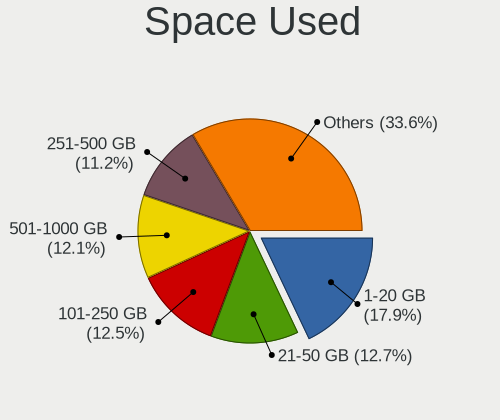
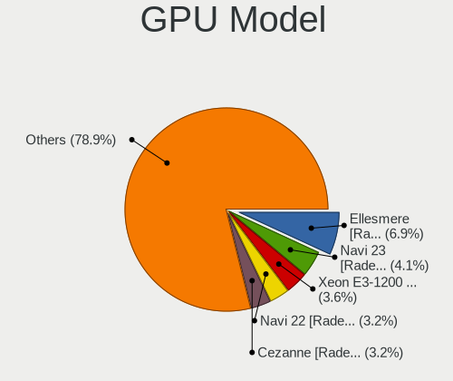
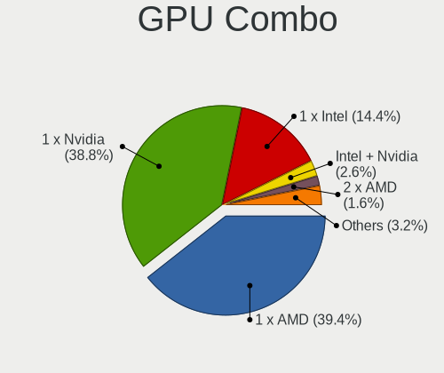

Fedora 36 - Tested Hardware & Statistics (Desktops)
---------------------------------------------------

A project to collect tested hardware configurations for Fedora 36.

Anyone can contribute to this report by the [hw-probe](https://github.com/linuxhw/hw-probe) tool:

    sudo -E hw-probe -all -upload

Please submit a probe of your configuration if it's not presented on the page or is rare.

Full-feature report is available here: https://linux-hardware.org/?view=trends

Contents
--------

* [ Test Cases ](#test-cases)

* [ System ](#system)
  - [ Kernel                   ](#kernel)
  - [ Kernel Family            ](#kernel-family)
  - [ Kernel Major Ver.        ](#kernel-major-ver)
  - [ Arch                     ](#arch)
  - [ DE                       ](#de)
  - [ Display Server           ](#display-server)
  - [ Display Manager          ](#display-manager)
  - [ OS Lang                  ](#os-lang)
  - [ Boot Mode                ](#boot-mode)
  - [ Filesystem               ](#filesystem)
  - [ Part. scheme             ](#part-scheme)
  - [ Dual Boot with Linux/BSD ](#dual-boot-with-linuxbsd)
  - [ Dual Boot (Win)          ](#dual-boot-win)

* [ Board ](#board)
  - [ Vendor                   ](#vendor)
  - [ Model                    ](#model)
  - [ Model Family             ](#model-family)
  - [ MFG Year                 ](#mfg-year)
  - [ Form Factor              ](#form-factor)
  - [ Secure Boot              ](#secure-boot)
  - [ Coreboot                 ](#coreboot)
  - [ RAM Size                 ](#ram-size)
  - [ RAM Used                 ](#ram-used)
  - [ Total Drives             ](#total-drives)
  - [ Has CD-ROM               ](#has-cd-rom)
  - [ Has Ethernet             ](#has-ethernet)
  - [ Has WiFi                 ](#has-wifi)
  - [ Has Bluetooth            ](#has-bluetooth)

* [ Location ](#location)
  - [ Country                  ](#country)
  - [ City                     ](#city)

* [ Drives ](#drives)
  - [ Drive Vendor             ](#drive-vendor)
  - [ Drive Model              ](#drive-model)
  - [ HDD Vendor               ](#hdd-vendor)
  - [ SSD Vendor               ](#ssd-vendor)
  - [ Drive Kind               ](#drive-kind)
  - [ Drive Connector          ](#drive-connector)
  - [ Drive Size               ](#drive-size)
  - [ Space Total              ](#space-total)
  - [ Space Used               ](#space-used)
  - [ Malfunc. Drives          ](#malfunc-drives)
  - [ Malfunc. Drive Vendor    ](#malfunc-drive-vendor)
  - [ Malfunc. HDD Vendor      ](#malfunc-hdd-vendor)
  - [ Malfunc. Drive Kind      ](#malfunc-drive-kind)
  - [ Failed Drives            ](#failed-drives)
  - [ Failed Drive Vendor      ](#failed-drive-vendor)
  - [ Drive Status             ](#drive-status)

* [ Storage controller ](#storage-controller)
  - [ Storage Vendor           ](#storage-vendor)
  - [ Storage Model            ](#storage-model)
  - [ Storage Kind             ](#storage-kind)

* [ Processor ](#processor)
  - [ CPU Vendor               ](#cpu-vendor)
  - [ CPU Model                ](#cpu-model)
  - [ CPU Model Family         ](#cpu-model-family)
  - [ CPU Cores                ](#cpu-cores)
  - [ CPU Sockets              ](#cpu-sockets)
  - [ CPU Threads              ](#cpu-threads)
  - [ CPU Op-Modes             ](#cpu-op-modes)
  - [ CPU Microcode            ](#cpu-microcode)
  - [ CPU Microarch            ](#cpu-microarch)

* [ Graphics ](#graphics)
  - [ GPU Vendor               ](#gpu-vendor)
  - [ GPU Model                ](#gpu-model)
  - [ GPU Combo                ](#gpu-combo)
  - [ GPU Driver               ](#gpu-driver)
  - [ GPU Memory               ](#gpu-memory)

* [ Monitor ](#monitor)
  - [ Monitor Vendor           ](#monitor-vendor)
  - [ Monitor Model            ](#monitor-model)
  - [ Monitor Resolution       ](#monitor-resolution)
  - [ Monitor Diagonal         ](#monitor-diagonal)
  - [ Monitor Width            ](#monitor-width)
  - [ Aspect Ratio             ](#aspect-ratio)
  - [ Monitor Area             ](#monitor-area)
  - [ Pixel Density            ](#pixel-density)
  - [ Multiple Monitors        ](#multiple-monitors)

* [ Network ](#network)
  - [ Net Controller Vendor    ](#net-controller-vendor)
  - [ Net Controller Model     ](#net-controller-model)
  - [ Wireless Vendor          ](#wireless-vendor)
  - [ Wireless Model           ](#wireless-model)
  - [ Ethernet Vendor          ](#ethernet-vendor)
  - [ Ethernet Model           ](#ethernet-model)
  - [ Net Controller Kind      ](#net-controller-kind)
  - [ Used Controller          ](#used-controller)
  - [ NICs                     ](#nics)
  - [ IPv6                     ](#ipv6)

* [ Bluetooth ](#bluetooth)
  - [ Bluetooth Vendor         ](#bluetooth-vendor)
  - [ Bluetooth Model          ](#bluetooth-model)

* [ Sound ](#sound)
  - [ Sound Vendor             ](#sound-vendor)
  - [ Sound Model              ](#sound-model)

* [ Memory ](#memory)
  - [ Memory Vendor            ](#memory-vendor)
  - [ Memory Model             ](#memory-model)
  - [ Memory Kind              ](#memory-kind)
  - [ Memory Form Factor       ](#memory-form-factor)
  - [ Memory Size              ](#memory-size)
  - [ Memory Speed             ](#memory-speed)

* [ Printers & scanners ](#printers--scanners)
  - [ Printer Vendor           ](#printer-vendor)
  - [ Printer Model            ](#printer-model)
  - [ Scanner Vendor           ](#scanner-vendor)
  - [ Scanner Model            ](#scanner-model)

* [ Camera ](#camera)
  - [ Camera Vendor            ](#camera-vendor)
  - [ Camera Model             ](#camera-model)

* [ Security ](#security)
  - [ Fingerprint Vendor       ](#fingerprint-vendor)
  - [ Fingerprint Model        ](#fingerprint-model)
  - [ Chipcard Vendor          ](#chipcard-vendor)
  - [ Chipcard Model           ](#chipcard-model)

* [ Unsupported ](#unsupported)
  - [ Unsupported Devices      ](#unsupported-devices)
  - [ Unsupported Device Types ](#unsupported-device-types)

Test Cases
----------

Total: 24

| Vendor   | Model                 | Probe                                                      | Date         |
|----------|-----------------------|------------------------------------------------------------|--------------|
| Gigabyte | EP45-DS3L             | [7879818528](https://linux-hardware.org/?probe=7879818528) | Mar 30, 2022 |
| Gigabyte | EP45-DS3L             | [c7d6879a86](https://linux-hardware.org/?probe=c7d6879a86) | Mar 26, 2022 |
| Gigabyte | B85M-D3V-A            | [b7679b78be](https://linux-hardware.org/?probe=b7679b78be) | Mar 25, 2022 |
| Gigabyte | B550 AORUS ELITE      | [7977e70f86](https://linux-hardware.org/?probe=7977e70f86) | Mar 22, 2022 |
| Gigabyte | EP45-DS3L             | [efdb29ff92](https://linux-hardware.org/?probe=efdb29ff92) | Mar 07, 2022 |
| ASUSTek  | TUF GAMING B550M-PLUS | [97eedd34f4](https://linux-hardware.org/?probe=97eedd34f4) | Mar 05, 2022 |
| Gigabyte | EP45-DS3L             | [0efde9a187](https://linux-hardware.org/?probe=0efde9a187) | Mar 03, 2022 |
| Gigabyte | EP45-DS3L             | [da3962a1da](https://linux-hardware.org/?probe=da3962a1da) | Mar 03, 2022 |
| Biostar  | H55 HD                | [b0d5843b6e](https://linux-hardware.org/?probe=b0d5843b6e) | Feb 13, 2022 |
| Biostar  | H55 HD                | [e08da3e685](https://linux-hardware.org/?probe=e08da3e685) | Feb 03, 2022 |
| MSI      | B550M PRO-VDH WIFI    | [f1a1a21c56](https://linux-hardware.org/?probe=f1a1a21c56) | Oct 26, 2021 |
| Dell     | 0KC9NP A01            | [ff356cba89](https://linux-hardware.org/?probe=ff356cba89) | Oct 22, 2021 |
| Dell     | 0KC9NP A01            | [a072a33607](https://linux-hardware.org/?probe=a072a33607) | Oct 12, 2021 |
| MSI      | FM2-A55M-E33          | [bcf7dcdd2c](https://linux-hardware.org/?probe=bcf7dcdd2c) | Oct 09, 2021 |
| MSI      | FM2-A55M-E33          | [0b3691d096](https://linux-hardware.org/?probe=0b3691d096) | Oct 09, 2021 |
| Dell     | 0KC9NP A01            | [95229554a9](https://linux-hardware.org/?probe=95229554a9) | Sep 19, 2021 |
| Dell     | 0KC9NP A01            | [d235dcf0d1](https://linux-hardware.org/?probe=d235dcf0d1) | Sep 18, 2021 |
| Dell     | 0KC9NP A01            | [ad5f2b8ea5](https://linux-hardware.org/?probe=ad5f2b8ea5) | Sep 04, 2021 |
| Dell     | 0KC9NP A01            | [f191342fa8](https://linux-hardware.org/?probe=f191342fa8) | Sep 02, 2021 |
| Dell     | 0KC9NP A01            | [270961aa02](https://linux-hardware.org/?probe=270961aa02) | Aug 30, 2021 |
| Dell     | 0KC9NP A01            | [1257d6c6f4](https://linux-hardware.org/?probe=1257d6c6f4) | Aug 27, 2021 |
| Dell     | 0KC9NP A01            | [373f7e6861](https://linux-hardware.org/?probe=373f7e6861) | Aug 22, 2021 |
| HP       | 304Ah                 | [047d1b0887](https://linux-hardware.org/?probe=047d1b0887) | Aug 18, 2021 |
| Dell     | 0KC9NP A01            | [2ca8cc81b1](https://linux-hardware.org/?probe=2ca8cc81b1) | Aug 18, 2021 |

System
------

Kernel
------

Version of the Linux kernel

| Version                                                       | Desktops | Percent |
|---------------------------------------------------------------|----------|---------|
| 5.17.0-0.rc7.116.fc36.x86_64                                  | 2        | 18.18%  |
| 5.14.0-0.rc5.20210813gitf8e6dfc64f61.46.fc36.x86_64           | 2        | 18.18%  |
| 5.17.0-300.fc36.x86_64                                        | 1        | 9.09%   |
| 5.17.0-0.rc5.102.fc36.x86_64                                  | 1        | 9.09%   |
| 5.17.0-0.rc0.20220112gitdaadb3bd0e8d.63.fc36.x86_64           | 1        | 9.09%   |
| 5.15.0-0.rc6.47.fc36.x86_64                                   | 1        | 9.09%   |
| 5.15.0-0.rc4.20211008git1da38549dd64.36.vanilla.1.fc36.x86_64 | 1        | 9.09%   |
| 5.15.0-0.rc4.20211008git1da38549dd64.36.fc36.x86_64           | 1        | 9.09%   |
| 5.15.0-0.rc0.20210831gitb91db6a0b52e.1.fc36.x86_64            | 1        | 9.09%   |

Kernel Family
-------------

Linux kernel without a distro release

| Version | Desktops | Percent |
|---------|----------|---------|
| 5.17.0  | 5        | 50%     |
| 5.15.0  | 3        | 30%     |
| 5.14.0  | 2        | 20%     |

Kernel Major Ver.
-----------------

Linux kernel major version

| Version | Desktops | Percent |
|---------|----------|---------|
| 5.17    | 5        | 50%     |
| 5.15    | 3        | 30%     |
| 5.14    | 2        | 20%     |

Arch
----

OS architecture (x86_64, i586, etc.)

| Name   | Desktops | Percent |
|--------|----------|---------|
| x86_64 | 9        | 100%    |

DE
--

Desktop Environment

| Name    | Desktops | Percent |
|---------|----------|---------|
| GNOME   | 7        | 77.78%  |
| KDE5    | 1        | 11.11%  |
| Unknown | 1        | 11.11%  |

Display Server
--------------

X11 or Wayland

| Name    | Desktops | Percent |
|---------|----------|---------|
| Wayland | 7        | 77.78%  |
| X11     | 1        | 11.11%  |
| Tty     | 1        | 11.11%  |

Display Manager
---------------

SDDM, LightDM, etc.

| Name    | Desktops | Percent |
|---------|----------|---------|
| GDM     | 4        | 44.44%  |
| Unknown | 4        | 44.44%  |
| SDDM    | 1        | 11.11%  |

OS Lang
-------

Language

| Lang  | Desktops | Percent |
|-------|----------|---------|
| en_US | 4        | 44.44%  |
| ru_RU | 2        | 22.22%  |
| en_GB | 2        | 22.22%  |
| pt_BR | 1        | 11.11%  |

Boot Mode
---------

EFI or BIOS

| Mode | Desktops | Percent |
|------|----------|---------|
| BIOS | 5        | 55.56%  |
| EFI  | 4        | 44.44%  |

Filesystem
----------

Type of filesystem

| Type  | Desktops | Percent |
|-------|----------|---------|
| Btrfs | 7        | 77.78%  |
| Xfs   | 1        | 11.11%  |
| Ext4  | 1        | 11.11%  |

Part. scheme
------------

Scheme of partitioning

| Type    | Desktops | Percent |
|---------|----------|---------|
| GPT     | 4        | 44.44%  |
| Unknown | 3        | 33.33%  |
| MBR     | 2        | 22.22%  |

Dual Boot with Linux/BSD
------------------------

Hosting more than one Linux/BSD

| Dual boot | Desktops | Percent |
|-----------|----------|---------|
| No        | 9        | 100%    |

Dual Boot (Win)
---------------

Hosting Linux and Windows

| Dual boot | Desktops | Percent |
|-----------|----------|---------|
| No        | 5        | 55.56%  |
| Yes       | 4        | 44.44%  |

Board
-----

Vendor
------

Motherboard manufacturer

| Name                | Desktops | Percent |
|---------------------|----------|---------|
| Gigabyte Technology | 3        | 33.33%  |
| MSI                 | 2        | 22.22%  |
| Hewlett-Packard     | 1        | 11.11%  |
| Dell                | 1        | 11.11%  |
| Biostar             | 1        | 11.11%  |
| ASUSTek Computer    | 1        | 11.11%  |

Model
-----

Motherboard model

| Name                        | Desktops | Percent |
|-----------------------------|----------|---------|
| MSI MS-7C95                 | 1        | 11.11%  |
| MSI MS-7721                 | 1        | 11.11%  |
| HP Compaq 8100 Elite SFF PC | 1        | 11.11%  |
| Gigabyte EP45-DS3L          | 1        | 11.11%  |
| Gigabyte B85M-D3V-A         | 1        | 11.11%  |
| Gigabyte B550 AORUS ELITE   | 1        | 11.11%  |
| Dell OptiPlex 9020          | 1        | 11.11%  |
| Biostar H55 HD              | 1        | 11.11%  |
| ASUS TUF GAMING B550M-PLUS  | 1        | 11.11%  |

Model Family
------------

Motherboard model prefix

| Name                | Desktops | Percent |
|---------------------|----------|---------|
| MSI MS-7C95         | 1        | 11.11%  |
| MSI MS-7721         | 1        | 11.11%  |
| HP Compaq           | 1        | 11.11%  |
| Gigabyte EP45-DS3L  | 1        | 11.11%  |
| Gigabyte B85M-D3V-A | 1        | 11.11%  |
| Gigabyte B550       | 1        | 11.11%  |
| Dell OptiPlex       | 1        | 11.11%  |
| Biostar H55         | 1        | 11.11%  |
| ASUS TUF            | 1        | 11.11%  |

MFG Year
--------

Motherboard manufacture year

| Year | Desktops | Percent |
|------|----------|---------|
| 2020 | 3        | 33.33%  |
| 2015 | 2        | 22.22%  |
| 2013 | 1        | 11.11%  |
| 2010 | 1        | 11.11%  |
| 2009 | 1        | 11.11%  |
| 2008 | 1        | 11.11%  |

Form Factor
-----------

Physical design of the computer

| Name    | Desktops | Percent |
|---------|----------|---------|
| Desktop | 9        | 100%    |

Secure Boot
-----------

Enabled or disabled

| State    | Desktops | Percent |
|----------|----------|---------|
| Disabled | 9        | 100%    |

Coreboot
--------

Have coreboot on board

| Used | Desktops | Percent |
|------|----------|---------|
| No   | 9        | 100%    |

RAM Size
--------

Total RAM memory

| Size in GB | Desktops | Percent |
|------------|----------|---------|
| 3.01-4.0   | 3        | 33.33%  |
| 4.01-8.0   | 2        | 22.22%  |
| 16.01-24.0 | 2        | 22.22%  |
| 32.01-64.0 | 1        | 11.11%  |
| 8.01-16.0  | 1        | 11.11%  |

RAM Used
--------

Used RAM memory

| Used GB  | Desktops | Percent |
|----------|----------|---------|
| 3.01-4.0 | 3        | 33.33%  |
| 1.01-2.0 | 3        | 33.33%  |
| 2.01-3.0 | 2        | 22.22%  |
| 0.51-1.0 | 1        | 11.11%  |

Total Drives
------------

Number of drives on board

| Drives | Desktops | Percent |
|--------|----------|---------|
| 2      | 4        | 44.44%  |
| 1      | 4        | 44.44%  |
| 3      | 1        | 11.11%  |

Has CD-ROM
----------

Has CD-ROM on board

| Presented | Desktops | Percent |
|-----------|----------|---------|
| No        | 5        | 55.56%  |
| Yes       | 4        | 44.44%  |

Has Ethernet
------------

Has Ethernet on board

| Presented | Desktops | Percent |
|-----------|----------|---------|
| Yes       | 9        | 100%    |

Has WiFi
--------

Has WiFi module

| Presented | Desktops | Percent |
|-----------|----------|---------|
| No        | 5        | 55.56%  |
| Yes       | 4        | 44.44%  |

Has Bluetooth
-------------

Has Bluetooth module

| Presented | Desktops | Percent |
|-----------|----------|---------|
| No        | 6        | 66.67%  |
| Yes       | 3        | 33.33%  |

Location
--------

Country
-------

Geographic location (country)

| Country     | Desktops | Percent |
|-------------|----------|---------|
| Belarus     | 2        | 22.22%  |
| USA         | 1        | 11.11%  |
| UK          | 1        | 11.11%  |
| Switzerland | 1        | 11.11%  |
| Netherlands | 1        | 11.11%  |
| Indonesia   | 1        | 11.11%  |
| Brazil      | 1        | 11.11%  |
| Bangladesh  | 1        | 11.11%  |

City
----

Geographic location (city)

| City     | Desktops | Percent |
|----------|----------|---------|
| Minsk    | 2        | 22.22%  |
| Zurich   | 1        | 11.11%  |
| Jakarta  | 1        | 11.11%  |
| Houston  | 1        | 11.11%  |
| Halstead | 1        | 11.11%  |
| Goiânia | 1        | 11.11%  |
| Dhaka    | 1        | 11.11%  |
| Delft    | 1        | 11.11%  |

Drives
------

Drive Vendor
------------

Hard drive vendors

| Vendor              | Desktops | Drives | Percent |
|---------------------|----------|--------|---------|
| Samsung Electronics | 5        | 7      | 33.33%  |
| WDC                 | 3        | 3      | 20%     |
| Toshiba             | 2        | 2      | 13.33%  |
| Kingston            | 2        | 2      | 13.33%  |
| XPG                 | 1        | 1      | 6.67%   |
| Seagate             | 1        | 1      | 6.67%   |
| Phison              | 1        | 1      | 6.67%   |

Drive Model
-----------

Hard drive models

| Model                           | Desktops | Percent |
|---------------------------------|----------|---------|
| Samsung NVMe SSD Drive 500GB    | 2        | 13.33%  |
| XPG GAMMIX S11 Pro 256GB        | 1        | 6.67%   |
| WDC WD6400AAKS-22A7B2 640GB     | 1        | 6.67%   |
| WDC WD5000AAKX-001CA0 500GB     | 1        | 6.67%   |
| WDC WD10EZEX-00ZF5A0 1TB        | 1        | 6.67%   |
| Toshiba THNSNJ128GCSU 128GB SSD | 1        | 6.67%   |
| Toshiba HDWD120 2TB             | 1        | 6.67%   |
| Seagate ST3500413AS 500GB       | 1        | 6.67%   |
| Samsung SSD 970 EVO 250GB       | 1        | 6.67%   |
| Samsung SSD 870 QVO 2TB         | 1        | 6.67%   |
| Samsung SSD 860 EVO 250GB       | 1        | 6.67%   |
| Phison NVMe SSD Drive 512GB     | 1        | 6.67%   |
| Kingston SA400S37240G 240GB SSD | 1        | 6.67%   |
| Kingston SA400S37120G 120GB SSD | 1        | 6.67%   |

HDD Vendor
----------

Hard disk drive vendors

| Vendor  | Desktops | Drives | Percent |
|---------|----------|--------|---------|
| WDC     | 3        | 3      | 60%     |
| Toshiba | 1        | 1      | 20%     |
| Seagate | 1        | 1      | 20%     |

SSD Vendor
----------

Solid state drive vendors

| Vendor              | Desktops | Drives | Percent |
|---------------------|----------|--------|---------|
| Samsung Electronics | 2        | 4      | 40%     |
| Kingston            | 2        | 2      | 40%     |
| Toshiba             | 1        | 1      | 20%     |

Drive Kind
----------

HDD or SSD

| Kind | Desktops | Drives | Percent |
|------|----------|--------|---------|
| SSD  | 5        | 7      | 38.46%  |
| HDD  | 5        | 5      | 38.46%  |
| NVMe | 3        | 5      | 23.08%  |

Drive Connector
---------------

SATA, SAS, NVMe, etc.

| Type | Desktops | Drives | Percent |
|------|----------|--------|---------|
| SATA | 7        | 12     | 70%     |
| NVMe | 3        | 5      | 30%     |

Drive Size
----------

Size of hard drive

| Size in TB | Desktops | Drives | Percent |
|------------|----------|--------|---------|
| 0.01-0.5   | 5        | 8      | 55.56%  |
| 1.01-2.0   | 2        | 2      | 22.22%  |
| 0.51-1.0   | 2        | 2      | 22.22%  |

Space Total
-----------

Amount of disk space available on the file system

| Size in GB | Desktops | Percent |
|------------|----------|---------|
| 101-250    | 3        | 33.33%  |
| 501-1000   | 3        | 33.33%  |
| 251-500    | 2        | 22.22%  |
| 1001-2000  | 1        | 11.11%  |

Space Used
----------

Amount of used disk space

| Used GB   | Desktops | Percent |
|-----------|----------|---------|
| 101-250   | 3        | 33.33%  |
| 21-50     | 2        | 22.22%  |
| 1-20      | 2        | 22.22%  |
| 251-500   | 1        | 11.11%  |
| 1001-2000 | 1        | 11.11%  |

Malfunc. Drives
---------------

Drive models with a malfunction

Zero info for selected period =(

Malfunc. Drive Vendor
---------------------

Vendors of faulty drives

Zero info for selected period =(

Malfunc. HDD Vendor
-------------------

Vendors of faulty HDD drives

Zero info for selected period =(

Malfunc. Drive Kind
-------------------

Kinds of faulty drives

Zero info for selected period =(

Failed Drives
-------------

Failed drive models

Zero info for selected period =(

Failed Drive Vendor
-------------------

Failed drive vendors

Zero info for selected period =(

Drive Status
------------

Number of failed and malfunc. drives

| Status   | Desktops | Drives | Percent |
|----------|----------|--------|---------|
| Works    | 6        | 12     | 66.67%  |
| Detected | 3        | 5      | 33.33%  |

Storage controller
------------------

Storage Vendor
--------------

Storage controller vendors

| Vendor              | Desktops | Percent |
|---------------------|----------|---------|
| Intel               | 5        | 29.41%  |
| AMD                 | 4        | 23.53%  |
| Samsung Electronics | 3        | 17.65%  |
| VIA Technologies    | 1        | 5.88%   |
| Phison Electronics  | 1        | 5.88%   |
| JMicron Technology  | 1        | 5.88%   |
| ASMedia Technology  | 1        | 5.88%   |
| ADATA Technology    | 1        | 5.88%   |

Storage Model
-------------

Storage controller models

| Model                                                                          | Desktops | Percent |
|--------------------------------------------------------------------------------|----------|---------|
| AMD 500 Series Chipset SATA Controller                                         | 3        | 14.29%  |
| Samsung NVMe SSD Controller SM981/PM981/PM983                                  | 2        | 9.52%   |
| Intel 8 Series/C220 Series Chipset Family 6-port SATA Controller 1 [AHCI mode] | 2        | 9.52%   |
| Intel 5 Series/3400 Series Chipset 4 port SATA IDE Controller                  | 2        | 9.52%   |
| Intel 5 Series/3400 Series Chipset 2 port SATA IDE Controller                  | 2        | 9.52%   |
| AMD FCH SATA Controller [AHCI mode]                                            | 2        | 9.52%   |
| VIA VT6415 PATA IDE Host Controller                                            | 1        | 4.76%   |
| Samsung NVMe SSD Controller SM961/PM961/SM963                                  | 1        | 4.76%   |
| Phison E12 NVMe Controller                                                     | 1        | 4.76%   |
| JMicron JMB368 IDE controller                                                  | 1        | 4.76%   |
| Intel 82801JI (ICH10 Family) 4 port SATA IDE Controller #1                     | 1        | 4.76%   |
| Intel 82801JI (ICH10 Family) 2 port SATA IDE Controller #2                     | 1        | 4.76%   |
| ASMedia ASM1062 Serial ATA Controller                                          | 1        | 4.76%   |
| ADATA XPG SX8200 Pro PCIe Gen3x4 M.2 2280 Solid State Drive                    | 1        | 4.76%   |

Storage Kind
------------

Kind of storage controller (IDE, SATA, NVMe, SAS, ...)

| Kind | Desktops | Percent |
|------|----------|---------|
| SATA | 6        | 50%     |
| NVMe | 3        | 25%     |
| IDE  | 3        | 25%     |

Processor
---------

CPU Vendor
----------

Processor vendors

| Vendor | Desktops | Percent |
|--------|----------|---------|
| Intel  | 5        | 55.56%  |
| AMD    | 4        | 44.44%  |

CPU Model
---------

Processor models

| Model                                   | Desktops | Percent |
|-----------------------------------------|----------|---------|
| Intel Core i5 CPU 650 @ 3.20GHz         | 2        | 22.22%  |
| Intel Core i5-4590S CPU @ 3.00GHz       | 1        | 11.11%  |
| Intel Core i3-4160 CPU @ 3.60GHz        | 1        | 11.11%  |
| Intel Core 2 Duo CPU E7400 @ 2.80GHz    | 1        | 11.11%  |
| AMD Ryzen 7 2700X Eight-Core Processor  | 1        | 11.11%  |
| AMD Ryzen 5 3600X 6-Core Processor      | 1        | 11.11%  |
| AMD Ryzen 5 3600 6-Core Processor       | 1        | 11.11%  |
| AMD A8-5500 APU with Radeon HD Graphics | 1        | 11.11%  |

CPU Model Family
----------------

Processor model prefix

| Model            | Desktops | Percent |
|------------------|----------|---------|
| Intel Core i5    | 3        | 33.33%  |
| AMD Ryzen 5      | 2        | 22.22%  |
| Intel Core i3    | 1        | 11.11%  |
| Intel Core 2 Duo | 1        | 11.11%  |
| AMD Ryzen 7      | 1        | 11.11%  |
| AMD A8           | 1        | 11.11%  |

CPU Cores
---------

Number of processor cores

| Number | Desktops | Percent |
|--------|----------|---------|
| 2      | 5        | 55.56%  |
| 6      | 2        | 22.22%  |
| 8      | 1        | 11.11%  |
| 4      | 1        | 11.11%  |

CPU Sockets
-----------

Number of sockets

| Number | Desktops | Percent |
|--------|----------|---------|
| 1      | 9        | 100%    |

CPU Threads
-----------

Threads per core (Hyper-Threading)

| Number | Desktops | Percent |
|--------|----------|---------|
| 2      | 7        | 77.78%  |
| 1      | 2        | 22.22%  |

CPU Op-Modes
------------

CPU Operation Modes (32-bit, 64-bit)

| Op mode        | Desktops | Percent |
|----------------|----------|---------|
| 32-bit, 64-bit | 9        | 100%    |

CPU Microcode
-------------

Microcode number

| Number     | Desktops | Percent |
|------------|----------|---------|
| 0x306c3    | 2        | 22.22%  |
| 0x08701021 | 2        | 22.22%  |
| 0x20655    | 1        | 11.11%  |
| 0x20652    | 1        | 11.11%  |
| 0x1067a    | 1        | 11.11%  |
| 0x0800820d | 1        | 11.11%  |
| 0x06001119 | 1        | 11.11%  |

CPU Microarch
-------------

Microarchitecture

| Name       | Desktops | Percent |
|------------|----------|---------|
| Zen 2      | 2        | 22.22%  |
| Westmere   | 2        | 22.22%  |
| Haswell    | 2        | 22.22%  |
| Zen+       | 1        | 11.11%  |
| Piledriver | 1        | 11.11%  |
| Penryn     | 1        | 11.11%  |

Graphics
--------

GPU Vendor
----------

Vendors of graphics cards

| Vendor | Desktops | Percent |
|--------|----------|---------|
| Intel  | 4        | 40%     |
| Nvidia | 3        | 30%     |
| AMD    | 3        | 30%     |

GPU Model
---------

Graphics card models

| Model                                                                       | Desktops | Percent |
|-----------------------------------------------------------------------------|----------|---------|
| Intel Core Processor Integrated Graphics Controller                         | 2        | 20%     |
| AMD Ellesmere [Radeon RX 470/480/570/570X/580/580X/590]                     | 2        | 20%     |
| Nvidia GM107 [GeForce GTX 750 Ti]                                           | 1        | 10%     |
| Nvidia GK208B [GeForce GT 710]                                              | 1        | 10%     |
| Nvidia GK107 [GeForce GT 740]                                               | 1        | 10%     |
| Intel Xeon E3-1200 v3/4th Gen Core Processor Integrated Graphics Controller | 1        | 10%     |
| Intel 4th Generation Core Processor Family Integrated Graphics Controller   | 1        | 10%     |
| AMD Lexa PRO [Radeon 540/540X/550/550X / RX 540X/550/550X]                  | 1        | 10%     |

GPU Combo
---------

Combinations of graphics cards

| Name           | Desktops | Percent |
|----------------|----------|---------|
| 1 x Intel      | 3        | 33.33%  |
| 1 x AMD        | 3        | 33.33%  |
| 1 x Nvidia     | 2        | 22.22%  |
| Intel + Nvidia | 1        | 11.11%  |

GPU Driver
----------

Free vs proprietary

| Driver      | Desktops | Percent |
|-------------|----------|---------|
| Free        | 8        | 88.89%  |
| Proprietary | 1        | 11.11%  |

GPU Memory
----------

Total video memory

| Size in GB | Desktops | Percent |
|------------|----------|---------|
| 3.01-4.0   | 3        | 33.33%  |
| Unknown    | 3        | 33.33%  |
| 7.01-8.0   | 1        | 11.11%  |
| 1.01-2.0   | 1        | 11.11%  |
| 0.51-1.0   | 1        | 11.11%  |

Monitor
-------

Monitor Vendor
--------------

Monitor vendors

| Vendor               | Desktops | Percent |
|----------------------|----------|---------|
| AOC                  | 3        | 37.5%   |
| Goldstar             | 2        | 25%     |
| Philips              | 1        | 12.5%   |
| Hewlett-Packard      | 1        | 12.5%   |
| Ancor Communications | 1        | 12.5%   |

Monitor Model
-------------

Monitor models

| Model                                                            | Desktops | Percent |
|------------------------------------------------------------------|----------|---------|
| Philips PHL 272E1GJ PHLC245 1920x1080 598x336mm 27.0-inch        | 1        | 12.5%   |
| Hewlett-Packard V270 HPN3521 1920x1080 598x336mm 27.0-inch       | 1        | 12.5%   |
| Goldstar W2442 GSM56D9 1920x1080 531x299mm 24.0-inch             | 1        | 12.5%   |
| Goldstar M2280A GSM57EC 1920x1080 476x268mm 21.5-inch            | 1        | 12.5%   |
| AOC 28E850 AOC0CCD 2560x1600 480x270mm 21.7-inch                 | 1        | 12.5%   |
| AOC 2450W AOC2450 1920x1080 521x293mm 23.5-inch                  | 1        | 12.5%   |
| AOC 2043 AOC2043 1600x900 443x249mm 20.0-inch                    | 1        | 12.5%   |
| Ancor Communications VE247 ACI2493 1920x1080 531x299mm 24.0-inch | 1        | 12.5%   |

Monitor Resolution
------------------

Monitor screen resolution

| Resolution      | Desktops | Percent |
|-----------------|----------|---------|
| 1920x1080 (FHD) | 6        | 75%     |
| 2560x1440 (QHD) | 1        | 12.5%   |
| 1600x900 (HD+)  | 1        | 12.5%   |

Monitor Diagonal
----------------

Diagonal size in inches

| Inches | Desktops | Percent |
|--------|----------|---------|
| 27     | 2        | 25%     |
| 24     | 2        | 25%     |
| 21     | 2        | 25%     |
| 23     | 1        | 12.5%   |
| 20     | 1        | 12.5%   |

Monitor Width
-------------

Physical width

| Width in mm | Desktops | Percent |
|-------------|----------|---------|
| 501-600     | 5        | 62.5%   |
| 401-500     | 3        | 37.5%   |

Aspect Ratio
------------

Proportional relationship between the width and the height

| Ratio | Desktops | Percent |
|-------|----------|---------|
| 16/9  | 7        | 100%    |

Monitor Area
------------

Area in inch²

| Area in inch² | Desktops | Percent |
|----------------|----------|---------|
| 201-250        | 3        | 42.86%  |
| 301-350        | 2        | 28.57%  |
| 151-200        | 2        | 28.57%  |

Pixel Density
-------------

Pixels per inch

| Density | Desktops | Percent |
|---------|----------|---------|
| 51-100  | 6        | 75%     |
| 121-160 | 1        | 12.5%   |
| 101-120 | 1        | 12.5%   |

Multiple Monitors
-----------------

Total monitors connected

| Total | Desktops | Percent |
|-------|----------|---------|
| 1     | 7        | 77.78%  |
| 2     | 1        | 11.11%  |
| 0     | 1        | 11.11%  |

Network
-------

Net Controller Vendor
---------------------

Controller vendors

| Vendor                | Desktops | Percent |
|-----------------------|----------|---------|
| Realtek Semiconductor | 7        | 46.67%  |
| Intel                 | 4        | 26.67%  |
| Ralink Technology     | 1        | 6.67%   |
| MicroPython           | 1        | 6.67%   |
| Broadcom              | 1        | 6.67%   |
| Belkin Components     | 1        | 6.67%   |

Net Controller Model
--------------------

Controller models

| Model                                                              | Desktops | Percent |
|--------------------------------------------------------------------|----------|---------|
| Realtek RTL8111/8168/8411 PCI Express Gigabit Ethernet Controller  | 5        | 33.33%  |
| Realtek RTL8125 2.5GbE Controller                                  | 2        | 13.33%  |
| Ralink MT7601U Wireless Adapter                                    | 1        | 6.67%   |
| MicroPython Board in FS mode                                       | 1        | 6.67%   |
| Intel Wi-Fi 6 AX200                                                | 1        | 6.67%   |
| Intel Ethernet Connection I217-LM                                  | 1        | 6.67%   |
| Intel Dual Band Wireless-AC 3168NGW [Stone Peak]                   | 1        | 6.67%   |
| Intel 82578DM Gigabit Network Connection                           | 1        | 6.67%   |
| Broadcom BCM43222 802.11abgn Wireless Network Adapter              | 1        | 6.67%   |
| Belkin Components F5D7050 Wireless G Adapter v4000 [Zydas ZD1211B] | 1        | 6.67%   |

Wireless Vendor
---------------

Wireless vendors

| Vendor            | Desktops | Percent |
|-------------------|----------|---------|
| Intel             | 2        | 40%     |
| Ralink Technology | 1        | 20%     |
| Broadcom          | 1        | 20%     |
| Belkin Components | 1        | 20%     |

Wireless Model
--------------

Wireless models

| Model                                                              | Desktops | Percent |
|--------------------------------------------------------------------|----------|---------|
| Ralink MT7601U Wireless Adapter                                    | 1        | 20%     |
| Intel Wi-Fi 6 AX200                                                | 1        | 20%     |
| Intel Dual Band Wireless-AC 3168NGW [Stone Peak]                   | 1        | 20%     |
| Broadcom BCM43222 802.11abgn Wireless Network Adapter              | 1        | 20%     |
| Belkin Components F5D7050 Wireless G Adapter v4000 [Zydas ZD1211B] | 1        | 20%     |

Ethernet Vendor
---------------

Ethernet vendors

| Vendor                | Desktops | Percent |
|-----------------------|----------|---------|
| Realtek Semiconductor | 7        | 77.78%  |
| Intel                 | 2        | 22.22%  |

Ethernet Model
--------------

Ethernet models

| Model                                                             | Desktops | Percent |
|-------------------------------------------------------------------|----------|---------|
| Realtek RTL8111/8168/8411 PCI Express Gigabit Ethernet Controller | 5        | 55.56%  |
| Realtek RTL8125 2.5GbE Controller                                 | 2        | 22.22%  |
| Intel Ethernet Connection I217-LM                                 | 1        | 11.11%  |
| Intel 82578DM Gigabit Network Connection                          | 1        | 11.11%  |

Net Controller Kind
-------------------

Ethernet, WiFi or modem

| Kind     | Desktops | Percent |
|----------|----------|---------|
| Ethernet | 9        | 64.29%  |
| WiFi     | 4        | 28.57%  |
| Modem    | 1        | 7.14%   |

Used Controller
---------------

Currently used network controller

| Kind     | Desktops | Percent |
|----------|----------|---------|
| Ethernet | 8        | 66.67%  |
| WiFi     | 4        | 33.33%  |

NICs
----

Total network controllers on board

| Total | Desktops | Percent |
|-------|----------|---------|
| 1     | 6        | 66.67%  |
| 2     | 3        | 33.33%  |

IPv6
----

IPv6 vs IPv4

| Used | Desktops | Percent |
|------|----------|---------|
| No   | 5        | 55.56%  |
| Yes  | 4        | 44.44%  |

Bluetooth
---------

Bluetooth Vendor
----------------

Controller vendors

| Vendor                  | Desktops | Percent |
|-------------------------|----------|---------|
| Intel                   | 2        | 66.67%  |
| Cambridge Silicon Radio | 1        | 33.33%  |

Bluetooth Model
---------------

Controller models

| Model                                               | Desktops | Percent |
|-----------------------------------------------------|----------|---------|
| Intel Wireless-AC 3168 Bluetooth                    | 1        | 33.33%  |
| Intel AX200 Bluetooth                               | 1        | 33.33%  |
| Cambridge Silicon Radio Bluetooth Dongle (HCI mode) | 1        | 33.33%  |

Sound
-----

Sound Vendor
------------

Sound card vendors

| Vendor | Desktops | Percent |
|--------|----------|---------|
| Intel  | 5        | 41.67%  |
| AMD    | 4        | 33.33%  |
| Nvidia | 3        | 25%     |

Sound Model
-----------

Sound card models

| Model                                                               | Desktops | Percent |
|---------------------------------------------------------------------|----------|---------|
| Intel 8 Series/C220 Series Chipset High Definition Audio Controller | 2        | 12.5%   |
| Intel 5 Series/3400 Series Chipset High Definition Audio            | 2        | 12.5%   |
| AMD Starship/Matisse HD Audio Controller                            | 2        | 12.5%   |
| AMD Ellesmere HDMI Audio [Radeon RX 470/480 / 570/580/590]          | 2        | 12.5%   |
| Nvidia GM107 High Definition Audio Controller [GeForce 940MX]       | 1        | 6.25%   |
| Nvidia GK208 HDMI/DP Audio Controller                               | 1        | 6.25%   |
| Nvidia GK107 HDMI Audio Controller                                  | 1        | 6.25%   |
| Intel Xeon E3-1200 v3/4th Gen Core Processor HD Audio Controller    | 1        | 6.25%   |
| Intel 82801JI (ICH10 Family) HD Audio Controller                    | 1        | 6.25%   |
| AMD FCH Azalia Controller                                           | 1        | 6.25%   |
| AMD Family 17h (Models 00h-0fh) HD Audio Controller                 | 1        | 6.25%   |
| AMD Baffin HDMI/DP Audio [Radeon RX 550 640SP / RX 560/560X]        | 1        | 6.25%   |

Memory
------

Memory Vendor
-------------

Memory module vendors

| Vendor            | Desktops | Percent |
|-------------------|----------|---------|
| Unknown           | 2        | 25%     |
| Micron Technology | 2        | 25%     |
| Crucial           | 2        | 25%     |
| V-GeN             | 1        | 12.5%   |
| GOODRAM           | 1        | 12.5%   |

Memory Model
------------

Memory module models

| Model                                                 | Desktops | Percent |
|-------------------------------------------------------|----------|---------|
| V-GeN RAM D4H8GL32A8TS 8GB DIMM DDR4 3200MT/s         | 1        | 12.5%   |
| Unknown RAM Module 2GB DIMM 800MT/s                   | 1        | 12.5%   |
| Unknown RAM 3460-1664 8GB DIMM DDR3 1600MT/s          | 1        | 12.5%   |
| Micron RAM 8KTF51264AZ-1G6E1 4GB DIMM DDR3 1600MT/s   | 1        | 12.5%   |
| Micron RAM 8JTF25664AZ-1G4D1 2GB DIMM DDR3 1333MT/s   | 1        | 12.5%   |
| GOODRAM RAM GR1600D364L11S/4G 4GB DIMM DDR3 1600MT/s  | 1        | 12.5%   |
| Crucial RAM ST102464BA1339.16F 8GB DIMM DDR3 1333MT/s | 1        | 12.5%   |
| Crucial RAM CT51264BA160BJ.M8F 4GB DIMM DDR3 1600MT/s | 1        | 12.5%   |

Memory Kind
-----------

Memory module kinds

| Kind    | Desktops | Percent |
|---------|----------|---------|
| DDR3    | 4        | 66.67%  |
| DDR4    | 1        | 16.67%  |
| Unknown | 1        | 16.67%  |

Memory Form Factor
------------------

Physical design of the memory module

| Name | Desktops | Percent |
|------|----------|---------|
| DIMM | 6        | 100%    |

Memory Size
-----------

Memory module size

| Size | Desktops | Percent |
|------|----------|---------|
| 8192 | 2        | 33.33%  |
| 4096 | 2        | 33.33%  |
| 2048 | 2        | 33.33%  |

Memory Speed
------------

Memory module speed

| Speed | Desktops | Percent |
|-------|----------|---------|
| 1600  | 3        | 42.86%  |
| 1333  | 2        | 28.57%  |
| 3200  | 1        | 14.29%  |
| 800   | 1        | 14.29%  |

Printers & scanners
-------------------

Printer Vendor
--------------

Printer device vendors

| Vendor             | Desktops | Percent |
|--------------------|----------|---------|
| Brother Industries | 1        | 100%    |

Printer Model
-------------

Printer device models

| Model           | Desktops | Percent |
|-----------------|----------|---------|
| Brother Printer | 1        | 100%    |

Scanner Vendor
--------------

Scanner device vendors

| Vendor | Desktops | Percent |
|--------|----------|---------|
| Canon  | 1        | 100%    |

Scanner Model
-------------

Scanner device models

| Model                   | Desktops | Percent |
|-------------------------|----------|---------|
| Canon CanoScan LiDE 200 | 1        | 100%    |

Camera
------

Camera Vendor
-------------

Camera device vendors

| Vendor   | Desktops | Percent |
|----------|----------|---------|
| Logitech | 1        | 100%    |

Camera Model
------------

Camera device models

| Model                                | Desktops | Percent |
|--------------------------------------|----------|---------|
| Logitech QuickCam Communicate Deluxe | 1        | 100%    |

Security
--------

Fingerprint Vendor
------------------

Fingerprint sensor vendors

Zero info for selected period =(

Fingerprint Model
-----------------

Fingerprint sensor models

Zero info for selected period =(

Chipcard Vendor
---------------

Chipcard module vendors

Zero info for selected period =(

Chipcard Model
--------------

Chipcard module models

Zero info for selected period =(

Unsupported
-----------

Unsupported Devices
-------------------

Total unsupported devices on board

| Total | Desktops | Percent |
|-------|----------|---------|
| 0     | 7        | 77.78%  |
| 2     | 1        | 11.11%  |
| 1     | 1        | 11.11%  |

Unsupported Device Types
------------------------

Types of unsupported devices

| Type          | Desktops | Percent |
|---------------|----------|---------|
| Graphics card | 1        | 100%    |

