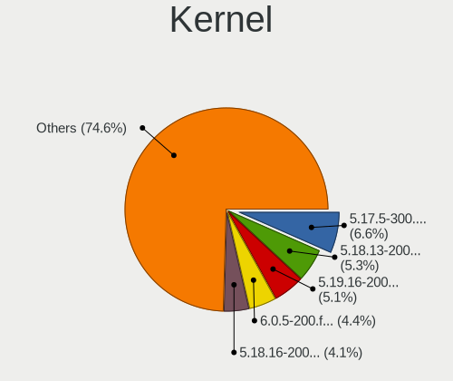
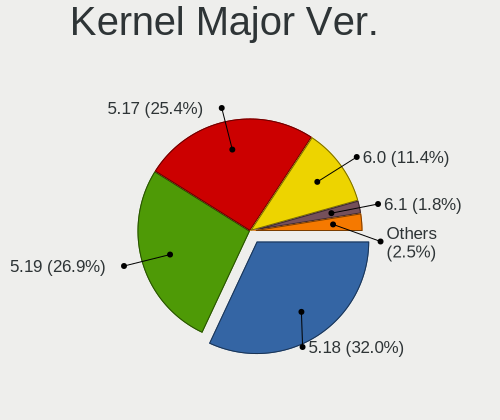
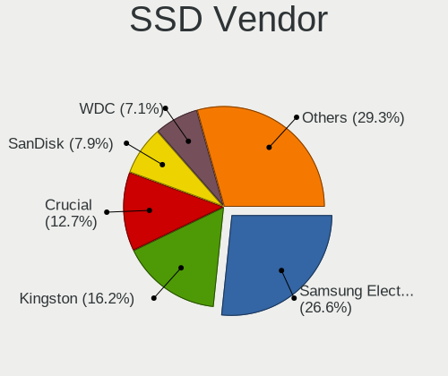
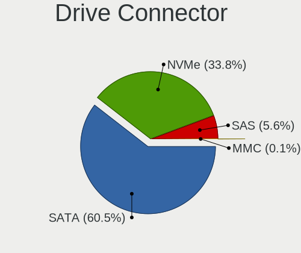
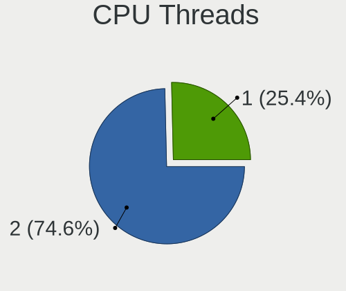
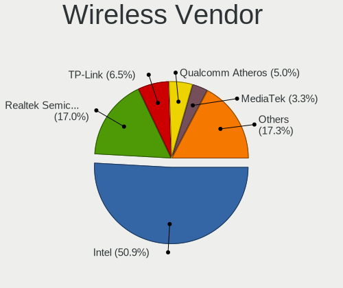
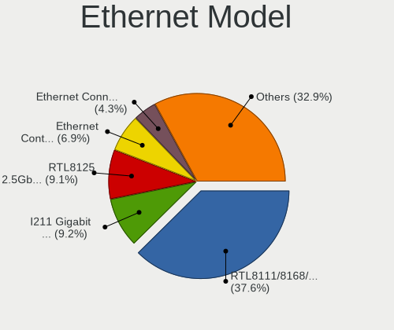
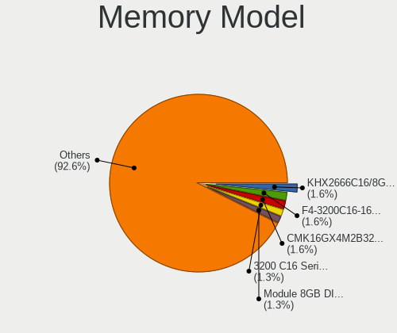
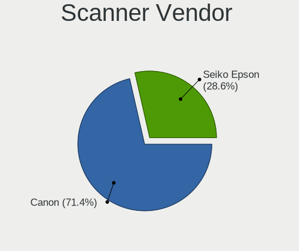

Fedora 36 - Tested Hardware & Statistics (Desktops)
---------------------------------------------------

A project to collect tested hardware configurations for Fedora 36.

Anyone can contribute to this report by the [hw-probe](https://github.com/linuxhw/hw-probe) tool:

    sudo -E hw-probe -all -upload

Please contribute! Especially if your hardware is rare.

Contents
--------

* [ Test Cases ](#test-cases)

* [ System ](#system)
  - [ Kernel                   ](#kernel)
  - [ Kernel Family            ](#kernel-family)
  - [ Kernel Major Ver.        ](#kernel-major-ver)
  - [ Arch                     ](#arch)
  - [ DE                       ](#de)
  - [ Display Server           ](#display-server)
  - [ Display Manager          ](#display-manager)
  - [ OS Lang                  ](#os-lang)
  - [ Boot Mode                ](#boot-mode)
  - [ Filesystem               ](#filesystem)
  - [ Part. scheme             ](#part-scheme)
  - [ Dual Boot with Linux/BSD ](#dual-boot-with-linuxbsd)
  - [ Dual Boot (Win)          ](#dual-boot-win)

* [ Board ](#board)
  - [ Vendor                   ](#vendor)
  - [ Model                    ](#model)
  - [ Model Family             ](#model-family)
  - [ MFG Year                 ](#mfg-year)
  - [ Form Factor              ](#form-factor)
  - [ Secure Boot              ](#secure-boot)
  - [ Coreboot                 ](#coreboot)
  - [ RAM Size                 ](#ram-size)
  - [ RAM Used                 ](#ram-used)
  - [ Total Drives             ](#total-drives)
  - [ Has CD-ROM               ](#has-cd-rom)
  - [ Has Ethernet             ](#has-ethernet)
  - [ Has WiFi                 ](#has-wifi)
  - [ Has Bluetooth            ](#has-bluetooth)

* [ Location ](#location)
  - [ Country                  ](#country)
  - [ City                     ](#city)

* [ Drives ](#drives)
  - [ Drive Vendor             ](#drive-vendor)
  - [ Drive Model              ](#drive-model)
  - [ HDD Vendor               ](#hdd-vendor)
  - [ SSD Vendor               ](#ssd-vendor)
  - [ Drive Kind               ](#drive-kind)
  - [ Drive Connector          ](#drive-connector)
  - [ Drive Size               ](#drive-size)
  - [ Space Total              ](#space-total)
  - [ Space Used               ](#space-used)
  - [ Malfunc. Drives          ](#malfunc-drives)
  - [ Malfunc. Drive Vendor    ](#malfunc-drive-vendor)
  - [ Malfunc. HDD Vendor      ](#malfunc-hdd-vendor)
  - [ Malfunc. Drive Kind      ](#malfunc-drive-kind)
  - [ Failed Drives            ](#failed-drives)
  - [ Failed Drive Vendor      ](#failed-drive-vendor)
  - [ Drive Status             ](#drive-status)

* [ Storage controller ](#storage-controller)
  - [ Storage Vendor           ](#storage-vendor)
  - [ Storage Model            ](#storage-model)
  - [ Storage Kind             ](#storage-kind)

* [ Processor ](#processor)
  - [ CPU Vendor               ](#cpu-vendor)
  - [ CPU Model                ](#cpu-model)
  - [ CPU Model Family         ](#cpu-model-family)
  - [ CPU Cores                ](#cpu-cores)
  - [ CPU Sockets              ](#cpu-sockets)
  - [ CPU Threads              ](#cpu-threads)
  - [ CPU Op-Modes             ](#cpu-op-modes)
  - [ CPU Microcode            ](#cpu-microcode)
  - [ CPU Microarch            ](#cpu-microarch)

* [ Graphics ](#graphics)
  - [ GPU Vendor               ](#gpu-vendor)
  - [ GPU Model                ](#gpu-model)
  - [ GPU Combo                ](#gpu-combo)
  - [ GPU Driver               ](#gpu-driver)
  - [ GPU Memory               ](#gpu-memory)

* [ Monitor ](#monitor)
  - [ Monitor Vendor           ](#monitor-vendor)
  - [ Monitor Model            ](#monitor-model)
  - [ Monitor Resolution       ](#monitor-resolution)
  - [ Monitor Diagonal         ](#monitor-diagonal)
  - [ Monitor Width            ](#monitor-width)
  - [ Aspect Ratio             ](#aspect-ratio)
  - [ Monitor Area             ](#monitor-area)
  - [ Pixel Density            ](#pixel-density)
  - [ Multiple Monitors        ](#multiple-monitors)

* [ Network ](#network)
  - [ Net Controller Vendor    ](#net-controller-vendor)
  - [ Net Controller Model     ](#net-controller-model)
  - [ Wireless Vendor          ](#wireless-vendor)
  - [ Wireless Model           ](#wireless-model)
  - [ Ethernet Vendor          ](#ethernet-vendor)
  - [ Ethernet Model           ](#ethernet-model)
  - [ Net Controller Kind      ](#net-controller-kind)
  - [ Used Controller          ](#used-controller)
  - [ NICs                     ](#nics)
  - [ IPv6                     ](#ipv6)

* [ Bluetooth ](#bluetooth)
  - [ Bluetooth Vendor         ](#bluetooth-vendor)
  - [ Bluetooth Model          ](#bluetooth-model)

* [ Sound ](#sound)
  - [ Sound Vendor             ](#sound-vendor)
  - [ Sound Model              ](#sound-model)

* [ Memory ](#memory)
  - [ Memory Vendor            ](#memory-vendor)
  - [ Memory Model             ](#memory-model)
  - [ Memory Kind              ](#memory-kind)
  - [ Memory Form Factor       ](#memory-form-factor)
  - [ Memory Size              ](#memory-size)
  - [ Memory Speed             ](#memory-speed)

* [ Printers & scanners ](#printers--scanners)
  - [ Printer Vendor           ](#printer-vendor)
  - [ Printer Model            ](#printer-model)
  - [ Scanner Vendor           ](#scanner-vendor)
  - [ Scanner Model            ](#scanner-model)

* [ Camera ](#camera)
  - [ Camera Vendor            ](#camera-vendor)
  - [ Camera Model             ](#camera-model)

* [ Security ](#security)
  - [ Fingerprint Vendor       ](#fingerprint-vendor)
  - [ Fingerprint Model        ](#fingerprint-model)
  - [ Chipcard Vendor          ](#chipcard-vendor)
  - [ Chipcard Model           ](#chipcard-model)

* [ Unsupported ](#unsupported)
  - [ Unsupported Devices      ](#unsupported-devices)
  - [ Unsupported Device Types ](#unsupported-device-types)

Test Cases
----------

Total: 66

| Vendor   | Model                       | Probe                                                      | Date         |
|----------|-----------------------------|------------------------------------------------------------|--------------|
| Gigabyte | B550 AORUS ELITE AX V2      | [cb6d49fe71](https://linux-hardware.org/?probe=cb6d49fe71) | Apr 30, 2022 |
| Gigabyte | B550 AORUS ELITE AX V2      | [83e47f9c91](https://linux-hardware.org/?probe=83e47f9c91) | Apr 30, 2022 |
| ASUSTek  | PRIME Z390-A                | [c4d7dc5e80](https://linux-hardware.org/?probe=c4d7dc5e80) | Apr 30, 2022 |
| MSI      | MAG B460M MORTAR            | [07cb268e5e](https://linux-hardware.org/?probe=07cb268e5e) | Apr 30, 2022 |
| ASUSTek  | PRIME H310M-D R2.0          | [2999ff1487](https://linux-hardware.org/?probe=2999ff1487) | Apr 28, 2022 |
| ASRock   | B450 Steel Legend           | [bf0a56358c](https://linux-hardware.org/?probe=bf0a56358c) | Apr 27, 2022 |
| ASUSTek  | ROG STRIX B550-I GAMING     | [5456280ec0](https://linux-hardware.org/?probe=5456280ec0) | Apr 26, 2022 |
| Gigabyte | X570 AORUS PRO              | [187db4f8e4](https://linux-hardware.org/?probe=187db4f8e4) | Apr 23, 2022 |
| ASUSTek  | ROG STRIX B550-I GAMING     | [b9ea98672f](https://linux-hardware.org/?probe=b9ea98672f) | Apr 23, 2022 |
| ASUSTek  | ROG STRIX B550-I GAMING     | [c3f809fc02](https://linux-hardware.org/?probe=c3f809fc02) | Apr 23, 2022 |
| Gigabyte | EP45-DS3L                   | [948b64fcc9](https://linux-hardware.org/?probe=948b64fcc9) | Apr 21, 2022 |
| MSI      | MAG X570 TOMAHAWK WIFI      | [68a04098ec](https://linux-hardware.org/?probe=68a04098ec) | Apr 21, 2022 |
| ASUSTek  | ROG STRIX B550-F GAMING     | [466f67adb3](https://linux-hardware.org/?probe=466f67adb3) | Apr 20, 2022 |
| Gigabyte | EP45-DS3L                   | [35d6ec9f89](https://linux-hardware.org/?probe=35d6ec9f89) | Apr 19, 2022 |
| Gigabyte | H81M-S2H                    | [85082e6de6](https://linux-hardware.org/?probe=85082e6de6) | Apr 19, 2022 |
| Gigabyte | Z170-D3H-CF                 | [6a9e2b3174](https://linux-hardware.org/?probe=6a9e2b3174) | Apr 16, 2022 |
| Gigabyte | H110M-H-CF                  | [66ef9c9e5f](https://linux-hardware.org/?probe=66ef9c9e5f) | Apr 16, 2022 |
| Acer     | Aspire TC-895 V:1.0         | [22a1a17a81](https://linux-hardware.org/?probe=22a1a17a81) | Apr 14, 2022 |
| Gigabyte | B550 AORUS ELITE            | [85b4ecf9d3](https://linux-hardware.org/?probe=85b4ecf9d3) | Apr 14, 2022 |
| Gigabyte | B550 AORUS ELITE            | [abe538f1ed](https://linux-hardware.org/?probe=abe538f1ed) | Apr 14, 2022 |
| ASUSTek  | P8P67 LE                    | [84abfd3112](https://linux-hardware.org/?probe=84abfd3112) | Apr 14, 2022 |
| MSI      | FM2-A75IA-E53               | [25ffe3d211](https://linux-hardware.org/?probe=25ffe3d211) | Apr 14, 2022 |
| Gigabyte | Z170MX-Gaming 5             | [d1b267f496](https://linux-hardware.org/?probe=d1b267f496) | Apr 13, 2022 |
| Gigabyte | B450 AORUS M                | [c1beed0e9b](https://linux-hardware.org/?probe=c1beed0e9b) | Apr 13, 2022 |
| Gigabyte | B450 AORUS M                | [e5a9e99dbc](https://linux-hardware.org/?probe=e5a9e99dbc) | Apr 13, 2022 |
| Dell     | 0GWHMW A03                  | [ff312c5929](https://linux-hardware.org/?probe=ff312c5929) | Apr 13, 2022 |
| Gigabyte | Z170-D3H-CF                 | [33b4ba0b02](https://linux-hardware.org/?probe=33b4ba0b02) | Apr 13, 2022 |
| Gigabyte | Z170-D3H-CF                 | [8a1cecc21c](https://linux-hardware.org/?probe=8a1cecc21c) | Apr 11, 2022 |
| MSI      | B450M PRO-VDH PLUS          | [5b861faffd](https://linux-hardware.org/?probe=5b861faffd) | Apr 09, 2022 |
| Gigabyte | Z490 UD                     | [31ecc9c776](https://linux-hardware.org/?probe=31ecc9c776) | Apr 09, 2022 |
| Biostar  | B550MH                      | [abd373497b](https://linux-hardware.org/?probe=abd373497b) | Apr 09, 2022 |
| Gigabyte | B450 AORUS M                | [1a4b90c894](https://linux-hardware.org/?probe=1a4b90c894) | Apr 08, 2022 |
| MSI      | Z170A XPOWER GAMING TITA... | [ffcbeed952](https://linux-hardware.org/?probe=ffcbeed952) | Apr 08, 2022 |
| Gigabyte | Z170N-Gaming 5              | [f0472bcf0d](https://linux-hardware.org/?probe=f0472bcf0d) | Apr 05, 2022 |
| Gigabyte | Z170N-Gaming 5              | [9ee2f76c12](https://linux-hardware.org/?probe=9ee2f76c12) | Apr 05, 2022 |
| ASUSTek  | B150M-K                     | [016a08bf47](https://linux-hardware.org/?probe=016a08bf47) | Apr 04, 2022 |
| Gigabyte | B550I AORUS PRO AX          | [b697fd5f0a](https://linux-hardware.org/?probe=b697fd5f0a) | Apr 03, 2022 |
| Gigabyte | 970A-DS3P                   | [5bbc4cbbf5](https://linux-hardware.org/?probe=5bbc4cbbf5) | Apr 03, 2022 |
| Dell     | 088DT1 A01                  | [718a7d42cc](https://linux-hardware.org/?probe=718a7d42cc) | Apr 02, 2022 |
| Gigabyte | H81M-S2H                    | [8a810aa9f6](https://linux-hardware.org/?probe=8a810aa9f6) | Apr 02, 2022 |
| MSI      | MPG Z590 GAMING CARBON W... | [f7946783ea](https://linux-hardware.org/?probe=f7946783ea) | Mar 31, 2022 |
| Gigabyte | H370M DS3H-CF               | [1110b2974c](https://linux-hardware.org/?probe=1110b2974c) | Mar 31, 2022 |
| Gigabyte | EP45-DS3L                   | [7879818528](https://linux-hardware.org/?probe=7879818528) | Mar 30, 2022 |
| Gigabyte | EP45-DS3L                   | [c7d6879a86](https://linux-hardware.org/?probe=c7d6879a86) | Mar 26, 2022 |
| Gigabyte | B85M-D3V-A                  | [b7679b78be](https://linux-hardware.org/?probe=b7679b78be) | Mar 25, 2022 |
| Gigabyte | B550 AORUS ELITE            | [7977e70f86](https://linux-hardware.org/?probe=7977e70f86) | Mar 22, 2022 |
| Gigabyte | EP45-DS3L                   | [efdb29ff92](https://linux-hardware.org/?probe=efdb29ff92) | Mar 07, 2022 |
| ASUSTek  | TUF GAMING B550M-PLUS       | [97eedd34f4](https://linux-hardware.org/?probe=97eedd34f4) | Mar 05, 2022 |
| Gigabyte | EP45-DS3L                   | [0efde9a187](https://linux-hardware.org/?probe=0efde9a187) | Mar 03, 2022 |
| Gigabyte | EP45-DS3L                   | [da3962a1da](https://linux-hardware.org/?probe=da3962a1da) | Mar 03, 2022 |
| Biostar  | H55 HD                      | [b0d5843b6e](https://linux-hardware.org/?probe=b0d5843b6e) | Feb 13, 2022 |
| Biostar  | H55 HD                      | [e08da3e685](https://linux-hardware.org/?probe=e08da3e685) | Feb 03, 2022 |
| MSI      | B550M PRO-VDH WIFI          | [f1a1a21c56](https://linux-hardware.org/?probe=f1a1a21c56) | Oct 26, 2021 |
| Dell     | 0KC9NP A01                  | [ff356cba89](https://linux-hardware.org/?probe=ff356cba89) | Oct 22, 2021 |
| Dell     | 0KC9NP A01                  | [a072a33607](https://linux-hardware.org/?probe=a072a33607) | Oct 12, 2021 |
| MSI      | FM2-A55M-E33                | [bcf7dcdd2c](https://linux-hardware.org/?probe=bcf7dcdd2c) | Oct 09, 2021 |
| MSI      | FM2-A55M-E33                | [0b3691d096](https://linux-hardware.org/?probe=0b3691d096) | Oct 09, 2021 |
| Dell     | 0KC9NP A01                  | [95229554a9](https://linux-hardware.org/?probe=95229554a9) | Sep 19, 2021 |
| Dell     | 0KC9NP A01                  | [d235dcf0d1](https://linux-hardware.org/?probe=d235dcf0d1) | Sep 18, 2021 |
| Dell     | 0KC9NP A01                  | [ad5f2b8ea5](https://linux-hardware.org/?probe=ad5f2b8ea5) | Sep 04, 2021 |
| Dell     | 0KC9NP A01                  | [f191342fa8](https://linux-hardware.org/?probe=f191342fa8) | Sep 02, 2021 |
| Dell     | 0KC9NP A01                  | [270961aa02](https://linux-hardware.org/?probe=270961aa02) | Aug 30, 2021 |
| Dell     | 0KC9NP A01                  | [1257d6c6f4](https://linux-hardware.org/?probe=1257d6c6f4) | Aug 27, 2021 |
| Dell     | 0KC9NP A01                  | [373f7e6861](https://linux-hardware.org/?probe=373f7e6861) | Aug 22, 2021 |
| HP       | 304Ah                       | [047d1b0887](https://linux-hardware.org/?probe=047d1b0887) | Aug 18, 2021 |
| Dell     | 0KC9NP A01                  | [2ca8cc81b1](https://linux-hardware.org/?probe=2ca8cc81b1) | Aug 18, 2021 |

System
------

Kernel
------

Version of the Linux kernel

| Version                                                       | Desktops | Percent |
|---------------------------------------------------------------|----------|---------|
| 5.17.2-300.fc36.x86_64                                        | 11       | 25.58%  |
| 5.17.1-300.fc36.x86_64                                        | 10       | 23.26%  |
| 5.17.3-302.fc36.x86_64                                        | 5        | 11.63%  |
| 5.17.0-0.rc7.116.fc36.x86_64                                  | 3        | 6.98%   |
| 5.17.4-300.fc36.x86_64                                        | 2        | 4.65%   |
| 5.14.0-0.rc5.20210813gitf8e6dfc64f61.46.fc36.x86_64           | 2        | 4.65%   |
| 5.18.0-0.rc4.20220428git8f4dd16603ce834.36.fc37.x86_64        | 1        | 2.33%   |
| 5.17.3-300.fc36.x86_64                                        | 1        | 2.33%   |
| 5.17.0-300.fc36.x86_64                                        | 1        | 2.33%   |
| 5.17.0-0.rc5.102.fc36.x86_64                                  | 1        | 2.33%   |
| 5.17.0-0.rc0.20220112gitdaadb3bd0e8d.63.fc36.x86_64           | 1        | 2.33%   |
| 5.16.17-200.fc35.x86_64                                       | 1        | 2.33%   |
| 5.15.0-0.rc6.47.fc36.x86_64                                   | 1        | 2.33%   |
| 5.15.0-0.rc4.20211008git1da38549dd64.36.vanilla.1.fc36.x86_64 | 1        | 2.33%   |
| 5.15.0-0.rc4.20211008git1da38549dd64.36.fc36.x86_64           | 1        | 2.33%   |
| 5.15.0-0.rc0.20210831gitb91db6a0b52e.1.fc36.x86_64            | 1        | 2.33%   |

Kernel Family
-------------

Linux kernel without a distro release

| Version | Desktops | Percent |
|---------|----------|---------|
| 5.17.2  | 11       | 26.19%  |
| 5.17.1  | 10       | 23.81%  |
| 5.17.3  | 6        | 14.29%  |
| 5.17.0  | 6        | 14.29%  |
| 5.15.0  | 3        | 7.14%   |
| 5.17.4  | 2        | 4.76%   |
| 5.14.0  | 2        | 4.76%   |
| 5.18.0  | 1        | 2.38%   |
| 5.16.17 | 1        | 2.38%   |

Kernel Major Ver.
-----------------

Linux kernel major version

| Version | Desktops | Percent |
|---------|----------|---------|
| 5.17    | 33       | 82.5%   |
| 5.15    | 3        | 7.5%    |
| 5.14    | 2        | 5%      |
| 5.18    | 1        | 2.5%    |
| 5.16    | 1        | 2.5%    |

Arch
----

OS architecture (x86_64, i586, etc.)

| Name   | Desktops | Percent |
|--------|----------|---------|
| x86_64 | 39       | 100%    |

DE
--

Desktop Environment

| Name    | Desktops | Percent |
|---------|----------|---------|
| GNOME   | 33       | 84.62%  |
| KDE5    | 5        | 12.82%  |
| Unknown | 1        | 2.56%   |

Display Server
--------------

X11 or Wayland

| Name    | Desktops | Percent |
|---------|----------|---------|
| Wayland | 30       | 76.92%  |
| X11     | 7        | 17.95%  |
| Tty     | 2        | 5.13%   |

Display Manager
---------------

SDDM, LightDM, etc.

| Name    | Desktops | Percent |
|---------|----------|---------|
| GDM     | 21       | 53.85%  |
| Unknown | 16       | 41.03%  |
| SDDM    | 2        | 5.13%   |

OS Lang
-------

Language

| Lang  | Desktops | Percent |
|-------|----------|---------|
| en_US | 18       | 46.15%  |
| en_GB | 6        | 15.38%  |
| ru_RU | 4        | 10.26%  |
| pl_PL | 2        | 5.13%   |
| es_AR | 2        | 5.13%   |
| de_DE | 2        | 5.13%   |
| pt_BR | 1        | 2.56%   |
| it_IT | 1        | 2.56%   |
| fr_FR | 1        | 2.56%   |
| fi_FI | 1        | 2.56%   |
| cs_CZ | 1        | 2.56%   |

Boot Mode
---------

EFI or BIOS

| Mode | Desktops | Percent |
|------|----------|---------|
| EFI  | 30       | 76.92%  |
| BIOS | 9        | 23.08%  |

Filesystem
----------

Type of filesystem

| Type  | Desktops | Percent |
|-------|----------|---------|
| Btrfs | 29       | 74.36%  |
| Ext4  | 8        | 20.51%  |
| Xfs   | 2        | 5.13%   |

Part. scheme
------------

Scheme of partitioning

| Type    | Desktops | Percent |
|---------|----------|---------|
| GPT     | 21       | 53.85%  |
| Unknown | 16       | 41.03%  |
| MBR     | 2        | 5.13%   |

Dual Boot with Linux/BSD
------------------------

Hosting more than one Linux/BSD

| Dual boot | Desktops | Percent |
|-----------|----------|---------|
| No        | 37       | 94.87%  |
| Yes       | 2        | 5.13%   |

Dual Boot (Win)
---------------

Hosting Linux and Windows

| Dual boot | Desktops | Percent |
|-----------|----------|---------|
| No        | 22       | 56.41%  |
| Yes       | 17       | 43.59%  |

Board
-----

Vendor
------

Motherboard manufacturer

| Name                | Desktops | Percent |
|---------------------|----------|---------|
| Gigabyte Technology | 16       | 41.03%  |
| MSI                 | 8        | 20.51%  |
| ASUSTek Computer    | 7        | 17.95%  |
| Dell                | 3        | 7.69%   |
| Biostar             | 2        | 5.13%   |
| Hewlett-Packard     | 1        | 2.56%   |
| ASRock              | 1        | 2.56%   |
| Acer                | 1        | 2.56%   |

Model
-----

Motherboard model

| Name                            | Desktops | Percent |
|---------------------------------|----------|---------|
| Gigabyte B450 AORUS M           | 2        | 5.13%   |
| MSI MS-7D06                     | 1        | 2.56%   |
| MSI MS-7C95                     | 1        | 2.56%   |
| MSI MS-7C84                     | 1        | 2.56%   |
| MSI MS-7C82                     | 1        | 2.56%   |
| MSI MS-7A38                     | 1        | 2.56%   |
| MSI MS-7968                     | 1        | 2.56%   |
| MSI MS-7792                     | 1        | 2.56%   |
| MSI MS-7721                     | 1        | 2.56%   |
| HP Compaq 8100 Elite SFF PC     | 1        | 2.56%   |
| Gigabyte Z490 UD                | 1        | 2.56%   |
| Gigabyte Z170N-Gaming 5         | 1        | 2.56%   |
| Gigabyte Z170MX-Gaming 5        | 1        | 2.56%   |
| Gigabyte Z170-D3H               | 1        | 2.56%   |
| Gigabyte X570 AORUS PRO         | 1        | 2.56%   |
| Gigabyte H81M-S2H               | 1        | 2.56%   |
| Gigabyte H370M-DS3H             | 1        | 2.56%   |
| Gigabyte H110M-H                | 1        | 2.56%   |
| Gigabyte EP45-DS3L              | 1        | 2.56%   |
| Gigabyte B85M-D3V-A             | 1        | 2.56%   |
| Gigabyte B550I AORUS PRO AX     | 1        | 2.56%   |
| Gigabyte B550 AORUS ELITE AX V2 | 1        | 2.56%   |
| Gigabyte B550 AORUS ELITE       | 1        | 2.56%   |
| Gigabyte 970A-DS3P              | 1        | 2.56%   |
| Dell Precision Tower 7810       | 1        | 2.56%   |
| Dell OptiPlex 9020              | 1        | 2.56%   |
| Dell Inspiron 3847              | 1        | 2.56%   |
| Biostar H55 HD                  | 1        | 2.56%   |
| Biostar B550MH                  | 1        | 2.56%   |
| ASUS TUF GAMING B550M-PLUS      | 1        | 2.56%   |
| ASUS ROG STRIX B550-I GAMING    | 1        | 2.56%   |
| ASUS ROG STRIX B550-F GAMING    | 1        | 2.56%   |
| ASUS PRIME Z390-A               | 1        | 2.56%   |
| ASUS PRIME H310M-D R2.0         | 1        | 2.56%   |
| ASUS P8P67 LE                   | 1        | 2.56%   |
| ASUS B150M-K                    | 1        | 2.56%   |
| ASRock B450 Steel Legend        | 1        | 2.56%   |
| Acer Aspire TC-895              | 1        | 2.56%   |

Model Family
------------

Motherboard model prefix

| Name                   | Desktops | Percent |
|------------------------|----------|---------|
| Gigabyte B550          | 2        | 5.13%   |
| Gigabyte B450          | 2        | 5.13%   |
| ASUS ROG               | 2        | 5.13%   |
| ASUS PRIME             | 2        | 5.13%   |
| MSI MS-7D06            | 1        | 2.56%   |
| MSI MS-7C95            | 1        | 2.56%   |
| MSI MS-7C84            | 1        | 2.56%   |
| MSI MS-7C82            | 1        | 2.56%   |
| MSI MS-7A38            | 1        | 2.56%   |
| MSI MS-7968            | 1        | 2.56%   |
| MSI MS-7792            | 1        | 2.56%   |
| MSI MS-7721            | 1        | 2.56%   |
| HP Compaq              | 1        | 2.56%   |
| Gigabyte Z490          | 1        | 2.56%   |
| Gigabyte Z170N-Gaming  | 1        | 2.56%   |
| Gigabyte Z170MX-Gaming | 1        | 2.56%   |
| Gigabyte Z170-D3H      | 1        | 2.56%   |
| Gigabyte X570          | 1        | 2.56%   |
| Gigabyte H81M-S2H      | 1        | 2.56%   |
| Gigabyte H370M-DS3H    | 1        | 2.56%   |
| Gigabyte H110M-H       | 1        | 2.56%   |
| Gigabyte EP45-DS3L     | 1        | 2.56%   |
| Gigabyte B85M-D3V-A    | 1        | 2.56%   |
| Gigabyte B550I         | 1        | 2.56%   |
| Gigabyte 970A-DS3P     | 1        | 2.56%   |
| Dell Precision         | 1        | 2.56%   |
| Dell OptiPlex          | 1        | 2.56%   |
| Dell Inspiron          | 1        | 2.56%   |
| Biostar H55            | 1        | 2.56%   |
| Biostar B550MH         | 1        | 2.56%   |
| ASUS TUF               | 1        | 2.56%   |
| ASUS P8P67             | 1        | 2.56%   |
| ASUS B150M-K           | 1        | 2.56%   |
| ASRock B450            | 1        | 2.56%   |
| Acer Aspire            | 1        | 2.56%   |

MFG Year
--------

Motherboard manufacture year

| Year | Desktops | Percent |
|------|----------|---------|
| 2020 | 11       | 28.21%  |
| 2018 | 5        | 12.82%  |
| 2016 | 4        | 10.26%  |
| 2015 | 4        | 10.26%  |
| 2013 | 4        | 10.26%  |
| 2022 | 2        | 5.13%   |
| 2019 | 2        | 5.13%   |
| 2021 | 1        | 2.56%   |
| 2017 | 1        | 2.56%   |
| 2014 | 1        | 2.56%   |
| 2011 | 1        | 2.56%   |
| 2010 | 1        | 2.56%   |
| 2009 | 1        | 2.56%   |
| 2008 | 1        | 2.56%   |

Form Factor
-----------

Physical design of the computer

| Name    | Desktops | Percent |
|---------|----------|---------|
| Desktop | 39       | 100%    |

Secure Boot
-----------

Enabled or disabled

| State    | Desktops | Percent |
|----------|----------|---------|
| Disabled | 38       | 97.44%  |
| Enabled  | 1        | 2.56%   |

Coreboot
--------

Have coreboot on board

| Used | Desktops | Percent |
|------|----------|---------|
| No   | 39       | 100%    |

RAM Size
--------

Total RAM memory

| Size in GB  | Desktops | Percent |
|-------------|----------|---------|
| 16.01-24.0  | 12       | 30.77%  |
| 32.01-64.0  | 9        | 23.08%  |
| 8.01-16.0   | 8        | 20.51%  |
| 64.01-256.0 | 4        | 10.26%  |
| 4.01-8.0    | 3        | 7.69%   |
| 3.01-4.0    | 3        | 7.69%   |

RAM Used
--------

Used RAM memory

| Used GB   | Desktops | Percent |
|-----------|----------|---------|
| 4.01-8.0  | 12       | 30%     |
| 2.01-3.0  | 11       | 27.5%   |
| 3.01-4.0  | 9        | 22.5%   |
| 8.01-16.0 | 4        | 10%     |
| 1.01-2.0  | 3        | 7.5%    |
| 0.51-1.0  | 1        | 2.5%    |

Total Drives
------------

Number of drives on board

| Drives | Desktops | Percent |
|--------|----------|---------|
| 2      | 11       | 28.21%  |
| 3      | 10       | 25.64%  |
| 1      | 9        | 23.08%  |
| 4      | 6        | 15.38%  |
| 5      | 2        | 5.13%   |
| 6      | 1        | 2.56%   |

Has CD-ROM
----------

Has CD-ROM on board

| Presented | Desktops | Percent |
|-----------|----------|---------|
| No        | 26       | 66.67%  |
| Yes       | 13       | 33.33%  |

Has Ethernet
------------

Has Ethernet on board

| Presented | Desktops | Percent |
|-----------|----------|---------|
| Yes       | 39       | 100%    |

Has WiFi
--------

Has WiFi module

| Presented | Desktops | Percent |
|-----------|----------|---------|
| Yes       | 23       | 58.97%  |
| No        | 16       | 41.03%  |

Has Bluetooth
-------------

Has Bluetooth module

| Presented | Desktops | Percent |
|-----------|----------|---------|
| No        | 21       | 53.85%  |
| Yes       | 18       | 46.15%  |

Location
--------

Country
-------

Geographic location (country)

| Country     | Desktops | Percent |
|-------------|----------|---------|
| USA         | 10       | 25.64%  |
| Belarus     | 3        | 7.69%   |
| UK          | 2        | 5.13%   |
| Russia      | 2        | 5.13%   |
| Poland      | 2        | 5.13%   |
| Germany     | 2        | 5.13%   |
| Brazil      | 2        | 5.13%   |
| Argentina   | 2        | 5.13%   |
| Turkey      | 1        | 2.56%   |
| Switzerland | 1        | 2.56%   |
| Sweden      | 1        | 2.56%   |
| Spain       | 1        | 2.56%   |
| Norway      | 1        | 2.56%   |
| Netherlands | 1        | 2.56%   |
| Italy       | 1        | 2.56%   |
| Indonesia   | 1        | 2.56%   |
| India       | 1        | 2.56%   |
| France      | 1        | 2.56%   |
| Finland     | 1        | 2.56%   |
| Czechia     | 1        | 2.56%   |
| Belgium     | 1        | 2.56%   |
| Bangladesh  | 1        | 2.56%   |

City
----

Geographic location (city)

| City          | Desktops | Percent |
|---------------|----------|---------|
| Minsk         | 3        | 7.69%   |
| Allen         | 2        | 5.13%   |
| Zurich        | 1        | 2.56%   |
| Wroclaw       | 1        | 2.56%   |
| Warsaw        | 1        | 2.56%   |
| Vigodarzere   | 1        | 2.56%   |
| Turku         | 1        | 2.56%   |
| Tarragona     | 1        | 2.56%   |
| St Petersburg | 1        | 2.56%   |
| Sollentuna    | 1        | 2.56%   |
| Soddy-Daisy   | 1        | 2.56%   |
| Sarpsborg     | 1        | 2.56%   |
| Sao Paulo     | 1        | 2.56%   |
| San Jose      | 1        | 2.56%   |
| Moscow        | 1        | 2.56%   |
| Liverpool     | 1        | 2.56%   |
| Kanne         | 1        | 2.56%   |
| Jakarta       | 1        | 2.56%   |
| Houston       | 1        | 2.56%   |
| Halstead      | 1        | 2.56%   |
| Golden        | 1        | 2.56%   |
| Goiânia      | 1        | 2.56%   |
| Folsom        | 1        | 2.56%   |
| Fair Oaks     | 1        | 2.56%   |
| Dhaka         | 1        | 2.56%   |
| Delft         | 1        | 2.56%   |
| Burzaco       | 1        | 2.56%   |
| Buenos Aires  | 1        | 2.56%   |
| Brooklyn      | 1        | 2.56%   |
| Brno          | 1        | 2.56%   |
| Brest         | 1        | 2.56%   |
| Boone         | 1        | 2.56%   |
| Bonn          | 1        | 2.56%   |
| Blankenburg   | 1        | 2.56%   |
| Bhopal        | 1        | 2.56%   |
| Ankara        | 1        | 2.56%   |

Drives
------

Drive Vendor
------------

Hard drive vendors

| Vendor              | Desktops | Drives | Percent |
|---------------------|----------|--------|---------|
| Samsung Electronics | 22       | 38     | 27.16%  |
| WDC                 | 14       | 19     | 17.28%  |
| Seagate             | 13       | 14     | 16.05%  |
| Kingston            | 7        | 7      | 8.64%   |
| Toshiba             | 6        | 7      | 7.41%   |
| Sandisk             | 3        | 4      | 3.7%    |
| PNY                 | 2        | 3      | 2.47%   |
| Phison              | 2        | 2      | 2.47%   |
| HGST                | 2        | 2      | 2.47%   |
| Corsair             | 2        | 2      | 2.47%   |
| XPG                 | 1        | 2      | 1.23%   |
| Unknown             | 1        | 1      | 1.23%   |
| N300                | 1        | 1      | 1.23%   |
| Intel               | 1        | 1      | 1.23%   |
| Hitachi             | 1        | 1      | 1.23%   |
| Hewlett-Packard     | 1        | 1      | 1.23%   |
| Crucial             | 1        | 1      | 1.23%   |
| China               | 1        | 1      | 1.23%   |

Drive Model
-----------

Hard drive models

| Model                               | Desktops | Percent |
|-------------------------------------|----------|---------|
| Seagate ST1000DM010-2EP102 1TB      | 4        | 4.26%   |
| Samsung SSD 850 EVO 250GB           | 4        | 4.26%   |
| Samsung SSD 870 QVO 2TB             | 3        | 3.19%   |
| Kingston SA400S37240G 240GB SSD     | 3        | 3.19%   |
| Sandisk NVMe SSD Drive 1TB          | 2        | 2.13%   |
| Samsung SSD 970 EVO Plus 500GB      | 2        | 2.13%   |
| Samsung SSD 970 EVO Plus 1TB        | 2        | 2.13%   |
| Samsung SSD 970 EVO 250GB           | 2        | 2.13%   |
| Samsung SSD 860 EVO 500GB           | 2        | 2.13%   |
| Samsung SSD 850 EVO 500GB           | 2        | 2.13%   |
| Samsung SSD 840 EVO 250GB           | 2        | 2.13%   |
| Samsung NVMe SSD Drive 500GB        | 2        | 2.13%   |
| Kingston SA400S37120G 120GB SSD     | 2        | 2.13%   |
| XPG GAMMIX S11 Pro 512GB            | 1        | 1.06%   |
| WDC WDS500G2B0B-00YS70 500GB SSD    | 1        | 1.06%   |
| WDC WDS500G1B0C-00S6U0 500GB        | 1        | 1.06%   |
| WDC WDS250G2B0A-00SM50 250GB SSD    | 1        | 1.06%   |
| WDC WDS100T2G0A-00JH30 1TB SSD      | 1        | 1.06%   |
| WDC WDS100T2B0A-00SM50 1TB SSD      | 1        | 1.06%   |
| WDC WD7500BPVT-60HXZT3 752GB        | 1        | 1.06%   |
| WDC WD6400AAKS-22A7B2 640GB         | 1        | 1.06%   |
| WDC WD5000LPLX-75ZNTT0 500GB        | 1        | 1.06%   |
| WDC WD5000AAKX-001CA0 500GB         | 1        | 1.06%   |
| WDC WD40EZRZ-22GXCB0 4TB            | 1        | 1.06%   |
| WDC WD40EZRZ-00WN9B0 4TB            | 1        | 1.06%   |
| WDC WD30EZRX-00SPEB0 3TB            | 1        | 1.06%   |
| WDC WD20EZRZ-00Z5HB0 2TB            | 1        | 1.06%   |
| WDC WD20EZRX-00D8PB0 2TB            | 1        | 1.06%   |
| WDC WD20EARS-00MVWB0 2TB            | 1        | 1.06%   |
| WDC WD10EZEX-08WN4A0 1TB            | 1        | 1.06%   |
| WDC WD10EZEX-00ZF5A0 1TB            | 1        | 1.06%   |
| Unknown SD/MMC/MS PRO 16GB          | 1        | 1.06%   |
| Toshiba TR200 240GB SSD             | 1        | 1.06%   |
| Toshiba THNSNJ128GCSU 128GB SSD     | 1        | 1.06%   |
| Toshiba MQ04ABF100 1TB              | 1        | 1.06%   |
| Toshiba MQ01ABD050 500GB            | 1        | 1.06%   |
| Toshiba HDWD120 2TB                 | 1        | 1.06%   |
| Toshiba HDWD110 1TB                 | 1        | 1.06%   |
| Seagate ST500LM012 HN-M500MBB 500GB | 1        | 1.06%   |
| Seagate ST4000LM024-2AN17V 4TB      | 1        | 1.06%   |
| Seagate ST4000DM005-2DP166 4TB      | 1        | 1.06%   |
| Seagate ST4000DM000-1F2168 4TB      | 1        | 1.06%   |
| Seagate ST3500413AS 500GB           | 1        | 1.06%   |
| Seagate ST31000528AS 1TB            | 1        | 1.06%   |
| Seagate ST2000DM009-2G4100 2TB      | 1        | 1.06%   |
| Seagate ST2000DM001-1CH164 2TB      | 1        | 1.06%   |
| Seagate ST1000DM003-1SB102 1TB      | 1        | 1.06%   |
| Sandisk NVMe SSD Drive 500GB        | 1        | 1.06%   |
| Samsung SSD SM871 2.5 7mm 256GB     | 1        | 1.06%   |
| Samsung SSD 870 EVO 500GB           | 1        | 1.06%   |
| Samsung SSD 870 EVO 2TB             | 1        | 1.06%   |
| Samsung SSD 860 EVO 2TB             | 1        | 1.06%   |
| Samsung SSD 860 EVO 250GB           | 1        | 1.06%   |
| Samsung SSD 860 500GB               | 1        | 1.06%   |
| Samsung SSD 850 EVO 1TB             | 1        | 1.06%   |
| Samsung SSD 840 EVO 1TB             | 1        | 1.06%   |
| Samsung NVMe SSD Drive 512GB        | 1        | 1.06%   |
| Samsung NVMe SSD Drive 2TB          | 1        | 1.06%   |
| PNY CS900 500GB SSD                 | 1        | 1.06%   |
| PNY CS900 240GB SSD                 | 1        | 1.06%   |

HDD Vendor
----------

Hard disk drive vendors

| Vendor  | Desktops | Drives | Percent |
|---------|----------|--------|---------|
| Seagate | 13       | 14     | 41.94%  |
| WDC     | 10       | 14     | 32.26%  |
| Toshiba | 4        | 5      | 12.9%   |
| HGST    | 2        | 2      | 6.45%   |
| Unknown | 1        | 1      | 3.23%   |
| Hitachi | 1        | 1      | 3.23%   |

SSD Vendor
----------

Solid state drive vendors

| Vendor              | Desktops | Drives | Percent |
|---------------------|----------|--------|---------|
| Samsung Electronics | 15       | 27     | 46.88%  |
| Kingston            | 6        | 6      | 18.75%  |
| WDC                 | 4        | 4      | 12.5%   |
| Toshiba             | 2        | 2      | 6.25%   |
| PNY                 | 2        | 3      | 6.25%   |
| Crucial             | 1        | 1      | 3.13%   |
| Corsair             | 1        | 1      | 3.13%   |
| China               | 1        | 1      | 3.13%   |

Drive Kind
----------

HDD or SSD

| Kind    | Desktops | Drives | Percent |
|---------|----------|--------|---------|
| HDD     | 27       | 37     | 38.03%  |
| SSD     | 26       | 45     | 36.62%  |
| NVMe    | 17       | 24     | 23.94%  |
| Unknown | 1        | 1      | 1.41%   |

Drive Connector
---------------

SATA, SAS, NVMe, etc.

| Type | Desktops | Drives | Percent |
|------|----------|--------|---------|
| SATA | 35       | 82     | 66.04%  |
| NVMe | 17       | 24     | 32.08%  |
| SAS  | 1        | 1      | 1.89%   |

Drive Size
----------

Size of hard drive

| Size in TB | Desktops | Drives | Percent |
|------------|----------|--------|---------|
| 0.01-0.5   | 24       | 39     | 43.64%  |
| 0.51-1.0   | 16       | 20     | 29.09%  |
| 1.01-2.0   | 8        | 14     | 14.55%  |
| 3.01-4.0   | 5        | 7      | 9.09%   |
| 2.01-3.0   | 1        | 1      | 1.82%   |
| 4.01-10.0  | 1        | 1      | 1.82%   |

Space Total
-----------

Amount of disk space available on the file system

| Size in GB     | Desktops | Percent |
|----------------|----------|---------|
| 501-1000       | 9        | 23.08%  |
| 251-500        | 7        | 17.95%  |
| More than 3000 | 6        | 15.38%  |
| 101-250        | 6        | 15.38%  |
| 1001-2000      | 6        | 15.38%  |
| 2001-3000      | 3        | 7.69%   |
| 1-20           | 1        | 2.56%   |
| Unknown        | 1        | 2.56%   |

Space Used
----------

Amount of used disk space

| Used GB        | Desktops | Percent |
|----------------|----------|---------|
| 101-250        | 8        | 20.51%  |
| 21-50          | 6        | 15.38%  |
| 1-20           | 6        | 15.38%  |
| 1001-2000      | 5        | 12.82%  |
| 251-500        | 4        | 10.26%  |
| 501-1000       | 3        | 7.69%   |
| 51-100         | 3        | 7.69%   |
| More than 3000 | 2        | 5.13%   |
| 2001-3000      | 1        | 2.56%   |
| Unknown        | 1        | 2.56%   |

Malfunc. Drives
---------------

Drive models with a malfunction

| Model                               | Desktops | Drives | Percent |
|-------------------------------------|----------|--------|---------|
| WDC WD30EZRX-00SPEB0 3TB            | 1        | 1      | 20%     |
| WDC WD20EZRX-00D8PB0 2TB            | 1        | 1      | 20%     |
| Seagate ST31000528AS 1TB            | 1        | 1      | 20%     |
| Samsung Electronics SSD 870 EVO 2TB | 1        | 1      | 20%     |
| Hitachi HTS725032A9A364 320GB       | 1        | 1      | 20%     |

Malfunc. Drive Vendor
---------------------

Vendors of faulty drives

| Vendor              | Desktops | Drives | Percent |
|---------------------|----------|--------|---------|
| WDC                 | 2        | 2      | 40%     |
| Seagate             | 1        | 1      | 20%     |
| Samsung Electronics | 1        | 1      | 20%     |
| Hitachi             | 1        | 1      | 20%     |

Malfunc. HDD Vendor
-------------------

Vendors of faulty HDD drives

| Vendor  | Desktops | Drives | Percent |
|---------|----------|--------|---------|
| WDC     | 2        | 2      | 50%     |
| Seagate | 1        | 1      | 25%     |
| Hitachi | 1        | 1      | 25%     |

Malfunc. Drive Kind
-------------------

Kinds of faulty drives

| Kind | Desktops | Drives | Percent |
|------|----------|--------|---------|
| HDD  | 4        | 4      | 80%     |
| SSD  | 1        | 1      | 20%     |

Failed Drives
-------------

Failed drive models

Zero info for selected period =(

Failed Drive Vendor
-------------------

Failed drive vendors

Zero info for selected period =(

Drive Status
------------

Number of failed and malfunc. drives

| Status   | Desktops | Drives | Percent |
|----------|----------|--------|---------|
| Works    | 22       | 60     | 51.16%  |
| Detected | 16       | 42     | 37.21%  |
| Malfunc  | 5        | 5      | 11.63%  |

Storage controller
------------------

Storage Vendor
--------------

Storage controller vendors

| Vendor                      | Desktops | Percent |
|-----------------------------|----------|---------|
| Intel                       | 22       | 34.92%  |
| AMD                         | 17       | 26.98%  |
| Samsung Electronics         | 8        | 12.7%   |
| Sandisk                     | 4        | 6.35%   |
| Phison Electronics          | 3        | 4.76%   |
| ASMedia Technology          | 3        | 4.76%   |
| VIA Technologies            | 1        | 1.59%   |
| Silicon Motion              | 1        | 1.59%   |
| Marvell Technology Group    | 1        | 1.59%   |
| Kingston Technology Company | 1        | 1.59%   |
| JMicron Technology          | 1        | 1.59%   |
| ADATA Technology            | 1        | 1.59%   |

Storage Model
-------------

Storage controller models

| Model                                                                          | Desktops | Percent |
|--------------------------------------------------------------------------------|----------|---------|
| AMD FCH SATA Controller [AHCI mode]                                            | 8        | 11.11%  |
| AMD 500 Series Chipset SATA Controller                                         | 8        | 11.11%  |
| Intel Q170/Q150/B150/H170/H110/Z170/CM236 Chipset SATA Controller [AHCI Mode]  | 6        | 8.33%   |
| Samsung NVMe SSD Controller SM981/PM981/PM983                                  | 5        | 6.94%   |
| Intel 8 Series/C220 Series Chipset Family 6-port SATA Controller 1 [AHCI mode] | 4        | 5.56%   |
| AMD 400 Series Chipset SATA Controller                                         | 4        | 5.56%   |
| Phison E12 NVMe Controller                                                     | 3        | 4.17%   |
| ASMedia ASM1062 Serial ATA Controller                                          | 3        | 4.17%   |
| Sandisk WD Blue SN550 NVMe SSD                                                 | 2        | 2.78%   |
| Intel Cannon Lake PCH SATA AHCI Controller                                     | 2        | 2.78%   |
| Intel 5 Series/3400 Series Chipset 4 port SATA IDE Controller                  | 2        | 2.78%   |
| Intel 5 Series/3400 Series Chipset 2 port SATA IDE Controller                  | 2        | 2.78%   |
| Intel 400 Series Chipset Family SATA AHCI Controller                           | 2        | 2.78%   |
| VIA VT6415 PATA IDE Host Controller                                            | 1        | 1.39%   |
| Silicon Motion SM2263EN/SM2263XT SSD Controller                                | 1        | 1.39%   |
| Sandisk WD Blue SN500 / PC SN520 NVMe SSD                                      | 1        | 1.39%   |
| Sandisk WD Black SN750 / PC SN730 NVMe SSD                                     | 1        | 1.39%   |
| Samsung NVMe SSD Controller SM961/PM961/SM963                                  | 1        | 1.39%   |
| Samsung NVMe SSD Controller PM9A1/PM9A3/980PRO                                 | 1        | 1.39%   |
| Samsung NVMe SSD Controller 980                                                | 1        | 1.39%   |
| Marvell Group 88SE912x SATA 6Gb/s Controller [IDE mode]                        | 1        | 1.39%   |
| Marvell Group 88SE912x IDE Controller                                          | 1        | 1.39%   |
| Kingston Company KC2000 NVMe SSD                                               | 1        | 1.39%   |
| JMicron JMB368 IDE controller                                                  | 1        | 1.39%   |
| Intel SSD 600P Series                                                          | 1        | 1.39%   |
| Intel Comet Lake SATA AHCI Controller                                          | 1        | 1.39%   |
| Intel C610/X99 series chipset 6-Port SATA Controller [AHCI mode]               | 1        | 1.39%   |
| Intel 82801JI (ICH10 Family) 4 port SATA IDE Controller #1                     | 1        | 1.39%   |
| Intel 82801JI (ICH10 Family) 2 port SATA IDE Controller #2                     | 1        | 1.39%   |
| Intel 6 Series/C200 Series Chipset Family 6 port Desktop SATA AHCI Controller  | 1        | 1.39%   |
| Intel 500 Series Chipset Family SATA AHCI Controller                           | 1        | 1.39%   |
| Intel 200 Series PCH SATA controller [AHCI mode]                               | 1        | 1.39%   |
| AMD SB7x0/SB8x0/SB9x0 SATA Controller [AHCI mode]                              | 1        | 1.39%   |
| ADATA XPG SX8200 Pro PCIe Gen3x4 M.2 2280 Solid State Drive                    | 1        | 1.39%   |

Storage Kind
------------

Kind of storage controller (IDE, SATA, NVMe, SAS, ...)

| Kind | Desktops | Percent |
|------|----------|---------|
| SATA | 36       | 63.16%  |
| NVMe | 17       | 29.82%  |
| IDE  | 4        | 7.02%   |

Processor
---------

CPU Vendor
----------

Processor vendors

| Vendor | Desktops | Percent |
|--------|----------|---------|
| Intel  | 22       | 56.41%  |
| AMD    | 17       | 43.59%  |

CPU Model
---------

Processor models

| Model                                   | Desktops | Percent |
|-----------------------------------------|----------|---------|
| Intel Core i5-6600K CPU @ 3.50GHz       | 2        | 5.13%   |
| Intel Core i5-4460 CPU @ 3.20GHz        | 2        | 5.13%   |
| Intel Core i5 CPU 650 @ 3.20GHz         | 2        | 5.13%   |
| AMD Ryzen 7 5800X 8-Core Processor      | 2        | 5.13%   |
| Intel Xeon CPU E5-2620 v3 @ 2.40GHz     | 1        | 2.56%   |
| Intel Core i9-9900K CPU @ 3.60GHz       | 1        | 2.56%   |
| Intel Core i7-8700 CPU @ 3.20GHz        | 1        | 2.56%   |
| Intel Core i7-7700K CPU @ 4.20GHz       | 1        | 2.56%   |
| Intel Core i7-6700K CPU @ 4.00GHz       | 1        | 2.56%   |
| Intel Core i5-9400F CPU @ 2.90GHz       | 1        | 2.56%   |
| Intel Core i5-6500 CPU @ 3.20GHz        | 1        | 2.56%   |
| Intel Core i5-4590S CPU @ 3.00GHz       | 1        | 2.56%   |
| Intel Core i5-2500K CPU @ 3.30GHz       | 1        | 2.56%   |
| Intel Core i5-10600K CPU @ 4.10GHz      | 1        | 2.56%   |
| Intel Core i5-10400 CPU @ 2.90GHz       | 1        | 2.56%   |
| Intel Core i3-7100 CPU @ 3.90GHz        | 1        | 2.56%   |
| Intel Core i3-4160 CPU @ 3.60GHz        | 1        | 2.56%   |
| Intel Core i3-10100 CPU @ 3.60GHz       | 1        | 2.56%   |
| Intel Core 2 Duo CPU E7400 @ 2.80GHz    | 1        | 2.56%   |
| Intel 11th Gen Core i7-11700 @ 2.50GHz  | 1        | 2.56%   |
| AMD Ryzen 9 5950X 16-Core Processor     | 1        | 2.56%   |
| AMD Ryzen 9 5900X 12-Core Processor     | 1        | 2.56%   |
| AMD Ryzen 9 3900X 12-Core Processor     | 1        | 2.56%   |
| AMD Ryzen 7 5700G with Radeon Graphics  | 1        | 2.56%   |
| AMD Ryzen 7 2700X Eight-Core Processor  | 1        | 2.56%   |
| AMD Ryzen 5 5600X 6-Core Processor      | 1        | 2.56%   |
| AMD Ryzen 5 5600G with Radeon Graphics  | 1        | 2.56%   |
| AMD Ryzen 5 3600X 6-Core Processor      | 1        | 2.56%   |
| AMD Ryzen 5 3600 6-Core Processor       | 1        | 2.56%   |
| AMD Ryzen 5 2600X Six-Core Processor    | 1        | 2.56%   |
| AMD Ryzen 5 2600 Six-Core Processor     | 1        | 2.56%   |
| AMD Ryzen 5 1600 Six-Core Processor     | 1        | 2.56%   |
| AMD Phenom II X4 B25 Processor          | 1        | 2.56%   |
| AMD Athlon X4 760K Quad Core Processor  | 1        | 2.56%   |
| AMD A8-5500 APU with Radeon HD Graphics | 1        | 2.56%   |

CPU Model Family
----------------

Processor model prefix

| Model            | Desktops | Percent |
|------------------|----------|---------|
| Intel Core i5    | 12       | 30.77%  |
| AMD Ryzen 5      | 7        | 17.95%  |
| AMD Ryzen 7      | 4        | 10.26%  |
| Intel Core i7    | 3        | 7.69%   |
| Intel Core i3    | 3        | 7.69%   |
| AMD Ryzen 9      | 3        | 7.69%   |
| Other            | 1        | 2.56%   |
| Intel Xeon       | 1        | 2.56%   |
| Intel Core i9    | 1        | 2.56%   |
| Intel Core 2 Duo | 1        | 2.56%   |
| AMD Phenom II X4 | 1        | 2.56%   |
| AMD Athlon X4    | 1        | 2.56%   |
| AMD A8           | 1        | 2.56%   |

CPU Cores
---------

Number of processor cores

| Number | Desktops | Percent |
|--------|----------|---------|
| 6      | 11       | 28.21%  |
| 4      | 11       | 28.21%  |
| 2      | 7        | 17.95%  |
| 8      | 6        | 15.38%  |
| 12     | 3        | 7.69%   |
| 16     | 1        | 2.56%   |

CPU Sockets
-----------

Number of sockets

| Number | Desktops | Percent |
|--------|----------|---------|
| 1      | 38       | 97.44%  |
| 2      | 1        | 2.56%   |

CPU Threads
-----------

Threads per core (Hyper-Threading)

| Number | Desktops | Percent |
|--------|----------|---------|
| 2      | 29       | 74.36%  |
| 1      | 10       | 25.64%  |

CPU Op-Modes
------------

CPU Operation Modes (32-bit, 64-bit)

| Op mode        | Desktops | Percent |
|----------------|----------|---------|
| 32-bit, 64-bit | 39       | 100%    |

CPU Microcode
-------------

Microcode number

| Number     | Desktops | Percent |
|------------|----------|---------|
| 0x506e3    | 4        | 10.26%  |
| 0x306c3    | 4        | 10.26%  |
| 0x0800820d | 4        | 10.26%  |
| 0x0a201016 | 3        | 7.69%   |
| 0x08701021 | 3        | 7.69%   |
| 0xa0655    | 2        | 5.13%   |
| 0x906ea    | 2        | 5.13%   |
| 0x906e9    | 2        | 5.13%   |
| Unknown    | 2        | 5.13%   |
| 0xa0671    | 1        | 2.56%   |
| 0xa0653    | 1        | 2.56%   |
| 0x906ec    | 1        | 2.56%   |
| 0x306f2    | 1        | 2.56%   |
| 0x206a7    | 1        | 2.56%   |
| 0x20655    | 1        | 2.56%   |
| 0x20652    | 1        | 2.56%   |
| 0x1067a    | 1        | 2.56%   |
| 0x0a50000c | 1        | 2.56%   |
| 0x0a201205 | 1        | 2.56%   |
| 0x0a201204 | 1        | 2.56%   |
| 0x06001119 | 1        | 2.56%   |
| 0x010000c6 | 1        | 2.56%   |

CPU Microarch
-------------

Microarchitecture

| Name        | Desktops | Percent |
|-------------|----------|---------|
| Zen 3       | 7        | 17.95%  |
| KabyLake    | 5        | 12.82%  |
| Haswell     | 5        | 12.82%  |
| Zen+        | 4        | 10.26%  |
| Skylake     | 4        | 10.26%  |
| Zen 2       | 3        | 7.69%   |
| CometLake   | 3        | 7.69%   |
| Westmere    | 2        | 5.13%   |
| Piledriver  | 2        | 5.13%   |
| SandyBridge | 1        | 2.56%   |
| Penryn      | 1        | 2.56%   |
| K10         | 1        | 2.56%   |
| Icelake     | 1        | 2.56%   |

Graphics
--------

GPU Vendor
----------

Vendors of graphics cards

| Vendor | Desktops | Percent |
|--------|----------|---------|
| Nvidia | 18       | 41.86%  |
| AMD    | 16       | 37.21%  |
| Intel  | 9        | 20.93%  |

GPU Model
---------

Graphics card models

| Model                                                                       | Desktops | Percent |
|-----------------------------------------------------------------------------|----------|---------|
| AMD Ellesmere [Radeon RX 470/480/570/570X/580/580X/590]                     | 7        | 16.28%  |
| AMD Navi 23 [Radeon RX 6600/6600 XT/6600M]                                  | 3        | 6.98%   |
| Nvidia GP106 [GeForce GTX 1060 6GB]                                         | 2        | 4.65%   |
| Nvidia GA104 [GeForce RTX 3070]                                             | 2        | 4.65%   |
| Intel Core Processor Integrated Graphics Controller                         | 2        | 4.65%   |
| Intel CometLake-S GT2 [UHD Graphics 630]                                    | 2        | 4.65%   |
| Nvidia TU117 [GeForce GTX 1650]                                             | 1        | 2.33%   |
| Nvidia TU116 [GeForce GTX 1660]                                             | 1        | 2.33%   |
| Nvidia TU102 [GeForce RTX 2080 Ti Rev. A]                                   | 1        | 2.33%   |
| Nvidia GP107 [GeForce GTX 1050 Ti]                                          | 1        | 2.33%   |
| Nvidia GP106 [GeForce GTX 1060 3GB]                                         | 1        | 2.33%   |
| Nvidia GP104 [GeForce GTX 1070 Ti]                                          | 1        | 2.33%   |
| Nvidia GM206 [GeForce GTX 960]                                              | 1        | 2.33%   |
| Nvidia GM204GL [Quadro M4000]                                               | 1        | 2.33%   |
| Nvidia GM204 [GeForce GTX 970]                                              | 1        | 2.33%   |
| Nvidia GM107 [GeForce GTX 750 Ti]                                           | 1        | 2.33%   |
| Nvidia GK208B [GeForce GT 710]                                              | 1        | 2.33%   |
| Nvidia GK107 [GeForce GT 740]                                               | 1        | 2.33%   |
| Nvidia GF106 [GeForce GTS 450]                                              | 1        | 2.33%   |
| Nvidia GA102 [GeForce RTX 3080]                                             | 1        | 2.33%   |
| Intel Xeon E3-1200 v3/4th Gen Core Processor Integrated Graphics Controller | 1        | 2.33%   |
| Intel RocketLake-S GT1 [UHD Graphics 750]                                   | 1        | 2.33%   |
| Intel HD Graphics 530                                                       | 1        | 2.33%   |
| Intel CoffeeLake-S GT2 [UHD Graphics 630]                                   | 1        | 2.33%   |
| Intel 4th Generation Core Processor Family Integrated Graphics Controller   | 1        | 2.33%   |
| AMD Tobago PRO [Radeon R7 360 / R9 360 OEM]                                 | 1        | 2.33%   |
| AMD Navi 24 [Radeon RX 6400 / 6500 XT]                                      | 1        | 2.33%   |
| AMD Lexa PRO [Radeon 540/540X/550/550X / RX 540X/550/550X]                  | 1        | 2.33%   |
| AMD Cezanne                                                                 | 1        | 2.33%   |
| AMD Baffin [Radeon RX 550 640SP / RX 560/560X]                              | 1        | 2.33%   |
| AMD Baffin [Radeon RX 460/560D / Pro 450/455/460/555/555X/560/560X]         | 1        | 2.33%   |

GPU Combo
---------

Combinations of graphics cards

| Name           | Desktops | Percent |
|----------------|----------|---------|
| 1 x Nvidia     | 16       | 41.03%  |
| 1 x AMD        | 16       | 41.03%  |
| 1 x Intel      | 5        | 12.82%  |
| Intel + Nvidia | 2        | 5.13%   |

GPU Driver
----------

Free vs proprietary

| Driver      | Desktops | Percent |
|-------------|----------|---------|
| Free        | 26       | 66.67%  |
| Proprietary | 13       | 33.33%  |

GPU Memory
----------

Total video memory

| Size in GB | Desktops | Percent |
|------------|----------|---------|
| Unknown    | 13       | 33.33%  |
| 3.01-4.0   | 10       | 25.64%  |
| 7.01-8.0   | 9        | 23.08%  |
| 5.01-6.0   | 2        | 5.13%   |
| 1.01-2.0   | 2        | 5.13%   |
| 0.51-1.0   | 2        | 5.13%   |
| 8.01-16.0  | 1        | 2.56%   |

Monitor
-------

Monitor Vendor
--------------

Monitor vendors

| Vendor               | Desktops | Percent |
|----------------------|----------|---------|
| Goldstar             | 7        | 15.22%  |
| Samsung Electronics  | 5        | 10.87%  |
| Philips              | 5        | 10.87%  |
| AOC                  | 5        | 10.87%  |
| Hewlett-Packard      | 3        | 6.52%   |
| Ancor Communications | 3        | 6.52%   |
| Acer                 | 3        | 6.52%   |
| Mi                   | 2        | 4.35%   |
| Marantz              | 2        | 4.35%   |
| Dell                 | 2        | 4.35%   |
| BenQ                 | 2        | 4.35%   |
| Medion               | 1        | 2.17%   |
| Lenovo               | 1        | 2.17%   |
| Iiyama               | 1        | 2.17%   |
| Gigabyte Technology  | 1        | 2.17%   |
| Eizo                 | 1        | 2.17%   |
| DMG                  | 1        | 2.17%   |
| ASUSTek Computer     | 1        | 2.17%   |

Monitor Model
-------------

Monitor models

| Model                                                                 | Desktops | Percent |
|-----------------------------------------------------------------------|----------|---------|
| Mi Monitor XMI3444 3440x1440 797x334mm 34.0-inch                      | 2        | 4.26%   |
| Marantz AVR MJI0031 1920x1080 2210x1250mm 100.0-inch                  | 2        | 4.26%   |
| Goldstar W2442 GSM56D9 1920x1080 531x299mm 24.0-inch                  | 2        | 4.26%   |
| Samsung Electronics SyncMaster SAM049B 1920x1080 477x268mm 21.5-inch  | 1        | 2.13%   |
| Samsung Electronics SyncMaster SAM0304 1680x1050 490x320mm 23.0-inch  | 1        | 2.13%   |
| Samsung Electronics LC27G5xT SAM7079 2560x1440 597x336mm 27.0-inch    | 1        | 2.13%   |
| Samsung Electronics C49RG9x SAM0F9C 3840x1080 1190x340mm 48.7-inch    | 1        | 2.13%   |
| Samsung Electronics C24F390 SAM0D2C 1920x1080 521x293mm 23.5-inch     | 1        | 2.13%   |
| Philips PHL 278E1 PHLC217 3840x2160 597x336mm 27.0-inch               | 1        | 2.13%   |
| Philips PHL 276E8V PHLC18F 1920x1080 597x336mm 27.0-inch              | 1        | 2.13%   |
| Philips PHL 273V7 PHLC156 1920x1080 598x336mm 27.0-inch               | 1        | 2.13%   |
| Philips PHL 272E1GZ PHLC24D 1920x1080 598x336mm 27.0-inch             | 1        | 2.13%   |
| Philips PHL 272E1GJ PHLC245 1920x1080 598x336mm 27.0-inch             | 1        | 2.13%   |
| Medion MD21473 MED461C 2560x1440 597x336mm 27.0-inch                  | 1        | 2.13%   |
| Lenovo D24-20 LEN66AE 1920x1080 527x296mm 23.8-inch                   | 1        | 2.13%   |
| Iiyama PL3270Q IVM7608 2560x1440 698x393mm 31.5-inch                  | 1        | 2.13%   |
| Hewlett-Packard V270 HPN3521 1920x1080 598x336mm 27.0-inch            | 1        | 2.13%   |
| Hewlett-Packard E243 HPN3469 1920x1080 527x296mm 23.8-inch            | 1        | 2.13%   |
| Hewlett-Packard 24f HPN3545 1920x1080 527x296mm 23.8-inch             | 1        | 2.13%   |
| Goldstar ULTRAWIDE GSM76FC 3840x1600 874x366mm 37.3-inch              | 1        | 2.13%   |
| Goldstar TV SSCR2 GSMC0C8 3840x2160                                   | 1        | 2.13%   |
| Goldstar QHD GSM778E 2560x1440 698x392mm 31.5-inch                    | 1        | 2.13%   |
| Goldstar M2280A GSM57EC 1920x1080 476x268mm 21.5-inch                 | 1        | 2.13%   |
| Goldstar 34GL750 GSM773B 2560x1080 798x334mm 34.1-inch                | 1        | 2.13%   |
| Gigabyte Technology M27Q GBT270D 2560x1440 596x335mm 26.9-inch        | 1        | 2.13%   |
| Eizo EV2450 ENC2531 1920x1080 528x297mm 23.9-inch                     | 1        | 2.13%   |
| DMG 34CHR DMGFFFF 3440x1440 797x334mm 34.0-inch                       | 1        | 2.13%   |
| Dell U3419W DELA12E 3440x1440 800x335mm 34.1-inch                     | 1        | 2.13%   |
| Dell P2219H DELA115 1920x1080 476x267mm 21.5-inch                     | 1        | 2.13%   |
| BenQ LCD BNQ8024 2560x1440 597x336mm 27.0-inch                        | 1        | 2.13%   |
| BenQ GL2440H BNQ7889 1920x1080 531x298mm 24.0-inch                    | 1        | 2.13%   |
| ASUSTek Computer PA278CV AUS276D 2560x1440 600x340mm 27.2-inch        | 1        | 2.13%   |
| ASUSTek Computer PA278CV AUS276C 2560x1440 597x336mm 27.0-inch        | 1        | 2.13%   |
| AOC G2460 AOC2460 1920x1080 531x299mm 24.0-inch                       | 1        | 2.13%   |
| AOC 28E850 AOC0CCD 2560x1600 480x270mm 21.7-inch                      | 1        | 2.13%   |
| AOC 24G2W1G4 AOC2402 1920x1080 527x296mm 23.8-inch                    | 1        | 2.13%   |
| AOC 2450W AOC2450 1920x1080 521x293mm 23.5-inch                       | 1        | 2.13%   |
| AOC 2043 AOC2043 1600x900 443x249mm 20.0-inch                         | 1        | 2.13%   |
| Ancor Communications VE247 ACI2493 1920x1080 531x299mm 24.0-inch      | 1        | 2.13%   |
| Ancor Communications ASUS VP278 ACI27C8 1920x1080 598x336mm 27.0-inch | 1        | 2.13%   |
| Ancor Communications ASUS PA238 ACI23B1 1920x1080 509x286mm 23.0-inch | 1        | 2.13%   |
| Acer XB271HU A ACR052F 2560x1440 598x336mm 27.0-inch                  | 1        | 2.13%   |
| Acer SB220Q ACR06AB 1920x1080 476x268mm 21.5-inch                     | 1        | 2.13%   |
| Acer CB242Y ACR0708 1920x1080 527x296mm 23.8-inch                     | 1        | 2.13%   |

Monitor Resolution
------------------

Monitor screen resolution

| Resolution         | Desktops | Percent |
|--------------------|----------|---------|
| 1920x1080 (FHD)    | 23       | 52.27%  |
| 2560x1440 (QHD)    | 9        | 20.45%  |
| 3440x1440          | 4        | 9.09%   |
| 3840x2160 (4K)     | 3        | 6.82%   |
| 3840x1600          | 1        | 2.27%   |
| 3840x1080          | 1        | 2.27%   |
| 2560x1080          | 1        | 2.27%   |
| 1680x1050 (WSXGA+) | 1        | 2.27%   |
| 1600x900 (HD+)     | 1        | 2.27%   |

Monitor Diagonal
----------------

Diagonal size in inches

| Inches | Desktops | Percent |
|--------|----------|---------|
| 27     | 11       | 24.44%  |
| 24     | 9        | 20%     |
| 23     | 6        | 13.33%  |
| 21     | 5        | 11.11%  |
| 34     | 4        | 8.89%   |
| 31     | 4        | 8.89%   |
| 100    | 2        | 4.44%   |
| 72     | 1        | 2.22%   |
| 48     | 1        | 2.22%   |
| 37     | 1        | 2.22%   |
| 20     | 1        | 2.22%   |

Monitor Width
-------------

Physical width

| Width in mm    | Desktops | Percent |
|----------------|----------|---------|
| 501-600        | 23       | 53.49%  |
| 401-500        | 7        | 16.28%  |
| 701-800        | 4        | 9.3%    |
| 601-700        | 4        | 9.3%    |
| More than 2000 | 2        | 4.65%   |
| 801-900        | 1        | 2.33%   |
| 1501-2000      | 1        | 2.33%   |
| 1001-1500      | 1        | 2.33%   |

Aspect Ratio
------------

Proportional relationship between the width and the height

| Ratio | Desktops | Percent |
|-------|----------|---------|
| 16/9  | 32       | 80%     |
| 21/9  | 5        | 12.5%   |
| 32/9  | 1        | 2.5%    |
| 3/2   | 1        | 2.5%    |
| 16/10 | 1        | 2.5%    |

Monitor Area
------------

Area in inch²

| Area in inch² | Desktops | Percent |
|----------------|----------|---------|
| 201-250        | 15       | 34.88%  |
| 301-350        | 11       | 25.58%  |
| 351-500        | 9        | 20.93%  |
| More than 1000 | 3        | 6.98%   |
| 151-200        | 3        | 6.98%   |
| 251-300        | 1        | 2.33%   |
| 501-1000       | 1        | 2.33%   |

Pixel Density
-------------

Pixels per inch

| Density | Desktops | Percent |
|---------|----------|---------|
| 51-100  | 26       | 60.47%  |
| 101-120 | 12       | 27.91%  |
| 1-50    | 2        | 4.65%   |
| 161-240 | 2        | 4.65%   |
| 121-160 | 1        | 2.33%   |

Multiple Monitors
-----------------

Total monitors connected

| Total | Desktops | Percent |
|-------|----------|---------|
| 1     | 30       | 75%     |
| 2     | 8        | 20%     |
| 3     | 1        | 2.5%    |
| 0     | 1        | 2.5%    |

Network
-------

Net Controller Vendor
---------------------

Controller vendors

| Vendor                | Desktops | Percent |
|-----------------------|----------|---------|
| Realtek Semiconductor | 26       | 41.94%  |
| Intel                 | 19       | 30.65%  |
| Qualcomm Atheros      | 4        | 6.45%   |
| Ralink Technology     | 2        | 3.23%   |
| Microsoft             | 2        | 3.23%   |
| MEDIATEK              | 2        | 3.23%   |
| TP-Link               | 1        | 1.61%   |
| NetGear               | 1        | 1.61%   |
| MicroPython           | 1        | 1.61%   |
| Mellanox Technologies | 1        | 1.61%   |
| Broadcom              | 1        | 1.61%   |
| Belkin Components     | 1        | 1.61%   |
| ASUSTek Computer      | 1        | 1.61%   |

Net Controller Model
--------------------

Controller models

| Model                                                              | Desktops | Percent |
|--------------------------------------------------------------------|----------|---------|
| Realtek RTL8111/8168/8411 PCI Express Gigabit Ethernet Controller  | 19       | 28.36%  |
| Intel Wi-Fi 6 AX200                                                | 7        | 10.45%  |
| Realtek RTL8125 2.5GbE Controller                                  | 6        | 8.96%   |
| Intel Ethernet Controller I225-V                                   | 3        | 4.48%   |
| Qualcomm Atheros Killer E220x Gigabit Ethernet Controller          | 2        | 2.99%   |
| Microsoft Xbox 360 Wireless Adapter                                | 2        | 2.99%   |
| MEDIATEK RZ608 Wi-Fi 6E 80MHz                                      | 2        | 2.99%   |
| Intel Wi-Fi 6 AX210/AX211/AX411 160MHz                             | 2        | 2.99%   |
| Intel Ethernet Connection I217-LM                                  | 2        | 2.99%   |
| Intel Ethernet Connection (7) I219-V                               | 2        | 2.99%   |
| Intel Ethernet Connection (2) I219-V                               | 2        | 2.99%   |
| TP-Link TL-WN823N v2/v3 [Realtek RTL8192EU]                        | 1        | 1.49%   |
| Realtek RTL8192CE PCIe Wireless Network Adapter                    | 1        | 1.49%   |
| Realtek RTL8153 Gigabit Ethernet Adapter                           | 1        | 1.49%   |
| Ralink MT7610U ("Archer T2U" 2.4G+5G WLAN Adapter                  | 1        | 1.49%   |
| Ralink MT7601U Wireless Adapter                                    | 1        | 1.49%   |
| Qualcomm Atheros QCA9565 / AR9565 Wireless Network Adapter         | 1        | 1.49%   |
| Qualcomm Atheros AR8161 Gigabit Ethernet                           | 1        | 1.49%   |
| NetGear A6210                                                      | 1        | 1.49%   |
| MicroPython Board in FS mode                                       | 1        | 1.49%   |
| Mellanox MT27500 Family [ConnectX-3]                               | 1        | 1.49%   |
| Intel Wireless 8260                                                | 1        | 1.49%   |
| Intel Wireless 7260                                                | 1        | 1.49%   |
| Intel I211 Gigabit Network Connection                              | 1        | 1.49%   |
| Intel Dual Band Wireless-AC 3168NGW [Stone Peak]                   | 1        | 1.49%   |
| Intel 82578DM Gigabit Network Connection                           | 1        | 1.49%   |
| Broadcom BCM43222 802.11abgn Wireless Network Adapter              | 1        | 1.49%   |
| Belkin Components F5D7050 Wireless G Adapter v4000 [Zydas ZD1211B] | 1        | 1.49%   |
| ASUS USB-N13 802.11n Network Adapter (rev. B1) [Realtek RTL8192CU] | 1        | 1.49%   |

Wireless Vendor
---------------

Wireless vendors

| Vendor                | Desktops | Percent |
|-----------------------|----------|---------|
| Intel                 | 12       | 48%     |
| Ralink Technology     | 2        | 8%      |
| Microsoft             | 2        | 8%      |
| MEDIATEK              | 2        | 8%      |
| TP-Link               | 1        | 4%      |
| Realtek Semiconductor | 1        | 4%      |
| Qualcomm Atheros      | 1        | 4%      |
| NetGear               | 1        | 4%      |
| Broadcom              | 1        | 4%      |
| Belkin Components     | 1        | 4%      |
| ASUSTek Computer      | 1        | 4%      |

Wireless Model
--------------

Wireless models

| Model                                                              | Desktops | Percent |
|--------------------------------------------------------------------|----------|---------|
| Intel Wi-Fi 6 AX200                                                | 7        | 28%     |
| Microsoft Xbox 360 Wireless Adapter                                | 2        | 8%      |
| MEDIATEK RZ608 Wi-Fi 6E 80MHz                                      | 2        | 8%      |
| Intel Wi-Fi 6 AX210/AX211/AX411 160MHz                             | 2        | 8%      |
| TP-Link TL-WN823N v2/v3 [Realtek RTL8192EU]                        | 1        | 4%      |
| Realtek RTL8192CE PCIe Wireless Network Adapter                    | 1        | 4%      |
| Ralink MT7610U ("Archer T2U" 2.4G+5G WLAN Adapter                  | 1        | 4%      |
| Ralink MT7601U Wireless Adapter                                    | 1        | 4%      |
| Qualcomm Atheros QCA9565 / AR9565 Wireless Network Adapter         | 1        | 4%      |
| NetGear A6210                                                      | 1        | 4%      |
| Intel Wireless 8260                                                | 1        | 4%      |
| Intel Wireless 7260                                                | 1        | 4%      |
| Intel Dual Band Wireless-AC 3168NGW [Stone Peak]                   | 1        | 4%      |
| Broadcom BCM43222 802.11abgn Wireless Network Adapter              | 1        | 4%      |
| Belkin Components F5D7050 Wireless G Adapter v4000 [Zydas ZD1211B] | 1        | 4%      |
| ASUS USB-N13 802.11n Network Adapter (rev. B1) [Realtek RTL8192CU] | 1        | 4%      |

Ethernet Vendor
---------------

Ethernet vendors

| Vendor                | Desktops | Percent |
|-----------------------|----------|---------|
| Realtek Semiconductor | 26       | 65%     |
| Intel                 | 11       | 27.5%   |
| Qualcomm Atheros      | 3        | 7.5%    |

Ethernet Model
--------------

Ethernet models

| Model                                                             | Desktops | Percent |
|-------------------------------------------------------------------|----------|---------|
| Realtek RTL8111/8168/8411 PCI Express Gigabit Ethernet Controller | 19       | 47.5%   |
| Realtek RTL8125 2.5GbE Controller                                 | 6        | 15%     |
| Intel Ethernet Controller I225-V                                  | 3        | 7.5%    |
| Qualcomm Atheros Killer E220x Gigabit Ethernet Controller         | 2        | 5%      |
| Intel Ethernet Connection I217-LM                                 | 2        | 5%      |
| Intel Ethernet Connection (7) I219-V                              | 2        | 5%      |
| Intel Ethernet Connection (2) I219-V                              | 2        | 5%      |
| Realtek RTL8153 Gigabit Ethernet Adapter                          | 1        | 2.5%    |
| Qualcomm Atheros AR8161 Gigabit Ethernet                          | 1        | 2.5%    |
| Intel I211 Gigabit Network Connection                             | 1        | 2.5%    |
| Intel 82578DM Gigabit Network Connection                          | 1        | 2.5%    |

Net Controller Kind
-------------------

Ethernet, WiFi or modem

| Kind     | Desktops | Percent |
|----------|----------|---------|
| Ethernet | 39       | 60.94%  |
| WiFi     | 23       | 35.94%  |
| Modem    | 1        | 1.56%   |
| Unknown  | 1        | 1.56%   |

Used Controller
---------------

Currently used network controller

| Kind     | Desktops | Percent |
|----------|----------|---------|
| Ethernet | 28       | 62.22%  |
| WiFi     | 17       | 37.78%  |

NICs
----

Total network controllers on board

| Total | Desktops | Percent |
|-------|----------|---------|
| 1     | 21       | 53.85%  |
| 2     | 18       | 46.15%  |

IPv6
----

IPv6 vs IPv4

| Used | Desktops | Percent |
|------|----------|---------|
| No   | 27       | 69.23%  |
| Yes  | 12       | 30.77%  |

Bluetooth
---------

Bluetooth Vendor
----------------

Controller vendors

| Vendor                          | Desktops | Percent |
|---------------------------------|----------|---------|
| Intel                           | 11       | 61.11%  |
| MediaTek                        | 2        | 11.11%  |
| ASUSTek Computer                | 2        | 11.11%  |
| TP-Link                         | 1        | 5.56%   |
| Qualcomm Atheros Communications | 1        | 5.56%   |
| Cambridge Silicon Radio         | 1        | 5.56%   |

Bluetooth Model
---------------

Controller models

| Model                                               | Desktops | Percent |
|-----------------------------------------------------|----------|---------|
| Intel AX200 Bluetooth                               | 7        | 38.89%  |
| MediaTek Wireless_Device                            | 2        | 11.11%  |
| Intel AX210 Bluetooth                               | 2        | 11.11%  |
| TP-Link UB500 Adapter                               | 1        | 5.56%   |
| Qualcomm Atheros AR9462 Bluetooth                   | 1        | 5.56%   |
| Intel Wireless-AC 3168 Bluetooth                    | 1        | 5.56%   |
| Intel Bluetooth wireless interface                  | 1        | 5.56%   |
| Cambridge Silicon Radio Bluetooth Dongle (HCI mode) | 1        | 5.56%   |
| ASUS Broadcom BCM20702A0 Bluetooth                  | 1        | 5.56%   |
| ASUS ASUS USB-BT500                                 | 1        | 5.56%   |

Sound
-----

Sound Vendor
------------

Sound card vendors

| Vendor                   | Desktops | Percent |
|--------------------------|----------|---------|
| Intel                    | 21       | 27.27%  |
| AMD                      | 21       | 27.27%  |
| Nvidia                   | 18       | 23.38%  |
| Logitech                 | 3        | 3.9%    |
| Creative Labs            | 2        | 2.6%    |
| C-Media Electronics      | 2        | 2.6%    |
| XMOS                     | 1        | 1.3%    |
| Turtle Beach             | 1        | 1.3%    |
| Sony                     | 1        | 1.3%    |
| Razer USA                | 1        | 1.3%    |
| Plantronics              | 1        | 1.3%    |
| Micro Star International | 1        | 1.3%    |
| KORG                     | 1        | 1.3%    |
| JMTek                    | 1        | 1.3%    |
| Focusrite-Novation       | 1        | 1.3%    |
| Corsair                  | 1        | 1.3%    |

Sound Model
-----------

Sound card models

| Model                                                                      | Desktops | Percent |
|----------------------------------------------------------------------------|----------|---------|
| AMD Starship/Matisse HD Audio Controller                                   | 8        | 8.89%   |
| AMD Ellesmere HDMI Audio [Radeon RX 470/480 / 570/580/590]                 | 7        | 7.78%   |
| Intel 100 Series/C230 Series Chipset Family HD Audio Controller            | 5        | 5.56%   |
| Intel 8 Series/C220 Series Chipset High Definition Audio Controller        | 4        | 4.44%   |
| AMD Navi 21/23 HDMI/DP Audio Controller                                    | 4        | 4.44%   |
| AMD Family 17h (Models 00h-0fh) HD Audio Controller                        | 4        | 4.44%   |
| Nvidia GP106 High Definition Audio Controller                              | 3        | 3.33%   |
| AMD Baffin HDMI/DP Audio [Radeon RX 550 640SP / RX 560/560X]               | 3        | 3.33%   |
| Nvidia GM204 High Definition Audio Controller                              | 2        | 2.22%   |
| Nvidia GA104 High Definition Audio Controller                              | 2        | 2.22%   |
| Logitech PRO X Wireless Gaming Headset                                     | 2        | 2.22%   |
| Intel Comet Lake PCH-V cAVS                                                | 2        | 2.22%   |
| Intel Cannon Lake PCH cAVS                                                 | 2        | 2.22%   |
| Intel 5 Series/3400 Series Chipset High Definition Audio                   | 2        | 2.22%   |
| C-Media Electronics USB Audio Device                                       | 2        | 2.22%   |
| AMD Renoir Radeon High Definition Audio Controller                         | 2        | 2.22%   |
| AMD FCH Azalia Controller                                                  | 2        | 2.22%   |
| XMOS iFi (by AMR) HD USB Audio                                             | 1        | 1.11%   |
| Turtle Beach Elite SuperAmp PC                                             | 1        | 1.11%   |
| Sony DualShock 4 [CUH-ZCT2x]                                               | 1        | 1.11%   |
| Razer USA Razer BlackShark V2 Pro                                          | 1        | 1.11%   |
| Plantronics BT600                                                          | 1        | 1.11%   |
| Nvidia TU116 High Definition Audio Controller                              | 1        | 1.11%   |
| Nvidia TU107 GeForce GTX 1650 High Definition Audio Controller             | 1        | 1.11%   |
| Nvidia TU102 High Definition Audio Controller                              | 1        | 1.11%   |
| Nvidia GP107GL High Definition Audio Controller                            | 1        | 1.11%   |
| Nvidia GP104 High Definition Audio Controller                              | 1        | 1.11%   |
| Nvidia GM206 High Definition Audio Controller                              | 1        | 1.11%   |
| Nvidia GM107 High Definition Audio Controller [GeForce 940MX]              | 1        | 1.11%   |
| Nvidia GK208 HDMI/DP Audio Controller                                      | 1        | 1.11%   |
| Nvidia GK107 HDMI Audio Controller                                         | 1        | 1.11%   |
| Nvidia GF106 High Definition Audio Controller                              | 1        | 1.11%   |
| Nvidia GA102 High Definition Audio Controller                              | 1        | 1.11%   |
| Micro Star International USB Audio                                         | 1        | 1.11%   |
| Logitech Blue Snowball                                                     | 1        | 1.11%   |
| KORG microKEY-37                                                           | 1        | 1.11%   |
| JMTek USB PnP Audio Device                                                 | 1        | 1.11%   |
| Intel Xeon E3-1200 v3/4th Gen Core Processor HD Audio Controller           | 1        | 1.11%   |
| Intel Tiger Lake-H HD Audio Controller                                     | 1        | 1.11%   |
| Intel Comet Lake PCH cAVS                                                  | 1        | 1.11%   |
| Intel C610/X99 series chipset HD Audio Controller                          | 1        | 1.11%   |
| Intel 82801JI (ICH10 Family) HD Audio Controller                           | 1        | 1.11%   |
| Intel 6 Series/C200 Series Chipset Family High Definition Audio Controller | 1        | 1.11%   |
| Intel 200 Series PCH HD Audio                                              | 1        | 1.11%   |
| Focusrite-Novation Scarlett 2i4 USB                                        | 1        | 1.11%   |
| Creative Labs Sound Core3D [Sound Blaster Recon3D / Z-Series]              | 1        | 1.11%   |
| Creative Labs EMU10k1 [Sound Blaster Live! Series]                         | 1        | 1.11%   |
| Corsair VOID PRO Wireless Gaming Headset                                   | 1        | 1.11%   |
| AMD Tobago HDMI Audio [Radeon R7 360 / R9 360 OEM]                         | 1        | 1.11%   |
| AMD SBx00 Azalia (Intel HDA)                                               | 1        | 1.11%   |
| AMD Family 17h/19h HD Audio Controller                                     | 1        | 1.11%   |

Memory
------

Memory Vendor
-------------

Memory module vendors

| Vendor              | Desktops | Percent |
|---------------------|----------|---------|
| G.Skill             | 5        | 17.86%  |
| Micron Technology   | 4        | 14.29%  |
| Kingston            | 4        | 14.29%  |
| Unknown             | 2        | 7.14%   |
| SK Hynix            | 2        | 7.14%   |
| Samsung Electronics | 2        | 7.14%   |
| Crucial             | 2        | 7.14%   |
| Corsair             | 2        | 7.14%   |
| V-GeN               | 1        | 3.57%   |
| Samsung 1           | 1        | 3.57%   |
| Mushkin             | 1        | 3.57%   |
| GOODRAM             | 1        | 3.57%   |
| A-TECH              | 1        | 3.57%   |

Memory Model
------------

Memory module models

| Model                                                    | Desktops | Percent |
|----------------------------------------------------------|----------|---------|
| V-GeN RAM D4H8GL32A8TS 8GB DIMM DDR4 3200MT/s            | 1        | 3.45%   |
| Unknown RAM Module 2GB DIMM 800MT/s                      | 1        | 3.45%   |
| Unknown RAM 3460-1664 8GB DIMM DDR3 1600MT/s             | 1        | 3.45%   |
| SK Hynix RAM HMT451U6AFR8C-PB 4096MB DIMM DDR3 1600MT/s  | 1        | 3.45%   |
| SK Hynix RAM HMA451R7MFR8N-TF 4GB RIMM 2133MT/s          | 1        | 3.45%   |
| Samsung RAM M378B1G73DB0-CK0 8GB DIMM DDR3 2133MT/s      | 1        | 3.45%   |
| Samsung RAM M378A4G43MB1-CTD 32GB DIMM DDR4 3466MT/s     | 1        | 3.45%   |
| Samsung RAM M378A2G43MX3-CTD 16GB DIMM DDR4 3466MT/s     | 1        | 3.45%   |
| Samsung 1 RAM M378B1G73BH0-CK0 8GB DIMM DDR3 1600MT/s    | 1        | 3.45%   |
| Mushkin RAM MR[A/B]4U266GHHF8G 8GB DIMM DDR4 2133MT/s    | 1        | 3.45%   |
| Micron RAM 9ASF51272PZ-2G1A2 4GB RIMM 2133MT/s           | 1        | 3.45%   |
| Micron RAM 8KTF51264AZ-1G6E1 4GB DIMM DDR3 1600MT/s      | 1        | 3.45%   |
| Micron RAM 8JTF25664AZ-1G4D1 2GB DIMM DDR3 1333MT/s      | 1        | 3.45%   |
| Micron RAM 16ATF2G64AZ-2G1B1 16GB DIMM DDR4 2133MT/s     | 1        | 3.45%   |
| Kingston RAM KHX2666C16/8G 8GB DIMM DDR4 3466MT/s        | 1        | 3.45%   |
| Kingston RAM KHX2666C16/16G 16GB DIMM DDR4 3200MT/s      | 1        | 3.45%   |
| Kingston RAM KHX2133C14D4/4G 4096MB DIMM DDR4 2933MT/s   | 1        | 3.45%   |
| Kingston RAM 99U5471-034.A 4GB DIMM DDR3 667MT/s         | 1        | 3.45%   |
| GOODRAM RAM GR1600D364L11S/4G 4GB DIMM DDR3 1600MT/s     | 1        | 3.45%   |
| G.Skill RAM F4-3600C16-16GVKC 16GB DIMM DDR4 3866MT/s    | 1        | 3.45%   |
| G.Skill RAM F4-3200C16-16GVK 16GB DIMM DDR4 3600MT/s     | 1        | 3.45%   |
| G.Skill RAM F4-3000C16-8GISB 8GB DIMM DDR4 3200MT/s      | 1        | 3.45%   |
| G.Skill RAM F4-2400C15-16GVR 16GB DIMM DDR4 2400MT/s     | 1        | 3.45%   |
| G.Skill RAM F3-12800CL9-4GBXL 4GB DIMM DDR3 1867MT/s     | 1        | 3.45%   |
| Crucial RAM ST102464BA1339.16F 8GB DIMM DDR3 1333MT/s    | 1        | 3.45%   |
| Crucial RAM CT51264BA160BJ.M8F 4096MB DIMM DDR3 1600MT/s | 1        | 3.45%   |
| Corsair RAM CMU16GX4M2A2666C16 8GB DIMM DDR4 2600MT/s    | 1        | 3.45%   |
| Corsair RAM CMK8GX4M1D3000C16 8GB DIMM DDR4 3200MT/s     | 1        | 3.45%   |
| A-TECH RAM ATECH-4G1600 4GB DIMM DDR3 1600MT/s           | 1        | 3.45%   |

Memory Kind
-----------

Memory module kinds

| Kind    | Desktops | Percent |
|---------|----------|---------|
| DDR4    | 14       | 60.87%  |
| DDR3    | 8        | 34.78%  |
| Unknown | 1        | 4.35%   |

Memory Form Factor
------------------

Physical design of the memory module

| Name | Desktops | Percent |
|------|----------|---------|
| DIMM | 22       | 95.65%  |
| RIMM | 1        | 4.35%   |

Memory Size
-----------

Memory module size

| Size  | Desktops | Percent |
|-------|----------|---------|
| 8192  | 9        | 34.62%  |
| 4096  | 8        | 30.77%  |
| 16384 | 6        | 23.08%  |
| 2048  | 2        | 7.69%   |
| 32768 | 1        | 3.85%   |

Memory Speed
------------

Memory module speed

| Speed | Desktops | Percent |
|-------|----------|---------|
| 1600  | 5        | 20%     |
| 3200  | 4        | 16%     |
| 2133  | 4        | 16%     |
| 3466  | 2        | 8%      |
| 1333  | 2        | 8%      |
| 3866  | 1        | 4%      |
| 3600  | 1        | 4%      |
| 2933  | 1        | 4%      |
| 2600  | 1        | 4%      |
| 2400  | 1        | 4%      |
| 1867  | 1        | 4%      |
| 800   | 1        | 4%      |
| 667   | 1        | 4%      |

Printers & scanners
-------------------

Printer Vendor
--------------

Printer device vendors

| Vendor             | Desktops | Percent |
|--------------------|----------|---------|
| Hewlett-Packard    | 1        | 50%     |
| Brother Industries | 1        | 50%     |

Printer Model
-------------

Printer device models

| Model                   | Desktops | Percent |
|-------------------------|----------|---------|
| HP Neverstop Laser 100x | 1        | 50%     |
| Brother Printer         | 1        | 50%     |

Scanner Vendor
--------------

Scanner device vendors

| Vendor | Desktops | Percent |
|--------|----------|---------|
| Canon  | 2        | 100%    |

Scanner Model
-------------

Scanner device models

| Model                   | Desktops | Percent |
|-------------------------|----------|---------|
| Canon CanoScan LiDE 220 | 1        | 50%     |
| Canon CanoScan LiDE 200 | 1        | 50%     |

Camera
------

Camera Vendor
-------------

Camera device vendors

| Vendor                        | Desktops | Percent |
|-------------------------------|----------|---------|
| Logitech                      | 4        | 57.14%  |
| Sunplus Innovation Technology | 1        | 14.29%  |
| Microsoft                     | 1        | 14.29%  |
| KYE Systems (Mouse Systems)   | 1        | 14.29%  |

Camera Model
------------

Camera device models

| Model                                     | Desktops | Percent |
|-------------------------------------------|----------|---------|
| Sunplus Full HD webcam                    | 1        | 14.29%  |
| Microsoft LifeCam Cinema                  | 1        | 14.29%  |
| Logitech QuickCam Communicate Deluxe      | 1        | 14.29%  |
| Logitech HD Webcam C615                   | 1        | 14.29%  |
| Logitech HD Pro Webcam C920               | 1        | 14.29%  |
| Logitech B525 HD Webcam                   | 1        | 14.29%  |
| KYE Systems (Mouse Systems) Genius Webcam | 1        | 14.29%  |

Security
--------

Fingerprint Vendor
------------------

Fingerprint sensor vendors

| Vendor         | Desktops | Percent |
|----------------|----------|---------|
| DigitalPersona | 1        | 100%    |

Fingerprint Model
-----------------

Fingerprint sensor models

| Model                             | Desktops | Percent |
|-----------------------------------|----------|---------|
| DigitalPersona Fingerprint Reader | 1        | 100%    |

Chipcard Vendor
---------------

Chipcard module vendors

Zero info for selected period =(

Chipcard Model
--------------

Chipcard module models

Zero info for selected period =(

Unsupported
-----------

Unsupported Devices
-------------------

Total unsupported devices on board

| Total | Desktops | Percent |
|-------|----------|---------|
| 0     | 33       | 84.62%  |
| 1     | 5        | 12.82%  |
| 2     | 1        | 2.56%   |

Unsupported Device Types
------------------------

Types of unsupported devices

| Type               | Desktops | Percent |
|--------------------|----------|---------|
| Unassigned class   | 1        | 25%     |
| Net/wireless       | 1        | 25%     |
| Graphics card      | 1        | 25%     |
| Fingerprint reader | 1        | 25%     |

