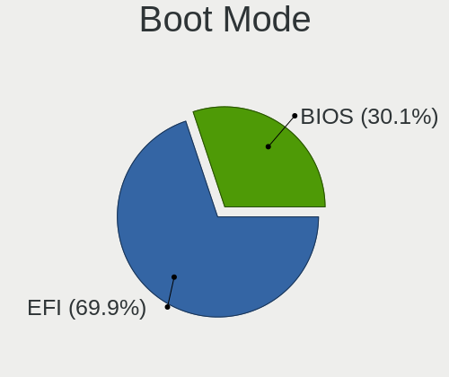
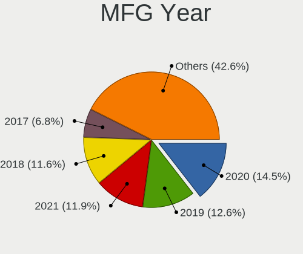
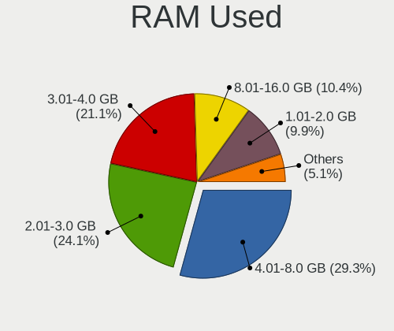
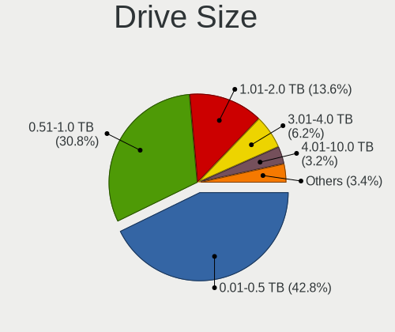
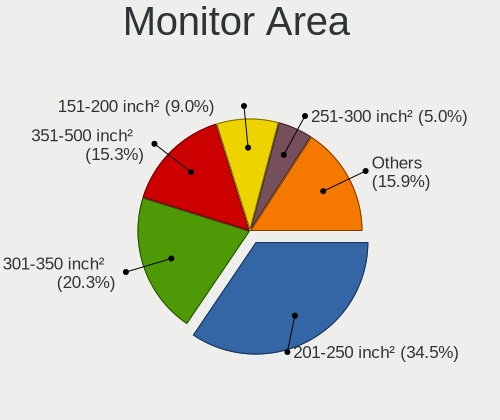
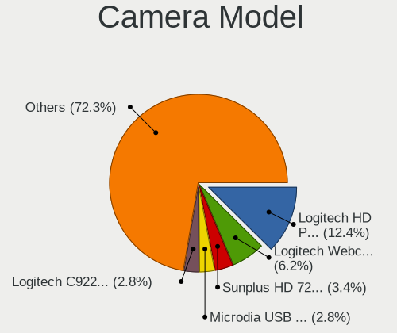
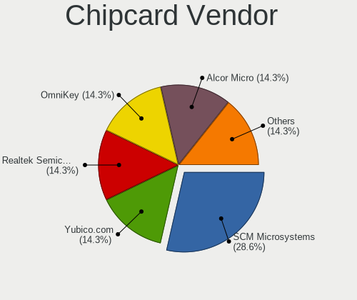

Fedora 36 - Tested Hardware & Statistics (Desktops)
---------------------------------------------------

A project to collect tested hardware configurations for Fedora 36.

Anyone can contribute to this report by the [hw-probe](https://github.com/linuxhw/hw-probe) tool:

    sudo -E hw-probe -all -upload

Please contribute! Especially if your hardware is rare.

Contents
--------

* [ Test Cases ](#test-cases)

* [ System ](#system)
  - [ Kernel                   ](#kernel)
  - [ Kernel Family            ](#kernel-family)
  - [ Kernel Major Ver.        ](#kernel-major-ver)
  - [ Arch                     ](#arch)
  - [ DE                       ](#de)
  - [ Display Server           ](#display-server)
  - [ Display Manager          ](#display-manager)
  - [ OS Lang                  ](#os-lang)
  - [ Boot Mode                ](#boot-mode)
  - [ Filesystem               ](#filesystem)
  - [ Part. scheme             ](#part-scheme)
  - [ Dual Boot with Linux/BSD ](#dual-boot-with-linuxbsd)
  - [ Dual Boot (Win)          ](#dual-boot-win)

* [ Board ](#board)
  - [ Vendor                   ](#vendor)
  - [ Model                    ](#model)
  - [ Model Family             ](#model-family)
  - [ MFG Year                 ](#mfg-year)
  - [ Form Factor              ](#form-factor)
  - [ Secure Boot              ](#secure-boot)
  - [ Coreboot                 ](#coreboot)
  - [ RAM Size                 ](#ram-size)
  - [ RAM Used                 ](#ram-used)
  - [ Total Drives             ](#total-drives)
  - [ Has CD-ROM               ](#has-cd-rom)
  - [ Has Ethernet             ](#has-ethernet)
  - [ Has WiFi                 ](#has-wifi)
  - [ Has Bluetooth            ](#has-bluetooth)

* [ Location ](#location)
  - [ Country                  ](#country)
  - [ City                     ](#city)

* [ Drives ](#drives)
  - [ Drive Vendor             ](#drive-vendor)
  - [ Drive Model              ](#drive-model)
  - [ HDD Vendor               ](#hdd-vendor)
  - [ SSD Vendor               ](#ssd-vendor)
  - [ Drive Kind               ](#drive-kind)
  - [ Drive Connector          ](#drive-connector)
  - [ Drive Size               ](#drive-size)
  - [ Space Total              ](#space-total)
  - [ Space Used               ](#space-used)
  - [ Malfunc. Drives          ](#malfunc-drives)
  - [ Malfunc. Drive Vendor    ](#malfunc-drive-vendor)
  - [ Malfunc. HDD Vendor      ](#malfunc-hdd-vendor)
  - [ Malfunc. Drive Kind      ](#malfunc-drive-kind)
  - [ Failed Drives            ](#failed-drives)
  - [ Failed Drive Vendor      ](#failed-drive-vendor)
  - [ Drive Status             ](#drive-status)

* [ Storage controller ](#storage-controller)
  - [ Storage Vendor           ](#storage-vendor)
  - [ Storage Model            ](#storage-model)
  - [ Storage Kind             ](#storage-kind)

* [ Processor ](#processor)
  - [ CPU Vendor               ](#cpu-vendor)
  - [ CPU Model                ](#cpu-model)
  - [ CPU Model Family         ](#cpu-model-family)
  - [ CPU Cores                ](#cpu-cores)
  - [ CPU Sockets              ](#cpu-sockets)
  - [ CPU Threads              ](#cpu-threads)
  - [ CPU Op-Modes             ](#cpu-op-modes)
  - [ CPU Microcode            ](#cpu-microcode)
  - [ CPU Microarch            ](#cpu-microarch)

* [ Graphics ](#graphics)
  - [ GPU Vendor               ](#gpu-vendor)
  - [ GPU Model                ](#gpu-model)
  - [ GPU Combo                ](#gpu-combo)
  - [ GPU Driver               ](#gpu-driver)
  - [ GPU Memory               ](#gpu-memory)

* [ Monitor ](#monitor)
  - [ Monitor Vendor           ](#monitor-vendor)
  - [ Monitor Model            ](#monitor-model)
  - [ Monitor Resolution       ](#monitor-resolution)
  - [ Monitor Diagonal         ](#monitor-diagonal)
  - [ Monitor Width            ](#monitor-width)
  - [ Aspect Ratio             ](#aspect-ratio)
  - [ Monitor Area             ](#monitor-area)
  - [ Pixel Density            ](#pixel-density)
  - [ Multiple Monitors        ](#multiple-monitors)

* [ Network ](#network)
  - [ Net Controller Vendor    ](#net-controller-vendor)
  - [ Net Controller Model     ](#net-controller-model)
  - [ Wireless Vendor          ](#wireless-vendor)
  - [ Wireless Model           ](#wireless-model)
  - [ Ethernet Vendor          ](#ethernet-vendor)
  - [ Ethernet Model           ](#ethernet-model)
  - [ Net Controller Kind      ](#net-controller-kind)
  - [ Used Controller          ](#used-controller)
  - [ NICs                     ](#nics)
  - [ IPv6                     ](#ipv6)

* [ Bluetooth ](#bluetooth)
  - [ Bluetooth Vendor         ](#bluetooth-vendor)
  - [ Bluetooth Model          ](#bluetooth-model)

* [ Sound ](#sound)
  - [ Sound Vendor             ](#sound-vendor)
  - [ Sound Model              ](#sound-model)

* [ Memory ](#memory)
  - [ Memory Vendor            ](#memory-vendor)
  - [ Memory Model             ](#memory-model)
  - [ Memory Kind              ](#memory-kind)
  - [ Memory Form Factor       ](#memory-form-factor)
  - [ Memory Size              ](#memory-size)
  - [ Memory Speed             ](#memory-speed)

* [ Printers & scanners ](#printers--scanners)
  - [ Printer Vendor           ](#printer-vendor)
  - [ Printer Model            ](#printer-model)
  - [ Scanner Vendor           ](#scanner-vendor)
  - [ Scanner Model            ](#scanner-model)

* [ Camera ](#camera)
  - [ Camera Vendor            ](#camera-vendor)
  - [ Camera Model             ](#camera-model)

* [ Security ](#security)
  - [ Fingerprint Vendor       ](#fingerprint-vendor)
  - [ Fingerprint Model        ](#fingerprint-model)
  - [ Chipcard Vendor          ](#chipcard-vendor)
  - [ Chipcard Model           ](#chipcard-model)

* [ Unsupported ](#unsupported)
  - [ Unsupported Devices      ](#unsupported-devices)
  - [ Unsupported Device Types ](#unsupported-device-types)

Test Cases
----------

Total: 147

| Vendor        | Model                       | Probe                                                      | Date         |
|---------------|-----------------------------|------------------------------------------------------------|--------------|
| ASUSTek       | ROG STRIX Z490-H GAMING     | [0d91ffc3e9](https://linux-hardware.org/?probe=0d91ffc3e9) | Jun 01, 2022 |
| ASUSTek       | ROG STRIX Z490-H GAMING     | [6190087942](https://linux-hardware.org/?probe=6190087942) | Jun 01, 2022 |
| ASUSTek       | PRIME B560M-A               | [b68bcf6b84](https://linux-hardware.org/?probe=b68bcf6b84) | Jun 01, 2022 |
| ASUSTek       | TUF Gaming B450-PLUS II     | [53dbc2fe14](https://linux-hardware.org/?probe=53dbc2fe14) | May 31, 2022 |
| MSI           | B450M PRO-VDH MAX           | [ece9950c65](https://linux-hardware.org/?probe=ece9950c65) | May 31, 2022 |
| MSI           | B450M PRO-VDH MAX           | [07a1bcfa9e](https://linux-hardware.org/?probe=07a1bcfa9e) | May 30, 2022 |
| ASUSTek       | ROG STRIX B550-F GAMING     | [7b27373492](https://linux-hardware.org/?probe=7b27373492) | May 30, 2022 |
| ASUSTek       | P5Q SE                      | [386a88c2b6](https://linux-hardware.org/?probe=386a88c2b6) | May 30, 2022 |
| ASUSTek       | P5Q SE                      | [5a51cc8767](https://linux-hardware.org/?probe=5a51cc8767) | May 30, 2022 |
| Dell          | 0R6PCT A01                  | [23c83c37e6](https://linux-hardware.org/?probe=23c83c37e6) | May 29, 2022 |
| ASUSTek       | ROG Maximus X HERO          | [33a2de91a2](https://linux-hardware.org/?probe=33a2de91a2) | May 29, 2022 |
| ASUSTek       | H81M-A                      | [0aa77d107c](https://linux-hardware.org/?probe=0aa77d107c) | May 28, 2022 |
| ASUSTek       | TUF X299 MARK 2             | [8409764263](https://linux-hardware.org/?probe=8409764263) | May 27, 2022 |
| BESSTAR Te... | UM700                       | [f754f78f66](https://linux-hardware.org/?probe=f754f78f66) | May 25, 2022 |
| ASUSTek       | ProArt Z690-CREATOR WIFI    | [c01e0f9ac4](https://linux-hardware.org/?probe=c01e0f9ac4) | May 25, 2022 |
| Gigabyte      | B450M DS3H-CF               | [06e3526c59](https://linux-hardware.org/?probe=06e3526c59) | May 25, 2022 |
| ASRock        | X99 Taichi                  | [18ec1a6a1a](https://linux-hardware.org/?probe=18ec1a6a1a) | May 25, 2022 |
| ASUSTek       | KCMA-D8                     | [2d8bea4f55](https://linux-hardware.org/?probe=2d8bea4f55) | May 24, 2022 |
| Dell          | 0PU052                      | [4e3e3cc0fd](https://linux-hardware.org/?probe=4e3e3cc0fd) | May 24, 2022 |
| ASUSTek       | TUF Gaming B550-PLUS        | [282c849b82](https://linux-hardware.org/?probe=282c849b82) | May 24, 2022 |
| Lenovo        | SHARKBAY SDK0E50512 STD     | [da5f6c9ba0](https://linux-hardware.org/?probe=da5f6c9ba0) | May 23, 2022 |
| MSI           | Z77A-G43                    | [7d35f08c28](https://linux-hardware.org/?probe=7d35f08c28) | May 23, 2022 |
| ASUSTek       | PRIME Z270-P                | [afb47f4860](https://linux-hardware.org/?probe=afb47f4860) | May 23, 2022 |
| Lenovo        | 364F SDK0J40700 WIN 3258... | [2034bf506d](https://linux-hardware.org/?probe=2034bf506d) | May 23, 2022 |
| ASUSTek       | ROG STRIX B550-F GAMING     | [2bd8d64c3b](https://linux-hardware.org/?probe=2bd8d64c3b) | May 22, 2022 |
| ASUSTek       | P8P67-M                     | [83917315b7](https://linux-hardware.org/?probe=83917315b7) | May 22, 2022 |
| Gigabyte      | B550 GAMING X V2            | [a84132c514](https://linux-hardware.org/?probe=a84132c514) | May 22, 2022 |
| ASRock        | AB350 Pro4                  | [49223fe44b](https://linux-hardware.org/?probe=49223fe44b) | May 21, 2022 |
| ASRock        | AB350 Pro4                  | [40cb336486](https://linux-hardware.org/?probe=40cb336486) | May 21, 2022 |
| MSI           | B450M-A PRO MAX             | [fce678a9e8](https://linux-hardware.org/?probe=fce678a9e8) | May 21, 2022 |
| ASUSTek       | PRIME Z690-P D4             | [01e2d063e8](https://linux-hardware.org/?probe=01e2d063e8) | May 21, 2022 |
| ASUSTek       | PRIME Z690-P D4             | [f3986d7e7d](https://linux-hardware.org/?probe=f3986d7e7d) | May 21, 2022 |
| MSI           | B450M PRO-M2 MAX            | [1984313b19](https://linux-hardware.org/?probe=1984313b19) | May 20, 2022 |
| ASRock        | Z390 Taichi Ultimate        | [68d0cdd597](https://linux-hardware.org/?probe=68d0cdd597) | May 19, 2022 |
| HP            | 82A2                        | [56d6c8d749](https://linux-hardware.org/?probe=56d6c8d749) | May 19, 2022 |
| HP            | 82A2                        | [6e0efeba1d](https://linux-hardware.org/?probe=6e0efeba1d) | May 19, 2022 |
| ASUSTek       | Z97-PRO GAMER               | [4a971be254](https://linux-hardware.org/?probe=4a971be254) | May 19, 2022 |
| Intel         | DH77EB AAG39073-304         | [dc2f9f56a5](https://linux-hardware.org/?probe=dc2f9f56a5) | May 18, 2022 |
| HP            | 8767 A                      | [0f564fe004](https://linux-hardware.org/?probe=0f564fe004) | May 18, 2022 |
| MSI           | B450M PRO-VDH MAX           | [9c3b90c60d](https://linux-hardware.org/?probe=9c3b90c60d) | May 18, 2022 |
| ASRock        | 970M Pro3                   | [d39e962536](https://linux-hardware.org/?probe=d39e962536) | May 18, 2022 |
| ASUSTek       | P8Z68-V PRO GEN3            | [8a6fc346c5](https://linux-hardware.org/?probe=8a6fc346c5) | May 18, 2022 |
| Dell          | 0DF42J A00                  | [ac9f539524](https://linux-hardware.org/?probe=ac9f539524) | May 18, 2022 |
| HP            | 8767 A                      | [caad4001f1](https://linux-hardware.org/?probe=caad4001f1) | May 18, 2022 |
| ASRock        | 970M Pro3                   | [6f48a71a87](https://linux-hardware.org/?probe=6f48a71a87) | May 17, 2022 |
| ASUSTek       | P8H67-M LE                  | [ef70fd2699](https://linux-hardware.org/?probe=ef70fd2699) | May 17, 2022 |
| Gigabyte      | X470 AORUS ULTRA GAMING-... | [d831b6cb22](https://linux-hardware.org/?probe=d831b6cb22) | May 17, 2022 |
| Dell          | 0NKW6Y A02                  | [ffee0745b6](https://linux-hardware.org/?probe=ffee0745b6) | May 16, 2022 |
| Gigabyte      | X99-UD4-CF                  | [21b3b45491](https://linux-hardware.org/?probe=21b3b45491) | May 16, 2022 |
| Gigabyte      | X99-UD4-CF                  | [81e0a19eaa](https://linux-hardware.org/?probe=81e0a19eaa) | May 16, 2022 |
| ASUSTek       | ROG STRIX X570-F GAMING     | [d1dbcd7651](https://linux-hardware.org/?probe=d1dbcd7651) | May 16, 2022 |
| ASUSTek       | K30AD_M31AD_M51AD_M32AD     | [efe02f8593](https://linux-hardware.org/?probe=efe02f8593) | May 16, 2022 |
| Gigabyte      | B450 I AORUS PRO WIFI-CF    | [2f12c77058](https://linux-hardware.org/?probe=2f12c77058) | May 16, 2022 |
| ASUSTek       | ROG STRIX X470-I GAMING     | [fa17134027](https://linux-hardware.org/?probe=fa17134027) | May 16, 2022 |
| MSI           | MPG B550I GAMING EDGE WI... | [26f332bc9c](https://linux-hardware.org/?probe=26f332bc9c) | May 16, 2022 |
| ASUSTek       | ROG STRIX X470-I GAMING     | [16bd9d3c6d](https://linux-hardware.org/?probe=16bd9d3c6d) | May 16, 2022 |
| Intel         | DH77EB AAG39073-304         | [22f5a0269f](https://linux-hardware.org/?probe=22f5a0269f) | May 15, 2022 |
| Intel         | DH77EB AAG39073-304         | [8b8bd9dead](https://linux-hardware.org/?probe=8b8bd9dead) | May 15, 2022 |
| ASUSTek       | TUF Gaming B550M-PLUS       | [12d277d32c](https://linux-hardware.org/?probe=12d277d32c) | May 15, 2022 |
| ASRock        | 880GMH/U3S3                 | [57c85dd37a](https://linux-hardware.org/?probe=57c85dd37a) | May 15, 2022 |
| Gigabyte      | Z390 AORUS MASTER-CF        | [ec0ec5ea27](https://linux-hardware.org/?probe=ec0ec5ea27) | May 15, 2022 |
| ASUSTek       | PRIME B450-PLUS             | [a2ae5d95dd](https://linux-hardware.org/?probe=a2ae5d95dd) | May 15, 2022 |
| ASUSTek       | Pro WS X570-ACE             | [6fc56522d6](https://linux-hardware.org/?probe=6fc56522d6) | May 14, 2022 |
| ASUSTek       | ROG STRIX X570-E GAMING     | [1bde2ca3e7](https://linux-hardware.org/?probe=1bde2ca3e7) | May 14, 2022 |
| ASUSTek       | P8Z77-V LK                  | [70809098f6](https://linux-hardware.org/?probe=70809098f6) | May 14, 2022 |
| MSI           | MPG B550 GAMING PLUS        | [3112931a28](https://linux-hardware.org/?probe=3112931a28) | May 14, 2022 |
| ASRock        | B560M-C                     | [b4946d836b](https://linux-hardware.org/?probe=b4946d836b) | May 13, 2022 |
| ASRock        | B560M-C                     | [16360de6cd](https://linux-hardware.org/?probe=16360de6cd) | May 13, 2022 |
| Gigabyte      | GA-K8NF-9                   | [f9d59e3770](https://linux-hardware.org/?probe=f9d59e3770) | May 13, 2022 |
| ASRock        | X570M Pro4                  | [fca86a854a](https://linux-hardware.org/?probe=fca86a854a) | May 13, 2022 |
| Gigabyte      | Z170-D3H-CF                 | [ec4bd74f0b](https://linux-hardware.org/?probe=ec4bd74f0b) | May 13, 2022 |
| Gigabyte      | B85M-D3V-A                  | [46481247b1](https://linux-hardware.org/?probe=46481247b1) | May 12, 2022 |
| Acer          | Aspire M3985                | [e650ae1a26](https://linux-hardware.org/?probe=e650ae1a26) | May 11, 2022 |
| ASUSTek       | ROG STRIX B550-E GAMING     | [927afa0c20](https://linux-hardware.org/?probe=927afa0c20) | May 11, 2022 |
| Gigabyte      | A320M-S2H-CF                | [c703872774](https://linux-hardware.org/?probe=c703872774) | May 11, 2022 |
| ASUSTek       | ROG STRIX B550-E GAMING     | [b9766a94d7](https://linux-hardware.org/?probe=b9766a94d7) | May 11, 2022 |
| ASRock        | X470 Taichi                 | [9ead3d53b0](https://linux-hardware.org/?probe=9ead3d53b0) | May 11, 2022 |
| MSI           | X470 GAMING PLUS            | [565dfeea66](https://linux-hardware.org/?probe=565dfeea66) | May 11, 2022 |
| Gigabyte      | Q35M-S2                     | [784ac96428](https://linux-hardware.org/?probe=784ac96428) | May 11, 2022 |
| ASUSTek       | Z97-PRO GAMER               | [173fac4f5b](https://linux-hardware.org/?probe=173fac4f5b) | May 11, 2022 |
| ASRock        | 880GMH/U3S3                 | [73e6cb3b6b](https://linux-hardware.org/?probe=73e6cb3b6b) | May 10, 2022 |
| ASRock        | X470 Taichi                 | [fb1d5703eb](https://linux-hardware.org/?probe=fb1d5703eb) | May 10, 2022 |
| MSI           | H110M PRO-VD                | [f43f2e2bee](https://linux-hardware.org/?probe=f43f2e2bee) | May 10, 2022 |
| MSI           | H110M PRO-VD                | [3d0c46dc84](https://linux-hardware.org/?probe=3d0c46dc84) | May 10, 2022 |
| ASUSTek       | ROG CROSSHAIR VII HERO      | [d7e92b0ac7](https://linux-hardware.org/?probe=d7e92b0ac7) | May 09, 2022 |
| Gigabyte      | Z170-D3H-CF                 | [fbe61c70ff](https://linux-hardware.org/?probe=fbe61c70ff) | May 09, 2022 |
| Gigabyte      | EP45-DS3L                   | [76e67361ea](https://linux-hardware.org/?probe=76e67361ea) | May 08, 2022 |
| MSI           | MPG X570 GAMING PLUS        | [d24bbea844](https://linux-hardware.org/?probe=d24bbea844) | May 08, 2022 |
| ASUSTek       | PRIME X570-PRO              | [f12944a9bd](https://linux-hardware.org/?probe=f12944a9bd) | May 07, 2022 |
| ASUSTek       | PRIME X470-PRO              | [be200c9e57](https://linux-hardware.org/?probe=be200c9e57) | May 06, 2022 |
| Huanan        | X99-BD4 V1.1, NALEX         | [e69b3ef962](https://linux-hardware.org/?probe=e69b3ef962) | May 06, 2022 |
| ASUSTek       | TUF Gaming X570-PRO         | [52d956751f](https://linux-hardware.org/?probe=52d956751f) | May 06, 2022 |
| MSI           | B550M PRO-DASH              | [585987ecf7](https://linux-hardware.org/?probe=585987ecf7) | May 06, 2022 |
| Gigabyte      | H410M H V3                  | [ddc4d88d20](https://linux-hardware.org/?probe=ddc4d88d20) | May 05, 2022 |
| ASUSTek       | P8H67-M LE                  | [302e27b974](https://linux-hardware.org/?probe=302e27b974) | May 04, 2022 |
| ASUSTek       | P8H67-M LE                  | [a9cf3bc268](https://linux-hardware.org/?probe=a9cf3bc268) | May 04, 2022 |
| HP            | 1589                        | [79df2c00dc](https://linux-hardware.org/?probe=79df2c00dc) | May 03, 2022 |
| Gigabyte      | B550 AORUS ELITE AX V2      | [cb6d49fe71](https://linux-hardware.org/?probe=cb6d49fe71) | Apr 30, 2022 |
| Gigabyte      | B550 AORUS ELITE AX V2      | [83e47f9c91](https://linux-hardware.org/?probe=83e47f9c91) | Apr 30, 2022 |
| ASUSTek       | PRIME Z390-A                | [c4d7dc5e80](https://linux-hardware.org/?probe=c4d7dc5e80) | Apr 30, 2022 |
| MSI           | MAG B460M MORTAR            | [07cb268e5e](https://linux-hardware.org/?probe=07cb268e5e) | Apr 30, 2022 |
| ASUSTek       | PRIME H310M-D R2.0          | [2999ff1487](https://linux-hardware.org/?probe=2999ff1487) | Apr 28, 2022 |
| ASRock        | B450 Steel Legend           | [bf0a56358c](https://linux-hardware.org/?probe=bf0a56358c) | Apr 27, 2022 |
| ASUSTek       | ROG STRIX B550-I GAMING     | [5456280ec0](https://linux-hardware.org/?probe=5456280ec0) | Apr 26, 2022 |
| Gigabyte      | X570 AORUS PRO              | [187db4f8e4](https://linux-hardware.org/?probe=187db4f8e4) | Apr 23, 2022 |
| ASUSTek       | ROG STRIX B550-I GAMING     | [b9ea98672f](https://linux-hardware.org/?probe=b9ea98672f) | Apr 23, 2022 |
| ASUSTek       | ROG STRIX B550-I GAMING     | [c3f809fc02](https://linux-hardware.org/?probe=c3f809fc02) | Apr 23, 2022 |
| MSI           | MAG X570 TOMAHAWK WIFI      | [68a04098ec](https://linux-hardware.org/?probe=68a04098ec) | Apr 21, 2022 |
| ASUSTek       | ROG STRIX B550-F GAMING     | [466f67adb3](https://linux-hardware.org/?probe=466f67adb3) | Apr 20, 2022 |
| Gigabyte      | H81M-S2H                    | [85082e6de6](https://linux-hardware.org/?probe=85082e6de6) | Apr 19, 2022 |
| Gigabyte      | H110M-H-CF                  | [66ef9c9e5f](https://linux-hardware.org/?probe=66ef9c9e5f) | Apr 16, 2022 |
| Acer          | Aspire TC-895 V:1.0         | [22a1a17a81](https://linux-hardware.org/?probe=22a1a17a81) | Apr 14, 2022 |
| Gigabyte      | B550 AORUS ELITE            | [85b4ecf9d3](https://linux-hardware.org/?probe=85b4ecf9d3) | Apr 14, 2022 |
| ASUSTek       | P8P67 LE                    | [84abfd3112](https://linux-hardware.org/?probe=84abfd3112) | Apr 14, 2022 |
| MSI           | FM2-A75IA-E53               | [25ffe3d211](https://linux-hardware.org/?probe=25ffe3d211) | Apr 14, 2022 |
| Gigabyte      | Z170MX-Gaming 5             | [d1b267f496](https://linux-hardware.org/?probe=d1b267f496) | Apr 13, 2022 |
| Gigabyte      | B450 AORUS M                | [c1beed0e9b](https://linux-hardware.org/?probe=c1beed0e9b) | Apr 13, 2022 |
| Gigabyte      | B450 AORUS M                | [e5a9e99dbc](https://linux-hardware.org/?probe=e5a9e99dbc) | Apr 13, 2022 |
| Dell          | 0GWHMW A03                  | [ff312c5929](https://linux-hardware.org/?probe=ff312c5929) | Apr 13, 2022 |
| Gigabyte      | Z170-D3H-CF                 | [8a1cecc21c](https://linux-hardware.org/?probe=8a1cecc21c) | Apr 11, 2022 |
| MSI           | B450M PRO-VDH PLUS          | [5b861faffd](https://linux-hardware.org/?probe=5b861faffd) | Apr 09, 2022 |
| Gigabyte      | Z490 UD                     | [31ecc9c776](https://linux-hardware.org/?probe=31ecc9c776) | Apr 09, 2022 |
| Biostar       | B550MH                      | [abd373497b](https://linux-hardware.org/?probe=abd373497b) | Apr 09, 2022 |
| Gigabyte      | B450 AORUS M                | [1a4b90c894](https://linux-hardware.org/?probe=1a4b90c894) | Apr 08, 2022 |
| MSI           | Z170A XPOWER GAMING TITA... | [ffcbeed952](https://linux-hardware.org/?probe=ffcbeed952) | Apr 08, 2022 |
| Gigabyte      | Z170N-Gaming 5              | [f0472bcf0d](https://linux-hardware.org/?probe=f0472bcf0d) | Apr 05, 2022 |
| Gigabyte      | Z170N-Gaming 5              | [9ee2f76c12](https://linux-hardware.org/?probe=9ee2f76c12) | Apr 05, 2022 |
| ASUSTek       | B150M-K                     | [016a08bf47](https://linux-hardware.org/?probe=016a08bf47) | Apr 04, 2022 |
| Gigabyte      | B550I AORUS PRO AX          | [b697fd5f0a](https://linux-hardware.org/?probe=b697fd5f0a) | Apr 03, 2022 |
| Gigabyte      | 970A-DS3P                   | [5bbc4cbbf5](https://linux-hardware.org/?probe=5bbc4cbbf5) | Apr 03, 2022 |
| Dell          | 088DT1 A01                  | [718a7d42cc](https://linux-hardware.org/?probe=718a7d42cc) | Apr 02, 2022 |
| Gigabyte      | H81M-S2H                    | [8a810aa9f6](https://linux-hardware.org/?probe=8a810aa9f6) | Apr 02, 2022 |
| MSI           | MPG Z590 GAMING CARBON W... | [f7946783ea](https://linux-hardware.org/?probe=f7946783ea) | Mar 31, 2022 |
| Gigabyte      | H370M DS3H-CF               | [1110b2974c](https://linux-hardware.org/?probe=1110b2974c) | Mar 31, 2022 |
| Gigabyte      | EP45-DS3L                   | [c7d6879a86](https://linux-hardware.org/?probe=c7d6879a86) | Mar 26, 2022 |
| Gigabyte      | B85M-D3V-A                  | [b7679b78be](https://linux-hardware.org/?probe=b7679b78be) | Mar 25, 2022 |
| Gigabyte      | B550 AORUS ELITE            | [7977e70f86](https://linux-hardware.org/?probe=7977e70f86) | Mar 22, 2022 |
| ASUSTek       | TUF Gaming B550M-PLUS       | [97eedd34f4](https://linux-hardware.org/?probe=97eedd34f4) | Mar 05, 2022 |
| Gigabyte      | EP45-DS3L                   | [da3962a1da](https://linux-hardware.org/?probe=da3962a1da) | Mar 03, 2022 |
| Biostar       | H55 HD                      | [b0d5843b6e](https://linux-hardware.org/?probe=b0d5843b6e) | Feb 13, 2022 |
| Biostar       | H55 HD                      | [e08da3e685](https://linux-hardware.org/?probe=e08da3e685) | Feb 03, 2022 |
| MSI           | B550M PRO-VDH WIFI          | [f1a1a21c56](https://linux-hardware.org/?probe=f1a1a21c56) | Oct 26, 2021 |
| Dell          | 0KC9NP A01                  | [ff356cba89](https://linux-hardware.org/?probe=ff356cba89) | Oct 22, 2021 |
| MSI           | FM2-A55M-E33                | [bcf7dcdd2c](https://linux-hardware.org/?probe=bcf7dcdd2c) | Oct 09, 2021 |
| MSI           | FM2-A55M-E33                | [0b3691d096](https://linux-hardware.org/?probe=0b3691d096) | Oct 09, 2021 |
| HP            | 304Ah                       | [047d1b0887](https://linux-hardware.org/?probe=047d1b0887) | Aug 18, 2021 |
| Dell          | 0KC9NP A01                  | [2ca8cc81b1](https://linux-hardware.org/?probe=2ca8cc81b1) | Aug 18, 2021 |

System
------

Kernel
------

Version of the Linux kernel

| Version                                                       | Desktops | Percent |
|---------------------------------------------------------------|----------|---------|
| 5.17.6-300.fc36.x86_64                                        | 23       | 19.01%  |
| 5.17.5-300.fc36.x86_64                                        | 17       | 14.05%  |
| 5.17.8-300.fc36.x86_64                                        | 13       | 10.74%  |
| 5.17.2-300.fc36.x86_64                                        | 11       | 9.09%   |
| 5.17.1-300.fc36.x86_64                                        | 10       | 8.26%   |
| 5.17.7-300.fc36.x86_64                                        | 9        | 7.44%   |
| 5.17.3-302.fc36.x86_64                                        | 6        | 4.96%   |
| 5.17.11-300.fc36.x86_64                                       | 6        | 4.96%   |
| 5.17.9-300.fc36.x86_64                                        | 4        | 3.31%   |
| 5.17.0-0.rc7.116.fc36.x86_64                                  | 3        | 2.48%   |
| 5.17.4-300.fc36.x86_64                                        | 2        | 1.65%   |
| 5.17.0-0.rc5.102.fc36.x86_64                                  | 2        | 1.65%   |
| 5.15.0-0.rc6.47.fc36.x86_64                                   | 2        | 1.65%   |
| 5.14.0-0.rc5.20210813gitf8e6dfc64f61.46.fc36.x86_64           | 2        | 1.65%   |
| 5.18.0-0.rc4.20220428git8f4dd16603ce834.36.fc37.x86_64        | 1        | 0.83%   |
| 5.17.9-602.inttf.fc36.x86_64                                  | 1        | 0.83%   |
| 5.17.9-301.fsync.fc36.x86_64                                  | 1        | 0.83%   |
| 5.17.7-301.fsync.fc36.x86_64                                  | 1        | 0.83%   |
| 5.17.6-602.inttf.fc36.x86_64                                  | 1        | 0.83%   |
| 5.17.5-301.fsync.fc36.x86_64                                  | 1        | 0.83%   |
| 5.17.11-602.inttf.fc36.x86_64                                 | 1        | 0.83%   |
| 5.17.11-301.fsync.fc36.x86_64                                 | 1        | 0.83%   |
| 5.17.0-0.rc0.20220112gitdaadb3bd0e8d.63.fc36.x86_64           | 1        | 0.83%   |
| 5.16.17-200.fc35.x86_64                                       | 1        | 0.83%   |
| 5.15.0-0.rc4.20211008git1da38549dd64.36.vanilla.1.fc36.x86_64 | 1        | 0.83%   |

Kernel Family
-------------

Linux kernel without a distro release

| Version | Desktops | Percent |
|---------|----------|---------|
| 5.17.6  | 24       | 19.83%  |
| 5.17.5  | 18       | 14.88%  |
| 5.17.8  | 13       | 10.74%  |
| 5.17.2  | 11       | 9.09%   |
| 5.17.7  | 10       | 8.26%   |
| 5.17.1  | 10       | 8.26%   |
| 5.17.11 | 8        | 6.61%   |
| 5.17.9  | 6        | 4.96%   |
| 5.17.3  | 6        | 4.96%   |
| 5.17.0  | 6        | 4.96%   |
| 5.15.0  | 3        | 2.48%   |
| 5.17.4  | 2        | 1.65%   |
| 5.14.0  | 2        | 1.65%   |
| 5.18.0  | 1        | 0.83%   |
| 5.16.17 | 1        | 0.83%   |

Kernel Major Ver.
-----------------

Linux kernel major version

| Version | Desktops | Percent |
|---------|----------|---------|
| 5.17    | 110      | 94.02%  |
| 5.15    | 3        | 2.56%   |
| 5.14    | 2        | 1.71%   |
| 5.18    | 1        | 0.85%   |
| 5.16    | 1        | 0.85%   |

Arch
----

OS architecture (x86_64, i586, etc.)

| Name   | Desktops | Percent |
|--------|----------|---------|
| x86_64 | 116      | 100%    |

DE
--

Desktop Environment

| Name       | Desktops | Percent |
|------------|----------|---------|
| GNOME      | 87       | 75%     |
| KDE5       | 20       | 17.24%  |
| X-Cinnamon | 3        | 2.59%   |
| Unknown    | 3        | 2.59%   |
| XFCE       | 2        | 1.72%   |
| MATE       | 1        | 0.86%   |

Display Server
--------------

X11 or Wayland

| Name    | Desktops | Percent |
|---------|----------|---------|
| Wayland | 78       | 66.67%  |
| X11     | 34       | 29.06%  |
| Tty     | 4        | 3.42%   |
| Unknown | 1        | 0.85%   |

Display Manager
---------------

SDDM, LightDM, etc.

| Name    | Desktops | Percent |
|---------|----------|---------|
| Unknown | 74       | 63.79%  |
| GDM     | 32       | 27.59%  |
| SDDM    | 7        | 6.03%   |
| LightDM | 3        | 2.59%   |

OS Lang
-------

Language

| Lang  | Desktops | Percent |
|-------|----------|---------|
| en_US | 63       | 54.31%  |
| en_GB | 10       | 8.62%   |
| ru_RU | 9        | 7.76%   |
| de_DE | 5        | 4.31%   |
| pt_BR | 4        | 3.45%   |
| pl_PL | 3        | 2.59%   |
| fr_FR | 3        | 2.59%   |
| cs_CZ | 3        | 2.59%   |
| fi_FI | 2        | 1.72%   |
| es_AR | 2        | 1.72%   |
| zh_CN | 1        | 0.86%   |
| sr_RS | 1        | 0.86%   |
| ja_JP | 1        | 0.86%   |
| it_IT | 1        | 0.86%   |
| fr_BE | 1        | 0.86%   |
| es_ES | 1        | 0.86%   |
| es_EC | 1        | 0.86%   |
| en_ZA | 1        | 0.86%   |
| en_DK | 1        | 0.86%   |
| en_CA | 1        | 0.86%   |
| en_AU | 1        | 0.86%   |
| ar_SA | 1        | 0.86%   |

Boot Mode
---------

EFI or BIOS

| Mode | Desktops | Percent |
|------|----------|---------|
| EFI  | 87       | 74.36%  |
| BIOS | 30       | 25.64%  |

Filesystem
----------

Type of filesystem

| Type  | Desktops | Percent |
|-------|----------|---------|
| Btrfs | 99       | 85.34%  |
| Ext4  | 13       | 11.21%  |
| Xfs   | 4        | 3.45%   |

Part. scheme
------------

Scheme of partitioning

| Type    | Desktops | Percent |
|---------|----------|---------|
| Unknown | 73       | 62.93%  |
| GPT     | 36       | 31.03%  |
| MBR     | 7        | 6.03%   |

Dual Boot with Linux/BSD
------------------------

Hosting more than one Linux/BSD

| Dual boot | Desktops | Percent |
|-----------|----------|---------|
| No        | 105      | 90.52%  |
| Yes       | 11       | 9.48%   |

Dual Boot (Win)
---------------

Hosting Linux and Windows

| Dual boot | Desktops | Percent |
|-----------|----------|---------|
| No        | 90       | 77.59%  |
| Yes       | 26       | 22.41%  |

Board
-----

Vendor
------

Motherboard manufacturer

| Name                | Desktops | Percent |
|---------------------|----------|---------|
| ASUSTek Computer    | 39       | 33.62%  |
| Gigabyte Technology | 26       | 22.41%  |
| MSI                 | 20       | 17.24%  |
| ASRock              | 10       | 8.62%   |
| Dell                | 7        | 6.03%   |
| Hewlett-Packard     | 4        | 3.45%   |
| Lenovo              | 2        | 1.72%   |
| Intel               | 2        | 1.72%   |
| Biostar             | 2        | 1.72%   |
| Acer                | 2        | 1.72%   |
| Huanan              | 1        | 0.86%   |
| BESSTAR Tech        | 1        | 0.86%   |

Model
-----

Motherboard model

| Name                                    | Desktops | Percent |
|-----------------------------------------|----------|---------|
| MSI MS-7A38                             | 4        | 3.45%   |
| ASUS ROG STRIX B550-F GAMING            | 3        | 2.59%   |
| ASUS All Series                         | 3        | 2.59%   |
| MSI MS-7C95                             | 2        | 1.72%   |
| Intel DH77EB AAG39073-304               | 2        | 1.72%   |
| Gigabyte B450 AORUS M                   | 2        | 1.72%   |
| ASUS TUF Gaming B550M-PLUS              | 2        | 1.72%   |
| ASRock X470 Taichi                      | 2        | 1.72%   |
| MSI MS-7D06                             | 1        | 0.86%   |
| MSI MS-7C92                             | 1        | 0.86%   |
| MSI MS-7C84                             | 1        | 0.86%   |
| MSI MS-7C82                             | 1        | 0.86%   |
| MSI MS-7C56                             | 1        | 0.86%   |
| MSI MS-7C52                             | 1        | 0.86%   |
| MSI MS-7C37                             | 1        | 0.86%   |
| MSI MS-7B84                             | 1        | 0.86%   |
| MSI MS-7B79                             | 1        | 0.86%   |
| MSI MS-7996                             | 1        | 0.86%   |
| MSI MS-7968                             | 1        | 0.86%   |
| MSI MS-7792                             | 1        | 0.86%   |
| MSI MS-7758                             | 1        | 0.86%   |
| MSI MS-7721                             | 1        | 0.86%   |
| Lenovo ThinkCentre M93p 10A8S3C100      | 1        | 0.86%   |
| Lenovo IdeaCentre 310S-08ASR 90G9002VUK | 1        | 0.86%   |
| Huanan X99-BD4 V1.1, NALEX              | 1        | 0.86%   |
| HP Z420 Workstation                     | 1        | 0.86%   |
| HP ProDesk 400 G4 SFF                   | 1        | 0.86%   |
| HP Pavilion Gaming Desktop TG01-1xxx    | 1        | 0.86%   |
| HP Compaq 8100 Elite SFF PC             | 1        | 0.86%   |
| Gigabyte Z490 UD                        | 1        | 0.86%   |
| Gigabyte Z390 AORUS MASTER              | 1        | 0.86%   |
| Gigabyte Z170N-Gaming 5                 | 1        | 0.86%   |
| Gigabyte Z170MX-Gaming 5                | 1        | 0.86%   |
| Gigabyte Z170-D3H                       | 1        | 0.86%   |
| Gigabyte X99-UD4-CF                     | 1        | 0.86%   |
| Gigabyte X570 AORUS PRO                 | 1        | 0.86%   |
| Gigabyte X470 AORUS ULTRA GAMING        | 1        | 0.86%   |
| Gigabyte Q35M-S2                        | 1        | 0.86%   |
| Gigabyte H81M-S2H                       | 1        | 0.86%   |
| Gigabyte H410M H V3                     | 1        | 0.86%   |
| Gigabyte H370M-DS3H                     | 1        | 0.86%   |
| Gigabyte H110M-H                        | 1        | 0.86%   |
| Gigabyte GA-K8NF-9                      | 1        | 0.86%   |
| Gigabyte EP45-DS3L                      | 1        | 0.86%   |
| Gigabyte B85M-D3V-A                     | 1        | 0.86%   |
| Gigabyte B550I AORUS PRO AX             | 1        | 0.86%   |
| Gigabyte B550 GAMING X V2               | 1        | 0.86%   |
| Gigabyte B550 AORUS ELITE AX V2         | 1        | 0.86%   |
| Gigabyte B550 AORUS ELITE               | 1        | 0.86%   |
| Gigabyte B450M DS3H                     | 1        | 0.86%   |
| Gigabyte B450 I AORUS PRO WIFI          | 1        | 0.86%   |
| Gigabyte A320M-S2H                      | 1        | 0.86%   |
| Gigabyte 970A-DS3P                      | 1        | 0.86%   |
| Dell XPS 8950                           | 1        | 0.86%   |
| Dell XPS 8930                           | 1        | 0.86%   |
| Dell Precision Tower 7810               | 1        | 0.86%   |
| Dell OptiPlex 9020                      | 1        | 0.86%   |
| Dell OptiPlex 790                       | 1        | 0.86%   |
| Dell OptiPlex 755                       | 1        | 0.86%   |
| Dell Inspiron 3847                      | 1        | 0.86%   |

Model Family
------------

Motherboard model prefix

| Name                   | Desktops | Percent |
|------------------------|----------|---------|
| ASUS ROG               | 11       | 9.48%   |
| ASUS PRIME             | 8        | 6.9%    |
| ASUS TUF               | 6        | 5.17%   |
| MSI MS-7A38            | 4        | 3.45%   |
| Gigabyte B550          | 3        | 2.59%   |
| Gigabyte B450          | 3        | 2.59%   |
| Dell OptiPlex          | 3        | 2.59%   |
| ASUS All               | 3        | 2.59%   |
| MSI MS-7C95            | 2        | 1.72%   |
| Intel DH77EB           | 2        | 1.72%   |
| Dell XPS               | 2        | 1.72%   |
| ASRock X470            | 2        | 1.72%   |
| Acer Aspire            | 2        | 1.72%   |
| MSI MS-7D06            | 1        | 0.86%   |
| MSI MS-7C92            | 1        | 0.86%   |
| MSI MS-7C84            | 1        | 0.86%   |
| MSI MS-7C82            | 1        | 0.86%   |
| MSI MS-7C56            | 1        | 0.86%   |
| MSI MS-7C52            | 1        | 0.86%   |
| MSI MS-7C37            | 1        | 0.86%   |
| MSI MS-7B84            | 1        | 0.86%   |
| MSI MS-7B79            | 1        | 0.86%   |
| MSI MS-7996            | 1        | 0.86%   |
| MSI MS-7968            | 1        | 0.86%   |
| MSI MS-7792            | 1        | 0.86%   |
| MSI MS-7758            | 1        | 0.86%   |
| MSI MS-7721            | 1        | 0.86%   |
| Lenovo ThinkCentre     | 1        | 0.86%   |
| Lenovo IdeaCentre      | 1        | 0.86%   |
| Huanan X99-BD4         | 1        | 0.86%   |
| HP Z420                | 1        | 0.86%   |
| HP ProDesk             | 1        | 0.86%   |
| HP Pavilion            | 1        | 0.86%   |
| HP Compaq              | 1        | 0.86%   |
| Gigabyte Z490          | 1        | 0.86%   |
| Gigabyte Z390          | 1        | 0.86%   |
| Gigabyte Z170N-Gaming  | 1        | 0.86%   |
| Gigabyte Z170MX-Gaming | 1        | 0.86%   |
| Gigabyte Z170-D3H      | 1        | 0.86%   |
| Gigabyte X99-UD4-CF    | 1        | 0.86%   |
| Gigabyte X570          | 1        | 0.86%   |
| Gigabyte X470          | 1        | 0.86%   |
| Gigabyte Q35M-S2       | 1        | 0.86%   |
| Gigabyte H81M-S2H      | 1        | 0.86%   |
| Gigabyte H410M         | 1        | 0.86%   |
| Gigabyte H370M-DS3H    | 1        | 0.86%   |
| Gigabyte H110M-H       | 1        | 0.86%   |
| Gigabyte GA-K8NF-9     | 1        | 0.86%   |
| Gigabyte EP45-DS3L     | 1        | 0.86%   |
| Gigabyte B85M-D3V-A    | 1        | 0.86%   |
| Gigabyte B550I         | 1        | 0.86%   |
| Gigabyte B450M         | 1        | 0.86%   |
| Gigabyte A320M-S2H     | 1        | 0.86%   |
| Gigabyte 970A-DS3P     | 1        | 0.86%   |
| Dell Precision         | 1        | 0.86%   |
| Dell Inspiron          | 1        | 0.86%   |
| Biostar H55            | 1        | 0.86%   |
| Biostar B550MH         | 1        | 0.86%   |
| BESSTAR Tech UM700     | 1        | 0.86%   |
| ASUS ProArt            | 1        | 0.86%   |

MFG Year
--------

Motherboard manufacture year

| Year | Desktops | Percent |
|------|----------|---------|
| 2020 | 27       | 23.28%  |
| 2018 | 15       | 12.93%  |
| 2019 | 12       | 10.34%  |
| 2021 | 9        | 7.76%   |
| 2012 | 9        | 7.76%   |
| 2015 | 7        | 6.03%   |
| 2017 | 6        | 5.17%   |
| 2016 | 6        | 5.17%   |
| 2014 | 5        | 4.31%   |
| 2013 | 5        | 4.31%   |
| 2011 | 5        | 4.31%   |
| 2022 | 3        | 2.59%   |
| 2008 | 2        | 1.72%   |
| 2007 | 2        | 1.72%   |
| 2010 | 1        | 0.86%   |
| 2009 | 1        | 0.86%   |
| 2005 | 1        | 0.86%   |

Form Factor
-----------

Physical design of the computer

| Name    | Desktops | Percent |
|---------|----------|---------|
| Desktop | 116      | 100%    |

Secure Boot
-----------

Enabled or disabled

| State    | Desktops | Percent |
|----------|----------|---------|
| Disabled | 107      | 92.24%  |
| Enabled  | 9        | 7.76%   |

Coreboot
--------

Have coreboot on board

| Used | Desktops | Percent |
|------|----------|---------|
| No   | 116      | 100%    |

RAM Size
--------

Total RAM memory

| Size in GB  | Desktops | Percent |
|-------------|----------|---------|
| 16.01-24.0  | 40       | 34.48%  |
| 32.01-64.0  | 32       | 27.59%  |
| 8.01-16.0   | 19       | 16.38%  |
| 64.01-256.0 | 11       | 9.48%   |
| 4.01-8.0    | 8        | 6.9%    |
| 3.01-4.0    | 3        | 2.59%   |
| 24.01-32.0  | 2        | 1.72%   |
| 1.01-2.0    | 1        | 0.86%   |

RAM Used
--------

Used RAM memory

| Used GB    | Desktops | Percent |
|------------|----------|---------|
| 4.01-8.0   | 40       | 33.33%  |
| 2.01-3.0   | 31       | 25.83%  |
| 3.01-4.0   | 21       | 17.5%   |
| 1.01-2.0   | 14       | 11.67%  |
| 8.01-16.0  | 10       | 8.33%   |
| 0.01-0.5   | 2        | 1.67%   |
| 16.01-24.0 | 1        | 0.83%   |
| 0.51-1.0   | 1        | 0.83%   |

Total Drives
------------

Number of drives on board

| Drives | Desktops | Percent |
|--------|----------|---------|
| 2      | 38       | 32.76%  |
| 3      | 30       | 25.86%  |
| 1      | 24       | 20.69%  |
| 4      | 18       | 15.52%  |
| 5      | 4        | 3.45%   |
| 6      | 2        | 1.72%   |

Has CD-ROM
----------

Has CD-ROM on board

| Presented | Desktops | Percent |
|-----------|----------|---------|
| No        | 83       | 71.55%  |
| Yes       | 33       | 28.45%  |

Has Ethernet
------------

Has Ethernet on board

| Presented | Desktops | Percent |
|-----------|----------|---------|
| Yes       | 115      | 99.14%  |
| No        | 1        | 0.86%   |

Has WiFi
--------

Has WiFi module

| Presented | Desktops | Percent |
|-----------|----------|---------|
| Yes       | 61       | 52.59%  |
| No        | 55       | 47.41%  |

Has Bluetooth
-------------

Has Bluetooth module

| Presented | Desktops | Percent |
|-----------|----------|---------|
| No        | 59       | 50.86%  |
| Yes       | 57       | 49.14%  |

Location
--------

Country
-------

Geographic location (country)

| Country      | Desktops | Percent |
|--------------|----------|---------|
| USA          | 28       | 24.14%  |
| Germany      | 9        | 7.76%   |
| Russia       | 7        | 6.03%   |
| Brazil       | 6        | 5.17%   |
| UK           | 5        | 4.31%   |
| Finland      | 5        | 4.31%   |
| France       | 4        | 3.45%   |
| Sweden       | 3        | 2.59%   |
| Spain        | 3        | 2.59%   |
| Poland       | 3        | 2.59%   |
| Norway       | 3        | 2.59%   |
| Israel       | 3        | 2.59%   |
| India        | 3        | 2.59%   |
| Czechia      | 3        | 2.59%   |
| Belgium      | 3        | 2.59%   |
| Belarus      | 3        | 2.59%   |
| Turkey       | 2        | 1.72%   |
| Canada       | 2        | 1.72%   |
| Argentina    | 2        | 1.72%   |
| Thailand     | 1        | 0.86%   |
| Switzerland  | 1        | 0.86%   |
| South Africa | 1        | 0.86%   |
| Serbia       | 1        | 0.86%   |
| Saudi Arabia | 1        | 0.86%   |
| Portugal     | 1        | 0.86%   |
| Netherlands  | 1        | 0.86%   |
| Japan        | 1        | 0.86%   |
| Italy        | 1        | 0.86%   |
| Indonesia    | 1        | 0.86%   |
| Hungary      | 1        | 0.86%   |
| Greece       | 1        | 0.86%   |
| Estonia      | 1        | 0.86%   |
| Ecuador      | 1        | 0.86%   |
| Colombia     | 1        | 0.86%   |
| China        | 1        | 0.86%   |
| Bulgaria     | 1        | 0.86%   |
| Bangladesh   | 1        | 0.86%   |
| Australia    | 1        | 0.86%   |

City
----

Geographic location (city)

| City                 | Desktops | Percent |
|----------------------|----------|---------|
| Oulu                 | 3        | 2.59%   |
| Minsk                | 3        | 2.59%   |
| Warsaw               | 2        | 1.72%   |
| San Jose             | 2        | 1.72%   |
| Houston              | 2        | 1.72%   |
| Bonn                 | 2        | 1.72%   |
| Allen                | 2        | 1.72%   |
| Yekaterinburg        | 1        | 0.86%   |
| Wroclaw              | 1        | 0.86%   |
| Woodbine             | 1        | 0.86%   |
| Vladivostok          | 1        | 0.86%   |
| Vitória             | 1        | 0.86%   |
| Villamanta           | 1        | 0.86%   |
| Vigodarzere          | 1        | 0.86%   |
| Turku                | 1        | 0.86%   |
| Toyama               | 1        | 0.86%   |
| Thornton Heath       | 1        | 0.86%   |
| Tel Aviv             | 1        | 0.86%   |
| Tarragona            | 1        | 0.86%   |
| Tampere              | 1        | 0.86%   |
| Tallinn              | 1        | 0.86%   |
| Stuttgart            | 1        | 0.86%   |
| Stockholm            | 1        | 0.86%   |
| St Petersburg        | 1        | 0.86%   |
| Sollentuna           | 1        | 0.86%   |
| Soddy-Daisy          | 1        | 0.86%   |
| Skaerhamn            | 1        | 0.86%   |
| Senonches            | 1        | 0.86%   |
| Sarpsborg            | 1        | 0.86%   |
| Sapucaia do Sul      | 1        | 0.86%   |
| Sao Paulo            | 1        | 0.86%   |
| Sao José dos Campos | 1        | 0.86%   |
| Salzgitter           | 1        | 0.86%   |
| Riyadh               | 1        | 0.86%   |
| Reno                 | 1        | 0.86%   |
| Quito                | 1        | 0.86%   |
| Prague               | 1        | 0.86%   |
| Porto Alegre         | 1        | 0.86%   |
| Portland             | 1        | 0.86%   |
| Petaẖ Tiqwa        | 1        | 0.86%   |
| Perm                 | 1        | 0.86%   |
| Pattaya              | 1        | 0.86%   |
| Pasco                | 1        | 0.86%   |
| Oslo                 | 1        | 0.86%   |
| Orenburg             | 1        | 0.86%   |
| Oak Ridge            | 1        | 0.86%   |
| Novosibirsk          | 1        | 0.86%   |
| Nice                 | 1        | 0.86%   |
| New Milford          | 1        | 0.86%   |
| New Haven            | 1        | 0.86%   |
| New Delhi            | 1        | 0.86%   |
| Moscow               | 1        | 0.86%   |
| Montreal             | 1        | 0.86%   |
| Montelavar           | 1        | 0.86%   |
| Midrand              | 1        | 0.86%   |
| Merced               | 1        | 0.86%   |
| Medellín            | 1        | 0.86%   |
| Mechernich           | 1        | 0.86%   |
| Los Angeles          | 1        | 0.86%   |
| Liverpool            | 1        | 0.86%   |

Drives
------

Drive Vendor
------------

Hard drive vendors

| Vendor                      | Desktops | Drives | Percent |
|-----------------------------|----------|--------|---------|
| Samsung Electronics         | 56       | 87     | 23.33%  |
| WDC                         | 42       | 53     | 17.5%   |
| Seagate                     | 40       | 51     | 16.67%  |
| Kingston                    | 21       | 22     | 8.75%   |
| Toshiba                     | 14       | 15     | 5.83%   |
| Crucial                     | 12       | 13     | 5%      |
| Sandisk                     | 8        | 9      | 3.33%   |
| Phison                      | 6        | 7      | 2.5%    |
| Corsair                     | 5        | 5      | 2.08%   |
| PNY                         | 3        | 4      | 1.25%   |
| Intel                       | 3        | 3      | 1.25%   |
| XPG                         | 2        | 3      | 0.83%   |
| Unknown                     | 2        | 2      | 0.83%   |
| Micron/Crucial Technology   | 2        | 2      | 0.83%   |
| Hitachi                     | 2        | 2      | 0.83%   |
| HGST                        | 2        | 3      | 0.83%   |
| China                       | 2        | 2      | 0.83%   |
| A-DATA Technology           | 2        | 2      | 0.83%   |
| USB                         | 1        | 1      | 0.42%   |
| SSK                         | 1        | 1      | 0.42%   |
| SPCC                        | 1        | 1      | 0.42%   |
| Realtek Semiconductor       | 1        | 1      | 0.42%   |
| N300                        | 1        | 1      | 0.42%   |
| Micron Technology           | 1        | 1      | 0.42%   |
| MAXTOR                      | 1        | 1      | 0.42%   |
| MAXIO Technology (Hangzhou) | 1        | 1      | 0.42%   |
| LITEONIT                    | 1        | 1      | 0.42%   |
| LITEON                      | 1        | 1      | 0.42%   |
| Intenso                     | 1        | 2      | 0.42%   |
| HP SSD S                    | 1        | 1      | 0.42%   |
| Hewlett-Packard             | 1        | 1      | 0.42%   |
| GOODRAM                     | 1        | 1      | 0.42%   |
| Gigabyte Technology         | 1        | 2      | 0.42%   |
| Drevo                       | 1        | 1      | 0.42%   |

Drive Model
-----------

Hard drive models

| Model                               | Desktops | Percent |
|-------------------------------------|----------|---------|
| Samsung SSD 850 EVO 250GB           | 9        | 3.25%   |
| Seagate ST1000DM010-2EP102 1TB      | 8        | 2.89%   |
| Kingston SA400S37240G 240GB SSD     | 6        | 2.17%   |
| Samsung SSD 970 EVO Plus 500GB      | 4        | 1.44%   |
| Samsung SSD 870 EVO 500GB           | 4        | 1.44%   |
| Samsung SSD 850 EVO 1TB             | 4        | 1.44%   |
| Samsung NVMe SSD Drive 500GB        | 4        | 1.44%   |
| Samsung NVMe SSD Drive 2TB          | 4        | 1.44%   |
| Kingston SA400S37120G 120GB SSD     | 4        | 1.44%   |
| WDC WDS500G2B0B-00YS70 500GB SSD    | 3        | 1.08%   |
| WDC WDS100T2B0A-00SM50 1TB SSD      | 3        | 1.08%   |
| WDC WD10EZEX-00WN4A0 1TB            | 3        | 1.08%   |
| Seagate ST2000DM001-1ER164 2TB      | 3        | 1.08%   |
| Sandisk NVMe SSD Drive 1TB          | 3        | 1.08%   |
| Samsung SSD 870 QVO 2TB             | 3        | 1.08%   |
| Samsung SSD 860 EVO 500GB           | 3        | 1.08%   |
| Samsung SSD 850 EVO 500GB           | 3        | 1.08%   |
| Samsung SSD 840 EVO 250GB           | 3        | 1.08%   |
| Crucial CT480BX500SSD1 480GB        | 3        | 1.08%   |
| Crucial CT2000MX500SSD1 2TB         | 3        | 1.08%   |
| WDC WD5000AZRX-00A8LB0 500GB        | 2        | 0.72%   |
| WDC WD20EZRZ-00Z5HB0 2TB            | 2        | 0.72%   |
| WDC WD10EZEX-08WN4A0 1TB            | 2        | 0.72%   |
| Toshiba KBG30ZMS128G 128GB NVMe SSD | 2        | 0.72%   |
| Toshiba HDWD120 2TB                 | 2        | 0.72%   |
| Seagate ST500DM002-1BD142 500GB     | 2        | 0.72%   |
| Seagate ST4000DM000-1F2168 4TB      | 2        | 0.72%   |
| Seagate ST1000LM035-1RK172 1TB      | 2        | 0.72%   |
| Sandisk NVMe SSD Drive 500GB        | 2        | 0.72%   |
| Samsung SSD 970 EVO Plus 1TB        | 2        | 0.72%   |
| Samsung SSD 970 EVO 250GB           | 2        | 0.72%   |
| Samsung NVMe SSD Drive 512GB        | 2        | 0.72%   |
| Samsung NVMe SSD Drive 250GB        | 2        | 0.72%   |
| PNY CS900 240GB SSD                 | 2        | 0.72%   |
| Phison NVMe SSD Drive 256GB         | 2        | 0.72%   |
| Kingston NVMe SSD Drive 500GB       | 2        | 0.72%   |
| Crucial CT240BX500SSD1 240GB        | 2        | 0.72%   |
| Corsair Force GT 64GB SSD           | 2        | 0.72%   |
| XPG GAMMIX S5 512GB                 | 1        | 0.36%   |
| XPG GAMMIX S11 Pro 256GB            | 1        | 0.36%   |
| WDC WDS500G2B0A-00SM50 500GB SSD    | 1        | 0.36%   |
| WDC WDS500G1B0C-00S6U0 500GB        | 1        | 0.36%   |
| WDC WDS250G2B0A-00SM50 250GB SSD    | 1        | 0.36%   |
| WDC WDS120G1G0A-00SS50 120GB SSD    | 1        | 0.36%   |
| WDC WDS100T2G0A-00JH30 1TB SSD      | 1        | 0.36%   |
| WDC WD7500BPVT-60HXZT3 752GB        | 1        | 0.36%   |
| WDC WD6400AAKS-22A7B2 640GB         | 1        | 0.36%   |
| WDC WD5000LPLX-75ZNTT0 500GB        | 1        | 0.36%   |
| WDC WD5000AZLX-00CL5A0 500GB        | 1        | 0.36%   |
| WDC WD5000AAKX-001CA0 500GB         | 1        | 0.36%   |
| WDC WD42EJRX-89BFNY0 4TB            | 1        | 0.36%   |
| WDC WD40EZRZ-22GXCB0 4TB            | 1        | 0.36%   |
| WDC WD40EZRZ-00WN9B0 4TB            | 1        | 0.36%   |
| WDC WD40EZRZ-00GXCB0 4TB            | 1        | 0.36%   |
| WDC WD4004FZWX-00GBGB0 4TB          | 1        | 0.36%   |
| WDC WD30EZRZ-00Z5HB0 3TB            | 1        | 0.36%   |
| WDC WD30EZRX-00SPEB0 3TB            | 1        | 0.36%   |
| WDC WD30EFRX-68EUZN0 3TB            | 1        | 0.36%   |
| WDC WD2500BEVS-22UST0 250GB         | 1        | 0.36%   |
| WDC WD20EZRX-00D8PB0 2TB            | 1        | 0.36%   |

HDD Vendor
----------

Hard disk drive vendors

| Vendor              | Desktops | Drives | Percent |
|---------------------|----------|--------|---------|
| Seagate             | 39       | 49     | 42.86%  |
| WDC                 | 34       | 41     | 37.36%  |
| Toshiba             | 9        | 10     | 9.89%   |
| Samsung Electronics | 2        | 2      | 2.2%    |
| Hitachi             | 2        | 2      | 2.2%    |
| HGST                | 2        | 3      | 2.2%    |
| USB                 | 1        | 1      | 1.1%    |
| Unknown             | 1        | 1      | 1.1%    |
| MAXTOR              | 1        | 1      | 1.1%    |

SSD Vendor
----------

Solid state drive vendors

| Vendor              | Desktops | Drives | Percent |
|---------------------|----------|--------|---------|
| Samsung Electronics | 36       | 53     | 37.5%   |
| Kingston            | 16       | 17     | 16.67%  |
| Crucial             | 11       | 12     | 11.46%  |
| WDC                 | 9        | 11     | 9.38%   |
| Corsair             | 4        | 4      | 4.17%   |
| Toshiba             | 3        | 3      | 3.13%   |
| PNY                 | 3        | 4      | 3.13%   |
| SanDisk             | 2        | 2      | 2.08%   |
| China               | 2        | 2      | 2.08%   |
| SPCC                | 1        | 1      | 1.04%   |
| Seagate             | 1        | 1      | 1.04%   |
| Micron Technology   | 1        | 1      | 1.04%   |
| LITEONIT            | 1        | 1      | 1.04%   |
| LITEON              | 1        | 1      | 1.04%   |
| Intenso             | 1        | 2      | 1.04%   |
| GOODRAM             | 1        | 1      | 1.04%   |
| Gigabyte Technology | 1        | 2      | 1.04%   |
| Drevo               | 1        | 1      | 1.04%   |
| A-DATA Technology   | 1        | 1      | 1.04%   |

Drive Kind
----------

HDD or SSD

| Kind    | Desktops | Drives | Percent |
|---------|----------|--------|---------|
| HDD     | 77       | 110    | 36.49%  |
| SSD     | 75       | 120    | 35.55%  |
| NVMe    | 55       | 69     | 26.07%  |
| Unknown | 4        | 4      | 1.9%    |

Drive Connector
---------------

SATA, SAS, NVMe, etc.

| Type | Desktops | Drives | Percent |
|------|----------|--------|---------|
| SATA | 105      | 223    | 62.13%  |
| NVMe | 55       | 69     | 32.54%  |
| SAS  | 9        | 11     | 5.33%   |

Drive Size
----------

Size of hard drive

| Size in TB | Desktops | Drives | Percent |
|------------|----------|--------|---------|
| 0.01-0.5   | 68       | 109    | 41.46%  |
| 0.51-1.0   | 50       | 60     | 30.49%  |
| 1.01-2.0   | 24       | 34     | 14.63%  |
| 3.01-4.0   | 14       | 17     | 8.54%   |
| 4.01-10.0  | 5        | 7      | 3.05%   |
| 2.01-3.0   | 3        | 3      | 1.83%   |

Space Total
-----------

Amount of disk space available on the file system

| Size in GB     | Desktops | Percent |
|----------------|----------|---------|
| 501-1000       | 24       | 20.69%  |
| More than 3000 | 22       | 18.97%  |
| 1001-2000      | 22       | 18.97%  |
| 251-500        | 17       | 14.66%  |
| 2001-3000      | 11       | 9.48%   |
| 101-250        | 10       | 8.62%   |
| Unknown        | 5        | 4.31%   |
| 1-20           | 2        | 1.72%   |
| 51-100         | 2        | 1.72%   |
| 21-50          | 1        | 0.86%   |

Space Used
----------

Amount of used disk space

| Used GB        | Desktops | Percent |
|----------------|----------|---------|
| 1-20           | 22       | 18.97%  |
| 21-50          | 16       | 13.79%  |
| 101-250        | 16       | 13.79%  |
| 251-500        | 14       | 12.07%  |
| 1001-2000      | 12       | 10.34%  |
| 51-100         | 11       | 9.48%   |
| 501-1000       | 10       | 8.62%   |
| More than 3000 | 7        | 6.03%   |
| Unknown        | 5        | 4.31%   |
| 2001-3000      | 3        | 2.59%   |

Malfunc. Drives
---------------

Drive models with a malfunction

| Model                               | Desktops | Drives | Percent |
|-------------------------------------|----------|--------|---------|
| WDC WD30EZRX-00SPEB0 3TB            | 1        | 1      | 10%     |
| WDC WD20EZRX-00D8PB0 2TB            | 1        | 1      | 10%     |
| Seagate ST500DM002-1BD142 500GB     | 1        | 1      | 10%     |
| Seagate ST4000VN008-2DR166 4TB      | 1        | 1      | 10%     |
| Seagate ST32000542AS 2TB            | 1        | 2      | 10%     |
| Seagate ST31000528AS 1TB            | 1        | 1      | 10%     |
| Samsung Electronics SSD 870 EVO 2TB | 1        | 1      | 10%     |
| Samsung Electronics SSD 870 EVO 1TB | 1        | 1      | 10%     |
| Samsung Electronics HD502HJ 500GB   | 1        | 1      | 10%     |
| Hitachi HTS725032A9A364 320GB       | 1        | 1      | 10%     |

Malfunc. Drive Vendor
---------------------

Vendors of faulty drives

| Vendor              | Desktops | Drives | Percent |
|---------------------|----------|--------|---------|
| Seagate             | 4        | 5      | 40%     |
| Samsung Electronics | 3        | 3      | 30%     |
| WDC                 | 2        | 2      | 20%     |
| Hitachi             | 1        | 1      | 10%     |

Malfunc. HDD Vendor
-------------------

Vendors of faulty HDD drives

| Vendor              | Desktops | Drives | Percent |
|---------------------|----------|--------|---------|
| Seagate             | 4        | 5      | 50%     |
| WDC                 | 2        | 2      | 25%     |
| Samsung Electronics | 1        | 1      | 12.5%   |
| Hitachi             | 1        | 1      | 12.5%   |

Malfunc. Drive Kind
-------------------

Kinds of faulty drives

| Kind | Desktops | Drives | Percent |
|------|----------|--------|---------|
| HDD  | 8        | 9      | 80%     |
| SSD  | 2        | 2      | 20%     |

Failed Drives
-------------

Failed drive models

| Model                             | Desktops | Drives | Percent |
|-----------------------------------|----------|--------|---------|
| Samsung Electronics SSD 980 500GB | 1        | 2      | 100%    |

Failed Drive Vendor
-------------------

Failed drive vendors

| Vendor              | Desktops | Drives | Percent |
|---------------------|----------|--------|---------|
| Samsung Electronics | 1        | 2      | 100%    |

Drive Status
------------

Number of failed and malfunc. drives

| Status   | Desktops | Drives | Percent |
|----------|----------|--------|---------|
| Detected | 75       | 190    | 58.59%  |
| Works    | 42       | 100    | 32.81%  |
| Malfunc  | 10       | 11     | 7.81%   |
| Failed   | 1        | 2      | 0.78%   |

Storage controller
------------------

Storage Vendor
--------------

Storage controller vendors

| Vendor                       | Desktops | Percent |
|------------------------------|----------|---------|
| Intel                        | 61       | 31.77%  |
| AMD                          | 56       | 29.17%  |
| Samsung Electronics          | 26       | 13.54%  |
| ASMedia Technology           | 10       | 5.21%   |
| Sandisk                      | 7        | 3.65%   |
| Phison Electronics           | 7        | 3.65%   |
| Kingston Technology Company  | 5        | 2.6%    |
| JMicron Technology           | 4        | 2.08%   |
| Micron/Crucial Technology    | 3        | 1.56%   |
| Marvell Technology Group     | 3        | 1.56%   |
| Toshiba America Info Systems | 2        | 1.04%   |
| Realtek Semiconductor        | 2        | 1.04%   |
| VIA Technologies             | 1        | 0.52%   |
| Unknown                      | 1        | 0.52%   |
| Silicon Motion               | 1        | 0.52%   |
| Nvidia                       | 1        | 0.52%   |
| MAXIO Technology (Hangzhou)  | 1        | 0.52%   |
| ADATA Technology             | 1        | 0.52%   |

Storage Model
-------------

Storage controller models

| Model                                                                          | Desktops | Percent |
|--------------------------------------------------------------------------------|----------|---------|
| AMD FCH SATA Controller [AHCI mode]                                            | 29       | 12.89%  |
| AMD 400 Series Chipset SATA Controller                                         | 20       | 8.89%   |
| AMD 500 Series Chipset SATA Controller                                         | 17       | 7.56%   |
| Samsung NVMe SSD Controller SM981/PM981/PM983                                  | 12       | 5.33%   |
| ASMedia ASM1062 Serial ATA Controller                                          | 10       | 4.44%   |
| Intel 8 Series/C220 Series Chipset Family 6-port SATA Controller 1 [AHCI mode] | 8        | 3.56%   |
| Intel Q170/Q150/B150/H170/H110/Z170/CM236 Chipset SATA Controller [AHCI Mode]  | 7        | 3.11%   |
| Samsung NVMe SSD Controller PM9A1/PM9A3/980PRO                                 | 6        | 2.67%   |
| Samsung NVMe SSD Controller SM961/PM961/SM963                                  | 5        | 2.22%   |
| Phison E12 NVMe Controller                                                     | 5        | 2.22%   |
| Intel SATA Controller [RAID mode]                                              | 5        | 2.22%   |
| Intel 6 Series/C200 Series Chipset Family 6 port Desktop SATA AHCI Controller  | 5        | 2.22%   |
| Intel 200 Series PCH SATA controller [AHCI mode]                               | 5        | 2.22%   |
| Sandisk WD Blue SN550 NVMe SSD                                                 | 4        | 1.78%   |
| Intel 7 Series/C210 Series Chipset Family 6-port SATA Controller [AHCI mode]   | 4        | 1.78%   |
| Intel 500 Series Chipset Family SATA AHCI Controller                           | 4        | 1.78%   |
| Samsung NVMe SSD Controller 980                                                | 3        | 1.33%   |
| Kingston Company Company Non-Volatile memory controller                        | 3        | 1.33%   |
| JMicron JMB368 IDE controller                                                  | 3        | 1.33%   |
| Intel Volume Management Device NVMe RAID Controller                            | 3        | 1.33%   |
| Intel Alder Lake-S PCH SATA Controller [AHCI Mode]                             | 3        | 1.33%   |
| AMD SB7x0/SB8x0/SB9x0 SATA Controller [AHCI mode]                              | 3        | 1.33%   |
| AMD SB7x0/SB8x0/SB9x0 IDE Controller                                           | 3        | 1.33%   |
| Toshiba America Info Systems XG6 NVMe SSD Controller                           | 2        | 0.89%   |
| Micron/Crucial NVMe Controller                                                 | 2        | 0.89%   |
| Intel SSD 660P Series                                                          | 2        | 0.89%   |
| Intel Comet Lake SATA AHCI Controller                                          | 2        | 0.89%   |
| Intel Cannon Lake PCH SATA AHCI Controller                                     | 2        | 0.89%   |
| Intel C610/X99 series chipset sSATA Controller [AHCI mode]                     | 2        | 0.89%   |
| Intel 9 Series Chipset Family SATA Controller [AHCI Mode]                      | 2        | 0.89%   |
| Intel 82801IR/IO/IH (ICH9R/DO/DH) 6 port SATA Controller [AHCI mode]           | 2        | 0.89%   |
| Intel 5 Series/3400 Series Chipset 4 port SATA IDE Controller                  | 2        | 0.89%   |
| Intel 5 Series/3400 Series Chipset 2 port SATA IDE Controller                  | 2        | 0.89%   |
| Intel 400 Series Chipset Family SATA AHCI Controller                           | 2        | 0.89%   |
| VIA VT6415 PATA IDE Host Controller                                            | 1        | 0.44%   |
| Unknown Non-Volatile memory controller                                         | 1        | 0.44%   |
| Silicon Motion SM2263EN/SM2263XT SSD Controller                                | 1        | 0.44%   |
| Sandisk WD Blue SN500 / PC SN520 NVMe SSD                                      | 1        | 0.44%   |
| Sandisk WD Black SN750 / PC SN730 NVMe SSD                                     | 1        | 0.44%   |
| Sandisk Non-Volatile memory controller                                         | 1        | 0.44%   |
| Realtek RTS5763DL NVMe SSD Controller                                          | 1        | 0.44%   |
| Realtek Realtek Non-Volatile memory controller                                 | 1        | 0.44%   |
| Phison PS5013 E13 NVMe Controller                                              | 1        | 0.44%   |
| Phison E18 PCIe4 NVMe Controller                                               | 1        | 0.44%   |
| Nvidia CK804 Serial ATA Controller                                             | 1        | 0.44%   |
| Nvidia CK804 IDE                                                               | 1        | 0.44%   |
| Micron/Crucial P1 NVMe PCIe SSD                                                | 1        | 0.44%   |
| MAXIO (Hangzhou) NVMe SSD Controller MAP1001                                   | 1        | 0.44%   |
| Marvell Group 88SE9172 SATA 6Gb/s Controller                                   | 1        | 0.44%   |
| Marvell Group 88SE912x SATA 6Gb/s Controller [IDE mode]                        | 1        | 0.44%   |
| Marvell Group 88SE912x IDE Controller                                          | 1        | 0.44%   |
| Marvell Group 88SE6101/6102 single-port PATA133 interface                      | 1        | 0.44%   |
| Kingston Company OM3PDP3 NVMe SSD                                              | 1        | 0.44%   |
| Kingston Company KC2000 NVMe SSD                                               | 1        | 0.44%   |
| JMicron JMB362 SATA Controller                                                 | 1        | 0.44%   |
| JMicron JMB361 AHCI/IDE                                                        | 1        | 0.44%   |
| Intel SSD 600P Series                                                          | 1        | 0.44%   |
| Intel Comet Lake PCH-H RAID                                                    | 1        | 0.44%   |
| Intel C610/X99 series chipset 6-Port SATA Controller [AHCI mode]               | 1        | 0.44%   |
| Intel C602 chipset 4-Port SATA Storage Control Unit                            | 1        | 0.44%   |

Storage Kind
------------

Kind of storage controller (IDE, SATA, NVMe, SAS, ...)

| Kind | Desktops | Percent |
|------|----------|---------|
| SATA | 109      | 58.6%   |
| NVMe | 55       | 29.57%  |
| IDE  | 13       | 6.99%   |
| RAID | 8        | 4.3%    |
| SAS  | 1        | 0.54%   |

Processor
---------

CPU Vendor
----------

Processor vendors

| Vendor | Desktops | Percent |
|--------|----------|---------|
| Intel  | 59       | 50.86%  |
| AMD    | 57       | 49.14%  |

CPU Model
---------

Processor models

| Model                                         | Desktops | Percent |
|-----------------------------------------------|----------|---------|
| AMD Ryzen 5 5600X 6-Core Processor            | 7        | 6.03%   |
| AMD Ryzen 5 3600 6-Core Processor             | 6        | 5.17%   |
| Intel Core i7-3770 CPU @ 3.40GHz              | 5        | 4.31%   |
| AMD Ryzen 9 3900X 12-Core Processor           | 5        | 4.31%   |
| Intel Core i5-6600K CPU @ 3.50GHz             | 3        | 2.59%   |
| Intel Core i5-10400F CPU @ 2.90GHz            | 3        | 2.59%   |
| AMD Ryzen 9 5950X 16-Core Processor           | 3        | 2.59%   |
| AMD Ryzen 9 5900X 12-Core Processor           | 3        | 2.59%   |
| AMD Ryzen 7 5800X 8-Core Processor            | 3        | 2.59%   |
| AMD Ryzen 5 5600G with Radeon Graphics        | 3        | 2.59%   |
| AMD Ryzen 5 2600 Six-Core Processor           | 3        | 2.59%   |
| Intel Core i9-9900K CPU @ 3.60GHz             | 2        | 1.72%   |
| Intel Core i7-8700 CPU @ 3.20GHz              | 2        | 1.72%   |
| Intel Core i7-7700K CPU @ 4.20GHz             | 2        | 1.72%   |
| Intel Core i5-4460 CPU @ 3.20GHz              | 2        | 1.72%   |
| Intel Core i5-2500K CPU @ 3.30GHz             | 2        | 1.72%   |
| Intel Core i5-10400 CPU @ 2.90GHz             | 2        | 1.72%   |
| Intel Core i5 CPU 650 @ 3.20GHz               | 2        | 1.72%   |
| Intel 12th Gen Core i9-12900K                 | 2        | 1.72%   |
| AMD Ryzen 7 2700X Eight-Core Processor        | 2        | 1.72%   |
| AMD Ryzen 5 2600X Six-Core Processor          | 2        | 1.72%   |
| AMD Ryzen 5 1600 Six-Core Processor           | 2        | 1.72%   |
| Intel Xeon CPU E5-2666 v3 @ 2.90GHz           | 1        | 0.86%   |
| Intel Xeon CPU E5-2620 v3 @ 2.40GHz           | 1        | 0.86%   |
| Intel Xeon CPU E5-1620 0 @ 3.60GHz            | 1        | 0.86%   |
| Intel Genuine CPU @ 2.80GHz                   | 1        | 0.86%   |
| Intel Core i7-8700K CPU @ 3.70GHz             | 1        | 0.86%   |
| Intel Core i7-8086K CPU @ 4.00GHz             | 1        | 0.86%   |
| Intel Core i7-6700K CPU @ 4.00GHz             | 1        | 0.86%   |
| Intel Core i7-5930K CPU @ 3.50GHz             | 1        | 0.86%   |
| Intel Core i7-4790K CPU @ 4.00GHz             | 1        | 0.86%   |
| Intel Core i7-4790 CPU @ 3.60GHz              | 1        | 0.86%   |
| Intel Core i5-9400F CPU @ 2.90GHz             | 1        | 0.86%   |
| Intel Core i5-7640X CPU @ 4.00GHz             | 1        | 0.86%   |
| Intel Core i5-7500 CPU @ 3.40GHz              | 1        | 0.86%   |
| Intel Core i5-6500 CPU @ 3.20GHz              | 1        | 0.86%   |
| Intel Core i5-4690K CPU @ 3.50GHz             | 1        | 0.86%   |
| Intel Core i5-4690 CPU @ 3.50GHz              | 1        | 0.86%   |
| Intel Core i5-4590S CPU @ 3.00GHz             | 1        | 0.86%   |
| Intel Core i5-4460S CPU @ 2.90GHz             | 1        | 0.86%   |
| Intel Core i5-3570K CPU @ 3.40GHz             | 1        | 0.86%   |
| Intel Core i5-2400S CPU @ 2.50GHz             | 1        | 0.86%   |
| Intel Core i5-2320 CPU @ 3.00GHz              | 1        | 0.86%   |
| Intel Core i5-10600K CPU @ 4.10GHz            | 1        | 0.86%   |
| Intel Core i3-7100 CPU @ 3.90GHz              | 1        | 0.86%   |
| Intel Core i3-4160 CPU @ 3.60GHz              | 1        | 0.86%   |
| Intel Core i3-10100 CPU @ 3.60GHz             | 1        | 0.86%   |
| Intel Core 2 Duo CPU E8400 @ 3.00GHz          | 1        | 0.86%   |
| Intel Core 2 Duo CPU E7400 @ 2.80GHz          | 1        | 0.86%   |
| Intel Core 2 Duo CPU E7300 @ 2.66GHz          | 1        | 0.86%   |
| Intel Core 2 Duo CPU E6550 @ 2.33GHz          | 1        | 0.86%   |
| Intel 12th Gen Core i7-12700                  | 1        | 0.86%   |
| Intel 11th Gen Core i7-11700F @ 2.50GHz       | 1        | 0.86%   |
| Intel 11th Gen Core i7-11700 @ 2.50GHz        | 1        | 0.86%   |
| AMD Ryzen 9 3900XT 12-Core Processor          | 1        | 0.86%   |
| AMD Ryzen 7 5700G with Radeon Graphics        | 1        | 0.86%   |
| AMD Ryzen 7 3750H with Radeon Vega Mobile Gfx | 1        | 0.86%   |
| AMD Ryzen 7 3700X 8-Core Processor            | 1        | 0.86%   |
| AMD Ryzen 7 2700 Eight-Core Processor         | 1        | 0.86%   |
| AMD Ryzen 5 5500                              | 1        | 0.86%   |

CPU Model Family
----------------

Processor model prefix

| Model            | Desktops | Percent |
|------------------|----------|---------|
| AMD Ryzen 5      | 27       | 23.28%  |
| Intel Core i5    | 26       | 22.41%  |
| Intel Core i7    | 15       | 12.93%  |
| AMD Ryzen 9      | 12       | 10.34%  |
| AMD Ryzen 7      | 9        | 7.76%   |
| Other            | 5        | 4.31%   |
| Intel Core 2 Duo | 4        | 3.45%   |
| Intel Xeon       | 3        | 2.59%   |
| Intel Core i3    | 3        | 2.59%   |
| Intel Core i9    | 2        | 1.72%   |
| AMD FX           | 2        | 1.72%   |
| Intel Genuine    | 1        | 0.86%   |
| AMD Ryzen 3      | 1        | 0.86%   |
| AMD Phenom II X4 | 1        | 0.86%   |
| AMD Opteron      | 1        | 0.86%   |
| AMD Athlon X4    | 1        | 0.86%   |
| AMD Athlon 64    | 1        | 0.86%   |
| AMD A8           | 1        | 0.86%   |
| AMD A6           | 1        | 0.86%   |

CPU Cores
---------

Number of processor cores

| Number | Desktops | Percent |
|--------|----------|---------|
| 6      | 38       | 32.76%  |
| 4      | 34       | 29.31%  |
| 12     | 13       | 11.21%  |
| 8      | 12       | 10.34%  |
| 2      | 11       | 9.48%   |
| 16     | 5        | 4.31%   |
| 10     | 1        | 0.86%   |
| 3      | 1        | 0.86%   |
| 1      | 1        | 0.86%   |

CPU Sockets
-----------

Number of sockets

| Number | Desktops | Percent |
|--------|----------|---------|
| 1      | 114      | 98.28%  |
| 2      | 2        | 1.72%   |

CPU Threads
-----------

Threads per core (Hyper-Threading)

| Number | Desktops | Percent |
|--------|----------|---------|
| 2      | 88       | 75.86%  |
| 1      | 28       | 24.14%  |

CPU Op-Modes
------------

CPU Operation Modes (32-bit, 64-bit)

| Op mode        | Desktops | Percent |
|----------------|----------|---------|
| 32-bit, 64-bit | 116      | 100%    |

CPU Microcode
-------------

Microcode number

| Number     | Desktops | Percent |
|------------|----------|---------|
| 0x08701021 | 13       | 11.21%  |
| 0x0800820d | 10       | 8.62%   |
| 0x306c3    | 9        | 7.76%   |
| 0x0a201016 | 9        | 7.76%   |
| 0x306a9    | 6        | 5.17%   |
| Unknown    | 6        | 5.17%   |
| 0xa0653    | 5        | 4.31%   |
| 0x906ea    | 5        | 4.31%   |
| 0x906e9    | 5        | 4.31%   |
| 0x506e3    | 5        | 4.31%   |
| 0x206a7    | 4        | 3.45%   |
| 0x306f2    | 3        | 2.59%   |
| 0x0a50000c | 3        | 2.59%   |
| 0x0a201009 | 3        | 2.59%   |
| 0xa0671    | 2        | 1.72%   |
| 0xa0655    | 2        | 1.72%   |
| 0x906ec    | 2        | 1.72%   |
| 0x90672    | 2        | 1.72%   |
| 0x10676    | 2        | 1.72%   |
| 0x0a201205 | 2        | 1.72%   |
| 0x0a201204 | 2        | 1.72%   |
| 0x08701013 | 2        | 1.72%   |
| 0x08101016 | 2        | 1.72%   |
| 0x06000817 | 2        | 1.72%   |
| 0x6fb      | 1        | 0.86%   |
| 0x206d7    | 1        | 0.86%   |
| 0x20655    | 1        | 0.86%   |
| 0x20652    | 1        | 0.86%   |
| 0x1067a    | 1        | 0.86%   |
| 0x0a50000d | 1        | 0.86%   |
| 0x08108109 | 1        | 0.86%   |
| 0x06006705 | 1        | 0.86%   |
| 0x06001119 | 1        | 0.86%   |
| 0x010000c6 | 1        | 0.86%   |

CPU Microarch
-------------

Microarchitecture

| Name             | Desktops | Percent |
|------------------|----------|---------|
| Zen 3            | 21       | 18.1%   |
| Zen 2            | 15       | 12.93%  |
| Haswell          | 13       | 11.21%  |
| KabyLake         | 12       | 10.34%  |
| Zen+             | 11       | 9.48%   |
| CometLake        | 7        | 6.03%   |
| IvyBridge        | 6        | 5.17%   |
| Skylake          | 5        | 4.31%   |
| SandyBridge      | 5        | 4.31%   |
| Piledriver       | 4        | 3.45%   |
| Penryn           | 3        | 2.59%   |
| Zen              | 2        | 1.72%   |
| Westmere         | 2        | 1.72%   |
| K10              | 2        | 1.72%   |
| Icelake          | 2        | 1.72%   |
| Alderlake Hybrid | 2        | 1.72%   |
| K8 Hammer        | 1        | 0.86%   |
| Excavator        | 1        | 0.86%   |
| Core             | 1        | 0.86%   |
| Unknown          | 1        | 0.86%   |

Graphics
--------

GPU Vendor
----------

Vendors of graphics cards

| Vendor            | Desktops | Percent |
|-------------------|----------|---------|
| Nvidia            | 57       | 45.97%  |
| AMD               | 49       | 39.52%  |
| Intel             | 17       | 13.71%  |
| ASPEED Technology | 1        | 0.81%   |

GPU Model
---------

Graphics card models

| Model                                                                       | Desktops | Percent |
|-----------------------------------------------------------------------------|----------|---------|
| AMD Ellesmere [Radeon RX 470/480/570/570X/580/580X/590]                     | 10       | 7.87%   |
| Nvidia GP107 [GeForce GTX 1050 Ti]                                          | 8        | 6.3%    |
| AMD Navi 23 [Radeon RX 6600/6600 XT/6600M]                                  | 7        | 5.51%   |
| AMD Navi 10 [Radeon RX 5600 OEM/5600 XT / 5700/5700 XT]                     | 6        | 4.72%   |
| Nvidia GM206 [GeForce GTX 960]                                              | 4        | 3.15%   |
| AMD Navi 22 [Radeon RX 6700/6700 XT/6750 XT / 6800M]                        | 4        | 3.15%   |
| Nvidia GP106 [GeForce GTX 1060 6GB]                                         | 3        | 2.36%   |
| Nvidia GP104 [GeForce GTX 1070]                                             | 3        | 2.36%   |
| Nvidia GM204 [GeForce GTX 970]                                              | 3        | 2.36%   |
| Intel CometLake-S GT2 [UHD Graphics 630]                                    | 3        | 2.36%   |
| AMD Vega 10 XL/XT [Radeon RX Vega 56/64]                                    | 3        | 2.36%   |
| AMD Cezanne                                                                 | 3        | 2.36%   |
| Nvidia TU117 [GeForce GTX 1650]                                             | 2        | 1.57%   |
| Nvidia GM107 [GeForce GTX 750 Ti]                                           | 2        | 1.57%   |
| Nvidia GA104 [GeForce RTX 3070]                                             | 2        | 1.57%   |
| Intel Xeon E3-1200 v3/4th Gen Core Processor Integrated Graphics Controller | 2        | 1.57%   |
| Intel Core Processor Integrated Graphics Controller                         | 2        | 1.57%   |
| Intel CoffeeLake-S GT2 [UHD Graphics 630]                                   | 2        | 1.57%   |
| AMD Raven Ridge [Radeon Vega Series / Radeon Vega Mobile Series]            | 2        | 1.57%   |
| Nvidia TU116 [GeForce GTX 1660]                                             | 1        | 0.79%   |
| Nvidia TU116 [GeForce GTX 1660 SUPER]                                       | 1        | 0.79%   |
| Nvidia TU106 [GeForce RTX 2060 Rev. A]                                      | 1        | 0.79%   |
| Nvidia TU104 [GeForce RTX 2060]                                             | 1        | 0.79%   |
| Nvidia TU102 [GeForce RTX 2080 Ti Rev. A]                                   | 1        | 0.79%   |
| Nvidia GT218 [GeForce 210]                                                  | 1        | 0.79%   |
| Nvidia GP106 [GeForce GTX 1060 3GB]                                         | 1        | 0.79%   |
| Nvidia GP104 [GeForce GTX 1070 Ti]                                          | 1        | 0.79%   |
| Nvidia GM204GL [Quadro M4000]                                               | 1        | 0.79%   |
| Nvidia GM204 [GeForce GTX 980]                                              | 1        | 0.79%   |
| Nvidia GM200 [GeForce GTX 980 Ti]                                           | 1        | 0.79%   |
| Nvidia GM107 [GeForce GTX 745]                                              | 1        | 0.79%   |
| Nvidia GK208B [GeForce GT 710]                                              | 1        | 0.79%   |
| Nvidia GK107 [GeForce GT 740]                                               | 1        | 0.79%   |
| Nvidia GK106GL [Quadro K4000]                                               | 1        | 0.79%   |
| Nvidia GK106 [GeForce GTX 645 OEM]                                          | 1        | 0.79%   |
| Nvidia GK104 [GeForce GTX 760]                                              | 1        | 0.79%   |
| Nvidia GK104 [GeForce GTX 680]                                              | 1        | 0.79%   |
| Nvidia GK104 [GeForce GTX 670]                                              | 1        | 0.79%   |
| Nvidia GF119 [GeForce GT 610]                                               | 1        | 0.79%   |
| Nvidia GF116 [GeForce GT 640 OEM]                                           | 1        | 0.79%   |
| Nvidia GF106 [GeForce GTS 450]                                              | 1        | 0.79%   |
| Nvidia GA106 [GeForce RTX 3060]                                             | 1        | 0.79%   |
| Nvidia GA106 [GeForce RTX 3060 Lite Hash Rate]                              | 1        | 0.79%   |
| Nvidia GA104 [GeForce RTX 3070 Ti]                                          | 1        | 0.79%   |
| Nvidia GA104 [GeForce RTX 3070 Lite Hash Rate]                              | 1        | 0.79%   |
| Nvidia GA104 [GeForce RTX 3060 Ti Lite Hash Rate]                           | 1        | 0.79%   |
| Nvidia GA102 [GeForce RTX 3080]                                             | 1        | 0.79%   |
| Nvidia GA102 [GeForce RTX 3080 Lite Hash Rate]                              | 1        | 0.79%   |
| Nvidia GA102 [GeForce RTX 3080 12GB]                                        | 1        | 0.79%   |
| Nvidia G96C [GeForce 9400 GT]                                               | 1        | 0.79%   |
| Intel RocketLake-S GT1 [UHD Graphics 750]                                   | 1        | 0.79%   |
| Intel IvyBridge GT2 [HD Graphics 4000]                                      | 1        | 0.79%   |
| Intel HD Graphics 630                                                       | 1        | 0.79%   |
| Intel HD Graphics 530                                                       | 1        | 0.79%   |
| Intel AlderLake-S GT1                                                       | 1        | 0.79%   |
| Intel 82Q35 Express Integrated Graphics Controller                          | 1        | 0.79%   |
| Intel 4th Generation Core Processor Family Integrated Graphics Controller   | 1        | 0.79%   |
| Intel 2nd Generation Core Processor Family Integrated Graphics Controller   | 1        | 0.79%   |
| ASPEED Technology ASPEED Graphics Family                                    | 1        | 0.79%   |
| AMD Tobago PRO [Radeon R7 360 / R9 360 OEM]                                 | 1        | 0.79%   |

GPU Combo
---------

Combinations of graphics cards

| Name           | Desktops | Percent |
|----------------|----------|---------|
| 1 x Nvidia     | 53       | 45.69%  |
| 1 x AMD        | 46       | 39.66%  |
| 1 x Intel      | 10       | 8.62%   |
| Intel + Nvidia | 3        | 2.59%   |
| 2 x AMD        | 2        | 1.72%   |
| 1 x ASPEED     | 1        | 0.86%   |
| AMD + Nvidia   | 1        | 0.86%   |

GPU Driver
----------

Free vs proprietary

| Driver      | Desktops | Percent |
|-------------|----------|---------|
| Free        | 78       | 66.1%   |
| Proprietary | 38       | 32.2%   |
| Unknown     | 2        | 1.69%   |

GPU Memory
----------

Total video memory

| Size in GB | Desktops | Percent |
|------------|----------|---------|
| Unknown    | 34       | 29.06%  |
| 7.01-8.0   | 27       | 23.08%  |
| 3.01-4.0   | 23       | 19.66%  |
| 0.51-1.0   | 8        | 6.84%   |
| 1.01-2.0   | 7        | 5.98%   |
| 8.01-16.0  | 7        | 5.98%   |
| 5.01-6.0   | 5        | 4.27%   |
| 0.01-0.5   | 5        | 4.27%   |
| 2.01-3.0   | 1        | 0.85%   |

Monitor
-------

Monitor Vendor
--------------

Monitor vendors

| Vendor               | Desktops | Percent |
|----------------------|----------|---------|
| Samsung Electronics  | 18       | 13.95%  |
| Goldstar             | 17       | 13.18%  |
| Dell                 | 14       | 10.85%  |
| Hewlett-Packard      | 11       | 8.53%   |
| Philips              | 10       | 7.75%   |
| AOC                  | 7        | 5.43%   |
| Ancor Communications | 7        | 5.43%   |
| Acer                 | 6        | 4.65%   |
| BenQ                 | 5        | 3.88%   |
| Gigabyte Technology  | 4        | 3.1%    |
| ViewSonic            | 3        | 2.33%   |
| Lenovo               | 3        | 2.33%   |
| Iiyama               | 3        | 2.33%   |
| ASUSTek Computer     | 3        | 2.33%   |
| Sony                 | 2        | 1.55%   |
| MSI                  | 2        | 1.55%   |
| Mi                   | 2        | 1.55%   |
| Marantz              | 2        | 1.55%   |
| Sceptre Tech         | 1        | 0.78%   |
| Pixio                | 1        | 0.78%   |
| ONN                  | 1        | 0.78%   |
| Onkyo                | 1        | 0.78%   |
| Mitsubishi           | 1        | 0.78%   |
| Medion               | 1        | 0.78%   |
| HUAWEI               | 1        | 0.78%   |
| Fujitsu Siemens      | 1        | 0.78%   |
| Eizo                 | 1        | 0.78%   |
| DMG                  | 1        | 0.78%   |

Monitor Model
-------------

Monitor models

| Model                                                                  | Desktops | Percent |
|------------------------------------------------------------------------|----------|---------|
| Samsung Electronics C24F390 SAM0D2C 1920x1080 521x293mm 23.5-inch      | 3        | 2.21%   |
| Mi Monitor XMI3444 3440x1440 797x334mm 34.0-inch                       | 2        | 1.47%   |
| Marantz AVR MJI0031 1920x1080 2210x1250mm 100.0-inch                   | 2        | 1.47%   |
| Hewlett-Packard E243 HPN3468 1920x1080 527x296mm 23.8-inch             | 2        | 1.47%   |
| Goldstar W2442 GSM56D9 1920x1080 531x299mm 24.0-inch                   | 2        | 1.47%   |
| Goldstar TV SSCR GSMC0C8 3840x2160                                     | 2        | 1.47%   |
| Goldstar FULL HD GSM5B55 1920x1080 480x270mm 21.7-inch                 | 2        | 1.47%   |
| ViewSonic VX2703 SERIES VSCF62B 1920x1080 597x336mm 27.0-inch          | 1        | 0.74%   |
| ViewSonic VX2245wm VSCBB1E 1680x1050 474x296mm 22.0-inch               | 1        | 0.74%   |
| ViewSonic VA2445 SERIES VSC712E 1920x1080 521x293mm 23.5-inch          | 1        | 0.74%   |
| Sony TV SNY9402 1920x1080                                              | 1        | 0.74%   |
| Sony TV *00 SNYF303 1920x1080 1439x809mm 65.0-inch                     | 1        | 0.74%   |
| Sceptre Tech Sceptre F27 SPT0ABF 1920x1080 409x230mm 18.5-inch         | 1        | 0.74%   |
| Samsung Electronics U28E590 SAM0C4E 3840x2160 610x350mm 27.7-inch      | 1        | 0.74%   |
| Samsung Electronics SyncMaster SAM0593 1920x1080 477x268mm 21.5-inch   | 1        | 0.74%   |
| Samsung Electronics SyncMaster SAM049B 1920x1080 477x268mm 21.5-inch   | 1        | 0.74%   |
| Samsung Electronics SyncMaster SAM0304 1680x1050 490x320mm 23.0-inch   | 1        | 0.74%   |
| Samsung Electronics SMBX2350 SAM071E 1920x1080 509x286mm 23.0-inch     | 1        | 0.74%   |
| Samsung Electronics SA300/SA350 SAM0788 1366x768 410x230mm 18.5-inch   | 1        | 0.74%   |
| Samsung Electronics S27A950D SAM079D 1920x1080 598x336mm 27.0-inch     | 1        | 0.74%   |
| Samsung Electronics S24F350 SAM0D20 1920x1080 521x293mm 23.5-inch      | 1        | 0.74%   |
| Samsung Electronics S23B300 SAM08AF 1920x1080 510x287mm 23.0-inch      | 1        | 0.74%   |
| Samsung Electronics Odyssey G50A SAM7181 2560x1440 600x340mm 27.2-inch | 1        | 0.74%   |
| Samsung Electronics LCD Monitor SAM0DF6 3840x2160 890x500mm 40.2-inch  | 1        | 0.74%   |
| Samsung Electronics LCD Monitor SAM04FB 1920x1080                      | 1        | 0.74%   |
| Samsung Electronics LC27G5xT SAM7079 2560x1440 597x336mm 27.0-inch     | 1        | 0.74%   |
| Samsung Electronics C49RG9x SAM0F9C 3840x1080 1193x336mm 48.8-inch     | 1        | 0.74%   |
| Samsung Electronics C34H89x SAM0E25 3440x1440 797x333mm 34.0-inch      | 1        | 0.74%   |
| Samsung Electronics C27F390 SAM0D32 1920x1080 598x336mm 27.0-inch      | 1        | 0.74%   |
| Pixio DP ICB3500 3440x1440 708x399mm 32.0-inch                         | 1        | 0.74%   |
| Philips PHL 288E2 PHLC231 3840x2160 621x341mm 27.9-inch                | 1        | 0.74%   |
| Philips PHL 278E1 PHLC217 3840x2160 597x336mm 27.0-inch                | 1        | 0.74%   |
| Philips PHL 276E8V PHLC18F 3840x2160 597x336mm 27.0-inch               | 1        | 0.74%   |
| Philips PHL 273V7 PHLC156 1920x1080 598x336mm 27.0-inch                | 1        | 0.74%   |
| Philips PHL 273V5 PHLC0D2 1920x1080 598x336mm 27.0-inch                | 1        | 0.74%   |
| Philips PHL 272E1GZ PHLC24D 1920x1080 598x336mm 27.0-inch              | 1        | 0.74%   |
| Philips PHL 272E1GJ PHLC245 1920x1080 598x336mm 27.0-inch              | 1        | 0.74%   |
| Philips PHL 246V5 PHLC0C5 1920x1080 531x299mm 24.0-inch                | 1        | 0.74%   |
| Philips PHL 240V5 PHLC10A 1920x1080 527x296mm 23.8-inch                | 1        | 0.74%   |
| Philips 226V4 PHLC0B1 1920x1080 477x268mm 21.5-inch                    | 1        | 0.74%   |
| ONN ONA18HO015 ONN0101 1920x1080 698x393mm 31.5-inch                   | 1        | 0.74%   |
| Onkyo TX-NR414 ONK0C41 1920x1080 698x392mm 31.5-inch                   | 1        | 0.74%   |
| MSI MP271 MSI30A2 1920x1080 598x336mm 27.0-inch                        | 1        | 0.74%   |
| MSI MAG271CR MSI3FA6 1920x1080 598x336mm 27.0-inch                     | 1        | 0.74%   |
| MSI G27C4 MSI3CA9 1920x1080 598x336mm 27.0-inch                        | 1        | 0.74%   |
| Mitsubishi RDT222WLM MEL486E 1920x1080 476x268mm 21.5-inch             | 1        | 0.74%   |
| Medion MD21473 MED461C 2560x1440 597x336mm 27.0-inch                   | 1        | 0.74%   |
| Lenovo LEN LI2264d LEN65C5 1920x1080 476x268mm 21.5-inch               | 1        | 0.74%   |
| Lenovo LEN L28u-30 LEN65FA 3840x2160 621x341mm 27.9-inch               | 1        | 0.74%   |
| Lenovo D24-20 LEN66AE 1920x1080 527x296mm 23.8-inch                    | 1        | 0.74%   |
| Iiyama X2483/2481 IVM6128 1920x1080 527x296mm 23.8-inch                | 1        | 0.74%   |
| Iiyama PL3270Q IVM7608 2560x1440 698x393mm 31.5-inch                   | 1        | 0.74%   |
| Iiyama PL2783Q IVM661F 2560x1440 597x336mm 27.0-inch                   | 1        | 0.74%   |
| HUAWEI ZQE-CBA HWV6A25 3440x1440 797x334mm 34.0-inch                   | 1        | 0.74%   |
| Hewlett-Packard ZR2440w HWP2956 1920x1200 518x324mm 24.1-inch          | 1        | 0.74%   |
| Hewlett-Packard Z32x HWP3275 3840x2160 697x392mm 31.5-inch             | 1        | 0.74%   |
| Hewlett-Packard Z30i HWP3099 2560x1600 641x400mm 29.7-inch             | 1        | 0.74%   |
| Hewlett-Packard Z24n HWP3210 1920x1200 518x324mm 24.1-inch             | 1        | 0.74%   |
| Hewlett-Packard V270 HPN3521 1920x1080 598x336mm 27.0-inch             | 1        | 0.74%   |
| Hewlett-Packard LA2405x HWP301F 1920x1200 518x324mm 24.1-inch          | 1        | 0.74%   |

Monitor Resolution
------------------

Monitor screen resolution

| Resolution         | Desktops | Percent |
|--------------------|----------|---------|
| 1920x1080 (FHD)    | 67       | 52.76%  |
| 3840x2160 (4K)     | 17       | 13.39%  |
| 2560x1440 (QHD)    | 17       | 13.39%  |
| 3440x1440          | 11       | 8.66%   |
| 1680x1050 (WSXGA+) | 3        | 2.36%   |
| 2560x1080          | 2        | 1.57%   |
| 1920x1200 (WUXGA)  | 2        | 1.57%   |
| 1600x900 (HD+)     | 2        | 1.57%   |
| 3840x1600          | 1        | 0.79%   |
| 3840x1080          | 1        | 0.79%   |
| 2560x1600          | 1        | 0.79%   |
| 1920x540           | 1        | 0.79%   |
| 1366x768 (WXGA)    | 1        | 0.79%   |
| 1280x1024 (SXGA)   | 1        | 0.79%   |

Monitor Diagonal
----------------

Diagonal size in inches

| Inches  | Desktops | Percent |
|---------|----------|---------|
| 27      | 29       | 22.14%  |
| 24      | 25       | 19.08%  |
| 21      | 16       | 12.21%  |
| 23      | 14       | 10.69%  |
| 34      | 10       | 7.63%   |
| 31      | 10       | 7.63%   |
| 32      | 4        | 3.05%   |
| 72      | 3        | 2.29%   |
| 22      | 3        | 2.29%   |
| 100     | 2        | 1.53%   |
| 25      | 2        | 1.53%   |
| 20      | 2        | 1.53%   |
| Unknown | 2        | 1.53%   |
| 84      | 1        | 0.76%   |
| 75      | 1        | 0.76%   |
| 48      | 1        | 0.76%   |
| 42      | 1        | 0.76%   |
| 40      | 1        | 0.76%   |
| 37      | 1        | 0.76%   |
| 29      | 1        | 0.76%   |
| 18      | 1        | 0.76%   |
| 17      | 1        | 0.76%   |

Monitor Width
-------------

Physical width

| Width in mm    | Desktops | Percent |
|----------------|----------|---------|
| 501-600        | 61       | 48.41%  |
| 401-500        | 23       | 18.25%  |
| 701-800        | 14       | 11.11%  |
| 601-700        | 14       | 11.11%  |
| 1501-2000      | 5        | 3.97%   |
| More than 2000 | 2        | 1.59%   |
| 801-900        | 2        | 1.59%   |
| Unknown        | 2        | 1.59%   |
| 301-350        | 1        | 0.79%   |
| 1001-1500      | 1        | 0.79%   |
| 901-1000       | 1        | 0.79%   |

Aspect Ratio
------------

Proportional relationship between the width and the height

| Ratio   | Desktops | Percent |
|---------|----------|---------|
| 16/9    | 95       | 79.83%  |
| 21/9    | 11       | 9.24%   |
| 16/10   | 9        | 7.56%   |
| 5/4     | 1        | 0.84%   |
| 32/9    | 1        | 0.84%   |
| 3/2     | 1        | 0.84%   |
| Unknown | 1        | 0.84%   |

Monitor Area
------------

Area in inch²

| Area in inch² | Desktops | Percent |
|----------------|----------|---------|
| 201-250        | 44       | 34.65%  |
| 301-350        | 29       | 22.83%  |
| 351-500        | 25       | 19.69%  |
| 251-300        | 8        | 6.3%    |
| More than 1000 | 7        | 5.51%   |
| 151-200        | 7        | 5.51%   |
| 501-1000       | 3        | 2.36%   |
| 141-150        | 2        | 1.57%   |
| Unknown        | 2        | 1.57%   |

Pixel Density
-------------

Pixels per inch

| Density | Desktops | Percent |
|---------|----------|---------|
| 51-100  | 71       | 57.26%  |
| 101-120 | 36       | 29.03%  |
| 121-160 | 8        | 6.45%   |
| 1-50    | 4        | 3.23%   |
| 161-240 | 3        | 2.42%   |
| Unknown | 2        | 1.61%   |

Multiple Monitors
-----------------

Total monitors connected

| Total | Desktops | Percent |
|-------|----------|---------|
| 1     | 91       | 77.78%  |
| 2     | 20       | 17.09%  |
| 3     | 4        | 3.42%   |
| 0     | 2        | 1.71%   |

Network
-------

Net Controller Vendor
---------------------

Controller vendors

| Vendor                          | Desktops | Percent |
|---------------------------------|----------|---------|
| Realtek Semiconductor           | 71       | 42.26%  |
| Intel                           | 63       | 37.5%   |
| Qualcomm Atheros                | 8        | 4.76%   |
| TP-Link                         | 3        | 1.79%   |
| Ralink Technology               | 2        | 1.19%   |
| Qualcomm Atheros Communications | 2        | 1.19%   |
| Microsoft                       | 2        | 1.19%   |
| MEDIATEK                        | 2        | 1.19%   |
| Broadcom                        | 2        | 1.19%   |
| Aquantia                        | 2        | 1.19%   |
| PLANEX                          | 1        | 0.6%    |
| Nvidia                          | 1        | 0.6%    |
| NetGear                         | 1        | 0.6%    |
| MicroPython                     | 1        | 0.6%    |
| Mellanox Technologies           | 1        | 0.6%    |
| Lenovo                          | 1        | 0.6%    |
| Edimax Technology               | 1        | 0.6%    |
| Belkin Components               | 1        | 0.6%    |
| ASUSTek Computer                | 1        | 0.6%    |
| ASIX Electronics                | 1        | 0.6%    |
| Apple                           | 1        | 0.6%    |

Net Controller Model
--------------------

Controller models

| Model                                                             | Desktops | Percent |
|-------------------------------------------------------------------|----------|---------|
| Realtek RTL8111/8168/8411 PCI Express Gigabit Ethernet Controller | 47       | 24.23%  |
| Intel Wi-Fi 6 AX200                                               | 15       | 7.73%   |
| Intel I211 Gigabit Network Connection                             | 15       | 7.73%   |
| Realtek RTL8125 2.5GbE Controller                                 | 13       | 6.7%    |
| Intel Ethernet Controller I225-V                                  | 10       | 5.15%   |
| Intel Wi-Fi 6 AX210/AX211/AX411 160MHz                            | 4        | 2.06%   |
| Intel Ethernet Connection (7) I219-V                              | 4        | 2.06%   |
| Intel Ethernet Connection (2) I219-V                              | 4        | 2.06%   |
| Intel Ethernet Connection (2) I218-V                              | 4        | 2.06%   |
| Intel Dual Band Wireless-AC 3168NGW [Stone Peak]                  | 4        | 2.06%   |
| Realtek RTL8822BE 802.11a/b/g/n/ac WiFi adapter                   | 3        | 1.55%   |
| Intel Ethernet Connection I217-LM                                 | 3        | 1.55%   |
| Intel 82579V Gigabit Network Connection                           | 3        | 1.55%   |
| Realtek RTL8821AE 802.11ac PCIe Wireless Network Adapter          | 2        | 1.03%   |
| Qualcomm Atheros QCA9565 / AR9565 Wireless Network Adapter        | 2        | 1.03%   |
| Qualcomm Atheros Killer E220x Gigabit Ethernet Controller         | 2        | 1.03%   |
| Qualcomm Atheros AR9271 802.11n                                   | 2        | 1.03%   |
| Microsoft Xbox 360 Wireless Adapter                               | 2        | 1.03%   |
| MEDIATEK MT7921K (RZ608) Wi-Fi 6E 80MHz                           | 2        | 1.03%   |
| Intel Wireless-AC 9260                                            | 2        | 1.03%   |
| Intel Wireless 7260                                               | 2        | 1.03%   |
| Intel 82579LM Gigabit Network Connection (Lewisville)             | 2        | 1.03%   |
| Intel 82566DM-2 Gigabit Network Connection                        | 2        | 1.03%   |
| TP-Link TL-WN823N v2/v3 [Realtek RTL8192EU]                       | 1        | 0.52%   |
| TP-Link Archer T4U ver.3                                          | 1        | 0.52%   |
| TP-Link 802.11ac NIC                                              | 1        | 0.52%   |
| Realtek RTL88x2bu [AC1200 Techkey]                                | 1        | 0.52%   |
| Realtek RTL8821CE 802.11ac PCIe Wireless Network Adapter          | 1        | 0.52%   |
| Realtek RTL8812AE 802.11ac PCIe Wireless Network Adapter          | 1        | 0.52%   |
| Realtek RTL8192CU 802.11n WLAN Adapter                            | 1        | 0.52%   |
| Realtek RTL8192CE PCIe Wireless Network Adapter                   | 1        | 0.52%   |
| Realtek RTL8188EUS 802.11n Wireless Network Adapter               | 1        | 0.52%   |
| Realtek RTL8153 Gigabit Ethernet Adapter                          | 1        | 0.52%   |
| Realtek RTL-8100/8101L/8139 PCI Fast Ethernet Adapter             | 1        | 0.52%   |
| Realtek Killer E3000 2.5GbE Controller                            | 1        | 0.52%   |
| Realtek 802.11ac NIC                                              | 1        | 0.52%   |
| Ralink MT7610U ("Archer T2U" 2.4G+5G WLAN Adapter                 | 1        | 0.52%   |
| Ralink MT7601U Wireless Adapter                                   | 1        | 0.52%   |
| Qualcomm Atheros QCA6174 802.11ac Wireless Network Adapter        | 1        | 0.52%   |
| Qualcomm Atheros Killer E2400 Gigabit Ethernet Controller         | 1        | 0.52%   |
| Qualcomm Atheros AR8161 Gigabit Ethernet                          | 1        | 0.52%   |
| Qualcomm Atheros AR8151 v2.0 Gigabit Ethernet                     | 1        | 0.52%   |
| Qualcomm Atheros AR8121/AR8113/AR8114 Gigabit or Fast Ethernet    | 1        | 0.52%   |
| PLANEX GW-USNano                                                  | 1        | 0.52%   |
| Nvidia CK804 Ethernet Controller                                  | 1        | 0.52%   |
| NetGear A6210                                                     | 1        | 0.52%   |
| MicroPython Board in FS mode                                      | 1        | 0.52%   |
| Mellanox MT27500 Family [ConnectX-3]                              | 1        | 0.52%   |
| Lenovo ThinkPad TBT 3 Dock                                        | 1        | 0.52%   |
| Intel Wireless 8265 / 8275                                        | 1        | 0.52%   |
| Intel Wireless 8260                                               | 1        | 0.52%   |
| Intel Wireless 7265                                               | 1        | 0.52%   |
| Intel Wireless 3160                                               | 1        | 0.52%   |
| Intel Ethernet Connection I217-V                                  | 1        | 0.52%   |
| Intel Ethernet Connection (14) I219-V                             | 1        | 0.52%   |
| Intel Ethernet Connection (11) I219-V                             | 1        | 0.52%   |
| Intel Cannon Lake PCH CNVi WiFi                                   | 1        | 0.52%   |
| Intel 82578DM Gigabit Network Connection                          | 1        | 0.52%   |
| Intel 82574L Gigabit Network Connection                           | 1        | 0.52%   |
| Edimax AC600 USB                                                  | 1        | 0.52%   |

Wireless Vendor
---------------

Wireless vendors

| Vendor                          | Desktops | Percent |
|---------------------------------|----------|---------|
| Intel                           | 32       | 49.23%  |
| Realtek Semiconductor           | 12       | 18.46%  |
| TP-Link                         | 3        | 4.62%   |
| Qualcomm Atheros                | 3        | 4.62%   |
| Ralink Technology               | 2        | 3.08%   |
| Qualcomm Atheros Communications | 2        | 3.08%   |
| Microsoft                       | 2        | 3.08%   |
| MEDIATEK                        | 2        | 3.08%   |
| Broadcom                        | 2        | 3.08%   |
| PLANEX                          | 1        | 1.54%   |
| NetGear                         | 1        | 1.54%   |
| Edimax Technology               | 1        | 1.54%   |
| Belkin Components               | 1        | 1.54%   |
| ASUSTek Computer                | 1        | 1.54%   |

Wireless Model
--------------

Wireless models

| Model                                                              | Desktops | Percent |
|--------------------------------------------------------------------|----------|---------|
| Intel Wi-Fi 6 AX200                                                | 15       | 23.08%  |
| Intel Wi-Fi 6 AX210/AX211/AX411 160MHz                             | 4        | 6.15%   |
| Intel Dual Band Wireless-AC 3168NGW [Stone Peak]                   | 4        | 6.15%   |
| Realtek RTL8822BE 802.11a/b/g/n/ac WiFi adapter                    | 3        | 4.62%   |
| Realtek RTL8821AE 802.11ac PCIe Wireless Network Adapter           | 2        | 3.08%   |
| Qualcomm Atheros QCA9565 / AR9565 Wireless Network Adapter         | 2        | 3.08%   |
| Qualcomm Atheros AR9271 802.11n                                    | 2        | 3.08%   |
| Microsoft Xbox 360 Wireless Adapter                                | 2        | 3.08%   |
| MEDIATEK MT7921K (RZ608) Wi-Fi 6E 80MHz                            | 2        | 3.08%   |
| Intel Wireless-AC 9260                                             | 2        | 3.08%   |
| Intel Wireless 7260                                                | 2        | 3.08%   |
| TP-Link TL-WN823N v2/v3 [Realtek RTL8192EU]                        | 1        | 1.54%   |
| TP-Link Archer T4U ver.3                                           | 1        | 1.54%   |
| TP-Link 802.11ac NIC                                               | 1        | 1.54%   |
| Realtek RTL88x2bu [AC1200 Techkey]                                 | 1        | 1.54%   |
| Realtek RTL8821CE 802.11ac PCIe Wireless Network Adapter           | 1        | 1.54%   |
| Realtek RTL8812AE 802.11ac PCIe Wireless Network Adapter           | 1        | 1.54%   |
| Realtek RTL8192CU 802.11n WLAN Adapter                             | 1        | 1.54%   |
| Realtek RTL8192CE PCIe Wireless Network Adapter                    | 1        | 1.54%   |
| Realtek RTL8188EUS 802.11n Wireless Network Adapter                | 1        | 1.54%   |
| Realtek 802.11ac NIC                                               | 1        | 1.54%   |
| Ralink MT7610U ("Archer T2U" 2.4G+5G WLAN Adapter                  | 1        | 1.54%   |
| Ralink MT7601U Wireless Adapter                                    | 1        | 1.54%   |
| Qualcomm Atheros QCA6174 802.11ac Wireless Network Adapter         | 1        | 1.54%   |
| PLANEX GW-USNano                                                   | 1        | 1.54%   |
| NetGear A6210                                                      | 1        | 1.54%   |
| Intel Wireless 8265 / 8275                                         | 1        | 1.54%   |
| Intel Wireless 8260                                                | 1        | 1.54%   |
| Intel Wireless 7265                                                | 1        | 1.54%   |
| Intel Wireless 3160                                                | 1        | 1.54%   |
| Intel Cannon Lake PCH CNVi WiFi                                    | 1        | 1.54%   |
| Edimax AC600 USB                                                   | 1        | 1.54%   |
| Broadcom BCM4360 802.11ac Wireless Network Adapter                 | 1        | 1.54%   |
| Broadcom BCM43222 802.11abgn Wireless Network Adapter              | 1        | 1.54%   |
| Belkin Components F5D7050 Wireless G Adapter v4000 [Zydas ZD1211B] | 1        | 1.54%   |
| ASUS USB-N13 802.11n Network Adapter (rev. B1) [Realtek RTL8192CU] | 1        | 1.54%   |

Ethernet Vendor
---------------

Ethernet vendors

| Vendor                | Desktops | Percent |
|-----------------------|----------|---------|
| Realtek Semiconductor | 63       | 50.4%   |
| Intel                 | 50       | 40%     |
| Qualcomm Atheros      | 6        | 4.8%    |
| Aquantia              | 2        | 1.6%    |
| Nvidia                | 1        | 0.8%    |
| Lenovo                | 1        | 0.8%    |
| ASIX Electronics      | 1        | 0.8%    |
| Apple                 | 1        | 0.8%    |

Ethernet Model
--------------

Ethernet models

| Model                                                               | Desktops | Percent |
|---------------------------------------------------------------------|----------|---------|
| Realtek RTL8111/8168/8411 PCI Express Gigabit Ethernet Controller   | 47       | 37.01%  |
| Intel I211 Gigabit Network Connection                               | 15       | 11.81%  |
| Realtek RTL8125 2.5GbE Controller                                   | 13       | 10.24%  |
| Intel Ethernet Controller I225-V                                    | 10       | 7.87%   |
| Intel Ethernet Connection (7) I219-V                                | 4        | 3.15%   |
| Intel Ethernet Connection (2) I219-V                                | 4        | 3.15%   |
| Intel Ethernet Connection (2) I218-V                                | 4        | 3.15%   |
| Intel Ethernet Connection I217-LM                                   | 3        | 2.36%   |
| Intel 82579V Gigabit Network Connection                             | 3        | 2.36%   |
| Qualcomm Atheros Killer E220x Gigabit Ethernet Controller           | 2        | 1.57%   |
| Intel 82579LM Gigabit Network Connection (Lewisville)               | 2        | 1.57%   |
| Intel 82566DM-2 Gigabit Network Connection                          | 2        | 1.57%   |
| Realtek RTL8153 Gigabit Ethernet Adapter                            | 1        | 0.79%   |
| Realtek RTL-8100/8101L/8139 PCI Fast Ethernet Adapter               | 1        | 0.79%   |
| Realtek Killer E3000 2.5GbE Controller                              | 1        | 0.79%   |
| Qualcomm Atheros Killer E2400 Gigabit Ethernet Controller           | 1        | 0.79%   |
| Qualcomm Atheros AR8161 Gigabit Ethernet                            | 1        | 0.79%   |
| Qualcomm Atheros AR8151 v2.0 Gigabit Ethernet                       | 1        | 0.79%   |
| Qualcomm Atheros AR8121/AR8113/AR8114 Gigabit or Fast Ethernet      | 1        | 0.79%   |
| Nvidia CK804 Ethernet Controller                                    | 1        | 0.79%   |
| Lenovo ThinkPad TBT 3 Dock                                          | 1        | 0.79%   |
| Intel Ethernet Connection I217-V                                    | 1        | 0.79%   |
| Intel Ethernet Connection (14) I219-V                               | 1        | 0.79%   |
| Intel Ethernet Connection (11) I219-V                               | 1        | 0.79%   |
| Intel 82578DM Gigabit Network Connection                            | 1        | 0.79%   |
| Intel 82574L Gigabit Network Connection                             | 1        | 0.79%   |
| ASIX AX88179 Gigabit Ethernet                                       | 1        | 0.79%   |
| Aquantia AQC113CS NBase-T/IEEE 802.3bz Ethernet Controller [AQtion] | 1        | 0.79%   |
| Aquantia AQC107 NBase-T/IEEE 802.3bz Ethernet Controller [AQtion]   | 1        | 0.79%   |
| Apple iPad 4/Mini1                                                  | 1        | 0.79%   |

Net Controller Kind
-------------------

Ethernet, WiFi or modem

| Kind     | Desktops | Percent |
|----------|----------|---------|
| Ethernet | 115      | 64.61%  |
| WiFi     | 61       | 34.27%  |
| Modem    | 1        | 0.56%   |
| Unknown  | 1        | 0.56%   |

Used Controller
---------------

Currently used network controller

| Kind     | Desktops | Percent |
|----------|----------|---------|
| Ethernet | 85       | 70.25%  |
| WiFi     | 36       | 29.75%  |

NICs
----

Total network controllers on board

| Total | Desktops | Percent |
|-------|----------|---------|
| 1     | 66       | 56.9%   |
| 2     | 46       | 39.66%  |
| 3     | 3        | 2.59%   |
| 4     | 1        | 0.86%   |

IPv6
----

IPv6 vs IPv4

| Used | Desktops | Percent |
|------|----------|---------|
| No   | 75       | 64.66%  |
| Yes  | 41       | 35.34%  |

Bluetooth
---------

Bluetooth Vendor
----------------

Controller vendors

| Vendor                          | Desktops | Percent |
|---------------------------------|----------|---------|
| Intel                           | 28       | 49.12%  |
| Cambridge Silicon Radio         | 8        | 14.04%  |
| ASUSTek Computer                | 6        | 10.53%  |
| Realtek Semiconductor           | 5        | 8.77%   |
| TP-Link                         | 3        | 5.26%   |
| Qualcomm Atheros Communications | 3        | 5.26%   |
| MediaTek                        | 2        | 3.51%   |
| IMC Networks                    | 1        | 1.75%   |
| Apple                           | 1        | 1.75%   |

Bluetooth Model
---------------

Controller models

| Model                                               | Desktops | Percent |
|-----------------------------------------------------|----------|---------|
| Intel AX200 Bluetooth                               | 13       | 22.81%  |
| Cambridge Silicon Radio Bluetooth Dongle (HCI mode) | 8        | 14.04%  |
| Realtek Bluetooth Radio                             | 4        | 7.02%   |
| Intel Wireless-AC 3168 Bluetooth                    | 4        | 7.02%   |
| Intel Bluetooth wireless interface                  | 4        | 7.02%   |
| Intel AX210 Bluetooth                               | 4        | 7.02%   |
| TP-Link UB500 Adapter                               | 3        | 5.26%   |
| Qualcomm Atheros  Bluetooth Device                  | 3        | 5.26%   |
| MediaTek Wireless_Device                            | 2        | 3.51%   |
| Intel Wireless-AC 9260 Bluetooth Adapter            | 2        | 3.51%   |
| ASUS Bluetooth Radio                                | 2        | 3.51%   |
| ASUS ASUS USB-BT500                                 | 2        | 3.51%   |
| Realtek  Bluetooth 4.2 Adapter                      | 1        | 1.75%   |
| Intel Bluetooth 9460/9560 Jefferson Peak (JfP)      | 1        | 1.75%   |
| IMC Networks Bluetooth Radio                        | 1        | 1.75%   |
| ASUS Broadcom BCM20702A0 Bluetooth                  | 1        | 1.75%   |
| ASUS Bluetooth Adapter                              | 1        | 1.75%   |
| Apple Bluetooth USB Host Controller                 | 1        | 1.75%   |

Sound
-----

Sound Vendor
------------

Sound card vendors

| Vendor                    | Desktops | Percent |
|---------------------------|----------|---------|
| AMD                       | 65       | 28.02%  |
| Intel                     | 58       | 25%     |
| Nvidia                    | 55       | 23.71%  |
| C-Media Electronics       | 7        | 3.02%   |
| Logitech                  | 5        | 2.16%   |
| Creative Labs             | 4        | 1.72%   |
| XMOS                      | 3        | 1.29%   |
| Texas Instruments         | 3        | 1.29%   |
| Corsair                   | 3        | 1.29%   |
| Razer USA                 | 2        | 0.86%   |
| Plantronics               | 2        | 0.86%   |
| Kingston Technology       | 2        | 0.86%   |
| JMTek                     | 2        | 0.86%   |
| Blue Microphones          | 2        | 0.86%   |
| Yamaha                    | 1        | 0.43%   |
| USB PnP Sound Device      | 1        | 0.43%   |
| Turtle Beach              | 1        | 0.43%   |
| Tenx Technology           | 1        | 0.43%   |
| SteelSeries ApS           | 1        | 0.43%   |
| Sony                      | 1        | 0.43%   |
| Sennheiser Communications | 1        | 0.43%   |
| RODE Microphones          | 1        | 0.43%   |
| Native Instruments        | 1        | 0.43%   |
| Microdia                  | 1        | 0.43%   |
| Micro Star International  | 1        | 0.43%   |
| Lenovo                    | 1        | 0.43%   |
| KORG                      | 1        | 0.43%   |
| GYROCOM C&C               | 1        | 0.43%   |
| GN Netcom                 | 1        | 0.43%   |
| Focusrite-Novation        | 1        | 0.43%   |
| Creative Technology       | 1        | 0.43%   |
| Cambridge Silicon Radio   | 1        | 0.43%   |
| Bose                      | 1        | 0.43%   |

Sound Model
-----------

Sound card models

| Model                                                                      | Desktops | Percent |
|----------------------------------------------------------------------------|----------|---------|
| AMD Starship/Matisse HD Audio Controller                                   | 30       | 11.03%  |
| AMD Navi 21/23 HDMI/DP Audio Controller                                    | 13       | 4.78%   |
| AMD Ellesmere HDMI Audio [Radeon RX 470/480 / 570/580/590]                 | 10       | 3.68%   |
| AMD Family 17h (Models 00h-0fh) HD Audio Controller                        | 9        | 3.31%   |
| Nvidia GP107GL High Definition Audio Controller                            | 8        | 2.94%   |
| Intel 8 Series/C220 Series Chipset High Definition Audio Controller        | 8        | 2.94%   |
| AMD Navi 10 HDMI Audio                                                     | 7        | 2.57%   |
| Intel 200 Series PCH HD Audio                                              | 6        | 2.21%   |
| Intel 100 Series/C230 Series Chipset Family HD Audio Controller            | 6        | 2.21%   |
| AMD Family 17h/19h HD Audio Controller                                     | 6        | 2.21%   |
| Nvidia GM204 High Definition Audio Controller                              | 5        | 1.84%   |
| Nvidia GA104 High Definition Audio Controller                              | 5        | 1.84%   |
| Intel 7 Series/C216 Chipset Family High Definition Audio Controller        | 5        | 1.84%   |
| Intel 6 Series/C200 Series Chipset Family High Definition Audio Controller | 5        | 1.84%   |
| AMD Renoir Radeon High Definition Audio Controller                         | 5        | 1.84%   |
| Nvidia GP106 High Definition Audio Controller                              | 4        | 1.47%   |
| Nvidia GP104 High Definition Audio Controller                              | 4        | 1.47%   |
| Nvidia GM206 High Definition Audio Controller                              | 4        | 1.47%   |
| Intel Cannon Lake PCH cAVS                                                 | 4        | 1.47%   |
| Nvidia GM107 High Definition Audio Controller [GeForce 940MX]              | 3        | 1.1%    |
| Nvidia GK104 HDMI Audio Controller                                         | 3        | 1.1%    |
| Nvidia GA102 High Definition Audio Controller                              | 3        | 1.1%    |
| Intel Comet Lake PCH cAVS                                                  | 3        | 1.1%    |
| Intel C610/X99 series chipset HD Audio Controller                          | 3        | 1.1%    |
| Intel Alder Lake-S HD Audio Controller                                     | 3        | 1.1%    |
| AMD Vega 10 HDMI Audio [Radeon Vega 56/64]                                 | 3        | 1.1%    |
| AMD Raven/Raven2/Fenghuang HDMI/DP Audio Controller                        | 3        | 1.1%    |
| AMD Baffin HDMI/DP Audio [Radeon RX 550 640SP / RX 560/560X]               | 3        | 1.1%    |
| XMOS AIRPULSE A100                                                         | 2        | 0.74%   |
| Nvidia TU116 High Definition Audio Controller                              | 2        | 0.74%   |
| Nvidia TU107 GeForce GTX 1650 High Definition Audio Controller             | 2        | 0.74%   |
| Nvidia GK106 HDMI Audio Controller                                         | 2        | 0.74%   |
| Logitech PRO X Wireless Gaming Headset                                     | 2        | 0.74%   |
| Intel Xeon E3-1200 v3/4th Gen Core Processor HD Audio Controller           | 2        | 0.74%   |
| Intel Tiger Lake-H HD Audio Controller                                     | 2        | 0.74%   |
| Intel Comet Lake PCH-V cAVS                                                | 2        | 0.74%   |
| Intel Audio device                                                         | 2        | 0.74%   |
| Intel 9 Series Chipset Family HD Audio Controller                          | 2        | 0.74%   |
| Intel 82801JI (ICH10 Family) HD Audio Controller                           | 2        | 0.74%   |
| Intel 82801I (ICH9 Family) HD Audio Controller                             | 2        | 0.74%   |
| Intel 5 Series/3400 Series Chipset High Definition Audio                   | 2        | 0.74%   |
| C-Media Electronics SADES Luna                                             | 2        | 0.74%   |
| Blue Microphones Yeti Stereo Microphone                                    | 2        | 0.74%   |
| AMD Tobago HDMI Audio [Radeon R7 360 / R9 360 OEM]                         | 2        | 0.74%   |
| AMD SBx00 Azalia (Intel HDA)                                               | 2        | 0.74%   |
| AMD FCH Azalia Controller                                                  | 2        | 0.74%   |
| Yamaha MG-XU                                                               | 1        | 0.37%   |
| XMOS iFi (by AMR) HD USB Audio                                             | 1        | 0.37%   |
| USB PnP Sound Device                                                       | 1        | 0.37%   |
| Turtle Beach Elite SuperAmp PC                                             | 1        | 0.37%   |
| Texas Instruments PCM2902 Audio Codec                                      | 1        | 0.37%   |
| Texas Instruments PCM2900C Audio CODEC                                     | 1        | 0.37%   |
| Texas Instruments PCM2900B Audio CODEC                                     | 1        | 0.37%   |
| Tenx Technology TP6911 Audio Headset                                       | 1        | 0.37%   |
| SteelSeries ApS SteelSeries GameDAC                                        | 1        | 0.37%   |
| Sony DualShock 4 [CUH-ZCT2x]                                               | 1        | 0.37%   |
| Sennheiser Communications Sennheiser 3D G4ME1                              | 1        | 0.37%   |
| RODE Microphones RODE NT-USB                                               | 1        | 0.37%   |
| Razer USA Razer BlackShark V2 Pro                                          | 1        | 0.37%   |
| Razer USA Razer Barracuda X                                                | 1        | 0.37%   |

Memory
------

Memory Vendor
-------------

Memory module vendors

| Vendor              | Desktops | Percent |
|---------------------|----------|---------|
| Kingston            | 11       | 20.75%  |
| G.Skill             | 11       | 20.75%  |
| Corsair             | 7        | 13.21%  |
| SK Hynix            | 4        | 7.55%   |
| Micron Technology   | 4        | 7.55%   |
| Unknown             | 3        | 5.66%   |
| Samsung Electronics | 3        | 5.66%   |
| Crucial             | 2        | 3.77%   |
| V-GeN               | 1        | 1.89%   |
| Samsung 1           | 1        | 1.89%   |
| PNY                 | 1        | 1.89%   |
| Nanya Technology    | 1        | 1.89%   |
| Mushkin             | 1        | 1.89%   |
| GOODRAM             | 1        | 1.89%   |
| A-TECH              | 1        | 1.89%   |
| Unknown             | 1        | 1.89%   |

Memory Model
------------

Memory module models

| Model                                                   | Desktops | Percent |
|---------------------------------------------------------|----------|---------|
| Unknown RAM Module 2GB DIMM 800MT/s                     | 2        | 3.64%   |
| SK Hynix RAM HMT451U6AFR8C-PB 4096MB DIMM DDR3 1600MT/s | 2        | 3.64%   |
| G.Skill RAM F4-3200C16-16GVK 16GB DIMM DDR4 3600MT/s    | 2        | 3.64%   |
| G.Skill RAM F4-3200C14-8GTZR 8GB DIMM DDR4 3200MT/s     | 2        | 3.64%   |
| V-GeN RAM D4H8GL32A8TS 8GB DIMM DDR4 3200MT/s           | 1        | 1.82%   |
| Unknown RAM 3460-1664 8GB DIMM DDR3 1600MT/s            | 1        | 1.82%   |
| SK Hynix RAM HMA82GR7AFR4N-UH 16GB RIMM DDR4 2133MT/s   | 1        | 1.82%   |
| SK Hynix RAM HMA451R7MFR8N-TF 4GB RIMM 2133MT/s         | 1        | 1.82%   |
| Samsung RAM M378B1G73DB0-CK0 8GB DIMM DDR3 2133MT/s     | 1        | 1.82%   |
| Samsung RAM M378A4G43MB1-CTD 32GB DIMM DDR4 3466MT/s    | 1        | 1.82%   |
| Samsung RAM M378A2G43MX3-CTD 16GB DIMM DDR4 3466MT/s    | 1        | 1.82%   |
| Samsung RAM M3 78T5663QZ3-CF7 2GB DIMM DDR2 1639MT/s    | 1        | 1.82%   |
| Samsung 1 RAM M378B1G73BH0-CK0 8GB DIMM DDR3 1600MT/s   | 1        | 1.82%   |
| PNY RAM 8GBF1X08RHJJ40-135-K 8GB DIMM DDR4 3000MT/s     | 1        | 1.82%   |
| Nanya RAM NT2GC64B8HA0NF-CG 2GB DIMM DDR3 1333MT/s      | 1        | 1.82%   |
| Mushkin RAM MR[A/B]4U266GHHF8G 8GB DIMM DDR4 2133MT/s   | 1        | 1.82%   |
| Micron RAM 9ASF51272PZ-2G1A2 4096MB RIMM DDR4 2133MT/s  | 1        | 1.82%   |
| Micron RAM 8KTF51264AZ-1G6E1 4096MB DIMM DDR3 1600MT/s  | 1        | 1.82%   |
| Micron RAM 8JTF25664AZ-1G4D1 2GB DIMM DDR3 1333MT/s     | 1        | 1.82%   |
| Micron RAM 16ATF2G64AZ-2G1B1 16GB DIMM DDR4 2133MT/s    | 1        | 1.82%   |
| Kingston RAM KHX3200C16D4/16GX 16GB DIMM DDR4 3600MT/s  | 1        | 1.82%   |
| Kingston RAM KHX2666C16/8G 8GB DIMM DDR4 3466MT/s       | 1        | 1.82%   |
| Kingston RAM KHX2666C16/16G 16GB DIMM DDR4 3200MT/s     | 1        | 1.82%   |
| Kingston RAM KHX2400C15/8G 8192MB DIMM DDR4 2933MT/s    | 1        | 1.82%   |
| Kingston RAM KHX2133C14D4/4G 4GB DIMM DDR4 2933MT/s     | 1        | 1.82%   |
| Kingston RAM KHX1866C10D3/8G 8GB DIMM DDR3 1867MT/s     | 1        | 1.82%   |
| Kingston RAM KHX1600C10D3/8GX 8GB DIMM DDR3 1600MT/s    | 1        | 1.82%   |
| Kingston RAM KF3600C18D4/16GX 16GB DIMM DDR4 3600MT/s   | 1        | 1.82%   |
| Kingston RAM KCM633-ELC 1GB DIMM DDR2 2048MT/s          | 1        | 1.82%   |
| Kingston RAM 99U5471-034.A 4GB DIMM DDR3 667MT/s        | 1        | 1.82%   |
| Kingston RAM 9905702-010.A00G 8GB DIMM DDR4 2400MT/s    | 1        | 1.82%   |
| GOODRAM RAM GR1600D364L11S/4G 4GB DIMM DDR3 1600MT/s    | 1        | 1.82%   |
| G.Skill RAM F4-3600C16-16GVKC 16GB DIMM DDR4 3866MT/s   | 1        | 1.82%   |
| G.Skill RAM F4-3200C16-8GTZR 8192MB DIMM DDR4 3200MT/s  | 1        | 1.82%   |
| G.Skill RAM F4-3200C16-16GTRS 16GB DIMM DDR4 3200MT/s   | 1        | 1.82%   |
| G.Skill RAM F4-3000C16-8GISB 8GB DIMM DDR4 3200MT/s     | 1        | 1.82%   |
| G.Skill RAM F4-3000C16-16GVRB 16GB DIMM DDR4 3200MT/s   | 1        | 1.82%   |
| G.Skill RAM F4-2666C15-16GVR 16GB DIMM DDR4 2666MT/s    | 1        | 1.82%   |
| G.Skill RAM F4-2400C15-16GVR 16GB DIMM DDR4 2400MT/s    | 1        | 1.82%   |
| G.Skill RAM F3-12800CL9-4GBXL 4GB DIMM DDR3 1867MT/s    | 1        | 1.82%   |
| Crucial RAM ST102464BA1339.16F 8GB DIMM DDR3 1333MT/s   | 1        | 1.82%   |
| Crucial RAM CT51264BA160BJ.M8F 4GB DIMM DDR3 1600MT/s   | 1        | 1.82%   |
| Corsair RAM CMU16GX4M2A2666C16 8GB DIMM DDR4 2600MT/s   | 1        | 1.82%   |
| Corsair RAM CML16GX3M2A1600C9 8GB DIMM DDR3 2133MT/s    | 1        | 1.82%   |
| Corsair RAM CMK8GX4M1D3000C16 8GB DIMM DDR4 3200MT/s    | 1        | 1.82%   |
| Corsair RAM CMK64GX4M2D3600C18 32GB DIMM DDR4 3600MT/s  | 1        | 1.82%   |
| Corsair RAM CMK16GX4M2Z3600C18 8GB DIMM DDR4 3600MT/s   | 1        | 1.82%   |
| Corsair RAM CMK128GX4M8A2666C16 16GB DIMM DDR4 2133MT/s | 1        | 1.82%   |
| Corsair RAM CMD16GX4M2B3200C16 8GB DIMM DDR4 3200MT/s   | 1        | 1.82%   |
| A-TECH RAM ATECH-4G1600 4GB DIMM DDR3 1600MT/s          | 1        | 1.82%   |
| Unknown                                                 | 1        | 1.82%   |

Memory Kind
-----------

Memory module kinds

| Kind    | Desktops | Percent |
|---------|----------|---------|
| DDR4    | 30       | 65.22%  |
| DDR3    | 11       | 23.91%  |
| Unknown | 3        | 6.52%   |
| SDRAM   | 1        | 2.17%   |
| DDR2    | 1        | 2.17%   |

Memory Form Factor
------------------

Physical design of the memory module

| Name | Desktops | Percent |
|------|----------|---------|
| DIMM | 43       | 95.56%  |
| RIMM | 2        | 4.44%   |

Memory Size
-----------

Memory module size

| Size  | Desktops | Percent |
|-------|----------|---------|
| 8192  | 18       | 36%     |
| 16384 | 14       | 28%     |
| 4096  | 9        | 18%     |
| 2048  | 5        | 10%     |
| 32768 | 2        | 4%      |
| 1024  | 2        | 4%      |

Memory Speed
------------

Memory module speed

| Speed | Desktops | Percent |
|-------|----------|---------|
| 3200  | 9        | 17.65%  |
| 2133  | 8        | 15.69%  |
| 3600  | 7        | 13.73%  |
| 1600  | 7        | 13.73%  |
| 1333  | 3        | 5.88%   |
| 3466  | 2        | 3.92%   |
| 2933  | 2        | 3.92%   |
| 2400  | 2        | 3.92%   |
| 800   | 2        | 3.92%   |
| 3866  | 1        | 1.96%   |
| 3000  | 1        | 1.96%   |
| 2666  | 1        | 1.96%   |
| 2600  | 1        | 1.96%   |
| 2048  | 1        | 1.96%   |
| 1867  | 1        | 1.96%   |
| 1639  | 1        | 1.96%   |
| 667   | 1        | 1.96%   |
| 200   | 1        | 1.96%   |

Printers & scanners
-------------------

Printer Vendor
--------------

Printer device vendors

| Vendor             | Desktops | Percent |
|--------------------|----------|---------|
| Hewlett-Packard    | 2        | 50%     |
| Kyocera            | 1        | 25%     |
| Brother Industries | 1        | 25%     |

Printer Model
-------------

Printer device models

| Model                   | Desktops | Percent |
|-------------------------|----------|---------|
| Kyocera ECOSYS M5521cdw | 1        | 25%     |
| HP Neverstop Laser 100x | 1        | 25%     |
| HP Ink Tank 310 series  | 1        | 25%     |
| Brother Printer         | 1        | 25%     |

Scanner Vendor
--------------

Scanner device vendors

| Vendor | Desktops | Percent |
|--------|----------|---------|
| Canon  | 4        | 100%    |

Scanner Model
-------------

Scanner device models

| Model                   | Desktops | Percent |
|-------------------------|----------|---------|
| Canon CanoScan LiDE 100 | 2        | 50%     |
| Canon CanoScan LiDE 220 | 1        | 25%     |
| Canon CanoScan LiDE 200 | 1        | 25%     |

Camera
------

Camera Vendor
-------------

Camera device vendors

| Vendor                        | Desktops | Percent |
|-------------------------------|----------|---------|
| Logitech                      | 16       | 64%     |
| Sunplus Innovation Technology | 2        | 8%      |
| Microsoft                     | 2        | 8%      |
| Realtek Semiconductor         | 1        | 4%      |
| Lenovo                        | 1        | 4%      |
| KYE Systems (Mouse Systems)   | 1        | 4%      |
| Hewlett-Packard               | 1        | 4%      |
| Asuscom Network               | 1        | 4%      |

Camera Model
------------

Camera device models

| Model                                      | Desktops | Percent |
|--------------------------------------------|----------|---------|
| Logitech HD Pro Webcam C920                | 4        | 16%     |
| Sunplus HD 720P webcam                     | 2        | 8%      |
| Logitech Webcam C270                       | 2        | 8%      |
| Logitech C920 PRO HD Webcam                | 2        | 8%      |
| Logitech BRIO Ultra HD Webcam              | 2        | 8%      |
| Realtek WEB CAMERA M9 Pro                  | 1        | 4%      |
| Microsoft LifeCam VX-500 [1357]            | 1        | 4%      |
| Microsoft LifeCam Cinema                   | 1        | 4%      |
| Logitech Webcam C310                       | 1        | 4%      |
| Logitech Webcam B500                       | 1        | 4%      |
| Logitech QuickCam Communicate Deluxe       | 1        | 4%      |
| Logitech HD Webcam C615                    | 1        | 4%      |
| Logitech HD Webcam C525                    | 1        | 4%      |
| Logitech B525 HD Webcam                    | 1        | 4%      |
| Lenovo FHD Webcam                          | 1        | 4%      |
| KYE Systems (Mouse Systems) PC-LM1E Camera | 1        | 4%      |
| HP Webcam HD 2300                          | 1        | 4%      |
| Asuscom Network HD 1080P PC-Camera         | 1        | 4%      |

Security
--------

Fingerprint Vendor
------------------

Fingerprint sensor vendors

| Vendor         | Desktops | Percent |
|----------------|----------|---------|
| DigitalPersona | 1        | 100%    |

Fingerprint Model
-----------------

Fingerprint sensor models

| Model                             | Desktops | Percent |
|-----------------------------------|----------|---------|
| DigitalPersona Fingerprint Reader | 1        | 100%    |

Chipcard Vendor
---------------

Chipcard module vendors

| Vendor           | Desktops | Percent |
|------------------|----------|---------|
| SCM Microsystems | 1        | 100%    |

Chipcard Model
--------------

Chipcard module models

| Model                                                  | Desktops | Percent |
|--------------------------------------------------------|----------|---------|
| SCM Microsystems SCR331-LC1 / SCR3310 SmartCard Reader | 1        | 100%    |

Unsupported
-----------

Unsupported Devices
-------------------

Total unsupported devices on board

| Total | Desktops | Percent |
|-------|----------|---------|
| 0     | 99       | 85.34%  |
| 1     | 14       | 12.07%  |
| 4     | 1        | 0.86%   |
| 3     | 1        | 0.86%   |
| 2     | 1        | 0.86%   |

Unsupported Device Types
------------------------

Types of unsupported devices

| Type                  | Desktops | Percent |
|-----------------------|----------|---------|
| Net/wireless          | 6        | 33.33%  |
| Unassigned class      | 4        | 22.22%  |
| Graphics card         | 3        | 16.67%  |
| Sound                 | 2        | 11.11%  |
| Multimedia controller | 1        | 5.56%   |
| Fingerprint reader    | 1        | 5.56%   |
| Bluetooth             | 1        | 5.56%   |

