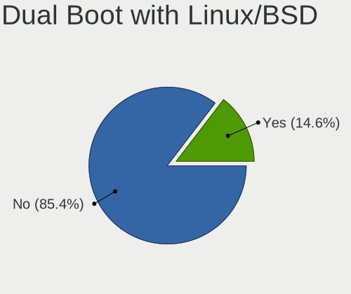
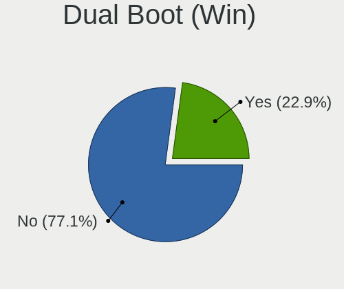
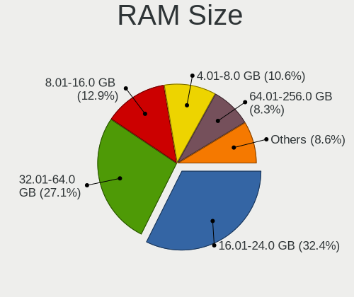
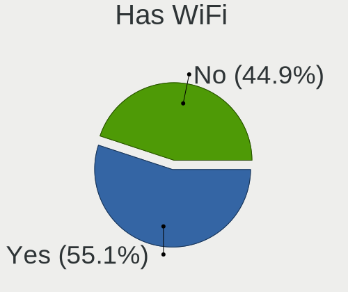
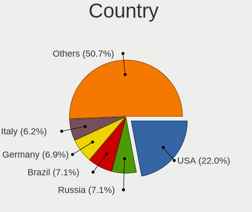
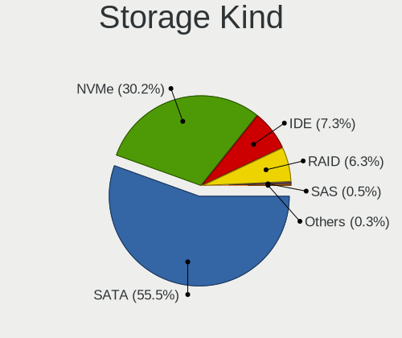
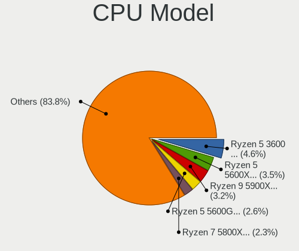
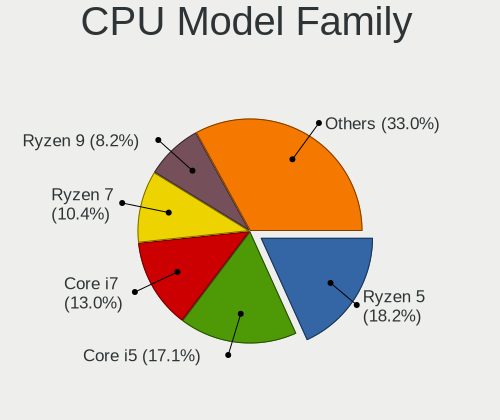

Fedora 36 - Tested Hardware & Statistics (Desktops)
---------------------------------------------------

A project to collect tested hardware configurations for Fedora 36.

Anyone can contribute to this report by the [hw-probe](https://github.com/linuxhw/hw-probe) tool:

    sudo -E hw-probe -all -upload

Please contribute! Especially if your hardware is rare.

Contents
--------

* [ Test Cases ](#test-cases)

* [ System ](#system)
  - [ Kernel                   ](#kernel)
  - [ Kernel Family            ](#kernel-family)
  - [ Kernel Major Ver.        ](#kernel-major-ver)
  - [ Arch                     ](#arch)
  - [ DE                       ](#de)
  - [ Display Server           ](#display-server)
  - [ Display Manager          ](#display-manager)
  - [ OS Lang                  ](#os-lang)
  - [ Boot Mode                ](#boot-mode)
  - [ Filesystem               ](#filesystem)
  - [ Part. scheme             ](#part-scheme)
  - [ Dual Boot with Linux/BSD ](#dual-boot-with-linuxbsd)
  - [ Dual Boot (Win)          ](#dual-boot-win)

* [ Board ](#board)
  - [ Vendor                   ](#vendor)
  - [ Model                    ](#model)
  - [ Model Family             ](#model-family)
  - [ MFG Year                 ](#mfg-year)
  - [ Form Factor              ](#form-factor)
  - [ Secure Boot              ](#secure-boot)
  - [ Coreboot                 ](#coreboot)
  - [ RAM Size                 ](#ram-size)
  - [ RAM Used                 ](#ram-used)
  - [ Total Drives             ](#total-drives)
  - [ Has CD-ROM               ](#has-cd-rom)
  - [ Has Ethernet             ](#has-ethernet)
  - [ Has WiFi                 ](#has-wifi)
  - [ Has Bluetooth            ](#has-bluetooth)

* [ Location ](#location)
  - [ Country                  ](#country)
  - [ City                     ](#city)

* [ Drives ](#drives)
  - [ Drive Vendor             ](#drive-vendor)
  - [ Drive Model              ](#drive-model)
  - [ HDD Vendor               ](#hdd-vendor)
  - [ SSD Vendor               ](#ssd-vendor)
  - [ Drive Kind               ](#drive-kind)
  - [ Drive Connector          ](#drive-connector)
  - [ Drive Size               ](#drive-size)
  - [ Space Total              ](#space-total)
  - [ Space Used               ](#space-used)
  - [ Malfunc. Drives          ](#malfunc-drives)
  - [ Malfunc. Drive Vendor    ](#malfunc-drive-vendor)
  - [ Malfunc. HDD Vendor      ](#malfunc-hdd-vendor)
  - [ Malfunc. Drive Kind      ](#malfunc-drive-kind)
  - [ Failed Drives            ](#failed-drives)
  - [ Failed Drive Vendor      ](#failed-drive-vendor)
  - [ Drive Status             ](#drive-status)

* [ Storage controller ](#storage-controller)
  - [ Storage Vendor           ](#storage-vendor)
  - [ Storage Model            ](#storage-model)
  - [ Storage Kind             ](#storage-kind)

* [ Processor ](#processor)
  - [ CPU Vendor               ](#cpu-vendor)
  - [ CPU Model                ](#cpu-model)
  - [ CPU Model Family         ](#cpu-model-family)
  - [ CPU Cores                ](#cpu-cores)
  - [ CPU Sockets              ](#cpu-sockets)
  - [ CPU Threads              ](#cpu-threads)
  - [ CPU Op-Modes             ](#cpu-op-modes)
  - [ CPU Microcode            ](#cpu-microcode)
  - [ CPU Microarch            ](#cpu-microarch)

* [ Graphics ](#graphics)
  - [ GPU Vendor               ](#gpu-vendor)
  - [ GPU Model                ](#gpu-model)
  - [ GPU Combo                ](#gpu-combo)
  - [ GPU Driver               ](#gpu-driver)
  - [ GPU Memory               ](#gpu-memory)

* [ Monitor ](#monitor)
  - [ Monitor Vendor           ](#monitor-vendor)
  - [ Monitor Model            ](#monitor-model)
  - [ Monitor Resolution       ](#monitor-resolution)
  - [ Monitor Diagonal         ](#monitor-diagonal)
  - [ Monitor Width            ](#monitor-width)
  - [ Aspect Ratio             ](#aspect-ratio)
  - [ Monitor Area             ](#monitor-area)
  - [ Pixel Density            ](#pixel-density)
  - [ Multiple Monitors        ](#multiple-monitors)

* [ Network ](#network)
  - [ Net Controller Vendor    ](#net-controller-vendor)
  - [ Net Controller Model     ](#net-controller-model)
  - [ Wireless Vendor          ](#wireless-vendor)
  - [ Wireless Model           ](#wireless-model)
  - [ Ethernet Vendor          ](#ethernet-vendor)
  - [ Ethernet Model           ](#ethernet-model)
  - [ Net Controller Kind      ](#net-controller-kind)
  - [ Used Controller          ](#used-controller)
  - [ NICs                     ](#nics)
  - [ IPv6                     ](#ipv6)

* [ Bluetooth ](#bluetooth)
  - [ Bluetooth Vendor         ](#bluetooth-vendor)
  - [ Bluetooth Model          ](#bluetooth-model)

* [ Sound ](#sound)
  - [ Sound Vendor             ](#sound-vendor)
  - [ Sound Model              ](#sound-model)

* [ Memory ](#memory)
  - [ Memory Vendor            ](#memory-vendor)
  - [ Memory Model             ](#memory-model)
  - [ Memory Kind              ](#memory-kind)
  - [ Memory Form Factor       ](#memory-form-factor)
  - [ Memory Size              ](#memory-size)
  - [ Memory Speed             ](#memory-speed)

* [ Printers & scanners ](#printers--scanners)
  - [ Printer Vendor           ](#printer-vendor)
  - [ Printer Model            ](#printer-model)
  - [ Scanner Vendor           ](#scanner-vendor)
  - [ Scanner Model            ](#scanner-model)

* [ Camera ](#camera)
  - [ Camera Vendor            ](#camera-vendor)
  - [ Camera Model             ](#camera-model)

* [ Security ](#security)
  - [ Fingerprint Vendor       ](#fingerprint-vendor)
  - [ Fingerprint Model        ](#fingerprint-model)
  - [ Chipcard Vendor          ](#chipcard-vendor)
  - [ Chipcard Model           ](#chipcard-model)

* [ Unsupported ](#unsupported)
  - [ Unsupported Devices      ](#unsupported-devices)
  - [ Unsupported Device Types ](#unsupported-device-types)

Test Cases
----------

Total: 681

| Vendor        | Model                       | Probe                                                      | Date         |
|---------------|-----------------------------|------------------------------------------------------------|--------------|
| ASUSTek       | TUF Gaming X570-PRO         | [b902f5d873](https://linux-hardware.org/?probe=b902f5d873) | Oct 01, 2022 |
| Lenovo        | SHARKBAY SDK0E50512 STD     | [ee22a244e2](https://linux-hardware.org/?probe=ee22a244e2) | Oct 01, 2022 |
| ASRock        | AD2700-ITX                  | [4275ef3653](https://linux-hardware.org/?probe=4275ef3653) | Oct 01, 2022 |
| Gigabyte      | B75M-D3H                    | [162334ac1e](https://linux-hardware.org/?probe=162334ac1e) | Sep 30, 2022 |
| MSI           | B450 GAMING PLUS MAX        | [c06e7e3586](https://linux-hardware.org/?probe=c06e7e3586) | Sep 30, 2022 |
| ASRock        | B450M Pro4                  | [ed76eeb703](https://linux-hardware.org/?probe=ed76eeb703) | Sep 30, 2022 |
| ASRock        | H270M-ITX/ac                | [c6ae2f8a45](https://linux-hardware.org/?probe=c6ae2f8a45) | Sep 29, 2022 |
| ASRock        | A320M-HD                    | [a674def12d](https://linux-hardware.org/?probe=a674def12d) | Sep 29, 2022 |
| Biostar       | H410MH S2                   | [fbba79fc43](https://linux-hardware.org/?probe=fbba79fc43) | Sep 28, 2022 |
| Gigabyte      | B450M AORUS ELITE           | [513d236a1f](https://linux-hardware.org/?probe=513d236a1f) | Sep 28, 2022 |
| Dell          | 0YGYJY A01                  | [73e69debd9](https://linux-hardware.org/?probe=73e69debd9) | Sep 27, 2022 |
| Gigabyte      | Z690I AORUS ULTRA DDR4      | [7af967061b](https://linux-hardware.org/?probe=7af967061b) | Sep 27, 2022 |
| ASUSTek       | ROG CROSSHAIR VIII DARK ... | [6373bf42ef](https://linux-hardware.org/?probe=6373bf42ef) | Sep 26, 2022 |
| ASUSTek       | ROG CROSSHAIR VIII DARK ... | [9ff2009089](https://linux-hardware.org/?probe=9ff2009089) | Sep 26, 2022 |
| ASUSTek       | TUF Gaming B560-PLUS WIF... | [56c982050d](https://linux-hardware.org/?probe=56c982050d) | Sep 25, 2022 |
| Gigabyte      | B550I AORUS PRO AX          | [778f7340fa](https://linux-hardware.org/?probe=778f7340fa) | Sep 25, 2022 |
| Gigabyte      | B450 GAMING X               | [982d41c1eb](https://linux-hardware.org/?probe=982d41c1eb) | Sep 25, 2022 |
| Lenovo        | 3098 NOK                    | [0f6ea5edfa](https://linux-hardware.org/?probe=0f6ea5edfa) | Sep 25, 2022 |
| ASUSTek       | TUF Gaming B660M-PLUS D4    | [82b73270ca](https://linux-hardware.org/?probe=82b73270ca) | Sep 25, 2022 |
| ASRock        | A320M-HD                    | [b26f7bf9f5](https://linux-hardware.org/?probe=b26f7bf9f5) | Sep 25, 2022 |
| Gigabyte      | B450 GAMING X               | [a5d5950e29](https://linux-hardware.org/?probe=a5d5950e29) | Sep 25, 2022 |
| MSI           | MAG Z590 TORPEDO            | [cedbd8909f](https://linux-hardware.org/?probe=cedbd8909f) | Sep 25, 2022 |
| ASUSTek       | TUF Gaming B660M-PLUS D4    | [a1f261d09d](https://linux-hardware.org/?probe=a1f261d09d) | Sep 25, 2022 |
| Gigabyte      | GA-MA785G-UD3H              | [66b5b65077](https://linux-hardware.org/?probe=66b5b65077) | Sep 25, 2022 |
| Gigabyte      | GA-MA780G-UD3H              | [a35dda8c10](https://linux-hardware.org/?probe=a35dda8c10) | Sep 25, 2022 |
| ASRock        | Z170M Extreme4              | [bd1e98639b](https://linux-hardware.org/?probe=bd1e98639b) | Sep 24, 2022 |
| ASUSTek       | PRIME B660M-A D4            | [542249f675](https://linux-hardware.org/?probe=542249f675) | Sep 24, 2022 |
| ASUSTek       | PRIME B365M-A               | [c4c88d72ae](https://linux-hardware.org/?probe=c4c88d72ae) | Sep 23, 2022 |
| ASUSTek       | TUF Gaming B550-PLUS        | [31f1acf273](https://linux-hardware.org/?probe=31f1acf273) | Sep 23, 2022 |
| ASUSTek       | PRIME B250M-C               | [2e45736b42](https://linux-hardware.org/?probe=2e45736b42) | Sep 23, 2022 |
| ASUSTek       | ROG STRIX B450-F GAMING ... | [a4ce7c179e](https://linux-hardware.org/?probe=a4ce7c179e) | Sep 23, 2022 |
| Gigabyte      | B660I AORUS PRO DDR4        | [810c7883d4](https://linux-hardware.org/?probe=810c7883d4) | Sep 23, 2022 |
| ASUSTek       | TUF Gaming B560-PLUS WIF... | [7d69f0c6c6](https://linux-hardware.org/?probe=7d69f0c6c6) | Sep 23, 2022 |
| Gigabyte      | Z270P-D3-CF                 | [79509e063b](https://linux-hardware.org/?probe=79509e063b) | Sep 23, 2022 |
| Foxconn       | H61M-S/H61M                 | [039b5cff54](https://linux-hardware.org/?probe=039b5cff54) | Sep 22, 2022 |
| MSI           | H310M PRO-VH                | [c11e067cb5](https://linux-hardware.org/?probe=c11e067cb5) | Sep 22, 2022 |
| Gigabyte      | Z68X-UD3H-B3                | [11ea16f0d6](https://linux-hardware.org/?probe=11ea16f0d6) | Sep 22, 2022 |
| ASUSTek       | PRIME B365M-A               | [289b9dcac8](https://linux-hardware.org/?probe=289b9dcac8) | Sep 21, 2022 |
| BESSTAR Te... | UM350                       | [62a9723eb7](https://linux-hardware.org/?probe=62a9723eb7) | Sep 21, 2022 |
| Dell          | 040DDP A01                  | [20d37d51bd](https://linux-hardware.org/?probe=20d37d51bd) | Sep 21, 2022 |
| Dell          | 040DDP A01                  | [cabebaa0e6](https://linux-hardware.org/?probe=cabebaa0e6) | Sep 21, 2022 |
| HP            | ProLiant ML110 G7           | [d5b4924a7b](https://linux-hardware.org/?probe=d5b4924a7b) | Sep 20, 2022 |
| Gigabyte      | A320M-S2H-CF                | [015c8dd353](https://linux-hardware.org/?probe=015c8dd353) | Sep 20, 2022 |
| ASUSTek       | Z97-AR                      | [5cf4494f07](https://linux-hardware.org/?probe=5cf4494f07) | Sep 20, 2022 |
| Lenovo        | 30D9 SDK0J40705 WIN 3425... | [75854836f7](https://linux-hardware.org/?probe=75854836f7) | Sep 20, 2022 |
| Dell          | 0K3CM7 A00                  | [3f82789198](https://linux-hardware.org/?probe=3f82789198) | Sep 20, 2022 |
| Dell          | 0K3CM7 A00                  | [b6ce2720e2](https://linux-hardware.org/?probe=b6ce2720e2) | Sep 20, 2022 |
| ASRock        | H610M-HDV/M.2               | [02a5a10d7a](https://linux-hardware.org/?probe=02a5a10d7a) | Sep 20, 2022 |
| ASUSTek       | PRIME Z270-P                | [d44ac0cc2a](https://linux-hardware.org/?probe=d44ac0cc2a) | Sep 19, 2022 |
| Dell          | 0J3C2F A02                  | [8027be6f7e](https://linux-hardware.org/?probe=8027be6f7e) | Sep 19, 2022 |
| ASUSTek       | TUF Gaming B550M-PLUS       | [f8bf8fd596](https://linux-hardware.org/?probe=f8bf8fd596) | Sep 19, 2022 |
| ASUSTek       | ROG STRIX X570-F GAMING     | [7a1dbe2204](https://linux-hardware.org/?probe=7a1dbe2204) | Sep 19, 2022 |
| MSI           | B450 GAMING PLUS MAX        | [8072b6c0e0](https://linux-hardware.org/?probe=8072b6c0e0) | Sep 19, 2022 |
| ASUSTek       | P8Q77-M2                    | [1e067b7c4f](https://linux-hardware.org/?probe=1e067b7c4f) | Sep 19, 2022 |
| Dell          | 0KWVT8 A03                  | [7c52790345](https://linux-hardware.org/?probe=7c52790345) | Sep 19, 2022 |
| ASRock        | X570 Steel Legend           | [6fd34fa73b](https://linux-hardware.org/?probe=6fd34fa73b) | Sep 19, 2022 |
| Gigabyte      | A520M DS3H                  | [bf7318e65e](https://linux-hardware.org/?probe=bf7318e65e) | Sep 19, 2022 |
| ASUSTek       | Z97-P                       | [37f0f7b888](https://linux-hardware.org/?probe=37f0f7b888) | Sep 19, 2022 |
| ASRock        | X570 Phantom Gaming 4       | [75be2db65c](https://linux-hardware.org/?probe=75be2db65c) | Sep 19, 2022 |
| Dell          | 02M8NY A01                  | [498286eb91](https://linux-hardware.org/?probe=498286eb91) | Sep 19, 2022 |
| ASUSTek       | ROG CROSSHAIR VIII IMPAC... | [3da12828c0](https://linux-hardware.org/?probe=3da12828c0) | Sep 19, 2022 |
| Gigabyte      | GA-MA780G-UD3H              | [6c63c03b9f](https://linux-hardware.org/?probe=6c63c03b9f) | Sep 19, 2022 |
| ASRock        | 960GM-VGS3 FX               | [7c89dc4342](https://linux-hardware.org/?probe=7c89dc4342) | Sep 19, 2022 |
| Gigabyte      | A320M-S2H-CF                | [8d2c35d5f2](https://linux-hardware.org/?probe=8d2c35d5f2) | Sep 19, 2022 |
| ASUSTek       | TUF B350M-PLUS GAMING       | [27d1f0c593](https://linux-hardware.org/?probe=27d1f0c593) | Sep 19, 2022 |
| ASUSTek       | P8Q77-M2                    | [171e24a5c1](https://linux-hardware.org/?probe=171e24a5c1) | Sep 19, 2022 |
| ASUSTek       | PRIME X570-PRO              | [798bb8eda6](https://linux-hardware.org/?probe=798bb8eda6) | Sep 18, 2022 |
| ASUSTek       | PRIME H410M-K R2.0          | [7d18b85f33](https://linux-hardware.org/?probe=7d18b85f33) | Sep 18, 2022 |
| ASUSTek       | ROG STRIX Z690-A GAMING ... | [21da8441d5](https://linux-hardware.org/?probe=21da8441d5) | Sep 18, 2022 |
| Casper        | NIRVANA DESKTOP             | [7cdffad4a2](https://linux-hardware.org/?probe=7cdffad4a2) | Sep 18, 2022 |
| ASUSTek       | PRIME B660M-A D4            | [1f27376b8e](https://linux-hardware.org/?probe=1f27376b8e) | Sep 18, 2022 |
| Acer          | Aspire TC-780               | [936ece435c](https://linux-hardware.org/?probe=936ece435c) | Sep 18, 2022 |
| Acer          | A75F2-M2 P21-A1             | [2d00ba463b](https://linux-hardware.org/?probe=2d00ba463b) | Sep 18, 2022 |
| ASRock        | B550M-ITX/ac                | [379aaf7b61](https://linux-hardware.org/?probe=379aaf7b61) | Sep 16, 2022 |
| ASUSTek       | PRIME B365M-A               | [e191511194](https://linux-hardware.org/?probe=e191511194) | Sep 16, 2022 |
| ASUSTek       | P8Z68-V LX                  | [07dd87b76b](https://linux-hardware.org/?probe=07dd87b76b) | Sep 16, 2022 |
| Gigabyte      | A320M-S2H V2-CF             | [4d460404c8](https://linux-hardware.org/?probe=4d460404c8) | Sep 16, 2022 |
| Gigabyte      | A320M-S2H V2-CF             | [881adad6fb](https://linux-hardware.org/?probe=881adad6fb) | Sep 16, 2022 |
| Gigabyte      | AB350-Gaming 3-CF           | [9bfc1472d1](https://linux-hardware.org/?probe=9bfc1472d1) | Sep 16, 2022 |
| ASRock        | X370 Gaming K4              | [0858e80da7](https://linux-hardware.org/?probe=0858e80da7) | Sep 15, 2022 |
| Gigabyte      | Z97P-D3                     | [ca9e537823](https://linux-hardware.org/?probe=ca9e537823) | Sep 15, 2022 |
| ASUSTek       | P5PL2-E                     | [84bfb7d319](https://linux-hardware.org/?probe=84bfb7d319) | Sep 15, 2022 |
| MSI           | MPG B550 GAMING PLUS        | [55216d250b](https://linux-hardware.org/?probe=55216d250b) | Sep 14, 2022 |
| MSI           | MPG B550 GAMING PLUS        | [fb9010fc1f](https://linux-hardware.org/?probe=fb9010fc1f) | Sep 14, 2022 |
| HP            | 805D                        | [8acaebbd42](https://linux-hardware.org/?probe=8acaebbd42) | Sep 14, 2022 |
| Gigabyte      | X470 AORUS GAMING 7 WIFI... | [e7cb70c141](https://linux-hardware.org/?probe=e7cb70c141) | Sep 14, 2022 |
| Gigabyte      | X470 AORUS ULTRA GAMING-... | [754d0f3a2b](https://linux-hardware.org/?probe=754d0f3a2b) | Sep 14, 2022 |
| ASUSTek       | ROG STRIX X570-F GAMING     | [175c84f6ea](https://linux-hardware.org/?probe=175c84f6ea) | Sep 13, 2022 |
| ASUSTek       | Z170 PRO GAMING             | [d3f957e34a](https://linux-hardware.org/?probe=d3f957e34a) | Sep 13, 2022 |
| ASUSTek       | PRIME B450-PLUS             | [9b2a84cd02](https://linux-hardware.org/?probe=9b2a84cd02) | Sep 13, 2022 |
| ASUSTek       | PRIME B450-PLUS             | [1285ab4d66](https://linux-hardware.org/?probe=1285ab4d66) | Sep 13, 2022 |
| ASRock        | FM2A55M-HD+ R2.0            | [1faad914c6](https://linux-hardware.org/?probe=1faad914c6) | Sep 13, 2022 |
| Unknown       | X99H                        | [9fb8886110](https://linux-hardware.org/?probe=9fb8886110) | Sep 13, 2022 |
| Dell          | 0M017G A00                  | [e040958337](https://linux-hardware.org/?probe=e040958337) | Sep 13, 2022 |
| Gigabyte      | A320M-S2H V2-CF             | [7ce5d8e865](https://linux-hardware.org/?probe=7ce5d8e865) | Sep 12, 2022 |
| Gigabyte      | A320M-S2H V2-CF             | [ec5f57ab65](https://linux-hardware.org/?probe=ec5f57ab65) | Sep 12, 2022 |
| HP            | 1494                        | [0faa06cff4](https://linux-hardware.org/?probe=0faa06cff4) | Sep 12, 2022 |
| BESSTAR Te... | UM700                       | [6847632df3](https://linux-hardware.org/?probe=6847632df3) | Sep 12, 2022 |
| MSI           | MPG Z490 GAMING PLUS        | [a3b824ba41](https://linux-hardware.org/?probe=a3b824ba41) | Sep 10, 2022 |
| ASUSTek       | Z170-A                      | [66c2198f48](https://linux-hardware.org/?probe=66c2198f48) | Sep 10, 2022 |
| MSI           | MAG B550 TORPEDO            | [841be89be6](https://linux-hardware.org/?probe=841be89be6) | Sep 10, 2022 |
| MSI           | MAG B550 TORPEDO            | [626cf13c17](https://linux-hardware.org/?probe=626cf13c17) | Sep 10, 2022 |
| MSI           | A320M GAMING PRO            | [6ce0fb28ee](https://linux-hardware.org/?probe=6ce0fb28ee) | Sep 10, 2022 |
| MSI           | A320M GAMING PRO            | [5cce5f5ade](https://linux-hardware.org/?probe=5cce5f5ade) | Sep 10, 2022 |
| ASUSTek       | B150 PRO GAMING             | [5e145ec2d1](https://linux-hardware.org/?probe=5e145ec2d1) | Sep 10, 2022 |
| Gigabyte      | GA-MA780G-UD3H              | [2cb423c8e7](https://linux-hardware.org/?probe=2cb423c8e7) | Sep 10, 2022 |
| ASUSTek       | ROG STRIX X570-E GAMING ... | [03979fc286](https://linux-hardware.org/?probe=03979fc286) | Sep 10, 2022 |
| ASUSTek       | ROG STRIX X570-E GAMING ... | [c6dac06569](https://linux-hardware.org/?probe=c6dac06569) | Sep 09, 2022 |
| Gigabyte      | H77N-WIFI                   | [3c454664b0](https://linux-hardware.org/?probe=3c454664b0) | Sep 09, 2022 |
| ASRock        | B550M Pro4                  | [e43ef549eb](https://linux-hardware.org/?probe=e43ef549eb) | Sep 08, 2022 |
| ASRock        | B550M Pro4                  | [ac6cb859ad](https://linux-hardware.org/?probe=ac6cb859ad) | Sep 08, 2022 |
| Gigabyte      | Z97-HD3                     | [aeb2bae778](https://linux-hardware.org/?probe=aeb2bae778) | Sep 08, 2022 |
| Intel         | DH77DF AAG40293-300         | [217971d572](https://linux-hardware.org/?probe=217971d572) | Sep 08, 2022 |
| Dell          | 02YRK5 A02                  | [daf3e0182b](https://linux-hardware.org/?probe=daf3e0182b) | Sep 08, 2022 |
| Gigabyte      | Z97-HD3                     | [d5040ffbda](https://linux-hardware.org/?probe=d5040ffbda) | Sep 08, 2022 |
| HP            | 18E4                        | [1e8addf905](https://linux-hardware.org/?probe=1e8addf905) | Sep 08, 2022 |
| ASUSTek       | H110M-A                     | [dad38946f6](https://linux-hardware.org/?probe=dad38946f6) | Sep 08, 2022 |
| Gigabyte      | B550 AORUS PRO AC           | [0f0a18c852](https://linux-hardware.org/?probe=0f0a18c852) | Sep 08, 2022 |
| Gigabyte      | B550 AORUS PRO AC           | [e06271e233](https://linux-hardware.org/?probe=e06271e233) | Sep 08, 2022 |
| ASUSTek       | TUF B350M-PLUS GAMING       | [051ea3b002](https://linux-hardware.org/?probe=051ea3b002) | Sep 08, 2022 |
| MSI           | Z97 PC Mate                 | [bcf93bb718](https://linux-hardware.org/?probe=bcf93bb718) | Sep 08, 2022 |
| Dell          | 02YRK5 A02                  | [2395ab5aed](https://linux-hardware.org/?probe=2395ab5aed) | Sep 07, 2022 |
| ASUSTek       | H97-PRO                     | [fb4bfcf055](https://linux-hardware.org/?probe=fb4bfcf055) | Sep 07, 2022 |
| ASRock        | EP2C602                     | [56a6980ddc](https://linux-hardware.org/?probe=56a6980ddc) | Sep 07, 2022 |
| Lenovo        | 36D9 SDK0J40700 WIN 3258... | [a816f4f60b](https://linux-hardware.org/?probe=a816f4f60b) | Sep 07, 2022 |
| ASUSTek       | Z97-AR                      | [01dbdc3b29](https://linux-hardware.org/?probe=01dbdc3b29) | Sep 06, 2022 |
| MSI           | MEG X570 ACE                | [5f7f592f25](https://linux-hardware.org/?probe=5f7f592f25) | Sep 05, 2022 |
| MSI           | MPG B550 GAMING EDGE WIF... | [e83fa739c9](https://linux-hardware.org/?probe=e83fa739c9) | Sep 05, 2022 |
| MSI           | B550-A PRO                  | [950b2a8eb5](https://linux-hardware.org/?probe=950b2a8eb5) | Sep 05, 2022 |
| ASUSTek       | ROG STRIX X570-E GAMING     | [127c2f5f75](https://linux-hardware.org/?probe=127c2f5f75) | Sep 05, 2022 |
| Gigabyte      | EP45-DS3L                   | [cb17ac9b4e](https://linux-hardware.org/?probe=cb17ac9b4e) | Sep 05, 2022 |
| Gigabyte      | Z370M DS3H-CF               | [e590a83122](https://linux-hardware.org/?probe=e590a83122) | Sep 05, 2022 |
| MSI           | MAG B550 TOMAHAWK           | [7c87d1ad42](https://linux-hardware.org/?probe=7c87d1ad42) | Sep 05, 2022 |
| Lenovo        | 30D2 SDK0J40697 WIN 3305... | [b4a71c0eff](https://linux-hardware.org/?probe=b4a71c0eff) | Sep 04, 2022 |
| ASUSTek       | KCMA-D8                     | [df5fdfccf0](https://linux-hardware.org/?probe=df5fdfccf0) | Sep 04, 2022 |
| MSI           | H510M-A PRO                 | [7bb2d68f03](https://linux-hardware.org/?probe=7bb2d68f03) | Sep 04, 2022 |
| Gigabyte      | F2A78M-D3H                  | [5b0da32c82](https://linux-hardware.org/?probe=5b0da32c82) | Sep 03, 2022 |
| ASRock        | X399 Phantom Gaming 6       | [ea22a308c9](https://linux-hardware.org/?probe=ea22a308c9) | Sep 03, 2022 |
| ASRock        | X399 Phantom Gaming 6       | [bd2f18b5a5](https://linux-hardware.org/?probe=bd2f18b5a5) | Sep 03, 2022 |
| MSI           | B450 GAMING PLUS MAX        | [159c1dcd33](https://linux-hardware.org/?probe=159c1dcd33) | Sep 03, 2022 |
| MSI           | X570-A PRO                  | [e20b509508](https://linux-hardware.org/?probe=e20b509508) | Sep 03, 2022 |
| ASUSTek       | ROG STRIX Z390-F GAMING     | [b9f43af7d0](https://linux-hardware.org/?probe=b9f43af7d0) | Sep 03, 2022 |
| ASUSTek       | ROG STRIX Z390-F GAMING     | [9cab157472](https://linux-hardware.org/?probe=9cab157472) | Sep 03, 2022 |
| ASUSTek       | Z170-K                      | [d47c5fe35c](https://linux-hardware.org/?probe=d47c5fe35c) | Sep 03, 2022 |
| Gigabyte      | B450M DS3H-CF               | [5f37e7a618](https://linux-hardware.org/?probe=5f37e7a618) | Sep 03, 2022 |
| ASRock        | X470 Taichi                 | [0a6ff089f1](https://linux-hardware.org/?probe=0a6ff089f1) | Sep 03, 2022 |
| MSI           | X470 GAMING PRO MAX         | [7f10b8002b](https://linux-hardware.org/?probe=7f10b8002b) | Sep 03, 2022 |
| BESSTAR Te... | UM350                       | [02423b61e0](https://linux-hardware.org/?probe=02423b61e0) | Sep 03, 2022 |
| Foxconn       | 2ADA                        | [f1ca159a19](https://linux-hardware.org/?probe=f1ca159a19) | Sep 03, 2022 |
| Acer          | Aspire M3910                | [17c1079582](https://linux-hardware.org/?probe=17c1079582) | Sep 02, 2022 |
| Gigabyte      | GA-MA780G-UD3H              | [0a1de8a406](https://linux-hardware.org/?probe=0a1de8a406) | Sep 02, 2022 |
| Dell          | 0MWYPT A02                  | [e2f98387b0](https://linux-hardware.org/?probe=e2f98387b0) | Sep 01, 2022 |
| Gigabyte      | GA-MA785G-UD3H              | [2cf98644bc](https://linux-hardware.org/?probe=2cf98644bc) | Sep 01, 2022 |
| MSI           | MPG B550I GAMING EDGE WI... | [c5547cac7c](https://linux-hardware.org/?probe=c5547cac7c) | Aug 31, 2022 |
| MSI           | MPG B550I GAMING EDGE WI... | [e5c7462ead](https://linux-hardware.org/?probe=e5c7462ead) | Aug 31, 2022 |
| Gigabyte      | X570S AORUS ELITE AX        | [36eb80672f](https://linux-hardware.org/?probe=36eb80672f) | Aug 31, 2022 |
| Dell          | 0KV3RP A00                  | [731a14ee10](https://linux-hardware.org/?probe=731a14ee10) | Aug 31, 2022 |
| MSI           | B450 GAMING PRO CARBON A... | [2c72dfccbb](https://linux-hardware.org/?probe=2c72dfccbb) | Aug 30, 2022 |
| HP            | 8464                        | [16bb2588e0](https://linux-hardware.org/?probe=16bb2588e0) | Aug 30, 2022 |
| Gigabyte      | Z170-D3H-CF                 | [d9d75bc1f0](https://linux-hardware.org/?probe=d9d75bc1f0) | Aug 29, 2022 |
| ASUSTek       | TUF Gaming B550-PLUS        | [9fbdc83458](https://linux-hardware.org/?probe=9fbdc83458) | Aug 29, 2022 |
| ASUSTek       | TUF Gaming B550-PLUS        | [7b0113a203](https://linux-hardware.org/?probe=7b0113a203) | Aug 29, 2022 |
| MSI           | MPG Z390I GAMING EDGE AC    | [cf0cdab1da](https://linux-hardware.org/?probe=cf0cdab1da) | Aug 29, 2022 |
| MSI           | MPG Z390 GAMING PLUS        | [60bc287a81](https://linux-hardware.org/?probe=60bc287a81) | Aug 29, 2022 |
| HP            | 8751                        | [62c8c2f25e](https://linux-hardware.org/?probe=62c8c2f25e) | Aug 29, 2022 |
| MSI           | MPG Z390 GAMING PLUS        | [7d1dae1de6](https://linux-hardware.org/?probe=7d1dae1de6) | Aug 29, 2022 |
| MSI           | Z77A-G43                    | [1d1864dabc](https://linux-hardware.org/?probe=1d1864dabc) | Aug 29, 2022 |
| ASUSTek       | TUF Gaming X570-PLUS        | [505d987d1e](https://linux-hardware.org/?probe=505d987d1e) | Aug 28, 2022 |
| MSI           | MAG X570S TOMAHAWK MAX W... | [3de4d575a9](https://linux-hardware.org/?probe=3de4d575a9) | Aug 27, 2022 |
| HP            | 805D                        | [419598ebba](https://linux-hardware.org/?probe=419598ebba) | Aug 27, 2022 |
| Gigabyte      | GA-78LMT-USB3 SEx           | [7642980e6e](https://linux-hardware.org/?probe=7642980e6e) | Aug 27, 2022 |
| Dell          | 0KV3RP A00                  | [f73bf383ce](https://linux-hardware.org/?probe=f73bf383ce) | Aug 26, 2022 |
| ASUSTek       | P5QL-E                      | [f1c16cf6e7](https://linux-hardware.org/?probe=f1c16cf6e7) | Aug 26, 2022 |
| ASUSTek       | ROG STRIX X570-E GAMING ... | [dd68273352](https://linux-hardware.org/?probe=dd68273352) | Aug 26, 2022 |
| ASUSTek       | P5QL-E                      | [e69218ea58](https://linux-hardware.org/?probe=e69218ea58) | Aug 26, 2022 |
| Gigabyte      | B550 GAMING X V2            | [f37ee1975e](https://linux-hardware.org/?probe=f37ee1975e) | Aug 26, 2022 |
| ASUSTek       | ROG STRIX B550-F GAMING     | [2388b95ce9](https://linux-hardware.org/?probe=2388b95ce9) | Aug 25, 2022 |
| ASUSTek       | UN62                        | [49fcd1324f](https://linux-hardware.org/?probe=49fcd1324f) | Aug 25, 2022 |
| ASRock        | B450M Pro4                  | [69fd53a234](https://linux-hardware.org/?probe=69fd53a234) | Aug 25, 2022 |
| ASRock        | B450M Pro4                  | [47dc749c6c](https://linux-hardware.org/?probe=47dc749c6c) | Aug 25, 2022 |
| Dell          | 01TKCC A01                  | [9a362ed844](https://linux-hardware.org/?probe=9a362ed844) | Aug 25, 2022 |
| Dell          | 0PU052                      | [2bffd37724](https://linux-hardware.org/?probe=2bffd37724) | Aug 24, 2022 |
| ASUSTek       | Z97-AR                      | [a766ce2d5a](https://linux-hardware.org/?probe=a766ce2d5a) | Aug 24, 2022 |
| ASUSTek       | TUF Gaming B550-PLUS        | [ae4a81a473](https://linux-hardware.org/?probe=ae4a81a473) | Aug 24, 2022 |
| ASRock        | X570M Pro4                  | [f2bc1e0fae](https://linux-hardware.org/?probe=f2bc1e0fae) | Aug 23, 2022 |
| Gigabyte      | H81M-S                      | [0b1e1d125d](https://linux-hardware.org/?probe=0b1e1d125d) | Aug 23, 2022 |
| MSI           | Z170A GAMING PRO CARBON     | [0796a8df9d](https://linux-hardware.org/?probe=0796a8df9d) | Aug 23, 2022 |
| Gigabyte      | X570 I AORUS PRO WIFI       | [b0af95356c](https://linux-hardware.org/?probe=b0af95356c) | Aug 22, 2022 |
| Gigabyte      | X570 I AORUS PRO WIFI       | [bc32a93168](https://linux-hardware.org/?probe=bc32a93168) | Aug 22, 2022 |
| Gigabyte      | B550 AORUS ELITE V2         | [a25c6f8d64](https://linux-hardware.org/?probe=a25c6f8d64) | Aug 22, 2022 |
| Gigabyte      | EP45-DS3P                   | [2af48f00ac](https://linux-hardware.org/?probe=2af48f00ac) | Aug 22, 2022 |
| Gigabyte      | EP45-DS3P                   | [0910ca3887](https://linux-hardware.org/?probe=0910ca3887) | Aug 22, 2022 |
| ASUSTek       | PRIME H370-PLUS             | [eb81df27ce](https://linux-hardware.org/?probe=eb81df27ce) | Aug 22, 2022 |
| ASRock        | 890GM Pro3                  | [51f5d50d85](https://linux-hardware.org/?probe=51f5d50d85) | Aug 22, 2022 |
| ASRock        | 890GM Pro3                  | [002a0c3f5a](https://linux-hardware.org/?probe=002a0c3f5a) | Aug 22, 2022 |
| ASRock        | X370 Taichi                 | [8f952ff258](https://linux-hardware.org/?probe=8f952ff258) | Aug 21, 2022 |
| ASRock        | AD2700-ITX                  | [4be47e3738](https://linux-hardware.org/?probe=4be47e3738) | Aug 21, 2022 |
| ASUSTek       | ROG STRIX Z690-E GAMING ... | [5f90bb65a6](https://linux-hardware.org/?probe=5f90bb65a6) | Aug 21, 2022 |
| ASUSTek       | TUF B350M-PLUS GAMING       | [b2ac87cffc](https://linux-hardware.org/?probe=b2ac87cffc) | Aug 20, 2022 |
| Gigabyte      | G1.Sniper B5-CF             | [7dbac78a87](https://linux-hardware.org/?probe=7dbac78a87) | Aug 20, 2022 |
| Lenovo        | 312A SDK0J40697 WIN 3305... | [abbb1d7360](https://linux-hardware.org/?probe=abbb1d7360) | Aug 20, 2022 |
| Gigabyte      | B550M DS3H                  | [fd0604d0fb](https://linux-hardware.org/?probe=fd0604d0fb) | Aug 20, 2022 |
| Gigabyte      | GA-MA780G-UD3H              | [c9738d69e9](https://linux-hardware.org/?probe=c9738d69e9) | Aug 20, 2022 |
| ASUSTek       | Z97-PRO GAMER               | [2f5ef1300f](https://linux-hardware.org/?probe=2f5ef1300f) | Aug 19, 2022 |
| MACHINIST     | X99-RS9 V2.0                | [ffb095f0c3](https://linux-hardware.org/?probe=ffb095f0c3) | Aug 19, 2022 |
| ASUSTek       | P8H67-M LE                  | [ce8c93b28f](https://linux-hardware.org/?probe=ce8c93b28f) | Aug 19, 2022 |
| ASRock        | B450 Pro4                   | [ed013e82aa](https://linux-hardware.org/?probe=ed013e82aa) | Aug 19, 2022 |
| ASUSTek       | TUF Gaming B550M-PLUS       | [8fc237babf](https://linux-hardware.org/?probe=8fc237babf) | Aug 17, 2022 |
| Lenovo        | SHARKBAY NOK                | [e73d7ae317](https://linux-hardware.org/?probe=e73d7ae317) | Aug 17, 2022 |
| Dell          | 09M8Y8 A01                  | [9defe532c0](https://linux-hardware.org/?probe=9defe532c0) | Aug 17, 2022 |
| ASUSTek       | Z97-C                       | [58f88a4494](https://linux-hardware.org/?probe=58f88a4494) | Aug 17, 2022 |
| Gigabyte      | D525TUD                     | [e68748c0f1](https://linux-hardware.org/?probe=e68748c0f1) | Aug 16, 2022 |
| Gigabyte      | B550M AORUS PRO-P           | [8b591b08b0](https://linux-hardware.org/?probe=8b591b08b0) | Aug 16, 2022 |
| ASUSTek       | Z97-C                       | [e68b5affa4](https://linux-hardware.org/?probe=e68b5affa4) | Aug 16, 2022 |
| ASUSTek       | ROG STRIX X570-I GAMING     | [97ff4c0078](https://linux-hardware.org/?probe=97ff4c0078) | Aug 16, 2022 |
| Gigabyte      | B550M DS3H                  | [6ef5e022c7](https://linux-hardware.org/?probe=6ef5e022c7) | Aug 15, 2022 |
| ECS           | H61H2-MV                    | [0b95f78b15](https://linux-hardware.org/?probe=0b95f78b15) | Aug 15, 2022 |
| Gigabyte      | GA-MA785G-UD3H              | [8072e15459](https://linux-hardware.org/?probe=8072e15459) | Aug 15, 2022 |
| ASUSTek       | Z97-PRO GAMER               | [bbbda98d21](https://linux-hardware.org/?probe=bbbda98d21) | Aug 15, 2022 |
| Gigabyte      | H77N-WIFI                   | [20d9ba44b5](https://linux-hardware.org/?probe=20d9ba44b5) | Aug 15, 2022 |
| ASUSTek       | B85M-G                      | [b44e802677](https://linux-hardware.org/?probe=b44e802677) | Aug 14, 2022 |
| ASUSTek       | P8H77-V                     | [83abda5bc9](https://linux-hardware.org/?probe=83abda5bc9) | Aug 14, 2022 |
| Huanan        | X99-BD4 V1.33               | [a250b39eec](https://linux-hardware.org/?probe=a250b39eec) | Aug 13, 2022 |
| ASUSTek       | STRIX Z270E GAMING          | [6a0c6ab778](https://linux-hardware.org/?probe=6a0c6ab778) | Aug 13, 2022 |
| ASUSTek       | ROG STRIX Z370-H GAMING     | [4983efddbb](https://linux-hardware.org/?probe=4983efddbb) | Aug 13, 2022 |
| ASRock        | FM2A88M-HD+ R2.0            | [e1f4ef0670](https://linux-hardware.org/?probe=e1f4ef0670) | Aug 12, 2022 |
| MSI           | Z97 GAMING 5                | [e7c81a6ce7](https://linux-hardware.org/?probe=e7c81a6ce7) | Aug 12, 2022 |
| MSI           | MPG X570 GAMING PLUS        | [6a8f06be23](https://linux-hardware.org/?probe=6a8f06be23) | Aug 12, 2022 |
| HP            | 8183                        | [19f5199de8](https://linux-hardware.org/?probe=19f5199de8) | Aug 12, 2022 |
| Gigabyte      | H370 HD3-CF                 | [3d93d807ca](https://linux-hardware.org/?probe=3d93d807ca) | Aug 12, 2022 |
| MSI           | X370 SLI PLUS               | [8b4bc6f127](https://linux-hardware.org/?probe=8b4bc6f127) | Aug 11, 2022 |
| MSI           | Z87-G45 GAMING              | [5f25d77994](https://linux-hardware.org/?probe=5f25d77994) | Aug 11, 2022 |
| HP            | 8183                        | [c441ead9f8](https://linux-hardware.org/?probe=c441ead9f8) | Aug 11, 2022 |
| MSI           | Z87-G45 GAMING              | [0790b09ae3](https://linux-hardware.org/?probe=0790b09ae3) | Aug 11, 2022 |
| Gigabyte      | B150M-D3H-CF                | [43b4579869](https://linux-hardware.org/?probe=43b4579869) | Aug 11, 2022 |
| Gigabyte      | Z390 GAMING X-CF            | [edf947ace6](https://linux-hardware.org/?probe=edf947ace6) | Aug 10, 2022 |
| Lenovo        | SHARKBAY NOK                | [c788f4d7a8](https://linux-hardware.org/?probe=c788f4d7a8) | Aug 10, 2022 |
| ASRock        | B450M Steel Legend          | [a24161deaa](https://linux-hardware.org/?probe=a24161deaa) | Aug 10, 2022 |
| ASRock        | AB350 Gaming-ITX/ac         | [d586bdd82d](https://linux-hardware.org/?probe=d586bdd82d) | Aug 10, 2022 |
| Gigabyte      | X570 AORUS PRO              | [8558001fa2](https://linux-hardware.org/?probe=8558001fa2) | Aug 09, 2022 |
| Gigabyte      | Z87-HD3                     | [ee1bdd9333](https://linux-hardware.org/?probe=ee1bdd9333) | Aug 09, 2022 |
| Gigabyte      | Z87-HD3                     | [a0243ce6f0](https://linux-hardware.org/?probe=a0243ce6f0) | Aug 09, 2022 |
| Gigabyte      | GA-MA780G-UD3H              | [e74a95c4d9](https://linux-hardware.org/?probe=e74a95c4d9) | Aug 09, 2022 |
| Gigabyte      | GA-MA785G-UD3H              | [42d32cdfda](https://linux-hardware.org/?probe=42d32cdfda) | Aug 09, 2022 |
| ECS           | H61H2-MV                    | [21fadb20ca](https://linux-hardware.org/?probe=21fadb20ca) | Aug 09, 2022 |
| MSI           | Z87-G45 GAMING              | [093a936372](https://linux-hardware.org/?probe=093a936372) | Aug 08, 2022 |
| ASUSTek       | ROG STRIX B660-F GAMING ... | [b421a8c6c4](https://linux-hardware.org/?probe=b421a8c6c4) | Aug 08, 2022 |
| ASUSTek       | P8H67-M LE                  | [07c89bcbc6](https://linux-hardware.org/?probe=07c89bcbc6) | Aug 08, 2022 |
| Gigabyte      | X470 AORUS GAMING 7 WIFI... | [08b891334e](https://linux-hardware.org/?probe=08b891334e) | Aug 08, 2022 |
| Lenovo        | SHARKBAY NOK                | [f08a60d37c](https://linux-hardware.org/?probe=f08a60d37c) | Aug 07, 2022 |
| ASUSTek       | PRIME B550M-A               | [64e8ddf1c9](https://linux-hardware.org/?probe=64e8ddf1c9) | Aug 07, 2022 |
| ECS           | H61H2-MV                    | [7dbc1a26ca](https://linux-hardware.org/?probe=7dbc1a26ca) | Aug 07, 2022 |
| MSI           | MAG B460M MORTAR            | [a823925843](https://linux-hardware.org/?probe=a823925843) | Aug 07, 2022 |
| HP            | 1587h                       | [d9d1b6832f](https://linux-hardware.org/?probe=d9d1b6832f) | Aug 07, 2022 |
| HP            | 1587h                       | [737b509512](https://linux-hardware.org/?probe=737b509512) | Aug 07, 2022 |
| Gigabyte      | A320M-S2H-CF                | [31c87abaf3](https://linux-hardware.org/?probe=31c87abaf3) | Aug 07, 2022 |
| Lenovo        | SHARKBAY SDK0E50512 STD     | [154440549c](https://linux-hardware.org/?probe=154440549c) | Aug 06, 2022 |
| ECS           | H61H2-MV                    | [6dbb0a4eb9](https://linux-hardware.org/?probe=6dbb0a4eb9) | Aug 06, 2022 |
| ASUSTek       | SABERTOOTH X79              | [4f10e80880](https://linux-hardware.org/?probe=4f10e80880) | Aug 06, 2022 |
| Lenovo        | SHARKBAY SDK0E50512 STD     | [4f12a5e11e](https://linux-hardware.org/?probe=4f12a5e11e) | Aug 06, 2022 |
| BESSTAR Te... | HM90                        | [36e148426c](https://linux-hardware.org/?probe=36e148426c) | Aug 06, 2022 |
| BESSTAR Te... | HM90                        | [28ec23aa22](https://linux-hardware.org/?probe=28ec23aa22) | Aug 06, 2022 |
| Gigabyte      | 945GCM-S2L                  | [fd6cf872ae](https://linux-hardware.org/?probe=fd6cf872ae) | Aug 06, 2022 |
| ASRock        | B460M Pro4S/ac              | [79f01ebf66](https://linux-hardware.org/?probe=79f01ebf66) | Aug 05, 2022 |
| Gigabyte      | GA-MA785G-UD3H              | [1798c25088](https://linux-hardware.org/?probe=1798c25088) | Aug 05, 2022 |
| Gigabyte      | H77N-WIFI                   | [caa404d4c6](https://linux-hardware.org/?probe=caa404d4c6) | Aug 05, 2022 |
| Gigabyte      | AX370-Gaming 5              | [46f109ed37](https://linux-hardware.org/?probe=46f109ed37) | Aug 05, 2022 |
| ASUSTek       | ROG STRIX B550-E GAMING     | [c6e5356615](https://linux-hardware.org/?probe=c6e5356615) | Aug 04, 2022 |
| Gigabyte      | M68MT-S2P                   | [7c41cd3006](https://linux-hardware.org/?probe=7c41cd3006) | Aug 04, 2022 |
| Gigabyte      | GA-78LMT-USB3 SEx           | [b932802b52](https://linux-hardware.org/?probe=b932802b52) | Aug 04, 2022 |
| ASUSTek       | H110M-K                     | [df01e617f2](https://linux-hardware.org/?probe=df01e617f2) | Aug 03, 2022 |
| MSI           | MPG X570 GAMING PLUS        | [6e77095fb6](https://linux-hardware.org/?probe=6e77095fb6) | Aug 03, 2022 |
| Dell          | 05GD68 A00                  | [32bda73b5e](https://linux-hardware.org/?probe=32bda73b5e) | Aug 03, 2022 |
| ASRock        | AB350M-HDV                  | [4678a0f755](https://linux-hardware.org/?probe=4678a0f755) | Aug 03, 2022 |
| HP            | 8767 A                      | [3679ccede7](https://linux-hardware.org/?probe=3679ccede7) | Aug 02, 2022 |
| MSI           | H510M-A PRO                 | [b570321ffa](https://linux-hardware.org/?probe=b570321ffa) | Aug 02, 2022 |
| Dell          | 0Y56T3 A00                  | [c52a590c5b](https://linux-hardware.org/?probe=c52a590c5b) | Aug 02, 2022 |
| ASRock        | Z390 Extreme4               | [9983a0cc64](https://linux-hardware.org/?probe=9983a0cc64) | Aug 02, 2022 |
| Gigabyte      | Z690I AORUS ULTRA DDR4      | [4bd0f9e461](https://linux-hardware.org/?probe=4bd0f9e461) | Aug 02, 2022 |
| Gigabyte      | B550I AORUS PRO AX          | [37b8171416](https://linux-hardware.org/?probe=37b8171416) | Aug 01, 2022 |
| MSI           | H81M-E34                    | [c0be356e96](https://linux-hardware.org/?probe=c0be356e96) | Aug 01, 2022 |
| Gigabyte      | GA-MA785G-UD3H              | [dcccfd1beb](https://linux-hardware.org/?probe=dcccfd1beb) | Aug 01, 2022 |
| Gigabyte      | Z68MA-D2H-B3                | [4956d72048](https://linux-hardware.org/?probe=4956d72048) | Aug 01, 2022 |
| ASUSTek       | TUF Gaming X570-PLUS        | [163affcbb8](https://linux-hardware.org/?probe=163affcbb8) | Aug 01, 2022 |
| ASUSTek       | M2N-MX SE Plus              | [7a0035ad18](https://linux-hardware.org/?probe=7a0035ad18) | Jul 31, 2022 |
| Gigabyte      | GA-880GM-UD2H               | [f6a106d6df](https://linux-hardware.org/?probe=f6a106d6df) | Jul 31, 2022 |
| ASUSTek       | PRIME X370-PRO              | [d8bfe4a00b](https://linux-hardware.org/?probe=d8bfe4a00b) | Jul 31, 2022 |
| ASUSTek       | PRIME X370-PRO              | [0f72d43717](https://linux-hardware.org/?probe=0f72d43717) | Jul 31, 2022 |
| ASRock        | X570 Steel Legend           | [f43e0c2c81](https://linux-hardware.org/?probe=f43e0c2c81) | Jul 31, 2022 |
| ASUSTek       | M4A77TD                     | [f10ef09086](https://linux-hardware.org/?probe=f10ef09086) | Jul 30, 2022 |
| MSI           | MPG B550 GAMING EDGE WIF... | [9258c864d5](https://linux-hardware.org/?probe=9258c864d5) | Jul 29, 2022 |
| ASUSTek       | ROG STRIX B450-F GAMING ... | [3b661517b1](https://linux-hardware.org/?probe=3b661517b1) | Jul 29, 2022 |
| MSI           | MPG B550I GAMING EDGE WI... | [efa02942f2](https://linux-hardware.org/?probe=efa02942f2) | Jul 29, 2022 |
| MSI           | MPG B550 GAMING EDGE WIF... | [ebe9fe3b1a](https://linux-hardware.org/?probe=ebe9fe3b1a) | Jul 29, 2022 |
| ASUSTek       | PRIME B450M-K               | [25d688e258](https://linux-hardware.org/?probe=25d688e258) | Jul 29, 2022 |
| ASUSTek       | PRIME B450M-K               | [93caf82d7a](https://linux-hardware.org/?probe=93caf82d7a) | Jul 29, 2022 |
| Pegatron      | IPM41-D3                    | [ce24b0bab7](https://linux-hardware.org/?probe=ce24b0bab7) | Jul 28, 2022 |
| ASUSTek       | WS Z390 PRO                 | [256172b01e](https://linux-hardware.org/?probe=256172b01e) | Jul 28, 2022 |
| Lenovo        | 3717 SDK0R32862 WIN 3258... | [757ba0f252](https://linux-hardware.org/?probe=757ba0f252) | Jul 28, 2022 |
| ASRock        | B450M Pro4-F                | [af4d396115](https://linux-hardware.org/?probe=af4d396115) | Jul 27, 2022 |
| Gigabyte      | GA-78LMT-USB3 SEx           | [32e82dc9ae](https://linux-hardware.org/?probe=32e82dc9ae) | Jul 27, 2022 |
| HP            | 1494                        | [6805afe809](https://linux-hardware.org/?probe=6805afe809) | Jul 27, 2022 |
| MSI           | B450M PRO-VDH MAX           | [d63a6f2607](https://linux-hardware.org/?probe=d63a6f2607) | Jul 26, 2022 |
| MSI           | PRO B660M-A WIFI DDR4       | [a0e19ce405](https://linux-hardware.org/?probe=a0e19ce405) | Jul 26, 2022 |
| ASRock        | Z690 PG Riptide             | [87c499b088](https://linux-hardware.org/?probe=87c499b088) | Jul 26, 2022 |
| MSI           | B150M PRO-VD                | [8194e1dc19](https://linux-hardware.org/?probe=8194e1dc19) | Jul 26, 2022 |
| ASRock        | B450M Steel Legend          | [30fd52a2a5](https://linux-hardware.org/?probe=30fd52a2a5) | Jul 26, 2022 |
| Gigabyte      | X570 AORUS MASTER           | [3a34e9c018](https://linux-hardware.org/?probe=3a34e9c018) | Jul 25, 2022 |
| ASUSTek       | H81M-K                      | [a3eeaecb07](https://linux-hardware.org/?probe=a3eeaecb07) | Jul 25, 2022 |
| MSI           | B550M PRO-VDH WIFI          | [24fec424ff](https://linux-hardware.org/?probe=24fec424ff) | Jul 25, 2022 |
| Gigabyte      | X99-UD4-CF                  | [f00c831f5b](https://linux-hardware.org/?probe=f00c831f5b) | Jul 25, 2022 |
| MSI           | B365M PRO-VH                | [f254ee30b7](https://linux-hardware.org/?probe=f254ee30b7) | Jul 25, 2022 |
| Gigabyte      | X99-UD4-CF                  | [58f727d948](https://linux-hardware.org/?probe=58f727d948) | Jul 25, 2022 |
| Dell          | 0DF42J A00                  | [6a75ac249a](https://linux-hardware.org/?probe=6a75ac249a) | Jul 24, 2022 |
| ASUSTek       | Z170-P                      | [85e3fee140](https://linux-hardware.org/?probe=85e3fee140) | Jul 24, 2022 |
| Gigabyte      | Z370 AORUS Gaming 5-CF      | [793c3d4e22](https://linux-hardware.org/?probe=793c3d4e22) | Jul 24, 2022 |
| MSI           | MAG X570S TOMAHAWK MAX W... | [2ae14bcbc1](https://linux-hardware.org/?probe=2ae14bcbc1) | Jul 23, 2022 |
| ASUSTek       | ROG STRIX Z370-H GAMING     | [9c0899916c](https://linux-hardware.org/?probe=9c0899916c) | Jul 23, 2022 |
| ASUSTek       | SABERTOOTH X79              | [88c35211e1](https://linux-hardware.org/?probe=88c35211e1) | Jul 23, 2022 |
| ASUSTek       | ROG STRIX X570-E GAMING ... | [6889befce9](https://linux-hardware.org/?probe=6889befce9) | Jul 23, 2022 |
| MSI           | PRO Z690-A                  | [9264d3b652](https://linux-hardware.org/?probe=9264d3b652) | Jul 22, 2022 |
| MSI           | B450 GAMING PLUS MAX        | [edcecb5e13](https://linux-hardware.org/?probe=edcecb5e13) | Jul 22, 2022 |
| Gigabyte      | GA-78LMT-S2P                | [f90d74f5b5](https://linux-hardware.org/?probe=f90d74f5b5) | Jul 22, 2022 |
| Fujitsu       | D3643-H1 S26361-D3643-H1    | [cda18f8739](https://linux-hardware.org/?probe=cda18f8739) | Jul 22, 2022 |
| ASUSTek       | ROG CROSSHAIR VIII DARK ... | [6e4f170da9](https://linux-hardware.org/?probe=6e4f170da9) | Jul 22, 2022 |
| ASUSTek       | P7H55-M                     | [d7ba204d31](https://linux-hardware.org/?probe=d7ba204d31) | Jul 22, 2022 |
| Lenovo        | ThinkCentre M58p 7220A72    | [d57e35934f](https://linux-hardware.org/?probe=d57e35934f) | Jul 22, 2022 |
| ASUSTek       | ROG CROSSHAIR VIII HERO     | [41dbccf7d9](https://linux-hardware.org/?probe=41dbccf7d9) | Jul 21, 2022 |
| Dell          | 0WMJ54 A01                  | [dace7a0b12](https://linux-hardware.org/?probe=dace7a0b12) | Jul 21, 2022 |
| Gigabyte      | X99-UD4-CF                  | [9c98b2fcd6](https://linux-hardware.org/?probe=9c98b2fcd6) | Jul 21, 2022 |
| ASRock        | H81M-HG4 R4.0               | [4628e310fd](https://linux-hardware.org/?probe=4628e310fd) | Jul 20, 2022 |
| Gigabyte      | X99-UD4-CF                  | [f42ed5053a](https://linux-hardware.org/?probe=f42ed5053a) | Jul 20, 2022 |
| ASUSTek       | ROG CROSSHAIR VIII DARK ... | [6e4fbc6688](https://linux-hardware.org/?probe=6e4fbc6688) | Jul 20, 2022 |
| ASUSTek       | PRIME X470-PRO              | [c763e49e7e](https://linux-hardware.org/?probe=c763e49e7e) | Jul 20, 2022 |
| ASUSTek       | ROG STRIX X570-E GAMING     | [a04d18d87a](https://linux-hardware.org/?probe=a04d18d87a) | Jul 20, 2022 |
| NCR           | Pocono BIOS.6.0             | [3026f24fe3](https://linux-hardware.org/?probe=3026f24fe3) | Jul 19, 2022 |
| ASUSTek       | ROG STRIX B550-F GAMING     | [190936df71](https://linux-hardware.org/?probe=190936df71) | Jul 19, 2022 |
| ASUSTek       | M11BB                       | [582292657c](https://linux-hardware.org/?probe=582292657c) | Jul 18, 2022 |
| MSI           | MEG B550 UNIFY              | [d6ecbbbfda](https://linux-hardware.org/?probe=d6ecbbbfda) | Jul 17, 2022 |
| ASUSTek       | PRIME B450M-GAMING/BR       | [39fd39c3b0](https://linux-hardware.org/?probe=39fd39c3b0) | Jul 17, 2022 |
| ASRock        | AD2700-ITX                  | [870cda5796](https://linux-hardware.org/?probe=870cda5796) | Jul 17, 2022 |
| ASUSTek       | ROG STRIX B550-I GAMING     | [aae1bec902](https://linux-hardware.org/?probe=aae1bec902) | Jul 17, 2022 |
| MSI           | X370 KRAIT GAMING           | [e74a442ccc](https://linux-hardware.org/?probe=e74a442ccc) | Jul 17, 2022 |
| Huanan        | B75                         | [0580a5a948](https://linux-hardware.org/?probe=0580a5a948) | Jul 17, 2022 |
| Huanan        | B75                         | [e1788853ec](https://linux-hardware.org/?probe=e1788853ec) | Jul 17, 2022 |
| ASUSTek       | ROG STRIX X570-F GAMING     | [326c97ba50](https://linux-hardware.org/?probe=326c97ba50) | Jul 16, 2022 |
| ASUSTek       | ROG CROSSHAIR VIII IMPAC... | [d60e6afc41](https://linux-hardware.org/?probe=d60e6afc41) | Jul 16, 2022 |
| Gigabyte      | GA-A55M-S2V                 | [713765e224](https://linux-hardware.org/?probe=713765e224) | Jul 16, 2022 |
| ASUSTek       | ROG CROSSHAIR VIII HERO     | [41517adf39](https://linux-hardware.org/?probe=41517adf39) | Jul 16, 2022 |
| ASUSTek       | ROG STRIX Z490-I GAMING     | [34a905d705](https://linux-hardware.org/?probe=34a905d705) | Jul 16, 2022 |
| ASUSTek       | PRIME B450-PLUS             | [fc316a6331](https://linux-hardware.org/?probe=fc316a6331) | Jul 16, 2022 |
| ASUSTek       | ROG STRIX B550-F GAMING     | [86ac444b35](https://linux-hardware.org/?probe=86ac444b35) | Jul 15, 2022 |
| HP            | 88BF                        | [92b12df551](https://linux-hardware.org/?probe=92b12df551) | Jul 15, 2022 |
| MSI           | B450M PRO-VDH MAX           | [1338941bd0](https://linux-hardware.org/?probe=1338941bd0) | Jul 15, 2022 |
| ASUSTek       | ROG STRIX Z490-F GAMING     | [7efe67fd9a](https://linux-hardware.org/?probe=7efe67fd9a) | Jul 15, 2022 |
| Gigabyte      | H77N-WIFI                   | [f655a34cc1](https://linux-hardware.org/?probe=f655a34cc1) | Jul 15, 2022 |
| ASUSTek       | M5A97 PRO                   | [e963ba85db](https://linux-hardware.org/?probe=e963ba85db) | Jul 14, 2022 |
| ASUSTek       | ROG CROSSHAIR VIII HERO     | [165cdc7df2](https://linux-hardware.org/?probe=165cdc7df2) | Jul 14, 2022 |
| MSI           | MPG X570 GAMING PLUS        | [ea3f033d93](https://linux-hardware.org/?probe=ea3f033d93) | Jul 14, 2022 |
| ASUSTek       | PRIME Z390-A                | [7486493ea1](https://linux-hardware.org/?probe=7486493ea1) | Jul 14, 2022 |
| Dell          | 0J3C2F A00                  | [e9be99b44d](https://linux-hardware.org/?probe=e9be99b44d) | Jul 14, 2022 |
| ASUSTek       | STRIX B250F GAMING          | [4355281f8e](https://linux-hardware.org/?probe=4355281f8e) | Jul 13, 2022 |
| ASUSTek       | STRIX B250F GAMING          | [36f96a4ef6](https://linux-hardware.org/?probe=36f96a4ef6) | Jul 13, 2022 |
| ASRock        | X570 Taichi                 | [98ffa2e8b0](https://linux-hardware.org/?probe=98ffa2e8b0) | Jul 13, 2022 |
| HP            | 1632                        | [d2582aff1d](https://linux-hardware.org/?probe=d2582aff1d) | Jul 12, 2022 |
| HP            | 8768 A                      | [f4afb80e18](https://linux-hardware.org/?probe=f4afb80e18) | Jul 12, 2022 |
| MSI           | Z370-OC PRO                 | [2c9d1d78df](https://linux-hardware.org/?probe=2c9d1d78df) | Jul 12, 2022 |
| MSI           | MPG B550 GAMING PLUS        | [c69dd8da85](https://linux-hardware.org/?probe=c69dd8da85) | Jul 12, 2022 |
| MSI           | H97M-G43                    | [c8b2844540](https://linux-hardware.org/?probe=c8b2844540) | Jul 11, 2022 |
| HP            | 3646h                       | [88b38da161](https://linux-hardware.org/?probe=88b38da161) | Jul 11, 2022 |
| Dell          | 02YYK5 A00                  | [6592ae8873](https://linux-hardware.org/?probe=6592ae8873) | Jul 11, 2022 |
| MSI           | MAG B550 TOMAHAWK           | [05b0102f01](https://linux-hardware.org/?probe=05b0102f01) | Jul 11, 2022 |
| Dell          | 0XCR8D A03                  | [b6771bbe08](https://linux-hardware.org/?probe=b6771bbe08) | Jul 11, 2022 |
| MSI           | B450 GAMING PLUS MAX        | [8739a403bc](https://linux-hardware.org/?probe=8739a403bc) | Jul 11, 2022 |
| Dell          | 09WH54 A00                  | [8570e35470](https://linux-hardware.org/?probe=8570e35470) | Jul 11, 2022 |
| ASUSTek       | PRIME X470-PRO              | [314c3aaf0e](https://linux-hardware.org/?probe=314c3aaf0e) | Jul 10, 2022 |
| ASUSTek       | PRIME X470-PRO              | [d6f1e47bf5](https://linux-hardware.org/?probe=d6f1e47bf5) | Jul 10, 2022 |
| HP            | 8906 SMVB                   | [cf71ced9a0](https://linux-hardware.org/?probe=cf71ced9a0) | Jul 10, 2022 |
| HP            | 8906 SMVB                   | [cf470317b1](https://linux-hardware.org/?probe=cf470317b1) | Jul 10, 2022 |
| ASUSTek       | TUF Gaming B450-PLUS II     | [45e46ac933](https://linux-hardware.org/?probe=45e46ac933) | Jul 10, 2022 |
| Gigabyte      | GA-MA780G-UD3H              | [cdf7b9a4d1](https://linux-hardware.org/?probe=cdf7b9a4d1) | Jul 10, 2022 |
| Intel         | DH61WW AAG23116-301         | [3b4120b3af](https://linux-hardware.org/?probe=3b4120b3af) | Jul 09, 2022 |
| MSI           | PRO B660M-A DDR4            | [65c661af95](https://linux-hardware.org/?probe=65c661af95) | Jul 09, 2022 |
| ZOTAC         | Unknown                     | [70105d0f43](https://linux-hardware.org/?probe=70105d0f43) | Jul 09, 2022 |
| ASRock        | Z170 Extreme4               | [34f14d654f](https://linux-hardware.org/?probe=34f14d654f) | Jul 09, 2022 |
| ASUSTek       | M5A99FX PRO R2.0            | [6513be6d44](https://linux-hardware.org/?probe=6513be6d44) | Jul 09, 2022 |
| HP            | 8455                        | [62b146bca0](https://linux-hardware.org/?probe=62b146bca0) | Jul 08, 2022 |
| ASUSTek       | TUF Gaming B550-PLUS WIF... | [44db6036ce](https://linux-hardware.org/?probe=44db6036ce) | Jul 08, 2022 |
| ASUSTek       | ROG STRIX B550-I GAMING     | [546a26c882](https://linux-hardware.org/?probe=546a26c882) | Jul 07, 2022 |
| HP            | 8455                        | [9954a77308](https://linux-hardware.org/?probe=9954a77308) | Jul 07, 2022 |
| Gigabyte      | GA-MA785G-UD3H              | [4da61d3e61](https://linux-hardware.org/?probe=4da61d3e61) | Jul 07, 2022 |
| ASUSTek       | ROG STRIX B550-I GAMING     | [234b2b0ee8](https://linux-hardware.org/?probe=234b2b0ee8) | Jul 07, 2022 |
| ECS           | H61H2-MV                    | [80e2fc79da](https://linux-hardware.org/?probe=80e2fc79da) | Jul 07, 2022 |
| Gigabyte      | B660M AORUS PRO AX DDR4     | [342362a5f8](https://linux-hardware.org/?probe=342362a5f8) | Jul 06, 2022 |
| MSI           | G31TM-P21                   | [8c15268c47](https://linux-hardware.org/?probe=8c15268c47) | Jul 06, 2022 |
| Unknown       | Unknown                     | [c22b57692e](https://linux-hardware.org/?probe=c22b57692e) | Jul 06, 2022 |
| MSI           | G31TM-P21                   | [a0a2cd9568](https://linux-hardware.org/?probe=a0a2cd9568) | Jul 06, 2022 |
| Lenovo        | 3098 NOK                    | [0fb5f3cc66](https://linux-hardware.org/?probe=0fb5f3cc66) | Jul 06, 2022 |
| MSI           | MPG B550 GAMING EDGE WIF... | [699e033557](https://linux-hardware.org/?probe=699e033557) | Jul 06, 2022 |
| Gigabyte      | 970A-DS3P                   | [54f8e71da0](https://linux-hardware.org/?probe=54f8e71da0) | Jul 06, 2022 |
| ASUSTek       | ROG STRIX B660-F GAMING ... | [0954f0b44c](https://linux-hardware.org/?probe=0954f0b44c) | Jul 06, 2022 |
| Gigabyte      | F2A68HM-DS2                 | [779bc20f77](https://linux-hardware.org/?probe=779bc20f77) | Jul 05, 2022 |
| MSI           | MEG X570 UNIFY              | [f1de99a0da](https://linux-hardware.org/?probe=f1de99a0da) | Jul 04, 2022 |
| MSI           | MS-B0A1                     | [9b53e39bad](https://linux-hardware.org/?probe=9b53e39bad) | Jul 04, 2022 |
| ASUSTek       | PRIME B350-PLUS             | [729fab1a51](https://linux-hardware.org/?probe=729fab1a51) | Jul 04, 2022 |
| MSI           | MPG X570 GAMING PLUS        | [58b8e08cf9](https://linux-hardware.org/?probe=58b8e08cf9) | Jul 04, 2022 |
| Gigabyte      | A320M-S2H-CF                | [7f4faab065](https://linux-hardware.org/?probe=7f4faab065) | Jul 04, 2022 |
| Gigabyte      | A320M-S2H-CF                | [24d32e73bd](https://linux-hardware.org/?probe=24d32e73bd) | Jul 03, 2022 |
| MSI           | MPG Z490 GAMING PLUS        | [963029db26](https://linux-hardware.org/?probe=963029db26) | Jul 02, 2022 |
| MSI           | B450 TOMAHAWK MAX II        | [2d22d14874](https://linux-hardware.org/?probe=2d22d14874) | Jul 02, 2022 |
| ASUSTek       | ROG STRIX B550-F GAMING     | [8e6d23cf01](https://linux-hardware.org/?probe=8e6d23cf01) | Jul 01, 2022 |
| Gigabyte      | B85M-D3H                    | [a32cb9b3f1](https://linux-hardware.org/?probe=a32cb9b3f1) | Jul 01, 2022 |
| Gigabyte      | Z590I AORUS ULTRA           | [febb798e92](https://linux-hardware.org/?probe=febb798e92) | Jul 01, 2022 |
| Dell          | 0M9KCM A00                  | [e72232ee43](https://linux-hardware.org/?probe=e72232ee43) | Jul 01, 2022 |
| Gigabyte      | Z87-HD3                     | [c38c4e9cb9](https://linux-hardware.org/?probe=c38c4e9cb9) | Jun 30, 2022 |
| Dell          | 0M9KCM A00                  | [5e80242b43](https://linux-hardware.org/?probe=5e80242b43) | Jun 30, 2022 |
| ASUSTek       | TUF Gaming X570-PLUS        | [7e14880c80](https://linux-hardware.org/?probe=7e14880c80) | Jun 30, 2022 |
| ASUSTek       | PRIME Z370-A                | [28479b3edf](https://linux-hardware.org/?probe=28479b3edf) | Jun 30, 2022 |
| Lenovo        | ThinkCentre M58p 7220A72    | [cea6c9ea52](https://linux-hardware.org/?probe=cea6c9ea52) | Jun 30, 2022 |
| Gigabyte      | B560M DS3H V2               | [85b8793585](https://linux-hardware.org/?probe=85b8793585) | Jun 29, 2022 |
| ASUSTek       | ROG CROSSHAIR VIII HERO     | [01d9100427](https://linux-hardware.org/?probe=01d9100427) | Jun 29, 2022 |
| ASUSTek       | ProArt Z690-CREATOR WIFI    | [392d5c7c12](https://linux-hardware.org/?probe=392d5c7c12) | Jun 29, 2022 |
| Gigabyte      | D525TUD                     | [b6cfc5d2df](https://linux-hardware.org/?probe=b6cfc5d2df) | Jun 28, 2022 |
| Gigabyte      | B85M-D3V-A                  | [3417dd6a9a](https://linux-hardware.org/?probe=3417dd6a9a) | Jun 28, 2022 |
| Gigabyte      | G41MT-D3                    | [20de16a046](https://linux-hardware.org/?probe=20de16a046) | Jun 28, 2022 |
| ASRock        | N68-VS3 UCC                 | [2c7959c607](https://linux-hardware.org/?probe=2c7959c607) | Jun 26, 2022 |
| ASUSTek       | PRIME H410M-E               | [3eb97735b3](https://linux-hardware.org/?probe=3eb97735b3) | Jun 26, 2022 |
| HP            | 3398                        | [4241fd0ba0](https://linux-hardware.org/?probe=4241fd0ba0) | Jun 26, 2022 |
| Gigabyte      | 990FXA-UD5 R5               | [9a853085ea](https://linux-hardware.org/?probe=9a853085ea) | Jun 26, 2022 |
| ASUSTek       | ROG STRIX Z370-G GAMING     | [519e378380](https://linux-hardware.org/?probe=519e378380) | Jun 25, 2022 |
| ASUSTek       | TUF Z370-PLUS GAMING        | [6c6d94e4b7](https://linux-hardware.org/?probe=6c6d94e4b7) | Jun 25, 2022 |
| BESSTAR Te... | HM90                        | [e8a4e37cc6](https://linux-hardware.org/?probe=e8a4e37cc6) | Jun 25, 2022 |
| ASRock        | H87 Pro4                    | [47cf388077](https://linux-hardware.org/?probe=47cf388077) | Jun 25, 2022 |
| ASUSTek       | TUF Gaming Z690-PLUS WIF... | [c3c48bb18e](https://linux-hardware.org/?probe=c3c48bb18e) | Jun 25, 2022 |
| MSI           | MPG X570 GAMING PRO CARB... | [c6c59e12b6](https://linux-hardware.org/?probe=c6c59e12b6) | Jun 25, 2022 |
| MSI           | B360M MORTAR                | [607f489961](https://linux-hardware.org/?probe=607f489961) | Jun 25, 2022 |
| ASRock        | H87 Pro4                    | [73eb3e0db6](https://linux-hardware.org/?probe=73eb3e0db6) | Jun 25, 2022 |
| HP            | 89D8 SMVB                   | [f92ff0c37f](https://linux-hardware.org/?probe=f92ff0c37f) | Jun 24, 2022 |
| MSI           | IONA                        | [9f4e8871a7](https://linux-hardware.org/?probe=9f4e8871a7) | Jun 24, 2022 |
| ASRock        | H77 Pro4/MVP                | [f022b1b430](https://linux-hardware.org/?probe=f022b1b430) | Jun 24, 2022 |
| ASUSTek       | CROSSHAIR V FORMULA-Z       | [5129e4893a](https://linux-hardware.org/?probe=5129e4893a) | Jun 23, 2022 |
| ASUSTek       | CROSSHAIR V FORMULA-Z       | [dbfad9b8fe](https://linux-hardware.org/?probe=dbfad9b8fe) | Jun 23, 2022 |
| ASUSTek       | CROSSHAIR V FORMULA-Z       | [6f13e0f8a0](https://linux-hardware.org/?probe=6f13e0f8a0) | Jun 23, 2022 |
| Gigabyte      | Z690I AORUS ULTRA           | [eeac425783](https://linux-hardware.org/?probe=eeac425783) | Jun 23, 2022 |
| Unknown       | HX90                        | [837e70229a](https://linux-hardware.org/?probe=837e70229a) | Jun 23, 2022 |
| Gigabyte      | B360M AORUS Gaming 3-CF     | [167acd417b](https://linux-hardware.org/?probe=167acd417b) | Jun 23, 2022 |
| Gigabyte      | AB350-Gaming 3-CF           | [d11995947a](https://linux-hardware.org/?probe=d11995947a) | Jun 23, 2022 |
| Gigabyte      | Z270X-Ultra Gaming-CF       | [92944b1e97](https://linux-hardware.org/?probe=92944b1e97) | Jun 22, 2022 |
| HP            | 2B05                        | [677bb9d569](https://linux-hardware.org/?probe=677bb9d569) | Jun 22, 2022 |
| ASRock        | B550M Pro4                  | [45871f6d61](https://linux-hardware.org/?probe=45871f6d61) | Jun 22, 2022 |
| ASRock        | B450 Gaming K4              | [05c977bf65](https://linux-hardware.org/?probe=05c977bf65) | Jun 22, 2022 |
| Dell          | 02YYK5 A00                  | [7a571de1b9](https://linux-hardware.org/?probe=7a571de1b9) | Jun 22, 2022 |
| System76      | Thelio Mira thelio-mira-... | [58c9da7f20](https://linux-hardware.org/?probe=58c9da7f20) | Jun 22, 2022 |
| MSI           | B85M-E45                    | [f5e1312d31](https://linux-hardware.org/?probe=f5e1312d31) | Jun 22, 2022 |
| Gigabyte      | H61M-S2P                    | [ac99674975](https://linux-hardware.org/?probe=ac99674975) | Jun 22, 2022 |
| Dell          | 04YP6J A02                  | [11151bb62c](https://linux-hardware.org/?probe=11151bb62c) | Jun 22, 2022 |
| ASUSTek       | TUF Z390-PLUS GAMING        | [04927da7b6](https://linux-hardware.org/?probe=04927da7b6) | Jun 22, 2022 |
| MSI           | MPG B550 GAMING EDGE WIF... | [f3176204c8](https://linux-hardware.org/?probe=f3176204c8) | Jun 21, 2022 |
| MSI           | B450-A PRO MAX              | [490076a383](https://linux-hardware.org/?probe=490076a383) | Jun 20, 2022 |
| Lenovo        | SHARKBAY SDK0E50512 STD     | [b7a6099e25](https://linux-hardware.org/?probe=b7a6099e25) | Jun 20, 2022 |
| MSI           | MS-B0A1                     | [3193cbe3fd](https://linux-hardware.org/?probe=3193cbe3fd) | Jun 20, 2022 |
| ASUSTek       | TUF Gaming Z690-PLUS WIF... | [a384703b5e](https://linux-hardware.org/?probe=a384703b5e) | Jun 20, 2022 |
| ASUSTek       | ROG CROSSHAIR VIII DARK ... | [560fa88cad](https://linux-hardware.org/?probe=560fa88cad) | Jun 19, 2022 |
| HP            | 2B05                        | [a49ebb4aed](https://linux-hardware.org/?probe=a49ebb4aed) | Jun 19, 2022 |
| MSI           | B450 TOMAHAWK MAX II        | [4fc1134f6d](https://linux-hardware.org/?probe=4fc1134f6d) | Jun 19, 2022 |
| MSI           | MAG B550M MORTAR WIFI       | [a59676f7be](https://linux-hardware.org/?probe=a59676f7be) | Jun 19, 2022 |
| ASUSTek       | M5A97 R2.0                  | [707f314c74](https://linux-hardware.org/?probe=707f314c74) | Jun 19, 2022 |
| MSI           | H510I PRO WIFI              | [b9d3cb4755](https://linux-hardware.org/?probe=b9d3cb4755) | Jun 18, 2022 |
| ASUSTek       | Q170M2                      | [76f5dd0027](https://linux-hardware.org/?probe=76f5dd0027) | Jun 18, 2022 |
| ASUSTek       | Q170M2                      | [32713d6759](https://linux-hardware.org/?probe=32713d6759) | Jun 18, 2022 |
| ASRock        | X370 Gaming-ITX/ac          | [292cc4bcab](https://linux-hardware.org/?probe=292cc4bcab) | Jun 17, 2022 |
| ASUSTek       | ROG STRIX B550-I GAMING     | [f54dda344d](https://linux-hardware.org/?probe=f54dda344d) | Jun 17, 2022 |
| ASUSTek       | ROG CROSSHAIR VIII IMPAC... | [6647ddd346](https://linux-hardware.org/?probe=6647ddd346) | Jun 17, 2022 |
| Gigabyte      | GA-MA785G-UD3H              | [dfed0867e1](https://linux-hardware.org/?probe=dfed0867e1) | Jun 17, 2022 |
| ASUSTek       | P8H67-M LE                  | [7205fff536](https://linux-hardware.org/?probe=7205fff536) | Jun 17, 2022 |
| MSI           | MAG B460M MORTAR            | [9074247e52](https://linux-hardware.org/?probe=9074247e52) | Jun 17, 2022 |
| Dell          | 0XC7MM A01                  | [8c8a1ef522](https://linux-hardware.org/?probe=8c8a1ef522) | Jun 16, 2022 |
| Gigabyte      | H87N-WIFI                   | [613bb8fe40](https://linux-hardware.org/?probe=613bb8fe40) | Jun 16, 2022 |
| ASUSTek       | PRIME B550M-A               | [527aea0d6e](https://linux-hardware.org/?probe=527aea0d6e) | Jun 16, 2022 |
| ASRock        | B550M-ITX/ac                | [42fd0dcad9](https://linux-hardware.org/?probe=42fd0dcad9) | Jun 16, 2022 |
| Gigabyte      | 990FXA-UD5 R5               | [08527d664b](https://linux-hardware.org/?probe=08527d664b) | Jun 16, 2022 |
| ASUSTek       | ROG STRIX B450-F GAMING ... | [8d106f8677](https://linux-hardware.org/?probe=8d106f8677) | Jun 16, 2022 |
| Gigabyte      | Z170-D3H-CF                 | [701de0d7ad](https://linux-hardware.org/?probe=701de0d7ad) | Jun 15, 2022 |
| ASRock        | B450M Pro4                  | [041f94473b](https://linux-hardware.org/?probe=041f94473b) | Jun 15, 2022 |
| ASUSTek       | ROG CROSSHAIR VIII DARK ... | [131a938c5e](https://linux-hardware.org/?probe=131a938c5e) | Jun 14, 2022 |
| Foxconn       | nT-i1000 Series PCB         | [e61344b416](https://linux-hardware.org/?probe=e61344b416) | Jun 14, 2022 |
| Gigabyte      | H61M-S2PV                   | [cc88cec642](https://linux-hardware.org/?probe=cc88cec642) | Jun 14, 2022 |
| ASUSTek       | PRIME Z370-A                | [1bb2aa2c68](https://linux-hardware.org/?probe=1bb2aa2c68) | Jun 14, 2022 |
| Dell          | 00V62H A00                  | [dc89caf09f](https://linux-hardware.org/?probe=dc89caf09f) | Jun 13, 2022 |
| Gigabyte      | B560M DS3H V2               | [61d456c166](https://linux-hardware.org/?probe=61d456c166) | Jun 13, 2022 |
| ASUSTek       | H87-PLUS                    | [1c5488bdf7](https://linux-hardware.org/?probe=1c5488bdf7) | Jun 13, 2022 |
| ASUSTek       | H87-PLUS                    | [fd8af28ed5](https://linux-hardware.org/?probe=fd8af28ed5) | Jun 13, 2022 |
| HP            | 18E5                        | [275b8ca77c](https://linux-hardware.org/?probe=275b8ca77c) | Jun 12, 2022 |
| ASUSTek       | P5K Premium                 | [c7243df0c6](https://linux-hardware.org/?probe=c7243df0c6) | Jun 12, 2022 |
| ASUSTek       | A8R32-MVP Deluxe            | [0c0715a9b2](https://linux-hardware.org/?probe=0c0715a9b2) | Jun 12, 2022 |
| Gigabyte      | B75-D3V                     | [f0fe22dfe7](https://linux-hardware.org/?probe=f0fe22dfe7) | Jun 12, 2022 |
| ASUSTek       | P5G41T-M                    | [0fd96bfcf3](https://linux-hardware.org/?probe=0fd96bfcf3) | Jun 12, 2022 |
| MSI           | B450M MORTAR                | [18240b9552](https://linux-hardware.org/?probe=18240b9552) | Jun 11, 2022 |
| Gigabyte      | GA-MA69GM-S2H               | [a382b54934](https://linux-hardware.org/?probe=a382b54934) | Jun 11, 2022 |
| MSI           | X470 GAMING PLUS MAX        | [661f4f701b](https://linux-hardware.org/?probe=661f4f701b) | Jun 10, 2022 |
| Lenovo        | SKYBAY SDK0J40697 WIN 33... | [9c7b2faf2c](https://linux-hardware.org/?probe=9c7b2faf2c) | Jun 10, 2022 |
| Gigabyte      | GA-MA785G-UD3H              | [b771c75e31](https://linux-hardware.org/?probe=b771c75e31) | Jun 10, 2022 |
| ASUSTek       | PRIME B360M-A               | [272c6283d4](https://linux-hardware.org/?probe=272c6283d4) | Jun 10, 2022 |
| Gigabyte      | H55M-S2                     | [86b61f1ef6](https://linux-hardware.org/?probe=86b61f1ef6) | Jun 10, 2022 |
| ASUSTek       | PRIME B660-PLUS D4          | [4458c8a8ca](https://linux-hardware.org/?probe=4458c8a8ca) | Jun 09, 2022 |
| Intel         | X79 V2.4E                   | [12a530acde](https://linux-hardware.org/?probe=12a530acde) | Jun 09, 2022 |
| ASUSTek       | ProArt X570-CREATOR WIFI    | [35b29ccf1d](https://linux-hardware.org/?probe=35b29ccf1d) | Jun 08, 2022 |
| Gigabyte      | A520M DS3H                  | [e12c11bc94](https://linux-hardware.org/?probe=e12c11bc94) | Jun 08, 2022 |
| Gigabyte      | H410M S2H V3                | [feaff6859d](https://linux-hardware.org/?probe=feaff6859d) | Jun 07, 2022 |
| ASUSTek       | TUF Gaming B550-PLUS        | [c446ea33eb](https://linux-hardware.org/?probe=c446ea33eb) | Jun 07, 2022 |
| ASUSTek       | PRIME A320M-K/BR            | [f23f59523b](https://linux-hardware.org/?probe=f23f59523b) | Jun 07, 2022 |
| ASUSTek       | PRIME A320M-K/BR            | [2e5071518f](https://linux-hardware.org/?probe=2e5071518f) | Jun 07, 2022 |
| ASUSTek       | TUF Gaming B550M-PLUS       | [9fe17edc24](https://linux-hardware.org/?probe=9fe17edc24) | Jun 06, 2022 |
| ASUSTek       | P8H67-M LE                  | [d1409ca910](https://linux-hardware.org/?probe=d1409ca910) | Jun 06, 2022 |
| Dell          | 0XC7MM A01                  | [ed376c819b](https://linux-hardware.org/?probe=ed376c819b) | Jun 06, 2022 |
| ASUSTek       | ROG CROSSHAIR VIII DARK ... | [0b042e37b3](https://linux-hardware.org/?probe=0b042e37b3) | Jun 06, 2022 |
| Dell          | 08K0X7 A00                  | [28a29e32c6](https://linux-hardware.org/?probe=28a29e32c6) | Jun 06, 2022 |
| Dell          | 06JWJY A00                  | [577bbe62e1](https://linux-hardware.org/?probe=577bbe62e1) | Jun 06, 2022 |
| ASUSTek       | ROG STRIX B560-G GAMING ... | [8b87017c24](https://linux-hardware.org/?probe=8b87017c24) | Jun 05, 2022 |
| Gigabyte      | B460M DS3H V2               | [afb7427d61](https://linux-hardware.org/?probe=afb7427d61) | Jun 05, 2022 |
| Foxconn       | H81MXV FAB A                | [1f880ea008](https://linux-hardware.org/?probe=1f880ea008) | Jun 05, 2022 |
| Gigabyte      | B75M-HD3                    | [63a565a5e1](https://linux-hardware.org/?probe=63a565a5e1) | Jun 05, 2022 |
| ASUSTek       | CROSSHAIR V FORMULA-Z       | [feec15b490](https://linux-hardware.org/?probe=feec15b490) | Jun 04, 2022 |
| Positivo      | POS-PIH55BO                 | [cffe8043b8](https://linux-hardware.org/?probe=cffe8043b8) | Jun 04, 2022 |
| ASUSTek       | PRIME B450M-A               | [1813b3a9a5](https://linux-hardware.org/?probe=1813b3a9a5) | Jun 04, 2022 |
| ASUSTek       | CROSSHAIR                   | [11834759e2](https://linux-hardware.org/?probe=11834759e2) | Jun 04, 2022 |
| MSI           | B450M PRO-VDH MAX           | [2e9cc784ac](https://linux-hardware.org/?probe=2e9cc784ac) | Jun 03, 2022 |
| ASUSTek       | ROG STRIX B660-I GAMING ... | [68a1616b4a](https://linux-hardware.org/?probe=68a1616b4a) | Jun 03, 2022 |
| ASUSTek       | ROG CROSSHAIR VIII IMPAC... | [909d9cb8d5](https://linux-hardware.org/?probe=909d9cb8d5) | Jun 03, 2022 |
| ASUSTek       | ROG CROSSHAIR VIII DARK ... | [9829bd8f60](https://linux-hardware.org/?probe=9829bd8f60) | Jun 03, 2022 |
| MSI           | B560M PRO-VDH               | [2e9996424a](https://linux-hardware.org/?probe=2e9996424a) | Jun 02, 2022 |
| ASRock        | H81M-HG4 R4.0               | [2a09c108e5](https://linux-hardware.org/?probe=2a09c108e5) | Jun 02, 2022 |
| Gigabyte      | B85M-D3V-A                  | [88d5e21b42](https://linux-hardware.org/?probe=88d5e21b42) | Jun 01, 2022 |
| ASUSTek       | Maximus VII IMPACT          | [8b0844f325](https://linux-hardware.org/?probe=8b0844f325) | Jun 01, 2022 |
| ASUSTek       | ROG STRIX Z490-H GAMING     | [0d91ffc3e9](https://linux-hardware.org/?probe=0d91ffc3e9) | Jun 01, 2022 |
| ASUSTek       | ROG STRIX Z490-H GAMING     | [6190087942](https://linux-hardware.org/?probe=6190087942) | Jun 01, 2022 |
| ASUSTek       | PRIME B560M-A               | [b68bcf6b84](https://linux-hardware.org/?probe=b68bcf6b84) | Jun 01, 2022 |
| ASUSTek       | TUF Gaming B450-PLUS II     | [53dbc2fe14](https://linux-hardware.org/?probe=53dbc2fe14) | May 31, 2022 |
| MSI           | B450M PRO-VDH MAX           | [ece9950c65](https://linux-hardware.org/?probe=ece9950c65) | May 31, 2022 |
| MSI           | B450M PRO-VDH MAX           | [07a1bcfa9e](https://linux-hardware.org/?probe=07a1bcfa9e) | May 30, 2022 |
| ASUSTek       | ROG STRIX B550-F GAMING     | [7b27373492](https://linux-hardware.org/?probe=7b27373492) | May 30, 2022 |
| ASUSTek       | P5Q SE                      | [386a88c2b6](https://linux-hardware.org/?probe=386a88c2b6) | May 30, 2022 |
| ASUSTek       | P5Q SE                      | [5a51cc8767](https://linux-hardware.org/?probe=5a51cc8767) | May 30, 2022 |
| Dell          | 0R6PCT A01                  | [23c83c37e6](https://linux-hardware.org/?probe=23c83c37e6) | May 29, 2022 |
| ASUSTek       | ROG Maximus X HERO          | [33a2de91a2](https://linux-hardware.org/?probe=33a2de91a2) | May 29, 2022 |
| ASUSTek       | H81M-A                      | [0aa77d107c](https://linux-hardware.org/?probe=0aa77d107c) | May 28, 2022 |
| ASUSTek       | TUF X299 MARK 2             | [8409764263](https://linux-hardware.org/?probe=8409764263) | May 27, 2022 |
| BESSTAR Te... | UM700                       | [f754f78f66](https://linux-hardware.org/?probe=f754f78f66) | May 25, 2022 |
| ASUSTek       | ProArt Z690-CREATOR WIFI    | [c01e0f9ac4](https://linux-hardware.org/?probe=c01e0f9ac4) | May 25, 2022 |
| Gigabyte      | B450M DS3H-CF               | [06e3526c59](https://linux-hardware.org/?probe=06e3526c59) | May 25, 2022 |
| ASRock        | X99 Taichi                  | [18ec1a6a1a](https://linux-hardware.org/?probe=18ec1a6a1a) | May 25, 2022 |
| ASUSTek       | KCMA-D8                     | [2d8bea4f55](https://linux-hardware.org/?probe=2d8bea4f55) | May 24, 2022 |
| Dell          | 0PU052                      | [4e3e3cc0fd](https://linux-hardware.org/?probe=4e3e3cc0fd) | May 24, 2022 |
| ASUSTek       | TUF Gaming B550-PLUS        | [282c849b82](https://linux-hardware.org/?probe=282c849b82) | May 24, 2022 |
| Lenovo        | SHARKBAY SDK0E50512 STD     | [da5f6c9ba0](https://linux-hardware.org/?probe=da5f6c9ba0) | May 23, 2022 |
| MSI           | Z77A-G43                    | [7d35f08c28](https://linux-hardware.org/?probe=7d35f08c28) | May 23, 2022 |
| ASUSTek       | PRIME Z270-P                | [afb47f4860](https://linux-hardware.org/?probe=afb47f4860) | May 23, 2022 |
| Lenovo        | 364F SDK0J40700 WIN 3258... | [2034bf506d](https://linux-hardware.org/?probe=2034bf506d) | May 23, 2022 |
| ASUSTek       | ROG STRIX B550-F GAMING     | [2bd8d64c3b](https://linux-hardware.org/?probe=2bd8d64c3b) | May 22, 2022 |
| ASUSTek       | P8P67-M                     | [83917315b7](https://linux-hardware.org/?probe=83917315b7) | May 22, 2022 |
| Gigabyte      | B550 GAMING X V2            | [a84132c514](https://linux-hardware.org/?probe=a84132c514) | May 22, 2022 |
| ASRock        | AB350 Pro4                  | [49223fe44b](https://linux-hardware.org/?probe=49223fe44b) | May 21, 2022 |
| ASRock        | AB350 Pro4                  | [40cb336486](https://linux-hardware.org/?probe=40cb336486) | May 21, 2022 |
| MSI           | B450M-A PRO MAX             | [fce678a9e8](https://linux-hardware.org/?probe=fce678a9e8) | May 21, 2022 |
| ASUSTek       | PRIME Z690-P D4             | [01e2d063e8](https://linux-hardware.org/?probe=01e2d063e8) | May 21, 2022 |
| ASUSTek       | PRIME Z690-P D4             | [f3986d7e7d](https://linux-hardware.org/?probe=f3986d7e7d) | May 21, 2022 |
| MSI           | B450M PRO-M2 MAX            | [1984313b19](https://linux-hardware.org/?probe=1984313b19) | May 20, 2022 |
| ASRock        | Z390 Taichi Ultimate        | [68d0cdd597](https://linux-hardware.org/?probe=68d0cdd597) | May 19, 2022 |
| HP            | 82A2                        | [56d6c8d749](https://linux-hardware.org/?probe=56d6c8d749) | May 19, 2022 |
| HP            | 82A2                        | [6e0efeba1d](https://linux-hardware.org/?probe=6e0efeba1d) | May 19, 2022 |
| ASUSTek       | Z97-PRO GAMER               | [4a971be254](https://linux-hardware.org/?probe=4a971be254) | May 19, 2022 |
| Intel         | DH77EB AAG39073-304         | [dc2f9f56a5](https://linux-hardware.org/?probe=dc2f9f56a5) | May 18, 2022 |
| HP            | 8767 A                      | [0f564fe004](https://linux-hardware.org/?probe=0f564fe004) | May 18, 2022 |
| MSI           | B450M PRO-VDH MAX           | [9c3b90c60d](https://linux-hardware.org/?probe=9c3b90c60d) | May 18, 2022 |
| ASRock        | 970M Pro3                   | [d39e962536](https://linux-hardware.org/?probe=d39e962536) | May 18, 2022 |
| ASUSTek       | P8Z68-V PRO GEN3            | [8a6fc346c5](https://linux-hardware.org/?probe=8a6fc346c5) | May 18, 2022 |
| Dell          | 0DF42J A00                  | [ac9f539524](https://linux-hardware.org/?probe=ac9f539524) | May 18, 2022 |
| HP            | 8767 A                      | [caad4001f1](https://linux-hardware.org/?probe=caad4001f1) | May 18, 2022 |
| ASRock        | 970M Pro3                   | [6f48a71a87](https://linux-hardware.org/?probe=6f48a71a87) | May 17, 2022 |
| ASUSTek       | P8H67-M LE                  | [ef70fd2699](https://linux-hardware.org/?probe=ef70fd2699) | May 17, 2022 |
| Gigabyte      | X470 AORUS ULTRA GAMING-... | [d831b6cb22](https://linux-hardware.org/?probe=d831b6cb22) | May 17, 2022 |
| Dell          | 0NKW6Y A02                  | [ffee0745b6](https://linux-hardware.org/?probe=ffee0745b6) | May 16, 2022 |
| Gigabyte      | X99-UD4-CF                  | [21b3b45491](https://linux-hardware.org/?probe=21b3b45491) | May 16, 2022 |
| Gigabyte      | X99-UD4-CF                  | [81e0a19eaa](https://linux-hardware.org/?probe=81e0a19eaa) | May 16, 2022 |
| ASUSTek       | ROG STRIX X570-F GAMING     | [d1dbcd7651](https://linux-hardware.org/?probe=d1dbcd7651) | May 16, 2022 |
| ASUSTek       | K30AD_M31AD_M51AD_M32AD     | [efe02f8593](https://linux-hardware.org/?probe=efe02f8593) | May 16, 2022 |
| Gigabyte      | B450 I AORUS PRO WIFI-CF    | [2f12c77058](https://linux-hardware.org/?probe=2f12c77058) | May 16, 2022 |
| ASUSTek       | ROG STRIX X470-I GAMING     | [fa17134027](https://linux-hardware.org/?probe=fa17134027) | May 16, 2022 |
| MSI           | MPG B550I GAMING EDGE WI... | [26f332bc9c](https://linux-hardware.org/?probe=26f332bc9c) | May 16, 2022 |
| ASUSTek       | ROG STRIX X470-I GAMING     | [16bd9d3c6d](https://linux-hardware.org/?probe=16bd9d3c6d) | May 16, 2022 |
| Intel         | DH77EB AAG39073-304         | [22f5a0269f](https://linux-hardware.org/?probe=22f5a0269f) | May 15, 2022 |
| Intel         | DH77EB AAG39073-304         | [8b8bd9dead](https://linux-hardware.org/?probe=8b8bd9dead) | May 15, 2022 |
| ASUSTek       | TUF Gaming B550M-PLUS       | [12d277d32c](https://linux-hardware.org/?probe=12d277d32c) | May 15, 2022 |
| ASRock        | 880GMH/U3S3                 | [57c85dd37a](https://linux-hardware.org/?probe=57c85dd37a) | May 15, 2022 |
| Gigabyte      | Z390 AORUS MASTER-CF        | [ec0ec5ea27](https://linux-hardware.org/?probe=ec0ec5ea27) | May 15, 2022 |
| ASUSTek       | PRIME B450-PLUS             | [a2ae5d95dd](https://linux-hardware.org/?probe=a2ae5d95dd) | May 15, 2022 |
| ASUSTek       | Pro WS X570-ACE             | [6fc56522d6](https://linux-hardware.org/?probe=6fc56522d6) | May 14, 2022 |
| ASUSTek       | ROG STRIX X570-E GAMING     | [1bde2ca3e7](https://linux-hardware.org/?probe=1bde2ca3e7) | May 14, 2022 |
| ASUSTek       | P8Z77-V LK                  | [70809098f6](https://linux-hardware.org/?probe=70809098f6) | May 14, 2022 |
| MSI           | MPG B550 GAMING PLUS        | [3112931a28](https://linux-hardware.org/?probe=3112931a28) | May 14, 2022 |
| ASRock        | B560M-C                     | [b4946d836b](https://linux-hardware.org/?probe=b4946d836b) | May 13, 2022 |
| ASRock        | B560M-C                     | [16360de6cd](https://linux-hardware.org/?probe=16360de6cd) | May 13, 2022 |
| Gigabyte      | GA-K8NF-9                   | [f9d59e3770](https://linux-hardware.org/?probe=f9d59e3770) | May 13, 2022 |
| ASRock        | X570M Pro4                  | [fca86a854a](https://linux-hardware.org/?probe=fca86a854a) | May 13, 2022 |
| Gigabyte      | Z170-D3H-CF                 | [ec4bd74f0b](https://linux-hardware.org/?probe=ec4bd74f0b) | May 13, 2022 |
| Gigabyte      | B85M-D3V-A                  | [46481247b1](https://linux-hardware.org/?probe=46481247b1) | May 12, 2022 |
| Acer          | Aspire M3985                | [e650ae1a26](https://linux-hardware.org/?probe=e650ae1a26) | May 11, 2022 |
| ASUSTek       | ROG STRIX B550-E GAMING     | [927afa0c20](https://linux-hardware.org/?probe=927afa0c20) | May 11, 2022 |
| Gigabyte      | A320M-S2H-CF                | [c703872774](https://linux-hardware.org/?probe=c703872774) | May 11, 2022 |
| ASUSTek       | ROG STRIX B550-E GAMING     | [b9766a94d7](https://linux-hardware.org/?probe=b9766a94d7) | May 11, 2022 |
| ASRock        | X470 Taichi                 | [9ead3d53b0](https://linux-hardware.org/?probe=9ead3d53b0) | May 11, 2022 |
| MSI           | X470 GAMING PLUS            | [565dfeea66](https://linux-hardware.org/?probe=565dfeea66) | May 11, 2022 |
| Gigabyte      | Q35M-S2                     | [784ac96428](https://linux-hardware.org/?probe=784ac96428) | May 11, 2022 |
| ASUSTek       | Z97-PRO GAMER               | [173fac4f5b](https://linux-hardware.org/?probe=173fac4f5b) | May 11, 2022 |
| ASRock        | 880GMH/U3S3                 | [73e6cb3b6b](https://linux-hardware.org/?probe=73e6cb3b6b) | May 10, 2022 |
| ASRock        | X470 Taichi                 | [fb1d5703eb](https://linux-hardware.org/?probe=fb1d5703eb) | May 10, 2022 |
| MSI           | H110M PRO-VD                | [f43f2e2bee](https://linux-hardware.org/?probe=f43f2e2bee) | May 10, 2022 |
| MSI           | H110M PRO-VD                | [3d0c46dc84](https://linux-hardware.org/?probe=3d0c46dc84) | May 10, 2022 |
| ASUSTek       | ROG CROSSHAIR VII HERO      | [d7e92b0ac7](https://linux-hardware.org/?probe=d7e92b0ac7) | May 09, 2022 |
| Gigabyte      | Z170-D3H-CF                 | [fbe61c70ff](https://linux-hardware.org/?probe=fbe61c70ff) | May 09, 2022 |
| Gigabyte      | EP45-DS3L                   | [76e67361ea](https://linux-hardware.org/?probe=76e67361ea) | May 08, 2022 |
| MSI           | MPG X570 GAMING PLUS        | [d24bbea844](https://linux-hardware.org/?probe=d24bbea844) | May 08, 2022 |
| ASUSTek       | PRIME X570-PRO              | [f12944a9bd](https://linux-hardware.org/?probe=f12944a9bd) | May 07, 2022 |
| ASUSTek       | PRIME X470-PRO              | [be200c9e57](https://linux-hardware.org/?probe=be200c9e57) | May 06, 2022 |
| Huanan        | X99-BD4 V1.1, NALEX         | [e69b3ef962](https://linux-hardware.org/?probe=e69b3ef962) | May 06, 2022 |
| ASUSTek       | TUF Gaming X570-PRO         | [52d956751f](https://linux-hardware.org/?probe=52d956751f) | May 06, 2022 |
| MSI           | B550M PRO-DASH              | [585987ecf7](https://linux-hardware.org/?probe=585987ecf7) | May 06, 2022 |
| Gigabyte      | H410M H V3                  | [ddc4d88d20](https://linux-hardware.org/?probe=ddc4d88d20) | May 05, 2022 |
| ASUSTek       | P8H67-M LE                  | [302e27b974](https://linux-hardware.org/?probe=302e27b974) | May 04, 2022 |
| ASUSTek       | P8H67-M LE                  | [a9cf3bc268](https://linux-hardware.org/?probe=a9cf3bc268) | May 04, 2022 |
| HP            | 1589                        | [79df2c00dc](https://linux-hardware.org/?probe=79df2c00dc) | May 03, 2022 |
| Gigabyte      | B550 AORUS ELITE AX V2      | [cb6d49fe71](https://linux-hardware.org/?probe=cb6d49fe71) | Apr 30, 2022 |
| Gigabyte      | B550 AORUS ELITE AX V2      | [83e47f9c91](https://linux-hardware.org/?probe=83e47f9c91) | Apr 30, 2022 |
| ASUSTek       | PRIME Z390-A                | [c4d7dc5e80](https://linux-hardware.org/?probe=c4d7dc5e80) | Apr 30, 2022 |
| MSI           | MAG B460M MORTAR            | [07cb268e5e](https://linux-hardware.org/?probe=07cb268e5e) | Apr 30, 2022 |
| ASUSTek       | PRIME H310M-D R2.0          | [2999ff1487](https://linux-hardware.org/?probe=2999ff1487) | Apr 28, 2022 |
| ASRock        | B450 Steel Legend           | [bf0a56358c](https://linux-hardware.org/?probe=bf0a56358c) | Apr 27, 2022 |
| ASUSTek       | ROG STRIX B550-I GAMING     | [5456280ec0](https://linux-hardware.org/?probe=5456280ec0) | Apr 26, 2022 |
| Gigabyte      | X570 AORUS PRO              | [187db4f8e4](https://linux-hardware.org/?probe=187db4f8e4) | Apr 23, 2022 |
| ASUSTek       | ROG STRIX B550-I GAMING     | [b9ea98672f](https://linux-hardware.org/?probe=b9ea98672f) | Apr 23, 2022 |
| ASUSTek       | ROG STRIX B550-I GAMING     | [c3f809fc02](https://linux-hardware.org/?probe=c3f809fc02) | Apr 23, 2022 |
| MSI           | MAG X570 TOMAHAWK WIFI      | [68a04098ec](https://linux-hardware.org/?probe=68a04098ec) | Apr 21, 2022 |
| ASUSTek       | ROG STRIX B550-F GAMING     | [466f67adb3](https://linux-hardware.org/?probe=466f67adb3) | Apr 20, 2022 |
| Gigabyte      | H81M-S2H                    | [85082e6de6](https://linux-hardware.org/?probe=85082e6de6) | Apr 19, 2022 |
| Gigabyte      | H110M-H-CF                  | [66ef9c9e5f](https://linux-hardware.org/?probe=66ef9c9e5f) | Apr 16, 2022 |
| Acer          | Aspire TC-895 V:1.0         | [22a1a17a81](https://linux-hardware.org/?probe=22a1a17a81) | Apr 14, 2022 |
| Gigabyte      | B550 AORUS ELITE            | [85b4ecf9d3](https://linux-hardware.org/?probe=85b4ecf9d3) | Apr 14, 2022 |
| ASUSTek       | P8P67 LE                    | [84abfd3112](https://linux-hardware.org/?probe=84abfd3112) | Apr 14, 2022 |
| MSI           | FM2-A75IA-E53               | [25ffe3d211](https://linux-hardware.org/?probe=25ffe3d211) | Apr 14, 2022 |
| Gigabyte      | Z170MX-Gaming 5             | [d1b267f496](https://linux-hardware.org/?probe=d1b267f496) | Apr 13, 2022 |
| Gigabyte      | B450 AORUS M                | [c1beed0e9b](https://linux-hardware.org/?probe=c1beed0e9b) | Apr 13, 2022 |
| Gigabyte      | B450 AORUS M                | [e5a9e99dbc](https://linux-hardware.org/?probe=e5a9e99dbc) | Apr 13, 2022 |
| Dell          | 0GWHMW A03                  | [ff312c5929](https://linux-hardware.org/?probe=ff312c5929) | Apr 13, 2022 |
| Gigabyte      | Z170-D3H-CF                 | [8a1cecc21c](https://linux-hardware.org/?probe=8a1cecc21c) | Apr 11, 2022 |
| MSI           | B450M PRO-VDH PLUS          | [5b861faffd](https://linux-hardware.org/?probe=5b861faffd) | Apr 09, 2022 |
| Gigabyte      | Z490 UD                     | [31ecc9c776](https://linux-hardware.org/?probe=31ecc9c776) | Apr 09, 2022 |
| Biostar       | B550MH                      | [abd373497b](https://linux-hardware.org/?probe=abd373497b) | Apr 09, 2022 |
| Gigabyte      | B450 AORUS M                | [1a4b90c894](https://linux-hardware.org/?probe=1a4b90c894) | Apr 08, 2022 |
| MSI           | Z170A XPOWER GAMING TITA... | [ffcbeed952](https://linux-hardware.org/?probe=ffcbeed952) | Apr 08, 2022 |
| Gigabyte      | Z170N-Gaming 5              | [f0472bcf0d](https://linux-hardware.org/?probe=f0472bcf0d) | Apr 05, 2022 |
| Gigabyte      | Z170N-Gaming 5              | [9ee2f76c12](https://linux-hardware.org/?probe=9ee2f76c12) | Apr 05, 2022 |
| ASUSTek       | B150M-K                     | [016a08bf47](https://linux-hardware.org/?probe=016a08bf47) | Apr 04, 2022 |
| Gigabyte      | B550I AORUS PRO AX          | [b697fd5f0a](https://linux-hardware.org/?probe=b697fd5f0a) | Apr 03, 2022 |
| Gigabyte      | 970A-DS3P                   | [5bbc4cbbf5](https://linux-hardware.org/?probe=5bbc4cbbf5) | Apr 03, 2022 |
| Dell          | 088DT1 A01                  | [718a7d42cc](https://linux-hardware.org/?probe=718a7d42cc) | Apr 02, 2022 |
| Gigabyte      | H81M-S2H                    | [8a810aa9f6](https://linux-hardware.org/?probe=8a810aa9f6) | Apr 02, 2022 |
| MSI           | MPG Z590 GAMING CARBON W... | [f7946783ea](https://linux-hardware.org/?probe=f7946783ea) | Mar 31, 2022 |
| Gigabyte      | H370M DS3H-CF               | [1110b2974c](https://linux-hardware.org/?probe=1110b2974c) | Mar 31, 2022 |
| Gigabyte      | EP45-DS3L                   | [c7d6879a86](https://linux-hardware.org/?probe=c7d6879a86) | Mar 26, 2022 |
| Gigabyte      | B85M-D3V-A                  | [b7679b78be](https://linux-hardware.org/?probe=b7679b78be) | Mar 25, 2022 |
| Gigabyte      | B550 AORUS ELITE            | [7977e70f86](https://linux-hardware.org/?probe=7977e70f86) | Mar 22, 2022 |
| ASUSTek       | TUF Gaming B550M-PLUS       | [97eedd34f4](https://linux-hardware.org/?probe=97eedd34f4) | Mar 05, 2022 |
| Gigabyte      | EP45-DS3L                   | [da3962a1da](https://linux-hardware.org/?probe=da3962a1da) | Mar 03, 2022 |
| Biostar       | H55 HD                      | [b0d5843b6e](https://linux-hardware.org/?probe=b0d5843b6e) | Feb 13, 2022 |
| Biostar       | H55 HD                      | [e08da3e685](https://linux-hardware.org/?probe=e08da3e685) | Feb 03, 2022 |
| MSI           | B550M PRO-VDH WIFI          | [f1a1a21c56](https://linux-hardware.org/?probe=f1a1a21c56) | Oct 26, 2021 |
| Dell          | 0KC9NP A01                  | [ff356cba89](https://linux-hardware.org/?probe=ff356cba89) | Oct 22, 2021 |
| MSI           | FM2-A55M-E33                | [bcf7dcdd2c](https://linux-hardware.org/?probe=bcf7dcdd2c) | Oct 09, 2021 |
| MSI           | FM2-A55M-E33                | [0b3691d096](https://linux-hardware.org/?probe=0b3691d096) | Oct 09, 2021 |
| HP            | 304Ah                       | [047d1b0887](https://linux-hardware.org/?probe=047d1b0887) | Aug 18, 2021 |
| Dell          | 0KC9NP A01                  | [2ca8cc81b1](https://linux-hardware.org/?probe=2ca8cc81b1) | Aug 18, 2021 |

...

See full list of test cases in the file [Test_Cases.md](</Dist/Fedora_36/Desktop/Test_Cases.md>).

System
------

Kernel
------

Version of the Linux kernel

| Version                                             | Desktops | Percent |
|-----------------------------------------------------|----------|---------|
| 5.18.13-200.fc36.x86_64                             | 42       | 7.49%   |
| 5.17.5-300.fc36.x86_64                              | 39       | 6.95%   |
| 5.18.16-200.fc36.x86_64                             | 31       | 5.53%   |
| 5.18.11-200.fc36.x86_64                             | 31       | 5.53%   |
| 5.19.9-200.fc36.x86_64                              | 30       | 5.35%   |
| 5.18.5-200.fc36.x86_64                              | 30       | 5.35%   |
| 5.19.6-200.fc36.x86_64                              | 23       | 4.1%    |
| 5.17.6-300.fc36.x86_64                              | 23       | 4.1%    |
| 5.19.8-200.fc36.x86_64                              | 21       | 3.74%   |
| 5.17.11-300.fc36.x86_64                             | 20       | 3.57%   |
| 5.18.18-200.fc36.x86_64                             | 19       | 3.39%   |
| 5.18.10-200.fc36.x86_64                             | 18       | 3.21%   |
| 5.17.12-300.fc36.x86_64                             | 16       | 2.85%   |
| 5.18.9-200.fc36.x86_64                              | 15       | 2.67%   |
| 5.17.13-300.fc36.x86_64                             | 15       | 2.67%   |
| 5.19.4-200.fc36.x86_64                              | 14       | 2.5%    |
| 5.17.8-300.fc36.x86_64                              | 13       | 2.32%   |
| 5.18.7-200.fc36.x86_64                              | 12       | 2.14%   |
| 5.18.6-200.fc36.x86_64                              | 11       | 1.96%   |
| 5.18.19-200.fc36.x86_64                             | 11       | 1.96%   |
| 5.17.2-300.fc36.x86_64                              | 11       | 1.96%   |
| 5.18.17-200.fc36.x86_64                             | 10       | 1.78%   |
| 5.17.1-300.fc36.x86_64                              | 10       | 1.78%   |
| 5.17.7-300.fc36.x86_64                              | 9        | 1.6%    |
| 5.19.11-200.fc36.x86_64                             | 8        | 1.43%   |
| 5.18.15-200.fc36.x86_64                             | 8        | 1.43%   |
| 5.19.7-200.fc36.x86_64                              | 6        | 1.07%   |
| 5.17.3-302.fc36.x86_64                              | 6        | 1.07%   |
| 5.19.10-200.fc36.x86_64                             | 5        | 0.89%   |
| 5.17.9-300.fc36.x86_64                              | 5        | 0.89%   |
| 5.17.14-300.fc36.x86_64                             | 3        | 0.53%   |
| 5.17.0-0.rc7.116.fc36.x86_64                        | 3        | 0.53%   |
| 5.19.12-200.fc36.x86_64                             | 2        | 0.36%   |
| 5.18.1-602.inttf.fc36.x86_64                        | 2        | 0.36%   |
| 5.18.1-200.fc36.x86_64                              | 2        | 0.36%   |
| 5.17.4-300.fc36.x86_64                              | 2        | 0.36%   |
| 5.17.0-0.rc5.102.fc36.x86_64                        | 2        | 0.36%   |
| 5.15.0-0.rc6.47.fc36.x86_64                         | 2        | 0.36%   |
| 5.14.0-0.rc5.20210813gitf8e6dfc64f61.46.fc36.x86_64 | 2        | 0.36%   |
| 6.0.0-0.rc5.37.fc38.x86_64                          | 1        | 0.18%   |

Kernel Family
-------------

Linux kernel without a distro release

| Version | Desktops | Percent |
|---------|----------|---------|
| 5.18.13 | 42       | 7.49%   |
| 5.17.5  | 40       | 7.13%   |
| 5.18.5  | 32       | 5.7%    |
| 5.18.16 | 31       | 5.53%   |
| 5.18.11 | 31       | 5.53%   |
| 5.19.9  | 30       | 5.35%   |
| 5.19.6  | 24       | 4.28%   |
| 5.17.6  | 24       | 4.28%   |
| 5.17.11 | 22       | 3.92%   |
| 5.19.8  | 21       | 3.74%   |
| 5.18.18 | 19       | 3.39%   |
| 5.18.10 | 19       | 3.39%   |
| 5.18.9  | 18       | 3.21%   |
| 5.17.12 | 17       | 3.03%   |
| 5.17.13 | 15       | 2.67%   |
| 5.19.4  | 14       | 2.5%    |
| 5.17.8  | 13       | 2.32%   |
| 5.18.7  | 12       | 2.14%   |
| 5.18.6  | 12       | 2.14%   |
| 5.18.19 | 11       | 1.96%   |
| 5.17.2  | 11       | 1.96%   |
| 5.18.17 | 10       | 1.78%   |
| 5.17.7  | 10       | 1.78%   |
| 5.17.1  | 10       | 1.78%   |
| 5.19.11 | 8        | 1.43%   |
| 5.18.15 | 8        | 1.43%   |
| 5.19.7  | 7        | 1.25%   |
| 5.17.9  | 7        | 1.25%   |
| 5.17.3  | 6        | 1.07%   |
| 5.17.0  | 6        | 1.07%   |
| 5.19.10 | 5        | 0.89%   |
| 5.18.1  | 4        | 0.71%   |
| 5.17.14 | 3        | 0.53%   |
| 5.15.0  | 3        | 0.53%   |
| 5.19.12 | 2        | 0.36%   |
| 5.17.4  | 2        | 0.36%   |
| 5.14.0  | 2        | 0.36%   |
| 6.0.0   | 1        | 0.18%   |
| 5.4.212 | 1        | 0.18%   |
| 5.19.3  | 1        | 0.18%   |

Kernel Major Ver.
-----------------

Linux kernel major version

| Version | Desktops | Percent |
|---------|----------|---------|
| 5.18    | 238      | 44.16%  |
| 5.17    | 178      | 33.02%  |
| 5.19    | 114      | 21.15%  |
| 5.15    | 3        | 0.56%   |
| 5.14    | 2        | 0.37%   |
| 6.0     | 1        | 0.19%   |
| 5.4     | 1        | 0.19%   |
| 5.16    | 1        | 0.19%   |
| 5.11    | 1        | 0.19%   |

Arch
----

OS architecture (x86_64, i586, etc.)

| Name   | Desktops | Percent |
|--------|----------|---------|
| x86_64 | 503      | 100%    |

DE
--

Desktop Environment

| Name          | Desktops | Percent |
|---------------|----------|---------|
| GNOME         | 349      | 69.38%  |
| KDE5          | 96       | 19.09%  |
| Cinnamon      | 13       | 2.58%   |
| XFCE          | 12       | 2.39%   |
| X-Cinnamon    | 11       | 2.19%   |
| Unknown       | 9        | 1.79%   |
| MATE          | 6        | 1.19%   |
| GNOME Classic | 3        | 0.6%    |
| LXQt          | 2        | 0.4%    |
| i3            | 1        | 0.2%    |
| awesome       | 1        | 0.2%    |

Display Server
--------------

X11 or Wayland

| Name    | Desktops | Percent |
|---------|----------|---------|
| Wayland | 306      | 60.36%  |
| X11     | 175      | 34.52%  |
| Tty     | 23       | 4.54%   |
| Web     | 2        | 0.39%   |
| Unknown | 1        | 0.2%    |

Display Manager
---------------

SDDM, LightDM, etc.

| Name    | Desktops | Percent |
|---------|----------|---------|
| Unknown | 302      | 59.68%  |
| GDM     | 120      | 23.72%  |
| SDDM    | 47       | 9.29%   |
| LightDM | 37       | 7.31%   |

OS Lang
-------

Language

| Lang       | Desktops | Percent |
|------------|----------|---------|
| en_US      | 237      | 47.12%  |
| ru_RU      | 41       | 8.15%   |
| en_GB      | 35       | 6.96%   |
| pt_BR      | 29       | 5.77%   |
| en_AU      | 22       | 4.37%   |
| de_DE      | 21       | 4.17%   |
| fr_FR      | 13       | 2.58%   |
| it_IT      | 11       | 2.19%   |
| pl_PL      | 9        | 1.79%   |
| es_ES      | 9        | 1.79%   |
| en_CA      | 8        | 1.59%   |
| es_AR      | 5        | 0.99%   |
| en_NZ      | 5        | 0.99%   |
| en_IN      | 5        | 0.99%   |
| cs_CZ      | 5        | 0.99%   |
| zh_CN      | 4        | 0.8%    |
| nl_NL      | 4        | 0.8%    |
| nl_BE      | 4        | 0.8%    |
| es_MX      | 3        | 0.6%    |
| ja_JP      | 2        | 0.4%    |
| hu_HU      | 2        | 0.4%    |
| fi_FI      | 2        | 0.4%    |
| en_SG      | 2        | 0.4%    |
| en_IE      | 2        | 0.4%    |
| C          | 2        | 0.4%    |
| tr_TR      | 1        | 0.2%    |
| sv_SE      | 1        | 0.2%    |
| sr_RS      | 1        | 0.2%    |
| sk_SK      | 1        | 0.2%    |
| pt_PT      | 1        | 0.2%    |
| nn_NO      | 1        | 0.2%    |
| hu_HU.UTF8 | 1        | 0.2%    |
| fr_BE      | 1        | 0.2%    |
| es_VE      | 1        | 0.2%    |
| es_EC      | 1        | 0.2%    |
| es_CR      | 1        | 0.2%    |
| es_CO      | 1        | 0.2%    |
| es_CL      | 1        | 0.2%    |
| en_ZA      | 1        | 0.2%    |
| en_DK      | 1        | 0.2%    |

Boot Mode
---------

EFI or BIOS

| Mode | Desktops | Percent |
|------|----------|---------|
| EFI  | 359      | 71.23%  |
| BIOS | 145      | 28.77%  |

Filesystem
----------

Type of filesystem

| Type  | Desktops | Percent |
|-------|----------|---------|
| Btrfs | 407      | 80.59%  |
| Ext4  | 80       | 15.84%  |
| Xfs   | 18       | 3.56%   |

Part. scheme
------------

Scheme of partitioning

| Type    | Desktops | Percent |
|---------|----------|---------|
| Unknown | 296      | 58.61%  |
| GPT     | 169      | 33.47%  |
| MBR     | 40       | 7.92%   |

Dual Boot with Linux/BSD
------------------------

Hosting more than one Linux/BSD

| Dual boot | Desktops | Percent |
|-----------|----------|---------|
| No        | 437      | 86.36%  |
| Yes       | 69       | 13.64%  |

Dual Boot (Win)
---------------

Hosting Linux and Windows

| Dual boot | Desktops | Percent |
|-----------|----------|---------|
| No        | 390      | 77.08%  |
| Yes       | 116      | 22.92%  |

Board
-----

Vendor
------

Motherboard manufacturer

| Name                | Desktops | Percent |
|---------------------|----------|---------|
| ASUSTek Computer    | 158      | 31.41%  |
| Gigabyte Technology | 100      | 19.88%  |
| MSI                 | 84       | 16.7%   |
| ASRock              | 51       | 10.14%  |
| Dell                | 34       | 6.76%   |
| Hewlett-Packard     | 25       | 4.97%   |
| Lenovo              | 13       | 2.58%   |
| BESSTAR Tech        | 6        | 1.19%   |
| Intel               | 5        | 0.99%   |
| Acer                | 5        | 0.99%   |
| Foxconn             | 4        | 0.8%    |
| Huanan              | 3        | 0.6%    |
| Unknown             | 3        | 0.6%    |
| ECS                 | 2        | 0.4%    |
| Biostar             | 2        | 0.4%    |
| ZOTAC               | 1        | 0.2%    |
| System76            | 1        | 0.2%    |
| Positivo            | 1        | 0.2%    |
| Pegatron            | 1        | 0.2%    |
| NCR                 | 1        | 0.2%    |
| MACHINIST           | 1        | 0.2%    |
| Fujitsu             | 1        | 0.2%    |
| Casper              | 1        | 0.2%    |

Model
-----

Motherboard model

| Name                            | Desktops | Percent |
|---------------------------------|----------|---------|
| ASUS All Series                 | 12       | 2.39%   |
| ASUS ROG STRIX B550-F GAMING    | 7        | 1.39%   |
| MSI MS-7C91                     | 6        | 1.19%   |
| MSI MS-7C37                     | 6        | 1.19%   |
| MSI MS-7A38                     | 6        | 1.19%   |
| MSI MS-7B86                     | 5        | 0.99%   |
| ASUS TUF Gaming B550M-PLUS      | 5        | 0.99%   |
| ASUS ROG STRIX X570-F GAMING    | 4        | 0.8%    |
| Unknown                         | 4        | 0.8%    |
| MSI MS-7C95                     | 3        | 0.6%    |
| MSI MS-7C56                     | 3        | 0.6%    |
| MSI MS-7B79                     | 3        | 0.6%    |
| Gigabyte B550I AORUS PRO AX     | 3        | 0.6%    |
| Dell XPS 8940                   | 3        | 0.6%    |
| Dell OptiPlex 9020              | 3        | 0.6%    |
| Dell OptiPlex 790               | 3        | 0.6%    |
| ASUS TUF Gaming X570-PLUS       | 3        | 0.6%    |
| ASUS TUF Gaming B550-PLUS       | 3        | 0.6%    |
| ASUS TUF B350M-PLUS GAMING      | 3        | 0.6%    |
| ASUS ROG STRIX X570-E GAMING    | 3        | 0.6%    |
| ASUS ROG STRIX B550-I GAMING    | 3        | 0.6%    |
| ASUS ROG STRIX B450-F GAMING II | 3        | 0.6%    |
| ASUS PRIME X470-PRO             | 3        | 0.6%    |
| ASUS CROSSHAIR V FORMULA-Z      | 3        | 0.6%    |
| ASRock X470 Taichi              | 3        | 0.6%    |
| ASRock B450M Pro4               | 3        | 0.6%    |
| MSI MS-7D54                     | 2        | 0.4%    |
| MSI MS-7D43                     | 2        | 0.4%    |
| MSI MS-7D22                     | 2        | 0.4%    |
| MSI MS-7C92                     | 2        | 0.4%    |
| MSI MS-7C35                     | 2        | 0.4%    |
| MSI MS-7A33                     | 2        | 0.4%    |
| MSI MS-7996                     | 2        | 0.4%    |
| MSI MS-7817                     | 2        | 0.4%    |
| MSI MS-7758                     | 2        | 0.4%    |
| Intel DH77EB AAG39073-304       | 2        | 0.4%    |
| HP Z2 Tower G4 Workstation      | 2        | 0.4%    |
| HP ProDesk 600 G2 SFF           | 2        | 0.4%    |
| HP Compaq 8200 Elite CMT PC     | 2        | 0.4%    |
| Gigabyte Z87-HD3                | 2        | 0.4%    |

Model Family
------------

Motherboard model prefix

| Name               | Desktops | Percent |
|--------------------|----------|---------|
| ASUS ROG           | 44       | 8.75%   |
| ASUS PRIME         | 31       | 6.16%   |
| ASUS TUF           | 24       | 4.77%   |
| Dell OptiPlex      | 15       | 2.98%   |
| ASUS All           | 12       | 2.39%   |
| Dell Precision     | 9        | 1.79%   |
| Lenovo ThinkCentre | 8        | 1.59%   |
| MSI MS-7C91        | 6        | 1.19%   |
| MSI MS-7C37        | 6        | 1.19%   |
| MSI MS-7A38        | 6        | 1.19%   |
| Gigabyte B550      | 6        | 1.19%   |
| Dell XPS           | 6        | 1.19%   |
| ASRock B450M       | 6        | 1.19%   |
| MSI MS-7B86        | 5        | 0.99%   |
| HP Compaq          | 5        | 0.99%   |
| HP Z2              | 4        | 0.8%    |
| Gigabyte X570      | 4        | 0.8%    |
| Gigabyte X470      | 4        | 0.8%    |
| Gigabyte B450      | 4        | 0.8%    |
| ASUS CROSSHAIR     | 4        | 0.8%    |
| Acer Aspire        | 4        | 0.8%    |
| Unknown            | 4        | 0.8%    |
| MSI MS-7C95        | 3        | 0.6%    |
| MSI MS-7C56        | 3        | 0.6%    |
| MSI MS-7B79        | 3        | 0.6%    |
| HP ProDesk         | 3        | 0.6%    |
| HP EliteDesk       | 3        | 0.6%    |
| Gigabyte B550M     | 3        | 0.6%    |
| Gigabyte B550I     | 3        | 0.6%    |
| Gigabyte B450M     | 3        | 0.6%    |
| Gigabyte A320M-S2H | 3        | 0.6%    |
| Dell Inspiron      | 3        | 0.6%    |
| ASUS ProArt        | 3        | 0.6%    |
| ASRock X570        | 3        | 0.6%    |
| ASRock X470        | 3        | 0.6%    |
| ASRock X370        | 3        | 0.6%    |
| ASRock B450        | 3        | 0.6%    |
| MSI MS-7D54        | 2        | 0.4%    |
| MSI MS-7D43        | 2        | 0.4%    |
| MSI MS-7D22        | 2        | 0.4%    |

MFG Year
--------

Motherboard manufacture year

| Year | Desktops | Percent |
|------|----------|---------|
| 2020 | 84       | 16.7%   |
| 2019 | 66       | 13.12%  |
| 2018 | 55       | 10.93%  |
| 2021 | 52       | 10.34%  |
| 2014 | 35       | 6.96%   |
| 2012 | 35       | 6.96%   |
| 2017 | 31       | 6.16%   |
| 2013 | 26       | 5.17%   |
| 2022 | 22       | 4.37%   |
| 2016 | 21       | 4.17%   |
| 2015 | 21       | 4.17%   |
| 2011 | 17       | 3.38%   |
| 2010 | 13       | 2.58%   |
| 2008 | 8        | 1.59%   |
| 2009 | 7        | 1.39%   |
| 2007 | 6        | 1.19%   |
| 2006 | 3        | 0.6%    |
| 2005 | 1        | 0.2%    |

Form Factor
-----------

Physical design of the computer

| Name    | Desktops | Percent |
|---------|----------|---------|
| Desktop | 503      | 100%    |

Secure Boot
-----------

Enabled or disabled

| State    | Desktops | Percent |
|----------|----------|---------|
| Disabled | 461      | 91.29%  |
| Enabled  | 44       | 8.71%   |

Coreboot
--------

Have coreboot on board

| Used | Desktops | Percent |
|------|----------|---------|
| No   | 503      | 100%    |

RAM Size
--------

Total RAM memory

| Size in GB  | Desktops | Percent |
|-------------|----------|---------|
| 16.01-24.0  | 163      | 32.15%  |
| 32.01-64.0  | 141      | 27.81%  |
| 8.01-16.0   | 65       | 12.82%  |
| 4.01-8.0    | 58       | 11.44%  |
| 64.01-256.0 | 39       | 7.69%   |
| 3.01-4.0    | 23       | 4.54%   |
| 24.01-32.0  | 11       | 2.17%   |
| 1.01-2.0    | 4        | 0.79%   |
| 2.01-3.0    | 3        | 0.59%   |

RAM Used
--------

Used RAM memory

| Used GB    | Desktops | Percent |
|------------|----------|---------|
| 4.01-8.0   | 163      | 30.81%  |
| 2.01-3.0   | 129      | 24.39%  |
| 3.01-4.0   | 116      | 21.93%  |
| 8.01-16.0  | 52       | 9.83%   |
| 1.01-2.0   | 48       | 9.07%   |
| 0.51-1.0   | 9        | 1.7%    |
| 16.01-24.0 | 8        | 1.51%   |
| 0.01-0.5   | 2        | 0.38%   |
| 32.01-64.0 | 1        | 0.19%   |
| 24.01-32.0 | 1        | 0.19%   |

Total Drives
------------

Number of drives on board

| Drives | Desktops | Percent |
|--------|----------|---------|
| 2      | 167      | 32.87%  |
| 1      | 127      | 25%     |
| 3      | 107      | 21.06%  |
| 4      | 61       | 12.01%  |
| 5      | 20       | 3.94%   |
| 6      | 14       | 2.76%   |
| 7      | 7        | 1.38%   |
| 10     | 2        | 0.39%   |
| 11     | 1        | 0.2%    |
| 9      | 1        | 0.2%    |
| 0      | 1        | 0.2%    |

Has CD-ROM
----------

Has CD-ROM on board

| Presented | Desktops | Percent |
|-----------|----------|---------|
| No        | 365      | 72.42%  |
| Yes       | 139      | 27.58%  |

Has Ethernet
------------

Has Ethernet on board

| Presented | Desktops | Percent |
|-----------|----------|---------|
| Yes       | 499      | 99.01%  |
| No        | 5        | 0.99%   |

Has WiFi
--------

Has WiFi module

| Presented | Desktops | Percent |
|-----------|----------|---------|
| Yes       | 289      | 57.34%  |
| No        | 215      | 42.66%  |

Has Bluetooth
-------------

Has Bluetooth module

| Presented | Desktops | Percent |
|-----------|----------|---------|
| No        | 267      | 52.87%  |
| Yes       | 238      | 47.13%  |

Location
--------

Country
-------

Geographic location (country)

| Country     | Desktops | Percent |
|-------------|----------|---------|
| USA         | 107      | 21.23%  |
| Russia      | 42       | 8.33%   |
| Brazil      | 40       | 7.94%   |
| Germany     | 37       | 7.34%   |
| Italy       | 23       | 4.56%   |
| Australia   | 22       | 4.37%   |
| UK          | 19       | 3.77%   |
| France      | 18       | 3.57%   |
| Poland      | 16       | 3.17%   |
| Spain       | 14       | 2.78%   |
| Canada      | 12       | 2.38%   |
| Netherlands | 11       | 2.18%   |
| India       | 9        | 1.79%   |
| Belgium     | 9        | 1.79%   |
| Sweden      | 8        | 1.59%   |
| Finland     | 7        | 1.39%   |
| Argentina   | 7        | 1.39%   |
| Norway      | 5        | 0.99%   |
| Mexico      | 5        | 0.99%   |
| Hungary     | 5        | 0.99%   |
| Czechia     | 5        | 0.99%   |
| Turkey      | 4        | 0.79%   |
| Switzerland | 4        | 0.79%   |
| New Zealand | 4        | 0.79%   |
| Japan       | 4        | 0.79%   |
| Israel      | 4        | 0.79%   |
| Greece      | 4        | 0.79%   |
| China       | 4        | 0.79%   |
| Belarus     | 4        | 0.79%   |
| Romania     | 3        | 0.6%    |
| Philippines | 3        | 0.6%    |
| Indonesia   | 3        | 0.6%    |
| Colombia    | 3        | 0.6%    |
| Thailand    | 2        | 0.4%    |
| Slovakia    | 2        | 0.4%    |
| Serbia      | 2        | 0.4%    |
| Ireland     | 2        | 0.4%    |
| Estonia     | 2        | 0.4%    |
| Ecuador     | 2        | 0.4%    |
| Bulgaria    | 2        | 0.4%    |

City
----

Geographic location (city)

| City           | Desktops | Percent |
|----------------|----------|---------|
| Moscow         | 9        | 1.76%   |
| Launceston     | 8        | 1.56%   |
| Brisbane       | 6        | 1.17%   |
| Warsaw         | 5        | 0.98%   |
| Novosibirsk    | 5        | 0.98%   |
| Berlin         | 5        | 0.98%   |
| Vitria       | 4        | 0.78%   |
| St Petersburg  | 4        | 0.78%   |
| Melbourne      | 4        | 0.78%   |
| Lane Cove      | 4        | 0.78%   |
| Sydney         | 3        | 0.59%   |
| Sao Paulo      | 3        | 0.59%   |
| Porto Alegre   | 3        | 0.59%   |
| Portland       | 3        | 0.59%   |
| Pasco          | 3        | 0.59%   |
| Oulu           | 3        | 0.59%   |
| New York       | 3        | 0.59%   |
| Minsk          | 3        | 0.59%   |
| Mexico City    | 3        | 0.59%   |
| Marietta       | 3        | 0.59%   |
| Los Angeles    | 3        | 0.59%   |
| Chicago        | 3        | 0.59%   |
| Brussels       | 3        | 0.59%   |
| Belo Horizonte | 3        | 0.59%   |
| Auckland       | 3        | 0.59%   |
| Amsterdam      | 3        | 0.59%   |
| Yekaterinburg  | 2        | 0.39%   |
| Wroclaw        | 2        | 0.39%   |
| Tel Aviv       | 2        | 0.39%   |
| Tallinn        | 2        | 0.39%   |
| Stuttgart      | 2        | 0.39%   |
| Sollentuna     | 2        | 0.39%   |
| San Juan       | 2        | 0.39%   |
| San Jose       | 2        | 0.39%   |
| Rome           | 2        | 0.39%   |
| Rio de Janeiro | 2        | 0.39%   |
| Pouso Alegre   | 2        | 0.39%   |
| Perth          | 2        | 0.39%   |
| Paris          | 2        | 0.39%   |
| Oslo           | 2        | 0.39%   |

Drives
------

Drive Vendor
------------

Hard drive vendors

| Vendor                      | Desktops | Drives | Percent |
|-----------------------------|----------|--------|---------|
| Samsung Electronics         | 183      | 298    | 17.68%  |
| Seagate                     | 175      | 261    | 16.91%  |
| WDC                         | 171      | 265    | 16.52%  |
| Kingston                    | 78       | 90     | 7.54%   |
| SanDisk                     | 59       | 71     | 5.7%    |
| Crucial                     | 56       | 72     | 5.41%   |
| Toshiba                     | 52       | 62     | 5.02%   |
| Phison                      | 24       | 27     | 2.32%   |
| Hitachi                     | 20       | 26     | 1.93%   |
| Intel                       | 15       | 20     | 1.45%   |
| Micron/Crucial Technology   | 13       | 15     | 1.26%   |
| A-DATA Technology           | 13       | 14     | 1.26%   |
| China                       | 11       | 13     | 1.06%   |
| SPCC                        | 10       | 15     | 0.97%   |
| SK hynix                    | 9        | 9      | 0.87%   |
| Silicon Motion              | 8        | 8      | 0.77%   |
| XPG                         | 7        | 8      | 0.68%   |
| Patriot                     | 7        | 8      | 0.68%   |
| HGST                        | 7        | 10     | 0.68%   |
| PNY                         | 6        | 8      | 0.58%   |
| Corsair                     | 6        | 7      | 0.58%   |
| Unknown                     | 5        | 6      | 0.48%   |
| Micron Technology           | 5        | 6      | 0.48%   |
| Gigabyte Technology         | 5        | 8      | 0.48%   |
| Intenso                     | 4        | 6      | 0.39%   |
| GOODRAM                     | 4        | 5      | 0.39%   |
| Unknown                     | 4        | 4      | 0.39%   |
| SABRENT                     | 3        | 5      | 0.29%   |
| Realtek Semiconductor       | 3        | 3      | 0.29%   |
| Plextor                     | 3        | 4      | 0.29%   |
| OCZ                         | 3        | 6      | 0.29%   |
| Netac                       | 3        | 3      | 0.29%   |
| MAXIO Technology (Hangzhou) | 3        | 3      | 0.29%   |
| Hewlett-Packard             | 3        | 3      | 0.29%   |
| Verbatim                    | 2        | 2      | 0.19%   |
| Transcend                   | 2        | 2      | 0.19%   |
| Timetec                     | 2        | 2      | 0.19%   |
| Team                        | 2        | 4      | 0.19%   |
| LITEONIT                    | 2        | 2      | 0.19%   |
| LITEON                      | 2        | 2      | 0.19%   |

Drive Model
-----------

Hard drive models

| Model                              | Desktops | Percent |
|------------------------------------|----------|---------|
| Samsung NVMe SSD Drive 1TB         | 21       | 1.72%   |
| Samsung SSD 850 EVO 250GB          | 18       | 1.48%   |
| Seagate ST500DM002-1BD142 500GB    | 17       | 1.39%   |
| Seagate ST1000DM010-2EP102 1TB     | 17       | 1.39%   |
| Kingston SA400S37240G 240GB SSD    | 17       | 1.39%   |
| Seagate ST2000DM008-2FR102 2TB     | 13       | 1.07%   |
| SanDisk NVMe SSD Drive 1TB         | 13       | 1.07%   |
| Samsung NVMe SSD Drive 500GB       | 13       | 1.07%   |
| Kingston SA400S37120G 120GB SSD    | 13       | 1.07%   |
| Samsung SSD 860 EVO 500GB          | 11       | 0.9%    |
| Samsung SSD 850 EVO 500GB          | 11       | 0.9%    |
| Samsung NVMe SSD Drive 2TB         | 11       | 0.9%    |
| WDC WD10EZEX-08WN4A0 1TB           | 10       | 0.82%   |
| SanDisk NVMe SSD Drive 500GB       | 10       | 0.82%   |
| Seagate ST1000DM003-1ER162 1TB     | 9        | 0.74%   |
| Crucial CT1000MX500SSD1 1TB        | 9        | 0.74%   |
| Samsung NVMe SSD Drive 250GB       | 8        | 0.66%   |
| Crucial CT500MX500SSD1 500GB       | 8        | 0.66%   |
| Crucial CT240BX500SSD1 240GB       | 8        | 0.66%   |
| Seagate ST1000LM024 HN-M101MBB 1TB | 7        | 0.57%   |
| Samsung SSD 980 PRO 1TB            | 7        | 0.57%   |
| Samsung SSD 970 EVO Plus 500GB     | 7        | 0.57%   |
| Samsung SSD 870 QVO 2TB            | 7        | 0.57%   |
| WDC WD40EFRX-68N32N0 4TB           | 6        | 0.49%   |
| WDC WD10EZEX-00WN4A0 1TB           | 6        | 0.49%   |
| Toshiba HDWD110 1TB                | 6        | 0.49%   |
| Toshiba DT01ACA100 1TB             | 6        | 0.49%   |
| Seagate ST2000DM006-2DM164 2TB     | 6        | 0.49%   |
| Seagate ST2000DM001-1ER164 2TB     | 6        | 0.49%   |
| Seagate ST1000DM003-1CH162 1TB     | 6        | 0.49%   |
| Samsung SSD 870 QVO 1TB            | 6        | 0.49%   |
| Samsung SSD 870 EVO 1TB            | 6        | 0.49%   |
| Samsung SSD 850 EVO 1TB            | 6        | 0.49%   |
| Micron/Crucial NVMe SSD Drive 1TB  | 6        | 0.49%   |
| Kingston SA400S37480G 480GB SSD    | 6        | 0.49%   |
| Kingston NVMe SSD Drive 500GB      | 6        | 0.49%   |
| Crucial CT480BX500SSD1 480GB       | 6        | 0.49%   |
| Crucial CT2000MX500SSD1 2TB        | 6        | 0.49%   |
| WDC WDS500G2B0B-00YS70 500GB SSD   | 5        | 0.41%   |
| WDC WD30EFRX-68EUZN0 3TB           | 5        | 0.41%   |

HDD Vendor
----------

Hard disk drive vendors

| Vendor              | Desktops | Drives | Percent |
|---------------------|----------|--------|---------|
| Seagate             | 170      | 251    | 41.77%  |
| WDC                 | 143      | 220    | 35.14%  |
| Toshiba             | 42       | 48     | 10.32%  |
| Hitachi             | 20       | 26     | 4.91%   |
| Samsung Electronics | 10       | 15     | 2.46%   |
| HGST                | 7        | 10     | 1.72%   |
| Unknown             | 2        | 2      | 0.49%   |
| ASMT                | 2        | 2      | 0.49%   |
| USB                 | 1        | 1      | 0.25%   |
| RSH-339             | 1        | 1      | 0.25%   |
| Maxtor              | 1        | 3      | 0.25%   |
| JMicron Technology  | 1        | 1      | 0.25%   |
| Intenso             | 1        | 1      | 0.25%   |
| Hewlett-Packard     | 1        | 1      | 0.25%   |
| Fujitsu             | 1        | 1      | 0.25%   |
| ExcelStor           | 1        | 1      | 0.25%   |
| ASMT106x            | 1        | 1      | 0.25%   |
| Apple               | 1        | 1      | 0.25%   |
| Unknown             | 1        | 1      | 0.25%   |

SSD Vendor
----------

Solid state drive vendors

| Vendor              | Desktops | Drives | Percent |
|---------------------|----------|--------|---------|
| Samsung Electronics | 101      | 140    | 27.22%  |
| Kingston            | 56       | 64     | 15.09%  |
| Crucial             | 50       | 65     | 13.48%  |
| WDC                 | 27       | 33     | 7.28%   |
| SanDisk             | 27       | 28     | 7.28%   |
| China               | 11       | 13     | 2.96%   |
| SPCC                | 9        | 14     | 2.43%   |
| A-DATA Technology   | 9        | 9      | 2.43%   |
| Intel               | 8        | 10     | 2.16%   |
| Patriot             | 7        | 8      | 1.89%   |
| PNY                 | 6        | 8      | 1.62%   |
| Gigabyte Technology | 5        | 8      | 1.35%   |
| Toshiba             | 4        | 4      | 1.08%   |
| GOODRAM             | 4        | 5      | 1.08%   |
| Corsair             | 4        | 4      | 1.08%   |
| Seagate             | 3        | 3      | 0.81%   |
| Plextor             | 3        | 4      | 0.81%   |
| OCZ                 | 3        | 6      | 0.81%   |
| Micron Technology   | 3        | 3      | 0.81%   |
| Verbatim            | 2        | 2      | 0.54%   |
| Transcend           | 2        | 2      | 0.54%   |
| Team                | 2        | 4      | 0.54%   |
| SK hynix            | 2        | 2      | 0.54%   |
| LITEONIT            | 2        | 2      | 0.54%   |
| LITEON              | 2        | 2      | 0.54%   |
| Lexar               | 2        | 3      | 0.54%   |
| KingDian            | 2        | 2      | 0.54%   |
| Intenso             | 2        | 4      | 0.54%   |
| XSTAR               | 1        | 1      | 0.27%   |
| Timetec             | 1        | 1      | 0.27%   |
| TCSUNBOW            | 1        | 1      | 0.27%   |
| SKIHOTAR            | 1        | 1      | 0.27%   |
| Netac               | 1        | 1      | 0.27%   |
| MyDigitalSSD        | 1        | 2      | 0.27%   |
| Leven               | 1        | 1      | 0.27%   |
| KUIJIA              | 1        | 1      | 0.27%   |
| KIOXIA-EXCERIA      | 1        | 1      | 0.27%   |
| KingSpec            | 1        | 1      | 0.27%   |
| Drevo               | 1        | 1      | 0.27%   |
| Apacer              | 1        | 1      | 0.27%   |

Drive Kind
----------

HDD or SSD

| Kind    | Desktops | Drives | Percent |
|---------|----------|--------|---------|
| HDD     | 320      | 587    | 36.2%   |
| SSD     | 296      | 466    | 33.48%  |
| NVMe    | 248      | 360    | 28.05%  |
| Unknown | 20       | 24     | 2.26%   |

Drive Connector
---------------

SATA, SAS, NVMe, etc.

| Type | Desktops | Drives | Percent |
|------|----------|--------|---------|
| SATA | 438      | 1020   | 60.41%  |
| NVMe | 246      | 354    | 33.93%  |
| SAS  | 41       | 63     | 5.66%   |

Drive Size
----------

Size of hard drive

| Size in TB | Desktops | Drives | Percent |
|------------|----------|--------|---------|
| 0.01-0.5   | 296      | 495    | 43.21%  |
| 0.51-1.0   | 213      | 300    | 31.09%  |
| 1.01-2.0   | 90       | 140    | 13.14%  |
| 3.01-4.0   | 43       | 57     | 6.28%   |
| 2.01-3.0   | 22       | 26     | 3.21%   |
| 4.01-10.0  | 19       | 31     | 2.77%   |
| 10.01-20.0 | 2        | 4      | 0.29%   |

Space Total
-----------

Amount of disk space available on the file system

| Size in GB     | Desktops | Percent |
|----------------|----------|---------|
| 1001-2000      | 101      | 19.69%  |
| 501-1000       | 99       | 19.3%   |
| More than 3000 | 92       | 17.93%  |
| 251-500        | 63       | 12.28%  |
| 2001-3000      | 49       | 9.55%   |
| 101-250        | 49       | 9.55%   |
| 1-20           | 25       | 4.87%   |
| Unknown        | 19       | 3.7%    |
| 51-100         | 11       | 2.14%   |
| 21-50          | 5        | 0.97%   |

Space Used
----------

Amount of used disk space

| Used GB        | Desktops | Percent |
|----------------|----------|---------|
| 1-20           | 96       | 18.29%  |
| 21-50          | 69       | 13.14%  |
| 101-250        | 62       | 11.81%  |
| 501-1000       | 62       | 11.81%  |
| 251-500        | 59       | 11.24%  |
| 1001-2000      | 55       | 10.48%  |
| 51-100         | 55       | 10.48%  |
| More than 3000 | 31       | 5.9%    |
| Unknown        | 19       | 3.62%   |
| 2001-3000      | 17       | 3.24%   |

Malfunc. Drives
---------------

Drive models with a malfunction

| Model                               | Desktops | Drives | Percent |
|-------------------------------------|----------|--------|---------|
| Seagate ST500DM002-1BD142 500GB     | 5        | 7      | 8.47%   |
| Samsung Electronics SSD 870 EVO 1TB | 4        | 4      | 6.78%   |
| Seagate ST500LT012-1DG142 500GB     | 3        | 3      | 5.08%   |
| Seagate ST3500418AS 500GB           | 2        | 2      | 3.39%   |
| Samsung Electronics HD322HJ 320GB   | 2        | 2      | 3.39%   |
| Intel SSDSC2CT120A3 120GB           | 2        | 4      | 3.39%   |
| WDC WD800JD-75MSA3 80GB             | 1        | 1      | 1.69%   |
| WDC WD5000AAKX-08ERMA0 500GB        | 1        | 1      | 1.69%   |
| WDC WD5000AAKX-003CA0 500GB         | 1        | 1      | 1.69%   |
| WDC WD5000AADS-00S9B0 500GB         | 1        | 1      | 1.69%   |
| WDC WD4001FAEX-00MJRA0 4TB          | 1        | 1      | 1.69%   |
| WDC WD3200AAKS-75B3A0 320GB         | 1        | 1      | 1.69%   |
| WDC WD30EZRX-00SPEB0 3TB            | 1        | 1      | 1.69%   |
| WDC WD2500AAKX-753CA1 250GB         | 1        | 1      | 1.69%   |
| WDC WD20EZRX-00D8PB0 2TB            | 1        | 1      | 1.69%   |
| WDC WD20EFRX-68EUZN0 2TB            | 1        | 1      | 1.69%   |
| WDC WD10EZEX-60ZF5A0 1TB            | 1        | 1      | 1.69%   |
| WDC WD10EARS-22Y5B1 1TB             | 1        | 1      | 1.69%   |
| WDC WD10EARS-00Y5B1 1TB             | 1        | 1      | 1.69%   |
| WDC WD10EADS-65M2B1 1TB             | 1        | 1      | 1.69%   |
| WDC WD1003FBYX-01Y7B1 1TB           | 1        | 2      | 1.69%   |
| Toshiba MQ01ABF050 500GB            | 1        | 1      | 1.69%   |
| Toshiba MQ01ABD050 500GB            | 1        | 2      | 1.69%   |
| Toshiba MK3275GSX 320GB             | 1        | 1      | 1.69%   |
| Toshiba DT01ACA100 1TB              | 1        | 1      | 1.69%   |
| SPCC Solid State Disk 1TB           | 1        | 2      | 1.69%   |
| SK hynix SH920 2.5 7MM 256GB SSD    | 1        | 1      | 1.69%   |
| Seagate ST500LM030-2E717D 500GB     | 1        | 1      | 1.69%   |
| Seagate ST500LM021-1KJ152 500GB     | 1        | 1      | 1.69%   |
| Seagate ST4000VN008-2DR166 4TB      | 1        | 1      | 1.69%   |
| Seagate ST32000542AS 2TB            | 1        | 2      | 1.69%   |
| Seagate ST31000528AS 1TB            | 1        | 1      | 1.69%   |
| Seagate ST2000DX001-1CM164 2TB      | 1        | 1      | 1.69%   |
| Seagate ST1000VM002-1CT162 1TB      | 1        | 1      | 1.69%   |
| Seagate ST1000LX015-1U7172 1TB      | 1        | 1      | 1.69%   |
| Seagate ST1000DM010-2EP102 1TB      | 1        | 1      | 1.69%   |
| Samsung Electronics SSD 870 EVO 2TB | 1        | 1      | 1.69%   |
| Samsung Electronics SSD 850 EVO 1TB | 1        | 1      | 1.69%   |
| Samsung Electronics HD502HJ 500GB   | 1        | 1      | 1.69%   |
| Samsung Electronics HD501LJ 500GB   | 1        | 6      | 1.69%   |

Malfunc. Drive Vendor
---------------------

Vendors of faulty drives

| Vendor              | Desktops | Drives | Percent |
|---------------------|----------|--------|---------|
| Seagate             | 15       | 22     | 27.78%  |
| WDC                 | 14       | 16     | 25.93%  |
| Samsung Electronics | 10       | 15     | 18.52%  |
| Toshiba             | 4        | 5      | 7.41%   |
| Intel               | 3        | 5      | 5.56%   |
| Hitachi             | 3        | 3      | 5.56%   |
| SPCC                | 1        | 2      | 1.85%   |
| SK hynix            | 1        | 1      | 1.85%   |
| LITEON              | 1        | 1      | 1.85%   |
| Kingston            | 1        | 1      | 1.85%   |
| Crucial             | 1        | 1      | 1.85%   |

Malfunc. HDD Vendor
-------------------

Vendors of faulty HDD drives

| Vendor              | Desktops | Drives | Percent |
|---------------------|----------|--------|---------|
| Seagate             | 15       | 22     | 37.5%   |
| WDC                 | 14       | 16     | 35%     |
| Toshiba             | 4        | 5      | 10%     |
| Samsung Electronics | 4        | 9      | 10%     |
| Hitachi             | 3        | 3      | 7.5%    |

Malfunc. Drive Kind
-------------------

Kinds of faulty drives

| Kind | Desktops | Drives | Percent |
|------|----------|--------|---------|
| HDD  | 37       | 55     | 74%     |
| SSD  | 13       | 17     | 26%     |

Failed Drives
-------------

Failed drive models

| Model                             | Desktops | Drives | Percent |
|-----------------------------------|----------|--------|---------|
| Samsung Electronics SSD 980 500GB | 1        | 2      | 100%    |

Failed Drive Vendor
-------------------

Failed drive vendors

| Vendor              | Desktops | Drives | Percent |
|---------------------|----------|--------|---------|
| Samsung Electronics | 1        | 2      | 100%    |

Drive Status
------------

Number of failed and malfunc. drives

| Status   | Desktops | Drives | Percent |
|----------|----------|--------|---------|
| Detected | 318      | 887    | 55.79%  |
| Works    | 201      | 476    | 35.26%  |
| Malfunc  | 50       | 72     | 8.77%   |
| Failed   | 1        | 2      | 0.18%   |

Storage controller
------------------

Storage Vendor
--------------

Storage controller vendors

| Vendor                        | Desktops | Percent |
|-------------------------------|----------|---------|
| Intel                         | 272      | 32.69%  |
| AMD                           | 227      | 27.28%  |
| Samsung Electronics           | 107      | 12.86%  |
| SanDisk                       | 41       | 4.93%   |
| ASMedia Technology            | 32       | 3.85%   |
| Phison Electronics            | 29       | 3.49%   |
| Kingston Technology Company   | 24       | 2.88%   |
| Micron/Crucial Technology     | 19       | 2.28%   |
| ADATA Technology              | 11       | 1.32%   |
| Silicon Motion                | 10       | 1.2%    |
| Marvell Technology Group      | 9        | 1.08%   |
| JMicron Technology            | 9        | 1.08%   |
| Toshiba America Info Systems  | 7        | 0.84%   |
| SK hynix                      | 7        | 0.84%   |
| Realtek Semiconductor         | 5        | 0.6%    |
| Nvidia                        | 5        | 0.6%    |
| MAXIO Technology (Hangzhou)   | 3        | 0.36%   |
| Silicon Image                 | 2        | 0.24%   |
| Seagate Technology            | 2        | 0.24%   |
| Micron Technology             | 2        | 0.24%   |
| KIOXIA                        | 2        | 0.24%   |
| VIA Technologies              | 1        | 0.12%   |
| Unknown                       | 1        | 0.12%   |
| ULi Electronics               | 1        | 0.12%   |
| Netac Technology              | 1        | 0.12%   |
| Lite-On Technology            | 1        | 0.12%   |
| Integrated Technology Express | 1        | 0.12%   |
| Broadcom / LSI                | 1        | 0.12%   |

Storage Model
-------------

Storage controller models

| Model                                                                          | Desktops | Percent |
|--------------------------------------------------------------------------------|----------|---------|
| AMD FCH SATA Controller [AHCI mode]                                            | 124      | 12.69%  |
| AMD 500 Series Chipset SATA Controller                                         | 57       | 5.83%   |
| AMD 400 Series Chipset SATA Controller                                         | 57       | 5.83%   |
| Samsung NVMe SSD Controller SM981/PM981/PM983                                  | 54       | 5.53%   |
| Intel 8 Series/C220 Series Chipset Family 6-port SATA Controller 1 [AHCI mode] | 38       | 3.89%   |
| ASMedia ASM1062 Serial ATA Controller                                          | 31       | 3.17%   |
| Samsung NVMe SSD Controller PM9A1/PM9A3/980PRO                                 | 29       | 2.97%   |
| Intel Q170/Q150/B150/H170/H110/Z170/CM236 Chipset SATA Controller [AHCI Mode]  | 28       | 2.87%   |
| Intel 200 Series PCH SATA controller [AHCI mode]                               | 22       | 2.25%   |
| Intel SATA Controller [RAID mode]                                              | 21       | 2.15%   |
| Intel Alder Lake-S PCH SATA Controller [AHCI Mode]                             | 21       | 2.15%   |
| Phison E12 NVMe Controller                                                     | 20       | 2.05%   |
| Intel Cannon Lake PCH SATA AHCI Controller                                     | 18       | 1.84%   |
| Intel 6 Series/C200 Series Chipset Family 6 port Desktop SATA AHCI Controller  | 17       | 1.74%   |
| AMD SB7x0/SB8x0/SB9x0 SATA Controller [AHCI mode]                              | 17       | 1.74%   |
| Samsung NVMe SSD Controller 980                                                | 16       | 1.64%   |
| AMD SB7x0/SB8x0/SB9x0 IDE Controller                                           | 15       | 1.54%   |
| Samsung NVMe SSD Controller SM961/PM961/SM963                                  | 14       | 1.43%   |
| SanDisk Non-Volatile memory controller                                         | 13       | 1.33%   |
| Intel Volume Management Device NVMe RAID Controller                            | 13       | 1.33%   |
| Intel 7 Series/C210 Series Chipset Family 6-port SATA Controller [AHCI mode]   | 13       | 1.33%   |
| Intel 500 Series Chipset Family SATA AHCI Controller                           | 13       | 1.33%   |
| Intel 9 Series Chipset Family SATA Controller [AHCI Mode]                      | 12       | 1.23%   |
| SanDisk WD Blue SN550 NVMe SSD                                                 | 11       | 1.13%   |
| Kingston Company Company Non-Volatile memory controller                        | 10       | 1.02%   |
| AMD 300 Series Chipset SATA Controller                                         | 10       | 1.02%   |
| ADATA XPG SX8200 Pro PCIe Gen3x4 M.2 2280 Solid State Drive                    | 10       | 1.02%   |
| Intel Comet Lake SATA AHCI Controller                                          | 9        | 0.92%   |
| Intel NM10/ICH7 Family SATA Controller [IDE mode]                              | 7        | 0.72%   |
| AMD X370 Series Chipset SATA Controller                                        | 7        | 0.72%   |
| Micron/Crucial P2 NVMe PCIe SSD                                                | 6        | 0.61%   |
| Micron/Crucial P1 NVMe PCIe SSD                                                | 6        | 0.61%   |
| Micron/Crucial NVMe Controller                                                 | 6        | 0.61%   |
| Kingston Company A2000 NVMe SSD                                                | 6        | 0.61%   |
| Intel SSD 660P Series                                                          | 6        | 0.61%   |
| AMD FCH SATA Controller D                                                      | 6        | 0.61%   |
| Silicon Motion SM2263EN/SM2263XT SSD Controller                                | 5        | 0.51%   |
| Silicon Motion SM2262/SM2262EN SSD Controller                                  | 5        | 0.51%   |
| SanDisk WD PC SN810 / Black SN850 NVMe SSD                                     | 5        | 0.51%   |
| SanDisk WD Blue SN570 NVMe SSD                                                 | 5        | 0.51%   |

Storage Kind
------------

Kind of storage controller (IDE, SATA, NVMe, SAS, ...)

| Kind | Desktops | Percent |
|------|----------|---------|
| SATA | 445      | 55.63%  |
| NVMe | 246      | 30.75%  |
| IDE  | 61       | 7.63%   |
| RAID | 45       | 5.63%   |
| SAS  | 3        | 0.38%   |

Processor
---------

CPU Vendor
----------

Processor vendors

| Vendor | Desktops | Percent |
|--------|----------|---------|
| Intel  | 269      | 53.48%  |
| AMD    | 234      | 46.52%  |

CPU Model
---------

Processor models

| Model                                  | Desktops | Percent |
|----------------------------------------|----------|---------|
| AMD Ryzen 5 3600 6-Core Processor      | 24       | 4.75%   |
| AMD Ryzen 5 5600X 6-Core Processor     | 21       | 4.16%   |
| AMD Ryzen 9 5900X 12-Core Processor    | 16       | 3.17%   |
| AMD Ryzen 7 5800X 8-Core Processor     | 14       | 2.77%   |
| AMD Ryzen 5 5600G with Radeon Graphics | 13       | 2.57%   |
| AMD Ryzen 9 3900X 12-Core Processor    | 10       | 1.98%   |
| AMD Ryzen 7 3700X 8-Core Processor     | 9        | 1.78%   |
| Intel Core i5-10400F CPU @ 2.90GHz     | 8        | 1.58%   |
| AMD Ryzen 9 5950X 16-Core Processor    | 8        | 1.58%   |
| AMD Ryzen 7 5700G with Radeon Graphics | 8        | 1.58%   |
| Intel Core i7-4790K CPU @ 4.00GHz      | 7        | 1.39%   |
| Intel Core i7-3770 CPU @ 3.40GHz       | 7        | 1.39%   |
| Intel Core i5-4460 CPU @ 3.20GHz       | 7        | 1.39%   |
| AMD Ryzen 7 2700X Eight-Core Processor | 7        | 1.39%   |
| AMD Ryzen 5 2600 Six-Core Processor    | 7        | 1.39%   |
| Intel Core i7-8700K CPU @ 3.70GHz      | 6        | 1.19%   |
| Intel Core i7-4790 CPU @ 3.60GHz       | 6        | 1.19%   |
| Intel Core i5-6500 CPU @ 3.20GHz       | 6        | 1.19%   |
| Intel Core i7-8700 CPU @ 3.20GHz       | 5        | 0.99%   |
| Intel Core i5-2400 CPU @ 3.10GHz       | 5        | 0.99%   |
| AMD Ryzen 5 1600 Six-Core Processor    | 5        | 0.99%   |
| Intel Core i9-9900K CPU @ 3.60GHz      | 4        | 0.79%   |
| Intel Core i7-6700K CPU @ 4.00GHz      | 4        | 0.79%   |
| Intel Core i7-2600 CPU @ 3.40GHz       | 4        | 0.79%   |
| Intel Core i7-10700 CPU @ 2.90GHz      | 4        | 0.79%   |
| Intel Core i5-9600K CPU @ 3.70GHz      | 4        | 0.79%   |
| Intel Core i5-9400F CPU @ 2.90GHz      | 4        | 0.79%   |
| Intel Core i5-6600K CPU @ 3.50GHz      | 4        | 0.79%   |
| Intel Core i5-4570 CPU @ 3.20GHz       | 4        | 0.79%   |
| Intel Core i5 CPU 650 @ 3.20GHz        | 4        | 0.79%   |
| Intel Core 2 Duo CPU E8400 @ 3.00GHz   | 4        | 0.79%   |
| Intel 12th Gen Core i5-12600K          | 4        | 0.79%   |
| Intel 11th Gen Core i7-11700 @ 2.50GHz | 4        | 0.79%   |
| AMD Ryzen 7 2700 Eight-Core Processor  | 4        | 0.79%   |
| AMD Ryzen 7 1700 Eight-Core Processor  | 4        | 0.79%   |
| AMD FX-6300 Six-Core Processor         | 4        | 0.79%   |
| Intel Core i7-7700K CPU @ 4.20GHz      | 3        | 0.59%   |
| Intel Core i7-6700 CPU @ 3.40GHz       | 3        | 0.59%   |
| Intel Core i5-7500 CPU @ 3.40GHz       | 3        | 0.59%   |
| Intel Core i5-4590 CPU @ 3.30GHz       | 3        | 0.59%   |

CPU Model Family
----------------

Processor model prefix

| Model                   | Desktops | Percent |
|-------------------------|----------|---------|
| AMD Ryzen 5             | 90       | 17.86%  |
| Intel Core i5           | 89       | 17.66%  |
| Intel Core i7           | 67       | 13.29%  |
| AMD Ryzen 7             | 53       | 10.52%  |
| AMD Ryzen 9             | 40       | 7.94%   |
| Other                   | 31       | 6.15%   |
| Intel Core i3           | 25       | 4.96%   |
| Intel Xeon              | 19       | 3.77%   |
| AMD FX                  | 12       | 2.38%   |
| Intel Core i9           | 10       | 1.98%   |
| Intel Core 2 Duo        | 9        | 1.79%   |
| Intel Core 2 Quad       | 5        | 0.99%   |
| AMD Ryzen 3             | 5        | 0.99%   |
| AMD Phenom II X4        | 5        | 0.99%   |
| Intel Pentium           | 4        | 0.79%   |
| AMD A8                  | 4        | 0.79%   |
| AMD A6                  | 4        | 0.79%   |
| AMD A10                 | 4        | 0.79%   |
| Intel Atom              | 3        | 0.6%    |
| AMD Phenom II X2        | 3        | 0.6%    |
| Intel Pentium Gold      | 2        | 0.4%    |
| Intel Celeron           | 2        | 0.4%    |
| AMD Opteron             | 2        | 0.4%    |
| AMD Athlon Dual Core    | 2        | 0.4%    |
| AMD Athlon 64 X2        | 2        | 0.4%    |
| Intel Pentium Silver    | 1        | 0.2%    |
| Intel Pentium Dual-Core | 1        | 0.2%    |
| Intel Genuine           | 1        | 0.2%    |
| Intel Core 2            | 1        | 0.2%    |
| AMD Ryzen Threadripper  | 1        | 0.2%    |
| AMD Ryzen 7 PRO         | 1        | 0.2%    |
| AMD PRO A10             | 1        | 0.2%    |
| AMD Phenom II X6        | 1        | 0.2%    |
| AMD Athlon X4           | 1        | 0.2%    |
| AMD Athlon II X2        | 1        | 0.2%    |
| AMD Athlon 64           | 1        | 0.2%    |
| AMD Athlon              | 1        | 0.2%    |

CPU Cores
---------

Number of processor cores

| Number | Desktops | Percent |
|--------|----------|---------|
| 4      | 159      | 31.55%  |
| 6      | 131      | 25.99%  |
| 8      | 75       | 14.88%  |
| 2      | 65       | 12.9%   |
| 12     | 39       | 7.74%   |
| 16     | 14       | 2.78%   |
| 10     | 12       | 2.38%   |
| 3      | 5        | 0.99%   |
| 1      | 3        | 0.6%    |
| 18     | 1        | 0.2%    |

CPU Sockets
-----------

Number of sockets

| Number | Desktops | Percent |
|--------|----------|---------|
| 1      | 499      | 99.2%   |
| 2      | 4        | 0.8%    |

CPU Threads
-----------

Threads per core (Hyper-Threading)

| Number | Desktops | Percent |
|--------|----------|---------|
| 2      | 376      | 74.75%  |
| 1      | 127      | 25.25%  |

CPU Op-Modes
------------

CPU Operation Modes (32-bit, 64-bit)

| Op mode        | Desktops | Percent |
|----------------|----------|---------|
| 32-bit, 64-bit | 503      | 100%    |

CPU Microcode
-------------

Microcode number

| Number     | Desktops | Percent |
|------------|----------|---------|
| 0x306c3    | 49       | 9.72%   |
| 0x08701021 | 47       | 9.33%   |
| 0x0a201016 | 33       | 6.55%   |
| 0x506e3    | 25       | 4.96%   |
| Unknown    | 22       | 4.37%   |
| 0x906ea    | 21       | 4.17%   |
| 0x306a9    | 20       | 3.97%   |
| 0x206a7    | 19       | 3.77%   |
| 0x0800820d | 19       | 3.77%   |
| 0x0a50000c | 17       | 3.37%   |
| 0x90672    | 16       | 3.17%   |
| 0x906e9    | 14       | 2.78%   |
| 0xa0655    | 12       | 2.38%   |
| 0xa0653    | 12       | 2.38%   |
| 0xa0671    | 10       | 1.98%   |
| 0x1067a    | 9        | 1.79%   |
| 0x0a201009 | 9        | 1.79%   |
| 0x906ed    | 7        | 1.39%   |
| 0x08108109 | 7        | 1.39%   |
| 0x06000822 | 7        | 1.39%   |
| 0x306f2    | 6        | 1.19%   |
| 0x0a20120a | 6        | 1.19%   |
| 0x08701013 | 6        | 1.19%   |
| 0x08101016 | 6        | 1.19%   |
| 0x206d7    | 5        | 0.99%   |
| 0x0a201205 | 5        | 0.99%   |
| 0x08001138 | 5        | 0.99%   |
| 0x08001137 | 5        | 0.99%   |
| 0x6fb      | 4        | 0.79%   |
| 0x0a50000d | 4        | 0.79%   |
| 0x0a201204 | 4        | 0.79%   |
| 0x906ec    | 3        | 0.6%    |
| 0x906eb    | 3        | 0.6%    |
| 0x90675    | 3        | 0.6%    |
| 0x20652    | 3        | 0.6%    |
| 0x106e5    | 3        | 0.6%    |
| 0x10676    | 3        | 0.6%    |
| 0x0a50000b | 3        | 0.6%    |
| 0x0600611a | 3        | 0.6%    |
| 0x06001119 | 3        | 0.6%    |

CPU Microarch
-------------

Microarchitecture

| Name             | Desktops | Percent |
|------------------|----------|---------|
| Zen 3            | 88       | 17.46%  |
| Haswell          | 59       | 11.71%  |
| Zen 2            | 55       | 10.91%  |
| KabyLake         | 49       | 9.72%   |
| Zen+             | 30       | 5.95%   |
| Skylake          | 29       | 5.75%   |
| CometLake        | 25       | 4.96%   |
| SandyBridge      | 24       | 4.76%   |
| IvyBridge        | 22       | 4.37%   |
| Zen              | 19       | 3.77%   |
| Alderlake Hybrid | 19       | 3.77%   |
| Piledriver       | 13       | 2.58%   |
| Penryn           | 12       | 2.38%   |
| K10              | 11       | 2.18%   |
| Icelake          | 10       | 1.98%   |
| Core             | 6        | 1.19%   |
| Westmere         | 5        | 0.99%   |
| K8 Hammer        | 5        | 0.99%   |
| Steamroller      | 4        | 0.79%   |
| Excavator        | 4        | 0.79%   |
| Bulldozer        | 4        | 0.79%   |
| Nehalem          | 3        | 0.6%    |
| Bonnell          | 3        | 0.6%    |
| Unknown          | 2        | 0.4%    |
| Tremont          | 1        | 0.2%    |
| K10 Llano        | 1        | 0.2%    |
| Jaguar           | 1        | 0.2%    |

Graphics
--------

GPU Vendor
----------

Vendors of graphics cards

| Vendor                     | Desktops | Percent |
|----------------------------|----------|---------|
| AMD                        | 219      | 39.89%  |
| Nvidia                     | 209      | 38.07%  |
| Intel                      | 119      | 21.68%  |
| Matrox Electronics Systems | 1        | 0.18%   |
| ASPEED Technology          | 1        | 0.18%   |

GPU Model
---------

Graphics card models

| Model                                                                       | Desktops | Percent |
|-----------------------------------------------------------------------------|----------|---------|
| AMD Ellesmere [Radeon RX 470/480/570/570X/580/580X/590]                     | 37       | 6.55%   |
| AMD Navi 23 [Radeon RX 6600/6600 XT/6600M]                                  | 24       | 4.25%   |
| Intel Xeon E3-1200 v3/4th Gen Core Processor Integrated Graphics Controller | 23       | 4.07%   |
| AMD Cezanne                                                                 | 20       | 3.54%   |
| Nvidia GP107 [GeForce GTX 1050 Ti]                                          | 17       | 3.01%   |
| AMD Navi 22 [Radeon RX 6700/6700 XT/6750 XT / 6800M]                        | 17       | 3.01%   |
| AMD Navi 10 [Radeon RX 5600 OEM/5600 XT / 5700/5700 XT]                     | 15       | 2.65%   |
| Nvidia GM206 [GeForce GTX 960]                                              | 13       | 2.3%    |
| Intel CometLake-S GT2 [UHD Graphics 630]                                    | 12       | 2.12%   |
| Intel CoffeeLake-S GT2 [UHD Graphics 630]                                   | 12       | 2.12%   |
| Nvidia GP106 [GeForce GTX 1060 6GB]                                         | 11       | 1.95%   |
| Nvidia GK208B [GeForce GT 710]                                              | 10       | 1.77%   |
| Intel HD Graphics 530                                                       | 10       | 1.77%   |
| Nvidia GP108 [GeForce GT 1030]                                              | 9        | 1.59%   |
| AMD Navi 21 [Radeon RX 6800/6800 XT / 6900 XT]                              | 9        | 1.59%   |
| Nvidia GM204 [GeForce GTX 970]                                              | 8        | 1.42%   |
| Intel Xeon E3-1200 v2/3rd Gen Core processor Graphics Controller            | 8        | 1.42%   |
| Intel AlderLake-S GT1                                                       | 8        | 1.42%   |
| Intel 2nd Generation Core Processor Family Integrated Graphics Controller   | 8        | 1.42%   |
| AMD Vega 10 XL/XT [Radeon RX Vega 56/64]                                    | 8        | 1.42%   |
| Nvidia TU116 [GeForce GTX 1660 SUPER]                                       | 7        | 1.24%   |
| AMD Picasso/Raven 2 [Radeon Vega Series / Radeon Vega Mobile Series]        | 7        | 1.24%   |
| Intel HD Graphics 630                                                       | 6        | 1.06%   |
| AMD Cedar [Radeon HD 5000/6000/7350/8350 Series]                            | 6        | 1.06%   |
| AMD Baffin [Radeon RX 460/560D / Pro 450/455/460/555/555X/560/560X]         | 6        | 1.06%   |
| Nvidia TU117 [GeForce GTX 1650]                                             | 5        | 0.88%   |
| Nvidia TU116 [GeForce GTX 1660]                                             | 5        | 0.88%   |
| Nvidia GP104 [GeForce GTX 1070]                                             | 5        | 0.88%   |
| AMD Raven Ridge [Radeon Vega Series / Radeon Vega Mobile Series]            | 5        | 0.88%   |
| Nvidia TU116 [GeForce GTX 1660 Ti]                                          | 4        | 0.71%   |
| Nvidia TU106 [GeForce RTX 2060 Rev. A]                                      | 4        | 0.71%   |
| Nvidia GP107 [GeForce GTX 1050]                                             | 4        | 0.71%   |
| Nvidia GP106 [GeForce GTX 1060 3GB]                                         | 4        | 0.71%   |
| Nvidia GP104 [GeForce GTX 1080]                                             | 4        | 0.71%   |
| Nvidia GM107 [GeForce GTX 750 Ti]                                           | 4        | 0.71%   |
| Nvidia GA106 [GeForce RTX 3060 Lite Hash Rate]                              | 4        | 0.71%   |
| Nvidia GA104 [GeForce RTX 3070]                                             | 4        | 0.71%   |
| Nvidia GA104 [GeForce RTX 3070 Ti]                                          | 4        | 0.71%   |
| Nvidia GA104 [GeForce RTX 3060 Ti Lite Hash Rate]                           | 4        | 0.71%   |
| Intel RocketLake-S GT1 [UHD Graphics 750]                                   | 4        | 0.71%   |

GPU Combo
---------

Combinations of graphics cards

| Name            | Desktops | Percent |
|-----------------|----------|---------|
| 1 x AMD         | 196      | 38.81%  |
| 1 x Nvidia      | 185      | 36.63%  |
| 1 x Intel       | 84       | 16.63%  |
| Intel + Nvidia  | 14       | 2.77%   |
| 2 x AMD         | 9        | 1.78%   |
| AMD + Nvidia    | 7        | 1.39%   |
| Intel + AMD     | 5        | 0.99%   |
| 2 x Nvidia      | 2        | 0.4%    |
| Intel + 2 x AMD | 1        | 0.2%    |
| 1 x ASPEED      | 1        | 0.2%    |
| AMD + Matrox    | 1        | 0.2%    |

GPU Driver
----------

Free vs proprietary

| Driver      | Desktops | Percent |
|-------------|----------|---------|
| Free        | 366      | 72.05%  |
| Proprietary | 124      | 24.41%  |
| Unknown     | 18       | 3.54%   |

GPU Memory
----------

Total video memory

| Size in GB | Desktops | Percent |
|------------|----------|---------|
| Unknown    | 166      | 32.42%  |
| 7.01-8.0   | 88       | 17.19%  |
| 3.01-4.0   | 69       | 13.48%  |
| 1.01-2.0   | 59       | 11.52%  |
| 0.51-1.0   | 38       | 7.42%   |
| 8.01-16.0  | 36       | 7.03%   |
| 0.01-0.5   | 30       | 5.86%   |
| 5.01-6.0   | 23       | 4.49%   |
| 2.01-3.0   | 3        | 0.59%   |

Monitor
-------

Monitor Vendor
--------------

Monitor vendors

| Vendor               | Desktops | Percent |
|----------------------|----------|---------|
| Samsung Electronics  | 82       | 14.59%  |
| Goldstar             | 75       | 13.35%  |
| Dell                 | 65       | 11.57%  |
| AOC                  | 39       | 6.94%   |
| Hewlett-Packard      | 33       | 5.87%   |
| BenQ                 | 33       | 5.87%   |
| Acer                 | 33       | 5.87%   |
| Philips              | 29       | 5.16%   |
| Ancor Communications | 24       | 4.27%   |
| ViewSonic            | 15       | 2.67%   |
| Lenovo               | 13       | 2.31%   |
| Iiyama               | 12       | 2.14%   |
| ASUSTek Computer     | 12       | 2.14%   |
| Gigabyte Technology  | 9        | 1.6%    |
| MSI                  | 8        | 1.42%   |
| Sceptre Tech         | 7        | 1.25%   |
| Sony                 | 5        | 0.89%   |
| NEC Computers        | 4        | 0.71%   |
| Mi                   | 4        | 0.71%   |
| Medion               | 3        | 0.53%   |
| HUAWEI               | 3        | 0.53%   |
| HannStar             | 3        | 0.53%   |
| Eizo                 | 3        | 0.53%   |
| Vizio                | 2        | 0.36%   |
| Unknown              | 2        | 0.36%   |
| SGT                  | 2        | 0.36%   |
| RTK                  | 2        | 0.36%   |
| Mitsubishi           | 2        | 0.36%   |
| Marantz              | 2        | 0.36%   |
| Gateway              | 2        | 0.36%   |
| Westinghouse         | 1        | 0.18%   |
| SKK                  | 1        | 0.18%   |
| Sharp                | 1        | 0.18%   |
| Planar               | 1        | 0.18%   |
| Pixio                | 1        | 0.18%   |
| Panasonic            | 1        | 0.18%   |
| Packard Bell         | 1        | 0.18%   |
| ONN                  | 1        | 0.18%   |
| Onkyo                | 1        | 0.18%   |
| NEX                  | 1        | 0.18%   |

Monitor Model
-------------

Monitor models

| Model                                                              | Desktops | Percent |
|--------------------------------------------------------------------|----------|---------|
| Goldstar FULL HD GSM5B55 1920x1080 480x270mm 21.7-inch             | 6        | 0.99%   |
| AOC 24B2W1G5 AOC2402 1920x1080 527x296mm 23.8-inch                 | 6        | 0.99%   |
| Samsung Electronics C24F390 SAM0D2C 1920x1080 521x293mm 23.5-inch  | 5        | 0.83%   |
| Samsung Electronics S24F350 SAM0D20 1920x1080 521x293mm 23.5-inch  | 4        | 0.66%   |
| Mi Monitor XMI3444 3440x1440 797x334mm 34.0-inch                   | 4        | 0.66%   |
| Goldstar LG HDR 4K GSM7706 3840x2160 600x340mm 27.2-inch           | 4        | 0.66%   |
| AOC 27G2G3 AOC2702 1920x1080 598x336mm 27.0-inch                   | 4        | 0.66%   |
| Samsung Electronics U28E590 SAM0C4E 3840x2160 610x350mm 27.7-inch  | 3        | 0.5%    |
| Samsung Electronics U28E590 SAM0C4D 3840x2160 607x345mm 27.5-inch  | 3        | 0.5%    |
| Samsung Electronics C27F390 SAM0D32 1920x1080 600x340mm 27.2-inch  | 3        | 0.5%    |
| Philips PHL 273V5 PHLC0D2 1920x1080 598x336mm 27.0-inch            | 3        | 0.5%    |
| Goldstar TV SSCR2 GSMC0C8 3840x2160                                | 3        | 0.5%    |
| Goldstar IPS FULLHD GSM5AB8 1920x1080 480x270mm 21.7-inch          | 3        | 0.5%    |
| Goldstar HDR WFHD GSM7714 2560x1080 798x334mm 34.1-inch            | 3        | 0.5%    |
| Goldstar 34GN850 GSM774B 3440x1440 800x335mm 34.1-inch             | 3        | 0.5%    |
| Gigabyte Technology G32QC GBT3200 2560x1440 697x392mm 31.5-inch    | 3        | 0.5%    |
| Ancor Communications VS248 ACI2498 1920x1080 531x299mm 24.0-inch   | 3        | 0.5%    |
| Acer XG270HU ACR0414 2560x1440 598x336mm 27.0-inch                 | 3        | 0.5%    |
| Unknown LCD Monitor FFFF 2288x1287 2550x2550mm 142.0-inch          | 2        | 0.33%   |
| Sony TV *00 SNYF303 1920x1080 1218x685mm 55.0-inch                 | 2        | 0.33%   |
| Sceptre Tech Sceptre M25 SPT0A05 1920x1080 560x300mm 25.0-inch     | 2        | 0.33%   |
| Sceptre Tech E20 SPT080D 1600x900 410x280mm 19.5-inch              | 2        | 0.33%   |
| Samsung Electronics S34J55x SAM0F72 1720x1440                      | 2        | 0.33%   |
| Samsung Electronics C49RG9x SAM0F9C 3840x1080 1193x336mm 48.8-inch | 2        | 0.33%   |
| Philips PHL 276E8V PHLC18F 3840x2160 597x336mm 27.0-inch           | 2        | 0.33%   |
| Philips PHL 273V7 PHLC156 1920x1080 598x336mm 27.0-inch            | 2        | 0.33%   |
| MSI G27C4 MSI3CA9 1920x1080 598x336mm 27.0-inch                    | 2        | 0.33%   |
| Marantz AVR MJI0031 1920x1080 2210x1250mm 100.0-inch               | 2        | 0.33%   |
| Lenovo LEN L1711pC LEN13B7 1280x1024 360x300mm 18.4-inch           | 2        | 0.33%   |
| Hewlett-Packard E243 HPN3468 1920x1080 527x296mm 23.8-inch         | 2        | 0.33%   |
| Goldstar W2442 GSM56D9 1920x1080 531x299mm 24.0-inch               | 2        | 0.33%   |
| Goldstar W2043 GSM4E9D 1600x900 443x249mm 20.0-inch                | 2        | 0.33%   |
| Goldstar ULTRAWIDE GSM59F1 2560x1080 673x284mm 28.8-inch           | 2        | 0.33%   |
| Goldstar HDR WQHD GSM7755 3440x1440 820x346mm 35.0-inch            | 2        | 0.33%   |
| Goldstar HD GSM5ACB 1366x768 410x230mm 18.5-inch                   | 2        | 0.33%   |
| Goldstar FULL HD GSM5B54 1920x1080 480x270mm 21.7-inch             | 2        | 0.33%   |
| Goldstar 23EA53 GSM59A9 1920x1080 510x290mm 23.1-inch              | 2        | 0.33%   |
| Goldstar 22MP55 GSM5A26 1920x1080 477x268mm 21.5-inch              | 2        | 0.33%   |
| Gigabyte Technology M27Q GBT270D 2560x1440 596x335mm 26.9-inch     | 2        | 0.33%   |
| Dell U2415 DELA0B9 1920x1200 520x320mm 24.0-inch                   | 2        | 0.33%   |

Monitor Resolution
------------------

Monitor screen resolution

| Resolution         | Desktops | Percent |
|--------------------|----------|---------|
| 1920x1080 (FHD)    | 262      | 47.64%  |
| 2560x1440 (QHD)    | 72       | 13.09%  |
| 3840x2160 (4K)     | 68       | 12.36%  |
| 3440x1440          | 31       | 5.64%   |
| 1366x768 (WXGA)    | 22       | 4%      |
| 1280x1024 (SXGA)   | 17       | 3.09%   |
| 1600x900 (HD+)     | 13       | 2.36%   |
| 1680x1050 (WSXGA+) | 12       | 2.18%   |
| 2560x1080          | 11       | 2%      |
| 1920x1200 (WUXGA)  | 8        | 1.45%   |
| 1440x900 (WXGA+)   | 7        | 1.27%   |
| 1360x768           | 5        | 0.91%   |
| 1920x540           | 4        | 0.73%   |
| 1600x1200          | 4        | 0.73%   |
| 3840x1080          | 3        | 0.55%   |
| 2560x1600          | 2        | 0.36%   |
| 2288x1287          | 2        | 0.36%   |
| 1024x768 (XGA)     | 2        | 0.36%   |
| 3840x1600          | 1        | 0.18%   |
| 2200x1650          | 1        | 0.18%   |
| 2160x1200          | 1        | 0.18%   |
| 1640x2048          | 1        | 0.18%   |
| 1400x1050          | 1        | 0.18%   |

Monitor Diagonal
----------------

Diagonal size in inches

| Inches  | Desktops | Percent |
|---------|----------|---------|
| 27      | 118      | 20.59%  |
| 24      | 86       | 15.01%  |
| 23      | 74       | 12.91%  |
| 21      | 70       | 12.22%  |
| 31      | 43       | 7.5%    |
| 34      | 35       | 6.11%   |
| 18      | 23       | 4.01%   |
| 20      | 15       | 2.62%   |
| 22      | 12       | 2.09%   |
| 19      | 12       | 2.09%   |
| 32      | 10       | 1.75%   |
| Unknown | 9        | 1.57%   |
| 17      | 7        | 1.22%   |
| 72      | 6        | 1.05%   |
| 54      | 4        | 0.7%    |
| 48      | 4        | 0.7%    |
| 40      | 4        | 0.7%    |
| 25      | 4        | 0.7%    |
| 84      | 3        | 0.52%   |
| 52      | 3        | 0.52%   |
| 29      | 3        | 0.52%   |
| 15      | 3        | 0.52%   |
| 142     | 2        | 0.35%   |
| 100     | 2        | 0.35%   |
| 75      | 2        | 0.35%   |
| 46      | 2        | 0.35%   |
| 42      | 2        | 0.35%   |
| 37      | 2        | 0.35%   |
| 35      | 2        | 0.35%   |
| 26      | 2        | 0.35%   |
| 69      | 1        | 0.17%   |
| 49      | 1        | 0.17%   |
| 43      | 1        | 0.17%   |
| 39      | 1        | 0.17%   |
| 38      | 1        | 0.17%   |
| 36      | 1        | 0.17%   |
| 28      | 1        | 0.17%   |
| 13      | 1        | 0.17%   |
| 12      | 1        | 0.17%   |

Monitor Width
-------------

Physical width

| Width in mm    | Desktops | Percent |
|----------------|----------|---------|
| 501-600        | 249      | 45.27%  |
| 401-500        | 119      | 21.64%  |
| 601-700        | 62       | 11.27%  |
| 701-800        | 46       | 8.36%   |
| 1001-1500      | 13       | 2.36%   |
| 301-350        | 12       | 2.18%   |
| 1501-2000      | 12       | 2.18%   |
| 351-400        | 10       | 1.82%   |
| 801-900        | 9        | 1.64%   |
| Unknown        | 9        | 1.64%   |
| More than 2000 | 4        | 0.73%   |
| 901-1000       | 4        | 0.73%   |
| 201-300        | 1        | 0.18%   |

Aspect Ratio
------------

Proportional relationship between the width and the height

| Ratio   | Desktops | Percent |
|---------|----------|---------|
| 16/9    | 398      | 78.35%  |
| 21/9    | 40       | 7.87%   |
| 16/10   | 36       | 7.09%   |
| 5/4     | 15       | 2.95%   |
| 4/3     | 7        | 1.38%   |
| 32/9    | 3        | 0.59%   |
| 6/5     | 2        | 0.39%   |
| 1.00    | 2        | 0.39%   |
| Unknown | 2        | 0.39%   |
| 3/2     | 1        | 0.2%    |
| 1.96    | 1        | 0.2%    |
| 0.80    | 1        | 0.2%    |

Monitor Area
------------

Area in inch

| Area in inch | Desktops | Percent |
|----------------|----------|---------|
| 201-250        | 181      | 32.44%  |
| 301-350        | 120      | 21.51%  |
| 351-500        | 92       | 16.49%  |
| 151-200        | 57       | 10.22%  |
| 251-300        | 28       | 5.02%   |
| 141-150        | 25       | 4.48%   |
| More than 1000 | 24       | 4.3%    |
| 501-1000       | 17       | 3.05%   |
| Unknown        | 9        | 1.61%   |
| 101-110        | 3        | 0.54%   |
| 81-90          | 1        | 0.18%   |
| 71-80          | 1        | 0.18%   |

Pixel Density
-------------

Pixels per inch

| Density | Desktops | Percent |
|---------|----------|---------|
| 51-100  | 313      | 57.96%  |
| 101-120 | 146      | 27.04%  |
| 121-160 | 31       | 5.74%   |
| 1-50    | 23       | 4.26%   |
| 161-240 | 18       | 3.33%   |
| Unknown | 9        | 1.67%   |

Multiple Monitors
-----------------

Total monitors connected

| Total | Desktops | Percent |
|-------|----------|---------|
| 1     | 365      | 72.13%  |
| 2     | 109      | 21.54%  |
| 0     | 16       | 3.16%   |
| 3     | 14       | 2.77%   |
| 4     | 2        | 0.4%    |

Network
-------

Net Controller Vendor
---------------------

Controller vendors

| Vendor                            | Desktops | Percent |
|-----------------------------------|----------|---------|
| Realtek Semiconductor             | 309      | 41.09%  |
| Intel                             | 287      | 38.16%  |
| Qualcomm Atheros                  | 30       | 3.99%   |
| TP-Link                           | 20       | 2.66%   |
| Qualcomm Atheros Communications   | 10       | 1.33%   |
| Broadcom                          | 10       | 1.33%   |
| Microsoft                         | 9        | 1.2%    |
| MediaTek                          | 9        | 1.2%    |
| Ralink Technology                 | 8        | 1.06%   |
| Ralink                            | 7        | 0.93%   |
| Xiaomi                            | 5        | 0.66%   |
| Nvidia                            | 5        | 0.66%   |
| Aquantia                          | 4        | 0.53%   |
| Samsung Electronics               | 3        | 0.4%    |
| Mellanox Technologies             | 3        | 0.4%    |
| ASUSTek Computer                  | 3        | 0.4%    |
| Motorola PCS                      | 2        | 0.27%   |
| Marvell Technology Group          | 2        | 0.27%   |
| ASIX Electronics                  | 2        | 0.27%   |
| Apple                             | 2        | 0.27%   |
| Sundance Technology Inc / IC Plus | 1        | 0.13%   |
| Sierra Wireless                   | 1        | 0.13%   |
| Qualcomm                          | 1        | 0.13%   |
| QNAP System                       | 1        | 0.13%   |
| PLANEX                            | 1        | 0.13%   |
| NetGear                           | 1        | 0.13%   |
| MicroPython                       | 1        | 0.13%   |
| Microchip Technology              | 1        | 0.13%   |
| LSI                               | 1        | 0.13%   |
| Lenovo                            | 1        | 0.13%   |
| InterBiometrics                   | 1        | 0.13%   |
| Huawei Technologies               | 1        | 0.13%   |
| HMD Global                        | 1        | 0.13%   |
| Google                            | 1        | 0.13%   |
| Edimax Technology                 | 1        | 0.13%   |
| DisplayLink                       | 1        | 0.13%   |
| Davicom Semiconductor             | 1        | 0.13%   |
| D-Link                            | 1        | 0.13%   |
| Conexant Systems                  | 1        | 0.13%   |
| Broadcom Limited                  | 1        | 0.13%   |

Net Controller Model
--------------------

Controller models

| Model                                                             | Desktops | Percent |
|-------------------------------------------------------------------|----------|---------|
| Realtek RTL8111/8168/8411 PCI Express Gigabit Ethernet Controller | 215      | 24.21%  |
| Intel Wi-Fi 6 AX200                                               | 69       | 7.77%   |
| Realtek RTL8125 2.5GbE Controller                                 | 56       | 6.31%   |
| Intel I211 Gigabit Network Connection                             | 55       | 6.19%   |
| Intel Ethernet Controller I225-V                                  | 41       | 4.62%   |
| Intel Ethernet Connection (2) I219-V                              | 23       | 2.59%   |
| Intel Wi-Fi 6 AX210/AX211/AX411 160MHz                            | 19       | 2.14%   |
| Intel Ethernet Connection (7) I219-V                              | 14       | 1.58%   |
| Intel 82579LM Gigabit Network Connection (Lewisville)             | 14       | 1.58%   |
| Intel Dual Band Wireless-AC 3168NGW [Stone Peak]                  | 13       | 1.46%   |
| Intel Ethernet Connection I217-LM                                 | 11       | 1.24%   |
| Realtek 802.11ac NIC                                              | 9        | 1.01%   |
| Intel Wireless 7265                                               | 9        | 1.01%   |
| Intel Ethernet Connection (2) I218-V                              | 9        | 1.01%   |
| Intel Alder Lake-S PCH CNVi WiFi                                  | 9        | 1.01%   |
| Realtek RTL8188EUS 802.11n Wireless Network Adapter               | 8        | 0.9%    |
| Qualcomm Atheros AR9271 802.11n                                   | 8        | 0.9%    |
| MediaTek MT7921K (RZ608) Wi-Fi 6E 80MHz                           | 8        | 0.9%    |
| Intel Ethernet Connection (2) I219-LM                             | 8        | 0.9%    |
| Intel Wireless-AC 9260                                            | 7        | 0.79%   |
| Intel 82574L Gigabit Network Connection                           | 7        | 0.79%   |
| Qualcomm Atheros AR9485 Wireless Network Adapter                  | 6        | 0.68%   |
| Intel 82579V Gigabit Network Connection                           | 6        | 0.68%   |
| Broadcom BCM4360 802.11ac Wireless Network Adapter                | 6        | 0.68%   |
| TP-Link 802.11ac NIC                                              | 5        | 0.56%   |
| Realtek RTL8822BE 802.11a/b/g/n/ac WiFi adapter                   | 5        | 0.56%   |
| Realtek RTL8821CE 802.11ac PCIe Wireless Network Adapter          | 5        | 0.56%   |
| Realtek RTL8153 Gigabit Ethernet Adapter                          | 5        | 0.56%   |
| Realtek RTL-8100/8101L/8139 PCI Fast Ethernet Adapter             | 5        | 0.56%   |
| Ralink MT7601U Wireless Adapter                                   | 5        | 0.56%   |
| Intel Comet Lake PCH CNVi WiFi                                    | 5        | 0.56%   |
| Realtek RTL810xE PCI Express Fast Ethernet controller             | 4        | 0.45%   |
| Qualcomm Atheros Killer E220x Gigabit Ethernet Controller         | 4        | 0.45%   |
| Qualcomm Atheros AR8161 Gigabit Ethernet                          | 4        | 0.45%   |
| Qualcomm Atheros AR8151 v2.0 Gigabit Ethernet                     | 4        | 0.45%   |
| Microsoft XBOX ACC                                                | 4        | 0.45%   |
| Microsoft Xbox 360 Wireless Adapter                               | 4        | 0.45%   |
| Intel Wireless 8265 / 8275                                        | 4        | 0.45%   |
| Intel Wireless 7260                                               | 4        | 0.45%   |
| Intel Ethernet Connection I217-V                                  | 4        | 0.45%   |

Wireless Vendor
---------------

Wireless vendors

| Vendor                          | Desktops | Percent |
|---------------------------------|----------|---------|
| Intel                           | 155      | 50.82%  |
| Realtek Semiconductor           | 54       | 17.7%   |
| TP-Link                         | 20       | 6.56%   |
| Qualcomm Atheros                | 16       | 5.25%   |
| Qualcomm Atheros Communications | 10       | 3.28%   |
| Microsoft                       | 9        | 2.95%   |
| MediaTek                        | 9        | 2.95%   |
| Ralink Technology               | 8        | 2.62%   |
| Broadcom                        | 8        | 2.62%   |
| Ralink                          | 7        | 2.3%    |
| ASUSTek Computer                | 2        | 0.66%   |
| Sierra Wireless                 | 1        | 0.33%   |
| PLANEX                          | 1        | 0.33%   |
| NetGear                         | 1        | 0.33%   |
| Edimax Technology               | 1        | 0.33%   |
| D-Link                          | 1        | 0.33%   |
| Broadcom Limited                | 1        | 0.33%   |
| Belkin Components               | 1        | 0.33%   |

Wireless Model
--------------

Wireless models

| Model                                                      | Desktops | Percent |
|------------------------------------------------------------|----------|---------|
| Intel Wi-Fi 6 AX200                                        | 69       | 22.62%  |
| Intel Wi-Fi 6 AX210/AX211/AX411 160MHz                     | 19       | 6.23%   |
| Intel Dual Band Wireless-AC 3168NGW [Stone Peak]           | 13       | 4.26%   |
| Realtek 802.11ac NIC                                       | 9        | 2.95%   |
| Intel Wireless 7265                                        | 9        | 2.95%   |
| Intel Alder Lake-S PCH CNVi WiFi                           | 9        | 2.95%   |
| Realtek RTL8188EUS 802.11n Wireless Network Adapter        | 8        | 2.62%   |
| Qualcomm Atheros AR9271 802.11n                            | 8        | 2.62%   |
| MediaTek MT7921K (RZ608) Wi-Fi 6E 80MHz                    | 8        | 2.62%   |
| Intel Wireless-AC 9260                                     | 7        | 2.3%    |
| Qualcomm Atheros AR9485 Wireless Network Adapter           | 6        | 1.97%   |
| Broadcom BCM4360 802.11ac Wireless Network Adapter         | 6        | 1.97%   |
| TP-Link 802.11ac NIC                                       | 5        | 1.64%   |
| Realtek RTL8822BE 802.11a/b/g/n/ac WiFi adapter            | 5        | 1.64%   |
| Realtek RTL8821CE 802.11ac PCIe Wireless Network Adapter   | 5        | 1.64%   |
| Ralink MT7601U Wireless Adapter                            | 5        | 1.64%   |
| Intel Comet Lake PCH CNVi WiFi                             | 5        | 1.64%   |
| Microsoft XBOX ACC                                         | 4        | 1.31%   |
| Microsoft Xbox 360 Wireless Adapter                        | 4        | 1.31%   |
| Intel Wireless 8265 / 8275                                 | 4        | 1.31%   |
| Intel Wireless 7260                                        | 4        | 1.31%   |
| TP-Link TL-WN821N v5/v6 [RTL8192EU]                        | 3        | 0.98%   |
| Realtek RTL8821AE 802.11ac PCIe Wireless Network Adapter   | 3        | 0.98%   |
| Realtek RTL8812AE 802.11ac PCIe Wireless Network Adapter   | 3        | 0.98%   |
| Realtek RTL8192EU 802.11b/g/n WLAN Adapter                 | 3        | 0.98%   |
| Realtek RTL8188FTV 802.11b/g/n 1T1R 2.4G WLAN Adapter      | 3        | 0.98%   |
| Qualcomm Atheros QCA9565 / AR9565 Wireless Network Adapter | 3        | 0.98%   |
| Intel Wireless 3165                                        | 3        | 0.98%   |
| Intel Wireless 3160                                        | 3        | 0.98%   |
| Intel Tiger Lake PCH CNVi WiFi                             | 3        | 0.98%   |
| Intel Cannon Lake PCH CNVi WiFi                            | 3        | 0.98%   |
| TP-Link TL-WN823N v2/v3 [Realtek RTL8192EU]                | 2        | 0.66%   |
| TP-Link TL-WN722N v2/v3 [Realtek RTL8188EUS]               | 2        | 0.66%   |
| TP-Link Archer T4U ver.3                                   | 2        | 0.66%   |
| TP-Link AC600 wireless Realtek RTL8811AU [Archer T2U Nano] | 2        | 0.66%   |
| Realtek RTL8814AU 802.11a/b/g/n/ac Wireless Adapter        | 2        | 0.66%   |
| Realtek RTL8811AU 802.11a/b/g/n/ac WLAN Adapter            | 2        | 0.66%   |
| Realtek RTL8192EE PCIe Wireless Network Adapter            | 2        | 0.66%   |
| Realtek RTL8187 Wireless Adapter                           | 2        | 0.66%   |
| Ralink RT2561/RT61 802.11g PCI                             | 2        | 0.66%   |

Ethernet Vendor
---------------

Ethernet vendors

| Vendor                            | Desktops | Percent |
|-----------------------------------|----------|---------|
| Realtek Semiconductor             | 288      | 51.34%  |
| Intel                             | 218      | 38.86%  |
| Qualcomm Atheros                  | 16       | 2.85%   |
| Xiaomi                            | 5        | 0.89%   |
| Nvidia                            | 5        | 0.89%   |
| Aquantia                          | 4        | 0.71%   |
| Samsung Electronics               | 3        | 0.53%   |
| Motorola PCS                      | 2        | 0.36%   |
| Mellanox Technologies             | 2        | 0.36%   |
| Marvell Technology Group          | 2        | 0.36%   |
| Broadcom                          | 2        | 0.36%   |
| ASIX Electronics                  | 2        | 0.36%   |
| Apple                             | 2        | 0.36%   |
| Sundance Technology Inc / IC Plus | 1        | 0.18%   |
| Qualcomm                          | 1        | 0.18%   |
| QNAP System                       | 1        | 0.18%   |
| Lenovo                            | 1        | 0.18%   |
| HMD Global                        | 1        | 0.18%   |
| Google                            | 1        | 0.18%   |
| DisplayLink                       | 1        | 0.18%   |
| Davicom Semiconductor             | 1        | 0.18%   |
| ASUSTek Computer                  | 1        | 0.18%   |
| ADMtek                            | 1        | 0.18%   |

Ethernet Model
--------------

Ethernet models

| Model                                                               | Desktops | Percent |
|---------------------------------------------------------------------|----------|---------|
| Realtek RTL8111/8168/8411 PCI Express Gigabit Ethernet Controller   | 215      | 37.33%  |
| Realtek RTL8125 2.5GbE Controller                                   | 56       | 9.72%   |
| Intel I211 Gigabit Network Connection                               | 55       | 9.55%   |
| Intel Ethernet Controller I225-V                                    | 41       | 7.12%   |
| Intel Ethernet Connection (2) I219-V                                | 23       | 3.99%   |
| Intel Ethernet Connection (7) I219-V                                | 14       | 2.43%   |
| Intel 82579LM Gigabit Network Connection (Lewisville)               | 14       | 2.43%   |
| Intel Ethernet Connection I217-LM                                   | 11       | 1.91%   |
| Intel Ethernet Connection (2) I218-V                                | 9        | 1.56%   |
| Intel Ethernet Connection (2) I219-LM                               | 8        | 1.39%   |
| Intel 82574L Gigabit Network Connection                             | 7        | 1.22%   |
| Intel 82579V Gigabit Network Connection                             | 6        | 1.04%   |
| Realtek RTL8153 Gigabit Ethernet Adapter                            | 5        | 0.87%   |
| Realtek RTL-8100/8101L/8139 PCI Fast Ethernet Adapter               | 5        | 0.87%   |
| Realtek RTL810xE PCI Express Fast Ethernet controller               | 4        | 0.69%   |
| Qualcomm Atheros Killer E220x Gigabit Ethernet Controller           | 4        | 0.69%   |
| Qualcomm Atheros AR8161 Gigabit Ethernet                            | 4        | 0.69%   |
| Qualcomm Atheros AR8151 v2.0 Gigabit Ethernet                       | 4        | 0.69%   |
| Intel Ethernet Connection I217-V                                    | 4        | 0.69%   |
| Intel Ethernet Connection (7) I219-LM                               | 4        | 0.69%   |
| Xiaomi Mi/Redmi series (RNDIS)                                      | 3        | 0.52%   |
| Samsung Galaxy series, misc. (tethering mode)                       | 3        | 0.52%   |
| Realtek Killer E2600 Gigabit Ethernet Controller                    | 3        | 0.52%   |
| Nvidia MCP61 Ethernet                                               | 3        | 0.52%   |
| Intel Ethernet Connection (11) I219-V                               | 3        | 0.52%   |
| Intel Ethernet Connection (10) I219-V                               | 3        | 0.52%   |
| Intel 82583V Gigabit Network Connection                             | 3        | 0.52%   |
| Intel 82566DM-2 Gigabit Network Connection                          | 3        | 0.52%   |
| Aquantia AQC113CS NBase-T/IEEE 802.3bz Ethernet Controller [AQtion] | 3        | 0.52%   |
| Xiaomi Mi/Redmi series (RNDIS + ADB)                                | 2        | 0.35%   |
| Realtek RTL8169 PCI Gigabit Ethernet Controller                     | 2        | 0.35%   |
| Realtek RTL-8110SC/8169SC Gigabit Ethernet                          | 2        | 0.35%   |
| Realtek Killer E3000 2.5GbE Controller                              | 2        | 0.35%   |
| Motorola PCS Moto G (5) Plus                                        | 2        | 0.35%   |
| Intel I210 Gigabit Network Connection                               | 2        | 0.35%   |
| Intel Ethernet Connection (5) I219-LM                               | 2        | 0.35%   |
| Intel Ethernet Connection (17) I219-V                               | 2        | 0.35%   |
| Intel Ethernet Connection (11) I219-LM                              | 2        | 0.35%   |
| Intel 82567LM-3 Gigabit Network Connection                          | 2        | 0.35%   |
| Intel 82557/8/9/0/1 Ethernet Pro 100                                | 2        | 0.35%   |

Net Controller Kind
-------------------

Ethernet, WiFi or modem

| Kind     | Desktops | Percent |
|----------|----------|---------|
| Ethernet | 498      | 62.64%  |
| WiFi     | 290      | 36.48%  |
| Modem    | 6        | 0.75%   |
| Unknown  | 1        | 0.13%   |

Used Controller
---------------

Currently used network controller

| Kind     | Desktops | Percent |
|----------|----------|---------|
| Ethernet | 381      | 71.48%  |
| WiFi     | 152      | 28.52%  |

NICs
----

Total network controllers on board

| Total | Desktops | Percent |
|-------|----------|---------|
| 1     | 258      | 51.19%  |
| 2     | 211      | 41.87%  |
| 3     | 31       | 6.15%   |
| 4     | 2        | 0.4%    |
| 0     | 2        | 0.4%    |

IPv6
----

IPv6 vs IPv4

| Used | Desktops | Percent |
|------|----------|---------|
| No   | 366      | 72.05%  |
| Yes  | 142      | 27.95%  |

Bluetooth
---------

Bluetooth Vendor
----------------

Controller vendors

| Vendor                          | Desktops | Percent |
|---------------------------------|----------|---------|
| Intel                           | 145      | 59.18%  |
| Cambridge Silicon Radio         | 37       | 15.1%   |
| Realtek Semiconductor           | 20       | 8.16%   |
| ASUSTek Computer                | 16       | 6.53%   |
| MediaTek                        | 8        | 3.27%   |
| TP-Link                         | 4        | 1.63%   |
| Qualcomm Atheros Communications | 4        | 1.63%   |
| Apple                           | 3        | 1.22%   |
| IMC Networks                    | 2        | 0.82%   |
| Broadcom                        | 2        | 0.82%   |
| Toshiba                         | 1        | 0.41%   |
| SINO WEALTH                     | 1        | 0.41%   |
| HTC (High Tech Computer)        | 1        | 0.41%   |
| Edimax Technology               | 1        | 0.41%   |

Bluetooth Model
---------------

Controller models

| Model                                                                | Desktops | Percent |
|----------------------------------------------------------------------|----------|---------|
| Intel AX200 Bluetooth                                                | 64       | 26.12%  |
| Cambridge Silicon Radio Bluetooth Dongle (HCI mode)                  | 37       | 15.1%   |
| Intel Bluetooth wireless interface                                   | 22       | 8.98%   |
| Realtek Bluetooth Radio                                              | 18       | 7.35%   |
| Intel AX210 Bluetooth                                                | 17       | 6.94%   |
| Intel AX201 Bluetooth                                                | 17       | 6.94%   |
| Intel Wireless-AC 3168 Bluetooth                                     | 13       | 5.31%   |
| MediaTek Wireless_Device                                             | 8        | 3.27%   |
| Intel Wireless-AC 9260 Bluetooth Adapter                             | 7        | 2.86%   |
| ASUS Bluetooth Radio                                                 | 5        | 2.04%   |
| TP-Link UB500 Adapter                                                | 4        | 1.63%   |
| Intel Bluetooth 9460/9560 Jefferson Peak (JfP)                       | 4        | 1.63%   |
| ASUS Broadcom BCM20702A0 Bluetooth                                   | 4        | 1.63%   |
| ASUS ASUS USB-BT500                                                  | 4        | 1.63%   |
| Qualcomm Atheros AR9462 Bluetooth                                    | 3        | 1.22%   |
| Apple Bluetooth USB Host Controller                                  | 3        | 1.22%   |
| Realtek  Bluetooth 4.2 Adapter                                       | 2        | 0.82%   |
| Toshiba Bluetooth USB Host Controller                                | 1        | 0.41%   |
| SINO WEALTH RK Bluetooth Keyboar                                     | 1        | 0.41%   |
| Qualcomm Atheros  Bluetooth Device                                   | 1        | 0.41%   |
| Intel Centrino Bluetooth Wireless Transceiver                        | 1        | 0.41%   |
| IMC Networks Bluetooth USB Host Controller                           | 1        | 0.41%   |
| IMC Networks Bluetooth Radio                                         | 1        | 0.41%   |
| HTC (High Tech Computer) Vive Hub Bluetooth 4.1 (Broadcom BCM920703) | 1        | 0.41%   |
| Edimax Bluetooth Adapter                                             | 1        | 0.41%   |
| Broadcom Bluetooth 2.0+eDR dongle                                    | 1        | 0.41%   |
| Broadcom BCM92046DG-CL1ROM Bluetooth 2.1 Adapter                     | 1        | 0.41%   |
| ASUS Qualcomm Bluetooth 4.1                                          | 1        | 0.41%   |
| ASUS Bluetooth Adapter                                               | 1        | 0.41%   |
| ASUS BCM20702A0                                                      | 1        | 0.41%   |

Sound
-----

Sound Vendor
------------

Sound card vendors

| Vendor                      | Desktops | Percent |
|-----------------------------|----------|---------|
| AMD                         | 287      | 29.14%  |
| Intel                       | 262      | 26.6%   |
| Nvidia                      | 206      | 20.91%  |
| C-Media Electronics         | 35       | 3.55%   |
| Logitech                    | 18       | 1.83%   |
| Creative Labs               | 10       | 1.02%   |
| Texas Instruments           | 9        | 0.91%   |
| Creative Technology         | 8        | 0.81%   |
| Corsair                     | 8        | 0.81%   |
| XMOS                        | 7        | 0.71%   |
| Kingston Technology         | 7        | 0.71%   |
| JMTek                       | 7        | 0.71%   |
| Razer USA                   | 6        | 0.61%   |
| Focusrite-Novation          | 6        | 0.61%   |
| SteelSeries ApS             | 5        | 0.51%   |
| Samson Technologies         | 5        | 0.51%   |
| Plantronics                 | 5        | 0.51%   |
| Generalplus Technology      | 5        | 0.51%   |
| Realtek Semiconductor       | 4        | 0.41%   |
| Micro Star International    | 4        | 0.41%   |
| Blue Microphones            | 4        | 0.41%   |
| ASUSTek Computer            | 4        | 0.41%   |
| Sony                        | 3        | 0.3%    |
| Lenovo                      | 3        | 0.3%    |
| GN Netcom                   | 3        | 0.3%    |
| FiiO Electronics Technology | 3        | 0.3%    |
| ZOOM                        | 2        | 0.2%    |
| Tenx Technology             | 2        | 0.2%    |
| Sennheiser Communications   | 2        | 0.2%    |
| Schiit Audio                | 2        | 0.2%    |
| Native Instruments          | 2        | 0.2%    |
| GYROCOM C&C                 | 2        | 0.2%    |
| Giga-Byte Technology        | 2        | 0.2%    |
| FIFINE 683 Microphone       | 2        | 0.2%    |
| Elgato Systems              | 2        | 0.2%    |
| Dell                        | 2        | 0.2%    |
| Cambridge Silicon Radio     | 2        | 0.2%    |
| Barco Display Systems       | 2        | 0.2%    |
| Astro Gaming                | 2        | 0.2%    |
| Yamaha                      | 1        | 0.1%    |

Sound Model
-----------

Sound card models

| Model                                                                      | Desktops | Percent |
|----------------------------------------------------------------------------|----------|---------|
| AMD Starship/Matisse HD Audio Controller                                   | 110      | 9.35%   |
| AMD Navi 21/23 HDMI/DP Audio Controller                                    | 54       | 4.59%   |
| Intel 8 Series/C220 Series Chipset High Definition Audio Controller        | 41       | 3.49%   |
| AMD Family 17h/19h HD Audio Controller                                     | 38       | 3.23%   |
| AMD Ellesmere HDMI Audio [Radeon RX 470/480 / 570/580/590]                 | 37       | 3.15%   |
| AMD Family 17h (Models 00h-0fh) HD Audio Controller                        | 35       | 2.98%   |
| AMD Renoir Radeon High Definition Audio Controller                         | 28       | 2.38%   |
| Intel 100 Series/C230 Series Chipset Family HD Audio Controller            | 27       | 2.3%    |
| Intel 200 Series PCH HD Audio                                              | 26       | 2.21%   |
| Intel Xeon E3-1200 v3/4th Gen Core Processor HD Audio Controller           | 25       | 2.13%   |
| Nvidia GP107GL High Definition Audio Controller                            | 24       | 2.04%   |
| Intel 6 Series/C200 Series Chipset Family High Definition Audio Controller | 22       | 1.87%   |
| Intel Cannon Lake PCH cAVS                                                 | 21       | 1.79%   |
| Intel Alder Lake-S HD Audio Controller                                     | 21       | 1.79%   |
| AMD SBx00 Azalia (Intel HDA)                                               | 20       | 1.7%    |
| AMD Navi 10 HDMI Audio                                                     | 19       | 1.62%   |
| Nvidia TU116 High Definition Audio Controller                              | 17       | 1.45%   |
| Nvidia GA104 High Definition Audio Controller                              | 17       | 1.45%   |
| Intel 7 Series/C216 Chipset Family High Definition Audio Controller        | 17       | 1.45%   |
| AMD Baffin HDMI/DP Audio [Radeon RX 550 640SP / RX 560/560X]               | 16       | 1.36%   |
| Nvidia GP106 High Definition Audio Controller                              | 15       | 1.28%   |
| Nvidia GM206 High Definition Audio Controller                              | 13       | 1.11%   |
| Intel 9 Series Chipset Family HD Audio Controller                          | 13       | 1.11%   |
| Nvidia GK208 HDMI/DP Audio Controller                                      | 12       | 1.02%   |
| Intel Comet Lake PCH cAVS                                                  | 12       | 1.02%   |
| AMD Raven/Raven2/Fenghuang HDMI/DP Audio Controller                        | 12       | 1.02%   |
| Nvidia GP104 High Definition Audio Controller                              | 11       | 0.94%   |
| Nvidia GM204 High Definition Audio Controller                              | 10       | 0.85%   |
| AMD FCH Azalia Controller                                                  | 10       | 0.85%   |
| Nvidia TU106 High Definition Audio Controller                              | 9        | 0.77%   |
| Nvidia GP108 High Definition Audio Controller                              | 9        | 0.77%   |
| Intel Tiger Lake-H HD Audio Controller                                     | 9        | 0.77%   |
| Intel NM10/ICH7 Family High Definition Audio Controller                    | 9        | 0.77%   |
| AMD Oland/Hainan/Cape Verde/Pitcairn HDMI Audio [Radeon HD 7000 Series]    | 9        | 0.77%   |
| Intel 5 Series/3400 Series Chipset High Definition Audio                   | 8        | 0.68%   |
| C-Media Electronics Audio Adapter (Unitek Y-247A)                          | 8        | 0.68%   |
| AMD Vega 10 HDMI Audio [Radeon Vega 56/64]                                 | 8        | 0.68%   |
| Nvidia GM107 High Definition Audio Controller [GeForce 940MX]              | 7        | 0.6%    |
| Nvidia GA102 High Definition Audio Controller                              | 7        | 0.6%    |
| Intel Comet Lake PCH-V cAVS                                                | 7        | 0.6%    |

Memory
------

Memory Vendor
-------------

Memory module vendors

| Vendor              | Desktops | Percent |
|---------------------|----------|---------|
| Kingston            | 45       | 18.22%  |
| Corsair             | 38       | 15.38%  |
| G.Skill             | 36       | 14.57%  |
| Crucial             | 27       | 10.93%  |
| Unknown             | 20       | 8.1%    |
| SK hynix            | 19       | 7.69%   |
| Samsung Electronics | 13       | 5.26%   |
| Micron Technology   | 13       | 5.26%   |
| Team                | 6        | 2.43%   |
| A-DATA Technology   | 6        | 2.43%   |
| Patriot             | 5        | 2.02%   |
| Unknown             | 3        | 1.21%   |
| PNY                 | 2        | 0.81%   |
| Nanya Technology    | 2        | 0.81%   |
| AMD                 | 2        | 0.81%   |
| V-GeN               | 1        | 0.4%    |
| Smart               | 1        | 0.4%    |
| Silicon Power       | 1        | 0.4%    |
| Samsung 1           | 1        | 0.4%    |
| Ramaxel Technology  | 1        | 0.4%    |
| PUSKILL             | 1        | 0.4%    |
| Mushkin             | 1        | 0.4%    |
| GOODRAM             | 1        | 0.4%    |
| Atermiter           | 1        | 0.4%    |
| A-TECH              | 1        | 0.4%    |

Memory Model
------------

Memory module models

| Model                                                    | Desktops | Percent |
|----------------------------------------------------------|----------|---------|
| G.Skill RAM F4-3200C16-16GVK 16GB DIMM DDR4 3600MT/s     | 5        | 1.94%   |
| Corsair RAM CMK16GX4M2B3200C16 8GB DIMM DDR4 3600MT/s    | 5        | 1.94%   |
| Kingston RAM KHX2666C16/8G 8GB DIMM DDR4 3466MT/s        | 4        | 1.55%   |
| SK hynix RAM HMT451U6AFR8C-PB 4GB DIMM DDR3 1600MT/s     | 3        | 1.16%   |
| Kingston RAM KHX3200C16D4/16GX 16GB DIMM DDR4 3600MT/s   | 3        | 1.16%   |
| Kingston RAM KHX1866C10D3/8G 8GB DIMM DDR3 2133MT/s      | 3        | 1.16%   |
| G.Skill RAM F4-3600C16-16GVKC 16GB DIMM DDR4 3866MT/s    | 3        | 1.16%   |
| Corsair RAM CMK32GX4M2B3200C16 16GB DIMM DDR4 3400MT/s   | 3        | 1.16%   |
| Corsair RAM CMK16GX4M2E3200C16 8GB DIMM DDR4 3200MT/s    | 3        | 1.16%   |
| Unknown                                                  | 3        | 1.16%   |
| Unknown RAM Module 8GB DIMM 1600MT/s                     | 2        | 0.78%   |
| Unknown RAM Module 4GB DIMM 400MT/s                      | 2        | 0.78%   |
| Unknown RAM Module 2GB DIMM 800MT/s                      | 2        | 0.78%   |
| Unknown RAM Module 2GB DIMM 667MT/s                      | 2        | 0.78%   |
| Unknown RAM Module 2GB DIMM 400MT/s                      | 2        | 0.78%   |
| Team RAM TEAMGROUP-UD4-3200 8GB DIMM DDR4 3200MT/s       | 2        | 0.78%   |
| SK hynix RAM HMT451U6BFR8C-PB 4GB DIMM DDR3 1600MT/s     | 2        | 0.78%   |
| Samsung RAM M378A1K43EB2-CWE 8GB DIMM DDR4 3200MT/s      | 2        | 0.78%   |
| Patriot RAM 3200 C16 Series 8GB DIMM DDR4 3200MT/s       | 2        | 0.78%   |
| Micron RAM 8KTF51264AZ-1G6E1 4GB DIMM DDR3 1600MT/s      | 2        | 0.78%   |
| Micron RAM 16ATF1G64AZ-2G1B1 8GB DIMM DDR4 2133MT/s      | 2        | 0.78%   |
| Kingston RAM KHX3200C16D4/32GX 32GB DIMM DDR4 3200MT/s   | 2        | 0.78%   |
| Kingston RAM KHX2400C15/8G 8GB DIMM DDR4 2933MT/s        | 2        | 0.78%   |
| Kingston RAM KHX2133C14D4/4G 4GB DIMM DDR4 2933MT/s      | 2        | 0.78%   |
| Kingston RAM KF3600C18D4/16GX 16GB DIMM DDR4 3600MT/s    | 2        | 0.78%   |
| Kingston RAM KF3200C16D4/8GX 8GB DIMM DDR4 3600MT/s      | 2        | 0.78%   |
| Kingston RAM KF3200C16D4/16GX 16GB DIMM DDR4 3200MT/s    | 2        | 0.78%   |
| G.Skill RAM F4-3200C16-8GIS 8192MB DIMM DDR4 3200MT/s    | 2        | 0.78%   |
| G.Skill RAM F4-3200C14-8GTZR 8GB DIMM DDR4 3200MT/s      | 2        | 0.78%   |
| G.Skill RAM F3-14900CL9-4GBSR 4GB DIMM DDR3 1867MT/s     | 2        | 0.78%   |
| G.Skill RAM F3-12800CL10-8GBXL 8GB DIMM DDR3 1600MT/s    | 2        | 0.78%   |
| Crucial RAM BLS8G4D240FSEK.8FBD 8GB DIMM DDR4 2400MT/s   | 2        | 0.78%   |
| Corsair RAM CMK8GX4M1D3000C16 8GB DIMM DDR4 3200MT/s     | 2        | 0.78%   |
| Corsair RAM CMK64GX4M2E3200C16 32GB DIMM DDR4 3200MT/s   | 2        | 0.78%   |
| V-GeN RAM D4H8GL32A8TS 8GB DIMM DDR4 3200MT/s            | 1        | 0.39%   |
| Unknown RAM V02L3L84GB52852816 4096MB DIMM DDR3 1333MT/s | 1        | 0.39%   |
| Unknown RAM Module 8GB DIMM DDR3 1066MT/s                | 1        | 0.39%   |
| Unknown RAM Module 4GB DIMM 800MT/s                      | 1        | 0.39%   |
| Unknown RAM Module 4GB DIMM                              | 1        | 0.39%   |
| Unknown RAM Module 2GB DIMM SDRAM                        | 1        | 0.39%   |

Memory Kind
-----------

Memory module kinds

| Kind    | Desktops | Percent |
|---------|----------|---------|
| DDR4    | 142      | 64.84%  |
| DDR3    | 54       | 24.66%  |
| Unknown | 14       | 6.39%   |
| SDRAM   | 4        | 1.83%   |
| DDR2    | 4        | 1.83%   |
| DDR     | 1        | 0.46%   |

Memory Form Factor
------------------

Physical design of the memory module

| Name   | Desktops | Percent |
|--------|----------|---------|
| DIMM   | 205      | 95.35%  |
| SODIMM | 8        | 3.72%   |
| RIMM   | 2        | 0.93%   |

Memory Size
-----------

Memory module size

| Size  | Desktops | Percent |
|-------|----------|---------|
| 8192  | 91       | 39.57%  |
| 16384 | 60       | 26.09%  |
| 4096  | 39       | 16.96%  |
| 2048  | 18       | 7.83%   |
| 32768 | 16       | 6.96%   |
| 1024  | 6        | 2.61%   |

Memory Speed
------------

Memory module speed

| Speed   | Desktops | Percent |
|---------|----------|---------|
| 3200    | 47       | 20.26%  |
| 1600    | 43       | 18.53%  |
| 3600    | 29       | 12.5%   |
| 2133    | 16       | 6.9%    |
| 2667    | 8        | 3.45%   |
| 2400    | 8        | 3.45%   |
| 1333    | 8        | 3.45%   |
| 3466    | 6        | 2.59%   |
| 3000    | 6        | 2.59%   |
| 2933    | 6        | 2.59%   |
| 2666    | 5        | 2.16%   |
| 667     | 5        | 2.16%   |
| 3733    | 4        | 1.72%   |
| 3400    | 4        | 1.72%   |
| 1867    | 4        | 1.72%   |
| 800     | 4        | 1.72%   |
| 3866    | 3        | 1.29%   |
| 400     | 3        | 1.29%   |
| Unknown | 3        | 1.29%   |
| 3800    | 2        | 0.86%   |
| 3100    | 2        | 0.86%   |
| 2800    | 2        | 0.86%   |
| 5200    | 1        | 0.43%   |
| 4800    | 1        | 0.43%   |
| 3467    | 1        | 0.43%   |
| 3333    | 1        | 0.43%   |
| 3067    | 1        | 0.43%   |
| 2733    | 1        | 0.43%   |
| 2600    | 1        | 0.43%   |
| 2048    | 1        | 0.43%   |
| 1800    | 1        | 0.43%   |
| 1639    | 1        | 0.43%   |
| 1067    | 1        | 0.43%   |
| 1066    | 1        | 0.43%   |
| 333     | 1        | 0.43%   |
| 200     | 1        | 0.43%   |

Printers & scanners
-------------------

Printer Vendor
--------------

Printer device vendors

| Vendor              | Desktops | Percent |
|---------------------|----------|---------|
| Brother Industries  | 6        | 33.33%  |
| Hewlett-Packard     | 5        | 27.78%  |
| Seiko Epson         | 2        | 11.11%  |
| Samsung Electronics | 1        | 5.56%   |
| Prolific Technology | 1        | 5.56%   |
| Kyocera             | 1        | 5.56%   |
| Graphtec America    | 1        | 5.56%   |
| Canon               | 1        | 5.56%   |

Printer Model
-------------

Printer device models

| Model                             | Desktops | Percent |
|-----------------------------------|----------|---------|
| Seiko Epson L3110 Series          | 1        | 5.56%   |
| Seiko Epson L300 Series           | 1        | 5.56%   |
| Samsung M2070 Series              | 1        | 5.56%   |
| Prolific PL2305 Parallel Port     | 1        | 5.56%   |
| Kyocera ECOSYS M5521cdw           | 1        | 5.56%   |
| HP Neverstop Laser 100x           | 1        | 5.56%   |
| HP LaserJet 1150                  | 1        | 5.56%   |
| HP Ink Tank 310 series            | 1        | 5.56%   |
| HP DeskJet 3700 series            | 1        | 5.56%   |
| HP DeskJet 3630 series            | 1        | 5.56%   |
| Graphtec America Graphtec Printer | 1        | 5.56%   |
| Canon LiDE 300                    | 1        | 5.56%   |
| Brother Printer                   | 1        | 5.56%   |
| Brother MFC-9330CDW               | 1        | 5.56%   |
| Brother HL-1110 series            | 1        | 5.56%   |
| Brother DCP-T510W                 | 1        | 5.56%   |
| Brother DCP-L2530DW series        | 1        | 5.56%   |
| Brother DCP-7055W                 | 1        | 5.56%   |

Scanner Vendor
--------------

Scanner device vendors

| Vendor      | Desktops | Percent |
|-------------|----------|---------|
| Canon       | 4        | 66.67%  |
| Seiko Epson | 2        | 33.33%  |

Scanner Model
-------------

Scanner device models

| Model                                                   | Desktops | Percent |
|---------------------------------------------------------|----------|---------|
| Canon CanoScan LiDE 100                                 | 2        | 33.33%  |
| Seiko Epson GT-X770 [Perfection V500]                   | 1        | 16.67%  |
| Seiko Epson GT-F720 [GT-S620/Perfection V30/V300 Photo] | 1        | 16.67%  |
| Canon CanoScan LiDE 220                                 | 1        | 16.67%  |
| Canon CanoScan LiDE 200                                 | 1        | 16.67%  |

Camera
------

Camera Vendor
-------------

Camera device vendors

| Vendor                        | Desktops | Percent |
|-------------------------------|----------|---------|
| Logitech                      | 56       | 44.8%   |
| Sunplus Innovation Technology | 13       | 10.4%   |
| Microsoft                     | 10       | 8%      |
| KYE Systems (Mouse Systems)   | 7        | 5.6%    |
| Microdia                      | 6        | 4.8%    |
| Lenovo                        | 4        | 3.2%    |
| Apple                         | 4        | 3.2%    |
| Realtek Semiconductor         | 3        | 2.4%    |
| Hewlett-Packard               | 2        | 1.6%    |
| Generalplus Technology        | 2        | 1.6%    |
| Creative Technology           | 2        | 1.6%    |
| Asuscom Network               | 2        | 1.6%    |
| Samsung Electronics           | 1        | 0.8%    |
| Razer USA                     | 1        | 0.8%    |
| Polycom                       | 1        | 0.8%    |
| MacroSilicon                  | 1        | 0.8%    |
| Linux Foundation              | 1        | 0.8%    |
| Jieli Technology              | 1        | 0.8%    |
| Intel                         | 1        | 0.8%    |
| Huawei Technologies           | 1        | 0.8%    |
| FPL-2053-191010               | 1        | 0.8%    |
| Cubeternet                    | 1        | 0.8%    |
| Chicony Electronics           | 1        | 0.8%    |
| Aveo Technology               | 1        | 0.8%    |
| ARC International             | 1        | 0.8%    |
| 2M UVC CAMERA                 | 1        | 0.8%    |

Camera Model
------------

Camera device models

| Model                                      | Desktops | Percent |
|--------------------------------------------|----------|---------|
| Logitech HD Pro Webcam C920                | 17       | 13.49%  |
| Logitech Webcam C270                       | 8        | 6.35%   |
| Sunplus HD 720P webcam                     | 6        | 4.76%   |
| Logitech Webcam C310                       | 4        | 3.17%   |
| KYE Systems (Mouse Systems) PC-LM1E Camera | 4        | 3.17%   |
| Microsoft LifeCam HD-3000                  | 3        | 2.38%   |
| Microdia Webcam Vitade AF                  | 3        | 2.38%   |
| Logitech HD Webcam C615                    | 3        | 2.38%   |
| Logitech C922 Pro Stream Webcam            | 3        | 2.38%   |
| Logitech C920 PRO HD Webcam                | 3        | 2.38%   |
| Logitech BRIO Ultra HD Webcam              | 3        | 2.38%   |
| Apple iPhone5/5C/5S/6                      | 3        | 2.38%   |
| Sunplus HK 1080P K20Pro                    | 2        | 1.59%   |
| Sunplus Aukey-PC-LM1E Camera               | 2        | 1.59%   |
| Realtek NexiGo N660P FHD Webcam            | 2        | 1.59%   |
| Microsoft Microsoft LifeCam Cinema       | 2        | 1.59%   |
| Microsoft LifeCam Cinema                   | 2        | 1.59%   |
| Microdia USB 2.0 Camera                    | 2        | 1.59%   |
| Logitech QuickCam Pro 9000                 | 2        | 1.59%   |
| Logitech HD Webcam C525                    | 2        | 1.59%   |
| Logitech BRIO 4K Stream Edition            | 2        | 1.59%   |
| Lenovo FHD Webcam                          | 2        | 1.59%   |
| KYE Systems (Mouse Systems) FaceCam 1000X  | 2        | 1.59%   |
| Generalplus GENERAL WEBCAM                 | 2        | 1.59%   |
| Asuscom Network HD 1080P PC-Camera         | 2        | 1.59%   |
| Sunplus Lihappe8 Webcam L0485A2SP          | 1        | 0.79%   |
| Sunplus ezcap U3 capture-04                | 1        | 0.79%   |
| Sunplus Canyon CNS-CWC5 Webcam             | 1        | 0.79%   |
| Samsung Galaxy A5 (MTP)                    | 1        | 0.79%   |
| Realtek USB Camera                         | 1        | 0.79%   |
| Realtek Thronmax StreamGo Webcam           | 1        | 0.79%   |
| Razer USA Razer Kiyo Pro                   | 1        | 0.79%   |
| Polycom Poly Studio P5 webcam              | 1        | 0.79%   |
| Microsoft Xbox NUI Camera                  | 1        | 0.79%   |
| Microsoft LifeCam VX-5000                  | 1        | 0.79%   |
| Microsoft LifeCam VX-500 [1357]            | 1        | 0.79%   |
| Microdia CameraA                           | 1        | 0.79%   |
| MacroSilicon USB Video                     | 1        | 0.79%   |
| Logitech Webcam Pro 9000                   | 1        | 0.79%   |
| Logitech Webcam C925e                      | 1        | 0.79%   |

Security
--------

Fingerprint Vendor
------------------

Fingerprint sensor vendors

| Vendor         | Desktops | Percent |
|----------------|----------|---------|
| DigitalPersona | 2        | 100%    |

Fingerprint Model
-----------------

Fingerprint sensor models

| Model                             | Desktops | Percent |
|-----------------------------------|----------|---------|
| DigitalPersona Fingerprint Reader | 2        | 100%    |

Chipcard Vendor
---------------

Chipcard module vendors

| Vendor                | Desktops | Percent |
|-----------------------|----------|---------|
| SCM Microsystems      | 2        | 28.57%  |
| Yubico.com            | 1        | 14.29%  |
| Realtek Semiconductor | 1        | 14.29%  |
| OmniKey               | 1        | 14.29%  |
| Alcor Micro           | 1        | 14.29%  |
| Aktiv                 | 1        | 14.29%  |

Chipcard Model
--------------

Chipcard module models

| Model                                                  | Desktops | Percent |
|--------------------------------------------------------|----------|---------|
| SCM Microsystems SCR331-LC1 / SCR3310 SmartCard Reader | 2        | 28.57%  |
| Yubico.com Yubikey 4/5 CCID                            | 1        | 14.29%  |
| Realtek Semiconductor Smart Card Reader Interface      | 1        | 14.29%  |
| OmniKey CardMan 1021                                   | 1        | 14.29%  |
| Alcor Micro Watchdata W 1981                           | 1        | 14.29%  |
| Aktiv Rutoken lite                                     | 1        | 14.29%  |

Unsupported
-----------

Unsupported Devices
-------------------

Total unsupported devices on board

| Total | Desktops | Percent |
|-------|----------|---------|
| 0     | 425      | 83.66%  |
| 1     | 69       | 13.58%  |
| 2     | 9        | 1.77%   |
| 3     | 3        | 0.59%   |
| 5     | 1        | 0.2%    |
| 4     | 1        | 0.2%    |

Unsupported Device Types
------------------------

Types of unsupported devices

| Type                     | Desktops | Percent |
|--------------------------|----------|---------|
| Net/wireless             | 38       | 41.3%   |
| Graphics card            | 23       | 25%     |
| Sound                    | 6        | 6.52%   |
| Multimedia controller    | 6        | 6.52%   |
| Unassigned class         | 4        | 4.35%   |
| Camera                   | 3        | 3.26%   |
| Storage/raid             | 2        | 2.17%   |
| Modem                    | 2        | 2.17%   |
| Fingerprint reader       | 2        | 2.17%   |
| Communication controller | 2        | 2.17%   |
| Bluetooth                | 2        | 2.17%   |
| Wireless                 | 1        | 1.09%   |
| Firewire controller      | 1        | 1.09%   |

