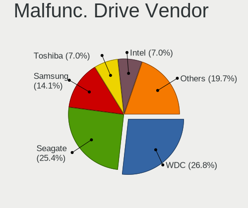
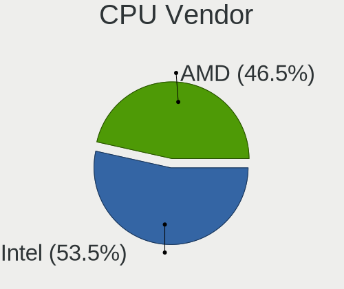
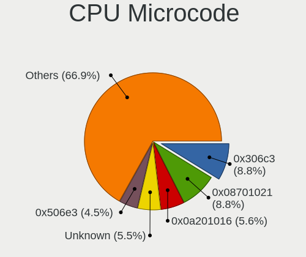
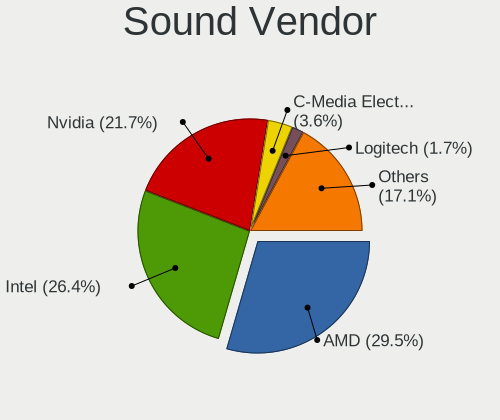
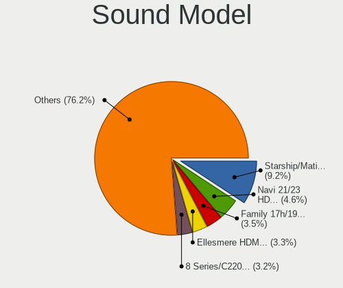
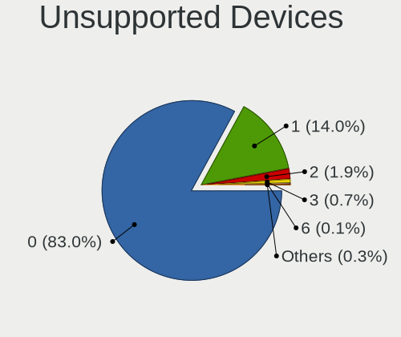

Fedora 36 - Tested Hardware & Statistics (Desktops)
---------------------------------------------------

A project to collect tested hardware configurations for Fedora 36.

Anyone can contribute to this report by the [hw-probe](https://github.com/linuxhw/hw-probe) tool:

    sudo -E hw-probe -all -upload

Please contribute! Especially if your hardware is rare.

Contents
--------

* [ Test Cases ](#test-cases)

* [ System ](#system)
  - [ Kernel                   ](#kernel)
  - [ Kernel Family            ](#kernel-family)
  - [ Kernel Major Ver.        ](#kernel-major-ver)
  - [ Arch                     ](#arch)
  - [ DE                       ](#de)
  - [ Display Server           ](#display-server)
  - [ Display Manager          ](#display-manager)
  - [ OS Lang                  ](#os-lang)
  - [ Boot Mode                ](#boot-mode)
  - [ Filesystem               ](#filesystem)
  - [ Part. scheme             ](#part-scheme)
  - [ Dual Boot with Linux/BSD ](#dual-boot-with-linuxbsd)
  - [ Dual Boot (Win)          ](#dual-boot-win)

* [ Board ](#board)
  - [ Vendor                   ](#vendor)
  - [ Model                    ](#model)
  - [ Model Family             ](#model-family)
  - [ MFG Year                 ](#mfg-year)
  - [ Form Factor              ](#form-factor)
  - [ Secure Boot              ](#secure-boot)
  - [ Coreboot                 ](#coreboot)
  - [ RAM Size                 ](#ram-size)
  - [ RAM Used                 ](#ram-used)
  - [ Total Drives             ](#total-drives)
  - [ Has CD-ROM               ](#has-cd-rom)
  - [ Has Ethernet             ](#has-ethernet)
  - [ Has WiFi                 ](#has-wifi)
  - [ Has Bluetooth            ](#has-bluetooth)

* [ Location ](#location)
  - [ Country                  ](#country)
  - [ City                     ](#city)

* [ Drives ](#drives)
  - [ Drive Vendor             ](#drive-vendor)
  - [ Drive Model              ](#drive-model)
  - [ HDD Vendor               ](#hdd-vendor)
  - [ SSD Vendor               ](#ssd-vendor)
  - [ Drive Kind               ](#drive-kind)
  - [ Drive Connector          ](#drive-connector)
  - [ Drive Size               ](#drive-size)
  - [ Space Total              ](#space-total)
  - [ Space Used               ](#space-used)
  - [ Malfunc. Drives          ](#malfunc-drives)
  - [ Malfunc. Drive Vendor    ](#malfunc-drive-vendor)
  - [ Malfunc. HDD Vendor      ](#malfunc-hdd-vendor)
  - [ Malfunc. Drive Kind      ](#malfunc-drive-kind)
  - [ Failed Drives            ](#failed-drives)
  - [ Failed Drive Vendor      ](#failed-drive-vendor)
  - [ Drive Status             ](#drive-status)

* [ Storage controller ](#storage-controller)
  - [ Storage Vendor           ](#storage-vendor)
  - [ Storage Model            ](#storage-model)
  - [ Storage Kind             ](#storage-kind)

* [ Processor ](#processor)
  - [ CPU Vendor               ](#cpu-vendor)
  - [ CPU Model                ](#cpu-model)
  - [ CPU Model Family         ](#cpu-model-family)
  - [ CPU Cores                ](#cpu-cores)
  - [ CPU Sockets              ](#cpu-sockets)
  - [ CPU Threads              ](#cpu-threads)
  - [ CPU Op-Modes             ](#cpu-op-modes)
  - [ CPU Microcode            ](#cpu-microcode)
  - [ CPU Microarch            ](#cpu-microarch)

* [ Graphics ](#graphics)
  - [ GPU Vendor               ](#gpu-vendor)
  - [ GPU Model                ](#gpu-model)
  - [ GPU Combo                ](#gpu-combo)
  - [ GPU Driver               ](#gpu-driver)
  - [ GPU Memory               ](#gpu-memory)

* [ Monitor ](#monitor)
  - [ Monitor Vendor           ](#monitor-vendor)
  - [ Monitor Model            ](#monitor-model)
  - [ Monitor Resolution       ](#monitor-resolution)
  - [ Monitor Diagonal         ](#monitor-diagonal)
  - [ Monitor Width            ](#monitor-width)
  - [ Aspect Ratio             ](#aspect-ratio)
  - [ Monitor Area             ](#monitor-area)
  - [ Pixel Density            ](#pixel-density)
  - [ Multiple Monitors        ](#multiple-monitors)

* [ Network ](#network)
  - [ Net Controller Vendor    ](#net-controller-vendor)
  - [ Net Controller Model     ](#net-controller-model)
  - [ Wireless Vendor          ](#wireless-vendor)
  - [ Wireless Model           ](#wireless-model)
  - [ Ethernet Vendor          ](#ethernet-vendor)
  - [ Ethernet Model           ](#ethernet-model)
  - [ Net Controller Kind      ](#net-controller-kind)
  - [ Used Controller          ](#used-controller)
  - [ NICs                     ](#nics)
  - [ IPv6                     ](#ipv6)

* [ Bluetooth ](#bluetooth)
  - [ Bluetooth Vendor         ](#bluetooth-vendor)
  - [ Bluetooth Model          ](#bluetooth-model)

* [ Sound ](#sound)
  - [ Sound Vendor             ](#sound-vendor)
  - [ Sound Model              ](#sound-model)

* [ Memory ](#memory)
  - [ Memory Vendor            ](#memory-vendor)
  - [ Memory Model             ](#memory-model)
  - [ Memory Kind              ](#memory-kind)
  - [ Memory Form Factor       ](#memory-form-factor)
  - [ Memory Size              ](#memory-size)
  - [ Memory Speed             ](#memory-speed)

* [ Printers & scanners ](#printers--scanners)
  - [ Printer Vendor           ](#printer-vendor)
  - [ Printer Model            ](#printer-model)
  - [ Scanner Vendor           ](#scanner-vendor)
  - [ Scanner Model            ](#scanner-model)

* [ Camera ](#camera)
  - [ Camera Vendor            ](#camera-vendor)
  - [ Camera Model             ](#camera-model)

* [ Security ](#security)
  - [ Fingerprint Vendor       ](#fingerprint-vendor)
  - [ Fingerprint Model        ](#fingerprint-model)
  - [ Chipcard Vendor          ](#chipcard-vendor)
  - [ Chipcard Model           ](#chipcard-model)

* [ Unsupported ](#unsupported)
  - [ Unsupported Devices      ](#unsupported-devices)
  - [ Unsupported Device Types ](#unsupported-device-types)

Test Cases
----------

Total: 271

| Vendor        | Model                       | Probe                                                      | Date         |
|---------------|-----------------------------|------------------------------------------------------------|--------------|
| ASUSTek       | ROG STRIX B550-F GAMING     | [8e6d23cf01](https://linux-hardware.org/?probe=8e6d23cf01) | Jul 01, 2022 |
| Gigabyte      | B85M-D3H                    | [a32cb9b3f1](https://linux-hardware.org/?probe=a32cb9b3f1) | Jul 01, 2022 |
| Gigabyte      | Z590I AORUS ULTRA           | [febb798e92](https://linux-hardware.org/?probe=febb798e92) | Jul 01, 2022 |
| Dell          | 0M9KCM A00                  | [e72232ee43](https://linux-hardware.org/?probe=e72232ee43) | Jul 01, 2022 |
| Gigabyte      | Z87-HD3                     | [c38c4e9cb9](https://linux-hardware.org/?probe=c38c4e9cb9) | Jun 30, 2022 |
| Dell          | 0M9KCM A00                  | [5e80242b43](https://linux-hardware.org/?probe=5e80242b43) | Jun 30, 2022 |
| ASUSTek       | TUF Gaming X570-PLUS        | [7e14880c80](https://linux-hardware.org/?probe=7e14880c80) | Jun 30, 2022 |
| ASUSTek       | PRIME Z370-A                | [28479b3edf](https://linux-hardware.org/?probe=28479b3edf) | Jun 30, 2022 |
| Lenovo        | ThinkCentre M58p 7220A72    | [cea6c9ea52](https://linux-hardware.org/?probe=cea6c9ea52) | Jun 30, 2022 |
| Gigabyte      | B560M DS3H V2               | [85b8793585](https://linux-hardware.org/?probe=85b8793585) | Jun 29, 2022 |
| ASUSTek       | ROG CROSSHAIR VIII HERO     | [01d9100427](https://linux-hardware.org/?probe=01d9100427) | Jun 29, 2022 |
| ASUSTek       | ProArt Z690-CREATOR WIFI    | [392d5c7c12](https://linux-hardware.org/?probe=392d5c7c12) | Jun 29, 2022 |
| Gigabyte      | D525TUD                     | [b6cfc5d2df](https://linux-hardware.org/?probe=b6cfc5d2df) | Jun 28, 2022 |
| Gigabyte      | B85M-D3V-A                  | [3417dd6a9a](https://linux-hardware.org/?probe=3417dd6a9a) | Jun 28, 2022 |
| Gigabyte      | G41MT-D3                    | [20de16a046](https://linux-hardware.org/?probe=20de16a046) | Jun 28, 2022 |
| ASRock        | N68-VS3 UCC                 | [2c7959c607](https://linux-hardware.org/?probe=2c7959c607) | Jun 26, 2022 |
| ASUSTek       | PRIME H410M-E               | [3eb97735b3](https://linux-hardware.org/?probe=3eb97735b3) | Jun 26, 2022 |
| HP            | 3398                        | [4241fd0ba0](https://linux-hardware.org/?probe=4241fd0ba0) | Jun 26, 2022 |
| Gigabyte      | 990FXA-UD5 R5               | [9a853085ea](https://linux-hardware.org/?probe=9a853085ea) | Jun 26, 2022 |
| ASUSTek       | ROG STRIX Z370-G GAMING     | [519e378380](https://linux-hardware.org/?probe=519e378380) | Jun 25, 2022 |
| ASUSTek       | TUF Z370-PLUS GAMING        | [6c6d94e4b7](https://linux-hardware.org/?probe=6c6d94e4b7) | Jun 25, 2022 |
| BESSTAR Te... | HM90                        | [e8a4e37cc6](https://linux-hardware.org/?probe=e8a4e37cc6) | Jun 25, 2022 |
| ASRock        | H87 Pro4                    | [47cf388077](https://linux-hardware.org/?probe=47cf388077) | Jun 25, 2022 |
| ASUSTek       | TUF Gaming Z690-PLUS WIF... | [c3c48bb18e](https://linux-hardware.org/?probe=c3c48bb18e) | Jun 25, 2022 |
| MSI           | MPG X570 GAMING PRO CARB... | [c6c59e12b6](https://linux-hardware.org/?probe=c6c59e12b6) | Jun 25, 2022 |
| MSI           | B360M MORTAR                | [607f489961](https://linux-hardware.org/?probe=607f489961) | Jun 25, 2022 |
| ASRock        | H87 Pro4                    | [73eb3e0db6](https://linux-hardware.org/?probe=73eb3e0db6) | Jun 25, 2022 |
| HP            | 89D8 SMVB                   | [f92ff0c37f](https://linux-hardware.org/?probe=f92ff0c37f) | Jun 24, 2022 |
| MSI           | IONA                        | [9f4e8871a7](https://linux-hardware.org/?probe=9f4e8871a7) | Jun 24, 2022 |
| ASRock        | H77 Pro4/MVP                | [f022b1b430](https://linux-hardware.org/?probe=f022b1b430) | Jun 24, 2022 |
| ASUSTek       | CROSSHAIR V FORMULA-Z       | [5129e4893a](https://linux-hardware.org/?probe=5129e4893a) | Jun 23, 2022 |
| ASUSTek       | CROSSHAIR V FORMULA-Z       | [dbfad9b8fe](https://linux-hardware.org/?probe=dbfad9b8fe) | Jun 23, 2022 |
| ASUSTek       | CROSSHAIR V FORMULA-Z       | [6f13e0f8a0](https://linux-hardware.org/?probe=6f13e0f8a0) | Jun 23, 2022 |
| Gigabyte      | Z690I AORUS ULTRA           | [eeac425783](https://linux-hardware.org/?probe=eeac425783) | Jun 23, 2022 |
| Unknown       | HX90                        | [837e70229a](https://linux-hardware.org/?probe=837e70229a) | Jun 23, 2022 |
| Gigabyte      | B360M AORUS Gaming 3-CF     | [167acd417b](https://linux-hardware.org/?probe=167acd417b) | Jun 23, 2022 |
| Gigabyte      | AB350-Gaming 3-CF           | [d11995947a](https://linux-hardware.org/?probe=d11995947a) | Jun 23, 2022 |
| Gigabyte      | Z270X-Ultra Gaming-CF       | [92944b1e97](https://linux-hardware.org/?probe=92944b1e97) | Jun 22, 2022 |
| HP            | 2B05                        | [677bb9d569](https://linux-hardware.org/?probe=677bb9d569) | Jun 22, 2022 |
| ASRock        | B550M Pro4                  | [45871f6d61](https://linux-hardware.org/?probe=45871f6d61) | Jun 22, 2022 |
| ASRock        | B450 Gaming K4              | [05c977bf65](https://linux-hardware.org/?probe=05c977bf65) | Jun 22, 2022 |
| Dell          | 02YYK5 A00                  | [7a571de1b9](https://linux-hardware.org/?probe=7a571de1b9) | Jun 22, 2022 |
| System76      | Thelio Mira thelio-mira-... | [58c9da7f20](https://linux-hardware.org/?probe=58c9da7f20) | Jun 22, 2022 |
| MSI           | B85M-E45                    | [f5e1312d31](https://linux-hardware.org/?probe=f5e1312d31) | Jun 22, 2022 |
| Gigabyte      | H61M-S2P                    | [ac99674975](https://linux-hardware.org/?probe=ac99674975) | Jun 22, 2022 |
| Dell          | 04YP6J A02                  | [11151bb62c](https://linux-hardware.org/?probe=11151bb62c) | Jun 22, 2022 |
| ASUSTek       | TUF Z390-PLUS GAMING        | [04927da7b6](https://linux-hardware.org/?probe=04927da7b6) | Jun 22, 2022 |
| MSI           | MPG B550 GAMING EDGE WIF... | [f3176204c8](https://linux-hardware.org/?probe=f3176204c8) | Jun 21, 2022 |
| MSI           | B450-A PRO MAX              | [490076a383](https://linux-hardware.org/?probe=490076a383) | Jun 20, 2022 |
| Lenovo        | SHARKBAY SDK0E50512 STD     | [b7a6099e25](https://linux-hardware.org/?probe=b7a6099e25) | Jun 20, 2022 |
| MSI           | MS-B0A1                     | [3193cbe3fd](https://linux-hardware.org/?probe=3193cbe3fd) | Jun 20, 2022 |
| ASUSTek       | TUF Gaming Z690-PLUS WIF... | [a384703b5e](https://linux-hardware.org/?probe=a384703b5e) | Jun 20, 2022 |
| ASUSTek       | ROG CROSSHAIR VIII DARK ... | [560fa88cad](https://linux-hardware.org/?probe=560fa88cad) | Jun 19, 2022 |
| HP            | 2B05                        | [a49ebb4aed](https://linux-hardware.org/?probe=a49ebb4aed) | Jun 19, 2022 |
| MSI           | B450 TOMAHAWK MAX II        | [4fc1134f6d](https://linux-hardware.org/?probe=4fc1134f6d) | Jun 19, 2022 |
| MSI           | MAG B550M MORTAR WIFI       | [a59676f7be](https://linux-hardware.org/?probe=a59676f7be) | Jun 19, 2022 |
| ASUSTek       | M5A97 R2.0                  | [707f314c74](https://linux-hardware.org/?probe=707f314c74) | Jun 19, 2022 |
| MSI           | H510I PRO WIFI              | [b9d3cb4755](https://linux-hardware.org/?probe=b9d3cb4755) | Jun 18, 2022 |
| ASUSTek       | Q170M2                      | [76f5dd0027](https://linux-hardware.org/?probe=76f5dd0027) | Jun 18, 2022 |
| ASUSTek       | Q170M2                      | [32713d6759](https://linux-hardware.org/?probe=32713d6759) | Jun 18, 2022 |
| ASRock        | X370 Gaming-ITX/ac          | [292cc4bcab](https://linux-hardware.org/?probe=292cc4bcab) | Jun 17, 2022 |
| ASUSTek       | ROG STRIX B550-I GAMING     | [f54dda344d](https://linux-hardware.org/?probe=f54dda344d) | Jun 17, 2022 |
| ASUSTek       | ROG CROSSHAIR VIII IMPAC... | [6647ddd346](https://linux-hardware.org/?probe=6647ddd346) | Jun 17, 2022 |
| Gigabyte      | GA-MA785G-UD3H              | [dfed0867e1](https://linux-hardware.org/?probe=dfed0867e1) | Jun 17, 2022 |
| ASUSTek       | P8H67-M LE                  | [7205fff536](https://linux-hardware.org/?probe=7205fff536) | Jun 17, 2022 |
| MSI           | MAG B460M MORTAR            | [9074247e52](https://linux-hardware.org/?probe=9074247e52) | Jun 17, 2022 |
| Dell          | 0XC7MM A01                  | [8c8a1ef522](https://linux-hardware.org/?probe=8c8a1ef522) | Jun 16, 2022 |
| Gigabyte      | H87N-WIFI                   | [613bb8fe40](https://linux-hardware.org/?probe=613bb8fe40) | Jun 16, 2022 |
| ASUSTek       | PRIME B550M-A               | [527aea0d6e](https://linux-hardware.org/?probe=527aea0d6e) | Jun 16, 2022 |
| ASRock        | B550M-ITX/ac                | [42fd0dcad9](https://linux-hardware.org/?probe=42fd0dcad9) | Jun 16, 2022 |
| Gigabyte      | 990FXA-UD5 R5               | [08527d664b](https://linux-hardware.org/?probe=08527d664b) | Jun 16, 2022 |
| ASUSTek       | ROG STRIX B450-F GAMING ... | [8d106f8677](https://linux-hardware.org/?probe=8d106f8677) | Jun 16, 2022 |
| Gigabyte      | Z170-D3H-CF                 | [701de0d7ad](https://linux-hardware.org/?probe=701de0d7ad) | Jun 15, 2022 |
| ASRock        | B450M Pro4                  | [041f94473b](https://linux-hardware.org/?probe=041f94473b) | Jun 15, 2022 |
| ASUSTek       | ROG CROSSHAIR VIII DARK ... | [131a938c5e](https://linux-hardware.org/?probe=131a938c5e) | Jun 14, 2022 |
| Foxconn       | nT-i1000 Series PCB         | [e61344b416](https://linux-hardware.org/?probe=e61344b416) | Jun 14, 2022 |
| Gigabyte      | H61M-S2PV                   | [cc88cec642](https://linux-hardware.org/?probe=cc88cec642) | Jun 14, 2022 |
| ASUSTek       | PRIME Z370-A                | [1bb2aa2c68](https://linux-hardware.org/?probe=1bb2aa2c68) | Jun 14, 2022 |
| Dell          | 00V62H A00                  | [dc89caf09f](https://linux-hardware.org/?probe=dc89caf09f) | Jun 13, 2022 |
| Gigabyte      | B560M DS3H V2               | [61d456c166](https://linux-hardware.org/?probe=61d456c166) | Jun 13, 2022 |
| ASUSTek       | H87-PLUS                    | [1c5488bdf7](https://linux-hardware.org/?probe=1c5488bdf7) | Jun 13, 2022 |
| ASUSTek       | H87-PLUS                    | [fd8af28ed5](https://linux-hardware.org/?probe=fd8af28ed5) | Jun 13, 2022 |
| HP            | 18E5                        | [275b8ca77c](https://linux-hardware.org/?probe=275b8ca77c) | Jun 12, 2022 |
| ASUSTek       | P5K Premium                 | [c7243df0c6](https://linux-hardware.org/?probe=c7243df0c6) | Jun 12, 2022 |
| ASUSTek       | A8R32-MVP Deluxe            | [0c0715a9b2](https://linux-hardware.org/?probe=0c0715a9b2) | Jun 12, 2022 |
| Gigabyte      | B75-D3V                     | [f0fe22dfe7](https://linux-hardware.org/?probe=f0fe22dfe7) | Jun 12, 2022 |
| ASUSTek       | P5G41T-M                    | [0fd96bfcf3](https://linux-hardware.org/?probe=0fd96bfcf3) | Jun 12, 2022 |
| MSI           | B450M MORTAR                | [18240b9552](https://linux-hardware.org/?probe=18240b9552) | Jun 11, 2022 |
| Gigabyte      | GA-MA69GM-S2H               | [a382b54934](https://linux-hardware.org/?probe=a382b54934) | Jun 11, 2022 |
| MSI           | X470 GAMING PLUS MAX        | [661f4f701b](https://linux-hardware.org/?probe=661f4f701b) | Jun 10, 2022 |
| Lenovo        | SKYBAY SDK0J40697 WIN 33... | [9c7b2faf2c](https://linux-hardware.org/?probe=9c7b2faf2c) | Jun 10, 2022 |
| Gigabyte      | GA-MA785G-UD3H              | [b771c75e31](https://linux-hardware.org/?probe=b771c75e31) | Jun 10, 2022 |
| ASUSTek       | PRIME B360M-A               | [272c6283d4](https://linux-hardware.org/?probe=272c6283d4) | Jun 10, 2022 |
| Gigabyte      | H55M-S2                     | [86b61f1ef6](https://linux-hardware.org/?probe=86b61f1ef6) | Jun 10, 2022 |
| ASUSTek       | PRIME B660-PLUS D4          | [4458c8a8ca](https://linux-hardware.org/?probe=4458c8a8ca) | Jun 09, 2022 |
| Intel         | X79 V2.4E                   | [12a530acde](https://linux-hardware.org/?probe=12a530acde) | Jun 09, 2022 |
| ASUSTek       | ProArt X570-CREATOR WIFI    | [35b29ccf1d](https://linux-hardware.org/?probe=35b29ccf1d) | Jun 08, 2022 |
| Gigabyte      | A520M DS3H                  | [e12c11bc94](https://linux-hardware.org/?probe=e12c11bc94) | Jun 08, 2022 |
| Gigabyte      | H410M S2H V3                | [feaff6859d](https://linux-hardware.org/?probe=feaff6859d) | Jun 07, 2022 |
| ASUSTek       | TUF Gaming B550-PLUS        | [c446ea33eb](https://linux-hardware.org/?probe=c446ea33eb) | Jun 07, 2022 |
| ASUSTek       | PRIME A320M-K/BR            | [f23f59523b](https://linux-hardware.org/?probe=f23f59523b) | Jun 07, 2022 |
| ASUSTek       | PRIME A320M-K/BR            | [2e5071518f](https://linux-hardware.org/?probe=2e5071518f) | Jun 07, 2022 |
| ASUSTek       | TUF Gaming B550M-PLUS       | [9fe17edc24](https://linux-hardware.org/?probe=9fe17edc24) | Jun 06, 2022 |
| ASUSTek       | P8H67-M LE                  | [d1409ca910](https://linux-hardware.org/?probe=d1409ca910) | Jun 06, 2022 |
| Dell          | 0XC7MM A01                  | [ed376c819b](https://linux-hardware.org/?probe=ed376c819b) | Jun 06, 2022 |
| ASUSTek       | ROG CROSSHAIR VIII DARK ... | [0b042e37b3](https://linux-hardware.org/?probe=0b042e37b3) | Jun 06, 2022 |
| Dell          | 08K0X7 A00                  | [28a29e32c6](https://linux-hardware.org/?probe=28a29e32c6) | Jun 06, 2022 |
| Dell          | 06JWJY A00                  | [577bbe62e1](https://linux-hardware.org/?probe=577bbe62e1) | Jun 06, 2022 |
| ASUSTek       | ROG STRIX B560-G GAMING ... | [8b87017c24](https://linux-hardware.org/?probe=8b87017c24) | Jun 05, 2022 |
| Gigabyte      | B460M DS3H V2               | [afb7427d61](https://linux-hardware.org/?probe=afb7427d61) | Jun 05, 2022 |
| Foxconn       | H81MXV FAB A                | [1f880ea008](https://linux-hardware.org/?probe=1f880ea008) | Jun 05, 2022 |
| Gigabyte      | B75M-HD3                    | [63a565a5e1](https://linux-hardware.org/?probe=63a565a5e1) | Jun 05, 2022 |
| ASUSTek       | CROSSHAIR V FORMULA-Z       | [feec15b490](https://linux-hardware.org/?probe=feec15b490) | Jun 04, 2022 |
| Positivo      | POS-PIH55BO                 | [cffe8043b8](https://linux-hardware.org/?probe=cffe8043b8) | Jun 04, 2022 |
| ASUSTek       | PRIME B450M-A               | [1813b3a9a5](https://linux-hardware.org/?probe=1813b3a9a5) | Jun 04, 2022 |
| ASUSTek       | CROSSHAIR                   | [11834759e2](https://linux-hardware.org/?probe=11834759e2) | Jun 04, 2022 |
| MSI           | B450M PRO-VDH MAX           | [2e9cc784ac](https://linux-hardware.org/?probe=2e9cc784ac) | Jun 03, 2022 |
| ASUSTek       | ROG STRIX B660-I GAMING ... | [68a1616b4a](https://linux-hardware.org/?probe=68a1616b4a) | Jun 03, 2022 |
| ASUSTek       | ROG CROSSHAIR VIII IMPAC... | [909d9cb8d5](https://linux-hardware.org/?probe=909d9cb8d5) | Jun 03, 2022 |
| ASUSTek       | ROG CROSSHAIR VIII DARK ... | [9829bd8f60](https://linux-hardware.org/?probe=9829bd8f60) | Jun 03, 2022 |
| MSI           | B560M PRO-VDH               | [2e9996424a](https://linux-hardware.org/?probe=2e9996424a) | Jun 02, 2022 |
| ASRock        | H81M-HG4 R4.0               | [2a09c108e5](https://linux-hardware.org/?probe=2a09c108e5) | Jun 02, 2022 |
| Gigabyte      | B85M-D3V-A                  | [88d5e21b42](https://linux-hardware.org/?probe=88d5e21b42) | Jun 01, 2022 |
| ASUSTek       | Maximus VII IMPACT          | [8b0844f325](https://linux-hardware.org/?probe=8b0844f325) | Jun 01, 2022 |
| ASUSTek       | ROG STRIX Z490-H GAMING     | [0d91ffc3e9](https://linux-hardware.org/?probe=0d91ffc3e9) | Jun 01, 2022 |
| ASUSTek       | ROG STRIX Z490-H GAMING     | [6190087942](https://linux-hardware.org/?probe=6190087942) | Jun 01, 2022 |
| ASUSTek       | PRIME B560M-A               | [b68bcf6b84](https://linux-hardware.org/?probe=b68bcf6b84) | Jun 01, 2022 |
| ASUSTek       | TUF Gaming B450-PLUS II     | [53dbc2fe14](https://linux-hardware.org/?probe=53dbc2fe14) | May 31, 2022 |
| MSI           | B450M PRO-VDH MAX           | [ece9950c65](https://linux-hardware.org/?probe=ece9950c65) | May 31, 2022 |
| MSI           | B450M PRO-VDH MAX           | [07a1bcfa9e](https://linux-hardware.org/?probe=07a1bcfa9e) | May 30, 2022 |
| ASUSTek       | ROG STRIX B550-F GAMING     | [7b27373492](https://linux-hardware.org/?probe=7b27373492) | May 30, 2022 |
| ASUSTek       | P5Q SE                      | [386a88c2b6](https://linux-hardware.org/?probe=386a88c2b6) | May 30, 2022 |
| ASUSTek       | P5Q SE                      | [5a51cc8767](https://linux-hardware.org/?probe=5a51cc8767) | May 30, 2022 |
| Dell          | 0R6PCT A01                  | [23c83c37e6](https://linux-hardware.org/?probe=23c83c37e6) | May 29, 2022 |
| ASUSTek       | ROG Maximus X HERO          | [33a2de91a2](https://linux-hardware.org/?probe=33a2de91a2) | May 29, 2022 |
| ASUSTek       | H81M-A                      | [0aa77d107c](https://linux-hardware.org/?probe=0aa77d107c) | May 28, 2022 |
| ASUSTek       | TUF X299 MARK 2             | [8409764263](https://linux-hardware.org/?probe=8409764263) | May 27, 2022 |
| BESSTAR Te... | UM700                       | [f754f78f66](https://linux-hardware.org/?probe=f754f78f66) | May 25, 2022 |
| ASUSTek       | ProArt Z690-CREATOR WIFI    | [c01e0f9ac4](https://linux-hardware.org/?probe=c01e0f9ac4) | May 25, 2022 |
| Gigabyte      | B450M DS3H-CF               | [06e3526c59](https://linux-hardware.org/?probe=06e3526c59) | May 25, 2022 |
| ASRock        | X99 Taichi                  | [18ec1a6a1a](https://linux-hardware.org/?probe=18ec1a6a1a) | May 25, 2022 |
| ASUSTek       | KCMA-D8                     | [2d8bea4f55](https://linux-hardware.org/?probe=2d8bea4f55) | May 24, 2022 |
| Dell          | 0PU052                      | [4e3e3cc0fd](https://linux-hardware.org/?probe=4e3e3cc0fd) | May 24, 2022 |
| ASUSTek       | TUF Gaming B550-PLUS        | [282c849b82](https://linux-hardware.org/?probe=282c849b82) | May 24, 2022 |
| Lenovo        | SHARKBAY SDK0E50512 STD     | [da5f6c9ba0](https://linux-hardware.org/?probe=da5f6c9ba0) | May 23, 2022 |
| MSI           | Z77A-G43                    | [7d35f08c28](https://linux-hardware.org/?probe=7d35f08c28) | May 23, 2022 |
| ASUSTek       | PRIME Z270-P                | [afb47f4860](https://linux-hardware.org/?probe=afb47f4860) | May 23, 2022 |
| Lenovo        | 364F SDK0J40700 WIN 3258... | [2034bf506d](https://linux-hardware.org/?probe=2034bf506d) | May 23, 2022 |
| ASUSTek       | ROG STRIX B550-F GAMING     | [2bd8d64c3b](https://linux-hardware.org/?probe=2bd8d64c3b) | May 22, 2022 |
| ASUSTek       | P8P67-M                     | [83917315b7](https://linux-hardware.org/?probe=83917315b7) | May 22, 2022 |
| Gigabyte      | B550 GAMING X V2            | [a84132c514](https://linux-hardware.org/?probe=a84132c514) | May 22, 2022 |
| ASRock        | AB350 Pro4                  | [49223fe44b](https://linux-hardware.org/?probe=49223fe44b) | May 21, 2022 |
| ASRock        | AB350 Pro4                  | [40cb336486](https://linux-hardware.org/?probe=40cb336486) | May 21, 2022 |
| MSI           | B450M-A PRO MAX             | [fce678a9e8](https://linux-hardware.org/?probe=fce678a9e8) | May 21, 2022 |
| ASUSTek       | PRIME Z690-P D4             | [01e2d063e8](https://linux-hardware.org/?probe=01e2d063e8) | May 21, 2022 |
| ASUSTek       | PRIME Z690-P D4             | [f3986d7e7d](https://linux-hardware.org/?probe=f3986d7e7d) | May 21, 2022 |
| MSI           | B450M PRO-M2 MAX            | [1984313b19](https://linux-hardware.org/?probe=1984313b19) | May 20, 2022 |
| ASRock        | Z390 Taichi Ultimate        | [68d0cdd597](https://linux-hardware.org/?probe=68d0cdd597) | May 19, 2022 |
| HP            | 82A2                        | [56d6c8d749](https://linux-hardware.org/?probe=56d6c8d749) | May 19, 2022 |
| HP            | 82A2                        | [6e0efeba1d](https://linux-hardware.org/?probe=6e0efeba1d) | May 19, 2022 |
| ASUSTek       | Z97-PRO GAMER               | [4a971be254](https://linux-hardware.org/?probe=4a971be254) | May 19, 2022 |
| Intel         | DH77EB AAG39073-304         | [dc2f9f56a5](https://linux-hardware.org/?probe=dc2f9f56a5) | May 18, 2022 |
| HP            | 8767 A                      | [0f564fe004](https://linux-hardware.org/?probe=0f564fe004) | May 18, 2022 |
| MSI           | B450M PRO-VDH MAX           | [9c3b90c60d](https://linux-hardware.org/?probe=9c3b90c60d) | May 18, 2022 |
| ASRock        | 970M Pro3                   | [d39e962536](https://linux-hardware.org/?probe=d39e962536) | May 18, 2022 |
| ASUSTek       | P8Z68-V PRO GEN3            | [8a6fc346c5](https://linux-hardware.org/?probe=8a6fc346c5) | May 18, 2022 |
| Dell          | 0DF42J A00                  | [ac9f539524](https://linux-hardware.org/?probe=ac9f539524) | May 18, 2022 |
| HP            | 8767 A                      | [caad4001f1](https://linux-hardware.org/?probe=caad4001f1) | May 18, 2022 |
| ASRock        | 970M Pro3                   | [6f48a71a87](https://linux-hardware.org/?probe=6f48a71a87) | May 17, 2022 |
| ASUSTek       | P8H67-M LE                  | [ef70fd2699](https://linux-hardware.org/?probe=ef70fd2699) | May 17, 2022 |
| Gigabyte      | X470 AORUS ULTRA GAMING-... | [d831b6cb22](https://linux-hardware.org/?probe=d831b6cb22) | May 17, 2022 |
| Dell          | 0NKW6Y A02                  | [ffee0745b6](https://linux-hardware.org/?probe=ffee0745b6) | May 16, 2022 |
| Gigabyte      | X99-UD4-CF                  | [21b3b45491](https://linux-hardware.org/?probe=21b3b45491) | May 16, 2022 |
| Gigabyte      | X99-UD4-CF                  | [81e0a19eaa](https://linux-hardware.org/?probe=81e0a19eaa) | May 16, 2022 |
| ASUSTek       | ROG STRIX X570-F GAMING     | [d1dbcd7651](https://linux-hardware.org/?probe=d1dbcd7651) | May 16, 2022 |
| ASUSTek       | K30AD_M31AD_M51AD_M32AD     | [efe02f8593](https://linux-hardware.org/?probe=efe02f8593) | May 16, 2022 |
| Gigabyte      | B450 I AORUS PRO WIFI-CF    | [2f12c77058](https://linux-hardware.org/?probe=2f12c77058) | May 16, 2022 |
| ASUSTek       | ROG STRIX X470-I GAMING     | [fa17134027](https://linux-hardware.org/?probe=fa17134027) | May 16, 2022 |
| MSI           | MPG B550I GAMING EDGE WI... | [26f332bc9c](https://linux-hardware.org/?probe=26f332bc9c) | May 16, 2022 |
| ASUSTek       | ROG STRIX X470-I GAMING     | [16bd9d3c6d](https://linux-hardware.org/?probe=16bd9d3c6d) | May 16, 2022 |
| Intel         | DH77EB AAG39073-304         | [22f5a0269f](https://linux-hardware.org/?probe=22f5a0269f) | May 15, 2022 |
| Intel         | DH77EB AAG39073-304         | [8b8bd9dead](https://linux-hardware.org/?probe=8b8bd9dead) | May 15, 2022 |
| ASUSTek       | TUF Gaming B550M-PLUS       | [12d277d32c](https://linux-hardware.org/?probe=12d277d32c) | May 15, 2022 |
| ASRock        | 880GMH/U3S3                 | [57c85dd37a](https://linux-hardware.org/?probe=57c85dd37a) | May 15, 2022 |
| Gigabyte      | Z390 AORUS MASTER-CF        | [ec0ec5ea27](https://linux-hardware.org/?probe=ec0ec5ea27) | May 15, 2022 |
| ASUSTek       | PRIME B450-PLUS             | [a2ae5d95dd](https://linux-hardware.org/?probe=a2ae5d95dd) | May 15, 2022 |
| ASUSTek       | Pro WS X570-ACE             | [6fc56522d6](https://linux-hardware.org/?probe=6fc56522d6) | May 14, 2022 |
| ASUSTek       | ROG STRIX X570-E GAMING     | [1bde2ca3e7](https://linux-hardware.org/?probe=1bde2ca3e7) | May 14, 2022 |
| ASUSTek       | P8Z77-V LK                  | [70809098f6](https://linux-hardware.org/?probe=70809098f6) | May 14, 2022 |
| MSI           | MPG B550 GAMING PLUS        | [3112931a28](https://linux-hardware.org/?probe=3112931a28) | May 14, 2022 |
| ASRock        | B560M-C                     | [b4946d836b](https://linux-hardware.org/?probe=b4946d836b) | May 13, 2022 |
| ASRock        | B560M-C                     | [16360de6cd](https://linux-hardware.org/?probe=16360de6cd) | May 13, 2022 |
| Gigabyte      | GA-K8NF-9                   | [f9d59e3770](https://linux-hardware.org/?probe=f9d59e3770) | May 13, 2022 |
| ASRock        | X570M Pro4                  | [fca86a854a](https://linux-hardware.org/?probe=fca86a854a) | May 13, 2022 |
| Gigabyte      | Z170-D3H-CF                 | [ec4bd74f0b](https://linux-hardware.org/?probe=ec4bd74f0b) | May 13, 2022 |
| Gigabyte      | B85M-D3V-A                  | [46481247b1](https://linux-hardware.org/?probe=46481247b1) | May 12, 2022 |
| Acer          | Aspire M3985                | [e650ae1a26](https://linux-hardware.org/?probe=e650ae1a26) | May 11, 2022 |
| ASUSTek       | ROG STRIX B550-E GAMING     | [927afa0c20](https://linux-hardware.org/?probe=927afa0c20) | May 11, 2022 |
| Gigabyte      | A320M-S2H-CF                | [c703872774](https://linux-hardware.org/?probe=c703872774) | May 11, 2022 |
| ASUSTek       | ROG STRIX B550-E GAMING     | [b9766a94d7](https://linux-hardware.org/?probe=b9766a94d7) | May 11, 2022 |
| ASRock        | X470 Taichi                 | [9ead3d53b0](https://linux-hardware.org/?probe=9ead3d53b0) | May 11, 2022 |
| MSI           | X470 GAMING PLUS            | [565dfeea66](https://linux-hardware.org/?probe=565dfeea66) | May 11, 2022 |
| Gigabyte      | Q35M-S2                     | [784ac96428](https://linux-hardware.org/?probe=784ac96428) | May 11, 2022 |
| ASUSTek       | Z97-PRO GAMER               | [173fac4f5b](https://linux-hardware.org/?probe=173fac4f5b) | May 11, 2022 |
| ASRock        | 880GMH/U3S3                 | [73e6cb3b6b](https://linux-hardware.org/?probe=73e6cb3b6b) | May 10, 2022 |
| ASRock        | X470 Taichi                 | [fb1d5703eb](https://linux-hardware.org/?probe=fb1d5703eb) | May 10, 2022 |
| MSI           | H110M PRO-VD                | [f43f2e2bee](https://linux-hardware.org/?probe=f43f2e2bee) | May 10, 2022 |
| MSI           | H110M PRO-VD                | [3d0c46dc84](https://linux-hardware.org/?probe=3d0c46dc84) | May 10, 2022 |
| ASUSTek       | ROG CROSSHAIR VII HERO      | [d7e92b0ac7](https://linux-hardware.org/?probe=d7e92b0ac7) | May 09, 2022 |
| Gigabyte      | Z170-D3H-CF                 | [fbe61c70ff](https://linux-hardware.org/?probe=fbe61c70ff) | May 09, 2022 |
| Gigabyte      | EP45-DS3L                   | [76e67361ea](https://linux-hardware.org/?probe=76e67361ea) | May 08, 2022 |
| MSI           | MPG X570 GAMING PLUS        | [d24bbea844](https://linux-hardware.org/?probe=d24bbea844) | May 08, 2022 |
| ASUSTek       | PRIME X570-PRO              | [f12944a9bd](https://linux-hardware.org/?probe=f12944a9bd) | May 07, 2022 |
| ASUSTek       | PRIME X470-PRO              | [be200c9e57](https://linux-hardware.org/?probe=be200c9e57) | May 06, 2022 |
| Huanan        | X99-BD4 V1.1, NALEX         | [e69b3ef962](https://linux-hardware.org/?probe=e69b3ef962) | May 06, 2022 |
| ASUSTek       | TUF Gaming X570-PRO         | [52d956751f](https://linux-hardware.org/?probe=52d956751f) | May 06, 2022 |
| MSI           | B550M PRO-DASH              | [585987ecf7](https://linux-hardware.org/?probe=585987ecf7) | May 06, 2022 |
| Gigabyte      | H410M H V3                  | [ddc4d88d20](https://linux-hardware.org/?probe=ddc4d88d20) | May 05, 2022 |
| ASUSTek       | P8H67-M LE                  | [302e27b974](https://linux-hardware.org/?probe=302e27b974) | May 04, 2022 |
| ASUSTek       | P8H67-M LE                  | [a9cf3bc268](https://linux-hardware.org/?probe=a9cf3bc268) | May 04, 2022 |
| HP            | 1589                        | [79df2c00dc](https://linux-hardware.org/?probe=79df2c00dc) | May 03, 2022 |
| Gigabyte      | B550 AORUS ELITE AX V2      | [cb6d49fe71](https://linux-hardware.org/?probe=cb6d49fe71) | Apr 30, 2022 |
| Gigabyte      | B550 AORUS ELITE AX V2      | [83e47f9c91](https://linux-hardware.org/?probe=83e47f9c91) | Apr 30, 2022 |
| ASUSTek       | PRIME Z390-A                | [c4d7dc5e80](https://linux-hardware.org/?probe=c4d7dc5e80) | Apr 30, 2022 |
| MSI           | MAG B460M MORTAR            | [07cb268e5e](https://linux-hardware.org/?probe=07cb268e5e) | Apr 30, 2022 |
| ASUSTek       | PRIME H310M-D R2.0          | [2999ff1487](https://linux-hardware.org/?probe=2999ff1487) | Apr 28, 2022 |
| ASRock        | B450 Steel Legend           | [bf0a56358c](https://linux-hardware.org/?probe=bf0a56358c) | Apr 27, 2022 |
| ASUSTek       | ROG STRIX B550-I GAMING     | [5456280ec0](https://linux-hardware.org/?probe=5456280ec0) | Apr 26, 2022 |
| Gigabyte      | X570 AORUS PRO              | [187db4f8e4](https://linux-hardware.org/?probe=187db4f8e4) | Apr 23, 2022 |
| ASUSTek       | ROG STRIX B550-I GAMING     | [b9ea98672f](https://linux-hardware.org/?probe=b9ea98672f) | Apr 23, 2022 |
| ASUSTek       | ROG STRIX B550-I GAMING     | [c3f809fc02](https://linux-hardware.org/?probe=c3f809fc02) | Apr 23, 2022 |
| MSI           | MAG X570 TOMAHAWK WIFI      | [68a04098ec](https://linux-hardware.org/?probe=68a04098ec) | Apr 21, 2022 |
| ASUSTek       | ROG STRIX B550-F GAMING     | [466f67adb3](https://linux-hardware.org/?probe=466f67adb3) | Apr 20, 2022 |
| Gigabyte      | H81M-S2H                    | [85082e6de6](https://linux-hardware.org/?probe=85082e6de6) | Apr 19, 2022 |
| Gigabyte      | H110M-H-CF                  | [66ef9c9e5f](https://linux-hardware.org/?probe=66ef9c9e5f) | Apr 16, 2022 |
| Acer          | Aspire TC-895 V:1.0         | [22a1a17a81](https://linux-hardware.org/?probe=22a1a17a81) | Apr 14, 2022 |
| Gigabyte      | B550 AORUS ELITE            | [85b4ecf9d3](https://linux-hardware.org/?probe=85b4ecf9d3) | Apr 14, 2022 |
| ASUSTek       | P8P67 LE                    | [84abfd3112](https://linux-hardware.org/?probe=84abfd3112) | Apr 14, 2022 |
| MSI           | FM2-A75IA-E53               | [25ffe3d211](https://linux-hardware.org/?probe=25ffe3d211) | Apr 14, 2022 |
| Gigabyte      | Z170MX-Gaming 5             | [d1b267f496](https://linux-hardware.org/?probe=d1b267f496) | Apr 13, 2022 |
| Gigabyte      | B450 AORUS M                | [c1beed0e9b](https://linux-hardware.org/?probe=c1beed0e9b) | Apr 13, 2022 |
| Gigabyte      | B450 AORUS M                | [e5a9e99dbc](https://linux-hardware.org/?probe=e5a9e99dbc) | Apr 13, 2022 |
| Dell          | 0GWHMW A03                  | [ff312c5929](https://linux-hardware.org/?probe=ff312c5929) | Apr 13, 2022 |
| Gigabyte      | Z170-D3H-CF                 | [8a1cecc21c](https://linux-hardware.org/?probe=8a1cecc21c) | Apr 11, 2022 |
| MSI           | B450M PRO-VDH PLUS          | [5b861faffd](https://linux-hardware.org/?probe=5b861faffd) | Apr 09, 2022 |
| Gigabyte      | Z490 UD                     | [31ecc9c776](https://linux-hardware.org/?probe=31ecc9c776) | Apr 09, 2022 |
| Biostar       | B550MH                      | [abd373497b](https://linux-hardware.org/?probe=abd373497b) | Apr 09, 2022 |
| Gigabyte      | B450 AORUS M                | [1a4b90c894](https://linux-hardware.org/?probe=1a4b90c894) | Apr 08, 2022 |
| MSI           | Z170A XPOWER GAMING TITA... | [ffcbeed952](https://linux-hardware.org/?probe=ffcbeed952) | Apr 08, 2022 |
| Gigabyte      | Z170N-Gaming 5              | [f0472bcf0d](https://linux-hardware.org/?probe=f0472bcf0d) | Apr 05, 2022 |
| Gigabyte      | Z170N-Gaming 5              | [9ee2f76c12](https://linux-hardware.org/?probe=9ee2f76c12) | Apr 05, 2022 |
| ASUSTek       | B150M-K                     | [016a08bf47](https://linux-hardware.org/?probe=016a08bf47) | Apr 04, 2022 |
| Gigabyte      | B550I AORUS PRO AX          | [b697fd5f0a](https://linux-hardware.org/?probe=b697fd5f0a) | Apr 03, 2022 |
| Gigabyte      | 970A-DS3P                   | [5bbc4cbbf5](https://linux-hardware.org/?probe=5bbc4cbbf5) | Apr 03, 2022 |
| Dell          | 088DT1 A01                  | [718a7d42cc](https://linux-hardware.org/?probe=718a7d42cc) | Apr 02, 2022 |
| Gigabyte      | H81M-S2H                    | [8a810aa9f6](https://linux-hardware.org/?probe=8a810aa9f6) | Apr 02, 2022 |
| MSI           | MPG Z590 GAMING CARBON W... | [f7946783ea](https://linux-hardware.org/?probe=f7946783ea) | Mar 31, 2022 |
| Gigabyte      | H370M DS3H-CF               | [1110b2974c](https://linux-hardware.org/?probe=1110b2974c) | Mar 31, 2022 |
| Gigabyte      | EP45-DS3L                   | [c7d6879a86](https://linux-hardware.org/?probe=c7d6879a86) | Mar 26, 2022 |
| Gigabyte      | B85M-D3V-A                  | [b7679b78be](https://linux-hardware.org/?probe=b7679b78be) | Mar 25, 2022 |
| Gigabyte      | B550 AORUS ELITE            | [7977e70f86](https://linux-hardware.org/?probe=7977e70f86) | Mar 22, 2022 |
| ASUSTek       | TUF Gaming B550M-PLUS       | [97eedd34f4](https://linux-hardware.org/?probe=97eedd34f4) | Mar 05, 2022 |
| Gigabyte      | EP45-DS3L                   | [da3962a1da](https://linux-hardware.org/?probe=da3962a1da) | Mar 03, 2022 |
| Biostar       | H55 HD                      | [b0d5843b6e](https://linux-hardware.org/?probe=b0d5843b6e) | Feb 13, 2022 |
| Biostar       | H55 HD                      | [e08da3e685](https://linux-hardware.org/?probe=e08da3e685) | Feb 03, 2022 |
| MSI           | B550M PRO-VDH WIFI          | [f1a1a21c56](https://linux-hardware.org/?probe=f1a1a21c56) | Oct 26, 2021 |
| Dell          | 0KC9NP A01                  | [ff356cba89](https://linux-hardware.org/?probe=ff356cba89) | Oct 22, 2021 |
| MSI           | FM2-A55M-E33                | [bcf7dcdd2c](https://linux-hardware.org/?probe=bcf7dcdd2c) | Oct 09, 2021 |
| MSI           | FM2-A55M-E33                | [0b3691d096](https://linux-hardware.org/?probe=0b3691d096) | Oct 09, 2021 |
| HP            | 304Ah                       | [047d1b0887](https://linux-hardware.org/?probe=047d1b0887) | Aug 18, 2021 |
| Dell          | 0KC9NP A01                  | [2ca8cc81b1](https://linux-hardware.org/?probe=2ca8cc81b1) | Aug 18, 2021 |

System
------

Kernel
------

Version of the Linux kernel

| Version                                                       | Desktops | Percent |
|---------------------------------------------------------------|----------|---------|
| 5.18.5-200.fc36.x86_64                                        | 28       | 12.39%  |
| 5.17.6-300.fc36.x86_64                                        | 23       | 10.18%  |
| 5.17.5-300.fc36.x86_64                                        | 23       | 10.18%  |
| 5.17.11-300.fc36.x86_64                                       | 20       | 8.85%   |
| 5.17.13-300.fc36.x86_64                                       | 15       | 6.64%   |
| 5.17.12-300.fc36.x86_64                                       | 15       | 6.64%   |
| 5.17.8-300.fc36.x86_64                                        | 13       | 5.75%   |
| 5.17.2-300.fc36.x86_64                                        | 11       | 4.87%   |
| 5.17.1-300.fc36.x86_64                                        | 10       | 4.42%   |
| 5.18.6-200.fc36.x86_64                                        | 9        | 3.98%   |
| 5.17.7-300.fc36.x86_64                                        | 9        | 3.98%   |
| 5.17.3-302.fc36.x86_64                                        | 6        | 2.65%   |
| 5.18.7-200.fc36.x86_64                                        | 5        | 2.21%   |
| 5.17.9-300.fc36.x86_64                                        | 5        | 2.21%   |
| 5.17.14-300.fc36.x86_64                                       | 3        | 1.33%   |
| 5.17.0-0.rc7.116.fc36.x86_64                                  | 3        | 1.33%   |
| 5.18.1-602.inttf.fc36.x86_64                                  | 2        | 0.88%   |
| 5.18.1-200.fc36.x86_64                                        | 2        | 0.88%   |
| 5.17.4-300.fc36.x86_64                                        | 2        | 0.88%   |
| 5.17.0-0.rc5.102.fc36.x86_64                                  | 2        | 0.88%   |
| 5.15.0-0.rc6.47.fc36.x86_64                                   | 2        | 0.88%   |
| 5.14.0-0.rc5.20210813gitf8e6dfc64f61.46.fc36.x86_64           | 2        | 0.88%   |
| 5.18.6-201.fsync.fc36.x86_64                                  | 1        | 0.44%   |
| 5.18.5-gnu                                                    | 1        | 0.44%   |
| 5.18.5-201.fsync.fc36.x86_64                                  | 1        | 0.44%   |
| 5.18.2-rc1_MY                                                 | 1        | 0.44%   |
| 5.18.0-0.rc4.20220428git8f4dd16603ce834.36.fc37.x86_64        | 1        | 0.44%   |
| 5.17.9-602.inttf.fc36.x86_64                                  | 1        | 0.44%   |
| 5.17.9-301.fsync.fc36.x86_64                                  | 1        | 0.44%   |
| 5.17.7-301.fsync.fc36.x86_64                                  | 1        | 0.44%   |
| 5.17.6-602.inttf.fc36.x86_64                                  | 1        | 0.44%   |
| 5.17.5-301.fsync.fc36.x86_64                                  | 1        | 0.44%   |
| 5.17.12-301.fsync.fc36.x86_64                                 | 1        | 0.44%   |
| 5.17.11-602.inttf.fc36.x86_64                                 | 1        | 0.44%   |
| 5.17.11-301.fsync.fc36.x86_64                                 | 1        | 0.44%   |
| 5.17.0-0.rc0.20220112gitdaadb3bd0e8d.63.fc36.x86_64           | 1        | 0.44%   |
| 5.16.17-200.fc35.x86_64                                       | 1        | 0.44%   |
| 5.15.0-0.rc4.20211008git1da38549dd64.36.vanilla.1.fc36.x86_64 | 1        | 0.44%   |

Kernel Family
-------------

Linux kernel without a distro release

| Version | Desktops | Percent |
|---------|----------|---------|
| 5.18.5  | 30       | 13.27%  |
| 5.17.6  | 24       | 10.62%  |
| 5.17.5  | 24       | 10.62%  |
| 5.17.11 | 22       | 9.73%   |
| 5.17.12 | 16       | 7.08%   |
| 5.17.13 | 15       | 6.64%   |
| 5.17.8  | 13       | 5.75%   |
| 5.17.2  | 11       | 4.87%   |
| 5.18.6  | 10       | 4.42%   |
| 5.17.7  | 10       | 4.42%   |
| 5.17.1  | 10       | 4.42%   |
| 5.17.9  | 7        | 3.1%    |
| 5.17.3  | 6        | 2.65%   |
| 5.17.0  | 6        | 2.65%   |
| 5.18.7  | 5        | 2.21%   |
| 5.18.1  | 4        | 1.77%   |
| 5.17.14 | 3        | 1.33%   |
| 5.15.0  | 3        | 1.33%   |
| 5.17.4  | 2        | 0.88%   |
| 5.14.0  | 2        | 0.88%   |
| 5.18.2  | 1        | 0.44%   |
| 5.18.0  | 1        | 0.44%   |
| 5.16.17 | 1        | 0.44%   |

Kernel Major Ver.
-----------------

Linux kernel major version

| Version | Desktops | Percent |
|---------|----------|---------|
| 5.17    | 161      | 73.85%  |
| 5.18    | 51       | 23.39%  |
| 5.15    | 3        | 1.38%   |
| 5.14    | 2        | 0.92%   |
| 5.16    | 1        | 0.46%   |

Arch
----

OS architecture (x86_64, i586, etc.)

| Name   | Desktops | Percent |
|--------|----------|---------|
| x86_64 | 214      | 100%    |

DE
--

Desktop Environment

| Name       | Desktops | Percent |
|------------|----------|---------|
| GNOME      | 148      | 69.16%  |
| KDE5       | 43       | 20.09%  |
| XFCE       | 5        | 2.34%   |
| X-Cinnamon | 5        | 2.34%   |
| Cinnamon   | 5        | 2.34%   |
| Unknown    | 5        | 2.34%   |
| MATE       | 2        | 0.93%   |
| LXQt       | 1        | 0.47%   |

Display Server
--------------

X11 or Wayland

| Name    | Desktops | Percent |
|---------|----------|---------|
| Wayland | 133      | 61.57%  |
| X11     | 68       | 31.48%  |
| Tty     | 13       | 6.02%   |
| Web     | 1        | 0.46%   |
| Unknown | 1        | 0.46%   |

Display Manager
---------------

SDDM, LightDM, etc.

| Name    | Desktops | Percent |
|---------|----------|---------|
| Unknown | 134      | 62.33%  |
| GDM     | 52       | 24.19%  |
| SDDM    | 17       | 7.91%   |
| LightDM | 12       | 5.58%   |

OS Lang
-------

Language

| Lang  | Desktops | Percent |
|-------|----------|---------|
| en_US | 109      | 50.93%  |
| en_GB | 18       | 8.41%   |
| ru_RU | 15       | 7.01%   |
| pt_BR | 11       | 5.14%   |
| en_AU | 9        | 4.21%   |
| pl_PL | 7        | 3.27%   |
| fr_FR | 7        | 3.27%   |
| de_DE | 7        | 3.27%   |
| es_AR | 4        | 1.87%   |
| cs_CZ | 3        | 1.4%    |
| zh_CN | 2        | 0.93%   |
| ja_JP | 2        | 0.93%   |
| it_IT | 2        | 0.93%   |
| fi_FI | 2        | 0.93%   |
| es_ES | 2        | 0.93%   |
| tr_TR | 1        | 0.47%   |
| sr_RS | 1        | 0.47%   |
| nl_BE | 1        | 0.47%   |
| fr_BE | 1        | 0.47%   |
| es_EC | 1        | 0.47%   |
| en_ZA | 1        | 0.47%   |
| en_SG | 1        | 0.47%   |
| en_NZ | 1        | 0.47%   |
| en_IN | 1        | 0.47%   |
| en_DK | 1        | 0.47%   |
| en_CA | 1        | 0.47%   |
| da_DK | 1        | 0.47%   |
| C     | 1        | 0.47%   |
| ar_SA | 1        | 0.47%   |

Boot Mode
---------

EFI or BIOS

| Mode | Desktops | Percent |
|------|----------|---------|
| EFI  | 153      | 71.16%  |
| BIOS | 62       | 28.84%  |

Filesystem
----------

Type of filesystem

| Type  | Desktops | Percent |
|-------|----------|---------|
| Btrfs | 179      | 83.64%  |
| Ext4  | 24       | 11.21%  |
| Xfs   | 11       | 5.14%   |

Part. scheme
------------

Scheme of partitioning

| Type    | Desktops | Percent |
|---------|----------|---------|
| Unknown | 132      | 61.4%   |
| GPT     | 66       | 30.7%   |
| MBR     | 17       | 7.91%   |

Dual Boot with Linux/BSD
------------------------

Hosting more than one Linux/BSD

| Dual boot | Desktops | Percent |
|-----------|----------|---------|
| No        | 190      | 88.37%  |
| Yes       | 25       | 11.63%  |

Dual Boot (Win)
---------------

Hosting Linux and Windows

| Dual boot | Desktops | Percent |
|-----------|----------|---------|
| No        | 174      | 80.93%  |
| Yes       | 41       | 19.07%  |

Board
-----

Vendor
------

Motherboard manufacturer

| Name                | Desktops | Percent |
|---------------------|----------|---------|
| ASUSTek Computer    | 72       | 33.64%  |
| Gigabyte Technology | 48       | 22.43%  |
| MSI                 | 34       | 15.89%  |
| ASRock              | 19       | 8.88%   |
| Dell                | 14       | 6.54%   |
| Hewlett-Packard     | 8        | 3.74%   |
| Lenovo              | 4        | 1.87%   |
| Intel               | 3        | 1.4%    |
| Foxconn             | 2        | 0.93%   |
| Biostar             | 2        | 0.93%   |
| BESSTAR Tech        | 2        | 0.93%   |
| Acer                | 2        | 0.93%   |
| System76            | 1        | 0.47%   |
| Positivo            | 1        | 0.47%   |
| Huanan              | 1        | 0.47%   |
| Unknown             | 1        | 0.47%   |

Model
-----

Motherboard model

| Name                                      | Desktops | Percent |
|-------------------------------------------|----------|---------|
| MSI MS-7A38                               | 5        | 2.34%   |
| ASUS All Series                           | 5        | 2.34%   |
| ASUS ROG STRIX B550-F GAMING              | 4        | 1.87%   |
| ASUS TUF Gaming B550M-PLUS                | 3        | 1.4%    |
| ASUS CROSSHAIR V FORMULA-Z                | 3        | 1.4%    |
| MSI MS-7C95                               | 2        | 0.93%   |
| MSI MS-7B79                               | 2        | 0.93%   |
| Intel DH77EB AAG39073-304                 | 2        | 0.93%   |
| Gigabyte B450 AORUS M                     | 2        | 0.93%   |
| Dell OptiPlex 9020                        | 2        | 0.93%   |
| ASUS ProArt Z690-CREATOR WIFI             | 2        | 0.93%   |
| ASUS PRIME Z370-A                         | 2        | 0.93%   |
| ASRock X470 Taichi                        | 2        | 0.93%   |
| System76 Thelio Mira                      | 1        | 0.47%   |
| Positivo POS-PIH55BO                      | 1        | 0.47%   |
| MSI WC698AA-UUG p6320be                   | 1        | 0.47%   |
| MSI MS-7D18                               | 1        | 0.47%   |
| MSI MS-7D16                               | 1        | 0.47%   |
| MSI MS-7D06                               | 1        | 0.47%   |
| MSI MS-7C94                               | 1        | 0.47%   |
| MSI MS-7C92                               | 1        | 0.47%   |
| MSI MS-7C91                               | 1        | 0.47%   |
| MSI MS-7C84                               | 1        | 0.47%   |
| MSI MS-7C82                               | 1        | 0.47%   |
| MSI MS-7C56                               | 1        | 0.47%   |
| MSI MS-7C52                               | 1        | 0.47%   |
| MSI MS-7C37                               | 1        | 0.47%   |
| MSI MS-7C02                               | 1        | 0.47%   |
| MSI MS-7B93                               | 1        | 0.47%   |
| MSI MS-7B89                               | 1        | 0.47%   |
| MSI MS-7B86                               | 1        | 0.47%   |
| MSI MS-7B84                               | 1        | 0.47%   |
| MSI MS-7B23                               | 1        | 0.47%   |
| MSI MS-7996                               | 1        | 0.47%   |
| MSI MS-7968                               | 1        | 0.47%   |
| MSI MS-7817                               | 1        | 0.47%   |
| MSI MS-7792                               | 1        | 0.47%   |
| MSI MS-7758                               | 1        | 0.47%   |
| MSI MS-7721                               | 1        | 0.47%   |
| MSI Cubi N JSL (MS-B0A1)                  | 1        | 0.47%   |
| Lenovo ThinkStation P310 30ATS01E00       | 1        | 0.47%   |
| Lenovo ThinkCentre M93p 10A8S3C100        | 1        | 0.47%   |
| Lenovo ThinkCentre M58p 7220A72           | 1        | 0.47%   |
| Lenovo IdeaCentre 310S-08ASR 90G9002VUK   | 1        | 0.47%   |
| Intel X79 V2.4E                           | 1        | 0.47%   |
| Huanan X99-BD4 V1.1, NALEX                | 1        | 0.47%   |
| HP Z420 Workstation                       | 1        | 0.47%   |
| HP Victus by 15L Gaming Desktop TG02-0xxx | 1        | 0.47%   |
| HP ProDesk 400 G4 SFF                     | 1        | 0.47%   |
| HP Pavilion Gaming Desktop TG01-1xxx      | 1        | 0.47%   |
| HP EliteDesk 800 G1 USDT                  | 1        | 0.47%   |
| HP Compaq Elite 8300 USDT                 | 1        | 0.47%   |
| HP Compaq 8100 Elite SFF PC               | 1        | 0.47%   |
| HP 110-516no                              | 1        | 0.47%   |
| Gigabyte Z87-HD3                          | 1        | 0.47%   |
| Gigabyte Z690I AORUS ULTRA                | 1        | 0.47%   |
| Gigabyte Z590I AORUS ULTRA                | 1        | 0.47%   |
| Gigabyte Z490 UD                          | 1        | 0.47%   |
| Gigabyte Z390 AORUS MASTER                | 1        | 0.47%   |
| Gigabyte Z270X-Ultra Gaming               | 1        | 0.47%   |

Model Family
------------

Motherboard model prefix

| Name                 | Desktops | Percent |
|----------------------|----------|---------|
| ASUS ROG             | 18       | 8.41%   |
| ASUS PRIME           | 16       | 7.48%   |
| ASUS TUF             | 11       | 5.14%   |
| Dell OptiPlex        | 7        | 3.27%   |
| MSI MS-7A38          | 5        | 2.34%   |
| ASUS All             | 5        | 2.34%   |
| Dell Precision       | 4        | 1.87%   |
| ASUS CROSSHAIR       | 4        | 1.87%   |
| Gigabyte B550        | 3        | 1.4%    |
| Gigabyte B450        | 3        | 1.4%    |
| ASUS ProArt          | 3        | 1.4%    |
| MSI MS-7C95          | 2        | 0.93%   |
| MSI MS-7B79          | 2        | 0.93%   |
| Lenovo ThinkCentre   | 2        | 0.93%   |
| Intel DH77EB         | 2        | 0.93%   |
| HP Compaq            | 2        | 0.93%   |
| Gigabyte H410M       | 2        | 0.93%   |
| Dell XPS             | 2        | 0.93%   |
| ASRock X470          | 2        | 0.93%   |
| ASRock B450          | 2        | 0.93%   |
| Acer Aspire          | 2        | 0.93%   |
| System76 Thelio      | 1        | 0.47%   |
| Positivo POS-PIH55BO | 1        | 0.47%   |
| MSI WC698AA-UUG      | 1        | 0.47%   |
| MSI MS-7D18          | 1        | 0.47%   |
| MSI MS-7D16          | 1        | 0.47%   |
| MSI MS-7D06          | 1        | 0.47%   |
| MSI MS-7C94          | 1        | 0.47%   |
| MSI MS-7C92          | 1        | 0.47%   |
| MSI MS-7C91          | 1        | 0.47%   |
| MSI MS-7C84          | 1        | 0.47%   |
| MSI MS-7C82          | 1        | 0.47%   |
| MSI MS-7C56          | 1        | 0.47%   |
| MSI MS-7C52          | 1        | 0.47%   |
| MSI MS-7C37          | 1        | 0.47%   |
| MSI MS-7C02          | 1        | 0.47%   |
| MSI MS-7B93          | 1        | 0.47%   |
| MSI MS-7B89          | 1        | 0.47%   |
| MSI MS-7B86          | 1        | 0.47%   |
| MSI MS-7B84          | 1        | 0.47%   |
| MSI MS-7B23          | 1        | 0.47%   |
| MSI MS-7996          | 1        | 0.47%   |
| MSI MS-7968          | 1        | 0.47%   |
| MSI MS-7817          | 1        | 0.47%   |
| MSI MS-7792          | 1        | 0.47%   |
| MSI MS-7758          | 1        | 0.47%   |
| MSI MS-7721          | 1        | 0.47%   |
| MSI Cubi             | 1        | 0.47%   |
| Lenovo ThinkStation  | 1        | 0.47%   |
| Lenovo IdeaCentre    | 1        | 0.47%   |
| Intel X79            | 1        | 0.47%   |
| Huanan X99-BD4       | 1        | 0.47%   |
| HP Z420              | 1        | 0.47%   |
| HP Victus            | 1        | 0.47%   |
| HP ProDesk           | 1        | 0.47%   |
| HP Pavilion          | 1        | 0.47%   |
| HP EliteDesk         | 1        | 0.47%   |
| HP 110-516no         | 1        | 0.47%   |
| Gigabyte Z87-HD3     | 1        | 0.47%   |
| Gigabyte Z690I       | 1        | 0.47%   |

MFG Year
--------

Motherboard manufacture year

| Year | Desktops | Percent |
|------|----------|---------|
| 2020 | 38       | 17.76%  |
| 2021 | 25       | 11.68%  |
| 2018 | 24       | 11.21%  |
| 2019 | 20       | 9.35%   |
| 2012 | 19       | 8.88%   |
| 2017 | 14       | 6.54%   |
| 2013 | 13       | 6.07%   |
| 2015 | 10       | 4.67%   |
| 2016 | 9        | 4.21%   |
| 2014 | 9        | 4.21%   |
| 2022 | 7        | 3.27%   |
| 2010 | 7        | 3.27%   |
| 2011 | 6        | 2.8%    |
| 2008 | 4        | 1.87%   |
| 2007 | 4        | 1.87%   |
| 2009 | 3        | 1.4%    |
| 2006 | 1        | 0.47%   |
| 2005 | 1        | 0.47%   |

Form Factor
-----------

Physical design of the computer

| Name    | Desktops | Percent |
|---------|----------|---------|
| Desktop | 214      | 100%    |

Secure Boot
-----------

Enabled or disabled

| State    | Desktops | Percent |
|----------|----------|---------|
| Disabled | 199      | 92.99%  |
| Enabled  | 15       | 7.01%   |

Coreboot
--------

Have coreboot on board

| Used | Desktops | Percent |
|------|----------|---------|
| No   | 214      | 100%    |

RAM Size
--------

Total RAM memory

| Size in GB  | Desktops | Percent |
|-------------|----------|---------|
| 16.01-24.0  | 72       | 33.64%  |
| 32.01-64.0  | 52       | 24.3%   |
| 8.01-16.0   | 32       | 14.95%  |
| 4.01-8.0    | 26       | 12.15%  |
| 64.01-256.0 | 16       | 7.48%   |
| 3.01-4.0    | 10       | 4.67%   |
| 24.01-32.0  | 4        | 1.87%   |
| 2.01-3.0    | 1        | 0.47%   |
| 1.01-2.0    | 1        | 0.47%   |

RAM Used
--------

Used RAM memory

| Used GB    | Desktops | Percent |
|------------|----------|---------|
| 4.01-8.0   | 68       | 30.63%  |
| 2.01-3.0   | 60       | 27.03%  |
| 3.01-4.0   | 42       | 18.92%  |
| 1.01-2.0   | 26       | 11.71%  |
| 8.01-16.0  | 16       | 7.21%   |
| 0.51-1.0   | 5        | 2.25%   |
| 16.01-24.0 | 3        | 1.35%   |
| 0.01-0.5   | 2        | 0.9%    |

Total Drives
------------

Number of drives on board

| Drives | Desktops | Percent |
|--------|----------|---------|
| 2      | 64       | 29.91%  |
| 1      | 54       | 25.23%  |
| 3      | 51       | 23.83%  |
| 4      | 31       | 14.49%  |
| 5      | 6        | 2.8%    |
| 6      | 5        | 2.34%   |
| 7      | 2        | 0.93%   |
| 10     | 1        | 0.47%   |

Has CD-ROM
----------

Has CD-ROM on board

| Presented | Desktops | Percent |
|-----------|----------|---------|
| No        | 156      | 72.9%   |
| Yes       | 58       | 27.1%   |

Has Ethernet
------------

Has Ethernet on board

| Presented | Desktops | Percent |
|-----------|----------|---------|
| Yes       | 213      | 99.53%  |
| No        | 1        | 0.47%   |

Has WiFi
--------

Has WiFi module

| Presented | Desktops | Percent |
|-----------|----------|---------|
| Yes       | 118      | 55.14%  |
| No        | 96       | 44.86%  |

Has Bluetooth
-------------

Has Bluetooth module

| Presented | Desktops | Percent |
|-----------|----------|---------|
| No        | 114      | 53.27%  |
| Yes       | 100      | 46.73%  |

Location
--------

Country
-------

Geographic location (country)

| Country      | Desktops | Percent |
|--------------|----------|---------|
| USA          | 50       | 23.36%  |
| Russia       | 13       | 6.07%   |
| Germany      | 13       | 6.07%   |
| Brazil       | 13       | 6.07%   |
| Poland       | 11       | 5.14%   |
| UK           | 10       | 4.67%   |
| France       | 9        | 4.21%   |
| Australia    | 9        | 4.21%   |
| Belgium      | 6        | 2.8%    |
| Finland      | 5        | 2.34%   |
| Argentina    | 5        | 2.34%   |
| Sweden       | 4        | 1.87%   |
| Spain        | 4        | 1.87%   |
| Israel       | 4        | 1.87%   |
| India        | 4        | 1.87%   |
| Turkey       | 3        | 1.4%    |
| Norway       | 3        | 1.4%    |
| Netherlands  | 3        | 1.4%    |
| Italy        | 3        | 1.4%    |
| Greece       | 3        | 1.4%    |
| Czechia      | 3        | 1.4%    |
| Belarus      | 3        | 1.4%    |
| Thailand     | 2        | 0.93%   |
| Switzerland  | 2        | 0.93%   |
| Mexico       | 2        | 0.93%   |
| Japan        | 2        | 0.93%   |
| Hungary      | 2        | 0.93%   |
| Ecuador      | 2        | 0.93%   |
| China        | 2        | 0.93%   |
| Canada       | 2        | 0.93%   |
| Bulgaria     | 2        | 0.93%   |
| Ukraine      | 1        | 0.47%   |
| South Africa | 1        | 0.47%   |
| Singapore    | 1        | 0.47%   |
| Serbia       | 1        | 0.47%   |
| Saudi Arabia | 1        | 0.47%   |
| Romania      | 1        | 0.47%   |
| Puerto Rico  | 1        | 0.47%   |
| Portugal     | 1        | 0.47%   |
| New Zealand  | 1        | 0.47%   |
| Ireland      | 1        | 0.47%   |
| Indonesia    | 1        | 0.47%   |
| Estonia      | 1        | 0.47%   |
| Denmark      | 1        | 0.47%   |
| Colombia     | 1        | 0.47%   |
| Bangladesh   | 1        | 0.47%   |

City
----

Geographic location (city)

| City                 | Desktops | Percent |
|----------------------|----------|---------|
| Warsaw               | 4        | 1.86%   |
| Launceston           | 4        | 1.86%   |
| Oulu                 | 3        | 1.4%    |
| Minsk                | 3        | 1.4%    |
| Marietta             | 3        | 1.4%    |
| Brussels             | 3        | 1.4%    |
| Brisbane             | 3        | 1.4%    |
| Tel Aviv             | 2        | 0.93%   |
| St Petersburg        | 2        | 0.93%   |
| Sao Paulo            | 2        | 0.93%   |
| San Jose             | 2        | 0.93%   |
| Pasco                | 2        | 0.93%   |
| Paris                | 2        | 0.93%   |
| Novosibirsk          | 2        | 0.93%   |
| Houston              | 2        | 0.93%   |
| Goinia             | 2        | 0.93%   |
| Burgas               | 2        | 0.93%   |
| Bonn                 | 2        | 0.93%   |
| Berlin               | 2        | 0.93%   |
| Athens               | 2        | 0.93%   |
| Allen                | 2        | 0.93%   |
| Zaporizhzhya         | 1        | 0.47%   |
| Yekaterinburg        | 1        | 0.47%   |
| Yakutsk              | 1        | 0.47%   |
| Wroclaw              | 1        | 0.47%   |
| Woodbine             | 1        | 0.47%   |
| Wetzikon             | 1        | 0.47%   |
| Westlake             | 1        | 0.47%   |
| Westerhoven          | 1        | 0.47%   |
| West Bromwich        | 1        | 0.47%   |
| Vladivostok          | 1        | 0.47%   |
| Vitria             | 1        | 0.47%   |
| Villamanta           | 1        | 0.47%   |
| Vigodarzere          | 1        | 0.47%   |
| Viamao               | 1        | 0.47%   |
| Vaxjo                | 1        | 0.47%   |
| Turku                | 1        | 0.47%   |
| Tucson               | 1        | 0.47%   |
| Toyama               | 1        | 0.47%   |
| Thornton Heath       | 1        | 0.47%   |
| Tarragona            | 1        | 0.47%   |
| Tampico              | 1        | 0.47%   |
| Tampere              | 1        | 0.47%   |
| Tallinn              | 1        | 0.47%   |
| Supsk              | 1        | 0.47%   |
| Sydney               | 1        | 0.47%   |
| Stuttgart            | 1        | 0.47%   |
| Stockholm            | 1        | 0.47%   |
| St. Petersburg       | 1        | 0.47%   |
| St Louis             | 1        | 0.47%   |
| Sollentuna           | 1        | 0.47%   |
| Soddy-Daisy          | 1        | 0.47%   |
| Slantsy              | 1        | 0.47%   |
| Skaerhamn            | 1        | 0.47%   |
| Singapore            | 1        | 0.47%   |
| Sergiyev Posad       | 1        | 0.47%   |
| Senonches            | 1        | 0.47%   |
| Sarpsborg            | 1        | 0.47%   |
| Sapucaia do Sul      | 1        | 0.47%   |
| Sao Jos dos Campos | 1        | 0.47%   |

Drives
------

Drive Vendor
------------

Hard drive vendors

| Vendor                      | Desktops | Drives | Percent |
|-----------------------------|----------|--------|---------|
| Samsung Electronics         | 83       | 129    | 18.91%  |
| WDC                         | 76       | 111    | 17.31%  |
| Seagate                     | 69       | 90     | 15.72%  |
| Kingston                    | 34       | 36     | 7.74%   |
| Toshiba                     | 26       | 27     | 5.92%   |
| SanDisk                     | 25       | 31     | 5.69%   |
| Crucial                     | 25       | 27     | 5.69%   |
| Phison                      | 8        | 9      | 1.82%   |
| A-DATA Technology           | 7        | 7      | 1.59%   |
| Intel                       | 6        | 6      | 1.37%   |
| Hitachi                     | 6        | 7      | 1.37%   |
| XPG                         | 5        | 6      | 1.14%   |
| Micron/Crucial Technology   | 5        | 5      | 1.14%   |
| Corsair                     | 5        | 5      | 1.14%   |
| China                       | 5        | 5      | 1.14%   |
| PNY                         | 4        | 6      | 0.91%   |
| Unknown                     | 3        | 3      | 0.68%   |
| SPCC                        | 3        | 6      | 0.68%   |
| Patriot                     | 3        | 3      | 0.68%   |
| Micron Technology           | 3        | 4      | 0.68%   |
| HGST                        | 3        | 5      | 0.68%   |
| SABRENT                     | 2        | 3      | 0.46%   |
| Realtek Semiconductor       | 2        | 2      | 0.46%   |
| OCZ                         | 2        | 2      | 0.46%   |
| MAXIO Technology (Hangzhou) | 2        | 2      | 0.46%   |
| Goodram                     | 2        | 2      | 0.46%   |
| Gigabyte Technology         | 2        | 3      | 0.46%   |
| WXC-M3                      | 1        | 1      | 0.23%   |
| USB                         | 1        | 1      | 0.23%   |
| Transcend                   | 1        | 1      | 0.23%   |
| SSK                         | 1        | 2      | 0.23%   |
| SK hynix                    | 1        | 1      | 0.23%   |
| Realtek                     | 1        | 1      | 0.23%   |
| N300                        | 1        | 1      | 0.23%   |
| Maxtor                      | 1        | 2      | 0.23%   |
| LITEONIT                    | 1        | 1      | 0.23%   |
| LITEON                      | 1        | 1      | 0.23%   |
| Lite-On                     | 1        | 1      | 0.23%   |
| KUIJIA                      | 1        | 1      | 0.23%   |
| KingSpec                    | 1        | 1      | 0.23%   |
| KingDian                    | 1        | 1      | 0.23%   |
| Intenso                     | 1        | 2      | 0.23%   |
| HP SSD S                    | 1        | 1      | 0.23%   |
| Hewlett-Packard             | 1        | 1      | 0.23%   |
| H/W                         | 1        | 3      | 0.23%   |
| Drevo                       | 1        | 1      | 0.23%   |
| ASMT                        | 1        | 1      | 0.23%   |
| Apacer                      | 1        | 1      | 0.23%   |
| ADATA Technology            | 1        | 1      | 0.23%   |
| Unknown                     | 1        | 1      | 0.23%   |

Drive Model
-----------

Hard drive models

| Model                                  | Desktops | Percent |
|----------------------------------------|----------|---------|
| Samsung SSD 850 EVO 250GB              | 11       | 2.17%   |
| Seagate ST1000DM010-2EP102 1TB         | 10       | 1.97%   |
| Kingston SA400S37240G 240GB SSD        | 9        | 1.77%   |
| Seagate ST500DM002-1BD142 500GB        | 6        | 1.18%   |
| SanDisk NVMe SSD Drive 500GB           | 6        | 1.18%   |
| Samsung NVMe SSD Drive 1TB             | 6        | 1.18%   |
| WDC WD40EFRX-68N32N0 4TB               | 5        | 0.98%   |
| SanDisk NVMe SSD Drive 1TB             | 5        | 0.98%   |
| Samsung SSD 970 EVO Plus 500GB         | 5        | 0.98%   |
| Samsung SSD 850 EVO 500GB              | 5        | 0.98%   |
| Samsung SM963 2.5" NVMe PCIe SSD 500GB | 5        | 0.98%   |
| Samsung NVMe SSD Drive 2TB             | 5        | 0.98%   |
| Samsung NVMe SSD Drive 250GB           | 5        | 0.98%   |
| Kingston SA400S37120G 120GB SSD        | 5        | 0.98%   |
| Crucial CT500MX500SSD1 500GB           | 5        | 0.98%   |
| Crucial CT240BX500SSD1 240GB           | 5        | 0.98%   |
| Crucial CT1000MX500SSD1 1TB            | 5        | 0.98%   |
| WDC WD10EZEX-00WN4A0 1TB               | 4        | 0.79%   |
| Seagate ST2000DM008-2FR102 2TB         | 4        | 0.79%   |
| Seagate ST2000DM001-1ER164 2TB         | 4        | 0.79%   |
| Samsung SSD 870 EVO 500GB              | 4        | 0.79%   |
| Samsung SSD 860 EVO 500GB              | 4        | 0.79%   |
| Samsung SSD 850 EVO 1TB                | 4        | 0.79%   |
| Samsung SSD 840 EVO 250GB              | 4        | 0.79%   |
| Kingston NVMe SSD Drive 500GB          | 4        | 0.79%   |
| Crucial CT2000MX500SSD1 2TB            | 4        | 0.79%   |
| WDC WDS500G2B0B-00YS70 500GB SSD       | 3        | 0.59%   |
| WDC WDS100T2B0A-00SM50 1TB SSD         | 3        | 0.59%   |
| WDC WD10EZEX-60M2NA0 1TB               | 3        | 0.59%   |
| WDC WD10EZEX-08WN4A0 1TB               | 3        | 0.59%   |
| Toshiba KBG30ZMS128G 128GB NVMe SSD    | 3        | 0.59%   |
| Seagate ST4000DM004-2CV104 4TB         | 3        | 0.59%   |
| Samsung SSD 960 EVO 250GB              | 3        | 0.59%   |
| Samsung SSD 870 QVO 2TB                | 3        | 0.59%   |
| Samsung SSD 870 QVO 1TB                | 3        | 0.59%   |
| Samsung NVMe SSD Drive 512GB           | 3        | 0.59%   |
| PNY CS900 240GB SSD                    | 3        | 0.59%   |
| Micron/Crucial NVMe SSD Drive 500GB    | 3        | 0.59%   |
| Kingston NVMe SSD Drive 1TB            | 3        | 0.59%   |
| Crucial CT480BX500SSD1 480GB           | 3        | 0.59%   |
| XPG NVMe SSD Drive 1024GB              | 2        | 0.39%   |
| WDC WD5000AZRX-00A8LB0 500GB           | 2        | 0.39%   |
| WDC WD40EZRZ-22GXCB0 4TB               | 2        | 0.39%   |
| WDC WD40EZRZ-00WN9B0 4TB               | 2        | 0.39%   |
| WDC WD40EZRZ-00GXCB0 4TB               | 2        | 0.39%   |
| WDC WD30EFRX-68EUZN0 3TB               | 2        | 0.39%   |
| WDC WD20EZRZ-00Z5HB0 2TB               | 2        | 0.39%   |
| WDC WD20EFRX-68EUZN0 2TB               | 2        | 0.39%   |
| WDC WD10EZEX-00BN5A0 1TB               | 2        | 0.39%   |
| Toshiba MQ01ABD050 500GB               | 2        | 0.39%   |
| Toshiba MD04ACA400 4TB                 | 2        | 0.39%   |
| Toshiba HDWE140 4TB                    | 2        | 0.39%   |
| Toshiba HDWD120 2TB                    | 2        | 0.39%   |
| Toshiba HDWD110 1TB                    | 2        | 0.39%   |
| Seagate ST500LT012-1DG142 500GB        | 2        | 0.39%   |
| Seagate ST4000VN008-2DR166 4TB         | 2        | 0.39%   |
| Seagate ST4000DM000-1F2168 4TB         | 2        | 0.39%   |
| Seagate ST3500418AS 500GB              | 2        | 0.39%   |
| Seagate ST2000DM006-2DM164 2TB         | 2        | 0.39%   |
| Seagate ST1000LM035-1RK172 1TB         | 2        | 0.39%   |

HDD Vendor
----------

Hard disk drive vendors

| Vendor              | Desktops | Drives | Percent |
|---------------------|----------|--------|---------|
| Seagate             | 68       | 88     | 40%     |
| WDC                 | 65       | 93     | 38.24%  |
| Toshiba             | 19       | 20     | 11.18%  |
| Hitachi             | 6        | 7      | 3.53%   |
| Samsung Electronics | 5        | 5      | 2.94%   |
| HGST                | 3        | 5      | 1.76%   |
| USB                 | 1        | 1      | 0.59%   |
| Unknown             | 1        | 1      | 0.59%   |
| Maxtor              | 1        | 2      | 0.59%   |
| ASMT                | 1        | 1      | 0.59%   |

SSD Vendor
----------

Solid state drive vendors

| Vendor              | Desktops | Drives | Percent |
|---------------------|----------|--------|---------|
| Samsung Electronics | 49       | 71     | 29.7%   |
| Crucial             | 24       | 26     | 14.55%  |
| Kingston            | 23       | 25     | 13.94%  |
| SanDisk             | 13       | 13     | 7.88%   |
| WDC                 | 10       | 14     | 6.06%   |
| China               | 5        | 5      | 3.03%   |
| PNY                 | 4        | 6      | 2.42%   |
| Corsair             | 4        | 4      | 2.42%   |
| Toshiba             | 3        | 3      | 1.82%   |
| SPCC                | 3        | 6      | 1.82%   |
| Patriot             | 3        | 3      | 1.82%   |
| Intel               | 3        | 3      | 1.82%   |
| A-DATA Technology   | 3        | 3      | 1.82%   |
| OCZ                 | 2        | 2      | 1.21%   |
| Micron Technology   | 2        | 2      | 1.21%   |
| Goodram             | 2        | 2      | 1.21%   |
| Gigabyte Technology | 2        | 3      | 1.21%   |
| Transcend           | 1        | 1      | 0.61%   |
| Seagate             | 1        | 1      | 0.61%   |
| LITEONIT            | 1        | 1      | 0.61%   |
| LITEON              | 1        | 1      | 0.61%   |
| KUIJIA              | 1        | 1      | 0.61%   |
| KingSpec            | 1        | 1      | 0.61%   |
| KingDian            | 1        | 1      | 0.61%   |
| Intenso             | 1        | 2      | 0.61%   |
| Drevo               | 1        | 1      | 0.61%   |
| Apacer              | 1        | 1      | 0.61%   |

Drive Kind
----------

HDD or SSD

| Kind    | Desktops | Drives | Percent |
|---------|----------|--------|---------|
| HDD     | 138      | 223    | 36.8%   |
| SSD     | 131      | 202    | 34.93%  |
| NVMe    | 98       | 134    | 26.13%  |
| Unknown | 8        | 11     | 2.13%   |

Drive Connector
---------------

SATA, SAS, NVMe, etc.

| Type | Desktops | Drives | Percent |
|------|----------|--------|---------|
| SATA | 190      | 418    | 63.12%  |
| NVMe | 97       | 130    | 32.23%  |
| SAS  | 14       | 22     | 4.65%   |

Drive Size
----------

Size of hard drive

| Size in TB | Desktops | Drives | Percent |
|------------|----------|--------|---------|
| 0.01-0.5   | 131      | 205    | 44.26%  |
| 0.51-1.0   | 88       | 112    | 29.73%  |
| 1.01-2.0   | 37       | 52     | 12.5%   |
| 3.01-4.0   | 25       | 35     | 8.45%   |
| 4.01-10.0  | 8        | 14     | 2.7%    |
| 2.01-3.0   | 6        | 6      | 2.03%   |
| 10.01-20.0 | 1        | 1      | 0.34%   |

Space Total
-----------

Amount of disk space available on the file system

| Size in GB     | Desktops | Percent |
|----------------|----------|---------|
| 1001-2000      | 44       | 20.18%  |
| 501-1000       | 43       | 19.72%  |
| More than 3000 | 39       | 17.89%  |
| 251-500        | 29       | 13.3%   |
| 2001-3000      | 22       | 10.09%  |
| 101-250        | 18       | 8.26%   |
| Unknown        | 10       | 4.59%   |
| 1-20           | 5        | 2.29%   |
| 51-100         | 5        | 2.29%   |
| 21-50          | 3        | 1.38%   |

Space Used
----------

Amount of used disk space

| Used GB        | Desktops | Percent |
|----------------|----------|---------|
| 1-20           | 42       | 19.18%  |
| 21-50          | 32       | 14.61%  |
| 1001-2000      | 29       | 13.24%  |
| 101-250        | 26       | 11.87%  |
| 251-500        | 24       | 10.96%  |
| 51-100         | 22       | 10.05%  |
| 501-1000       | 17       | 7.76%   |
| More than 3000 | 13       | 5.94%   |
| Unknown        | 10       | 4.57%   |
| 2001-3000      | 4        | 1.83%   |

Malfunc. Drives
---------------

Drive models with a malfunction

| Model                               | Desktops | Drives | Percent |
|-------------------------------------|----------|--------|---------|
| Samsung Electronics HD322HJ 320GB   | 2        | 2      | 9.52%   |
| WDC WD3200AAKS-75B3A0 320GB         | 1        | 1      | 4.76%   |
| WDC WD30EZRX-00SPEB0 3TB            | 1        | 1      | 4.76%   |
| WDC WD20EZRX-00D8PB0 2TB            | 1        | 1      | 4.76%   |
| WDC WD20EFRX-68EUZN0 2TB            | 1        | 1      | 4.76%   |
| WDC WD10EZEX-60ZF5A0 1TB            | 1        | 1      | 4.76%   |
| Toshiba MQ01ABD050 500GB            | 1        | 1      | 4.76%   |
| SPCC Solid State Disk 1TB           | 1        | 2      | 4.76%   |
| Seagate ST500LT012-1DG142 500GB     | 1        | 1      | 4.76%   |
| Seagate ST500DM002-1BD142 500GB     | 1        | 1      | 4.76%   |
| Seagate ST4000VN008-2DR166 4TB      | 1        | 1      | 4.76%   |
| Seagate ST32000542AS 2TB            | 1        | 2      | 4.76%   |
| Seagate ST31000528AS 1TB            | 1        | 1      | 4.76%   |
| Seagate ST1000DM010-2EP102 1TB      | 1        | 1      | 4.76%   |
| Samsung Electronics SSD 870 EVO 2TB | 1        | 1      | 4.76%   |
| Samsung Electronics SSD 870 EVO 1TB | 1        | 1      | 4.76%   |
| Samsung Electronics HD502HJ 500GB   | 1        | 1      | 4.76%   |
| Intel SSDSC2CT120A3 120GB           | 1        | 1      | 4.76%   |
| Hitachi HTS725032A9A364 320GB       | 1        | 1      | 4.76%   |
| Hitachi HDS721010CLA332 1TB         | 1        | 1      | 4.76%   |

Malfunc. Drive Vendor
---------------------

Vendors of faulty drives

| Vendor              | Desktops | Drives | Percent |
|---------------------|----------|--------|---------|
| Seagate             | 6        | 7      | 30%     |
| Samsung Electronics | 5        | 5      | 25%     |
| WDC                 | 4        | 5      | 20%     |
| Hitachi             | 2        | 2      | 10%     |
| Toshiba             | 1        | 1      | 5%      |
| SPCC                | 1        | 2      | 5%      |
| Intel               | 1        | 1      | 5%      |

Malfunc. HDD Vendor
-------------------

Vendors of faulty HDD drives

| Vendor              | Desktops | Drives | Percent |
|---------------------|----------|--------|---------|
| Seagate             | 6        | 7      | 37.5%   |
| WDC                 | 4        | 5      | 25%     |
| Samsung Electronics | 3        | 3      | 18.75%  |
| Hitachi             | 2        | 2      | 12.5%   |
| Toshiba             | 1        | 1      | 6.25%   |

Malfunc. Drive Kind
-------------------

Kinds of faulty drives

| Kind | Desktops | Drives | Percent |
|------|----------|--------|---------|
| HDD  | 15       | 18     | 78.95%  |
| SSD  | 4        | 5      | 21.05%  |

Failed Drives
-------------

Failed drive models

| Model                             | Desktops | Drives | Percent |
|-----------------------------------|----------|--------|---------|
| Samsung Electronics SSD 980 500GB | 1        | 2      | 100%    |

Failed Drive Vendor
-------------------

Failed drive vendors

| Vendor              | Desktops | Drives | Percent |
|---------------------|----------|--------|---------|
| Samsung Electronics | 1        | 2      | 100%    |

Drive Status
------------

Number of failed and malfunc. drives

| Status   | Desktops | Drives | Percent |
|----------|----------|--------|---------|
| Detected | 136      | 368    | 58.12%  |
| Works    | 78       | 177    | 33.33%  |
| Malfunc  | 19       | 23     | 8.12%   |
| Failed   | 1        | 2      | 0.43%   |

Storage controller
------------------

Storage Vendor
--------------

Storage controller vendors

| Vendor                       | Desktops | Percent |
|------------------------------|----------|---------|
| Intel                        | 119      | 33.71%  |
| AMD                          | 93       | 26.35%  |
| Samsung Electronics          | 42       | 11.9%   |
| ASMedia Technology           | 17       | 4.82%   |
| SanDisk                      | 15       | 4.25%   |
| Kingston Technology Company  | 11       | 3.12%   |
| Phison Electronics           | 9        | 2.55%   |
| ADATA Technology             | 8        | 2.27%   |
| Micron/Crucial Technology    | 6        | 1.7%    |
| JMicron Technology           | 6        | 1.7%    |
| Marvell Technology Group     | 5        | 1.42%   |
| Toshiba America Info Systems | 4        | 1.13%   |
| Realtek Semiconductor        | 3        | 0.85%   |
| Nvidia                       | 3        | 0.85%   |
| Silicon Image                | 2        | 0.57%   |
| MAXIO Technology (Hangzhou)  | 2        | 0.57%   |
| VIA Technologies             | 1        | 0.28%   |
| Unknown                      | 1        | 0.28%   |
| ULi Electronics              | 1        | 0.28%   |
| SK hynix                     | 1        | 0.28%   |
| Silicon Motion               | 1        | 0.28%   |
| Micron Technology            | 1        | 0.28%   |
| Lite-On Technology           | 1        | 0.28%   |
| Broadcom / LSI               | 1        | 0.28%   |

Storage Model
-------------

Storage controller models

| Model                                                                          | Desktops | Percent |
|--------------------------------------------------------------------------------|----------|---------|
| AMD FCH SATA Controller [AHCI mode]                                            | 49       | 11.75%  |
| AMD 400 Series Chipset SATA Controller                                         | 30       | 7.19%   |
| AMD 500 Series Chipset SATA Controller                                         | 25       | 6%      |
| Samsung NVMe SSD Controller SM981/PM981/PM983                                  | 19       | 4.56%   |
| Intel 8 Series/C220 Series Chipset Family 6-port SATA Controller 1 [AHCI mode] | 18       | 4.32%   |
| ASMedia ASM1062 Serial ATA Controller                                          | 17       | 4.08%   |
| Samsung NVMe SSD Controller PM9A1/PM9A3/980PRO                                 | 10       | 2.4%    |
| Intel Q170/Q150/B150/H170/H110/Z170/CM236 Chipset SATA Controller [AHCI Mode]  | 10       | 2.4%    |
| Intel 500 Series Chipset Family SATA AHCI Controller                           | 10       | 2.4%    |
| Intel 200 Series PCH SATA controller [AHCI mode]                               | 10       | 2.4%    |
| Samsung NVMe SSD Controller SM961/PM961/SM963                                  | 9        | 2.16%   |
| AMD SB7x0/SB8x0/SB9x0 SATA Controller [AHCI mode]                              | 9        | 2.16%   |
| Intel Volume Management Device NVMe RAID Controller                            | 8        | 1.92%   |
| Intel SATA Controller [RAID mode]                                              | 8        | 1.92%   |
| Intel Alder Lake-S PCH SATA Controller [AHCI Mode]                             | 8        | 1.92%   |
| Intel 7 Series/C210 Series Chipset Family 6-port SATA Controller [AHCI mode]   | 8        | 1.92%   |
| ADATA XPG SX8200 Pro PCIe Gen3x4 M.2 2280 Solid State Drive                    | 7        | 1.68%   |
| Samsung NVMe SSD Controller 980                                                | 6        | 1.44%   |
| Intel Cannon Lake PCH SATA AHCI Controller                                     | 6        | 1.44%   |
| Intel 6 Series/C200 Series Chipset Family 6 port Desktop SATA AHCI Controller  | 6        | 1.44%   |
| SanDisk WD Blue SN550 NVMe SSD                                                 | 5        | 1.2%    |
| Phison E12 NVMe Controller                                                     | 5        | 1.2%    |
| AMD SB7x0/SB8x0/SB9x0 IDE Controller                                           | 5        | 1.2%    |
| SanDisk Non-Volatile memory controller                                         | 4        | 0.96%   |
| Kingston Company Company Non-Volatile memory controller                        | 4        | 0.96%   |
| SanDisk WD Black SN750 / PC SN730 NVMe SSD                                     | 3        | 0.72%   |
| Micron/Crucial NVMe Controller                                                 | 3        | 0.72%   |
| Kingston Company A2000 NVMe SSD                                                | 3        | 0.72%   |
| JMicron JMB368 IDE controller                                                  | 3        | 0.72%   |
| Intel Comet Lake SATA AHCI Controller                                          | 3        | 0.72%   |
| Intel 9 Series Chipset Family SATA Controller [AHCI Mode]                      | 3        | 0.72%   |
| Intel 5 Series/3400 Series Chipset 4 port SATA IDE Controller                  | 3        | 0.72%   |
| Intel 5 Series/3400 Series Chipset 2 port SATA IDE Controller                  | 3        | 0.72%   |
| Intel 400 Series Chipset Family SATA AHCI Controller                           | 3        | 0.72%   |
| Toshiba America Info Systems XG6 NVMe SSD Controller                           | 2        | 0.48%   |
| Toshiba America Info Systems BG3 NVMe SSD Controller                           | 2        | 0.48%   |
| Silicon Image SiI 3132 Serial ATA Raid II Controller                           | 2        | 0.48%   |
| SanDisk WD Blue SN570 NVMe SSD                                                 | 2        | 0.48%   |
| Realtek Realtek Non-Volatile memory controller                                 | 2        | 0.48%   |
| Phison PS5013 E13 NVMe Controller                                              | 2        | 0.48%   |
| Marvell Group 88SE9172 SATA 6Gb/s Controller                                   | 2        | 0.48%   |
| Kingston Company OM3PDP3 NVMe SSD                                              | 2        | 0.48%   |
| JMicron JMB363 SATA/IDE Controller                                             | 2        | 0.48%   |
| Intel SSD 660P Series                                                          | 2        | 0.48%   |
| Intel NM10/ICH7 Family SATA Controller [IDE mode]                              | 2        | 0.48%   |
| Intel NM10/ICH7 Family SATA Controller [AHCI mode]                             | 2        | 0.48%   |
| Intel C610/X99 series chipset sSATA Controller [AHCI mode]                     | 2        | 0.48%   |
| Intel C600/X79 series chipset 6-Port SATA AHCI Controller                      | 2        | 0.48%   |
| Intel 82801IR/IO/IH (ICH9R/DO/DH) 6 port SATA Controller [AHCI mode]           | 2        | 0.48%   |
| Intel 5 Series/3400 Series Chipset 6 port SATA AHCI Controller                 | 2        | 0.48%   |
| AMD FCH SATA Controller D                                                      | 2        | 0.48%   |
| AMD 300 Series Chipset SATA Controller                                         | 2        | 0.48%   |
| VIA VT6415 PATA IDE Host Controller                                            | 1        | 0.24%   |
| Unknown Non-Volatile memory controller                                         | 1        | 0.24%   |
| ULi ULi M5288 SATA                                                             | 1        | 0.24%   |
| ULi M5229 IDE                                                                  | 1        | 0.24%   |
| SK hynix Gold P31 SSD                                                          | 1        | 0.24%   |
| Silicon Motion SM2263EN/SM2263XT SSD Controller                                | 1        | 0.24%   |
| SanDisk WD PC SN810 / Black SN850 NVMe SSD                                     | 1        | 0.24%   |
| SanDisk WD Blue SN500 / PC SN520 NVMe SSD                                      | 1        | 0.24%   |

Storage Kind
------------

Kind of storage controller (IDE, SATA, NVMe, SAS, ...)

| Kind | Desktops | Percent |
|------|----------|---------|
| SATA | 195      | 57.52%  |
| NVMe | 97       | 28.61%  |
| IDE  | 27       | 7.96%   |
| RAID | 18       | 5.31%   |
| SAS  | 2        | 0.59%   |

Processor
---------

CPU Vendor
----------

Processor vendors

| Vendor | Desktops | Percent |
|--------|----------|---------|
| Intel  | 117      | 54.67%  |
| AMD    | 97       | 45.33%  |

CPU Model
---------

Processor models

| Model                                       | Desktops | Percent |
|---------------------------------------------|----------|---------|
| AMD Ryzen 5 5600X 6-Core Processor          | 11       | 5.14%   |
| AMD Ryzen 5 3600 6-Core Processor           | 9        | 4.21%   |
| AMD Ryzen 5 5600G with Radeon Graphics      | 7        | 3.27%   |
| Intel Core i7-3770 CPU @ 3.40GHz            | 6        | 2.8%    |
| Intel Core i5-10400F CPU @ 2.90GHz          | 5        | 2.34%   |
| AMD Ryzen 9 3900X 12-Core Processor         | 5        | 2.34%   |
| Intel Core i7-8700K CPU @ 3.70GHz           | 4        | 1.87%   |
| AMD Ryzen 9 5950X 16-Core Processor         | 4        | 1.87%   |
| AMD Ryzen 9 5900X 12-Core Processor         | 4        | 1.87%   |
| AMD Ryzen 7 5800X 8-Core Processor          | 4        | 1.87%   |
| Intel Core i9-9900K CPU @ 3.60GHz           | 3        | 1.4%    |
| Intel Core i7-4790 CPU @ 3.60GHz            | 3        | 1.4%    |
| Intel Core i5-9400F CPU @ 2.90GHz           | 3        | 1.4%    |
| Intel Core i5-6600K CPU @ 3.50GHz           | 3        | 1.4%    |
| Intel Core i5-4460 CPU @ 3.20GHz            | 3        | 1.4%    |
| Intel Core i5-10400 CPU @ 2.90GHz           | 3        | 1.4%    |
| Intel Core i5 CPU 650 @ 3.20GHz             | 3        | 1.4%    |
| Intel 12th Gen Core i9-12900K               | 3        | 1.4%    |
| AMD Ryzen 7 5700G with Radeon Graphics      | 3        | 1.4%    |
| AMD Ryzen 7 2700X Eight-Core Processor      | 3        | 1.4%    |
| AMD Ryzen 5 2600 Six-Core Processor         | 3        | 1.4%    |
| AMD Ryzen 5 1600 Six-Core Processor         | 3        | 1.4%    |
| AMD FX-6300 Six-Core Processor              | 3        | 1.4%    |
| Intel Core i7-8700 CPU @ 3.20GHz            | 2        | 0.93%   |
| Intel Core i7-7700K CPU @ 4.20GHz           | 2        | 0.93%   |
| Intel Core i7-4790K CPU @ 4.00GHz           | 2        | 0.93%   |
| Intel Core i7 CPU 860 @ 2.80GHz             | 2        | 0.93%   |
| Intel Core i5-6500 CPU @ 3.20GHz            | 2        | 0.93%   |
| Intel Core i5-4690K CPU @ 3.50GHz           | 2        | 0.93%   |
| Intel Core i5-4590 CPU @ 3.30GHz            | 2        | 0.93%   |
| Intel Core i5-3570K CPU @ 3.40GHz           | 2        | 0.93%   |
| Intel Core i5-2500K CPU @ 3.30GHz           | 2        | 0.93%   |
| Intel Core 2 Quad CPU Q6600 @ 2.40GHz       | 2        | 0.93%   |
| Intel Core 2 Duo CPU E8400 @ 3.00GHz        | 2        | 0.93%   |
| Intel 12th Gen Core i7-12700K               | 2        | 0.93%   |
| Intel 12th Gen Core i7-12700                | 2        | 0.93%   |
| Intel 11th Gen Core i5-11400 @ 2.60GHz      | 2        | 0.93%   |
| AMD Ryzen 7 3700X 8-Core Processor          | 2        | 0.93%   |
| AMD Ryzen 7 2700 Eight-Core Processor       | 2        | 0.93%   |
| AMD Ryzen 7 1700 Eight-Core Processor       | 2        | 0.93%   |
| AMD Ryzen 5 2600X Six-Core Processor        | 2        | 0.93%   |
| AMD Ryzen 3 2200G with Radeon Vega Graphics | 2        | 0.93%   |
| Intel Xeon W-2225 CPU @ 4.10GHz             | 1        | 0.47%   |
| Intel Xeon CPU X5460 @ 3.16GHz              | 1        | 0.47%   |
| Intel Xeon CPU X3440 @ 2.53GHz              | 1        | 0.47%   |
| Intel Xeon CPU E5-2670 0 @ 2.60GHz          | 1        | 0.47%   |
| Intel Xeon CPU E5-2666 v3 @ 2.90GHz         | 1        | 0.47%   |
| Intel Xeon CPU E5-2620 v3 @ 2.40GHz         | 1        | 0.47%   |
| Intel Xeon CPU E5-1620 0 @ 3.60GHz          | 1        | 0.47%   |
| Intel Xeon CPU E3-1230 v5 @ 3.40GHz         | 1        | 0.47%   |
| Intel Pentium Silver N6000 @ 1.10GHz        | 1        | 0.47%   |
| Intel Pentium CPU G2020 @ 2.90GHz           | 1        | 0.47%   |
| Intel Genuine CPU @ 2.80GHz                 | 1        | 0.47%   |
| Intel Core i7-9700K CPU @ 3.60GHz           | 1        | 0.47%   |
| Intel Core i7-8086K CPU @ 4.00GHz           | 1        | 0.47%   |
| Intel Core i7-7700 CPU @ 3.60GHz            | 1        | 0.47%   |
| Intel Core i7-6700K CPU @ 4.00GHz           | 1        | 0.47%   |
| Intel Core i7-6700 CPU @ 3.40GHz            | 1        | 0.47%   |
| Intel Core i7-5930K CPU @ 3.50GHz           | 1        | 0.47%   |
| Intel Core i7-4790T CPU @ 2.70GHz           | 1        | 0.47%   |

CPU Model Family
----------------

Processor model prefix

| Model                | Desktops | Percent |
|----------------------|----------|---------|
| Intel Core i5        | 43       | 20.09%  |
| AMD Ryzen 5          | 42       | 19.63%  |
| Intel Core i7        | 29       | 13.55%  |
| AMD Ryzen 7          | 17       | 7.94%   |
| AMD Ryzen 9          | 16       | 7.48%   |
| Other                | 15       | 7.01%   |
| Intel Xeon           | 8        | 3.74%   |
| Intel Core i3        | 7        | 3.27%   |
| AMD FX               | 7        | 3.27%   |
| Intel Core 2 Duo     | 5        | 2.34%   |
| Intel Core i9        | 3        | 1.4%    |
| Intel Core 2 Quad    | 2        | 0.93%   |
| Intel Atom           | 2        | 0.93%   |
| AMD Ryzen 3          | 2        | 0.93%   |
| AMD Phenom II X4     | 2        | 0.93%   |
| AMD Athlon 64 X2     | 2        | 0.93%   |
| AMD A6               | 2        | 0.93%   |
| Intel Pentium Silver | 1        | 0.47%   |
| Intel Pentium        | 1        | 0.47%   |
| Intel Genuine        | 1        | 0.47%   |
| AMD Ryzen 7 PRO      | 1        | 0.47%   |
| AMD Phenom II X2     | 1        | 0.47%   |
| AMD Opteron          | 1        | 0.47%   |
| AMD Athlon X4        | 1        | 0.47%   |
| AMD Athlon Dual Core | 1        | 0.47%   |
| AMD Athlon 64        | 1        | 0.47%   |
| AMD A8               | 1        | 0.47%   |

CPU Cores
---------

Number of processor cores

| Number | Desktops | Percent |
|--------|----------|---------|
| 4      | 70       | 32.71%  |
| 6      | 64       | 29.91%  |
| 8      | 27       | 12.62%  |
| 2      | 23       | 10.75%  |
| 12     | 17       | 7.94%   |
| 16     | 7        | 3.27%   |
| 3      | 3        | 1.4%    |
| 10     | 2        | 0.93%   |
| 1      | 1        | 0.47%   |

CPU Sockets
-----------

Number of sockets

| Number | Desktops | Percent |
|--------|----------|---------|
| 1      | 212      | 99.07%  |
| 2      | 2        | 0.93%   |

CPU Threads
-----------

Threads per core (Hyper-Threading)

| Number | Desktops | Percent |
|--------|----------|---------|
| 2      | 156      | 72.9%   |
| 1      | 58       | 27.1%   |

CPU Op-Modes
------------

CPU Operation Modes (32-bit, 64-bit)

| Op mode        | Desktops | Percent |
|----------------|----------|---------|
| 32-bit, 64-bit | 214      | 100%    |

CPU Microcode
-------------

Microcode number

| Number     | Desktops | Percent |
|------------|----------|---------|
| 0x306c3    | 22       | 10.28%  |
| 0x08701021 | 17       | 7.94%   |
| 0x0a201016 | 14       | 6.54%   |
| 0x306a9    | 12       | 5.61%   |
| 0x0800820d | 11       | 5.14%   |
| Unknown    | 11       | 5.14%   |
| 0x906ea    | 10       | 4.67%   |
| 0x506e3    | 8        | 3.74%   |
| 0x0a50000c | 8        | 3.74%   |
| 0xa0671    | 7        | 3.27%   |
| 0x90672    | 7        | 3.27%   |
| 0xa0653    | 6        | 2.8%    |
| 0x906e9    | 6        | 2.8%    |
| 0x206a7    | 5        | 2.34%   |
| 0x0a201009 | 5        | 2.34%   |
| 0x06000822 | 4        | 1.87%   |
| 0xa0655    | 3        | 1.4%    |
| 0x6fb      | 3        | 1.4%    |
| 0x306f2    | 3        | 1.4%    |
| 0x106e5    | 3        | 1.4%    |
| 0x1067a    | 3        | 1.4%    |
| 0x08701013 | 3        | 1.4%    |
| 0x08101016 | 3        | 1.4%    |
| 0x08001137 | 3        | 1.4%    |
| 0x906ed    | 2        | 0.93%   |
| 0x906ec    | 2        | 0.93%   |
| 0x206d7    | 2        | 0.93%   |
| 0x20655    | 2        | 0.93%   |
| 0x10676    | 2        | 0.93%   |
| 0x0a50000d | 2        | 0.93%   |
| 0x0a201205 | 2        | 0.93%   |
| 0x0a201204 | 2        | 0.93%   |
| 0x08001138 | 2        | 0.93%   |
| 0x06000817 | 2        | 0.93%   |
| 0x010000c6 | 2        | 0.93%   |
| 0x906eb    | 1        | 0.47%   |
| 0x906c0    | 1        | 0.47%   |
| 0x50657    | 1        | 0.47%   |
| 0x30661    | 1        | 0.47%   |
| 0x20652    | 1        | 0.47%   |
| 0x106ca    | 1        | 0.47%   |
| 0x0a50000b | 1        | 0.47%   |
| 0x08600106 | 1        | 0.47%   |
| 0x08108109 | 1        | 0.47%   |
| 0x08008206 | 1        | 0.47%   |
| 0x0700010b | 1        | 0.47%   |
| 0x06006705 | 1        | 0.47%   |
| 0x06001119 | 1        | 0.47%   |
| 0x06000626 | 1        | 0.47%   |
| 0x010000b6 | 1        | 0.47%   |

CPU Microarch
-------------

Microarchitecture

| Name             | Desktops | Percent |
|------------------|----------|---------|
| Zen 3            | 36       | 16.82%  |
| Haswell          | 26       | 12.15%  |
| Zen 2            | 21       | 9.81%   |
| KabyLake         | 21       | 9.81%   |
| Zen+             | 13       | 6.07%   |
| IvyBridge        | 12       | 5.61%   |
| CometLake        | 10       | 4.67%   |
| Skylake          | 9        | 4.21%   |
| Zen              | 8        | 3.74%   |
| Piledriver       | 8        | 3.74%   |
| SandyBridge      | 7        | 3.27%   |
| Icelake          | 7        | 3.27%   |
| Alderlake Hybrid | 7        | 3.27%   |
| Penryn           | 5        | 2.34%   |
| K8 Hammer        | 4        | 1.87%   |
| K10              | 4        | 1.87%   |
| Westmere         | 3        | 1.4%    |
| Nehalem          | 3        | 1.4%    |
| Core             | 3        | 1.4%    |
| Bonnell          | 2        | 0.93%   |
| Tremont          | 1        | 0.47%   |
| Jaguar           | 1        | 0.47%   |
| Excavator        | 1        | 0.47%   |
| Bulldozer        | 1        | 0.47%   |
| Unknown          | 1        | 0.47%   |

Graphics
--------

GPU Vendor
----------

Vendors of graphics cards

| Vendor            | Desktops | Percent |
|-------------------|----------|---------|
| Nvidia            | 94       | 40.34%  |
| AMD               | 94       | 40.34%  |
| Intel             | 44       | 18.88%  |
| ASPEED Technology | 1        | 0.43%   |

GPU Model
---------

Graphics card models

| Model                                                                       | Desktops | Percent |
|-----------------------------------------------------------------------------|----------|---------|
| AMD Ellesmere [Radeon RX 470/480/570/570X/580/580X/590]                     | 15       | 6.25%   |
| Nvidia GP107 [GeForce GTX 1050 Ti]                                          | 9        | 3.75%   |
| AMD Navi 23 [Radeon RX 6600/6600 XT/6600M]                                  | 9        | 3.75%   |
| AMD Cezanne                                                                 | 9        | 3.75%   |
| Intel Xeon E3-1200 v3/4th Gen Core Processor Integrated Graphics Controller | 8        | 3.33%   |
| AMD Navi 22 [Radeon RX 6700/6700 XT/6750 XT / 6800M]                        | 8        | 3.33%   |
| AMD Navi 10 [Radeon RX 5600 OEM/5600 XT / 5700/5700 XT]                     | 8        | 3.33%   |
| Nvidia GM206 [GeForce GTX 960]                                              | 7        | 2.92%   |
| Nvidia GP106 [GeForce GTX 1060 6GB]                                         | 5        | 2.08%   |
| Intel AlderLake-S GT1                                                       | 5        | 2.08%   |
| Nvidia TU116 [GeForce GTX 1660]                                             | 4        | 1.67%   |
| Nvidia TU116 [GeForce GTX 1660 SUPER]                                       | 4        | 1.67%   |
| Nvidia GP108 [GeForce GT 1030]                                              | 4        | 1.67%   |
| Nvidia GM204 [GeForce GTX 970]                                              | 4        | 1.67%   |
| Intel Xeon E3-1200 v2/3rd Gen Core processor Graphics Controller            | 4        | 1.67%   |
| Intel CometLake-S GT2 [UHD Graphics 630]                                    | 4        | 1.67%   |
| Intel CoffeeLake-S GT2 [UHD Graphics 630]                                   | 4        | 1.67%   |
| AMD Vega 10 XL/XT [Radeon RX Vega 56/64]                                    | 4        | 1.67%   |
| Nvidia TU117 [GeForce GTX 1650]                                             | 3        | 1.25%   |
| Nvidia GP104 [GeForce GTX 1070]                                             | 3        | 1.25%   |
| Nvidia GM107 [GeForce GTX 750 Ti]                                           | 3        | 1.25%   |
| AMD Raven Ridge [Radeon Vega Series / Radeon Vega Mobile Series]            | 3        | 1.25%   |
| AMD Cedar [Radeon HD 5000/6000/7350/8350 Series]                            | 3        | 1.25%   |
| AMD Cape Verde XT [Radeon HD 7770/8760 / R7 250X]                           | 3        | 1.25%   |
| AMD Bonaire XTX [Radeon R7 260X/360]                                        | 3        | 1.25%   |
| AMD Baffin [Radeon RX 460/560D / Pro 450/455/460/555/555X/560/560X]         | 3        | 1.25%   |
| Nvidia TU106 [GeForce RTX 2060 Rev. A]                                      | 2        | 0.83%   |
| Nvidia TU104 [GeForce RTX 2070 SUPER]                                       | 2        | 0.83%   |
| Nvidia TU104 [GeForce RTX 2060]                                             | 2        | 0.83%   |
| Nvidia GK208B [GeForce GT 710]                                              | 2        | 0.83%   |
| Nvidia GF106 [GeForce GTS 450]                                              | 2        | 0.83%   |
| Nvidia GA106 [GeForce RTX 3060 Lite Hash Rate]                              | 2        | 0.83%   |
| Nvidia GA104 [GeForce RTX 3070]                                             | 2        | 0.83%   |
| Nvidia GA104 [GeForce RTX 3070 Lite Hash Rate]                              | 2        | 0.83%   |
| Nvidia GA104 [GeForce RTX 3060 Ti Lite Hash Rate]                           | 2        | 0.83%   |
| Intel RocketLake-S GT1 [UHD Graphics 750]                                   | 2        | 0.83%   |
| Intel IvyBridge GT2 [HD Graphics 4000]                                      | 2        | 0.83%   |
| Intel HD Graphics 630                                                       | 2        | 0.83%   |
| Intel HD Graphics 530                                                       | 2        | 0.83%   |
| Intel Core Processor Integrated Graphics Controller                         | 2        | 0.83%   |
| Intel 2nd Generation Core Processor Family Integrated Graphics Controller   | 2        | 0.83%   |
| AMD Navi 24 [Radeon RX 6400 / 6500 XT]                                      | 2        | 0.83%   |
| AMD Navi 14 [Radeon RX 5500/5500M / Pro 5500M]                              | 2        | 0.83%   |
| Nvidia TU102 [GeForce RTX 2080 Ti Rev. A]                                   | 1        | 0.42%   |
| Nvidia GT218 [GeForce 210]                                                  | 1        | 0.42%   |
| Nvidia GT200b [GeForce GTX 275]                                             | 1        | 0.42%   |
| Nvidia GP107 [GeForce GTX 1050]                                             | 1        | 0.42%   |
| Nvidia GP106 [GeForce GTX 1060 3GB]                                         | 1        | 0.42%   |
| Nvidia GP104 [GeForce GTX 1070 Ti]                                          | 1        | 0.42%   |
| Nvidia GM204GL [Quadro M4000]                                               | 1        | 0.42%   |
| Nvidia GM204 [GeForce GTX 980]                                              | 1        | 0.42%   |
| Nvidia GM200 [GeForce GTX 980 Ti]                                           | 1        | 0.42%   |
| Nvidia GM107GL [Quadro K620]                                                | 1        | 0.42%   |
| Nvidia GM107 [GeForce GTX 745]                                              | 1        | 0.42%   |
| Nvidia GK110 [GeForce GTX 780]                                              | 1        | 0.42%   |
| Nvidia GK107 [GeForce GTX 650]                                              | 1        | 0.42%   |
| Nvidia GK107 [GeForce GT 740]                                               | 1        | 0.42%   |
| Nvidia GK106GL [Quadro K4000]                                               | 1        | 0.42%   |
| Nvidia GK106 [GeForce GTX 645 OEM]                                          | 1        | 0.42%   |
| Nvidia GK104 [GeForce GTX 770]                                              | 1        | 0.42%   |

GPU Combo
---------

Combinations of graphics cards

| Name            | Desktops | Percent |
|-----------------|----------|---------|
| 1 x Nvidia      | 87       | 40.65%  |
| 1 x AMD         | 86       | 40.19%  |
| 1 x Intel       | 26       | 12.15%  |
| Intel + Nvidia  | 6        | 2.8%    |
| 2 x AMD         | 4        | 1.87%   |
| Intel + AMD     | 2        | 0.93%   |
| Intel + 2 x AMD | 1        | 0.47%   |
| 1 x ASPEED      | 1        | 0.47%   |
| AMD + Nvidia    | 1        | 0.47%   |

GPU Driver
----------

Free vs proprietary

| Driver      | Desktops | Percent |
|-------------|----------|---------|
| Free        | 150      | 69.12%  |
| Proprietary | 57       | 26.27%  |
| Unknown     | 10       | 4.61%   |

GPU Memory
----------

Total video memory

| Size in GB | Desktops | Percent |
|------------|----------|---------|
| Unknown    | 67       | 30.88%  |
| 7.01-8.0   | 38       | 17.51%  |
| 3.01-4.0   | 31       | 14.29%  |
| 1.01-2.0   | 25       | 11.52%  |
| 0.51-1.0   | 18       | 8.29%   |
| 8.01-16.0  | 13       | 5.99%   |
| 0.01-0.5   | 12       | 5.53%   |
| 5.01-6.0   | 11       | 5.07%   |
| 2.01-3.0   | 2        | 0.92%   |

Monitor
-------

Monitor Vendor
--------------

Monitor vendors

| Vendor               | Desktops | Percent |
|----------------------|----------|---------|
| Samsung Electronics  | 34       | 14.41%  |
| Goldstar             | 33       | 13.98%  |
| Dell                 | 28       | 11.86%  |
| Philips              | 16       | 6.78%   |
| Hewlett-Packard      | 16       | 6.78%   |
| AOC                  | 15       | 6.36%   |
| BenQ                 | 11       | 4.66%   |
| Acer                 | 11       | 4.66%   |
| Ancor Communications | 8        | 3.39%   |
| ViewSonic            | 7        | 2.97%   |
| Lenovo               | 7        | 2.97%   |
| Iiyama               | 6        | 2.54%   |
| Gigabyte Technology  | 6        | 2.54%   |
| Sceptre Tech         | 4        | 1.69%   |
| MSI                  | 3        | 1.27%   |
| ASUSTek Computer     | 3        | 1.27%   |
| Sony                 | 2        | 0.85%   |
| RTK                  | 2        | 0.85%   |
| Mitsubishi           | 2        | 0.85%   |
| Mi                   | 2        | 0.85%   |
| Marantz              | 2        | 0.85%   |
| HUAWEI               | 2        | 0.85%   |
| Unknown              | 1        | 0.42%   |
| SGT                  | 1        | 0.42%   |
| Pixio                | 1        | 0.42%   |
| Packard Bell         | 1        | 0.42%   |
| ONN                  | 1        | 0.42%   |
| Onkyo                | 1        | 0.42%   |
| MIT                  | 1        | 0.42%   |
| Medion               | 1        | 0.42%   |
| Insignia             | 1        | 0.42%   |
| HannStar             | 1        | 0.42%   |
| Fujitsu Siemens      | 1        | 0.42%   |
| FOX                  | 1        | 0.42%   |
| Eizo                 | 1        | 0.42%   |
| DMG                  | 1        | 0.42%   |
| CHD                  | 1        | 0.42%   |
| AGO                  | 1        | 0.42%   |

Monitor Model
-------------

Monitor models

| Model                                                                  | Desktops | Percent |
|------------------------------------------------------------------------|----------|---------|
| Samsung Electronics C24F390 SAM0D2C 1920x1080 521x293mm 23.5-inch      | 3        | 1.2%    |
| Goldstar FULL HD GSM5B55 1920x1080 480x270mm 21.7-inch                 | 3        | 1.2%    |
| Samsung Electronics S24F350 SAM0D20 1920x1080 521x293mm 23.5-inch      | 2        | 0.8%    |
| Philips PHL 273V7 PHLC156 1920x1080 598x336mm 27.0-inch                | 2        | 0.8%    |
| Mi Monitor XMI3444 3440x1440 797x334mm 34.0-inch                       | 2        | 0.8%    |
| Marantz AVR MJI0031 1920x1080 2210x1250mm 100.0-inch                   | 2        | 0.8%    |
| Lenovo LEN L1711pC LEN13B7 1280x1024 338x270mm 17.0-inch               | 2        | 0.8%    |
| Hewlett-Packard E243 HPN3468 1920x1080 527x296mm 23.8-inch             | 2        | 0.8%    |
| Goldstar W2442 GSM56D9 1920x1080 531x299mm 24.0-inch                   | 2        | 0.8%    |
| Goldstar ULTRAGEAR GSM774B 3440x1440 800x335mm 34.1-inch               | 2        | 0.8%    |
| Goldstar LG TV SSCR2 GSMC0C8 3840x2160                                 | 2        | 0.8%    |
| Goldstar IPS FULLHD GSM5AB8 1920x1080 480x270mm 21.7-inch              | 2        | 0.8%    |
| Gigabyte Technology G32QC GBT3200 2560x1440 697x392mm 31.5-inch        | 2        | 0.8%    |
| BenQ GW2480 BNQ78E7 1920x1080 527x296mm 23.8-inch                      | 2        | 0.8%    |
| AOC U3277WB AOC3277 3840x2160 698x393mm 31.5-inch                      | 2        | 0.8%    |
| AOC 24B2W1G5 AOC2402 1920x1080 527x296mm 23.8-inch                     | 2        | 0.8%    |
| ViewSonic XG2705-2K VSCD73A 2560x1440 597x336mm 27.0-inch              | 1        | 0.4%    |
| ViewSonic XG2401 SERIES VSCBB31 1920x1080 531x299mm 24.0-inch          | 1        | 0.4%    |
| ViewSonic VX3276-QHD VSCE635 2560x1440 698x393mm 31.5-inch             | 1        | 0.4%    |
| ViewSonic VX2703 SERIES VSCF62B 1920x1080 597x336mm 27.0-inch          | 1        | 0.4%    |
| ViewSonic VX2263 Series VSC692F 1920x1080 476x268mm 21.5-inch          | 1        | 0.4%    |
| ViewSonic VX2245wm VSCBB1E 1680x1050 474x296mm 22.0-inch               | 1        | 0.4%    |
| ViewSonic VA2445 SERIES VSC712E 1920x1080 521x293mm 23.5-inch          | 1        | 0.4%    |
| Unknown LCD Monitor FFFF 2288x1287 2550x2550mm 142.0-inch              | 1        | 0.4%    |
| Sony TV SNY9402 1920x1080                                              | 1        | 0.4%    |
| Sony TV *00 SNYF303 1920x1080 1439x809mm 65.0-inch                     | 1        | 0.4%    |
| SGT Monitor SGT2700 2560x1440 601x329mm 27.0-inch                      | 1        | 0.4%    |
| Sceptre Tech Sceptre M25 SPT0A05 1920x1080 597x336mm 27.0-inch         | 1        | 0.4%    |
| Sceptre Tech F27 SPT0ABF 1920x1080 409x230mm 18.5-inch                 | 1        | 0.4%    |
| Sceptre Tech E225W-19206C SPT2261 1920x1080 521x293mm 23.5-inch        | 1        | 0.4%    |
| Sceptre Tech E20 SPT080D 1600x900 434x236mm 19.4-inch                  | 1        | 0.4%    |
| Samsung Electronics U28E590 SAM0C4E 3840x2160 608x345mm 27.5-inch      | 1        | 0.4%    |
| Samsung Electronics U28E590 SAM0C4D 3840x2160 607x345mm 27.5-inch      | 1        | 0.4%    |
| Samsung Electronics U28D590 SAM0B80 3840x2160 607x345mm 27.5-inch      | 1        | 0.4%    |
| Samsung Electronics SyncMaster SAM0593 1920x1080 477x268mm 21.5-inch   | 1        | 0.4%    |
| Samsung Electronics SyncMaster SAM049B 1920x1080 477x268mm 21.5-inch   | 1        | 0.4%    |
| Samsung Electronics SyncMaster SAM041D 1920x1200 459x296mm 21.5-inch   | 1        | 0.4%    |
| Samsung Electronics SyncMaster SAM03E5 1680x1050 470x300mm 22.0-inch   | 1        | 0.4%    |
| Samsung Electronics SyncMaster SAM0304 1680x1050 494x320mm 23.2-inch   | 1        | 0.4%    |
| Samsung Electronics SyncMaster SAM01D3 1440x900 408x225mm 18.3-inch    | 1        | 0.4%    |
| Samsung Electronics SMBX2350 SAM071E 1920x1080 509x286mm 23.0-inch     | 1        | 0.4%    |
| Samsung Electronics SMB2030N SAM0634 1600x900 443x249mm 20.0-inch      | 1        | 0.4%    |
| Samsung Electronics SMB1930N SAM0632 1366x768 410x230mm 18.5-inch      | 1        | 0.4%    |
| Samsung Electronics SA300/SA350 SAM0788 1366x768 410x230mm 18.5-inch   | 1        | 0.4%    |
| Samsung Electronics S27R35x SAM1054 1920x1080 598x336mm 27.0-inch      | 1        | 0.4%    |
| Samsung Electronics S27A950D SAM079D 1920x1080 598x336mm 27.0-inch     | 1        | 0.4%    |
| Samsung Electronics S24B300 SAM08CC 1920x1080 521x293mm 23.5-inch      | 1        | 0.4%    |
| Samsung Electronics S23B300 SAM08AF 1920x1080 510x287mm 23.0-inch      | 1        | 0.4%    |
| Samsung Electronics Odyssey G50A SAM7181 2560x1440 597x336mm 27.0-inch | 1        | 0.4%    |
| Samsung Electronics LCD Monitor SAM0DF6 3840x2160 890x500mm 40.2-inch  | 1        | 0.4%    |
| Samsung Electronics LCD Monitor SAM0D3B 3840x2160 890x500mm 40.2-inch  | 1        | 0.4%    |
| Samsung Electronics LCD Monitor SAM094E 1920x1080 700x390mm 31.5-inch  | 1        | 0.4%    |
| Samsung Electronics LCD Monitor SAM090B 1920x1080 820x460mm 37.0-inch  | 1        | 0.4%    |
| Samsung Electronics LCD Monitor SAM065F 1360x768                       | 1        | 0.4%    |
| Samsung Electronics LCD Monitor SAM04FB 1920x1080                      | 1        | 0.4%    |
| Samsung Electronics LC32G7xT SAM7058 2560x1440 698x393mm 31.5-inch     | 1        | 0.4%    |
| Samsung Electronics LC27G5xT SAM7079 2560x1440 597x336mm 27.0-inch     | 1        | 0.4%    |
| Samsung Electronics LC24RG50 SAM0F90 1920x1080 532x304mm 24.1-inch     | 1        | 0.4%    |
| Samsung Electronics C49RG9x SAM0F9C 3840x1080 1193x336mm 48.8-inch     | 1        | 0.4%    |
| Samsung Electronics C34H89x SAM0E25 3440x1440 797x333mm 34.0-inch      | 1        | 0.4%    |

Monitor Resolution
------------------

Monitor screen resolution

| Resolution         | Desktops | Percent |
|--------------------|----------|---------|
| 1920x1080 (FHD)    | 112      | 49.34%  |
| 2560x1440 (QHD)    | 31       | 13.66%  |
| 3840x2160 (4K)     | 29       | 12.78%  |
| 3440x1440          | 13       | 5.73%   |
| 1600x900 (HD+)     | 6        | 2.64%   |
| 1280x1024 (SXGA)   | 6        | 2.64%   |
| 2560x1080          | 5        | 2.2%    |
| 1680x1050 (WSXGA+) | 5        | 2.2%    |
| 1920x1200 (WUXGA)  | 4        | 1.76%   |
| 1440x900 (WXGA+)   | 4        | 1.76%   |
| 1366x768 (WXGA)    | 4        | 1.76%   |
| 3840x1080          | 2        | 0.88%   |
| 1920x540           | 2        | 0.88%   |
| 3840x1600          | 1        | 0.44%   |
| 2560x1600          | 1        | 0.44%   |
| 2288x1287          | 1        | 0.44%   |
| 1360x768           | 1        | 0.44%   |

Monitor Diagonal
----------------

Diagonal size in inches

| Inches  | Desktops | Percent |
|---------|----------|---------|
| 27      | 50       | 20.83%  |
| 24      | 41       | 17.08%  |
| 21      | 31       | 12.92%  |
| 23      | 28       | 11.67%  |
| 31      | 18       | 7.5%    |
| 34      | 14       | 5.83%   |
| 32      | 7        | 2.92%   |
| 18      | 7        | 2.92%   |
| 22      | 6        | 2.5%    |
| 20      | 5        | 2.08%   |
| 72      | 4        | 1.67%   |
| 19      | 4        | 1.67%   |
| Unknown | 3        | 1.25%   |
| 100     | 2        | 0.83%   |
| 84      | 2        | 0.83%   |
| 54      | 2        | 0.83%   |
| 48      | 2        | 0.83%   |
| 25      | 2        | 0.83%   |
| 17      | 2        | 0.83%   |
| 142     | 1        | 0.42%   |
| 75      | 1        | 0.42%   |
| 49      | 1        | 0.42%   |
| 46      | 1        | 0.42%   |
| 42      | 1        | 0.42%   |
| 40      | 1        | 0.42%   |
| 39      | 1        | 0.42%   |
| 37      | 1        | 0.42%   |
| 29      | 1        | 0.42%   |
| 12      | 1        | 0.42%   |

Monitor Width
-------------

Physical width

| Width in mm    | Desktops | Percent |
|----------------|----------|---------|
| 501-600        | 105      | 45.85%  |
| 401-500        | 48       | 20.96%  |
| 601-700        | 26       | 11.35%  |
| 701-800        | 21       | 9.17%   |
| 1501-2000      | 7        | 3.06%   |
| 1001-1500      | 5        | 2.18%   |
| 351-400        | 4        | 1.75%   |
| More than 2000 | 3        | 1.31%   |
| Unknown        | 3        | 1.31%   |
| 801-900        | 2        | 0.87%   |
| 301-350        | 2        | 0.87%   |
| 901-1000       | 2        | 0.87%   |
| 201-300        | 1        | 0.44%   |

Aspect Ratio
------------

Proportional relationship between the width and the height

| Ratio   | Desktops | Percent |
|---------|----------|---------|
| 16/9    | 166      | 77.93%  |
| 16/10   | 18       | 8.45%   |
| 21/9    | 16       | 7.51%   |
| 5/4     | 4        | 1.88%   |
| 6/5     | 2        | 0.94%   |
| 32/9    | 2        | 0.94%   |
| 4/3     | 1        | 0.47%   |
| 3/2     | 1        | 0.47%   |
| 1.96    | 1        | 0.47%   |
| 1.00    | 1        | 0.47%   |
| Unknown | 1        | 0.47%   |

Monitor Area
------------

Area in inch

| Area in inch | Desktops | Percent |
|----------------|----------|---------|
| 201-250        | 79       | 34.05%  |
| 301-350        | 50       | 21.55%  |
| 351-500        | 40       | 17.24%  |
| 151-200        | 21       | 9.05%   |
| 251-300        | 13       | 5.6%    |
| More than 1000 | 12       | 5.17%   |
| 501-1000       | 7        | 3.02%   |
| 141-150        | 6        | 2.59%   |
| Unknown        | 3        | 1.29%   |
| 71-80          | 1        | 0.43%   |

Pixel Density
-------------

Pixels per inch

| Density | Desktops | Percent |
|---------|----------|---------|
| 51-100  | 132      | 59.19%  |
| 101-120 | 59       | 26.46%  |
| 121-160 | 13       | 5.83%   |
| 1-50    | 9        | 4.04%   |
| 161-240 | 7        | 3.14%   |
| Unknown | 3        | 1.35%   |

Multiple Monitors
-----------------

Total monitors connected

| Total | Desktops | Percent |
|-------|----------|---------|
| 1     | 159      | 73.95%  |
| 2     | 39       | 18.14%  |
| 0     | 9        | 4.19%   |
| 3     | 8        | 3.72%   |

Network
-------

Net Controller Vendor
---------------------

Controller vendors

| Vendor                          | Desktops | Percent |
|---------------------------------|----------|---------|
| Realtek Semiconductor           | 132      | 41.25%  |
| Intel                           | 119      | 37.19%  |
| Qualcomm Atheros                | 13       | 4.06%   |
| TP-Link                         | 7        | 2.19%   |
| Broadcom                        | 5        | 1.56%   |
| Ralink Technology               | 4        | 1.25%   |
| Qualcomm Atheros Communications | 4        | 1.25%   |
| Microsoft                       | 4        | 1.25%   |
| MediaTek                        | 4        | 1.25%   |
| Aquantia                        | 4        | 1.25%   |
| Nvidia                          | 3        | 0.94%   |
| Xiaomi                          | 2        | 0.63%   |
| Ralink                          | 2        | 0.63%   |
| Marvell Technology Group        | 2        | 0.63%   |
| ASUSTek Computer                | 2        | 0.63%   |
| ASIX Electronics                | 2        | 0.63%   |
| Apple                           | 2        | 0.63%   |
| PLANEX                          | 1        | 0.31%   |
| NetGear                         | 1        | 0.31%   |
| MicroPython                     | 1        | 0.31%   |
| Mellanox Technologies           | 1        | 0.31%   |
| LSI                             | 1        | 0.31%   |
| Lenovo                          | 1        | 0.31%   |
| InterBiometrics                 | 1        | 0.31%   |
| Edimax Technology               | 1        | 0.31%   |
| Belkin Components               | 1        | 0.31%   |

Net Controller Model
--------------------

Controller models

| Model                                                               | Desktops | Percent |
|---------------------------------------------------------------------|----------|---------|
| Realtek RTL8111/8168/8411 PCI Express Gigabit Ethernet Controller   | 89       | 23.8%   |
| Intel Wi-Fi 6 AX200                                                 | 27       | 7.22%   |
| Realtek RTL8125 2.5GbE Controller                                   | 21       | 5.61%   |
| Intel I211 Gigabit Network Connection                               | 20       | 5.35%   |
| Intel Ethernet Controller I225-V                                    | 20       | 5.35%   |
| Intel Wi-Fi 6 AX210/AX211/AX411 160MHz                              | 9        | 2.41%   |
| Intel Ethernet Connection (2) I219-V                                | 9        | 2.41%   |
| Intel Ethernet Connection (7) I219-V                                | 7        | 1.87%   |
| Intel Ethernet Connection I217-LM                                   | 6        | 1.6%    |
| Intel Dual Band Wireless-AC 3168NGW [Stone Peak]                    | 6        | 1.6%    |
| Intel Ethernet Connection (2) I218-V                                | 5        | 1.34%   |
| Realtek RTL8822BE 802.11a/b/g/n/ac WiFi adapter                     | 4        | 1.07%   |
| MediaTek MT7921K (RZ608) Wi-Fi 6E 80MHz                             | 4        | 1.07%   |
| Intel 82579LM Gigabit Network Connection (Lewisville)               | 4        | 1.07%   |
| Realtek RTL88x2bu [AC1200 Techkey]                                  | 3        | 0.8%    |
| Realtek RTL8188EUS 802.11n Wireless Network Adapter                 | 3        | 0.8%    |
| Realtek 802.11ac NIC                                                | 3        | 0.8%    |
| Ralink MT7601U Wireless Adapter                                     | 3        | 0.8%    |
| Qualcomm Atheros AR9271 802.11n                                     | 3        | 0.8%    |
| Qualcomm Atheros AR8161 Gigabit Ethernet                            | 3        | 0.8%    |
| Microsoft Xbox 360 Wireless Adapter                                 | 3        | 0.8%    |
| Intel Wireless-AC 9260                                              | 3        | 0.8%    |
| Intel Wireless 7260                                                 | 3        | 0.8%    |
| Intel Ethernet Connection I217-V                                    | 3        | 0.8%    |
| Intel Ethernet Connection (2) I219-LM                               | 3        | 0.8%    |
| Intel Alder Lake-S PCH CNVi WiFi                                    | 3        | 0.8%    |
| Intel 82583V Gigabit Network Connection                             | 3        | 0.8%    |
| Intel 82579V Gigabit Network Connection                             | 3        | 0.8%    |
| Intel 82574L Gigabit Network Connection                             | 3        | 0.8%    |
| Aquantia AQC113CS NBase-T/IEEE 802.3bz Ethernet Controller [AQtion] | 3        | 0.8%    |
| TP-Link TL-WN823N v2/v3 [Realtek RTL8192EU]                         | 2        | 0.53%   |
| TP-Link Archer T4U ver.3                                            | 2        | 0.53%   |
| TP-Link 802.11ac NIC                                                | 2        | 0.53%   |
| Realtek RTL8821AE 802.11ac PCIe Wireless Network Adapter            | 2        | 0.53%   |
| Realtek RTL8153 Gigabit Ethernet Adapter                            | 2        | 0.53%   |
| Realtek RTL-8110SC/8169SC Gigabit Ethernet                          | 2        | 0.53%   |
| Realtek RTL-8100/8101L/8139 PCI Fast Ethernet Adapter               | 2        | 0.53%   |
| Qualcomm Atheros QCA9565 / AR9565 Wireless Network Adapter          | 2        | 0.53%   |
| Qualcomm Atheros Killer E220x Gigabit Ethernet Controller           | 2        | 0.53%   |
| Qualcomm Atheros AR9485 Wireless Network Adapter                    | 2        | 0.53%   |
| Qualcomm Atheros AR8151 v2.0 Gigabit Ethernet                       | 2        | 0.53%   |
| Intel Wireless 8265 / 8275                                          | 2        | 0.53%   |
| Intel Wireless 7265                                                 | 2        | 0.53%   |
| Intel Tiger Lake PCH CNVi WiFi                                      | 2        | 0.53%   |
| Intel Ethernet Connection (11) I219-V                               | 2        | 0.53%   |
| Intel Cannon Lake PCH CNVi WiFi                                     | 2        | 0.53%   |
| Intel 82566DM-2 Gigabit Network Connection                          | 2        | 0.53%   |
| Broadcom BCM4360 802.11ac Wireless Network Adapter                  | 2        | 0.53%   |
| ASIX AX88179 Gigabit Ethernet                                       | 2        | 0.53%   |
| Apple iPad 4/Mini1                                                  | 2        | 0.53%   |
| Xiaomi Mi/Redmi series (RNDIS)                                      | 1        | 0.27%   |
| Xiaomi Mi/Redmi series (RNDIS + ADB)                                | 1        | 0.27%   |
| TP-Link TL-WN722N v2/v3 [Realtek RTL8188EUS]                        | 1        | 0.27%   |
| Realtek RTL8852AE 802.11ax PCIe Wireless Network Adapter            | 1        | 0.27%   |
| Realtek RTL8821CE 802.11ac PCIe Wireless Network Adapter            | 1        | 0.27%   |
| Realtek RTL8814AU 802.11a/b/g/n/ac Wireless Adapter                 | 1        | 0.27%   |
| Realtek RTL8812AE 802.11ac PCIe Wireless Network Adapter            | 1        | 0.27%   |
| Realtek RTL8192EU 802.11b/g/n WLAN Adapter                          | 1        | 0.27%   |
| Realtek RTL8192EE PCIe Wireless Network Adapter                     | 1        | 0.27%   |
| Realtek RTL8192CU 802.11n WLAN Adapter                              | 1        | 0.27%   |

Wireless Vendor
---------------

Wireless vendors

| Vendor                          | Desktops | Percent |
|---------------------------------|----------|---------|
| Intel                           | 62       | 49.21%  |
| Realtek Semiconductor           | 25       | 19.84%  |
| TP-Link                         | 7        | 5.56%   |
| Qualcomm Atheros                | 5        | 3.97%   |
| Ralink Technology               | 4        | 3.17%   |
| Qualcomm Atheros Communications | 4        | 3.17%   |
| Microsoft                       | 4        | 3.17%   |
| MediaTek                        | 4        | 3.17%   |
| Broadcom                        | 4        | 3.17%   |
| Ralink                          | 2        | 1.59%   |
| PLANEX                          | 1        | 0.79%   |
| NetGear                         | 1        | 0.79%   |
| Edimax Technology               | 1        | 0.79%   |
| Belkin Components               | 1        | 0.79%   |
| ASUSTek Computer                | 1        | 0.79%   |

Wireless Model
--------------

Wireless models

| Model                                                              | Desktops | Percent |
|--------------------------------------------------------------------|----------|---------|
| Intel Wi-Fi 6 AX200                                                | 27       | 21.43%  |
| Intel Wi-Fi 6 AX210/AX211/AX411 160MHz                             | 9        | 7.14%   |
| Intel Dual Band Wireless-AC 3168NGW [Stone Peak]                   | 6        | 4.76%   |
| Realtek RTL8822BE 802.11a/b/g/n/ac WiFi adapter                    | 4        | 3.17%   |
| MediaTek MT7921K (RZ608) Wi-Fi 6E 80MHz                            | 4        | 3.17%   |
| Realtek RTL88x2bu [AC1200 Techkey]                                 | 3        | 2.38%   |
| Realtek RTL8188EUS 802.11n Wireless Network Adapter                | 3        | 2.38%   |
| Realtek 802.11ac NIC                                               | 3        | 2.38%   |
| Ralink MT7601U Wireless Adapter                                    | 3        | 2.38%   |
| Qualcomm Atheros AR9271 802.11n                                    | 3        | 2.38%   |
| Microsoft Xbox 360 Wireless Adapter                                | 3        | 2.38%   |
| Intel Wireless-AC 9260                                             | 3        | 2.38%   |
| Intel Wireless 7260                                                | 3        | 2.38%   |
| Intel Alder Lake-S PCH CNVi WiFi                                   | 3        | 2.38%   |
| TP-Link TL-WN823N v2/v3 [Realtek RTL8192EU]                        | 2        | 1.59%   |
| TP-Link Archer T4U ver.3                                           | 2        | 1.59%   |
| TP-Link 802.11ac NIC                                               | 2        | 1.59%   |
| Realtek RTL8821AE 802.11ac PCIe Wireless Network Adapter           | 2        | 1.59%   |
| Qualcomm Atheros QCA9565 / AR9565 Wireless Network Adapter         | 2        | 1.59%   |
| Qualcomm Atheros AR9485 Wireless Network Adapter                   | 2        | 1.59%   |
| Intel Wireless 8265 / 8275                                         | 2        | 1.59%   |
| Intel Wireless 7265                                                | 2        | 1.59%   |
| Intel Tiger Lake PCH CNVi WiFi                                     | 2        | 1.59%   |
| Intel Cannon Lake PCH CNVi WiFi                                    | 2        | 1.59%   |
| Broadcom BCM4360 802.11ac Wireless Network Adapter                 | 2        | 1.59%   |
| TP-Link TL-WN722N v2/v3 [Realtek RTL8188EUS]                       | 1        | 0.79%   |
| Realtek RTL8852AE 802.11ax PCIe Wireless Network Adapter           | 1        | 0.79%   |
| Realtek RTL8821CE 802.11ac PCIe Wireless Network Adapter           | 1        | 0.79%   |
| Realtek RTL8814AU 802.11a/b/g/n/ac Wireless Adapter                | 1        | 0.79%   |
| Realtek RTL8812AE 802.11ac PCIe Wireless Network Adapter           | 1        | 0.79%   |
| Realtek RTL8192EU 802.11b/g/n WLAN Adapter                         | 1        | 0.79%   |
| Realtek RTL8192EE PCIe Wireless Network Adapter                    | 1        | 0.79%   |
| Realtek RTL8192CU 802.11n WLAN Adapter                             | 1        | 0.79%   |
| Realtek RTL8192CE PCIe Wireless Network Adapter                    | 1        | 0.79%   |
| Realtek RTL8188CUS 802.11n WLAN Adapter                            | 1        | 0.79%   |
| Realtek RTL8187 Wireless Adapter                                   | 1        | 0.79%   |
| Ralink MT7610U ("Archer T2U" 2.4G+5G WLAN Adapter                  | 1        | 0.79%   |
| Ralink RT5362 PCI 802.11n Wireless Network Adapter                 | 1        | 0.79%   |
| Ralink RT3092 Wireless 802.11n 2T/2R PCIe                          | 1        | 0.79%   |
| Qualcomm Atheros QCA6174 802.11ac Wireless Network Adapter         | 1        | 0.79%   |
| Qualcomm Atheros AR5523                                            | 1        | 0.79%   |
| PLANEX GW-USNano                                                   | 1        | 0.79%   |
| NetGear A6210                                                      | 1        | 0.79%   |
| Microsoft XBOX ACC                                                 | 1        | 0.79%   |
| Intel Wireless 8260                                                | 1        | 0.79%   |
| Intel Wireless 3160                                                | 1        | 0.79%   |
| Intel Wi-Fi 6 AX201 160MHz                                         | 1        | 0.79%   |
| Edimax 802.11ac WLAN Adapter                                       | 1        | 0.79%   |
| Broadcom BCM4352 802.11ac Wireless Network Adapter                 | 1        | 0.79%   |
| Broadcom BCM43222 802.11abgn Wireless Network Adapter              | 1        | 0.79%   |
| Belkin Components F5D7050 Wireless G Adapter v4000 [Zydas ZD1211B] | 1        | 0.79%   |
| ASUS USB-N13 802.11n Network Adapter (rev. B1) [Realtek RTL8192CU] | 1        | 0.79%   |

Ethernet Vendor
---------------

Ethernet vendors

| Vendor                   | Desktops | Percent |
|--------------------------|----------|---------|
| Realtek Semiconductor    | 118      | 49.37%  |
| Intel                    | 93       | 38.91%  |
| Qualcomm Atheros         | 10       | 4.18%   |
| Aquantia                 | 4        | 1.67%   |
| Nvidia                   | 3        | 1.26%   |
| Xiaomi                   | 2        | 0.84%   |
| Marvell Technology Group | 2        | 0.84%   |
| ASIX Electronics         | 2        | 0.84%   |
| Apple                    | 2        | 0.84%   |
| Lenovo                   | 1        | 0.42%   |
| Broadcom                 | 1        | 0.42%   |
| ASUSTek Computer         | 1        | 0.42%   |

Ethernet Model
--------------

Ethernet models

| Model                                                               | Desktops | Percent |
|---------------------------------------------------------------------|----------|---------|
| Realtek RTL8111/8168/8411 PCI Express Gigabit Ethernet Controller   | 89       | 36.48%  |
| Realtek RTL8125 2.5GbE Controller                                   | 21       | 8.61%   |
| Intel I211 Gigabit Network Connection                               | 20       | 8.2%    |
| Intel Ethernet Controller I225-V                                    | 20       | 8.2%    |
| Intel Ethernet Connection (2) I219-V                                | 9        | 3.69%   |
| Intel Ethernet Connection (7) I219-V                                | 7        | 2.87%   |
| Intel Ethernet Connection I217-LM                                   | 6        | 2.46%   |
| Intel Ethernet Connection (2) I218-V                                | 5        | 2.05%   |
| Intel 82579LM Gigabit Network Connection (Lewisville)               | 4        | 1.64%   |
| Qualcomm Atheros AR8161 Gigabit Ethernet                            | 3        | 1.23%   |
| Intel Ethernet Connection I217-V                                    | 3        | 1.23%   |
| Intel Ethernet Connection (2) I219-LM                               | 3        | 1.23%   |
| Intel 82583V Gigabit Network Connection                             | 3        | 1.23%   |
| Intel 82579V Gigabit Network Connection                             | 3        | 1.23%   |
| Intel 82574L Gigabit Network Connection                             | 3        | 1.23%   |
| Aquantia AQC113CS NBase-T/IEEE 802.3bz Ethernet Controller [AQtion] | 3        | 1.23%   |
| Realtek RTL8153 Gigabit Ethernet Adapter                            | 2        | 0.82%   |
| Realtek RTL-8110SC/8169SC Gigabit Ethernet                          | 2        | 0.82%   |
| Realtek RTL-8100/8101L/8139 PCI Fast Ethernet Adapter               | 2        | 0.82%   |
| Qualcomm Atheros Killer E220x Gigabit Ethernet Controller           | 2        | 0.82%   |
| Qualcomm Atheros AR8151 v2.0 Gigabit Ethernet                       | 2        | 0.82%   |
| Intel Ethernet Connection (11) I219-V                               | 2        | 0.82%   |
| Intel 82566DM-2 Gigabit Network Connection                          | 2        | 0.82%   |
| ASIX AX88179 Gigabit Ethernet                                       | 2        | 0.82%   |
| Apple iPad 4/Mini1                                                  | 2        | 0.82%   |
| Xiaomi Mi/Redmi series (RNDIS)                                      | 1        | 0.41%   |
| Xiaomi Mi/Redmi series (RNDIS + ADB)                                | 1        | 0.41%   |
| Realtek RTL8169 PCI Gigabit Ethernet Controller                     | 1        | 0.41%   |
| Realtek RTL810xE PCI Express Fast Ethernet controller               | 1        | 0.41%   |
| Realtek Killer E3000 2.5GbE Controller                              | 1        | 0.41%   |
| Qualcomm Atheros Killer E2400 Gigabit Ethernet Controller           | 1        | 0.41%   |
| Qualcomm Atheros AR8131 Gigabit Ethernet                            | 1        | 0.41%   |
| Qualcomm Atheros AR8121/AR8113/AR8114 Gigabit or Fast Ethernet      | 1        | 0.41%   |
| Nvidia MCP61 Ethernet                                               | 1        | 0.41%   |
| Nvidia MCP55 Ethernet                                               | 1        | 0.41%   |
| Nvidia CK804 Ethernet Controller                                    | 1        | 0.41%   |
| Marvell Group 88E8056 PCI-E Gigabit Ethernet Controller             | 1        | 0.41%   |
| Marvell Group 88E8053 PCI-E Gigabit Ethernet Controller             | 1        | 0.41%   |
| Marvell Group 88E8001 Gigabit Ethernet Controller                   | 1        | 0.41%   |
| Lenovo ThinkPad TBT 3 Dock                                          | 1        | 0.41%   |
| Intel I210 Gigabit Network Connection                               | 1        | 0.41%   |
| Intel Ethernet Connection (5) I219-LM                               | 1        | 0.41%   |
| Intel Ethernet Connection (14) I219-V                               | 1        | 0.41%   |
| Intel 82578DM Gigabit Network Connection                            | 1        | 0.41%   |
| Intel 82578DC Gigabit Network Connection                            | 1        | 0.41%   |
| Intel 82567LM-3 Gigabit Network Connection                          | 1        | 0.41%   |
| Broadcom NetLink BCM57780 Gigabit Ethernet PCIe                     | 1        | 0.41%   |
| ASUS Zenfone GO (ZB500KL) (Debug, RNDIS mode)                       | 1        | 0.41%   |
| Aquantia AQC107 NBase-T/IEEE 802.3bz Ethernet Controller [AQtion]   | 1        | 0.41%   |

Net Controller Kind
-------------------

Ethernet, WiFi or modem

| Kind     | Desktops | Percent |
|----------|----------|---------|
| Ethernet | 212      | 63.47%  |
| WiFi     | 118      | 35.33%  |
| Modem    | 3        | 0.9%    |
| Unknown  | 1        | 0.3%    |

Used Controller
---------------

Currently used network controller

| Kind     | Desktops | Percent |
|----------|----------|---------|
| Ethernet | 156      | 70.27%  |
| WiFi     | 66       | 29.73%  |

NICs
----

Total network controllers on board

| Total | Desktops | Percent |
|-------|----------|---------|
| 1     | 115      | 53.74%  |
| 2     | 86       | 40.19%  |
| 3     | 11       | 5.14%   |
| 4     | 1        | 0.47%   |
| 0     | 1        | 0.47%   |

IPv6
----

IPv6 vs IPv4

| Used | Desktops | Percent |
|------|----------|---------|
| No   | 147      | 68.37%  |
| Yes  | 68       | 31.63%  |

Bluetooth
---------

Bluetooth Vendor
----------------

Controller vendors

| Vendor                          | Desktops | Percent |
|---------------------------------|----------|---------|
| Intel                           | 56       | 53.85%  |
| Cambridge Silicon Radio         | 16       | 15.38%  |
| Realtek Semiconductor           | 11       | 10.58%  |
| ASUSTek Computer                | 8        | 7.69%   |
| MediaTek                        | 4        | 3.85%   |
| TP-Link                         | 3        | 2.88%   |
| Qualcomm Atheros Communications | 3        | 2.88%   |
| IMC Networks                    | 1        | 0.96%   |
| Broadcom                        | 1        | 0.96%   |
| Apple                           | 1        | 0.96%   |

Bluetooth Model
---------------

Controller models

| Model                                               | Desktops | Percent |
|-----------------------------------------------------|----------|---------|
| Intel AX200 Bluetooth                               | 24       | 23.08%  |
| Cambridge Silicon Radio Bluetooth Dongle (HCI mode) | 16       | 15.38%  |
| Realtek Bluetooth Radio                             | 8        | 7.69%   |
| Intel AX210 Bluetooth                               | 8        | 7.69%   |
| Intel Bluetooth wireless interface                  | 7        | 6.73%   |
| Intel Wireless-AC 3168 Bluetooth                    | 6        | 5.77%   |
| Intel Bluetooth Device                              | 5        | 4.81%   |
| MediaTek Wireless_Device                            | 4        | 3.85%   |
| TP-Link UB500 Adapter                               | 3        | 2.88%   |
| Intel Wireless-AC 9260 Bluetooth Adapter            | 3        | 2.88%   |
| Intel Bluetooth 9460/9560 Jefferson Peak (JfP)      | 3        | 2.88%   |
| ASUS Bluetooth Radio                                | 3        | 2.88%   |
| Qualcomm Atheros AR9462 Bluetooth                   | 2        | 1.92%   |
| ASUS ASUS USB-BT500                                 | 2        | 1.92%   |
| Realtek RTL8821A Bluetooth                          | 1        | 0.96%   |
| Realtek  Bluetooth 4.2 Adapter                      | 1        | 0.96%   |
| Realtek Bluetooth 5.1 Radio                         | 1        | 0.96%   |
| Qualcomm Atheros  Bluetooth Device                  | 1        | 0.96%   |
| IMC Networks Bluetooth Radio                        | 1        | 0.96%   |
| Broadcom Bluetooth 2.0+eDR dongle                   | 1        | 0.96%   |
| ASUS Broadcom BCM20702A0 Bluetooth                  | 1        | 0.96%   |
| ASUS Bluetooth Adapter                              | 1        | 0.96%   |
| ASUS BCM20702A0                                     | 1        | 0.96%   |
| Apple Bluetooth USB Host Controller                 | 1        | 0.96%   |

Sound
-----

Sound Vendor
------------

Sound card vendors

| Vendor                    | Desktops | Percent |
|---------------------------|----------|---------|
| AMD                       | 121      | 28.81%  |
| Intel                     | 116      | 27.62%  |
| Nvidia                    | 92       | 21.9%   |
| C-Media Electronics       | 13       | 3.1%    |
| Logitech                  | 9        | 2.14%   |
| Creative Labs             | 6        | 1.43%   |
| Corsair                   | 6        | 1.43%   |
| Texas Instruments         | 4        | 0.95%   |
| XMOS                      | 3        | 0.71%   |
| Razer USA                 | 3        | 0.71%   |
| Plantronics               | 3        | 0.71%   |
| JMTek                     | 3        | 0.71%   |
| Focusrite-Novation        | 3        | 0.71%   |
| Creative Technology       | 3        | 0.71%   |
| Blue Microphones          | 3        | 0.71%   |
| SteelSeries ApS           | 2        | 0.48%   |
| Sony                      | 2        | 0.48%   |
| Native Instruments        | 2        | 0.48%   |
| Kingston Technology       | 2        | 0.48%   |
| Generalplus Technology    | 2        | 0.48%   |
| Yamaha                    | 1        | 0.24%   |
| USB PnP Sound Device      | 1        | 0.24%   |
| Turtle Beach              | 1        | 0.24%   |
| Trust                     | 1        | 0.24%   |
| Tenx Technology           | 1        | 0.24%   |
| Sennheiser Communications | 1        | 0.24%   |
| Schiit Audio              | 1        | 0.24%   |
| Samson Technologies       | 1        | 0.24%   |
| RODE Microphones          | 1        | 0.24%   |
| Microdia                  | 1        | 0.24%   |
| Micro Star International  | 1        | 0.24%   |
| M-Audio                   | 1        | 0.24%   |
| Lenovo                    | 1        | 0.24%   |
| KORG                      | 1        | 0.24%   |
| GYROCOM C&C               | 1        | 0.24%   |
| GN Netcom                 | 1        | 0.24%   |
| Giga-Byte Technology      | 1        | 0.24%   |
| FIFINE Microphones        | 1        | 0.24%   |
| Dell                      | 1        | 0.24%   |
| Cambridge Silicon Radio   | 1        | 0.24%   |
| Bose                      | 1        | 0.24%   |
| Astro Gaming              | 1        | 0.24%   |

Sound Model
-----------

Sound card models

| Model                                                                      | Desktops | Percent |
|----------------------------------------------------------------------------|----------|---------|
| AMD Starship/Matisse HD Audio Controller                                   | 41       | 8.32%   |
| AMD Navi 21/23 HDMI/DP Audio Controller                                    | 21       | 4.26%   |
| Intel 8 Series/C220 Series Chipset High Definition Audio Controller        | 19       | 3.85%   |
| AMD Family 17h/19h HD Audio Controller                                     | 16       | 3.25%   |
| AMD Family 17h (Models 00h-0fh) HD Audio Controller                        | 16       | 3.25%   |
| AMD Ellesmere HDMI Audio [Radeon RX 470/480 / 570/580/590]                 | 15       | 3.04%   |
| AMD Renoir Radeon High Definition Audio Controller                         | 14       | 2.84%   |
| Intel 200 Series PCH HD Audio                                              | 12       | 2.43%   |
| Nvidia GP107GL High Definition Audio Controller                            | 10       | 2.03%   |
| Intel 7 Series/C216 Chipset Family High Definition Audio Controller        | 10       | 2.03%   |
| AMD Navi 10 HDMI Audio                                                     | 10       | 2.03%   |
| Intel 100 Series/C230 Series Chipset Family HD Audio Controller            | 9        | 1.83%   |
| AMD SBx00 Azalia (Intel HDA)                                               | 9        | 1.83%   |
| Nvidia TU116 High Definition Audio Controller                              | 8        | 1.62%   |
| Intel Xeon E3-1200 v3/4th Gen Core Processor HD Audio Controller           | 8        | 1.62%   |
| Intel Cannon Lake PCH cAVS                                                 | 8        | 1.62%   |
| Intel Alder Lake-S HD Audio Controller                                     | 8        | 1.62%   |
| Nvidia GM206 High Definition Audio Controller                              | 7        | 1.42%   |
| Nvidia GA104 High Definition Audio Controller                              | 7        | 1.42%   |
| Intel Tiger Lake-H HD Audio Controller                                     | 7        | 1.42%   |
| Intel 6 Series/C200 Series Chipset Family High Definition Audio Controller | 7        | 1.42%   |
| Nvidia GP106 High Definition Audio Controller                              | 6        | 1.22%   |
| Nvidia GM204 High Definition Audio Controller                              | 6        | 1.22%   |
| Intel 5 Series/3400 Series Chipset High Definition Audio                   | 6        | 1.22%   |
| AMD Baffin HDMI/DP Audio [Radeon RX 550 640SP / RX 560/560X]               | 6        | 1.22%   |
| Nvidia GM107 High Definition Audio Controller [GeForce 940MX]              | 5        | 1.01%   |
| AMD Oland/Hainan/Cape Verde/Pitcairn HDMI Audio [Radeon HD 7000 Series]    | 5        | 1.01%   |
| Nvidia TU104 HD Audio Controller                                           | 4        | 0.81%   |
| Nvidia GP108 High Definition Audio Controller                              | 4        | 0.81%   |
| Nvidia GP104 High Definition Audio Controller                              | 4        | 0.81%   |
| Nvidia GK104 HDMI Audio Controller                                         | 4        | 0.81%   |
| Intel NM10/ICH7 Family High Definition Audio Controller                    | 4        | 0.81%   |
| Intel Comet Lake PCH cAVS                                                  | 4        | 0.81%   |
| AMD Vega 10 HDMI Audio [Radeon Vega 56/64]                                 | 4        | 0.81%   |
| AMD Tobago HDMI Audio [Radeon R7 360 / R9 360 OEM]                         | 4        | 0.81%   |
| AMD Raven/Raven2/Fenghuang HDMI/DP Audio Controller                        | 4        | 0.81%   |
| Nvidia TU107 GeForce GTX 1650 High Definition Audio Controller             | 3        | 0.61%   |
| Nvidia GA102 High Definition Audio Controller                              | 3        | 0.61%   |
| Intel Comet Lake PCH-V cAVS                                                | 3        | 0.61%   |
| Intel C610/X99 series chipset HD Audio Controller                          | 3        | 0.61%   |
| Intel Audio device                                                         | 3        | 0.61%   |
| Intel 9 Series Chipset Family HD Audio Controller                          | 3        | 0.61%   |
| Intel 82801I (ICH9 Family) HD Audio Controller                             | 3        | 0.61%   |
| C-Media Electronics USB Audio Device                                       | 3        | 0.61%   |
| C-Media Electronics Audio Adapter (Unitek Y-247A)                          | 3        | 0.61%   |
| AMD FCH Azalia Controller                                                  | 3        | 0.61%   |
| AMD Cedar HDMI Audio [Radeon HD 5400/6300/7300 Series]                     | 3        | 0.61%   |
| XMOS AIRPULSE A100                                                         | 2        | 0.41%   |
| Sony DualShock 4 [CUH-ZCT2x]                                               | 2        | 0.41%   |
| Razer USA Razer BlackShark V2 Pro                                          | 2        | 0.41%   |
| Nvidia TU106 High Definition Audio Controller                              | 2        | 0.41%   |
| Nvidia GK208 HDMI/DP Audio Controller                                      | 2        | 0.41%   |
| Nvidia GK107 HDMI Audio Controller                                         | 2        | 0.41%   |
| Nvidia GK106 HDMI Audio Controller                                         | 2        | 0.41%   |
| Nvidia GF119 HDMI Audio Controller                                         | 2        | 0.41%   |
| Nvidia GF108 High Definition Audio Controller                              | 2        | 0.41%   |
| Nvidia GF106 High Definition Audio Controller                              | 2        | 0.41%   |
| Nvidia Audio device                                                        | 2        | 0.41%   |
| Native Instruments Komplete Audio 1                                        | 2        | 0.41%   |
| Logitech PRO X Wireless Gaming Headset                                     | 2        | 0.41%   |

Memory
------

Memory Vendor
-------------

Memory module vendors

| Vendor              | Desktops | Percent |
|---------------------|----------|---------|
| G.Skill             | 18       | 18.37%  |
| Kingston            | 17       | 17.35%  |
| Corsair             | 13       | 13.27%  |
| Unknown             | 10       | 10.2%   |
| Crucial             | 9        | 9.18%   |
| Samsung Electronics | 8        | 8.16%   |
| SK hynix            | 7        | 7.14%   |
| Micron Technology   | 6        | 6.12%   |
| V-GeN               | 1        | 1.02%   |
| Team                | 1        | 1.02%   |
| Samsung 1           | 1        | 1.02%   |
| PNY                 | 1        | 1.02%   |
| Nanya Technology    | 1        | 1.02%   |
| Mushkin             | 1        | 1.02%   |
| Goodram             | 1        | 1.02%   |
| AMD                 | 1        | 1.02%   |
| A-TECH              | 1        | 1.02%   |
| Unknown             | 1        | 1.02%   |

Memory Model
------------

Memory module models

| Model                                                     | Desktops | Percent |
|-----------------------------------------------------------|----------|---------|
| Kingston RAM KHX2666C16/8G 8GB DIMM DDR4 3466MT/s         | 3        | 2.88%   |
| G.Skill RAM F4-3200C16-16GVK 16GB DIMM DDR4 3600MT/s      | 3        | 2.88%   |
| Corsair RAM CMK16GX4M2E3200C16 8GB DIMM DDR4 3200MT/s     | 3        | 2.88%   |
| Unknown RAM Module 4GB DIMM 400MT/s                       | 2        | 1.92%   |
| Unknown RAM Module 2GB DIMM 800MT/s                       | 2        | 1.92%   |
| Unknown RAM Module 2GB DIMM 400MT/s                       | 2        | 1.92%   |
| SK hynix RAM HMT451U6AFR8C-PB 4GB DIMM DDR3 1600MT/s      | 2        | 1.92%   |
| Samsung RAM M378A1K43EB2-CWE 8GB DIMM DDR4 3200MT/s       | 2        | 1.92%   |
| Kingston RAM KHX2400C15/8G 8GB DIMM DDR4 2933MT/s         | 2        | 1.92%   |
| G.Skill RAM F4-3600C16-16GVKC 16GB DIMM DDR4 3866MT/s     | 2        | 1.92%   |
| G.Skill RAM F4-3200C14-8GTZR 8GB DIMM DDR4 3200MT/s       | 2        | 1.92%   |
| G.Skill RAM F3-14900CL9-4GBSR 4GB DIMM DDR3 1867MT/s      | 2        | 1.92%   |
| V-GeN RAM D4H8GL32A8TS 8GB DIMM DDR4 3200MT/s             | 1        | 0.96%   |
| Unknown RAM Module 4GB DIMM 800MT/s                       | 1        | 0.96%   |
| Unknown RAM Module 4GB DIMM                               | 1        | 0.96%   |
| Unknown RAM Module 2GB DIMM DDR2 1067MT/s                 | 1        | 0.96%   |
| Unknown RAM Module 2GB DIMM 667MT/s                       | 1        | 0.96%   |
| Unknown RAM Module 2GB DIMM                               | 1        | 0.96%   |
| Unknown RAM Module 1GB DIMM DDR 333MT/s                   | 1        | 0.96%   |
| Unknown RAM 3460-1664 8GB DIMM DDR3 1600MT/s              | 1        | 0.96%   |
| Team RAM TEAMGROUP-UD4-3600 32GB DIMM DDR4 3600MT/s       | 1        | 0.96%   |
| SK hynix RAM HMT451U6BFR8C-PB 4GB DIMM DDR3 1600MT/s      | 1        | 0.96%   |
| SK hynix RAM HMT451S6BFR8A-PB 4096MB SODIMM DDR3 1600MT/s | 1        | 0.96%   |
| SK hynix RAM HMA82GR7AFR4N-UH 16GB RIMM DDR4 2133MT/s     | 1        | 0.96%   |
| SK hynix RAM HMA81GR7CJR8N-WM 8GB DIMM DDR4 2933MT/s      | 1        | 0.96%   |
| SK hynix RAM HMA451R7MFR8N-TF 4GB RIMM 2133MT/s           | 1        | 0.96%   |
| Samsung RAM M471B5173QH0-YK0 4GB SODIMM DDR3 1600MT/s     | 1        | 0.96%   |
| Samsung RAM M471A1K43DB1-CTD 8GB SODIMM DDR4 2667MT/s     | 1        | 0.96%   |
| Samsung RAM M378B1G73DB0-CK0 8GB DIMM DDR3 2133MT/s       | 1        | 0.96%   |
| Samsung RAM M378A4G43MB1-CTD 32GB DIMM DDR4 3466MT/s      | 1        | 0.96%   |
| Samsung RAM M378A2G43MX3-CTD 16384MB DIMM DDR4 3466MT/s   | 1        | 0.96%   |
| Samsung RAM M378A1K43BB1-CPB 8GB DIMM DDR4 2733MT/s       | 1        | 0.96%   |
| Samsung RAM M3 78T5663QZ3-CF7 2GB DIMM DDR2 1639MT/s      | 1        | 0.96%   |
| Samsung 1 RAM M378B1G73BH0-CK0 8GB DIMM DDR3 1600MT/s     | 1        | 0.96%   |
| PNY RAM 8GBF1X08RHJJ40-135-K 8GB DIMM DDR4 3000MT/s       | 1        | 0.96%   |
| Nanya RAM NT2GC64B8HA0NF-CG 2GB DIMM DDR3 1333MT/s        | 1        | 0.96%   |
| Mushkin RAM MR[A/B]4U266GHHF8G 8GB DIMM DDR4 2133MT/s     | 1        | 0.96%   |
| Micron RAM 9ASF51272PZ-2G1A2 4096MB RIMM DDR4 2133MT/s    | 1        | 0.96%   |
| Micron RAM 8KTF51264AZ-1G6E1 4096MB DIMM DDR3 1600MT/s    | 1        | 0.96%   |
| Micron RAM 8JTF25664AZ-1G4D1 2GB DIMM DDR3 1333MT/s       | 1        | 0.96%   |
| Micron RAM 4ATF51264HZ-2G6E1 4GB SODIMM DDR4 2667MT/s     | 1        | 0.96%   |
| Micron RAM 16ATF2G64AZ-2G1B1 16GB DIMM DDR4 2133MT/s      | 1        | 0.96%   |
| Micron RAM 16ATF1G64AZ-2G1B1 8GB DIMM DDR4 2133MT/s       | 1        | 0.96%   |
| Kingston RAM KHX3200C18D4/8G 8GB DIMM DDR4 3333MT/s       | 1        | 0.96%   |
| Kingston RAM KHX3200C16D4/32GX 32GB DIMM DDR4 3200MT/s    | 1        | 0.96%   |
| Kingston RAM KHX3200C16D4/16GX 16GB DIMM DDR4 3600MT/s    | 1        | 0.96%   |
| Kingston RAM KHX2666C16/16G 16GB DIMM DDR4 3200MT/s       | 1        | 0.96%   |
| Kingston RAM KHX2133C14D4/4G 4GB DIMM DDR4 2933MT/s       | 1        | 0.96%   |
| Kingston RAM KHX1866C10D3/8G 8GB DIMM DDR3 1867MT/s       | 1        | 0.96%   |
| Kingston RAM KHX1600C10D3/8GX 8GB DIMM DDR3 1600MT/s      | 1        | 0.96%   |
| Kingston RAM KF548C38-16 16GB DIMM 4800MT/s               | 1        | 0.96%   |
| Kingston RAM KF3600C18D4/16GX 16GB DIMM DDR4 3600MT/s     | 1        | 0.96%   |
| Kingston RAM KCM633-ELC 1GB DIMM DDR2 2048MT/s            | 1        | 0.96%   |
| Kingston RAM 99U5471-034.A 4GB DIMM DDR3 667MT/s          | 1        | 0.96%   |
| Kingston RAM 9905702-010.A00G 8GB DIMM DDR4 2800MT/s      | 1        | 0.96%   |
| Kingston RAM 9905403-559.A00LF 8GB DIMM DDR3 1600MT/s     | 1        | 0.96%   |
| Goodram RAM GR1600D364L11S/4G 4GB DIMM DDR3 1600MT/s      | 1        | 0.96%   |
| G.Skill RAM F4-3200C16-8GTZR 8GB DIMM DDR4 3200MT/s       | 1        | 0.96%   |
| G.Skill RAM F4-3200C16-8GTZB 8GB DIMM DDR4 3200MT/s       | 1        | 0.96%   |
| G.Skill RAM F4-3200C16-16GTRS 16GB DIMM DDR4 3200MT/s     | 1        | 0.96%   |

Memory Kind
-----------

Memory module kinds

| Kind    | Desktops | Percent |
|---------|----------|---------|
| DDR4    | 53       | 60.92%  |
| DDR3    | 21       | 24.14%  |
| Unknown | 9        | 10.34%  |
| DDR2    | 2        | 2.3%    |
| SDRAM   | 1        | 1.15%   |
| DDR     | 1        | 1.15%   |

Memory Form Factor
------------------

Physical design of the memory module

| Name   | Desktops | Percent |
|--------|----------|---------|
| DIMM   | 82       | 95.35%  |
| SODIMM | 2        | 2.33%   |
| RIMM   | 2        | 2.33%   |

Memory Size
-----------

Memory module size

| Size  | Desktops | Percent |
|-------|----------|---------|
| 8192  | 41       | 43.62%  |
| 4096  | 18       | 19.15%  |
| 16384 | 17       | 18.09%  |
| 2048  | 11       | 11.7%   |
| 32768 | 4        | 4.26%   |
| 1024  | 3        | 3.19%   |

Memory Speed
------------

Memory module speed

| Speed   | Desktops | Percent |
|---------|----------|---------|
| 3200    | 17       | 17.71%  |
| 1600    | 15       | 15.63%  |
| 2133    | 11       | 11.46%  |
| 3600    | 10       | 10.42%  |
| 3466    | 4        | 4.17%   |
| 2933    | 4        | 4.17%   |
| 1867    | 4        | 4.17%   |
| 1333    | 3        | 3.13%   |
| 800     | 3        | 3.13%   |
| 400     | 3        | 3.13%   |
| 3866    | 2        | 2.08%   |
| 2667    | 2        | 2.08%   |
| 2400    | 2        | 2.08%   |
| 667     | 2        | 2.08%   |
| 4800    | 1        | 1.04%   |
| 3733    | 1        | 1.04%   |
| 3333    | 1        | 1.04%   |
| 3000    | 1        | 1.04%   |
| 2800    | 1        | 1.04%   |
| 2733    | 1        | 1.04%   |
| 2666    | 1        | 1.04%   |
| 2600    | 1        | 1.04%   |
| 2048    | 1        | 1.04%   |
| 1639    | 1        | 1.04%   |
| 1067    | 1        | 1.04%   |
| 333     | 1        | 1.04%   |
| 200     | 1        | 1.04%   |
| Unknown | 1        | 1.04%   |

Printers & scanners
-------------------

Printer Vendor
--------------

Printer device vendors

| Vendor             | Desktops | Percent |
|--------------------|----------|---------|
| Hewlett-Packard    | 2        | 33.33%  |
| Brother Industries | 2        | 33.33%  |
| Kyocera            | 1        | 16.67%  |
| Graphtec America   | 1        | 16.67%  |

Printer Model
-------------

Printer device models

| Model                             | Desktops | Percent |
|-----------------------------------|----------|---------|
| Kyocera ECOSYS M5521cdw           | 1        | 16.67%  |
| HP Neverstop Laser 100x           | 1        | 16.67%  |
| HP Ink Tank 310 series            | 1        | 16.67%  |
| Graphtec America Graphtec Printer | 1        | 16.67%  |
| Brother Printer                   | 1        | 16.67%  |
| Brother DCP-T510W                 | 1        | 16.67%  |

Scanner Vendor
--------------

Scanner device vendors

| Vendor | Desktops | Percent |
|--------|----------|---------|
| Canon  | 4        | 100%    |

Scanner Model
-------------

Scanner device models

| Model                   | Desktops | Percent |
|-------------------------|----------|---------|
| Canon CanoScan LiDE 100 | 2        | 50%     |
| Canon CanoScan LiDE 220 | 1        | 25%     |
| Canon CanoScan LiDE 200 | 1        | 25%     |

Camera
------

Camera Vendor
-------------

Camera device vendors

| Vendor                        | Desktops | Percent |
|-------------------------------|----------|---------|
| Logitech                      | 24       | 50%     |
| Sunplus Innovation Technology | 5        | 10.42%  |
| Microsoft                     | 5        | 10.42%  |
| Realtek Semiconductor         | 2        | 4.17%   |
| Lenovo                        | 2        | 4.17%   |
| KYE Systems (Mouse Systems)   | 2        | 4.17%   |
| Hewlett-Packard               | 2        | 4.17%   |
| Creative Technology           | 2        | 4.17%   |
| Microdia                      | 1        | 2.08%   |
| FPL-2053-191010               | 1        | 2.08%   |
| Asuscom Network               | 1        | 2.08%   |
| Apple                         | 1        | 2.08%   |

Camera Model
------------

Camera device models

| Model                                      | Desktops | Percent |
|--------------------------------------------|----------|---------|
| Logitech HD Pro Webcam C920                | 9        | 18.37%  |
| Sunplus Full HD webcam                     | 4        | 8.16%   |
| Microsoft LifeCam HD-3000                  | 2        | 4.08%   |
| Logitech Webcam C310                       | 2        | 4.08%   |
| Logitech Webcam C270                       | 2        | 4.08%   |
| Logitech HD Webcam C525                    | 2        | 4.08%   |
| Logitech C920 PRO HD Webcam                | 2        | 4.08%   |
| Logitech BRIO Ultra HD Webcam              | 2        | 4.08%   |
| KYE Systems (Mouse Systems) PC-LM1E Camera | 2        | 4.08%   |
| Sunplus Lihappe8 Webcam L0485A2SP          | 1        | 2.04%   |
| Realtek WEB CAMERA M9 Pro                  | 1        | 2.04%   |
| Realtek Thronmax Webcam Mic                | 1        | 2.04%   |
| Realtek Thronmax StreamGo Webcam           | 1        | 2.04%   |
| Microsoft LifeCam VX-5000                  | 1        | 2.04%   |
| Microsoft LifeCam VX-500 [1357]            | 1        | 2.04%   |
| Microsoft LifeCam Cinema                   | 1        | 2.04%   |
| Microdia USB 2.0 Camera                    | 1        | 2.04%   |
| Logitech Webcam B500                       | 1        | 2.04%   |
| Logitech QuickCam Communicate Deluxe       | 1        | 2.04%   |
| Logitech HD Webcam C615                    | 1        | 2.04%   |
| Logitech C922 Pro Stream Webcam            | 1        | 2.04%   |
| Logitech B525 HD Webcam                    | 1        | 2.04%   |
| Lenovo FHD Webcam                          | 1        | 2.04%   |
| Lenovo 500 RGB Camera                      | 1        | 2.04%   |
| HP Webcam HD 2300                          | 1        | 2.04%   |
| HP HD-4110 Webcam                          | 1        | 2.04%   |
| FPL-2053-191010 T2 Webcam                  | 1        | 2.04%   |
| Creative Live! Cam Sync 1080p V2           | 1        | 2.04%   |
| Creative Live! Cam Sync 1080p              | 1        | 2.04%   |
| Asuscom Network HD 1080P PC-Camera         | 1        | 2.04%   |
| Apple iPhone 5/5C/5S/6/SE                  | 1        | 2.04%   |

Security
--------

Fingerprint Vendor
------------------

Fingerprint sensor vendors

| Vendor         | Desktops | Percent |
|----------------|----------|---------|
| DigitalPersona | 1        | 100%    |

Fingerprint Model
-----------------

Fingerprint sensor models

| Model                             | Desktops | Percent |
|-----------------------------------|----------|---------|
| DigitalPersona Fingerprint Reader | 1        | 100%    |

Chipcard Vendor
---------------

Chipcard module vendors

| Vendor                | Desktops | Percent |
|-----------------------|----------|---------|
| SCM Microsystems      | 1        | 50%     |
| Realtek Semiconductor | 1        | 50%     |

Chipcard Model
--------------

Chipcard module models

| Model                                                  | Desktops | Percent |
|--------------------------------------------------------|----------|---------|
| SCM Microsystems SCR331-LC1 / SCR3310 SmartCard Reader | 1        | 50%     |
| Realtek Semiconductor Smart Card Reader Interface      | 1        | 50%     |

Unsupported
-----------

Unsupported Devices
-------------------

Total unsupported devices on board

| Total | Desktops | Percent |
|-------|----------|---------|
| 0     | 176      | 82.24%  |
| 1     | 29       | 13.55%  |
| 2     | 7        | 3.27%   |
| 4     | 1        | 0.47%   |
| 3     | 1        | 0.47%   |

Unsupported Device Types
------------------------

Types of unsupported devices

| Type                     | Desktops | Percent |
|--------------------------|----------|---------|
| Net/wireless             | 13       | 30.23%  |
| Graphics card            | 12       | 27.91%  |
| Unassigned class         | 4        | 9.3%    |
| Multimedia controller    | 4        | 9.3%    |
| Sound                    | 3        | 6.98%   |
| Modem                    | 2        | 4.65%   |
| Firewire controller      | 1        | 2.33%   |
| Fingerprint reader       | 1        | 2.33%   |
| Communication controller | 1        | 2.33%   |
| Camera                   | 1        | 2.33%   |
| Bluetooth                | 1        | 2.33%   |

