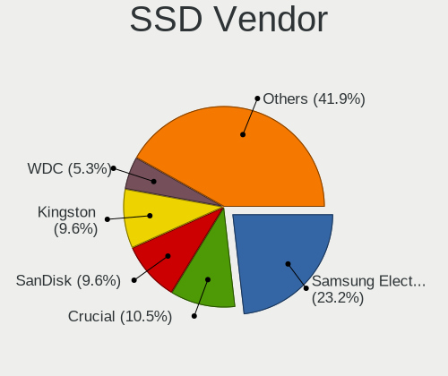
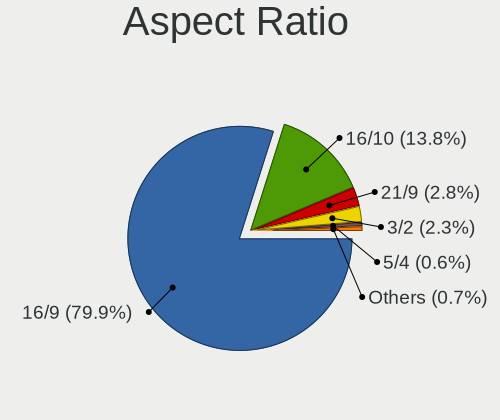
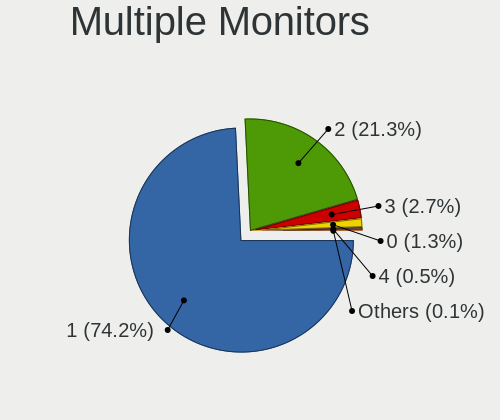

Fedora 36 - Tested Hardware & Statistics (Notebooks)
----------------------------------------------------

A project to collect tested hardware configurations for Fedora 36.

Anyone can contribute to this report by the [hw-probe](https://github.com/linuxhw/hw-probe) tool:

    sudo -E hw-probe -all -upload

Please contribute! Especially if your hardware is rare.

Contents
--------

* [ Test Cases ](#test-cases)

* [ System ](#system)
  - [ Kernel                   ](#kernel)
  - [ Kernel Family            ](#kernel-family)
  - [ Kernel Major Ver.        ](#kernel-major-ver)
  - [ Arch                     ](#arch)
  - [ DE                       ](#de)
  - [ Display Server           ](#display-server)
  - [ Display Manager          ](#display-manager)
  - [ OS Lang                  ](#os-lang)
  - [ Boot Mode                ](#boot-mode)
  - [ Filesystem               ](#filesystem)
  - [ Part. scheme             ](#part-scheme)
  - [ Dual Boot with Linux/BSD ](#dual-boot-with-linuxbsd)
  - [ Dual Boot (Win)          ](#dual-boot-win)

* [ Board ](#board)
  - [ Vendor                   ](#vendor)
  - [ Model                    ](#model)
  - [ Model Family             ](#model-family)
  - [ MFG Year                 ](#mfg-year)
  - [ Form Factor              ](#form-factor)
  - [ Secure Boot              ](#secure-boot)
  - [ Coreboot                 ](#coreboot)
  - [ RAM Size                 ](#ram-size)
  - [ RAM Used                 ](#ram-used)
  - [ Total Drives             ](#total-drives)
  - [ Has CD-ROM               ](#has-cd-rom)
  - [ Has Ethernet             ](#has-ethernet)
  - [ Has WiFi                 ](#has-wifi)
  - [ Has Bluetooth            ](#has-bluetooth)

* [ Location ](#location)
  - [ Country                  ](#country)
  - [ City                     ](#city)

* [ Drives ](#drives)
  - [ Drive Vendor             ](#drive-vendor)
  - [ Drive Model              ](#drive-model)
  - [ HDD Vendor               ](#hdd-vendor)
  - [ SSD Vendor               ](#ssd-vendor)
  - [ Drive Kind               ](#drive-kind)
  - [ Drive Connector          ](#drive-connector)
  - [ Drive Size               ](#drive-size)
  - [ Space Total              ](#space-total)
  - [ Space Used               ](#space-used)
  - [ Malfunc. Drives          ](#malfunc-drives)
  - [ Malfunc. Drive Vendor    ](#malfunc-drive-vendor)
  - [ Malfunc. HDD Vendor      ](#malfunc-hdd-vendor)
  - [ Malfunc. Drive Kind      ](#malfunc-drive-kind)
  - [ Failed Drives            ](#failed-drives)
  - [ Failed Drive Vendor      ](#failed-drive-vendor)
  - [ Drive Status             ](#drive-status)

* [ Storage controller ](#storage-controller)
  - [ Storage Vendor           ](#storage-vendor)
  - [ Storage Model            ](#storage-model)
  - [ Storage Kind             ](#storage-kind)

* [ Processor ](#processor)
  - [ CPU Vendor               ](#cpu-vendor)
  - [ CPU Model                ](#cpu-model)
  - [ CPU Model Family         ](#cpu-model-family)
  - [ CPU Cores                ](#cpu-cores)
  - [ CPU Sockets              ](#cpu-sockets)
  - [ CPU Threads              ](#cpu-threads)
  - [ CPU Op-Modes             ](#cpu-op-modes)
  - [ CPU Microcode            ](#cpu-microcode)
  - [ CPU Microarch            ](#cpu-microarch)

* [ Graphics ](#graphics)
  - [ GPU Vendor               ](#gpu-vendor)
  - [ GPU Model                ](#gpu-model)
  - [ GPU Combo                ](#gpu-combo)
  - [ GPU Driver               ](#gpu-driver)
  - [ GPU Memory               ](#gpu-memory)

* [ Monitor ](#monitor)
  - [ Monitor Vendor           ](#monitor-vendor)
  - [ Monitor Model            ](#monitor-model)
  - [ Monitor Resolution       ](#monitor-resolution)
  - [ Monitor Diagonal         ](#monitor-diagonal)
  - [ Monitor Width            ](#monitor-width)
  - [ Aspect Ratio             ](#aspect-ratio)
  - [ Monitor Area             ](#monitor-area)
  - [ Pixel Density            ](#pixel-density)
  - [ Multiple Monitors        ](#multiple-monitors)

* [ Network ](#network)
  - [ Net Controller Vendor    ](#net-controller-vendor)
  - [ Net Controller Model     ](#net-controller-model)
  - [ Wireless Vendor          ](#wireless-vendor)
  - [ Wireless Model           ](#wireless-model)
  - [ Ethernet Vendor          ](#ethernet-vendor)
  - [ Ethernet Model           ](#ethernet-model)
  - [ Net Controller Kind      ](#net-controller-kind)
  - [ Used Controller          ](#used-controller)
  - [ NICs                     ](#nics)
  - [ IPv6                     ](#ipv6)

* [ Bluetooth ](#bluetooth)
  - [ Bluetooth Vendor         ](#bluetooth-vendor)
  - [ Bluetooth Model          ](#bluetooth-model)

* [ Sound ](#sound)
  - [ Sound Vendor             ](#sound-vendor)
  - [ Sound Model              ](#sound-model)

* [ Memory ](#memory)
  - [ Memory Vendor            ](#memory-vendor)
  - [ Memory Model             ](#memory-model)
  - [ Memory Kind              ](#memory-kind)
  - [ Memory Form Factor       ](#memory-form-factor)
  - [ Memory Size              ](#memory-size)
  - [ Memory Speed             ](#memory-speed)

* [ Printers & scanners ](#printers--scanners)
  - [ Printer Vendor           ](#printer-vendor)
  - [ Printer Model            ](#printer-model)
  - [ Scanner Vendor           ](#scanner-vendor)
  - [ Scanner Model            ](#scanner-model)

* [ Camera ](#camera)
  - [ Camera Vendor            ](#camera-vendor)
  - [ Camera Model             ](#camera-model)

* [ Security ](#security)
  - [ Fingerprint Vendor       ](#fingerprint-vendor)
  - [ Fingerprint Model        ](#fingerprint-model)
  - [ Chipcard Vendor          ](#chipcard-vendor)
  - [ Chipcard Model           ](#chipcard-model)

* [ Unsupported ](#unsupported)
  - [ Unsupported Devices      ](#unsupported-devices)
  - [ Unsupported Device Types ](#unsupported-device-types)

Test Cases
----------

Total: 299

| Vendor        | Model                       | Probe                                                      | Date         |
|---------------|-----------------------------|------------------------------------------------------------|--------------|
| Lenovo        | IdeaPad 5 Pro 14ACN6 82L... | [ae39e96b1a](https://linux-hardware.org/?probe=ae39e96b1a) | Jun 01, 2022 |
| Lenovo        | IdeaPad L340-15IRH Gamin... | [0f84f94a6a](https://linux-hardware.org/?probe=0f84f94a6a) | Jun 01, 2022 |
| HP            | EliteBook 2560p             | [af6a91d3c7](https://linux-hardware.org/?probe=af6a91d3c7) | Jun 01, 2022 |
| Dell          | Inspiron 5415               | [942b343fff](https://linux-hardware.org/?probe=942b343fff) | Jun 01, 2022 |
| HP            | Pavilion Laptop 14-dv0xx... | [1e6ab0f183](https://linux-hardware.org/?probe=1e6ab0f183) | May 31, 2022 |
| ASUSTek       | X541NA                      | [3d32754542](https://linux-hardware.org/?probe=3d32754542) | May 31, 2022 |
| Lenovo        | ThinkPad X1 Carbon 2nd 2... | [dc3ee2e520](https://linux-hardware.org/?probe=dc3ee2e520) | May 31, 2022 |
| Lenovo        | Edge 15 80K9                | [9bbdfc95bb](https://linux-hardware.org/?probe=9bbdfc95bb) | May 31, 2022 |
| HP            | OMEN Laptop 15-en0xxx       | [956299505f](https://linux-hardware.org/?probe=956299505f) | May 31, 2022 |
| HP            | Pavilion Laptop 14-dv0xx... | [9b53c4df9d](https://linux-hardware.org/?probe=9b53c4df9d) | May 31, 2022 |
| ASUSTek       | N501VW                      | [2f8215fb0a](https://linux-hardware.org/?probe=2f8215fb0a) | May 31, 2022 |
| HP            | EliteBook 840 G3            | [92acbd4c3f](https://linux-hardware.org/?probe=92acbd4c3f) | May 31, 2022 |
| Apple         | MacBookPro8,3               | [38f4cc4c5a](https://linux-hardware.org/?probe=38f4cc4c5a) | May 31, 2022 |
| Dell          | XPS 15 9520                 | [4d4c32223e](https://linux-hardware.org/?probe=4d4c32223e) | May 31, 2022 |
| Dell          | Inspiron 5547               | [066f6369b2](https://linux-hardware.org/?probe=066f6369b2) | May 31, 2022 |
| HP            | 255 G1                      | [86f7198193](https://linux-hardware.org/?probe=86f7198193) | May 31, 2022 |
| Lenovo        | ThinkPad E595 20NF001PTX    | [cf41cc78f7](https://linux-hardware.org/?probe=cf41cc78f7) | May 30, 2022 |
| Lenovo        | ThinkPad X1 Carbon 2nd 2... | [5a813419eb](https://linux-hardware.org/?probe=5a813419eb) | May 30, 2022 |
| Lenovo        | Edge 15 80K9                | [586a31368f](https://linux-hardware.org/?probe=586a31368f) | May 30, 2022 |
| Google        | Droid                       | [35e3edeab3](https://linux-hardware.org/?probe=35e3edeab3) | May 30, 2022 |
| Framework     | Laptop                      | [f1c2a80b70](https://linux-hardware.org/?probe=f1c2a80b70) | May 30, 2022 |
| Lenovo        | ThinkPad X240 20AM0040BR    | [e0ff07b590](https://linux-hardware.org/?probe=e0ff07b590) | May 30, 2022 |
| IT Channel... | PA70Hx                      | [091ad22c2d](https://linux-hardware.org/?probe=091ad22c2d) | May 30, 2022 |
| ASUSTek       | ZenBook UX325SA_UM325SA     | [378e6ca9c6](https://linux-hardware.org/?probe=378e6ca9c6) | May 30, 2022 |
| Dell          | XPS 15 9520                 | [eee1a317b6](https://linux-hardware.org/?probe=eee1a317b6) | May 30, 2022 |
| MSI           | GE60 2PE                    | [1e15d749ee](https://linux-hardware.org/?probe=1e15d749ee) | May 30, 2022 |
| ASUSTek       | X541NA                      | [c1fd0c2d4f](https://linux-hardware.org/?probe=c1fd0c2d4f) | May 30, 2022 |
| MSI           | GE60 2PE                    | [b52762040d](https://linux-hardware.org/?probe=b52762040d) | May 30, 2022 |
| HP            | EliteBook 840 G8 Noteboo... | [15fb1b0353](https://linux-hardware.org/?probe=15fb1b0353) | May 30, 2022 |
| Dell          | Inspiron 7472               | [7d8d96d851](https://linux-hardware.org/?probe=7d8d96d851) | May 29, 2022 |
| ASUSTek       | UX51VZA                     | [c7c6e27cae](https://linux-hardware.org/?probe=c7c6e27cae) | May 29, 2022 |
| Dell          | Latitude E7470              | [159516aefb](https://linux-hardware.org/?probe=159516aefb) | May 29, 2022 |
| Acer          | Aspire E5-573G              | [bd9b967f9b](https://linux-hardware.org/?probe=bd9b967f9b) | May 29, 2022 |
| Dell          | XPS 15 9520                 | [75d345243e](https://linux-hardware.org/?probe=75d345243e) | May 29, 2022 |
| Notebook      | P65_P67SG                   | [a2aecd5cd3](https://linux-hardware.org/?probe=a2aecd5cd3) | May 29, 2022 |
| MSI           | GE60 2PE                    | [84d5af4ebe](https://linux-hardware.org/?probe=84d5af4ebe) | May 29, 2022 |
| MSI           | GE60 2PE                    | [c8d325a744](https://linux-hardware.org/?probe=c8d325a744) | May 29, 2022 |
| HP            | Pavilion 17                 | [077be5d10b](https://linux-hardware.org/?probe=077be5d10b) | May 28, 2022 |
| Dell          | Precision 7710              | [befe390051](https://linux-hardware.org/?probe=befe390051) | May 28, 2022 |
| Dell          | Vostro 5515                 | [ae8649e10b](https://linux-hardware.org/?probe=ae8649e10b) | May 28, 2022 |
| Lenovo        | Y70-70 Touch 80DU           | [4c4689f4b7](https://linux-hardware.org/?probe=4c4689f4b7) | May 28, 2022 |
| Lenovo        | IdeaPad 530S-14IKB 81EU     | [df2d7a274d](https://linux-hardware.org/?probe=df2d7a274d) | May 28, 2022 |
| Lenovo        | ThinkPad P52 20MAS3X200     | [da2a67f904](https://linux-hardware.org/?probe=da2a67f904) | May 28, 2022 |
| Lenovo        | Yoga 300-11IBY 80M0         | [8d120a2350](https://linux-hardware.org/?probe=8d120a2350) | May 28, 2022 |
| ASUSTek       | TUF Gaming FX505DY_FX505... | [af42d8d0b4](https://linux-hardware.org/?probe=af42d8d0b4) | May 27, 2022 |
| Timi          | A35S                        | [8a1bee3210](https://linux-hardware.org/?probe=8a1bee3210) | May 27, 2022 |
| Dell          | XPS 15 9570                 | [93d1ebbb72](https://linux-hardware.org/?probe=93d1ebbb72) | May 27, 2022 |
| Login Info... | LOG-QAL30                   | [5643c9fb9b](https://linux-hardware.org/?probe=5643c9fb9b) | May 27, 2022 |
| Login Info... | LOG-QAL30                   | [644f3a8dbc](https://linux-hardware.org/?probe=644f3a8dbc) | May 27, 2022 |
| Lenovo        | ThinkBook 14 G3 ACL 21A2    | [983144763a](https://linux-hardware.org/?probe=983144763a) | May 27, 2022 |
| Lenovo        | 14w 81MQS02H00              | [e31087bfa9](https://linux-hardware.org/?probe=e31087bfa9) | May 27, 2022 |
| Dell          | Inspiron 7460               | [3171915433](https://linux-hardware.org/?probe=3171915433) | May 27, 2022 |
| Sony          | VPCEE3S1E                   | [f3c7988996](https://linux-hardware.org/?probe=f3c7988996) | May 27, 2022 |
| Lenovo        | ThinkPad P1 Gen 3 20TJS3... | [88aabea122](https://linux-hardware.org/?probe=88aabea122) | May 27, 2022 |
| ASUSTek       | UX51VZA                     | [5507c9109e](https://linux-hardware.org/?probe=5507c9109e) | May 27, 2022 |
| Lenovo        | IdeaPad 3 15ARE05 81W4      | [9b4287fa8b](https://linux-hardware.org/?probe=9b4287fa8b) | May 26, 2022 |
| HP            | Pavilion TS 14              | [b7b3d504e2](https://linux-hardware.org/?probe=b7b3d504e2) | May 26, 2022 |
| Dell          | Inspiron 5502               | [90ee31b219](https://linux-hardware.org/?probe=90ee31b219) | May 26, 2022 |
| Dell          | XPS 13 7390                 | [4aa126f1e7](https://linux-hardware.org/?probe=4aa126f1e7) | May 26, 2022 |
| Dell          | Inspiron 3543               | [bf6cb72634](https://linux-hardware.org/?probe=bf6cb72634) | May 26, 2022 |
| HUAWEI        | HN-WX9X                     | [ebb7ce2605](https://linux-hardware.org/?probe=ebb7ce2605) | May 26, 2022 |
| HP            | Pavilion Laptop 15-cd0xx    | [ad9da27671](https://linux-hardware.org/?probe=ad9da27671) | May 26, 2022 |
| Samsung       | 550XDA                      | [807781d70e](https://linux-hardware.org/?probe=807781d70e) | May 26, 2022 |
| Acer          | Aspire E5-573G              | [6f5b6d8d03](https://linux-hardware.org/?probe=6f5b6d8d03) | May 25, 2022 |
| ASUSTek       | GL502VMK                    | [dfca615a89](https://linux-hardware.org/?probe=dfca615a89) | May 25, 2022 |
| HP            | Notebook                    | [05e785c8c2](https://linux-hardware.org/?probe=05e785c8c2) | May 25, 2022 |
| HP            | Notebook                    | [17ca21b3a4](https://linux-hardware.org/?probe=17ca21b3a4) | May 25, 2022 |
| Lenovo        | IdeaPad 5 15ARE05 81YQ      | [dcbaf5defc](https://linux-hardware.org/?probe=dcbaf5defc) | May 25, 2022 |
| HP            | Unknown                     | [c6b346ecc6](https://linux-hardware.org/?probe=c6b346ecc6) | May 25, 2022 |
| Lenovo        | ThinkPad W540 20BHS04B00    | [376f43287f](https://linux-hardware.org/?probe=376f43287f) | May 25, 2022 |
| ASUSTek       | ROG Zephyrus G15 GA503RS... | [940a448ea6](https://linux-hardware.org/?probe=940a448ea6) | May 24, 2022 |
| ASUSTek       | ASUS TUF Gaming A15 FA50... | [93c67e62e7](https://linux-hardware.org/?probe=93c67e62e7) | May 24, 2022 |
| Lenovo        | ThinkPad T14 Gen 1 20UDC... | [00baf8a2ff](https://linux-hardware.org/?probe=00baf8a2ff) | May 24, 2022 |
| ROCK Pi       | Unknown                     | [aa891c0178](https://linux-hardware.org/?probe=aa891c0178) | May 24, 2022 |
| Lenovo        | ThinkPad P53 20QN0011IV     | [24c2ad0798](https://linux-hardware.org/?probe=24c2ad0798) | May 24, 2022 |
| Dell          | Precision 3561              | [71657d24c1](https://linux-hardware.org/?probe=71657d24c1) | May 24, 2022 |
| Dell          | Precision 3561              | [385a286d0d](https://linux-hardware.org/?probe=385a286d0d) | May 24, 2022 |
| HP            | EliteBook 840 G8 Noteboo... | [eccd990241](https://linux-hardware.org/?probe=eccd990241) | May 24, 2022 |
| Lenovo        | IdeaPad S340-14API 81NB     | [1b061ef293](https://linux-hardware.org/?probe=1b061ef293) | May 24, 2022 |
| Lenovo        | ThinkPad W540 20BHS04B00    | [8d62205131](https://linux-hardware.org/?probe=8d62205131) | May 23, 2022 |
| Lenovo        | ThinkPad T480s 20L8S1RS0... | [174f6e2270](https://linux-hardware.org/?probe=174f6e2270) | May 23, 2022 |
| ASUSTek       | X550CL                      | [49ebd9e68d](https://linux-hardware.org/?probe=49ebd9e68d) | May 23, 2022 |
| HP            | Pavilion Laptop 15-eg0xx... | [377330c2b5](https://linux-hardware.org/?probe=377330c2b5) | May 23, 2022 |
| Dell          | Vostro 5490                 | [413a708e81](https://linux-hardware.org/?probe=413a708e81) | May 23, 2022 |
| Gigabyte      | P34V5                       | [6fa844b91e](https://linux-hardware.org/?probe=6fa844b91e) | May 23, 2022 |
| Gigabyte      | P34V5                       | [3ad8e4b239](https://linux-hardware.org/?probe=3ad8e4b239) | May 23, 2022 |
| Dell          | XPS 13 9310                 | [a76a3417d7](https://linux-hardware.org/?probe=a76a3417d7) | May 23, 2022 |
| Toshiba       | Unknown                     | [56ac954440](https://linux-hardware.org/?probe=56ac954440) | May 23, 2022 |
| Lenovo        | ThinkPad X230 2325AC7       | [bf82ad1cc3](https://linux-hardware.org/?probe=bf82ad1cc3) | May 23, 2022 |
| Sony          | VPCSA2Z9R                   | [5697622de7](https://linux-hardware.org/?probe=5697622de7) | May 22, 2022 |
| Lenovo        | ThinkPad X270 20HMS1QT0E    | [f17079bdce](https://linux-hardware.org/?probe=f17079bdce) | May 22, 2022 |
| ASUSTek       | ROG Strix G513QY_G513QY     | [bdb9536c9c](https://linux-hardware.org/?probe=bdb9536c9c) | May 22, 2022 |
| Acer          | Swift SF514-52T             | [d49880e4c2](https://linux-hardware.org/?probe=d49880e4c2) | May 22, 2022 |
| Acer          | Swift SF514-52T             | [40d5ca6bab](https://linux-hardware.org/?probe=40d5ca6bab) | May 22, 2022 |
| HP            | 15-dc1018ur                 | [aceb1a1011](https://linux-hardware.org/?probe=aceb1a1011) | May 22, 2022 |
| Dell          | Inspiron 5567               | [afca2e1045](https://linux-hardware.org/?probe=afca2e1045) | May 22, 2022 |
| Lenovo        | ThinkPad W520 42763JF       | [2b87bae835](https://linux-hardware.org/?probe=2b87bae835) | May 22, 2022 |
| HP            | ProBook 470 G5              | [4be19d46e1](https://linux-hardware.org/?probe=4be19d46e1) | May 21, 2022 |
| Lenovo        | Legion 7 15IMH05 81YT       | [a44f38fd50](https://linux-hardware.org/?probe=a44f38fd50) | May 21, 2022 |
| Lenovo        | ThinkPad X220 Tablet 429... | [1c2288918d](https://linux-hardware.org/?probe=1c2288918d) | May 21, 2022 |
| HP            | Unknown                     | [2277c14d4d](https://linux-hardware.org/?probe=2277c14d4d) | May 21, 2022 |
| Dell          | XPS 13 9310                 | [06943bb7f1](https://linux-hardware.org/?probe=06943bb7f1) | May 21, 2022 |
| Acer          | Swift SF314-54              | [478550abf1](https://linux-hardware.org/?probe=478550abf1) | May 21, 2022 |
| Dell          | Latitude 5490               | [450756ee49](https://linux-hardware.org/?probe=450756ee49) | May 21, 2022 |
| HP            | Laptop 15s-eq1xxx           | [702e495c23](https://linux-hardware.org/?probe=702e495c23) | May 21, 2022 |
| Lenovo        | IdeaPad 330S-15ARR 81FB     | [cc0b92bd45](https://linux-hardware.org/?probe=cc0b92bd45) | May 21, 2022 |
| Lenovo        | ThinkPad X1 Carbon Gen 9... | [d5b9f1fd4a](https://linux-hardware.org/?probe=d5b9f1fd4a) | May 20, 2022 |
| HP            | Pavilion g4                 | [b29455a037](https://linux-hardware.org/?probe=b29455a037) | May 20, 2022 |
| Lenovo        | ThinkPad X1 Carbon Gen 9... | [567c91351f](https://linux-hardware.org/?probe=567c91351f) | May 20, 2022 |
| HP            | Pavilion g4                 | [001f7d91d2](https://linux-hardware.org/?probe=001f7d91d2) | May 20, 2022 |
| Acer          | Aspire 8940G                | [f6f8622b30](https://linux-hardware.org/?probe=f6f8622b30) | May 20, 2022 |
| Google        | Glimmer                     | [78c39ceda9](https://linux-hardware.org/?probe=78c39ceda9) | May 20, 2022 |
| Dell          | Inspiron 5459               | [ea99252046](https://linux-hardware.org/?probe=ea99252046) | May 20, 2022 |
| Samsung       | 550XDA                      | [1f77e9f8f6](https://linux-hardware.org/?probe=1f77e9f8f6) | May 19, 2022 |
| Samsung       | 550XDA                      | [8c31783747](https://linux-hardware.org/?probe=8c31783747) | May 19, 2022 |
| Lenovo        | ThinkPad X1 Carbon 2nd 2... | [e8df231af7](https://linux-hardware.org/?probe=e8df231af7) | May 19, 2022 |
| Lenovo        | ThinkPad P14s Gen 2a 21A... | [711e483bb9](https://linux-hardware.org/?probe=711e483bb9) | May 19, 2022 |
| Lenovo        | IdeaPad Creator 5 15IMH0... | [59d945a9b3](https://linux-hardware.org/?probe=59d945a9b3) | May 19, 2022 |
| eMachines     | E525                        | [2c397d4229](https://linux-hardware.org/?probe=2c397d4229) | May 19, 2022 |
| eMachines     | E525                        | [7a1e439150](https://linux-hardware.org/?probe=7a1e439150) | May 19, 2022 |
| Lenovo        | ThinkPad X1 Carbon 5th 2... | [0e0fc0905a](https://linux-hardware.org/?probe=0e0fc0905a) | May 19, 2022 |
| SKIKK         | GREEN 4                     | [f58c4904f7](https://linux-hardware.org/?probe=f58c4904f7) | May 19, 2022 |
| Toshiba       | Satellite U940              | [249374be01](https://linux-hardware.org/?probe=249374be01) | May 19, 2022 |
| Apple         | MacBookPro8,1               | [94d2bd3233](https://linux-hardware.org/?probe=94d2bd3233) | May 19, 2022 |
| Lenovo        | ThinkPad P52 20MAS3X200     | [7f0fc0c72e](https://linux-hardware.org/?probe=7f0fc0c72e) | May 19, 2022 |
| Lenovo        | ThinkPad P50 20EQS1DD00     | [819420bd66](https://linux-hardware.org/?probe=819420bd66) | May 19, 2022 |
| Lenovo        | ThinkPad P50 20EQS1DD00     | [479ab8b5d7](https://linux-hardware.org/?probe=479ab8b5d7) | May 19, 2022 |
| Lenovo        | ThinkPad X1 Carbon Gen 8... | [592a32a1af](https://linux-hardware.org/?probe=592a32a1af) | May 18, 2022 |
| Lenovo        | IdeaPad Slim 1-14AST-05 ... | [e83ddc569f](https://linux-hardware.org/?probe=e83ddc569f) | May 18, 2022 |
| Dell          | XPS 13 7390                 | [98752f9fb4](https://linux-hardware.org/?probe=98752f9fb4) | May 18, 2022 |
| Dell          | Latitude E6420              | [0f06571934](https://linux-hardware.org/?probe=0f06571934) | May 18, 2022 |
| ASUSTek       | X556URK                     | [b217fd2c65](https://linux-hardware.org/?probe=b217fd2c65) | May 18, 2022 |
| Apple         | MacBookAir7,2               | [a46fea4edb](https://linux-hardware.org/?probe=a46fea4edb) | May 18, 2022 |
| Samsung       | 270E5G/270E5U               | [8d8783e43f](https://linux-hardware.org/?probe=8d8783e43f) | May 18, 2022 |
| Samsung       | 270E5G/270E5U               | [6e01c5c9f5](https://linux-hardware.org/?probe=6e01c5c9f5) | May 18, 2022 |
| Lenovo        | IdeaPad Y500 20193          | [a3931c5e60](https://linux-hardware.org/?probe=a3931c5e60) | May 17, 2022 |
| HP            | Laptop 15s-eq2xxx           | [9e7bf270db](https://linux-hardware.org/?probe=9e7bf270db) | May 17, 2022 |
| Dell          | Latitude E6230              | [1afeba4362](https://linux-hardware.org/?probe=1afeba4362) | May 17, 2022 |
| Lenovo        | ThinkBook 15 G2 ITL 20VE    | [f86ea538c8](https://linux-hardware.org/?probe=f86ea538c8) | May 17, 2022 |
| Dell          | Latitude 5520               | [320ed1c4fc](https://linux-hardware.org/?probe=320ed1c4fc) | May 17, 2022 |
| Dell          | Latitude 5520               | [18823f33fb](https://linux-hardware.org/?probe=18823f33fb) | May 17, 2022 |
| ASUSTek       | ROG Strix G513RM_G513RM     | [331099a3da](https://linux-hardware.org/?probe=331099a3da) | May 17, 2022 |
| Lenovo        | IdeaPad Slim 7 14ITL05 8... | [2179a16a87](https://linux-hardware.org/?probe=2179a16a87) | May 17, 2022 |
| Notebook      | N8xEJEK                     | [5c2c66e8f5](https://linux-hardware.org/?probe=5c2c66e8f5) | May 17, 2022 |
| Lenovo        | ThinkPad E15 Gen 2 20T80... | [61c1716210](https://linux-hardware.org/?probe=61c1716210) | May 16, 2022 |
| Lenovo        | IdeaPad 330S-14IKB 81F4     | [e99a8117ba](https://linux-hardware.org/?probe=e99a8117ba) | May 16, 2022 |
| Dell          | XPS 13 9350                 | [cf7f597752](https://linux-hardware.org/?probe=cf7f597752) | May 16, 2022 |
| Lenovo        | ThinkPad T14s Gen 2i 20W... | [06afc33451](https://linux-hardware.org/?probe=06afc33451) | May 16, 2022 |
| Lenovo        | ThinkPad T440p 20AW000KU... | [66fc91a0d0](https://linux-hardware.org/?probe=66fc91a0d0) | May 16, 2022 |
| Dell          | XPS 15 7590                 | [7f7463682a](https://linux-hardware.org/?probe=7f7463682a) | May 16, 2022 |
| Lenovo        | IdeaPad 320S-14IKB 81BN     | [1661f9e71d](https://linux-hardware.org/?probe=1661f9e71d) | May 16, 2022 |
| Acer          | Nitro AN515-45              | [2dac9974af](https://linux-hardware.org/?probe=2dac9974af) | May 16, 2022 |
| Lenovo        | ThinkPad T440 20B7A1P700    | [ee54db9f9e](https://linux-hardware.org/?probe=ee54db9f9e) | May 16, 2022 |
| ASUSTek       | ROG Zephyrus G14 GA401IH... | [a15788c695](https://linux-hardware.org/?probe=a15788c695) | May 15, 2022 |
| HP            | 250 G7 Notebook PC          | [4e824e7eac](https://linux-hardware.org/?probe=4e824e7eac) | May 15, 2022 |
| Positivo      | H14BU08                     | [ba7d402358](https://linux-hardware.org/?probe=ba7d402358) | May 15, 2022 |
| Lenovo        | V14-IIL 82C4                | [b95acee640](https://linux-hardware.org/?probe=b95acee640) | May 15, 2022 |
| ASUSTek       | VivoBook_ASUSLaptop X571... | [a442279a0b](https://linux-hardware.org/?probe=a442279a0b) | May 15, 2022 |
| Acer          | Swift SF515-51T             | [3e3380c801](https://linux-hardware.org/?probe=3e3380c801) | May 15, 2022 |
| Lenovo        | ThinkPad X1 Extreme 2nd ... | [6c635e0f3d](https://linux-hardware.org/?probe=6c635e0f3d) | May 15, 2022 |
| ASUSTek       | ASUS TUF Gaming F15 FX50... | [88c0d2c252](https://linux-hardware.org/?probe=88c0d2c252) | May 15, 2022 |
| Acer          | AO532h                      | [6055013560](https://linux-hardware.org/?probe=6055013560) | May 15, 2022 |
| ASUSTek       | VivoBook_ASUSLaptop X412... | [6adb7e22c5](https://linux-hardware.org/?probe=6adb7e22c5) | May 14, 2022 |
| Lenovo        | ThinkPad T14 Gen 2a 20XL... | [8c71a3bd1b](https://linux-hardware.org/?probe=8c71a3bd1b) | May 13, 2022 |
| HP            | EliteBook 8470p             | [2c8d1eec1e](https://linux-hardware.org/?probe=2c8d1eec1e) | May 13, 2022 |
| TUXEDO        | Pulse 14 Gen1               | [31d9027f23](https://linux-hardware.org/?probe=31d9027f23) | May 13, 2022 |
| HP            | EliteBook 8470p             | [074043a5ca](https://linux-hardware.org/?probe=074043a5ca) | May 13, 2022 |
| ASUSTek       | VivoBook_ASUSLaptop X409... | [ffbf67b890](https://linux-hardware.org/?probe=ffbf67b890) | May 12, 2022 |
| Lenovo        | IdeaPad 510-15ISK 80SR      | [deb6fa57ef](https://linux-hardware.org/?probe=deb6fa57ef) | May 12, 2022 |
| HP            | Pavilion Aero Laptop 13-... | [7aaffeda48](https://linux-hardware.org/?probe=7aaffeda48) | May 12, 2022 |
| Lenovo        | ThinkPad P51 20HJS02H00     | [fc7562c140](https://linux-hardware.org/?probe=fc7562c140) | May 12, 2022 |
| Lenovo        | ThinkPad P51 20HJS02H00     | [810fda94b1](https://linux-hardware.org/?probe=810fda94b1) | May 12, 2022 |
| Dell          | Latitude 5420               | [ac04d4cb5b](https://linux-hardware.org/?probe=ac04d4cb5b) | May 12, 2022 |
| ICL           | Unknown                     | [cfb2a7c82f](https://linux-hardware.org/?probe=cfb2a7c82f) | May 12, 2022 |
| HUAWEI        | NBLB-WAX9N                  | [9baa4a9f57](https://linux-hardware.org/?probe=9baa4a9f57) | May 12, 2022 |
| Dell          | XPS 15 9500                 | [da0e4e32b4](https://linux-hardware.org/?probe=da0e4e32b4) | May 12, 2022 |
| Lenovo        | IdeaPad S540-15IWL          | [bbf4ef2a08](https://linux-hardware.org/?probe=bbf4ef2a08) | May 11, 2022 |
| Lenovo        | ThinkPad X395 20NL0007US    | [aea9571086](https://linux-hardware.org/?probe=aea9571086) | May 11, 2022 |
| Lenovo        | ThinkPad X1 Carbon 6th 2... | [b0951956fa](https://linux-hardware.org/?probe=b0951956fa) | May 11, 2022 |
| Lenovo        | ThinkPad T480 20L6S5M40M    | [f2213829f0](https://linux-hardware.org/?probe=f2213829f0) | May 11, 2022 |
| Lenovo        | ThinkPad P1 Gen 3 20TJS2... | [607c0a2833](https://linux-hardware.org/?probe=607c0a2833) | May 11, 2022 |
| Lenovo        | ThinkPad E570 20H5CTO1WW    | [a22c347eaf](https://linux-hardware.org/?probe=a22c347eaf) | May 11, 2022 |
| Lenovo        | ThinkPad T590 20N5S2NC0N    | [61327f1e21](https://linux-hardware.org/?probe=61327f1e21) | May 11, 2022 |
| Positivo      | C41TB                       | [2df08b295b](https://linux-hardware.org/?probe=2df08b295b) | May 11, 2022 |
| Lenovo        | Z50-70 20354                | [7dd92b7a41](https://linux-hardware.org/?probe=7dd92b7a41) | May 11, 2022 |
| Positivo      | C41TB                       | [164d3a45c4](https://linux-hardware.org/?probe=164d3a45c4) | May 11, 2022 |
| Lenovo        | B40-70 80F30017BR           | [352c705bf3](https://linux-hardware.org/?probe=352c705bf3) | May 11, 2022 |
| Lenovo        | B40-70 80F30017BR           | [cb100c3884](https://linux-hardware.org/?probe=cb100c3884) | May 11, 2022 |
| Dell          | Inspiron 3542               | [9762e9155b](https://linux-hardware.org/?probe=9762e9155b) | May 11, 2022 |
| Lenovo        | ThinkPad P15s Gen 2i 20W... | [6cacb1c49c](https://linux-hardware.org/?probe=6cacb1c49c) | May 11, 2022 |
| Lenovo        | ThinkBook 16p Gen 2 20YM    | [a8c09f53de](https://linux-hardware.org/?probe=a8c09f53de) | May 10, 2022 |
| Acer          | Swift SF314-54              | [cc3411e0b4](https://linux-hardware.org/?probe=cc3411e0b4) | May 10, 2022 |
| Dell          | XPS 13 7390                 | [a5630f81ad](https://linux-hardware.org/?probe=a5630f81ad) | May 10, 2022 |
| Lenovo        | IdeaPad 5 15ARE05 81YQ      | [03fc6852e2](https://linux-hardware.org/?probe=03fc6852e2) | May 10, 2022 |
| Lenovo        | IdeaPad 5 15ARE05 81YQ      | [20eb5bfb9f](https://linux-hardware.org/?probe=20eb5bfb9f) | May 10, 2022 |
| ASUSTek       | VivoBook_ASUSLaptop X515... | [2c069935d3](https://linux-hardware.org/?probe=2c069935d3) | May 10, 2022 |
| ASUSTek       | ROG Strix G513QY_G513QY     | [a0dd43509d](https://linux-hardware.org/?probe=a0dd43509d) | May 09, 2022 |
| Standard      | Unknown                     | [3d9f8907fd](https://linux-hardware.org/?probe=3d9f8907fd) | May 09, 2022 |
| HP            | Pavilion Gaming Laptop 1... | [ef9c4b3841](https://linux-hardware.org/?probe=ef9c4b3841) | May 09, 2022 |
| ASUSTek       | ASUS TUF Dash F15 FX516P... | [86acc529d3](https://linux-hardware.org/?probe=86acc529d3) | May 09, 2022 |
| LG Electro... | 16Z90P-K.AAS9U1             | [26536e15bf](https://linux-hardware.org/?probe=26536e15bf) | May 09, 2022 |
| ASUSTek       | ASUS TUF Dash F15 FX516P... | [11cb46c902](https://linux-hardware.org/?probe=11cb46c902) | May 08, 2022 |
| Acer          | Aspire ES1-531              | [a7927b8b27](https://linux-hardware.org/?probe=a7927b8b27) | May 08, 2022 |
| ASUSTek       | N76VZ                       | [f1e06f5c2f](https://linux-hardware.org/?probe=f1e06f5c2f) | May 08, 2022 |
| Lenovo        | Yoga Slim 7 14ITL05 82A3    | [7894bd4591](https://linux-hardware.org/?probe=7894bd4591) | May 07, 2022 |
| Lenovo        | ThinkPad T14 Gen 2a 20XL... | [8fda480b12](https://linux-hardware.org/?probe=8fda480b12) | May 06, 2022 |
| Dell          | Precision 3520              | [2d5c4aa671](https://linux-hardware.org/?probe=2d5c4aa671) | May 05, 2022 |
| HP            | Laptop 15s-eq1xxx           | [f255a41930](https://linux-hardware.org/?probe=f255a41930) | May 05, 2022 |
| Toshiba       | IS 1413G                    | [8ca57528af](https://linux-hardware.org/?probe=8ca57528af) | May 04, 2022 |
| Toshiba       | IS 1413G                    | [3bc61ca207](https://linux-hardware.org/?probe=3bc61ca207) | May 04, 2022 |
| HP            | Laptop 15s-eq2xxx           | [8fbc520a1b](https://linux-hardware.org/?probe=8fbc520a1b) | May 03, 2022 |
| ASUSTek       | N76VZ                       | [b9c2a28ba0](https://linux-hardware.org/?probe=b9c2a28ba0) | May 03, 2022 |
| HP            | Laptop 15s-eq1xxx           | [7636de5c44](https://linux-hardware.org/?probe=7636de5c44) | May 02, 2022 |
| Lenovo        | IdeaPad 310-14ISK 80UG      | [72f6ebfc11](https://linux-hardware.org/?probe=72f6ebfc11) | May 01, 2022 |
| Lenovo        | IdeaPad 310-14ISK 80UG      | [0205c9da07](https://linux-hardware.org/?probe=0205c9da07) | May 01, 2022 |
| Dell          | XPS 13 9310                 | [03b461596c](https://linux-hardware.org/?probe=03b461596c) | May 01, 2022 |
| Dell          | XPS 15 9570                 | [133b6670de](https://linux-hardware.org/?probe=133b6670de) | May 01, 2022 |
| Lenovo        | Legion Y530-15ICH 81FV      | [428509b262](https://linux-hardware.org/?probe=428509b262) | May 01, 2022 |
| Toshiba       | IS 1413G                    | [6d0ad0b8f2](https://linux-hardware.org/?probe=6d0ad0b8f2) | May 01, 2022 |
| HP            | Laptop 14-dq2xxx            | [6cefd4f4de](https://linux-hardware.org/?probe=6cefd4f4de) | May 01, 2022 |
| ASUSTek       | G75VX                       | [fb58cab830](https://linux-hardware.org/?probe=fb58cab830) | Apr 30, 2022 |
| HP            | ZBook Firefly 15 inch G8... | [6cdff366fa](https://linux-hardware.org/?probe=6cdff366fa) | Apr 28, 2022 |
| MSI           | Stealth GS66 12UGS          | [bf36d72c14](https://linux-hardware.org/?probe=bf36d72c14) | Apr 26, 2022 |
| Acer          | Nitro AN515-43              | [99527fd065](https://linux-hardware.org/?probe=99527fd065) | Apr 26, 2022 |
| MSI           | Stealth GS66 12UGS          | [273526bab2](https://linux-hardware.org/?probe=273526bab2) | Apr 26, 2022 |
| HP            | ZBook Fury 15 G7 Mobile ... | [620718bb9e](https://linux-hardware.org/?probe=620718bb9e) | Apr 26, 2022 |
| Acer          | Aspire A515-45              | [128cdc0a61](https://linux-hardware.org/?probe=128cdc0a61) | Apr 26, 2022 |
| ASUSTek       | ROG Zephyrus G14 GA402RJ... | [0d3c8ed904](https://linux-hardware.org/?probe=0d3c8ed904) | Apr 25, 2022 |
| Lenovo        | IdeaPad 320-15ISK 80XH      | [b4577b2374](https://linux-hardware.org/?probe=b4577b2374) | Apr 25, 2022 |
| Dell          | Latitude 7280               | [7ad22b030d](https://linux-hardware.org/?probe=7ad22b030d) | Apr 24, 2022 |
| Lenovo        | ThinkPad T450s 20BWS2HP0... | [762843e768](https://linux-hardware.org/?probe=762843e768) | Apr 23, 2022 |
| Lenovo        | ThinkPad T450s 20BWS2HP0... | [11ec4d291b](https://linux-hardware.org/?probe=11ec4d291b) | Apr 23, 2022 |
| Dell          | Latitude E7450              | [5ce1623306](https://linux-hardware.org/?probe=5ce1623306) | Apr 22, 2022 |
| ASUSTek       | ROG Strix G513QM_G513QM     | [b6a457c33a](https://linux-hardware.org/?probe=b6a457c33a) | Apr 21, 2022 |
| Wiltronic     | iVIEW i896QW                | [34e1873984](https://linux-hardware.org/?probe=34e1873984) | Apr 21, 2022 |
| Lenovo        | IdeaPad C340-14API 81N6     | [9e1d98199a](https://linux-hardware.org/?probe=9e1d98199a) | Apr 18, 2022 |
| Lenovo        | ThinkPad W530 2463A49       | [202b5d34a1](https://linux-hardware.org/?probe=202b5d34a1) | Apr 18, 2022 |
| ASUSTek       | ROG Zephyrus G14 GA402RJ... | [81b837dc13](https://linux-hardware.org/?probe=81b837dc13) | Apr 18, 2022 |
| Lenovo        | IdeaPad S340-15IWL 81N8     | [b895187681](https://linux-hardware.org/?probe=b895187681) | Apr 17, 2022 |
| MSI           | Modern 14 B4MW              | [5d8e6ca082](https://linux-hardware.org/?probe=5d8e6ca082) | Apr 16, 2022 |
| Lenovo        | ThinkPad L14 Gen 2 20X10... | [6f75f679f9](https://linux-hardware.org/?probe=6f75f679f9) | Apr 16, 2022 |
| HP            | ProBook 455 G8 Notebook ... | [5bff5642ba](https://linux-hardware.org/?probe=5bff5642ba) | Apr 15, 2022 |
| Toshiba       | Satellite U840              | [9468123a43](https://linux-hardware.org/?probe=9468123a43) | Apr 15, 2022 |
| Dell          | Studio 1537                 | [56c84908d2](https://linux-hardware.org/?probe=56c84908d2) | Apr 15, 2022 |
| Lenovo        | IdeaPad 530S-14IKB 81EU     | [7436528d4f](https://linux-hardware.org/?probe=7436528d4f) | Apr 14, 2022 |
| Dell          | Inspiron 3505               | [719a1712f2](https://linux-hardware.org/?probe=719a1712f2) | Apr 14, 2022 |
| Dell          | Inspiron 3505               | [5781ceb5ca](https://linux-hardware.org/?probe=5781ceb5ca) | Apr 14, 2022 |
| Dell          | Inspiron 5548               | [77a3c1a7ce](https://linux-hardware.org/?probe=77a3c1a7ce) | Apr 14, 2022 |
| Lenovo        | ThinkPad P14s Gen 1 20Y1... | [9dd2675f34](https://linux-hardware.org/?probe=9dd2675f34) | Apr 14, 2022 |
| Dell          | XPS 13 9370                 | [0175e41474](https://linux-hardware.org/?probe=0175e41474) | Apr 14, 2022 |
| Dell          | XPS 13 9305                 | [48c7781b77](https://linux-hardware.org/?probe=48c7781b77) | Apr 14, 2022 |
| Dell          | Precision 7540              | [2aff9a81ff](https://linux-hardware.org/?probe=2aff9a81ff) | Apr 13, 2022 |
| Toshiba       | Satellite U840              | [c6fe138c8f](https://linux-hardware.org/?probe=c6fe138c8f) | Apr 13, 2022 |
| HP            | Laptop 15-dw3xxx            | [95cff2fbb1](https://linux-hardware.org/?probe=95cff2fbb1) | Apr 13, 2022 |
| Lenovo        | Legion Y540-15IRH 81SX      | [c3d7c67155](https://linux-hardware.org/?probe=c3d7c67155) | Apr 12, 2022 |
| Lenovo        | IdeaPad L340-15IRH Gamin... | [73bb0eeab0](https://linux-hardware.org/?probe=73bb0eeab0) | Apr 12, 2022 |
| Intel         | W7650                       | [4bd778e810](https://linux-hardware.org/?probe=4bd778e810) | Apr 11, 2022 |
| MSI           | GS66 Stealth 10UH           | [5589b339ed](https://linux-hardware.org/?probe=5589b339ed) | Apr 11, 2022 |
| Dell          | Studio 1537                 | [048fceac96](https://linux-hardware.org/?probe=048fceac96) | Apr 11, 2022 |
| ASUSTek       | VivoBook_ASUSLaptop X512... | [5a60603c45](https://linux-hardware.org/?probe=5a60603c45) | Apr 11, 2022 |
| HP            | Pavilion 15                 | [c913cb5a4a](https://linux-hardware.org/?probe=c913cb5a4a) | Apr 11, 2022 |
| ASUSTek       | VivoBook_ASUSLaptop X421... | [ff93a4d2f5](https://linux-hardware.org/?probe=ff93a4d2f5) | Apr 08, 2022 |
| Lenovo        | ThinkPad T495 20NJ000XIX    | [f00fb05977](https://linux-hardware.org/?probe=f00fb05977) | Apr 07, 2022 |
| MSI           | GS66 Stealth 10UH           | [bd6f031bc8](https://linux-hardware.org/?probe=bd6f031bc8) | Apr 06, 2022 |
| Acer          | Swift SF114-32              | [3947799e36](https://linux-hardware.org/?probe=3947799e36) | Apr 05, 2022 |
| MSI           | Prestige 14Evo A11M         | [29b43c3e27](https://linux-hardware.org/?probe=29b43c3e27) | Apr 05, 2022 |
| Acer          | Swift SF314-41              | [564cfd1f31](https://linux-hardware.org/?probe=564cfd1f31) | Apr 04, 2022 |
| Acer          | Aspire A515-45              | [eb69a7978b](https://linux-hardware.org/?probe=eb69a7978b) | Apr 04, 2022 |
| Lenovo        | IdeaPad 320S-13IKB 81AK     | [8444b44333](https://linux-hardware.org/?probe=8444b44333) | Apr 04, 2022 |
| Chuwi         | Hi10 Go                     | [cfa6610288](https://linux-hardware.org/?probe=cfa6610288) | Apr 04, 2022 |
| Lenovo        | ThinkPad X1 Carbon 6th 2... | [8c1841d2d0](https://linux-hardware.org/?probe=8c1841d2d0) | Apr 03, 2022 |
| Lenovo        | ThinkPad X1 Carbon 7th 2... | [5eef69398a](https://linux-hardware.org/?probe=5eef69398a) | Apr 03, 2022 |
| Lenovo        | ThinkBook 13s G3 ACN 20Y... | [ba4863a7bb](https://linux-hardware.org/?probe=ba4863a7bb) | Apr 02, 2022 |
| Lenovo        | IdeaPad Yoga 13 20175       | [cd942b0305](https://linux-hardware.org/?probe=cd942b0305) | Apr 02, 2022 |
| Dell          | Inspiron 5548               | [9e35cab29a](https://linux-hardware.org/?probe=9e35cab29a) | Apr 02, 2022 |
| Dell          | XPS 13 9333                 | [f4fb42182f](https://linux-hardware.org/?probe=f4fb42182f) | Apr 01, 2022 |
| Lenovo        | ThinkPad L13 Gen 2 20VJS... | [4c0c1422e7](https://linux-hardware.org/?probe=4c0c1422e7) | Mar 31, 2022 |
| Lenovo        | ThinkPad X260 20F5S0HK1J    | [a83d3cbe5f](https://linux-hardware.org/?probe=a83d3cbe5f) | Mar 31, 2022 |
| Lenovo        | ThinkBook 15 G2 ITL 20VE    | [cc95f0e3ab](https://linux-hardware.org/?probe=cc95f0e3ab) | Mar 31, 2022 |
| VALE          | Notebook Slim S132          | [138a4f1d68](https://linux-hardware.org/?probe=138a4f1d68) | Mar 31, 2022 |
| Lenovo        | ThinkPad P15 Gen 1 20STS... | [05c02cbe41](https://linux-hardware.org/?probe=05c02cbe41) | Mar 31, 2022 |
| Avell High... | B.ON                        | [697fc1d4ec](https://linux-hardware.org/?probe=697fc1d4ec) | Mar 29, 2022 |
| Framework     | Laptop                      | [a22656afee](https://linux-hardware.org/?probe=a22656afee) | Mar 28, 2022 |
| Dell          | XPS 17 9710                 | [461d175c44](https://linux-hardware.org/?probe=461d175c44) | Mar 28, 2022 |
| ASUSTek       | ROG Zephyrus Duo 15 SE G... | [16ac712c84](https://linux-hardware.org/?probe=16ac712c84) | Mar 24, 2022 |
| Lenovo        | IdeaPad 530S-14ARR 81H1     | [1b57f1f410](https://linux-hardware.org/?probe=1b57f1f410) | Mar 13, 2022 |
| HP            | ZBook Fury 15 G7 Mobile ... | [917a6b65a8](https://linux-hardware.org/?probe=917a6b65a8) | Mar 10, 2022 |
| Sony          | VGN-FW21E                   | [930ce5581f](https://linux-hardware.org/?probe=930ce5581f) | Feb 25, 2022 |
| Unknown       | Unknown                     | [033354ee53](https://linux-hardware.org/?probe=033354ee53) | Jan 02, 2022 |
| Unknown       | Unknown                     | [ea795a97e1](https://linux-hardware.org/?probe=ea795a97e1) | Dec 26, 2021 |
| Unknown       | Unknown                     | [2b26e185d0](https://linux-hardware.org/?probe=2b26e185d0) | Dec 06, 2021 |
| Positivo      | CHT12CP                     | [53054c8f7a](https://linux-hardware.org/?probe=53054c8f7a) | Nov 20, 2021 |
| Lenovo        | IdeaPadFlex 14 20308        | [1734da4566](https://linux-hardware.org/?probe=1734da4566) | Nov 13, 2021 |
| Lenovo        | ThinkBook 14 G3 ACL 21A2    | [2da0673527](https://linux-hardware.org/?probe=2da0673527) | Nov 01, 2021 |
| Notebook      | PCx0Dx                      | [b1a527acdc](https://linux-hardware.org/?probe=b1a527acdc) | Oct 11, 2021 |
| Notebook      | PCx0Dx                      | [90d4556fdf](https://linux-hardware.org/?probe=90d4556fdf) | Oct 11, 2021 |
| Unknown       | Unknown                     | [af4bbffabf](https://linux-hardware.org/?probe=af4bbffabf) | Sep 27, 2021 |
| Unknown       | Unknown                     | [81fd834473](https://linux-hardware.org/?probe=81fd834473) | Sep 26, 2021 |
| HP            | ProBook 4740s               | [77b2eed991](https://linux-hardware.org/?probe=77b2eed991) | Sep 22, 2021 |

System
------

Kernel
------

Version of the Linux kernel

| Version                                                       | Notebooks | Percent |
|---------------------------------------------------------------|-----------|---------|
| 5.17.6-300.fc36.x86_64                                        | 43        | 17.7%   |
| 5.17.5-300.fc36.x86_64                                        | 31        | 12.76%  |
| 5.17.8-300.fc36.x86_64                                        | 27        | 11.11%  |
| 5.17.7-300.fc36.x86_64                                        | 24        | 9.88%   |
| 5.17.11-300.fc36.x86_64                                       | 23        | 9.47%   |
| 5.17.9-300.fc36.x86_64                                        | 20        | 8.23%   |
| 5.17.1-300.fc36.x86_64                                        | 16        | 6.58%   |
| 5.17.3-302.fc36.x86_64                                        | 14        | 5.76%   |
| 5.17.2-300.fc36.x86_64                                        | 13        | 5.35%   |
| 5.17.0-0.rc7.116.fc36.x86_64                                  | 12        | 4.94%   |
| 5.17.0-300.fc36.x86_64                                        | 3         | 1.23%   |
| 5.17.5-301.fsync.fc36.x86_64                                  | 2         | 0.82%   |
| 5.17.0-0.rc5.102.fc36.x86_64                                  | 2         | 0.82%   |
| 5.18.0-0.rc3.220422.d569e86915b7f2f.31.vanilla.1.fc36.x86_64  | 1         | 0.41%   |
| 5.17.7-301.fsync.fc36.x86_64                                  | 1         | 0.41%   |
| 5.17.4-300.fc36.x86_64                                        | 1         | 0.41%   |
| 5.17.3-301.fsync.fc36.x86_64                                  | 1         | 0.41%   |
| 5.16.9-200.fc35.x86_64                                        | 1         | 0.41%   |
| 5.16.16-200.fc35.x86_64                                       | 1         | 0.41%   |
| 5.16.0-0.rc7.20211231git4f3d93c6eaff.52.vanilla.1.fc36.x86_64 | 1         | 0.41%   |
| 5.15.0-0.rc7.20211028git1fc596a56b33.56.fc36.x86_64           | 1         | 0.41%   |
| 5.15.0-0.rc4.20211008git1da38549dd64.36.fc36.x86_64           | 1         | 0.41%   |
| 5.15.0-0.rc2.20210923git58e2cf5d7946.21.vanilla.1.fc36.x86_64 | 1         | 0.41%   |
| 5.15.0-0.rc2.18.fc36.x86_64                                   | 1         | 0.41%   |
| 5.14.14-300.fc35.x86_64                                       | 1         | 0.41%   |
| 5.14.10-300.fc35.x86_64                                       | 1         | 0.41%   |

Kernel Family
-------------

Linux kernel without a distro release

| Version | Notebooks | Percent |
|---------|-----------|---------|
| 5.17.6  | 43        | 17.7%   |
| 5.17.5  | 33        | 13.58%  |
| 5.17.8  | 27        | 11.11%  |
| 5.17.7  | 25        | 10.29%  |
| 5.17.11 | 23        | 9.47%   |
| 5.17.9  | 20        | 8.23%   |
| 5.17.0  | 17        | 7%      |
| 5.17.1  | 16        | 6.58%   |
| 5.17.3  | 15        | 6.17%   |
| 5.17.2  | 13        | 5.35%   |
| 5.15.0  | 4         | 1.65%   |
| 5.18.0  | 1         | 0.41%   |
| 5.17.4  | 1         | 0.41%   |
| 5.16.9  | 1         | 0.41%   |
| 5.16.16 | 1         | 0.41%   |
| 5.16.0  | 1         | 0.41%   |
| 5.14.14 | 1         | 0.41%   |
| 5.14.10 | 1         | 0.41%   |

Kernel Major Ver.
-----------------

Linux kernel major version

| Version | Notebooks | Percent |
|---------|-----------|---------|
| 5.17    | 232       | 95.87%  |
| 5.15    | 4         | 1.65%   |
| 5.16    | 3         | 1.24%   |
| 5.14    | 2         | 0.83%   |
| 5.18    | 1         | 0.41%   |

Arch
----

OS architecture (x86_64, i586, etc.)

| Name   | Notebooks | Percent |
|--------|-----------|---------|
| x86_64 | 241       | 100%    |

DE
--

Desktop Environment

| Name     | Notebooks | Percent |
|----------|-----------|---------|
| GNOME    | 202       | 83.47%  |
| KDE5     | 25        | 10.33%  |
| Unknown  | 7         | 2.89%   |
| XFCE     | 2         | 0.83%   |
| i3       | 2         | 0.83%   |
| Cinnamon | 2         | 0.83%   |
| Deepin   | 1         | 0.41%   |
| awesome  | 1         | 0.41%   |

Display Server
--------------

X11 or Wayland

| Name    | Notebooks | Percent |
|---------|-----------|---------|
| Wayland | 192       | 79.67%  |
| X11     | 47        | 19.5%   |
| Unknown | 2         | 0.83%   |

Display Manager
---------------

SDDM, LightDM, etc.

| Name    | Notebooks | Percent |
|---------|-----------|---------|
| Unknown | 119       | 49.38%  |
| GDM     | 98        | 40.66%  |
| SDDM    | 14        | 5.81%   |
| LightDM | 10        | 4.15%   |

OS Lang
-------

Language

| Lang  | Notebooks | Percent |
|-------|-----------|---------|
| en_US | 134       | 55.6%   |
| en_GB | 17        | 7.05%   |
| ru_RU | 14        | 5.81%   |
| pt_BR | 14        | 5.81%   |
| de_DE | 11        | 4.56%   |
| pl_PL | 7         | 2.9%    |
| it_IT | 5         | 2.07%   |
| fr_FR | 5         | 2.07%   |
| es_ES | 4         | 1.66%   |
| en_IN | 4         | 1.66%   |
| en_AU | 4         | 1.66%   |
| hr_HR | 2         | 0.83%   |
| en_CA | 2         | 0.83%   |
| tr_TR | 1         | 0.41%   |
| sv_SE | 1         | 0.41%   |
| pt_PT | 1         | 0.41%   |
| nl_NL | 1         | 0.41%   |
| nb_NO | 1         | 0.41%   |
| hu_HU | 1         | 0.41%   |
| fr_CA | 1         | 0.41%   |
| es_UY | 1         | 0.41%   |
| es_CL | 1         | 0.41%   |
| en_NL | 1         | 0.41%   |
| en_IL | 1         | 0.41%   |
| en_IE | 1         | 0.41%   |
| el_GR | 1         | 0.41%   |
| de_CH | 1         | 0.41%   |
| de_AT | 1         | 0.41%   |
| da_DK | 1         | 0.41%   |
| cs_CZ | 1         | 0.41%   |
| ba_RU | 1         | 0.41%   |

Boot Mode
---------

EFI or BIOS

| Mode | Notebooks | Percent |
|------|-----------|---------|
| EFI  | 209       | 86.72%  |
| BIOS | 32        | 13.28%  |

Filesystem
----------

Type of filesystem

| Type    | Notebooks | Percent |
|---------|-----------|---------|
| Btrfs   | 188       | 78.01%  |
| Ext4    | 48        | 19.92%  |
| Xfs     | 3         | 1.24%   |
| F2fs    | 1         | 0.41%   |
| Unknown | 1         | 0.41%   |

Part. scheme
------------

Scheme of partitioning

| Type    | Notebooks | Percent |
|---------|-----------|---------|
| Unknown | 119       | 49.17%  |
| GPT     | 114       | 47.11%  |
| MBR     | 9         | 3.72%   |

Dual Boot with Linux/BSD
------------------------

Hosting more than one Linux/BSD

| Dual boot | Notebooks | Percent |
|-----------|-----------|---------|
| No        | 212       | 87.97%  |
| Yes       | 29        | 12.03%  |

Dual Boot (Win)
---------------

Hosting Linux and Windows

| Dual boot | Notebooks | Percent |
|-----------|-----------|---------|
| No        | 196       | 81.33%  |
| Yes       | 45        | 18.67%  |

Board
-----

Vendor
------

Motherboard manufacturer

| Name                   | Notebooks | Percent |
|------------------------|-----------|---------|
| Lenovo                 | 87        | 36.1%   |
| Dell                   | 41        | 17.01%  |
| Hewlett-Packard        | 29        | 12.03%  |
| ASUSTek Computer       | 28        | 11.62%  |
| Acer                   | 12        | 4.98%   |
| MSI                    | 5         | 2.07%   |
| Toshiba                | 3         | 1.24%   |
| Sony                   | 3         | 1.24%   |
| Samsung Electronics    | 3         | 1.24%   |
| Positivo               | 3         | 1.24%   |
| Notebook               | 3         | 1.24%   |
| Apple                  | 3         | 1.24%   |
| HUAWEI                 | 2         | 0.83%   |
| Framework              | 2         | 0.83%   |
| Wiltronic              | 1         | 0.41%   |
| VALE                   | 1         | 0.41%   |
| TUXEDO                 | 1         | 0.41%   |
| Timi                   | 1         | 0.41%   |
| Standard               | 1         | 0.41%   |
| SKIKK                  | 1         | 0.41%   |
| ROCK Pi                | 1         | 0.41%   |
| Login Informatica      | 1         | 0.41%   |
| LG Electronics         | 1         | 0.41%   |
| IT Channel Pty         | 1         | 0.41%   |
| ICL                    | 1         | 0.41%   |
| Google                 | 1         | 0.41%   |
| Gigabyte Technology    | 1         | 0.41%   |
| eMachines              | 1         | 0.41%   |
| Chuwi                  | 1         | 0.41%   |
| Avell High Performance | 1         | 0.41%   |
| Unknown                | 1         | 0.41%   |

Model
-----

Motherboard model

| Name                                       | Notebooks | Percent |
|--------------------------------------------|-----------|---------|
| Unknown                                    | 7         | 2.9%    |
| Lenovo IdeaPad 5 15ARE05 81YQ              | 3         | 1.24%   |
| Dell XPS 13 9310                           | 3         | 1.24%   |
| Samsung 550XDA                             | 2         | 0.83%   |
| Lenovo ThinkBook 15 G2 ITL 20VE            | 2         | 0.83%   |
| Lenovo ThinkBook 14 G3 ACL 21A2            | 2         | 0.83%   |
| Lenovo IdeaPad 530S-14IKB 81EU             | 2         | 0.83%   |
| Framework Laptop                           | 2         | 0.83%   |
| Dell XPS 15 9570                           | 2         | 0.83%   |
| Dell XPS 13 7390                           | 2         | 0.83%   |
| ASUS ROG Zephyrus G14 GA402RJ_GA402RJ      | 2         | 0.83%   |
| ASUS ROG Strix G513QY_G513QY               | 2         | 0.83%   |
| Acer Aspire E5-573G                        | 2         | 0.83%   |
| Wiltronic iVIEW i896QW                     | 1         | 0.41%   |
| VALE Notebook Slim S132                    | 1         | 0.41%   |
| TUXEDO Pulse 14 Gen1                       | 1         | 0.41%   |
| Toshiba Satellite U940                     | 1         | 0.41%   |
| Toshiba Satellite U840                     | 1         | 0.41%   |
| Timi A35S                                  | 1         | 0.41%   |
| Sony VPCSA2Z9R                             | 1         | 0.41%   |
| Sony VPCEE3S1E                             | 1         | 0.41%   |
| Sony VGN-FW21E                             | 1         | 0.41%   |
| SKIKK GREEN 4                              | 1         | 0.41%   |
| Samsung 270E5G/270E5U                      | 1         | 0.41%   |
| Positivo H14BU08                           | 1         | 0.41%   |
| Positivo CHT12CP                           | 1         | 0.41%   |
| Positivo C41TB                             | 1         | 0.41%   |
| Notebook PCx0Dx                            | 1         | 0.41%   |
| Notebook P65_P67SG                         | 1         | 0.41%   |
| Notebook N8xEJEK                           | 1         | 0.41%   |
| MSI Stealth GS66 12UGS                     | 1         | 0.41%   |
| MSI Prestige 14Evo A11M                    | 1         | 0.41%   |
| MSI Modern 14 B4MW                         | 1         | 0.41%   |
| MSI GS66 Stealth 10UH                      | 1         | 0.41%   |
| MSI GE60 2PE                               | 1         | 0.41%   |
| Login Informatica LOG-QAL30                | 1         | 0.41%   |
| LG 16Z90P-K.AAS9U1                         | 1         | 0.41%   |
| Lenovo Z50-70 20354                        | 1         | 0.41%   |
| Lenovo Yoga Slim 7 14ITL05 82A3            | 1         | 0.41%   |
| Lenovo Yoga 300-11IBY 80M0                 | 1         | 0.41%   |
| Lenovo Y70-70 Touch 80DU                   | 1         | 0.41%   |
| Lenovo V14-IIL 82C4                        | 1         | 0.41%   |
| Lenovo ThinkPad X395 20NL0007US            | 1         | 0.41%   |
| Lenovo ThinkPad X270 20HMS1QT0E            | 1         | 0.41%   |
| Lenovo ThinkPad X260 20F5S0HK1J            | 1         | 0.41%   |
| Lenovo ThinkPad X240 20AM0040BR            | 1         | 0.41%   |
| Lenovo ThinkPad X230 2325AC7               | 1         | 0.41%   |
| Lenovo ThinkPad X220 Tablet 4298RP3        | 1         | 0.41%   |
| Lenovo ThinkPad X1 Extreme 2nd 20QVCTO1WW  | 1         | 0.41%   |
| Lenovo ThinkPad X1 Carbon Gen 9 20XWCTO1WW | 1         | 0.41%   |
| Lenovo ThinkPad X1 Carbon Gen 8 20U9004HIX | 1         | 0.41%   |
| Lenovo ThinkPad X1 Carbon 7th 20R1S05B00   | 1         | 0.41%   |
| Lenovo ThinkPad X1 Carbon 6th 20KHCTO1WW   | 1         | 0.41%   |
| Lenovo ThinkPad X1 Carbon 6th 20KGS23S0P   | 1         | 0.41%   |
| Lenovo ThinkPad X1 Carbon 5th 20HRS04C00   | 1         | 0.41%   |
| Lenovo ThinkPad X1 Carbon 2nd 20B0OO50GE   | 1         | 0.41%   |
| Lenovo ThinkPad X1 Carbon 2nd 20A8S1AW11   | 1         | 0.41%   |
| Lenovo ThinkPad W540 20BHS04B00            | 1         | 0.41%   |
| Lenovo ThinkPad W530 2463A49               | 1         | 0.41%   |
| Lenovo ThinkPad W520 42763JF               | 1         | 0.41%   |

Model Family
------------

Motherboard model prefix

| Name                        | Notebooks | Percent |
|-----------------------------|-----------|---------|
| Lenovo ThinkPad             | 44        | 18.26%  |
| Lenovo IdeaPad              | 25        | 10.37%  |
| Dell XPS                    | 15        | 6.22%   |
| Dell Inspiron               | 11        | 4.56%   |
| HP Pavilion                 | 9         | 3.73%   |
| ASUS ROG                    | 9         | 3.73%   |
| Dell Latitude               | 8         | 3.32%   |
| Unknown                     | 7         | 2.9%    |
| Lenovo ThinkBook            | 6         | 2.49%   |
| ASUS VivoBook               | 6         | 2.49%   |
| Acer Aspire                 | 5         | 2.07%   |
| HP Laptop                   | 4         | 1.66%   |
| HP EliteBook                | 4         | 1.66%   |
| Dell Precision              | 4         | 1.66%   |
| Acer Swift                  | 4         | 1.66%   |
| Lenovo Legion               | 3         | 1.24%   |
| HP ProBook                  | 3         | 1.24%   |
| ASUS ASUS                   | 3         | 1.24%   |
| Toshiba Satellite           | 2         | 0.83%   |
| Samsung 550XDA              | 2         | 0.83%   |
| Lenovo Yoga                 | 2         | 0.83%   |
| HP ZBook                    | 2         | 0.83%   |
| Framework Laptop            | 2         | 0.83%   |
| Dell Vostro                 | 2         | 0.83%   |
| Apple MacBookPro8           | 2         | 0.83%   |
| Acer Nitro                  | 2         | 0.83%   |
| Wiltronic iVIEW             | 1         | 0.41%   |
| VALE Notebook               | 1         | 0.41%   |
| TUXEDO Pulse                | 1         | 0.41%   |
| Timi A35S                   | 1         | 0.41%   |
| Sony VPCSA2Z9R              | 1         | 0.41%   |
| Sony VPCEE3S1E              | 1         | 0.41%   |
| Sony VGN-FW21E              | 1         | 0.41%   |
| SKIKK GREEN                 | 1         | 0.41%   |
| Samsung 270E5G              | 1         | 0.41%   |
| Positivo H14BU08            | 1         | 0.41%   |
| Positivo CHT12CP            | 1         | 0.41%   |
| Positivo C41TB              | 1         | 0.41%   |
| Notebook PCx0Dx             | 1         | 0.41%   |
| Notebook P65                | 1         | 0.41%   |
| Notebook N8xEJEK            | 1         | 0.41%   |
| MSI Stealth                 | 1         | 0.41%   |
| MSI Prestige                | 1         | 0.41%   |
| MSI Modern                  | 1         | 0.41%   |
| MSI GS66                    | 1         | 0.41%   |
| MSI GE60                    | 1         | 0.41%   |
| Login Informatica LOG-QAL30 | 1         | 0.41%   |
| LG 16Z90P-K.AAS9U1          | 1         | 0.41%   |
| Lenovo Z50-70               | 1         | 0.41%   |
| Lenovo Y70-70               | 1         | 0.41%   |
| Lenovo V14-IIL              | 1         | 0.41%   |
| Lenovo IdeaPadFlex          | 1         | 0.41%   |
| Lenovo Edge                 | 1         | 0.41%   |
| Lenovo B40-70               | 1         | 0.41%   |
| Lenovo 14w                  | 1         | 0.41%   |
| IT Channel Pty PA70Hx       | 1         | 0.41%   |
| HUAWEI NBLB-WAX9N           | 1         | 0.41%   |
| HUAWEI HN-WX9X              | 1         | 0.41%   |
| HP OMEN                     | 1         | 0.41%   |
| HP Notebook                 | 1         | 0.41%   |

MFG Year
--------

Motherboard manufacture year

| Year | Notebooks | Percent |
|------|-----------|---------|
| 2021 | 50        | 20.75%  |
| 2020 | 42        | 17.43%  |
| 2019 | 25        | 10.37%  |
| 2018 | 25        | 10.37%  |
| 2016 | 15        | 6.22%   |
| 2017 | 13        | 5.39%   |
| 2015 | 13        | 5.39%   |
| 2014 | 13        | 5.39%   |
| 2012 | 13        | 5.39%   |
| 2013 | 11        | 4.56%   |
| 2022 | 8         | 3.32%   |
| 2011 | 6         | 2.49%   |
| 2009 | 3         | 1.24%   |
| 2008 | 3         | 1.24%   |
| 2010 | 1         | 0.41%   |

Form Factor
-----------

Physical design of the computer

| Name     | Notebooks | Percent |
|----------|-----------|---------|
| Notebook | 241       | 100%    |

Secure Boot
-----------

Enabled or disabled

| State    | Notebooks | Percent |
|----------|-----------|---------|
| Disabled | 188       | 78.01%  |
| Enabled  | 53        | 21.99%  |

Coreboot
--------

Have coreboot on board

| Used | Notebooks | Percent |
|------|-----------|---------|
| No   | 240       | 99.59%  |
| Yes  | 1         | 0.41%   |

RAM Size
--------

Total RAM memory

| Size in GB  | Notebooks | Percent |
|-------------|-----------|---------|
| 4.01-8.0    | 66        | 27.39%  |
| 16.01-24.0  | 59        | 24.48%  |
| 8.01-16.0   | 49        | 20.33%  |
| 32.01-64.0  | 35        | 14.52%  |
| 3.01-4.0    | 20        | 8.3%    |
| 64.01-256.0 | 6         | 2.49%   |
| 24.01-32.0  | 3         | 1.24%   |
| 1.01-2.0    | 3         | 1.24%   |

RAM Used
--------

Used RAM memory

| Used GB    | Notebooks | Percent |
|------------|-----------|---------|
| 4.01-8.0   | 86        | 35.39%  |
| 2.01-3.0   | 62        | 25.51%  |
| 3.01-4.0   | 57        | 23.46%  |
| 1.01-2.0   | 26        | 10.7%   |
| 8.01-16.0  | 10        | 4.12%   |
| 16.01-24.0 | 1         | 0.41%   |
| 0.51-1.0   | 1         | 0.41%   |

Total Drives
------------

Number of drives on board

| Drives | Notebooks | Percent |
|--------|-----------|---------|
| 1      | 171       | 70.66%  |
| 2      | 62        | 25.62%  |
| 3      | 7         | 2.89%   |
| 4      | 2         | 0.83%   |

Has CD-ROM
----------

Has CD-ROM on board

| Presented | Notebooks | Percent |
|-----------|-----------|---------|
| No        | 203       | 84.23%  |
| Yes       | 38        | 15.77%  |

Has Ethernet
------------

Has Ethernet on board

| Presented | Notebooks | Percent |
|-----------|-----------|---------|
| Yes       | 169       | 70.12%  |
| No        | 72        | 29.88%  |

Has WiFi
--------

Has WiFi module

| Presented | Notebooks | Percent |
|-----------|-----------|---------|
| Yes       | 236       | 97.93%  |
| No        | 5         | 2.07%   |

Has Bluetooth
-------------

Has Bluetooth module

| Presented | Notebooks | Percent |
|-----------|-----------|---------|
| Yes       | 214       | 88.8%   |
| No        | 27        | 11.2%   |

Location
--------

Country
-------

Geographic location (country)

| Country      | Notebooks | Percent |
|--------------|-----------|---------|
| USA          | 34        | 14.11%  |
| Brazil       | 22        | 9.13%   |
| Russia       | 20        | 8.3%    |
| Germany      | 17        | 7.05%   |
| UK           | 14        | 5.81%   |
| India        | 14        | 5.81%   |
| Italy        | 13        | 5.39%   |
| Poland       | 10        | 4.15%   |
| Indonesia    | 6         | 2.49%   |
| Australia    | 6         | 2.49%   |
| Norway       | 5         | 2.07%   |
| Netherlands  | 5         | 2.07%   |
| France       | 5         | 2.07%   |
| Spain        | 4         | 1.66%   |
| Romania      | 4         | 1.66%   |
| Mexico       | 4         | 1.66%   |
| Canada       | 4         | 1.66%   |
| Switzerland  | 3         | 1.24%   |
| Belgium      | 3         | 1.24%   |
| Austria      | 3         | 1.24%   |
| Turkey       | 2         | 0.83%   |
| Sweden       | 2         | 0.83%   |
| Slovakia     | 2         | 0.83%   |
| Portugal     | 2         | 0.83%   |
| Israel       | 2         | 0.83%   |
| Ireland      | 2         | 0.83%   |
| Hungary      | 2         | 0.83%   |
| Hong Kong    | 2         | 0.83%   |
| Estonia      | 2         | 0.83%   |
| Croatia      | 2         | 0.83%   |
| Argentina    | 2         | 0.83%   |
| Venezuela    | 1         | 0.41%   |
| Uzbekistan   | 1         | 0.41%   |
| Ukraine      | 1         | 0.41%   |
| South Africa | 1         | 0.41%   |
| Singapore    | 1         | 0.41%   |
| Saudi Arabia | 1         | 0.41%   |
| Peru         | 1         | 0.41%   |
| Nepal        | 1         | 0.41%   |
| Moldova      | 1         | 0.41%   |
| Latvia       | 1         | 0.41%   |
| Kenya        | 1         | 0.41%   |
| Kazakhstan   | 1         | 0.41%   |
| Iceland      | 1         | 0.41%   |
| Haiti        | 1         | 0.41%   |
| Greece       | 1         | 0.41%   |
| El Salvador  | 1         | 0.41%   |
| Denmark      | 1         | 0.41%   |
| Czechia      | 1         | 0.41%   |
| Colombia     | 1         | 0.41%   |
| Chile        | 1         | 0.41%   |
| Bulgaria     | 1         | 0.41%   |
| Belarus      | 1         | 0.41%   |
| Albania      | 1         | 0.41%   |

City
----

Geographic location (city)

| City                        | Notebooks | Percent |
|-----------------------------|-----------|---------|
| Moscow                      | 11        | 4.56%   |
| St Petersburg               | 6         | 2.49%   |
| Sao Paulo                   | 6         | 2.49%   |
| Oslo                        | 4         | 1.66%   |
| Munich                      | 4         | 1.66%   |
| Melbourne                   | 4         | 1.66%   |
| Kolkata                     | 4         | 1.66%   |
| Warsaw                      | 3         | 1.24%   |
| Tallinn                     | 2         | 0.83%   |
| Rosario                     | 2         | 0.83%   |
| Rome                        | 2         | 0.83%   |
| Milan                       | 2         | 0.83%   |
| Istanbul                    | 2         | 0.83%   |
| Central                     | 2         | 0.83%   |
| Bucharest                   | 2         | 0.83%   |
| Bratislava                  | 2         | 0.83%   |
| Berlin                      | 2         | 0.83%   |
| Zurich                      | 1         | 0.41%   |
| Zagreb                      | 1         | 0.41%   |
| Yaroslavl                   | 1         | 0.41%   |
| Xalapa                      | 1         | 0.41%   |
| Wroclaw                     | 1         | 0.41%   |
| White River Junction        | 1         | 0.41%   |
| Weilheim                    | 1         | 0.41%   |
| Warrington                  | 1         | 0.41%   |
| Vladimir                    | 1         | 0.41%   |
| Vegarshei                   | 1         | 0.41%   |
| Vechta                      | 1         | 0.41%   |
| Vrzea Grande              | 1         | 0.41%   |
| Varallo Pombia              | 1         | 0.41%   |
| Union                       | 1         | 0.41%   |
| Uccle                       | 1         | 0.41%   |
| Trier                       | 1         | 0.41%   |
| Topoloveni                  | 1         | 0.41%   |
| Toluca                      | 1         | 0.41%   |
| Thane                       | 1         | 0.41%   |
| Ternopil                    | 1         | 0.41%   |
| Temuco                      | 1         | 0.41%   |
| Tashkent                    | 1         | 0.41%   |
| Sydney                      | 1         | 0.41%   |
| Split                       | 1         | 0.41%   |
| Solihull                    | 1         | 0.41%   |
| Sofia                       | 1         | 0.41%   |
| Singapore                   | 1         | 0.41%   |
| Sidcup                      | 1         | 0.41%   |
| Shkoder                     | 1         | 0.41%   |
| Sheffield                   | 1         | 0.41%   |
| Seattle                     | 1         | 0.41%   |
| Scorrano                    | 1         | 0.41%   |
| Sao Goncalo do Amarante     | 1         | 0.41%   |
| Santo Andr                | 1         | 0.41%   |
| Santiago                    | 1         | 0.41%   |
| Sangli                      | 1         | 0.41%   |
| San Sebastin de los Reyes | 1         | 0.41%   |
| San Salvador                | 1         | 0.41%   |
| San Nicols de los Garza   | 1         | 0.41%   |
| San Diego                   | 1         | 0.41%   |
| Samara                      | 1         | 0.41%   |
| Salzburg                    | 1         | 0.41%   |
| Salvador                    | 1         | 0.41%   |

Drives
------

Drive Vendor
------------

Hard drive vendors

| Vendor                         | Notebooks | Drives | Percent |
|--------------------------------|-----------|--------|---------|
| Samsung Electronics            | 76        | 85     | 24.6%   |
| WDC                            | 21        | 21     | 6.8%    |
| SK Hynix                       | 21        | 21     | 6.8%    |
| Seagate                        | 20        | 20     | 6.47%   |
| Sandisk                        | 18        | 18     | 5.83%   |
| Unknown                        | 17        | 21     | 5.5%    |
| Intel                          | 13        | 13     | 4.21%   |
| Kingston                       | 12        | 15     | 3.88%   |
| Toshiba                        | 11        | 11     | 3.56%   |
| Micron Technology              | 11        | 12     | 3.56%   |
| Crucial                        | 10        | 10     | 3.24%   |
| KIOXIA                         | 9         | 10     | 2.91%   |
| A-DATA Technology              | 8         | 9      | 2.59%   |
| Silicon Motion                 | 4         | 4      | 1.29%   |
| PNY                            | 4         | 5      | 1.29%   |
| Phison                         | 4         | 4      | 1.29%   |
| LITEON                         | 4         | 4      | 1.29%   |
| HGST                           | 4         | 4      | 1.29%   |
| Unknown                        | 4         | 4      | 1.29%   |
| Hitachi                        | 3         | 3      | 0.97%   |
| China                          | 3         | 4      | 0.97%   |
| XPG                            | 2         | 2      | 0.65%   |
| UMIS                           | 2         | 2      | 0.65%   |
| SSSTC                          | 2         | 2      | 0.65%   |
| Solid State Storage Technology | 2         | 2      | 0.65%   |
| Lexar                          | 2         | 2      | 0.65%   |
| Intenso                        | 2         | 2      | 0.65%   |
| Apple                          | 2         | 2      | 0.65%   |
| WDC WDS2                       | 1         | 1      | 0.32%   |
| Transcend                      | 1         | 1      | 0.32%   |
| Origin                         | 1         | 1      | 0.32%   |
| OCZ-VERTEX3                    | 1         | 1      | 0.32%   |
| Netac                          | 1         | 1      | 0.32%   |
| Mass                           | 1         | 1      | 0.32%   |
| Lite-On                        | 1         | 1      | 0.32%   |
| Leven                          | 1         | 1      | 0.32%   |
| Lenovo                         | 1         | 1      | 0.32%   |
| KingFast                       | 1         | 1      | 0.32%   |
| KingDian                       | 1         | 1      | 0.32%   |
| IB-AC703                       | 1         | 1      | 0.32%   |
| Fujitsu                        | 1         | 1      | 0.32%   |
| EAGET                          | 1         | 1      | 0.32%   |
| Corsair                        | 1         | 2      | 0.32%   |
| Apacer                         | 1         | 1      | 0.32%   |
| ADATA Technology               | 1         | 1      | 0.32%   |
| Adafruit                       | 1         | 1      | 0.32%   |

Drive Model
-----------

Hard drive models

| Model                                    | Notebooks | Percent |
|------------------------------------------|-----------|---------|
| Sandisk NVMe SSD Drive 512GB             | 8         | 2.51%   |
| Samsung NVMe SSD Drive 512GB             | 6         | 1.88%   |
| Samsung NVMe SSD Drive 1TB               | 6         | 1.88%   |
| Unknown MMC Card  64GB                   | 5         | 1.57%   |
| SK Hynix NVMe SSD Drive 512GB            | 5         | 1.57%   |
| Samsung SSD 860 EVO 250GB                | 5         | 1.57%   |
| Samsung NVMe SSD Drive 256GB             | 5         | 1.57%   |
| Intel NVMe SSD Drive 512GB               | 5         | 1.57%   |
| Unknown MMC Card  32GB                   | 4         | 1.25%   |
| Seagate ST1000LM035-1RK172 1TB           | 4         | 1.25%   |
| HGST HTS721010A9E630 1TB                 | 4         | 1.25%   |
| Unknown                                  | 4         | 1.25%   |
| Unknown MMC Card  128GB                  | 3         | 0.94%   |
| Toshiba MQ01ABD100 1TB                   | 3         | 0.94%   |
| Sandisk NVMe SSD Drive 1TB               | 3         | 0.94%   |
| Samsung NVMe SSD Drive 1024GB            | 3         | 0.94%   |
| Samsung MZVLB1T0HBLR-000L7 1TB           | 3         | 0.94%   |
| WDC WD10SPZX-24Z10 1TB                   | 2         | 0.63%   |
| WDC PC SN530 SDBPNPZ-256G-1006 256GB     | 2         | 0.63%   |
| WDC PC SN530 SDBPMPZ-256G-1101 256GB     | 2         | 0.63%   |
| Toshiba NVMe SSD Drive 512GB             | 2         | 0.63%   |
| Toshiba KBG30ZMS128G 128GB NVMe SSD      | 2         | 0.63%   |
| Solid State Storage NVMe SSD Drive 256GB | 2         | 0.63%   |
| SK Hynix NVMe SSD Drive 256GB            | 2         | 0.63%   |
| SK Hynix NVMe SSD Drive 1TB              | 2         | 0.63%   |
| SK Hynix NVMe SSD Drive 1024GB           | 2         | 0.63%   |
| Silicon Motion NVMe SSD Drive 256GB      | 2         | 0.63%   |
| Seagate ST2000LM003 HN-M201RAD 2TB       | 2         | 0.63%   |
| Seagate ST1000LM049-2GH172 1TB           | 2         | 0.63%   |
| Seagate ST1000LM024 HN-M101MBB 1TB       | 2         | 0.63%   |
| Seagate BUP Portable 5TB                 | 2         | 0.63%   |
| Sandisk NVMe SSD Drive 1024GB            | 2         | 0.63%   |
| Samsung SSD 980 PRO 1TB                  | 2         | 0.63%   |
| Samsung SSD 980 1TB                      | 2         | 0.63%   |
| Samsung SSD 870 EVO 500GB                | 2         | 0.63%   |
| Samsung SSD 840 Series 250GB             | 2         | 0.63%   |
| Samsung NVMe SSD Drive 500GB             | 2         | 0.63%   |
| Samsung NVMe SSD Drive 2TB               | 2         | 0.63%   |
| Samsung MZVLB512HBJQ-000L2 512GB         | 2         | 0.63%   |
| Phison Sabrent 1TB                       | 2         | 0.63%   |
| Micron NVMe SSD Drive 1024GB             | 2         | 0.63%   |
| KIOXIA NVMe SSD Drive 512GB              | 2         | 0.63%   |
| KIOXIA KBG40ZNV512G 512GB                | 2         | 0.63%   |
| Kingston SA400S37960G 960GB SSD          | 2         | 0.63%   |
| Kingston NVMe SSD Drive 1TB              | 2         | 0.63%   |
| Crucial CT480BX500SSD1 480GB             | 2         | 0.63%   |
| Crucial CT1000P2SSD8 1TB                 | 2         | 0.63%   |
| XPG NVMe SSD Drive 256GB                 | 1         | 0.31%   |
| XPG NVMe SSD Drive 1024GB                | 1         | 0.31%   |
| WDC WDS500G2B0C-00PXH0 500GB             | 1         | 0.31%   |
| WDC WDS500G1X0E-00AFY0 500GB             | 1         | 0.31%   |
| WDC WDS240G2G0A-00JH30 240GB SSD         | 1         | 0.31%   |
| WDC WDS2 40G2G0B-00EP 240GB SSD          | 1         | 0.31%   |
| WDC WDS100T2B0A-00SM50 1TB SSD           | 1         | 0.31%   |
| WDC WD5000LPCX-80VHAT0 500GB             | 1         | 0.31%   |
| WDC WD5000LPCX-24VHAT0 500GB             | 1         | 0.31%   |
| WDC WD1600BEVT-22ZCT0 160GB              | 1         | 0.31%   |
| WDC WD10SPZX-24Z10T0 1TB                 | 1         | 0.31%   |
| WDC WD10SPZX-22Z10T1 1TB                 | 1         | 0.31%   |
| WDC WD10SPCX-00KHST0 1TB                 | 1         | 0.31%   |

HDD Vendor
----------

Hard disk drive vendors

| Vendor   | Notebooks | Drives | Percent |
|----------|-----------|--------|---------|
| Seagate  | 17        | 17     | 41.46%  |
| WDC      | 9         | 9      | 21.95%  |
| Toshiba  | 5         | 5      | 12.2%   |
| HGST     | 4         | 4      | 9.76%   |
| Hitachi  | 3         | 3      | 7.32%   |
| IB-AC703 | 1         | 1      | 2.44%   |
| Fujitsu  | 1         | 1      | 2.44%   |
| Apple    | 1         | 1      | 2.44%   |

SSD Vendor
----------

Solid state drive vendors

| Vendor              | Notebooks | Drives | Percent |
|---------------------|-----------|--------|---------|
| Samsung Electronics | 27        | 31     | 32.53%  |
| Kingston            | 8         | 10     | 9.64%   |
| Crucial             | 8         | 8      | 9.64%   |
| Intel               | 5         | 5      | 6.02%   |
| SanDisk             | 4         | 4      | 4.82%   |
| PNY                 | 3         | 3      | 3.61%   |
| LITEON              | 3         | 3      | 3.61%   |
| A-DATA Technology   | 3         | 4      | 3.61%   |
| WDC                 | 2         | 2      | 2.41%   |
| Seagate             | 2         | 2      | 2.41%   |
| Micron Technology   | 2         | 2      | 2.41%   |
| Lexar               | 2         | 2      | 2.41%   |
| Intenso             | 2         | 2      | 2.41%   |
| China               | 2         | 3      | 2.41%   |
| WDC WDS2            | 1         | 1      | 1.2%    |
| Transcend           | 1         | 1      | 1.2%    |
| Origin              | 1         | 1      | 1.2%    |
| OCZ-VERTEX3         | 1         | 1      | 1.2%    |
| Netac               | 1         | 1      | 1.2%    |
| Leven               | 1         | 1      | 1.2%    |
| EAGET               | 1         | 1      | 1.2%    |
| Corsair             | 1         | 2      | 1.2%    |
| Apple               | 1         | 1      | 1.2%    |
| Apacer              | 1         | 1      | 1.2%    |

Drive Kind
----------

HDD or SSD

| Kind    | Notebooks | Drives | Percent |
|---------|-----------|--------|---------|
| NVMe    | 148       | 166    | 51.39%  |
| SSD     | 73        | 92     | 25.35%  |
| HDD     | 41        | 41     | 14.24%  |
| MMC     | 20        | 25     | 6.94%   |
| Unknown | 6         | 7      | 2.08%   |

Drive Connector
---------------

SATA, SAS, NVMe, etc.

| Type | Notebooks | Drives | Percent |
|------|-----------|--------|---------|
| NVMe | 148       | 166    | 52.3%   |
| SATA | 107       | 132    | 37.81%  |
| MMC  | 20        | 25     | 7.07%   |
| SAS  | 8         | 8      | 2.83%   |

Drive Size
----------

Size of hard drive

| Size in TB | Notebooks | Drives | Percent |
|------------|-----------|--------|---------|
| 0.01-0.5   | 71        | 84     | 60.17%  |
| 0.51-1.0   | 40        | 42     | 33.9%   |
| 1.01-2.0   | 4         | 4      | 3.39%   |
| 4.01-10.0  | 2         | 2      | 1.69%   |
| 3.01-4.0   | 1         | 1      | 0.85%   |

Space Total
-----------

Amount of disk space available on the file system

| Size in GB     | Notebooks | Percent |
|----------------|-----------|---------|
| 251-500        | 62        | 25.73%  |
| 501-1000       | 45        | 18.67%  |
| 1-20           | 38        | 15.77%  |
| 101-250        | 31        | 12.86%  |
| 1001-2000      | 31        | 12.86%  |
| Unknown        | 19        | 7.88%   |
| 51-100         | 7         | 2.9%    |
| More than 3000 | 4         | 1.66%   |
| 2001-3000      | 3         | 1.24%   |
| 21-50          | 1         | 0.41%   |

Space Used
----------

Amount of used disk space

| Used GB        | Notebooks | Percent |
|----------------|-----------|---------|
| 1-20           | 85        | 35.27%  |
| 21-50          | 39        | 16.18%  |
| 101-250        | 32        | 13.28%  |
| 251-500        | 26        | 10.79%  |
| 51-100         | 24        | 9.96%   |
| Unknown        | 19        | 7.88%   |
| 501-1000       | 13        | 5.39%   |
| 1001-2000      | 2         | 0.83%   |
| More than 3000 | 1         | 0.41%   |

Malfunc. Drives
---------------

Drive models with a malfunction

| Model                                        | Notebooks | Drives | Percent |
|----------------------------------------------|-----------|--------|---------|
| Toshiba MK5055GSX 500GB                      | 1         | 1      | 11.11%  |
| Seagate ST500LT012-1DG142 500GB              | 1         | 1      | 11.11%  |
| Seagate ST1000LM024 HN-M101MBB 1TB           | 1         | 1      | 11.11%  |
| Samsung Electronics SSD 870 EVO 500GB        | 1         | 1      | 11.11%  |
| Samsung Electronics SSD 840 Series 250GB     | 1         | 1      | 11.11%  |
| Origin Inception TLC830 Pro Series 256GB SSD | 1         | 1      | 11.11%  |
| OCZ-VERTEX3 MI 240GB SSD                     | 1         | 1      | 11.11%  |
| Lenovo LENSE20512GMSP34MEAT2TA 512GB         | 1         | 1      | 11.11%  |
| Fujitsu MJA2500BH G1 500GB                   | 1         | 1      | 11.11%  |

Malfunc. Drive Vendor
---------------------

Vendors of faulty drives

| Vendor              | Notebooks | Drives | Percent |
|---------------------|-----------|--------|---------|
| Seagate             | 2         | 2      | 22.22%  |
| Samsung Electronics | 2         | 2      | 22.22%  |
| Toshiba             | 1         | 1      | 11.11%  |
| Origin              | 1         | 1      | 11.11%  |
| OCZ-VERTEX3         | 1         | 1      | 11.11%  |
| Lenovo              | 1         | 1      | 11.11%  |
| Fujitsu             | 1         | 1      | 11.11%  |

Malfunc. HDD Vendor
-------------------

Vendors of faulty HDD drives

| Vendor  | Notebooks | Drives | Percent |
|---------|-----------|--------|---------|
| Seagate | 2         | 2      | 50%     |
| Toshiba | 1         | 1      | 25%     |
| Fujitsu | 1         | 1      | 25%     |

Malfunc. Drive Kind
-------------------

Kinds of faulty drives

| Kind | Notebooks | Drives | Percent |
|------|-----------|--------|---------|
| SSD  | 4         | 4      | 44.44%  |
| HDD  | 4         | 4      | 44.44%  |
| NVMe | 1         | 1      | 11.11%  |

Failed Drives
-------------

Failed drive models

Zero info for selected period =(

Failed Drive Vendor
-------------------

Failed drive vendors

Zero info for selected period =(

Drive Status
------------

Number of failed and malfunc. drives

| Status   | Notebooks | Drives | Percent |
|----------|-----------|--------|---------|
| Detected | 135       | 186    | 52.53%  |
| Works    | 114       | 136    | 44.36%  |
| Malfunc  | 8         | 9      | 3.11%   |

Storage controller
------------------

Storage Vendor
--------------

Storage controller vendors

| Vendor                         | Notebooks | Percent |
|--------------------------------|-----------|---------|
| Intel                          | 139       | 44.27%  |
| Samsung Electronics            | 51        | 16.24%  |
| AMD                            | 25        | 7.96%   |
| Sandisk                        | 23        | 7.32%   |
| SK Hynix                       | 21        | 6.69%   |
| Toshiba America Info Systems   | 10        | 3.18%   |
| Micron Technology              | 9         | 2.87%   |
| ADATA Technology               | 8         | 2.55%   |
| Phison Electronics             | 5         | 1.59%   |
| KIOXIA                         | 5         | 1.59%   |
| Silicon Motion                 | 4         | 1.27%   |
| Kingston Technology Company    | 4         | 1.27%   |
| Solid State Storage Technology | 3         | 0.96%   |
| Union Memory (Shenzhen)        | 2         | 0.64%   |
| Micron/Crucial Technology      | 2         | 0.64%   |
| Lite-On Technology             | 2         | 0.64%   |
| Lenovo                         | 1         | 0.32%   |

Storage Model
-------------

Storage controller models

| Model                                                                          | Notebooks | Percent |
|--------------------------------------------------------------------------------|-----------|---------|
| Samsung NVMe SSD Controller SM981/PM981/PM983                                  | 24        | 7.38%   |
| AMD FCH SATA Controller [AHCI mode]                                            | 24        | 7.38%   |
| Intel Sunrise Point-LP SATA Controller [AHCI mode]                             | 17        | 5.23%   |
| Intel 82801 Mobile SATA Controller [RAID mode]                                 | 17        | 5.23%   |
| Intel Volume Management Device NVMe RAID Controller                            | 13        | 4%      |
| Samsung NVMe SSD Controller 980                                                | 12        | 3.69%   |
| Intel 8 Series SATA Controller 1 [AHCI mode]                                   | 12        | 3.69%   |
| Intel 7 Series Chipset Family 6-port SATA Controller [AHCI mode]               | 12        | 3.69%   |
| Toshiba America Info Systems XG6 NVMe SSD Controller                           | 9         | 2.77%   |
| Micron Non-Volatile memory controller                                          | 9         | 2.77%   |
| Intel Cannon Lake Mobile PCH SATA AHCI Controller                              | 9         | 2.77%   |
| Intel Wildcat Point-LP SATA Controller [AHCI Mode]                             | 8         | 2.46%   |
| SK Hynix Gold P31 SSD                                                          | 7         | 2.15%   |
| Sandisk WD Black SN750 / PC SN730 NVMe SSD                                     | 7         | 2.15%   |
| Sandisk Non-Volatile memory controller                                         | 7         | 2.15%   |
| Samsung NVMe SSD Controller SM961/PM961/SM963                                  | 6         | 1.85%   |
| Samsung NVMe SSD Controller PM9A1/PM9A3/980PRO                                 | 6         | 1.85%   |
| Intel Tiger Lake-LP SATA Controller [AHCI mode]                                | 6         | 1.85%   |
| KIOXIA Non-Volatile memory controller                                          | 5         | 1.54%   |
| Intel 8 Series/C220 Series Chipset Family 6-port SATA Controller 1 [AHCI mode] | 5         | 1.54%   |
| Intel 6 Series/C200 Series Chipset Family 6 port Mobile SATA AHCI Controller   | 5         | 1.54%   |
| SK Hynix PC401 NVMe Solid State Drive 256GB                                    | 4         | 1.23%   |
| SK Hynix BC511                                                                 | 4         | 1.23%   |
| SK Hynix BC501 NVMe Solid State Drive                                          | 4         | 1.23%   |
| Silicon Motion SM2263EN/SM2263XT SSD Controller                                | 4         | 1.23%   |
| Sandisk WD Blue SN550 NVMe SSD                                                 | 4         | 1.23%   |
| Intel Non-Volatile memory controller                                           | 4         | 1.23%   |
| Intel HM170/QM170 Chipset SATA Controller [AHCI Mode]                          | 4         | 1.23%   |
| Intel 82801IBM/IEM (ICH9M/ICH9M-E) 4 port SATA Controller [AHCI mode]          | 4         | 1.23%   |
| Intel 400 Series Chipset Family SATA AHCI Controller                           | 4         | 1.23%   |
| ADATA Non-Volatile memory controller                                           | 4         | 1.23%   |
| Solid State Storage Non-Volatile memory controller                             | 3         | 0.92%   |
| Samsung NVMe SSD Controller SM951/PM951                                        | 3         | 0.92%   |
| Phison E12 NVMe Controller                                                     | 3         | 0.92%   |
| Intel Celeron/Pentium Silver Processor SATA Controller                         | 3         | 0.92%   |
| ADATA XPG SX8200 Pro PCIe Gen3x4 M.2 2280 Solid State Drive                    | 3         | 0.92%   |
| Union Memory (Shenzhen) Non-Volatile memory controller                         | 2         | 0.62%   |
| SK Hynix Non-Volatile memory controller                                        | 2         | 0.62%   |
| Sandisk PC SN520 NVMe SSD                                                      | 2         | 0.62%   |
| Samsung Electronics SATA controller                                            | 2         | 0.62%   |
| Phison E16 PCIe4 NVMe Controller                                               | 2         | 0.62%   |
| Micron/Crucial P2 NVMe PCIe SSD                                                | 2         | 0.62%   |
| Lite-On Non-Volatile memory controller                                         | 2         | 0.62%   |
| Kingston Company A2000 NVMe SSD                                                | 2         | 0.62%   |
| Intel SSD Pro 7600p/760p/E 6100p Series                                        | 2         | 0.62%   |
| Intel SSD 660P Series                                                          | 2         | 0.62%   |
| Intel Q170/Q150/B150/H170/H110/Z170/CM236 Chipset SATA Controller [AHCI Mode]  | 2         | 0.62%   |
| Intel Comet Lake SATA AHCI Controller                                          | 2         | 0.62%   |
| Intel Celeron N3350/Pentium N4200/Atom E3900 Series SATA AHCI Controller       | 2         | 0.62%   |
| Intel Cannon Point-LP SATA Controller [AHCI Mode]                              | 2         | 0.62%   |
| Intel 7 Series Chipset Family 4-port SATA Controller [IDE mode]                | 2         | 0.62%   |
| Intel 7 Series Chipset Family 2-port SATA Controller [IDE mode]                | 2         | 0.62%   |
| Intel 5 Series/3400 Series Chipset 6 port SATA AHCI Controller                 | 2         | 0.62%   |
| Toshiba America Info Systems XG4 NVMe SSD Controller                           | 1         | 0.31%   |
| Sandisk WD PC SN810 / Black SN850 NVMe SSD                                     | 1         | 0.31%   |
| Sandisk WD Blue SN500 / PC SN520 NVMe SSD                                      | 1         | 0.31%   |
| Sandisk WD Black 2018/SN750 / PC SN720 NVMe SSD                                | 1         | 0.31%   |
| Lenovo Non-Volatile memory controller                                          | 1         | 0.31%   |
| Kingston Company Company Non-Volatile memory controller                        | 1         | 0.31%   |
| Kingston Company SNVS2000G [NV1 NVMe PCIe SSD 2TB]                             | 1         | 0.31%   |

Storage Kind
------------

Kind of storage controller (IDE, SATA, NVMe, SAS, ...)

| Kind | Notebooks | Percent |
|------|-----------|---------|
| NVMe | 148       | 47.44%  |
| SATA | 130       | 41.67%  |
| RAID | 31        | 9.94%   |
| IDE  | 3         | 0.96%   |

Processor
---------

CPU Vendor
----------

Processor vendors

| Vendor | Notebooks | Percent |
|--------|-----------|---------|
| Intel  | 184       | 76.35%  |
| AMD    | 57        | 23.65%  |

CPU Model
---------

Processor models

| Model                                         | Notebooks | Percent |
|-----------------------------------------------|-----------|---------|
| Intel 11th Gen Core i7-1165G7 @ 2.80GHz       | 12        | 4.98%   |
| Intel 11th Gen Core i7-1185G7 @ 3.00GHz       | 7         | 2.9%    |
| Intel 11th Gen Core i5-1135G7 @ 2.40GHz       | 7         | 2.9%    |
| Intel Core i5-8250U CPU @ 1.60GHz             | 6         | 2.49%   |
| Intel Core i7-8750H CPU @ 2.20GHz             | 5         | 2.07%   |
| AMD Ryzen 5 3500U with Radeon Vega Mobile Gfx | 5         | 2.07%   |
| Intel Core i7-8550U CPU @ 1.80GHz             | 4         | 1.66%   |
| Intel Core i5-6200U CPU @ 2.30GHz             | 4         | 1.66%   |
| Intel Core i5-5200U CPU @ 2.20GHz             | 4         | 1.66%   |
| AMD Ryzen 9 5900HX with Radeon Graphics       | 4         | 1.66%   |
| Intel Core i7-9750H CPU @ 2.60GHz             | 3         | 1.24%   |
| Intel Core i7-7500U CPU @ 2.70GHz             | 3         | 1.24%   |
| Intel Core i7-4510U CPU @ 2.00GHz             | 3         | 1.24%   |
| Intel Core i7-10870H CPU @ 2.20GHz            | 3         | 1.24%   |
| Intel Core i7-10510U CPU @ 1.80GHz            | 3         | 1.24%   |
| Intel Core i5-8350U CPU @ 1.70GHz             | 3         | 1.24%   |
| Intel Core i5-8265U CPU @ 1.60GHz             | 3         | 1.24%   |
| Intel Core i5-7200U CPU @ 2.50GHz             | 3         | 1.24%   |
| Intel Core i5-6300U CPU @ 2.40GHz             | 3         | 1.24%   |
| Intel Core i5-4210U CPU @ 1.70GHz             | 3         | 1.24%   |
| Intel Core i5-3320M CPU @ 2.60GHz             | 3         | 1.24%   |
| AMD Ryzen 9 6900HS with Radeon Graphics       | 3         | 1.24%   |
| AMD Ryzen 7 PRO 5850U with Radeon Graphics    | 3         | 1.24%   |
| AMD Ryzen 7 5800U with Radeon Graphics        | 3         | 1.24%   |
| Intel Core i9-10885H CPU @ 2.40GHz            | 2         | 0.83%   |
| Intel Core i7-7820HQ CPU @ 2.90GHz            | 2         | 0.83%   |
| Intel Core i7-6820HQ CPU @ 2.70GHz            | 2         | 0.83%   |
| Intel Core i7-6700HQ CPU @ 2.60GHz            | 2         | 0.83%   |
| Intel Core i7-4600U CPU @ 2.10GHz             | 2         | 0.83%   |
| Intel Core i7-10875H CPU @ 2.30GHz            | 2         | 0.83%   |
| Intel Core i7-10850H CPU @ 2.70GHz            | 2         | 0.83%   |
| Intel Core i7-10750H CPU @ 2.60GHz            | 2         | 0.83%   |
| Intel Core i5-9300H CPU @ 2.40GHz             | 2         | 0.83%   |
| Intel Core i5-4300U CPU @ 1.90GHz             | 2         | 0.83%   |
| Intel Core i5-3337U CPU @ 1.80GHz             | 2         | 0.83%   |
| Intel Core i5-3317U CPU @ 1.70GHz             | 2         | 0.83%   |
| Intel Core i5-3230M CPU @ 2.60GHz             | 2         | 0.83%   |
| Intel Core i5-2520M CPU @ 2.50GHz             | 2         | 0.83%   |
| Intel Core i5-10300H CPU @ 2.50GHz            | 2         | 0.83%   |
| Intel Core i3-5005U CPU @ 2.00GHz             | 2         | 0.83%   |
| Intel Core i3-10110U CPU @ 2.10GHz            | 2         | 0.83%   |
| Intel Celeron N4020 CPU @ 1.10GHz             | 2         | 0.83%   |
| Intel Atom x5-Z8350 CPU @ 1.44GHz             | 2         | 0.83%   |
| AMD Ryzen 7 PRO 4750U with Radeon Graphics    | 2         | 0.83%   |
| AMD Ryzen 7 5700U with Radeon Graphics        | 2         | 0.83%   |
| AMD Ryzen 7 4800H with Radeon Graphics        | 2         | 0.83%   |
| AMD Ryzen 7 4700U with Radeon Graphics        | 2         | 0.83%   |
| AMD Ryzen 5 5600U with Radeon Graphics        | 2         | 0.83%   |
| AMD Ryzen 5 5500U with Radeon Graphics        | 2         | 0.83%   |
| AMD Ryzen 5 4500U with Radeon Graphics        | 2         | 0.83%   |
| AMD Ryzen 3 5300U with Radeon Graphics        | 2         | 0.83%   |
| AMD Ryzen 3 3200U with Radeon Vega Mobile Gfx | 2         | 0.83%   |
| Intel Pentium Silver N5030 CPU @ 1.10GHz      | 1         | 0.41%   |
| Intel Pentium Dual-Core CPU T4500 @ 2.30GHz   | 1         | 0.41%   |
| Intel Pentium CPU N3710 @ 1.60GHz             | 1         | 0.41%   |
| Intel Pentium 3556U @ 1.70GHz                 | 1         | 0.41%   |
| Intel Core i9-9880H CPU @ 2.30GHz             | 1         | 0.41%   |
| Intel Core i7-9850H CPU @ 2.60GHz             | 1         | 0.41%   |
| Intel Core i7-8850H CPU @ 2.60GHz             | 1         | 0.41%   |
| Intel Core i7-8665U CPU @ 1.90GHz             | 1         | 0.41%   |

CPU Model Family
----------------

Processor model prefix

| Model                   | Notebooks | Percent |
|-------------------------|-----------|---------|
| Intel Core i7           | 65        | 26.97%  |
| Intel Core i5           | 51        | 21.16%  |
| Other                   | 35        | 14.52%  |
| AMD Ryzen 5             | 16        | 6.64%   |
| AMD Ryzen 7             | 15        | 6.22%   |
| Intel Core i3           | 12        | 4.98%   |
| AMD Ryzen 9             | 8         | 3.32%   |
| Intel Celeron           | 7         | 2.9%    |
| AMD Ryzen 3             | 7         | 2.9%    |
| AMD Ryzen 7 PRO         | 6         | 2.49%   |
| Intel Atom              | 4         | 1.66%   |
| Intel Core i9           | 3         | 1.24%   |
| Intel Core 2 Duo        | 3         | 1.24%   |
| Intel Pentium           | 2         | 0.83%   |
| Intel Pentium Silver    | 1         | 0.41%   |
| Intel Pentium Dual-Core | 1         | 0.41%   |
| AMD Ryzen 5 PRO         | 1         | 0.41%   |
| AMD Phenom II           | 1         | 0.41%   |
| AMD E1                  | 1         | 0.41%   |
| AMD A6                  | 1         | 0.41%   |
| AMD A10                 | 1         | 0.41%   |

CPU Cores
---------

Number of processor cores

| Number | Notebooks | Percent |
|--------|-----------|---------|
| 4      | 102       | 42.32%  |
| 2      | 76        | 31.54%  |
| 8      | 36        | 14.94%  |
| 6      | 23        | 9.54%   |
| 14     | 2         | 0.83%   |
| 3      | 1         | 0.41%   |
| 1      | 1         | 0.41%   |

CPU Sockets
-----------

Number of sockets

| Number | Notebooks | Percent |
|--------|-----------|---------|
| 1      | 241       | 100%    |

CPU Threads
-----------

Threads per core (Hyper-Threading)

| Number | Notebooks | Percent |
|--------|-----------|---------|
| 2      | 215       | 89.21%  |
| 1      | 26        | 10.79%  |

CPU Op-Modes
------------

CPU Operation Modes (32-bit, 64-bit)

| Op mode        | Notebooks | Percent |
|----------------|-----------|---------|
| 32-bit, 64-bit | 241       | 100%    |

CPU Microcode
-------------

Microcode number

| Number     | Notebooks | Percent |
|------------|-----------|---------|
| 0x806c1    | 29        | 12.03%  |
| 0x806ea    | 15        | 6.22%   |
| 0x306a9    | 14        | 5.81%   |
| 0xa0652    | 13        | 5.39%   |
| 0x40651    | 13        | 5.39%   |
| 0x0a50000c | 13        | 5.39%   |
| 0x906ea    | 11        | 4.56%   |
| 0x206a7    | 10        | 4.15%   |
| 0x08108109 | 10        | 4.15%   |
| 0x306d4    | 9         | 3.73%   |
| 0x806ec    | 8         | 3.32%   |
| 0x406e3    | 8         | 3.32%   |
| 0x08600106 | 8         | 3.32%   |
| 0x806e9    | 6         | 2.49%   |
| 0x306c3    | 5         | 2.07%   |
| 0x906e9    | 4         | 1.66%   |
| 0x506e3    | 4         | 1.66%   |
| 0x0a404101 | 4         | 1.66%   |
| 0x08608103 | 4         | 1.66%   |
| 0x08108102 | 4         | 1.66%   |
| Unknown    | 4         | 1.66%   |
| 0x806eb    | 3         | 1.24%   |
| 0x706a8    | 3         | 1.24%   |
| 0x406c4    | 3         | 1.24%   |
| 0x906ed    | 2         | 0.83%   |
| 0x906a3    | 2         | 0.83%   |
| 0x806d1    | 2         | 0.83%   |
| 0x706e5    | 2         | 0.83%   |
| 0x506c9    | 2         | 0.83%   |
| 0x30678    | 2         | 0.83%   |
| 0x1067a    | 2         | 0.83%   |
| 0x10676    | 2         | 0.83%   |
| 0x08608102 | 2         | 0.83%   |
| 0x08600104 | 2         | 0.83%   |
| 0x08600103 | 2         | 0.83%   |
| 0x0810100b | 2         | 0.83%   |
| 0xa0660    | 1         | 0.41%   |
| 0x906c0    | 1         | 0.41%   |
| 0x806c2    | 1         | 0.41%   |
| 0x706a1    | 1         | 0.41%   |
| 0x20655    | 1         | 0.41%   |
| 0x106e5    | 1         | 0.41%   |
| 0x106ca    | 1         | 0.41%   |
| 0x0a50000b | 1         | 0.41%   |
| 0x06006705 | 1         | 0.41%   |
| 0x0600611a | 1         | 0.41%   |
| 0x0500010d | 1         | 0.41%   |
| 0x010000c8 | 1         | 0.41%   |

CPU Microarch
-------------

Microarchitecture

| Name             | Notebooks | Percent |
|------------------|-----------|---------|
| KabyLake         | 50        | 20.75%  |
| TigerLake        | 31        | 12.86%  |
| Haswell          | 18        | 7.47%   |
| Zen 3            | 15        | 6.22%   |
| Zen+             | 14        | 5.81%   |
| IvyBridge        | 14        | 5.81%   |
| CometLake        | 14        | 5.81%   |
| Skylake          | 13        | 5.39%   |
| Zen 2            | 12        | 4.98%   |
| SandyBridge      | 10        | 4.15%   |
| Unknown          | 10        | 4.15%   |
| Broadwell        | 9         | 3.73%   |
| Silvermont       | 5         | 2.07%   |
| Penryn           | 4         | 1.66%   |
| IceLake          | 4         | 1.66%   |
| Goldmont plus    | 4         | 1.66%   |
| Zen              | 2         | 0.83%   |
| Goldmont         | 2         | 0.83%   |
| Excavator        | 2         | 0.83%   |
| Alderlake Hybrid | 2         | 0.83%   |
| Westmere         | 1         | 0.41%   |
| Tremont          | 1         | 0.41%   |
| Nehalem          | 1         | 0.41%   |
| K10              | 1         | 0.41%   |
| Bonnell          | 1         | 0.41%   |
| Bobcat           | 1         | 0.41%   |

Graphics
--------

GPU Vendor
----------

Vendors of graphics cards

| Vendor | Notebooks | Percent |
|--------|-----------|---------|
| Intel  | 174       | 54.21%  |
| Nvidia | 81        | 25.23%  |
| AMD    | 66        | 20.56%  |

GPU Model
---------

Graphics card models

| Model                                                                                    | Notebooks | Percent |
|------------------------------------------------------------------------------------------|-----------|---------|
| Intel TigerLake-LP GT2 [Iris Xe Graphics]                                                | 29        | 8.87%   |
| AMD Cezanne                                                                              | 15        | 4.59%   |
| Intel UHD Graphics 620                                                                   | 14        | 4.28%   |
| AMD Picasso/Raven 2 [Radeon Vega Series / Radeon Vega Mobile Series]                     | 14        | 4.28%   |
| Intel Haswell-ULT Integrated Graphics Controller                                         | 13        | 3.98%   |
| Intel CometLake-H GT2 [UHD Graphics]                                                     | 13        | 3.98%   |
| Intel 3rd Gen Core processor Graphics Controller                                         | 12        | 3.67%   |
| AMD Renoir                                                                               | 12        | 3.67%   |
| Intel CoffeeLake-H GT2 [UHD Graphics 630]                                                | 11        | 3.36%   |
| Intel 2nd Generation Core Processor Family Integrated Graphics Controller                | 10        | 3.06%   |
| Intel Skylake GT2 [HD Graphics 520]                                                      | 8         | 2.45%   |
| Intel HD Graphics 5500                                                                   | 8         | 2.45%   |
| Intel HD Graphics 620                                                                    | 7         | 2.14%   |
| Nvidia GA106M [GeForce RTX 3060 Mobile / Max-Q]                                          | 6         | 1.83%   |
| Intel CometLake-U GT2 [UHD Graphics]                                                     | 6         | 1.83%   |
| AMD Lucienne                                                                             | 6         | 1.83%   |
| Nvidia TU117M [GeForce GTX 1650 Mobile / Max-Q]                                          | 5         | 1.53%   |
| Intel WhiskeyLake-U GT2 [UHD Graphics 620]                                               | 5         | 1.53%   |
| Intel 4th Gen Core Processor Integrated Graphics Controller                              | 5         | 1.53%   |
| Intel HD Graphics 530                                                                    | 4         | 1.22%   |
| AMD Rembrandt [Radeon 680M]                                                              | 4         | 1.22%   |
| Nvidia TU117M [GeForce GTX 1650 Ti Mobile]                                               | 3         | 0.92%   |
| Nvidia GP107M [GeForce GTX 1050 Ti Mobile]                                               | 3         | 0.92%   |
| Nvidia GM108M [GeForce 840M]                                                             | 3         | 0.92%   |
| Nvidia GK107M [GeForce GT 650M]                                                          | 3         | 0.92%   |
| Nvidia GA104M [GeForce RTX 3080 Mobile / Max-Q 8GB/16GB]                                 | 3         | 0.92%   |
| Intel GeminiLake [UHD Graphics 600]                                                      | 3         | 0.92%   |
| Intel Atom/Celeron/Pentium Processor x5-E8000/J3xxx/N3xxx Integrated Graphics Controller | 3         | 0.92%   |
| Nvidia TU117M                                                                            | 2         | 0.61%   |
| Nvidia TU117GLM [Quadro T500 Mobile]                                                     | 2         | 0.61%   |
| Nvidia TU117GLM [Quadro T1000 Mobile]                                                    | 2         | 0.61%   |
| Nvidia TU116M [GeForce GTX 1660 Ti Mobile]                                               | 2         | 0.61%   |
| Nvidia TU106M [GeForce RTX 2060 Mobile]                                                  | 2         | 0.61%   |
| Nvidia GP108M [GeForce MX150]                                                            | 2         | 0.61%   |
| Nvidia GM108M [GeForce MX130]                                                            | 2         | 0.61%   |
| Nvidia GM108M [GeForce 940MX]                                                            | 2         | 0.61%   |
| Nvidia GM108M [GeForce 930MX]                                                            | 2         | 0.61%   |
| Nvidia GM107M [GeForce GTX 960M]                                                         | 2         | 0.61%   |
| Nvidia GM107M [GeForce GTX 860M]                                                         | 2         | 0.61%   |
| Nvidia GK208BM [GeForce 920M]                                                            | 2         | 0.61%   |
| Nvidia GF117M [GeForce 610M/710M/810M/820M / GT 620M/625M/630M/720M]                     | 2         | 0.61%   |
| Nvidia GA107M [GeForce RTX 3050 Ti Mobile]                                               | 2         | 0.61%   |
| Intel TigerLake-H GT1 [UHD Graphics]                                                     | 2         | 0.61%   |
| Intel Tiger Lake UHD Graphics                                                            | 2         | 0.61%   |
| Intel Mobile 4 Series Chipset Integrated Graphics Controller                             | 2         | 0.61%   |
| Intel HD Graphics 500                                                                    | 2         | 0.61%   |
| Intel Atom Processor Z36xxx/Z37xxx Series Graphics & Display                             | 2         | 0.61%   |
| Intel Alder Lake-P Integrated Graphics Controller                                        | 2         | 0.61%   |
| AMD Whistler [Radeon HD 6630M/6650M/6750M/7670M/7690M]                                   | 2         | 0.61%   |
| AMD Topaz XT [Radeon R7 M260/M265 / M340/M360 / M440/M445 / 530/535 / 620/625 Mobile]    | 2         | 0.61%   |
| AMD Sun XT [Radeon HD 8670A/8670M/8690M / R5 M330 / M430 / Radeon 520 Mobile]            | 2         | 0.61%   |
| AMD Raven Ridge [Radeon Vega Series / Radeon Vega Mobile Series]                         | 2         | 0.61%   |
| AMD Navi 23 [Radeon RX 6650 XT]                                                          | 2         | 0.61%   |
| AMD Navi 22 [Radeon RX 6700/6700 XT/6750 XT / 6800M]                                     | 2         | 0.61%   |
| Nvidia TU117GLM [T600 Mobile]                                                            | 1         | 0.31%   |
| Nvidia TU117GLM [Quadro T2000 Mobile / Max-Q]                                            | 1         | 0.31%   |
| Nvidia TU106BM [GeForce RTX 2060 Mobile]                                                 | 1         | 0.31%   |
| Nvidia TU104M [GeForce RTX 2070 SUPER Mobile / Max-Q]                                    | 1         | 0.31%   |
| Nvidia TU104GLM [Quadro RTX 4000 Mobile / Max-Q]                                         | 1         | 0.31%   |
| Nvidia GT215M [GeForce GTS 250M]                                                         | 1         | 0.31%   |

GPU Combo
---------

Combinations of graphics cards

| Name           | Notebooks | Percent |
|----------------|-----------|---------|
| 1 x Intel      | 103       | 42.74%  |
| Intel + Nvidia | 62        | 25.73%  |
| 1 x AMD        | 42        | 17.43%  |
| AMD + Nvidia   | 10        | 4.15%   |
| 1 x Nvidia     | 9         | 3.73%   |
| Intel + AMD    | 8         | 3.32%   |
| 2 x AMD        | 6         | 2.49%   |
| Other          | 1         | 0.41%   |

GPU Driver
----------

Free vs proprietary

| Driver      | Notebooks | Percent |
|-------------|-----------|---------|
| Free        | 206       | 85.12%  |
| Proprietary | 32        | 13.22%  |
| Unknown     | 4         | 1.65%   |

GPU Memory
----------

Total video memory

| Size in GB | Notebooks | Percent |
|------------|-----------|---------|
| Unknown    | 128       | 53.11%  |
| 1.01-2.0   | 42        | 17.43%  |
| 0.01-0.5   | 32        | 13.28%  |
| 3.01-4.0   | 19        | 7.88%   |
| 0.51-1.0   | 8         | 3.32%   |
| 7.01-8.0   | 5         | 2.07%   |
| 5.01-6.0   | 3         | 1.24%   |
| 2.01-3.0   | 2         | 0.83%   |
| 8.01-16.0  | 2         | 0.83%   |

Monitor
-------

Monitor Vendor
--------------

Monitor vendors

| Vendor                  | Notebooks | Percent |
|-------------------------|-----------|---------|
| AU Optronics            | 56        | 18.92%  |
| BOE                     | 54        | 18.24%  |
| Chimei Innolux          | 38        | 12.84%  |
| LG Display              | 37        | 12.5%   |
| Samsung Electronics     | 19        | 6.42%   |
| Dell                    | 12        | 4.05%   |
| Sharp                   | 11        | 3.72%   |
| Goldstar                | 9         | 3.04%   |
| Lenovo                  | 6         | 2.03%   |
| CSO                     | 6         | 2.03%   |
| Chi Mei Optoelectronics | 6         | 2.03%   |
| Philips                 | 5         | 1.69%   |
| BenQ                    | 5         | 1.69%   |
| InfoVision              | 4         | 1.35%   |
| Apple                   | 4         | 1.35%   |
| PANDA                   | 3         | 1.01%   |
| Hewlett-Packard         | 3         | 1.01%   |
| Ancor Communications    | 3         | 1.01%   |
| ViewSonic               | 2         | 0.68%   |
| SKY                     | 2         | 0.68%   |
| Acer                    | 2         | 0.68%   |
| Vizio                   | 1         | 0.34%   |
| TMX                     | 1         | 0.34%   |
| Sceptre Tech            | 1         | 0.34%   |
| MSI                     | 1         | 0.34%   |
| Insignia                | 1         | 0.34%   |
| Eizo                    | 1         | 0.34%   |
| ASUSTek Computer        | 1         | 0.34%   |
| Aosiman                 | 1         | 0.34%   |
| AOC                     | 1         | 0.34%   |

Monitor Model
-------------

Monitor models

| Model                                                                     | Notebooks | Percent |
|---------------------------------------------------------------------------|-----------|---------|
| Chimei Innolux LCD Monitor CMN14D4 1920x1080 309x173mm 13.9-inch          | 5         | 1.66%   |
| Chimei Innolux LCD Monitor CMN1540 2560x1440 344x193mm 15.5-inch          | 4         | 1.32%   |
| LG Display LCD Monitor LGD05FA 1920x1080 309x174mm 14.0-inch              | 3         | 0.99%   |
| Chimei Innolux LCD Monitor CMN15F5 1920x1080 344x193mm 15.5-inch          | 3         | 0.99%   |
| Chimei Innolux LCD Monitor CMN1482 1600x900 309x174mm 14.0-inch           | 3         | 0.99%   |
| AU Optronics LCD Monitor AUO573D 1920x1080 309x174mm 14.0-inch            | 3         | 0.99%   |
| AU Optronics LCD Monitor AUO403D 1920x1080 309x174mm 14.0-inch            | 3         | 0.99%   |
| AU Optronics LCD Monitor AUO21ED 1920x1080 344x194mm 15.5-inch            | 3         | 0.99%   |
| AU Optronics LCD Monitor AUO11EC 1366x768 344x193mm 15.5-inch             | 3         | 0.99%   |
| SKY TV-PHILCO SKY0104 1920x1080 885x498mm 40.0-inch                       | 2         | 0.66%   |
| LG Display LCD Monitor LGD05E5 1920x1080 344x194mm 15.5-inch              | 2         | 0.66%   |
| LG Display LCD Monitor LGD056D 1920x1080 382x215mm 17.3-inch              | 2         | 0.66%   |
| LG Display LCD Monitor LGD02D8 1366x768 277x156mm 12.5-inch               | 2         | 0.66%   |
| Lenovo LCD Monitor LEN40B2 1920x1080 344x193mm 15.5-inch                  | 2         | 0.66%   |
| Goldstar HDR 4K GSM7706 3840x2160 600x340mm 27.2-inch                     | 2         | 0.66%   |
| Dell U2415 DELA0B8 1920x1200 518x324mm 24.1-inch                          | 2         | 0.66%   |
| Chimei Innolux LCD Monitor CMN1521 1920x1080 344x193mm 15.5-inch          | 2         | 0.66%   |
| Chimei Innolux LCD Monitor CMN151E 1920x1080 344x193mm 15.5-inch          | 2         | 0.66%   |
| Chimei Innolux LCD Monitor CMN14E5 1920x1080 309x173mm 13.9-inch          | 2         | 0.66%   |
| Chimei Innolux LCD Monitor CMN14C8 1920x1080 309x173mm 13.9-inch          | 2         | 0.66%   |
| Chi Mei Optoelectronics LCD Monitor CMO1720 1920x1080 382x215mm 17.3-inch | 2         | 0.66%   |
| BOE LCD Monitor BOE0A1D 2560x1600 302x189mm 14.0-inch                     | 2         | 0.66%   |
| BOE LCD Monitor BOE095F 2256x1504 285x190mm 13.5-inch                     | 2         | 0.66%   |
| BOE LCD Monitor BOE08EA 1920x1080 344x194mm 15.5-inch                     | 2         | 0.66%   |
| BOE LCD Monitor BOE0812 1920x1080 344x194mm 15.5-inch                     | 2         | 0.66%   |
| BOE LCD Monitor BOE0700 1920x1080 344x194mm 15.5-inch                     | 2         | 0.66%   |
| BOE LCD Monitor BOE06FB 1920x1080 344x194mm 15.5-inch                     | 2         | 0.66%   |
| AU Optronics LCD Monitor AUO5B2D 1920x1080 293x162mm 13.2-inch            | 2         | 0.66%   |
| AU Optronics LCD Monitor AUO42EB 3840x2160 344x193mm 15.5-inch            | 2         | 0.66%   |
| AU Optronics LCD Monitor AUO38ED 1920x1080 344x193mm 15.5-inch            | 2         | 0.66%   |
| AU Optronics LCD Monitor AUO313D 1920x1080 309x174mm 14.0-inch            | 2         | 0.66%   |
| AU Optronics LCD Monitor AUO2E8D 1920x1080 344x194mm 15.5-inch            | 2         | 0.66%   |
| AU Optronics LCD Monitor AUO103C 1366x768 309x173mm 13.9-inch             | 2         | 0.66%   |
| Vizio M260VA VIZ0067 1360x768 575x323mm 26.0-inch                         | 1         | 0.33%   |
| ViewSonic VX2757 VSCF931 1920x1080 598x336mm 27.0-inch                    | 1         | 0.33%   |
| ViewSonic VA2719-2K VSC6B34 2560x1440 597x336mm 27.0-inch                 | 1         | 0.33%   |
| TMX TL140BDXP01-0 TMX1400 2560x1440 310x174mm 14.0-inch                   | 1         | 0.33%   |
| Sharp LQ156M1JW25 SHP152C 1920x1080 344x194mm 15.5-inch                   | 1         | 0.33%   |
| Sharp LQ156M1JW23 SHP1514 1920x1080 344x194mm 15.5-inch                   | 1         | 0.33%   |
| Sharp LQ156M1JW03 SHP155D 1920x1080 344x194mm 15.5-inch                   | 1         | 0.33%   |
| Sharp LQ156M1JW03 SHP14C5 1920x1080 344x194mm 15.5-inch                   | 1         | 0.33%   |
| Sharp LCD Monitor SHP1517 3840x2400 366x229mm 17.0-inch                   | 1         | 0.33%   |
| Sharp LCD Monitor SHP14FA 3840x2400 288x180mm 13.4-inch                   | 1         | 0.33%   |
| Sharp LCD Monitor SHP14F9 1920x1200 288x180mm 13.4-inch                   | 1         | 0.33%   |
| Sharp LCD Monitor SHP14D0 3840x2400 336x210mm 15.6-inch                   | 1         | 0.33%   |
| Sharp LCD Monitor SHP149A 1920x1080 344x194mm 15.5-inch                   | 1         | 0.33%   |
| Sharp LCD Monitor SHP148D 3840x2160 344x194mm 15.5-inch                   | 1         | 0.33%   |
| Sharp LCD Monitor SHP144A 3200x1800 294x165mm 13.3-inch                   | 1         | 0.33%   |
| Sceptre Tech Sceptre P30 SPT0BCC 2560x1080 690x291mm 29.5-inch            | 1         | 0.33%   |
| Samsung Electronics U28D590 SAM0B81 3840x2160 608x345mm 27.5-inch         | 1         | 0.33%   |
| Samsung Electronics T24D390 SAM0B6E 1920x1080 520x290mm 23.4-inch         | 1         | 0.33%   |
| Samsung Electronics SMS27A650 SAM082E 1920x1080 598x336mm 27.0-inch       | 1         | 0.33%   |
| Samsung Electronics LCD Monitor SEC5441 1366x768 309x174mm 14.0-inch      | 1         | 0.33%   |
| Samsung Electronics LCD Monitor SEC5044 1920x1080 382x215mm 17.3-inch     | 1         | 0.33%   |
| Samsung Electronics LCD Monitor SEC4E45 1280x800 331x207mm 15.4-inch      | 1         | 0.33%   |
| Samsung Electronics LCD Monitor SEC4145 1366x768 309x174mm 14.0-inch      | 1         | 0.33%   |
| Samsung Electronics LCD Monitor SEC3554 1600x900 382x215mm 17.3-inch      | 1         | 0.33%   |
| Samsung Electronics LCD Monitor SDCA029 3840x2160 344x194mm 15.5-inch     | 1         | 0.33%   |
| Samsung Electronics LCD Monitor SDC8151 1920x1080 382x214mm 17.2-inch     | 1         | 0.33%   |
| Samsung Electronics LCD Monitor SDC4158 1920x1080 294x165mm 13.3-inch     | 1         | 0.33%   |

Monitor Resolution
------------------

Monitor screen resolution

| Resolution        | Notebooks | Percent |
|-------------------|-----------|---------|
| 1920x1080 (FHD)   | 154       | 56%     |
| 1366x768 (WXGA)   | 41        | 14.91%  |
| 3840x2160 (4K)    | 18        | 6.55%   |
| 2560x1440 (QHD)   | 11        | 4%      |
| 1920x1200 (WUXGA) | 10        | 3.64%   |
| 1600x900 (HD+)    | 9         | 3.27%   |
| 2560x1600         | 4         | 1.45%   |
| 3840x2400         | 3         | 1.09%   |
| 3456x2160         | 3         | 1.09%   |
| 3440x1440         | 3         | 1.09%   |
| 2560x1080         | 3         | 1.09%   |
| 1280x800 (WXGA)   | 3         | 1.09%   |
| 2256x1504         | 2         | 0.73%   |
| 3840x1600         | 1         | 0.36%   |
| 3200x1800 (QHD+)  | 1         | 0.36%   |
| 2880x1800         | 1         | 0.36%   |
| 2240x1400         | 1         | 0.36%   |
| 2160x1440         | 1         | 0.36%   |
| 1920x550          | 1         | 0.36%   |
| 1440x900 (WXGA+)  | 1         | 0.36%   |
| 1360x768          | 1         | 0.36%   |
| 1280x1024 (SXGA)  | 1         | 0.36%   |
| 1024x768 (XGA)    | 1         | 0.36%   |
| 1024x600          | 1         | 0.36%   |

Monitor Diagonal
----------------

Diagonal size in inches

| Inches  | Notebooks | Percent |
|---------|-----------|---------|
| 15      | 106       | 35.45%  |
| 13      | 52        | 17.39%  |
| 14      | 49        | 16.39%  |
| 27      | 18        | 6.02%   |
| 24      | 13        | 4.35%   |
| 17      | 12        | 4.01%   |
| 23      | 8         | 2.68%   |
| 12      | 8         | 2.68%   |
| 21      | 6         | 2.01%   |
| 34      | 5         | 1.67%   |
| 31      | 5         | 1.67%   |
| 40      | 3         | 1%      |
| 16      | 3         | 1%      |
| 18      | 2         | 0.67%   |
| 11      | 2         | 0.67%   |
| 10      | 2         | 0.67%   |
| 37      | 1         | 0.33%   |
| 29      | 1         | 0.33%   |
| 20      | 1         | 0.33%   |
| 19      | 1         | 0.33%   |
| Unknown | 1         | 0.33%   |

Monitor Width
-------------

Physical width

| Width in mm | Notebooks | Percent |
|-------------|-----------|---------|
| 301-350     | 185       | 62.5%   |
| 501-600     | 35        | 11.82%  |
| 201-300     | 33        | 11.15%  |
| 351-400     | 15        | 5.07%   |
| 401-500     | 10        | 3.38%   |
| 601-700     | 8         | 2.7%    |
| 701-800     | 5         | 1.69%   |
| 801-900     | 4         | 1.35%   |
| Unknown     | 1         | 0.34%   |

Aspect Ratio
------------

Proportional relationship between the width and the height

| Ratio | Notebooks | Percent |
|-------|-----------|---------|
| 16/9  | 211       | 84.74%  |
| 16/10 | 25        | 10.04%  |
| 21/9  | 7         | 2.81%   |
| 3/2   | 3         | 1.2%    |
| 5/4   | 1         | 0.4%    |
| 4/3   | 1         | 0.4%    |
| 32/9  | 1         | 0.4%    |

Monitor Area
------------

Area in inch

| Area in inch | Notebooks | Percent |
|----------------|-----------|---------|
| 101-110        | 107       | 36.15%  |
| 81-90          | 81        | 27.36%  |
| 201-250        | 21        | 7.09%   |
| 71-80          | 19        | 6.42%   |
| 301-350        | 19        | 6.42%   |
| 121-130        | 11        | 3.72%   |
| 351-500        | 8         | 2.7%    |
| 61-70          | 7         | 2.36%   |
| 251-300        | 6         | 2.03%   |
| 501-1000       | 4         | 1.35%   |
| 51-60          | 2         | 0.68%   |
| 41-50          | 2         | 0.68%   |
| 151-200        | 2         | 0.68%   |
| 141-150        | 2         | 0.68%   |
| 111-120        | 2         | 0.68%   |
| 131-140        | 1         | 0.34%   |
| 91-100         | 1         | 0.34%   |
| Unknown        | 1         | 0.34%   |

Pixel Density
-------------

Pixels per inch

| Density       | Notebooks | Percent |
|---------------|-----------|---------|
| 121-160       | 148       | 50.68%  |
| 101-120       | 49        | 16.78%  |
| 51-100        | 42        | 14.38%  |
| 161-240       | 34        | 11.64%  |
| More than 240 | 18        | 6.16%   |
| Unknown       | 1         | 0.34%   |

Multiple Monitors
-----------------

Total monitors connected

| Total | Notebooks | Percent |
|-------|-----------|---------|
| 1     | 182       | 75.21%  |
| 2     | 48        | 19.83%  |
| 0     | 5         | 2.07%   |
| 4     | 3         | 1.24%   |
| 3     | 3         | 1.24%   |
| 5     | 1         | 0.41%   |

Network
-------

Net Controller Vendor
---------------------

Controller vendors

| Vendor                            | Notebooks | Percent |
|-----------------------------------|-----------|---------|
| Intel                             | 143       | 40.74%  |
| Realtek Semiconductor             | 118       | 33.62%  |
| Qualcomm Atheros                  | 38        | 10.83%  |
| MEDIATEK                          | 14        | 3.99%   |
| Broadcom                          | 9         | 2.56%   |
| Broadcom Limited                  | 5         | 1.42%   |
| Lenovo                            | 4         | 1.14%   |
| TP-Link                           | 3         | 0.85%   |
| Sierra Wireless                   | 3         | 0.85%   |
| Qualcomm                          | 2         | 0.57%   |
| Samsung Electronics               | 1         | 0.28%   |
| Ralink                            | 1         | 0.28%   |
| OPPO Electronics                  | 1         | 0.28%   |
| OnePlus Technology (Shenzhen)     | 1         | 0.28%   |
| Marvell Technology Group          | 1         | 0.28%   |
| Ericsson Business Mobile Networks | 1         | 0.28%   |
| DisplayLink                       | 1         | 0.28%   |
| Dell                              | 1         | 0.28%   |
| D-Link                            | 1         | 0.28%   |
| Belkin Components                 | 1         | 0.28%   |
| ASUSTek Computer                  | 1         | 0.28%   |
| Adafruit                          | 1         | 0.28%   |

Net Controller Model
--------------------

Controller models

| Model                                                             | Notebooks | Percent |
|-------------------------------------------------------------------|-----------|---------|
| Realtek RTL8111/8168/8411 PCI Express Gigabit Ethernet Controller | 75        | 17.52%  |
| Intel Wi-Fi 6 AX201                                               | 22        | 5.14%   |
| Intel Wi-Fi 6 AX200                                               | 19        | 4.44%   |
| Realtek RTL810xE PCI Express Fast Ethernet controller             | 15        | 3.5%    |
| Intel Wireless 8265 / 8275                                        | 15        | 3.5%    |
| Qualcomm Atheros QCA6174 802.11ac Wireless Network Adapter        | 13        | 3.04%   |
| Realtek RTL8822CE 802.11ac PCIe Wireless Network Adapter          | 11        | 2.57%   |
| MEDIATEK MT7921 802.11ax PCI Express Wireless Network Adapter     | 11        | 2.57%   |
| Realtek RTL8153 Gigabit Ethernet Adapter                          | 9         | 2.1%    |
| Intel Comet Lake PCH CNVi WiFi                                    | 9         | 2.1%    |
| Qualcomm Atheros QCA9377 802.11ac Wireless Network Adapter        | 8         | 1.87%   |
| Intel Wireless 7260                                               | 8         | 1.87%   |
| Intel 82579LM Gigabit Network Connection (Lewisville)             | 8         | 1.87%   |
| Qualcomm Atheros AR9485 Wireless Network Adapter                  | 6         | 1.4%    |
| Intel Wireless 8260                                               | 6         | 1.4%    |
| Intel Ethernet Connection (4) I219-LM                             | 6         | 1.4%    |
| Realtek RTL8822BE 802.11a/b/g/n/ac WiFi adapter                   | 5         | 1.17%   |
| Realtek RTL8821CE 802.11ac PCIe Wireless Network Adapter          | 5         | 1.17%   |
| Intel Wireless 7265                                               | 5         | 1.17%   |
| Intel Wireless 3160                                               | 5         | 1.17%   |
| Intel Wi-Fi 6 AX210/AX211/AX411 160MHz                            | 5         | 1.17%   |
| Intel Dual Band Wireless-AC 3165 Plus Bluetooth                   | 5         | 1.17%   |
| Intel Comet Lake PCH-LP CNVi WiFi                                 | 5         | 1.17%   |
| Realtek RTL8852AE 802.11ax PCIe Wireless Network Adapter          | 4         | 0.93%   |
| Qualcomm Atheros QCA9565 / AR9565 Wireless Network Adapter        | 4         | 0.93%   |
| Intel Wireless-AC 9260                                            | 4         | 0.93%   |
| Intel Wireless 3165                                               | 4         | 0.93%   |
| Intel Ethernet Connection I218-LM                                 | 4         | 0.93%   |
| Intel Ethernet Connection (13) I219-V                             | 4         | 0.93%   |
| Intel Centrino Advanced-N 6205 [Taylor Peak]                      | 4         | 0.93%   |
| Intel Cannon Lake PCH CNVi WiFi                                   | 4         | 0.93%   |
| Realtek RTL8723BE PCIe Wireless Network Adapter                   | 3         | 0.7%    |
| Intel WiFi Link 5100                                              | 3         | 0.7%    |
| Intel Ethernet Connection I219-LM                                 | 3         | 0.7%    |
| Intel Ethernet Connection (7) I219-LM                             | 3         | 0.7%    |
| Intel Cannon Point-LP CNVi [Wireless-AC]                          | 3         | 0.7%    |
| Broadcom BCM43142 802.11b/g/n                                     | 3         | 0.7%    |
| TP-Link 802.11ac WLAN Adapter                                     | 2         | 0.47%   |
| Sierra Wireless EM7455                                            | 2         | 0.47%   |
| Realtek RTL8723DE Wireless Network Adapter                        | 2         | 0.47%   |
| Realtek RTL8125 2.5GbE Controller                                 | 2         | 0.47%   |
| Qualcomm QCA6390 Wireless Network Adapter                         | 2         | 0.47%   |
| Qualcomm Atheros AR9285 Wireless Network Adapter (PCI-Express)    | 2         | 0.47%   |
| Qualcomm Atheros AR8161 Gigabit Ethernet                          | 2         | 0.47%   |
| Qualcomm Atheros AR8152 v2.0 Fast Ethernet                        | 2         | 0.47%   |
| Qualcomm Atheros AR8151 v2.0 Gigabit Ethernet                     | 2         | 0.47%   |
| Qualcomm Atheros AR8132 Fast Ethernet                             | 2         | 0.47%   |
| MEDIATEK WLAN controller                                          | 2         | 0.47%   |
| Lenovo ThinkPad Lan                                               | 2         | 0.47%   |
| Intel Tiger Lake PCH CNVi WiFi                                    | 2         | 0.47%   |
| Intel Gemini Lake PCH CNVi WiFi                                   | 2         | 0.47%   |
| Intel Ethernet Connection I217-LM                                 | 2         | 0.47%   |
| Intel Ethernet Connection (5) I219-LM                             | 2         | 0.47%   |
| Intel Ethernet Connection (4) I219-V                              | 2         | 0.47%   |
| Intel Ethernet Connection (2) I219-LM                             | 2         | 0.47%   |
| Intel Ethernet Connection (13) I219-LM                            | 2         | 0.47%   |
| Intel Ethernet Connection (10) I219-V                             | 2         | 0.47%   |
| Intel Centrino Wireless-N 2230                                    | 2         | 0.47%   |
| Broadcom NetXtreme BCM57765 Gigabit Ethernet PCIe                 | 2         | 0.47%   |
| Broadcom Limited BCM4352 802.11ac Wireless Network Adapter        | 2         | 0.47%   |

Wireless Vendor
---------------

Wireless vendors

| Vendor                | Notebooks | Percent |
|-----------------------|-----------|---------|
| Intel                 | 137       | 55.24%  |
| Realtek Semiconductor | 40        | 16.13%  |
| Qualcomm Atheros      | 33        | 13.31%  |
| MEDIATEK              | 14        | 5.65%   |
| Broadcom              | 8         | 3.23%   |
| Broadcom Limited      | 4         | 1.61%   |
| TP-Link               | 3         | 1.21%   |
| Sierra Wireless       | 3         | 1.21%   |
| Qualcomm              | 2         | 0.81%   |
| Ralink                | 1         | 0.4%    |
| D-Link                | 1         | 0.4%    |
| Belkin Components     | 1         | 0.4%    |
| ASUSTek Computer      | 1         | 0.4%    |

Wireless Model
--------------

Wireless models

| Model                                                          | Notebooks | Percent |
|----------------------------------------------------------------|-----------|---------|
| Intel Wi-Fi 6 AX201                                            | 22        | 8.87%   |
| Intel Wi-Fi 6 AX200                                            | 19        | 7.66%   |
| Intel Wireless 8265 / 8275                                     | 15        | 6.05%   |
| Qualcomm Atheros QCA6174 802.11ac Wireless Network Adapter     | 13        | 5.24%   |
| Realtek RTL8822CE 802.11ac PCIe Wireless Network Adapter       | 11        | 4.44%   |
| MEDIATEK MT7921 802.11ax PCI Express Wireless Network Adapter  | 11        | 4.44%   |
| Intel Comet Lake PCH CNVi WiFi                                 | 9         | 3.63%   |
| Qualcomm Atheros QCA9377 802.11ac Wireless Network Adapter     | 8         | 3.23%   |
| Intel Wireless 7260                                            | 8         | 3.23%   |
| Qualcomm Atheros AR9485 Wireless Network Adapter               | 6         | 2.42%   |
| Intel Wireless 8260                                            | 6         | 2.42%   |
| Realtek RTL8822BE 802.11a/b/g/n/ac WiFi adapter                | 5         | 2.02%   |
| Realtek RTL8821CE 802.11ac PCIe Wireless Network Adapter       | 5         | 2.02%   |
| Intel Wireless 7265                                            | 5         | 2.02%   |
| Intel Wireless 3160                                            | 5         | 2.02%   |
| Intel Wi-Fi 6 AX210/AX211/AX411 160MHz                         | 5         | 2.02%   |
| Intel Dual Band Wireless-AC 3165 Plus Bluetooth                | 5         | 2.02%   |
| Intel Comet Lake PCH-LP CNVi WiFi                              | 5         | 2.02%   |
| Realtek RTL8852AE 802.11ax PCIe Wireless Network Adapter       | 4         | 1.61%   |
| Qualcomm Atheros QCA9565 / AR9565 Wireless Network Adapter     | 4         | 1.61%   |
| Intel Wireless-AC 9260                                         | 4         | 1.61%   |
| Intel Wireless 3165                                            | 4         | 1.61%   |
| Intel Centrino Advanced-N 6205 [Taylor Peak]                   | 4         | 1.61%   |
| Intel Cannon Lake PCH CNVi WiFi                                | 4         | 1.61%   |
| Realtek RTL8723BE PCIe Wireless Network Adapter                | 3         | 1.21%   |
| Intel WiFi Link 5100                                           | 3         | 1.21%   |
| Intel Cannon Point-LP CNVi [Wireless-AC]                       | 3         | 1.21%   |
| Broadcom BCM43142 802.11b/g/n                                  | 3         | 1.21%   |
| TP-Link 802.11ac WLAN Adapter                                  | 2         | 0.81%   |
| Sierra Wireless EM7455                                         | 2         | 0.81%   |
| Realtek RTL8723DE Wireless Network Adapter                     | 2         | 0.81%   |
| Qualcomm QCA6390 Wireless Network Adapter                      | 2         | 0.81%   |
| Qualcomm Atheros AR9285 Wireless Network Adapter (PCI-Express) | 2         | 0.81%   |
| MEDIATEK WLAN controller                                       | 2         | 0.81%   |
| Intel Tiger Lake PCH CNVi WiFi                                 | 2         | 0.81%   |
| Intel Gemini Lake PCH CNVi WiFi                                | 2         | 0.81%   |
| Intel Centrino Wireless-N 2230                                 | 2         | 0.81%   |
| Broadcom Limited BCM4352 802.11ac Wireless Network Adapter     | 2         | 0.81%   |
| Broadcom BCM4331 802.11a/b/g/n                                 | 2         | 0.81%   |
| Broadcom BCM4313 802.11bgn Wireless Network Adapter            | 2         | 0.81%   |
| TP-Link TL-WN722N v2/v3 [Realtek RTL8188EUS]                   | 1         | 0.4%    |
| Sierra Wireless EM7345 4G LTE                                  | 1         | 0.4%    |
| Realtek RTL88x2bu [AC1200 Techkey]                             | 1         | 0.4%    |
| Realtek RTL8821AE 802.11ac PCIe Wireless Network Adapter       | 1         | 0.4%    |
| Realtek RTL8723AU 802.11n WLAN Adapter                         | 1         | 0.4%    |
| Realtek RTL8723AE PCIe Wireless Network Adapter                | 1         | 0.4%    |
| Realtek RTL8192EU 802.11b/g/n WLAN Adapter                     | 1         | 0.4%    |
| Realtek RTL8188FTV 802.11b/g/n 1T1R 2.4G WLAN Adapter          | 1         | 0.4%    |
| Realtek RTL8188EUS 802.11n Wireless Network Adapter            | 1         | 0.4%    |
| Realtek RTL8188EE Wireless Network Adapter                     | 1         | 0.4%    |
| Realtek RTL8188CE 802.11b/g/n WiFi Adapter                     | 1         | 0.4%    |
| Realtek RTL8187B Wireless 802.11g 54Mbps Network Adapter       | 1         | 0.4%    |
| Ralink RT3290 Wireless 802.11n 1T/1R PCIe                      | 1         | 0.4%    |
| MEDIATEK MT7922 802.11ax PCI Express Wireless Network Adapter  | 1         | 0.4%    |
| Intel Ice Lake-LP PCH CNVi WiFi                                | 1         | 0.4%    |
| Intel Centrino Ultimate-N 6300                                 | 1         | 0.4%    |
| Intel Centrino Advanced-N 6235                                 | 1         | 0.4%    |
| Intel Centrino Advanced-N + WiMAX 6250 [Kilmer Peak]           | 1         | 0.4%    |
| Intel Alder Lake-P PCH CNVi WiFi                               | 1         | 0.4%    |
| D-Link 802.11ac NIC                                            | 1         | 0.4%    |

Ethernet Vendor
---------------

Ethernet vendors

| Vendor                   | Notebooks | Percent |
|--------------------------|-----------|---------|
| Realtek Semiconductor    | 102       | 58.62%  |
| Intel                    | 51        | 29.31%  |
| Qualcomm Atheros         | 9         | 5.17%   |
| Lenovo                   | 4         | 2.3%    |
| Broadcom                 | 3         | 1.72%   |
| Samsung Electronics      | 1         | 0.57%   |
| OPPO Electronics         | 1         | 0.57%   |
| Marvell Technology Group | 1         | 0.57%   |
| DisplayLink              | 1         | 0.57%   |
| Broadcom Limited         | 1         | 0.57%   |

Ethernet Model
--------------

Ethernet models

| Model                                                             | Notebooks | Percent |
|-------------------------------------------------------------------|-----------|---------|
| Realtek RTL8111/8168/8411 PCI Express Gigabit Ethernet Controller | 75        | 42.61%  |
| Realtek RTL810xE PCI Express Fast Ethernet controller             | 15        | 8.52%   |
| Realtek RTL8153 Gigabit Ethernet Adapter                          | 9         | 5.11%   |
| Intel 82579LM Gigabit Network Connection (Lewisville)             | 8         | 4.55%   |
| Intel Ethernet Connection (4) I219-LM                             | 6         | 3.41%   |
| Intel Ethernet Connection I218-LM                                 | 4         | 2.27%   |
| Intel Ethernet Connection (13) I219-V                             | 4         | 2.27%   |
| Intel Ethernet Connection I219-LM                                 | 3         | 1.7%    |
| Intel Ethernet Connection (7) I219-LM                             | 3         | 1.7%    |
| Realtek RTL8125 2.5GbE Controller                                 | 2         | 1.14%   |
| Qualcomm Atheros AR8161 Gigabit Ethernet                          | 2         | 1.14%   |
| Qualcomm Atheros AR8152 v2.0 Fast Ethernet                        | 2         | 1.14%   |
| Qualcomm Atheros AR8151 v2.0 Gigabit Ethernet                     | 2         | 1.14%   |
| Qualcomm Atheros AR8132 Fast Ethernet                             | 2         | 1.14%   |
| Lenovo ThinkPad Lan                                               | 2         | 1.14%   |
| Intel Ethernet Connection I217-LM                                 | 2         | 1.14%   |
| Intel Ethernet Connection (5) I219-LM                             | 2         | 1.14%   |
| Intel Ethernet Connection (4) I219-V                              | 2         | 1.14%   |
| Intel Ethernet Connection (2) I219-LM                             | 2         | 1.14%   |
| Intel Ethernet Connection (13) I219-LM                            | 2         | 1.14%   |
| Intel Ethernet Connection (10) I219-V                             | 2         | 1.14%   |
| Broadcom NetXtreme BCM57765 Gigabit Ethernet PCIe                 | 2         | 1.14%   |
| Samsung Galaxy series, misc. (tethering mode)                     | 1         | 0.57%   |
| Realtek RTL8152 Fast Ethernet Adapter                             | 1         | 0.57%   |
| Realtek Killer E3000 2.5GbE Controller                            | 1         | 0.57%   |
| Realtek Killer E2600 Gigabit Ethernet Controller                  | 1         | 0.57%   |
| Qualcomm Atheros Killer E220x Gigabit Ethernet Controller         | 1         | 0.57%   |
| OPPO realme X50 5G                                                | 1         | 0.57%   |
| Marvell Group 88E8055 PCI-E Gigabit Ethernet Controller           | 1         | 0.57%   |
| Lenovo USB-C Dock Ethernet                                        | 1         | 0.57%   |
| Lenovo ThinkPad TBT 3 Dock                                        | 1         | 0.57%   |
| Intel WiMAX Connection 2400m                                      | 1         | 0.57%   |
| Intel Ethernet controller                                         | 1         | 0.57%   |
| Intel Ethernet Connection (7) I219-V                              | 1         | 0.57%   |
| Intel Ethernet Connection (6) I219-V                              | 1         | 0.57%   |
| Intel Ethernet Connection (6) I219-LM                             | 1         | 0.57%   |
| Intel Ethernet Connection (3) I218-V                              | 1         | 0.57%   |
| Intel Ethernet Connection (3) I218-LM                             | 1         | 0.57%   |
| Intel Ethernet Connection (14) I219-LM                            | 1         | 0.57%   |
| Intel Ethernet Connection (11) I219-LM                            | 1         | 0.57%   |
| Intel Ethernet Connection (10) I219-LM                            | 1         | 0.57%   |
| Intel 82577LM Gigabit Network Connection                          | 1         | 0.57%   |
| DisplayLink Sabrent Docking                                       | 1         | 0.57%   |
| Broadcom NetLink BCM5784M Gigabit Ethernet PCIe                   | 1         | 0.57%   |
| Broadcom Limited NetLink BCM5784M Gigabit Ethernet PCIe           | 1         | 0.57%   |

Net Controller Kind
-------------------

Ethernet, WiFi or modem

| Kind     | Notebooks | Percent |
|----------|-----------|---------|
| WiFi     | 236       | 57.7%   |
| Ethernet | 169       | 41.32%  |
| Modem    | 3         | 0.73%   |
| Unknown  | 1         | 0.24%   |

Used Controller
---------------

Currently used network controller

| Kind     | Notebooks | Percent |
|----------|-----------|---------|
| WiFi     | 212       | 84.8%   |
| Ethernet | 38        | 15.2%   |

NICs
----

Total network controllers on board

| Total | Notebooks | Percent |
|-------|-----------|---------|
| 2     | 147       | 61%     |
| 1     | 85        | 35.27%  |
| 3     | 6         | 2.49%   |
| 0     | 3         | 1.24%   |

IPv6
----

IPv6 vs IPv4

| Used | Notebooks | Percent |
|------|-----------|---------|
| No   | 190       | 78.84%  |
| Yes  | 51        | 21.16%  |

Bluetooth
---------

Bluetooth Vendor
----------------

Controller vendors

| Vendor                          | Notebooks | Percent |
|---------------------------------|-----------|---------|
| Intel                           | 120       | 56.07%  |
| Realtek Semiconductor           | 24        | 11.21%  |
| Qualcomm Atheros Communications | 19        | 8.88%   |
| Foxconn / Hon Hai               | 13        | 6.07%   |
| IMC Networks                    | 12        | 5.61%   |
| Broadcom                        | 9         | 4.21%   |
| Lite-On Technology              | 6         | 2.8%    |
| Apple                           | 3         | 1.4%    |
| Toshiba                         | 2         | 0.93%   |
| Hewlett-Packard                 | 2         | 0.93%   |
| Realtek                         | 1         | 0.47%   |
| Ralink                          | 1         | 0.47%   |
| Dell                            | 1         | 0.47%   |
| Cambridge Silicon Radio         | 1         | 0.47%   |

Bluetooth Model
---------------

Controller models

| Model                                                                               | Notebooks | Percent |
|-------------------------------------------------------------------------------------|-----------|---------|
| Intel Bluetooth wireless interface                                                  | 44        | 20.56%  |
| Intel AX201 Bluetooth                                                               | 28        | 13.08%  |
| Intel AX200 Bluetooth                                                               | 19        | 8.88%   |
| Intel Bluetooth 9460/9560 Jefferson Peak (JfP)                                      | 15        | 7.01%   |
| Qualcomm Atheros  Bluetooth Device                                                  | 11        | 5.14%   |
| Realtek Bluetooth Radio                                                             | 10        | 4.67%   |
| IMC Networks Wireless_Device                                                        | 7         | 3.27%   |
| Realtek 802.11ac WLAN Adapter                                                       | 6         | 2.8%    |
| Intel AX210 Bluetooth                                                               | 5         | 2.34%   |
| Foxconn / Hon Hai Wireless_Device                                                   | 5         | 2.34%   |
| Realtek RTL8822BE Bluetooth 4.2 Adapter                                             | 4         | 1.87%   |
| Qualcomm Atheros QCA61x4 Bluetooth 4.0                                              | 4         | 1.87%   |
| Intel Wireless-AC 9260 Bluetooth Adapter                                            | 4         | 1.87%   |
| Realtek  Bluetooth 4.2 Adapter                                                      | 3         | 1.4%    |
| Qualcomm Atheros AR3012 Bluetooth 4.0                                               | 3         | 1.4%    |
| Intel Centrino Bluetooth Wireless Transceiver                                       | 3         | 1.4%    |
| IMC Networks Atheros AR3012 Bluetooth 4.0 Adapter                                   | 3         | 1.4%    |
| Foxconn / Hon Hai Bluetooth Device                                                  | 3         | 1.4%    |
| Lite-On Wireless_Device                                                             | 2         | 0.93%   |
| Lite-On Bluetooth Device                                                            | 2         | 0.93%   |
| Intel Bluetooth Device                                                              | 2         | 0.93%   |
| Foxconn / Hon Hai Foxconn T77H114 BCM2070 [Single-Chip Bluetooth 2.1 + EDR Adapter] | 2         | 0.93%   |
| Foxconn / Hon Hai BCM20702A0                                                        | 2         | 0.93%   |
| Broadcom BCM43142A0 Bluetooth Device                                                | 2         | 0.93%   |
| Apple Bluetooth Host Controller                                                     | 2         | 0.93%   |
| Toshiba RT Bluetooth Radio                                                          | 1         | 0.47%   |
| Toshiba Bluetooth USB Host Controller                                               | 1         | 0.47%   |
| Realtek RTL8723B Bluetooth                                                          | 1         | 0.47%   |
| Realtek Bluetooth Radio                                                             | 1         | 0.47%   |
| Ralink RT3290 Bluetooth                                                             | 1         | 0.47%   |
| Qualcomm Atheros Bluetooth                                                          | 1         | 0.47%   |
| Lite-On Qualcomm Atheros QCA9377 Bluetooth                                          | 1         | 0.47%   |
| Lite-On Bluetooth Radio                                                             | 1         | 0.47%   |
| IMC Networks Bluetooth Radio                                                        | 1         | 0.47%   |
| IMC Networks Bluetooth Device                                                       | 1         | 0.47%   |
| HP Broadcom 2070 Bluetooth Combo                                                    | 1         | 0.47%   |
| HP Bluetooth 2.0 Interface [Broadcom BCM2045]                                       | 1         | 0.47%   |
| Foxconn / Hon Hai Acer Bluetooth module                                             | 1         | 0.47%   |
| Dell Wireless 370 Bluetooth Mini-card                                               | 1         | 0.47%   |
| Cambridge Silicon Radio Bluetooth Dongle (HCI mode)                                 | 1         | 0.47%   |
| Broadcom HP Portable SoftSailing                                                    | 1         | 0.47%   |
| Broadcom BCM43142 Bluetooth 4.0                                                     | 1         | 0.47%   |
| Broadcom BCM20702A0 Bluetooth 4.0                                                   | 1         | 0.47%   |
| Broadcom BCM20702 Bluetooth 4.0 [ThinkPad]                                          | 1         | 0.47%   |
| Broadcom BCM2070 Bluetooth 2.1 + EDR                                                | 1         | 0.47%   |
| Broadcom BCM2045B (BDC-2.1)                                                         | 1         | 0.47%   |
| Broadcom BCM2045A0                                                                  | 1         | 0.47%   |
| Apple Bluetooth USB Host Controller                                                 | 1         | 0.47%   |

Sound
-----

Sound Vendor
------------

Sound card vendors

| Vendor                      | Notebooks | Percent |
|-----------------------------|-----------|---------|
| Intel                       | 180       | 57.88%  |
| AMD                         | 60        | 19.29%  |
| Nvidia                      | 46        | 14.79%  |
| Lenovo                      | 4         | 1.29%   |
| C-Media Electronics         | 4         | 1.29%   |
| Plantronics                 | 2         | 0.64%   |
| Hewlett-Packard             | 2         | 0.64%   |
| GN Netcom                   | 2         | 0.64%   |
| Texas Instruments           | 1         | 0.32%   |
| Sony                        | 1         | 0.32%   |
| Sennheiser Communications   | 1         | 0.32%   |
| Samson Technologies         | 1         | 0.32%   |
| Razer USA                   | 1         | 0.32%   |
| Focusrite-Novation          | 1         | 0.32%   |
| FiiO Electronics Technology | 1         | 0.32%   |
| fifinemicrophone.com        | 1         | 0.32%   |
| FIFINE Microphones          | 1         | 0.32%   |
| Creative Technology         | 1         | 0.32%   |
| Conexant Systems            | 1         | 0.32%   |

Sound Model
-----------

Sound card models

| Model                                                                      | Notebooks | Percent |
|----------------------------------------------------------------------------|-----------|---------|
| AMD Family 17h/19h HD Audio Controller                                     | 53        | 13.38%  |
| Intel Tiger Lake-LP Smart Sound Technology Audio Controller                | 31        | 7.83%   |
| Intel Sunrise Point-LP HD Audio                                            | 30        | 7.58%   |
| AMD Renoir Radeon High Definition Audio Controller                         | 29        | 7.32%   |
| Intel 7 Series/C216 Chipset Family High Definition Audio Controller        | 17        | 4.29%   |
| AMD Raven/Raven2/Fenghuang HDMI/DP Audio Controller                        | 16        | 4.04%   |
| Intel Haswell-ULT HD Audio Controller                                      | 13        | 3.28%   |
| Intel Cannon Lake PCH cAVS                                                 | 13        | 3.28%   |
| Intel 8 Series HD Audio Controller                                         | 13        | 3.28%   |
| Intel Comet Lake PCH cAVS                                                  | 12        | 3.03%   |
| Nvidia TU107 GeForce GTX 1650 High Definition Audio Controller             | 9         | 2.27%   |
| Intel Wildcat Point-LP High Definition Audio Controller                    | 9         | 2.27%   |
| Intel Broadwell-U Audio Controller                                         | 9         | 2.27%   |
| Nvidia Audio device                                                        | 7         | 1.77%   |
| Intel Comet Lake PCH-LP cAVS                                               | 7         | 1.77%   |
| Intel 6 Series/C200 Series Chipset Family High Definition Audio Controller | 7         | 1.77%   |
| Intel Cannon Point-LP High Definition Audio Controller                     | 6         | 1.52%   |
| Intel Xeon E3-1200 v3/4th Gen Core Processor HD Audio Controller           | 5         | 1.26%   |
| Intel 8 Series/C220 Series Chipset High Definition Audio Controller        | 5         | 1.26%   |
| Nvidia GP107GL High Definition Audio Controller                            | 4         | 1.01%   |
| Nvidia GA104 High Definition Audio Controller                              | 4         | 1.01%   |
| Intel CM238 HD Audio Controller                                            | 4         | 1.01%   |
| Intel Celeron/Pentium Silver Processor High Definition Audio               | 4         | 1.01%   |
| Intel 82801I (ICH9 Family) HD Audio Controller                             | 4         | 1.01%   |
| Intel 100 Series/C230 Series Chipset Family HD Audio Controller            | 4         | 1.01%   |
| AMD Navi 21/23 HDMI/DP Audio Controller                                    | 4         | 1.01%   |
| Nvidia TU106 High Definition Audio Controller                              | 3         | 0.76%   |
| Nvidia GK107 HDMI Audio Controller                                         | 3         | 0.76%   |
| AMD Rembrandt Radeon High Definition Audio Controller                      | 3         | 0.76%   |
| Nvidia TU104 HD Audio Controller                                           | 2         | 0.51%   |
| Nvidia GM107 High Definition Audio Controller [GeForce 940MX]              | 2         | 0.51%   |
| Nvidia GK208 HDMI/DP Audio Controller                                      | 2         | 0.51%   |
| Lenovo ThinkPad Thunderbolt 3 Dock USB Audio                               | 2         | 0.51%   |
| Intel Tiger Lake-H HD Audio Controller                                     | 2         | 0.51%   |
| Intel Ice Lake-LP Smart Sound Technology Audio Controller                  | 2         | 0.51%   |
| Intel Celeron N3350/Pentium N4200/Atom E3900 Series Audio Cluster          | 2         | 0.51%   |
| Intel Alder Lake PCH-P High Definition Audio Controller                    | 2         | 0.51%   |
| Intel 5 Series/3400 Series Chipset High Definition Audio                   | 2         | 0.51%   |
| Hewlett-Packard USB Audio                                                  | 2         | 0.51%   |
| C-Media Electronics SADES Luna                                             | 2         | 0.51%   |
| C-Media Electronics Audio Adapter (Unitek Y-247A)                          | 2         | 0.51%   |
| AMD Family 15h (Models 60h-6fh) Audio Controller                           | 2         | 0.51%   |
| Texas Instruments PCM2903B Audio CODEC                                     | 1         | 0.25%   |
| Sony DualShock 4 [CUH-ZCT2x]                                               | 1         | 0.25%   |
| Sennheiser Communications Headset [PC 8]                                   | 1         | 0.25%   |
| Samson Technologies GoMic compact condenser mic                            | 1         | 0.25%   |
| Razer USA RC30-026902, Gaming Headset [Nari Essential, Wireless, Receiver] | 1         | 0.25%   |
| Plantronics RIG 800HD                                                      | 1         | 0.25%   |
| Plantronics Blackwire 325.1                                                | 1         | 0.25%   |
| Nvidia TU116 High Definition Audio Controller                              | 1         | 0.25%   |
| Nvidia stereo controller                                                   | 1         | 0.25%   |
| Nvidia High Definition Audio Controller                                    | 1         | 0.25%   |
| Nvidia GP106 High Definition Audio Controller                              | 1         | 0.25%   |
| Nvidia GP104 High Definition Audio Controller                              | 1         | 0.25%   |
| Nvidia GM206 High Definition Audio Controller                              | 1         | 0.25%   |
| Nvidia GM204 High Definition Audio Controller                              | 1         | 0.25%   |
| Nvidia GK106 HDMI Audio Controller                                         | 1         | 0.25%   |
| Nvidia GK104 HDMI Audio Controller                                         | 1         | 0.25%   |
| Nvidia GF119 HDMI Audio Controller                                         | 1         | 0.25%   |
| Nvidia GF108 High Definition Audio Controller                              | 1         | 0.25%   |

Memory
------

Memory Vendor
-------------

Memory module vendors

| Vendor              | Notebooks | Percent |
|---------------------|-----------|---------|
| Samsung Electronics | 48        | 32.43%  |
| SK Hynix            | 35        | 23.65%  |
| Micron Technology   | 11        | 7.43%   |
| Kingston            | 11        | 7.43%   |
| Crucial             | 11        | 7.43%   |
| Unknown             | 7         | 4.73%   |
| Ramaxel Technology  | 6         | 4.05%   |
| A-DATA Technology   | 3         | 2.03%   |
| Unknown (ABCD)      | 2         | 1.35%   |
| Smart               | 2         | 1.35%   |
| Nanya Technology    | 2         | 1.35%   |
| G.Skill             | 2         | 1.35%   |
| Team                | 1         | 0.68%   |
| Silicon Power       | 1         | 0.68%   |
| Sesame              | 1         | 0.68%   |
| Patriot             | 1         | 0.68%   |
| Kllisre             | 1         | 0.68%   |
| Hikvision           | 1         | 0.68%   |
| Elpida              | 1         | 0.68%   |
| Unknown             | 1         | 0.68%   |

Memory Model
------------

Memory module models

| Model                                                            | Notebooks | Percent |
|------------------------------------------------------------------|-----------|---------|
| Samsung RAM M471A5244CB0-CTD 4GB SODIMM DDR4 3266MT/s            | 4         | 2.56%   |
| Samsung RAM M471A1K43DB1-CWE 8GB SODIMM DDR4 3200MT/s            | 4         | 2.56%   |
| Micron RAM 4ATF1G64HZ-3G2E1 8GB SODIMM DDR4 3200MT/s             | 3         | 1.92%   |
| Unknown RAM Module 2GB Row Of Chips LPDDR4 4267MT/s              | 2         | 1.28%   |
| Unknown (ABCD) RAM 123456789012345678 2GB SODIMM DDR4 2400MT/s   | 2         | 1.28%   |
| SK Hynix RAM HMAA4GS6AJR8N-XN 32GB SODIMM DDR4 3200MT/s          | 2         | 1.28%   |
| SK Hynix RAM HMA851S6CJR6N-VK 4GB SODIMM DDR4 2667MT/s           | 2         | 1.28%   |
| SK Hynix RAM HMA851S6AFR6N-UH 4GB SODIMM DDR4 2400MT/s           | 2         | 1.28%   |
| SK Hynix RAM HMA81GS6AFR8N-UH 8GB SODIMM DDR4 2667MT/s           | 2         | 1.28%   |
| Samsung RAM UBE3D4AA-MGCR 2GB Row Of Chips LPDDR4 4267MT/s       | 2         | 1.28%   |
| Samsung RAM M471B1G73DB0-YK0 8192MB SODIMM DDR3 1600MT/s         | 2         | 1.28%   |
| Samsung RAM M471B1G73BH0-CK0 8GB SODIMM DDR3 1600MT/s            | 2         | 1.28%   |
| Samsung RAM M471A5244CB0-CWE 4GB SODIMM DDR4 3200MT/s            | 2         | 1.28%   |
| Samsung RAM M471A2K43CB1-CRC 16384MB SODIMM DDR4 2667MT/s        | 2         | 1.28%   |
| Samsung RAM M471A1K43BB0-CPB 8GB SODIMM DDR4 2133MT/s            | 2         | 1.28%   |
| Samsung RAM M471A1G44AB0-CWE 8GB SODIMM DDR4 3200MT/s            | 2         | 1.28%   |
| Samsung RAM M471A1G44AB0-CWE 8GB Row Of Chips DDR4 3200MT/s      | 2         | 1.28%   |
| Samsung RAM M425R1GB4BB0-CQKOL 8GB SODIMM 4800MT/s               | 2         | 1.28%   |
| Ramaxel RAM RMSA3320MJ78HAF-3200 8GB SODIMM DDR4 3200MT/s        | 2         | 1.28%   |
| Kingston RAM KHX2666C15S4/8G 8GB SODIMM DDR4 2667MT/s            | 2         | 1.28%   |
| Unknown RAM Module 8GB SODIMM DDR4 2667MT/s                      | 1         | 0.64%   |
| Unknown RAM Module 4GB SODIMM DDR3 1066MT/s                      | 1         | 0.64%   |
| Unknown RAM Module 4GB SODIMM DDR3                               | 1         | 0.64%   |
| Unknown RAM Module 2GB SODIMM DDR3                               | 1         | 0.64%   |
| Unknown RAM Module 2GB SODIMM DDR2                               | 1         | 0.64%   |
| Team RAM TEAMGROUP-SD4-2400 16GB SODIMM DDR4 8400MT/s            | 1         | 0.64%   |
| Smart RAM SH5641G8FJ8NWRNSQR 8GB SODIMM DDR3 1600MT/s            | 1         | 0.64%   |
| Smart RAM SH564128FJ8NWRNSQG 4096MB SODIMM DDR3 1600MT/s         | 1         | 0.64%   |
| SK Hynix RAM Module 4GB SODIMM DDR3 1600MT/s                     | 1         | 0.64%   |
| SK Hynix RAM Module 32GB SODIMM DDR4 2667MT/s                    | 1         | 0.64%   |
| SK Hynix RAM Module 2GB SODIMM DDR3 1333MT/s                     | 1         | 0.64%   |
| SK Hynix RAM HMT851S6AMR6R-PB N0 4GB Chip DDR3 1600MT/s          | 1         | 0.64%   |
| SK Hynix RAM HMT451S6BFR8A-PB 4GB SODIMM DDR3 1600MT/s           | 1         | 0.64%   |
| SK Hynix RAM HMT425S6AFR6A-PB 2GB SODIMM DDR3 1600MT/s           | 1         | 0.64%   |
| SK Hynix RAM HMT41GS6MFR8C-PB 8GB SODIMM DDR3 1600MT/s           | 1         | 0.64%   |
| SK Hynix RAM HMT351S6EFR8C-PB 4GB SODIMM DDR3 1600MT/s           | 1         | 0.64%   |
| SK Hynix RAM HMCG78MEBSA095N 16384MB SODIMM 4800MT/s             | 1         | 0.64%   |
| SK Hynix RAM HMAB2GS6CMR6N-XN 16GB SODIMM DDR4 3200MT/s          | 1         | 0.64%   |
| SK Hynix RAM HMAA2GS6CJR8N-XN 16384MB SODIMM DDR4 3200MT/s       | 1         | 0.64%   |
| SK Hynix RAM HMAA1GS6CMR6N-XN 8GB SODIMM DDR4 3200MT/s           | 1         | 0.64%   |
| SK Hynix RAM HMAA1GS6CMR6N-XN 8GB Row Of Chips DDR4 3200MT/s     | 1         | 0.64%   |
| SK Hynix RAM HMAA1GS6CJR6N-XN 8192MB SODIMM DDR4 3200MT/s        | 1         | 0.64%   |
| SK Hynix RAM HMAA1GS6CJR6N-XN 8192MB Row Of Chips DDR4 3200MT/s  | 1         | 0.64%   |
| SK Hynix RAM HMAA1GS6C.R8N-VK 8GB SODIMM DDR4 2667MT/s           | 1         | 0.64%   |
| SK Hynix RAM HMA851S6AFR6N-UH 4GB SODIMM DDR4 2667MT/s           | 1         | 0.64%   |
| SK Hynix RAM HMA81GS6DJR8N-XN 8GB SODIMM DDR4 3200MT/s           | 1         | 0.64%   |
| SK Hynix RAM HMA81GS6CJR8N-VK 8GB SODIMM DDR4 2667MT/s           | 1         | 0.64%   |
| SK Hynix RAM HMA81GS6CJR8N-VK 8192MB SODIMM DDR4 2667MT/s        | 1         | 0.64%   |
| SK Hynix RAM HMA41GS6AFR8N-TF 8GB SODIMM DDR4 2667MT/s           | 1         | 0.64%   |
| SK Hynix RAM HCNNNCPMMLXR-NEE 2GB Row Of Chips LPDDR4 4267MT/s   | 1         | 0.64%   |
| SK Hynix RAM H9HCNNNCPMMLXR-NEE 8GB SODIMM LPDDR4 4266MT/s       | 1         | 0.64%   |
| SK Hynix RAM H9HCNNN8KUMLHR-NME 1GB LPDDR4 2400MT/s              | 1         | 0.64%   |
| SK Hynix RAM H9CCNNNCLGALAR-NVD 8GB Row Of Chips LPDDR3 2133MT/s | 1         | 0.64%   |
| SK Hynix RAM H9CCNNNBJTALAR-NUD 4GB Row Of Chips LPDDR3 1867MT/s | 1         | 0.64%   |
| SK Hynix RAM H5TC8G63AMR-PBR 4GB SODIMM DDR3 1600MT/s            | 1         | 0.64%   |
| Silicon Power RAM SP016GBSFU266B02 16GB SODIMM DDR4 2667MT/s     | 1         | 0.64%   |
| Sesame RAM S939A2SGS-ITR 8GB SODIMM DDR3 1600MT/s                | 1         | 0.64%   |
| Samsung RAM Module 8GB SODIMM DDR4 3200MT/s                      | 1         | 0.64%   |
| Samsung RAM Module 8GB Row Of Chips LPDDR3 2133MT/s              | 1         | 0.64%   |
| Samsung RAM M474A4G43AB1-CWE 32GB SODIMM DDR4 3200MT/s           | 1         | 0.64%   |

Memory Kind
-----------

Memory module kinds

| Kind    | Notebooks | Percent |
|---------|-----------|---------|
| DDR4    | 71        | 57.72%  |
| DDR3    | 26        | 21.14%  |
| LPDDR4  | 13        | 10.57%  |
| LPDDR3  | 7         | 5.69%   |
| Unknown | 5         | 4.07%   |
| DDR2    | 1         | 0.81%   |

Memory Form Factor
------------------

Physical design of the memory module

| Name         | Notebooks | Percent |
|--------------|-----------|---------|
| SODIMM       | 103       | 81.1%   |
| Row Of Chips | 21        | 16.54%  |
| Chip         | 2         | 1.57%   |
| Unknown      | 1         | 0.79%   |

Memory Size
-----------

Memory module size

| Size  | Notebooks | Percent |
|-------|-----------|---------|
| 8192  | 56        | 41.18%  |
| 4096  | 37        | 27.21%  |
| 16384 | 25        | 18.38%  |
| 2048  | 9         | 6.62%   |
| 32768 | 7         | 5.15%   |
| 3072  | 1         | 0.74%   |
| 1024  | 1         | 0.74%   |

Memory Speed
------------

Memory module speed

| Speed   | Notebooks | Percent |
|---------|-----------|---------|
| 3200    | 39        | 29.77%  |
| 2667    | 25        | 19.08%  |
| 1600    | 22        | 16.79%  |
| 2400    | 9         | 6.87%   |
| 4267    | 7         | 5.34%   |
| 2133    | 7         | 5.34%   |
| 4800    | 4         | 3.05%   |
| 3266    | 4         | 3.05%   |
| 1867    | 4         | 3.05%   |
| Unknown | 3         | 2.29%   |
| 1333    | 2         | 1.53%   |
| 8400    | 1         | 0.76%   |
| 4266    | 1         | 0.76%   |
| 1334    | 1         | 0.76%   |
| 1200    | 1         | 0.76%   |
| 1066    | 1         | 0.76%   |

Printers & scanners
-------------------

Printer Vendor
--------------

Printer device vendors

Zero info for selected period =(

Printer Model
-------------

Printer device models

Zero info for selected period =(

Scanner Vendor
--------------

Scanner device vendors

| Vendor | Notebooks | Percent |
|--------|-----------|---------|
| Canon  | 1         | 100%    |

Scanner Model
-------------

Scanner device models

| Model                   | Notebooks | Percent |
|-------------------------|-----------|---------|
| Canon CanoScan LiDE 210 | 1         | 100%    |

Camera
------

Camera Vendor
-------------

Camera device vendors

| Vendor                                 | Notebooks | Percent |
|----------------------------------------|-----------|---------|
| Chicony Electronics                    | 55        | 24.02%  |
| IMC Networks                           | 29        | 12.66%  |
| Acer                                   | 28        | 12.23%  |
| Microdia                               | 22        | 9.61%   |
| Realtek Semiconductor                  | 19        | 8.3%    |
| Syntek                                 | 11        | 4.8%    |
| Sunplus Innovation Technology          | 10        | 4.37%   |
| Quanta                                 | 10        | 4.37%   |
| Lite-On Technology                     | 8         | 3.49%   |
| Luxvisions Innotech Limited            | 7         | 3.06%   |
| Logitech                               | 5         | 2.18%   |
| Ricoh                                  | 4         | 1.75%   |
| Cheng Uei Precision Industry (Foxlink) | 4         | 1.75%   |
| Suyin                                  | 3         | 1.31%   |
| Silicon Motion                         | 3         | 1.31%   |
| Samsung Electronics                    | 2         | 0.87%   |
| Apple                                  | 2         | 0.87%   |
| Z-Star Microelectronics                | 1         | 0.44%   |
| USB Camera                             | 1         | 0.44%   |
| Sonix Technology                       | 1         | 0.44%   |
| Primax Electronics                     | 1         | 0.44%   |
| KYE Systems (Mouse Systems)            | 1         | 0.44%   |
| Generalplus Technology                 | 1         | 0.44%   |
| Alcor Micro                            | 1         | 0.44%   |

Camera Model
------------

Camera device models

| Model                                                | Notebooks | Percent |
|------------------------------------------------------|-----------|---------|
| Microdia Integrated_Webcam_HD                        | 20        | 8.66%   |
| Chicony Integrated Camera                            | 20        | 8.66%   |
| IMC Networks Integrated Camera                       | 12        | 5.19%   |
| Acer Integrated Camera                               | 12        | 5.19%   |
| IMC Networks USB2.0 HD UVC WebCam                    | 10        | 4.33%   |
| Realtek Integrated_Webcam_HD                         | 8         | 3.46%   |
| Chicony HD WebCam                                    | 8         | 3.46%   |
| Syntek Integrated Camera                             | 7         | 3.03%   |
| Lite-On Integrated Camera                            | 7         | 3.03%   |
| Chicony HP Truevision HD camera                      | 5         | 2.16%   |
| Quanta HD User Facing                                | 4         | 1.73%   |
| IMC Networks USB2.0 VGA UVC WebCam                   | 4         | 1.73%   |
| Chicony Integrated Camera (1280x720@30)              | 4         | 1.73%   |
| Acer Lenovo EasyCamera                               | 4         | 1.73%   |
| Syntek EasyCamera                                    | 3         | 1.3%    |
| Sunplus Integrated_Webcam_HD                         | 3         | 1.3%    |
| Realtek Integrated Webcam                            | 3         | 1.3%    |
| Chicony HP Wide Vision HD Camera                     | 3         | 1.3%    |
| Sunplus HD WebCam                                    | 2         | 0.87%   |
| Sunplus Asus Webcam                                  | 2         | 0.87%   |
| Samsung Galaxy A5 (MTP)                              | 2         | 0.87%   |
| Quanta HP HD Camera                                  | 2         | 0.87%   |
| Luxvisions Innotech Limited HP Wide Vision HD Camera | 2         | 0.87%   |
| Luxvisions Innotech Limited HP TrueVision HD Camera  | 2         | 0.87%   |
| Luxvisions Innotech Limited HP HD Camera             | 2         | 0.87%   |
| Logitech Webcam C925e                                | 2         | 0.87%   |
| Logitech HD Pro Webcam C920                          | 2         | 0.87%   |
| Chicony USB2.0 HD UVC WebCam                         | 2         | 0.87%   |
| Chicony USB 2.0 Camera                               | 2         | 0.87%   |
| Chicony Lenovo Integrated Camera (0.3MP)             | 2         | 0.87%   |
| Cheng Uei Precision Industry (Foxlink) VGA Camera    | 2         | 0.87%   |
| Apple FaceTime HD Camera                             | 2         | 0.87%   |
| Acer SunplusIT INC. Integrated Camera                | 2         | 0.87%   |
| Acer HD Camera                                       | 2         | 0.87%   |
| Acer BisonCam, NB Pro                                | 2         | 0.87%   |
| Z-Star Full HD 1080P PC Camera                       | 1         | 0.43%   |
| USB Camera USB Camera                                | 1         | 0.43%   |
| Syntek Lenovo EasyCamera                             | 1         | 0.43%   |
| Suyin Integrated_Webcam_HD                           | 1         | 0.43%   |
| Suyin HD Video WebCam                                | 1         | 0.43%   |
| Suyin Acer/Lenovo Webcam [CN0316]                    | 1         | 0.43%   |
| Sunplus Laptop Integrated Webcam HD                  | 1         | 0.43%   |
| Sunplus HK 1080P K20Pro                              | 1         | 0.43%   |
| Sunplus Dell E5570 integrated webcam                 | 1         | 0.43%   |
| Sonix USB2.0 HD UVC WebCam                           | 1         | 0.43%   |
| Silicon Motion WebCam SC-10HDD12636N                 | 1         | 0.43%   |
| Silicon Motion HP Webcam-50                          | 1         | 0.43%   |
| Silicon Motion HD WebCam                             | 1         | 0.43%   |
| Ricoh USB2.0 Camera                                  | 1         | 0.43%   |
| Ricoh Sony Vaio Integrated Webcam                    | 1         | 0.43%   |
| Ricoh Laptop_Integrated_Webcam_FHD                   | 1         | 0.43%   |
| Ricoh Integrated Webcam                              | 1         | 0.43%   |
| Realtek USB2.0 HD UVC WebCam                         | 1         | 0.43%   |
| Realtek Thronmax Stream Go Pro Webcam                | 1         | 0.43%   |
| Realtek LG Camera                                    | 1         | 0.43%   |
| Realtek Laptop Camera                                | 1         | 0.43%   |
| Realtek Integrated Webcam HD                         | 1         | 0.43%   |
| Realtek Integrated Camera                            | 1         | 0.43%   |
| Realtek Front Camera                                 | 1         | 0.43%   |
| Realtek Back Camera                                  | 1         | 0.43%   |

Security
--------

Fingerprint Vendor
------------------

Fingerprint sensor vendors

| Vendor                     | Notebooks | Percent |
|----------------------------|-----------|---------|
| Synaptics                  | 29        | 45.31%  |
| Validity Sensors           | 12        | 18.75%  |
| Shenzhen Goodix Technology | 11        | 17.19%  |
| LighTuning Technology      | 6         | 9.38%   |
| Elan Microelectronics      | 4         | 6.25%   |
| Upek                       | 1         | 1.56%   |
| AuthenTec                  | 1         | 1.56%   |

Fingerprint Model
-----------------

Fingerprint sensor models

| Model                                                     | Notebooks | Percent |
|-----------------------------------------------------------|-----------|---------|
| Synaptics Prometheus MIS Touch Fingerprint Reader         | 16        | 25%     |
| Unknown                                                   | 6         | 9.38%   |
| Validity Sensors VFS 5011 fingerprint sensor              | 4         | 6.25%   |
| Synaptics Metallica MIS Touch Fingerprint Reader          | 4         | 6.25%   |
| Shenzhen Goodix  FingerPrint Device                       | 4         | 6.25%   |
| Shenzhen Goodix FingerPrint                               | 4         | 6.25%   |
| LighTuning EgisTec Touch Fingerprint Sensor               | 4         | 6.25%   |
| Shenzhen Goodix Fingerprint Reader                        | 3         | 4.69%   |
| Validity Sensors Synaptics WBDI                           | 2         | 3.13%   |
| Elan ELAN:Fingerprint                                     | 2         | 3.13%   |
| Elan ELAN:ARM-M4                                          | 2         | 3.13%   |
| Validity Sensors VFS7500 Touch Fingerprint Sensor         | 1         | 1.56%   |
| Validity Sensors VFS5011 Fingerprint Reader               | 1         | 1.56%   |
| Validity Sensors VFS495 Fingerprint Reader                | 1         | 1.56%   |
| Validity Sensors VFS491                                   | 1         | 1.56%   |
| Validity Sensors VFS471 Fingerprint Reader                | 1         | 1.56%   |
| Validity Sensors VFS451 Fingerprint Reader                | 1         | 1.56%   |
| Upek Biometric Touchchip/Touchstrip Fingerprint Sensor    | 1         | 1.56%   |
| Synaptics WBDI Device                                     | 1         | 1.56%   |
| Synaptics  WBDI                                           | 1         | 1.56%   |
| Synaptics  FS7604 Touch Fingerprint Sensor with PurePrint | 1         | 1.56%   |
| LighTuning Fingerprint Reader                             | 1         | 1.56%   |
| LighTuning ES603 Swipe Fingerprint Sensor                 | 1         | 1.56%   |
| AuthenTec AES1660 Fingerprint Sensor                      | 1         | 1.56%   |

Chipcard Vendor
---------------

Chipcard module vendors

| Vendor      | Notebooks | Percent |
|-------------|-----------|---------|
| Alcor Micro | 13        | 54.17%  |
| Broadcom    | 9         | 37.5%   |
| Upek        | 1         | 4.17%   |
| OmniKey     | 1         | 4.17%   |

Chipcard Model
--------------

Chipcard module models

| Model                                                                        | Notebooks | Percent |
|------------------------------------------------------------------------------|-----------|---------|
| Alcor Micro AU9540 Smartcard Reader                                          | 13        | 54.17%  |
| Broadcom 5880                                                                | 3         | 12.5%   |
| Broadcom 58200                                                               | 3         | 12.5%   |
| Broadcom BCM5880 Secure Applications Processor with fingerprint swipe sensor | 2         | 8.33%   |
| Upek TouchChip Fingerprint Coprocessor (WBF advanced mode)                   | 1         | 4.17%   |
| OmniKey CardMan 1021                                                         | 1         | 4.17%   |
| Broadcom BCM5880 Secure Applications Processor                               | 1         | 4.17%   |

Unsupported
-----------

Unsupported Devices
-------------------

Total unsupported devices on board

| Total | Notebooks | Percent |
|-------|-----------|---------|
| 0     | 136       | 56.2%   |
| 1     | 80        | 33.06%  |
| 2     | 19        | 7.85%   |
| 3     | 7         | 2.89%   |

Unsupported Device Types
------------------------

Types of unsupported devices

| Type                  | Notebooks | Percent |
|-----------------------|-----------|---------|
| Fingerprint reader    | 63        | 47.37%  |
| Graphics card         | 28        | 21.05%  |
| Multimedia controller | 11        | 8.27%   |
| Net/wireless          | 7         | 5.26%   |
| Chipcard              | 6         | 4.51%   |
| Camera                | 6         | 4.51%   |
| Card reader           | 5         | 3.76%   |
| Bluetooth             | 3         | 2.26%   |
| Modem                 | 2         | 1.5%    |
| Storage               | 1         | 0.75%   |
| Sound                 | 1         | 0.75%   |

