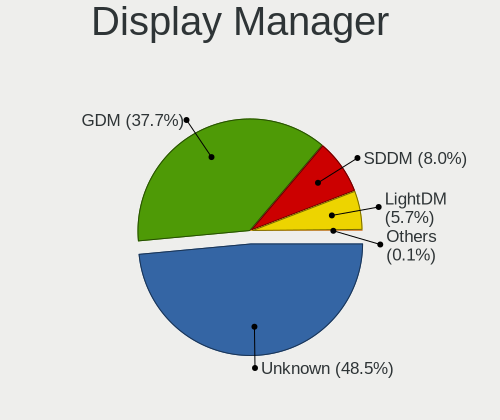
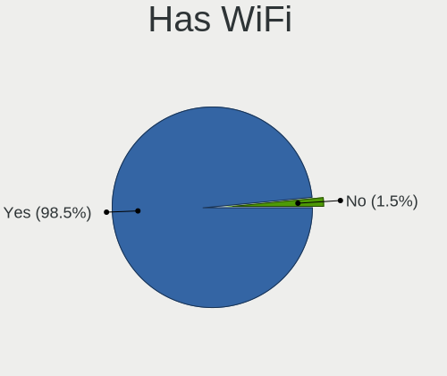

Fedora 36 - Tested Hardware & Statistics (Notebooks)
----------------------------------------------------

A project to collect tested hardware configurations for Fedora 36.

Anyone can contribute to this report by the [hw-probe](https://github.com/linuxhw/hw-probe) tool:

    sudo -E hw-probe -all -upload

Please contribute! Especially if your hardware is rare.

Contents
--------

* [ Test Cases ](#test-cases)

* [ System ](#system)
  - [ Kernel                   ](#kernel)
  - [ Kernel Family            ](#kernel-family)
  - [ Kernel Major Ver.        ](#kernel-major-ver)
  - [ Arch                     ](#arch)
  - [ DE                       ](#de)
  - [ Display Server           ](#display-server)
  - [ Display Manager          ](#display-manager)
  - [ OS Lang                  ](#os-lang)
  - [ Boot Mode                ](#boot-mode)
  - [ Filesystem               ](#filesystem)
  - [ Part. scheme             ](#part-scheme)
  - [ Dual Boot with Linux/BSD ](#dual-boot-with-linuxbsd)
  - [ Dual Boot (Win)          ](#dual-boot-win)

* [ Board ](#board)
  - [ Vendor                   ](#vendor)
  - [ Model                    ](#model)
  - [ Model Family             ](#model-family)
  - [ MFG Year                 ](#mfg-year)
  - [ Form Factor              ](#form-factor)
  - [ Secure Boot              ](#secure-boot)
  - [ Coreboot                 ](#coreboot)
  - [ RAM Size                 ](#ram-size)
  - [ RAM Used                 ](#ram-used)
  - [ Total Drives             ](#total-drives)
  - [ Has CD-ROM               ](#has-cd-rom)
  - [ Has Ethernet             ](#has-ethernet)
  - [ Has WiFi                 ](#has-wifi)
  - [ Has Bluetooth            ](#has-bluetooth)

* [ Location ](#location)
  - [ Country                  ](#country)
  - [ City                     ](#city)

* [ Drives ](#drives)
  - [ Drive Vendor             ](#drive-vendor)
  - [ Drive Model              ](#drive-model)
  - [ HDD Vendor               ](#hdd-vendor)
  - [ SSD Vendor               ](#ssd-vendor)
  - [ Drive Kind               ](#drive-kind)
  - [ Drive Connector          ](#drive-connector)
  - [ Drive Size               ](#drive-size)
  - [ Space Total              ](#space-total)
  - [ Space Used               ](#space-used)
  - [ Malfunc. Drives          ](#malfunc-drives)
  - [ Malfunc. Drive Vendor    ](#malfunc-drive-vendor)
  - [ Malfunc. HDD Vendor      ](#malfunc-hdd-vendor)
  - [ Malfunc. Drive Kind      ](#malfunc-drive-kind)
  - [ Failed Drives            ](#failed-drives)
  - [ Failed Drive Vendor      ](#failed-drive-vendor)
  - [ Drive Status             ](#drive-status)

* [ Storage controller ](#storage-controller)
  - [ Storage Vendor           ](#storage-vendor)
  - [ Storage Model            ](#storage-model)
  - [ Storage Kind             ](#storage-kind)

* [ Processor ](#processor)
  - [ CPU Vendor               ](#cpu-vendor)
  - [ CPU Model                ](#cpu-model)
  - [ CPU Model Family         ](#cpu-model-family)
  - [ CPU Cores                ](#cpu-cores)
  - [ CPU Sockets              ](#cpu-sockets)
  - [ CPU Threads              ](#cpu-threads)
  - [ CPU Op-Modes             ](#cpu-op-modes)
  - [ CPU Microcode            ](#cpu-microcode)
  - [ CPU Microarch            ](#cpu-microarch)

* [ Graphics ](#graphics)
  - [ GPU Vendor               ](#gpu-vendor)
  - [ GPU Model                ](#gpu-model)
  - [ GPU Combo                ](#gpu-combo)
  - [ GPU Driver               ](#gpu-driver)
  - [ GPU Memory               ](#gpu-memory)

* [ Monitor ](#monitor)
  - [ Monitor Vendor           ](#monitor-vendor)
  - [ Monitor Model            ](#monitor-model)
  - [ Monitor Resolution       ](#monitor-resolution)
  - [ Monitor Diagonal         ](#monitor-diagonal)
  - [ Monitor Width            ](#monitor-width)
  - [ Aspect Ratio             ](#aspect-ratio)
  - [ Monitor Area             ](#monitor-area)
  - [ Pixel Density            ](#pixel-density)
  - [ Multiple Monitors        ](#multiple-monitors)

* [ Network ](#network)
  - [ Net Controller Vendor    ](#net-controller-vendor)
  - [ Net Controller Model     ](#net-controller-model)
  - [ Wireless Vendor          ](#wireless-vendor)
  - [ Wireless Model           ](#wireless-model)
  - [ Ethernet Vendor          ](#ethernet-vendor)
  - [ Ethernet Model           ](#ethernet-model)
  - [ Net Controller Kind      ](#net-controller-kind)
  - [ Used Controller          ](#used-controller)
  - [ NICs                     ](#nics)
  - [ IPv6                     ](#ipv6)

* [ Bluetooth ](#bluetooth)
  - [ Bluetooth Vendor         ](#bluetooth-vendor)
  - [ Bluetooth Model          ](#bluetooth-model)

* [ Sound ](#sound)
  - [ Sound Vendor             ](#sound-vendor)
  - [ Sound Model              ](#sound-model)

* [ Memory ](#memory)
  - [ Memory Vendor            ](#memory-vendor)
  - [ Memory Model             ](#memory-model)
  - [ Memory Kind              ](#memory-kind)
  - [ Memory Form Factor       ](#memory-form-factor)
  - [ Memory Size              ](#memory-size)
  - [ Memory Speed             ](#memory-speed)

* [ Printers & scanners ](#printers--scanners)
  - [ Printer Vendor           ](#printer-vendor)
  - [ Printer Model            ](#printer-model)
  - [ Scanner Vendor           ](#scanner-vendor)
  - [ Scanner Model            ](#scanner-model)

* [ Camera ](#camera)
  - [ Camera Vendor            ](#camera-vendor)
  - [ Camera Model             ](#camera-model)

* [ Security ](#security)
  - [ Fingerprint Vendor       ](#fingerprint-vendor)
  - [ Fingerprint Model        ](#fingerprint-model)
  - [ Chipcard Vendor          ](#chipcard-vendor)
  - [ Chipcard Model           ](#chipcard-model)

* [ Unsupported ](#unsupported)
  - [ Unsupported Devices      ](#unsupported-devices)
  - [ Unsupported Device Types ](#unsupported-device-types)

Test Cases
----------

Total: 82

| Vendor        | Model                       | Probe                                                      | Date         |
|---------------|-----------------------------|------------------------------------------------------------|--------------|
| ASUSTek       | G75VX                       | [fb58cab830](https://linux-hardware.org/?probe=fb58cab830) | Apr 30, 2022 |
| HP            | ZBook Firefly 15 inch G8... | [6cdff366fa](https://linux-hardware.org/?probe=6cdff366fa) | Apr 28, 2022 |
| MSI           | Stealth GS66 12UGS          | [bf36d72c14](https://linux-hardware.org/?probe=bf36d72c14) | Apr 26, 2022 |
| Acer          | Nitro AN515-43              | [99527fd065](https://linux-hardware.org/?probe=99527fd065) | Apr 26, 2022 |
| MSI           | Stealth GS66 12UGS          | [273526bab2](https://linux-hardware.org/?probe=273526bab2) | Apr 26, 2022 |
| HP            | ZBook Fury 15 G7 Mobile ... | [620718bb9e](https://linux-hardware.org/?probe=620718bb9e) | Apr 26, 2022 |
| Acer          | Aspire A515-45              | [128cdc0a61](https://linux-hardware.org/?probe=128cdc0a61) | Apr 26, 2022 |
| ASUSTek       | ROG Zephyrus G14 GA402RJ... | [0d3c8ed904](https://linux-hardware.org/?probe=0d3c8ed904) | Apr 25, 2022 |
| Lenovo        | IdeaPad 320-15ISK 80XH      | [b4577b2374](https://linux-hardware.org/?probe=b4577b2374) | Apr 25, 2022 |
| Dell          | Latitude 7280               | [7ad22b030d](https://linux-hardware.org/?probe=7ad22b030d) | Apr 24, 2022 |
| Lenovo        | ThinkPad T450s 20BWS2HP0... | [762843e768](https://linux-hardware.org/?probe=762843e768) | Apr 23, 2022 |
| Lenovo        | ThinkPad T450s 20BWS2HP0... | [11ec4d291b](https://linux-hardware.org/?probe=11ec4d291b) | Apr 23, 2022 |
| Dell          | Latitude E7450              | [5ce1623306](https://linux-hardware.org/?probe=5ce1623306) | Apr 22, 2022 |
| ASUSTek       | ROG Strix G513QM_G513QM     | [b6a457c33a](https://linux-hardware.org/?probe=b6a457c33a) | Apr 21, 2022 |
| Wiltronic     | iVIEW i896QW                | [34e1873984](https://linux-hardware.org/?probe=34e1873984) | Apr 21, 2022 |
| Lenovo        | IdeaPad C340-14API 81N6     | [9e1d98199a](https://linux-hardware.org/?probe=9e1d98199a) | Apr 18, 2022 |
| Lenovo        | ThinkPad W530 2463A49       | [202b5d34a1](https://linux-hardware.org/?probe=202b5d34a1) | Apr 18, 2022 |
| ASUSTek       | ROG Zephyrus G14 GA402RJ... | [81b837dc13](https://linux-hardware.org/?probe=81b837dc13) | Apr 18, 2022 |
| Lenovo        | IdeaPad S340-15IWL 81N8     | [b895187681](https://linux-hardware.org/?probe=b895187681) | Apr 17, 2022 |
| MSI           | Modern 14 B4MW              | [5d8e6ca082](https://linux-hardware.org/?probe=5d8e6ca082) | Apr 16, 2022 |
| Lenovo        | ThinkPad L14 Gen 2 20X10... | [6f75f679f9](https://linux-hardware.org/?probe=6f75f679f9) | Apr 16, 2022 |
| HP            | ProBook 455 G8 Notebook ... | [5bff5642ba](https://linux-hardware.org/?probe=5bff5642ba) | Apr 15, 2022 |
| Toshiba       | Satellite U840              | [9468123a43](https://linux-hardware.org/?probe=9468123a43) | Apr 15, 2022 |
| Dell          | Studio 1537                 | [56c84908d2](https://linux-hardware.org/?probe=56c84908d2) | Apr 15, 2022 |
| Lenovo        | IdeaPad 530S-14IKB 81EU     | [7436528d4f](https://linux-hardware.org/?probe=7436528d4f) | Apr 14, 2022 |
| Dell          | Inspiron 3505               | [719a1712f2](https://linux-hardware.org/?probe=719a1712f2) | Apr 14, 2022 |
| Dell          | Inspiron 3505               | [5781ceb5ca](https://linux-hardware.org/?probe=5781ceb5ca) | Apr 14, 2022 |
| Dell          | Inspiron 5548               | [77a3c1a7ce](https://linux-hardware.org/?probe=77a3c1a7ce) | Apr 14, 2022 |
| Lenovo        | ThinkPad P14s Gen 1 20Y1... | [9dd2675f34](https://linux-hardware.org/?probe=9dd2675f34) | Apr 14, 2022 |
| Dell          | XPS 13 9370                 | [0175e41474](https://linux-hardware.org/?probe=0175e41474) | Apr 14, 2022 |
| Dell          | XPS 13 9305                 | [48c7781b77](https://linux-hardware.org/?probe=48c7781b77) | Apr 14, 2022 |
| Dell          | Precision 7540              | [2aff9a81ff](https://linux-hardware.org/?probe=2aff9a81ff) | Apr 13, 2022 |
| Toshiba       | Satellite U840              | [c6fe138c8f](https://linux-hardware.org/?probe=c6fe138c8f) | Apr 13, 2022 |
| HP            | Laptop 15-dw3xxx            | [95cff2fbb1](https://linux-hardware.org/?probe=95cff2fbb1) | Apr 13, 2022 |
| HP            | ZBook Fury 15 G7 Mobile ... | [8421f0505f](https://linux-hardware.org/?probe=8421f0505f) | Apr 13, 2022 |
| Lenovo        | Legion Y540-15IRH 81SX      | [c3d7c67155](https://linux-hardware.org/?probe=c3d7c67155) | Apr 12, 2022 |
| Lenovo        | IdeaPad L340-15IRH Gamin... | [73bb0eeab0](https://linux-hardware.org/?probe=73bb0eeab0) | Apr 12, 2022 |
| Intel         | W7650                       | [4bd778e810](https://linux-hardware.org/?probe=4bd778e810) | Apr 11, 2022 |
| MSI           | GS66 Stealth 10UH           | [5589b339ed](https://linux-hardware.org/?probe=5589b339ed) | Apr 11, 2022 |
| Dell          | Studio 1537                 | [048fceac96](https://linux-hardware.org/?probe=048fceac96) | Apr 11, 2022 |
| ASUSTek       | VivoBook_ASUSLaptop X512... | [5a60603c45](https://linux-hardware.org/?probe=5a60603c45) | Apr 11, 2022 |
| HP            | Pavilion 15                 | [c913cb5a4a](https://linux-hardware.org/?probe=c913cb5a4a) | Apr 11, 2022 |
| ASUSTek       | VivoBook_ASUSLaptop X421... | [ff93a4d2f5](https://linux-hardware.org/?probe=ff93a4d2f5) | Apr 08, 2022 |
| Lenovo        | ThinkPad T495 20NJ000XIX    | [f00fb05977](https://linux-hardware.org/?probe=f00fb05977) | Apr 07, 2022 |
| MSI           | GS66 Stealth 10UH           | [bd6f031bc8](https://linux-hardware.org/?probe=bd6f031bc8) | Apr 06, 2022 |
| Acer          | Swift SF114-32              | [3947799e36](https://linux-hardware.org/?probe=3947799e36) | Apr 05, 2022 |
| MSI           | Prestige 14Evo A11M         | [29b43c3e27](https://linux-hardware.org/?probe=29b43c3e27) | Apr 05, 2022 |
| Acer          | Swift SF314-41              | [564cfd1f31](https://linux-hardware.org/?probe=564cfd1f31) | Apr 04, 2022 |
| Acer          | Aspire A515-45              | [eb69a7978b](https://linux-hardware.org/?probe=eb69a7978b) | Apr 04, 2022 |
| Lenovo        | IdeaPad 320S-13IKB 81AK     | [8444b44333](https://linux-hardware.org/?probe=8444b44333) | Apr 04, 2022 |
| Chuwi         | Hi10 Go                     | [cfa6610288](https://linux-hardware.org/?probe=cfa6610288) | Apr 04, 2022 |
| Lenovo        | ThinkPad X1 Carbon 6th 2... | [8c1841d2d0](https://linux-hardware.org/?probe=8c1841d2d0) | Apr 03, 2022 |
| Lenovo        | ThinkPad X1 Carbon 7th 2... | [5eef69398a](https://linux-hardware.org/?probe=5eef69398a) | Apr 03, 2022 |
| Lenovo        | ThinkBook 13s G3 ACN 20Y... | [ba4863a7bb](https://linux-hardware.org/?probe=ba4863a7bb) | Apr 02, 2022 |
| Lenovo        | IdeaPad Yoga 13 20175       | [cd942b0305](https://linux-hardware.org/?probe=cd942b0305) | Apr 02, 2022 |
| Dell          | Inspiron 5548               | [9e35cab29a](https://linux-hardware.org/?probe=9e35cab29a) | Apr 02, 2022 |
| Dell          | XPS 13 9333                 | [f4fb42182f](https://linux-hardware.org/?probe=f4fb42182f) | Apr 01, 2022 |
| Lenovo        | ThinkPad L13 Gen 2 20VJS... | [4c0c1422e7](https://linux-hardware.org/?probe=4c0c1422e7) | Mar 31, 2022 |
| Lenovo        | ThinkPad X260 20F5S0HK1J    | [a83d3cbe5f](https://linux-hardware.org/?probe=a83d3cbe5f) | Mar 31, 2022 |
| Lenovo        | ThinkBook 15 G2 ITL 20VE    | [cc95f0e3ab](https://linux-hardware.org/?probe=cc95f0e3ab) | Mar 31, 2022 |
| VALE          | Notebook Slim S132          | [138a4f1d68](https://linux-hardware.org/?probe=138a4f1d68) | Mar 31, 2022 |
| Lenovo        | ThinkPad P15 Gen 1 20STS... | [05c02cbe41](https://linux-hardware.org/?probe=05c02cbe41) | Mar 31, 2022 |
| Avell High... | B.ON                        | [697fc1d4ec](https://linux-hardware.org/?probe=697fc1d4ec) | Mar 29, 2022 |
| Framework     | Laptop                      | [a22656afee](https://linux-hardware.org/?probe=a22656afee) | Mar 28, 2022 |
| Dell          | XPS 17 9710                 | [461d175c44](https://linux-hardware.org/?probe=461d175c44) | Mar 28, 2022 |
| ASUSTek       | ROG Zephyrus Duo 15 SE G... | [16ac712c84](https://linux-hardware.org/?probe=16ac712c84) | Mar 24, 2022 |
| Lenovo        | IdeaPad 530S-14ARR 81H1     | [1b57f1f410](https://linux-hardware.org/?probe=1b57f1f410) | Mar 13, 2022 |
| HP            | ZBook Fury 15 G7 Mobile ... | [917a6b65a8](https://linux-hardware.org/?probe=917a6b65a8) | Mar 10, 2022 |
| Sony          | VGN-FW21E                   | [930ce5581f](https://linux-hardware.org/?probe=930ce5581f) | Feb 25, 2022 |
| Unknown       | Unknown                     | [033354ee53](https://linux-hardware.org/?probe=033354ee53) | Jan 02, 2022 |
| Unknown       | Unknown                     | [809200ad60](https://linux-hardware.org/?probe=809200ad60) | Jan 02, 2022 |
| Unknown       | Unknown                     | [ea795a97e1](https://linux-hardware.org/?probe=ea795a97e1) | Dec 26, 2021 |
| Unknown       | Unknown                     | [2b26e185d0](https://linux-hardware.org/?probe=2b26e185d0) | Dec 06, 2021 |
| Unknown       | Unknown                     | [f09a7c7125](https://linux-hardware.org/?probe=f09a7c7125) | Dec 06, 2021 |
| Positivo      | CHT12CP                     | [53054c8f7a](https://linux-hardware.org/?probe=53054c8f7a) | Nov 20, 2021 |
| Lenovo        | IdeaPadFlex 14 20308        | [1734da4566](https://linux-hardware.org/?probe=1734da4566) | Nov 13, 2021 |
| Lenovo        | ThinkBook 14 G3 ACL 21A2    | [2da0673527](https://linux-hardware.org/?probe=2da0673527) | Nov 01, 2021 |
| Notebook      | PCx0Dx                      | [b1a527acdc](https://linux-hardware.org/?probe=b1a527acdc) | Oct 11, 2021 |
| Notebook      | PCx0Dx                      | [90d4556fdf](https://linux-hardware.org/?probe=90d4556fdf) | Oct 11, 2021 |
| Unknown       | Unknown                     | [af4bbffabf](https://linux-hardware.org/?probe=af4bbffabf) | Sep 27, 2021 |
| Unknown       | Unknown                     | [81fd834473](https://linux-hardware.org/?probe=81fd834473) | Sep 26, 2021 |
| HP            | ProBook 4740s               | [77b2eed991](https://linux-hardware.org/?probe=77b2eed991) | Sep 22, 2021 |

System
------

Kernel
------

Version of the Linux kernel

| Version                                                       | Notebooks | Percent |
|---------------------------------------------------------------|-----------|---------|
| 5.17.1-300.fc36.x86_64                                        | 16        | 24.24%  |
| 5.17.2-300.fc36.x86_64                                        | 14        | 21.21%  |
| 5.17.0-0.rc7.116.fc36.x86_64                                  | 11        | 16.67%  |
| 5.17.3-302.fc36.x86_64                                        | 7         | 10.61%  |
| 5.17.0-300.fc36.x86_64                                        | 3         | 4.55%   |
| 5.17.0-0.rc5.102.fc36.x86_64                                  | 2         | 3.03%   |
| 5.18.0-0.rc3.220422.d569e86915b7f2f.31.vanilla.1.fc36.x86_64  | 1         | 1.52%   |
| 5.17.5-300.fc36.x86_64                                        | 1         | 1.52%   |
| 5.17.4-300.fc36.x86_64                                        | 1         | 1.52%   |
| 5.17.3-301.fsync.fc36.x86_64                                  | 1         | 1.52%   |
| 5.16.9-200.fc35.x86_64                                        | 1         | 1.52%   |
| 5.16.16-200.fc35.x86_64                                       | 1         | 1.52%   |
| 5.16.0-0.rc7.20211231git4f3d93c6eaff.52.vanilla.1.fc36.x86_64 | 1         | 1.52%   |
| 5.15.0-0.rc7.20211028git1fc596a56b33.56.fc36.x86_64           | 1         | 1.52%   |
| 5.15.0-0.rc4.20211008git1da38549dd64.36.fc36.x86_64           | 1         | 1.52%   |
| 5.15.0-0.rc2.20210923git58e2cf5d7946.21.vanilla.1.fc36.x86_64 | 1         | 1.52%   |
| 5.15.0-0.rc2.18.fc36.x86_64                                   | 1         | 1.52%   |
| 5.14.14-300.fc35.x86_64                                       | 1         | 1.52%   |
| 5.14.10-300.fc35.x86_64                                       | 1         | 1.52%   |

Kernel Family
-------------

Linux kernel without a distro release

| Version | Notebooks | Percent |
|---------|-----------|---------|
| 5.17.1  | 16        | 24.24%  |
| 5.17.0  | 16        | 24.24%  |
| 5.17.2  | 14        | 21.21%  |
| 5.17.3  | 8         | 12.12%  |
| 5.15.0  | 4         | 6.06%   |
| 5.18.0  | 1         | 1.52%   |
| 5.17.5  | 1         | 1.52%   |
| 5.17.4  | 1         | 1.52%   |
| 5.16.9  | 1         | 1.52%   |
| 5.16.16 | 1         | 1.52%   |
| 5.16.0  | 1         | 1.52%   |
| 5.14.14 | 1         | 1.52%   |
| 5.14.10 | 1         | 1.52%   |

Kernel Major Ver.
-----------------

Linux kernel major version

| Version | Notebooks | Percent |
|---------|-----------|---------|
| 5.17    | 55        | 84.62%  |
| 5.15    | 4         | 6.15%   |
| 5.16    | 3         | 4.62%   |
| 5.14    | 2         | 3.08%   |
| 5.18    | 1         | 1.54%   |

Arch
----

OS architecture (x86_64, i586, etc.)

| Name   | Notebooks | Percent |
|--------|-----------|---------|
| x86_64 | 64        | 100%    |

DE
--

Desktop Environment

| Name    | Notebooks | Percent |
|---------|-----------|---------|
| GNOME   | 56        | 86.15%  |
| KDE5    | 5         | 7.69%   |
| Unknown | 3         | 4.62%   |
| i3      | 1         | 1.54%   |

Display Server
--------------

X11 or Wayland

| Name    | Notebooks | Percent |
|---------|-----------|---------|
| Wayland | 54        | 84.38%  |
| X11     | 8         | 12.5%   |
| Unknown | 2         | 3.13%   |

Display Manager
---------------

SDDM, LightDM, etc.

| Name    | Notebooks | Percent |
|---------|-----------|---------|
| GDM     | 36        | 56.25%  |
| Unknown | 22        | 34.38%  |
| SDDM    | 4         | 6.25%   |
| LightDM | 2         | 3.13%   |

OS Lang
-------

Language

| Lang  | Notebooks | Percent |
|-------|-----------|---------|
| en_US | 39        | 60.94%  |
| en_GB | 5         | 7.81%   |
| pl_PL | 4         | 6.25%   |
| pt_BR | 2         | 3.13%   |
| fr_FR | 2         | 3.13%   |
| es_ES | 2         | 3.13%   |
| de_DE | 2         | 3.13%   |
| pt_PT | 1         | 1.56%   |
| nl_NL | 1         | 1.56%   |
| hu_HU | 1         | 1.56%   |
| hr_HR | 1         | 1.56%   |
| es_UY | 1         | 1.56%   |
| en_IN | 1         | 1.56%   |
| cs_CZ | 1         | 1.56%   |
| ba_RU | 1         | 1.56%   |

Boot Mode
---------

EFI or BIOS

| Mode | Notebooks | Percent |
|------|-----------|---------|
| EFI  | 57        | 89.06%  |
| BIOS | 7         | 10.94%  |

Filesystem
----------

Type of filesystem

| Type  | Notebooks | Percent |
|-------|-----------|---------|
| Btrfs | 49        | 76.56%  |
| Ext4  | 13        | 20.31%  |
| Xfs   | 2         | 3.13%   |

Part. scheme
------------

Scheme of partitioning

| Type    | Notebooks | Percent |
|---------|-----------|---------|
| GPT     | 38        | 58.46%  |
| Unknown | 24        | 36.92%  |
| MBR     | 3         | 4.62%   |

Dual Boot with Linux/BSD
------------------------

Hosting more than one Linux/BSD

| Dual boot | Notebooks | Percent |
|-----------|-----------|---------|
| No        | 49        | 76.56%  |
| Yes       | 15        | 23.44%  |

Dual Boot (Win)
---------------

Hosting Linux and Windows

| Dual boot | Notebooks | Percent |
|-----------|-----------|---------|
| No        | 45        | 70.31%  |
| Yes       | 19        | 29.69%  |

Board
-----

Vendor
------

Motherboard manufacturer

| Name                   | Notebooks | Percent |
|------------------------|-----------|---------|
| Lenovo                 | 23        | 35.94%  |
| Dell                   | 10        | 15.63%  |
| ASUSTek Computer       | 7         | 10.94%  |
| Hewlett-Packard        | 6         | 9.38%   |
| MSI                    | 4         | 6.25%   |
| Acer                   | 4         | 6.25%   |
| Wiltronic              | 1         | 1.56%   |
| VALE                   | 1         | 1.56%   |
| Toshiba                | 1         | 1.56%   |
| Sony                   | 1         | 1.56%   |
| Positivo               | 1         | 1.56%   |
| Notebook               | 1         | 1.56%   |
| Framework              | 1         | 1.56%   |
| Chuwi                  | 1         | 1.56%   |
| Avell High Performance | 1         | 1.56%   |
| Unknown                | 1         | 1.56%   |

Model
-----

Motherboard model

| Name                                              | Notebooks | Percent |
|---------------------------------------------------|-----------|---------|
| ASUS ROG Zephyrus G14 GA402RJ_GA402RJ             | 2         | 3.13%   |
| Wiltronic iVIEW i896QW                            | 1         | 1.56%   |
| VALE Notebook Slim S132                           | 1         | 1.56%   |
| Toshiba Satellite U840                            | 1         | 1.56%   |
| Sony VGN-FW21E                                    | 1         | 1.56%   |
| Positivo CHT12CP                                  | 1         | 1.56%   |
| Notebook PCx0Dx                                   | 1         | 1.56%   |
| MSI Stealth GS66 12UGS                            | 1         | 1.56%   |
| MSI Prestige 14Evo A11M                           | 1         | 1.56%   |
| MSI Modern 14 B4MW                                | 1         | 1.56%   |
| MSI GS66 Stealth 10UH                             | 1         | 1.56%   |
| Lenovo ThinkPad X260 20F5S0HK1J                   | 1         | 1.56%   |
| Lenovo ThinkPad X1 Carbon 7th 20R1S05B00          | 1         | 1.56%   |
| Lenovo ThinkPad X1 Carbon 6th 20KGS23S0P          | 1         | 1.56%   |
| Lenovo ThinkPad W530 2463A49                      | 1         | 1.56%   |
| Lenovo ThinkPad T495 20NJ000XIX                   | 1         | 1.56%   |
| Lenovo ThinkPad T450s 20BWS2HP00                  | 1         | 1.56%   |
| Lenovo ThinkPad P15 Gen 1 20STS0J500              | 1         | 1.56%   |
| Lenovo ThinkPad P14s Gen 1 20Y1000SUK             | 1         | 1.56%   |
| Lenovo ThinkPad L14 Gen 2 20X10044EQ              | 1         | 1.56%   |
| Lenovo ThinkPad L13 Gen 2 20VJS0HB00              | 1         | 1.56%   |
| Lenovo ThinkBook 15 G2 ITL 20VE                   | 1         | 1.56%   |
| Lenovo ThinkBook 14 G3 ACL 21A2                   | 1         | 1.56%   |
| Lenovo ThinkBook 13s G3 ACN 20YA                  | 1         | 1.56%   |
| Lenovo Legion Y540-15IRH 81SX                     | 1         | 1.56%   |
| Lenovo IdeaPadFlex 14 20308                       | 1         | 1.56%   |
| Lenovo IdeaPad Yoga 13 20175                      | 1         | 1.56%   |
| Lenovo IdeaPad S340-15IWL 81N8                    | 1         | 1.56%   |
| Lenovo IdeaPad L340-15IRH Gaming 81TR             | 1         | 1.56%   |
| Lenovo IdeaPad C340-14API 81N6                    | 1         | 1.56%   |
| Lenovo IdeaPad 530S-14IKB 81EU                    | 1         | 1.56%   |
| Lenovo IdeaPad 530S-14ARR 81H1                    | 1         | 1.56%   |
| Lenovo IdeaPad 320S-13IKB 81AK                    | 1         | 1.56%   |
| Lenovo IdeaPad 320-15ISK 80XH                     | 1         | 1.56%   |
| HP ZBook Fury 15 G7 Mobile Workstation            | 1         | 1.56%   |
| HP ZBook Firefly 15 inch G8 Mobile Workstation PC | 1         | 1.56%   |
| HP ProBook 4740s                                  | 1         | 1.56%   |
| HP ProBook 455 G8 Notebook PC                     | 1         | 1.56%   |
| HP Pavilion 15                                    | 1         | 1.56%   |
| HP Laptop 15-dw3xxx                               | 1         | 1.56%   |
| Framework Laptop                                  | 1         | 1.56%   |
| Dell XPS 17 9710                                  | 1         | 1.56%   |
| Dell XPS 13 9370                                  | 1         | 1.56%   |
| Dell XPS 13 9333                                  | 1         | 1.56%   |
| Dell XPS 13 9305                                  | 1         | 1.56%   |
| Dell Studio 1537                                  | 1         | 1.56%   |
| Dell Precision 7540                               | 1         | 1.56%   |
| Dell Latitude E7450                               | 1         | 1.56%   |
| Dell Latitude 7280                                | 1         | 1.56%   |
| Dell Inspiron 5548                                | 1         | 1.56%   |
| Dell Inspiron 3505                                | 1         | 1.56%   |
| Chuwi Hi10 Go                                     | 1         | 1.56%   |
| Avell High Performance B.ON                       | 1         | 1.56%   |
| ASUS VivoBook_ASUSLaptop X512DA_F512DA            | 1         | 1.56%   |
| ASUS VivoBook_ASUSLaptop X421FAY_K413FA           | 1         | 1.56%   |
| ASUS ROG Zephyrus Duo 15 SE GX551QS_GX551QS       | 1         | 1.56%   |
| ASUS ROG Strix G513QM_G513QM                      | 1         | 1.56%   |
| ASUS G75VX                                        | 1         | 1.56%   |
| Acer Swift SF314-41                               | 1         | 1.56%   |
| Acer Swift SF114-32                               | 1         | 1.56%   |

Model Family
------------

Motherboard model prefix

| Name                        | Notebooks | Percent |
|-----------------------------|-----------|---------|
| Lenovo ThinkPad             | 10        | 15.63%  |
| Lenovo IdeaPad              | 8         | 12.5%   |
| Dell XPS                    | 4         | 6.25%   |
| ASUS ROG                    | 4         | 6.25%   |
| Lenovo ThinkBook            | 3         | 4.69%   |
| HP ZBook                    | 2         | 3.13%   |
| HP ProBook                  | 2         | 3.13%   |
| Dell Latitude               | 2         | 3.13%   |
| Dell Inspiron               | 2         | 3.13%   |
| ASUS VivoBook               | 2         | 3.13%   |
| Acer Swift                  | 2         | 3.13%   |
| Wiltronic iVIEW             | 1         | 1.56%   |
| VALE Notebook               | 1         | 1.56%   |
| Toshiba Satellite           | 1         | 1.56%   |
| Sony VGN-FW21E              | 1         | 1.56%   |
| Positivo CHT12CP            | 1         | 1.56%   |
| Notebook PCx0Dx             | 1         | 1.56%   |
| MSI Stealth                 | 1         | 1.56%   |
| MSI Prestige                | 1         | 1.56%   |
| MSI Modern                  | 1         | 1.56%   |
| MSI GS66                    | 1         | 1.56%   |
| Lenovo Legion               | 1         | 1.56%   |
| Lenovo IdeaPadFlex          | 1         | 1.56%   |
| HP Pavilion                 | 1         | 1.56%   |
| HP Laptop                   | 1         | 1.56%   |
| Framework Laptop            | 1         | 1.56%   |
| Dell Studio                 | 1         | 1.56%   |
| Dell Precision              | 1         | 1.56%   |
| Chuwi Hi10                  | 1         | 1.56%   |
| Avell High Performance B.ON | 1         | 1.56%   |
| ASUS G75VX                  | 1         | 1.56%   |
| Acer Nitro                  | 1         | 1.56%   |
| Acer Aspire                 | 1         | 1.56%   |
| Unknown                     | 1         | 1.56%   |

MFG Year
--------

Motherboard manufacture year

| Year | Notebooks | Percent |
|------|-----------|---------|
| 2021 | 16        | 25%     |
| 2020 | 11        | 17.19%  |
| 2019 | 10        | 15.63%  |
| 2018 | 6         | 9.38%   |
| 2013 | 4         | 6.25%   |
| 2012 | 4         | 6.25%   |
| 2017 | 3         | 4.69%   |
| 2016 | 3         | 4.69%   |
| 2022 | 2         | 3.13%   |
| 2015 | 2         | 3.13%   |
| 2008 | 2         | 3.13%   |
| 2014 | 1         | 1.56%   |

Form Factor
-----------

Physical design of the computer

| Name     | Notebooks | Percent |
|----------|-----------|---------|
| Notebook | 64        | 100%    |

Secure Boot
-----------

Enabled or disabled

| State    | Notebooks | Percent |
|----------|-----------|---------|
| Disabled | 47        | 73.44%  |
| Enabled  | 17        | 26.56%  |

Coreboot
--------

Have coreboot on board

| Used | Notebooks | Percent |
|------|-----------|---------|
| No   | 64        | 100%    |

RAM Size
--------

Total RAM memory

| Size in GB  | Notebooks | Percent |
|-------------|-----------|---------|
| 4.01-8.0    | 15        | 23.44%  |
| 16.01-24.0  | 15        | 23.44%  |
| 8.01-16.0   | 15        | 23.44%  |
| 32.01-64.0  | 10        | 15.63%  |
| 3.01-4.0    | 6         | 9.38%   |
| 24.01-32.0  | 1         | 1.56%   |
| 64.01-256.0 | 1         | 1.56%   |
| 1.01-2.0    | 1         | 1.56%   |

RAM Used
--------

Used RAM memory

| Used GB   | Notebooks | Percent |
|-----------|-----------|---------|
| 4.01-8.0  | 25        | 37.88%  |
| 3.01-4.0  | 19        | 28.79%  |
| 2.01-3.0  | 14        | 21.21%  |
| 1.01-2.0  | 7         | 10.61%  |
| 8.01-16.0 | 1         | 1.52%   |

Total Drives
------------

Number of drives on board

| Drives | Notebooks | Percent |
|--------|-----------|---------|
| 1      | 45        | 69.23%  |
| 2      | 16        | 24.62%  |
| 3      | 4         | 6.15%   |

Has CD-ROM
----------

Has CD-ROM on board

| Presented | Notebooks | Percent |
|-----------|-----------|---------|
| No        | 58        | 90.63%  |
| Yes       | 6         | 9.38%   |

Has Ethernet
------------

Has Ethernet on board

| Presented | Notebooks | Percent |
|-----------|-----------|---------|
| Yes       | 39        | 60.94%  |
| No        | 25        | 39.06%  |

Has WiFi
--------

Has WiFi module

| Presented | Notebooks | Percent |
|-----------|-----------|---------|
| Yes       | 62        | 96.88%  |
| No        | 2         | 3.13%   |

Has Bluetooth
-------------

Has Bluetooth module

| Presented | Notebooks | Percent |
|-----------|-----------|---------|
| Yes       | 57        | 89.06%  |
| No        | 7         | 10.94%  |

Location
--------

Country
-------

Geographic location (country)

| Country      | Notebooks | Percent |
|--------------|-----------|---------|
| USA          | 10        | 15.63%  |
| UK           | 6         | 9.38%   |
| Poland       | 5         | 7.81%   |
| Brazil       | 4         | 6.25%   |
| Russia       | 3         | 4.69%   |
| Norway       | 3         | 4.69%   |
| Italy        | 3         | 4.69%   |
| Germany      | 3         | 4.69%   |
| Romania      | 2         | 3.13%   |
| Netherlands  | 2         | 3.13%   |
| India        | 2         | 3.13%   |
| France       | 2         | 3.13%   |
| Uzbekistan   | 1         | 1.56%   |
| Turkey       | 1         | 1.56%   |
| Sweden       | 1         | 1.56%   |
| Spain        | 1         | 1.56%   |
| South Africa | 1         | 1.56%   |
| Slovakia     | 1         | 1.56%   |
| Saudi Arabia | 1         | 1.56%   |
| Portugal     | 1         | 1.56%   |
| Nepal        | 1         | 1.56%   |
| Mexico       | 1         | 1.56%   |
| Latvia       | 1         | 1.56%   |
| Ireland      | 1         | 1.56%   |
| Iceland      | 1         | 1.56%   |
| Hungary      | 1         | 1.56%   |
| Estonia      | 1         | 1.56%   |
| Czechia      | 1         | 1.56%   |
| Croatia      | 1         | 1.56%   |
| Belgium      | 1         | 1.56%   |
| Austria      | 1         | 1.56%   |

City
----

Geographic location (city)

| City                          | Notebooks | Percent |
|-------------------------------|-----------|---------|
| Warsaw                        | 3         | 4.69%   |
| Moscow                        | 3         | 4.69%   |
| Sao Paulo                     | 2         | 3.13%   |
| Oslo                          | 2         | 3.13%   |
| Zagreb                        | 1         | 1.56%   |
| Xalapa                        | 1         | 1.56%   |
| Warrington                    | 1         | 1.56%   |
| Vegarshei                     | 1         | 1.56%   |
| Trzciel                       | 1         | 1.56%   |
| Trier                         | 1         | 1.56%   |
| Tashkent                      | 1         | 1.56%   |
| Tallinn                       | 1         | 1.56%   |
| Solihull                      | 1         | 1.56%   |
| Scorrano                      | 1         | 1.56%   |
| Sangli                        | 1         | 1.56%   |
| Rozmital pod Tremsinem        | 1         | 1.56%   |
| Rijssen                       | 1         | 1.56%   |
| Riga                          | 1         | 1.56%   |
| Reykjavik                     | 1         | 1.56%   |
| Princeton                     | 1         | 1.56%   |
| Porto                         | 1         | 1.56%   |
| Orpington                     | 1         | 1.56%   |
| Newport                       | 1         | 1.56%   |
| Mölten                       | 1         | 1.56%   |
| Meitingen                     | 1         | 1.56%   |
| Maryville                     | 1         | 1.56%   |
| Marseille                     | 1         | 1.56%   |
| Macaiba                       | 1         | 1.56%   |
| Lyme                          | 1         | 1.56%   |
| Lontzen                       | 1         | 1.56%   |
| Leiderdorp                    | 1         | 1.56%   |
| Las Vegas                     | 1         | 1.56%   |
| Kensington                    | 1         | 1.56%   |
| Kathmandu                     | 1         | 1.56%   |
| Kasten bei Boeheimkirchen     | 1         | 1.56%   |
| Joinville                     | 1         | 1.56%   |
| Jaipur                        | 1         | 1.56%   |
| Istanbul                      | 1         | 1.56%   |
| Iasi                          | 1         | 1.56%   |
| Holmes Chapel                 | 1         | 1.56%   |
| Halstead                      | 1         | 1.56%   |
| Gyomro                        | 1         | 1.56%   |
| Greenville                    | 1         | 1.56%   |
| Fort Collins                  | 1         | 1.56%   |
| Folsom                        | 1         | 1.56%   |
| Enebyberg                     | 1         | 1.56%   |
| El Segundo                    | 1         | 1.56%   |
| Dublin                        | 1         | 1.56%   |
| Córdoba                      | 1         | 1.56%   |
| Châteauneuf-du-Pape          | 1         | 1.56%   |
| Caldaro sulla Strada del Vino | 1         | 1.56%   |
| Bucharest                     | 1         | 1.56%   |
| Brooklyn                      | 1         | 1.56%   |
| Bratislava                    | 1         | 1.56%   |
| Blachownia                    | 1         | 1.56%   |
| Berlin                        | 1         | 1.56%   |
| Beaverton                     | 1         | 1.56%   |
| Al Qatif                      | 1         | 1.56%   |

Drives
------

Drive Vendor
------------

Hard drive vendors

| Vendor              | Notebooks | Drives | Percent |
|---------------------|-----------|--------|---------|
| Samsung Electronics | 18        | 20     | 21.69%  |
| Unknown             | 8         | 11     | 9.64%   |
| WDC                 | 7         | 7      | 8.43%   |
| SK Hynix            | 7         | 7      | 8.43%   |
| Sandisk             | 4         | 4      | 4.82%   |
| Micron Technology   | 4         | 5      | 4.82%   |
| Kingston            | 4         | 7      | 4.82%   |
| A-DATA Technology   | 4         | 4      | 4.82%   |
| Seagate             | 3         | 3      | 3.61%   |
| Toshiba             | 2         | 2      | 2.41%   |
| PNY                 | 2         | 3      | 2.41%   |
| Phison              | 2         | 2      | 2.41%   |
| Intel               | 2         | 2      | 2.41%   |
| Unknown             | 2         | 2      | 2.41%   |
| XPG                 | 1         | 1      | 1.2%    |
| WDC WDS2            | 1         | 1      | 1.2%    |
| Transcend           | 1         | 1      | 1.2%    |
| Silicon Motion      | 1         | 1      | 1.2%    |
| Mass                | 1         | 1      | 1.2%    |
| Leven               | 1         | 1      | 1.2%    |
| KIOXIA              | 1         | 2      | 1.2%    |
| KingFast            | 1         | 1      | 1.2%    |
| KingDian            | 1         | 1      | 1.2%    |
| Hitachi             | 1         | 1      | 1.2%    |
| Fujitsu             | 1         | 1      | 1.2%    |
| EAGET               | 1         | 1      | 1.2%    |
| Crucial             | 1         | 1      | 1.2%    |
| Corsair             | 1         | 2      | 1.2%    |

Drive Model
-----------

Hard drive models

| Model                                | Notebooks | Percent |
|--------------------------------------|-----------|---------|
| Unknown MMC Card  32GB               | 3         | 3.45%   |
| SK Hynix NVMe SSD Drive 512GB        | 2         | 2.3%    |
| Sandisk NVMe SSD Drive 512GB         | 2         | 2.3%    |
| Samsung SSD 980 1TB                  | 2         | 2.3%    |
| Samsung SSD 860 EVO 250GB            | 2         | 2.3%    |
| Samsung NVMe SSD Drive 1TB           | 2         | 2.3%    |
| Phison Sabrent 512GB                 | 2         | 2.3%    |
| Unknown                              | 2         | 2.3%    |
| XPG NVMe SSD Drive 1024GB            | 1         | 1.15%   |
| WDC WDS500G1X0E-00AFY0 500GB         | 1         | 1.15%   |
| WDC WDS240G2G0A-00JH30 240GB SSD     | 1         | 1.15%   |
| WDC WDS2 40G2G0B-00EP 240GB SSD      | 1         | 1.15%   |
| WDC WDS100T2B0A-00SM50 1TB SSD       | 1         | 1.15%   |
| WDC WD10SPZX-24Z10T0 1TB             | 1         | 1.15%   |
| WDC WD10SPZX-24Z10 1TB               | 1         | 1.15%   |
| WDC PC SN530 SDBPMPZ-512G-1101 512GB | 1         | 1.15%   |
| WDC PC SN530 SDBPMPZ-256G-1101 256GB | 1         | 1.15%   |
| Unknown SU32G  32GB                  | 1         | 1.15%   |
| Unknown SM32G  32GB                  | 1         | 1.15%   |
| Unknown MMC64G  64GB                 | 1         | 1.15%   |
| Unknown MMC Card  64GB               | 1         | 1.15%   |
| Unknown MMC Card  128GB              | 1         | 1.15%   |
| Unknown ED2S5  128GB                 | 1         | 1.15%   |
| Transcend TS240GMTS420S 240GB SSD    | 1         | 1.15%   |
| Toshiba NVMe SSD Drive 512GB         | 1         | 1.15%   |
| Toshiba KXG6AZNV512G 512GB           | 1         | 1.15%   |
| SK Hynix PC401 NVMe 256GB            | 1         | 1.15%   |
| SK Hynix NVMe SSD Drive 256GB        | 1         | 1.15%   |
| SK Hynix NVMe SSD Drive 1TB          | 1         | 1.15%   |
| SK Hynix HFM512GDJTNG-8310A 512GB    | 1         | 1.15%   |
| SK Hynix HFM256GDHTNG-8310A 256GB    | 1         | 1.15%   |
| Silicon Motion NE-128 128GB          | 1         | 1.15%   |
| Seagate ST2000LM003 HN-M201RAD 2TB   | 1         | 1.15%   |
| Seagate ST1000LM035-1RK172 1TB       | 1         | 1.15%   |
| Seagate Expansion+ 2TB               | 1         | 1.15%   |
| Sandisk NVMe SSD Drive 1024GB        | 1         | 1.15%   |
| SanDisk DF4032  32GB                 | 1         | 1.15%   |
| Samsung SSD PM871 mSATA 256GB        | 1         | 1.15%   |
| Samsung SSD 970 EVO Plus 500GB       | 1         | 1.15%   |
| Samsung SSD 970 EVO 500GB            | 1         | 1.15%   |
| Samsung SSD 860 EVO mSATA 500GB      | 1         | 1.15%   |
| Samsung SSD 850 EVO mSATA 500GB      | 1         | 1.15%   |
| Samsung PM9A1 NVMe 512GB             | 1         | 1.15%   |
| Samsung NVMe SSD Drive 500GB         | 1         | 1.15%   |
| Samsung NVMe SSD Drive 1024GB        | 1         | 1.15%   |
| Samsung MZVLQ512HALU-000H1 512GB     | 1         | 1.15%   |
| Samsung MZVLQ512HALU-00000 512GB     | 1         | 1.15%   |
| Samsung MZVLQ256HAJD-00000 256GB     | 1         | 1.15%   |
| Samsung MZMPC128HBFU-000L1 128GB SSD | 1         | 1.15%   |
| Samsung MZALQ512HBLU-00BL2 512GB     | 1         | 1.15%   |
| PNY CS3040 4TB SSD                   | 1         | 1.15%   |
| PNY CS1311 240GB SSD                 | 1         | 1.15%   |
| Micron NVMe SSD Drive 1024GB         | 1         | 1.15%   |
| Micron 3400_MTFDKBA1T0TFH 1TB        | 1         | 1.15%   |
| Micron 2450_MTFDKBA1T0TFK 1TB        | 1         | 1.15%   |
| Micron 2200S NVMe 256GB              | 1         | 1.15%   |
| Micron 1100 SATA 512GB SSD           | 1         | 1.15%   |
| Mass Mass Storage 8MB                | 1         | 1.15%   |
| Leven JAJS600M256C 256GB             | 1         | 1.15%   |
| KIOXIA KXG60ZNV1T02 1TB              | 1         | 1.15%   |

HDD Vendor
----------

Hard disk drive vendors

| Vendor  | Notebooks | Drives | Percent |
|---------|-----------|--------|---------|
| Seagate | 3         | 3      | 42.86%  |
| WDC     | 2         | 2      | 28.57%  |
| Hitachi | 1         | 1      | 14.29%  |
| Fujitsu | 1         | 1      | 14.29%  |

SSD Vendor
----------

Solid state drive vendors

| Vendor              | Notebooks | Drives | Percent |
|---------------------|-----------|--------|---------|
| Samsung Electronics | 6         | 6      | 31.58%  |
| WDC                 | 2         | 2      | 10.53%  |
| Kingston            | 2         | 4      | 10.53%  |
| WDC WDS2            | 1         | 1      | 5.26%   |
| Transcend           | 1         | 1      | 5.26%   |
| PNY                 | 1         | 1      | 5.26%   |
| Micron Technology   | 1         | 1      | 5.26%   |
| Leven               | 1         | 1      | 5.26%   |
| Intel               | 1         | 1      | 5.26%   |
| EAGET               | 1         | 1      | 5.26%   |
| Corsair             | 1         | 2      | 5.26%   |
| A-DATA Technology   | 1         | 1      | 5.26%   |

Drive Kind
----------

HDD or SSD

| Kind    | Notebooks | Drives | Percent |
|---------|-----------|--------|---------|
| NVMe    | 42        | 49     | 53.85%  |
| SSD     | 16        | 22     | 20.51%  |
| MMC     | 10        | 14     | 12.82%  |
| HDD     | 7         | 7      | 8.97%   |
| Unknown | 3         | 3      | 3.85%   |

Drive Connector
---------------

SATA, SAS, NVMe, etc.

| Type | Notebooks | Drives | Percent |
|------|-----------|--------|---------|
| NVMe | 42        | 49     | 54.55%  |
| SATA | 22        | 29     | 28.57%  |
| MMC  | 10        | 14     | 12.99%  |
| SAS  | 3         | 3      | 3.9%    |

Drive Size
----------

Size of hard drive

| Size in TB | Notebooks | Drives | Percent |
|------------|-----------|--------|---------|
| 0.01-0.5   | 15        | 20     | 62.5%   |
| 0.51-1.0   | 6         | 6      | 25%     |
| 1.01-2.0   | 3         | 3      | 12.5%   |

Space Total
-----------

Amount of disk space available on the file system

| Size in GB     | Notebooks | Percent |
|----------------|-----------|---------|
| 1-20           | 16        | 25%     |
| 251-500        | 12        | 18.75%  |
| 501-1000       | 12        | 18.75%  |
| 1001-2000      | 10        | 15.63%  |
| 101-250        | 6         | 9.38%   |
| 51-100         | 3         | 4.69%   |
| Unknown        | 3         | 4.69%   |
| More than 3000 | 1         | 1.56%   |
| 21-50          | 1         | 1.56%   |

Space Used
----------

Amount of used disk space

| Used GB   | Notebooks | Percent |
|-----------|-----------|---------|
| 1-20      | 31        | 48.44%  |
| 251-500   | 7         | 10.94%  |
| 21-50     | 7         | 10.94%  |
| 51-100    | 7         | 10.94%  |
| 101-250   | 5         | 7.81%   |
| 501-1000  | 3         | 4.69%   |
| Unknown   | 3         | 4.69%   |
| 1001-2000 | 1         | 1.56%   |

Malfunc. Drives
---------------

Drive models with a malfunction

| Model                      | Notebooks | Drives | Percent |
|----------------------------|-----------|--------|---------|
| Fujitsu MJA2500BH G1 500GB | 1         | 1      | 100%    |

Malfunc. Drive Vendor
---------------------

Vendors of faulty drives

| Vendor  | Notebooks | Drives | Percent |
|---------|-----------|--------|---------|
| Fujitsu | 1         | 1      | 100%    |

Malfunc. HDD Vendor
-------------------

Vendors of faulty HDD drives

| Vendor  | Notebooks | Drives | Percent |
|---------|-----------|--------|---------|
| Fujitsu | 1         | 1      | 100%    |

Malfunc. Drive Kind
-------------------

Kinds of faulty drives

| Kind | Notebooks | Drives | Percent |
|------|-----------|--------|---------|
| HDD  | 1         | 1      | 100%    |

Failed Drives
-------------

Failed drive models

Zero info for selected period =(

Failed Drive Vendor
-------------------

Failed drive vendors

Zero info for selected period =(

Drive Status
------------

Number of failed and malfunc. drives

| Status   | Notebooks | Drives | Percent |
|----------|-----------|--------|---------|
| Works    | 39        | 47     | 54.17%  |
| Detected | 32        | 47     | 44.44%  |
| Malfunc  | 1         | 1      | 1.39%   |

Storage controller
------------------

Storage Vendor
--------------

Storage controller vendors

| Vendor                       | Notebooks | Percent |
|------------------------------|-----------|---------|
| Intel                        | 31        | 39.74%  |
| Samsung Electronics          | 12        | 15.38%  |
| SK Hynix                     | 7         | 8.97%   |
| Sandisk                      | 6         | 7.69%   |
| AMD                          | 5         | 6.41%   |
| ADATA Technology             | 4         | 5.13%   |
| Toshiba America Info Systems | 3         | 3.85%   |
| Phison Electronics           | 3         | 3.85%   |
| Micron Technology            | 3         | 3.85%   |
| Kingston Technology Company  | 2         | 2.56%   |
| Silicon Motion               | 1         | 1.28%   |
| Micron/Crucial Technology    | 1         | 1.28%   |

Storage Model
-------------

Storage controller models

| Model                                                                    | Notebooks | Percent |
|--------------------------------------------------------------------------|-----------|---------|
| Samsung NVMe SSD Controller 980                                          | 7         | 8.64%   |
| AMD FCH SATA Controller [AHCI mode]                                      | 5         | 6.17%   |
| Samsung NVMe SSD Controller SM981/PM981/PM983                            | 4         | 4.94%   |
| Intel Volume Management Device NVMe RAID Controller                      | 4         | 4.94%   |
| Intel Sunrise Point-LP SATA Controller [AHCI mode]                       | 4         | 4.94%   |
| Intel 7 Series Chipset Family 6-port SATA Controller [AHCI mode]         | 4         | 4.94%   |
| Toshiba America Info Systems XG6 NVMe SSD Controller                     | 3         | 3.7%    |
| SK Hynix BC501 NVMe Solid State Drive                                    | 3         | 3.7%    |
| Micron Non-Volatile memory controller                                    | 3         | 3.7%    |
| Intel Wildcat Point-LP SATA Controller [AHCI Mode]                       | 3         | 3.7%    |
| Intel Cannon Lake Mobile PCH SATA AHCI Controller                        | 3         | 3.7%    |
| Intel 8 Series SATA Controller 1 [AHCI mode]                             | 3         | 3.7%    |
| SK Hynix PC401 NVMe Solid State Drive 256GB                              | 2         | 2.47%   |
| Sandisk Non-Volatile memory controller                                   | 2         | 2.47%   |
| Samsung NVMe SSD Controller PM9A1/PM9A3/980PRO                           | 2         | 2.47%   |
| Phison E12 NVMe Controller                                               | 2         | 2.47%   |
| Intel Tiger Lake-LP SATA Controller [AHCI mode]                          | 2         | 2.47%   |
| Intel Celeron/Pentium Silver Processor SATA Controller                   | 2         | 2.47%   |
| Intel 82801IBM/IEM (ICH9M/ICH9M-E) 4 port SATA Controller [AHCI mode]    | 2         | 2.47%   |
| Intel 82801 Mobile SATA Controller [RAID mode]                           | 2         | 2.47%   |
| ADATA XPG SX8200 Pro PCIe Gen3x4 M.2 2280 Solid State Drive              | 2         | 2.47%   |
| ADATA Non-Volatile memory controller                                     | 2         | 2.47%   |
| SK Hynix Non-Volatile memory controller                                  | 1         | 1.23%   |
| SK Hynix Gold P31 SSD                                                    | 1         | 1.23%   |
| Silicon Motion SM2263EN/SM2263XT SSD Controller                          | 1         | 1.23%   |
| Sandisk WD PC SN810 / Black SN850 NVMe SSD                               | 1         | 1.23%   |
| Sandisk WD Blue SN500 / PC SN520 NVMe SSD                                | 1         | 1.23%   |
| Sandisk WD Black SN750 / PC SN730 NVMe SSD                               | 1         | 1.23%   |
| Sandisk PC SN520 NVMe SSD                                                | 1         | 1.23%   |
| Phison E16 PCIe4 NVMe Controller                                         | 1         | 1.23%   |
| Micron/Crucial P2 NVMe PCIe SSD                                          | 1         | 1.23%   |
| Kingston Company Company Non-Volatile memory controller                  | 1         | 1.23%   |
| Kingston Company SNVS2000G [NV1 NVMe PCIe SSD 2TB]                       | 1         | 1.23%   |
| Intel Non-Volatile memory controller                                     | 1         | 1.23%   |
| Intel Jasper Lake SATA AHCI Controller                                   | 1         | 1.23%   |
| Intel Celeron N3350/Pentium N4200/Atom E3900 Series SATA AHCI Controller | 1         | 1.23%   |
| Intel 400 Series Chipset Family SATA AHCI Controller                     | 1         | 1.23%   |

Storage Kind
------------

Kind of storage controller (IDE, SATA, NVMe, SAS, ...)

| Kind | Notebooks | Percent |
|------|-----------|---------|
| NVMe | 42        | 53.16%  |
| SATA | 31        | 39.24%  |
| RAID | 6         | 7.59%   |

Processor
---------

CPU Vendor
----------

Processor vendors

| Vendor | Notebooks | Percent |
|--------|-----------|---------|
| Intel  | 47        | 73.44%  |
| AMD    | 17        | 26.56%  |

CPU Model
---------

Processor models

| Model                                           | Notebooks | Percent |
|-------------------------------------------------|-----------|---------|
| Intel 11th Gen Core i7-1165G7 @ 2.80GHz         | 5         | 7.81%   |
| Intel 11th Gen Core i5-1135G7 @ 2.40GHz         | 3         | 4.69%   |
| AMD Ryzen 5 3500U with Radeon Vega Mobile Gfx   | 3         | 4.69%   |
| Intel Core i7-10870H CPU @ 2.20GHz              | 2         | 3.13%   |
| Intel Core i5-8250U CPU @ 1.60GHz               | 2         | 3.13%   |
| Intel Core i5-5200U CPU @ 2.20GHz               | 2         | 3.13%   |
| AMD Ryzen 9 6900HS with Radeon Graphics         | 2         | 3.13%   |
| AMD Ryzen 9 5900HX with Radeon Graphics         | 2         | 3.13%   |
| Intel Pentium Silver N5030 CPU @ 1.10GHz        | 1         | 1.56%   |
| Intel Pentium 3556U @ 1.70GHz                   | 1         | 1.56%   |
| Intel Core i7-9850H CPU @ 2.60GHz               | 1         | 1.56%   |
| Intel Core i7-9750H CPU @ 2.60GHz               | 1         | 1.56%   |
| Intel Core i7-8650U CPU @ 1.90GHz               | 1         | 1.56%   |
| Intel Core i7-8550U CPU @ 1.80GHz               | 1         | 1.56%   |
| Intel Core i7-7600U CPU @ 2.80GHz               | 1         | 1.56%   |
| Intel Core i7-5600U CPU @ 2.60GHz               | 1         | 1.56%   |
| Intel Core i7-4510U CPU @ 2.00GHz               | 1         | 1.56%   |
| Intel Core i7-3720QM CPU @ 2.60GHz              | 1         | 1.56%   |
| Intel Core i7-3632QM CPU @ 2.20GHz              | 1         | 1.56%   |
| Intel Core i7-3630QM CPU @ 2.40GHz              | 1         | 1.56%   |
| Intel Core i7-10875H CPU @ 2.30GHz              | 1         | 1.56%   |
| Intel Core i7-10850H CPU @ 2.70GHz              | 1         | 1.56%   |
| Intel Core i7-10710U CPU @ 1.10GHz              | 1         | 1.56%   |
| Intel Core i5-9300H CPU @ 2.40GHz               | 1         | 1.56%   |
| Intel Core i5-6300U CPU @ 2.40GHz               | 1         | 1.56%   |
| Intel Core i5-4210U CPU @ 1.70GHz               | 1         | 1.56%   |
| Intel Core i5-3337U CPU @ 1.80GHz               | 1         | 1.56%   |
| Intel Core i5-3317U CPU @ 1.70GHz               | 1         | 1.56%   |
| Intel Core i3-8145U CPU @ 2.10GHz               | 1         | 1.56%   |
| Intel Core i3-6006U CPU @ 2.00GHz               | 1         | 1.56%   |
| Intel Core i3-10110U CPU @ 2.10GHz              | 1         | 1.56%   |
| Intel Core 2 Duo CPU T9600 @ 2.80GHz            | 1         | 1.56%   |
| Intel Core 2 Duo CPU P8400 @ 2.26GHz            | 1         | 1.56%   |
| Intel Celeron N5100 @ 1.10GHz                   | 1         | 1.56%   |
| Intel Celeron N4020 CPU @ 1.10GHz               | 1         | 1.56%   |
| Intel Celeron CPU J3455 @ 1.50GHz               | 1         | 1.56%   |
| Intel Atom x5-Z8350 CPU @ 1.44GHz               | 1         | 1.56%   |
| Intel Atom CPU Z3735F @ 1.33GHz                 | 1         | 1.56%   |
| Intel 12th Gen Core i7-12700H                   | 1         | 1.56%   |
| Intel 11th Gen Core i9-11900H @ 2.50GHz         | 1         | 1.56%   |
| Intel 11th Gen Core i7-1185G7 @ 3.00GHz         | 1         | 1.56%   |
| AMD Ryzen 7 PRO 4750U with Radeon Graphics      | 1         | 1.56%   |
| AMD Ryzen 7 5800U with Radeon Graphics          | 1         | 1.56%   |
| AMD Ryzen 7 5700U with Radeon Graphics          | 1         | 1.56%   |
| AMD Ryzen 7 4700U with Radeon Graphics          | 1         | 1.56%   |
| AMD Ryzen 7 3750H with Radeon Vega Mobile Gfx   | 1         | 1.56%   |
| AMD Ryzen 5 PRO 3500U w/ Radeon Vega Mobile Gfx | 1         | 1.56%   |
| AMD Ryzen 5 5600U with Radeon Graphics          | 1         | 1.56%   |
| AMD Ryzen 5 3450U with Radeon Vega Mobile Gfx   | 1         | 1.56%   |
| AMD Ryzen 5 2500U with Radeon Vega Mobile Gfx   | 1         | 1.56%   |
| AMD Ryzen 3 5300U with Radeon Graphics          | 1         | 1.56%   |

CPU Model Family
----------------

Processor model prefix

| Model                | Notebooks | Percent |
|----------------------|-----------|---------|
| Intel Core i7        | 15        | 23.44%  |
| Other                | 11        | 17.19%  |
| Intel Core i5        | 9         | 14.06%  |
| AMD Ryzen 5          | 6         | 9.38%   |
| AMD Ryzen 9          | 4         | 6.25%   |
| AMD Ryzen 7          | 4         | 6.25%   |
| Intel Core i3        | 3         | 4.69%   |
| Intel Celeron        | 3         | 4.69%   |
| Intel Core 2 Duo     | 2         | 3.13%   |
| Intel Atom           | 2         | 3.13%   |
| Intel Pentium Silver | 1         | 1.56%   |
| Intel Pentium        | 1         | 1.56%   |
| AMD Ryzen 7 PRO      | 1         | 1.56%   |
| AMD Ryzen 5 PRO      | 1         | 1.56%   |
| AMD Ryzen 3          | 1         | 1.56%   |

CPU Cores
---------

Number of processor cores

| Number | Notebooks | Percent |
|--------|-----------|---------|
| 4      | 30        | 46.88%  |
| 2      | 16        | 25%     |
| 8      | 12        | 18.75%  |
| 6      | 5         | 7.81%   |
| 14     | 1         | 1.56%   |

CPU Sockets
-----------

Number of sockets

| Number | Notebooks | Percent |
|--------|-----------|---------|
| 1      | 64        | 100%    |

CPU Threads
-----------

Threads per core (Hyper-Threading)

| Number | Notebooks | Percent |
|--------|-----------|---------|
| 2      | 53        | 82.81%  |
| 1      | 11        | 17.19%  |

CPU Op-Modes
------------

CPU Operation Modes (32-bit, 64-bit)

| Op mode        | Notebooks | Percent |
|----------------|-----------|---------|
| 32-bit, 64-bit | 64        | 100%    |

CPU Microcode
-------------

Microcode number

| Number     | Notebooks | Percent |
|------------|-----------|---------|
| 0x806c1    | 8         | 12.5%   |
| 0x306a9    | 5         | 7.81%   |
| 0x08108109 | 5         | 7.81%   |
| 0xa0652    | 4         | 6.25%   |
| 0x806ea    | 4         | 6.25%   |
| 0x40651    | 3         | 4.69%   |
| 0x306d4    | 3         | 4.69%   |
| 0x0a50000c | 3         | 4.69%   |
| 0x906ea    | 2         | 3.13%   |
| 0x706a8    | 2         | 3.13%   |
| 0x406e3    | 2         | 3.13%   |
| 0x10676    | 2         | 3.13%   |
| 0x0a404101 | 2         | 3.13%   |
| 0xa0660    | 1         | 1.56%   |
| 0x906ed    | 1         | 1.56%   |
| 0x906c0    | 1         | 1.56%   |
| 0x906a3    | 1         | 1.56%   |
| 0x806ec    | 1         | 1.56%   |
| 0x806eb    | 1         | 1.56%   |
| 0x806e9    | 1         | 1.56%   |
| 0x806d1    | 1         | 1.56%   |
| 0x506c9    | 1         | 1.56%   |
| 0x406c4    | 1         | 1.56%   |
| 0x30678    | 1         | 1.56%   |
| 0x0a50000b | 1         | 1.56%   |
| 0x08608103 | 1         | 1.56%   |
| 0x08608102 | 1         | 1.56%   |
| 0x08600106 | 1         | 1.56%   |
| 0x08600104 | 1         | 1.56%   |
| 0x08108102 | 1         | 1.56%   |
| 0x0810100b | 1         | 1.56%   |
| Unknown    | 1         | 1.56%   |

CPU Microarch
-------------

Microarchitecture

| Name             | Notebooks | Percent |
|------------------|-----------|---------|
| KabyLake         | 10        | 15.63%  |
| TigerLake        | 9         | 14.06%  |
| Zen+             | 6         | 9.38%   |
| IvyBridge        | 5         | 7.81%   |
| CometLake        | 5         | 7.81%   |
| Zen 3            | 4         | 6.25%   |
| Unknown          | 4         | 6.25%   |
| Haswell          | 3         | 4.69%   |
| Broadwell        | 3         | 4.69%   |
| Zen 2            | 2         | 3.13%   |
| Skylake          | 2         | 3.13%   |
| Silvermont       | 2         | 3.13%   |
| Penryn           | 2         | 3.13%   |
| Goldmont plus    | 2         | 3.13%   |
| Zen              | 1         | 1.56%   |
| Tremont          | 1         | 1.56%   |
| Icelake          | 1         | 1.56%   |
| Goldmont         | 1         | 1.56%   |
| Alderlake Hybrid | 1         | 1.56%   |

Graphics
--------

GPU Vendor
----------

Vendors of graphics cards

| Vendor | Notebooks | Percent |
|--------|-----------|---------|
| Intel  | 44        | 55%     |
| AMD    | 20        | 25%     |
| Nvidia | 16        | 20%     |

GPU Model
---------

Graphics card models

| Model                                                                                    | Notebooks | Percent |
|------------------------------------------------------------------------------------------|-----------|---------|
| Intel TigerLake-LP GT2 [Iris Xe Graphics]                                                | 9         | 10.98%  |
| AMD Picasso/Raven 2 [Radeon Vega Series / Radeon Vega Mobile Series]                     | 6         | 7.32%   |
| Intel UHD Graphics 620                                                                   | 4         | 4.88%   |
| Intel CometLake-H GT2 [UHD Graphics]                                                     | 4         | 4.88%   |
| Intel 3rd Gen Core processor Graphics Controller                                         | 4         | 4.88%   |
| AMD Cezanne                                                                              | 4         | 4.88%   |
| Nvidia GA106M [GeForce RTX 3060 Mobile / Max-Q]                                          | 3         | 3.66%   |
| Intel HD Graphics 5500                                                                   | 3         | 3.66%   |
| Intel Haswell-ULT Integrated Graphics Controller                                         | 3         | 3.66%   |
| Nvidia TU117GLM [Quadro T1000 Mobile]                                                    | 2         | 2.44%   |
| Nvidia GA104M [GeForce RTX 3080 Mobile / Max-Q 8GB/16GB]                                 | 2         | 2.44%   |
| Intel CoffeeLake-H GT2 [UHD Graphics 630]                                                | 2         | 2.44%   |
| AMD Renoir                                                                               | 2         | 2.44%   |
| AMD Rembrandt [Radeon 680M]                                                              | 2         | 2.44%   |
| AMD Navi 23 [Radeon RX 6650 XT]                                                          | 2         | 2.44%   |
| AMD Lucienne                                                                             | 2         | 2.44%   |
| Nvidia TU117M [GeForce GTX 1650 Mobile / Max-Q]                                          | 1         | 1.22%   |
| Nvidia TU117GLM [Quadro T500 Mobile]                                                     | 1         | 1.22%   |
| Nvidia TU106M [GeForce RTX 2060 Mobile]                                                  | 1         | 1.22%   |
| Nvidia GP108M [GeForce MX150]                                                            | 1         | 1.22%   |
| Nvidia GP107M [GeForce GTX 1050 3 GB Max-Q]                                              | 1         | 1.22%   |
| Nvidia GM108M [GeForce MX130]                                                            | 1         | 1.22%   |
| Nvidia GM108M [GeForce 840M]                                                             | 1         | 1.22%   |
| Nvidia GK104M [GeForce GTX 670MX]                                                        | 1         | 1.22%   |
| Nvidia GA104 [Geforce RTX 3070 Ti Laptop GPU]                                            | 1         | 1.22%   |
| Intel WhiskeyLake-U GT2 [UHD Graphics 620]                                               | 1         | 1.22%   |
| Intel TigerLake-H GT1 [UHD Graphics]                                                     | 1         | 1.22%   |
| Intel Skylake GT2 [HD Graphics 520]                                                      | 1         | 1.22%   |
| Intel Mobile 4 Series Chipset Integrated Graphics Controller                             | 1         | 1.22%   |
| Intel JasperLake [UHD Graphics]                                                          | 1         | 1.22%   |
| Intel HD Graphics 620                                                                    | 1         | 1.22%   |
| Intel HD Graphics 520                                                                    | 1         | 1.22%   |
| Intel HD Graphics 500                                                                    | 1         | 1.22%   |
| Intel GeminiLake [UHD Graphics 605]                                                      | 1         | 1.22%   |
| Intel GeminiLake [UHD Graphics 600]                                                      | 1         | 1.22%   |
| Intel CometLake-U GT2 [UHD Graphics]                                                     | 1         | 1.22%   |
| Intel Comet Lake UHD Graphics                                                            | 1         | 1.22%   |
| Intel Atom/Celeron/Pentium Processor x5-E8000/J3xxx/N3xxx Integrated Graphics Controller | 1         | 1.22%   |
| Intel Atom Processor Z36xxx/Z37xxx Series Graphics & Display                             | 1         | 1.22%   |
| Intel Alder Lake-P Integrated Graphics Controller                                        | 1         | 1.22%   |
| AMD Thames [Radeon HD 7550M/7570M/7650M]                                                 | 1         | 1.22%   |
| AMD RV620/M82 [Mobility Radeon HD 3450/3470]                                             | 1         | 1.22%   |
| AMD Raven Ridge [Radeon Vega Series / Radeon Vega Mobile Series]                         | 1         | 1.22%   |
| AMD Lexa XT [Radeon PRO WX 3200]                                                         | 1         | 1.22%   |

GPU Combo
---------

Combinations of graphics cards

| Name           | Notebooks | Percent |
|----------------|-----------|---------|
| 1 x Intel      | 31        | 48.44%  |
| 1 x AMD        | 13        | 20.31%  |
| Intel + Nvidia | 11        | 17.19%  |
| AMD + Nvidia   | 3         | 4.69%   |
| 2 x AMD        | 2         | 3.13%   |
| 1 x Nvidia     | 2         | 3.13%   |
| Intel + AMD    | 2         | 3.13%   |

GPU Driver
----------

Free vs proprietary

| Driver      | Notebooks | Percent |
|-------------|-----------|---------|
| Free        | 59        | 90.77%  |
| Proprietary | 5         | 7.69%   |
| Unknown     | 1         | 1.54%   |

GPU Memory
----------

Total video memory

| Size in GB | Notebooks | Percent |
|------------|-----------|---------|
| Unknown    | 34        | 53.13%  |
| 1.01-2.0   | 12        | 18.75%  |
| 0.01-0.5   | 8         | 12.5%   |
| 3.01-4.0   | 4         | 6.25%   |
| 7.01-8.0   | 3         | 4.69%   |
| 2.01-3.0   | 2         | 3.13%   |
| 5.01-6.0   | 1         | 1.56%   |

Monitor
-------

Monitor Vendor
--------------

Monitor vendors

| Vendor               | Notebooks | Percent |
|----------------------|-----------|---------|
| BOE                  | 14        | 18.42%  |
| AU Optronics         | 13        | 17.11%  |
| Chimei Innolux       | 11        | 14.47%  |
| LG Display           | 9         | 11.84%  |
| Sharp                | 4         | 5.26%   |
| Samsung Electronics  | 4         | 5.26%   |
| Lenovo               | 3         | 3.95%   |
| InfoVision           | 3         | 3.95%   |
| Ancor Communications | 3         | 3.95%   |
| Goldstar             | 2         | 2.63%   |
| Vizio                | 1         | 1.32%   |
| Philips              | 1         | 1.32%   |
| PANDA                | 1         | 1.32%   |
| Insignia             | 1         | 1.32%   |
| Hewlett-Packard      | 1         | 1.32%   |
| Eizo                 | 1         | 1.32%   |
| Dell                 | 1         | 1.32%   |
| CSO                  | 1         | 1.32%   |
| BenQ                 | 1         | 1.32%   |
| Aosiman              | 1         | 1.32%   |

Monitor Model
-------------

Monitor models

| Model                                                                 | Notebooks | Percent |
|-----------------------------------------------------------------------|-----------|---------|
| Chimei Innolux LCD Monitor CMN14D4 1920x1080 309x173mm 13.9-inch      | 3         | 3.85%   |
| LG Display LCD Monitor LGD05FA 1920x1080 309x174mm 14.0-inch          | 2         | 2.56%   |
| BOE LCD Monitor BOE0A1D 2560x1600 302x189mm 14.0-inch                 | 2         | 2.56%   |
| Vizio M260VA VIZ0067 1360x768 575x323mm 26.0-inch                     | 1         | 1.28%   |
| Sharp LQ156M1JW25 SHP152C 1920x1080 344x194mm 15.5-inch               | 1         | 1.28%   |
| Sharp LQ156M1JW23 SHP1514 1920x1080 344x194mm 15.5-inch               | 1         | 1.28%   |
| Sharp LQ156M1JW03 SHP155D 1920x1080 344x194mm 15.5-inch               | 1         | 1.28%   |
| Sharp LCD Monitor SHP1517 3840x2400 366x229mm 17.0-inch               | 1         | 1.28%   |
| Samsung Electronics T24D390 SAM0B6E 1920x1080 520x290mm 23.4-inch     | 1         | 1.28%   |
| Samsung Electronics LCD Monitor SEC5441 1366x768 309x174mm 14.0-inch  | 1         | 1.28%   |
| Samsung Electronics LCD Monitor SEC5044 1920x1080 382x215mm 17.3-inch | 1         | 1.28%   |
| Samsung Electronics LCD Monitor SEC3554 1600x900 382x215mm 17.3-inch  | 1         | 1.28%   |
| Samsung Electronics C27F390 SAM0D32 1920x1080 598x336mm 27.0-inch     | 1         | 1.28%   |
| Philips PHL BDM3470UP PHL08DA 3440x1440 800x335mm 34.1-inch           | 1         | 1.28%   |
| PANDA LCD Monitor NCP0040 1920x1080 344x194mm 15.5-inch               | 1         | 1.28%   |
| LG Display LCD Monitor LGD0625 1920x1080 344x194mm 15.5-inch          | 1         | 1.28%   |
| LG Display LCD Monitor LGD05F6 1920x1080 309x174mm 14.0-inch          | 1         | 1.28%   |
| LG Display LCD Monitor LGD05E5 1920x1080 344x194mm 15.5-inch          | 1         | 1.28%   |
| LG Display LCD Monitor LGD0599 1920x1080 309x174mm 14.0-inch          | 1         | 1.28%   |
| LG Display LCD Monitor LGD046D 1920x1080 309x174mm 14.0-inch          | 1         | 1.28%   |
| LG Display LCD Monitor LGD03ED 1366x768 277x156mm 12.5-inch           | 1         | 1.28%   |
| LG Display LCD Monitor LGD0360 1600x900 294x166mm 13.3-inch           | 1         | 1.28%   |
| Lenovo Q27q-10 LEN65F4 2560x1440 597x336mm 27.0-inch                  | 1         | 1.28%   |
| Lenovo M14 LEN61DD 1920x1080 309x174mm 14.0-inch                      | 1         | 1.28%   |
| Lenovo LEN T32h-20 LEN61F1 2560x1440 698x393mm 31.5-inch              | 1         | 1.28%   |
| Lenovo LCD Monitor LEN40B2 1920x1080 344x193mm 15.5-inch              | 1         | 1.28%   |
| Insignia DX-19L150A11 BBY1911 1360x768 410x230mm 18.5-inch            | 1         | 1.28%   |
| InfoVision LCD Monitor IVO854A 1920x1200 286x179mm 13.3-inch          | 1         | 1.28%   |
| InfoVision LCD Monitor IVO3D40 1920x1080 344x194mm 15.5-inch          | 1         | 1.28%   |
| InfoVision LCD Monitor IVO0536 1920x1080 294x165mm 13.3-inch          | 1         | 1.28%   |
| Hewlett-Packard 24f HPN3545 1920x1080 527x296mm 23.8-inch             | 1         | 1.28%   |
| Goldstar HDR 4K GSM7706 3840x2160 600x340mm 27.2-inch                 | 1         | 1.28%   |
| Goldstar 22MP55 GSM5A26 1920x1080 477x268mm 21.5-inch                 | 1         | 1.28%   |
| Eizo L367 ENC1679 1024x768 304x228mm 15.0-inch                        | 1         | 1.28%   |
| Dell U2415 DELA0B8 1920x1200 518x324mm 24.1-inch                      | 1         | 1.28%   |
| CSO LCD Monitor CSO1506 1920x1080 344x194mm 15.5-inch                 | 1         | 1.28%   |
| Chimei Innolux LCD Monitor CMN15F5 1920x1080 344x193mm 15.5-inch      | 1         | 1.28%   |
| Chimei Innolux LCD Monitor CMN15DB 1366x768 344x193mm 15.5-inch       | 1         | 1.28%   |
| Chimei Innolux LCD Monitor CMN1512 1920x1080 340x190mm 15.3-inch      | 1         | 1.28%   |
| Chimei Innolux LCD Monitor CMN150C 1920x1080 344x193mm 15.5-inch      | 1         | 1.28%   |
| Chimei Innolux LCD Monitor CMN14E5 1920x1080 309x173mm 13.9-inch      | 1         | 1.28%   |
| Chimei Innolux LCD Monitor CMN1482 1600x900 309x174mm 14.0-inch       | 1         | 1.28%   |
| Chimei Innolux LCD Monitor CMN140A 1920x1080 309x173mm 13.9-inch      | 1         | 1.28%   |
| Chimei Innolux LCD Monitor CMN1345 1920x1080 293x165mm 13.2-inch      | 1         | 1.28%   |
| BOE LCD Monitor BOE0973 2560x1440 344x194mm 15.5-inch                 | 1         | 1.28%   |
| BOE LCD Monitor BOE095F 2256x1504 285x190mm 13.5-inch                 | 1         | 1.28%   |
| BOE LCD Monitor BOE0922 1920x550                                      | 1         | 1.28%   |
| BOE LCD Monitor BOE0900 1920x1080 344x194mm 15.5-inch                 | 1         | 1.28%   |
| BOE LCD Monitor BOE08F5 1920x1080 344x194mm 15.5-inch                 | 1         | 1.28%   |
| BOE LCD Monitor BOE08D7 1920x1080 309x174mm 14.0-inch                 | 1         | 1.28%   |
| BOE LCD Monitor BOE0819 1920x1080 344x194mm 15.5-inch                 | 1         | 1.28%   |
| BOE LCD Monitor BOE0818 1920x1080 344x194mm 15.5-inch                 | 1         | 1.28%   |
| BOE LCD Monitor BOE06FB 1920x1080 344x194mm 15.5-inch                 | 1         | 1.28%   |
| BOE LCD Monitor BOE06FA 1920x1080 294x165mm 13.3-inch                 | 1         | 1.28%   |
| BOE LCD Monitor BOE06DF 1920x1080 309x173mm 13.9-inch                 | 1         | 1.28%   |
| BOE LCD Monitor BOE06BF 1920x1080 280x165mm 12.8-inch                 | 1         | 1.28%   |
| BenQ GW2270 BNQ78DB 1920x1080 476x268mm 21.5-inch                     | 1         | 1.28%   |
| AU Optronics LCD Monitor AUO623D 1920x1080 309x174mm 14.0-inch        | 1         | 1.28%   |
| AU Optronics LCD Monitor AUO5B2D 1920x1080 293x162mm 13.2-inch        | 1         | 1.28%   |
| AU Optronics LCD Monitor AUO573D 1920x1080 309x174mm 14.0-inch        | 1         | 1.28%   |

Monitor Resolution
------------------

Monitor screen resolution

| Resolution        | Notebooks | Percent |
|-------------------|-----------|---------|
| 1920x1080 (FHD)   | 46        | 65.71%  |
| 1366x768 (WXGA)   | 7         | 10%     |
| 1600x900 (HD+)    | 3         | 4.29%   |
| 3840x2160 (4K)    | 2         | 2.86%   |
| 2560x1600         | 2         | 2.86%   |
| 2560x1440 (QHD)   | 2         | 2.86%   |
| 1920x1200 (WUXGA) | 2         | 2.86%   |
| 3840x2400         | 1         | 1.43%   |
| 3440x1440         | 1         | 1.43%   |
| 2256x1504         | 1         | 1.43%   |
| 1920x550          | 1         | 1.43%   |
| 1360x768          | 1         | 1.43%   |
| 1024x768 (XGA)    | 1         | 1.43%   |

Monitor Diagonal
----------------

Diagonal size in inches

| Inches  | Notebooks | Percent |
|---------|-----------|---------|
| 15      | 26        | 33.77%  |
| 13      | 16        | 20.78%  |
| 14      | 13        | 16.88%  |
| 24      | 4         | 5.19%   |
| 27      | 3         | 3.9%    |
| 17      | 3         | 3.9%    |
| 31      | 2         | 2.6%    |
| 23      | 2         | 2.6%    |
| 21      | 2         | 2.6%    |
| 12      | 2         | 2.6%    |
| 34      | 1         | 1.3%    |
| 18      | 1         | 1.3%    |
| 11      | 1         | 1.3%    |
| Unknown | 1         | 1.3%    |

Monitor Width
-------------

Physical width

| Width in mm | Notebooks | Percent |
|-------------|-----------|---------|
| 301-350     | 45        | 59.21%  |
| 201-300     | 11        | 14.47%  |
| 501-600     | 9         | 11.84%  |
| 351-400     | 4         | 5.26%   |
| 401-500     | 3         | 3.95%   |
| 601-700     | 2         | 2.63%   |
| 701-800     | 1         | 1.32%   |
| Unknown     | 1         | 1.32%   |

Aspect Ratio
------------

Proportional relationship between the width and the height

| Ratio | Notebooks | Percent |
|-------|-----------|---------|
| 16/9  | 55        | 85.94%  |
| 16/10 | 5         | 7.81%   |
| 4/3   | 1         | 1.56%   |
| 32/9  | 1         | 1.56%   |
| 3/2   | 1         | 1.56%   |
| 21/9  | 1         | 1.56%   |

Monitor Area
------------

Area in inch²

| Area in inch² | Notebooks | Percent |
|----------------|-----------|---------|
| 101-110        | 26        | 34.21%  |
| 81-90          | 22        | 28.95%  |
| 71-80          | 8         | 10.53%  |
| 201-250        | 7         | 9.21%   |
| 301-350        | 3         | 3.95%   |
| 121-130        | 3         | 3.95%   |
| 351-500        | 2         | 2.63%   |
| 61-70          | 1         | 1.32%   |
| 51-60          | 1         | 1.32%   |
| 251-300        | 1         | 1.32%   |
| 141-150        | 1         | 1.32%   |
| Unknown        | 1         | 1.32%   |

Pixel Density
-------------

Pixels per inch

| Density       | Notebooks | Percent |
|---------------|-----------|---------|
| 121-160       | 41        | 54.67%  |
| 161-240       | 13        | 17.33%  |
| 51-100        | 10        | 13.33%  |
| 101-120       | 9         | 12%     |
| More than 240 | 1         | 1.33%   |
| Unknown       | 1         | 1.33%   |

Multiple Monitors
-----------------

Total monitors connected

| Total | Notebooks | Percent |
|-------|-----------|---------|
| 1     | 48        | 73.85%  |
| 2     | 11        | 16.92%  |
| 0     | 4         | 6.15%   |
| 5     | 1         | 1.54%   |
| 4     | 1         | 1.54%   |

Network
-------

Net Controller Vendor
---------------------

Controller vendors

| Vendor                   | Notebooks | Percent |
|--------------------------|-----------|---------|
| Intel                    | 42        | 48.84%  |
| Realtek Semiconductor    | 25        | 29.07%  |
| Qualcomm Atheros         | 9         | 10.47%  |
| MEDIATEK                 | 4         | 4.65%   |
| Broadcom                 | 2         | 2.33%   |
| Marvell Technology Group | 1         | 1.16%   |
| Lenovo                   | 1         | 1.16%   |
| DisplayLink              | 1         | 1.16%   |
| Belkin Components        | 1         | 1.16%   |

Net Controller Model
--------------------

Controller models

| Model                                                              | Notebooks | Percent |
|--------------------------------------------------------------------|-----------|---------|
| Realtek RTL8111/8168/8411 PCI Express Gigabit Ethernet Controller  | 16        | 15.24%  |
| Intel Wi-Fi 6 AX200                                                | 7         | 6.67%   |
| Intel Wi-Fi 6 AX201                                                | 5         | 4.76%   |
| Realtek RTL8821CE 802.11ac PCIe Wireless Network Adapter           | 3         | 2.86%   |
| Realtek RTL810xE PCI Express Fast Ethernet controller              | 3         | 2.86%   |
| Qualcomm Atheros QCA9377 802.11ac Wireless Network Adapter         | 3         | 2.86%   |
| Qualcomm Atheros QCA6174 802.11ac Wireless Network Adapter         | 3         | 2.86%   |
| MEDIATEK MT7921 802.11ax PCI Express Wireless Network Adapter      | 3         | 2.86%   |
| Intel Wireless 8265 / 8275                                         | 3         | 2.86%   |
| Intel Wi-Fi 6 AX210/AX211/AX411 160MHz                             | 3         | 2.86%   |
| Intel Comet Lake PCH CNVi WiFi                                     | 3         | 2.86%   |
| Realtek RTL8822CE 802.11ac PCIe Wireless Network Adapter           | 2         | 1.9%    |
| Realtek RTL8153 Gigabit Ethernet Adapter                           | 2         | 1.9%    |
| Qualcomm Atheros AR9485 Wireless Network Adapter                   | 2         | 1.9%    |
| Intel Wireless 7265                                                | 2         | 1.9%    |
| Intel Wireless 7260                                                | 2         | 1.9%    |
| Intel Wireless 3165                                                | 2         | 1.9%    |
| Intel WiFi Link 5100                                               | 2         | 1.9%    |
| Intel Ethernet Connection (4) I219-LM                              | 2         | 1.9%    |
| Intel Ethernet Connection (13) I219-V                              | 2         | 1.9%    |
| Intel Dual Band Wireless-AC 3165 Plus Bluetooth                    | 2         | 1.9%    |
| Intel Comet Lake PCH-LP CNVi WiFi                                  | 2         | 1.9%    |
| Realtek RTL8822BE 802.11a/b/g/n/ac WiFi adapter                    | 1         | 0.95%   |
| Realtek RTL8821AE 802.11ac PCIe Wireless Network Adapter           | 1         | 0.95%   |
| Realtek RTL8723AU 802.11n WLAN Adapter                             | 1         | 0.95%   |
| Realtek RTL8188FTV 802.11b/g/n 1T1R 2.4G WLAN Adapter              | 1         | 0.95%   |
| Realtek Killer E3000 2.5GbE Controller                             | 1         | 0.95%   |
| Qualcomm Atheros AR8152 v2.0 Fast Ethernet                         | 1         | 0.95%   |
| Qualcomm Atheros AR8151 v2.0 Gigabit Ethernet                      | 1         | 0.95%   |
| MEDIATEK WLAN controller                                           | 1         | 0.95%   |
| Marvell Group 88E8055 PCI-E Gigabit Ethernet Controller            | 1         | 0.95%   |
| Lenovo ThinkPad Lan                                                | 1         | 0.95%   |
| Intel Wireless-AC 9260                                             | 1         | 0.95%   |
| Intel Wireless 8260                                                | 1         | 0.95%   |
| Intel Wireless 3160                                                | 1         | 0.95%   |
| Intel Tiger Lake PCH CNVi WiFi                                     | 1         | 0.95%   |
| Intel Gemini Lake PCH CNVi WiFi                                    | 1         | 0.95%   |
| Intel Ethernet controller                                          | 1         | 0.95%   |
| Intel Ethernet Connection I219-LM                                  | 1         | 0.95%   |
| Intel Ethernet Connection (7) I219-LM                              | 1         | 0.95%   |
| Intel Ethernet Connection (3) I218-V                               | 1         | 0.95%   |
| Intel Ethernet Connection (3) I218-LM                              | 1         | 0.95%   |
| Intel Ethernet Connection (11) I219-LM                             | 1         | 0.95%   |
| Intel Ethernet Connection (10) I219-V                              | 1         | 0.95%   |
| Intel Ethernet Connection (10) I219-LM                             | 1         | 0.95%   |
| Intel Centrino Wireless-N 2230                                     | 1         | 0.95%   |
| Intel Centrino Advanced-N 6205 [Taylor Peak]                       | 1         | 0.95%   |
| Intel Cannon Lake PCH CNVi WiFi                                    | 1         | 0.95%   |
| Intel 82579LM Gigabit Network Connection (Lewisville)              | 1         | 0.95%   |
| DisplayLink GIQ Triple-display Mini Docking station                | 1         | 0.95%   |
| Broadcom NetLink BCM5784M Gigabit Ethernet PCIe                    | 1         | 0.95%   |
| Broadcom BCM43142 802.11b/g/n                                      | 1         | 0.95%   |
| Belkin Components F5D7050 Wireless G Adapter v4000 [Zydas ZD1211B] | 1         | 0.95%   |

Wireless Vendor
---------------

Wireless vendors

| Vendor                | Notebooks | Percent |
|-----------------------|-----------|---------|
| Intel                 | 41        | 64.06%  |
| Realtek Semiconductor | 9         | 14.06%  |
| Qualcomm Atheros      | 8         | 12.5%   |
| MEDIATEK              | 4         | 6.25%   |
| Broadcom              | 1         | 1.56%   |
| Belkin Components     | 1         | 1.56%   |

Wireless Model
--------------

Wireless models

| Model                                                              | Notebooks | Percent |
|--------------------------------------------------------------------|-----------|---------|
| Intel Wi-Fi 6 AX200                                                | 7         | 10.94%  |
| Intel Wi-Fi 6 AX201                                                | 5         | 7.81%   |
| Realtek RTL8821CE 802.11ac PCIe Wireless Network Adapter           | 3         | 4.69%   |
| Qualcomm Atheros QCA9377 802.11ac Wireless Network Adapter         | 3         | 4.69%   |
| Qualcomm Atheros QCA6174 802.11ac Wireless Network Adapter         | 3         | 4.69%   |
| MEDIATEK MT7921 802.11ax PCI Express Wireless Network Adapter      | 3         | 4.69%   |
| Intel Wireless 8265 / 8275                                         | 3         | 4.69%   |
| Intel Wi-Fi 6 AX210/AX211/AX411 160MHz                             | 3         | 4.69%   |
| Intel Comet Lake PCH CNVi WiFi                                     | 3         | 4.69%   |
| Realtek RTL8822CE 802.11ac PCIe Wireless Network Adapter           | 2         | 3.13%   |
| Qualcomm Atheros AR9485 Wireless Network Adapter                   | 2         | 3.13%   |
| Intel Wireless 7265                                                | 2         | 3.13%   |
| Intel Wireless 7260                                                | 2         | 3.13%   |
| Intel Wireless 3165                                                | 2         | 3.13%   |
| Intel WiFi Link 5100                                               | 2         | 3.13%   |
| Intel Dual Band Wireless-AC 3165 Plus Bluetooth                    | 2         | 3.13%   |
| Intel Comet Lake PCH-LP CNVi WiFi                                  | 2         | 3.13%   |
| Realtek RTL8822BE 802.11a/b/g/n/ac WiFi adapter                    | 1         | 1.56%   |
| Realtek RTL8821AE 802.11ac PCIe Wireless Network Adapter           | 1         | 1.56%   |
| Realtek RTL8723AU 802.11n WLAN Adapter                             | 1         | 1.56%   |
| Realtek RTL8188FTV 802.11b/g/n 1T1R 2.4G WLAN Adapter              | 1         | 1.56%   |
| MEDIATEK WLAN controller                                           | 1         | 1.56%   |
| Intel Wireless-AC 9260                                             | 1         | 1.56%   |
| Intel Wireless 8260                                                | 1         | 1.56%   |
| Intel Wireless 3160                                                | 1         | 1.56%   |
| Intel Tiger Lake PCH CNVi WiFi                                     | 1         | 1.56%   |
| Intel Gemini Lake PCH CNVi WiFi                                    | 1         | 1.56%   |
| Intel Centrino Wireless-N 2230                                     | 1         | 1.56%   |
| Intel Centrino Advanced-N 6205 [Taylor Peak]                       | 1         | 1.56%   |
| Intel Cannon Lake PCH CNVi WiFi                                    | 1         | 1.56%   |
| Broadcom BCM43142 802.11b/g/n                                      | 1         | 1.56%   |
| Belkin Components F5D7050 Wireless G Adapter v4000 [Zydas ZD1211B] | 1         | 1.56%   |

Ethernet Vendor
---------------

Ethernet vendors

| Vendor                   | Notebooks | Percent |
|--------------------------|-----------|---------|
| Realtek Semiconductor    | 21        | 52.5%   |
| Intel                    | 13        | 32.5%   |
| Qualcomm Atheros         | 2         | 5%      |
| Marvell Technology Group | 1         | 2.5%    |
| Lenovo                   | 1         | 2.5%    |
| DisplayLink              | 1         | 2.5%    |
| Broadcom                 | 1         | 2.5%    |

Ethernet Model
--------------

Ethernet models

| Model                                                             | Notebooks | Percent |
|-------------------------------------------------------------------|-----------|---------|
| Realtek RTL8111/8168/8411 PCI Express Gigabit Ethernet Controller | 16        | 39.02%  |
| Realtek RTL810xE PCI Express Fast Ethernet controller             | 3         | 7.32%   |
| Realtek RTL8153 Gigabit Ethernet Adapter                          | 2         | 4.88%   |
| Intel Ethernet Connection (4) I219-LM                             | 2         | 4.88%   |
| Intel Ethernet Connection (13) I219-V                             | 2         | 4.88%   |
| Realtek Killer E3000 2.5GbE Controller                            | 1         | 2.44%   |
| Qualcomm Atheros AR8152 v2.0 Fast Ethernet                        | 1         | 2.44%   |
| Qualcomm Atheros AR8151 v2.0 Gigabit Ethernet                     | 1         | 2.44%   |
| Marvell Group 88E8055 PCI-E Gigabit Ethernet Controller           | 1         | 2.44%   |
| Lenovo ThinkPad Lan                                               | 1         | 2.44%   |
| Intel Ethernet controller                                         | 1         | 2.44%   |
| Intel Ethernet Connection I219-LM                                 | 1         | 2.44%   |
| Intel Ethernet Connection (7) I219-LM                             | 1         | 2.44%   |
| Intel Ethernet Connection (3) I218-V                              | 1         | 2.44%   |
| Intel Ethernet Connection (3) I218-LM                             | 1         | 2.44%   |
| Intel Ethernet Connection (11) I219-LM                            | 1         | 2.44%   |
| Intel Ethernet Connection (10) I219-V                             | 1         | 2.44%   |
| Intel Ethernet Connection (10) I219-LM                            | 1         | 2.44%   |
| Intel 82579LM Gigabit Network Connection (Lewisville)             | 1         | 2.44%   |
| DisplayLink GIQ Triple-display Mini Docking station               | 1         | 2.44%   |
| Broadcom NetLink BCM5784M Gigabit Ethernet PCIe                   | 1         | 2.44%   |

Net Controller Kind
-------------------

Ethernet, WiFi or modem

| Kind     | Notebooks | Percent |
|----------|-----------|---------|
| WiFi     | 62        | 61.39%  |
| Ethernet | 39        | 38.61%  |

Used Controller
---------------

Currently used network controller

| Kind     | Notebooks | Percent |
|----------|-----------|---------|
| WiFi     | 58        | 89.23%  |
| Ethernet | 7         | 10.77%  |

NICs
----

Total network controllers on board

| Total | Notebooks | Percent |
|-------|-----------|---------|
| 2     | 35        | 54.69%  |
| 1     | 24        | 37.5%   |
| 0     | 3         | 4.69%   |
| 3     | 2         | 3.13%   |

IPv6
----

IPv6 vs IPv4

| Used | Notebooks | Percent |
|------|-----------|---------|
| No   | 47        | 73.44%  |
| Yes  | 17        | 26.56%  |

Bluetooth
---------

Bluetooth Vendor
----------------

Controller vendors

| Vendor                          | Notebooks | Percent |
|---------------------------------|-----------|---------|
| Intel                           | 36        | 63.16%  |
| Realtek Semiconductor           | 5         | 8.77%   |
| Qualcomm Atheros Communications | 4         | 7.02%   |
| IMC Networks                    | 4         | 7.02%   |
| Lite-On Technology              | 3         | 5.26%   |
| Foxconn / Hon Hai               | 2         | 3.51%   |
| Broadcom                        | 2         | 3.51%   |
| Dell                            | 1         | 1.75%   |

Bluetooth Model
---------------

Controller models

| Model                                             | Notebooks | Percent |
|---------------------------------------------------|-----------|---------|
| Intel Bluetooth wireless interface                | 12        | 21.05%  |
| Intel Bluetooth Device                            | 9         | 15.79%  |
| Intel AX200 Bluetooth                             | 7         | 12.28%  |
| Realtek Bluetooth Radio                           | 3         | 5.26%   |
| Qualcomm Atheros  Bluetooth Device                | 3         | 5.26%   |
| Intel Bluetooth 9460/9560 Jefferson Peak (JfP)    | 3         | 5.26%   |
| Intel AX210 Bluetooth                             | 3         | 5.26%   |
| Lite-On Bluetooth Device                          | 2         | 3.51%   |
| IMC Networks Wireless_Device                      | 2         | 3.51%   |
| Realtek RTL8822BE Bluetooth 4.2 Adapter           | 1         | 1.75%   |
| Realtek RTL8821A Bluetooth                        | 1         | 1.75%   |
| Qualcomm Atheros Bluetooth USB Host Controller    | 1         | 1.75%   |
| Lite-On Wireless_Device                           | 1         | 1.75%   |
| Intel Wireless-AC 9260 Bluetooth Adapter          | 1         | 1.75%   |
| Intel Centrino Bluetooth Wireless Transceiver     | 1         | 1.75%   |
| IMC Networks Bluetooth Radio                      | 1         | 1.75%   |
| IMC Networks Atheros AR3012 Bluetooth 4.0 Adapter | 1         | 1.75%   |
| Foxconn / Hon Hai Wireless_Device                 | 1         | 1.75%   |
| Foxconn / Hon Hai Bluetooth Device                | 1         | 1.75%   |
| Dell Wireless 370 Bluetooth Mini-card             | 1         | 1.75%   |
| Broadcom BCM43142A0 Bluetooth Device              | 1         | 1.75%   |
| Broadcom BCM20702 Bluetooth 4.0 [ThinkPad]        | 1         | 1.75%   |

Sound
-----

Sound Vendor
------------

Sound card vendors

| Vendor               | Notebooks | Percent |
|----------------------|-----------|---------|
| Intel                | 44        | 55.7%   |
| AMD                  | 19        | 24.05%  |
| Nvidia               | 11        | 13.92%  |
| C-Media Electronics  | 2         | 2.53%   |
| Texas Instruments    | 1         | 1.27%   |
| Plantronics          | 1         | 1.27%   |
| fifinemicrophone.com | 1         | 1.27%   |

Sound Model
-----------

Sound card models

| Model                                                               | Notebooks | Percent |
|---------------------------------------------------------------------|-----------|---------|
| AMD Family 17h/19h HD Audio Controller                              | 17        | 16.35%  |
| Intel Tiger Lake-LP Smart Sound Technology Audio Controller         | 9         | 8.65%   |
| Intel Sunrise Point-LP HD Audio                                     | 7         | 6.73%   |
| AMD Renoir Radeon High Definition Audio Controller                  | 7         | 6.73%   |
| AMD Raven/Raven2/Fenghuang HDMI/DP Audio Controller                 | 7         | 6.73%   |
| Intel 7 Series/C216 Chipset Family High Definition Audio Controller | 5         | 4.81%   |
| Nvidia GA104 High Definition Audio Controller                       | 3         | 2.88%   |
| Nvidia Audio device                                                 | 3         | 2.88%   |
| Intel Wildcat Point-LP High Definition Audio Controller             | 3         | 2.88%   |
| Intel Haswell-ULT HD Audio Controller                               | 3         | 2.88%   |
| Intel Comet Lake PCH cAVS                                           | 3         | 2.88%   |
| Intel Cannon Lake PCH cAVS                                          | 3         | 2.88%   |
| Intel Broadwell-U Audio Controller                                  | 3         | 2.88%   |
| Intel 8 Series HD Audio Controller                                  | 3         | 2.88%   |
| Nvidia TU107 GeForce GTX 1650 High Definition Audio Controller      | 2         | 1.92%   |
| Intel Comet Lake PCH-LP cAVS                                        | 2         | 1.92%   |
| Intel Celeron/Pentium Silver Processor High Definition Audio        | 2         | 1.92%   |
| Intel 82801I (ICH9 Family) HD Audio Controller                      | 2         | 1.92%   |
| AMD Rembrandt Radeon High Definition Audio Controller               | 2         | 1.92%   |
| AMD Navi 21/23 HDMI/DP Audio Controller                             | 2         | 1.92%   |
| Texas Instruments PCM2903B Audio CODEC                              | 1         | 0.96%   |
| Plantronics Blackwire 325.1                                         | 1         | 0.96%   |
| Nvidia TU106 High Definition Audio Controller                       | 1         | 0.96%   |
| Nvidia stereo controller                                            | 1         | 0.96%   |
| Nvidia GP107GL High Definition Audio Controller                     | 1         | 0.96%   |
| Nvidia GK104 HDMI Audio Controller                                  | 1         | 0.96%   |
| Intel Tiger Lake-H HD Audio Controller                              | 1         | 0.96%   |
| Intel Jasper Lake HD Audio                                          | 1         | 0.96%   |
| Intel Celeron N3350/Pentium N4200/Atom E3900 Series Audio Cluster   | 1         | 0.96%   |
| Intel Cannon Point-LP High Definition Audio Controller              | 1         | 0.96%   |
| Intel Alder Lake PCH-P High Definition Audio Controller             | 1         | 0.96%   |
| fifinemicrophone.com FIFINE Microphone                              | 1         | 0.96%   |
| C-Media Electronics USB Audio Device                                | 1         | 0.96%   |
| C-Media Electronics Audio Adapter (Unitek Y-247A)                   | 1         | 0.96%   |
| AMD RV620 HDMI Audio [Radeon HD 3450/3470/3550/3570]                | 1         | 0.96%   |
| AMD Baffin HDMI/DP Audio [Radeon RX 550 640SP / RX 560/560X]        | 1         | 0.96%   |

Memory
------

Memory Vendor
-------------

Memory module vendors

| Vendor              | Notebooks | Percent |
|---------------------|-----------|---------|
| Samsung Electronics | 15        | 28.3%   |
| SK Hynix            | 11        | 20.75%  |
| Micron Technology   | 6         | 11.32%  |
| Crucial             | 6         | 11.32%  |
| Kingston            | 4         | 7.55%   |
| Unknown             | 3         | 5.66%   |
| Unknown (ABCD)      | 2         | 3.77%   |
| Silicon Power       | 1         | 1.89%   |
| Sesame              | 1         | 1.89%   |
| Patriot             | 1         | 1.89%   |
| Nanya Technology    | 1         | 1.89%   |
| Hikvision           | 1         | 1.89%   |
| A-DATA Technology   | 1         | 1.89%   |

Memory Model
------------

Memory module models

| Model                                                            | Notebooks | Percent |
|------------------------------------------------------------------|-----------|---------|
| Unknown (ABCD) RAM 123456789012345678 3GB SODIMM LPDDR4 2400MT/s | 2         | 3.57%   |
| Samsung RAM M471A5244CB0-CTD 4096MB SODIMM DDR4 3266MT/s         | 2         | 3.57%   |
| Samsung RAM M471A1K43DB1-CWE 8192MB SODIMM DDR4 3200MT/s         | 2         | 3.57%   |
| Micron RAM 4ATF1G64HZ-3G2E1 8GB SODIMM DDR4 3200MT/s             | 2         | 3.57%   |
| Unknown RAM Module 4GB SODIMM DDR3 1066MT/s                      | 1         | 1.79%   |
| Unknown RAM Module 2GB SODIMM DDR2                               | 1         | 1.79%   |
| Unknown RAM Module 2GB Row Of Chips LPDDR4 4267MT/s              | 1         | 1.79%   |
| SK Hynix RAM Module 32GB SODIMM DDR4 2667MT/s                    | 1         | 1.79%   |
| SK Hynix RAM HMT451S6BFR8A-PB 4096MB SODIMM DDR3 1600MT/s        | 1         | 1.79%   |
| SK Hynix RAM HMT351S6EFR8C-PB 4096MB SODIMM DDR3 1600MT/s        | 1         | 1.79%   |
| SK Hynix RAM HMCG78MEBSA095N 16GB SODIMM 4800MT/s                | 1         | 1.79%   |
| SK Hynix RAM HMAA1GS6CJR6N-XN 8GB SODIMM DDR4 3200MT/s           | 1         | 1.79%   |
| SK Hynix RAM HMA851S6CJR6N-VK 4GB SODIMM DDR4 2667MT/s           | 1         | 1.79%   |
| SK Hynix RAM HMA851S6AFR6N-UH 4096MB SODIMM DDR4 2667MT/s        | 1         | 1.79%   |
| SK Hynix RAM HMA851S6AFR6N-UH 4096MB SODIMM DDR4 2400MT/s        | 1         | 1.79%   |
| SK Hynix RAM HMA81GS6DJR8N-XN 8GB SODIMM DDR4 3200MT/s           | 1         | 1.79%   |
| SK Hynix RAM HCNNNCPMMLXR-NEE 2GB Row Of Chips LPDDR4 4267MT/s   | 1         | 1.79%   |
| SK Hynix RAM H5TC8G63AMR-PBR 4GB SODIMM DDR3 1600MT/s            | 1         | 1.79%   |
| Silicon Power RAM SP016GBSFU266B02 16GB SODIMM DDR4 2667MT/s     | 1         | 1.79%   |
| Sesame RAM S939A2SGS-ITR 8GB SODIMM DDR3 1600MT/s                | 1         | 1.79%   |
| Samsung RAM Module 8GB Row Of Chips LPDDR3 2133MT/s              | 1         | 1.79%   |
| Samsung RAM M474A4G43AB1-CWE 32GB SODIMM DDR4 3200MT/s           | 1         | 1.79%   |
| Samsung RAM M471B5273DH0-CK0 4GB SODIMM DDR3 1600MT/s            | 1         | 1.79%   |
| Samsung RAM M471B1G73BH0-CK0 8192MB SODIMM DDR3 1600MT/s         | 1         | 1.79%   |
| Samsung RAM M471A1K43BB0-CPB 8GB SODIMM DDR4 2133MT/s            | 1         | 1.79%   |
| Samsung RAM M471A1G44AB0-CWE 8GB Row Of Chips DDR4 3200MT/s      | 1         | 1.79%   |
| Samsung RAM M471A1G44AB0-CWE 8192MB SODIMM DDR4 3200MT/s         | 1         | 1.79%   |
| Samsung RAM M471A1G44AB0-CTD 8GB SODIMM DDR4 2667MT/s            | 1         | 1.79%   |
| Samsung RAM M425R1GB4BB0-CQKOL 8GB SODIMM 4800MT/s               | 1         | 1.79%   |
| Samsung RAM M425R1GB4BB0-CQKOD 8GB SODIMM 4800MT/s               | 1         | 1.79%   |
| Samsung RAM K4EBE304EB-EGCG 8GB Row Of Chips LPDDR3 2133MT/s     | 1         | 1.79%   |
| Samsung RAM K4E6E304EB-EGCF 4GB Row Of Chips LPDDR3 1867MT/s     | 1         | 1.79%   |
| Patriot RAM PSD38G1600L2S 8GB SODIMM DDR3 1600MT/s               | 1         | 1.79%   |
| Nanya RAM NT4GC64B8HG0NS-DI 4096MB SODIMM DDR3 1600MT/s          | 1         | 1.79%   |
| Micron RAM MT53E512M32D2NP-046 4GB Row Of Chips LPDDR4 4267MT/s  | 1         | 1.79%   |
| Micron RAM Module 3GB Row Of Chips LPDDR4 1867MT/s               | 1         | 1.79%   |
| Micron RAM 8ATF2G64HZ-3G2E2 16GB SODIMM DDR4 3200MT/s            | 1         | 1.79%   |
| Micron RAM 53E1G32D4NQ-046 2GB Row Of Chips LPDDR4 4267MT/s      | 1         | 1.79%   |
| Kingston RAM KHYXPX-MIE 8GB SODIMM DDR4 2667MT/s                 | 1         | 1.79%   |
| Kingston RAM HP16D3LS1KFG/4G 4GB SODIMM DDR3 1600MT/s            | 1         | 1.79%   |
| Kingston RAM ACR26D4S9S8ME-8 8GB SODIMM DDR4 2667MT/s            | 1         | 1.79%   |
| Kingston RAM 99U5428-101.A00LF 8GB SODIMM DDR3 1600MT/s          | 1         | 1.79%   |
| Kingston RAM 9905700-072.A01G 16GB SODIMM DDR4 3200MT/s          | 1         | 1.79%   |
| Hikvision RAM HKED4162DAA1D0MA1 16GB SODIMM DDR4 2667MT/s        | 1         | 1.79%   |
| Crucial RAM CT32G4SFD832A.C16FB 32GB SODIMM DDR4 3200MT/s        | 1         | 1.79%   |
| Crucial RAM CT16G4SFRA32A.M16FRS 16384MB SODIMM DDR4 3200MT/s    | 1         | 1.79%   |
| Crucial RAM CT16G4SFD8266.M16FJ 16GB SODIMM DDR4 2667MT/s        | 1         | 1.79%   |
| Crucial RAM CT16G4SFD824A.M16FJ 16GB SODIMM DDR4 2400MT/s        | 1         | 1.79%   |
| Crucial RAM CT16G4SFD824A.C8FDD1 16384MB SODIMM DDR4 2400MT/s    | 1         | 1.79%   |
| Crucial RAM CB16GS2666.C8ET 16384MB SODIMM DDR4 2667MT/s         | 1         | 1.79%   |
| A-DATA RAM AD4S3200J4G22-B 4GB SODIMM DDR4 3200MT/s              | 1         | 1.79%   |
| A-DATA RAM 4JQA-0622AC 4GB SODIMM DDR4 3200MT/s                  | 1         | 1.79%   |

Memory Kind
-----------

Memory module kinds

| Kind    | Notebooks | Percent |
|---------|-----------|---------|
| DDR4    | 21        | 50%     |
| LPDDR4  | 8         | 19.05%  |
| DDR3    | 7         | 16.67%  |
| LPDDR3  | 3         | 7.14%   |
| Unknown | 2         | 4.76%   |
| DDR2    | 1         | 2.38%   |

Memory Form Factor
------------------

Physical design of the memory module

| Name         | Notebooks | Percent |
|--------------|-----------|---------|
| SODIMM       | 34        | 79.07%  |
| Row Of Chips | 9         | 20.93%  |

Memory Size
-----------

Memory module size

| Size  | Notebooks | Percent |
|-------|-----------|---------|
| 8192  | 18        | 36%     |
| 4096  | 16        | 32%     |
| 16384 | 9         | 18%     |
| 32768 | 3         | 6%      |
| 2048  | 3         | 6%      |
| 3072  | 1         | 2%      |

Memory Speed
------------

Memory module speed

| Speed   | Notebooks | Percent |
|---------|-----------|---------|
| 3200    | 11        | 24.44%  |
| 2667    | 9         | 20%     |
| 1600    | 6         | 13.33%  |
| 4267    | 4         | 8.89%   |
| 2400    | 4         | 8.89%   |
| 2133    | 3         | 6.67%   |
| 4800    | 2         | 4.44%   |
| 3266    | 2         | 4.44%   |
| 1867    | 2         | 4.44%   |
| 1066    | 1         | 2.22%   |
| Unknown | 1         | 2.22%   |

Printers & scanners
-------------------

Printer Vendor
--------------

Printer device vendors

Zero info for selected period =(

Printer Model
-------------

Printer device models

Zero info for selected period =(

Scanner Vendor
--------------

Scanner device vendors

Zero info for selected period =(

Scanner Model
-------------

Scanner device models

Zero info for selected period =(

Camera
------

Camera Vendor
-------------

Camera device vendors

| Vendor                        | Notebooks | Percent |
|-------------------------------|-----------|---------|
| Chicony Electronics           | 12        | 20.34%  |
| IMC Networks                  | 9         | 15.25%  |
| Acer                          | 9         | 15.25%  |
| Realtek Semiconductor         | 6         | 10.17%  |
| Syntek                        | 4         | 6.78%   |
| Quanta                        | 4         | 6.78%   |
| Sunplus Innovation Technology | 3         | 5.08%   |
| Microdia                      | 3         | 5.08%   |
| Ricoh                         | 2         | 3.39%   |
| Lite-On Technology            | 2         | 3.39%   |
| USB Camera                    | 1         | 1.69%   |
| Samsung Electronics           | 1         | 1.69%   |
| Primax Electronics            | 1         | 1.69%   |
| Luxvisions Innotech Limited   | 1         | 1.69%   |
| Alcor Micro                   | 1         | 1.69%   |

Camera Model
------------

Camera device models

| Model                                    | Notebooks | Percent |
|------------------------------------------|-----------|---------|
| Chicony Integrated Camera                | 6         | 10%     |
| IMC Networks USB2.0 HD UVC WebCam        | 4         | 6.67%   |
| IMC Networks Integrated Camera           | 4         | 6.67%   |
| Acer Integrated Camera                   | 4         | 6.67%   |
| Realtek Integrated_Webcam_HD             | 3         | 5%      |
| Microdia Integrated_Webcam_HD            | 3         | 5%      |
| Syntek Integrated Camera                 | 2         | 3.33%   |
| Quanta HP HD Camera                      | 2         | 3.33%   |
| Quanta HD User Facing                    | 2         | 3.33%   |
| Lite-On Integrated Camera                | 2         | 3.33%   |
| Chicony HP TrueVision HD Camera          | 2         | 3.33%   |
| Chicony HD WebCam                        | 2         | 3.33%   |
| Acer HD Camera                           | 2         | 3.33%   |
| USB Camera USB Camera                    | 1         | 1.67%   |
| Syntek Lenovo EasyCamera                 | 1         | 1.67%   |
| Syntek EasyCamera                        | 1         | 1.67%   |
| Sunplus Laptop Integrated Webcam HD      | 1         | 1.67%   |
| Sunplus Integrated_Webcam_HD             | 1         | 1.67%   |
| Sunplus ASUS Webcam                      | 1         | 1.67%   |
| Samsung Galaxy A5 (MTP)                  | 1         | 1.67%   |
| Ricoh Sony Vaio Integrated Webcam        | 1         | 1.67%   |
| Ricoh Integrated Webcam                  | 1         | 1.67%   |
| Realtek Thronmax Stream Go Pro Webcam    | 1         | 1.67%   |
| Realtek Integrated Webcam                | 1         | 1.67%   |
| Realtek Front Camera                     | 1         | 1.67%   |
| Realtek Back Camera                      | 1         | 1.67%   |
| Primax HP HD Webcam [Fixed]              | 1         | 1.67%   |
| Luxvisions Innotech Limited HP HD Camera | 1         | 1.67%   |
| IMC Networks EasyCamera                  | 1         | 1.67%   |
| Chicony TOSHIBA Web Camera - MP          | 1         | 1.67%   |
| Chicony Integrated Camera (1280x720@30)  | 1         | 1.67%   |
| Alcor Micro USB 2.0 Web Camera           | 1         | 1.67%   |
| Acer Lenovo EasyCamera                   | 1         | 1.67%   |
| Acer HD Webcam                           | 1         | 1.67%   |
| Acer BisonCam,NB Pro                     | 1         | 1.67%   |

Security
--------

Fingerprint Vendor
------------------

Fingerprint sensor vendors

| Vendor                     | Notebooks | Percent |
|----------------------------|-----------|---------|
| Synaptics                  | 12        | 63.16%  |
| Shenzhen Goodix Technology | 3         | 15.79%  |
| LighTuning Technology      | 2         | 10.53%  |
| Validity Sensors           | 1         | 5.26%   |
| Elan Microelectronics      | 1         | 5.26%   |

Fingerprint Model
-----------------

Fingerprint sensor models

| Model                                                     | Notebooks | Percent |
|-----------------------------------------------------------|-----------|---------|
| Synaptics Prometheus MIS Touch Fingerprint Reader         | 5         | 26.32%  |
| Unknown                                                   | 5         | 26.32%  |
| Shenzhen Goodix  Fingerprint Device                       | 2         | 10.53%  |
| LighTuning EgisTec Touch Fingerprint Sensor               | 2         | 10.53%  |
| Validity Sensors VFS 5011 fingerprint sensor              | 1         | 5.26%   |
| Synaptics  FS7604 Touch Fingerprint Sensor with PurePrint | 1         | 5.26%   |
| Synaptics Metallica MIS Touch Fingerprint Reader          | 1         | 5.26%   |
| Shenzhen Goodix Fingerprint Reader                        | 1         | 5.26%   |
| Elan ELAN:Fingerprint                                     | 1         | 5.26%   |

Chipcard Vendor
---------------

Chipcard module vendors

| Vendor      | Notebooks | Percent |
|-------------|-----------|---------|
| Alcor Micro | 5         | 71.43%  |
| Broadcom    | 2         | 28.57%  |

Chipcard Model
--------------

Chipcard module models

| Model                                                                        | Notebooks | Percent |
|------------------------------------------------------------------------------|-----------|---------|
| Alcor Micro AU9540 Smartcard Reader                                          | 5         | 71.43%  |
| Broadcom BCM5880 Secure Applications Processor with fingerprint swipe sensor | 1         | 14.29%  |
| Broadcom 58200                                                               | 1         | 14.29%  |

Unsupported
-----------

Unsupported Devices
-------------------

Total unsupported devices on board

| Total | Notebooks | Percent |
|-------|-----------|---------|
| 0     | 35        | 53.85%  |
| 1     | 22        | 33.85%  |
| 3     | 4         | 6.15%   |
| 2     | 4         | 6.15%   |

Unsupported Device Types
------------------------

Types of unsupported devices

| Type                  | Notebooks | Percent |
|-----------------------|-----------|---------|
| Fingerprint reader    | 18        | 47.37%  |
| Graphics card         | 9         | 23.68%  |
| Multimedia controller | 4         | 10.53%  |
| Net/wireless          | 2         | 5.26%   |
| Card reader           | 2         | 5.26%   |
| Sound                 | 1         | 2.63%   |
| Camera                | 1         | 2.63%   |
| Bluetooth             | 1         | 2.63%   |

