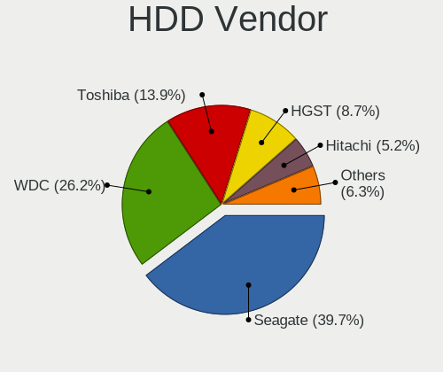
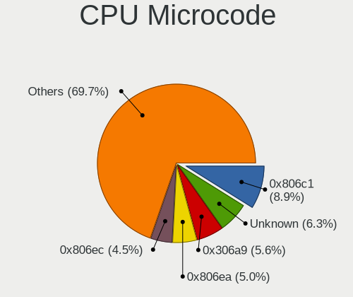
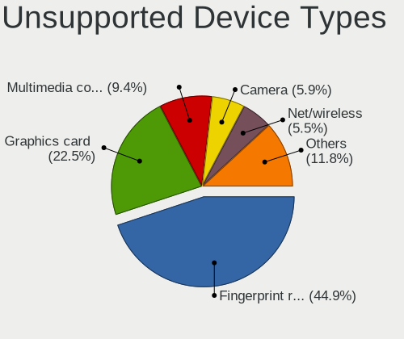

Fedora 36 - Tested Hardware & Statistics (Notebooks)
----------------------------------------------------

A project to collect tested hardware configurations for Fedora 36.

Anyone can contribute to this report by the [hw-probe](https://github.com/linuxhw/hw-probe) tool:

    sudo -E hw-probe -all -upload

Please contribute! Especially if your hardware is rare.

Contents
--------

* [ Test Cases ](#test-cases)

* [ System ](#system)
  - [ Kernel                   ](#kernel)
  - [ Kernel Family            ](#kernel-family)
  - [ Kernel Major Ver.        ](#kernel-major-ver)
  - [ Arch                     ](#arch)
  - [ DE                       ](#de)
  - [ Display Server           ](#display-server)
  - [ Display Manager          ](#display-manager)
  - [ OS Lang                  ](#os-lang)
  - [ Boot Mode                ](#boot-mode)
  - [ Filesystem               ](#filesystem)
  - [ Part. scheme             ](#part-scheme)
  - [ Dual Boot with Linux/BSD ](#dual-boot-with-linuxbsd)
  - [ Dual Boot (Win)          ](#dual-boot-win)

* [ Board ](#board)
  - [ Vendor                   ](#vendor)
  - [ Model                    ](#model)
  - [ Model Family             ](#model-family)
  - [ MFG Year                 ](#mfg-year)
  - [ Form Factor              ](#form-factor)
  - [ Secure Boot              ](#secure-boot)
  - [ Coreboot                 ](#coreboot)
  - [ RAM Size                 ](#ram-size)
  - [ RAM Used                 ](#ram-used)
  - [ Total Drives             ](#total-drives)
  - [ Has CD-ROM               ](#has-cd-rom)
  - [ Has Ethernet             ](#has-ethernet)
  - [ Has WiFi                 ](#has-wifi)
  - [ Has Bluetooth            ](#has-bluetooth)

* [ Location ](#location)
  - [ Country                  ](#country)
  - [ City                     ](#city)

* [ Drives ](#drives)
  - [ Drive Vendor             ](#drive-vendor)
  - [ Drive Model              ](#drive-model)
  - [ HDD Vendor               ](#hdd-vendor)
  - [ SSD Vendor               ](#ssd-vendor)
  - [ Drive Kind               ](#drive-kind)
  - [ Drive Connector          ](#drive-connector)
  - [ Drive Size               ](#drive-size)
  - [ Space Total              ](#space-total)
  - [ Space Used               ](#space-used)
  - [ Malfunc. Drives          ](#malfunc-drives)
  - [ Malfunc. Drive Vendor    ](#malfunc-drive-vendor)
  - [ Malfunc. HDD Vendor      ](#malfunc-hdd-vendor)
  - [ Malfunc. Drive Kind      ](#malfunc-drive-kind)
  - [ Failed Drives            ](#failed-drives)
  - [ Failed Drive Vendor      ](#failed-drive-vendor)
  - [ Drive Status             ](#drive-status)

* [ Storage controller ](#storage-controller)
  - [ Storage Vendor           ](#storage-vendor)
  - [ Storage Model            ](#storage-model)
  - [ Storage Kind             ](#storage-kind)

* [ Processor ](#processor)
  - [ CPU Vendor               ](#cpu-vendor)
  - [ CPU Model                ](#cpu-model)
  - [ CPU Model Family         ](#cpu-model-family)
  - [ CPU Cores                ](#cpu-cores)
  - [ CPU Sockets              ](#cpu-sockets)
  - [ CPU Threads              ](#cpu-threads)
  - [ CPU Op-Modes             ](#cpu-op-modes)
  - [ CPU Microcode            ](#cpu-microcode)
  - [ CPU Microarch            ](#cpu-microarch)

* [ Graphics ](#graphics)
  - [ GPU Vendor               ](#gpu-vendor)
  - [ GPU Model                ](#gpu-model)
  - [ GPU Combo                ](#gpu-combo)
  - [ GPU Driver               ](#gpu-driver)
  - [ GPU Memory               ](#gpu-memory)

* [ Monitor ](#monitor)
  - [ Monitor Vendor           ](#monitor-vendor)
  - [ Monitor Model            ](#monitor-model)
  - [ Monitor Resolution       ](#monitor-resolution)
  - [ Monitor Diagonal         ](#monitor-diagonal)
  - [ Monitor Width            ](#monitor-width)
  - [ Aspect Ratio             ](#aspect-ratio)
  - [ Monitor Area             ](#monitor-area)
  - [ Pixel Density            ](#pixel-density)
  - [ Multiple Monitors        ](#multiple-monitors)

* [ Network ](#network)
  - [ Net Controller Vendor    ](#net-controller-vendor)
  - [ Net Controller Model     ](#net-controller-model)
  - [ Wireless Vendor          ](#wireless-vendor)
  - [ Wireless Model           ](#wireless-model)
  - [ Ethernet Vendor          ](#ethernet-vendor)
  - [ Ethernet Model           ](#ethernet-model)
  - [ Net Controller Kind      ](#net-controller-kind)
  - [ Used Controller          ](#used-controller)
  - [ NICs                     ](#nics)
  - [ IPv6                     ](#ipv6)

* [ Bluetooth ](#bluetooth)
  - [ Bluetooth Vendor         ](#bluetooth-vendor)
  - [ Bluetooth Model          ](#bluetooth-model)

* [ Sound ](#sound)
  - [ Sound Vendor             ](#sound-vendor)
  - [ Sound Model              ](#sound-model)

* [ Memory ](#memory)
  - [ Memory Vendor            ](#memory-vendor)
  - [ Memory Model             ](#memory-model)
  - [ Memory Kind              ](#memory-kind)
  - [ Memory Form Factor       ](#memory-form-factor)
  - [ Memory Size              ](#memory-size)
  - [ Memory Speed             ](#memory-speed)

* [ Printers & scanners ](#printers--scanners)
  - [ Printer Vendor           ](#printer-vendor)
  - [ Printer Model            ](#printer-model)
  - [ Scanner Vendor           ](#scanner-vendor)
  - [ Scanner Model            ](#scanner-model)

* [ Camera ](#camera)
  - [ Camera Vendor            ](#camera-vendor)
  - [ Camera Model             ](#camera-model)

* [ Security ](#security)
  - [ Fingerprint Vendor       ](#fingerprint-vendor)
  - [ Fingerprint Model        ](#fingerprint-model)
  - [ Chipcard Vendor          ](#chipcard-vendor)
  - [ Chipcard Model           ](#chipcard-model)

* [ Unsupported ](#unsupported)
  - [ Unsupported Devices      ](#unsupported-devices)
  - [ Unsupported Device Types ](#unsupported-device-types)

Test Cases
----------

Total: 532

| Vendor        | Model                       | Probe                                                      | Date         |
|---------------|-----------------------------|------------------------------------------------------------|--------------|
| Lenovo        | ThinkPad T480 20L6S2EQ00    | [1b45ef7d10](https://linux-hardware.org/?probe=1b45ef7d10) | Jul 01, 2022 |
| Lenovo        | ThinkPad P14s Gen 1 20Y1... | [16413aeb23](https://linux-hardware.org/?probe=16413aeb23) | Jul 01, 2022 |
| HP            | Laptop 14s-cf2xxx           | [8da2258fea](https://linux-hardware.org/?probe=8da2258fea) | Jul 01, 2022 |
| Dell          | Inspiron M5010              | [14b9aa33d2](https://linux-hardware.org/?probe=14b9aa33d2) | Jul 01, 2022 |
| Lenovo        | IdeaPad 5 15ITL05 82FG      | [2671f4ffe2](https://linux-hardware.org/?probe=2671f4ffe2) | Jul 01, 2022 |
| ASUSTek       | VivoBook_ASUSLaptop X512... | [c9d0d64896](https://linux-hardware.org/?probe=c9d0d64896) | Jul 01, 2022 |
| Framework     | Laptop                      | [1089f37daf](https://linux-hardware.org/?probe=1089f37daf) | Jul 01, 2022 |
| Lenovo        | ThinkPad T460 20FMS2292S    | [cf313915ab](https://linux-hardware.org/?probe=cf313915ab) | Jun 30, 2022 |
| HP            | Pavilion Aero Laptop 13-... | [3af286a188](https://linux-hardware.org/?probe=3af286a188) | Jun 30, 2022 |
| HP            | EliteBook 8470p             | [cd488e4f64](https://linux-hardware.org/?probe=cd488e4f64) | Jun 30, 2022 |
| HP            | EliteBook 8470p             | [52dfa0a4ee](https://linux-hardware.org/?probe=52dfa0a4ee) | Jun 30, 2022 |
| Acer          | Aspire A315-55G             | [e6d7a2a642](https://linux-hardware.org/?probe=e6d7a2a642) | Jun 30, 2022 |
| HP            | Laptop 15-da0xxx            | [9c512247ff](https://linux-hardware.org/?probe=9c512247ff) | Jun 30, 2022 |
| Lenovo        | ThinkPad T410 2518A37       | [4e15b37546](https://linux-hardware.org/?probe=4e15b37546) | Jun 30, 2022 |
| Dell          | Inspiron 3543               | [1f9d3b4a6c](https://linux-hardware.org/?probe=1f9d3b4a6c) | Jun 29, 2022 |
| HP            | Laptop 15s-eq2xxx           | [5acbf09f01](https://linux-hardware.org/?probe=5acbf09f01) | Jun 29, 2022 |
| ASUSTek       | UX302LA                     | [6092e85ae8](https://linux-hardware.org/?probe=6092e85ae8) | Jun 29, 2022 |
| Getac         | B300-X                      | [eb752b6c15](https://linux-hardware.org/?probe=eb752b6c15) | Jun 29, 2022 |
| HUAWEI        | BOD-WXX9                    | [9c3e14320e](https://linux-hardware.org/?probe=9c3e14320e) | Jun 29, 2022 |
| HP            | Pavilion Gaming Laptop 1... | [43c87260b2](https://linux-hardware.org/?probe=43c87260b2) | Jun 29, 2022 |
| Lenovo        | ThinkPad X220 4291WSH       | [7406ba0eb2](https://linux-hardware.org/?probe=7406ba0eb2) | Jun 29, 2022 |
| Alienware     | 17                          | [715b5b0dce](https://linux-hardware.org/?probe=715b5b0dce) | Jun 29, 2022 |
| Apple         | MacBookAir6,1               | [c3172fd9cf](https://linux-hardware.org/?probe=c3172fd9cf) | Jun 28, 2022 |
| Dell          | Precision M6800             | [027cb621ef](https://linux-hardware.org/?probe=027cb621ef) | Jun 28, 2022 |
| Dell          | Latitude 5511               | [c361c37273](https://linux-hardware.org/?probe=c361c37273) | Jun 28, 2022 |
| ASUSTek       | X750JN                      | [4ba4d14a1a](https://linux-hardware.org/?probe=4ba4d14a1a) | Jun 28, 2022 |
| Lenovo        | IdeaPad 5 14ALC05 82LM      | [d240efa39f](https://linux-hardware.org/?probe=d240efa39f) | Jun 28, 2022 |
| Apple         | MacBookPro12,1              | [570dd2f164](https://linux-hardware.org/?probe=570dd2f164) | Jun 28, 2022 |
| Toshiba       | Satellite C855-12R          | [e94a109546](https://linux-hardware.org/?probe=e94a109546) | Jun 28, 2022 |
| Dell          | Inspiron N5110              | [239e8c86c0](https://linux-hardware.org/?probe=239e8c86c0) | Jun 28, 2022 |
| Dell          | Latitude E6520              | [f688527838](https://linux-hardware.org/?probe=f688527838) | Jun 27, 2022 |
| Gigabyte      | RC14UD                      | [d2b55252d8](https://linux-hardware.org/?probe=d2b55252d8) | Jun 27, 2022 |
| HP            | Pavilion Gaming Laptop 1... | [1c4ace32a2](https://linux-hardware.org/?probe=1c4ace32a2) | Jun 27, 2022 |
| Apple         | MacBookPro5,1               | [1e14793557](https://linux-hardware.org/?probe=1e14793557) | Jun 27, 2022 |
| ASUSTek       | VivoBook_ASUSLaptop X515... | [3a651b23fb](https://linux-hardware.org/?probe=3a651b23fb) | Jun 26, 2022 |
| Lenovo        | ThinkPad P1 Gen 3 20TJS5... | [de3ca4e422](https://linux-hardware.org/?probe=de3ca4e422) | Jun 26, 2022 |
| Acer          | Swift SF114-32              | [25e6653354](https://linux-hardware.org/?probe=25e6653354) | Jun 26, 2022 |
| MSI           | GF63 Thin 9SCXR             | [db6195eed2](https://linux-hardware.org/?probe=db6195eed2) | Jun 26, 2022 |
| Timi          | A35S                        | [606e376264](https://linux-hardware.org/?probe=606e376264) | Jun 26, 2022 |
| Dell          | Latitude 7300               | [a7939aeb9e](https://linux-hardware.org/?probe=a7939aeb9e) | Jun 26, 2022 |
| ASUSTek       | ROG Zephyrus G14 GA402RJ... | [400eaba39f](https://linux-hardware.org/?probe=400eaba39f) | Jun 26, 2022 |
| HP            | Compaq CQ58                 | [5948b56a82](https://linux-hardware.org/?probe=5948b56a82) | Jun 25, 2022 |
| Dell          | XPS 13 9310                 | [fa3d29c80b](https://linux-hardware.org/?probe=fa3d29c80b) | Jun 25, 2022 |
| Lenovo        | ThinkPad E14 Gen 2 20T60... | [81a9b9847d](https://linux-hardware.org/?probe=81a9b9847d) | Jun 25, 2022 |
| Dell          | Inspiron 5437               | [e206b319a2](https://linux-hardware.org/?probe=e206b319a2) | Jun 25, 2022 |
| Gigabyte      | G5 KC                       | [5ef620811f](https://linux-hardware.org/?probe=5ef620811f) | Jun 25, 2022 |
| HP            | Pavilion g6                 | [d2e82f01d9](https://linux-hardware.org/?probe=d2e82f01d9) | Jun 25, 2022 |
| HP            | Laptop 15s-fq2xxx           | [170f5de9e2](https://linux-hardware.org/?probe=170f5de9e2) | Jun 25, 2022 |
| HP            | OMEN Notebook PC 15         | [66f845b63e](https://linux-hardware.org/?probe=66f845b63e) | Jun 25, 2022 |
| Unknown       | Unknown                     | [6e62883390](https://linux-hardware.org/?probe=6e62883390) | Jun 25, 2022 |
| Lenovo        | ThinkPad X1 Carbon Gen 1... | [66283ad8cd](https://linux-hardware.org/?probe=66283ad8cd) | Jun 24, 2022 |
| ASUSTek       | ROG Strix G513QM_G513QM     | [3b78b34416](https://linux-hardware.org/?probe=3b78b34416) | Jun 24, 2022 |
| Lenovo        | ThinkPad E490 20N8CTO1WW    | [58ab145788](https://linux-hardware.org/?probe=58ab145788) | Jun 24, 2022 |
| HP            | Laptop 15-ef2xxx            | [3e16709617](https://linux-hardware.org/?probe=3e16709617) | Jun 24, 2022 |
| Packard Be... | EasyNote TE69HW             | [d292d79bbe](https://linux-hardware.org/?probe=d292d79bbe) | Jun 24, 2022 |
| Lenovo        | ThinkPad T520 4243VE1       | [7fcfec26eb](https://linux-hardware.org/?probe=7fcfec26eb) | Jun 24, 2022 |
| Lenovo        | IdeaPad 5 14ARE05 81YM      | [2c0b9c6402](https://linux-hardware.org/?probe=2c0b9c6402) | Jun 24, 2022 |
| ASUSTek       | ZenBook UX534FTC_UX534FT    | [bb8541d805](https://linux-hardware.org/?probe=bb8541d805) | Jun 24, 2022 |
| Acer          | Nitro AN515-54              | [afce38a95a](https://linux-hardware.org/?probe=afce38a95a) | Jun 24, 2022 |
| HP            | Pavilion Gaming Laptop 1... | [d4b96de9b6](https://linux-hardware.org/?probe=d4b96de9b6) | Jun 24, 2022 |
| Dell          | Precision 5550              | [0811e8c956](https://linux-hardware.org/?probe=0811e8c956) | Jun 23, 2022 |
| HP            | Pavilion Laptop 14-dv0xx... | [ac634d8aa9](https://linux-hardware.org/?probe=ac634d8aa9) | Jun 23, 2022 |
| Dell          | Precision 5550              | [0ae65f654e](https://linux-hardware.org/?probe=0ae65f654e) | Jun 23, 2022 |
| Lenovo        | IdeaPad Gaming 3 15ARH05... | [926d4055f7](https://linux-hardware.org/?probe=926d4055f7) | Jun 23, 2022 |
| HP            | Pavilion Laptop 15-cw1xx... | [223e43004a](https://linux-hardware.org/?probe=223e43004a) | Jun 23, 2022 |
| HP            | 250 G7 Notebook PC          | [6ec1b55ac0](https://linux-hardware.org/?probe=6ec1b55ac0) | Jun 23, 2022 |
| Lenovo        | G510 20238                  | [1b382e0eb0](https://linux-hardware.org/?probe=1b382e0eb0) | Jun 23, 2022 |
| ASUSTek       | ZenBook UX534FTC_UX534FT    | [5dd91493a8](https://linux-hardware.org/?probe=5dd91493a8) | Jun 23, 2022 |
| ASUSTek       | K46CB                       | [65344cb089](https://linux-hardware.org/?probe=65344cb089) | Jun 23, 2022 |
| Lenovo        | ThinkPad P1 Gen 3 20TJS2... | [f002062377](https://linux-hardware.org/?probe=f002062377) | Jun 22, 2022 |
| HP            | ZBook Fury 15 G7 Mobile ... | [1967dad271](https://linux-hardware.org/?probe=1967dad271) | Jun 22, 2022 |
| Positivo      | VJF155F11UAR                | [77c5ca4f1e](https://linux-hardware.org/?probe=77c5ca4f1e) | Jun 22, 2022 |
| Acer          | NC-E5-774G-75TJ             | [55fce68116](https://linux-hardware.org/?probe=55fce68116) | Jun 22, 2022 |
| HP            | ZBook 17 G4                 | [bf03eb0fa7](https://linux-hardware.org/?probe=bf03eb0fa7) | Jun 22, 2022 |
| Fujitsu       | LIFEBOOK U745               | [0fffb61902](https://linux-hardware.org/?probe=0fffb61902) | Jun 22, 2022 |
| Lenovo        | IdeaPad L340-15API 81LW     | [dda5fb9c20](https://linux-hardware.org/?probe=dda5fb9c20) | Jun 21, 2022 |
| HUAWEI        | MACH-WX9                    | [c6f721f315](https://linux-hardware.org/?probe=c6f721f315) | Jun 21, 2022 |
| HP            | EliteBook 830 G6            | [7c7d9af667](https://linux-hardware.org/?probe=7c7d9af667) | Jun 21, 2022 |
| Lenovo        | IdeaPad 3 15ITL6 82H8       | [ae54449547](https://linux-hardware.org/?probe=ae54449547) | Jun 21, 2022 |
| GEO           | GeoBook 240                 | [f08637137c](https://linux-hardware.org/?probe=f08637137c) | Jun 21, 2022 |
| Dell          | XPS 13 9380                 | [dc134b17e9](https://linux-hardware.org/?probe=dc134b17e9) | Jun 21, 2022 |
| HP            | ProBook 440 G6              | [eeeee7321e](https://linux-hardware.org/?probe=eeeee7321e) | Jun 20, 2022 |
| Lenovo        | ThinkPad X1 Carbon Gen 9... | [27623895a1](https://linux-hardware.org/?probe=27623895a1) | Jun 20, 2022 |
| Lenovo        | ThinkPad T495s 20QJ0012G... | [92638f1b46](https://linux-hardware.org/?probe=92638f1b46) | Jun 20, 2022 |
| ASUSTek       | ROG Zephyrus G14 GA401QM... | [52aa806063](https://linux-hardware.org/?probe=52aa806063) | Jun 20, 2022 |
| Panasonic     | CFSV9-1                     | [4b7dd23ccd](https://linux-hardware.org/?probe=4b7dd23ccd) | Jun 20, 2022 |
| Apple         | MacBookPro12,1              | [666e91f182](https://linux-hardware.org/?probe=666e91f182) | Jun 20, 2022 |
| Dell          | XPS 15 9520                 | [ec6f5cce04](https://linux-hardware.org/?probe=ec6f5cce04) | Jun 20, 2022 |
| Google        | Droid                       | [5a175a2a78](https://linux-hardware.org/?probe=5a175a2a78) | Jun 20, 2022 |
| Apple         | MacBookPro12,1              | [5d9f65fbc9](https://linux-hardware.org/?probe=5d9f65fbc9) | Jun 20, 2022 |
| HP            | EliteBook 865 16 inch G9... | [9a543a0273](https://linux-hardware.org/?probe=9a543a0273) | Jun 20, 2022 |
| Lenovo        | ThinkPad X13 Gen 1 20T3S... | [bbb3795dc2](https://linux-hardware.org/?probe=bbb3795dc2) | Jun 20, 2022 |
| Lenovo        | ThinkPad P53 20QN0011IV     | [9cf3c1f84c](https://linux-hardware.org/?probe=9cf3c1f84c) | Jun 19, 2022 |
| HP            | ENVY Laptop 13-ad1xx        | [df2017f7d5](https://linux-hardware.org/?probe=df2017f7d5) | Jun 19, 2022 |
| Micro Elec... | MG-VCP17I-3070              | [e09cfb9236](https://linux-hardware.org/?probe=e09cfb9236) | Jun 19, 2022 |
| HP            | Pavilion dv7                | [ab34fbb528](https://linux-hardware.org/?probe=ab34fbb528) | Jun 19, 2022 |
| Lenovo        | IdeaPad 5 15ITL05 82FG      | [3c8a4e8226](https://linux-hardware.org/?probe=3c8a4e8226) | Jun 18, 2022 |
| HUAWEI        | KLVL-WXX9                   | [a71adbf68f](https://linux-hardware.org/?probe=a71adbf68f) | Jun 18, 2022 |
| HP            | ProBook 470 G5              | [b070339877](https://linux-hardware.org/?probe=b070339877) | Jun 18, 2022 |
| HP            | ZBook Fury 15 G7 Mobile ... | [4a1a0294d8](https://linux-hardware.org/?probe=4a1a0294d8) | Jun 18, 2022 |
| Dell          | Precision 3571              | [9d6985b0f0](https://linux-hardware.org/?probe=9d6985b0f0) | Jun 18, 2022 |
| Dell          | Precision 3571              | [285846e1a4](https://linux-hardware.org/?probe=285846e1a4) | Jun 18, 2022 |
| ASUSTek       | ROG Zephyrus G14 GA402RJ... | [91af0ec6df](https://linux-hardware.org/?probe=91af0ec6df) | Jun 18, 2022 |
| Acer          | Swift SF314-43              | [a6116d2e8c](https://linux-hardware.org/?probe=a6116d2e8c) | Jun 18, 2022 |
| ASUSTek       | TUF Gaming FX505DY_TUF50... | [df304b4da1](https://linux-hardware.org/?probe=df304b4da1) | Jun 17, 2022 |
| Acer          | Swift SF314-43              | [674addd96b](https://linux-hardware.org/?probe=674addd96b) | Jun 17, 2022 |
| Lenovo        | IdeaPad S145-15IIL 82DJ     | [e0b7e5c636](https://linux-hardware.org/?probe=e0b7e5c636) | Jun 17, 2022 |
| Dell          | XPS 13 7390                 | [9cbdc324b7](https://linux-hardware.org/?probe=9cbdc324b7) | Jun 17, 2022 |
| Lenovo        | ThinkPad X1 Carbon 5th 2... | [cb6bf6ab7c](https://linux-hardware.org/?probe=cb6bf6ab7c) | Jun 17, 2022 |
| Sony          | SVE15128CNB                 | [029a230c77](https://linux-hardware.org/?probe=029a230c77) | Jun 17, 2022 |
| ASUSTek       | ROG Flow X13 GV301QE_GV3... | [2a28e582b5](https://linux-hardware.org/?probe=2a28e582b5) | Jun 17, 2022 |
| Acer          | Aspire E5-476G              | [df4b512aa8](https://linux-hardware.org/?probe=df4b512aa8) | Jun 17, 2022 |
| HP            | OMEN Laptop 15-en0xxx       | [a7431ef0c5](https://linux-hardware.org/?probe=a7431ef0c5) | Jun 17, 2022 |
| Samsung       | 500R5M/500R5W/501R5M        | [91f1df8a58](https://linux-hardware.org/?probe=91f1df8a58) | Jun 17, 2022 |
| Acer          | Predator PH315-53           | [7e65c001a5](https://linux-hardware.org/?probe=7e65c001a5) | Jun 17, 2022 |
| Lenovo        | IdeaPad 3 15ALC6 82KU       | [e4d5856a72](https://linux-hardware.org/?probe=e4d5856a72) | Jun 16, 2022 |
| Lenovo        | ThinkPad E15 Gen 2 20T80... | [4e53a55031](https://linux-hardware.org/?probe=4e53a55031) | Jun 16, 2022 |
| Dell          | XPS 13 7390                 | [7dbb9f4adf](https://linux-hardware.org/?probe=7dbb9f4adf) | Jun 16, 2022 |
| Micro Elec... | MG-VCP17I-3070              | [c6d123b5ec](https://linux-hardware.org/?probe=c6d123b5ec) | Jun 16, 2022 |
| Micro Elec... | MG-VCP17I-3070              | [d28d429121](https://linux-hardware.org/?probe=d28d429121) | Jun 16, 2022 |
| Lenovo        | ThinkPad X13 Gen 1 20T3S... | [7d8683dfac](https://linux-hardware.org/?probe=7d8683dfac) | Jun 16, 2022 |
| Lenovo        | ThinkPad P51 20HHCTO1WW     | [f83da947b8](https://linux-hardware.org/?probe=f83da947b8) | Jun 16, 2022 |
| Itautec       | Infoway w7430               | [776d876064](https://linux-hardware.org/?probe=776d876064) | Jun 16, 2022 |
| ASUSTek       | VivoBook 15_ASUS Laptop ... | [388285efe8](https://linux-hardware.org/?probe=388285efe8) | Jun 15, 2022 |
| HP            | Laptop 17-cp0xxx            | [6b73227c17](https://linux-hardware.org/?probe=6b73227c17) | Jun 15, 2022 |
| Acer          | Predator PH315-53           | [155af690bd](https://linux-hardware.org/?probe=155af690bd) | Jun 15, 2022 |
| Dell          | XPS 15 9520                 | [bdd4ec2ef9](https://linux-hardware.org/?probe=bdd4ec2ef9) | Jun 15, 2022 |
| Dell          | XPS 15 9520                 | [03140c6f93](https://linux-hardware.org/?probe=03140c6f93) | Jun 15, 2022 |
| HP            | Laptop 17-cp0xxx            | [6f25a1e394](https://linux-hardware.org/?probe=6f25a1e394) | Jun 15, 2022 |
| Dell          | Inspiron 7472               | [788b7856ca](https://linux-hardware.org/?probe=788b7856ca) | Jun 15, 2022 |
| Timi          | Redmi Book Pro 15 2022      | [76fd9cba2e](https://linux-hardware.org/?probe=76fd9cba2e) | Jun 15, 2022 |
| Dell          | Precision 3551              | [3499839fd0](https://linux-hardware.org/?probe=3499839fd0) | Jun 14, 2022 |
| HP            | Pavilion Gaming Laptop 1... | [b6f26fecef](https://linux-hardware.org/?probe=b6f26fecef) | Jun 14, 2022 |
| HP            | Notebook                    | [390f55db2e](https://linux-hardware.org/?probe=390f55db2e) | Jun 14, 2022 |
| HP            | OMEN by Laptop 15-dc1xxx    | [17077cf1d8](https://linux-hardware.org/?probe=17077cf1d8) | Jun 14, 2022 |
| Dell          | XPS 15 9510                 | [61104911ed](https://linux-hardware.org/?probe=61104911ed) | Jun 14, 2022 |
| Lenovo        | ThinkPad E14 Gen 3 20YDC... | [b10e894950](https://linux-hardware.org/?probe=b10e894950) | Jun 14, 2022 |
| Timi          | Redmi Book Pro 15 2022      | [b3259c0af4](https://linux-hardware.org/?probe=b3259c0af4) | Jun 14, 2022 |
| Lenovo        | ThinkPad T14 Gen 2i 20W1... | [35cbb5ff8b](https://linux-hardware.org/?probe=35cbb5ff8b) | Jun 14, 2022 |
| ASUSTek       | VivoBook_ASUSLaptop X515... | [e2385e525c](https://linux-hardware.org/?probe=e2385e525c) | Jun 14, 2022 |
| Lenovo        | ThinkBook 16 G4+ IAP 21C... | [605cab3041](https://linux-hardware.org/?probe=605cab3041) | Jun 14, 2022 |
| HP            | Pavilion Notebook           | [cf08ff4333](https://linux-hardware.org/?probe=cf08ff4333) | Jun 14, 2022 |
| HP            | Pavilion Notebook           | [4b4bd76de7](https://linux-hardware.org/?probe=4b4bd76de7) | Jun 14, 2022 |
| ASUSTek       | Zenbook UX5401ZA_UX5401Z... | [2b87adfa9f](https://linux-hardware.org/?probe=2b87adfa9f) | Jun 13, 2022 |
| HP            | Pavilion g6                 | [20bd05081e](https://linux-hardware.org/?probe=20bd05081e) | Jun 13, 2022 |
| HP            | Pavilion g6                 | [d147676849](https://linux-hardware.org/?probe=d147676849) | Jun 13, 2022 |
| Lenovo        | ThinkPad E14 Gen 2 20TB0... | [b8b4869fa1](https://linux-hardware.org/?probe=b8b4869fa1) | Jun 13, 2022 |
| ASUSTek       | ROG Flow X13 GV301QE_GV3... | [221099208b](https://linux-hardware.org/?probe=221099208b) | Jun 13, 2022 |
| Lenovo        | ThinkPad X220 4291WSH       | [0a985a9f53](https://linux-hardware.org/?probe=0a985a9f53) | Jun 13, 2022 |
| Lenovo        | Y50-70 20378                | [6153f90073](https://linux-hardware.org/?probe=6153f90073) | Jun 13, 2022 |
| ASUSTek       | ASUS TUF Gaming A15 FA50... | [17d6efccfa](https://linux-hardware.org/?probe=17d6efccfa) | Jun 12, 2022 |
| Acer          | Aspire E5-573G              | [967ef390e0](https://linux-hardware.org/?probe=967ef390e0) | Jun 12, 2022 |
| HP            | Pavilion Laptop 15-cw1xx... | [dbe7d6b6bf](https://linux-hardware.org/?probe=dbe7d6b6bf) | Jun 12, 2022 |
| HP            | Pavilion Laptop 15-cw1xx... | [554002fe47](https://linux-hardware.org/?probe=554002fe47) | Jun 12, 2022 |
| HP            | Laptop 15s-fq3xxx           | [6acd8f6081](https://linux-hardware.org/?probe=6acd8f6081) | Jun 12, 2022 |
| Acer          | Aspire R7-371T              | [b791797ef3](https://linux-hardware.org/?probe=b791797ef3) | Jun 12, 2022 |
| Acer          | Aspire R7-371T              | [d573a80e21](https://linux-hardware.org/?probe=d573a80e21) | Jun 12, 2022 |
| Apple         | MacBookPro6,2               | [a677849f96](https://linux-hardware.org/?probe=a677849f96) | Jun 12, 2022 |
| ASUSTek       | X750JN                      | [6748bf6f1e](https://linux-hardware.org/?probe=6748bf6f1e) | Jun 11, 2022 |
| HP            | ProBook 650 G1              | [8f468e1fc9](https://linux-hardware.org/?probe=8f468e1fc9) | Jun 11, 2022 |
| Lenovo        | ThinkPad T420 4180BE1       | [a3c2ffc8e0](https://linux-hardware.org/?probe=a3c2ffc8e0) | Jun 11, 2022 |
| Lenovo        | ThinkBook 16p Gen 2 20YM    | [3c8959c8dc](https://linux-hardware.org/?probe=3c8959c8dc) | Jun 11, 2022 |
| HP            | Laptop 17-bs1xx             | [aa23e1d53e](https://linux-hardware.org/?probe=aa23e1d53e) | Jun 11, 2022 |
| HUAWEI        | WRT-WX9                     | [13dcf888fe](https://linux-hardware.org/?probe=13dcf888fe) | Jun 10, 2022 |
| Acer          | Swift SF114-32              | [63f76026b7](https://linux-hardware.org/?probe=63f76026b7) | Jun 10, 2022 |
| Lenovo        | ThinkPad X13 Gen 1 20UF0... | [1967d32245](https://linux-hardware.org/?probe=1967d32245) | Jun 10, 2022 |
| Dell          | XPS 15 9570                 | [f37ad0aba6](https://linux-hardware.org/?probe=f37ad0aba6) | Jun 10, 2022 |
| ASUSTek       | ROG Flow X13 GV301QE_GV3... | [14e32dc3cb](https://linux-hardware.org/?probe=14e32dc3cb) | Jun 10, 2022 |
| HP            | Laptop 14s-fq0xxx           | [0a77925edb](https://linux-hardware.org/?probe=0a77925edb) | Jun 10, 2022 |
| Lenovo        | ThinkPad P50 20EQS3B30R     | [c97b8918a0](https://linux-hardware.org/?probe=c97b8918a0) | Jun 10, 2022 |
| HP            | ZBook 15                    | [540fada7d4](https://linux-hardware.org/?probe=540fada7d4) | Jun 09, 2022 |
| HP            | ZBook 15                    | [5e3ff70430](https://linux-hardware.org/?probe=5e3ff70430) | Jun 09, 2022 |
| HP            | OMEN Laptop 15-en0xxx       | [158a18f6d1](https://linux-hardware.org/?probe=158a18f6d1) | Jun 09, 2022 |
| Lenovo        | ThinkPad E480 20KNS0E200    | [321a2df7db](https://linux-hardware.org/?probe=321a2df7db) | Jun 09, 2022 |
| Lenovo        | ThinkPad E14 Gen 2 20TB0... | [e934effe87](https://linux-hardware.org/?probe=e934effe87) | Jun 09, 2022 |
| HP            | ENVY dv7                    | [f7401e6566](https://linux-hardware.org/?probe=f7401e6566) | Jun 09, 2022 |
| Toshiba       | Satellite C50-A             | [1f5918622d](https://linux-hardware.org/?probe=1f5918622d) | Jun 08, 2022 |
| Toshiba       | Satellite C50-A             | [20a629adc2](https://linux-hardware.org/?probe=20a629adc2) | Jun 08, 2022 |
| HUAWEI        | KLVL-WXX9                   | [4ce4c3ad20](https://linux-hardware.org/?probe=4ce4c3ad20) | Jun 08, 2022 |
| Lenovo        | ThinkPad T400 6475AJ1       | [3ef905b44a](https://linux-hardware.org/?probe=3ef905b44a) | Jun 08, 2022 |
| VIT           | M2420                       | [8152d4c61b](https://linux-hardware.org/?probe=8152d4c61b) | Jun 08, 2022 |
| VIT           | M2420                       | [d09de8cbd7](https://linux-hardware.org/?probe=d09de8cbd7) | Jun 07, 2022 |
| ASUSTek       | ASUS EXPERTBOOK B9400CEA... | [73823d7212](https://linux-hardware.org/?probe=73823d7212) | Jun 07, 2022 |
| Lenovo        | IdeaPad S540-15IWL          | [1a79b3a2ab](https://linux-hardware.org/?probe=1a79b3a2ab) | Jun 07, 2022 |
| HP            | 250 G7 Notebook PC          | [c45207e9ed](https://linux-hardware.org/?probe=c45207e9ed) | Jun 07, 2022 |
| Lenovo        | ThinkPad X1 Carbon Gen 9... | [14a3f31e7d](https://linux-hardware.org/?probe=14a3f31e7d) | Jun 07, 2022 |
| HP            | 250 G7 Notebook PC          | [fa7cd44609](https://linux-hardware.org/?probe=fa7cd44609) | Jun 07, 2022 |
| Apple         | MacBook4,1                  | [c8e7bd54a3](https://linux-hardware.org/?probe=c8e7bd54a3) | Jun 07, 2022 |
| Dell          | Inspiron 3542               | [8fcf9a9913](https://linux-hardware.org/?probe=8fcf9a9913) | Jun 07, 2022 |
| HP            | Laptop 15-dy0xxx            | [e2a9ba60e2](https://linux-hardware.org/?probe=e2a9ba60e2) | Jun 07, 2022 |
| Unknown       | Unknown                     | [6c562bbebb](https://linux-hardware.org/?probe=6c562bbebb) | Jun 06, 2022 |
| Apple         | MacBookPro14,3              | [0d56225d08](https://linux-hardware.org/?probe=0d56225d08) | Jun 06, 2022 |
| Lenovo        | IdeaPad 330-17IKB 81DM      | [5f55cd1869](https://linux-hardware.org/?probe=5f55cd1869) | Jun 06, 2022 |
| HP            | EliteBook 8740w             | [178b330cc1](https://linux-hardware.org/?probe=178b330cc1) | Jun 06, 2022 |
| Lenovo        | ThinkPad T14 Gen 2i 20W0... | [bec76e5f74](https://linux-hardware.org/?probe=bec76e5f74) | Jun 06, 2022 |
| Lenovo        | IdeaPad Gaming 3 15ARH05... | [0732a60437](https://linux-hardware.org/?probe=0732a60437) | Jun 06, 2022 |
| HP            | 250 G5                      | [1cbf1a1c53](https://linux-hardware.org/?probe=1cbf1a1c53) | Jun 06, 2022 |
| Lenovo        | 81WE                        | [31217f3c4a](https://linux-hardware.org/?probe=31217f3c4a) | Jun 06, 2022 |
| Lenovo        | G580 2689PWG                | [e7e658bc95](https://linux-hardware.org/?probe=e7e658bc95) | Jun 06, 2022 |
| Dell          | XPS 13 9370                 | [568a879289](https://linux-hardware.org/?probe=568a879289) | Jun 06, 2022 |
| Lenovo        | G580 2689PWG                | [e51b9086bd](https://linux-hardware.org/?probe=e51b9086bd) | Jun 06, 2022 |
| HP            | 250 G5                      | [7cbd2a6796](https://linux-hardware.org/?probe=7cbd2a6796) | Jun 06, 2022 |
| HP            | 250 G5                      | [6668b9ad94](https://linux-hardware.org/?probe=6668b9ad94) | Jun 06, 2022 |
| Apple         | MacBookAir5,1               | [f9ac66019f](https://linux-hardware.org/?probe=f9ac66019f) | Jun 06, 2022 |
| Apple         | MacBookPro14,3              | [8fbfe75f53](https://linux-hardware.org/?probe=8fbfe75f53) | Jun 06, 2022 |
| Lenovo        | ThinkPad T420 4177CTO       | [fe28db8adc](https://linux-hardware.org/?probe=fe28db8adc) | Jun 06, 2022 |
| HP            | EliteBook 2560p             | [9cd1c3d383](https://linux-hardware.org/?probe=9cd1c3d383) | Jun 05, 2022 |
| Apple         | MacBookPro10,1              | [9e49a2cbac](https://linux-hardware.org/?probe=9e49a2cbac) | Jun 05, 2022 |
| ASUSTek       | VivoBook_ASUSLaptop X512... | [7084316e82](https://linux-hardware.org/?probe=7084316e82) | Jun 05, 2022 |
| Acer          | Aspire R3-131T              | [f1becc237d](https://linux-hardware.org/?probe=f1becc237d) | Jun 05, 2022 |
| HP            | OMEN Laptop 15-en0xxx       | [155a8dd1a5](https://linux-hardware.org/?probe=155a8dd1a5) | Jun 05, 2022 |
| Dell          | Latitude 7490               | [feb1fc06d4](https://linux-hardware.org/?probe=feb1fc06d4) | Jun 05, 2022 |
| ASUSTek       | X541NA                      | [0c40d3f3d2](https://linux-hardware.org/?probe=0c40d3f3d2) | Jun 05, 2022 |
| ASUSTek       | VivoBook_ASUSLaptop X515... | [84d72b2b06](https://linux-hardware.org/?probe=84d72b2b06) | Jun 05, 2022 |
| HP            | ProBook 650 G1              | [be6fcc008b](https://linux-hardware.org/?probe=be6fcc008b) | Jun 04, 2022 |
| Acer          | Aspire E5-573G              | [31de2e546e](https://linux-hardware.org/?probe=31de2e546e) | Jun 04, 2022 |
| HP            | Pavilion Aero Laptop 13-... | [41862e04b8](https://linux-hardware.org/?probe=41862e04b8) | Jun 03, 2022 |
| Dell          | Precision 5540              | [641aabe445](https://linux-hardware.org/?probe=641aabe445) | Jun 03, 2022 |
| Notebook      | NL40_50CU                   | [df0357703d](https://linux-hardware.org/?probe=df0357703d) | Jun 03, 2022 |
| Dell          | XPS 15 9560                 | [38de8409ef](https://linux-hardware.org/?probe=38de8409ef) | Jun 02, 2022 |
| Framework     | Laptop                      | [625917cfcd](https://linux-hardware.org/?probe=625917cfcd) | Jun 02, 2022 |
| HP            | Laptop 15s-eq2xxx           | [3aa4194ab3](https://linux-hardware.org/?probe=3aa4194ab3) | Jun 02, 2022 |
| Lenovo        | IdeaPad L340-17IWL 81M0     | [b5bb3c0725](https://linux-hardware.org/?probe=b5bb3c0725) | Jun 02, 2022 |
| ASUSTek       | N82JV                       | [623436f0c3](https://linux-hardware.org/?probe=623436f0c3) | Jun 02, 2022 |
| Lenovo        | Legion S7 15ACH6 82K8       | [ff63d0c19b](https://linux-hardware.org/?probe=ff63d0c19b) | Jun 02, 2022 |
| Lenovo        | ThinkPad T14 Gen 2a 20XL... | [978a80c358](https://linux-hardware.org/?probe=978a80c358) | Jun 02, 2022 |
| Lenovo        | ThinkPad X220 4291WSH       | [d81154a7e1](https://linux-hardware.org/?probe=d81154a7e1) | Jun 02, 2022 |
| ASUSTek       | ASUS EXPERTBOOK B3302CEA... | [ad66932f23](https://linux-hardware.org/?probe=ad66932f23) | Jun 02, 2022 |
| Dell          | Inspiron 3531               | [c2d9f4b84b](https://linux-hardware.org/?probe=c2d9f4b84b) | Jun 02, 2022 |
| HUAWEI        | MACH-WX9                    | [70ad46aa8e](https://linux-hardware.org/?probe=70ad46aa8e) | Jun 01, 2022 |
| Acer          | Swift SFX14-41G             | [38fb3963cd](https://linux-hardware.org/?probe=38fb3963cd) | Jun 01, 2022 |
| Acer          | Swift SFX14-41G             | [6f5f1c9373](https://linux-hardware.org/?probe=6f5f1c9373) | Jun 01, 2022 |
| Lenovo        | Edge 15 80K9                | [5c8bb97759](https://linux-hardware.org/?probe=5c8bb97759) | Jun 01, 2022 |
| Lenovo        | IdeaPad 5 Pro 14ACN6 82L... | [ae39e96b1a](https://linux-hardware.org/?probe=ae39e96b1a) | Jun 01, 2022 |
| Lenovo        | IdeaPad L340-15IRH Gamin... | [0f84f94a6a](https://linux-hardware.org/?probe=0f84f94a6a) | Jun 01, 2022 |
| HP            | EliteBook 2560p             | [af6a91d3c7](https://linux-hardware.org/?probe=af6a91d3c7) | Jun 01, 2022 |
| Dell          | Inspiron 5415               | [942b343fff](https://linux-hardware.org/?probe=942b343fff) | Jun 01, 2022 |
| HP            | Pavilion Laptop 14-dv0xx... | [1e6ab0f183](https://linux-hardware.org/?probe=1e6ab0f183) | May 31, 2022 |
| ASUSTek       | X541NA                      | [3d32754542](https://linux-hardware.org/?probe=3d32754542) | May 31, 2022 |
| Lenovo        | ThinkPad X1 Carbon 2nd 2... | [dc3ee2e520](https://linux-hardware.org/?probe=dc3ee2e520) | May 31, 2022 |
| Lenovo        | Edge 15 80K9                | [9bbdfc95bb](https://linux-hardware.org/?probe=9bbdfc95bb) | May 31, 2022 |
| HP            | OMEN Laptop 15-en0xxx       | [956299505f](https://linux-hardware.org/?probe=956299505f) | May 31, 2022 |
| HP            | Pavilion Laptop 14-dv0xx... | [9b53c4df9d](https://linux-hardware.org/?probe=9b53c4df9d) | May 31, 2022 |
| ASUSTek       | N501VW                      | [2f8215fb0a](https://linux-hardware.org/?probe=2f8215fb0a) | May 31, 2022 |
| HP            | EliteBook 840 G3            | [92acbd4c3f](https://linux-hardware.org/?probe=92acbd4c3f) | May 31, 2022 |
| Apple         | MacBookPro8,3               | [38f4cc4c5a](https://linux-hardware.org/?probe=38f4cc4c5a) | May 31, 2022 |
| Dell          | XPS 15 9520                 | [4d4c32223e](https://linux-hardware.org/?probe=4d4c32223e) | May 31, 2022 |
| Dell          | Inspiron 5547               | [066f6369b2](https://linux-hardware.org/?probe=066f6369b2) | May 31, 2022 |
| HP            | 255 G1                      | [86f7198193](https://linux-hardware.org/?probe=86f7198193) | May 31, 2022 |
| Lenovo        | ThinkPad E595 20NF001PTX    | [cf41cc78f7](https://linux-hardware.org/?probe=cf41cc78f7) | May 30, 2022 |
| Lenovo        | ThinkPad X1 Carbon 2nd 2... | [5a813419eb](https://linux-hardware.org/?probe=5a813419eb) | May 30, 2022 |
| Lenovo        | Edge 15 80K9                | [586a31368f](https://linux-hardware.org/?probe=586a31368f) | May 30, 2022 |
| Google        | Droid                       | [35e3edeab3](https://linux-hardware.org/?probe=35e3edeab3) | May 30, 2022 |
| Framework     | Laptop                      | [f1c2a80b70](https://linux-hardware.org/?probe=f1c2a80b70) | May 30, 2022 |
| Lenovo        | ThinkPad X240 20AM0040BR    | [e0ff07b590](https://linux-hardware.org/?probe=e0ff07b590) | May 30, 2022 |
| IT Channel... | PA70Hx                      | [091ad22c2d](https://linux-hardware.org/?probe=091ad22c2d) | May 30, 2022 |
| ASUSTek       | ZenBook UX325SA_UM325SA     | [378e6ca9c6](https://linux-hardware.org/?probe=378e6ca9c6) | May 30, 2022 |
| Dell          | XPS 15 9520                 | [eee1a317b6](https://linux-hardware.org/?probe=eee1a317b6) | May 30, 2022 |
| MSI           | GE60 2PE                    | [1e15d749ee](https://linux-hardware.org/?probe=1e15d749ee) | May 30, 2022 |
| ASUSTek       | X541NA                      | [c1fd0c2d4f](https://linux-hardware.org/?probe=c1fd0c2d4f) | May 30, 2022 |
| MSI           | GE60 2PE                    | [b52762040d](https://linux-hardware.org/?probe=b52762040d) | May 30, 2022 |
| HP            | EliteBook 840 G8 Noteboo... | [15fb1b0353](https://linux-hardware.org/?probe=15fb1b0353) | May 30, 2022 |
| Dell          | Inspiron 7472               | [7d8d96d851](https://linux-hardware.org/?probe=7d8d96d851) | May 29, 2022 |
| ASUSTek       | UX51VZA                     | [c7c6e27cae](https://linux-hardware.org/?probe=c7c6e27cae) | May 29, 2022 |
| Dell          | Latitude E7470              | [159516aefb](https://linux-hardware.org/?probe=159516aefb) | May 29, 2022 |
| Acer          | Aspire E5-573G              | [bd9b967f9b](https://linux-hardware.org/?probe=bd9b967f9b) | May 29, 2022 |
| Dell          | XPS 15 9520                 | [75d345243e](https://linux-hardware.org/?probe=75d345243e) | May 29, 2022 |
| Notebook      | P65_P67SG                   | [a2aecd5cd3](https://linux-hardware.org/?probe=a2aecd5cd3) | May 29, 2022 |
| MSI           | GE60 2PE                    | [84d5af4ebe](https://linux-hardware.org/?probe=84d5af4ebe) | May 29, 2022 |
| MSI           | GE60 2PE                    | [c8d325a744](https://linux-hardware.org/?probe=c8d325a744) | May 29, 2022 |
| HP            | Pavilion 17                 | [077be5d10b](https://linux-hardware.org/?probe=077be5d10b) | May 28, 2022 |
| Dell          | Precision 7710              | [befe390051](https://linux-hardware.org/?probe=befe390051) | May 28, 2022 |
| Dell          | Vostro 5515                 | [ae8649e10b](https://linux-hardware.org/?probe=ae8649e10b) | May 28, 2022 |
| Lenovo        | Y70-70 Touch 80DU           | [4c4689f4b7](https://linux-hardware.org/?probe=4c4689f4b7) | May 28, 2022 |
| Lenovo        | IdeaPad 530S-14IKB 81EU     | [df2d7a274d](https://linux-hardware.org/?probe=df2d7a274d) | May 28, 2022 |
| Lenovo        | ThinkPad P52 20MAS3X200     | [da2a67f904](https://linux-hardware.org/?probe=da2a67f904) | May 28, 2022 |
| Lenovo        | Yoga 300-11IBY 80M0         | [8d120a2350](https://linux-hardware.org/?probe=8d120a2350) | May 28, 2022 |
| ASUSTek       | TUF Gaming FX505DY_FX505... | [af42d8d0b4](https://linux-hardware.org/?probe=af42d8d0b4) | May 27, 2022 |
| Timi          | A35S                        | [8a1bee3210](https://linux-hardware.org/?probe=8a1bee3210) | May 27, 2022 |
| Dell          | XPS 15 9570                 | [93d1ebbb72](https://linux-hardware.org/?probe=93d1ebbb72) | May 27, 2022 |
| Login Info... | LOG-QAL30                   | [5643c9fb9b](https://linux-hardware.org/?probe=5643c9fb9b) | May 27, 2022 |
| Login Info... | LOG-QAL30                   | [644f3a8dbc](https://linux-hardware.org/?probe=644f3a8dbc) | May 27, 2022 |
| Lenovo        | ThinkBook 14 G3 ACL 21A2    | [983144763a](https://linux-hardware.org/?probe=983144763a) | May 27, 2022 |
| Lenovo        | 14w 81MQS02H00              | [e31087bfa9](https://linux-hardware.org/?probe=e31087bfa9) | May 27, 2022 |
| Dell          | Inspiron 7460               | [3171915433](https://linux-hardware.org/?probe=3171915433) | May 27, 2022 |
| Sony          | VPCEE3S1E                   | [f3c7988996](https://linux-hardware.org/?probe=f3c7988996) | May 27, 2022 |
| Lenovo        | ThinkPad P1 Gen 3 20TJS3... | [88aabea122](https://linux-hardware.org/?probe=88aabea122) | May 27, 2022 |
| ASUSTek       | UX51VZA                     | [5507c9109e](https://linux-hardware.org/?probe=5507c9109e) | May 27, 2022 |
| Lenovo        | IdeaPad 3 15ARE05 81W4      | [9b4287fa8b](https://linux-hardware.org/?probe=9b4287fa8b) | May 26, 2022 |
| HP            | Pavilion TS 14              | [b7b3d504e2](https://linux-hardware.org/?probe=b7b3d504e2) | May 26, 2022 |
| Dell          | Inspiron 5502               | [90ee31b219](https://linux-hardware.org/?probe=90ee31b219) | May 26, 2022 |
| Dell          | XPS 13 7390                 | [4aa126f1e7](https://linux-hardware.org/?probe=4aa126f1e7) | May 26, 2022 |
| Dell          | Inspiron 3543               | [bf6cb72634](https://linux-hardware.org/?probe=bf6cb72634) | May 26, 2022 |
| HUAWEI        | HN-WX9X                     | [ebb7ce2605](https://linux-hardware.org/?probe=ebb7ce2605) | May 26, 2022 |
| HP            | Pavilion Laptop 15-cd0xx    | [ad9da27671](https://linux-hardware.org/?probe=ad9da27671) | May 26, 2022 |
| Samsung       | 550XDA                      | [807781d70e](https://linux-hardware.org/?probe=807781d70e) | May 26, 2022 |
| Acer          | Aspire E5-573G              | [6f5b6d8d03](https://linux-hardware.org/?probe=6f5b6d8d03) | May 25, 2022 |
| ASUSTek       | GL502VMK                    | [dfca615a89](https://linux-hardware.org/?probe=dfca615a89) | May 25, 2022 |
| HP            | Notebook                    | [05e785c8c2](https://linux-hardware.org/?probe=05e785c8c2) | May 25, 2022 |
| HP            | Notebook                    | [17ca21b3a4](https://linux-hardware.org/?probe=17ca21b3a4) | May 25, 2022 |
| Lenovo        | IdeaPad 5 15ARE05 81YQ      | [dcbaf5defc](https://linux-hardware.org/?probe=dcbaf5defc) | May 25, 2022 |
| HP            | Unknown                     | [c6b346ecc6](https://linux-hardware.org/?probe=c6b346ecc6) | May 25, 2022 |
| Lenovo        | ThinkPad W540 20BHS04B00    | [376f43287f](https://linux-hardware.org/?probe=376f43287f) | May 25, 2022 |
| ASUSTek       | ROG Zephyrus G15 GA503RS... | [940a448ea6](https://linux-hardware.org/?probe=940a448ea6) | May 24, 2022 |
| ASUSTek       | ASUS TUF Gaming A15 FA50... | [93c67e62e7](https://linux-hardware.org/?probe=93c67e62e7) | May 24, 2022 |
| Lenovo        | ThinkPad T14 Gen 1 20UDC... | [00baf8a2ff](https://linux-hardware.org/?probe=00baf8a2ff) | May 24, 2022 |
| ROCK Pi       | Unknown                     | [aa891c0178](https://linux-hardware.org/?probe=aa891c0178) | May 24, 2022 |
| Lenovo        | ThinkPad P53 20QN0011IV     | [24c2ad0798](https://linux-hardware.org/?probe=24c2ad0798) | May 24, 2022 |
| Dell          | Precision 3561              | [71657d24c1](https://linux-hardware.org/?probe=71657d24c1) | May 24, 2022 |
| Dell          | Precision 3561              | [385a286d0d](https://linux-hardware.org/?probe=385a286d0d) | May 24, 2022 |
| HP            | EliteBook 840 G8 Noteboo... | [eccd990241](https://linux-hardware.org/?probe=eccd990241) | May 24, 2022 |
| Lenovo        | IdeaPad S340-14API 81NB     | [1b061ef293](https://linux-hardware.org/?probe=1b061ef293) | May 24, 2022 |
| Lenovo        | ThinkPad W540 20BHS04B00    | [8d62205131](https://linux-hardware.org/?probe=8d62205131) | May 23, 2022 |
| Lenovo        | ThinkPad T480s 20L8S1RS0... | [174f6e2270](https://linux-hardware.org/?probe=174f6e2270) | May 23, 2022 |
| ASUSTek       | X550CL                      | [49ebd9e68d](https://linux-hardware.org/?probe=49ebd9e68d) | May 23, 2022 |
| HP            | Pavilion Laptop 15-eg0xx... | [377330c2b5](https://linux-hardware.org/?probe=377330c2b5) | May 23, 2022 |
| Dell          | Vostro 5490                 | [413a708e81](https://linux-hardware.org/?probe=413a708e81) | May 23, 2022 |
| Gigabyte      | P34V5                       | [6fa844b91e](https://linux-hardware.org/?probe=6fa844b91e) | May 23, 2022 |
| Gigabyte      | P34V5                       | [3ad8e4b239](https://linux-hardware.org/?probe=3ad8e4b239) | May 23, 2022 |
| Dell          | XPS 13 9310                 | [a76a3417d7](https://linux-hardware.org/?probe=a76a3417d7) | May 23, 2022 |
| Toshiba       | Unknown                     | [56ac954440](https://linux-hardware.org/?probe=56ac954440) | May 23, 2022 |
| Lenovo        | ThinkPad X230 2325AC7       | [bf82ad1cc3](https://linux-hardware.org/?probe=bf82ad1cc3) | May 23, 2022 |
| Sony          | VPCSA2Z9R                   | [5697622de7](https://linux-hardware.org/?probe=5697622de7) | May 22, 2022 |
| Lenovo        | ThinkPad X270 20HMS1QT0E    | [f17079bdce](https://linux-hardware.org/?probe=f17079bdce) | May 22, 2022 |
| ASUSTek       | ROG Strix G513QY_G513QY     | [bdb9536c9c](https://linux-hardware.org/?probe=bdb9536c9c) | May 22, 2022 |
| Acer          | Swift SF514-52T             | [d49880e4c2](https://linux-hardware.org/?probe=d49880e4c2) | May 22, 2022 |
| Acer          | Swift SF514-52T             | [40d5ca6bab](https://linux-hardware.org/?probe=40d5ca6bab) | May 22, 2022 |
| HP            | 15-dc1018ur                 | [aceb1a1011](https://linux-hardware.org/?probe=aceb1a1011) | May 22, 2022 |
| Dell          | Inspiron 5567               | [afca2e1045](https://linux-hardware.org/?probe=afca2e1045) | May 22, 2022 |
| Lenovo        | ThinkPad W520 42763JF       | [2b87bae835](https://linux-hardware.org/?probe=2b87bae835) | May 22, 2022 |
| HP            | ProBook 470 G5              | [4be19d46e1](https://linux-hardware.org/?probe=4be19d46e1) | May 21, 2022 |
| Lenovo        | Legion 7 15IMH05 81YT       | [a44f38fd50](https://linux-hardware.org/?probe=a44f38fd50) | May 21, 2022 |
| Lenovo        | ThinkPad X220 Tablet 429... | [1c2288918d](https://linux-hardware.org/?probe=1c2288918d) | May 21, 2022 |
| HP            | Unknown                     | [2277c14d4d](https://linux-hardware.org/?probe=2277c14d4d) | May 21, 2022 |
| Dell          | XPS 13 9310                 | [06943bb7f1](https://linux-hardware.org/?probe=06943bb7f1) | May 21, 2022 |
| Acer          | Swift SF314-54              | [478550abf1](https://linux-hardware.org/?probe=478550abf1) | May 21, 2022 |
| Dell          | Latitude 5490               | [450756ee49](https://linux-hardware.org/?probe=450756ee49) | May 21, 2022 |
| HP            | Laptop 15s-eq1xxx           | [702e495c23](https://linux-hardware.org/?probe=702e495c23) | May 21, 2022 |
| Lenovo        | IdeaPad 330S-15ARR 81FB     | [cc0b92bd45](https://linux-hardware.org/?probe=cc0b92bd45) | May 21, 2022 |
| Lenovo        | ThinkPad X1 Carbon Gen 9... | [d5b9f1fd4a](https://linux-hardware.org/?probe=d5b9f1fd4a) | May 20, 2022 |
| HP            | Pavilion g4                 | [b29455a037](https://linux-hardware.org/?probe=b29455a037) | May 20, 2022 |
| Lenovo        | ThinkPad X1 Carbon Gen 9... | [567c91351f](https://linux-hardware.org/?probe=567c91351f) | May 20, 2022 |
| HP            | Pavilion g4                 | [001f7d91d2](https://linux-hardware.org/?probe=001f7d91d2) | May 20, 2022 |
| Acer          | Aspire 8940G                | [f6f8622b30](https://linux-hardware.org/?probe=f6f8622b30) | May 20, 2022 |
| Google        | Glimmer                     | [78c39ceda9](https://linux-hardware.org/?probe=78c39ceda9) | May 20, 2022 |
| Dell          | Inspiron 5459               | [ea99252046](https://linux-hardware.org/?probe=ea99252046) | May 20, 2022 |
| Samsung       | 550XDA                      | [1f77e9f8f6](https://linux-hardware.org/?probe=1f77e9f8f6) | May 19, 2022 |
| Samsung       | 550XDA                      | [8c31783747](https://linux-hardware.org/?probe=8c31783747) | May 19, 2022 |
| Lenovo        | ThinkPad X1 Carbon 2nd 2... | [e8df231af7](https://linux-hardware.org/?probe=e8df231af7) | May 19, 2022 |
| Lenovo        | ThinkPad P14s Gen 2a 21A... | [711e483bb9](https://linux-hardware.org/?probe=711e483bb9) | May 19, 2022 |
| Lenovo        | IdeaPad Creator 5 15IMH0... | [59d945a9b3](https://linux-hardware.org/?probe=59d945a9b3) | May 19, 2022 |
| eMachines     | E525                        | [2c397d4229](https://linux-hardware.org/?probe=2c397d4229) | May 19, 2022 |
| eMachines     | E525                        | [7a1e439150](https://linux-hardware.org/?probe=7a1e439150) | May 19, 2022 |
| Lenovo        | ThinkPad X1 Carbon 5th 2... | [0e0fc0905a](https://linux-hardware.org/?probe=0e0fc0905a) | May 19, 2022 |
| SKIKK         | GREEN 4                     | [f58c4904f7](https://linux-hardware.org/?probe=f58c4904f7) | May 19, 2022 |
| Toshiba       | Satellite U940              | [249374be01](https://linux-hardware.org/?probe=249374be01) | May 19, 2022 |
| Apple         | MacBookPro8,1               | [94d2bd3233](https://linux-hardware.org/?probe=94d2bd3233) | May 19, 2022 |
| Lenovo        | ThinkPad P52 20MAS3X200     | [7f0fc0c72e](https://linux-hardware.org/?probe=7f0fc0c72e) | May 19, 2022 |
| Lenovo        | ThinkPad P50 20EQS1DD00     | [819420bd66](https://linux-hardware.org/?probe=819420bd66) | May 19, 2022 |
| Lenovo        | ThinkPad P50 20EQS1DD00     | [479ab8b5d7](https://linux-hardware.org/?probe=479ab8b5d7) | May 19, 2022 |
| Lenovo        | ThinkPad X1 Carbon Gen 8... | [592a32a1af](https://linux-hardware.org/?probe=592a32a1af) | May 18, 2022 |
| Lenovo        | IdeaPad Slim 1-14AST-05 ... | [e83ddc569f](https://linux-hardware.org/?probe=e83ddc569f) | May 18, 2022 |
| Dell          | XPS 13 7390                 | [98752f9fb4](https://linux-hardware.org/?probe=98752f9fb4) | May 18, 2022 |
| Dell          | Latitude E6420              | [0f06571934](https://linux-hardware.org/?probe=0f06571934) | May 18, 2022 |
| ASUSTek       | X556URK                     | [b217fd2c65](https://linux-hardware.org/?probe=b217fd2c65) | May 18, 2022 |
| Apple         | MacBookAir7,2               | [a46fea4edb](https://linux-hardware.org/?probe=a46fea4edb) | May 18, 2022 |
| Samsung       | 270E5G/270E5U               | [8d8783e43f](https://linux-hardware.org/?probe=8d8783e43f) | May 18, 2022 |
| Samsung       | 270E5G/270E5U               | [6e01c5c9f5](https://linux-hardware.org/?probe=6e01c5c9f5) | May 18, 2022 |
| Lenovo        | IdeaPad Y500 20193          | [a3931c5e60](https://linux-hardware.org/?probe=a3931c5e60) | May 17, 2022 |
| HP            | Laptop 15s-eq2xxx           | [9e7bf270db](https://linux-hardware.org/?probe=9e7bf270db) | May 17, 2022 |
| Dell          | Latitude E6230              | [1afeba4362](https://linux-hardware.org/?probe=1afeba4362) | May 17, 2022 |
| Lenovo        | ThinkBook 15 G2 ITL 20VE    | [f86ea538c8](https://linux-hardware.org/?probe=f86ea538c8) | May 17, 2022 |
| Dell          | Latitude 5520               | [320ed1c4fc](https://linux-hardware.org/?probe=320ed1c4fc) | May 17, 2022 |
| Dell          | Latitude 5520               | [18823f33fb](https://linux-hardware.org/?probe=18823f33fb) | May 17, 2022 |
| ASUSTek       | ROG Strix G513RM_G513RM     | [331099a3da](https://linux-hardware.org/?probe=331099a3da) | May 17, 2022 |
| Lenovo        | IdeaPad Slim 7 14ITL05 8... | [2179a16a87](https://linux-hardware.org/?probe=2179a16a87) | May 17, 2022 |
| Notebook      | N8xEJEK                     | [5c2c66e8f5](https://linux-hardware.org/?probe=5c2c66e8f5) | May 17, 2022 |
| Lenovo        | ThinkPad E15 Gen 2 20T80... | [61c1716210](https://linux-hardware.org/?probe=61c1716210) | May 16, 2022 |
| Lenovo        | IdeaPad 330S-14IKB 81F4     | [e99a8117ba](https://linux-hardware.org/?probe=e99a8117ba) | May 16, 2022 |
| Dell          | XPS 13 9350                 | [cf7f597752](https://linux-hardware.org/?probe=cf7f597752) | May 16, 2022 |
| Lenovo        | ThinkPad T14s Gen 2i 20W... | [06afc33451](https://linux-hardware.org/?probe=06afc33451) | May 16, 2022 |
| Lenovo        | ThinkPad T440p 20AW000KU... | [66fc91a0d0](https://linux-hardware.org/?probe=66fc91a0d0) | May 16, 2022 |
| Dell          | XPS 15 7590                 | [7f7463682a](https://linux-hardware.org/?probe=7f7463682a) | May 16, 2022 |
| Lenovo        | IdeaPad 320S-14IKB 81BN     | [1661f9e71d](https://linux-hardware.org/?probe=1661f9e71d) | May 16, 2022 |
| Acer          | Nitro AN515-45              | [2dac9974af](https://linux-hardware.org/?probe=2dac9974af) | May 16, 2022 |
| Lenovo        | ThinkPad T440 20B7A1P700    | [ee54db9f9e](https://linux-hardware.org/?probe=ee54db9f9e) | May 16, 2022 |
| ASUSTek       | ROG Zephyrus G14 GA401IH... | [a15788c695](https://linux-hardware.org/?probe=a15788c695) | May 15, 2022 |
| HP            | 250 G7 Notebook PC          | [4e824e7eac](https://linux-hardware.org/?probe=4e824e7eac) | May 15, 2022 |
| Positivo      | H14BU08                     | [ba7d402358](https://linux-hardware.org/?probe=ba7d402358) | May 15, 2022 |
| Lenovo        | V14-IIL 82C4                | [b95acee640](https://linux-hardware.org/?probe=b95acee640) | May 15, 2022 |
| ASUSTek       | VivoBook_ASUSLaptop X571... | [a442279a0b](https://linux-hardware.org/?probe=a442279a0b) | May 15, 2022 |
| Acer          | Swift SF515-51T             | [3e3380c801](https://linux-hardware.org/?probe=3e3380c801) | May 15, 2022 |
| Lenovo        | ThinkPad X1 Extreme 2nd ... | [6c635e0f3d](https://linux-hardware.org/?probe=6c635e0f3d) | May 15, 2022 |
| ASUSTek       | ASUS TUF Gaming F15 FX50... | [88c0d2c252](https://linux-hardware.org/?probe=88c0d2c252) | May 15, 2022 |
| Acer          | AO532h                      | [6055013560](https://linux-hardware.org/?probe=6055013560) | May 15, 2022 |
| ASUSTek       | VivoBook_ASUSLaptop X412... | [6adb7e22c5](https://linux-hardware.org/?probe=6adb7e22c5) | May 14, 2022 |
| Lenovo        | ThinkPad T14 Gen 2a 20XL... | [8c71a3bd1b](https://linux-hardware.org/?probe=8c71a3bd1b) | May 13, 2022 |
| HP            | EliteBook 8470p             | [2c8d1eec1e](https://linux-hardware.org/?probe=2c8d1eec1e) | May 13, 2022 |
| TUXEDO        | Pulse 14 Gen1               | [31d9027f23](https://linux-hardware.org/?probe=31d9027f23) | May 13, 2022 |
| HP            | EliteBook 8470p             | [074043a5ca](https://linux-hardware.org/?probe=074043a5ca) | May 13, 2022 |
| ASUSTek       | VivoBook_ASUSLaptop X409... | [ffbf67b890](https://linux-hardware.org/?probe=ffbf67b890) | May 12, 2022 |
| Lenovo        | IdeaPad 510-15ISK 80SR      | [deb6fa57ef](https://linux-hardware.org/?probe=deb6fa57ef) | May 12, 2022 |
| HP            | Pavilion Aero Laptop 13-... | [7aaffeda48](https://linux-hardware.org/?probe=7aaffeda48) | May 12, 2022 |
| Lenovo        | ThinkPad P51 20HJS02H00     | [fc7562c140](https://linux-hardware.org/?probe=fc7562c140) | May 12, 2022 |
| Lenovo        | ThinkPad P51 20HJS02H00     | [810fda94b1](https://linux-hardware.org/?probe=810fda94b1) | May 12, 2022 |
| Dell          | Latitude 5420               | [ac04d4cb5b](https://linux-hardware.org/?probe=ac04d4cb5b) | May 12, 2022 |
| ICL           | Unknown                     | [cfb2a7c82f](https://linux-hardware.org/?probe=cfb2a7c82f) | May 12, 2022 |
| HUAWEI        | NBLB-WAX9N                  | [9baa4a9f57](https://linux-hardware.org/?probe=9baa4a9f57) | May 12, 2022 |
| Dell          | XPS 15 9500                 | [da0e4e32b4](https://linux-hardware.org/?probe=da0e4e32b4) | May 12, 2022 |
| Lenovo        | IdeaPad S540-15IWL          | [bbf4ef2a08](https://linux-hardware.org/?probe=bbf4ef2a08) | May 11, 2022 |
| Lenovo        | ThinkPad X395 20NL0007US    | [aea9571086](https://linux-hardware.org/?probe=aea9571086) | May 11, 2022 |
| Lenovo        | ThinkPad X1 Carbon 6th 2... | [b0951956fa](https://linux-hardware.org/?probe=b0951956fa) | May 11, 2022 |
| Lenovo        | ThinkPad T480 20L6S5M40M    | [f2213829f0](https://linux-hardware.org/?probe=f2213829f0) | May 11, 2022 |
| Lenovo        | ThinkPad P1 Gen 3 20TJS2... | [607c0a2833](https://linux-hardware.org/?probe=607c0a2833) | May 11, 2022 |
| Lenovo        | ThinkPad E570 20H5CTO1WW    | [a22c347eaf](https://linux-hardware.org/?probe=a22c347eaf) | May 11, 2022 |
| Lenovo        | ThinkPad T590 20N5S2NC0N    | [61327f1e21](https://linux-hardware.org/?probe=61327f1e21) | May 11, 2022 |
| Positivo      | C41TB                       | [2df08b295b](https://linux-hardware.org/?probe=2df08b295b) | May 11, 2022 |
| Lenovo        | Z50-70 20354                | [7dd92b7a41](https://linux-hardware.org/?probe=7dd92b7a41) | May 11, 2022 |
| Positivo      | C41TB                       | [164d3a45c4](https://linux-hardware.org/?probe=164d3a45c4) | May 11, 2022 |
| Lenovo        | B40-70 80F30017BR           | [352c705bf3](https://linux-hardware.org/?probe=352c705bf3) | May 11, 2022 |
| Lenovo        | B40-70 80F30017BR           | [cb100c3884](https://linux-hardware.org/?probe=cb100c3884) | May 11, 2022 |
| Dell          | Inspiron 3542               | [9762e9155b](https://linux-hardware.org/?probe=9762e9155b) | May 11, 2022 |
| Lenovo        | ThinkPad P15s Gen 2i 20W... | [6cacb1c49c](https://linux-hardware.org/?probe=6cacb1c49c) | May 11, 2022 |
| Lenovo        | ThinkBook 16p Gen 2 20YM    | [a8c09f53de](https://linux-hardware.org/?probe=a8c09f53de) | May 10, 2022 |
| Acer          | Swift SF314-54              | [cc3411e0b4](https://linux-hardware.org/?probe=cc3411e0b4) | May 10, 2022 |
| Dell          | XPS 13 7390                 | [a5630f81ad](https://linux-hardware.org/?probe=a5630f81ad) | May 10, 2022 |
| Lenovo        | IdeaPad 5 15ARE05 81YQ      | [03fc6852e2](https://linux-hardware.org/?probe=03fc6852e2) | May 10, 2022 |
| Lenovo        | IdeaPad 5 15ARE05 81YQ      | [20eb5bfb9f](https://linux-hardware.org/?probe=20eb5bfb9f) | May 10, 2022 |
| ASUSTek       | VivoBook_ASUSLaptop X515... | [2c069935d3](https://linux-hardware.org/?probe=2c069935d3) | May 10, 2022 |
| ASUSTek       | ROG Strix G513QY_G513QY     | [a0dd43509d](https://linux-hardware.org/?probe=a0dd43509d) | May 09, 2022 |
| Standard      | Unknown                     | [3d9f8907fd](https://linux-hardware.org/?probe=3d9f8907fd) | May 09, 2022 |
| HP            | Pavilion Gaming Laptop 1... | [ef9c4b3841](https://linux-hardware.org/?probe=ef9c4b3841) | May 09, 2022 |
| ASUSTek       | ASUS TUF Dash F15 FX516P... | [86acc529d3](https://linux-hardware.org/?probe=86acc529d3) | May 09, 2022 |
| LG Electro... | 16Z90P-K.AAS9U1             | [26536e15bf](https://linux-hardware.org/?probe=26536e15bf) | May 09, 2022 |
| ASUSTek       | ASUS TUF Dash F15 FX516P... | [11cb46c902](https://linux-hardware.org/?probe=11cb46c902) | May 08, 2022 |
| Acer          | Aspire ES1-531              | [a7927b8b27](https://linux-hardware.org/?probe=a7927b8b27) | May 08, 2022 |
| ASUSTek       | N76VZ                       | [f1e06f5c2f](https://linux-hardware.org/?probe=f1e06f5c2f) | May 08, 2022 |
| Lenovo        | Yoga Slim 7 14ITL05 82A3    | [7894bd4591](https://linux-hardware.org/?probe=7894bd4591) | May 07, 2022 |
| Lenovo        | ThinkPad T14 Gen 2a 20XL... | [8fda480b12](https://linux-hardware.org/?probe=8fda480b12) | May 06, 2022 |
| Dell          | Precision 3520              | [2d5c4aa671](https://linux-hardware.org/?probe=2d5c4aa671) | May 05, 2022 |
| HP            | Laptop 15s-eq1xxx           | [f255a41930](https://linux-hardware.org/?probe=f255a41930) | May 05, 2022 |
| Toshiba       | IS 1413G                    | [8ca57528af](https://linux-hardware.org/?probe=8ca57528af) | May 04, 2022 |
| Toshiba       | IS 1413G                    | [3bc61ca207](https://linux-hardware.org/?probe=3bc61ca207) | May 04, 2022 |
| HP            | Laptop 15s-eq2xxx           | [8fbc520a1b](https://linux-hardware.org/?probe=8fbc520a1b) | May 03, 2022 |
| ASUSTek       | N76VZ                       | [b9c2a28ba0](https://linux-hardware.org/?probe=b9c2a28ba0) | May 03, 2022 |
| HP            | Laptop 15s-eq1xxx           | [7636de5c44](https://linux-hardware.org/?probe=7636de5c44) | May 02, 2022 |
| Lenovo        | IdeaPad 310-14ISK 80UG      | [72f6ebfc11](https://linux-hardware.org/?probe=72f6ebfc11) | May 01, 2022 |
| Lenovo        | IdeaPad 310-14ISK 80UG      | [0205c9da07](https://linux-hardware.org/?probe=0205c9da07) | May 01, 2022 |
| Dell          | XPS 13 9310                 | [03b461596c](https://linux-hardware.org/?probe=03b461596c) | May 01, 2022 |
| Dell          | XPS 15 9570                 | [133b6670de](https://linux-hardware.org/?probe=133b6670de) | May 01, 2022 |
| Lenovo        | Legion Y530-15ICH 81FV      | [428509b262](https://linux-hardware.org/?probe=428509b262) | May 01, 2022 |
| Toshiba       | IS 1413G                    | [6d0ad0b8f2](https://linux-hardware.org/?probe=6d0ad0b8f2) | May 01, 2022 |
| HP            | Laptop 14-dq2xxx            | [6cefd4f4de](https://linux-hardware.org/?probe=6cefd4f4de) | May 01, 2022 |
| ASUSTek       | G75VX                       | [fb58cab830](https://linux-hardware.org/?probe=fb58cab830) | Apr 30, 2022 |
| HP            | ZBook Firefly 15 inch G8... | [6cdff366fa](https://linux-hardware.org/?probe=6cdff366fa) | Apr 28, 2022 |
| MSI           | Stealth GS66 12UGS          | [bf36d72c14](https://linux-hardware.org/?probe=bf36d72c14) | Apr 26, 2022 |
| Acer          | Nitro AN515-43              | [99527fd065](https://linux-hardware.org/?probe=99527fd065) | Apr 26, 2022 |
| MSI           | Stealth GS66 12UGS          | [273526bab2](https://linux-hardware.org/?probe=273526bab2) | Apr 26, 2022 |
| HP            | ZBook Fury 15 G7 Mobile ... | [620718bb9e](https://linux-hardware.org/?probe=620718bb9e) | Apr 26, 2022 |
| Acer          | Aspire A515-45              | [128cdc0a61](https://linux-hardware.org/?probe=128cdc0a61) | Apr 26, 2022 |
| ASUSTek       | ROG Zephyrus G14 GA402RJ... | [0d3c8ed904](https://linux-hardware.org/?probe=0d3c8ed904) | Apr 25, 2022 |
| Lenovo        | IdeaPad 320-15ISK 80XH      | [b4577b2374](https://linux-hardware.org/?probe=b4577b2374) | Apr 25, 2022 |
| Dell          | Latitude 7280               | [7ad22b030d](https://linux-hardware.org/?probe=7ad22b030d) | Apr 24, 2022 |
| Lenovo        | ThinkPad T450s 20BWS2HP0... | [762843e768](https://linux-hardware.org/?probe=762843e768) | Apr 23, 2022 |
| Lenovo        | ThinkPad T450s 20BWS2HP0... | [11ec4d291b](https://linux-hardware.org/?probe=11ec4d291b) | Apr 23, 2022 |
| Dell          | Latitude E7450              | [5ce1623306](https://linux-hardware.org/?probe=5ce1623306) | Apr 22, 2022 |
| ASUSTek       | ROG Strix G513QM_G513QM     | [b6a457c33a](https://linux-hardware.org/?probe=b6a457c33a) | Apr 21, 2022 |
| Wiltronic     | iVIEW i896QW                | [34e1873984](https://linux-hardware.org/?probe=34e1873984) | Apr 21, 2022 |
| Lenovo        | IdeaPad C340-14API 81N6     | [9e1d98199a](https://linux-hardware.org/?probe=9e1d98199a) | Apr 18, 2022 |
| Lenovo        | ThinkPad W530 2463A49       | [202b5d34a1](https://linux-hardware.org/?probe=202b5d34a1) | Apr 18, 2022 |
| ASUSTek       | ROG Zephyrus G14 GA402RJ... | [81b837dc13](https://linux-hardware.org/?probe=81b837dc13) | Apr 18, 2022 |
| Lenovo        | IdeaPad S340-15IWL 81N8     | [b895187681](https://linux-hardware.org/?probe=b895187681) | Apr 17, 2022 |
| MSI           | Modern 14 B4MW              | [5d8e6ca082](https://linux-hardware.org/?probe=5d8e6ca082) | Apr 16, 2022 |
| Lenovo        | ThinkPad L14 Gen 2 20X10... | [6f75f679f9](https://linux-hardware.org/?probe=6f75f679f9) | Apr 16, 2022 |
| HP            | ProBook 455 G8 Notebook ... | [5bff5642ba](https://linux-hardware.org/?probe=5bff5642ba) | Apr 15, 2022 |
| Toshiba       | Satellite U840              | [9468123a43](https://linux-hardware.org/?probe=9468123a43) | Apr 15, 2022 |
| Dell          | Studio 1537                 | [56c84908d2](https://linux-hardware.org/?probe=56c84908d2) | Apr 15, 2022 |
| Lenovo        | IdeaPad 530S-14IKB 81EU     | [7436528d4f](https://linux-hardware.org/?probe=7436528d4f) | Apr 14, 2022 |
| Dell          | Inspiron 3505               | [719a1712f2](https://linux-hardware.org/?probe=719a1712f2) | Apr 14, 2022 |
| Dell          | Inspiron 3505               | [5781ceb5ca](https://linux-hardware.org/?probe=5781ceb5ca) | Apr 14, 2022 |
| Dell          | Inspiron 5548               | [77a3c1a7ce](https://linux-hardware.org/?probe=77a3c1a7ce) | Apr 14, 2022 |
| Lenovo        | ThinkPad P14s Gen 1 20Y1... | [9dd2675f34](https://linux-hardware.org/?probe=9dd2675f34) | Apr 14, 2022 |
| Dell          | XPS 13 9370                 | [0175e41474](https://linux-hardware.org/?probe=0175e41474) | Apr 14, 2022 |
| Dell          | XPS 13 9305                 | [48c7781b77](https://linux-hardware.org/?probe=48c7781b77) | Apr 14, 2022 |
| Dell          | Precision 7540              | [2aff9a81ff](https://linux-hardware.org/?probe=2aff9a81ff) | Apr 13, 2022 |
| Toshiba       | Satellite U840              | [c6fe138c8f](https://linux-hardware.org/?probe=c6fe138c8f) | Apr 13, 2022 |
| HP            | Laptop 15-dw3xxx            | [95cff2fbb1](https://linux-hardware.org/?probe=95cff2fbb1) | Apr 13, 2022 |
| Lenovo        | Legion Y540-15IRH 81SX      | [c3d7c67155](https://linux-hardware.org/?probe=c3d7c67155) | Apr 12, 2022 |
| Lenovo        | IdeaPad L340-15IRH Gamin... | [73bb0eeab0](https://linux-hardware.org/?probe=73bb0eeab0) | Apr 12, 2022 |
| Intel         | W7650                       | [4bd778e810](https://linux-hardware.org/?probe=4bd778e810) | Apr 11, 2022 |
| MSI           | GS66 Stealth 10UH           | [5589b339ed](https://linux-hardware.org/?probe=5589b339ed) | Apr 11, 2022 |
| Dell          | Studio 1537                 | [048fceac96](https://linux-hardware.org/?probe=048fceac96) | Apr 11, 2022 |
| ASUSTek       | VivoBook_ASUSLaptop X512... | [5a60603c45](https://linux-hardware.org/?probe=5a60603c45) | Apr 11, 2022 |
| HP            | Pavilion 15                 | [c913cb5a4a](https://linux-hardware.org/?probe=c913cb5a4a) | Apr 11, 2022 |
| ASUSTek       | VivoBook_ASUSLaptop X421... | [ff93a4d2f5](https://linux-hardware.org/?probe=ff93a4d2f5) | Apr 08, 2022 |
| Lenovo        | ThinkPad T495 20NJ000XIX    | [f00fb05977](https://linux-hardware.org/?probe=f00fb05977) | Apr 07, 2022 |
| MSI           | GS66 Stealth 10UH           | [bd6f031bc8](https://linux-hardware.org/?probe=bd6f031bc8) | Apr 06, 2022 |
| Acer          | Swift SF114-32              | [3947799e36](https://linux-hardware.org/?probe=3947799e36) | Apr 05, 2022 |
| MSI           | Prestige 14Evo A11M         | [29b43c3e27](https://linux-hardware.org/?probe=29b43c3e27) | Apr 05, 2022 |
| Acer          | Swift SF314-41              | [564cfd1f31](https://linux-hardware.org/?probe=564cfd1f31) | Apr 04, 2022 |
| Acer          | Aspire A515-45              | [eb69a7978b](https://linux-hardware.org/?probe=eb69a7978b) | Apr 04, 2022 |
| Lenovo        | IdeaPad 320S-13IKB 81AK     | [8444b44333](https://linux-hardware.org/?probe=8444b44333) | Apr 04, 2022 |
| Chuwi         | Hi10 Go                     | [cfa6610288](https://linux-hardware.org/?probe=cfa6610288) | Apr 04, 2022 |
| Lenovo        | ThinkPad X1 Carbon 6th 2... | [8c1841d2d0](https://linux-hardware.org/?probe=8c1841d2d0) | Apr 03, 2022 |
| Lenovo        | ThinkPad X1 Carbon 7th 2... | [5eef69398a](https://linux-hardware.org/?probe=5eef69398a) | Apr 03, 2022 |
| Lenovo        | ThinkBook 13s G3 ACN 20Y... | [ba4863a7bb](https://linux-hardware.org/?probe=ba4863a7bb) | Apr 02, 2022 |
| Lenovo        | IdeaPad Yoga 13 20175       | [cd942b0305](https://linux-hardware.org/?probe=cd942b0305) | Apr 02, 2022 |
| Dell          | Inspiron 5548               | [9e35cab29a](https://linux-hardware.org/?probe=9e35cab29a) | Apr 02, 2022 |
| Dell          | XPS 13 9333                 | [f4fb42182f](https://linux-hardware.org/?probe=f4fb42182f) | Apr 01, 2022 |
| Lenovo        | ThinkPad L13 Gen 2 20VJS... | [4c0c1422e7](https://linux-hardware.org/?probe=4c0c1422e7) | Mar 31, 2022 |
| Lenovo        | ThinkPad X260 20F5S0HK1J    | [a83d3cbe5f](https://linux-hardware.org/?probe=a83d3cbe5f) | Mar 31, 2022 |
| Lenovo        | ThinkBook 15 G2 ITL 20VE    | [cc95f0e3ab](https://linux-hardware.org/?probe=cc95f0e3ab) | Mar 31, 2022 |
| VALE          | Notebook Slim S132          | [138a4f1d68](https://linux-hardware.org/?probe=138a4f1d68) | Mar 31, 2022 |
| Lenovo        | ThinkPad P15 Gen 1 20STS... | [05c02cbe41](https://linux-hardware.org/?probe=05c02cbe41) | Mar 31, 2022 |
| Avell High... | B.ON                        | [697fc1d4ec](https://linux-hardware.org/?probe=697fc1d4ec) | Mar 29, 2022 |
| Framework     | Laptop                      | [a22656afee](https://linux-hardware.org/?probe=a22656afee) | Mar 28, 2022 |
| Dell          | XPS 17 9710                 | [461d175c44](https://linux-hardware.org/?probe=461d175c44) | Mar 28, 2022 |
| ASUSTek       | ROG Zephyrus Duo 15 SE G... | [16ac712c84](https://linux-hardware.org/?probe=16ac712c84) | Mar 24, 2022 |
| Lenovo        | IdeaPad 530S-14ARR 81H1     | [1b57f1f410](https://linux-hardware.org/?probe=1b57f1f410) | Mar 13, 2022 |
| HP            | ZBook Fury 15 G7 Mobile ... | [917a6b65a8](https://linux-hardware.org/?probe=917a6b65a8) | Mar 10, 2022 |
| Sony          | VGN-FW21E                   | [930ce5581f](https://linux-hardware.org/?probe=930ce5581f) | Feb 25, 2022 |
| Unknown       | Unknown                     | [033354ee53](https://linux-hardware.org/?probe=033354ee53) | Jan 02, 2022 |
| Unknown       | Unknown                     | [ea795a97e1](https://linux-hardware.org/?probe=ea795a97e1) | Dec 26, 2021 |
| Unknown       | Unknown                     | [2b26e185d0](https://linux-hardware.org/?probe=2b26e185d0) | Dec 06, 2021 |
| Positivo      | CHT12CP                     | [53054c8f7a](https://linux-hardware.org/?probe=53054c8f7a) | Nov 20, 2021 |
| Lenovo        | IdeaPadFlex 14 20308        | [1734da4566](https://linux-hardware.org/?probe=1734da4566) | Nov 13, 2021 |
| Lenovo        | ThinkBook 14 G3 ACL 21A2    | [2da0673527](https://linux-hardware.org/?probe=2da0673527) | Nov 01, 2021 |
| Notebook      | PCx0Dx                      | [b1a527acdc](https://linux-hardware.org/?probe=b1a527acdc) | Oct 11, 2021 |
| Notebook      | PCx0Dx                      | [90d4556fdf](https://linux-hardware.org/?probe=90d4556fdf) | Oct 11, 2021 |
| Unknown       | Unknown                     | [af4bbffabf](https://linux-hardware.org/?probe=af4bbffabf) | Sep 27, 2021 |
| Unknown       | Unknown                     | [81fd834473](https://linux-hardware.org/?probe=81fd834473) | Sep 26, 2021 |
| HP            | ProBook 4740s               | [77b2eed991](https://linux-hardware.org/?probe=77b2eed991) | Sep 22, 2021 |

System
------

Kernel
------

Version of the Linux kernel

| Version                                                       | Notebooks | Percent |
|---------------------------------------------------------------|-----------|---------|
| 5.17.5-300.fc36.x86_64                                        | 45        | 10.47%  |
| 5.17.11-300.fc36.x86_64                                       | 45        | 10.47%  |
| 5.17.6-300.fc36.x86_64                                        | 43        | 10%     |
| 5.18.5-200.fc36.x86_64                                        | 38        | 8.84%   |
| 5.17.13-300.fc36.x86_64                                       | 35        | 8.14%   |
| 5.17.8-300.fc36.x86_64                                        | 28        | 6.51%   |
| 5.17.12-300.fc36.x86_64                                       | 27        | 6.28%   |
| 5.18.6-200.fc36.x86_64                                        | 25        | 5.81%   |
| 5.17.7-300.fc36.x86_64                                        | 24        | 5.58%   |
| 5.17.9-300.fc36.x86_64                                        | 21        | 4.88%   |
| 5.17.1-300.fc36.x86_64                                        | 16        | 3.72%   |
| 5.17.3-302.fc36.x86_64                                        | 14        | 3.26%   |
| 5.17.2-300.fc36.x86_64                                        | 13        | 3.02%   |
| 5.17.0-0.rc7.116.fc36.x86_64                                  | 12        | 2.79%   |
| 5.18.7-200.fc36.x86_64                                        | 8         | 1.86%   |
| 5.17.14-300.fc36.x86_64                                       | 4         | 0.93%   |
| 5.18.5-201.fsync.fc36.x86_64                                  | 3         | 0.7%    |
| 5.18.1-200.fc36.x86_64                                        | 3         | 0.7%    |
| 5.17.0-300.fc36.x86_64                                        | 3         | 0.7%    |
| 5.17.5-301.fsync.fc36.x86_64                                  | 2         | 0.47%   |
| 5.17.0-0.rc5.102.fc36.x86_64                                  | 2         | 0.47%   |
| 5.18.5-250.vanilla.1.fc36.x86_64                              | 1         | 0.23%   |
| 5.18.4-xm1.0.fc36.x86_64                                      | 1         | 0.23%   |
| 5.18.4-125.vanilla.1.fc36.x86_64                              | 1         | 0.23%   |
| 5.18.2-200.fc36.x86_64                                        | 1         | 0.23%   |
| 5.18.0-0.rc3.220422.d569e86915b7f2f.31.vanilla.1.fc36.x86_64  | 1         | 0.23%   |
| 5.17.7-301.fsync.fc36.x86_64                                  | 1         | 0.23%   |
| 5.17.4-300.fc36.x86_64                                        | 1         | 0.23%   |
| 5.17.3-301.fsync.fc36.x86_64                                  | 1         | 0.23%   |
| 5.16.9-200.rog.fc35.x86_64                                    | 1         | 0.23%   |
| 5.16.9-200.fc35.x86_64                                        | 1         | 0.23%   |
| 5.16.16-200.fc35.x86_64                                       | 1         | 0.23%   |
| 5.16.0-0.rc7.20211231git4f3d93c6eaff.52.vanilla.1.fc36.x86_64 | 1         | 0.23%   |
| 5.15.0-60.fc36.x86_64                                         | 1         | 0.23%   |
| 5.15.0-0.rc7.20211028git1fc596a56b33.56.fc36.x86_64           | 1         | 0.23%   |
| 5.15.0-0.rc4.20211008git1da38549dd64.36.fc36.x86_64           | 1         | 0.23%   |
| 5.15.0-0.rc2.20210923git58e2cf5d7946.21.vanilla.1.fc36.x86_64 | 1         | 0.23%   |
| 5.15.0-0.rc2.18.fc36.x86_64                                   | 1         | 0.23%   |
| 5.14.14-300.fc35.x86_64                                       | 1         | 0.23%   |
| 5.14.10-300.fc35.x86_64                                       | 1         | 0.23%   |

Kernel Family
-------------

Linux kernel without a distro release

| Version | Notebooks | Percent |
|---------|-----------|---------|
| 5.17.5  | 47        | 10.93%  |
| 5.17.11 | 45        | 10.47%  |
| 5.17.6  | 43        | 10%     |
| 5.18.5  | 42        | 9.77%   |
| 5.17.13 | 35        | 8.14%   |
| 5.17.8  | 28        | 6.51%   |
| 5.17.12 | 27        | 6.28%   |
| 5.18.6  | 25        | 5.81%   |
| 5.17.7  | 25        | 5.81%   |
| 5.17.9  | 21        | 4.88%   |
| 5.17.0  | 17        | 3.95%   |
| 5.17.1  | 16        | 3.72%   |
| 5.17.3  | 15        | 3.49%   |
| 5.17.2  | 13        | 3.02%   |
| 5.18.7  | 8         | 1.86%   |
| 5.15.0  | 5         | 1.16%   |
| 5.17.14 | 4         | 0.93%   |
| 5.18.1  | 3         | 0.7%    |
| 5.18.4  | 2         | 0.47%   |
| 5.16.9  | 2         | 0.47%   |
| 5.18.2  | 1         | 0.23%   |
| 5.18.0  | 1         | 0.23%   |
| 5.17.4  | 1         | 0.23%   |
| 5.16.16 | 1         | 0.23%   |
| 5.16.0  | 1         | 0.23%   |
| 5.14.14 | 1         | 0.23%   |
| 5.14.10 | 1         | 0.23%   |

Kernel Major Ver.
-----------------

Linux kernel major version

| Version | Notebooks | Percent |
|---------|-----------|---------|
| 5.17    | 327       | 78.04%  |
| 5.18    | 81        | 19.33%  |
| 5.15    | 5         | 1.19%   |
| 5.16    | 4         | 0.95%   |
| 5.14    | 2         | 0.48%   |

Arch
----

OS architecture (x86_64, i586, etc.)

| Name   | Notebooks | Percent |
|--------|-----------|---------|
| x86_64 | 412       | 100%    |

DE
--

Desktop Environment

| Name          | Notebooks | Percent |
|---------------|-----------|---------|
| GNOME         | 331       | 79.95%  |
| KDE5          | 53        | 12.8%   |
| Unknown       | 11        | 2.66%   |
| XFCE          | 4         | 0.97%   |
| i3            | 4         | 0.97%   |
| X-Cinnamon    | 3         | 0.72%   |
| Cinnamon      | 3         | 0.72%   |
| awesome       | 2         | 0.48%   |
| MATE          | 1         | 0.24%   |
| GNOME Classic | 1         | 0.24%   |
| Deepin        | 1         | 0.24%   |

Display Server
--------------

X11 or Wayland

| Name    | Notebooks | Percent |
|---------|-----------|---------|
| Wayland | 328       | 79.23%  |
| X11     | 79        | 19.08%  |
| Unknown | 5         | 1.21%   |
| Tty     | 2         | 0.48%   |

Display Manager
---------------

SDDM, LightDM, etc.

| Name    | Notebooks | Percent |
|---------|-----------|---------|
| Unknown | 218       | 52.91%  |
| GDM     | 153       | 37.14%  |
| SDDM    | 25        | 6.07%   |
| LightDM | 15        | 3.64%   |
| Ly      | 1         | 0.24%   |

OS Lang
-------

Language

| Lang    | Notebooks | Percent |
|---------|-----------|---------|
| en_US   | 228       | 55.21%  |
| ru_RU   | 30        | 7.26%   |
| pt_BR   | 22        | 5.33%   |
| en_GB   | 21        | 5.08%   |
| de_DE   | 14        | 3.39%   |
| pl_PL   | 9         | 2.18%   |
| it_IT   | 9         | 2.18%   |
| fr_FR   | 9         | 2.18%   |
| en_IN   | 8         | 1.94%   |
| en_AU   | 8         | 1.94%   |
| es_MX   | 4         | 0.97%   |
| es_ES   | 4         | 0.97%   |
| nl_NL   | 3         | 0.73%   |
| es_CL   | 3         | 0.73%   |
| es_AR   | 3         | 0.73%   |
| en_CA   | 3         | 0.73%   |
| tr_TR   | 2         | 0.48%   |
| pt_PT   | 2         | 0.48%   |
| nl_BE   | 2         | 0.48%   |
| hu_HU   | 2         | 0.48%   |
| hr_HR   | 2         | 0.48%   |
| en_IL   | 2         | 0.48%   |
| de_CH   | 2         | 0.48%   |
| de_AT   | 2         | 0.48%   |
| cs_CZ   | 2         | 0.48%   |
| sv_SE   | 1         | 0.24%   |
| nb_NO   | 1         | 0.24%   |
| id_ID   | 1         | 0.24%   |
| fr_CA   | 1         | 0.24%   |
| fr_BE   | 1         | 0.24%   |
| es_VE   | 1         | 0.24%   |
| es_UY   | 1         | 0.24%   |
| es_SV   | 1         | 0.24%   |
| es_EC   | 1         | 0.24%   |
| en_NZ   | 1         | 0.24%   |
| en_NL   | 1         | 0.24%   |
| en_IE   | 1         | 0.24%   |
| en_DK   | 1         | 0.24%   |
| el_GR   | 1         | 0.24%   |
| da_DK   | 1         | 0.24%   |
| ba_RU   | 1         | 0.24%   |
| Unknown | 1         | 0.24%   |

Boot Mode
---------

EFI or BIOS

| Mode | Notebooks | Percent |
|------|-----------|---------|
| EFI  | 352       | 85.44%  |
| BIOS | 60        | 14.56%  |

Filesystem
----------

Type of filesystem

| Type    | Notebooks | Percent |
|---------|-----------|---------|
| Btrfs   | 337       | 81.8%   |
| Ext4    | 68        | 16.5%   |
| Xfs     | 5         | 1.21%   |
| F2fs    | 1         | 0.24%   |
| Unknown | 1         | 0.24%   |

Part. scheme
------------

Scheme of partitioning

| Type    | Notebooks | Percent |
|---------|-----------|---------|
| Unknown | 221       | 53.51%  |
| GPT     | 172       | 41.65%  |
| MBR     | 20        | 4.84%   |

Dual Boot with Linux/BSD
------------------------

Hosting more than one Linux/BSD

| Dual boot | Notebooks | Percent |
|-----------|-----------|---------|
| No        | 371       | 90.05%  |
| Yes       | 41        | 9.95%   |

Dual Boot (Win)
---------------

Hosting Linux and Windows

| Dual boot | Notebooks | Percent |
|-----------|-----------|---------|
| No        | 335       | 81.31%  |
| Yes       | 77        | 18.69%  |

Board
-----

Vendor
------

Motherboard manufacturer

| Name                   | Notebooks | Percent |
|------------------------|-----------|---------|
| Lenovo                 | 134       | 32.52%  |
| Hewlett-Packard        | 66        | 16.02%  |
| Dell                   | 61        | 14.81%  |
| ASUSTek Computer       | 47        | 11.41%  |
| Acer                   | 22        | 5.34%   |
| Apple                  | 12        | 2.91%   |
| HUAWEI                 | 7         | 1.7%    |
| MSI                    | 6         | 1.46%   |
| Toshiba                | 5         | 1.21%   |
| Sony                   | 4         | 0.97%   |
| Samsung Electronics    | 4         | 0.97%   |
| Positivo               | 4         | 0.97%   |
| Notebook               | 4         | 0.97%   |
| Framework              | 4         | 0.97%   |
| Timi                   | 3         | 0.73%   |
| Gigabyte Technology    | 3         | 0.73%   |
| Unknown                | 3         | 0.73%   |
| Wiltronic              | 1         | 0.24%   |
| VIT                    | 1         | 0.24%   |
| VALE                   | 1         | 0.24%   |
| TUXEDO                 | 1         | 0.24%   |
| Standard               | 1         | 0.24%   |
| SKIKK                  | 1         | 0.24%   |
| ROCK Pi                | 1         | 0.24%   |
| Panasonic              | 1         | 0.24%   |
| Packard Bell           | 1         | 0.24%   |
| Micro Electronics      | 1         | 0.24%   |
| Login Informatica      | 1         | 0.24%   |
| LG Electronics         | 1         | 0.24%   |
| Itautec                | 1         | 0.24%   |
| IT Channel Pty         | 1         | 0.24%   |
| ICL                    | 1         | 0.24%   |
| Google                 | 1         | 0.24%   |
| Getac                  | 1         | 0.24%   |
| GEO                    | 1         | 0.24%   |
| Fujitsu                | 1         | 0.24%   |
| eMachines              | 1         | 0.24%   |
| Chuwi                  | 1         | 0.24%   |
| Avell High Performance | 1         | 0.24%   |
| Alienware              | 1         | 0.24%   |

Model
-----

Motherboard model

| Name                                  | Notebooks | Percent |
|---------------------------------------|-----------|---------|
| Unknown                               | 9         | 2.18%   |
| Framework Laptop                      | 4         | 0.97%   |
| Lenovo IdeaPad 5 15ARE05 81YQ         | 3         | 0.73%   |
| HP EliteBook 8470p                    | 3         | 0.73%   |
| Dell XPS 15 9570                      | 3         | 0.73%   |
| Dell XPS 13 9310                      | 3         | 0.73%   |
| ASUS ROG Zephyrus G14 GA402RJ_GA402RJ | 3         | 0.73%   |
| Timi A35S                             | 2         | 0.49%   |
| Samsung 550XDA                        | 2         | 0.49%   |
| Lenovo ThinkBook 16p Gen 2 20YM       | 2         | 0.49%   |
| Lenovo ThinkBook 15 G2 ITL 20VE       | 2         | 0.49%   |
| Lenovo ThinkBook 14 G3 ACL 21A2       | 2         | 0.49%   |
| Lenovo IdeaPad Gaming 3 15ARH05 82EY  | 2         | 0.49%   |
| Lenovo IdeaPad 530S-14IKB 81EU        | 2         | 0.49%   |
| HUAWEI KLVL-WXX9                      | 2         | 0.49%   |
| HP ProBook 470 G5                     | 2         | 0.49%   |
| HP Pavilion Laptop 15-cw1xxx          | 2         | 0.49%   |
| HP Pavilion g6                        | 2         | 0.49%   |
| HP Pavilion Aero Laptop 13-be0xxx     | 2         | 0.49%   |
| HP Notebook                           | 2         | 0.49%   |
| HP 250 G7 Notebook PC                 | 2         | 0.49%   |
| Dell XPS 13 9370                      | 2         | 0.49%   |
| Dell XPS 13 7390                      | 2         | 0.49%   |
| Dell Inspiron 7472                    | 2         | 0.49%   |
| Dell Inspiron 3542                    | 2         | 0.49%   |
| ASUS ROG Strix G513QY_G513QY          | 2         | 0.49%   |
| ASUS ROG Strix G513QM_G513QM          | 2         | 0.49%   |
| Apple MacBookPro12,1                  | 2         | 0.49%   |
| Acer Swift SF114-32                   | 2         | 0.49%   |
| Acer Aspire E5-573G                   | 2         | 0.49%   |
| Wiltronic iVIEW i896QW                | 1         | 0.24%   |
| VIT M2420                             | 1         | 0.24%   |
| VALE Notebook Slim S132               | 1         | 0.24%   |
| TUXEDO Pulse 14 Gen1                  | 1         | 0.24%   |
| Toshiba Satellite U940                | 1         | 0.24%   |
| Toshiba Satellite U840                | 1         | 0.24%   |
| Toshiba Satellite C855-12R            | 1         | 0.24%   |
| Toshiba Satellite C50-A               | 1         | 0.24%   |
| Timi Redmi Book Pro 15 2022           | 1         | 0.24%   |
| Sony VPCSA2Z9R                        | 1         | 0.24%   |
| Sony VPCEE3S1E                        | 1         | 0.24%   |
| Sony VGN-FW21E                        | 1         | 0.24%   |
| Sony SVE15128CNB                      | 1         | 0.24%   |
| SKIKK GREEN 4                         | 1         | 0.24%   |
| Samsung 500R5M/500R5W/501R5M          | 1         | 0.24%   |
| Samsung 270E5G/270E5U                 | 1         | 0.24%   |
| Positivo VJF155F11UAR                 | 1         | 0.24%   |
| Positivo H14BU08                      | 1         | 0.24%   |
| Positivo CHT12CP                      | 1         | 0.24%   |
| Positivo C41TB                        | 1         | 0.24%   |
| Panasonic CFSV9-1                     | 1         | 0.24%   |
| Packard Bell EasyNote TE69HW          | 1         | 0.24%   |
| Notebook PCx0Dx                       | 1         | 0.24%   |
| Notebook P65_P67SG                    | 1         | 0.24%   |
| Notebook NL40_50CU                    | 1         | 0.24%   |
| Notebook N8xEJEK                      | 1         | 0.24%   |
| MSI Stealth GS66 12UGS                | 1         | 0.24%   |
| MSI Prestige 14Evo A11M               | 1         | 0.24%   |
| MSI Modern 14 B4MW                    | 1         | 0.24%   |
| MSI GS66 Stealth 10UH                 | 1         | 0.24%   |

Model Family
------------

Motherboard model prefix

| Name                  | Notebooks | Percent |
|-----------------------|-----------|---------|
| Lenovo ThinkPad       | 73        | 17.72%  |
| Lenovo IdeaPad        | 36        | 8.74%   |
| Dell XPS              | 20        | 4.85%   |
| HP Pavilion           | 19        | 4.61%   |
| Dell Inspiron         | 17        | 4.13%   |
| HP Laptop             | 13        | 3.16%   |
| ASUS ROG              | 13        | 3.16%   |
| Dell Latitude         | 12        | 2.91%   |
| ASUS VivoBook         | 12        | 2.91%   |
| HP EliteBook          | 9         | 2.18%   |
| Dell Precision        | 9         | 2.18%   |
| Acer Aspire           | 9         | 2.18%   |
| Unknown               | 9         | 2.18%   |
| Lenovo ThinkBook      | 8         | 1.94%   |
| Acer Swift            | 7         | 1.7%    |
| HP ProBook            | 6         | 1.46%   |
| ASUS ASUS             | 6         | 1.46%   |
| Toshiba Satellite     | 4         | 0.97%   |
| Lenovo Legion         | 4         | 0.97%   |
| HP ZBook              | 4         | 0.97%   |
| Framework Laptop      | 4         | 0.97%   |
| HP OMEN               | 3         | 0.73%   |
| HP 250                | 3         | 0.73%   |
| ASUS ZenBook          | 3         | 0.73%   |
| Acer Nitro            | 3         | 0.73%   |
| Timi A35S             | 2         | 0.49%   |
| Samsung 550XDA        | 2         | 0.49%   |
| Lenovo Yoga           | 2         | 0.49%   |
| HUAWEI KLVL-WXX9      | 2         | 0.49%   |
| HP Notebook           | 2         | 0.49%   |
| HP ENVY               | 2         | 0.49%   |
| Dell Vostro           | 2         | 0.49%   |
| ASUS TUF              | 2         | 0.49%   |
| Apple MacBookPro8     | 2         | 0.49%   |
| Apple MacBookPro12    | 2         | 0.49%   |
| Wiltronic iVIEW       | 1         | 0.24%   |
| VIT M2420             | 1         | 0.24%   |
| VALE Notebook         | 1         | 0.24%   |
| TUXEDO Pulse          | 1         | 0.24%   |
| Timi Redmi            | 1         | 0.24%   |
| Sony VPCSA2Z9R        | 1         | 0.24%   |
| Sony VPCEE3S1E        | 1         | 0.24%   |
| Sony VGN-FW21E        | 1         | 0.24%   |
| Sony SVE15128CNB      | 1         | 0.24%   |
| SKIKK GREEN           | 1         | 0.24%   |
| Samsung 500R5M        | 1         | 0.24%   |
| Samsung 270E5G        | 1         | 0.24%   |
| Positivo VJF155F11UAR | 1         | 0.24%   |
| Positivo H14BU08      | 1         | 0.24%   |
| Positivo CHT12CP      | 1         | 0.24%   |
| Positivo C41TB        | 1         | 0.24%   |
| Panasonic CFSV9-1     | 1         | 0.24%   |
| Packard Bell EasyNote | 1         | 0.24%   |
| Notebook PCx0Dx       | 1         | 0.24%   |
| Notebook P65          | 1         | 0.24%   |
| Notebook NL40         | 1         | 0.24%   |
| Notebook N8xEJEK      | 1         | 0.24%   |
| MSI Stealth           | 1         | 0.24%   |
| MSI Prestige          | 1         | 0.24%   |
| MSI Modern            | 1         | 0.24%   |

MFG Year
--------

Motherboard manufacture year

| Year | Notebooks | Percent |
|------|-----------|---------|
| 2021 | 86        | 20.87%  |
| 2020 | 70        | 16.99%  |
| 2019 | 45        | 10.92%  |
| 2018 | 45        | 10.92%  |
| 2017 | 22        | 5.34%   |
| 2013 | 22        | 5.34%   |
| 2015 | 20        | 4.85%   |
| 2011 | 19        | 4.61%   |
| 2016 | 18        | 4.37%   |
| 2012 | 18        | 4.37%   |
| 2014 | 17        | 4.13%   |
| 2022 | 14        | 3.4%    |
| 2010 | 6         | 1.46%   |
| 2008 | 6         | 1.46%   |
| 2009 | 4         | 0.97%   |

Form Factor
-----------

Physical design of the computer

| Name     | Notebooks | Percent |
|----------|-----------|---------|
| Notebook | 412       | 100%    |

Secure Boot
-----------

Enabled or disabled

| State    | Notebooks | Percent |
|----------|-----------|---------|
| Disabled | 317       | 76.94%  |
| Enabled  | 95        | 23.06%  |

Coreboot
--------

Have coreboot on board

| Used | Notebooks | Percent |
|------|-----------|---------|
| No   | 411       | 99.76%  |
| Yes  | 1         | 0.24%   |

RAM Size
--------

Total RAM memory

| Size in GB  | Notebooks | Percent |
|-------------|-----------|---------|
| 4.01-8.0    | 124       | 30.02%  |
| 8.01-16.0   | 92        | 22.28%  |
| 16.01-24.0  | 84        | 20.34%  |
| 32.01-64.0  | 60        | 14.53%  |
| 3.01-4.0    | 38        | 9.2%    |
| 64.01-256.0 | 8         | 1.94%   |
| 24.01-32.0  | 4         | 0.97%   |
| 1.01-2.0    | 3         | 0.73%   |

RAM Used
--------

Used RAM memory

| Used GB    | Notebooks | Percent |
|------------|-----------|---------|
| 4.01-8.0   | 134       | 31.68%  |
| 2.01-3.0   | 120       | 28.37%  |
| 3.01-4.0   | 104       | 24.59%  |
| 1.01-2.0   | 44        | 10.4%   |
| 8.01-16.0  | 17        | 4.02%   |
| 16.01-24.0 | 2         | 0.47%   |
| 0.51-1.0   | 2         | 0.47%   |

Total Drives
------------

Number of drives on board

| Drives | Notebooks | Percent |
|--------|-----------|---------|
| 1      | 301       | 72.71%  |
| 2      | 98        | 23.67%  |
| 3      | 12        | 2.9%    |
| 4      | 2         | 0.48%   |
| 0      | 1         | 0.24%   |

Has CD-ROM
----------

Has CD-ROM on board

| Presented | Notebooks | Percent |
|-----------|-----------|---------|
| No        | 337       | 81.8%   |
| Yes       | 75        | 18.2%   |

Has Ethernet
------------

Has Ethernet on board

| Presented | Notebooks | Percent |
|-----------|-----------|---------|
| Yes       | 282       | 68.45%  |
| No        | 130       | 31.55%  |

Has WiFi
--------

Has WiFi module

| Presented | Notebooks | Percent |
|-----------|-----------|---------|
| Yes       | 405       | 98.3%   |
| No        | 7         | 1.7%    |

Has Bluetooth
-------------

Has Bluetooth module

| Presented | Notebooks | Percent |
|-----------|-----------|---------|
| Yes       | 368       | 89.32%  |
| No        | 44        | 10.68%  |

Location
--------

Country
-------

Geographic location (country)

| Country      | Notebooks | Percent |
|--------------|-----------|---------|
| USA          | 67        | 16.18%  |
| Russia       | 38        | 9.18%   |
| Brazil       | 30        | 7.25%   |
| India        | 25        | 6.04%   |
| Germany      | 24        | 5.8%    |
| Italy        | 20        | 4.83%   |
| Poland       | 16        | 3.86%   |
| UK           | 15        | 3.62%   |
| Netherlands  | 12        | 2.9%    |
| Mexico       | 11        | 2.66%   |
| France       | 11        | 2.66%   |
| Australia    | 11        | 2.66%   |
| Indonesia    | 9         | 2.17%   |
| Turkey       | 7         | 1.69%   |
| Canada       | 7         | 1.69%   |
| Belgium      | 7         | 1.69%   |
| Spain        | 6         | 1.45%   |
| Switzerland  | 5         | 1.21%   |
| Norway       | 5         | 1.21%   |
| Argentina    | 5         | 1.21%   |
| Romania      | 4         | 0.97%   |
| Israel       | 4         | 0.97%   |
| Hungary      | 4         | 0.97%   |
| Czechia      | 4         | 0.97%   |
| Austria      | 4         | 0.97%   |
| Taiwan       | 3         | 0.72%   |
| Sweden       | 3         | 0.72%   |
| Portugal     | 3         | 0.72%   |
| Croatia      | 3         | 0.72%   |
| Chile        | 3         | 0.72%   |
| Venezuela    | 2         | 0.48%   |
| Slovakia     | 2         | 0.48%   |
| Singapore    | 2         | 0.48%   |
| Moldova      | 2         | 0.48%   |
| Japan        | 2         | 0.48%   |
| Ireland      | 2         | 0.48%   |
| Hong Kong    | 2         | 0.48%   |
| Estonia      | 2         | 0.48%   |
| El Salvador  | 2         | 0.48%   |
| Denmark      | 2         | 0.48%   |
| Colombia     | 2         | 0.48%   |
| Belarus      | 2         | 0.48%   |
| Uzbekistan   | 1         | 0.24%   |
| Ukraine      | 1         | 0.24%   |
| South Africa | 1         | 0.24%   |
| Saudi Arabia | 1         | 0.24%   |
| Puerto Rico  | 1         | 0.24%   |
| Philippines  | 1         | 0.24%   |
| Peru         | 1         | 0.24%   |
| New Zealand  | 1         | 0.24%   |
| Nepal        | 1         | 0.24%   |
| Myanmar      | 1         | 0.24%   |
| Luxembourg   | 1         | 0.24%   |
| Lithuania    | 1         | 0.24%   |
| Latvia       | 1         | 0.24%   |
| Kenya        | 1         | 0.24%   |
| Kazakhstan   | 1         | 0.24%   |
| Iraq         | 1         | 0.24%   |
| Iceland      | 1         | 0.24%   |
| Haiti        | 1         | 0.24%   |

City
----

Geographic location (city)

| City                 | Notebooks | Percent |
|----------------------|-----------|---------|
| Moscow               | 13        | 3.1%    |
| St Petersburg        | 10        | 2.38%   |
| Sao Paulo            | 6         | 1.43%   |
| Melbourne            | 6         | 1.43%   |
| Kolkata              | 5         | 1.19%   |
| Warsaw               | 4         | 0.95%   |
| Oslo                 | 4         | 0.95%   |
| Munich               | 4         | 0.95%   |
| Istanbul             | 4         | 0.95%   |
| Berlin               | 4         | 0.95%   |
| Rome                 | 3         | 0.71%   |
| Budapest             | 3         | 0.71%   |
| Bengaluru            | 3         | 0.71%   |
| Zurich               | 2         | 0.48%   |
| Zagreb               | 2         | 0.48%   |
| Yaroslavl            | 2         | 0.48%   |
| Tallinn              | 2         | 0.48%   |
| Singapore            | 2         | 0.48%   |
| Santiago             | 2         | 0.48%   |
| Samara               | 2         | 0.48%   |
| Rostov-on-Don        | 2         | 0.48%   |
| Rosario              | 2         | 0.48%   |
| Rio de Janeiro       | 2         | 0.48%   |
| Regina               | 2         | 0.48%   |
| Raleigh              | 2         | 0.48%   |
| Parker               | 2         | 0.48%   |
| Paris                | 2         | 0.48%   |
| New York             | 2         | 0.48%   |
| Nantes               | 2         | 0.48%   |
| Minsk                | 2         | 0.48%   |
| Milan                | 2         | 0.48%   |
| Mexico City          | 2         | 0.48%   |
| Lima                 | 2         | 0.48%   |
| Krakow               | 2         | 0.48%   |
| Jakarta              | 2         | 0.48%   |
| Jaipur               | 2         | 0.48%   |
| Heidelberg           | 2         | 0.48%   |
| Gdansk               | 2         | 0.48%   |
| Denver               | 2         | 0.48%   |
| Chisinau             | 2         | 0.48%   |
| Central              | 2         | 0.48%   |
| Bucharest            | 2         | 0.48%   |
| Bratislava           | 2         | 0.48%   |
| Bogot              | 2         | 0.48%   |
| Zator                | 1         | 0.24%   |
| Zapopan              | 1         | 0.24%   |
| Yangon               | 1         | 0.24%   |
| Xalapa               | 1         | 0.24%   |
| Wylie                | 1         | 0.24%   |
| Wroclaw              | 1         | 0.24%   |
| White River Junction | 1         | 0.24%   |
| Wellington           | 1         | 0.24%   |
| Weilheim             | 1         | 0.24%   |
| Waynesboro           | 1         | 0.24%   |
| Warrnambool          | 1         | 0.24%   |
| Warrington           | 1         | 0.24%   |
| Volta Redonda        | 1         | 0.24%   |
| Volgograd            | 1         | 0.24%   |
| Vladimir             | 1         | 0.24%   |
| Vilnius              | 1         | 0.24%   |

Drives
------

Drive Vendor
------------

Hard drive vendors

| Vendor                         | Notebooks | Drives | Percent |
|--------------------------------|-----------|--------|---------|
| Samsung Electronics            | 112       | 128    | 21.62%  |
| WDC                            | 42        | 45     | 8.11%   |
| Seagate                        | 37        | 38     | 7.14%   |
| SanDisk                        | 35        | 39     | 6.76%   |
| SK hynix                       | 34        | 36     | 6.56%   |
| Toshiba                        | 26        | 27     | 5.02%   |
| Intel                          | 25        | 32     | 4.83%   |
| Kingston                       | 22        | 25     | 4.25%   |
| Unknown                        | 20        | 26     | 3.86%   |
| Micron Technology              | 18        | 20     | 3.47%   |
| Crucial                        | 16        | 16     | 3.09%   |
| KIOXIA                         | 15        | 18     | 2.9%    |
| A-DATA Technology              | 11        | 12     | 2.12%   |
| HGST                           | 8         | 8      | 1.54%   |
| Apple                          | 7         | 7      | 1.35%   |
| Phison                         | 6         | 6      | 1.16%   |
| Silicon Motion                 | 5         | 5      | 0.97%   |
| Hitachi                        | 5         | 5      | 0.97%   |
| China                          | 5         | 6      | 0.97%   |
| UMIS                           | 4         | 4      | 0.77%   |
| SSSTC                          | 4         | 4      | 0.77%   |
| PNY                            | 4         | 5      | 0.77%   |
| LITEON                         | 4         | 4      | 0.77%   |
| Unknown                        | 4         | 4      | 0.77%   |
| XPG                            | 3         | 4      | 0.58%   |
| Solid State Storage Technology | 3         | 3      | 0.58%   |
| Intenso                        | 3         | 3      | 0.58%   |
| SABRENT                        | 2         | 2      | 0.39%   |
| Netac                          | 2         | 2      | 0.39%   |
| Lite-On                        | 2         | 2      | 0.39%   |
| Lexar                          | 2         | 2      | 0.39%   |
| KingFast                       | 2         | 2      | 0.39%   |
| JMicron Technology             | 2         | 2      | 0.39%   |
| Fujitsu                        | 2         | 2      | 0.39%   |
| WDC WDS2                       | 1         | 1      | 0.19%   |
| Vaseky                         | 1         | 1      | 0.19%   |
| USB3.0                         | 1         | 1      | 0.19%   |
| Transcend                      | 1         | 1      | 0.19%   |
| Realtek Semiconductor          | 1         | 1      | 0.19%   |
| RCESSD                         | 1         | 1      | 0.19%   |
| Patriot                        | 1         | 1      | 0.19%   |
| Origin                         | 1         | 1      | 0.19%   |
| OCZ-VERTEX3                    | 1         | 1      | 0.19%   |
| OCZ                            | 1         | 1      | 0.19%   |
| Mass                           | 1         | 1      | 0.19%   |
| LITEONIT                       | 1         | 1      | 0.19%   |
| Leven                          | 1         | 1      | 0.19%   |
| Lenovo                         | 1         | 1      | 0.19%   |
| KingDian                       | 1         | 1      | 0.19%   |
| IB-AC703                       | 1         | 1      | 0.19%   |
| HPE                            | 1         | 1      | 0.19%   |
| Hewlett-Packard                | 1         | 1      | 0.19%   |
| Goodram                        | 1         | 1      | 0.19%   |
| Gigabyte Technology            | 1         | 1      | 0.19%   |
| EAGET                          | 1         | 1      | 0.19%   |
| Dogfish                        | 1         | 1      | 0.19%   |
| Corsair                        | 1         | 2      | 0.19%   |
| Apacer                         | 1         | 1      | 0.19%   |
| ADATA Technology               | 1         | 1      | 0.19%   |
| Adafruit                       | 1         | 1      | 0.19%   |

Drive Model
-----------

Hard drive models

| Model                                     | Notebooks | Percent |
|-------------------------------------------|-----------|---------|
| SanDisk NVMe SSD Drive 512GB              | 11        | 2.05%   |
| Samsung NVMe SSD Drive 512GB              | 11        | 2.05%   |
| Intel NVMe SSD Drive 512GB                | 11        | 2.05%   |
| Samsung NVMe SSD Drive 256GB              | 9         | 1.68%   |
| Samsung NVMe SSD Drive 1TB                | 9         | 1.68%   |
| Samsung NVMe SSD Drive 1024GB             | 8         | 1.49%   |
| SK hynix NVMe SSD Drive 512GB             | 7         | 1.31%   |
| Seagate ST1000LM035-1RK172 1TB            | 7         | 1.31%   |
| Seagate ST1000LM024 HN-M101MBB 1TB        | 6         | 1.12%   |
| HGST HTS721010A9E630 1TB                  | 6         | 1.12%   |
| Unknown MMC Card  64GB                    | 5         | 0.93%   |
| Toshiba MQ01ABD100 1TB                    | 5         | 0.93%   |
| Toshiba KBG30ZMS128G 128GB NVMe SSD       | 5         | 0.93%   |
| SanDisk NVMe SSD Drive 1024GB             | 5         | 0.93%   |
| Samsung SSD 860 EVO 250GB                 | 5         | 0.93%   |
| KIOXIA NVMe SSD Drive 512GB               | 5         | 0.93%   |
| Kingston SA400S37240G 240GB SSD           | 5         | 0.93%   |
| Unknown MMC Card  32GB                    | 4         | 0.75%   |
| Toshiba NVMe SSD Drive 512GB              | 4         | 0.75%   |
| SanDisk NVMe SSD Drive 1TB                | 4         | 0.75%   |
| Samsung MZVLB1T0HBLR-000L7 1TB            | 4         | 0.75%   |
| Unknown                                   | 4         | 0.75%   |
| WDC WD10SPZX-24Z10 1TB                    | 3         | 0.56%   |
| Unknown MMC Card  128GB                   | 3         | 0.56%   |
| Solid State Storage NVMe SSD Drive 256GB  | 3         | 0.56%   |
| SK hynix NVMe SSD Drive 256GB             | 3         | 0.56%   |
| Silicon Motion NVMe SSD Drive 256GB       | 3         | 0.56%   |
| Seagate ST1000LM049-2GH172 1TB            | 3         | 0.56%   |
| Samsung SM963 2.5" NVMe PCIe SSD 500GB    | 3         | 0.56%   |
| Micron NVMe SSD Drive 1024GB              | 3         | 0.56%   |
| Kingston SA400S37960G 960GB SSD           | 3         | 0.56%   |
| Crucial CT480BX500SSD1 480GB              | 3         | 0.56%   |
| Crucial CT1000P2SSD8 1TB                  | 3         | 0.56%   |
| WDC WD1600BEVT-22ZCT0 160GB               | 2         | 0.37%   |
| WDC WD10SPZX-24Z10T0 1TB                  | 2         | 0.37%   |
| WDC PC SN530 SDBPNPZ-256G-1006 256GB      | 2         | 0.37%   |
| WDC PC SN530 SDBPMPZ-512G-1101 512GB      | 2         | 0.37%   |
| WDC PC SN530 SDBPMPZ-256G-1101 256GB      | 2         | 0.37%   |
| WDC PC SN530 SDBPMPZ-256G-1001 256GB      | 2         | 0.37%   |
| UMIS RPJTJ256MEE1OWX 256GB                | 2         | 0.37%   |
| Toshiba MQ04ABF100 1TB                    | 2         | 0.37%   |
| Toshiba KXG6AZNV512G 512GB                | 2         | 0.37%   |
| SSSTC CL1-4D256 256GB                     | 2         | 0.37%   |
| SK hynix SKHynix_HFM512GDHTNI-87A0B 512GB | 2         | 0.37%   |
| SK hynix SKHynix_HFM512GD3HX015N 512GB    | 2         | 0.37%   |
| SK hynix NVMe SSD Drive 1TB               | 2         | 0.37%   |
| SK hynix NVMe SSD Drive 1024GB            | 2         | 0.37%   |
| Seagate ST500LT012-1DG142 500GB           | 2         | 0.37%   |
| Seagate ST2000LM015-2E8174 2TB            | 2         | 0.37%   |
| Seagate ST2000LM003 HN-M201RAD 2TB        | 2         | 0.37%   |
| Seagate BUP Portable 5TB                  | 2         | 0.37%   |
| SanDisk SSD PLUS 480GB                    | 2         | 0.37%   |
| Samsung SSD 980 PRO 1TB                   | 2         | 0.37%   |
| Samsung SSD 980 1TB                       | 2         | 0.37%   |
| Samsung SSD 870 EVO 500GB                 | 2         | 0.37%   |
| Samsung SSD 860 QVO 1TB                   | 2         | 0.37%   |
| Samsung SSD 860 EVO M.2 250GB             | 2         | 0.37%   |
| Samsung SSD 860 EVO 500GB                 | 2         | 0.37%   |
| Samsung SSD 860 EVO 1TB                   | 2         | 0.37%   |
| Samsung SSD 840 Series 250GB              | 2         | 0.37%   |

HDD Vendor
----------

Hard disk drive vendors

| Vendor             | Notebooks | Drives | Percent |
|--------------------|-----------|--------|---------|
| Seagate            | 34        | 35     | 41.46%  |
| WDC                | 18        | 20     | 21.95%  |
| Toshiba            | 10        | 11     | 12.2%   |
| HGST               | 8         | 8      | 9.76%   |
| Hitachi            | 5         | 5      | 6.1%    |
| Unknown            | 2         | 2      | 2.44%   |
| Fujitsu            | 2         | 2      | 2.44%   |
| JMicron Technology | 1         | 1      | 1.22%   |
| IB-AC703           | 1         | 1      | 1.22%   |
| Apple              | 1         | 1      | 1.22%   |

SSD Vendor
----------

Solid state drive vendors

| Vendor              | Notebooks | Drives | Percent |
|---------------------|-----------|--------|---------|
| Samsung Electronics | 39        | 44     | 26.9%   |
| Kingston            | 15        | 17     | 10.34%  |
| SanDisk             | 14        | 15     | 9.66%   |
| Crucial             | 13        | 13     | 8.97%   |
| Intel               | 6         | 6      | 4.14%   |
| Apple               | 6         | 6      | 4.14%   |
| WDC                 | 5         | 6      | 3.45%   |
| A-DATA Technology   | 5         | 6      | 3.45%   |
| China               | 4         | 5      | 2.76%   |
| PNY                 | 3         | 3      | 2.07%   |
| Micron Technology   | 3         | 3      | 2.07%   |
| LITEON              | 3         | 3      | 2.07%   |
| Intenso             | 3         | 3      | 2.07%   |
| SK hynix            | 2         | 2      | 1.38%   |
| Seagate             | 2         | 2      | 1.38%   |
| Netac               | 2         | 2      | 1.38%   |
| Lexar               | 2         | 2      | 1.38%   |
| WDC WDS2            | 1         | 1      | 0.69%   |
| Vaseky              | 1         | 1      | 0.69%   |
| USB3.0              | 1         | 1      | 0.69%   |
| Transcend           | 1         | 1      | 0.69%   |
| Patriot             | 1         | 1      | 0.69%   |
| Origin              | 1         | 1      | 0.69%   |
| OCZ-VERTEX3         | 1         | 1      | 0.69%   |
| OCZ                 | 1         | 1      | 0.69%   |
| LITEONIT            | 1         | 1      | 0.69%   |
| Leven               | 1         | 1      | 0.69%   |
| KingFast            | 1         | 1      | 0.69%   |
| HPE                 | 1         | 1      | 0.69%   |
| Goodram             | 1         | 1      | 0.69%   |
| Gigabyte Technology | 1         | 1      | 0.69%   |
| EAGET               | 1         | 1      | 0.69%   |
| Dogfish             | 1         | 1      | 0.69%   |
| Corsair             | 1         | 2      | 0.69%   |
| Apacer              | 1         | 1      | 0.69%   |

Drive Kind
----------

HDD or SSD

| Kind    | Notebooks | Drives | Percent |
|---------|-----------|--------|---------|
| NVMe    | 248       | 290    | 51.03%  |
| SSD     | 127       | 157    | 26.13%  |
| HDD     | 81        | 86     | 16.67%  |
| MMC     | 21        | 28     | 4.32%   |
| Unknown | 9         | 10     | 1.85%   |

Drive Connector
---------------

SATA, SAS, NVMe, etc.

| Type | Notebooks | Drives | Percent |
|------|-----------|--------|---------|
| NVMe | 247       | 288    | 51.78%  |
| SATA | 192       | 237    | 40.25%  |
| MMC  | 21        | 28     | 4.4%    |
| SAS  | 17        | 18     | 3.56%   |

Drive Size
----------

Size of hard drive

| Size in TB | Notebooks | Drives | Percent |
|------------|-----------|--------|---------|
| 0.01-0.5   | 127       | 149    | 59.07%  |
| 0.51-1.0   | 78        | 84     | 36.28%  |
| 1.01-2.0   | 8         | 8      | 3.72%   |
| 4.01-10.0  | 2         | 2      | 0.93%   |

Space Total
-----------

Amount of disk space available on the file system

| Size in GB     | Notebooks | Percent |
|----------------|-----------|---------|
| 251-500        | 91        | 21.98%  |
| 501-1000       | 89        | 21.5%   |
| 1001-2000      | 58        | 14.01%  |
| 1-20           | 56        | 13.53%  |
| 101-250        | 52        | 12.56%  |
| Unknown        | 36        | 8.7%    |
| 51-100         | 14        | 3.38%   |
| 2001-3000      | 8         | 1.93%   |
| More than 3000 | 6         | 1.45%   |
| 21-50          | 4         | 0.97%   |

Space Used
----------

Amount of used disk space

| Used GB        | Notebooks | Percent |
|----------------|-----------|---------|
| 1-20           | 152       | 36.36%  |
| 21-50          | 62        | 14.83%  |
| 101-250        | 51        | 12.2%   |
| 51-100         | 47        | 11.24%  |
| 251-500        | 45        | 10.77%  |
| Unknown        | 36        | 8.61%   |
| 501-1000       | 20        | 4.78%   |
| 1001-2000      | 4         | 0.96%   |
| More than 3000 | 1         | 0.24%   |

Malfunc. Drives
---------------

Drive models with a malfunction

| Model                                        | Notebooks | Drives | Percent |
|----------------------------------------------|-----------|--------|---------|
| Seagate ST1000LM024 HN-M101MBB 1TB           | 2         | 2      | 13.33%  |
| WDC WD5000LPCX-24C6HT0 500GB                 | 1         | 1      | 6.67%   |
| Toshiba MK5055GSX 500GB                      | 1         | 1      | 6.67%   |
| Seagate ST9320325AS 320GB                    | 1         | 1      | 6.67%   |
| Seagate ST500LT012-1DG142 500GB              | 1         | 1      | 6.67%   |
| SanDisk SD6PP4M-256G-1006 256GB SSD          | 1         | 1      | 6.67%   |
| Samsung Electronics SSD 870 EVO 500GB        | 1         | 1      | 6.67%   |
| Samsung Electronics SSD 840 Series 250GB     | 1         | 1      | 6.67%   |
| Origin Inception TLC830 Pro Series 256GB SSD | 1         | 1      | 6.67%   |
| OCZ-VERTEX3 MI 240GB SSD                     | 1         | 1      | 6.67%   |
| Lenovo LENSE20512GMSP34MEAT2TA 512GB         | 1         | 1      | 6.67%   |
| Hitachi HTS547575A9E384 752GB                | 1         | 1      | 6.67%   |
| HGST HTS721010A9E630 1TB                     | 1         | 1      | 6.67%   |
| Fujitsu MJA2500BH G1 500GB                   | 1         | 1      | 6.67%   |

Malfunc. Drive Vendor
---------------------

Vendors of faulty drives

| Vendor              | Notebooks | Drives | Percent |
|---------------------|-----------|--------|---------|
| Seagate             | 4         | 4      | 26.67%  |
| Samsung Electronics | 2         | 2      | 13.33%  |
| WDC                 | 1         | 1      | 6.67%   |
| Toshiba             | 1         | 1      | 6.67%   |
| SanDisk             | 1         | 1      | 6.67%   |
| Origin              | 1         | 1      | 6.67%   |
| OCZ-VERTEX3         | 1         | 1      | 6.67%   |
| Lenovo              | 1         | 1      | 6.67%   |
| Hitachi             | 1         | 1      | 6.67%   |
| HGST                | 1         | 1      | 6.67%   |
| Fujitsu             | 1         | 1      | 6.67%   |

Malfunc. HDD Vendor
-------------------

Vendors of faulty HDD drives

| Vendor  | Notebooks | Drives | Percent |
|---------|-----------|--------|---------|
| Seagate | 4         | 4      | 44.44%  |
| WDC     | 1         | 1      | 11.11%  |
| Toshiba | 1         | 1      | 11.11%  |
| Hitachi | 1         | 1      | 11.11%  |
| HGST    | 1         | 1      | 11.11%  |
| Fujitsu | 1         | 1      | 11.11%  |

Malfunc. Drive Kind
-------------------

Kinds of faulty drives

| Kind | Notebooks | Drives | Percent |
|------|-----------|--------|---------|
| HDD  | 9         | 9      | 60%     |
| SSD  | 5         | 5      | 33.33%  |
| NVMe | 1         | 1      | 6.67%   |

Failed Drives
-------------

Failed drive models

Zero info for selected period =(

Failed Drive Vendor
-------------------

Failed drive vendors

Zero info for selected period =(

Drive Status
------------

Number of failed and malfunc. drives

| Status   | Notebooks | Drives | Percent |
|----------|-----------|--------|---------|
| Detected | 243       | 336    | 55.86%  |
| Works    | 178       | 220    | 40.92%  |
| Malfunc  | 14        | 15     | 3.22%   |

Storage controller
------------------

Storage Vendor
--------------

Storage controller vendors

| Vendor                         | Notebooks | Percent |
|--------------------------------|-----------|---------|
| Intel                          | 243       | 45.85%  |
| Samsung Electronics            | 78        | 14.72%  |
| AMD                            | 42        | 7.92%   |
| SanDisk                        | 39        | 7.36%   |
| SK hynix                       | 31        | 5.85%   |
| Toshiba America Info Systems   | 21        | 3.96%   |
| Micron Technology              | 15        | 2.83%   |
| KIOXIA                         | 10        | 1.89%   |
| ADATA Technology               | 10        | 1.89%   |
| Phison Electronics             | 7         | 1.32%   |
| Kingston Technology Company    | 7         | 1.32%   |
| Solid State Storage Technology | 6         | 1.13%   |
| Silicon Motion                 | 5         | 0.94%   |
| Union Memory (Shenzhen)        | 4         | 0.75%   |
| Micron/Crucial Technology      | 3         | 0.57%   |
| Lite-On Technology             | 3         | 0.57%   |
| Marvell Technology Group       | 2         | 0.38%   |
| Unknown                        | 1         | 0.19%   |
| Realtek Semiconductor          | 1         | 0.19%   |
| Nvidia                         | 1         | 0.19%   |
| Lenovo                         | 1         | 0.19%   |

Storage Model
-------------

Storage controller models

| Model                                                                            | Notebooks | Percent |
|----------------------------------------------------------------------------------|-----------|---------|
| AMD FCH SATA Controller [AHCI mode]                                              | 40        | 7.22%   |
| Samsung NVMe SSD Controller SM981/PM981/PM983                                    | 33        | 5.96%   |
| Intel Sunrise Point-LP SATA Controller [AHCI mode]                               | 30        | 5.42%   |
| Intel 82801 Mobile SATA Controller [RAID mode]                                   | 26        | 4.69%   |
| Intel Volume Management Device NVMe RAID Controller                              | 23        | 4.15%   |
| Intel 7 Series Chipset Family 6-port SATA Controller [AHCI mode]                 | 23        | 4.15%   |
| Samsung NVMe SSD Controller 980                                                  | 19        | 3.43%   |
| Intel 8 Series SATA Controller 1 [AHCI mode]                                     | 16        | 2.89%   |
| Micron Non-Volatile memory controller                                            | 15        | 2.71%   |
| Intel Cannon Lake Mobile PCH SATA AHCI Controller                                | 14        | 2.53%   |
| Toshiba America Info Systems XG6 NVMe SSD Controller                             | 13        | 2.35%   |
| SanDisk Non-Volatile memory controller                                           | 12        | 2.17%   |
| Samsung NVMe SSD Controller PM9A1/PM9A3/980PRO                                   | 12        | 2.17%   |
| Intel 8 Series/C220 Series Chipset Family 6-port SATA Controller 1 [AHCI mode]   | 12        | 2.17%   |
| SanDisk WD Black SN750 / PC SN730 NVMe SSD                                       | 11        | 1.99%   |
| Intel 6 Series/C200 Series Chipset Family 6 port Mobile SATA AHCI Controller     | 11        | 1.99%   |
| SK hynix Gold P31 SSD                                                            | 10        | 1.81%   |
| Samsung NVMe SSD Controller SM961/PM961/SM963                                    | 10        | 1.81%   |
| KIOXIA Non-Volatile memory controller                                            | 10        | 1.81%   |
| Intel Tiger Lake-LP SATA Controller [AHCI mode]                                  | 10        | 1.81%   |
| Intel Wildcat Point-LP SATA Controller [AHCI Mode]                               | 9         | 1.62%   |
| Intel Non-Volatile memory controller                                             | 9         | 1.62%   |
| SanDisk WD Blue SN550 NVMe SSD                                                   | 8         | 1.44%   |
| Intel 400 Series Chipset Family SATA AHCI Controller                             | 8         | 1.44%   |
| Solid State Storage Non-Volatile memory controller                               | 6         | 1.08%   |
| SK hynix BC511                                                                   | 6         | 1.08%   |
| Intel SSD 660P Series                                                            | 6         | 1.08%   |
| SK hynix PC401 NVMe Solid State Drive 256GB                                      | 5         | 0.9%    |
| SK hynix BC501 NVMe Solid State Drive                                            | 5         | 0.9%    |
| Silicon Motion SM2263EN/SM2263XT SSD Controller                                  | 5         | 0.9%    |
| Intel Q170/Q150/B150/H170/H110/Z170/CM236 Chipset SATA Controller [AHCI Mode]    | 5         | 0.9%    |
| Intel HM170/QM170 Chipset SATA Controller [AHCI Mode]                            | 5         | 0.9%    |
| Intel Comet Lake SATA AHCI Controller                                            | 5         | 0.9%    |
| Intel Celeron/Pentium Silver Processor SATA Controller                           | 5         | 0.9%    |
| Intel Cannon Point-LP SATA Controller [AHCI Mode]                                | 5         | 0.9%    |
| Intel 82801IBM/IEM (ICH9M/ICH9M-E) 4 port SATA Controller [AHCI mode]            | 5         | 0.9%    |
| Intel 5 Series/3400 Series Chipset 6 port SATA AHCI Controller                   | 5         | 0.9%    |
| ADATA XPG SX8200 Pro PCIe Gen3x4 M.2 2280 Solid State Drive                      | 5         | 0.9%    |
| Union Memory (Shenzhen) Non-Volatile memory controller                           | 4         | 0.72%   |
| Toshiba America Info Systems BG3 NVMe SSD Controller                             | 4         | 0.72%   |
| SK hynix Non-Volatile memory controller                                          | 4         | 0.72%   |
| Samsung NVMe SSD Controller SM951/PM951                                          | 4         | 0.72%   |
| Samsung Electronics SATA controller                                              | 4         | 0.72%   |
| Phison E12 NVMe Controller                                                       | 4         | 0.72%   |
| Intel SSD Pro 7600p/760p/E 6100p Series                                          | 4         | 0.72%   |
| Intel Ice Lake-LP SATA Controller [AHCI mode]                                    | 4         | 0.72%   |
| Intel 5 Series/3400 Series Chipset 4 port SATA AHCI Controller                   | 4         | 0.72%   |
| ADATA Non-Volatile memory controller                                             | 4         | 0.72%   |
| Toshiba America Info Systems Toshiba America Info Non-Volatile memory controller | 3         | 0.54%   |
| Phison E16 PCIe4 NVMe Controller                                                 | 3         | 0.54%   |
| Micron/Crucial P2 NVMe PCIe SSD                                                  | 3         | 0.54%   |
| Lite-On Non-Volatile memory controller                                           | 3         | 0.54%   |
| Kingston Company A2000 NVMe SSD                                                  | 3         | 0.54%   |
| Intel Celeron N3350/Pentium N4200/Atom E3900 Series SATA AHCI Controller         | 3         | 0.54%   |
| SanDisk WD PC SN810 / Black SN850 NVMe SSD                                       | 2         | 0.36%   |
| SanDisk WD Blue SN500 / PC SN520 NVMe SSD                                        | 2         | 0.36%   |
| SanDisk WD Black 2018/SN750 / PC SN720 NVMe SSD                                  | 2         | 0.36%   |
| SanDisk PC SN520 NVMe SSD                                                        | 2         | 0.36%   |
| Marvell Group 88SS9183 PCIe SSD Controller                                       | 2         | 0.36%   |
| Intel Atom/Celeron/Pentium Processor x5-E8000/J3xxx/N3xxx Series SATA Controller | 2         | 0.36%   |

Storage Kind
------------

Kind of storage controller (IDE, SATA, NVMe, SAS, ...)

| Kind | Notebooks | Percent |
|------|-----------|---------|
| NVMe | 247       | 46.08%  |
| SATA | 235       | 43.84%  |
| RAID | 50        | 9.33%   |
| IDE  | 4         | 0.75%   |

Processor
---------

CPU Vendor
----------

Processor vendors

| Vendor  | Notebooks | Percent |
|---------|-----------|---------|
| Intel   | 312       | 75.73%  |
| AMD     | 99        | 24.03%  |
| Unknown | 1         | 0.24%   |

CPU Model
---------

Processor models

| Model                                         | Notebooks | Percent |
|-----------------------------------------------|-----------|---------|
| Intel 11th Gen Core i7-1165G7 @ 2.80GHz       | 20        | 4.85%   |
| Intel 11th Gen Core i5-1135G7 @ 2.40GHz       | 13        | 3.16%   |
| Intel Core i5-8250U CPU @ 1.60GHz             | 11        | 2.67%   |
| Intel Core i7-8550U CPU @ 1.80GHz             | 9         | 2.18%   |
| Intel 11th Gen Core i7-1185G7 @ 3.00GHz       | 8         | 1.94%   |
| AMD Ryzen 5 3500U with Radeon Vega Mobile Gfx | 8         | 1.94%   |
| Intel Core i7-8750H CPU @ 2.20GHz             | 7         | 1.7%    |
| Intel Core i7-10510U CPU @ 1.80GHz            | 7         | 1.7%    |
| AMD Ryzen 5 5500U with Radeon Graphics        | 7         | 1.7%    |
| Intel Core i7-10850H CPU @ 2.70GHz            | 6         | 1.46%   |
| Intel Core i5-5200U CPU @ 2.20GHz             | 6         | 1.46%   |
| AMD Ryzen 9 5900HX with Radeon Graphics       | 6         | 1.46%   |
| Intel Core i7-9750H CPU @ 2.60GHz             | 5         | 1.21%   |
| Intel Core i7-7700HQ CPU @ 2.80GHz            | 5         | 1.21%   |
| Intel Core i7-7500U CPU @ 2.70GHz             | 5         | 1.21%   |
| Intel Core i5-8350U CPU @ 1.70GHz             | 5         | 1.21%   |
| Intel Core i5-8265U CPU @ 1.60GHz             | 5         | 1.21%   |
| Intel Core i5-6200U CPU @ 2.30GHz             | 5         | 1.21%   |
| Intel Core i7-4510U CPU @ 2.00GHz             | 4         | 0.97%   |
| Intel Core i7-10750H CPU @ 2.60GHz            | 4         | 0.97%   |
| Intel Core i5-7200U CPU @ 2.50GHz             | 4         | 0.97%   |
| Intel Core i5-6300U CPU @ 2.40GHz             | 4         | 0.97%   |
| Intel Core i5-2520M CPU @ 2.50GHz             | 4         | 0.97%   |
| AMD Ryzen 9 6900HS with Radeon Graphics       | 4         | 0.97%   |
| AMD Ryzen 7 PRO 4750U with Radeon Graphics    | 4         | 0.97%   |
| AMD Ryzen 7 5800U with Radeon Graphics        | 4         | 0.97%   |
| AMD Ryzen 7 4800H with Radeon Graphics        | 4         | 0.97%   |
| AMD Ryzen 7 4700U with Radeon Graphics        | 4         | 0.97%   |
| AMD Ryzen 5 5600U with Radeon Graphics        | 4         | 0.97%   |
| AMD Ryzen 5 4600H with Radeon Graphics        | 4         | 0.97%   |
| Intel Core i7-8665U CPU @ 1.90GHz             | 3         | 0.73%   |
| Intel Core i7-6820HQ CPU @ 2.70GHz            | 3         | 0.73%   |
| Intel Core i7-4710HQ CPU @ 2.50GHz            | 3         | 0.73%   |
| Intel Core i7-10870H CPU @ 2.20GHz            | 3         | 0.73%   |
| Intel Core i5-9300H CPU @ 2.40GHz             | 3         | 0.73%   |
| Intel Core i5-4210U CPU @ 1.70GHz             | 3         | 0.73%   |
| Intel Core i5-4200U CPU @ 1.60GHz             | 3         | 0.73%   |
| Intel Core i5-3320M CPU @ 2.60GHz             | 3         | 0.73%   |
| Intel Core i5-3317U CPU @ 1.70GHz             | 3         | 0.73%   |
| Intel Core i5-2540M CPU @ 2.60GHz             | 3         | 0.73%   |
| Intel Core i5 CPU M 520 @ 2.40GHz             | 3         | 0.73%   |
| Intel Core i3-7020U CPU @ 2.30GHz             | 3         | 0.73%   |
| Intel Core i3-10110U CPU @ 2.10GHz            | 3         | 0.73%   |
| AMD Ryzen 7 PRO 5850U with Radeon Graphics    | 3         | 0.73%   |
| AMD Ryzen 7 5700U with Radeon Graphics        | 3         | 0.73%   |
| AMD Ryzen 5 4500U with Radeon Graphics        | 3         | 0.73%   |
| AMD Ryzen 5 3550H with Radeon Vega Mobile Gfx | 3         | 0.73%   |
| AMD Ryzen 3 3250U with Radeon Graphics        | 3         | 0.73%   |
| Intel Pentium Silver N5030 CPU @ 1.10GHz      | 2         | 0.49%   |
| Intel Core i9-10885H CPU @ 2.40GHz            | 2         | 0.49%   |
| Intel Core i7-8565U CPU @ 1.80GHz             | 2         | 0.49%   |
| Intel Core i7-7820HQ CPU @ 2.90GHz            | 2         | 0.49%   |
| Intel Core i7-7600U CPU @ 2.80GHz             | 2         | 0.49%   |
| Intel Core i7-6700HQ CPU @ 2.60GHz            | 2         | 0.49%   |
| Intel Core i7-4800MQ CPU @ 2.70GHz            | 2         | 0.49%   |
| Intel Core i7-4600U CPU @ 2.10GHz             | 2         | 0.49%   |
| Intel Core i7-3720QM CPU @ 2.60GHz            | 2         | 0.49%   |
| Intel Core i7-3630QM CPU @ 2.40GHz            | 2         | 0.49%   |
| Intel Core i7-10875H CPU @ 2.30GHz            | 2         | 0.49%   |
| Intel Core i7 CPU Q 720 @ 1.60GHz             | 2         | 0.49%   |

CPU Model Family
----------------

Processor model prefix

| Model                   | Notebooks | Percent |
|-------------------------|-----------|---------|
| Intel Core i7           | 108       | 26.21%  |
| Intel Core i5           | 93        | 22.57%  |
| Other                   | 58        | 14.08%  |
| AMD Ryzen 5             | 33        | 8.01%   |
| AMD Ryzen 7             | 24        | 5.83%   |
| Intel Core i3           | 22        | 5.34%   |
| AMD Ryzen 9             | 14        | 3.4%    |
| Intel Celeron           | 11        | 2.67%   |
| AMD Ryzen 7 PRO         | 10        | 2.43%   |
| AMD Ryzen 3             | 9         | 2.18%   |
| Intel Core 2 Duo        | 6         | 1.46%   |
| Intel Pentium           | 4         | 0.97%   |
| Intel Atom              | 4         | 0.97%   |
| AMD A10                 | 4         | 0.97%   |
| Intel Pentium Silver    | 3         | 0.73%   |
| Intel Core i9           | 3         | 0.73%   |
| Intel Pentium Dual-Core | 1         | 0.24%   |
| AMD Ryzen 5 PRO         | 1         | 0.24%   |
| AMD Phenom II           | 1         | 0.24%   |
| AMD E1                  | 1         | 0.24%   |
| AMD Athlon II           | 1         | 0.24%   |
| AMD A6                  | 1         | 0.24%   |

CPU Cores
---------

Number of processor cores

| Number | Notebooks | Percent |
|--------|-----------|---------|
| 4      | 171       | 41.5%   |
| 2      | 132       | 32.04%  |
| 8      | 55        | 13.35%  |
| 6      | 46        | 11.17%  |
| 14     | 5         | 1.21%   |
| 12     | 1         | 0.24%   |
| 3      | 1         | 0.24%   |
| 1      | 1         | 0.24%   |

CPU Sockets
-----------

Number of sockets

| Number | Notebooks | Percent |
|--------|-----------|---------|
| 1      | 412       | 100%    |

CPU Threads
-----------

Threads per core (Hyper-Threading)

| Number | Notebooks | Percent |
|--------|-----------|---------|
| 2      | 371       | 90.05%  |
| 1      | 41        | 9.95%   |

CPU Op-Modes
------------

CPU Operation Modes (32-bit, 64-bit)

| Op mode        | Notebooks | Percent |
|----------------|-----------|---------|
| 32-bit, 64-bit | 412       | 100%    |

CPU Microcode
-------------

Microcode number

| Number     | Notebooks | Percent |
|------------|-----------|---------|
| 0x806c1    | 44        | 10.68%  |
| 0x806ea    | 25        | 6.07%   |
| 0x306a9    | 23        | 5.58%   |
| 0x0a50000c | 21        | 5.1%    |
| 0xa0652    | 20        | 4.85%   |
| 0x206a7    | 20        | 4.85%   |
| 0x806ec    | 19        | 4.61%   |
| 0x40651    | 18        | 4.37%   |
| 0x906ea    | 17        | 4.13%   |
| 0x806e9    | 13        | 3.16%   |
| 0x306d4    | 13        | 3.16%   |
| 0x08108109 | 13        | 3.16%   |
| 0x306c3    | 12        | 2.91%   |
| 0x08600106 | 12        | 2.91%   |
| Unknown    | 11        | 2.67%   |
| 0x406e3    | 9         | 2.18%   |
| 0x08608103 | 9         | 2.18%   |
| 0x08108102 | 9         | 2.18%   |
| 0x906e9    | 8         | 1.94%   |
| 0x806eb    | 6         | 1.46%   |
| 0x0a404101 | 6         | 1.46%   |
| 0x08600104 | 6         | 1.46%   |
| 0x906a3    | 5         | 1.21%   |
| 0x706e5    | 5         | 1.21%   |
| 0x506e3    | 5         | 1.21%   |
| 0x806d1    | 4         | 0.97%   |
| 0x706a8    | 4         | 0.97%   |
| 0x08600103 | 4         | 0.97%   |
| 0x506c9    | 3         | 0.73%   |
| 0x406c4    | 3         | 0.73%   |
| 0x30678    | 3         | 0.73%   |
| 0x20655    | 3         | 0.73%   |
| 0x106e5    | 3         | 0.73%   |
| 0x1067a    | 3         | 0.73%   |
| 0x10676    | 3         | 0.73%   |
| 0x08608102 | 3         | 0.73%   |
| 0x906ed    | 2         | 0.49%   |
| 0x906c0    | 2         | 0.49%   |
| 0x806c2    | 2         | 0.49%   |
| 0x706a1    | 2         | 0.49%   |
| 0x20652    | 2         | 0.49%   |
| 0x0a50000b | 2         | 0.49%   |
| 0x0810100b | 2         | 0.49%   |
| 0x0600611a | 2         | 0.49%   |
| 0x010000c8 | 2         | 0.49%   |
| 0xa0660    | 1         | 0.24%   |
| 0x406c3    | 1         | 0.24%   |
| 0x106ca    | 1         | 0.24%   |
| 0x0a404102 | 1         | 0.24%   |
| 0x08101016 | 1         | 0.24%   |
| 0x06006705 | 1         | 0.24%   |
| 0x06006115 | 1         | 0.24%   |
| 0x06001116 | 1         | 0.24%   |
| 0x0500010d | 1         | 0.24%   |

CPU Microarch
-------------

Microarchitecture

| Name             | Notebooks | Percent |
|------------------|-----------|---------|
| KabyLake         | 93        | 22.57%  |
| TigerLake        | 47        | 11.41%  |
| Haswell          | 30        | 7.28%   |
| Zen 3            | 24        | 5.83%   |
| Zen 2            | 23        | 5.58%   |
| IvyBridge        | 23        | 5.58%   |
| Zen+             | 22        | 5.34%   |
| CometLake        | 21        | 5.1%    |
| SandyBridge      | 20        | 4.85%   |
| Unknown          | 20        | 4.85%   |
| Skylake          | 16        | 3.88%   |
| Broadwell        | 13        | 3.16%   |
| IceLake          | 9         | 2.18%   |
| Silvermont       | 7         | 1.7%    |
| Penryn           | 7         | 1.7%    |
| Westmere         | 6         | 1.46%   |
| Goldmont plus    | 6         | 1.46%   |
| Alderlake Hybrid | 5         | 1.21%   |
| Excavator        | 4         | 0.97%   |
| Zen              | 3         | 0.73%   |
| Nehalem          | 3         | 0.73%   |
| Goldmont         | 3         | 0.73%   |
| Tremont          | 2         | 0.49%   |
| K10              | 2         | 0.49%   |
| Piledriver       | 1         | 0.24%   |
| Bonnell          | 1         | 0.24%   |
| Bobcat           | 1         | 0.24%   |

Graphics
--------

GPU Vendor
----------

Vendors of graphics cards

| Vendor | Notebooks | Percent |
|--------|-----------|---------|
| Intel  | 294       | 53.07%  |
| Nvidia | 142       | 25.63%  |
| AMD    | 118       | 21.3%   |

GPU Model
---------

Graphics card models

| Model                                                                                    | Notebooks | Percent |
|------------------------------------------------------------------------------------------|-----------|---------|
| Intel TigerLake-LP GT2 [Iris Xe Graphics]                                                | 45        | 7.95%   |
| Intel UHD Graphics 620                                                                   | 26        | 4.59%   |
| AMD Cezanne                                                                              | 24        | 4.24%   |
| AMD Renoir                                                                               | 23        | 4.06%   |
| AMD Picasso/Raven 2 [Radeon Vega Series / Radeon Vega Mobile Series]                     | 22        | 3.89%   |
| Intel CometLake-H GT2 [UHD Graphics]                                                     | 20        | 3.53%   |
| Intel 3rd Gen Core processor Graphics Controller                                         | 20        | 3.53%   |
| Intel 2nd Generation Core Processor Family Integrated Graphics Controller                | 19        | 3.36%   |
| Intel Haswell-ULT Integrated Graphics Controller                                         | 18        | 3.18%   |
| Intel CoffeeLake-H GT2 [UHD Graphics 630]                                                | 16        | 2.83%   |
| Intel WhiskeyLake-U GT2 [UHD Graphics 620]                                               | 13        | 2.3%    |
| Intel HD Graphics 620                                                                    | 13        | 2.3%    |
| Intel CometLake-U GT2 [UHD Graphics]                                                     | 12        | 2.12%   |
| AMD Lucienne                                                                             | 12        | 2.12%   |
| Nvidia GA106M [GeForce RTX 3060 Mobile / Max-Q]                                          | 11        | 1.94%   |
| Intel 4th Gen Core Processor Integrated Graphics Controller                              | 11        | 1.94%   |
| Intel Skylake GT2 [HD Graphics 520]                                                      | 10        | 1.77%   |
| Intel HD Graphics 5500                                                                   | 10        | 1.77%   |
| Nvidia GP108M [GeForce MX150]                                                            | 8         | 1.41%   |
| AMD Rembrandt [Radeon 680M]                                                              | 7         | 1.24%   |
| Nvidia TU117M [GeForce GTX 1650 Mobile / Max-Q]                                          | 6         | 1.06%   |
| Intel Alder Lake-P Integrated Graphics Controller                                        | 6         | 1.06%   |
| Nvidia TU117M [GeForce GTX 1650 Ti Mobile]                                               | 5         | 0.88%   |
| Nvidia GP107M [GeForce GTX 1050 Ti Mobile]                                               | 5         | 0.88%   |
| Intel HD Graphics 530                                                                    | 5         | 0.88%   |
| Intel Core Processor Integrated Graphics Controller                                      | 5         | 0.88%   |
| AMD Topaz XT [Radeon R7 M260/M265 / M340/M360 / M440/M445 / 530/535 / 620/625 Mobile]    | 5         | 0.88%   |
| Nvidia TU117M                                                                            | 4         | 0.71%   |
| Nvidia TU117GLM [Quadro T1000 Mobile]                                                    | 4         | 0.71%   |
| Nvidia TU106M [GeForce RTX 2060 Mobile]                                                  | 4         | 0.71%   |
| Nvidia GM108M [GeForce 840M]                                                             | 4         | 0.71%   |
| Nvidia GM107M [GeForce GTX 860M]                                                         | 4         | 0.71%   |
| Nvidia GA107M [GeForce RTX 3050 Ti Mobile]                                               | 4         | 0.71%   |
| Intel TigerLake-H GT1 [UHD Graphics]                                                     | 4         | 0.71%   |
| Intel HD Graphics 630                                                                    | 4         | 0.71%   |
| Intel Atom/Celeron/Pentium Processor x5-E8000/J3xxx/N3xxx Integrated Graphics Controller | 4         | 0.71%   |
| Nvidia GP107M [GeForce GTX 1050 3 GB Max-Q]                                              | 3         | 0.53%   |
| Nvidia GM108M [GeForce MX130]                                                            | 3         | 0.53%   |
| Nvidia GM108M [GeForce 940MX]                                                            | 3         | 0.53%   |
| Nvidia GM108M [GeForce 930MX]                                                            | 3         | 0.53%   |
| Nvidia GK107M [GeForce GT 650M]                                                          | 3         | 0.53%   |
| Nvidia GA104M [GeForce RTX 3080 Mobile / Max-Q 8GB/16GB]                                 | 3         | 0.53%   |
| Intel Mobile 4 Series Chipset Integrated Graphics Controller                             | 3         | 0.53%   |
| Intel Iris Plus Graphics G1 (Ice Lake)                                                   | 3         | 0.53%   |
| Intel HD Graphics 500                                                                    | 3         | 0.53%   |
| Intel GeminiLake [UHD Graphics 605]                                                      | 3         | 0.53%   |
| Intel GeminiLake [UHD Graphics 600]                                                      | 3         | 0.53%   |
| Intel Atom Processor Z36xxx/Z37xxx Series Graphics & Display                             | 3         | 0.53%   |
| AMD Wani [Radeon R5/R6/R7 Graphics]                                                      | 3         | 0.53%   |
| AMD Sun XT [Radeon HD 8670A/8670M/8690M / R5 M330 / M430 / Radeon 520 Mobile]            | 3         | 0.53%   |
| AMD Raven Ridge [Radeon Vega Series / Radeon Vega Mobile Series]                         | 3         | 0.53%   |
| AMD Baffin [Radeon RX 460/560D / Pro 450/455/460/555/555X/560/560X]                      | 3         | 0.53%   |
| Nvidia TU117GLM [Quadro T500 Mobile]                                                     | 2         | 0.35%   |
| Nvidia TU116M [GeForce GTX 1660 Ti Mobile]                                               | 2         | 0.35%   |
| Nvidia GP108M [GeForce MX250]                                                            | 2         | 0.35%   |
| Nvidia GP108M [GeForce MX230]                                                            | 2         | 0.35%   |
| Nvidia GP107M [GeForce GTX 1050 Mobile]                                                  | 2         | 0.35%   |
| Nvidia GM108M [GeForce MX110]                                                            | 2         | 0.35%   |
| Nvidia GM107M [GeForce GTX 960M]                                                         | 2         | 0.35%   |
| Nvidia GM107M [GeForce GTX 950M]                                                         | 2         | 0.35%   |

GPU Combo
---------

Combinations of graphics cards

| Name           | Notebooks | Percent |
|----------------|-----------|---------|
| 1 x Intel      | 171       | 41.5%   |
| Intel + Nvidia | 108       | 26.21%  |
| 1 x AMD        | 74        | 17.96%  |
| AMD + Nvidia   | 20        | 4.85%   |
| Intel + AMD    | 14        | 3.4%    |
| 1 x Nvidia     | 13        | 3.16%   |
| 2 x AMD        | 10        | 2.43%   |
| Other          | 1         | 0.24%   |
| 2 x Nvidia     | 1         | 0.24%   |

GPU Driver
----------

Free vs proprietary

| Driver      | Notebooks | Percent |
|-------------|-----------|---------|
| Free        | 356       | 86.2%   |
| Proprietary | 53        | 12.83%  |
| Unknown     | 4         | 0.97%   |

GPU Memory
----------

Total video memory

| Size in GB | Notebooks | Percent |
|------------|-----------|---------|
| Unknown    | 213       | 51.7%   |
| 1.01-2.0   | 76        | 18.45%  |
| 0.01-0.5   | 59        | 14.32%  |
| 3.01-4.0   | 27        | 6.55%   |
| 0.51-1.0   | 18        | 4.37%   |
| 7.01-8.0   | 8         | 1.94%   |
| 5.01-6.0   | 6         | 1.46%   |
| 2.01-3.0   | 3         | 0.73%   |
| 8.01-16.0  | 2         | 0.49%   |

Monitor
-------

Monitor Vendor
--------------

Monitor vendors

| Vendor                  | Notebooks | Percent |
|-------------------------|-----------|---------|
| AU Optronics            | 100       | 20.58%  |
| BOE                     | 82        | 16.87%  |
| Chimei Innolux          | 68        | 13.99%  |
| LG Display              | 61        | 12.55%  |
| Samsung Electronics     | 33        | 6.79%   |
| Sharp                   | 18        | 3.7%    |
| Dell                    | 16        | 3.29%   |
| Goldstar                | 13        | 2.67%   |
| Apple                   | 13        | 2.67%   |
| Lenovo                  | 10        | 2.06%   |
| Philips                 | 9         | 1.85%   |
| CSO                     | 9         | 1.85%   |
| PANDA                   | 7         | 1.44%   |
| Chi Mei Optoelectronics | 6         | 1.23%   |
| BenQ                    | 5         | 1.03%   |
| TMX                     | 4         | 0.82%   |
| InfoVision              | 4         | 0.82%   |
| Hewlett-Packard         | 4         | 0.82%   |
| ViewSonic               | 3         | 0.62%   |
| Ancor Communications    | 3         | 0.62%   |
| Acer                    | 3         | 0.62%   |
| SKY                     | 2         | 0.41%   |
| Vizio                   | 1         | 0.21%   |
| Toshiba                 | 1         | 0.21%   |
| Sceptre Tech            | 1         | 0.21%   |
| MSI                     | 1         | 0.21%   |
| JDI                     | 1         | 0.21%   |
| Insignia                | 1         | 0.21%   |
| Iiyama                  | 1         | 0.21%   |
| HKC                     | 1         | 0.21%   |
| HannStar                | 1         | 0.21%   |
| Eizo                    | 1         | 0.21%   |
| ASUSTek Computer        | 1         | 0.21%   |
| Aosiman                 | 1         | 0.21%   |
| AOC                     | 1         | 0.21%   |

Monitor Model
-------------

Monitor models

| Model                                                                     | Notebooks | Percent |
|---------------------------------------------------------------------------|-----------|---------|
| Chimei Innolux LCD Monitor CMN14D4 1920x1080 309x173mm 13.9-inch          | 6         | 1.21%   |
| AU Optronics LCD Monitor AUO21ED 1920x1080 344x193mm 15.5-inch            | 6         | 1.21%   |
| Chimei Innolux LCD Monitor CMN15F5 1920x1080 344x193mm 15.5-inch          | 5         | 1.01%   |
| AU Optronics LCD Monitor AUO403D 1920x1080 309x174mm 14.0-inch            | 5         | 1.01%   |
| LG Display LCD Monitor LGD05FA 1920x1080 309x174mm 14.0-inch              | 4         | 0.81%   |
| LG Display LCD Monitor LGD05E5 1920x1080 340x190mm 15.3-inch              | 4         | 0.81%   |
| Chimei Innolux LCD Monitor CMN15E7 1920x1080 344x193mm 15.5-inch          | 4         | 0.81%   |
| Chimei Innolux LCD Monitor CMN1540 2560x1440 344x193mm 15.5-inch          | 4         | 0.81%   |
| Chimei Innolux LCD Monitor CMN14E5 1920x1080 309x173mm 13.9-inch          | 4         | 0.81%   |
| BOE LCD Monitor BOE095F 2256x1504 285x190mm 13.5-inch                     | 4         | 0.81%   |
| AU Optronics LCD Monitor AUO573D 1920x1080 309x174mm 14.0-inch            | 4         | 0.81%   |
| AU Optronics LCD Monitor AUO38ED 1920x1080 344x193mm 15.5-inch            | 4         | 0.81%   |
| LG Display LCD Monitor LGD056D 1920x1080 382x215mm 17.3-inch              | 3         | 0.61%   |
| LG Display LCD Monitor LGD02D8 1366x768 277x156mm 12.5-inch               | 3         | 0.61%   |
| Chimei Innolux LCD Monitor CMN1521 1920x1080 344x193mm 15.5-inch          | 3         | 0.61%   |
| Chimei Innolux LCD Monitor CMN1482 1600x900 309x174mm 14.0-inch           | 3         | 0.61%   |
| BOE LCD Monitor BOE0A1D 2560x1600 302x189mm 14.0-inch                     | 3         | 0.61%   |
| BOE LCD Monitor BOE08D7 1920x1080 309x174mm 14.0-inch                     | 3         | 0.61%   |
| AU Optronics LCD Monitor AUO683D 1920x1080 309x174mm 14.0-inch            | 3         | 0.61%   |
| AU Optronics LCD Monitor AUO61ED 1920x1080 344x194mm 15.5-inch            | 3         | 0.61%   |
| AU Optronics LCD Monitor AUO5B2D 1920x1080 293x162mm 13.2-inch            | 3         | 0.61%   |
| AU Optronics LCD Monitor AUO5A2D 1920x1080 293x165mm 13.2-inch            | 3         | 0.61%   |
| AU Optronics LCD Monitor AUO2E8D 1920x1080 344x194mm 15.5-inch            | 3         | 0.61%   |
| AU Optronics LCD Monitor AUO23ED 1920x1080 344x193mm 15.5-inch            | 3         | 0.61%   |
| AU Optronics LCD Monitor AUO11EC 1366x768 344x193mm 15.5-inch             | 3         | 0.61%   |
| ViewSonic VA2719-2K VSC6B34 2560x1440 597x336mm 27.0-inch                 | 2         | 0.4%    |
| TMX TL156MDMP01-1 TMX1560 3200x2000 336x210mm 15.6-inch                   | 2         | 0.4%    |
| TMX TL140BDXP01-0 TMX1400 2560x1440 310x174mm 14.0-inch                   | 2         | 0.4%    |
| SKY TV-PHILCO SKY0104 1920x1080 885x498mm 40.0-inch                       | 2         | 0.4%    |
| Sharp LCD Monitor SHP148D 3840x2160 344x194mm 15.5-inch                   | 2         | 0.4%    |
| Samsung Electronics LCD Monitor SEC5441 1366x768 344x194mm 15.5-inch      | 2         | 0.4%    |
| Samsung Electronics LCD Monitor SDC4158 1920x1080 294x165mm 13.3-inch     | 2         | 0.4%    |
| Samsung Electronics LCD Monitor SDC4150 3456x2160 336x210mm 15.6-inch     | 2         | 0.4%    |
| Samsung Electronics LCD Monitor SDC414D 3456x2160 336x210mm 15.6-inch     | 2         | 0.4%    |
| Philips PHL 276E8V PHLC18F 3840x2160 597x336mm 27.0-inch                  | 2         | 0.4%    |
| PANDA LCD Monitor NCP004D 1920x1080 344x194mm 15.5-inch                   | 2         | 0.4%    |
| PANDA LCD Monitor NCP002D 1920x1080 344x194mm 15.5-inch                   | 2         | 0.4%    |
| LG Display LCD Monitor LGD062E 1920x1080 344x194mm 15.5-inch              | 2         | 0.4%    |
| LG Display LCD Monitor LGD046D 1920x1080 309x174mm 14.0-inch              | 2         | 0.4%    |
| LG Display LCD Monitor LGD033A 1366x768 344x194mm 15.5-inch               | 2         | 0.4%    |
| LG Display LCD Monitor LGD02DA 1920x1080 382x215mm 17.3-inch              | 2         | 0.4%    |
| Lenovo LCD Monitor LEN40B2 1920x1080 344x193mm 15.5-inch                  | 2         | 0.4%    |
| Goldstar ULTRAWIDE GSM76F9 2560x1080 531x298mm 24.0-inch                  | 2         | 0.4%    |
| Goldstar HDR 4K GSM7706 3840x2160 600x340mm 27.2-inch                     | 2         | 0.4%    |
| Dell U2415 DELA0BA 1920x1200 518x324mm 24.1-inch                          | 2         | 0.4%    |
| Dell U2415 DELA0B8 1920x1200 520x320mm 24.0-inch                          | 2         | 0.4%    |
| CSO LCD Monitor CSO1603 2560x1600 344x215mm 16.0-inch                     | 2         | 0.4%    |
| Chimei Innolux LCD Monitor CMN15C2 1920x1080 344x194mm 15.5-inch          | 2         | 0.4%    |
| Chimei Innolux LCD Monitor CMN151E 1920x1080 344x193mm 15.5-inch          | 2         | 0.4%    |
| Chimei Innolux LCD Monitor CMN150C 1920x1080 344x193mm 15.5-inch          | 2         | 0.4%    |
| Chimei Innolux LCD Monitor CMN14D5 1920x1080 309x173mm 13.9-inch          | 2         | 0.4%    |
| Chimei Innolux LCD Monitor CMN14C8 1920x1080 309x173mm 13.9-inch          | 2         | 0.4%    |
| Chi Mei Optoelectronics LCD Monitor CMO1720 1920x1080 382x215mm 17.3-inch | 2         | 0.4%    |
| BOE LCD Monitor BOE09DE 1920x1080 309x174mm 14.0-inch                     | 2         | 0.4%    |
| BOE LCD Monitor BOE08EA 1920x1080 344x194mm 15.5-inch                     | 2         | 0.4%    |
| BOE LCD Monitor BOE086E 1920x1080 344x194mm 15.5-inch                     | 2         | 0.4%    |
| BOE LCD Monitor BOE0812 1920x1080 344x194mm 15.5-inch                     | 2         | 0.4%    |
| BOE LCD Monitor BOE0700 1920x1080 344x194mm 15.5-inch                     | 2         | 0.4%    |
| BOE LCD Monitor BOE06FB 1920x1080 344x194mm 15.5-inch                     | 2         | 0.4%    |
| BOE LCD Monitor BOE06DF 1920x1080 309x173mm 13.9-inch                     | 2         | 0.4%    |

Monitor Resolution
------------------

Monitor screen resolution

| Resolution        | Notebooks | Percent |
|-------------------|-----------|---------|
| 1920x1080 (FHD)   | 251       | 54.68%  |
| 1366x768 (WXGA)   | 75        | 16.34%  |
| 3840x2160 (4K)    | 24        | 5.23%   |
| 1920x1200 (WUXGA) | 17        | 3.7%    |
| 2560x1440 (QHD)   | 16        | 3.49%   |
| 1600x900 (HD+)    | 15        | 3.27%   |
| 2560x1600         | 9         | 1.96%   |
| 3840x2400         | 5         | 1.09%   |
| 3456x2160         | 5         | 1.09%   |
| 1280x800 (WXGA)   | 5         | 1.09%   |
| 3440x1440         | 4         | 0.87%   |
| 2880x1800         | 4         | 0.87%   |
| 2560x1080         | 4         | 0.87%   |
| 2256x1504         | 4         | 0.87%   |
| 2160x1440         | 4         | 0.87%   |
| 1440x900 (WXGA+)  | 4         | 0.87%   |
| 1280x1024 (SXGA)  | 3         | 0.65%   |
| 3200x2000         | 2         | 0.44%   |
| 3840x1600         | 1         | 0.22%   |
| 3200x1800 (QHD+)  | 1         | 0.22%   |
| 3000x2000         | 1         | 0.22%   |
| 2240x1400         | 1         | 0.22%   |
| 1920x550          | 1         | 0.22%   |
| 1360x768          | 1         | 0.22%   |
| 1024x768 (XGA)    | 1         | 0.22%   |
| 1024x600          | 1         | 0.22%   |

Monitor Diagonal
----------------

Diagonal size in inches

| Inches  | Notebooks | Percent |
|---------|-----------|---------|
| 15      | 187       | 38.16%  |
| 13      | 87        | 17.76%  |
| 14      | 80        | 16.33%  |
| 17      | 25        | 5.1%    |
| 27      | 24        | 4.9%    |
| 24      | 17        | 3.47%   |
| 21      | 11        | 2.24%   |
| 23      | 10        | 2.04%   |
| 12      | 10        | 2.04%   |
| 34      | 7         | 1.43%   |
| 31      | 6         | 1.22%   |
| 16      | 6         | 1.22%   |
| 11      | 6         | 1.22%   |
| 40      | 3         | 0.61%   |
| 18      | 2         | 0.41%   |
| 10      | 2         | 0.41%   |
| 84      | 1         | 0.2%    |
| 37      | 1         | 0.2%    |
| 29      | 1         | 0.2%    |
| 26      | 1         | 0.2%    |
| 20      | 1         | 0.2%    |
| 19      | 1         | 0.2%    |
| Unknown | 1         | 0.2%    |

Monitor Width
-------------

Physical width

| Width in mm | Notebooks | Percent |
|-------------|-----------|---------|
| 301-350     | 313       | 64.4%   |
| 201-300     | 60        | 12.35%  |
| 501-600     | 48        | 9.88%   |
| 351-400     | 28        | 5.76%   |
| 401-500     | 15        | 3.09%   |
| 601-700     | 9         | 1.85%   |
| 701-800     | 7         | 1.44%   |
| 801-900     | 4         | 0.82%   |
| 1501-2000   | 1         | 0.21%   |
| Unknown     | 1         | 0.21%   |

Aspect Ratio
------------

Proportional relationship between the width and the height

| Ratio | Notebooks | Percent |
|-------|-----------|---------|
| 16/9  | 349       | 82.31%  |
| 16/10 | 52        | 12.26%  |
| 3/2   | 9         | 2.12%   |
| 21/9  | 9         | 2.12%   |
| 5/4   | 2         | 0.47%   |
| 4/3   | 2         | 0.47%   |
| 32/9  | 1         | 0.24%   |

Monitor Area
------------

Area in inch

| Area in inch | Notebooks | Percent |
|----------------|-----------|---------|
| 101-110        | 188       | 38.52%  |
| 81-90          | 134       | 27.46%  |
| 71-80          | 32        | 6.56%   |
| 201-250        | 29        | 5.94%   |
| 301-350        | 26        | 5.33%   |
| 121-130        | 22        | 4.51%   |
| 351-500        | 11        | 2.25%   |
| 61-70          | 9         | 1.84%   |
| 251-300        | 7         | 1.43%   |
| 51-60          | 6         | 1.23%   |
| 151-200        | 5         | 1.02%   |
| 111-120        | 5         | 1.02%   |
| 501-1000       | 4         | 0.82%   |
| 141-150        | 3         | 0.61%   |
| 41-50          | 2         | 0.41%   |
| 131-140        | 2         | 0.41%   |
| More than 1000 | 1         | 0.2%    |
| 91-100         | 1         | 0.2%    |
| Unknown        | 1         | 0.2%    |

Pixel Density
-------------

Pixels per inch

| Density       | Notebooks | Percent |
|---------------|-----------|---------|
| 121-160       | 243       | 50.52%  |
| 101-120       | 89        | 18.5%   |
| 161-240       | 64        | 13.31%  |
| 51-100        | 54        | 11.23%  |
| More than 240 | 29        | 6.03%   |
| 1-50          | 1         | 0.21%   |
| Unknown       | 1         | 0.21%   |

Multiple Monitors
-----------------

Total monitors connected

| Total | Notebooks | Percent |
|-------|-----------|---------|
| 1     | 329       | 79.28%  |
| 2     | 69        | 16.63%  |
| 0     | 8         | 1.93%   |
| 3     | 5         | 1.2%    |
| 4     | 3         | 0.72%   |
| 5     | 1         | 0.24%   |

Network
-------

Net Controller Vendor
---------------------

Controller vendors

| Vendor                            | Notebooks | Percent |
|-----------------------------------|-----------|---------|
| Intel                             | 235       | 39.63%  |
| Realtek Semiconductor             | 202       | 34.06%  |
| Qualcomm Atheros                  | 61        | 10.29%  |
| Broadcom                          | 22        | 3.71%   |
| MediaTek                          | 20        | 3.37%   |
| Broadcom Limited                  | 9         | 1.52%   |
| Lenovo                            | 6         | 1.01%   |
| TP-Link                           | 4         | 0.67%   |
| Sierra Wireless                   | 4         | 0.67%   |
| Ralink                            | 4         | 0.67%   |
| Qualcomm                          | 3         | 0.51%   |
| Marvell Technology Group          | 2         | 0.34%   |
| Ericsson Business Mobile Networks | 2         | 0.34%   |
| D-Link                            | 2         | 0.34%   |
| Belkin Components                 | 2         | 0.34%   |
| Xiaomi                            | 1         | 0.17%   |
| Samsung Electronics               | 1         | 0.17%   |
| Ralink Technology                 | 1         | 0.17%   |
| OPPO Electronics                  | 1         | 0.17%   |
| OnePlus Technology (Shenzhen)     | 1         | 0.17%   |
| Nvidia                            | 1         | 0.17%   |
| MicroPython                       | 1         | 0.17%   |
| Linksys                           | 1         | 0.17%   |
| Fibocom                           | 1         | 0.17%   |
| Edimax Technology                 | 1         | 0.17%   |
| DisplayLink                       | 1         | 0.17%   |
| Dell                              | 1         | 0.17%   |
| ASUSTek Computer                  | 1         | 0.17%   |
| ASIX Electronics                  | 1         | 0.17%   |
| Adafruit                          | 1         | 0.17%   |

Net Controller Model
--------------------

Controller models

| Model                                                             | Notebooks | Percent |
|-------------------------------------------------------------------|-----------|---------|
| Realtek RTL8111/8168/8411 PCI Express Gigabit Ethernet Controller | 122       | 16.69%  |
| Intel Wi-Fi 6 AX201                                               | 34        | 4.65%   |
| Intel Wi-Fi 6 AX200                                               | 28        | 3.83%   |
| Realtek RTL810xE PCI Express Fast Ethernet controller             | 25        | 3.42%   |
| Realtek RTL8822CE 802.11ac PCIe Wireless Network Adapter          | 23        | 3.15%   |
| Intel Wireless 8265 / 8275                                        | 21        | 2.87%   |
| Realtek RTL8821CE 802.11ac PCIe Wireless Network Adapter          | 17        | 2.33%   |
| Qualcomm Atheros QCA6174 802.11ac Wireless Network Adapter        | 17        | 2.33%   |
| Realtek RTL8153 Gigabit Ethernet Adapter                          | 16        | 2.19%   |
| MediaTek MT7921 802.11ax PCI Express Wireless Network Adapter     | 15        | 2.05%   |
| Intel Comet Lake PCH CNVi WiFi                                    | 15        | 2.05%   |
| Intel 82579LM Gigabit Network Connection (Lewisville)             | 15        | 2.05%   |
| Qualcomm Atheros QCA9377 802.11ac Wireless Network Adapter        | 14        | 1.92%   |
| Intel Wi-Fi 6 AX210/AX211/AX411 160MHz                            | 11        | 1.5%    |
| Intel Wireless 7260                                               | 10        | 1.37%   |
| Qualcomm Atheros QCA9565 / AR9565 Wireless Network Adapter        | 9         | 1.23%   |
| Qualcomm Atheros AR9485 Wireless Network Adapter                  | 9         | 1.23%   |
| Intel Ethernet Connection (4) I219-LM                             | 9         | 1.23%   |
| Realtek RTL8852AE 802.11ax PCIe Wireless Network Adapter          | 8         | 1.09%   |
| Intel Wireless-AC 9260                                            | 8         | 1.09%   |
| Intel Wireless 8260                                               | 8         | 1.09%   |
| Intel Wireless 7265                                               | 8         | 1.09%   |
| Intel Comet Lake PCH-LP CNVi WiFi                                 | 8         | 1.09%   |
| Intel Cannon Point-LP CNVi [Wireless-AC]                          | 8         | 1.09%   |
| Intel Cannon Lake PCH CNVi WiFi                                   | 8         | 1.09%   |
| Intel Wireless 3165                                               | 7         | 0.96%   |
| Intel Ethernet Connection (13) I219-V                             | 7         | 0.96%   |
| Intel Centrino Ultimate-N 6300                                    | 7         | 0.96%   |
| Intel Centrino Advanced-N 6205 [Taylor Peak]                      | 7         | 0.96%   |
| Realtek RTL8822BE 802.11a/b/g/n/ac WiFi adapter                   | 6         | 0.82%   |
| Realtek RTL8723BE PCIe Wireless Network Adapter                   | 5         | 0.68%   |
| Intel Wireless 3160                                               | 5         | 0.68%   |
| Intel Dual Band Wireless-AC 3165 Plus Bluetooth                   | 5         | 0.68%   |
| Realtek RTL8723DE Wireless Network Adapter                        | 4         | 0.55%   |
| Ralink RT3290 Wireless 802.11n 1T/1R PCIe                         | 4         | 0.55%   |
| Qualcomm Atheros AR9285 Wireless Network Adapter (PCI-Express)    | 4         | 0.55%   |
| Intel Tiger Lake PCH CNVi WiFi                                    | 4         | 0.55%   |
| Intel Ethernet Connection I219-LM                                 | 4         | 0.55%   |
| Intel Ethernet Connection I218-LM                                 | 4         | 0.55%   |
| Intel Ethernet Connection I217-LM                                 | 4         | 0.55%   |
| Intel Ethernet Connection (2) I219-LM                             | 4         | 0.55%   |
| Intel Ethernet Connection (10) I219-V                             | 4         | 0.55%   |
| Intel Alder Lake-P PCH CNVi WiFi                                  | 4         | 0.55%   |
| Intel 82577LM Gigabit Network Connection                          | 4         | 0.55%   |
| Realtek RTL8152 Fast Ethernet Adapter                             | 3         | 0.41%   |
| Realtek RTL8125 2.5GbE Controller                                 | 3         | 0.41%   |
| Qualcomm Atheros AR8151 v2.0 Gigabit Ethernet                     | 3         | 0.41%   |
| MediaTek WLAN controller                                          | 3         | 0.41%   |
| Lenovo ThinkPad Lan                                               | 3         | 0.41%   |
| Intel WiFi Link 5100                                              | 3         | 0.41%   |
| Intel Ice Lake-LP PCH CNVi WiFi                                   | 3         | 0.41%   |
| Intel Gemini Lake PCH CNVi WiFi                                   | 3         | 0.41%   |
| Intel Ethernet Connection (7) I219-LM                             | 3         | 0.41%   |
| Intel Ethernet Connection (13) I219-LM                            | 3         | 0.41%   |
| Intel Dual Band Wireless-AC 3168NGW [Stone Peak]                  | 3         | 0.41%   |
| Intel Centrino Wireless-N 2230                                    | 3         | 0.41%   |
| Broadcom BCM43602 802.11ac Wireless LAN SoC                       | 3         | 0.41%   |
| Broadcom BCM43142 802.11b/g/n                                     | 3         | 0.41%   |
| Broadcom BCM4313 802.11bgn Wireless Network Adapter               | 3         | 0.41%   |
| Sierra Wireless EM7455                                            | 2         | 0.27%   |

Wireless Vendor
---------------

Wireless vendors

| Vendor                | Notebooks | Percent |
|-----------------------|-----------|---------|
| Intel                 | 226       | 53.18%  |
| Realtek Semiconductor | 77        | 18.12%  |
| Qualcomm Atheros      | 53        | 12.47%  |
| MediaTek              | 20        | 4.71%   |
| Broadcom              | 19        | 4.47%   |
| Broadcom Limited      | 8         | 1.88%   |
| Sierra Wireless       | 4         | 0.94%   |
| Ralink                | 4         | 0.94%   |
| TP-Link               | 3         | 0.71%   |
| Qualcomm              | 3         | 0.71%   |
| Belkin Components     | 2         | 0.47%   |
| Ralink Technology     | 1         | 0.24%   |
| Linksys               | 1         | 0.24%   |
| Fibocom               | 1         | 0.24%   |
| Edimax Technology     | 1         | 0.24%   |
| D-Link                | 1         | 0.24%   |
| ASUSTek Computer      | 1         | 0.24%   |

Wireless Model
--------------

Wireless models

| Model                                                          | Notebooks | Percent |
|----------------------------------------------------------------|-----------|---------|
| Intel Wi-Fi 6 AX201                                            | 34        | 7.96%   |
| Intel Wi-Fi 6 AX200                                            | 28        | 6.56%   |
| Realtek RTL8822CE 802.11ac PCIe Wireless Network Adapter       | 23        | 5.39%   |
| Intel Wireless 8265 / 8275                                     | 21        | 4.92%   |
| Realtek RTL8821CE 802.11ac PCIe Wireless Network Adapter       | 17        | 3.98%   |
| Qualcomm Atheros QCA6174 802.11ac Wireless Network Adapter     | 17        | 3.98%   |
| MediaTek MT7921 802.11ax PCI Express Wireless Network Adapter  | 15        | 3.51%   |
| Intel Comet Lake PCH CNVi WiFi                                 | 15        | 3.51%   |
| Qualcomm Atheros QCA9377 802.11ac Wireless Network Adapter     | 14        | 3.28%   |
| Intel Wi-Fi 6 AX210/AX211/AX411 160MHz                         | 11        | 2.58%   |
| Intel Wireless 7260                                            | 10        | 2.34%   |
| Qualcomm Atheros QCA9565 / AR9565 Wireless Network Adapter     | 9         | 2.11%   |
| Qualcomm Atheros AR9485 Wireless Network Adapter               | 9         | 2.11%   |
| Realtek RTL8852AE 802.11ax PCIe Wireless Network Adapter       | 8         | 1.87%   |
| Intel Wireless-AC 9260                                         | 8         | 1.87%   |
| Intel Wireless 8260                                            | 8         | 1.87%   |
| Intel Wireless 7265                                            | 8         | 1.87%   |
| Intel Comet Lake PCH-LP CNVi WiFi                              | 8         | 1.87%   |
| Intel Cannon Point-LP CNVi [Wireless-AC]                       | 8         | 1.87%   |
| Intel Cannon Lake PCH CNVi WiFi                                | 8         | 1.87%   |
| Intel Wireless 3165                                            | 7         | 1.64%   |
| Intel Centrino Ultimate-N 6300                                 | 7         | 1.64%   |
| Intel Centrino Advanced-N 6205 [Taylor Peak]                   | 7         | 1.64%   |
| Realtek RTL8822BE 802.11a/b/g/n/ac WiFi adapter                | 6         | 1.41%   |
| Realtek RTL8723BE PCIe Wireless Network Adapter                | 5         | 1.17%   |
| Intel Wireless 3160                                            | 5         | 1.17%   |
| Intel Dual Band Wireless-AC 3165 Plus Bluetooth                | 5         | 1.17%   |
| Realtek RTL8723DE Wireless Network Adapter                     | 4         | 0.94%   |
| Ralink RT3290 Wireless 802.11n 1T/1R PCIe                      | 4         | 0.94%   |
| Qualcomm Atheros AR9285 Wireless Network Adapter (PCI-Express) | 4         | 0.94%   |
| Intel Tiger Lake PCH CNVi WiFi                                 | 4         | 0.94%   |
| Intel Alder Lake-P PCH CNVi WiFi                               | 4         | 0.94%   |
| MediaTek WLAN controller                                       | 3         | 0.7%    |
| Intel WiFi Link 5100                                           | 3         | 0.7%    |
| Intel Ice Lake-LP PCH CNVi WiFi                                | 3         | 0.7%    |
| Intel Gemini Lake PCH CNVi WiFi                                | 3         | 0.7%    |
| Intel Dual Band Wireless-AC 3168NGW [Stone Peak]               | 3         | 0.7%    |
| Intel Centrino Wireless-N 2230                                 | 3         | 0.7%    |
| Broadcom BCM43602 802.11ac Wireless LAN SoC                    | 3         | 0.7%    |
| Broadcom BCM43142 802.11b/g/n                                  | 3         | 0.7%    |
| Broadcom BCM4313 802.11bgn Wireless Network Adapter            | 3         | 0.7%    |
| Sierra Wireless EM7455                                         | 2         | 0.47%   |
| Realtek RTL8723AE PCIe Wireless Network Adapter                | 2         | 0.47%   |
| Qualcomm QCA6390 Wireless Network Adapter                      | 2         | 0.47%   |
| Intel Centrino Advanced-N 6235                                 | 2         | 0.47%   |
| Broadcom Limited BCM4360 802.11ac Wireless Network Adapter     | 2         | 0.47%   |
| Broadcom Limited BCM4352 802.11ac Wireless Network Adapter     | 2         | 0.47%   |
| Broadcom BCM4331 802.11a/b/g/n                                 | 2         | 0.47%   |
| Broadcom BCM43228 802.11a/b/g/n                                | 2         | 0.47%   |
| Broadcom BCM43224 802.11a/b/g/n                                | 2         | 0.47%   |
| TP-Link TL-WN722N v2/v3 [Realtek RTL8188EUS]                   | 1         | 0.23%   |
| TP-Link AC600 wireless Realtek RTL8811AU [Archer T2U Nano]     | 1         | 0.23%   |
| TP-Link 802.11ac WLAN Adapter                                  | 1         | 0.23%   |
| Sierra Wireless EM7345 4G LTE                                  | 1         | 0.23%   |
| Sierra Wireless EM7305 Modem                                   | 1         | 0.23%   |
| Realtek RTL88x2bu [AC1200 Techkey]                             | 1         | 0.23%   |
| Realtek RTL8821AE 802.11ac PCIe Wireless Network Adapter       | 1         | 0.23%   |
| Realtek RTL8814AU 802.11a/b/g/n/ac Wireless Adapter            | 1         | 0.23%   |
| Realtek RTL8723AU 802.11n WLAN Adapter                         | 1         | 0.23%   |
| Realtek RTL8192EU 802.11b/g/n WLAN Adapter                     | 1         | 0.23%   |

Ethernet Vendor
---------------

Ethernet vendors

| Vendor                   | Notebooks | Percent |
|--------------------------|-----------|---------|
| Realtek Semiconductor    | 167       | 57.39%  |
| Intel                    | 85        | 29.21%  |
| Qualcomm Atheros         | 16        | 5.5%    |
| Lenovo                   | 6         | 2.06%   |
| Broadcom                 | 6         | 2.06%   |
| Marvell Technology Group | 2         | 0.69%   |
| Xiaomi                   | 1         | 0.34%   |
| TP-Link                  | 1         | 0.34%   |
| Samsung Electronics      | 1         | 0.34%   |
| OPPO Electronics         | 1         | 0.34%   |
| Nvidia                   | 1         | 0.34%   |
| DisplayLink              | 1         | 0.34%   |
| D-Link                   | 1         | 0.34%   |
| Broadcom Limited         | 1         | 0.34%   |
| ASIX Electronics         | 1         | 0.34%   |

Ethernet Model
--------------

Ethernet models

| Model                                                             | Notebooks | Percent |
|-------------------------------------------------------------------|-----------|---------|
| Realtek RTL8111/8168/8411 PCI Express Gigabit Ethernet Controller | 122       | 41.08%  |
| Realtek RTL810xE PCI Express Fast Ethernet controller             | 25        | 8.42%   |
| Realtek RTL8153 Gigabit Ethernet Adapter                          | 16        | 5.39%   |
| Intel 82579LM Gigabit Network Connection (Lewisville)             | 15        | 5.05%   |
| Intel Ethernet Connection (4) I219-LM                             | 9         | 3.03%   |
| Intel Ethernet Connection (13) I219-V                             | 7         | 2.36%   |
| Intel Ethernet Connection I219-LM                                 | 4         | 1.35%   |
| Intel Ethernet Connection I218-LM                                 | 4         | 1.35%   |
| Intel Ethernet Connection I217-LM                                 | 4         | 1.35%   |
| Intel Ethernet Connection (2) I219-LM                             | 4         | 1.35%   |
| Intel Ethernet Connection (10) I219-V                             | 4         | 1.35%   |
| Intel 82577LM Gigabit Network Connection                          | 4         | 1.35%   |
| Realtek RTL8152 Fast Ethernet Adapter                             | 3         | 1.01%   |
| Realtek RTL8125 2.5GbE Controller                                 | 3         | 1.01%   |
| Qualcomm Atheros AR8151 v2.0 Gigabit Ethernet                     | 3         | 1.01%   |
| Lenovo ThinkPad Lan                                               | 3         | 1.01%   |
| Intel Ethernet Connection (7) I219-LM                             | 3         | 1.01%   |
| Intel Ethernet Connection (13) I219-LM                            | 3         | 1.01%   |
| Realtek Killer E2600 Gigabit Ethernet Controller                  | 2         | 0.67%   |
| Qualcomm Atheros QCA8172 Fast Ethernet                            | 2         | 0.67%   |
| Qualcomm Atheros Killer E220x Gigabit Ethernet Controller         | 2         | 0.67%   |
| Qualcomm Atheros AR8161 Gigabit Ethernet                          | 2         | 0.67%   |
| Qualcomm Atheros AR8152 v2.0 Fast Ethernet                        | 2         | 0.67%   |
| Qualcomm Atheros AR8132 Fast Ethernet                             | 2         | 0.67%   |
| Qualcomm Atheros AR8131 Gigabit Ethernet                          | 2         | 0.67%   |
| Lenovo ThinkPad TBT 3 Dock                                        | 2         | 0.67%   |
| Intel Ethernet Connection (6) I219-LM                             | 2         | 0.67%   |
| Intel Ethernet Connection (5) I219-LM                             | 2         | 0.67%   |
| Intel Ethernet Connection (4) I219-V                              | 2         | 0.67%   |
| Intel Ethernet Connection (3) I218-LM                             | 2         | 0.67%   |
| Intel Ethernet Connection (11) I219-LM                            | 2         | 0.67%   |
| Broadcom NetXtreme BCM57786 Gigabit Ethernet PCIe                 | 2         | 0.67%   |
| Broadcom NetXtreme BCM57765 Gigabit Ethernet PCIe                 | 2         | 0.67%   |
| Xiaomi Mi/Redmi series (RNDIS + ADB)                              | 1         | 0.34%   |
| TP-Link UE300 10/100/1000 LAN (ethernet mode) [Realtek RTL8153]   | 1         | 0.34%   |
| Samsung Galaxy series, misc. (tethering mode)                     | 1         | 0.34%   |
| Realtek Killer E3000 2.5GbE Controller                            | 1         | 0.34%   |
| Qualcomm Atheros AR8162 Fast Ethernet                             | 1         | 0.34%   |
| OPPO Find X2 Lite                                                 | 1         | 0.34%   |
| Nvidia MCP79 Ethernet                                             | 1         | 0.34%   |
| Marvell Group 88E8058 PCI-E Gigabit Ethernet Controller           | 1         | 0.34%   |
| Marvell Group 88E8055 PCI-E Gigabit Ethernet Controller           | 1         | 0.34%   |
| Lenovo USB-C Dock Ethernet                                        | 1         | 0.34%   |
| Intel WiMAX Connection 2400m                                      | 1         | 0.34%   |
| Intel I210 Gigabit Network Connection                             | 1         | 0.34%   |
| Intel Ethernet controller                                         | 1         | 0.34%   |
| Intel Ethernet Connection I217-V                                  | 1         | 0.34%   |
| Intel Ethernet Connection (7) I219-V                              | 1         | 0.34%   |
| Intel Ethernet Connection (6) I219-V                              | 1         | 0.34%   |
| Intel Ethernet Connection (5) I219-V                              | 1         | 0.34%   |
| Intel Ethernet Connection (3) I218-V                              | 1         | 0.34%   |
| Intel Ethernet Connection (16) I219-V                             | 1         | 0.34%   |
| Intel Ethernet Connection (16) I219-LM                            | 1         | 0.34%   |
| Intel Ethernet Connection (14) I219-LM                            | 1         | 0.34%   |
| Intel Ethernet Connection (11) I219-V                             | 1         | 0.34%   |
| Intel Ethernet Connection (10) I219-LM                            | 1         | 0.34%   |
| Intel 82567LM Gigabit Network Connection                          | 1         | 0.34%   |
| DisplayLink USB3.0 Dual Video Dock                                | 1         | 0.34%   |
| D-Link DUBE250 2.5GbE Adapter                                     | 1         | 0.34%   |
| Broadcom NetXtreme BCM57762 Gigabit Ethernet PCIe                 | 1         | 0.34%   |

Net Controller Kind
-------------------

Ethernet, WiFi or modem

| Kind     | Notebooks | Percent |
|----------|-----------|---------|
| WiFi     | 405       | 58.36%  |
| Ethernet | 282       | 40.63%  |
| Modem    | 5         | 0.72%   |
| Unknown  | 2         | 0.29%   |

Used Controller
---------------

Currently used network controller

| Kind     | Notebooks | Percent |
|----------|-----------|---------|
| WiFi     | 360       | 83.92%  |
| Ethernet | 69        | 16.08%  |

NICs
----

Total network controllers on board

| Total | Notebooks | Percent |
|-------|-----------|---------|
| 2     | 247       | 59.95%  |
| 1     | 151       | 36.65%  |
| 3     | 9         | 2.18%   |
| 0     | 5         | 1.21%   |

IPv6
----

IPv6 vs IPv4

| Used | Notebooks | Percent |
|------|-----------|---------|
| No   | 315       | 76.27%  |
| Yes  | 98        | 23.73%  |

Bluetooth
---------

Bluetooth Vendor
----------------

Controller vendors

| Vendor                          | Notebooks | Percent |
|---------------------------------|-----------|---------|
| Intel                           | 192       | 52.03%  |
| Realtek Semiconductor           | 52        | 14.09%  |
| Qualcomm Atheros Communications | 29        | 7.86%   |
| IMC Networks                    | 20        | 5.42%   |
| Foxconn / Hon Hai               | 17        | 4.61%   |
| Broadcom                        | 17        | 4.61%   |
| Lite-On Technology              | 12        | 3.25%   |
| Apple                           | 11        | 2.98%   |
| Ralink                          | 4         | 1.08%   |
| Realtek                         | 3         | 0.81%   |
| Toshiba                         | 2         | 0.54%   |
| Hewlett-Packard                 | 2         | 0.54%   |
| Dell                            | 2         | 0.54%   |
| Cambridge Silicon Radio         | 2         | 0.54%   |
| ASUSTek Computer                | 2         | 0.54%   |
| Qcom                            | 1         | 0.27%   |
| Opticis                         | 1         | 0.27%   |

Bluetooth Model
---------------

Controller models

| Model                                                                               | Notebooks | Percent |
|-------------------------------------------------------------------------------------|-----------|---------|
| Intel Bluetooth wireless interface                                                  | 59        | 15.99%  |
| Intel Bluetooth Device                                                              | 50        | 13.55%  |
| Realtek Bluetooth Radio                                                             | 36        | 9.76%   |
| Intel Bluetooth 9460/9560 Jefferson Peak (JfP)                                      | 29        | 7.86%   |
| Intel AX200 Bluetooth                                                               | 28        | 7.59%   |
| Qualcomm Atheros  Bluetooth Device                                                  | 15        | 4.07%   |
| Intel AX210 Bluetooth                                                               | 11        | 2.98%   |
| IMC Networks Wireless_Device                                                        | 10        | 2.71%   |
| Realtek  Bluetooth 4.2 Adapter                                                      | 9         | 2.44%   |
| Intel Wireless-AC 9260 Bluetooth Adapter                                            | 7         | 1.9%    |
| Apple Bluetooth Host Controller                                                     | 7         | 1.9%    |
| Broadcom BCM2045B (BDC-2.1)                                                         | 6         | 1.63%   |
| Qualcomm Atheros QCA61x4 Bluetooth 4.0                                              | 5         | 1.36%   |
| Intel Centrino Bluetooth Wireless Transceiver                                       | 5         | 1.36%   |
| Foxconn / Hon Hai Wireless_Device                                                   | 5         | 1.36%   |
| Foxconn / Hon Hai Bluetooth Device                                                  | 5         | 1.36%   |
| Realtek RTL8822BE Bluetooth 4.2 Adapter                                             | 4         | 1.08%   |
| Ralink RT3290 Bluetooth                                                             | 4         | 1.08%   |
| Qualcomm Atheros AR3012 Bluetooth 4.0                                               | 4         | 1.08%   |
| Lite-On Wireless_Device                                                             | 4         | 1.08%   |
| IMC Networks Bluetooth Radio                                                        | 4         | 1.08%   |
| Realtek Bluetooth Radio                                                             | 3         | 0.81%   |
| Qualcomm Atheros AR9462 Bluetooth                                                   | 3         | 0.81%   |
| Lite-On Qualcomm Atheros QCA9377 Bluetooth                                          | 3         | 0.81%   |
| IMC Networks Atheros AR3012 Bluetooth 4.0 Adapter                                   | 3         | 0.81%   |
| Broadcom HP Portable SoftSailing                                                    | 3         | 0.81%   |
| Realtek RTL8723B Bluetooth                                                          | 2         | 0.54%   |
| Lite-On Bluetooth Device                                                            | 2         | 0.54%   |
| Intel Wireless-AC 3168 Bluetooth                                                    | 2         | 0.54%   |
| IMC Networks Bluetooth Device                                                       | 2         | 0.54%   |
| Foxconn / Hon Hai Foxconn T77H114 BCM2070 [Single-Chip Bluetooth 2.1 + EDR Adapter] | 2         | 0.54%   |
| Foxconn / Hon Hai BCM20702A0                                                        | 2         | 0.54%   |
| Cambridge Silicon Radio Bluetooth Dongle (HCI mode)                                 | 2         | 0.54%   |
| Broadcom BCM43142A0 Bluetooth Device                                                | 2         | 0.54%   |
| Apple Bluetooth USB Host Controller                                                 | 2         | 0.54%   |
| Toshiba RT Bluetooth Radio                                                          | 1         | 0.27%   |
| Toshiba Bluetooth USB Host Controller                                               | 1         | 0.27%   |
| Realtek RTL8821A Bluetooth                                                          | 1         | 0.27%   |
| Qualcomm Atheros Bluetooth                                                          | 1         | 0.27%   |
| Qualcomm Atheros AR3011 Bluetooth                                                   | 1         | 0.27%   |
| Qcom Bluetooth USB                                                                  | 1         | 0.27%   |
| Opticis Bluetooth Radio                                                             | 1         | 0.27%   |
| Lite-On Bluetooth Radio                                                             | 1         | 0.27%   |
| Lite-On Atheros Bluetooth                                                           | 1         | 0.27%   |
| Lite-On Atheros AR3012 Bluetooth                                                    | 1         | 0.27%   |
| Intel Centrino Advanced-N 6230 Bluetooth adapter                                    | 1         | 0.27%   |
| IMC Networks BCM20702A0                                                             | 1         | 0.27%   |
| HP Broadcom 2070 Bluetooth Combo                                                    | 1         | 0.27%   |
| HP Bluetooth 2.0 Interface [Broadcom BCM2045]                                       | 1         | 0.27%   |
| Foxconn / Hon Hai Broadcom BCM20702 Bluetooth                                       | 1         | 0.27%   |
| Foxconn / Hon Hai Bluetooth USB Host Controller                                     | 1         | 0.27%   |
| Foxconn / Hon Hai Acer Bluetooth module                                             | 1         | 0.27%   |
| Dell Wireless 370 Bluetooth Mini-card                                               | 1         | 0.27%   |
| Dell DW375 Bluetooth Module                                                         | 1         | 0.27%   |
| Broadcom HP Portable Bumble Bee                                                     | 1         | 0.27%   |
| Broadcom BCM43142 Bluetooth 4.0                                                     | 1         | 0.27%   |
| Broadcom BCM20702A0 Bluetooth 4.0                                                   | 1         | 0.27%   |
| Broadcom BCM20702 Bluetooth 4.0 [ThinkPad]                                          | 1         | 0.27%   |
| Broadcom BCM2070 Bluetooth 2.1 + EDR                                                | 1         | 0.27%   |
| Broadcom BCM2045A0                                                                  | 1         | 0.27%   |

Sound
-----

Sound Vendor
------------

Sound card vendors

| Vendor                      | Notebooks | Percent |
|-----------------------------|-----------|---------|
| Intel                       | 308       | 58%     |
| AMD                         | 105       | 19.77%  |
| Nvidia                      | 75        | 14.12%  |
| Lenovo                      | 7         | 1.32%   |
| C-Media Electronics         | 5         | 0.94%   |
| Plantronics                 | 3         | 0.56%   |
| GN Netcom                   | 3         | 0.56%   |
| Texas Instruments           | 2         | 0.38%   |
| Realtek Semiconductor       | 2         | 0.38%   |
| Hewlett-Packard             | 2         | 0.38%   |
| Focusrite-Novation          | 2         | 0.38%   |
| XMOS                        | 1         | 0.19%   |
| Sony                        | 1         | 0.19%   |
| Sennheiser Communications   | 1         | 0.19%   |
| Samsung Electronics         | 1         | 0.19%   |
| Samson Technologies         | 1         | 0.19%   |
| RODE Microphones            | 1         | 0.19%   |
| Razer USA                   | 1         | 0.19%   |
| No brand                    | 1         | 0.19%   |
| Logitech                    | 1         | 0.19%   |
| FiiO Electronics Technology | 1         | 0.19%   |
| fifinemicrophone.com        | 1         | 0.19%   |
| FIFINE Microphones          | 1         | 0.19%   |
| Creative Technology         | 1         | 0.19%   |
| Corsair                     | 1         | 0.19%   |
| Cooler Master               | 1         | 0.19%   |
| Conexant Systems            | 1         | 0.19%   |
| AOKEO                       | 1         | 0.19%   |

Sound Model
-----------

Sound card models

| Model                                                                                             | Notebooks | Percent |
|---------------------------------------------------------------------------------------------------|-----------|---------|
| AMD Family 17h/19h HD Audio Controller                                                            | 89        | 13.38%  |
| Intel Sunrise Point-LP HD Audio                                                                   | 51        | 7.67%   |
| AMD Renoir Radeon High Definition Audio Controller                                                | 49        | 7.37%   |
| Intel Tiger Lake-LP Smart Sound Technology Audio Controller                                       | 47        | 7.07%   |
| Intel 7 Series/C216 Chipset Family High Definition Audio Controller                               | 29        | 4.36%   |
| AMD Raven/Raven2/Fenghuang HDMI/DP Audio Controller                                               | 24        | 3.61%   |
| Intel Comet Lake PCH cAVS                                                                         | 19        | 2.86%   |
| Intel Cannon Lake PCH cAVS                                                                        | 19        | 2.86%   |
| Intel Haswell-ULT HD Audio Controller                                                             | 18        | 2.71%   |
| Intel 8 Series HD Audio Controller                                                                | 18        | 2.71%   |
| Intel Cannon Point-LP High Definition Audio Controller                                            | 14        | 2.11%   |
| Intel 6 Series/C200 Series Chipset Family High Definition Audio Controller                        | 14        | 2.11%   |
| Intel Wildcat Point-LP High Definition Audio Controller                                           | 13        | 1.95%   |
| Intel Comet Lake PCH-LP cAVS                                                                      | 13        | 1.95%   |
| Intel Broadwell-U Audio Controller                                                                | 13        | 1.95%   |
| Nvidia TU107 GeForce GTX 1650 High Definition Audio Controller                                    | 12        | 1.8%    |
| Nvidia Audio device                                                                               | 12        | 1.8%    |
| Intel 8 Series/C220 Series Chipset High Definition Audio Controller                               | 12        | 1.8%    |
| Intel Xeon E3-1200 v3/4th Gen Core Processor HD Audio Controller                                  | 11        | 1.65%   |
| Intel 5 Series/3400 Series Chipset High Definition Audio                                          | 9         | 1.35%   |
| Nvidia GP107GL High Definition Audio Controller                                                   | 7         | 1.05%   |
| Intel CM238 HD Audio Controller                                                                   | 7         | 1.05%   |
| Nvidia TU106 High Definition Audio Controller                                                     | 6         | 0.9%    |
| Intel Celeron/Pentium Silver Processor High Definition Audio                                      | 6         | 0.9%    |
| Intel Alder Lake PCH-P High Definition Audio Controller                                           | 6         | 0.9%    |
| Intel 100 Series/C230 Series Chipset Family HD Audio Controller                                   | 6         | 0.9%    |
| AMD Rembrandt Radeon High Definition Audio Controller                                             | 6         | 0.9%    |
| Nvidia GK107 HDMI Audio Controller                                                                | 5         | 0.75%   |
| Nvidia GA104 High Definition Audio Controller                                                     | 5         | 0.75%   |
| Intel Ice Lake-LP Smart Sound Technology Audio Controller                                         | 5         | 0.75%   |
| Intel 82801I (ICH9 Family) HD Audio Controller                                                    | 5         | 0.75%   |
| Nvidia GM107 High Definition Audio Controller [GeForce 940MX]                                     | 4         | 0.6%    |
| Intel Tiger Lake-H HD Audio Controller                                                            | 4         | 0.6%    |
| AMD Navi 21/23 HDMI/DP Audio Controller                                                           | 4         | 0.6%    |
| AMD Family 15h (Models 60h-6fh) Audio Controller                                                  | 4         | 0.6%    |
| Nvidia High Definition Audio Controller                                                           | 3         | 0.45%   |
| Nvidia GK104 HDMI Audio Controller                                                                | 3         | 0.45%   |
| Nvidia GF119 HDMI Audio Controller                                                                | 3         | 0.45%   |
| Lenovo ThinkPad Thunderbolt 3 Dock USB Audio                                                      | 3         | 0.45%   |
| Intel Celeron N3350/Pentium N4200/Atom E3900 Series Audio Cluster                                 | 3         | 0.45%   |
| C-Media Electronics USB Audio Device                                                              | 3         | 0.45%   |
| AMD Turks HDMI Audio [Radeon HD 6500/6600 / 6700M Series]                                         | 3         | 0.45%   |
| AMD Kabini HDMI/DP Audio                                                                          | 3         | 0.45%   |
| Realtek Semiconductor USB Audio                                                                   | 2         | 0.3%    |
| Plantronics Blackwire 325.1                                                                       | 2         | 0.3%    |
| Nvidia TU104 HD Audio Controller                                                                  | 2         | 0.3%    |
| Nvidia GP104 High Definition Audio Controller                                                     | 2         | 0.3%    |
| Nvidia GK208 HDMI/DP Audio Controller                                                             | 2         | 0.3%    |
| Nvidia GK106 HDMI Audio Controller                                                                | 2         | 0.3%    |
| Lenovo ThinkPad Dock USB Audio                                                                    | 2         | 0.3%    |
| Intel Jasper Lake HD Audio                                                                        | 2         | 0.3%    |
| Intel Atom/Celeron/Pentium Processor x5-E8000/J3xxx/N3xxx Series High Definition Audio Controller | 2         | 0.3%    |
| Intel Atom Processor Z36xxx/Z37xxx Series High Definition Audio Controller                        | 2         | 0.3%    |
| Hewlett-Packard USB Audio                                                                         | 2         | 0.3%    |
| C-Media Electronics Audio Adapter (Unitek Y-247A)                                                 | 2         | 0.3%    |
| AMD SBx00 Azalia (Intel HDA)                                                                      | 2         | 0.3%    |
| AMD FCH Azalia Controller                                                                         | 2         | 0.3%    |
| AMD Baffin HDMI/DP Audio [Radeon RX 550 640SP / RX 560/560X]                                      | 2         | 0.3%    |
| XMOS xDuoo USB Audio 2.0                                                                          | 1         | 0.15%   |
| Texas Instruments PCM2903B Audio CODEC                                                            | 1         | 0.15%   |

Memory
------

Memory Vendor
-------------

Memory module vendors

| Vendor              | Notebooks | Percent |
|---------------------|-----------|---------|
| Samsung Electronics | 74        | 31.49%  |
| SK hynix            | 60        | 25.53%  |
| Micron Technology   | 26        | 11.06%  |
| Crucial             | 18        | 7.66%   |
| Kingston            | 12        | 5.11%   |
| Unknown             | 9         | 3.83%   |
| Ramaxel Technology  | 8         | 3.4%    |
| A-DATA Technology   | 5         | 2.13%   |
| Unknown (ABCD)      | 4         | 1.7%    |
| G.Skill             | 4         | 1.7%    |
| Smart               | 2         | 0.85%   |
| Patriot             | 2         | 0.85%   |
| Nanya Technology    | 2         | 0.85%   |
| Unknown             | 2         | 0.85%   |
| Team                | 1         | 0.43%   |
| Silicon Power       | 1         | 0.43%   |
| Sesame              | 1         | 0.43%   |
| Neo Forza           | 1         | 0.43%   |
| Kllisre             | 1         | 0.43%   |
| Hikvision           | 1         | 0.43%   |
| Elpida              | 1         | 0.43%   |

Memory Model
------------

Memory module models

| Model                                                               | Notebooks | Percent |
|---------------------------------------------------------------------|-----------|---------|
| Samsung RAM M471A1G44AB0-CWE 8192MB SODIMM DDR4 3200MT/s            | 7         | 2.81%   |
| Samsung RAM M471A5244CB0-CWE 4GB SODIMM DDR4 3200MT/s               | 5         | 2.01%   |
| Samsung RAM M471A5244CB0-CTD 4GB SODIMM DDR4 3266MT/s               | 5         | 2.01%   |
| Samsung RAM M471A1K43DB1-CWE 8GB SODIMM DDR4 3200MT/s               | 5         | 2.01%   |
| Unknown (ABCD) RAM 123456789012345678 2048MB SODIMM LPDDR4 2400MT/s | 4         | 1.61%   |
| SK hynix RAM HMA81GS6AFR8N-UH 8GB SODIMM DDR4 2667MT/s              | 4         | 1.61%   |
| Samsung RAM M471A2G44AM0-CWE 16384MB SODIMM DDR4 3200MT/s           | 4         | 1.61%   |
| Micron RAM 4ATF1G64HZ-3G2E1 8GB SODIMM DDR4 3200MT/s                | 4         | 1.61%   |
| SK hynix RAM HMA851S6CJR6N-VK 4GB SODIMM DDR4 2667MT/s              | 3         | 1.2%    |
| SK hynix RAM HMA81GS6CJR8N-VK 8GB SODIMM DDR4 2667MT/s              | 3         | 1.2%    |
| Samsung RAM M471A2K43DB1-CWE 16GB SODIMM DDR4 3200MT/s              | 3         | 1.2%    |
| Samsung RAM M471A1K43CB1-CTD 8GB SODIMM DDR4 2667MT/s               | 3         | 1.2%    |
| Unknown RAM Module 2GB Row Of Chips LPDDR4 4267MT/s                 | 2         | 0.8%    |
| SK hynix RAM Module 4GB SODIMM DDR3 1600MT/s                        | 2         | 0.8%    |
| SK hynix RAM HMT451S6AFR8A-PB 4GB SODIMM DDR3 1600MT/s              | 2         | 0.8%    |
| SK hynix RAM HMAA4GS6AJR8N-XN 32GB SODIMM DDR4 3200MT/s             | 2         | 0.8%    |
| SK hynix RAM HMAA1GS6CJR6N-XN 8GB SODIMM DDR4 3200MT/s              | 2         | 0.8%    |
| SK hynix RAM HMA851S6AFR6N-UH 4GB SODIMM DDR4 2400MT/s              | 2         | 0.8%    |
| SK hynix RAM HMA82GS6JJR8N-VK 16GB SODIMM DDR4 2667MT/s             | 2         | 0.8%    |
| SK hynix RAM H9CCNNNBJTALAR-NUD 4GB Row Of Chips LPDDR3 1867MT/s    | 2         | 0.8%    |
| Samsung RAM UBE3D4AA-MGCR 2GB Row Of Chips LPDDR4 4267MT/s          | 2         | 0.8%    |
| Samsung RAM M471B1G73DB0-YK0 8GB SODIMM DDR3 1600MT/s               | 2         | 0.8%    |
| Samsung RAM M471B1G73BH0-CK0 8GB SODIMM DDR3 1600MT/s               | 2         | 0.8%    |
| Samsung RAM M471A5244CB0-CWE 4GB Row Of Chips DDR4 3200MT/s         | 2         | 0.8%    |
| Samsung RAM M471A2K43CB1-CRC 16GB SODIMM DDR4 2667MT/s              | 2         | 0.8%    |
| Samsung RAM M471A2G43AB2-CWE 16GB SODIMM DDR4 3200MT/s              | 2         | 0.8%    |
| Samsung RAM M471A1K43EB1-CWE 8GB SODIMM DDR4 3200MT/s               | 2         | 0.8%    |
| Samsung RAM M471A1K43BB0-CPB 8192MB SODIMM DDR4 2133MT/s            | 2         | 0.8%    |
| Samsung RAM M471A1G44AB0-CWE 8GB Row Of Chips DDR4 3200MT/s         | 2         | 0.8%    |
| Samsung RAM M425R1GB4BB0-CQKOL 8GB SODIMM 4800MT/s                  | 2         | 0.8%    |
| Ramaxel RAM RMSA3320MJ78HAF-3200 8GB SODIMM DDR4 3200MT/s           | 2         | 0.8%    |
| Micron RAM 4ATF51264HZ-3G2J1 4GB Row Of Chips DDR4 3200MT/s         | 2         | 0.8%    |
| Kingston RAM KHX2666C15S4/8G 8GB SODIMM DDR4 2667MT/s               | 2         | 0.8%    |
| Crucial RAM CT16G4SFRA32A.M16FRS 16GB SODIMM DDR4 3200MT/s          | 2         | 0.8%    |
| Unknown                                                             | 2         | 0.8%    |
| Unknown RAM Module 8GB SODIMM DDR4 2667MT/s                         | 1         | 0.4%    |
| Unknown RAM Module 4GB SODIMM DDR4 2400MT/s                         | 1         | 0.4%    |
| Unknown RAM Module 4GB SODIMM DDR3 1066MT/s                         | 1         | 0.4%    |
| Unknown RAM Module 4GB SODIMM DDR3                                  | 1         | 0.4%    |
| Unknown RAM Module 2GB SODIMM DDR3                                  | 1         | 0.4%    |
| Unknown RAM Module 2GB SODIMM DDR2                                  | 1         | 0.4%    |
| Unknown RAM Module 16GB SODIMM DDR4 2667MT/s                        | 1         | 0.4%    |
| Team RAM TEAMGROUP-SD4-2400 16GB SODIMM DDR4 8400MT/s               | 1         | 0.4%    |
| Smart RAM SH5641G8FJ8NWRNSQR 8GB SODIMM DDR3 1600MT/s               | 1         | 0.4%    |
| Smart RAM SH564128FJ8NWRNSQG 4GB SODIMM DDR3 1600MT/s               | 1         | 0.4%    |
| SK hynix RAM Module 8GB SODIMM DDR4 2400MT/s                        | 1         | 0.4%    |
| SK hynix RAM Module 4GB SODIMM LPDDR3 1600MT/s                      | 1         | 0.4%    |
| SK hynix RAM Module 4GB SODIMM DDR3 1867MT/s                        | 1         | 0.4%    |
| SK hynix RAM Module 32GB SODIMM DDR4 2667MT/s                       | 1         | 0.4%    |
| SK hynix RAM Module 2GB SODIMM DDR3 1333MT/s                        | 1         | 0.4%    |
| SK hynix RAM HMT851S6AMR6R-PB N0 4GB Chip DDR3 1600MT/s             | 1         | 0.4%    |
| SK hynix RAM HMT451S6BFR8A-PB 4096MB SODIMM DDR3 1600MT/s           | 1         | 0.4%    |
| SK hynix RAM HMT425S6AFR6A-PB 2GB SODIMM DDR3 1600MT/s              | 1         | 0.4%    |
| SK hynix RAM HMT41GS6MFR8C-PB 8GB SODIMM DDR3 1600MT/s              | 1         | 0.4%    |
| SK hynix RAM HMT41GS6MFR8A-PB 8GB SODIMM DDR3 1600MT/s              | 1         | 0.4%    |
| SK hynix RAM HMT351S6EFR8C-PB 4GB SODIMM DDR3 1600MT/s              | 1         | 0.4%    |
| SK hynix RAM HMT351S6CFR8C-PB 4GB SODIMM DDR3 1600MT/s              | 1         | 0.4%    |
| SK hynix RAM HMT351S6CFR8C-H9 4GB SODIMM DDR3 1333MT/s              | 1         | 0.4%    |
| SK hynix RAM HMCG78MEBSA095N 16GB SODIMM 4800MT/s                   | 1         | 0.4%    |
| SK hynix RAM HMAB2GS6CMR6N-XN 16GB SODIMM DDR4 3200MT/s             | 1         | 0.4%    |

Memory Kind
-----------

Memory module kinds

| Kind    | Notebooks | Percent |
|---------|-----------|---------|
| DDR4    | 116       | 58.59%  |
| DDR3    | 41        | 20.71%  |
| LPDDR4  | 18        | 9.09%   |
| LPDDR3  | 12        | 6.06%   |
| Unknown | 10        | 5.05%   |
| DDR2    | 1         | 0.51%   |

Memory Form Factor
------------------

Physical design of the memory module

| Name         | Notebooks | Percent |
|--------------|-----------|---------|
| SODIMM       | 166       | 80.98%  |
| Row Of Chips | 36        | 17.56%  |
| Chip         | 2         | 0.98%   |
| Unknown      | 1         | 0.49%   |

Memory Size
-----------

Memory module size

| Size  | Notebooks | Percent |
|-------|-----------|---------|
| 8192  | 86        | 40%     |
| 4096  | 68        | 31.63%  |
| 16384 | 37        | 17.21%  |
| 2048  | 12        | 5.58%   |
| 32768 | 10        | 4.65%   |
| 3072  | 1         | 0.47%   |
| 1024  | 1         | 0.47%   |

Memory Speed
------------

Memory module speed

| Speed   | Notebooks | Percent |
|---------|-----------|---------|
| 3200    | 63        | 30.14%  |
| 2667    | 42        | 20.1%   |
| 1600    | 33        | 15.79%  |
| 2400    | 17        | 8.13%   |
| 2133    | 10        | 4.78%   |
| 4267    | 9         | 4.31%   |
| 4800    | 6         | 2.87%   |
| 1867    | 6         | 2.87%   |
| 3266    | 5         | 2.39%   |
| 6400    | 3         | 1.44%   |
| 1334    | 3         | 1.44%   |
| 1333    | 3         | 1.44%   |
| Unknown | 3         | 1.44%   |
| 4266    | 2         | 0.96%   |
| 8400    | 1         | 0.48%   |
| 1200    | 1         | 0.48%   |
| 1067    | 1         | 0.48%   |
| 1066    | 1         | 0.48%   |

Printers & scanners
-------------------

Printer Vendor
--------------

Printer device vendors

Zero info for selected period =(

Printer Model
-------------

Printer device models

Zero info for selected period =(

Scanner Vendor
--------------

Scanner device vendors

| Vendor | Notebooks | Percent |
|--------|-----------|---------|
| Canon  | 1         | 100%    |

Scanner Model
-------------

Scanner device models

| Model                   | Notebooks | Percent |
|-------------------------|-----------|---------|
| Canon CanoScan LiDE 210 | 1         | 100%    |

Camera
------

Camera Vendor
-------------

Camera device vendors

| Vendor                                 | Notebooks | Percent |
|----------------------------------------|-----------|---------|
| Chicony Electronics                    | 89        | 23%     |
| IMC Networks                           | 59        | 15.25%  |
| Microdia                               | 35        | 9.04%   |
| Acer                                   | 35        | 9.04%   |
| Realtek Semiconductor                  | 26        | 6.72%   |
| Quanta                                 | 23        | 5.94%   |
| Syntek                                 | 19        | 4.91%   |
| Lite-On Technology                     | 15        | 3.88%   |
| Sunplus Innovation Technology          | 14        | 3.62%   |
| Cheng Uei Precision Industry (Foxlink) | 13        | 3.36%   |
| Luxvisions Innotech Limited            | 12        | 3.1%    |
| Logitech                               | 7         | 1.81%   |
| Apple                                  | 7         | 1.81%   |
| Suyin                                  | 5         | 1.29%   |
| Ricoh                                  | 5         | 1.29%   |
| Silicon Motion                         | 4         | 1.03%   |
| Samsung Electronics                    | 3         | 0.78%   |
| SunplusIT                              | 2         | 0.52%   |
| Sonix Technology                       | 2         | 0.52%   |
| Primax Electronics                     | 2         | 0.52%   |
| Alcor Micro                            | 2         | 0.52%   |
| Z-Star Microelectronics                | 1         | 0.26%   |
| OPPO Electronics                       | 1         | 0.26%   |
| Lenovo                                 | 1         | 0.26%   |
| KYE Systems (Mouse Systems)            | 1         | 0.26%   |
| icSpring                               | 1         | 0.26%   |
| Generalplus Technology                 | 1         | 0.26%   |
| ARC International                      | 1         | 0.26%   |
| 8SSC20F27145V1SR1BX02P8                | 1         | 0.26%   |

Camera Model
------------

Camera device models

| Model                                                   | Notebooks | Percent |
|---------------------------------------------------------|-----------|---------|
| Chicony Integrated Camera                               | 31        | 7.97%   |
| Microdia Integrated_Webcam_HD                           | 27        | 6.94%   |
| IMC Networks Integrated Camera                          | 23        | 5.91%   |
| IMC Networks USB2.0 HD UVC WebCam                       | 19        | 4.88%   |
| Syntek Integrated Camera                                | 13        | 3.34%   |
| Chicony HD WebCam                                       | 13        | 3.34%   |
| Acer Integrated Camera                                  | 13        | 3.34%   |
| Realtek Integrated_Webcam_HD                            | 12        | 3.08%   |
| Lite-On Integrated Camera                               | 8         | 2.06%   |
| Chicony Integrated Camera (1280x720@30)                 | 8         | 2.06%   |
| IMC Networks USB2.0 VGA UVC WebCam                      | 7         | 1.8%    |
| Quanta HD User Facing                                   | 6         | 1.54%   |
| Chicony HP Wide Vision HD Camera                        | 6         | 1.54%   |
| Chicony HP TrueVision HD Camera                         | 6         | 1.54%   |
| Quanta HP TrueVision HD Camera                          | 5         | 1.29%   |
| Luxvisions Innotech Limited HP TrueVision HD Camera     | 5         | 1.29%   |
| Realtek Integrated Webcam                               | 4         | 1.03%   |
| Chicony Lenovo Integrated Camera (0.3MP)                | 4         | 1.03%   |
| Acer Lenovo EasyCamera                                  | 4         | 1.03%   |
| Syntek Lenovo EasyCamera                                | 3         | 0.77%   |
| Syntek EasyCamera                                       | 3         | 0.77%   |
| Sunplus Integrated_Webcam_HD                            | 3         | 0.77%   |
| Sunplus HD WebCam                                       | 3         | 0.77%   |
| Samsung Galaxy series, misc. (MTP mode)                 | 3         | 0.77%   |
| Quanta HP Webcam                                        | 3         | 0.77%   |
| Lite-On HP Wide Vision HD Camera                        | 3         | 0.77%   |
| Lite-On HP HD Camera                                    | 3         | 0.77%   |
| IMC Networks HD Camera                                  | 3         | 0.77%   |
| Acer BisonCam,NB Pro                                    | 3         | 0.77%   |
| Sunplus Asus Webcam                                     | 2         | 0.51%   |
| Sonix USB2.0 HD UVC WebCam                              | 2         | 0.51%   |
| Ricoh Laptop_Integrated_Webcam_FHD                      | 2         | 0.51%   |
| Realtek Laptop Camera                                   | 2         | 0.51%   |
| Quanta VGA WebCam                                       | 2         | 0.51%   |
| Quanta HP HD Camera                                     | 2         | 0.51%   |
| Primax HP HD Webcam [Fixed]                             | 2         | 0.51%   |
| Luxvisions Innotech Limited HP Wide Vision HD Camera    | 2         | 0.51%   |
| Luxvisions Innotech Limited HP HD Camera                | 2         | 0.51%   |
| Logitech Webcam C925e                                   | 2         | 0.51%   |
| Logitech HD Pro Webcam C920                             | 2         | 0.51%   |
| Logitech C920 PRO HD Webcam                             | 2         | 0.51%   |
| IMC Networks XiaoMi Webcam                              | 2         | 0.51%   |
| Chicony USB2.0 HD UVC WebCam                            | 2         | 0.51%   |
| Chicony USB2.0 Camera                                   | 2         | 0.51%   |
| Chicony USB 2.0 Camera                                  | 2         | 0.51%   |
| Chicony HP Webcam                                       | 2         | 0.51%   |
| Chicony HP Truevision HD                                | 2         | 0.51%   |
| Cheng Uei Precision Industry (Foxlink) VGA Camera       | 2         | 0.51%   |
| Cheng Uei Precision Industry (Foxlink) HP Truevision HD | 2         | 0.51%   |
| Cheng Uei Precision Industry (Foxlink) HP HD Webcam     | 2         | 0.51%   |
| Cheng Uei Precision Industry (Foxlink) HP HD Camera     | 2         | 0.51%   |
| Cheng Uei Precision Industry (Foxlink) HD Camera        | 2         | 0.51%   |
| Apple FaceTime HD Camera (Built-in)                     | 2         | 0.51%   |
| Apple FaceTime HD Camera                                | 2         | 0.51%   |
| Apple Built-in iSight                                   | 2         | 0.51%   |
| Alcor Micro USB 2.0 Camera                              | 2         | 0.51%   |
| Acer SunplusIT INC. Integrated Camera                   | 2         | 0.51%   |
| Acer HD Camera                                          | 2         | 0.51%   |
| Acer BisonCam, NB Pro                                   | 2         | 0.51%   |
| Z-Star A4 TECH HD PC Camera                             | 1         | 0.26%   |

Security
--------

Fingerprint Vendor
------------------

Fingerprint sensor vendors

| Vendor                     | Notebooks | Percent |
|----------------------------|-----------|---------|
| Synaptics                  | 43        | 39.81%  |
| Validity Sensors           | 23        | 21.3%   |
| Shenzhen Goodix Technology | 21        | 19.44%  |
| LighTuning Technology      | 7         | 6.48%   |
| Elan Microelectronics      | 6         | 5.56%   |
| Upek                       | 4         | 3.7%    |
| AuthenTec                  | 3         | 2.78%   |
| Focal-systems.Corp         | 1         | 0.93%   |

Fingerprint Model
-----------------

Fingerprint sensor models

| Model                                                      | Notebooks | Percent |
|------------------------------------------------------------|-----------|---------|
| Synaptics Prometheus MIS Touch Fingerprint Reader          | 25        | 23.15%  |
| Shenzhen Goodix  FingerPrint Device                        | 13        | 12.04%  |
| Unknown                                                    | 7         | 6.48%   |
| Synaptics Metallica MIS Touch Fingerprint Reader           | 5         | 4.63%   |
| Shenzhen Goodix FingerPrint                                | 5         | 4.63%   |
| LighTuning EgisTec Touch Fingerprint Sensor                | 5         | 4.63%   |
| Validity Sensors VFS495 Fingerprint Reader                 | 4         | 3.7%    |
| Validity Sensors VFS 5011 fingerprint sensor               | 4         | 3.7%    |
| Upek Biometric Touchchip/Touchstrip Fingerprint Sensor     | 4         | 3.7%    |
| Elan ELAN:ARM-M4                                           | 4         | 3.7%    |
| Validity Sensors VFS491                                    | 3         | 2.78%   |
| Validity Sensors Synaptics WBDI                            | 3         | 2.78%   |
| Shenzhen Goodix Fingerprint Reader                         | 3         | 2.78%   |
| Validity Sensors VFS7500 Touch Fingerprint Sensor          | 2         | 1.85%   |
| Validity Sensors VFS451 Fingerprint Reader                 | 2         | 1.85%   |
| Synaptics Metallica MOH Touch Fingerprint Reader           | 2         | 1.85%   |
| Elan ELAN:Fingerprint                                      | 2         | 1.85%   |
| Validity Sensors VFS7552 Touch Fingerprint Sensor          | 1         | 0.93%   |
| Validity Sensors VFS5011 Fingerprint Reader                | 1         | 0.93%   |
| Validity Sensors VFS471 Fingerprint Reader                 | 1         | 0.93%   |
| Validity Sensors VFS301 Fingerprint Reader                 | 1         | 0.93%   |
| Validity Sensors Fingerprint scanner                       | 1         | 0.93%   |
| Synaptics WBDI Device                                      | 1         | 0.93%   |
| Synaptics  WBDI                                            | 1         | 0.93%   |
| Synaptics  VFS7552 Touch Fingerprint Sensor with PurePrint | 1         | 0.93%   |
| Synaptics  FS7604 Touch Fingerprint Sensor with PurePrint  | 1         | 0.93%   |
| LighTuning Fingerprint Reader                              | 1         | 0.93%   |
| LighTuning ES603 Swipe Fingerprint Sensor                  | 1         | 0.93%   |
| Focal-systems.Corp FT9201Fingerprint.                      | 1         | 0.93%   |
| AuthenTec AES2810                                          | 1         | 0.93%   |
| AuthenTec AES2550 Fingerprint Sensor                       | 1         | 0.93%   |
| AuthenTec AES1660 Fingerprint Sensor                       | 1         | 0.93%   |

Chipcard Vendor
---------------

Chipcard module vendors

| Vendor                | Notebooks | Percent |
|-----------------------|-----------|---------|
| Alcor Micro           | 16        | 47.06%  |
| Broadcom              | 15        | 44.12%  |
| Upek                  | 1         | 2.94%   |
| OmniKey               | 1         | 2.94%   |
| Gemalto (was Gemplus) | 1         | 2.94%   |

Chipcard Model
--------------

Chipcard module models

| Model                                                                        | Notebooks | Percent |
|------------------------------------------------------------------------------|-----------|---------|
| Alcor Micro AU9540 Smartcard Reader                                          | 15        | 44.12%  |
| Broadcom 58200                                                               | 6         | 17.65%  |
| Broadcom 5880                                                                | 4         | 11.76%  |
| Broadcom BCM5880 Secure Applications Processor                               | 3         | 8.82%   |
| Broadcom BCM5880 Secure Applications Processor with fingerprint swipe sensor | 2         | 5.88%   |
| Upek TouchChip Fingerprint Coprocessor (WBF advanced mode)                   | 1         | 2.94%   |
| OmniKey CardMan 1021                                                         | 1         | 2.94%   |
| Gemalto (was Gemplus) Compact Smart Card Reader Writer                       | 1         | 2.94%   |
| Alcor Micro EMV Smartcard Reader                                             | 1         | 2.94%   |

Unsupported
-----------

Unsupported Devices
-------------------

Total unsupported devices on board

| Total | Notebooks | Percent |
|-------|-----------|---------|
| 0     | 227       | 54.44%  |
| 1     | 150       | 35.97%  |
| 2     | 31        | 7.43%   |
| 3     | 9         | 2.16%   |

Unsupported Device Types
------------------------

Types of unsupported devices

| Type                  | Notebooks | Percent |
|-----------------------|-----------|---------|
| Fingerprint reader    | 107       | 46.93%  |
| Graphics card         | 51        | 22.37%  |
| Multimedia controller | 20        | 8.77%   |
| Net/wireless          | 12        | 5.26%   |
| Camera                | 10        | 4.39%   |
| Chipcard              | 7         | 3.07%   |
| Card reader           | 7         | 3.07%   |
| Bluetooth             | 6         | 2.63%   |
| Storage               | 2         | 0.88%   |
| Network               | 2         | 0.88%   |
| Modem                 | 2         | 0.88%   |
| Sound                 | 1         | 0.44%   |
| Net/ethernet          | 1         | 0.44%   |

