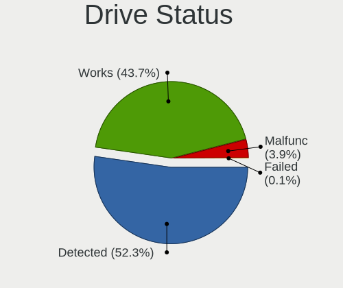
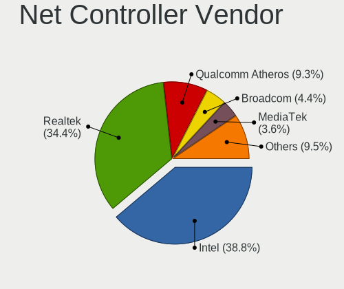
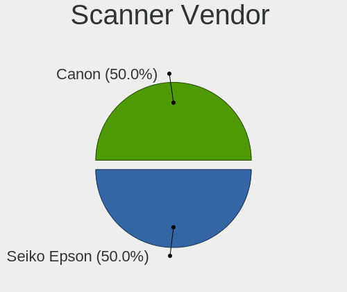
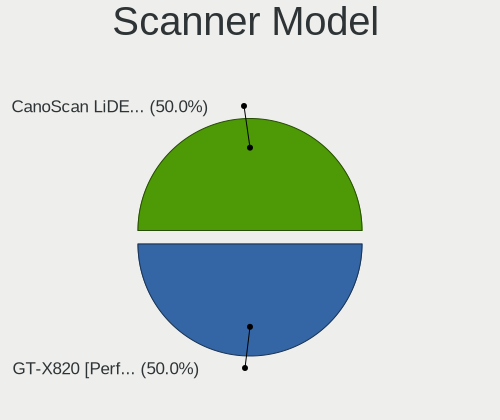

Fedora 36 - Tested Hardware & Statistics (Notebooks)
----------------------------------------------------

A project to collect tested hardware configurations for Fedora 36.

Anyone can contribute to this report by the [hw-probe](https://github.com/linuxhw/hw-probe) tool:

    sudo -E hw-probe -all -upload

Please contribute! Especially if your hardware is rare.

Contents
--------

* [ Test Cases ](#test-cases)

* [ System ](#system)
  - [ Kernel                   ](#kernel)
  - [ Kernel Family            ](#kernel-family)
  - [ Kernel Major Ver.        ](#kernel-major-ver)
  - [ Arch                     ](#arch)
  - [ DE                       ](#de)
  - [ Display Server           ](#display-server)
  - [ Display Manager          ](#display-manager)
  - [ OS Lang                  ](#os-lang)
  - [ Boot Mode                ](#boot-mode)
  - [ Filesystem               ](#filesystem)
  - [ Part. scheme             ](#part-scheme)
  - [ Dual Boot with Linux/BSD ](#dual-boot-with-linuxbsd)
  - [ Dual Boot (Win)          ](#dual-boot-win)

* [ Board ](#board)
  - [ Vendor                   ](#vendor)
  - [ Model                    ](#model)
  - [ Model Family             ](#model-family)
  - [ MFG Year                 ](#mfg-year)
  - [ Form Factor              ](#form-factor)
  - [ Secure Boot              ](#secure-boot)
  - [ Coreboot                 ](#coreboot)
  - [ RAM Size                 ](#ram-size)
  - [ RAM Used                 ](#ram-used)
  - [ Total Drives             ](#total-drives)
  - [ Has CD-ROM               ](#has-cd-rom)
  - [ Has Ethernet             ](#has-ethernet)
  - [ Has WiFi                 ](#has-wifi)
  - [ Has Bluetooth            ](#has-bluetooth)

* [ Location ](#location)
  - [ Country                  ](#country)
  - [ City                     ](#city)

* [ Drives ](#drives)
  - [ Drive Vendor             ](#drive-vendor)
  - [ Drive Model              ](#drive-model)
  - [ HDD Vendor               ](#hdd-vendor)
  - [ SSD Vendor               ](#ssd-vendor)
  - [ Drive Kind               ](#drive-kind)
  - [ Drive Connector          ](#drive-connector)
  - [ Drive Size               ](#drive-size)
  - [ Space Total              ](#space-total)
  - [ Space Used               ](#space-used)
  - [ Malfunc. Drives          ](#malfunc-drives)
  - [ Malfunc. Drive Vendor    ](#malfunc-drive-vendor)
  - [ Malfunc. HDD Vendor      ](#malfunc-hdd-vendor)
  - [ Malfunc. Drive Kind      ](#malfunc-drive-kind)
  - [ Failed Drives            ](#failed-drives)
  - [ Failed Drive Vendor      ](#failed-drive-vendor)
  - [ Drive Status             ](#drive-status)

* [ Storage controller ](#storage-controller)
  - [ Storage Vendor           ](#storage-vendor)
  - [ Storage Model            ](#storage-model)
  - [ Storage Kind             ](#storage-kind)

* [ Processor ](#processor)
  - [ CPU Vendor               ](#cpu-vendor)
  - [ CPU Model                ](#cpu-model)
  - [ CPU Model Family         ](#cpu-model-family)
  - [ CPU Cores                ](#cpu-cores)
  - [ CPU Sockets              ](#cpu-sockets)
  - [ CPU Threads              ](#cpu-threads)
  - [ CPU Op-Modes             ](#cpu-op-modes)
  - [ CPU Microcode            ](#cpu-microcode)
  - [ CPU Microarch            ](#cpu-microarch)

* [ Graphics ](#graphics)
  - [ GPU Vendor               ](#gpu-vendor)
  - [ GPU Model                ](#gpu-model)
  - [ GPU Combo                ](#gpu-combo)
  - [ GPU Driver               ](#gpu-driver)
  - [ GPU Memory               ](#gpu-memory)

* [ Monitor ](#monitor)
  - [ Monitor Vendor           ](#monitor-vendor)
  - [ Monitor Model            ](#monitor-model)
  - [ Monitor Resolution       ](#monitor-resolution)
  - [ Monitor Diagonal         ](#monitor-diagonal)
  - [ Monitor Width            ](#monitor-width)
  - [ Aspect Ratio             ](#aspect-ratio)
  - [ Monitor Area             ](#monitor-area)
  - [ Pixel Density            ](#pixel-density)
  - [ Multiple Monitors        ](#multiple-monitors)

* [ Network ](#network)
  - [ Net Controller Vendor    ](#net-controller-vendor)
  - [ Net Controller Model     ](#net-controller-model)
  - [ Wireless Vendor          ](#wireless-vendor)
  - [ Wireless Model           ](#wireless-model)
  - [ Ethernet Vendor          ](#ethernet-vendor)
  - [ Ethernet Model           ](#ethernet-model)
  - [ Net Controller Kind      ](#net-controller-kind)
  - [ Used Controller          ](#used-controller)
  - [ NICs                     ](#nics)
  - [ IPv6                     ](#ipv6)

* [ Bluetooth ](#bluetooth)
  - [ Bluetooth Vendor         ](#bluetooth-vendor)
  - [ Bluetooth Model          ](#bluetooth-model)

* [ Sound ](#sound)
  - [ Sound Vendor             ](#sound-vendor)
  - [ Sound Model              ](#sound-model)

* [ Memory ](#memory)
  - [ Memory Vendor            ](#memory-vendor)
  - [ Memory Model             ](#memory-model)
  - [ Memory Kind              ](#memory-kind)
  - [ Memory Form Factor       ](#memory-form-factor)
  - [ Memory Size              ](#memory-size)
  - [ Memory Speed             ](#memory-speed)

* [ Printers & scanners ](#printers--scanners)
  - [ Printer Vendor           ](#printer-vendor)
  - [ Printer Model            ](#printer-model)
  - [ Scanner Vendor           ](#scanner-vendor)
  - [ Scanner Model            ](#scanner-model)

* [ Camera ](#camera)
  - [ Camera Vendor            ](#camera-vendor)
  - [ Camera Model             ](#camera-model)

* [ Security ](#security)
  - [ Fingerprint Vendor       ](#fingerprint-vendor)
  - [ Fingerprint Model        ](#fingerprint-model)
  - [ Chipcard Vendor          ](#chipcard-vendor)
  - [ Chipcard Model           ](#chipcard-model)

* [ Unsupported ](#unsupported)
  - [ Unsupported Devices      ](#unsupported-devices)
  - [ Unsupported Device Types ](#unsupported-device-types)

Test Cases
----------

Total: 1259

| Vendor        | Model                       | Probe                                                      | Date         |
|---------------|-----------------------------|------------------------------------------------------------|--------------|
| MICROMAX      | Canvas Lapbook L1161        | [9efe9e89d6](https://linux-hardware.org/?probe=9efe9e89d6) | Oct 01, 2022 |
| HP            | Victus by Laptop 16-e0xx... | [4a8d27ad0f](https://linux-hardware.org/?probe=4a8d27ad0f) | Oct 01, 2022 |
| Dell          | XPS 13 9300                 | [1fade0f247](https://linux-hardware.org/?probe=1fade0f247) | Oct 01, 2022 |
| Dell          | Vostro 5568                 | [44bf0dbbce](https://linux-hardware.org/?probe=44bf0dbbce) | Oct 01, 2022 |
| Lenovo        | ThinkPad T470p 20J7S0DK0... | [49bd2b0248](https://linux-hardware.org/?probe=49bd2b0248) | Oct 01, 2022 |
| Dell          | Inspiron 3442               | [af9b794734](https://linux-hardware.org/?probe=af9b794734) | Sep 30, 2022 |
| ASUSTek       | VivoBook_ASUSLaptop X340... | [d5407763a0](https://linux-hardware.org/?probe=d5407763a0) | Sep 30, 2022 |
| Dell          | Latitude E4300              | [a860d9a446](https://linux-hardware.org/?probe=a860d9a446) | Sep 30, 2022 |
| GPD           | G1621-02                    | [6ae9fc596e](https://linux-hardware.org/?probe=6ae9fc596e) | Sep 30, 2022 |
| Dell          | XPS 15 9570                 | [0d466bc2f7](https://linux-hardware.org/?probe=0d466bc2f7) | Sep 30, 2022 |
| HP            | ProBook 6570b               | [d9be946342](https://linux-hardware.org/?probe=d9be946342) | Sep 30, 2022 |
| HP            | Laptop 15s-eq3xxx           | [b15bae8e77](https://linux-hardware.org/?probe=b15bae8e77) | Sep 30, 2022 |
| HP            | Laptop 15s-eq3xxx           | [126b8dd3ec](https://linux-hardware.org/?probe=126b8dd3ec) | Sep 30, 2022 |
| Lenovo        | ThinkBook 14 G3 ACL 21A2    | [41dc234b26](https://linux-hardware.org/?probe=41dc234b26) | Sep 30, 2022 |
| Lenovo        | ThinkPad T470p 20J7S0DK0... | [33353fc67c](https://linux-hardware.org/?probe=33353fc67c) | Sep 30, 2022 |
| SK hynix      | HyBook                      | [38b5f704a1](https://linux-hardware.org/?probe=38b5f704a1) | Sep 30, 2022 |
| Timi          | Xiaomi Book Pro 16 2022     | [d2a3575975](https://linux-hardware.org/?probe=d2a3575975) | Sep 30, 2022 |
| Lenovo        | ThinkPad P15 Gen 2i 20YQ... | [9015ce1da8](https://linux-hardware.org/?probe=9015ce1da8) | Sep 30, 2022 |
| Lenovo        | ThinkPad X1 Carbon Gen 1... | [2c6b161d0f](https://linux-hardware.org/?probe=2c6b161d0f) | Sep 29, 2022 |
| Avell High... | A60 MUV                     | [888e375356](https://linux-hardware.org/?probe=888e375356) | Sep 29, 2022 |
| Lenovo        | Legion 5 17ACH6 82K0        | [18afdc2116](https://linux-hardware.org/?probe=18afdc2116) | Sep 29, 2022 |
| HP            | ProBook 440 G7              | [99f729e814](https://linux-hardware.org/?probe=99f729e814) | Sep 29, 2022 |
| Fujitsu       | LIFEBOOK P771               | [7325511d27](https://linux-hardware.org/?probe=7325511d27) | Sep 29, 2022 |
| ASUSTek       | X555LA                      | [5ec700ea0a](https://linux-hardware.org/?probe=5ec700ea0a) | Sep 29, 2022 |
| Acer          | Aspire 5742G                | [354a9c2bc2](https://linux-hardware.org/?probe=354a9c2bc2) | Sep 29, 2022 |
| HP            | Laptop 15-db0xxx            | [067b155d9b](https://linux-hardware.org/?probe=067b155d9b) | Sep 29, 2022 |
| HP            | Laptop 15-db0xxx            | [058aa145d3](https://linux-hardware.org/?probe=058aa145d3) | Sep 29, 2022 |
| HP            | 15 Notebook PC              | [23c809d2a7](https://linux-hardware.org/?probe=23c809d2a7) | Sep 29, 2022 |
| Dell          | Precision 7550              | [75f2949521](https://linux-hardware.org/?probe=75f2949521) | Sep 29, 2022 |
| Lenovo        | IdeaPad 720-15IKB 81AG      | [9ac63cdce6](https://linux-hardware.org/?probe=9ac63cdce6) | Sep 29, 2022 |
| Lenovo        | ThinkPad L15 Gen 1 20U70... | [d137298cb5](https://linux-hardware.org/?probe=d137298cb5) | Sep 28, 2022 |
| Dell          | Inspiron 5447               | [b30346135b](https://linux-hardware.org/?probe=b30346135b) | Sep 28, 2022 |
| Lenovo        | IdeaPad 3 15ARE 81W4        | [b784552e84](https://linux-hardware.org/?probe=b784552e84) | Sep 28, 2022 |
| Lenovo        | IdeaPad Gaming 3 15IHU6 ... | [84187f87ed](https://linux-hardware.org/?probe=84187f87ed) | Sep 28, 2022 |
| Medion        | Unknown                     | [821c3c8fed](https://linux-hardware.org/?probe=821c3c8fed) | Sep 28, 2022 |
| Alienware     | 14                          | [2d46ecc50e](https://linux-hardware.org/?probe=2d46ecc50e) | Sep 28, 2022 |
| Dell          | Inspiron 5566               | [a4b44081c2](https://linux-hardware.org/?probe=a4b44081c2) | Sep 27, 2022 |
| Lenovo        | G40-80 80JE                 | [a6347449b3](https://linux-hardware.org/?probe=a6347449b3) | Sep 27, 2022 |
| Chuwi         | HeroBook Air                | [c31e327867](https://linux-hardware.org/?probe=c31e327867) | Sep 27, 2022 |
| MSI           | GS66 Stealth 10SGS          | [644efb07cf](https://linux-hardware.org/?probe=644efb07cf) | Sep 27, 2022 |
| HONOR         | HGE-WX6                     | [5c61df4d20](https://linux-hardware.org/?probe=5c61df4d20) | Sep 27, 2022 |
| ASUSTek       | ASUS TUF Gaming A15 FA50... | [6677830ce4](https://linux-hardware.org/?probe=6677830ce4) | Sep 27, 2022 |
| Lenovo        | IdeaPad 5 15ARE05 81YQ      | [3d86bcf1b7](https://linux-hardware.org/?probe=3d86bcf1b7) | Sep 27, 2022 |
| HUAWEI        | NBLK-WAX9X                  | [c60d7e3375](https://linux-hardware.org/?probe=c60d7e3375) | Sep 27, 2022 |
| HP            | ProBook 450 G4              | [4308420b28](https://linux-hardware.org/?probe=4308420b28) | Sep 27, 2022 |
| MSI           | GT72 6QE                    | [5535b3367e](https://linux-hardware.org/?probe=5535b3367e) | Sep 26, 2022 |
| Acer          | Aspire E1-570G              | [ed657bfbb6](https://linux-hardware.org/?probe=ed657bfbb6) | Sep 26, 2022 |
| ASUSTek       | TUF Gaming FX505DV          | [2154b531c9](https://linux-hardware.org/?probe=2154b531c9) | Sep 26, 2022 |
| Dell          | XPS 17 9700                 | [76166adede](https://linux-hardware.org/?probe=76166adede) | Sep 26, 2022 |
| HUAWEI        | NBLB-WAX9N                  | [f1d78ca455](https://linux-hardware.org/?probe=f1d78ca455) | Sep 26, 2022 |
| ASUSTek       | TUF Gaming FX505DV          | [6b3be4af70](https://linux-hardware.org/?probe=6b3be4af70) | Sep 26, 2022 |
| MSI           | GT72 6QE                    | [d739812ce7](https://linux-hardware.org/?probe=d739812ce7) | Sep 26, 2022 |
| MSI           | GT72S 6QE                   | [7ec3a25453](https://linux-hardware.org/?probe=7ec3a25453) | Sep 26, 2022 |
| HP            | Laptop                      | [6d8fc869e4](https://linux-hardware.org/?probe=6d8fc869e4) | Sep 26, 2022 |
| HP            | Pavilion Aero Laptop 13-... | [52a86d0701](https://linux-hardware.org/?probe=52a86d0701) | Sep 26, 2022 |
| HP            | Pavilion Aero Laptop 13-... | [683aa83ea4](https://linux-hardware.org/?probe=683aa83ea4) | Sep 26, 2022 |
| HUAWEI        | BOHB-WAX9                   | [64fd780b2f](https://linux-hardware.org/?probe=64fd780b2f) | Sep 26, 2022 |
| HUAWEI        | BOHB-WAX9                   | [d557cdbe1c](https://linux-hardware.org/?probe=d557cdbe1c) | Sep 26, 2022 |
| HP            | Laptop                      | [be59fc7a97](https://linux-hardware.org/?probe=be59fc7a97) | Sep 26, 2022 |
| HP            | EliteBook Folio 9480m       | [e2232c49ca](https://linux-hardware.org/?probe=e2232c49ca) | Sep 25, 2022 |
| ASUSTek       | VivoBook_ASUSLaptop X513... | [f8b76ec5f4](https://linux-hardware.org/?probe=f8b76ec5f4) | Sep 25, 2022 |
| AZW           | SEi                         | [063c3cc52e](https://linux-hardware.org/?probe=063c3cc52e) | Sep 25, 2022 |
| AZW           | SEi                         | [055096f57a](https://linux-hardware.org/?probe=055096f57a) | Sep 25, 2022 |
| ASUSTek       | ROG Strix G733QS_G733QS     | [67040d9a5e](https://linux-hardware.org/?probe=67040d9a5e) | Sep 25, 2022 |
| HP            | OMEN by Laptop 15-ce0xx     | [850b486cff](https://linux-hardware.org/?probe=850b486cff) | Sep 25, 2022 |
| Apple         | MacBookPro14,1              | [f5e9524bff](https://linux-hardware.org/?probe=f5e9524bff) | Sep 25, 2022 |
| Apple         | MacBookPro16,1              | [6e7d310781](https://linux-hardware.org/?probe=6e7d310781) | Sep 25, 2022 |
| Apple         | MacBookPro6,2               | [be92ff8ffc](https://linux-hardware.org/?probe=be92ff8ffc) | Sep 25, 2022 |
| HP            | ProBook 450 15.6 inch G9... | [4f9ff1b402](https://linux-hardware.org/?probe=4f9ff1b402) | Sep 24, 2022 |
| HP            | Pavilion dv6                | [ae43d0bbce](https://linux-hardware.org/?probe=ae43d0bbce) | Sep 24, 2022 |
| Framework     | Laptop (12th Gen Intel C... | [2082a8668b](https://linux-hardware.org/?probe=2082a8668b) | Sep 24, 2022 |
| Lenovo        | ThinkPad X1 Extreme 20MF... | [89a1a3179d](https://linux-hardware.org/?probe=89a1a3179d) | Sep 24, 2022 |
| Lenovo        | ThinkPad X270 20HMS1QT0E    | [72caf18b5f](https://linux-hardware.org/?probe=72caf18b5f) | Sep 23, 2022 |
| Lenovo        | ThinkPad T460 20FN002JUS    | [c30d8893ca](https://linux-hardware.org/?probe=c30d8893ca) | Sep 23, 2022 |
| HONOR         | HGE-WX6                     | [337c1097ef](https://linux-hardware.org/?probe=337c1097ef) | Sep 23, 2022 |
| Lenovo        | IdeaPad 5 15ITL05 82FG      | [f72f370511](https://linux-hardware.org/?probe=f72f370511) | Sep 23, 2022 |
| HP            | Pavilion Aero Laptop 13-... | [a5e851730c](https://linux-hardware.org/?probe=a5e851730c) | Sep 23, 2022 |
| Acer          | Aspire A715-43G             | [5ecaaef0b1](https://linux-hardware.org/?probe=5ecaaef0b1) | Sep 23, 2022 |
| Timi          | Redmi Book Pro 15 2022      | [accc831d30](https://linux-hardware.org/?probe=accc831d30) | Sep 23, 2022 |
| Lenovo        | Yoga Slim 7 Carbon 13ITL... | [c916654073](https://linux-hardware.org/?probe=c916654073) | Sep 22, 2022 |
| VALE          | Notebook Classic C140       | [5a8e431c98](https://linux-hardware.org/?probe=5a8e431c98) | Sep 22, 2022 |
| ASUSTek       | ROG Strix G513QY_G513QY     | [4d47a6bfcf](https://linux-hardware.org/?probe=4d47a6bfcf) | Sep 22, 2022 |
| Dell          | Precision 5540              | [0f09e447ea](https://linux-hardware.org/?probe=0f09e447ea) | Sep 22, 2022 |
| Dell          | Vostro 3558                 | [61f6c99c88](https://linux-hardware.org/?probe=61f6c99c88) | Sep 22, 2022 |
| ASUSTek       | ASUS BR1100CKA BR1100CKA... | [efaa235d34](https://linux-hardware.org/?probe=efaa235d34) | Sep 22, 2022 |
| HP            | OMEN by Laptop 15-ce0xx     | [2250b3380d](https://linux-hardware.org/?probe=2250b3380d) | Sep 22, 2022 |
| ASUSTek       | ROG Zephyrus G14 GA401QE... | [ba5fdd39e6](https://linux-hardware.org/?probe=ba5fdd39e6) | Sep 21, 2022 |
| Framework     | Laptop                      | [8e2d92c817](https://linux-hardware.org/?probe=8e2d92c817) | Sep 21, 2022 |
| HP            | 15 Notebook PC              | [9515dd24c0](https://linux-hardware.org/?probe=9515dd24c0) | Sep 21, 2022 |
| HP            | EliteBook 840 G3            | [2e5553125e](https://linux-hardware.org/?probe=2e5553125e) | Sep 21, 2022 |
| Lenovo        | ThinkBook 15p Gen 2 21B1    | [85cab20988](https://linux-hardware.org/?probe=85cab20988) | Sep 21, 2022 |
| Razer         | Blade                       | [c835fe2f90](https://linux-hardware.org/?probe=c835fe2f90) | Sep 21, 2022 |
| Acer          | Nitro AN515-57              | [59219d6ded](https://linux-hardware.org/?probe=59219d6ded) | Sep 21, 2022 |
| HP            | EliteBook 840 G3            | [deb8b0ca78](https://linux-hardware.org/?probe=deb8b0ca78) | Sep 21, 2022 |
| HP            | Pavilion Power Laptop 15... | [360e860fb1](https://linux-hardware.org/?probe=360e860fb1) | Sep 20, 2022 |
| HP            | ProBook 640 G4              | [41cb2444c5](https://linux-hardware.org/?probe=41cb2444c5) | Sep 20, 2022 |
| HP            | ProBook 640 G4              | [a93242008f](https://linux-hardware.org/?probe=a93242008f) | Sep 20, 2022 |
| Lenovo        | ThinkPad E14 Gen 3 20YDS... | [7561f24877](https://linux-hardware.org/?probe=7561f24877) | Sep 20, 2022 |
| Lenovo        | ThinkPad P1 Gen 3 20TJS2... | [32120dfcd4](https://linux-hardware.org/?probe=32120dfcd4) | Sep 20, 2022 |
| Lenovo        | ThinkPad X1 Carbon Gen 1... | [b72e23e590](https://linux-hardware.org/?probe=b72e23e590) | Sep 20, 2022 |
| Lenovo        | ThinkPad T460 20FN002JUS    | [98771092de](https://linux-hardware.org/?probe=98771092de) | Sep 20, 2022 |
| TUXEDO        | InfinityBook Pro 14 v4      | [20c7b9dcf9](https://linux-hardware.org/?probe=20c7b9dcf9) | Sep 20, 2022 |
| Notebook      | NH55RGQ                     | [f4aade3998](https://linux-hardware.org/?probe=f4aade3998) | Sep 20, 2022 |
| Lenovo        | IdeaPad 5 15ARE05 81YQ      | [21617c5cff](https://linux-hardware.org/?probe=21617c5cff) | Sep 20, 2022 |
| Lenovo        | ThinkPad T410 2518Q6G       | [b0568eadf2](https://linux-hardware.org/?probe=b0568eadf2) | Sep 20, 2022 |
| Notebook      | NH55RGQ                     | [95c8201663](https://linux-hardware.org/?probe=95c8201663) | Sep 20, 2022 |
| HP            | ProBook 455 G7              | [80d61eb345](https://linux-hardware.org/?probe=80d61eb345) | Sep 20, 2022 |
| Lenovo        | ThinkPad T420 4180PBG       | [857b2acef0](https://linux-hardware.org/?probe=857b2acef0) | Sep 20, 2022 |
| Dell          | XPS 15 9550                 | [acf36b1555](https://linux-hardware.org/?probe=acf36b1555) | Sep 20, 2022 |
| HP            | ENVY 15                     | [6921f93893](https://linux-hardware.org/?probe=6921f93893) | Sep 20, 2022 |
| MSI           | Bravo 15 B5DD               | [3c51417d8f](https://linux-hardware.org/?probe=3c51417d8f) | Sep 19, 2022 |
| Apple         | MacBookPro9,2               | [a681a7cab8](https://linux-hardware.org/?probe=a681a7cab8) | Sep 19, 2022 |
| HP            | ProBook 470 G5              | [de718ac983](https://linux-hardware.org/?probe=de718ac983) | Sep 19, 2022 |
| Lenovo        | Legion 5 Pro 16ITH6H 82J... | [bed329dab4](https://linux-hardware.org/?probe=bed329dab4) | Sep 19, 2022 |
| Lenovo        | ThinkPad T540p 20BFS0RK0... | [eaaf80509b](https://linux-hardware.org/?probe=eaaf80509b) | Sep 19, 2022 |
| Toshiba       | Satellite L40t-A            | [b09254248d](https://linux-hardware.org/?probe=b09254248d) | Sep 19, 2022 |
| Lenovo        | IdeaPad 3 15IML05 81WB      | [9b14ec4438](https://linux-hardware.org/?probe=9b14ec4438) | Sep 19, 2022 |
| Dell          | Inspiron 7559               | [ede9aab3fb](https://linux-hardware.org/?probe=ede9aab3fb) | Sep 19, 2022 |
| ASUSTek       | ROG Zephyrus G14 GA402RJ... | [db46d34737](https://linux-hardware.org/?probe=db46d34737) | Sep 19, 2022 |
| ASUSTek       | GL502VMK                    | [9776f2c20c](https://linux-hardware.org/?probe=9776f2c20c) | Sep 19, 2022 |
| Lenovo        | ThinkPad T14s Gen 2a 20X... | [474f619a29](https://linux-hardware.org/?probe=474f619a29) | Sep 19, 2022 |
| Dell          | Latitude E6520              | [ac5b5a53a2](https://linux-hardware.org/?probe=ac5b5a53a2) | Sep 19, 2022 |
| Dell          | Precision 5560              | [5e70cfd82f](https://linux-hardware.org/?probe=5e70cfd82f) | Sep 19, 2022 |
| HUAWEI        | NBLK-WAX9X                  | [bb8fdeb489](https://linux-hardware.org/?probe=bb8fdeb489) | Sep 19, 2022 |
| Dell          | Latitude 5420               | [1e5a1652cc](https://linux-hardware.org/?probe=1e5a1652cc) | Sep 19, 2022 |
| Lenovo        | ThinkPad T430 2349S4D       | [0c4d98868f](https://linux-hardware.org/?probe=0c4d98868f) | Sep 19, 2022 |
| Dell          | Vostro 3500                 | [f114799ded](https://linux-hardware.org/?probe=f114799ded) | Sep 18, 2022 |
| Dell          | Latitude 3420               | [5364b3d032](https://linux-hardware.org/?probe=5364b3d032) | Sep 18, 2022 |
| HUAWEI        | HVY-WXX9                    | [b9bb35af47](https://linux-hardware.org/?probe=b9bb35af47) | Sep 18, 2022 |
| HUAWEI        | HVY-WXX9                    | [2032e77931](https://linux-hardware.org/?probe=2032e77931) | Sep 18, 2022 |
| Lenovo        | IdeaPad 3 15IML05 81WB      | [751df30316](https://linux-hardware.org/?probe=751df30316) | Sep 18, 2022 |
| Lenovo        | ThinkPad E14 Gen 4 21ECC... | [e09b077e89](https://linux-hardware.org/?probe=e09b077e89) | Sep 18, 2022 |
| Razer         | Blade 14 - RZ09-0370        | [1f9f8ee511](https://linux-hardware.org/?probe=1f9f8ee511) | Sep 18, 2022 |
| Dell          | Inspiron N5110              | [fa2122b6ee](https://linux-hardware.org/?probe=fa2122b6ee) | Sep 18, 2022 |
| Acer          | Swift SF314-511             | [a171efb42c](https://linux-hardware.org/?probe=a171efb42c) | Sep 17, 2022 |
| Apple         | MacBookPro12,1              | [ba54a7bf0c](https://linux-hardware.org/?probe=ba54a7bf0c) | Sep 17, 2022 |
| Dell          | Vostro 3500                 | [fd0bcfd41d](https://linux-hardware.org/?probe=fd0bcfd41d) | Sep 17, 2022 |
| ASUSTek       | ROG Zephyrus G14 GA401IU... | [3b0169723f](https://linux-hardware.org/?probe=3b0169723f) | Sep 17, 2022 |
| Apple         | MacBookPro16,1              | [467d4c60c0](https://linux-hardware.org/?probe=467d4c60c0) | Sep 16, 2022 |
| Toshiba       | Satellite C660              | [c5474e5fe3](https://linux-hardware.org/?probe=c5474e5fe3) | Sep 16, 2022 |
| Dell          | G3 3779                     | [5c24653999](https://linux-hardware.org/?probe=5c24653999) | Sep 16, 2022 |
| ASUSTek       | VivoBook_ASUSLaptop X580... | [70a944e816](https://linux-hardware.org/?probe=70a944e816) | Sep 16, 2022 |
| Lenovo        | ThinkPad T480 20L5S1S000    | [50669d6ff9](https://linux-hardware.org/?probe=50669d6ff9) | Sep 16, 2022 |
| Acidanther... | iMac19,2                    | [94b79ac6e5](https://linux-hardware.org/?probe=94b79ac6e5) | Sep 16, 2022 |
| Dell          | Latitude 5511               | [9a2faa8d22](https://linux-hardware.org/?probe=9a2faa8d22) | Sep 16, 2022 |
| Acer          | Nitro AN515-58              | [a29728a871](https://linux-hardware.org/?probe=a29728a871) | Sep 16, 2022 |
| Dell          | Inspiron 5567               | [1cbebfbe09](https://linux-hardware.org/?probe=1cbebfbe09) | Sep 16, 2022 |
| ASUSTek       | X550JK                      | [5c399f4fb0](https://linux-hardware.org/?probe=5c399f4fb0) | Sep 15, 2022 |
| ASUSTek       | X550JK                      | [59df382a23](https://linux-hardware.org/?probe=59df382a23) | Sep 15, 2022 |
| Lenovo        | Yoga Slim 7 Pro 14IAH7 8... | [80638ed98f](https://linux-hardware.org/?probe=80638ed98f) | Sep 15, 2022 |
| ASUSTek       | VivoBook_ASUSLaptop X415... | [c70951aae5](https://linux-hardware.org/?probe=c70951aae5) | Sep 15, 2022 |
| ASUSTek       | VivoBook_ASUSLaptop X415... | [4b19ce2aab](https://linux-hardware.org/?probe=4b19ce2aab) | Sep 15, 2022 |
| Dell          | Inspiron N5110              | [f566a009c8](https://linux-hardware.org/?probe=f566a009c8) | Sep 15, 2022 |
| HP            | Snappy                      | [d890c80994](https://linux-hardware.org/?probe=d890c80994) | Sep 15, 2022 |
| Lenovo        | ThinkPad P14s Gen 1 20Y1... | [6d4adb2a44](https://linux-hardware.org/?probe=6d4adb2a44) | Sep 14, 2022 |
| HP            | EliteBook 8460p             | [d34c655d2b](https://linux-hardware.org/?probe=d34c655d2b) | Sep 14, 2022 |
| Lenovo        | ThinkBook 13s G4 ARB 21A... | [efb36530f1](https://linux-hardware.org/?probe=efb36530f1) | Sep 14, 2022 |
| Lenovo        | ThinkPad T14s Gen 1 20UH... | [bbc3c68696](https://linux-hardware.org/?probe=bbc3c68696) | Sep 14, 2022 |
| Dell          | Latitude 5521               | [c342e3ab13](https://linux-hardware.org/?probe=c342e3ab13) | Sep 14, 2022 |
| ASUSTek       | VivoBook_ASUSLaptop X580... | [3f34e5ed01](https://linux-hardware.org/?probe=3f34e5ed01) | Sep 14, 2022 |
| Dell          | Inspiron 5575               | [1ae871a545](https://linux-hardware.org/?probe=1ae871a545) | Sep 14, 2022 |
| HUAWEI        | HVY-WXX9                    | [d1b95841a4](https://linux-hardware.org/?probe=d1b95841a4) | Sep 13, 2022 |
| Dell          | Precision 5560              | [78809c82c2](https://linux-hardware.org/?probe=78809c82c2) | Sep 13, 2022 |
| Lenovo        | ThinkPad X1 Carbon Gen 1... | [224ecd9fa7](https://linux-hardware.org/?probe=224ecd9fa7) | Sep 13, 2022 |
| HP            | EliteBook 745 G6            | [61da5fee97](https://linux-hardware.org/?probe=61da5fee97) | Sep 13, 2022 |
| ASUSTek       | ROG Zephyrus M16 GU603ZW... | [472668e67b](https://linux-hardware.org/?probe=472668e67b) | Sep 12, 2022 |
| Lanix         | AL V9                       | [e03f9aecc3](https://linux-hardware.org/?probe=e03f9aecc3) | Sep 12, 2022 |
| Dell          | Latitude 5495               | [23586ab4ef](https://linux-hardware.org/?probe=23586ab4ef) | Sep 12, 2022 |
| Lenovo        | ThinkPad P1 20MD0014RT      | [4935debbce](https://linux-hardware.org/?probe=4935debbce) | Sep 12, 2022 |
| Lenovo        | ThinkPad E595 20NF001PTX    | [a901769629](https://linux-hardware.org/?probe=a901769629) | Sep 12, 2022 |
| AZW           | SEi                         | [3a4d2086b0](https://linux-hardware.org/?probe=3a4d2086b0) | Sep 12, 2022 |
| Lenovo        | ThinkPad T440 20B7A1P700    | [5be9f89a6f](https://linux-hardware.org/?probe=5be9f89a6f) | Sep 12, 2022 |
| Lenovo        | ThinkBook 15 G2 ITL 20VE    | [4a54854cd7](https://linux-hardware.org/?probe=4a54854cd7) | Sep 12, 2022 |
| Lenovo        | ThinkPad T14 Gen 3 21CF0... | [5bbf96fe23](https://linux-hardware.org/?probe=5bbf96fe23) | Sep 12, 2022 |
| ASUSTek       | ROG Strix G713QR_G713QR     | [d05595b19e](https://linux-hardware.org/?probe=d05595b19e) | Sep 12, 2022 |
| Razer         | Blade 14 - RZ09-0370        | [47b15d6b6c](https://linux-hardware.org/?probe=47b15d6b6c) | Sep 12, 2022 |
| ASUSTek       | VivoBook_ASUSLaptop X512... | [edb2842417](https://linux-hardware.org/?probe=edb2842417) | Sep 12, 2022 |
| Lenovo        | IdeaPad 100S-14IBR 80R9     | [c6df51fa3b](https://linux-hardware.org/?probe=c6df51fa3b) | Sep 11, 2022 |
| Lenovo        | ThinkPad X220 4291WSH       | [7064ea27f5](https://linux-hardware.org/?probe=7064ea27f5) | Sep 11, 2022 |
| MSI           | Modern 14 C12M              | [e523452a96](https://linux-hardware.org/?probe=e523452a96) | Sep 11, 2022 |
| Acer          | Nitro AN515-58              | [49fe1c56a3](https://linux-hardware.org/?probe=49fe1c56a3) | Sep 11, 2022 |
| Lenovo        | ThinkBook 15 G2 ITL 20VE    | [099ffbf0bc](https://linux-hardware.org/?probe=099ffbf0bc) | Sep 10, 2022 |
| HP            | ProBook 6570b               | [998630e822](https://linux-hardware.org/?probe=998630e822) | Sep 10, 2022 |
| Apple         | MacBookPro12,1              | [4bb5badf61](https://linux-hardware.org/?probe=4bb5badf61) | Sep 10, 2022 |
| ASUSTek       | UX310UQK                    | [dc650f1d77](https://linux-hardware.org/?probe=dc650f1d77) | Sep 10, 2022 |
| ASUSTek       | ZenBook UX534FTC_UX534FT    | [8fb4287325](https://linux-hardware.org/?probe=8fb4287325) | Sep 10, 2022 |
| Lenovo        | ThinkPad S1 Yoga 20CDCTO... | [0a7b65b735](https://linux-hardware.org/?probe=0a7b65b735) | Sep 09, 2022 |
| Dell          | Inspiron 3543               | [7fc528e246](https://linux-hardware.org/?probe=7fc528e246) | Sep 09, 2022 |
| Dell          | XPS 15 9570                 | [a54dae9e4b](https://linux-hardware.org/?probe=a54dae9e4b) | Sep 09, 2022 |
| Lenovo        | ThinkPad X1 Carbon Gen 9... | [cada1ee58d](https://linux-hardware.org/?probe=cada1ee58d) | Sep 09, 2022 |
| Apple         | MacBookPro9,2               | [9f2534b22e](https://linux-hardware.org/?probe=9f2534b22e) | Sep 09, 2022 |
| Notebook      | W230SS                      | [9ea483f3dd](https://linux-hardware.org/?probe=9ea483f3dd) | Sep 09, 2022 |
| Dell          | Inspiron 5566               | [7d9ebaa4f8](https://linux-hardware.org/?probe=7d9ebaa4f8) | Sep 09, 2022 |
| Lenovo        | ThinkBook 15 G3 ACL 21A4    | [8242cc3cab](https://linux-hardware.org/?probe=8242cc3cab) | Sep 08, 2022 |
| ASUSTek       | VivoBook_ASUSLaptop E410... | [30488e19df](https://linux-hardware.org/?probe=30488e19df) | Sep 08, 2022 |
| Dell          | Latitude E5450              | [305ef21301](https://linux-hardware.org/?probe=305ef21301) | Sep 08, 2022 |
| HP            | ENVY Laptop 17-cr0xxx       | [0bcf279fb8](https://linux-hardware.org/?probe=0bcf279fb8) | Sep 08, 2022 |
| Dell          | Precision 5770              | [41e44b27f4](https://linux-hardware.org/?probe=41e44b27f4) | Sep 08, 2022 |
| Dell          | XPS 13 9305                 | [bc21b4b2a8](https://linux-hardware.org/?probe=bc21b4b2a8) | Sep 07, 2022 |
| Dell          | XPS 13 7390                 | [f91eeba2bd](https://linux-hardware.org/?probe=f91eeba2bd) | Sep 07, 2022 |
| ASUSTek       | ROG Zephyrus G15 GA503RM... | [dce2728dad](https://linux-hardware.org/?probe=dce2728dad) | Sep 07, 2022 |
| Dell          | Latitude E6420              | [8885f409d8](https://linux-hardware.org/?probe=8885f409d8) | Sep 07, 2022 |
| HUAWEI        | KLVL-WXXW                   | [a90b385c8e](https://linux-hardware.org/?probe=a90b385c8e) | Sep 07, 2022 |
| HUAWEI        | KLVL-WXXW                   | [7a3494a230](https://linux-hardware.org/?probe=7a3494a230) | Sep 07, 2022 |
| Lenovo        | ThinkPad Edge E531 6885D... | [673c26165e](https://linux-hardware.org/?probe=673c26165e) | Sep 07, 2022 |
| Lenovo        | ThinkPad T410 2516CTO       | [d3d092e789](https://linux-hardware.org/?probe=d3d092e789) | Sep 07, 2022 |
| HP            | Pavilion Gaming Laptop 1... | [c905c86c47](https://linux-hardware.org/?probe=c905c86c47) | Sep 07, 2022 |
| Lenovo        | ThinkPad T410 2516CTO       | [424adc035f](https://linux-hardware.org/?probe=424adc035f) | Sep 07, 2022 |
| HP            | Pavilion Laptop 15-cs3xx... | [ff127ee255](https://linux-hardware.org/?probe=ff127ee255) | Sep 06, 2022 |
| HP            | EliteBook 850 G6            | [7c202a088d](https://linux-hardware.org/?probe=7c202a088d) | Sep 06, 2022 |
| Lenovo        | IdeaPad 3 15ITL05 81X8      | [826deb0c55](https://linux-hardware.org/?probe=826deb0c55) | Sep 06, 2022 |
| Lenovo        | ThinkPad X1 Carbon 7th 2... | [bffe658238](https://linux-hardware.org/?probe=bffe658238) | Sep 06, 2022 |
| Lenovo        | IdeaPad 5 14ABA7 82SE       | [bcd73bee62](https://linux-hardware.org/?probe=bcd73bee62) | Sep 06, 2022 |
| ASUSTek       | VivoBook_ASUSLaptop X512... | [b327372b50](https://linux-hardware.org/?probe=b327372b50) | Sep 05, 2022 |
| MSI           | Prestige 15 A10SC           | [adbe97d2f1](https://linux-hardware.org/?probe=adbe97d2f1) | Sep 05, 2022 |
| ASUSTek       | ZenBook UX325EA_UX325EA     | [3969240177](https://linux-hardware.org/?probe=3969240177) | Sep 05, 2022 |
| Dell          | Inspiron 16 5625            | [d38282759b](https://linux-hardware.org/?probe=d38282759b) | Sep 05, 2022 |
| Dell          | Latitude 7490               | [4a59725d2d](https://linux-hardware.org/?probe=4a59725d2d) | Sep 05, 2022 |
| Lenovo        | ThinkPad P15 Gen 2i 20YQ... | [459e11c8ba](https://linux-hardware.org/?probe=459e11c8ba) | Sep 05, 2022 |
| Samsung       | 550P5C/550P7C               | [9d9451305b](https://linux-hardware.org/?probe=9d9451305b) | Sep 05, 2022 |
| Lenovo        | ThinkBook 15-IIL 20SM       | [4641fe397a](https://linux-hardware.org/?probe=4641fe397a) | Sep 05, 2022 |
| Dell          | Latitude 5511               | [3193c29c67](https://linux-hardware.org/?probe=3193c29c67) | Sep 04, 2022 |
| Chuwi         | Hi10 Go                     | [f0d55e8aea](https://linux-hardware.org/?probe=f0d55e8aea) | Sep 04, 2022 |
| Lenovo        | IdeaPad S540-14IML 81NF     | [57f8a4e96b](https://linux-hardware.org/?probe=57f8a4e96b) | Sep 04, 2022 |
| Lenovo        | IdeaPad Z510 20287          | [f0bcadac2f](https://linux-hardware.org/?probe=f0bcadac2f) | Sep 04, 2022 |
| Lenovo        | ThinkPad X230 2320HPU       | [a8ba64ec12](https://linux-hardware.org/?probe=a8ba64ec12) | Sep 04, 2022 |
| HUAWEI        | KLVD-WXX9                   | [cc383de755](https://linux-hardware.org/?probe=cc383de755) | Sep 04, 2022 |
| Lenovo        | ThinkPad E560 20EV000RGE    | [5b69ce9986](https://linux-hardware.org/?probe=5b69ce9986) | Sep 04, 2022 |
| Acer          | AS VN7-571G                 | [1c14fbaf96](https://linux-hardware.org/?probe=1c14fbaf96) | Sep 04, 2022 |
| Dell          | Latitude 5420               | [b236b791c1](https://linux-hardware.org/?probe=b236b791c1) | Sep 04, 2022 |
| Lenovo        | 3000 N200 0769BAG           | [33fcb3e2b3](https://linux-hardware.org/?probe=33fcb3e2b3) | Sep 04, 2022 |
| ASUSTek       | ZenBook UX325EA_UX325EA     | [c4db289b99](https://linux-hardware.org/?probe=c4db289b99) | Sep 04, 2022 |
| Lenovo        | ThinkPad T14s Gen 1 20UH... | [a0b2975bf7](https://linux-hardware.org/?probe=a0b2975bf7) | Sep 04, 2022 |
| TUXEDO        | Pulse 15 Gen1               | [dc3fd2d992](https://linux-hardware.org/?probe=dc3fd2d992) | Sep 03, 2022 |
| HP            | EliteBook 8470p             | [109d233976](https://linux-hardware.org/?probe=109d233976) | Sep 03, 2022 |
| Samsung       | 550P5C/550P7C               | [6aac0a8c6c](https://linux-hardware.org/?probe=6aac0a8c6c) | Sep 03, 2022 |
| Dell          | Vostro 1320                 | [e66853cc37](https://linux-hardware.org/?probe=e66853cc37) | Sep 03, 2022 |
| Lenovo        | ThinkPad Edge E540 20C60... | [758f8d2184](https://linux-hardware.org/?probe=758f8d2184) | Sep 03, 2022 |
| ASUSTek       | UX310UQK                    | [ed392e6b79](https://linux-hardware.org/?probe=ed392e6b79) | Sep 03, 2022 |
| ASUSTek       | GL503VM                     | [43cbef1764](https://linux-hardware.org/?probe=43cbef1764) | Sep 03, 2022 |
| MSI           | GP72MVR 7RFX                | [f370d7bbc3](https://linux-hardware.org/?probe=f370d7bbc3) | Sep 03, 2022 |
| Dell          | XPS 15 9570                 | [b73e153667](https://linux-hardware.org/?probe=b73e153667) | Sep 03, 2022 |
| HP            | Stream Notebook PC 13       | [d6c9e33a55](https://linux-hardware.org/?probe=d6c9e33a55) | Sep 03, 2022 |
| MSI           | Modern 14 B11MOL            | [92d3e81be7](https://linux-hardware.org/?probe=92d3e81be7) | Sep 03, 2022 |
| ASUSTek       | ROG Zephyrus G15 GA503QS... | [cec0b91aa9](https://linux-hardware.org/?probe=cec0b91aa9) | Sep 03, 2022 |
| Toshiba       | Satellite C850-C5K          | [51dbca1f4d](https://linux-hardware.org/?probe=51dbca1f4d) | Sep 03, 2022 |
| TUXEDO        | InfinityBook S 15/17 Gen... | [1ce3a883a0](https://linux-hardware.org/?probe=1ce3a883a0) | Sep 03, 2022 |
| Lenovo        | ThinkPad E14 20RA001JIX     | [30eb9dcb39](https://linux-hardware.org/?probe=30eb9dcb39) | Sep 03, 2022 |
| Alienware     | 14                          | [f30f3ddf3d](https://linux-hardware.org/?probe=f30f3ddf3d) | Sep 03, 2022 |
| HP            | EliteBook 8470p             | [33ae7d4c4b](https://linux-hardware.org/?probe=33ae7d4c4b) | Sep 03, 2022 |
| Acer          | Swift SF315-41              | [634777751a](https://linux-hardware.org/?probe=634777751a) | Sep 02, 2022 |
| Lenovo        | IdeaPad 510-15ISK 80SR      | [006c26eaa0](https://linux-hardware.org/?probe=006c26eaa0) | Sep 02, 2022 |
| Acer          | Swift SF315-41              | [dd250df1ef](https://linux-hardware.org/?probe=dd250df1ef) | Sep 02, 2022 |
| Lenovo        | ThinkPad E15 Gen 2 20TD0... | [aa9a637495](https://linux-hardware.org/?probe=aa9a637495) | Sep 02, 2022 |
| Lenovo        | V14-ADA 82C6                | [5e98ea70fb](https://linux-hardware.org/?probe=5e98ea70fb) | Sep 02, 2022 |
| Lenovo        | G50-45 80E3                 | [a8e1884f32](https://linux-hardware.org/?probe=a8e1884f32) | Sep 02, 2022 |
| Lenovo        | ThinkBook 13s G4 ARB 21A... | [1f0f793a37](https://linux-hardware.org/?probe=1f0f793a37) | Sep 02, 2022 |
| Dell          | Inspiron 5558               | [203baa4d7f](https://linux-hardware.org/?probe=203baa4d7f) | Sep 02, 2022 |
| Dell          | Latitude E6400              | [c781ec4733](https://linux-hardware.org/?probe=c781ec4733) | Sep 02, 2022 |
| Chuwi         | HeroBook Air                | [1ac18273da](https://linux-hardware.org/?probe=1ac18273da) | Sep 02, 2022 |
| Dell          | Inspiron 5490               | [3ef6519b6d](https://linux-hardware.org/?probe=3ef6519b6d) | Sep 01, 2022 |
| HP            | OMEN Laptop 15-en0xxx       | [e4a4630b4e](https://linux-hardware.org/?probe=e4a4630b4e) | Sep 01, 2022 |
| Lenovo        | IdeaPad 3 15ITL6 82H8       | [5ad5d3809b](https://linux-hardware.org/?probe=5ad5d3809b) | Sep 01, 2022 |
| Dell          | Inspiron 13 5310            | [b6b7c6dc62](https://linux-hardware.org/?probe=b6b7c6dc62) | Sep 01, 2022 |
| Dell          | Inspiron 13 5310            | [6b3c188071](https://linux-hardware.org/?probe=6b3c188071) | Sep 01, 2022 |
| Dell          | Inspiron 13 5310            | [b0d6660da8](https://linux-hardware.org/?probe=b0d6660da8) | Sep 01, 2022 |
| Dell          | Inspiron 3542               | [945ec7d987](https://linux-hardware.org/?probe=945ec7d987) | Sep 01, 2022 |
| Lenovo        | ThinkPad X220 4291WSH       | [c86e73aed6](https://linux-hardware.org/?probe=c86e73aed6) | Sep 01, 2022 |
| ASUSTek       | X541UJ                      | [0cd33aa36a](https://linux-hardware.org/?probe=0cd33aa36a) | Aug 31, 2022 |
| Dell          | Latitude 7430               | [8876fb0448](https://linux-hardware.org/?probe=8876fb0448) | Aug 31, 2022 |
| Eluktronic... | MAG-15 2070                 | [d7fb373622](https://linux-hardware.org/?probe=d7fb373622) | Aug 31, 2022 |
| Dell          | Latitude E5570              | [91513d0ee3](https://linux-hardware.org/?probe=91513d0ee3) | Aug 31, 2022 |
| Acer          | Aspire E5-521               | [9ce49fc3a3](https://linux-hardware.org/?probe=9ce49fc3a3) | Aug 31, 2022 |
| Acer          | Aspire E5-521               | [b9d306c31b](https://linux-hardware.org/?probe=b9d306c31b) | Aug 31, 2022 |
| ASUSTek       | ROG Zephyrus G14 GA402RK... | [c2d66050b5](https://linux-hardware.org/?probe=c2d66050b5) | Aug 30, 2022 |
| Lenovo        | ThinkPad L15 Gen 1 20U70... | [71cd60f1b9](https://linux-hardware.org/?probe=71cd60f1b9) | Aug 30, 2022 |
| HP            | Laptop 15s-eq2xxx           | [d927e47d1f](https://linux-hardware.org/?probe=d927e47d1f) | Aug 30, 2022 |
| Lenovo        | IdeaPad 3 15ITL6 82H8       | [30457b898c](https://linux-hardware.org/?probe=30457b898c) | Aug 30, 2022 |
| HP            | ENVY Laptop 13-ad1xx        | [7399a32997](https://linux-hardware.org/?probe=7399a32997) | Aug 30, 2022 |
| HP            | 255 G8 Notebook PC          | [c96e8a8254](https://linux-hardware.org/?probe=c96e8a8254) | Aug 30, 2022 |
| Dell          | G3 3579                     | [a3fc82fe9a](https://linux-hardware.org/?probe=a3fc82fe9a) | Aug 30, 2022 |
| HP            | Laptop 14-fq1xxx            | [8ea91d6b4b](https://linux-hardware.org/?probe=8ea91d6b4b) | Aug 30, 2022 |
| HP            | 250 G7 Notebook PC          | [96a56c7cb9](https://linux-hardware.org/?probe=96a56c7cb9) | Aug 30, 2022 |
| Dell          | Inspiron 15 5510            | [346eda373e](https://linux-hardware.org/?probe=346eda373e) | Aug 29, 2022 |
| Dell          | Inspiron 15 5510            | [ecdb2875da](https://linux-hardware.org/?probe=ecdb2875da) | Aug 29, 2022 |
| Dell          | Inspiron 5721               | [d483434965](https://linux-hardware.org/?probe=d483434965) | Aug 29, 2022 |
| Timi          | Redmi Book Pro 15 2022      | [473daa5ce3](https://linux-hardware.org/?probe=473daa5ce3) | Aug 29, 2022 |
| Lenovo        | IdeaPad Gaming 3 15ACH6 ... | [c407e3a17c](https://linux-hardware.org/?probe=c407e3a17c) | Aug 29, 2022 |
| MSI           | Prestige 14Evo A11MO        | [22cf60f50b](https://linux-hardware.org/?probe=22cf60f50b) | Aug 29, 2022 |
| Infinix       | INBOOK X2                   | [02ae752ba2](https://linux-hardware.org/?probe=02ae752ba2) | Aug 29, 2022 |
| HP            | OMEN Laptop 15-en0xxx       | [f921aef61e](https://linux-hardware.org/?probe=f921aef61e) | Aug 29, 2022 |
| HP            | ENVY Laptop 15-ep1xxx       | [d82227c6d3](https://linux-hardware.org/?probe=d82227c6d3) | Aug 29, 2022 |
| Dell          | Precision 5750              | [2ee41b471e](https://linux-hardware.org/?probe=2ee41b471e) | Aug 28, 2022 |
| HUAWEI        | KLVL-WXXW                   | [829a45ed6f](https://linux-hardware.org/?probe=829a45ed6f) | Aug 28, 2022 |
| Google        | Eve                         | [4c83027c9a](https://linux-hardware.org/?probe=4c83027c9a) | Aug 28, 2022 |
| Dell          | Precision 5750              | [af9992756f](https://linux-hardware.org/?probe=af9992756f) | Aug 28, 2022 |
| ASUSTek       | ROG Strix G733QS_G733QS     | [589154a65e](https://linux-hardware.org/?probe=589154a65e) | Aug 28, 2022 |
| ASUSTek       | ROG Strix G733QS_G733QS     | [8d17bfec23](https://linux-hardware.org/?probe=8d17bfec23) | Aug 28, 2022 |
| Lenovo        | Legion 5 Pro 16ARH7H 82R... | [af00be0ff8](https://linux-hardware.org/?probe=af00be0ff8) | Aug 28, 2022 |
| HP            | ProBook 650 G1              | [7738c266d6](https://linux-hardware.org/?probe=7738c266d6) | Aug 28, 2022 |
| Apple         | MacBookPro8,1               | [5efa863ca3](https://linux-hardware.org/?probe=5efa863ca3) | Aug 28, 2022 |
| Acer          | Aspire E5-521               | [a94da62004](https://linux-hardware.org/?probe=a94da62004) | Aug 28, 2022 |
| Acer          | Aspire E5-521               | [64cefbec58](https://linux-hardware.org/?probe=64cefbec58) | Aug 28, 2022 |
| Lenovo        | IdeaPad 5 15ALC05 82LN      | [70b2e9f836](https://linux-hardware.org/?probe=70b2e9f836) | Aug 27, 2022 |
| Dell          | Inspiron 3442               | [46a68b981e](https://linux-hardware.org/?probe=46a68b981e) | Aug 27, 2022 |
| Apple         | MacBookAir6,2               | [0454b1e087](https://linux-hardware.org/?probe=0454b1e087) | Aug 27, 2022 |
| Acidanther... | MacBookPro12,1              | [9e48c5e245](https://linux-hardware.org/?probe=9e48c5e245) | Aug 27, 2022 |
| Lenovo        | IdeaPad 3 15ITL6 82H8       | [559d6f0e42](https://linux-hardware.org/?probe=559d6f0e42) | Aug 27, 2022 |
| Lenovo        | ThinkPad S1 Yoga 20CDCTO... | [f4dd9de519](https://linux-hardware.org/?probe=f4dd9de519) | Aug 27, 2022 |
| Acer          | Nitro AN515-57              | [8d314e1557](https://linux-hardware.org/?probe=8d314e1557) | Aug 27, 2022 |
| Lenovo        | G50-45 80E3                 | [be9921e0e0](https://linux-hardware.org/?probe=be9921e0e0) | Aug 27, 2022 |
| HP            | EliteBook 840 G5            | [7bd19ce9a1](https://linux-hardware.org/?probe=7bd19ce9a1) | Aug 27, 2022 |
| Exo           | Smart Serie L               | [5cbaef571b](https://linux-hardware.org/?probe=5cbaef571b) | Aug 27, 2022 |
| Acer          | Aspire VN7-592G             | [cec4df79eb](https://linux-hardware.org/?probe=cec4df79eb) | Aug 26, 2022 |
| HP            | ProBook 4530s               | [be1270c998](https://linux-hardware.org/?probe=be1270c998) | Aug 26, 2022 |
| ASUSTek       | X541NA                      | [4755f121e3](https://linux-hardware.org/?probe=4755f121e3) | Aug 26, 2022 |
| Lenovo        | ThinkPad T490 20N2005VMX    | [264a4fd9a7](https://linux-hardware.org/?probe=264a4fd9a7) | Aug 26, 2022 |
| Dell          | Inspiron 3593               | [c3ae4b86ac](https://linux-hardware.org/?probe=c3ae4b86ac) | Aug 26, 2022 |
| Lenovo        | IdeaPad 5 14ARE05 81YM      | [c8b4d18767](https://linux-hardware.org/?probe=c8b4d18767) | Aug 25, 2022 |
| HP            | ENVY Laptop 13-aq1xxx       | [095ecf5f87](https://linux-hardware.org/?probe=095ecf5f87) | Aug 25, 2022 |
| MSI           | Modern 14 A10RAS            | [af216b7b4a](https://linux-hardware.org/?probe=af216b7b4a) | Aug 25, 2022 |
| HP            | Victus by Laptop 16-e0xx... | [2b52864870](https://linux-hardware.org/?probe=2b52864870) | Aug 25, 2022 |
| Lenovo        | ThinkBook 14 G3 ACL 21A2    | [9f3be0c9b5](https://linux-hardware.org/?probe=9f3be0c9b5) | Aug 25, 2022 |
| HP            | Pavilion dv6                | [7fd7791035](https://linux-hardware.org/?probe=7fd7791035) | Aug 24, 2022 |
| Lenovo        | IdeaPad 320-15IKB 80XL      | [4378f177a8](https://linux-hardware.org/?probe=4378f177a8) | Aug 24, 2022 |
| HP            | Laptop 15s-fq2xxx           | [f8213e35a4](https://linux-hardware.org/?probe=f8213e35a4) | Aug 24, 2022 |
| GPU Compan... | GWTC116-2                   | [f9090c46a9](https://linux-hardware.org/?probe=f9090c46a9) | Aug 24, 2022 |
| GPU Compan... | GWTC116-2                   | [ac93dd480f](https://linux-hardware.org/?probe=ac93dd480f) | Aug 24, 2022 |
| ASUSTek       | T100HAN                     | [9438c7bb11](https://linux-hardware.org/?probe=9438c7bb11) | Aug 23, 2022 |
| ASUSTek       | ROG Zephyrus G15 GA503QR... | [1e79d17c85](https://linux-hardware.org/?probe=1e79d17c85) | Aug 23, 2022 |
| HP            | Laptop 15s-eq2xxx           | [efc85efba2](https://linux-hardware.org/?probe=efc85efba2) | Aug 23, 2022 |
| Lenovo        | IdeaPad 3 15ARE05 81W4      | [33c24103bf](https://linux-hardware.org/?probe=33c24103bf) | Aug 23, 2022 |
| Lenovo        | IdeaPad 720S-13IKB 81BV     | [1b1c9cb460](https://linux-hardware.org/?probe=1b1c9cb460) | Aug 23, 2022 |
| Lenovo        | ThinkPad T470 20HDCTO1WW    | [2e88f854f8](https://linux-hardware.org/?probe=2e88f854f8) | Aug 23, 2022 |
| Dell          | Inspiron 5567               | [7b0f03259b](https://linux-hardware.org/?probe=7b0f03259b) | Aug 23, 2022 |
| Dell          | XPS L421X                   | [80a474140e](https://linux-hardware.org/?probe=80a474140e) | Aug 22, 2022 |
| Apple         | MacBook9,1                  | [a6726b8439](https://linux-hardware.org/?probe=a6726b8439) | Aug 22, 2022 |
| Aquarius      | Cmp NS765                   | [991487a61b](https://linux-hardware.org/?probe=991487a61b) | Aug 22, 2022 |
| Apple         | MacBook9,1                  | [aff9259c2c](https://linux-hardware.org/?probe=aff9259c2c) | Aug 22, 2022 |
| Apple         | MacBookPro5,5               | [f25926e1fa](https://linux-hardware.org/?probe=f25926e1fa) | Aug 22, 2022 |
| Apple         | MacBookPro5,5               | [784c6d89a6](https://linux-hardware.org/?probe=784c6d89a6) | Aug 22, 2022 |
| Apple         | MacBookPro11,2              | [9856ca2463](https://linux-hardware.org/?probe=9856ca2463) | Aug 21, 2022 |
| Acer          | TravelMate P215-52G         | [1d36fcbc9f](https://linux-hardware.org/?probe=1d36fcbc9f) | Aug 21, 2022 |
| HP            | Compaq 15                   | [c2bdac6148](https://linux-hardware.org/?probe=c2bdac6148) | Aug 21, 2022 |
| Acer          | Aspire E1-522               | [f4f0162d9a](https://linux-hardware.org/?probe=f4f0162d9a) | Aug 21, 2022 |
| Lenovo        | ThinkPad E595 20NF001PTX    | [98b92cfe3a](https://linux-hardware.org/?probe=98b92cfe3a) | Aug 21, 2022 |
| ASUSTek       | ROG Strix G533ZM_G533ZM     | [390e67b458](https://linux-hardware.org/?probe=390e67b458) | Aug 21, 2022 |
| Acer          | Popcorn                     | [1c3d0d6b87](https://linux-hardware.org/?probe=1c3d0d6b87) | Aug 21, 2022 |
| HUAWEI        | EMD-WXX                     | [1ee66f2c65](https://linux-hardware.org/?probe=1ee66f2c65) | Aug 20, 2022 |
| HP            | ENVY Notebook               | [7d790e2b4d](https://linux-hardware.org/?probe=7d790e2b4d) | Aug 20, 2022 |
| HONOR         | NBD-WXX9                    | [1fdf41de8b](https://linux-hardware.org/?probe=1fdf41de8b) | Aug 20, 2022 |
| Dell          | Latitude E6430              | [c7a98ce916](https://linux-hardware.org/?probe=c7a98ce916) | Aug 20, 2022 |
| ASUSTek       | ROG Zephyrus M16 GU603ZE... | [8dd3a87210](https://linux-hardware.org/?probe=8dd3a87210) | Aug 20, 2022 |
| Lenovo        | IdeaPad S340-14API 81NB     | [93c259f492](https://linux-hardware.org/?probe=93c259f492) | Aug 20, 2022 |
| ASUSTek       | Zephyrus S GX531GX_GX531... | [0041774402](https://linux-hardware.org/?probe=0041774402) | Aug 20, 2022 |
| HP            | ProBook 655 G1              | [e37e59a165](https://linux-hardware.org/?probe=e37e59a165) | Aug 20, 2022 |
| Dell          | Inspiron M5010              | [266f9fc41d](https://linux-hardware.org/?probe=266f9fc41d) | Aug 19, 2022 |
| Fujitsu       | LIFEBOOK UH552              | [ad8ec93f74](https://linux-hardware.org/?probe=ad8ec93f74) | Aug 19, 2022 |
| Dell          | Inspiron 5490               | [98f795ee5f](https://linux-hardware.org/?probe=98f795ee5f) | Aug 19, 2022 |
| HUAWEI        | EMD-WXX                     | [9c4217c76b](https://linux-hardware.org/?probe=9c4217c76b) | Aug 19, 2022 |
| Lenovo        | ThinkPad E14 Gen 3 20Y70... | [81be616c6b](https://linux-hardware.org/?probe=81be616c6b) | Aug 19, 2022 |
| Apple         | MacBook6,1                  | [f7703b1b38](https://linux-hardware.org/?probe=f7703b1b38) | Aug 19, 2022 |
| ASUSTek       | K45A                        | [b007d7ae1d](https://linux-hardware.org/?probe=b007d7ae1d) | Aug 18, 2022 |
| Lenovo        | ThinkPad E520 1143CWG       | [bc6f3f891a](https://linux-hardware.org/?probe=bc6f3f891a) | Aug 18, 2022 |
| HP            | ProBook 450 G5              | [68697e720d](https://linux-hardware.org/?probe=68697e720d) | Aug 18, 2022 |
| Acidanther... | MacBookPro12,1              | [6afa5c842e](https://linux-hardware.org/?probe=6afa5c842e) | Aug 18, 2022 |
| Acer          | Aspire A515-45              | [9e48793165](https://linux-hardware.org/?probe=9e48793165) | Aug 18, 2022 |
| Acer          | Aspire E5-573               | [1815c3a2f2](https://linux-hardware.org/?probe=1815c3a2f2) | Aug 17, 2022 |
| Lenovo        | ThinkPad X240 20ALA0AHRT    | [cfc3d5853c](https://linux-hardware.org/?probe=cfc3d5853c) | Aug 17, 2022 |
| Lenovo        | IdeaPad 5 Pro 14ACN6 82L... | [97fb16fc3f](https://linux-hardware.org/?probe=97fb16fc3f) | Aug 17, 2022 |
| Lenovo        | IdeaPad 330-15IKB 81DE      | [7f3311afd4](https://linux-hardware.org/?probe=7f3311afd4) | Aug 17, 2022 |
| ASUSTek       | K45A                        | [cbbc0ff58a](https://linux-hardware.org/?probe=cbbc0ff58a) | Aug 17, 2022 |
| HP            | Pavilion Laptop 15-cs0xx... | [8aea7a68ee](https://linux-hardware.org/?probe=8aea7a68ee) | Aug 17, 2022 |
| Lenovo        | IdeaPad 330-15IKB 81DE      | [f1d6bc684c](https://linux-hardware.org/?probe=f1d6bc684c) | Aug 17, 2022 |
| MSI           | Modern 14 B11SBL            | [ad56f2a352](https://linux-hardware.org/?probe=ad56f2a352) | Aug 17, 2022 |
| Lenovo        | ThinkPad T480s 20L70044A... | [f90559618b](https://linux-hardware.org/?probe=f90559618b) | Aug 17, 2022 |
| MSI           | Modern 14 A10RAS            | [f7102225ca](https://linux-hardware.org/?probe=f7102225ca) | Aug 17, 2022 |
| MSI           | Modern 14 A10RAS            | [3a57a6329f](https://linux-hardware.org/?probe=3a57a6329f) | Aug 17, 2022 |
| HP            | EliteBook 8460p             | [26f646cca0](https://linux-hardware.org/?probe=26f646cca0) | Aug 17, 2022 |
| Eluktronic... | MAX-17                      | [b0aec6f095](https://linux-hardware.org/?probe=b0aec6f095) | Aug 17, 2022 |
| Lenovo        | ThinkPad T460s 20F9004NU... | [3b35e8e9da](https://linux-hardware.org/?probe=3b35e8e9da) | Aug 17, 2022 |
| Lenovo        | IdeaPad 330S-15IKB 81F5     | [78ff8418f9](https://linux-hardware.org/?probe=78ff8418f9) | Aug 17, 2022 |
| MSI           | Delta 15 A5EFK              | [4b165c8f79](https://linux-hardware.org/?probe=4b165c8f79) | Aug 17, 2022 |
| HP            | EliteBook 8460p             | [98b5311ef6](https://linux-hardware.org/?probe=98b5311ef6) | Aug 17, 2022 |
| Lenovo        | Yoga Slim 7 ProX 14ARH7 ... | [0793e37f62](https://linux-hardware.org/?probe=0793e37f62) | Aug 17, 2022 |
| Lenovo        | IdeaPad 3 15ITL6 82H8       | [1b12b01004](https://linux-hardware.org/?probe=1b12b01004) | Aug 16, 2022 |
| Acer          | Aspire A715-42G             | [fbeff3bff5](https://linux-hardware.org/?probe=fbeff3bff5) | Aug 16, 2022 |
| MSI           | GT72S 6QE                   | [20121e68c8](https://linux-hardware.org/?probe=20121e68c8) | Aug 16, 2022 |
| Acer          | Aspire E5-573               | [d3bd05f20b](https://linux-hardware.org/?probe=d3bd05f20b) | Aug 16, 2022 |
| HP            | Laptop 17-by0xxx            | [59db95ffee](https://linux-hardware.org/?probe=59db95ffee) | Aug 16, 2022 |
| ASUSTek       | X453MA                      | [2b63761318](https://linux-hardware.org/?probe=2b63761318) | Aug 16, 2022 |
| Lenovo        | ThinkBook Plus 20TG         | [1f39fbc5a8](https://linux-hardware.org/?probe=1f39fbc5a8) | Aug 16, 2022 |
| Panasonic     | CFMX4-1                     | [01074aea14](https://linux-hardware.org/?probe=01074aea14) | Aug 16, 2022 |
| ASUSTek       | X453MA                      | [fa2c1b6a14](https://linux-hardware.org/?probe=fa2c1b6a14) | Aug 15, 2022 |
| HP            | Pavilion TS 15              | [22194522c7](https://linux-hardware.org/?probe=22194522c7) | Aug 15, 2022 |
| Acer          | Aspire A515-51G             | [9ee5f23f82](https://linux-hardware.org/?probe=9ee5f23f82) | Aug 15, 2022 |
| Lenovo        | ThinkPad T14 Gen 1 20UD0... | [d9f8a6ea69](https://linux-hardware.org/?probe=d9f8a6ea69) | Aug 15, 2022 |
| Apple         | MacBookPro10,1              | [c4738a316c](https://linux-hardware.org/?probe=c4738a316c) | Aug 15, 2022 |
| Lenovo        | ThinkBook 15 G2 ITL 20VE    | [d333f2698e](https://linux-hardware.org/?probe=d333f2698e) | Aug 15, 2022 |
| Notebook      | N15_17RD                    | [eef224fc6b](https://linux-hardware.org/?probe=eef224fc6b) | Aug 15, 2022 |
| Lenovo        | V110-15ISK 80TL             | [757de6f4df](https://linux-hardware.org/?probe=757de6f4df) | Aug 15, 2022 |
| Lenovo        | ThinkBook 14 G3 ACL 21A2    | [4f73fd7cf8](https://linux-hardware.org/?probe=4f73fd7cf8) | Aug 15, 2022 |
| Avell High... | A70 HYB                     | [c0e0f2d0a4](https://linux-hardware.org/?probe=c0e0f2d0a4) | Aug 15, 2022 |
| Lenovo        | ThinkPad T460s 20F9004NU... | [e09e349f03](https://linux-hardware.org/?probe=e09e349f03) | Aug 15, 2022 |
| Sony          | VPCS131FM                   | [22e32938e6](https://linux-hardware.org/?probe=22e32938e6) | Aug 14, 2022 |
| Toshiba       | TECRA R940                  | [f7a6618519](https://linux-hardware.org/?probe=f7a6618519) | Aug 14, 2022 |
| Dell          | XPS 15 9500                 | [08ef9ef965](https://linux-hardware.org/?probe=08ef9ef965) | Aug 14, 2022 |
| Lenovo        | ThinkPad T430 2349V4B       | [0f919e20c7](https://linux-hardware.org/?probe=0f919e20c7) | Aug 14, 2022 |
| UNOWHY        | Y13G010S4EI                 | [b7352cd745](https://linux-hardware.org/?probe=b7352cd745) | Aug 14, 2022 |
| Lenovo        | IdeaPad 3 15ALC6 82MF       | [7209cc1bd4](https://linux-hardware.org/?probe=7209cc1bd4) | Aug 14, 2022 |
| Dell          | XPS 15 9550                 | [ad3ad84c75](https://linux-hardware.org/?probe=ad3ad84c75) | Aug 14, 2022 |
| Apple         | MacBookPro5,5               | [76483c9f78](https://linux-hardware.org/?probe=76483c9f78) | Aug 14, 2022 |
| AXDIA Inte... | WINPAD V10                  | [a44a9b065b](https://linux-hardware.org/?probe=a44a9b065b) | Aug 14, 2022 |
| ASUSTek       | VivoBook_ASUSLaptop X509... | [a533aea5e5](https://linux-hardware.org/?probe=a533aea5e5) | Aug 14, 2022 |
| Dell          | Inspiron 13 5320            | [cee0d5a717](https://linux-hardware.org/?probe=cee0d5a717) | Aug 14, 2022 |
| ASUSTek       | Zephyrus G GU502DU_GA502... | [d5862f21f5](https://linux-hardware.org/?probe=d5862f21f5) | Aug 14, 2022 |
| Unknown       | Unknown                     | [dbf529a586](https://linux-hardware.org/?probe=dbf529a586) | Aug 14, 2022 |
| HP            | ENVY Laptop 17-ch0xxx       | [ca9974d27e](https://linux-hardware.org/?probe=ca9974d27e) | Aug 14, 2022 |
| Acer          | Aspire E5-521               | [c127df7597](https://linux-hardware.org/?probe=c127df7597) | Aug 13, 2022 |
| HP            | 14                          | [92172385ef](https://linux-hardware.org/?probe=92172385ef) | Aug 13, 2022 |
| Dell          | G3 3590                     | [fbe948e194](https://linux-hardware.org/?probe=fbe948e194) | Aug 13, 2022 |
| Lenovo        | IdeaPad S340-14API 81NB     | [7af785fc65](https://linux-hardware.org/?probe=7af785fc65) | Aug 13, 2022 |
| Dell          | XPS 15 9510                 | [3cb2744dbe](https://linux-hardware.org/?probe=3cb2744dbe) | Aug 12, 2022 |
| HP            | ProBook 6570b               | [d67ec558d4](https://linux-hardware.org/?probe=d67ec558d4) | Aug 12, 2022 |
| HP            | ProBook 440 G7              | [ee57cf772f](https://linux-hardware.org/?probe=ee57cf772f) | Aug 12, 2022 |
| Lenovo        | ThinkPad T14 Gen 1 20S00... | [a7cdb45aa6](https://linux-hardware.org/?probe=a7cdb45aa6) | Aug 12, 2022 |
| MSI           | MS-16F1                     | [0a28da4f53](https://linux-hardware.org/?probe=0a28da4f53) | Aug 12, 2022 |
| HP            | Pavilion 17                 | [25a07691ec](https://linux-hardware.org/?probe=25a07691ec) | Aug 12, 2022 |
| Sony          | SVT15115CXS                 | [f7915ecf99](https://linux-hardware.org/?probe=f7915ecf99) | Aug 12, 2022 |
| Lenovo        | Legion 5 Pro 16ACH6H 82J... | [1604d7a824](https://linux-hardware.org/?probe=1604d7a824) | Aug 11, 2022 |
| Dell          | Latitude E6420              | [bd610e8bd8](https://linux-hardware.org/?probe=bd610e8bd8) | Aug 11, 2022 |
| ASUSTek       | VivoBook_ASUSLaptop X412... | [26b1a32b84](https://linux-hardware.org/?probe=26b1a32b84) | Aug 11, 2022 |
| Acer          | Predator PH317-53           | [8578e9a77a](https://linux-hardware.org/?probe=8578e9a77a) | Aug 11, 2022 |
| Lenovo        | ThinkPad X1 Carbon 6th 2... | [05042a439b](https://linux-hardware.org/?probe=05042a439b) | Aug 11, 2022 |
| AZW           | SEi                         | [fb26f11a19](https://linux-hardware.org/?probe=fb26f11a19) | Aug 11, 2022 |
| ASUSTek       | Zephyrus G GU502DU_GA502... | [15488377fb](https://linux-hardware.org/?probe=15488377fb) | Aug 10, 2022 |
| Dell          | XPS 13 7390                 | [149d92cd3e](https://linux-hardware.org/?probe=149d92cd3e) | Aug 10, 2022 |
| HP            | EliteBook 8460p             | [fe464db60d](https://linux-hardware.org/?probe=fe464db60d) | Aug 10, 2022 |
| Lenovo        | Legion 5 17ACH6H 82JY       | [4c3d230572](https://linux-hardware.org/?probe=4c3d230572) | Aug 10, 2022 |
| Lenovo        | ThinkBook 16p Gen 2 20YM    | [5484873fd7](https://linux-hardware.org/?probe=5484873fd7) | Aug 10, 2022 |
| Lenovo        | Z40-70 20366                | [2378dda760](https://linux-hardware.org/?probe=2378dda760) | Aug 10, 2022 |
| Lenovo        | ThinkPad T460s 20F9004NU... | [21044cebb3](https://linux-hardware.org/?probe=21044cebb3) | Aug 10, 2022 |
| HUAWEI        | MACH-WX9                    | [18f9226bc0](https://linux-hardware.org/?probe=18f9226bc0) | Aug 09, 2022 |
| Timi          | TM1701                      | [676fc52004](https://linux-hardware.org/?probe=676fc52004) | Aug 09, 2022 |
| MSI           | Prestige 15 A10SC           | [9471547f71](https://linux-hardware.org/?probe=9471547f71) | Aug 09, 2022 |
| HUAWEI        | CREM-WXX9                   | [1a95dd7974](https://linux-hardware.org/?probe=1a95dd7974) | Aug 09, 2022 |
| Lenovo        | IdeaPad 320-15IKB 80XL      | [1c9cd79646](https://linux-hardware.org/?probe=1c9cd79646) | Aug 09, 2022 |
| ASUSTek       | UX430UAR                    | [e11856fcbc](https://linux-hardware.org/?probe=e11856fcbc) | Aug 09, 2022 |
| Lenovo        | ThinkPad T14 Gen 1 20UES... | [dee5c21fb7](https://linux-hardware.org/?probe=dee5c21fb7) | Aug 09, 2022 |
| Dell          | Precision 5510              | [02dd64eff3](https://linux-hardware.org/?probe=02dd64eff3) | Aug 08, 2022 |
| Lenovo        | ThinkPad E595 20NF001PTX    | [9855f862c2](https://linux-hardware.org/?probe=9855f862c2) | Aug 08, 2022 |
| Lenovo        | IdeaPad 330-15IKB 81DE      | [e0403fe18f](https://linux-hardware.org/?probe=e0403fe18f) | Aug 08, 2022 |
| Lenovo        | ThinkPad X270 20HMS2R900    | [30a447f95c](https://linux-hardware.org/?probe=30a447f95c) | Aug 07, 2022 |
| HP            | Laptop 15-da0xxx            | [0e35955798](https://linux-hardware.org/?probe=0e35955798) | Aug 07, 2022 |
| Alienware     | x17 R2                      | [4e7fe87198](https://linux-hardware.org/?probe=4e7fe87198) | Aug 07, 2022 |
| Acer          | Aspire 7741                 | [bc1daa0005](https://linux-hardware.org/?probe=bc1daa0005) | Aug 07, 2022 |
| Lenovo        | Legion 5 15IMH05 82AU       | [9d837de022](https://linux-hardware.org/?probe=9d837de022) | Aug 07, 2022 |
| HP            | Stream Laptop 14-ax0XX      | [438f5cce2a](https://linux-hardware.org/?probe=438f5cce2a) | Aug 07, 2022 |
| Toshiba       | Satellite Pro L300D         | [b3ed30ac52](https://linux-hardware.org/?probe=b3ed30ac52) | Aug 07, 2022 |
| Lenovo        | IdeaPad 100S-11IBY 80R2     | [699bd44c36](https://linux-hardware.org/?probe=699bd44c36) | Aug 07, 2022 |
| Lenovo        | IdeaPad Slim 7 Pro 14IHU... | [572cb48d3c](https://linux-hardware.org/?probe=572cb48d3c) | Aug 07, 2022 |
| Lenovo        | ThinkPad T14 Gen 1 20UES... | [7dc1825a38](https://linux-hardware.org/?probe=7dc1825a38) | Aug 06, 2022 |
| Lenovo        | ThinkPad T14 Gen 1 20UES... | [0a6068ab6b](https://linux-hardware.org/?probe=0a6068ab6b) | Aug 06, 2022 |
| HP            | Pavilion Aero Laptop 13-... | [8f7a78b973](https://linux-hardware.org/?probe=8f7a78b973) | Aug 06, 2022 |
| ASUSTek       | TUF Gaming FX505DY_FX505... | [2eb53b5701](https://linux-hardware.org/?probe=2eb53b5701) | Aug 06, 2022 |
| Samsung       | 355V4C/356V4C/3445VC/354... | [157da4bcd2](https://linux-hardware.org/?probe=157da4bcd2) | Aug 05, 2022 |
| Lenovo        | ThinkPad P14s Gen 1 20Y1... | [d975e76a17](https://linux-hardware.org/?probe=d975e76a17) | Aug 05, 2022 |
| HP            | Laptop 15-da0xxx            | [75c4deee10](https://linux-hardware.org/?probe=75c4deee10) | Aug 05, 2022 |
| HP            | Laptop 17-by4xxx            | [7867c6d24c](https://linux-hardware.org/?probe=7867c6d24c) | Aug 05, 2022 |
| Acer          | Aspire 7741                 | [eae703cf6f](https://linux-hardware.org/?probe=eae703cf6f) | Aug 05, 2022 |
| Acer          | Aspire A515-51              | [6c5e2de730](https://linux-hardware.org/?probe=6c5e2de730) | Aug 05, 2022 |
| HP            | ZBook 15 G3                 | [d59939b336](https://linux-hardware.org/?probe=d59939b336) | Aug 05, 2022 |
| Acer          | Aspire V3-572               | [dadff5cef8](https://linux-hardware.org/?probe=dadff5cef8) | Aug 05, 2022 |
| Gateway       | NE56R                       | [44de22f108](https://linux-hardware.org/?probe=44de22f108) | Aug 04, 2022 |
| Lenovo        | ThinkPad X1 Carbon 34604... | [ec2efe1636](https://linux-hardware.org/?probe=ec2efe1636) | Aug 04, 2022 |
| Samsung       | 355V4C/356V4C/3445VC/354... | [503200514f](https://linux-hardware.org/?probe=503200514f) | Aug 04, 2022 |
| MSI           | Modern 14 A10M              | [f8a0b1d6e6](https://linux-hardware.org/?probe=f8a0b1d6e6) | Aug 04, 2022 |
| HP            | Snappy                      | [d5e91bd56c](https://linux-hardware.org/?probe=d5e91bd56c) | Aug 04, 2022 |
| HP            | Pavilion Laptop 14-dv0xx... | [fcef4276cb](https://linux-hardware.org/?probe=fcef4276cb) | Aug 03, 2022 |
| Gateway       | NV55C                       | [cc3c8d23e4](https://linux-hardware.org/?probe=cc3c8d23e4) | Aug 03, 2022 |
| HP            | Snappy                      | [0a73175862](https://linux-hardware.org/?probe=0a73175862) | Aug 03, 2022 |
| HP            | Laptop 17-by4xxx            | [711cf515aa](https://linux-hardware.org/?probe=711cf515aa) | Aug 03, 2022 |
| ASUSTek       | GL552VW                     | [cd24503d2f](https://linux-hardware.org/?probe=cd24503d2f) | Aug 02, 2022 |
| Dell          | Inspiron 3521               | [b947e19278](https://linux-hardware.org/?probe=b947e19278) | Aug 02, 2022 |
| HP            | ProBook 650 G8 Notebook ... | [1b11fecca3](https://linux-hardware.org/?probe=1b11fecca3) | Aug 02, 2022 |
| Lenovo        | ThinkPad X220 4290KJ6       | [ef5ee2a01e](https://linux-hardware.org/?probe=ef5ee2a01e) | Aug 02, 2022 |
| HP            | Laptop 17-cp0xxx            | [492d014205](https://linux-hardware.org/?probe=492d014205) | Aug 02, 2022 |
| Dell          | Inspiron 5580               | [49d857e7bf](https://linux-hardware.org/?probe=49d857e7bf) | Aug 02, 2022 |
| Notebook      | NS50_70MU                   | [35cb4f8526](https://linux-hardware.org/?probe=35cb4f8526) | Aug 02, 2022 |
| Lenovo        | ThinkPad T430 2347AP9       | [b4d00ecb36](https://linux-hardware.org/?probe=b4d00ecb36) | Aug 02, 2022 |
| LG Electro... | 14Z990-V.AR52A2             | [6a1b44dfe0](https://linux-hardware.org/?probe=6a1b44dfe0) | Aug 02, 2022 |
| Lenovo        | Yoga Slim 7 Pro 14IHU5 8... | [a67d881d6f](https://linux-hardware.org/?probe=a67d881d6f) | Aug 02, 2022 |
| HP            | ProBook 4540s               | [c96c493e64](https://linux-hardware.org/?probe=c96c493e64) | Aug 02, 2022 |
| Lenovo        | IdeaPad 3 14ALC6 82KT       | [2abfab93cb](https://linux-hardware.org/?probe=2abfab93cb) | Aug 02, 2022 |
| ASUSTek       | X750JN                      | [b321cd29a8](https://linux-hardware.org/?probe=b321cd29a8) | Aug 02, 2022 |
| Dell          | Precision 5530              | [a5177f0edb](https://linux-hardware.org/?probe=a5177f0edb) | Aug 02, 2022 |
| Lenovo        | ThinkBook 14 G3 ACL 21A2    | [3a496f366f](https://linux-hardware.org/?probe=3a496f366f) | Aug 01, 2022 |
| HP            | ZBook Fury 15 G7 Mobile ... | [16a3f81537](https://linux-hardware.org/?probe=16a3f81537) | Aug 01, 2022 |
| Dell          | Latitude D620               | [f378606941](https://linux-hardware.org/?probe=f378606941) | Aug 01, 2022 |
| HONOR         | NBR-WAX9                    | [e9fcbc7798](https://linux-hardware.org/?probe=e9fcbc7798) | Aug 01, 2022 |
| HP            | ENVY Laptop 13-ad1xx        | [c79c2bd215](https://linux-hardware.org/?probe=c79c2bd215) | Jul 31, 2022 |
| HP            | Laptop 15s-eq0xxx           | [d1ae6a188c](https://linux-hardware.org/?probe=d1ae6a188c) | Jul 31, 2022 |
| HP            | Laptop 15s-eq0xxx           | [bce4496b78](https://linux-hardware.org/?probe=bce4496b78) | Jul 31, 2022 |
| HP            | Laptop 15s-eq2xxx           | [fc1b36d062](https://linux-hardware.org/?probe=fc1b36d062) | Jul 31, 2022 |
| ASUSTek       | ROG Strix G533ZM_G533ZM     | [0f38b878b5](https://linux-hardware.org/?probe=0f38b878b5) | Jul 31, 2022 |
| Lenovo        | ThinkPad X270 W10DG 20K6... | [4b9354d287](https://linux-hardware.org/?probe=4b9354d287) | Jul 31, 2022 |
| HP            | Pavilion g6                 | [5867423d27](https://linux-hardware.org/?probe=5867423d27) | Jul 31, 2022 |
| ASUSTek       | Zenbook UX5401ZA_UX5401Z... | [b8daa2d973](https://linux-hardware.org/?probe=b8daa2d973) | Jul 30, 2022 |
| Samsung       | 355V4C/356V4C/3445VC/354... | [85208906cd](https://linux-hardware.org/?probe=85208906cd) | Jul 30, 2022 |
| HP            | EliteBook 8570w             | [1876d4e53d](https://linux-hardware.org/?probe=1876d4e53d) | Jul 30, 2022 |
| ASUSTek       | ROG Strix G533ZM_G533ZM     | [8a472804e4](https://linux-hardware.org/?probe=8a472804e4) | Jul 30, 2022 |
| Lenovo        | IdeaPad 5 14ALC05 82LM      | [0359549c36](https://linux-hardware.org/?probe=0359549c36) | Jul 30, 2022 |
| Dell          | Inspiron M5010              | [bd4cf45b33](https://linux-hardware.org/?probe=bd4cf45b33) | Jul 30, 2022 |
| Acer          | Aspire A715-41G             | [3881e3998f](https://linux-hardware.org/?probe=3881e3998f) | Jul 30, 2022 |
| Acer          | Nitro AN515-55              | [b279b1558f](https://linux-hardware.org/?probe=b279b1558f) | Jul 30, 2022 |
| ASUSTek       | VivoBook_ASUSLaptop X512... | [320bc76144](https://linux-hardware.org/?probe=320bc76144) | Jul 30, 2022 |
| Dell          | Latitude E6520              | [0a7e1cdcaf](https://linux-hardware.org/?probe=0a7e1cdcaf) | Jul 30, 2022 |
| ASUSTek       | Zenbook UM3402YA_UM3402Y... | [e5e5cc4bbc](https://linux-hardware.org/?probe=e5e5cc4bbc) | Jul 29, 2022 |
| HP            | Victus by Gaming Laptop ... | [8d729c2a6b](https://linux-hardware.org/?probe=8d729c2a6b) | Jul 29, 2022 |
| Samsung       | 355V4C/356V4C/3445VC/354... | [cd5aa49da7](https://linux-hardware.org/?probe=cd5aa49da7) | Jul 29, 2022 |
| Lenovo        | Yoga S740-14IIL 81RM        | [a308d89f1f](https://linux-hardware.org/?probe=a308d89f1f) | Jul 29, 2022 |
| ASUSTek       | Zenbook UM3402YA_UM3402Y... | [486ef751f0](https://linux-hardware.org/?probe=486ef751f0) | Jul 29, 2022 |
| Dell          | XPS 15 9560                 | [40ba0a0b07](https://linux-hardware.org/?probe=40ba0a0b07) | Jul 29, 2022 |
| Lenovo        | ThinkPad T14s Gen 3 21CQ... | [3986399fe4](https://linux-hardware.org/?probe=3986399fe4) | Jul 29, 2022 |
| Lenovo        | ThinkPad X240 20AMS28505    | [f159c45adf](https://linux-hardware.org/?probe=f159c45adf) | Jul 29, 2022 |
| Dell          | Inspiron 7460               | [9f3420ac40](https://linux-hardware.org/?probe=9f3420ac40) | Jul 29, 2022 |
| HUAWEI        | WRT-WX9                     | [ed09406e6c](https://linux-hardware.org/?probe=ed09406e6c) | Jul 28, 2022 |
| HP            | EliteBook 820 G3            | [a96c616d62](https://linux-hardware.org/?probe=a96c616d62) | Jul 28, 2022 |
| HP            | 348 G4                      | [034e49f6dc](https://linux-hardware.org/?probe=034e49f6dc) | Jul 28, 2022 |
| Lenovo        | ThinkPad P14s Gen 1 20Y1... | [238fa8aa34](https://linux-hardware.org/?probe=238fa8aa34) | Jul 28, 2022 |
| Acer          | Aspire A515-45              | [47dee227ba](https://linux-hardware.org/?probe=47dee227ba) | Jul 28, 2022 |
| Samsung       | 355V4C/356V4C/3445VC/354... | [066e5eb95d](https://linux-hardware.org/?probe=066e5eb95d) | Jul 28, 2022 |
| ASUSTek       | X750JN                      | [58fe3e4ae8](https://linux-hardware.org/?probe=58fe3e4ae8) | Jul 28, 2022 |
| Samsung       | 355V4C/356V4C/3445VC/354... | [1bc8715e4e](https://linux-hardware.org/?probe=1bc8715e4e) | Jul 27, 2022 |
| Lenovo        | IdeaPad 5 14ARE05 81YM      | [c68abe4e1a](https://linux-hardware.org/?probe=c68abe4e1a) | Jul 27, 2022 |
| Clevo         | M570TU                      | [b1f3c16be7](https://linux-hardware.org/?probe=b1f3c16be7) | Jul 27, 2022 |
| Lenovo        | IdeaPad 5 Pro 14ACN6 82L... | [e3fff7dcf4](https://linux-hardware.org/?probe=e3fff7dcf4) | Jul 27, 2022 |
| HP            | ZBook 17 G5                 | [c1ab099582](https://linux-hardware.org/?probe=c1ab099582) | Jul 27, 2022 |
| ASUSTek       | VivoBook_ASUSLaptop X515... | [f7d226a34a](https://linux-hardware.org/?probe=f7d226a34a) | Jul 27, 2022 |
| HP            | ZBook 17 G5                 | [b690b57222](https://linux-hardware.org/?probe=b690b57222) | Jul 27, 2022 |
| HP            | ZBook 17 G5                 | [af6e67c798](https://linux-hardware.org/?probe=af6e67c798) | Jul 27, 2022 |
| Lenovo        | ThinkBook 14 G3 ACL 21A2    | [2773e9510b](https://linux-hardware.org/?probe=2773e9510b) | Jul 27, 2022 |
| HP            | Laptop 15s-eq2xxx           | [90b6fd9754](https://linux-hardware.org/?probe=90b6fd9754) | Jul 27, 2022 |
| HP            | Laptop 15s-eq2xxx           | [1af666a847](https://linux-hardware.org/?probe=1af666a847) | Jul 27, 2022 |
| ASUSTek       | X750JN                      | [a4f3fc8ddd](https://linux-hardware.org/?probe=a4f3fc8ddd) | Jul 27, 2022 |
| HUAWEI        | HVY-WXX9                    | [c2fc2235eb](https://linux-hardware.org/?probe=c2fc2235eb) | Jul 27, 2022 |
| HUAWEI        | HVY-WXX9                    | [f18835e5a1](https://linux-hardware.org/?probe=f18835e5a1) | Jul 27, 2022 |
| HP            | Notebook                    | [f85df4e2d5](https://linux-hardware.org/?probe=f85df4e2d5) | Jul 26, 2022 |
| Dell          | Latitude E6520              | [b7436c1d3d](https://linux-hardware.org/?probe=b7436c1d3d) | Jul 26, 2022 |
| Lenovo        | ThinkPad T430 2349DN4       | [0c145b1409](https://linux-hardware.org/?probe=0c145b1409) | Jul 25, 2022 |
| Dell          | Latitude 7320               | [83301910d0](https://linux-hardware.org/?probe=83301910d0) | Jul 25, 2022 |
| Lenovo        | ThinkPad P14s Gen 2a 21A... | [52d58f31bb](https://linux-hardware.org/?probe=52d58f31bb) | Jul 25, 2022 |
| Lenovo        | ThinkBook 15 G3 ACL 21A4    | [d3ac2d72dd](https://linux-hardware.org/?probe=d3ac2d72dd) | Jul 25, 2022 |
| ASUSTek       | K55VJ                       | [7c0ae7deec](https://linux-hardware.org/?probe=7c0ae7deec) | Jul 25, 2022 |
| Lenovo        | ThinkBook 15 G2 ITL 20VE    | [2db0d89beb](https://linux-hardware.org/?probe=2db0d89beb) | Jul 25, 2022 |
| Dell          | Latitude E6520              | [0675bbd9d0](https://linux-hardware.org/?probe=0675bbd9d0) | Jul 25, 2022 |
| Aquarius      | Cmp NS765                   | [9c9200701e](https://linux-hardware.org/?probe=9c9200701e) | Jul 24, 2022 |
| Dell          | Latitude E5420              | [b298e3bffa](https://linux-hardware.org/?probe=b298e3bffa) | Jul 24, 2022 |
| HP            | Notebook                    | [d5802ce082](https://linux-hardware.org/?probe=d5802ce082) | Jul 24, 2022 |
| Dell          | Latitude E6520              | [b5d9fa066a](https://linux-hardware.org/?probe=b5d9fa066a) | Jul 24, 2022 |
| Lenovo        | ThinkPad T590 20N5S4R800    | [60dd75eca9](https://linux-hardware.org/?probe=60dd75eca9) | Jul 24, 2022 |
| HP            | Pavilion Laptop 15-cs0xx... | [3721b1c82a](https://linux-hardware.org/?probe=3721b1c82a) | Jul 24, 2022 |
| Apple         | MacBookPro9,2               | [99ee81b243](https://linux-hardware.org/?probe=99ee81b243) | Jul 23, 2022 |
| Lenovo        | IdeaPad 5 Pro 16IHU6 82L... | [b16e17a798](https://linux-hardware.org/?probe=b16e17a798) | Jul 23, 2022 |
| Lenovo        | ThinkPad T480s 20L8S02D0... | [ce6a0d666e](https://linux-hardware.org/?probe=ce6a0d666e) | Jul 23, 2022 |
| HP            | Pavilion Laptop 15-cs0xx... | [1c50bea602](https://linux-hardware.org/?probe=1c50bea602) | Jul 23, 2022 |
| ASUSTek       | ROG Strix G513QY_G513QY     | [e06aafac8c](https://linux-hardware.org/?probe=e06aafac8c) | Jul 23, 2022 |
| Lenovo        | ThinkPad T480s 20L8S02D0... | [6a1cb48f15](https://linux-hardware.org/?probe=6a1cb48f15) | Jul 23, 2022 |
| HP            | ProBook 440 G8 Notebook ... | [1077085bf6](https://linux-hardware.org/?probe=1077085bf6) | Jul 23, 2022 |
| Lenovo        | 81FV                        | [aa9e5c9f73](https://linux-hardware.org/?probe=aa9e5c9f73) | Jul 22, 2022 |
| Dell          | Latitude E7440              | [d5ca3d7f7e](https://linux-hardware.org/?probe=d5ca3d7f7e) | Jul 22, 2022 |
| Lenovo        | ThinkPad T480s 20L8S02D0... | [55f1eaa96c](https://linux-hardware.org/?probe=55f1eaa96c) | Jul 22, 2022 |
| HP            | Laptop 15s-eq2xxx           | [5670dc3033](https://linux-hardware.org/?probe=5670dc3033) | Jul 22, 2022 |
| Lenovo        | ThinkPad T480s 20L8S02D0... | [090cc78b83](https://linux-hardware.org/?probe=090cc78b83) | Jul 22, 2022 |
| Lenovo        | ThinkPad T430 2349DN4       | [fa8f2adca9](https://linux-hardware.org/?probe=fa8f2adca9) | Jul 22, 2022 |
| ASUSTek       | X750JN                      | [6bf181ed49](https://linux-hardware.org/?probe=6bf181ed49) | Jul 22, 2022 |
| Acer          | Aspire V3-572               | [5938905628](https://linux-hardware.org/?probe=5938905628) | Jul 22, 2022 |
| Samsung       | 550XBE/350XBE               | [b23cfb57cf](https://linux-hardware.org/?probe=b23cfb57cf) | Jul 21, 2022 |
| HP            | 240 G4                      | [449fb8b8f8](https://linux-hardware.org/?probe=449fb8b8f8) | Jul 21, 2022 |
| Dell          | XPS 15 9520                 | [51ddccaf88](https://linux-hardware.org/?probe=51ddccaf88) | Jul 21, 2022 |
| ASUSTek       | X541NA                      | [51aefa0464](https://linux-hardware.org/?probe=51aefa0464) | Jul 21, 2022 |
| Lenovo        | ThinkPad T580 20LAS27000    | [a78a8e806f](https://linux-hardware.org/?probe=a78a8e806f) | Jul 21, 2022 |
| HP            | Laptop 17-by0xxx            | [afa7d8ba6c](https://linux-hardware.org/?probe=afa7d8ba6c) | Jul 21, 2022 |
| ASUSTek       | X541UVK                     | [a34ee52169](https://linux-hardware.org/?probe=a34ee52169) | Jul 21, 2022 |
| HP            | ProBook 450 G8 Notebook ... | [c1204438f8](https://linux-hardware.org/?probe=c1204438f8) | Jul 20, 2022 |
| GPU Compan... | GWNR51416                   | [ea200c839f](https://linux-hardware.org/?probe=ea200c839f) | Jul 20, 2022 |
| HP            | EliteBook 850 G5            | [0ffa75c50b](https://linux-hardware.org/?probe=0ffa75c50b) | Jul 20, 2022 |
| Lenovo        | ThinkPad X1 Carbon Gen 1... | [3c346ed8da](https://linux-hardware.org/?probe=3c346ed8da) | Jul 20, 2022 |
| HP            | Pavilion Aero Laptop 13-... | [4cde663cf9](https://linux-hardware.org/?probe=4cde663cf9) | Jul 20, 2022 |
| GPU Compan... | GWNR51416                   | [effe49f996](https://linux-hardware.org/?probe=effe49f996) | Jul 20, 2022 |
| GPU Compan... | GWNR51416                   | [8d18b6813f](https://linux-hardware.org/?probe=8d18b6813f) | Jul 20, 2022 |
| Dell          | G3 3590                     | [920eed9524](https://linux-hardware.org/?probe=920eed9524) | Jul 19, 2022 |
| Lenovo        | ThinkBook 14 G3 ACL 21A2    | [944ba71eef](https://linux-hardware.org/?probe=944ba71eef) | Jul 19, 2022 |
| Lenovo        | ThinkPad P53 20QN0011IV     | [56e3efd7bc](https://linux-hardware.org/?probe=56e3efd7bc) | Jul 19, 2022 |
| HP            | Notebook                    | [79c0f60f74](https://linux-hardware.org/?probe=79c0f60f74) | Jul 19, 2022 |
| SLIMBOOK      | PROX-AMD5                   | [ac6aba12f5](https://linux-hardware.org/?probe=ac6aba12f5) | Jul 19, 2022 |
| SLIMBOOK      | PROX-AMD5                   | [7f4f42a3f7](https://linux-hardware.org/?probe=7f4f42a3f7) | Jul 19, 2022 |
| HP            | EliteBook 8570w             | [6b8bf59f68](https://linux-hardware.org/?probe=6b8bf59f68) | Jul 19, 2022 |
| Lenovo        | IdeaPad U430 Touch 20270    | [2c43b01e55](https://linux-hardware.org/?probe=2c43b01e55) | Jul 18, 2022 |
| Dell          | Latitude E6230              | [a66cad27e9](https://linux-hardware.org/?probe=a66cad27e9) | Jul 18, 2022 |
| Dell          | Latitude E7470              | [709a460528](https://linux-hardware.org/?probe=709a460528) | Jul 18, 2022 |
| MSI           | MS-14Y1                     | [782beac866](https://linux-hardware.org/?probe=782beac866) | Jul 18, 2022 |
| Google        | Kohaku                      | [2f21de3ff6](https://linux-hardware.org/?probe=2f21de3ff6) | Jul 18, 2022 |
| Pegatron      | D15K                        | [7f8fa03161](https://linux-hardware.org/?probe=7f8fa03161) | Jul 17, 2022 |
| Framework     | Laptop                      | [84d20eb09a](https://linux-hardware.org/?probe=84d20eb09a) | Jul 17, 2022 |
| Framework     | Laptop                      | [0489cc39db](https://linux-hardware.org/?probe=0489cc39db) | Jul 17, 2022 |
| Lenovo        | ThinkBook 14 G3 ACL 21A2    | [df94c841af](https://linux-hardware.org/?probe=df94c841af) | Jul 17, 2022 |
| Dell          | Inspiron 5515               | [502c19838a](https://linux-hardware.org/?probe=502c19838a) | Jul 17, 2022 |
| Unknown       | Unknown                     | [251f348fe5](https://linux-hardware.org/?probe=251f348fe5) | Jul 17, 2022 |
| ASUSTek       | X541NA                      | [3caa5cc13d](https://linux-hardware.org/?probe=3caa5cc13d) | Jul 17, 2022 |
| Dell          | Latitude E5440              | [c8e68471c1](https://linux-hardware.org/?probe=c8e68471c1) | Jul 16, 2022 |
| Acer          | Aspire A315-23              | [5f1ff52baa](https://linux-hardware.org/?probe=5f1ff52baa) | Jul 16, 2022 |
| HP            | 250 G5                      | [979d1aea6f](https://linux-hardware.org/?probe=979d1aea6f) | Jul 16, 2022 |
| Lenovo        | ThinkPad T420 4236C92       | [40d837716b](https://linux-hardware.org/?probe=40d837716b) | Jul 16, 2022 |
| Alienware     | x17 R1                      | [9fc2d6416d](https://linux-hardware.org/?probe=9fc2d6416d) | Jul 16, 2022 |
| System76      | Bonobo Extreme              | [6c7f545300](https://linux-hardware.org/?probe=6c7f545300) | Jul 16, 2022 |
| Lenovo        | IdeaPad S540-14API 81NH     | [18d1378620](https://linux-hardware.org/?probe=18d1378620) | Jul 16, 2022 |
| Dell          | XPS 13 7390                 | [eff723b9f2](https://linux-hardware.org/?probe=eff723b9f2) | Jul 16, 2022 |
| Acer          | Aspire V3-572               | [48dd04e4c8](https://linux-hardware.org/?probe=48dd04e4c8) | Jul 16, 2022 |
| Acer          | Aspire V3-572               | [3378b0fc15](https://linux-hardware.org/?probe=3378b0fc15) | Jul 16, 2022 |
| Toshiba       | Satellite L505D             | [1d7b1ed7c8](https://linux-hardware.org/?probe=1d7b1ed7c8) | Jul 15, 2022 |
| Lenovo        | IdeaPad 5 14ALC05 82LM      | [42de47cdc1](https://linux-hardware.org/?probe=42de47cdc1) | Jul 15, 2022 |
| Lenovo        | ThinkPad T480 20L6S0EK00    | [dd43fd4b04](https://linux-hardware.org/?probe=dd43fd4b04) | Jul 15, 2022 |
| Lenovo        | ThinkPad T480 20L6S0EK00    | [9ca58ddce1](https://linux-hardware.org/?probe=9ca58ddce1) | Jul 15, 2022 |
| ASUSTek       | ASUS TUF Gaming F15 FX50... | [329ce2f7f8](https://linux-hardware.org/?probe=329ce2f7f8) | Jul 15, 2022 |
| Dell          | G3 3590                     | [86835e6c2b](https://linux-hardware.org/?probe=86835e6c2b) | Jul 15, 2022 |
| ASUSTek       | X541NA                      | [b9476b6cf9](https://linux-hardware.org/?probe=b9476b6cf9) | Jul 15, 2022 |
| ASUSTek       | ROG Zephyrus G15 GA503RW... | [7812a0737e](https://linux-hardware.org/?probe=7812a0737e) | Jul 15, 2022 |
| ASUSTek       | ASUS TUF Gaming F15 FX50... | [ea97effc52](https://linux-hardware.org/?probe=ea97effc52) | Jul 14, 2022 |
| Dell          | Inspiron M5010              | [56be64f444](https://linux-hardware.org/?probe=56be64f444) | Jul 14, 2022 |
| ASUSTek       | GL702ZC                     | [755f571a3e](https://linux-hardware.org/?probe=755f571a3e) | Jul 14, 2022 |
| Lenovo        | G400s VILG1                 | [fbaf6e2d8f](https://linux-hardware.org/?probe=fbaf6e2d8f) | Jul 13, 2022 |
| Lenovo        | G400s VILG1                 | [33853365fd](https://linux-hardware.org/?probe=33853365fd) | Jul 13, 2022 |
| Gigabyte      | AERO 17 KC                  | [b6398b12e2](https://linux-hardware.org/?probe=b6398b12e2) | Jul 13, 2022 |
| Lenovo        | ThinkPad P50 20EQA05JCL     | [43f5b3c05d](https://linux-hardware.org/?probe=43f5b3c05d) | Jul 13, 2022 |
| ASUSTek       | ZenBook UX534FTC_UX534FT    | [f91143bc89](https://linux-hardware.org/?probe=f91143bc89) | Jul 13, 2022 |
| GPD           | G1621-02                    | [25da86e752](https://linux-hardware.org/?probe=25da86e752) | Jul 13, 2022 |
| Sony          | SVF1531V8CW                 | [bebf2fb162](https://linux-hardware.org/?probe=bebf2fb162) | Jul 13, 2022 |
| Dell          | Inspiron 5559               | [a687046e06](https://linux-hardware.org/?probe=a687046e06) | Jul 13, 2022 |
| Dell          | Inspiron 5559               | [c4b25937a7](https://linux-hardware.org/?probe=c4b25937a7) | Jul 13, 2022 |
| ASUSTek       | TUF Gaming FX505GT_FX505... | [de328d9562](https://linux-hardware.org/?probe=de328d9562) | Jul 13, 2022 |
| Lenovo        | ThinkPad X220 4291WSH       | [f422c77bb1](https://linux-hardware.org/?probe=f422c77bb1) | Jul 12, 2022 |
| Lenovo        | ThinkPad T490s 20NYS0LY0... | [882680a962](https://linux-hardware.org/?probe=882680a962) | Jul 12, 2022 |
| Lenovo        | ThinkPad E15 Gen 3 20YG0... | [eb883a57f4](https://linux-hardware.org/?probe=eb883a57f4) | Jul 12, 2022 |
| HP            | Sona                        | [504fddb8e9](https://linux-hardware.org/?probe=504fddb8e9) | Jul 12, 2022 |
| Lenovo        | ThinkPad X1 Carbon 4th 2... | [ea08980c33](https://linux-hardware.org/?probe=ea08980c33) | Jul 11, 2022 |
| VALE          | Notebook Classic C140       | [d6cc520dbe](https://linux-hardware.org/?probe=d6cc520dbe) | Jul 11, 2022 |
| Lenovo        | ThinkPad X220 4291WSH       | [6b29072d9e](https://linux-hardware.org/?probe=6b29072d9e) | Jul 11, 2022 |
| HP            | ProBook 440 G8 Notebook ... | [ce42b6cb75](https://linux-hardware.org/?probe=ce42b6cb75) | Jul 11, 2022 |
| HP            | ProBook 6570b               | [5796920cf8](https://linux-hardware.org/?probe=5796920cf8) | Jul 11, 2022 |
| Lenovo        | IdeaPad 3 14IIL05 81WD      | [c1ed74053e](https://linux-hardware.org/?probe=c1ed74053e) | Jul 11, 2022 |
| Framework     | Laptop                      | [a13ef2beee](https://linux-hardware.org/?probe=a13ef2beee) | Jul 11, 2022 |
| ASUSTek       | ROG Zephyrus G15 GA503RW... | [a379e2a103](https://linux-hardware.org/?probe=a379e2a103) | Jul 11, 2022 |
| HP            | ProBook 6570b               | [4b10924d6a](https://linux-hardware.org/?probe=4b10924d6a) | Jul 10, 2022 |
| Panasonic     | FZG1-3                      | [753cc1d311](https://linux-hardware.org/?probe=753cc1d311) | Jul 10, 2022 |
| Panasonic     | FZG1-3                      | [01d4651376](https://linux-hardware.org/?probe=01d4651376) | Jul 10, 2022 |
| MSI           | GL75 Leopard 10SEK          | [532348a02c](https://linux-hardware.org/?probe=532348a02c) | Jul 10, 2022 |
| Dell          | Inspiron 3558               | [14cacca8ad](https://linux-hardware.org/?probe=14cacca8ad) | Jul 09, 2022 |
| Lenovo        | IdeaPad 110-14ISK 80UC      | [269ebd1a4d](https://linux-hardware.org/?probe=269ebd1a4d) | Jul 09, 2022 |
| HP            | ZBook Power G7 Mobile Wo... | [8270068517](https://linux-hardware.org/?probe=8270068517) | Jul 09, 2022 |
| MSI           | Summit E13FlipEvo A11MT     | [36151ae5c3](https://linux-hardware.org/?probe=36151ae5c3) | Jul 09, 2022 |
| MSI           | Bravo 17 A4DDK              | [9f9d1cac61](https://linux-hardware.org/?probe=9f9d1cac61) | Jul 09, 2022 |
| Dell          | Vostro 3590                 | [7195de93ae](https://linux-hardware.org/?probe=7195de93ae) | Jul 09, 2022 |
| HP            | Laptop 17z-cp000            | [f6f0740c36](https://linux-hardware.org/?probe=f6f0740c36) | Jul 09, 2022 |
| HP            | ProBook 6570b               | [b90b75215d](https://linux-hardware.org/?probe=b90b75215d) | Jul 09, 2022 |
| Acer          | Predator PH315-53           | [b6c6516360](https://linux-hardware.org/?probe=b6c6516360) | Jul 09, 2022 |
| Dell          | Latitude 3400               | [6a36fb9dd9](https://linux-hardware.org/?probe=6a36fb9dd9) | Jul 09, 2022 |
| HP            | EliteBook 8470p             | [c048bb9697](https://linux-hardware.org/?probe=c048bb9697) | Jul 09, 2022 |
| MSI           | GF63 Thin 8RCS              | [886728c1b6](https://linux-hardware.org/?probe=886728c1b6) | Jul 08, 2022 |
| Lenovo        | V14-ADA 82C6                | [e72ccdd0c6](https://linux-hardware.org/?probe=e72ccdd0c6) | Jul 08, 2022 |
| ASUSTek       | X550CC                      | [a57dba854b](https://linux-hardware.org/?probe=a57dba854b) | Jul 08, 2022 |
| Notebook      | NH55RGQ                     | [37de891a60](https://linux-hardware.org/?probe=37de891a60) | Jul 08, 2022 |
| Lenovo        | ThinkPad T460 20FMS2292S    | [cd5635c63c](https://linux-hardware.org/?probe=cd5635c63c) | Jul 08, 2022 |
| HP            | Pavilion g6                 | [30085f92b1](https://linux-hardware.org/?probe=30085f92b1) | Jul 08, 2022 |
| Lenovo        | IdeaPad 3 14IML05 81WA      | [a64c483143](https://linux-hardware.org/?probe=a64c483143) | Jul 08, 2022 |
| ASUSTek       | ROG Zephyrus G14 GA401QM... | [84f475721b](https://linux-hardware.org/?probe=84f475721b) | Jul 08, 2022 |
| HP            | Pavilion Laptop 14-dv0xx... | [447ba923ac](https://linux-hardware.org/?probe=447ba923ac) | Jul 08, 2022 |
| HP            | Pavilion Laptop 14-dv0xx... | [75f67b342a](https://linux-hardware.org/?probe=75f67b342a) | Jul 08, 2022 |
| Acer          | Predator PH315-53           | [69b6f2bdad](https://linux-hardware.org/?probe=69b6f2bdad) | Jul 08, 2022 |
| Samsung       | 300E4A/300E5A/300E7A/343... | [e850b43a12](https://linux-hardware.org/?probe=e850b43a12) | Jul 07, 2022 |
| Lenovo        | IdeaPad 3 14IML05 81WA      | [39e56d90b1](https://linux-hardware.org/?probe=39e56d90b1) | Jul 07, 2022 |
| Acer          | Nitro AN515-55              | [85845c3282](https://linux-hardware.org/?probe=85845c3282) | Jul 07, 2022 |
| ASUSTek       | X555DG                      | [b7a2c97bf2](https://linux-hardware.org/?probe=b7a2c97bf2) | Jul 07, 2022 |
| ASUSTek       | ROG Zephyrus G14 GA401QM... | [e1f5b40789](https://linux-hardware.org/?probe=e1f5b40789) | Jul 07, 2022 |
| Lenovo        | ThinkPad T500 2242CTO       | [106199561c](https://linux-hardware.org/?probe=106199561c) | Jul 07, 2022 |
| Dell          | XPS 17 9710                 | [81b2d3fa4f](https://linux-hardware.org/?probe=81b2d3fa4f) | Jul 06, 2022 |
| Toshiba       | Satellite L505D             | [cf5fedc6e5](https://linux-hardware.org/?probe=cf5fedc6e5) | Jul 06, 2022 |
| HP            | ProBook 450 G2              | [aeb16eb1eb](https://linux-hardware.org/?probe=aeb16eb1eb) | Jul 06, 2022 |
| Lenovo        | ThinkPad L380 20M5000FUS    | [9c6ab1a171](https://linux-hardware.org/?probe=9c6ab1a171) | Jul 06, 2022 |
| Lenovo        | ThinkPad X1 Extreme 20MF... | [c75201835c](https://linux-hardware.org/?probe=c75201835c) | Jul 06, 2022 |
| Dell          | Inspiron 16 5625            | [dcbe63005c](https://linux-hardware.org/?probe=dcbe63005c) | Jul 06, 2022 |
| Lenovo        | ThinkPad X1 Carbon 5th 2... | [c8b9e41a50](https://linux-hardware.org/?probe=c8b9e41a50) | Jul 06, 2022 |
| Lenovo        | IdeaPad 110-15ACL 80TJ      | [dcd03a28be](https://linux-hardware.org/?probe=dcd03a28be) | Jul 06, 2022 |
| HP            | ZBook Firefly 15.6 inch ... | [454fed051a](https://linux-hardware.org/?probe=454fed051a) | Jul 06, 2022 |
| Lenovo        | IdeaPad 5 15ARE05 81YQ      | [5afb466a35](https://linux-hardware.org/?probe=5afb466a35) | Jul 06, 2022 |
| Lenovo        | IdeaPad 5 15ARE05 81YQ      | [162080ffcf](https://linux-hardware.org/?probe=162080ffcf) | Jul 06, 2022 |
| Acer          | Aspire V3-572               | [4df173f8f2](https://linux-hardware.org/?probe=4df173f8f2) | Jul 06, 2022 |
| Acer          | Aspire V3-572               | [8dbec85d36](https://linux-hardware.org/?probe=8dbec85d36) | Jul 06, 2022 |
| Lenovo        | ThinkPad T460p 20FXS0550... | [a3c85d395b](https://linux-hardware.org/?probe=a3c85d395b) | Jul 05, 2022 |
| System76      | Oryx Pro                    | [338a8ed5ab](https://linux-hardware.org/?probe=338a8ed5ab) | Jul 05, 2022 |
| Lenovo        | ThinkPad X1 Extreme 20MF... | [4009adaca2](https://linux-hardware.org/?probe=4009adaca2) | Jul 05, 2022 |
| ASUSTek       | ROG Zephyrus G14 GA401QE... | [4826df34b3](https://linux-hardware.org/?probe=4826df34b3) | Jul 05, 2022 |
| Lenovo        | ThinkBook 14 G3 ACL 21A2    | [0d03afb249](https://linux-hardware.org/?probe=0d03afb249) | Jul 05, 2022 |
| Lenovo        | ThinkPad E15 Gen 2 20T80... | [4d4cd5bae0](https://linux-hardware.org/?probe=4d4cd5bae0) | Jul 05, 2022 |
| Lenovo        | IdeaPad Flex-14API 81SS     | [2cbcdfe2db](https://linux-hardware.org/?probe=2cbcdfe2db) | Jul 05, 2022 |
| HP            | ZBook Power G7 Mobile Wo... | [7f64f81a29](https://linux-hardware.org/?probe=7f64f81a29) | Jul 04, 2022 |
| HP            | ProBook 645 G3              | [5c37a32531](https://linux-hardware.org/?probe=5c37a32531) | Jul 04, 2022 |
| Lenovo        | IdeaPad 100-15IBD 80QQ      | [7bb2a0b59a](https://linux-hardware.org/?probe=7bb2a0b59a) | Jul 04, 2022 |
| HUAWEI        | KLVL-WXXW                   | [59a1c1c8b1](https://linux-hardware.org/?probe=59a1c1c8b1) | Jul 04, 2022 |
| Chuwi         | GemiBook                    | [881c250e4f](https://linux-hardware.org/?probe=881c250e4f) | Jul 04, 2022 |
| ASUSTek       | ROG Zephyrus G14 GA401IH... | [9e9a46d8ec](https://linux-hardware.org/?probe=9e9a46d8ec) | Jul 04, 2022 |
| HP            | ENVY Laptop 13-ad1xx        | [2ed808bbcc](https://linux-hardware.org/?probe=2ed808bbcc) | Jul 04, 2022 |
| ASUSTek       | ROG Zephyrus G14 GA401IH... | [5a6c158296](https://linux-hardware.org/?probe=5a6c158296) | Jul 04, 2022 |
| ASUSTek       | TP501UB                     | [4cebce6bab](https://linux-hardware.org/?probe=4cebce6bab) | Jul 04, 2022 |
| ASUSTek       | TP501UB                     | [6ee62813e8](https://linux-hardware.org/?probe=6ee62813e8) | Jul 04, 2022 |
| Lenovo        | ThinkBook 14 G3 ACL 21A2    | [d2dd306cb4](https://linux-hardware.org/?probe=d2dd306cb4) | Jul 04, 2022 |
| HP            | Notebook                    | [b9eb2e4cdd](https://linux-hardware.org/?probe=b9eb2e4cdd) | Jul 04, 2022 |
| HP            | 255 G8 Notebook PC          | [af74b651d5](https://linux-hardware.org/?probe=af74b651d5) | Jul 04, 2022 |
| HP            | EliteBook 8470p             | [4600681149](https://linux-hardware.org/?probe=4600681149) | Jul 03, 2022 |
| HP            | EliteBook 8470p             | [85c5a62101](https://linux-hardware.org/?probe=85c5a62101) | Jul 03, 2022 |
| Lenovo        | IdeaPad Gaming 3 15ARH05... | [d0e94cff94](https://linux-hardware.org/?probe=d0e94cff94) | Jul 03, 2022 |
| HP            | EliteBook 840 G1            | [9705c40e85](https://linux-hardware.org/?probe=9705c40e85) | Jul 03, 2022 |
| Apple         | MacBookPro5,1               | [ac53d2f956](https://linux-hardware.org/?probe=ac53d2f956) | Jul 02, 2022 |
| Dell          | XPS 13 9350                 | [0c8bcdbcb1](https://linux-hardware.org/?probe=0c8bcdbcb1) | Jul 02, 2022 |
| Lenovo        | ThinkPad T480s 20L7004NM... | [716bd7e41f](https://linux-hardware.org/?probe=716bd7e41f) | Jul 02, 2022 |
| Lenovo        | ThinkPad T480 20L6S2EQ00    | [576f59ec1b](https://linux-hardware.org/?probe=576f59ec1b) | Jul 02, 2022 |
| Lenovo        | ThinkPad T480 20L6S2EQ00    | [4d9cb098c8](https://linux-hardware.org/?probe=4d9cb098c8) | Jul 01, 2022 |
| Lenovo        | ThinkPad T480 20L6S2EQ00    | [1b45ef7d10](https://linux-hardware.org/?probe=1b45ef7d10) | Jul 01, 2022 |
| Lenovo        | ThinkPad P14s Gen 1 20Y1... | [16413aeb23](https://linux-hardware.org/?probe=16413aeb23) | Jul 01, 2022 |
| HP            | Laptop 14s-cf2xxx           | [8da2258fea](https://linux-hardware.org/?probe=8da2258fea) | Jul 01, 2022 |
| Dell          | Inspiron M5010              | [14b9aa33d2](https://linux-hardware.org/?probe=14b9aa33d2) | Jul 01, 2022 |
| Lenovo        | IdeaPad 5 15ITL05 82FG      | [2671f4ffe2](https://linux-hardware.org/?probe=2671f4ffe2) | Jul 01, 2022 |
| ASUSTek       | VivoBook_ASUSLaptop X512... | [c9d0d64896](https://linux-hardware.org/?probe=c9d0d64896) | Jul 01, 2022 |
| Framework     | Laptop                      | [1089f37daf](https://linux-hardware.org/?probe=1089f37daf) | Jul 01, 2022 |
| Lenovo        | ThinkPad T460 20FMS2292S    | [cf313915ab](https://linux-hardware.org/?probe=cf313915ab) | Jun 30, 2022 |
| HP            | Pavilion Aero Laptop 13-... | [3af286a188](https://linux-hardware.org/?probe=3af286a188) | Jun 30, 2022 |
| HP            | EliteBook 8470p             | [cd488e4f64](https://linux-hardware.org/?probe=cd488e4f64) | Jun 30, 2022 |
| HP            | EliteBook 8470p             | [52dfa0a4ee](https://linux-hardware.org/?probe=52dfa0a4ee) | Jun 30, 2022 |
| Acer          | Aspire A315-55G             | [e6d7a2a642](https://linux-hardware.org/?probe=e6d7a2a642) | Jun 30, 2022 |
| HP            | Laptop 15-da0xxx            | [9c512247ff](https://linux-hardware.org/?probe=9c512247ff) | Jun 30, 2022 |
| Lenovo        | ThinkPad T410 2518A37       | [4e15b37546](https://linux-hardware.org/?probe=4e15b37546) | Jun 30, 2022 |
| Dell          | Inspiron 3543               | [1f9d3b4a6c](https://linux-hardware.org/?probe=1f9d3b4a6c) | Jun 29, 2022 |
| HP            | Laptop 15s-eq2xxx           | [5acbf09f01](https://linux-hardware.org/?probe=5acbf09f01) | Jun 29, 2022 |
| ASUSTek       | UX302LA                     | [6092e85ae8](https://linux-hardware.org/?probe=6092e85ae8) | Jun 29, 2022 |
| Getac         | B300-X                      | [eb752b6c15](https://linux-hardware.org/?probe=eb752b6c15) | Jun 29, 2022 |
| HUAWEI        | BOD-WXX9                    | [9c3e14320e](https://linux-hardware.org/?probe=9c3e14320e) | Jun 29, 2022 |
| HP            | Pavilion Gaming Laptop 1... | [43c87260b2](https://linux-hardware.org/?probe=43c87260b2) | Jun 29, 2022 |
| Lenovo        | ThinkPad X220 4291WSH       | [7406ba0eb2](https://linux-hardware.org/?probe=7406ba0eb2) | Jun 29, 2022 |
| Alienware     | 17                          | [715b5b0dce](https://linux-hardware.org/?probe=715b5b0dce) | Jun 29, 2022 |
| Apple         | MacBookAir6,1               | [c3172fd9cf](https://linux-hardware.org/?probe=c3172fd9cf) | Jun 28, 2022 |
| Dell          | Precision M6800             | [027cb621ef](https://linux-hardware.org/?probe=027cb621ef) | Jun 28, 2022 |
| Dell          | Latitude 5511               | [c361c37273](https://linux-hardware.org/?probe=c361c37273) | Jun 28, 2022 |
| ASUSTek       | X750JN                      | [4ba4d14a1a](https://linux-hardware.org/?probe=4ba4d14a1a) | Jun 28, 2022 |
| Lenovo        | IdeaPad 5 14ALC05 82LM      | [d240efa39f](https://linux-hardware.org/?probe=d240efa39f) | Jun 28, 2022 |
| Apple         | MacBookPro12,1              | [570dd2f164](https://linux-hardware.org/?probe=570dd2f164) | Jun 28, 2022 |
| Toshiba       | Satellite C855-12R          | [e94a109546](https://linux-hardware.org/?probe=e94a109546) | Jun 28, 2022 |
| Dell          | Inspiron N5110              | [239e8c86c0](https://linux-hardware.org/?probe=239e8c86c0) | Jun 28, 2022 |
| Dell          | Latitude E6520              | [f688527838](https://linux-hardware.org/?probe=f688527838) | Jun 27, 2022 |
| Gigabyte      | RC14UD                      | [d2b55252d8](https://linux-hardware.org/?probe=d2b55252d8) | Jun 27, 2022 |
| HP            | Pavilion Gaming Laptop 1... | [1c4ace32a2](https://linux-hardware.org/?probe=1c4ace32a2) | Jun 27, 2022 |
| Apple         | MacBookPro5,1               | [1e14793557](https://linux-hardware.org/?probe=1e14793557) | Jun 27, 2022 |
| ASUSTek       | VivoBook_ASUSLaptop X515... | [3a651b23fb](https://linux-hardware.org/?probe=3a651b23fb) | Jun 26, 2022 |
| Lenovo        | ThinkPad P1 Gen 3 20TJS5... | [de3ca4e422](https://linux-hardware.org/?probe=de3ca4e422) | Jun 26, 2022 |
| Acer          | Swift SF114-32              | [25e6653354](https://linux-hardware.org/?probe=25e6653354) | Jun 26, 2022 |
| MSI           | GF63 Thin 9SCXR             | [db6195eed2](https://linux-hardware.org/?probe=db6195eed2) | Jun 26, 2022 |
| Timi          | A35S                        | [606e376264](https://linux-hardware.org/?probe=606e376264) | Jun 26, 2022 |
| Dell          | Latitude 7300               | [a7939aeb9e](https://linux-hardware.org/?probe=a7939aeb9e) | Jun 26, 2022 |
| ASUSTek       | ROG Zephyrus G14 GA402RJ... | [400eaba39f](https://linux-hardware.org/?probe=400eaba39f) | Jun 26, 2022 |
| HP            | Compaq CQ58                 | [5948b56a82](https://linux-hardware.org/?probe=5948b56a82) | Jun 25, 2022 |
| Dell          | XPS 13 9310                 | [fa3d29c80b](https://linux-hardware.org/?probe=fa3d29c80b) | Jun 25, 2022 |
| Lenovo        | ThinkPad E14 Gen 2 20T60... | [81a9b9847d](https://linux-hardware.org/?probe=81a9b9847d) | Jun 25, 2022 |
| Dell          | Inspiron 5437               | [e206b319a2](https://linux-hardware.org/?probe=e206b319a2) | Jun 25, 2022 |
| Gigabyte      | G5 KC                       | [5ef620811f](https://linux-hardware.org/?probe=5ef620811f) | Jun 25, 2022 |
| HP            | Pavilion g6                 | [d2e82f01d9](https://linux-hardware.org/?probe=d2e82f01d9) | Jun 25, 2022 |
| HP            | Laptop 15s-fq2xxx           | [170f5de9e2](https://linux-hardware.org/?probe=170f5de9e2) | Jun 25, 2022 |
| HP            | OMEN Notebook PC 15         | [66f845b63e](https://linux-hardware.org/?probe=66f845b63e) | Jun 25, 2022 |
| Unknown       | Unknown                     | [6e62883390](https://linux-hardware.org/?probe=6e62883390) | Jun 25, 2022 |
| Lenovo        | ThinkPad X1 Carbon Gen 1... | [66283ad8cd](https://linux-hardware.org/?probe=66283ad8cd) | Jun 24, 2022 |
| ASUSTek       | ROG Strix G513QM_G513QM     | [3b78b34416](https://linux-hardware.org/?probe=3b78b34416) | Jun 24, 2022 |
| Lenovo        | ThinkPad E490 20N8CTO1WW    | [58ab145788](https://linux-hardware.org/?probe=58ab145788) | Jun 24, 2022 |
| HP            | Laptop 15-ef2xxx            | [3e16709617](https://linux-hardware.org/?probe=3e16709617) | Jun 24, 2022 |
| Packard Be... | EasyNote TE69HW             | [d292d79bbe](https://linux-hardware.org/?probe=d292d79bbe) | Jun 24, 2022 |
| Lenovo        | ThinkPad T520 4243VE1       | [7fcfec26eb](https://linux-hardware.org/?probe=7fcfec26eb) | Jun 24, 2022 |
| Lenovo        | IdeaPad 5 14ARE05 81YM      | [2c0b9c6402](https://linux-hardware.org/?probe=2c0b9c6402) | Jun 24, 2022 |
| ASUSTek       | ZenBook UX534FTC_UX534FT    | [bb8541d805](https://linux-hardware.org/?probe=bb8541d805) | Jun 24, 2022 |
| Acer          | Nitro AN515-54              | [afce38a95a](https://linux-hardware.org/?probe=afce38a95a) | Jun 24, 2022 |
| HP            | Pavilion Gaming Laptop 1... | [d4b96de9b6](https://linux-hardware.org/?probe=d4b96de9b6) | Jun 24, 2022 |
| Dell          | Precision 5550              | [0811e8c956](https://linux-hardware.org/?probe=0811e8c956) | Jun 23, 2022 |
| HP            | Pavilion Laptop 14-dv0xx... | [ac634d8aa9](https://linux-hardware.org/?probe=ac634d8aa9) | Jun 23, 2022 |
| Dell          | Precision 5550              | [0ae65f654e](https://linux-hardware.org/?probe=0ae65f654e) | Jun 23, 2022 |
| Lenovo        | IdeaPad Gaming 3 15ARH05... | [926d4055f7](https://linux-hardware.org/?probe=926d4055f7) | Jun 23, 2022 |
| HP            | Pavilion Laptop 15-cw1xx... | [223e43004a](https://linux-hardware.org/?probe=223e43004a) | Jun 23, 2022 |
| HP            | 250 G7 Notebook PC          | [6ec1b55ac0](https://linux-hardware.org/?probe=6ec1b55ac0) | Jun 23, 2022 |
| Lenovo        | G510 20238                  | [1b382e0eb0](https://linux-hardware.org/?probe=1b382e0eb0) | Jun 23, 2022 |
| ASUSTek       | ZenBook UX534FTC_UX534FT    | [5dd91493a8](https://linux-hardware.org/?probe=5dd91493a8) | Jun 23, 2022 |
| ASUSTek       | K46CB                       | [65344cb089](https://linux-hardware.org/?probe=65344cb089) | Jun 23, 2022 |
| Lenovo        | ThinkPad P1 Gen 3 20TJS2... | [f002062377](https://linux-hardware.org/?probe=f002062377) | Jun 22, 2022 |
| HP            | ZBook Fury 15 G7 Mobile ... | [1967dad271](https://linux-hardware.org/?probe=1967dad271) | Jun 22, 2022 |
| Positivo      | VJF155F11UAR                | [77c5ca4f1e](https://linux-hardware.org/?probe=77c5ca4f1e) | Jun 22, 2022 |
| Acer          | NC-E5-774G-75TJ             | [55fce68116](https://linux-hardware.org/?probe=55fce68116) | Jun 22, 2022 |
| HP            | ZBook 17 G4                 | [bf03eb0fa7](https://linux-hardware.org/?probe=bf03eb0fa7) | Jun 22, 2022 |
| Fujitsu       | LIFEBOOK U745               | [0fffb61902](https://linux-hardware.org/?probe=0fffb61902) | Jun 22, 2022 |
| Lenovo        | IdeaPad L340-15API 81LW     | [dda5fb9c20](https://linux-hardware.org/?probe=dda5fb9c20) | Jun 21, 2022 |
| HUAWEI        | MACH-WX9                    | [c6f721f315](https://linux-hardware.org/?probe=c6f721f315) | Jun 21, 2022 |
| HP            | EliteBook 830 G6            | [7c7d9af667](https://linux-hardware.org/?probe=7c7d9af667) | Jun 21, 2022 |
| Lenovo        | IdeaPad 3 15ITL6 82H8       | [ae54449547](https://linux-hardware.org/?probe=ae54449547) | Jun 21, 2022 |
| GEO           | GeoBook 240                 | [f08637137c](https://linux-hardware.org/?probe=f08637137c) | Jun 21, 2022 |
| Dell          | XPS 13 9380                 | [dc134b17e9](https://linux-hardware.org/?probe=dc134b17e9) | Jun 21, 2022 |
| HP            | ProBook 440 G6              | [eeeee7321e](https://linux-hardware.org/?probe=eeeee7321e) | Jun 20, 2022 |
| Lenovo        | ThinkPad X1 Carbon Gen 9... | [27623895a1](https://linux-hardware.org/?probe=27623895a1) | Jun 20, 2022 |
| Lenovo        | ThinkPad T495s 20QJ0012G... | [92638f1b46](https://linux-hardware.org/?probe=92638f1b46) | Jun 20, 2022 |
| ASUSTek       | ROG Zephyrus G14 GA401QM... | [52aa806063](https://linux-hardware.org/?probe=52aa806063) | Jun 20, 2022 |
| Panasonic     | CFSV9-1                     | [4b7dd23ccd](https://linux-hardware.org/?probe=4b7dd23ccd) | Jun 20, 2022 |
| Apple         | MacBookPro12,1              | [666e91f182](https://linux-hardware.org/?probe=666e91f182) | Jun 20, 2022 |
| Dell          | XPS 15 9520                 | [ec6f5cce04](https://linux-hardware.org/?probe=ec6f5cce04) | Jun 20, 2022 |
| Google        | Droid                       | [5a175a2a78](https://linux-hardware.org/?probe=5a175a2a78) | Jun 20, 2022 |
| Apple         | MacBookPro12,1              | [5d9f65fbc9](https://linux-hardware.org/?probe=5d9f65fbc9) | Jun 20, 2022 |
| HP            | EliteBook 865 16 inch G9... | [9a543a0273](https://linux-hardware.org/?probe=9a543a0273) | Jun 20, 2022 |
| Lenovo        | ThinkPad X13 Gen 1 20T3S... | [bbb3795dc2](https://linux-hardware.org/?probe=bbb3795dc2) | Jun 20, 2022 |
| Lenovo        | ThinkPad P53 20QN0011IV     | [9cf3c1f84c](https://linux-hardware.org/?probe=9cf3c1f84c) | Jun 19, 2022 |
| HP            | ENVY Laptop 13-ad1xx        | [df2017f7d5](https://linux-hardware.org/?probe=df2017f7d5) | Jun 19, 2022 |
| Micro Elec... | MG-VCP17I-3070              | [e09cfb9236](https://linux-hardware.org/?probe=e09cfb9236) | Jun 19, 2022 |
| HP            | Pavilion dv7                | [ab34fbb528](https://linux-hardware.org/?probe=ab34fbb528) | Jun 19, 2022 |
| Lenovo        | IdeaPad 5 15ITL05 82FG      | [3c8a4e8226](https://linux-hardware.org/?probe=3c8a4e8226) | Jun 18, 2022 |
| HUAWEI        | KLVL-WXX9                   | [a71adbf68f](https://linux-hardware.org/?probe=a71adbf68f) | Jun 18, 2022 |
| HP            | ProBook 470 G5              | [b070339877](https://linux-hardware.org/?probe=b070339877) | Jun 18, 2022 |
| HP            | ZBook Fury 15 G7 Mobile ... | [4a1a0294d8](https://linux-hardware.org/?probe=4a1a0294d8) | Jun 18, 2022 |
| Dell          | Precision 3571              | [9d6985b0f0](https://linux-hardware.org/?probe=9d6985b0f0) | Jun 18, 2022 |
| Dell          | Precision 3571              | [285846e1a4](https://linux-hardware.org/?probe=285846e1a4) | Jun 18, 2022 |
| ASUSTek       | ROG Zephyrus G14 GA402RJ... | [91af0ec6df](https://linux-hardware.org/?probe=91af0ec6df) | Jun 18, 2022 |
| Acer          | Swift SF314-43              | [a6116d2e8c](https://linux-hardware.org/?probe=a6116d2e8c) | Jun 18, 2022 |
| ASUSTek       | TUF Gaming FX505DY_TUF50... | [df304b4da1](https://linux-hardware.org/?probe=df304b4da1) | Jun 17, 2022 |
| Acer          | Swift SF314-43              | [674addd96b](https://linux-hardware.org/?probe=674addd96b) | Jun 17, 2022 |
| Lenovo        | IdeaPad S145-15IIL 82DJ     | [e0b7e5c636](https://linux-hardware.org/?probe=e0b7e5c636) | Jun 17, 2022 |
| Dell          | XPS 13 7390                 | [9cbdc324b7](https://linux-hardware.org/?probe=9cbdc324b7) | Jun 17, 2022 |
| Lenovo        | ThinkPad X1 Carbon 5th 2... | [cb6bf6ab7c](https://linux-hardware.org/?probe=cb6bf6ab7c) | Jun 17, 2022 |
| Sony          | SVE15128CNB                 | [029a230c77](https://linux-hardware.org/?probe=029a230c77) | Jun 17, 2022 |
| ASUSTek       | ROG Flow X13 GV301QE_GV3... | [2a28e582b5](https://linux-hardware.org/?probe=2a28e582b5) | Jun 17, 2022 |
| Acer          | Aspire E5-476G              | [df4b512aa8](https://linux-hardware.org/?probe=df4b512aa8) | Jun 17, 2022 |
| HP            | OMEN Laptop 15-en0xxx       | [a7431ef0c5](https://linux-hardware.org/?probe=a7431ef0c5) | Jun 17, 2022 |
| Samsung       | 500R5M/500R5W/501R5M        | [91f1df8a58](https://linux-hardware.org/?probe=91f1df8a58) | Jun 17, 2022 |
| Acer          | Predator PH315-53           | [7e65c001a5](https://linux-hardware.org/?probe=7e65c001a5) | Jun 17, 2022 |
| Lenovo        | IdeaPad 3 15ALC6 82KU       | [e4d5856a72](https://linux-hardware.org/?probe=e4d5856a72) | Jun 16, 2022 |
| Lenovo        | ThinkPad E15 Gen 2 20T80... | [4e53a55031](https://linux-hardware.org/?probe=4e53a55031) | Jun 16, 2022 |
| Dell          | XPS 13 7390                 | [7dbb9f4adf](https://linux-hardware.org/?probe=7dbb9f4adf) | Jun 16, 2022 |
| Micro Elec... | MG-VCP17I-3070              | [c6d123b5ec](https://linux-hardware.org/?probe=c6d123b5ec) | Jun 16, 2022 |
| Micro Elec... | MG-VCP17I-3070              | [d28d429121](https://linux-hardware.org/?probe=d28d429121) | Jun 16, 2022 |
| Lenovo        | ThinkPad X13 Gen 1 20T3S... | [7d8683dfac](https://linux-hardware.org/?probe=7d8683dfac) | Jun 16, 2022 |
| Lenovo        | ThinkPad P51 20HHCTO1WW     | [f83da947b8](https://linux-hardware.org/?probe=f83da947b8) | Jun 16, 2022 |
| Itautec       | Infoway w7430               | [776d876064](https://linux-hardware.org/?probe=776d876064) | Jun 16, 2022 |
| ASUSTek       | VivoBook 15_ASUS Laptop ... | [388285efe8](https://linux-hardware.org/?probe=388285efe8) | Jun 15, 2022 |
| HP            | Laptop 17-cp0xxx            | [6b73227c17](https://linux-hardware.org/?probe=6b73227c17) | Jun 15, 2022 |
| Acer          | Predator PH315-53           | [155af690bd](https://linux-hardware.org/?probe=155af690bd) | Jun 15, 2022 |
| Dell          | XPS 15 9520                 | [bdd4ec2ef9](https://linux-hardware.org/?probe=bdd4ec2ef9) | Jun 15, 2022 |
| Dell          | XPS 15 9520                 | [03140c6f93](https://linux-hardware.org/?probe=03140c6f93) | Jun 15, 2022 |
| HP            | Laptop 17-cp0xxx            | [6f25a1e394](https://linux-hardware.org/?probe=6f25a1e394) | Jun 15, 2022 |
| Dell          | Inspiron 7472               | [788b7856ca](https://linux-hardware.org/?probe=788b7856ca) | Jun 15, 2022 |
| Timi          | Redmi Book Pro 15 2022      | [76fd9cba2e](https://linux-hardware.org/?probe=76fd9cba2e) | Jun 15, 2022 |
| Dell          | Precision 3551              | [3499839fd0](https://linux-hardware.org/?probe=3499839fd0) | Jun 14, 2022 |
| HP            | Pavilion Gaming Laptop 1... | [b6f26fecef](https://linux-hardware.org/?probe=b6f26fecef) | Jun 14, 2022 |
| HP            | Notebook                    | [390f55db2e](https://linux-hardware.org/?probe=390f55db2e) | Jun 14, 2022 |
| HP            | OMEN by Laptop 15-dc1xxx    | [17077cf1d8](https://linux-hardware.org/?probe=17077cf1d8) | Jun 14, 2022 |
| Dell          | XPS 15 9510                 | [61104911ed](https://linux-hardware.org/?probe=61104911ed) | Jun 14, 2022 |
| Lenovo        | ThinkPad E14 Gen 3 20YDC... | [b10e894950](https://linux-hardware.org/?probe=b10e894950) | Jun 14, 2022 |
| Timi          | Redmi Book Pro 15 2022      | [b3259c0af4](https://linux-hardware.org/?probe=b3259c0af4) | Jun 14, 2022 |
| Lenovo        | ThinkPad T14 Gen 2i 20W1... | [35cbb5ff8b](https://linux-hardware.org/?probe=35cbb5ff8b) | Jun 14, 2022 |
| ASUSTek       | VivoBook_ASUSLaptop X515... | [e2385e525c](https://linux-hardware.org/?probe=e2385e525c) | Jun 14, 2022 |
| Lenovo        | ThinkBook 16 G4+ IAP 21C... | [605cab3041](https://linux-hardware.org/?probe=605cab3041) | Jun 14, 2022 |
| HP            | Pavilion Notebook           | [cf08ff4333](https://linux-hardware.org/?probe=cf08ff4333) | Jun 14, 2022 |
| HP            | Pavilion Notebook           | [4b4bd76de7](https://linux-hardware.org/?probe=4b4bd76de7) | Jun 14, 2022 |
| ASUSTek       | Zenbook UX5401ZA_UX5401Z... | [2b87adfa9f](https://linux-hardware.org/?probe=2b87adfa9f) | Jun 13, 2022 |
| HP            | Pavilion g6                 | [20bd05081e](https://linux-hardware.org/?probe=20bd05081e) | Jun 13, 2022 |
| HP            | Pavilion g6                 | [d147676849](https://linux-hardware.org/?probe=d147676849) | Jun 13, 2022 |
| Lenovo        | ThinkPad E14 Gen 2 20TB0... | [b8b4869fa1](https://linux-hardware.org/?probe=b8b4869fa1) | Jun 13, 2022 |
| ASUSTek       | ROG Flow X13 GV301QE_GV3... | [221099208b](https://linux-hardware.org/?probe=221099208b) | Jun 13, 2022 |
| Lenovo        | ThinkPad X220 4291WSH       | [0a985a9f53](https://linux-hardware.org/?probe=0a985a9f53) | Jun 13, 2022 |
| Lenovo        | Y50-70 20378                | [6153f90073](https://linux-hardware.org/?probe=6153f90073) | Jun 13, 2022 |
| ASUSTek       | ASUS TUF Gaming A15 FA50... | [17d6efccfa](https://linux-hardware.org/?probe=17d6efccfa) | Jun 12, 2022 |
| Acer          | Aspire E5-573G              | [967ef390e0](https://linux-hardware.org/?probe=967ef390e0) | Jun 12, 2022 |
| HP            | Pavilion Laptop 15-cw1xx... | [dbe7d6b6bf](https://linux-hardware.org/?probe=dbe7d6b6bf) | Jun 12, 2022 |
| HP            | Pavilion Laptop 15-cw1xx... | [554002fe47](https://linux-hardware.org/?probe=554002fe47) | Jun 12, 2022 |
| HP            | Laptop 15s-fq3xxx           | [6acd8f6081](https://linux-hardware.org/?probe=6acd8f6081) | Jun 12, 2022 |
| Acer          | Aspire R7-371T              | [b791797ef3](https://linux-hardware.org/?probe=b791797ef3) | Jun 12, 2022 |
| Acer          | Aspire R7-371T              | [d573a80e21](https://linux-hardware.org/?probe=d573a80e21) | Jun 12, 2022 |
| Apple         | MacBookPro6,2               | [a677849f96](https://linux-hardware.org/?probe=a677849f96) | Jun 12, 2022 |
| ASUSTek       | X750JN                      | [6748bf6f1e](https://linux-hardware.org/?probe=6748bf6f1e) | Jun 11, 2022 |
| HP            | ProBook 650 G1              | [8f468e1fc9](https://linux-hardware.org/?probe=8f468e1fc9) | Jun 11, 2022 |
| Lenovo        | ThinkPad T420 4180BE1       | [a3c2ffc8e0](https://linux-hardware.org/?probe=a3c2ffc8e0) | Jun 11, 2022 |
| Lenovo        | ThinkBook 16p Gen 2 20YM    | [3c8959c8dc](https://linux-hardware.org/?probe=3c8959c8dc) | Jun 11, 2022 |
| HP            | Laptop 17-bs1xx             | [aa23e1d53e](https://linux-hardware.org/?probe=aa23e1d53e) | Jun 11, 2022 |
| HUAWEI        | WRT-WX9                     | [13dcf888fe](https://linux-hardware.org/?probe=13dcf888fe) | Jun 10, 2022 |
| Acer          | Swift SF114-32              | [63f76026b7](https://linux-hardware.org/?probe=63f76026b7) | Jun 10, 2022 |
| Lenovo        | ThinkPad X13 Gen 1 20UF0... | [1967d32245](https://linux-hardware.org/?probe=1967d32245) | Jun 10, 2022 |
| Dell          | XPS 15 9570                 | [f37ad0aba6](https://linux-hardware.org/?probe=f37ad0aba6) | Jun 10, 2022 |
| ASUSTek       | ROG Flow X13 GV301QE_GV3... | [14e32dc3cb](https://linux-hardware.org/?probe=14e32dc3cb) | Jun 10, 2022 |
| HP            | Laptop 14s-fq0xxx           | [0a77925edb](https://linux-hardware.org/?probe=0a77925edb) | Jun 10, 2022 |
| Lenovo        | ThinkPad P50 20EQS3B30R     | [c97b8918a0](https://linux-hardware.org/?probe=c97b8918a0) | Jun 10, 2022 |
| HP            | ZBook 15                    | [540fada7d4](https://linux-hardware.org/?probe=540fada7d4) | Jun 09, 2022 |
| HP            | ZBook 15                    | [5e3ff70430](https://linux-hardware.org/?probe=5e3ff70430) | Jun 09, 2022 |
| HP            | OMEN Laptop 15-en0xxx       | [158a18f6d1](https://linux-hardware.org/?probe=158a18f6d1) | Jun 09, 2022 |
| Lenovo        | ThinkPad E480 20KNS0E200    | [321a2df7db](https://linux-hardware.org/?probe=321a2df7db) | Jun 09, 2022 |
| Lenovo        | ThinkPad E14 Gen 2 20TB0... | [e934effe87](https://linux-hardware.org/?probe=e934effe87) | Jun 09, 2022 |
| HP            | ENVY dv7                    | [f7401e6566](https://linux-hardware.org/?probe=f7401e6566) | Jun 09, 2022 |
| Toshiba       | Satellite C50-A             | [1f5918622d](https://linux-hardware.org/?probe=1f5918622d) | Jun 08, 2022 |
| Toshiba       | Satellite C50-A             | [20a629adc2](https://linux-hardware.org/?probe=20a629adc2) | Jun 08, 2022 |
| HUAWEI        | KLVL-WXX9                   | [4ce4c3ad20](https://linux-hardware.org/?probe=4ce4c3ad20) | Jun 08, 2022 |
| Lenovo        | ThinkPad T400 6475AJ1       | [3ef905b44a](https://linux-hardware.org/?probe=3ef905b44a) | Jun 08, 2022 |
| VIT           | M2420                       | [8152d4c61b](https://linux-hardware.org/?probe=8152d4c61b) | Jun 08, 2022 |
| VIT           | M2420                       | [d09de8cbd7](https://linux-hardware.org/?probe=d09de8cbd7) | Jun 07, 2022 |
| ASUSTek       | ASUS EXPERTBOOK B9400CEA... | [73823d7212](https://linux-hardware.org/?probe=73823d7212) | Jun 07, 2022 |
| Lenovo        | IdeaPad S540-15IWL          | [1a79b3a2ab](https://linux-hardware.org/?probe=1a79b3a2ab) | Jun 07, 2022 |
| HP            | 250 G7 Notebook PC          | [c45207e9ed](https://linux-hardware.org/?probe=c45207e9ed) | Jun 07, 2022 |
| Lenovo        | ThinkPad X1 Carbon Gen 9... | [14a3f31e7d](https://linux-hardware.org/?probe=14a3f31e7d) | Jun 07, 2022 |
| HP            | 250 G7 Notebook PC          | [fa7cd44609](https://linux-hardware.org/?probe=fa7cd44609) | Jun 07, 2022 |
| Apple         | MacBook4,1                  | [c8e7bd54a3](https://linux-hardware.org/?probe=c8e7bd54a3) | Jun 07, 2022 |
| Dell          | Inspiron 3542               | [8fcf9a9913](https://linux-hardware.org/?probe=8fcf9a9913) | Jun 07, 2022 |
| HP            | Laptop 15-dy0xxx            | [e2a9ba60e2](https://linux-hardware.org/?probe=e2a9ba60e2) | Jun 07, 2022 |
| Unknown       | Unknown                     | [6c562bbebb](https://linux-hardware.org/?probe=6c562bbebb) | Jun 06, 2022 |
| Apple         | MacBookPro14,3              | [0d56225d08](https://linux-hardware.org/?probe=0d56225d08) | Jun 06, 2022 |
| Lenovo        | IdeaPad 330-17IKB 81DM      | [5f55cd1869](https://linux-hardware.org/?probe=5f55cd1869) | Jun 06, 2022 |
| HP            | EliteBook 8740w             | [178b330cc1](https://linux-hardware.org/?probe=178b330cc1) | Jun 06, 2022 |
| Lenovo        | ThinkPad T14 Gen 2i 20W0... | [bec76e5f74](https://linux-hardware.org/?probe=bec76e5f74) | Jun 06, 2022 |
| Lenovo        | IdeaPad Gaming 3 15ARH05... | [0732a60437](https://linux-hardware.org/?probe=0732a60437) | Jun 06, 2022 |
| HP            | 250 G5                      | [1cbf1a1c53](https://linux-hardware.org/?probe=1cbf1a1c53) | Jun 06, 2022 |
| Lenovo        | 81WE                        | [31217f3c4a](https://linux-hardware.org/?probe=31217f3c4a) | Jun 06, 2022 |
| Lenovo        | G580 2689PWG                | [e7e658bc95](https://linux-hardware.org/?probe=e7e658bc95) | Jun 06, 2022 |
| Dell          | XPS 13 9370                 | [568a879289](https://linux-hardware.org/?probe=568a879289) | Jun 06, 2022 |
| Lenovo        | G580 2689PWG                | [e51b9086bd](https://linux-hardware.org/?probe=e51b9086bd) | Jun 06, 2022 |
| HP            | 250 G5                      | [7cbd2a6796](https://linux-hardware.org/?probe=7cbd2a6796) | Jun 06, 2022 |
| HP            | 250 G5                      | [6668b9ad94](https://linux-hardware.org/?probe=6668b9ad94) | Jun 06, 2022 |
| Apple         | MacBookAir5,1               | [f9ac66019f](https://linux-hardware.org/?probe=f9ac66019f) | Jun 06, 2022 |
| Apple         | MacBookPro14,3              | [8fbfe75f53](https://linux-hardware.org/?probe=8fbfe75f53) | Jun 06, 2022 |
| Lenovo        | ThinkPad T420 4177CTO       | [fe28db8adc](https://linux-hardware.org/?probe=fe28db8adc) | Jun 06, 2022 |
| HP            | EliteBook 2560p             | [9cd1c3d383](https://linux-hardware.org/?probe=9cd1c3d383) | Jun 05, 2022 |
| Apple         | MacBookPro10,1              | [9e49a2cbac](https://linux-hardware.org/?probe=9e49a2cbac) | Jun 05, 2022 |
| ASUSTek       | VivoBook_ASUSLaptop X512... | [7084316e82](https://linux-hardware.org/?probe=7084316e82) | Jun 05, 2022 |
| Acer          | Aspire R3-131T              | [f1becc237d](https://linux-hardware.org/?probe=f1becc237d) | Jun 05, 2022 |
| HP            | OMEN Laptop 15-en0xxx       | [155a8dd1a5](https://linux-hardware.org/?probe=155a8dd1a5) | Jun 05, 2022 |
| Dell          | Latitude 7490               | [feb1fc06d4](https://linux-hardware.org/?probe=feb1fc06d4) | Jun 05, 2022 |
| ASUSTek       | X541NA                      | [0c40d3f3d2](https://linux-hardware.org/?probe=0c40d3f3d2) | Jun 05, 2022 |
| ASUSTek       | VivoBook_ASUSLaptop X515... | [84d72b2b06](https://linux-hardware.org/?probe=84d72b2b06) | Jun 05, 2022 |
| HP            | ProBook 650 G1              | [be6fcc008b](https://linux-hardware.org/?probe=be6fcc008b) | Jun 04, 2022 |
| Acer          | Aspire E5-573G              | [31de2e546e](https://linux-hardware.org/?probe=31de2e546e) | Jun 04, 2022 |
| HP            | Pavilion Aero Laptop 13-... | [41862e04b8](https://linux-hardware.org/?probe=41862e04b8) | Jun 03, 2022 |
| Dell          | Precision 5540              | [641aabe445](https://linux-hardware.org/?probe=641aabe445) | Jun 03, 2022 |
| Notebook      | NL40_50CU                   | [df0357703d](https://linux-hardware.org/?probe=df0357703d) | Jun 03, 2022 |
| Dell          | XPS 15 9560                 | [38de8409ef](https://linux-hardware.org/?probe=38de8409ef) | Jun 02, 2022 |
| Framework     | Laptop                      | [625917cfcd](https://linux-hardware.org/?probe=625917cfcd) | Jun 02, 2022 |
| HP            | Laptop 15s-eq2xxx           | [3aa4194ab3](https://linux-hardware.org/?probe=3aa4194ab3) | Jun 02, 2022 |
| Lenovo        | IdeaPad L340-17IWL 81M0     | [b5bb3c0725](https://linux-hardware.org/?probe=b5bb3c0725) | Jun 02, 2022 |
| ASUSTek       | N82JV                       | [623436f0c3](https://linux-hardware.org/?probe=623436f0c3) | Jun 02, 2022 |
| Lenovo        | Legion S7 15ACH6 82K8       | [ff63d0c19b](https://linux-hardware.org/?probe=ff63d0c19b) | Jun 02, 2022 |
| Lenovo        | ThinkPad T14 Gen 2a 20XL... | [978a80c358](https://linux-hardware.org/?probe=978a80c358) | Jun 02, 2022 |
| Lenovo        | ThinkPad X220 4291WSH       | [d81154a7e1](https://linux-hardware.org/?probe=d81154a7e1) | Jun 02, 2022 |
| ASUSTek       | ASUS EXPERTBOOK B3302CEA... | [ad66932f23](https://linux-hardware.org/?probe=ad66932f23) | Jun 02, 2022 |
| Dell          | Inspiron 3531               | [c2d9f4b84b](https://linux-hardware.org/?probe=c2d9f4b84b) | Jun 02, 2022 |
| HUAWEI        | MACH-WX9                    | [70ad46aa8e](https://linux-hardware.org/?probe=70ad46aa8e) | Jun 01, 2022 |
| Acer          | Swift SFX14-41G             | [38fb3963cd](https://linux-hardware.org/?probe=38fb3963cd) | Jun 01, 2022 |
| Acer          | Swift SFX14-41G             | [6f5f1c9373](https://linux-hardware.org/?probe=6f5f1c9373) | Jun 01, 2022 |
| Lenovo        | Edge 15 80K9                | [5c8bb97759](https://linux-hardware.org/?probe=5c8bb97759) | Jun 01, 2022 |
| Lenovo        | IdeaPad 5 Pro 14ACN6 82L... | [ae39e96b1a](https://linux-hardware.org/?probe=ae39e96b1a) | Jun 01, 2022 |
| Lenovo        | IdeaPad L340-15IRH Gamin... | [0f84f94a6a](https://linux-hardware.org/?probe=0f84f94a6a) | Jun 01, 2022 |
| HP            | EliteBook 2560p             | [af6a91d3c7](https://linux-hardware.org/?probe=af6a91d3c7) | Jun 01, 2022 |
| Dell          | Inspiron 5415               | [942b343fff](https://linux-hardware.org/?probe=942b343fff) | Jun 01, 2022 |
| HP            | Pavilion Laptop 14-dv0xx... | [1e6ab0f183](https://linux-hardware.org/?probe=1e6ab0f183) | May 31, 2022 |
| ASUSTek       | X541NA                      | [3d32754542](https://linux-hardware.org/?probe=3d32754542) | May 31, 2022 |
| Lenovo        | ThinkPad X1 Carbon 2nd 2... | [dc3ee2e520](https://linux-hardware.org/?probe=dc3ee2e520) | May 31, 2022 |
| Lenovo        | Edge 15 80K9                | [9bbdfc95bb](https://linux-hardware.org/?probe=9bbdfc95bb) | May 31, 2022 |
| HP            | OMEN Laptop 15-en0xxx       | [956299505f](https://linux-hardware.org/?probe=956299505f) | May 31, 2022 |
| HP            | Pavilion Laptop 14-dv0xx... | [9b53c4df9d](https://linux-hardware.org/?probe=9b53c4df9d) | May 31, 2022 |
| ASUSTek       | N501VW                      | [2f8215fb0a](https://linux-hardware.org/?probe=2f8215fb0a) | May 31, 2022 |
| HP            | EliteBook 840 G3            | [92acbd4c3f](https://linux-hardware.org/?probe=92acbd4c3f) | May 31, 2022 |
| Apple         | MacBookPro8,3               | [38f4cc4c5a](https://linux-hardware.org/?probe=38f4cc4c5a) | May 31, 2022 |
| Dell          | XPS 15 9520                 | [4d4c32223e](https://linux-hardware.org/?probe=4d4c32223e) | May 31, 2022 |
| Dell          | Inspiron 5547               | [066f6369b2](https://linux-hardware.org/?probe=066f6369b2) | May 31, 2022 |
| HP            | 255 G1                      | [86f7198193](https://linux-hardware.org/?probe=86f7198193) | May 31, 2022 |
| Lenovo        | ThinkPad E595 20NF001PTX    | [cf41cc78f7](https://linux-hardware.org/?probe=cf41cc78f7) | May 30, 2022 |
| Lenovo        | ThinkPad X1 Carbon 2nd 2... | [5a813419eb](https://linux-hardware.org/?probe=5a813419eb) | May 30, 2022 |
| Lenovo        | Edge 15 80K9                | [586a31368f](https://linux-hardware.org/?probe=586a31368f) | May 30, 2022 |
| Google        | Droid                       | [35e3edeab3](https://linux-hardware.org/?probe=35e3edeab3) | May 30, 2022 |
| Framework     | Laptop                      | [f1c2a80b70](https://linux-hardware.org/?probe=f1c2a80b70) | May 30, 2022 |
| Lenovo        | ThinkPad X240 20AM0040BR    | [e0ff07b590](https://linux-hardware.org/?probe=e0ff07b590) | May 30, 2022 |
| IT Channel... | PA70Hx                      | [091ad22c2d](https://linux-hardware.org/?probe=091ad22c2d) | May 30, 2022 |
| ASUSTek       | ZenBook UX325SA_UM325SA     | [378e6ca9c6](https://linux-hardware.org/?probe=378e6ca9c6) | May 30, 2022 |
| Dell          | XPS 15 9520                 | [eee1a317b6](https://linux-hardware.org/?probe=eee1a317b6) | May 30, 2022 |
| MSI           | GE60 2PE                    | [1e15d749ee](https://linux-hardware.org/?probe=1e15d749ee) | May 30, 2022 |
| ASUSTek       | X541NA                      | [c1fd0c2d4f](https://linux-hardware.org/?probe=c1fd0c2d4f) | May 30, 2022 |
| MSI           | GE60 2PE                    | [b52762040d](https://linux-hardware.org/?probe=b52762040d) | May 30, 2022 |
| HP            | EliteBook 840 G8 Noteboo... | [15fb1b0353](https://linux-hardware.org/?probe=15fb1b0353) | May 30, 2022 |
| Dell          | Inspiron 7472               | [7d8d96d851](https://linux-hardware.org/?probe=7d8d96d851) | May 29, 2022 |
| ASUSTek       | UX51VZA                     | [c7c6e27cae](https://linux-hardware.org/?probe=c7c6e27cae) | May 29, 2022 |
| Dell          | Latitude E7470              | [159516aefb](https://linux-hardware.org/?probe=159516aefb) | May 29, 2022 |
| Acer          | Aspire E5-573G              | [bd9b967f9b](https://linux-hardware.org/?probe=bd9b967f9b) | May 29, 2022 |
| Dell          | XPS 15 9520                 | [75d345243e](https://linux-hardware.org/?probe=75d345243e) | May 29, 2022 |
| Notebook      | P65_P67SG                   | [a2aecd5cd3](https://linux-hardware.org/?probe=a2aecd5cd3) | May 29, 2022 |
| MSI           | GE60 2PE                    | [84d5af4ebe](https://linux-hardware.org/?probe=84d5af4ebe) | May 29, 2022 |
| MSI           | GE60 2PE                    | [c8d325a744](https://linux-hardware.org/?probe=c8d325a744) | May 29, 2022 |
| HP            | Pavilion 17                 | [077be5d10b](https://linux-hardware.org/?probe=077be5d10b) | May 28, 2022 |
| Dell          | Precision 7710              | [befe390051](https://linux-hardware.org/?probe=befe390051) | May 28, 2022 |
| Dell          | Vostro 5515                 | [ae8649e10b](https://linux-hardware.org/?probe=ae8649e10b) | May 28, 2022 |
| Lenovo        | Y70-70 Touch 80DU           | [4c4689f4b7](https://linux-hardware.org/?probe=4c4689f4b7) | May 28, 2022 |

...

See full list of test cases in the file [Test_Cases.md](</Dist/Fedora_36/Notebook/Test_Cases.md>).

System
------

Kernel
------

Version of the Linux kernel

| Version                                                      | Notebooks | Percent |
|--------------------------------------------------------------|-----------|---------|
| 5.17.5-300.fc36.x86_64                                       | 83        | 8.28%   |
| 5.18.13-200.fc36.x86_64                                      | 62        | 6.19%   |
| 5.18.11-200.fc36.x86_64                                      | 51        | 5.09%   |
| 5.17.11-300.fc36.x86_64                                      | 46        | 4.59%   |
| 5.18.16-200.fc36.x86_64                                      | 45        | 4.49%   |
| 5.17.6-300.fc36.x86_64                                       | 43        | 4.29%   |
| 5.19.9-200.fc36.x86_64                                       | 41        | 4.09%   |
| 5.18.5-200.fc36.x86_64                                       | 39        | 3.89%   |
| 5.18.17-200.fc36.x86_64                                      | 38        | 3.79%   |
| 5.19.8-200.fc36.x86_64                                       | 37        | 3.69%   |
| 5.19.6-200.fc36.x86_64                                       | 36        | 3.59%   |
| 5.17.13-300.fc36.x86_64                                      | 36        | 3.59%   |
| 5.19.4-200.fc36.x86_64                                       | 32        | 3.19%   |
| 5.17.8-300.fc36.x86_64                                       | 29        | 2.89%   |
| 5.18.9-200.fc36.x86_64                                       | 28        | 2.79%   |
| 5.19.11-200.fc36.x86_64                                      | 27        | 2.69%   |
| 5.17.12-300.fc36.x86_64                                      | 27        | 2.69%   |
| 5.18.6-200.fc36.x86_64                                       | 26        | 2.59%   |
| 5.18.19-200.fc36.x86_64                                      | 25        | 2.5%    |
| 5.17.7-300.fc36.x86_64                                       | 24        | 2.4%    |
| 5.18.7-200.fc36.x86_64                                       | 23        | 2.3%    |
| 5.18.18-200.fc36.x86_64                                      | 22        | 2.2%    |
| 5.18.10-200.fc36.x86_64                                      | 21        | 2.1%    |
| 5.17.9-300.fc36.x86_64                                       | 21        | 2.1%    |
| 5.17.1-300.fc36.x86_64                                       | 16        | 1.6%    |
| 5.17.3-302.fc36.x86_64                                       | 14        | 1.4%    |
| 5.17.2-300.fc36.x86_64                                       | 13        | 1.3%    |
| 5.17.0-0.rc7.116.fc36.x86_64                                 | 12        | 1.2%    |
| 5.19.10-200.fc36.x86_64                                      | 11        | 1.1%    |
| 5.19.7-200.fc36.x86_64                                       | 7         | 0.7%    |
| 5.18.15-200.fc36.x86_64                                      | 5         | 0.5%    |
| 5.17.14-300.fc36.x86_64                                      | 5         | 0.5%    |
| 5.18.5-201.fsync.fc36.x86_64                                 | 3         | 0.3%    |
| 5.18.1-200.fc36.x86_64                                       | 3         | 0.3%    |
| 5.17.0-300.fc36.x86_64                                       | 3         | 0.3%    |
| 5.19.12-200.fc36.x86_64                                      | 2         | 0.2%    |
| 5.18.10-201.fsync.fc36.x86_64                                | 2         | 0.2%    |
| 5.17.5-301.fsync.fc36.x86_64                                 | 2         | 0.2%    |
| 5.17.0-0.rc5.102.fc36.x86_64                                 | 2         | 0.2%    |
| 6.0.0-0.rc7.20220929gitc3e0e1e23c70.50.vanilla.1.fc36.x86_64 | 1         | 0.1%    |

Kernel Family
-------------

Linux kernel without a distro release

| Version | Notebooks | Percent |
|---------|-----------|---------|
| 5.17.5  | 85        | 8.48%   |
| 5.18.13 | 63        | 6.29%   |
| 5.18.11 | 51        | 5.09%   |
| 5.18.16 | 46        | 4.59%   |
| 5.17.11 | 46        | 4.59%   |
| 5.18.5  | 43        | 4.29%   |
| 5.17.6  | 43        | 4.29%   |
| 5.19.9  | 42        | 4.19%   |
| 5.18.17 | 38        | 3.79%   |
| 5.19.8  | 37        | 3.69%   |
| 5.19.6  | 37        | 3.69%   |
| 5.17.13 | 36        | 3.59%   |
| 5.19.4  | 33        | 3.29%   |
| 5.17.8  | 29        | 2.89%   |
| 5.18.9  | 28        | 2.79%   |
| 5.19.11 | 27        | 2.69%   |
| 5.18.6  | 27        | 2.69%   |
| 5.17.12 | 27        | 2.69%   |
| 5.18.19 | 25        | 2.5%    |
| 5.18.18 | 25        | 2.5%    |
| 5.17.7  | 25        | 2.5%    |
| 5.18.10 | 24        | 2.4%    |
| 5.18.7  | 23        | 2.3%    |
| 5.17.9  | 21        | 2.1%    |
| 5.17.0  | 17        | 1.7%    |
| 5.17.1  | 16        | 1.6%    |
| 5.17.3  | 15        | 1.5%    |
| 5.17.2  | 13        | 1.3%    |
| 5.19.10 | 11        | 1.1%    |
| 5.19.7  | 7         | 0.7%    |
| 5.18.15 | 5         | 0.5%    |
| 5.17.14 | 5         | 0.5%    |
| 5.15.0  | 5         | 0.5%    |
| 5.19.1  | 4         | 0.4%    |
| 6.0.0   | 3         | 0.3%    |
| 5.18.1  | 3         | 0.3%    |
| 5.19.12 | 2         | 0.2%    |
| 5.19.0  | 2         | 0.2%    |
| 5.18.4  | 2         | 0.2%    |
| 5.16.9  | 2         | 0.2%    |

Kernel Major Ver.
-----------------

Linux kernel major version

| Version | Notebooks | Percent |
|---------|-----------|---------|
| 5.18    | 385       | 39.77%  |
| 5.17    | 368       | 38.02%  |
| 5.19    | 201       | 20.76%  |
| 5.15    | 5         | 0.52%   |
| 5.16    | 4         | 0.41%   |
| 6.0     | 3         | 0.31%   |
| 5.14    | 2         | 0.21%   |

Arch
----

OS architecture (x86_64, i586, etc.)

| Name   | Notebooks | Percent |
|--------|-----------|---------|
| x86_64 | 921       | 100%    |

DE
--

Desktop Environment

| Name          | Notebooks | Percent |
|---------------|-----------|---------|
| GNOME         | 718       | 77.29%  |
| KDE5          | 131       | 14.1%   |
| Unknown       | 25        | 2.69%   |
| XFCE          | 15        | 1.61%   |
| X-Cinnamon    | 11        | 1.18%   |
| i3            | 8         | 0.86%   |
| MATE          | 4         | 0.43%   |
| Cinnamon      | 4         | 0.43%   |
| LXQt          | 3         | 0.32%   |
| sway          | 2         | 0.22%   |
| GNOME Classic | 2         | 0.22%   |
| awesome       | 2         | 0.22%   |
| openbox       | 1         | 0.11%   |
| KDE:old       | 1         | 0.11%   |
| Deepin        | 1         | 0.11%   |
| bspwm         | 1         | 0.11%   |

Display Server
--------------

X11 or Wayland

| Name    | Notebooks | Percent |
|---------|-----------|---------|
| Wayland | 702       | 75.32%  |
| X11     | 210       | 22.53%  |
| Unknown | 15        | 1.61%   |
| Tty     | 5         | 0.54%   |

Display Manager
---------------

SDDM, LightDM, etc.

| Name    | Notebooks | Percent |
|---------|-----------|---------|
| Unknown | 475       | 51.3%   |
| GDM     | 341       | 36.83%  |
| SDDM    | 64        | 6.91%   |
| LightDM | 44        | 4.75%   |
| Ly      | 1         | 0.11%   |
| KDM     | 1         | 0.11%   |

OS Lang
-------

Language

| Lang    | Notebooks | Percent |
|---------|-----------|---------|
| en_US   | 518       | 56.12%  |
| ru_RU   | 61        | 6.61%   |
| en_GB   | 49        | 5.31%   |
| pt_BR   | 37        | 4.01%   |
| de_DE   | 36        | 3.9%    |
| it_IT   | 31        | 3.36%   |
| fr_FR   | 21        | 2.28%   |
| en_AU   | 17        | 1.84%   |
| pl_PL   | 16        | 1.73%   |
| es_ES   | 14        | 1.52%   |
| en_IN   | 13        | 1.41%   |
| es_MX   | 12        | 1.3%    |
| en_CA   | 11        | 1.19%   |
| es_CL   | 7         | 0.76%   |
| tr_TR   | 5         | 0.54%   |
| pt_PT   | 5         | 0.54%   |
| Unknown | 5         | 0.54%   |
| nl_NL   | 4         | 0.43%   |
| hu_HU   | 4         | 0.43%   |
| en_NZ   | 4         | 0.43%   |
| de_AT   | 4         | 0.43%   |
| sv_SE   | 3         | 0.33%   |
| ru_UA   | 3         | 0.33%   |
| es_AR   | 3         | 0.33%   |
| cs_CZ   | 3         | 0.33%   |
| nl_BE   | 2         | 0.22%   |
| hr_HR   | 2         | 0.22%   |
| fr_BE   | 2         | 0.22%   |
| en_ZA   | 2         | 0.22%   |
| en_IL   | 2         | 0.22%   |
| en_DK   | 2         | 0.22%   |
| de_CH   | 2         | 0.22%   |
| da_DK   | 2         | 0.22%   |
| zh_CN   | 1         | 0.11%   |
| sr_RS   | 1         | 0.11%   |
| nb_NO   | 1         | 0.11%   |
| id_ID   | 1         | 0.11%   |
| gl_ES   | 1         | 0.11%   |
| ga_IE   | 1         | 0.11%   |
| fr_CA   | 1         | 0.11%   |

Boot Mode
---------

EFI or BIOS

| Mode | Notebooks | Percent |
|------|-----------|---------|
| EFI  | 784       | 84.76%  |
| BIOS | 141       | 15.24%  |

Filesystem
----------

Type of filesystem

| Type    | Notebooks | Percent |
|---------|-----------|---------|
| Btrfs   | 746       | 80.91%  |
| Ext4    | 160       | 17.35%  |
| Xfs     | 13        | 1.41%   |
| F2fs    | 2         | 0.22%   |
| Unknown | 1         | 0.11%   |

Part. scheme
------------

Scheme of partitioning

| Type    | Notebooks | Percent |
|---------|-----------|---------|
| Unknown | 483       | 51.99%  |
| GPT     | 404       | 43.49%  |
| MBR     | 42        | 4.52%   |

Dual Boot with Linux/BSD
------------------------

Hosting more than one Linux/BSD

| Dual boot | Notebooks | Percent |
|-----------|-----------|---------|
| No        | 829       | 89.72%  |
| Yes       | 95        | 10.28%  |

Dual Boot (Win)
---------------

Hosting Linux and Windows

| Dual boot | Notebooks | Percent |
|-----------|-----------|---------|
| No        | 741       | 80.11%  |
| Yes       | 184       | 19.89%  |

Board
-----

Vendor
------

Motherboard manufacturer

| Name                   | Notebooks | Percent |
|------------------------|-----------|---------|
| Lenovo                 | 270       | 29.32%  |
| Hewlett-Packard        | 150       | 16.29%  |
| Dell                   | 141       | 15.31%  |
| ASUSTek Computer       | 102       | 11.07%  |
| Acer                   | 47        | 5.1%    |
| Apple                  | 29        | 3.15%   |
| MSI                    | 27        | 2.93%   |
| HUAWEI                 | 20        | 2.17%   |
| Toshiba                | 11        | 1.19%   |
| Samsung Electronics    | 8         | 0.87%   |
| Notebook               | 8         | 0.87%   |
| Framework              | 8         | 0.87%   |
| Timi                   | 7         | 0.76%   |
| Sony                   | 7         | 0.76%   |
| Chuwi                  | 5         | 0.54%   |
| Unknown                | 5         | 0.54%   |
| Positivo               | 4         | 0.43%   |
| Gigabyte Technology    | 4         | 0.43%   |
| Alienware              | 4         | 0.43%   |
| VALE                   | 3         | 0.33%   |
| TUXEDO                 | 3         | 0.33%   |
| Panasonic              | 3         | 0.33%   |
| HONOR                  | 3         | 0.33%   |
| GPU Company            | 3         | 0.33%   |
| Google                 | 3         | 0.33%   |
| Fujitsu                | 3         | 0.33%   |
| Avell High Performance | 3         | 0.33%   |
| System76               | 2         | 0.22%   |
| Razer                  | 2         | 0.22%   |
| LG Electronics         | 2         | 0.22%   |
| GPD                    | 2         | 0.22%   |
| Gateway                | 2         | 0.22%   |
| Acidanthera            | 2         | 0.22%   |
| Wiltronic              | 1         | 0.11%   |
| VIT                    | 1         | 0.11%   |
| UNOWHY                 | 1         | 0.11%   |
| Standard               | 1         | 0.11%   |
| SLIMBOOK               | 1         | 0.11%   |
| SKIKK                  | 1         | 0.11%   |
| SK hynix               | 1         | 0.11%   |

Model
-----

Motherboard model

| Name                                        | Notebooks | Percent |
|---------------------------------------------|-----------|---------|
| Unknown                                     | 12        | 1.3%    |
| Framework Laptop                            | 7         | 0.76%   |
| Dell XPS 15 9570                            | 6         | 0.65%   |
| HP Notebook                                 | 5         | 0.54%   |
| HP EliteBook 8470p                          | 5         | 0.54%   |
| Lenovo ThinkBook 15 G2 ITL 20VE             | 4         | 0.43%   |
| Lenovo IdeaPad 5 15ARE05 81YQ               | 4         | 0.43%   |
| Lenovo IdeaPad 3 15ITL6 82H8                | 4         | 0.43%   |
| HP Pavilion g6                              | 4         | 0.43%   |
| HP Pavilion Aero Laptop 13-be0xxx           | 4         | 0.43%   |
| ASUS ROG Zephyrus G14 GA402RJ_GA402RJ       | 4         | 0.43%   |
| ASUS ROG Strix G513QY_G513QY                | 4         | 0.43%   |
| Apple MacBookPro12,1                        | 4         | 0.43%   |
| Timi Redmi Book Pro 15 2022                 | 3         | 0.33%   |
| Lenovo ThinkBook 16p Gen 2 20YM             | 3         | 0.33%   |
| Lenovo ThinkBook 14 G3 ACL 21A2             | 3         | 0.33%   |
| Lenovo IdeaPad S340-14API 81NB              | 3         | 0.33%   |
| Lenovo IdeaPad Gaming 3 15ARH05 82EY        | 3         | 0.33%   |
| Lenovo IdeaPad 5 Pro 14ACN6 82L7            | 3         | 0.33%   |
| Lenovo IdeaPad 5 14ARE05 81YM               | 3         | 0.33%   |
| HUAWEI KLVL-WXXW                            | 3         | 0.33%   |
| HP Pavilion Laptop 15-cs0xxx                | 3         | 0.33%   |
| HP EliteBook 8460p                          | 3         | 0.33%   |
| HP EliteBook 840 G3                         | 3         | 0.33%   |
| Dell XPS 13 9310                            | 3         | 0.33%   |
| Dell XPS 13 7390                            | 3         | 0.33%   |
| Dell Latitude E6420                         | 3         | 0.33%   |
| Dell Latitude 5420                          | 3         | 0.33%   |
| Dell Inspiron 5567                          | 3         | 0.33%   |
| Apple MacBookPro9,2                         | 3         | 0.33%   |
| VALE Notebook Classic C140                  | 2         | 0.22%   |
| Timi A35S                                   | 2         | 0.22%   |
| Samsung 550XDA                              | 2         | 0.22%   |
| MSI Prestige 15 A10SC                       | 2         | 0.22%   |
| MSI Modern 14 A10RAS                        | 2         | 0.22%   |
| Lenovo V14-ADA 82C6                         | 2         | 0.22%   |
| Lenovo ThinkPad X1 Carbon Gen 9 20XWCTO1WW  | 2         | 0.22%   |
| Lenovo ThinkPad X1 Carbon Gen 10 21CBCTO1WW | 2         | 0.22%   |
| Lenovo ThinkBook 15 G3 ACL 21A4             | 2         | 0.22%   |
| Lenovo ThinkBook 13s G4 ARB 21AS            | 2         | 0.22%   |

Model Family
------------

Motherboard model prefix

| Name               | Notebooks | Percent |
|--------------------|-----------|---------|
| Lenovo ThinkPad    | 137       | 14.88%  |
| Lenovo IdeaPad     | 77        | 8.36%   |
| Dell Inspiron      | 42        | 4.56%   |
| Dell Latitude      | 36        | 3.91%   |
| Dell XPS           | 35        | 3.8%    |
| HP Pavilion        | 33        | 3.58%   |
| ASUS ROG           | 30        | 3.26%   |
| HP Laptop          | 24        | 2.61%   |
| Acer Aspire        | 24        | 2.61%   |
| HP EliteBook       | 23        | 2.5%    |
| HP ProBook         | 22        | 2.39%   |
| ASUS VivoBook      | 20        | 2.17%   |
| Lenovo ThinkBook   | 19        | 2.06%   |
| Dell Precision     | 16        | 1.74%   |
| Unknown            | 12        | 1.3%    |
| Lenovo Legion      | 10        | 1.09%   |
| HP ZBook           | 10        | 1.09%   |
| Toshiba Satellite  | 9         | 0.98%   |
| ASUS ASUS          | 9         | 0.98%   |
| HP ENVY            | 8         | 0.87%   |
| Framework Laptop   | 8         | 0.87%   |
| Acer Swift         | 8         | 0.87%   |
| Acer Nitro         | 8         | 0.87%   |
| MSI Modern         | 7         | 0.76%   |
| Lenovo Yoga        | 7         | 0.76%   |
| Dell Vostro        | 7         | 0.76%   |
| HP Notebook        | 5         | 0.54%   |
| ASUS Zenbook       | 5         | 0.54%   |
| ASUS TUF           | 5         | 0.54%   |
| MSI Prestige       | 4         | 0.43%   |
| HP OMEN            | 4         | 0.43%   |
| Dell G3            | 4         | 0.43%   |
| Apple MacBookPro12 | 4         | 0.43%   |
| VALE Notebook      | 3         | 0.33%   |
| Timi Redmi         | 3         | 0.33%   |
| HUAWEI KLVL-WXXW   | 3         | 0.33%   |
| HP Victus          | 3         | 0.33%   |
| HP 250             | 3         | 0.33%   |
| Fujitsu LIFEBOOK   | 3         | 0.33%   |
| Apple MacBookPro9  | 3         | 0.33%   |

MFG Year
--------

Motherboard manufacture year

| Year | Notebooks | Percent |
|------|-----------|---------|
| 2021 | 198       | 21.5%   |
| 2020 | 140       | 15.2%   |
| 2019 | 90        | 9.77%   |
| 2018 | 83        | 9.01%   |
| 2022 | 60        | 6.51%   |
| 2015 | 51        | 5.54%   |
| 2016 | 47        | 5.1%    |
| 2017 | 46        | 4.99%   |
| 2013 | 45        | 4.89%   |
| 2012 | 42        | 4.56%   |
| 2014 | 39        | 4.23%   |
| 2011 | 39        | 4.23%   |
| 2010 | 16        | 1.74%   |
| 2009 | 12        | 1.3%    |
| 2008 | 12        | 1.3%    |
| 2006 | 1         | 0.11%   |

Form Factor
-----------

Physical design of the computer

| Name     | Notebooks | Percent |
|----------|-----------|---------|
| Notebook | 921       | 100%    |

Secure Boot
-----------

Enabled or disabled

| State    | Notebooks | Percent |
|----------|-----------|---------|
| Disabled | 727       | 78.68%  |
| Enabled  | 197       | 21.32%  |

Coreboot
--------

Have coreboot on board

| Used | Notebooks | Percent |
|------|-----------|---------|
| No   | 916       | 99.46%  |
| Yes  | 5         | 0.54%   |

RAM Size
--------

Total RAM memory

| Size in GB  | Notebooks | Percent |
|-------------|-----------|---------|
| 4.01-8.0    | 283       | 30.56%  |
| 8.01-16.0   | 199       | 21.49%  |
| 16.01-24.0  | 191       | 20.63%  |
| 32.01-64.0  | 117       | 12.63%  |
| 3.01-4.0    | 86        | 9.29%   |
| 64.01-256.0 | 21        | 2.27%   |
| 1.01-2.0    | 15        | 1.62%   |
| 24.01-32.0  | 13        | 1.4%    |
| 2.01-3.0    | 1         | 0.11%   |

RAM Used
--------

Used RAM memory

| Used GB    | Notebooks | Percent |
|------------|-----------|---------|
| 4.01-8.0   | 291       | 30.12%  |
| 2.01-3.0   | 254       | 26.29%  |
| 3.01-4.0   | 246       | 25.47%  |
| 1.01-2.0   | 110       | 11.39%  |
| 8.01-16.0  | 56        | 5.8%    |
| 0.51-1.0   | 4         | 0.41%   |
| 16.01-24.0 | 3         | 0.31%   |
| 24.01-32.0 | 2         | 0.21%   |

Total Drives
------------

Number of drives on board

| Drives | Notebooks | Percent |
|--------|-----------|---------|
| 1      | 680       | 73.51%  |
| 2      | 214       | 23.14%  |
| 3      | 25        | 2.7%    |
| 4      | 3         | 0.32%   |
| 5      | 2         | 0.22%   |
| 0      | 1         | 0.11%   |

Has CD-ROM
----------

Has CD-ROM on board

| Presented | Notebooks | Percent |
|-----------|-----------|---------|
| No        | 741       | 80.46%  |
| Yes       | 180       | 19.54%  |

Has Ethernet
------------

Has Ethernet on board

| Presented | Notebooks | Percent |
|-----------|-----------|---------|
| Yes       | 640       | 69.34%  |
| No        | 283       | 30.66%  |

Has WiFi
--------

Has WiFi module

| Presented | Notebooks | Percent |
|-----------|-----------|---------|
| Yes       | 903       | 98.05%  |
| No        | 18        | 1.95%   |

Has Bluetooth
-------------

Has Bluetooth module

| Presented | Notebooks | Percent |
|-----------|-----------|---------|
| Yes       | 805       | 87.03%  |
| No        | 120       | 12.97%  |

Location
--------

Country
-------

Geographic location (country)

| Country     | Notebooks | Percent |
|-------------|-----------|---------|
| USA         | 172       | 18.53%  |
| Russia      | 78        | 8.41%   |
| Germany     | 63        | 6.79%   |
| Italy       | 56        | 6.03%   |
| Brazil      | 52        | 5.6%    |
| India       | 43        | 4.63%   |
| Poland      | 28        | 3.02%   |
| Mexico      | 27        | 2.91%   |
| UK          | 25        | 2.69%   |
| France      | 25        | 2.69%   |
| Spain       | 22        | 2.37%   |
| Netherlands | 22        | 2.37%   |
| Australia   | 22        | 2.37%   |
| Turkey      | 19        | 2.05%   |
| Canada      | 19        | 2.05%   |
| Indonesia   | 14        | 1.51%   |
| Argentina   | 12        | 1.29%   |
| Czechia     | 10        | 1.08%   |
| Belgium     | 10        | 1.08%   |
| Portugal    | 9         | 0.97%   |
| Hungary     | 9         | 0.97%   |
| Austria     | 9         | 0.97%   |
| Norway      | 8         | 0.86%   |
| Chile       | 8         | 0.86%   |
| Sweden      | 7         | 0.75%   |
| Romania     | 7         | 0.75%   |
| Belarus     | 7         | 0.75%   |
| Switzerland | 6         | 0.65%   |
| Denmark     | 6         | 0.65%   |
| Japan       | 5         | 0.54%   |
| Ireland     | 5         | 0.54%   |
| Croatia     | 5         | 0.54%   |
| Colombia    | 5         | 0.54%   |
| Ukraine     | 4         | 0.43%   |
| Taiwan      | 4         | 0.43%   |
| Philippines | 4         | 0.43%   |
| Kenya       | 4         | 0.43%   |
| Israel      | 4         | 0.43%   |
| Egypt       | 4         | 0.43%   |
| Bulgaria    | 4         | 0.43%   |

City
----

Geographic location (city)

| City          | Notebooks | Percent |
|---------------|-----------|---------|
| Moscow        | 23        | 2.41%   |
| St Petersburg | 19        | 1.99%   |
| Sao Paulo     | 10        | 1.05%   |
| Melbourne     | 9         | 0.94%   |
| Warsaw        | 8         | 0.84%   |
| Istanbul      | 8         | 0.84%   |
| Berlin        | 8         | 0.84%   |
| Prague        | 7         | 0.73%   |
| Mexico City   | 7         | 0.73%   |
| Rome          | 6         | 0.63%   |
| Paris         | 6         | 0.63%   |
| Munich        | 6         | 0.63%   |
| Minsk         | 6         | 0.63%   |
| Kolkata       | 6         | 0.63%   |
| Bengaluru     | 6         | 0.63%   |
| Verona        | 5         | 0.52%   |
| Santiago      | 5         | 0.52%   |
| Oslo          | 5         | 0.52%   |
| New York      | 5         | 0.52%   |
| Budapest      | 5         | 0.52%   |
| Sofia         | 4         | 0.42%   |
| Nairobi       | 4         | 0.42%   |
| Mundelein     | 4         | 0.42%   |
| Mumbai        | 4         | 0.42%   |
| Milan         | 4         | 0.42%   |
| Lisbon        | 4         | 0.42%   |
| Izmir         | 4         | 0.42%   |
| Guadalajara   | 4         | 0.42%   |
| Chennai       | 4         | 0.42%   |
| Buenos Aires  | 4         | 0.42%   |
| Brisbane      | 4         | 0.42%   |
| Bologna       | 4         | 0.42%   |
| Amsterdam     | 4         | 0.42%   |
| Zurich        | 3         | 0.31%   |
| Zagreb        | 3         | 0.31%   |
| Vienna        | 3         | 0.31%   |
| Surabaya      | 3         | 0.31%   |
| Stockholm     | 3         | 0.31%   |
| Southampton   | 3         | 0.31%   |
| Singapore     | 3         | 0.31%   |

Drives
------

Drive Vendor
------------

Hard drive vendors

| Vendor                         | Notebooks | Drives | Percent |
|--------------------------------|-----------|--------|---------|
| Samsung Electronics            | 238       | 290    | 20.59%  |
| WDC                            | 105       | 115    | 9.08%   |
| SanDisk                        | 83        | 95     | 7.18%   |
| Seagate                        | 77        | 84     | 6.66%   |
| SK hynix                       | 66        | 72     | 5.71%   |
| Toshiba                        | 56        | 63     | 4.84%   |
| Unknown                        | 54        | 65     | 4.67%   |
| Micron Technology              | 51        | 57     | 4.41%   |
| Intel                          | 49        | 61     | 4.24%   |
| Kingston                       | 48        | 53     | 4.15%   |
| Crucial                        | 40        | 44     | 3.46%   |
| KIOXIA                         | 28        | 35     | 2.42%   |
| A-DATA Technology              | 18        | 20     | 1.56%   |
| HGST                           | 17        | 19     | 1.47%   |
| Phison                         | 15        | 15     | 1.3%    |
| Apple                          | 14        | 15     | 1.21%   |
| Silicon Motion                 | 13        | 13     | 1.12%   |
| Unknown                        | 11        | 11     | 0.95%   |
| Hitachi                        | 10        | 10     | 0.87%   |
| China                          | 9         | 10     | 0.78%   |
| SSSTC                          | 8         | 8      | 0.69%   |
| PNY                            | 8         | 9      | 0.69%   |
| LITEON                         | 8         | 8      | 0.69%   |
| UMIS                           | 6         | 7      | 0.52%   |
| XPG                            | 5         | 9      | 0.43%   |
| Transcend                      | 5         | 6      | 0.43%   |
| Patriot                        | 5         | 6      | 0.43%   |
| Netac                          | 5         | 5      | 0.43%   |
| Union Memory (Shenzhen)        | 4         | 5      | 0.35%   |
| SABRENT                        | 4         | 4      | 0.35%   |
| Phison Electronics             | 4         | 4      | 0.35%   |
| Lenovo                         | 4         | 6      | 0.35%   |
| Intenso                        | 4         | 4      | 0.35%   |
| ADATA Technology               | 4         | 4      | 0.35%   |
| Team                           | 3         | 3      | 0.26%   |
| SPCC                           | 3         | 3      | 0.26%   |
| Solid State Storage Technology | 3         | 3      | 0.26%   |
| LITEONIT                       | 3         | 3      | 0.26%   |
| Lexar                          | 3         | 3      | 0.26%   |
| Fujitsu                        | 3         | 3      | 0.26%   |

Drive Model
-----------

Hard drive models

| Model                                               | Notebooks | Percent |
|-----------------------------------------------------|-----------|---------|
| SanDisk NVMe SSD Drive 512GB                        | 22        | 1.83%   |
| Samsung NVMe SSD Drive 512GB                        | 19        | 1.58%   |
| Samsung NVMe SSD Drive 256GB                        | 18        | 1.5%    |
| Seagate ST1000LM035-1RK172 1TB                      | 17        | 1.41%   |
| Intel NVMe SSD Drive 512GB                          | 15        | 1.25%   |
| Samsung NVMe SSD Drive 1TB                          | 13        | 1.08%   |
| Samsung NVMe SSD Drive 1024GB                       | 13        | 1.08%   |
| SK hynix NVMe SSD Drive 512GB                       | 12        | 1%      |
| Seagate ST1000LM024 HN-M101MBB 1TB                  | 12        | 1%      |
| Unknown MMC Card  64GB                              | 11        | 0.91%   |
| Micron NVMe SSD Drive 512GB                         | 11        | 0.91%   |
| HGST HTS721010A9E630 1TB                            | 11        | 0.91%   |
| Unknown                                             | 11        | 0.91%   |
| SanDisk NVMe SSD Drive 1024GB                       | 9         | 0.75%   |
| Samsung NVMe SSD Controller SM981/PM981/PM983 256GB | 9         | 0.75%   |
| Kingston SA400S37240G 240GB SSD                     | 9         | 0.75%   |
| Samsung NVMe SSD Drive 500GB                        | 8         | 0.67%   |
| KIOXIA NVMe SSD Drive 512GB                         | 8         | 0.67%   |
| Unknown MMC Card  32GB                              | 7         | 0.58%   |
| Toshiba NVMe SSD Drive 512GB                        | 7         | 0.58%   |
| Toshiba MQ04ABF100 1TB                              | 7         | 0.58%   |
| Toshiba MQ01ABD100 1TB                              | 7         | 0.58%   |
| SK hynix NVMe SSD Drive 256GB                       | 7         | 0.58%   |
| SK hynix NVMe SSD Drive 1024GB                      | 7         | 0.58%   |
| SanDisk NVMe SSD Drive 1TB                          | 7         | 0.58%   |
| Samsung SSD 980 PRO 1TB                             | 7         | 0.58%   |
| Samsung SSD 860 EVO 250GB                           | 7         | 0.58%   |
| Samsung MZALQ512HALU-000L2 512GB                    | 7         | 0.58%   |
| Unknown MMC Card  128GB                             | 6         | 0.5%    |
| Toshiba NVMe SSD Drive 256GB                        | 6         | 0.5%    |
| Seagate ST500LT012-1DG142 500GB                     | 6         | 0.5%    |
| Samsung SSD 860 EVO 1TB                             | 6         | 0.5%    |
| Crucial CT1000MX500SSD1 1TB                         | 6         | 0.5%    |
| WDC PC SN530 SDBPMPZ-512G-1101 512GB                | 5         | 0.42%   |
| Silicon Motion NVMe SSD Drive 256GB                 | 5         | 0.42%   |
| Samsung SSD 860 EVO 500GB                           | 5         | 0.42%   |
| Samsung NVMe SSD Drive 2TB                          | 5         | 0.42%   |
| Samsung MZVLB1T0HBLR-000L7 1TB                      | 5         | 0.42%   |
| Samsung MZALQ512HBLU-00BL2 512GB                    | 5         | 0.42%   |
| Micron NVMe SSD Drive 1024GB                        | 5         | 0.42%   |

HDD Vendor
----------

Hard disk drive vendors

| Vendor   | Notebooks | Drives | Percent |
|----------|-----------|--------|---------|
| Seagate  | 74        | 81     | 41.11%  |
| WDC      | 42        | 48     | 23.33%  |
| Toshiba  | 28        | 30     | 15.56%  |
| HGST     | 17        | 19     | 9.44%   |
| Hitachi  | 10        | 10     | 5.56%   |
| Fujitsu  | 3         | 3      | 1.67%   |
| Unknown  | 2         | 3      | 1.11%   |
| Apple    | 2         | 2      | 1.11%   |
| USB3.0   | 1         | 1      | 0.56%   |
| IB-AC703 | 1         | 1      | 0.56%   |

SSD Vendor
----------

Solid state drive vendors

| Vendor              | Notebooks | Drives | Percent |
|---------------------|-----------|--------|---------|
| Samsung Electronics | 74        | 85     | 23.34%  |
| Crucial             | 35        | 39     | 11.04%  |
| SanDisk             | 31        | 37     | 9.78%   |
| Kingston            | 28        | 31     | 8.83%   |
| Intel               | 13        | 15     | 4.1%    |
| WDC                 | 12        | 14     | 3.79%   |
| Micron Technology   | 11        | 12     | 3.47%   |
| Apple               | 9         | 9      | 2.84%   |
| A-DATA Technology   | 9         | 10     | 2.84%   |
| China               | 8         | 9      | 2.52%   |
| PNY                 | 7         | 7      | 2.21%   |
| SK hynix            | 6         | 6      | 1.89%   |
| LITEON              | 6         | 6      | 1.89%   |
| Transcend           | 5         | 6      | 1.58%   |
| Netac               | 5         | 5      | 1.58%   |
| Patriot             | 4         | 5      | 1.26%   |
| Intenso             | 4         | 4      | 1.26%   |
| Unknown             | 4         | 4      | 1.26%   |
| LITEONIT            | 3         | 3      | 0.95%   |
| Lexar               | 3         | 3      | 0.95%   |
| Team                | 2         | 2      | 0.63%   |
| SPCC                | 2         | 2      | 0.63%   |
| Seagate             | 2         | 2      | 0.63%   |
| GOODRAM             | 2         | 4      | 0.63%   |
| GLOWAY              | 2         | 2      | 0.63%   |
| Gigabyte Technology | 2         | 3      | 0.63%   |
| GALAX               | 2         | 2      | 0.63%   |
| Apacer              | 2         | 2      | 0.63%   |
| XrayDisk            | 1         | 1      | 0.32%   |
| Win Memory          | 1         | 1      | 0.32%   |
| WDC WDS2            | 1         | 1      | 0.32%   |
| Vaseky              | 1         | 1      | 0.32%   |
| Teclast             | 1         | 1      | 0.32%   |
| StoreJet            | 1         | 1      | 0.32%   |
| Origin              | 1         | 1      | 0.32%   |
| OCZ-VERTEX3         | 1         | 1      | 0.32%   |
| OCZ                 | 1         | 1      | 0.32%   |
| Mushkin             | 1         | 1      | 0.32%   |
| Maxtor              | 1         | 1      | 0.32%   |
| Leven               | 1         | 1      | 0.32%   |

Drive Kind
----------

HDD or SSD

| Kind    | Notebooks | Drives | Percent |
|---------|-----------|--------|---------|
| NVMe    | 545       | 678    | 50.51%  |
| SSD     | 284       | 355    | 26.32%  |
| HDD     | 177       | 198    | 16.4%   |
| MMC     | 55        | 68     | 5.1%    |
| Unknown | 18        | 18     | 1.67%   |

Drive Connector
---------------

SATA, SAS, NVMe, etc.

| Type | Notebooks | Drives | Percent |
|------|-----------|--------|---------|
| NVMe | 544       | 672    | 51.27%  |
| SATA | 421       | 530    | 39.68%  |
| MMC  | 55        | 68     | 5.18%   |
| SAS  | 41        | 47     | 3.86%   |

Drive Size
----------

Size of hard drive

| Size in TB | Notebooks | Drives | Percent |
|------------|-----------|--------|---------|
| 0.01-0.5   | 287       | 339    | 59.67%  |
| 0.51-1.0   | 169       | 186    | 35.14%  |
| 1.01-2.0   | 21        | 24     | 4.37%   |
| 3.01-4.0   | 3         | 3      | 0.62%   |
| 4.01-10.0  | 1         | 1      | 0.21%   |

Space Total
-----------

Amount of disk space available on the file system

| Size in GB     | Notebooks | Percent |
|----------------|-----------|---------|
| 501-1000       | 205       | 21.86%  |
| 251-500        | 194       | 20.68%  |
| 101-250        | 138       | 14.71%  |
| 1-20           | 123       | 13.11%  |
| 1001-2000      | 107       | 11.41%  |
| Unknown        | 78        | 8.32%   |
| 51-100         | 40        | 4.26%   |
| More than 3000 | 24        | 2.56%   |
| 2001-3000      | 19        | 2.03%   |
| 21-50          | 10        | 1.07%   |

Space Used
----------

Amount of used disk space

| Used GB        | Notebooks | Percent |
|----------------|-----------|---------|
| 1-20           | 336       | 35.11%  |
| 21-50          | 167       | 17.45%  |
| 101-250        | 115       | 12.02%  |
| 51-100         | 105       | 10.97%  |
| 251-500        | 91        | 9.51%   |
| Unknown        | 78        | 8.15%   |
| 501-1000       | 51        | 5.33%   |
| 1001-2000      | 10        | 1.04%   |
| More than 3000 | 2         | 0.21%   |
| 2001-3000      | 2         | 0.21%   |

Malfunc. Drives
---------------

Drive models with a malfunction

| Model                                        | Notebooks | Drives | Percent |
|----------------------------------------------|-----------|--------|---------|
| Seagate ST1000LM024 HN-M101MBB 1TB           | 3         | 4      | 7.89%   |
| HGST HTS721010A9E630 1TB                     | 3         | 3      | 7.89%   |
| WDC WD6400BEVT-22A0RT0 640GB                 | 1         | 1      | 2.63%   |
| WDC WD5000LPVX-22V0TT0 500GB                 | 1         | 1      | 2.63%   |
| WDC WD5000LPCX-24C6HT0 500GB                 | 1         | 1      | 2.63%   |
| WDC WD5000LPCX-00VHAT0 500GB                 | 1         | 1      | 2.63%   |
| Toshiba MK5055GSX 500GB                      | 1         | 1      | 2.63%   |
| Toshiba MK3275GSX 320GB                      | 1         | 1      | 2.63%   |
| Toshiba MK2556GSY 250GB                      | 1         | 1      | 2.63%   |
| SK hynix HFS512G39TND-N210A 512GB SSD        | 1         | 1      | 2.63%   |
| Seagate ST9320325AS 320GB                    | 1         | 1      | 2.63%   |
| Seagate ST500LT012-1DG142 500GB              | 1         | 1      | 2.63%   |
| Seagate ST500LM021-1KJ152 500GB              | 1         | 1      | 2.63%   |
| Seagate ST500LM012 HN-M500MBB 500GB          | 1         | 1      | 2.63%   |
| Seagate ST2000LM003 HN-M201RAD 2TB           | 1         | 1      | 2.63%   |
| Seagate ST1000LM035-1RK172 1TB               | 1         | 1      | 2.63%   |
| SanDisk SSD PLUS 1000GB                      | 1         | 1      | 2.63%   |
| SanDisk SD6SB1M128G1022 128GB SSD            | 1         | 1      | 2.63%   |
| SanDisk SD6PP4M-256G-1006 256GB SSD          | 1         | 1      | 2.63%   |
| Samsung Electronics SSD 980 PRO 500GB        | 1         | 1      | 2.63%   |
| Samsung Electronics SSD 870 EVO 500GB        | 1         | 2      | 2.63%   |
| Samsung Electronics SSD 840 Series 250GB     | 1         | 1      | 2.63%   |
| Origin Inception TLC830 Pro Series 256GB SSD | 1         | 1      | 2.63%   |
| OCZ-VERTEX3 MI 120GB SSD                     | 1         | 1      | 2.63%   |
| Micron Technology 1100 SATA 256GB SSD        | 1         | 1      | 2.63%   |
| LITEONIT LCS-128M6S-HP 128GB SSD             | 1         | 1      | 2.63%   |
| Lenovo LENSE20512GMSP34MEAT2TA 512GB         | 1         | 2      | 2.63%   |
| Kingston SHFS37A120G 120GB SSD               | 1         | 1      | 2.63%   |
| Hitachi HTS727550A9E364 500GB                | 1         | 1      | 2.63%   |
| Hitachi HTS547575A9E384 752GB                | 1         | 1      | 2.63%   |
| Hitachi HTS545025B9SA02 250GB                | 1         | 1      | 2.63%   |
| Fujitsu MJA2500BH G1 500GB                   | 1         | 1      | 2.63%   |
| Crucial M4-CT128M4SSD2 128GB                 | 1         | 1      | 2.63%   |
| Crucial CT1050MX300SSD1 1TB                  | 1         | 1      | 2.63%   |

Malfunc. Drive Vendor
---------------------

Vendors of faulty drives

| Vendor              | Notebooks | Drives | Percent |
|---------------------|-----------|--------|---------|
| Seagate             | 9         | 10     | 23.68%  |
| WDC                 | 4         | 4      | 10.53%  |
| Toshiba             | 3         | 3      | 7.89%   |
| SanDisk             | 3         | 3      | 7.89%   |
| Samsung Electronics | 3         | 4      | 7.89%   |
| Hitachi             | 3         | 3      | 7.89%   |
| HGST                | 3         | 3      | 7.89%   |
| Crucial             | 2         | 2      | 5.26%   |
| SK hynix            | 1         | 1      | 2.63%   |
| Origin              | 1         | 1      | 2.63%   |
| OCZ-VERTEX3         | 1         | 1      | 2.63%   |
| Micron Technology   | 1         | 1      | 2.63%   |
| LITEONIT            | 1         | 1      | 2.63%   |
| Lenovo              | 1         | 2      | 2.63%   |
| Kingston            | 1         | 1      | 2.63%   |
| Fujitsu             | 1         | 1      | 2.63%   |

Malfunc. HDD Vendor
-------------------

Vendors of faulty HDD drives

| Vendor  | Notebooks | Drives | Percent |
|---------|-----------|--------|---------|
| Seagate | 9         | 10     | 39.13%  |
| WDC     | 4         | 4      | 17.39%  |
| Toshiba | 3         | 3      | 13.04%  |
| Hitachi | 3         | 3      | 13.04%  |
| HGST    | 3         | 3      | 13.04%  |
| Fujitsu | 1         | 1      | 4.35%   |

Malfunc. Drive Kind
-------------------

Kinds of faulty drives

| Kind | Notebooks | Drives | Percent |
|------|-----------|--------|---------|
| HDD  | 23        | 24     | 60.53%  |
| SSD  | 13        | 14     | 34.21%  |
| NVMe | 2         | 3      | 5.26%   |

Failed Drives
-------------

Failed drive models

| Model                          | Notebooks | Drives | Percent |
|--------------------------------|-----------|--------|---------|
| Seagate ST1000LM035-1RK172 1TB | 1         | 1      | 100%    |

Failed Drive Vendor
-------------------

Failed drive vendors

| Vendor  | Notebooks | Drives | Percent |
|---------|-----------|--------|---------|
| Seagate | 1         | 1      | 100%    |

Drive Status
------------

Number of failed and malfunc. drives

| Status   | Notebooks | Drives | Percent |
|----------|-----------|--------|---------|
| Detected | 536       | 765    | 54.97%  |
| Works    | 401       | 510    | 41.13%  |
| Malfunc  | 37        | 41     | 3.79%   |
| Failed   | 1         | 1      | 0.1%    |

Storage controller
------------------

Storage Vendor
--------------

Storage controller vendors

| Vendor                         | Notebooks | Percent |
|--------------------------------|-----------|---------|
| Intel                          | 531       | 44.89%  |
| Samsung Electronics            | 173       | 14.62%  |
| AMD                            | 103       | 8.71%   |
| SanDisk                        | 99        | 8.37%   |
| SK hynix                       | 59        | 4.99%   |
| Micron Technology              | 39        | 3.3%    |
| Toshiba America Info Systems   | 34        | 2.87%   |
| Phison Electronics             | 22        | 1.86%   |
| KIOXIA                         | 22        | 1.86%   |
| Kingston Technology Company    | 22        | 1.86%   |
| ADATA Technology               | 17        | 1.44%   |
| Silicon Motion                 | 14        | 1.18%   |
| Solid State Storage Technology | 10        | 0.85%   |
| Union Memory (Shenzhen)        | 8         | 0.68%   |
| Micron/Crucial Technology      | 7         | 0.59%   |
| Nvidia                         | 4         | 0.34%   |
| Lite-On Technology             | 4         | 0.34%   |
| Lenovo                         | 4         | 0.34%   |
| Marvell Technology Group       | 3         | 0.25%   |
| Apple                          | 3         | 0.25%   |
| Realtek Semiconductor          | 2         | 0.17%   |
| Unknown                        | 1         | 0.08%   |
| Biwin Storage Technology       | 1         | 0.08%   |
| Unknown                        | 1         | 0.08%   |

Storage Model
-------------

Storage controller models

| Model                                                                          | Notebooks | Percent |
|--------------------------------------------------------------------------------|-----------|---------|
| AMD FCH SATA Controller [AHCI mode]                                            | 98        | 7.93%   |
| Intel Sunrise Point-LP SATA Controller [AHCI mode]                             | 71        | 5.74%   |
| Samsung NVMe SSD Controller SM981/PM981/PM983                                  | 70        | 5.66%   |
| Intel 7 Series Chipset Family 6-port SATA Controller [AHCI mode]               | 56        | 4.53%   |
| Intel Volume Management Device NVMe RAID Controller                            | 55        | 4.45%   |
| Samsung NVMe SSD Controller 980                                                | 53        | 4.29%   |
| Intel 82801 Mobile SATA Controller [RAID mode]                                 | 45        | 3.64%   |
| Micron Non-Volatile memory controller                                          | 39        | 3.16%   |
| SanDisk WD Black SN750 / PC SN730 NVMe SSD                                     | 34        | 2.75%   |
| Intel Cannon Lake Mobile PCH SATA AHCI Controller                              | 34        | 2.75%   |
| Samsung NVMe SSD Controller PM9A1/PM9A3/980PRO                                 | 31        | 2.51%   |
| Intel 8 Series SATA Controller 1 [AHCI mode]                                   | 29        | 2.35%   |
| Intel 6 Series/C200 Series Chipset Family 6 port Mobile SATA AHCI Controller   | 28        | 2.27%   |
| SK hynix Gold P31 SSD                                                          | 26        | 2.1%    |
| SanDisk Non-Volatile memory controller                                         | 24        | 1.94%   |
| Intel Tiger Lake-LP SATA Controller                                            | 23        | 1.86%   |
| Toshiba America Info Systems XG6 NVMe SSD Controller                           | 20        | 1.62%   |
| Intel Wildcat Point-LP SATA Controller [AHCI Mode]                             | 20        | 1.62%   |
| Intel 8 Series/C220 Series Chipset Family 6-port SATA Controller 1 [AHCI mode] | 20        | 1.62%   |
| SanDisk WD Blue SN550 NVMe SSD                                                 | 18        | 1.46%   |
| Intel HM170/QM170 Chipset SATA Controller [AHCI Mode]                          | 18        | 1.46%   |
| KIOXIA NVMe SSD Controller BG4                                                 | 17        | 1.38%   |
| Intel Celeron/Pentium Silver Processor SATA Controller                         | 16        | 1.29%   |
| Samsung NVMe SSD Controller SM961/PM961/SM963                                  | 15        | 1.21%   |
| Intel Non-Volatile memory controller                                           | 15        | 1.21%   |
| Intel Comet Lake SATA AHCI Controller                                          | 15        | 1.21%   |
| Intel 400 Series Chipset Family SATA AHCI Controller                           | 15        | 1.21%   |
| Intel SSD 660P Series                                                          | 12        | 0.97%   |
| SK hynix BC511                                                                 | 11        | 0.89%   |
| Intel Q170/Q150/B150/H170/H110/Z170/CM236 Chipset SATA Controller [AHCI Mode]  | 11        | 0.89%   |
| Intel Cannon Point-LP SATA Controller [AHCI Mode]                              | 11        | 0.89%   |
| Solid State Storage Non-Volatile memory controller                             | 10        | 0.81%   |
| Silicon Motion SM2263EN/SM2263XT SSD Controller                                | 10        | 0.81%   |
| Intel SSD Pro 7600p/760p/E 6100p Series                                        | 9         | 0.73%   |
| Intel 5 Series/3400 Series Chipset 4 port SATA AHCI Controller                 | 9         | 0.73%   |
| ADATA XPG SX8200 Pro PCIe Gen3x4 M.2 2280 Solid State Drive                    | 9         | 0.73%   |
| Union Memory (Shenzhen) Non-Volatile memory controller                         | 8         | 0.65%   |
| SK hynix Non-Volatile memory controller                                        | 8         | 0.65%   |
| Phison PS5013 E13 NVMe Controller                                              | 8         | 0.65%   |
| Kingston Company Company Non-Volatile memory controller                        | 8         | 0.65%   |

Storage Kind
------------

Kind of storage controller (IDE, SATA, NVMe, SAS, ...)

| Kind | Notebooks | Percent |
|------|-----------|---------|
| NVMe | 541       | 45.5%   |
| SATA | 536       | 45.08%  |
| RAID | 101       | 8.49%   |
| IDE  | 11        | 0.93%   |

Processor
---------

CPU Vendor
----------

Processor vendors

| Vendor  | Notebooks | Percent |
|---------|-----------|---------|
| Intel   | 691       | 75.03%  |
| AMD     | 229       | 24.86%  |
| Unknown | 1         | 0.11%   |

CPU Model
---------

Processor models

| Model                                         | Notebooks | Percent |
|-----------------------------------------------|-----------|---------|
| Intel 11th Gen Core i7-1165G7 @ 2.80GHz       | 31        | 3.37%   |
| Intel 11th Gen Core i5-1135G7 @ 2.40GHz       | 31        | 3.37%   |
| Intel Core i5-8250U CPU @ 1.60GHz             | 22        | 2.39%   |
| Intel Core i7-8750H CPU @ 2.20GHz             | 19        | 2.06%   |
| Intel Core i7-8550U CPU @ 1.80GHz             | 19        | 2.06%   |
| AMD Ryzen 5 5500U with Radeon Graphics        | 19        | 2.06%   |
| AMD Ryzen 5 3500U with Radeon Vega Mobile Gfx | 19        | 2.06%   |
| Intel Core i7-7500U CPU @ 2.70GHz             | 15        | 1.63%   |
| Intel Core i7-10510U CPU @ 1.80GHz            | 14        | 1.52%   |
| Intel Core i5-7200U CPU @ 2.50GHz             | 13        | 1.41%   |
| AMD Ryzen 9 5900HX with Radeon Graphics       | 12        | 1.3%    |
| Intel Core i7-9750H CPU @ 2.60GHz             | 11        | 1.19%   |
| Intel Core i7-6700HQ CPU @ 2.60GHz            | 11        | 1.19%   |
| Intel Core i5-8265U CPU @ 1.60GHz             | 11        | 1.19%   |
| Intel Core i5-10210U CPU @ 1.60GHz            | 11        | 1.19%   |
| AMD Ryzen 7 5700U with Radeon Graphics        | 11        | 1.19%   |
| Intel Core i7-7700HQ CPU @ 2.80GHz            | 10        | 1.09%   |
| Intel Core i5-6200U CPU @ 2.30GHz             | 10        | 1.09%   |
| Intel 11th Gen Core i7-1185G7 @ 3.00GHz       | 10        | 1.09%   |
| Intel Core i7-10850H CPU @ 2.70GHz            | 9         | 0.98%   |
| Intel Core i5-5200U CPU @ 2.20GHz             | 9         | 0.98%   |
| Intel Core i5-3320M CPU @ 2.60GHz             | 9         | 0.98%   |
| Intel Core i5-2520M CPU @ 2.50GHz             | 9         | 0.98%   |
| Intel Celeron N4020 CPU @ 1.10GHz             | 9         | 0.98%   |
| Intel Core i7-10750H CPU @ 2.60GHz            | 8         | 0.87%   |
| AMD Ryzen 7 4800H with Radeon Graphics        | 8         | 0.87%   |
| AMD Ryzen 5 4500U with Radeon Graphics        | 8         | 0.87%   |
| AMD Ryzen 7 5800H with Radeon Graphics        | 7         | 0.76%   |
| AMD Ryzen 7 4700U with Radeon Graphics        | 7         | 0.76%   |
| AMD Ryzen 5 5600U with Radeon Graphics        | 7         | 0.76%   |
| Intel Core i7-4510U CPU @ 2.00GHz             | 6         | 0.65%   |
| Intel Core i5-8350U CPU @ 1.70GHz             | 6         | 0.65%   |
| Intel Core i5-6300U CPU @ 2.40GHz             | 6         | 0.65%   |
| Intel Core i3-5005U CPU @ 2.00GHz             | 6         | 0.65%   |
| Intel Core i3-10110U CPU @ 2.10GHz            | 6         | 0.65%   |
| Intel 11th Gen Core i7-11800H @ 2.30GHz       | 6         | 0.65%   |
| AMD Ryzen 9 5900HS with Radeon Graphics       | 6         | 0.65%   |
| AMD Ryzen 7 PRO 4750U with Radeon Graphics    | 6         | 0.65%   |
| AMD Ryzen 5 5600H with Radeon Graphics        | 6         | 0.65%   |
| AMD Ryzen 5 4600H with Radeon Graphics        | 6         | 0.65%   |

CPU Model Family
----------------

Processor model prefix

| Model                          | Notebooks | Percent |
|--------------------------------|-----------|---------|
| Intel Core i7                  | 234       | 25.41%  |
| Intel Core i5                  | 195       | 21.17%  |
| Other                          | 134       | 14.55%  |
| AMD Ryzen 5                    | 79        | 8.58%   |
| AMD Ryzen 7                    | 64        | 6.95%   |
| Intel Core i3                  | 46        | 4.99%   |
| Intel Celeron                  | 32        | 3.47%   |
| AMD Ryzen 9                    | 25        | 2.71%   |
| AMD Ryzen 7 PRO                | 16        | 1.74%   |
| Intel Core 2 Duo               | 15        | 1.63%   |
| Intel Atom                     | 10        | 1.09%   |
| AMD Ryzen 3                    | 10        | 1.09%   |
| Intel Pentium                  | 9         | 0.98%   |
| AMD A10                        | 9         | 0.98%   |
| Intel Core i9                  | 8         | 0.87%   |
| AMD Ryzen 5 PRO                | 7         | 0.76%   |
| Intel Pentium Silver           | 6         | 0.65%   |
| AMD A6                         | 4         | 0.43%   |
| AMD A8                         | 3         | 0.33%   |
| AMD E1                         | 2         | 0.22%   |
| AMD A4                         | 2         | 0.22%   |
| Intel Xeon                     | 1         | 0.11%   |
| Intel Pentium Dual-Core        | 1         | 0.11%   |
| Intel Core m5                  | 1         | 0.11%   |
| Intel Core 2                   | 1         | 0.11%   |
| AMD Turion X2 Dual-Core Mobile | 1         | 0.11%   |
| AMD Turion 64 X2 Mobile        | 1         | 0.11%   |
| AMD PRO A8                     | 1         | 0.11%   |
| AMD Phenom II                  | 1         | 0.11%   |
| AMD Athlon II Dual-Core        | 1         | 0.11%   |
| AMD Athlon II                  | 1         | 0.11%   |
| AMD Athlon                     | 1         | 0.11%   |

CPU Cores
---------

Number of processor cores

| Number | Notebooks | Percent |
|--------|-----------|---------|
| 4      | 358       | 38.87%  |
| 2      | 299       | 32.46%  |
| 8      | 119       | 12.92%  |
| 6      | 118       | 12.81%  |
| 14     | 13        | 1.41%   |
| 12     | 8         | 0.87%   |
| 10     | 3         | 0.33%   |
| 1      | 2         | 0.22%   |
| 3      | 1         | 0.11%   |

CPU Sockets
-----------

Number of sockets

| Number | Notebooks | Percent |
|--------|-----------|---------|
| 1      | 921       | 100%    |

CPU Threads
-----------

Threads per core (Hyper-Threading)

| Number | Notebooks | Percent |
|--------|-----------|---------|
| 2      | 806       | 87.42%  |
| 1      | 116       | 12.58%  |

CPU Op-Modes
------------

CPU Operation Modes (32-bit, 64-bit)

| Op mode        | Notebooks | Percent |
|----------------|-----------|---------|
| 32-bit, 64-bit | 921       | 100%    |

CPU Microcode
-------------

Microcode number

| Number     | Notebooks | Percent |
|------------|-----------|---------|
| 0x806c1    | 82        | 8.88%   |
| 0x306a9    | 54        | 5.85%   |
| 0x806ea    | 48        | 5.2%    |
| 0x0a50000c | 47        | 5.09%   |
| 0x806ec    | 41        | 4.44%   |
| 0x206a7    | 41        | 4.44%   |
| Unknown    | 40        | 4.33%   |
| 0x906ea    | 38        | 4.12%   |
| 0x806e9    | 34        | 3.68%   |
| 0x40651    | 34        | 3.68%   |
| 0xa0652    | 33        | 3.58%   |
| 0x08108109 | 28        | 3.03%   |
| 0x306d4    | 27        | 2.93%   |
| 0x08600106 | 27        | 2.93%   |
| 0x406e3    | 24        | 2.6%    |
| 0x08608103 | 24        | 2.6%    |
| 0x906a3    | 20        | 2.17%   |
| 0x306c3    | 20        | 2.17%   |
| 0x506e3    | 19        | 2.06%   |
| 0x906e9    | 16        | 1.73%   |
| 0x806d1    | 14        | 1.52%   |
| 0x706a8    | 13        | 1.41%   |
| 0x08108102 | 13        | 1.41%   |
| 0x0a404101 | 12        | 1.3%    |
| 0x706e5    | 11        | 1.19%   |
| 0x20655    | 10        | 1.08%   |
| 0x1067a    | 10        | 1.08%   |
| 0x08600104 | 9         | 0.98%   |
| 0x806eb    | 8         | 0.87%   |
| 0x30678    | 8         | 0.87%   |
| 0x08608102 | 8         | 0.87%   |
| 0x806c2    | 7         | 0.76%   |
| 0x506c9    | 7         | 0.76%   |
| 0x0a404102 | 7         | 0.76%   |
| 0x406c4    | 6         | 0.65%   |
| 0x08600103 | 6         | 0.65%   |
| 0x906ed    | 5         | 0.54%   |
| 0x906c0    | 5         | 0.54%   |
| 0x10676    | 5         | 0.54%   |
| 0xa0660    | 4         | 0.43%   |

CPU Microarch
-------------

Microarchitecture

| Name             | Notebooks | Percent |
|------------------|-----------|---------|
| KabyLake         | 203       | 22.04%  |
| TigerLake        | 92        | 9.99%   |
| Haswell          | 56        | 6.08%   |
| Zen 3            | 55        | 5.97%   |
| IvyBridge        | 55        | 5.97%   |
| Unknown          | 55        | 5.97%   |
| Skylake          | 46        | 4.99%   |
| Zen 2            | 45        | 4.89%   |
| Zen+             | 42        | 4.56%   |
| SandyBridge      | 41        | 4.45%   |
| CometLake        | 38        | 4.13%   |
| Broadwell        | 27        | 2.93%   |
| IceLake          | 26        | 2.82%   |
| Alderlake Hybrid | 23        | 2.5%    |
| Silvermont       | 18        | 1.95%   |
| Goldmont plus    | 17        | 1.85%   |
| Penryn           | 16        | 1.74%   |
| Westmere         | 14        | 1.52%   |
| Zen              | 9         | 0.98%   |
| Excavator        | 8         | 0.87%   |
| Goldmont         | 7         | 0.76%   |
| Tremont          | 5         | 0.54%   |
| Piledriver       | 4         | 0.43%   |
| Jaguar           | 4         | 0.43%   |
| Puma             | 3         | 0.33%   |
| Nehalem          | 3         | 0.33%   |
| K10              | 3         | 0.33%   |
| K8 Hammer        | 1         | 0.11%   |
| K8 & K10 hybrid  | 1         | 0.11%   |
| K10 Llano        | 1         | 0.11%   |
| Core             | 1         | 0.11%   |
| Bonnell          | 1         | 0.11%   |
| Bobcat           | 1         | 0.11%   |

Graphics
--------

GPU Vendor
----------

Vendors of graphics cards

| Vendor | Notebooks | Percent |
|--------|-----------|---------|
| Intel  | 646       | 52.69%  |
| Nvidia | 310       | 25.29%  |
| AMD    | 270       | 22.02%  |

GPU Model
---------

Graphics card models

| Model                                                                                    | Notebooks | Percent |
|------------------------------------------------------------------------------------------|-----------|---------|
| Intel TigerLake-LP GT2 [Iris Xe Graphics]                                                | 88        | 7.02%   |
| Intel UHD Graphics 620                                                                   | 50        | 3.99%   |
| AMD Cezanne                                                                              | 49        | 3.91%   |
| Intel 3rd Gen Core processor Graphics Controller                                         | 48        | 3.83%   |
| AMD Renoir                                                                               | 45        | 3.59%   |
| AMD Picasso/Raven 2 [Radeon Vega Series / Radeon Vega Mobile Series]                     | 43        | 3.43%   |
| Intel 2nd Generation Core Processor Family Integrated Graphics Controller                | 38        | 3.03%   |
| Intel CoffeeLake-H GT2 [UHD Graphics 630]                                                | 35        | 2.79%   |
| Intel HD Graphics 620                                                                    | 34        | 2.71%   |
| Intel Haswell-ULT Integrated Graphics Controller                                         | 34        | 2.71%   |
| Intel CometLake-H GT2 [UHD Graphics]                                                     | 33        | 2.63%   |
| AMD Lucienne                                                                             | 32        | 2.55%   |
| Intel CometLake-U GT2 [UHD Graphics]                                                     | 31        | 2.47%   |
| Intel Skylake GT2 [HD Graphics 520]                                                      | 23        | 1.84%   |
| Intel WhiskeyLake-U GT2 [UHD Graphics 620]                                               | 22        | 1.76%   |
| Intel HD Graphics 5500                                                                   | 21        | 1.68%   |
| Intel Alder Lake-P Integrated Graphics Controller                                        | 21        | 1.68%   |
| Nvidia GA106M [GeForce RTX 3060 Mobile / Max-Q]                                          | 20        | 1.6%    |
| Intel 4th Gen Core Processor Integrated Graphics Controller                              | 20        | 1.6%    |
| AMD Rembrandt [Radeon 680M]                                                              | 20        | 1.6%    |
| Intel HD Graphics 530                                                                    | 16        | 1.28%   |
| Intel TigerLake-H GT1 [UHD Graphics]                                                     | 15        | 1.2%    |
| AMD Topaz XT [Radeon R7 M260/M265 / M340/M360 / M440/M445 / 530/535 / 620/625 Mobile]    | 15        | 1.2%    |
| Nvidia GP107M [GeForce GTX 1050 Ti Mobile]                                               | 13        | 1.04%   |
| Nvidia GA107M [GeForce RTX 3050 Ti Mobile]                                               | 13        | 1.04%   |
| Intel GeminiLake [UHD Graphics 600]                                                      | 13        | 1.04%   |
| Nvidia GP108M [GeForce MX150]                                                            | 12        | 0.96%   |
| Nvidia GM108M [GeForce 940MX]                                                            | 12        | 0.96%   |
| Nvidia TU117M [GeForce GTX 1650 Mobile / Max-Q]                                          | 11        | 0.88%   |
| Intel HD Graphics 630                                                                    | 10        | 0.8%    |
| Intel Atom/Celeron/Pentium Processor x5-E8000/J3xxx/N3xxx Integrated Graphics Controller | 10        | 0.8%    |
| Nvidia TU117M [GeForce GTX 1650 Ti Mobile]                                               | 9         | 0.72%   |
| Nvidia TU116M [GeForce GTX 1660 Ti Mobile]                                               | 9         | 0.72%   |
| Intel Core Processor Integrated Graphics Controller                                      | 9         | 0.72%   |
| Nvidia GM107M [GeForce GTX 960M]                                                         | 8         | 0.64%   |
| Intel Atom Processor Z36xxx/Z37xxx Series Graphics & Display                             | 8         | 0.64%   |
| Nvidia TU117M                                                                            | 7         | 0.56%   |
| Nvidia TU117GLM [Quadro T1000 Mobile]                                                    | 7         | 0.56%   |
| Nvidia GP108M [GeForce MX250]                                                            | 7         | 0.56%   |
| Nvidia GP107M [GeForce GTX 1050 Mobile]                                                  | 7         | 0.56%   |

GPU Combo
---------

Combinations of graphics cards

| Name           | Notebooks | Percent |
|----------------|-----------|---------|
| 1 x Intel      | 386       | 41.91%  |
| Intel + Nvidia | 228       | 24.76%  |
| 1 x AMD        | 172       | 18.68%  |
| AMD + Nvidia   | 45        | 4.89%   |
| 1 x Nvidia     | 35        | 3.8%    |
| Intel + AMD    | 30        | 3.26%   |
| 2 x AMD        | 23        | 2.5%    |
| Other          | 1         | 0.11%   |
| 2 x Nvidia     | 1         | 0.11%   |

GPU Driver
----------

Free vs proprietary

| Driver      | Notebooks | Percent |
|-------------|-----------|---------|
| Free        | 777       | 84.09%  |
| Proprietary | 139       | 15.04%  |
| Unknown     | 8         | 0.87%   |

GPU Memory
----------

Total video memory

| Size in GB | Notebooks | Percent |
|------------|-----------|---------|
| Unknown    | 508       | 54.8%   |
| 1.01-2.0   | 141       | 15.21%  |
| 0.01-0.5   | 127       | 13.7%   |
| 3.01-4.0   | 68        | 7.34%   |
| 0.51-1.0   | 47        | 5.07%   |
| 7.01-8.0   | 13        | 1.4%    |
| 5.01-6.0   | 12        | 1.29%   |
| 8.01-16.0  | 6         | 0.65%   |
| 2.01-3.0   | 5         | 0.54%   |

Monitor
-------

Monitor Vendor
--------------

Monitor vendors

| Vendor                  | Notebooks | Percent |
|-------------------------|-----------|---------|
| AU Optronics            | 211       | 19.04%  |
| BOE                     | 188       | 16.97%  |
| Chimei Innolux          | 144       | 13%     |
| LG Display              | 132       | 11.91%  |
| Samsung Electronics     | 66        | 5.96%   |
| Sharp                   | 43        | 3.88%   |
| Goldstar                | 43        | 3.88%   |
| Dell                    | 42        | 3.79%   |
| Apple                   | 30        | 2.71%   |
| PANDA                   | 25        | 2.26%   |
| CSO                     | 21        | 1.9%    |
| Lenovo                  | 20        | 1.81%   |
| Hewlett-Packard         | 18        | 1.62%   |
| Philips                 | 13        | 1.17%   |
| InfoVision              | 12        | 1.08%   |
| Chi Mei Optoelectronics | 12        | 1.08%   |
| TMX                     | 11        | 0.99%   |
| BenQ                    | 11        | 0.99%   |
| Acer                    | 7         | 0.63%   |
| ViewSonic               | 6         | 0.54%   |
| Iiyama                  | 5         | 0.45%   |
| AOC                     | 5         | 0.45%   |
| Ancor Communications    | 5         | 0.45%   |
| Vizio                   | 3         | 0.27%   |
| Toshiba                 | 3         | 0.27%   |
| MSI                     | 3         | 0.27%   |
| JDI                     | 3         | 0.27%   |
| SKY                     | 2         | 0.18%   |
| ONN                     | 2         | 0.18%   |
| KDC                     | 2         | 0.18%   |
| ASUSTek Computer        | 2         | 0.18%   |
| YCT                     | 1         | 0.09%   |
| VIE                     | 1         | 0.09%   |
| STA                     | 1         | 0.09%   |
| Sony                    | 1         | 0.09%   |
| SLD                     | 1         | 0.09%   |
| Sceptre Tech            | 1         | 0.09%   |
| Pixio                   | 1         | 0.09%   |
| Pioneer                 | 1         | 0.09%   |
| Mi                      | 1         | 0.09%   |

Monitor Model
-------------

Monitor models

| Model                                                            | Notebooks | Percent |
|------------------------------------------------------------------|-----------|---------|
| AU Optronics LCD Monitor AUO21ED 1920x1080 344x193mm 15.5-inch   | 12        | 1.06%   |
| Chimei Innolux LCD Monitor CMN14D4 1920x1080 309x173mm 13.9-inch | 10        | 0.89%   |
| BOE LCD Monitor BOE08D7 1920x1080 309x174mm 14.0-inch            | 9         | 0.8%    |
| Chimei Innolux LCD Monitor CMN15F5 1920x1080 344x193mm 15.5-inch | 8         | 0.71%   |
| BOE LCD Monitor BOE095F 2256x1504 285x190mm 13.5-inch            | 8         | 0.71%   |
| LG Display LCD Monitor LGD05E5 1920x1080 344x194mm 15.5-inch     | 6         | 0.53%   |
| Chimei Innolux LCD Monitor CMN15E7 1920x1080 344x193mm 15.5-inch | 6         | 0.53%   |
| Chimei Innolux LCD Monitor CMN1540 2560x1440 344x193mm 15.5-inch | 6         | 0.53%   |
| BOE LCD Monitor BOE06A4 1366x768 344x194mm 15.5-inch             | 6         | 0.53%   |
| AU Optronics LCD Monitor AUO61ED 1920x1080 344x194mm 15.5-inch   | 6         | 0.53%   |
| AU Optronics LCD Monitor AUO573D 1920x1080 309x174mm 14.0-inch   | 6         | 0.53%   |
| AU Optronics LCD Monitor AUO403D 1920x1080 309x174mm 14.0-inch   | 6         | 0.53%   |
| AU Optronics LCD Monitor AUO2E8D 1920x1080 344x194mm 15.5-inch   | 6         | 0.53%   |
| PANDA LCD Monitor NCP004D 1920x1080 344x194mm 15.5-inch          | 5         | 0.44%   |
| Chimei Innolux LCD Monitor CMN15C4 1920x1080 344x193mm 15.5-inch | 5         | 0.44%   |
| BOE LCD Monitor BOE0893 2160x1440 296x197mm 14.0-inch            | 5         | 0.44%   |
| BOE LCD Monitor BOE06DF 1920x1080 309x173mm 13.9-inch            | 5         | 0.44%   |
| AU Optronics LCD Monitor AUO38ED 1920x1080 344x193mm 15.5-inch   | 5         | 0.44%   |
| AU Optronics LCD Monitor AUO23ED 1920x1080 344x194mm 15.5-inch   | 5         | 0.44%   |
| TMX TL156MDMP01-0 TMX1560 3200x2000 336x210mm 15.6-inch          | 4         | 0.35%   |
| TMX TL140BDXP01-0 TMX1400 2560x1440 310x174mm 14.0-inch          | 4         | 0.35%   |
| Sharp LCD Monitor SHP148D 3840x2160 344x194mm 15.5-inch          | 4         | 0.35%   |
| PANDA LCD Monitor NCP002D 1920x1080 344x194mm 15.5-inch          | 4         | 0.35%   |
| LG Display LCD Monitor LGD05FA 1920x1080 309x174mm 14.0-inch     | 4         | 0.35%   |
| LG Display LCD Monitor LGD046F 1920x1080 345x194mm 15.6-inch     | 4         | 0.35%   |
| LG Display LCD Monitor LGD02D8 1366x768 277x156mm 12.5-inch      | 4         | 0.35%   |
| Goldstar HDR 4K GSM7707 3840x2160 600x340mm 27.2-inch            | 4         | 0.35%   |
| Dell U2412M DELA07B 1920x1200 518x324mm 24.1-inch                | 4         | 0.35%   |
| Chimei Innolux LCD Monitor CMN1521 1920x1080 344x193mm 15.5-inch | 4         | 0.35%   |
| Chimei Innolux LCD Monitor CMN151E 1920x1080 344x193mm 15.5-inch | 4         | 0.35%   |
| Chimei Innolux LCD Monitor CMN14E5 1920x1080 309x173mm 13.9-inch | 4         | 0.35%   |
| Chimei Innolux LCD Monitor CMN14D5 1920x1080 309x173mm 13.9-inch | 4         | 0.35%   |
| Chimei Innolux LCD Monitor CMN14C9 1920x1080 309x173mm 13.9-inch | 4         | 0.35%   |
| BOE LCD Monitor BOE0A1D 2560x1600 302x189mm 14.0-inch            | 4         | 0.35%   |
| BOE LCD Monitor BOE0877 1920x1080 309x173mm 13.9-inch            | 4         | 0.35%   |
| BOE LCD Monitor BOE0700 1920x1080 344x194mm 15.5-inch            | 4         | 0.35%   |
| AU Optronics LCD Monitor AUO5B2D 1920x1080 293x162mm 13.2-inch   | 4         | 0.35%   |
| AU Optronics LCD Monitor AUO408D 1920x1080 309x174mm 14.0-inch   | 4         | 0.35%   |
| AU Optronics LCD Monitor AUO22EC 1366x768 344x193mm 15.5-inch    | 4         | 0.35%   |
| AU Optronics LCD Monitor AUO213E 1600x900 309x174mm 14.0-inch    | 4         | 0.35%   |

Monitor Resolution
------------------

Monitor screen resolution

| Resolution         | Notebooks | Percent |
|--------------------|-----------|---------|
| 1920x1080 (FHD)    | 538       | 51.83%  |
| 1366x768 (WXGA)    | 177       | 17.05%  |
| 3840x2160 (4K)     | 58        | 5.59%   |
| 2560x1440 (QHD)    | 43        | 4.14%   |
| 1920x1200 (WUXGA)  | 35        | 3.37%   |
| 1600x900 (HD+)     | 34        | 3.28%   |
| 2560x1600          | 24        | 2.31%   |
| 1280x800 (WXGA)    | 15        | 1.45%   |
| 3840x2400          | 13        | 1.25%   |
| 3440x1440          | 12        | 1.16%   |
| 2880x1800          | 12        | 1.16%   |
| 1440x900 (WXGA+)   | 11        | 1.06%   |
| 2160x1440          | 9         | 0.87%   |
| 1280x1024 (SXGA)   | 9         | 0.87%   |
| 2256x1504          | 8         | 0.77%   |
| 2560x1080          | 7         | 0.67%   |
| 3456x2160          | 5         | 0.48%   |
| 3200x2000          | 4         | 0.39%   |
| 3072x1920          | 3         | 0.29%   |
| 2520x1680          | 3         | 0.29%   |
| 2240x1400          | 3         | 0.29%   |
| 1360x768           | 3         | 0.29%   |
| 3840x1600          | 2         | 0.19%   |
| 3000x2000          | 2         | 0.19%   |
| 1680x1050 (WSXGA+) | 2         | 0.19%   |
| 3200x1800 (QHD+)   | 1         | 0.1%    |
| 2400x1600          | 1         | 0.1%    |
| 2304x1440          | 1         | 0.1%    |
| 1920x550           | 1         | 0.1%    |
| 1024x768 (XGA)     | 1         | 0.1%    |
| 1024x600           | 1         | 0.1%    |

Monitor Diagonal
----------------

Diagonal size in inches

| Inches  | Notebooks | Percent |
|---------|-----------|---------|
| 15      | 411       | 36.93%  |
| 14      | 183       | 16.44%  |
| 13      | 183       | 16.44%  |
| 17      | 63        | 5.66%   |
| 27      | 53        | 4.76%   |
| 24      | 37        | 3.32%   |
| 21      | 28        | 2.52%   |
| 23      | 27        | 2.43%   |
| 16      | 22        | 1.98%   |
| 12      | 22        | 1.98%   |
| 34      | 17        | 1.53%   |
| 31      | 17        | 1.53%   |
| 11      | 11        | 0.99%   |
| 19      | 6         | 0.54%   |
| 18      | 5         | 0.45%   |
| 84      | 4         | 0.36%   |
| 20      | 4         | 0.36%   |
| 40      | 3         | 0.27%   |
| 37      | 2         | 0.18%   |
| 29      | 2         | 0.18%   |
| 22      | 2         | 0.18%   |
| 10      | 2         | 0.18%   |
| Unknown | 2         | 0.18%   |
| 69      | 1         | 0.09%   |
| 50      | 1         | 0.09%   |
| 39      | 1         | 0.09%   |
| 35      | 1         | 0.09%   |
| 32      | 1         | 0.09%   |
| 26      | 1         | 0.09%   |
| 25      | 1         | 0.09%   |

Monitor Width
-------------

Physical width

| Width in mm | Notebooks | Percent |
|-------------|-----------|---------|
| 301-350     | 695       | 63.18%  |
| 201-300     | 127       | 11.55%  |
| 501-600     | 108       | 9.82%   |
| 351-400     | 73        | 6.64%   |
| 401-500     | 42        | 3.82%   |
| 601-700     | 22        | 2%      |
| 701-800     | 17        | 1.55%   |
| 801-900     | 8         | 0.73%   |
| 1501-2000   | 5         | 0.45%   |
| Unknown     | 2         | 0.18%   |
| 1001-1500   | 1         | 0.09%   |

Aspect Ratio
------------

Proportional relationship between the width and the height

| Ratio   | Notebooks | Percent |
|---------|-----------|---------|
| 16/9    | 777       | 80.52%  |
| 16/10   | 132       | 13.68%  |
| 3/2     | 23        | 2.38%   |
| 21/9    | 21        | 2.18%   |
| 5/4     | 8         | 0.83%   |
| 4/3     | 2         | 0.21%   |
| 32/9    | 1         | 0.1%    |
| Unknown | 1         | 0.1%    |

Monitor Area
------------

Area in inch

| Area in inch | Notebooks | Percent |
|----------------|-----------|---------|
| 101-110        | 414       | 37.26%  |
| 81-90          | 297       | 26.73%  |
| 201-250        | 71        | 6.39%   |
| 71-80          | 66        | 5.94%   |
| 301-350        | 55        | 4.95%   |
| 121-130        | 55        | 4.95%   |
| 351-500        | 36        | 3.24%   |
| 61-70          | 21        | 1.89%   |
| 251-300        | 20        | 1.8%    |
| 111-120        | 19        | 1.71%   |
| 151-200        | 14        | 1.26%   |
| 51-60          | 11        | 0.99%   |
| 141-150        | 9         | 0.81%   |
| More than 1000 | 6         | 0.54%   |
| 131-140        | 5         | 0.45%   |
| 501-1000       | 5         | 0.45%   |
| 91-100         | 3         | 0.27%   |
| 41-50          | 2         | 0.18%   |
| Unknown        | 2         | 0.18%   |

Pixel Density
-------------

Pixels per inch

| Density       | Notebooks | Percent |
|---------------|-----------|---------|
| 121-160       | 531       | 48.72%  |
| 101-120       | 214       | 19.63%  |
| 161-240       | 140       | 12.84%  |
| 51-100        | 138       | 12.66%  |
| More than 240 | 63        | 5.78%   |
| 1-50          | 2         | 0.18%   |
| Unknown       | 2         | 0.18%   |

Multiple Monitors
-----------------

Total monitors connected

| Total | Notebooks | Percent |
|-------|-----------|---------|
| 1     | 719       | 76.82%  |
| 2     | 175       | 18.7%   |
| 3     | 20        | 2.14%   |
| 0     | 16        | 1.71%   |
| 4     | 5         | 0.53%   |
| 5     | 1         | 0.11%   |

Network
-------

Net Controller Vendor
---------------------

Controller vendors

| Vendor                            | Notebooks | Percent |
|-----------------------------------|-----------|---------|
| Intel                             | 523       | 38.34%  |
| Realtek Semiconductor             | 479       | 35.12%  |
| Qualcomm Atheros                  | 133       | 9.75%   |
| Broadcom                          | 61        | 4.47%   |
| MediaTek                          | 48        | 3.52%   |
| Broadcom Limited                  | 17        | 1.25%   |
| TP-Link                           | 9         | 0.66%   |
| Lenovo                            | 9         | 0.66%   |
| Sierra Wireless                   | 8         | 0.59%   |
| Qualcomm                          | 7         | 0.51%   |
| Samsung Electronics               | 6         | 0.44%   |
| ASIX Electronics                  | 6         | 0.44%   |
| Ralink Technology                 | 5         | 0.37%   |
| Ralink                            | 5         | 0.37%   |
| T & A Mobile Phones               | 4         | 0.29%   |
| Nvidia                            | 4         | 0.29%   |
| Hewlett-Packard                   | 4         | 0.29%   |
| Ericsson Business Mobile Networks | 4         | 0.29%   |
| Huawei Technologies               | 3         | 0.22%   |
| DisplayLink                       | 3         | 0.22%   |
| Xiaomi                            | 2         | 0.15%   |
| OPPO Electronics                  | 2         | 0.15%   |
| OnePlus Technology (Shenzhen)     | 2         | 0.15%   |
| Marvell Technology Group          | 2         | 0.15%   |
| FIBOCOM                           | 2         | 0.15%   |
| Dell                              | 2         | 0.15%   |
| D-Link                            | 2         | 0.15%   |
| Belkin Components                 | 2         | 0.15%   |
| Apple                             | 2         | 0.15%   |
| Shenzhen Goodix Technology        | 1         | 0.07%   |
| MicroPython                       | 1         | 0.07%   |
| Linksys                           | 1         | 0.07%   |
| Google                            | 1         | 0.07%   |
| Edimax Technology                 | 1         | 0.07%   |
| D-Link System                     | 1         | 0.07%   |
| ASUSTek Computer                  | 1         | 0.07%   |
| Adafruit                          | 1         | 0.07%   |

Net Controller Model
--------------------

Controller models

| Model                                                             | Notebooks | Percent |
|-------------------------------------------------------------------|-----------|---------|
| Realtek RTL8111/8168/8411 PCI Express Gigabit Ethernet Controller | 276       | 16.75%  |
| Intel Wi-Fi 6 AX201                                               | 69        | 4.19%   |
| Realtek RTL810xE PCI Express Fast Ethernet controller             | 65        | 3.94%   |
| Intel Wi-Fi 6 AX200                                               | 61        | 3.7%    |
| Realtek RTL8153 Gigabit Ethernet Adapter                          | 50        | 3.03%   |
| Intel Wireless 8265 / 8275                                        | 43        | 2.61%   |
| Realtek RTL8822CE 802.11ac PCIe Wireless Network Adapter          | 39        | 2.37%   |
| Qualcomm Atheros QCA6174 802.11ac Wireless Network Adapter        | 38        | 2.31%   |
| Intel 82579LM Gigabit Network Connection (Lewisville)             | 36        | 2.18%   |
| MediaTek MT7921 802.11ax PCI Express Wireless Network Adapter     | 34        | 2.06%   |
| Realtek RTL8821CE 802.11ac PCIe Wireless Network Adapter          | 31        | 1.88%   |
| Qualcomm Atheros QCA9377 802.11ac Wireless Network Adapter        | 29        | 1.76%   |
| Intel Comet Lake PCH CNVi WiFi                                    | 27        | 1.64%   |
| Intel Wi-Fi 6 AX210/AX211/AX411 160MHz                            | 25        | 1.52%   |
| Intel Comet Lake PCH-LP CNVi WiFi                                 | 25        | 1.52%   |
| Intel Wireless 8260                                               | 22        | 1.33%   |
| Intel Wireless 7265                                               | 22        | 1.33%   |
| Qualcomm Atheros AR9485 Wireless Network Adapter                  | 21        | 1.27%   |
| Intel Cannon Lake PCH CNVi WiFi                                   | 21        | 1.27%   |
| Qualcomm Atheros QCA9565 / AR9565 Wireless Network Adapter        | 20        | 1.21%   |
| Intel Alder Lake-P PCH CNVi WiFi                                  | 19        | 1.15%   |
| Realtek RTL8852AE 802.11ax PCIe Wireless Network Adapter          | 17        | 1.03%   |
| Intel Wireless 7260                                               | 17        | 1.03%   |
| Intel Centrino Ultimate-N 6300                                    | 17        | 1.03%   |
| Intel Wireless 3165                                               | 15        | 0.91%   |
| Intel Centrino Advanced-N 6205 [Taylor Peak]                      | 15        | 0.91%   |
| Realtek RTL8723BE PCIe Wireless Network Adapter                   | 14        | 0.85%   |
| Intel Wireless-AC 9260                                            | 14        | 0.85%   |
| Intel Tiger Lake PCH CNVi WiFi                                    | 13        | 0.79%   |
| Intel Ethernet Connection (4) I219-V                              | 13        | 0.79%   |
| Intel Ethernet Connection (4) I219-LM                             | 13        | 0.79%   |
| Intel Cannon Point-LP CNVi [Wireless-AC]                          | 13        | 0.79%   |
| Realtek RTL8125 2.5GbE Controller                                 | 12        | 0.73%   |
| Realtek RTL8822BE 802.11a/b/g/n/ac WiFi adapter                   | 11        | 0.67%   |
| Intel Wireless 3160                                               | 10        | 0.61%   |
| Intel Ethernet Connection (13) I219-V                             | 10        | 0.61%   |
| Realtek 802.11ac NIC                                              | 9         | 0.55%   |
| Intel Ethernet Connection I218-LM                                 | 9         | 0.55%   |
| Intel Dual Band Wireless-AC 3165 Plus Bluetooth                   | 9         | 0.55%   |
| Broadcom BCM43142 802.11b/g/n                                     | 9         | 0.55%   |

Wireless Vendor
---------------

Wireless vendors

| Vendor                | Notebooks | Percent |
|-----------------------|-----------|---------|
| Intel                 | 506       | 53.77%  |
| Realtek Semiconductor | 161       | 17.11%  |
| Qualcomm Atheros      | 122       | 12.96%  |
| Broadcom              | 51        | 5.42%   |
| MediaTek              | 47        | 4.99%   |
| Broadcom Limited      | 14        | 1.49%   |
| Sierra Wireless       | 8         | 0.85%   |
| TP-Link               | 7         | 0.74%   |
| Qualcomm              | 6         | 0.64%   |
| Ralink Technology     | 5         | 0.53%   |
| Ralink                | 5         | 0.53%   |
| FIBOCOM               | 2         | 0.21%   |
| Belkin Components     | 2         | 0.21%   |
| Linksys               | 1         | 0.11%   |
| Edimax Technology     | 1         | 0.11%   |
| D-Link System         | 1         | 0.11%   |
| D-Link                | 1         | 0.11%   |
| ASUSTek Computer      | 1         | 0.11%   |

Wireless Model
--------------

Wireless models

| Model                                                          | Notebooks | Percent |
|----------------------------------------------------------------|-----------|---------|
| Intel Wi-Fi 6 AX201                                            | 69        | 7.31%   |
| Intel Wi-Fi 6 AX200                                            | 61        | 6.46%   |
| Intel Wireless 8265 / 8275                                     | 43        | 4.56%   |
| Realtek RTL8822CE 802.11ac PCIe Wireless Network Adapter       | 39        | 4.13%   |
| Qualcomm Atheros QCA6174 802.11ac Wireless Network Adapter     | 38        | 4.03%   |
| MediaTek MT7921 802.11ax PCI Express Wireless Network Adapter  | 34        | 3.6%    |
| Realtek RTL8821CE 802.11ac PCIe Wireless Network Adapter       | 31        | 3.28%   |
| Qualcomm Atheros QCA9377 802.11ac Wireless Network Adapter     | 29        | 3.07%   |
| Intel Comet Lake PCH CNVi WiFi                                 | 27        | 2.86%   |
| Intel Wi-Fi 6 AX210/AX211/AX411 160MHz                         | 25        | 2.65%   |
| Intel Comet Lake PCH-LP CNVi WiFi                              | 25        | 2.65%   |
| Intel Wireless 8260                                            | 22        | 2.33%   |
| Intel Wireless 7265                                            | 22        | 2.33%   |
| Qualcomm Atheros AR9485 Wireless Network Adapter               | 21        | 2.22%   |
| Intel Cannon Lake PCH CNVi WiFi                                | 21        | 2.22%   |
| Qualcomm Atheros QCA9565 / AR9565 Wireless Network Adapter     | 20        | 2.12%   |
| Intel Alder Lake-P PCH CNVi WiFi                               | 19        | 2.01%   |
| Realtek RTL8852AE 802.11ax PCIe Wireless Network Adapter       | 17        | 1.8%    |
| Intel Wireless 7260                                            | 17        | 1.8%    |
| Intel Centrino Ultimate-N 6300                                 | 17        | 1.8%    |
| Intel Wireless 3165                                            | 15        | 1.59%   |
| Intel Centrino Advanced-N 6205 [Taylor Peak]                   | 15        | 1.59%   |
| Realtek RTL8723BE PCIe Wireless Network Adapter                | 14        | 1.48%   |
| Intel Wireless-AC 9260                                         | 14        | 1.48%   |
| Intel Tiger Lake PCH CNVi WiFi                                 | 13        | 1.38%   |
| Intel Cannon Point-LP CNVi [Wireless-AC]                       | 13        | 1.38%   |
| Realtek RTL8822BE 802.11a/b/g/n/ac WiFi adapter                | 11        | 1.17%   |
| Intel Wireless 3160                                            | 10        | 1.06%   |
| Realtek 802.11ac NIC                                           | 9         | 0.95%   |
| Intel Dual Band Wireless-AC 3165 Plus Bluetooth                | 9         | 0.95%   |
| Broadcom BCM43142 802.11b/g/n                                  | 9         | 0.95%   |
| Qualcomm Atheros AR9285 Wireless Network Adapter (PCI-Express) | 8         | 0.85%   |
| Intel Ice Lake-LP PCH CNVi WiFi                                | 8         | 0.85%   |
| Intel Dual Band Wireless-AC 3168NGW [Stone Peak]               | 8         | 0.85%   |
| MediaTek WLAN controller                                       | 7         | 0.74%   |
| Broadcom BCM43228 802.11a/b/g/n                                | 7         | 0.74%   |
| Realtek Realtek Network controller                             | 6         | 0.64%   |
| Intel Gemini Lake PCH CNVi WiFi                                | 6         | 0.64%   |
| Intel Centrino Advanced-N 6235                                 | 6         | 0.64%   |
| Broadcom BCM43602 802.11ac Wireless LAN SoC                    | 6         | 0.64%   |

Ethernet Vendor
---------------

Ethernet vendors

| Vendor                        | Notebooks | Percent |
|-------------------------------|-----------|---------|
| Realtek Semiconductor         | 407       | 60.48%  |
| Intel                         | 172       | 25.56%  |
| Qualcomm Atheros              | 24        | 3.57%   |
| Broadcom                      | 19        | 2.82%   |
| Lenovo                        | 9         | 1.34%   |
| Samsung Electronics           | 6         | 0.89%   |
| ASIX Electronics              | 6         | 0.89%   |
| Nvidia                        | 4         | 0.59%   |
| TP-Link                       | 3         | 0.45%   |
| DisplayLink                   | 3         | 0.45%   |
| Broadcom Limited              | 3         | 0.45%   |
| Xiaomi                        | 2         | 0.3%    |
| OPPO Electronics              | 2         | 0.3%    |
| Marvell Technology Group      | 2         | 0.3%    |
| Huawei Technologies           | 2         | 0.3%    |
| Apple                         | 2         | 0.3%    |
| T & A Mobile Phones           | 1         | 0.15%   |
| Qualcomm                      | 1         | 0.15%   |
| OnePlus Technology (Shenzhen) | 1         | 0.15%   |
| MediaTek                      | 1         | 0.15%   |
| Hewlett-Packard               | 1         | 0.15%   |
| Google                        | 1         | 0.15%   |
| D-Link                        | 1         | 0.15%   |

Ethernet Model
--------------

Ethernet models

| Model                                                             | Notebooks | Percent |
|-------------------------------------------------------------------|-----------|---------|
| Realtek RTL8111/8168/8411 PCI Express Gigabit Ethernet Controller | 276       | 40.23%  |
| Realtek RTL810xE PCI Express Fast Ethernet controller             | 65        | 9.48%   |
| Realtek RTL8153 Gigabit Ethernet Adapter                          | 50        | 7.29%   |
| Intel 82579LM Gigabit Network Connection (Lewisville)             | 36        | 5.25%   |
| Intel Ethernet Connection (4) I219-V                              | 13        | 1.9%    |
| Intel Ethernet Connection (4) I219-LM                             | 13        | 1.9%    |
| Realtek RTL8125 2.5GbE Controller                                 | 12        | 1.75%   |
| Intel Ethernet Connection (13) I219-V                             | 10        | 1.46%   |
| Intel Ethernet Connection I218-LM                                 | 9         | 1.31%   |
| Intel Ethernet Connection I219-LM                                 | 8         | 1.17%   |
| Realtek Killer E2600 Gigabit Ethernet Controller                  | 7         | 1.02%   |
| Intel Ethernet Connection (2) I219-LM                             | 7         | 1.02%   |
| Intel Ethernet Connection (10) I219-V                             | 7         | 1.02%   |
| Intel 82577LM Gigabit Network Connection                          | 6         | 0.87%   |
| Broadcom NetXtreme BCM57765 Gigabit Ethernet PCIe                 | 6         | 0.87%   |
| ASIX AX88179 Gigabit Ethernet                                     | 6         | 0.87%   |
| Realtek RTL8152 Fast Ethernet Adapter                             | 5         | 0.73%   |
| Intel Ethernet Connection I217-LM                                 | 5         | 0.73%   |
| Intel Ethernet Connection (7) I219-LM                             | 5         | 0.73%   |
| Samsung Galaxy series, misc. (tethering mode)                     | 4         | 0.58%   |
| Nvidia MCP79 Ethernet                                             | 4         | 0.58%   |
| Lenovo ThinkPad TBT 3 Dock                                        | 4         | 0.58%   |
| Intel Ethernet Connection (7) I219-V                              | 4         | 0.58%   |
| Intel Ethernet Connection (6) I219-LM                             | 4         | 0.58%   |
| Intel Ethernet Connection (3) I218-LM                             | 4         | 0.58%   |
| Broadcom NetXtreme BCM57786 Gigabit Ethernet PCIe                 | 4         | 0.58%   |
| TP-Link UE300 10/100/1000 LAN (ethernet mode) [Realtek RTL8153]   | 3         | 0.44%   |
| Realtek Killer E3000 2.5GbE Controller                            | 3         | 0.44%   |
| Qualcomm Atheros Killer E2400 Gigabit Ethernet Controller         | 3         | 0.44%   |
| Qualcomm Atheros Killer E220x Gigabit Ethernet Controller         | 3         | 0.44%   |
| Qualcomm Atheros AR8151 v2.0 Gigabit Ethernet                     | 3         | 0.44%   |
| Qualcomm Atheros AR8131 Gigabit Ethernet                          | 3         | 0.44%   |
| Lenovo ThinkPad Lan                                               | 3         | 0.44%   |
| Intel Ethernet Connection I219-V                                  | 3         | 0.44%   |
| Intel Ethernet Connection I217-V                                  | 3         | 0.44%   |
| Intel Ethernet Connection (6) I219-V                              | 3         | 0.44%   |
| Intel Ethernet Connection (5) I219-LM                             | 3         | 0.44%   |
| Intel Ethernet Connection (13) I219-LM                            | 3         | 0.44%   |
| Intel Ethernet Connection (11) I219-LM                            | 3         | 0.44%   |
| Intel 82567LM Gigabit Network Connection                          | 3         | 0.44%   |

Net Controller Kind
-------------------

Ethernet, WiFi or modem

| Kind     | Notebooks | Percent |
|----------|-----------|---------|
| WiFi     | 904       | 57.99%  |
| Ethernet | 638       | 40.92%  |
| Modem    | 13        | 0.83%   |
| Unknown  | 4         | 0.26%   |

Used Controller
---------------

Currently used network controller

| Kind     | Notebooks | Percent |
|----------|-----------|---------|
| WiFi     | 799       | 82.71%  |
| Ethernet | 166       | 17.18%  |
| Modem    | 1         | 0.1%    |

NICs
----

Total network controllers on board

| Total | Notebooks | Percent |
|-------|-----------|---------|
| 2     | 560       | 60.8%   |
| 1     | 330       | 35.83%  |
| 0     | 19        | 2.06%   |
| 3     | 12        | 1.3%    |

IPv6
----

IPv6 vs IPv4

| Used | Notebooks | Percent |
|------|-----------|---------|
| No   | 696       | 75%     |
| Yes  | 232       | 25%     |

Bluetooth
---------

Bluetooth Vendor
----------------

Controller vendors

| Vendor                          | Notebooks | Percent |
|---------------------------------|-----------|---------|
| Intel                           | 432       | 53.27%  |
| Realtek Semiconductor           | 103       | 12.7%   |
| Qualcomm Atheros Communications | 74        | 9.12%   |
| IMC Networks                    | 43        | 5.3%    |
| Broadcom                        | 38        | 4.69%   |
| Foxconn / Hon Hai               | 33        | 4.07%   |
| Apple                           | 25        | 3.08%   |
| Lite-On Technology              | 22        | 2.71%   |
| Realtek                         | 10        | 1.23%   |
| Cambridge Silicon Radio         | 7         | 0.86%   |
| Ralink                          | 5         | 0.62%   |
| Toshiba                         | 4         | 0.49%   |
| Hewlett-Packard                 | 4         | 0.49%   |
| Dell                            | 4         | 0.49%   |
| Opticis                         | 2         | 0.25%   |
| ASUSTek Computer                | 2         | 0.25%   |
| USI                             | 1         | 0.12%   |
| Qcom                            | 1         | 0.12%   |
| Micro Star International        | 1         | 0.12%   |

Bluetooth Model
---------------

Controller models

| Model                                               | Notebooks | Percent |
|-----------------------------------------------------|-----------|---------|
| Intel Bluetooth wireless interface                  | 127       | 15.64%  |
| Intel AX201 Bluetooth                               | 112       | 13.79%  |
| Realtek Bluetooth Radio                             | 76        | 9.36%   |
| Intel Bluetooth 9460/9560 Jefferson Peak (JfP)      | 63        | 7.76%   |
| Intel AX200 Bluetooth                               | 60        | 7.39%   |
| Qualcomm Atheros  Bluetooth Device                  | 35        | 4.31%   |
| Intel AX210 Bluetooth                               | 25        | 3.08%   |
| IMC Networks Wireless_Device                        | 23        | 2.83%   |
| Qualcomm Atheros QCA61x4 Bluetooth 4.0              | 18        | 2.22%   |
| Realtek  Bluetooth 4.2 Adapter                      | 17        | 2.09%   |
| Foxconn / Hon Hai Wireless_Device                   | 17        | 2.09%   |
| Apple Bluetooth Host Controller                     | 16        | 1.97%   |
| Intel Bluetooth Device                              | 14        | 1.72%   |
| Intel Wireless-AC 9260 Bluetooth Adapter            | 13        | 1.6%    |
| IMC Networks Bluetooth Radio                        | 11        | 1.35%   |
| Realtek Bluetooth Radio                             | 10        | 1.23%   |
| Intel Centrino Bluetooth Wireless Transceiver       | 10        | 1.23%   |
| Broadcom BCM2045B (BDC-2.1)                         | 10        | 1.23%   |
| Qualcomm Atheros AR3012 Bluetooth 4.0               | 9         | 1.11%   |
| Realtek RTL8822BE Bluetooth 4.2 Adapter             | 7         | 0.86%   |
| Intel Wireless-AC 3168 Bluetooth                    | 7         | 0.86%   |
| Cambridge Silicon Radio Bluetooth Dongle (HCI mode) | 7         | 0.86%   |
| Apple Bluetooth USB Host Controller                 | 7         | 0.86%   |
| Lite-On Bluetooth Device                            | 6         | 0.74%   |
| Foxconn / Hon Hai Bluetooth Device                  | 6         | 0.74%   |
| Broadcom HP Portable SoftSailing                    | 6         | 0.74%   |
| Ralink RT3290 Bluetooth                             | 5         | 0.62%   |
| Lite-On Wireless_Device                             | 5         | 0.62%   |
| Lite-On Qualcomm Atheros QCA9377 Bluetooth          | 5         | 0.62%   |
| IMC Networks Atheros AR3012 Bluetooth 4.0 Adapter   | 5         | 0.62%   |
| Qualcomm Atheros AR9462 Bluetooth                   | 4         | 0.49%   |
| Qualcomm Atheros AR3011 Bluetooth                   | 4         | 0.49%   |
| Realtek RTL8723B Bluetooth                          | 3         | 0.37%   |
| IMC Networks Bluetooth Device                       | 3         | 0.37%   |
| HP Broadcom 2070 Bluetooth Combo                    | 3         | 0.37%   |
| Broadcom HP Portable Bumble Bee                     | 3         | 0.37%   |
| Broadcom BCM43142A0 Bluetooth Device                | 3         | 0.37%   |
| Broadcom BCM43142 Bluetooth 4.0                     | 3         | 0.37%   |
| Broadcom BCM20702 Bluetooth 4.0 [ThinkPad]          | 3         | 0.37%   |
| Toshiba RT Bluetooth Radio                          | 2         | 0.25%   |

Sound
-----

Sound Vendor
------------

Sound card vendors

| Vendor                      | Notebooks | Percent |
|-----------------------------|-----------|---------|
| Intel                       | 676       | 57%     |
| AMD                         | 241       | 20.32%  |
| Nvidia                      | 169       | 14.25%  |
| Lenovo                      | 11        | 0.93%   |
| Realtek Semiconductor       | 8         | 0.67%   |
| Hewlett-Packard             | 7         | 0.59%   |
| GN Netcom                   | 7         | 0.59%   |
| C-Media Electronics         | 7         | 0.59%   |
| Plantronics                 | 6         | 0.51%   |
| Logitech                    | 5         | 0.42%   |
| Conexant Systems            | 4         | 0.34%   |
| XMOS                        | 3         | 0.25%   |
| Apple                       | 3         | 0.25%   |
| Texas Instruments           | 2         | 0.17%   |
| Sony                        | 2         | 0.17%   |
| Samson Technologies         | 2         | 0.17%   |
| No brand                    | 2         | 0.17%   |
| JMTek                       | 2         | 0.17%   |
| Focusrite-Novation          | 2         | 0.17%   |
| Creative Technology         | 2         | 0.17%   |
| Corsair                     | 2         | 0.17%   |
| ASUSTek Computer            | 2         | 0.17%   |
| Yamaha                      | 1         | 0.08%   |
| Syntek                      | 1         | 0.08%   |
| Samsung Electronics         | 1         | 0.08%   |
| RODE Microphones            | 1         | 0.08%   |
| RME                         | 1         | 0.08%   |
| Razer USA                   | 1         | 0.08%   |
| PreSonus Audio Electronics  | 1         | 0.08%   |
| Medeli Electronics          | 1         | 0.08%   |
| Generalplus Technology      | 1         | 0.08%   |
| FiiO Electronics Technology | 1         | 0.08%   |
| fifinemicrophone.com        | 1         | 0.08%   |
| FIFINE Microphones          | 1         | 0.08%   |
| DSEA A/S                    | 1         | 0.08%   |
| DisplayLink                 | 1         | 0.08%   |
| Cooler Master               | 1         | 0.08%   |
| BR25                        | 1         | 0.08%   |
| Blue Microphones            | 1         | 0.08%   |
| Beyerdynamic                | 1         | 0.08%   |

Sound Model
-----------

Sound card models

| Model                                                                      | Notebooks | Percent |
|----------------------------------------------------------------------------|-----------|---------|
| AMD Family 17h/19h HD Audio Controller                                     | 195       | 13.17%  |
| Intel Sunrise Point-LP HD Audio                                            | 114       | 7.7%    |
| AMD Renoir Radeon High Definition Audio Controller                         | 114       | 7.7%    |
| Intel Tiger Lake-LP Smart Sound Technology Audio Controller                | 92        | 6.21%   |
| Intel 7 Series/C216 Chipset Family High Definition Audio Controller        | 63        | 4.25%   |
| AMD Raven/Raven2/Fenghuang HDMI/DP Audio Controller                        | 48        | 3.24%   |
| Intel Cannon Lake PCH cAVS                                                 | 43        | 2.9%    |
| Intel Comet Lake PCH-LP cAVS                                               | 35        | 2.36%   |
| Intel Haswell-ULT HD Audio Controller                                      | 34        | 2.3%    |
| Intel 8 Series HD Audio Controller                                         | 34        | 2.3%    |
| Intel Comet Lake PCH cAVS                                                  | 33        | 2.23%   |
| Intel 6 Series/C200 Series Chipset Family High Definition Audio Controller | 33        | 2.23%   |
| Intel Wildcat Point-LP High Definition Audio Controller                    | 27        | 1.82%   |
| Intel Broadwell-U Audio Controller                                         | 27        | 1.82%   |
| Intel Alder Lake PCH-P High Definition Audio Controller                    | 25        | 1.69%   |
| Intel Cannon Point-LP High Definition Audio Controller                     | 24        | 1.62%   |
| Intel 8 Series/C220 Series Chipset High Definition Audio Controller        | 22        | 1.49%   |
| Nvidia TU107 GeForce GTX 1650 High Definition Audio Controller             | 21        | 1.42%   |
| Nvidia GA106 High Definition Audio Controller                              | 20        | 1.35%   |
| Intel Xeon E3-1200 v3/4th Gen Core Processor HD Audio Controller           | 20        | 1.35%   |
| Intel 100 Series/C230 Series Chipset Family HD Audio Controller            | 20        | 1.35%   |
| Nvidia GA104 High Definition Audio Controller                              | 17        | 1.15%   |
| Intel Celeron/Pentium Silver Processor High Definition Audio               | 17        | 1.15%   |
| Intel 5 Series/3400 Series Chipset High Definition Audio                   | 17        | 1.15%   |
| AMD Rembrandt Radeon High Definition Audio Controller                      | 17        | 1.15%   |
| Nvidia GP107GL High Definition Audio Controller                            | 15        | 1.01%   |
| Intel Tiger Lake-H HD Audio Controller                                     | 15        | 1.01%   |
| Intel CM238 HD Audio Controller                                            | 15        | 1.01%   |
| AMD Kabini HDMI/DP Audio                                                   | 14        | 0.95%   |
| AMD FCH Azalia Controller                                                  | 13        | 0.88%   |
| Intel Ice Lake-LP Smart Sound Technology Audio Controller                  | 12        | 0.81%   |
| Nvidia Audio device                                                        | 11        | 0.74%   |
| Nvidia TU106 High Definition Audio Controller                              | 10        | 0.68%   |
| Intel 82801I (ICH9 Family) HD Audio Controller                             | 10        | 0.68%   |
| AMD Navi 21/23 HDMI/DP Audio Controller                                    | 9         | 0.61%   |
| Realtek Semiconductor USB Audio                                            | 8         | 0.54%   |
| Nvidia TU116 High Definition Audio Controller                              | 8         | 0.54%   |
| AMD Family 15h (Models 60h-6fh) Audio Controller                           | 8         | 0.54%   |
| Nvidia GM107 High Definition Audio Controller [GeForce 940MX]              | 7         | 0.47%   |
| Nvidia GK107 HDMI Audio Controller                                         | 7         | 0.47%   |

Memory
------

Memory Vendor
-------------

Memory module vendors

| Vendor                                           | Notebooks | Percent |
|--------------------------------------------------|-----------|---------|
| Samsung Electronics                              | 172       | 30.99%  |
| SK hynix                                         | 118       | 21.26%  |
| Micron Technology                                | 87        | 15.68%  |
| Kingston                                         | 35        | 6.31%   |
| Crucial                                          | 34        | 6.13%   |
| Unknown                                          | 22        | 3.96%   |
| Ramaxel Technology                               | 15        | 2.7%    |
| A-DATA Technology                                | 12        | 2.16%   |
| Unknown (ABCD)                                   | 11        | 1.98%   |
| Unknown                                          | 7         | 1.26%   |
| Patriot                                          | 6         | 1.08%   |
| Team                                             | 5         | 0.9%    |
| Nanya Technology                                 | 5         | 0.9%    |
| G.Skill                                          | 5         | 0.9%    |
| Smart                                            | 4         | 0.72%   |
| Elpida                                           | 3         | 0.54%   |
| Unknown (0x4E41324D3030314733374455202020202020) | 1         | 0.18%   |
| Unknown (0x4D342037305432393533455A332D43453620) | 1         | 0.18%   |
| Smart Brazil                                     | 1         | 0.18%   |
| Silicon Power                                    | 1         | 0.18%   |
| Sesame                                           | 1         | 0.18%   |
| Qimonda                                          | 1         | 0.18%   |
| PNY                                              | 1         | 0.18%   |
| Neo Forza                                        | 1         | 0.18%   |
| Kllisre                                          | 1         | 0.18%   |
| Hikvision                                        | 1         | 0.18%   |
| Goldkey                                          | 1         | 0.18%   |
| Corsair                                          | 1         | 0.18%   |
| ChangXin Memory                                  | 1         | 0.18%   |
| Atermiter                                        | 1         | 0.18%   |

Memory Model
------------

Memory module models

| Model                                                            | Notebooks | Percent |
|------------------------------------------------------------------|-----------|---------|
| Samsung RAM M471A1G44AB0-CWE 8GB SODIMM DDR4 3200MT/s            | 14        | 2.41%   |
| Unknown (ABCD) RAM 123456789012345678 1GB SODIMM LPDDR4 2400MT/s | 11        | 1.9%    |
| Samsung RAM M471A1K43EB1-CWE 8GB SODIMM DDR4 3200MT/s            | 9         | 1.55%   |
| Samsung RAM M471A1K43DB1-CWE 8192MB SODIMM DDR4 3200MT/s         | 9         | 1.55%   |
| SK hynix RAM HMA81GS6AFR8N-UH 8192MB SODIMM DDR4 2667MT/s        | 8         | 1.38%   |
| Samsung RAM M471A5244CB0-CWE 4GB SODIMM DDR4 3200MT/s            | 8         | 1.38%   |
| Samsung RAM M471A5244CB0-CTD 4GB SODIMM DDR4 3266MT/s            | 8         | 1.38%   |
| Micron RAM 4ATF51264HZ-2G6E1 4GB SODIMM DDR4 2667MT/s            | 7         | 1.21%   |
| Micron RAM 4ATF1G64HZ-3G2E1 8192MB SODIMM DDR4 3200MT/s          | 7         | 1.21%   |
| Unknown                                                          | 7         | 1.21%   |
| SK hynix RAM HMT451S6AFR8A-PB 4GB SODIMM DDR3 1600MT/s           | 6         | 1.03%   |
| SK hynix RAM HMAA1GS6CJR6N-XN 8GB SODIMM DDR4 3200MT/s           | 6         | 1.03%   |
| Samsung RAM M471A1G44AB0-CWE 8GB Row Of Chips DDR4 3200MT/s      | 6         | 1.03%   |
| SK hynix RAM HMA81GS6DJR8N-XN 8GB SODIMM DDR4 3200MT/s           | 5         | 0.86%   |
| Samsung RAM M471B1G73DB0-YK0 8GB SODIMM DDR3 1600MT/s            | 5         | 0.86%   |
| Samsung RAM M471A5244CB0-CWE 4GB Row Of Chips DDR4 3200MT/s      | 5         | 0.86%   |
| Samsung RAM M471A2K43DB1-CWE 16GB SODIMM DDR4 3200MT/s           | 5         | 0.86%   |
| Samsung RAM M471A2G43AB2-CWE 16GB SODIMM DDR4 3200MT/s           | 5         | 0.86%   |
| SK hynix RAM HMA851S6CJR6N-VK 4GB SODIMM DDR4 2667MT/s           | 4         | 0.69%   |
| SK hynix RAM HMA82GS6JJR8N-VK 16GB SODIMM DDR4 2667MT/s          | 4         | 0.69%   |
| Samsung RAM M471B5173DB0-YK0 4GB SODIMM DDR3 1600MT/s            | 4         | 0.69%   |
| Samsung RAM M471A2K43CB1-CTD 16384MB SODIMM DDR4 8400MT/s        | 4         | 0.69%   |
| Samsung RAM M471A2G44AM0-CWE 16GB SODIMM DDR4 3200MT/s           | 4         | 0.69%   |
| Samsung RAM M471A1K43CB1-CTD 8GB SODIMM DDR4 2667MT/s            | 4         | 0.69%   |
| Micron RAM 8ATF1G64HZ-3G2J1 8GB SODIMM DDR4 3200MT/s             | 4         | 0.69%   |
| Micron RAM 4ATF1G64HZ-3G2E2 8GB SODIMM DDR4 3200MT/s             | 4         | 0.69%   |
| Unknown RAM Module 2GB SODIMM DDR3 1333MT/s                      | 3         | 0.52%   |
| Unknown RAM Module 2GB Row Of Chips LPDDR4 4267MT/s              | 3         | 0.52%   |
| SK hynix RAM Module 4GB SODIMM DDR3 1600MT/s                     | 3         | 0.52%   |
| SK hynix RAM HMAA2GS6CJR8N-XN 16GB SODIMM DDR4 3200MT/s          | 3         | 0.52%   |
| SK hynix RAM HMAA1GS6CJR6N-XN 8GB Row Of Chips DDR4 3200MT/s     | 3         | 0.52%   |
| SK hynix RAM HMA851S6AFR6N-UH 4GB SODIMM DDR4 2667MT/s           | 3         | 0.52%   |
| SK hynix RAM H9HCNNNCPMMLXR-NEE 8GB SODIMM LPDDR4 4266MT/s       | 3         | 0.52%   |
| Samsung RAM M471B5273DH0-CH9 4GB SODIMM DDR3 1334MT/s            | 3         | 0.52%   |
| Samsung RAM M471B5173EB0-YK0 4GB SODIMM DDR3 1600MT/s            | 3         | 0.52%   |
| Samsung RAM M471B1G73QH0-YK0 8192MB SODIMM DDR3 1600MT/s         | 3         | 0.52%   |
| Samsung RAM M471A5244CB0-CRC 4GB SODIMM DDR4 2667MT/s            | 3         | 0.52%   |
| Samsung RAM M471A2K43CB1-CRC 16GB SODIMM DDR4 2667MT/s           | 3         | 0.52%   |
| Micron RAM 4ATF51264HZ-3G2J1 4GB SODIMM DDR4 3200MT/s            | 3         | 0.52%   |
| Micron RAM 4ATF51264HZ-3G2J1 4GB Row Of Chips DDR4 3200MT/s      | 3         | 0.52%   |

Memory Kind
-----------

Memory module kinds

| Kind    | Notebooks | Percent |
|---------|-----------|---------|
| DDR4    | 262       | 56.47%  |
| DDR3    | 113       | 24.35%  |
| LPDDR4  | 41        | 8.84%   |
| LPDDR3  | 18        | 3.88%   |
| LPDDR5  | 11        | 2.37%   |
| DDR5    | 7         | 1.51%   |
| Unknown | 7         | 1.51%   |
| DDR2    | 3         | 0.65%   |
| SDRAM   | 1         | 0.22%   |
| DDR     | 1         | 0.22%   |

Memory Form Factor
------------------

Physical design of the memory module

| Name         | Notebooks | Percent |
|--------------|-----------|---------|
| SODIMM       | 391       | 80.95%  |
| Row Of Chips | 84        | 17.39%  |
| Chip         | 5         | 1.04%   |
| Unknown      | 2         | 0.41%   |
| DIMM         | 1         | 0.21%   |

Memory Size
-----------

Memory module size

| Size  | Notebooks | Percent |
|-------|-----------|---------|
| 8192  | 195       | 39%     |
| 4096  | 162       | 32.4%   |
| 16384 | 81        | 16.2%   |
| 2048  | 37        | 7.4%    |
| 32768 | 20        | 4%      |
| 1024  | 3         | 0.6%    |
| 3072  | 2         | 0.4%    |

Memory Speed
------------

Memory module speed

| Speed   | Notebooks | Percent |
|---------|-----------|---------|
| 3200    | 148       | 30.08%  |
| 2667    | 92        | 18.7%   |
| 1600    | 86        | 17.48%  |
| 2400    | 32        | 6.5%    |
| 2133    | 24        | 4.88%   |
| 4267    | 17        | 3.46%   |
| 6400    | 13        | 2.64%   |
| 1333    | 13        | 2.64%   |
| 1334    | 11        | 2.24%   |
| 4800    | 10        | 2.03%   |
| 1867    | 10        | 2.03%   |
| 3266    | 8         | 1.63%   |
| 1067    | 7         | 1.42%   |
| 8400    | 5         | 1.02%   |
| 4266    | 4         | 0.81%   |
| Unknown | 4         | 0.81%   |
| 3733    | 2         | 0.41%   |
| 667     | 2         | 0.41%   |
| 2048    | 1         | 0.2%    |
| 1200    | 1         | 0.2%    |
| 1066    | 1         | 0.2%    |
| 533     | 1         | 0.2%    |

Printers & scanners
-------------------

Printer Vendor
--------------

Printer device vendors

| Vendor             | Notebooks | Percent |
|--------------------|-----------|---------|
| Canon              | 2         | 50%     |
| NXP Semiconductors | 1         | 25%     |
| Brother Industries | 1         | 25%     |

Printer Model
-------------

Printer device models

| Model                         | Notebooks | Percent |
|-------------------------------|-----------|---------|
| NXP Semiconductors Printer-80 | 1         | 25%     |
| Canon TR150 series            | 1         | 25%     |
| Canon PIXMA MG3500 Series     | 1         | 25%     |
| Brother DCP-T220              | 1         | 25%     |

Scanner Vendor
--------------

Scanner device vendors

| Vendor | Notebooks | Percent |
|--------|-----------|---------|
| Canon  | 1         | 100%    |

Scanner Model
-------------

Scanner device models

| Model                   | Notebooks | Percent |
|-------------------------|-----------|---------|
| Canon CanoScan LiDE 210 | 1         | 100%    |

Camera
------

Camera Vendor
-------------

Camera device vendors

| Vendor                                 | Notebooks | Percent |
|----------------------------------------|-----------|---------|
| Chicony Electronics                    | 206       | 23.49%  |
| IMC Networks                           | 124       | 14.14%  |
| Microdia                               | 78        | 8.89%   |
| Acer                                   | 75        | 8.55%   |
| Realtek Semiconductor                  | 70        | 7.98%   |
| Quanta                                 | 52        | 5.93%   |
| Cheng Uei Precision Industry (Foxlink) | 40        | 4.56%   |
| Sunplus Innovation Technology          | 38        | 4.33%   |
| Syntek                                 | 29        | 3.31%   |
| Luxvisions Innotech Limited            | 24        | 2.74%   |
| Apple                                  | 23        | 2.62%   |
| Lite-On Technology                     | 21        | 2.39%   |
| Logitech                               | 18        | 2.05%   |
| Suyin                                  | 13        | 1.48%   |
| Ricoh                                  | 9         | 1.03%   |
| Silicon Motion                         | 8         | 0.91%   |
| Samsung Electronics                    | 7         | 0.8%    |
| Primax Electronics                     | 6         | 0.68%   |
| Alcor Micro                            | 6         | 0.68%   |
| SunplusIT                              | 5         | 0.57%   |
| icSpring                               | 4         | 0.46%   |
| Sonix Technology                       | 3         | 0.34%   |
| Lenovo                                 | 3         | 0.34%   |
| BKX-210918                             | 2         | 0.23%   |
| Z-Star Microelectronics                | 1         | 0.11%   |
| Y Media                                | 1         | 0.11%   |
| Xiaomi                                 | 1         | 0.11%   |
| USB Camera CS                          | 1         | 0.11%   |
| ShineTech                              | 1         | 0.11%   |
| OPPO Electronics                       | 1         | 0.11%   |
| KYE Systems (Mouse Systems)            | 1         | 0.11%   |
| Intel                                  | 1         | 0.11%   |
| Importek                               | 1         | 0.11%   |
| Hewlett-Packard                        | 1         | 0.11%   |
| Google                                 | 1         | 0.11%   |
| Generalplus Technology                 | 1         | 0.11%   |
| ARC International                      | 1         | 0.11%   |

Camera Model
------------

Camera device models

| Model                                                   | Notebooks | Percent |
|---------------------------------------------------------|-----------|---------|
| Chicony Integrated Camera                               | 71        | 8.04%   |
| IMC Networks Integrated Camera                          | 52        | 5.89%   |
| Microdia Integrated_Webcam_HD                           | 51        | 5.78%   |
| IMC Networks USB2.0 HD UVC WebCam                       | 39        | 4.42%   |
| Realtek Integrated_Webcam_HD                            | 32        | 3.62%   |
| Acer Integrated Camera                                  | 27        | 3.06%   |
| Chicony HD Webcam                                       | 23        | 2.6%    |
| Syntek Integrated Camera                                | 22        | 2.49%   |
| Quanta HD User Facing                                   | 13        | 1.47%   |
| Chicony Integrated Camera (1280x720@30)                 | 13        | 1.47%   |
| Sunplus Integrated_Webcam_HD                            | 12        | 1.36%   |
| IMC Networks USB2.0 VGA UVC WebCam                      | 12        | 1.36%   |
| Lite-On Integrated Camera                               | 10        | 1.13%   |
| Chicony HP Wide Vision HD Camera                        | 10        | 1.13%   |
| Acer HD Webcam                                          | 10        | 1.13%   |
| Quanta HP TrueVision HD Camera                          | 9         | 1.02%   |
| Chicony HP Truevision HD camera                         | 9         | 1.02%   |
| Quanta HP HD Camera                                     | 8         | 0.91%   |
| Acer Lenovo EasyCamera                                  | 8         | 0.91%   |
| Samsung Galaxy A5 (MTP)                                 | 7         | 0.79%   |
| Luxvisions Innotech Limited HP TrueVision HD Camera     | 7         | 0.79%   |
| Chicony USB 2.0 Camera                                  | 7         | 0.79%   |
| Chicony HP HD Camera                                    | 7         | 0.79%   |
| Cheng Uei Precision Industry (Foxlink) HD Camera        | 7         | 0.79%   |
| Primax HP HD Webcam [Fixed]                             | 6         | 0.68%   |
| IMC Networks HD Camera                                  | 6         | 0.68%   |
| Chicony EasyCamera                                      | 6         | 0.68%   |
| Apple iPhone5/5C/5S/6                                   | 6         | 0.68%   |
| Apple FaceTime HD Camera                                | 6         | 0.68%   |
| Apple Built-in iSight                                   | 6         | 0.68%   |
| Acer BisonCam, NB Pro                                   | 6         | 0.68%   |
| Sunplus HD WebCam                                       | 5         | 0.57%   |
| Lite-On HP HD Camera                                    | 5         | 0.57%   |
| Chicony USB2.0 HD UVC WebCam                            | 5         | 0.57%   |
| Chicony USB2.0 Camera                                   | 5         | 0.57%   |
| Chicony Lenovo Integrated Camera (0.3MP)                | 5         | 0.57%   |
| Cheng Uei Precision Industry (Foxlink) Webcam           | 5         | 0.57%   |
| Cheng Uei Precision Industry (Foxlink) HP Truevision HD | 5         | 0.57%   |
| Cheng Uei Precision Industry (Foxlink) HP HD Camera     | 5         | 0.57%   |
| Acer HD Camera                                          | 5         | 0.57%   |

Security
--------

Fingerprint Vendor
------------------

Fingerprint sensor vendors

| Vendor                     | Notebooks | Percent |
|----------------------------|-----------|---------|
| Synaptics                  | 78        | 34.82%  |
| Validity Sensors           | 56        | 25%     |
| Shenzhen Goodix Technology | 50        | 22.32%  |
| Elan Microelectronics      | 11        | 4.91%   |
| LighTuning Technology      | 10        | 4.46%   |
| Upek                       | 9         | 4.02%   |
| AuthenTec                  | 6         | 2.68%   |
| Focal-systems.Corp         | 3         | 1.34%   |
| Dell                       | 1         | 0.45%   |

Fingerprint Model
-----------------

Fingerprint sensor models

| Model                                                                      | Notebooks | Percent |
|----------------------------------------------------------------------------|-----------|---------|
| Synaptics Prometheus MIS Touch Fingerprint Reader                          | 36        | 16.07%  |
| Shenzhen Goodix  Fingerprint Device                                        | 32        | 14.29%  |
| Synaptics Metallica MIS Touch Fingerprint Reader                           | 15        | 6.7%    |
| Unknown                                                                    | 15        | 6.7%    |
| Validity Sensors VFS495 Fingerprint Reader                                 | 13        | 5.8%    |
| Validity Sensors VFS491                                                    | 9         | 4.02%   |
| Upek Biometric Touchchip/Touchstrip Fingerprint Sensor                     | 9         | 4.02%   |
| Shenzhen Goodix Fingerprint Reader                                         | 9         | 4.02%   |
| Shenzhen Goodix FingerPrint                                                | 9         | 4.02%   |
| Validity Sensors VFS 5011 fingerprint sensor                               | 7         | 3.13%   |
| Elan ELAN:ARM-M4                                                           | 7         | 3.13%   |
| LighTuning EgisTec Touch Fingerprint Sensor                                | 6         | 2.68%   |
| Validity Sensors VFS7500 Touch Fingerprint Sensor                          | 5         | 2.23%   |
| Validity Sensors VFS471 Fingerprint Reader                                 | 5         | 2.23%   |
| Validity Sensors Synaptics WBDI                                            | 5         | 2.23%   |
| Elan ELAN:Fingerprint                                                      | 4         | 1.79%   |
| Validity Sensors VFS5011 Fingerprint Reader                                | 3         | 1.34%   |
| Validity Sensors Synaptics VFS7552 Touch Fingerprint Sensor with PurePrint | 3         | 1.34%   |
| Synaptics  WBDI                                                            | 3         | 1.34%   |
| Synaptics  VFS7552 Touch Fingerprint Sensor with PurePrint                 | 3         | 1.34%   |
| LighTuning ES603 Swipe Fingerprint Sensor                                  | 3         | 1.34%   |
| Focal-systems.Corp FT9201Fingerprint.                                      | 3         | 1.34%   |
| Validity Sensors VFS7552 Touch Fingerprint Sensor                          | 2         | 0.89%   |
| Validity Sensors VFS451 Fingerprint Reader                                 | 2         | 0.89%   |
| Synaptics WBDI Device                                                      | 2         | 0.89%   |
| Synaptics  FS7604 Touch Fingerprint Sensor with PurePrint                  | 2         | 0.89%   |
| Synaptics Metallica MOH Touch Fingerprint Reader                           | 2         | 0.89%   |
| AuthenTec Fingerprint Sensor                                               | 2         | 0.89%   |
| Validity Sensors VFS301 Fingerprint Reader                                 | 1         | 0.45%   |
| Validity Sensors Fingerprint scanner                                       | 1         | 0.45%   |
| LighTuning Fingerprint Reader                                              | 1         | 0.45%   |
| Dell MS819 Wired Mouse With Fingerprint Reader                             | 1         | 0.45%   |
| AuthenTec AES2810                                                          | 1         | 0.45%   |
| AuthenTec AES2550 Fingerprint Sensor                                       | 1         | 0.45%   |
| AuthenTec AES2501 Fingerprint Sensor                                       | 1         | 0.45%   |
| AuthenTec AES1660 Fingerprint Sensor                                       | 1         | 0.45%   |

Chipcard Vendor
---------------

Chipcard module vendors

| Vendor                     | Notebooks | Percent |
|----------------------------|-----------|---------|
| Alcor Micro                | 33        | 45.21%  |
| Broadcom                   | 27        | 36.99%  |
| Upek                       | 5         | 6.85%   |
| Lenovo                     | 3         | 4.11%   |
| O2 Micro                   | 2         | 2.74%   |
| OmniKey                    | 1         | 1.37%   |
| Gemalto (was Gemplus)      | 1         | 1.37%   |
| Athena Smartcard Solutions | 1         | 1.37%   |

Chipcard Model
--------------

Chipcard module models

| Model                                                                        | Notebooks | Percent |
|------------------------------------------------------------------------------|-----------|---------|
| Alcor Micro AU9540 Smartcard Reader                                          | 32        | 43.84%  |
| Broadcom 58200                                                               | 10        | 13.7%   |
| Broadcom 5880                                                                | 7         | 9.59%   |
| Broadcom BCM5880 Secure Applications Processor                               | 6         | 8.22%   |
| Upek TouchChip Fingerprint Coprocessor (WBF advanced mode)                   | 5         | 6.85%   |
| Broadcom BCM5880 Secure Applications Processor with fingerprint swipe sensor | 4         | 5.48%   |
| Lenovo Integrated Smart Card Reader                                          | 3         | 4.11%   |
| OmniKey CardMan 1021                                                         | 1         | 1.37%   |
| O2 Micro Oz776 SmartCard Reader                                              | 1         | 1.37%   |
| O2 Micro OZ776 CCID Smartcard Reader                                         | 1         | 1.37%   |
| Gemalto (was Gemplus) Compact Smart Card Reader Writer                       | 1         | 1.37%   |
| Athena Smartcard Solutions ASEDrive CCID                                     | 1         | 1.37%   |
| Alcor Micro EMV Smartcard Reader                                             | 1         | 1.37%   |

Unsupported
-----------

Unsupported Devices
-------------------

Total unsupported devices on board

| Total | Notebooks | Percent |
|-------|-----------|---------|
| 0     | 513       | 55.1%   |
| 1     | 345       | 37.06%  |
| 2     | 61        | 6.55%   |
| 3     | 11        | 1.18%   |
| 8     | 1         | 0.11%   |

Unsupported Device Types
------------------------

Types of unsupported devices

| Type                  | Notebooks | Percent |
|-----------------------|-----------|---------|
| Fingerprint reader    | 220       | 44.99%  |
| Graphics card         | 102       | 20.86%  |
| Multimedia controller | 51        | 10.43%  |
| Net/wireless          | 28        | 5.73%   |
| Camera                | 26        | 5.32%   |
| Chipcard              | 16        | 3.27%   |
| Bluetooth             | 14        | 2.86%   |
| Card reader           | 9         | 1.84%   |
| Network               | 8         | 1.64%   |
| Storage               | 7         | 1.43%   |
| Net/ethernet          | 3         | 0.61%   |
| Modem                 | 3         | 0.61%   |
| Sound                 | 2         | 0.41%   |

