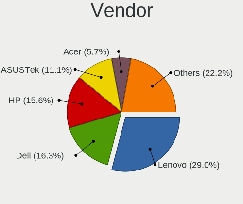
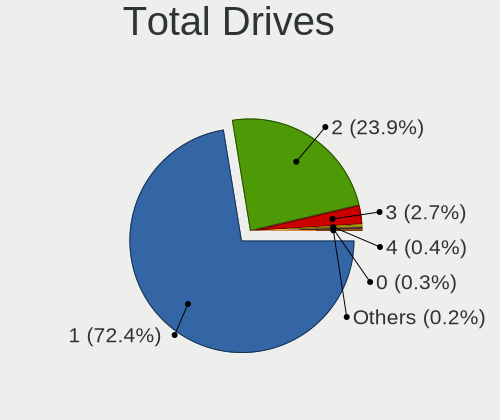
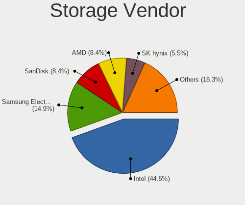
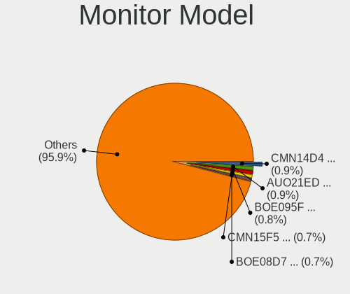

Fedora 36 - Tested Hardware & Statistics (Notebooks)
----------------------------------------------------

A project to collect tested hardware configurations for Fedora 36.

Anyone can contribute to this report by the [hw-probe](https://github.com/linuxhw/hw-probe) tool:

    sudo -E hw-probe -all -upload

Please submit a probe of your configuration if it's not presented on the page or is rare.

Full-feature report is available here: https://linux-hardware.org/?view=trends

Contents
--------

* [ Test Cases ](#test-cases)

* [ System ](#system)
  - [ Kernel                   ](#kernel)
  - [ Kernel Family            ](#kernel-family)
  - [ Kernel Major Ver.        ](#kernel-major-ver)
  - [ Arch                     ](#arch)
  - [ DE                       ](#de)
  - [ Display Server           ](#display-server)
  - [ Display Manager          ](#display-manager)
  - [ OS Lang                  ](#os-lang)
  - [ Boot Mode                ](#boot-mode)
  - [ Filesystem               ](#filesystem)
  - [ Part. scheme             ](#part-scheme)
  - [ Dual Boot with Linux/BSD ](#dual-boot-with-linuxbsd)
  - [ Dual Boot (Win)          ](#dual-boot-win)

* [ Board ](#board)
  - [ Vendor                   ](#vendor)
  - [ Model                    ](#model)
  - [ Model Family             ](#model-family)
  - [ MFG Year                 ](#mfg-year)
  - [ Form Factor              ](#form-factor)
  - [ Secure Boot              ](#secure-boot)
  - [ Coreboot                 ](#coreboot)
  - [ RAM Size                 ](#ram-size)
  - [ RAM Used                 ](#ram-used)
  - [ Total Drives             ](#total-drives)
  - [ Has CD-ROM               ](#has-cd-rom)
  - [ Has Ethernet             ](#has-ethernet)
  - [ Has WiFi                 ](#has-wifi)
  - [ Has Bluetooth            ](#has-bluetooth)

* [ Location ](#location)
  - [ Country                  ](#country)
  - [ City                     ](#city)

* [ Drives ](#drives)
  - [ Drive Vendor             ](#drive-vendor)
  - [ Drive Model              ](#drive-model)
  - [ HDD Vendor               ](#hdd-vendor)
  - [ SSD Vendor               ](#ssd-vendor)
  - [ Drive Kind               ](#drive-kind)
  - [ Drive Connector          ](#drive-connector)
  - [ Drive Size               ](#drive-size)
  - [ Space Total              ](#space-total)
  - [ Space Used               ](#space-used)
  - [ Malfunc. Drives          ](#malfunc-drives)
  - [ Malfunc. Drive Vendor    ](#malfunc-drive-vendor)
  - [ Malfunc. HDD Vendor      ](#malfunc-hdd-vendor)
  - [ Malfunc. Drive Kind      ](#malfunc-drive-kind)
  - [ Failed Drives            ](#failed-drives)
  - [ Failed Drive Vendor      ](#failed-drive-vendor)
  - [ Drive Status             ](#drive-status)

* [ Storage controller ](#storage-controller)
  - [ Storage Vendor           ](#storage-vendor)
  - [ Storage Model            ](#storage-model)
  - [ Storage Kind             ](#storage-kind)

* [ Processor ](#processor)
  - [ CPU Vendor               ](#cpu-vendor)
  - [ CPU Model                ](#cpu-model)
  - [ CPU Model Family         ](#cpu-model-family)
  - [ CPU Cores                ](#cpu-cores)
  - [ CPU Sockets              ](#cpu-sockets)
  - [ CPU Threads              ](#cpu-threads)
  - [ CPU Op-Modes             ](#cpu-op-modes)
  - [ CPU Microcode            ](#cpu-microcode)
  - [ CPU Microarch            ](#cpu-microarch)

* [ Graphics ](#graphics)
  - [ GPU Vendor               ](#gpu-vendor)
  - [ GPU Model                ](#gpu-model)
  - [ GPU Combo                ](#gpu-combo)
  - [ GPU Driver               ](#gpu-driver)
  - [ GPU Memory               ](#gpu-memory)

* [ Monitor ](#monitor)
  - [ Monitor Vendor           ](#monitor-vendor)
  - [ Monitor Model            ](#monitor-model)
  - [ Monitor Resolution       ](#monitor-resolution)
  - [ Monitor Diagonal         ](#monitor-diagonal)
  - [ Monitor Width            ](#monitor-width)
  - [ Aspect Ratio             ](#aspect-ratio)
  - [ Monitor Area             ](#monitor-area)
  - [ Pixel Density            ](#pixel-density)
  - [ Multiple Monitors        ](#multiple-monitors)

* [ Network ](#network)
  - [ Net Controller Vendor    ](#net-controller-vendor)
  - [ Net Controller Model     ](#net-controller-model)
  - [ Wireless Vendor          ](#wireless-vendor)
  - [ Wireless Model           ](#wireless-model)
  - [ Ethernet Vendor          ](#ethernet-vendor)
  - [ Ethernet Model           ](#ethernet-model)
  - [ Net Controller Kind      ](#net-controller-kind)
  - [ Used Controller          ](#used-controller)
  - [ NICs                     ](#nics)
  - [ IPv6                     ](#ipv6)

* [ Bluetooth ](#bluetooth)
  - [ Bluetooth Vendor         ](#bluetooth-vendor)
  - [ Bluetooth Model          ](#bluetooth-model)

* [ Sound ](#sound)
  - [ Sound Vendor             ](#sound-vendor)
  - [ Sound Model              ](#sound-model)

* [ Memory ](#memory)
  - [ Memory Vendor            ](#memory-vendor)
  - [ Memory Model             ](#memory-model)
  - [ Memory Kind              ](#memory-kind)
  - [ Memory Form Factor       ](#memory-form-factor)
  - [ Memory Size              ](#memory-size)
  - [ Memory Speed             ](#memory-speed)

* [ Printers & scanners ](#printers--scanners)
  - [ Printer Vendor           ](#printer-vendor)
  - [ Printer Model            ](#printer-model)
  - [ Scanner Vendor           ](#scanner-vendor)
  - [ Scanner Model            ](#scanner-model)

* [ Camera ](#camera)
  - [ Camera Vendor            ](#camera-vendor)
  - [ Camera Model             ](#camera-model)

* [ Security ](#security)
  - [ Fingerprint Vendor       ](#fingerprint-vendor)
  - [ Fingerprint Model        ](#fingerprint-model)
  - [ Chipcard Vendor          ](#chipcard-vendor)
  - [ Chipcard Model           ](#chipcard-model)

* [ Unsupported ](#unsupported)
  - [ Unsupported Devices      ](#unsupported-devices)
  - [ Unsupported Device Types ](#unsupported-device-types)

Test Cases
----------

Total: 21

| Vendor        | Model                       | Probe                                                      | Date         |
|---------------|-----------------------------|------------------------------------------------------------|--------------|
| Lenovo        | ThinkPad P15 Gen 1 20STS... | [05c02cbe41](https://linux-hardware.org/?probe=05c02cbe41) | Mar 31, 2022 |
| Avell High... | B.ON                        | [697fc1d4ec](https://linux-hardware.org/?probe=697fc1d4ec) | Mar 29, 2022 |
| Framework     | Laptop                      | [a22656afee](https://linux-hardware.org/?probe=a22656afee) | Mar 28, 2022 |
| Dell          | XPS 17 9710                 | [461d175c44](https://linux-hardware.org/?probe=461d175c44) | Mar 28, 2022 |
| ASUSTek       | ROG Zephyrus Duo 15 SE G... | [16ac712c84](https://linux-hardware.org/?probe=16ac712c84) | Mar 24, 2022 |
| Lenovo        | IdeaPad 530S-14ARR 81H1     | [1b57f1f410](https://linux-hardware.org/?probe=1b57f1f410) | Mar 13, 2022 |
| HP            | ZBook Fury 15 G7 Mobile ... | [917a6b65a8](https://linux-hardware.org/?probe=917a6b65a8) | Mar 10, 2022 |
| Sony          | VGN-FW21E                   | [930ce5581f](https://linux-hardware.org/?probe=930ce5581f) | Feb 25, 2022 |
| Unknown       | Unknown                     | [033354ee53](https://linux-hardware.org/?probe=033354ee53) | Jan 02, 2022 |
| Unknown       | Unknown                     | [809200ad60](https://linux-hardware.org/?probe=809200ad60) | Jan 02, 2022 |
| Unknown       | Unknown                     | [ea795a97e1](https://linux-hardware.org/?probe=ea795a97e1) | Dec 26, 2021 |
| Unknown       | Unknown                     | [2b26e185d0](https://linux-hardware.org/?probe=2b26e185d0) | Dec 06, 2021 |
| Unknown       | Unknown                     | [f09a7c7125](https://linux-hardware.org/?probe=f09a7c7125) | Dec 06, 2021 |
| Positivo      | CHT12CP                     | [53054c8f7a](https://linux-hardware.org/?probe=53054c8f7a) | Nov 20, 2021 |
| Lenovo        | IdeaPadFlex 14 20308        | [1734da4566](https://linux-hardware.org/?probe=1734da4566) | Nov 13, 2021 |
| Lenovo        | ThinkBook 14 G3 ACL 21A2    | [2da0673527](https://linux-hardware.org/?probe=2da0673527) | Nov 01, 2021 |
| Notebook      | PCx0Dx                      | [b1a527acdc](https://linux-hardware.org/?probe=b1a527acdc) | Oct 11, 2021 |
| Notebook      | PCx0Dx                      | [90d4556fdf](https://linux-hardware.org/?probe=90d4556fdf) | Oct 11, 2021 |
| Unknown       | Unknown                     | [af4bbffabf](https://linux-hardware.org/?probe=af4bbffabf) | Sep 27, 2021 |
| Unknown       | Unknown                     | [81fd834473](https://linux-hardware.org/?probe=81fd834473) | Sep 26, 2021 |
| HP            | ProBook 4740s               | [77b2eed991](https://linux-hardware.org/?probe=77b2eed991) | Sep 22, 2021 |

System
------

Kernel
------

Version of the Linux kernel

| Version                                                       | Notebooks | Percent |
|---------------------------------------------------------------|-----------|---------|
| 5.17.1-300.fc36.x86_64                                        | 2         | 13.33%  |
| 5.17.0-300.fc36.x86_64                                        | 2         | 13.33%  |
| 5.17.0-0.rc7.116.fc36.x86_64                                  | 2         | 13.33%  |
| 5.17.0-0.rc5.102.fc36.x86_64                                  | 2         | 13.33%  |
| 5.16.0-0.rc7.20211231git4f3d93c6eaff.52.vanilla.1.fc36.x86_64 | 1         | 6.67%   |
| 5.15.0-0.rc7.20211028git1fc596a56b33.56.fc36.x86_64           | 1         | 6.67%   |
| 5.15.0-0.rc4.20211008git1da38549dd64.36.fc36.x86_64           | 1         | 6.67%   |
| 5.15.0-0.rc2.20210923git58e2cf5d7946.21.vanilla.1.fc36.x86_64 | 1         | 6.67%   |
| 5.15.0-0.rc2.18.fc36.x86_64                                   | 1         | 6.67%   |
| 5.14.14-300.fc35.x86_64                                       | 1         | 6.67%   |
| 5.14.10-300.fc35.x86_64                                       | 1         | 6.67%   |

Kernel Family
-------------

Linux kernel without a distro release

| Version | Notebooks | Percent |
|---------|-----------|---------|
| 5.17.0  | 6         | 40%     |
| 5.15.0  | 4         | 26.67%  |
| 5.17.1  | 2         | 13.33%  |
| 5.16.0  | 1         | 6.67%   |
| 5.14.14 | 1         | 6.67%   |
| 5.14.10 | 1         | 6.67%   |

Kernel Major Ver.
-----------------

Linux kernel major version

| Version | Notebooks | Percent |
|---------|-----------|---------|
| 5.17    | 8         | 53.33%  |
| 5.15    | 4         | 26.67%  |
| 5.14    | 2         | 13.33%  |
| 5.16    | 1         | 6.67%   |

Arch
----

OS architecture (x86_64, i586, etc.)

| Name   | Notebooks | Percent |
|--------|-----------|---------|
| x86_64 | 14        | 100%    |

DE
--

Desktop Environment

| Name    | Notebooks | Percent |
|---------|-----------|---------|
| GNOME   | 11        | 73.33%  |
| KDE5    | 3         | 20%     |
| Unknown | 1         | 6.67%   |

Display Server
--------------

X11 or Wayland

| Name    | Notebooks | Percent |
|---------|-----------|---------|
| Wayland | 10        | 71.43%  |
| X11     | 4         | 28.57%  |

Display Manager
---------------

SDDM, LightDM, etc.

| Name    | Notebooks | Percent |
|---------|-----------|---------|
| GDM     | 6         | 42.86%  |
| Unknown | 4         | 28.57%  |
| SDDM    | 3         | 21.43%  |
| LightDM | 1         | 7.14%   |

OS Lang
-------

Language

| Lang  | Notebooks | Percent |
|-------|-----------|---------|
| en_US | 6         | 42.86%  |
| pl_PL | 2         | 14.29%  |
| en_GB | 2         | 14.29%  |
| pt_PT | 1         | 7.14%   |
| pt_BR | 1         | 7.14%   |
| hr_HR | 1         | 7.14%   |
| de_DE | 1         | 7.14%   |

Boot Mode
---------

EFI or BIOS

| Mode | Notebooks | Percent |
|------|-----------|---------|
| EFI  | 12        | 85.71%  |
| BIOS | 2         | 14.29%  |

Filesystem
----------

Type of filesystem

| Type  | Notebooks | Percent |
|-------|-----------|---------|
| Btrfs | 10        | 71.43%  |
| Ext4  | 4         | 28.57%  |

Part. scheme
------------

Scheme of partitioning

| Type    | Notebooks | Percent |
|---------|-----------|---------|
| GPT     | 8         | 53.33%  |
| Unknown | 6         | 40%     |
| MBR     | 1         | 6.67%   |

Dual Boot with Linux/BSD
------------------------

Hosting more than one Linux/BSD

| Dual boot | Notebooks | Percent |
|-----------|-----------|---------|
| No        | 14        | 100%    |

Dual Boot (Win)
---------------

Hosting Linux and Windows

| Dual boot | Notebooks | Percent |
|-----------|-----------|---------|
| No        | 10        | 71.43%  |
| Yes       | 4         | 28.57%  |

Board
-----

Vendor
------

Motherboard manufacturer

| Name                   | Notebooks | Percent |
|------------------------|-----------|---------|
| Lenovo                 | 4         | 28.57%  |
| Hewlett-Packard        | 2         | 14.29%  |
| Sony                   | 1         | 7.14%   |
| Positivo               | 1         | 7.14%   |
| Notebook               | 1         | 7.14%   |
| Framework              | 1         | 7.14%   |
| Dell                   | 1         | 7.14%   |
| Avell High Performance | 1         | 7.14%   |
| ASUSTek Computer       | 1         | 7.14%   |
| Unknown                | 1         | 7.14%   |

Model
-----

Motherboard model

| Name                                        | Notebooks | Percent |
|---------------------------------------------|-----------|---------|
| Sony VGN-FW21E                              | 1         | 7.14%   |
| Positivo CHT12CP                            | 1         | 7.14%   |
| Notebook PCx0Dx                             | 1         | 7.14%   |
| Lenovo ThinkPad P15 Gen 1 20STS0J500        | 1         | 7.14%   |
| Lenovo ThinkBook 14 G3 ACL 21A2             | 1         | 7.14%   |
| Lenovo IdeaPadFlex 14 20308                 | 1         | 7.14%   |
| Lenovo IdeaPad 530S-14ARR 81H1              | 1         | 7.14%   |
| HP ZBook Fury 15 G7 Mobile Workstation      | 1         | 7.14%   |
| HP ProBook 4740s                            | 1         | 7.14%   |
| Framework Laptop                            | 1         | 7.14%   |
| Dell XPS 17 9710                            | 1         | 7.14%   |
| Avell High Performance B.ON                 | 1         | 7.14%   |
| ASUS ROG Zephyrus Duo 15 SE GX551QS_GX551QS | 1         | 7.14%   |
| Unknown                                     | 1         | 7.14%   |

Model Family
------------

Motherboard model prefix

| Name                        | Notebooks | Percent |
|-----------------------------|-----------|---------|
| Sony VGN-FW21E              | 1         | 7.14%   |
| Positivo CHT12CP            | 1         | 7.14%   |
| Notebook PCx0Dx             | 1         | 7.14%   |
| Lenovo ThinkPad             | 1         | 7.14%   |
| Lenovo ThinkBook            | 1         | 7.14%   |
| Lenovo IdeaPadFlex          | 1         | 7.14%   |
| Lenovo IdeaPad              | 1         | 7.14%   |
| HP ZBook                    | 1         | 7.14%   |
| HP ProBook                  | 1         | 7.14%   |
| Framework Laptop            | 1         | 7.14%   |
| Dell XPS                    | 1         | 7.14%   |
| Avell High Performance B.ON | 1         | 7.14%   |
| ASUS ROG                    | 1         | 7.14%   |
| Unknown                     | 1         | 7.14%   |

MFG Year
--------

Motherboard manufacture year

| Year | Notebooks | Percent |
|------|-----------|---------|
| 2021 | 7         | 50%     |
| 2018 | 2         | 14.29%  |
| 2020 | 1         | 7.14%   |
| 2017 | 1         | 7.14%   |
| 2013 | 1         | 7.14%   |
| 2012 | 1         | 7.14%   |
| 2008 | 1         | 7.14%   |

Form Factor
-----------

Physical design of the computer

| Name     | Notebooks | Percent |
|----------|-----------|---------|
| Notebook | 14        | 100%    |

Secure Boot
-----------

Enabled or disabled

| State    | Notebooks | Percent |
|----------|-----------|---------|
| Disabled | 11        | 78.57%  |
| Enabled  | 3         | 21.43%  |

Coreboot
--------

Have coreboot on board

| Used | Notebooks | Percent |
|------|-----------|---------|
| No   | 14        | 100%    |

RAM Size
--------

Total RAM memory

| Size in GB  | Notebooks | Percent |
|-------------|-----------|---------|
| 32.01-64.0  | 5         | 35.71%  |
| 3.01-4.0    | 4         | 28.57%  |
| 8.01-16.0   | 2         | 14.29%  |
| 4.01-8.0    | 1         | 7.14%   |
| 64.01-256.0 | 1         | 7.14%   |
| 16.01-24.0  | 1         | 7.14%   |

RAM Used
--------

Used RAM memory

| Used GB  | Notebooks | Percent |
|----------|-----------|---------|
| 3.01-4.0 | 6         | 40%     |
| 2.01-3.0 | 6         | 40%     |
| 4.01-8.0 | 3         | 20%     |

Total Drives
------------

Number of drives on board

| Drives | Notebooks | Percent |
|--------|-----------|---------|
| 1      | 10        | 66.67%  |
| 2      | 3         | 20%     |
| 3      | 2         | 13.33%  |

Has CD-ROM
----------

Has CD-ROM on board

| Presented | Notebooks | Percent |
|-----------|-----------|---------|
| No        | 12        | 85.71%  |
| Yes       | 2         | 14.29%  |

Has Ethernet
------------

Has Ethernet on board

| Presented | Notebooks | Percent |
|-----------|-----------|---------|
| Yes       | 9         | 64.29%  |
| No        | 5         | 35.71%  |

Has WiFi
--------

Has WiFi module

| Presented | Notebooks | Percent |
|-----------|-----------|---------|
| Yes       | 13        | 92.86%  |
| No        | 1         | 7.14%   |

Has Bluetooth
-------------

Has Bluetooth module

| Presented | Notebooks | Percent |
|-----------|-----------|---------|
| Yes       | 11        | 78.57%  |
| No        | 3         | 21.43%  |

Location
--------

Country
-------

Geographic location (country)

| Country    | Notebooks | Percent |
|------------|-----------|---------|
| UK         | 3         | 21.43%  |
| USA        | 2         | 14.29%  |
| Poland     | 2         | 14.29%  |
| Brazil     | 2         | 14.29%  |
| Uzbekistan | 1         | 7.14%   |
| Romania    | 1         | 7.14%   |
| Norway     | 1         | 7.14%   |
| Germany    | 1         | 7.14%   |
| Croatia    | 1         | 7.14%   |

City
----

Geographic location (city)

| City         | Notebooks | Percent |
|--------------|-----------|---------|
| Zagreb       | 1         | 7.14%   |
| Warsaw       | 1         | 7.14%   |
| Warrington   | 1         | 7.14%   |
| Vegarshei    | 1         | 7.14%   |
| Trzciel      | 1         | 7.14%   |
| Tashkent     | 1         | 7.14%   |
| Solihull     | 1         | 7.14%   |
| Sao Paulo    | 1         | 7.14%   |
| Joinville    | 1         | 7.14%   |
| Halstead     | 1         | 7.14%   |
| Fort Collins | 1         | 7.14%   |
| Bucharest    | 1         | 7.14%   |
| Berlin       | 1         | 7.14%   |
| Beaverton    | 1         | 7.14%   |

Drives
------

Drive Vendor
------------

Hard drive vendors

| Vendor              | Notebooks | Drives | Percent |
|---------------------|-----------|--------|---------|
| Samsung Electronics | 4         | 6      | 22.22%  |
| WDC                 | 2         | 2      | 11.11%  |
| Unknown             | 1         | 3      | 5.56%   |
| SK Hynix            | 1         | 1      | 5.56%   |
| Seagate             | 1         | 1      | 5.56%   |
| SanDisk             | 1         | 1      | 5.56%   |
| PNY                 | 1         | 2      | 5.56%   |
| Leven               | 1         | 1      | 5.56%   |
| KIOXIA              | 1         | 1      | 5.56%   |
| Kingston            | 1         | 3      | 5.56%   |
| Hitachi             | 1         | 1      | 5.56%   |
| Fujitsu             | 1         | 1      | 5.56%   |
| A-DATA Technology   | 1         | 1      | 5.56%   |
| Unknown             | 1         | 1      | 5.56%   |

Drive Model
-----------

Hard drive models

| Model                                | Notebooks | Percent |
|--------------------------------------|-----------|---------|
| Samsung NVMe SSD Drive 1TB           | 2         | 10.53%  |
| WDC WDS500G1X0E-00AFY0 500GB         | 1         | 5.26%   |
| WDC PC SN530 SDBPMPZ-512G-1101 512GB | 1         | 5.26%   |
| Unknown MMC Card  64GB               | 1         | 5.26%   |
| SK Hynix HFM256GDHTNG-8310A 256GB    | 1         | 5.26%   |
| Seagate Expansion+ 2TB               | 1         | 5.26%   |
| SanDisk DF4032  32GB                 | 1         | 5.26%   |
| Samsung SSD 860 EVO 250GB            | 1         | 5.26%   |
| Samsung NVMe SSD Drive 500GB         | 1         | 5.26%   |
| Samsung NVMe SSD Drive 1024GB        | 1         | 5.26%   |
| PNY CS3040 4TB SSD                   | 1         | 5.26%   |
| Leven JAJS600M256C 256GB             | 1         | 5.26%   |
| KIOXIA KXG60ZNV1T02 1TB              | 1         | 5.26%   |
| Kingston SUV500MS240G 240GB SSD      | 1         | 5.26%   |
| Hitachi HTS543232A7A384 320GB        | 1         | 5.26%   |
| Fujitsu MJA2500BH G1 500GB           | 1         | 5.26%   |
| A-DATA IM2P33F8ABR1-256GB            | 1         | 5.26%   |
| Unknown                              | 1         | 5.26%   |

HDD Vendor
----------

Hard disk drive vendors

| Vendor  | Notebooks | Drives | Percent |
|---------|-----------|--------|---------|
| Seagate | 1         | 1      | 33.33%  |
| Hitachi | 1         | 1      | 33.33%  |
| Fujitsu | 1         | 1      | 33.33%  |

SSD Vendor
----------

Solid state drive vendors

| Vendor              | Notebooks | Drives | Percent |
|---------------------|-----------|--------|---------|
| Samsung Electronics | 1         | 1      | 33.33%  |
| Leven               | 1         | 1      | 33.33%  |
| Kingston            | 1         | 3      | 33.33%  |

Drive Kind
----------

HDD or SSD

| Kind | Notebooks | Drives | Percent |
|------|-----------|--------|---------|
| NVMe | 9         | 12     | 52.94%  |
| MMC  | 3         | 5      | 17.65%  |
| HDD  | 3         | 3      | 17.65%  |
| SSD  | 2         | 5      | 11.76%  |

Drive Connector
---------------

SATA, SAS, NVMe, etc.

| Type | Notebooks | Drives | Percent |
|------|-----------|--------|---------|
| NVMe | 9         | 12     | 52.94%  |
| SATA | 4         | 7      | 23.53%  |
| MMC  | 3         | 5      | 17.65%  |
| SAS  | 1         | 1      | 5.88%   |

Drive Size
----------

Size of hard drive

| Size in TB | Notebooks | Drives | Percent |
|------------|-----------|--------|---------|
| 0.01-0.5   | 4         | 7      | 80%     |
| 1.01-2.0   | 1         | 1      | 20%     |

Space Total
-----------

Amount of disk space available on the file system

| Size in GB | Notebooks | Percent |
|------------|-----------|---------|
| 251-500    | 3         | 21.43%  |
| 101-250    | 3         | 21.43%  |
| 1-20       | 3         | 21.43%  |
| 1001-2000  | 2         | 14.29%  |
| 51-100     | 2         | 14.29%  |
| 501-1000   | 1         | 7.14%   |

Space Used
----------

Amount of used disk space

| Used GB  | Notebooks | Percent |
|----------|-----------|---------|
| 1-20     | 7         | 50%     |
| 51-100   | 3         | 21.43%  |
| 21-50    | 2         | 14.29%  |
| 251-500  | 1         | 7.14%   |
| 501-1000 | 1         | 7.14%   |

Malfunc. Drives
---------------

Drive models with a malfunction

| Model                      | Notebooks | Drives | Percent |
|----------------------------|-----------|--------|---------|
| Fujitsu MJA2500BH G1 500GB | 1         | 1      | 100%    |

Malfunc. Drive Vendor
---------------------

Vendors of faulty drives

| Vendor  | Notebooks | Drives | Percent |
|---------|-----------|--------|---------|
| Fujitsu | 1         | 1      | 100%    |

Malfunc. HDD Vendor
-------------------

Vendors of faulty HDD drives

| Vendor  | Notebooks | Drives | Percent |
|---------|-----------|--------|---------|
| Fujitsu | 1         | 1      | 100%    |

Malfunc. Drive Kind
-------------------

Kinds of faulty drives

| Kind | Notebooks | Drives | Percent |
|------|-----------|--------|---------|
| HDD  | 1         | 1      | 100%    |

Failed Drives
-------------

Failed drive models

Zero info for selected period =(

Failed Drive Vendor
-------------------

Failed drive vendors

Zero info for selected period =(

Drive Status
------------

Number of failed and malfunc. drives

| Status   | Notebooks | Drives | Percent |
|----------|-----------|--------|---------|
| Detected | 8         | 16     | 50%     |
| Works    | 7         | 8      | 43.75%  |
| Malfunc  | 1         | 1      | 6.25%   |

Storage controller
------------------

Storage Vendor
--------------

Storage controller vendors

| Vendor                       | Notebooks | Percent |
|------------------------------|-----------|---------|
| Intel                        | 6         | 37.5%   |
| Samsung Electronics          | 3         | 18.75%  |
| Sandisk                      | 2         | 12.5%   |
| Toshiba America Info Systems | 1         | 6.25%   |
| SK Hynix                     | 1         | 6.25%   |
| Phison Electronics           | 1         | 6.25%   |
| AMD                          | 1         | 6.25%   |
| ADATA Technology             | 1         | 6.25%   |

Storage Model
-------------

Storage controller models

| Model                                                                    | Notebooks | Percent |
|--------------------------------------------------------------------------|-----------|---------|
| Samsung NVMe SSD Controller SM981/PM981/PM983                            | 2         | 11.76%  |
| Toshiba America Info Systems XG6 NVMe SSD Controller                     | 1         | 5.88%   |
| SK Hynix BC501 NVMe Solid State Drive                                    | 1         | 5.88%   |
| Sandisk WD PC SN810 / Black SN850 NVMe SSD                               | 1         | 5.88%   |
| Sandisk Non-Volatile memory controller                                   | 1         | 5.88%   |
| Samsung NVMe SSD Controller PM9A1/PM9A3/980PRO                           | 1         | 5.88%   |
| Samsung NVMe SSD Controller 980                                          | 1         | 5.88%   |
| Phison E16 PCIe4 NVMe Controller                                         | 1         | 5.88%   |
| Intel Volume Management Device NVMe RAID Controller                      | 1         | 5.88%   |
| Intel Celeron N3350/Pentium N4200/Atom E3900 Series SATA AHCI Controller | 1         | 5.88%   |
| Intel 82801IBM/IEM (ICH9M/ICH9M-E) 4 port SATA Controller [AHCI mode]    | 1         | 5.88%   |
| Intel 8 Series SATA Controller 1 [AHCI mode]                             | 1         | 5.88%   |
| Intel 7 Series Chipset Family 6-port SATA Controller [AHCI mode]         | 1         | 5.88%   |
| Intel 400 Series Chipset Family SATA AHCI Controller                     | 1         | 5.88%   |
| AMD FCH SATA Controller [AHCI mode]                                      | 1         | 5.88%   |
| ADATA Non-Volatile memory controller                                     | 1         | 5.88%   |

Storage Kind
------------

Kind of storage controller (IDE, SATA, NVMe, SAS, ...)

| Kind | Notebooks | Percent |
|------|-----------|---------|
| NVMe | 9         | 56.25%  |
| SATA | 6         | 37.5%   |
| RAID | 1         | 6.25%   |

Processor
---------

CPU Vendor
----------

Processor vendors

| Vendor | Notebooks | Percent |
|--------|-----------|---------|
| Intel  | 11        | 78.57%  |
| AMD    | 3         | 21.43%  |

CPU Model
---------

Processor models

| Model                                         | Notebooks | Percent |
|-----------------------------------------------|-----------|---------|
| Intel Pentium 3556U @ 1.70GHz                 | 1         | 7.14%   |
| Intel Core i7-3632QM CPU @ 2.20GHz            | 1         | 7.14%   |
| Intel Core i7-10875H CPU @ 2.30GHz            | 1         | 7.14%   |
| Intel Core i7-10870H CPU @ 2.20GHz            | 1         | 7.14%   |
| Intel Core i7-10850H CPU @ 2.70GHz            | 1         | 7.14%   |
| Intel Core 2 Duo CPU P8400 @ 2.26GHz          | 1         | 7.14%   |
| Intel Celeron CPU J3455 @ 1.50GHz             | 1         | 7.14%   |
| Intel Atom x5-Z8350 CPU @ 1.44GHz             | 1         | 7.14%   |
| Intel 11th Gen Core i9-11900H @ 2.50GHz       | 1         | 7.14%   |
| Intel 11th Gen Core i7-1165G7 @ 2.80GHz       | 1         | 7.14%   |
| Intel 11th Gen Core i5-1135G7 @ 2.40GHz       | 1         | 7.14%   |
| AMD Ryzen 9 5900HX with Radeon Graphics       | 1         | 7.14%   |
| AMD Ryzen 7 5700U with Radeon Graphics        | 1         | 7.14%   |
| AMD Ryzen 5 2500U with Radeon Vega Mobile Gfx | 1         | 7.14%   |

CPU Model Family
----------------

Processor model prefix

| Model            | Notebooks | Percent |
|------------------|-----------|---------|
| Intel Core i7    | 4         | 28.57%  |
| Other            | 3         | 21.43%  |
| Intel Pentium    | 1         | 7.14%   |
| Intel Core 2 Duo | 1         | 7.14%   |
| Intel Celeron    | 1         | 7.14%   |
| Intel Atom       | 1         | 7.14%   |
| AMD Ryzen 9      | 1         | 7.14%   |
| AMD Ryzen 7      | 1         | 7.14%   |
| AMD Ryzen 5      | 1         | 7.14%   |

CPU Cores
---------

Number of processor cores

| Number | Notebooks | Percent |
|--------|-----------|---------|
| 4      | 6         | 42.86%  |
| 8      | 5         | 35.71%  |
| 2      | 2         | 14.29%  |
| 6      | 1         | 7.14%   |

CPU Sockets
-----------

Number of sockets

| Number | Notebooks | Percent |
|--------|-----------|---------|
| 1      | 14        | 100%    |

CPU Threads
-----------

Threads per core (Hyper-Threading)

| Number | Notebooks | Percent |
|--------|-----------|---------|
| 2      | 10        | 71.43%  |
| 1      | 4         | 28.57%  |

CPU Op-Modes
------------

CPU Operation Modes (32-bit, 64-bit)

| Op mode        | Notebooks | Percent |
|----------------|-----------|---------|
| 32-bit, 64-bit | 14        | 100%    |

CPU Microcode
-------------

Microcode number

| Number     | Notebooks | Percent |
|------------|-----------|---------|
| 0xa0652    | 3         | 21.43%  |
| 0x806c1    | 2         | 14.29%  |
| 0x806d1    | 1         | 7.14%   |
| 0x506c9    | 1         | 7.14%   |
| 0x406c4    | 1         | 7.14%   |
| 0x40651    | 1         | 7.14%   |
| 0x306a9    | 1         | 7.14%   |
| 0x10676    | 1         | 7.14%   |
| 0x0a50000c | 1         | 7.14%   |
| 0x08608103 | 1         | 7.14%   |
| 0x0810100b | 1         | 7.14%   |

CPU Microarch
-------------

Microarchitecture

| Name       | Notebooks | Percent |
|------------|-----------|---------|
| CometLake  | 3         | 21.43%  |
| TigerLake  | 2         | 14.29%  |
| Zen 3      | 1         | 7.14%   |
| Zen        | 1         | 7.14%   |
| Silvermont | 1         | 7.14%   |
| Penryn     | 1         | 7.14%   |
| IvyBridge  | 1         | 7.14%   |
| Icelake    | 1         | 7.14%   |
| Haswell    | 1         | 7.14%   |
| Goldmont   | 1         | 7.14%   |
| Unknown    | 1         | 7.14%   |

Graphics
--------

GPU Vendor
----------

Vendors of graphics cards

| Vendor | Notebooks | Percent |
|--------|-----------|---------|
| Intel  | 10        | 50%     |
| Nvidia | 5         | 25%     |
| AMD    | 5         | 25%     |

GPU Model
---------

Graphics card models

| Model                                                                                    | Notebooks | Percent |
|------------------------------------------------------------------------------------------|-----------|---------|
| Intel CometLake-H GT2 [UHD Graphics]                                                     | 3         | 15%     |
| Nvidia TU117GLM [Quadro T1000 Mobile]                                                    | 2         | 10%     |
| Nvidia GA106M [GeForce RTX 3060 Mobile / Max-Q]                                          | 2         | 10%     |
| Intel TigerLake-LP GT2 [Iris Xe Graphics]                                                | 2         | 10%     |
| Nvidia GA104M [GeForce RTX 3080 Mobile / Max-Q 8GB/16GB]                                 | 1         | 5%      |
| Intel TigerLake-H GT1 [UHD Graphics]                                                     | 1         | 5%      |
| Intel HD Graphics 500                                                                    | 1         | 5%      |
| Intel Haswell-ULT Integrated Graphics Controller                                         | 1         | 5%      |
| Intel Atom/Celeron/Pentium Processor x5-E8000/J3xxx/N3xxx Integrated Graphics Controller | 1         | 5%      |
| Intel 3rd Gen Core processor Graphics Controller                                         | 1         | 5%      |
| AMD Thames [Radeon HD 7550M/7570M/7650M]                                                 | 1         | 5%      |
| AMD RV620/M82 [Mobility Radeon HD 3450/3470]                                             | 1         | 5%      |
| AMD Raven Ridge [Radeon Vega Series / Radeon Vega Mobile Series]                         | 1         | 5%      |
| AMD Lucienne                                                                             | 1         | 5%      |
| AMD Cezanne                                                                              | 1         | 5%      |

GPU Combo
---------

Combinations of graphics cards

| Name           | Notebooks | Percent |
|----------------|-----------|---------|
| 1 x Intel      | 5         | 35.71%  |
| Intel + Nvidia | 4         | 28.57%  |
| 1 x AMD        | 3         | 21.43%  |
| Intel + AMD    | 1         | 7.14%   |
| AMD + Nvidia   | 1         | 7.14%   |

GPU Driver
----------

Free vs proprietary

| Driver      | Notebooks | Percent |
|-------------|-----------|---------|
| Free        | 12        | 80%     |
| Proprietary | 2         | 13.33%  |
| Unknown     | 1         | 6.67%   |

GPU Memory
----------

Total video memory

| Size in GB | Notebooks | Percent |
|------------|-----------|---------|
| Unknown    | 7         | 50%     |
| 0.01-0.5   | 3         | 21.43%  |
| 3.01-4.0   | 2         | 14.29%  |
| 1.01-2.0   | 2         | 14.29%  |

Monitor
-------

Monitor Vendor
--------------

Monitor vendors

| Vendor               | Notebooks | Percent |
|----------------------|-----------|---------|
| BOE                  | 3         | 20%     |
| Sharp                | 2         | 13.33%  |
| LG Display           | 2         | 13.33%  |
| Chimei Innolux       | 2         | 13.33%  |
| AU Optronics         | 2         | 13.33%  |
| Ancor Communications | 2         | 13.33%  |
| Samsung Electronics  | 1         | 6.67%   |
| InfoVision           | 1         | 6.67%   |

Monitor Model
-------------

Monitor models

| Model                                                                | Notebooks | Percent |
|----------------------------------------------------------------------|-----------|---------|
| Sharp LQ156M1JW25 SHP152C 1920x1080 344x194mm 15.5-inch              | 1         | 6.25%   |
| Sharp LCD Monitor SHP1517 3840x2400 366x229mm 17.0-inch              | 1         | 6.25%   |
| Samsung Electronics T24D390 SAM0B6E 1920x1080 520x290mm 23.4-inch    | 1         | 6.25%   |
| Samsung Electronics LCD Monitor SEC3554 1600x900 382x215mm 17.3-inch | 1         | 6.25%   |
| LG Display LCD Monitor LGD0625 1920x1080 344x194mm 15.5-inch         | 1         | 6.25%   |
| LG Display LCD Monitor LGD0599 1920x1080 309x174mm 14.0-inch         | 1         | 6.25%   |
| InfoVision LCD Monitor IVO3D40 1920x1080 344x194mm 15.5-inch         | 1         | 6.25%   |
| Chimei Innolux LCD Monitor CMN150C 1920x1080 344x193mm 15.5-inch     | 1         | 6.25%   |
| Chimei Innolux LCD Monitor CMN140A 1920x1080 309x173mm 13.9-inch     | 1         | 6.25%   |
| BOE LCD Monitor BOE095F 2256x1504 285x190mm 13.5-inch                | 1         | 6.25%   |
| BOE LCD Monitor BOE0922 1920x550                                     | 1         | 6.25%   |
| BOE LCD Monitor BOE08F5 1920x1080 344x194mm 15.5-inch                | 1         | 6.25%   |
| AU Optronics LCD Monitor AUO405C 1366x768 256x144mm 11.6-inch        | 1         | 6.25%   |
| AU Optronics LCD Monitor AUO103C 1366x768 309x173mm 13.9-inch        | 1         | 6.25%   |
| Ancor Communications VS248 ACI2498 1920x1080 531x299mm 24.0-inch     | 1         | 6.25%   |
| Ancor Communications VE247 ACI2493 1920x1080 531x299mm 24.0-inch     | 1         | 6.25%   |

Monitor Resolution
------------------

Monitor screen resolution

| Resolution      | Notebooks | Percent |
|-----------------|-----------|---------|
| 1920x1080 (FHD) | 9         | 60%     |
| 1366x768 (WXGA) | 2         | 13.33%  |
| 3840x2400       | 1         | 6.67%   |
| 2256x1504       | 1         | 6.67%   |
| 1920x550        | 1         | 6.67%   |
| 1600x900 (HD+)  | 1         | 6.67%   |

Monitor Diagonal
----------------

Diagonal size in inches

| Inches  | Notebooks | Percent |
|---------|-----------|---------|
| 15      | 5         | 31.25%  |
| 13      | 3         | 18.75%  |
| 24      | 2         | 12.5%   |
| 17      | 2         | 12.5%   |
| 23      | 1         | 6.25%   |
| 14      | 1         | 6.25%   |
| 11      | 1         | 6.25%   |
| Unknown | 1         | 6.25%   |

Monitor Width
-------------

Physical width

| Width in mm | Notebooks | Percent |
|-------------|-----------|---------|
| 301-350     | 8         | 50%     |
| 501-600     | 3         | 18.75%  |
| 351-400     | 2         | 12.5%   |
| 201-300     | 2         | 12.5%   |
| Unknown     | 1         | 6.25%   |

Aspect Ratio
------------

Proportional relationship between the width and the height

| Ratio | Notebooks | Percent |
|-------|-----------|---------|
| 16/9  | 11        | 78.57%  |
| 32/9  | 1         | 7.14%   |
| 3/2   | 1         | 7.14%   |
| 16/10 | 1         | 7.14%   |

Monitor Area
------------

Area in inch²

| Area in inch² | Notebooks | Percent |
|----------------|-----------|---------|
| 101-110        | 5         | 31.25%  |
| 81-90          | 4         | 25%     |
| 201-250        | 3         | 18.75%  |
| 121-130        | 2         | 12.5%   |
| 51-60          | 1         | 6.25%   |
| Unknown        | 1         | 6.25%   |

Pixel Density
-------------

Pixels per inch

| Density       | Notebooks | Percent |
|---------------|-----------|---------|
| 121-160       | 8         | 50%     |
| 51-100        | 3         | 18.75%  |
| 101-120       | 2         | 12.5%   |
| More than 240 | 1         | 6.25%   |
| 161-240       | 1         | 6.25%   |
| Unknown       | 1         | 6.25%   |

Multiple Monitors
-----------------

Total monitors connected

| Total | Notebooks | Percent |
|-------|-----------|---------|
| 1     | 11        | 73.33%  |
| 2     | 3         | 20%     |
| 0     | 1         | 6.67%   |

Network
-------

Net Controller Vendor
---------------------

Controller vendors

| Vendor                   | Notebooks | Percent |
|--------------------------|-----------|---------|
| Intel                    | 11        | 52.38%  |
| Realtek Semiconductor    | 6         | 28.57%  |
| Qualcomm Atheros         | 2         | 9.52%   |
| Marvell Technology Group | 1         | 4.76%   |
| Belkin Components        | 1         | 4.76%   |

Net Controller Model
--------------------

Controller models

| Model                                                              | Notebooks | Percent |
|--------------------------------------------------------------------|-----------|---------|
| Realtek RTL8111/8168/8411 PCI Express Gigabit Ethernet Controller  | 5         | 20%     |
| Intel Comet Lake PCH CNVi WiFi                                     | 3         | 12%     |
| Intel Wi-Fi 6 AX200                                                | 2         | 8%      |
| Realtek RTL8153 Gigabit Ethernet Adapter                           | 1         | 4%      |
| Realtek RTL810xE PCI Express Fast Ethernet controller              | 1         | 4%      |
| Realtek 802.11n                                                    | 1         | 4%      |
| Qualcomm Atheros QCA9377 802.11ac Wireless Network Adapter         | 1         | 4%      |
| Qualcomm Atheros AR9485 Wireless Network Adapter                   | 1         | 4%      |
| Marvell Group 88E8055 PCI-E Gigabit Ethernet Controller            | 1         | 4%      |
| Intel Wireless 7260                                                | 1         | 4%      |
| Intel Wireless 3165                                                | 1         | 4%      |
| Intel WiFi Link 5100                                               | 1         | 4%      |
| Intel Wi-Fi 6 AX210/AX211/AX411 160MHz                             | 1         | 4%      |
| Intel Wi-Fi 6 AX201                                                | 1         | 4%      |
| Intel Tiger Lake PCH CNVi WiFi                                     | 1         | 4%      |
| Intel Ethernet Connection (11) I219-LM                             | 1         | 4%      |
| Intel Ethernet Connection (10) I219-LM                             | 1         | 4%      |
| Belkin Components F5D7050 Wireless G Adapter v4000 [Zydas ZD1211B] | 1         | 4%      |

Wireless Vendor
---------------

Wireless vendors

| Vendor                | Notebooks | Percent |
|-----------------------|-----------|---------|
| Intel                 | 11        | 73.33%  |
| Qualcomm Atheros      | 2         | 13.33%  |
| Realtek Semiconductor | 1         | 6.67%   |
| Belkin Components     | 1         | 6.67%   |

Wireless Model
--------------

Wireless models

| Model                                                              | Notebooks | Percent |
|--------------------------------------------------------------------|-----------|---------|
| Intel Comet Lake PCH CNVi WiFi                                     | 3         | 20%     |
| Intel Wi-Fi 6 AX200                                                | 2         | 13.33%  |
| Realtek 802.11n                                                    | 1         | 6.67%   |
| Qualcomm Atheros QCA9377 802.11ac Wireless Network Adapter         | 1         | 6.67%   |
| Qualcomm Atheros AR9485 Wireless Network Adapter                   | 1         | 6.67%   |
| Intel Wireless 7260                                                | 1         | 6.67%   |
| Intel Wireless 3165                                                | 1         | 6.67%   |
| Intel WiFi Link 5100                                               | 1         | 6.67%   |
| Intel Wi-Fi 6 AX210/AX211/AX411 160MHz                             | 1         | 6.67%   |
| Intel Wi-Fi 6 AX201                                                | 1         | 6.67%   |
| Intel Tiger Lake PCH CNVi WiFi                                     | 1         | 6.67%   |
| Belkin Components F5D7050 Wireless G Adapter v4000 [Zydas ZD1211B] | 1         | 6.67%   |

Ethernet Vendor
---------------

Ethernet vendors

| Vendor                   | Notebooks | Percent |
|--------------------------|-----------|---------|
| Realtek Semiconductor    | 6         | 66.67%  |
| Intel                    | 2         | 22.22%  |
| Marvell Technology Group | 1         | 11.11%  |

Ethernet Model
--------------

Ethernet models

| Model                                                             | Notebooks | Percent |
|-------------------------------------------------------------------|-----------|---------|
| Realtek RTL8111/8168/8411 PCI Express Gigabit Ethernet Controller | 5         | 50%     |
| Realtek RTL8153 Gigabit Ethernet Adapter                          | 1         | 10%     |
| Realtek RTL810xE PCI Express Fast Ethernet controller             | 1         | 10%     |
| Marvell Group 88E8055 PCI-E Gigabit Ethernet Controller           | 1         | 10%     |
| Intel Ethernet Connection (11) I219-LM                            | 1         | 10%     |
| Intel Ethernet Connection (10) I219-LM                            | 1         | 10%     |

Net Controller Kind
-------------------

Ethernet, WiFi or modem

| Kind     | Notebooks | Percent |
|----------|-----------|---------|
| WiFi     | 13        | 59.09%  |
| Ethernet | 9         | 40.91%  |

Used Controller
---------------

Currently used network controller

| Kind     | Notebooks | Percent |
|----------|-----------|---------|
| WiFi     | 12        | 75%     |
| Ethernet | 4         | 25%     |

NICs
----

Total network controllers on board

| Total | Notebooks | Percent |
|-------|-----------|---------|
| 2     | 9         | 64.29%  |
| 1     | 4         | 28.57%  |
| 0     | 1         | 7.14%   |

IPv6
----

IPv6 vs IPv4

| Used | Notebooks | Percent |
|------|-----------|---------|
| Yes  | 7         | 50%     |
| No   | 7         | 50%     |

Bluetooth
---------

Bluetooth Vendor
----------------

Controller vendors

| Vendor                          | Notebooks | Percent |
|---------------------------------|-----------|---------|
| Intel                           | 9         | 81.82%  |
| Qualcomm Atheros Communications | 2         | 18.18%  |

Bluetooth Model
---------------

Controller models

| Model                              | Notebooks | Percent |
|------------------------------------|-----------|---------|
| Intel AX201 Bluetooth              | 4         | 36.36%  |
| Intel AX200 Bluetooth              | 2         | 18.18%  |
| Qualcomm Atheros  Bluetooth Device | 1         | 9.09%   |
| Qualcomm Atheros Bluetooth         | 1         | 9.09%   |
| Intel Bluetooth wireless interface | 1         | 9.09%   |
| Intel Bluetooth Device             | 1         | 9.09%   |
| Intel AX210 Bluetooth              | 1         | 9.09%   |

Sound
-----

Sound Vendor
------------

Sound card vendors

| Vendor              | Notebooks | Percent |
|---------------------|-----------|---------|
| Intel               | 10        | 45.45%  |
| Nvidia              | 5         | 22.73%  |
| AMD                 | 4         | 18.18%  |
| Texas Instruments   | 1         | 4.55%   |
| Plantronics         | 1         | 4.55%   |
| C-Media Electronics | 1         | 4.55%   |

Sound Model
-----------

Sound card models

| Model                                                               | Notebooks | Percent |
|---------------------------------------------------------------------|-----------|---------|
| Intel Comet Lake PCH cAVS                                           | 3         | 12%     |
| AMD Family 17h/19h HD Audio Controller                              | 3         | 12%     |
| Nvidia TU107 GeForce GTX 1650 High Definition Audio Controller      | 2         | 8%      |
| Nvidia Audio device                                                 | 2         | 8%      |
| Intel Tiger Lake-LP Smart Sound Technology Audio Controller         | 2         | 8%      |
| Texas Instruments PCM2903B Audio CODEC                              | 1         | 4%      |
| Plantronics Blackwire 325.1                                         | 1         | 4%      |
| Nvidia GA104 High Definition Audio Controller                       | 1         | 4%      |
| Intel Tiger Lake-H HD Audio Controller                              | 1         | 4%      |
| Intel Haswell-ULT HD Audio Controller                               | 1         | 4%      |
| Intel Celeron N3350/Pentium N4200/Atom E3900 Series Audio Cluster   | 1         | 4%      |
| Intel 82801I (ICH9 Family) HD Audio Controller                      | 1         | 4%      |
| Intel 8 Series HD Audio Controller                                  | 1         | 4%      |
| Intel 7 Series/C216 Chipset Family High Definition Audio Controller | 1         | 4%      |
| C-Media Electronics Audio Adapter (Unitek Y-247A)                   | 1         | 4%      |
| AMD RV620 HDMI Audio [Radeon HD 3450/3470/3550/3570]                | 1         | 4%      |
| AMD Renoir Radeon High Definition Audio Controller                  | 1         | 4%      |
| AMD Raven/Raven2/Fenghuang HDMI/DP Audio Controller                 | 1         | 4%      |

Memory
------

Memory Vendor
-------------

Memory module vendors

| Vendor              | Notebooks | Percent |
|---------------------|-----------|---------|
| Samsung Electronics | 3         | 27.27%  |
| Unknown             | 2         | 18.18%  |
| SK Hynix            | 2         | 18.18%  |
| Unknown (ABCD)      | 1         | 9.09%   |
| Silicon Power       | 1         | 9.09%   |
| Micron Technology   | 1         | 9.09%   |
| Crucial             | 1         | 9.09%   |

Memory Model
------------

Memory module models

| Model                                                          | Notebooks | Percent |
|----------------------------------------------------------------|-----------|---------|
| Unknown RAM Module 4GB SODIMM DDR3 1066MT/s                    | 1         | 9.09%   |
| Unknown RAM Module 2GB SODIMM DDR2                             | 1         | 9.09%   |
| Unknown (ABCD) RAM 123456789012345678 1GB SODIMM DDR3 2400MT/s | 1         | 9.09%   |
| SK Hynix RAM Module 32GB SODIMM DDR4 2667MT/s                  | 1         | 9.09%   |
| SK Hynix RAM HMAA1GS6CJR6N-XN 8192MB SODIMM DDR4 3200MT/s      | 1         | 9.09%   |
| Silicon Power RAM SP016GBSFU266B02 16GB SODIMM DDR4 2667MT/s   | 1         | 9.09%   |
| Samsung RAM M474A4G43AB1-CWE 32GB SODIMM DDR4 3200MT/s         | 1         | 9.09%   |
| Samsung RAM M471A5244CB0-CTD 4096MB SODIMM DDR4 3266MT/s       | 1         | 9.09%   |
| Samsung RAM M471A1G44AB0-CWE 8GB SODIMM DDR4 3200MT/s          | 1         | 9.09%   |
| Micron RAM 53E1G32D4NQ-046 2GB Row Of Chips LPDDR4 4267MT/s    | 1         | 9.09%   |
| Crucial RAM CT32G4SFD832A.C16FB 32GB SODIMM DDR4 3200MT/s      | 1         | 9.09%   |

Memory Kind
-----------

Memory module kinds

| Kind   | Notebooks | Percent |
|--------|-----------|---------|
| DDR4   | 5         | 55.56%  |
| LPDDR4 | 2         | 22.22%  |
| DDR3   | 1         | 11.11%  |
| DDR2   | 1         | 11.11%  |

Memory Form Factor
------------------

Physical design of the memory module

| Name         | Notebooks | Percent |
|--------------|-----------|---------|
| SODIMM       | 8         | 88.89%  |
| Row Of Chips | 1         | 11.11%  |

Memory Size
-----------

Memory module size

| Size  | Notebooks | Percent |
|-------|-----------|---------|
| 32768 | 3         | 30%     |
| 4096  | 3         | 30%     |
| 2048  | 2         | 20%     |
| 16384 | 1         | 10%     |
| 8192  | 1         | 10%     |

Memory Speed
------------

Memory module speed

| Speed   | Notebooks | Percent |
|---------|-----------|---------|
| 3200    | 3         | 30%     |
| 2667    | 2         | 20%     |
| 4267    | 1         | 10%     |
| 3266    | 1         | 10%     |
| 2400    | 1         | 10%     |
| 1066    | 1         | 10%     |
| Unknown | 1         | 10%     |

Printers & scanners
-------------------

Printer Vendor
--------------

Printer device vendors

Zero info for selected period =(

Printer Model
-------------

Printer device models

Zero info for selected period =(

Scanner Vendor
--------------

Scanner device vendors

Zero info for selected period =(

Scanner Model
-------------

Scanner device models

Zero info for selected period =(

Camera
------

Camera Vendor
-------------

Camera device vendors

| Vendor                      | Notebooks | Percent |
|-----------------------------|-----------|---------|
| Syntek                      | 2         | 20%     |
| IMC Networks                | 2         | 20%     |
| Ricoh                       | 1         | 10%     |
| Primax Electronics          | 1         | 10%     |
| Microdia                    | 1         | 10%     |
| Luxvisions Innotech Limited | 1         | 10%     |
| Alcor Micro                 | 1         | 10%     |
| Acer                        | 1         | 10%     |

Camera Model
------------

Camera device models

| Model                                    | Notebooks | Percent |
|------------------------------------------|-----------|---------|
| IMC Networks Integrated Camera           | 2         | 20%     |
| Syntek Lenovo EasyCamera                 | 1         | 10%     |
| Syntek Integrated Camera                 | 1         | 10%     |
| Ricoh Sony Vaio Integrated Webcam        | 1         | 10%     |
| Primax HP HD Webcam [Fixed]              | 1         | 10%     |
| Microdia Integrated_Webcam_HD            | 1         | 10%     |
| Luxvisions Innotech Limited HP HD Camera | 1         | 10%     |
| Alcor Micro USB 2.0 PC cam               | 1         | 10%     |
| Acer BisonCam,NB Pro                     | 1         | 10%     |

Security
--------

Fingerprint Vendor
------------------

Fingerprint sensor vendors

| Vendor    | Notebooks | Percent |
|-----------|-----------|---------|
| Synaptics | 3         | 100%    |

Fingerprint Model
-----------------

Fingerprint sensor models

| Model                                                     | Notebooks | Percent |
|-----------------------------------------------------------|-----------|---------|
| Synaptics  FS7604 Touch Fingerprint Sensor with PurePrint | 1         | 33.33%  |
| Synaptics Prometheus MIS Touch Fingerprint Reader         | 1         | 33.33%  |
| Unknown                                                   | 1         | 33.33%  |

Chipcard Vendor
---------------

Chipcard module vendors

| Vendor      | Notebooks | Percent |
|-------------|-----------|---------|
| Alcor Micro | 1         | 100%    |

Chipcard Model
--------------

Chipcard module models

| Model                               | Notebooks | Percent |
|-------------------------------------|-----------|---------|
| Alcor Micro AU9540 Smartcard Reader | 1         | 100%    |

Unsupported
-----------

Unsupported Devices
-------------------

Total unsupported devices on board

| Total | Notebooks | Percent |
|-------|-----------|---------|
| 1     | 6         | 40%     |
| 0     | 5         | 33.33%  |
| 3     | 2         | 13.33%  |
| 2     | 2         | 13.33%  |

Unsupported Device Types
------------------------

Types of unsupported devices

| Type                  | Notebooks | Percent |
|-----------------------|-----------|---------|
| Graphics card         | 4         | 30.77%  |
| Multimedia controller | 3         | 23.08%  |
| Fingerprint reader    | 3         | 23.08%  |
| Sound                 | 1         | 7.69%   |
| Net/wireless          | 1         | 7.69%   |
| Card reader           | 1         | 7.69%   |

