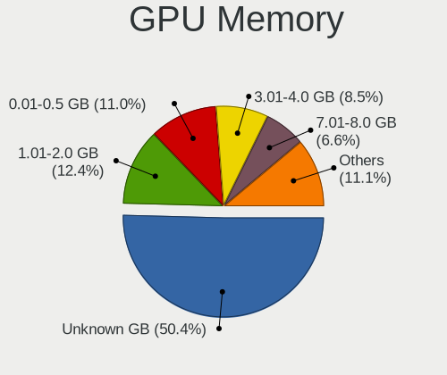
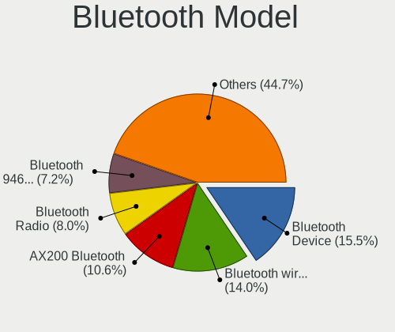
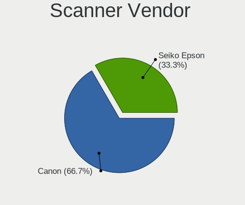
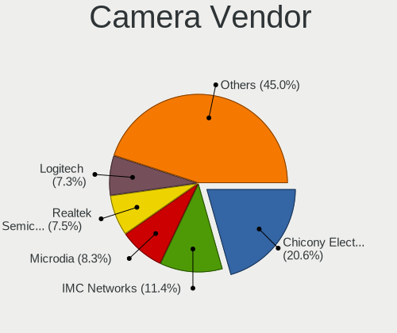

Fedora 36 - Tested Hardware & Statistics
----------------------------------------

A project to collect tested hardware configurations for Fedora 36.

Anyone can contribute to this report by the [hw-probe](https://github.com/linuxhw/hw-probe) tool:

    sudo -E hw-probe -all -upload

Please contribute! Especially if your hardware is rare.

This is a report for all computer types. See also reports for [desktops](/Dist/Fedora_36/Desktop/README.md) and [notebooks](/Dist/Fedora_36/Notebook/README.md).

Contents
--------

* [ Test Cases ](#test-cases)

* [ System ](#system)
  - [ Kernel                   ](#kernel)
  - [ Kernel Family            ](#kernel-family)
  - [ Kernel Major Ver.        ](#kernel-major-ver)
  - [ Arch                     ](#arch)
  - [ DE                       ](#de)
  - [ Display Server           ](#display-server)
  - [ Display Manager          ](#display-manager)
  - [ OS Lang                  ](#os-lang)
  - [ Boot Mode                ](#boot-mode)
  - [ Filesystem               ](#filesystem)
  - [ Part. scheme             ](#part-scheme)
  - [ Dual Boot with Linux/BSD ](#dual-boot-with-linuxbsd)
  - [ Dual Boot (Win)          ](#dual-boot-win)

* [ Board ](#board)
  - [ Vendor                   ](#vendor)
  - [ Model                    ](#model)
  - [ Model Family             ](#model-family)
  - [ MFG Year                 ](#mfg-year)
  - [ Form Factor              ](#form-factor)
  - [ Secure Boot              ](#secure-boot)
  - [ Coreboot                 ](#coreboot)
  - [ RAM Size                 ](#ram-size)
  - [ RAM Used                 ](#ram-used)
  - [ Total Drives             ](#total-drives)
  - [ Has CD-ROM               ](#has-cd-rom)
  - [ Has Ethernet             ](#has-ethernet)
  - [ Has WiFi                 ](#has-wifi)
  - [ Has Bluetooth            ](#has-bluetooth)

* [ Location ](#location)
  - [ Country                  ](#country)
  - [ City                     ](#city)

* [ Drives ](#drives)
  - [ Drive Vendor             ](#drive-vendor)
  - [ Drive Model              ](#drive-model)
  - [ HDD Vendor               ](#hdd-vendor)
  - [ SSD Vendor               ](#ssd-vendor)
  - [ Drive Kind               ](#drive-kind)
  - [ Drive Connector          ](#drive-connector)
  - [ Drive Size               ](#drive-size)
  - [ Space Total              ](#space-total)
  - [ Space Used               ](#space-used)
  - [ Malfunc. Drives          ](#malfunc-drives)
  - [ Malfunc. Drive Vendor    ](#malfunc-drive-vendor)
  - [ Malfunc. HDD Vendor      ](#malfunc-hdd-vendor)
  - [ Malfunc. Drive Kind      ](#malfunc-drive-kind)
  - [ Failed Drives            ](#failed-drives)
  - [ Failed Drive Vendor      ](#failed-drive-vendor)
  - [ Drive Status             ](#drive-status)

* [ Storage controller ](#storage-controller)
  - [ Storage Vendor           ](#storage-vendor)
  - [ Storage Model            ](#storage-model)
  - [ Storage Kind             ](#storage-kind)

* [ Processor ](#processor)
  - [ CPU Vendor               ](#cpu-vendor)
  - [ CPU Model                ](#cpu-model)
  - [ CPU Model Family         ](#cpu-model-family)
  - [ CPU Cores                ](#cpu-cores)
  - [ CPU Sockets              ](#cpu-sockets)
  - [ CPU Threads              ](#cpu-threads)
  - [ CPU Op-Modes             ](#cpu-op-modes)
  - [ CPU Microcode            ](#cpu-microcode)
  - [ CPU Microarch            ](#cpu-microarch)

* [ Graphics ](#graphics)
  - [ GPU Vendor               ](#gpu-vendor)
  - [ GPU Model                ](#gpu-model)
  - [ GPU Combo                ](#gpu-combo)
  - [ GPU Driver               ](#gpu-driver)
  - [ GPU Memory               ](#gpu-memory)

* [ Monitor ](#monitor)
  - [ Monitor Vendor           ](#monitor-vendor)
  - [ Monitor Model            ](#monitor-model)
  - [ Monitor Resolution       ](#monitor-resolution)
  - [ Monitor Diagonal         ](#monitor-diagonal)
  - [ Monitor Width            ](#monitor-width)
  - [ Aspect Ratio             ](#aspect-ratio)
  - [ Monitor Area             ](#monitor-area)
  - [ Pixel Density            ](#pixel-density)
  - [ Multiple Monitors        ](#multiple-monitors)

* [ Network ](#network)
  - [ Net Controller Vendor    ](#net-controller-vendor)
  - [ Net Controller Model     ](#net-controller-model)
  - [ Wireless Vendor          ](#wireless-vendor)
  - [ Wireless Model           ](#wireless-model)
  - [ Ethernet Vendor          ](#ethernet-vendor)
  - [ Ethernet Model           ](#ethernet-model)
  - [ Net Controller Kind      ](#net-controller-kind)
  - [ Used Controller          ](#used-controller)
  - [ NICs                     ](#nics)
  - [ IPv6                     ](#ipv6)

* [ Bluetooth ](#bluetooth)
  - [ Bluetooth Vendor         ](#bluetooth-vendor)
  - [ Bluetooth Model          ](#bluetooth-model)

* [ Sound ](#sound)
  - [ Sound Vendor             ](#sound-vendor)
  - [ Sound Model              ](#sound-model)

* [ Memory ](#memory)
  - [ Memory Vendor            ](#memory-vendor)
  - [ Memory Model             ](#memory-model)
  - [ Memory Kind              ](#memory-kind)
  - [ Memory Form Factor       ](#memory-form-factor)
  - [ Memory Size              ](#memory-size)
  - [ Memory Speed             ](#memory-speed)

* [ Printers & scanners ](#printers--scanners)
  - [ Printer Vendor           ](#printer-vendor)
  - [ Printer Model            ](#printer-model)
  - [ Scanner Vendor           ](#scanner-vendor)
  - [ Scanner Model            ](#scanner-model)

* [ Camera ](#camera)
  - [ Camera Vendor            ](#camera-vendor)
  - [ Camera Model             ](#camera-model)

* [ Security ](#security)
  - [ Fingerprint Vendor       ](#fingerprint-vendor)
  - [ Fingerprint Model        ](#fingerprint-model)
  - [ Chipcard Vendor          ](#chipcard-vendor)
  - [ Chipcard Model           ](#chipcard-model)

* [ Unsupported ](#unsupported)
  - [ Unsupported Devices      ](#unsupported-devices)
  - [ Unsupported Device Types ](#unsupported-device-types)

Test Cases
----------

Total: 2482

| Vendor        | Model                       | Form-Factor | Probe                                                      | Date         |
|---------------|-----------------------------|-------------|------------------------------------------------------------|--------------|
| Dell          | Inspiron 7577               | Notebook    | [2a280dc7df](https://linux-hardware.org/?probe=2a280dc7df) | Nov 02, 2022 |
| Lenovo        | ThinkPad T61 6464A13        | Notebook    | [5f850cbab6](https://linux-hardware.org/?probe=5f850cbab6) | Nov 02, 2022 |
| Intel         | NUC5i5MYBE H47797-202       | Mini pc     | [41a93c4dfa](https://linux-hardware.org/?probe=41a93c4dfa) | Nov 02, 2022 |
| MSI           | MAG X570S TOMAHAWK MAX W... | Desktop     | [c9041d22be](https://linux-hardware.org/?probe=c9041d22be) | Nov 02, 2022 |
| ASUSTek       | Z590 WIFI GUNDAM EDITION    | Desktop     | [74f8de9f71](https://linux-hardware.org/?probe=74f8de9f71) | Nov 02, 2022 |
| Intel         | NUC6i7KYB H90766-408        | Mini pc     | [2069a0e7fc](https://linux-hardware.org/?probe=2069a0e7fc) | Nov 02, 2022 |
| HP            | Pavilion Aero Laptop 13-... | Notebook    | [4fa32ec6af](https://linux-hardware.org/?probe=4fa32ec6af) | Nov 02, 2022 |
| ASUSTek       | ASUS TUF Gaming F15 FX50... | Notebook    | [2d931f9e99](https://linux-hardware.org/?probe=2d931f9e99) | Nov 02, 2022 |
| Lenovo        | ThinkBook 15 G3 ACL 21A4    | Notebook    | [335af8b89b](https://linux-hardware.org/?probe=335af8b89b) | Nov 02, 2022 |
| HP            | Pavilion g6                 | Notebook    | [22b32d9bac](https://linux-hardware.org/?probe=22b32d9bac) | Nov 02, 2022 |
| ASUSTek       | ProArt Z690-CREATOR WIFI    | Desktop     | [ec359017a2](https://linux-hardware.org/?probe=ec359017a2) | Nov 02, 2022 |
| HUAWEI        | BOD-WXX9                    | Notebook    | [d4ac3a5f04](https://linux-hardware.org/?probe=d4ac3a5f04) | Nov 02, 2022 |
| ASUSTek       | ROG CROSSHAIR VIII IMPAC... | Desktop     | [63bf11c696](https://linux-hardware.org/?probe=63bf11c696) | Nov 02, 2022 |
| ASUSTek       | VivoBook_ASUSLaptop X515... | Notebook    | [a156a7484d](https://linux-hardware.org/?probe=a156a7484d) | Nov 02, 2022 |
| ASUSTek       | ROG Zephyrus G14 GA402RJ... | Notebook    | [7b51138a0b](https://linux-hardware.org/?probe=7b51138a0b) | Nov 02, 2022 |
| HUAWEI        | NBLK-WAX9X                  | Notebook    | [d3beec5427](https://linux-hardware.org/?probe=d3beec5427) | Nov 02, 2022 |
| Gigabyte      | X570 AORUS ELITE            | Desktop     | [9b093574b9](https://linux-hardware.org/?probe=9b093574b9) | Nov 02, 2022 |
| HP            | Pavilion g6                 | Notebook    | [24c2a01761](https://linux-hardware.org/?probe=24c2a01761) | Nov 02, 2022 |
| Dell          | Latitude 5591               | Notebook    | [bcd8aef9a0](https://linux-hardware.org/?probe=bcd8aef9a0) | Nov 02, 2022 |
| HP            | x2 Detachable 10-p0XX       | Tablet      | [dfe5dc3d95](https://linux-hardware.org/?probe=dfe5dc3d95) | Nov 01, 2022 |
| Lenovo        | ThinkPad E14 Gen 3 20YDS... | Notebook    | [c90b358eb5](https://linux-hardware.org/?probe=c90b358eb5) | Nov 01, 2022 |
| HP            | EliteBook 830 G5            | Notebook    | [379443a5d6](https://linux-hardware.org/?probe=379443a5d6) | Nov 01, 2022 |
| Lenovo        | Legion 5 15ARH05 82B5       | Notebook    | [9b61195a2a](https://linux-hardware.org/?probe=9b61195a2a) | Nov 01, 2022 |
| HP            | EliteBook 830 G5            | Notebook    | [5e099af04c](https://linux-hardware.org/?probe=5e099af04c) | Nov 01, 2022 |
| HP            | 829E                        | Mini pc     | [f568895fbb](https://linux-hardware.org/?probe=f568895fbb) | Nov 01, 2022 |
| Gigabyte      | B550 UD AC                  | Desktop     | [c5a5219cf3](https://linux-hardware.org/?probe=c5a5219cf3) | Nov 01, 2022 |
| Lenovo        | ThinkPad X1 Carbon 7th 2... | Notebook    | [e101d9d50a](https://linux-hardware.org/?probe=e101d9d50a) | Nov 01, 2022 |
| Lenovo        | ThinkPad E14 Gen 4 21ECS... | Notebook    | [766e7fb0d0](https://linux-hardware.org/?probe=766e7fb0d0) | Nov 01, 2022 |
| Unknown       | Unknown                     | Notebook    | [9608724116](https://linux-hardware.org/?probe=9608724116) | Nov 01, 2022 |
| MSI           | H81M-E33                    | Desktop     | [ee4c33d7b1](https://linux-hardware.org/?probe=ee4c33d7b1) | Nov 01, 2022 |
| Dell          | Venue 8 Pro 5830            | Notebook    | [8890410dfc](https://linux-hardware.org/?probe=8890410dfc) | Nov 01, 2022 |
| HP            | 339A                        | Desktop     | [68392c18c9](https://linux-hardware.org/?probe=68392c18c9) | Nov 01, 2022 |
| Dell          | Latitude 3420               | Notebook    | [9c2b9ab298](https://linux-hardware.org/?probe=9c2b9ab298) | Nov 01, 2022 |
| Apple         | MacBookPro9,2               | Notebook    | [d63c5de91b](https://linux-hardware.org/?probe=d63c5de91b) | Nov 01, 2022 |
| MSI           | PRO B660M-A DDR4            | Desktop     | [f6b6afc8a3](https://linux-hardware.org/?probe=f6b6afc8a3) | Nov 01, 2022 |
| HUAWEI        | BOHB-WAX9                   | Notebook    | [274a3383db](https://linux-hardware.org/?probe=274a3383db) | Oct 31, 2022 |
| HP            | ProBook 470 G5              | Notebook    | [0424e08b3d](https://linux-hardware.org/?probe=0424e08b3d) | Oct 31, 2022 |
| Samsung       | 800G5M/800G5W               | Notebook    | [c91800e8c1](https://linux-hardware.org/?probe=c91800e8c1) | Oct 31, 2022 |
| ASUSTek       | X510UAR                     | Notebook    | [46f1da66b6](https://linux-hardware.org/?probe=46f1da66b6) | Oct 31, 2022 |
| ASUSTek       | X510UAR                     | Notebook    | [1409a7f78d](https://linux-hardware.org/?probe=1409a7f78d) | Oct 31, 2022 |
| Acer          | Swift SF314-54              | Notebook    | [71cf98e6e8](https://linux-hardware.org/?probe=71cf98e6e8) | Oct 31, 2022 |
| ASUSTek       | A8R32-MVP Deluxe            | Desktop     | [a2a8473e4b](https://linux-hardware.org/?probe=a2a8473e4b) | Oct 31, 2022 |
| ASUSTek       | PRIME Z270-P                | Desktop     | [fffb5288e0](https://linux-hardware.org/?probe=fffb5288e0) | Oct 31, 2022 |
| ASUSTek       | PRIME B450-PLUS             | Desktop     | [ce4bda1df2](https://linux-hardware.org/?probe=ce4bda1df2) | Oct 31, 2022 |
| ASUSTek       | X541UVK                     | Notebook    | [15bdbbf952](https://linux-hardware.org/?probe=15bdbbf952) | Oct 31, 2022 |
| HP            | 250 G7 Notebook PC          | Notebook    | [7433eae90a](https://linux-hardware.org/?probe=7433eae90a) | Oct 31, 2022 |
| ASUSTek       | P8Z77-M PRO                 | Desktop     | [479fdd085d](https://linux-hardware.org/?probe=479fdd085d) | Oct 31, 2022 |
| ASUSTek       | TUF Z390M-PRO GAMING        | Desktop     | [dfde89926c](https://linux-hardware.org/?probe=dfde89926c) | Oct 31, 2022 |
| ASUSTek       | TUF Z390M-PRO GAMING        | Desktop     | [135f93d663](https://linux-hardware.org/?probe=135f93d663) | Oct 31, 2022 |
| Dell          | Precision M6700             | Notebook    | [aa4b5e4400](https://linux-hardware.org/?probe=aa4b5e4400) | Oct 31, 2022 |
| ASUSTek       | M5A78L-M/USB3               | Desktop     | [4ac9bf1711](https://linux-hardware.org/?probe=4ac9bf1711) | Oct 31, 2022 |
| ASUSTek       | ASUS TUF Gaming A15 FA50... | Notebook    | [002ab67e5e](https://linux-hardware.org/?probe=002ab67e5e) | Oct 31, 2022 |
| ASUSTek       | ROG Zephyrus G15 GA503RM... | Notebook    | [76906648cb](https://linux-hardware.org/?probe=76906648cb) | Oct 30, 2022 |
| HP            | Spectre x360 Convertible... | Convertible | [1deed25a21](https://linux-hardware.org/?probe=1deed25a21) | Oct 30, 2022 |
| Lenovo        | IdeaPad 320-15IKB 80XL      | Notebook    | [cf460716f9](https://linux-hardware.org/?probe=cf460716f9) | Oct 30, 2022 |
| Dell          | Inspiron 14 7425 2-in-1     | Convertible | [e427e48710](https://linux-hardware.org/?probe=e427e48710) | Oct 30, 2022 |
| HP            | Laptop 15s-eq2xxx           | Notebook    | [3f69e984d1](https://linux-hardware.org/?probe=3f69e984d1) | Oct 30, 2022 |
| Sony          | VAIO                        | All in one  | [b295b1cb6f](https://linux-hardware.org/?probe=b295b1cb6f) | Oct 30, 2022 |
| MSI           | B250M GAMING PRO            | Desktop     | [98979beea7](https://linux-hardware.org/?probe=98979beea7) | Oct 30, 2022 |
| HP            | 15                          | Notebook    | [c356a2b0cd](https://linux-hardware.org/?probe=c356a2b0cd) | Oct 30, 2022 |
| HP            | ProBook 470 G5              | Notebook    | [cfe35367bf](https://linux-hardware.org/?probe=cfe35367bf) | Oct 30, 2022 |
| HP            | ENVY Laptop 13-ad1xx        | Notebook    | [c52b1fe5fa](https://linux-hardware.org/?probe=c52b1fe5fa) | Oct 30, 2022 |
| Dell          | Inspiron 7720               | Notebook    | [f1478df888](https://linux-hardware.org/?probe=f1478df888) | Oct 30, 2022 |
| HP            | EliteBook x360 1040 G6      | Convertible | [197c77e88c](https://linux-hardware.org/?probe=197c77e88c) | Oct 30, 2022 |
| HP            | EliteBook x360 1040 G6      | Convertible | [12e08a7d27](https://linux-hardware.org/?probe=12e08a7d27) | Oct 30, 2022 |
| Lenovo        | ThinkPad X1 Carbon Gen 8... | Notebook    | [df654ca0b1](https://linux-hardware.org/?probe=df654ca0b1) | Oct 30, 2022 |
| Dell          | Latitude E7450              | Notebook    | [32a6333f4b](https://linux-hardware.org/?probe=32a6333f4b) | Oct 30, 2022 |
| Aquarius      | Cmp NS765                   | Notebook    | [5e519edbee](https://linux-hardware.org/?probe=5e519edbee) | Oct 30, 2022 |
| Lenovo        | Legion Y530-15ICH-1060 8... | Notebook    | [60ba0bc2dd](https://linux-hardware.org/?probe=60ba0bc2dd) | Oct 29, 2022 |
| HUAWEI        | NBLB-WAX9N                  | Notebook    | [1925c8ce1f](https://linux-hardware.org/?probe=1925c8ce1f) | Oct 29, 2022 |
| Acer          | Predator PH315-53           | Notebook    | [b3dd383a83](https://linux-hardware.org/?probe=b3dd383a83) | Oct 29, 2022 |
| ASUSTek       | X453MA                      | Notebook    | [da3e45d6c3](https://linux-hardware.org/?probe=da3e45d6c3) | Oct 29, 2022 |
| ASUSTek       | Q550LF                      | Notebook    | [383c45edce](https://linux-hardware.org/?probe=383c45edce) | Oct 29, 2022 |
| Dell          | Latitude E7450              | Notebook    | [012cd7214b](https://linux-hardware.org/?probe=012cd7214b) | Oct 29, 2022 |
| Dell          | Latitude E7450              | Notebook    | [635a60671d](https://linux-hardware.org/?probe=635a60671d) | Oct 29, 2022 |
| ASUSTek       | PRIME H670-PLUS D4          | Desktop     | [ce9a718851](https://linux-hardware.org/?probe=ce9a718851) | Oct 28, 2022 |
| HP            | 82A5                        | Mini pc     | [c0be7985c0](https://linux-hardware.org/?probe=c0be7985c0) | Oct 28, 2022 |
| Gigabyte      | G41MT-D3                    | Desktop     | [2e4153161f](https://linux-hardware.org/?probe=2e4153161f) | Oct 28, 2022 |
| Lenovo        | ThinkPad T14 Gen 1 20UD0... | Notebook    | [2f6e4235f7](https://linux-hardware.org/?probe=2f6e4235f7) | Oct 28, 2022 |
| Lenovo        | ThinkPad P52 20M9S1EM00     | Notebook    | [40de74c5c5](https://linux-hardware.org/?probe=40de74c5c5) | Oct 28, 2022 |
| HP            | Laptop 15s-fq4xxx           | Notebook    | [e06398e1bc](https://linux-hardware.org/?probe=e06398e1bc) | Oct 28, 2022 |
| Lenovo        | ThinkPad X1 Carbon 4th 2... | Notebook    | [83179a6cea](https://linux-hardware.org/?probe=83179a6cea) | Oct 28, 2022 |
| Lenovo        | 3172 NOK                    | Mini pc     | [1ddbbf71eb](https://linux-hardware.org/?probe=1ddbbf71eb) | Oct 28, 2022 |
| ASRock        | X99 Extreme4                | Desktop     | [72102d6890](https://linux-hardware.org/?probe=72102d6890) | Oct 28, 2022 |
| Gigabyte      | B450M DS3H-CF               | Desktop     | [38135da604](https://linux-hardware.org/?probe=38135da604) | Oct 28, 2022 |
| Sony          | VPCCB3S1R                   | Notebook    | [ee5b1465a1](https://linux-hardware.org/?probe=ee5b1465a1) | Oct 28, 2022 |
| Microsoft     | Surface Go 3                | Tablet      | [85019658e9](https://linux-hardware.org/?probe=85019658e9) | Oct 27, 2022 |
| HP            | Pavilion Gaming Laptop 1... | Notebook    | [1d64fb48e7](https://linux-hardware.org/?probe=1d64fb48e7) | Oct 27, 2022 |
| Timi          | TM1701                      | Notebook    | [f246345845](https://linux-hardware.org/?probe=f246345845) | Oct 27, 2022 |
| HP            | ProBook 640 G1              | Notebook    | [3a9f97607d](https://linux-hardware.org/?probe=3a9f97607d) | Oct 27, 2022 |
| MSI           | PS63 Modern 8RC             | Notebook    | [36b663cec7](https://linux-hardware.org/?probe=36b663cec7) | Oct 27, 2022 |
| MSI           | H81M-E33                    | Desktop     | [f0613bfce8](https://linux-hardware.org/?probe=f0613bfce8) | Oct 27, 2022 |
| MSI           | PS63 Modern 8RC             | Notebook    | [e00fd51503](https://linux-hardware.org/?probe=e00fd51503) | Oct 27, 2022 |
| ASUSTek       | VivoBook_ASUSLaptop M350... | Notebook    | [99152f7783](https://linux-hardware.org/?probe=99152f7783) | Oct 27, 2022 |
| Lenovo        | Yoga 720-13IKB              | Convertible | [1ca9551d4d](https://linux-hardware.org/?probe=1ca9551d4d) | Oct 27, 2022 |
| MSI           | Prestige 14 A10SC           | Notebook    | [263d47772c](https://linux-hardware.org/?probe=263d47772c) | Oct 27, 2022 |
| Gigabyte      | H97N-WIFI                   | Desktop     | [aa2345213b](https://linux-hardware.org/?probe=aa2345213b) | Oct 27, 2022 |
| HP            | EliteBook 8570w             | Notebook    | [7d30f96368](https://linux-hardware.org/?probe=7d30f96368) | Oct 27, 2022 |
| Lenovo        | ThinkPad X260 20F5S2WX05    | Notebook    | [710f95eab8](https://linux-hardware.org/?probe=710f95eab8) | Oct 27, 2022 |
| ASUSTek       | TUF Gaming B460M-PLUS       | Desktop     | [d2debd1dab](https://linux-hardware.org/?probe=d2debd1dab) | Oct 26, 2022 |
| ASUSTek       | VivoBook S15 X510UF         | Notebook    | [85b4bc70fa](https://linux-hardware.org/?probe=85b4bc70fa) | Oct 26, 2022 |
| Lenovo        | ThinkPad T470s 20HF0047U... | Notebook    | [3b9a4fb8f4](https://linux-hardware.org/?probe=3b9a4fb8f4) | Oct 26, 2022 |
| ASUSTek       | M5A78L-M/USB3               | Desktop     | [6c7c7fa216](https://linux-hardware.org/?probe=6c7c7fa216) | Oct 26, 2022 |
| LincPlus      | P1                          | Notebook    | [cc97e9ec36](https://linux-hardware.org/?probe=cc97e9ec36) | Oct 26, 2022 |
| Lenovo        | 1048 SDK0Q40104 WIN 3915... | Desktop     | [2bed8fe9b1](https://linux-hardware.org/?probe=2bed8fe9b1) | Oct 26, 2022 |
| MSI           | Modern 15 A11M              | Notebook    | [0a658be9fc](https://linux-hardware.org/?probe=0a658be9fc) | Oct 26, 2022 |
| HP            | ProLiant ML350 G6           | Desktop     | [d080f0956b](https://linux-hardware.org/?probe=d080f0956b) | Oct 26, 2022 |
| Lenovo        | 102F SDK0J40705 WIN 3425... | Desktop     | [958c0a2ae7](https://linux-hardware.org/?probe=958c0a2ae7) | Oct 25, 2022 |
| Microsoft     | Surface Laptop 3            | Tablet      | [b35333d9c0](https://linux-hardware.org/?probe=b35333d9c0) | Oct 25, 2022 |
| Lenovo        | ThinkPad E15 Gen 3 20YG0... | Notebook    | [a8c29545e6](https://linux-hardware.org/?probe=a8c29545e6) | Oct 25, 2022 |
| Dell          | Inspiron 3501               | Notebook    | [6764a6860f](https://linux-hardware.org/?probe=6764a6860f) | Oct 25, 2022 |
| Acer          | Aspire A715-42G             | Notebook    | [c9123810fd](https://linux-hardware.org/?probe=c9123810fd) | Oct 25, 2022 |
| ASUSTek       | A8R32-MVP Deluxe            | Desktop     | [6896f337ab](https://linux-hardware.org/?probe=6896f337ab) | Oct 25, 2022 |
| ASUSTek       | PRIME Z490-P                | Desktop     | [0eb9c3ebff](https://linux-hardware.org/?probe=0eb9c3ebff) | Oct 25, 2022 |
| Dell          | Latitude 5500               | Notebook    | [6e1b321740](https://linux-hardware.org/?probe=6e1b321740) | Oct 25, 2022 |
| Apple         | MacBookPro11,4              | Notebook    | [29dd6b053b](https://linux-hardware.org/?probe=29dd6b053b) | Oct 25, 2022 |
| ASUSTek       | PRIME B450-PLUS             | Desktop     | [0c63b974e1](https://linux-hardware.org/?probe=0c63b974e1) | Oct 25, 2022 |
| ASRock        | FM2A88M-HD+ R2.0            | Desktop     | [10e0a497e9](https://linux-hardware.org/?probe=10e0a497e9) | Oct 25, 2022 |
| MSI           | X470 GAMING PLUS MAX        | Desktop     | [82fb357322](https://linux-hardware.org/?probe=82fb357322) | Oct 25, 2022 |
| Gigabyte      | A520M DS3H                  | Desktop     | [88e45a4e65](https://linux-hardware.org/?probe=88e45a4e65) | Oct 25, 2022 |
| Timi          | Mi Laptop Pro 15            | Notebook    | [4474edfd79](https://linux-hardware.org/?probe=4474edfd79) | Oct 25, 2022 |
| HP            | ENVY x360 2-in-1 Laptop ... | Convertible | [1537796302](https://linux-hardware.org/?probe=1537796302) | Oct 25, 2022 |
| Dell          | XPS 15 9510                 | Notebook    | [b14c37f999](https://linux-hardware.org/?probe=b14c37f999) | Oct 25, 2022 |
| MSI           | MAG A520M VECTOR WIFI       | Desktop     | [91a8a52c4a](https://linux-hardware.org/?probe=91a8a52c4a) | Oct 25, 2022 |
| ASUSTek       | VivoBook_ASUSLaptop X509... | Notebook    | [4ffd604fea](https://linux-hardware.org/?probe=4ffd604fea) | Oct 25, 2022 |
| ASUSTek       | X540SA                      | Notebook    | [a515dd93cd](https://linux-hardware.org/?probe=a515dd93cd) | Oct 25, 2022 |
| Huanan        | X79 (INTEL Xeon E5/Core ... | Desktop     | [601e080563](https://linux-hardware.org/?probe=601e080563) | Oct 25, 2022 |
| Lenovo        | IdeaPad 3 15ITL6 82H8       | Notebook    | [42647c28ba](https://linux-hardware.org/?probe=42647c28ba) | Oct 25, 2022 |
| Lenovo        | ThinkPad X1 Carbon 5th 2... | Notebook    | [e4d7dc5f38](https://linux-hardware.org/?probe=e4d7dc5f38) | Oct 25, 2022 |
| System76      | Galago UltraPro             | Notebook    | [caf6a992bb](https://linux-hardware.org/?probe=caf6a992bb) | Oct 24, 2022 |
| Microsoft     | Surface Laptop 3            | Tablet      | [ad6b09bddc](https://linux-hardware.org/?probe=ad6b09bddc) | Oct 24, 2022 |
| Acer          | Aspire ES1-520              | Notebook    | [44375f0b06](https://linux-hardware.org/?probe=44375f0b06) | Oct 24, 2022 |
| ASRock        | Z170 Gaming K4              | Desktop     | [184139e7bc](https://linux-hardware.org/?probe=184139e7bc) | Oct 24, 2022 |
| Gigabyte      | 990FXA-UD5 R5               | Desktop     | [3f6368ca5a](https://linux-hardware.org/?probe=3f6368ca5a) | Oct 24, 2022 |
| ASUSTek       | VivoBook_ASUSLaptop X513... | Notebook    | [95ad909dc8](https://linux-hardware.org/?probe=95ad909dc8) | Oct 24, 2022 |
| HP            | 3048h                       | Desktop     | [3c3f7eda5e](https://linux-hardware.org/?probe=3c3f7eda5e) | Oct 24, 2022 |
| HUAWEI        | KPL-W0X                     | Notebook    | [aea737fcab](https://linux-hardware.org/?probe=aea737fcab) | Oct 24, 2022 |
| ASRock        | X370 Gaming K4              | Desktop     | [5658dbff1b](https://linux-hardware.org/?probe=5658dbff1b) | Oct 24, 2022 |
| ASUSTek       | VivoBook_ASUSLaptop TP42... | Convertible | [0ca2dff493](https://linux-hardware.org/?probe=0ca2dff493) | Oct 24, 2022 |
| ASUSTek       | TUF B450M-PLUS GAMING       | Desktop     | [2a57a65990](https://linux-hardware.org/?probe=2a57a65990) | Oct 24, 2022 |
| MSI           | MPG X570 GAMING PLUS        | Desktop     | [5010a8ef47](https://linux-hardware.org/?probe=5010a8ef47) | Oct 24, 2022 |
| Dell          | Latitude E6420              | Notebook    | [eb53f0d580](https://linux-hardware.org/?probe=eb53f0d580) | Oct 24, 2022 |
| ASUSTek       | UX310UQ                     | Notebook    | [5a928ace3b](https://linux-hardware.org/?probe=5a928ace3b) | Oct 24, 2022 |
| Gigabyte      | GA-78LMT-USB3 SEx           | Desktop     | [fe9ec739e2](https://linux-hardware.org/?probe=fe9ec739e2) | Oct 24, 2022 |
| Lenovo        | ThinkPad T490 20N3S9DJ00    | Notebook    | [c1a4fde481](https://linux-hardware.org/?probe=c1a4fde481) | Oct 24, 2022 |
| Lenovo        | ThinkPad T490 20N3S9DJ00    | Notebook    | [80bf151a4d](https://linux-hardware.org/?probe=80bf151a4d) | Oct 24, 2022 |
| Toshiba       | Satellite C660              | Notebook    | [8922b0767c](https://linux-hardware.org/?probe=8922b0767c) | Oct 24, 2022 |
| Lenovo        | ThinkPad X240 20AMS56K00    | Notebook    | [efa84f3716](https://linux-hardware.org/?probe=efa84f3716) | Oct 24, 2022 |
| Acer          | Nitro AN515-46              | Notebook    | [cb2480b22c](https://linux-hardware.org/?probe=cb2480b22c) | Oct 23, 2022 |
| Acer          | Nitro AN515-46              | Notebook    | [846cfe5273](https://linux-hardware.org/?probe=846cfe5273) | Oct 23, 2022 |
| Gigabyte      | X570S AORUS MASTER          | Desktop     | [b9e4b934ee](https://linux-hardware.org/?probe=b9e4b934ee) | Oct 23, 2022 |
| ASUSTek       | TUF Gaming B550-PLUS        | Desktop     | [22ea226b97](https://linux-hardware.org/?probe=22ea226b97) | Oct 23, 2022 |
| Dell          | Inspiron 3580               | Notebook    | [41dce71fbf](https://linux-hardware.org/?probe=41dce71fbf) | Oct 23, 2022 |
| Acer          | Aspire E5-575G              | Notebook    | [b6b5c1468c](https://linux-hardware.org/?probe=b6b5c1468c) | Oct 23, 2022 |
| ASUSTek       | Z170-A                      | Desktop     | [22a96186fa](https://linux-hardware.org/?probe=22a96186fa) | Oct 23, 2022 |
| Dell          | Inspiron 1564               | Notebook    | [754b4a0f04](https://linux-hardware.org/?probe=754b4a0f04) | Oct 23, 2022 |
| HP            | Notebook                    | Notebook    | [d713217453](https://linux-hardware.org/?probe=d713217453) | Oct 23, 2022 |
| HP            | 86EE                        | All in one  | [4c631cdc18](https://linux-hardware.org/?probe=4c631cdc18) | Oct 22, 2022 |
| HP            | Notebook                    | Notebook    | [ef9adb0e8a](https://linux-hardware.org/?probe=ef9adb0e8a) | Oct 22, 2022 |
| ASUSTek       | ROG CROSSHAIR VIII HERO     | Desktop     | [b42893c91e](https://linux-hardware.org/?probe=b42893c91e) | Oct 22, 2022 |
| Gigabyte      | Z390 AORUS PRO-CF           | Desktop     | [b633b478aa](https://linux-hardware.org/?probe=b633b478aa) | Oct 22, 2022 |
| ASUSTek       | ROG STRIX X470-F GAMING     | Desktop     | [b7ad660d88](https://linux-hardware.org/?probe=b7ad660d88) | Oct 22, 2022 |
| ASUSTek       | TUF Gaming B560-PLUS WIF... | Desktop     | [312828c6a3](https://linux-hardware.org/?probe=312828c6a3) | Oct 22, 2022 |
| Gigabyte      | H77N-WIFI                   | Desktop     | [3e2bd05f56](https://linux-hardware.org/?probe=3e2bd05f56) | Oct 22, 2022 |
| MSI           | MAG B460M BAZOOKA           | Desktop     | [9cfe9f3c51](https://linux-hardware.org/?probe=9cfe9f3c51) | Oct 22, 2022 |
| Dell          | 0PP150 A00                  | Desktop     | [0e07990bda](https://linux-hardware.org/?probe=0e07990bda) | Oct 22, 2022 |
| ASUSTek       | ZenBook UX363EA_UX363EA     | Convertible | [27c047341d](https://linux-hardware.org/?probe=27c047341d) | Oct 21, 2022 |
| Purism        | Librem 13 v2                | Notebook    | [5296ed1e19](https://linux-hardware.org/?probe=5296ed1e19) | Oct 21, 2022 |
| Unknown       | X79                         | Desktop     | [fd8f23bc70](https://linux-hardware.org/?probe=fd8f23bc70) | Oct 21, 2022 |
| Gigabyte      | GA-MA780G-UD3H              | Desktop     | [1ab730c85c](https://linux-hardware.org/?probe=1ab730c85c) | Oct 21, 2022 |
| Google        | Swanky                      | Notebook    | [19efb3ecc5](https://linux-hardware.org/?probe=19efb3ecc5) | Oct 21, 2022 |
| HP            | 8459                        | Desktop     | [c2ebcf9e20](https://linux-hardware.org/?probe=c2ebcf9e20) | Oct 21, 2022 |
| MSI           | MPG X570 GAMING PLUS        | Desktop     | [60d4787bb7](https://linux-hardware.org/?probe=60d4787bb7) | Oct 21, 2022 |
| ASUSTek       | Q550LF                      | Notebook    | [0d24151944](https://linux-hardware.org/?probe=0d24151944) | Oct 21, 2022 |
| Itautec       | Infoway N8755               | Notebook    | [7eaba382a5](https://linux-hardware.org/?probe=7eaba382a5) | Oct 21, 2022 |
| Lenovo        | Yoga Slim 7 Pro 14ACH5 8... | Notebook    | [b374c2dff6](https://linux-hardware.org/?probe=b374c2dff6) | Oct 20, 2022 |
| Acer          | One S1003                   | Tablet      | [304c23119d](https://linux-hardware.org/?probe=304c23119d) | Oct 20, 2022 |
| Lenovo        | B560                        | Notebook    | [3a61700f49](https://linux-hardware.org/?probe=3a61700f49) | Oct 20, 2022 |
| Lenovo        | IdeaPadFlex 5 14ARE05 81... | Convertible | [33a4634aab](https://linux-hardware.org/?probe=33a4634aab) | Oct 20, 2022 |
| Dell          | Inspiron 7460               | Notebook    | [879fabd350](https://linux-hardware.org/?probe=879fabd350) | Oct 20, 2022 |
| Gigabyte      | 990FXA-UD5 R5               | Desktop     | [f03f1bb041](https://linux-hardware.org/?probe=f03f1bb041) | Oct 20, 2022 |
| Lenovo        | ThinkPad P52 20MAS17205     | Notebook    | [be48cfe3be](https://linux-hardware.org/?probe=be48cfe3be) | Oct 20, 2022 |
| HP            | Laptop 15s-eq2xxx           | Notebook    | [f966d5d584](https://linux-hardware.org/?probe=f966d5d584) | Oct 20, 2022 |
| Lenovo        | ThinkPad T14s Gen 1 20T1... | Notebook    | [e3265d4cdc](https://linux-hardware.org/?probe=e3265d4cdc) | Oct 20, 2022 |
| HP            | 8433 11                     | Desktop     | [7e28f54181](https://linux-hardware.org/?probe=7e28f54181) | Oct 20, 2022 |
| ASUSTek       | VivoBook_ASUSLaptop X515... | Notebook    | [7d35a56915](https://linux-hardware.org/?probe=7d35a56915) | Oct 20, 2022 |
| Lenovo        | ThinkPad T14 Gen 2i 20W1... | Notebook    | [f81a40a71c](https://linux-hardware.org/?probe=f81a40a71c) | Oct 20, 2022 |
| Apple         | Mac-942B59F58194171B iMa... | All in one  | [f91d8722f9](https://linux-hardware.org/?probe=f91d8722f9) | Oct 20, 2022 |
| Dell          | Precision 5510              | Notebook    | [bb7788ce01](https://linux-hardware.org/?probe=bb7788ce01) | Oct 20, 2022 |
| Lenovo        | IdeaPad 5 15ITL05 82FG      | Notebook    | [9594fcc1e0](https://linux-hardware.org/?probe=9594fcc1e0) | Oct 20, 2022 |
| ASUSTek       | K43SJ                       | Notebook    | [4c27c4945c](https://linux-hardware.org/?probe=4c27c4945c) | Oct 20, 2022 |
| MSI           | MPG X570 GAMING PLUS        | Desktop     | [502ae94f8f](https://linux-hardware.org/?probe=502ae94f8f) | Oct 20, 2022 |
| Framework     | Laptop (12th Gen Intel C... | Notebook    | [d0dcb7e6e3](https://linux-hardware.org/?probe=d0dcb7e6e3) | Oct 20, 2022 |
| NZXT          | N7 B550                     | Desktop     | [f699b7e1d2](https://linux-hardware.org/?probe=f699b7e1d2) | Oct 20, 2022 |
| Lenovo        | ThinkPad X1 Carbon Gen 1... | Notebook    | [866d0f49a2](https://linux-hardware.org/?probe=866d0f49a2) | Oct 20, 2022 |
| HP            | 8459                        | Desktop     | [d8ec2e7ee9](https://linux-hardware.org/?probe=d8ec2e7ee9) | Oct 20, 2022 |
| Framework     | Laptop                      | Notebook    | [ade55fca33](https://linux-hardware.org/?probe=ade55fca33) | Oct 19, 2022 |
| ASUSTek       | M5A78L-M/USB3               | Desktop     | [76c0902958](https://linux-hardware.org/?probe=76c0902958) | Oct 19, 2022 |
| Gigabyte      | P67A-UD3                    | Desktop     | [96b72bfa8a](https://linux-hardware.org/?probe=96b72bfa8a) | Oct 19, 2022 |
| Framework     | Laptop                      | Notebook    | [57af01b405](https://linux-hardware.org/?probe=57af01b405) | Oct 19, 2022 |
| Shuttle       | FH67H                       | Desktop     | [6679449225](https://linux-hardware.org/?probe=6679449225) | Oct 19, 2022 |
| MSI           | Z97 GAMING 5                | Desktop     | [980d0d7bb2](https://linux-hardware.org/?probe=980d0d7bb2) | Oct 19, 2022 |
| Dell          | Precision 7760              | Notebook    | [a5ab2793ae](https://linux-hardware.org/?probe=a5ab2793ae) | Oct 19, 2022 |
| Lenovo        | IdeaPadFlex 5 14ARE05 81... | Convertible | [aeedc0bfd0](https://linux-hardware.org/?probe=aeedc0bfd0) | Oct 19, 2022 |
| ASUSTek       | ROG Strix G513QY_G513QY     | Notebook    | [680823db07](https://linux-hardware.org/?probe=680823db07) | Oct 19, 2022 |
| Lenovo        | IdeaPad 5 15ITL05 82FG      | Notebook    | [71734a9abe](https://linux-hardware.org/?probe=71734a9abe) | Oct 19, 2022 |
| Lenovo        | ThinkPad T410 2522PT3       | Notebook    | [2cd92a7da8](https://linux-hardware.org/?probe=2cd92a7da8) | Oct 19, 2022 |
| HP            | EliteBook 865 16 inch G9... | Notebook    | [8665ee6ba6](https://linux-hardware.org/?probe=8665ee6ba6) | Oct 19, 2022 |
| Gigabyte      | B550M DS3H                  | Desktop     | [d267c64062](https://linux-hardware.org/?probe=d267c64062) | Oct 19, 2022 |
| Lenovo        | Yoga 900-13ISK2 80UE        | Notebook    | [efadc96c65](https://linux-hardware.org/?probe=efadc96c65) | Oct 19, 2022 |
| ASUSTek       | PRIME B550M-K               | Desktop     | [41d2e6298d](https://linux-hardware.org/?probe=41d2e6298d) | Oct 19, 2022 |
| HP            | Pavilion Aero Laptop 13-... | Notebook    | [eab0779b74](https://linux-hardware.org/?probe=eab0779b74) | Oct 19, 2022 |
| ASUSTek       | P5B-Deluxe                  | Desktop     | [95a75ab35b](https://linux-hardware.org/?probe=95a75ab35b) | Oct 19, 2022 |
| Gigabyte      | X570S AORUS MASTER          | Desktop     | [495c7fdc3d](https://linux-hardware.org/?probe=495c7fdc3d) | Oct 18, 2022 |
| Lenovo        | Legion S7 16ARHA7 82UG      | Notebook    | [28a1d15220](https://linux-hardware.org/?probe=28a1d15220) | Oct 18, 2022 |
| MSI           | Modern 14 C12M              | Notebook    | [33c0e4861e](https://linux-hardware.org/?probe=33c0e4861e) | Oct 18, 2022 |
| Lenovo        | ThinkPad E15 Gen 3 20YGC... | Notebook    | [d51ba4a008](https://linux-hardware.org/?probe=d51ba4a008) | Oct 18, 2022 |
| BESSTAR Te... | F6BFC                       | Desktop     | [70d12e710f](https://linux-hardware.org/?probe=70d12e710f) | Oct 18, 2022 |
| Lenovo        | IdeaPad 5 15ARE05 81YQ      | Notebook    | [aaa41de825](https://linux-hardware.org/?probe=aaa41de825) | Oct 18, 2022 |
| Lenovo        | B560                        | Notebook    | [717af973da](https://linux-hardware.org/?probe=717af973da) | Oct 18, 2022 |
| Dell          | Inspiron M5010              | Notebook    | [026a7a8cd3](https://linux-hardware.org/?probe=026a7a8cd3) | Oct 18, 2022 |
| BESSTAR Te... | UM700                       | Desktop     | [5c2590f03f](https://linux-hardware.org/?probe=5c2590f03f) | Oct 18, 2022 |
| BESSTAR Te... | UM700                       | Desktop     | [df0afd4326](https://linux-hardware.org/?probe=df0afd4326) | Oct 18, 2022 |
| ASRock        | Z97E-ITX/ac                 | Desktop     | [2ae712a746](https://linux-hardware.org/?probe=2ae712a746) | Oct 18, 2022 |
| Acer          | Aspire E1-531               | Notebook    | [527c4e0728](https://linux-hardware.org/?probe=527c4e0728) | Oct 17, 2022 |
| HP            | Pavilion Gaming Laptop 1... | Notebook    | [76f9929a9c](https://linux-hardware.org/?probe=76f9929a9c) | Oct 17, 2022 |
| MSI           | Summit E16Flip A11UCT       | Notebook    | [f1ec40e34d](https://linux-hardware.org/?probe=f1ec40e34d) | Oct 17, 2022 |
| Dell          | XPS 15 9510                 | Notebook    | [9e1f6ae49e](https://linux-hardware.org/?probe=9e1f6ae49e) | Oct 17, 2022 |
| Dell          | Latitude 9420               | Convertible | [319c3b9f03](https://linux-hardware.org/?probe=319c3b9f03) | Oct 17, 2022 |
| ASUSTek       | ASUS TUF Gaming A15 FA50... | Notebook    | [7f9219a85f](https://linux-hardware.org/?probe=7f9219a85f) | Oct 17, 2022 |
| Dell          | Inspiron 3584               | Notebook    | [c80df2b63c](https://linux-hardware.org/?probe=c80df2b63c) | Oct 17, 2022 |
| Dell          | XPS 15 9510                 | Notebook    | [2fd734cbfb](https://linux-hardware.org/?probe=2fd734cbfb) | Oct 17, 2022 |
| ASUSTek       | VivoBook_ASUSLaptop X415... | Notebook    | [d78ecde0a2](https://linux-hardware.org/?probe=d78ecde0a2) | Oct 17, 2022 |
| ASUSTek       | VivoBook_ASUSLaptop X415... | Notebook    | [adda30ef79](https://linux-hardware.org/?probe=adda30ef79) | Oct 17, 2022 |
| HP            | OMEN Laptop 15-en0xxx       | Notebook    | [528fc3c5ec](https://linux-hardware.org/?probe=528fc3c5ec) | Oct 17, 2022 |
| Dell          | Inspiron 5759               | Notebook    | [f93d1bc535](https://linux-hardware.org/?probe=f93d1bc535) | Oct 17, 2022 |
| Dell          | Inspiron 13 5320            | Notebook    | [9ac52708ad](https://linux-hardware.org/?probe=9ac52708ad) | Oct 17, 2022 |
| Notebook      | W230SS                      | Notebook    | [abb5e7fda8](https://linux-hardware.org/?probe=abb5e7fda8) | Oct 16, 2022 |
| ASUSTek       | PRIME Z690-A                | Desktop     | [50fe9fcad5](https://linux-hardware.org/?probe=50fe9fcad5) | Oct 16, 2022 |
| Lenovo        | ThinkPad P14s Gen 1 20Y1... | Notebook    | [f98ff2b890](https://linux-hardware.org/?probe=f98ff2b890) | Oct 16, 2022 |
| Lenovo        | ThinkPad E14 Gen 2 20TB0... | Notebook    | [f20a72be72](https://linux-hardware.org/?probe=f20a72be72) | Oct 16, 2022 |
| HP            | ProBook 450 G7              | Notebook    | [6a9b93fdeb](https://linux-hardware.org/?probe=6a9b93fdeb) | Oct 16, 2022 |
| Lenovo        | ThinkPad P14s Gen 1 20Y1... | Notebook    | [77c8619d03](https://linux-hardware.org/?probe=77c8619d03) | Oct 16, 2022 |
| Dell          | XPS 13 7390                 | Notebook    | [c78fae026e](https://linux-hardware.org/?probe=c78fae026e) | Oct 16, 2022 |
| Acer          | Aspire E1-531               | Notebook    | [834248c556](https://linux-hardware.org/?probe=834248c556) | Oct 16, 2022 |
| ASUSTek       | VivoBook_ASUSLaptop X509... | Notebook    | [0cceedcb07](https://linux-hardware.org/?probe=0cceedcb07) | Oct 16, 2022 |
| Lenovo        | ThinkPad E14 Gen 2 20TBS... | Notebook    | [665763812f](https://linux-hardware.org/?probe=665763812f) | Oct 16, 2022 |
| Lenovo        | ThinkPad T14 Gen 2i 20W0... | Notebook    | [dce51f4ce7](https://linux-hardware.org/?probe=dce51f4ce7) | Oct 16, 2022 |
| Lenovo        | ThinkPad X230 23257BG       | Notebook    | [6c8a42718a](https://linux-hardware.org/?probe=6c8a42718a) | Oct 16, 2022 |
| Dell          | Vostro 3400                 | Notebook    | [156e3942e5](https://linux-hardware.org/?probe=156e3942e5) | Oct 16, 2022 |
| Gigabyte      | A320M-S2H-CF                | Desktop     | [77f04d4628](https://linux-hardware.org/?probe=77f04d4628) | Oct 16, 2022 |
| Notebook      | N2x0WU                      | Notebook    | [bc1072e527](https://linux-hardware.org/?probe=bc1072e527) | Oct 16, 2022 |
| Dell          | 096JG8 A01                  | Desktop     | [ee436e327b](https://linux-hardware.org/?probe=ee436e327b) | Oct 16, 2022 |
| Dell          | 096JG8 A01                  | Desktop     | [86e01f1479](https://linux-hardware.org/?probe=86e01f1479) | Oct 16, 2022 |
| Lenovo        | V145-15AST 81MT             | Notebook    | [d73a82b798](https://linux-hardware.org/?probe=d73a82b798) | Oct 15, 2022 |
| Apple         | Mac-FFE5EF870D7BA81A iMa... | All in one  | [5d60b980ca](https://linux-hardware.org/?probe=5d60b980ca) | Oct 15, 2022 |
| ASUSTek       | ROG STRIX B550-F GAMING ... | Desktop     | [1993500f68](https://linux-hardware.org/?probe=1993500f68) | Oct 15, 2022 |
| Dell          | Latitude E5450              | Notebook    | [68e2c17e2f](https://linux-hardware.org/?probe=68e2c17e2f) | Oct 15, 2022 |
| Acer          | Aspire A314-22              | Notebook    | [eff5a7242e](https://linux-hardware.org/?probe=eff5a7242e) | Oct 15, 2022 |
| Gigabyte      | X570 I AORUS PRO WIFI       | Desktop     | [8557c8b501](https://linux-hardware.org/?probe=8557c8b501) | Oct 15, 2022 |
| Apple         | MacBookPro12,1              | Notebook    | [7979753fa9](https://linux-hardware.org/?probe=7979753fa9) | Oct 15, 2022 |
| Lenovo        | IdeaPad 3 15ITL6 82H8       | Notebook    | [bf6d77aefd](https://linux-hardware.org/?probe=bf6d77aefd) | Oct 15, 2022 |
| ASUSTek       | ASUS TUF Gaming A15 FA50... | Notebook    | [ab212a80b4](https://linux-hardware.org/?probe=ab212a80b4) | Oct 14, 2022 |
| Lenovo        | ThinkPad T14 Gen 2i 20W0... | Notebook    | [e1bc46388d](https://linux-hardware.org/?probe=e1bc46388d) | Oct 14, 2022 |
| ASUSTek       | ASUS TUF Gaming A15 FA50... | Notebook    | [49821787e4](https://linux-hardware.org/?probe=49821787e4) | Oct 14, 2022 |
| Gigabyte      | B450 AORUS ELITE            | Desktop     | [6de814388c](https://linux-hardware.org/?probe=6de814388c) | Oct 14, 2022 |
| MSI           | MAG X570 TOMAHAWK WIFI      | Desktop     | [1200f4104f](https://linux-hardware.org/?probe=1200f4104f) | Oct 14, 2022 |
| Gigabyte      | B450 AORUS ELITE            | Desktop     | [79eba98b95](https://linux-hardware.org/?probe=79eba98b95) | Oct 14, 2022 |
| Dell          | Vostro 3400                 | Notebook    | [f9c2c298c4](https://linux-hardware.org/?probe=f9c2c298c4) | Oct 14, 2022 |
| Acer          | Spin SP315-51               | Convertible | [28103297c2](https://linux-hardware.org/?probe=28103297c2) | Oct 14, 2022 |
| HP            | ENVY x360 Convertible 15... | Convertible | [2fb7882f4a](https://linux-hardware.org/?probe=2fb7882f4a) | Oct 14, 2022 |
| Lenovo        | IdeaPad Gaming 3 15ARH05... | Notebook    | [f4d190e864](https://linux-hardware.org/?probe=f4d190e864) | Oct 13, 2022 |
| Dell          | XPS 13 7390                 | Notebook    | [60b21aed9a](https://linux-hardware.org/?probe=60b21aed9a) | Oct 13, 2022 |
| HP            | Laptop 15s-du3xxx           | Notebook    | [5985f3564a](https://linux-hardware.org/?probe=5985f3564a) | Oct 13, 2022 |
| Lenovo        | ThinkPad X270 20HMS2R900    | Notebook    | [38739fd54f](https://linux-hardware.org/?probe=38739fd54f) | Oct 13, 2022 |
| ASUSTek       | PRIME Z270-A                | Desktop     | [a6083f4dfe](https://linux-hardware.org/?probe=a6083f4dfe) | Oct 13, 2022 |
| ASUSTek       | Z97-K                       | Desktop     | [47394cb2b5](https://linux-hardware.org/?probe=47394cb2b5) | Oct 13, 2022 |
| ASUSTek       | P8P67 LE                    | Desktop     | [0c7961c445](https://linux-hardware.org/?probe=0c7961c445) | Oct 13, 2022 |
| Lenovo        | IdeaPad Gaming 3 15ACH6 ... | Notebook    | [7af879de72](https://linux-hardware.org/?probe=7af879de72) | Oct 13, 2022 |
| UNOWHY        | Y13G011S4EI                 | Notebook    | [2be4dc3fc2](https://linux-hardware.org/?probe=2be4dc3fc2) | Oct 13, 2022 |
| HP            | ENVY x360 Convertible 15... | Convertible | [4a4b8d42fc](https://linux-hardware.org/?probe=4a4b8d42fc) | Oct 13, 2022 |
| Gigabyte      | P65Q                        | Notebook    | [8e83936c53](https://linux-hardware.org/?probe=8e83936c53) | Oct 12, 2022 |
| ASUSTek       | ROG STRIX B550-F GAMING     | Desktop     | [d0d2949fd3](https://linux-hardware.org/?probe=d0d2949fd3) | Oct 12, 2022 |
| Dell          | XPS 13 9310                 | Notebook    | [8437ac2ffc](https://linux-hardware.org/?probe=8437ac2ffc) | Oct 12, 2022 |
| ASUSTek       | TUF Gaming Z690-PLUS D4     | Desktop     | [f20c990c1f](https://linux-hardware.org/?probe=f20c990c1f) | Oct 12, 2022 |
| Lenovo        | ThinkBook 14 G3 ACL 21A2    | Notebook    | [ce1dbed861](https://linux-hardware.org/?probe=ce1dbed861) | Oct 12, 2022 |
| BESSTAR Te... | UM350                       | Desktop     | [f58608a000](https://linux-hardware.org/?probe=f58608a000) | Oct 11, 2022 |
| HP            | 82A5                        | Mini pc     | [5a8ea35493](https://linux-hardware.org/?probe=5a8ea35493) | Oct 11, 2022 |
| Apple         | MacBookPro15,2              | Notebook    | [56fc798c2e](https://linux-hardware.org/?probe=56fc798c2e) | Oct 11, 2022 |
| ASUSTek       | TUF Gaming FX504GD_FX80G... | Notebook    | [0355b3f7b8](https://linux-hardware.org/?probe=0355b3f7b8) | Oct 11, 2022 |
| HP            | ZBook Studio 15.6 inch G... | Notebook    | [60b02deb7f](https://linux-hardware.org/?probe=60b02deb7f) | Oct 11, 2022 |
| Gigabyte      | J1900M-D2P                  | Desktop     | [dde4a94108](https://linux-hardware.org/?probe=dde4a94108) | Oct 11, 2022 |
| Gigabyte      | H410M DS2V                  | Desktop     | [bd9d9e10c7](https://linux-hardware.org/?probe=bd9d9e10c7) | Oct 11, 2022 |
| Dell          | Vostro 5402                 | Notebook    | [11f3146366](https://linux-hardware.org/?probe=11f3146366) | Oct 11, 2022 |
| Lenovo        | ThinkPad E580 20KSCTO1WW    | Notebook    | [71c926fc14](https://linux-hardware.org/?probe=71c926fc14) | Oct 11, 2022 |
| Lenovo        | ThinkPad P50 20EQS5MP00     | Notebook    | [83858a99c3](https://linux-hardware.org/?probe=83858a99c3) | Oct 10, 2022 |
| Lenovo        | IdeaPad 5 15ARE05 81YQ      | Notebook    | [5caff1861e](https://linux-hardware.org/?probe=5caff1861e) | Oct 10, 2022 |
| HP            | Elite x2 1012 G2            | Tablet      | [cae3279751](https://linux-hardware.org/?probe=cae3279751) | Oct 10, 2022 |
| ASUSTek       | ROG STRIX B450-F GAMING     | Desktop     | [e2d9db1022](https://linux-hardware.org/?probe=e2d9db1022) | Oct 10, 2022 |
| Lenovo        | ThinkPad T470s W10DG 20J... | Notebook    | [dc3347c309](https://linux-hardware.org/?probe=dc3347c309) | Oct 10, 2022 |
| Lenovo        | ThinkPad L450 20DTCTO1WW    | Notebook    | [2209173803](https://linux-hardware.org/?probe=2209173803) | Oct 10, 2022 |
| HUAWEI        | BOD-WXX9                    | Notebook    | [49fff6123f](https://linux-hardware.org/?probe=49fff6123f) | Oct 10, 2022 |
| ASRock        | X570 PG Velocita            | Desktop     | [ec3a819326](https://linux-hardware.org/?probe=ec3a819326) | Oct 10, 2022 |
| Lenovo        | ThinkPad T430 2344BZU       | Notebook    | [59f6b7653c](https://linux-hardware.org/?probe=59f6b7653c) | Oct 10, 2022 |
| Apple         | MacBookPro9,2               | Notebook    | [7b6f3fcf28](https://linux-hardware.org/?probe=7b6f3fcf28) | Oct 10, 2022 |
| Intel         | DG41TY AAE47335-302         | Desktop     | [c0d07ec775](https://linux-hardware.org/?probe=c0d07ec775) | Oct 10, 2022 |
| MSI           | B450 GAMING PLUS            | Desktop     | [6f95e1591a](https://linux-hardware.org/?probe=6f95e1591a) | Oct 10, 2022 |
| Dell          | Inspiron 5570               | Notebook    | [cab829a52b](https://linux-hardware.org/?probe=cab829a52b) | Oct 10, 2022 |
| ASUSTek       | VivoBook_ASUS Laptop E21... | Notebook    | [6c2f880759](https://linux-hardware.org/?probe=6c2f880759) | Oct 09, 2022 |
| Dell          | XPS 13 9380                 | Notebook    | [5d882bd47f](https://linux-hardware.org/?probe=5d882bd47f) | Oct 09, 2022 |
| MSI           | A320M-A PRO MAX             | Desktop     | [edb6e4180f](https://linux-hardware.org/?probe=edb6e4180f) | Oct 09, 2022 |
| HP            | 255 G8 Notebook PC          | Notebook    | [6a56a66eae](https://linux-hardware.org/?probe=6a56a66eae) | Oct 09, 2022 |
| Gigabyte      | X470 AORUS GAMING 7 WIFI... | Desktop     | [4aa8b37ac5](https://linux-hardware.org/?probe=4aa8b37ac5) | Oct 09, 2022 |
| Framework     | Laptop                      | Notebook    | [3d25e7f96c](https://linux-hardware.org/?probe=3d25e7f96c) | Oct 09, 2022 |
| Toshiba       | Satellite C660              | Notebook    | [01abf75c2e](https://linux-hardware.org/?probe=01abf75c2e) | Oct 09, 2022 |
| Dell          | XPS 15 9510                 | Notebook    | [6b62586012](https://linux-hardware.org/?probe=6b62586012) | Oct 09, 2022 |
| ASUSTek       | ROG STRIX X570-I GAMING     | Desktop     | [30ff2d0e8f](https://linux-hardware.org/?probe=30ff2d0e8f) | Oct 09, 2022 |
| Pegatron      | 2AD5                        | Desktop     | [19ad61d9c7](https://linux-hardware.org/?probe=19ad61d9c7) | Oct 09, 2022 |
| Acer          | Predator PH315-53           | Notebook    | [cc8b98a2ff](https://linux-hardware.org/?probe=cc8b98a2ff) | Oct 09, 2022 |
| Lenovo        | Yoga Slim 7 Pro 14ACH5 O... | Notebook    | [d7379a41e9](https://linux-hardware.org/?probe=d7379a41e9) | Oct 08, 2022 |
| ASUSTek       | PRIME Z270-A                | Desktop     | [0f4a711f6a](https://linux-hardware.org/?probe=0f4a711f6a) | Oct 08, 2022 |
| Lenovo        | ThinkPad L470 20J4CTO1WW    | Notebook    | [3aee91df8c](https://linux-hardware.org/?probe=3aee91df8c) | Oct 08, 2022 |
| Dell          | Vostro 3501                 | Notebook    | [126b7b85f2](https://linux-hardware.org/?probe=126b7b85f2) | Oct 08, 2022 |
| HP            | Laptop 15s-eq2xxx           | Notebook    | [3d968cc61a](https://linux-hardware.org/?probe=3d968cc61a) | Oct 08, 2022 |
| Lenovo        | Legion S7 16IAH7 82TF       | Notebook    | [9836cb655c](https://linux-hardware.org/?probe=9836cb655c) | Oct 08, 2022 |
| HP            | 3647h                       | Desktop     | [ddffa21a6e](https://linux-hardware.org/?probe=ddffa21a6e) | Oct 07, 2022 |
| Lenovo        | ThinkPad P1 Gen 4i 20Y30... | Notebook    | [973605d3af](https://linux-hardware.org/?probe=973605d3af) | Oct 07, 2022 |
| Lenovo        | ThinkPad P1 Gen 4i 20Y30... | Notebook    | [74f6e9db69](https://linux-hardware.org/?probe=74f6e9db69) | Oct 07, 2022 |
| ASUSTek       | TUF Gaming X570-PLUS        | Desktop     | [8895a815c6](https://linux-hardware.org/?probe=8895a815c6) | Oct 07, 2022 |
| Dell          | Inspiron 14 5410 2-in-1     | Convertible | [812ed8c396](https://linux-hardware.org/?probe=812ed8c396) | Oct 07, 2022 |
| Dell          | XPS 15 7590                 | Notebook    | [fdab72c478](https://linux-hardware.org/?probe=fdab72c478) | Oct 07, 2022 |
| HP            | ProBook 455 G7              | Notebook    | [26dfdb5aed](https://linux-hardware.org/?probe=26dfdb5aed) | Oct 07, 2022 |
| HP            | Pavilion Aero Laptop 13-... | Notebook    | [d67006c592](https://linux-hardware.org/?probe=d67006c592) | Oct 07, 2022 |
| Lenovo        | ThinkPad T14 Gen 1 20S00... | Notebook    | [08e98e28c2](https://linux-hardware.org/?probe=08e98e28c2) | Oct 07, 2022 |
| HP            | EliteBook 745 G6            | Notebook    | [b1ff49ff0f](https://linux-hardware.org/?probe=b1ff49ff0f) | Oct 07, 2022 |
| Dell          | Latitude 5580               | Notebook    | [4bcae73c95](https://linux-hardware.org/?probe=4bcae73c95) | Oct 07, 2022 |
| Acer          | Nitro AN515-58              | Notebook    | [6a9f611fd5](https://linux-hardware.org/?probe=6a9f611fd5) | Oct 07, 2022 |
| Apple         | MacBookPro9,2               | Notebook    | [d5247cbbc3](https://linux-hardware.org/?probe=d5247cbbc3) | Oct 06, 2022 |
| Unknown       | Intel X79                   | Desktop     | [9c0ffde822](https://linux-hardware.org/?probe=9c0ffde822) | Oct 06, 2022 |
| Dell          | Latitude 5400               | Notebook    | [00789b23c6](https://linux-hardware.org/?probe=00789b23c6) | Oct 06, 2022 |
| HP            | EliteBook 840 14 inch G9... | Notebook    | [8b0ed3f04c](https://linux-hardware.org/?probe=8b0ed3f04c) | Oct 06, 2022 |
| Dell          | Inspiron 7415 2-in-1        | Convertible | [17d5aa4f87](https://linux-hardware.org/?probe=17d5aa4f87) | Oct 06, 2022 |
| Lenovo        | ThinkPad X220 4291WSH       | Notebook    | [c8c6a428db](https://linux-hardware.org/?probe=c8c6a428db) | Oct 06, 2022 |
| ASUSTek       | X550LA                      | Notebook    | [c0c98c2051](https://linux-hardware.org/?probe=c0c98c2051) | Oct 06, 2022 |
| HP            | 0AECh D                     | Desktop     | [8fd13e9017](https://linux-hardware.org/?probe=8fd13e9017) | Oct 06, 2022 |
| MSI           | X370 SLI PLUS               | Desktop     | [ea7dc6a41a](https://linux-hardware.org/?probe=ea7dc6a41a) | Oct 06, 2022 |
| HP            | 15                          | Notebook    | [9f0981ed52](https://linux-hardware.org/?probe=9f0981ed52) | Oct 06, 2022 |
| Gigabyte      | GA-MA780G-UD3H              | Desktop     | [3ea8d4d25e](https://linux-hardware.org/?probe=3ea8d4d25e) | Oct 06, 2022 |
| LG Electro... | 14Z990-V.AR52A2             | Notebook    | [4fe1810c2c](https://linux-hardware.org/?probe=4fe1810c2c) | Oct 06, 2022 |
| MSI           | MAG X570 TOMAHAWK WIFI      | Desktop     | [20b6b5f918](https://linux-hardware.org/?probe=20b6b5f918) | Oct 06, 2022 |
| HP            | Spectre x360 Convertible    | Convertible | [b0fa4fab35](https://linux-hardware.org/?probe=b0fa4fab35) | Oct 05, 2022 |
| ASUSTek       | ROG STRIX B660-F GAMING ... | Desktop     | [7f2b63950d](https://linux-hardware.org/?probe=7f2b63950d) | Oct 05, 2022 |
| MSI           | MEG Z390 GODLIKE            | Desktop     | [368530a660](https://linux-hardware.org/?probe=368530a660) | Oct 05, 2022 |
| Dell          | Latitude 5400               | Notebook    | [14ed107028](https://linux-hardware.org/?probe=14ed107028) | Oct 05, 2022 |
| MSI           | MEG Z490I UNIFY             | Desktop     | [a60e3c519e](https://linux-hardware.org/?probe=a60e3c519e) | Oct 05, 2022 |
| Apple         | MacBookPro9,2               | Notebook    | [77176ee82a](https://linux-hardware.org/?probe=77176ee82a) | Oct 05, 2022 |
| Dell          | XPS 17 9710                 | Notebook    | [7590ca8bff](https://linux-hardware.org/?probe=7590ca8bff) | Oct 05, 2022 |
| Dell          | XPS 15 9510                 | Notebook    | [99f16967b2](https://linux-hardware.org/?probe=99f16967b2) | Oct 05, 2022 |
| Gigabyte      | GA-MA785G-UD3H              | Desktop     | [ca81117136](https://linux-hardware.org/?probe=ca81117136) | Oct 05, 2022 |
| Apple         | MacBookPro14,1              | Notebook    | [3d5136540e](https://linux-hardware.org/?probe=3d5136540e) | Oct 05, 2022 |
| HP            | ZBook Power G7 Mobile Wo... | Notebook    | [b78c69e096](https://linux-hardware.org/?probe=b78c69e096) | Oct 04, 2022 |
| Lenovo        | ThinkPad E480 20KNS0E200    | Notebook    | [cb204abf9b](https://linux-hardware.org/?probe=cb204abf9b) | Oct 04, 2022 |
| Dell          | Inspiron 13 5310            | Notebook    | [128725bb4d](https://linux-hardware.org/?probe=128725bb4d) | Oct 04, 2022 |
| Lenovo        | IdeaPadFlex 5 14IIL05 81... | Convertible | [dc80de33ee](https://linux-hardware.org/?probe=dc80de33ee) | Oct 04, 2022 |
| HP            | Laptop                      | Notebook    | [3a26ec874f](https://linux-hardware.org/?probe=3a26ec874f) | Oct 04, 2022 |
| ASUSTek       | TUF B450M-PLUS GAMING       | Desktop     | [07d4cf95ec](https://linux-hardware.org/?probe=07d4cf95ec) | Oct 04, 2022 |
| Acer          | TravelMate Spin P614RN-5... | Convertible | [3a515cdda0](https://linux-hardware.org/?probe=3a515cdda0) | Oct 03, 2022 |
| ASUSTek       | VivoBook_ASUSLaptop X512... | Notebook    | [923a579655](https://linux-hardware.org/?probe=923a579655) | Oct 03, 2022 |
| Lenovo        | ThinkPad T470p 20J7S0QK0... | Notebook    | [a9c2a1eca0](https://linux-hardware.org/?probe=a9c2a1eca0) | Oct 03, 2022 |
| Gigabyte      | B85M-D2V                    | Desktop     | [4e6047ec5b](https://linux-hardware.org/?probe=4e6047ec5b) | Oct 03, 2022 |
| Intel         | NUC10i3FNB K61362-306       | Mini pc     | [e8130be6f2](https://linux-hardware.org/?probe=e8130be6f2) | Oct 03, 2022 |
| HP            | EliteBook 850 G8 Noteboo... | Notebook    | [2f9e023d1e](https://linux-hardware.org/?probe=2f9e023d1e) | Oct 03, 2022 |
| Apple         | MacBookPro11,1              | Notebook    | [45a46cdb72](https://linux-hardware.org/?probe=45a46cdb72) | Oct 03, 2022 |
| ASUSTek       | TUF Gaming B560-PLUS WIF... | Desktop     | [48e867fba8](https://linux-hardware.org/?probe=48e867fba8) | Oct 02, 2022 |
| Acer          | Veriton X6620G v1.0         | Desktop     | [80e98d9053](https://linux-hardware.org/?probe=80e98d9053) | Oct 02, 2022 |
| Framework     | Laptop (12th Gen Intel C... | Notebook    | [92aca0d081](https://linux-hardware.org/?probe=92aca0d081) | Oct 02, 2022 |
| MSI           | B350 TOMAHAWK               | Desktop     | [253e143d94](https://linux-hardware.org/?probe=253e143d94) | Oct 02, 2022 |
| Lenovo        | Yoga Slim 7 Carbon 13ITL... | Notebook    | [8f24127ac0](https://linux-hardware.org/?probe=8f24127ac0) | Oct 02, 2022 |
| HP            | ProBook 470 G5              | Notebook    | [bce5ab0354](https://linux-hardware.org/?probe=bce5ab0354) | Oct 02, 2022 |
| Zinox Tech... | x64-Based PC                | Tablet      | [de64a1e585](https://linux-hardware.org/?probe=de64a1e585) | Oct 02, 2022 |
| Gigabyte      | B450 AORUS ELITE            | Desktop     | [6121fee541](https://linux-hardware.org/?probe=6121fee541) | Oct 02, 2022 |
| Dell          | Inspiron 3543               | Notebook    | [9e5ab25f54](https://linux-hardware.org/?probe=9e5ab25f54) | Oct 02, 2022 |
| Dell          | Inspiron 17-7779            | Notebook    | [5bd534e938](https://linux-hardware.org/?probe=5bd534e938) | Oct 02, 2022 |
| ASUSTek       | PRIME B450M-GAMING/BR       | Desktop     | [6d8ed9f182](https://linux-hardware.org/?probe=6d8ed9f182) | Oct 02, 2022 |
| ASRock        | X570 Phantom Gaming 4S      | Desktop     | [2215129a47](https://linux-hardware.org/?probe=2215129a47) | Oct 02, 2022 |
| ASUSTek       | TUF Gaming X570-PRO         | Desktop     | [b902f5d873](https://linux-hardware.org/?probe=b902f5d873) | Oct 01, 2022 |
| Lenovo        | SHARKBAY SDK0E50512 STD     | Desktop     | [ee22a244e2](https://linux-hardware.org/?probe=ee22a244e2) | Oct 01, 2022 |
| MICROMAX      | Canvas Lapbook L1161        | Notebook    | [9efe9e89d6](https://linux-hardware.org/?probe=9efe9e89d6) | Oct 01, 2022 |
| HP            | Victus by Laptop 16-e0xx... | Notebook    | [4a8d27ad0f](https://linux-hardware.org/?probe=4a8d27ad0f) | Oct 01, 2022 |
| Dell          | XPS 13 9300                 | Notebook    | [1fade0f247](https://linux-hardware.org/?probe=1fade0f247) | Oct 01, 2022 |
| Dell          | Vostro 5568                 | Notebook    | [44bf0dbbce](https://linux-hardware.org/?probe=44bf0dbbce) | Oct 01, 2022 |
| ASRock        | AD2700-ITX                  | Desktop     | [4275ef3653](https://linux-hardware.org/?probe=4275ef3653) | Oct 01, 2022 |
| Lenovo        | Yoga 7 14ITL5 82BH          | Convertible | [d60b15ea91](https://linux-hardware.org/?probe=d60b15ea91) | Oct 01, 2022 |
| ASUSTek       | UX360UAK                    | Convertible | [4662cb1d99](https://linux-hardware.org/?probe=4662cb1d99) | Oct 01, 2022 |
| HP            | ENVY x360 Convertible 15... | Convertible | [9f64b9ed3d](https://linux-hardware.org/?probe=9f64b9ed3d) | Oct 01, 2022 |
| Lenovo        | ThinkPad T470p 20J7S0DK0... | Notebook    | [49bd2b0248](https://linux-hardware.org/?probe=49bd2b0248) | Oct 01, 2022 |
| Dell          | Inspiron 3442               | Notebook    | [af9b794734](https://linux-hardware.org/?probe=af9b794734) | Sep 30, 2022 |
| ASUSTek       | VivoBook_ASUSLaptop X340... | Notebook    | [d5407763a0](https://linux-hardware.org/?probe=d5407763a0) | Sep 30, 2022 |
| Dell          | Latitude E4300              | Notebook    | [a860d9a446](https://linux-hardware.org/?probe=a860d9a446) | Sep 30, 2022 |
| GPD           | G1621-02                    | Notebook    | [6ae9fc596e](https://linux-hardware.org/?probe=6ae9fc596e) | Sep 30, 2022 |
| Gigabyte      | B75M-D3H                    | Desktop     | [162334ac1e](https://linux-hardware.org/?probe=162334ac1e) | Sep 30, 2022 |
| Dell          | XPS 15 9570                 | Notebook    | [0d466bc2f7](https://linux-hardware.org/?probe=0d466bc2f7) | Sep 30, 2022 |
| Lenovo        | Yoga 7 14ITL5 82BH          | Convertible | [02c5cd53e9](https://linux-hardware.org/?probe=02c5cd53e9) | Sep 30, 2022 |
| MSI           | B450 GAMING PLUS MAX        | Desktop     | [c06e7e3586](https://linux-hardware.org/?probe=c06e7e3586) | Sep 30, 2022 |
| HP            | ProBook 6570b               | Notebook    | [d9be946342](https://linux-hardware.org/?probe=d9be946342) | Sep 30, 2022 |
| HP            | ENVY x360 Convertible 13... | Convertible | [d658b9dcbe](https://linux-hardware.org/?probe=d658b9dcbe) | Sep 30, 2022 |
| ASRock        | B450M Pro4                  | Desktop     | [ed76eeb703](https://linux-hardware.org/?probe=ed76eeb703) | Sep 30, 2022 |
| HP            | Laptop 15s-eq3xxx           | Notebook    | [b15bae8e77](https://linux-hardware.org/?probe=b15bae8e77) | Sep 30, 2022 |
| HP            | Laptop 15s-eq3xxx           | Notebook    | [126b8dd3ec](https://linux-hardware.org/?probe=126b8dd3ec) | Sep 30, 2022 |
| Lenovo        | ThinkPad T470p 20J7S0DK0... | Notebook    | [33353fc67c](https://linux-hardware.org/?probe=33353fc67c) | Sep 30, 2022 |
| SK hynix      | HyBook                      | Notebook    | [38b5f704a1](https://linux-hardware.org/?probe=38b5f704a1) | Sep 30, 2022 |
| Timi          | Xiaomi Book Pro 16 2022     | Notebook    | [d2a3575975](https://linux-hardware.org/?probe=d2a3575975) | Sep 30, 2022 |
| Lenovo        | ThinkPad P15 Gen 2i 20YQ... | Notebook    | [9015ce1da8](https://linux-hardware.org/?probe=9015ce1da8) | Sep 30, 2022 |
| Lenovo        | ThinkPad X1 Carbon Gen 1... | Notebook    | [2c6b161d0f](https://linux-hardware.org/?probe=2c6b161d0f) | Sep 29, 2022 |
| Avell High... | A60 MUV                     | Notebook    | [888e375356](https://linux-hardware.org/?probe=888e375356) | Sep 29, 2022 |
| Lenovo        | Legion 5 17ACH6 82K0        | Notebook    | [18afdc2116](https://linux-hardware.org/?probe=18afdc2116) | Sep 29, 2022 |
| HP            | ProBook 440 G7              | Notebook    | [99f729e814](https://linux-hardware.org/?probe=99f729e814) | Sep 29, 2022 |
| Lenovo        | Yoga 310-11IAP 80U2         | Convertible | [cc7ad91815](https://linux-hardware.org/?probe=cc7ad91815) | Sep 29, 2022 |
| Fujitsu       | LIFEBOOK P771               | Notebook    | [7325511d27](https://linux-hardware.org/?probe=7325511d27) | Sep 29, 2022 |
| ASUSTek       | X555LA                      | Notebook    | [5ec700ea0a](https://linux-hardware.org/?probe=5ec700ea0a) | Sep 29, 2022 |
| ASRock        | H270M-ITX/ac                | Desktop     | [c6ae2f8a45](https://linux-hardware.org/?probe=c6ae2f8a45) | Sep 29, 2022 |
| Acer          | Aspire 5742G                | Notebook    | [354a9c2bc2](https://linux-hardware.org/?probe=354a9c2bc2) | Sep 29, 2022 |
| HP            | Laptop 15-db0xxx            | Notebook    | [067b155d9b](https://linux-hardware.org/?probe=067b155d9b) | Sep 29, 2022 |
| HP            | Laptop 15-db0xxx            | Notebook    | [058aa145d3](https://linux-hardware.org/?probe=058aa145d3) | Sep 29, 2022 |
| ASRock        | A320M-HD                    | Desktop     | [a674def12d](https://linux-hardware.org/?probe=a674def12d) | Sep 29, 2022 |
| HP            | 15 Notebook PC              | Notebook    | [23c809d2a7](https://linux-hardware.org/?probe=23c809d2a7) | Sep 29, 2022 |
| Dell          | Precision 7550              | Notebook    | [75f2949521](https://linux-hardware.org/?probe=75f2949521) | Sep 29, 2022 |
| Lenovo        | IdeaPad 720-15IKB 81AG      | Notebook    | [9ac63cdce6](https://linux-hardware.org/?probe=9ac63cdce6) | Sep 29, 2022 |
| Biostar       | H410MH S2                   | Desktop     | [fbba79fc43](https://linux-hardware.org/?probe=fbba79fc43) | Sep 28, 2022 |
| Lenovo        | ThinkPad L15 Gen 1 20U70... | Notebook    | [d137298cb5](https://linux-hardware.org/?probe=d137298cb5) | Sep 28, 2022 |
| Dell          | Inspiron 5447               | Notebook    | [b30346135b](https://linux-hardware.org/?probe=b30346135b) | Sep 28, 2022 |
| Gigabyte      | B450M AORUS ELITE           | Desktop     | [513d236a1f](https://linux-hardware.org/?probe=513d236a1f) | Sep 28, 2022 |
| Lenovo        | IdeaPad 3 15ARE 81W4        | Notebook    | [b784552e84](https://linux-hardware.org/?probe=b784552e84) | Sep 28, 2022 |
| Lenovo        | IdeaPadFlex 5 14ALC05 82... | Convertible | [89253de6f0](https://linux-hardware.org/?probe=89253de6f0) | Sep 28, 2022 |
| Lenovo        | IdeaPad Gaming 3 15IHU6 ... | Notebook    | [84187f87ed](https://linux-hardware.org/?probe=84187f87ed) | Sep 28, 2022 |
| Medion        | Unknown                     | Notebook    | [821c3c8fed](https://linux-hardware.org/?probe=821c3c8fed) | Sep 28, 2022 |
| Alienware     | 14                          | Notebook    | [2d46ecc50e](https://linux-hardware.org/?probe=2d46ecc50e) | Sep 28, 2022 |
| Dell          | Inspiron 5566               | Notebook    | [a4b44081c2](https://linux-hardware.org/?probe=a4b44081c2) | Sep 27, 2022 |
| Lenovo        | G40-80 80JE                 | Notebook    | [a6347449b3](https://linux-hardware.org/?probe=a6347449b3) | Sep 27, 2022 |
| Chuwi         | HeroBook Air                | Notebook    | [c31e327867](https://linux-hardware.org/?probe=c31e327867) | Sep 27, 2022 |
| MSI           | GS66 Stealth 10SGS          | Notebook    | [644efb07cf](https://linux-hardware.org/?probe=644efb07cf) | Sep 27, 2022 |
| HONOR         | HGE-WX6                     | Notebook    | [5c61df4d20](https://linux-hardware.org/?probe=5c61df4d20) | Sep 27, 2022 |
| Dell          | 0YGYJY A01                  | Desktop     | [73e69debd9](https://linux-hardware.org/?probe=73e69debd9) | Sep 27, 2022 |
| ASUSTek       | ASUS TUF Gaming A15 FA50... | Notebook    | [6677830ce4](https://linux-hardware.org/?probe=6677830ce4) | Sep 27, 2022 |
| Lenovo        | IdeaPad 5 15ARE05 81YQ      | Notebook    | [3d86bcf1b7](https://linux-hardware.org/?probe=3d86bcf1b7) | Sep 27, 2022 |
| HP            | 829A                        | Mini pc     | [1e26c7813f](https://linux-hardware.org/?probe=1e26c7813f) | Sep 27, 2022 |
| HUAWEI        | NBLK-WAX9X                  | Notebook    | [c60d7e3375](https://linux-hardware.org/?probe=c60d7e3375) | Sep 27, 2022 |
| Gigabyte      | Z690I AORUS ULTRA DDR4      | Desktop     | [7af967061b](https://linux-hardware.org/?probe=7af967061b) | Sep 27, 2022 |
| HP            | ProBook 450 G4              | Notebook    | [4308420b28](https://linux-hardware.org/?probe=4308420b28) | Sep 27, 2022 |
| MSI           | GT72 6QE                    | Notebook    | [5535b3367e](https://linux-hardware.org/?probe=5535b3367e) | Sep 26, 2022 |
| ASUSTek       | ROG CROSSHAIR VIII DARK ... | Desktop     | [6373bf42ef](https://linux-hardware.org/?probe=6373bf42ef) | Sep 26, 2022 |
| Acer          | Aspire E1-570G              | Notebook    | [ed657bfbb6](https://linux-hardware.org/?probe=ed657bfbb6) | Sep 26, 2022 |
| ASUSTek       | TUF Gaming FX505DV          | Notebook    | [2154b531c9](https://linux-hardware.org/?probe=2154b531c9) | Sep 26, 2022 |
| Dell          | XPS 17 9700                 | Notebook    | [76166adede](https://linux-hardware.org/?probe=76166adede) | Sep 26, 2022 |
| HUAWEI        | NBLB-WAX9N                  | Notebook    | [f1d78ca455](https://linux-hardware.org/?probe=f1d78ca455) | Sep 26, 2022 |
| ASUSTek       | TUF Gaming FX505DV          | Notebook    | [6b3be4af70](https://linux-hardware.org/?probe=6b3be4af70) | Sep 26, 2022 |
| HP            | Tablet 11m-be0xxx           | Tablet      | [d644aedbdd](https://linux-hardware.org/?probe=d644aedbdd) | Sep 26, 2022 |
| MSI           | GT72 6QE                    | Notebook    | [d739812ce7](https://linux-hardware.org/?probe=d739812ce7) | Sep 26, 2022 |
| MSI           | GT72S 6QE                   | Notebook    | [7ec3a25453](https://linux-hardware.org/?probe=7ec3a25453) | Sep 26, 2022 |
| HP            | Laptop                      | Notebook    | [6d8fc869e4](https://linux-hardware.org/?probe=6d8fc869e4) | Sep 26, 2022 |
| HP            | Pavilion Aero Laptop 13-... | Notebook    | [52a86d0701](https://linux-hardware.org/?probe=52a86d0701) | Sep 26, 2022 |
| HP            | Pavilion Aero Laptop 13-... | Notebook    | [683aa83ea4](https://linux-hardware.org/?probe=683aa83ea4) | Sep 26, 2022 |
| HUAWEI        | BOHB-WAX9                   | Notebook    | [64fd780b2f](https://linux-hardware.org/?probe=64fd780b2f) | Sep 26, 2022 |
| HUAWEI        | BOHB-WAX9                   | Notebook    | [d557cdbe1c](https://linux-hardware.org/?probe=d557cdbe1c) | Sep 26, 2022 |
| HP            | Laptop                      | Notebook    | [be59fc7a97](https://linux-hardware.org/?probe=be59fc7a97) | Sep 26, 2022 |
| HP            | EliteBook Folio 9480m       | Notebook    | [e2232c49ca](https://linux-hardware.org/?probe=e2232c49ca) | Sep 25, 2022 |
| ASUSTek       | VivoBook_ASUSLaptop X513... | Notebook    | [f8b76ec5f4](https://linux-hardware.org/?probe=f8b76ec5f4) | Sep 25, 2022 |
| AZW           | SEi                         | Notebook    | [063c3cc52e](https://linux-hardware.org/?probe=063c3cc52e) | Sep 25, 2022 |
| Gigabyte      | B550I AORUS PRO AX          | Desktop     | [778f7340fa](https://linux-hardware.org/?probe=778f7340fa) | Sep 25, 2022 |
| ASUSTek       | ROG Strix G733QS_G733QS     | Notebook    | [67040d9a5e](https://linux-hardware.org/?probe=67040d9a5e) | Sep 25, 2022 |
| HP            | OMEN by Laptop 15-ce0xx     | Notebook    | [850b486cff](https://linux-hardware.org/?probe=850b486cff) | Sep 25, 2022 |
| Dell          | Inspiron 7415 2-in-1        | Convertible | [e9205da026](https://linux-hardware.org/?probe=e9205da026) | Sep 25, 2022 |
| HP            | ENVY x360 Convertible 13... | Convertible | [be1d17baa4](https://linux-hardware.org/?probe=be1d17baa4) | Sep 25, 2022 |
| Gigabyte      | B450 GAMING X               | Desktop     | [982d41c1eb](https://linux-hardware.org/?probe=982d41c1eb) | Sep 25, 2022 |
| Lenovo        | 3098 NOK                    | Desktop     | [0f6ea5edfa](https://linux-hardware.org/?probe=0f6ea5edfa) | Sep 25, 2022 |
| ASUSTek       | TUF Gaming B660M-PLUS D4    | Desktop     | [82b73270ca](https://linux-hardware.org/?probe=82b73270ca) | Sep 25, 2022 |
| ASRock        | A320M-HD                    | Desktop     | [b26f7bf9f5](https://linux-hardware.org/?probe=b26f7bf9f5) | Sep 25, 2022 |
| Gigabyte      | B450 GAMING X               | Desktop     | [a5d5950e29](https://linux-hardware.org/?probe=a5d5950e29) | Sep 25, 2022 |
| MSI           | MAG Z590 TORPEDO            | Desktop     | [cedbd8909f](https://linux-hardware.org/?probe=cedbd8909f) | Sep 25, 2022 |
| ASUSTek       | TUF Gaming B660M-PLUS D4    | Desktop     | [a1f261d09d](https://linux-hardware.org/?probe=a1f261d09d) | Sep 25, 2022 |
| Gigabyte      | GA-MA785G-UD3H              | Desktop     | [66b5b65077](https://linux-hardware.org/?probe=66b5b65077) | Sep 25, 2022 |
| Gigabyte      | GA-MA780G-UD3H              | Desktop     | [a35dda8c10](https://linux-hardware.org/?probe=a35dda8c10) | Sep 25, 2022 |
| Apple         | MacBookPro14,1              | Notebook    | [f5e9524bff](https://linux-hardware.org/?probe=f5e9524bff) | Sep 25, 2022 |
| Apple         | MacBookPro16,1              | Notebook    | [6e7d310781](https://linux-hardware.org/?probe=6e7d310781) | Sep 25, 2022 |
| ASUSTek       | ASUS EXPERTBOOK B7402FEA... | Convertible | [593ef93760](https://linux-hardware.org/?probe=593ef93760) | Sep 25, 2022 |
| Apple         | MacBookPro6,2               | Notebook    | [be92ff8ffc](https://linux-hardware.org/?probe=be92ff8ffc) | Sep 25, 2022 |
| HP            | ProBook 450 15.6 inch G9... | Notebook    | [4f9ff1b402](https://linux-hardware.org/?probe=4f9ff1b402) | Sep 24, 2022 |
| HP            | ENVY x360 Convertible 15... | Convertible | [307a3c2848](https://linux-hardware.org/?probe=307a3c2848) | Sep 24, 2022 |
| ASRock        | Z170M Extreme4              | Desktop     | [bd1e98639b](https://linux-hardware.org/?probe=bd1e98639b) | Sep 24, 2022 |
| Lenovo        | Yoga 9 14ITL5 82BG          | Convertible | [2bdc1228a1](https://linux-hardware.org/?probe=2bdc1228a1) | Sep 24, 2022 |
| Lenovo        | MIIX 520-12IKB 20M3         | Tablet      | [eef9de3daf](https://linux-hardware.org/?probe=eef9de3daf) | Sep 24, 2022 |
| HP            | Pavilion dv6                | Notebook    | [ae43d0bbce](https://linux-hardware.org/?probe=ae43d0bbce) | Sep 24, 2022 |
| ASUSTek       | PRIME B660M-A D4            | Desktop     | [542249f675](https://linux-hardware.org/?probe=542249f675) | Sep 24, 2022 |
| HP            | ENVY x360 Convertible 15... | Convertible | [0170bcbb42](https://linux-hardware.org/?probe=0170bcbb42) | Sep 24, 2022 |
| HP            | ENVY x360 2-in-1 Laptop ... | Convertible | [08843e7c7c](https://linux-hardware.org/?probe=08843e7c7c) | Sep 24, 2022 |
| Framework     | Laptop (12th Gen Intel C... | Notebook    | [2082a8668b](https://linux-hardware.org/?probe=2082a8668b) | Sep 24, 2022 |
| Lenovo        | ThinkPad X1 Extreme 20MF... | Notebook    | [89a1a3179d](https://linux-hardware.org/?probe=89a1a3179d) | Sep 24, 2022 |
| Lenovo        | ThinkPad X270 20HMS1QT0E    | Notebook    | [72caf18b5f](https://linux-hardware.org/?probe=72caf18b5f) | Sep 23, 2022 |
| HP            | ENVY x360 Convertible 13... | Convertible | [2bb811e308](https://linux-hardware.org/?probe=2bb811e308) | Sep 23, 2022 |
| AZW           | GTR V01                     | Mini pc     | [927faa3232](https://linux-hardware.org/?probe=927faa3232) | Sep 23, 2022 |
| ASUSTek       | PRIME B365M-A               | Desktop     | [c4c88d72ae](https://linux-hardware.org/?probe=c4c88d72ae) | Sep 23, 2022 |
| Lenovo        | ThinkPad T460 20FN002JUS    | Notebook    | [c30d8893ca](https://linux-hardware.org/?probe=c30d8893ca) | Sep 23, 2022 |
| ASUSTek       | TUF Gaming B550-PLUS        | Desktop     | [31f1acf273](https://linux-hardware.org/?probe=31f1acf273) | Sep 23, 2022 |
| ASUSTek       | PRIME B250M-C               | Desktop     | [2e45736b42](https://linux-hardware.org/?probe=2e45736b42) | Sep 23, 2022 |
| ASUSTek       | ROG STRIX B450-F GAMING ... | Desktop     | [a4ce7c179e](https://linux-hardware.org/?probe=a4ce7c179e) | Sep 23, 2022 |
| Gigabyte      | B660I AORUS PRO DDR4        | Desktop     | [810c7883d4](https://linux-hardware.org/?probe=810c7883d4) | Sep 23, 2022 |
| ASUSTek       | TUF Gaming B560-PLUS WIF... | Desktop     | [7d69f0c6c6](https://linux-hardware.org/?probe=7d69f0c6c6) | Sep 23, 2022 |
| HONOR         | HGE-WX6                     | Notebook    | [337c1097ef](https://linux-hardware.org/?probe=337c1097ef) | Sep 23, 2022 |
| Lenovo        | IdeaPad 5 15ITL05 82FG      | Notebook    | [f72f370511](https://linux-hardware.org/?probe=f72f370511) | Sep 23, 2022 |
| Gigabyte      | Z270P-D3-CF                 | Desktop     | [79509e063b](https://linux-hardware.org/?probe=79509e063b) | Sep 23, 2022 |
| HP            | Pavilion Aero Laptop 13-... | Notebook    | [a5e851730c](https://linux-hardware.org/?probe=a5e851730c) | Sep 23, 2022 |
| Acer          | Aspire A715-43G             | Notebook    | [5ecaaef0b1](https://linux-hardware.org/?probe=5ecaaef0b1) | Sep 23, 2022 |
| Timi          | Redmi Book Pro 15 2022      | Notebook    | [accc831d30](https://linux-hardware.org/?probe=accc831d30) | Sep 23, 2022 |
| Lenovo        | Yoga Slim 7 Carbon 13ITL... | Notebook    | [c916654073](https://linux-hardware.org/?probe=c916654073) | Sep 22, 2022 |
| VALE          | Notebook Classic C140       | Notebook    | [5a8e431c98](https://linux-hardware.org/?probe=5a8e431c98) | Sep 22, 2022 |
| ASUSTek       | ROG Strix G513QY_G513QY     | Notebook    | [4d47a6bfcf](https://linux-hardware.org/?probe=4d47a6bfcf) | Sep 22, 2022 |
| Foxconn       | H61M-S/H61M                 | Desktop     | [039b5cff54](https://linux-hardware.org/?probe=039b5cff54) | Sep 22, 2022 |
| Dell          | Precision 5540              | Notebook    | [0f09e447ea](https://linux-hardware.org/?probe=0f09e447ea) | Sep 22, 2022 |
| Dell          | Vostro 3558                 | Notebook    | [61f6c99c88](https://linux-hardware.org/?probe=61f6c99c88) | Sep 22, 2022 |
| ASUSTek       | ASUS BR1100CKA BR1100CKA... | Notebook    | [efaa235d34](https://linux-hardware.org/?probe=efaa235d34) | Sep 22, 2022 |
| MSI           | H310M PRO-VH                | Desktop     | [c11e067cb5](https://linux-hardware.org/?probe=c11e067cb5) | Sep 22, 2022 |
| HP            | OMEN by Laptop 15-ce0xx     | Notebook    | [2250b3380d](https://linux-hardware.org/?probe=2250b3380d) | Sep 22, 2022 |
| Gigabyte      | Z68X-UD3H-B3                | Desktop     | [11ea16f0d6](https://linux-hardware.org/?probe=11ea16f0d6) | Sep 22, 2022 |
| ASUSTek       | ROG Zephyrus G14 GA401QE... | Notebook    | [ba5fdd39e6](https://linux-hardware.org/?probe=ba5fdd39e6) | Sep 21, 2022 |
| Framework     | Laptop                      | Notebook    | [8e2d92c817](https://linux-hardware.org/?probe=8e2d92c817) | Sep 21, 2022 |
| HP            | 15 Notebook PC              | Notebook    | [9515dd24c0](https://linux-hardware.org/?probe=9515dd24c0) | Sep 21, 2022 |
| ASUSTek       | PN51                        | Mini pc     | [3f33a64102](https://linux-hardware.org/?probe=3f33a64102) | Sep 21, 2022 |
| ASUSTek       | PN51                        | Mini pc     | [0d8e7f2e92](https://linux-hardware.org/?probe=0d8e7f2e92) | Sep 21, 2022 |
| BESSTAR Te... | UM350                       | Desktop     | [62a9723eb7](https://linux-hardware.org/?probe=62a9723eb7) | Sep 21, 2022 |
| HP            | EliteBook 840 G3            | Notebook    | [2e5553125e](https://linux-hardware.org/?probe=2e5553125e) | Sep 21, 2022 |
| Lenovo        | ThinkBook 15p Gen 2 21B1    | Notebook    | [85cab20988](https://linux-hardware.org/?probe=85cab20988) | Sep 21, 2022 |
| Razer         | Blade                       | Notebook    | [c835fe2f90](https://linux-hardware.org/?probe=c835fe2f90) | Sep 21, 2022 |
| Acer          | Nitro AN515-57              | Notebook    | [59219d6ded](https://linux-hardware.org/?probe=59219d6ded) | Sep 21, 2022 |
| Dell          | 040DDP A01                  | Desktop     | [20d37d51bd](https://linux-hardware.org/?probe=20d37d51bd) | Sep 21, 2022 |
| Dell          | 040DDP A01                  | Desktop     | [cabebaa0e6](https://linux-hardware.org/?probe=cabebaa0e6) | Sep 21, 2022 |
| HP            | EliteBook 840 G3            | Notebook    | [deb8b0ca78](https://linux-hardware.org/?probe=deb8b0ca78) | Sep 21, 2022 |
| HP            | ProLiant ML110 G7           | Desktop     | [d5b4924a7b](https://linux-hardware.org/?probe=d5b4924a7b) | Sep 20, 2022 |
| Gigabyte      | A320M-S2H-CF                | Desktop     | [015c8dd353](https://linux-hardware.org/?probe=015c8dd353) | Sep 20, 2022 |
| HP            | Pavilion Power Laptop 15... | Notebook    | [360e860fb1](https://linux-hardware.org/?probe=360e860fb1) | Sep 20, 2022 |
| HP            | ProBook 640 G4              | Notebook    | [41cb2444c5](https://linux-hardware.org/?probe=41cb2444c5) | Sep 20, 2022 |
| HP            | ProBook 640 G4              | Notebook    | [a93242008f](https://linux-hardware.org/?probe=a93242008f) | Sep 20, 2022 |
| Microsoft     | Surface with Windows 8 P... | Tablet      | [a491827753](https://linux-hardware.org/?probe=a491827753) | Sep 20, 2022 |
| Dell          | Latitude 9420               | Convertible | [e8c592b354](https://linux-hardware.org/?probe=e8c592b354) | Sep 20, 2022 |
| Lenovo        | ThinkPad E14 Gen 3 20YDS... | Notebook    | [7561f24877](https://linux-hardware.org/?probe=7561f24877) | Sep 20, 2022 |
| Lenovo        | ThinkPad P1 Gen 3 20TJS2... | Notebook    | [32120dfcd4](https://linux-hardware.org/?probe=32120dfcd4) | Sep 20, 2022 |
| Lenovo        | ThinkPad X1 Carbon Gen 1... | Notebook    | [b72e23e590](https://linux-hardware.org/?probe=b72e23e590) | Sep 20, 2022 |
| Lenovo        | ThinkPad T460 20FN002JUS    | Notebook    | [98771092de](https://linux-hardware.org/?probe=98771092de) | Sep 20, 2022 |
| TUXEDO        | InfinityBook Pro 14 v4      | Notebook    | [20c7b9dcf9](https://linux-hardware.org/?probe=20c7b9dcf9) | Sep 20, 2022 |
| Notebook      | NH55RGQ                     | Notebook    | [f4aade3998](https://linux-hardware.org/?probe=f4aade3998) | Sep 20, 2022 |
| Lenovo        | IdeaPad 5 15ARE05 81YQ      | Notebook    | [21617c5cff](https://linux-hardware.org/?probe=21617c5cff) | Sep 20, 2022 |
| ASUSTek       | Z97-AR                      | Desktop     | [5cf4494f07](https://linux-hardware.org/?probe=5cf4494f07) | Sep 20, 2022 |
| Lenovo        | ThinkPad T410 2518Q6G       | Notebook    | [b0568eadf2](https://linux-hardware.org/?probe=b0568eadf2) | Sep 20, 2022 |
| Microsoft     | Surface Pro 4               | Tablet      | [5b55138f5d](https://linux-hardware.org/?probe=5b55138f5d) | Sep 20, 2022 |
| Notebook      | NH55RGQ                     | Notebook    | [95c8201663](https://linux-hardware.org/?probe=95c8201663) | Sep 20, 2022 |
| HP            | ProBook 455 G7              | Notebook    | [80d61eb345](https://linux-hardware.org/?probe=80d61eb345) | Sep 20, 2022 |
| Lenovo        | ThinkPad T420 4180PBG       | Notebook    | [857b2acef0](https://linux-hardware.org/?probe=857b2acef0) | Sep 20, 2022 |
| Dell          | XPS 15 9550                 | Notebook    | [acf36b1555](https://linux-hardware.org/?probe=acf36b1555) | Sep 20, 2022 |
| HP            | ENVY 15                     | Notebook    | [6921f93893](https://linux-hardware.org/?probe=6921f93893) | Sep 20, 2022 |
| Lenovo        | 30D9 SDK0J40705 WIN 3425... | Desktop     | [75854836f7](https://linux-hardware.org/?probe=75854836f7) | Sep 20, 2022 |
| Intel         | NUC6i7KYB H90766-402        | Mini pc     | [4ae5282199](https://linux-hardware.org/?probe=4ae5282199) | Sep 20, 2022 |
| Dell          | 0K3CM7 A00                  | Desktop     | [3f82789198](https://linux-hardware.org/?probe=3f82789198) | Sep 20, 2022 |
| Dell          | 0K3CM7 A00                  | Desktop     | [b6ce2720e2](https://linux-hardware.org/?probe=b6ce2720e2) | Sep 20, 2022 |
| ASRock        | H610M-HDV/M.2               | Desktop     | [02a5a10d7a](https://linux-hardware.org/?probe=02a5a10d7a) | Sep 20, 2022 |
| MSI           | Bravo 15 B5DD               | Notebook    | [3c51417d8f](https://linux-hardware.org/?probe=3c51417d8f) | Sep 19, 2022 |
| ASUSTek       | PRIME Z270-P                | Desktop     | [d44ac0cc2a](https://linux-hardware.org/?probe=d44ac0cc2a) | Sep 19, 2022 |
| Dell          | 0J3C2F A02                  | Desktop     | [8027be6f7e](https://linux-hardware.org/?probe=8027be6f7e) | Sep 19, 2022 |
| Apple         | MacBookPro9,2               | Notebook    | [a681a7cab8](https://linux-hardware.org/?probe=a681a7cab8) | Sep 19, 2022 |
| Intel         | NUC6i7KYB H90766-408        | Mini pc     | [e728637650](https://linux-hardware.org/?probe=e728637650) | Sep 19, 2022 |
| ASUSTek       | TUF Gaming B550M-PLUS       | Desktop     | [f8bf8fd596](https://linux-hardware.org/?probe=f8bf8fd596) | Sep 19, 2022 |
| HP            | ProBook 470 G5              | Notebook    | [de718ac983](https://linux-hardware.org/?probe=de718ac983) | Sep 19, 2022 |
| ASUSTek       | ROG STRIX X570-F GAMING     | Desktop     | [7a1dbe2204](https://linux-hardware.org/?probe=7a1dbe2204) | Sep 19, 2022 |
| Lenovo        | Legion 5 Pro 16ITH6H 82J... | Notebook    | [bed329dab4](https://linux-hardware.org/?probe=bed329dab4) | Sep 19, 2022 |
| MSI           | B450 GAMING PLUS MAX        | Desktop     | [8072b6c0e0](https://linux-hardware.org/?probe=8072b6c0e0) | Sep 19, 2022 |
| ASUSTek       | P8Q77-M2                    | Desktop     | [1e067b7c4f](https://linux-hardware.org/?probe=1e067b7c4f) | Sep 19, 2022 |
| Lenovo        | ThinkPad T540p 20BFS0RK0... | Notebook    | [eaaf80509b](https://linux-hardware.org/?probe=eaaf80509b) | Sep 19, 2022 |
| Toshiba       | Satellite L40t-A            | Notebook    | [b09254248d](https://linux-hardware.org/?probe=b09254248d) | Sep 19, 2022 |
| Dell          | 0KWVT8 A03                  | Desktop     | [7c52790345](https://linux-hardware.org/?probe=7c52790345) | Sep 19, 2022 |
| Lenovo        | IdeaPad 3 15IML05 81WB      | Notebook    | [9b14ec4438](https://linux-hardware.org/?probe=9b14ec4438) | Sep 19, 2022 |
| ASRock        | X570 Steel Legend           | Desktop     | [6fd34fa73b](https://linux-hardware.org/?probe=6fd34fa73b) | Sep 19, 2022 |
| Gigabyte      | A520M DS3H                  | Desktop     | [bf7318e65e](https://linux-hardware.org/?probe=bf7318e65e) | Sep 19, 2022 |
| Dell          | Inspiron 7559               | Notebook    | [ede9aab3fb](https://linux-hardware.org/?probe=ede9aab3fb) | Sep 19, 2022 |
| ASUSTek       | ROG Zephyrus G14 GA402RJ... | Notebook    | [db46d34737](https://linux-hardware.org/?probe=db46d34737) | Sep 19, 2022 |
| ASUSTek       | ROG Flow X16 GV601RE_GV6... | Convertible | [ad99d47a5e](https://linux-hardware.org/?probe=ad99d47a5e) | Sep 19, 2022 |
| ASUSTek       | Z97-P                       | Desktop     | [37f0f7b888](https://linux-hardware.org/?probe=37f0f7b888) | Sep 19, 2022 |
| ASRock        | X570 Phantom Gaming 4       | Desktop     | [75be2db65c](https://linux-hardware.org/?probe=75be2db65c) | Sep 19, 2022 |
| ASUSTek       | GL502VMK                    | Notebook    | [9776f2c20c](https://linux-hardware.org/?probe=9776f2c20c) | Sep 19, 2022 |
| Dell          | 02M8NY A01                  | Desktop     | [498286eb91](https://linux-hardware.org/?probe=498286eb91) | Sep 19, 2022 |
| Lenovo        | ThinkPad T14s Gen 2a 20X... | Notebook    | [474f619a29](https://linux-hardware.org/?probe=474f619a29) | Sep 19, 2022 |
| Dell          | Latitude E6520              | Notebook    | [ac5b5a53a2](https://linux-hardware.org/?probe=ac5b5a53a2) | Sep 19, 2022 |
| ASUSTek       | ROG CROSSHAIR VIII IMPAC... | Desktop     | [3da12828c0](https://linux-hardware.org/?probe=3da12828c0) | Sep 19, 2022 |
| Dell          | Precision 5560              | Notebook    | [5e70cfd82f](https://linux-hardware.org/?probe=5e70cfd82f) | Sep 19, 2022 |
| HUAWEI        | NBLK-WAX9X                  | Notebook    | [bb8fdeb489](https://linux-hardware.org/?probe=bb8fdeb489) | Sep 19, 2022 |
| Gigabyte      | GA-MA780G-UD3H              | Desktop     | [6c63c03b9f](https://linux-hardware.org/?probe=6c63c03b9f) | Sep 19, 2022 |
| Dell          | Latitude 5420               | Notebook    | [1e5a1652cc](https://linux-hardware.org/?probe=1e5a1652cc) | Sep 19, 2022 |
| ASRock        | 960GM-VGS3 FX               | Desktop     | [7c89dc4342](https://linux-hardware.org/?probe=7c89dc4342) | Sep 19, 2022 |
| Gigabyte      | A320M-S2H-CF                | Desktop     | [8d2c35d5f2](https://linux-hardware.org/?probe=8d2c35d5f2) | Sep 19, 2022 |
| Lenovo        | ThinkPad T430 2349S4D       | Notebook    | [0c4d98868f](https://linux-hardware.org/?probe=0c4d98868f) | Sep 19, 2022 |
| ASUSTek       | TUF B350M-PLUS GAMING       | Desktop     | [27d1f0c593](https://linux-hardware.org/?probe=27d1f0c593) | Sep 19, 2022 |
| ASUSTek       | P8Q77-M2                    | Desktop     | [171e24a5c1](https://linux-hardware.org/?probe=171e24a5c1) | Sep 19, 2022 |
| ASUSTek       | PRIME X570-PRO              | Desktop     | [798bb8eda6](https://linux-hardware.org/?probe=798bb8eda6) | Sep 18, 2022 |
| HP            | 84EF 01100                  | All in one  | [2cde64548f](https://linux-hardware.org/?probe=2cde64548f) | Sep 18, 2022 |
| Dell          | Vostro 3500                 | Notebook    | [f114799ded](https://linux-hardware.org/?probe=f114799ded) | Sep 18, 2022 |
| Dell          | Latitude 3420               | Notebook    | [5364b3d032](https://linux-hardware.org/?probe=5364b3d032) | Sep 18, 2022 |
| ASUSTek       | PRIME H410M-K R2.0          | Desktop     | [7d18b85f33](https://linux-hardware.org/?probe=7d18b85f33) | Sep 18, 2022 |
| HUAWEI        | HVY-WXX9                    | Notebook    | [b9bb35af47](https://linux-hardware.org/?probe=b9bb35af47) | Sep 18, 2022 |
| HUAWEI        | HVY-WXX9                    | Notebook    | [2032e77931](https://linux-hardware.org/?probe=2032e77931) | Sep 18, 2022 |
| ASUSTek       | ROG STRIX Z690-A GAMING ... | Desktop     | [21da8441d5](https://linux-hardware.org/?probe=21da8441d5) | Sep 18, 2022 |
| Casper        | NIRVANA DESKTOP             | Desktop     | [7cdffad4a2](https://linux-hardware.org/?probe=7cdffad4a2) | Sep 18, 2022 |
| Lenovo        | IdeaPad 3 15IML05 81WB      | Notebook    | [751df30316](https://linux-hardware.org/?probe=751df30316) | Sep 18, 2022 |
| ASUSTek       | PRIME B660M-A D4            | Desktop     | [1f27376b8e](https://linux-hardware.org/?probe=1f27376b8e) | Sep 18, 2022 |
| Acer          | Aspire TC-780               | Desktop     | [936ece435c](https://linux-hardware.org/?probe=936ece435c) | Sep 18, 2022 |
| Acer          | A75F2-M2 P21-A1             | Desktop     | [2d00ba463b](https://linux-hardware.org/?probe=2d00ba463b) | Sep 18, 2022 |
| Lenovo        | ThinkPad E14 Gen 4 21ECC... | Notebook    | [e09b077e89](https://linux-hardware.org/?probe=e09b077e89) | Sep 18, 2022 |
| Razer         | Blade 14 - RZ09-0370        | Notebook    | [1f9f8ee511](https://linux-hardware.org/?probe=1f9f8ee511) | Sep 18, 2022 |
| HP            | Spectre x360 Convertible... | Convertible | [0760539d3d](https://linux-hardware.org/?probe=0760539d3d) | Sep 18, 2022 |
| Dell          | Inspiron N5110              | Notebook    | [fa2122b6ee](https://linux-hardware.org/?probe=fa2122b6ee) | Sep 18, 2022 |
| Apple         | Mac-35C5E08120C7EEAF Mac... | Mini pc     | [f27404a984](https://linux-hardware.org/?probe=f27404a984) | Sep 18, 2022 |
| Apple         | Mac-35C5E08120C7EEAF Mac... | Mini pc     | [1c3c64ca91](https://linux-hardware.org/?probe=1c3c64ca91) | Sep 17, 2022 |
| Acer          | Spin SP111-31               | Convertible | [fbeb9df498](https://linux-hardware.org/?probe=fbeb9df498) | Sep 17, 2022 |
| Acer          | Swift SF314-511             | Notebook    | [a171efb42c](https://linux-hardware.org/?probe=a171efb42c) | Sep 17, 2022 |
| Apple         | MacBookPro12,1              | Notebook    | [ba54a7bf0c](https://linux-hardware.org/?probe=ba54a7bf0c) | Sep 17, 2022 |
| Dell          | Vostro 3500                 | Notebook    | [fd0bcfd41d](https://linux-hardware.org/?probe=fd0bcfd41d) | Sep 17, 2022 |
| ASUSTek       | ROG Zephyrus G14 GA401IU... | Notebook    | [3b0169723f](https://linux-hardware.org/?probe=3b0169723f) | Sep 17, 2022 |
| HP            | Spectre x360 2-in-1 Lapt... | Convertible | [5a541fecce](https://linux-hardware.org/?probe=5a541fecce) | Sep 17, 2022 |
| ASRock        | B550M-ITX/ac                | Desktop     | [379aaf7b61](https://linux-hardware.org/?probe=379aaf7b61) | Sep 16, 2022 |
| Apple         | MacBookPro16,1              | Notebook    | [467d4c60c0](https://linux-hardware.org/?probe=467d4c60c0) | Sep 16, 2022 |
| Toshiba       | Satellite C660              | Notebook    | [c5474e5fe3](https://linux-hardware.org/?probe=c5474e5fe3) | Sep 16, 2022 |
| ASUSTek       | PRIME B365M-A               | Desktop     | [e191511194](https://linux-hardware.org/?probe=e191511194) | Sep 16, 2022 |
| Microsoft     | Surface Pro 6               | Tablet      | [88481ce853](https://linux-hardware.org/?probe=88481ce853) | Sep 16, 2022 |
| Dell          | G3 3779                     | Notebook    | [5c24653999](https://linux-hardware.org/?probe=5c24653999) | Sep 16, 2022 |
| ASUSTek       | VivoBook_ASUSLaptop X580... | Notebook    | [70a944e816](https://linux-hardware.org/?probe=70a944e816) | Sep 16, 2022 |
| Lenovo        | ThinkPad T480 20L5S1S000    | Notebook    | [50669d6ff9](https://linux-hardware.org/?probe=50669d6ff9) | Sep 16, 2022 |
| Acidanther... | iMac19,2                    | Notebook    | [94b79ac6e5](https://linux-hardware.org/?probe=94b79ac6e5) | Sep 16, 2022 |
| Dell          | Latitude 5511               | Notebook    | [9a2faa8d22](https://linux-hardware.org/?probe=9a2faa8d22) | Sep 16, 2022 |
| ASUSTek       | P8Z68-V LX                  | Desktop     | [07dd87b76b](https://linux-hardware.org/?probe=07dd87b76b) | Sep 16, 2022 |
| Acer          | Nitro AN515-58              | Notebook    | [a29728a871](https://linux-hardware.org/?probe=a29728a871) | Sep 16, 2022 |
| Gigabyte      | A320M-S2H V2-CF             | Desktop     | [4d460404c8](https://linux-hardware.org/?probe=4d460404c8) | Sep 16, 2022 |
| Dell          | Inspiron 5567               | Notebook    | [1cbebfbe09](https://linux-hardware.org/?probe=1cbebfbe09) | Sep 16, 2022 |
| Gigabyte      | AB350-Gaming 3-CF           | Desktop     | [9bfc1472d1](https://linux-hardware.org/?probe=9bfc1472d1) | Sep 16, 2022 |
| ASUSTek       | X550JK                      | Notebook    | [5c399f4fb0](https://linux-hardware.org/?probe=5c399f4fb0) | Sep 15, 2022 |
| ASUSTek       | X550JK                      | Notebook    | [59df382a23](https://linux-hardware.org/?probe=59df382a23) | Sep 15, 2022 |
| Lenovo        | Yoga Slim 7 Pro 14IAH7 8... | Notebook    | [80638ed98f](https://linux-hardware.org/?probe=80638ed98f) | Sep 15, 2022 |
| ASRock        | X370 Gaming K4              | Desktop     | [0858e80da7](https://linux-hardware.org/?probe=0858e80da7) | Sep 15, 2022 |
| Gigabyte      | Z97P-D3                     | Desktop     | [ca9e537823](https://linux-hardware.org/?probe=ca9e537823) | Sep 15, 2022 |
| ASUSTek       | P5PL2-E                     | Desktop     | [84bfb7d319](https://linux-hardware.org/?probe=84bfb7d319) | Sep 15, 2022 |
| ASUSTek       | VivoBook_ASUSLaptop X415... | Notebook    | [c70951aae5](https://linux-hardware.org/?probe=c70951aae5) | Sep 15, 2022 |
| ASUSTek       | VivoBook_ASUSLaptop X415... | Notebook    | [4b19ce2aab](https://linux-hardware.org/?probe=4b19ce2aab) | Sep 15, 2022 |
| Dell          | Inspiron N5110              | Notebook    | [f566a009c8](https://linux-hardware.org/?probe=f566a009c8) | Sep 15, 2022 |
| HP            | Snappy                      | Notebook    | [d890c80994](https://linux-hardware.org/?probe=d890c80994) | Sep 15, 2022 |
| Lenovo        | ThinkPad P14s Gen 1 20Y1... | Notebook    | [6d4adb2a44](https://linux-hardware.org/?probe=6d4adb2a44) | Sep 14, 2022 |
| HP            | EliteBook 8460p             | Notebook    | [d34c655d2b](https://linux-hardware.org/?probe=d34c655d2b) | Sep 14, 2022 |
| Lenovo        | ThinkBook 13s G4 ARB 21A... | Notebook    | [efb36530f1](https://linux-hardware.org/?probe=efb36530f1) | Sep 14, 2022 |
| Lenovo        | ThinkPad T14s Gen 1 20UH... | Notebook    | [bbc3c68696](https://linux-hardware.org/?probe=bbc3c68696) | Sep 14, 2022 |
| MSI           | MPG B550 GAMING PLUS        | Desktop     | [55216d250b](https://linux-hardware.org/?probe=55216d250b) | Sep 14, 2022 |
| HP            | 805D                        | Desktop     | [8acaebbd42](https://linux-hardware.org/?probe=8acaebbd42) | Sep 14, 2022 |
| Dell          | Latitude 5521               | Notebook    | [c342e3ab13](https://linux-hardware.org/?probe=c342e3ab13) | Sep 14, 2022 |
| Dell          | Latitude 7400 2-in-1        | Convertible | [23c756841a](https://linux-hardware.org/?probe=23c756841a) | Sep 14, 2022 |
| Gigabyte      | X470 AORUS GAMING 7 WIFI... | Desktop     | [e7cb70c141](https://linux-hardware.org/?probe=e7cb70c141) | Sep 14, 2022 |
| Gigabyte      | X470 AORUS ULTRA GAMING-... | Desktop     | [754d0f3a2b](https://linux-hardware.org/?probe=754d0f3a2b) | Sep 14, 2022 |
| ASUSTek       | VivoBook_ASUSLaptop X580... | Notebook    | [3f34e5ed01](https://linux-hardware.org/?probe=3f34e5ed01) | Sep 14, 2022 |
| Dell          | Inspiron 5575               | Notebook    | [1ae871a545](https://linux-hardware.org/?probe=1ae871a545) | Sep 14, 2022 |
| ASUSTek       | ROG STRIX X570-F GAMING     | Desktop     | [175c84f6ea](https://linux-hardware.org/?probe=175c84f6ea) | Sep 13, 2022 |
| HUAWEI        | HVY-WXX9                    | Notebook    | [d1b95841a4](https://linux-hardware.org/?probe=d1b95841a4) | Sep 13, 2022 |
| ASUSTek       | Z170 PRO GAMING             | Desktop     | [d3f957e34a](https://linux-hardware.org/?probe=d3f957e34a) | Sep 13, 2022 |
| ASUSTek       | PRIME B450-PLUS             | Desktop     | [9b2a84cd02](https://linux-hardware.org/?probe=9b2a84cd02) | Sep 13, 2022 |
| ASUSTek       | PRIME B450-PLUS             | Desktop     | [1285ab4d66](https://linux-hardware.org/?probe=1285ab4d66) | Sep 13, 2022 |
| Dell          | Precision 5560              | Notebook    | [78809c82c2](https://linux-hardware.org/?probe=78809c82c2) | Sep 13, 2022 |
| Dell          | Inspiron 7306 2n1           | Convertible | [4e73a1af5e](https://linux-hardware.org/?probe=4e73a1af5e) | Sep 13, 2022 |
| Lenovo        | ThinkPad X1 Carbon Gen 1... | Notebook    | [224ecd9fa7](https://linux-hardware.org/?probe=224ecd9fa7) | Sep 13, 2022 |
| HP            | EliteBook 745 G6            | Notebook    | [61da5fee97](https://linux-hardware.org/?probe=61da5fee97) | Sep 13, 2022 |
| ASRock        | FM2A55M-HD+ R2.0            | Desktop     | [1faad914c6](https://linux-hardware.org/?probe=1faad914c6) | Sep 13, 2022 |
| Unknown       | X99H                        | Desktop     | [9fb8886110](https://linux-hardware.org/?probe=9fb8886110) | Sep 13, 2022 |
| Dell          | 0M017G A00                  | Desktop     | [e040958337](https://linux-hardware.org/?probe=e040958337) | Sep 13, 2022 |
| ASUSTek       | ROG Zephyrus M16 GU603ZW... | Notebook    | [472668e67b](https://linux-hardware.org/?probe=472668e67b) | Sep 12, 2022 |
| Lanix         | AL V9                       | Notebook    | [e03f9aecc3](https://linux-hardware.org/?probe=e03f9aecc3) | Sep 12, 2022 |
| Dell          | Latitude 5495               | Notebook    | [23586ab4ef](https://linux-hardware.org/?probe=23586ab4ef) | Sep 12, 2022 |
| Lenovo        | ThinkPad P1 20MD0014RT      | Notebook    | [4935debbce](https://linux-hardware.org/?probe=4935debbce) | Sep 12, 2022 |
| Lenovo        | ThinkPad E595 20NF001PTX    | Notebook    | [a901769629](https://linux-hardware.org/?probe=a901769629) | Sep 12, 2022 |
| Acer          | Spin SP313-51N              | Convertible | [e956067fa0](https://linux-hardware.org/?probe=e956067fa0) | Sep 12, 2022 |
| AZW           | SEi                         | Notebook    | [3a4d2086b0](https://linux-hardware.org/?probe=3a4d2086b0) | Sep 12, 2022 |
| Lenovo        | ThinkPad T440 20B7A1P700    | Notebook    | [5be9f89a6f](https://linux-hardware.org/?probe=5be9f89a6f) | Sep 12, 2022 |
| Lenovo        | ThinkBook 15 G2 ITL 20VE    | Notebook    | [4a54854cd7](https://linux-hardware.org/?probe=4a54854cd7) | Sep 12, 2022 |
| Lenovo        | ThinkPad T14 Gen 3 21CF0... | Notebook    | [5bbf96fe23](https://linux-hardware.org/?probe=5bbf96fe23) | Sep 12, 2022 |
| Acer          | Spin SP313-51N              | Convertible | [1f32b65385](https://linux-hardware.org/?probe=1f32b65385) | Sep 12, 2022 |
| Gigabyte      | A320M-S2H V2-CF             | Desktop     | [7ce5d8e865](https://linux-hardware.org/?probe=7ce5d8e865) | Sep 12, 2022 |
| Gigabyte      | A320M-S2H V2-CF             | Desktop     | [ec5f57ab65](https://linux-hardware.org/?probe=ec5f57ab65) | Sep 12, 2022 |
| ASUSTek       | ROG Strix G713QR_G713QR     | Notebook    | [d05595b19e](https://linux-hardware.org/?probe=d05595b19e) | Sep 12, 2022 |
| Razer         | Blade 14 - RZ09-0370        | Notebook    | [47b15d6b6c](https://linux-hardware.org/?probe=47b15d6b6c) | Sep 12, 2022 |
| HP            | 1494                        | Desktop     | [0faa06cff4](https://linux-hardware.org/?probe=0faa06cff4) | Sep 12, 2022 |
| BESSTAR Te... | UM700                       | Desktop     | [6847632df3](https://linux-hardware.org/?probe=6847632df3) | Sep 12, 2022 |
| ASUSTek       | VivoBook_ASUSLaptop X512... | Notebook    | [edb2842417](https://linux-hardware.org/?probe=edb2842417) | Sep 12, 2022 |
| Lenovo        | IdeaPad 100S-14IBR 80R9     | Notebook    | [c6df51fa3b](https://linux-hardware.org/?probe=c6df51fa3b) | Sep 11, 2022 |
| Lenovo        | ThinkPad X220 4291WSH       | Notebook    | [7064ea27f5](https://linux-hardware.org/?probe=7064ea27f5) | Sep 11, 2022 |
| MSI           | Modern 14 C12M              | Notebook    | [e523452a96](https://linux-hardware.org/?probe=e523452a96) | Sep 11, 2022 |
| Acer          | Nitro AN515-58              | Notebook    | [49fe1c56a3](https://linux-hardware.org/?probe=49fe1c56a3) | Sep 11, 2022 |
| MSI           | MPG Z490 GAMING PLUS        | Desktop     | [a3b824ba41](https://linux-hardware.org/?probe=a3b824ba41) | Sep 10, 2022 |
| ASUSTek       | Z170-A                      | Desktop     | [66c2198f48](https://linux-hardware.org/?probe=66c2198f48) | Sep 10, 2022 |
| MSI           | MAG B550 TORPEDO            | Desktop     | [841be89be6](https://linux-hardware.org/?probe=841be89be6) | Sep 10, 2022 |
| MSI           | MAG B550 TORPEDO            | Desktop     | [626cf13c17](https://linux-hardware.org/?probe=626cf13c17) | Sep 10, 2022 |
| Lenovo        | ThinkBook 15 G2 ITL 20VE    | Notebook    | [099ffbf0bc](https://linux-hardware.org/?probe=099ffbf0bc) | Sep 10, 2022 |
| Apple         | MacBookPro12,1              | Notebook    | [4bb5badf61](https://linux-hardware.org/?probe=4bb5badf61) | Sep 10, 2022 |
| MSI           | A320M GAMING PRO            | Desktop     | [6ce0fb28ee](https://linux-hardware.org/?probe=6ce0fb28ee) | Sep 10, 2022 |
| ASUSTek       | UX310UQK                    | Notebook    | [dc650f1d77](https://linux-hardware.org/?probe=dc650f1d77) | Sep 10, 2022 |
| MSI           | A320M GAMING PRO            | Desktop     | [5cce5f5ade](https://linux-hardware.org/?probe=5cce5f5ade) | Sep 10, 2022 |
| ASUSTek       | B150 PRO GAMING             | Desktop     | [5e145ec2d1](https://linux-hardware.org/?probe=5e145ec2d1) | Sep 10, 2022 |
| Gigabyte      | GA-MA780G-UD3H              | Desktop     | [2cb423c8e7](https://linux-hardware.org/?probe=2cb423c8e7) | Sep 10, 2022 |
| ASUSTek       | ZenBook UX534FTC_UX534FT    | Notebook    | [8fb4287325](https://linux-hardware.org/?probe=8fb4287325) | Sep 10, 2022 |
| ASUSTek       | ROG STRIX X570-E GAMING ... | Desktop     | [03979fc286](https://linux-hardware.org/?probe=03979fc286) | Sep 10, 2022 |
| Lenovo        | ThinkPad S1 Yoga 20CDCTO... | Notebook    | [0a7b65b735](https://linux-hardware.org/?probe=0a7b65b735) | Sep 09, 2022 |
| HP            | Elite x2 1013 G3            | Tablet      | [a7b40883c3](https://linux-hardware.org/?probe=a7b40883c3) | Sep 09, 2022 |
| Dell          | Inspiron 3543               | Notebook    | [7fc528e246](https://linux-hardware.org/?probe=7fc528e246) | Sep 09, 2022 |
| Dell          | XPS 15 9570                 | Notebook    | [a54dae9e4b](https://linux-hardware.org/?probe=a54dae9e4b) | Sep 09, 2022 |
| Lenovo        | ThinkPad X1 Carbon Gen 9... | Notebook    | [cada1ee58d](https://linux-hardware.org/?probe=cada1ee58d) | Sep 09, 2022 |
| Apple         | MacBookPro9,2               | Notebook    | [9f2534b22e](https://linux-hardware.org/?probe=9f2534b22e) | Sep 09, 2022 |
| ASUSTek       | ROG STRIX X570-E GAMING ... | Desktop     | [c6dac06569](https://linux-hardware.org/?probe=c6dac06569) | Sep 09, 2022 |
| Notebook      | W230SS                      | Notebook    | [9ea483f3dd](https://linux-hardware.org/?probe=9ea483f3dd) | Sep 09, 2022 |
| Gigabyte      | H77N-WIFI                   | Desktop     | [3c454664b0](https://linux-hardware.org/?probe=3c454664b0) | Sep 09, 2022 |
| Dell          | Inspiron 5566               | Notebook    | [7d9ebaa4f8](https://linux-hardware.org/?probe=7d9ebaa4f8) | Sep 09, 2022 |
| ASRock        | B550M Pro4                  | Desktop     | [e43ef549eb](https://linux-hardware.org/?probe=e43ef549eb) | Sep 08, 2022 |
| ASRock        | B550M Pro4                  | Desktop     | [ac6cb859ad](https://linux-hardware.org/?probe=ac6cb859ad) | Sep 08, 2022 |
| Gigabyte      | Z97-HD3                     | Desktop     | [aeb2bae778](https://linux-hardware.org/?probe=aeb2bae778) | Sep 08, 2022 |
| Intel         | DH77DF AAG40293-300         | Desktop     | [217971d572](https://linux-hardware.org/?probe=217971d572) | Sep 08, 2022 |
| Dell          | 02YRK5 A02                  | Desktop     | [daf3e0182b](https://linux-hardware.org/?probe=daf3e0182b) | Sep 08, 2022 |
| Gigabyte      | Z97-HD3                     | Desktop     | [d5040ffbda](https://linux-hardware.org/?probe=d5040ffbda) | Sep 08, 2022 |
| Lenovo        | ThinkBook 15 G3 ACL 21A4    | Notebook    | [8242cc3cab](https://linux-hardware.org/?probe=8242cc3cab) | Sep 08, 2022 |
| HP            | 18E4                        | Desktop     | [1e8addf905](https://linux-hardware.org/?probe=1e8addf905) | Sep 08, 2022 |
| ASUSTek       | VivoBook_ASUSLaptop E410... | Notebook    | [30488e19df](https://linux-hardware.org/?probe=30488e19df) | Sep 08, 2022 |
| ASUSTek       | H110M-A                     | Desktop     | [dad38946f6](https://linux-hardware.org/?probe=dad38946f6) | Sep 08, 2022 |
| Gigabyte      | B550 AORUS PRO AC           | Desktop     | [0f0a18c852](https://linux-hardware.org/?probe=0f0a18c852) | Sep 08, 2022 |
| Gigabyte      | B550 AORUS PRO AC           | Desktop     | [e06271e233](https://linux-hardware.org/?probe=e06271e233) | Sep 08, 2022 |
| Dell          | Latitude E5450              | Notebook    | [305ef21301](https://linux-hardware.org/?probe=305ef21301) | Sep 08, 2022 |
| ASUSTek       | TUF B350M-PLUS GAMING       | Desktop     | [051ea3b002](https://linux-hardware.org/?probe=051ea3b002) | Sep 08, 2022 |
| MSI           | Z97 PC Mate                 | Desktop     | [bcf93bb718](https://linux-hardware.org/?probe=bcf93bb718) | Sep 08, 2022 |
| HP            | ENVY Laptop 17-cr0xxx       | Notebook    | [0bcf279fb8](https://linux-hardware.org/?probe=0bcf279fb8) | Sep 08, 2022 |
| Dell          | Precision 5770              | Notebook    | [41e44b27f4](https://linux-hardware.org/?probe=41e44b27f4) | Sep 08, 2022 |
| Dell          | 02YRK5 A02                  | Desktop     | [2395ab5aed](https://linux-hardware.org/?probe=2395ab5aed) | Sep 07, 2022 |
| ASUSTek       | H97-PRO                     | Desktop     | [fb4bfcf055](https://linux-hardware.org/?probe=fb4bfcf055) | Sep 07, 2022 |
| Dell          | XPS 13 9305                 | Notebook    | [bc21b4b2a8](https://linux-hardware.org/?probe=bc21b4b2a8) | Sep 07, 2022 |
| Dell          | XPS 13 7390                 | Notebook    | [f91eeba2bd](https://linux-hardware.org/?probe=f91eeba2bd) | Sep 07, 2022 |
| ASRock        | EP2C602                     | Desktop     | [56a6980ddc](https://linux-hardware.org/?probe=56a6980ddc) | Sep 07, 2022 |
| ASUSTek       | ROG Zephyrus G15 GA503RM... | Notebook    | [dce2728dad](https://linux-hardware.org/?probe=dce2728dad) | Sep 07, 2022 |
| Dell          | Latitude E6420              | Notebook    | [8885f409d8](https://linux-hardware.org/?probe=8885f409d8) | Sep 07, 2022 |
| HUAWEI        | KLVL-WXXW                   | Notebook    | [a90b385c8e](https://linux-hardware.org/?probe=a90b385c8e) | Sep 07, 2022 |
| Microsoft     | Surface Laptop Go           | Tablet      | [42b1a82f1d](https://linux-hardware.org/?probe=42b1a82f1d) | Sep 07, 2022 |
| HUAWEI        | KLVL-WXXW                   | Notebook    | [7a3494a230](https://linux-hardware.org/?probe=7a3494a230) | Sep 07, 2022 |
| Lenovo        | ThinkPad Edge E531 6885D... | Notebook    | [673c26165e](https://linux-hardware.org/?probe=673c26165e) | Sep 07, 2022 |
| Lenovo        | ThinkPad T410 2516CTO       | Notebook    | [d3d092e789](https://linux-hardware.org/?probe=d3d092e789) | Sep 07, 2022 |
| HP            | Pavilion Gaming Laptop 1... | Notebook    | [c905c86c47](https://linux-hardware.org/?probe=c905c86c47) | Sep 07, 2022 |
| Lenovo        | ThinkPad T410 2516CTO       | Notebook    | [424adc035f](https://linux-hardware.org/?probe=424adc035f) | Sep 07, 2022 |
| Lenovo        | 36D9 SDK0J40700 WIN 3258... | Desktop     | [a816f4f60b](https://linux-hardware.org/?probe=a816f4f60b) | Sep 07, 2022 |
| HP            | ENVY x360 Convertible 15... | Convertible | [e7d57afa70](https://linux-hardware.org/?probe=e7d57afa70) | Sep 06, 2022 |
| Lenovo        | IdeaPadFlex 5 14ARE05 81... | Convertible | [240ace226f](https://linux-hardware.org/?probe=240ace226f) | Sep 06, 2022 |
| ASUSTek       | Z97-AR                      | Desktop     | [01dbdc3b29](https://linux-hardware.org/?probe=01dbdc3b29) | Sep 06, 2022 |
| HP            | Pavilion Laptop 15-cs3xx... | Notebook    | [ff127ee255](https://linux-hardware.org/?probe=ff127ee255) | Sep 06, 2022 |
| HP            | EliteBook 850 G6            | Notebook    | [7c202a088d](https://linux-hardware.org/?probe=7c202a088d) | Sep 06, 2022 |
| Lenovo        | IdeaPad 3 15ITL05 81X8      | Notebook    | [826deb0c55](https://linux-hardware.org/?probe=826deb0c55) | Sep 06, 2022 |
| Lenovo        | ThinkPad X1 Carbon 7th 2... | Notebook    | [bffe658238](https://linux-hardware.org/?probe=bffe658238) | Sep 06, 2022 |
| Lenovo        | IdeaPad 5 14ABA7 82SE       | Notebook    | [bcd73bee62](https://linux-hardware.org/?probe=bcd73bee62) | Sep 06, 2022 |
| MSI           | MEG X570 ACE                | Desktop     | [5f7f592f25](https://linux-hardware.org/?probe=5f7f592f25) | Sep 05, 2022 |
| ASUSTek       | VivoBook_ASUSLaptop X512... | Notebook    | [b327372b50](https://linux-hardware.org/?probe=b327372b50) | Sep 05, 2022 |
| MSI           | Prestige 15 A10SC           | Notebook    | [adbe97d2f1](https://linux-hardware.org/?probe=adbe97d2f1) | Sep 05, 2022 |
| MSI           | MPG B550 GAMING EDGE WIF... | Desktop     | [e83fa739c9](https://linux-hardware.org/?probe=e83fa739c9) | Sep 05, 2022 |
| MSI           | B550-A PRO                  | Desktop     | [950b2a8eb5](https://linux-hardware.org/?probe=950b2a8eb5) | Sep 05, 2022 |
| ASUSTek       | ZenBook UX325EA_UX325EA     | Notebook    | [3969240177](https://linux-hardware.org/?probe=3969240177) | Sep 05, 2022 |
| ASUSTek       | ROG STRIX X570-E GAMING     | Desktop     | [127c2f5f75](https://linux-hardware.org/?probe=127c2f5f75) | Sep 05, 2022 |
| Gigabyte      | EP45-DS3L                   | Desktop     | [cb17ac9b4e](https://linux-hardware.org/?probe=cb17ac9b4e) | Sep 05, 2022 |
| Dell          | XPS 13 9310 2-in-1          | Convertible | [962cc1e746](https://linux-hardware.org/?probe=962cc1e746) | Sep 05, 2022 |
| Dell          | Inspiron 16 5625            | Notebook    | [d38282759b](https://linux-hardware.org/?probe=d38282759b) | Sep 05, 2022 |
| Gigabyte      | Z370M DS3H-CF               | Desktop     | [e590a83122](https://linux-hardware.org/?probe=e590a83122) | Sep 05, 2022 |
| Dell          | Latitude 7490               | Notebook    | [4a59725d2d](https://linux-hardware.org/?probe=4a59725d2d) | Sep 05, 2022 |
| Lenovo        | ThinkPad P15 Gen 2i 20YQ... | Notebook    | [459e11c8ba](https://linux-hardware.org/?probe=459e11c8ba) | Sep 05, 2022 |
| MSI           | MAG B550 TOMAHAWK           | Desktop     | [7c87d1ad42](https://linux-hardware.org/?probe=7c87d1ad42) | Sep 05, 2022 |
| Samsung       | 550P5C/550P7C               | Notebook    | [9d9451305b](https://linux-hardware.org/?probe=9d9451305b) | Sep 05, 2022 |
| Lenovo        | ThinkBook 15-IIL 20SM       | Notebook    | [4641fe397a](https://linux-hardware.org/?probe=4641fe397a) | Sep 05, 2022 |
| Dell          | Latitude 5511               | Notebook    | [3193c29c67](https://linux-hardware.org/?probe=3193c29c67) | Sep 04, 2022 |
| Chuwi         | Hi10 Go                     | Notebook    | [f0d55e8aea](https://linux-hardware.org/?probe=f0d55e8aea) | Sep 04, 2022 |
| Lenovo        | 30D2 SDK0J40697 WIN 3305... | Desktop     | [b4a71c0eff](https://linux-hardware.org/?probe=b4a71c0eff) | Sep 04, 2022 |
| Lenovo        | IdeaPad S540-14IML 81NF     | Notebook    | [57f8a4e96b](https://linux-hardware.org/?probe=57f8a4e96b) | Sep 04, 2022 |
| Lenovo        | IdeaPad Z510 20287          | Notebook    | [f0bcadac2f](https://linux-hardware.org/?probe=f0bcadac2f) | Sep 04, 2022 |
| Lenovo        | ThinkPad X230 2320HPU       | Notebook    | [a8ba64ec12](https://linux-hardware.org/?probe=a8ba64ec12) | Sep 04, 2022 |
| HUAWEI        | KLVD-WXX9                   | Notebook    | [cc383de755](https://linux-hardware.org/?probe=cc383de755) | Sep 04, 2022 |
| Lenovo        | ThinkPad E560 20EV000RGE    | Notebook    | [5b69ce9986](https://linux-hardware.org/?probe=5b69ce9986) | Sep 04, 2022 |
| Acer          | AS VN7-571G                 | Notebook    | [1c14fbaf96](https://linux-hardware.org/?probe=1c14fbaf96) | Sep 04, 2022 |
| ASUSTek       | KCMA-D8                     | Desktop     | [df5fdfccf0](https://linux-hardware.org/?probe=df5fdfccf0) | Sep 04, 2022 |
| MSI           | H510M-A PRO                 | Desktop     | [7bb2d68f03](https://linux-hardware.org/?probe=7bb2d68f03) | Sep 04, 2022 |
| Dell          | Latitude 5420               | Notebook    | [b236b791c1](https://linux-hardware.org/?probe=b236b791c1) | Sep 04, 2022 |
| Lenovo        | 3000 N200 0769BAG           | Notebook    | [33fcb3e2b3](https://linux-hardware.org/?probe=33fcb3e2b3) | Sep 04, 2022 |
| ASUSTek       | ZenBook UX325EA_UX325EA     | Notebook    | [c4db289b99](https://linux-hardware.org/?probe=c4db289b99) | Sep 04, 2022 |
| Lenovo        | ThinkPad T14s Gen 1 20UH... | Notebook    | [a0b2975bf7](https://linux-hardware.org/?probe=a0b2975bf7) | Sep 04, 2022 |
| Gigabyte      | F2A78M-D3H                  | Desktop     | [5b0da32c82](https://linux-hardware.org/?probe=5b0da32c82) | Sep 03, 2022 |
| ASRock        | X399 Phantom Gaming 6       | Desktop     | [ea22a308c9](https://linux-hardware.org/?probe=ea22a308c9) | Sep 03, 2022 |
| ASRock        | X399 Phantom Gaming 6       | Desktop     | [bd2f18b5a5](https://linux-hardware.org/?probe=bd2f18b5a5) | Sep 03, 2022 |
| TUXEDO        | Pulse 15 Gen1               | Notebook    | [dc3fd2d992](https://linux-hardware.org/?probe=dc3fd2d992) | Sep 03, 2022 |
| MSI           | B450 GAMING PLUS MAX        | Desktop     | [159c1dcd33](https://linux-hardware.org/?probe=159c1dcd33) | Sep 03, 2022 |
| BESSTAR Te... | GB1B                        | Mini pc     | [16c497325e](https://linux-hardware.org/?probe=16c497325e) | Sep 03, 2022 |
| MSI           | X570-A PRO                  | Desktop     | [e20b509508](https://linux-hardware.org/?probe=e20b509508) | Sep 03, 2022 |
| HP            | EliteBook 8470p             | Notebook    | [109d233976](https://linux-hardware.org/?probe=109d233976) | Sep 03, 2022 |
| Samsung       | 550P5C/550P7C               | Notebook    | [6aac0a8c6c](https://linux-hardware.org/?probe=6aac0a8c6c) | Sep 03, 2022 |
| Dell          | Vostro 1320                 | Notebook    | [e66853cc37](https://linux-hardware.org/?probe=e66853cc37) | Sep 03, 2022 |
| ASUSTek       | ROG STRIX Z390-F GAMING     | Desktop     | [b9f43af7d0](https://linux-hardware.org/?probe=b9f43af7d0) | Sep 03, 2022 |
| Lenovo        | ThinkPad Edge E540 20C60... | Notebook    | [758f8d2184](https://linux-hardware.org/?probe=758f8d2184) | Sep 03, 2022 |
| ASUSTek       | UX310UQK                    | Notebook    | [ed392e6b79](https://linux-hardware.org/?probe=ed392e6b79) | Sep 03, 2022 |
| HP            | ENVY x360 Convertible 15... | Convertible | [8208ccf8f6](https://linux-hardware.org/?probe=8208ccf8f6) | Sep 03, 2022 |
| ASUSTek       | ROG STRIX Z390-F GAMING     | Desktop     | [9cab157472](https://linux-hardware.org/?probe=9cab157472) | Sep 03, 2022 |
| ASUSTek       | Z170-K                      | Desktop     | [d47c5fe35c](https://linux-hardware.org/?probe=d47c5fe35c) | Sep 03, 2022 |
| ASUSTek       | GL503VM                     | Notebook    | [43cbef1764](https://linux-hardware.org/?probe=43cbef1764) | Sep 03, 2022 |
| MSI           | GP72MVR 7RFX                | Notebook    | [f370d7bbc3](https://linux-hardware.org/?probe=f370d7bbc3) | Sep 03, 2022 |
| Gigabyte      | B450M DS3H-CF               | Desktop     | [5f37e7a618](https://linux-hardware.org/?probe=5f37e7a618) | Sep 03, 2022 |
| Dell          | XPS 15 9570                 | Notebook    | [b73e153667](https://linux-hardware.org/?probe=b73e153667) | Sep 03, 2022 |
| HP            | Stream Notebook PC 13       | Notebook    | [d6c9e33a55](https://linux-hardware.org/?probe=d6c9e33a55) | Sep 03, 2022 |
| MSI           | Modern 14 B11MOL            | Notebook    | [92d3e81be7](https://linux-hardware.org/?probe=92d3e81be7) | Sep 03, 2022 |
| ASUSTek       | ROG Zephyrus G15 GA503QS... | Notebook    | [cec0b91aa9](https://linux-hardware.org/?probe=cec0b91aa9) | Sep 03, 2022 |
| ASRock        | X470 Taichi                 | Desktop     | [0a6ff089f1](https://linux-hardware.org/?probe=0a6ff089f1) | Sep 03, 2022 |
| Toshiba       | Satellite C850-C5K          | Notebook    | [51dbca1f4d](https://linux-hardware.org/?probe=51dbca1f4d) | Sep 03, 2022 |
| MSI           | X470 GAMING PRO MAX         | Desktop     | [7f10b8002b](https://linux-hardware.org/?probe=7f10b8002b) | Sep 03, 2022 |
| HP            | EliteBook x360 1030 G2      | Convertible | [d9d6af9350](https://linux-hardware.org/?probe=d9d6af9350) | Sep 03, 2022 |
| TUXEDO        | InfinityBook S 15/17 Gen... | Notebook    | [1ce3a883a0](https://linux-hardware.org/?probe=1ce3a883a0) | Sep 03, 2022 |
| Lenovo        | ThinkPad E14 20RA001JIX     | Notebook    | [30eb9dcb39](https://linux-hardware.org/?probe=30eb9dcb39) | Sep 03, 2022 |
| BESSTAR Te... | UM350                       | Desktop     | [02423b61e0](https://linux-hardware.org/?probe=02423b61e0) | Sep 03, 2022 |
| Alienware     | 14                          | Notebook    | [f30f3ddf3d](https://linux-hardware.org/?probe=f30f3ddf3d) | Sep 03, 2022 |
| Foxconn       | 2ADA                        | Desktop     | [f1ca159a19](https://linux-hardware.org/?probe=f1ca159a19) | Sep 03, 2022 |
| HP            | EliteBook 8470p             | Notebook    | [33ae7d4c4b](https://linux-hardware.org/?probe=33ae7d4c4b) | Sep 03, 2022 |
| Dell          | Inspiron 14 5410 2-in-1     | Convertible | [b49d726ab0](https://linux-hardware.org/?probe=b49d726ab0) | Sep 03, 2022 |
| Dell          | Inspiron 14 5410 2-in-1     | Convertible | [ee80be714e](https://linux-hardware.org/?probe=ee80be714e) | Sep 03, 2022 |
| Acer          | Swift SF315-41              | Notebook    | [634777751a](https://linux-hardware.org/?probe=634777751a) | Sep 02, 2022 |
| Lenovo        | IdeaPad 510-15ISK 80SR      | Notebook    | [006c26eaa0](https://linux-hardware.org/?probe=006c26eaa0) | Sep 02, 2022 |
| Acer          | Swift SF315-41              | Notebook    | [dd250df1ef](https://linux-hardware.org/?probe=dd250df1ef) | Sep 02, 2022 |
| Lenovo        | ThinkPad E15 Gen 2 20TD0... | Notebook    | [aa9a637495](https://linux-hardware.org/?probe=aa9a637495) | Sep 02, 2022 |
| Lenovo        | V14-ADA 82C6                | Notebook    | [5e98ea70fb](https://linux-hardware.org/?probe=5e98ea70fb) | Sep 02, 2022 |
| Lenovo        | G50-45 80E3                 | Notebook    | [a8e1884f32](https://linux-hardware.org/?probe=a8e1884f32) | Sep 02, 2022 |
| Lenovo        | ThinkBook 13s G4 ARB 21A... | Notebook    | [1f0f793a37](https://linux-hardware.org/?probe=1f0f793a37) | Sep 02, 2022 |
| Acer          | Aspire M3910                | Desktop     | [17c1079582](https://linux-hardware.org/?probe=17c1079582) | Sep 02, 2022 |
| Dell          | Inspiron 5558               | Notebook    | [203baa4d7f](https://linux-hardware.org/?probe=203baa4d7f) | Sep 02, 2022 |
| Dell          | Latitude E6400              | Notebook    | [c781ec4733](https://linux-hardware.org/?probe=c781ec4733) | Sep 02, 2022 |
| Chuwi         | HeroBook Air                | Notebook    | [1ac18273da](https://linux-hardware.org/?probe=1ac18273da) | Sep 02, 2022 |
| Intel         | NUC6i7KYB H90766-406        | Mini pc     | [0e3f950f3f](https://linux-hardware.org/?probe=0e3f950f3f) | Sep 02, 2022 |
| Gigabyte      | GA-MA780G-UD3H              | Desktop     | [0a1de8a406](https://linux-hardware.org/?probe=0a1de8a406) | Sep 02, 2022 |
| Dell          | Inspiron 5490               | Notebook    | [3ef6519b6d](https://linux-hardware.org/?probe=3ef6519b6d) | Sep 01, 2022 |
| Lenovo        | ThinkPad X13 Yoga Gen 2 ... | Convertible | [969ebd4d3a](https://linux-hardware.org/?probe=969ebd4d3a) | Sep 01, 2022 |
| HP            | OMEN Laptop 15-en0xxx       | Notebook    | [e4a4630b4e](https://linux-hardware.org/?probe=e4a4630b4e) | Sep 01, 2022 |
| Dell          | 0MWYPT A02                  | Desktop     | [e2f98387b0](https://linux-hardware.org/?probe=e2f98387b0) | Sep 01, 2022 |
| Lenovo        | IdeaPad 3 15ITL6 82H8       | Notebook    | [5ad5d3809b](https://linux-hardware.org/?probe=5ad5d3809b) | Sep 01, 2022 |
| Dell          | Inspiron 13 5310            | Notebook    | [b6b7c6dc62](https://linux-hardware.org/?probe=b6b7c6dc62) | Sep 01, 2022 |
| Dell          | Inspiron 13 5310            | Notebook    | [6b3c188071](https://linux-hardware.org/?probe=6b3c188071) | Sep 01, 2022 |
| Dell          | Inspiron 13 5310            | Notebook    | [b0d6660da8](https://linux-hardware.org/?probe=b0d6660da8) | Sep 01, 2022 |
| Gigabyte      | GA-MA785G-UD3H              | Desktop     | [2cf98644bc](https://linux-hardware.org/?probe=2cf98644bc) | Sep 01, 2022 |
| Dell          | Inspiron 3542               | Notebook    | [945ec7d987](https://linux-hardware.org/?probe=945ec7d987) | Sep 01, 2022 |
| Lenovo        | ThinkPad X220 4291WSH       | Notebook    | [c86e73aed6](https://linux-hardware.org/?probe=c86e73aed6) | Sep 01, 2022 |
| MSI           | MPG B550I GAMING EDGE WI... | Desktop     | [c5547cac7c](https://linux-hardware.org/?probe=c5547cac7c) | Aug 31, 2022 |
| ASUSTek       | X541UJ                      | Notebook    | [0cd33aa36a](https://linux-hardware.org/?probe=0cd33aa36a) | Aug 31, 2022 |
| Dell          | Latitude 7430               | Notebook    | [8876fb0448](https://linux-hardware.org/?probe=8876fb0448) | Aug 31, 2022 |
| Eluktronic... | MAG-15 2070                 | Notebook    | [d7fb373622](https://linux-hardware.org/?probe=d7fb373622) | Aug 31, 2022 |
| Gigabyte      | X570S AORUS ELITE AX        | Desktop     | [36eb80672f](https://linux-hardware.org/?probe=36eb80672f) | Aug 31, 2022 |
| Dell          | Latitude E5570              | Notebook    | [91513d0ee3](https://linux-hardware.org/?probe=91513d0ee3) | Aug 31, 2022 |
| Dell          | 0KV3RP A00                  | Desktop     | [731a14ee10](https://linux-hardware.org/?probe=731a14ee10) | Aug 31, 2022 |
| Acer          | Aspire E5-521               | Notebook    | [9ce49fc3a3](https://linux-hardware.org/?probe=9ce49fc3a3) | Aug 31, 2022 |
| MSI           | B450 GAMING PRO CARBON A... | Desktop     | [2c72dfccbb](https://linux-hardware.org/?probe=2c72dfccbb) | Aug 30, 2022 |
| ASUSTek       | ROG Zephyrus G14 GA402RK... | Notebook    | [c2d66050b5](https://linux-hardware.org/?probe=c2d66050b5) | Aug 30, 2022 |
| HP            | Pavilion x360 Convertibl... | Convertible | [26d60edae6](https://linux-hardware.org/?probe=26d60edae6) | Aug 30, 2022 |
| Lenovo        | ThinkPad L15 Gen 1 20U70... | Notebook    | [71cd60f1b9](https://linux-hardware.org/?probe=71cd60f1b9) | Aug 30, 2022 |
| HP            | Laptop 15s-eq2xxx           | Notebook    | [d927e47d1f](https://linux-hardware.org/?probe=d927e47d1f) | Aug 30, 2022 |
| Lenovo        | IdeaPad 3 15ITL6 82H8       | Notebook    | [30457b898c](https://linux-hardware.org/?probe=30457b898c) | Aug 30, 2022 |
| HP            | ENVY Laptop 13-ad1xx        | Notebook    | [7399a32997](https://linux-hardware.org/?probe=7399a32997) | Aug 30, 2022 |
| Lenovo        | IdeaPad C340-14IWL 81N4     | Convertible | [05c3d5d7b7](https://linux-hardware.org/?probe=05c3d5d7b7) | Aug 30, 2022 |
| HP            | 255 G8 Notebook PC          | Notebook    | [c96e8a8254](https://linux-hardware.org/?probe=c96e8a8254) | Aug 30, 2022 |
| Dell          | G3 3579                     | Notebook    | [a3fc82fe9a](https://linux-hardware.org/?probe=a3fc82fe9a) | Aug 30, 2022 |
| HP            | Laptop 14-fq1xxx            | Notebook    | [8ea91d6b4b](https://linux-hardware.org/?probe=8ea91d6b4b) | Aug 30, 2022 |
| HP            | 8464                        | Desktop     | [16bb2588e0](https://linux-hardware.org/?probe=16bb2588e0) | Aug 30, 2022 |
| HP            | 250 G7 Notebook PC          | Notebook    | [96a56c7cb9](https://linux-hardware.org/?probe=96a56c7cb9) | Aug 30, 2022 |
| Dell          | Inspiron 15 5510            | Notebook    | [346eda373e](https://linux-hardware.org/?probe=346eda373e) | Aug 29, 2022 |
| Dell          | Inspiron 15 5510            | Notebook    | [ecdb2875da](https://linux-hardware.org/?probe=ecdb2875da) | Aug 29, 2022 |
| Dell          | Inspiron 5721               | Notebook    | [d483434965](https://linux-hardware.org/?probe=d483434965) | Aug 29, 2022 |
| Timi          | Redmi Book Pro 15 2022      | Notebook    | [473daa5ce3](https://linux-hardware.org/?probe=473daa5ce3) | Aug 29, 2022 |
| Gigabyte      | Z170-D3H-CF                 | Desktop     | [d9d75bc1f0](https://linux-hardware.org/?probe=d9d75bc1f0) | Aug 29, 2022 |
| HP            | Pavilion x360 Convertibl... | Convertible | [e19d574682](https://linux-hardware.org/?probe=e19d574682) | Aug 29, 2022 |
| Lenovo        | IdeaPad Gaming 3 15ACH6 ... | Notebook    | [c407e3a17c](https://linux-hardware.org/?probe=c407e3a17c) | Aug 29, 2022 |
| MSI           | Prestige 14Evo A11MO        | Notebook    | [22cf60f50b](https://linux-hardware.org/?probe=22cf60f50b) | Aug 29, 2022 |
| Intel         | NUC6i7KYB H90766-408        | Mini pc     | [14f4c7e248](https://linux-hardware.org/?probe=14f4c7e248) | Aug 29, 2022 |
| ASUSTek       | TUF Gaming B550-PLUS        | Desktop     | [9fbdc83458](https://linux-hardware.org/?probe=9fbdc83458) | Aug 29, 2022 |
| ASUSTek       | TUF Gaming B550-PLUS        | Desktop     | [7b0113a203](https://linux-hardware.org/?probe=7b0113a203) | Aug 29, 2022 |
| Infinix       | INBOOK X2                   | Notebook    | [02ae752ba2](https://linux-hardware.org/?probe=02ae752ba2) | Aug 29, 2022 |
| MSI           | MPG Z390I GAMING EDGE AC    | Desktop     | [cf0cdab1da](https://linux-hardware.org/?probe=cf0cdab1da) | Aug 29, 2022 |
| MSI           | MPG Z390 GAMING PLUS        | Desktop     | [60bc287a81](https://linux-hardware.org/?probe=60bc287a81) | Aug 29, 2022 |
| HP            | 8751                        | Desktop     | [62c8c2f25e](https://linux-hardware.org/?probe=62c8c2f25e) | Aug 29, 2022 |
| MSI           | MPG Z390 GAMING PLUS        | Desktop     | [7d1dae1de6](https://linux-hardware.org/?probe=7d1dae1de6) | Aug 29, 2022 |
| Supermicro    | X9DRD-7LN4F                 | Server      | [302c3f11ec](https://linux-hardware.org/?probe=302c3f11ec) | Aug 29, 2022 |
| HP            | ENVY Laptop 15-ep1xxx       | Notebook    | [d82227c6d3](https://linux-hardware.org/?probe=d82227c6d3) | Aug 29, 2022 |
| MSI           | Z77A-G43                    | Desktop     | [1d1864dabc](https://linux-hardware.org/?probe=1d1864dabc) | Aug 29, 2022 |
| Dell          | Precision 5750              | Notebook    | [2ee41b471e](https://linux-hardware.org/?probe=2ee41b471e) | Aug 28, 2022 |
| Lenovo        | IdeaPadFlex 5-1570 81CA     | Convertible | [ecaac234f3](https://linux-hardware.org/?probe=ecaac234f3) | Aug 28, 2022 |
| HUAWEI        | KLVL-WXXW                   | Notebook    | [829a45ed6f](https://linux-hardware.org/?probe=829a45ed6f) | Aug 28, 2022 |
| Google        | Eve                         | Notebook    | [4c83027c9a](https://linux-hardware.org/?probe=4c83027c9a) | Aug 28, 2022 |
| Dell          | Precision 5750              | Notebook    | [af9992756f](https://linux-hardware.org/?probe=af9992756f) | Aug 28, 2022 |
| ASUSTek       | ROG Strix G733QS_G733QS     | Notebook    | [8d17bfec23](https://linux-hardware.org/?probe=8d17bfec23) | Aug 28, 2022 |
| ASUSTek       | TUF Gaming X570-PLUS        | Desktop     | [505d987d1e](https://linux-hardware.org/?probe=505d987d1e) | Aug 28, 2022 |
| Lenovo        | Legion 5 Pro 16ARH7H 82R... | Notebook    | [af00be0ff8](https://linux-hardware.org/?probe=af00be0ff8) | Aug 28, 2022 |
| Quanta        | 2AC5 101                    | All in one  | [b32f35a4b1](https://linux-hardware.org/?probe=b32f35a4b1) | Aug 28, 2022 |
| Lenovo        | Yoga C940-14IIL 81Q9        | Convertible | [dc431e4826](https://linux-hardware.org/?probe=dc431e4826) | Aug 28, 2022 |
| HP            | ProBook 650 G1              | Notebook    | [7738c266d6](https://linux-hardware.org/?probe=7738c266d6) | Aug 28, 2022 |
| Apple         | MacBookPro8,1               | Notebook    | [5efa863ca3](https://linux-hardware.org/?probe=5efa863ca3) | Aug 28, 2022 |
| Chuwi         | UBook X                     | Tablet      | [27c118eaf1](https://linux-hardware.org/?probe=27c118eaf1) | Aug 28, 2022 |
| Acer          | Aspire E5-521               | Notebook    | [a94da62004](https://linux-hardware.org/?probe=a94da62004) | Aug 28, 2022 |
| Lenovo        | IdeaPad 5 15ALC05 82LN      | Notebook    | [70b2e9f836](https://linux-hardware.org/?probe=70b2e9f836) | Aug 27, 2022 |
| Dell          | Inspiron 3442               | Notebook    | [46a68b981e](https://linux-hardware.org/?probe=46a68b981e) | Aug 27, 2022 |
| MSI           | MAG X570S TOMAHAWK MAX W... | Desktop     | [3de4d575a9](https://linux-hardware.org/?probe=3de4d575a9) | Aug 27, 2022 |
| Apple         | MacBookAir6,2               | Notebook    | [0454b1e087](https://linux-hardware.org/?probe=0454b1e087) | Aug 27, 2022 |
| Acidanther... | MacBookPro12,1              | Notebook    | [9e48c5e245](https://linux-hardware.org/?probe=9e48c5e245) | Aug 27, 2022 |
| HP            | 805D                        | Desktop     | [419598ebba](https://linux-hardware.org/?probe=419598ebba) | Aug 27, 2022 |
| Lenovo        | IdeaPad 3 15ITL6 82H8       | Notebook    | [559d6f0e42](https://linux-hardware.org/?probe=559d6f0e42) | Aug 27, 2022 |
| Lenovo        | ThinkPad S1 Yoga 20CDCTO... | Notebook    | [f4dd9de519](https://linux-hardware.org/?probe=f4dd9de519) | Aug 27, 2022 |
| HP            | Spectre Folio Convertibl... | Convertible | [1bf525d79a](https://linux-hardware.org/?probe=1bf525d79a) | Aug 27, 2022 |
| Acer          | One S1003                   | Tablet      | [0d0621c875](https://linux-hardware.org/?probe=0d0621c875) | Aug 27, 2022 |
| Acer          | Nitro AN515-57              | Notebook    | [8d314e1557](https://linux-hardware.org/?probe=8d314e1557) | Aug 27, 2022 |
| Lenovo        | G50-45 80E3                 | Notebook    | [be9921e0e0](https://linux-hardware.org/?probe=be9921e0e0) | Aug 27, 2022 |
| Acer          | One S1003                   | Tablet      | [14016e8e79](https://linux-hardware.org/?probe=14016e8e79) | Aug 27, 2022 |
| HP            | EliteBook 840 G5            | Notebook    | [7bd19ce9a1](https://linux-hardware.org/?probe=7bd19ce9a1) | Aug 27, 2022 |
| Gigabyte      | GA-78LMT-USB3 SEx           | Desktop     | [7642980e6e](https://linux-hardware.org/?probe=7642980e6e) | Aug 27, 2022 |
| Exo           | Smart Serie L               | Notebook    | [5cbaef571b](https://linux-hardware.org/?probe=5cbaef571b) | Aug 27, 2022 |
| Microsoft     | Surface Pro 3               | Tablet      | [9fe64d4a60](https://linux-hardware.org/?probe=9fe64d4a60) | Aug 27, 2022 |
| Acer          | Aspire VN7-592G             | Notebook    | [cec4df79eb](https://linux-hardware.org/?probe=cec4df79eb) | Aug 26, 2022 |
| HP            | ProBook 4530s               | Notebook    | [be1270c998](https://linux-hardware.org/?probe=be1270c998) | Aug 26, 2022 |
| Dell          | XPS 13 7390 2-in-1          | Convertible | [fa74c338ed](https://linux-hardware.org/?probe=fa74c338ed) | Aug 26, 2022 |
| ASUSTek       | X541NA                      | Notebook    | [4755f121e3](https://linux-hardware.org/?probe=4755f121e3) | Aug 26, 2022 |
| Dell          | 0KV3RP A00                  | Desktop     | [f73bf383ce](https://linux-hardware.org/?probe=f73bf383ce) | Aug 26, 2022 |
| Acer          | Spin SP313-51N              | Convertible | [a55342c2f7](https://linux-hardware.org/?probe=a55342c2f7) | Aug 26, 2022 |
| Lenovo        | ThinkPad T490 20N2005VMX    | Notebook    | [264a4fd9a7](https://linux-hardware.org/?probe=264a4fd9a7) | Aug 26, 2022 |
| ASUSTek       | ROG Flow X16 GV601RW_GV6... | Convertible | [aa28bc2c61](https://linux-hardware.org/?probe=aa28bc2c61) | Aug 26, 2022 |
| Dell          | Latitude 5175               | Tablet      | [c751321ab1](https://linux-hardware.org/?probe=c751321ab1) | Aug 26, 2022 |
| ASUSTek       | P5QL-E                      | Desktop     | [f1c16cf6e7](https://linux-hardware.org/?probe=f1c16cf6e7) | Aug 26, 2022 |
| ASUSTek       | ROG STRIX X570-E GAMING ... | Desktop     | [dd68273352](https://linux-hardware.org/?probe=dd68273352) | Aug 26, 2022 |
| Dell          | Inspiron 3593               | Notebook    | [c3ae4b86ac](https://linux-hardware.org/?probe=c3ae4b86ac) | Aug 26, 2022 |
| ASUSTek       | P5QL-E                      | Desktop     | [e69218ea58](https://linux-hardware.org/?probe=e69218ea58) | Aug 26, 2022 |
| Gigabyte      | B550 GAMING X V2            | Desktop     | [f37ee1975e](https://linux-hardware.org/?probe=f37ee1975e) | Aug 26, 2022 |
| Lenovo        | IdeaPad 5 14ARE05 81YM      | Notebook    | [c8b4d18767](https://linux-hardware.org/?probe=c8b4d18767) | Aug 25, 2022 |
| HP            | ENVY Laptop 13-aq1xxx       | Notebook    | [095ecf5f87](https://linux-hardware.org/?probe=095ecf5f87) | Aug 25, 2022 |
| MSI           | Modern 14 A10RAS            | Notebook    | [af216b7b4a](https://linux-hardware.org/?probe=af216b7b4a) | Aug 25, 2022 |
| ASUSTek       | ROG STRIX B550-F GAMING     | Desktop     | [2388b95ce9](https://linux-hardware.org/?probe=2388b95ce9) | Aug 25, 2022 |
| ASUSTek       | UN62                        | Desktop     | [49fcd1324f](https://linux-hardware.org/?probe=49fcd1324f) | Aug 25, 2022 |
| HP            | Victus by Laptop 16-e0xx... | Notebook    | [2b52864870](https://linux-hardware.org/?probe=2b52864870) | Aug 25, 2022 |
| Lenovo        | ThinkBook 14 G3 ACL 21A2    | Notebook    | [9f3be0c9b5](https://linux-hardware.org/?probe=9f3be0c9b5) | Aug 25, 2022 |
| ASRock        | B450M Pro4                  | Desktop     | [69fd53a234](https://linux-hardware.org/?probe=69fd53a234) | Aug 25, 2022 |
| ASRock        | B450M Pro4                  | Desktop     | [47dc749c6c](https://linux-hardware.org/?probe=47dc749c6c) | Aug 25, 2022 |
| Dell          | 01TKCC A01                  | Desktop     | [9a362ed844](https://linux-hardware.org/?probe=9a362ed844) | Aug 25, 2022 |
| Dell          | 0PU052                      | Desktop     | [2bffd37724](https://linux-hardware.org/?probe=2bffd37724) | Aug 24, 2022 |
| HP            | Pavilion dv6                | Notebook    | [7fd7791035](https://linux-hardware.org/?probe=7fd7791035) | Aug 24, 2022 |
| Lenovo        | IdeaPad 320-15IKB 80XL      | Notebook    | [4378f177a8](https://linux-hardware.org/?probe=4378f177a8) | Aug 24, 2022 |
| ASUSTek       | Z97-AR                      | Desktop     | [a766ce2d5a](https://linux-hardware.org/?probe=a766ce2d5a) | Aug 24, 2022 |
| HP            | Laptop 15s-fq2xxx           | Notebook    | [f8213e35a4](https://linux-hardware.org/?probe=f8213e35a4) | Aug 24, 2022 |
| ASUSTek       | TUF Gaming B550-PLUS        | Desktop     | [ae4a81a473](https://linux-hardware.org/?probe=ae4a81a473) | Aug 24, 2022 |
| GPU Compan... | GWTC116-2                   | Notebook    | [f9090c46a9](https://linux-hardware.org/?probe=f9090c46a9) | Aug 24, 2022 |
| GPU Compan... | GWTC116-2                   | Notebook    | [ac93dd480f](https://linux-hardware.org/?probe=ac93dd480f) | Aug 24, 2022 |
| ASUSTek       | T100HAN                     | Notebook    | [9438c7bb11](https://linux-hardware.org/?probe=9438c7bb11) | Aug 23, 2022 |
| ASRock        | X570M Pro4                  | Desktop     | [f2bc1e0fae](https://linux-hardware.org/?probe=f2bc1e0fae) | Aug 23, 2022 |
| ASUSTek       | ROG Zephyrus G15 GA503QR... | Notebook    | [1e79d17c85](https://linux-hardware.org/?probe=1e79d17c85) | Aug 23, 2022 |
| Lenovo        | 3151 SDK0J40697 WIN 3305... | Mini pc     | [199e70a85c](https://linux-hardware.org/?probe=199e70a85c) | Aug 23, 2022 |
| Gigabyte      | H81M-S                      | Desktop     | [0b1e1d125d](https://linux-hardware.org/?probe=0b1e1d125d) | Aug 23, 2022 |
| HP            | Laptop 15s-eq2xxx           | Notebook    | [efc85efba2](https://linux-hardware.org/?probe=efc85efba2) | Aug 23, 2022 |
| HP            | Pavilion x360 Convertibl... | Convertible | [cc66ac722b](https://linux-hardware.org/?probe=cc66ac722b) | Aug 23, 2022 |
| Lenovo        | IdeaPad 3 15ARE05 81W4      | Notebook    | [33c24103bf](https://linux-hardware.org/?probe=33c24103bf) | Aug 23, 2022 |
| ASUSTek       | ROG Flow X16 GV601RM_GV6... | Convertible | [704cec73e1](https://linux-hardware.org/?probe=704cec73e1) | Aug 23, 2022 |
| Lenovo        | IdeaPad 720S-13IKB 81BV     | Notebook    | [1b1c9cb460](https://linux-hardware.org/?probe=1b1c9cb460) | Aug 23, 2022 |
| Lenovo        | ThinkPad T470 20HDCTO1WW    | Notebook    | [2e88f854f8](https://linux-hardware.org/?probe=2e88f854f8) | Aug 23, 2022 |
| MSI           | Z170A GAMING PRO CARBON     | Desktop     | [0796a8df9d](https://linux-hardware.org/?probe=0796a8df9d) | Aug 23, 2022 |
| Dell          | Inspiron 5567               | Notebook    | [7b0f03259b](https://linux-hardware.org/?probe=7b0f03259b) | Aug 23, 2022 |
| Gigabyte      | X570 I AORUS PRO WIFI       | Desktop     | [b0af95356c](https://linux-hardware.org/?probe=b0af95356c) | Aug 22, 2022 |
| Gigabyte      | X570 I AORUS PRO WIFI       | Desktop     | [bc32a93168](https://linux-hardware.org/?probe=bc32a93168) | Aug 22, 2022 |
| Dell          | XPS L421X                   | Notebook    | [80a474140e](https://linux-hardware.org/?probe=80a474140e) | Aug 22, 2022 |
| Gigabyte      | B550 AORUS ELITE V2         | Desktop     | [a25c6f8d64](https://linux-hardware.org/?probe=a25c6f8d64) | Aug 22, 2022 |
| Gigabyte      | EP45-DS3P                   | Desktop     | [2af48f00ac](https://linux-hardware.org/?probe=2af48f00ac) | Aug 22, 2022 |
| Gigabyte      | EP45-DS3P                   | Desktop     | [0910ca3887](https://linux-hardware.org/?probe=0910ca3887) | Aug 22, 2022 |
| ASUSTek       | VivoBook_ASUSLaptop TP41... | Convertible | [1b2c235511](https://linux-hardware.org/?probe=1b2c235511) | Aug 22, 2022 |
| ASUSTek       | VivoBook_ASUSLaptop TP41... | Convertible | [c563f4b965](https://linux-hardware.org/?probe=c563f4b965) | Aug 22, 2022 |
| ASUSTek       | PRIME H370-PLUS             | Desktop     | [eb81df27ce](https://linux-hardware.org/?probe=eb81df27ce) | Aug 22, 2022 |
| Apple         | MacBook9,1                  | Notebook    | [a6726b8439](https://linux-hardware.org/?probe=a6726b8439) | Aug 22, 2022 |
| Aquarius      | Cmp NS765                   | Notebook    | [991487a61b](https://linux-hardware.org/?probe=991487a61b) | Aug 22, 2022 |
| Apple         | MacBook9,1                  | Notebook    | [aff9259c2c](https://linux-hardware.org/?probe=aff9259c2c) | Aug 22, 2022 |
| Lenovo        | MIIX 320-10ICR 80XF         | Tablet      | [e404ccb462](https://linux-hardware.org/?probe=e404ccb462) | Aug 22, 2022 |
| Apple         | MacBookPro5,5               | Notebook    | [f25926e1fa](https://linux-hardware.org/?probe=f25926e1fa) | Aug 22, 2022 |
| Apple         | MacBookPro5,5               | Notebook    | [784c6d89a6](https://linux-hardware.org/?probe=784c6d89a6) | Aug 22, 2022 |
| ASRock        | 890GM Pro3                  | Desktop     | [51f5d50d85](https://linux-hardware.org/?probe=51f5d50d85) | Aug 22, 2022 |
| ASRock        | 890GM Pro3                  | Desktop     | [002a0c3f5a](https://linux-hardware.org/?probe=002a0c3f5a) | Aug 22, 2022 |
| Apple         | MacBookPro11,2              | Notebook    | [9856ca2463](https://linux-hardware.org/?probe=9856ca2463) | Aug 21, 2022 |
| Acer          | TravelMate P215-52G         | Notebook    | [1d36fcbc9f](https://linux-hardware.org/?probe=1d36fcbc9f) | Aug 21, 2022 |
| ASRock        | X370 Taichi                 | Desktop     | [8f952ff258](https://linux-hardware.org/?probe=8f952ff258) | Aug 21, 2022 |
| HP            | Compaq 15                   | Notebook    | [c2bdac6148](https://linux-hardware.org/?probe=c2bdac6148) | Aug 21, 2022 |
| Acer          | Aspire E1-522               | Notebook    | [f4f0162d9a](https://linux-hardware.org/?probe=f4f0162d9a) | Aug 21, 2022 |
| Lenovo        | ThinkPad E595 20NF001PTX    | Notebook    | [98b92cfe3a](https://linux-hardware.org/?probe=98b92cfe3a) | Aug 21, 2022 |
| ASRock        | AD2700-ITX                  | Desktop     | [4be47e3738](https://linux-hardware.org/?probe=4be47e3738) | Aug 21, 2022 |
| ASUSTek       | ROG STRIX Z690-E GAMING ... | Desktop     | [5f90bb65a6](https://linux-hardware.org/?probe=5f90bb65a6) | Aug 21, 2022 |
| ASUSTek       | ROG Strix G533ZM_G533ZM     | Notebook    | [390e67b458](https://linux-hardware.org/?probe=390e67b458) | Aug 21, 2022 |
| Acer          | Popcorn                     | Notebook    | [1c3d0d6b87](https://linux-hardware.org/?probe=1c3d0d6b87) | Aug 21, 2022 |
| HUAWEI        | EMD-WXX                     | Notebook    | [1ee66f2c65](https://linux-hardware.org/?probe=1ee66f2c65) | Aug 20, 2022 |
| HP            | ENVY x360 Convertible 13... | Convertible | [47b1480e61](https://linux-hardware.org/?probe=47b1480e61) | Aug 20, 2022 |
| HP            | ENVY Notebook               | Notebook    | [7d790e2b4d](https://linux-hardware.org/?probe=7d790e2b4d) | Aug 20, 2022 |
| ASUSTek       | TUF B350M-PLUS GAMING       | Desktop     | [b2ac87cffc](https://linux-hardware.org/?probe=b2ac87cffc) | Aug 20, 2022 |
| Gigabyte      | G1.Sniper B5-CF             | Desktop     | [7dbac78a87](https://linux-hardware.org/?probe=7dbac78a87) | Aug 20, 2022 |
| Lenovo        | 312A SDK0J40697 WIN 3305... | Desktop     | [abbb1d7360](https://linux-hardware.org/?probe=abbb1d7360) | Aug 20, 2022 |
| Lenovo        | Yoga 7 14ITL5 82BH          | Convertible | [c3e335499f](https://linux-hardware.org/?probe=c3e335499f) | Aug 20, 2022 |
| HONOR         | NBD-WXX9                    | Notebook    | [1fdf41de8b](https://linux-hardware.org/?probe=1fdf41de8b) | Aug 20, 2022 |
| Dell          | Latitude E6430              | Notebook    | [c7a98ce916](https://linux-hardware.org/?probe=c7a98ce916) | Aug 20, 2022 |
| Gigabyte      | B550M DS3H                  | Desktop     | [fd0604d0fb](https://linux-hardware.org/?probe=fd0604d0fb) | Aug 20, 2022 |

...

See full list of test cases in the file [Test_Cases.md](</Dist/Fedora_36/All/Test_Cases.md>).

System
------

Kernel
------

Version of the Linux kernel

| Version                      | Computers | Percent |
|------------------------------|-----------|---------|
| 5.17.5-300.fc36.x86_64       | 154       | 7.46%   |
| 5.18.13-200.fc36.x86_64      | 112       | 5.43%   |
| 5.18.11-200.fc36.x86_64      | 90        | 4.36%   |
| 5.19.16-200.fc36.x86_64      | 87        | 4.22%   |
| 5.19.9-200.fc36.x86_64       | 86        | 4.17%   |
| 5.18.16-200.fc36.x86_64      | 84        | 4.07%   |
| 5.18.5-200.fc36.x86_64       | 75        | 3.63%   |
| 5.17.6-300.fc36.x86_64       | 74        | 3.59%   |
| 5.17.11-300.fc36.x86_64      | 72        | 3.49%   |
| 5.19.8-200.fc36.x86_64       | 66        | 3.2%    |
| 5.19.6-200.fc36.x86_64       | 65        | 3.15%   |
| 5.17.13-300.fc36.x86_64      | 54        | 2.62%   |
| 5.18.17-200.fc36.x86_64      | 53        | 2.57%   |
| 5.19.4-200.fc36.x86_64       | 52        | 2.52%   |
| 5.18.9-200.fc36.x86_64       | 47        | 2.28%   |
| 5.18.19-200.fc36.x86_64      | 47        | 2.28%   |
| 5.17.12-300.fc36.x86_64      | 47        | 2.28%   |
| 5.19.15-201.fc36.x86_64      | 46        | 2.23%   |
| 5.19.11-200.fc36.x86_64      | 46        | 2.23%   |
| 5.18.18-200.fc36.x86_64      | 46        | 2.23%   |
| 5.18.10-200.fc36.x86_64      | 46        | 2.23%   |
| 5.17.8-300.fc36.x86_64       | 44        | 2.13%   |
| 6.0.5-200.fc36.x86_64        | 41        | 1.99%   |
| 5.19.14-200.fc36.x86_64      | 41        | 1.99%   |
| 5.18.6-200.fc36.x86_64       | 39        | 1.89%   |
| 5.19.13-200.fc36.x86_64      | 37        | 1.79%   |
| 5.19.12-200.fc36.x86_64      | 36        | 1.74%   |
| 5.18.7-200.fc36.x86_64       | 36        | 1.74%   |
| 5.17.7-300.fc36.x86_64       | 33        | 1.6%    |
| 5.17.9-300.fc36.x86_64       | 29        | 1.41%   |
| 5.17.1-300.fc36.x86_64       | 29        | 1.41%   |
| 5.17.2-300.fc36.x86_64       | 25        | 1.21%   |
| 5.19.10-200.fc36.x86_64      | 21        | 1.02%   |
| 5.17.3-302.fc36.x86_64       | 20        | 0.97%   |
| 5.17.0-0.rc7.116.fc36.x86_64 | 18        | 0.87%   |
| 5.18.15-200.fc36.x86_64      | 16        | 0.78%   |
| 5.19.7-200.fc36.x86_64       | 13        | 0.63%   |
| 5.17.14-300.fc36.x86_64      | 8         | 0.39%   |
| 5.18.1-200.fc36.x86_64       | 5         | 0.24%   |
| 5.17.0-0.rc5.102.fc36.x86_64 | 5         | 0.24%   |

Kernel Family
-------------

Linux kernel without a distro release

| Version | Computers | Percent |
|---------|-----------|---------|
| 5.17.5  | 157       | 7.61%   |
| 5.18.13 | 113       | 5.48%   |
| 5.18.11 | 90        | 4.36%   |
| 5.19.9  | 87        | 4.22%   |
| 5.19.16 | 87        | 4.22%   |
| 5.18.16 | 85        | 4.12%   |
| 5.18.5  | 81        | 3.93%   |
| 5.17.6  | 77        | 3.73%   |
| 5.17.11 | 75        | 3.64%   |
| 5.19.8  | 67        | 3.25%   |
| 5.19.6  | 67        | 3.25%   |
| 5.17.13 | 54        | 2.62%   |
| 5.19.4  | 53        | 2.57%   |
| 5.18.17 | 53        | 2.57%   |
| 5.18.9  | 50        | 2.42%   |
| 5.18.10 | 50        | 2.42%   |
| 5.18.18 | 49        | 2.38%   |
| 5.17.12 | 48        | 2.33%   |
| 5.19.15 | 47        | 2.28%   |
| 5.18.19 | 47        | 2.28%   |
| 5.19.11 | 46        | 2.23%   |
| 5.17.8  | 44        | 2.13%   |
| 5.18.6  | 42        | 2.04%   |
| 6.0.5   | 41        | 1.99%   |
| 5.19.14 | 41        | 1.99%   |
| 5.19.13 | 38        | 1.84%   |
| 5.19.12 | 38        | 1.84%   |
| 5.18.7  | 37        | 1.79%   |
| 5.17.7  | 35        | 1.7%    |
| 5.17.9  | 32        | 1.55%   |
| 5.17.1  | 30        | 1.45%   |
| 5.17.0  | 27        | 1.31%   |
| 5.17.2  | 26        | 1.26%   |
| 5.17.3  | 22        | 1.07%   |
| 5.19.10 | 21        | 1.02%   |
| 5.19.7  | 16        | 0.78%   |
| 5.18.15 | 16        | 0.78%   |
| 5.17.14 | 8         | 0.39%   |
| 5.15.0  | 8         | 0.39%   |
| 5.18.1  | 7         | 0.34%   |

Kernel Major Ver.
-----------------

Linux kernel major version

| Version | Computers | Percent |
|---------|-----------|---------|
| 5.18    | 694       | 35.02%  |
| 5.17    | 618       | 31.18%  |
| 5.19    | 597       | 30.12%  |
| 6.0     | 51        | 2.57%   |
| 5.15    | 8         | 0.4%    |
| 5.16    | 6         | 0.3%    |
| 5.14    | 4         | 0.2%    |
| 6.1     | 2         | 0.1%    |
| 5.4     | 1         | 0.05%   |
| 5.11    | 1         | 0.05%   |

Arch
----

OS architecture (x86_64, i586, etc.)

| Name    | Computers | Percent |
|---------|-----------|---------|
| x86_64  | 1864      | 99.84%  |
| aarch64 | 3         | 0.16%   |

DE
--

Desktop Environment

| Name          | Computers | Percent |
|---------------|-----------|---------|
| GNOME         | 1411      | 75.05%  |
| KDE5          | 295       | 15.69%  |
| Unknown       | 46        | 2.45%   |
| XFCE          | 33        | 1.76%   |
| X-Cinnamon    | 24        | 1.28%   |
| Cinnamon      | 20        | 1.06%   |
| MATE          | 13        | 0.69%   |
| i3            | 11        | 0.59%   |
| LXQt          | 8         | 0.43%   |
| GNOME Classic | 6         | 0.32%   |
| sway          | 3         | 0.16%   |
| awesome       | 3         | 0.16%   |
| Deepin        | 2         | 0.11%   |
| openbox       | 1         | 0.05%   |
| LXDE          | 1         | 0.05%   |
| KDE:old       | 1         | 0.05%   |
| fluxbox       | 1         | 0.05%   |
| bspwm         | 1         | 0.05%   |

Display Server
--------------

X11 or Wayland

| Name    | Computers | Percent |
|---------|-----------|---------|
| Wayland | 1348      | 71.44%  |
| X11     | 481       | 25.49%  |
| Tty     | 33        | 1.75%   |
| Unknown | 23        | 1.22%   |
| Web     | 2         | 0.11%   |

Display Manager
---------------

SDDM, LightDM, etc.

| Name    | Computers | Percent |
|---------|-----------|---------|
| Unknown | 995       | 52.84%  |
| GDM     | 630       | 33.46%  |
| SDDM    | 154       | 8.18%   |
| LightDM | 102       | 5.42%   |
| Ly      | 1         | 0.05%   |
| KDM     | 1         | 0.05%   |

OS Lang
-------

Language

| Lang    | Computers | Percent |
|---------|-----------|---------|
| en_US   | 1006      | 53.8%   |
| ru_RU   | 117       | 6.26%   |
| en_GB   | 110       | 5.88%   |
| it_IT   | 82        | 4.39%   |
| de_DE   | 74        | 3.96%   |
| pt_BR   | 72        | 3.85%   |
| en_AU   | 52        | 2.78%   |
| fr_FR   | 44        | 2.35%   |
| es_ES   | 33        | 1.76%   |
| pl_PL   | 30        | 1.6%    |
| en_CA   | 28        | 1.5%    |
| en_IN   | 21        | 1.12%   |
| es_MX   | 17        | 0.91%   |
| en_NZ   | 13        | 0.7%    |
| es_AR   | 10        | 0.53%   |
| nl_NL   | 9         | 0.48%   |
| hu_HU   | 9         | 0.48%   |
| cs_CZ   | 9         | 0.48%   |
| nl_BE   | 8         | 0.43%   |
| es_CL   | 8         | 0.43%   |
| tr_TR   | 7         | 0.37%   |
| pt_PT   | 6         | 0.32%   |
| de_AT   | 6         | 0.32%   |
| Unknown | 6         | 0.32%   |
| zh_CN   | 5         | 0.27%   |
| sv_SE   | 5         | 0.27%   |
| ru_UA   | 5         | 0.27%   |
| da_DK   | 5         | 0.27%   |
| fr_BE   | 4         | 0.21%   |
| en_ZA   | 4         | 0.21%   |
| de_CH   | 4         | 0.21%   |
| nb_NO   | 3         | 0.16%   |
| ja_JP   | 3         | 0.16%   |
| es_CO   | 3         | 0.16%   |
| en_IL   | 3         | 0.16%   |
| en_IE   | 3         | 0.16%   |
| en_DK   | 3         | 0.16%   |
| ca_ES   | 3         | 0.16%   |
| C       | 3         | 0.16%   |
| sr_RS   | 2         | 0.11%   |

Boot Mode
---------

EFI or BIOS

| Mode | Computers | Percent |
|------|-----------|---------|
| EFI  | 1523      | 81.23%  |
| BIOS | 352       | 18.77%  |

Filesystem
----------

Type of filesystem

| Type    | Computers | Percent |
|---------|-----------|---------|
| Btrfs   | 1505      | 80.44%  |
| Ext4    | 320       | 17.1%   |
| Xfs     | 43        | 2.3%    |
| F2fs    | 2         | 0.11%   |
| Unknown | 1         | 0.05%   |

Part. scheme
------------

Scheme of partitioning

| Type    | Computers | Percent |
|---------|-----------|---------|
| Unknown | 990       | 52.58%  |
| GPT     | 787       | 41.8%   |
| MBR     | 106       | 5.63%   |

Dual Boot with Linux/BSD
------------------------

Hosting more than one Linux/BSD

| Dual boot | Computers | Percent |
|-----------|-----------|---------|
| No        | 1672      | 89.03%  |
| Yes       | 206       | 10.97%  |

Dual Boot (Win)
---------------

Hosting Linux and Windows

| Dual boot | Computers | Percent |
|-----------|-----------|---------|
| No        | 1480      | 78.68%  |
| Yes       | 401       | 21.32%  |

Board
-----

Vendor
------

Motherboard manufacturer

| Name                    | Computers | Percent |
|-------------------------|-----------|---------|
| Lenovo                  | 376       | 20.14%  |
| ASUSTek Computer        | 325       | 17.41%  |
| Hewlett-Packard         | 251       | 13.44%  |
| Dell                    | 231       | 12.37%  |
| MSI                     | 132       | 7.07%   |
| Gigabyte Technology     | 122       | 6.53%   |
| Acer                    | 70        | 3.75%   |
| ASRock                  | 56        | 3%      |
| Apple                   | 49        | 2.62%   |
| HUAWEI                  | 26        | 1.39%   |
| Intel                   | 16        | 0.86%   |
| Microsoft               | 15        | 0.8%    |
| Framework               | 12        | 0.64%   |
| Toshiba                 | 11        | 0.59%   |
| Unknown                 | 11        | 0.59%   |
| Samsung Electronics     | 10        | 0.54%   |
| Timi                    | 9         | 0.48%   |
| Sony                    | 9         | 0.48%   |
| Notebook                | 9         | 0.48%   |
| BESSTAR Tech            | 9         | 0.48%   |
| Chuwi                   | 7         | 0.37%   |
| Positivo                | 5         | 0.27%   |
| System76                | 4         | 0.21%   |
| Huanan                  | 4         | 0.21%   |
| Fujitsu                 | 4         | 0.21%   |
| Foxconn                 | 4         | 0.21%   |
| Alienware               | 4         | 0.21%   |
| VALE                    | 3         | 0.16%   |
| TUXEDO                  | 3         | 0.16%   |
| Pegatron                | 3         | 0.16%   |
| Panasonic               | 3         | 0.16%   |
| LG Electronics          | 3         | 0.16%   |
| HONOR                   | 3         | 0.16%   |
| GPU Company             | 3         | 0.16%   |
| Google                  | 3         | 0.16%   |
| Avell High Performance  | 3         | 0.16%   |
| ZOTAC                   | 2         | 0.11%   |
| UNOWHY                  | 2         | 0.11%   |
| Razer                   | 2         | 0.11%   |
| Raspberry Pi Foundation | 2         | 0.11%   |

Model
-----

Motherboard model

| Name                                  | Computers | Percent |
|---------------------------------------|-----------|---------|
| Unknown                               | 19        | 1.02%   |
| ASUS All Series                       | 13        | 0.7%    |
| Framework Laptop                      | 9         | 0.48%   |
| MSI MS-7C37                           | 8         | 0.43%   |
| ASUS ROG STRIX B550-F GAMING          | 7         | 0.37%   |
| MSI MS-7C91                           | 6         | 0.32%   |
| MSI MS-7B86                           | 6         | 0.32%   |
| MSI MS-7A38                           | 6         | 0.32%   |
| Lenovo IdeaPad 3 15ITL6 82H8          | 6         | 0.32%   |
| HP Notebook                           | 6         | 0.32%   |
| Dell XPS 15 9570                      | 6         | 0.32%   |
| Lenovo IdeaPad 5 15ARE05 81YQ         | 5         | 0.27%   |
| HP Pavilion g6                        | 5         | 0.27%   |
| HP EliteBook 8470p                    | 5         | 0.27%   |
| ASUS TUF Gaming B550M-PLUS            | 5         | 0.27%   |
| ASUS ROG Zephyrus G14 GA402RJ_GA402RJ | 5         | 0.27%   |
| Apple MacBookPro12,1                  | 5         | 0.27%   |
| MSI MS-7B79                           | 4         | 0.21%   |
| Lenovo ThinkBook 15 G2 ITL 20VE       | 4         | 0.21%   |
| Lenovo IdeaPad Gaming 3 15ARH05 82EY  | 4         | 0.21%   |
| HP Pavilion Aero Laptop 13-be0xxx     | 4         | 0.21%   |
| HP ENVY x360 2-in-1 Laptop 15-ey0xxx  | 4         | 0.21%   |
| Dell XPS 15 9510                      | 4         | 0.21%   |
| Dell XPS 13 9310                      | 4         | 0.21%   |
| Dell Latitude E6420                   | 4         | 0.21%   |
| ASUS TUF Gaming X570-PLUS             | 4         | 0.21%   |
| ASUS TUF Gaming B550-PLUS             | 4         | 0.21%   |
| ASUS ROG STRIX X570-F GAMING          | 4         | 0.21%   |
| ASUS ROG Strix G513QY_G513QY          | 4         | 0.21%   |
| ASUS PRIME B450-PLUS                  | 4         | 0.21%   |
| Apple MacBookPro9,2                   | 4         | 0.21%   |
| Timi Redmi Book Pro 15 2022           | 3         | 0.16%   |
| MSI MS-7D54                           | 3         | 0.16%   |
| MSI MS-7D43                           | 3         | 0.16%   |
| MSI MS-7C95                           | 3         | 0.16%   |
| MSI MS-7C84                           | 3         | 0.16%   |
| MSI MS-7C56                           | 3         | 0.16%   |
| MSI MS-7817                           | 3         | 0.16%   |
| Microsoft Surface Pro 7               | 3         | 0.16%   |
| Lenovo ThinkBook 16p Gen 2 20YM       | 3         | 0.16%   |

Model Family
------------

Motherboard model prefix

| Name               | Computers | Percent |
|--------------------|-----------|---------|
| Lenovo ThinkPad    | 177       | 9.48%   |
| ASUS ROG           | 86        | 4.61%   |
| Lenovo IdeaPad     | 85        | 4.55%   |
| Dell Inspiron      | 68        | 3.64%   |
| Dell XPS           | 53        | 2.84%   |
| Dell Latitude      | 48        | 2.57%   |
| HP Pavilion        | 47        | 2.52%   |
| ASUS PRIME         | 40        | 2.14%   |
| ASUS TUF           | 35        | 1.87%   |
| Acer Aspire        | 34        | 1.82%   |
| HP EliteBook       | 33        | 1.77%   |
| ASUS VivoBook      | 33        | 1.77%   |
| Dell Precision     | 28        | 1.5%    |
| HP Laptop          | 27        | 1.45%   |
| HP ENVY            | 27        | 1.45%   |
| HP ProBook         | 25        | 1.34%   |
| Lenovo Yoga        | 23        | 1.23%   |
| Lenovo ThinkBook   | 20        | 1.07%   |
| Unknown            | 19        | 1.02%   |
| Lenovo Legion      | 16        | 0.86%   |
| Dell OptiPlex      | 16        | 0.86%   |
| Microsoft Surface  | 15        | 0.8%    |
| ASUS ASUS          | 15        | 0.8%    |
| ASUS All           | 13        | 0.7%    |
| Lenovo IdeaPadFlex | 12        | 0.64%   |
| HP ZBook           | 12        | 0.64%   |
| Framework Laptop   | 12        | 0.64%   |
| Lenovo ThinkCentre | 10        | 0.54%   |
| HP Compaq          | 10        | 0.54%   |
| Dell Vostro        | 10        | 0.54%   |
| Toshiba Satellite  | 9         | 0.48%   |
| Acer Swift         | 9         | 0.48%   |
| Acer Nitro         | 9         | 0.48%   |
| MSI MS-7C37        | 8         | 0.43%   |
| MSI Modern         | 8         | 0.43%   |
| Gigabyte B550      | 7         | 0.37%   |
| Gigabyte B450      | 7         | 0.37%   |
| MSI MS-7C91        | 6         | 0.32%   |
| MSI MS-7B86        | 6         | 0.32%   |
| MSI MS-7A38        | 6         | 0.32%   |

MFG Year
--------

Motherboard manufacture year

| Year    | Computers | Percent |
|---------|-----------|---------|
| 2021    | 332       | 17.78%  |
| 2020    | 303       | 16.23%  |
| 2019    | 211       | 11.3%   |
| 2018    | 187       | 10.02%  |
| 2022    | 119       | 6.37%   |
| 2017    | 116       | 6.21%   |
| 2016    | 91        | 4.87%   |
| 2014    | 90        | 4.82%   |
| 2012    | 88        | 4.71%   |
| 2015    | 85        | 4.55%   |
| 2013    | 83        | 4.45%   |
| 2011    | 67        | 3.59%   |
| 2010    | 33        | 1.77%   |
| 2009    | 28        | 1.5%    |
| 2008    | 21        | 1.12%   |
| 2007    | 6         | 0.32%   |
| 2006    | 5         | 0.27%   |
| 2005    | 1         | 0.05%   |
| Unknown | 1         | 0.05%   |

Form Factor
-----------

Physical design of the computer

| Name           | Computers | Percent |
|----------------|-----------|---------|
| Notebook       | 1084      | 58.06%  |
| Desktop        | 591       | 31.66%  |
| Convertible    | 108       | 5.78%   |
| Tablet         | 33        | 1.77%   |
| Mini pc        | 24        | 1.29%   |
| All in one     | 22        | 1.18%   |
| System on chip | 3         | 0.16%   |
| Server         | 2         | 0.11%   |

Secure Boot
-----------

Enabled or disabled

| State    | Computers | Percent |
|----------|-----------|---------|
| Disabled | 1529      | 81.55%  |
| Enabled  | 346       | 18.45%  |

Coreboot
--------

Have coreboot on board

| Used | Computers | Percent |
|------|-----------|---------|
| No   | 1861      | 99.68%  |
| Yes  | 6         | 0.32%   |

RAM Size
--------

Total RAM memory

| Size in GB  | Computers | Percent |
|-------------|-----------|---------|
| 16.01-24.0  | 475       | 25.29%  |
| 4.01-8.0    | 451       | 24.01%  |
| 8.01-16.0   | 351       | 18.69%  |
| 32.01-64.0  | 316       | 16.83%  |
| 3.01-4.0    | 145       | 7.72%   |
| 64.01-256.0 | 78        | 4.15%   |
| 24.01-32.0  | 32        | 1.7%    |
| 1.01-2.0    | 24        | 1.28%   |
| 2.01-3.0    | 5         | 0.27%   |
| 0.51-1.0    | 1         | 0.05%   |

RAM Used
--------

Used RAM memory

| Used GB    | Computers | Percent |
|------------|-----------|---------|
| 4.01-8.0   | 591       | 30.09%  |
| 2.01-3.0   | 503       | 25.61%  |
| 3.01-4.0   | 468       | 23.83%  |
| 1.01-2.0   | 203       | 10.34%  |
| 8.01-16.0  | 155       | 7.89%   |
| 16.01-24.0 | 17        | 0.87%   |
| 0.51-1.0   | 17        | 0.87%   |
| 24.01-32.0 | 5         | 0.25%   |
| 0.01-0.5   | 4         | 0.2%    |
| 32.01-64.0 | 1         | 0.05%   |

Total Drives
------------

Number of drives on board

| Drives | Computers | Percent |
|--------|-----------|---------|
| 1      | 1107      | 58.76%  |
| 2      | 481       | 25.53%  |
| 3      | 158       | 8.39%   |
| 4      | 76        | 4.03%   |
| 5      | 27        | 1.43%   |
| 6      | 18        | 0.96%   |
| 7      | 9         | 0.48%   |
| 0      | 3         | 0.16%   |
| 11     | 2         | 0.11%   |
| 10     | 2         | 0.11%   |
| 9      | 1         | 0.05%   |

Has CD-ROM
----------

Has CD-ROM on board

| Presented | Computers | Percent |
|-----------|-----------|---------|
| No        | 1494      | 79.98%  |
| Yes       | 374       | 20.02%  |

Has Ethernet
------------

Has Ethernet on board

| Presented | Computers | Percent |
|-----------|-----------|---------|
| Yes       | 1413      | 75.4%   |
| No        | 461       | 24.6%   |

Has WiFi
--------

Has WiFi module

| Presented | Computers | Percent |
|-----------|-----------|---------|
| Yes       | 1580      | 84.54%  |
| No        | 289       | 15.46%  |

Has Bluetooth
-------------

Has Bluetooth module

| Presented | Computers | Percent |
|-----------|-----------|---------|
| Yes       | 1395      | 74.48%  |
| No        | 478       | 25.52%  |

Location
--------

Country
-------

Geographic location (country)

| Country     | Computers | Percent |
|-------------|-----------|---------|
| USA         | 395       | 21.07%  |
| Russia      | 139       | 7.41%   |
| Italy       | 136       | 7.25%   |
| Germany     | 134       | 7.15%   |
| Brazil      | 105       | 5.6%    |
| India       | 63        | 3.36%   |
| Australia   | 59        | 3.15%   |
| UK          | 56        | 2.99%   |
| France      | 54        | 2.88%   |
| Poland      | 53        | 2.83%   |
| Spain       | 46        | 2.45%   |
| Netherlands | 43        | 2.29%   |
| Mexico      | 39        | 2.08%   |
| Canada      | 39        | 2.08%   |
| Turkey      | 28        | 1.49%   |
| Belgium     | 28        | 1.49%   |
| Argentina   | 23        | 1.23%   |
| Indonesia   | 20        | 1.07%   |
| Sweden      | 19        | 1.01%   |
| Hungary     | 19        | 1.01%   |
| Finland     | 17        | 0.91%   |
| Czechia     | 17        | 0.91%   |
| Norway      | 16        | 0.85%   |
| Switzerland | 15        | 0.8%    |
| Austria     | 14        | 0.75%   |
| Belarus     | 13        | 0.69%   |
| Portugal    | 11        | 0.59%   |
| New Zealand | 11        | 0.59%   |
| Romania     | 10        | 0.53%   |
| Israel      | 10        | 0.53%   |
| Chile       | 10        | 0.53%   |
| Philippines | 9         | 0.48%   |
| Denmark     | 9         | 0.48%   |
| Colombia    | 9         | 0.48%   |
| Japan       | 8         | 0.43%   |
| Ireland     | 8         | 0.43%   |
| Ukraine     | 7         | 0.37%   |
| Kenya       | 7         | 0.37%   |
| Croatia     | 7         | 0.37%   |
| China       | 7         | 0.37%   |

City
----

Geographic location (city)

| City           | Computers | Percent |
|----------------|-----------|---------|
| Moscow         | 39        | 2.03%   |
| St Petersburg  | 25        | 1.3%    |
| Sao Paulo      | 19        | 0.99%   |
| Berlin         | 17        | 0.88%   |
| Melbourne      | 16        | 0.83%   |
| Warsaw         | 15        | 0.78%   |
| Milan          | 15        | 0.78%   |
| Brisbane       | 14        | 0.73%   |
| Rome           | 13        | 0.68%   |
| Istanbul       | 13        | 0.68%   |
| Mexico City    | 11        | 0.57%   |
| Chicago        | 11        | 0.57%   |
| Minsk          | 10        | 0.52%   |
| Helsinki       | 10        | 0.52%   |
| Paris          | 9         | 0.47%   |
| New York       | 9         | 0.47%   |
| Launceston     | 9         | 0.47%   |
| Budapest       | 9         | 0.47%   |
| Sydney         | 8         | 0.42%   |
| Prague         | 8         | 0.42%   |
| Oslo           | 8         | 0.42%   |
| Munich         | 8         | 0.42%   |
| Kolkata        | 8         | 0.42%   |
| Auckland       | 8         | 0.42%   |
| Verona         | 7         | 0.36%   |
| Bengaluru      | 7         | 0.36%   |
| Amsterdam      | 7         | 0.36%   |
| Vienna         | 6         | 0.31%   |
| Stockholm      | 6         | 0.31%   |
| Santiago       | 6         | 0.31%   |
| Rio de Janeiro | 6         | 0.31%   |
| Portland       | 6         | 0.31%   |
| Novosibirsk    | 6         | 0.31%   |
| Nairobi        | 6         | 0.31%   |
| Los Angeles    | 6         | 0.31%   |
| Jakarta        | 6         | 0.31%   |
| Buenos Aires   | 6         | 0.31%   |
| Antwerp        | 6         | 0.31%   |
| Zagreb         | 5         | 0.26%   |
| Seattle        | 5         | 0.26%   |

Drives
------

Drive Vendor
------------

Hard drive vendors

| Vendor                    | Computers | Drives | Percent |
|---------------------------|-----------|--------|---------|
| Samsung Electronics       | 545       | 746    | 19.36%  |
| WDC                       | 346       | 479    | 12.29%  |
| Seagate                   | 301       | 405    | 10.69%  |
| SanDisk                   | 185       | 219    | 6.57%   |
| Kingston                  | 155       | 177    | 5.51%   |
| Toshiba                   | 135       | 158    | 4.8%    |
| Crucial                   | 118       | 145    | 4.19%   |
| SK hynix                  | 112       | 121    | 3.98%   |
| Intel                     | 94        | 122    | 3.34%   |
| Unknown                   | 90        | 110    | 3.2%    |
| Micron Technology         | 79        | 89     | 2.81%   |
| KIOXIA                    | 45        | 60     | 1.6%    |
| Phison                    | 43        | 46     | 1.53%   |
| A-DATA Technology         | 38        | 41     | 1.35%   |
| Hitachi                   | 37        | 48     | 1.31%   |
| HGST                      | 31        | 38     | 1.1%    |
| Silicon Motion            | 25        | 25     | 0.89%   |
| Apple                     | 25        | 26     | 0.89%   |
| China                     | 24        | 28     | 0.85%   |
| Unknown                   | 21        | 21     | 0.75%   |
| Micron/Crucial Technology | 20        | 25     | 0.71%   |
| PNY                       | 17        | 21     | 0.6%    |
| SPCC                      | 16        | 21     | 0.57%   |
| Patriot                   | 15        | 17     | 0.53%   |
| XPG                       | 14        | 18     | 0.5%    |
| LITEON                    | 14        | 14     | 0.5%    |
| Phison Electronics        | 13        | 15     | 0.46%   |
| Transcend                 | 10        | 13     | 0.36%   |
| Netac                     | 10        | 10     | 0.36%   |
| Intenso                   | 10        | 12     | 0.36%   |
| ADATA Technology          | 10        | 10     | 0.36%   |
| UMIS                      | 9         | 12     | 0.32%   |
| Team                      | 8         | 11     | 0.28%   |
| SSSTC                     | 8         | 8      | 0.28%   |
| SABRENT                   | 8         | 10     | 0.28%   |
| Realtek Semiconductor     | 7         | 7      | 0.25%   |
| Gigabyte Technology       | 7         | 11     | 0.25%   |
| Corsair                   | 7         | 9      | 0.25%   |
| LITEONIT                  | 6         | 6      | 0.21%   |
| Lexar                     | 6         | 7      | 0.21%   |

Drive Model
-----------

Hard drive models

| Model                                               | Computers | Percent |
|-----------------------------------------------------|-----------|---------|
| Samsung NVMe SSD Drive 1TB                          | 36        | 1.16%   |
| Kingston SA400S37240G 240GB SSD                     | 32        | 1.03%   |
| Samsung NVMe SSD Controller SM981/PM981/PM983 500GB | 29        | 0.94%   |
| SanDisk NVMe SSD Drive 512GB                        | 28        | 0.9%    |
| Samsung NVMe SSD Drive 512GB                        | 27        | 0.87%   |
| Samsung NVMe SSD Drive 500GB                        | 25        | 0.81%   |
| Samsung SSD 850 EVO 250GB                           | 24        | 0.77%   |
| Seagate ST1000LM035-1RK172 1TB                      | 23        | 0.74%   |
| Seagate ST1000LM024 HN-M101MBB 1TB                  | 23        | 0.74%   |
| SanDisk NVMe SSD Drive 1TB                          | 22        | 0.71%   |
| Samsung SSD 860 EVO 500GB                           | 22        | 0.71%   |
| Samsung SM963 2.5" NVMe PCIe SSD 256GB              | 22        | 0.71%   |
| Unknown                                             | 21        | 0.68%   |
| Samsung NVMe SSD Drive 1024GB                       | 20        | 0.65%   |
| Intel NVMe SSD Drive 512GB                          | 19        | 0.61%   |
| Unknown MMC Card  64GB                              | 18        | 0.58%   |
| Seagate ST1000DM010-2EP102 1TB                      | 18        | 0.58%   |
| HGST HTS721010A9E630 1TB                            | 18        | 0.58%   |
| Crucial CT500MX500SSD1 500GB                        | 18        | 0.58%   |
| Seagate ST500DM002-1BD142 500GB                     | 17        | 0.55%   |
| Kingston SA400S37120G 120GB SSD                     | 17        | 0.55%   |
| Samsung SSD 850 EVO 500GB                           | 16        | 0.52%   |
| Samsung NVMe SSD Drive 2TB                          | 16        | 0.52%   |
| Crucial CT1000MX500SSD1 1TB                         | 16        | 0.52%   |
| SK hynix NVMe SSD Drive 512GB                       | 15        | 0.48%   |
| SanDisk NVMe SSD Drive 500GB                        | 15        | 0.48%   |
| Samsung SSD 980 PRO 1TB                             | 15        | 0.48%   |
| Seagate ST2000DM008-2FR102 2TB                      | 14        | 0.45%   |
| KIOXIA NVMe SSD Drive 512GB                         | 14        | 0.45%   |
| WDC WD10EZEX-08WN4A0 1TB                            | 13        | 0.42%   |
| Samsung SSD 860 EVO 250GB                           | 13        | 0.42%   |
| Micron NVMe SSD Drive 512GB                         | 13        | 0.42%   |
| Crucial CT480BX500SSD1 480GB                        | 13        | 0.42%   |
| Seagate ST1000DM003-1ER162 1TB                      | 12        | 0.39%   |
| Samsung SSD 860 EVO 1TB                             | 12        | 0.39%   |
| Unknown MMC Card  32GB                              | 11        | 0.35%   |
| Kingston SA400S37480G 480GB SSD                     | 11        | 0.35%   |
| Crucial CT240BX500SSD1 240GB                        | 11        | 0.35%   |
| Toshiba NVMe SSD Drive 256GB                        | 10        | 0.32%   |
| Seagate ST500LT012-1DG142 500GB                     | 10        | 0.32%   |

HDD Vendor
----------

Hard disk drive vendors

| Vendor              | Computers | Drives | Percent |
|---------------------|-----------|--------|---------|
| Seagate             | 292       | 389    | 40.95%  |
| WDC                 | 223       | 324    | 31.28%  |
| Toshiba             | 76        | 85     | 10.66%  |
| Hitachi             | 37        | 48     | 5.19%   |
| HGST                | 31        | 38     | 4.35%   |
| Samsung Electronics | 10        | 17     | 1.4%    |
| SABRENT             | 8         | 10     | 1.12%   |
| Unknown             | 7         | 8      | 0.98%   |
| Apple               | 7         | 7      | 0.98%   |
| Fujitsu             | 5         | 6      | 0.7%    |
| Hewlett-Packard     | 3         | 4      | 0.42%   |
| USB3.0              | 2         | 2      | 0.28%   |
| ASMT                | 2         | 2      | 0.28%   |
| USB                 | 1         | 1      | 0.14%   |
| SAGE                | 1         | 1      | 0.14%   |
| RSH-339             | 1         | 1      | 0.14%   |
| Maxtor              | 1         | 3      | 0.14%   |
| JMicron Technology  | 1         | 1      | 0.14%   |
| Intenso             | 1         | 1      | 0.14%   |
| IB-AC703            | 1         | 1      | 0.14%   |
| ExcelStor           | 1         | 1      | 0.14%   |
| ASMT106x            | 1         | 1      | 0.14%   |
| Unknown             | 1         | 1      | 0.14%   |

SSD Vendor
----------

Solid state drive vendors

| Vendor              | Computers | Drives | Percent |
|---------------------|-----------|--------|---------|
| Samsung Electronics | 213       | 275    | 25.06%  |
| Kingston            | 103       | 119    | 12.12%  |
| Crucial             | 103       | 129    | 12.12%  |
| SanDisk             | 68        | 80     | 8%      |
| WDC                 | 54        | 66     | 6.35%   |
| Intel               | 26        | 33     | 3.06%   |
| China               | 23        | 27     | 2.71%   |
| A-DATA Technology   | 21        | 22     | 2.47%   |
| Micron Technology   | 19        | 20     | 2.24%   |
| PNY                 | 16        | 19     | 1.88%   |
| SPCC                | 13        | 18     | 1.53%   |
| SK hynix            | 13        | 13     | 1.53%   |
| Patriot             | 13        | 15     | 1.53%   |
| Apple               | 13        | 13     | 1.53%   |
| LITEON              | 12        | 12     | 1.41%   |
| Transcend           | 10        | 13     | 1.18%   |
| Toshiba             | 9         | 9      | 1.06%   |
| Netac               | 8         | 8      | 0.94%   |
| Intenso             | 7         | 9      | 0.82%   |
| Gigabyte Technology | 7         | 11     | 0.82%   |
| Team                | 6         | 9      | 0.71%   |
| LITEONIT            | 6         | 6      | 0.71%   |
| Lexar               | 6         | 7      | 0.71%   |
| GOODRAM             | 6         | 9      | 0.71%   |
| Seagate             | 5         | 5      | 0.59%   |
| OCZ                 | 5         | 8      | 0.59%   |
| Corsair             | 5         | 6      | 0.59%   |
| Unknown             | 5         | 5      | 0.59%   |
| KingDian            | 4         | 4      | 0.47%   |
| Plextor             | 3         | 5      | 0.35%   |
| GALAX               | 3         | 3      | 0.35%   |
| Apacer              | 3         | 3      | 0.35%   |
| Verbatim            | 2         | 2      | 0.24%   |
| Mushkin             | 2         | 2      | 0.24%   |
| Leven               | 2         | 2      | 0.24%   |
| KIOXIA-EXCERIA      | 2         | 2      | 0.24%   |
| KingSpec            | 2         | 2      | 0.24%   |
| GLOWAY              | 2         | 2      | 0.24%   |
| XSTAR               | 1         | 1      | 0.12%   |
| XrayDisk            | 1         | 1      | 0.12%   |

Drive Kind
----------

HDD or SSD

| Kind    | Computers | Drives | Percent |
|---------|-----------|--------|---------|
| NVMe    | 1087      | 1398   | 42.85%  |
| SSD     | 717       | 1027   | 28.26%  |
| HDD     | 603       | 952    | 23.77%  |
| MMC     | 86        | 110    | 3.39%   |
| Unknown | 44        | 50     | 1.73%   |

Drive Connector
---------------

SATA, SAS, NVMe, etc.

| Type | Computers | Drives | Percent |
|------|-----------|--------|---------|
| NVMe | 1087      | 1394   | 46.87%  |
| SATA | 1041      | 1889   | 44.89%  |
| SAS  | 105       | 144    | 4.53%   |
| MMC  | 86        | 110    | 3.71%   |

Drive Size
----------

Size of hard drive

| Size in TB | Computers | Drives | Percent |
|------------|-----------|--------|---------|
| 0.01-0.5   | 710       | 1039   | 50.39%  |
| 0.51-1.0   | 454       | 588    | 32.22%  |
| 1.01-2.0   | 138       | 199    | 9.79%   |
| 3.01-4.0   | 56        | 74     | 3.97%   |
| 2.01-3.0   | 24        | 30     | 1.7%    |
| 4.01-10.0  | 24        | 44     | 1.7%    |
| 10.01-20.0 | 3         | 5      | 0.21%   |

Space Total
-----------

Amount of disk space available on the file system

| Size in GB     | Computers | Percent |
|----------------|-----------|---------|
| 501-1000       | 405       | 21.26%  |
| 251-500        | 335       | 17.59%  |
| 1001-2000      | 266       | 13.96%  |
| 101-250        | 257       | 13.49%  |
| 1-20           | 199       | 10.45%  |
| More than 3000 | 146       | 7.66%   |
| Unknown        | 127       | 6.67%   |
| 2001-3000      | 84        | 4.41%   |
| 51-100         | 67        | 3.52%   |
| 21-50          | 19        | 1%      |

Space Used
----------

Amount of used disk space

| Used GB        | Computers | Percent |
|----------------|-----------|---------|
| 1-20           | 568       | 29.1%   |
| 21-50          | 308       | 15.78%  |
| 101-250        | 244       | 12.5%   |
| 51-100         | 232       | 11.89%  |
| 251-500        | 186       | 9.53%   |
| 501-1000       | 144       | 7.38%   |
| Unknown        | 127       | 6.51%   |
| 1001-2000      | 77        | 3.94%   |
| More than 3000 | 40        | 2.05%   |
| 2001-3000      | 26        | 1.33%   |

Malfunc. Drives
---------------

Drive models with a malfunction

| Model                               | Computers | Drives | Percent |
|-------------------------------------|-----------|--------|---------|
| Seagate ST500DM002-1BD142 500GB     | 5         | 7      | 4.31%   |
| Seagate ST500LT012-1DG142 500GB     | 4         | 4      | 3.45%   |
| Samsung Electronics SSD 870 EVO 1TB | 4         | 4      | 3.45%   |
| HGST HTS721010A9E630 1TB            | 4         | 4      | 3.45%   |
| Seagate ST3500418AS 500GB           | 3         | 3      | 2.59%   |
| Seagate ST1000LM024 HN-M101MBB 1TB  | 3         | 5      | 2.59%   |
| Toshiba MK3275GSX 320GB             | 2         | 2      | 1.72%   |
| Seagate ST500LM021-1KJ152 500GB     | 2         | 2      | 1.72%   |
| Samsung Electronics HD322HJ 320GB   | 2         | 2      | 1.72%   |
| Intel SSDSC2CT120A3 120GB           | 2         | 5      | 1.72%   |
| WDC WD800JD-75MSA3 80GB             | 1         | 1      | 0.86%   |
| WDC WD6400BEVT-22A0RT0 640GB        | 1         | 1      | 0.86%   |
| WDC WD5000LPVX-22V0TT0 500GB        | 1         | 1      | 0.86%   |
| WDC WD5000LPCX-24C6HT0 500GB        | 1         | 1      | 0.86%   |
| WDC WD5000LPCX-00VHAT0 500GB        | 1         | 1      | 0.86%   |
| WDC WD5000AAKX-08ERMA0 500GB        | 1         | 1      | 0.86%   |
| WDC WD5000AAKX-003CA0 500GB         | 1         | 1      | 0.86%   |
| WDC WD5000AADS-00S9B0 500GB         | 1         | 1      | 0.86%   |
| WDC WD40EFRX-68WT0N0 4TB            | 1         | 1      | 0.86%   |
| WDC WD4001FAEX-00MJRA0 4TB          | 1         | 1      | 0.86%   |
| WDC WD3200AAKS-75B3A0 320GB         | 1         | 1      | 0.86%   |
| WDC WD30EZRX-00SPEB0 3TB            | 1         | 1      | 0.86%   |
| WDC WD2500AAKX-753CA1 250GB         | 1         | 1      | 0.86%   |
| WDC WD20EZRX-00D8PB0 2TB            | 1         | 1      | 0.86%   |
| WDC WD20EFRX-68EUZN0 2TB            | 1         | 1      | 0.86%   |
| WDC WD2003FYYS-02W0B1 2TB           | 1         | 6      | 0.86%   |
| WDC WD10JPVX-60JC3T0 1TB            | 1         | 1      | 0.86%   |
| WDC WD10EZEX-60ZF5A0 1TB            | 1         | 1      | 0.86%   |
| WDC WD10EZEX-00MFCA0 1TB            | 1         | 1      | 0.86%   |
| WDC WD10EARS-22Y5B1 1TB             | 1         | 1      | 0.86%   |
| WDC WD10EARS-00Y5B1 1TB             | 1         | 1      | 0.86%   |
| WDC WD10EADS-65M2B1 1TB             | 1         | 1      | 0.86%   |
| WDC WD1003FBYX-01Y7B1 1TB           | 1         | 2      | 0.86%   |
| walram SSD 120G                     | 1         | 1      | 0.86%   |
| Toshiba MQ01ABF050 500GB            | 1         | 1      | 0.86%   |
| Toshiba MQ01ABD050 500GB            | 1         | 2      | 0.86%   |
| Toshiba MK5055GSX 500GB             | 1         | 1      | 0.86%   |
| Toshiba MK2556GSY 250GB             | 1         | 1      | 0.86%   |
| Toshiba DT01ACA100 1TB              | 1         | 1      | 0.86%   |
| SPCC Solid State Disk 1TB           | 1         | 2      | 0.86%   |

Malfunc. Drive Vendor
---------------------

Vendors of faulty drives

| Vendor              | Computers | Drives | Percent |
|---------------------|-----------|--------|---------|
| Seagate             | 29        | 38     | 26.36%  |
| WDC                 | 22        | 29     | 20%     |
| Samsung Electronics | 13        | 21     | 11.82%  |
| Toshiba             | 7         | 8      | 6.36%   |
| Hitachi             | 7         | 7      | 6.36%   |
| Intel               | 6         | 10     | 5.45%   |
| HGST                | 5         | 5      | 4.55%   |
| SanDisk             | 3         | 3      | 2.73%   |
| Crucial             | 3         | 3      | 2.73%   |
| SK hynix            | 2         | 2      | 1.82%   |
| LITEON              | 2         | 2      | 1.82%   |
| Kingston            | 2         | 2      | 1.82%   |
| walram              | 1         | 1      | 0.91%   |
| SPCC                | 1         | 2      | 0.91%   |
| Origin              | 1         | 1      | 0.91%   |
| OCZ-VERTEX3         | 1         | 1      | 0.91%   |
| Micron Technology   | 1         | 1      | 0.91%   |
| LITEONIT            | 1         | 1      | 0.91%   |
| Lenovo              | 1         | 2      | 0.91%   |
| Fujitsu             | 1         | 1      | 0.91%   |
| A-DATA Technology   | 1         | 1      | 0.91%   |

Malfunc. HDD Vendor
-------------------

Vendors of faulty HDD drives

| Vendor              | Computers | Drives | Percent |
|---------------------|-----------|--------|---------|
| Seagate             | 29        | 38     | 38.67%  |
| WDC                 | 22        | 29     | 29.33%  |
| Toshiba             | 7         | 8      | 9.33%   |
| Hitachi             | 7         | 7      | 9.33%   |
| HGST                | 5         | 5      | 6.67%   |
| Samsung Electronics | 4         | 11     | 5.33%   |
| Fujitsu             | 1         | 1      | 1.33%   |

Malfunc. Drive Kind
-------------------

Kinds of faulty drives

| Kind | Computers | Drives | Percent |
|------|-----------|--------|---------|
| HDD  | 72        | 99     | 67.92%  |
| SSD  | 30        | 36     | 28.3%   |
| NVMe | 4         | 6      | 3.77%   |

Failed Drives
-------------

Failed drive models

| Model                             | Computers | Drives | Percent |
|-----------------------------------|-----------|--------|---------|
| Seagate ST1000LM035-1RK172 1TB    | 1         | 1      | 50%     |
| Samsung Electronics SSD 980 500GB | 1         | 2      | 50%     |

Failed Drive Vendor
-------------------

Failed drive vendors

| Vendor              | Computers | Drives | Percent |
|---------------------|-----------|--------|---------|
| Seagate             | 1         | 1      | 50%     |
| Samsung Electronics | 1         | 2      | 50%     |

Drive Status
------------

Number of failed and malfunc. drives

| Status   | Computers | Drives | Percent |
|----------|-----------|--------|---------|
| Detected | 1099      | 2084   | 54.51%  |
| Works    | 810       | 1309   | 40.18%  |
| Malfunc  | 105       | 141    | 5.21%   |
| Failed   | 2         | 3      | 0.1%    |

Storage controller
------------------

Storage Vendor
--------------

Storage controller vendors

| Vendor                         | Computers | Percent |
|--------------------------------|-----------|---------|
| Intel                          | 1026      | 39.18%  |
| AMD                            | 406       | 15.5%   |
| Samsung Electronics            | 377       | 14.39%  |
| SanDisk                        | 193       | 7.37%   |
| SK hynix                       | 98        | 3.74%   |
| Phison Electronics             | 64        | 2.44%   |
| Micron Technology              | 59        | 2.25%   |
| Kingston Technology Company    | 56        | 2.14%   |
| Toshiba America Info Systems   | 51        | 1.95%   |
| KIOXIA                         | 45        | 1.72%   |
| Micron/Crucial Technology      | 35        | 1.34%   |
| ASMedia Technology             | 35        | 1.34%   |
| ADATA Technology               | 35        | 1.34%   |
| Silicon Motion                 | 31        | 1.18%   |
| Marvell Technology Group       | 14        | 0.53%   |
| Nvidia                         | 12        | 0.46%   |
| Union Memory (Shenzhen)        | 11        | 0.42%   |
| Solid State Storage Technology | 10        | 0.38%   |
| JMicron Technology             | 10        | 0.38%   |
| Realtek Semiconductor          | 9         | 0.34%   |
| MAXIO Technology (Hangzhou)    | 5         | 0.19%   |
| Lite-On Technology             | 5         | 0.19%   |
| Apple                          | 5         | 0.19%   |
| Seagate Technology             | 4         | 0.15%   |
| LSI Logic / Symbios Logic      | 4         | 0.15%   |
| Lenovo                         | 4         | 0.15%   |
| Unknown                        | 3         | 0.11%   |
| Silicon Image                  | 2         | 0.08%   |
| Yangtze Memory Technologies    | 1         | 0.04%   |
| VIA Technologies               | 1         | 0.04%   |
| ULi Electronics                | 1         | 0.04%   |
| Netac Technology               | 1         | 0.04%   |
| Integrated Technology Express  | 1         | 0.04%   |
| Hewlett-Packard                | 1         | 0.04%   |
| Broadcom / LSI                 | 1         | 0.04%   |
| Biwin Storage Technology       | 1         | 0.04%   |
| Adaptec                        | 1         | 0.04%   |
| Unknown                        | 1         | 0.04%   |

Storage Model
-------------

Storage controller models

| Model                                                                          | Computers | Percent |
|--------------------------------------------------------------------------------|-----------|---------|
| AMD FCH SATA Controller [AHCI mode]                                            | 287       | 10%     |
| Samsung NVMe SSD Controller SM981/PM981/PM983                                  | 171       | 5.96%   |
| Intel Volume Management Device NVMe RAID Controller                            | 101       | 3.52%   |
| Intel Sunrise Point-LP SATA Controller [AHCI mode]                             | 97        | 3.38%   |
| Samsung NVMe SSD Controller 980                                                | 89        | 3.1%    |
| Samsung NVMe SSD Controller PM9A1/PM9A3/980PRO                                 | 69        | 2.4%    |
| AMD 400 Series Chipset SATA Controller                                         | 69        | 2.4%    |
| Intel 8 Series/C220 Series Chipset Family 6-port SATA Controller 1 [AHCI mode] | 65        | 2.26%   |
| AMD 500 Series Chipset SATA Controller                                         | 65        | 2.26%   |
| Intel 7 Series Chipset Family 6-port SATA Controller [AHCI mode]               | 64        | 2.23%   |
| Intel 82801 Mobile SATA Controller [RAID mode]                                 | 61        | 2.12%   |
| Micron Non-Volatile memory controller                                          | 59        | 2.06%   |
| SanDisk Non-Volatile memory controller                                         | 51        | 1.78%   |
| SanDisk WD Black SN750 / PC SN730 NVMe SSD                                     | 50        | 1.74%   |
| Intel Q170/Q150/B150/H170/H110/Z170/CM236 Chipset SATA Controller [AHCI Mode]  | 46        | 1.6%    |
| SK hynix Gold P31 SSD                                                          | 45        | 1.57%   |
| SanDisk WD Blue SN550 NVMe SSD                                                 | 40        | 1.39%   |
| Samsung NVMe SSD Controller SM961/PM961/SM963                                  | 40        | 1.39%   |
| KIOXIA NVMe SSD Controller BG4                                                 | 38        | 1.32%   |
| Intel Cannon Lake Mobile PCH SATA AHCI Controller                              | 38        | 1.32%   |
| Intel 8 Series SATA Controller 1 [AHCI mode]                                   | 37        | 1.29%   |
| Intel Comet Lake SATA AHCI Controller                                          | 36        | 1.25%   |
| Phison E12 NVMe Controller                                                     | 34        | 1.18%   |
| Intel Tiger Lake-LP SATA Controller                                            | 34        | 1.18%   |
| ASMedia ASM1062 Serial ATA Controller                                          | 34        | 1.18%   |
| Intel 200 Series PCH SATA controller [AHCI mode]                               | 31        | 1.08%   |
| Intel 6 Series/C200 Series Chipset Family 6 port Mobile SATA AHCI Controller   | 30        | 1.04%   |
| Toshiba America Info Systems XG6 NVMe SSD Controller                           | 27        | 0.94%   |
| Intel SSD 660P Series                                                          | 27        | 0.94%   |
| Intel Alder Lake-S PCH SATA Controller [AHCI Mode]                             | 27        | 0.94%   |
| Intel SATA Controller [RAID mode]                                              | 26        | 0.91%   |
| Intel Non-Volatile memory controller                                           | 26        | 0.91%   |
| Kingston Company Company Non-Volatile memory controller                        | 25        | 0.87%   |
| Intel 400 Series Chipset Family SATA AHCI Controller                           | 24        | 0.84%   |
| Intel Wildcat Point-LP SATA Controller [AHCI Mode]                             | 23        | 0.8%    |
| Intel Celeron/Pentium Silver Processor SATA Controller                         | 23        | 0.8%    |
| Intel 6 Series/C200 Series Chipset Family 6 port Desktop SATA AHCI Controller  | 23        | 0.8%    |
| Intel HM170/QM170 Chipset SATA Controller [AHCI Mode]                          | 22        | 0.77%   |
| Intel Cannon Lake PCH SATA AHCI Controller                                     | 22        | 0.77%   |
| Silicon Motion SM2263EN/SM2263XT SSD Controller                                | 21        | 0.73%   |

Storage Kind
------------

Kind of storage controller (IDE, SATA, NVMe, SAS, ...)

| Kind | Computers | Percent |
|------|-----------|---------|
| SATA | 1224      | 47.02%  |
| NVMe | 1083      | 41.61%  |
| RAID | 204       | 7.84%   |
| IDE  | 87        | 3.34%   |
| SAS  | 4         | 0.15%   |
| SCSI | 1         | 0.04%   |

Processor
---------

CPU Vendor
----------

Processor vendors

| Vendor  | Computers | Percent |
|---------|-----------|---------|
| Intel   | 1289      | 69.04%  |
| AMD     | 574       | 30.74%  |
| ARM     | 2         | 0.11%   |
| Unknown | 2         | 0.11%   |

CPU Model
---------

Processor models

| Model                                         | Computers | Percent |
|-----------------------------------------------|-----------|---------|
| Intel 11th Gen Core i7-1165G7 @ 2.80GHz       | 48        | 2.57%   |
| Intel 11th Gen Core i5-1135G7 @ 2.40GHz       | 48        | 2.57%   |
| Intel Core i5-8250U CPU @ 1.60GHz             | 32        | 1.71%   |
| AMD Ryzen 5 3600 6-Core Processor             | 29        | 1.55%   |
| Intel Core i7-8550U CPU @ 1.80GHz             | 28        | 1.5%    |
| AMD Ryzen 5 5500U with Radeon Graphics        | 28        | 1.5%    |
| Intel Core i7-7500U CPU @ 2.70GHz             | 23        | 1.23%   |
| AMD Ryzen 5 5600X 6-Core Processor            | 23        | 1.23%   |
| AMD Ryzen 5 3500U with Radeon Vega Mobile Gfx | 22        | 1.18%   |
| Intel Core i7-8750H CPU @ 2.20GHz             | 20        | 1.07%   |
| Intel Core i7-10510U CPU @ 1.80GHz            | 20        | 1.07%   |
| AMD Ryzen 9 5900X 12-Core Processor           | 19        | 1.02%   |
| Intel Core i5-7200U CPU @ 2.50GHz             | 18        | 0.96%   |
| Intel 11th Gen Core i7-1185G7 @ 3.00GHz       | 18        | 0.96%   |
| AMD Ryzen 7 5700U with Radeon Graphics        | 18        | 0.96%   |
| Intel Core i5-8265U CPU @ 1.60GHz             | 17        | 0.91%   |
| Intel Core i5-10210U CPU @ 1.60GHz            | 16        | 0.86%   |
| AMD Ryzen 7 5800X 8-Core Processor            | 16        | 0.86%   |
| AMD Ryzen 9 5900HX with Radeon Graphics       | 15        | 0.8%    |
| AMD Ryzen 5 5600G with Radeon Graphics        | 15        | 0.8%    |
| AMD Ryzen 7 4700U with Radeon Graphics        | 14        | 0.75%   |
| Intel Core i7-7700HQ CPU @ 2.80GHz            | 13        | 0.7%    |
| AMD Ryzen 9 3900X 12-Core Processor           | 13        | 0.7%    |
| AMD Ryzen 7 4800H with Radeon Graphics        | 13        | 0.7%    |
| Intel Core i7-6700HQ CPU @ 2.60GHz            | 12        | 0.64%   |
| Intel Core i5-5200U CPU @ 2.20GHz             | 12        | 0.64%   |
| Intel Core i5-1035G1 CPU @ 1.00GHz            | 12        | 0.64%   |
| Intel Core i7-9750H CPU @ 2.60GHz             | 11        | 0.59%   |
| Intel Core i5-6200U CPU @ 2.30GHz             | 11        | 0.59%   |
| Intel Core i5-3320M CPU @ 2.60GHz             | 11        | 0.59%   |
| Intel Celeron N4020 CPU @ 1.10GHz             | 11        | 0.59%   |
| AMD Ryzen 9 5950X 16-Core Processor           | 11        | 0.59%   |
| AMD Ryzen 7 3700X 8-Core Processor            | 11        | 0.59%   |
| AMD Ryzen 7 2700X Eight-Core Processor        | 11        | 0.59%   |
| AMD Ryzen 5 4500U with Radeon Graphics        | 11        | 0.59%   |
| Intel Core i7-8565U CPU @ 1.80GHz             | 10        | 0.54%   |
| Intel Core i5-2520M CPU @ 2.50GHz             | 10        | 0.54%   |
| Intel Core i7-4790K CPU @ 4.00GHz             | 9         | 0.48%   |
| Intel Core i7-10850H CPU @ 2.70GHz            | 9         | 0.48%   |
| Intel Core i7-10750H CPU @ 2.60GHz            | 9         | 0.48%   |

CPU Model Family
----------------

Processor model prefix

| Model                          | Computers | Percent |
|--------------------------------|-----------|---------|
| Intel Core i5                  | 383       | 20.5%   |
| Intel Core i7                  | 381       | 20.4%   |
| Other                          | 243       | 13.01%  |
| AMD Ryzen 5                    | 212       | 11.35%  |
| AMD Ryzen 7                    | 160       | 8.57%   |
| Intel Core i3                  | 89        | 4.76%   |
| AMD Ryzen 9                    | 79        | 4.23%   |
| Intel Celeron                  | 49        | 2.62%   |
| Intel Xeon                     | 31        | 1.66%   |
| Intel Core 2 Duo               | 31        | 1.66%   |
| Intel Core i9                  | 21        | 1.12%   |
| Intel Atom                     | 21        | 1.12%   |
| Intel Pentium                  | 19        | 1.02%   |
| AMD Ryzen 7 PRO                | 18        | 0.96%   |
| AMD Ryzen 3                    | 16        | 0.86%   |
| AMD FX                         | 15        | 0.8%    |
| AMD A10                        | 13        | 0.7%    |
| AMD Ryzen 5 PRO                | 10        | 0.54%   |
| Intel Pentium Silver           | 8         | 0.43%   |
| AMD A6                         | 8         | 0.43%   |
| Intel Core 2 Quad              | 7         | 0.37%   |
| AMD A8                         | 7         | 0.37%   |
| AMD Phenom II X4               | 5         | 0.27%   |
| AMD A4                         | 4         | 0.21%   |
| Intel Pentium Gold             | 3         | 0.16%   |
| AMD Phenom II X2               | 3         | 0.16%   |
| AMD E1                         | 3         | 0.16%   |
| Intel Pentium Dual-Core        | 2         | 0.11%   |
| Intel Genuine                  | 2         | 0.11%   |
| Intel Core m3                  | 2         | 0.11%   |
| Intel Core 2                   | 2         | 0.11%   |
| AMD Opteron                    | 2         | 0.11%   |
| AMD Athlon Dual Core           | 2         | 0.11%   |
| AMD Athlon 64 X2               | 2         | 0.11%   |
| AMD Athlon                     | 2         | 0.11%   |
| Intel Core m5                  | 1         | 0.05%   |
| AMD Turion X2 Dual-Core Mobile | 1         | 0.05%   |
| AMD Turion 64 X2 Mobile        | 1         | 0.05%   |
| AMD Ryzen Threadripper         | 1         | 0.05%   |
| AMD PRO A8                     | 1         | 0.05%   |

CPU Cores
---------

Number of processor cores

| Number  | Computers | Percent |
|---------|-----------|---------|
| 4       | 712       | 38.12%  |
| 2       | 464       | 24.84%  |
| 6       | 305       | 16.33%  |
| 8       | 254       | 13.6%   |
| 12      | 64        | 3.43%   |
| 16      | 19        | 1.02%   |
| 10      | 19        | 1.02%   |
| 14      | 14        | 0.75%   |
| 3       | 8         | 0.43%   |
| 1       | 5         | 0.27%   |
| Unknown | 3         | 0.16%   |
| 18      | 1         | 0.05%   |

CPU Sockets
-----------

Number of sockets

| Number  | Computers | Percent |
|---------|-----------|---------|
| 1       | 1856      | 99.41%  |
| 2       | 8         | 0.43%   |
| Unknown | 3         | 0.16%   |

CPU Threads
-----------

Threads per core (Hyper-Threading)

| Number  | Computers | Percent |
|---------|-----------|---------|
| 2       | 1544      | 82.66%  |
| 1       | 321       | 17.18%  |
| Unknown | 3         | 0.16%   |

CPU Op-Modes
------------

CPU Operation Modes (32-bit, 64-bit)

| Op mode        | Computers | Percent |
|----------------|-----------|---------|
| 32-bit, 64-bit | 1866      | 99.95%  |
| 64-bit         | 1         | 0.05%   |

CPU Microcode
-------------

Microcode number

| Number     | Computers | Percent |
|------------|-----------|---------|
| 0x806c1    | 131       | 7%      |
| 0x306a9    | 85        | 4.54%   |
| Unknown    | 81        | 4.33%   |
| 0x306c3    | 77        | 4.11%   |
| 0x0a50000c | 77        | 4.11%   |
| 0x206a7    | 71        | 3.79%   |
| 0x806ea    | 70        | 3.74%   |
| 0x906ea    | 68        | 3.63%   |
| 0x806ec    | 67        | 3.58%   |
| 0x806e9    | 58        | 3.1%    |
| 0x506e3    | 56        | 2.99%   |
| 0x08701021 | 53        | 2.83%   |
| 0x40651    | 43        | 2.3%    |
| 0x08108109 | 43        | 2.3%    |
| 0x906e9    | 42        | 2.24%   |
| 0x08600106 | 39        | 2.08%   |
| 0x08608103 | 37        | 1.98%   |
| 0x0a201016 | 36        | 1.92%   |
| 0xa0652    | 35        | 1.87%   |
| 0x406e3    | 34        | 1.82%   |
| 0x306d4    | 33        | 1.76%   |
| 0x706e5    | 27        | 1.44%   |
| 0x906a3    | 24        | 1.28%   |
| 0x1067a    | 24        | 1.28%   |
| 0x0800820d | 23        | 1.23%   |
| 0x806d1    | 20        | 1.07%   |
| 0x90672    | 19        | 1.01%   |
| 0xa0653    | 18        | 0.96%   |
| 0x706a8    | 18        | 0.96%   |
| 0x0a404101 | 18        | 0.96%   |
| 0xa0655    | 16        | 0.85%   |
| 0x08108102 | 14        | 0.75%   |
| 0x906ed    | 13        | 0.69%   |
| 0x20655    | 13        | 0.69%   |
| 0x08600104 | 13        | 0.69%   |
| 0x806eb    | 12        | 0.64%   |
| 0x806c2    | 12        | 0.64%   |
| 0x0a404102 | 12        | 0.64%   |
| 0xa0671    | 11        | 0.59%   |
| 0x506c9    | 11        | 0.59%   |

CPU Microarch
-------------

Microarchitecture

| Name             | Computers | Percent |
|------------------|-----------|---------|
| KabyLake         | 354       | 18.95%  |
| Zen 3            | 173       | 9.26%   |
| TigerLake        | 147       | 7.87%   |
| Haswell          | 137       | 7.33%   |
| Zen 2            | 127       | 6.8%    |
| Skylake          | 97        | 5.19%   |
| Unknown          | 91        | 4.87%   |
| IvyBridge        | 90        | 4.82%   |
| Zen+             | 87        | 4.66%   |
| SandyBridge      | 79        | 4.23%   |
| CometLake        | 76        | 4.07%   |
| IceLake          | 60        | 3.21%   |
| Alderlake Hybrid | 53        | 2.84%   |
| Penryn           | 36        | 1.93%   |
| Broadwell        | 36        | 1.93%   |
| Zen              | 34        | 1.82%   |
| Silvermont       | 29        | 1.55%   |
| Westmere         | 25        | 1.34%   |
| Goldmont plus    | 25        | 1.34%   |
| Piledriver       | 19        | 1.02%   |
| Excavator        | 15        | 0.8%    |
| K10              | 14        | 0.75%   |
| Goldmont         | 12        | 0.64%   |
| Core             | 8         | 0.43%   |
| Tremont          | 7         | 0.37%   |
| Nehalem          | 6         | 0.32%   |
| K8 Hammer        | 6         | 0.32%   |
| Jaguar           | 6         | 0.32%   |
| Steamroller      | 4         | 0.21%   |
| Bulldozer        | 4         | 0.21%   |
| Bonnell          | 4         | 0.21%   |
| Puma             | 3         | 0.16%   |
| K10 Llano        | 2         | 0.11%   |
| K8 & K10 hybrid  | 1         | 0.05%   |
| Bobcat           | 1         | 0.05%   |

Graphics
--------

GPU Vendor
----------

Vendors of graphics cards

| Vendor                     | Computers | Percent |
|----------------------------|-----------|---------|
| Intel                      | 1048      | 45.7%   |
| Nvidia                     | 634       | 27.65%  |
| AMD                        | 607       | 26.47%  |
| Matrox Electronics Systems | 3         | 0.13%   |
| ASPEED Technology          | 1         | 0.04%   |

GPU Model
---------

Graphics card models

| Model                                                                                    | Computers | Percent |
|------------------------------------------------------------------------------------------|-----------|---------|
| Intel TigerLake-LP GT2 [Iris Xe Graphics]                                                | 135       | 5.76%   |
| AMD Cezanne                                                                              | 77        | 3.29%   |
| Intel UHD Graphics 620                                                                   | 71        | 3.03%   |
| AMD Renoir                                                                               | 64        | 2.73%   |
| AMD Picasso/Raven 2 [Radeon Vega Series / Radeon Vega Mobile Series]                     | 59        | 2.52%   |
| Intel 3rd Gen Core processor Graphics Controller                                         | 56        | 2.39%   |
| Intel HD Graphics 620                                                                    | 53        | 2.26%   |
| Intel 2nd Generation Core Processor Family Integrated Graphics Controller                | 53        | 2.26%   |
| AMD Lucienne                                                                             | 48        | 2.05%   |
| AMD Ellesmere [Radeon RX 470/480/570/570X/580/580X/590]                                  | 47        | 2.01%   |
| Intel CometLake-U GT2 [UHD Graphics]                                                     | 45        | 1.92%   |
| Intel Haswell-ULT Integrated Graphics Controller                                         | 43        | 1.84%   |
| Intel CoffeeLake-H GT2 [UHD Graphics 630]                                                | 40        | 1.71%   |
| Intel WhiskeyLake-U GT2 [UHD Graphics 620]                                               | 38        | 1.62%   |
| Intel CometLake-H GT2 [UHD Graphics]                                                     | 35        | 1.49%   |
| Intel HD Graphics 530                                                                    | 33        | 1.41%   |
| AMD Rembrandt [Radeon 680M]                                                              | 31        | 1.32%   |
| Intel Skylake GT2 [HD Graphics 520]                                                      | 29        | 1.24%   |
| AMD Navi 23 [Radeon RX 6600/6600 XT/6600M]                                               | 28        | 1.2%    |
| AMD Navi 22 [Radeon RX 6700/6700 XT/6750 XT / 6800M]                                     | 27        | 1.15%   |
| Nvidia GA106M [GeForce RTX 3060 Mobile / Max-Q]                                          | 26        | 1.11%   |
| Intel Xeon E3-1200 v3/4th Gen Core Processor Integrated Graphics Controller              | 26        | 1.11%   |
| Intel HD Graphics 5500                                                                   | 26        | 1.11%   |
| Intel Alder Lake-P Integrated Graphics Controller                                        | 26        | 1.11%   |
| Intel HD Graphics 630                                                                    | 25        | 1.07%   |
| Intel TigerLake-H GT1 [UHD Graphics]                                                     | 21        | 0.9%    |
| Intel GeminiLake [UHD Graphics 600]                                                      | 21        | 0.9%    |
| Intel 4th Gen Core Processor Integrated Graphics Controller                              | 21        | 0.9%    |
| Nvidia GP107 [GeForce GTX 1050 Ti]                                                       | 19        | 0.81%   |
| Nvidia GM108M [GeForce 940MX]                                                            | 18        | 0.77%   |
| Nvidia GM206 [GeForce GTX 960]                                                           | 17        | 0.73%   |
| Intel Atom/Celeron/Pentium Processor x5-E8000/J3xxx/N3xxx Integrated Graphics Controller | 17        | 0.73%   |
| AMD Raven Ridge [Radeon Vega Series / Radeon Vega Mobile Series]                         | 17        | 0.73%   |
| Nvidia GP106 [GeForce GTX 1060 6GB]                                                      | 16        | 0.68%   |
| Nvidia GA107M [GeForce RTX 3050 Ti Mobile]                                               | 16        | 0.68%   |
| Intel Iris Plus Graphics G1 (Ice Lake)                                                   | 16        | 0.68%   |
| Intel Core Processor Integrated Graphics Controller                                      | 16        | 0.68%   |
| Intel CometLake-S GT2 [UHD Graphics 630]                                                 | 16        | 0.68%   |
| AMD Navi 10 [Radeon RX 5600 OEM/5600 XT / 5700/5700 XT]                                  | 16        | 0.68%   |
| AMD Topaz XT [Radeon R7 M260/M265 / M340/M360 / M440/M445 / 530/535 / 620/625 Mobile]    | 15        | 0.64%   |

GPU Combo
---------

Combinations of graphics cards

| Name            | Computers | Percent |
|-----------------|-----------|---------|
| 1 x Intel       | 691       | 36.95%  |
| 1 x AMD         | 463       | 24.76%  |
| Intel + Nvidia  | 290       | 15.51%  |
| 1 x Nvidia      | 270       | 14.44%  |
| AMD + Nvidia    | 67        | 3.58%   |
| Intel + AMD     | 39        | 2.09%   |
| 2 x AMD         | 36        | 1.93%   |
| Other           | 4         | 0.21%   |
| 2 x Nvidia      | 4         | 0.21%   |
| 2 x Intel       | 1         | 0.05%   |
| Nvidia + Matrox | 1         | 0.05%   |
| 1 x Matrox      | 1         | 0.05%   |
| Intel + 2 x AMD | 1         | 0.05%   |
| 1 x ASPEED      | 1         | 0.05%   |
| AMD + Matrox    | 1         | 0.05%   |

GPU Driver
----------

Free vs proprietary

| Driver      | Computers | Percent |
|-------------|-----------|---------|
| Free        | 1511      | 80.54%  |
| Proprietary | 326       | 17.38%  |
| Unknown     | 39        | 2.08%   |

GPU Memory
----------

Total video memory

| Size in GB | Computers | Percent |
|------------|-----------|---------|
| Unknown    | 949       | 50.4%   |
| 1.01-2.0   | 236       | 12.53%  |
| 0.01-0.5   | 210       | 11.15%  |
| 3.01-4.0   | 159       | 8.44%   |
| 7.01-8.0   | 122       | 6.48%   |
| 0.51-1.0   | 101       | 5.36%   |
| 8.01-16.0  | 50        | 2.66%   |
| 5.01-6.0   | 48        | 2.55%   |
| 2.01-3.0   | 8         | 0.42%   |

Monitor
-------

Monitor Vendor
--------------

Monitor vendors

| Vendor                  | Computers | Percent |
|-------------------------|-----------|---------|
| AU Optronics            | 281       | 12.88%  |
| BOE                     | 260       | 11.92%  |
| Samsung Electronics     | 192       | 8.8%    |
| Chimei Innolux          | 190       | 8.71%   |
| LG Display              | 170       | 7.79%   |
| Goldstar                | 152       | 6.97%   |
| Dell                    | 134       | 6.14%   |
| Sharp                   | 62        | 2.84%   |
| Hewlett-Packard         | 62        | 2.84%   |
| Acer                    | 58        | 2.66%   |
| BenQ                    | 54        | 2.48%   |
| AOC                     | 52        | 2.38%   |
| Philips                 | 51        | 2.34%   |
| Apple                   | 47        | 2.15%   |
| Lenovo                  | 45        | 2.06%   |
| Ancor Communications    | 36        | 1.65%   |
| PANDA                   | 32        | 1.47%   |
| ViewSonic               | 27        | 1.24%   |
| CSO                     | 24        | 1.1%    |
| Iiyama                  | 20        | 0.92%   |
| InfoVision              | 19        | 0.87%   |
| ASUSTek Computer        | 18        | 0.83%   |
| MSI                     | 15        | 0.69%   |
| Chi Mei Optoelectronics | 13        | 0.6%    |
| Gigabyte Technology     | 12        | 0.55%   |
| TMX                     | 11        | 0.5%    |
| Sceptre Tech            | 10        | 0.46%   |
| Vizio                   | 7         | 0.32%   |
| Sony                    | 7         | 0.32%   |
| Eizo                    | 7         | 0.32%   |
| Mi                      | 6         | 0.28%   |
| HannStar                | 5         | 0.23%   |
| Unknown                 | 4         | 0.18%   |
| NEC Computers           | 4         | 0.18%   |
| HUAWEI                  | 4         | 0.18%   |
| Toshiba                 | 3         | 0.14%   |
| RTK                     | 3         | 0.14%   |
| Panasonic               | 3         | 0.14%   |
| ONN                     | 3         | 0.14%   |
| Medion                  | 3         | 0.14%   |

Monitor Model
-------------

Monitor models

| Model                                                             | Computers | Percent |
|-------------------------------------------------------------------|-----------|---------|
| Chimei Innolux LCD Monitor CMN14D4 1920x1080 309x173mm 13.9-inch  | 15        | 0.66%   |
| AU Optronics LCD Monitor AUO21ED 1920x1080 344x193mm 15.5-inch    | 14        | 0.62%   |
| Goldstar FULL HD GSM5B55 1920x1080 480x270mm 21.7-inch            | 12        | 0.53%   |
| BOE LCD Monitor BOE095F 2256x1504 285x190mm 13.5-inch             | 12        | 0.53%   |
| Chimei Innolux LCD Monitor CMN15F5 1920x1080 344x193mm 15.5-inch  | 10        | 0.44%   |
| BOE LCD Monitor BOE08D7 1920x1080 309x174mm 14.0-inch             | 10        | 0.44%   |
| Samsung Electronics C24F390 SAM0D2C 1920x1080 520x290mm 23.4-inch | 9         | 0.4%    |
| AU Optronics LCD Monitor AUO403D 1920x1080 309x173mm 13.9-inch    | 9         | 0.4%    |
| AOC 24V2W1G5 AOC2402 1920x1080 527x296mm 23.8-inch                | 9         | 0.4%    |
| PANDA LCD Monitor NCP004D 1920x1080 344x194mm 15.5-inch           | 8         | 0.35%   |
| Goldstar IPS FULLHD GSM5AB8 1920x1080 480x270mm 21.7-inch         | 8         | 0.35%   |
| Goldstar HDR 4K GSM7706 3840x2160 600x340mm 27.2-inch             | 8         | 0.35%   |
| LG Display LCD Monitor LGD0555 2736x1824 260x173mm 12.3-inch      | 7         | 0.31%   |
| Goldstar LG HDR 4K GSM7707 3840x2160 600x340mm 27.2-inch          | 7         | 0.31%   |
| Chimei Innolux LCD Monitor CMN15E7 1920x1080 344x193mm 15.5-inch  | 7         | 0.31%   |
| Chimei Innolux LCD Monitor CMN1540 2560x1440 344x193mm 15.5-inch  | 7         | 0.31%   |
| Chimei Innolux LCD Monitor CMN151E 1920x1080 344x193mm 15.5-inch  | 7         | 0.31%   |
| BOE LCD Monitor BOE08A8 1920x1080 344x194mm 15.5-inch             | 7         | 0.31%   |
| AU Optronics LCD Monitor AUO61ED 1920x1080 344x194mm 15.5-inch    | 7         | 0.31%   |
| AU Optronics LCD Monitor AUO573D 1920x1080 309x174mm 14.0-inch    | 7         | 0.31%   |
| Samsung Electronics C27F390 SAM0D32 1920x1080 598x336mm 27.0-inch | 6         | 0.27%   |
| LG Display LCD Monitor LGD05E5 1920x1080 344x194mm 15.5-inch      | 6         | 0.27%   |
| Goldstar HDR WFHD GSM7714 2560x1080 798x334mm 34.1-inch           | 6         | 0.27%   |
| Chimei Innolux LCD Monitor CMN1521 1920x1080 344x193mm 15.5-inch  | 6         | 0.27%   |
| Chimei Innolux LCD Monitor CMN1406 1920x1080 309x173mm 13.9-inch  | 6         | 0.27%   |
| BOE LCD Monitor BOE0877 1920x1080 309x173mm 13.9-inch             | 6         | 0.27%   |
| BOE LCD Monitor BOE06DF 1920x1080 309x173mm 13.9-inch             | 6         | 0.27%   |
| BOE LCD Monitor BOE06A4 1366x768 344x194mm 15.5-inch              | 6         | 0.27%   |
| AU Optronics LCD Monitor AUO38ED 1920x1080 344x193mm 15.5-inch    | 6         | 0.27%   |
| AU Optronics LCD Monitor AUO2E8D 1920x1080 344x194mm 15.5-inch    | 6         | 0.27%   |
| Samsung Electronics S24F350 SAM0D20 1920x1080 521x293mm 23.5-inch | 5         | 0.22%   |
| Philips PHL 276E8V PHLC18F 3840x2160 597x336mm 27.0-inch          | 5         | 0.22%   |
| LG Display LCD Monitor LGD02D8 1366x768 277x156mm 12.5-inch       | 5         | 0.22%   |
| Goldstar ULTRAWIDE GSM59F1 2560x1080 798x334mm 34.1-inch          | 5         | 0.22%   |
| Dell U2415 DELA0B8 1920x1200 518x324mm 24.1-inch                  | 5         | 0.22%   |
| Dell U2412M DELA07B 1920x1200 518x324mm 24.1-inch                 | 5         | 0.22%   |
| Dell E2216H DELF069 1920x1080 476x268mm 21.5-inch                 | 5         | 0.22%   |
| Chimei Innolux LCD Monitor CMN15C4 1920x1080 344x193mm 15.5-inch  | 5         | 0.22%   |
| Chimei Innolux LCD Monitor CMN14D5 1920x1080 309x173mm 13.9-inch  | 5         | 0.22%   |
| BOE LCD Monitor BOE0A1D 2560x1600 302x189mm 14.0-inch             | 5         | 0.22%   |

Monitor Resolution
------------------

Monitor screen resolution

| Resolution         | Computers | Percent |
|--------------------|-----------|---------|
| 1920x1080 (FHD)    | 1042      | 50.73%  |
| 1366x768 (WXGA)    | 235       | 11.44%  |
| 3840x2160 (4K)     | 173       | 8.42%   |
| 2560x1440 (QHD)    | 143       | 6.96%   |
| 1920x1200 (WUXGA)  | 65        | 3.16%   |
| 3440x1440          | 54        | 2.63%   |
| 1600x900 (HD+)     | 52        | 2.53%   |
| 2560x1600          | 40        | 1.95%   |
| 1280x1024 (SXGA)   | 30        | 1.46%   |
| 2560x1080          | 24        | 1.17%   |
| 1440x900 (WXGA+)   | 22        | 1.07%   |
| 1680x1050 (WSXGA+) | 20        | 0.97%   |
| 3840x2400          | 19        | 0.93%   |
| 1280x800 (WXGA)    | 17        | 0.83%   |
| 2880x1800          | 16        | 0.78%   |
| 2256x1504          | 13        | 0.63%   |
| 2160x1440          | 11        | 0.54%   |
| 2736x1824          | 10        | 0.49%   |
| 1360x768           | 9         | 0.44%   |
| 1600x1200          | 6         | 0.29%   |
| 3456x2160          | 5         | 0.24%   |
| 1920x540           | 5         | 0.24%   |
| 3200x2000          | 4         | 0.19%   |
| 3000x2000          | 4         | 0.19%   |
| 2288x1287          | 4         | 0.19%   |
| 3840x1600          | 3         | 0.15%   |
| 3840x1080          | 3         | 0.15%   |
| 3072x1920          | 3         | 0.15%   |
| 2520x1680          | 3         | 0.15%   |
| 2240x1400          | 3         | 0.15%   |
| 1920x1280          | 3         | 0.15%   |
| 1024x768 (XGA)     | 3         | 0.15%   |
| 3200x1800 (QHD+)   | 2         | 0.1%    |
| 2400x1600          | 1         | 0.05%   |
| 2304x1440          | 1         | 0.05%   |
| 2200x1650          | 1         | 0.05%   |
| 2160x1200          | 1         | 0.05%   |
| 1920x550           | 1         | 0.05%   |
| 1640x2048          | 1         | 0.05%   |
| 1400x1050          | 1         | 0.05%   |

Monitor Diagonal
----------------

Diagonal size in inches

| Inches  | Computers | Percent |
|---------|-----------|---------|
| 15      | 520       | 23.69%  |
| 13      | 267       | 12.16%  |
| 14      | 246       | 11.21%  |
| 27      | 223       | 10.16%  |
| 24      | 165       | 7.52%   |
| 21      | 131       | 5.97%   |
| 23      | 125       | 5.69%   |
| 17      | 79        | 3.6%    |
| 31      | 72        | 3.28%   |
| 34      | 64        | 2.92%   |
| 12      | 39        | 1.78%   |
| 18      | 30        | 1.37%   |
| 16      | 30        | 1.37%   |
| 20      | 24        | 1.09%   |
| 19      | 23        | 1.05%   |
| 22      | 19        | 0.87%   |
| Unknown | 16        | 0.73%   |
| 11      | 15        | 0.68%   |
| 32      | 13        | 0.59%   |
| 84      | 9         | 0.41%   |
| 72      | 7         | 0.32%   |
| 40      | 7         | 0.32%   |
| 26      | 7         | 0.32%   |
| 29      | 6         | 0.27%   |
| 25      | 6         | 0.27%   |
| 52      | 5         | 0.23%   |
| 35      | 5         | 0.23%   |
| 10      | 5         | 0.23%   |
| 142     | 4         | 0.18%   |
| 54      | 4         | 0.18%   |
| 48      | 4         | 0.18%   |
| 42      | 4         | 0.18%   |
| 37      | 4         | 0.18%   |
| 39      | 3         | 0.14%   |
| 100     | 2         | 0.09%   |
| 75      | 2         | 0.09%   |
| 69      | 2         | 0.09%   |
| 46      | 2         | 0.09%   |
| 50      | 1         | 0.05%   |
| 49      | 1         | 0.05%   |

Monitor Width
-------------

Physical width

| Width in mm    | Computers | Percent |
|----------------|-----------|---------|
| 301-350        | 913       | 42.39%  |
| 501-600        | 467       | 21.68%  |
| 401-500        | 208       | 9.66%   |
| 201-300        | 205       | 9.52%   |
| 601-700        | 107       | 4.97%   |
| 351-400        | 93        | 4.32%   |
| 701-800        | 77        | 3.57%   |
| 1501-2000      | 20        | 0.93%   |
| 801-900        | 19        | 0.88%   |
| 1001-1500      | 16        | 0.74%   |
| Unknown        | 16        | 0.74%   |
| 901-1000       | 7         | 0.32%   |
| More than 2000 | 6         | 0.28%   |

Aspect Ratio
------------

Proportional relationship between the width and the height

| Ratio   | Computers | Percent |
|---------|-----------|---------|
| 16/9    | 1507      | 78.61%  |
| 16/10   | 233       | 12.15%  |
| 21/9    | 77        | 4.02%   |
| 3/2     | 45        | 2.35%   |
| 5/4     | 27        | 1.41%   |
| 4/3     | 10        | 0.52%   |
| 32/9    | 5         | 0.26%   |
| Unknown | 5         | 0.26%   |
| 1.00    | 4         | 0.21%   |
| 6/5     | 2         | 0.1%    |
| 1.96    | 1         | 0.05%   |
| 0.80    | 1         | 0.05%   |

Monitor Area
------------

Area in inch

| Area in inch | Computers | Percent |
|----------------|-----------|---------|
| 101-110        | 522       | 24.03%  |
| 81-90          | 398       | 18.32%  |
| 201-250        | 334       | 15.38%  |
| 301-350        | 231       | 10.64%  |
| 351-500        | 156       | 7.18%   |
| 71-80          | 120       | 5.52%   |
| 151-200        | 91        | 4.19%   |
| 121-130        | 62        | 2.85%   |
| 251-300        | 57        | 2.62%   |
| More than 1000 | 37        | 1.7%    |
| 141-150        | 37        | 1.7%    |
| 61-70          | 30        | 1.38%   |
| 111-120        | 28        | 1.29%   |
| 501-1000       | 25        | 1.15%   |
| 51-60          | 16        | 0.74%   |
| Unknown        | 16        | 0.74%   |
| 131-140        | 5         | 0.23%   |
| 41-50          | 4         | 0.18%   |
| 91-100         | 3         | 0.14%   |

Pixel Density
-------------

Pixels per inch

| Density       | Computers | Percent |
|---------------|-----------|---------|
| 121-160       | 735       | 34.65%  |
| 51-100        | 569       | 26.83%  |
| 101-120       | 441       | 20.79%  |
| 161-240       | 241       | 11.36%  |
| More than 240 | 90        | 4.24%   |
| 1-50          | 29        | 1.37%   |
| Unknown       | 16        | 0.75%   |

Multiple Monitors
-----------------

Total monitors connected

| Total | Computers | Percent |
|-------|-----------|---------|
| 1     | 1417      | 75.01%  |
| 2     | 371       | 19.64%  |
| 0     | 47        | 2.49%   |
| 3     | 45        | 2.38%   |
| 4     | 8         | 0.42%   |
| 5     | 1         | 0.05%   |

Network
-------

Net Controller Vendor
---------------------

Controller vendors

| Vendor                            | Computers | Percent |
|-----------------------------------|-----------|---------|
| Intel                             | 1080      | 39.59%  |
| Realtek Semiconductor             | 960       | 35.19%  |
| Qualcomm Atheros                  | 201       | 7.37%   |
| Broadcom                          | 97        | 3.56%   |
| MediaTek                          | 83        | 3.04%   |
| TP-Link                           | 36        | 1.32%   |
| Broadcom Limited                  | 22        | 0.81%   |
| Ralink                            | 14        | 0.51%   |
| Ralink Technology                 | 13        | 0.48%   |
| Marvell Technology Group          | 13        | 0.48%   |
| ASIX Electronics                  | 13        | 0.48%   |
| Nvidia                            | 12        | 0.44%   |
| Microsoft                         | 12        | 0.44%   |
| Lenovo                            | 12        | 0.44%   |
| Sierra Wireless                   | 10        | 0.37%   |
| Samsung Electronics               | 10        | 0.37%   |
| Qualcomm Atheros Communications   | 10        | 0.37%   |
| Xiaomi                            | 9         | 0.33%   |
| Qualcomm                          | 9         | 0.33%   |
| DisplayLink                       | 8         | 0.29%   |
| Aquantia                          | 7         | 0.26%   |
| Huawei Technologies               | 6         | 0.22%   |
| D-Link                            | 6         | 0.22%   |
| Apple                             | 6         | 0.22%   |
| Hewlett-Packard                   | 5         | 0.18%   |
| Ericsson Business Mobile Networks | 5         | 0.18%   |
| ASUSTek Computer                  | 5         | 0.18%   |
| T & A Mobile Phones               | 4         | 0.15%   |
| Mellanox Technologies             | 4         | 0.15%   |
| Fibocom                           | 4         | 0.15%   |
| Edimax Technology                 | 4         | 0.15%   |
| Dell                              | 4         | 0.15%   |
| Microchip Technology              | 3         | 0.11%   |
| Google                            | 3         | 0.11%   |
| Belkin Components                 | 3         | 0.11%   |
| OPPO Electronics                  | 2         | 0.07%   |
| NetGear                           | 2         | 0.07%   |
| Motorola PCS                      | 2         | 0.07%   |
| MicroPython                       | 2         | 0.07%   |
| Linksys                           | 2         | 0.07%   |

Net Controller Model
--------------------

Controller models

| Model                                                             | Computers | Percent |
|-------------------------------------------------------------------|-----------|---------|
| Realtek RTL8111/8168/8411 PCI Express Gigabit Ethernet Controller | 587       | 18.04%  |
| Intel Wi-Fi 6 AX200                                               | 155       | 4.76%   |
| Intel Wi-Fi 6 AX201                                               | 115       | 3.54%   |
| Realtek RTL810xE PCI Express Fast Ethernet controller             | 82        | 2.52%   |
| Realtek RTL8153 Gigabit Ethernet Adapter                          | 80        | 2.46%   |
| Realtek RTL8125 2.5GbE Controller                                 | 79        | 2.43%   |
| Intel Wireless 8265 / 8275                                        | 74        | 2.27%   |
| Intel I211 Gigabit Network Connection                             | 62        | 1.91%   |
| Intel Wi-Fi 6 AX210/AX211/AX411 160MHz                            | 61        | 1.88%   |
| Realtek RTL8822CE 802.11ac PCIe Wireless Network Adapter          | 58        | 1.78%   |
| Intel 82579LM Gigabit Network Connection (Lewisville)             | 57        | 1.75%   |
| Intel Ethernet Controller I225-V                                  | 52        | 1.6%    |
| Qualcomm Atheros QCA6174 802.11ac Wireless Network Adapter        | 46        | 1.41%   |
| Realtek RTL8821CE 802.11ac PCIe Wireless Network Adapter          | 45        | 1.38%   |
| MediaTek MT7921 802.11ax PCI Express Wireless Network Adapter     | 45        | 1.38%   |
| Qualcomm Atheros QCA9377 802.11ac Wireless Network Adapter        | 42        | 1.29%   |
| Intel Wireless 7265                                               | 39        | 1.2%    |
| Intel Comet Lake PCH-LP CNVi WiFi                                 | 39        | 1.2%    |
| Intel Comet Lake PCH CNVi WiFi                                    | 37        | 1.14%   |
| Intel Wireless 8260                                               | 35        | 1.08%   |
| Intel Ethernet Connection (2) I219-V                              | 31        | 0.95%   |
| Intel Cannon Lake PCH CNVi WiFi                                   | 30        | 0.92%   |
| Qualcomm Atheros AR9485 Wireless Network Adapter                  | 28        | 0.86%   |
| Intel Wireless 7260                                               | 27        | 0.83%   |
| Intel Wireless 3165                                               | 27        | 0.83%   |
| Intel Wireless-AC 9260                                            | 26        | 0.8%    |
| Intel Dual Band Wireless-AC 3168NGW [Stone Peak]                  | 26        | 0.8%    |
| Intel Cannon Point-LP CNVi [Wireless-AC]                          | 26        | 0.8%    |
| Qualcomm Atheros QCA9565 / AR9565 Wireless Network Adapter        | 25        | 0.77%   |
| Intel Ice Lake-LP PCH CNVi WiFi                                   | 25        | 0.77%   |
| Intel Alder Lake-P PCH CNVi WiFi                                  | 25        | 0.77%   |
| Realtek RTL8822BE 802.11a/b/g/n/ac WiFi adapter                   | 22        | 0.68%   |
| Realtek RTL8852AE 802.11ax PCIe Wireless Network Adapter          | 21        | 0.65%   |
| Intel Tiger Lake PCH CNVi WiFi                                    | 21        | 0.65%   |
| Intel Ethernet Connection (7) I219-V                              | 20        | 0.61%   |
| Intel Ethernet Connection (2) I219-LM                             | 20        | 0.61%   |
| Intel Centrino Ultimate-N 6300                                    | 19        | 0.58%   |
| Intel Centrino Advanced-N 6205 [Taylor Peak]                      | 18        | 0.55%   |
| Realtek RTL8723BE PCIe Wireless Network Adapter                   | 17        | 0.52%   |
| Intel Ethernet Connection (4) I219-V                              | 17        | 0.52%   |

Wireless Vendor
---------------

Wireless vendors

| Vendor                          | Computers | Percent |
|---------------------------------|-----------|---------|
| Intel                           | 897       | 54.4%   |
| Realtek Semiconductor           | 264       | 16.01%  |
| Qualcomm Atheros                | 172       | 10.43%  |
| MediaTek                        | 82        | 4.97%   |
| Broadcom                        | 77        | 4.67%   |
| TP-Link                         | 34        | 2.06%   |
| Broadcom Limited                | 19        | 1.15%   |
| Ralink                          | 14        | 0.85%   |
| Ralink Technology               | 13        | 0.79%   |
| Microsoft                       | 12        | 0.73%   |
| Sierra Wireless                 | 10        | 0.61%   |
| Qualcomm Atheros Communications | 10        | 0.61%   |
| Marvell Technology Group        | 8         | 0.49%   |
| Qualcomm                        | 7         | 0.42%   |
| Fibocom                         | 4         | 0.24%   |
| Edimax Technology               | 4         | 0.24%   |
| D-Link                          | 4         | 0.24%   |
| ASUSTek Computer                | 4         | 0.24%   |
| Belkin Components               | 3         | 0.18%   |
| NetGear                         | 2         | 0.12%   |
| Linksys                         | 2         | 0.12%   |
| Dell                            | 2         | 0.12%   |
| Sitecom Europe                  | 1         | 0.06%   |
| PLANEX                          | 1         | 0.06%   |
| IMC Networks                    | 1         | 0.06%   |
| D-Link System                   | 1         | 0.06%   |
| BUFFALO                         | 1         | 0.06%   |

Wireless Model
--------------

Wireless models

| Model                                                          | Computers | Percent |
|----------------------------------------------------------------|-----------|---------|
| Intel Wi-Fi 6 AX200                                            | 155       | 9.38%   |
| Intel Wi-Fi 6 AX201                                            | 115       | 6.96%   |
| Intel Wireless 8265 / 8275                                     | 74        | 4.48%   |
| Intel Wi-Fi 6 AX210/AX211/AX411 160MHz                         | 61        | 3.69%   |
| Realtek RTL8822CE 802.11ac PCIe Wireless Network Adapter       | 58        | 3.51%   |
| Qualcomm Atheros QCA6174 802.11ac Wireless Network Adapter     | 46        | 2.78%   |
| Realtek RTL8821CE 802.11ac PCIe Wireless Network Adapter       | 45        | 2.72%   |
| MediaTek MT7921 802.11ax PCI Express Wireless Network Adapter  | 45        | 2.72%   |
| Qualcomm Atheros QCA9377 802.11ac Wireless Network Adapter     | 42        | 2.54%   |
| Intel Wireless 7265                                            | 39        | 2.36%   |
| Intel Comet Lake PCH-LP CNVi WiFi                              | 39        | 2.36%   |
| Intel Comet Lake PCH CNVi WiFi                                 | 37        | 2.24%   |
| Intel Wireless 8260                                            | 35        | 2.12%   |
| Intel Cannon Lake PCH CNVi WiFi                                | 30        | 1.81%   |
| Qualcomm Atheros AR9485 Wireless Network Adapter               | 28        | 1.69%   |
| Intel Wireless 7260                                            | 27        | 1.63%   |
| Intel Wireless 3165                                            | 27        | 1.63%   |
| Intel Wireless-AC 9260                                         | 26        | 1.57%   |
| Intel Dual Band Wireless-AC 3168NGW [Stone Peak]               | 26        | 1.57%   |
| Intel Cannon Point-LP CNVi [Wireless-AC]                       | 26        | 1.57%   |
| Qualcomm Atheros QCA9565 / AR9565 Wireless Network Adapter     | 25        | 1.51%   |
| Intel Ice Lake-LP PCH CNVi WiFi                                | 25        | 1.51%   |
| Intel Alder Lake-P PCH CNVi WiFi                               | 25        | 1.51%   |
| Realtek RTL8822BE 802.11a/b/g/n/ac WiFi adapter                | 22        | 1.33%   |
| Realtek RTL8852AE 802.11ax PCIe Wireless Network Adapter       | 21        | 1.27%   |
| Intel Tiger Lake PCH CNVi WiFi                                 | 21        | 1.27%   |
| Intel Centrino Ultimate-N 6300                                 | 19        | 1.15%   |
| Intel Centrino Advanced-N 6205 [Taylor Peak]                   | 18        | 1.09%   |
| Realtek RTL8723BE PCIe Wireless Network Adapter                | 17        | 1.03%   |
| Intel Wireless 3160                                            | 15        | 0.91%   |
| MediaTek WLAN controller                                       | 14        | 0.85%   |
| Realtek RTL88x2bu [AC1200 Techkey]                             | 12        | 0.73%   |
| Broadcom BCM43602 802.11ac Wireless LAN SoC                    | 12        | 0.73%   |
| Qualcomm Atheros AR9285 Wireless Network Adapter (PCI-Express) | 11        | 0.67%   |
| MediaTek MT7921K (RZ608) Wi-Fi 6E 80MHz                        | 11        | 0.67%   |
| Broadcom BCM43142 802.11b/g/n                                  | 11        | 0.67%   |
| Realtek 802.11ac NIC                                           | 10        | 0.6%    |
| MediaTek MT7922 802.11ax PCI Express Wireless Network Adapter  | 10        | 0.6%    |
| Intel Alder Lake-S PCH CNVi WiFi                               | 10        | 0.6%    |
| Realtek RTL8188EUS 802.11n Wireless Network Adapter            | 9         | 0.54%   |

Ethernet Vendor
---------------

Ethernet vendors

| Vendor                            | Computers | Percent |
|-----------------------------------|-----------|---------|
| Realtek Semiconductor             | 842       | 55%     |
| Intel                             | 486       | 31.74%  |
| Qualcomm Atheros                  | 45        | 2.94%   |
| Broadcom                          | 37        | 2.42%   |
| ASIX Electronics                  | 13        | 0.85%   |
| Nvidia                            | 12        | 0.78%   |
| Lenovo                            | 12        | 0.78%   |
| Samsung Electronics               | 10        | 0.65%   |
| Xiaomi                            | 9         | 0.59%   |
| DisplayLink                       | 8         | 0.52%   |
| Aquantia                          | 7         | 0.46%   |
| Apple                             | 6         | 0.39%   |
| Marvell Technology Group          | 5         | 0.33%   |
| Huawei Technologies               | 4         | 0.26%   |
| TP-Link                           | 3         | 0.2%    |
| Mellanox Technologies             | 3         | 0.2%    |
| Google                            | 3         | 0.2%    |
| Broadcom Limited                  | 3         | 0.2%    |
| Qualcomm                          | 2         | 0.13%   |
| OPPO Electronics                  | 2         | 0.13%   |
| Motorola PCS                      | 2         | 0.13%   |
| D-Link                            | 2         | 0.13%   |
| ZTE WCDMA Technologies MSM        | 1         | 0.07%   |
| T & A Mobile Phones               | 1         | 0.07%   |
| Sundance Technology Inc / IC Plus | 1         | 0.07%   |
| QNAP System                       | 1         | 0.07%   |
| OnePlus                           | 1         | 0.07%   |
| MosChip Semiconductor             | 1         | 0.07%   |
| Microchip Technology              | 1         | 0.07%   |
| MediaTek                          | 1         | 0.07%   |
| LG Electronics                    | 1         | 0.07%   |
| ICS Advent                        | 1         | 0.07%   |
| HMD Global                        | 1         | 0.07%   |
| Hewlett-Packard                   | 1         | 0.07%   |
| Davicom Semiconductor             | 1         | 0.07%   |
| ASUSTek Computer                  | 1         | 0.07%   |
| ADMtek                            | 1         | 0.07%   |

Ethernet Model
--------------

Ethernet models

| Model                                                             | Computers | Percent |
|-------------------------------------------------------------------|-----------|---------|
| Realtek RTL8111/8168/8411 PCI Express Gigabit Ethernet Controller | 587       | 37.44%  |
| Realtek RTL810xE PCI Express Fast Ethernet controller             | 82        | 5.23%   |
| Realtek RTL8153 Gigabit Ethernet Adapter                          | 80        | 5.1%    |
| Realtek RTL8125 2.5GbE Controller                                 | 79        | 5.04%   |
| Intel I211 Gigabit Network Connection                             | 62        | 3.95%   |
| Intel 82579LM Gigabit Network Connection (Lewisville)             | 57        | 3.64%   |
| Intel Ethernet Controller I225-V                                  | 52        | 3.32%   |
| Intel Ethernet Connection (2) I219-V                              | 31        | 1.98%   |
| Intel Ethernet Connection (7) I219-V                              | 20        | 1.28%   |
| Intel Ethernet Connection (2) I219-LM                             | 20        | 1.28%   |
| Intel Ethernet Connection (4) I219-V                              | 17        | 1.08%   |
| Intel Ethernet Connection I217-LM                                 | 16        | 1.02%   |
| Intel Ethernet Connection (4) I219-LM                             | 15        | 0.96%   |
| Intel Ethernet Connection (13) I219-V                             | 15        | 0.96%   |
| Intel Ethernet Connection (10) I219-V                             | 14        | 0.89%   |
| ASIX AX88179 Gigabit Ethernet                                     | 13        | 0.83%   |
| Realtek Killer E2600 Gigabit Ethernet Controller                  | 12        | 0.77%   |
| Intel Ethernet Connection (7) I219-LM                             | 12        | 0.77%   |
| Intel Ethernet Connection (2) I218-V                              | 11        | 0.7%    |
| Intel Ethernet Connection I219-LM                                 | 10        | 0.64%   |
| Intel Ethernet Connection I218-LM                                 | 10        | 0.64%   |
| Intel Ethernet Connection I217-V                                  | 10        | 0.64%   |
| Broadcom NetXtreme BCM57765 Gigabit Ethernet PCIe                 | 10        | 0.64%   |
| Samsung Galaxy series, misc. (tethering mode)                     | 8         | 0.51%   |
| Qualcomm Atheros Killer E220x Gigabit Ethernet Controller         | 8         | 0.51%   |
| Qualcomm Atheros AR8151 v2.0 Gigabit Ethernet                     | 8         | 0.51%   |
| Intel Ethernet Connection (6) I219-V                              | 8         | 0.51%   |
| Intel Ethernet Connection (5) I219-LM                             | 8         | 0.51%   |
| Intel Ethernet Connection (11) I219-LM                            | 8         | 0.51%   |
| Broadcom NetXtreme BCM57766 Gigabit Ethernet PCIe                 | 8         | 0.51%   |
| Realtek RTL8152 Fast Ethernet Adapter                             | 7         | 0.45%   |
| Realtek Killer E3000 2.5GbE Controller                            | 7         | 0.45%   |
| Qualcomm Atheros AR8161 Gigabit Ethernet                          | 7         | 0.45%   |
| Intel Ethernet Connection (3) I218-LM                             | 7         | 0.45%   |
| Intel 82579V Gigabit Network Connection                           | 7         | 0.45%   |
| Intel 82577LM Gigabit Network Connection                          | 7         | 0.45%   |
| Intel 82574L Gigabit Network Connection                           | 7         | 0.45%   |
| Nvidia MCP79 Ethernet                                             | 6         | 0.38%   |
| Xiaomi Mi/Redmi series (RNDIS + ADB)                              | 5         | 0.32%   |
| Realtek RTL-8100/8101L/8139 PCI Fast Ethernet Adapter             | 5         | 0.32%   |

Net Controller Kind
-------------------

Ethernet, WiFi or modem

| Kind     | Computers | Percent |
|----------|-----------|---------|
| WiFi     | 1582      | 52.38%  |
| Ethernet | 1407      | 46.59%  |
| Modem    | 25        | 0.83%   |
| Unknown  | 6         | 0.2%    |

Used Controller
---------------

Currently used network controller

| Kind     | Computers | Percent |
|----------|-----------|---------|
| WiFi     | 1276      | 65.27%  |
| Ethernet | 678       | 34.68%  |
| Modem    | 1         | 0.05%   |

NICs
----

Total network controllers on board

| Total | Computers | Percent |
|-------|-----------|---------|
| 2     | 943       | 50.48%  |
| 1     | 835       | 44.7%   |
| 3     | 57        | 3.05%   |
| 0     | 29        | 1.55%   |
| 4     | 4         | 0.21%   |

IPv6
----

IPv6 vs IPv4

| Used | Computers | Percent |
|------|-----------|---------|
| No   | 1396      | 74.22%  |
| Yes  | 485       | 25.78%  |

Bluetooth
---------

Bluetooth Vendor
----------------

Controller vendors

| Vendor                          | Computers | Percent |
|---------------------------------|-----------|---------|
| Intel                           | 791       | 56.06%  |
| Realtek Semiconductor           | 161       | 11.41%  |
| Qualcomm Atheros Communications | 90        | 6.38%   |
| IMC Networks                    | 61        | 4.32%   |
| Cambridge Silicon Radio         | 55        | 3.9%    |
| Foxconn / Hon Hai               | 48        | 3.4%    |
| Broadcom                        | 48        | 3.4%    |
| Apple                           | 44        | 3.12%   |
| Lite-On Technology              | 30        | 2.13%   |
| ASUSTek Computer                | 19        | 1.35%   |
| Realtek                         | 11        | 0.78%   |
| MediaTek                        | 11        | 0.78%   |
| Marvell Semiconductor           | 9         | 0.64%   |
| Ralink                          | 7         | 0.5%    |
| TP-Link                         | 5         | 0.35%   |
| Toshiba                         | 5         | 0.35%   |
| Hewlett-Packard                 | 4         | 0.28%   |
| Dell                            | 4         | 0.28%   |
| Opticis                         | 2         | 0.14%   |
| USI                             | 1         | 0.07%   |
| SINO WEALTH                     | 1         | 0.07%   |
| Qcom                            | 1         | 0.07%   |
| Micro Star International        | 1         | 0.07%   |
| HTC (High Tech Computer)        | 1         | 0.07%   |
| Edimax Technology               | 1         | 0.07%   |

Bluetooth Model
---------------

Controller models

| Model                                               | Computers | Percent |
|-----------------------------------------------------|-----------|---------|
| Intel Bluetooth wireless interface                  | 206       | 14.59%  |
| Intel AX201 Bluetooth                               | 190       | 13.46%  |
| Intel AX200 Bluetooth                               | 148       | 10.48%  |
| Realtek Bluetooth Radio                             | 117       | 8.29%   |
| Intel Bluetooth 9460/9560 Jefferson Peak (JfP)      | 106       | 7.51%   |
| Intel AX210 Bluetooth                               | 59        | 4.18%   |
| Cambridge Silicon Radio Bluetooth Dongle (HCI mode) | 55        | 3.9%    |
| Qualcomm Atheros  Bluetooth Device                  | 43        | 3.05%   |
| IMC Networks Wireless_Device                        | 33        | 2.34%   |
| Foxconn / Hon Hai Wireless_Device                   | 29        | 2.05%   |
| Realtek  Bluetooth 4.2 Adapter                      | 26        | 1.84%   |
| Intel Wireless-AC 9260 Bluetooth Adapter            | 25        | 1.77%   |
| Intel Wireless-AC 3168 Bluetooth                    | 24        | 1.7%    |
| Qualcomm Atheros QCA61x4 Bluetooth 4.0              | 21        | 1.49%   |
| Intel Bluetooth Device                              | 21        | 1.49%   |
| Apple Bluetooth Host Controller                     | 20        | 1.42%   |
| Apple Bluetooth USB Host Controller                 | 17        | 1.2%    |
| IMC Networks Bluetooth Radio                        | 14        | 0.99%   |
| Realtek Bluetooth Radio                             | 11        | 0.78%   |
| MediaTek Wireless_Device                            | 11        | 0.78%   |
| Intel Centrino Bluetooth Wireless Transceiver       | 11        | 0.78%   |
| Realtek RTL8822BE Bluetooth 4.2 Adapter             | 10        | 0.71%   |
| Qualcomm Atheros AR3012 Bluetooth 4.0               | 10        | 0.71%   |
| Lite-On Qualcomm Atheros QCA9377 Bluetooth          | 10        | 0.71%   |
| Broadcom BCM2045B (BDC-2.1)                         | 10        | 0.71%   |
| Foxconn / Hon Hai Bluetooth Device                  | 8         | 0.57%   |
| Ralink RT3290 Bluetooth                             | 7         | 0.5%    |
| Qualcomm Atheros AR9462 Bluetooth                   | 7         | 0.5%    |
| Marvell Bluetooth and Wireless LAN Composite        | 7         | 0.5%    |
| Lite-On Wireless_Device                             | 6         | 0.42%   |
| Lite-On Bluetooth Device                            | 6         | 0.42%   |
| IMC Networks Bluetooth Device                       | 6         | 0.42%   |
| Broadcom HP Portable SoftSailing                    | 6         | 0.42%   |
| ASUS Broadcom BCM20702A0 Bluetooth                  | 6         | 0.42%   |
| Apple Built-in Bluetooth 2.0+EDR HCI                | 6         | 0.42%   |
| TP-Link TPuLink UB500 Adapter                       | 5         | 0.35%   |
| Qualcomm Atheros AR3011 Bluetooth                   | 5         | 0.35%   |
| IMC Networks Atheros AR3012 Bluetooth 4.0 Adapter   | 5         | 0.35%   |
| ASUS Bluetooth Radio                                | 5         | 0.35%   |
| Realtek RTL8821A Bluetooth                          | 4         | 0.28%   |

Sound
-----

Sound Vendor
------------

Sound card vendors

| Vendor                      | Computers | Percent |
|-----------------------------|-----------|---------|
| Intel                       | 1253      | 44.99%  |
| AMD                         | 658       | 23.63%  |
| Nvidia                      | 456       | 16.37%  |
| C-Media Electronics         | 57        | 2.05%   |
| Logitech                    | 30        | 1.08%   |
| Realtek Semiconductor       | 17        | 0.61%   |
| Lenovo                      | 17        | 0.61%   |
| Texas Instruments           | 14        | 0.5%    |
| Creative Technology         | 14        | 0.5%    |
| Corsair                     | 14        | 0.5%    |
| JMTek                       | 12        | 0.43%   |
| GN Netcom                   | 12        | 0.43%   |
| Creative Labs               | 12        | 0.43%   |
| Plantronics                 | 11        | 0.39%   |
| XMOS                        | 10        | 0.36%   |
| Kingston Technology         | 10        | 0.36%   |
| Generalplus Technology      | 10        | 0.36%   |
| Focusrite-Novation          | 10        | 0.36%   |
| SteelSeries ApS             | 9         | 0.32%   |
| Samson Technologies         | 9         | 0.32%   |
| Razer USA                   | 8         | 0.29%   |
| ASUSTek Computer            | 8         | 0.29%   |
| Hewlett-Packard             | 7         | 0.25%   |
| Sony                        | 6         | 0.22%   |
| Conexant Systems            | 6         | 0.22%   |
| Micro Star International    | 5         | 0.18%   |
| Blue Microphones            | 5         | 0.18%   |
| Apple                       | 5         | 0.18%   |
| Sennheiser Communications   | 4         | 0.14%   |
| FiiO Electronics Technology | 4         | 0.14%   |
| Dell                        | 4         | 0.14%   |
| Yamaha                      | 3         | 0.11%   |
| Samsung Electronics         | 3         | 0.11%   |
| PreSonus Audio Electronics  | 3         | 0.11%   |
| Elgato Systems              | 3         | 0.11%   |
| ZOOM                        | 2         | 0.07%   |
| Tenx Technology             | 2         | 0.07%   |
| Schiit Audio                | 2         | 0.07%   |
| RODE Microphones            | 2         | 0.07%   |
| No brand                    | 2         | 0.07%   |

Sound Model
-----------

Sound card models

| Model                                                                      | Computers | Percent |
|----------------------------------------------------------------------------|-----------|---------|
| AMD Family 17h/19h HD Audio Controller                                     | 308       | 9.07%   |
| AMD Renoir Radeon High Definition Audio Controller                         | 191       | 5.63%   |
| Intel Sunrise Point-LP HD Audio                                            | 169       | 4.98%   |
| Intel Tiger Lake-LP Smart Sound Technology Audio Controller                | 147       | 4.33%   |
| AMD Starship/Matisse HD Audio Controller                                   | 132       | 3.89%   |
| Intel 7 Series/C216 Chipset Family High Definition Audio Controller        | 96        | 2.83%   |
| AMD Navi 21/23 HDMI/DP Audio Controller                                    | 76        | 2.24%   |
| Intel Cannon Lake PCH cAVS                                                 | 75        | 2.21%   |
| AMD Raven/Raven2/Fenghuang HDMI/DP Audio Controller                        | 73        | 2.15%   |
| Intel 8 Series/C220 Series Chipset High Definition Audio Controller        | 71        | 2.09%   |
| Intel 6 Series/C200 Series Chipset Family High Definition Audio Controller | 65        | 1.92%   |
| Intel 100 Series/C230 Series Chipset Family HD Audio Controller            | 58        | 1.71%   |
| Intel Comet Lake PCH cAVS                                                  | 54        | 1.59%   |
| Intel Comet Lake PCH-LP cAVS                                               | 50        | 1.47%   |
| Intel Xeon E3-1200 v3/4th Gen Core Processor HD Audio Controller           | 49        | 1.44%   |
| AMD Ellesmere HDMI Audio [Radeon RX 470/480 / 570/580/590]                 | 47        | 1.38%   |
| Nvidia GP107GL High Definition Audio Controller                            | 44        | 1.3%    |
| Intel Haswell-ULT HD Audio Controller                                      | 43        | 1.27%   |
| Intel Cannon Point-LP High Definition Audio Controller                     | 43        | 1.27%   |
| Intel 8 Series HD Audio Controller                                         | 43        | 1.27%   |
| AMD Family 17h (Models 00h-0fh) HD Audio Controller                        | 43        | 1.27%   |
| Nvidia GA104 High Definition Audio Controller                              | 38        | 1.12%   |
| Nvidia TU116 High Definition Audio Controller                              | 36        | 1.06%   |
| Intel Broadwell-U Audio Controller                                         | 36        | 1.06%   |
| Intel 200 Series PCH HD Audio                                              | 35        | 1.03%   |
| Nvidia GA106 High Definition Audio Controller                              | 33        | 0.97%   |
| Intel Wildcat Point-LP High Definition Audio Controller                    | 33        | 0.97%   |
| Intel Alder Lake PCH-P High Definition Audio Controller                    | 33        | 0.97%   |
| Nvidia TU107 GeForce GTX 1650 High Definition Audio Controller             | 32        | 0.94%   |
| Intel Tiger Lake-H HD Audio Controller                                     | 32        | 0.94%   |
| Intel Ice Lake-LP Smart Sound Technology Audio Controller                  | 29        | 0.85%   |
| Intel 5 Series/3400 Series Chipset High Definition Audio                   | 28        | 0.82%   |
| Nvidia GP106 High Definition Audio Controller                              | 27        | 0.8%    |
| Intel Alder Lake-S HD Audio Controller                                     | 27        | 0.8%    |
| AMD SBx00 Azalia (Intel HDA)                                               | 27        | 0.8%    |
| AMD Rembrandt Radeon High Definition Audio Controller                      | 27        | 0.8%    |
| Intel Celeron/Pentium Silver Processor High Definition Audio               | 25        | 0.74%   |
| AMD Navi 10 HDMI Audio                                                     | 25        | 0.74%   |
| Nvidia GP104 High Definition Audio Controller                              | 24        | 0.71%   |
| AMD FCH Azalia Controller                                                  | 24        | 0.71%   |

Memory
------

Memory Vendor
-------------

Memory module vendors

| Vendor                                           | Computers | Percent |
|--------------------------------------------------|-----------|---------|
| Samsung Electronics                              | 262       | 24.33%  |
| SK hynix                                         | 190       | 17.64%  |
| Micron Technology                                | 141       | 13.09%  |
| Kingston                                         | 101       | 9.38%   |
| Crucial                                          | 74        | 6.87%   |
| Unknown                                          | 60        | 5.57%   |
| Corsair                                          | 51        | 4.74%   |
| G.Skill                                          | 48        | 4.46%   |
| A-DATA Technology                                | 24        | 2.23%   |
| Ramaxel Technology                               | 20        | 1.86%   |
| Unknown (ABCD)                                   | 15        | 1.39%   |
| Patriot                                          | 15        | 1.39%   |
| Team                                             | 14        | 1.3%    |
| Unknown                                          | 11        | 1.02%   |
| Smart                                            | 7         | 0.65%   |
| Nanya Technology                                 | 7         | 0.65%   |
| Elpida                                           | 7         | 0.65%   |
| Silicon Power                                    | 3         | 0.28%   |
| PNY                                              | 3         | 0.28%   |
| V-GeN                                            | 2         | 0.19%   |
| ChangXin Memory                                  | 2         | 0.19%   |
| Atermiter                                        | 2         | 0.19%   |
| AMD                                              | 2         | 0.19%   |
| Unknown (0x4E41324D3030314733374455202020202020) | 1         | 0.09%   |
| Unknown (0x4D342037305432393533455A332D43453620) | 1         | 0.09%   |
| Timetec                                          | 1         | 0.09%   |
| Smart Brazil                                     | 1         | 0.09%   |
| Sesame                                           | 1         | 0.09%   |
| Samsung 1                                        | 1         | 0.09%   |
| Qimonda                                          | 1         | 0.09%   |
| PUSKILL                                          | 1         | 0.09%   |
| Neo Forza                                        | 1         | 0.09%   |
| Mushkin                                          | 1         | 0.09%   |
| Mircon                                           | 1         | 0.09%   |
| Kllisre                                          | 1         | 0.09%   |
| Hikvision                                        | 1         | 0.09%   |
| GOODRAM                                          | 1         | 0.09%   |
| Goldkey                                          | 1         | 0.09%   |
| A-TECH                                           | 1         | 0.09%   |

Memory Model
------------

Memory module models

| Model                                                               | Computers | Percent |
|---------------------------------------------------------------------|-----------|---------|
| Samsung RAM M471A1G44AB0-CWE 8GB SODIMM DDR4 3200MT/s               | 17        | 1.52%   |
| Samsung RAM M471A5244CB0-CWE 4GB SODIMM DDR4 3200MT/s               | 14        | 1.25%   |
| Unknown (ABCD) RAM 123456789012345678 2GB SODIMM LPDDR4 2400MT/s    | 13        | 1.16%   |
| SK hynix RAM HMA81GS6AFR8N-UH 8GB SODIMM DDR4 2667MT/s              | 13        | 1.16%   |
| Samsung RAM M471A1K43DB1-CWE 8GB SODIMM DDR4 3200MT/s               | 12        | 1.07%   |
| Samsung RAM M471A1K43EB1-CWE 8GB SODIMM DDR4 3200MT/s               | 11        | 0.98%   |
| Micron RAM 4ATF1G64HZ-3G2E1 8GB SODIMM DDR4 3200MT/s                | 11        | 0.98%   |
| Unknown                                                             | 11        | 0.98%   |
| Samsung RAM M471A5244CB0-CTD 4GB SODIMM DDR4 3266MT/s               | 10        | 0.89%   |
| Samsung RAM M471A1K43CB1-CTD 8GB SODIMM DDR4 2667MT/s               | 9         | 0.8%    |
| Samsung RAM M471A1G44AB0-CWE 8GB Row Of Chips DDR4 3200MT/s         | 9         | 0.8%    |
| Micron RAM 4ATF51264HZ-2G6E1 4GB SODIMM DDR4 2667MT/s               | 9         | 0.8%    |
| Samsung RAM M471A2K43DB1-CWE 16GB SODIMM DDR4 3200MT/s              | 8         | 0.71%   |
| SK hynix RAM HMA81GS6DJR8N-XN 8GB SODIMM DDR4 3200MT/s              | 7         | 0.62%   |
| Samsung RAM M471A5244CB0-CRC 4GB SODIMM DDR4 2667MT/s               | 7         | 0.62%   |
| SK hynix RAM HMT451S6AFR8A-PB 4GB SODIMM DDR3 1600MT/s              | 6         | 0.54%   |
| SK hynix RAM HMAA1GS6CJR6N-XN 8GB SODIMM DDR4 3200MT/s              | 6         | 0.54%   |
| SK hynix RAM HMAA1GS6CJR6N-XN 8192MB SODIMM DDR4 3200MT/s           | 6         | 0.54%   |
| Samsung RAM M471B1G73DB0-YK0 8GB SODIMM DDR3 1600MT/s               | 6         | 0.54%   |
| Samsung RAM M471A5244CB0-CWE 4GB Row Of Chips DDR4 3200MT/s         | 6         | 0.54%   |
| Corsair RAM CMK16GX4M2B3200C16 8192MB DIMM DDR4 3600MT/s            | 6         | 0.54%   |
| SK hynix RAM HMA851S6CJR6N-VK 4GB SODIMM DDR4 2667MT/s              | 5         | 0.45%   |
| SK hynix RAM HMA851S6AFR6N-UH 4GB SODIMM DDR4 2667MT/s              | 5         | 0.45%   |
| SK hynix RAM HMA82GS6JJR8N-VK 16GB SODIMM DDR4 2667MT/s             | 5         | 0.45%   |
| SK hynix RAM H9CCNNNCLGALAR-NVD 8192MB Row Of Chips LPDDR3 2133MT/s | 5         | 0.45%   |
| Samsung RAM M471B5173DB0-YK0 4GB SODIMM DDR3 1600MT/s               | 5         | 0.45%   |
| Samsung RAM M471A2K43CB1-CTD 16GB SODIMM DDR4 8400MT/s              | 5         | 0.45%   |
| Samsung RAM M471A2G43AB2-CWE 16GB SODIMM DDR4 3200MT/s              | 5         | 0.45%   |
| Micron RAM 8ATF1G64HZ-3G2J1 8GB SODIMM DDR4 3200MT/s                | 5         | 0.45%   |
| Micron RAM 4ATF51264HZ-3G2J1 4GB SODIMM DDR4 3200MT/s               | 5         | 0.45%   |
| Micron RAM 4ATF1G64HZ-3G2E2 8GB SODIMM DDR4 3200MT/s                | 5         | 0.45%   |
| G.Skill RAM F4-3200C16-16GVK 16GB DIMM DDR4 3600MT/s                | 5         | 0.45%   |
| Unknown RAM Module 2GB SODIMM DDR3 1600MT/s                         | 4         | 0.36%   |
| Unknown RAM Module 2GB SODIMM DDR3 1333MT/s                         | 4         | 0.36%   |
| Team RAM TEAMGROUP-SD4-3200 16GB SODIMM DDR4 3200MT/s               | 4         | 0.36%   |
| SK hynix RAM HMAA1GS6CMR6N-XN 8GB Row Of Chips DDR4 3200MT/s        | 4         | 0.36%   |
| SK hynix RAM HCNNNFAMMLXR-NEE 4GB Row Of Chips LPDDR4 4267MT/s      | 4         | 0.36%   |
| Samsung RAM UBE3D4AA-MGCR 8GB Row Of Chips LPDDR4 4267MT/s          | 4         | 0.36%   |
| Samsung RAM M471B1G73QH0-YK0 8GB SODIMM DDR3 1600MT/s               | 4         | 0.36%   |
| Samsung RAM M471A2K43CB1-CRC 16GB SODIMM DDR4 2667MT/s              | 4         | 0.36%   |

Memory Kind
-----------

Memory module kinds

| Kind    | Computers | Percent |
|---------|-----------|---------|
| DDR4    | 562       | 60.76%  |
| DDR3    | 201       | 21.73%  |
| LPDDR4  | 67        | 7.24%   |
| LPDDR3  | 31        | 3.35%   |
| Unknown | 21        | 2.27%   |
| LPDDR5  | 13        | 1.41%   |
| DDR5    | 13        | 1.41%   |
| DDR2    | 9         | 0.97%   |
| SDRAM   | 6         | 0.65%   |
| DDR     | 2         | 0.22%   |

Memory Form Factor
------------------

Physical design of the memory module

| Name         | Computers | Percent |
|--------------|-----------|---------|
| SODIMM       | 546       | 58.15%  |
| DIMM         | 250       | 26.62%  |
| Row Of Chips | 134       | 14.27%  |
| Chip         | 5         | 0.53%   |
| RIMM         | 2         | 0.21%   |
| Unknown      | 2         | 0.21%   |

Memory Size
-----------

Memory module size

| Size  | Computers | Percent |
|-------|-----------|---------|
| 8192  | 398       | 40.49%  |
| 4096  | 267       | 27.16%  |
| 16384 | 186       | 18.92%  |
| 2048  | 69        | 7.02%   |
| 32768 | 48        | 4.88%   |
| 1024  | 13        | 1.32%   |
| 3072  | 2         | 0.2%    |

Memory Speed
------------

Memory module speed

| Speed   | Computers | Percent |
|---------|-----------|---------|
| 3200    | 264       | 26.94%  |
| 2667    | 150       | 15.31%  |
| 1600    | 149       | 15.2%   |
| 2400    | 61        | 6.22%   |
| 2133    | 57        | 5.82%   |
| 3600    | 39        | 3.98%   |
| 4267    | 34        | 3.47%   |
| 1333    | 30        | 3.06%   |
| 1867    | 25        | 2.55%   |
| 4800    | 16        | 1.63%   |
| 6400    | 15        | 1.53%   |
| 1334    | 14        | 1.43%   |
| 3266    | 10        | 1.02%   |
| 3733    | 9         | 0.92%   |
| 1067    | 9         | 0.92%   |
| 3466    | 8         | 0.82%   |
| 667     | 8         | 0.82%   |
| Unknown | 8         | 0.82%   |
| 3000    | 7         | 0.71%   |
| 8400    | 6         | 0.61%   |
| 3400    | 6         | 0.61%   |
| 2666    | 6         | 0.61%   |
| 3800    | 5         | 0.51%   |
| 2933    | 5         | 0.51%   |
| 4266    | 4         | 0.41%   |
| 3866    | 4         | 0.41%   |
| 800     | 4         | 0.41%   |
| 3333    | 3         | 0.31%   |
| 1066    | 3         | 0.31%   |
| 400     | 3         | 0.31%   |
| 3100    | 2         | 0.2%    |
| 2800    | 2         | 0.2%    |
| 2048    | 2         | 0.2%    |
| 1800    | 2         | 0.2%    |
| 5200    | 1         | 0.1%    |
| 3467    | 1         | 0.1%    |
| 3067    | 1         | 0.1%    |
| 2733    | 1         | 0.1%    |
| 2600    | 1         | 0.1%    |
| 1639    | 1         | 0.1%    |

Printers & scanners
-------------------

Printer Vendor
--------------

Printer device vendors

| Vendor              | Computers | Percent |
|---------------------|-----------|---------|
| Brother Industries  | 8         | 34.78%  |
| Hewlett-Packard     | 5         | 21.74%  |
| Canon               | 3         | 13.04%  |
| Seiko Epson         | 2         | 8.7%    |
| Samsung Electronics | 1         | 4.35%   |
| Prolific Technology | 1         | 4.35%   |
| NXP Semiconductors  | 1         | 4.35%   |
| Kyocera             | 1         | 4.35%   |
| Graphtec America    | 1         | 4.35%   |

Printer Model
-------------

Printer device models

| Model                             | Computers | Percent |
|-----------------------------------|-----------|---------|
| Seiko Epson L3110 Series          | 1         | 4.35%   |
| Seiko Epson L300 Series           | 1         | 4.35%   |
| Samsung M2070 Series              | 1         | 4.35%   |
| Prolific PL2305 Parallel Port     | 1         | 4.35%   |
| NXP Semiconductors Printer-80     | 1         | 4.35%   |
| Kyocera ECOSYS M5521cdw           | 1         | 4.35%   |
| HP Neverstop Laser 100x           | 1         | 4.35%   |
| HP LaserJet 1150                  | 1         | 4.35%   |
| HP Ink Tank 310 series            | 1         | 4.35%   |
| HP DeskJet 3700 series            | 1         | 4.35%   |
| HP DeskJet 3630 series            | 1         | 4.35%   |
| Graphtec America Graphtec Printer | 1         | 4.35%   |
| Canon TR150 series                | 1         | 4.35%   |
| Canon PIXMA MG3500 Series         | 1         | 4.35%   |
| Canon CanoScan LiDE 300           | 1         | 4.35%   |
| Brother Printer                   | 1         | 4.35%   |
| Brother MFC-9330CDW               | 1         | 4.35%   |
| Brother HL-2230 series            | 1         | 4.35%   |
| Brother HL-1110 series            | 1         | 4.35%   |
| Brother DCP-T510W                 | 1         | 4.35%   |
| Brother DCP-T220                  | 1         | 4.35%   |
| Brother DCP-L2530DW series        | 1         | 4.35%   |
| Brother DCP-7055W                 | 1         | 4.35%   |

Scanner Vendor
--------------

Scanner device vendors

| Vendor      | Computers | Percent |
|-------------|-----------|---------|
| Canon       | 5         | 71.43%  |
| Seiko Epson | 2         | 28.57%  |

Scanner Model
-------------

Scanner device models

| Model                                                   | Computers | Percent |
|---------------------------------------------------------|-----------|---------|
| Canon CanoScan LiDE 100                                 | 2         | 28.57%  |
| Seiko Epson GT-X770 [Perfection V500]                   | 1         | 14.29%  |
| Seiko Epson GT-F720 [GT-S620/Perfection V30/V300 Photo] | 1         | 14.29%  |
| Canon CanoScan LiDE 220                                 | 1         | 14.29%  |
| Canon CanoScan LiDE 210                                 | 1         | 14.29%  |
| Canon CanoScan LiDE 200                                 | 1         | 14.29%  |

Camera
------

Camera Vendor
-------------

Camera device vendors

| Vendor                                 | Computers | Percent |
|----------------------------------------|-----------|---------|
| Chicony Electronics                    | 268       | 20.47%  |
| IMC Networks                           | 159       | 12.15%  |
| Microdia                               | 106       | 8.1%    |
| Realtek Semiconductor                  | 102       | 7.79%   |
| Acer                                   | 96        | 7.33%   |
| Logitech                               | 87        | 6.65%   |
| Quanta                                 | 78        | 5.96%   |
| Sunplus Innovation Technology          | 59        | 4.51%   |
| Cheng Uei Precision Industry (Foxlink) | 49        | 3.74%   |
| Apple                                  | 45        | 3.44%   |
| Syntek                                 | 41        | 3.13%   |
| Luxvisions Innotech Limited            | 36        | 2.75%   |
| Lite-On Technology                     | 27        | 2.06%   |
| Microsoft                              | 15        | 1.15%   |
| Suyin                                  | 14        | 1.07%   |
| Ricoh                                  | 11        | 0.84%   |
| KYE Systems (Mouse Systems)            | 10        | 0.76%   |
| Silicon Motion                         | 9         | 0.69%   |
| Samsung Electronics                    | 8         | 0.61%   |
| Lenovo                                 | 8         | 0.61%   |
| Alcor Micro                            | 8         | 0.61%   |
| SunplusIT                              | 7         | 0.53%   |
| Primax Electronics                     | 6         | 0.46%   |
| Sonix Technology                       | 5         | 0.38%   |
| Hewlett-Packard                        | 5         | 0.38%   |
| Razer USA                              | 4         | 0.31%   |
| icSpring                               | 4         | 0.31%   |
| Generalplus Technology                 | 4         | 0.31%   |
| Creative Technology                    | 3         | 0.23%   |
| Unknown                                | 2         | 0.15%   |
| MacroSilicon                           | 2         | 0.15%   |
| Jieli Technology                       | 2         | 0.15%   |
| Intel                                  | 2         | 0.15%   |
| Cubeternet                             | 2         | 0.15%   |
| BKX-210918                             | 2         | 0.15%   |
| Asuscom Network                        | 2         | 0.15%   |
| ARC International                      | 2         | 0.15%   |
| 2M UVC CAMERA                          | 2         | 0.15%   |
| Z-Star Microelectronics                | 1         | 0.08%   |
| YSD-2053--200409                       | 1         | 0.08%   |

Camera Model
------------

Camera device models

| Model                                               | Computers | Percent |
|-----------------------------------------------------|-----------|---------|
| Chicony Integrated Camera                           | 92        | 6.95%   |
| Microdia Integrated_Webcam_HD                       | 66        | 4.98%   |
| IMC Networks Integrated Camera                      | 63        | 4.76%   |
| IMC Networks USB2.0 HD UVC WebCam                   | 53        | 4%      |
| Realtek Integrated_Webcam_HD                        | 42        | 3.17%   |
| Acer Integrated Camera                              | 36        | 2.72%   |
| Syntek Integrated Camera                            | 30        | 2.27%   |
| Chicony HD WebCam                                   | 29        | 2.19%   |
| Logitech HD Pro Webcam C920                         | 23        | 1.74%   |
| Sunplus Integrated_Webcam_HD                        | 19        | 1.44%   |
| Quanta HD User Facing                               | 16        | 1.21%   |
| Logitech Webcam C270                                | 16        | 1.21%   |
| Chicony HP Wide Vision HD Camera                    | 16        | 1.21%   |
| IMC Networks USB2.0 VGA UVC WebCam                  | 15        | 1.13%   |
| Apple FaceTime HD Camera (Built-in)                 | 15        | 1.13%   |
| Chicony Integrated Camera (1280x720@30)             | 14        | 1.06%   |
| Quanta HP HD Camera                                 | 12        | 0.91%   |
| Lite-On Integrated Camera                           | 12        | 0.91%   |
| Chicony HP HD Camera                                | 12        | 0.91%   |
| Apple iPhone 5/5C/5S/6/SE                           | 12        | 0.91%   |
| Luxvisions Innotech Limited HP TrueVision HD Camera | 11        | 0.83%   |
| Acer HD Webcam                                      | 11        | 0.83%   |
| Quanta HP TrueVision HD Camera                      | 10        | 0.76%   |
| IMC Networks HD Camera                              | 9         | 0.68%   |
| Chicony HP Truevision HD camera                     | 9         | 0.68%   |
| Samsung Galaxy series, misc. (MTP mode)             | 8         | 0.6%    |
| Luxvisions Innotech Limited Integrated Camera       | 8         | 0.6%    |
| Chicony EasyCamera                                  | 8         | 0.6%    |
| Apple Built-in iSight                               | 8         | 0.6%    |
| Acer Lenovo EasyCamera                              | 8         | 0.6%    |
| Sunplus HD 720P webcam                              | 7         | 0.53%   |
| Quanta USB2.0 HD UVC WebCam                         | 7         | 0.53%   |
| Microdia Webcam Vitade AF                           | 7         | 0.53%   |
| Logitech C920 PRO HD Webcam                         | 7         | 0.53%   |
| Lite-On HP Wide Vision HD Camera                    | 7         | 0.53%   |
| Chicony USB2.0 HD UVC WebCam                        | 7         | 0.53%   |
| Chicony USB 2.0 Camera                              | 7         | 0.53%   |
| Cheng Uei Precision Industry (Foxlink) HD Camera    | 7         | 0.53%   |
| Apple FaceTime HD Camera                            | 7         | 0.53%   |
| Acer HD Camera                                      | 7         | 0.53%   |

Security
--------

Fingerprint Vendor
------------------

Fingerprint sensor vendors

| Vendor                     | Computers | Percent |
|----------------------------|-----------|---------|
| Synaptics                  | 119       | 37.9%   |
| Validity Sensors           | 70        | 22.29%  |
| Shenzhen Goodix Technology | 69        | 21.97%  |
| Elan Microelectronics      | 19        | 6.05%   |
| LighTuning Technology      | 13        | 4.14%   |
| Upek                       | 10        | 3.18%   |
| AuthenTec                  | 7         | 2.23%   |
| Focal-systems.Corp         | 3         | 0.96%   |
| DigitalPersona             | 2         | 0.64%   |
| STMicroelectronics         | 1         | 0.32%   |
| Dell                       | 1         | 0.32%   |

Fingerprint Model
-----------------

Fingerprint sensor models

| Model                                                                      | Computers | Percent |
|----------------------------------------------------------------------------|-----------|---------|
| Synaptics Prometheus MIS Touch Fingerprint Reader                          | 44        | 14.01%  |
| Shenzhen Goodix  Fingerprint Device                                        | 36        | 11.46%  |
| Unknown                                                                    | 36        | 11.46%  |
| Shenzhen Goodix Fingerprint Reader                                         | 23        | 7.32%   |
| Synaptics Metallica MIS Touch Fingerprint Reader                           | 17        | 5.41%   |
| Validity Sensors VFS495 Fingerprint Reader                                 | 13        | 4.14%   |
| Elan ELAN:ARM-M4                                                           | 11        | 3.5%    |
| Validity Sensors Synaptics WBDI                                            | 10        | 3.18%   |
| Upek Biometric Touchchip/Touchstrip Fingerprint Sensor                     | 10        | 3.18%   |
| Shenzhen Goodix FingerPrint                                                | 10        | 3.18%   |
| Validity Sensors VFS491                                                    | 9         | 2.87%   |
| Validity Sensors VFS 5011 fingerprint sensor                               | 8         | 2.55%   |
| Synaptics  WBDI                                                            | 8         | 2.55%   |
| Elan ELAN:Fingerprint                                                      | 8         | 2.55%   |
| LighTuning EgisTec Touch Fingerprint Sensor                                | 7         | 2.23%   |
| Validity Sensors VFS7500 Touch Fingerprint Sensor                          | 6         | 1.91%   |
| Synaptics  VFS7552 Touch Fingerprint Sensor with PurePrint                 | 6         | 1.91%   |
| Validity Sensors VFS5011 Fingerprint Reader                                | 5         | 1.59%   |
| Validity Sensors VFS471 Fingerprint Reader                                 | 5         | 1.59%   |
| Validity Sensors Synaptics VFS7552 Touch Fingerprint Sensor with PurePrint | 5         | 1.59%   |
| Validity Sensors Synaptics VFS7552 Touch Fingerprint Sensor                | 3         | 0.96%   |
| Synaptics  FS7604 Touch Fingerprint Sensor with PurePrint                  | 3         | 0.96%   |
| Synaptics Metallica MOH Touch Fingerprint Reader                           | 3         | 0.96%   |
| LighTuning EgisTec_ES603                                                   | 3         | 0.96%   |
| Focal-systems.Corp FT9201Fingerprint.                                      | 3         | 0.96%   |
| Validity Sensors VFS7552 Touch Fingerprint Sensor                          | 2         | 0.64%   |
| Validity Sensors VFS451 Fingerprint Reader                                 | 2         | 0.64%   |
| Synaptics WBDI Device                                                      | 2         | 0.64%   |
| LighTuning Fingerprint Reader                                              | 2         | 0.64%   |
| DigitalPersona Fingerprint Reader                                          | 2         | 0.64%   |
| AuthenTec Fingerprint Sensor                                               | 2         | 0.64%   |
| AuthenTec AES1660 Fingerprint Sensor                                       | 2         | 0.64%   |
| Validity Sensors VFS301 Fingerprint Reader                                 | 1         | 0.32%   |
| Validity Sensors Fingerprint scanner                                       | 1         | 0.32%   |
| STMicroelectronics Fingerprint Reader                                      | 1         | 0.32%   |
| LighTuning Fingerprint Sensor                                              | 1         | 0.32%   |
| Dell MS819 Wired Mouse With Fingerprint Reader                             | 1         | 0.32%   |
| AuthenTec AES2810                                                          | 1         | 0.32%   |
| AuthenTec AES2550 Fingerprint Sensor                                       | 1         | 0.32%   |
| AuthenTec AES2501 Fingerprint Sensor                                       | 1         | 0.32%   |

Chipcard Vendor
---------------

Chipcard module vendors

| Vendor                     | Computers | Percent |
|----------------------------|-----------|---------|
| Alcor Micro                | 47        | 46.08%  |
| Broadcom                   | 34        | 33.33%  |
| Upek                       | 6         | 5.88%   |
| Lenovo                     | 4         | 3.92%   |
| SCM Microsystems           | 2         | 1.96%   |
| OmniKey                    | 2         | 1.96%   |
| O2 Micro                   | 2         | 1.96%   |
| Yubico.com                 | 1         | 0.98%   |
| Realtek Semiconductor      | 1         | 0.98%   |
| Gemalto (was Gemplus)      | 1         | 0.98%   |
| Athena Smartcard Solutions | 1         | 0.98%   |
| Aktiv                      | 1         | 0.98%   |

Chipcard Model
--------------

Chipcard module models

| Model                                                                        | Computers | Percent |
|------------------------------------------------------------------------------|-----------|---------|
| Alcor Micro AU9540 Smartcard Reader                                          | 45        | 44.12%  |
| Broadcom 58200                                                               | 14        | 13.73%  |
| Broadcom 5880                                                                | 8         | 7.84%   |
| Broadcom BCM5880 Secure Applications Processor                               | 7         | 6.86%   |
| Upek TouchChip Fingerprint Coprocessor (WBF advanced mode)                   | 6         | 5.88%   |
| Broadcom BCM5880 Secure Applications Processor with fingerprint swipe sensor | 5         | 4.9%    |
| Lenovo Integrated Smart Card Reader                                          | 4         | 3.92%   |
| SCM Microsystems SCR331-LC1 / SCR3310 SmartCard Reader                       | 2         | 1.96%   |
| OmniKey CardMan 1021                                                         | 2         | 1.96%   |
| Yubico.com Yubikey 4/5 CCID                                                  | 1         | 0.98%   |
| Realtek Semiconductor Smart Card Reader Interface                            | 1         | 0.98%   |
| O2 Micro Oz776 SmartCard Reader                                              | 1         | 0.98%   |
| O2 Micro OZ776 CCID Smartcard Reader                                         | 1         | 0.98%   |
| Gemalto (was Gemplus) Compact Smart Card Reader Writer                       | 1         | 0.98%   |
| Athena Smartcard Solutions ASEDrive CCID                                     | 1         | 0.98%   |
| Alcor Micro Watchdata W 1981                                                 | 1         | 0.98%   |
| Alcor Micro EMV Smartcard Reader                                             | 1         | 0.98%   |
| Aktiv Rutoken lite                                                           | 1         | 0.98%   |

Unsupported
-----------

Unsupported Devices
-------------------

Total unsupported devices on board

| Total | Computers | Percent |
|-------|-----------|---------|
| 0     | 1210      | 63.99%  |
| 1     | 556       | 29.4%   |
| 2     | 104       | 5.5%    |
| 3     | 15        | 0.79%   |
| 4     | 3         | 0.16%   |
| 8     | 1         | 0.05%   |
| 7     | 1         | 0.05%   |
| 5     | 1         | 0.05%   |

Unsupported Device Types
------------------------

Types of unsupported devices

| Type                     | Computers | Percent |
|--------------------------|-----------|---------|
| Fingerprint reader       | 308       | 38.84%  |
| Graphics card            | 166       | 20.93%  |
| Multimedia controller    | 91        | 11.48%  |
| Net/wireless             | 79        | 9.96%   |
| Camera                   | 40        | 5.04%   |
| Chipcard                 | 23        | 2.9%    |
| Bluetooth                | 21        | 2.65%   |
| Card reader              | 10        | 1.26%   |
| Sound                    | 9         | 1.13%   |
| Network                  | 9         | 1.13%   |
| Storage                  | 8         | 1.01%   |
| Communication controller | 8         | 1.01%   |
| Unassigned class         | 6         | 0.76%   |
| Modem                    | 5         | 0.63%   |
| Storage/raid             | 4         | 0.5%    |
| Net/ethernet             | 4         | 0.5%    |
| Wireless                 | 1         | 0.13%   |
| Firewire controller      | 1         | 0.13%   |

