Fedora 37 - Tested Hardware & Statistics
----------------------------------------

A project to collect tested hardware configurations for Fedora 37.

Anyone can contribute to this report by the [hw-probe](https://github.com/linuxhw/hw-probe) tool:

    sudo -E hw-probe -all -upload

Please contribute! Especially if your hardware is rare.

This is a report for all computer types. See also reports for [desktops](/Dist/Fedora_37/Desktop/README.md) and [notebooks](/Dist/Fedora_37/Notebook/README.md).

Contents
--------

* [ Test Cases ](#test-cases)

* [ System ](#system)
  - [ Kernel                   ](#kernel)
  - [ Kernel Family            ](#kernel-family)
  - [ Kernel Major Ver.        ](#kernel-major-ver)
  - [ Arch                     ](#arch)
  - [ DE                       ](#de)
  - [ Display Server           ](#display-server)
  - [ Display Manager          ](#display-manager)
  - [ OS Lang                  ](#os-lang)
  - [ Boot Mode                ](#boot-mode)
  - [ Filesystem               ](#filesystem)
  - [ Part. scheme             ](#part-scheme)
  - [ Dual Boot with Linux/BSD ](#dual-boot-with-linuxbsd)
  - [ Dual Boot (Win)          ](#dual-boot-win)

* [ Board ](#board)
  - [ Vendor                   ](#vendor)
  - [ Model                    ](#model)
  - [ Model Family             ](#model-family)
  - [ MFG Year                 ](#mfg-year)
  - [ Form Factor              ](#form-factor)
  - [ Secure Boot              ](#secure-boot)
  - [ Coreboot                 ](#coreboot)
  - [ RAM Size                 ](#ram-size)
  - [ RAM Used                 ](#ram-used)
  - [ Total Drives             ](#total-drives)
  - [ Has CD-ROM               ](#has-cd-rom)
  - [ Has Ethernet             ](#has-ethernet)
  - [ Has WiFi                 ](#has-wifi)
  - [ Has Bluetooth            ](#has-bluetooth)

* [ Location ](#location)
  - [ Country                  ](#country)
  - [ City                     ](#city)

* [ Drives ](#drives)
  - [ Drive Vendor             ](#drive-vendor)
  - [ Drive Model              ](#drive-model)
  - [ HDD Vendor               ](#hdd-vendor)
  - [ SSD Vendor               ](#ssd-vendor)
  - [ Drive Kind               ](#drive-kind)
  - [ Drive Connector          ](#drive-connector)
  - [ Drive Size               ](#drive-size)
  - [ Space Total              ](#space-total)
  - [ Space Used               ](#space-used)
  - [ Malfunc. Drives          ](#malfunc-drives)
  - [ Malfunc. Drive Vendor    ](#malfunc-drive-vendor)
  - [ Malfunc. HDD Vendor      ](#malfunc-hdd-vendor)
  - [ Malfunc. Drive Kind      ](#malfunc-drive-kind)
  - [ Failed Drives            ](#failed-drives)
  - [ Failed Drive Vendor      ](#failed-drive-vendor)
  - [ Drive Status             ](#drive-status)

* [ Storage controller ](#storage-controller)
  - [ Storage Vendor           ](#storage-vendor)
  - [ Storage Model            ](#storage-model)
  - [ Storage Kind             ](#storage-kind)

* [ Processor ](#processor)
  - [ CPU Vendor               ](#cpu-vendor)
  - [ CPU Model                ](#cpu-model)
  - [ CPU Model Family         ](#cpu-model-family)
  - [ CPU Cores                ](#cpu-cores)
  - [ CPU Sockets              ](#cpu-sockets)
  - [ CPU Threads              ](#cpu-threads)
  - [ CPU Op-Modes             ](#cpu-op-modes)
  - [ CPU Microcode            ](#cpu-microcode)
  - [ CPU Microarch            ](#cpu-microarch)

* [ Graphics ](#graphics)
  - [ GPU Vendor               ](#gpu-vendor)
  - [ GPU Model                ](#gpu-model)
  - [ GPU Combo                ](#gpu-combo)
  - [ GPU Driver               ](#gpu-driver)
  - [ GPU Memory               ](#gpu-memory)

* [ Monitor ](#monitor)
  - [ Monitor Vendor           ](#monitor-vendor)
  - [ Monitor Model            ](#monitor-model)
  - [ Monitor Resolution       ](#monitor-resolution)
  - [ Monitor Diagonal         ](#monitor-diagonal)
  - [ Monitor Width            ](#monitor-width)
  - [ Aspect Ratio             ](#aspect-ratio)
  - [ Monitor Area             ](#monitor-area)
  - [ Pixel Density            ](#pixel-density)
  - [ Multiple Monitors        ](#multiple-monitors)

* [ Network ](#network)
  - [ Net Controller Vendor    ](#net-controller-vendor)
  - [ Net Controller Model     ](#net-controller-model)
  - [ Wireless Vendor          ](#wireless-vendor)
  - [ Wireless Model           ](#wireless-model)
  - [ Ethernet Vendor          ](#ethernet-vendor)
  - [ Ethernet Model           ](#ethernet-model)
  - [ Net Controller Kind      ](#net-controller-kind)
  - [ Used Controller          ](#used-controller)
  - [ NICs                     ](#nics)
  - [ IPv6                     ](#ipv6)

* [ Bluetooth ](#bluetooth)
  - [ Bluetooth Vendor         ](#bluetooth-vendor)
  - [ Bluetooth Model          ](#bluetooth-model)

* [ Sound ](#sound)
  - [ Sound Vendor             ](#sound-vendor)
  - [ Sound Model              ](#sound-model)

* [ Memory ](#memory)
  - [ Memory Vendor            ](#memory-vendor)
  - [ Memory Model             ](#memory-model)
  - [ Memory Kind              ](#memory-kind)
  - [ Memory Form Factor       ](#memory-form-factor)
  - [ Memory Size              ](#memory-size)
  - [ Memory Speed             ](#memory-speed)

* [ Printers & scanners ](#printers--scanners)
  - [ Printer Vendor           ](#printer-vendor)
  - [ Printer Model            ](#printer-model)
  - [ Scanner Vendor           ](#scanner-vendor)
  - [ Scanner Model            ](#scanner-model)

* [ Camera ](#camera)
  - [ Camera Vendor            ](#camera-vendor)
  - [ Camera Model             ](#camera-model)

* [ Security ](#security)
  - [ Fingerprint Vendor       ](#fingerprint-vendor)
  - [ Fingerprint Model        ](#fingerprint-model)
  - [ Chipcard Vendor          ](#chipcard-vendor)
  - [ Chipcard Model           ](#chipcard-model)

* [ Unsupported ](#unsupported)
  - [ Unsupported Devices      ](#unsupported-devices)
  - [ Unsupported Device Types ](#unsupported-device-types)

Test Cases
----------

Total: 2522

| Vendor        | Model                       | Form-Factor | Probe                                                      | Date         |
|---------------|-----------------------------|-------------|------------------------------------------------------------|--------------|
| Gigabyte      | B450 I AORUS PRO WIFI-CF    | Desktop     | [b4a624599e](https://linux-hardware.org/?probe=b4a624599e) | Apr 01, 2023 |
| Intel         | DH77EB AAG39073-304         | Desktop     | [f0d73d9284](https://linux-hardware.org/?probe=f0d73d9284) | Apr 01, 2023 |
| ASUSTek       | T100TA                      | Notebook    | [5be9a0230e](https://linux-hardware.org/?probe=5be9a0230e) | Apr 01, 2023 |
| MSI           | MAG B660M MORTAR WIFI DD... | Desktop     | [c512f4cdd9](https://linux-hardware.org/?probe=c512f4cdd9) | Apr 01, 2023 |
| ASUSTek       | PRIME B550M-A               | Desktop     | [79d44a9e66](https://linux-hardware.org/?probe=79d44a9e66) | Apr 01, 2023 |
| MSI           | MAG B660M MORTAR WIFI DD... | Desktop     | [e615755655](https://linux-hardware.org/?probe=e615755655) | Apr 01, 2023 |
| ASRock        | FM2A88X Extreme6+           | Desktop     | [4a9aebc7f0](https://linux-hardware.org/?probe=4a9aebc7f0) | Apr 01, 2023 |
| ASUSTek       | TUF Gaming Z590-PLUS WIF... | Desktop     | [acfff71638](https://linux-hardware.org/?probe=acfff71638) | Mar 31, 2023 |
| Lenovo        | ThinkPad P14s Gen 2a 21A... | Notebook    | [36fab57ba7](https://linux-hardware.org/?probe=36fab57ba7) | Mar 31, 2023 |
| Dell          | Inspiron 7577               | Notebook    | [5800e3859c](https://linux-hardware.org/?probe=5800e3859c) | Mar 31, 2023 |
| Lenovo        | ThinkPad P15v Gen 2i 21A... | Notebook    | [c76f4f4354](https://linux-hardware.org/?probe=c76f4f4354) | Mar 31, 2023 |
| Lenovo        | ThinkPad P15v Gen 2i 21A... | Notebook    | [3a74487ae8](https://linux-hardware.org/?probe=3a74487ae8) | Mar 31, 2023 |
| Toshiba       | Satellite U940              | Notebook    | [277dba9c1f](https://linux-hardware.org/?probe=277dba9c1f) | Mar 31, 2023 |
| Gigabyte      | Z270P-D3-CF                 | Desktop     | [8ce3dc1981](https://linux-hardware.org/?probe=8ce3dc1981) | Mar 31, 2023 |
| Toshiba       | Satellite U940              | Notebook    | [8a5046cad7](https://linux-hardware.org/?probe=8a5046cad7) | Mar 31, 2023 |
| Lenovo        | ThinkPad Yoga 370 20JJS1... | Convertible | [bb2f5a2276](https://linux-hardware.org/?probe=bb2f5a2276) | Mar 31, 2023 |
| Gigabyte      | B550M DS3H AC               | Desktop     | [4693b65922](https://linux-hardware.org/?probe=4693b65922) | Mar 31, 2023 |
| MSI           | GS66 Stealth 10SF           | Notebook    | [a2589dd6f5](https://linux-hardware.org/?probe=a2589dd6f5) | Mar 31, 2023 |
| Google        | Cave                        | Notebook    | [8bd24407be](https://linux-hardware.org/?probe=8bd24407be) | Mar 31, 2023 |
| ASUSTek       | TUF B365M-PLUS GAMING       | Desktop     | [8d4ef602e5](https://linux-hardware.org/?probe=8d4ef602e5) | Mar 31, 2023 |
| Dell          | 0PP150 A00                  | Desktop     | [fdc879a486](https://linux-hardware.org/?probe=fdc879a486) | Mar 31, 2023 |
| Dell          | Latitude D620               | Notebook    | [801ede47a2](https://linux-hardware.org/?probe=801ede47a2) | Mar 31, 2023 |
| Microsoft     | Surface Pro 7               | Tablet      | [fcb2279eb0](https://linux-hardware.org/?probe=fcb2279eb0) | Mar 31, 2023 |
| Acer          | Swift SFA16-41              | Notebook    | [e110fbb7d6](https://linux-hardware.org/?probe=e110fbb7d6) | Mar 31, 2023 |
| ASRock        | X570 Phantom Gaming 4       | Desktop     | [1417777bbc](https://linux-hardware.org/?probe=1417777bbc) | Mar 30, 2023 |
| Gigabyte      | Z170XP-SLI-CF               | Desktop     | [70efcb81e9](https://linux-hardware.org/?probe=70efcb81e9) | Mar 30, 2023 |
| ASRock        | X570 Phantom Gaming 4       | Desktop     | [2ac52b4538](https://linux-hardware.org/?probe=2ac52b4538) | Mar 30, 2023 |
| HP            | EliteBook 6930p             | Notebook    | [5b087b11f5](https://linux-hardware.org/?probe=5b087b11f5) | Mar 30, 2023 |
| Dell          | Precision 5510              | Notebook    | [4bbf7f5ef2](https://linux-hardware.org/?probe=4bbf7f5ef2) | Mar 30, 2023 |
| AIR           | CX30500                     | Notebook    | [2ea4d0ec83](https://linux-hardware.org/?probe=2ea4d0ec83) | Mar 30, 2023 |
| Lenovo        | ThinkPad T470s 20HGS23V0... | Notebook    | [6af08c4bfe](https://linux-hardware.org/?probe=6af08c4bfe) | Mar 30, 2023 |
| Lenovo        | ThinkPad T470s 20HGS23V0... | Notebook    | [6f0d3fd82b](https://linux-hardware.org/?probe=6f0d3fd82b) | Mar 30, 2023 |
| HUAWEI        | KLVL-WXXW                   | Notebook    | [ab31f6f63d](https://linux-hardware.org/?probe=ab31f6f63d) | Mar 30, 2023 |
| HP            | Pavilion Laptop 15-cs0xx... | Notebook    | [5cf96e41e0](https://linux-hardware.org/?probe=5cf96e41e0) | Mar 30, 2023 |
| Dell          | G15 5515                    | Notebook    | [7bb6311632](https://linux-hardware.org/?probe=7bb6311632) | Mar 30, 2023 |
| Gigabyte      | J1900M-D2P                  | Desktop     | [881f70cb12](https://linux-hardware.org/?probe=881f70cb12) | Mar 30, 2023 |
| ASUSTek       | TUF Gaming X570-PLUS        | Desktop     | [bc798d371a](https://linux-hardware.org/?probe=bc798d371a) | Mar 30, 2023 |
| HP            | 250 G6 Notebook PC          | Notebook    | [159d154fca](https://linux-hardware.org/?probe=159d154fca) | Mar 30, 2023 |
| System76      | Thelio Mira thelio-mira-... | Desktop     | [4915a172bd](https://linux-hardware.org/?probe=4915a172bd) | Mar 29, 2023 |
| Dell          | Latitude 5580               | Notebook    | [84157deda8](https://linux-hardware.org/?probe=84157deda8) | Mar 29, 2023 |
| Dell          | XPS 13 7390                 | Notebook    | [2eb96be1ee](https://linux-hardware.org/?probe=2eb96be1ee) | Mar 29, 2023 |
| Apple         | MacBookPro8,1               | Notebook    | [6023df2b8b](https://linux-hardware.org/?probe=6023df2b8b) | Mar 29, 2023 |
| Dell          | Latitude 5420               | Notebook    | [aee5c648e7](https://linux-hardware.org/?probe=aee5c648e7) | Mar 29, 2023 |
| Dell          | Latitude 7430               | Notebook    | [3f3b04c185](https://linux-hardware.org/?probe=3f3b04c185) | Mar 29, 2023 |
| ASUSTek       | ROG Strix G513QY_G513QY     | Notebook    | [2f6655b77c](https://linux-hardware.org/?probe=2f6655b77c) | Mar 29, 2023 |
| HP            | EliteBook 855 G7 Noteboo... | Notebook    | [bf2f7820cd](https://linux-hardware.org/?probe=bf2f7820cd) | Mar 29, 2023 |
| Notebook      | L140CU                      | Notebook    | [e24f4b285d](https://linux-hardware.org/?probe=e24f4b285d) | Mar 29, 2023 |
| Gigabyte      | Z270P-D3-CF                 | Desktop     | [a091222ad4](https://linux-hardware.org/?probe=a091222ad4) | Mar 29, 2023 |
| Notebook      | L140CU                      | Notebook    | [b1b0a5fc03](https://linux-hardware.org/?probe=b1b0a5fc03) | Mar 29, 2023 |
| Acer          | Veriton N4630G              | Desktop     | [fab3140b7b](https://linux-hardware.org/?probe=fab3140b7b) | Mar 29, 2023 |
| ASUSTek       | Zenbook UX5401ZA_UX5401Z... | Notebook    | [c8f2b78c09](https://linux-hardware.org/?probe=c8f2b78c09) | Mar 29, 2023 |
| Clevo         | M815P                       | Notebook    | [ac4eae2a0b](https://linux-hardware.org/?probe=ac4eae2a0b) | Mar 29, 2023 |
| Gigabyte      | P55-UD6-C                   | Desktop     | [7c56c30e23](https://linux-hardware.org/?probe=7c56c30e23) | Mar 29, 2023 |
| HP            | Pavilion g7                 | Notebook    | [5b1e547f92](https://linux-hardware.org/?probe=5b1e547f92) | Mar 29, 2023 |
| Gigabyte      | P55-UD6-C                   | Desktop     | [010ed7a818](https://linux-hardware.org/?probe=010ed7a818) | Mar 29, 2023 |
| Lenovo        | Legion 5 15ACH6H 82JU       | Notebook    | [ccb2d60f5c](https://linux-hardware.org/?probe=ccb2d60f5c) | Mar 29, 2023 |
| HP            | Pavilion g7                 | Notebook    | [ce74564fd9](https://linux-hardware.org/?probe=ce74564fd9) | Mar 28, 2023 |
| Lenovo        | IdeaPad 3 15IML05 81WB      | Notebook    | [5520b0fc5f](https://linux-hardware.org/?probe=5520b0fc5f) | Mar 28, 2023 |
| Lenovo        | ThinkPad P50 20EN0013US     | Notebook    | [67789fc0d1](https://linux-hardware.org/?probe=67789fc0d1) | Mar 28, 2023 |
| HP            | ENVY x360 Convertible 13... | Convertible | [042e72aea5](https://linux-hardware.org/?probe=042e72aea5) | Mar 28, 2023 |
| MSI           | B450M MORTAR                | Desktop     | [7febdf82c0](https://linux-hardware.org/?probe=7febdf82c0) | Mar 28, 2023 |
| Lenovo        | ThinkPad T470p 20J7S0QK0... | Notebook    | [7f5fb11940](https://linux-hardware.org/?probe=7f5fb11940) | Mar 28, 2023 |
| MSI           | X370 GAMING PRO CARBON      | Desktop     | [151a527b35](https://linux-hardware.org/?probe=151a527b35) | Mar 28, 2023 |
| ASUSTek       | TX201LA                     | Notebook    | [27c77d0b6c](https://linux-hardware.org/?probe=27c77d0b6c) | Mar 28, 2023 |
| ASUSTek       | ROG Flow Z13 GZ301ZC_GZ3... | Tablet      | [e5644591de](https://linux-hardware.org/?probe=e5644591de) | Mar 28, 2023 |
| ASUSTek       | TP410UA                     | Convertible | [b74b7f7d31](https://linux-hardware.org/?probe=b74b7f7d31) | Mar 28, 2023 |
| ASUSTek       | PRIME B550M-A               | Desktop     | [4b0ae8033f](https://linux-hardware.org/?probe=4b0ae8033f) | Mar 28, 2023 |
| Lenovo        | ThinkPad T495 20NJ000XGE    | Notebook    | [70715024f2](https://linux-hardware.org/?probe=70715024f2) | Mar 28, 2023 |
| Intel         | NUC11PABi7 K90104-305       | Mini pc     | [35510eaf63](https://linux-hardware.org/?probe=35510eaf63) | Mar 28, 2023 |
| MSI           | B550-A PRO                  | Desktop     | [999219f420](https://linux-hardware.org/?probe=999219f420) | Mar 28, 2023 |
| Lenovo        | ThinkServer TS130           | Desktop     | [2a36fc5043](https://linux-hardware.org/?probe=2a36fc5043) | Mar 28, 2023 |
| Dell          | 08HPGT A01                  | Desktop     | [451ccd93f2](https://linux-hardware.org/?probe=451ccd93f2) | Mar 27, 2023 |
| Dell          | 08HPGT A01                  | Desktop     | [e38a63e793](https://linux-hardware.org/?probe=e38a63e793) | Mar 27, 2023 |
| Huanan        | X99-F8D V2.6                | Desktop     | [65f96586ec](https://linux-hardware.org/?probe=65f96586ec) | Mar 27, 2023 |
| HP            | Compaq 6720s                | Notebook    | [9998cb9bfb](https://linux-hardware.org/?probe=9998cb9bfb) | Mar 27, 2023 |
| HP            | 250 G1                      | Notebook    | [75cf798dde](https://linux-hardware.org/?probe=75cf798dde) | Mar 27, 2023 |
| HP            | Pavilion x360 Convertibl... | Convertible | [fc1af1a499](https://linux-hardware.org/?probe=fc1af1a499) | Mar 27, 2023 |
| HP            | Pavilion x360 Convertibl... | Convertible | [ccc0edffff](https://linux-hardware.org/?probe=ccc0edffff) | Mar 27, 2023 |
| Gigabyte      | X570 AORUS PRO WIFI         | Desktop     | [14380327b0](https://linux-hardware.org/?probe=14380327b0) | Mar 27, 2023 |
| Lenovo        | ThinkBook 14-IIL 20SL       | Notebook    | [3173dc99b6](https://linux-hardware.org/?probe=3173dc99b6) | Mar 27, 2023 |
| ASUSTek       | Pro WS WRX80E-SAGE SE WI... | Desktop     | [79dc82b50b](https://linux-hardware.org/?probe=79dc82b50b) | Mar 27, 2023 |
| ASUSTek       | Maximus VIII HERO           | Desktop     | [23ee1856bc](https://linux-hardware.org/?probe=23ee1856bc) | Mar 27, 2023 |
| Dell          | Latitude E5250              | Notebook    | [7d9e678484](https://linux-hardware.org/?probe=7d9e678484) | Mar 27, 2023 |
| ASRock        | FM2A88X Extreme6+           | Desktop     | [6b00de6bed](https://linux-hardware.org/?probe=6b00de6bed) | Mar 27, 2023 |
| Alienware     | 17 R4                       | Notebook    | [4a61d300b5](https://linux-hardware.org/?probe=4a61d300b5) | Mar 27, 2023 |
| Acer          | Predator PT515-51           | Notebook    | [2ac6541cf1](https://linux-hardware.org/?probe=2ac6541cf1) | Mar 27, 2023 |
| Dell          | Latitude 7280               | Notebook    | [409cf549eb](https://linux-hardware.org/?probe=409cf549eb) | Mar 27, 2023 |
| Dell          | 07PR60 A01                  | Desktop     | [f312d049e0](https://linux-hardware.org/?probe=f312d049e0) | Mar 27, 2023 |
| ASRock        | B450M-HDV R4.0              | Desktop     | [e069fb2622](https://linux-hardware.org/?probe=e069fb2622) | Mar 26, 2023 |
| HP            | Pavilion Laptop 15-eh2xx... | Notebook    | [0ab4054ab9](https://linux-hardware.org/?probe=0ab4054ab9) | Mar 26, 2023 |
| Dell          | G15 5515                    | Notebook    | [3af5157823](https://linux-hardware.org/?probe=3af5157823) | Mar 26, 2023 |
| Acer          | Veriton M2631 V:1.0         | Desktop     | [4a4f12631a](https://linux-hardware.org/?probe=4a4f12631a) | Mar 26, 2023 |
| Chuwi         | HeroBook Air                | Notebook    | [836112a53f](https://linux-hardware.org/?probe=836112a53f) | Mar 26, 2023 |
| Lenovo        | G50-80 80E5                 | Notebook    | [250e0a99d1](https://linux-hardware.org/?probe=250e0a99d1) | Mar 26, 2023 |
| Acer          | Nitro AN515-55              | Notebook    | [36d5ba7071](https://linux-hardware.org/?probe=36d5ba7071) | Mar 26, 2023 |
| MSI           | X79A-GD45 Plus              | Desktop     | [0a5446e862](https://linux-hardware.org/?probe=0a5446e862) | Mar 26, 2023 |
| ASRock        | FM2A88X Extreme6+           | Desktop     | [a607ac616d](https://linux-hardware.org/?probe=a607ac616d) | Mar 26, 2023 |
| Dell          | Latitude 7410               | Convertible | [59c5a72671](https://linux-hardware.org/?probe=59c5a72671) | Mar 26, 2023 |
| ASUSTek       | TUF Gaming B550M-PLUS       | Desktop     | [3711318620](https://linux-hardware.org/?probe=3711318620) | Mar 26, 2023 |
| BESSTAR Te... | F6BFC                       | Desktop     | [881c531ee5](https://linux-hardware.org/?probe=881c531ee5) | Mar 25, 2023 |
| Acer          | Nitro AN515-54              | Notebook    | [2163c72a12](https://linux-hardware.org/?probe=2163c72a12) | Mar 25, 2023 |
| ASUSTek       | PRIME B450M-K               | Desktop     | [95b0768bfc](https://linux-hardware.org/?probe=95b0768bfc) | Mar 25, 2023 |
| Dell          | Vostro 15 3515              | Notebook    | [a999580cf7](https://linux-hardware.org/?probe=a999580cf7) | Mar 25, 2023 |
| MSI           | 2AE0                        | Desktop     | [43a4a75176](https://linux-hardware.org/?probe=43a4a75176) | Mar 25, 2023 |
| Lenovo        | SHARKBAY No DPK             | Desktop     | [2941abc936](https://linux-hardware.org/?probe=2941abc936) | Mar 25, 2023 |
| ASUSTek       | VivoBook_ASUSLaptop X515... | Notebook    | [31788e7103](https://linux-hardware.org/?probe=31788e7103) | Mar 25, 2023 |
| ASRock        | AD525PV3                    | Desktop     | [84545fd0ea](https://linux-hardware.org/?probe=84545fd0ea) | Mar 25, 2023 |
| Dell          | Latitude E6230              | Notebook    | [1a248bdc33](https://linux-hardware.org/?probe=1a248bdc33) | Mar 25, 2023 |
| Lenovo        | G580 2189                   | Notebook    | [edba6da5b6](https://linux-hardware.org/?probe=edba6da5b6) | Mar 25, 2023 |
| MSI           | A320M-A PRO MAX             | Desktop     | [505777b9b6](https://linux-hardware.org/?probe=505777b9b6) | Mar 25, 2023 |
| ASUSTek       | ROG Zephyrus G14 GA401II... | Notebook    | [ae09be520b](https://linux-hardware.org/?probe=ae09be520b) | Mar 25, 2023 |
| Gigabyte      | J1900M-D2P                  | Desktop     | [5acd2b0492](https://linux-hardware.org/?probe=5acd2b0492) | Mar 25, 2023 |
| HP            | OMEN by Laptop 16-b1xxx     | Notebook    | [0096d3d3b1](https://linux-hardware.org/?probe=0096d3d3b1) | Mar 25, 2023 |
| ASUSTek       | GL503VS                     | Notebook    | [8e066fcf6e](https://linux-hardware.org/?probe=8e066fcf6e) | Mar 25, 2023 |
| Samsung       | 950QED                      | Convertible | [14fa80f70c](https://linux-hardware.org/?probe=14fa80f70c) | Mar 25, 2023 |
| MSI           | Summit E16FlipEvo A11MT     | Notebook    | [62839dd4ac](https://linux-hardware.org/?probe=62839dd4ac) | Mar 24, 2023 |
| HP            | Pavilion Aero Laptop 13-... | Notebook    | [24784bc54d](https://linux-hardware.org/?probe=24784bc54d) | Mar 24, 2023 |
| HP            | Pavilion Aero Laptop 13-... | Notebook    | [c2255f36b2](https://linux-hardware.org/?probe=c2255f36b2) | Mar 24, 2023 |
| ASUSTek       | ROG Strix G512LW_G512LW     | Notebook    | [cbb1418cfa](https://linux-hardware.org/?probe=cbb1418cfa) | Mar 24, 2023 |
| ASRock        | X570 Phantom Gaming 4       | Desktop     | [518cef7fe4](https://linux-hardware.org/?probe=518cef7fe4) | Mar 24, 2023 |
| Acer          | Aspire E5-574               | Notebook    | [51a085fb56](https://linux-hardware.org/?probe=51a085fb56) | Mar 24, 2023 |
| Dell          | G15 5515                    | Notebook    | [3510cdb4cf](https://linux-hardware.org/?probe=3510cdb4cf) | Mar 24, 2023 |
| ASUSTek       | TUF Gaming X570-PLUS_BR     | Desktop     | [cce19de050](https://linux-hardware.org/?probe=cce19de050) | Mar 24, 2023 |
| Gigabyte      | H77N-WIFI                   | Desktop     | [1503a33123](https://linux-hardware.org/?probe=1503a33123) | Mar 24, 2023 |
| Dell          | Precision 3551              | Notebook    | [bc979e320b](https://linux-hardware.org/?probe=bc979e320b) | Mar 24, 2023 |
| Dell          | Precision 3551              | Notebook    | [0509bee16a](https://linux-hardware.org/?probe=0509bee16a) | Mar 24, 2023 |
| ASUSTek       | ZenBook UX433FN_BX433FN     | Notebook    | [d8e67b032e](https://linux-hardware.org/?probe=d8e67b032e) | Mar 24, 2023 |
| MSI           | Modern 14 B4MW              | Notebook    | [c81d9f3b07](https://linux-hardware.org/?probe=c81d9f3b07) | Mar 24, 2023 |
| Dell          | Latitude 5290 2-in-1        | Tablet      | [88900a37b9](https://linux-hardware.org/?probe=88900a37b9) | Mar 24, 2023 |
| ASRock        | X670E Pro RS                | Desktop     | [8437e47a82](https://linux-hardware.org/?probe=8437e47a82) | Mar 24, 2023 |
| ASUSTek       | Z170 PRO GAMING             | Desktop     | [b2cdf1deb7](https://linux-hardware.org/?probe=b2cdf1deb7) | Mar 24, 2023 |
| Lenovo        | IdeaPad Yoga 13 20175       | Notebook    | [56d564423e](https://linux-hardware.org/?probe=56d564423e) | Mar 24, 2023 |
| Lenovo        | Legion 5 15ACH6H 82JU       | Notebook    | [ca7d9a9342](https://linux-hardware.org/?probe=ca7d9a9342) | Mar 24, 2023 |
| HP            | ENVY x360 Convertible 15... | Convertible | [3769ec9ab5](https://linux-hardware.org/?probe=3769ec9ab5) | Mar 24, 2023 |
| Dell          | Latitude 5580               | Notebook    | [d4ad4c55a6](https://linux-hardware.org/?probe=d4ad4c55a6) | Mar 24, 2023 |
| Itautec       | ST 4265                     | Desktop     | [4671d7c30e](https://linux-hardware.org/?probe=4671d7c30e) | Mar 23, 2023 |
| Dell          | Latitude 5285               | Notebook    | [a8114ded15](https://linux-hardware.org/?probe=a8114ded15) | Mar 23, 2023 |
| HP            | 250 G4                      | Notebook    | [e0ff721413](https://linux-hardware.org/?probe=e0ff721413) | Mar 23, 2023 |
| ASUSTek       | TUF Gaming X570-PLUS        | Desktop     | [4731315325](https://linux-hardware.org/?probe=4731315325) | Mar 23, 2023 |
| Dell          | Latitude 5285               | Notebook    | [baa8f358cf](https://linux-hardware.org/?probe=baa8f358cf) | Mar 23, 2023 |
| Framework     | Laptop (12th Gen Intel C... | Notebook    | [aeb25bc22b](https://linux-hardware.org/?probe=aeb25bc22b) | Mar 23, 2023 |
| ASUSTek       | P8P67 PRO                   | Desktop     | [7ed577df49](https://linux-hardware.org/?probe=7ed577df49) | Mar 23, 2023 |
| Gigabyte      | A520M S2H                   | Desktop     | [50931f533e](https://linux-hardware.org/?probe=50931f533e) | Mar 23, 2023 |
| ASUSTek       | PRIME Z590M-PLUS            | Desktop     | [0027308e3d](https://linux-hardware.org/?probe=0027308e3d) | Mar 23, 2023 |
| ASUSTek       | VivoBook_ASUSLaptop M650... | Notebook    | [2d44e8f5c2](https://linux-hardware.org/?probe=2d44e8f5c2) | Mar 23, 2023 |
| Dell          | Latitude 5480               | Notebook    | [ff60b91842](https://linux-hardware.org/?probe=ff60b91842) | Mar 23, 2023 |
| Acer          | Aspire E3-112               | Notebook    | [721e804a03](https://linux-hardware.org/?probe=721e804a03) | Mar 23, 2023 |
| ASRock        | X79 Extreme6                | Desktop     | [1287699f09](https://linux-hardware.org/?probe=1287699f09) | Mar 23, 2023 |
| Lenovo        | Yoga Slim 7 13ACN5 82CY     | Notebook    | [950e4b69e8](https://linux-hardware.org/?probe=950e4b69e8) | Mar 23, 2023 |
| ASUSTek       | Z170 PRO GAMING             | Desktop     | [bf24fe6112](https://linux-hardware.org/?probe=bf24fe6112) | Mar 23, 2023 |
| HP            | ENVY x360 Convertible 15... | Convertible | [d32ee19009](https://linux-hardware.org/?probe=d32ee19009) | Mar 23, 2023 |
| MSI           | PRO B650M-A WIFI            | Desktop     | [457915fe10](https://linux-hardware.org/?probe=457915fe10) | Mar 23, 2023 |
| Dell          | Inspiron N5110              | Notebook    | [69e58cde56](https://linux-hardware.org/?probe=69e58cde56) | Mar 23, 2023 |
| Lenovo        | SDK0F82993 WIN              | Desktop     | [fbff3ec47c](https://linux-hardware.org/?probe=fbff3ec47c) | Mar 23, 2023 |
| ASUSTek       | TUF Gaming B560M-PLUS WI... | Desktop     | [1159055040](https://linux-hardware.org/?probe=1159055040) | Mar 23, 2023 |
| HP            | ENVY x360 Convertible 13... | Convertible | [aad036448d](https://linux-hardware.org/?probe=aad036448d) | Mar 23, 2023 |
| Intel         | X79 (INTEL Xeon E5/Corei... | Desktop     | [299072c37e](https://linux-hardware.org/?probe=299072c37e) | Mar 22, 2023 |
| Lenovo        | ThinkPad L380 20M6S3Q000    | Notebook    | [aab8aada0e](https://linux-hardware.org/?probe=aab8aada0e) | Mar 22, 2023 |
| Lenovo        | Legion 5 82B5               | Notebook    | [5298c41263](https://linux-hardware.org/?probe=5298c41263) | Mar 22, 2023 |
| HP            | ENVY x360 Convertible 13... | Convertible | [7b899e790a](https://linux-hardware.org/?probe=7b899e790a) | Mar 22, 2023 |
| Dell          | Inspiron N5110              | Notebook    | [2be6f0d943](https://linux-hardware.org/?probe=2be6f0d943) | Mar 22, 2023 |
| Apple         | MacBookPro11,5              | Notebook    | [ac5768cd3f](https://linux-hardware.org/?probe=ac5768cd3f) | Mar 22, 2023 |
| HP            | Laptop 15s-eq2xxx           | Notebook    | [ea18262536](https://linux-hardware.org/?probe=ea18262536) | Mar 22, 2023 |
| ASUSTek       | B85M-G                      | Desktop     | [e973d0294d](https://linux-hardware.org/?probe=e973d0294d) | Mar 22, 2023 |
| Dell          | XPS 13 9310                 | Notebook    | [386f37d114](https://linux-hardware.org/?probe=386f37d114) | Mar 22, 2023 |
| Samsung       | 550XDA                      | Notebook    | [b145c438d7](https://linux-hardware.org/?probe=b145c438d7) | Mar 22, 2023 |
| HP            | OMEN by Laptop 16-c0xxx     | Notebook    | [4ee498d9fc](https://linux-hardware.org/?probe=4ee498d9fc) | Mar 22, 2023 |
| MSI           | GF63 Thin 11SC              | Notebook    | [a63c9ded60](https://linux-hardware.org/?probe=a63c9ded60) | Mar 22, 2023 |
| MSI           | GF63 Thin 11SC              | Notebook    | [cc5ca6f040](https://linux-hardware.org/?probe=cc5ca6f040) | Mar 22, 2023 |
| HP            | ENVY Laptop 13-ad1xx        | Notebook    | [5207701ff8](https://linux-hardware.org/?probe=5207701ff8) | Mar 22, 2023 |
| Lenovo        | Legion 5 82B5               | Notebook    | [8dfc670e24](https://linux-hardware.org/?probe=8dfc670e24) | Mar 22, 2023 |
| Lenovo        | ThinkPad X270 W10DG 20K5... | Notebook    | [23e4353a34](https://linux-hardware.org/?probe=23e4353a34) | Mar 22, 2023 |
| ASUSTek       | PRIME B550M-A               | Desktop     | [aede16096d](https://linux-hardware.org/?probe=aede16096d) | Mar 22, 2023 |
| HP            | EliteBook 8470p             | Notebook    | [61025e6e8b](https://linux-hardware.org/?probe=61025e6e8b) | Mar 22, 2023 |
| Lenovo        | ThinkPad P15s Gen 2i 20W... | Notebook    | [80d1a2d67d](https://linux-hardware.org/?probe=80d1a2d67d) | Mar 22, 2023 |
| Lenovo        | ThinkPad P15s Gen 2i 20W... | Notebook    | [eb718edb23](https://linux-hardware.org/?probe=eb718edb23) | Mar 22, 2023 |
| Gigabyte      | X570 AORUS PRO              | Desktop     | [825332bfce](https://linux-hardware.org/?probe=825332bfce) | Mar 21, 2023 |
| Lenovo        | B50-10 80QR                 | Notebook    | [134bf99094](https://linux-hardware.org/?probe=134bf99094) | Mar 21, 2023 |
| HP            | 250 15.6 inch G9 Noteboo... | Notebook    | [b4d5442d02](https://linux-hardware.org/?probe=b4d5442d02) | Mar 21, 2023 |
| NZXT          | N7 B550                     | Desktop     | [8ca9bc3db9](https://linux-hardware.org/?probe=8ca9bc3db9) | Mar 21, 2023 |
| HP            | Pavilion Laptop 15-cs2xx... | Notebook    | [6d96576431](https://linux-hardware.org/?probe=6d96576431) | Mar 21, 2023 |
| HP            | Elite x2 1012 G2            | Tablet      | [dbbcf4a29a](https://linux-hardware.org/?probe=dbbcf4a29a) | Mar 21, 2023 |
| Acer          | Aspire F5-573G              | Notebook    | [ec2390af74](https://linux-hardware.org/?probe=ec2390af74) | Mar 21, 2023 |
| MSI           | X570-A PRO                  | Desktop     | [a9c58c1f47](https://linux-hardware.org/?probe=a9c58c1f47) | Mar 21, 2023 |
| Dell          | Vostro 14-5480              | Notebook    | [ee892df403](https://linux-hardware.org/?probe=ee892df403) | Mar 21, 2023 |
| Shuttle       | SH570                       | Desktop     | [3ef2bf52b7](https://linux-hardware.org/?probe=3ef2bf52b7) | Mar 21, 2023 |
| Notebook      | W51XTU                      | Notebook    | [de60f3fcba](https://linux-hardware.org/?probe=de60f3fcba) | Mar 21, 2023 |
| HP            | ProBook 445 G8 Notebook ... | Notebook    | [57663c8d60](https://linux-hardware.org/?probe=57663c8d60) | Mar 21, 2023 |
| HP            | ProBook 445 G8 Notebook ... | Notebook    | [f5cbd1977f](https://linux-hardware.org/?probe=f5cbd1977f) | Mar 20, 2023 |
| Hampoo        | Cherry Trail CR Hampoo_r... | Notebook    | [e7eb855568](https://linux-hardware.org/?probe=e7eb855568) | Mar 20, 2023 |
| MSI           | MAG B550 TOMAHAWK           | Desktop     | [3298f3c951](https://linux-hardware.org/?probe=3298f3c951) | Mar 20, 2023 |
| HP            | Laptop 15-dy1xxx            | Notebook    | [1686ba2df4](https://linux-hardware.org/?probe=1686ba2df4) | Mar 20, 2023 |
| Lenovo        | ThinkPad T480s 20L8002WM... | Notebook    | [762762da77](https://linux-hardware.org/?probe=762762da77) | Mar 20, 2023 |
| ASUSTek       | ROG STRIX B650E-F GAMING... | Desktop     | [cb21d30b9e](https://linux-hardware.org/?probe=cb21d30b9e) | Mar 20, 2023 |
| MSI           | PRO Z790-P WIFI             | Desktop     | [038bd3a32b](https://linux-hardware.org/?probe=038bd3a32b) | Mar 20, 2023 |
| ASUSTek       | VivoBook_ASUSLaptop X571... | Notebook    | [7fb78c1c79](https://linux-hardware.org/?probe=7fb78c1c79) | Mar 20, 2023 |
| Acer          | Aspire F5-573G              | Notebook    | [e3e0efa236](https://linux-hardware.org/?probe=e3e0efa236) | Mar 20, 2023 |
| Gigabyte      | GA-78LMT-USB3 SEx           | Desktop     | [4483bfa54d](https://linux-hardware.org/?probe=4483bfa54d) | Mar 20, 2023 |
| Dell          | Latitude 5290 2-in-1        | Tablet      | [1840c57073](https://linux-hardware.org/?probe=1840c57073) | Mar 20, 2023 |
| Win elemen... | M600                        | Desktop     | [eb40c2a7fc](https://linux-hardware.org/?probe=eb40c2a7fc) | Mar 20, 2023 |
| Lenovo        | IdeaPadFlex 5 14ARE05 81... | Convertible | [c63a27da32](https://linux-hardware.org/?probe=c63a27da32) | Mar 20, 2023 |
| ASRock        | H81M-HG4 R4.0               | Desktop     | [ef87ac1a64](https://linux-hardware.org/?probe=ef87ac1a64) | Mar 20, 2023 |
| Gigabyte      | AB350-Gaming 3-CF           | Desktop     | [53a3d14aa0](https://linux-hardware.org/?probe=53a3d14aa0) | Mar 20, 2023 |
| Microsoft     | Surface Laptop 2            | Tablet      | [58900f0caa](https://linux-hardware.org/?probe=58900f0caa) | Mar 19, 2023 |
| HP            | ENVY x360 Convertible 15... | Convertible | [cb27b0fbaf](https://linux-hardware.org/?probe=cb27b0fbaf) | Mar 19, 2023 |
| Dell          | 0YXT71 A00                  | Desktop     | [7a4669a603](https://linux-hardware.org/?probe=7a4669a603) | Mar 19, 2023 |
| Dell          | XPS 15 9570                 | Notebook    | [4ad2d5c249](https://linux-hardware.org/?probe=4ad2d5c249) | Mar 19, 2023 |
| Prestigio     | PSB141C01BFH                | Notebook    | [9190e0a0e7](https://linux-hardware.org/?probe=9190e0a0e7) | Mar 19, 2023 |
| ASUSTek       | ASUS TUF Dash F15 FX516P... | Notebook    | [4223bbbf7e](https://linux-hardware.org/?probe=4223bbbf7e) | Mar 19, 2023 |
| Avell High... | B.ON                        | Notebook    | [b215c2fd75](https://linux-hardware.org/?probe=b215c2fd75) | Mar 19, 2023 |
| HP            | 250 G7 Notebook PC          | Notebook    | [5033dda127](https://linux-hardware.org/?probe=5033dda127) | Mar 19, 2023 |
| Lenovo        | ThinkPad P16 Gen 1 21D60... | Notebook    | [63b182c7d6](https://linux-hardware.org/?probe=63b182c7d6) | Mar 19, 2023 |
| ASRock        | FM2A88X Extreme6+           | Desktop     | [93ff9f0891](https://linux-hardware.org/?probe=93ff9f0891) | Mar 19, 2023 |
| Toshiba       | Satellite C75D-B            | Notebook    | [1ff56ed31f](https://linux-hardware.org/?probe=1ff56ed31f) | Mar 19, 2023 |
| HP            | G62                         | Notebook    | [2cb4092da0](https://linux-hardware.org/?probe=2cb4092da0) | Mar 19, 2023 |
| HP            | G62                         | Notebook    | [76d7e36f21](https://linux-hardware.org/?probe=76d7e36f21) | Mar 19, 2023 |
| ASRock        | B450M-HDV R4.0              | Desktop     | [dca0487261](https://linux-hardware.org/?probe=dca0487261) | Mar 19, 2023 |
| HONOR         | GLO-FX6P                    | Notebook    | [0fb3ebc365](https://linux-hardware.org/?probe=0fb3ebc365) | Mar 19, 2023 |
| ASUSTek       | PRIME Z690-P                | Desktop     | [923aa59ad5](https://linux-hardware.org/?probe=923aa59ad5) | Mar 19, 2023 |
| HP            | ProBook 640 G8 Notebook ... | Notebook    | [88b7883383](https://linux-hardware.org/?probe=88b7883383) | Mar 19, 2023 |
| ASUSTek       | VivoBook_ASUSLaptop X509... | Notebook    | [cbad8c5f1e](https://linux-hardware.org/?probe=cbad8c5f1e) | Mar 18, 2023 |
| ASUSTek       | PRIME B550M-A               | Desktop     | [b63ad62fc2](https://linux-hardware.org/?probe=b63ad62fc2) | Mar 18, 2023 |
| ASUSTek       | PRIME B550M-A               | Desktop     | [783a968012](https://linux-hardware.org/?probe=783a968012) | Mar 18, 2023 |
| MSI           | B365M PRO-VDH               | Desktop     | [3332cb54e5](https://linux-hardware.org/?probe=3332cb54e5) | Mar 18, 2023 |
| Acer          | Aspire A315-54              | Notebook    | [49b005770d](https://linux-hardware.org/?probe=49b005770d) | Mar 18, 2023 |
| Acer          | Aspire A315-54              | Notebook    | [6af556d727](https://linux-hardware.org/?probe=6af556d727) | Mar 18, 2023 |
| Dell          | Vostro 5471                 | Notebook    | [3b0eb35766](https://linux-hardware.org/?probe=3b0eb35766) | Mar 18, 2023 |
| Dell          | Vostro 5471                 | Notebook    | [7743b2a5a9](https://linux-hardware.org/?probe=7743b2a5a9) | Mar 18, 2023 |
| ASUSTek       | ROG STRIX B650E-F GAMING... | Desktop     | [501c72715a](https://linux-hardware.org/?probe=501c72715a) | Mar 18, 2023 |
| ASRock        | FM2A88X Extreme6+           | Desktop     | [280e67175b](https://linux-hardware.org/?probe=280e67175b) | Mar 18, 2023 |
| ASUSTek       | ROG STRIX Z690-A GAMING ... | Desktop     | [def0907a23](https://linux-hardware.org/?probe=def0907a23) | Mar 18, 2023 |
| ASUSTek       | ROG STRIX Z690-A GAMING ... | Desktop     | [674c4a159e](https://linux-hardware.org/?probe=674c4a159e) | Mar 18, 2023 |
| ASUSTek       | X750JN                      | Notebook    | [7dd8257bc8](https://linux-hardware.org/?probe=7dd8257bc8) | Mar 18, 2023 |
| ASUSTek       | Z170 PRO GAMING             | Desktop     | [bd119c8898](https://linux-hardware.org/?probe=bd119c8898) | Mar 17, 2023 |
| MSI           | GF65 Thin 10UE              | Notebook    | [8d2db4b0fe](https://linux-hardware.org/?probe=8d2db4b0fe) | Mar 17, 2023 |
| ASUSTek       | ROG Zephyrus G14 GA402RK... | Notebook    | [f219a6e14a](https://linux-hardware.org/?probe=f219a6e14a) | Mar 17, 2023 |
| Gigabyte      | A320M-S2H-CF                | Desktop     | [35505ab2bf](https://linux-hardware.org/?probe=35505ab2bf) | Mar 17, 2023 |
| ASUSTek       | M5A78L-M/USB3               | Desktop     | [261bcbfc32](https://linux-hardware.org/?probe=261bcbfc32) | Mar 17, 2023 |
| ASUSTek       | X750JN                      | Notebook    | [7ee3dac323](https://linux-hardware.org/?probe=7ee3dac323) | Mar 17, 2023 |
| ASUSTek       | M2N-E SLI                   | Desktop     | [bf5b0c4406](https://linux-hardware.org/?probe=bf5b0c4406) | Mar 17, 2023 |
| Dell          | Inspiron 3542               | Notebook    | [d79a6ae160](https://linux-hardware.org/?probe=d79a6ae160) | Mar 17, 2023 |
| Dell          | Inspiron 3542               | Notebook    | [691f338c53](https://linux-hardware.org/?probe=691f338c53) | Mar 17, 2023 |
| ASUSTek       | X555LB                      | Notebook    | [a00be2eabe](https://linux-hardware.org/?probe=a00be2eabe) | Mar 17, 2023 |
| MSI           | MPG X570 GAMING PRO CARB... | Desktop     | [4d82c078c8](https://linux-hardware.org/?probe=4d82c078c8) | Mar 16, 2023 |
| Lenovo        | ThinkPad X1 Carbon 7th 2... | Notebook    | [2ab659150c](https://linux-hardware.org/?probe=2ab659150c) | Mar 16, 2023 |
| HONOR         | BMH-WCX9                    | Notebook    | [47a9ec2aa1](https://linux-hardware.org/?probe=47a9ec2aa1) | Mar 16, 2023 |
| Lenovo        | IdeaPad 5 14ITL05 82FE      | Notebook    | [03123126d0](https://linux-hardware.org/?probe=03123126d0) | Mar 16, 2023 |
| HP            | EliteBook 850 G2            | Notebook    | [f2b9853f35](https://linux-hardware.org/?probe=f2b9853f35) | Mar 16, 2023 |
| Medion        | B550A4-EM                   | Desktop     | [458aea611f](https://linux-hardware.org/?probe=458aea611f) | Mar 16, 2023 |
| Gigabyte      | G41MT-D3                    | Desktop     | [b4483fd4e2](https://linux-hardware.org/?probe=b4483fd4e2) | Mar 16, 2023 |
| Lenovo        | ThinkPad T540p 20BFS1N00... | Notebook    | [03b210c1f8](https://linux-hardware.org/?probe=03b210c1f8) | Mar 16, 2023 |
| Dell          | Latitude D620               | Notebook    | [1731735e10](https://linux-hardware.org/?probe=1731735e10) | Mar 16, 2023 |
| LG Electro... | 15Z980-G.BH72P1             | Notebook    | [0bba01d850](https://linux-hardware.org/?probe=0bba01d850) | Mar 16, 2023 |
| Lenovo        | ThinkPad P15 Gen 1 20SUS... | Notebook    | [5667e8416e](https://linux-hardware.org/?probe=5667e8416e) | Mar 16, 2023 |
| Dell          | Latitude E5470              | Notebook    | [cc4f08349d](https://linux-hardware.org/?probe=cc4f08349d) | Mar 16, 2023 |
| Lenovo        | ThinkPad T14s Gen 1 20T1... | Notebook    | [5bf235f5d3](https://linux-hardware.org/?probe=5bf235f5d3) | Mar 16, 2023 |
| Gigabyte      | H410M H V3                  | Desktop     | [6023b7ce1d](https://linux-hardware.org/?probe=6023b7ce1d) | Mar 16, 2023 |
| Lenovo        | 32E6 SDK0T76530 WIN 3556... | Desktop     | [69cb363858](https://linux-hardware.org/?probe=69cb363858) | Mar 16, 2023 |
| Lenovo        | 32E6 SDK0T76530 WIN 3556... | Desktop     | [c9e4cb7c2e](https://linux-hardware.org/?probe=c9e4cb7c2e) | Mar 16, 2023 |
| ASUSTek       | PRIME B550M-A               | Desktop     | [f48398a1e2](https://linux-hardware.org/?probe=f48398a1e2) | Mar 16, 2023 |
| Unknown       | V00                         | Mini pc     | [3a2e981385](https://linux-hardware.org/?probe=3a2e981385) | Mar 16, 2023 |
| Lenovo        | 30D2 SDK0J40697 WIN 3305... | Desktop     | [679da48c41](https://linux-hardware.org/?probe=679da48c41) | Mar 16, 2023 |
| Gigabyte      | B550 AORUS PRO              | Desktop     | [b72b91fd00](https://linux-hardware.org/?probe=b72b91fd00) | Mar 16, 2023 |
| ASUSTek       | ASUS TUF Dash F15 FX516P... | Notebook    | [907581c9cc](https://linux-hardware.org/?probe=907581c9cc) | Mar 16, 2023 |
| MSI           | X470 GAMING PLUS MAX        | Desktop     | [897879b2c7](https://linux-hardware.org/?probe=897879b2c7) | Mar 16, 2023 |
| MSI           | X470 GAMING PLUS MAX        | Desktop     | [bf303c0c16](https://linux-hardware.org/?probe=bf303c0c16) | Mar 16, 2023 |
| Intel         | NUC5i5RYB H40999-502        | Mini pc     | [8f1af30bba](https://linux-hardware.org/?probe=8f1af30bba) | Mar 15, 2023 |
| MSI           | H81M-P33                    | Desktop     | [cb3d11f591](https://linux-hardware.org/?probe=cb3d11f591) | Mar 15, 2023 |
| Lenovo        | ThinkPad P52s 20LBS0AF00    | Notebook    | [fe02ac3290](https://linux-hardware.org/?probe=fe02ac3290) | Mar 15, 2023 |
| HP            | Pavilion Notebook           | Notebook    | [db96098c80](https://linux-hardware.org/?probe=db96098c80) | Mar 15, 2023 |
| MSI           | B450M MORTAR                | Desktop     | [14a4314e39](https://linux-hardware.org/?probe=14a4314e39) | Mar 15, 2023 |
| Dell          | Inspiron 7577               | Notebook    | [d19eaf791f](https://linux-hardware.org/?probe=d19eaf791f) | Mar 15, 2023 |
| Dell          | Latitude 7430               | Notebook    | [58024877c3](https://linux-hardware.org/?probe=58024877c3) | Mar 15, 2023 |
| Lenovo        | Legion 5 15ACH6A 82NW       | Notebook    | [1e802bfcd0](https://linux-hardware.org/?probe=1e802bfcd0) | Mar 15, 2023 |
| Dell          | Latitude 5530               | Notebook    | [aac966a8af](https://linux-hardware.org/?probe=aac966a8af) | Mar 15, 2023 |
| Dell          | Latitude 7390               | Notebook    | [7cc6b3a278](https://linux-hardware.org/?probe=7cc6b3a278) | Mar 15, 2023 |
| Dell          | Inspiron 7577               | Notebook    | [a519acdd2e](https://linux-hardware.org/?probe=a519acdd2e) | Mar 15, 2023 |
| ASUSTek       | ASUS TUF Gaming A17 FA70... | Notebook    | [96f3739077](https://linux-hardware.org/?probe=96f3739077) | Mar 15, 2023 |
| HP            | 245 G8 Notebook PC          | Notebook    | [6c73c46184](https://linux-hardware.org/?probe=6c73c46184) | Mar 15, 2023 |
| ASUSTek       | X550MD                      | Notebook    | [2cd5ae8a43](https://linux-hardware.org/?probe=2cd5ae8a43) | Mar 15, 2023 |
| Toshiba       | Satellite P55t-B            | Notebook    | [7bd981d445](https://linux-hardware.org/?probe=7bd981d445) | Mar 15, 2023 |
| Lenovo        | Yoga Slim 7 14ARE05 82A2    | Notebook    | [fb73add0f6](https://linux-hardware.org/?probe=fb73add0f6) | Mar 14, 2023 |
| Dell          | Inspiron 7375               | Notebook    | [430599b2da](https://linux-hardware.org/?probe=430599b2da) | Mar 14, 2023 |
| Lenovo        | ThinkPad T490 20N3S3UL00    | Notebook    | [a9db94aee2](https://linux-hardware.org/?probe=a9db94aee2) | Mar 14, 2023 |
| Dell          | 0NC2VH A01                  | Desktop     | [e6fd051ae8](https://linux-hardware.org/?probe=e6fd051ae8) | Mar 14, 2023 |
| ASUSTek       | VivoBook_ASUSLaptop K650... | Notebook    | [112d979fc6](https://linux-hardware.org/?probe=112d979fc6) | Mar 14, 2023 |
| MSI           | MS-AEA11                    | All in one  | [b1afba007b](https://linux-hardware.org/?probe=b1afba007b) | Mar 14, 2023 |
| Exo           | Smart XS1                   | Notebook    | [e1e04684eb](https://linux-hardware.org/?probe=e1e04684eb) | Mar 14, 2023 |
| HUAWEI        | CREM-WXX9                   | Notebook    | [933110cc30](https://linux-hardware.org/?probe=933110cc30) | Mar 14, 2023 |
| Huanan        | X99-QD4 V1.0                | Desktop     | [800c597040](https://linux-hardware.org/?probe=800c597040) | Mar 14, 2023 |
| ASUSTek       | A8R32-MVP Deluxe            | Desktop     | [b324afc6f8](https://linux-hardware.org/?probe=b324afc6f8) | Mar 14, 2023 |
| Lenovo        | Legion 7 16ARHA7 82UH       | Notebook    | [d23ddde885](https://linux-hardware.org/?probe=d23ddde885) | Mar 14, 2023 |
| ASRock        | H170M Pro4                  | Desktop     | [c34ef2441a](https://linux-hardware.org/?probe=c34ef2441a) | Mar 14, 2023 |
| Intel         | W2600CR G21602-308          | Server      | [96cda648c2](https://linux-hardware.org/?probe=96cda648c2) | Mar 14, 2023 |
| Dell          | 0C96W1 A03                  | Desktop     | [171959ac44](https://linux-hardware.org/?probe=171959ac44) | Mar 14, 2023 |
| Dell          | 0C96W1 A03                  | Desktop     | [9456c9ff8e](https://linux-hardware.org/?probe=9456c9ff8e) | Mar 14, 2023 |
| ASUSTek       | TUF Gaming FX504GD_FX80G... | Notebook    | [eac2f2ae40](https://linux-hardware.org/?probe=eac2f2ae40) | Mar 14, 2023 |
| System76      | Gazelle                     | Notebook    | [d45f36e46f](https://linux-hardware.org/?probe=d45f36e46f) | Mar 14, 2023 |
| MSI           | Katana GF76 11UD            | Notebook    | [37edbdcce5](https://linux-hardware.org/?probe=37edbdcce5) | Mar 14, 2023 |
| Lenovo        | ThinkPad P16 Gen 1 21D60... | Notebook    | [2c2920d462](https://linux-hardware.org/?probe=2c2920d462) | Mar 14, 2023 |
| HP            | ProBook 450 G3              | Notebook    | [d422d0d291](https://linux-hardware.org/?probe=d422d0d291) | Mar 14, 2023 |
| Lenovo        | ThinkPad E15 Gen 4 21ED0... | Notebook    | [e6792912bf](https://linux-hardware.org/?probe=e6792912bf) | Mar 14, 2023 |
| MSI           | Stealth GS77 12UHS          | Notebook    | [fe00606a03](https://linux-hardware.org/?probe=fe00606a03) | Mar 14, 2023 |
| Lenovo        | ThinkPad X1 Extreme Gen ... | Notebook    | [59d2c50a02](https://linux-hardware.org/?probe=59d2c50a02) | Mar 14, 2023 |
| ASUSTek       | Rampage V EXTREME           | Desktop     | [e186537a7e](https://linux-hardware.org/?probe=e186537a7e) | Mar 14, 2023 |
| MSI           | MPG Z390 GAMING PLUS        | Desktop     | [532c5768ad](https://linux-hardware.org/?probe=532c5768ad) | Mar 14, 2023 |
| Toshiba       | Satellite L40               | Notebook    | [bfc73429bb](https://linux-hardware.org/?probe=bfc73429bb) | Mar 13, 2023 |
| HP            | Pro x2 612 G2               | Tablet      | [6ecc8f0bad](https://linux-hardware.org/?probe=6ecc8f0bad) | Mar 13, 2023 |
| Dell          | Inspiron 13 5320            | Notebook    | [efbe50cd5c](https://linux-hardware.org/?probe=efbe50cd5c) | Mar 13, 2023 |
| ASRock        | X570 Phantom Gaming 4       | Desktop     | [c59a00db09](https://linux-hardware.org/?probe=c59a00db09) | Mar 13, 2023 |
| Dell          | Latitude 5290 2-in-1        | Tablet      | [ca456dde7d](https://linux-hardware.org/?probe=ca456dde7d) | Mar 13, 2023 |
| HP            | Pro x2 612 G2               | Tablet      | [13f42eb616](https://linux-hardware.org/?probe=13f42eb616) | Mar 13, 2023 |
| ASUSTek       | TUF Gaming FX504GD_FX80G... | Notebook    | [70de894994](https://linux-hardware.org/?probe=70de894994) | Mar 13, 2023 |
| ASUSTek       | X510UAR                     | Notebook    | [815dfc26ec](https://linux-hardware.org/?probe=815dfc26ec) | Mar 13, 2023 |
| Samsung       | 300E5M/300E5L               | Notebook    | [8567b21f41](https://linux-hardware.org/?probe=8567b21f41) | Mar 13, 2023 |
| MSI           | PRO B550M-VC WIFI           | Desktop     | [c3a62d14b3](https://linux-hardware.org/?probe=c3a62d14b3) | Mar 13, 2023 |
| Gigabyte      | B650 AORUS PRO AX           | Desktop     | [e245557641](https://linux-hardware.org/?probe=e245557641) | Mar 13, 2023 |
| Gigabyte      | 990FXA-UD5 R5               | Desktop     | [532bf1dca2](https://linux-hardware.org/?probe=532bf1dca2) | Mar 13, 2023 |
| HUAWEI        | BOD-WXX9                    | Notebook    | [74452c1274](https://linux-hardware.org/?probe=74452c1274) | Mar 13, 2023 |
| Acer          | Aspire R7-371T              | Notebook    | [b6aef449b6](https://linux-hardware.org/?probe=b6aef449b6) | Mar 13, 2023 |
| Lenovo        | Yoga 6-13ALC7 82UD          | Convertible | [6e3643ecb4](https://linux-hardware.org/?probe=6e3643ecb4) | Mar 13, 2023 |
| Lenovo        | IdeaPad U300s 20111         | Notebook    | [aaaee5fcf5](https://linux-hardware.org/?probe=aaaee5fcf5) | Mar 12, 2023 |
| Lenovo        | IdeaPad U300s 20111         | Notebook    | [3f3945f7e3](https://linux-hardware.org/?probe=3f3945f7e3) | Mar 12, 2023 |
| TECNO         | MEGABOOK T1                 | Notebook    | [000c3e4761](https://linux-hardware.org/?probe=000c3e4761) | Mar 12, 2023 |
| Acer          | One S1003                   | Tablet      | [89fff0b13a](https://linux-hardware.org/?probe=89fff0b13a) | Mar 12, 2023 |
| Dell          | Inspiron 5565               | Notebook    | [9415690de2](https://linux-hardware.org/?probe=9415690de2) | Mar 12, 2023 |
| Insyde        | BayTrail                    | Notebook    | [8d0337a8ee](https://linux-hardware.org/?probe=8d0337a8ee) | Mar 12, 2023 |
| Lenovo        | ThinkPad E590 20NBA000AU    | Notebook    | [47bfd44610](https://linux-hardware.org/?probe=47bfd44610) | Mar 12, 2023 |
| Lenovo        | ThinkPad X1 Carbon 7th 2... | Notebook    | [5c45eb6864](https://linux-hardware.org/?probe=5c45eb6864) | Mar 12, 2023 |
| HUAWEI        | BOD-WXX9                    | Notebook    | [1875fd875d](https://linux-hardware.org/?probe=1875fd875d) | Mar 12, 2023 |
| Lenovo        | ThinkPad P15 Gen 2i 20YQ... | Notebook    | [28769bd85b](https://linux-hardware.org/?probe=28769bd85b) | Mar 12, 2023 |
| MSI           | MAG B550M MORTAR WIFI       | Desktop     | [e45386803e](https://linux-hardware.org/?probe=e45386803e) | Mar 12, 2023 |
| HP            | ENVY x360 Convertible 15... | Convertible | [f70aee3bd6](https://linux-hardware.org/?probe=f70aee3bd6) | Mar 12, 2023 |
| Dell          | Latitude 5290 2-in-1        | Tablet      | [03c104f5f3](https://linux-hardware.org/?probe=03c104f5f3) | Mar 12, 2023 |
| Dell          | Vostro 14-5480              | Notebook    | [3ea64e75d4](https://linux-hardware.org/?probe=3ea64e75d4) | Mar 12, 2023 |
| ASUSTek       | PRIME Z690-P                | Desktop     | [76054930ac](https://linux-hardware.org/?probe=76054930ac) | Mar 12, 2023 |
| ASUSTek       | PRIME Z690-P                | Desktop     | [a925c8a320](https://linux-hardware.org/?probe=a925c8a320) | Mar 12, 2023 |
| ASRock        | FM2A88X Extreme6+           | Desktop     | [5434188010](https://linux-hardware.org/?probe=5434188010) | Mar 12, 2023 |
| Unknown       | Apple MacBook Pro (14-in... | Notebook    | [8a8b88087b](https://linux-hardware.org/?probe=8a8b88087b) | Mar 12, 2023 |
| MSI           | A320M-A PRO MAX             | Desktop     | [07ebf171d6](https://linux-hardware.org/?probe=07ebf171d6) | Mar 12, 2023 |
| ASUSTek       | PRIME A520M-E               | Desktop     | [d2b4cffe84](https://linux-hardware.org/?probe=d2b4cffe84) | Mar 11, 2023 |
| ASUSTek       | H170-PRO                    | Desktop     | [c3e0b5bc1d](https://linux-hardware.org/?probe=c3e0b5bc1d) | Mar 11, 2023 |
| ASUSTek       | PRIME B550M-A               | Desktop     | [b7a4968bcd](https://linux-hardware.org/?probe=b7a4968bcd) | Mar 11, 2023 |
| TUXEDO        | InfinityBook S 15/17 Gen... | Notebook    | [8aff6217a5](https://linux-hardware.org/?probe=8aff6217a5) | Mar 11, 2023 |
| Dell          | XPS 13 9310                 | Notebook    | [599f8de7ba](https://linux-hardware.org/?probe=599f8de7ba) | Mar 11, 2023 |
| TUXEDO        | InfinityBook S 15/17 Gen... | Notebook    | [2a0539c2b1](https://linux-hardware.org/?probe=2a0539c2b1) | Mar 11, 2023 |
| Gigabyte      | Z170X-UD3 Ultra-CF          | Desktop     | [fa2be7de30](https://linux-hardware.org/?probe=fa2be7de30) | Mar 11, 2023 |
| Unknown       | Apple MacBook Pro (14-in... | Notebook    | [5d69c96eca](https://linux-hardware.org/?probe=5d69c96eca) | Mar 11, 2023 |
| Unknown       | Unknown                     | Desktop     | [7e7927f2dd](https://linux-hardware.org/?probe=7e7927f2dd) | Mar 11, 2023 |
| BESSTAR Te... | X300                        | Notebook    | [3f12a2f32e](https://linux-hardware.org/?probe=3f12a2f32e) | Mar 11, 2023 |
| BESSTAR Te... | X300                        | Notebook    | [a6ba9c1545](https://linux-hardware.org/?probe=a6ba9c1545) | Mar 11, 2023 |
| ASRock        | X570 Phantom Gaming 4       | Desktop     | [1d552cfca2](https://linux-hardware.org/?probe=1d552cfca2) | Mar 11, 2023 |
| Lenovo        | SHARKBAY NOK                | Desktop     | [d674283cb0](https://linux-hardware.org/?probe=d674283cb0) | Mar 11, 2023 |
| HP            | EliteBook x360 830 G6       | Convertible | [fd29c0dc4e](https://linux-hardware.org/?probe=fd29c0dc4e) | Mar 11, 2023 |
| Proline       | V146SH                      | Notebook    | [460deab2ea](https://linux-hardware.org/?probe=460deab2ea) | Mar 11, 2023 |
| Dell          | XPS 13 9300                 | Notebook    | [d3b7f2f978](https://linux-hardware.org/?probe=d3b7f2f978) | Mar 11, 2023 |
| ASUSTek       | G752VL                      | Notebook    | [4a4ea6f987](https://linux-hardware.org/?probe=4a4ea6f987) | Mar 11, 2023 |
| Acer          | Veriton X4620G v1.0         | Desktop     | [fc27bc474e](https://linux-hardware.org/?probe=fc27bc474e) | Mar 11, 2023 |
| ASRock        | FM2A88X Extreme6+           | Desktop     | [0f9de03c50](https://linux-hardware.org/?probe=0f9de03c50) | Mar 11, 2023 |
| Fujitsu       | LIFEBOOK U759               | Notebook    | [01025c7c43](https://linux-hardware.org/?probe=01025c7c43) | Mar 11, 2023 |
| MSI           | X370 XPOWER GAMING TITAN... | Desktop     | [abebd8a5c2](https://linux-hardware.org/?probe=abebd8a5c2) | Mar 11, 2023 |
| ASUSTek       | ZenBook 13 UX331UAL         | Notebook    | [9b38c9668e](https://linux-hardware.org/?probe=9b38c9668e) | Mar 10, 2023 |
| Dell          | XPS 13 9310                 | Notebook    | [037f2e4a2d](https://linux-hardware.org/?probe=037f2e4a2d) | Mar 10, 2023 |
| HONOR         | NMH-WCX9                    | Notebook    | [f9cf8b06f6](https://linux-hardware.org/?probe=f9cf8b06f6) | Mar 10, 2023 |
| Lenovo        | ThinkPad T460 20LPS3K002    | Notebook    | [c375b36f4a](https://linux-hardware.org/?probe=c375b36f4a) | Mar 10, 2023 |
| Acer          | Swift SFX14-41G             | Notebook    | [80ecfacebf](https://linux-hardware.org/?probe=80ecfacebf) | Mar 10, 2023 |
| ASUSTek       | PRIME B550M-A               | Desktop     | [e9af5c4cb2](https://linux-hardware.org/?probe=e9af5c4cb2) | Mar 10, 2023 |
| Unknown       | Unknown                     | Notebook    | [cd382356be](https://linux-hardware.org/?probe=cd382356be) | Mar 10, 2023 |
| MSI           | MPG B760I EDGE WIFI DDR4    | Desktop     | [ca937e17a7](https://linux-hardware.org/?probe=ca937e17a7) | Mar 10, 2023 |
| HP            | Laptop 14-cm0xxx            | Notebook    | [d35d11c64e](https://linux-hardware.org/?probe=d35d11c64e) | Mar 09, 2023 |
| Lenovo        | 3190 SDK0J40697 WIN 3305... | Mini pc     | [56b4f8a1a9](https://linux-hardware.org/?probe=56b4f8a1a9) | Mar 09, 2023 |
| Lenovo        | ThinkPad X1 Carbon Gen 1... | Notebook    | [d35772b8bc](https://linux-hardware.org/?probe=d35772b8bc) | Mar 09, 2023 |
| HP            | Notebook                    | Notebook    | [b5ee32f085](https://linux-hardware.org/?probe=b5ee32f085) | Mar 09, 2023 |
| Lenovo        | ThinkPad T440p 20AWS0XX0... | Notebook    | [780937bb9f](https://linux-hardware.org/?probe=780937bb9f) | Mar 09, 2023 |
| Gigabyte      | G41MT-D3                    | Desktop     | [e27d91ea6f](https://linux-hardware.org/?probe=e27d91ea6f) | Mar 09, 2023 |
| Gigabyte      | G41MT-D3                    | Desktop     | [790877da61](https://linux-hardware.org/?probe=790877da61) | Mar 09, 2023 |
| Dell          | XPS 15 9530                 | Notebook    | [d7129009b0](https://linux-hardware.org/?probe=d7129009b0) | Mar 09, 2023 |
| Lenovo        | ThinkPad L13 Yoga 20R6S1... | Convertible | [970e94ad07](https://linux-hardware.org/?probe=970e94ad07) | Mar 09, 2023 |
| Lenovo        | ThinkBook 14 G4+ ARA 21D... | Notebook    | [e4164a80cd](https://linux-hardware.org/?probe=e4164a80cd) | Mar 09, 2023 |
| HP            | EliteBook 850 G8 Noteboo... | Notebook    | [c50daaf3b9](https://linux-hardware.org/?probe=c50daaf3b9) | Mar 09, 2023 |
| HP            | ENVY Laptop 13-ad1xx        | Notebook    | [5535b412ed](https://linux-hardware.org/?probe=5535b412ed) | Mar 09, 2023 |
| Dell          | Inspiron 7375               | Notebook    | [2dbb99bbb2](https://linux-hardware.org/?probe=2dbb99bbb2) | Mar 09, 2023 |
| ASUSTek       | VivoBook_ASUSLaptop X712... | Notebook    | [2664be8926](https://linux-hardware.org/?probe=2664be8926) | Mar 09, 2023 |
| ASUSTek       | ROG STRIX Z370-H GAMING     | Desktop     | [9cd2cf85c7](https://linux-hardware.org/?probe=9cd2cf85c7) | Mar 09, 2023 |
| HP            | ENVY Laptop 17-cr0xxx       | Notebook    | [dc915e443d](https://linux-hardware.org/?probe=dc915e443d) | Mar 09, 2023 |
| HP            | Laptop 15-dy2xxx            | Notebook    | [97698bd9a9](https://linux-hardware.org/?probe=97698bd9a9) | Mar 09, 2023 |
| Google        | Cave                        | Notebook    | [37d6d413b7](https://linux-hardware.org/?probe=37d6d413b7) | Mar 09, 2023 |
| Intel         | NUC5i5RYB H40999-502        | Mini pc     | [7d6aa1edeb](https://linux-hardware.org/?probe=7d6aa1edeb) | Mar 08, 2023 |
| Dell          | Inspiron 3505               | Notebook    | [5ffa875792](https://linux-hardware.org/?probe=5ffa875792) | Mar 08, 2023 |
| ASUSTek       | ASUS TUF Gaming F15 FX50... | Notebook    | [b349a8eedd](https://linux-hardware.org/?probe=b349a8eedd) | Mar 08, 2023 |
| Intel         | ArcherCity                  | Server      | [3ddb00da94](https://linux-hardware.org/?probe=3ddb00da94) | Mar 08, 2023 |
| Lenovo        | ThinkPad P15 Gen 2i 20YQ... | Notebook    | [ac772ea51f](https://linux-hardware.org/?probe=ac772ea51f) | Mar 08, 2023 |
| Lenovo        | ThinkPad X12 Detachable ... | Tablet      | [89adccae04](https://linux-hardware.org/?probe=89adccae04) | Mar 08, 2023 |
| Lenovo        | ThinkPad T450s 20BX0013G... | Notebook    | [11cf435bfe](https://linux-hardware.org/?probe=11cf435bfe) | Mar 08, 2023 |
| ASRock        | Z370M Pro4                  | Desktop     | [c4bb8436ac](https://linux-hardware.org/?probe=c4bb8436ac) | Mar 08, 2023 |
| Acer          | Aspire A315-58              | Notebook    | [f4de2d1a2a](https://linux-hardware.org/?probe=f4de2d1a2a) | Mar 08, 2023 |
| HP            | OMEN by Laptop              | Notebook    | [a3a369de93](https://linux-hardware.org/?probe=a3a369de93) | Mar 08, 2023 |
| ASUSTek       | ASUS TUF Gaming A15 FA50... | Notebook    | [439ea07bc5](https://linux-hardware.org/?probe=439ea07bc5) | Mar 08, 2023 |
| MSI           | MAG B460M MORTAR            | Desktop     | [233700c52d](https://linux-hardware.org/?probe=233700c52d) | Mar 08, 2023 |
| Dell          | Inspiron 14 5420            | Notebook    | [cb6ec54195](https://linux-hardware.org/?probe=cb6ec54195) | Mar 08, 2023 |
| Gigabyte      | J1900M-D2P                  | Desktop     | [dfe7f75406](https://linux-hardware.org/?probe=dfe7f75406) | Mar 08, 2023 |
| Gigabyte      | H77N-WIFI                   | Desktop     | [ffaa232ea2](https://linux-hardware.org/?probe=ffaa232ea2) | Mar 08, 2023 |
| Gigabyte      | Z77MX-D3H                   | Desktop     | [916862cd66](https://linux-hardware.org/?probe=916862cd66) | Mar 08, 2023 |
| Dell          | Latitude 5400               | Notebook    | [3d2504745e](https://linux-hardware.org/?probe=3d2504745e) | Mar 08, 2023 |
| HP            | ProBook 440 G7              | Notebook    | [7f4678dcf1](https://linux-hardware.org/?probe=7f4678dcf1) | Mar 07, 2023 |
| ASUSTek       | PRIME B550M-A               | Desktop     | [62800640af](https://linux-hardware.org/?probe=62800640af) | Mar 07, 2023 |
| Dell          | Latitude 5300 2-in-1        | Convertible | [5a706c6543](https://linux-hardware.org/?probe=5a706c6543) | Mar 07, 2023 |
| AZW           | GTR V02                     | Desktop     | [030dde937b](https://linux-hardware.org/?probe=030dde937b) | Mar 07, 2023 |
| Dell          | Latitude 7290               | Notebook    | [38f12088b2](https://linux-hardware.org/?probe=38f12088b2) | Mar 07, 2023 |
| HUAWEI        | CREM-WXX9                   | Notebook    | [1aaf3d1b9f](https://linux-hardware.org/?probe=1aaf3d1b9f) | Mar 07, 2023 |
| MSI           | Modern 15 A5M               | Notebook    | [e88ffa7e1d](https://linux-hardware.org/?probe=e88ffa7e1d) | Mar 07, 2023 |
| ASRock        | FM2A88X Extreme6+           | Desktop     | [bac7bd817d](https://linux-hardware.org/?probe=bac7bd817d) | Mar 07, 2023 |
| Acer          | One S1001                   | Notebook    | [b43d7f0a84](https://linux-hardware.org/?probe=b43d7f0a84) | Mar 06, 2023 |
| ASUSTek       | PRIME B550M-A               | Desktop     | [5750b514a0](https://linux-hardware.org/?probe=5750b514a0) | Mar 06, 2023 |
| HUAWEI        | KLVD-WXX9                   | Notebook    | [1209c224e1](https://linux-hardware.org/?probe=1209c224e1) | Mar 06, 2023 |
| Microsoft     | Surface Laptop Go 2         | Tablet      | [f5a1ceaa74](https://linux-hardware.org/?probe=f5a1ceaa74) | Mar 06, 2023 |
| MSI           | B450 GAMING PLUS MAX        | Desktop     | [6735fc94ae](https://linux-hardware.org/?probe=6735fc94ae) | Mar 06, 2023 |
| Gigabyte      | Z170-D3H-CF                 | Desktop     | [3fb642aac7](https://linux-hardware.org/?probe=3fb642aac7) | Mar 06, 2023 |
| Lenovo        | ThinkPad P1 Gen 2 20QUS1... | Notebook    | [798d6e74da](https://linux-hardware.org/?probe=798d6e74da) | Mar 06, 2023 |
| MSI           | MAG B460M MORTAR            | Desktop     | [de44275a2c](https://linux-hardware.org/?probe=de44275a2c) | Mar 06, 2023 |
| HP            | ProLiant DL380p Gen8        | Server      | [c36bf90efb](https://linux-hardware.org/?probe=c36bf90efb) | Mar 06, 2023 |
| Lenovo        | ThinkPad L14 Gen 2a 20X6... | Notebook    | [bd9c4997b0](https://linux-hardware.org/?probe=bd9c4997b0) | Mar 06, 2023 |
| Lenovo        | ThinkPad X1 Carbon 6th 2... | Notebook    | [98a2c9f264](https://linux-hardware.org/?probe=98a2c9f264) | Mar 06, 2023 |
| Lenovo        | ThinkPad P53 20QN0011IV     | Notebook    | [4e05d0a0e9](https://linux-hardware.org/?probe=4e05d0a0e9) | Mar 06, 2023 |
| Lenovo        | ThinkPad T14s Gen 1 20UH... | Notebook    | [4b6c93e678](https://linux-hardware.org/?probe=4b6c93e678) | Mar 06, 2023 |
| Lenovo        | ThinkPad P14s Gen 2a 21A... | Notebook    | [0fca5ee94e](https://linux-hardware.org/?probe=0fca5ee94e) | Mar 06, 2023 |
| ASUSTek       | ROG Zephyrus G14 GA401QM... | Notebook    | [d256faa9fc](https://linux-hardware.org/?probe=d256faa9fc) | Mar 06, 2023 |
| Dell          | 0RY007                      | Desktop     | [1aff8f499e](https://linux-hardware.org/?probe=1aff8f499e) | Mar 06, 2023 |
| ASRock        | FM2A88X Extreme6+           | Desktop     | [d725cc57f0](https://linux-hardware.org/?probe=d725cc57f0) | Mar 06, 2023 |
| Dell          | Inspiron 15 3525            | Notebook    | [cc3e080ded](https://linux-hardware.org/?probe=cc3e080ded) | Mar 06, 2023 |
| ASUSTek       | PRIME X570-P                | Desktop     | [14eb2d295d](https://linux-hardware.org/?probe=14eb2d295d) | Mar 06, 2023 |
| MSI           | MPG B550I GAMING EDGE WI... | Desktop     | [e6421e9301](https://linux-hardware.org/?probe=e6421e9301) | Mar 06, 2023 |
| Huanan        | X99-TF                      | Desktop     | [99a3729e53](https://linux-hardware.org/?probe=99a3729e53) | Mar 05, 2023 |
| MSI           | B550M PRO                   | Desktop     | [6d904e2413](https://linux-hardware.org/?probe=6d904e2413) | Mar 05, 2023 |
| Dell          | Inspiron 3593               | Notebook    | [f33f04396c](https://linux-hardware.org/?probe=f33f04396c) | Mar 05, 2023 |
| HP            | 2B05                        | Desktop     | [deb075440f](https://linux-hardware.org/?probe=deb075440f) | Mar 05, 2023 |
| Acer          | Aspire A515-57T             | Notebook    | [ebd1e9103e](https://linux-hardware.org/?probe=ebd1e9103e) | Mar 05, 2023 |
| HP            | 2B05                        | Desktop     | [f21bd9cc58](https://linux-hardware.org/?probe=f21bd9cc58) | Mar 05, 2023 |
| ASUSTek       | P8P67 DELUXE                | Desktop     | [31e4b3ada8](https://linux-hardware.org/?probe=31e4b3ada8) | Mar 05, 2023 |
| Google        | Lillipup                    | Notebook    | [6c7cf4cd9e](https://linux-hardware.org/?probe=6c7cf4cd9e) | Mar 05, 2023 |
| Lenovo        | ThinkPad T15p Gen 1 20TN... | Notebook    | [0811163639](https://linux-hardware.org/?probe=0811163639) | Mar 05, 2023 |
| Gigabyte      | H77N-WIFI                   | Desktop     | [dfc84acc1a](https://linux-hardware.org/?probe=dfc84acc1a) | Mar 05, 2023 |
| Lenovo        | Legion 5 15ACH6H 82JU       | Notebook    | [42469e8f5d](https://linux-hardware.org/?probe=42469e8f5d) | Mar 05, 2023 |
| Gigabyte      | Z87X-UD3H-CF                | Desktop     | [f0b9f4e39f](https://linux-hardware.org/?probe=f0b9f4e39f) | Mar 05, 2023 |
| ASUSTek       | ROG Strix G513QY_G513QY     | Notebook    | [d42a19d17b](https://linux-hardware.org/?probe=d42a19d17b) | Mar 05, 2023 |
| ASRock        | B560M-ITX/ac                | Desktop     | [0bbfe90659](https://linux-hardware.org/?probe=0bbfe90659) | Mar 05, 2023 |
| HP            | ENVY x360 Convertible 15... | Convertible | [eeb75c7723](https://linux-hardware.org/?probe=eeb75c7723) | Mar 05, 2023 |
| Dell          | Latitude 5410               | Notebook    | [6f55e8bbfe](https://linux-hardware.org/?probe=6f55e8bbfe) | Mar 05, 2023 |
| HP            | ENVY x360 Convertible 13... | Convertible | [e61f05b7f6](https://linux-hardware.org/?probe=e61f05b7f6) | Mar 05, 2023 |
| Lenovo        | ThinkPad L15 Gen 1 20U4S... | Notebook    | [fb996384c6](https://linux-hardware.org/?probe=fb996384c6) | Mar 05, 2023 |
| ASUSTek       | P7H55-M LX                  | Desktop     | [79e06d188d](https://linux-hardware.org/?probe=79e06d188d) | Mar 04, 2023 |
| Lenovo        | ThinkPad P1 Gen 3 20TJS2... | Notebook    | [925e02d1dc](https://linux-hardware.org/?probe=925e02d1dc) | Mar 04, 2023 |
| Lenovo        | ThinkPad P14s Gen 2a 21A... | Notebook    | [e2ad6f0e57](https://linux-hardware.org/?probe=e2ad6f0e57) | Mar 04, 2023 |
| Lenovo        | ThinkPad P1 Gen 3 20TJS2... | Notebook    | [7d9acf8639](https://linux-hardware.org/?probe=7d9acf8639) | Mar 04, 2023 |
| ASUSTek       | ROG Strix G513QY_G513QY     | Notebook    | [a28f5eeec0](https://linux-hardware.org/?probe=a28f5eeec0) | Mar 04, 2023 |
| Toshiba       | Satellite L40               | Notebook    | [bd108fcfba](https://linux-hardware.org/?probe=bd108fcfba) | Mar 04, 2023 |
| ASRock        | X470 Taichi                 | Desktop     | [59392dfa37](https://linux-hardware.org/?probe=59392dfa37) | Mar 04, 2023 |
| Lenovo        | ThinkPad P14s Gen 2a 21A... | Notebook    | [6f7115f084](https://linux-hardware.org/?probe=6f7115f084) | Mar 04, 2023 |
| ASUSTek       | ROG Flow X16 GV601RM_GV6... | Convertible | [d24552db45](https://linux-hardware.org/?probe=d24552db45) | Mar 04, 2023 |
| MSI           | B350 TOMAHAWK ARCTIC        | Desktop     | [06063736c6](https://linux-hardware.org/?probe=06063736c6) | Mar 04, 2023 |
| Purism        | Librem 14                   | Notebook    | [fbae41cbd5](https://linux-hardware.org/?probe=fbae41cbd5) | Mar 04, 2023 |
| ASRock        | FM2A88X Extreme6+           | Desktop     | [b4110d0e0b](https://linux-hardware.org/?probe=b4110d0e0b) | Mar 04, 2023 |
| ASUSTek       | VivoBook_ASUSLaptop X512... | Notebook    | [bd5e51c339](https://linux-hardware.org/?probe=bd5e51c339) | Mar 04, 2023 |
| Toshiba       | Satellite L40               | Notebook    | [e3f1423c39](https://linux-hardware.org/?probe=e3f1423c39) | Mar 04, 2023 |
| Lenovo        | ThinkPad Z16 Gen 1 21D40... | Notebook    | [1bcec582e3](https://linux-hardware.org/?probe=1bcec582e3) | Mar 03, 2023 |
| MSI           | MAG B460M MORTAR WIFI       | Desktop     | [4b9b04ef26](https://linux-hardware.org/?probe=4b9b04ef26) | Mar 03, 2023 |
| MSI           | MAG B460M MORTAR WIFI       | Desktop     | [b6535fad6b](https://linux-hardware.org/?probe=b6535fad6b) | Mar 03, 2023 |
| ASUSTek       | VivoBook_ASUSLaptop X512... | Notebook    | [1ee7b087a8](https://linux-hardware.org/?probe=1ee7b087a8) | Mar 03, 2023 |
| Lenovo        | ThinkBook 14s Yoga ITL 2... | Convertible | [196e49402d](https://linux-hardware.org/?probe=196e49402d) | Mar 03, 2023 |
| Lenovo        | ThinkPad P14s Gen 1 20Y1... | Notebook    | [4b20311834](https://linux-hardware.org/?probe=4b20311834) | Mar 03, 2023 |
| HP            | EliteBook 830 G5            | Notebook    | [cd6c75d08e](https://linux-hardware.org/?probe=cd6c75d08e) | Mar 03, 2023 |
| Chuwi         | HeroBook Air                | Notebook    | [43248e0ae9](https://linux-hardware.org/?probe=43248e0ae9) | Mar 03, 2023 |
| Toshiba       | Satellite L515              | Notebook    | [daf95cc1e5](https://linux-hardware.org/?probe=daf95cc1e5) | Mar 03, 2023 |
| ASRock        | FM2A88X Extreme6+           | Desktop     | [7efed287ee](https://linux-hardware.org/?probe=7efed287ee) | Mar 03, 2023 |
| MSI           | GS63VR 6RF                  | Notebook    | [dd60a9c73b](https://linux-hardware.org/?probe=dd60a9c73b) | Mar 03, 2023 |
| ASUSTek       | VivoBook_ASUSLaptop X512... | Notebook    | [5906e1b848](https://linux-hardware.org/?probe=5906e1b848) | Mar 03, 2023 |
| Lenovo        | ThinkPad X1 Extreme Gen ... | Notebook    | [c4c7ebf544](https://linux-hardware.org/?probe=c4c7ebf544) | Mar 03, 2023 |
| Dell          | 00V62H A01                  | Desktop     | [191bd6ec28](https://linux-hardware.org/?probe=191bd6ec28) | Mar 03, 2023 |
| Dell          | 00V62H A01                  | Desktop     | [391c255a97](https://linux-hardware.org/?probe=391c255a97) | Mar 03, 2023 |
| ASUSTek       | TUF Gaming B660M-E D4       | Desktop     | [277d16fb2a](https://linux-hardware.org/?probe=277d16fb2a) | Mar 02, 2023 |
| Microsoft     | Surface Go 3                | Tablet      | [86ec7ef027](https://linux-hardware.org/?probe=86ec7ef027) | Mar 02, 2023 |
| ASUSTek       | Maximus VII RANGER          | Desktop     | [3934b91be7](https://linux-hardware.org/?probe=3934b91be7) | Mar 02, 2023 |
| ASUSTek       | ROG Flow X13 GV301RE_GV3... | Convertible | [886538fe37](https://linux-hardware.org/?probe=886538fe37) | Mar 02, 2023 |
| ASUSTek       | PRIME B550M-K               | Desktop     | [8ef1c9b71d](https://linux-hardware.org/?probe=8ef1c9b71d) | Mar 02, 2023 |
| Samsung       | 300E5EV/300E4EV/270E5EV/... | Notebook    | [e5b411431c](https://linux-hardware.org/?probe=e5b411431c) | Mar 02, 2023 |
| Lenovo        | ThinkPad E14 Gen 3 20YDS... | Notebook    | [22c9e146ee](https://linux-hardware.org/?probe=22c9e146ee) | Mar 02, 2023 |
| Apple         | MacBookAir5,2               | Notebook    | [6b7925d129](https://linux-hardware.org/?probe=6b7925d129) | Mar 02, 2023 |
| MSI           | B350 TOMAHAWK               | Desktop     | [e699d6bb6e](https://linux-hardware.org/?probe=e699d6bb6e) | Mar 02, 2023 |
| ASUSTek       | TUF Gaming B550-PLUS WIF... | Desktop     | [883911a8df](https://linux-hardware.org/?probe=883911a8df) | Mar 02, 2023 |
| AZW           | SEi                         | Desktop     | [eb876ab2f4](https://linux-hardware.org/?probe=eb876ab2f4) | Mar 02, 2023 |
| AZW           | SEi                         | Desktop     | [7184a124c7](https://linux-hardware.org/?probe=7184a124c7) | Mar 02, 2023 |
| Dell          | 0KRC95 A02                  | Desktop     | [3bb7b686ec](https://linux-hardware.org/?probe=3bb7b686ec) | Mar 02, 2023 |
| HP            | 255 G3                      | Notebook    | [78c4cd0a9c](https://linux-hardware.org/?probe=78c4cd0a9c) | Mar 01, 2023 |
| Gigabyte      | Z370 AORUS Ultra Gaming-... | Desktop     | [420e6e6325](https://linux-hardware.org/?probe=420e6e6325) | Mar 01, 2023 |
| Lenovo        | Yoga 920-13IKB 80Y7         | Convertible | [43deb753b9](https://linux-hardware.org/?probe=43deb753b9) | Mar 01, 2023 |
| ASUSTek       | Z170 PRO GAMING             | Desktop     | [50520b2cf0](https://linux-hardware.org/?probe=50520b2cf0) | Mar 01, 2023 |
| Gigabyte      | B365M GAMING HD             | Desktop     | [1b3d15d8f6](https://linux-hardware.org/?probe=1b3d15d8f6) | Mar 01, 2023 |
| Gigabyte      | B365M GAMING HD             | Desktop     | [0485a3d508](https://linux-hardware.org/?probe=0485a3d508) | Mar 01, 2023 |
| ASUSTek       | PRIME B550M-A               | Desktop     | [9d6539b8f6](https://linux-hardware.org/?probe=9d6539b8f6) | Mar 01, 2023 |
| ASUSTek       | PRIME B550M-K               | Desktop     | [588ac214ef](https://linux-hardware.org/?probe=588ac214ef) | Mar 01, 2023 |
| HP            | 834F                        | Desktop     | [96631603b3](https://linux-hardware.org/?probe=96631603b3) | Mar 01, 2023 |
| HUAWEI        | KLVD-WXX9                   | Notebook    | [8c878d99a1](https://linux-hardware.org/?probe=8c878d99a1) | Mar 01, 2023 |
| ASUSTek       | ROG Flow X13 GV301RE_GV3... | Convertible | [915d5fcb1d](https://linux-hardware.org/?probe=915d5fcb1d) | Mar 01, 2023 |
| Lenovo        | ThinkPad X1 Carbon Gen 9... | Notebook    | [9ba7cfbdeb](https://linux-hardware.org/?probe=9ba7cfbdeb) | Mar 01, 2023 |
| Lenovo        | ThinkBook 15 G4 ABA 21DL    | Notebook    | [94809b7bc2](https://linux-hardware.org/?probe=94809b7bc2) | Mar 01, 2023 |
| Apple         | MacBookPro7,1               | Notebook    | [4d1bdc90ea](https://linux-hardware.org/?probe=4d1bdc90ea) | Mar 01, 2023 |
| MSI           | A320M GRENADE               | Desktop     | [1a5ffd0fc4](https://linux-hardware.org/?probe=1a5ffd0fc4) | Mar 01, 2023 |
| HP            | Pavilion Laptop 15-eg0xx... | Notebook    | [6a99428156](https://linux-hardware.org/?probe=6a99428156) | Mar 01, 2023 |
| Lenovo        | ThinkPad P53 20QN0011IV     | Notebook    | [3db8300147](https://linux-hardware.org/?probe=3db8300147) | Mar 01, 2023 |
| HP            | OMEN by Laptop 16-c0xxx     | Notebook    | [1c09e468d0](https://linux-hardware.org/?probe=1c09e468d0) | Mar 01, 2023 |
| ASUSTek       | PRIME B550M-A               | Desktop     | [713781f44e](https://linux-hardware.org/?probe=713781f44e) | Mar 01, 2023 |
| ASRock        | FM2A88X Extreme6+           | Desktop     | [833b6835b6](https://linux-hardware.org/?probe=833b6835b6) | Mar 01, 2023 |
| Lenovo        | ThinkBook 15 G3 ACL 21A4    | Notebook    | [165c0356a5](https://linux-hardware.org/?probe=165c0356a5) | Mar 01, 2023 |
| Dell          | 0KRC95 A02                  | Desktop     | [5cf1539621](https://linux-hardware.org/?probe=5cf1539621) | Mar 01, 2023 |
| HUAWEI        | CREM-WXX9                   | Notebook    | [22d51a725f](https://linux-hardware.org/?probe=22d51a725f) | Feb 28, 2023 |
| Dell          | Latitude E7270              | Notebook    | [2718026d03](https://linux-hardware.org/?probe=2718026d03) | Feb 28, 2023 |
| TECNO         | MEGABOOK T1                 | Notebook    | [3b70c27ca4](https://linux-hardware.org/?probe=3b70c27ca4) | Feb 28, 2023 |
| ASUSTek       | PRIME B550M-A               | Desktop     | [48c5c743c9](https://linux-hardware.org/?probe=48c5c743c9) | Feb 28, 2023 |
| ASRock        | H61M-VS                     | Desktop     | [04d5b9593e](https://linux-hardware.org/?probe=04d5b9593e) | Feb 28, 2023 |
| HUAWEI        | MRC-WX0                     | Notebook    | [e2776f99bf](https://linux-hardware.org/?probe=e2776f99bf) | Feb 28, 2023 |
| HP            | ProBook 635 Aero G8 Note... | Notebook    | [93ee76f198](https://linux-hardware.org/?probe=93ee76f198) | Feb 28, 2023 |
| Acer          | Aspire A315-59              | Notebook    | [9a897f5d7c](https://linux-hardware.org/?probe=9a897f5d7c) | Feb 28, 2023 |
| Lenovo        | ThinkPad Z13 Gen 1 21D2C... | Notebook    | [b5a4a1809f](https://linux-hardware.org/?probe=b5a4a1809f) | Feb 28, 2023 |
| TECNO         | MEGABOOK T1                 | Notebook    | [3d003c6d17](https://linux-hardware.org/?probe=3d003c6d17) | Feb 28, 2023 |
| ASUSTek       | ROG Strix G712LW_G712LW     | Notebook    | [ed67c567d2](https://linux-hardware.org/?probe=ed67c567d2) | Feb 28, 2023 |
| Standard      | Unknown                     | Notebook    | [63732ac2da](https://linux-hardware.org/?probe=63732ac2da) | Feb 28, 2023 |
| HP            | 158A                        | Desktop     | [64f3590183](https://linux-hardware.org/?probe=64f3590183) | Feb 28, 2023 |
| ASRock        | FM2A88X Extreme6+           | Desktop     | [1b5fd0df61](https://linux-hardware.org/?probe=1b5fd0df61) | Feb 28, 2023 |
| Dell          | Precision 5570              | Notebook    | [7e8d7c37cb](https://linux-hardware.org/?probe=7e8d7c37cb) | Feb 28, 2023 |
| Fujitsu       | D3224-P1 S26361-D3224-P1    | Desktop     | [53649a9546](https://linux-hardware.org/?probe=53649a9546) | Feb 28, 2023 |
| HP            | OMEN by Laptop 16-c0xxx     | Notebook    | [c829e9e0b8](https://linux-hardware.org/?probe=c829e9e0b8) | Feb 27, 2023 |
| HP            | EliteBook Folio 9470m       | Notebook    | [45403acec9](https://linux-hardware.org/?probe=45403acec9) | Feb 27, 2023 |
| HUAWEI        | MACHR-WX9                   | Notebook    | [b1ef7c7ea1](https://linux-hardware.org/?probe=b1ef7c7ea1) | Feb 27, 2023 |
| Lenovo        | ThinkPad X1 Yoga 3rd 20L... | Convertible | [43602775cd](https://linux-hardware.org/?probe=43602775cd) | Feb 27, 2023 |
| Apple         | MacBookAir6,1               | Notebook    | [1c1dc86eb1](https://linux-hardware.org/?probe=1c1dc86eb1) | Feb 27, 2023 |
| HP            | EliteBook 845 14 inch G9... | Notebook    | [ed251c6cfe](https://linux-hardware.org/?probe=ed251c6cfe) | Feb 27, 2023 |
| ASUSTek       | PRIME Q270M-C               | Desktop     | [3a9683fbb7](https://linux-hardware.org/?probe=3a9683fbb7) | Feb 27, 2023 |
| Lenovo        | ThinkPad P15 Gen 1 20SUS... | Notebook    | [dd5ce2c6db](https://linux-hardware.org/?probe=dd5ce2c6db) | Feb 27, 2023 |
| Toshiba       | Satellite P870              | Notebook    | [6d9216b866](https://linux-hardware.org/?probe=6d9216b866) | Feb 27, 2023 |
| HP            | EliteBook x360 1030 G2      | Convertible | [11aeca0c24](https://linux-hardware.org/?probe=11aeca0c24) | Feb 27, 2023 |
| Dell          | Inspiron 15 3511            | Notebook    | [4c96506f38](https://linux-hardware.org/?probe=4c96506f38) | Feb 27, 2023 |
| ASUSTek       | VivoBook_ASUSLaptop X513... | Notebook    | [d7e55bb97e](https://linux-hardware.org/?probe=d7e55bb97e) | Feb 27, 2023 |
| ASUSTek       | VivoBook_ASUS Laptop E41... | Notebook    | [091e4e3188](https://linux-hardware.org/?probe=091e4e3188) | Feb 27, 2023 |
| Gigabyte      | Z490 VISION D               | Desktop     | [cbea73a793](https://linux-hardware.org/?probe=cbea73a793) | Feb 27, 2023 |
| Apple         | MacBookAir6,1               | Notebook    | [058ecdce01](https://linux-hardware.org/?probe=058ecdce01) | Feb 27, 2023 |
| ASUSTek       | ROG Flow X13 GV301RE_GV3... | Convertible | [7f7bdeae7c](https://linux-hardware.org/?probe=7f7bdeae7c) | Feb 27, 2023 |
| Gigabyte      | Z490 VISION D               | Desktop     | [3e9f2feeaa](https://linux-hardware.org/?probe=3e9f2feeaa) | Feb 27, 2023 |
| Gigabyte      | Z170MX-Gaming 5             | Desktop     | [1f0e9197f9](https://linux-hardware.org/?probe=1f0e9197f9) | Feb 26, 2023 |
| ASUSTek       | PRIME B550M-A               | Desktop     | [a121d0545a](https://linux-hardware.org/?probe=a121d0545a) | Feb 26, 2023 |
| Lenovo        | ThinkPad X395 20NL0006US    | Notebook    | [9030fac261](https://linux-hardware.org/?probe=9030fac261) | Feb 26, 2023 |
| ASUSTek       | TUF Gaming X570-PLUS        | Desktop     | [c56cf68cef](https://linux-hardware.org/?probe=c56cf68cef) | Feb 26, 2023 |
| ASUSTek       | VivoBook_ASUS Laptop X50... | Notebook    | [fe8735a027](https://linux-hardware.org/?probe=fe8735a027) | Feb 26, 2023 |
| Gigabyte      | EX58-UD5                    | Desktop     | [85ed1d43c7](https://linux-hardware.org/?probe=85ed1d43c7) | Feb 26, 2023 |
| HP            | Notebook                    | Notebook    | [ab0dddc914](https://linux-hardware.org/?probe=ab0dddc914) | Feb 26, 2023 |
| Lenovo        | IdeaPad L340-15IRH Gamin... | Notebook    | [6b712e555f](https://linux-hardware.org/?probe=6b712e555f) | Feb 26, 2023 |
| Dell          | Vostro 3578                 | Notebook    | [da6968c8ac](https://linux-hardware.org/?probe=da6968c8ac) | Feb 26, 2023 |
| Gigabyte      | H510M S2                    | Desktop     | [24ea8468ca](https://linux-hardware.org/?probe=24ea8468ca) | Feb 26, 2023 |
| Samsung       | 370E4K                      | Notebook    | [7b769eb33e](https://linux-hardware.org/?probe=7b769eb33e) | Feb 26, 2023 |
| HUAWEI        | CREM-WXX9                   | Notebook    | [c026a25fb2](https://linux-hardware.org/?probe=c026a25fb2) | Feb 26, 2023 |
| HP            | 250 G6 Notebook PC          | Notebook    | [af6a897a26](https://linux-hardware.org/?probe=af6a897a26) | Feb 26, 2023 |
| Timi          | TM1612                      | Notebook    | [eb4a3f330e](https://linux-hardware.org/?probe=eb4a3f330e) | Feb 26, 2023 |
| Lenovo        | ThinkPad P15 Gen 1 20SUS... | Notebook    | [d3b6621252](https://linux-hardware.org/?probe=d3b6621252) | Feb 26, 2023 |
| Acer          | Nitro AN515-52              | Notebook    | [f589c3687b](https://linux-hardware.org/?probe=f589c3687b) | Feb 26, 2023 |
| ASUSTek       | VivoBook 15_ASUS Laptop ... | Notebook    | [d610badec8](https://linux-hardware.org/?probe=d610badec8) | Feb 26, 2023 |
| Lenovo        | ThinkPad T61 6464A13        | Notebook    | [e981803528](https://linux-hardware.org/?probe=e981803528) | Feb 26, 2023 |
| Standard      | Unknown                     | Notebook    | [9d002e0593](https://linux-hardware.org/?probe=9d002e0593) | Feb 26, 2023 |
| ASUSTek       | PRIME A320M-K               | Desktop     | [c204192a4b](https://linux-hardware.org/?probe=c204192a4b) | Feb 26, 2023 |
| Lenovo        | Legion 5 82B5               | Notebook    | [8db23a7237](https://linux-hardware.org/?probe=8db23a7237) | Feb 25, 2023 |
| Lenovo        | Yoga Slim 7 14ARE05 82A2    | Notebook    | [bd2c3ecd74](https://linux-hardware.org/?probe=bd2c3ecd74) | Feb 25, 2023 |
| Lenovo        | Yoga 9 14IAP7 82LU          | Convertible | [d6805fb81b](https://linux-hardware.org/?probe=d6805fb81b) | Feb 25, 2023 |
| Lenovo        | ThinkPad T480 20L5S03600    | Notebook    | [5c9736ab0c](https://linux-hardware.org/?probe=5c9736ab0c) | Feb 25, 2023 |
| Dell          | Vostro 14-5459              | Notebook    | [1f96898a48](https://linux-hardware.org/?probe=1f96898a48) | Feb 25, 2023 |
| ASUSTek       | PRIME B450M-A II            | Desktop     | [420520e3ab](https://linux-hardware.org/?probe=420520e3ab) | Feb 25, 2023 |
| Dell          | Latitude E6420              | Notebook    | [7ae4fe9340](https://linux-hardware.org/?probe=7ae4fe9340) | Feb 25, 2023 |
| Dell          | Latitude 5511               | Notebook    | [4402838fb3](https://linux-hardware.org/?probe=4402838fb3) | Feb 25, 2023 |
| Google        | Voxel                       | Notebook    | [ce917fe8ec](https://linux-hardware.org/?probe=ce917fe8ec) | Feb 25, 2023 |
| Google        | Voxel                       | Notebook    | [93ea143f69](https://linux-hardware.org/?probe=93ea143f69) | Feb 25, 2023 |
| Dell          | Inspiron 5759               | Notebook    | [be0b15660e](https://linux-hardware.org/?probe=be0b15660e) | Feb 25, 2023 |
| HUAWEI        | MACH-WX9                    | Notebook    | [52924074db](https://linux-hardware.org/?probe=52924074db) | Feb 25, 2023 |
| Dell          | 0W2F8G A01                  | Desktop     | [1d0d54843b](https://linux-hardware.org/?probe=1d0d54843b) | Feb 25, 2023 |
| ASRock        | FM2A88X Extreme6+           | Desktop     | [87c5af58f5](https://linux-hardware.org/?probe=87c5af58f5) | Feb 25, 2023 |
| Dell          | Precision 5520              | Notebook    | [c41014658b](https://linux-hardware.org/?probe=c41014658b) | Feb 25, 2023 |
| Dell          | System XPS L321X            | Notebook    | [4de5ba1c80](https://linux-hardware.org/?probe=4de5ba1c80) | Feb 25, 2023 |
| Lenovo        | ThinkPad T14s Gen 1 20T1... | Notebook    | [1c1e5c991f](https://linux-hardware.org/?probe=1c1e5c991f) | Feb 25, 2023 |
| Lenovo        | Yoga 9 14IAP7 82LU          | Convertible | [3575d2e78d](https://linux-hardware.org/?probe=3575d2e78d) | Feb 25, 2023 |
| Gigabyte      | H310M S2 x.x                | Desktop     | [27fa5a62b6](https://linux-hardware.org/?probe=27fa5a62b6) | Feb 24, 2023 |
| Samsung       | 340XAA/350XAA/550XAA        | Notebook    | [9cbbaaf012](https://linux-hardware.org/?probe=9cbbaaf012) | Feb 24, 2023 |
| MSI           | MAG B550M MORTAR WIFI       | Desktop     | [4a0d65f6b5](https://linux-hardware.org/?probe=4a0d65f6b5) | Feb 24, 2023 |
| MSI           | B350M PRO-VDH               | Desktop     | [748d109cb3](https://linux-hardware.org/?probe=748d109cb3) | Feb 24, 2023 |
| HP            | 84EF 01100                  | All in one  | [d69b1aab65](https://linux-hardware.org/?probe=d69b1aab65) | Feb 24, 2023 |
| Chuwi         | GemiBook Pro                | Notebook    | [f8f1005d73](https://linux-hardware.org/?probe=f8f1005d73) | Feb 24, 2023 |
| ASUSTek       | ASUS TUF Gaming A15 FA50... | Notebook    | [787270bc9e](https://linux-hardware.org/?probe=787270bc9e) | Feb 24, 2023 |
| Lenovo        | Yoga Pro 14s IAH7 82TK      | Notebook    | [ade006d016](https://linux-hardware.org/?probe=ade006d016) | Feb 24, 2023 |
| ASUSTek       | PRIME B550M-A WIFI II       | Desktop     | [5d901ddc4e](https://linux-hardware.org/?probe=5d901ddc4e) | Feb 24, 2023 |
| Microsoft     | Surface Pro 4               | Tablet      | [362c88435e](https://linux-hardware.org/?probe=362c88435e) | Feb 24, 2023 |
| ASUSTek       | VivoBook_ASUSLaptop X512... | Notebook    | [2bbce041f5](https://linux-hardware.org/?probe=2bbce041f5) | Feb 24, 2023 |
| MSI           | X370 GAMING PRO CARBON      | Desktop     | [2312252934](https://linux-hardware.org/?probe=2312252934) | Feb 24, 2023 |
| ASUSTek       | ASUS TUF Gaming A15 FA50... | Notebook    | [f7063f868f](https://linux-hardware.org/?probe=f7063f868f) | Feb 24, 2023 |
| HP            | 245 G8 Notebook PC          | Notebook    | [7686bcd76d](https://linux-hardware.org/?probe=7686bcd76d) | Feb 24, 2023 |
| Dell          | Inspiron 13-7359            | Notebook    | [7858955f02](https://linux-hardware.org/?probe=7858955f02) | Feb 24, 2023 |
| Microsoft     | Surface Pro 4               | Tablet      | [1fb6ff6899](https://linux-hardware.org/?probe=1fb6ff6899) | Feb 24, 2023 |
| Toshiba       | Satellite L515              | Notebook    | [969c2042b9](https://linux-hardware.org/?probe=969c2042b9) | Feb 24, 2023 |
| ASRock        | FM2A88X Extreme6+           | Desktop     | [6e57f3a472](https://linux-hardware.org/?probe=6e57f3a472) | Feb 24, 2023 |
| MSI           | Z170A PC MATE               | Desktop     | [5ee58b9271](https://linux-hardware.org/?probe=5ee58b9271) | Feb 24, 2023 |
| Dell          | G5 5587                     | Notebook    | [1f43871064](https://linux-hardware.org/?probe=1f43871064) | Feb 24, 2023 |
| MSI           | Z87M GAMING                 | Desktop     | [0603accd89](https://linux-hardware.org/?probe=0603accd89) | Feb 24, 2023 |
| ASUSTek       | PRIME B550M-A               | Desktop     | [acdea94715](https://linux-hardware.org/?probe=acdea94715) | Feb 23, 2023 |
| Lenovo        | Yoga Slim 7 ProX 14ARH7 ... | Notebook    | [f92ac89547](https://linux-hardware.org/?probe=f92ac89547) | Feb 23, 2023 |
| Lenovo        | ThinkPad P15 Gen 1 20SUS... | Notebook    | [4b0436b55d](https://linux-hardware.org/?probe=4b0436b55d) | Feb 23, 2023 |
| Gateway       | SX2185                      | Desktop     | [32ab171e53](https://linux-hardware.org/?probe=32ab171e53) | Feb 23, 2023 |
| ASRock        | B450M Pro4                  | Desktop     | [193a97dfb1](https://linux-hardware.org/?probe=193a97dfb1) | Feb 23, 2023 |
| Lenovo        | ThinkPad P15 Gen 1 20SUS... | Notebook    | [a4c4313238](https://linux-hardware.org/?probe=a4c4313238) | Feb 23, 2023 |
| HP            | Pavilion Laptop 14-ec0xx... | Notebook    | [bb2bef71e0](https://linux-hardware.org/?probe=bb2bef71e0) | Feb 23, 2023 |
| Lenovo        | ThinkPad X230 2325CS6       | Notebook    | [ed9501bbcb](https://linux-hardware.org/?probe=ed9501bbcb) | Feb 23, 2023 |
| Dell          | Inspiron 13-7359            | Notebook    | [39d95063c3](https://linux-hardware.org/?probe=39d95063c3) | Feb 23, 2023 |
| Lenovo        | Yoga 7 14ARB7 82QF          | Convertible | [0f251d6bbf](https://linux-hardware.org/?probe=0f251d6bbf) | Feb 23, 2023 |
| Gigabyte      | B550M AORUS PRO-P           | Desktop     | [eade3920d9](https://linux-hardware.org/?probe=eade3920d9) | Feb 23, 2023 |
| ASUSTek       | P5L-MX                      | Desktop     | [cc19e49d3c](https://linux-hardware.org/?probe=cc19e49d3c) | Feb 23, 2023 |
| ASUSTek       | K56CA                       | Notebook    | [d8475e4c48](https://linux-hardware.org/?probe=d8475e4c48) | Feb 23, 2023 |
| Lenovo        | IdeaPad S145-15API 81V7     | Notebook    | [e23562af05](https://linux-hardware.org/?probe=e23562af05) | Feb 23, 2023 |
| MSI           | MPG X570 GAMING PLUS        | Desktop     | [b82d73c832](https://linux-hardware.org/?probe=b82d73c832) | Feb 22, 2023 |
| Lenovo        | ThinkBook 15 G2 ARE 20VG    | Notebook    | [becb5b0ba1](https://linux-hardware.org/?probe=becb5b0ba1) | Feb 22, 2023 |
| CyberPower... | Tracer IV GM5MQ8W           | Notebook    | [284e8a4fb1](https://linux-hardware.org/?probe=284e8a4fb1) | Feb 22, 2023 |
| ASUSTek       | P5L-MX                      | Desktop     | [9eb9ca3cfb](https://linux-hardware.org/?probe=9eb9ca3cfb) | Feb 22, 2023 |
| Dell          | Latitude E5570              | Notebook    | [338538c1c9](https://linux-hardware.org/?probe=338538c1c9) | Feb 22, 2023 |
| Gigabyte      | G5 KD                       | Notebook    | [65c50530c8](https://linux-hardware.org/?probe=65c50530c8) | Feb 22, 2023 |
| HP            | ProBook 445 G8 Notebook ... | Notebook    | [7d3442e2a7](https://linux-hardware.org/?probe=7d3442e2a7) | Feb 22, 2023 |
| Alienware     | x14                         | Notebook    | [0b32a33625](https://linux-hardware.org/?probe=0b32a33625) | Feb 22, 2023 |
| Alienware     | x14                         | Notebook    | [04094754b6](https://linux-hardware.org/?probe=04094754b6) | Feb 22, 2023 |
| Lenovo        | Yoga 9 14IAP7 82LU          | Convertible | [3e5166108a](https://linux-hardware.org/?probe=3e5166108a) | Feb 22, 2023 |
| Acer          | Veriton N4630G              | Desktop     | [eb6a551e75](https://linux-hardware.org/?probe=eb6a551e75) | Feb 22, 2023 |
| HP            | Notebook                    | Notebook    | [f6d3ba25ba](https://linux-hardware.org/?probe=f6d3ba25ba) | Feb 22, 2023 |
| Samsung       | 767XCL                      | Notebook    | [3fb09fb626](https://linux-hardware.org/?probe=3fb09fb626) | Feb 22, 2023 |
| ASRock        | AB350 Pro4                  | Desktop     | [aaad317fe4](https://linux-hardware.org/?probe=aaad317fe4) | Feb 22, 2023 |
| Dell          | Latitude 5491               | Notebook    | [fd68ba9595](https://linux-hardware.org/?probe=fd68ba9595) | Feb 21, 2023 |
| ASRockRack    | X470D4U                     | Desktop     | [162a5279bc](https://linux-hardware.org/?probe=162a5279bc) | Feb 21, 2023 |
| Lenovo        | ThinkPad P15 Gen 2i 20YQ... | Notebook    | [a459216464](https://linux-hardware.org/?probe=a459216464) | Feb 21, 2023 |
| Lenovo        | ThinkPad T470s W10DG 20J... | Notebook    | [7ead9488ae](https://linux-hardware.org/?probe=7ead9488ae) | Feb 21, 2023 |
| Apple         | MacBookAir6,1               | Notebook    | [b9117f0c6f](https://linux-hardware.org/?probe=b9117f0c6f) | Feb 21, 2023 |
| TUXEDO        | Polaris Intel Gen3 (TGL)    | Notebook    | [c0733771d5](https://linux-hardware.org/?probe=c0733771d5) | Feb 21, 2023 |
| TUXEDO        | Polaris Intel Gen3 (TGL)    | Notebook    | [039bb422e0](https://linux-hardware.org/?probe=039bb422e0) | Feb 21, 2023 |
| Acer          | Aspire SW3-013              | Notebook    | [f0111df214](https://linux-hardware.org/?probe=f0111df214) | Feb 21, 2023 |
| Alienware     | 15 R2                       | Notebook    | [96aa09ae59](https://linux-hardware.org/?probe=96aa09ae59) | Feb 21, 2023 |
| HP            | EliteBook 2540p             | Notebook    | [bf037f7503](https://linux-hardware.org/?probe=bf037f7503) | Feb 21, 2023 |
| Gigabyte      | A320M-S2H-CF                | Desktop     | [67ba988b20](https://linux-hardware.org/?probe=67ba988b20) | Feb 21, 2023 |
| Lenovo        | ThinkPad P53 20QN0011IV     | Notebook    | [d1f67d5e08](https://linux-hardware.org/?probe=d1f67d5e08) | Feb 21, 2023 |
| Gigabyte      | J1900M-D2P                  | Desktop     | [edd5640ca7](https://linux-hardware.org/?probe=edd5640ca7) | Feb 21, 2023 |
| MSI           | H410M PRO-VH                | Desktop     | [669d124e33](https://linux-hardware.org/?probe=669d124e33) | Feb 21, 2023 |
| Acer          | Nitro AN515-52              | Notebook    | [9989903f85](https://linux-hardware.org/?probe=9989903f85) | Feb 21, 2023 |
| Dell          | XPS 13 7390                 | Notebook    | [2b329d108f](https://linux-hardware.org/?probe=2b329d108f) | Feb 21, 2023 |
| Lenovo        | IdeaPad 5 15ARE05 81YQ      | Notebook    | [53737369e8](https://linux-hardware.org/?probe=53737369e8) | Feb 21, 2023 |
| Lenovo        | ThinkPad E15 Gen 4 21EES... | Notebook    | [b8c4b41baf](https://linux-hardware.org/?probe=b8c4b41baf) | Feb 21, 2023 |
| Dell          | XPS 13 7390                 | Notebook    | [a3ed8101b1](https://linux-hardware.org/?probe=a3ed8101b1) | Feb 20, 2023 |
| MSI           | Modern 15 A5M               | Notebook    | [f6c80ff7a9](https://linux-hardware.org/?probe=f6c80ff7a9) | Feb 20, 2023 |
| Fujitsu       | LIFEBOOK E559               | Notebook    | [5e4c3607c7](https://linux-hardware.org/?probe=5e4c3607c7) | Feb 20, 2023 |
| Fujitsu       | LIFEBOOK A357               | Notebook    | [a813f73ea2](https://linux-hardware.org/?probe=a813f73ea2) | Feb 20, 2023 |
| MSI           | Bravo 15 B5ED               | Notebook    | [a0b7f1b5f8](https://linux-hardware.org/?probe=a0b7f1b5f8) | Feb 20, 2023 |
| Lenovo        | ThinkPad T530 239265U       | Notebook    | [9f60ca6bf5](https://linux-hardware.org/?probe=9f60ca6bf5) | Feb 20, 2023 |
| Dell          | XPS 13 7390                 | Notebook    | [542077cc42](https://linux-hardware.org/?probe=542077cc42) | Feb 20, 2023 |
| ASUSTek       | PRIME B550M-A               | Desktop     | [8fd85f724b](https://linux-hardware.org/?probe=8fd85f724b) | Feb 20, 2023 |
| Microsoft     | Surface Go                  | Tablet      | [6f456ca669](https://linux-hardware.org/?probe=6f456ca669) | Feb 20, 2023 |
| Lenovo        | ThinkPad T14s Gen 2a 20X... | Notebook    | [057dcdc86b](https://linux-hardware.org/?probe=057dcdc86b) | Feb 20, 2023 |
| HP            | Pavilion Laptop 14-ec0xx... | Notebook    | [d8abf7361b](https://linux-hardware.org/?probe=d8abf7361b) | Feb 20, 2023 |
| Lenovo        | ThinkPad T14s Gen 2a 20X... | Notebook    | [89eb85b36f](https://linux-hardware.org/?probe=89eb85b36f) | Feb 19, 2023 |
| Lenovo        | ThinkCentre M58 8910B4U     | Desktop     | [03c8e6d135](https://linux-hardware.org/?probe=03c8e6d135) | Feb 19, 2023 |
| ASUSTek       | SABERTOOTH X99              | Desktop     | [422b14d8d7](https://linux-hardware.org/?probe=422b14d8d7) | Feb 19, 2023 |
| Chuwi         | HeroBook Air                | Notebook    | [c669fff700](https://linux-hardware.org/?probe=c669fff700) | Feb 19, 2023 |
| Acer          | Predator PH315-52           | Notebook    | [7432db815e](https://linux-hardware.org/?probe=7432db815e) | Feb 19, 2023 |
| Acer          | Predator PH315-52           | Notebook    | [aaee9da394](https://linux-hardware.org/?probe=aaee9da394) | Feb 19, 2023 |
| ASRock        | X570 Phantom Gaming 4       | Desktop     | [2af589c6e9](https://linux-hardware.org/?probe=2af589c6e9) | Feb 19, 2023 |
| ASRock        | X670E Pro RS                | Desktop     | [906d11e2a3](https://linux-hardware.org/?probe=906d11e2a3) | Feb 19, 2023 |
| GEO           | GeoFlex 340                 | Convertible | [f347582e5c](https://linux-hardware.org/?probe=f347582e5c) | Feb 19, 2023 |
| Samsung       | 930QED                      | Convertible | [f72fed80df](https://linux-hardware.org/?probe=f72fed80df) | Feb 19, 2023 |
| ASUSTek       | ROG Strix G733ZW_G733ZW     | Notebook    | [72f074b930](https://linux-hardware.org/?probe=72f074b930) | Feb 19, 2023 |
| Dell          | Latitude E6430              | Notebook    | [23c0ff9281](https://linux-hardware.org/?probe=23c0ff9281) | Feb 19, 2023 |
| ASUSTek       | VivoBook_ASUSLaptop K650... | Notebook    | [b1d168b6ce](https://linux-hardware.org/?probe=b1d168b6ce) | Feb 19, 2023 |
| Dell          | Latitude E6430              | Notebook    | [d97087b55f](https://linux-hardware.org/?probe=d97087b55f) | Feb 19, 2023 |
| Lenovo        | ThinkPad E555 20DH000TUK    | Notebook    | [b2d5c9de8b](https://linux-hardware.org/?probe=b2d5c9de8b) | Feb 19, 2023 |
| ASUSTek       | TUF Gaming X570-PLUS        | Desktop     | [42099690a6](https://linux-hardware.org/?probe=42099690a6) | Feb 19, 2023 |
| Standard      | Unknown                     | Notebook    | [149bdc4e40](https://linux-hardware.org/?probe=149bdc4e40) | Feb 19, 2023 |
| Lenovo        | IdeaPad 5 15ALC05 82LN      | Notebook    | [9b0ecbd3c7](https://linux-hardware.org/?probe=9b0ecbd3c7) | Feb 19, 2023 |
| Lenovo        | ThinkPad T480s 20L70028U... | Notebook    | [ee24b75c39](https://linux-hardware.org/?probe=ee24b75c39) | Feb 19, 2023 |
| Gigabyte      | B550 AORUS ELITE V2         | Desktop     | [6eda9f2592](https://linux-hardware.org/?probe=6eda9f2592) | Feb 19, 2023 |
| Dell          | Precision M4500             | Notebook    | [b0d8bf3c56](https://linux-hardware.org/?probe=b0d8bf3c56) | Feb 19, 2023 |
| Apple         | MacBookAir6,1               | Notebook    | [5cade7cfc3](https://linux-hardware.org/?probe=5cade7cfc3) | Feb 19, 2023 |
| ASUSTek       | P5Q SE2                     | Desktop     | [37b0d0609f](https://linux-hardware.org/?probe=37b0d0609f) | Feb 18, 2023 |
| Google        | Kled                        | Notebook    | [788d726509](https://linux-hardware.org/?probe=788d726509) | Feb 18, 2023 |
| HP            | EliteBook 850 G8 Noteboo... | Notebook    | [9b53b2b842](https://linux-hardware.org/?probe=9b53b2b842) | Feb 18, 2023 |
| Lenovo        | ThinkBook 14 G2 ITL 20VD    | Notebook    | [cdfcc639d3](https://linux-hardware.org/?probe=cdfcc639d3) | Feb 18, 2023 |
| Lenovo        | ThinkPad T530 2429F27       | Notebook    | [b835147a32](https://linux-hardware.org/?probe=b835147a32) | Feb 18, 2023 |
| Unknown       | Apple MacBook Pro (14-in... | Notebook    | [fb2cbe3576](https://linux-hardware.org/?probe=fb2cbe3576) | Feb 18, 2023 |
| ASUSTek       | ASUS TUF Gaming F15 FX50... | Notebook    | [a424b3aa47](https://linux-hardware.org/?probe=a424b3aa47) | Feb 18, 2023 |
| ASRock        | H110 Pro BTC+               | Desktop     | [bce117c4dc](https://linux-hardware.org/?probe=bce117c4dc) | Feb 18, 2023 |
| MSI           | Z170A KRAIT GAMING          | Desktop     | [27dcbbe1d7](https://linux-hardware.org/?probe=27dcbbe1d7) | Feb 18, 2023 |
| ASUSTek       | ROG CROSSHAIR VIII IMPAC... | Desktop     | [831d4806fb](https://linux-hardware.org/?probe=831d4806fb) | Feb 18, 2023 |
| Lenovo        | ThinkPad T14 Gen 2i 20W1... | Notebook    | [e7988c5ab6](https://linux-hardware.org/?probe=e7988c5ab6) | Feb 18, 2023 |
| MSI           | H410M PRO-VH                | Desktop     | [ccc1cbf2fa](https://linux-hardware.org/?probe=ccc1cbf2fa) | Feb 18, 2023 |
| ASRock        | FM2A88X Extreme6+           | Desktop     | [f14a791491](https://linux-hardware.org/?probe=f14a791491) | Feb 18, 2023 |
| ASUSTek       | VivoBook_ASUSLaptop S540... | Notebook    | [6d2b283e83](https://linux-hardware.org/?probe=6d2b283e83) | Feb 18, 2023 |
| Dell          | Precision 5560              | Notebook    | [24e5de4a3d](https://linux-hardware.org/?probe=24e5de4a3d) | Feb 18, 2023 |
| Gigabyte      | Z370 AORUS Ultra Gaming-... | Desktop     | [5fe0f2c1fe](https://linux-hardware.org/?probe=5fe0f2c1fe) | Feb 18, 2023 |
| Samsung       | 730QDA                      | Convertible | [902b86cb84](https://linux-hardware.org/?probe=902b86cb84) | Feb 18, 2023 |
| HP            | Pavilion Laptop 15-eg0xx... | Notebook    | [c4a1fe4a4f](https://linux-hardware.org/?probe=c4a1fe4a4f) | Feb 17, 2023 |
| Lenovo        | ThinkPad T490 20N2001YUS    | Notebook    | [53ef9ffad8](https://linux-hardware.org/?probe=53ef9ffad8) | Feb 17, 2023 |
| ASUSTek       | PRIME B550M-A               | Desktop     | [f9fb638882](https://linux-hardware.org/?probe=f9fb638882) | Feb 17, 2023 |
| Dell          | Latitude 5491               | Notebook    | [8a3298cdff](https://linux-hardware.org/?probe=8a3298cdff) | Feb 17, 2023 |
| ASUSTek       | PRIME Z690M-PLUS D4         | Desktop     | [750c0f6337](https://linux-hardware.org/?probe=750c0f6337) | Feb 17, 2023 |
| Hardkernel    | ODROID-N2                   | Soc         | [9a8138252f](https://linux-hardware.org/?probe=9a8138252f) | Feb 17, 2023 |
| Lenovo        | ThinkBook 15 G3 ACL 21A4    | Notebook    | [e4483255db](https://linux-hardware.org/?probe=e4483255db) | Feb 17, 2023 |
| ASRock        | X470 Taichi                 | Desktop     | [71685845fe](https://linux-hardware.org/?probe=71685845fe) | Feb 17, 2023 |
| ASRock        | FM2A88X Extreme6+           | Desktop     | [8c3926e125](https://linux-hardware.org/?probe=8c3926e125) | Feb 17, 2023 |
| Lenovo        | Legion 5 15ACH6H 82JU       | Notebook    | [09aefeb3d6](https://linux-hardware.org/?probe=09aefeb3d6) | Feb 17, 2023 |
| Dell          | Inspiron 5566               | Notebook    | [502adcba49](https://linux-hardware.org/?probe=502adcba49) | Feb 17, 2023 |
| ASUSTek       | ProArt Z690-CREATOR WIFI    | Desktop     | [8e3bad7795](https://linux-hardware.org/?probe=8e3bad7795) | Feb 17, 2023 |
| Lenovo        | ThinkPad Z16 Gen 1 21D40... | Notebook    | [cc44156b99](https://linux-hardware.org/?probe=cc44156b99) | Feb 17, 2023 |
| Lenovo        | ThinkPad Z16 Gen 1 21D40... | Notebook    | [bc234d0b32](https://linux-hardware.org/?probe=bc234d0b32) | Feb 17, 2023 |
| HP            | ENVY Laptop 17-ch2xxx       | Notebook    | [c1abb80cb1](https://linux-hardware.org/?probe=c1abb80cb1) | Feb 17, 2023 |
| Gigabyte      | A320M-S2H-CF                | Desktop     | [add68ac711](https://linux-hardware.org/?probe=add68ac711) | Feb 16, 2023 |
| ASUSTek       | PRIME B550M-A               | Desktop     | [a19a7a2edd](https://linux-hardware.org/?probe=a19a7a2edd) | Feb 16, 2023 |
| Lenovo        | ZIWB2                       | Notebook    | [8ade075157](https://linux-hardware.org/?probe=8ade075157) | Feb 16, 2023 |
| HP            | 245 G8 Notebook PC          | Notebook    | [c48e458030](https://linux-hardware.org/?probe=c48e458030) | Feb 16, 2023 |
| ASUSTek       | VivoBook_ASUSLaptop X515... | Notebook    | [4657fc266d](https://linux-hardware.org/?probe=4657fc266d) | Feb 16, 2023 |
| ASUSTek       | EX-H310M-V3 R2.0            | Desktop     | [d42c40dd2e](https://linux-hardware.org/?probe=d42c40dd2e) | Feb 16, 2023 |
| Microsoft     | Surface Laptop 3            | Tablet      | [218e0f7ad6](https://linux-hardware.org/?probe=218e0f7ad6) | Feb 16, 2023 |
| Acer          | Swift SF314-511             | Notebook    | [71778cedf9](https://linux-hardware.org/?probe=71778cedf9) | Feb 16, 2023 |
| Samsung       | 940XFG                      | Notebook    | [56f236f8ab](https://linux-hardware.org/?probe=56f236f8ab) | Feb 16, 2023 |
| Dell          | Latitude 7390 2-in-1        | Convertible | [66dbe64897](https://linux-hardware.org/?probe=66dbe64897) | Feb 16, 2023 |
| HP            | Pavilion Laptop 15-eg0xx... | Notebook    | [ddc2c7ec7a](https://linux-hardware.org/?probe=ddc2c7ec7a) | Feb 16, 2023 |
| Lenovo        | ThinkPad P51 20HHCTO1WW     | Notebook    | [5a3b0950b3](https://linux-hardware.org/?probe=5a3b0950b3) | Feb 16, 2023 |
| ASUSTek       | ProArt X670E-CREATOR WIF... | Desktop     | [f4e8b0e952](https://linux-hardware.org/?probe=f4e8b0e952) | Feb 16, 2023 |
| Lenovo        | Y50-70 20378                | Notebook    | [09301690c5](https://linux-hardware.org/?probe=09301690c5) | Feb 15, 2023 |
| ASUSTek       | P8Z77-V PRO/THUNDERBOLT     | Desktop     | [a370fca217](https://linux-hardware.org/?probe=a370fca217) | Feb 15, 2023 |
| ASUSTek       | TUF Z390-PLUS GAMING        | Desktop     | [ca54397755](https://linux-hardware.org/?probe=ca54397755) | Feb 15, 2023 |
| HP            | Notebook                    | Notebook    | [9fe647f9a1](https://linux-hardware.org/?probe=9fe647f9a1) | Feb 15, 2023 |
| Lenovo        | IdeaPad 530S-14ARR 81H1     | Notebook    | [36f57d56f8](https://linux-hardware.org/?probe=36f57d56f8) | Feb 15, 2023 |
| HP            | Notebook                    | Notebook    | [c4516fb37a](https://linux-hardware.org/?probe=c4516fb37a) | Feb 15, 2023 |
| Lenovo        | Legion 5 15ARH05H 82B1      | Notebook    | [7fd55795a0](https://linux-hardware.org/?probe=7fd55795a0) | Feb 15, 2023 |
| Lenovo        | ThinkPad P50 20EQS64N09     | Notebook    | [72fad631b7](https://linux-hardware.org/?probe=72fad631b7) | Feb 15, 2023 |
| ASUSTek       | PN53                        | Mini pc     | [73f7fb3f85](https://linux-hardware.org/?probe=73f7fb3f85) | Feb 15, 2023 |
| Lenovo        | ThinkPad T14s Gen 1 20T1... | Notebook    | [70885f1dfd](https://linux-hardware.org/?probe=70885f1dfd) | Feb 15, 2023 |
| HP            | Laptop 15s-eq2xxx           | Notebook    | [92a9452070](https://linux-hardware.org/?probe=92a9452070) | Feb 15, 2023 |
| MSI           | FM2-A75MA-E35               | Desktop     | [a7f2ca398d](https://linux-hardware.org/?probe=a7f2ca398d) | Feb 15, 2023 |
| Dell          | Inspiron 7375               | Notebook    | [3916d619ed](https://linux-hardware.org/?probe=3916d619ed) | Feb 15, 2023 |
| Lenovo        | IdeaPad Gaming 3 15IHU6 ... | Notebook    | [1ca19c3d1d](https://linux-hardware.org/?probe=1ca19c3d1d) | Feb 14, 2023 |
| ASUSTek       | ROG STRIX B650E-I GAMING... | Desktop     | [7d8c3e7e48](https://linux-hardware.org/?probe=7d8c3e7e48) | Feb 14, 2023 |
| ASUSTek       | UL30A                       | Notebook    | [90114a4fe4](https://linux-hardware.org/?probe=90114a4fe4) | Feb 14, 2023 |
| Lenovo        | ThinkPad P53 20QN0011IV     | Notebook    | [390686f5f6](https://linux-hardware.org/?probe=390686f5f6) | Feb 14, 2023 |
| HP            | ProBook 440 G7              | Notebook    | [bc4811db07](https://linux-hardware.org/?probe=bc4811db07) | Feb 14, 2023 |
| HP            | OMEN by Laptop 16-c0xxx     | Notebook    | [cbcadcf80a](https://linux-hardware.org/?probe=cbcadcf80a) | Feb 14, 2023 |
| Dell          | Latitude E7270              | Notebook    | [03199b7612](https://linux-hardware.org/?probe=03199b7612) | Feb 14, 2023 |
| Lenovo        | IdeaPad 520S-14IKB 81BL     | Notebook    | [008d06fbf8](https://linux-hardware.org/?probe=008d06fbf8) | Feb 14, 2023 |
| Timi          | Xiaomi NoteBook Pro         | Notebook    | [561e1a6160](https://linux-hardware.org/?probe=561e1a6160) | Feb 14, 2023 |
| ASUSTek       | ROG STRIX X570-F GAMING     | Desktop     | [e718a6af67](https://linux-hardware.org/?probe=e718a6af67) | Feb 14, 2023 |
| Dell          | Latitude 7430               | Notebook    | [82dcb0a8a2](https://linux-hardware.org/?probe=82dcb0a8a2) | Feb 14, 2023 |
| Dell          | G3 3579                     | Notebook    | [35c8b69b8c](https://linux-hardware.org/?probe=35c8b69b8c) | Feb 14, 2023 |
| ASRock        | X370 Gaming X               | Desktop     | [2b9a026876](https://linux-hardware.org/?probe=2b9a026876) | Feb 14, 2023 |
| HP            | EliteBook 840 G5            | Notebook    | [2f78b0c253](https://linux-hardware.org/?probe=2f78b0c253) | Feb 14, 2023 |
| HP            | 8714                        | Desktop     | [19a66b5101](https://linux-hardware.org/?probe=19a66b5101) | Feb 14, 2023 |
| ASUSTek       | ROG STRIX X570-E GAMING     | Desktop     | [43dff5bee7](https://linux-hardware.org/?probe=43dff5bee7) | Feb 14, 2023 |
| Gigabyte      | B550 GAMING X V2            | Desktop     | [10c8101c9b](https://linux-hardware.org/?probe=10c8101c9b) | Feb 14, 2023 |
| Lenovo        | ThinkPad T14 Gen 1 20UD0... | Notebook    | [ac71e5b8ef](https://linux-hardware.org/?probe=ac71e5b8ef) | Feb 14, 2023 |
| Dell          | Inspiron 14 5420            | Notebook    | [45862fde09](https://linux-hardware.org/?probe=45862fde09) | Feb 13, 2023 |
| Lenovo        | Legion 5 15ACH6A 82NW       | Notebook    | [1f0e965483](https://linux-hardware.org/?probe=1f0e965483) | Feb 13, 2023 |
| Dell          | Inspiron 14 5420            | Notebook    | [8153aeb3fb](https://linux-hardware.org/?probe=8153aeb3fb) | Feb 13, 2023 |
| Dell          | XPS 15 9560                 | Notebook    | [01319ac289](https://linux-hardware.org/?probe=01319ac289) | Feb 13, 2023 |
| HP            | ENVY x360 Convertible 15... | Convertible | [7e81f35584](https://linux-hardware.org/?probe=7e81f35584) | Feb 13, 2023 |
| Lenovo        | ThinkPad T14 Gen 1 20UD0... | Notebook    | [f701208fd4](https://linux-hardware.org/?probe=f701208fd4) | Feb 13, 2023 |
| Lenovo        | Legion 5 15ACH6A 82NW       | Notebook    | [3b7765dfcc](https://linux-hardware.org/?probe=3b7765dfcc) | Feb 13, 2023 |
| Lenovo        | ThinkPad X1 Carbon Gen 9... | Notebook    | [6add161dbe](https://linux-hardware.org/?probe=6add161dbe) | Feb 13, 2023 |
| Dell          | Latitude 5511               | Notebook    | [161095d97a](https://linux-hardware.org/?probe=161095d97a) | Feb 13, 2023 |
| MSI           | X99A SLI PLUS               | Desktop     | [98447ce3dd](https://linux-hardware.org/?probe=98447ce3dd) | Feb 13, 2023 |
| Lenovo        | ThinkPad P15v Gen 2i 21A... | Notebook    | [7e90fe56d1](https://linux-hardware.org/?probe=7e90fe56d1) | Feb 13, 2023 |
| MSI           | Raider GE77HX 12UHS         | Notebook    | [abd464b0d3](https://linux-hardware.org/?probe=abd464b0d3) | Feb 13, 2023 |
| HP            | ProBook 445 G7              | Notebook    | [7fdcffc633](https://linux-hardware.org/?probe=7fdcffc633) | Feb 13, 2023 |
| Dell          | 0R6PCT A01                  | Desktop     | [4126ed8507](https://linux-hardware.org/?probe=4126ed8507) | Feb 13, 2023 |
| ASUSTek       | Zenbook UM5401QAB_UM5401... | Notebook    | [0560a363b8](https://linux-hardware.org/?probe=0560a363b8) | Feb 12, 2023 |
| Dell          | Venue 10 Pro 5055           | Notebook    | [7afcfff799](https://linux-hardware.org/?probe=7afcfff799) | Feb 12, 2023 |
| Pegatron      | 2AB6                        | Desktop     | [65b3bb622e](https://linux-hardware.org/?probe=65b3bb622e) | Feb 12, 2023 |
| Acer          | Aspire A715-74G             | Notebook    | [cdd913ae48](https://linux-hardware.org/?probe=cdd913ae48) | Feb 12, 2023 |
| Dell          | Latitude E6420              | Notebook    | [6ffa1ea310](https://linux-hardware.org/?probe=6ffa1ea310) | Feb 12, 2023 |
| ASUSTek       | ASUS TUF Gaming F15 FX50... | Notebook    | [04cfa15383](https://linux-hardware.org/?probe=04cfa15383) | Feb 12, 2023 |
| ASUSTek       | VivoBook_ASUSLaptop X512... | Notebook    | [3c8717baf4](https://linux-hardware.org/?probe=3c8717baf4) | Feb 12, 2023 |
| Lenovo        | IdeaPad S340-15IIL 81VW     | Notebook    | [8f74caf33e](https://linux-hardware.org/?probe=8f74caf33e) | Feb 12, 2023 |
| HP            | EliteBook 840 G5            | Notebook    | [b569293b7b](https://linux-hardware.org/?probe=b569293b7b) | Feb 12, 2023 |
| Lenovo        | IdeaPad S145-15IWL 81MV     | Notebook    | [a4b4558244](https://linux-hardware.org/?probe=a4b4558244) | Feb 12, 2023 |
| Lenovo        | ThinkPad X1 Carbon 6th 2... | Notebook    | [1e3ceef5e6](https://linux-hardware.org/?probe=1e3ceef5e6) | Feb 12, 2023 |
| HP            | Notebook                    | Notebook    | [729f2b5250](https://linux-hardware.org/?probe=729f2b5250) | Feb 12, 2023 |
| HP            | Notebook                    | Notebook    | [155c8fa16e](https://linux-hardware.org/?probe=155c8fa16e) | Feb 12, 2023 |
| ASRock        | FM2A88X Extreme6+           | Desktop     | [a5469c55ac](https://linux-hardware.org/?probe=a5469c55ac) | Feb 12, 2023 |
| ASUSTek       | X510UAR                     | Notebook    | [365b6606cd](https://linux-hardware.org/?probe=365b6606cd) | Feb 12, 2023 |
| ASUSTek       | PRIME B550M-A               | Desktop     | [2d63c8d887](https://linux-hardware.org/?probe=2d63c8d887) | Feb 12, 2023 |
| HUAWEI        | NBD-WXX9                    | Notebook    | [c8caa92db3](https://linux-hardware.org/?probe=c8caa92db3) | Feb 11, 2023 |
| Lenovo        | IdeaPad S540-15IWL          | Notebook    | [321710ca2d](https://linux-hardware.org/?probe=321710ca2d) | Feb 11, 2023 |
| Pegatron      | 2AB6                        | Desktop     | [1f727ee133](https://linux-hardware.org/?probe=1f727ee133) | Feb 11, 2023 |
| ASUSTek       | VivoBook_ASUSLaptop X412... | Notebook    | [40116058d1](https://linux-hardware.org/?probe=40116058d1) | Feb 11, 2023 |
| HONOR         | BBR-WAX9                    | Notebook    | [de54b14304](https://linux-hardware.org/?probe=de54b14304) | Feb 11, 2023 |
| ASUSTek       | VivoBook_ASUSLaptop X412... | Notebook    | [8e00bdf032](https://linux-hardware.org/?probe=8e00bdf032) | Feb 11, 2023 |
| Dell          | Vostro 15 3515              | Notebook    | [22d5eabee5](https://linux-hardware.org/?probe=22d5eabee5) | Feb 11, 2023 |
| ASUSTek       | Z97-P                       | Desktop     | [004535fd1c](https://linux-hardware.org/?probe=004535fd1c) | Feb 11, 2023 |
| HP            | Pavilion Power Laptop 15... | Notebook    | [2beb0c0b30](https://linux-hardware.org/?probe=2beb0c0b30) | Feb 11, 2023 |
| Lenovo        | ThinkPad P16s Gen 1 21CK... | Notebook    | [a1133b56be](https://linux-hardware.org/?probe=a1133b56be) | Feb 11, 2023 |
| ASUSTek       | G75VW                       | Notebook    | [e2eeee26af](https://linux-hardware.org/?probe=e2eeee26af) | Feb 11, 2023 |
| ASRock        | Z790 Pro RS WiFi            | Desktop     | [c530bf4283](https://linux-hardware.org/?probe=c530bf4283) | Feb 11, 2023 |
| ASRock        | FM2A88X Extreme6+           | Desktop     | [6474c43d80](https://linux-hardware.org/?probe=6474c43d80) | Feb 11, 2023 |
| Acer          | Aspire A315-23              | Notebook    | [f56c83d6dd](https://linux-hardware.org/?probe=f56c83d6dd) | Feb 11, 2023 |
| HP            | Spectre x360 Convertible... | Convertible | [d8a854baec](https://linux-hardware.org/?probe=d8a854baec) | Feb 11, 2023 |
| Dell          | Latitude E7270              | Notebook    | [c684709755](https://linux-hardware.org/?probe=c684709755) | Feb 11, 2023 |
| Acer          | TravelMate 7730             | Notebook    | [a9a9e21b5a](https://linux-hardware.org/?probe=a9a9e21b5a) | Feb 10, 2023 |
| HP            | Spectre x360 Convertible... | Convertible | [6c1d31a394](https://linux-hardware.org/?probe=6c1d31a394) | Feb 10, 2023 |
| Dell          | Inspiron 7559               | Notebook    | [956a602343](https://linux-hardware.org/?probe=956a602343) | Feb 10, 2023 |
| ASRock        | A300M-STX                   | Desktop     | [79266ec6c7](https://linux-hardware.org/?probe=79266ec6c7) | Feb 10, 2023 |
| ASUSTek       | TUF Gaming X670E-PLUS WI... | Desktop     | [9a2b8045de](https://linux-hardware.org/?probe=9a2b8045de) | Feb 10, 2023 |
| ASUSTek       | ROG Strix G733QR_G733QR     | Notebook    | [da12318597](https://linux-hardware.org/?probe=da12318597) | Feb 10, 2023 |
| Dell          | XPS 13 9310                 | Notebook    | [0461c55b4a](https://linux-hardware.org/?probe=0461c55b4a) | Feb 10, 2023 |
| MSI           | Raider GE77HX 12UHS         | Notebook    | [d77cac7fb6](https://linux-hardware.org/?probe=d77cac7fb6) | Feb 10, 2023 |
| HP            | 8714                        | Desktop     | [3938395f75](https://linux-hardware.org/?probe=3938395f75) | Feb 10, 2023 |
| Lenovo        | ThinkBook 13s G4 ARB 21A... | Notebook    | [9b8563ab53](https://linux-hardware.org/?probe=9b8563ab53) | Feb 10, 2023 |
| ASUSTek       | PRIME H410M-K               | Desktop     | [c3a837a320](https://linux-hardware.org/?probe=c3a837a320) | Feb 09, 2023 |
| ASUSTek       | PRIME B550M-A               | Desktop     | [70b81f3738](https://linux-hardware.org/?probe=70b81f3738) | Feb 09, 2023 |
| ASUSTek       | VivoBook_ASUSLaptop X521... | Notebook    | [3f4b71a601](https://linux-hardware.org/?probe=3f4b71a601) | Feb 09, 2023 |
| Lenovo        | ThinkPad E14 Gen 2 20TA0... | Notebook    | [25e4994344](https://linux-hardware.org/?probe=25e4994344) | Feb 09, 2023 |
| Lenovo        | ThinkPad T590 20N5S4R800    | Notebook    | [6a55f84594](https://linux-hardware.org/?probe=6a55f84594) | Feb 09, 2023 |
| HP            | EliteBook 8460p             | Notebook    | [91de8b5956](https://linux-hardware.org/?probe=91de8b5956) | Feb 09, 2023 |
| Monster       | TULPAR T7 V5.x              | Notebook    | [edc2a0bc35](https://linux-hardware.org/?probe=edc2a0bc35) | Feb 09, 2023 |
| Monster       | TULPAR T7 V5.x              | Notebook    | [8d1a082e35](https://linux-hardware.org/?probe=8d1a082e35) | Feb 09, 2023 |
| HP            | 83E4                        | All in one  | [cdefba9e55](https://linux-hardware.org/?probe=cdefba9e55) | Feb 09, 2023 |
| ASUSTek       | ASUS TUF Gaming A15 FA50... | Notebook    | [8d2e488f38](https://linux-hardware.org/?probe=8d2e488f38) | Feb 09, 2023 |
| Intel         | LADPNVMO AAE76523-300       | Desktop     | [6ced92edc7](https://linux-hardware.org/?probe=6ced92edc7) | Feb 09, 2023 |
| Lenovo        | IdeaPad Z570 HuronRiver ... | Notebook    | [467c3e9149](https://linux-hardware.org/?probe=467c3e9149) | Feb 09, 2023 |
| HP            | 2000                        | Notebook    | [f76b7389d7](https://linux-hardware.org/?probe=f76b7389d7) | Feb 09, 2023 |
| Lenovo        | ThinkPad T14s Gen 2i 20W... | Notebook    | [81a3a141ba](https://linux-hardware.org/?probe=81a3a141ba) | Feb 08, 2023 |
| Acer          | Aspire A315-59              | Notebook    | [78d55087bb](https://linux-hardware.org/?probe=78d55087bb) | Feb 08, 2023 |
| Lenovo        | ThinkPad L15 Gen 3 21C7C... | Notebook    | [26fb33ec6c](https://linux-hardware.org/?probe=26fb33ec6c) | Feb 08, 2023 |
| Dell          | Latitude 3570               | Notebook    | [dc460632ef](https://linux-hardware.org/?probe=dc460632ef) | Feb 08, 2023 |
| MSI           | H110M PRO-VD PLUS           | Desktop     | [c296dedf74](https://linux-hardware.org/?probe=c296dedf74) | Feb 08, 2023 |
| ASUSTek       | ROG CROSSHAIR VIII DARK ... | Desktop     | [69c30e6f7b](https://linux-hardware.org/?probe=69c30e6f7b) | Feb 08, 2023 |
| ASUSTek       | ROG Zephyrus G15 GA503QM... | Notebook    | [bc2ea675c8](https://linux-hardware.org/?probe=bc2ea675c8) | Feb 08, 2023 |
| ASUSTek       | ROG Maximus X HERO          | Desktop     | [a12cca2eeb](https://linux-hardware.org/?probe=a12cca2eeb) | Feb 08, 2023 |
| ASUSTek       | PRIME B550M-A               | Desktop     | [b02b8779fc](https://linux-hardware.org/?probe=b02b8779fc) | Feb 08, 2023 |
| ASRock        | FM2A88X Extreme6+           | Desktop     | [5c5d5d4304](https://linux-hardware.org/?probe=5c5d5d4304) | Feb 08, 2023 |
| ASUSTek       | X510UAR                     | Notebook    | [0b2a31bed4](https://linux-hardware.org/?probe=0b2a31bed4) | Feb 08, 2023 |
| Lenovo        | ThinkPad P1 Gen 3 20TJS1... | Notebook    | [9bf97a14cf](https://linux-hardware.org/?probe=9bf97a14cf) | Feb 08, 2023 |
| ASUSTek       | X510UAR                     | Notebook    | [b440353d20](https://linux-hardware.org/?probe=b440353d20) | Feb 08, 2023 |
| Google        | Delbin                      | Notebook    | [268fbe9849](https://linux-hardware.org/?probe=268fbe9849) | Feb 08, 2023 |
| Google        | Delbin                      | Notebook    | [1afd4fec8d](https://linux-hardware.org/?probe=1afd4fec8d) | Feb 08, 2023 |
| Lenovo        | ThinkPad P1 Gen 3 20TJS1... | Notebook    | [5e5ec021d0](https://linux-hardware.org/?probe=5e5ec021d0) | Feb 08, 2023 |
| ASUSTek       | SABERTOOTH X79              | Desktop     | [21910f6687](https://linux-hardware.org/?probe=21910f6687) | Feb 08, 2023 |
| Apple         | MacBookPro10,1              | Notebook    | [fd61c4416f](https://linux-hardware.org/?probe=fd61c4416f) | Feb 08, 2023 |
| ASRock        | H81M-HG4 R4.0               | Desktop     | [127269499d](https://linux-hardware.org/?probe=127269499d) | Feb 07, 2023 |
| Lenovo        | ThinkServer TS140           | Desktop     | [1bac17097f](https://linux-hardware.org/?probe=1bac17097f) | Feb 07, 2023 |
| ASUSTek       | SABERTOOTH X79              | Desktop     | [ace0ce95b9](https://linux-hardware.org/?probe=ace0ce95b9) | Feb 07, 2023 |
| ASUSTek       | ROG STRIX Z370-H GAMING     | Desktop     | [47153e938c](https://linux-hardware.org/?probe=47153e938c) | Feb 07, 2023 |
| BESSTAR Te... | B550                        | Desktop     | [49e414926e](https://linux-hardware.org/?probe=49e414926e) | Feb 07, 2023 |
| HP            | Pavilion 17                 | Notebook    | [9bd81582a4](https://linux-hardware.org/?probe=9bd81582a4) | Feb 07, 2023 |
| HP            | Pavilion 17                 | Notebook    | [45eb87271b](https://linux-hardware.org/?probe=45eb87271b) | Feb 07, 2023 |
| TUXEDO        | InfinityBook S 14 Gen6      | Notebook    | [9e019a0396](https://linux-hardware.org/?probe=9e019a0396) | Feb 07, 2023 |
| MSI           | Modern 14 B11MOU            | Notebook    | [325806b7cc](https://linux-hardware.org/?probe=325806b7cc) | Feb 07, 2023 |
| MSI           | Modern 14 B11MOU            | Notebook    | [870a2912c9](https://linux-hardware.org/?probe=870a2912c9) | Feb 07, 2023 |
| Fujitsu       | LIFEBOOK T938               | Convertible | [83e2f6d1a6](https://linux-hardware.org/?probe=83e2f6d1a6) | Feb 07, 2023 |
| HUAWEI        | MACH-WX9                    | Notebook    | [263101d492](https://linux-hardware.org/?probe=263101d492) | Feb 07, 2023 |
| Dell          | Latitude 5330               | Notebook    | [30cd96be4d](https://linux-hardware.org/?probe=30cd96be4d) | Feb 07, 2023 |
| Timi          | TM1613                      | Notebook    | [503133b0db](https://linux-hardware.org/?probe=503133b0db) | Feb 07, 2023 |
| Samsung       | 900X5N                      | Notebook    | [91793918de](https://linux-hardware.org/?probe=91793918de) | Feb 07, 2023 |
| ASUSTek       | Pro WS WRX80E-SAGE SE WI... | Desktop     | [e82192ba4c](https://linux-hardware.org/?probe=e82192ba4c) | Feb 07, 2023 |
| ASRock        | FM2A88X Extreme6+           | Desktop     | [d91fe3e151](https://linux-hardware.org/?probe=d91fe3e151) | Feb 07, 2023 |
| HP            | Laptop 15-bw0xx             | Notebook    | [da8dac3c03](https://linux-hardware.org/?probe=da8dac3c03) | Feb 07, 2023 |
| Google        | Kefka                       | Notebook    | [5f290f685b](https://linux-hardware.org/?probe=5f290f685b) | Feb 06, 2023 |
| ASUSTek       | ROG STRIX B550-F GAMING     | Desktop     | [31a56f80dd](https://linux-hardware.org/?probe=31a56f80dd) | Feb 06, 2023 |
| Dell          | Latitude 5490               | Notebook    | [95de125f35](https://linux-hardware.org/?probe=95de125f35) | Feb 06, 2023 |
| ASUSTek       | PRIME B550M-A               | Desktop     | [ff01db5c9a](https://linux-hardware.org/?probe=ff01db5c9a) | Feb 06, 2023 |
| ASUSTek       | P453UA                      | Notebook    | [476ff28577](https://linux-hardware.org/?probe=476ff28577) | Feb 06, 2023 |
| MSI           | MAG X570 TOMAHAWK WIFI      | Desktop     | [f1e58aba53](https://linux-hardware.org/?probe=f1e58aba53) | Feb 06, 2023 |
| MSI           | Stealth 15M B12UE           | Notebook    | [44de7ac1aa](https://linux-hardware.org/?probe=44de7ac1aa) | Feb 06, 2023 |
| ASUSTek       | PRIME B450M-A II            | Desktop     | [10cf328828](https://linux-hardware.org/?probe=10cf328828) | Feb 06, 2023 |
| ASUSTek       | G73Sw                       | Notebook    | [42e7c32817](https://linux-hardware.org/?probe=42e7c32817) | Feb 06, 2023 |
| Gigabyte      | B450M DS3H V2               | Desktop     | [781dc9da09](https://linux-hardware.org/?probe=781dc9da09) | Feb 06, 2023 |
| Dell          | Inspiron 5749               | Notebook    | [2fbf439175](https://linux-hardware.org/?probe=2fbf439175) | Feb 06, 2023 |
| HONOR         | NMH-WCX9                    | Notebook    | [1f2418bafb](https://linux-hardware.org/?probe=1f2418bafb) | Feb 06, 2023 |
| Toshiba       | Satellite L50-B             | Notebook    | [fe59cbe322](https://linux-hardware.org/?probe=fe59cbe322) | Feb 06, 2023 |
| Compal        | DIP00                       | Desktop     | [632d4c313a](https://linux-hardware.org/?probe=632d4c313a) | Feb 06, 2023 |
| HP            | 2000                        | Notebook    | [5e672192b6](https://linux-hardware.org/?probe=5e672192b6) | Feb 06, 2023 |
| HP            | Pavilion Laptop 15-eh1xx... | Notebook    | [f3ec6a2ed1](https://linux-hardware.org/?probe=f3ec6a2ed1) | Feb 06, 2023 |
| Lenovo        | ThinkPad X1 Carbon Gen 1... | Notebook    | [da270fa237](https://linux-hardware.org/?probe=da270fa237) | Feb 05, 2023 |
| Gigabyte      | GA-MA780G-UD3H              | Desktop     | [99d0ce5421](https://linux-hardware.org/?probe=99d0ce5421) | Feb 05, 2023 |
| Lenovo        | Yoga 720-15IKB 80X7         | Convertible | [6490f4cb92](https://linux-hardware.org/?probe=6490f4cb92) | Feb 05, 2023 |
| HP            | 1589                        | Desktop     | [1872d63c2b](https://linux-hardware.org/?probe=1872d63c2b) | Feb 05, 2023 |
| HP            | 1589                        | Desktop     | [69c0ab962c](https://linux-hardware.org/?probe=69c0ab962c) | Feb 05, 2023 |
| HP            | EliteBook x360 830 G6       | Convertible | [3801f86839](https://linux-hardware.org/?probe=3801f86839) | Feb 05, 2023 |
| ASUSTek       | ASUS TUF Gaming A15 FA50... | Notebook    | [de72d92ada](https://linux-hardware.org/?probe=de72d92ada) | Feb 05, 2023 |
| HUAWEI        | KLVL-WXX9                   | Notebook    | [c222b31f37](https://linux-hardware.org/?probe=c222b31f37) | Feb 05, 2023 |
| Google        | Kefka                       | Notebook    | [59e3f92752](https://linux-hardware.org/?probe=59e3f92752) | Feb 05, 2023 |
| Lenovo        | ThinkPad P1 Gen 4i 20Y4S... | Notebook    | [a0fea9707e](https://linux-hardware.org/?probe=a0fea9707e) | Feb 05, 2023 |
| Intel         | X99                         | Desktop     | [e8790caf8d](https://linux-hardware.org/?probe=e8790caf8d) | Feb 05, 2023 |
| ASUSTek       | X556UV                      | Notebook    | [ae90dba4ca](https://linux-hardware.org/?probe=ae90dba4ca) | Feb 04, 2023 |
| Dell          | Inspiron 3593               | Notebook    | [2e87d3f607](https://linux-hardware.org/?probe=2e87d3f607) | Feb 04, 2023 |
| ASRock        | X570 Phantom Gaming 4       | Desktop     | [944149e350](https://linux-hardware.org/?probe=944149e350) | Feb 04, 2023 |
| ASUSTek       | TUF Gaming B650-PLUS WIF... | Desktop     | [9f5df7e4e0](https://linux-hardware.org/?probe=9f5df7e4e0) | Feb 04, 2023 |
| Dell          | Vostro 15 3515              | Notebook    | [c4c5c0888a](https://linux-hardware.org/?probe=c4c5c0888a) | Feb 04, 2023 |
| HP            | Pavilion Laptop 14-bf0xx    | Notebook    | [8771985f5b](https://linux-hardware.org/?probe=8771985f5b) | Feb 04, 2023 |
| HP            | Pavilion Laptop 14-bf0xx    | Notebook    | [9592836c3b](https://linux-hardware.org/?probe=9592836c3b) | Feb 04, 2023 |
| Dell          | XPS 15 9550                 | Notebook    | [200495d065](https://linux-hardware.org/?probe=200495d065) | Feb 04, 2023 |
| HP            | ENVY x360 Convertible 13... | Convertible | [dc3d1a065f](https://linux-hardware.org/?probe=dc3d1a065f) | Feb 04, 2023 |
| ASUSTek       | X200CA                      | Notebook    | [38cdc2564e](https://linux-hardware.org/?probe=38cdc2564e) | Feb 04, 2023 |
| Lenovo        | IdeaPadFlex 5 14ALC05 82... | Convertible | [3b09c5ed9e](https://linux-hardware.org/?probe=3b09c5ed9e) | Feb 04, 2023 |
| HP            | Laptop 17-ak0xx             | Notebook    | [2ec4deba0b](https://linux-hardware.org/?probe=2ec4deba0b) | Feb 04, 2023 |
| Gigabyte      | Z790 GAMING X AX            | Desktop     | [1c6725b5eb](https://linux-hardware.org/?probe=1c6725b5eb) | Feb 04, 2023 |
| Lenovo        | IdeaPad 330-15IKB 81DE      | Notebook    | [cfaa43cc81](https://linux-hardware.org/?probe=cfaa43cc81) | Feb 04, 2023 |
| ASUSTek       | X200CA                      | Notebook    | [8c2a91c204](https://linux-hardware.org/?probe=8c2a91c204) | Feb 04, 2023 |
| SiComputer    | Nauta 01C                   | Notebook    | [1579a837f7](https://linux-hardware.org/?probe=1579a837f7) | Feb 04, 2023 |
| HUAWEI        | CREM-WXX9                   | Notebook    | [43a0910ff6](https://linux-hardware.org/?probe=43a0910ff6) | Feb 04, 2023 |
| Lenovo        | ThinkPad P72 20MB0005GE     | Notebook    | [6322972a9c](https://linux-hardware.org/?probe=6322972a9c) | Feb 04, 2023 |
| Gigabyte      | Z77MX-D3H                   | Desktop     | [a17959ea9b](https://linux-hardware.org/?probe=a17959ea9b) | Feb 04, 2023 |
| ASRock        | FM2A88X Extreme6+           | Desktop     | [3633683d62](https://linux-hardware.org/?probe=3633683d62) | Feb 04, 2023 |
| MSI           | Stealth 15M B12UE           | Notebook    | [c0434c976e](https://linux-hardware.org/?probe=c0434c976e) | Feb 04, 2023 |
| ASUSTek       | ROG STRIX X570-I GAMING     | Desktop     | [f2578f11e1](https://linux-hardware.org/?probe=f2578f11e1) | Feb 03, 2023 |
| HP            | ZBook Power 15.6 inch G9... | Notebook    | [1e38d08821](https://linux-hardware.org/?probe=1e38d08821) | Feb 03, 2023 |
| Dell          | Latitude 5530               | Notebook    | [dd0a933124](https://linux-hardware.org/?probe=dd0a933124) | Feb 03, 2023 |
| Dynabook      | PORTEGE X30L-K              | Notebook    | [af43366b45](https://linux-hardware.org/?probe=af43366b45) | Feb 03, 2023 |
| Acer          | Aspire 5750G                | Notebook    | [fa1e255519](https://linux-hardware.org/?probe=fa1e255519) | Feb 03, 2023 |
| Lenovo        | IdeaPad 330-15IKB 81DC      | Notebook    | [d7fff6982b](https://linux-hardware.org/?probe=d7fff6982b) | Feb 03, 2023 |
| Acer          | Aspire 5750G                | Notebook    | [ada6dd2b76](https://linux-hardware.org/?probe=ada6dd2b76) | Feb 03, 2023 |
| Supermicro    | X11SSH-F                    | Server      | [a65a6e89d1](https://linux-hardware.org/?probe=a65a6e89d1) | Feb 03, 2023 |
| Lenovo        | Legion 5 15ACH6A 82NW       | Notebook    | [a1073e64f7](https://linux-hardware.org/?probe=a1073e64f7) | Feb 03, 2023 |
| Dell          | Latitude E6430              | Notebook    | [10b3b0cfbb](https://linux-hardware.org/?probe=10b3b0cfbb) | Feb 03, 2023 |
| ASUSTek       | VivoBook_ASUSLaptop X421... | Notebook    | [9c5cfbc1a1](https://linux-hardware.org/?probe=9c5cfbc1a1) | Feb 03, 2023 |
| Lenovo        | Legion 5 15ACH6H 82JU       | Notebook    | [b660fd4859](https://linux-hardware.org/?probe=b660fd4859) | Feb 03, 2023 |
| ASUSTek       | UL30A                       | Notebook    | [11885376b2](https://linux-hardware.org/?probe=11885376b2) | Feb 03, 2023 |
| HP            | ProBook 440 G7              | Notebook    | [f9a4f80656](https://linux-hardware.org/?probe=f9a4f80656) | Feb 03, 2023 |
| ASRock        | FM2A88X Extreme6+           | Desktop     | [5e9c75d478](https://linux-hardware.org/?probe=5e9c75d478) | Feb 03, 2023 |
| ASUSTek       | PRIME B550M-A               | Desktop     | [e680a7484e](https://linux-hardware.org/?probe=e680a7484e) | Feb 03, 2023 |
| HP            | 8714                        | Desktop     | [b8abceccbc](https://linux-hardware.org/?probe=b8abceccbc) | Feb 03, 2023 |
| ASUSTek       | G751JT                      | Notebook    | [2085089213](https://linux-hardware.org/?probe=2085089213) | Feb 03, 2023 |
| HUAWEI        | CREM-WXX9                   | Notebook    | [f794d33e76](https://linux-hardware.org/?probe=f794d33e76) | Feb 02, 2023 |
| Lenovo        | ThinkBook 15 G4 IAP 21DJ    | Notebook    | [8c9b8348a4](https://linux-hardware.org/?probe=8c9b8348a4) | Feb 02, 2023 |
| Lenovo        | ThinkBook 14-IIL 20SL       | Notebook    | [bd19e14a45](https://linux-hardware.org/?probe=bd19e14a45) | Feb 02, 2023 |
| Lenovo        | ThinkPad X1 Yoga 2nd 20J... | Convertible | [a7eba3e52d](https://linux-hardware.org/?probe=a7eba3e52d) | Feb 02, 2023 |
| Pegatron      | IPXSB-H61                   | Desktop     | [a694854d87](https://linux-hardware.org/?probe=a694854d87) | Feb 02, 2023 |
| Lenovo        | IdeaPad 5 15ARE05 81YQ      | Notebook    | [e49b22de8a](https://linux-hardware.org/?probe=e49b22de8a) | Feb 02, 2023 |
| Acer          | Aspire F5-573G              | Notebook    | [ba43497e32](https://linux-hardware.org/?probe=ba43497e32) | Feb 02, 2023 |
| Acer          | Aspire A715-42G             | Notebook    | [a169951063](https://linux-hardware.org/?probe=a169951063) | Feb 02, 2023 |
| HP            | EliteBook 840 G2            | Notebook    | [7dd8dceb80](https://linux-hardware.org/?probe=7dd8dceb80) | Feb 02, 2023 |
| Lenovo        | ThinkPad T14 Gen 3 21AH0... | Notebook    | [27c816b62a](https://linux-hardware.org/?probe=27c816b62a) | Feb 02, 2023 |
| HP            | EliteBook 840 G2            | Notebook    | [3339c49f38](https://linux-hardware.org/?probe=3339c49f38) | Feb 02, 2023 |
| Lenovo        | ThinkPad X1 Extreme 20MF... | Notebook    | [1c6ed7ede6](https://linux-hardware.org/?probe=1c6ed7ede6) | Feb 02, 2023 |
| ASUSTek       | ZenBook UX425JA_UX425JA     | Notebook    | [367646ee16](https://linux-hardware.org/?probe=367646ee16) | Feb 02, 2023 |
| Acer          | Veriton M2631 V:1.0         | Desktop     | [28e1975b51](https://linux-hardware.org/?probe=28e1975b51) | Feb 02, 2023 |
| Lenovo        | ZIWB2                       | Notebook    | [b7ff6b4dd5](https://linux-hardware.org/?probe=b7ff6b4dd5) | Feb 02, 2023 |
| ASUSTek       | K54L                        | Notebook    | [8568b17267](https://linux-hardware.org/?probe=8568b17267) | Feb 02, 2023 |
| Acer          | Aspire A715-42G             | Notebook    | [45890fca78](https://linux-hardware.org/?probe=45890fca78) | Feb 02, 2023 |
| Lenovo        | Yoga 9 14IAP7 82LU          | Convertible | [5ee874041a](https://linux-hardware.org/?probe=5ee874041a) | Feb 02, 2023 |
| Lenovo        | IdeaPad Gaming 3 15IMH05... | Notebook    | [159a453649](https://linux-hardware.org/?probe=159a453649) | Feb 02, 2023 |
| Lenovo        | IdeaPad Gaming 3 15IMH05... | Notebook    | [0538afb301](https://linux-hardware.org/?probe=0538afb301) | Feb 02, 2023 |
| Dell          | XPS 15 9510                 | Notebook    | [78ea388883](https://linux-hardware.org/?probe=78ea388883) | Feb 02, 2023 |
| ASRock        | FM2A88X Extreme6+           | Desktop     | [9b8d82dfcd](https://linux-hardware.org/?probe=9b8d82dfcd) | Feb 02, 2023 |
| Gigabyte      | J1900M-D2P                  | Desktop     | [c7b6222f08](https://linux-hardware.org/?probe=c7b6222f08) | Feb 02, 2023 |
| ASRock        | Z77 Extreme4                | Desktop     | [6598bc47dd](https://linux-hardware.org/?probe=6598bc47dd) | Feb 02, 2023 |
| MSI           | MAG X570 TOMAHAWK WIFI      | Desktop     | [15c523ee98](https://linux-hardware.org/?probe=15c523ee98) | Feb 02, 2023 |
| ASUSTek       | ProArt X670E-CREATOR WIF... | Desktop     | [f2919f7135](https://linux-hardware.org/?probe=f2919f7135) | Feb 01, 2023 |
| Dell          | Latitude E6430              | Notebook    | [55c398146b](https://linux-hardware.org/?probe=55c398146b) | Feb 01, 2023 |
| ASRock        | B450M Pro4 R2.0             | Desktop     | [28f4fb8e15](https://linux-hardware.org/?probe=28f4fb8e15) | Feb 01, 2023 |
| ASUSTek       | H81M-A/BR                   | Desktop     | [7d271a8235](https://linux-hardware.org/?probe=7d271a8235) | Feb 01, 2023 |
| ASUSTek       | PRIME B550M-A               | Desktop     | [d35cf58f46](https://linux-hardware.org/?probe=d35cf58f46) | Feb 01, 2023 |
| ASUSTek       | VivoBook_ASUSLaptop M540... | Notebook    | [8bc290ef67](https://linux-hardware.org/?probe=8bc290ef67) | Feb 01, 2023 |
| MSI           | Modern 14 B11MOU            | Notebook    | [542173e9a2](https://linux-hardware.org/?probe=542173e9a2) | Feb 01, 2023 |
| ASUSTek       | ASUS TUF Gaming F15 FX50... | Notebook    | [ab31f6153e](https://linux-hardware.org/?probe=ab31f6153e) | Feb 01, 2023 |
| Lenovo        | ThinkPad P1 Gen 3 20TJS2... | Notebook    | [22abfb4a79](https://linux-hardware.org/?probe=22abfb4a79) | Feb 01, 2023 |
| Lenovo        | ThinkPad A485 20MVS0U500    | Notebook    | [b398a8e8e6](https://linux-hardware.org/?probe=b398a8e8e6) | Feb 01, 2023 |
| MSI           | MAG Z590 TORPEDO            | Desktop     | [431a6c7a3a](https://linux-hardware.org/?probe=431a6c7a3a) | Feb 01, 2023 |
| MSI           | Z170A PC MATE               | Desktop     | [ff305089b2](https://linux-hardware.org/?probe=ff305089b2) | Feb 01, 2023 |
| ASUSTek       | N552VW                      | Notebook    | [1ebeeec517](https://linux-hardware.org/?probe=1ebeeec517) | Feb 01, 2023 |
| ASUSTek       | ProArt X670E-CREATOR WIF... | Desktop     | [ffe1cabad7](https://linux-hardware.org/?probe=ffe1cabad7) | Feb 01, 2023 |
| Dell          | Inspiron 7501               | Notebook    | [426493e8a5](https://linux-hardware.org/?probe=426493e8a5) | Feb 01, 2023 |
| ASUSTek       | PRIME B550M-A               | Desktop     | [779b723b67](https://linux-hardware.org/?probe=779b723b67) | Feb 01, 2023 |
| HP            | Laptop 14-dq4xxx            | Notebook    | [c102edf6a0](https://linux-hardware.org/?probe=c102edf6a0) | Feb 01, 2023 |
| ASRock        | FM2A88X Extreme6+           | Desktop     | [79c11af9ac](https://linux-hardware.org/?probe=79c11af9ac) | Feb 01, 2023 |
| ASUSTek       | ROG STRIX Z490-A GAMING     | Desktop     | [5f2948351d](https://linux-hardware.org/?probe=5f2948351d) | Feb 01, 2023 |
| ASUSTek       | ProArt X670E-CREATOR WIF... | Desktop     | [4f8642280f](https://linux-hardware.org/?probe=4f8642280f) | Feb 01, 2023 |
| AZW           | U59                         | Desktop     | [9b73123be3](https://linux-hardware.org/?probe=9b73123be3) | Feb 01, 2023 |
| AZW           | U59                         | Desktop     | [74f028454a](https://linux-hardware.org/?probe=74f028454a) | Feb 01, 2023 |
| Lenovo        | ThinkPad T14s Gen 3 21CQ... | Notebook    | [6b9dc508e1](https://linux-hardware.org/?probe=6b9dc508e1) | Feb 01, 2023 |
| Gigabyte      | G41MT-D3                    | Desktop     | [99127d4bed](https://linux-hardware.org/?probe=99127d4bed) | Feb 01, 2023 |
| Dell          | Inspiron 5748               | Notebook    | [7ee6505f8d](https://linux-hardware.org/?probe=7ee6505f8d) | Feb 01, 2023 |
| ASUSTek       | Zenbook UX8402ZA_UX8402Z... | Notebook    | [1d212c67b2](https://linux-hardware.org/?probe=1d212c67b2) | Jan 31, 2023 |
| Lenovo        | ThinkPad X1 Extreme 20MF... | Notebook    | [70310e25d1](https://linux-hardware.org/?probe=70310e25d1) | Jan 31, 2023 |
| HUAWEI        | HN-WX9X                     | Notebook    | [4b8ddf5d09](https://linux-hardware.org/?probe=4b8ddf5d09) | Jan 31, 2023 |
| Dell          | Inspiron 5748               | Notebook    | [ecbd4ac8b6](https://linux-hardware.org/?probe=ecbd4ac8b6) | Jan 31, 2023 |
| Lenovo        | ThinkPad T530 2429F27       | Notebook    | [85ac6a588d](https://linux-hardware.org/?probe=85ac6a588d) | Jan 31, 2023 |
| Gigabyte      | H97M-D3H                    | Desktop     | [3ccdc4fa2b](https://linux-hardware.org/?probe=3ccdc4fa2b) | Jan 31, 2023 |
| ASUSTek       | Zenbook UX8402ZA_UX8402Z... | Notebook    | [4dcc88b215](https://linux-hardware.org/?probe=4dcc88b215) | Jan 31, 2023 |
| TUXEDO        | Stellaris Intel Gen4        | Notebook    | [2df9f60f2e](https://linux-hardware.org/?probe=2df9f60f2e) | Jan 31, 2023 |
| Acer          | Predator PH315-52           | Notebook    | [b1c77eb9c7](https://linux-hardware.org/?probe=b1c77eb9c7) | Jan 31, 2023 |
| Notebook      | PD5x_7xPNP_PNN_PNT          | Notebook    | [a64ae29757](https://linux-hardware.org/?probe=a64ae29757) | Jan 31, 2023 |
| ASUSTek       | PRIME B550M-A               | Desktop     | [318b0a5ecb](https://linux-hardware.org/?probe=318b0a5ecb) | Jan 31, 2023 |
| Apple         | Mac-031AEE4D24BFF0B1 Mac... | Mini pc     | [a06f4e8595](https://linux-hardware.org/?probe=a06f4e8595) | Jan 31, 2023 |
| ASRock        | FM2A88X Extreme6+           | Desktop     | [73bc9212a3](https://linux-hardware.org/?probe=73bc9212a3) | Jan 31, 2023 |
| ASUSTek       | ProArt X670E-CREATOR WIF... | Desktop     | [6e7d6aae31](https://linux-hardware.org/?probe=6e7d6aae31) | Jan 31, 2023 |
| ASRock        | AD2700-ITX                  | Desktop     | [2f14c18867](https://linux-hardware.org/?probe=2f14c18867) | Jan 31, 2023 |
| Samsung       | 550XCJ/550XCR               | Notebook    | [75fad3daf3](https://linux-hardware.org/?probe=75fad3daf3) | Jan 31, 2023 |
| Dell          | XPS 15 9570                 | Notebook    | [ee60c1c921](https://linux-hardware.org/?probe=ee60c1c921) | Jan 31, 2023 |
| Lenovo        | ThinkPad E14 Gen 4 21E30... | Notebook    | [87904d9d06](https://linux-hardware.org/?probe=87904d9d06) | Jan 31, 2023 |
| ASRock        | 890GM Pro3                  | Desktop     | [b2bb32cbbc](https://linux-hardware.org/?probe=b2bb32cbbc) | Jan 31, 2023 |

...

See full list of test cases in the file [Test_Cases.md](</Dist/Fedora_37/All/Test_Cases.md>).

System
------

Kernel
------

Version of the Linux kernel

| Version                      | Computers | Percent |
|------------------------------|-----------|---------|
| 6.0.15-300.fc37.x86_64       | 131       | 6.76%   |
| 6.0.7-301.fc37.x86_64        | 123       | 6.35%   |
| 6.0.12-300.fc37.x86_64       | 107       | 5.52%   |
| 6.1.14-200.fc37.x86_64       | 96        | 4.96%   |
| 6.1.18-200.fc37.x86_64       | 87        | 4.49%   |
| 6.0.9-300.fc37.x86_64        | 85        | 4.39%   |
| 6.0.8-300.fc37.x86_64        | 85        | 4.39%   |
| 6.1.7-200.fc37.x86_64        | 79        | 4.08%   |
| 6.0.11-300.fc37.x86_64       | 70        | 3.61%   |
| 6.1.8-200.fc37.x86_64        | 69        | 3.56%   |
| 6.1.11-200.fc37.x86_64       | 67        | 3.46%   |
| 6.2.7-200.fc37.x86_64        | 64        | 3.3%    |
| 6.1.9-200.fc37.x86_64        | 64        | 3.3%    |
| 6.1.6-200.fc37.x86_64        | 64        | 3.3%    |
| 6.0.10-300.fc37.x86_64       | 62        | 3.2%    |
| 6.1.13-200.fc37.x86_64       | 56        | 2.89%   |
| 6.1.15-200.fc37.x86_64       | 50        | 2.58%   |
| 6.1.10-200.fc37.x86_64       | 49        | 2.53%   |
| 6.0.18-300.fc37.x86_64       | 48        | 2.48%   |
| 6.0.16-300.fc37.x86_64       | 40        | 2.07%   |
| 5.19.16-301.fc37.x86_64      | 39        | 2.01%   |
| 6.1.5-200.fc37.x86_64        | 35        | 1.81%   |
| 6.2.8-200.fc37.x86_64        | 29        | 1.5%    |
| 6.0.17-300.fc37.x86_64       | 29        | 1.5%    |
| 6.0.14-300.fc37.x86_64       | 28        | 1.45%   |
| 6.1.12-200.fc37.x86_64       | 27        | 1.39%   |
| 6.0.13-300.fc37.x86_64       | 22        | 1.14%   |
| 5.19.13-300.fc37.x86_64      | 18        | 0.93%   |
| 5.19.8-300.fc37.x86_64       | 15        | 0.77%   |
| 5.19.9-300.fc37.x86_64       | 14        | 0.72%   |
| 5.19.7-300.fc37.x86_64       | 14        | 0.72%   |
| 6.0.6-300.fc37.x86_64        | 9         | 0.46%   |
| 5.19.15-301.fc37.x86_64      | 9         | 0.46%   |
| 5.19.14-300.fc37.x86_64      | 8         | 0.41%   |
| 5.19.12-300.fc37.x86_64      | 7         | 0.36%   |
| 5.19.10-300.fc37.x86_64      | 7         | 0.36%   |
| 6.0.5-300.fc37.x86_64        | 6         | 0.31%   |
| 5.19.16-300.fc37.x86_64      | 6         | 0.31%   |
| 5.19.11-300.fc37.x86_64      | 6         | 0.31%   |
| 6.1.14-603.inttf.fc37.x86_64 | 3         | 0.15%   |

Kernel Family
-------------

Linux kernel without a distro release

| Version | Computers | Percent |
|---------|-----------|---------|
| 6.0.15  | 134       | 6.92%   |
| 6.0.7   | 125       | 6.45%   |
| 6.0.12  | 109       | 5.63%   |
| 6.1.14  | 99        | 5.11%   |
| 6.0.9   | 92        | 4.75%   |
| 6.1.18  | 89        | 4.59%   |
| 6.0.8   | 89        | 4.59%   |
| 6.1.7   | 79        | 4.08%   |
| 6.1.11  | 72        | 3.72%   |
| 6.1.8   | 71        | 3.67%   |
| 6.0.11  | 71        | 3.67%   |
| 6.2.7   | 66        | 3.41%   |
| 6.1.9   | 65        | 3.36%   |
| 6.0.10  | 65        | 3.36%   |
| 6.1.6   | 64        | 3.3%    |
| 6.1.13  | 56        | 2.89%   |
| 6.1.10  | 51        | 2.63%   |
| 6.1.15  | 50        | 2.58%   |
| 6.0.18  | 48        | 2.48%   |
| 5.19.16 | 47        | 2.43%   |
| 6.0.16  | 42        | 2.17%   |
| 6.1.5   | 36        | 1.86%   |
| 6.2.8   | 30        | 1.55%   |
| 6.1.12  | 30        | 1.55%   |
| 6.0.17  | 30        | 1.55%   |
| 6.0.14  | 28        | 1.45%   |
| 6.0.13  | 23        | 1.19%   |
| 5.19.13 | 19        | 0.98%   |
| 5.19.8  | 16        | 0.83%   |
| 5.19.9  | 14        | 0.72%   |
| 5.19.7  | 14        | 0.72%   |
| 5.19.15 | 11        | 0.57%   |
| 6.1.0   | 9         | 0.46%   |
| 6.0.6   | 9         | 0.46%   |
| 5.19.14 | 9         | 0.46%   |
| 5.19.12 | 9         | 0.46%   |
| 5.19.10 | 9         | 0.46%   |
| 6.0.5   | 7         | 0.36%   |
| 5.19.11 | 6         | 0.31%   |
| 5.19.0  | 5         | 0.26%   |

Kernel Major Ver.
-----------------

Linux kernel major version

| Version | Computers | Percent |
|---------|-----------|---------|
| 6.0     | 835       | 45.18%  |
| 6.1     | 736       | 39.83%  |
| 5.19    | 156       | 8.44%   |
| 6.2     | 107       | 5.79%   |
| 5.18    | 5         | 0.27%   |
| 5.17    | 4         | 0.22%   |
| 5.15    | 2         | 0.11%   |
| 5.8     | 1         | 0.05%   |
| 5.10    | 1         | 0.05%   |
| 5.0     | 1         | 0.05%   |

Arch
----

OS architecture (x86_64, i586, etc.)

| Name    | Computers | Percent |
|---------|-----------|---------|
| x86_64  | 1749      | 99.6%   |
| aarch64 | 7         | 0.4%    |

DE
--

Desktop Environment

| Name                         | Computers | Percent |
|------------------------------|-----------|---------|
| GNOME                        | 1303      | 73.87%  |
| KDE5                         | 297       | 16.84%  |
| Unknown                      | 45        | 2.55%   |
| XFCE                         | 34        | 1.93%   |
| X-Cinnamon                   | 19        | 1.08%   |
| MATE                         | 16        | 0.91%   |
| Cinnamon                     | 12        | 0.68%   |
| i3                           | 11        | 0.62%   |
| sway                         | 5         | 0.28%   |
| LXDE                         | 4         | 0.23%   |
| GNOME Classic                | 4         | 0.23%   |
| LXQt                         | 3         | 0.17%   |
| qtile                        | 2         | 0.11%   |
| KDE                          | 2         | 0.11%   |
| bspwm                        | 2         | 0.11%   |
| xmonad                       | 1         | 0.06%   |
| xinit-compat                 | 1         | 0.06%   |
| Phosh:GNOME                  | 1         | 0.06%   |
| GNOME-Classic                | 1         | 0.06%   |
| ${XDG_CURRENT_DESKTOP:-sway} | 1         | 0.06%   |

Display Server
--------------

X11 or Wayland

| Name    | Computers | Percent |
|---------|-----------|---------|
| Wayland | 1287      | 72.59%  |
| X11     | 432       | 24.37%  |
| Tty     | 27        | 1.52%   |
| Unknown | 27        | 1.52%   |

Display Manager
---------------

SDDM, LightDM, etc.

| Name    | Computers | Percent |
|---------|-----------|---------|
| Unknown | 926       | 52.26%  |
| GDM     | 598       | 33.75%  |
| SDDM    | 150       | 8.47%   |
| LightDM | 94        | 5.3%    |
| LXDM    | 3         | 0.17%   |
| GREETD  | 1         | 0.06%   |

OS Lang
-------

Language

| Lang    | Computers | Percent |
|---------|-----------|---------|
| en_US   | 932       | 52.83%  |
| en_GB   | 128       | 7.26%   |
| ru_RU   | 109       | 6.18%   |
| de_DE   | 82        | 4.65%   |
| pt_BR   | 77        | 4.37%   |
| fr_FR   | 51        | 2.89%   |
| it_IT   | 45        | 2.55%   |
| en_AU   | 37        | 2.1%    |
| en_CA   | 35        | 1.98%   |
| es_ES   | 30        | 1.7%    |
| pl_PL   | 28        | 1.59%   |
| en_IN   | 24        | 1.36%   |
| es_MX   | 11        | 0.62%   |
| es_CL   | 11        | 0.62%   |
| zh_CN   | 9         | 0.51%   |
| tr_TR   | 9         | 0.51%   |
| C       | 9         | 0.51%   |
| de_AT   | 8         | 0.45%   |
| cs_CZ   | 8         | 0.45%   |
| Unknown | 8         | 0.45%   |
| nl_NL   | 6         | 0.34%   |
| hu_HU   | 6         | 0.34%   |
| es_AR   | 6         | 0.34%   |
| en_NZ   | 6         | 0.34%   |
| en_IE   | 6         | 0.34%   |
| fi_FI   | 5         | 0.28%   |
| en_ZA   | 5         | 0.28%   |
| zh_TW   | 4         | 0.23%   |
| sv_SE   | 4         | 0.23%   |
| es_CO   | 4         | 0.23%   |
| en_IL   | 4         | 0.23%   |
| de_CH   | 4         | 0.23%   |
| ko_KR   | 3         | 0.17%   |
| es_PE   | 3         | 0.17%   |
| en_PH   | 3         | 0.17%   |
| en_DK   | 3         | 0.17%   |
| ca_ES   | 3         | 0.17%   |
| vi_VN   | 2         | 0.11%   |
| pt_PT   | 2         | 0.11%   |
| nb_NO   | 2         | 0.11%   |

Boot Mode
---------

EFI or BIOS

| Mode | Computers | Percent |
|------|-----------|---------|
| EFI  | 1471      | 83.34%  |
| BIOS | 294       | 16.66%  |

Filesystem
----------

Type of filesystem

| Type    | Computers | Percent |
|---------|-----------|---------|
| Btrfs   | 1431      | 81.31%  |
| Ext4    | 286       | 16.25%  |
| Xfs     | 36        | 2.05%   |
| Overlay | 5         | 0.28%   |
| F2fs    | 2         | 0.11%   |

Part. scheme
------------

Scheme of partitioning

| Type    | Computers | Percent |
|---------|-----------|---------|
| Unknown | 886       | 50.11%  |
| GPT     | 827       | 46.78%  |
| MBR     | 55        | 3.11%   |

Dual Boot with Linux/BSD
------------------------

Hosting more than one Linux/BSD

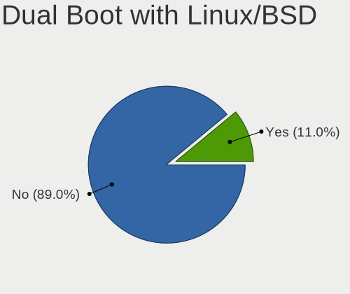

| Dual boot | Computers | Percent |
|-----------|-----------|---------|
| No        | 1584      | 89.64%  |
| Yes       | 183       | 10.36%  |

Dual Boot (Win)
---------------

Hosting Linux and Windows

| Dual boot | Computers | Percent |
|-----------|-----------|---------|
| No        | 1425      | 80.83%  |
| Yes       | 338       | 19.17%  |

Board
-----

Vendor
------

Motherboard manufacturer

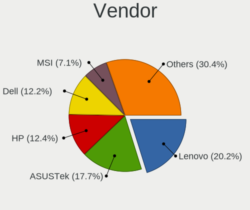

| Name                | Computers | Percent |
|---------------------|-----------|---------|
| Lenovo              | 347       | 19.76%  |
| ASUSTek Computer    | 319       | 18.17%  |
| Dell                | 220       | 12.53%  |
| Hewlett-Packard     | 208       | 11.85%  |
| MSI                 | 126       | 7.18%   |
| Gigabyte Technology | 89        | 5.07%   |
| Acer                | 86        | 4.9%    |
| ASRock              | 53        | 3.02%   |
| HUAWEI              | 37        | 2.11%   |
| Apple               | 25        | 1.42%   |
| Intel               | 23        | 1.31%   |
| Samsung Electronics | 19        | 1.08%   |
| Microsoft           | 14        | 0.8%    |
| Toshiba             | 13        | 0.74%   |
| Google              | 13        | 0.74%   |
| Timi                | 12        | 0.68%   |
| TUXEDO              | 8         | 0.46%   |
| Unknown             | 7         | 0.4%    |
| HONOR               | 6         | 0.34%   |
| Fujitsu             | 6         | 0.34%   |
| System76            | 5         | 0.28%   |
| Pegatron            | 5         | 0.28%   |
| GPD                 | 5         | 0.28%   |
| Alienware           | 5         | 0.28%   |
| Schenker            | 4         | 0.23%   |
| Notebook            | 4         | 0.23%   |
| Huanan              | 4         | 0.23%   |
| Framework           | 4         | 0.23%   |
| Chuwi               | 4         | 0.23%   |
| AZW                 | 4         | 0.23%   |
| Positivo            | 3         | 0.17%   |
| LG Electronics      | 3         | 0.17%   |
| Dynabook            | 3         | 0.17%   |
| BESSTAR Tech        | 3         | 0.17%   |
| TECNO               | 2         | 0.11%   |
| Supermicro          | 2         | 0.11%   |
| Standard            | 2         | 0.11%   |
| Sony                | 2         | 0.11%   |
| SLIMBOOK            | 2         | 0.11%   |
| PINE64              | 2         | 0.11%   |

Model
-----

Motherboard model

| Name                                        | Computers | Percent |
|---------------------------------------------|-----------|---------|
| ASUS All Series                             | 16        | 0.91%   |
| Unknown                                     | 10        | 0.57%   |
| Dell OptiPlex 7010                          | 7         | 0.4%    |
| HUAWEI CREM-WXX9                            | 6         | 0.34%   |
| ASUS TUF Gaming X570-PLUS                   | 6         | 0.34%   |
| MSI MS-7C37                                 | 5         | 0.28%   |
| Lenovo ThinkBook 15 G3 ACL 21A4             | 5         | 0.28%   |
| HP Notebook                                 | 5         | 0.28%   |
| Dell XPS 13 7390                            | 5         | 0.28%   |
| ASUS TUF Gaming B550M-PLUS                  | 5         | 0.28%   |
| MSI MS-7C84                                 | 4         | 0.23%   |
| MSI MS-7C56                                 | 4         | 0.23%   |
| MSI MS-7C02                                 | 4         | 0.23%   |
| MSI MS-7A38                                 | 4         | 0.23%   |
| Lenovo IdeaPadFlex 5 14ARE05 81X2           | 4         | 0.23%   |
| Lenovo IdeaPad 330-15IKB 81DE               | 4         | 0.23%   |
| HUAWEI MACH-WX9                             | 4         | 0.23%   |
| HP OMEN by Laptop 16-c0xxx                  | 4         | 0.23%   |
| HP ENVY x360 Convertible 13-ay0xxx          | 4         | 0.23%   |
| Dell XPS 13 9310                            | 4         | 0.23%   |
| Dell Latitude 5420                          | 4         | 0.23%   |
| Dell Inspiron 5566                          | 4         | 0.23%   |
| ASUS VivoBook_ASUSLaptop X515EA_X515EA      | 4         | 0.23%   |
| ASUS ROG STRIX B450-F GAMING                | 4         | 0.23%   |
| ASUS ProArt Z690-CREATOR WIFI               | 4         | 0.23%   |
| ASUS ProArt X670E-CREATOR WIFI              | 4         | 0.23%   |
| ASUS PRIME B450M-A II                       | 4         | 0.23%   |
| MSI MS-7C94                                 | 3         | 0.17%   |
| MSI MS-7C91                                 | 3         | 0.17%   |
| MSI MS-7C52                                 | 3         | 0.17%   |
| MSI MS-7B89                                 | 3         | 0.17%   |
| MSI Modern 14 B11MOU                        | 3         | 0.17%   |
| Microsoft Surface Go 3                      | 3         | 0.17%   |
| Lenovo Yoga 9 14IAP7 82LU                   | 3         | 0.17%   |
| Lenovo ThinkPad X1 Carbon Gen 10 21CBCTO1WW | 3         | 0.17%   |
| Lenovo Legion 5 15ACH6H 82JU                | 3         | 0.17%   |
| Lenovo IdeaPad L340-15IRH Gaming 81LK       | 3         | 0.17%   |
| Lenovo IdeaPad 5 Pro 16ACH6 82L5            | 3         | 0.17%   |
| Intel NUC8i7BEH                             | 3         | 0.17%   |
| HUAWEI KLVL-WXX9                            | 3         | 0.17%   |

Model Family
------------

Motherboard model prefix

| Name               | Computers | Percent |
|--------------------|-----------|---------|
| Lenovo ThinkPad    | 191       | 10.88%  |
| Dell Latitude      | 66        | 3.76%   |
| Dell Inspiron      | 63        | 3.59%   |
| ASUS ROG           | 63        | 3.59%   |
| Lenovo IdeaPad     | 56        | 3.19%   |
| Acer Aspire        | 46        | 2.62%   |
| ASUS PRIME         | 44        | 2.51%   |
| HP Pavilion        | 39        | 2.22%   |
| ASUS VivoBook      | 38        | 2.16%   |
| Dell XPS           | 35        | 1.99%   |
| HP EliteBook       | 33        | 1.88%   |
| ASUS TUF           | 30        | 1.71%   |
| Lenovo ThinkBook   | 26        | 1.48%   |
| HP Laptop          | 25        | 1.42%   |
| HP ENVY            | 22        | 1.25%   |
| ASUS ASUS          | 21        | 1.2%    |
| Lenovo Yoga        | 20        | 1.14%   |
| HP ProBook         | 20        | 1.14%   |
| Dell OptiPlex      | 19        | 1.08%   |
| ASUS ZenBook       | 19        | 1.08%   |
| ASUS All           | 16        | 0.91%   |
| Lenovo Legion      | 15        | 0.85%   |
| Dell Precision     | 15        | 0.85%   |
| Acer Nitro         | 15        | 0.85%   |
| Microsoft Surface  | 14        | 0.8%    |
| Toshiba Satellite  | 12        | 0.68%   |
| Dell Vostro        | 11        | 0.63%   |
| Lenovo ThinkCentre | 10        | 0.57%   |
| Unknown            | 10        | 0.57%   |
| HP ZBook           | 9         | 0.51%   |
| HP OMEN            | 9         | 0.51%   |
| MSI Modern         | 8         | 0.46%   |
| ASUS ProArt        | 8         | 0.46%   |
| Gigabyte X570      | 7         | 0.4%    |
| Acer Predator      | 7         | 0.4%    |
| Lenovo IdeaPadFlex | 6         | 0.34%   |
| HUAWEI CREM-WXX9   | 6         | 0.34%   |
| HP 250             | 6         | 0.34%   |
| Gigabyte B550      | 6         | 0.34%   |
| Acer Swift         | 6         | 0.34%   |

MFG Year
--------

Motherboard manufacture year

| Year    | Computers | Percent |
|---------|-----------|---------|
| 2021    | 286       | 16.29%  |
| 2020    | 260       | 14.81%  |
| 2022    | 259       | 14.75%  |
| 2019    | 199       | 11.33%  |
| 2018    | 171       | 9.74%   |
| 2017    | 124       | 7.06%   |
| 2012    | 77        | 4.38%   |
| 2013    | 70        | 3.99%   |
| 2015    | 66        | 3.76%   |
| 2014    | 63        | 3.59%   |
| 2016    | 60        | 3.42%   |
| 2011    | 35        | 1.99%   |
| 2010    | 29        | 1.65%   |
| 2008    | 18        | 1.03%   |
| 2009    | 15        | 0.85%   |
| 2023    | 10        | 0.57%   |
| 2006    | 6         | 0.34%   |
| 2007    | 5         | 0.28%   |
| Unknown | 3         | 0.17%   |

Form Factor
-----------

Physical design of the computer

| Name           | Computers | Percent |
|----------------|-----------|---------|
| Notebook       | 1056      | 60.14%  |
| Desktop        | 526       | 29.95%  |
| Convertible    | 99        | 5.64%   |
| Tablet         | 28        | 1.59%   |
| Mini pc        | 24        | 1.37%   |
| All in one     | 11        | 0.63%   |
| System on chip | 6         | 0.34%   |
| Server         | 6         | 0.34%   |

Secure Boot
-----------

Enabled or disabled

| State    | Computers | Percent |
|----------|-----------|---------|
| Disabled | 1356      | 76.74%  |
| Enabled  | 411       | 23.26%  |

Coreboot
--------

Have coreboot on board

| Used | Computers | Percent |
|------|-----------|---------|
| No   | 1741      | 99.15%  |
| Yes  | 15        | 0.85%   |

RAM Size
--------

Total RAM memory

| Size in GB      | Computers | Percent |
|-----------------|-----------|---------|
| 16.01-24.0      | 445       | 25.24%  |
| 4.01-8.0        | 371       | 21.04%  |
| 8.01-16.0       | 347       | 19.68%  |
| 32.01-64.0      | 300       | 17.02%  |
| 3.01-4.0        | 121       | 6.86%   |
| 64.01-256.0     | 82        | 4.65%   |
| 24.01-32.0      | 67        | 3.8%    |
| 1.01-2.0        | 23        | 1.3%    |
| 2.01-3.0        | 4         | 0.23%   |
| More than 256.0 | 3         | 0.17%   |

RAM Used
--------

Used RAM memory

| Used GB    | Computers | Percent |
|------------|-----------|---------|
| 4.01-8.0   | 651       | 34.94%  |
| 3.01-4.0   | 416       | 22.33%  |
| 2.01-3.0   | 410       | 22.01%  |
| 8.01-16.0  | 168       | 9.02%   |
| 1.01-2.0   | 164       | 8.8%    |
| 0.51-1.0   | 22        | 1.18%   |
| 16.01-24.0 | 18        | 0.97%   |
| 24.01-32.0 | 6         | 0.32%   |
| 32.01-64.0 | 5         | 0.27%   |
| 0.01-0.5   | 3         | 0.16%   |

Total Drives
------------

Number of drives on board

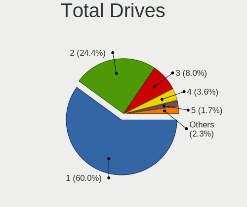

| Drives | Computers | Percent |
|--------|-----------|---------|
| 1      | 1062      | 59.9%   |
| 2      | 437       | 24.65%  |
| 3      | 138       | 7.78%   |
| 4      | 67        | 3.78%   |
| 5      | 30        | 1.69%   |
| 6      | 13        | 0.73%   |
| 0      | 10        | 0.56%   |
| 7      | 5         | 0.28%   |
| 9      | 3         | 0.17%   |
| 8      | 3         | 0.17%   |
| 18     | 1         | 0.06%   |
| 17     | 1         | 0.06%   |
| 15     | 1         | 0.06%   |
| 12     | 1         | 0.06%   |
| 10     | 1         | 0.06%   |

Has CD-ROM
----------

Has CD-ROM on board

| Presented | Computers | Percent |
|-----------|-----------|---------|
| No        | 1463      | 83.22%  |
| Yes       | 295       | 16.78%  |

Has Ethernet
------------

Has Ethernet on board

| Presented | Computers | Percent |
|-----------|-----------|---------|
| Yes       | 1305      | 74.23%  |
| No        | 453       | 25.77%  |

Has WiFi
--------

Has WiFi module

| Presented | Computers | Percent |
|-----------|-----------|---------|
| Yes       | 1459      | 82.9%   |
| No        | 301       | 17.1%   |

Has Bluetooth
-------------

Has Bluetooth module

| Presented | Computers | Percent |
|-----------|-----------|---------|
| Yes       | 1336      | 75.65%  |
| No        | 430       | 24.35%  |

Location
--------

Country
-------

Geographic location (country)

| Country      | Computers | Percent |
|--------------|-----------|---------|
| USA          | 310       | 17.58%  |
| Germany      | 148       | 8.39%   |
| Russia       | 130       | 7.37%   |
| Brazil       | 111       | 6.3%    |
| Italy        | 89        | 5.05%   |
| France       | 63        | 3.57%   |
| Poland       | 62        | 3.52%   |
| UK           | 56        | 3.18%   |
| India        | 55        | 3.12%   |
| Canada       | 54        | 3.06%   |
| Spain        | 45        | 2.55%   |
| Australia    | 44        | 2.5%    |
| Netherlands  | 40        | 2.27%   |
| Austria      | 32        | 1.82%   |
| Turkey       | 31        | 1.76%   |
| Sweden       | 26        | 1.47%   |
| Czechia      | 20        | 1.13%   |
| Switzerland  | 19        | 1.08%   |
| Mexico       | 19        | 1.08%   |
| Indonesia    | 14        | 0.79%   |
| Hungary      | 14        | 0.79%   |
| Belgium      | 14        | 0.79%   |
| Taiwan       | 13        | 0.74%   |
| Finland      | 13        | 0.74%   |
| Romania      | 12        | 0.68%   |
| Portugal     | 12        | 0.68%   |
| Norway       | 12        | 0.68%   |
| Argentina    | 12        | 0.68%   |
| Vietnam      | 11        | 0.62%   |
| Thailand     | 11        | 0.62%   |
| Israel       | 11        | 0.62%   |
| Chile        | 11        | 0.62%   |
| Colombia     | 10        | 0.57%   |
| South Africa | 9         | 0.51%   |
| New Zealand  | 9         | 0.51%   |
| Denmark      | 9         | 0.51%   |
| Serbia       | 8         | 0.45%   |
| Japan        | 8         | 0.45%   |
| Ireland      | 8         | 0.45%   |
| Greece       | 8         | 0.45%   |

City
----

Geographic location (city)

| City              | Computers | Percent |
|-------------------|-----------|---------|
| Moscow            | 36        | 1.99%   |
| Berlin            | 18        | 0.99%   |
| Vienna            | 17        | 0.94%   |
| Sydney            | 17        | 0.94%   |
| St Petersburg     | 16        | 0.88%   |
| Madrid            | 14        | 0.77%   |
| London            | 14        | 0.77%   |
| Warsaw            | 13        | 0.72%   |
| Sao Paulo         | 13        | 0.72%   |
| Istanbul          | 12        | 0.66%   |
| Frankfurt am Main | 11        | 0.61%   |
| Milan             | 10        | 0.55%   |
| Melbourne         | 10        | 0.55%   |
| Budapest          | 9         | 0.5%    |
| Prague            | 8         | 0.44%   |
| Paris             | 8         | 0.44%   |
| Helsinki          | 8         | 0.44%   |
| Bengaluru         | 8         | 0.44%   |
| Amsterdam         | 8         | 0.44%   |
| Zurich            | 7         | 0.39%   |
| Porto Alegre      | 7         | 0.39%   |
| New Taipei        | 7         | 0.39%   |
| Munich            | 7         | 0.39%   |
| Montreal          | 7         | 0.39%   |
| Bangkok           | 7         | 0.39%   |
| Yekaterinburg     | 6         | 0.33%   |
| Wroclaw           | 6         | 0.33%   |
| Portland          | 6         | 0.33%   |
| Palmas            | 6         | 0.33%   |
| Jakarta           | 6         | 0.33%   |
| Izmir             | 6         | 0.33%   |
| Ho Chi Minh City  | 6         | 0.33%   |
| Brisbane          | 6         | 0.33%   |
| Bogot           | 6         | 0.33%   |
| Auckland          | 6         | 0.33%   |
| Atlanta           | 6         | 0.33%   |
| Stockholm         | 5         | 0.28%   |
| Singapore         | 5         | 0.28%   |
| Santiago          | 5         | 0.28%   |
| Riga              | 5         | 0.28%   |

Drives
------

Drive Vendor
------------

Hard drive vendors

| Vendor                      | Computers | Drives | Percent |
|-----------------------------|-----------|--------|---------|
| Samsung Electronics         | 571       | 782    | 21.98%  |
| WDC                         | 294       | 437    | 11.32%  |
| Seagate                     | 226       | 294    | 8.7%    |
| Sandisk                     | 195       | 237    | 7.51%   |
| Kingston                    | 148       | 179    | 5.7%    |
| Toshiba                     | 128       | 152    | 4.93%   |
| SK hynix                    | 120       | 131    | 4.62%   |
| Crucial                     | 110       | 132    | 4.23%   |
| Intel                       | 86        | 108    | 3.31%   |
| Unknown                     | 84        | 101    | 3.23%   |
| Micron Technology           | 78        | 91     | 3%      |
| KIOXIA                      | 51        | 61     | 1.96%   |
| Phison Electronics          | 38        | 45     | 1.46%   |
| HGST                        | 32        | 47     | 1.23%   |
| A-DATA Technology           | 28        | 29     | 1.08%   |
| Micron/Crucial Technology   | 27        | 31     | 1.04%   |
| Hitachi                     | 22        | 27     | 0.85%   |
| China                       | 22        | 29     | 0.85%   |
| Kingston Technology Company | 15        | 15     | 0.58%   |
| Apple                       | 15        | 24     | 0.58%   |
| ADATA Technology            | 15        | 16     | 0.58%   |
| PNY                         | 14        | 16     | 0.54%   |
| SPCC                        | 12        | 15     | 0.46%   |
| LITEON                      | 12        | 12     | 0.46%   |
| Realtek Semiconductor       | 11        | 11     | 0.42%   |
| Corsair                     | 11        | 15     | 0.42%   |
| Apacer                      | 11        | 16     | 0.42%   |
| Silicon Motion              | 10        | 11     | 0.38%   |
| Phison                      | 10        | 10     | 0.38%   |
| Netac                       | 10        | 14     | 0.38%   |
| Unknown                     | 10        | 12     | 0.38%   |
| JMicron Technology          | 8         | 11     | 0.31%   |
| UMIS                        | 7         | 7      | 0.27%   |
| Intenso                     | 7         | 8      | 0.27%   |
| Lexar                       | 6         | 7      | 0.23%   |
| Transcend                   | 5         | 5      | 0.19%   |
| Patriot                     | 5         | 5      | 0.19%   |
| Lenovo                      | 5         | 5      | 0.19%   |
| HS-SSD-E100                 | 5         | 5      | 0.19%   |
| Gigabyte Technology         | 5         | 6      | 0.19%   |

Drive Model
-----------

Hard drive models

| Model                                               | Computers | Percent |
|-----------------------------------------------------|-----------|---------|
| Samsung NVMe SSD Controller SM981/PM981/PM983 250GB | 101       | 3.56%   |
| Samsung NVMe SSD Controller PM9A1/PM9A3/980PRO 1TB  | 51        | 1.8%    |
| Kingston SA400S37240G 240GB SSD                     | 32        | 1.13%   |
| Sandisk WD Black SN750 / PC SN730 NVMe SSD 1TB      | 24        | 0.85%   |
| Seagate ST2000DM008-2FR102 2TB                      | 22        | 0.78%   |
| Crucial CT1000MX500SSD1 1TB                         | 21        | 0.74%   |
| Samsung SSD 850 EVO 250GB                           | 20        | 0.71%   |
| Seagate ST1000LM035-1RK172 1TB                      | 19        | 0.67%   |
| Toshiba MQ04ABF100 1TB                              | 18        | 0.63%   |
| Micron/Crucial P2 NVMe PCIe SSD 1TB                 | 18        | 0.63%   |
| Kingston SA400S37480G 480GB SSD                     | 18        | 0.63%   |
| Kingston SA400S37120G 120GB SSD                     | 18        | 0.63%   |
| Sandisk WD Blue SN550 NVMe SSD 256GB                | 17        | 0.6%    |
| Samsung SSD 860 EVO 500GB                           | 17        | 0.6%    |
| Samsung SSD 870 EVO 500GB                           | 16        | 0.56%   |
| Phison E12 NVMe Controller 256GB                    | 16        | 0.56%   |
| Crucial CT240BX500SSD1 240GB                        | 16        | 0.56%   |
| Unknown MMC Card  32GB                              | 15        | 0.53%   |
| Intel SSDPEKNU512GZ 512GB                           | 15        | 0.53%   |
| Intel SSD 660P Series 512GB                         | 15        | 0.53%   |
| Samsung SSD 860 EVO 250GB                           | 14        | 0.49%   |
| Samsung SSD 850 EVO 500GB                           | 14        | 0.49%   |
| Samsung NVMe SSD Controller SM961/PM961/SM963 256GB | 14        | 0.49%   |
| Seagate ST1000DM010-2EP102 1TB                      | 13        | 0.46%   |
| Samsung SSD 980 PRO 1TB                             | 13        | 0.46%   |
| Samsung SSD 970 EVO Plus 500GB                      | 13        | 0.46%   |
| Unknown MMC Card  64GB                              | 12        | 0.42%   |
| Unknown MMC Card  128GB                             | 12        | 0.42%   |
| Seagate ST500DM002-1BD142 500GB                     | 12        | 0.42%   |
| Samsung SSD 980 1TB                                 | 12        | 0.42%   |
| Samsung SSD 870 EVO 1TB                             | 12        | 0.42%   |
| WDC WD10EZEX-08WN4A0 1TB                            | 11        | 0.39%   |
| Sandisk WD Blue SN500 / PC SN520 NVMe SSD 512GB     | 11        | 0.39%   |
| Samsung SSD 970 EVO Plus 2TB                        | 11        | 0.39%   |
| Phison PS5013 E13 NVMe Controller 256GB             | 11        | 0.39%   |
| HGST HTS721010A9E630 1TB                            | 11        | 0.39%   |
| WDC WDS500G2B0A-00SM50 500GB SSD                    | 10        | 0.35%   |
| Sandisk WD Black SN850 1TB                          | 10        | 0.35%   |
| Samsung SSD 970 EVO Plus 1TB                        | 10        | 0.35%   |
| Samsung SSD 860 EVO 1TB                             | 10        | 0.35%   |

HDD Vendor
----------

Hard disk drive vendors

| Vendor              | Computers | Drives | Percent |
|---------------------|-----------|--------|---------|
| Seagate             | 222       | 288    | 37.88%  |
| WDC                 | 189       | 299    | 32.25%  |
| Toshiba             | 84        | 97     | 14.33%  |
| HGST                | 32        | 47     | 5.46%   |
| Hitachi             | 22        | 27     | 3.75%   |
| Samsung Electronics | 12        | 15     | 2.05%   |
| Unknown             | 5         | 7      | 0.85%   |
| SABRENT             | 4         | 4      | 0.68%   |
| ASMT                | 3         | 4      | 0.51%   |
| Maxtor              | 2         | 2      | 0.34%   |
| Intenso             | 2         | 2      | 0.34%   |
| USB3.0              | 1         | 1      | 0.17%   |
| JMicron Technology  | 1         | 3      | 0.17%   |
| Inateck             | 1         | 1      | 0.17%   |
| IET                 | 1         | 1      | 0.17%   |
| HGST HTS            | 1         | 1      | 0.17%   |
| Hewlett-Packard     | 1         | 12     | 0.17%   |
| Fujitsu             | 1         | 1      | 0.17%   |
| External            | 1         | 1      | 0.17%   |
| Apple               | 1         | 1      | 0.17%   |

SSD Vendor
----------

Solid state drive vendors

| Vendor              | Computers | Drives | Percent |
|---------------------|-----------|--------|---------|
| Samsung Electronics | 188       | 252    | 25.3%   |
| Kingston            | 103       | 120    | 13.86%  |
| Crucial             | 96        | 116    | 12.92%  |
| SanDisk             | 61        | 67     | 8.21%   |
| WDC                 | 52        | 60     | 7%      |
| China               | 22        | 29     | 2.96%   |
| SK hynix            | 17        | 17     | 2.29%   |
| Micron Technology   | 15        | 16     | 2.02%   |
| A-DATA Technology   | 15        | 15     | 2.02%   |
| PNY                 | 13        | 15     | 1.75%   |
| Intel               | 13        | 16     | 1.75%   |
| Toshiba             | 12        | 14     | 1.62%   |
| LITEON              | 10        | 10     | 1.35%   |
| Apple               | 9         | 10     | 1.21%   |
| Apacer              | 9         | 13     | 1.21%   |
| SPCC                | 7         | 9      | 0.94%   |
| Netac               | 7         | 10     | 0.94%   |
| Corsair             | 7         | 9      | 0.94%   |
| Patriot             | 5         | 5      | 0.67%   |
| Lexar               | 5         | 6      | 0.67%   |
| Intenso             | 5         | 5      | 0.67%   |
| GOODRAM             | 4         | 6      | 0.54%   |
| Gigabyte Technology | 4         | 5      | 0.54%   |
| Transcend           | 3         | 3      | 0.4%    |
| Plextor             | 3         | 3      | 0.4%    |
| KingSpec            | 3         | 4      | 0.4%    |
| JMicron Technology  | 3         | 3      | 0.4%    |
| Unknown             | 2         | 2      | 0.27%   |
| Team                | 2         | 3      | 0.27%   |
| OCZ                 | 2         | 2      | 0.27%   |
| Mushkin             | 2         | 2      | 0.27%   |
| LT                  | 2         | 2      | 0.27%   |
| LITEONIT            | 2         | 2      | 0.27%   |
| KIOXIA-EXCERIA      | 2         | 2      | 0.27%   |
| KingFast            | 2         | 2      | 0.27%   |
| KingDian            | 2         | 2      | 0.27%   |
| HS-SSD-C100         | 2         | 2      | 0.27%   |
| FORESEE             | 2         | 2      | 0.27%   |
| Unknown             | 2         | 2      | 0.27%   |
| XSTAR               | 1         | 1      | 0.13%   |

Drive Kind
----------

HDD or SSD

| Kind    | Computers | Drives | Percent |
|---------|-----------|--------|---------|
| NVMe    | 1115      | 1468   | 46.83%  |
| SSD     | 656       | 895    | 27.55%  |
| HDD     | 492       | 814    | 20.66%  |
| MMC     | 78        | 89     | 3.28%   |
| Unknown | 40        | 46     | 1.68%   |

Drive Connector
---------------

SATA, SAS, NVMe, etc.

| Type | Computers | Drives | Percent |
|------|-----------|--------|---------|
| NVMe | 1113      | 1462   | 51.29%  |
| SATA | 889       | 1644   | 40.97%  |
| SAS  | 90        | 117    | 4.15%   |
| MMC  | 78        | 89     | 3.59%   |

Drive Size
----------

Size of hard drive

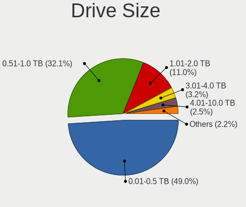

| Size in TB      | Computers | Drives | Percent |
|-----------------|-----------|--------|---------|
| 0.01-0.5        | 609       | 841    | 50.25%  |
| 0.51-1.0        | 372       | 510    | 30.69%  |
| 1.01-2.0        | 129       | 168    | 10.64%  |
| 3.01-4.0        | 39        | 64     | 3.22%   |
| 4.01-10.0       | 33        | 54     | 2.72%   |
| 2.01-3.0        | 25        | 48     | 2.06%   |
| 10.01-20.0      | 4         | 23     | 0.33%   |
| More than 100.0 | 1         | 1      | 0.08%   |

Space Total
-----------

Amount of disk space available on the file system

| Size in GB     | Computers | Percent |
|----------------|-----------|---------|
| 501-1000       | 377       | 21.13%  |
| 251-500        | 321       | 17.99%  |
| 1001-2000      | 266       | 14.91%  |
| 101-250        | 203       | 11.38%  |
| 1-20           | 190       | 10.65%  |
| Unknown        | 151       | 8.46%   |
| More than 3000 | 127       | 7.12%   |
| 2001-3000      | 77        | 4.32%   |
| 51-100         | 43        | 2.41%   |
| 21-50          | 29        | 1.63%   |

Space Used
----------

Amount of used disk space

| Used GB        | Computers | Percent |
|----------------|-----------|---------|
| 1-20           | 475       | 25.94%  |
| 21-50          | 272       | 14.86%  |
| 101-250        | 249       | 13.6%   |
| 51-100         | 204       | 11.14%  |
| 251-500        | 178       | 9.72%   |
| 501-1000       | 162       | 8.85%   |
| Unknown        | 151       | 8.25%   |
| 1001-2000      | 83        | 4.53%   |
| More than 3000 | 33        | 1.8%    |
| 2001-3000      | 24        | 1.31%   |

Malfunc. Drives
---------------

Drive models with a malfunction

| Model                                 | Computers | Drives | Percent |
|---------------------------------------|-----------|--------|---------|
| Samsung Electronics SSD 870 EVO 1TB   | 4         | 4      | 3.48%   |
| WDC WDS240G2G0B-00EPW0 240GB SSD      | 2         | 2      | 1.74%   |
| WDC WD5000AAKX-603CA0 500GB           | 2         | 2      | 1.74%   |
| WDC WD10EZEX-00BN5A0 1TB              | 2         | 2      | 1.74%   |
| Seagate ST500DM002-1BD142 500GB       | 2         | 2      | 1.74%   |
| Samsung Electronics SSD 980 1TB       | 2         | 2      | 1.74%   |
| Samsung Electronics SSD 870 EVO 500GB | 2         | 3      | 1.74%   |
| Intel SSDSC2CT120A3 120GB             | 2         | 5      | 1.74%   |
| HGST HTS721010A9E630 1TB              | 2         | 2      | 1.74%   |
| WDC WDS480G2G0A-00JH30 480GB SSD      | 1         | 1      | 0.87%   |
| WDC WD50EFRX-68MYMN1 5TB              | 1         | 4      | 0.87%   |
| WDC WD5000LPVX-22V0TT0 500GB          | 1         | 1      | 0.87%   |
| WDC WD5000AVVS-63H0B1 500GB           | 1         | 1      | 0.87%   |
| WDC WD5000AAKX-60U6AA0 500GB          | 1         | 1      | 0.87%   |
| WDC WD5000AAKX-00ERMA0 500GB          | 1         | 1      | 0.87%   |
| WDC WD40PURZ-85AKKY0 4TB              | 1         | 1      | 0.87%   |
| WDC WD40EZRZ-00WN9B0 4TB              | 1         | 1      | 0.87%   |
| WDC WD3200BPVT-80JJ5T0 320GB          | 1         | 1      | 0.87%   |
| WDC WD3200AAKS-00V1A0 320GB           | 1         | 1      | 0.87%   |
| WDC WD3200AAKS-00UU3A0 320GB          | 1         | 1      | 0.87%   |
| WDC WD30EFRX-68AX9N0 3TB              | 1         | 1      | 0.87%   |
| WDC WD2500BEVT-80A23T0 250GB          | 1         | 1      | 0.87%   |
| WDC WD20EZRX-22D8PB0 2TB              | 1         | 1      | 0.87%   |
| WDC WD20EZRX-00D8PB0 2TB              | 1         | 1      | 0.87%   |
| WDC WD15EARS-00MVWB0 1TB              | 1         | 1      | 0.87%   |
| WDC WD140EDFZ-11A0VA0 14TB            | 1         | 2      | 0.87%   |
| WDC WD10JPVX-60JC3T1 1TB              | 1         | 1      | 0.87%   |
| WDC WD10EZEX-60WN4A0 1TB              | 1         | 2      | 0.87%   |
| WDC WD10EZEX-08WN4A0 1TB              | 1         | 1      | 0.87%   |
| WDC WD10EZEX-00WN4A0 1TB              | 1         | 1      | 0.87%   |
| WDC WD10EFRX-68FYTN0 1TB              | 1         | 1      | 0.87%   |
| WDC WD10EADS-00L5B1 1TB               | 1         | 1      | 0.87%   |
| WDC WD1002FAEX-00Y9A0 1TB             | 1         | 1      | 0.87%   |
| Toshiba MQ01ABD075 752GB              | 1         | 1      | 0.87%   |
| Toshiba MQ01ABD050 500GB              | 1         | 1      | 0.87%   |
| Toshiba MK7559GSXP 752GB              | 1         | 1      | 0.87%   |
| Toshiba MK5061GSY 500GB               | 1         | 1      | 0.87%   |
| Toshiba MK3265GSX 320GB               | 1         | 1      | 0.87%   |
| Toshiba MK3263GSX 320GB               | 1         | 1      | 0.87%   |
| Toshiba MK1237GSX 120GB               | 1         | 1      | 0.87%   |

Malfunc. Drive Vendor
---------------------

Vendors of faulty drives

| Vendor              | Computers | Drives | Percent |
|---------------------|-----------|--------|---------|
| WDC                 | 28        | 35     | 25.69%  |
| Seagate             | 28        | 38     | 25.69%  |
| Samsung Electronics | 13        | 18     | 11.93%  |
| Toshiba             | 8         | 8      | 7.34%   |
| Crucial             | 5         | 5      | 4.59%   |
| SK hynix            | 4         | 4      | 3.67%   |
| Micron Technology   | 3         | 3      | 2.75%   |
| Intel               | 3         | 6      | 2.75%   |
| HGST                | 3         | 3      | 2.75%   |
| Kingston            | 2         | 2      | 1.83%   |
| Hitachi             | 2         | 2      | 1.83%   |
| Corsair             | 2         | 2      | 1.83%   |
| SPCC                | 1         | 1      | 0.92%   |
| SanDisk             | 1         | 1      | 0.92%   |
| Maxtor              | 1         | 1      | 0.92%   |
| HGST HTS            | 1         | 1      | 0.92%   |
| Apple               | 1         | 1      | 0.92%   |
| AMD                 | 1         | 2      | 0.92%   |
| A-DATA Technology   | 1         | 1      | 0.92%   |
| Unknown             | 1         | 1      | 0.92%   |

Malfunc. HDD Vendor
-------------------

Vendors of faulty HDD drives

| Vendor              | Computers | Drives | Percent |
|---------------------|-----------|--------|---------|
| Seagate             | 28        | 38     | 38.89%  |
| WDC                 | 25        | 32     | 34.72%  |
| Toshiba             | 7         | 7      | 9.72%   |
| Samsung Electronics | 5         | 8      | 6.94%   |
| HGST                | 3         | 3      | 4.17%   |
| Hitachi             | 2         | 2      | 2.78%   |
| Maxtor              | 1         | 1      | 1.39%   |
| HGST HTS            | 1         | 1      | 1.39%   |

Malfunc. Drive Kind
-------------------

Kinds of faulty drives

| Kind | Computers | Drives | Percent |
|------|-----------|--------|---------|
| HDD  | 66        | 92     | 64.08%  |
| SSD  | 31        | 37     | 30.1%   |
| NVMe | 6         | 6      | 5.83%   |

Failed Drives
-------------

Failed drive models

| Model                                            | Computers | Drives | Percent |
|--------------------------------------------------|-----------|--------|---------|
| SPCC M.2 PCIe SSD 2TB                            | 1         | 1      | 25%     |
| Seagate ST31000528AS 1TB                         | 1         | 1      | 25%     |
| Samsung Electronics SSD 980 1TB                  | 1         | 1      | 25%     |
| Samsung Electronics MZNTY128HDHP-00000 128GB SSD | 1         | 1      | 25%     |

Failed Drive Vendor
-------------------

Failed drive vendors

| Vendor              | Computers | Drives | Percent |
|---------------------|-----------|--------|---------|
| Samsung Electronics | 2         | 2      | 50%     |
| SPCC                | 1         | 1      | 25%     |
| Seagate             | 1         | 1      | 25%     |

Drive Status
------------

Number of failed and malfunc. drives

| Status   | Computers | Drives | Percent |
|----------|-----------|--------|---------|
| Detected | 1021      | 1880   | 53.65%  |
| Works    | 780       | 1293   | 40.99%  |
| Malfunc  | 98        | 135    | 5.15%   |
| Failed   | 4         | 4      | 0.21%   |

Storage controller
------------------

Storage Vendor
--------------

Storage controller vendors

| Vendor                         | Computers | Percent |
|--------------------------------|-----------|---------|
| Intel                          | 917       | 36.65%  |
| Samsung Electronics            | 416       | 16.63%  |
| AMD                            | 367       | 14.67%  |
| SanDisk                        | 200       | 7.99%   |
| SK hynix                       | 103       | 4.12%   |
| Kingston Technology Company    | 65        | 2.6%    |
| Micron Technology              | 64        | 2.56%   |
| Phison Electronics             | 57        | 2.28%   |
| KIOXIA                         | 46        | 1.84%   |
| Toshiba America Info Systems   | 40        | 1.6%    |
| Micron/Crucial Technology      | 39        | 1.56%   |
| ASMedia Technology             | 38        | 1.52%   |
| ADATA Technology               | 28        | 1.12%   |
| Marvell Technology Group       | 17        | 0.68%   |
| Silicon Motion                 | 15        | 0.6%    |
| Realtek Semiconductor          | 14        | 0.56%   |
| Union Memory (Shenzhen)        | 10        | 0.4%    |
| Solid State Storage Technology | 6         | 0.24%   |
| Shenzhen Longsys Electronics   | 6         | 0.24%   |
| Nvidia                         | 6         | 0.24%   |
| MAXIO Technology (Hangzhou)    | 6         | 0.24%   |
| Lite-On Technology             | 6         | 0.24%   |
| JMicron Technology             | 5         | 0.2%    |
| Yangtze Memory Technologies    | 4         | 0.16%   |
| Lenovo                         | 4         | 0.16%   |
| Broadcom / LSI                 | 4         | 0.16%   |
| Biwin Storage Technology       | 3         | 0.12%   |
| Apple                          | 3         | 0.12%   |
| VIA Technologies               | 2         | 0.08%   |
| Netac Technology               | 2         | 0.08%   |
| LSI Logic / Symbios Logic      | 2         | 0.08%   |
| ULi Electronics                | 1         | 0.04%   |
| Transcend                      | 1         | 0.04%   |
| Solidigm                       | 1         | 0.04%   |
| Silicon Image                  | 1         | 0.04%   |
| Seagate Technology             | 1         | 0.04%   |
| Hewlett-Packard                | 1         | 0.04%   |
| Adaptec                        | 1         | 0.04%   |

Storage Model
-------------

Storage controller models

| Model                                                                          | Computers | Percent |
|--------------------------------------------------------------------------------|-----------|---------|
| AMD FCH SATA Controller [AHCI mode]                                            | 265       | 9.74%   |
| Samsung NVMe SSD Controller SM981/PM981/PM983                                  | 180       | 6.61%   |
| Intel Volume Management Device NVMe RAID Controller                            | 116       | 4.26%   |
| Samsung NVMe SSD Controller PM9A1/PM9A3/980PRO                                 | 106       | 3.89%   |
| Samsung NVMe SSD Controller 980                                                | 100       | 3.67%   |
| Intel Sunrise Point-LP SATA Controller [AHCI mode]                             | 97        | 3.56%   |
| Micron NVMe Storage Controller                                                 | 62        | 2.28%   |
| Intel 82801 Mobile SATA Controller [RAID mode]                                 | 61        | 2.24%   |
| SK hynix Gold P31/PC711 NVMe Solid State Drive                                 | 55        | 2.02%   |
| AMD 400 Series Chipset SATA Controller                                         | 54        | 1.98%   |
| Intel 7 Series Chipset Family 6-port SATA Controller [AHCI mode]               | 51        | 1.87%   |
| AMD 500 Series Chipset SATA Controller                                         | 50        | 1.84%   |
| SanDisk WD Black SN750 / PC SN730 NVMe SSD                                     | 42        | 1.54%   |
| SanDisk WD Blue SN550 NVMe SSD                                                 | 39        | 1.43%   |
| Intel 8 Series/C220 Series Chipset Family 6-port SATA Controller 1 [AHCI mode] | 39        | 1.43%   |
| Intel Q170/Q150/B150/H170/H110/Z170/CM236 Chipset SATA Controller [AHCI Mode]  | 37        | 1.36%   |
| ASMedia ASM1062 Serial ATA Controller                                          | 36        | 1.32%   |
| Intel Cannon Lake Mobile PCH SATA AHCI Controller                              | 31        | 1.14%   |
| Kingston Company Company Non-Volatile memory controller                        | 30        | 1.1%    |
| Intel Tiger Lake-LP SATA Controller                                            | 30        | 1.1%    |
| Intel 200 Series PCH SATA controller [AHCI mode]                               | 29        | 1.07%   |
| SanDisk Non-Volatile memory controller                                         | 28        | 1.03%   |
| Intel Comet Lake SATA AHCI Controller                                          | 28        | 1.03%   |
| Phison E12 NVMe Controller                                                     | 27        | 0.99%   |
| KIOXIA NVMe SSD Controller BG4                                                 | 27        | 0.99%   |
| Intel Alder Lake-S PCH SATA Controller [AHCI Mode]                             | 27        | 0.99%   |
| Samsung NVMe SSD Controller SM961/PM961/SM963                                  | 26        | 0.96%   |
| Intel Wildcat Point-LP SATA Controller [AHCI Mode]                             | 26        | 0.96%   |
| Intel Non-Volatile memory controller                                           | 26        | 0.96%   |
| Intel 7 Series/C210 Series Chipset Family 6-port SATA Controller [AHCI mode]   | 26        | 0.96%   |
| Micron/Crucial P2 NVMe PCIe SSD                                                | 24        | 0.88%   |
| Intel SSD 660P Series                                                          | 23        | 0.84%   |
| Intel HM170/QM170 Chipset SATA Controller [AHCI Mode]                          | 23        | 0.84%   |
| Intel Cannon Point-LP SATA Controller [AHCI Mode]                              | 21        | 0.77%   |
| Intel Cannon Lake PCH SATA AHCI Controller                                     | 21        | 0.77%   |
| Intel 500 Series Chipset Family SATA AHCI Controller                           | 21        | 0.77%   |
| SanDisk NVMe Controller                                                        | 20        | 0.73%   |
| Toshiba America Info Systems XG6 NVMe SSD Controller                           | 19        | 0.7%    |
| Intel SATA Controller [RAID mode]                                              | 19        | 0.7%    |
| SanDisk WD PC SN810 / Black SN850 NVMe SSD                                     | 18        | 0.66%   |

Storage Kind
------------

Kind of storage controller (IDE, SATA, NVMe, SAS, ...)

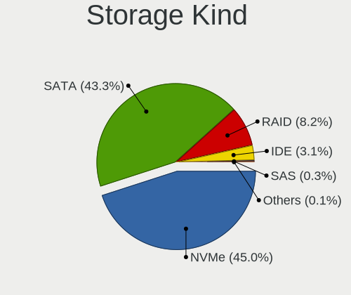

| Kind | Computers | Percent |
|------|-----------|---------|
| NVMe | 1110      | 45.05%  |
| SATA | 1066      | 43.26%  |
| RAID | 211       | 8.56%   |
| IDE  | 66        | 2.68%   |
| SAS  | 10        | 0.41%   |
| SCSI | 1         | 0.04%   |

Processor
---------

CPU Vendor
----------

Processor vendors

| Vendor  | Computers | Percent |
|---------|-----------|---------|
| Intel   | 1198      | 68.22%  |
| AMD     | 551       | 31.38%  |
| ARM     | 6         | 0.34%   |
| Unknown | 1         | 0.06%   |

CPU Model
---------

Processor models

| Model                                         | Computers | Percent |
|-----------------------------------------------|-----------|---------|
| Intel 11th Gen Core i5-1135G7 @ 2.40GHz       | 50        | 2.85%   |
| Intel 11th Gen Core i7-1165G7 @ 2.80GHz       | 32        | 1.82%   |
| AMD Ryzen 5 5500U with Radeon Graphics        | 23        | 1.31%   |
| AMD Ryzen 5 3600 6-Core Processor             | 23        | 1.31%   |
| Intel Core i5-7200U CPU @ 2.50GHz             | 22        | 1.25%   |
| Intel Core i5-10210U CPU @ 1.60GHz            | 22        | 1.25%   |
| AMD Ryzen 7 5800H with Radeon Graphics        | 22        | 1.25%   |
| Intel Core i7-8565U CPU @ 1.80GHz             | 21        | 1.2%    |
| Intel Core i5-8250U CPU @ 1.60GHz             | 21        | 1.2%    |
| Intel Core i5-8265U CPU @ 1.60GHz             | 20        | 1.14%   |
| Intel 12th Gen Core i7-12700H                 | 20        | 1.14%   |
| Intel Core i7-8550U CPU @ 1.80GHz             | 19        | 1.08%   |
| Intel Core i7-10510U CPU @ 1.80GHz            | 19        | 1.08%   |
| AMD Ryzen 5 5600G with Radeon Graphics        | 18        | 1.03%   |
| Intel Core i7-9750H CPU @ 2.60GHz             | 16        | 0.91%   |
| Intel 12th Gen Core i7-1260P                  | 16        | 0.91%   |
| AMD Ryzen 7 5700U with Radeon Graphics        | 16        | 0.91%   |
| Intel Core i5-5200U CPU @ 2.20GHz             | 15        | 0.85%   |
| AMD Ryzen 9 5900HX with Radeon Graphics       | 15        | 0.85%   |
| AMD Ryzen 5 3500U with Radeon Vega Mobile Gfx | 15        | 0.85%   |
| Intel Core i7-3770 CPU @ 3.40GHz              | 14        | 0.8%    |
| Intel Core i5-8350U CPU @ 1.70GHz             | 14        | 0.8%    |
| Intel Core i5-6200U CPU @ 2.30GHz             | 13        | 0.74%   |
| AMD Ryzen 7 5700G with Radeon Graphics        | 13        | 0.74%   |
| AMD Ryzen 5 5600X 6-Core Processor            | 13        | 0.74%   |
| Intel Core i7-10750H CPU @ 2.60GHz            | 12        | 0.68%   |
| Intel 11th Gen Core i7-11800H @ 2.30GHz       | 12        | 0.68%   |
| AMD Ryzen 7 4800H with Radeon Graphics        | 12        | 0.68%   |
| Intel Core i7-8750H CPU @ 2.20GHz             | 11        | 0.63%   |
| Intel Core i7-7700HQ CPU @ 2.80GHz            | 11        | 0.63%   |
| Intel Core i5-6300U CPU @ 2.40GHz             | 11        | 0.63%   |
| Intel Core i5-1035G1 CPU @ 1.00GHz            | 11        | 0.63%   |
| Intel 12th Gen Core i5-1240P                  | 11        | 0.63%   |
| Intel 12th Gen Core i5-1235U                  | 11        | 0.63%   |
| AMD Ryzen 9 7950X 16-Core Processor           | 11        | 0.63%   |
| AMD Ryzen 7 PRO 4750U with Radeon Graphics    | 11        | 0.63%   |
| AMD Ryzen 7 3700X 8-Core Processor            | 11        | 0.63%   |
| AMD Ryzen 5 4500U with Radeon Graphics        | 11        | 0.63%   |
| Intel Core i7-8650U CPU @ 1.90GHz             | 10        | 0.57%   |
| Intel Core i7-6700HQ CPU @ 2.60GHz            | 10        | 0.57%   |

CPU Model Family
----------------

Processor model prefix

| Model                                | Computers | Percent |
|--------------------------------------|-----------|---------|
| Intel Core i7                        | 331       | 18.85%  |
| Intel Core i5                        | 325       | 18.51%  |
| Other                                | 309       | 17.6%   |
| AMD Ryzen 5                          | 191       | 10.88%  |
| AMD Ryzen 7                          | 161       | 9.17%   |
| Intel Core i3                        | 80        | 4.56%   |
| AMD Ryzen 9                          | 69        | 3.93%   |
| Intel Celeron                        | 35        | 1.99%   |
| Intel Xeon                           | 31        | 1.77%   |
| AMD Ryzen 7 PRO                      | 25        | 1.42%   |
| AMD Ryzen 3                          | 22        | 1.25%   |
| Intel Atom                           | 19        | 1.08%   |
| AMD Ryzen 5 PRO                      | 19        | 1.08%   |
| Intel Pentium                        | 17        | 0.97%   |
| Intel Core 2 Duo                     | 17        | 0.97%   |
| Intel Core i9                        | 12        | 0.68%   |
| AMD FX                               | 11        | 0.63%   |
| AMD A6                               | 10        | 0.57%   |
| AMD A4                               | 8         | 0.46%   |
| Intel Core 2 Quad                    | 7         | 0.4%    |
| Intel Pentium Dual-Core              | 6         | 0.34%   |
| AMD A8                               | 5         | 0.28%   |
| Intel Pentium Silver                 | 4         | 0.23%   |
| AMD Ryzen Threadripper               | 4         | 0.23%   |
| AMD A10                              | 4         | 0.23%   |
| Intel Core m3                        | 3         | 0.17%   |
| AMD Phenom II X6                     | 3         | 0.17%   |
| AMD A12                              | 3         | 0.17%   |
| Intel Pentium Gold                   | 2         | 0.11%   |
| Intel Pentium Dual                   | 2         | 0.11%   |
| Intel Genuine                        | 2         | 0.11%   |
| Intel Core 2                         | 2         | 0.11%   |
| AMD Phenom II X4                     | 2         | 0.11%   |
| AMD Athlon 64 X2                     | 2         | 0.11%   |
| Intel Xeon Platinum                  | 1         | 0.06%   |
| Intel Core m7                        | 1         | 0.06%   |
| Intel Core m5                        | 1         | 0.06%   |
| AMD Turion X2 Ultra Dual-Core Mobile | 1         | 0.06%   |
| AMD Ryzen 3 PRO                      | 1         | 0.06%   |
| AMD PRO A10                          | 1         | 0.06%   |

CPU Cores
---------

Number of processor cores

| Number  | Computers | Percent |
|---------|-----------|---------|
| 4       | 623       | 35.48%  |
| 2       | 379       | 21.58%  |
| 6       | 286       | 16.29%  |
| 8       | 264       | 15.03%  |
| 12      | 73        | 4.16%   |
| 14      | 39        | 2.22%   |
| 16      | 38        | 2.16%   |
| 10      | 34        | 1.94%   |
| 24      | 5         | 0.28%   |
| 1       | 5         | 0.28%   |
| 3       | 4         | 0.23%   |
| Unknown | 2         | 0.11%   |
| 96      | 1         | 0.06%   |
| 36      | 1         | 0.06%   |
| 32      | 1         | 0.06%   |
| 5       | 1         | 0.06%   |

CPU Sockets
-----------

Number of sockets

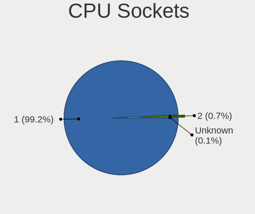

| Number  | Computers | Percent |
|---------|-----------|---------|
| 1       | 1742      | 99.2%   |
| 2       | 12        | 0.68%   |
| Unknown | 2         | 0.11%   |

CPU Threads
-----------

Threads per core (Hyper-Threading)

| Number  | Computers | Percent |
|---------|-----------|---------|
| 2       | 1494      | 85.03%  |
| 1       | 261       | 14.85%  |
| Unknown | 2         | 0.11%   |

CPU Op-Modes
------------

CPU Operation Modes (32-bit, 64-bit)

| Op mode        | Computers | Percent |
|----------------|-----------|---------|
| 32-bit, 64-bit | 1751      | 99.72%  |
| 64-bit         | 5         | 0.28%   |

CPU Microcode
-------------

Microcode number

| Number     | Computers | Percent |
|------------|-----------|---------|
| Unknown    | 160       | 8.99%   |
| 0x806c1    | 104       | 5.85%   |
| 0x0a50000c | 78        | 4.38%   |
| 0x306a9    | 74        | 4.16%   |
| 0x806ec    | 73        | 4.1%    |
| 0x806ea    | 73        | 4.1%    |
| 0x906a3    | 71        | 3.99%   |
| 0x906ea    | 61        | 3.43%   |
| 0x08701021 | 50        | 2.81%   |
| 0x306c3    | 48        | 2.7%    |
| 0x806e9    | 45        | 2.53%   |
| 0x406e3    | 43        | 2.42%   |
| 0x506e3    | 42        | 2.36%   |
| 0x08600106 | 36        | 2.02%   |
| 0x206a7    | 35        | 1.97%   |
| 0x08608103 | 33        | 1.85%   |
| 0x0a50000d | 32        | 1.8%    |
| 0xa0652    | 30        | 1.69%   |
| 0x306d4    | 29        | 1.63%   |
| 0x906e9    | 28        | 1.57%   |
| 0x906a4    | 27        | 1.52%   |
| 0x08108109 | 27        | 1.52%   |
| 0x0a404102 | 26        | 1.46%   |
| 0x806d1    | 23        | 1.29%   |
| 0x90672    | 22        | 1.24%   |
| 0x706e5    | 20        | 1.12%   |
| 0x40651    | 20        | 1.12%   |
| 0x0a601203 | 19        | 1.07%   |
| 0x1067a    | 18        | 1.01%   |
| 0x0a201016 | 18        | 1.01%   |
| 0x806eb    | 17        | 0.96%   |
| 0x08600104 | 16        | 0.9%    |
| 0x906ed    | 15        | 0.84%   |
| 0x30678    | 14        | 0.79%   |
| 0x0a20120a | 14        | 0.79%   |
| 0x706a8    | 13        | 0.73%   |
| 0x0a404101 | 13        | 0.73%   |
| 0x806c2    | 12        | 0.67%   |
| 0x206d7    | 11        | 0.62%   |
| 0x0810100b | 11        | 0.62%   |

CPU Microarch
-------------

Microarchitecture

| Name             | Computers | Percent |
|------------------|-----------|---------|
| KabyLake         | 353       | 20.1%   |
| Zen 3            | 174       | 9.91%   |
| Alderlake Hybrid | 139       | 7.92%   |
| Zen 2            | 128       | 7.29%   |
| TigerLake        | 126       | 7.18%   |
| Unknown          | 126       | 7.18%   |
| Skylake          | 95        | 5.41%   |
| IvyBridge        | 86        | 4.9%    |
| Haswell          | 82        | 4.67%   |
| CometLake        | 56        | 3.19%   |
| IceLake          | 54        | 3.08%   |
| SandyBridge      | 49        | 2.79%   |
| Zen+             | 46        | 2.62%   |
| Zen              | 34        | 1.94%   |
| Broadwell        | 33        | 1.88%   |
| Silvermont       | 30        | 1.71%   |
| Penryn           | 24        | 1.37%   |
| Piledriver       | 15        | 0.85%   |
| Goldmont plus    | 15        | 0.85%   |
| Excavator        | 15        | 0.85%   |
| Westmere         | 14        | 0.8%    |
| Core             | 13        | 0.74%   |
| K10              | 8         | 0.46%   |
| Tremont          | 6         | 0.34%   |
| Nehalem          | 6         | 0.34%   |
| Goldmont         | 5         | 0.28%   |
| Bonnell          | 5         | 0.28%   |
| Steamroller      | 4         | 0.23%   |
| Jaguar           | 4         | 0.23%   |
| Puma             | 3         | 0.17%   |
| K8 Hammer        | 2         | 0.11%   |
| K10 Llano        | 2         | 0.11%   |
| Bulldozer        | 2         | 0.11%   |
| K8 & K10 hybrid  | 1         | 0.06%   |
| Bobcat           | 1         | 0.06%   |

Graphics
--------

GPU Vendor
----------

Vendors of graphics cards

| Vendor                     | Computers | Percent |
|----------------------------|-----------|---------|
| Intel                      | 979       | 45.53%  |
| Nvidia                     | 585       | 27.21%  |
| AMD                        | 579       | 26.93%  |
| ASPEED Technology          | 6         | 0.28%   |
| Matrox Electronics Systems | 1         | 0.05%   |

GPU Model
---------

Graphics card models

| Model                                                                     | Computers | Percent |
|---------------------------------------------------------------------------|-----------|---------|
| Intel TigerLake-LP GT2 [Iris Xe Graphics]                                 | 110       | 4.98%   |
| AMD Cezanne [Radeon Vega Series / Radeon Vega Mobile Series]              | 94        | 4.26%   |
| Intel Alder Lake-P Integrated Graphics Controller                         | 74        | 3.35%   |
| Intel UHD Graphics 620                                                    | 68        | 3.08%   |
| AMD Renoir                                                                | 62        | 2.81%   |
| Intel WhiskeyLake-U GT2 [UHD Graphics 620]                                | 50        | 2.26%   |
| Intel HD Graphics 620                                                     | 50        | 2.26%   |
| Intel CometLake-U GT2 [UHD Graphics]                                      | 48        | 2.17%   |
| Intel 3rd Gen Core processor Graphics Controller                          | 47        | 2.13%   |
| AMD Ellesmere [Radeon RX 470/480/570/570X/580/580X/590]                   | 46        | 2.08%   |
| AMD Lucienne                                                              | 44        | 1.99%   |
| Intel Skylake GT2 [HD Graphics 520]                                       | 43        | 1.95%   |
| AMD Rembrandt [Radeon 680M]                                               | 42        | 1.9%    |
| Intel CoffeeLake-H GT2 [UHD Graphics 630]                                 | 41        | 1.86%   |
| Nvidia GA106M [GeForce RTX 3060 Mobile / Max-Q]                           | 33        | 1.49%   |
| AMD Picasso/Raven 2 [Radeon Vega Series / Radeon Vega Mobile Series]      | 32        | 1.45%   |
| Intel CometLake-H GT2 [UHD Graphics]                                      | 31        | 1.4%    |
| Intel HD Graphics 5500                                                    | 27        | 1.22%   |
| AMD Navi 23 [Radeon RX 6600/6600 XT/6600M]                                | 27        | 1.22%   |
| AMD Navi 22 [Radeon RX 6700/6700 XT/6750 XT / 6800M/6850M XT]             | 27        | 1.22%   |
| Intel 2nd Generation Core Processor Family Integrated Graphics Controller | 26        | 1.18%   |
| Intel HD Graphics 630                                                     | 25        | 1.13%   |
| Intel TigerLake-H GT1 [UHD Graphics]                                      | 23        | 1.04%   |
| Intel HD Graphics 530                                                     | 23        | 1.04%   |
| Intel Alder Lake-UP3 GT2 [Iris Xe Graphics]                               | 23        | 1.04%   |
| AMD Raphael                                                               | 23        | 1.04%   |
| Nvidia TU117M [GeForce GTX 1650 Mobile / Max-Q]                           | 21        | 0.95%   |
| Intel Haswell-ULT Integrated Graphics Controller                          | 21        | 0.95%   |
| AMD Raven Ridge [Radeon Vega Series / Radeon Vega Mobile Series]          | 21        | 0.95%   |
| AMD Barcelo                                                               | 21        | 0.95%   |
| Intel Atom Processor Z36xxx/Z37xxx Series Graphics & Display              | 19        | 0.86%   |
| Nvidia GP108M [GeForce MX150]                                             | 17        | 0.77%   |
| Nvidia GA107M [GeForce RTX 3050 Mobile]                                   | 16        | 0.72%   |
| Intel Iris Plus Graphics G1 (Ice Lake)                                    | 15        | 0.68%   |
| Nvidia GP107M [GeForce GTX 1050 Ti Mobile]                                | 14        | 0.63%   |
| Intel GeminiLake [UHD Graphics 600]                                       | 14        | 0.63%   |
| Intel 4th Gen Core Processor Integrated Graphics Controller               | 14        | 0.63%   |
| Nvidia GA107M [GeForce RTX 3050 Ti Mobile]                                | 13        | 0.59%   |
| Intel Tiger Lake-LP GT2 [UHD Graphics G4]                                 | 13        | 0.59%   |
| Intel CoffeeLake-S GT2 [UHD Graphics 630]                                 | 13        | 0.59%   |

GPU Combo
---------

Combinations of graphics cards

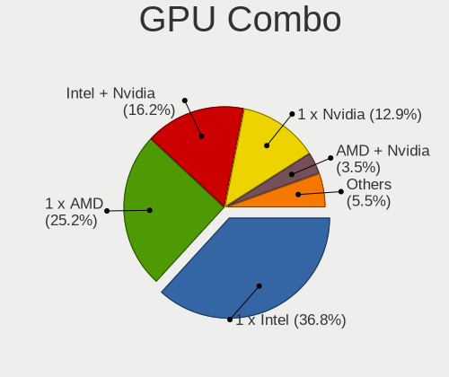

| Name                     | Computers | Percent |
|--------------------------|-----------|---------|
| 1 x Intel                | 644       | 36.63%  |
| 1 x AMD                  | 441       | 25.09%  |
| Intel + Nvidia           | 283       | 16.1%   |
| 1 x Nvidia               | 228       | 12.97%  |
| AMD + Nvidia             | 65        | 3.7%    |
| 2 x AMD                  | 40        | 2.28%   |
| Intel + AMD              | 30        | 1.71%   |
| 2 x Intel                | 8         | 0.46%   |
| Other                    | 7         | 0.4%    |
| 1 x ASPEED               | 3         | 0.17%   |
| 2 x Nvidia               | 2         | 0.11%   |
| 3 x AMD                  | 1         | 0.06%   |
| 2 x Nvidia + 1 x ASPEED  | 1         | 0.06%   |
| Nvidia + ASPEED          | 1         | 0.06%   |
| 1 x Matrox               | 1         | 0.06%   |
| Intel + 2 x Nvidia       | 1         | 0.06%   |
| Intel + AMD + 1 x Nvidia | 1         | 0.06%   |
| AMD + ASPEED             | 1         | 0.06%   |

GPU Driver
----------

Free vs proprietary

| Driver      | Computers | Percent |
|-------------|-----------|---------|
| Free        | 1391      | 78.68%  |
| Proprietary | 327       | 18.5%   |
| Unknown     | 50        | 2.83%   |

GPU Memory
----------

Total video memory

| Size in GB | Computers | Percent |
|------------|-----------|---------|
| Unknown    | 934       | 52.5%   |
| 0.01-0.5   | 204       | 11.47%  |
| 1.01-2.0   | 171       | 9.61%   |
| 3.01-4.0   | 134       | 7.53%   |
| 7.01-8.0   | 128       | 7.2%    |
| 0.51-1.0   | 91        | 5.12%   |
| 8.01-16.0  | 54        | 3.04%   |
| 5.01-6.0   | 46        | 2.59%   |
| 2.01-3.0   | 10        | 0.56%   |
| 16.01-24.0 | 7         | 0.39%   |

Monitor
-------

Monitor Vendor
--------------

Monitor vendors

| Vendor                  | Computers | Percent |
|-------------------------|-----------|---------|
| BOE                     | 253       | 12.36%  |
| AU Optronics            | 248       | 12.12%  |
| Chimei Innolux          | 202       | 9.87%   |
| Samsung Electronics     | 194       | 9.48%   |
| LG Display              | 162       | 7.91%   |
| Dell                    | 140       | 6.84%   |
| Goldstar                | 109       | 5.32%   |
| Hewlett-Packard         | 65        | 3.18%   |
| AOC                     | 61        | 2.98%   |
| Acer                    | 57        | 2.78%   |
| Sharp                   | 54        | 2.64%   |
| BenQ                    | 45        | 2.2%    |
| Lenovo                  | 43        | 2.1%    |
| Philips                 | 31        | 1.51%   |
| ASUSTek Computer        | 31        | 1.51%   |
| CSO                     | 28        | 1.37%   |
| PANDA                   | 27        | 1.32%   |
| Ancor Communications    | 25        | 1.22%   |
| Apple                   | 22        | 1.07%   |
| InfoVision              | 19        | 0.93%   |
| ViewSonic               | 18        | 0.88%   |
| Iiyama                  | 14        | 0.68%   |
| MSI                     | 11        | 0.54%   |
| Gigabyte Technology     | 11        | 0.54%   |
| Sceptre Tech            | 10        | 0.49%   |
| Mi                      | 10        | 0.49%   |
| Sony                    | 9         | 0.44%   |
| Chi Mei Optoelectronics | 8         | 0.39%   |
| Panasonic               | 7         | 0.34%   |
| JDI                     | 7         | 0.34%   |
| Eizo                    | 7         | 0.34%   |
| Toshiba                 | 6         | 0.29%   |
| TMX                     | 6         | 0.29%   |
| NEC Computers           | 6         | 0.29%   |
| Unknown                 | 5         | 0.24%   |
| LG Philips              | 5         | 0.24%   |
| Vizio                   | 4         | 0.2%    |
| Pixio                   | 4         | 0.2%    |
| HUAWEI                  | 4         | 0.2%    |
| RTK                     | 3         | 0.15%   |

Monitor Model
-------------

Monitor models

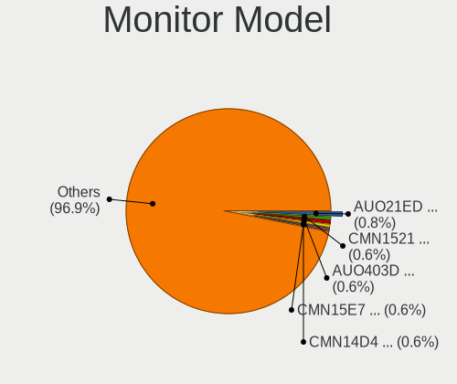

| Model                                                                 | Computers | Percent |
|-----------------------------------------------------------------------|-----------|---------|
| AU Optronics LCD Monitor AUO21ED 1920x1080 344x194mm 15.5-inch        | 17        | 0.8%    |
| AU Optronics LCD Monitor AUO403D 1920x1080 309x173mm 13.9-inch        | 15        | 0.71%   |
| Chimei Innolux LCD Monitor CMN1521 1920x1080 344x193mm 15.5-inch      | 14        | 0.66%   |
| Chimei Innolux LCD Monitor CMN15E7 1920x1080 344x193mm 15.5-inch      | 13        | 0.62%   |
| PANDA LCD Monitor NCP004D 1920x1080 344x194mm 15.5-inch               | 11        | 0.52%   |
| Chimei Innolux LCD Monitor CMN14D4 1920x1080 309x173mm 13.9-inch      | 11        | 0.52%   |
| AOC 27B2G5 AOC2702 1920x1080 598x336mm 27.0-inch                      | 11        | 0.52%   |
| Chimei Innolux LCD Monitor CMN15E8 1920x1080 344x193mm 15.5-inch      | 9         | 0.43%   |
| Chimei Innolux LCD Monitor CMN15DB 1366x768 344x193mm 15.5-inch       | 9         | 0.43%   |
| Goldstar ULTRAWIDE GSM59F1 2560x1080 673x284mm 28.8-inch              | 8         | 0.38%   |
| BOE LCD Monitor BOE0893 2160x1440 296x197mm 14.0-inch                 | 8         | 0.38%   |
| Samsung Electronics C27F390 SAM0D32 1920x1080 598x336mm 27.0-inch     | 7         | 0.33%   |
| Chimei Innolux LCD Monitor CMN14D5 1920x1080 309x173mm 13.9-inch      | 7         | 0.33%   |
| Samsung Electronics LCD Monitor SDC4171 2880x1800 302x189mm 14.0-inch | 6         | 0.28%   |
| Chimei Innolux LCD Monitor CMN15F5 1920x1080 344x193mm 15.5-inch      | 6         | 0.28%   |
| Chimei Innolux LCD Monitor CMN15D5 1920x1080 344x193mm 15.5-inch      | 6         | 0.28%   |
| Chimei Innolux LCD Monitor CMN15C4 1920x1080 344x193mm 15.5-inch      | 6         | 0.28%   |
| Chimei Innolux LCD Monitor CMN14FF 1920x1080 309x173mm 13.9-inch      | 6         | 0.28%   |
| Chimei Innolux LCD Monitor CMN14C9 1920x1080 309x173mm 13.9-inch      | 6         | 0.28%   |
| BOE LCD Monitor BOE095F 2256x1504 285x190mm 13.5-inch                 | 6         | 0.28%   |
| BOE LCD Monitor BOE092F 2520x1680 338x226mm 16.0-inch                 | 6         | 0.28%   |
| BOE LCD Monitor BOE0872 1920x1080 344x194mm 15.5-inch                 | 6         | 0.28%   |
| AU Optronics LCD Monitor AUOE48D 1920x1080 344x194mm 15.5-inch        | 6         | 0.28%   |
| AU Optronics LCD Monitor AUO38ED 1920x1080 344x193mm 15.5-inch        | 6         | 0.28%   |
| AOC 24G2W1G5 AOC2402 1920x1080 527x296mm 23.8-inch                    | 6         | 0.28%   |
| Unknown LCD Monitor FFFF 2288x1287 2550x2550mm 142.0-inch             | 5         | 0.24%   |
| Samsung Electronics LCD Monitor SDC416D 2880x1800 312x195mm 14.5-inch | 5         | 0.24%   |
| LG Display LCD Monitor LGD0521 1920x1080 309x174mm 14.0-inch          | 5         | 0.24%   |
| LG Display LCD Monitor LGD046F 1920x1080 344x194mm 15.5-inch          | 5         | 0.24%   |
| Lenovo LEN L28u-30 LEN65FA 3840x2160 621x341mm 27.9-inch              | 5         | 0.24%   |
| InfoVision LCD Monitor IVO057D 1920x1080 309x174mm 14.0-inch          | 5         | 0.24%   |
| Goldstar FULL HD GSM5B55 1920x1080 480x270mm 21.7-inch                | 5         | 0.24%   |
| Chimei Innolux LCD Monitor CMN151E 1920x1080 344x193mm 15.5-inch      | 5         | 0.24%   |
| Chimei Innolux LCD Monitor CMN1406 1920x1080 309x173mm 13.9-inch      | 5         | 0.24%   |
| BOE LCD Monitor BOE06A4 1366x768 344x194mm 15.5-inch                  | 5         | 0.24%   |
| AU Optronics LCD Monitor AUO2E8D 1920x1080 344x194mm 15.5-inch        | 5         | 0.24%   |
| Samsung Electronics U28E590 SAM0C4D 3840x2160 607x345mm 27.5-inch     | 4         | 0.19%   |
| Samsung Electronics LCD Monitor SDC4154 2880x1800 302x189mm 14.0-inch | 4         | 0.19%   |
| Samsung Electronics C34H89x SAM0E25 3440x1440 797x333mm 34.0-inch     | 4         | 0.19%   |
| Samsung Electronics C24F390 SAM0D2C 1920x1080 521x293mm 23.5-inch     | 4         | 0.19%   |

Monitor Resolution
------------------

Monitor screen resolution

| Resolution         | Computers | Percent |
|--------------------|-----------|---------|
| 1920x1080 (FHD)    | 944       | 49.12%  |
| 1366x768 (WXGA)    | 182       | 9.47%   |
| 3840x2160 (4K)     | 166       | 8.64%   |
| 2560x1440 (QHD)    | 160       | 8.32%   |
| 1920x1200 (WUXGA)  | 62        | 3.23%   |
| 3440x1440          | 57        | 2.97%   |
| 2560x1600          | 51        | 2.65%   |
| 1600x900 (HD+)     | 49        | 2.55%   |
| 2880x1800          | 30        | 1.56%   |
| 1280x1024 (SXGA)   | 25        | 1.3%    |
| 2560x1080          | 21        | 1.09%   |
| 1680x1050 (WSXGA+) | 21        | 1.09%   |
| 1440x900 (WXGA+)   | 17        | 0.88%   |
| 3840x2400          | 15        | 0.78%   |
| 1280x800 (WXGA)    | 13        | 0.68%   |
| 2160x1440          | 10        | 0.52%   |
| 3840x1080          | 8         | 0.42%   |
| 1920x1280          | 8         | 0.42%   |
| 3000x2000          | 7         | 0.36%   |
| 2736x1824          | 7         | 0.36%   |
| 2256x1504          | 7         | 0.36%   |
| 1360x768           | 7         | 0.36%   |
| 2520x1680          | 6         | 0.31%   |
| 2288x1287          | 5         | 0.26%   |
| 3456x2160          | 4         | 0.21%   |
| 1600x1200          | 4         | 0.21%   |
| Unknown            | 4         | 0.21%   |
| 3072x1920          | 3         | 0.16%   |
| 3200x2000          | 2         | 0.1%    |
| 3200x1800 (QHD+)   | 2         | 0.1%    |
| 2880x1620          | 2         | 0.1%    |
| 2240x1400          | 2         | 0.1%    |
| 2160x1350          | 2         | 0.1%    |
| 1920x540           | 2         | 0.1%    |
| 1024x768 (XGA)     | 2         | 0.1%    |
| 800x1280           | 1         | 0.05%   |
| 4160x1440          | 1         | 0.05%   |
| 3840x1600          | 1         | 0.05%   |
| 3200x1080          | 1         | 0.05%   |
| 3120x1600          | 1         | 0.05%   |

Monitor Diagonal
----------------

Diagonal size in inches

| Inches  | Computers | Percent |
|---------|-----------|---------|
| 15      | 516       | 25.02%  |
| 13      | 243       | 11.78%  |
| 27      | 211       | 10.23%  |
| 14      | 203       | 9.84%   |
| 24      | 150       | 7.27%   |
| 23      | 119       | 5.77%   |
| 21      | 70        | 3.39%   |
| 31      | 67        | 3.25%   |
| 17      | 65        | 3.15%   |
| 34      | 63        | 3.06%   |
| 16      | 56        | 2.72%   |
| 12      | 38        | 1.84%   |
| 19      | 25        | 1.21%   |
| Unknown | 23        | 1.12%   |
| 18      | 22        | 1.07%   |
| 20      | 20        | 0.97%   |
| 25      | 16        | 0.78%   |
| 22      | 15        | 0.73%   |
| 11      | 14        | 0.68%   |
| 40      | 13        | 0.63%   |
| 32      | 13        | 0.63%   |
| 84      | 11        | 0.53%   |
| 26      | 11        | 0.53%   |
| 48      | 10        | 0.48%   |
| 29      | 7         | 0.34%   |
| 72      | 6         | 0.29%   |
| 54      | 6         | 0.29%   |
| 142     | 5         | 0.24%   |
| 35      | 5         | 0.24%   |
| 28      | 5         | 0.24%   |
| 10      | 5         | 0.24%   |
| 39      | 4         | 0.19%   |
| 43      | 3         | 0.15%   |
| 42      | 3         | 0.15%   |
| 36      | 3         | 0.15%   |
| 69      | 2         | 0.1%    |
| 65      | 2         | 0.1%    |
| 52      | 2         | 0.1%    |
| 38      | 2         | 0.1%    |
| 33      | 2         | 0.1%    |

Monitor Width
-------------

Physical width

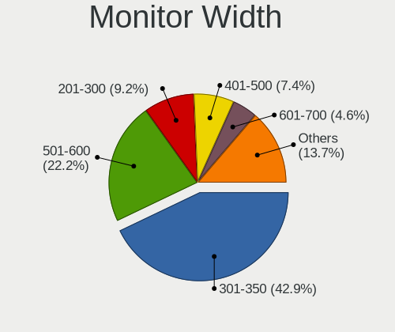

| Width in mm    | Computers | Percent |
|----------------|-----------|---------|
| 301-350        | 871       | 43.27%  |
| 501-600        | 443       | 22.01%  |
| 201-300        | 191       | 9.49%   |
| 401-500        | 136       | 6.76%   |
| 601-700        | 98        | 4.87%   |
| 351-400        | 90        | 4.47%   |
| 701-800        | 80        | 3.97%   |
| 801-900        | 23        | 1.14%   |
| Unknown        | 23        | 1.14%   |
| 1001-1500      | 22        | 1.09%   |
| 1501-2000      | 20        | 0.99%   |
| 901-1000       | 10        | 0.5%    |
| More than 2000 | 5         | 0.25%   |
| 1-100          | 1         | 0.05%   |

Aspect Ratio
------------

Proportional relationship between the width and the height

| Ratio   | Computers | Percent |
|---------|-----------|---------|
| 16/9    | 1374      | 76.8%   |
| 16/10   | 228       | 12.74%  |
| 21/9    | 75        | 4.19%   |
| 3/2     | 49        | 2.74%   |
| 5/4     | 20        | 1.12%   |
| 4/3     | 15        | 0.84%   |
| Unknown | 12        | 0.67%   |
| 32/9    | 7         | 0.39%   |
| 1.00    | 5         | 0.28%   |
| 3.33    | 1         | 0.06%   |
| 1.96    | 1         | 0.06%   |
| 0.89    | 1         | 0.06%   |
| 0.67    | 1         | 0.06%   |

Monitor Area
------------

Area in inch

| Area in inch | Computers | Percent |
|----------------|-----------|---------|
| 101-110        | 520       | 25.42%  |
| 81-90          | 331       | 16.18%  |
| 201-250        | 278       | 13.59%  |
| 301-350        | 219       | 10.7%   |
| 351-500        | 156       | 7.62%   |
| 71-80          | 115       | 5.62%   |
| 151-200        | 72        | 3.52%   |
| 251-300        | 64        | 3.13%   |
| 121-130        | 57        | 2.79%   |
| 111-120        | 50        | 2.44%   |
| 501-1000       | 39        | 1.91%   |
| More than 1000 | 38        | 1.86%   |
| 61-70          | 30        | 1.47%   |
| Unknown        | 23        | 1.12%   |
| 141-150        | 21        | 1.03%   |
| 51-60          | 17        | 0.83%   |
| 91-100         | 10        | 0.49%   |
| 131-140        | 3         | 0.15%   |
| 41-50          | 2         | 0.1%    |
| 1-40           | 1         | 0.05%   |

Pixel Density
-------------

Pixels per inch

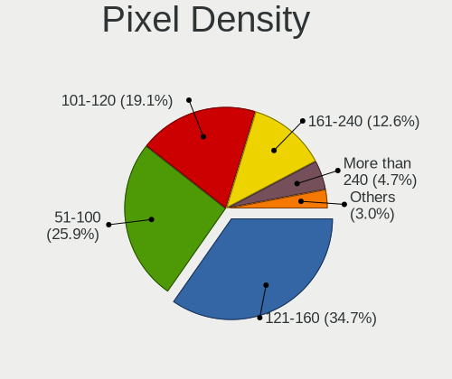

| Density       | Computers | Percent |
|---------------|-----------|---------|
| 121-160       | 682       | 34.67%  |
| 51-100        | 505       | 25.67%  |
| 101-120       | 371       | 18.86%  |
| 161-240       | 260       | 13.22%  |
| More than 240 | 93        | 4.73%   |
| 1-50          | 33        | 1.68%   |
| Unknown       | 23        | 1.17%   |

Multiple Monitors
-----------------

Total monitors connected

| Total | Computers | Percent |
|-------|-----------|---------|
| 1     | 1316      | 73.85%  |
| 2     | 354       | 19.87%  |
| 0     | 61        | 3.42%   |
| 3     | 44        | 2.47%   |
| 4     | 6         | 0.34%   |
| 5     | 1         | 0.06%   |

Network
-------

Net Controller Vendor
---------------------

Controller vendors

| Vendor                                 | Computers | Percent |
|----------------------------------------|-----------|---------|
| Intel                                  | 1049      | 41.12%  |
| Realtek Semiconductor                  | 885       | 34.69%  |
| Qualcomm Atheros                       | 174       | 6.82%   |
| MediaTek                               | 122       | 4.78%   |
| Broadcom                               | 73        | 2.86%   |
| TP-Link                                | 25        | 0.98%   |
| Qualcomm                               | 17        | 0.67%   |
| Lenovo                                 | 17        | 0.67%   |
| Ralink Technology                      | 13        | 0.51%   |
| Ralink                                 | 13        | 0.51%   |
| ASIX Electronics                       | 13        | 0.51%   |
| Aquantia                               | 12        | 0.47%   |
| Sierra Wireless                        | 11        | 0.43%   |
| Samsung Electronics                    | 11        | 0.43%   |
| Broadcom Limited                       | 10        | 0.39%   |
| Xiaomi                                 | 8         | 0.31%   |
| Microsoft                              | 8         | 0.31%   |
| Marvell Technology Group               | 8         | 0.31%   |
| Dell                                   | 8         | 0.31%   |
| Hewlett-Packard                        | 7         | 0.27%   |
| Google                                 | 7         | 0.27%   |
| D-Link                                 | 7         | 0.27%   |
| Nvidia                                 | 4         | 0.16%   |
| DisplayLink                            | 4         | 0.16%   |
| ASUSTek Computer                       | 4         | 0.16%   |
| Huawei Technologies                    | 3         | 0.12%   |
| Fibocom                                | 3         | 0.12%   |
| Ericsson Business Mobile Networks      | 3         | 0.12%   |
| Qualcomm Atheros Communications        | 2         | 0.08%   |
| OPPO Electronics                       | 2         | 0.08%   |
| NetGear                                | 2         | 0.08%   |
| Mellanox Technologies                  | 2         | 0.08%   |
| Linksys                                | 2         | 0.08%   |
| InterBiometrics                        | 2         | 0.08%   |
| Arduino SA                             | 2         | 0.08%   |
| Apple                                  | 2         | 0.08%   |
| ZTE WCDMA Technologies MSM             | 1         | 0.04%   |
| Zoom Telephonics                       | 1         | 0.04%   |
| Sony Ericsson Mobile Communications AB | 1         | 0.04%   |
| QinHeng Electronics                    | 1         | 0.04%   |

Net Controller Model
--------------------

Controller models

| Model                                                             | Computers | Percent |
|-------------------------------------------------------------------|-----------|---------|
| Realtek RTL8111/8168/8411 PCI Express Gigabit Ethernet Controller | 553       | 18.43%  |
| Intel Wi-Fi 6 AX200                                               | 139       | 4.63%   |
| Intel Wi-Fi 6 AX201                                               | 106       | 3.53%   |
| Intel Alder Lake-P PCH CNVi WiFi                                  | 87        | 2.9%    |
| Intel Wireless 8265 / 8275                                        | 84        | 2.8%    |
| Realtek RTL8125 2.5GbE Controller                                 | 81        | 2.7%    |
| Realtek RTL8153 Gigabit Ethernet Adapter                          | 69        | 2.3%    |
| Realtek RTL8822CE 802.11ac PCIe Wireless Network Adapter          | 66        | 2.2%    |
| Realtek RTL810xE PCI Express Fast Ethernet controller             | 63        | 2.1%    |
| MediaTek MT7921 802.11ax PCI Express Wireless Network Adapter     | 61        | 2.03%   |
| Intel Wi-Fi 6 AX210/AX211/AX411 160MHz                            | 50        | 1.67%   |
| Intel I211 Gigabit Network Connection                             | 47        | 1.57%   |
| Intel Ethernet Controller I225-V                                  | 43        | 1.43%   |
| Intel 82579LM Gigabit Network Connection (Lewisville)             | 41        | 1.37%   |
| Intel Comet Lake PCH-LP CNVi WiFi                                 | 39        | 1.3%    |
| Qualcomm Atheros QCA9377 802.11ac Wireless Network Adapter        | 38        | 1.27%   |
| Intel Wireless 7265                                               | 35        | 1.17%   |
| MediaTek MT7922 802.11ax PCI Express Wireless Network Adapter     | 34        | 1.13%   |
| Intel Wireless 8260                                               | 34        | 1.13%   |
| Intel Cannon Point-LP CNVi [Wireless-AC]                          | 34        | 1.13%   |
| Intel Ethernet Connection (4) I219-LM                             | 33        | 1.1%    |
| Intel Ethernet Connection (2) I219-V                              | 33        | 1.1%    |
| Realtek RTL8821CE 802.11ac PCIe Wireless Network Adapter          | 31        | 1.03%   |
| Intel Cannon Lake PCH CNVi WiFi                                   | 31        | 1.03%   |
| Qualcomm Atheros QCA6174 802.11ac Wireless Network Adapter        | 29        | 0.97%   |
| Intel Comet Lake PCH CNVi WiFi                                    | 29        | 0.97%   |
| Qualcomm Atheros QCA9565 / AR9565 Wireless Network Adapter        | 26        | 0.87%   |
| Realtek RTL8852AE 802.11ax PCIe Wireless Network Adapter          | 25        | 0.83%   |
| Intel Wireless-AC 9260                                            | 23        | 0.77%   |
| Intel Wireless 7260                                               | 23        | 0.77%   |
| Intel Dual Band Wireless-AC 3168NGW [Stone Peak]                  | 23        | 0.77%   |
| Qualcomm Atheros AR9485 Wireless Network Adapter                  | 21        | 0.7%    |
| Intel Ice Lake-LP PCH CNVi WiFi                                   | 19        | 0.63%   |
| Intel Tiger Lake PCH CNVi WiFi                                    | 18        | 0.6%    |
| MediaTek MT7921K (RZ608) Wi-Fi 6E 80MHz                           | 17        | 0.57%   |
| Intel Alder Lake-S PCH CNVi WiFi                                  | 16        | 0.53%   |
| Realtek RTL8723BE PCIe Wireless Network Adapter                   | 15        | 0.5%    |
| Intel Ethernet Connection (7) I219-V                              | 15        | 0.5%    |
| Intel Wireless 3165                                               | 14        | 0.47%   |
| Intel Ethernet Connection I219-LM                                 | 14        | 0.47%   |

Wireless Vendor
---------------

Wireless vendors

| Vendor                                | Computers | Percent |
|---------------------------------------|-----------|---------|
| Intel                                 | 871       | 57.15%  |
| Realtek Semiconductor                 | 220       | 14.44%  |
| Qualcomm Atheros                      | 139       | 9.12%   |
| MediaTek                              | 121       | 7.94%   |
| Broadcom                              | 50        | 3.28%   |
| TP-Link                               | 23        | 1.51%   |
| Ralink Technology                     | 13        | 0.85%   |
| Ralink                                | 13        | 0.85%   |
| Qualcomm                              | 13        | 0.85%   |
| Sierra Wireless                       | 11        | 0.72%   |
| Broadcom Limited                      | 10        | 0.66%   |
| Microsoft                             | 7         | 0.46%   |
| Dell                                  | 7         | 0.46%   |
| Marvell Technology Group              | 4         | 0.26%   |
| D-Link                                | 4         | 0.26%   |
| ASUSTek Computer                      | 4         | 0.26%   |
| Hewlett-Packard                       | 3         | 0.2%    |
| Fibocom                               | 3         | 0.2%    |
| Qualcomm Atheros Communications       | 2         | 0.13%   |
| NetGear                               | 2         | 0.13%   |
| Linksys                               | 1         | 0.07%   |
| D-Link System                         | 1         | 0.07%   |
| AboCom Systems                        | 1         | 0.07%   |
| 802.11g Adapter [Linksys WUSB54GC v3] | 1         | 0.07%   |

Wireless Model
--------------

Wireless models

| Model                                                          | Computers | Percent |
|----------------------------------------------------------------|-----------|---------|
| Intel Wi-Fi 6 AX200                                            | 139       | 9.1%    |
| Intel Wi-Fi 6 AX201                                            | 106       | 6.94%   |
| Intel Alder Lake-P PCH CNVi WiFi                               | 87        | 5.7%    |
| Intel Wireless 8265 / 8275                                     | 84        | 5.5%    |
| Realtek RTL8822CE 802.11ac PCIe Wireless Network Adapter       | 66        | 4.32%   |
| MediaTek MT7921 802.11ax PCI Express Wireless Network Adapter  | 61        | 3.99%   |
| Intel Wi-Fi 6 AX210/AX211/AX411 160MHz                         | 50        | 3.27%   |
| Intel Comet Lake PCH-LP CNVi WiFi                              | 39        | 2.55%   |
| Qualcomm Atheros QCA9377 802.11ac Wireless Network Adapter     | 38        | 2.49%   |
| Intel Wireless 7265                                            | 35        | 2.29%   |
| MediaTek MT7922 802.11ax PCI Express Wireless Network Adapter  | 34        | 2.23%   |
| Intel Wireless 8260                                            | 34        | 2.23%   |
| Intel Cannon Point-LP CNVi [Wireless-AC]                       | 34        | 2.23%   |
| Realtek RTL8821CE 802.11ac PCIe Wireless Network Adapter       | 31        | 2.03%   |
| Intel Cannon Lake PCH CNVi WiFi                                | 31        | 2.03%   |
| Qualcomm Atheros QCA6174 802.11ac Wireless Network Adapter     | 29        | 1.9%    |
| Intel Comet Lake PCH CNVi WiFi                                 | 29        | 1.9%    |
| Qualcomm Atheros QCA9565 / AR9565 Wireless Network Adapter     | 26        | 1.7%    |
| Realtek RTL8852AE 802.11ax PCIe Wireless Network Adapter       | 25        | 1.64%   |
| Intel Wireless-AC 9260                                         | 23        | 1.51%   |
| Intel Wireless 7260                                            | 23        | 1.51%   |
| Intel Dual Band Wireless-AC 3168NGW [Stone Peak]               | 23        | 1.51%   |
| Qualcomm Atheros AR9485 Wireless Network Adapter               | 21        | 1.38%   |
| Intel Ice Lake-LP PCH CNVi WiFi                                | 19        | 1.24%   |
| Intel Tiger Lake PCH CNVi WiFi                                 | 18        | 1.18%   |
| MediaTek MT7921K (RZ608) Wi-Fi 6E 80MHz                        | 17        | 1.11%   |
| Intel Alder Lake-S PCH CNVi WiFi                               | 16        | 1.05%   |
| Realtek RTL8723BE PCIe Wireless Network Adapter                | 15        | 0.98%   |
| Intel Wireless 3165                                            | 14        | 0.92%   |
| Realtek RTL8852BE PCIe 802.11ax Wireless Network Controller    | 12        | 0.79%   |
| Qualcomm QCNFA765 Wireless Network Adapter                     | 12        | 0.79%   |
| Intel Centrino Ultimate-N 6300                                 | 11        | 0.72%   |
| Broadcom BCM43142 802.11b/g/n                                  | 10        | 0.65%   |
| Intel Wireless 3160                                            | 9         | 0.59%   |
| Sierra Wireless EM7455                                         | 8         | 0.52%   |
| Qualcomm Atheros AR9462 Wireless Network Adapter               | 8         | 0.52%   |
| Qualcomm Atheros AR9285 Wireless Network Adapter (PCI-Express) | 8         | 0.52%   |
| Realtek RTL8822BE 802.11a/b/g/n/ac WiFi adapter                | 7         | 0.46%   |
| Realtek RTL8188CE 802.11b/g/n WiFi Adapter                     | 7         | 0.46%   |
| Realtek 802.11ac NIC                                           | 7         | 0.46%   |

Ethernet Vendor
---------------

Ethernet vendors

| Vendor                                 | Computers | Percent |
|----------------------------------------|-----------|---------|
| Realtek Semiconductor                  | 776       | 55%     |
| Intel                                  | 452       | 32.03%  |
| Qualcomm Atheros                       | 42        | 2.98%   |
| Broadcom                               | 35        | 2.48%   |
| Lenovo                                 | 16        | 1.13%   |
| ASIX Electronics                       | 13        | 0.92%   |
| Aquantia                               | 12        | 0.85%   |
| Samsung Electronics                    | 11        | 0.78%   |
| Xiaomi                                 | 8         | 0.57%   |
| Google                                 | 7         | 0.5%    |
| Qualcomm                               | 4         | 0.28%   |
| Nvidia                                 | 4         | 0.28%   |
| Marvell Technology Group               | 4         | 0.28%   |
| DisplayLink                            | 4         | 0.28%   |
| D-Link                                 | 3         | 0.21%   |
| TP-Link                                | 2         | 0.14%   |
| OPPO Electronics                       | 2         | 0.14%   |
| Mellanox Technologies                  | 2         | 0.14%   |
| Apple                                  | 2         | 0.14%   |
| ZTE WCDMA Technologies MSM             | 1         | 0.07%   |
| Sony Ericsson Mobile Communications AB | 1         | 0.07%   |
| OnePlus Technology (Shenzhen)          | 1         | 0.07%   |
| Motorola PCS                           | 1         | 0.07%   |
| Microsoft                              | 1         | 0.07%   |
| MediaTek                               | 1         | 0.07%   |
| Linksys                                | 1         | 0.07%   |
| JMicron Technology                     | 1         | 0.07%   |
| ICS Advent                             | 1         | 0.07%   |
| Huawei Technologies                    | 1         | 0.07%   |
| Hewlett-Packard                        | 1         | 0.07%   |
| American Megatrends                    | 1         | 0.07%   |

Ethernet Model
--------------

Ethernet models

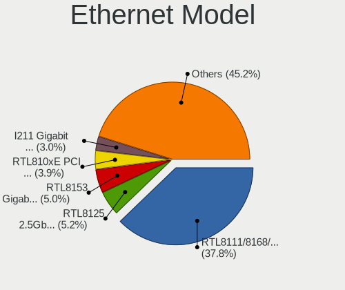

| Model                                                               | Computers | Percent |
|---------------------------------------------------------------------|-----------|---------|
| Realtek RTL8111/8168/8411 PCI Express Gigabit Ethernet Controller   | 553       | 38.11%  |
| Realtek RTL8125 2.5GbE Controller                                   | 81        | 5.58%   |
| Realtek RTL8153 Gigabit Ethernet Adapter                            | 69        | 4.76%   |
| Realtek RTL810xE PCI Express Fast Ethernet controller               | 63        | 4.34%   |
| Intel I211 Gigabit Network Connection                               | 47        | 3.24%   |
| Intel Ethernet Controller I225-V                                    | 43        | 2.96%   |
| Intel 82579LM Gigabit Network Connection (Lewisville)               | 41        | 2.83%   |
| Intel Ethernet Connection (4) I219-LM                               | 33        | 2.27%   |
| Intel Ethernet Connection (2) I219-V                                | 33        | 2.27%   |
| Intel Ethernet Connection (7) I219-V                                | 15        | 1.03%   |
| Intel Ethernet Connection I219-LM                                   | 14        | 0.96%   |
| Intel Ethernet Connection (4) I219-V                                | 14        | 0.96%   |
| Intel Ethernet Connection (10) I219-V                               | 14        | 0.96%   |
| Intel Ethernet Connection (2) I219-LM                               | 13        | 0.9%    |
| ASIX AX88179 Gigabit Ethernet                                       | 12        | 0.83%   |
| Samsung Galaxy series, misc. (tethering mode)                       | 11        | 0.76%   |
| Intel Ethernet Connection (13) I219-V                               | 11        | 0.76%   |
| Realtek RTL8152 Fast Ethernet Adapter                               | 10        | 0.69%   |
| Qualcomm Atheros Killer E2400 Gigabit Ethernet Controller           | 10        | 0.69%   |
| Intel Ethernet Connection I217-LM                                   | 10        | 0.69%   |
| Intel Ethernet Connection (16) I219-V                               | 10        | 0.69%   |
| Realtek Killer E2600 Gigabit Ethernet Controller                    | 9         | 0.62%   |
| Intel Ethernet Connection I218-LM                                   | 9         | 0.62%   |
| Intel Ethernet Connection (7) I219-LM                               | 9         | 0.62%   |
| Intel Ethernet Connection (6) I219-V                                | 9         | 0.62%   |
| Intel Ethernet Connection (3) I218-LM                               | 9         | 0.62%   |
| Xiaomi Mi/Redmi series (RNDIS)                                      | 8         | 0.55%   |
| Lenovo ThinkPad TBT 3 Dock                                          | 8         | 0.55%   |
| Intel Ethernet Connection (6) I219-LM                               | 8         | 0.55%   |
| Intel Ethernet Connection (2) I218-V                                | 8         | 0.55%   |
| Intel 82579V Gigabit Network Connection                             | 8         | 0.55%   |
| Intel 82574L Gigabit Network Connection                             | 8         | 0.55%   |
| Aquantia AQC113CS NBase-T/IEEE 802.3bz Ethernet Controller [AQtion] | 8         | 0.55%   |
| Realtek Killer E3000 2.5GbE Controller                              | 7         | 0.48%   |
| Qualcomm Atheros Killer E2500 Gigabit Ethernet Controller           | 6         | 0.41%   |
| Qualcomm Atheros AR8151 v2.0 Gigabit Ethernet                       | 6         | 0.41%   |
| Intel Ethernet Connection I219-V                                    | 6         | 0.41%   |
| Intel Ethernet Connection I217-V                                    | 6         | 0.41%   |
| Intel Ethernet Connection (11) I219-LM                              | 6         | 0.41%   |
| Broadcom NetXtreme BCM57765 Gigabit Ethernet PCIe                   | 6         | 0.41%   |

Net Controller Kind
-------------------

Ethernet, WiFi or modem

| Kind     | Computers | Percent |
|----------|-----------|---------|
| WiFi     | 1458      | 52.39%  |
| Ethernet | 1303      | 46.82%  |
| Modem    | 17        | 0.61%   |
| Unknown  | 5         | 0.18%   |

Used Controller
---------------

Currently used network controller

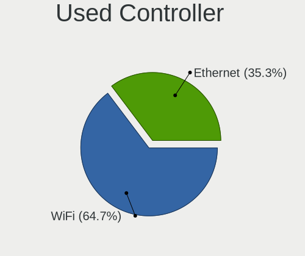

| Kind     | Computers | Percent |
|----------|-----------|---------|
| WiFi     | 1201      | 65.17%  |
| Ethernet | 642       | 34.83%  |

NICs
----

Total network controllers on board

| Total | Computers | Percent |
|-------|-----------|---------|
| 2     | 878       | 49.86%  |
| 1     | 786       | 44.63%  |
| 3     | 58        | 3.29%   |
| 0     | 27        | 1.53%   |
| 4     | 9         | 0.51%   |
| 5     | 2         | 0.11%   |
| 9     | 1         | 0.06%   |

IPv6
----

IPv6 vs IPv4

| Used | Computers | Percent |
|------|-----------|---------|
| No   | 1288      | 72.85%  |
| Yes  | 480       | 27.15%  |

Bluetooth
---------

Bluetooth Vendor
----------------

Controller vendors

| Vendor                          | Computers | Percent |
|---------------------------------|-----------|---------|
| Intel                           | 775       | 57.45%  |
| Realtek Semiconductor           | 134       | 9.93%   |
| Qualcomm Atheros Communications | 63        | 4.67%   |
| Foxconn / Hon Hai               | 62        | 4.6%    |
| IMC Networks                    | 60        | 4.45%   |
| Cambridge Silicon Radio         | 56        | 4.15%   |
| Lite-On Technology              | 40        | 2.97%   |
| Broadcom                        | 32        | 2.37%   |
| MediaTek                        | 24        | 1.78%   |
| Apple                           | 23        | 1.7%    |
| Realtek                         | 17        | 1.26%   |
| TP-Link                         | 15        | 1.11%   |
| ASUSTek Computer                | 11        | 0.82%   |
| Dell                            | 5         | 0.37%   |
| USI                             | 4         | 0.3%    |
| Toshiba                         | 4         | 0.3%    |
| Marvell Semiconductor           | 4         | 0.3%    |
| Hewlett-Packard                 | 4         | 0.3%    |
| Opticis                         | 3         | 0.22%   |
| Ralink                          | 2         | 0.15%   |
| Edimax Technology               | 2         | 0.15%   |
| Belkin Components               | 2         | 0.15%   |
| Smart Modular Technologies      | 1         | 0.07%   |
| SINO WEALTH                     | 1         | 0.07%   |
| Integrated System Solution      | 1         | 0.07%   |
| HTC (High Tech Computer)        | 1         | 0.07%   |
| Dynex                           | 1         | 0.07%   |
| Corsair                         | 1         | 0.07%   |
| Chicony Electronics             | 1         | 0.07%   |

Bluetooth Model
---------------

Controller models

| Model                                               | Computers | Percent |
|-----------------------------------------------------|-----------|---------|
| Intel AX201 Bluetooth                               | 193       | 14.29%  |
| Intel Bluetooth wireless interface                  | 174       | 12.88%  |
| Intel AX200 Bluetooth                               | 133       | 9.84%   |
| Realtek Bluetooth Radio                             | 110       | 8.14%   |
| Intel Bluetooth 9460/9560 Jefferson Peak (JfP)      | 106       | 7.85%   |
| Intel Bluetooth Device                              | 72        | 5.33%   |
| Cambridge Silicon Radio Bluetooth Dongle (HCI mode) | 56        | 4.15%   |
| Foxconn / Hon Hai Wireless_Device                   | 50        | 3.7%    |
| Intel AX210 Bluetooth                               | 49        | 3.63%   |
| Qualcomm Atheros  Bluetooth Device                  | 40        | 2.96%   |
| IMC Networks Wireless_Device                        | 31        | 2.29%   |
| MediaTek Wireless_Device                            | 24        | 1.78%   |
| Intel Wireless-AC 3168 Bluetooth                    | 22        | 1.63%   |
| Intel Wireless-AC 9260 Bluetooth Adapter            | 19        | 1.41%   |
| Realtek  Bluetooth 4.2 Adapter                      | 17        | 1.26%   |
| Realtek Bluetooth Radio                             | 17        | 1.26%   |
| IMC Networks Bluetooth Radio                        | 16        | 1.18%   |
| TP-Link UB500 Adapter                               | 15        | 1.11%   |
| Lite-On Bluetooth Device                            | 13        | 0.96%   |
| Apple Bluetooth Host Controller                     | 12        | 0.89%   |
| Qualcomm Atheros QCA61x4 Bluetooth 4.0              | 11        | 0.81%   |
| Lite-On Qualcomm Atheros QCA9377 Bluetooth          | 10        | 0.74%   |
| Broadcom BCM20702A0 Bluetooth 4.0                   | 10        | 0.74%   |
| Lite-On Wireless_Device                             | 9         | 0.67%   |
| IMC Networks Bluetooth Device                       | 9         | 0.67%   |
| Foxconn / Hon Hai Bluetooth Device                  | 9         | 0.67%   |
| Apple Bluetooth USB Host Controller                 | 9         | 0.67%   |
| Intel Centrino Bluetooth Wireless Transceiver       | 6         | 0.44%   |
| Broadcom BCM20702 Bluetooth 4.0 [ThinkPad]          | 6         | 0.44%   |
| ASUS ASUS USB-BT500                                 | 5         | 0.37%   |
| USI Bluetooth Device                                | 4         | 0.3%    |
| Qualcomm Atheros AR3012 Bluetooth 4.0               | 4         | 0.3%    |
| Qualcomm Atheros AR3011 Bluetooth                   | 4         | 0.3%    |
| Marvell Bluetooth and Wireless LAN Composite        | 4         | 0.3%    |
| Lite-On Bluetooth Radio                             | 4         | 0.3%    |
| Realtek RTL8822BE Bluetooth 4.2 Adapter             | 3         | 0.22%   |
| Qualcomm Atheros AR9462 Bluetooth                   | 3         | 0.22%   |
| Opticis Bluetooth Radio                             | 3         | 0.22%   |
| Lite-On Atheros AR3012 Bluetooth                    | 3         | 0.22%   |
| Intel Centrino Advanced-N 6230 Bluetooth adapter    | 3         | 0.22%   |

Sound
-----

Sound Vendor
------------

Sound card vendors

| Vendor                               | Computers | Percent |
|--------------------------------------|-----------|---------|
| Intel                                | 1166      | 45.23%  |
| AMD                                  | 619       | 24.01%  |
| Nvidia                               | 411       | 15.94%  |
| C-Media Electronics                  | 43        | 1.67%   |
| Logitech                             | 31        | 1.2%    |
| Lenovo                               | 19        | 0.74%   |
| Razer USA                            | 16        | 0.62%   |
| ASUSTek Computer                     | 15        | 0.58%   |
| Kingston Technology                  | 14        | 0.54%   |
| JMTek                                | 14        | 0.54%   |
| Realtek Semiconductor                | 13        | 0.5%    |
| GN Netcom                            | 13        | 0.5%    |
| Creative Labs                        | 13        | 0.5%    |
| Plantronics                          | 12        | 0.47%   |
| SteelSeries ApS                      | 10        | 0.39%   |
| Generalplus Technology               | 10        | 0.39%   |
| Focusrite-Novation                   | 10        | 0.39%   |
| Corsair                              | 9         | 0.35%   |
| Texas Instruments                    | 8         | 0.31%   |
| Creative Technology                  | 7         | 0.27%   |
| Samson Technologies                  | 6         | 0.23%   |
| Hewlett-Packard                      | 6         | 0.23%   |
| RODE Microphones                     | 5         | 0.19%   |
| Blue Microphones                     | 5         | 0.19%   |
| VIA Technologies                     | 4         | 0.16%   |
| Sony                                 | 4         | 0.16%   |
| Samsung Electronics                  | 4         | 0.16%   |
| Micro Star International             | 4         | 0.16%   |
| Dell                                 | 4         | 0.16%   |
| XMOS                                 | 3         | 0.12%   |
| Thesycon Systemsoftware & Consulting | 3         | 0.12%   |
| M-Audio                              | 3         | 0.12%   |
| Giga-Byte Technology                 | 3         | 0.12%   |
| Asahi Kasei Microsystems             | 3         | 0.12%   |
| Apple                                | 3         | 0.12%   |
| Yamaha                               | 2         | 0.08%   |
| Trust                                | 2         | 0.08%   |
| Schiit Audio                         | 2         | 0.08%   |
| PreSonus Audio Electronics           | 2         | 0.08%   |
| No brand                             | 2         | 0.08%   |

Sound Model
-----------

Sound card models

| Model                                                                      | Computers | Percent |
|----------------------------------------------------------------------------|-----------|---------|
| AMD Family 17h/19h HD Audio Controller                                     | 341       | 10.88%  |
| AMD Renoir Radeon High Definition Audio Controller                         | 214       | 6.83%   |
| Intel Sunrise Point-LP HD Audio                                            | 175       | 5.59%   |
| Intel Tiger Lake-LP Smart Sound Technology Audio Controller                | 125       | 3.99%   |
| AMD Starship/Matisse HD Audio Controller                                   | 114       | 3.64%   |
| Intel Alder Lake PCH-P High Definition Audio Controller                    | 105       | 3.35%   |
| Intel 7 Series/C216 Chipset Family High Definition Audio Controller        | 83        | 2.65%   |
| AMD Navi 21/23 HDMI/DP Audio Controller                                    | 80        | 2.55%   |
| Intel Cannon Lake PCH cAVS                                                 | 67        | 2.14%   |
| AMD Rembrandt Radeon High Definition Audio Controller                      | 63        | 2.01%   |
| Intel Cannon Point-LP High Definition Audio Controller                     | 55        | 1.76%   |
| Intel Comet Lake PCH-LP cAVS                                               | 53        | 1.69%   |
| AMD Raven/Raven2/Fenghuang HDMI/DP Audio Controller                        | 52        | 1.66%   |
| AMD Ellesmere HDMI Audio [Radeon RX 470/480 / 570/580/590]                 | 49        | 1.56%   |
| Intel 100 Series/C230 Series Chipset Family HD Audio Controller            | 47        | 1.5%    |
| Intel 8 Series/C220 Series Chipset High Definition Audio Controller        | 45        | 1.44%   |
| Nvidia GA106 High Definition Audio Controller                              | 43        | 1.37%   |
| Intel Comet Lake PCH cAVS                                                  | 40        | 1.28%   |
| Intel 6 Series/C200 Series Chipset Family High Definition Audio Controller | 38        | 1.21%   |
| Nvidia TU107 GeForce GTX 1650 High Definition Audio Controller             | 35        | 1.12%   |
| Nvidia GP107GL High Definition Audio Controller                            | 34        | 1.09%   |
| Intel 200 Series PCH HD Audio                                              | 31        | 0.99%   |
| Nvidia TU106 High Definition Audio Controller                              | 30        | 0.96%   |
| Intel Wildcat Point-LP High Definition Audio Controller                    | 30        | 0.96%   |
| Intel Tiger Lake-H HD Audio Controller                                     | 30        | 0.96%   |
| Intel Broadwell-U Audio Controller                                         | 30        | 0.96%   |
| Intel Alder Lake-S HD Audio Controller                                     | 30        | 0.96%   |
| Nvidia GA104 High Definition Audio Controller                              | 29        | 0.93%   |
| Intel Xeon E3-1200 v3/4th Gen Core Processor HD Audio Controller           | 26        | 0.83%   |
| AMD Family 17h (Models 00h-0fh) HD Audio Controller                        | 25        | 0.8%    |
| Intel Ice Lake-LP Smart Sound Technology Audio Controller                  | 24        | 0.77%   |
| Nvidia Audio device                                                        | 23        | 0.73%   |
| Nvidia TU116 High Definition Audio Controller                              | 21        | 0.67%   |
| Nvidia GP106 High Definition Audio Controller                              | 21        | 0.67%   |
| Intel Haswell-ULT HD Audio Controller                                      | 21        | 0.67%   |
| Intel CM238 HD Audio Controller                                            | 21        | 0.67%   |
| Intel 8 Series HD Audio Controller                                         | 21        | 0.67%   |
| AMD FCH Azalia Controller                                                  | 19        | 0.61%   |
| Nvidia GP104 High Definition Audio Controller                              | 18        | 0.57%   |
| AMD SBx00 Azalia (Intel HDA)                                               | 17        | 0.54%   |

Memory
------

Memory Vendor
-------------

Memory module vendors

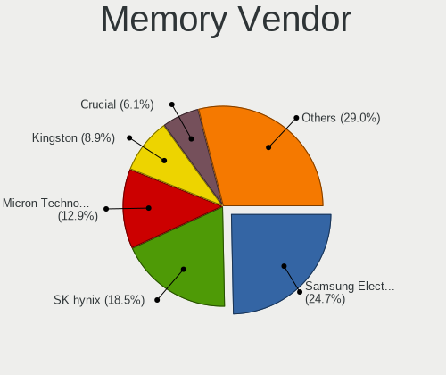

| Vendor              | Computers | Percent |
|---------------------|-----------|---------|
| Samsung Electronics | 251       | 24.85%  |
| SK hynix            | 187       | 18.51%  |
| Micron Technology   | 127       | 12.57%  |
| Kingston            | 95        | 9.41%   |
| Crucial             | 61        | 6.04%   |
| Corsair             | 53        | 5.25%   |
| G.Skill             | 48        | 4.75%   |
| Unknown             | 40        | 3.96%   |
| A-DATA Technology   | 24        | 2.38%   |
| Ramaxel Technology  | 16        | 1.58%   |
| Team                | 12        | 1.19%   |
| Unknown             | 10        | 0.99%   |
| Smart               | 8         | 0.79%   |
| Patriot             | 8         | 0.79%   |
| Elpida              | 7         | 0.69%   |
| Unknown (ABCD)      | 6         | 0.59%   |
| Nanya Technology    | 5         | 0.5%    |
| AMD                 | 4         | 0.4%    |
| Transcend           | 3         | 0.3%    |
| Avant               | 3         | 0.3%    |
| Apacer              | 3         | 0.3%    |
| Unifosa             | 2         | 0.2%    |
| PUSKILL             | 2         | 0.2%    |
| PNY                 | 2         | 0.2%    |
| Hewlett-Packard     | 2         | 0.2%    |
| GOODRAM             | 2         | 0.2%    |
| Goldkey             | 2         | 0.2%    |
| Gold Key            | 2         | 0.2%    |
| GeIL                | 2         | 0.2%    |
| Wodposit            | 1         | 0.1%    |
| Wilk                | 1         | 0.1%    |
| V-Color             | 1         | 0.1%    |
| Unknown (F288)      | 1         | 0.1%    |
| Unknown (0x0C97)    | 1         | 0.1%    |
| Unknown (0x0B5E)    | 1         | 0.1%    |
| Timetec             | 1         | 0.1%    |
| Teikon              | 1         | 0.1%    |
| Smart Brazil        | 1         | 0.1%    |
| Silicon Power       | 1         | 0.1%    |
| Qumo                | 1         | 0.1%    |

Memory Model
------------

Memory module models

| Model                                                            | Computers | Percent |
|------------------------------------------------------------------|-----------|---------|
| Samsung RAM M471A1K43DB1-CWE 8GB SODIMM DDR4 3200MT/s            | 18        | 1.69%   |
| SK hynix RAM HMAA1GS6CJR6N-XN 8GB SODIMM DDR4 3200MT/s           | 12        | 1.12%   |
| Samsung RAM M471A1K43EB1-CWE 8GB SODIMM DDR4 3200MT/s            | 12        | 1.12%   |
| Samsung RAM M471A1G44AB0-CWE 8GB SODIMM DDR4 3200MT/s            | 12        | 1.12%   |
| SK hynix RAM HMA81GS6AFR8N-UH 8GB SODIMM DDR4 2667MT/s           | 11        | 1.03%   |
| Samsung RAM M471A1G44AB0-CWE 8GB Row Of Chips DDR4 3200MT/s      | 11        | 1.03%   |
| Unknown                                                          | 10        | 0.94%   |
| Samsung RAM M471A5244CB0-CWE 4GB SODIMM DDR4 3200MT/s            | 9         | 0.84%   |
| Samsung RAM M471A1G44BB0-CWE 8GB SODIMM DDR4 3200MT/s            | 9         | 0.84%   |
| Micron RAM 4ATF1G64HZ-3G2E1 8GB Row Of Chips DDR4 3200MT/s       | 9         | 0.84%   |
| Micron RAM 8ATF1G64HZ-3G2J1 8GB SODIMM DDR4 3200MT/s             | 8         | 0.75%   |
| Samsung RAM M471A5244CB0-CTD 4GB SODIMM DDR4 3266MT/s            | 7         | 0.66%   |
| SK hynix RAM HMA81GS6DJR8N-XN 8GB SODIMM DDR4 3200MT/s           | 6         | 0.56%   |
| Samsung RAM M425R1GB4BB0-CQKOL 8GB SODIMM DDR5 4800MT/s          | 6         | 0.56%   |
| SK hynix RAM H9CCNNNCLGALAR-NVD 8GB Row Of Chips LPDDR3 2133MT/s | 5         | 0.47%   |
| Samsung RAM M471A2G44AM0-CWE 16GB SODIMM DDR4 3200MT/s           | 5         | 0.47%   |
| Samsung RAM M471A1K43BB1-CRC 8GB SODIMM DDR4 2667MT/s            | 5         | 0.47%   |
| Samsung RAM K3LKBKB@BM-MGCP 2GB Row Of Chips LPDDR5 6400MT/s     | 5         | 0.47%   |
| Micron RAM 4ATS1G64HZ-2G6E1 8GB SODIMM DDR4 2667MT/s             | 5         | 0.47%   |
| Micron RAM 4ATF51264HZ-3G2J1 4GB SODIMM DDR4 3200MT/s            | 5         | 0.47%   |
| Kingston RAM KHX3200C16D4/8GX 8GB DIMM DDR4 3600MT/s             | 5         | 0.47%   |
| G.Skill RAM F4-3200C16-8GVKB 8GB DIMM DDR4 3866MT/s              | 5         | 0.47%   |
| Corsair RAM CMK16GX4M2B3000C15 8GB DIMM DDR4 3200MT/s            | 5         | 0.47%   |
| Unknown (ABCD) RAM 123456789012345678 2GB SODIMM LPDDR4 2400MT/s | 4         | 0.37%   |
| SK hynix RAM HMT41GS6BFR8A-PB 8GB SODIMM DDR3 1600MT/s           | 4         | 0.37%   |
| SK hynix RAM HMT351S6EFR8A-PB 4GB SODIMM DDR3 1600MT/s           | 4         | 0.37%   |
| SK hynix RAM HMAA4GS6AJR8N-XN 32GB SODIMM DDR4 3200MT/s          | 4         | 0.37%   |
| SK hynix RAM HMA851S6DJR6N-XN 4GB Row Of Chips DDR4 3200MT/s     | 4         | 0.37%   |
| SK hynix RAM HMA81GS6CJR8N-VK 8GB SODIMM DDR4 2667MT/s           | 4         | 0.37%   |
| SK hynix RAM H9JCNNNCP3MLYR-N6E 4GB Row Of Chips LPDDR5 6400MT/s | 4         | 0.37%   |
| Samsung RAM M471B1G73DB0-YK0 8GB SODIMM DDR3 1600MT/s            | 4         | 0.37%   |
| Samsung RAM M471A5244CB0-CWE 4GB Row Of Chips DDR4 3200MT/s      | 4         | 0.37%   |
| Samsung RAM M471A5244CB0-CRC 4GB SODIMM DDR4 2667MT/s            | 4         | 0.37%   |
| Samsung RAM M471A4G43AB1-CWE 32GB SODIMM DDR4 3200MT/s           | 4         | 0.37%   |
| Samsung RAM M471A2K43EB1-CWE 16GB SODIMM DDR4 3200MT/s           | 4         | 0.37%   |
| Samsung RAM M471A1K43DB1-CTD 8GB SODIMM DDR4 2667MT/s            | 4         | 0.37%   |
| Samsung RAM M471A1K43CB1-CTD 8GB SODIMM DDR4 2667MT/s            | 4         | 0.37%   |
| Samsung RAM M471A1K43CB1-CRC 8GB SODIMM DDR4 2667MT/s            | 4         | 0.37%   |
| Samsung RAM M425R2GA3BB0-CQKOL 16GB SODIMM DDR5 4800MT/s         | 4         | 0.37%   |
| Micron RAM MT62F2G32D8DR-031 WT 8GB SODIMM LPDDR5 6400MT/s       | 4         | 0.37%   |

Memory Kind
-----------

Memory module kinds

| Kind    | Computers | Percent |
|---------|-----------|---------|
| DDR4    | 533       | 61.19%  |
| DDR3    | 139       | 15.96%  |
| LPDDR4  | 52        | 5.97%   |
| DDR5    | 47        | 5.4%    |
| LPDDR5  | 39        | 4.48%   |
| LPDDR3  | 34        | 3.9%    |
| DDR2    | 16        | 1.84%   |
| Unknown | 7         | 0.8%    |
| SDRAM   | 3         | 0.34%   |
| DDR     | 1         | 0.11%   |

Memory Form Factor
------------------

Physical design of the memory module

| Name         | Computers | Percent |
|--------------|-----------|---------|
| SODIMM       | 498       | 56.66%  |
| DIMM         | 224       | 25.48%  |
| Row Of Chips | 148       | 16.84%  |
| Unknown      | 4         | 0.46%   |
| Chip         | 3         | 0.34%   |
| FB-DIMM      | 2         | 0.23%   |

Memory Size
-----------

Memory module size

| Size  | Computers | Percent |
|-------|-----------|---------|
| 8192  | 428       | 46.27%  |
| 16384 | 187       | 20.22%  |
| 4096  | 175       | 18.92%  |
| 2048  | 70        | 7.57%   |
| 32768 | 54        | 5.84%   |
| 1024  | 10        | 1.08%   |
| 32767 | 1         | 0.11%   |

Memory Speed
------------

Memory module speed

| Speed   | Computers | Percent |
|---------|-----------|---------|
| 3200    | 271       | 29.11%  |
| 2667    | 140       | 15.04%  |
| 1600    | 94        | 10.1%   |
| 2400    | 61        | 6.55%   |
| 2133    | 48        | 5.16%   |
| 6400    | 40        | 4.3%    |
| 4800    | 36        | 3.87%   |
| 3600    | 27        | 2.9%    |
| 1333    | 27        | 2.9%    |
| 4267    | 26        | 2.79%   |
| 1867    | 20        | 2.15%   |
| 3466    | 11        | 1.18%   |
| 4266    | 9         | 0.97%   |
| 3266    | 9         | 0.97%   |
| 800     | 9         | 0.97%   |
| 3733    | 8         | 0.86%   |
| 3866    | 7         | 0.75%   |
| 667     | 7         | 0.75%   |
| 5200    | 5         | 0.54%   |
| 3400    | 5         | 0.54%   |
| 2666    | 5         | 0.54%   |
| 1866    | 5         | 0.54%   |
| 3800    | 4         | 0.43%   |
| 3000    | 4         | 0.43%   |
| 1800    | 4         | 0.43%   |
| 1334    | 4         | 0.43%   |
| 1066    | 4         | 0.43%   |
| 6000    | 3         | 0.32%   |
| 3666    | 3         | 0.32%   |
| 2933    | 3         | 0.32%   |
| 8400    | 2         | 0.21%   |
| 3333    | 2         | 0.21%   |
| 2800    | 2         | 0.21%   |
| 933     | 2         | 0.21%   |
| 533     | 2         | 0.21%   |
| 400     | 2         | 0.21%   |
| 333     | 2         | 0.21%   |
| Unknown | 2         | 0.21%   |
| 5808    | 1         | 0.11%   |
| 5600    | 1         | 0.11%   |

Printers & scanners
-------------------

Printer Vendor
--------------

Printer device vendors

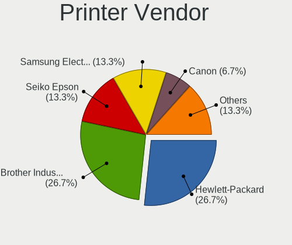

| Vendor                | Computers | Percent |
|-----------------------|-----------|---------|
| Brother Industries    | 7         | 26.92%  |
| Hewlett-Packard       | 6         | 23.08%  |
| Seiko Epson           | 4         | 15.38%  |
| Samsung Electronics   | 4         | 15.38%  |
| Canon                 | 2         | 7.69%   |
| Prolific Technology   | 1         | 3.85%   |
| MiiiW                 | 1         | 3.85%   |
| Lexmark International | 1         | 3.85%   |

Printer Model
-------------

Printer device models

| Model                         | Computers | Percent |
|-------------------------------|-----------|---------|
| Seiko Epson WP-4020 Series    | 1         | 3.85%   |
| Seiko Epson WF-2860 Series    | 1         | 3.85%   |
| Seiko Epson Printer           | 1         | 3.85%   |
| Seiko Epson L300 Series       | 1         | 3.85%   |
| Samsung SCX-4623 Series       | 1         | 3.85%   |
| Samsung SCX-4300 Series       | 1         | 3.85%   |
| Samsung ML-2855 Series        | 1         | 3.85%   |
| Samsung M2070 Series          | 1         | 3.85%   |
| Prolific PL2305 Parallel Port | 1         | 3.85%   |
| MiiiW MW USB Receiver         | 1         | 3.85%   |
| Lexmark International B2236dw | 1         | 3.85%   |
| HP Officejet 2620 series      | 1         | 3.85%   |
| HP LaserJet 1010              | 1         | 3.85%   |
| HP ENVY Photo 7800 series     | 1         | 3.85%   |
| HP DeskJet F300 series        | 1         | 3.85%   |
| HP DeskJet 5650c              | 1         | 3.85%   |
| HP DeskJet 3630 series        | 1         | 3.85%   |
| Canon TS5100 series           | 1         | 3.85%   |
| Canon LiDE 400                | 1         | 3.85%   |
| Brother MFC-7460DN            | 1         | 3.85%   |
| Brother HL-L2350DW series     | 1         | 3.85%   |
| Brother HL-L2320D series      | 1         | 3.85%   |
| Brother HL-L2300D series      | 1         | 3.85%   |
| Brother HL-2030 Laser Printer | 1         | 3.85%   |
| Brother DCP-L2510D series     | 1         | 3.85%   |
| Brother DCP-1600              | 1         | 3.85%   |

Scanner Vendor
--------------

Scanner device vendors

| Vendor      | Computers | Percent |
|-------------|-----------|---------|
| Seiko Epson | 5         | 62.5%   |
| Canon       | 3         | 37.5%   |

Scanner Model
-------------

Scanner device models

| Model                                                    | Computers | Percent |
|----------------------------------------------------------|-----------|---------|
| Seiko Epson GT-X770 [Perfection V500]                    | 2         | 25%     |
| Seiko Epson GT-6600U [Perfection 610]                    | 2         | 25%     |
| Seiko Epson GT-F500/GT-F550 [Perfection 2480/2580 PHOTO] | 1         | 12.5%   |
| Canon CanoScan N670U/N676U/LiDE 20                       | 1         | 12.5%   |
| Canon CanoScan LiDE 210                                  | 1         | 12.5%   |
| Canon CanoScan LiDE 100                                  | 1         | 12.5%   |

Camera
------

Camera Vendor
-------------

Camera device vendors

| Vendor                                 | Computers | Percent |
|----------------------------------------|-----------|---------|
| Chicony Electronics                    | 277       | 22.18%  |
| IMC Networks                           | 161       | 12.89%  |
| Microdia                               | 122       | 9.77%   |
| Logitech                               | 95        | 7.61%   |
| Quanta                                 | 92        | 7.37%   |
| Acer                                   | 81        | 6.49%   |
| Realtek Semiconductor                  | 62        | 4.96%   |
| Sunplus Innovation Technology          | 54        | 4.32%   |
| Luxvisions Innotech Limited            | 37        | 2.96%   |
| Cheng Uei Precision Industry (Foxlink) | 36        | 2.88%   |
| Syntek                                 | 33        | 2.64%   |
| Apple                                  | 24        | 1.92%   |
| Lite-On Technology                     | 22        | 1.76%   |
| Sonix Technology                       | 19        | 1.52%   |
| Microsoft                              | 13        | 1.04%   |
| Bison Electronics                      | 13        | 1.04%   |
| Silicon Motion                         | 10        | 0.8%    |
| Suyin                                  | 8         | 0.64%   |
| Samsung Electronics                    | 8         | 0.64%   |
| SunplusIT                              | 7         | 0.56%   |
| Alcor Micro                            | 5         | 0.4%    |
| Tripath Technology                     | 4         | 0.32%   |
| MacroSilicon                           | 4         | 0.32%   |
| KYE Systems (Mouse Systems)            | 4         | 0.32%   |
| AVerMedia Technologies                 | 4         | 0.32%   |
| WaveRider Communications               | 3         | 0.24%   |
| Primax Electronics                     | 3         | 0.24%   |
| LG Electronics                         | 3         | 0.24%   |
| webcam                                 | 2         | 0.16%   |
| USB Camera                             | 2         | 0.16%   |
| Trust                                  | 2         | 0.16%   |
| Shenzhen Kingcome Optoelectronic       | 2         | 0.16%   |
| Lenovo                                 | 2         | 0.16%   |
| kingcome                               | 2         | 0.16%   |
| Importek                               | 2         | 0.16%   |
| Hewlett-Packard                        | 2         | 0.16%   |
| Generalplus Technology                 | 2         | 0.16%   |
| Cubeternet                             | 2         | 0.16%   |
| ARC International                      | 2         | 0.16%   |
| A4Tech                                 | 2         | 0.16%   |

Camera Model
------------

Camera device models

| Model                                                | Computers | Percent |
|------------------------------------------------------|-----------|---------|
| Chicony Integrated Camera                            | 101       | 8.02%   |
| Microdia Integrated_Webcam_HD                        | 63        | 5%      |
| IMC Networks USB2.0 HD UVC WebCam                    | 53        | 4.21%   |
| IMC Networks Integrated Camera                       | 48        | 3.81%   |
| Realtek Integrated_Webcam_HD                         | 36        | 2.86%   |
| Acer Integrated Camera                               | 31        | 2.46%   |
| Syntek Integrated Camera                             | 23        | 1.83%   |
| Chicony HD WebCam                                    | 22        | 1.75%   |
| Quanta HD User Facing                                | 19        | 1.51%   |
| Sunplus Integrated_Webcam_HD                         | 18        | 1.43%   |
| IMC Networks HD Camera                               | 18        | 1.43%   |
| Microdia Integrated_Webcam_FHD                       | 17        | 1.35%   |
| Logitech HD Pro Webcam C920                          | 17        | 1.35%   |
| Logitech Webcam C270                                 | 15        | 1.19%   |
| Quanta HP HD Camera                                  | 13        | 1.03%   |
| Chicony HP Wide Vision HD Camera                     | 13        | 1.03%   |
| Quanta HP Wide Vision HD Camera                      | 12        | 0.95%   |
| IMC Networks USB2.0 VGA UVC WebCam                   | 12        | 0.95%   |
| Sonix USB2.0 HD UVC WebCam                           | 11        | 0.87%   |
| Luxvisions Innotech Limited Integrated RGB Camera    | 11        | 0.87%   |
| Chicony Integrated IR Camera                         | 11        | 0.87%   |
| Chicony Integrated Camera (1280x720@30)              | 11        | 0.87%   |
| Logitech C922 Pro Stream Webcam                      | 10        | 0.79%   |
| Lite-On Integrated Camera                            | 10        | 0.79%   |
| Chicony USB2.0 Camera                                | 10        | 0.79%   |
| Chicony HP TrueVision HD Camera                      | 10        | 0.79%   |
| Chicony HP HD Camera                                 | 10        | 0.79%   |
| Apple iPhone 5/5C/5S/6/SE/7/8/X                      | 10        | 0.79%   |
| Logitech HD Webcam C525                              | 9         | 0.71%   |
| Chicony HD User Facing                               | 9         | 0.71%   |
| Samsung Galaxy A5 (MTP)                              | 8         | 0.64%   |
| Chicony EasyCamera                                   | 8         | 0.64%   |
| Bison Integrated Camera                              | 8         | 0.64%   |
| Acer SunplusIT Integrated Camera                     | 8         | 0.64%   |
| Acer HD Webcam                                       | 8         | 0.64%   |
| Quanta VGA WebCam                                    | 7         | 0.56%   |
| Quanta HP TrueVision HD Camera                       | 7         | 0.56%   |
| Microdia USB 2.0 Camera                              | 7         | 0.56%   |
| Luxvisions Innotech Limited Integrated Camera        | 7         | 0.56%   |
| Luxvisions Innotech Limited HP Wide Vision HD Camera | 7         | 0.56%   |

Security
--------

Fingerprint Vendor
------------------

Fingerprint sensor vendors

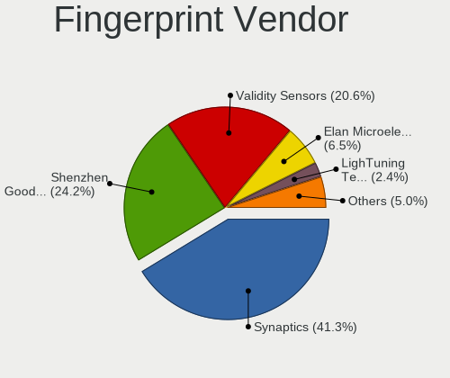

| Vendor                             | Computers | Percent |
|------------------------------------|-----------|---------|
| Synaptics                          | 121       | 41.72%  |
| Shenzhen Goodix Technology         | 65        | 22.41%  |
| Validity Sensors                   | 60        | 20.69%  |
| Elan Microelectronics              | 22        | 7.59%   |
| LighTuning Technology              | 7         | 2.41%   |
| AuthenTec                          | 5         | 1.72%   |
| Realtek USB2.0 Finger Print Bridge | 3         | 1.03%   |
| Upek                               | 2         | 0.69%   |
| Samsung Electronics                | 2         | 0.69%   |
| STMicroelectronics                 | 1         | 0.34%   |
| Microsoft                          | 1         | 0.34%   |
| DigitalPersona                     | 1         | 0.34%   |

Fingerprint Model
-----------------

Fingerprint sensor models

| Model                                                                      | Computers | Percent |
|----------------------------------------------------------------------------|-----------|---------|
| Synaptics Prometheus MIS Touch Fingerprint Reader                          | 53        | 18.28%  |
| Shenzhen Goodix  Fingerprint Device                                        | 47        | 16.21%  |
| Synaptics Metallica MIS Touch Fingerprint Reader                           | 14        | 4.83%   |
| Validity Sensors Synaptics WBDI                                            | 13        | 4.48%   |
| Elan ELAN:ARM-M4                                                           | 13        | 4.48%   |
| Shenzhen Goodix Fingerprint Reader                                         | 11        | 3.79%   |
| Validity Sensors VFS 5011 fingerprint sensor                               | 10        | 3.45%   |
| Validity Sensors VFS495 Fingerprint Reader                                 | 9         | 3.1%    |
| Synaptics  WBDI                                                            | 9         | 3.1%    |
| Synaptics FS7604 Touch Fingerprint Sensor with PurePrint                   | 9         | 3.1%    |
| Synaptics WBDI                                                             | 8         | 2.76%   |
| Elan ELAN:Fingerprint                                                      | 8         | 2.76%   |
| Synaptics UWP WBDI Device                                                  | 7         | 2.41%   |
| Synaptics UWP WBDI                                                         | 7         | 2.41%   |
| Shenzhen Goodix FingerPrint                                                | 7         | 2.41%   |
| Validity Sensors Synaptics VFS7552 Touch Fingerprint Sensor with PurePrint | 6         | 2.07%   |
| Validity Sensors VFS5011 Fingerprint Reader                                | 5         | 1.72%   |
| Validity Sensors Synaptics VFS7552 Touch Fingerprint Sensor                | 5         | 1.72%   |
| Synaptics WBDI Fingerprint Reader USB 086                                  | 5         | 1.72%   |
| Validity Sensors VFS7500 Touch Fingerprint Sensor                          | 4         | 1.38%   |
| Validity Sensors VFS491                                                    | 3         | 1.03%   |
| Synaptics  VFS7552 Touch Fingerprint Sensor with PurePrint                 | 3         | 1.03%   |
| Realtek USB2.0 Finger Print Bridge FocalTech Fingerprint Device            | 3         | 1.03%   |
| LighTuning EgisTec Touch Fingerprint Sensor                                | 3         | 1.03%   |
| AuthenTec AES1600                                                          | 3         | 1.03%   |
| Validity Sensors VFS471 Fingerprint Reader                                 | 2         | 0.69%   |
| Upek Biometric Touchchip/Touchstrip Fingerprint Sensor                     | 2         | 0.69%   |
| Synaptics WBDI Fingerprint Reader USB 102                                  | 2         | 0.69%   |
| Synaptics  FS7604 Touch Fingerprint Sensor with PurePrint                  | 2         | 0.69%   |
| LighTuning Fingerprint Sensor                                              | 2         | 0.69%   |
| LighTuning ES603 Swipe Fingerprint Sensor                                  | 2         | 0.69%   |
| AuthenTec AES2810                                                          | 2         | 0.69%   |
| Validity Sensors VFS7552 Touch Fingerprint Sensor                          | 1         | 0.34%   |
| Validity Sensors VFS451 Fingerprint Reader                                 | 1         | 0.34%   |
| Validity Sensors VFS Fingerprint sensor                                    | 1         | 0.34%   |
| Synaptics WBDI Device                                                      | 1         | 0.34%   |
| Synaptics Metallica MOH Touch Fingerprint Reader                           | 1         | 0.34%   |
| STMicroelectronics Fingerprint Reader                                      | 1         | 0.34%   |
| Samsung Fingerprint Sensor Device - 730B                                   | 1         | 0.34%   |
| Samsung Fingerprint Device                                                 | 1         | 0.34%   |

Chipcard Vendor
---------------

Chipcard module vendors

| Vendor                   | Computers | Percent |
|--------------------------|-----------|---------|
| Broadcom                 | 45        | 43.27%  |
| Alcor Micro              | 42        | 40.38%  |
| Upek                     | 6         | 5.77%   |
| Lenovo                   | 3         | 2.88%   |
| O2 Micro                 | 2         | 1.92%   |
| Gemalto (was Gemplus)    | 2         | 1.92%   |
| Yubico.com               | 1         | 0.96%   |
| Reiner SCT Kartensysteme | 1         | 0.96%   |
| Purism, SPC              | 1         | 0.96%   |
| Aktiv                    | 1         | 0.96%   |

Chipcard Model
--------------

Chipcard module models

| Model                                                                        | Computers | Percent |
|------------------------------------------------------------------------------|-----------|---------|
| Alcor Micro AU9540 Smartcard Reader                                          | 42        | 40.38%  |
| Broadcom 58200                                                               | 19        | 18.27%  |
| Broadcom 5880                                                                | 17        | 16.35%  |
| Broadcom BCM5880 Secure Applications Processor                               | 7         | 6.73%   |
| Upek TouchChip Fingerprint Coprocessor (WBF advanced mode)                   | 6         | 5.77%   |
| Lenovo Integrated Smart Card Reader                                          | 3         | 2.88%   |
| O2 Micro Oz776 SmartCard Reader                                              | 2         | 1.92%   |
| Gemalto (was Gemplus) Compact Smart Card Reader Writer                       | 2         | 1.92%   |
| Broadcom BCM5880 Secure Applications Processor with fingerprint swipe sensor | 2         | 1.92%   |
| Yubico.com Yubikey 4/5 U2F+CCID                                              | 1         | 0.96%   |
| Reiner SCT Kartensysteme cyberJack RFID basis contactless smartcard reader   | 1         | 0.96%   |
| Purism, SPC Librem Key                                                       | 1         | 0.96%   |
| Aktiv Rutoken lite                                                           | 1         | 0.96%   |

Unsupported
-----------

Unsupported Devices
-------------------

Total unsupported devices on board

| Total | Computers | Percent |
|-------|-----------|---------|
| 0     | 1186      | 66.78%  |
| 1     | 490       | 27.59%  |
| 2     | 73        | 4.11%   |
| 3     | 12        | 0.68%   |
| 4     | 6         | 0.34%   |
| 5     | 5         | 0.28%   |
| 7     | 3         | 0.17%   |
| 8     | 1         | 0.06%   |

Unsupported Device Types
------------------------

Types of unsupported devices

| Type                     | Computers | Percent |
|--------------------------|-----------|---------|
| Fingerprint reader       | 286       | 40.4%   |
| Graphics card            | 164       | 23.16%  |
| Multimedia controller    | 78        | 11.02%  |
| Net/wireless             | 47        | 6.64%   |
| Camera                   | 32        | 4.52%   |
| Chipcard                 | 23        | 3.25%   |
| Sound                    | 20        | 2.82%   |
| Communication controller | 12        | 1.69%   |
| Bluetooth                | 10        | 1.41%   |
| Unassigned class         | 9         | 1.27%   |
| Card reader              | 9         | 1.27%   |
| Net/ethernet             | 6         | 0.85%   |
| Network                  | 4         | 0.56%   |
| Storage/raid             | 3         | 0.42%   |
| Storage                  | 3         | 0.42%   |
| Modem                    | 1         | 0.14%   |
| Firewire controller      | 1         | 0.14%   |

