Fedora 37 - Tested Hardware & Statistics
----------------------------------------

A project to collect tested hardware configurations for Fedora 37.

Anyone can contribute to this report by the [hw-probe](https://github.com/linuxhw/hw-probe) tool:

    sudo -E hw-probe -all -upload

Please contribute! Especially if your hardware is rare.

This is a report for all computer types. See also reports for [desktops](/Dist/Fedora_37/Desktop/README.md) and [notebooks](/Dist/Fedora_37/Notebook/README.md).

Contents
--------

* [ Test Cases ](#test-cases)

* [ System ](#system)
  - [ Kernel                   ](#kernel)
  - [ Kernel Family            ](#kernel-family)
  - [ Kernel Major Ver.        ](#kernel-major-ver)
  - [ Arch                     ](#arch)
  - [ DE                       ](#de)
  - [ Display Server           ](#display-server)
  - [ Display Manager          ](#display-manager)
  - [ OS Lang                  ](#os-lang)
  - [ Boot Mode                ](#boot-mode)
  - [ Filesystem               ](#filesystem)
  - [ Part. scheme             ](#part-scheme)
  - [ Dual Boot with Linux/BSD ](#dual-boot-with-linuxbsd)
  - [ Dual Boot (Win)          ](#dual-boot-win)

* [ Board ](#board)
  - [ Vendor                   ](#vendor)
  - [ Model                    ](#model)
  - [ Model Family             ](#model-family)
  - [ MFG Year                 ](#mfg-year)
  - [ Form Factor              ](#form-factor)
  - [ Secure Boot              ](#secure-boot)
  - [ Coreboot                 ](#coreboot)
  - [ RAM Size                 ](#ram-size)
  - [ RAM Used                 ](#ram-used)
  - [ Total Drives             ](#total-drives)
  - [ Has CD-ROM               ](#has-cd-rom)
  - [ Has Ethernet             ](#has-ethernet)
  - [ Has WiFi                 ](#has-wifi)
  - [ Has Bluetooth            ](#has-bluetooth)

* [ Location ](#location)
  - [ Country                  ](#country)
  - [ City                     ](#city)

* [ Drives ](#drives)
  - [ Drive Vendor             ](#drive-vendor)
  - [ Drive Model              ](#drive-model)
  - [ HDD Vendor               ](#hdd-vendor)
  - [ SSD Vendor               ](#ssd-vendor)
  - [ Drive Kind               ](#drive-kind)
  - [ Drive Connector          ](#drive-connector)
  - [ Drive Size               ](#drive-size)
  - [ Space Total              ](#space-total)
  - [ Space Used               ](#space-used)
  - [ Malfunc. Drives          ](#malfunc-drives)
  - [ Malfunc. Drive Vendor    ](#malfunc-drive-vendor)
  - [ Malfunc. HDD Vendor      ](#malfunc-hdd-vendor)
  - [ Malfunc. Drive Kind      ](#malfunc-drive-kind)
  - [ Failed Drives            ](#failed-drives)
  - [ Failed Drive Vendor      ](#failed-drive-vendor)
  - [ Drive Status             ](#drive-status)

* [ Storage controller ](#storage-controller)
  - [ Storage Vendor           ](#storage-vendor)
  - [ Storage Model            ](#storage-model)
  - [ Storage Kind             ](#storage-kind)

* [ Processor ](#processor)
  - [ CPU Vendor               ](#cpu-vendor)
  - [ CPU Model                ](#cpu-model)
  - [ CPU Model Family         ](#cpu-model-family)
  - [ CPU Cores                ](#cpu-cores)
  - [ CPU Sockets              ](#cpu-sockets)
  - [ CPU Threads              ](#cpu-threads)
  - [ CPU Op-Modes             ](#cpu-op-modes)
  - [ CPU Microcode            ](#cpu-microcode)
  - [ CPU Microarch            ](#cpu-microarch)

* [ Graphics ](#graphics)
  - [ GPU Vendor               ](#gpu-vendor)
  - [ GPU Model                ](#gpu-model)
  - [ GPU Combo                ](#gpu-combo)
  - [ GPU Driver               ](#gpu-driver)
  - [ GPU Memory               ](#gpu-memory)

* [ Monitor ](#monitor)
  - [ Monitor Vendor           ](#monitor-vendor)
  - [ Monitor Model            ](#monitor-model)
  - [ Monitor Resolution       ](#monitor-resolution)
  - [ Monitor Diagonal         ](#monitor-diagonal)
  - [ Monitor Width            ](#monitor-width)
  - [ Aspect Ratio             ](#aspect-ratio)
  - [ Monitor Area             ](#monitor-area)
  - [ Pixel Density            ](#pixel-density)
  - [ Multiple Monitors        ](#multiple-monitors)

* [ Network ](#network)
  - [ Net Controller Vendor    ](#net-controller-vendor)
  - [ Net Controller Model     ](#net-controller-model)
  - [ Wireless Vendor          ](#wireless-vendor)
  - [ Wireless Model           ](#wireless-model)
  - [ Ethernet Vendor          ](#ethernet-vendor)
  - [ Ethernet Model           ](#ethernet-model)
  - [ Net Controller Kind      ](#net-controller-kind)
  - [ Used Controller          ](#used-controller)
  - [ NICs                     ](#nics)
  - [ IPv6                     ](#ipv6)

* [ Bluetooth ](#bluetooth)
  - [ Bluetooth Vendor         ](#bluetooth-vendor)
  - [ Bluetooth Model          ](#bluetooth-model)

* [ Sound ](#sound)
  - [ Sound Vendor             ](#sound-vendor)
  - [ Sound Model              ](#sound-model)

* [ Memory ](#memory)
  - [ Memory Vendor            ](#memory-vendor)
  - [ Memory Model             ](#memory-model)
  - [ Memory Kind              ](#memory-kind)
  - [ Memory Form Factor       ](#memory-form-factor)
  - [ Memory Size              ](#memory-size)
  - [ Memory Speed             ](#memory-speed)

* [ Printers & scanners ](#printers--scanners)
  - [ Printer Vendor           ](#printer-vendor)
  - [ Printer Model            ](#printer-model)
  - [ Scanner Vendor           ](#scanner-vendor)
  - [ Scanner Model            ](#scanner-model)

* [ Camera ](#camera)
  - [ Camera Vendor            ](#camera-vendor)
  - [ Camera Model             ](#camera-model)

* [ Security ](#security)
  - [ Fingerprint Vendor       ](#fingerprint-vendor)
  - [ Fingerprint Model        ](#fingerprint-model)
  - [ Chipcard Vendor          ](#chipcard-vendor)
  - [ Chipcard Model           ](#chipcard-model)

* [ Unsupported ](#unsupported)
  - [ Unsupported Devices      ](#unsupported-devices)
  - [ Unsupported Device Types ](#unsupported-device-types)

Test Cases
----------

Total: 82

| Vendor        | Model                       | Form-Factor | Probe                                                      | Date         |
|---------------|-----------------------------|-------------|------------------------------------------------------------|--------------|
| Timi          | A35S                        | Notebook    | [c46c820c25](https://linux-hardware.org/?probe=c46c820c25) | Oct 01, 2022 |
| Lenovo        | ThinkPad T470s 20HGS09L0... | Notebook    | [7c384e5578](https://linux-hardware.org/?probe=7c384e5578) | Sep 30, 2022 |
| A-DATA Tec... | XENIA 14                    | Notebook    | [251f390772](https://linux-hardware.org/?probe=251f390772) | Sep 30, 2022 |
| Dell          | Latitude 7430               | Notebook    | [2151370437](https://linux-hardware.org/?probe=2151370437) | Sep 29, 2022 |
| A-DATA Tec... | XENIA 14                    | Notebook    | [e819e5dc14](https://linux-hardware.org/?probe=e819e5dc14) | Sep 29, 2022 |
| HP            | ZBook 15 G3                 | Notebook    | [1d612b997a](https://linux-hardware.org/?probe=1d612b997a) | Sep 29, 2022 |
| ASUSTek       | PRIME Z270-A                | Desktop     | [4118e245a3](https://linux-hardware.org/?probe=4118e245a3) | Sep 29, 2022 |
| ASUSTek       | X550CL                      | Notebook    | [ded047597e](https://linux-hardware.org/?probe=ded047597e) | Sep 28, 2022 |
| Timi          | A35S                        | Notebook    | [bdb2ba4eab](https://linux-hardware.org/?probe=bdb2ba4eab) | Sep 27, 2022 |
| Intel         | DP35DP AAD81073-208         | Desktop     | [031ff09179](https://linux-hardware.org/?probe=031ff09179) | Sep 27, 2022 |
| Lenovo        | ThinkBook 14s Yoga ITL 2... | Convertible | [98742c4135](https://linux-hardware.org/?probe=98742c4135) | Sep 27, 2022 |
| ASUSTek       | ROG Zephyrus G14 GA401IH... | Notebook    | [7c62f5131f](https://linux-hardware.org/?probe=7c62f5131f) | Sep 27, 2022 |
| Gigabyte      | Z170-D3H-CF                 | Desktop     | [254a78c371](https://linux-hardware.org/?probe=254a78c371) | Sep 26, 2022 |
| Lenovo        | IdeaPad 310-14ISK 80UG      | Notebook    | [d8b270de2b](https://linux-hardware.org/?probe=d8b270de2b) | Sep 25, 2022 |
| ASUSTek       | ROG Strix G513QY_G513QY     | Notebook    | [9f37c7c4fa](https://linux-hardware.org/?probe=9f37c7c4fa) | Sep 25, 2022 |
| ASUSTek       | ROG Strix G513QY_G513QY     | Notebook    | [0d790a94fa](https://linux-hardware.org/?probe=0d790a94fa) | Sep 25, 2022 |
| Dell          | XPS 15 9520                 | Notebook    | [fab5b34402](https://linux-hardware.org/?probe=fab5b34402) | Sep 25, 2022 |
| Acer          | Aspire X1900                | Desktop     | [c7b768051b](https://linux-hardware.org/?probe=c7b768051b) | Sep 25, 2022 |
| Dell          | Inspiron 15 7000 Gaming     | Notebook    | [2e96ddfdd1](https://linux-hardware.org/?probe=2e96ddfdd1) | Sep 25, 2022 |
| Dell          | Inspiron 14 7425 2-in-1     | Convertible | [9a7ec70bad](https://linux-hardware.org/?probe=9a7ec70bad) | Sep 25, 2022 |
| ASRock        | FM2A88X Extreme4+           | Desktop     | [2d44b203f9](https://linux-hardware.org/?probe=2d44b203f9) | Sep 25, 2022 |
| Lenovo        | ThinkBook 13s G3 ACN 20Y... | Notebook    | [96f4499ec5](https://linux-hardware.org/?probe=96f4499ec5) | Sep 25, 2022 |
| Lenovo        | ThinkPad E495 20NE001RTX    | Notebook    | [91bd22b430](https://linux-hardware.org/?probe=91bd22b430) | Sep 25, 2022 |
| Dell          | XPS 13 9380                 | Notebook    | [332540a4c8](https://linux-hardware.org/?probe=332540a4c8) | Sep 24, 2022 |
| Lenovo        | Yoga 310-11IAP 80U2         | Convertible | [b598ecc4f8](https://linux-hardware.org/?probe=b598ecc4f8) | Sep 24, 2022 |
| Lenovo        | IdeaPad 5 15ALC05 82LN      | Notebook    | [24b2810c64](https://linux-hardware.org/?probe=24b2810c64) | Sep 24, 2022 |
| ASUSTek       | TUF Gaming X570-PLUS        | Desktop     | [ee8183722c](https://linux-hardware.org/?probe=ee8183722c) | Sep 24, 2022 |
| Lenovo        | ThinkPad T440s 20ARA0YL0... | Notebook    | [93eedc638b](https://linux-hardware.org/?probe=93eedc638b) | Sep 24, 2022 |
| Lenovo        | ThinkPad Edge E540 20C60... | Notebook    | [b7f6ab8ad0](https://linux-hardware.org/?probe=b7f6ab8ad0) | Sep 23, 2022 |
| Timi          | A35S                        | Notebook    | [d0f195a77a](https://linux-hardware.org/?probe=d0f195a77a) | Sep 23, 2022 |
| ASUSTek       | TUF Gaming X570-PLUS        | Desktop     | [ac59b4138c](https://linux-hardware.org/?probe=ac59b4138c) | Sep 23, 2022 |
| Dell          | XPS 9320                    | Notebook    | [959d1406dd](https://linux-hardware.org/?probe=959d1406dd) | Sep 23, 2022 |
| ASUSTek       | Pro WS WRX80E-SAGE SE WI... | Desktop     | [54d3096bb6](https://linux-hardware.org/?probe=54d3096bb6) | Sep 21, 2022 |
| Gigabyte      | X570 I AORUS PRO WIFI       | Desktop     | [1869422fde](https://linux-hardware.org/?probe=1869422fde) | Sep 20, 2022 |
| ASUSTek       | Z170-A                      | Desktop     | [aad09d3281](https://linux-hardware.org/?probe=aad09d3281) | Sep 20, 2022 |
| Acer          | Nitro AN517-51              | Notebook    | [7bd22a5e38](https://linux-hardware.org/?probe=7bd22a5e38) | Sep 20, 2022 |
| Lenovo        | IdeaPad 320-15IAP 80XR      | Notebook    | [1da95a964b](https://linux-hardware.org/?probe=1da95a964b) | Sep 20, 2022 |
| ASUSTek       | PRIME X470-PRO              | Desktop     | [a6857e4b03](https://linux-hardware.org/?probe=a6857e4b03) | Sep 19, 2022 |
| Gigabyte      | X570 AORUS MASTER           | Desktop     | [424e3ded44](https://linux-hardware.org/?probe=424e3ded44) | Sep 19, 2022 |
| HP            | 2B05                        | Desktop     | [c2dcdaa38a](https://linux-hardware.org/?probe=c2dcdaa38a) | Sep 19, 2022 |
| HP            | 2B05                        | Desktop     | [18db320ef7](https://linux-hardware.org/?probe=18db320ef7) | Sep 19, 2022 |
| Gigabyte      | B85M-D3V-A                  | Desktop     | [8f6b96ba44](https://linux-hardware.org/?probe=8f6b96ba44) | Sep 19, 2022 |
| Lenovo        | ThinkPad X1 Carbon Gen 9... | Notebook    | [be279328b1](https://linux-hardware.org/?probe=be279328b1) | Sep 19, 2022 |
| ASUSTek       | ProArt Z690-CREATOR WIFI    | Desktop     | [48479f01c1](https://linux-hardware.org/?probe=48479f01c1) | Sep 19, 2022 |
| ASUSTek       | TUF Gaming B550M-PLUS       | Desktop     | [8468466b2a](https://linux-hardware.org/?probe=8468466b2a) | Sep 19, 2022 |
| Lenovo        | IdeaPad 5 Pro 14ARH7 82S... | Notebook    | [3615e82cb6](https://linux-hardware.org/?probe=3615e82cb6) | Sep 17, 2022 |
| Lenovo        | ThinkPad T14 Gen 1 20UES... | Notebook    | [9c23c7bb58](https://linux-hardware.org/?probe=9c23c7bb58) | Sep 17, 2022 |
| Irbis         | NB264                       | Notebook    | [e9361bf1c8](https://linux-hardware.org/?probe=e9361bf1c8) | Sep 17, 2022 |
| ASUSTek       | T101HA                      | Tablet      | [247e54458c](https://linux-hardware.org/?probe=247e54458c) | Sep 17, 2022 |
| ASUSTek       | T101HA                      | Tablet      | [e138435857](https://linux-hardware.org/?probe=e138435857) | Sep 17, 2022 |
| HP            | 3397                        | Desktop     | [637a5570cf](https://linux-hardware.org/?probe=637a5570cf) | Sep 16, 2022 |
| Lenovo        | ThinkBook 14-IIL 20SL       | Notebook    | [9497f1e17f](https://linux-hardware.org/?probe=9497f1e17f) | Sep 16, 2022 |
| ASUSTek       | ROG Zephyrus M16 GU603ZX... | Notebook    | [099e5d3523](https://linux-hardware.org/?probe=099e5d3523) | Sep 16, 2022 |
| Gigabyte      | AB350N-Gaming WIFI-CF       | Desktop     | [dcaf7e8bd0](https://linux-hardware.org/?probe=dcaf7e8bd0) | Sep 15, 2022 |
| Acer          | Spin SP313-51N              | Convertible | [c62891882f](https://linux-hardware.org/?probe=c62891882f) | Sep 15, 2022 |
| Gigabyte      | B85M-D3V-A                  | Desktop     | [a856637b19](https://linux-hardware.org/?probe=a856637b19) | Sep 15, 2022 |
| ASUSTek       | ZenBook UX425IA_UM425IA     | Notebook    | [26cdf51338](https://linux-hardware.org/?probe=26cdf51338) | Sep 15, 2022 |
| ASUSTek       | PRIME Z270-A                | Desktop     | [2642647feb](https://linux-hardware.org/?probe=2642647feb) | Sep 14, 2022 |
| Lenovo        | ThinkPad X1 Carbon Gen 8... | Notebook    | [ec8f0a9ebf](https://linux-hardware.org/?probe=ec8f0a9ebf) | Sep 14, 2022 |
| HUAWEI        | HVY-WXX9                    | Notebook    | [8fab790c57](https://linux-hardware.org/?probe=8fab790c57) | Sep 14, 2022 |
| System76      | Lemur Pro                   | Notebook    | [d6682a260a](https://linux-hardware.org/?probe=d6682a260a) | Sep 14, 2022 |
| Lenovo        | ThinkPad T14 Gen 2a 20XK... | Notebook    | [4aa3e2b6c2](https://linux-hardware.org/?probe=4aa3e2b6c2) | Sep 14, 2022 |
| HP            | Laptop 17-cp0xxx            | Notebook    | [c05d80959b](https://linux-hardware.org/?probe=c05d80959b) | Sep 14, 2022 |
| ASUSTek       | TUF Gaming B550M-PLUS       | Desktop     | [3557099732](https://linux-hardware.org/?probe=3557099732) | Sep 14, 2022 |
| HP            | 1998                        | Desktop     | [bf93a500f4](https://linux-hardware.org/?probe=bf93a500f4) | Sep 14, 2022 |
| HUAWEI        | HVY-WXX9                    | Notebook    | [d574f5da9b](https://linux-hardware.org/?probe=d574f5da9b) | Sep 13, 2022 |
| ASUSTek       | ASUS TUF Gaming F15 FX50... | Notebook    | [7326474aae](https://linux-hardware.org/?probe=7326474aae) | Sep 13, 2022 |
| AXDIA Inte... | WINPAD V10                  | Notebook    | [b3e5abaf4b](https://linux-hardware.org/?probe=b3e5abaf4b) | Sep 09, 2022 |
| TUXEDO        | InfinityBook S 15/17 Gen... | Notebook    | [e1a78657ba](https://linux-hardware.org/?probe=e1a78657ba) | Sep 07, 2022 |
| Raspberry ... | Raspberry Pi 4 Model B R... | Soc         | [47dbe77b54](https://linux-hardware.org/?probe=47dbe77b54) | Sep 02, 2022 |
| Lenovo        | Legion 5 Pro 16ITH6H 82J... | Notebook    | [681486095a](https://linux-hardware.org/?probe=681486095a) | Aug 27, 2022 |
| MSI           | Z370 TOMAHAWK               | Desktop     | [251d227686](https://linux-hardware.org/?probe=251d227686) | Aug 22, 2022 |
| Lenovo        | ThinkPad W510 4391F66       | Notebook    | [a92e3ba61f](https://linux-hardware.org/?probe=a92e3ba61f) | Aug 19, 2022 |
| HP            | EliteBook 820 G1            | Notebook    | [1bdfc2f218](https://linux-hardware.org/?probe=1bdfc2f218) | Aug 09, 2022 |
| Samsung       | 270E5G/270E5U               | Notebook    | [d1f2245fb4](https://linux-hardware.org/?probe=d1f2245fb4) | Jul 18, 2022 |
| Dell          | 08NPPY A00                  | Desktop     | [93eb00c3c5](https://linux-hardware.org/?probe=93eb00c3c5) | Jun 16, 2022 |
| ASUSTek       | P8Z68-V LX                  | Desktop     | [2cd65296c2](https://linux-hardware.org/?probe=2cd65296c2) | May 08, 2022 |
| HUAWEI        | HVY-WXX9                    | Notebook    | [43098a1f34](https://linux-hardware.org/?probe=43098a1f34) | Apr 23, 2022 |
| HUAWEI        | DRC-WXX                     | Tablet      | [b2b1324db9](https://linux-hardware.org/?probe=b2b1324db9) | Apr 22, 2022 |
| HP            | Laptop 14-dq2xxx            | Notebook    | [2477951c04](https://linux-hardware.org/?probe=2477951c04) | Apr 15, 2022 |
| HP            | 0B54h D                     | Desktop     | [7153ec172b](https://linux-hardware.org/?probe=7153ec172b) | Mar 21, 2022 |
| HP            | 0B54h D                     | Desktop     | [399cc50503](https://linux-hardware.org/?probe=399cc50503) | Mar 02, 2022 |

System
------

Kernel
------

Version of the Linux kernel

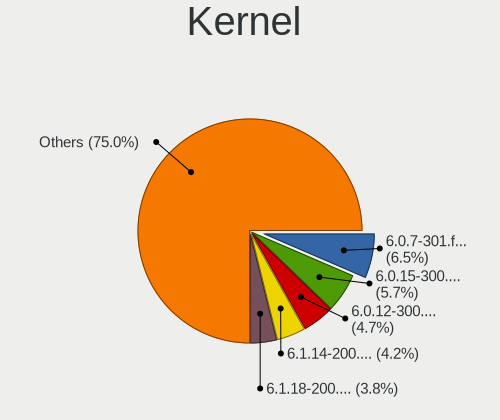

| Version                                                | Computers | Percent |
|--------------------------------------------------------|-----------|---------|
| 5.19.8-300.fc37.x86_64                                 | 15        | 22.06%  |
| 5.19.9-300.fc37.x86_64                                 | 14        | 20.59%  |
| 5.19.10-300.fc37.x86_64                                | 7         | 10.29%  |
| 5.19.11-300.fc37.x86_64                                | 6         | 8.82%   |
| 5.19.7-300.fc37.x86_64                                 | 5         | 7.35%   |
| 5.19.12-300.fc37.x86_64                                | 2         | 2.94%   |
| 5.19.10-602.inttf.fc37.x86_64                          | 2         | 2.94%   |
| 5.19.0-65.fc37.x86_64                                  | 2         | 2.94%   |
| 5.18.0-0.rc2.23.fc37.x86_64                            | 2         | 2.94%   |
| 6.0.0-0.rc6.41.fc38.x86_64                             | 1         | 1.47%   |
| 6.0.0-0.rc6.20220922gitdc164f4fb00a.43.fc38.x86_64     | 1         | 1.47%   |
| 6.0.0-0.rc5.37.test.fc36.x86_64                        | 1         | 1.47%   |
| 5.8.15-301.fc33.x86_64                                 | 1         | 1.47%   |
| 5.19.8-501.chinfo.fc37.x86_64                          | 1         | 1.47%   |
| 5.19.6-300.fc37.aarch64                                | 1         | 1.47%   |
| 5.19.4-300.fc37.x86_64                                 | 1         | 1.47%   |
| 5.19.0-xm2.0.fc37.x86_64                               | 1         | 1.47%   |
| 5.19.0-0.rc6.20220714git4a57a8400075.49.fc37.x86_64    | 1         | 1.47%   |
| 5.19.0-0.rc1.20220610git874c8ca1e60b.18.fc37.x86_64    | 1         | 1.47%   |
| 5.18.0-0.rc5.20220505gita7391ad3572431a.43.fc37.x86_64 | 1         | 1.47%   |
| 5.18.0-0.rc3.27.fc37.x86_64                            | 1         | 1.47%   |
| 5.17.0-0.rc6.109.fc37.x86_64                           | 1         | 1.47%   |

Kernel Family
-------------

Linux kernel without a distro release

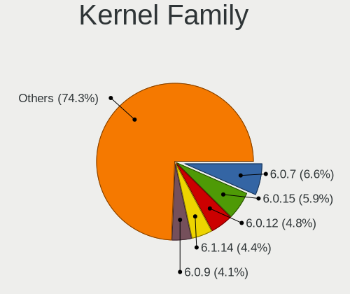

| Version | Computers | Percent |
|---------|-----------|---------|
| 5.19.8  | 16        | 23.53%  |
| 5.19.9  | 14        | 20.59%  |
| 5.19.10 | 9         | 13.24%  |
| 5.19.11 | 6         | 8.82%   |
| 5.19.7  | 5         | 7.35%   |
| 5.19.0  | 5         | 7.35%   |
| 5.18.0  | 4         | 5.88%   |
| 6.0.0   | 3         | 4.41%   |
| 5.19.12 | 2         | 2.94%   |
| 5.8.15  | 1         | 1.47%   |
| 5.19.6  | 1         | 1.47%   |
| 5.19.4  | 1         | 1.47%   |
| 5.17.0  | 1         | 1.47%   |

Kernel Major Ver.
-----------------

Linux kernel major version

| Version | Computers | Percent |
|---------|-----------|---------|
| 5.19    | 58        | 86.57%  |
| 5.18    | 4         | 5.97%   |
| 6.0     | 3         | 4.48%   |
| 5.8     | 1         | 1.49%   |
| 5.17    | 1         | 1.49%   |

Arch
----

OS architecture (x86_64, i586, etc.)

| Name    | Computers | Percent |
|---------|-----------|---------|
| x86_64  | 66        | 98.51%  |
| aarch64 | 1         | 1.49%   |

DE
--

Desktop Environment

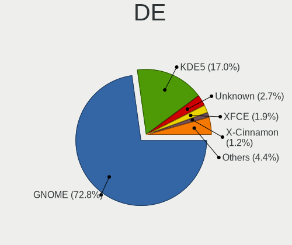

| Name       | Computers | Percent |
|------------|-----------|---------|
| GNOME      | 53        | 79.1%   |
| KDE5       | 9         | 13.43%  |
| XFCE       | 3         | 4.48%   |
| X-Cinnamon | 1         | 1.49%   |
| Unknown    | 1         | 1.49%   |

Display Server
--------------

X11 or Wayland

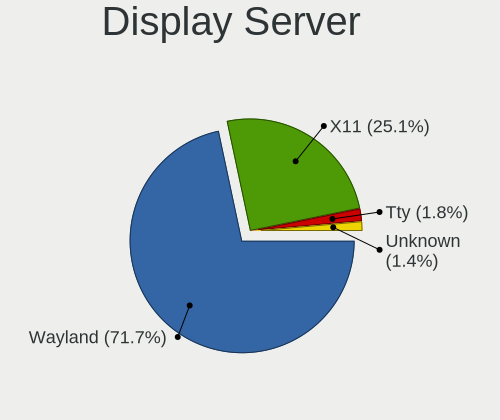

| Name    | Computers | Percent |
|---------|-----------|---------|
| Wayland | 49        | 73.13%  |
| X11     | 16        | 23.88%  |
| Tty     | 1         | 1.49%   |
| Unknown | 1         | 1.49%   |

Display Manager
---------------

SDDM, LightDM, etc.

| Name    | Computers | Percent |
|---------|-----------|---------|
| Unknown | 35        | 52.24%  |
| GDM     | 20        | 29.85%  |
| SDDM    | 7         | 10.45%  |
| LightDM | 5         | 7.46%   |

OS Lang
-------

Language

| Lang           | Computers | Percent |
|----------------|-----------|---------|
| en_US          | 32        | 47.76%  |
| pt_BR          | 6         | 8.96%   |
| en_GB          | 6         | 8.96%   |
| en_CA          | 5         | 7.46%   |
| ru_RU          | 4         | 5.97%   |
| fr_FR          | 3         | 4.48%   |
| de_DE          | 3         | 4.48%   |
| ro_RO          | 1         | 1.49%   |
| nl_NL          | 1         | 1.49%   |
| it_IT          | 1         | 1.49%   |
| es_GT          | 1         | 1.49%   |
| es_AR          | 1         | 1.49%   |
| en_ZA          | 1         | 1.49%   |
| en_AU          | 1         | 1.49%   |
| ca_ES@valencia | 1         | 1.49%   |

Boot Mode
---------

EFI or BIOS

| Mode | Computers | Percent |
|------|-----------|---------|
| EFI  | 52        | 77.61%  |
| BIOS | 15        | 22.39%  |

Filesystem
----------

Type of filesystem

| Type    | Computers | Percent |
|---------|-----------|---------|
| Btrfs   | 56        | 83.58%  |
| Ext4    | 7         | 10.45%  |
| Xfs     | 3         | 4.48%   |
| Overlay | 1         | 1.49%   |

Part. scheme
------------

Scheme of partitioning

| Type    | Computers | Percent |
|---------|-----------|---------|
| Unknown | 34        | 50.75%  |
| GPT     | 31        | 46.27%  |
| MBR     | 2         | 2.99%   |

Dual Boot with Linux/BSD
------------------------

Hosting more than one Linux/BSD

| Dual boot | Computers | Percent |
|-----------|-----------|---------|
| No        | 59        | 88.06%  |
| Yes       | 8         | 11.94%  |

Dual Boot (Win)
---------------

Hosting Linux and Windows

| Dual boot | Computers | Percent |
|-----------|-----------|---------|
| No        | 56        | 83.58%  |
| Yes       | 11        | 16.42%  |

Board
-----

Vendor
------

Motherboard manufacturer

| Name                    | Computers | Percent |
|-------------------------|-----------|---------|
| Lenovo                  | 17        | 25.37%  |
| ASUSTek Computer        | 15        | 22.39%  |
| Hewlett-Packard         | 7         | 10.45%  |
| Dell                    | 7         | 10.45%  |
| Gigabyte Technology     | 5         | 7.46%   |
| HUAWEI                  | 3         | 4.48%   |
| Acer                    | 3         | 4.48%   |
| TUXEDO                  | 1         | 1.49%   |
| Timi                    | 1         | 1.49%   |
| System76                | 1         | 1.49%   |
| Samsung Electronics     | 1         | 1.49%   |
| Raspberry Pi Foundation | 1         | 1.49%   |
| MSI                     | 1         | 1.49%   |
| Irbis                   | 1         | 1.49%   |
| Intel                   | 1         | 1.49%   |
| ASRock                  | 1         | 1.49%   |
| A-DATA Technology       | 1         | 1.49%   |

Model
-----

Motherboard model

| Name                                       | Computers | Percent |
|--------------------------------------------|-----------|---------|
| HUAWEI HVY-WXX9                            | 2         | 2.99%   |
| ASUS TUF Gaming B550M-PLUS                 | 2         | 2.99%   |
| TUXEDO InfinityBook S 15/17 Gen7           | 1         | 1.49%   |
| Timi A35S                                  | 1         | 1.49%   |
| System76 Lemur Pro                         | 1         | 1.49%   |
| Samsung 270E5G/270E5U                      | 1         | 1.49%   |
| RPi Raspberry Pi 4 Model B Rev 1.1         | 1         | 1.49%   |
| MSI MS-7B47                                | 1         | 1.49%   |
| Lenovo ThinkPad X1 Carbon Gen 9 20XWCTO1WW | 1         | 1.49%   |
| Lenovo ThinkPad X1 Carbon Gen 8 20UAS0X800 | 1         | 1.49%   |
| Lenovo ThinkPad W510 4391F66               | 1         | 1.49%   |
| Lenovo ThinkPad T470s 20HGS09L0K           | 1         | 1.49%   |
| Lenovo ThinkPad T440s 20ARA0YL00           | 1         | 1.49%   |
| Lenovo ThinkPad T14 Gen 2a 20XK000YSP      | 1         | 1.49%   |
| Lenovo ThinkPad T14 Gen 1 20UES08Q15       | 1         | 1.49%   |
| Lenovo ThinkPad Edge E540 20C600AKZA       | 1         | 1.49%   |
| Lenovo ThinkPad E495 20NE001RTX            | 1         | 1.49%   |
| Lenovo ThinkBook 14s Yoga ITL 20WE         | 1         | 1.49%   |
| Lenovo ThinkBook 14-IIL 20SL               | 1         | 1.49%   |
| Lenovo ThinkBook 13s G3 ACN 20YA           | 1         | 1.49%   |
| Lenovo Legion 5 Pro 16ITH6H 82JD           | 1         | 1.49%   |
| Lenovo IdeaPad 5 Pro 14ARH7 82SJ           | 1         | 1.49%   |
| Lenovo IdeaPad 5 15ALC05 82LN              | 1         | 1.49%   |
| Lenovo IdeaPad 320-15IAP 80XR              | 1         | 1.49%   |
| Lenovo IdeaPad 310-14ISK 80UG              | 1         | 1.49%   |
| Irbis NB264                                | 1         | 1.49%   |
| Intel DP35DP AAD81073-208                  | 1         | 1.49%   |
| HUAWEI DRC-WXX                             | 1         | 1.49%   |
| HP ZBook 15 G3                             | 1         | 1.49%   |
| HP Z600 Workstation                        | 1         | 1.49%   |
| HP Laptop 17-cp0xxx                        | 1         | 1.49%   |
| HP Laptop 14-dq2xxx                        | 1         | 1.49%   |
| HP EliteBook 820 G1                        | 1         | 1.49%   |
| HP Compaq Elite 8300 SFF                   | 1         | 1.49%   |
| HP 110-516no                               | 1         | 1.49%   |
| Gigabyte Z170-D3H                          | 1         | 1.49%   |
| Gigabyte X570 I AORUS PRO WIFI             | 1         | 1.49%   |
| Gigabyte X570 AORUS MASTER                 | 1         | 1.49%   |
| Gigabyte B85M-D3V-A                        | 1         | 1.49%   |
| Gigabyte AB350N-Gaming WIFI                | 1         | 1.49%   |

Model Family
------------

Motherboard model prefix

| Name                   | Computers | Percent |
|------------------------|-----------|---------|
| Lenovo ThinkPad        | 9         | 13.43%  |
| Lenovo IdeaPad         | 4         | 5.97%   |
| Lenovo ThinkBook       | 3         | 4.48%   |
| Dell XPS               | 3         | 4.48%   |
| ASUS ROG               | 3         | 4.48%   |
| HUAWEI HVY-WXX9        | 2         | 2.99%   |
| HP Laptop              | 2         | 2.99%   |
| Gigabyte X570          | 2         | 2.99%   |
| Dell Inspiron          | 2         | 2.99%   |
| ASUS TUF               | 2         | 2.99%   |
| ASUS PRIME             | 2         | 2.99%   |
| TUXEDO InfinityBook    | 1         | 1.49%   |
| Timi A35S              | 1         | 1.49%   |
| System76 Lemur         | 1         | 1.49%   |
| Samsung 270E5G         | 1         | 1.49%   |
| RPi Raspberry          | 1         | 1.49%   |
| MSI MS-7B47            | 1         | 1.49%   |
| Lenovo Legion          | 1         | 1.49%   |
| Irbis NB264            | 1         | 1.49%   |
| Intel DP35DP           | 1         | 1.49%   |
| HUAWEI DRC-WXX         | 1         | 1.49%   |
| HP ZBook               | 1         | 1.49%   |
| HP Z600                | 1         | 1.49%   |
| HP EliteBook           | 1         | 1.49%   |
| HP Compaq              | 1         | 1.49%   |
| HP 110-516no           | 1         | 1.49%   |
| Gigabyte Z170-D3H      | 1         | 1.49%   |
| Gigabyte B85M-D3V-A    | 1         | 1.49%   |
| Gigabyte AB350N-Gaming | 1         | 1.49%   |
| Dell OptiPlex          | 1         | 1.49%   |
| Dell Latitude          | 1         | 1.49%   |
| ASUS ZenBook           | 1         | 1.49%   |
| ASUS Z170-A            | 1         | 1.49%   |
| ASUS X550CL            | 1         | 1.49%   |
| ASUS T101HA            | 1         | 1.49%   |
| ASUS ProArt            | 1         | 1.49%   |
| ASUS Pro               | 1         | 1.49%   |
| ASUS P8Z68-V           | 1         | 1.49%   |
| ASUS ASUS              | 1         | 1.49%   |
| ASRock FM2A88X         | 1         | 1.49%   |

MFG Year
--------

Motherboard manufacture year

| Year | Computers | Percent |
|------|-----------|---------|
| 2021 | 14        | 20.9%   |
| 2020 | 13        | 19.4%   |
| 2022 | 7         | 10.45%  |
| 2017 | 7         | 10.45%  |
| 2019 | 5         | 7.46%   |
| 2013 | 5         | 7.46%   |
| 2016 | 3         | 4.48%   |
| 2015 | 3         | 4.48%   |
| 2010 | 3         | 4.48%   |
| 2018 | 2         | 2.99%   |
| 2014 | 2         | 2.99%   |
| 2012 | 1         | 1.49%   |
| 2011 | 1         | 1.49%   |
| 2008 | 1         | 1.49%   |

Form Factor
-----------

Physical design of the computer

| Name           | Computers | Percent |
|----------------|-----------|---------|
| Notebook       | 40        | 59.7%   |
| Desktop        | 21        | 31.34%  |
| Convertible    | 3         | 4.48%   |
| Tablet         | 2         | 2.99%   |
| System on chip | 1         | 1.49%   |

Secure Boot
-----------

Enabled or disabled

| State    | Computers | Percent |
|----------|-----------|---------|
| Disabled | 58        | 86.57%  |
| Enabled  | 9         | 13.43%  |

Coreboot
--------

Have coreboot on board

| Used | Computers | Percent |
|------|-----------|---------|
| No   | 66        | 98.51%  |
| Yes  | 1         | 1.49%   |

RAM Size
--------

Total RAM memory

| Size in GB      | Computers | Percent |
|-----------------|-----------|---------|
| 8.01-16.0       | 16        | 23.88%  |
| 32.01-64.0      | 13        | 19.4%   |
| 16.01-24.0      | 13        | 19.4%   |
| 4.01-8.0        | 12        | 17.91%  |
| 3.01-4.0        | 5         | 7.46%   |
| 24.01-32.0      | 3         | 4.48%   |
| 64.01-256.0     | 3         | 4.48%   |
| More than 256.0 | 1         | 1.49%   |
| 1.01-2.0        | 1         | 1.49%   |

RAM Used
--------

Used RAM memory

| Used GB    | Computers | Percent |
|------------|-----------|---------|
| 4.01-8.0   | 22        | 32.35%  |
| 3.01-4.0   | 15        | 22.06%  |
| 2.01-3.0   | 15        | 22.06%  |
| 8.01-16.0  | 9         | 13.24%  |
| 1.01-2.0   | 6         | 8.82%   |
| 24.01-32.0 | 1         | 1.47%   |

Total Drives
------------

Number of drives on board

| Drives | Computers | Percent |
|--------|-----------|---------|
| 1      | 44        | 65.67%  |
| 2      | 11        | 16.42%  |
| 4      | 5         | 7.46%   |
| 3      | 4         | 5.97%   |
| 0      | 2         | 2.99%   |
| 5      | 1         | 1.49%   |

Has CD-ROM
----------

Has CD-ROM on board

| Presented | Computers | Percent |
|-----------|-----------|---------|
| No        | 53        | 79.1%   |
| Yes       | 14        | 20.9%   |

Has Ethernet
------------

Has Ethernet on board

| Presented | Computers | Percent |
|-----------|-----------|---------|
| Yes       | 44        | 65.67%  |
| No        | 23        | 34.33%  |

Has WiFi
--------

Has WiFi module

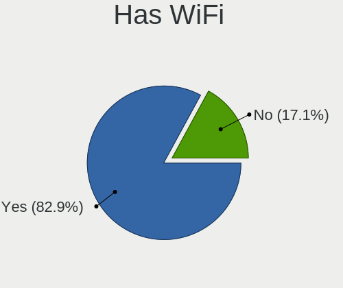

| Presented | Computers | Percent |
|-----------|-----------|---------|
| Yes       | 54        | 80.6%   |
| No        | 13        | 19.4%   |

Has Bluetooth
-------------

Has Bluetooth module

| Presented | Computers | Percent |
|-----------|-----------|---------|
| Yes       | 51        | 76.12%  |
| No        | 16        | 23.88%  |

Location
--------

Country
-------

Geographic location (country)

| Country             | Computers | Percent |
|---------------------|-----------|---------|
| USA                 | 11        | 16.42%  |
| Germany             | 6         | 8.96%   |
| Brazil              | 6         | 8.96%   |
| Canada              | 5         | 7.46%   |
| France              | 4         | 5.97%   |
| UK                  | 3         | 4.48%   |
| Poland              | 3         | 4.48%   |
| Turkey              | 2         | 2.99%   |
| Sweden              | 2         | 2.99%   |
| Spain               | 2         | 2.99%   |
| South Africa        | 2         | 2.99%   |
| Norway              | 2         | 2.99%   |
| Japan               | 2         | 2.99%   |
| Italy               | 2         | 2.99%   |
| Belarus             | 2         | 2.99%   |
| Trinidad and Tobago | 1         | 1.49%   |
| Russia              | 1         | 1.49%   |
| Netherlands         | 1         | 1.49%   |
| Moldova             | 1         | 1.49%   |
| Mexico              | 1         | 1.49%   |
| Malaysia            | 1         | 1.49%   |
| Kazakhstan          | 1         | 1.49%   |
| Indonesia           | 1         | 1.49%   |
| India               | 1         | 1.49%   |
| Czechia             | 1         | 1.49%   |
| Austria             | 1         | 1.49%   |
| Australia           | 1         | 1.49%   |
| Argentina           | 1         | 1.49%   |

City
----

Geographic location (city)

| City               | Computers | Percent |
|--------------------|-----------|---------|
| Warsaw             | 3         | 4.48%   |
| Vancouver          | 2         | 2.99%   |
| Sao Paulo          | 2         | 2.99%   |
| Oslo               | 2         | 2.99%   |
| New York           | 2         | 2.99%   |
| Goiânia           | 2         | 2.99%   |
| Berlin             | 2         | 2.99%   |
| Zierikzee          | 1         | 1.49%   |
| Wytheville         | 1         | 1.49%   |
| Wellington         | 1         | 1.49%   |
| Vaxjo              | 1         | 1.49%   |
| Van                | 1         | 1.49%   |
| Valbonne           | 1         | 1.49%   |
| Udaipur            | 1         | 1.49%   |
| Tokyo              | 1         | 1.49%   |
| Surabaya           | 1         | 1.49%   |
| Shymkent           | 1         | 1.49%   |
| Shinagawa          | 1         | 1.49%   |
| Scarborough        | 1         | 1.49%   |
| San Antonio        | 1         | 1.49%   |
| San Andres Cholula | 1         | 1.49%   |
| Rosario            | 1         | 1.49%   |
| Queens             | 1         | 1.49%   |
| Plancher-les-Mines | 1         | 1.49%   |
| Palaiseau          | 1         | 1.49%   |
| Orekhovo-Zuyevo    | 1         | 1.49%   |
| Mt. Pleasant       | 1         | 1.49%   |
| Mokena             | 1         | 1.49%   |
| Minsk              | 1         | 1.49%   |
| Matzendorf         | 1         | 1.49%   |
| Manchester         | 1         | 1.49%   |
| Málaga            | 1         | 1.49%   |
| Lynchburg          | 1         | 1.49%   |
| Langenhagen        | 1         | 1.49%   |
| Laenghem           | 1         | 1.49%   |
| Kuala Lumpur       | 1         | 1.49%   |
| Kingston           | 1         | 1.49%   |
| Hukvaldy           | 1         | 1.49%   |
| Houston            | 1         | 1.49%   |
| Guglionesi         | 1         | 1.49%   |

Drives
------

Drive Vendor
------------

Hard drive vendors

| Vendor                      | Computers | Drives | Percent |
|-----------------------------|-----------|--------|---------|
| Samsung Electronics         | 24        | 31     | 26.97%  |
| WDC                         | 13        | 19     | 14.61%  |
| Seagate                     | 10        | 13     | 11.24%  |
| Kingston                    | 7         | 7      | 7.87%   |
| Unknown                     | 4         | 5      | 4.49%   |
| Toshiba                     | 4         | 4      | 4.49%   |
| Sandisk                     | 4         | 4      | 4.49%   |
| SK hynix                    | 3         | 3      | 3.37%   |
| Intel                       | 3         | 3      | 3.37%   |
| Micron Technology           | 2         | 2      | 2.25%   |
| HGST                        | 2         | 2      | 2.25%   |
| A-DATA Technology           | 2         | 2      | 2.25%   |
| YMTC                        | 1         | 1      | 1.12%   |
| Yangtze Memory Technologies | 1         | 1      | 1.12%   |
| XPG                         | 1         | 1      | 1.12%   |
| Team                        | 1         | 1      | 1.12%   |
| Silicon Motion              | 1         | 1      | 1.12%   |
| Seagate Technology          | 1         | 1      | 1.12%   |
| Micron/Crucial Technology   | 1         | 1      | 1.12%   |
| KIOXIA                      | 1         | 2      | 1.12%   |
| Kingston Technology Company | 1         | 1      | 1.12%   |
| Crucial                     | 1         | 1      | 1.12%   |
| ADATA Technology            | 1         | 1      | 1.12%   |

Drive Model
-----------

Hard drive models

| Model                                                 | Computers | Percent |
|-------------------------------------------------------|-----------|---------|
| Samsung NVMe SSD Controller SM981/PM981/PM983 256GB   | 4         | 4%      |
| Samsung NVMe SSD Drive 1TB                            | 3         | 3%      |
| Samsung NVMe SSD Controller PM9A1/PM9A3/980PRO 1024GB | 3         | 3%      |
| Samsung NVMe SSD Drive 1024GB                         | 2         | 2%      |
| Kingston OM8PCP3512F-AB 512GB                         | 2         | 2%      |
| YMTC PC005 512GB                                      | 1         | 1%      |
| Yangtze Memory NVMe SSD Drive 512GB                   | 1         | 1%      |
| XPG GAMMIX S50 Lite 512GB                             | 1         | 1%      |
| WDC WDS500G2B0B-00YS70 500GB SSD                      | 1         | 1%      |
| WDC WDS500G1B0C-00S6U0 500GB                          | 1         | 1%      |
| WDC WDS240G2G0B-00EPW0 240GB SSD                      | 1         | 1%      |
| WDC WDS100T2B0A-00SM50 1TB SSD                        | 1         | 1%      |
| WDC WD5000LPCX-24VHAT0 500GB                          | 1         | 1%      |
| WDC WD5000AAKX-00U6AA0 500GB                          | 1         | 1%      |
| WDC WD40PURX-64GVNY0 4TB                              | 1         | 1%      |
| WDC WD40EZRZ-00GXCB0 4TB                              | 1         | 1%      |
| WDC WD40EFZX-68AWUN0 4TB                              | 1         | 1%      |
| WDC WD30EFRX-68EUZN0 3TB                              | 1         | 1%      |
| WDC WD10SPZX-08Z10 1TB                                | 1         | 1%      |
| WDC WD10EZEX-60M2NA0 1TB                              | 1         | 1%      |
| WDC WD10EZEX-08WN4A0 1TB                              | 1         | 1%      |
| WDC WD10EVDS-63U8B1 1TB                               | 1         | 1%      |
| WDC WD10EFRX-68FYTN0 1TB                              | 1         | 1%      |
| WDC WD My Passport 25F3 512GB                         | 1         | 1%      |
| WDC PC SN530 SDBPNPZ-512G-1114 512GB                  | 1         | 1%      |
| WDC PC SN530 SDBPMPZ-256G-1101 256GB                  | 1         | 1%      |
| WDC PC SN520 SDAPMUW-128G-1001 128GB                  | 1         | 1%      |
| Unknown SL64G  64GB                                   | 1         | 1%      |
| Unknown SD256  249GB                                  | 1         | 1%      |
| Unknown MMC Card  64GB                                | 1         | 1%      |
| Unknown MMC Card  128GB                               | 1         | 1%      |
| Unknown 032GE4  32GB                                  | 1         | 1%      |
| Toshiba THNSN5256GPU7 256GB                           | 1         | 1%      |
| Toshiba NVMe SSD Drive 256GB                          | 1         | 1%      |
| Toshiba MQ02ABD100H 1TB                               | 1         | 1%      |
| Toshiba DT01ACA200 2TB                                | 1         | 1%      |
| Team TM8PS7128G 128GB SSD                             | 1         | 1%      |
| SK hynix SHGP31-1000GM-2 1TB                          | 1         | 1%      |
| SK hynix SHGP31-1000GM 1TB                            | 1         | 1%      |
| SK hynix PC801 NVMe 1TB                               | 1         | 1%      |

HDD Vendor
----------

Hard disk drive vendors

| Vendor  | Computers | Drives | Percent |
|---------|-----------|--------|---------|
| Seagate | 9         | 12     | 42.86%  |
| WDC     | 8         | 11     | 38.1%   |
| Toshiba | 2         | 2      | 9.52%   |
| HGST    | 2         | 2      | 9.52%   |

SSD Vendor
----------

Solid state drive vendors

| Vendor              | Computers | Drives | Percent |
|---------------------|-----------|--------|---------|
| Samsung Electronics | 5         | 6      | 31.25%  |
| WDC                 | 3         | 3      | 18.75%  |
| Kingston            | 3         | 3      | 18.75%  |
| Team                | 1         | 1      | 6.25%   |
| SanDisk             | 1         | 1      | 6.25%   |
| Micron Technology   | 1         | 1      | 6.25%   |
| Intel               | 1         | 1      | 6.25%   |
| Crucial             | 1         | 1      | 6.25%   |

Drive Kind
----------

HDD or SSD

| Kind    | Computers | Drives | Percent |
|---------|-----------|--------|---------|
| NVMe    | 45        | 57     | 53.57%  |
| HDD     | 19        | 27     | 22.62%  |
| SSD     | 15        | 17     | 17.86%  |
| MMC     | 4         | 5      | 4.76%   |
| Unknown | 1         | 1      | 1.19%   |

Drive Connector
---------------

SATA, SAS, NVMe, etc.

| Type | Computers | Drives | Percent |
|------|-----------|--------|---------|
| NVMe | 45        | 57     | 56.25%  |
| SATA | 29        | 43     | 36.25%  |
| MMC  | 4         | 5      | 5%      |
| SAS  | 2         | 2      | 2.5%    |

Drive Size
----------

Size of hard drive

| Size in TB | Computers | Drives | Percent |
|------------|-----------|--------|---------|
| 0.51-1.0   | 13        | 16     | 35.14%  |
| 0.01-0.5   | 13        | 14     | 35.14%  |
| 1.01-2.0   | 5         | 6      | 13.51%  |
| 3.01-4.0   | 2         | 4      | 5.41%   |
| 2.01-3.0   | 2         | 2      | 5.41%   |
| 4.01-10.0  | 2         | 2      | 5.41%   |

Space Total
-----------

Amount of disk space available on the file system

| Size in GB     | Computers | Percent |
|----------------|-----------|---------|
| 1001-2000      | 18        | 26.47%  |
| 501-1000       | 12        | 17.65%  |
| 251-500        | 9         | 13.24%  |
| 1-20           | 8         | 11.76%  |
| 101-250        | 7         | 10.29%  |
| 2001-3000      | 5         | 7.35%   |
| Unknown        | 4         | 5.88%   |
| More than 3000 | 3         | 4.41%   |
| 21-50          | 1         | 1.47%   |
| 51-100         | 1         | 1.47%   |

Space Used
----------

Amount of used disk space

| Used GB        | Computers | Percent |
|----------------|-----------|---------|
| 1-20           | 18        | 26.47%  |
| 501-1000       | 10        | 14.71%  |
| 21-50          | 9         | 13.24%  |
| 101-250        | 9         | 13.24%  |
| 251-500        | 8         | 11.76%  |
| 1001-2000      | 4         | 5.88%   |
| 51-100         | 4         | 5.88%   |
| Unknown        | 4         | 5.88%   |
| More than 3000 | 2         | 2.94%   |

Malfunc. Drives
---------------

Drive models with a malfunction

| Model                                               | Computers | Drives | Percent |
|-----------------------------------------------------|-----------|--------|---------|
| WDC WD5000AAKX-00U6AA0 500GB                        | 1         | 1      | 25%     |
| WDC WD10EFRX-68FYTN0 1TB                            | 1         | 1      | 25%     |
| Seagate ST3000DM001-1ER166 3TB                      | 1         | 1      | 25%     |
| Micron Technology MTFDDAK256MAY-1AH12ABHA 256GB SSD | 1         | 1      | 25%     |

Malfunc. Drive Vendor
---------------------

Vendors of faulty drives

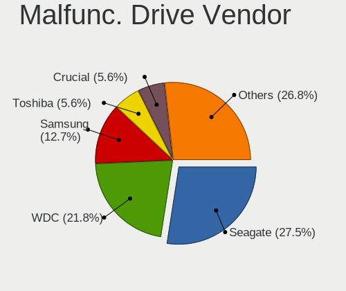

| Vendor            | Computers | Drives | Percent |
|-------------------|-----------|--------|---------|
| WDC               | 2         | 2      | 50%     |
| Seagate           | 1         | 1      | 25%     |
| Micron Technology | 1         | 1      | 25%     |

Malfunc. HDD Vendor
-------------------

Vendors of faulty HDD drives

| Vendor  | Computers | Drives | Percent |
|---------|-----------|--------|---------|
| WDC     | 2         | 2      | 66.67%  |
| Seagate | 1         | 1      | 33.33%  |

Malfunc. Drive Kind
-------------------

Kinds of faulty drives

| Kind | Computers | Drives | Percent |
|------|-----------|--------|---------|
| HDD  | 2         | 3      | 66.67%  |
| SSD  | 1         | 1      | 33.33%  |

Failed Drives
-------------

Failed drive models

Zero info for selected period =(

Failed Drive Vendor
-------------------

Failed drive vendors

Zero info for selected period =(

Drive Status
------------

Number of failed and malfunc. drives

| Status   | Computers | Drives | Percent |
|----------|-----------|--------|---------|
| Detected | 37        | 59     | 52.11%  |
| Works    | 31        | 44     | 43.66%  |
| Malfunc  | 3         | 4      | 4.23%   |

Storage controller
------------------

Storage Vendor
--------------

Storage controller vendors

| Vendor                       | Computers | Percent |
|------------------------------|-----------|---------|
| Intel                        | 34        | 34.69%  |
| Samsung Electronics          | 21        | 21.43%  |
| AMD                          | 14        | 14.29%  |
| SanDisk                      | 7         | 7.14%   |
| Kingston Technology Company  | 5         | 5.1%    |
| SK hynix                     | 3         | 3.06%   |
| Yangtze Memory Technologies  | 2         | 2.04%   |
| Toshiba America Info Systems | 2         | 2.04%   |
| ADATA Technology             | 2         | 2.04%   |
| Silicon Motion               | 1         | 1.02%   |
| Seagate Technology           | 1         | 1.02%   |
| Realtek Semiconductor        | 1         | 1.02%   |
| Micron/Crucial Technology    | 1         | 1.02%   |
| Micron Technology            | 1         | 1.02%   |
| Marvell Technology Group     | 1         | 1.02%   |
| KIOXIA                       | 1         | 1.02%   |
| ASMedia Technology           | 1         | 1.02%   |

Storage Model
-------------

Storage controller models

| Model                                                                          | Computers | Percent |
|--------------------------------------------------------------------------------|-----------|---------|
| AMD FCH SATA Controller [AHCI mode]                                            | 11        | 10.58%  |
| Samsung NVMe SSD Controller SM981/PM981/PM983                                  | 9         | 8.65%   |
| Samsung NVMe SSD Controller PM9A1/PM9A3/980PRO                                 | 8         | 7.69%   |
| Intel Volume Management Device NVMe RAID Controller                            | 7         | 6.73%   |
| Samsung NVMe SSD Controller 980                                                | 4         | 3.85%   |
| Kingston Company Company Non-Volatile memory controller                        | 4         | 3.85%   |
| Intel Q170/Q150/B150/H170/H110/Z170/CM236 Chipset SATA Controller [AHCI Mode]  | 3         | 2.88%   |
| Yangtze Memory Non-Volatile memory controller                                  | 2         | 1.92%   |
| SK hynix Gold P31 SSD                                                          | 2         | 1.92%   |
| SanDisk Non-Volatile memory controller                                         | 2         | 1.92%   |
| Intel SATA Controller [RAID mode]                                              | 2         | 1.92%   |
| Intel 8 Series/C220 Series Chipset Family 6-port SATA Controller 1 [AHCI mode] | 2         | 1.92%   |
| Intel 8 Series SATA Controller 1 [AHCI mode]                                   | 2         | 1.92%   |
| Intel 7 Series Chipset Family 6-port SATA Controller [AHCI mode]               | 2         | 1.92%   |
| Intel 200 Series PCH SATA controller [AHCI mode]                               | 2         | 1.92%   |
| AMD 500 Series Chipset SATA Controller                                         | 2         | 1.92%   |
| Toshiba America Info Systems XG6 NVMe SSD Controller                           | 1         | 0.96%   |
| Toshiba America Info Systems NVMe Controller                                   | 1         | 0.96%   |
| SK hynix Non-Volatile memory controller                                        | 1         | 0.96%   |
| Silicon Motion Non-Volatile memory controller                                  | 1         | 0.96%   |
| Seagate FireCuda 520 SSD                                                       | 1         | 0.96%   |
| SanDisk WD PC SN810 / Black SN850 NVMe SSD                                     | 1         | 0.96%   |
| SanDisk WD Blue SN570 NVMe SSD                                                 | 1         | 0.96%   |
| SanDisk WD Blue SN550 NVMe SSD                                                 | 1         | 0.96%   |
| SanDisk WD Blue SN500 / PC SN520 NVMe SSD                                      | 1         | 0.96%   |
| SanDisk PC SN520 NVMe SSD                                                      | 1         | 0.96%   |
| Samsung NVMe SSD Controller SM961/PM961/SM963                                  | 1         | 0.96%   |
| Realtek Realtek Non-Volatile memory controller                                 | 1         | 0.96%   |
| Micron/Crucial Non-Volatile memory controller                                  | 1         | 0.96%   |
| Micron Non-Volatile memory controller                                          | 1         | 0.96%   |
| Marvell Group 88SE6101/6102 single-port PATA133 interface                      | 1         | 0.96%   |
| KIOXIA NVMe SSD Controller BG4                                                 | 1         | 0.96%   |
| Kingston Company U-SNS8154P3 NVMe SSD                                          | 1         | 0.96%   |
| Intel Sunrise Point-LP SATA Controller [AHCI mode]                             | 1         | 0.96%   |
| Intel SSD 600P Series                                                          | 1         | 0.96%   |
| Intel NVMe Optane Memory Series                                                | 1         | 0.96%   |
| Intel NM10/ICH7 Family SATA Controller [IDE mode]                              | 1         | 0.96%   |
| Intel Ice Lake-LP SATA Controller [AHCI mode]                                  | 1         | 0.96%   |
| Intel HM170/QM170 Chipset SATA Controller [AHCI Mode]                          | 1         | 0.96%   |
| Intel Celeron/Pentium Silver Processor SATA Controller                         | 1         | 0.96%   |

Storage Kind
------------

Kind of storage controller (IDE, SATA, NVMe, SAS, ...)

| Kind | Computers | Percent |
|------|-----------|---------|
| NVMe | 45        | 47.87%  |
| SATA | 38        | 40.43%  |
| RAID | 9         | 9.57%   |
| IDE  | 2         | 2.13%   |

Processor
---------

CPU Vendor
----------

Processor vendors

| Vendor | Computers | Percent |
|--------|-----------|---------|
| Intel  | 43        | 64.18%  |
| AMD    | 23        | 34.33%  |
| ARM    | 1         | 1.49%   |

CPU Model
---------

Processor models

| Model                                   | Computers | Percent |
|-----------------------------------------|-----------|---------|
| Intel 11th Gen Core i5-1135G7 @ 2.40GHz | 3         | 4.48%   |
| Intel Core i5-10210U CPU @ 1.60GHz      | 2         | 2.99%   |
| AMD Ryzen 5 5500U with Radeon Graphics  | 2         | 2.99%   |
| AMD Ryzen 5 4600H with Radeon Graphics  | 2         | 2.99%   |
| Intel Xeon CPU X5675 @ 3.07GHz          | 1         | 1.49%   |
| Intel Core i7-8700K CPU @ 3.70GHz       | 1         | 1.49%   |
| Intel Core i7-8565U CPU @ 1.80GHz       | 1         | 1.49%   |
| Intel Core i7-7700K CPU @ 4.20GHz       | 1         | 1.49%   |
| Intel Core i7-7700HQ CPU @ 2.80GHz      | 1         | 1.49%   |
| Intel Core i7-7600U CPU @ 2.80GHz       | 1         | 1.49%   |
| Intel Core i7-6820HQ CPU @ 2.70GHz      | 1         | 1.49%   |
| Intel Core i7-6700K CPU @ 4.00GHz       | 1         | 1.49%   |
| Intel Core i7-3770 CPU @ 3.40GHz        | 1         | 1.49%   |
| Intel Core i7-2600K CPU @ 3.40GHz       | 1         | 1.49%   |
| Intel Core i7 CPU Q 720 @ 1.60GHz       | 1         | 1.49%   |
| Intel Core i5-9300H CPU @ 2.40GHz       | 1         | 1.49%   |
| Intel Core i5-7500 CPU @ 3.40GHz        | 1         | 1.49%   |
| Intel Core i5-6500 CPU @ 3.20GHz        | 1         | 1.49%   |
| Intel Core i5-4310U CPU @ 2.00GHz       | 1         | 1.49%   |
| Intel Core i5-4300U CPU @ 1.90GHz       | 1         | 1.49%   |
| Intel Core i5-3337U CPU @ 1.80GHz       | 1         | 1.49%   |
| Intel Core i5-3230M CPU @ 2.60GHz       | 1         | 1.49%   |
| Intel Core i5-1035G1 CPU @ 1.00GHz      | 1         | 1.49%   |
| Intel Core i5-10300H CPU @ 2.50GHz      | 1         | 1.49%   |
| Intel Core i3-6100U CPU @ 2.30GHz       | 1         | 1.49%   |
| Intel Core i3-4160 CPU @ 3.60GHz        | 1         | 1.49%   |
| Intel Core i3-4000M CPU @ 2.40GHz       | 1         | 1.49%   |
| Intel Core 2 Quad CPU Q8200 @ 2.33GHz   | 1         | 1.49%   |
| Intel Core 2 Quad CPU Q6700 @ 2.66GHz   | 1         | 1.49%   |
| Intel Celeron N4020 CPU @ 1.10GHz       | 1         | 1.49%   |
| Intel Celeron CPU N3350 @ 1.10GHz       | 1         | 1.49%   |
| Intel Atom x5-Z8350 CPU @ 1.44GHz       | 1         | 1.49%   |
| Intel 12th Gen Core i9-12900K           | 1         | 1.49%   |
| Intel 12th Gen Core i9-12900H           | 1         | 1.49%   |
| Intel 12th Gen Core i7-12700H           | 1         | 1.49%   |
| Intel 12th Gen Core i7-1265U            | 1         | 1.49%   |
| Intel 12th Gen Core i7-1260P            | 1         | 1.49%   |
| Intel 12th Gen Core i5-1240P            | 1         | 1.49%   |
| Intel 11th Gen Core i7-11800H @ 2.30GHz | 1         | 1.49%   |
| Intel 11th Gen Core i7-1165G7 @ 2.80GHz | 1         | 1.49%   |

CPU Model Family
----------------

Processor model prefix

| Model                  | Computers | Percent |
|------------------------|-----------|---------|
| Other                  | 14        | 20.9%   |
| Intel Core i5          | 11        | 16.42%  |
| Intel Core i7          | 10        | 14.93%  |
| AMD Ryzen 5            | 10        | 14.93%  |
| AMD Ryzen 7            | 6         | 8.96%   |
| Intel Core i3          | 3         | 4.48%   |
| Intel Core 2 Quad      | 2         | 2.99%   |
| Intel Celeron          | 2         | 2.99%   |
| AMD Ryzen 9            | 2         | 2.99%   |
| Intel Xeon             | 1         | 1.49%   |
| Intel Atom             | 1         | 1.49%   |
| AMD Ryzen Threadripper | 1         | 1.49%   |
| AMD Ryzen 7 PRO        | 1         | 1.49%   |
| AMD Ryzen 5 PRO        | 1         | 1.49%   |
| AMD A6                 | 1         | 1.49%   |
| AMD A10                | 1         | 1.49%   |

CPU Cores
---------

Number of processor cores

| Number  | Computers | Percent |
|---------|-----------|---------|
| 4       | 26        | 38.81%  |
| 6       | 11        | 16.42%  |
| 2       | 11        | 16.42%  |
| 8       | 9         | 13.43%  |
| 12      | 4         | 5.97%   |
| 14      | 2         | 2.99%   |
| 32      | 1         | 1.49%   |
| 16      | 1         | 1.49%   |
| 10      | 1         | 1.49%   |
| Unknown | 1         | 1.49%   |

CPU Sockets
-----------

Number of sockets

| Number  | Computers | Percent |
|---------|-----------|---------|
| 1       | 65        | 97.01%  |
| 2       | 1         | 1.49%   |
| Unknown | 1         | 1.49%   |

CPU Threads
-----------

Threads per core (Hyper-Threading)

| Number  | Computers | Percent |
|---------|-----------|---------|
| 2       | 57        | 85.07%  |
| 1       | 9         | 13.43%  |
| Unknown | 1         | 1.49%   |

CPU Op-Modes
------------

CPU Operation Modes (32-bit, 64-bit)

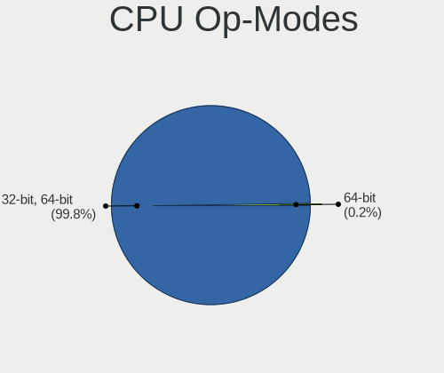

| Op mode        | Computers | Percent |
|----------------|-----------|---------|
| 32-bit, 64-bit | 66        | 98.51%  |
| 64-bit         | 1         | 1.49%   |

CPU Microcode
-------------

Microcode number

| Number     | Computers | Percent |
|------------|-----------|---------|
| Unknown    | 5         | 7.46%   |
| 0x906a3    | 4         | 5.97%   |
| 0x806c1    | 4         | 5.97%   |
| 0x0a50000c | 4         | 5.97%   |
| 0x906e9    | 3         | 4.48%   |
| 0x806ec    | 3         | 4.48%   |
| 0x506e3    | 3         | 4.48%   |
| 0x306a9    | 3         | 4.48%   |
| 0x08600106 | 3         | 4.48%   |
| 0x906ea    | 2         | 2.99%   |
| 0x40651    | 2         | 2.99%   |
| 0x306c3    | 2         | 2.99%   |
| 0x0a201016 | 2         | 2.99%   |
| 0x08701021 | 2         | 2.99%   |
| 0x08600104 | 2         | 2.99%   |
| 0xa0652    | 1         | 1.49%   |
| 0x906a4    | 1         | 1.49%   |
| 0x90672    | 1         | 1.49%   |
| 0x806e9    | 1         | 1.49%   |
| 0x806d1    | 1         | 1.49%   |
| 0x706e5    | 1         | 1.49%   |
| 0x706a8    | 1         | 1.49%   |
| 0x6fb      | 1         | 1.49%   |
| 0x506c9    | 1         | 1.49%   |
| 0x406e3    | 1         | 1.49%   |
| 0x406c4    | 1         | 1.49%   |
| 0x206c2    | 1         | 1.49%   |
| 0x206a7    | 1         | 1.49%   |
| 0x10677    | 1         | 1.49%   |
| 0x0a50000d | 1         | 1.49%   |
| 0x0a404102 | 1         | 1.49%   |
| 0x08608103 | 1         | 1.49%   |
| 0x08608102 | 1         | 1.49%   |
| 0x0830104d | 1         | 1.49%   |
| 0x08108102 | 1         | 1.49%   |
| 0x0800820d | 1         | 1.49%   |
| 0x0700010b | 1         | 1.49%   |
| 0x06003106 | 1         | 1.49%   |

CPU Microarch
-------------

Microarchitecture

| Name             | Computers | Percent |
|------------------|-----------|---------|
| KabyLake         | 9         | 13.43%  |
| Zen 3            | 8         | 11.94%  |
| Zen 2            | 8         | 11.94%  |
| TigerLake        | 6         | 8.96%   |
| Alderlake Hybrid | 6         | 8.96%   |
| Skylake          | 4         | 5.97%   |
| Haswell          | 4         | 5.97%   |
| Unknown          | 4         | 5.97%   |
| IvyBridge        | 3         | 4.48%   |
| Zen+             | 2         | 2.99%   |
| IceLake          | 2         | 2.99%   |
| Westmere         | 1         | 1.49%   |
| Steamroller      | 1         | 1.49%   |
| Silvermont       | 1         | 1.49%   |
| SandyBridge      | 1         | 1.49%   |
| Penryn           | 1         | 1.49%   |
| Nehalem          | 1         | 1.49%   |
| Jaguar           | 1         | 1.49%   |
| Goldmont plus    | 1         | 1.49%   |
| Goldmont         | 1         | 1.49%   |
| Core             | 1         | 1.49%   |
| CometLake        | 1         | 1.49%   |

Graphics
--------

GPU Vendor
----------

Vendors of graphics cards

| Vendor            | Computers | Percent |
|-------------------|-----------|---------|
| Intel             | 33        | 42.31%  |
| Nvidia            | 22        | 28.21%  |
| AMD               | 22        | 28.21%  |
| ASPEED Technology | 1         | 1.28%   |

GPU Model
---------

Graphics card models

| Model                                                                | Computers | Percent |
|----------------------------------------------------------------------|-----------|---------|
| AMD Renoir                                                           | 5         | 6.33%   |
| AMD Cezanne                                                          | 5         | 6.33%   |
| Intel TigerLake-LP GT2 [Iris Xe Graphics]                            | 4         | 5.06%   |
| Intel Alder Lake-P Integrated Graphics Controller                    | 4         | 5.06%   |
| Nvidia GF117M [GeForce 610M/710M/810M/820M / GT 620M/625M/630M/720M] | 2         | 2.53%   |
| Intel HD Graphics 630                                                | 2         | 2.53%   |
| Intel Haswell-ULT Integrated Graphics Controller                     | 2         | 2.53%   |
| Intel CometLake-U GT2 [UHD Graphics]                                 | 2         | 2.53%   |
| Intel 3rd Gen Core processor Graphics Controller                     | 2         | 2.53%   |
| AMD Navi 22 [Radeon RX 6700/6700 XT/6750 XT / 6800M]                 | 2         | 2.53%   |
| AMD Lucienne                                                         | 2         | 2.53%   |
| AMD Ellesmere [Radeon RX 470/480/570/570X/580/580X/590]              | 2         | 2.53%   |
| Nvidia TU117M [GeForce GTX 1650 Ti Mobile]                           | 1         | 1.27%   |
| Nvidia TU117M [GeForce GTX 1650 Mobile / Max-Q]                      | 1         | 1.27%   |
| Nvidia TU104 [GeForce RTX 2070 SUPER]                                | 1         | 1.27%   |
| Nvidia GT218 [GeForce 210]                                           | 1         | 1.27%   |
| Nvidia GT216GLM [Quadro FX 880M]                                     | 1         | 1.27%   |
| Nvidia GP107M [GeForce GTX 1050 Ti Mobile]                           | 1         | 1.27%   |
| Nvidia GP107 [GeForce GTX 1050]                                      | 1         | 1.27%   |
| Nvidia GP104 [GeForce GTX 1080]                                      | 1         | 1.27%   |
| Nvidia GP102 [GeForce GTX 1080 Ti]                                   | 1         | 1.27%   |
| Nvidia GM206 [GeForce GTX 950]                                       | 1         | 1.27%   |
| Nvidia GM107GLM [Quadro M1000M]                                      | 1         | 1.27%   |
| Nvidia GM107 [GeForce GTX 750 Ti]                                    | 1         | 1.27%   |
| Nvidia GF114 [GeForce GTX 560]                                       | 1         | 1.27%   |
| Nvidia GF106 [GeForce GTS 450]                                       | 1         | 1.27%   |
| Nvidia GA107M [GeForce RTX 3050 Ti Mobile]                           | 1         | 1.27%   |
| Nvidia GA104M [GeForce RTX 3070 Mobile / Max-Q]                      | 1         | 1.27%   |
| Nvidia GA103M [GeForce RTX 3080 Ti Mobile]                           | 1         | 1.27%   |
| Nvidia GA103 [GeForce RTX 3060 Ti]                                   | 1         | 1.27%   |
| Nvidia GA102 [GeForce RTX 3090]                                      | 1         | 1.27%   |
| Nvidia G94 [GeForce 9600 GT]                                         | 1         | 1.27%   |
| Intel WhiskeyLake-U GT2 [UHD Graphics 620]                           | 1         | 1.27%   |
| Intel VGA compatible controller                                      | 1         | 1.27%   |
| Intel TigerLake-H GT1 [UHD Graphics]                                 | 1         | 1.27%   |
| Intel Tiger Lake UHD Graphics                                        | 1         | 1.27%   |
| Intel Tiger Lake Iris Xe Graphics                                    | 1         | 1.27%   |
| Intel Skylake GT2 [HD Graphics 520]                                  | 1         | 1.27%   |
| Intel IvyBridge GT2 [HD Graphics 4000]                               | 1         | 1.27%   |
| Intel Iris Plus Graphics G1 (Ice Lake)                               | 1         | 1.27%   |

GPU Combo
---------

Combinations of graphics cards

| Name                    | Computers | Percent |
|-------------------------|-----------|---------|
| 1 x Intel               | 22        | 32.84%  |
| 1 x AMD                 | 21        | 31.34%  |
| 1 x Nvidia              | 11        | 16.42%  |
| Intel + Nvidia          | 10        | 14.93%  |
| Other                   | 1         | 1.49%   |
| 2 x Nvidia + 1 x ASPEED | 1         | 1.49%   |
| 2 x AMD                 | 1         | 1.49%   |

GPU Driver
----------

Free vs proprietary

| Driver      | Computers | Percent |
|-------------|-----------|---------|
| Free        | 53        | 79.1%   |
| Proprietary | 11        | 16.42%  |
| Unknown     | 3         | 4.48%   |

GPU Memory
----------

Total video memory

| Size in GB | Computers | Percent |
|------------|-----------|---------|
| Unknown    | 34        | 50.75%  |
| 0.01-0.5   | 9         | 13.43%  |
| 0.51-1.0   | 7         | 10.45%  |
| 1.01-2.0   | 6         | 8.96%   |
| 7.01-8.0   | 5         | 7.46%   |
| 3.01-4.0   | 3         | 4.48%   |
| 8.01-16.0  | 3         | 4.48%   |

Monitor
-------

Monitor Vendor
--------------

Monitor vendors

| Vendor                  | Computers | Percent |
|-------------------------|-----------|---------|
| BOE                     | 14        | 17.5%   |
| Samsung Electronics     | 8         | 10%     |
| Chimei Innolux          | 7         | 8.75%   |
| AU Optronics            | 6         | 7.5%    |
| Hewlett-Packard         | 5         | 6.25%   |
| LG Display              | 4         | 5%      |
| Goldstar                | 4         | 5%      |
| Dell                    | 4         | 5%      |
| Ancor Communications    | 3         | 3.75%   |
| Sharp                   | 2         | 2.5%    |
| Philips                 | 2         | 2.5%    |
| PANDA                   | 2         | 2.5%    |
| Lenovo                  | 2         | 2.5%    |
| InfoVision              | 2         | 2.5%    |
| CSO                     | 2         | 2.5%    |
| Chi Mei Optoelectronics | 2         | 2.5%    |
| BenQ                    | 2         | 2.5%    |
| AOC                     | 2         | 2.5%    |
| ViewSonic               | 1         | 1.25%   |
| Vestel Elektronik       | 1         | 1.25%   |
| Unknown                 | 1         | 1.25%   |
| Toshiba                 | 1         | 1.25%   |
| NEC Computers           | 1         | 1.25%   |
| KTC                     | 1         | 1.25%   |
| ASUSTek Computer        | 1         | 1.25%   |

Monitor Model
-------------

Monitor models

| Model                                                                  | Computers | Percent |
|------------------------------------------------------------------------|-----------|---------|
| Chimei Innolux LCD Monitor CMN14D5 1920x1080 309x173mm 13.9-inch       | 2         | 2.35%   |
| BOE LCD Monitor BOE0878 1920x1080 355x200mm 16.0-inch                  | 2         | 2.35%   |
| ViewSonic XG270QC VSCC438 2560x1440 597x336mm 27.0-inch                | 1         | 1.18%   |
| Vestel Elektronik 24W_LCD_TV VES3700 1920x1080 706x398mm 31.9-inch     | 1         | 1.18%   |
| Unknown LCD Monitor FFFF 2288x1287 2550x2550mm 142.0-inch              | 1         | 1.18%   |
| Toshiba TV TSB0110 1920x1080 706x398mm 31.9-inch                       | 1         | 1.18%   |
| Sharp LCD Monitor SHP1547 1920x1200 288x180mm 13.4-inch                | 1         | 1.18%   |
| Sharp LCD Monitor SHP1516 3840x2400 336x210mm 15.6-inch                | 1         | 1.18%   |
| Samsung Electronics SyncMaster SAM060C 1920x1080 510x290mm 23.1-inch   | 1         | 1.18%   |
| Samsung Electronics SMBX2450 SAM0722 1920x1080 531x299mm 24.0-inch     | 1         | 1.18%   |
| Samsung Electronics SMB2330H SAM064A 1920x1080 509x286mm 23.0-inch     | 1         | 1.18%   |
| Samsung Electronics LS27A800U SAM71A2 3840x2160 600x340mm 27.2-inch    | 1         | 1.18%   |
| Samsung Electronics LCD Monitor SDC4150 3456x2160 336x210mm 15.6-inch  | 1         | 1.18%   |
| Samsung Electronics LCD Monitor SAM723F 3840x2160 950x540mm 43.0-inch  | 1         | 1.18%   |
| Samsung Electronics LCD Monitor SAM0902 1920x1080 1020x570mm 46.0-inch | 1         | 1.18%   |
| Samsung Electronics LC32G7xT SAM705A 2560x1440 698x393mm 31.5-inch     | 1         | 1.18%   |
| Samsung Electronics C34H89x SAM0E25 3440x1440 797x333mm 34.0-inch      | 1         | 1.18%   |
| Philips PHL 272E1GJ PHLC245 1920x1080 598x336mm 27.0-inch              | 1         | 1.18%   |
| Philips PHL 243V5 PHLC0D1 1920x1080 521x293mm 23.5-inch                | 1         | 1.18%   |
| PANDA LCD Monitor NCP0035 1920x1080 309x174mm 14.0-inch                | 1         | 1.18%   |
| PANDA LCD Monitor NCP002D 1920x1080 344x194mm 15.5-inch                | 1         | 1.18%   |
| NEC Computers EA231WU NEC2E9F 1920x1200 488x297mm 22.5-inch            | 1         | 1.18%   |
| NEC Computers 20WGX2 NEC6699 1680x1050 433x270mm 20.1-inch             | 1         | 1.18%   |
| LG Display LCD Monitor LGD06F9 1920x1200 302x189mm 14.0-inch           | 1         | 1.18%   |
| LG Display LCD Monitor LGD068D 1920x1080 309x174mm 14.0-inch           | 1         | 1.18%   |
| LG Display LCD Monitor LGD0521 1920x1080 309x174mm 14.0-inch           | 1         | 1.18%   |
| LG Display LCD Monitor LGD046F 1920x1080 345x194mm 15.6-inch           | 1         | 1.18%   |
| Lenovo LEN P24h-20 LEN61F4 2560x1440 527x296mm 23.8-inch               | 1         | 1.18%   |
| Lenovo LCD Monitor LEN40B1 1600x900 345x194mm 15.6-inch                | 1         | 1.18%   |
| KTC 42 TV KTC4200 1920x1080 983x576mm 44.9-inch                        | 1         | 1.18%   |
| InfoVision LCD Monitor IVO854A 1920x1200 286x179mm 13.3-inch           | 1         | 1.18%   |
| InfoVision LCD Monitor IVO03F4 1024x600 223x125mm 10.1-inch            | 1         | 1.18%   |
| Hewlett-Packard ZR2440w HWP2956 1920x1200 518x324mm 24.1-inch          | 1         | 1.18%   |
| Hewlett-Packard Z30i HWP3099 2560x1600 641x400mm 29.7-inch             | 1         | 1.18%   |
| Hewlett-Packard OMEN by HP 27 HPN3422 2560x1440 598x336mm 27.0-inch    | 1         | 1.18%   |
| Hewlett-Packard E271i HWP3106 1920x1080 600x340mm 27.2-inch            | 1         | 1.18%   |
| Hewlett-Packard 24mh HPN366C 1920x1080 527x296mm 23.8-inch             | 1         | 1.18%   |
| Goldstar W2442 GSM56D9 1920x1080 531x299mm 24.0-inch                   | 1         | 1.18%   |
| Goldstar W2252 GSM567D 1680x1050 490x320mm 23.0-inch                   | 1         | 1.18%   |
| Goldstar M2280A GSM57EC 1920x1080 476x268mm 21.5-inch                  | 1         | 1.18%   |

Monitor Resolution
------------------

Monitor screen resolution

| Resolution         | Computers | Percent |
|--------------------|-----------|---------|
| 1920x1080 (FHD)    | 39        | 50.65%  |
| 1920x1200 (WUXGA)  | 10        | 12.99%  |
| 1366x768 (WXGA)    | 6         | 7.79%   |
| 3840x2160 (4K)     | 5         | 6.49%   |
| 2560x1600          | 4         | 5.19%   |
| 2560x1440 (QHD)    | 4         | 5.19%   |
| 3440x1440          | 2         | 2.6%    |
| 1680x1050 (WSXGA+) | 2         | 2.6%    |
| 3840x2400          | 1         | 1.3%    |
| 3456x2160          | 1         | 1.3%    |
| 2880x1800          | 1         | 1.3%    |
| 2288x1287          | 1         | 1.3%    |
| 1600x900 (HD+)     | 1         | 1.3%    |

Monitor Diagonal
----------------

Diagonal size in inches

| Inches | Computers | Percent |
|--------|-----------|---------|
| 15     | 16        | 19.28%  |
| 13     | 13        | 15.66%  |
| 24     | 10        | 12.05%  |
| 14     | 8         | 9.64%   |
| 27     | 7         | 8.43%   |
| 23     | 5         | 6.02%   |
| 16     | 4         | 4.82%   |
| 34     | 2         | 2.41%   |
| 21     | 2         | 2.41%   |
| 17     | 2         | 2.41%   |
| 142    | 1         | 1.2%    |
| 84     | 1         | 1.2%    |
| 54     | 1         | 1.2%    |
| 50     | 1         | 1.2%    |
| 44     | 1         | 1.2%    |
| 43     | 1         | 1.2%    |
| 32     | 1         | 1.2%    |
| 31     | 1         | 1.2%    |
| 29     | 1         | 1.2%    |
| 26     | 1         | 1.2%    |
| 25     | 1         | 1.2%    |
| 22     | 1         | 1.2%    |
| 20     | 1         | 1.2%    |
| 12     | 1         | 1.2%    |

Monitor Width
-------------

Physical width

| Width in mm    | Computers | Percent |
|----------------|-----------|---------|
| 301-350        | 34        | 43.59%  |
| 501-600        | 20        | 25.64%  |
| 201-300        | 5         | 6.41%   |
| 401-500        | 4         | 5.13%   |
| 351-400        | 4         | 5.13%   |
| 701-800        | 3         | 3.85%   |
| 601-700        | 2         | 2.56%   |
| 1001-1500      | 2         | 2.56%   |
| 901-1000       | 2         | 2.56%   |
| More than 2000 | 1         | 1.28%   |
| 1501-2000      | 1         | 1.28%   |

Aspect Ratio
------------

Proportional relationship between the width and the height

| Ratio | Computers | Percent |
|-------|-----------|---------|
| 16/9  | 50        | 70.42%  |
| 16/10 | 17        | 23.94%  |
| 21/9  | 2         | 2.82%   |
| 3/2   | 1         | 1.41%   |
| 1.00  | 1         | 1.41%   |

Monitor Area
------------

Area in inch²

| Area in inch² | Computers | Percent |
|----------------|-----------|---------|
| 81-90          | 17        | 21.25%  |
| 101-110        | 17        | 21.25%  |
| 201-250        | 11        | 13.75%  |
| 301-350        | 7         | 8.75%   |
| 251-300        | 6         | 7.5%    |
| More than 1000 | 4         | 5%      |
| 71-80          | 4         | 5%      |
| 351-500        | 4         | 5%      |
| 111-120        | 3         | 3.75%   |
| 151-200        | 2         | 2.5%    |
| 121-130        | 2         | 2.5%    |
| 501-1000       | 2         | 2.5%    |
| 61-70          | 1         | 1.25%   |

Pixel Density
-------------

Pixels per inch

| Density       | Computers | Percent |
|---------------|-----------|---------|
| 121-160       | 23        | 30.26%  |
| 51-100        | 22        | 28.95%  |
| 101-120       | 12        | 15.79%  |
| 161-240       | 11        | 14.47%  |
| More than 240 | 4         | 5.26%   |
| 1-50          | 4         | 5.26%   |

Multiple Monitors
-----------------

Total monitors connected

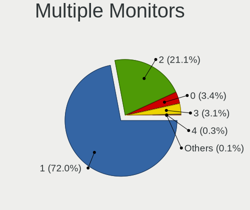

| Total | Computers | Percent |
|-------|-----------|---------|
| 1     | 48        | 71.64%  |
| 2     | 12        | 17.91%  |
| 3     | 3         | 4.48%   |
| 0     | 3         | 4.48%   |
| 4     | 1         | 1.49%   |

Network
-------

Net Controller Vendor
---------------------

Controller vendors

| Vendor                | Computers | Percent |
|-----------------------|-----------|---------|
| Intel                 | 42        | 45.16%  |
| Realtek Semiconductor | 30        | 32.26%  |
| Qualcomm Atheros      | 7         | 7.53%   |
| MediaTek              | 3         | 3.23%   |
| Sierra Wireless       | 2         | 2.15%   |
| Broadcom              | 2         | 2.15%   |
| TP-Link               | 1         | 1.08%   |
| Ralink Technology     | 1         | 1.08%   |
| Ralink                | 1         | 1.08%   |
| NetGear               | 1         | 1.08%   |
| Lenovo                | 1         | 1.08%   |
| Hewlett-Packard       | 1         | 1.08%   |
| Aquantia              | 1         | 1.08%   |

Net Controller Model
--------------------

Controller models

| Model                                                             | Computers | Percent |
|-------------------------------------------------------------------|-----------|---------|
| Realtek RTL8111/8168/8411 PCI Express Gigabit Ethernet Controller | 18        | 16.67%  |
| Intel Wi-Fi 6 AX200                                               | 12        | 11.11%  |
| Intel Wi-Fi 6 AX201                                               | 5         | 4.63%   |
| Realtek RTL8125 2.5GbE Controller                                 | 4         | 3.7%    |
| Intel Ethernet Connection (2) I219-V                              | 4         | 3.7%    |
| Intel Alder Lake-P PCH CNVi WiFi                                  | 4         | 3.7%    |
| Realtek RTL810xE PCI Express Fast Ethernet controller             | 3         | 2.78%   |
| MediaTek MT7921 802.11ax PCI Express Wireless Network Adapter     | 3         | 2.78%   |
| Intel I211 Gigabit Network Connection                             | 3         | 2.78%   |
| Realtek RTL8723BU 802.11b/g/n WLAN Adapter                        | 2         | 1.85%   |
| Qualcomm Atheros QCA9377 802.11ac Wireless Network Adapter        | 2         | 1.85%   |
| Qualcomm Atheros QCA6174 802.11ac Wireless Network Adapter        | 2         | 1.85%   |
| Intel Wireless 7260                                               | 2         | 1.85%   |
| Intel Wi-Fi 6 AX210/AX211/AX411 160MHz                            | 2         | 1.85%   |
| Intel Ethernet Connection I218-LM                                 | 2         | 1.85%   |
| TP-Link USB 10/100 LAN                                            | 1         | 0.93%   |
| Sierra Wireless EM7455                                            | 1         | 0.93%   |
| Sierra Wireless EM7345 4G LTE                                     | 1         | 0.93%   |
| Realtek RTL8852AE 802.11ax PCIe Wireless Network Adapter          | 1         | 0.93%   |
| Realtek RTL8822CE 802.11ac PCIe Wireless Network Adapter          | 1         | 0.93%   |
| Realtek RTL8821CE 802.11ac PCIe Wireless Network Adapter          | 1         | 0.93%   |
| Realtek RTL8821AE 802.11ac PCIe Wireless Network Adapter          | 1         | 0.93%   |
| Realtek RTL8723BE PCIe Wireless Network Adapter                   | 1         | 0.93%   |
| Realtek RTL8153 Gigabit Ethernet Adapter                          | 1         | 0.93%   |
| Realtek Realtek Network controller                                | 1         | 0.93%   |
| Realtek 802.11ac NIC                                              | 1         | 0.93%   |
| Ralink MT7601U Wireless Adapter                                   | 1         | 0.93%   |
| Ralink RT5390 Wireless 802.11n 1T/1R PCIe                         | 1         | 0.93%   |
| Qualcomm Atheros QCA9565 / AR9565 Wireless Network Adapter        | 1         | 0.93%   |
| Qualcomm Atheros QCA8171 Gigabit Ethernet                         | 1         | 0.93%   |
| Qualcomm Atheros AR9485 Wireless Network Adapter                  | 1         | 0.93%   |
| NetGear WNA3100(v1) Wireless-N 300 [Broadcom BCM43231]            | 1         | 0.93%   |
| Lenovo USB-C Dock Ethernet                                        | 1         | 0.93%   |
| Intel Wireless-AC 9260                                            | 1         | 0.93%   |
| Intel Wireless 8265 / 8275                                        | 1         | 0.93%   |
| Intel Wireless 8260                                               | 1         | 0.93%   |
| Intel Wireless 3165                                               | 1         | 0.93%   |
| Intel Tiger Lake PCH CNVi WiFi                                    | 1         | 0.93%   |
| Intel Ice Lake-LP PCH CNVi WiFi                                   | 1         | 0.93%   |
| Intel Ethernet Controller X550                                    | 1         | 0.93%   |

Wireless Vendor
---------------

Wireless vendors

| Vendor                | Computers | Percent |
|-----------------------|-----------|---------|
| Intel                 | 35        | 59.32%  |
| Realtek Semiconductor | 9         | 15.25%  |
| Qualcomm Atheros      | 6         | 10.17%  |
| MediaTek              | 3         | 5.08%   |
| Sierra Wireless       | 2         | 3.39%   |
| Ralink Technology     | 1         | 1.69%   |
| Ralink                | 1         | 1.69%   |
| NetGear               | 1         | 1.69%   |
| Hewlett-Packard       | 1         | 1.69%   |

Wireless Model
--------------

Wireless models

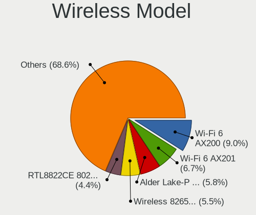

| Model                                                         | Computers | Percent |
|---------------------------------------------------------------|-----------|---------|
| Intel Wi-Fi 6 AX200                                           | 12        | 20.34%  |
| Intel Wi-Fi 6 AX201                                           | 5         | 8.47%   |
| Intel Alder Lake-P PCH CNVi WiFi                              | 4         | 6.78%   |
| MediaTek MT7921 802.11ax PCI Express Wireless Network Adapter | 3         | 5.08%   |
| Realtek RTL8723BU 802.11b/g/n WLAN Adapter                    | 2         | 3.39%   |
| Qualcomm Atheros QCA9377 802.11ac Wireless Network Adapter    | 2         | 3.39%   |
| Qualcomm Atheros QCA6174 802.11ac Wireless Network Adapter    | 2         | 3.39%   |
| Intel Wireless 7260                                           | 2         | 3.39%   |
| Intel Wi-Fi 6 AX210/AX211/AX411 160MHz                        | 2         | 3.39%   |
| Sierra Wireless EM7455                                        | 1         | 1.69%   |
| Sierra Wireless EM7345 4G LTE                                 | 1         | 1.69%   |
| Realtek RTL8852AE 802.11ax PCIe Wireless Network Adapter      | 1         | 1.69%   |
| Realtek RTL8822CE 802.11ac PCIe Wireless Network Adapter      | 1         | 1.69%   |
| Realtek RTL8821CE 802.11ac PCIe Wireless Network Adapter      | 1         | 1.69%   |
| Realtek RTL8821AE 802.11ac PCIe Wireless Network Adapter      | 1         | 1.69%   |
| Realtek RTL8723BE PCIe Wireless Network Adapter               | 1         | 1.69%   |
| Realtek Realtek Network controller                            | 1         | 1.69%   |
| Realtek 802.11ac NIC                                          | 1         | 1.69%   |
| Ralink MT7601U Wireless Adapter                               | 1         | 1.69%   |
| Ralink RT5390 Wireless 802.11n 1T/1R PCIe                     | 1         | 1.69%   |
| Qualcomm Atheros QCA9565 / AR9565 Wireless Network Adapter    | 1         | 1.69%   |
| Qualcomm Atheros AR9485 Wireless Network Adapter              | 1         | 1.69%   |
| NetGear WNA3100(v1) Wireless-N 300 [Broadcom BCM43231]        | 1         | 1.69%   |
| Intel Wireless-AC 9260                                        | 1         | 1.69%   |
| Intel Wireless 8265 / 8275                                    | 1         | 1.69%   |
| Intel Wireless 8260                                           | 1         | 1.69%   |
| Intel Wireless 3165                                           | 1         | 1.69%   |
| Intel Tiger Lake PCH CNVi WiFi                                | 1         | 1.69%   |
| Intel Ice Lake-LP PCH CNVi WiFi                               | 1         | 1.69%   |
| Intel Comet Lake PCH-LP CNVi WiFi                             | 1         | 1.69%   |
| Intel Comet Lake PCH CNVi WiFi                                | 1         | 1.69%   |
| Intel Centrino Ultimate-N 6300                                | 1         | 1.69%   |
| Intel Cannon Lake PCH CNVi WiFi                               | 1         | 1.69%   |
| HP lt4112 Gobi 4G Module Network Device                       | 1         | 1.69%   |

Ethernet Vendor
---------------

Ethernet vendors

| Vendor                | Computers | Percent |
|-----------------------|-----------|---------|
| Realtek Semiconductor | 25        | 52.08%  |
| Intel                 | 17        | 35.42%  |
| Broadcom              | 2         | 4.17%   |
| TP-Link               | 1         | 2.08%   |
| Qualcomm Atheros      | 1         | 2.08%   |
| Lenovo                | 1         | 2.08%   |
| Aquantia              | 1         | 2.08%   |

Ethernet Model
--------------

Ethernet models

| Model                                                               | Computers | Percent |
|---------------------------------------------------------------------|-----------|---------|
| Realtek RTL8111/8168/8411 PCI Express Gigabit Ethernet Controller   | 18        | 36.73%  |
| Realtek RTL8125 2.5GbE Controller                                   | 4         | 8.16%   |
| Intel Ethernet Connection (2) I219-V                                | 4         | 8.16%   |
| Realtek RTL810xE PCI Express Fast Ethernet controller               | 3         | 6.12%   |
| Intel I211 Gigabit Network Connection                               | 3         | 6.12%   |
| Intel Ethernet Connection I218-LM                                   | 2         | 4.08%   |
| TP-Link USB 10/100 LAN                                              | 1         | 2.04%   |
| Realtek RTL8153 Gigabit Ethernet Adapter                            | 1         | 2.04%   |
| Qualcomm Atheros QCA8171 Gigabit Ethernet                           | 1         | 2.04%   |
| Lenovo USB-C Dock Ethernet                                          | 1         | 2.04%   |
| Intel Ethernet Controller X550                                      | 1         | 2.04%   |
| Intel Ethernet Controller I225-V                                    | 1         | 2.04%   |
| Intel Ethernet Connection (4) I219-LM                               | 1         | 2.04%   |
| Intel Ethernet Connection (2) I219-LM                               | 1         | 2.04%   |
| Intel Ethernet Connection (10) I219-V                               | 1         | 2.04%   |
| Intel 82579LM Gigabit Network Connection (Lewisville)               | 1         | 2.04%   |
| Intel 82577LM Gigabit Network Connection                            | 1         | 2.04%   |
| Intel 82566DC-2 Gigabit Network Connection                          | 1         | 2.04%   |
| Broadcom NetXtreme II BCM57810 10 Gigabit Ethernet Multi Function   | 1         | 2.04%   |
| Broadcom NetXtreme BCM5764M Gigabit Ethernet PCIe                   | 1         | 2.04%   |
| Aquantia AQC113CS NBase-T/IEEE 802.3bz Ethernet Controller [AQtion] | 1         | 2.04%   |

Net Controller Kind
-------------------

Ethernet, WiFi or modem

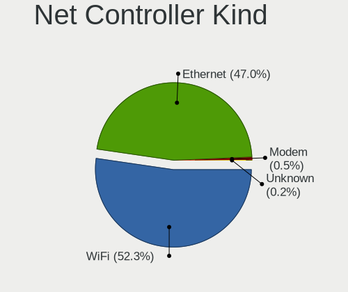

| Kind     | Computers | Percent |
|----------|-----------|---------|
| WiFi     | 54        | 54.55%  |
| Ethernet | 45        | 45.45%  |

Used Controller
---------------

Currently used network controller

| Kind     | Computers | Percent |
|----------|-----------|---------|
| WiFi     | 46        | 64.79%  |
| Ethernet | 25        | 35.21%  |

NICs
----

Total network controllers on board

| Total | Computers | Percent |
|-------|-----------|---------|
| 1     | 35        | 52.24%  |
| 2     | 24        | 35.82%  |
| 3     | 5         | 7.46%   |
| 0     | 2         | 2.99%   |
| 9     | 1         | 1.49%   |

IPv6
----

IPv6 vs IPv4

| Used | Computers | Percent |
|------|-----------|---------|
| No   | 54        | 80.6%   |
| Yes  | 13        | 19.4%   |

Bluetooth
---------

Bluetooth Vendor
----------------

Controller vendors

| Vendor                          | Computers | Percent |
|---------------------------------|-----------|---------|
| Intel                           | 34        | 66.67%  |
| Realtek Semiconductor           | 6         | 11.76%  |
| Qualcomm Atheros Communications | 3         | 5.88%   |
| Foxconn / Hon Hai               | 3         | 5.88%   |
| IMC Networks                    | 2         | 3.92%   |
| Broadcom                        | 2         | 3.92%   |
| Cambridge Silicon Radio         | 1         | 1.96%   |

Bluetooth Model
---------------

Controller models

| Model                                               | Computers | Percent |
|-----------------------------------------------------|-----------|---------|
| Intel AX200 Bluetooth                               | 12        | 23.53%  |
| Intel AX201 Bluetooth                               | 8         | 15.69%  |
| Realtek Bluetooth Radio                             | 5         | 9.8%    |
| Intel Bluetooth wireless interface                  | 5         | 9.8%    |
| Intel Bluetooth Device                              | 4         | 7.84%   |
| Qualcomm Atheros  Bluetooth Device                  | 2         | 3.92%   |
| Intel Bluetooth 9460/9560 Jefferson Peak (JfP)      | 2         | 3.92%   |
| Intel AX210 Bluetooth                               | 2         | 3.92%   |
| Foxconn / Hon Hai Wireless_Device                   | 2         | 3.92%   |
| Broadcom BCM20702A0 Bluetooth 4.0                   | 2         | 3.92%   |
| Realtek RTL8723B Bluetooth                          | 1         | 1.96%   |
| Qualcomm Atheros AR3012 Bluetooth 4.0               | 1         | 1.96%   |
| Intel Wireless-AC 9260 Bluetooth Adapter            | 1         | 1.96%   |
| IMC Networks Wireless_Device                        | 1         | 1.96%   |
| IMC Networks Bluetooth Device                       | 1         | 1.96%   |
| Foxconn / Hon Hai Bluetooth Device                  | 1         | 1.96%   |
| Cambridge Silicon Radio Bluetooth Dongle (HCI mode) | 1         | 1.96%   |

Sound
-----

Sound Vendor
------------

Sound card vendors

| Vendor                               | Computers | Percent |
|--------------------------------------|-----------|---------|
| Intel                                | 42        | 43.75%  |
| AMD                                  | 24        | 25%     |
| Nvidia                               | 18        | 18.75%  |
| Lenovo                               | 2         | 2.08%   |
| C-Media Electronics                  | 2         | 2.08%   |
| Thesycon Systemsoftware & Consulting | 1         | 1.04%   |
| Shure                                | 1         | 1.04%   |
| Razer USA                            | 1         | 1.04%   |
| Logitech                             | 1         | 1.04%   |
| Creative Labs                        | 1         | 1.04%   |
| Cirrus Logic                         | 1         | 1.04%   |
| AudioQuest                           | 1         | 1.04%   |
| ASUSTek Computer                     | 1         | 1.04%   |

Sound Model
-----------

Sound card models

| Model                                                               | Computers | Percent |
|---------------------------------------------------------------------|-----------|---------|
| AMD Renoir Radeon High Definition Audio Controller                  | 13        | 10.92%  |
| AMD Family 17h/19h HD Audio Controller                              | 13        | 10.92%  |
| Intel Tiger Lake-LP Smart Sound Technology Audio Controller         | 6         | 5.04%   |
| Intel Alder Lake PCH-P High Definition Audio Controller             | 5         | 4.2%    |
| AMD Starship/Matisse HD Audio Controller                            | 5         | 4.2%    |
| Intel 7 Series/C216 Chipset Family High Definition Audio Controller | 3         | 2.52%   |
| Intel 200 Series PCH HD Audio                                       | 3         | 2.52%   |
| Intel 100 Series/C230 Series Chipset Family HD Audio Controller     | 3         | 2.52%   |
| AMD Navi 21/23 HDMI/DP Audio Controller                             | 3         | 2.52%   |
| Nvidia TU107 GeForce GTX 1650 High Definition Audio Controller      | 2         | 1.68%   |
| Nvidia GP107GL High Definition Audio Controller                     | 2         | 1.68%   |
| Nvidia GM107 High Definition Audio Controller [GeForce 940MX]       | 2         | 1.68%   |
| Nvidia Audio device                                                 | 2         | 1.68%   |
| Intel Sunrise Point-LP HD Audio                                     | 2         | 1.68%   |
| Intel Haswell-ULT HD Audio Controller                               | 2         | 1.68%   |
| Intel Comet Lake PCH-LP cAVS                                        | 2         | 1.68%   |
| Intel 8 Series/C220 Series Chipset High Definition Audio Controller | 2         | 1.68%   |
| Intel 8 Series HD Audio Controller                                  | 2         | 1.68%   |
| AMD FCH Azalia Controller                                           | 2         | 1.68%   |
| AMD Ellesmere HDMI Audio [Radeon RX 470/480 / 570/580/590]          | 2         | 1.68%   |
| Thesycon Systemsoftware & Consulting D50s                           | 1         | 0.84%   |
| Shure MV7                                                           | 1         | 0.84%   |
| Razer USA Razer Seiren Mini                                         | 1         | 0.84%   |
| Nvidia TU104 HD Audio Controller                                    | 1         | 0.84%   |
| Nvidia High Definition Audio Controller                             | 1         | 0.84%   |
| Nvidia GT216 HDMI Audio Controller                                  | 1         | 0.84%   |
| Nvidia GP104 High Definition Audio Controller                       | 1         | 0.84%   |
| Nvidia GP102 HDMI Audio Controller                                  | 1         | 0.84%   |
| Nvidia GM206 High Definition Audio Controller                       | 1         | 0.84%   |
| Nvidia GF114 HDMI Audio Controller                                  | 1         | 0.84%   |
| Nvidia GF106 High Definition Audio Controller                       | 1         | 0.84%   |
| Nvidia GA104 High Definition Audio Controller                       | 1         | 0.84%   |
| Nvidia GA102 High Definition Audio Controller                       | 1         | 0.84%   |
| Logitech G635 Gaming Headset                                        | 1         | 0.84%   |
| Lenovo ThinkPad USB-C Dock Gen2 USB Audio                           | 1         | 0.84%   |
| Lenovo ThinkPad Dock USB Audio                                      | 1         | 0.84%   |
| Intel Xeon E3-1200 v3/4th Gen Core Processor HD Audio Controller    | 1         | 0.84%   |
| Intel Tiger Lake-H HD Audio Controller                              | 1         | 0.84%   |
| Intel NM10/ICH7 Family High Definition Audio Controller             | 1         | 0.84%   |
| Intel Ice Lake-LP Smart Sound Technology Audio Controller           | 1         | 0.84%   |

Memory
------

Memory Vendor
-------------

Memory module vendors

| Vendor              | Computers | Percent |
|---------------------|-----------|---------|
| Samsung Electronics | 14        | 33.33%  |
| SK hynix            | 6         | 14.29%  |
| Micron Technology   | 5         | 11.9%   |
| G.Skill             | 5         | 11.9%   |
| Kingston            | 3         | 7.14%   |
| Crucial             | 2         | 4.76%   |
| Corsair             | 2         | 4.76%   |
| A-DATA Technology   | 2         | 4.76%   |
| GOODRAM             | 1         | 2.38%   |
| Goldkey             | 1         | 2.38%   |
| Unknown             | 1         | 2.38%   |

Memory Model
------------

Memory module models

| Model                                                            | Computers | Percent |
|------------------------------------------------------------------|-----------|---------|
| Samsung RAM M471A1K43DB1-CWE 8192MB SODIMM DDR4 3200MT/s         | 2         | 4.65%   |
| Samsung RAM M425R2GA3BB0-CQKOL 16GB SODIMM DDR5 4800MT/s         | 2         | 4.65%   |
| SK hynix RAM Module 8GB Row Of Chips LPDDR3 2133MT/s             | 1         | 2.33%   |
| SK hynix RAM Module 16GB SODIMM DDR4 2133MT/s                    | 1         | 2.33%   |
| SK hynix RAM HMAB2GS6CMR6N-XN 16GB SODIMM DDR4 3200MT/s          | 1         | 2.33%   |
| SK hynix RAM HMA851S6CJR6N-VK 4GB SODIMM DDR4 2667MT/s           | 1         | 2.33%   |
| SK hynix RAM HCNNNBKMBLHR-NEE 1GB Row Of Chips LPDDR4 4267MT/s   | 1         | 2.33%   |
| SK hynix RAM H9JCNNNCP3MLYR-N6E 4GB Row Of Chips LPDDR5 6400MT/s | 1         | 2.33%   |
| Samsung RAM UBE3D4AA-MGCR 2GB Row Of Chips LPDDR4 4267MT/s       | 1         | 2.33%   |
| Samsung RAM M471B1G73QH0-YK0 8192MB SODIMM DDR3 1600MT/s         | 1         | 2.33%   |
| Samsung RAM M471A5244CB0-CWE 4GB Row Of Chips DDR4 3200MT/s      | 1         | 2.33%   |
| Samsung RAM M471A5244BB0-CPB 4GB SODIMM DDR4 2400MT/s            | 1         | 2.33%   |
| Samsung RAM M471A4G43AB1-CWE 32GB SODIMM DDR4 3200MT/s           | 1         | 2.33%   |
| Samsung RAM M471A1K43EB1-CWE 8GB SODIMM DDR4 3200MT/s            | 1         | 2.33%   |
| Samsung RAM M471A1G44AB0-CWE 8GB Row Of Chips DDR4 3200MT/s      | 1         | 2.33%   |
| Samsung RAM M378B5173QH0-CK0 4GB DIMM DDR3 1866MT/s              | 1         | 2.33%   |
| Samsung RAM K4UBE3D4AA-MGCL 8GB SODIMM LPDDR4 4266MT/s           | 1         | 2.33%   |
| Samsung RAM K4AAG165WA-BCTD 8GB SODIMM DDR4 2667MT/s             | 1         | 2.33%   |
| Micron RAM MTC8C1084S1SC48BA1 16GB SODIMM 4800MT/s               | 1         | 2.33%   |
| Micron RAM MT53E512M32D2NP-046 4GB Row Of Chips LPDDR4 4267MT/s  | 1         | 2.33%   |
| Micron RAM 8ATF1G64HZ-3G2J1 8GB SODIMM DDR4 3200MT/s             | 1         | 2.33%   |
| Micron RAM 4ATF1G64HZ-3G2E1 8GB Row Of Chips DDR4 3200MT/s       | 1         | 2.33%   |
| Micron RAM 16ATF2G64AZ-2G1B1 16GB DIMM DDR4 2133MT/s             | 1         | 2.33%   |
| Kingston RAM KF3200C16D4/32GX 32GB DIMM DDR4 3200MT/s            | 1         | 2.33%   |
| Kingston RAM 9905624-008.A00G 8GB SODIMM DDR4 2133MT/s           | 1         | 2.33%   |
| Kingston RAM 9905428-417.A00LF 8GB SODIMM DDR3 1600MT/s          | 1         | 2.33%   |
| GOODRAM RAM GR1600D364L11S/4G 4GB DIMM DDR3 1600MT/s             | 1         | 2.33%   |
| Goldkey RAM GKE160SO102408-2666 16GB SODIMM DDR4 2667MT/s        | 1         | 2.33%   |
| G.Skill RAM Module 16GB SODIMM DDR4 2133MT/s                     | 1         | 2.33%   |
| G.Skill RAM F4-3200C16-8GIS 8192MB DIMM DDR4 3200MT/s            | 1         | 2.33%   |
| G.Skill RAM F4-3200C16-16GTZR 16GB DIMM DDR4 3333MT/s            | 1         | 2.33%   |
| G.Skill RAM F4-3200C14-8GTZR 8GB DIMM DDR4 3200MT/s              | 1         | 2.33%   |
| G.Skill RAM F3-2133C11-8GXL 8GB DIMM DDR3 2132MT/s               | 1         | 2.33%   |
| G.Skill RAM F3-2133C10-8GXM 8GB DIMM DDR3 2132MT/s               | 1         | 2.33%   |
| Crucial RAM CT51264BA160BJ.M8F 4GB DIMM DDR3 1600MT/s            | 1         | 2.33%   |
| Crucial RAM CB8GS2400.C8D 8GB SODIMM DDR4 2400MT/s               | 1         | 2.33%   |
| Corsair RAM CMX8GX3M2A1600C9 4GB DIMM DDR3 1800MT/s              | 1         | 2.33%   |
| Corsair RAM CMK16GX4M2B3000C15 8GB DIMM DDR4 3200MT/s            | 1         | 2.33%   |
| A-DATA RAM Module 16GB SODIMM DDR4 3200MT/s                      | 1         | 2.33%   |
| A-DATA RAM AO1P26KC8T1-BXPS 8GB SODIMM DDR4 2667MT/s             | 1         | 2.33%   |

Memory Kind
-----------

Memory module kinds

| Kind   | Computers | Percent |
|--------|-----------|---------|
| DDR4   | 19        | 57.58%  |
| DDR3   | 5         | 15.15%  |
| LPDDR4 | 4         | 12.12%  |
| LPDDR5 | 2         | 6.06%   |
| DDR5   | 2         | 6.06%   |
| LPDDR3 | 1         | 3.03%   |

Memory Form Factor
------------------

Physical design of the memory module

| Name         | Computers | Percent |
|--------------|-----------|---------|
| SODIMM       | 14        | 42.42%  |
| DIMM         | 10        | 30.3%   |
| Row Of Chips | 9         | 27.27%  |

Memory Size
-----------

Memory module size

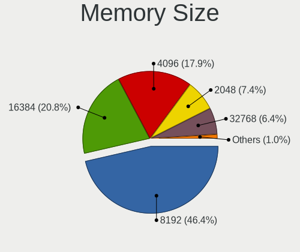

| Size  | Computers | Percent |
|-------|-----------|---------|
| 8192  | 17        | 47.22%  |
| 16384 | 8         | 22.22%  |
| 4096  | 8         | 22.22%  |
| 32768 | 2         | 5.56%   |
| 1024  | 1         | 2.78%   |

Memory Speed
------------

Memory module speed

| Speed | Computers | Percent |
|-------|-----------|---------|
| 3200  | 12        | 32.43%  |
| 2667  | 4         | 10.81%  |
| 2133  | 4         | 10.81%  |
| 4267  | 3         | 8.11%   |
| 6400  | 2         | 5.41%   |
| 4800  | 2         | 5.41%   |
| 2400  | 2         | 5.41%   |
| 1600  | 2         | 5.41%   |
| 4266  | 1         | 2.7%    |
| 3466  | 1         | 2.7%    |
| 3333  | 1         | 2.7%    |
| 2132  | 1         | 2.7%    |
| 1866  | 1         | 2.7%    |
| 1800  | 1         | 2.7%    |

Printers & scanners
-------------------

Printer Vendor
--------------

Printer device vendors

| Vendor      | Computers | Percent |
|-------------|-----------|---------|
| Seiko Epson | 1         | 100%    |

Printer Model
-------------

Printer device models

| Model               | Computers | Percent |
|---------------------|-----------|---------|
| Seiko Epson Printer | 1         | 100%    |

Scanner Vendor
--------------

Scanner device vendors

Zero info for selected period =(

Scanner Model
-------------

Scanner device models

Zero info for selected period =(

Camera
------

Camera Vendor
-------------

Camera device vendors

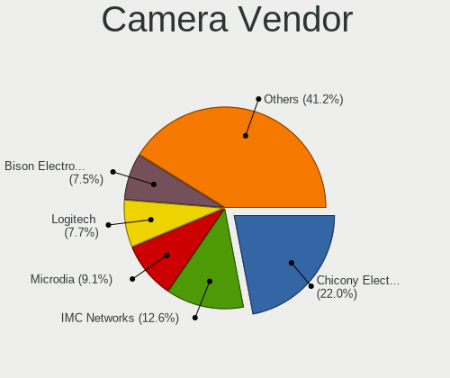

| Vendor                                 | Computers | Percent |
|----------------------------------------|-----------|---------|
| Chicony Electronics                    | 14        | 29.79%  |
| Microdia                               | 4         | 8.51%   |
| Logitech                               | 4         | 8.51%   |
| IMC Networks                           | 4         | 8.51%   |
| Acer                                   | 4         | 8.51%   |
| Syntek                                 | 2         | 4.26%   |
| Quanta                                 | 2         | 4.26%   |
| Microsoft                              | 2         | 4.26%   |
| Cheng Uei Precision Industry (Foxlink) | 2         | 4.26%   |
| USB Camera CS                          | 1         | 2.13%   |
| Sunplus Innovation Technology          | 1         | 2.13%   |
| Silicon Motion                         | 1         | 2.13%   |
| Samsung Electronics                    | 1         | 2.13%   |
| Luxvisions Innotech Limited            | 1         | 2.13%   |
| Lite-On Technology                     | 1         | 2.13%   |
| Lenovo                                 | 1         | 2.13%   |
| Hewlett-Packard                        | 1         | 2.13%   |
| Goodong Industry                       | 1         | 2.13%   |

Camera Model
------------

Camera device models

| Model                                                           | Computers | Percent |
|-----------------------------------------------------------------|-----------|---------|
| Chicony Integrated Camera                                       | 7         | 14.89%  |
| Acer Integrated Camera                                          | 4         | 8.51%   |
| Syntek EasyCamera                                               | 2         | 4.26%   |
| Microdia Integrated_Webcam_HD                                   | 2         | 4.26%   |
| Microdia Integrated_Webcam_FHD                                  | 2         | 4.26%   |
| IMC Networks USB2.0 HD UVC WebCam                               | 2         | 4.26%   |
| Chicony USB2.0 Camera                                           | 2         | 4.26%   |
| Chicony HD Webcam                                               | 2         | 4.26%   |
| USB Camera CS USB Camera CS                                     | 1         | 2.13%   |
| Sunplus Integrated Webcam                                       | 1         | 2.13%   |
| Silicon Motion WebCam SC-10HDD12636N                            | 1         | 2.13%   |
| Samsung Galaxy A5 (MTP)                                         | 1         | 2.13%   |
| Quanta HP TrueVision HD Camera                                  | 1         | 2.13%   |
| Quanta HD Webcam                                                | 1         | 2.13%   |
| Microsoft LifeCam VX-5000                                       | 1         | 2.13%   |
| Microsoft LifeCam VX-2000                                       | 1         | 2.13%   |
| Luxvisions Innotech Limited Integrated RGB Camera               | 1         | 2.13%   |
| Logitech Webcam C310                                            | 1         | 2.13%   |
| Logitech HD Pro Webcam C920                                     | 1         | 2.13%   |
| Logitech C922 Pro Stream Webcam                                 | 1         | 2.13%   |
| Logitech BRIO Ultra HD Webcam                                   | 1         | 2.13%   |
| Lite-On Integrated Camera                                       | 1         | 2.13%   |
| Lenovo Integrated Webcam [R5U877]                               | 1         | 2.13%   |
| IMC Networks XiaoMi Webcam                                      | 1         | 2.13%   |
| IMC Networks HD Camera                                          | 1         | 2.13%   |
| HP HD-4110 Webcam                                               | 1         | 2.13%   |
| Goodong Industry USB2.0 HD UVC WebCam                           | 1         | 2.13%   |
| Chicony USB2.0 HD UVC WebCam                                    | 1         | 2.13%   |
| Chicony HP HD Webcam                                            | 1         | 2.13%   |
| Chicony HP HD Camera                                            | 1         | 2.13%   |
| Cheng Uei Precision Industry (Foxlink) HP True Vision HD Camera | 1         | 2.13%   |
| Cheng Uei Precision Industry (Foxlink) HD Camera                | 1         | 2.13%   |

Security
--------

Fingerprint Vendor
------------------

Fingerprint sensor vendors

| Vendor                     | Computers | Percent |
|----------------------------|-----------|---------|
| Shenzhen Goodix Technology | 4         | 36.36%  |
| Validity Sensors           | 3         | 27.27%  |
| Synaptics                  | 3         | 27.27%  |
| Elan Microelectronics      | 1         | 9.09%   |

Fingerprint Model
-----------------

Fingerprint sensor models

| Model                                             | Computers | Percent |
|---------------------------------------------------|-----------|---------|
| Shenzhen Goodix  FingerPrint Device               | 4         | 36.36%  |
| Synaptics Prometheus MIS Touch Fingerprint Reader | 3         | 27.27%  |
| Validity Sensors VFS495 Fingerprint Reader        | 2         | 18.18%  |
| Validity Sensors Synaptics WBDI                   | 1         | 9.09%   |
| Elan ELAN:ARM-M4                                  | 1         | 9.09%   |

Chipcard Vendor
---------------

Chipcard module vendors

| Vendor      | Computers | Percent |
|-------------|-----------|---------|
| Lenovo      | 1         | 33.33%  |
| Broadcom    | 1         | 33.33%  |
| Alcor Micro | 1         | 33.33%  |

Chipcard Model
--------------

Chipcard module models

| Model                               | Computers | Percent |
|-------------------------------------|-----------|---------|
| Lenovo Integrated Smart Card Reader | 1         | 33.33%  |
| Broadcom 58200                      | 1         | 33.33%  |
| Alcor Micro AU9540 Smartcard Reader | 1         | 33.33%  |

Unsupported
-----------

Unsupported Devices
-------------------

Total unsupported devices on board

| Total | Computers | Percent |
|-------|-----------|---------|
| 0     | 43        | 64.18%  |
| 1     | 19        | 28.36%  |
| 2     | 3         | 4.48%   |
| 8     | 1         | 1.49%   |
| 3     | 1         | 1.49%   |

Unsupported Device Types
------------------------

Types of unsupported devices

| Type                     | Computers | Percent |
|--------------------------|-----------|---------|
| Fingerprint reader       | 11        | 33.33%  |
| Graphics card            | 6         | 18.18%  |
| Net/wireless             | 3         | 9.09%   |
| Multimedia controller    | 3         | 9.09%   |
| Sound                    | 2         | 6.06%   |
| Communication controller | 2         | 6.06%   |
| Card reader              | 2         | 6.06%   |
| Network                  | 1         | 3.03%   |
| Chipcard                 | 1         | 3.03%   |
| Camera                   | 1         | 3.03%   |
| Bluetooth                | 1         | 3.03%   |

