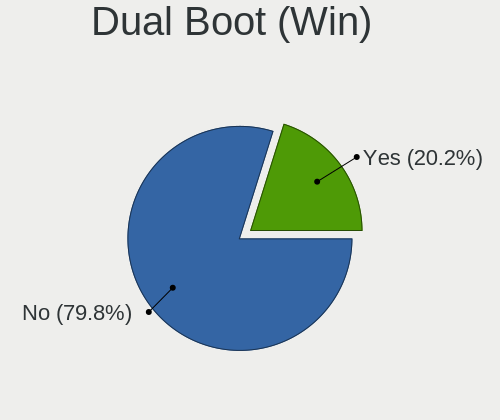
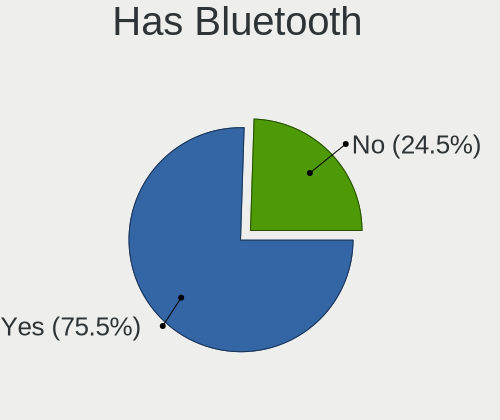
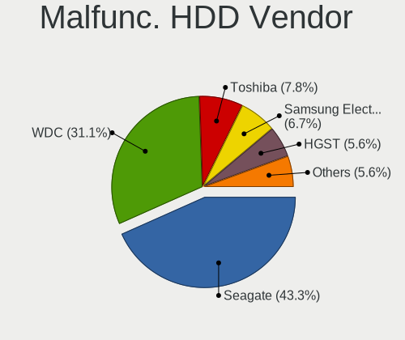
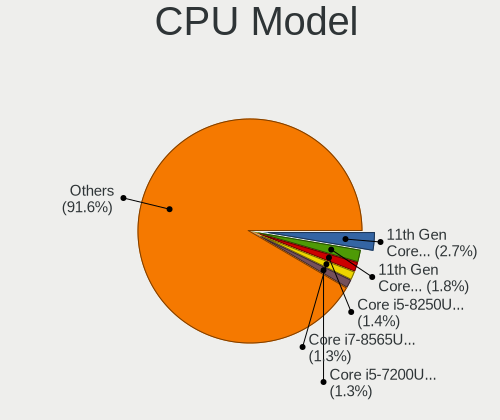
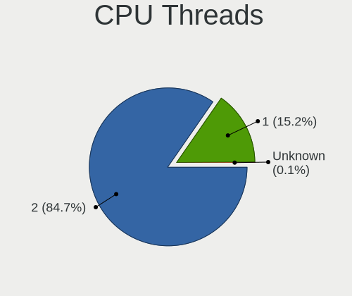
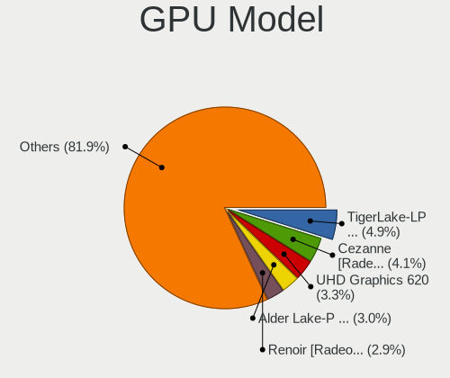
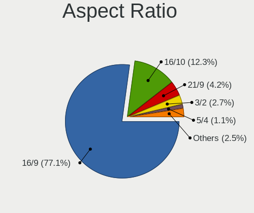
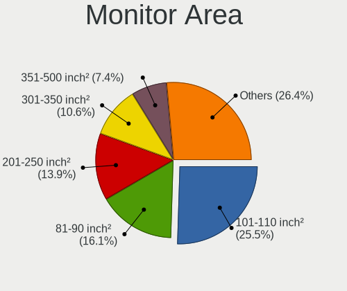
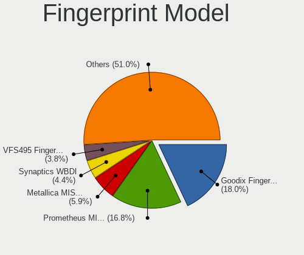

Fedora 37 - Tested Hardware & Statistics
----------------------------------------

A project to collect tested hardware configurations for Fedora 37.

Anyone can contribute to this report by the [hw-probe](https://github.com/linuxhw/hw-probe) tool:

    sudo -E hw-probe -all -upload

Please contribute! Especially if your hardware is rare.

This is a report for all computer types. See also reports for [desktops](/Dist/Fedora_37/Desktop/README.md) and [notebooks](/Dist/Fedora_37/Notebook/README.md).

Contents
--------

* [ Test Cases ](#test-cases)

* [ System ](#system)
  - [ Kernel                   ](#kernel)
  - [ Kernel Family            ](#kernel-family)
  - [ Kernel Major Ver.        ](#kernel-major-ver)
  - [ Arch                     ](#arch)
  - [ DE                       ](#de)
  - [ Display Server           ](#display-server)
  - [ Display Manager          ](#display-manager)
  - [ OS Lang                  ](#os-lang)
  - [ Boot Mode                ](#boot-mode)
  - [ Filesystem               ](#filesystem)
  - [ Part. scheme             ](#part-scheme)
  - [ Dual Boot with Linux/BSD ](#dual-boot-with-linuxbsd)
  - [ Dual Boot (Win)          ](#dual-boot-win)

* [ Board ](#board)
  - [ Vendor                   ](#vendor)
  - [ Model                    ](#model)
  - [ Model Family             ](#model-family)
  - [ MFG Year                 ](#mfg-year)
  - [ Form Factor              ](#form-factor)
  - [ Secure Boot              ](#secure-boot)
  - [ Coreboot                 ](#coreboot)
  - [ RAM Size                 ](#ram-size)
  - [ RAM Used                 ](#ram-used)
  - [ Total Drives             ](#total-drives)
  - [ Has CD-ROM               ](#has-cd-rom)
  - [ Has Ethernet             ](#has-ethernet)
  - [ Has WiFi                 ](#has-wifi)
  - [ Has Bluetooth            ](#has-bluetooth)

* [ Location ](#location)
  - [ Country                  ](#country)
  - [ City                     ](#city)

* [ Drives ](#drives)
  - [ Drive Vendor             ](#drive-vendor)
  - [ Drive Model              ](#drive-model)
  - [ HDD Vendor               ](#hdd-vendor)
  - [ SSD Vendor               ](#ssd-vendor)
  - [ Drive Kind               ](#drive-kind)
  - [ Drive Connector          ](#drive-connector)
  - [ Drive Size               ](#drive-size)
  - [ Space Total              ](#space-total)
  - [ Space Used               ](#space-used)
  - [ Malfunc. Drives          ](#malfunc-drives)
  - [ Malfunc. Drive Vendor    ](#malfunc-drive-vendor)
  - [ Malfunc. HDD Vendor      ](#malfunc-hdd-vendor)
  - [ Malfunc. Drive Kind      ](#malfunc-drive-kind)
  - [ Failed Drives            ](#failed-drives)
  - [ Failed Drive Vendor      ](#failed-drive-vendor)
  - [ Drive Status             ](#drive-status)

* [ Storage controller ](#storage-controller)
  - [ Storage Vendor           ](#storage-vendor)
  - [ Storage Model            ](#storage-model)
  - [ Storage Kind             ](#storage-kind)

* [ Processor ](#processor)
  - [ CPU Vendor               ](#cpu-vendor)
  - [ CPU Model                ](#cpu-model)
  - [ CPU Model Family         ](#cpu-model-family)
  - [ CPU Cores                ](#cpu-cores)
  - [ CPU Sockets              ](#cpu-sockets)
  - [ CPU Threads              ](#cpu-threads)
  - [ CPU Op-Modes             ](#cpu-op-modes)
  - [ CPU Microcode            ](#cpu-microcode)
  - [ CPU Microarch            ](#cpu-microarch)

* [ Graphics ](#graphics)
  - [ GPU Vendor               ](#gpu-vendor)
  - [ GPU Model                ](#gpu-model)
  - [ GPU Combo                ](#gpu-combo)
  - [ GPU Driver               ](#gpu-driver)
  - [ GPU Memory               ](#gpu-memory)

* [ Monitor ](#monitor)
  - [ Monitor Vendor           ](#monitor-vendor)
  - [ Monitor Model            ](#monitor-model)
  - [ Monitor Resolution       ](#monitor-resolution)
  - [ Monitor Diagonal         ](#monitor-diagonal)
  - [ Monitor Width            ](#monitor-width)
  - [ Aspect Ratio             ](#aspect-ratio)
  - [ Monitor Area             ](#monitor-area)
  - [ Pixel Density            ](#pixel-density)
  - [ Multiple Monitors        ](#multiple-monitors)

* [ Network ](#network)
  - [ Net Controller Vendor    ](#net-controller-vendor)
  - [ Net Controller Model     ](#net-controller-model)
  - [ Wireless Vendor          ](#wireless-vendor)
  - [ Wireless Model           ](#wireless-model)
  - [ Ethernet Vendor          ](#ethernet-vendor)
  - [ Ethernet Model           ](#ethernet-model)
  - [ Net Controller Kind      ](#net-controller-kind)
  - [ Used Controller          ](#used-controller)
  - [ NICs                     ](#nics)
  - [ IPv6                     ](#ipv6)

* [ Bluetooth ](#bluetooth)
  - [ Bluetooth Vendor         ](#bluetooth-vendor)
  - [ Bluetooth Model          ](#bluetooth-model)

* [ Sound ](#sound)
  - [ Sound Vendor             ](#sound-vendor)
  - [ Sound Model              ](#sound-model)

* [ Memory ](#memory)
  - [ Memory Vendor            ](#memory-vendor)
  - [ Memory Model             ](#memory-model)
  - [ Memory Kind              ](#memory-kind)
  - [ Memory Form Factor       ](#memory-form-factor)
  - [ Memory Size              ](#memory-size)
  - [ Memory Speed             ](#memory-speed)

* [ Printers & scanners ](#printers--scanners)
  - [ Printer Vendor           ](#printer-vendor)
  - [ Printer Model            ](#printer-model)
  - [ Scanner Vendor           ](#scanner-vendor)
  - [ Scanner Model            ](#scanner-model)

* [ Camera ](#camera)
  - [ Camera Vendor            ](#camera-vendor)
  - [ Camera Model             ](#camera-model)

* [ Security ](#security)
  - [ Fingerprint Vendor       ](#fingerprint-vendor)
  - [ Fingerprint Model        ](#fingerprint-model)
  - [ Chipcard Vendor          ](#chipcard-vendor)
  - [ Chipcard Model           ](#chipcard-model)

* [ Unsupported ](#unsupported)
  - [ Unsupported Devices      ](#unsupported-devices)
  - [ Unsupported Device Types ](#unsupported-device-types)

Test Cases
----------

Total: 183

| Vendor        | Model                       | Form-Factor | Probe                                                      | Date         |
|---------------|-----------------------------|-------------|------------------------------------------------------------|--------------|
| Dell          | XPS 13 9310 2-in-1          | Convertible | [2ece2f7351](https://linux-hardware.org/?probe=2ece2f7351) | Nov 02, 2022 |
| Lenovo        | Legion 5 15IAH7H 82RB       | Notebook    | [aa6c06f2bb](https://linux-hardware.org/?probe=aa6c06f2bb) | Nov 02, 2022 |
| Lenovo        | Legion 5 15IAH7H 82RB       | Notebook    | [584db1dcb2](https://linux-hardware.org/?probe=584db1dcb2) | Nov 02, 2022 |
| Intel         | NUC6i7KYB H90766-410        | Mini pc     | [9c17f472ee](https://linux-hardware.org/?probe=9c17f472ee) | Nov 01, 2022 |
| GPD           | G1619-04                    | Notebook    | [898bbfb591](https://linux-hardware.org/?probe=898bbfb591) | Nov 01, 2022 |
| ASUSTek       | B150 PRO GAMING             | Desktop     | [b2229c56c4](https://linux-hardware.org/?probe=b2229c56c4) | Nov 01, 2022 |
| HUAWEI        | CREM-WXX9                   | Notebook    | [1d24aac4ce](https://linux-hardware.org/?probe=1d24aac4ce) | Nov 01, 2022 |
| HUAWEI        | CREM-WXX9                   | Notebook    | [2eb32b1bb3](https://linux-hardware.org/?probe=2eb32b1bb3) | Nov 01, 2022 |
| HP            | ZBook 15 G2                 | Notebook    | [7254a9a2fc](https://linux-hardware.org/?probe=7254a9a2fc) | Nov 01, 2022 |
| Samsung       | RV410/RV510/S3510/E3510     | Notebook    | [566d83485b](https://linux-hardware.org/?probe=566d83485b) | Oct 31, 2022 |
| Gigabyte      | B85M-D3V-A                  | Desktop     | [4b5140c9f3](https://linux-hardware.org/?probe=4b5140c9f3) | Oct 31, 2022 |
| HUAWEI        | BOHK-WAX9X                  | Notebook    | [e993af2670](https://linux-hardware.org/?probe=e993af2670) | Oct 31, 2022 |
| HP            | ENVY 17                     | Notebook    | [5b845d9ee3](https://linux-hardware.org/?probe=5b845d9ee3) | Oct 31, 2022 |
| Samsung       | RV410/RV510/S3510/E3510     | Notebook    | [073ba962ff](https://linux-hardware.org/?probe=073ba962ff) | Oct 31, 2022 |
| Schenker      | XMG FUSION 15 (XFU15L19)    | Notebook    | [221710c9ea](https://linux-hardware.org/?probe=221710c9ea) | Oct 31, 2022 |
| ASUSTek       | PRIME B550-PLUS             | Desktop     | [4820bca604](https://linux-hardware.org/?probe=4820bca604) | Oct 30, 2022 |
| ASUSTek       | PRIME B550-PLUS             | Desktop     | [cdca8a4d95](https://linux-hardware.org/?probe=cdca8a4d95) | Oct 30, 2022 |
| Lenovo        | ThinkPad X220 4291WSH       | Notebook    | [a4eebe6485](https://linux-hardware.org/?probe=a4eebe6485) | Oct 30, 2022 |
| ASUSTek       | TUF Gaming B450M-PLUS II    | Desktop     | [8e2ab3d61b](https://linux-hardware.org/?probe=8e2ab3d61b) | Oct 30, 2022 |
| Dell          | Latitude 7490               | Notebook    | [95d0006efb](https://linux-hardware.org/?probe=95d0006efb) | Oct 30, 2022 |
| MSI           | Z170A GAMING PRO CARBON     | Desktop     | [d0814afd39](https://linux-hardware.org/?probe=d0814afd39) | Oct 29, 2022 |
| Gigabyte      | B450M DS3H V2               | Desktop     | [ba5da6b270](https://linux-hardware.org/?probe=ba5da6b270) | Oct 29, 2022 |
| Dell          | XPS 13 9300                 | Notebook    | [cc62dbe2f6](https://linux-hardware.org/?probe=cc62dbe2f6) | Oct 29, 2022 |
| Dell          | XPS 13 9300                 | Notebook    | [301aab9126](https://linux-hardware.org/?probe=301aab9126) | Oct 29, 2022 |
| HP            | ZBook 15 G3                 | Notebook    | [c60b429baa](https://linux-hardware.org/?probe=c60b429baa) | Oct 28, 2022 |
| Lenovo        | ThinkPad P15 Gen 2i 20YR... | Notebook    | [0c6a68368c](https://linux-hardware.org/?probe=0c6a68368c) | Oct 27, 2022 |
| MSI           | B450M MORTAR                | Desktop     | [44e8a164d1](https://linux-hardware.org/?probe=44e8a164d1) | Oct 27, 2022 |
| Lenovo        | IdeaPad 5 14ITL05 82FE      | Notebook    | [670823778e](https://linux-hardware.org/?probe=670823778e) | Oct 27, 2022 |
| MSI           | X299 SLI PLUS               | Desktop     | [4b79f3c1e6](https://linux-hardware.org/?probe=4b79f3c1e6) | Oct 26, 2022 |
| Dell          | Latitude E7270              | Notebook    | [7f2c8b9e9c](https://linux-hardware.org/?probe=7f2c8b9e9c) | Oct 25, 2022 |
| Dell          | Inspiron 7791 2n1           | Convertible | [a78a644cc1](https://linux-hardware.org/?probe=a78a644cc1) | Oct 25, 2022 |
| ASUSTek       | ROG STRIX X670E-F GAMING... | Desktop     | [fbd1924bea](https://linux-hardware.org/?probe=fbd1924bea) | Oct 25, 2022 |
| Gigabyte      | B85M-D3V-A                  | Desktop     | [055062356e](https://linux-hardware.org/?probe=055062356e) | Oct 25, 2022 |
| ASUSTek       | PRIME B550-PLUS             | Desktop     | [db4db1b508](https://linux-hardware.org/?probe=db4db1b508) | Oct 25, 2022 |
| Dell          | Latitude E7450              | Notebook    | [45e65cd626](https://linux-hardware.org/?probe=45e65cd626) | Oct 25, 2022 |
| ASUSTek       | PRIME Z390-P                | Desktop     | [261e670072](https://linux-hardware.org/?probe=261e670072) | Oct 24, 2022 |
| HP            | 340S G7 Notebook PC         | Notebook    | [dc8eab937b](https://linux-hardware.org/?probe=dc8eab937b) | Oct 24, 2022 |
| HP            | 2B05                        | Desktop     | [c059b9a786](https://linux-hardware.org/?probe=c059b9a786) | Oct 24, 2022 |
| Lenovo        | Yoga 520-14IKB 81C8         | Convertible | [dac168fe77](https://linux-hardware.org/?probe=dac168fe77) | Oct 23, 2022 |
| HP            | 340S G7 Notebook PC         | Notebook    | [406538a0de](https://linux-hardware.org/?probe=406538a0de) | Oct 23, 2022 |
| Lenovo        | IdeaPad L340-15IRH Gamin... | Notebook    | [14830504a7](https://linux-hardware.org/?probe=14830504a7) | Oct 22, 2022 |
| ASUSTek       | PRIME B550-PLUS             | Desktop     | [7f855c9b05](https://linux-hardware.org/?probe=7f855c9b05) | Oct 22, 2022 |
| ASUSTek       | TUF Gaming Z490-PLUS        | Desktop     | [77b57dbe12](https://linux-hardware.org/?probe=77b57dbe12) | Oct 21, 2022 |
| Lenovo        | ThinkPad X260 20F5S5Q200    | Notebook    | [c2e041fd54](https://linux-hardware.org/?probe=c2e041fd54) | Oct 21, 2022 |
| Timi          | Xiaomi Book Pro 16 2022     | Notebook    | [41bade1339](https://linux-hardware.org/?probe=41bade1339) | Oct 21, 2022 |
| LG Electro... | 16Z90P-G.AP75D              | Notebook    | [1e1526e9d8](https://linux-hardware.org/?probe=1e1526e9d8) | Oct 21, 2022 |
| Lenovo        | IdeaPad 5 15ALC05 82LN      | Notebook    | [63751816bc](https://linux-hardware.org/?probe=63751816bc) | Oct 21, 2022 |
| Lenovo        | ThinkPad P15 Gen 2i 20YR... | Notebook    | [e03569f758](https://linux-hardware.org/?probe=e03569f758) | Oct 20, 2022 |
| ASUSTek       | VivoBook_ASUSLaptop X515... | Notebook    | [06328b7f7c](https://linux-hardware.org/?probe=06328b7f7c) | Oct 20, 2022 |
| ASUSTek       | TUF Gaming Z490-PLUS        | Desktop     | [13f4800fa8](https://linux-hardware.org/?probe=13f4800fa8) | Oct 20, 2022 |
| Dell          | Latitude 7420               | Notebook    | [332d2cd420](https://linux-hardware.org/?probe=332d2cd420) | Oct 19, 2022 |
| System76      | Kudu                        | Notebook    | [49c0e1c400](https://linux-hardware.org/?probe=49c0e1c400) | Oct 19, 2022 |
| ASUSTek       | ROG Strix G533ZM_G533ZM     | Notebook    | [f91daeac73](https://linux-hardware.org/?probe=f91daeac73) | Oct 19, 2022 |
| Gigabyte      | 970A-DS3P FX                | Desktop     | [e0c8c2fe15](https://linux-hardware.org/?probe=e0c8c2fe15) | Oct 18, 2022 |
| ASUSTek       | ROG STRIX X670E-F GAMING... | Desktop     | [6941ece1e9](https://linux-hardware.org/?probe=6941ece1e9) | Oct 18, 2022 |
| Dell          | Precision 5510              | Notebook    | [d56d0aceaf](https://linux-hardware.org/?probe=d56d0aceaf) | Oct 18, 2022 |
| Acer          | Spin SP513-52N              | Convertible | [465c32fbf8](https://linux-hardware.org/?probe=465c32fbf8) | Oct 18, 2022 |
| Acer          | Aspire A717-71G             | Notebook    | [969c0ac771](https://linux-hardware.org/?probe=969c0ac771) | Oct 17, 2022 |
| Lenovo        | ThinkBook 15 G2 ITL 20VE    | Notebook    | [7b5da7d635](https://linux-hardware.org/?probe=7b5da7d635) | Oct 17, 2022 |
| HUAWEI        | NBLB-WAX9N                  | Notebook    | [678415db20](https://linux-hardware.org/?probe=678415db20) | Oct 17, 2022 |
| Lenovo        | IdeaPad 330-15IKB 81DE      | Notebook    | [c1bad579af](https://linux-hardware.org/?probe=c1bad579af) | Oct 17, 2022 |
| Dell          | 0WR7PY A02                  | Desktop     | [8c1b258565](https://linux-hardware.org/?probe=8c1b258565) | Oct 16, 2022 |
| HP            | Pavilion Gaming Laptop 1... | Notebook    | [2a36feb313](https://linux-hardware.org/?probe=2a36feb313) | Oct 16, 2022 |
| MSI           | A320M PRO-VH PLUS           | Desktop     | [c3c46266d1](https://linux-hardware.org/?probe=c3c46266d1) | Oct 16, 2022 |
| Timi          | TM1701                      | Notebook    | [c2b709ff0c](https://linux-hardware.org/?probe=c2b709ff0c) | Oct 15, 2022 |
| Lenovo        | ThinkPad T480s 20L8S1R50... | Notebook    | [478b58f9b6](https://linux-hardware.org/?probe=478b58f9b6) | Oct 15, 2022 |
| Gigabyte      | H610M H DDR4                | Desktop     | [985b192440](https://linux-hardware.org/?probe=985b192440) | Oct 15, 2022 |
| MSI           | MAG B550 TOMAHAWK           | Desktop     | [4e66c25e04](https://linux-hardware.org/?probe=4e66c25e04) | Oct 15, 2022 |
| MSI           | MEG Z390 GODLIKE            | Desktop     | [3c5f4ad9a5](https://linux-hardware.org/?probe=3c5f4ad9a5) | Oct 15, 2022 |
| Gigabyte      | H610M H DDR4                | Desktop     | [05fa96288f](https://linux-hardware.org/?probe=05fa96288f) | Oct 15, 2022 |
| MSI           | MEG Z390 GODLIKE            | Desktop     | [6381ab6a1b](https://linux-hardware.org/?probe=6381ab6a1b) | Oct 14, 2022 |
| ASUSTek       | ZenBook UX431DA_UM431DA     | Notebook    | [dbd2328d0f](https://linux-hardware.org/?probe=dbd2328d0f) | Oct 14, 2022 |
| ASUSTek       | ZenBook UX431DA_UM431DA     | Notebook    | [3a8bdfb3f5](https://linux-hardware.org/?probe=3a8bdfb3f5) | Oct 14, 2022 |
| ASUSTek       | VivoBook_ASUSLaptop X513... | Notebook    | [9b0a923899](https://linux-hardware.org/?probe=9b0a923899) | Oct 13, 2022 |
| ASUSTek       | PRIME B660M-A D4            | Desktop     | [f1fcb66794](https://linux-hardware.org/?probe=f1fcb66794) | Oct 12, 2022 |
| Tactus        | GeoFlex 110                 | Convertible | [70fe7376b5](https://linux-hardware.org/?probe=70fe7376b5) | Oct 12, 2022 |
| Acer          | Aspire A715-71G             | Notebook    | [2b0752150c](https://linux-hardware.org/?probe=2b0752150c) | Oct 12, 2022 |
| HUAWEI        | DRC-WXX                     | Tablet      | [e2a5049dc1](https://linux-hardware.org/?probe=e2a5049dc1) | Oct 11, 2022 |
| MSI           | B450M-A PRO MAX             | Desktop     | [a993db557b](https://linux-hardware.org/?probe=a993db557b) | Oct 11, 2022 |
| Gigabyte      | Z170-D3H-CF                 | Desktop     | [14b0f43bd5](https://linux-hardware.org/?probe=14b0f43bd5) | Oct 11, 2022 |
| HP            | EliteBook 840 G6            | Notebook    | [29f63f8a32](https://linux-hardware.org/?probe=29f63f8a32) | Oct 10, 2022 |
| HP            | ENVY Laptop 13-ad0xx        | Notebook    | [52658eb393](https://linux-hardware.org/?probe=52658eb393) | Oct 09, 2022 |
| MSI           | B550M PRO-VDH               | Desktop     | [c4e09cdf87](https://linux-hardware.org/?probe=c4e09cdf87) | Oct 09, 2022 |
| PINE64        | Pinebook Pro                | Soc         | [8d79fe1eba](https://linux-hardware.org/?probe=8d79fe1eba) | Oct 09, 2022 |
| ASUSTek       | K55VM                       | Notebook    | [d17d1273de](https://linux-hardware.org/?probe=d17d1273de) | Oct 09, 2022 |
| Gigabyte      | GA-990FXA-UD3               | Desktop     | [dc262edc58](https://linux-hardware.org/?probe=dc262edc58) | Oct 09, 2022 |
| ASUSTek       | ASUS TUF Gaming F15 FX50... | Notebook    | [c0c2e0ca69](https://linux-hardware.org/?probe=c0c2e0ca69) | Oct 08, 2022 |
| HP            | Pavilion Laptop 14-ec1xx... | Notebook    | [615578d390](https://linux-hardware.org/?probe=615578d390) | Oct 08, 2022 |
| Dell          | 0RY007                      | Desktop     | [745f69ec3d](https://linux-hardware.org/?probe=745f69ec3d) | Oct 08, 2022 |
| Lenovo        | ThinkPad X390 Yoga 20NQS... | Convertible | [ddf48e7a31](https://linux-hardware.org/?probe=ddf48e7a31) | Oct 06, 2022 |
| Lenovo        | ThinkPad X1 Carbon 7th 2... | Notebook    | [5dbeb45ba5](https://linux-hardware.org/?probe=5dbeb45ba5) | Oct 06, 2022 |
| Acer          | Aspire E5-475G              | Notebook    | [a545cecc64](https://linux-hardware.org/?probe=a545cecc64) | Oct 05, 2022 |
| Acer          | Aspire E5-475G              | Notebook    | [06fa787cb1](https://linux-hardware.org/?probe=06fa787cb1) | Oct 05, 2022 |
| Lenovo        | ThinkPad E14 Gen 2 20TAS... | Notebook    | [f6fc1950ac](https://linux-hardware.org/?probe=f6fc1950ac) | Oct 05, 2022 |
| Lenovo        | IdeaPad S145-15IWL 81S9     | Notebook    | [d0d3494971](https://linux-hardware.org/?probe=d0d3494971) | Oct 05, 2022 |
| ASUSTek       | ROG Strix G533ZM_G533ZM     | Notebook    | [ddb0e3fb81](https://linux-hardware.org/?probe=ddb0e3fb81) | Oct 05, 2022 |
| HP            | Laptop 15s-eq3xxx           | Notebook    | [2bd986670e](https://linux-hardware.org/?probe=2bd986670e) | Oct 04, 2022 |
| ASUSTek       | ROG Strix G533ZM_G533ZM     | Notebook    | [4ba3e28201](https://linux-hardware.org/?probe=4ba3e28201) | Oct 04, 2022 |
| HP            | ENVY x360 Convertible 13... | Convertible | [7e0854ac78](https://linux-hardware.org/?probe=7e0854ac78) | Oct 04, 2022 |
| Timi          | A35S                        | Notebook    | [fe7ad0ac13](https://linux-hardware.org/?probe=fe7ad0ac13) | Oct 03, 2022 |
| Gigabyte      | B85M-D3V-A                  | Desktop     | [99df624686](https://linux-hardware.org/?probe=99df624686) | Oct 03, 2022 |
| Lenovo        | Legion Y540-15IRH 81SX      | Notebook    | [80a2948ff1](https://linux-hardware.org/?probe=80a2948ff1) | Oct 02, 2022 |
| Gigabyte      | B550M DS3H                  | Desktop     | [2f8557640c](https://linux-hardware.org/?probe=2f8557640c) | Oct 02, 2022 |
| Lenovo        | ThinkPad T470s 20HGS09L0... | Notebook    | [7c384e5578](https://linux-hardware.org/?probe=7c384e5578) | Sep 30, 2022 |
| A-DATA Tec... | XENIA 14                    | Notebook    | [251f390772](https://linux-hardware.org/?probe=251f390772) | Sep 30, 2022 |
| Dell          | Latitude 7430               | Notebook    | [2151370437](https://linux-hardware.org/?probe=2151370437) | Sep 29, 2022 |
| A-DATA Tec... | XENIA 14                    | Notebook    | [e819e5dc14](https://linux-hardware.org/?probe=e819e5dc14) | Sep 29, 2022 |
| HP            | ZBook 15 G3                 | Notebook    | [1d612b997a](https://linux-hardware.org/?probe=1d612b997a) | Sep 29, 2022 |
| ASUSTek       | PRIME Z270-A                | Desktop     | [4118e245a3](https://linux-hardware.org/?probe=4118e245a3) | Sep 29, 2022 |
| ASUSTek       | X550CL                      | Notebook    | [ded047597e](https://linux-hardware.org/?probe=ded047597e) | Sep 28, 2022 |
| Timi          | A35S                        | Notebook    | [bdb2ba4eab](https://linux-hardware.org/?probe=bdb2ba4eab) | Sep 27, 2022 |
| Intel         | DP35DP AAD81073-208         | Desktop     | [031ff09179](https://linux-hardware.org/?probe=031ff09179) | Sep 27, 2022 |
| Lenovo        | ThinkBook 14s Yoga ITL 2... | Convertible | [98742c4135](https://linux-hardware.org/?probe=98742c4135) | Sep 27, 2022 |
| ASUSTek       | ROG Zephyrus G14 GA401IH... | Notebook    | [7c62f5131f](https://linux-hardware.org/?probe=7c62f5131f) | Sep 27, 2022 |
| Gigabyte      | Z170-D3H-CF                 | Desktop     | [254a78c371](https://linux-hardware.org/?probe=254a78c371) | Sep 26, 2022 |
| Lenovo        | IdeaPad 310-14ISK 80UG      | Notebook    | [d8b270de2b](https://linux-hardware.org/?probe=d8b270de2b) | Sep 25, 2022 |
| ASUSTek       | ROG Strix G513QY_G513QY     | Notebook    | [9f37c7c4fa](https://linux-hardware.org/?probe=9f37c7c4fa) | Sep 25, 2022 |
| ASUSTek       | ROG Strix G513QY_G513QY     | Notebook    | [0d790a94fa](https://linux-hardware.org/?probe=0d790a94fa) | Sep 25, 2022 |
| Dell          | XPS 15 9520                 | Notebook    | [fab5b34402](https://linux-hardware.org/?probe=fab5b34402) | Sep 25, 2022 |
| Acer          | Aspire X1900                | Desktop     | [c7b768051b](https://linux-hardware.org/?probe=c7b768051b) | Sep 25, 2022 |
| Dell          | Inspiron 15 7000 Gaming     | Notebook    | [2e96ddfdd1](https://linux-hardware.org/?probe=2e96ddfdd1) | Sep 25, 2022 |
| Dell          | Inspiron 14 7425 2-in-1     | Convertible | [9a7ec70bad](https://linux-hardware.org/?probe=9a7ec70bad) | Sep 25, 2022 |
| ASRock        | FM2A88X Extreme4+           | Desktop     | [2d44b203f9](https://linux-hardware.org/?probe=2d44b203f9) | Sep 25, 2022 |
| Lenovo        | ThinkBook 13s G3 ACN 20Y... | Notebook    | [96f4499ec5](https://linux-hardware.org/?probe=96f4499ec5) | Sep 25, 2022 |
| Lenovo        | ThinkPad E495 20NE001RTX    | Notebook    | [91bd22b430](https://linux-hardware.org/?probe=91bd22b430) | Sep 25, 2022 |
| Dell          | XPS 13 9380                 | Notebook    | [332540a4c8](https://linux-hardware.org/?probe=332540a4c8) | Sep 24, 2022 |
| Lenovo        | Yoga 310-11IAP 80U2         | Convertible | [b598ecc4f8](https://linux-hardware.org/?probe=b598ecc4f8) | Sep 24, 2022 |
| Lenovo        | IdeaPad 5 15ALC05 82LN      | Notebook    | [24b2810c64](https://linux-hardware.org/?probe=24b2810c64) | Sep 24, 2022 |
| ASUSTek       | TUF Gaming X570-PLUS        | Desktop     | [ee8183722c](https://linux-hardware.org/?probe=ee8183722c) | Sep 24, 2022 |
| Lenovo        | ThinkPad T440s 20ARA0YL0... | Notebook    | [93eedc638b](https://linux-hardware.org/?probe=93eedc638b) | Sep 24, 2022 |
| Lenovo        | ThinkPad Edge E540 20C60... | Notebook    | [b7f6ab8ad0](https://linux-hardware.org/?probe=b7f6ab8ad0) | Sep 23, 2022 |
| Timi          | A35S                        | Notebook    | [d0f195a77a](https://linux-hardware.org/?probe=d0f195a77a) | Sep 23, 2022 |
| ASUSTek       | TUF Gaming X570-PLUS        | Desktop     | [ac59b4138c](https://linux-hardware.org/?probe=ac59b4138c) | Sep 23, 2022 |
| Dell          | XPS 9320                    | Notebook    | [959d1406dd](https://linux-hardware.org/?probe=959d1406dd) | Sep 23, 2022 |
| ASUSTek       | Pro WS WRX80E-SAGE SE WI... | Desktop     | [54d3096bb6](https://linux-hardware.org/?probe=54d3096bb6) | Sep 21, 2022 |
| Gigabyte      | X570 I AORUS PRO WIFI       | Desktop     | [1869422fde](https://linux-hardware.org/?probe=1869422fde) | Sep 20, 2022 |
| ASUSTek       | Z170-A                      | Desktop     | [aad09d3281](https://linux-hardware.org/?probe=aad09d3281) | Sep 20, 2022 |
| Acer          | Nitro AN517-51              | Notebook    | [7bd22a5e38](https://linux-hardware.org/?probe=7bd22a5e38) | Sep 20, 2022 |
| Lenovo        | IdeaPad 320-15IAP 80XR      | Notebook    | [1da95a964b](https://linux-hardware.org/?probe=1da95a964b) | Sep 20, 2022 |
| ASUSTek       | PRIME X470-PRO              | Desktop     | [a6857e4b03](https://linux-hardware.org/?probe=a6857e4b03) | Sep 19, 2022 |
| Gigabyte      | X570 AORUS MASTER           | Desktop     | [424e3ded44](https://linux-hardware.org/?probe=424e3ded44) | Sep 19, 2022 |
| HP            | 2B05                        | Desktop     | [18db320ef7](https://linux-hardware.org/?probe=18db320ef7) | Sep 19, 2022 |
| Gigabyte      | B85M-D3V-A                  | Desktop     | [8f6b96ba44](https://linux-hardware.org/?probe=8f6b96ba44) | Sep 19, 2022 |
| Lenovo        | ThinkPad X1 Carbon Gen 9... | Notebook    | [be279328b1](https://linux-hardware.org/?probe=be279328b1) | Sep 19, 2022 |
| ASUSTek       | ProArt Z690-CREATOR WIFI    | Desktop     | [48479f01c1](https://linux-hardware.org/?probe=48479f01c1) | Sep 19, 2022 |
| ASUSTek       | TUF Gaming B550M-PLUS       | Desktop     | [8468466b2a](https://linux-hardware.org/?probe=8468466b2a) | Sep 19, 2022 |
| Lenovo        | IdeaPad 5 Pro 14ARH7 82S... | Notebook    | [3615e82cb6](https://linux-hardware.org/?probe=3615e82cb6) | Sep 17, 2022 |
| Lenovo        | ThinkPad T14 Gen 1 20UES... | Notebook    | [9c23c7bb58](https://linux-hardware.org/?probe=9c23c7bb58) | Sep 17, 2022 |
| Irbis         | NB264                       | Notebook    | [e9361bf1c8](https://linux-hardware.org/?probe=e9361bf1c8) | Sep 17, 2022 |
| ASUSTek       | T101HA                      | Tablet      | [247e54458c](https://linux-hardware.org/?probe=247e54458c) | Sep 17, 2022 |
| ASUSTek       | T101HA                      | Tablet      | [e138435857](https://linux-hardware.org/?probe=e138435857) | Sep 17, 2022 |
| HP            | 3397                        | Desktop     | [637a5570cf](https://linux-hardware.org/?probe=637a5570cf) | Sep 16, 2022 |
| Lenovo        | ThinkBook 14-IIL 20SL       | Notebook    | [9497f1e17f](https://linux-hardware.org/?probe=9497f1e17f) | Sep 16, 2022 |
| ASUSTek       | ROG Zephyrus M16 GU603ZX... | Notebook    | [099e5d3523](https://linux-hardware.org/?probe=099e5d3523) | Sep 16, 2022 |
| Gigabyte      | AB350N-Gaming WIFI-CF       | Desktop     | [dcaf7e8bd0](https://linux-hardware.org/?probe=dcaf7e8bd0) | Sep 15, 2022 |
| Acer          | Spin SP313-51N              | Convertible | [c62891882f](https://linux-hardware.org/?probe=c62891882f) | Sep 15, 2022 |
| Gigabyte      | B85M-D3V-A                  | Desktop     | [a856637b19](https://linux-hardware.org/?probe=a856637b19) | Sep 15, 2022 |
| ASUSTek       | ZenBook UX425IA_UM425IA     | Notebook    | [26cdf51338](https://linux-hardware.org/?probe=26cdf51338) | Sep 15, 2022 |
| ASUSTek       | PRIME Z270-A                | Desktop     | [2642647feb](https://linux-hardware.org/?probe=2642647feb) | Sep 14, 2022 |
| Lenovo        | ThinkPad X1 Carbon Gen 8... | Notebook    | [ec8f0a9ebf](https://linux-hardware.org/?probe=ec8f0a9ebf) | Sep 14, 2022 |
| HUAWEI        | HVY-WXX9                    | Notebook    | [8fab790c57](https://linux-hardware.org/?probe=8fab790c57) | Sep 14, 2022 |
| System76      | Lemur Pro                   | Notebook    | [d6682a260a](https://linux-hardware.org/?probe=d6682a260a) | Sep 14, 2022 |
| Lenovo        | ThinkPad T14 Gen 2a 20XK... | Notebook    | [4aa3e2b6c2](https://linux-hardware.org/?probe=4aa3e2b6c2) | Sep 14, 2022 |
| HP            | Laptop 17-cp0xxx            | Notebook    | [c05d80959b](https://linux-hardware.org/?probe=c05d80959b) | Sep 14, 2022 |
| ASUSTek       | TUF Gaming B550M-PLUS       | Desktop     | [3557099732](https://linux-hardware.org/?probe=3557099732) | Sep 14, 2022 |
| HP            | 1998                        | Desktop     | [bf93a500f4](https://linux-hardware.org/?probe=bf93a500f4) | Sep 14, 2022 |
| HUAWEI        | HVY-WXX9                    | Notebook    | [d574f5da9b](https://linux-hardware.org/?probe=d574f5da9b) | Sep 13, 2022 |
| ASUSTek       | ASUS TUF Gaming F15 FX50... | Notebook    | [7326474aae](https://linux-hardware.org/?probe=7326474aae) | Sep 13, 2022 |
| AXDIA Inte... | WINPAD V10                  | Notebook    | [b3e5abaf4b](https://linux-hardware.org/?probe=b3e5abaf4b) | Sep 09, 2022 |
| TUXEDO        | InfinityBook S 15/17 Gen... | Notebook    | [e1a78657ba](https://linux-hardware.org/?probe=e1a78657ba) | Sep 07, 2022 |
| Raspberry ... | Raspberry Pi 4 Model B R... | Soc         | [47dbe77b54](https://linux-hardware.org/?probe=47dbe77b54) | Sep 02, 2022 |
| Lenovo        | Legion 5 Pro 16ITH6H 82J... | Notebook    | [681486095a](https://linux-hardware.org/?probe=681486095a) | Aug 27, 2022 |
| MSI           | Z370 TOMAHAWK               | Desktop     | [251d227686](https://linux-hardware.org/?probe=251d227686) | Aug 22, 2022 |
| Lenovo        | ThinkPad W510 4391F66       | Notebook    | [a92e3ba61f](https://linux-hardware.org/?probe=a92e3ba61f) | Aug 19, 2022 |
| HP            | EliteBook 820 G1            | Notebook    | [1bdfc2f218](https://linux-hardware.org/?probe=1bdfc2f218) | Aug 09, 2022 |
| Samsung       | 270E5G/270E5U               | Notebook    | [d1f2245fb4](https://linux-hardware.org/?probe=d1f2245fb4) | Jul 18, 2022 |
| Dell          | 08NPPY A00                  | Desktop     | [93eb00c3c5](https://linux-hardware.org/?probe=93eb00c3c5) | Jun 16, 2022 |
| ASUSTek       | P8Z68-V LX                  | Desktop     | [2cd65296c2](https://linux-hardware.org/?probe=2cd65296c2) | May 08, 2022 |
| HUAWEI        | HVY-WXX9                    | Notebook    | [43098a1f34](https://linux-hardware.org/?probe=43098a1f34) | Apr 23, 2022 |
| HUAWEI        | DRC-WXX                     | Tablet      | [b2b1324db9](https://linux-hardware.org/?probe=b2b1324db9) | Apr 22, 2022 |
| HP            | Laptop 14-dq2xxx            | Notebook    | [2477951c04](https://linux-hardware.org/?probe=2477951c04) | Apr 15, 2022 |
| HP            | 0B54h D                     | Desktop     | [7153ec172b](https://linux-hardware.org/?probe=7153ec172b) | Mar 21, 2022 |
| HP            | 0B54h D                     | Desktop     | [399cc50503](https://linux-hardware.org/?probe=399cc50503) | Mar 02, 2022 |

System
------

Kernel
------

Version of the Linux kernel

| Version                                                      | Computers | Percent |
|--------------------------------------------------------------|-----------|---------|
| 5.19.13-300.fc37.x86_64                                      | 18        | 12%     |
| 5.19.8-300.fc37.x86_64                                       | 15        | 10%     |
| 5.19.16-301.fc37.x86_64                                      | 15        | 10%     |
| 5.19.9-300.fc37.x86_64                                       | 14        | 9.33%   |
| 5.19.7-300.fc37.x86_64                                       | 10        | 6.67%   |
| 5.19.15-301.fc37.x86_64                                      | 8         | 5.33%   |
| 5.19.14-300.fc37.x86_64                                      | 8         | 5.33%   |
| 5.19.12-300.fc37.x86_64                                      | 7         | 4.67%   |
| 5.19.10-300.fc37.x86_64                                      | 7         | 4.67%   |
| 5.19.16-300.fc37.x86_64                                      | 6         | 4%      |
| 5.19.11-300.fc37.x86_64                                      | 6         | 4%      |
| 6.0.5-300.fc37.x86_64                                        | 4         | 2.67%   |
| 5.19.15-300.fc37.x86_64                                      | 2         | 1.33%   |
| 5.19.10-602.inttf.fc37.x86_64                                | 2         | 1.33%   |
| 5.19.0-65.fc37.x86_64                                        | 2         | 1.33%   |
| 5.18.0-0.rc2.23.fc37.x86_64                                  | 2         | 1.33%   |
| 6.1.0-0.rc0.20221014git9c9155a3509a.11.fc38.x86_64           | 1         | 0.67%   |
| 6.1.0-0.rc0.20221012git49da07006239.10.vanilla.1.fc37.x86_64 | 1         | 0.67%   |
| 6.0.3-300.fc37.x86_64                                        | 1         | 0.67%   |
| 6.0.2-xm1.0.fc37.x86_64                                      | 1         | 0.67%   |
| 6.0.2-301.fc37.x86_64                                        | 1         | 0.67%   |
| 6.0.0-0.rc6.41.fc38.x86_64                                   | 1         | 0.67%   |
| 6.0.0-0.rc6.20220922gitdc164f4fb00a.43.fc38.x86_64           | 1         | 0.67%   |
| 6.0.0-0.rc5.37.test.fc36.x86_64                              | 1         | 0.67%   |
| 5.8.15-301.fc33.x86_64                                       | 1         | 0.67%   |
| 5.19.8-501.chinfo.fc37.x86_64                                | 1         | 0.67%   |
| 5.19.6-300.fc37.aarch64                                      | 1         | 0.67%   |
| 5.19.4-300.fc37.x86_64                                       | 1         | 0.67%   |
| 5.19.17-300.fc37.x86_64                                      | 1         | 0.67%   |
| 5.19.16-602.inttf.fc37.x86_64                                | 1         | 0.67%   |
| 5.19.14-602.inttf.fc37.x86_64                                | 1         | 0.67%   |
| 5.19.13-300.fc37.aarch64                                     | 1         | 0.67%   |
| 5.19.12-xm1.0.fc37.x86_64                                    | 1         | 0.67%   |
| 5.19.12-302.rog.fc37.x86_64                                  | 1         | 0.67%   |
| 5.19.0-xm2.0.fc37.x86_64                                     | 1         | 0.67%   |
| 5.19.0-0.rc6.20220714git4a57a8400075.49.fc37.x86_64          | 1         | 0.67%   |
| 5.19.0-0.rc1.20220610git874c8ca1e60b.18.fc37.x86_64          | 1         | 0.67%   |
| 5.18.0-0.rc5.20220505gita7391ad3572431a.43.fc37.x86_64       | 1         | 0.67%   |
| 5.18.0-0.rc3.27.fc37.x86_64                                  | 1         | 0.67%   |
| 5.17.0-0.rc6.109.fc37.x86_64                                 | 1         | 0.67%   |

Kernel Family
-------------

Linux kernel without a distro release

| Version | Computers | Percent |
|---------|-----------|---------|
| 5.19.16 | 22        | 14.67%  |
| 5.19.13 | 19        | 12.67%  |
| 5.19.8  | 16        | 10.67%  |
| 5.19.9  | 14        | 9.33%   |
| 5.19.7  | 10        | 6.67%   |
| 5.19.15 | 10        | 6.67%   |
| 5.19.14 | 9         | 6%      |
| 5.19.12 | 9         | 6%      |
| 5.19.10 | 9         | 6%      |
| 5.19.11 | 6         | 4%      |
| 5.19.0  | 5         | 3.33%   |
| 6.0.5   | 4         | 2.67%   |
| 5.18.0  | 4         | 2.67%   |
| 6.0.0   | 3         | 2%      |
| 6.1.0   | 2         | 1.33%   |
| 6.0.2   | 2         | 1.33%   |
| 6.0.3   | 1         | 0.67%   |
| 5.8.15  | 1         | 0.67%   |
| 5.19.6  | 1         | 0.67%   |
| 5.19.4  | 1         | 0.67%   |
| 5.19.17 | 1         | 0.67%   |
| 5.17.0  | 1         | 0.67%   |

Kernel Major Ver.
-----------------

Linux kernel major version

| Version | Computers | Percent |
|---------|-----------|---------|
| 5.19    | 126       | 87.5%   |
| 6.0     | 10        | 6.94%   |
| 5.18    | 4         | 2.78%   |
| 6.1     | 2         | 1.39%   |
| 5.8     | 1         | 0.69%   |
| 5.17    | 1         | 0.69%   |

Arch
----

OS architecture (x86_64, i586, etc.)

| Name    | Computers | Percent |
|---------|-----------|---------|
| x86_64  | 142       | 98.61%  |
| aarch64 | 2         | 1.39%   |

DE
--

Desktop Environment

| Name       | Computers | Percent |
|------------|-----------|---------|
| GNOME      | 116       | 80.56%  |
| KDE5       | 18        | 12.5%   |
| Unknown    | 4         | 2.78%   |
| XFCE       | 3         | 2.08%   |
| X-Cinnamon | 1         | 0.69%   |
| MATE       | 1         | 0.69%   |
| LXDE       | 1         | 0.69%   |

Display Server
--------------

X11 or Wayland

| Name    | Computers | Percent |
|---------|-----------|---------|
| Wayland | 106       | 73.61%  |
| X11     | 33        | 22.92%  |
| Unknown | 3         | 2.08%   |
| Tty     | 2         | 1.39%   |

Display Manager
---------------

SDDM, LightDM, etc.

| Name    | Computers | Percent |
|---------|-----------|---------|
| Unknown | 77        | 53.47%  |
| GDM     | 47        | 32.64%  |
| SDDM    | 11        | 7.64%   |
| LightDM | 8         | 5.56%   |
| LXDM    | 1         | 0.69%   |

OS Lang
-------

Language

| Lang           | Computers | Percent |
|----------------|-----------|---------|
| en_US          | 81        | 56.25%  |
| en_GB          | 9         | 6.25%   |
| ru_RU          | 8         | 5.56%   |
| pt_BR          | 8         | 5.56%   |
| de_DE          | 6         | 4.17%   |
| it_IT          | 5         | 3.47%   |
| en_CA          | 5         | 3.47%   |
| fr_FR          | 4         | 2.78%   |
| hu_HU          | 2         | 1.39%   |
| es_ES          | 2         | 1.39%   |
| uk_UA          | 1         | 0.69%   |
| ro_RO          | 1         | 0.69%   |
| pl_PL          | 1         | 0.69%   |
| nl_NL          | 1         | 0.69%   |
| es_GT          | 1         | 0.69%   |
| es_AR          | 1         | 0.69%   |
| en_ZA          | 1         | 0.69%   |
| en_PH          | 1         | 0.69%   |
| en_IN          | 1         | 0.69%   |
| en_IE          | 1         | 0.69%   |
| en_AU          | 1         | 0.69%   |
| en_AT          | 1         | 0.69%   |
| ca_ES@valencia | 1         | 0.69%   |
| C              | 1         | 0.69%   |

Boot Mode
---------

EFI or BIOS

| Mode | Computers | Percent |
|------|-----------|---------|
| EFI  | 119       | 82.64%  |
| BIOS | 25        | 17.36%  |

Filesystem
----------

Type of filesystem

| Type    | Computers | Percent |
|---------|-----------|---------|
| Btrfs   | 121       | 84.03%  |
| Ext4    | 15        | 10.42%  |
| Xfs     | 6         | 4.17%   |
| Overlay | 2         | 1.39%   |

Part. scheme
------------

Scheme of partitioning

| Type    | Computers | Percent |
|---------|-----------|---------|
| Unknown | 73        | 50.69%  |
| GPT     | 65        | 45.14%  |
| MBR     | 6         | 4.17%   |

Dual Boot with Linux/BSD
------------------------

Hosting more than one Linux/BSD

| Dual boot | Computers | Percent |
|-----------|-----------|---------|
| No        | 124       | 86.11%  |
| Yes       | 20        | 13.89%  |

Dual Boot (Win)
---------------

Hosting Linux and Windows

| Dual boot | Computers | Percent |
|-----------|-----------|---------|
| No        | 112       | 77.78%  |
| Yes       | 32        | 22.22%  |

Board
-----

Vendor
------

Motherboard manufacturer

| Name                    | Computers | Percent |
|-------------------------|-----------|---------|
| Lenovo                  | 33        | 22.92%  |
| ASUSTek Computer        | 28        | 19.44%  |
| Hewlett-Packard         | 16        | 11.11%  |
| Dell                    | 16        | 11.11%  |
| Gigabyte Technology     | 10        | 6.94%   |
| MSI                     | 9         | 6.25%   |
| HUAWEI                  | 7         | 4.86%   |
| Acer                    | 7         | 4.86%   |
| Timi                    | 3         | 2.08%   |
| System76                | 2         | 1.39%   |
| Samsung Electronics     | 2         | 1.39%   |
| Intel                   | 2         | 1.39%   |
| TUXEDO                  | 1         | 0.69%   |
| Schenker                | 1         | 0.69%   |
| Raspberry Pi Foundation | 1         | 0.69%   |
| PINE64                  | 1         | 0.69%   |
| LG Electronics          | 1         | 0.69%   |
| Irbis                   | 1         | 0.69%   |
| GPD                     | 1         | 0.69%   |
| ASRock                  | 1         | 0.69%   |
| A-DATA Technology       | 1         | 0.69%   |

Model
-----

Motherboard model

| Name                                       | Computers | Percent |
|--------------------------------------------|-----------|---------|
| HUAWEI HVY-WXX9                            | 2         | 1.39%   |
| HUAWEI DRC-WXX                             | 2         | 1.39%   |
| ASUS TUF Gaming B550M-PLUS                 | 2         | 1.39%   |
| TUXEDO InfinityBook S 15/17 Gen7           | 1         | 0.69%   |
| Timi Xiaomi Book Pro 16 2022               | 1         | 0.69%   |
| Timi TM1701                                | 1         | 0.69%   |
| Timi A35S                                  | 1         | 0.69%   |
| System76 Lemur Pro                         | 1         | 0.69%   |
| System76 Kudu                              | 1         | 0.69%   |
| Schenker XMG FUSION 15 (XFU15L19)          | 1         | 0.69%   |
| Samsung RV410/RV510/S3510/E3510            | 1         | 0.69%   |
| Samsung 270E5G/270E5U                      | 1         | 0.69%   |
| RPi Raspberry Pi 4 Model B Rev 1.1         | 1         | 0.69%   |
| PINE64 Pinebook Pro                        | 1         | 0.69%   |
| MSI MS-7C95                                | 1         | 0.69%   |
| MSI MS-7C91                                | 1         | 0.69%   |
| MSI MS-7C52                                | 1         | 0.69%   |
| MSI MS-7B89                                | 1         | 0.69%   |
| MSI MS-7B47                                | 1         | 0.69%   |
| MSI MS-7B10                                | 1         | 0.69%   |
| MSI MS-7B07                                | 1         | 0.69%   |
| MSI MS-7A93                                | 1         | 0.69%   |
| MSI MS-7A12                                | 1         | 0.69%   |
| LG 16Z90P-G.AP75D                          | 1         | 0.69%   |
| Lenovo Yoga 520-14IKB 81C8                 | 1         | 0.69%   |
| Lenovo ThinkPad X390 Yoga 20NQS05R00       | 1         | 0.69%   |
| Lenovo ThinkPad X260 20F5S5Q200            | 1         | 0.69%   |
| Lenovo ThinkPad X220 4291WSH               | 1         | 0.69%   |
| Lenovo ThinkPad X1 Carbon Gen 9 20XWCTO1WW | 1         | 0.69%   |
| Lenovo ThinkPad X1 Carbon Gen 8 20UAS0X800 | 1         | 0.69%   |
| Lenovo ThinkPad X1 Carbon 7th 20QD0000US   | 1         | 0.69%   |
| Lenovo ThinkPad W510 4391F66               | 1         | 0.69%   |
| Lenovo ThinkPad T480s 20L8S1R50U           | 1         | 0.69%   |
| Lenovo ThinkPad T470s 20HGS09L0K           | 1         | 0.69%   |
| Lenovo ThinkPad T440s 20ARA0YL00           | 1         | 0.69%   |
| Lenovo ThinkPad T14 Gen 2a 20XK000YSP      | 1         | 0.69%   |
| Lenovo ThinkPad T14 Gen 1 20UES08Q15       | 1         | 0.69%   |
| Lenovo ThinkPad P15 Gen 2i 20YRS73601      | 1         | 0.69%   |
| Lenovo ThinkPad P15 Gen 2i 20YRS1YE01      | 1         | 0.69%   |
| Lenovo ThinkPad Edge E540 20C600AKZA       | 1         | 0.69%   |

Model Family
------------

Motherboard model prefix

| Name                | Computers | Percent |
|---------------------|-----------|---------|
| Lenovo ThinkPad     | 17        | 11.81%  |
| Lenovo IdeaPad      | 8         | 5.56%   |
| Dell XPS            | 5         | 3.47%   |
| ASUS ROG            | 5         | 3.47%   |
| ASUS PRIME          | 5         | 3.47%   |
| Lenovo ThinkBook    | 4         | 2.78%   |
| Dell Latitude       | 4         | 2.78%   |
| Dell Inspiron       | 4         | 2.78%   |
| ASUS TUF            | 4         | 2.78%   |
| Acer Aspire         | 4         | 2.78%   |
| Lenovo Legion       | 3         | 2.08%   |
| HP Laptop           | 3         | 2.08%   |
| HP ENVY             | 3         | 2.08%   |
| HUAWEI HVY-WXX9     | 2         | 1.39%   |
| HUAWEI DRC-WXX      | 2         | 1.39%   |
| HP ZBook            | 2         | 1.39%   |
| HP Pavilion         | 2         | 1.39%   |
| HP EliteBook        | 2         | 1.39%   |
| Gigabyte X570       | 2         | 1.39%   |
| Dell OptiPlex       | 2         | 1.39%   |
| ASUS ZenBook        | 2         | 1.39%   |
| ASUS VivoBook       | 2         | 1.39%   |
| ASUS ASUS           | 2         | 1.39%   |
| Acer Spin           | 2         | 1.39%   |
| TUXEDO InfinityBook | 1         | 0.69%   |
| Timi Xiaomi         | 1         | 0.69%   |
| Timi TM1701         | 1         | 0.69%   |
| Timi A35S           | 1         | 0.69%   |
| System76 Lemur      | 1         | 0.69%   |
| System76 Kudu       | 1         | 0.69%   |
| Schenker XMG        | 1         | 0.69%   |
| Samsung RV410       | 1         | 0.69%   |
| Samsung 270E5G      | 1         | 0.69%   |
| RPi Raspberry       | 1         | 0.69%   |
| PINE64 Pinebook     | 1         | 0.69%   |
| MSI MS-7C95         | 1         | 0.69%   |
| MSI MS-7C91         | 1         | 0.69%   |
| MSI MS-7C52         | 1         | 0.69%   |
| MSI MS-7B89         | 1         | 0.69%   |
| MSI MS-7B47         | 1         | 0.69%   |

MFG Year
--------

Motherboard manufacture year

| Year | Computers | Percent |
|------|-----------|---------|
| 2020 | 30        | 20.83%  |
| 2021 | 22        | 15.28%  |
| 2022 | 18        | 12.5%   |
| 2019 | 17        | 11.81%  |
| 2017 | 14        | 9.72%   |
| 2018 | 10        | 6.94%   |
| 2016 | 8         | 5.56%   |
| 2013 | 6         | 4.17%   |
| 2015 | 5         | 3.47%   |
| 2010 | 5         | 3.47%   |
| 2011 | 3         | 2.08%   |
| 2014 | 2         | 1.39%   |
| 2012 | 2         | 1.39%   |
| 2008 | 1         | 0.69%   |
| 2007 | 1         | 0.69%   |

Form Factor
-----------

Physical design of the computer

| Name           | Computers | Percent |
|----------------|-----------|---------|
| Notebook       | 86        | 59.72%  |
| Desktop        | 43        | 29.86%  |
| Convertible    | 9         | 6.25%   |
| Tablet         | 3         | 2.08%   |
| System on chip | 2         | 1.39%   |
| Mini pc        | 1         | 0.69%   |

Secure Boot
-----------

Enabled or disabled

| State    | Computers | Percent |
|----------|-----------|---------|
| Disabled | 112       | 77.78%  |
| Enabled  | 32        | 22.22%  |

Coreboot
--------

Have coreboot on board

| Used | Computers | Percent |
|------|-----------|---------|
| No   | 143       | 99.31%  |
| Yes  | 1         | 0.69%   |

RAM Size
--------

Total RAM memory

| Size in GB      | Computers | Percent |
|-----------------|-----------|---------|
| 4.01-8.0        | 36        | 25%     |
| 16.01-24.0      | 34        | 23.61%  |
| 32.01-64.0      | 26        | 18.06%  |
| 8.01-16.0       | 26        | 18.06%  |
| 3.01-4.0        | 7         | 4.86%   |
| 24.01-32.0      | 6         | 4.17%   |
| 64.01-256.0     | 6         | 4.17%   |
| More than 256.0 | 1         | 0.69%   |
| 2.01-3.0        | 1         | 0.69%   |
| 1.01-2.0        | 1         | 0.69%   |

RAM Used
--------

Used RAM memory

| Used GB    | Computers | Percent |
|------------|-----------|---------|
| 4.01-8.0   | 49        | 33.33%  |
| 3.01-4.0   | 37        | 25.17%  |
| 2.01-3.0   | 34        | 23.13%  |
| 8.01-16.0  | 15        | 10.2%   |
| 1.01-2.0   | 9         | 6.12%   |
| 0.51-1.0   | 2         | 1.36%   |
| 24.01-32.0 | 1         | 0.68%   |

Total Drives
------------

Number of drives on board

| Drives | Computers | Percent |
|--------|-----------|---------|
| 1      | 87        | 60.42%  |
| 2      | 36        | 25%     |
| 3      | 9         | 6.25%   |
| 4      | 6         | 4.17%   |
| 6      | 2         | 1.39%   |
| 0      | 2         | 1.39%   |
| 7      | 1         | 0.69%   |
| 5      | 1         | 0.69%   |

Has CD-ROM
----------

Has CD-ROM on board

| Presented | Computers | Percent |
|-----------|-----------|---------|
| No        | 123       | 85.42%  |
| Yes       | 21        | 14.58%  |

Has Ethernet
------------

Has Ethernet on board

| Presented | Computers | Percent |
|-----------|-----------|---------|
| Yes       | 98        | 68.06%  |
| No        | 46        | 31.94%  |

Has WiFi
--------

Has WiFi module

| Presented | Computers | Percent |
|-----------|-----------|---------|
| Yes       | 118       | 81.94%  |
| No        | 26        | 18.06%  |

Has Bluetooth
-------------

Has Bluetooth module

| Presented | Computers | Percent |
|-----------|-----------|---------|
| Yes       | 107       | 74.31%  |
| No        | 37        | 25.69%  |

Location
--------

Country
-------

Geographic location (country)

| Country             | Computers | Percent |
|---------------------|-----------|---------|
| USA                 | 23        | 15.97%  |
| Germany             | 13        | 9.03%   |
| Brazil              | 10        | 6.94%   |
| Italy               | 9         | 6.25%   |
| France              | 9         | 6.25%   |
| Russia              | 7         | 4.86%   |
| Spain               | 6         | 4.17%   |
| Canada              | 6         | 4.17%   |
| UK                  | 5         | 3.47%   |
| Poland              | 5         | 3.47%   |
| India               | 5         | 3.47%   |
| Turkey              | 3         | 2.08%   |
| Norway              | 3         | 2.08%   |
| Netherlands         | 3         | 2.08%   |
| Austria             | 3         | 2.08%   |
| Thailand            | 2         | 1.39%   |
| Switzerland         | 2         | 1.39%   |
| Sweden              | 2         | 1.39%   |
| South Africa        | 2         | 1.39%   |
| Japan               | 2         | 1.39%   |
| Hungary             | 2         | 1.39%   |
| Czechia             | 2         | 1.39%   |
| Belarus             | 2         | 1.39%   |
| Trinidad and Tobago | 1         | 0.69%   |
| Slovakia            | 1         | 0.69%   |
| Serbia              | 1         | 0.69%   |
| Puerto Rico         | 1         | 0.69%   |
| Philippines         | 1         | 0.69%   |
| Moldova             | 1         | 0.69%   |
| Mexico              | 1         | 0.69%   |
| Maldives            | 1         | 0.69%   |
| Malaysia            | 1         | 0.69%   |
| Latvia              | 1         | 0.69%   |
| Kazakhstan          | 1         | 0.69%   |
| Israel              | 1         | 0.69%   |
| Ireland             | 1         | 0.69%   |
| Indonesia           | 1         | 0.69%   |
| Greece              | 1         | 0.69%   |
| Ecuador             | 1         | 0.69%   |
| Australia           | 1         | 0.69%   |

City
----

Geographic location (city)

| City               | Computers | Percent |
|--------------------|-----------|---------|
| Warsaw             | 5         | 3.45%   |
| Berlin             | 3         | 2.07%   |
| Vienna             | 2         | 1.38%   |
| Vancouver          | 2         | 1.38%   |
| Sao Paulo          | 2         | 1.38%   |
| Rome               | 2         | 1.38%   |
| Oslo               | 2         | 1.38%   |
| New York           | 2         | 1.38%   |
| Moscow             | 2         | 1.38%   |
| Minsk              | 2         | 1.38%   |
| Goinia           | 2         | 1.38%   |
| Budapest           | 2         | 1.38%   |
| Bangkok            | 2         | 1.38%   |
| Zurich             | 1         | 0.69%   |
| Zierikzee          | 1         | 0.69%   |
| Wytheville         | 1         | 0.69%   |
| Wellington         | 1         | 0.69%   |
| Wallisellen        | 1         | 0.69%   |
| Vitry-sur-Seine    | 1         | 0.69%   |
| Vignola            | 1         | 0.69%   |
| Vaxjo              | 1         | 0.69%   |
| Van                | 1         | 0.69%   |
| Valbonne           | 1         | 0.69%   |
| Udaipur            | 1         | 0.69%   |
| Uberlndia        | 1         | 0.69%   |
| Trondheim          | 1         | 0.69%   |
| Trieste            | 1         | 0.69%   |
| Toms River         | 1         | 0.69%   |
| Tokyo              | 1         | 0.69%   |
| Surabaya           | 1         | 0.69%   |
| Sterling           | 1         | 0.69%   |
| Shymkent           | 1         | 0.69%   |
| Shinagawa          | 1         | 0.69%   |
| Scarborough        | 1         | 0.69%   |
| Saratov            | 1         | 0.69%   |
| Sao Jose           | 1         | 0.69%   |
| San Miguel         | 1         | 0.69%   |
| San Antonio        | 1         | 0.69%   |
| San Andres Cholula | 1         | 0.69%   |
| Rosario            | 1         | 0.69%   |

Drives
------

Drive Vendor
------------

Hard drive vendors

| Vendor                      | Computers | Drives | Percent |
|-----------------------------|-----------|--------|---------|
| Samsung Electronics         | 52        | 73     | 25.49%  |
| WDC                         | 23        | 33     | 11.27%  |
| Seagate                     | 19        | 24     | 9.31%   |
| Sandisk                     | 13        | 13     | 6.37%   |
| Kingston                    | 13        | 13     | 6.37%   |
| SK hynix                    | 10        | 10     | 4.9%    |
| Toshiba                     | 9         | 9      | 4.41%   |
| Unknown                     | 8         | 10     | 3.92%   |
| Intel                       | 8         | 8      | 3.92%   |
| Micron Technology           | 6         | 6      | 2.94%   |
| Crucial                     | 5         | 5      | 2.45%   |
| KIOXIA                      | 4         | 5      | 1.96%   |
| HGST                        | 4         | 5      | 1.96%   |
| A-DATA Technology           | 4         | 4      | 1.96%   |
| Micron/Crucial Technology   | 3         | 3      | 1.47%   |
| Phison Electronics          | 2         | 2      | 0.98%   |
| YMTC                        | 1         | 1      | 0.49%   |
| Yangtze Memory Technologies | 1         | 1      | 0.49%   |
| XPG                         | 1         | 1      | 0.49%   |
| UMIS                        | 1         | 1      | 0.49%   |
| Timetec                     | 1         | 1      | 0.49%   |
| Team                        | 1         | 2      | 0.49%   |
| Silicon Motion              | 1         | 1      | 0.49%   |
| Seagate Technology          | 1         | 1      | 0.49%   |
| PNY                         | 1         | 1      | 0.49%   |
| Phison                      | 1         | 1      | 0.49%   |
| Maxtor                      | 1         | 1      | 0.49%   |
| LITEON                      | 1         | 1      | 0.49%   |
| Lexar                       | 1         | 1      | 0.49%   |
| Kingston Technology Company | 1         | 1      | 0.49%   |
| KingSpec                    | 1         | 1      | 0.49%   |
| Hitachi                     | 1         | 1      | 0.49%   |
| GOODRAM                     | 1         | 1      | 0.49%   |
| Corsair                     | 1         | 1      | 0.49%   |
| ASMT                        | 1         | 2      | 0.49%   |
| Apacer                      | 1         | 1      | 0.49%   |
| ADATA Technology            | 1         | 1      | 0.49%   |

Drive Model
-----------

Hard drive models

| Model                                                | Computers | Percent |
|------------------------------------------------------|-----------|---------|
| Samsung NVMe SSD Controller SM981/PM981/PM983 500GB  | 12        | 5.33%   |
| Samsung NVMe SSD Controller PM9A1/PM9A3/980PRO 250GB | 5         | 2.22%   |
| Seagate ST2000DM008-2FR102 2TB                       | 4         | 1.78%   |
| SK hynix BC501 NVMe Solid State Drive 512GB          | 3         | 1.33%   |
| Samsung NVMe SSD Drive 1TB                           | 3         | 1.33%   |
| Samsung NVMe SSD Controller SM961/PM961/SM963 250GB  | 3         | 1.33%   |
| Intel SSD 600P Series 256GB                          | 3         | 1.33%   |
| WDC WDS240G2G0B-00EPW0 240GB SSD                     | 2         | 0.89%   |
| WDC WD40EZRZ-00GXCB0 4TB                             | 2         | 0.89%   |
| Unknown MMC Card  64GB                               | 2         | 0.89%   |
| Seagate ST1000LM035-1RK172 1TB                       | 2         | 0.89%   |
| Sandisk WD Blue SN550 NVMe SSD 1TB                   | 2         | 0.89%   |
| Samsung SSD 980 1TB                                  | 2         | 0.89%   |
| Samsung SSD 970 EVO Plus 500GB                       | 2         | 0.89%   |
| Samsung SSD 870 QVO 2TB                              | 2         | 0.89%   |
| Samsung SSD 860 EVO 500GB                            | 2         | 0.89%   |
| Samsung SSD 860 EVO 1TB                              | 2         | 0.89%   |
| Samsung NVMe SSD Drive 1024GB                        | 2         | 0.89%   |
| Samsung MZVLQ512HBLU-00BH1 512GB                     | 2         | 0.89%   |
| Samsung MZALQ512HBLU-00BL2 512GB                     | 2         | 0.89%   |
| Micron MTFDKBA512TFH 512GB                           | 2         | 0.89%   |
| Kingston SA400S37240G 240GB SSD                      | 2         | 0.89%   |
| Kingston SA400S37120G 120GB SSD                      | 2         | 0.89%   |
| Kingston OM8PCP3512F-AB 512GB                        | 2         | 0.89%   |
| Intel SSD 660P Series 1024GB                         | 2         | 0.89%   |
| Crucial CT240BX500SSD1 240GB                         | 2         | 0.89%   |
| YMTC PC005 512GB                                     | 1         | 0.44%   |
| Yangtze Memory NVMe SSD Drive 512GB                  | 1         | 0.44%   |
| XPG GAMMIX S50 Lite 1TB                              | 1         | 0.44%   |
| WDC WDS500G2B0B-00YS70 500GB SSD                     | 1         | 0.44%   |
| WDC WDS500G1B0C-00S6U0 500GB                         | 1         | 0.44%   |
| WDC WDS100T2B0A-00SM50 1TB SSD                       | 1         | 0.44%   |
| WDC WD5000LPCX-24VHAT0 500GB                         | 1         | 0.44%   |
| WDC WD5000AAKX-00U6AA0 500GB                         | 1         | 0.44%   |
| WDC WD40PURX-64GVNY0 4TB                             | 1         | 0.44%   |
| WDC WD40EFZX-68AWUN0 4TB                             | 1         | 0.44%   |
| WDC WD30PURX-64P6ZY0 3TB                             | 1         | 0.44%   |
| WDC WD30EZRX-00AZ6B0 3TB                             | 1         | 0.44%   |
| WDC WD30EFRX-68EUZN0 3TB                             | 1         | 0.44%   |
| WDC WD15EARS-00MVWB0 1TB                             | 1         | 0.44%   |

HDD Vendor
----------

Hard disk drive vendors

| Vendor  | Computers | Drives | Percent |
|---------|-----------|--------|---------|
| Seagate | 18        | 23     | 39.13%  |
| WDC     | 15        | 21     | 32.61%  |
| Toshiba | 6         | 6      | 13.04%  |
| HGST    | 4         | 5      | 8.7%    |
| Maxtor  | 1         | 1      | 2.17%   |
| Hitachi | 1         | 1      | 2.17%   |
| ASMT    | 1         | 2      | 2.17%   |

SSD Vendor
----------

Solid state drive vendors

| Vendor              | Computers | Drives | Percent |
|---------------------|-----------|--------|---------|
| Samsung Electronics | 14        | 22     | 30.43%  |
| Kingston            | 7         | 7      | 15.22%  |
| Crucial             | 5         | 5      | 10.87%  |
| WDC                 | 4         | 5      | 8.7%    |
| SanDisk             | 3         | 3      | 6.52%   |
| Intel               | 2         | 2      | 4.35%   |
| A-DATA Technology   | 2         | 2      | 4.35%   |
| Unknown             | 1         | 1      | 2.17%   |
| Team                | 1         | 2      | 2.17%   |
| PNY                 | 1         | 1      | 2.17%   |
| Micron Technology   | 1         | 1      | 2.17%   |
| LITEON              | 1         | 1      | 2.17%   |
| Lexar               | 1         | 1      | 2.17%   |
| KingSpec            | 1         | 1      | 2.17%   |
| GOODRAM             | 1         | 1      | 2.17%   |
| Corsair             | 1         | 1      | 2.17%   |

Drive Kind
----------

HDD or SSD

| Kind    | Computers | Drives | Percent |
|---------|-----------|--------|---------|
| NVMe    | 98        | 121    | 51.58%  |
| SSD     | 43        | 56     | 22.63%  |
| HDD     | 41        | 59     | 21.58%  |
| MMC     | 6         | 8      | 3.16%   |
| Unknown | 2         | 2      | 1.05%   |

Drive Connector
---------------

SATA, SAS, NVMe, etc.

| Type | Computers | Drives | Percent |
|------|-----------|--------|---------|
| NVMe | 98        | 121    | 56.32%  |
| SATA | 66        | 112    | 37.93%  |
| MMC  | 6         | 8      | 3.45%   |
| SAS  | 4         | 5      | 2.3%    |

Drive Size
----------

Size of hard drive

| Size in TB | Computers | Drives | Percent |
|------------|-----------|--------|---------|
| 0.01-0.5   | 39        | 50     | 43.33%  |
| 0.51-1.0   | 27        | 32     | 30%     |
| 1.01-2.0   | 12        | 15     | 13.33%  |
| 3.01-4.0   | 4         | 7      | 4.44%   |
| 2.01-3.0   | 4         | 5      | 4.44%   |
| 4.01-10.0  | 4         | 6      | 4.44%   |

Space Total
-----------

Amount of disk space available on the file system

| Size in GB     | Computers | Percent |
|----------------|-----------|---------|
| 501-1000       | 26        | 17.81%  |
| 1001-2000      | 25        | 17.12%  |
| 251-500        | 22        | 15.07%  |
| 1-20           | 21        | 14.38%  |
| 101-250        | 15        | 10.27%  |
| 2001-3000      | 11        | 7.53%   |
| Unknown        | 11        | 7.53%   |
| More than 3000 | 8         | 5.48%   |
| 21-50          | 5         | 3.42%   |
| 51-100         | 2         | 1.37%   |

Space Used
----------

Amount of used disk space

| Used GB        | Computers | Percent |
|----------------|-----------|---------|
| 1-20           | 43        | 29.45%  |
| 101-250        | 23        | 15.75%  |
| 21-50          | 19        | 13.01%  |
| 251-500        | 13        | 8.9%    |
| 501-1000       | 13        | 8.9%    |
| 51-100         | 12        | 8.22%   |
| Unknown        | 11        | 7.53%   |
| 1001-2000      | 6         | 4.11%   |
| More than 3000 | 4         | 2.74%   |
| 2001-3000      | 2         | 1.37%   |

Malfunc. Drives
---------------

Drive models with a malfunction

| Model                                               | Computers | Drives | Percent |
|-----------------------------------------------------|-----------|--------|---------|
| WDC WDS240G2G0B-00EPW0 240GB SSD                    | 1         | 1      | 7.69%   |
| WDC WD5000AAKX-00U6AA0 500GB                        | 1         | 1      | 7.69%   |
| WDC WD15EARS-00MVWB0 1TB                            | 1         | 1      | 7.69%   |
| WDC WD10EFRX-68FYTN0 1TB                            | 1         | 1      | 7.69%   |
| Toshiba MK3265GSX 320GB                             | 1         | 1      | 7.69%   |
| Toshiba MK3263GSX 320GB                             | 1         | 1      | 7.69%   |
| Seagate ST3320620AS 320GB                           | 1         | 1      | 7.69%   |
| Seagate ST3000DM001-1ER166 3TB                      | 1         | 1      | 7.69%   |
| Micron Technology MTFDDAK256MAY-1AH12ABHA 256GB SSD | 1         | 1      | 7.69%   |
| Maxtor 6B200M0 208GB                                | 1         | 1      | 7.69%   |
| HGST HTS721075A9E630 752GB                          | 1         | 1      | 7.69%   |
| HGST HTS721010A9E630 1TB                            | 1         | 1      | 7.69%   |
| Corsair Force LE200 SSD 240GB                       | 1         | 1      | 7.69%   |

Malfunc. Drive Vendor
---------------------

Vendors of faulty drives

| Vendor            | Computers | Drives | Percent |
|-------------------|-----------|--------|---------|
| WDC               | 4         | 4      | 30.77%  |
| Toshiba           | 2         | 2      | 15.38%  |
| Seagate           | 2         | 2      | 15.38%  |
| HGST              | 2         | 2      | 15.38%  |
| Micron Technology | 1         | 1      | 7.69%   |
| Maxtor            | 1         | 1      | 7.69%   |
| Corsair           | 1         | 1      | 7.69%   |

Malfunc. HDD Vendor
-------------------

Vendors of faulty HDD drives

| Vendor  | Computers | Drives | Percent |
|---------|-----------|--------|---------|
| WDC     | 3         | 3      | 30%     |
| Toshiba | 2         | 2      | 20%     |
| Seagate | 2         | 2      | 20%     |
| HGST    | 2         | 2      | 20%     |
| Maxtor  | 1         | 1      | 10%     |

Malfunc. Drive Kind
-------------------

Kinds of faulty drives

| Kind | Computers | Drives | Percent |
|------|-----------|--------|---------|
| HDD  | 8         | 10     | 72.73%  |
| SSD  | 3         | 3      | 27.27%  |

Failed Drives
-------------

Failed drive models

Zero info for selected period =(

Failed Drive Vendor
-------------------

Failed drive vendors

Zero info for selected period =(

Drive Status
------------

Number of failed and malfunc. drives

| Status   | Computers | Drives | Percent |
|----------|-----------|--------|---------|
| Detected | 81        | 137    | 52.6%   |
| Works    | 63        | 96     | 40.91%  |
| Malfunc  | 10        | 13     | 6.49%   |

Storage controller
------------------

Storage Vendor
--------------

Storage controller vendors

| Vendor                       | Computers | Percent |
|------------------------------|-----------|---------|
| Intel                        | 72        | 34.29%  |
| Samsung Electronics          | 42        | 20%     |
| AMD                          | 31        | 14.76%  |
| SanDisk                      | 16        | 7.62%   |
| SK hynix                     | 10        | 4.76%   |
| Kingston Technology Company  | 7         | 3.33%   |
| Micron Technology            | 5         | 2.38%   |
| Toshiba America Info Systems | 4         | 1.9%    |
| Phison Electronics           | 4         | 1.9%    |
| Micron/Crucial Technology    | 3         | 1.43%   |
| KIOXIA                       | 3         | 1.43%   |
| Yangtze Memory Technologies  | 2         | 0.95%   |
| Marvell Technology Group     | 2         | 0.95%   |
| ADATA Technology             | 2         | 0.95%   |
| Union Memory (Shenzhen)      | 1         | 0.48%   |
| Silicon Motion               | 1         | 0.48%   |
| Seagate Technology           | 1         | 0.48%   |
| Realtek Semiconductor        | 1         | 0.48%   |
| Lite-On Technology           | 1         | 0.48%   |
| ASMedia Technology           | 1         | 0.48%   |
| Unknown                      | 1         | 0.48%   |

Storage Model
-------------

Storage controller models

| Model                                                                          | Computers | Percent |
|--------------------------------------------------------------------------------|-----------|---------|
| Samsung NVMe SSD Controller SM981/PM981/PM983                                  | 19        | 8.3%    |
| AMD FCH SATA Controller [AHCI mode]                                            | 19        | 8.3%    |
| Intel Volume Management Device NVMe RAID Controller                            | 12        | 5.24%   |
| Samsung NVMe SSD Controller PM9A1/PM9A3/980PRO                                 | 11        | 4.8%    |
| Samsung NVMe SSD Controller 980                                                | 9         | 3.93%   |
| Intel Sunrise Point-LP SATA Controller [AHCI mode]                             | 8         | 3.49%   |
| Intel Q170/Q150/B150/H170/H110/Z170/CM236 Chipset SATA Controller [AHCI Mode]  | 6         | 2.62%   |
| Micron Non-Volatile memory controller                                          | 5         | 2.18%   |
| Kingston Company Company Non-Volatile memory controller                        | 5         | 2.18%   |
| Intel Cannon Lake Mobile PCH SATA AHCI Controller                              | 5         | 2.18%   |
| AMD 500 Series Chipset SATA Controller                                         | 5         | 2.18%   |
| AMD 400 Series Chipset SATA Controller                                         | 5         | 2.18%   |
| SK hynix BC501 NVMe Solid State Drive                                          | 4         | 1.75%   |
| SanDisk Non-Volatile memory controller                                         | 4         | 1.75%   |
| Samsung NVMe SSD Controller SM961/PM961/SM963                                  | 4         | 1.75%   |
| Intel 7 Series Chipset Family 6-port SATA Controller [AHCI mode]               | 4         | 1.75%   |
| Toshiba America Info Systems XG6 NVMe SSD Controller                           | 3         | 1.31%   |
| SK hynix Gold P31 SSD                                                          | 3         | 1.31%   |
| SanDisk WD Blue SN550 NVMe SSD                                                 | 3         | 1.31%   |
| KIOXIA NVMe SSD Controller BG4                                                 | 3         | 1.31%   |
| Intel SSD 600P Series                                                          | 3         | 1.31%   |
| Intel HM170/QM170 Chipset SATA Controller [AHCI Mode]                          | 3         | 1.31%   |
| Intel Comet Lake SATA AHCI Controller                                          | 3         | 1.31%   |
| Intel Alder Lake-S PCH SATA Controller [AHCI Mode]                             | 3         | 1.31%   |
| Intel 8 Series/C220 Series Chipset Family 6-port SATA Controller 1 [AHCI mode] | 3         | 1.31%   |
| Intel 200 Series PCH SATA controller [AHCI mode]                               | 3         | 1.31%   |
| Yangtze Memory Non-Volatile memory controller                                  | 2         | 0.87%   |
| SK hynix Non-Volatile memory controller                                        | 2         | 0.87%   |
| SanDisk WD PC SN810 / Black SN850 NVMe SSD                                     | 2         | 0.87%   |
| SanDisk WD Blue SN570 NVMe SSD                                                 | 2         | 0.87%   |
| SanDisk WD Black SN750 / PC SN730 NVMe SSD                                     | 2         | 0.87%   |
| Phison PS5013 E13 NVMe Controller                                              | 2         | 0.87%   |
| Phison E12 NVMe Controller                                                     | 2         | 0.87%   |
| Micron/Crucial Non-Volatile memory controller                                  | 2         | 0.87%   |
| Intel SSD 660P Series                                                          | 2         | 0.87%   |
| Intel SATA Controller [RAID mode]                                              | 2         | 0.87%   |
| Intel Cannon Lake PCH SATA AHCI Controller                                     | 2         | 0.87%   |
| Intel 82801IR/IO/IH (ICH9R/DO/DH) 4 port SATA Controller [IDE mode]            | 2         | 0.87%   |
| Intel 82801I (ICH9 Family) 2 port SATA Controller [IDE mode]                   | 2         | 0.87%   |
| Intel 82801 Mobile SATA Controller [RAID mode]                                 | 2         | 0.87%   |

Storage Kind
------------

Kind of storage controller (IDE, SATA, NVMe, SAS, ...)

| Kind | Computers | Percent |
|------|-----------|---------|
| NVMe | 98        | 47.57%  |
| SATA | 87        | 42.23%  |
| RAID | 17        | 8.25%   |
| IDE  | 4         | 1.94%   |

Processor
---------

CPU Vendor
----------

Processor vendors

| Vendor | Computers | Percent |
|--------|-----------|---------|
| Intel  | 98        | 68.06%  |
| AMD    | 44        | 30.56%  |
| ARM    | 2         | 1.39%   |

CPU Model
---------

Processor models

| Model                                         | Computers | Percent |
|-----------------------------------------------|-----------|---------|
| Intel 11th Gen Core i5-1135G7 @ 2.40GHz       | 5         | 3.47%   |
| Intel Core i7-8565U CPU @ 1.80GHz             | 4         | 2.78%   |
| Intel 11th Gen Core i7-1165G7 @ 2.80GHz       | 4         | 2.78%   |
| Intel Core i5-10210U CPU @ 1.60GHz            | 3         | 2.08%   |
| AMD Ryzen 5 5600X 6-Core Processor            | 3         | 2.08%   |
| AMD Ryzen 5 3500U with Radeon Vega Mobile Gfx | 3         | 2.08%   |
| Intel Core i7-9750H CPU @ 2.60GHz             | 2         | 1.39%   |
| Intel Core i7-8550U CPU @ 1.80GHz             | 2         | 1.39%   |
| Intel Core i7-7700HQ CPU @ 2.80GHz            | 2         | 1.39%   |
| Intel Core i7-6820HQ CPU @ 2.70GHz            | 2         | 1.39%   |
| Intel Core i7-6700K CPU @ 4.00GHz             | 2         | 1.39%   |
| Intel Core i5-8250U CPU @ 1.60GHz             | 2         | 1.39%   |
| Intel Core i5-7200U CPU @ 2.50GHz             | 2         | 1.39%   |
| Intel Core i5-6300U CPU @ 2.40GHz             | 2         | 1.39%   |
| Intel Core i5-1035G1 CPU @ 1.00GHz            | 2         | 1.39%   |
| Intel Core i5-10300H CPU @ 2.50GHz            | 2         | 1.39%   |
| Intel 12th Gen Core i9-12900H                 | 2         | 1.39%   |
| Intel 12th Gen Core i7-12700H                 | 2         | 1.39%   |
| Intel 12th Gen Core i5-1240P                  | 2         | 1.39%   |
| Intel 12th Gen Core i3-12100F                 | 2         | 1.39%   |
| Intel 11th Gen Core i7-11850H @ 2.50GHz       | 2         | 1.39%   |
| ARM Processor                                 | 2         | 1.39%   |
| AMD Ryzen 9 5900HX with Radeon Graphics       | 2         | 1.39%   |
| AMD Ryzen 7 5800X 8-Core Processor            | 2         | 1.39%   |
| AMD Ryzen 7 5800H with Radeon Graphics        | 2         | 1.39%   |
| AMD Ryzen 5 5625U with Radeon Graphics        | 2         | 1.39%   |
| AMD Ryzen 5 5600G with Radeon Graphics        | 2         | 1.39%   |
| AMD Ryzen 5 5500U with Radeon Graphics        | 2         | 1.39%   |
| AMD Ryzen 5 4600H with Radeon Graphics        | 2         | 1.39%   |
| AMD FX-8350 Eight-Core Processor              | 2         | 1.39%   |
| Intel Xeon CPU X5675 @ 3.07GHz                | 1         | 0.69%   |
| Intel Pentium Dual-Core CPU T4500 @ 2.30GHz   | 1         | 0.69%   |
| Intel Pentium Dual CPU E2160 @ 1.80GHz        | 1         | 0.69%   |
| Intel Core i9-9900K CPU @ 3.60GHz             | 1         | 0.69%   |
| Intel Core i9-10900X CPU @ 3.70GHz            | 1         | 0.69%   |
| Intel Core i7-9700K CPU @ 3.60GHz             | 1         | 0.69%   |
| Intel Core i7-8700K CPU @ 3.70GHz             | 1         | 0.69%   |
| Intel Core i7-8650U CPU @ 1.90GHz             | 1         | 0.69%   |
| Intel Core i7-7700K CPU @ 4.20GHz             | 1         | 0.69%   |
| Intel Core i7-7600U CPU @ 2.80GHz             | 1         | 0.69%   |

CPU Model Family
----------------

Processor model prefix

| Model                   | Computers | Percent |
|-------------------------|-----------|---------|
| Other                   | 30        | 20.83%  |
| Intel Core i7           | 29        | 20.14%  |
| Intel Core i5           | 28        | 19.44%  |
| AMD Ryzen 5             | 19        | 13.19%  |
| AMD Ryzen 7             | 13        | 9.03%   |
| AMD Ryzen 9             | 4         | 2.78%   |
| Intel Core i3           | 3         | 2.08%   |
| Intel Core i9           | 2         | 1.39%   |
| Intel Core 2 Quad       | 2         | 1.39%   |
| Intel Celeron           | 2         | 1.39%   |
| AMD FX                  | 2         | 1.39%   |
| Intel Xeon              | 1         | 0.69%   |
| Intel Pentium Dual-Core | 1         | 0.69%   |
| Intel Pentium Dual      | 1         | 0.69%   |
| Intel Atom              | 1         | 0.69%   |
| AMD Ryzen Threadripper  | 1         | 0.69%   |
| AMD Ryzen 7 PRO         | 1         | 0.69%   |
| AMD Ryzen 5 PRO         | 1         | 0.69%   |
| AMD Ryzen 3             | 1         | 0.69%   |
| AMD A6                  | 1         | 0.69%   |
| AMD A10                 | 1         | 0.69%   |

CPU Cores
---------

Number of processor cores

| Number  | Computers | Percent |
|---------|-----------|---------|
| 4       | 66        | 45.83%  |
| 8       | 22        | 15.28%  |
| 2       | 21        | 14.58%  |
| 6       | 20        | 13.89%  |
| 12      | 5         | 3.47%   |
| 14      | 4         | 2.78%   |
| 16      | 2         | 1.39%   |
| 10      | 2         | 1.39%   |
| 32      | 1         | 0.69%   |
| Unknown | 1         | 0.69%   |

CPU Sockets
-----------

Number of sockets

| Number  | Computers | Percent |
|---------|-----------|---------|
| 1       | 142       | 98.61%  |
| 2       | 1         | 0.69%   |
| Unknown | 1         | 0.69%   |

CPU Threads
-----------

Threads per core (Hyper-Threading)

| Number  | Computers | Percent |
|---------|-----------|---------|
| 2       | 125       | 86.81%  |
| 1       | 18        | 12.5%   |
| Unknown | 1         | 0.69%   |

CPU Op-Modes
------------

CPU Operation Modes (32-bit, 64-bit)

| Op mode        | Computers | Percent |
|----------------|-----------|---------|
| 32-bit, 64-bit | 142       | 98.61%  |
| 64-bit         | 2         | 1.39%   |

CPU Microcode
-------------

Microcode number

| Number     | Computers | Percent |
|------------|-----------|---------|
| 0x806c1    | 11        | 7.64%   |
| Unknown    | 9         | 6.25%   |
| 0x806ec    | 8         | 5.56%   |
| 0x906a3    | 7         | 4.86%   |
| 0x506e3    | 7         | 4.86%   |
| 0x806ea    | 6         | 4.17%   |
| 0x306a9    | 6         | 4.17%   |
| 0x0a50000c | 6         | 4.17%   |
| 0x906ea    | 5         | 3.47%   |
| 0x906e9    | 5         | 3.47%   |
| 0x08701021 | 5         | 3.47%   |
| 0x0a201016 | 4         | 2.78%   |
| 0x08600106 | 4         | 2.78%   |
| 0x806e9    | 3         | 2.08%   |
| 0x806d1    | 3         | 2.08%   |
| 0x306c3    | 3         | 2.08%   |
| 0x0a50000d | 3         | 2.08%   |
| 0xa0652    | 2         | 1.39%   |
| 0x906ed    | 2         | 1.39%   |
| 0x90675    | 2         | 1.39%   |
| 0x706e5    | 2         | 1.39%   |
| 0x406e3    | 2         | 1.39%   |
| 0x40651    | 2         | 1.39%   |
| 0x206a7    | 2         | 1.39%   |
| 0x0a404102 | 2         | 1.39%   |
| 0x08608103 | 2         | 1.39%   |
| 0x08600104 | 2         | 1.39%   |
| 0x08108109 | 2         | 1.39%   |
| 0xa0655    | 1         | 0.69%   |
| 0x906ec    | 1         | 0.69%   |
| 0x906a4    | 1         | 0.69%   |
| 0x90672    | 1         | 0.69%   |
| 0x806eb    | 1         | 0.69%   |
| 0x806c2    | 1         | 0.69%   |
| 0x706a8    | 1         | 0.69%   |
| 0x6fd      | 1         | 0.69%   |
| 0x6fb      | 1         | 0.69%   |
| 0x506c9    | 1         | 0.69%   |
| 0x50657    | 1         | 0.69%   |
| 0x406c4    | 1         | 0.69%   |

CPU Microarch
-------------

Microarchitecture

| Name             | Computers | Percent |
|------------------|-----------|---------|
| KabyLake         | 31        | 21.53%  |
| Zen 3            | 17        | 11.81%  |
| TigerLake        | 14        | 9.72%   |
| Zen 2            | 12        | 8.33%   |
| Skylake          | 11        | 7.64%   |
| Alderlake Hybrid | 11        | 7.64%   |
| Unknown          | 8         | 5.56%   |
| IvyBridge        | 6         | 4.17%   |
| IceLake          | 6         | 4.17%   |
| Haswell          | 5         | 3.47%   |
| Zen+             | 4         | 2.78%   |
| CometLake        | 3         | 2.08%   |
| SandyBridge      | 2         | 1.39%   |
| Piledriver       | 2         | 1.39%   |
| Penryn           | 2         | 1.39%   |
| Core             | 2         | 1.39%   |
| Zen              | 1         | 0.69%   |
| Westmere         | 1         | 0.69%   |
| Steamroller      | 1         | 0.69%   |
| Silvermont       | 1         | 0.69%   |
| Nehalem          | 1         | 0.69%   |
| Jaguar           | 1         | 0.69%   |
| Goldmont plus    | 1         | 0.69%   |
| Goldmont         | 1         | 0.69%   |

Graphics
--------

GPU Vendor
----------

Vendors of graphics cards

| Vendor            | Computers | Percent |
|-------------------|-----------|---------|
| Intel             | 78        | 44.32%  |
| Nvidia            | 57        | 32.39%  |
| AMD               | 40        | 22.73%  |
| ASPEED Technology | 1         | 0.57%   |

GPU Model
---------

Graphics card models

| Model                                                                | Computers | Percent |
|----------------------------------------------------------------------|-----------|---------|
| Intel TigerLake-LP GT2 [Iris Xe Graphics]                            | 11        | 6.15%   |
| AMD Cezanne                                                          | 8         | 4.47%   |
| Intel Alder Lake-P Integrated Graphics Controller                    | 7         | 3.91%   |
| Intel UHD Graphics 620                                               | 6         | 3.35%   |
| AMD Renoir                                                           | 6         | 3.35%   |
| Intel WhiskeyLake-U GT2 [UHD Graphics 620]                           | 5         | 2.79%   |
| Intel HD Graphics 630                                                | 4         | 2.23%   |
| Intel CometLake-U GT2 [UHD Graphics]                                 | 4         | 2.23%   |
| Intel CoffeeLake-H GT2 [UHD Graphics 630]                            | 4         | 2.23%   |
| Intel 3rd Gen Core processor Graphics Controller                     | 4         | 2.23%   |
| AMD Navi 22 [Radeon RX 6700/6700 XT/6750 XT / 6800M]                 | 4         | 2.23%   |
| Nvidia GP107M [GeForce GTX 1050 Ti Mobile]                           | 3         | 1.68%   |
| Nvidia GA106M [GeForce RTX 3060 Mobile / Max-Q]                      | 3         | 1.68%   |
| Intel TigerLake-H GT1 [UHD Graphics]                                 | 3         | 1.68%   |
| Intel Skylake GT2 [HD Graphics 520]                                  | 3         | 1.68%   |
| Intel HD Graphics 620                                                | 3         | 1.68%   |
| AMD Picasso/Raven 2 [Radeon Vega Series / Radeon Vega Mobile Series] | 3         | 1.68%   |
| AMD Lucienne                                                         | 3         | 1.68%   |
| AMD Barcelo                                                          | 3         | 1.68%   |
| Nvidia GP108M [GeForce MX250]                                        | 2         | 1.12%   |
| Nvidia GP108M [GeForce MX150]                                        | 2         | 1.12%   |
| Nvidia GP104 [GeForce GTX 1080]                                      | 2         | 1.12%   |
| Nvidia GM206 [GeForce GTX 960]                                       | 2         | 1.12%   |
| Nvidia GM107GLM [Quadro M1000M]                                      | 2         | 1.12%   |
| Nvidia GF117M [GeForce 610M/710M/810M/820M / GT 620M/625M/630M/720M] | 2         | 1.12%   |
| Intel Tiger Lake UHD Graphics                                        | 2         | 1.12%   |
| Intel Iris Plus Graphics G1 (Ice Lake)                               | 2         | 1.12%   |
| Intel HD Graphics 530                                                | 2         | 1.12%   |
| Intel Haswell-ULT Integrated Graphics Controller                     | 2         | 1.12%   |
| Intel CometLake-H GT2 [UHD Graphics]                                 | 2         | 1.12%   |
| Intel 4th Gen Core Processor Integrated Graphics Controller          | 2         | 1.12%   |
| AMD Rembrandt [Radeon 680M]                                          | 2         | 1.12%   |
| AMD Navi 23 [Radeon RX 6600/6600 XT/6600M]                           | 2         | 1.12%   |
| AMD Ellesmere [Radeon RX 470/480/570/570X/580/580X/590]              | 2         | 1.12%   |
| Nvidia TU117M [GeForce MX450]                                        | 1         | 0.56%   |
| Nvidia TU117M [GeForce GTX 1650 Ti Mobile]                           | 1         | 0.56%   |
| Nvidia TU117M [GeForce GTX 1650 Mobile / Max-Q]                      | 1         | 0.56%   |
| Nvidia TU117M                                                        | 1         | 0.56%   |
| Nvidia TU117GLM [T1200 Laptop GPU]                                   | 1         | 0.56%   |
| Nvidia TU106M [GeForce RTX 2070 Mobile]                              | 1         | 0.56%   |

GPU Combo
---------

Combinations of graphics cards

| Name                    | Computers | Percent |
|-------------------------|-----------|---------|
| 1 x Intel               | 46        | 31.94%  |
| 1 x AMD                 | 36        | 25%     |
| 1 x Nvidia              | 27        | 18.75%  |
| Intel + Nvidia          | 27        | 18.75%  |
| Other                   | 2         | 1.39%   |
| 2 x AMD                 | 2         | 1.39%   |
| 2 x Nvidia + 1 x ASPEED | 1         | 0.69%   |
| 2 x Nvidia              | 1         | 0.69%   |
| Intel + AMD             | 1         | 0.69%   |
| AMD + Nvidia            | 1         | 0.69%   |

GPU Driver
----------

Free vs proprietary

| Driver      | Computers | Percent |
|-------------|-----------|---------|
| Free        | 104       | 72.22%  |
| Proprietary | 32        | 22.22%  |
| Unknown     | 8         | 5.56%   |

GPU Memory
----------

Total video memory

| Size in GB | Computers | Percent |
|------------|-----------|---------|
| Unknown    | 73        | 50.69%  |
| 1.01-2.0   | 17        | 11.81%  |
| 0.01-0.5   | 16        | 11.11%  |
| 3.01-4.0   | 12        | 8.33%   |
| 7.01-8.0   | 9         | 6.25%   |
| 0.51-1.0   | 9         | 6.25%   |
| 5.01-6.0   | 4         | 2.78%   |
| 8.01-16.0  | 4         | 2.78%   |

Monitor
-------

Monitor Vendor
--------------

Monitor vendors

| Vendor                  | Computers | Percent |
|-------------------------|-----------|---------|
| BOE                     | 22        | 13.58%  |
| AU Optronics            | 22        | 13.58%  |
| Samsung Electronics     | 16        | 9.88%   |
| Chimei Innolux          | 16        | 9.88%   |
| LG Display              | 10        | 6.17%   |
| Goldstar                | 8         | 4.94%   |
| Dell                    | 7         | 4.32%   |
| Hewlett-Packard         | 6         | 3.7%    |
| BenQ                    | 6         | 3.7%    |
| Sharp                   | 5         | 3.09%   |
| PANDA                   | 5         | 3.09%   |
| AOC                     | 5         | 3.09%   |
| Lenovo                  | 4         | 2.47%   |
| CSO                     | 4         | 2.47%   |
| Ancor Communications    | 4         | 2.47%   |
| ViewSonic               | 2         | 1.23%   |
| Philips                 | 2         | 1.23%   |
| InfoVision              | 2         | 1.23%   |
| Chi Mei Optoelectronics | 2         | 1.23%   |
| Vestel Elektronik       | 1         | 0.62%   |
| Unknown                 | 1         | 0.62%   |
| Toshiba                 | 1         | 0.62%   |
| TMX                     | 1         | 0.62%   |
| Panasonic               | 1         | 0.62%   |
| NEC Computers           | 1         | 0.62%   |
| Mi                      | 1         | 0.62%   |
| KTC                     | 1         | 0.62%   |
| JDI                     | 1         | 0.62%   |
| Iiyama                  | 1         | 0.62%   |
| Eizo                    | 1         | 0.62%   |
| ASUSTek Computer        | 1         | 0.62%   |
| Arnos Instruments       | 1         | 0.62%   |
| Acer                    | 1         | 0.62%   |

Monitor Model
-------------

Monitor models

| Model                                                                  | Computers | Percent |
|------------------------------------------------------------------------|-----------|---------|
| Chimei Innolux LCD Monitor CMN14FF 1920x1080 309x173mm 13.9-inch       | 4         | 2.35%   |
| LG Display LCD Monitor LGD046F 1920x1080 345x194mm 15.6-inch           | 2         | 1.18%   |
| Goldstar LG HDR 4K GSM7707 3840x2160 600x340mm 27.2-inch               | 2         | 1.18%   |
| Chimei Innolux LCD Monitor CMN14D5 1920x1080 309x173mm 13.9-inch       | 2         | 1.18%   |
| BOE LCD Monitor BOE0878 1920x1080 355x200mm 16.0-inch                  | 2         | 1.18%   |
| BOE LCD Monitor BOE084D 1920x1080 344x193mm 15.5-inch                  | 2         | 1.18%   |
| AU Optronics LCD Monitor AUO423D 1920x1080 309x173mm 13.9-inch         | 2         | 1.18%   |
| AOC 2470W AOC2470 1920x1080 521x293mm 23.5-inch                        | 2         | 1.18%   |
| ViewSonic XG270QC VSCC438 2560x1440 597x336mm 27.0-inch                | 1         | 0.59%   |
| ViewSonic VX2410 SERIES VSCEF2D 1920x1080 521x293mm 23.5-inch          | 1         | 0.59%   |
| Vestel Elektronik 50UHD_LCD_TV VES3700 3840x2160 1872x1053mm 84.6-inch | 1         | 0.59%   |
| Unknown LCD Monitor FFFF 2288x1287 2550x2550mm 142.0-inch              | 1         | 0.59%   |
| Toshiba TV TSB0110 1920x1080 706x398mm 31.9-inch                       | 1         | 0.59%   |
| TMX TL156VDXP0101 TMX1561 1920x1080 344x194mm 15.5-inch                | 1         | 0.59%   |
| Sharp LCD Monitor SHP1547 1920x1200 288x180mm 13.4-inch                | 1         | 0.59%   |
| Sharp LCD Monitor SHP1516 3840x2400 336x210mm 15.6-inch                | 1         | 0.59%   |
| Sharp LCD Monitor SHP14F7 1920x1200 288x180mm 13.4-inch                | 1         | 0.59%   |
| Sharp LCD Monitor SHP14CB 1920x1200 288x180mm 13.4-inch                | 1         | 0.59%   |
| Sharp LCD Monitor SHP1453 1920x1080 346x194mm 15.6-inch                | 1         | 0.59%   |
| Samsung Electronics T23C350 SAM0ABC 1920x1080 510x287mm 23.0-inch      | 1         | 0.59%   |
| Samsung Electronics SyncMaster SAM060C 1920x1080 510x290mm 23.1-inch   | 1         | 0.59%   |
| Samsung Electronics SMBX2450 SAM0722 1920x1080 531x299mm 24.0-inch     | 1         | 0.59%   |
| Samsung Electronics SMB2330H SAM064A 1920x1080 509x286mm 23.0-inch     | 1         | 0.59%   |
| Samsung Electronics S23B370 SAM089B 1920x1080 510x287mm 23.0-inch      | 1         | 0.59%   |
| Samsung Electronics Odyssey G50A SAM7181 2560x1440 597x336mm 27.0-inch | 1         | 0.59%   |
| Samsung Electronics LS27A800U SAM71A2 3840x2160 600x340mm 27.2-inch    | 1         | 0.59%   |
| Samsung Electronics LF27T35 SAM707F 1920x1080 598x337mm 27.0-inch      | 1         | 0.59%   |
| Samsung Electronics LCD Monitor SEC3245 1366x768 344x194mm 15.5-inch   | 1         | 0.59%   |
| Samsung Electronics LCD Monitor SDC4173 3840x2400 344x215mm 16.0-inch  | 1         | 0.59%   |
| Samsung Electronics LCD Monitor SDC4153 1920x1080 294x165mm 13.3-inch  | 1         | 0.59%   |
| Samsung Electronics LCD Monitor SDC4150 3456x2160 336x210mm 15.6-inch  | 1         | 0.59%   |
| Samsung Electronics LCD Monitor SAM723F 3840x2160 950x540mm 43.0-inch  | 1         | 0.59%   |
| Samsung Electronics LCD Monitor SAM0902 1920x1080 1020x570mm 46.0-inch | 1         | 0.59%   |
| Samsung Electronics LC32G7xT SAM705A 2560x1440 698x393mm 31.5-inch     | 1         | 0.59%   |
| Samsung Electronics LC27G5xT SAM7079 2560x1440 597x336mm 27.0-inch     | 1         | 0.59%   |
| Samsung Electronics LC24RG50 SAM0F91 1920x1080 532x304mm 24.1-inch     | 1         | 0.59%   |
| Samsung Electronics C34H89x SAM0E25 3440x1440 797x333mm 34.0-inch      | 1         | 0.59%   |
| Samsung Electronics C27F390 SAM0D32 1920x1080 598x336mm 27.0-inch      | 1         | 0.59%   |
| Samsung Electronics C24F390 SAM0D2C 1920x1080 520x290mm 23.4-inch      | 1         | 0.59%   |
| Philips PHL 272E1GJ PHLC245 1920x1080 598x336mm 27.0-inch              | 1         | 0.59%   |

Monitor Resolution
------------------

Monitor screen resolution

| Resolution         | Computers | Percent |
|--------------------|-----------|---------|
| 1920x1080 (FHD)    | 86        | 54.78%  |
| 3840x2160 (4K)     | 12        | 7.64%   |
| 2560x1440 (QHD)    | 12        | 7.64%   |
| 1920x1200 (WUXGA)  | 12        | 7.64%   |
| 1366x768 (WXGA)    | 11        | 7.01%   |
| 2560x1600          | 6         | 3.82%   |
| 3440x1440          | 5         | 3.18%   |
| 3840x2400          | 2         | 1.27%   |
| 1680x1050 (WSXGA+) | 2         | 1.27%   |
| 1600x900 (HD+)     | 2         | 1.27%   |
| 3456x2160          | 1         | 0.64%   |
| 2880x1800          | 1         | 0.64%   |
| 2560x1080          | 1         | 0.64%   |
| 2520x1680          | 1         | 0.64%   |
| 2288x1287          | 1         | 0.64%   |
| 1440x900 (WXGA+)   | 1         | 0.64%   |
| 1280x1024 (SXGA)   | 1         | 0.64%   |

Monitor Diagonal
----------------

Diagonal size in inches

| Inches  | Computers | Percent |
|---------|-----------|---------|
| 15      | 38        | 22.75%  |
| 13      | 27        | 16.17%  |
| 27      | 15        | 8.98%   |
| 24      | 14        | 8.38%   |
| 14      | 13        | 7.78%   |
| 23      | 11        | 6.59%   |
| 16      | 7         | 4.19%   |
| 34      | 6         | 3.59%   |
| 17      | 5         | 2.99%   |
| 31      | 4         | 2.4%    |
| 21      | 4         | 2.4%    |
| 12      | 4         | 2.4%    |
| 84      | 2         | 1.2%    |
| 32      | 2         | 1.2%    |
| 18      | 2         | 1.2%    |
| 142     | 1         | 0.6%    |
| 54      | 1         | 0.6%    |
| 50      | 1         | 0.6%    |
| 44      | 1         | 0.6%    |
| 43      | 1         | 0.6%    |
| 40      | 1         | 0.6%    |
| 33      | 1         | 0.6%    |
| 29      | 1         | 0.6%    |
| 26      | 1         | 0.6%    |
| 25      | 1         | 0.6%    |
| 22      | 1         | 0.6%    |
| 20      | 1         | 0.6%    |
| Unknown | 1         | 0.6%    |

Monitor Width
-------------

Physical width

| Width in mm    | Computers | Percent |
|----------------|-----------|---------|
| 301-350        | 72        | 45%     |
| 501-600        | 35        | 21.88%  |
| 201-300        | 14        | 8.75%   |
| 701-800        | 9         | 5.63%   |
| 351-400        | 8         | 5%      |
| 401-500        | 7         | 4.38%   |
| 601-700        | 6         | 3.75%   |
| 1501-2000      | 2         | 1.25%   |
| 1001-1500      | 2         | 1.25%   |
| 901-1000       | 2         | 1.25%   |
| More than 2000 | 1         | 0.63%   |
| 801-900        | 1         | 0.63%   |
| Unknown        | 1         | 0.63%   |

Aspect Ratio
------------

Proportional relationship between the width and the height

| Ratio   | Computers | Percent |
|---------|-----------|---------|
| 16/9    | 115       | 78.23%  |
| 16/10   | 21        | 14.29%  |
| 21/9    | 6         | 4.08%   |
| 3/2     | 2         | 1.36%   |
| 5/4     | 1         | 0.68%   |
| 1.00    | 1         | 0.68%   |
| Unknown | 1         | 0.68%   |

Monitor Area
------------

Area in inch

| Area in inch | Computers | Percent |
|----------------|-----------|---------|
| 101-110        | 39        | 23.78%  |
| 81-90          | 30        | 18.29%  |
| 201-250        | 21        | 12.8%   |
| 301-350        | 15        | 9.15%   |
| 351-500        | 13        | 7.93%   |
| 71-80          | 10        | 6.1%    |
| 251-300        | 8         | 4.88%   |
| 111-120        | 6         | 3.66%   |
| More than 1000 | 5         | 3.05%   |
| 121-130        | 5         | 3.05%   |
| 61-70          | 4         | 2.44%   |
| 151-200        | 3         | 1.83%   |
| 501-1000       | 3         | 1.83%   |
| 141-150        | 1         | 0.61%   |
| Unknown        | 1         | 0.61%   |

Pixel Density
-------------

Pixels per inch

| Density       | Computers | Percent |
|---------------|-----------|---------|
| 121-160       | 59        | 37.82%  |
| 51-100        | 41        | 26.28%  |
| 161-240       | 23        | 14.74%  |
| 101-120       | 22        | 14.1%   |
| More than 240 | 6         | 3.85%   |
| 1-50          | 4         | 2.56%   |
| Unknown       | 1         | 0.64%   |

Multiple Monitors
-----------------

Total monitors connected

| Total | Computers | Percent |
|-------|-----------|---------|
| 1     | 106       | 72.6%   |
| 2     | 26        | 17.81%  |
| 0     | 9         | 6.16%   |
| 3     | 4         | 2.74%   |
| 4     | 1         | 0.68%   |

Network
-------

Net Controller Vendor
---------------------

Controller vendors

| Vendor                   | Computers | Percent |
|--------------------------|-----------|---------|
| Intel                    | 92        | 46%     |
| Realtek Semiconductor    | 66        | 33%     |
| Qualcomm Atheros         | 18        | 9%      |
| MediaTek                 | 5         | 2.5%    |
| TP-Link                  | 3         | 1.5%    |
| Broadcom                 | 3         | 1.5%    |
| Sierra Wireless          | 2         | 1%      |
| Ralink Technology        | 2         | 1%      |
| Ralink                   | 1         | 0.5%    |
| NetGear                  | 1         | 0.5%    |
| Microsoft                | 1         | 0.5%    |
| Marvell Technology Group | 1         | 0.5%    |
| Lenovo                   | 1         | 0.5%    |
| Hewlett-Packard          | 1         | 0.5%    |
| Google                   | 1         | 0.5%    |
| Dell                     | 1         | 0.5%    |
| Aquantia                 | 1         | 0.5%    |

Net Controller Model
--------------------

Controller models

| Model                                                             | Computers | Percent |
|-------------------------------------------------------------------|-----------|---------|
| Realtek RTL8111/8168/8411 PCI Express Gigabit Ethernet Controller | 44        | 19.13%  |
| Intel Wi-Fi 6 AX200                                               | 17        | 7.39%   |
| Intel Wi-Fi 6 AX201                                               | 13        | 5.65%   |
| Realtek RTL8125 2.5GbE Controller                                 | 7         | 3.04%   |
| Intel Ethernet Connection (2) I219-V                              | 7         | 3.04%   |
| Intel Alder Lake-P PCH CNVi WiFi                                  | 7         | 3.04%   |
| Qualcomm Atheros QCA9377 802.11ac Wireless Network Adapter        | 6         | 2.61%   |
| Intel Wi-Fi 6 AX210/AX211/AX411 160MHz                            | 6         | 2.61%   |
| Qualcomm Atheros QCA6174 802.11ac Wireless Network Adapter        | 5         | 2.17%   |
| Intel Wireless 8265 / 8275                                        | 5         | 2.17%   |
| Intel Wireless 8260                                               | 5         | 2.17%   |
| MediaTek MT7921 802.11ax PCI Express Wireless Network Adapter     | 4         | 1.74%   |
| Intel I211 Gigabit Network Connection                             | 4         | 1.74%   |
| Realtek RTL8822CE 802.11ac PCIe Wireless Network Adapter          | 3         | 1.3%    |
| Realtek RTL8153 Gigabit Ethernet Adapter                          | 3         | 1.3%    |
| Realtek RTL810xE PCI Express Fast Ethernet controller             | 3         | 1.3%    |
| Intel Wireless-AC 9260                                            | 3         | 1.3%    |
| Intel Wireless 7260                                               | 3         | 1.3%    |
| Intel Ice Lake-LP PCH CNVi WiFi                                   | 3         | 1.3%    |
| Intel Ethernet Connection (4) I219-LM                             | 3         | 1.3%    |
| Intel Comet Lake PCH-LP CNVi WiFi                                 | 3         | 1.3%    |
| Intel Cannon Lake PCH CNVi WiFi                                   | 3         | 1.3%    |
| Intel 82579LM Gigabit Network Connection (Lewisville)             | 3         | 1.3%    |
| Realtek RTL8821CE 802.11ac PCIe Wireless Network Adapter          | 2         | 0.87%   |
| Realtek RTL8723BU 802.11b/g/n WLAN Adapter                        | 2         | 0.87%   |
| Realtek Realtek Network controller                                | 2         | 0.87%   |
| Qualcomm Atheros AR9485 Wireless Network Adapter                  | 2         | 0.87%   |
| Intel Ethernet Controller I225-V                                  | 2         | 0.87%   |
| Intel Ethernet Controller I225-LM                                 | 2         | 0.87%   |
| Intel Ethernet Connection I218-LM                                 | 2         | 0.87%   |
| Intel Ethernet Connection (2) I219-LM                             | 2         | 0.87%   |
| Intel Centrino Ultimate-N 6300                                    | 2         | 0.87%   |
| Intel Cannon Point-LP CNVi [Wireless-AC]                          | 2         | 0.87%   |
| TP-Link USB 10/100 LAN                                            | 1         | 0.43%   |
| TP-Link 802.11ac WLAN Adapter                                     | 1         | 0.43%   |
| TP-Link 802.11ac NIC                                              | 1         | 0.43%   |
| Sierra Wireless EM7455 Qualcomm Snapdragon X7 LTE-A               | 1         | 0.43%   |
| Sierra Wireless EM7345 4G LTE                                     | 1         | 0.43%   |
| Realtek USB 10/100/1G/2.5G LAN                                    | 1         | 0.43%   |
| Realtek RTL88x2bu [AC1200 Techkey]                                | 1         | 0.43%   |

Wireless Vendor
---------------

Wireless vendors

| Vendor                | Computers | Percent |
|-----------------------|-----------|---------|
| Intel                 | 78        | 62.9%   |
| Qualcomm Atheros      | 15        | 12.1%   |
| Realtek Semiconductor | 14        | 11.29%  |
| MediaTek              | 5         | 4.03%   |
| TP-Link               | 2         | 1.61%   |
| Sierra Wireless       | 2         | 1.61%   |
| Ralink Technology     | 2         | 1.61%   |
| Ralink                | 1         | 0.81%   |
| NetGear               | 1         | 0.81%   |
| Microsoft             | 1         | 0.81%   |
| Hewlett-Packard       | 1         | 0.81%   |
| Dell                  | 1         | 0.81%   |
| Broadcom              | 1         | 0.81%   |

Wireless Model
--------------

Wireless models

| Model                                                          | Computers | Percent |
|----------------------------------------------------------------|-----------|---------|
| Intel Wi-Fi 6 AX200                                            | 17        | 13.71%  |
| Intel Wi-Fi 6 AX201                                            | 13        | 10.48%  |
| Intel Alder Lake-P PCH CNVi WiFi                               | 7         | 5.65%   |
| Qualcomm Atheros QCA9377 802.11ac Wireless Network Adapter     | 6         | 4.84%   |
| Intel Wi-Fi 6 AX210/AX211/AX411 160MHz                         | 6         | 4.84%   |
| Qualcomm Atheros QCA6174 802.11ac Wireless Network Adapter     | 5         | 4.03%   |
| Intel Wireless 8265 / 8275                                     | 5         | 4.03%   |
| Intel Wireless 8260                                            | 5         | 4.03%   |
| MediaTek MT7921 802.11ax PCI Express Wireless Network Adapter  | 4         | 3.23%   |
| Realtek RTL8822CE 802.11ac PCIe Wireless Network Adapter       | 3         | 2.42%   |
| Intel Wireless-AC 9260                                         | 3         | 2.42%   |
| Intel Wireless 7260                                            | 3         | 2.42%   |
| Intel Ice Lake-LP PCH CNVi WiFi                                | 3         | 2.42%   |
| Intel Comet Lake PCH-LP CNVi WiFi                              | 3         | 2.42%   |
| Intel Cannon Lake PCH CNVi WiFi                                | 3         | 2.42%   |
| Realtek RTL8821CE 802.11ac PCIe Wireless Network Adapter       | 2         | 1.61%   |
| Realtek RTL8723BU 802.11b/g/n WLAN Adapter                     | 2         | 1.61%   |
| Realtek Realtek Network controller                             | 2         | 1.61%   |
| Qualcomm Atheros AR9485 Wireless Network Adapter               | 2         | 1.61%   |
| Intel Centrino Ultimate-N 6300                                 | 2         | 1.61%   |
| Intel Cannon Point-LP CNVi [Wireless-AC]                       | 2         | 1.61%   |
| TP-Link 802.11ac WLAN Adapter                                  | 1         | 0.81%   |
| TP-Link 802.11ac NIC                                           | 1         | 0.81%   |
| Sierra Wireless EM7455 Qualcomm Snapdragon X7 LTE-A            | 1         | 0.81%   |
| Sierra Wireless EM7345 4G LTE                                  | 1         | 0.81%   |
| Realtek RTL88x2bu [AC1200 Techkey]                             | 1         | 0.81%   |
| Realtek RTL8852AE 802.11ax PCIe Wireless Network Adapter       | 1         | 0.81%   |
| Realtek RTL8821AE 802.11ac PCIe Wireless Network Adapter       | 1         | 0.81%   |
| Realtek RTL8812AU 802.11a/b/g/n/ac 2T2R DB WLAN Adapter        | 1         | 0.81%   |
| Realtek RTL8723BE PCIe Wireless Network Adapter                | 1         | 0.81%   |
| Ralink RT3072 Wireless Adapter                                 | 1         | 0.81%   |
| Ralink MT7601U Wireless Adapter                                | 1         | 0.81%   |
| Ralink RT5390 Wireless 802.11n 1T/1R PCIe                      | 1         | 0.81%   |
| Qualcomm Atheros QCA9565 / AR9565 Wireless Network Adapter     | 1         | 0.81%   |
| Qualcomm Atheros AR9285 Wireless Network Adapter (PCI-Express) | 1         | 0.81%   |
| NetGear WNA3100(v1) Wireless-N 300 [Broadcom BCM43231]         | 1         | 0.81%   |
| Microsoft XBOX ACC                                             | 1         | 0.81%   |
| MediaTek MT7922 802.11ax PCI Express Wireless Network Adapter  | 1         | 0.81%   |
| Intel Wireless 7265                                            | 1         | 0.81%   |
| Intel Wireless 3165                                            | 1         | 0.81%   |

Ethernet Vendor
---------------

Ethernet vendors

| Vendor                   | Computers | Percent |
|--------------------------|-----------|---------|
| Realtek Semiconductor    | 56        | 54.9%   |
| Intel                    | 36        | 35.29%  |
| Qualcomm Atheros         | 3         | 2.94%   |
| Broadcom                 | 2         | 1.96%   |
| TP-Link                  | 1         | 0.98%   |
| Marvell Technology Group | 1         | 0.98%   |
| Lenovo                   | 1         | 0.98%   |
| Google                   | 1         | 0.98%   |
| Aquantia                 | 1         | 0.98%   |

Ethernet Model
--------------

Ethernet models

| Model                                                               | Computers | Percent |
|---------------------------------------------------------------------|-----------|---------|
| Realtek RTL8111/8168/8411 PCI Express Gigabit Ethernet Controller   | 44        | 41.51%  |
| Realtek RTL8125 2.5GbE Controller                                   | 7         | 6.6%    |
| Intel Ethernet Connection (2) I219-V                                | 7         | 6.6%    |
| Intel I211 Gigabit Network Connection                               | 4         | 3.77%   |
| Realtek RTL8153 Gigabit Ethernet Adapter                            | 3         | 2.83%   |
| Realtek RTL810xE PCI Express Fast Ethernet controller               | 3         | 2.83%   |
| Intel Ethernet Connection (4) I219-LM                               | 3         | 2.83%   |
| Intel 82579LM Gigabit Network Connection (Lewisville)               | 3         | 2.83%   |
| Intel Ethernet Controller I225-V                                    | 2         | 1.89%   |
| Intel Ethernet Controller I225-LM                                   | 2         | 1.89%   |
| Intel Ethernet Connection I218-LM                                   | 2         | 1.89%   |
| Intel Ethernet Connection (2) I219-LM                               | 2         | 1.89%   |
| TP-Link USB 10/100 LAN                                              | 1         | 0.94%   |
| Realtek USB 10/100/1G/2.5G LAN                                      | 1         | 0.94%   |
| Realtek RTL8152 Fast Ethernet Adapter                               | 1         | 0.94%   |
| Qualcomm Atheros QCA8171 Gigabit Ethernet                           | 1         | 0.94%   |
| Qualcomm Atheros Killer E2500 Gigabit Ethernet Controller           | 1         | 0.94%   |
| Qualcomm Atheros AR8151 v2.0 Gigabit Ethernet                       | 1         | 0.94%   |
| Marvell Group 88E8040 PCI-E Fast Ethernet Controller                | 1         | 0.94%   |
| Lenovo USB-C Dock Ethernet                                          | 1         | 0.94%   |
| Intel Ethernet Controller X550                                      | 1         | 0.94%   |
| Intel Ethernet Connection I219-V                                    | 1         | 0.94%   |
| Intel Ethernet Connection I219-LM                                   | 1         | 0.94%   |
| Intel Ethernet Connection I217-LM                                   | 1         | 0.94%   |
| Intel Ethernet Connection (6) I219-V                                | 1         | 0.94%   |
| Intel Ethernet Connection (6) I219-LM                               | 1         | 0.94%   |
| Intel Ethernet Connection (17) I219-V                               | 1         | 0.94%   |
| Intel Ethernet Connection (11) I219-V                               | 1         | 0.94%   |
| Intel Ethernet Connection (10) I219-V                               | 1         | 0.94%   |
| Intel 82577LM Gigabit Network Connection                            | 1         | 0.94%   |
| Intel 82566DC-2 Gigabit Network Connection                          | 1         | 0.94%   |
| Intel 82562V-2 10/100 Network Connection                            | 1         | 0.94%   |
| Google Pixel 6 Pro                                                  | 1         | 0.94%   |
| Broadcom NetXtreme II BCM57810 10 Gigabit Ethernet Multi Function   | 1         | 0.94%   |
| Broadcom NetXtreme BCM5764M Gigabit Ethernet PCIe                   | 1         | 0.94%   |
| Aquantia AQC113CS NBase-T/IEEE 802.3bz Ethernet Controller [AQtion] | 1         | 0.94%   |

Net Controller Kind
-------------------

Ethernet, WiFi or modem

| Kind     | Computers | Percent |
|----------|-----------|---------|
| WiFi     | 118       | 54.38%  |
| Ethernet | 99        | 45.62%  |

Used Controller
---------------

Currently used network controller

| Kind     | Computers | Percent |
|----------|-----------|---------|
| WiFi     | 100       | 66.67%  |
| Ethernet | 50        | 33.33%  |

NICs
----

Total network controllers on board

| Total | Computers | Percent |
|-------|-----------|---------|
| 1     | 77        | 53.47%  |
| 2     | 56        | 38.89%  |
| 3     | 7         | 4.86%   |
| 0     | 3         | 2.08%   |
| 9     | 1         | 0.69%   |

IPv6
----

IPv6 vs IPv4

| Used | Computers | Percent |
|------|-----------|---------|
| No   | 108       | 75%     |
| Yes  | 36        | 25%     |

Bluetooth
---------

Bluetooth Vendor
----------------

Controller vendors

| Vendor                          | Computers | Percent |
|---------------------------------|-----------|---------|
| Intel                           | 72        | 67.92%  |
| Realtek Semiconductor           | 8         | 7.55%   |
| Qualcomm Atheros Communications | 6         | 5.66%   |
| Lite-On Technology              | 4         | 3.77%   |
| Foxconn / Hon Hai               | 4         | 3.77%   |
| TP-Link                         | 3         | 2.83%   |
| IMC Networks                    | 3         | 2.83%   |
| Broadcom                        | 3         | 2.83%   |
| Realtek                         | 1         | 0.94%   |
| Cambridge Silicon Radio         | 1         | 0.94%   |
| Belkin Components               | 1         | 0.94%   |

Bluetooth Model
---------------

Controller models

| Model                                                 | Computers | Percent |
|-------------------------------------------------------|-----------|---------|
| Intel AX201 Bluetooth                                 | 18        | 16.98%  |
| Intel AX200 Bluetooth                                 | 16        | 15.09%  |
| Intel Bluetooth wireless interface                    | 14        | 13.21%  |
| Intel Bluetooth 9460/9560 Jefferson Peak (JfP)        | 8         | 7.55%   |
| Intel Bluetooth Device                                | 7         | 6.6%    |
| Realtek Bluetooth Radio                               | 6         | 5.66%   |
| Intel AX210 Bluetooth                                 | 6         | 5.66%   |
| Qualcomm Atheros  Bluetooth Device                    | 5         | 4.72%   |
| TP-Link TPuLink UB500 Adapter                         | 3         | 2.83%   |
| Lite-On Bluetooth Device                              | 3         | 2.83%   |
| Intel Wireless-AC 9260 Bluetooth Adapter              | 3         | 2.83%   |
| Foxconn / Hon Hai Wireless_Device                     | 3         | 2.83%   |
| Broadcom BCM20702A0 Bluetooth 4.0                     | 3         | 2.83%   |
| Realtek RTL8821A Bluetooth                            | 1         | 0.94%   |
| Realtek RTL8723B Bluetooth                            | 1         | 0.94%   |
| Realtek Bluetooth Radio                               | 1         | 0.94%   |
| Qualcomm Atheros AR3012 Bluetooth 4.0                 | 1         | 0.94%   |
| Lite-On Qualcomm Atheros QCA9377 Bluetooth            | 1         | 0.94%   |
| IMC Networks Wireless_Device                          | 1         | 0.94%   |
| IMC Networks Bluetooth Radio                          | 1         | 0.94%   |
| IMC Networks Bluetooth Device                         | 1         | 0.94%   |
| Foxconn / Hon Hai Bluetooth Device                    | 1         | 0.94%   |
| Cambridge Silicon Radio Bluetooth Dongle (HCI mode)   | 1         | 0.94%   |
| Belkin Components F8T065BF Mini Bluetooth 4.0 Adapter | 1         | 0.94%   |

Sound
-----

Sound Vendor
------------

Sound card vendors

| Vendor                               | Computers | Percent |
|--------------------------------------|-----------|---------|
| Intel                                | 97        | 45.33%  |
| AMD                                  | 45        | 21.03%  |
| Nvidia                               | 44        | 20.56%  |
| C-Media Electronics                  | 4         | 1.87%   |
| Logitech                             | 3         | 1.4%    |
| Razer USA                            | 2         | 0.93%   |
| Lenovo                               | 2         | 0.93%   |
| JMTek                                | 2         | 0.93%   |
| ASUSTek Computer                     | 2         | 0.93%   |
| XMOS                                 | 1         | 0.47%   |
| Thesycon Systemsoftware & Consulting | 1         | 0.47%   |
| SteelSeries ApS                      | 1         | 0.47%   |
| Sony                                 | 1         | 0.47%   |
| Shure                                | 1         | 0.47%   |
| Samsung Electronics                  | 1         | 0.47%   |
| Microchip Technology                 | 1         | 0.47%   |
| Kingston Technology                  | 1         | 0.47%   |
| Generalplus Technology               | 1         | 0.47%   |
| Focusrite-Novation                   | 1         | 0.47%   |
| Creative Labs                        | 1         | 0.47%   |
| Cirrus Logic                         | 1         | 0.47%   |
| AudioQuest                           | 1         | 0.47%   |

Sound Model
-----------

Sound card models

| Model                                                                      | Computers | Percent |
|----------------------------------------------------------------------------|-----------|---------|
| AMD Family 17h/19h HD Audio Controller                                     | 23        | 9.09%   |
| AMD Renoir Radeon High Definition Audio Controller                         | 20        | 7.91%   |
| Intel Tiger Lake-LP Smart Sound Technology Audio Controller                | 14        | 5.53%   |
| Intel Sunrise Point-LP HD Audio                                            | 12        | 4.74%   |
| AMD Starship/Matisse HD Audio Controller                                   | 12        | 4.74%   |
| Intel Alder Lake PCH-P High Definition Audio Controller                    | 8         | 3.16%   |
| Intel Cannon Lake PCH cAVS                                                 | 7         | 2.77%   |
| Intel 100 Series/C230 Series Chipset Family HD Audio Controller            | 7         | 2.77%   |
| Nvidia GP107GL High Definition Audio Controller                            | 6         | 2.37%   |
| Intel 7 Series/C216 Chipset Family High Definition Audio Controller        | 6         | 2.37%   |
| AMD Navi 21/23 HDMI/DP Audio Controller                                    | 6         | 2.37%   |
| Intel Cannon Point-LP High Definition Audio Controller                     | 5         | 1.98%   |
| Nvidia TU107 GeForce GTX 1650 High Definition Audio Controller             | 4         | 1.58%   |
| Nvidia TU106 High Definition Audio Controller                              | 4         | 1.58%   |
| Nvidia GA106 High Definition Audio Controller                              | 4         | 1.58%   |
| Intel Comet Lake PCH-LP cAVS                                               | 4         | 1.58%   |
| Intel 200 Series PCH HD Audio                                              | 4         | 1.58%   |
| Nvidia GM206 High Definition Audio Controller                              | 3         | 1.19%   |
| Nvidia GA104 High Definition Audio Controller                              | 3         | 1.19%   |
| Nvidia Audio device                                                        | 3         | 1.19%   |
| Intel Tiger Lake-H HD Audio Controller                                     | 3         | 1.19%   |
| Intel Ice Lake-LP Smart Sound Technology Audio Controller                  | 3         | 1.19%   |
| Intel Comet Lake PCH cAVS                                                  | 3         | 1.19%   |
| Intel CM238 HD Audio Controller                                            | 3         | 1.19%   |
| Intel Alder Lake-S HD Audio Controller                                     | 3         | 1.19%   |
| Intel 82801I (ICH9 Family) HD Audio Controller                             | 3         | 1.19%   |
| Intel 8 Series/C220 Series Chipset High Definition Audio Controller        | 3         | 1.19%   |
| AMD Rembrandt Radeon High Definition Audio Controller                      | 3         | 1.19%   |
| AMD Raven/Raven2/Fenghuang HDMI/DP Audio Controller                        | 3         | 1.19%   |
| Nvidia TU104 HD Audio Controller                                           | 2         | 0.79%   |
| Nvidia GP104 High Definition Audio Controller                              | 2         | 0.79%   |
| Nvidia GM107 High Definition Audio Controller [GeForce 940MX]              | 2         | 0.79%   |
| Nvidia GK208 HDMI/DP Audio Controller                                      | 2         | 0.79%   |
| Intel Haswell-ULT HD Audio Controller                                      | 2         | 0.79%   |
| Intel 8 Series HD Audio Controller                                         | 2         | 0.79%   |
| Intel 6 Series/C200 Series Chipset Family High Definition Audio Controller | 2         | 0.79%   |
| ASUSTek Computer USB Audio                                                 | 2         | 0.79%   |
| AMD SBx00 Azalia (Intel HDA)                                               | 2         | 0.79%   |
| AMD FCH Azalia Controller                                                  | 2         | 0.79%   |
| AMD Family 17h (Models 00h-0fh) HD Audio Controller                        | 2         | 0.79%   |

Memory
------

Memory Vendor
-------------

Memory module vendors

| Vendor              | Computers | Percent |
|---------------------|-----------|---------|
| Samsung Electronics | 23        | 27.38%  |
| SK hynix            | 22        | 26.19%  |
| Micron Technology   | 7         | 8.33%   |
| G.Skill             | 6         | 7.14%   |
| Corsair             | 6         | 7.14%   |
| Kingston            | 5         | 5.95%   |
| A-DATA Technology   | 4         | 4.76%   |
| Crucial             | 3         | 3.57%   |
| Unknown             | 2         | 2.38%   |
| Unknown             | 2         | 2.38%   |
| Smart Brazil        | 1         | 1.19%   |
| GOODRAM             | 1         | 1.19%   |
| Goldkey             | 1         | 1.19%   |
| Elpida              | 1         | 1.19%   |

Memory Model
------------

Memory module models

| Model                                                            | Computers | Percent |
|------------------------------------------------------------------|-----------|---------|
| Samsung RAM M471A1G44AB0-CWE 8GB Row Of Chips DDR4 3200MT/s      | 3         | 3.3%    |
| SK hynix RAM Module 8GB Row Of Chips LPDDR3 2133MT/s             | 2         | 2.2%    |
| Samsung RAM M471A1K43DB1-CWE 8GB SODIMM DDR4 3200MT/s            | 2         | 2.2%    |
| Samsung RAM M425R2GA3BB0-CQKOL 16GB SODIMM DDR5 4800MT/s         | 2         | 2.2%    |
| Micron RAM 8ATF1G64HZ-3G2J1 8GB SODIMM DDR4 3200MT/s             | 2         | 2.2%    |
| Unknown                                                          | 2         | 2.2%    |
| Unknown RAM Module 8GB Row Of Chips LPDDR4 4267MT/s              | 1         | 1.1%    |
| Unknown RAM Module 2GB SODIMM DDR2 800MT/s                       | 1         | 1.1%    |
| Unknown RAM Module 1GB SODIMM DDR2 800MT/s                       | 1         | 1.1%    |
| Smart Brazil RAM SMS4TDC3C0K0446SCG 4GB SODIMM DDR4 2667MT/s     | 1         | 1.1%    |
| SK hynix RAM Module 16GB SODIMM DDR4 2133MT/s                    | 1         | 1.1%    |
| SK hynix RAM HMT351S6CFR8C-PB 4GB SODIMM DDR3 1600MT/s           | 1         | 1.1%    |
| SK hynix RAM HMAB2GS6CMR6N-XN 16GB SODIMM DDR4 3200MT/s          | 1         | 1.1%    |
| SK hynix RAM HMAA51S6AMR6N-UH 8GB SODIMM DDR4 2400MT/s           | 1         | 1.1%    |
| SK hynix RAM HMAA4GS6CJR8N-XN 32GB SODIMM DDR4 3200MT/s          | 1         | 1.1%    |
| SK hynix RAM HMAA1GS6CJR6N-XN 8192MB SODIMM DDR4 3200MT/s        | 1         | 1.1%    |
| SK hynix RAM HMA851S6CJR6N-VK 4GB SODIMM DDR4 2667MT/s           | 1         | 1.1%    |
| SK hynix RAM HMA851S6AFR6N-UH 4GB SODIMM DDR4 2667MT/s           | 1         | 1.1%    |
| SK hynix RAM HMA82GS6MFR8N-TF 16GB SODIMM DDR4 2133MT/s          | 1         | 1.1%    |
| SK hynix RAM HMA81GS6MFR8N-UH 8GB SODIMM DDR4 2400MT/s           | 1         | 1.1%    |
| SK hynix RAM HMA81GS6DJR8N-XN 8GB SODIMM DDR4 3200MT/s           | 1         | 1.1%    |
| SK hynix RAM HMA81GS6DJR8N-VK 8GB SODIMM DDR4 2667MT/s           | 1         | 1.1%    |
| SK hynix RAM HMA81GS6CJR8N-XN 8192MB SODIMM DDR4 3200MT/s        | 1         | 1.1%    |
| SK hynix RAM HMA81GS6CJR8N-VK 8GB SODIMM DDR4 2667MT/s           | 1         | 1.1%    |
| SK hynix RAM HMA81GS6AFR8N-UH 8GB SODIMM DDR4 2667MT/s           | 1         | 1.1%    |
| SK hynix RAM HMA451S6AFR8N-TF 4GB SODIMM DDR4 2133MT/s           | 1         | 1.1%    |
| SK hynix RAM HMA425S6BJR6N-UH 2GB SODIMM DDR4 2667MT/s           | 1         | 1.1%    |
| SK hynix RAM HCNNNFAMMLXR-NEE 4GB Row Of Chips LPDDR4 4267MT/s   | 1         | 1.1%    |
| SK hynix RAM HCNNNBKMBLHR-NEE 1GB Row Of Chips LPDDR4 4267MT/s   | 1         | 1.1%    |
| SK hynix RAM H9JCNNNCP3MLYR-N6E 4GB Row Of Chips LPDDR5 6400MT/s | 1         | 1.1%    |
| SK hynix RAM H9JCNNNCP3MLYR-N6E 2GB Row Of Chips LPDDR5 6400MT/s | 1         | 1.1%    |
| SK hynix RAM H5AN8G6NCJR-VKC 4GB SODIMM DDR4 2667MT/s            | 1         | 1.1%    |
| Samsung RAM UBE3D4AA-MGCR 8GB Row Of Chips LPDDR4 4267MT/s       | 1         | 1.1%    |
| Samsung RAM U6E3S4AA-MGCR 4GB Row Of Chips LPDDR4 4267MT/s       | 1         | 1.1%    |
| Samsung RAM M471B5173QH0-YK0 4GB SODIMM DDR3 1600MT/s            | 1         | 1.1%    |
| Samsung RAM M471B5173EB0-YK0 4GB SODIMM DDR3 1600MT/s            | 1         | 1.1%    |
| Samsung RAM M471B1G73QH0-YK0 8GB SODIMM DDR3 1600MT/s            | 1         | 1.1%    |
| Samsung RAM M471B1G73DM0-YK0 8GB SODIMM DDR3 1600MT/s            | 1         | 1.1%    |
| Samsung RAM M471A5244CB0-CWE 4GB Row Of Chips DDR4 3200MT/s      | 1         | 1.1%    |
| Samsung RAM M471A5244CB0-CTD 4GB SODIMM DDR4 3266MT/s            | 1         | 1.1%    |

Memory Kind
-----------

Memory module kinds

| Kind   | Computers | Percent |
|--------|-----------|---------|
| DDR4   | 43        | 60.56%  |
| DDR3   | 9         | 12.68%  |
| LPDDR4 | 8         | 11.27%  |
| LPDDR5 | 4         | 5.63%   |
| DDR5   | 3         | 4.23%   |
| LPDDR3 | 2         | 2.82%   |
| DDR2   | 2         | 2.82%   |

Memory Form Factor
------------------

Physical design of the memory module

| Name         | Computers | Percent |
|--------------|-----------|---------|
| SODIMM       | 33        | 46.48%  |
| DIMM         | 22        | 30.99%  |
| Row Of Chips | 16        | 22.54%  |

Memory Size
-----------

Memory module size

| Size  | Computers | Percent |
|-------|-----------|---------|
| 8192  | 40        | 51.28%  |
| 4096  | 18        | 23.08%  |
| 16384 | 10        | 12.82%  |
| 32768 | 4         | 5.13%   |
| 2048  | 3         | 3.85%   |
| 1024  | 3         | 3.85%   |

Memory Speed
------------

Memory module speed

| Speed | Computers | Percent |
|-------|-----------|---------|
| 3200  | 19        | 24.36%  |
| 2667  | 12        | 15.38%  |
| 2133  | 7         | 8.97%   |
| 4267  | 6         | 7.69%   |
| 2400  | 6         | 7.69%   |
| 1600  | 5         | 6.41%   |
| 6400  | 4         | 5.13%   |
| 4800  | 2         | 2.56%   |
| 3266  | 2         | 2.56%   |
| 5200  | 1         | 1.28%   |
| 4266  | 1         | 1.28%   |
| 3866  | 1         | 1.28%   |
| 3800  | 1         | 1.28%   |
| 3600  | 1         | 1.28%   |
| 3466  | 1         | 1.28%   |
| 3333  | 1         | 1.28%   |
| 3000  | 1         | 1.28%   |
| 2132  | 1         | 1.28%   |
| 1866  | 1         | 1.28%   |
| 1800  | 1         | 1.28%   |
| 1333  | 1         | 1.28%   |
| 800   | 1         | 1.28%   |
| 667   | 1         | 1.28%   |
| 533   | 1         | 1.28%   |

Printers & scanners
-------------------

Printer Vendor
--------------

Printer device vendors

| Vendor             | Computers | Percent |
|--------------------|-----------|---------|
| Hewlett-Packard    | 2         | 50%     |
| Seiko Epson        | 1         | 25%     |
| Brother Industries | 1         | 25%     |

Printer Model
-------------

Printer device models

| Model                     | Computers | Percent |
|---------------------------|-----------|---------|
| Seiko Epson Printer       | 1         | 25%     |
| HP LaserJet 1010          | 1         | 25%     |
| HP ENVY Photo 7800 series | 1         | 25%     |
| Brother DCP-L2510D series | 1         | 25%     |

Scanner Vendor
--------------

Scanner device vendors

Zero info for selected period =(

Scanner Model
-------------

Scanner device models

Zero info for selected period =(

Camera
------

Camera Vendor
-------------

Camera device vendors

| Vendor                                 | Computers | Percent |
|----------------------------------------|-----------|---------|
| Chicony Electronics                    | 26        | 26%     |
| IMC Networks                           | 13        | 13%     |
| Acer                                   | 8         | 8%      |
| Quanta                                 | 7         | 7%      |
| Microdia                               | 7         | 7%      |
| Logitech                               | 6         | 6%      |
| Sunplus Innovation Technology          | 5         | 5%      |
| Lite-On Technology                     | 5         | 5%      |
| Cheng Uei Precision Industry (Foxlink) | 3         | 3%      |
| Syntek                                 | 2         | 2%      |
| Silicon Motion                         | 2         | 2%      |
| Realtek Semiconductor                  | 2         | 2%      |
| Microsoft                              | 2         | 2%      |
| USB Camera CS                          | 1         | 1%      |
| Tripath Technology                     | 1         | 1%      |
| Sonix Technology                       | 1         | 1%      |
| Samsung Electronics                    | 1         | 1%      |
| Luxvisions Innotech Limited            | 1         | 1%      |
| LG Electronics                         | 1         | 1%      |
| Lenovo                                 | 1         | 1%      |
| KYE Systems (Mouse Systems)            | 1         | 1%      |
| Importek                               | 1         | 1%      |
| Hewlett-Packard                        | 1         | 1%      |
| Goodong Industry                       | 1         | 1%      |
| Apple                                  | 1         | 1%      |

Camera Model
------------

Camera device models

| Model                                                           | Computers | Percent |
|-----------------------------------------------------------------|-----------|---------|
| Chicony Integrated Camera                                       | 10        | 10%     |
| Acer Integrated Camera                                          | 6         | 6%      |
| Quanta HD Webcam                                                | 4         | 4%      |
| Microdia Integrated_Webcam_HD                                   | 4         | 4%      |
| IMC Networks USB2.0 HD UVC WebCam                               | 4         | 4%      |
| Chicony HD Webcam                                               | 4         | 4%      |
| Lite-On Integrated Camera                                       | 3         | 3%      |
| Chicony USB2.0 Camera                                           | 3         | 3%      |
| Syntek EasyCamera                                               | 2         | 2%      |
| Sunplus Integrated_Webcam_HD                                    | 2         | 2%      |
| Realtek Integrated_Webcam_HD                                    | 2         | 2%      |
| Microdia Integrated_Webcam_FHD                                  | 2         | 2%      |
| IMC Networks ov9734_azurewave_camera                            | 2         | 2%      |
| IMC Networks Integrated Camera                                  | 2         | 2%      |
| IMC Networks HD Camera                                          | 2         | 2%      |
| Chicony EasyCamera                                              | 2         | 2%      |
| Cheng Uei Precision Industry (Foxlink) HP True Vision HD Camera | 2         | 2%      |
| USB Camera CS USB Camera CS                                     | 1         | 1%      |
| Tripath USB Camera                                              | 1         | 1%      |
| Sunplus XiaoMi WebCam                                           | 1         | 1%      |
| Sunplus Integrated_Webcam_FHD                                   | 1         | 1%      |
| Sunplus Integrated Webcam                                       | 1         | 1%      |
| Sonix USB Camera                                                | 1         | 1%      |
| Silicon Motion WebCam SCB-0355N                                 | 1         | 1%      |
| Silicon Motion WebCam SC-10HDD12636N                            | 1         | 1%      |
| Samsung Galaxy series, misc. (MTP mode)                         | 1         | 1%      |
| Quanta USB2.0 VGA UVC WebCam                                    | 1         | 1%      |
| Quanta HP Wide Vision HD Camera                                 | 1         | 1%      |
| Quanta HP TrueVision HD Camera                                  | 1         | 1%      |
| Microsoft LifeCam VX-5000                                       | 1         | 1%      |
| Microsoft LifeCam VX-2000                                       | 1         | 1%      |
| Microdia HP Integrated Webcam                                   | 1         | 1%      |
| Luxvisions Innotech Limited Integrated RGB Camera               | 1         | 1%      |
| Logitech Webcam C310                                            | 1         | 1%      |
| Logitech HD Webcam C525                                         | 1         | 1%      |
| Logitech HD Pro Webcam C920                                     | 1         | 1%      |
| Logitech C922 Pro Stream Webcam                                 | 1         | 1%      |
| Logitech C920 PRO HD Webcam                                     | 1         | 1%      |
| Logitech BRIO Ultra HD Webcam                                   | 1         | 1%      |
| Lite-On HP Wide Vision HD Camera                                | 1         | 1%      |

Security
--------

Fingerprint Vendor
------------------

Fingerprint sensor vendors

| Vendor                     | Computers | Percent |
|----------------------------|-----------|---------|
| Synaptics                  | 10        | 30.3%   |
| Shenzhen Goodix Technology | 9         | 27.27%  |
| Elan Microelectronics      | 9         | 27.27%  |
| Validity Sensors           | 4         | 12.12%  |
| Upek                       | 1         | 3.03%   |

Fingerprint Model
-----------------

Fingerprint sensor models

| Model                                                  | Computers | Percent |
|--------------------------------------------------------|-----------|---------|
| Shenzhen Goodix  Fingerprint Device                    | 8         | 24.24%  |
| Synaptics Prometheus MIS Touch Fingerprint Reader      | 7         | 21.21%  |
| Elan ELAN:Fingerprint                                  | 5         | 15.15%  |
| Elan ELAN:ARM-M4                                       | 4         | 12.12%  |
| Validity Sensors VFS495 Fingerprint Reader             | 2         | 6.06%   |
| Validity Sensors VFS 5011 fingerprint sensor           | 1         | 3.03%   |
| Validity Sensors Synaptics WBDI                        | 1         | 3.03%   |
| Upek Biometric Touchchip/Touchstrip Fingerprint Sensor | 1         | 3.03%   |
| Synaptics  WBDI                                        | 1         | 3.03%   |
| Synaptics Metallica MIS Touch Fingerprint Reader       | 1         | 3.03%   |
| Shenzhen Goodix FingerPrint                            | 1         | 3.03%   |
| Unknown                                                | 1         | 3.03%   |

Chipcard Vendor
---------------

Chipcard module vendors

| Vendor                | Computers | Percent |
|-----------------------|-----------|---------|
| Broadcom              | 4         | 57.14%  |
| Lenovo                | 1         | 14.29%  |
| Gemalto (was Gemplus) | 1         | 14.29%  |
| Alcor Micro           | 1         | 14.29%  |

Chipcard Model
--------------

Chipcard module models

| Model                                                  | Computers | Percent |
|--------------------------------------------------------|-----------|---------|
| Broadcom 5880                                          | 2         | 28.57%  |
| Broadcom 58200                                         | 2         | 28.57%  |
| Lenovo Integrated Smart Card Reader                    | 1         | 14.29%  |
| Gemalto (was Gemplus) Compact Smart Card Reader Writer | 1         | 14.29%  |
| Alcor Micro AU9540 Smartcard Reader                    | 1         | 14.29%  |

Unsupported
-----------

Unsupported Devices
-------------------

Total unsupported devices on board

| Total | Computers | Percent |
|-------|-----------|---------|
| 0     | 85        | 58.62%  |
| 1     | 47        | 32.41%  |
| 2     | 5         | 3.45%   |
| 3     | 4         | 2.76%   |
| 5     | 2         | 1.38%   |
| 8     | 1         | 0.69%   |
| 4     | 1         | 0.69%   |

Unsupported Device Types
------------------------

Types of unsupported devices

| Type                     | Computers | Percent |
|--------------------------|-----------|---------|
| Fingerprint reader       | 32        | 38.55%  |
| Graphics card            | 16        | 19.28%  |
| Net/wireless             | 7         | 8.43%   |
| Sound                    | 6         | 7.23%   |
| Multimedia controller    | 6         | 7.23%   |
| Camera                   | 6         | 7.23%   |
| Communication controller | 2         | 2.41%   |
| Chipcard                 | 2         | 2.41%   |
| Card reader              | 2         | 2.41%   |
| Bluetooth                | 2         | 2.41%   |
| Storage/raid             | 1         | 1.2%    |
| Network                  | 1         | 1.2%    |

