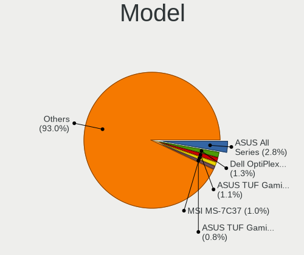
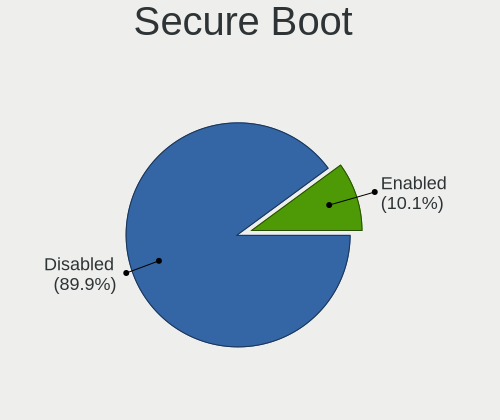
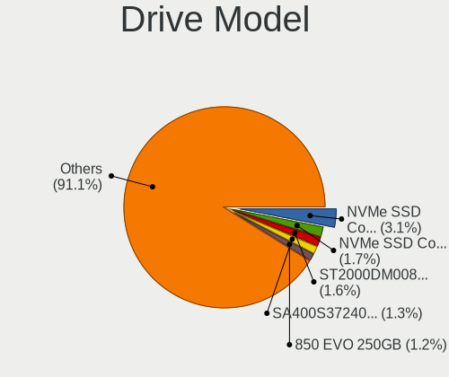
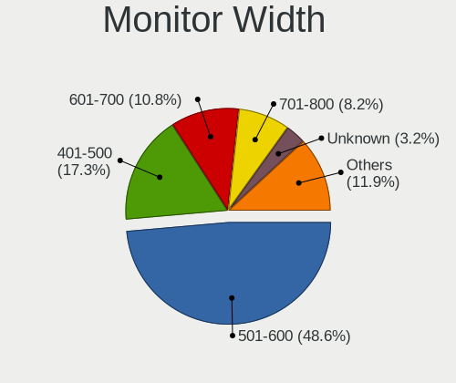
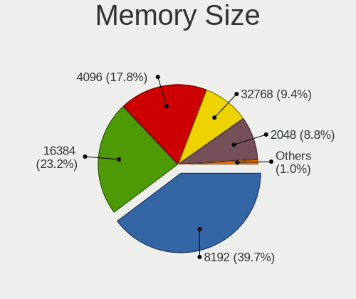
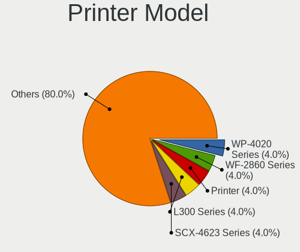
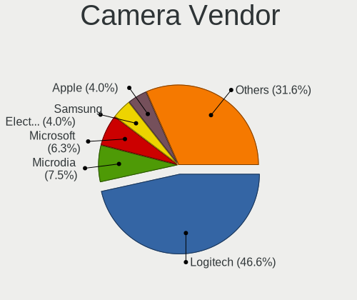

Fedora 37 - Tested Hardware & Statistics (Desktops)
---------------------------------------------------

A project to collect tested hardware configurations for Fedora 37.

Anyone can contribute to this report by the [hw-probe](https://github.com/linuxhw/hw-probe) tool:

    sudo -E hw-probe -all -upload

Please contribute! Especially if your hardware is rare.

Contents
--------

* [ Test Cases ](#test-cases)

* [ System ](#system)
  - [ Kernel                   ](#kernel)
  - [ Kernel Family            ](#kernel-family)
  - [ Kernel Major Ver.        ](#kernel-major-ver)
  - [ Arch                     ](#arch)
  - [ DE                       ](#de)
  - [ Display Server           ](#display-server)
  - [ Display Manager          ](#display-manager)
  - [ OS Lang                  ](#os-lang)
  - [ Boot Mode                ](#boot-mode)
  - [ Filesystem               ](#filesystem)
  - [ Part. scheme             ](#part-scheme)
  - [ Dual Boot with Linux/BSD ](#dual-boot-with-linuxbsd)
  - [ Dual Boot (Win)          ](#dual-boot-win)

* [ Board ](#board)
  - [ Vendor                   ](#vendor)
  - [ Model                    ](#model)
  - [ Model Family             ](#model-family)
  - [ MFG Year                 ](#mfg-year)
  - [ Form Factor              ](#form-factor)
  - [ Secure Boot              ](#secure-boot)
  - [ Coreboot                 ](#coreboot)
  - [ RAM Size                 ](#ram-size)
  - [ RAM Used                 ](#ram-used)
  - [ Total Drives             ](#total-drives)
  - [ Has CD-ROM               ](#has-cd-rom)
  - [ Has Ethernet             ](#has-ethernet)
  - [ Has WiFi                 ](#has-wifi)
  - [ Has Bluetooth            ](#has-bluetooth)

* [ Location ](#location)
  - [ Country                  ](#country)
  - [ City                     ](#city)

* [ Drives ](#drives)
  - [ Drive Vendor             ](#drive-vendor)
  - [ Drive Model              ](#drive-model)
  - [ HDD Vendor               ](#hdd-vendor)
  - [ SSD Vendor               ](#ssd-vendor)
  - [ Drive Kind               ](#drive-kind)
  - [ Drive Connector          ](#drive-connector)
  - [ Drive Size               ](#drive-size)
  - [ Space Total              ](#space-total)
  - [ Space Used               ](#space-used)
  - [ Malfunc. Drives          ](#malfunc-drives)
  - [ Malfunc. Drive Vendor    ](#malfunc-drive-vendor)
  - [ Malfunc. HDD Vendor      ](#malfunc-hdd-vendor)
  - [ Malfunc. Drive Kind      ](#malfunc-drive-kind)
  - [ Failed Drives            ](#failed-drives)
  - [ Failed Drive Vendor      ](#failed-drive-vendor)
  - [ Drive Status             ](#drive-status)

* [ Storage controller ](#storage-controller)
  - [ Storage Vendor           ](#storage-vendor)
  - [ Storage Model            ](#storage-model)
  - [ Storage Kind             ](#storage-kind)

* [ Processor ](#processor)
  - [ CPU Vendor               ](#cpu-vendor)
  - [ CPU Model                ](#cpu-model)
  - [ CPU Model Family         ](#cpu-model-family)
  - [ CPU Cores                ](#cpu-cores)
  - [ CPU Sockets              ](#cpu-sockets)
  - [ CPU Threads              ](#cpu-threads)
  - [ CPU Op-Modes             ](#cpu-op-modes)
  - [ CPU Microcode            ](#cpu-microcode)
  - [ CPU Microarch            ](#cpu-microarch)

* [ Graphics ](#graphics)
  - [ GPU Vendor               ](#gpu-vendor)
  - [ GPU Model                ](#gpu-model)
  - [ GPU Combo                ](#gpu-combo)
  - [ GPU Driver               ](#gpu-driver)
  - [ GPU Memory               ](#gpu-memory)

* [ Monitor ](#monitor)
  - [ Monitor Vendor           ](#monitor-vendor)
  - [ Monitor Model            ](#monitor-model)
  - [ Monitor Resolution       ](#monitor-resolution)
  - [ Monitor Diagonal         ](#monitor-diagonal)
  - [ Monitor Width            ](#monitor-width)
  - [ Aspect Ratio             ](#aspect-ratio)
  - [ Monitor Area             ](#monitor-area)
  - [ Pixel Density            ](#pixel-density)
  - [ Multiple Monitors        ](#multiple-monitors)

* [ Network ](#network)
  - [ Net Controller Vendor    ](#net-controller-vendor)
  - [ Net Controller Model     ](#net-controller-model)
  - [ Wireless Vendor          ](#wireless-vendor)
  - [ Wireless Model           ](#wireless-model)
  - [ Ethernet Vendor          ](#ethernet-vendor)
  - [ Ethernet Model           ](#ethernet-model)
  - [ Net Controller Kind      ](#net-controller-kind)
  - [ Used Controller          ](#used-controller)
  - [ NICs                     ](#nics)
  - [ IPv6                     ](#ipv6)

* [ Bluetooth ](#bluetooth)
  - [ Bluetooth Vendor         ](#bluetooth-vendor)
  - [ Bluetooth Model          ](#bluetooth-model)

* [ Sound ](#sound)
  - [ Sound Vendor             ](#sound-vendor)
  - [ Sound Model              ](#sound-model)

* [ Memory ](#memory)
  - [ Memory Vendor            ](#memory-vendor)
  - [ Memory Model             ](#memory-model)
  - [ Memory Kind              ](#memory-kind)
  - [ Memory Form Factor       ](#memory-form-factor)
  - [ Memory Size              ](#memory-size)
  - [ Memory Speed             ](#memory-speed)

* [ Printers & scanners ](#printers--scanners)
  - [ Printer Vendor           ](#printer-vendor)
  - [ Printer Model            ](#printer-model)
  - [ Scanner Vendor           ](#scanner-vendor)
  - [ Scanner Model            ](#scanner-model)

* [ Camera ](#camera)
  - [ Camera Vendor            ](#camera-vendor)
  - [ Camera Model             ](#camera-model)

* [ Security ](#security)
  - [ Fingerprint Vendor       ](#fingerprint-vendor)
  - [ Fingerprint Model        ](#fingerprint-model)
  - [ Chipcard Vendor          ](#chipcard-vendor)
  - [ Chipcard Model           ](#chipcard-model)

* [ Unsupported ](#unsupported)
  - [ Unsupported Devices      ](#unsupported-devices)
  - [ Unsupported Device Types ](#unsupported-device-types)

Test Cases
----------

Total: 28

| Vendor   | Model                       | Probe                                                      | Date         |
|----------|-----------------------------|------------------------------------------------------------|--------------|
| ASUSTek  | PRIME Z270-A                | [4118e245a3](https://linux-hardware.org/?probe=4118e245a3) | Sep 29, 2022 |
| Intel    | DP35DP AAD81073-208         | [031ff09179](https://linux-hardware.org/?probe=031ff09179) | Sep 27, 2022 |
| Gigabyte | Z170-D3H-CF                 | [254a78c371](https://linux-hardware.org/?probe=254a78c371) | Sep 26, 2022 |
| Acer     | Aspire X1900                | [c7b768051b](https://linux-hardware.org/?probe=c7b768051b) | Sep 25, 2022 |
| ASRock   | FM2A88X Extreme4+           | [2d44b203f9](https://linux-hardware.org/?probe=2d44b203f9) | Sep 25, 2022 |
| ASUSTek  | TUF Gaming X570-PLUS        | [ee8183722c](https://linux-hardware.org/?probe=ee8183722c) | Sep 24, 2022 |
| ASUSTek  | TUF Gaming X570-PLUS        | [ac59b4138c](https://linux-hardware.org/?probe=ac59b4138c) | Sep 23, 2022 |
| ASUSTek  | Pro WS WRX80E-SAGE SE WI... | [54d3096bb6](https://linux-hardware.org/?probe=54d3096bb6) | Sep 21, 2022 |
| Gigabyte | X570 I AORUS PRO WIFI       | [1869422fde](https://linux-hardware.org/?probe=1869422fde) | Sep 20, 2022 |
| ASUSTek  | Z170-A                      | [aad09d3281](https://linux-hardware.org/?probe=aad09d3281) | Sep 20, 2022 |
| ASUSTek  | PRIME X470-PRO              | [a6857e4b03](https://linux-hardware.org/?probe=a6857e4b03) | Sep 19, 2022 |
| Gigabyte | X570 AORUS MASTER           | [424e3ded44](https://linux-hardware.org/?probe=424e3ded44) | Sep 19, 2022 |
| HP       | 2B05                        | [c2dcdaa38a](https://linux-hardware.org/?probe=c2dcdaa38a) | Sep 19, 2022 |
| HP       | 2B05                        | [18db320ef7](https://linux-hardware.org/?probe=18db320ef7) | Sep 19, 2022 |
| Gigabyte | B85M-D3V-A                  | [8f6b96ba44](https://linux-hardware.org/?probe=8f6b96ba44) | Sep 19, 2022 |
| ASUSTek  | ProArt Z690-CREATOR WIFI    | [48479f01c1](https://linux-hardware.org/?probe=48479f01c1) | Sep 19, 2022 |
| ASUSTek  | TUF Gaming B550M-PLUS       | [8468466b2a](https://linux-hardware.org/?probe=8468466b2a) | Sep 19, 2022 |
| HP       | 3397                        | [637a5570cf](https://linux-hardware.org/?probe=637a5570cf) | Sep 16, 2022 |
| Gigabyte | AB350N-Gaming WIFI-CF       | [dcaf7e8bd0](https://linux-hardware.org/?probe=dcaf7e8bd0) | Sep 15, 2022 |
| Gigabyte | B85M-D3V-A                  | [a856637b19](https://linux-hardware.org/?probe=a856637b19) | Sep 15, 2022 |
| ASUSTek  | PRIME Z270-A                | [2642647feb](https://linux-hardware.org/?probe=2642647feb) | Sep 14, 2022 |
| ASUSTek  | TUF Gaming B550M-PLUS       | [3557099732](https://linux-hardware.org/?probe=3557099732) | Sep 14, 2022 |
| HP       | 1998                        | [bf93a500f4](https://linux-hardware.org/?probe=bf93a500f4) | Sep 14, 2022 |
| MSI      | Z370 TOMAHAWK               | [251d227686](https://linux-hardware.org/?probe=251d227686) | Aug 22, 2022 |
| Dell     | 08NPPY A00                  | [93eb00c3c5](https://linux-hardware.org/?probe=93eb00c3c5) | Jun 16, 2022 |
| ASUSTek  | P8Z68-V LX                  | [2cd65296c2](https://linux-hardware.org/?probe=2cd65296c2) | May 08, 2022 |
| HP       | 0B54h D                     | [7153ec172b](https://linux-hardware.org/?probe=7153ec172b) | Mar 21, 2022 |
| HP       | 0B54h D                     | [399cc50503](https://linux-hardware.org/?probe=399cc50503) | Mar 02, 2022 |

System
------

Kernel
------

Version of the Linux kernel

| Version                                                | Desktops | Percent |
|--------------------------------------------------------|----------|---------|
| 5.19.9-300.fc37.x86_64                                 | 8        | 38.1%   |
| 5.19.8-300.fc37.x86_64                                 | 3        | 14.29%  |
| 6.0.0-0.rc6.20220922gitdc164f4fb00a.43.fc38.x86_64     | 1        | 4.76%   |
| 5.8.15-301.fc33.x86_64                                 | 1        | 4.76%   |
| 5.19.8-501.chinfo.fc37.x86_64                          | 1        | 4.76%   |
| 5.19.7-300.fc37.x86_64                                 | 1        | 4.76%   |
| 5.19.10-602.inttf.fc37.x86_64                          | 1        | 4.76%   |
| 5.19.10-300.fc37.x86_64                                | 1        | 4.76%   |
| 5.19.0-65.fc37.x86_64                                  | 1        | 4.76%   |
| 5.19.0-0.rc1.20220610git874c8ca1e60b.18.fc37.x86_64    | 1        | 4.76%   |
| 5.18.0-0.rc5.20220505gita7391ad3572431a.43.fc37.x86_64 | 1        | 4.76%   |
| 5.17.0-0.rc6.109.fc37.x86_64                           | 1        | 4.76%   |

Kernel Family
-------------

Linux kernel without a distro release

| Version | Desktops | Percent |
|---------|----------|---------|
| 5.19.9  | 8        | 38.1%   |
| 5.19.8  | 4        | 19.05%  |
| 5.19.10 | 2        | 9.52%   |
| 5.19.0  | 2        | 9.52%   |
| 6.0.0   | 1        | 4.76%   |
| 5.8.15  | 1        | 4.76%   |
| 5.19.7  | 1        | 4.76%   |
| 5.18.0  | 1        | 4.76%   |
| 5.17.0  | 1        | 4.76%   |

Kernel Major Ver.
-----------------

Linux kernel major version

| Version | Desktops | Percent |
|---------|----------|---------|
| 5.19    | 17       | 80.95%  |
| 6.0     | 1        | 4.76%   |
| 5.8     | 1        | 4.76%   |
| 5.18    | 1        | 4.76%   |
| 5.17    | 1        | 4.76%   |

Arch
----

OS architecture (x86_64, i586, etc.)

| Name   | Desktops | Percent |
|--------|----------|---------|
| x86_64 | 21       | 100%    |

DE
--

Desktop Environment

| Name       | Desktops | Percent |
|------------|----------|---------|
| GNOME      | 15       | 71.43%  |
| KDE5       | 3        | 14.29%  |
| XFCE       | 2        | 9.52%   |
| X-Cinnamon | 1        | 4.76%   |

Display Server
--------------

X11 or Wayland

| Name    | Desktops | Percent |
|---------|----------|---------|
| Wayland | 12       | 57.14%  |
| X11     | 9        | 42.86%  |

Display Manager
---------------

SDDM, LightDM, etc.

| Name    | Desktops | Percent |
|---------|----------|---------|
| Unknown | 10       | 47.62%  |
| GDM     | 5        | 23.81%  |
| SDDM    | 3        | 14.29%  |
| LightDM | 3        | 14.29%  |

OS Lang
-------

Language

| Lang           | Desktops | Percent |
|----------------|----------|---------|
| en_US          | 7        | 33.33%  |
| pt_BR          | 3        | 14.29%  |
| en_CA          | 3        | 14.29%  |
| ru_RU          | 2        | 9.52%   |
| en_GB          | 2        | 9.52%   |
| de_DE          | 2        | 9.52%   |
| nl_NL          | 1        | 4.76%   |
| ca_ES@valencia | 1        | 4.76%   |

Boot Mode
---------

EFI or BIOS

| Mode | Desktops | Percent |
|------|----------|---------|
| EFI  | 14       | 66.67%  |
| BIOS | 7        | 33.33%  |

Filesystem
----------

Type of filesystem

| Type  | Desktops | Percent |
|-------|----------|---------|
| Btrfs | 15       | 71.43%  |
| Xfs   | 3        | 14.29%  |
| Ext4  | 3        | 14.29%  |

Part. scheme
------------

Scheme of partitioning

| Type    | Desktops | Percent |
|---------|----------|---------|
| GPT     | 10       | 47.62%  |
| Unknown | 10       | 47.62%  |
| MBR     | 1        | 4.76%   |

Dual Boot with Linux/BSD
------------------------

Hosting more than one Linux/BSD

| Dual boot | Desktops | Percent |
|-----------|----------|---------|
| No        | 17       | 80.95%  |
| Yes       | 4        | 19.05%  |

Dual Boot (Win)
---------------

Hosting Linux and Windows

| Dual boot | Desktops | Percent |
|-----------|----------|---------|
| No        | 16       | 76.19%  |
| Yes       | 5        | 23.81%  |

Board
-----

Vendor
------

Motherboard manufacturer

| Name                | Desktops | Percent |
|---------------------|----------|---------|
| ASUSTek Computer    | 8        | 38.1%   |
| Gigabyte Technology | 5        | 23.81%  |
| Hewlett-Packard     | 3        | 14.29%  |
| MSI                 | 1        | 4.76%   |
| Intel               | 1        | 4.76%   |
| Dell                | 1        | 4.76%   |
| ASRock              | 1        | 4.76%   |
| Acer                | 1        | 4.76%   |

Model
-----

Motherboard model

| Name                            | Desktops | Percent |
|---------------------------------|----------|---------|
| ASUS TUF Gaming B550M-PLUS      | 2        | 9.52%   |
| MSI MS-7B47                     | 1        | 4.76%   |
| Intel DP35DP AAD81073-208       | 1        | 4.76%   |
| HP Z600 Workstation             | 1        | 4.76%   |
| HP Compaq Elite 8300 SFF        | 1        | 4.76%   |
| HP 110-516no                    | 1        | 4.76%   |
| Gigabyte Z170-D3H               | 1        | 4.76%   |
| Gigabyte X570 I AORUS PRO WIFI  | 1        | 4.76%   |
| Gigabyte X570 AORUS MASTER      | 1        | 4.76%   |
| Gigabyte B85M-D3V-A             | 1        | 4.76%   |
| Gigabyte AB350N-Gaming WIFI     | 1        | 4.76%   |
| Dell OptiPlex 3050              | 1        | 4.76%   |
| ASUS Z170-A                     | 1        | 4.76%   |
| ASUS ProArt Z690-CREATOR WIFI   | 1        | 4.76%   |
| ASUS Pro WS WRX80E-SAGE SE WIFI | 1        | 4.76%   |
| ASUS PRIME Z270-A               | 1        | 4.76%   |
| ASUS PRIME X470-PRO             | 1        | 4.76%   |
| ASUS P8Z68-V LX                 | 1        | 4.76%   |
| ASRock FM2A88X Extreme4+        | 1        | 4.76%   |
| Acer Aspire X1900               | 1        | 4.76%   |

Model Family
------------

Motherboard model prefix

| Name                   | Desktops | Percent |
|------------------------|----------|---------|
| Gigabyte X570          | 2        | 9.52%   |
| ASUS TUF               | 2        | 9.52%   |
| ASUS PRIME             | 2        | 9.52%   |
| MSI MS-7B47            | 1        | 4.76%   |
| Intel DP35DP           | 1        | 4.76%   |
| HP Z600                | 1        | 4.76%   |
| HP Compaq              | 1        | 4.76%   |
| HP 110-516no           | 1        | 4.76%   |
| Gigabyte Z170-D3H      | 1        | 4.76%   |
| Gigabyte B85M-D3V-A    | 1        | 4.76%   |
| Gigabyte AB350N-Gaming | 1        | 4.76%   |
| Dell OptiPlex          | 1        | 4.76%   |
| ASUS Z170-A            | 1        | 4.76%   |
| ASUS ProArt            | 1        | 4.76%   |
| ASUS Pro               | 1        | 4.76%   |
| ASUS P8Z68-V           | 1        | 4.76%   |
| ASRock FM2A88X         | 1        | 4.76%   |
| Acer Aspire            | 1        | 4.76%   |

MFG Year
--------

Motherboard manufacture year

| Year | Desktops | Percent |
|------|----------|---------|
| 2020 | 3        | 14.29%  |
| 2017 | 3        | 14.29%  |
| 2015 | 3        | 14.29%  |
| 2019 | 2        | 9.52%   |
| 2014 | 2        | 9.52%   |
| 2010 | 2        | 9.52%   |
| 2021 | 1        | 4.76%   |
| 2018 | 1        | 4.76%   |
| 2016 | 1        | 4.76%   |
| 2012 | 1        | 4.76%   |
| 2011 | 1        | 4.76%   |
| 2008 | 1        | 4.76%   |

Form Factor
-----------

Physical design of the computer

| Name    | Desktops | Percent |
|---------|----------|---------|
| Desktop | 21       | 100%    |

Secure Boot
-----------

Enabled or disabled

| State    | Desktops | Percent |
|----------|----------|---------|
| Disabled | 19       | 90.48%  |
| Enabled  | 2        | 9.52%   |

Coreboot
--------

Have coreboot on board

| Used | Desktops | Percent |
|------|----------|---------|
| No   | 21       | 100%    |

RAM Size
--------

Total RAM memory

| Size in GB      | Desktops | Percent |
|-----------------|----------|---------|
| 32.01-64.0      | 5        | 23.81%  |
| 16.01-24.0      | 5        | 23.81%  |
| 4.01-8.0        | 3        | 14.29%  |
| 64.01-256.0     | 3        | 14.29%  |
| 8.01-16.0       | 2        | 9.52%   |
| More than 256.0 | 1        | 4.76%   |
| 3.01-4.0        | 1        | 4.76%   |
| 24.01-32.0      | 1        | 4.76%   |

RAM Used
--------

Used RAM memory

| Used GB    | Desktops | Percent |
|------------|----------|---------|
| 4.01-8.0   | 6        | 28.57%  |
| 3.01-4.0   | 4        | 19.05%  |
| 2.01-3.0   | 4        | 19.05%  |
| 8.01-16.0  | 4        | 19.05%  |
| 1.01-2.0   | 2        | 9.52%   |
| 24.01-32.0 | 1        | 4.76%   |

Total Drives
------------

Number of drives on board

| Drives | Desktops | Percent |
|--------|----------|---------|
| 2      | 7        | 33.33%  |
| 4      | 5        | 23.81%  |
| 1      | 4        | 19.05%  |
| 3      | 3        | 14.29%  |
| 5      | 1        | 4.76%   |
| 0      | 1        | 4.76%   |

Has CD-ROM
----------

Has CD-ROM on board

| Presented | Desktops | Percent |
|-----------|----------|---------|
| No        | 12       | 57.14%  |
| Yes       | 9        | 42.86%  |

Has Ethernet
------------

Has Ethernet on board

| Presented | Desktops | Percent |
|-----------|----------|---------|
| Yes       | 21       | 100%    |

Has WiFi
--------

Has WiFi module

| Presented | Desktops | Percent |
|-----------|----------|---------|
| No        | 12       | 57.14%  |
| Yes       | 9        | 42.86%  |

Has Bluetooth
-------------

Has Bluetooth module

| Presented | Desktops | Percent |
|-----------|----------|---------|
| No        | 11       | 52.38%  |
| Yes       | 10       | 47.62%  |

Location
--------

Country
-------

Geographic location (country)

| Country      | Desktops | Percent |
|--------------|----------|---------|
| USA          | 4        | 19.05%  |
| Germany      | 3        | 14.29%  |
| Canada       | 3        | 14.29%  |
| Brazil       | 3        | 14.29%  |
| Belarus      | 2        | 9.52%   |
| UK           | 1        | 4.76%   |
| Sweden       | 1        | 4.76%   |
| Spain        | 1        | 4.76%   |
| South Africa | 1        | 4.76%   |
| Netherlands  | 1        | 4.76%   |
| Malaysia     | 1        | 4.76%   |

City
----

Geographic location (city)

| City         | Desktops | Percent |
|--------------|----------|---------|
| Goiânia     | 2        | 9.52%   |
| Berlin       | 2        | 9.52%   |
| Zierikzee    | 1        | 4.76%   |
| Vaxjo        | 1        | 4.76%   |
| Vancouver    | 1        | 4.76%   |
| San Antonio  | 1        | 4.76%   |
| Mt. Pleasant | 1        | 4.76%   |
| Mokena       | 1        | 4.76%   |
| Minsk        | 1        | 4.76%   |
| Kuala Lumpur | 1        | 4.76%   |
| Kingston     | 1        | 4.76%   |
| Houston      | 1        | 4.76%   |
| Erfurt       | 1        | 4.76%   |
| Chertyazh    | 1        | 4.76%   |
| Centurion    | 1        | 4.76%   |
| Bristol      | 1        | 4.76%   |
| Bradford     | 1        | 4.76%   |
| Analandia    | 1        | 4.76%   |
| Agost        | 1        | 4.76%   |

Drives
------

Drive Vendor
------------

Hard drive vendors

| Vendor              | Desktops | Drives | Percent |
|---------------------|----------|--------|---------|
| Samsung Electronics | 10       | 17     | 27.03%  |
| WDC                 | 8        | 13     | 21.62%  |
| Seagate             | 8        | 11     | 21.62%  |
| Kingston            | 3        | 3      | 8.11%   |
| Toshiba             | 2        | 2      | 5.41%   |
| A-DATA Technology   | 2        | 2      | 5.41%   |
| Seagate Technology  | 1        | 1      | 2.7%    |
| SanDisk             | 1        | 1      | 2.7%    |
| HGST                | 1        | 1      | 2.7%    |
| Crucial             | 1        | 1      | 2.7%    |

Drive Model
-----------

Hard drive models

| Model                                                 | Desktops | Percent |
|-------------------------------------------------------|----------|---------|
| Samsung NVMe SSD Controller SM981/PM981/PM983 256GB   | 3        | 6.52%   |
| Samsung NVMe SSD Controller PM9A1/PM9A3/980PRO 1024GB | 2        | 4.35%   |
| WDC WDS500G2B0B-00YS70 500GB SSD                      | 1        | 2.17%   |
| WDC WDS500G1B0C-00S6U0 500GB                          | 1        | 2.17%   |
| WDC WDS100T2B0A-00SM50 1TB SSD                        | 1        | 2.17%   |
| WDC WD5000AAKX-00U6AA0 500GB                          | 1        | 2.17%   |
| WDC WD40PURX-64GVNY0 4TB                              | 1        | 2.17%   |
| WDC WD40EZRZ-00GXCB0 4TB                              | 1        | 2.17%   |
| WDC WD40EFZX-68AWUN0 4TB                              | 1        | 2.17%   |
| WDC WD30EFRX-68EUZN0 3TB                              | 1        | 2.17%   |
| WDC WD10EZEX-60M2NA0 1TB                              | 1        | 2.17%   |
| WDC WD10EZEX-08WN4A0 1TB                              | 1        | 2.17%   |
| WDC WD10EVDS-63U8B1 1TB                               | 1        | 2.17%   |
| WDC WD10EFRX-68FYTN0 1TB                              | 1        | 2.17%   |
| WDC WD My Passport 25F3 512GB                         | 1        | 2.17%   |
| Toshiba THNSN5256GPU7 256GB                           | 1        | 2.17%   |
| Toshiba DT01ACA200 2TB                                | 1        | 2.17%   |
| Seagate FireCuda 520 SSD 1TB                          | 1        | 2.17%   |
| Seagate ST4000DM000-1F2168 4TB                        | 1        | 2.17%   |
| Seagate ST3500413AS 500GB                             | 1        | 2.17%   |
| Seagate ST31000528AS 1TB                              | 1        | 2.17%   |
| Seagate ST3000DM001-1ER166 3TB                        | 1        | 2.17%   |
| Seagate ST2000DM008-2UB102 2TB                        | 1        | 2.17%   |
| Seagate ST2000DM008-2FR102 2TB                        | 1        | 2.17%   |
| Seagate ST1000DM003-1SB102 1TB                        | 1        | 2.17%   |
| Seagate One Touch HDD 5TB                             | 1        | 2.17%   |
| Seagate FireCuda 520 SSD ZP1000GM30002 1TB            | 1        | 2.17%   |
| SanDisk SDSSDRC032G 32GB                              | 1        | 2.17%   |
| Samsung SSD 970 EVO 250GB                             | 1        | 2.17%   |
| Samsung SSD 870 QVO 2TB                               | 1        | 2.17%   |
| Samsung SSD 860 PRO 512GB                             | 1        | 2.17%   |
| Samsung SSD 860 EVO 1TB                               | 1        | 2.17%   |
| Samsung SSD 850 EVO 1TB                               | 1        | 2.17%   |
| Samsung NVMe SSD Drive 1TB                            | 1        | 2.17%   |
| Samsung NVMe SSD Drive 1024GB                         | 1        | 2.17%   |
| Samsung NVMe SSD Controller SM961/PM961/SM963 256GB   | 1        | 2.17%   |
| Kingston SNVS2000GB 2TB                               | 1        | 2.17%   |
| Kingston SFYRS1000G 1TB                               | 1        | 2.17%   |
| Kingston SA400S37120G 120GB SSD                       | 1        | 2.17%   |
| HGST HUS726T6TALE6L4 6TB                              | 1        | 2.17%   |

HDD Vendor
----------

Hard disk drive vendors

| Vendor  | Desktops | Drives | Percent |
|---------|----------|--------|---------|
| Seagate | 7        | 10     | 46.67%  |
| WDC     | 6        | 9      | 40%     |
| Toshiba | 1        | 1      | 6.67%   |
| HGST    | 1        | 1      | 6.67%   |

SSD Vendor
----------

Solid state drive vendors

| Vendor              | Desktops | Drives | Percent |
|---------------------|----------|--------|---------|
| Samsung Electronics | 4        | 5      | 44.44%  |
| WDC                 | 2        | 2      | 22.22%  |
| SanDisk             | 1        | 1      | 11.11%  |
| Kingston            | 1        | 1      | 11.11%  |
| Crucial             | 1        | 1      | 11.11%  |

Drive Kind
----------

HDD or SSD

| Kind    | Desktops | Drives | Percent |
|---------|----------|--------|---------|
| HDD     | 13       | 21     | 38.24%  |
| NVMe    | 12       | 20     | 35.29%  |
| SSD     | 8        | 10     | 23.53%  |
| Unknown | 1        | 1      | 2.94%   |

Drive Connector
---------------

SATA, SAS, NVMe, etc.

| Type | Desktops | Drives | Percent |
|------|----------|--------|---------|
| SATA | 17       | 30     | 54.84%  |
| NVMe | 12       | 20     | 38.71%  |
| SAS  | 2        | 2      | 6.45%   |

Drive Size
----------

Size of hard drive

| Size in TB | Desktops | Drives | Percent |
|------------|----------|--------|---------|
| 0.51-1.0   | 9        | 12     | 37.5%   |
| 0.01-0.5   | 5        | 6      | 20.83%  |
| 1.01-2.0   | 4        | 5      | 16.67%  |
| 3.01-4.0   | 2        | 4      | 8.33%   |
| 2.01-3.0   | 2        | 2      | 8.33%   |
| 4.01-10.0  | 2        | 2      | 8.33%   |

Space Total
-----------

Amount of disk space available on the file system

| Size in GB     | Desktops | Percent |
|----------------|----------|---------|
| 1001-2000      | 6        | 28.57%  |
| 2001-3000      | 4        | 19.05%  |
| More than 3000 | 3        | 14.29%  |
| 101-250        | 3        | 14.29%  |
| 1-20           | 2        | 9.52%   |
| 501-1000       | 2        | 9.52%   |
| Unknown        | 1        | 4.76%   |

Space Used
----------

Amount of used disk space

| Used GB        | Desktops | Percent |
|----------------|----------|---------|
| 1-20           | 4        | 19.05%  |
| 251-500        | 3        | 14.29%  |
| 1001-2000      | 3        | 14.29%  |
| 501-1000       | 3        | 14.29%  |
| More than 3000 | 2        | 9.52%   |
| 21-50          | 2        | 9.52%   |
| 101-250        | 2        | 9.52%   |
| 51-100         | 1        | 4.76%   |
| Unknown        | 1        | 4.76%   |

Malfunc. Drives
---------------

Drive models with a malfunction

| Model                          | Desktops | Drives | Percent |
|--------------------------------|----------|--------|---------|
| WDC WD5000AAKX-00U6AA0 500GB   | 1        | 1      | 33.33%  |
| WDC WD10EFRX-68FYTN0 1TB       | 1        | 1      | 33.33%  |
| Seagate ST3000DM001-1ER166 3TB | 1        | 1      | 33.33%  |

Malfunc. Drive Vendor
---------------------

Vendors of faulty drives

| Vendor  | Desktops | Drives | Percent |
|---------|----------|--------|---------|
| WDC     | 2        | 2      | 66.67%  |
| Seagate | 1        | 1      | 33.33%  |

Malfunc. HDD Vendor
-------------------

Vendors of faulty HDD drives

| Vendor  | Desktops | Drives | Percent |
|---------|----------|--------|---------|
| WDC     | 2        | 2      | 66.67%  |
| Seagate | 1        | 1      | 33.33%  |

Malfunc. Drive Kind
-------------------

Kinds of faulty drives

| Kind | Desktops | Drives | Percent |
|------|----------|--------|---------|
| HDD  | 2        | 3      | 100%    |

Failed Drives
-------------

Failed drive models

Zero info for selected period =(

Failed Drive Vendor
-------------------

Failed drive vendors

Zero info for selected period =(

Drive Status
------------

Number of failed and malfunc. drives

| Status   | Desktops | Drives | Percent |
|----------|----------|--------|---------|
| Detected | 13       | 29     | 54.17%  |
| Works    | 9        | 20     | 37.5%   |
| Malfunc  | 2        | 3      | 8.33%   |

Storage controller
------------------

Storage Vendor
--------------

Storage controller vendors

| Vendor                       | Desktops | Percent |
|------------------------------|----------|---------|
| Intel                        | 12       | 32.43%  |
| Samsung Electronics          | 8        | 21.62%  |
| AMD                          | 8        | 21.62%  |
| Kingston Technology Company  | 2        | 5.41%   |
| Toshiba America Info Systems | 1        | 2.7%    |
| Seagate Technology           | 1        | 2.7%    |
| SanDisk                      | 1        | 2.7%    |
| Realtek Semiconductor        | 1        | 2.7%    |
| Marvell Technology Group     | 1        | 2.7%    |
| ASMedia Technology           | 1        | 2.7%    |
| ADATA Technology             | 1        | 2.7%    |

Storage Model
-------------

Storage controller models

| Model                                                                          | Desktops | Percent |
|--------------------------------------------------------------------------------|----------|---------|
| Samsung NVMe SSD Controller SM981/PM981/PM983                                  | 5        | 11.9%   |
| AMD FCH SATA Controller [AHCI mode]                                            | 5        | 11.9%   |
| Samsung NVMe SSD Controller PM9A1/PM9A3/980PRO                                 | 3        | 7.14%   |
| Kingston Company Company Non-Volatile memory controller                        | 2        | 4.76%   |
| Intel SATA Controller [RAID mode]                                              | 2        | 4.76%   |
| Intel Q170/Q150/B150/H170/H110/Z170/CM236 Chipset SATA Controller [AHCI Mode]  | 2        | 4.76%   |
| Intel 200 Series PCH SATA controller [AHCI mode]                               | 2        | 4.76%   |
| AMD 500 Series Chipset SATA Controller                                         | 2        | 4.76%   |
| Toshiba America Info Systems NVMe Controller                                   | 1        | 2.38%   |
| Seagate FireCuda 520 SSD                                                       | 1        | 2.38%   |
| SanDisk WD Blue SN500 / PC SN520 NVMe SSD                                      | 1        | 2.38%   |
| Samsung NVMe SSD Controller SM961/PM961/SM963                                  | 1        | 2.38%   |
| Realtek Realtek Non-Volatile memory controller                                 | 1        | 2.38%   |
| Marvell Group 88SE6101/6102 single-port PATA133 interface                      | 1        | 2.38%   |
| Intel Volume Management Device NVMe RAID Controller                            | 1        | 2.38%   |
| Intel NM10/ICH7 Family SATA Controller [IDE mode]                              | 1        | 2.38%   |
| Intel Alder Lake-S PCH SATA Controller [AHCI Mode]                             | 1        | 2.38%   |
| Intel 82801IR/IO/IH (ICH9R/DO/DH) 4 port SATA Controller [IDE mode]            | 1        | 2.38%   |
| Intel 82801I (ICH9 Family) 2 port SATA Controller [IDE mode]                   | 1        | 2.38%   |
| Intel 82801G (ICH7 Family) IDE Controller                                      | 1        | 2.38%   |
| Intel 8 Series/C220 Series Chipset Family 6-port SATA Controller 1 [AHCI mode] | 1        | 2.38%   |
| Intel 7 Series/C210 Series Chipset Family 6-port SATA Controller [AHCI mode]   | 1        | 2.38%   |
| Intel 6 Series/C200 Series Chipset Family 6 port Desktop SATA AHCI Controller  | 1        | 2.38%   |
| ASMedia ASM1062 Serial ATA Controller                                          | 1        | 2.38%   |
| AMD 400 Series Chipset SATA Controller                                         | 1        | 2.38%   |
| AMD 300 Series Chipset SATA Controller                                         | 1        | 2.38%   |
| ADATA XPG SX8200 Pro PCIe Gen3x4 M.2 2280 Solid State Drive                    | 1        | 2.38%   |

Storage Kind
------------

Kind of storage controller (IDE, SATA, NVMe, SAS, ...)

| Kind | Desktops | Percent |
|------|----------|---------|
| SATA | 17       | 50%     |
| NVMe | 12       | 35.29%  |
| RAID | 3        | 8.82%   |
| IDE  | 2        | 5.88%   |

Processor
---------

CPU Vendor
----------

Processor vendors

| Vendor | Desktops | Percent |
|--------|----------|---------|
| Intel  | 12       | 57.14%  |
| AMD    | 9        | 42.86%  |

CPU Model
---------

Processor models

| Model                                           | Desktops | Percent |
|-------------------------------------------------|----------|---------|
| Intel Xeon CPU X5675 @ 3.07GHz                  | 1        | 4.76%   |
| Intel Core i7-8700K CPU @ 3.70GHz               | 1        | 4.76%   |
| Intel Core i7-7700K CPU @ 4.20GHz               | 1        | 4.76%   |
| Intel Core i7-6700K CPU @ 4.00GHz               | 1        | 4.76%   |
| Intel Core i7-3770 CPU @ 3.40GHz                | 1        | 4.76%   |
| Intel Core i7-2600K CPU @ 3.40GHz               | 1        | 4.76%   |
| Intel Core i5-7500 CPU @ 3.40GHz                | 1        | 4.76%   |
| Intel Core i5-6500 CPU @ 3.20GHz                | 1        | 4.76%   |
| Intel Core i3-4160 CPU @ 3.60GHz                | 1        | 4.76%   |
| Intel Core 2 Quad CPU Q8200 @ 2.33GHz           | 1        | 4.76%   |
| Intel Core 2 Quad CPU Q6700 @ 2.66GHz           | 1        | 4.76%   |
| Intel 12th Gen Core i9-12900K                   | 1        | 4.76%   |
| AMD Ryzen Threadripper PRO 3975WX 32-Cores      | 1        | 4.76%   |
| AMD Ryzen 9 5900X 12-Core Processor             | 1        | 4.76%   |
| AMD Ryzen 7 2700X Eight-Core Processor          | 1        | 4.76%   |
| AMD Ryzen 5 5600X 6-Core Processor              | 1        | 4.76%   |
| AMD Ryzen 5 5600G with Radeon Graphics          | 1        | 4.76%   |
| AMD Ryzen 5 3600X 6-Core Processor              | 1        | 4.76%   |
| AMD Ryzen 5 3600 6-Core Processor               | 1        | 4.76%   |
| AMD A6-5200 APU with Radeon HD Graphics         | 1        | 4.76%   |
| AMD A10-7860K Radeon R7, 12 Compute Cores 4C+8G | 1        | 4.76%   |

CPU Model Family
----------------

Processor model prefix

| Model                  | Desktops | Percent |
|------------------------|----------|---------|
| Intel Core i7          | 5        | 23.81%  |
| AMD Ryzen 5            | 4        | 19.05%  |
| Intel Core i5          | 2        | 9.52%   |
| Intel Core 2 Quad      | 2        | 9.52%   |
| Other                  | 1        | 4.76%   |
| Intel Xeon             | 1        | 4.76%   |
| Intel Core i3          | 1        | 4.76%   |
| AMD Ryzen Threadripper | 1        | 4.76%   |
| AMD Ryzen 9            | 1        | 4.76%   |
| AMD Ryzen 7            | 1        | 4.76%   |
| AMD A6                 | 1        | 4.76%   |
| AMD A10                | 1        | 4.76%   |

CPU Cores
---------

Number of processor cores

| Number | Desktops | Percent |
|--------|----------|---------|
| 4      | 9        | 42.86%  |
| 6      | 5        | 23.81%  |
| 12     | 2        | 9.52%   |
| 2      | 2        | 9.52%   |
| 32     | 1        | 4.76%   |
| 16     | 1        | 4.76%   |
| 8      | 1        | 4.76%   |

CPU Sockets
-----------

Number of sockets

| Number | Desktops | Percent |
|--------|----------|---------|
| 1      | 20       | 95.24%  |
| 2      | 1        | 4.76%   |

CPU Threads
-----------

Threads per core (Hyper-Threading)

| Number | Desktops | Percent |
|--------|----------|---------|
| 2      | 16       | 76.19%  |
| 1      | 5        | 23.81%  |

CPU Op-Modes
------------

CPU Operation Modes (32-bit, 64-bit)

| Op mode        | Desktops | Percent |
|----------------|----------|---------|
| 32-bit, 64-bit | 21       | 100%    |

CPU Microcode
-------------

Microcode number

| Number     | Desktops | Percent |
|------------|----------|---------|
| 0x906e9    | 2        | 9.52%   |
| 0x506e3    | 2        | 9.52%   |
| 0x0a201016 | 2        | 9.52%   |
| 0x08701021 | 2        | 9.52%   |
| 0x906ea    | 1        | 4.76%   |
| 0x90672    | 1        | 4.76%   |
| 0x6fb      | 1        | 4.76%   |
| 0x306c3    | 1        | 4.76%   |
| 0x306a9    | 1        | 4.76%   |
| 0x206c2    | 1        | 4.76%   |
| 0x206a7    | 1        | 4.76%   |
| 0x10677    | 1        | 4.76%   |
| 0x0a50000d | 1        | 4.76%   |
| 0x0830104d | 1        | 4.76%   |
| 0x0800820d | 1        | 4.76%   |
| 0x0700010b | 1        | 4.76%   |
| 0x06003106 | 1        | 4.76%   |

CPU Microarch
-------------

Microarchitecture

| Name             | Desktops | Percent |
|------------------|----------|---------|
| Zen 3            | 3        | 14.29%  |
| Zen 2            | 3        | 14.29%  |
| KabyLake         | 3        | 14.29%  |
| Skylake          | 2        | 9.52%   |
| Zen+             | 1        | 4.76%   |
| Westmere         | 1        | 4.76%   |
| Steamroller      | 1        | 4.76%   |
| SandyBridge      | 1        | 4.76%   |
| Penryn           | 1        | 4.76%   |
| Jaguar           | 1        | 4.76%   |
| IvyBridge        | 1        | 4.76%   |
| Haswell          | 1        | 4.76%   |
| Core             | 1        | 4.76%   |
| Alderlake Hybrid | 1        | 4.76%   |

Graphics
--------

GPU Vendor
----------

Vendors of graphics cards

| Vendor            | Desktops | Percent |
|-------------------|----------|---------|
| Nvidia            | 12       | 48%     |
| AMD               | 8        | 32%     |
| Intel             | 4        | 16%     |
| ASPEED Technology | 1        | 4%      |

GPU Model
---------

Graphics card models

| Model                                                                     | Desktops | Percent |
|---------------------------------------------------------------------------|----------|---------|
| AMD Ellesmere [Radeon RX 470/480/570/570X/580/580X/590]                   | 2        | 8%      |
| Nvidia TU104 [GeForce RTX 2070 SUPER]                                     | 1        | 4%      |
| Nvidia GT218 [GeForce 210]                                                | 1        | 4%      |
| Nvidia GP107 [GeForce GTX 1050]                                           | 1        | 4%      |
| Nvidia GP104 [GeForce GTX 1080]                                           | 1        | 4%      |
| Nvidia GP102 [GeForce GTX 1080 Ti]                                        | 1        | 4%      |
| Nvidia GM206 [GeForce GTX 950]                                            | 1        | 4%      |
| Nvidia GM107 [GeForce GTX 750 Ti]                                         | 1        | 4%      |
| Nvidia GF114 [GeForce GTX 560]                                            | 1        | 4%      |
| Nvidia GF106 [GeForce GTS 450]                                            | 1        | 4%      |
| Nvidia GA103 [GeForce RTX 3060 Ti]                                        | 1        | 4%      |
| Nvidia GA102 [GeForce RTX 3090]                                           | 1        | 4%      |
| Nvidia G94 [GeForce 9600 GT]                                              | 1        | 4%      |
| Intel IvyBridge GT2 [HD Graphics 4000]                                    | 1        | 4%      |
| Intel HD Graphics 630                                                     | 1        | 4%      |
| Intel CoffeeLake-S GT2 [UHD Graphics 630]                                 | 1        | 4%      |
| Intel 4th Generation Core Processor Family Integrated Graphics Controller | 1        | 4%      |
| ASPEED Technology ASPEED Graphics Family                                  | 1        | 4%      |
| AMD Navi 23 [Radeon RX 6600/6600 XT/6600M]                                | 1        | 4%      |
| AMD Navi 22 [Radeon RX 6700/6700 XT/6750 XT / 6800M]                      | 1        | 4%      |
| AMD Navi 10 [Radeon RX 5600 OEM/5600 XT / 5700/5700 XT]                   | 1        | 4%      |
| AMD Lexa PRO [Radeon 540/540X/550/550X / RX 540X/550/550X]                | 1        | 4%      |
| AMD Kabini [Radeon HD 8400 / R3 Series]                                   | 1        | 4%      |
| AMD Cezanne                                                               | 1        | 4%      |

GPU Combo
---------

Combinations of graphics cards

| Name                    | Desktops | Percent |
|-------------------------|----------|---------|
| 1 x Nvidia              | 9        | 42.86%  |
| 1 x AMD                 | 8        | 38.1%   |
| Intel + Nvidia          | 2        | 9.52%   |
| 2 x Nvidia + 1 x ASPEED | 1        | 4.76%   |
| 1 x Intel               | 1        | 4.76%   |

GPU Driver
----------

Free vs proprietary

| Driver      | Desktops | Percent |
|-------------|----------|---------|
| Free        | 13       | 61.9%   |
| Proprietary | 7        | 33.33%  |
| Unknown     | 1        | 4.76%   |

GPU Memory
----------

Total video memory

| Size in GB | Desktops | Percent |
|------------|----------|---------|
| 7.01-8.0   | 5        | 23.81%  |
| 0.51-1.0   | 5        | 23.81%  |
| Unknown    | 5        | 23.81%  |
| 1.01-2.0   | 2        | 9.52%   |
| 8.01-16.0  | 2        | 9.52%   |
| 3.01-4.0   | 1        | 4.76%   |
| 0.01-0.5   | 1        | 4.76%   |

Monitor
-------

Monitor Vendor
--------------

Monitor vendors

| Vendor               | Desktops | Percent |
|----------------------|----------|---------|
| Samsung Electronics  | 5        | 19.23%  |
| Hewlett-Packard      | 3        | 11.54%  |
| Goldstar             | 3        | 11.54%  |
| Ancor Communications | 3        | 11.54%  |
| Philips              | 2        | 7.69%   |
| Dell                 | 2        | 7.69%   |
| AOC                  | 2        | 7.69%   |
| ViewSonic            | 1        | 3.85%   |
| Unknown              | 1        | 3.85%   |
| NEC Computers        | 1        | 3.85%   |
| KTC                  | 1        | 3.85%   |
| BenQ                 | 1        | 3.85%   |
| ASUSTek Computer     | 1        | 3.85%   |

Monitor Model
-------------

Monitor models

| Model                                                                  | Desktops | Percent |
|------------------------------------------------------------------------|----------|---------|
| ViewSonic XG270QC VSCC438 2560x1440 597x336mm 27.0-inch                | 1        | 3.45%   |
| Unknown LCD Monitor FFFF 2288x1287 2550x2550mm 142.0-inch              | 1        | 3.45%   |
| Samsung Electronics SyncMaster SAM060C 1920x1080 510x290mm 23.1-inch   | 1        | 3.45%   |
| Samsung Electronics SMBX2450 SAM0722 1920x1080 531x299mm 24.0-inch     | 1        | 3.45%   |
| Samsung Electronics SMB2330H SAM064A 1920x1080 509x286mm 23.0-inch     | 1        | 3.45%   |
| Samsung Electronics LS27A800U SAM71A2 3840x2160 600x340mm 27.2-inch    | 1        | 3.45%   |
| Samsung Electronics LCD Monitor SAM0902 1920x1080 1020x570mm 46.0-inch | 1        | 3.45%   |
| Samsung Electronics C34H89x SAM0E25 3440x1440 797x333mm 34.0-inch      | 1        | 3.45%   |
| Philips PHL 272E1GJ PHLC245 1920x1080 598x336mm 27.0-inch              | 1        | 3.45%   |
| Philips PHL 243V5 PHLC0D1 1920x1080 521x293mm 23.5-inch                | 1        | 3.45%   |
| NEC Computers EA231WU NEC2E9F 1920x1200 488x297mm 22.5-inch            | 1        | 3.45%   |
| NEC Computers 20WGX2 NEC6699 1680x1050 433x270mm 20.1-inch             | 1        | 3.45%   |
| KTC 42 TV KTC4200 1920x1080 983x576mm 44.9-inch                        | 1        | 3.45%   |
| Hewlett-Packard ZR2440w HWP2956 1920x1200 518x324mm 24.1-inch          | 1        | 3.45%   |
| Hewlett-Packard Z30i HWP3099 2560x1600 641x400mm 29.7-inch             | 1        | 3.45%   |
| Hewlett-Packard 24mh HPN366C 1920x1080 527x296mm 23.8-inch             | 1        | 3.45%   |
| Goldstar W2442 GSM56D9 1920x1080 531x299mm 24.0-inch                   | 1        | 3.45%   |
| Goldstar M2280A GSM57EC 1920x1080 476x268mm 21.5-inch                  | 1        | 3.45%   |
| Goldstar BK550Y GSM5B42 1920x1080 600x340mm 27.2-inch                  | 1        | 3.45%   |
| Dell SE2416H DELD082 1920x1080 527x296mm 23.8-inch                     | 1        | 3.45%   |
| Dell AW2518HF DELA101 1920x1080 544x303mm 24.5-inch                    | 1        | 3.45%   |
| Dell AW2518H DELA0F6 1920x1080 544x303mm 24.5-inch                     | 1        | 3.45%   |
| BenQ PD3200U BNQ8025 3840x2160 708x399mm 32.0-inch                     | 1        | 3.45%   |
| ASUSTek Computer VG249 AUS2421 1920x1080 527x296mm 23.8-inch           | 1        | 3.45%   |
| AOC 2470W AOC2470 1920x1080 521x293mm 23.5-inch                        | 1        | 3.45%   |
| AOC 2251WH AOC2251 1920x1080 480x270mm 21.7-inch                       | 1        | 3.45%   |
| Ancor Communications VX231 ACI22E5 1920x1080 576x324mm 26.0-inch       | 1        | 3.45%   |
| Ancor Communications ROG PG348Q ACI3433 3440x1440 798x335mm 34.1-inch  | 1        | 3.45%   |
| Ancor Communications PA248 ACI24B1 1920x1200 546x352mm 25.6-inch       | 1        | 3.45%   |

Monitor Resolution
------------------

Monitor screen resolution

| Resolution         | Desktops | Percent |
|--------------------|----------|---------|
| 1920x1080 (FHD)    | 14       | 58.33%  |
| 3840x2160 (4K)     | 2        | 8.33%   |
| 3440x1440          | 2        | 8.33%   |
| 1920x1200 (WUXGA)  | 2        | 8.33%   |
| 2560x1600          | 1        | 4.17%   |
| 2560x1440 (QHD)    | 1        | 4.17%   |
| 2288x1287          | 1        | 4.17%   |
| 1680x1050 (WSXGA+) | 1        | 4.17%   |

Monitor Diagonal
----------------

Diagonal size in inches

| Inches | Desktops | Percent |
|--------|----------|---------|
| 24     | 7        | 25.93%  |
| 27     | 4        | 14.81%  |
| 23     | 3        | 11.11%  |
| 34     | 2        | 7.41%   |
| 21     | 2        | 7.41%   |
| 142    | 1        | 3.7%    |
| 54     | 1        | 3.7%    |
| 44     | 1        | 3.7%    |
| 32     | 1        | 3.7%    |
| 29     | 1        | 3.7%    |
| 26     | 1        | 3.7%    |
| 25     | 1        | 3.7%    |
| 22     | 1        | 3.7%    |
| 20     | 1        | 3.7%    |

Monitor Width
-------------

Physical width

| Width in mm    | Desktops | Percent |
|----------------|----------|---------|
| 501-600        | 14       | 58.33%  |
| 701-800        | 3        | 12.5%   |
| 401-500        | 3        | 12.5%   |
| More than 2000 | 1        | 4.17%   |
| 601-700        | 1        | 4.17%   |
| 1001-1500      | 1        | 4.17%   |
| 901-1000       | 1        | 4.17%   |

Aspect Ratio
------------

Proportional relationship between the width and the height

| Ratio | Desktops | Percent |
|-------|----------|---------|
| 16/9  | 16       | 69.57%  |
| 16/10 | 4        | 17.39%  |
| 21/9  | 2        | 8.7%    |
| 1.00  | 1        | 4.35%   |

Monitor Area
------------

Area in inch²

| Area in inch² | Desktops | Percent |
|----------------|----------|---------|
| 201-250        | 8        | 33.33%  |
| 301-350        | 4        | 16.67%  |
| 251-300        | 4        | 16.67%  |
| 351-500        | 3        | 12.5%   |
| More than 1000 | 2        | 8.33%   |
| 151-200        | 2        | 8.33%   |
| 501-1000       | 1        | 4.17%   |

Pixel Density
-------------

Pixels per inch

| Density | Desktops | Percent |
|---------|----------|---------|
| 51-100  | 13       | 54.17%  |
| 101-120 | 6        | 25%     |
| 1-50    | 3        | 12.5%   |
| 161-240 | 1        | 4.17%   |
| 121-160 | 1        | 4.17%   |

Multiple Monitors
-----------------

Total monitors connected

| Total | Desktops | Percent |
|-------|----------|---------|
| 1     | 12       | 57.14%  |
| 2     | 5        | 23.81%  |
| 0     | 2        | 9.52%   |
| 4     | 1        | 4.76%   |
| 3     | 1        | 4.76%   |

Network
-------

Net Controller Vendor
---------------------

Controller vendors

| Vendor                | Desktops | Percent |
|-----------------------|----------|---------|
| Intel                 | 13       | 41.94%  |
| Realtek Semiconductor | 10       | 32.26%  |
| Qualcomm Atheros      | 2        | 6.45%   |
| Broadcom              | 2        | 6.45%   |
| TP-Link               | 1        | 3.23%   |
| Ralink Technology     | 1        | 3.23%   |
| NetGear               | 1        | 3.23%   |
| Aquantia              | 1        | 3.23%   |

Net Controller Model
--------------------

Controller models

| Model                                                               | Desktops | Percent |
|---------------------------------------------------------------------|----------|---------|
| Realtek RTL8111/8168/8411 PCI Express Gigabit Ethernet Controller   | 5        | 14.29%  |
| Intel Wi-Fi 6 AX200                                                 | 4        | 11.43%  |
| Intel Ethernet Connection (2) I219-V                                | 4        | 11.43%  |
| Realtek RTL8125 2.5GbE Controller                                   | 3        | 8.57%   |
| Intel I211 Gigabit Network Connection                               | 3        | 8.57%   |
| TP-Link USB 10/100 LAN                                              | 1        | 2.86%   |
| Realtek RTL8723BU 802.11b/g/n WLAN Adapter                          | 1        | 2.86%   |
| Realtek RTL810xE PCI Express Fast Ethernet controller               | 1        | 2.86%   |
| Ralink MT7601U Wireless Adapter                                     | 1        | 2.86%   |
| Qualcomm Atheros QCA8171 Gigabit Ethernet                           | 1        | 2.86%   |
| Qualcomm Atheros AR9485 Wireless Network Adapter                    | 1        | 2.86%   |
| NetGear WNA3100(v1) Wireless-N 300 [Broadcom BCM43231]              | 1        | 2.86%   |
| Intel Wireless 3165                                                 | 1        | 2.86%   |
| Intel Wi-Fi 6 AX210/AX211/AX411 160MHz                              | 1        | 2.86%   |
| Intel Ethernet Controller X550                                      | 1        | 2.86%   |
| Intel Ethernet Controller I225-V                                    | 1        | 2.86%   |
| Intel 82579LM Gigabit Network Connection (Lewisville)               | 1        | 2.86%   |
| Intel 82566DC-2 Gigabit Network Connection                          | 1        | 2.86%   |
| Broadcom NetXtreme II BCM57810 10 Gigabit Ethernet Multi Function   | 1        | 2.86%   |
| Broadcom NetXtreme BCM5764M Gigabit Ethernet PCIe                   | 1        | 2.86%   |
| Aquantia AQC113CS NBase-T/IEEE 802.3bz Ethernet Controller [AQtion] | 1        | 2.86%   |

Wireless Vendor
---------------

Wireless vendors

| Vendor                | Desktops | Percent |
|-----------------------|----------|---------|
| Intel                 | 6        | 60%     |
| Realtek Semiconductor | 1        | 10%     |
| Ralink Technology     | 1        | 10%     |
| Qualcomm Atheros      | 1        | 10%     |
| NetGear               | 1        | 10%     |

Wireless Model
--------------

Wireless models

| Model                                                  | Desktops | Percent |
|--------------------------------------------------------|----------|---------|
| Intel Wi-Fi 6 AX200                                    | 4        | 40%     |
| Realtek RTL8723BU 802.11b/g/n WLAN Adapter             | 1        | 10%     |
| Ralink MT7601U Wireless Adapter                        | 1        | 10%     |
| Qualcomm Atheros AR9485 Wireless Network Adapter       | 1        | 10%     |
| NetGear WNA3100(v1) Wireless-N 300 [Broadcom BCM43231] | 1        | 10%     |
| Intel Wireless 3165                                    | 1        | 10%     |
| Intel Wi-Fi 6 AX210/AX211/AX411 160MHz                 | 1        | 10%     |

Ethernet Vendor
---------------

Ethernet vendors

| Vendor                | Desktops | Percent |
|-----------------------|----------|---------|
| Intel                 | 11       | 44%     |
| Realtek Semiconductor | 9        | 36%     |
| Broadcom              | 2        | 8%      |
| TP-Link               | 1        | 4%      |
| Qualcomm Atheros      | 1        | 4%      |
| Aquantia              | 1        | 4%      |

Ethernet Model
--------------

Ethernet models

| Model                                                               | Desktops | Percent |
|---------------------------------------------------------------------|----------|---------|
| Realtek RTL8111/8168/8411 PCI Express Gigabit Ethernet Controller   | 5        | 20%     |
| Intel Ethernet Connection (2) I219-V                                | 4        | 16%     |
| Realtek RTL8125 2.5GbE Controller                                   | 3        | 12%     |
| Intel I211 Gigabit Network Connection                               | 3        | 12%     |
| TP-Link USB 10/100 LAN                                              | 1        | 4%      |
| Realtek RTL810xE PCI Express Fast Ethernet controller               | 1        | 4%      |
| Qualcomm Atheros QCA8171 Gigabit Ethernet                           | 1        | 4%      |
| Intel Ethernet Controller X550                                      | 1        | 4%      |
| Intel Ethernet Controller I225-V                                    | 1        | 4%      |
| Intel 82579LM Gigabit Network Connection (Lewisville)               | 1        | 4%      |
| Intel 82566DC-2 Gigabit Network Connection                          | 1        | 4%      |
| Broadcom NetXtreme II BCM57810 10 Gigabit Ethernet Multi Function   | 1        | 4%      |
| Broadcom NetXtreme BCM5764M Gigabit Ethernet PCIe                   | 1        | 4%      |
| Aquantia AQC113CS NBase-T/IEEE 802.3bz Ethernet Controller [AQtion] | 1        | 4%      |

Net Controller Kind
-------------------

Ethernet, WiFi or modem

| Kind     | Desktops | Percent |
|----------|----------|---------|
| Ethernet | 22       | 70.97%  |
| WiFi     | 9        | 29.03%  |

Used Controller
---------------

Currently used network controller

| Kind     | Desktops | Percent |
|----------|----------|---------|
| Ethernet | 18       | 78.26%  |
| WiFi     | 5        | 21.74%  |

NICs
----

Total network controllers on board

| Total | Desktops | Percent |
|-------|----------|---------|
| 1     | 13       | 61.9%   |
| 2     | 4        | 19.05%  |
| 3     | 3        | 14.29%  |
| 9     | 1        | 4.76%   |

IPv6
----

IPv6 vs IPv4

| Used | Desktops | Percent |
|------|----------|---------|
| No   | 17       | 80.95%  |
| Yes  | 4        | 19.05%  |

Bluetooth
---------

Bluetooth Vendor
----------------

Controller vendors

| Vendor                  | Desktops | Percent |
|-------------------------|----------|---------|
| Intel                   | 6        | 60%     |
| Broadcom                | 2        | 20%     |
| Realtek Semiconductor   | 1        | 10%     |
| Cambridge Silicon Radio | 1        | 10%     |

Bluetooth Model
---------------

Controller models

| Model                                               | Desktops | Percent |
|-----------------------------------------------------|----------|---------|
| Intel AX200 Bluetooth                               | 4        | 40%     |
| Broadcom BCM20702A0 Bluetooth 4.0                   | 2        | 20%     |
| Realtek Bluetooth Radio                             | 1        | 10%     |
| Intel Bluetooth wireless interface                  | 1        | 10%     |
| Intel AX210 Bluetooth                               | 1        | 10%     |
| Cambridge Silicon Radio Bluetooth Dongle (HCI mode) | 1        | 10%     |

Sound
-----

Sound Vendor
------------

Sound card vendors

| Vendor              | Desktops | Percent |
|---------------------|----------|---------|
| Intel               | 12       | 29.27%  |
| Nvidia              | 11       | 26.83%  |
| AMD                 | 10       | 24.39%  |
| Shure               | 1        | 2.44%   |
| Razer USA           | 1        | 2.44%   |
| Logitech            | 1        | 2.44%   |
| Creative Labs       | 1        | 2.44%   |
| Cirrus Logic        | 1        | 2.44%   |
| C-Media Electronics | 1        | 2.44%   |
| AudioQuest          | 1        | 2.44%   |
| ASUSTek Computer    | 1        | 2.44%   |

Sound Model
-----------

Sound card models

| Model                                                                      | Desktops | Percent |
|----------------------------------------------------------------------------|----------|---------|
| AMD Starship/Matisse HD Audio Controller                                   | 5        | 10.42%  |
| Intel 200 Series PCH HD Audio                                              | 3        | 6.25%   |
| Intel 100 Series/C230 Series Chipset Family HD Audio Controller            | 2        | 4.17%   |
| AMD Navi 21/23 HDMI/DP Audio Controller                                    | 2        | 4.17%   |
| AMD FCH Azalia Controller                                                  | 2        | 4.17%   |
| AMD Ellesmere HDMI Audio [Radeon RX 470/480 / 570/580/590]                 | 2        | 4.17%   |
| Shure MV7                                                                  | 1        | 2.08%   |
| Razer USA Razer Seiren Mini                                                | 1        | 2.08%   |
| Nvidia TU104 HD Audio Controller                                           | 1        | 2.08%   |
| Nvidia High Definition Audio Controller                                    | 1        | 2.08%   |
| Nvidia GP107GL High Definition Audio Controller                            | 1        | 2.08%   |
| Nvidia GP104 High Definition Audio Controller                              | 1        | 2.08%   |
| Nvidia GP102 HDMI Audio Controller                                         | 1        | 2.08%   |
| Nvidia GM206 High Definition Audio Controller                              | 1        | 2.08%   |
| Nvidia GM107 High Definition Audio Controller [GeForce 940MX]              | 1        | 2.08%   |
| Nvidia GF114 HDMI Audio Controller                                         | 1        | 2.08%   |
| Nvidia GF106 High Definition Audio Controller                              | 1        | 2.08%   |
| Nvidia GA102 High Definition Audio Controller                              | 1        | 2.08%   |
| Nvidia Audio device                                                        | 1        | 2.08%   |
| Logitech G635 Gaming Headset                                               | 1        | 2.08%   |
| Intel NM10/ICH7 Family High Definition Audio Controller                    | 1        | 2.08%   |
| Intel Alder Lake-S HD Audio Controller                                     | 1        | 2.08%   |
| Intel 82801JI (ICH10 Family) HD Audio Controller                           | 1        | 2.08%   |
| Intel 82801I (ICH9 Family) HD Audio Controller                             | 1        | 2.08%   |
| Intel 8 Series/C220 Series Chipset High Definition Audio Controller        | 1        | 2.08%   |
| Intel 7 Series/C216 Chipset Family High Definition Audio Controller        | 1        | 2.08%   |
| Intel 6 Series/C200 Series Chipset Family High Definition Audio Controller | 1        | 2.08%   |
| Creative Labs EMU10k1 [Sound Blaster Live! Series]                         | 1        | 2.08%   |
| Cirrus Logic Crystal CS4281 PCI Audio                                      | 1        | 2.08%   |
| C-Media Electronics Amazonbasics Desktop Mini Mic 2                        | 1        | 2.08%   |
| AudioQuest m9XX                                                            | 1        | 2.08%   |
| ASUSTek Computer USB Audio                                                 | 1        | 2.08%   |
| AMD Renoir Radeon High Definition Audio Controller                         | 1        | 2.08%   |
| AMD Navi 10 HDMI Audio                                                     | 1        | 2.08%   |
| AMD Kabini HDMI/DP Audio                                                   | 1        | 2.08%   |
| AMD Family 17h/19h HD Audio Controller                                     | 1        | 2.08%   |
| AMD Family 17h (Models 00h-0fh) HD Audio Controller                        | 1        | 2.08%   |
| AMD Baffin HDMI/DP Audio [Radeon RX 550 640SP / RX 560/560X]               | 1        | 2.08%   |

Memory
------

Memory Vendor
-------------

Memory module vendors

| Vendor              | Desktops | Percent |
|---------------------|----------|---------|
| G.Skill             | 4        | 36.36%  |
| Corsair             | 2        | 18.18%  |
| Samsung Electronics | 1        | 9.09%   |
| Micron Technology   | 1        | 9.09%   |
| Kingston            | 1        | 9.09%   |
| GOODRAM             | 1        | 9.09%   |
| Crucial             | 1        | 9.09%   |

Memory Model
------------

Memory module models

| Model                                                 | Desktops | Percent |
|-------------------------------------------------------|----------|---------|
| Samsung RAM M378B5173QH0-CK0 4GB DIMM DDR3 1866MT/s   | 1        | 8.33%   |
| Micron RAM 16ATF2G64AZ-2G1B1 16GB DIMM DDR4 2133MT/s  | 1        | 8.33%   |
| Kingston RAM KF3200C16D4/32GX 32GB DIMM DDR4 3200MT/s | 1        | 8.33%   |
| GOODRAM RAM GR1600D364L11S/4G 4GB DIMM DDR3 1600MT/s  | 1        | 8.33%   |
| G.Skill RAM F4-3200C16-8GIS 8192MB DIMM DDR4 3200MT/s | 1        | 8.33%   |
| G.Skill RAM F4-3200C16-16GTZR 16GB DIMM DDR4 3333MT/s | 1        | 8.33%   |
| G.Skill RAM F4-3200C14-8GTZR 8GB DIMM DDR4 3200MT/s   | 1        | 8.33%   |
| G.Skill RAM F3-2133C11-8GXL 8GB DIMM DDR3 2132MT/s    | 1        | 8.33%   |
| G.Skill RAM F3-2133C10-8GXM 8GB DIMM DDR3 2132MT/s    | 1        | 8.33%   |
| Crucial RAM CT51264BA160BJ.M8F 4GB DIMM DDR3 1600MT/s | 1        | 8.33%   |
| Corsair RAM CMX8GX3M2A1600C9 4GB DIMM DDR3 1800MT/s   | 1        | 8.33%   |
| Corsair RAM CMK16GX4M2B3000C15 8GB DIMM DDR4 3200MT/s | 1        | 8.33%   |

Memory Kind
-----------

Memory module kinds

| Kind | Desktops | Percent |
|------|----------|---------|
| DDR4 | 6        | 60%     |
| DDR3 | 4        | 40%     |

Memory Form Factor
------------------

Physical design of the memory module

| Name | Desktops | Percent |
|------|----------|---------|
| DIMM | 10       | 100%    |

Memory Size
-----------

Memory module size

| Size  | Desktops | Percent |
|-------|----------|---------|
| 8192  | 4        | 40%     |
| 4096  | 3        | 30%     |
| 16384 | 2        | 20%     |
| 32768 | 1        | 10%     |

Memory Speed
------------

Memory module speed

| Speed | Desktops | Percent |
|-------|----------|---------|
| 3200  | 3        | 30%     |
| 3466  | 1        | 10%     |
| 3333  | 1        | 10%     |
| 2133  | 1        | 10%     |
| 2132  | 1        | 10%     |
| 1866  | 1        | 10%     |
| 1800  | 1        | 10%     |
| 1600  | 1        | 10%     |

Printers & scanners
-------------------

Printer Vendor
--------------

Printer device vendors

| Vendor      | Desktops | Percent |
|-------------|----------|---------|
| Seiko Epson | 1        | 100%    |

Printer Model
-------------

Printer device models

| Model               | Desktops | Percent |
|---------------------|----------|---------|
| Seiko Epson Printer | 1        | 100%    |

Scanner Vendor
--------------

Scanner device vendors

Zero info for selected period =(

Scanner Model
-------------

Scanner device models

Zero info for selected period =(

Camera
------

Camera Vendor
-------------

Camera device vendors

| Vendor              | Desktops | Percent |
|---------------------|----------|---------|
| Logitech            | 3        | 42.86%  |
| Microsoft           | 2        | 28.57%  |
| Samsung Electronics | 1        | 14.29%  |
| Hewlett-Packard     | 1        | 14.29%  |

Camera Model
------------

Camera device models

| Model                           | Desktops | Percent |
|---------------------------------|----------|---------|
| Samsung Galaxy A5 (MTP)         | 1        | 14.29%  |
| Microsoft LifeCam VX-5000       | 1        | 14.29%  |
| Microsoft LifeCam VX-2000       | 1        | 14.29%  |
| Logitech HD Pro Webcam C920     | 1        | 14.29%  |
| Logitech C922 Pro Stream Webcam | 1        | 14.29%  |
| Logitech BRIO Ultra HD Webcam   | 1        | 14.29%  |
| HP HD-4110 Webcam               | 1        | 14.29%  |

Security
--------

Fingerprint Vendor
------------------

Fingerprint sensor vendors

Zero info for selected period =(

Fingerprint Model
-----------------

Fingerprint sensor models

Zero info for selected period =(

Chipcard Vendor
---------------

Chipcard module vendors

Zero info for selected period =(

Chipcard Model
--------------

Chipcard module models

Zero info for selected period =(

Unsupported
-----------

Unsupported Devices
-------------------

Total unsupported devices on board

| Total | Desktops | Percent |
|-------|----------|---------|
| 0     | 17       | 80.95%  |
| 1     | 3        | 14.29%  |
| 8     | 1        | 4.76%   |

Unsupported Device Types
------------------------

Types of unsupported devices

| Type                     | Desktops | Percent |
|--------------------------|----------|---------|
| Sound                    | 2        | 22.22%  |
| Net/wireless             | 2        | 22.22%  |
| Graphics card            | 2        | 22.22%  |
| Network                  | 1        | 11.11%  |
| Communication controller | 1        | 11.11%  |
| Bluetooth                | 1        | 11.11%  |

