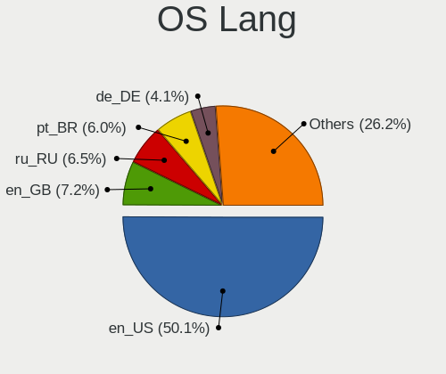
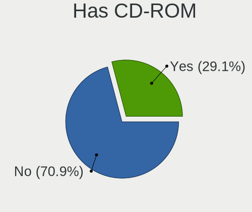
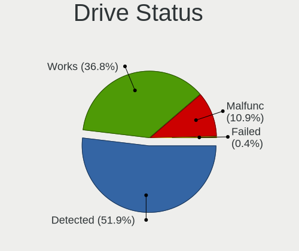
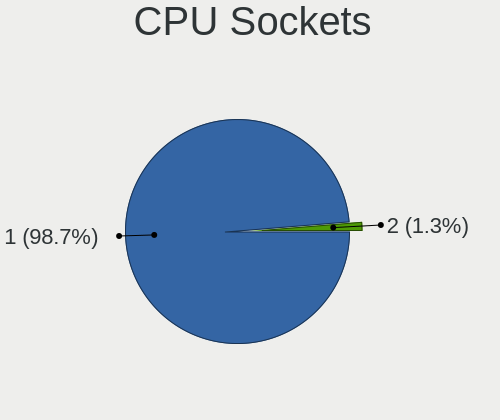
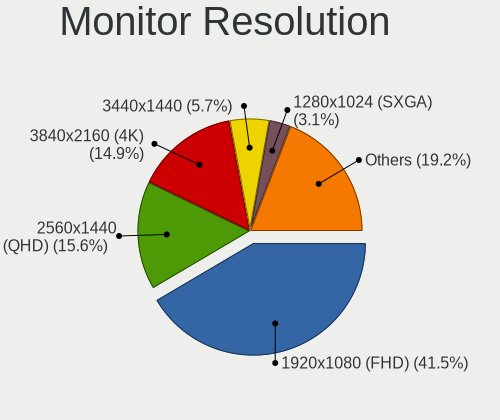
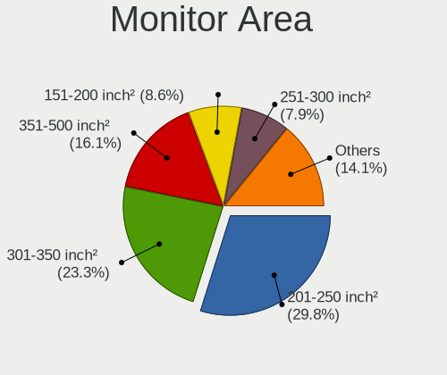

Fedora 37 - Tested Hardware & Statistics (Desktops)
---------------------------------------------------

A project to collect tested hardware configurations for Fedora 37.

Anyone can contribute to this report by the [hw-probe](https://github.com/linuxhw/hw-probe) tool:

    sudo -E hw-probe -all -upload

Please contribute! Especially if your hardware is rare.

Contents
--------

* [ Test Cases ](#test-cases)

* [ System ](#system)
  - [ Kernel                   ](#kernel)
  - [ Kernel Family            ](#kernel-family)
  - [ Kernel Major Ver.        ](#kernel-major-ver)
  - [ Arch                     ](#arch)
  - [ DE                       ](#de)
  - [ Display Server           ](#display-server)
  - [ Display Manager          ](#display-manager)
  - [ OS Lang                  ](#os-lang)
  - [ Boot Mode                ](#boot-mode)
  - [ Filesystem               ](#filesystem)
  - [ Part. scheme             ](#part-scheme)
  - [ Dual Boot with Linux/BSD ](#dual-boot-with-linuxbsd)
  - [ Dual Boot (Win)          ](#dual-boot-win)

* [ Board ](#board)
  - [ Vendor                   ](#vendor)
  - [ Model                    ](#model)
  - [ Model Family             ](#model-family)
  - [ MFG Year                 ](#mfg-year)
  - [ Form Factor              ](#form-factor)
  - [ Secure Boot              ](#secure-boot)
  - [ Coreboot                 ](#coreboot)
  - [ RAM Size                 ](#ram-size)
  - [ RAM Used                 ](#ram-used)
  - [ Total Drives             ](#total-drives)
  - [ Has CD-ROM               ](#has-cd-rom)
  - [ Has Ethernet             ](#has-ethernet)
  - [ Has WiFi                 ](#has-wifi)
  - [ Has Bluetooth            ](#has-bluetooth)

* [ Location ](#location)
  - [ Country                  ](#country)
  - [ City                     ](#city)

* [ Drives ](#drives)
  - [ Drive Vendor             ](#drive-vendor)
  - [ Drive Model              ](#drive-model)
  - [ HDD Vendor               ](#hdd-vendor)
  - [ SSD Vendor               ](#ssd-vendor)
  - [ Drive Kind               ](#drive-kind)
  - [ Drive Connector          ](#drive-connector)
  - [ Drive Size               ](#drive-size)
  - [ Space Total              ](#space-total)
  - [ Space Used               ](#space-used)
  - [ Malfunc. Drives          ](#malfunc-drives)
  - [ Malfunc. Drive Vendor    ](#malfunc-drive-vendor)
  - [ Malfunc. HDD Vendor      ](#malfunc-hdd-vendor)
  - [ Malfunc. Drive Kind      ](#malfunc-drive-kind)
  - [ Failed Drives            ](#failed-drives)
  - [ Failed Drive Vendor      ](#failed-drive-vendor)
  - [ Drive Status             ](#drive-status)

* [ Storage controller ](#storage-controller)
  - [ Storage Vendor           ](#storage-vendor)
  - [ Storage Model            ](#storage-model)
  - [ Storage Kind             ](#storage-kind)

* [ Processor ](#processor)
  - [ CPU Vendor               ](#cpu-vendor)
  - [ CPU Model                ](#cpu-model)
  - [ CPU Model Family         ](#cpu-model-family)
  - [ CPU Cores                ](#cpu-cores)
  - [ CPU Sockets              ](#cpu-sockets)
  - [ CPU Threads              ](#cpu-threads)
  - [ CPU Op-Modes             ](#cpu-op-modes)
  - [ CPU Microcode            ](#cpu-microcode)
  - [ CPU Microarch            ](#cpu-microarch)

* [ Graphics ](#graphics)
  - [ GPU Vendor               ](#gpu-vendor)
  - [ GPU Model                ](#gpu-model)
  - [ GPU Combo                ](#gpu-combo)
  - [ GPU Driver               ](#gpu-driver)
  - [ GPU Memory               ](#gpu-memory)

* [ Monitor ](#monitor)
  - [ Monitor Vendor           ](#monitor-vendor)
  - [ Monitor Model            ](#monitor-model)
  - [ Monitor Resolution       ](#monitor-resolution)
  - [ Monitor Diagonal         ](#monitor-diagonal)
  - [ Monitor Width            ](#monitor-width)
  - [ Aspect Ratio             ](#aspect-ratio)
  - [ Monitor Area             ](#monitor-area)
  - [ Pixel Density            ](#pixel-density)
  - [ Multiple Monitors        ](#multiple-monitors)

* [ Network ](#network)
  - [ Net Controller Vendor    ](#net-controller-vendor)
  - [ Net Controller Model     ](#net-controller-model)
  - [ Wireless Vendor          ](#wireless-vendor)
  - [ Wireless Model           ](#wireless-model)
  - [ Ethernet Vendor          ](#ethernet-vendor)
  - [ Ethernet Model           ](#ethernet-model)
  - [ Net Controller Kind      ](#net-controller-kind)
  - [ Used Controller          ](#used-controller)
  - [ NICs                     ](#nics)
  - [ IPv6                     ](#ipv6)

* [ Bluetooth ](#bluetooth)
  - [ Bluetooth Vendor         ](#bluetooth-vendor)
  - [ Bluetooth Model          ](#bluetooth-model)

* [ Sound ](#sound)
  - [ Sound Vendor             ](#sound-vendor)
  - [ Sound Model              ](#sound-model)

* [ Memory ](#memory)
  - [ Memory Vendor            ](#memory-vendor)
  - [ Memory Model             ](#memory-model)
  - [ Memory Kind              ](#memory-kind)
  - [ Memory Form Factor       ](#memory-form-factor)
  - [ Memory Size              ](#memory-size)
  - [ Memory Speed             ](#memory-speed)

* [ Printers & scanners ](#printers--scanners)
  - [ Printer Vendor           ](#printer-vendor)
  - [ Printer Model            ](#printer-model)
  - [ Scanner Vendor           ](#scanner-vendor)
  - [ Scanner Model            ](#scanner-model)

* [ Camera ](#camera)
  - [ Camera Vendor            ](#camera-vendor)
  - [ Camera Model             ](#camera-model)

* [ Security ](#security)
  - [ Fingerprint Vendor       ](#fingerprint-vendor)
  - [ Fingerprint Model        ](#fingerprint-model)
  - [ Chipcard Vendor          ](#chipcard-vendor)
  - [ Chipcard Model           ](#chipcard-model)

* [ Unsupported ](#unsupported)
  - [ Unsupported Devices      ](#unsupported-devices)
  - [ Unsupported Device Types ](#unsupported-device-types)

Test Cases
----------

Total: 61

| Vendor   | Model                       | Probe                                                      | Date         |
|----------|-----------------------------|------------------------------------------------------------|--------------|
| ASUSTek  | B150 PRO GAMING             | [b2229c56c4](https://linux-hardware.org/?probe=b2229c56c4) | Nov 01, 2022 |
| Gigabyte | B85M-D3V-A                  | [4b5140c9f3](https://linux-hardware.org/?probe=4b5140c9f3) | Oct 31, 2022 |
| ASUSTek  | PRIME B550-PLUS             | [4820bca604](https://linux-hardware.org/?probe=4820bca604) | Oct 30, 2022 |
| ASUSTek  | PRIME B550-PLUS             | [cdca8a4d95](https://linux-hardware.org/?probe=cdca8a4d95) | Oct 30, 2022 |
| ASUSTek  | TUF Gaming B450M-PLUS II    | [8e2ab3d61b](https://linux-hardware.org/?probe=8e2ab3d61b) | Oct 30, 2022 |
| MSI      | Z170A GAMING PRO CARBON     | [d0814afd39](https://linux-hardware.org/?probe=d0814afd39) | Oct 29, 2022 |
| Gigabyte | B450M DS3H V2               | [ba5da6b270](https://linux-hardware.org/?probe=ba5da6b270) | Oct 29, 2022 |
| MSI      | B450M MORTAR                | [44e8a164d1](https://linux-hardware.org/?probe=44e8a164d1) | Oct 27, 2022 |
| MSI      | X299 SLI PLUS               | [4b79f3c1e6](https://linux-hardware.org/?probe=4b79f3c1e6) | Oct 26, 2022 |
| ASUSTek  | ROG STRIX X670E-F GAMING... | [fbd1924bea](https://linux-hardware.org/?probe=fbd1924bea) | Oct 25, 2022 |
| Gigabyte | B85M-D3V-A                  | [055062356e](https://linux-hardware.org/?probe=055062356e) | Oct 25, 2022 |
| ASUSTek  | PRIME B550-PLUS             | [db4db1b508](https://linux-hardware.org/?probe=db4db1b508) | Oct 25, 2022 |
| ASUSTek  | PRIME Z390-P                | [261e670072](https://linux-hardware.org/?probe=261e670072) | Oct 24, 2022 |
| HP       | 2B05                        | [c059b9a786](https://linux-hardware.org/?probe=c059b9a786) | Oct 24, 2022 |
| ASUSTek  | PRIME B550-PLUS             | [7f855c9b05](https://linux-hardware.org/?probe=7f855c9b05) | Oct 22, 2022 |
| ASUSTek  | TUF Gaming Z490-PLUS        | [77b57dbe12](https://linux-hardware.org/?probe=77b57dbe12) | Oct 21, 2022 |
| ASUSTek  | TUF Gaming Z490-PLUS        | [13f4800fa8](https://linux-hardware.org/?probe=13f4800fa8) | Oct 20, 2022 |
| Gigabyte | 970A-DS3P FX                | [e0c8c2fe15](https://linux-hardware.org/?probe=e0c8c2fe15) | Oct 18, 2022 |
| ASUSTek  | ROG STRIX X670E-F GAMING... | [6941ece1e9](https://linux-hardware.org/?probe=6941ece1e9) | Oct 18, 2022 |
| Dell     | 0WR7PY A02                  | [8c1b258565](https://linux-hardware.org/?probe=8c1b258565) | Oct 16, 2022 |
| MSI      | A320M PRO-VH PLUS           | [c3c46266d1](https://linux-hardware.org/?probe=c3c46266d1) | Oct 16, 2022 |
| Gigabyte | H610M H DDR4                | [985b192440](https://linux-hardware.org/?probe=985b192440) | Oct 15, 2022 |
| MSI      | MAG B550 TOMAHAWK           | [4e66c25e04](https://linux-hardware.org/?probe=4e66c25e04) | Oct 15, 2022 |
| MSI      | MEG Z390 GODLIKE            | [3c5f4ad9a5](https://linux-hardware.org/?probe=3c5f4ad9a5) | Oct 15, 2022 |
| Gigabyte | H610M H DDR4                | [05fa96288f](https://linux-hardware.org/?probe=05fa96288f) | Oct 15, 2022 |
| MSI      | MEG Z390 GODLIKE            | [6381ab6a1b](https://linux-hardware.org/?probe=6381ab6a1b) | Oct 14, 2022 |
| ASUSTek  | PRIME B660M-A D4            | [f1fcb66794](https://linux-hardware.org/?probe=f1fcb66794) | Oct 12, 2022 |
| MSI      | B450M-A PRO MAX             | [a993db557b](https://linux-hardware.org/?probe=a993db557b) | Oct 11, 2022 |
| Gigabyte | Z170-D3H-CF                 | [14b0f43bd5](https://linux-hardware.org/?probe=14b0f43bd5) | Oct 11, 2022 |
| MSI      | B550M PRO-VDH               | [c4e09cdf87](https://linux-hardware.org/?probe=c4e09cdf87) | Oct 09, 2022 |
| Gigabyte | GA-990FXA-UD3               | [dc262edc58](https://linux-hardware.org/?probe=dc262edc58) | Oct 09, 2022 |
| Dell     | 0RY007                      | [745f69ec3d](https://linux-hardware.org/?probe=745f69ec3d) | Oct 08, 2022 |
| Gigabyte | B85M-D3V-A                  | [99df624686](https://linux-hardware.org/?probe=99df624686) | Oct 03, 2022 |
| Gigabyte | B550M DS3H                  | [2f8557640c](https://linux-hardware.org/?probe=2f8557640c) | Oct 02, 2022 |
| ASUSTek  | PRIME Z270-A                | [4118e245a3](https://linux-hardware.org/?probe=4118e245a3) | Sep 29, 2022 |
| Intel    | DP35DP AAD81073-208         | [031ff09179](https://linux-hardware.org/?probe=031ff09179) | Sep 27, 2022 |
| Gigabyte | Z170-D3H-CF                 | [254a78c371](https://linux-hardware.org/?probe=254a78c371) | Sep 26, 2022 |
| Acer     | Aspire X1900                | [c7b768051b](https://linux-hardware.org/?probe=c7b768051b) | Sep 25, 2022 |
| ASRock   | FM2A88X Extreme4+           | [2d44b203f9](https://linux-hardware.org/?probe=2d44b203f9) | Sep 25, 2022 |
| ASUSTek  | TUF Gaming X570-PLUS        | [ee8183722c](https://linux-hardware.org/?probe=ee8183722c) | Sep 24, 2022 |
| ASUSTek  | TUF Gaming X570-PLUS        | [ac59b4138c](https://linux-hardware.org/?probe=ac59b4138c) | Sep 23, 2022 |
| ASUSTek  | Pro WS WRX80E-SAGE SE WI... | [54d3096bb6](https://linux-hardware.org/?probe=54d3096bb6) | Sep 21, 2022 |
| Gigabyte | X570 I AORUS PRO WIFI       | [1869422fde](https://linux-hardware.org/?probe=1869422fde) | Sep 20, 2022 |
| ASUSTek  | Z170-A                      | [aad09d3281](https://linux-hardware.org/?probe=aad09d3281) | Sep 20, 2022 |
| ASUSTek  | PRIME X470-PRO              | [a6857e4b03](https://linux-hardware.org/?probe=a6857e4b03) | Sep 19, 2022 |
| Gigabyte | X570 AORUS MASTER           | [424e3ded44](https://linux-hardware.org/?probe=424e3ded44) | Sep 19, 2022 |
| HP       | 2B05                        | [18db320ef7](https://linux-hardware.org/?probe=18db320ef7) | Sep 19, 2022 |
| Gigabyte | B85M-D3V-A                  | [8f6b96ba44](https://linux-hardware.org/?probe=8f6b96ba44) | Sep 19, 2022 |
| ASUSTek  | ProArt Z690-CREATOR WIFI    | [48479f01c1](https://linux-hardware.org/?probe=48479f01c1) | Sep 19, 2022 |
| ASUSTek  | TUF Gaming B550M-PLUS       | [8468466b2a](https://linux-hardware.org/?probe=8468466b2a) | Sep 19, 2022 |
| HP       | 3397                        | [637a5570cf](https://linux-hardware.org/?probe=637a5570cf) | Sep 16, 2022 |
| Gigabyte | AB350N-Gaming WIFI-CF       | [dcaf7e8bd0](https://linux-hardware.org/?probe=dcaf7e8bd0) | Sep 15, 2022 |
| Gigabyte | B85M-D3V-A                  | [a856637b19](https://linux-hardware.org/?probe=a856637b19) | Sep 15, 2022 |
| ASUSTek  | PRIME Z270-A                | [2642647feb](https://linux-hardware.org/?probe=2642647feb) | Sep 14, 2022 |
| ASUSTek  | TUF Gaming B550M-PLUS       | [3557099732](https://linux-hardware.org/?probe=3557099732) | Sep 14, 2022 |
| HP       | 1998                        | [bf93a500f4](https://linux-hardware.org/?probe=bf93a500f4) | Sep 14, 2022 |
| MSI      | Z370 TOMAHAWK               | [251d227686](https://linux-hardware.org/?probe=251d227686) | Aug 22, 2022 |
| Dell     | 08NPPY A00                  | [93eb00c3c5](https://linux-hardware.org/?probe=93eb00c3c5) | Jun 16, 2022 |
| ASUSTek  | P8Z68-V LX                  | [2cd65296c2](https://linux-hardware.org/?probe=2cd65296c2) | May 08, 2022 |
| HP       | 0B54h D                     | [7153ec172b](https://linux-hardware.org/?probe=7153ec172b) | Mar 21, 2022 |
| HP       | 0B54h D                     | [399cc50503](https://linux-hardware.org/?probe=399cc50503) | Mar 02, 2022 |

System
------

Kernel
------

Version of the Linux kernel

| Version                                                | Desktops | Percent |
|--------------------------------------------------------|----------|---------|
| 5.19.9-300.fc37.x86_64                                 | 8        | 17.39%  |
| 5.19.13-300.fc37.x86_64                                | 8        | 17.39%  |
| 5.19.16-301.fc37.x86_64                                | 4        | 8.7%    |
| 5.19.8-300.fc37.x86_64                                 | 3        | 6.52%   |
| 5.19.7-300.fc37.x86_64                                 | 2        | 4.35%   |
| 5.19.16-300.fc37.x86_64                                | 2        | 4.35%   |
| 5.19.12-300.fc37.x86_64                                | 2        | 4.35%   |
| 6.1.0-0.rc0.20221014git9c9155a3509a.11.fc38.x86_64     | 1        | 2.17%   |
| 6.0.5-300.fc37.x86_64                                  | 1        | 2.17%   |
| 6.0.3-300.fc37.x86_64                                  | 1        | 2.17%   |
| 6.0.2-301.fc37.x86_64                                  | 1        | 2.17%   |
| 6.0.0-0.rc6.20220922gitdc164f4fb00a.43.fc38.x86_64     | 1        | 2.17%   |
| 5.8.15-301.fc33.x86_64                                 | 1        | 2.17%   |
| 5.19.8-501.chinfo.fc37.x86_64                          | 1        | 2.17%   |
| 5.19.16-602.inttf.fc37.x86_64                          | 1        | 2.17%   |
| 5.19.15-301.fc37.x86_64                                | 1        | 2.17%   |
| 5.19.14-602.inttf.fc37.x86_64                          | 1        | 2.17%   |
| 5.19.14-300.fc37.x86_64                                | 1        | 2.17%   |
| 5.19.10-602.inttf.fc37.x86_64                          | 1        | 2.17%   |
| 5.19.10-300.fc37.x86_64                                | 1        | 2.17%   |
| 5.19.0-65.fc37.x86_64                                  | 1        | 2.17%   |
| 5.19.0-0.rc1.20220610git874c8ca1e60b.18.fc37.x86_64    | 1        | 2.17%   |
| 5.18.0-0.rc5.20220505gita7391ad3572431a.43.fc37.x86_64 | 1        | 2.17%   |
| 5.17.0-0.rc6.109.fc37.x86_64                           | 1        | 2.17%   |

Kernel Family
-------------

Linux kernel without a distro release

| Version | Desktops | Percent |
|---------|----------|---------|
| 5.19.9  | 8        | 17.39%  |
| 5.19.13 | 8        | 17.39%  |
| 5.19.16 | 7        | 15.22%  |
| 5.19.8  | 4        | 8.7%    |
| 5.19.7  | 2        | 4.35%   |
| 5.19.14 | 2        | 4.35%   |
| 5.19.12 | 2        | 4.35%   |
| 5.19.10 | 2        | 4.35%   |
| 5.19.0  | 2        | 4.35%   |
| 6.1.0   | 1        | 2.17%   |
| 6.0.5   | 1        | 2.17%   |
| 6.0.3   | 1        | 2.17%   |
| 6.0.2   | 1        | 2.17%   |
| 6.0.0   | 1        | 2.17%   |
| 5.8.15  | 1        | 2.17%   |
| 5.19.15 | 1        | 2.17%   |
| 5.18.0  | 1        | 2.17%   |
| 5.17.0  | 1        | 2.17%   |

Kernel Major Ver.
-----------------

Linux kernel major version

| Version | Desktops | Percent |
|---------|----------|---------|
| 5.19    | 35       | 81.4%   |
| 6.0     | 4        | 9.3%    |
| 6.1     | 1        | 2.33%   |
| 5.8     | 1        | 2.33%   |
| 5.18    | 1        | 2.33%   |
| 5.17    | 1        | 2.33%   |

Arch
----

OS architecture (x86_64, i586, etc.)

| Name   | Desktops | Percent |
|--------|----------|---------|
| x86_64 | 43       | 100%    |

DE
--

Desktop Environment

| Name       | Desktops | Percent |
|------------|----------|---------|
| GNOME      | 33       | 76.74%  |
| KDE5       | 5        | 11.63%  |
| XFCE       | 2        | 4.65%   |
| X-Cinnamon | 1        | 2.33%   |
| MATE       | 1        | 2.33%   |
| Unknown    | 1        | 2.33%   |

Display Server
--------------

X11 or Wayland

| Name    | Desktops | Percent |
|---------|----------|---------|
| Wayland | 25       | 58.14%  |
| X11     | 16       | 37.21%  |
| Tty     | 1        | 2.33%   |
| Unknown | 1        | 2.33%   |

Display Manager
---------------

SDDM, LightDM, etc.

| Name    | Desktops | Percent |
|---------|----------|---------|
| Unknown | 21       | 48.84%  |
| GDM     | 14       | 32.56%  |
| SDDM    | 4        | 9.3%    |
| LightDM | 4        | 9.3%    |

OS Lang
-------

Language

| Lang           | Desktops | Percent |
|----------------|----------|---------|
| en_US          | 21       | 48.84%  |
| en_GB          | 5        | 11.63%  |
| pt_BR          | 4        | 9.3%    |
| en_CA          | 3        | 6.98%   |
| ru_RU          | 2        | 4.65%   |
| de_DE          | 2        | 4.65%   |
| pl_PL          | 1        | 2.33%   |
| nl_NL          | 1        | 2.33%   |
| hu_HU          | 1        | 2.33%   |
| fr_FR          | 1        | 2.33%   |
| es_ES          | 1        | 2.33%   |
| ca_ES@valencia | 1        | 2.33%   |

Boot Mode
---------

EFI or BIOS

| Mode | Desktops | Percent |
|------|----------|---------|
| EFI  | 31       | 72.09%  |
| BIOS | 12       | 27.91%  |

Filesystem
----------

Type of filesystem

| Type  | Desktops | Percent |
|-------|----------|---------|
| Btrfs | 35       | 81.4%   |
| Xfs   | 4        | 9.3%    |
| Ext4  | 4        | 9.3%    |

Part. scheme
------------

Scheme of partitioning

| Type    | Desktops | Percent |
|---------|----------|---------|
| GPT     | 20       | 46.51%  |
| Unknown | 20       | 46.51%  |
| MBR     | 3        | 6.98%   |

Dual Boot with Linux/BSD
------------------------

Hosting more than one Linux/BSD

| Dual boot | Desktops | Percent |
|-----------|----------|---------|
| No        | 36       | 83.72%  |
| Yes       | 7        | 16.28%  |

Dual Boot (Win)
---------------

Hosting Linux and Windows

| Dual boot | Desktops | Percent |
|-----------|----------|---------|
| No        | 31       | 72.09%  |
| Yes       | 12       | 27.91%  |

Board
-----

Vendor
------

Motherboard manufacturer

| Name                | Desktops | Percent |
|---------------------|----------|---------|
| ASUSTek Computer    | 15       | 34.88%  |
| Gigabyte Technology | 10       | 23.26%  |
| MSI                 | 9        | 20.93%  |
| Hewlett-Packard     | 3        | 6.98%   |
| Dell                | 3        | 6.98%   |
| Intel               | 1        | 2.33%   |
| ASRock              | 1        | 2.33%   |
| Acer                | 1        | 2.33%   |

Model
-----

Motherboard model

| Name                               | Desktops | Percent |
|------------------------------------|----------|---------|
| ASUS TUF Gaming B550M-PLUS         | 2        | 4.65%   |
| MSI MS-7C95                        | 1        | 2.33%   |
| MSI MS-7C91                        | 1        | 2.33%   |
| MSI MS-7C52                        | 1        | 2.33%   |
| MSI MS-7B89                        | 1        | 2.33%   |
| MSI MS-7B47                        | 1        | 2.33%   |
| MSI MS-7B10                        | 1        | 2.33%   |
| MSI MS-7B07                        | 1        | 2.33%   |
| MSI MS-7A93                        | 1        | 2.33%   |
| MSI MS-7A12                        | 1        | 2.33%   |
| Intel DP35DP AAD81073-208          | 1        | 2.33%   |
| HP Z600 Workstation                | 1        | 2.33%   |
| HP Compaq Elite 8300 SFF           | 1        | 2.33%   |
| HP 110-516no                       | 1        | 2.33%   |
| Gigabyte Z170-D3H                  | 1        | 2.33%   |
| Gigabyte X570 I AORUS PRO WIFI     | 1        | 2.33%   |
| Gigabyte X570 AORUS MASTER         | 1        | 2.33%   |
| Gigabyte H610M H DDR4              | 1        | 2.33%   |
| Gigabyte GA-990FXA-UD3             | 1        | 2.33%   |
| Gigabyte B85M-D3V-A                | 1        | 2.33%   |
| Gigabyte B550M DS3H                | 1        | 2.33%   |
| Gigabyte B450M DS3H V2             | 1        | 2.33%   |
| Gigabyte AB350N-Gaming WIFI        | 1        | 2.33%   |
| Gigabyte 970A-DS3P FX              | 1        | 2.33%   |
| Dell OptiPlex 7010                 | 1        | 2.33%   |
| Dell OptiPlex 3050                 | 1        | 2.33%   |
| Dell Inspiron 530                  | 1        | 2.33%   |
| ASUS Z170-A                        | 1        | 2.33%   |
| ASUS TUF Gaming Z490-PLUS          | 1        | 2.33%   |
| ASUS TUF Gaming B450M-PLUS II      | 1        | 2.33%   |
| ASUS ROG STRIX X670E-F GAMING WIFI | 1        | 2.33%   |
| ASUS ProArt Z690-CREATOR WIFI      | 1        | 2.33%   |
| ASUS Pro WS WRX80E-SAGE SE WIFI    | 1        | 2.33%   |
| ASUS PRIME Z390-P                  | 1        | 2.33%   |
| ASUS PRIME Z270-A                  | 1        | 2.33%   |
| ASUS PRIME X470-PRO                | 1        | 2.33%   |
| ASUS PRIME B660M-A D4              | 1        | 2.33%   |
| ASUS PRIME B550-PLUS               | 1        | 2.33%   |
| ASUS P8Z68-V LX                    | 1        | 2.33%   |
| ASUS B150 PRO GAMING               | 1        | 2.33%   |

Model Family
------------

Motherboard model prefix

| Name                   | Desktops | Percent |
|------------------------|----------|---------|
| ASUS PRIME             | 5        | 11.63%  |
| ASUS TUF               | 4        | 9.3%    |
| Gigabyte X570          | 2        | 4.65%   |
| Dell OptiPlex          | 2        | 4.65%   |
| MSI MS-7C95            | 1        | 2.33%   |
| MSI MS-7C91            | 1        | 2.33%   |
| MSI MS-7C52            | 1        | 2.33%   |
| MSI MS-7B89            | 1        | 2.33%   |
| MSI MS-7B47            | 1        | 2.33%   |
| MSI MS-7B10            | 1        | 2.33%   |
| MSI MS-7B07            | 1        | 2.33%   |
| MSI MS-7A93            | 1        | 2.33%   |
| MSI MS-7A12            | 1        | 2.33%   |
| Intel DP35DP           | 1        | 2.33%   |
| HP Z600                | 1        | 2.33%   |
| HP Compaq              | 1        | 2.33%   |
| HP 110-516no           | 1        | 2.33%   |
| Gigabyte Z170-D3H      | 1        | 2.33%   |
| Gigabyte H610M         | 1        | 2.33%   |
| Gigabyte GA-990FXA-UD3 | 1        | 2.33%   |
| Gigabyte B85M-D3V-A    | 1        | 2.33%   |
| Gigabyte B550M         | 1        | 2.33%   |
| Gigabyte B450M         | 1        | 2.33%   |
| Gigabyte AB350N-Gaming | 1        | 2.33%   |
| Gigabyte 970A-DS3P     | 1        | 2.33%   |
| Dell Inspiron          | 1        | 2.33%   |
| ASUS Z170-A            | 1        | 2.33%   |
| ASUS ROG               | 1        | 2.33%   |
| ASUS ProArt            | 1        | 2.33%   |
| ASUS Pro               | 1        | 2.33%   |
| ASUS P8Z68-V           | 1        | 2.33%   |
| ASUS B150              | 1        | 2.33%   |
| ASRock FM2A88X         | 1        | 2.33%   |
| Acer Aspire            | 1        | 2.33%   |

MFG Year
--------

Motherboard manufacture year

| Year | Desktops | Percent |
|------|----------|---------|
| 2020 | 10       | 23.26%  |
| 2017 | 5        | 11.63%  |
| 2019 | 4        | 9.3%    |
| 2018 | 4        | 9.3%    |
| 2015 | 4        | 9.3%    |
| 2022 | 3        | 6.98%   |
| 2016 | 2        | 4.65%   |
| 2014 | 2        | 4.65%   |
| 2011 | 2        | 4.65%   |
| 2010 | 2        | 4.65%   |
| 2021 | 1        | 2.33%   |
| 2013 | 1        | 2.33%   |
| 2012 | 1        | 2.33%   |
| 2008 | 1        | 2.33%   |
| 2007 | 1        | 2.33%   |

Form Factor
-----------

Physical design of the computer

| Name    | Desktops | Percent |
|---------|----------|---------|
| Desktop | 43       | 100%    |

Secure Boot
-----------

Enabled or disabled

| State    | Desktops | Percent |
|----------|----------|---------|
| Disabled | 37       | 86.05%  |
| Enabled  | 6        | 13.95%  |

Coreboot
--------

Have coreboot on board

| Used | Desktops | Percent |
|------|----------|---------|
| No   | 43       | 100%    |

RAM Size
--------

Total RAM memory

| Size in GB      | Desktops | Percent |
|-----------------|----------|---------|
| 16.01-24.0      | 12       | 27.91%  |
| 32.01-64.0      | 11       | 25.58%  |
| 64.01-256.0     | 6        | 13.95%  |
| 8.01-16.0       | 5        | 11.63%  |
| 4.01-8.0        | 3        | 6.98%   |
| 24.01-32.0      | 3        | 6.98%   |
| 3.01-4.0        | 2        | 4.65%   |
| More than 256.0 | 1        | 2.33%   |

RAM Used
--------

Used RAM memory

| Used GB    | Desktops | Percent |
|------------|----------|---------|
| 4.01-8.0   | 14       | 31.82%  |
| 3.01-4.0   | 11       | 25%     |
| 2.01-3.0   | 8        | 18.18%  |
| 8.01-16.0  | 7        | 15.91%  |
| 1.01-2.0   | 2        | 4.55%   |
| 24.01-32.0 | 1        | 2.27%   |
| 0.51-1.0   | 1        | 2.27%   |

Total Drives
------------

Number of drives on board

| Drives | Desktops | Percent |
|--------|----------|---------|
| 2      | 14       | 32.56%  |
| 1      | 10       | 23.26%  |
| 3      | 8        | 18.6%   |
| 4      | 6        | 13.95%  |
| 6      | 2        | 4.65%   |
| 7      | 1        | 2.33%   |
| 5      | 1        | 2.33%   |
| 0      | 1        | 2.33%   |

Has CD-ROM
----------

Has CD-ROM on board

| Presented | Desktops | Percent |
|-----------|----------|---------|
| No        | 30       | 69.77%  |
| Yes       | 13       | 30.23%  |

Has Ethernet
------------

Has Ethernet on board

| Presented | Desktops | Percent |
|-----------|----------|---------|
| Yes       | 43       | 100%    |

Has WiFi
--------

Has WiFi module

| Presented | Desktops | Percent |
|-----------|----------|---------|
| No        | 24       | 55.81%  |
| Yes       | 19       | 44.19%  |

Has Bluetooth
-------------

Has Bluetooth module

| Presented | Desktops | Percent |
|-----------|----------|---------|
| No        | 24       | 55.81%  |
| Yes       | 19       | 44.19%  |

Location
--------

Country
-------

Geographic location (country)

| Country      | Desktops | Percent |
|--------------|----------|---------|
| USA          | 9        | 20.93%  |
| Brazil       | 4        | 9.3%    |
| UK           | 3        | 6.98%   |
| Germany      | 3        | 6.98%   |
| Canada       | 3        | 6.98%   |
| Spain        | 2        | 4.65%   |
| Poland       | 2        | 4.65%   |
| France       | 2        | 4.65%   |
| Belarus      | 2        | 4.65%   |
| Sweden       | 1        | 2.33%   |
| South Africa | 1        | 2.33%   |
| Serbia       | 1        | 2.33%   |
| Russia       | 1        | 2.33%   |
| Norway       | 1        | 2.33%   |
| Netherlands  | 1        | 2.33%   |
| Maldives     | 1        | 2.33%   |
| Malaysia     | 1        | 2.33%   |
| Italy        | 1        | 2.33%   |
| Israel       | 1        | 2.33%   |
| Hungary      | 1        | 2.33%   |
| Greece       | 1        | 2.33%   |
| Czechia      | 1        | 2.33%   |

City
----

Geographic location (city)

| City                   | Desktops | Percent |
|------------------------|----------|---------|
| Warsaw                 | 2        | 4.55%   |
| Minsk                  | 2        | 4.55%   |
| Goiânia               | 2        | 4.55%   |
| Berlin                 | 2        | 4.55%   |
| Zierikzee              | 1        | 2.27%   |
| Vitry-sur-Seine        | 1        | 2.27%   |
| Vaxjo                  | 1        | 2.27%   |
| Vancouver              | 1        | 2.27%   |
| Trondheim              | 1        | 2.27%   |
| Sterling               | 1        | 2.27%   |
| San Antonio            | 1        | 2.27%   |
| Roquetas de Mar        | 1        | 2.27%   |
| Rome                   | 1        | 2.27%   |
| Ramla                  | 1        | 2.27%   |
| Prague                 | 1        | 2.27%   |
| Pouso Alegre           | 1        | 2.27%   |
| Niš                   | 1        | 2.27%   |
| Mt. Pleasant           | 1        | 2.27%   |
| Mokena                 | 1        | 2.27%   |
| Midlothian             | 1        | 2.27%   |
| Malé                  | 1        | 2.27%   |
| Le Peage-de-Roussillon | 1        | 2.27%   |
| Kuala Lumpur           | 1        | 2.27%   |
| Krasnodar              | 1        | 2.27%   |
| Kingston               | 1        | 2.27%   |
| Houston                | 1        | 2.27%   |
| Hereford               | 1        | 2.27%   |
| Gilbert                | 1        | 2.27%   |
| Erfurt                 | 1        | 2.27%   |
| Chertyazh              | 1        | 2.27%   |
| Charlotte              | 1        | 2.27%   |
| Centurion              | 1        | 2.27%   |
| Cathedral City         | 1        | 2.27%   |
| Budapest               | 1        | 2.27%   |
| Bristol                | 1        | 2.27%   |
| Bradford               | 1        | 2.27%   |
| Bilston                | 1        | 2.27%   |
| Athens                 | 1        | 2.27%   |
| Analandia              | 1        | 2.27%   |
| Agost                  | 1        | 2.27%   |

Drives
------

Drive Vendor
------------

Hard drive vendors

| Vendor                    | Desktops | Drives | Percent |
|---------------------------|----------|--------|---------|
| Samsung Electronics       | 20       | 38     | 24.69%  |
| Seagate                   | 14       | 19     | 17.28%  |
| WDC                       | 12       | 21     | 14.81%  |
| Kingston                  | 8        | 8      | 9.88%   |
| Toshiba                   | 4        | 4      | 4.94%   |
| SanDisk                   | 3        | 3      | 3.7%    |
| Crucial                   | 3        | 3      | 3.7%    |
| A-DATA Technology         | 3        | 3      | 3.7%    |
| Unknown                   | 2        | 2      | 2.47%   |
| Seagate Technology        | 1        | 1      | 1.23%   |
| PNY                       | 1        | 1      | 1.23%   |
| Phison Electronics        | 1        | 1      | 1.23%   |
| Phison                    | 1        | 1      | 1.23%   |
| Micron/Crucial Technology | 1        | 1      | 1.23%   |
| Maxtor                    | 1        | 1      | 1.23%   |
| KingSpec                  | 1        | 1      | 1.23%   |
| Intel                     | 1        | 1      | 1.23%   |
| HGST                      | 1        | 2      | 1.23%   |
| Corsair                   | 1        | 1      | 1.23%   |
| ASMT                      | 1        | 2      | 1.23%   |
| Apacer                    | 1        | 1      | 1.23%   |

Drive Model
-----------

Hard drive models

| Model                                                | Desktops | Percent |
|------------------------------------------------------|----------|---------|
| Samsung NVMe SSD Controller SM981/PM981/PM983 500GB  | 6        | 6.06%   |
| Seagate ST2000DM008-2FR102 2TB                       | 4        | 4.04%   |
| WDC WD40EZRZ-00GXCB0 4TB                             | 2        | 2.02%   |
| Samsung SSD 980 1TB                                  | 2        | 2.02%   |
| Samsung SSD 870 QVO 2TB                              | 2        | 2.02%   |
| Samsung SSD 860 EVO 500GB                            | 2        | 2.02%   |
| Samsung SSD 860 EVO 1TB                              | 2        | 2.02%   |
| Samsung NVMe SSD Controller SM961/PM961/SM963 250GB  | 2        | 2.02%   |
| Samsung NVMe SSD Controller PM9A1/PM9A3/980PRO 250GB | 2        | 2.02%   |
| Kingston SA400S37120G 120GB SSD                      | 2        | 2.02%   |
| WDC WDS500G2B0B-00YS70 500GB SSD                     | 1        | 1.01%   |
| WDC WDS500G1B0C-00S6U0 500GB                         | 1        | 1.01%   |
| WDC WDS100T2B0A-00SM50 1TB SSD                       | 1        | 1.01%   |
| WDC WD5000AAKX-00U6AA0 500GB                         | 1        | 1.01%   |
| WDC WD40PURX-64GVNY0 4TB                             | 1        | 1.01%   |
| WDC WD40EFZX-68AWUN0 4TB                             | 1        | 1.01%   |
| WDC WD30PURX-64P6ZY0 3TB                             | 1        | 1.01%   |
| WDC WD30EZRX-00AZ6B0 3TB                             | 1        | 1.01%   |
| WDC WD30EFRX-68EUZN0 3TB                             | 1        | 1.01%   |
| WDC WD15EARS-00MVWB0 1TB                             | 1        | 1.01%   |
| WDC WD10EZRX-00A3KB0 1TB                             | 1        | 1.01%   |
| WDC WD10EZEX-60WN4A0 1TB                             | 1        | 1.01%   |
| WDC WD10EZEX-60M2NA0 1TB                             | 1        | 1.01%   |
| WDC WD10EZEX-08WN4A0 1TB                             | 1        | 1.01%   |
| WDC WD10EVDS-63U8B1 1TB                              | 1        | 1.01%   |
| WDC WD10EFRX-68FYTN0 1TB                             | 1        | 1.01%   |
| WDC WD My Passport 25F3 512GB                        | 1        | 1.01%   |
| Unknown NVMe SSD Drive 2TB                           | 1        | 1.01%   |
| Unknown 256GB PCS 2.5" S SSD                         | 1        | 1.01%   |
| Toshiba THNSN5256GPU7 256GB                          | 1        | 1.01%   |
| Toshiba MK3263GSX 320GB                              | 1        | 1.01%   |
| Toshiba HDWR480 8TB                                  | 1        | 1.01%   |
| Toshiba DT01ACA200 2TB                               | 1        | 1.01%   |
| Seagate FireCuda 520 SSD 500GB                       | 1        | 1.01%   |
| Seagate ST8000VN004-2M2101 8TB                       | 1        | 1.01%   |
| Seagate ST4000DM000-1F2168 4TB                       | 1        | 1.01%   |
| Seagate ST3500413AS 500GB                            | 1        | 1.01%   |
| Seagate ST3320620AS 320GB                            | 1        | 1.01%   |
| Seagate ST31000528AS 1TB                             | 1        | 1.01%   |
| Seagate ST3000DM001-9YN166 3TB                       | 1        | 1.01%   |

HDD Vendor
----------

Hard disk drive vendors

| Vendor  | Desktops | Drives | Percent |
|---------|----------|--------|---------|
| Seagate | 13       | 18     | 44.83%  |
| WDC     | 10       | 16     | 34.48%  |
| Toshiba | 3        | 3      | 10.34%  |
| Maxtor  | 1        | 1      | 3.45%   |
| HGST    | 1        | 2      | 3.45%   |
| ASMT    | 1        | 2      | 3.45%   |

SSD Vendor
----------

Solid state drive vendors

| Vendor              | Desktops | Drives | Percent |
|---------------------|----------|--------|---------|
| Samsung Electronics | 10       | 18     | 37.04%  |
| Kingston            | 4        | 4      | 14.81%  |
| SanDisk             | 3        | 3      | 11.11%  |
| Crucial             | 3        | 3      | 11.11%  |
| WDC                 | 2        | 3      | 7.41%   |
| Unknown             | 1        | 1      | 3.7%    |
| PNY                 | 1        | 1      | 3.7%    |
| KingSpec            | 1        | 1      | 3.7%    |
| Corsair             | 1        | 1      | 3.7%    |
| A-DATA Technology   | 1        | 1      | 3.7%    |

Drive Kind
----------

HDD or SSD

| Kind    | Desktops | Drives | Percent |
|---------|----------|--------|---------|
| NVMe    | 24       | 36     | 32.88%  |
| SSD     | 24       | 36     | 32.88%  |
| HDD     | 24       | 42     | 32.88%  |
| Unknown | 1        | 1      | 1.37%   |

Drive Connector
---------------

SATA, SAS, NVMe, etc.

| Type | Desktops | Drives | Percent |
|------|----------|--------|---------|
| SATA | 35       | 74     | 55.56%  |
| NVMe | 24       | 36     | 38.1%   |
| SAS  | 4        | 5      | 6.35%   |

Drive Size
----------

Size of hard drive

| Size in TB | Desktops | Drives | Percent |
|------------|----------|--------|---------|
| 0.01-0.5   | 19       | 28     | 34.55%  |
| 0.51-1.0   | 14       | 19     | 25.45%  |
| 1.01-2.0   | 10       | 13     | 18.18%  |
| 3.01-4.0   | 4        | 7      | 7.27%   |
| 2.01-3.0   | 4        | 5      | 7.27%   |
| 4.01-10.0  | 4        | 6      | 7.27%   |

Space Total
-----------

Amount of disk space available on the file system

| Size in GB     | Desktops | Percent |
|----------------|----------|---------|
| 2001-3000      | 10       | 22.73%  |
| 501-1000       | 9        | 20.45%  |
| 1001-2000      | 7        | 15.91%  |
| More than 3000 | 6        | 13.64%  |
| 101-250        | 4        | 9.09%   |
| 1-20           | 4        | 9.09%   |
| 251-500        | 3        | 6.82%   |
| Unknown        | 1        | 2.27%   |

Space Used
----------

Amount of used disk space

| Used GB        | Desktops | Percent |
|----------------|----------|---------|
| 1-20           | 10       | 22.73%  |
| 251-500        | 6        | 13.64%  |
| 101-250        | 5        | 11.36%  |
| 1001-2000      | 5        | 11.36%  |
| 501-1000       | 5        | 11.36%  |
| 21-50          | 4        | 9.09%   |
| More than 3000 | 3        | 6.82%   |
| 51-100         | 3        | 6.82%   |
| 2001-3000      | 2        | 4.55%   |
| Unknown        | 1        | 2.27%   |

Malfunc. Drives
---------------

Drive models with a malfunction

| Model                          | Desktops | Drives | Percent |
|--------------------------------|----------|--------|---------|
| WDC WD5000AAKX-00U6AA0 500GB   | 1        | 1      | 12.5%   |
| WDC WD15EARS-00MVWB0 1TB       | 1        | 1      | 12.5%   |
| WDC WD10EFRX-68FYTN0 1TB       | 1        | 1      | 12.5%   |
| Toshiba MK3263GSX 320GB        | 1        | 1      | 12.5%   |
| Seagate ST3320620AS 320GB      | 1        | 1      | 12.5%   |
| Seagate ST3000DM001-1ER166 3TB | 1        | 1      | 12.5%   |
| Maxtor 6B200M0 208GB           | 1        | 1      | 12.5%   |
| Corsair Force LE200 SSD 240GB  | 1        | 1      | 12.5%   |

Malfunc. Drive Vendor
---------------------

Vendors of faulty drives

| Vendor  | Desktops | Drives | Percent |
|---------|----------|--------|---------|
| WDC     | 3        | 3      | 37.5%   |
| Seagate | 2        | 2      | 25%     |
| Toshiba | 1        | 1      | 12.5%   |
| Maxtor  | 1        | 1      | 12.5%   |
| Corsair | 1        | 1      | 12.5%   |

Malfunc. HDD Vendor
-------------------

Vendors of faulty HDD drives

| Vendor  | Desktops | Drives | Percent |
|---------|----------|--------|---------|
| WDC     | 3        | 3      | 42.86%  |
| Seagate | 2        | 2      | 28.57%  |
| Toshiba | 1        | 1      | 14.29%  |
| Maxtor  | 1        | 1      | 14.29%  |

Malfunc. Drive Kind
-------------------

Kinds of faulty drives

| Kind | Desktops | Drives | Percent |
|------|----------|--------|---------|
| HDD  | 5        | 7      | 83.33%  |
| SSD  | 1        | 1      | 16.67%  |

Failed Drives
-------------

Failed drive models

Zero info for selected period =(

Failed Drive Vendor
-------------------

Failed drive vendors

Zero info for selected period =(

Drive Status
------------

Number of failed and malfunc. drives

| Status   | Desktops | Drives | Percent |
|----------|----------|--------|---------|
| Detected | 25       | 63     | 51.02%  |
| Works    | 19       | 44     | 38.78%  |
| Malfunc  | 5        | 8      | 10.2%   |

Storage controller
------------------

Storage Vendor
--------------

Storage controller vendors

| Vendor                       | Desktops | Percent |
|------------------------------|----------|---------|
| Intel                        | 22       | 30.14%  |
| AMD                          | 20       | 27.4%   |
| Samsung Electronics          | 14       | 19.18%  |
| Kingston Technology Company  | 4        | 5.48%   |
| Phison Electronics           | 3        | 4.11%   |
| Marvell Technology Group     | 2        | 2.74%   |
| Toshiba America Info Systems | 1        | 1.37%   |
| Seagate Technology           | 1        | 1.37%   |
| SanDisk                      | 1        | 1.37%   |
| Realtek Semiconductor        | 1        | 1.37%   |
| Micron/Crucial Technology    | 1        | 1.37%   |
| ASMedia Technology           | 1        | 1.37%   |
| ADATA Technology             | 1        | 1.37%   |
| Unknown                      | 1        | 1.37%   |

Storage Model
-------------

Storage controller models

| Model                                                                          | Desktops | Percent |
|--------------------------------------------------------------------------------|----------|---------|
| Samsung NVMe SSD Controller SM981/PM981/PM983                                  | 9        | 10.34%  |
| AMD FCH SATA Controller [AHCI mode]                                            | 8        | 9.2%    |
| AMD 500 Series Chipset SATA Controller                                         | 5        | 5.75%   |
| AMD 400 Series Chipset SATA Controller                                         | 5        | 5.75%   |
| Intel Q170/Q150/B150/H170/H110/Z170/CM236 Chipset SATA Controller [AHCI Mode]  | 4        | 4.6%    |
| Samsung NVMe SSD Controller PM9A1/PM9A3/980PRO                                 | 3        | 3.45%   |
| Kingston Company Company Non-Volatile memory controller                        | 3        | 3.45%   |
| Intel Volume Management Device NVMe RAID Controller                            | 3        | 3.45%   |
| Intel Alder Lake-S PCH SATA Controller [AHCI Mode]                             | 3        | 3.45%   |
| Intel 200 Series PCH SATA controller [AHCI mode]                               | 3        | 3.45%   |
| Samsung NVMe SSD Controller SM961/PM961/SM963                                  | 2        | 2.3%    |
| Samsung NVMe SSD Controller 980                                                | 2        | 2.3%    |
| Phison E12 NVMe Controller                                                     | 2        | 2.3%    |
| Intel SATA Controller [RAID mode]                                              | 2        | 2.3%    |
| Intel Cannon Lake PCH SATA AHCI Controller                                     | 2        | 2.3%    |
| Intel 82801IR/IO/IH (ICH9R/DO/DH) 4 port SATA Controller [IDE mode]            | 2        | 2.3%    |
| Intel 82801I (ICH9 Family) 2 port SATA Controller [IDE mode]                   | 2        | 2.3%    |
| Intel 7 Series/C210 Series Chipset Family 6-port SATA Controller [AHCI mode]   | 2        | 2.3%    |
| Toshiba America Info Systems NVMe Controller                                   | 1        | 1.15%   |
| Seagate FireCuda 520 SSD                                                       | 1        | 1.15%   |
| SanDisk WD Blue SN500 / PC SN520 NVMe SSD                                      | 1        | 1.15%   |
| Realtek Realtek Non-Volatile memory controller                                 | 1        | 1.15%   |
| Phison PS5013 E13 NVMe Controller                                              | 1        | 1.15%   |
| Micron/Crucial P2 NVMe PCIe SSD                                                | 1        | 1.15%   |
| Marvell Group 88SE9172 SATA III 6Gb/s RAID Controller                          | 1        | 1.15%   |
| Marvell Group 88SE6101/6102 single-port PATA133 interface                      | 1        | 1.15%   |
| Kingston Company SNVS2000G [NV1 NVMe PCIe SSD 2TB]                             | 1        | 1.15%   |
| Intel SSD 660P Series                                                          | 1        | 1.15%   |
| Intel NM10/ICH7 Family SATA Controller [IDE mode]                              | 1        | 1.15%   |
| Intel Comet Lake SATA AHCI Controller                                          | 1        | 1.15%   |
| Intel 82801G (ICH7 Family) IDE Controller                                      | 1        | 1.15%   |
| Intel 8 Series/C220 Series Chipset Family 6-port SATA Controller 1 [AHCI mode] | 1        | 1.15%   |
| Intel 6 Series/C200 Series Chipset Family 6 port Desktop SATA AHCI Controller  | 1        | 1.15%   |
| ASMedia ASM1062 Serial ATA Controller                                          | 1        | 1.15%   |
| AMD SB7x0/SB8x0/SB9x0 SATA Controller [IDE mode]                               | 1        | 1.15%   |
| AMD SB7x0/SB8x0/SB9x0 SATA Controller [AHCI mode]                              | 1        | 1.15%   |
| AMD SB7x0/SB8x0/SB9x0 IDE Controller                                           | 1        | 1.15%   |
| AMD SATA controller                                                            | 1        | 1.15%   |
| AMD FCH SATA Controller D                                                      | 1        | 1.15%   |
| AMD FCH RAID Controller                                                        | 1        | 1.15%   |

Storage Kind
------------

Kind of storage controller (IDE, SATA, NVMe, SAS, ...)

| Kind | Desktops | Percent |
|------|----------|---------|
| SATA | 37       | 52.11%  |
| NVMe | 24       | 33.8%   |
| RAID | 6        | 8.45%   |
| IDE  | 4        | 5.63%   |

Processor
---------

CPU Vendor
----------

Processor vendors

| Vendor | Desktops | Percent |
|--------|----------|---------|
| Intel  | 22       | 51.16%  |
| AMD    | 21       | 48.84%  |

CPU Model
---------

Processor models

| Model                                           | Desktops | Percent |
|-------------------------------------------------|----------|---------|
| AMD Ryzen 5 5600X 6-Core Processor              | 3        | 6.98%   |
| Intel Core i7-6700K CPU @ 4.00GHz               | 2        | 4.65%   |
| Intel 12th Gen Core i3-12100F                   | 2        | 4.65%   |
| AMD Ryzen 7 5800X 8-Core Processor              | 2        | 4.65%   |
| AMD Ryzen 5 5600G with Radeon Graphics          | 2        | 4.65%   |
| AMD FX-8350 Eight-Core Processor                | 2        | 4.65%   |
| Intel Xeon CPU X5675 @ 3.07GHz                  | 1        | 2.33%   |
| Intel Pentium Dual CPU E2160 @ 1.80GHz          | 1        | 2.33%   |
| Intel Core i9-9900K CPU @ 3.60GHz               | 1        | 2.33%   |
| Intel Core i9-10900X CPU @ 3.70GHz              | 1        | 2.33%   |
| Intel Core i7-9700K CPU @ 3.60GHz               | 1        | 2.33%   |
| Intel Core i7-8700K CPU @ 3.70GHz               | 1        | 2.33%   |
| Intel Core i7-7700K CPU @ 4.20GHz               | 1        | 2.33%   |
| Intel Core i7-6700 CPU @ 3.40GHz                | 1        | 2.33%   |
| Intel Core i7-3770 CPU @ 3.40GHz                | 1        | 2.33%   |
| Intel Core i7-2600K CPU @ 3.40GHz               | 1        | 2.33%   |
| Intel Core i7-10700K CPU @ 3.80GHz              | 1        | 2.33%   |
| Intel Core i5-7500 CPU @ 3.40GHz                | 1        | 2.33%   |
| Intel Core i5-6500 CPU @ 3.20GHz                | 1        | 2.33%   |
| Intel Core i5-3470 CPU @ 3.20GHz                | 1        | 2.33%   |
| Intel Core i3-4160 CPU @ 3.60GHz                | 1        | 2.33%   |
| Intel Core 2 Quad CPU Q8200 @ 2.33GHz           | 1        | 2.33%   |
| Intel Core 2 Quad CPU Q6700 @ 2.66GHz           | 1        | 2.33%   |
| Intel 12th Gen Core i9-12900K                   | 1        | 2.33%   |
| AMD Ryzen Threadripper PRO 3975WX 32-Cores      | 1        | 2.33%   |
| AMD Ryzen 9 7950X 16-Core Processor             | 1        | 2.33%   |
| AMD Ryzen 9 5900X 12-Core Processor             | 1        | 2.33%   |
| AMD Ryzen 7 3800X 8-Core Processor              | 1        | 2.33%   |
| AMD Ryzen 7 3700X 8-Core Processor              | 1        | 2.33%   |
| AMD Ryzen 7 2700X Eight-Core Processor          | 1        | 2.33%   |
| AMD Ryzen 5 3600X 6-Core Processor              | 1        | 2.33%   |
| AMD Ryzen 5 3600 6-Core Processor               | 1        | 2.33%   |
| AMD Ryzen 5 3500X 6-Core Processor              | 1        | 2.33%   |
| AMD Ryzen 3 1200 Quad-Core Processor            | 1        | 2.33%   |
| AMD A6-5200 APU with Radeon HD Graphics         | 1        | 2.33%   |
| AMD A10-7860K Radeon R7, 12 Compute Cores 4C+8G | 1        | 2.33%   |

CPU Model Family
----------------

Processor model prefix

| Model                  | Desktops | Percent |
|------------------------|----------|---------|
| Intel Core i7          | 9        | 20.93%  |
| AMD Ryzen 5            | 8        | 18.6%   |
| AMD Ryzen 7            | 5        | 11.63%  |
| Other                  | 3        | 6.98%   |
| Intel Core i5          | 3        | 6.98%   |
| Intel Core i9          | 2        | 4.65%   |
| Intel Core 2 Quad      | 2        | 4.65%   |
| AMD Ryzen 9            | 2        | 4.65%   |
| AMD FX                 | 2        | 4.65%   |
| Intel Xeon             | 1        | 2.33%   |
| Intel Pentium Dual     | 1        | 2.33%   |
| Intel Core i3          | 1        | 2.33%   |
| AMD Ryzen Threadripper | 1        | 2.33%   |
| AMD Ryzen 3            | 1        | 2.33%   |
| AMD A6                 | 1        | 2.33%   |
| AMD A10                | 1        | 2.33%   |

CPU Cores
---------

Number of processor cores

| Number | Desktops | Percent |
|--------|----------|---------|
| 4      | 17       | 39.53%  |
| 6      | 9        | 20.93%  |
| 8      | 8        | 18.6%   |
| 2      | 3        | 6.98%   |
| 16     | 2        | 4.65%   |
| 12     | 2        | 4.65%   |
| 32     | 1        | 2.33%   |
| 10     | 1        | 2.33%   |

CPU Sockets
-----------

Number of sockets

| Number | Desktops | Percent |
|--------|----------|---------|
| 1      | 42       | 97.67%  |
| 2      | 1        | 2.33%   |

CPU Threads
-----------

Threads per core (Hyper-Threading)

| Number | Desktops | Percent |
|--------|----------|---------|
| 2      | 33       | 76.74%  |
| 1      | 10       | 23.26%  |

CPU Op-Modes
------------

CPU Operation Modes (32-bit, 64-bit)

| Op mode        | Desktops | Percent |
|----------------|----------|---------|
| 32-bit, 64-bit | 43       | 100%    |

CPU Microcode
-------------

Microcode number

| Number     | Desktops | Percent |
|------------|----------|---------|
| 0x08701021 | 5        | 11.63%  |
| 0x506e3    | 4        | 9.3%    |
| 0x0a201016 | 4        | 9.3%    |
| 0x906e9    | 2        | 4.65%   |
| 0x90675    | 2        | 4.65%   |
| 0x306a9    | 2        | 4.65%   |
| 0x0a50000d | 2        | 4.65%   |
| 0xa0655    | 1        | 2.33%   |
| 0x906ed    | 1        | 2.33%   |
| 0x906ec    | 1        | 2.33%   |
| 0x906ea    | 1        | 2.33%   |
| 0x90672    | 1        | 2.33%   |
| 0x6fd      | 1        | 2.33%   |
| 0x6fb      | 1        | 2.33%   |
| 0x50657    | 1        | 2.33%   |
| 0x306c3    | 1        | 2.33%   |
| 0x206c2    | 1        | 2.33%   |
| 0x206a7    | 1        | 2.33%   |
| 0x10677    | 1        | 2.33%   |
| 0x0a601203 | 1        | 2.33%   |
| 0x0a20120a | 1        | 2.33%   |
| 0x0a201009 | 1        | 2.33%   |
| 0x0830104d | 1        | 2.33%   |
| 0x0800820d | 1        | 2.33%   |
| 0x08001138 | 1        | 2.33%   |
| 0x0700010b | 1        | 2.33%   |
| 0x06003106 | 1        | 2.33%   |
| 0x06000822 | 1        | 2.33%   |
| 0x0600081c | 1        | 2.33%   |

CPU Microarch
-------------

Microarchitecture

| Name             | Desktops | Percent |
|------------------|----------|---------|
| Zen 3            | 8        | 18.6%   |
| Zen 2            | 6        | 13.95%  |
| Skylake          | 5        | 11.63%  |
| KabyLake         | 5        | 11.63%  |
| Alderlake Hybrid | 3        | 6.98%   |
| Piledriver       | 2        | 4.65%   |
| IvyBridge        | 2        | 4.65%   |
| Core             | 2        | 4.65%   |
| Zen+             | 1        | 2.33%   |
| Zen              | 1        | 2.33%   |
| Westmere         | 1        | 2.33%   |
| Steamroller      | 1        | 2.33%   |
| SandyBridge      | 1        | 2.33%   |
| Penryn           | 1        | 2.33%   |
| Jaguar           | 1        | 2.33%   |
| Haswell          | 1        | 2.33%   |
| CometLake        | 1        | 2.33%   |
| Unknown          | 1        | 2.33%   |

Graphics
--------

GPU Vendor
----------

Vendors of graphics cards

| Vendor            | Desktops | Percent |
|-------------------|----------|---------|
| Nvidia            | 26       | 54.17%  |
| AMD               | 15       | 31.25%  |
| Intel             | 6        | 12.5%   |
| ASPEED Technology | 1        | 2.08%   |

GPU Model
---------

Graphics card models

| Model                                                                     | Desktops | Percent |
|---------------------------------------------------------------------------|----------|---------|
| AMD Navi 22 [Radeon RX 6700/6700 XT/6750 XT / 6800M]                      | 3        | 6%      |
| Nvidia GP104 [GeForce GTX 1080]                                           | 2        | 4%      |
| Nvidia GM206 [GeForce GTX 960]                                            | 2        | 4%      |
| AMD Navi 23 [Radeon RX 6600/6600 XT/6600M]                                | 2        | 4%      |
| AMD Ellesmere [Radeon RX 470/480/570/570X/580/580X/590]                   | 2        | 4%      |
| AMD Cezanne                                                               | 2        | 4%      |
| Nvidia TU106 [GeForce RTX 2070]                                           | 1        | 2%      |
| Nvidia TU106 [GeForce RTX 2060 Rev. A]                                    | 1        | 2%      |
| Nvidia TU106 [GeForce RTX 2060 12GB]                                      | 1        | 2%      |
| Nvidia TU104 [GeForce RTX 2070 SUPER]                                     | 1        | 2%      |
| Nvidia TU104 [GeForce RTX 2060]                                           | 1        | 2%      |
| Nvidia GT218 [GeForce 210]                                                | 1        | 2%      |
| Nvidia GP107 [GeForce GTX 1050]                                           | 1        | 2%      |
| Nvidia GP107 [GeForce GTX 1050 Ti]                                        | 1        | 2%      |
| Nvidia GP102 [GeForce GTX 1080 Ti]                                        | 1        | 2%      |
| Nvidia GM206 [GeForce GTX 950]                                            | 1        | 2%      |
| Nvidia GM204 [GeForce GTX 970]                                            | 1        | 2%      |
| Nvidia GM107 [GeForce GTX 750 Ti]                                         | 1        | 2%      |
| Nvidia GK208B [GeForce GT 730]                                            | 1        | 2%      |
| Nvidia GK208B [GeForce GT 710]                                            | 1        | 2%      |
| Nvidia GF114 [GeForce GTX 560]                                            | 1        | 2%      |
| Nvidia GF106 [GeForce GTS 450]                                            | 1        | 2%      |
| Nvidia GA106 [Geforce RTX 3050]                                           | 1        | 2%      |
| Nvidia GA104 [GeForce RTX 3070]                                           | 1        | 2%      |
| Nvidia GA104 [GeForce RTX 3060 Ti Lite Hash Rate]                         | 1        | 2%      |
| Nvidia GA103 [GeForce RTX 3060 Ti]                                        | 1        | 2%      |
| Nvidia GA102 [GeForce RTX 3090]                                           | 1        | 2%      |
| Nvidia G94 [GeForce 9600 GT]                                              | 1        | 2%      |
| Nvidia G84 [GeForce 8600 GT]                                              | 1        | 2%      |
| Intel Xeon E3-1200 v2/3rd Gen Core processor Graphics Controller          | 1        | 2%      |
| Intel IvyBridge GT2 [HD Graphics 4000]                                    | 1        | 2%      |
| Intel HD Graphics 630                                                     | 1        | 2%      |
| Intel HD Graphics 530                                                     | 1        | 2%      |
| Intel CoffeeLake-S GT2 [UHD Graphics 630]                                 | 1        | 2%      |
| Intel 4th Generation Core Processor Family Integrated Graphics Controller | 1        | 2%      |
| ASPEED Technology ASPEED Graphics Family                                  | 1        | 2%      |
| AMD Raphael                                                               | 1        | 2%      |
| AMD Navi 10 [Radeon RX 5600 OEM/5600 XT / 5700/5700 XT]                   | 1        | 2%      |
| AMD Lexa XT [Radeon PRO WX 2100]                                          | 1        | 2%      |
| AMD Lexa PRO [Radeon 540/540X/550/550X / RX 540X/550/550X]                | 1        | 2%      |

GPU Combo
---------

Combinations of graphics cards

| Name                    | Desktops | Percent |
|-------------------------|----------|---------|
| 1 x Nvidia              | 22       | 51.16%  |
| 1 x AMD                 | 14       | 32.56%  |
| Intel + Nvidia          | 2        | 4.65%   |
| 1 x Intel               | 2        | 4.65%   |
| 2 x Nvidia + 1 x ASPEED | 1        | 2.33%   |
| 2 x Nvidia              | 1        | 2.33%   |
| 2 x AMD                 | 1        | 2.33%   |

GPU Driver
----------

Free vs proprietary

| Driver      | Desktops | Percent |
|-------------|----------|---------|
| Free        | 25       | 58.14%  |
| Proprietary | 15       | 34.88%  |
| Unknown     | 3        | 6.98%   |

GPU Memory
----------

Total video memory

| Size in GB | Desktops | Percent |
|------------|----------|---------|
| Unknown    | 11       | 25.58%  |
| 7.01-8.0   | 9        | 20.93%  |
| 1.01-2.0   | 7        | 16.28%  |
| 3.01-4.0   | 5        | 11.63%  |
| 0.51-1.0   | 5        | 11.63%  |
| 8.01-16.0  | 3        | 6.98%   |
| 0.01-0.5   | 2        | 4.65%   |
| 5.01-6.0   | 1        | 2.33%   |

Monitor
-------

Monitor Vendor
--------------

Monitor vendors

| Vendor               | Desktops | Percent |
|----------------------|----------|---------|
| Samsung Electronics  | 9        | 19.15%  |
| AOC                  | 5        | 10.64%  |
| Goldstar             | 4        | 8.51%   |
| Dell                 | 4        | 8.51%   |
| BenQ                 | 4        | 8.51%   |
| Ancor Communications | 4        | 8.51%   |
| Hewlett-Packard      | 3        | 6.38%   |
| Philips              | 2        | 4.26%   |
| Lenovo               | 2        | 4.26%   |
| ViewSonic            | 1        | 2.13%   |
| Unknown              | 1        | 2.13%   |
| Panasonic            | 1        | 2.13%   |
| NEC Computers        | 1        | 2.13%   |
| Mi                   | 1        | 2.13%   |
| KTC                  | 1        | 2.13%   |
| Iiyama               | 1        | 2.13%   |
| Eizo                 | 1        | 2.13%   |
| ASUSTek Computer     | 1        | 2.13%   |
| Acer                 | 1        | 2.13%   |

Monitor Model
-------------

Monitor models

| Model                                                                  | Desktops | Percent |
|------------------------------------------------------------------------|----------|---------|
| AOC 2470W AOC2470 1920x1080 521x293mm 23.5-inch                        | 2        | 3.85%   |
| ViewSonic XG270QC VSCC438 2560x1440 597x336mm 27.0-inch                | 1        | 1.92%   |
| Unknown LCD Monitor FFFF 2288x1287 2550x2550mm 142.0-inch              | 1        | 1.92%   |
| Samsung Electronics T23C350 SAM0ABC 1920x1080 510x287mm 23.0-inch      | 1        | 1.92%   |
| Samsung Electronics SyncMaster SAM060C 1920x1080 510x290mm 23.1-inch   | 1        | 1.92%   |
| Samsung Electronics SMBX2450 SAM0722 1920x1080 531x299mm 24.0-inch     | 1        | 1.92%   |
| Samsung Electronics SMB2330H SAM064A 1920x1080 509x286mm 23.0-inch     | 1        | 1.92%   |
| Samsung Electronics S23B370 SAM089B 1920x1080 510x287mm 23.0-inch      | 1        | 1.92%   |
| Samsung Electronics Odyssey G50A SAM7181 2560x1440 597x336mm 27.0-inch | 1        | 1.92%   |
| Samsung Electronics LS27A800U SAM71A2 3840x2160 600x340mm 27.2-inch    | 1        | 1.92%   |
| Samsung Electronics LCD Monitor SAM0902 1920x1080 1020x570mm 46.0-inch | 1        | 1.92%   |
| Samsung Electronics LC24RG50 SAM0F91 1920x1080 532x304mm 24.1-inch     | 1        | 1.92%   |
| Samsung Electronics C34H89x SAM0E25 3440x1440 797x333mm 34.0-inch      | 1        | 1.92%   |
| Samsung Electronics C27F390 SAM0D32 1920x1080 598x336mm 27.0-inch      | 1        | 1.92%   |
| Samsung Electronics C24F390 SAM0D2C 1920x1080 520x290mm 23.4-inch      | 1        | 1.92%   |
| Philips PHL 272E1GJ PHLC245 1920x1080 598x336mm 27.0-inch              | 1        | 1.92%   |
| Philips PHL 243V5 PHLC0D1 1920x1080 520x290mm 23.4-inch                | 1        | 1.92%   |
| Panasonic TV MEIA296 3840x2160 698x392mm 31.5-inch                     | 1        | 1.92%   |
| NEC Computers EA231WU NEC2E9F 1920x1200 488x297mm 22.5-inch            | 1        | 1.92%   |
| NEC Computers 20WGX2 NEC6699 1680x1050 433x270mm 20.1-inch             | 1        | 1.92%   |
| Mi Monitor XMI3444 3440x1440 800x330mm 34.1-inch                       | 1        | 1.92%   |
| Lenovo LEN L28u-30 LEN65FA 3840x2160 621x341mm 27.9-inch               | 1        | 1.92%   |
| Lenovo L24q-10 LEN65CF 2560x1440 527x296mm 23.8-inch                   | 1        | 1.92%   |
| KTC 42 TV KTC4200 1920x1080 983x576mm 44.9-inch                        | 1        | 1.92%   |
| Iiyama PL3266Q IVM7618 2560x1440 697x392mm 31.5-inch                   | 1        | 1.92%   |
| Hewlett-Packard ZR2440w HWP2956 1920x1200 518x324mm 24.1-inch          | 1        | 1.92%   |
| Hewlett-Packard Z30i HWP3099 2560x1600 641x400mm 29.7-inch             | 1        | 1.92%   |
| Hewlett-Packard 24mh HPN366C 1920x1080 527x296mm 23.8-inch             | 1        | 1.92%   |
| Goldstar W2442 GSM56D9 1920x1080 531x299mm 24.0-inch                   | 1        | 1.92%   |
| Goldstar M2280A GSM57EC 1920x1080 476x268mm 21.5-inch                  | 1        | 1.92%   |
| Goldstar LG HDR 4K GSM7707 3840x2160 600x340mm 27.2-inch               | 1        | 1.92%   |
| Goldstar BK550Y GSM5B42 1920x1080 600x340mm 27.2-inch                  | 1        | 1.92%   |
| Eizo EV2316W ENC2393 1920x1080 510x287mm 23.0-inch                     | 1        | 1.92%   |
| Dell SE2416H DELD082 1920x1080 527x296mm 23.8-inch                     | 1        | 1.92%   |
| Dell LCD Monitor UP3216Q 3840x2160                                     | 1        | 1.92%   |
| Dell AW2518HF DELA103 1920x1080 544x303mm 24.5-inch                    | 1        | 1.92%   |
| Dell AW2518HF DELA101 1920x1080 544x303mm 24.5-inch                    | 1        | 1.92%   |
| Dell AW2518H DELA0F6 1920x1080 544x303mm 24.5-inch                     | 1        | 1.92%   |
| BenQ XL2411Z BNQ7F31 1920x1080 531x298mm 24.0-inch                     | 1        | 1.92%   |
| BenQ PD3200U BNQ8025 3840x2160 708x399mm 32.0-inch                     | 1        | 1.92%   |

Monitor Resolution
------------------

Monitor screen resolution

| Resolution         | Desktops | Percent |
|--------------------|----------|---------|
| 1920x1080 (FHD)    | 23       | 51.11%  |
| 3840x2160 (4K)     | 7        | 15.56%  |
| 2560x1440 (QHD)    | 6        | 13.33%  |
| 3440x1440          | 4        | 8.89%   |
| 1920x1200 (WUXGA)  | 2        | 4.44%   |
| 2560x1600          | 1        | 2.22%   |
| 2288x1287          | 1        | 2.22%   |
| 1680x1050 (WSXGA+) | 1        | 2.22%   |

Monitor Diagonal
----------------

Diagonal size in inches

| Inches  | Desktops | Percent |
|---------|----------|---------|
| 24      | 11       | 22%     |
| 27      | 9        | 18%     |
| 23      | 8        | 16%     |
| 34      | 4        | 8%      |
| 21      | 4        | 8%      |
| 31      | 2        | 4%      |
| 142     | 1        | 2%      |
| 84      | 1        | 2%      |
| 54      | 1        | 2%      |
| 44      | 1        | 2%      |
| 33      | 1        | 2%      |
| 32      | 1        | 2%      |
| 29      | 1        | 2%      |
| 26      | 1        | 2%      |
| 25      | 1        | 2%      |
| 22      | 1        | 2%      |
| 20      | 1        | 2%      |
| Unknown | 1        | 2%      |

Monitor Width
-------------

Physical width

| Width in mm    | Desktops | Percent |
|----------------|----------|---------|
| 501-600        | 25       | 55.56%  |
| 701-800        | 6        | 13.33%  |
| 401-500        | 5        | 11.11%  |
| 601-700        | 4        | 8.89%   |
| More than 2000 | 1        | 2.22%   |
| 1501-2000      | 1        | 2.22%   |
| 1001-1500      | 1        | 2.22%   |
| 901-1000       | 1        | 2.22%   |
| Unknown        | 1        | 2.22%   |

Aspect Ratio
------------

Proportional relationship between the width and the height

| Ratio   | Desktops | Percent |
|---------|----------|---------|
| 16/9    | 33       | 76.74%  |
| 21/9    | 4        | 9.3%    |
| 16/10   | 4        | 9.3%    |
| 1.00    | 1        | 2.33%   |
| Unknown | 1        | 2.33%   |

Monitor Area
------------

Area in inch²

| Area in inch² | Desktops | Percent |
|----------------|----------|---------|
| 201-250        | 17       | 36.17%  |
| 301-350        | 9        | 19.15%  |
| 351-500        | 8        | 17.02%  |
| 251-300        | 6        | 12.77%  |
| More than 1000 | 3        | 6.38%   |
| 151-200        | 2        | 4.26%   |
| 501-1000       | 1        | 2.13%   |
| Unknown        | 1        | 2.13%   |

Pixel Density
-------------

Pixels per inch

| Density | Desktops | Percent |
|---------|----------|---------|
| 51-100  | 24       | 54.55%  |
| 101-120 | 11       | 25%     |
| 1-50    | 3        | 6.82%   |
| 121-160 | 3        | 6.82%   |
| 161-240 | 2        | 4.55%   |
| Unknown | 1        | 2.27%   |

Multiple Monitors
-----------------

Total monitors connected

| Total | Desktops | Percent |
|-------|----------|---------|
| 1     | 28       | 65.12%  |
| 2     | 9        | 20.93%  |
| 0     | 4        | 9.3%    |
| 4     | 1        | 2.33%   |
| 3     | 1        | 2.33%   |

Network
-------

Net Controller Vendor
---------------------

Controller vendors

| Vendor                | Desktops | Percent |
|-----------------------|----------|---------|
| Realtek Semiconductor | 24       | 38.71%  |
| Intel                 | 23       | 37.1%   |
| TP-Link               | 3        | 4.84%   |
| Qualcomm Atheros      | 3        | 4.84%   |
| Broadcom              | 3        | 4.84%   |
| Ralink Technology     | 2        | 3.23%   |
| NetGear               | 1        | 1.61%   |
| Microsoft             | 1        | 1.61%   |
| MediaTek              | 1        | 1.61%   |
| Aquantia              | 1        | 1.61%   |

Net Controller Model
--------------------

Controller models

| Model                                                               | Desktops | Percent |
|---------------------------------------------------------------------|----------|---------|
| Realtek RTL8111/8168/8411 PCI Express Gigabit Ethernet Controller   | 18       | 25.71%  |
| Intel Ethernet Connection (2) I219-V                                | 7        | 10%     |
| Realtek RTL8125 2.5GbE Controller                                   | 4        | 5.71%   |
| Intel Wi-Fi 6 AX200                                                 | 4        | 5.71%   |
| Intel I211 Gigabit Network Connection                               | 4        | 5.71%   |
| Intel Wireless-AC 9260                                              | 2        | 2.86%   |
| Intel Wi-Fi 6 AX210/AX211/AX411 160MHz                              | 2        | 2.86%   |
| Intel Ethernet Controller I225-V                                    | 2        | 2.86%   |
| Intel 82579LM Gigabit Network Connection (Lewisville)               | 2        | 2.86%   |
| TP-Link USB 10/100 LAN                                              | 1        | 1.43%   |
| TP-Link 802.11ac WLAN Adapter                                       | 1        | 1.43%   |
| TP-Link 802.11ac NIC                                                | 1        | 1.43%   |
| Realtek USB 10/100/1G/2.5G LAN                                      | 1        | 1.43%   |
| Realtek RTL8812AU 802.11a/b/g/n/ac 2T2R DB WLAN Adapter             | 1        | 1.43%   |
| Realtek RTL8723BU 802.11b/g/n WLAN Adapter                          | 1        | 1.43%   |
| Realtek RTL810xE PCI Express Fast Ethernet controller               | 1        | 1.43%   |
| Ralink RT3072 Wireless Adapter                                      | 1        | 1.43%   |
| Ralink MT7601U Wireless Adapter                                     | 1        | 1.43%   |
| Qualcomm Atheros QCA8171 Gigabit Ethernet                           | 1        | 1.43%   |
| Qualcomm Atheros Killer E2500 Gigabit Ethernet Controller           | 1        | 1.43%   |
| Qualcomm Atheros AR9485 Wireless Network Adapter                    | 1        | 1.43%   |
| NetGear WNA3100(v1) Wireless-N 300 [Broadcom BCM43231]              | 1        | 1.43%   |
| Microsoft XBOX ACC                                                  | 1        | 1.43%   |
| MediaTek MT7922 802.11ax PCI Express Wireless Network Adapter       | 1        | 1.43%   |
| Intel Wireless 3165                                                 | 1        | 1.43%   |
| Intel Ethernet Controller X550                                      | 1        | 1.43%   |
| Intel Ethernet Connection (17) I219-V                               | 1        | 1.43%   |
| Intel Ethernet Connection (11) I219-V                               | 1        | 1.43%   |
| Intel 82566DC-2 Gigabit Network Connection                          | 1        | 1.43%   |
| Intel 82562V-2 10/100 Network Connection                            | 1        | 1.43%   |
| Broadcom NetXtreme II BCM57810 10 Gigabit Ethernet Multi Function   | 1        | 1.43%   |
| Broadcom NetXtreme BCM5764M Gigabit Ethernet PCIe                   | 1        | 1.43%   |
| Broadcom Network controller                                         | 1        | 1.43%   |
| Aquantia AQC113CS NBase-T/IEEE 802.3bz Ethernet Controller [AQtion] | 1        | 1.43%   |

Wireless Vendor
---------------

Wireless vendors

| Vendor                | Desktops | Percent |
|-----------------------|----------|---------|
| Intel                 | 9        | 45%     |
| TP-Link               | 2        | 10%     |
| Realtek Semiconductor | 2        | 10%     |
| Ralink Technology     | 2        | 10%     |
| Qualcomm Atheros      | 1        | 5%      |
| NetGear               | 1        | 5%      |
| Microsoft             | 1        | 5%      |
| MediaTek              | 1        | 5%      |
| Broadcom              | 1        | 5%      |

Wireless Model
--------------

Wireless models

| Model                                                         | Desktops | Percent |
|---------------------------------------------------------------|----------|---------|
| Intel Wi-Fi 6 AX200                                           | 4        | 20%     |
| Intel Wireless-AC 9260                                        | 2        | 10%     |
| Intel Wi-Fi 6 AX210/AX211/AX411 160MHz                        | 2        | 10%     |
| TP-Link 802.11ac WLAN Adapter                                 | 1        | 5%      |
| TP-Link 802.11ac NIC                                          | 1        | 5%      |
| Realtek RTL8812AU 802.11a/b/g/n/ac 2T2R DB WLAN Adapter       | 1        | 5%      |
| Realtek RTL8723BU 802.11b/g/n WLAN Adapter                    | 1        | 5%      |
| Ralink RT3072 Wireless Adapter                                | 1        | 5%      |
| Ralink MT7601U Wireless Adapter                               | 1        | 5%      |
| Qualcomm Atheros AR9485 Wireless Network Adapter              | 1        | 5%      |
| NetGear WNA3100(v1) Wireless-N 300 [Broadcom BCM43231]        | 1        | 5%      |
| Microsoft XBOX ACC                                            | 1        | 5%      |
| MediaTek MT7922 802.11ax PCI Express Wireless Network Adapter | 1        | 5%      |
| Intel Wireless 3165                                           | 1        | 5%      |
| Broadcom Network controller                                   | 1        | 5%      |

Ethernet Vendor
---------------

Ethernet vendors

| Vendor                | Desktops | Percent |
|-----------------------|----------|---------|
| Realtek Semiconductor | 22       | 46.81%  |
| Intel                 | 19       | 40.43%  |
| Qualcomm Atheros      | 2        | 4.26%   |
| Broadcom              | 2        | 4.26%   |
| TP-Link               | 1        | 2.13%   |
| Aquantia              | 1        | 2.13%   |

Ethernet Model
--------------

Ethernet models

| Model                                                               | Desktops | Percent |
|---------------------------------------------------------------------|----------|---------|
| Realtek RTL8111/8168/8411 PCI Express Gigabit Ethernet Controller   | 18       | 36%     |
| Intel Ethernet Connection (2) I219-V                                | 7        | 14%     |
| Realtek RTL8125 2.5GbE Controller                                   | 4        | 8%      |
| Intel I211 Gigabit Network Connection                               | 4        | 8%      |
| Intel Ethernet Controller I225-V                                    | 2        | 4%      |
| Intel 82579LM Gigabit Network Connection (Lewisville)               | 2        | 4%      |
| TP-Link USB 10/100 LAN                                              | 1        | 2%      |
| Realtek USB 10/100/1G/2.5G LAN                                      | 1        | 2%      |
| Realtek RTL810xE PCI Express Fast Ethernet controller               | 1        | 2%      |
| Qualcomm Atheros QCA8171 Gigabit Ethernet                           | 1        | 2%      |
| Qualcomm Atheros Killer E2500 Gigabit Ethernet Controller           | 1        | 2%      |
| Intel Ethernet Controller X550                                      | 1        | 2%      |
| Intel Ethernet Connection (17) I219-V                               | 1        | 2%      |
| Intel Ethernet Connection (11) I219-V                               | 1        | 2%      |
| Intel 82566DC-2 Gigabit Network Connection                          | 1        | 2%      |
| Intel 82562V-2 10/100 Network Connection                            | 1        | 2%      |
| Broadcom NetXtreme II BCM57810 10 Gigabit Ethernet Multi Function   | 1        | 2%      |
| Broadcom NetXtreme BCM5764M Gigabit Ethernet PCIe                   | 1        | 2%      |
| Aquantia AQC113CS NBase-T/IEEE 802.3bz Ethernet Controller [AQtion] | 1        | 2%      |

Net Controller Kind
-------------------

Ethernet, WiFi or modem

| Kind     | Desktops | Percent |
|----------|----------|---------|
| Ethernet | 44       | 69.84%  |
| WiFi     | 19       | 30.16%  |

Used Controller
---------------

Currently used network controller

| Kind     | Desktops | Percent |
|----------|----------|---------|
| Ethernet | 36       | 78.26%  |
| WiFi     | 10       | 21.74%  |

NICs
----

Total network controllers on board

| Total | Desktops | Percent |
|-------|----------|---------|
| 1     | 29       | 67.44%  |
| 2     | 8        | 18.6%   |
| 3     | 5        | 11.63%  |
| 9     | 1        | 2.33%   |

IPv6
----

IPv6 vs IPv4

| Used | Desktops | Percent |
|------|----------|---------|
| No   | 32       | 74.42%  |
| Yes  | 11       | 25.58%  |

Bluetooth
---------

Bluetooth Vendor
----------------

Controller vendors

| Vendor                  | Desktops | Percent |
|-------------------------|----------|---------|
| Intel                   | 9        | 47.37%  |
| TP-Link                 | 3        | 15.79%  |
| Broadcom                | 3        | 15.79%  |
| Realtek Semiconductor   | 1        | 5.26%   |
| Foxconn / Hon Hai       | 1        | 5.26%   |
| Cambridge Silicon Radio | 1        | 5.26%   |
| Belkin Components       | 1        | 5.26%   |

Bluetooth Model
---------------

Controller models

| Model                                                 | Desktops | Percent |
|-------------------------------------------------------|----------|---------|
| Intel AX200 Bluetooth                                 | 4        | 21.05%  |
| TP-Link TPuLink UB500 Adapter                         | 3        | 15.79%  |
| Broadcom BCM20702A0 Bluetooth 4.0                     | 3        | 15.79%  |
| Intel Wireless-AC 9260 Bluetooth Adapter              | 2        | 10.53%  |
| Intel AX210 Bluetooth                                 | 2        | 10.53%  |
| Realtek Bluetooth Radio                               | 1        | 5.26%   |
| Intel Bluetooth wireless interface                    | 1        | 5.26%   |
| Foxconn / Hon Hai Wireless_Device                     | 1        | 5.26%   |
| Cambridge Silicon Radio Bluetooth Dongle (HCI mode)   | 1        | 5.26%   |
| Belkin Components F8T065BF Mini Bluetooth 4.0 Adapter | 1        | 5.26%   |

Sound
-----

Sound Vendor
------------

Sound card vendors

| Vendor                 | Desktops | Percent |
|------------------------|----------|---------|
| Nvidia                 | 24       | 27.59%  |
| Intel                  | 22       | 25.29%  |
| AMD                    | 22       | 25.29%  |
| Logitech               | 3        | 3.45%   |
| C-Media Electronics    | 2        | 2.3%    |
| ASUSTek Computer       | 2        | 2.3%    |
| XMOS                   | 1        | 1.15%   |
| SteelSeries ApS        | 1        | 1.15%   |
| Sony                   | 1        | 1.15%   |
| Shure                  | 1        | 1.15%   |
| Razer USA              | 1        | 1.15%   |
| Kingston Technology    | 1        | 1.15%   |
| JMTek                  | 1        | 1.15%   |
| Generalplus Technology | 1        | 1.15%   |
| Focusrite-Novation     | 1        | 1.15%   |
| Creative Labs          | 1        | 1.15%   |
| Cirrus Logic           | 1        | 1.15%   |
| AudioQuest             | 1        | 1.15%   |

Sound Model
-----------

Sound card models

| Model                                                               | Desktops | Percent |
|---------------------------------------------------------------------|----------|---------|
| AMD Starship/Matisse HD Audio Controller                            | 12       | 11.88%  |
| AMD Navi 21/23 HDMI/DP Audio Controller                             | 5        | 4.95%   |
| Intel 200 Series PCH HD Audio                                       | 4        | 3.96%   |
| Intel 100 Series/C230 Series Chipset Family HD Audio Controller     | 4        | 3.96%   |
| Nvidia GM206 High Definition Audio Controller                       | 3        | 2.97%   |
| Intel Alder Lake-S HD Audio Controller                              | 3        | 2.97%   |
| Nvidia TU106 High Definition Audio Controller                       | 2        | 1.98%   |
| Nvidia TU104 HD Audio Controller                                    | 2        | 1.98%   |
| Nvidia GP107GL High Definition Audio Controller                     | 2        | 1.98%   |
| Nvidia GP104 High Definition Audio Controller                       | 2        | 1.98%   |
| Nvidia GK208 HDMI/DP Audio Controller                               | 2        | 1.98%   |
| Nvidia GA104 High Definition Audio Controller                       | 2        | 1.98%   |
| Intel Cannon Lake PCH cAVS                                          | 2        | 1.98%   |
| Intel 82801I (ICH9 Family) HD Audio Controller                      | 2        | 1.98%   |
| Intel 7 Series/C216 Chipset Family High Definition Audio Controller | 2        | 1.98%   |
| ASUSTek Computer USB Audio                                          | 2        | 1.98%   |
| AMD SBx00 Azalia (Intel HDA)                                        | 2        | 1.98%   |
| AMD Renoir Radeon High Definition Audio Controller                  | 2        | 1.98%   |
| AMD FCH Azalia Controller                                           | 2        | 1.98%   |
| AMD Family 17h/19h HD Audio Controller                              | 2        | 1.98%   |
| AMD Family 17h (Models 00h-0fh) HD Audio Controller                 | 2        | 1.98%   |
| AMD Ellesmere HDMI Audio [Radeon RX 470/480 / 570/580/590]          | 2        | 1.98%   |
| AMD Baffin HDMI/DP Audio [Radeon RX 550 640SP / RX 560/560X]        | 2        | 1.98%   |
| XMOS iFi (by AMR) HD USB Audio                                      | 1        | 0.99%   |
| SteelSeries ApS SteelSeries Arctis 5                                | 1        | 0.99%   |
| Sony Wireless Headset                                               | 1        | 0.99%   |
| Shure MV7                                                           | 1        | 0.99%   |
| Razer USA Razer Seiren Mini                                         | 1        | 0.99%   |
| Nvidia High Definition Audio Controller                             | 1        | 0.99%   |
| Nvidia GP102 HDMI Audio Controller                                  | 1        | 0.99%   |
| Nvidia GM204 High Definition Audio Controller                       | 1        | 0.99%   |
| Nvidia GM107 High Definition Audio Controller [GeForce 940MX]       | 1        | 0.99%   |
| Nvidia GF114 HDMI Audio Controller                                  | 1        | 0.99%   |
| Nvidia GF106 High Definition Audio Controller                       | 1        | 0.99%   |
| Nvidia GA106 High Definition Audio Controller                       | 1        | 0.99%   |
| Nvidia GA102 High Definition Audio Controller                       | 1        | 0.99%   |
| Nvidia Audio device                                                 | 1        | 0.99%   |
| Logitech Yeti Nano                                                  | 1        | 0.99%   |
| Logitech G635 Gaming Headset                                        | 1        | 0.99%   |
| Logitech Blue Snowball                                              | 1        | 0.99%   |

Memory
------

Memory Vendor
-------------

Memory module vendors

| Vendor              | Desktops | Percent |
|---------------------|----------|---------|
| Corsair             | 6        | 27.27%  |
| G.Skill             | 5        | 22.73%  |
| Samsung Electronics | 2        | 9.09%   |
| Kingston            | 2        | 9.09%   |
| Crucial             | 2        | 9.09%   |
| A-DATA Technology   | 2        | 9.09%   |
| Micron Technology   | 1        | 4.55%   |
| GOODRAM             | 1        | 4.55%   |
| Elpida              | 1        | 4.55%   |

Memory Model
------------

Memory module models

| Model                                                  | Desktops | Percent |
|--------------------------------------------------------|----------|---------|
| Samsung RAM M378B5173QH0-CK0 4GB DIMM DDR3 1600MT/s    | 1        | 4.17%   |
| Samsung RAM M378B5173DB0-CK0 4GB DIMM DDR3 1600MT/s    | 1        | 4.17%   |
| Micron RAM 16ATF2G64AZ-2G1B1 16GB DIMM DDR4 2133MT/s   | 1        | 4.17%   |
| Kingston RAM KF552C40-32 32GB DIMM 5200MT/s            | 1        | 4.17%   |
| Kingston RAM KF3200C16D4/32GX 32GB DIMM DDR4 3200MT/s  | 1        | 4.17%   |
| GOODRAM RAM GR1600D364L11S/4G 4GB DIMM DDR3 1600MT/s   | 1        | 4.17%   |
| G.Skill RAM F4-3200C16-8GVKB 8GB DIMM DDR4 3866MT/s    | 1        | 4.17%   |
| G.Skill RAM F4-3200C16-8GIS 8GB DIMM DDR4 3200MT/s     | 1        | 4.17%   |
| G.Skill RAM F4-3200C16-16GTZR 16GB DIMM DDR4 3333MT/s  | 1        | 4.17%   |
| G.Skill RAM F4-3200C14-8GTZR 8GB DIMM DDR4 3200MT/s    | 1        | 4.17%   |
| G.Skill RAM F3-2133C11-8GXL 8GB DIMM DDR3 2132MT/s     | 1        | 4.17%   |
| G.Skill RAM F3-2133C10-8GXM 8GB DIMM DDR3 2132MT/s     | 1        | 4.17%   |
| Elpida RAM EBE11UD8AJWA-6E-E 1GB DIMM DDR2 667MT/s     | 1        | 4.17%   |
| Crucial RAM CT51264BA160BJ.M8F 4GB DIMM DDR3 1600MT/s  | 1        | 4.17%   |
| Crucial RAM BLM8G44C19U4B.M8FE1 8GB DIMM DDR4 3800MT/s | 1        | 4.17%   |
| Corsair RAM CMX8GX3M2A200 4GB DIMM DDR3 533MT/s        | 1        | 4.17%   |
| Corsair RAM CMX8GX3M2A1600C9 4GB DIMM DDR3 1800MT/s    | 1        | 4.17%   |
| Corsair RAM CMX8GX3M2A160 4GB DIMM DDR3 1333MT/s       | 1        | 4.17%   |
| Corsair RAM CMW16GX4M2C3200C16 8GB DIMM DDR4 3266MT/s  | 1        | 4.17%   |
| Corsair RAM CMK32GX4M2D3600C18 16GB DIMM DDR4 3600MT/s | 1        | 4.17%   |
| Corsair RAM CMK16GX4M2B3000C15 8GB DIMM DDR4 3200MT/s  | 1        | 4.17%   |
| Corsair RAM CM4X8GF2400Z16K4 8GB DIMM DDR4 2400MT/s    | 1        | 4.17%   |
| A-DATA RAM Module 8GB DIMM DDR4 3200MT/s               | 1        | 4.17%   |
| A-DATA RAM DDR4 2400 2OZ 8GB DIMM DDR4 3000MT/s        | 1        | 4.17%   |

Memory Kind
-----------

Memory module kinds

| Kind | Desktops | Percent |
|------|----------|---------|
| DDR4 | 13       | 61.9%   |
| DDR3 | 6        | 28.57%  |
| DDR5 | 1        | 4.76%   |
| DDR2 | 1        | 4.76%   |

Memory Form Factor
------------------

Physical design of the memory module

| Name | Desktops | Percent |
|------|----------|---------|
| DIMM | 21       | 100%    |

Memory Size
-----------

Memory module size

| Size  | Desktops | Percent |
|-------|----------|---------|
| 8192  | 10       | 47.62%  |
| 4096  | 5        | 23.81%  |
| 16384 | 3        | 14.29%  |
| 32768 | 2        | 9.52%   |
| 1024  | 1        | 4.76%   |

Memory Speed
------------

Memory module speed

| Speed | Desktops | Percent |
|-------|----------|---------|
| 3200  | 4        | 18.18%  |
| 1600  | 2        | 9.09%   |
| 5200  | 1        | 4.55%   |
| 3866  | 1        | 4.55%   |
| 3800  | 1        | 4.55%   |
| 3600  | 1        | 4.55%   |
| 3466  | 1        | 4.55%   |
| 3333  | 1        | 4.55%   |
| 3266  | 1        | 4.55%   |
| 3000  | 1        | 4.55%   |
| 2400  | 1        | 4.55%   |
| 2133  | 1        | 4.55%   |
| 2132  | 1        | 4.55%   |
| 1866  | 1        | 4.55%   |
| 1800  | 1        | 4.55%   |
| 1333  | 1        | 4.55%   |
| 667   | 1        | 4.55%   |
| 533   | 1        | 4.55%   |

Printers & scanners
-------------------

Printer Vendor
--------------

Printer device vendors

| Vendor             | Desktops | Percent |
|--------------------|----------|---------|
| Hewlett-Packard    | 2        | 50%     |
| Seiko Epson        | 1        | 25%     |
| Brother Industries | 1        | 25%     |

Printer Model
-------------

Printer device models

| Model                     | Desktops | Percent |
|---------------------------|----------|---------|
| Seiko Epson Printer       | 1        | 25%     |
| HP LaserJet 1010          | 1        | 25%     |
| HP ENVY Photo 7800 series | 1        | 25%     |
| Brother DCP-L2510D series | 1        | 25%     |

Scanner Vendor
--------------

Scanner device vendors

Zero info for selected period =(

Scanner Model
-------------

Scanner device models

Zero info for selected period =(

Camera
------

Camera Vendor
-------------

Camera device vendors

| Vendor                      | Desktops | Percent |
|-----------------------------|----------|---------|
| Logitech                    | 5        | 38.46%  |
| Microsoft                   | 2        | 15.38%  |
| Sonix Technology            | 1        | 7.69%   |
| Samsung Electronics         | 1        | 7.69%   |
| LG Electronics              | 1        | 7.69%   |
| KYE Systems (Mouse Systems) | 1        | 7.69%   |
| Hewlett-Packard             | 1        | 7.69%   |
| Apple                       | 1        | 7.69%   |

Camera Model
------------

Camera device models

| Model                                   | Desktops | Percent |
|-----------------------------------------|----------|---------|
| Sonix USB Camera                        | 1        | 7.69%   |
| Samsung Galaxy series, misc. (MTP mode) | 1        | 7.69%   |
| Microsoft LifeCam VX-5000               | 1        | 7.69%   |
| Microsoft LifeCam VX-2000               | 1        | 7.69%   |
| Logitech HD Webcam C525                 | 1        | 7.69%   |
| Logitech HD Pro Webcam C920             | 1        | 7.69%   |
| Logitech C922 Pro Stream Webcam         | 1        | 7.69%   |
| Logitech C920 PRO HD Webcam             | 1        | 7.69%   |
| Logitech BRIO Ultra HD Webcam           | 1        | 7.69%   |
| LG Optimus (Various Models) MTP Mode    | 1        | 7.69%   |
| KYE Systems (Mouse Systems) iSlim 320   | 1        | 7.69%   |
| HP HD-4110 Webcam                       | 1        | 7.69%   |
| Apple iPhone 5/5C/5S/6/SE               | 1        | 7.69%   |

Security
--------

Fingerprint Vendor
------------------

Fingerprint sensor vendors

Zero info for selected period =(

Fingerprint Model
-----------------

Fingerprint sensor models

Zero info for selected period =(

Chipcard Vendor
---------------

Chipcard module vendors

Zero info for selected period =(

Chipcard Model
--------------

Chipcard module models

Zero info for selected period =(

Unsupported
-----------

Unsupported Devices
-------------------

Total unsupported devices on board

| Total | Desktops | Percent |
|-------|----------|---------|
| 0     | 33       | 76.74%  |
| 1     | 6        | 13.95%  |
| 8     | 1        | 2.33%   |
| 5     | 1        | 2.33%   |
| 4     | 1        | 2.33%   |
| 2     | 1        | 2.33%   |

Unsupported Device Types
------------------------

Types of unsupported devices

| Type                     | Desktops | Percent |
|--------------------------|----------|---------|
| Sound                    | 5        | 27.78%  |
| Net/wireless             | 4        | 22.22%  |
| Graphics card            | 4        | 22.22%  |
| Storage/raid             | 1        | 5.56%   |
| Network                  | 1        | 5.56%   |
| Communication controller | 1        | 5.56%   |
| Camera                   | 1        | 5.56%   |
| Bluetooth                | 1        | 5.56%   |

