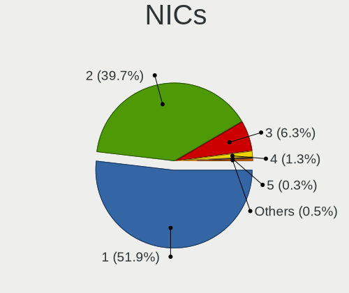
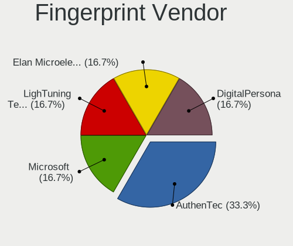

Fedora 37 - Tested Hardware & Statistics (Desktops)
---------------------------------------------------

A project to collect tested hardware configurations for Fedora 37.

Anyone can contribute to this report by the [hw-probe](https://github.com/linuxhw/hw-probe) tool:

    sudo -E hw-probe -all -upload

Please contribute! Especially if your hardware is rare.

Contents
--------

* [ Test Cases ](#test-cases)

* [ System ](#system)
  - [ Kernel                   ](#kernel)
  - [ Kernel Family            ](#kernel-family)
  - [ Kernel Major Ver.        ](#kernel-major-ver)
  - [ Arch                     ](#arch)
  - [ DE                       ](#de)
  - [ Display Server           ](#display-server)
  - [ Display Manager          ](#display-manager)
  - [ OS Lang                  ](#os-lang)
  - [ Boot Mode                ](#boot-mode)
  - [ Filesystem               ](#filesystem)
  - [ Part. scheme             ](#part-scheme)
  - [ Dual Boot with Linux/BSD ](#dual-boot-with-linuxbsd)
  - [ Dual Boot (Win)          ](#dual-boot-win)

* [ Board ](#board)
  - [ Vendor                   ](#vendor)
  - [ Model                    ](#model)
  - [ Model Family             ](#model-family)
  - [ MFG Year                 ](#mfg-year)
  - [ Form Factor              ](#form-factor)
  - [ Secure Boot              ](#secure-boot)
  - [ Coreboot                 ](#coreboot)
  - [ RAM Size                 ](#ram-size)
  - [ RAM Used                 ](#ram-used)
  - [ Total Drives             ](#total-drives)
  - [ Has CD-ROM               ](#has-cd-rom)
  - [ Has Ethernet             ](#has-ethernet)
  - [ Has WiFi                 ](#has-wifi)
  - [ Has Bluetooth            ](#has-bluetooth)

* [ Location ](#location)
  - [ Country                  ](#country)
  - [ City                     ](#city)

* [ Drives ](#drives)
  - [ Drive Vendor             ](#drive-vendor)
  - [ Drive Model              ](#drive-model)
  - [ HDD Vendor               ](#hdd-vendor)
  - [ SSD Vendor               ](#ssd-vendor)
  - [ Drive Kind               ](#drive-kind)
  - [ Drive Connector          ](#drive-connector)
  - [ Drive Size               ](#drive-size)
  - [ Space Total              ](#space-total)
  - [ Space Used               ](#space-used)
  - [ Malfunc. Drives          ](#malfunc-drives)
  - [ Malfunc. Drive Vendor    ](#malfunc-drive-vendor)
  - [ Malfunc. HDD Vendor      ](#malfunc-hdd-vendor)
  - [ Malfunc. Drive Kind      ](#malfunc-drive-kind)
  - [ Failed Drives            ](#failed-drives)
  - [ Failed Drive Vendor      ](#failed-drive-vendor)
  - [ Drive Status             ](#drive-status)

* [ Storage controller ](#storage-controller)
  - [ Storage Vendor           ](#storage-vendor)
  - [ Storage Model            ](#storage-model)
  - [ Storage Kind             ](#storage-kind)

* [ Processor ](#processor)
  - [ CPU Vendor               ](#cpu-vendor)
  - [ CPU Model                ](#cpu-model)
  - [ CPU Model Family         ](#cpu-model-family)
  - [ CPU Cores                ](#cpu-cores)
  - [ CPU Sockets              ](#cpu-sockets)
  - [ CPU Threads              ](#cpu-threads)
  - [ CPU Op-Modes             ](#cpu-op-modes)
  - [ CPU Microcode            ](#cpu-microcode)
  - [ CPU Microarch            ](#cpu-microarch)

* [ Graphics ](#graphics)
  - [ GPU Vendor               ](#gpu-vendor)
  - [ GPU Model                ](#gpu-model)
  - [ GPU Combo                ](#gpu-combo)
  - [ GPU Driver               ](#gpu-driver)
  - [ GPU Memory               ](#gpu-memory)

* [ Monitor ](#monitor)
  - [ Monitor Vendor           ](#monitor-vendor)
  - [ Monitor Model            ](#monitor-model)
  - [ Monitor Resolution       ](#monitor-resolution)
  - [ Monitor Diagonal         ](#monitor-diagonal)
  - [ Monitor Width            ](#monitor-width)
  - [ Aspect Ratio             ](#aspect-ratio)
  - [ Monitor Area             ](#monitor-area)
  - [ Pixel Density            ](#pixel-density)
  - [ Multiple Monitors        ](#multiple-monitors)

* [ Network ](#network)
  - [ Net Controller Vendor    ](#net-controller-vendor)
  - [ Net Controller Model     ](#net-controller-model)
  - [ Wireless Vendor          ](#wireless-vendor)
  - [ Wireless Model           ](#wireless-model)
  - [ Ethernet Vendor          ](#ethernet-vendor)
  - [ Ethernet Model           ](#ethernet-model)
  - [ Net Controller Kind      ](#net-controller-kind)
  - [ Used Controller          ](#used-controller)
  - [ NICs                     ](#nics)
  - [ IPv6                     ](#ipv6)

* [ Bluetooth ](#bluetooth)
  - [ Bluetooth Vendor         ](#bluetooth-vendor)
  - [ Bluetooth Model          ](#bluetooth-model)

* [ Sound ](#sound)
  - [ Sound Vendor             ](#sound-vendor)
  - [ Sound Model              ](#sound-model)

* [ Memory ](#memory)
  - [ Memory Vendor            ](#memory-vendor)
  - [ Memory Model             ](#memory-model)
  - [ Memory Kind              ](#memory-kind)
  - [ Memory Form Factor       ](#memory-form-factor)
  - [ Memory Size              ](#memory-size)
  - [ Memory Speed             ](#memory-speed)

* [ Printers & scanners ](#printers--scanners)
  - [ Printer Vendor           ](#printer-vendor)
  - [ Printer Model            ](#printer-model)
  - [ Scanner Vendor           ](#scanner-vendor)
  - [ Scanner Model            ](#scanner-model)

* [ Camera ](#camera)
  - [ Camera Vendor            ](#camera-vendor)
  - [ Camera Model             ](#camera-model)

* [ Security ](#security)
  - [ Fingerprint Vendor       ](#fingerprint-vendor)
  - [ Fingerprint Model        ](#fingerprint-model)
  - [ Chipcard Vendor          ](#chipcard-vendor)
  - [ Chipcard Model           ](#chipcard-model)

* [ Unsupported ](#unsupported)
  - [ Unsupported Devices      ](#unsupported-devices)
  - [ Unsupported Device Types ](#unsupported-device-types)

Test Cases
----------

Total: 633

| Vendor        | Model                       | Probe                                                      | Date         |
|---------------|-----------------------------|------------------------------------------------------------|--------------|
| ASUSTek       | PRIME B550M-A               | [48c5c743c9](https://linux-hardware.org/?probe=48c5c743c9) | Feb 28, 2023 |
| ASRock        | H61M-VS                     | [04d5b9593e](https://linux-hardware.org/?probe=04d5b9593e) | Feb 28, 2023 |
| HP            | 158A                        | [64f3590183](https://linux-hardware.org/?probe=64f3590183) | Feb 28, 2023 |
| ASRock        | FM2A88X Extreme6+           | [1b5fd0df61](https://linux-hardware.org/?probe=1b5fd0df61) | Feb 28, 2023 |
| Fujitsu       | D3224-P1 S26361-D3224-P1    | [53649a9546](https://linux-hardware.org/?probe=53649a9546) | Feb 28, 2023 |
| ASUSTek       | PRIME Q270M-C               | [3a9683fbb7](https://linux-hardware.org/?probe=3a9683fbb7) | Feb 27, 2023 |
| Gigabyte      | Z490 VISION D               | [cbea73a793](https://linux-hardware.org/?probe=cbea73a793) | Feb 27, 2023 |
| Gigabyte      | Z490 VISION D               | [3e9f2feeaa](https://linux-hardware.org/?probe=3e9f2feeaa) | Feb 27, 2023 |
| Gigabyte      | Z170MX-Gaming 5             | [1f0e9197f9](https://linux-hardware.org/?probe=1f0e9197f9) | Feb 26, 2023 |
| ASUSTek       | PRIME B550M-A               | [a121d0545a](https://linux-hardware.org/?probe=a121d0545a) | Feb 26, 2023 |
| ASUSTek       | TUF Gaming X570-PLUS        | [c56cf68cef](https://linux-hardware.org/?probe=c56cf68cef) | Feb 26, 2023 |
| Gigabyte      | EX58-UD5                    | [85ed1d43c7](https://linux-hardware.org/?probe=85ed1d43c7) | Feb 26, 2023 |
| Gigabyte      | H510M S2                    | [24ea8468ca](https://linux-hardware.org/?probe=24ea8468ca) | Feb 26, 2023 |
| ASUSTek       | PRIME A320M-K               | [c204192a4b](https://linux-hardware.org/?probe=c204192a4b) | Feb 26, 2023 |
| ASUSTek       | PRIME B450M-A II            | [420520e3ab](https://linux-hardware.org/?probe=420520e3ab) | Feb 25, 2023 |
| Dell          | 0W2F8G A01                  | [1d0d54843b](https://linux-hardware.org/?probe=1d0d54843b) | Feb 25, 2023 |
| ASRock        | FM2A88X Extreme6+           | [87c5af58f5](https://linux-hardware.org/?probe=87c5af58f5) | Feb 25, 2023 |
| Gigabyte      | H310M S2 x.x                | [27fa5a62b6](https://linux-hardware.org/?probe=27fa5a62b6) | Feb 24, 2023 |
| MSI           | MAG B550M MORTAR WIFI       | [4a0d65f6b5](https://linux-hardware.org/?probe=4a0d65f6b5) | Feb 24, 2023 |
| MSI           | B350M PRO-VDH               | [748d109cb3](https://linux-hardware.org/?probe=748d109cb3) | Feb 24, 2023 |
| ASUSTek       | PRIME B550M-A WIFI II       | [5d901ddc4e](https://linux-hardware.org/?probe=5d901ddc4e) | Feb 24, 2023 |
| ASRock        | FM2A88X Extreme6+           | [6e57f3a472](https://linux-hardware.org/?probe=6e57f3a472) | Feb 24, 2023 |
| MSI           | Z170A PC MATE               | [5ee58b9271](https://linux-hardware.org/?probe=5ee58b9271) | Feb 24, 2023 |
| MSI           | Z87M GAMING                 | [0603accd89](https://linux-hardware.org/?probe=0603accd89) | Feb 24, 2023 |
| ASUSTek       | PRIME B550M-A               | [acdea94715](https://linux-hardware.org/?probe=acdea94715) | Feb 23, 2023 |
| Gateway       | SX2185                      | [32ab171e53](https://linux-hardware.org/?probe=32ab171e53) | Feb 23, 2023 |
| ASRock        | B450M Pro4                  | [193a97dfb1](https://linux-hardware.org/?probe=193a97dfb1) | Feb 23, 2023 |
| Gigabyte      | B550M AORUS PRO-P           | [eade3920d9](https://linux-hardware.org/?probe=eade3920d9) | Feb 23, 2023 |
| ASUSTek       | P5L-MX                      | [cc19e49d3c](https://linux-hardware.org/?probe=cc19e49d3c) | Feb 23, 2023 |
| MSI           | MPG X570 GAMING PLUS        | [b82d73c832](https://linux-hardware.org/?probe=b82d73c832) | Feb 22, 2023 |
| ASUSTek       | P5L-MX                      | [9eb9ca3cfb](https://linux-hardware.org/?probe=9eb9ca3cfb) | Feb 22, 2023 |
| Acer          | Veriton N4630G              | [eb6a551e75](https://linux-hardware.org/?probe=eb6a551e75) | Feb 22, 2023 |
| ASRock        | AB350 Pro4                  | [aaad317fe4](https://linux-hardware.org/?probe=aaad317fe4) | Feb 22, 2023 |
| ASRockRack    | X470D4U                     | [162a5279bc](https://linux-hardware.org/?probe=162a5279bc) | Feb 21, 2023 |
| Gigabyte      | A320M-S2H-CF                | [67ba988b20](https://linux-hardware.org/?probe=67ba988b20) | Feb 21, 2023 |
| Gigabyte      | J1900M-D2P                  | [edd5640ca7](https://linux-hardware.org/?probe=edd5640ca7) | Feb 21, 2023 |
| MSI           | H410M PRO-VH                | [669d124e33](https://linux-hardware.org/?probe=669d124e33) | Feb 21, 2023 |
| ASUSTek       | PRIME B550M-A               | [8fd85f724b](https://linux-hardware.org/?probe=8fd85f724b) | Feb 20, 2023 |
| Lenovo        | ThinkCentre M58 8910B4U     | [03c8e6d135](https://linux-hardware.org/?probe=03c8e6d135) | Feb 19, 2023 |
| ASUSTek       | SABERTOOTH X99              | [422b14d8d7](https://linux-hardware.org/?probe=422b14d8d7) | Feb 19, 2023 |
| ASRock        | X570 Phantom Gaming 4       | [2af589c6e9](https://linux-hardware.org/?probe=2af589c6e9) | Feb 19, 2023 |
| ASRock        | X670E Pro RS                | [906d11e2a3](https://linux-hardware.org/?probe=906d11e2a3) | Feb 19, 2023 |
| ASUSTek       | TUF Gaming X570-PLUS        | [42099690a6](https://linux-hardware.org/?probe=42099690a6) | Feb 19, 2023 |
| Gigabyte      | B550 AORUS ELITE V2         | [6eda9f2592](https://linux-hardware.org/?probe=6eda9f2592) | Feb 19, 2023 |
| ASUSTek       | P5Q SE2                     | [37b0d0609f](https://linux-hardware.org/?probe=37b0d0609f) | Feb 18, 2023 |
| ASRock        | H110 Pro BTC+               | [bce117c4dc](https://linux-hardware.org/?probe=bce117c4dc) | Feb 18, 2023 |
| MSI           | Z170A KRAIT GAMING          | [27dcbbe1d7](https://linux-hardware.org/?probe=27dcbbe1d7) | Feb 18, 2023 |
| ASUSTek       | ROG CROSSHAIR VIII IMPAC... | [831d4806fb](https://linux-hardware.org/?probe=831d4806fb) | Feb 18, 2023 |
| MSI           | H410M PRO-VH                | [ccc1cbf2fa](https://linux-hardware.org/?probe=ccc1cbf2fa) | Feb 18, 2023 |
| ASRock        | FM2A88X Extreme6+           | [f14a791491](https://linux-hardware.org/?probe=f14a791491) | Feb 18, 2023 |
| Gigabyte      | Z370 AORUS Ultra Gaming-... | [5fe0f2c1fe](https://linux-hardware.org/?probe=5fe0f2c1fe) | Feb 18, 2023 |
| ASUSTek       | PRIME B550M-A               | [f9fb638882](https://linux-hardware.org/?probe=f9fb638882) | Feb 17, 2023 |
| ASUSTek       | PRIME Z690M-PLUS D4         | [750c0f6337](https://linux-hardware.org/?probe=750c0f6337) | Feb 17, 2023 |
| ASRock        | X470 Taichi                 | [71685845fe](https://linux-hardware.org/?probe=71685845fe) | Feb 17, 2023 |
| ASRock        | FM2A88X Extreme6+           | [8c3926e125](https://linux-hardware.org/?probe=8c3926e125) | Feb 17, 2023 |
| ASUSTek       | ProArt Z690-CREATOR WIFI    | [8e3bad7795](https://linux-hardware.org/?probe=8e3bad7795) | Feb 17, 2023 |
| Gigabyte      | A320M-S2H-CF                | [add68ac711](https://linux-hardware.org/?probe=add68ac711) | Feb 16, 2023 |
| ASUSTek       | PRIME B550M-A               | [a19a7a2edd](https://linux-hardware.org/?probe=a19a7a2edd) | Feb 16, 2023 |
| ASUSTek       | EX-H310M-V3 R2.0            | [d42c40dd2e](https://linux-hardware.org/?probe=d42c40dd2e) | Feb 16, 2023 |
| ASUSTek       | ProArt X670E-CREATOR WIF... | [f4e8b0e952](https://linux-hardware.org/?probe=f4e8b0e952) | Feb 16, 2023 |
| ASUSTek       | P8Z77-V PRO/THUNDERBOLT     | [a370fca217](https://linux-hardware.org/?probe=a370fca217) | Feb 15, 2023 |
| ASUSTek       | TUF Z390-PLUS GAMING        | [ca54397755](https://linux-hardware.org/?probe=ca54397755) | Feb 15, 2023 |
| MSI           | FM2-A75MA-E35               | [a7f2ca398d](https://linux-hardware.org/?probe=a7f2ca398d) | Feb 15, 2023 |
| ASUSTek       | ROG STRIX B650E-I GAMING... | [7d8c3e7e48](https://linux-hardware.org/?probe=7d8c3e7e48) | Feb 14, 2023 |
| ASUSTek       | ROG STRIX X570-F GAMING     | [e718a6af67](https://linux-hardware.org/?probe=e718a6af67) | Feb 14, 2023 |
| ASRock        | X370 Gaming X               | [2b9a026876](https://linux-hardware.org/?probe=2b9a026876) | Feb 14, 2023 |
| HP            | 8714                        | [19a66b5101](https://linux-hardware.org/?probe=19a66b5101) | Feb 14, 2023 |
| ASUSTek       | ROG STRIX X570-E GAMING     | [43dff5bee7](https://linux-hardware.org/?probe=43dff5bee7) | Feb 14, 2023 |
| Gigabyte      | B550 GAMING X V2            | [10c8101c9b](https://linux-hardware.org/?probe=10c8101c9b) | Feb 14, 2023 |
| MSI           | X99A SLI PLUS               | [98447ce3dd](https://linux-hardware.org/?probe=98447ce3dd) | Feb 13, 2023 |
| Dell          | 0R6PCT A01                  | [4126ed8507](https://linux-hardware.org/?probe=4126ed8507) | Feb 13, 2023 |
| Pegatron      | 2AB6                        | [65b3bb622e](https://linux-hardware.org/?probe=65b3bb622e) | Feb 12, 2023 |
| ASRock        | FM2A88X Extreme6+           | [a5469c55ac](https://linux-hardware.org/?probe=a5469c55ac) | Feb 12, 2023 |
| ASUSTek       | PRIME B550M-A               | [2d63c8d887](https://linux-hardware.org/?probe=2d63c8d887) | Feb 12, 2023 |
| Pegatron      | 2AB6                        | [1f727ee133](https://linux-hardware.org/?probe=1f727ee133) | Feb 11, 2023 |
| ASUSTek       | Z97-P                       | [004535fd1c](https://linux-hardware.org/?probe=004535fd1c) | Feb 11, 2023 |
| ASRock        | Z790 Pro RS WiFi            | [c530bf4283](https://linux-hardware.org/?probe=c530bf4283) | Feb 11, 2023 |
| ASRock        | FM2A88X Extreme6+           | [6474c43d80](https://linux-hardware.org/?probe=6474c43d80) | Feb 11, 2023 |
| ASRock        | A300M-STX                   | [79266ec6c7](https://linux-hardware.org/?probe=79266ec6c7) | Feb 10, 2023 |
| ASUSTek       | TUF Gaming X670E-PLUS WI... | [9a2b8045de](https://linux-hardware.org/?probe=9a2b8045de) | Feb 10, 2023 |
| HP            | 8714                        | [3938395f75](https://linux-hardware.org/?probe=3938395f75) | Feb 10, 2023 |
| ASUSTek       | PRIME H410M-K               | [c3a837a320](https://linux-hardware.org/?probe=c3a837a320) | Feb 09, 2023 |
| ASUSTek       | PRIME B550M-A               | [70b81f3738](https://linux-hardware.org/?probe=70b81f3738) | Feb 09, 2023 |
| Intel         | LADPNVMO AAE76523-300       | [6ced92edc7](https://linux-hardware.org/?probe=6ced92edc7) | Feb 09, 2023 |
| MSI           | H110M PRO-VD PLUS           | [c296dedf74](https://linux-hardware.org/?probe=c296dedf74) | Feb 08, 2023 |
| ASUSTek       | ROG CROSSHAIR VIII DARK ... | [69c30e6f7b](https://linux-hardware.org/?probe=69c30e6f7b) | Feb 08, 2023 |
| ASUSTek       | ROG Maximus X HERO          | [a12cca2eeb](https://linux-hardware.org/?probe=a12cca2eeb) | Feb 08, 2023 |
| ASUSTek       | PRIME B550M-A               | [b02b8779fc](https://linux-hardware.org/?probe=b02b8779fc) | Feb 08, 2023 |
| ASRock        | FM2A88X Extreme6+           | [5c5d5d4304](https://linux-hardware.org/?probe=5c5d5d4304) | Feb 08, 2023 |
| ASUSTek       | SABERTOOTH X79              | [21910f6687](https://linux-hardware.org/?probe=21910f6687) | Feb 08, 2023 |
| ASRock        | H81M-HG4 R4.0               | [127269499d](https://linux-hardware.org/?probe=127269499d) | Feb 07, 2023 |
| Lenovo        | ThinkServer TS140           | [1bac17097f](https://linux-hardware.org/?probe=1bac17097f) | Feb 07, 2023 |
| ASUSTek       | SABERTOOTH X79              | [ace0ce95b9](https://linux-hardware.org/?probe=ace0ce95b9) | Feb 07, 2023 |
| ASUSTek       | ROG STRIX Z370-H GAMING     | [47153e938c](https://linux-hardware.org/?probe=47153e938c) | Feb 07, 2023 |
| BESSTAR Te... | B550                        | [49e414926e](https://linux-hardware.org/?probe=49e414926e) | Feb 07, 2023 |
| ASUSTek       | Pro WS WRX80E-SAGE SE WI... | [e82192ba4c](https://linux-hardware.org/?probe=e82192ba4c) | Feb 07, 2023 |
| ASRock        | FM2A88X Extreme6+           | [d91fe3e151](https://linux-hardware.org/?probe=d91fe3e151) | Feb 07, 2023 |
| ASUSTek       | ROG STRIX B550-F GAMING     | [31a56f80dd](https://linux-hardware.org/?probe=31a56f80dd) | Feb 06, 2023 |
| ASUSTek       | PRIME B550M-A               | [ff01db5c9a](https://linux-hardware.org/?probe=ff01db5c9a) | Feb 06, 2023 |
| MSI           | MAG X570 TOMAHAWK WIFI      | [f1e58aba53](https://linux-hardware.org/?probe=f1e58aba53) | Feb 06, 2023 |
| ASUSTek       | PRIME B450M-A II            | [10cf328828](https://linux-hardware.org/?probe=10cf328828) | Feb 06, 2023 |
| Gigabyte      | B450M DS3H V2               | [781dc9da09](https://linux-hardware.org/?probe=781dc9da09) | Feb 06, 2023 |
| Compal        | DIP00                       | [632d4c313a](https://linux-hardware.org/?probe=632d4c313a) | Feb 06, 2023 |
| Gigabyte      | GA-MA780G-UD3H              | [99d0ce5421](https://linux-hardware.org/?probe=99d0ce5421) | Feb 05, 2023 |
| HP            | 1589                        | [1872d63c2b](https://linux-hardware.org/?probe=1872d63c2b) | Feb 05, 2023 |
| HP            | 1589                        | [69c0ab962c](https://linux-hardware.org/?probe=69c0ab962c) | Feb 05, 2023 |
| Intel         | X99                         | [e8790caf8d](https://linux-hardware.org/?probe=e8790caf8d) | Feb 05, 2023 |
| ASRock        | X570 Phantom Gaming 4       | [944149e350](https://linux-hardware.org/?probe=944149e350) | Feb 04, 2023 |
| ASUSTek       | TUF Gaming B650-PLUS WIF... | [9f5df7e4e0](https://linux-hardware.org/?probe=9f5df7e4e0) | Feb 04, 2023 |
| Gigabyte      | Z790 GAMING X AX            | [1c6725b5eb](https://linux-hardware.org/?probe=1c6725b5eb) | Feb 04, 2023 |
| Gigabyte      | Z77MX-D3H                   | [a17959ea9b](https://linux-hardware.org/?probe=a17959ea9b) | Feb 04, 2023 |
| ASRock        | FM2A88X Extreme6+           | [3633683d62](https://linux-hardware.org/?probe=3633683d62) | Feb 04, 2023 |
| ASUSTek       | ROG STRIX X570-I GAMING     | [f2578f11e1](https://linux-hardware.org/?probe=f2578f11e1) | Feb 03, 2023 |
| ASRock        | FM2A88X Extreme6+           | [5e9c75d478](https://linux-hardware.org/?probe=5e9c75d478) | Feb 03, 2023 |
| ASUSTek       | PRIME B550M-A               | [e680a7484e](https://linux-hardware.org/?probe=e680a7484e) | Feb 03, 2023 |
| HP            | 8714                        | [b8abceccbc](https://linux-hardware.org/?probe=b8abceccbc) | Feb 03, 2023 |
| Pegatron      | IPXSB-H61                   | [a694854d87](https://linux-hardware.org/?probe=a694854d87) | Feb 02, 2023 |
| Acer          | Veriton M2631 V:1.0         | [28e1975b51](https://linux-hardware.org/?probe=28e1975b51) | Feb 02, 2023 |
| ASRock        | FM2A88X Extreme6+           | [9b8d82dfcd](https://linux-hardware.org/?probe=9b8d82dfcd) | Feb 02, 2023 |
| Gigabyte      | J1900M-D2P                  | [c7b6222f08](https://linux-hardware.org/?probe=c7b6222f08) | Feb 02, 2023 |
| ASRock        | Z77 Extreme4                | [6598bc47dd](https://linux-hardware.org/?probe=6598bc47dd) | Feb 02, 2023 |
| MSI           | MAG X570 TOMAHAWK WIFI      | [15c523ee98](https://linux-hardware.org/?probe=15c523ee98) | Feb 02, 2023 |
| ASUSTek       | ProArt X670E-CREATOR WIF... | [f2919f7135](https://linux-hardware.org/?probe=f2919f7135) | Feb 01, 2023 |
| ASRock        | B450M Pro4 R2.0             | [28f4fb8e15](https://linux-hardware.org/?probe=28f4fb8e15) | Feb 01, 2023 |
| ASUSTek       | H81M-A/BR                   | [7d271a8235](https://linux-hardware.org/?probe=7d271a8235) | Feb 01, 2023 |
| ASUSTek       | PRIME B550M-A               | [d35cf58f46](https://linux-hardware.org/?probe=d35cf58f46) | Feb 01, 2023 |
| MSI           | MAG Z590 TORPEDO            | [431a6c7a3a](https://linux-hardware.org/?probe=431a6c7a3a) | Feb 01, 2023 |
| MSI           | Z170A PC MATE               | [ff305089b2](https://linux-hardware.org/?probe=ff305089b2) | Feb 01, 2023 |
| ASUSTek       | ProArt X670E-CREATOR WIF... | [ffe1cabad7](https://linux-hardware.org/?probe=ffe1cabad7) | Feb 01, 2023 |
| ASUSTek       | PRIME B550M-A               | [779b723b67](https://linux-hardware.org/?probe=779b723b67) | Feb 01, 2023 |
| ASRock        | FM2A88X Extreme6+           | [79c11af9ac](https://linux-hardware.org/?probe=79c11af9ac) | Feb 01, 2023 |
| ASUSTek       | ROG STRIX Z490-A GAMING     | [5f2948351d](https://linux-hardware.org/?probe=5f2948351d) | Feb 01, 2023 |
| ASUSTek       | ProArt X670E-CREATOR WIF... | [4f8642280f](https://linux-hardware.org/?probe=4f8642280f) | Feb 01, 2023 |
| AZW           | U59                         | [9b73123be3](https://linux-hardware.org/?probe=9b73123be3) | Feb 01, 2023 |
| AZW           | U59                         | [74f028454a](https://linux-hardware.org/?probe=74f028454a) | Feb 01, 2023 |
| Gigabyte      | G41MT-D3                    | [99127d4bed](https://linux-hardware.org/?probe=99127d4bed) | Feb 01, 2023 |
| Gigabyte      | H97M-D3H                    | [3ccdc4fa2b](https://linux-hardware.org/?probe=3ccdc4fa2b) | Jan 31, 2023 |
| ASUSTek       | PRIME B550M-A               | [318b0a5ecb](https://linux-hardware.org/?probe=318b0a5ecb) | Jan 31, 2023 |
| ASRock        | FM2A88X Extreme6+           | [73bc9212a3](https://linux-hardware.org/?probe=73bc9212a3) | Jan 31, 2023 |
| ASUSTek       | ProArt X670E-CREATOR WIF... | [6e7d6aae31](https://linux-hardware.org/?probe=6e7d6aae31) | Jan 31, 2023 |
| ASRock        | AD2700-ITX                  | [2f14c18867](https://linux-hardware.org/?probe=2f14c18867) | Jan 31, 2023 |
| ASRock        | 890GM Pro3                  | [b2bb32cbbc](https://linux-hardware.org/?probe=b2bb32cbbc) | Jan 31, 2023 |
| MSI           | MPG X570 GAMING PLUS        | [67262a8155](https://linux-hardware.org/?probe=67262a8155) | Jan 30, 2023 |
| Dell          | 0Y2K8N A01                  | [6a4a26884d](https://linux-hardware.org/?probe=6a4a26884d) | Jan 30, 2023 |
| Dell          | 0Y2K8N A01                  | [8e4f1d2ed2](https://linux-hardware.org/?probe=8e4f1d2ed2) | Jan 30, 2023 |
| ASUSTek       | PRIME B550M-A               | [585c3c8f85](https://linux-hardware.org/?probe=585c3c8f85) | Jan 30, 2023 |
| ASRock        | FM2A88X Extreme6+           | [24402e3d42](https://linux-hardware.org/?probe=24402e3d42) | Jan 30, 2023 |
| ASUSTek       | Z170 PRO GAMING             | [9b6a9a4ab5](https://linux-hardware.org/?probe=9b6a9a4ab5) | Jan 30, 2023 |
| ASRock        | N68-S UCC                   | [e8f09a159a](https://linux-hardware.org/?probe=e8f09a159a) | Jan 29, 2023 |
| ASUSTek       | GA15DH                      | [767fe59cb7](https://linux-hardware.org/?probe=767fe59cb7) | Jan 29, 2023 |
| ASUSTek       | PRIME B450M-A II            | [104fb04e91](https://linux-hardware.org/?probe=104fb04e91) | Jan 29, 2023 |
| ASUSTek       | PRIME B550M-A               | [ef43edeee5](https://linux-hardware.org/?probe=ef43edeee5) | Jan 29, 2023 |
| ASRock        | FM2A88X Extreme6+           | [f9a823cb38](https://linux-hardware.org/?probe=f9a823cb38) | Jan 29, 2023 |
| ASRock        | X570M Pro4                  | [e72f7f2fb1](https://linux-hardware.org/?probe=e72f7f2fb1) | Jan 29, 2023 |
| Acer          | FMP55                       | [d091fbc8d3](https://linux-hardware.org/?probe=d091fbc8d3) | Jan 29, 2023 |
| ASUSTek       | M5A78L-M LX PLUS            | [d9f9d4bc89](https://linux-hardware.org/?probe=d9f9d4bc89) | Jan 27, 2023 |
| ASRock        | 970 Pro3 R2.0               | [676f900958](https://linux-hardware.org/?probe=676f900958) | Jan 27, 2023 |
| ASUSTek       | PRIME B550M-A               | [e619db262a](https://linux-hardware.org/?probe=e619db262a) | Jan 27, 2023 |
| Gigabyte      | X570 AORUS MASTER           | [c0ea09ef3c](https://linux-hardware.org/?probe=c0ea09ef3c) | Jan 27, 2023 |
| ASRock        | AD2700-ITX                  | [7b711bee4f](https://linux-hardware.org/?probe=7b711bee4f) | Jan 26, 2023 |
| Gigabyte      | J1900M-D2P                  | [4213c95d3d](https://linux-hardware.org/?probe=4213c95d3d) | Jan 26, 2023 |
| Gigabyte      | J1900M-D2P                  | [b44aa465bc](https://linux-hardware.org/?probe=b44aa465bc) | Jan 26, 2023 |
| ASRock        | FM2A88X Extreme6+           | [415b96672b](https://linux-hardware.org/?probe=415b96672b) | Jan 26, 2023 |
| ASRock        | B450M Steel Legend          | [f69047309d](https://linux-hardware.org/?probe=f69047309d) | Jan 26, 2023 |
| ASUSTek       | ROG STRIX H370-I GAMING     | [decfe6ab97](https://linux-hardware.org/?probe=decfe6ab97) | Jan 25, 2023 |
| Dell          | 0XFWHV A00                  | [52ee3df163](https://linux-hardware.org/?probe=52ee3df163) | Jan 25, 2023 |
| ASRock        | FM2A88X Extreme6+           | [82c3a80b93](https://linux-hardware.org/?probe=82c3a80b93) | Jan 25, 2023 |
| ASUSTek       | ROG STRIX B660-I GAMING ... | [8ac6e901d5](https://linux-hardware.org/?probe=8ac6e901d5) | Jan 24, 2023 |
| Lenovo        | 36E9 SDK0T08861 WIN 3305... | [82705366d7](https://linux-hardware.org/?probe=82705366d7) | Jan 24, 2023 |
| ASRock        | FM2A88X Extreme6+           | [43c26544a9](https://linux-hardware.org/?probe=43c26544a9) | Jan 24, 2023 |
| Dell          | 0X30MX A00                  | [c323a1a215](https://linux-hardware.org/?probe=c323a1a215) | Jan 24, 2023 |
| ASUSTek       | PRIME X370-PRO              | [1887a95d31](https://linux-hardware.org/?probe=1887a95d31) | Jan 23, 2023 |
| ASUSTek       | ROG STRIX B450-F GAMING     | [7572089dc3](https://linux-hardware.org/?probe=7572089dc3) | Jan 23, 2023 |
| Gigabyte      | X570 AORUS ULTRA            | [2f215e1ce7](https://linux-hardware.org/?probe=2f215e1ce7) | Jan 23, 2023 |
| Gigabyte      | AB350M-Gaming 3-CF          | [aa16eaced0](https://linux-hardware.org/?probe=aa16eaced0) | Jan 23, 2023 |
| ASRock        | FM2A88X Extreme6+           | [279452d293](https://linux-hardware.org/?probe=279452d293) | Jan 23, 2023 |
| MSI           | MPG X570 GAMING PRO CARB... | [3a42df71d0](https://linux-hardware.org/?probe=3a42df71d0) | Jan 22, 2023 |
| Dell          | 0Y56T3 A00                  | [7078ea91e9](https://linux-hardware.org/?probe=7078ea91e9) | Jan 22, 2023 |
| MSI           | H510M PRO                   | [309f1bc61b](https://linux-hardware.org/?probe=309f1bc61b) | Jan 22, 2023 |
| ECS           | H61H2-MV                    | [92d2b62680](https://linux-hardware.org/?probe=92d2b62680) | Jan 22, 2023 |
| MSI           | B450-A PRO                  | [e9c7c42a8b](https://linux-hardware.org/?probe=e9c7c42a8b) | Jan 22, 2023 |
| Gigabyte      | Z170-D3H-CF                 | [9792de46ad](https://linux-hardware.org/?probe=9792de46ad) | Jan 22, 2023 |
| ECS           | H61H2-MV                    | [292ff62f4c](https://linux-hardware.org/?probe=292ff62f4c) | Jan 22, 2023 |
| ASRock        | FM2A88X Extreme6+           | [b3d64d2496](https://linux-hardware.org/?probe=b3d64d2496) | Jan 22, 2023 |
| ASUSTek       | H61M-A/BR                   | [43aaf27a04](https://linux-hardware.org/?probe=43aaf27a04) | Jan 22, 2023 |
| MSI           | MAG X570 TOMAHAWK WIFI      | [6856fa4741](https://linux-hardware.org/?probe=6856fa4741) | Jan 21, 2023 |
| AZW           | GTR V02                     | [3616feeeac](https://linux-hardware.org/?probe=3616feeeac) | Jan 21, 2023 |
| Gigabyte      | B550M AORUS ELITE           | [7a067fe264](https://linux-hardware.org/?probe=7a067fe264) | Jan 21, 2023 |
| ASRock        | FM2A88X Extreme6+           | [20c0f69bb7](https://linux-hardware.org/?probe=20c0f69bb7) | Jan 21, 2023 |
| Gigabyte      | Z170-D3H-CF                 | [04d36be1ec](https://linux-hardware.org/?probe=04d36be1ec) | Jan 20, 2023 |
| ASUSTek       | ROG STRIX B450-F GAMING ... | [3432d7c1f5](https://linux-hardware.org/?probe=3432d7c1f5) | Jan 20, 2023 |
| ASUSTek       | ProArt Z690-CREATOR WIFI    | [2f6bd134ae](https://linux-hardware.org/?probe=2f6bd134ae) | Jan 20, 2023 |
| ASUSTek       | ProArt X670E-CREATOR WIF... | [5bbd614c0f](https://linux-hardware.org/?probe=5bbd614c0f) | Jan 20, 2023 |
| HP            | 0AECh D                     | [b2ea95f507](https://linux-hardware.org/?probe=b2ea95f507) | Jan 20, 2023 |
| ASRock        | FM2A88X Extreme6+           | [5f1447f874](https://linux-hardware.org/?probe=5f1447f874) | Jan 20, 2023 |
| Dell          | 0GY6Y8 A02                  | [33b364ed89](https://linux-hardware.org/?probe=33b364ed89) | Jan 19, 2023 |
| ASRock        | X300M-STX                   | [8303a9c2a0](https://linux-hardware.org/?probe=8303a9c2a0) | Jan 18, 2023 |
| Dell          | 0XFRWW A00                  | [2b96d4b6f6](https://linux-hardware.org/?probe=2b96d4b6f6) | Jan 18, 2023 |
| ASUSTek       | PRIME X370-PRO              | [011b9a41cd](https://linux-hardware.org/?probe=011b9a41cd) | Jan 18, 2023 |
| ASRock        | FM2A88X Extreme6+           | [ec05dd5768](https://linux-hardware.org/?probe=ec05dd5768) | Jan 18, 2023 |
| Dell          | 0KRC95 A02                  | [01cf6039d0](https://linux-hardware.org/?probe=01cf6039d0) | Jan 18, 2023 |
| ASRock        | B550 Extreme4               | [e5599ac616](https://linux-hardware.org/?probe=e5599ac616) | Jan 18, 2023 |
| ASRock        | Z170 Gaming K4              | [44a3d49ef1](https://linux-hardware.org/?probe=44a3d49ef1) | Jan 18, 2023 |
| ASUSTek       | Z97-K                       | [8e21ef4b91](https://linux-hardware.org/?probe=8e21ef4b91) | Jan 17, 2023 |
| Gigabyte      | 990FXA-UD5 R5               | [8753bd8277](https://linux-hardware.org/?probe=8753bd8277) | Jan 17, 2023 |
| Gigabyte      | G41MT-D3                    | [16be0552b2](https://linux-hardware.org/?probe=16be0552b2) | Jan 17, 2023 |
| ASUSTek       | ProArt Z690-CREATOR WIFI    | [16c9b323c6](https://linux-hardware.org/?probe=16c9b323c6) | Jan 17, 2023 |
| ASRock        | FM2A88X Extreme6+           | [aeb9ac591c](https://linux-hardware.org/?probe=aeb9ac591c) | Jan 17, 2023 |
| Gigabyte      | Z170-D3H-CF                 | [d0a00b398c](https://linux-hardware.org/?probe=d0a00b398c) | Jan 16, 2023 |
| ASUSTek       | ROG STRIX Z390-E GAMING     | [d5843b83af](https://linux-hardware.org/?probe=d5843b83af) | Jan 16, 2023 |
| Lenovo        | 32E9 SDK0T76461 WIN 3422... | [5480333c5b](https://linux-hardware.org/?probe=5480333c5b) | Jan 16, 2023 |
| Gigabyte      | 990FXA-UD5 R5               | [dd16b56d30](https://linux-hardware.org/?probe=dd16b56d30) | Jan 16, 2023 |
| Gigabyte      | B550M DS3H                  | [d24e1142ef](https://linux-hardware.org/?probe=d24e1142ef) | Jan 16, 2023 |
| Dell          | 0M863N A01                  | [1dff7cb016](https://linux-hardware.org/?probe=1dff7cb016) | Jan 16, 2023 |
| ASUSTek       | TUF Gaming B550-PLUS        | [b68ce1375d](https://linux-hardware.org/?probe=b68ce1375d) | Jan 15, 2023 |
| MSI           | B450 TOMAHAWK               | [978682daa6](https://linux-hardware.org/?probe=978682daa6) | Jan 15, 2023 |
| ASUSTek       | ROG STRIX B450-F GAMING ... | [a15e06403a](https://linux-hardware.org/?probe=a15e06403a) | Jan 15, 2023 |
| AZW           | GTR V02                     | [074c3ab42f](https://linux-hardware.org/?probe=074c3ab42f) | Jan 14, 2023 |
| Gigabyte      | Z77X-D3H                    | [4ef76b2644](https://linux-hardware.org/?probe=4ef76b2644) | Jan 14, 2023 |
| Dell          | 0W2F8G A01                  | [999fcca032](https://linux-hardware.org/?probe=999fcca032) | Jan 14, 2023 |
| ASRock        | FM2A88X Extreme6+           | [03f0709b21](https://linux-hardware.org/?probe=03f0709b21) | Jan 14, 2023 |
| ASUSTek       | STRIX B250F GAMING          | [40acaf3525](https://linux-hardware.org/?probe=40acaf3525) | Jan 13, 2023 |
| ASUSTek       | SABERTOOTH 990FX R2.0       | [c1e0fd9216](https://linux-hardware.org/?probe=c1e0fd9216) | Jan 13, 2023 |
| ASUSTek       | Z87-K                       | [61b7459a43](https://linux-hardware.org/?probe=61b7459a43) | Jan 13, 2023 |
| ASUSTek       | P8Z77-V LK                  | [f954b55a5c](https://linux-hardware.org/?probe=f954b55a5c) | Jan 13, 2023 |
| ASRock        | FM2A88X Extreme6+           | [d4b0530f79](https://linux-hardware.org/?probe=d4b0530f79) | Jan 13, 2023 |
| ASUSTek       | H170 PRO GAMING             | [4cf36f7404](https://linux-hardware.org/?probe=4cf36f7404) | Jan 13, 2023 |
| HP            | 3047h                       | [5eb46c9039](https://linux-hardware.org/?probe=5eb46c9039) | Jan 12, 2023 |
| HP            | 3047h                       | [0c035c1a04](https://linux-hardware.org/?probe=0c035c1a04) | Jan 12, 2023 |
| Gigabyte      | A320M-S2H-CF                | [f38e5f2a4e](https://linux-hardware.org/?probe=f38e5f2a4e) | Jan 12, 2023 |
| ASRock        | X570 Steel Legend           | [600094ae29](https://linux-hardware.org/?probe=600094ae29) | Jan 12, 2023 |
| MSI           | B450M PRO-VDH MAX           | [ffd5ad6744](https://linux-hardware.org/?probe=ffd5ad6744) | Jan 12, 2023 |
| Unknown       | X79                         | [62bf02da9d](https://linux-hardware.org/?probe=62bf02da9d) | Jan 12, 2023 |
| Unknown       | X79                         | [aed457b56c](https://linux-hardware.org/?probe=aed457b56c) | Jan 12, 2023 |
| MSI           | B550-A PRO                  | [28d13d17ba](https://linux-hardware.org/?probe=28d13d17ba) | Jan 12, 2023 |
| Pegatron      | 2AC3                        | [3cfb7d9e7c](https://linux-hardware.org/?probe=3cfb7d9e7c) | Jan 12, 2023 |
| ASUSTek       | GA15DH                      | [e480a3bfa3](https://linux-hardware.org/?probe=e480a3bfa3) | Jan 11, 2023 |
| ASRock        | Z87 Extreme6                | [49e3d87de4](https://linux-hardware.org/?probe=49e3d87de4) | Jan 11, 2023 |
| Gigabyte      | AB350-Gaming 3-CF           | [18e82e414a](https://linux-hardware.org/?probe=18e82e414a) | Jan 11, 2023 |
| ASUSTek       | Z97-PRO GAMER               | [a4ab96067d](https://linux-hardware.org/?probe=a4ab96067d) | Jan 10, 2023 |
| ASUSTek       | PRIME H670-PLUS D4          | [760cc2eaed](https://linux-hardware.org/?probe=760cc2eaed) | Jan 10, 2023 |
| ASUSTek       | TUF H310M-PLUS GAMING/BR    | [0a5f45ca97](https://linux-hardware.org/?probe=0a5f45ca97) | Jan 10, 2023 |
| MSI           | B450M PRO-VDH MAX           | [b65fef1f25](https://linux-hardware.org/?probe=b65fef1f25) | Jan 10, 2023 |
| ASUSTek       | PRIME B450M-A II            | [7c7c8175c0](https://linux-hardware.org/?probe=7c7c8175c0) | Jan 09, 2023 |
| Gigabyte      | H77N-WIFI                   | [95cfb68187](https://linux-hardware.org/?probe=95cfb68187) | Jan 09, 2023 |
| ASUSTek       | P8H61-M LX                  | [8ec4c19bf3](https://linux-hardware.org/?probe=8ec4c19bf3) | Jan 09, 2023 |
| AZW           | GTR V02                     | [b7a911ab61](https://linux-hardware.org/?probe=b7a911ab61) | Jan 09, 2023 |
| Gigabyte      | B85M-D3V-A                  | [d30caadc06](https://linux-hardware.org/?probe=d30caadc06) | Jan 09, 2023 |
| ASRock        | FM2A88X Extreme6+           | [d7820d12e5](https://linux-hardware.org/?probe=d7820d12e5) | Jan 09, 2023 |
| Gigabyte      | AB350M-Gaming 3-CF          | [6fd945d3cd](https://linux-hardware.org/?probe=6fd945d3cd) | Jan 09, 2023 |
| MSI           | MEG X570 ACE                | [853f3c06ce](https://linux-hardware.org/?probe=853f3c06ce) | Jan 08, 2023 |
| MSI           | X570-A PRO                  | [d3e35671cd](https://linux-hardware.org/?probe=d3e35671cd) | Jan 08, 2023 |
| ASUSTek       | ROG STRIX Z390-I GAMING     | [afd852d260](https://linux-hardware.org/?probe=afd852d260) | Jan 08, 2023 |
| ASUSTek       | ROG STRIX Z390-I GAMING     | [5f3e927024](https://linux-hardware.org/?probe=5f3e927024) | Jan 08, 2023 |
| ASUSTek       | Z97-PRO GAMER               | [e85dcf8a22](https://linux-hardware.org/?probe=e85dcf8a22) | Jan 08, 2023 |
| ASRock        | FM2A88X Extreme6+           | [b0a36f054e](https://linux-hardware.org/?probe=b0a36f054e) | Jan 08, 2023 |
| ASUSTek       | TUF Gaming B550M-PLUS       | [34259527c2](https://linux-hardware.org/?probe=34259527c2) | Jan 07, 2023 |
| ASUSTek       | PRIME B350M-A               | [df845fe4a9](https://linux-hardware.org/?probe=df845fe4a9) | Jan 07, 2023 |
| Acer          | FMCP7A-ION-LE               | [84a2abec03](https://linux-hardware.org/?probe=84a2abec03) | Jan 07, 2023 |
| ASRock        | FM2A88X Extreme6+           | [82052bbfcb](https://linux-hardware.org/?probe=82052bbfcb) | Jan 07, 2023 |
| Gigabyte      | B550I AORUS PRO AX          | [99e2769927](https://linux-hardware.org/?probe=99e2769927) | Jan 07, 2023 |
| Lenovo        | 32E9 SDK0T76461 WIN 3422... | [fcc2d12f0d](https://linux-hardware.org/?probe=fcc2d12f0d) | Jan 06, 2023 |
| ASUSTek       | ROG CROSSHAIR VII HERO      | [68e299de33](https://linux-hardware.org/?probe=68e299de33) | Jan 06, 2023 |
| MSI           | PRO Z690-A DDR4             | [0b9a54a591](https://linux-hardware.org/?probe=0b9a54a591) | Jan 06, 2023 |
| ASRock        | FM2A88X Extreme6+           | [bcc4cba81a](https://linux-hardware.org/?probe=bcc4cba81a) | Jan 06, 2023 |
| Dell          | 02YRK5 A02                  | [e417e45252](https://linux-hardware.org/?probe=e417e45252) | Jan 06, 2023 |
| Dell          | 02YRK5 A02                  | [e7b27ba60c](https://linux-hardware.org/?probe=e7b27ba60c) | Jan 06, 2023 |
| Gigabyte      | B450M S2H                   | [a559464349](https://linux-hardware.org/?probe=a559464349) | Jan 05, 2023 |
| ASUSTek       | ROG STRIX Z690-G GAMING ... | [0ae0a8d91b](https://linux-hardware.org/?probe=0ae0a8d91b) | Jan 05, 2023 |
| Gigabyte      | B550M DS3H                  | [24d21ee9f1](https://linux-hardware.org/?probe=24d21ee9f1) | Jan 05, 2023 |
| ASRock        | FM2A88X Extreme6+           | [1964dbc8e7](https://linux-hardware.org/?probe=1964dbc8e7) | Jan 05, 2023 |
| Positivo      | POS-PIQ57BQA                | [4453ef0d86](https://linux-hardware.org/?probe=4453ef0d86) | Jan 04, 2023 |
| ASUSTek       | SABERTOOTH Z77              | [5c352967e4](https://linux-hardware.org/?probe=5c352967e4) | Jan 04, 2023 |
| ASUSTek       | PRIME B550M-K               | [0c4e0afd97](https://linux-hardware.org/?probe=0c4e0afd97) | Jan 04, 2023 |
| Gigabyte      | B450M S2H                   | [6d6e710ac3](https://linux-hardware.org/?probe=6d6e710ac3) | Jan 04, 2023 |
| Gigabyte      | Z690 UD DDR4                | [583ea447a9](https://linux-hardware.org/?probe=583ea447a9) | Jan 04, 2023 |
| Dell          | 0N4YC8 A00                  | [0968211c5b](https://linux-hardware.org/?probe=0968211c5b) | Jan 04, 2023 |
| Dell          | 0N4YC8 A00                  | [4195800fa5](https://linux-hardware.org/?probe=4195800fa5) | Jan 04, 2023 |
| Gigabyte      | J1900M-D2P                  | [ad776cdf84](https://linux-hardware.org/?probe=ad776cdf84) | Jan 04, 2023 |
| Dell          | 0KRC95 A02                  | [8e30a9a43e](https://linux-hardware.org/?probe=8e30a9a43e) | Jan 04, 2023 |
| Positivo      | POS-PIQ57BQA                | [e03b53cc0e](https://linux-hardware.org/?probe=e03b53cc0e) | Jan 04, 2023 |
| Gigabyte      | H410M H V3                  | [abdf0ab0b9](https://linux-hardware.org/?probe=abdf0ab0b9) | Jan 03, 2023 |
| Gigabyte      | H410M H V3                  | [5c14d6ea96](https://linux-hardware.org/?probe=5c14d6ea96) | Jan 03, 2023 |
| Positivo      | POS-EIB85CZ                 | [639f5a2bf7](https://linux-hardware.org/?probe=639f5a2bf7) | Jan 03, 2023 |
| ASUSTek       | PRIME X570-P                | [f1962e0076](https://linux-hardware.org/?probe=f1962e0076) | Jan 03, 2023 |
| ASUSTek       | PRIME B550M-K               | [43ff03b36f](https://linux-hardware.org/?probe=43ff03b36f) | Jan 03, 2023 |
| Dell          | 0KRC95 A02                  | [d7c57c2bae](https://linux-hardware.org/?probe=d7c57c2bae) | Jan 03, 2023 |
| ASUSTek       | PRIME B550M-A               | [386eb7bc28](https://linux-hardware.org/?probe=386eb7bc28) | Jan 02, 2023 |
| ASUSTek       | ROG STRIX Z690-G GAMING ... | [7c98c0b00d](https://linux-hardware.org/?probe=7c98c0b00d) | Jan 02, 2023 |
| ASUSTek       | TUF Gaming X570-PLUS        | [bbd09c7b2c](https://linux-hardware.org/?probe=bbd09c7b2c) | Jan 02, 2023 |
| ASUSTek       | TUF Gaming X570-PLUS        | [013b1e7816](https://linux-hardware.org/?probe=013b1e7816) | Jan 02, 2023 |
| ASUSTek       | SABERTOOTH Z77              | [f85aeab3e5](https://linux-hardware.org/?probe=f85aeab3e5) | Jan 02, 2023 |
| ASUSTek       | PRIME B350M-E               | [f39e3e8350](https://linux-hardware.org/?probe=f39e3e8350) | Jan 02, 2023 |
| ASUSTek       | TUF B365M-PLUS GAMING       | [4e900247e4](https://linux-hardware.org/?probe=4e900247e4) | Jan 02, 2023 |
| ASRock        | Z77 Professional            | [bf09b21dc7](https://linux-hardware.org/?probe=bf09b21dc7) | Jan 02, 2023 |
| ASRock        | FM2A88M-HD+ R2.0            | [8e9080dc74](https://linux-hardware.org/?probe=8e9080dc74) | Jan 01, 2023 |
| ASUSTek       | H81M-PLUS                   | [752fe53b7c](https://linux-hardware.org/?probe=752fe53b7c) | Jan 01, 2023 |
| Intel         | DG41TY AAE47335-300         | [11f3804cb6](https://linux-hardware.org/?probe=11f3804cb6) | Jan 01, 2023 |
| ASUSTek       | P8Z68-V GEN3                | [3b6d1593c8](https://linux-hardware.org/?probe=3b6d1593c8) | Jan 01, 2023 |
| ASRock        | FM2A88X Extreme6+           | [54089a466b](https://linux-hardware.org/?probe=54089a466b) | Jan 01, 2023 |
| ASUSTek       | ROG STRIX X570-E GAMING     | [f16b55ea54](https://linux-hardware.org/?probe=f16b55ea54) | Dec 31, 2022 |
| Shuttle       | SH570                       | [09994766ed](https://linux-hardware.org/?probe=09994766ed) | Dec 31, 2022 |
| Shuttle       | SH570                       | [f4d5ef752c](https://linux-hardware.org/?probe=f4d5ef752c) | Dec 31, 2022 |
| ASRock        | A320M-DVS R4.0              | [f82bf510be](https://linux-hardware.org/?probe=f82bf510be) | Dec 31, 2022 |
| ASRock        | FM2A88X Extreme6+           | [c45e0f54fd](https://linux-hardware.org/?probe=c45e0f54fd) | Dec 31, 2022 |
| Shuttle       | SH570                       | [2d7f57de8f](https://linux-hardware.org/?probe=2d7f57de8f) | Dec 31, 2022 |
| MSI           | MPG X570 GAMING PRO CARB... | [1347eaedb9](https://linux-hardware.org/?probe=1347eaedb9) | Dec 31, 2022 |
| ASRock        | X79 Extreme6                | [5ea31811b4](https://linux-hardware.org/?probe=5ea31811b4) | Dec 30, 2022 |
| MSI           | H510M-A PRO                 | [4dba3b7c55](https://linux-hardware.org/?probe=4dba3b7c55) | Dec 30, 2022 |
| ASUSTek       | PRIME X670-P WIFI           | [498c8c83e2](https://linux-hardware.org/?probe=498c8c83e2) | Dec 30, 2022 |
| Gigabyte      | Z390 UD                     | [70dc568eae](https://linux-hardware.org/?probe=70dc568eae) | Dec 30, 2022 |
| ASRock        | FM2A88X Extreme6+           | [8289d108fb](https://linux-hardware.org/?probe=8289d108fb) | Dec 30, 2022 |
| ASUSTek       | Z87-PRO                     | [eafab9edba](https://linux-hardware.org/?probe=eafab9edba) | Dec 30, 2022 |
| MSI           | MAG B650 TOMAHAWK WIFI      | [bdc5158ffb](https://linux-hardware.org/?probe=bdc5158ffb) | Dec 29, 2022 |
| Dell          | 0KRC95 A02                  | [4cf9d40c0d](https://linux-hardware.org/?probe=4cf9d40c0d) | Dec 29, 2022 |
| Dell          | 0KRC95 A02                  | [7e53808767](https://linux-hardware.org/?probe=7e53808767) | Dec 29, 2022 |
| ASRock        | FM2A88X Extreme6+           | [12c052156c](https://linux-hardware.org/?probe=12c052156c) | Dec 29, 2022 |
| ASUSTek       | ROG STRIX B450-F GAMING     | [24b822291e](https://linux-hardware.org/?probe=24b822291e) | Dec 28, 2022 |
| Gigabyte      | B365M DS3H                  | [0dc3c192fd](https://linux-hardware.org/?probe=0dc3c192fd) | Dec 28, 2022 |
| Dell          | 0N4YC8 A00                  | [fc766b2a1b](https://linux-hardware.org/?probe=fc766b2a1b) | Dec 28, 2022 |
| ASUSTek       | PRIME Z790-P WIFI           | [7bb247e453](https://linux-hardware.org/?probe=7bb247e453) | Dec 28, 2022 |
| Gigabyte      | B365M D2V                   | [93f7c010a2](https://linux-hardware.org/?probe=93f7c010a2) | Dec 28, 2022 |
| ASRock        | FM2A88X Extreme6+           | [f5ac2a0028](https://linux-hardware.org/?probe=f5ac2a0028) | Dec 28, 2022 |
| MSI           | Z97 GAMING 3                | [7aab4546f6](https://linux-hardware.org/?probe=7aab4546f6) | Dec 28, 2022 |
| ASRock        | Z370M-ITX/ac                | [f87fbed6a1](https://linux-hardware.org/?probe=f87fbed6a1) | Dec 28, 2022 |
| Gigabyte      | B650I AORUS ULTRA           | [3c25f43c23](https://linux-hardware.org/?probe=3c25f43c23) | Dec 28, 2022 |
| Itautec       | ST 4265                     | [38e4a07f9a](https://linux-hardware.org/?probe=38e4a07f9a) | Dec 27, 2022 |
| ASUSTek       | TUF Gaming B550-PLUS        | [f2751df7ec](https://linux-hardware.org/?probe=f2751df7ec) | Dec 27, 2022 |
| MSI           | Z390-A PRO                  | [e2feef912f](https://linux-hardware.org/?probe=e2feef912f) | Dec 27, 2022 |
| ASRock        | AD2700-ITX                  | [d4fff49f31](https://linux-hardware.org/?probe=d4fff49f31) | Dec 27, 2022 |
| Itautec       | ST 4265                     | [8323542129](https://linux-hardware.org/?probe=8323542129) | Dec 26, 2022 |
| ASRock        | FM2A88X Extreme6+           | [8d1181c71b](https://linux-hardware.org/?probe=8d1181c71b) | Dec 26, 2022 |
| MSI           | MPG B550 GAMING PLUS        | [4c97c87b61](https://linux-hardware.org/?probe=4c97c87b61) | Dec 25, 2022 |
| ASUSTek       | TUF Gaming B560M-PLUS WI... | [8762b5f41f](https://linux-hardware.org/?probe=8762b5f41f) | Dec 25, 2022 |
| ASUSTek       | ROG STRIX X670E-F GAMING... | [628cefc78a](https://linux-hardware.org/?probe=628cefc78a) | Dec 25, 2022 |
| ASRock        | FM2A88X Extreme6+           | [b6def743ea](https://linux-hardware.org/?probe=b6def743ea) | Dec 25, 2022 |
| Gigabyte      | Z690 AORUS ULTRA            | [46705eb79f](https://linux-hardware.org/?probe=46705eb79f) | Dec 25, 2022 |
| ASUSTek       | ProArt Z690-CREATOR WIFI    | [04b76a7e78](https://linux-hardware.org/?probe=04b76a7e78) | Dec 24, 2022 |
| ASUSTek       | PRIME B450M-GAMING/BR       | [c7d8ce8f80](https://linux-hardware.org/?probe=c7d8ce8f80) | Dec 24, 2022 |
| ASUSTek       | PRIME Z790-P WIFI           | [e853f645cf](https://linux-hardware.org/?probe=e853f645cf) | Dec 24, 2022 |
| Gigabyte      | GA-78LMT-USB3 SEx           | [82f8802857](https://linux-hardware.org/?probe=82f8802857) | Dec 24, 2022 |
| MSI           | Z270M MORTAR                | [70564a2846](https://linux-hardware.org/?probe=70564a2846) | Dec 24, 2022 |
| MSI           | MAG B650 TOMAHAWK WIFI      | [bf8f02ac85](https://linux-hardware.org/?probe=bf8f02ac85) | Dec 24, 2022 |
| ASRock        | FM2A88X Extreme6+           | [f5fa069144](https://linux-hardware.org/?probe=f5fa069144) | Dec 24, 2022 |
| Gigabyte      | Z690 AORUS ULTRA            | [926850a516](https://linux-hardware.org/?probe=926850a516) | Dec 24, 2022 |
| ASRock        | FM2A88X Extreme6+           | [88df914367](https://linux-hardware.org/?probe=88df914367) | Dec 23, 2022 |
| ASUSTek       | B85-PLUS                    | [16b14098bf](https://linux-hardware.org/?probe=16b14098bf) | Dec 22, 2022 |
| ASRock        | H470M Pro4                  | [b69ccc3353](https://linux-hardware.org/?probe=b69ccc3353) | Dec 22, 2022 |
| Gigabyte      | X570S I AORUS PRO AX        | [3f3c7b0e92](https://linux-hardware.org/?probe=3f3c7b0e92) | Dec 22, 2022 |
| ASRock        | FM2A88X Extreme6+           | [6eb006d2d4](https://linux-hardware.org/?probe=6eb006d2d4) | Dec 22, 2022 |
| ASUSTek       | B85-PLUS                    | [cbad10e284](https://linux-hardware.org/?probe=cbad10e284) | Dec 21, 2022 |
| Dell          | 0T10XW A02                  | [f39488c597](https://linux-hardware.org/?probe=f39488c597) | Dec 21, 2022 |
| Dell          | 0T10XW A02                  | [0243df6ce4](https://linux-hardware.org/?probe=0243df6ce4) | Dec 21, 2022 |
| HP            | 8266                        | [321dbc66bf](https://linux-hardware.org/?probe=321dbc66bf) | Dec 21, 2022 |
| ASUSTek       | TUF Gaming Z590-PLUS WIF... | [8428e68855](https://linux-hardware.org/?probe=8428e68855) | Dec 21, 2022 |
| ASRock        | FM2A88X Extreme6+           | [bd7ed31b20](https://linux-hardware.org/?probe=bd7ed31b20) | Dec 21, 2022 |
| ASUSTek       | ROG STRIX B550-F GAMING     | [cb70181c3a](https://linux-hardware.org/?probe=cb70181c3a) | Dec 21, 2022 |
| Dell          | 02YRK5 A02                  | [f5f6093483](https://linux-hardware.org/?probe=f5f6093483) | Dec 21, 2022 |
| Intel         | H81                         | [747dd5e27a](https://linux-hardware.org/?probe=747dd5e27a) | Dec 20, 2022 |
| ASRock        | Z790 Pro RS WiFi            | [d54c198ec8](https://linux-hardware.org/?probe=d54c198ec8) | Dec 20, 2022 |
| ASUSTek       | TUF Gaming B650M-PLUS       | [ef5cd85ef3](https://linux-hardware.org/?probe=ef5cd85ef3) | Dec 20, 2022 |
| Gigabyte      | GA-A75M-UD2H                | [f7e97a6c6c](https://linux-hardware.org/?probe=f7e97a6c6c) | Dec 20, 2022 |
| ASRock        | FM2A88X Extreme6+           | [9451dc3035](https://linux-hardware.org/?probe=9451dc3035) | Dec 20, 2022 |
| ASUSTek       | TUF Gaming B660M-PLUS WI... | [60dbf09ee4](https://linux-hardware.org/?probe=60dbf09ee4) | Dec 20, 2022 |
| Gigabyte      | H61M-USB3V                  | [3161a64c4b](https://linux-hardware.org/?probe=3161a64c4b) | Dec 19, 2022 |
| Gigabyte      | B85M-D3V-A                  | [6a964b9d6b](https://linux-hardware.org/?probe=6a964b9d6b) | Dec 19, 2022 |
| Gigabyte      | A520M DS3H                  | [4251c08b5d](https://linux-hardware.org/?probe=4251c08b5d) | Dec 18, 2022 |
| Dell          | 0KRC95 A02                  | [e7bb083869](https://linux-hardware.org/?probe=e7bb083869) | Dec 18, 2022 |
| MSI           | Z87M GAMING                 | [bf27014217](https://linux-hardware.org/?probe=bf27014217) | Dec 18, 2022 |
| ASUSTek       | P8H77-V LE                  | [3f76e320c0](https://linux-hardware.org/?probe=3f76e320c0) | Dec 18, 2022 |
| Gigabyte      | B360M D3H-CF                | [fed4383ac0](https://linux-hardware.org/?probe=fed4383ac0) | Dec 18, 2022 |
| MSI           | B550-A PRO                  | [53c582a7f6](https://linux-hardware.org/?probe=53c582a7f6) | Dec 18, 2022 |
| ASRock        | FM2A88X Extreme6+           | [561aa4411a](https://linux-hardware.org/?probe=561aa4411a) | Dec 18, 2022 |
| ASUSTek       | PRIME B550M-K               | [0c496cdb01](https://linux-hardware.org/?probe=0c496cdb01) | Dec 17, 2022 |
| MSI           | A88XM-E35                   | [2e3cc90610](https://linux-hardware.org/?probe=2e3cc90610) | Dec 17, 2022 |
| ASUSTek       | ROG CROSSHAIR VIII IMPAC... | [3db1266e41](https://linux-hardware.org/?probe=3db1266e41) | Dec 17, 2022 |
| ASUSTek       | P8H77-M LE                  | [d9eba2d52f](https://linux-hardware.org/?probe=d9eba2d52f) | Dec 17, 2022 |
| Gigabyte      | J1900M-D2P                  | [26ecfabc95](https://linux-hardware.org/?probe=26ecfabc95) | Dec 17, 2022 |
| ASUSTek       | TUF Z270 MARK 2             | [1bb7d1bffe](https://linux-hardware.org/?probe=1bb7d1bffe) | Dec 17, 2022 |
| ASRock        | FM2A88X Extreme6+           | [88d55eced8](https://linux-hardware.org/?probe=88d55eced8) | Dec 17, 2022 |
| MSI           | A88XM-E35                   | [f0efaa3c30](https://linux-hardware.org/?probe=f0efaa3c30) | Dec 17, 2022 |
| ASUSTek       | PRIME H670-PLUS D4          | [54132f7285](https://linux-hardware.org/?probe=54132f7285) | Dec 17, 2022 |
| HP            | 82F2 A01                    | [859d719a2a](https://linux-hardware.org/?probe=859d719a2a) | Dec 16, 2022 |
| Gigabyte      | Z77MX-D3H                   | [50ba321b50](https://linux-hardware.org/?probe=50ba321b50) | Dec 16, 2022 |
| ASUSTek       | ROG STRIX Z490-F GAMING     | [f048f7fcdb](https://linux-hardware.org/?probe=f048f7fcdb) | Dec 16, 2022 |
| ASRock        | FM2A88X Extreme6+           | [04bbc083d7](https://linux-hardware.org/?probe=04bbc083d7) | Dec 16, 2022 |
| ASUSTek       | PRIME B550M-K               | [5148fddbd1](https://linux-hardware.org/?probe=5148fddbd1) | Dec 15, 2022 |
| ASUSTek       | PRIME B450M-K               | [a6dfbac9f9](https://linux-hardware.org/?probe=a6dfbac9f9) | Dec 15, 2022 |
| MACHINIST     | X99-RS9 V2.0                | [83c2de0b09](https://linux-hardware.org/?probe=83c2de0b09) | Dec 15, 2022 |
| Lenovo        | 31900003 STD                | [81dea8d96e](https://linux-hardware.org/?probe=81dea8d96e) | Dec 15, 2022 |
| ASRock        | X670E Steel Legend          | [fec86201de](https://linux-hardware.org/?probe=fec86201de) | Dec 15, 2022 |
| MSI           | B550-A PRO B02              | [3a1ebe10f8](https://linux-hardware.org/?probe=3a1ebe10f8) | Dec 15, 2022 |
| ASRock        | FM2A88X Extreme6+           | [2e9fac9df4](https://linux-hardware.org/?probe=2e9fac9df4) | Dec 15, 2022 |
| ASUSTek       | ROG STRIX B450-F GAMING     | [572f0231a5](https://linux-hardware.org/?probe=572f0231a5) | Dec 15, 2022 |
| ASUSTek       | ROG STRIX B450-F GAMING     | [a0d17e1d50](https://linux-hardware.org/?probe=a0d17e1d50) | Dec 15, 2022 |
| ASUSTek       | PRIME H410M-E               | [cb7bfc231e](https://linux-hardware.org/?probe=cb7bfc231e) | Dec 15, 2022 |
| Intel         | DQ67SW AAG12527-309         | [3b826b42e0](https://linux-hardware.org/?probe=3b826b42e0) | Dec 14, 2022 |
| Dell          | 0XJ8C4 A00                  | [c7ce3d7180](https://linux-hardware.org/?probe=c7ce3d7180) | Dec 14, 2022 |
| ASUSTek       | Z97-A                       | [fa4afa166d](https://linux-hardware.org/?probe=fa4afa166d) | Dec 14, 2022 |
| Dell          | 0XJ8C4 A00                  | [b136ecfff3](https://linux-hardware.org/?probe=b136ecfff3) | Dec 14, 2022 |
| ASUSTek       | Z97-A                       | [5cde0cdcc4](https://linux-hardware.org/?probe=5cde0cdcc4) | Dec 14, 2022 |
| HP            | 18E4                        | [fece9d45b4](https://linux-hardware.org/?probe=fece9d45b4) | Dec 14, 2022 |
| Dell          | 0M5DCD A00                  | [61c4e63c2d](https://linux-hardware.org/?probe=61c4e63c2d) | Dec 14, 2022 |
| ASUSTek       | PRIME X670E-PRO WIFI        | [b7fa78df7a](https://linux-hardware.org/?probe=b7fa78df7a) | Dec 14, 2022 |
| ASUSTek       | ROG CROSSHAIR VIII IMPAC... | [1ccd39b328](https://linux-hardware.org/?probe=1ccd39b328) | Dec 14, 2022 |
| ASRock        | FM2A88X Extreme6+           | [b20a4554c5](https://linux-hardware.org/?probe=b20a4554c5) | Dec 14, 2022 |
| Dell          | 0YJMC0 A01                  | [59de758672](https://linux-hardware.org/?probe=59de758672) | Dec 14, 2022 |
| ASUSTek       | TUF Gaming Z590-PLUS WIF... | [1800fc9efb](https://linux-hardware.org/?probe=1800fc9efb) | Dec 14, 2022 |
| Gigabyte      | B550M DS3H                  | [bf6f0c23a2](https://linux-hardware.org/?probe=bf6f0c23a2) | Dec 13, 2022 |
| ASUSTek       | TUF Gaming X570-PLUS        | [466ea5976d](https://linux-hardware.org/?probe=466ea5976d) | Dec 13, 2022 |
| MSI           | PRO B650M-A WIFI            | [485240a680](https://linux-hardware.org/?probe=485240a680) | Dec 13, 2022 |
| ASUSTek       | ROG STRIX B550-F GAMING     | [469dfe26a6](https://linux-hardware.org/?probe=469dfe26a6) | Dec 13, 2022 |
| ASUSTek       | ROG CROSSHAIR VII HERO      | [9b02acceb3](https://linux-hardware.org/?probe=9b02acceb3) | Dec 12, 2022 |
| ASRock        | X79 Extreme6                | [8ef84e95c1](https://linux-hardware.org/?probe=8ef84e95c1) | Dec 11, 2022 |
| Gigabyte      | H370M DS3H-CF               | [8c1901e5d6](https://linux-hardware.org/?probe=8c1901e5d6) | Dec 11, 2022 |
| ASRock        | 760GM-HD                    | [03fdf6453b](https://linux-hardware.org/?probe=03fdf6453b) | Dec 11, 2022 |
| MSI           | B450M PRO-VDH MAX           | [6bf96cf0fc](https://linux-hardware.org/?probe=6bf96cf0fc) | Dec 11, 2022 |
| ASUSTek       | PRIME H310I-PLUS R2.0       | [5749b67534](https://linux-hardware.org/?probe=5749b67534) | Dec 10, 2022 |
| Lenovo        | ThinkStation S30 056851U    | [8c7b6cfca0](https://linux-hardware.org/?probe=8c7b6cfca0) | Dec 10, 2022 |
| MSI           | MAG B550M MORTAR WIFI       | [4f1f6fde97](https://linux-hardware.org/?probe=4f1f6fde97) | Dec 10, 2022 |
| MSI           | H97M-G43                    | [c62f2a0b49](https://linux-hardware.org/?probe=c62f2a0b49) | Dec 10, 2022 |
| ASUSTek       | PRIME X670E-PRO WIFI        | [a9351a042f](https://linux-hardware.org/?probe=a9351a042f) | Dec 10, 2022 |
| Gigabyte      | A520I AC                    | [39d35f8e37](https://linux-hardware.org/?probe=39d35f8e37) | Dec 10, 2022 |
| MSI           | PRO Z690-A                  | [3e5339eeae](https://linux-hardware.org/?probe=3e5339eeae) | Dec 10, 2022 |
| ASRock        | X670E Steel Legend          | [11df680f78](https://linux-hardware.org/?probe=11df680f78) | Dec 09, 2022 |
| Gigabyte      | G31_ICH7                    | [d433eed3f1](https://linux-hardware.org/?probe=d433eed3f1) | Dec 09, 2022 |
| Dell          | 0GU083 A00                  | [1f3f73a41c](https://linux-hardware.org/?probe=1f3f73a41c) | Dec 09, 2022 |
| Gigabyte      | Z77MX-D3H                   | [b77b64cc48](https://linux-hardware.org/?probe=b77b64cc48) | Dec 09, 2022 |
| ASRock        | FM2A88X Extreme6+           | [bcb55a7e4c](https://linux-hardware.org/?probe=bcb55a7e4c) | Dec 09, 2022 |
| Gigabyte      | B550 AORUS ELITE            | [b80c17a638](https://linux-hardware.org/?probe=b80c17a638) | Dec 09, 2022 |
| ASUSTek       | TUF Gaming B550M-PLUS       | [bddf744d58](https://linux-hardware.org/?probe=bddf744d58) | Dec 09, 2022 |
| MSI           | X470 GAMING PRO CARBON      | [a875eabf3d](https://linux-hardware.org/?probe=a875eabf3d) | Dec 09, 2022 |
| Apple         | Mac-F221BEC8                | [6ab58fe686](https://linux-hardware.org/?probe=6ab58fe686) | Dec 09, 2022 |
| Apple         | Mac-F221BEC8                | [07e4a8072a](https://linux-hardware.org/?probe=07e4a8072a) | Dec 09, 2022 |
| Gigabyte      | GA-78LMT-USB3 SEx           | [42f14a38dd](https://linux-hardware.org/?probe=42f14a38dd) | Dec 09, 2022 |
| ASRock        | 970 Extreme3 R2.0           | [d52b5053b2](https://linux-hardware.org/?probe=d52b5053b2) | Dec 09, 2022 |
| Gigabyte      | A320M-S2H-CF                | [5544994d11](https://linux-hardware.org/?probe=5544994d11) | Dec 08, 2022 |
| MACHINIST     | X99-RS9 V2.0                | [527789fc7d](https://linux-hardware.org/?probe=527789fc7d) | Dec 08, 2022 |
| MSI           | X370 XPOWER GAMING TITAN... | [cb246bfc71](https://linux-hardware.org/?probe=cb246bfc71) | Dec 08, 2022 |
| MSI           | X370 XPOWER GAMING TITAN... | [1b0ddaccb8](https://linux-hardware.org/?probe=1b0ddaccb8) | Dec 08, 2022 |
| Shenzhen M... | HX90G                       | [83a892b661](https://linux-hardware.org/?probe=83a892b661) | Dec 08, 2022 |
| Gigabyte      | A520I AC                    | [cbdee77af1](https://linux-hardware.org/?probe=cbdee77af1) | Dec 08, 2022 |
| MSI           | H97M-G43                    | [53754acfcb](https://linux-hardware.org/?probe=53754acfcb) | Dec 08, 2022 |
| ASRock        | FM2A88X Extreme6+           | [e40a7efd61](https://linux-hardware.org/?probe=e40a7efd61) | Dec 08, 2022 |
| Gigabyte      | G41MT-S2                    | [f69d93aece](https://linux-hardware.org/?probe=f69d93aece) | Dec 08, 2022 |
| ASUSTek       | ROG STRIX X570-E GAMING     | [551e0142a8](https://linux-hardware.org/?probe=551e0142a8) | Dec 08, 2022 |
| MSI           | PRO B660M-A WIFI DDR4       | [6f715ffe60](https://linux-hardware.org/?probe=6f715ffe60) | Dec 08, 2022 |
| Gigabyte      | B450M AORUS ELITE           | [7f45781139](https://linux-hardware.org/?probe=7f45781139) | Dec 08, 2022 |
| MSI           | B550-A PRO                  | [804710787d](https://linux-hardware.org/?probe=804710787d) | Dec 08, 2022 |
| MSI           | B450 GAMING PRO CARBON A... | [61a9d5f84c](https://linux-hardware.org/?probe=61a9d5f84c) | Dec 07, 2022 |
| Gigabyte      | X570 GAMING X               | [811b0e1a71](https://linux-hardware.org/?probe=811b0e1a71) | Dec 06, 2022 |
| ASUSTek       | TUF Gaming B550-PLUS        | [5be32d156a](https://linux-hardware.org/?probe=5be32d156a) | Dec 06, 2022 |
| HP            | 8767 A                      | [1d4dc77fa3](https://linux-hardware.org/?probe=1d4dc77fa3) | Dec 06, 2022 |
| Acer          | FMP55                       | [78aabc71bf](https://linux-hardware.org/?probe=78aabc71bf) | Dec 05, 2022 |
| Unknown       | HX90                        | [9f3f9dec0b](https://linux-hardware.org/?probe=9f3f9dec0b) | Dec 05, 2022 |
| MSI           | MAG B550 TOMAHAWK           | [57b6a24933](https://linux-hardware.org/?probe=57b6a24933) | Dec 05, 2022 |
| HP            | 8860 A                      | [23fde1381a](https://linux-hardware.org/?probe=23fde1381a) | Dec 05, 2022 |
| Acer          | Aspire TC-885 V:1.1         | [73d037e031](https://linux-hardware.org/?probe=73d037e031) | Dec 05, 2022 |
| ASUSTek       | ROG STRIX X670E-F GAMING... | [ce36bcdf8b](https://linux-hardware.org/?probe=ce36bcdf8b) | Dec 05, 2022 |
| Dell          | 0M017G A00                  | [d6b5487094](https://linux-hardware.org/?probe=d6b5487094) | Dec 05, 2022 |
| Gigabyte      | B650E AORUS MASTER se2      | [101ea2715c](https://linux-hardware.org/?probe=101ea2715c) | Dec 04, 2022 |
| ASUSTek       | ROG STRIX Z390-F GAMING     | [cff58a3529](https://linux-hardware.org/?probe=cff58a3529) | Dec 04, 2022 |
| ASRock        | X300-ITX                    | [77d8c41481](https://linux-hardware.org/?probe=77d8c41481) | Dec 04, 2022 |
| Gigabyte      | Z170-D3H-CF                 | [d6829bfb6d](https://linux-hardware.org/?probe=d6829bfb6d) | Dec 04, 2022 |
| HP            | 158B                        | [5652b24e0d](https://linux-hardware.org/?probe=5652b24e0d) | Dec 04, 2022 |
| HP            | 158B                        | [015085e084](https://linux-hardware.org/?probe=015085e084) | Dec 04, 2022 |
| MSI           | X470 GAMING PRO CARBON      | [0a626fffe5](https://linux-hardware.org/?probe=0a626fffe5) | Dec 04, 2022 |
| Gigabyte      | GA-970A-DS3                 | [8c06e98cf8](https://linux-hardware.org/?probe=8c06e98cf8) | Dec 03, 2022 |
| Dell          | 0N826N A02                  | [e9f0634dd6](https://linux-hardware.org/?probe=e9f0634dd6) | Dec 03, 2022 |
| ASUSTek       | P8H67-M PRO                 | [05131558b5](https://linux-hardware.org/?probe=05131558b5) | Dec 03, 2022 |
| ASUSTek       | P8H67-M PRO                 | [9fcc18738b](https://linux-hardware.org/?probe=9fcc18738b) | Dec 03, 2022 |
| ASUSTek       | ROG STRIX B450-F GAMING     | [80bba2043d](https://linux-hardware.org/?probe=80bba2043d) | Dec 03, 2022 |
| Unknown       | HX90                        | [40847bd89b](https://linux-hardware.org/?probe=40847bd89b) | Dec 03, 2022 |
| MSI           | B450I GAMING PLUS AC        | [9b1ef89e7e](https://linux-hardware.org/?probe=9b1ef89e7e) | Dec 02, 2022 |
| HP            | 0A98h                       | [e1413607aa](https://linux-hardware.org/?probe=e1413607aa) | Dec 02, 2022 |
| Lenovo        | 310B SDK0J40697 WIN 3305... | [07a15db1a6](https://linux-hardware.org/?probe=07a15db1a6) | Dec 02, 2022 |
| Itautec       | ST 4265                     | [6c18ee8479](https://linux-hardware.org/?probe=6c18ee8479) | Dec 02, 2022 |
| Itautec       | ST 4265                     | [d31a6b4c0f](https://linux-hardware.org/?probe=d31a6b4c0f) | Dec 01, 2022 |
| Positivo      | POS-PIQ57BQA                | [8403658c27](https://linux-hardware.org/?probe=8403658c27) | Dec 01, 2022 |
| MSI           | X470 GAMING PRO CARBON      | [9cd70143b5](https://linux-hardware.org/?probe=9cd70143b5) | Dec 01, 2022 |
| HP            | 0A98h                       | [f2b620c220](https://linux-hardware.org/?probe=f2b620c220) | Dec 01, 2022 |
| ASUSTek       | PRIME Z690-P WIFI D4        | [42932dd5fd](https://linux-hardware.org/?probe=42932dd5fd) | Dec 01, 2022 |
| ASUSTek       | PRIME X370-PRO              | [aa87dfdc13](https://linux-hardware.org/?probe=aa87dfdc13) | Dec 01, 2022 |
| ASUSTek       | PRIME B450M-GAMING/BR       | [8a4813eec4](https://linux-hardware.org/?probe=8a4813eec4) | Nov 30, 2022 |
| ASUSTek       | ROG STRIX B550-F GAMING     | [80b8b349f8](https://linux-hardware.org/?probe=80b8b349f8) | Nov 30, 2022 |
| Gigabyte      | X570 GAMING X               | [7ea2de1a3b](https://linux-hardware.org/?probe=7ea2de1a3b) | Nov 30, 2022 |
| GALAX         | B365M G10b                  | [9eabacd766](https://linux-hardware.org/?probe=9eabacd766) | Nov 30, 2022 |
| ASUSTek       | TUF Gaming Z690-PLUS D4     | [da83c13da3](https://linux-hardware.org/?probe=da83c13da3) | Nov 30, 2022 |
| GALAX         | B365M G10b                  | [9f7438d5a3](https://linux-hardware.org/?probe=9f7438d5a3) | Nov 30, 2022 |
| ASUSTek       | TUF Gaming Z690-PLUS D4     | [459c2ba743](https://linux-hardware.org/?probe=459c2ba743) | Nov 30, 2022 |
| ASUSTek       | SABERTOOTH Z97 MARK S       | [2c5c1d6071](https://linux-hardware.org/?probe=2c5c1d6071) | Nov 30, 2022 |
| HP            | 3048h                       | [6f5a8d1a09](https://linux-hardware.org/?probe=6f5a8d1a09) | Nov 29, 2022 |
| ASUSTek       | ProArt X670E-CREATOR WIF... | [6d835027fa](https://linux-hardware.org/?probe=6d835027fa) | Nov 29, 2022 |
| MSI           | X570-A PRO                  | [92ddd925db](https://linux-hardware.org/?probe=92ddd925db) | Nov 28, 2022 |
| ASUSTek       | GA15DH                      | [a789d492a4](https://linux-hardware.org/?probe=a789d492a4) | Nov 28, 2022 |
| MSI           | Z77A-G43                    | [207d763813](https://linux-hardware.org/?probe=207d763813) | Nov 28, 2022 |
| MSI           | X470 GAMING PRO CARBON      | [81a61c4765](https://linux-hardware.org/?probe=81a61c4765) | Nov 27, 2022 |
| MSI           | B450 TOMAHAWK MAX           | [521f5c20a9](https://linux-hardware.org/?probe=521f5c20a9) | Nov 26, 2022 |
| Gigabyte      | TRX40 AORUS MASTER          | [0e35d31780](https://linux-hardware.org/?probe=0e35d31780) | Nov 26, 2022 |
| Gigabyte      | B550 GAMING X               | [b9264b2557](https://linux-hardware.org/?probe=b9264b2557) | Nov 26, 2022 |
| ASUSTek       | PRIME X370-PRO              | [5b0f04d592](https://linux-hardware.org/?probe=5b0f04d592) | Nov 25, 2022 |
| MSI           | MPG Z690 EDGE WIFI DDR4     | [33f5823764](https://linux-hardware.org/?probe=33f5823764) | Nov 25, 2022 |
| ASUSTek       | PRIME B360M-D               | [67a7943b8d](https://linux-hardware.org/?probe=67a7943b8d) | Nov 25, 2022 |
| MSI           | B450 TOMAHAWK MAX           | [6f867d822a](https://linux-hardware.org/?probe=6f867d822a) | Nov 25, 2022 |
| Gigabyte      | B450 AORUS PRO WIFI-CF      | [bf1722d4d6](https://linux-hardware.org/?probe=bf1722d4d6) | Nov 25, 2022 |
| ASUSTek       | PRIME B550-PLUS             | [d6fe192013](https://linux-hardware.org/?probe=d6fe192013) | Nov 24, 2022 |
| Dell          | 0MN1TX A01                  | [7f0ba24aad](https://linux-hardware.org/?probe=7f0ba24aad) | Nov 24, 2022 |
| ASUSTek       | GA15DH                      | [ec6d666a16](https://linux-hardware.org/?probe=ec6d666a16) | Nov 24, 2022 |
| ASRock        | B75 Pro3                    | [e359d0bd70](https://linux-hardware.org/?probe=e359d0bd70) | Nov 24, 2022 |
| ASUSTek       | PRIME X370-PRO              | [ee5b760222](https://linux-hardware.org/?probe=ee5b760222) | Nov 24, 2022 |
| Dell          | 0MN1TX A01                  | [8de6a24029](https://linux-hardware.org/?probe=8de6a24029) | Nov 24, 2022 |
| Dell          | 0J3C2F A02                  | [0cfd78c6bb](https://linux-hardware.org/?probe=0cfd78c6bb) | Nov 23, 2022 |
| ASUSTek       | PRIME B550-PLUS             | [b0e5869f2d](https://linux-hardware.org/?probe=b0e5869f2d) | Nov 23, 2022 |
| Gigabyte      | GA-78LMT-USB3 SEx           | [99fc338b3e](https://linux-hardware.org/?probe=99fc338b3e) | Nov 23, 2022 |
| Lenovo        | 30BE SDK0J40697 WIN 3305... | [1deb081598](https://linux-hardware.org/?probe=1deb081598) | Nov 23, 2022 |
| ASUSTek       | PRIME B450M-A II            | [e89ecf8da4](https://linux-hardware.org/?probe=e89ecf8da4) | Nov 23, 2022 |
| MSI           | 2A9C                        | [ee8683a595](https://linux-hardware.org/?probe=ee8683a595) | Nov 23, 2022 |
| Gigabyte      | B550 AORUS ELITE AX V2      | [7dd9d3bec3](https://linux-hardware.org/?probe=7dd9d3bec3) | Nov 23, 2022 |
| MSI           | 2A9C                        | [77dd7e3fbc](https://linux-hardware.org/?probe=77dd7e3fbc) | Nov 23, 2022 |
| ASUSTek       | ROG STRIX B450-F GAMING ... | [bd9c6238bc](https://linux-hardware.org/?probe=bd9c6238bc) | Nov 23, 2022 |
| ASUSTek       | TUF Gaming X570-PLUS        | [393b7f7d3a](https://linux-hardware.org/?probe=393b7f7d3a) | Nov 23, 2022 |
| Gigabyte      | Z87-HD3                     | [00faab62d7](https://linux-hardware.org/?probe=00faab62d7) | Nov 22, 2022 |
| ASUSTek       | Maximus IX HERO             | [587aa317bd](https://linux-hardware.org/?probe=587aa317bd) | Nov 22, 2022 |
| MSI           | 990FXA-GD65                 | [8e134485ce](https://linux-hardware.org/?probe=8e134485ce) | Nov 22, 2022 |
| ASUSTek       | P6T DELUXE V2               | [d126214b62](https://linux-hardware.org/?probe=d126214b62) | Nov 22, 2022 |
| HP            | 3647h                       | [8f77a73e9b](https://linux-hardware.org/?probe=8f77a73e9b) | Nov 21, 2022 |
| ASUSTek       | ROG STRIX X570-E GAMING     | [f13d80cf0b](https://linux-hardware.org/?probe=f13d80cf0b) | Nov 21, 2022 |
| Gigabyte      | Z370 AORUS Ultra Gaming-... | [34e6521bc8](https://linux-hardware.org/?probe=34e6521bc8) | Nov 21, 2022 |
| ASUSTek       | PRIME Z270-A                | [540d321764](https://linux-hardware.org/?probe=540d321764) | Nov 21, 2022 |
| Fujitsu       | D3220-A1 S26361-D3220-A1    | [34f72bd414](https://linux-hardware.org/?probe=34f72bd414) | Nov 20, 2022 |
| Gigabyte      | H310M S2H x.x               | [97ea29ed26](https://linux-hardware.org/?probe=97ea29ed26) | Nov 20, 2022 |
| Dell          | 0HY9JP A02                  | [fa0e9792f0](https://linux-hardware.org/?probe=fa0e9792f0) | Nov 20, 2022 |
| MSI           | 990FXA-GD65                 | [d41acd5075](https://linux-hardware.org/?probe=d41acd5075) | Nov 20, 2022 |
| ASUSTek       | ROG STRIX X670E-F GAMING... | [a28ef28876](https://linux-hardware.org/?probe=a28ef28876) | Nov 20, 2022 |
| ASRock        | B450M Steel Legend          | [0735dabc9b](https://linux-hardware.org/?probe=0735dabc9b) | Nov 20, 2022 |
| MSI           | B450 TOMAHAWK               | [8c271e833d](https://linux-hardware.org/?probe=8c271e833d) | Nov 20, 2022 |
| ASRock        | B450 Pro4                   | [cd0f63540b](https://linux-hardware.org/?probe=cd0f63540b) | Nov 19, 2022 |
| ASUSTek       | ROG STRIX B660-F GAMING ... | [ecceccb3b7](https://linux-hardware.org/?probe=ecceccb3b7) | Nov 19, 2022 |
| Gigabyte      | A320M-S2H-CF                | [d304f26226](https://linux-hardware.org/?probe=d304f26226) | Nov 19, 2022 |
| MSI           | B450 TOMAHAWK MAX II        | [050e6cfd68](https://linux-hardware.org/?probe=050e6cfd68) | Nov 19, 2022 |
| ASUSTek       | Z97-P                       | [75748e49d9](https://linux-hardware.org/?probe=75748e49d9) | Nov 19, 2022 |
| Gigabyte      | M720-US3                    | [299b2cd745](https://linux-hardware.org/?probe=299b2cd745) | Nov 18, 2022 |
| Acer          | FMP55                       | [f35d63ca8b](https://linux-hardware.org/?probe=f35d63ca8b) | Nov 18, 2022 |
| ASRock        | X300-ITX                    | [54f7198f58](https://linux-hardware.org/?probe=54f7198f58) | Nov 18, 2022 |
| ASRock        | X670E Pro RS                | [bfccdbd536](https://linux-hardware.org/?probe=bfccdbd536) | Nov 17, 2022 |
| ASUSTek       | H81M-R                      | [cd129bebe1](https://linux-hardware.org/?probe=cd129bebe1) | Nov 17, 2022 |
| MSI           | B450M PRO-VDH MAX           | [9f45de6ee3](https://linux-hardware.org/?probe=9f45de6ee3) | Nov 17, 2022 |
| MSI           | B450M PRO-VDH MAX           | [cdf4d49427](https://linux-hardware.org/?probe=cdf4d49427) | Nov 16, 2022 |
| Intel         | DX79SR AAG57199-200         | [b12b9ec8d5](https://linux-hardware.org/?probe=b12b9ec8d5) | Nov 16, 2022 |
| ASUSTek       | P8Z77-V PRO                 | [7bf6427590](https://linux-hardware.org/?probe=7bf6427590) | Nov 14, 2022 |
| Huanan        | X99-F8                      | [503cf4b0ea](https://linux-hardware.org/?probe=503cf4b0ea) | Nov 14, 2022 |
| ASUSTek       | PRIME X370-PRO              | [c1044ebf60](https://linux-hardware.org/?probe=c1044ebf60) | Nov 13, 2022 |
| Lenovo        | ThinkCentre A70z 0401G6M    | [a84e5c2107](https://linux-hardware.org/?probe=a84e5c2107) | Nov 13, 2022 |
| ASUSTek       | PRIME A320M-E               | [2eacb090ee](https://linux-hardware.org/?probe=2eacb090ee) | Nov 12, 2022 |
| ASUSTek       | PRIME A320M-E               | [a35ca3673b](https://linux-hardware.org/?probe=a35ca3673b) | Nov 12, 2022 |
| MSI           | Z390-A PRO                  | [e851ddd11a](https://linux-hardware.org/?probe=e851ddd11a) | Nov 10, 2022 |
| ASRock        | H310M-STX                   | [cb421b22a5](https://linux-hardware.org/?probe=cb421b22a5) | Nov 09, 2022 |
| Lenovo        | ThinkCentre A70z 0401G6M    | [f2afc66464](https://linux-hardware.org/?probe=f2afc66464) | Nov 09, 2022 |
| Gigabyte      | B85M-D3V-A                  | [f236aa0a8b](https://linux-hardware.org/?probe=f236aa0a8b) | Nov 08, 2022 |
| Dell          | 09WH54 A00                  | [c7723a2b2f](https://linux-hardware.org/?probe=c7723a2b2f) | Nov 07, 2022 |
| Gigabyte      | X670 GAMING X AX            | [1a96ebec7a](https://linux-hardware.org/?probe=1a96ebec7a) | Nov 07, 2022 |
| Gigabyte      | A320M-H-CF                  | [fa33ccff27](https://linux-hardware.org/?probe=fa33ccff27) | Nov 05, 2022 |
| MSI           | B350 GAMING PRO CARBON      | [16b0128664](https://linux-hardware.org/?probe=16b0128664) | Nov 05, 2022 |
| MSI           | MAG X570 TOMAHAWK WIFI      | [02104ae91b](https://linux-hardware.org/?probe=02104ae91b) | Nov 05, 2022 |
| ASRock        | X570 Taichi                 | [d9902c03cb](https://linux-hardware.org/?probe=d9902c03cb) | Nov 05, 2022 |
| MSI           | MAG X570 TOMAHAWK WIFI      | [aa9fe4c05c](https://linux-hardware.org/?probe=aa9fe4c05c) | Nov 05, 2022 |
| Lenovo        | 3132 SDK0J40697 WIN 3305... | [108df7bc6d](https://linux-hardware.org/?probe=108df7bc6d) | Nov 05, 2022 |
| Lenovo        | 3132 SDK0J40697 WIN 3305... | [a2c8fe2afa](https://linux-hardware.org/?probe=a2c8fe2afa) | Nov 05, 2022 |
| MSI           | Z390-A PRO                  | [5cfd4967b0](https://linux-hardware.org/?probe=5cfd4967b0) | Nov 05, 2022 |
| MSI           | MAG X570 TOMAHAWK WIFI      | [2c3ddc79ce](https://linux-hardware.org/?probe=2c3ddc79ce) | Nov 04, 2022 |
| HP            | 8459                        | [378537c13c](https://linux-hardware.org/?probe=378537c13c) | Nov 04, 2022 |
| ASUSTek       | PRIME Z370-P II             | [1866954ec7](https://linux-hardware.org/?probe=1866954ec7) | Nov 04, 2022 |
| ASUSTek       | B150 PRO GAMING             | [b2229c56c4](https://linux-hardware.org/?probe=b2229c56c4) | Nov 01, 2022 |
| Gigabyte      | B85M-D3V-A                  | [4b5140c9f3](https://linux-hardware.org/?probe=4b5140c9f3) | Oct 31, 2022 |
| ASUSTek       | PRIME B550-PLUS             | [4820bca604](https://linux-hardware.org/?probe=4820bca604) | Oct 30, 2022 |
| ASUSTek       | PRIME B550-PLUS             | [cdca8a4d95](https://linux-hardware.org/?probe=cdca8a4d95) | Oct 30, 2022 |
| ASUSTek       | TUF Gaming B450M-PLUS II    | [8e2ab3d61b](https://linux-hardware.org/?probe=8e2ab3d61b) | Oct 30, 2022 |
| MSI           | Z170A GAMING PRO CARBON     | [d0814afd39](https://linux-hardware.org/?probe=d0814afd39) | Oct 29, 2022 |
| Gigabyte      | B450M DS3H V2               | [ba5da6b270](https://linux-hardware.org/?probe=ba5da6b270) | Oct 29, 2022 |
| MSI           | B450M MORTAR                | [44e8a164d1](https://linux-hardware.org/?probe=44e8a164d1) | Oct 27, 2022 |
| MSI           | X299 SLI PLUS               | [4b79f3c1e6](https://linux-hardware.org/?probe=4b79f3c1e6) | Oct 26, 2022 |
| ASUSTek       | ROG STRIX X670E-F GAMING... | [fbd1924bea](https://linux-hardware.org/?probe=fbd1924bea) | Oct 25, 2022 |
| Gigabyte      | B85M-D3V-A                  | [055062356e](https://linux-hardware.org/?probe=055062356e) | Oct 25, 2022 |
| ASUSTek       | PRIME B550-PLUS             | [db4db1b508](https://linux-hardware.org/?probe=db4db1b508) | Oct 25, 2022 |
| ASUSTek       | PRIME Z390-P                | [261e670072](https://linux-hardware.org/?probe=261e670072) | Oct 24, 2022 |
| HP            | 2B05                        | [c059b9a786](https://linux-hardware.org/?probe=c059b9a786) | Oct 24, 2022 |
| ASUSTek       | PRIME B550-PLUS             | [7f855c9b05](https://linux-hardware.org/?probe=7f855c9b05) | Oct 22, 2022 |
| ASUSTek       | TUF Gaming Z490-PLUS        | [77b57dbe12](https://linux-hardware.org/?probe=77b57dbe12) | Oct 21, 2022 |
| ASUSTek       | TUF Gaming Z490-PLUS        | [13f4800fa8](https://linux-hardware.org/?probe=13f4800fa8) | Oct 20, 2022 |
| Gigabyte      | 970A-DS3P FX                | [e0c8c2fe15](https://linux-hardware.org/?probe=e0c8c2fe15) | Oct 18, 2022 |
| ASUSTek       | ROG STRIX X670E-F GAMING... | [6941ece1e9](https://linux-hardware.org/?probe=6941ece1e9) | Oct 18, 2022 |
| Dell          | 0WR7PY A02                  | [8c1b258565](https://linux-hardware.org/?probe=8c1b258565) | Oct 16, 2022 |
| MSI           | A320M PRO-VH PLUS           | [c3c46266d1](https://linux-hardware.org/?probe=c3c46266d1) | Oct 16, 2022 |
| Gigabyte      | H610M H DDR4                | [985b192440](https://linux-hardware.org/?probe=985b192440) | Oct 15, 2022 |
| MSI           | MAG B550 TOMAHAWK           | [4e66c25e04](https://linux-hardware.org/?probe=4e66c25e04) | Oct 15, 2022 |
| MSI           | MEG Z390 GODLIKE            | [3c5f4ad9a5](https://linux-hardware.org/?probe=3c5f4ad9a5) | Oct 15, 2022 |
| Gigabyte      | H610M H DDR4                | [05fa96288f](https://linux-hardware.org/?probe=05fa96288f) | Oct 15, 2022 |
| MSI           | MEG Z390 GODLIKE            | [6381ab6a1b](https://linux-hardware.org/?probe=6381ab6a1b) | Oct 14, 2022 |
| ASUSTek       | PRIME B660M-A D4            | [f1fcb66794](https://linux-hardware.org/?probe=f1fcb66794) | Oct 12, 2022 |
| MSI           | B450M-A PRO MAX             | [a993db557b](https://linux-hardware.org/?probe=a993db557b) | Oct 11, 2022 |
| Gigabyte      | Z170-D3H-CF                 | [14b0f43bd5](https://linux-hardware.org/?probe=14b0f43bd5) | Oct 11, 2022 |
| MSI           | B550M PRO-VDH               | [c4e09cdf87](https://linux-hardware.org/?probe=c4e09cdf87) | Oct 09, 2022 |
| Gigabyte      | GA-990FXA-UD3               | [dc262edc58](https://linux-hardware.org/?probe=dc262edc58) | Oct 09, 2022 |
| Dell          | 0RY007                      | [745f69ec3d](https://linux-hardware.org/?probe=745f69ec3d) | Oct 08, 2022 |
| Gigabyte      | B85M-D3V-A                  | [99df624686](https://linux-hardware.org/?probe=99df624686) | Oct 03, 2022 |
| Gigabyte      | B550M DS3H                  | [2f8557640c](https://linux-hardware.org/?probe=2f8557640c) | Oct 02, 2022 |
| ASUSTek       | PRIME Z270-A                | [4118e245a3](https://linux-hardware.org/?probe=4118e245a3) | Sep 29, 2022 |
| Intel         | DP35DP AAD81073-208         | [031ff09179](https://linux-hardware.org/?probe=031ff09179) | Sep 27, 2022 |
| Gigabyte      | Z170-D3H-CF                 | [254a78c371](https://linux-hardware.org/?probe=254a78c371) | Sep 26, 2022 |
| Acer          | Aspire X1900                | [c7b768051b](https://linux-hardware.org/?probe=c7b768051b) | Sep 25, 2022 |
| ASRock        | FM2A88X Extreme4+           | [2d44b203f9](https://linux-hardware.org/?probe=2d44b203f9) | Sep 25, 2022 |
| ASUSTek       | TUF Gaming X570-PLUS        | [ee8183722c](https://linux-hardware.org/?probe=ee8183722c) | Sep 24, 2022 |
| ASUSTek       | TUF Gaming X570-PLUS        | [ac59b4138c](https://linux-hardware.org/?probe=ac59b4138c) | Sep 23, 2022 |
| ASUSTek       | Pro WS WRX80E-SAGE SE WI... | [54d3096bb6](https://linux-hardware.org/?probe=54d3096bb6) | Sep 21, 2022 |
| Gigabyte      | X570 I AORUS PRO WIFI       | [1869422fde](https://linux-hardware.org/?probe=1869422fde) | Sep 20, 2022 |
| ASUSTek       | Z170-A                      | [aad09d3281](https://linux-hardware.org/?probe=aad09d3281) | Sep 20, 2022 |
| ASUSTek       | PRIME X470-PRO              | [a6857e4b03](https://linux-hardware.org/?probe=a6857e4b03) | Sep 19, 2022 |
| Gigabyte      | X570 AORUS MASTER           | [424e3ded44](https://linux-hardware.org/?probe=424e3ded44) | Sep 19, 2022 |
| HP            | 2B05                        | [18db320ef7](https://linux-hardware.org/?probe=18db320ef7) | Sep 19, 2022 |
| Gigabyte      | B85M-D3V-A                  | [8f6b96ba44](https://linux-hardware.org/?probe=8f6b96ba44) | Sep 19, 2022 |
| ASUSTek       | ProArt Z690-CREATOR WIFI    | [48479f01c1](https://linux-hardware.org/?probe=48479f01c1) | Sep 19, 2022 |
| ASUSTek       | TUF Gaming B550M-PLUS       | [8468466b2a](https://linux-hardware.org/?probe=8468466b2a) | Sep 19, 2022 |
| HP            | 3397                        | [637a5570cf](https://linux-hardware.org/?probe=637a5570cf) | Sep 16, 2022 |
| Gigabyte      | AB350N-Gaming WIFI-CF       | [dcaf7e8bd0](https://linux-hardware.org/?probe=dcaf7e8bd0) | Sep 15, 2022 |
| Gigabyte      | B85M-D3V-A                  | [a856637b19](https://linux-hardware.org/?probe=a856637b19) | Sep 15, 2022 |
| ASUSTek       | PRIME Z270-A                | [2642647feb](https://linux-hardware.org/?probe=2642647feb) | Sep 14, 2022 |
| ASUSTek       | TUF Gaming B550M-PLUS       | [3557099732](https://linux-hardware.org/?probe=3557099732) | Sep 14, 2022 |
| HP            | 1998                        | [bf93a500f4](https://linux-hardware.org/?probe=bf93a500f4) | Sep 14, 2022 |
| MSI           | Z370 TOMAHAWK               | [251d227686](https://linux-hardware.org/?probe=251d227686) | Aug 22, 2022 |
| Dell          | 08NPPY A00                  | [93eb00c3c5](https://linux-hardware.org/?probe=93eb00c3c5) | Jun 16, 2022 |
| ASUSTek       | P8Z68-V LX                  | [2cd65296c2](https://linux-hardware.org/?probe=2cd65296c2) | May 08, 2022 |
| HP            | 0B54h D                     | [7153ec172b](https://linux-hardware.org/?probe=7153ec172b) | Mar 21, 2022 |
| HP            | 0B54h D                     | [399cc50503](https://linux-hardware.org/?probe=399cc50503) | Mar 02, 2022 |

...

See full list of test cases in the file [Test_Cases.md](</Dist/Fedora_37/Desktop/Test_Cases.md>).

System
------

Kernel
------

Version of the Linux kernel

| Version                                            | Desktops | Percent |
|----------------------------------------------------|----------|---------|
| 6.0.15-300.fc37.x86_64                             | 45       | 9.74%   |
| 6.0.12-300.fc37.x86_64                             | 44       | 9.52%   |
| 6.0.11-300.fc37.x86_64                             | 31       | 6.71%   |
| 6.0.8-300.fc37.x86_64                              | 27       | 5.84%   |
| 6.0.7-301.fc37.x86_64                              | 27       | 5.84%   |
| 6.0.9-300.fc37.x86_64                              | 26       | 5.63%   |
| 6.1.8-200.fc37.x86_64                              | 22       | 4.76%   |
| 6.1.11-200.fc37.x86_64                             | 21       | 4.55%   |
| 6.0.10-300.fc37.x86_64                             | 21       | 4.55%   |
| 6.1.9-200.fc37.x86_64                              | 20       | 4.33%   |
| 6.1.6-200.fc37.x86_64                              | 19       | 4.11%   |
| 6.1.7-200.fc37.x86_64                              | 17       | 3.68%   |
| 6.1.10-200.fc37.x86_64                             | 12       | 2.6%    |
| 5.19.16-301.fc37.x86_64                            | 12       | 2.6%    |
| 6.1.5-200.fc37.x86_64                              | 10       | 2.16%   |
| 6.0.17-300.fc37.x86_64                             | 9        | 1.95%   |
| 6.1.12-200.fc37.x86_64                             | 8        | 1.73%   |
| 6.0.16-300.fc37.x86_64                             | 8        | 1.73%   |
| 6.0.14-300.fc37.x86_64                             | 8        | 1.73%   |
| 5.19.9-300.fc37.x86_64                             | 8        | 1.73%   |
| 5.19.13-300.fc37.x86_64                            | 8        | 1.73%   |
| 6.1.13-200.fc37.x86_64                             | 7        | 1.52%   |
| 6.0.18-300.fc37.x86_64                             | 7        | 1.52%   |
| 6.0.13-300.fc37.x86_64                             | 5        | 1.08%   |
| 5.19.7-300.fc37.x86_64                             | 4        | 0.87%   |
| 6.0.5-300.fc37.x86_64                              | 3        | 0.65%   |
| 5.19.8-300.fc37.x86_64                             | 3        | 0.65%   |
| 6.0.6-300.fc37.x86_64                              | 2        | 0.43%   |
| 5.19.16-300.fc37.x86_64                            | 2        | 0.43%   |
| 5.19.12-300.fc37.x86_64                            | 2        | 0.43%   |
| 6.1.8-200.fc37.x86_64+debug                        | 1        | 0.22%   |
| 6.1.5-xm1.0.fc37.x86_64                            | 1        | 0.22%   |
| 6.1.2-200.fc37.x86_64                              | 1        | 0.22%   |
| 6.1.11-201.fsync.fc37.x86_64                       | 1        | 0.22%   |
| 6.1.0-0.rc0.20221014git9c9155a3509a.11.fc38.x86_64 | 1        | 0.22%   |
| 6.0.3-300.fc37.x86_64                              | 1        | 0.22%   |
| 6.0.2-301.fc37.x86_64                              | 1        | 0.22%   |
| 6.0.13-602.inttf.fc37.x86_64                       | 1        | 0.22%   |
| 6.0.11-200.fc36.x86_64                             | 1        | 0.22%   |
| 6.0.10-602.inttf.fc37.x86_64                       | 1        | 0.22%   |

Kernel Family
-------------

Linux kernel without a distro release

| Version | Desktops | Percent |
|---------|----------|---------|
| 6.0.15  | 45       | 9.74%   |
| 6.0.12  | 44       | 9.52%   |
| 6.0.11  | 32       | 6.93%   |
| 6.0.8   | 27       | 5.84%   |
| 6.0.7   | 27       | 5.84%   |
| 6.0.9   | 26       | 5.63%   |
| 6.1.8   | 23       | 4.98%   |
| 6.0.10  | 23       | 4.98%   |
| 6.1.11  | 22       | 4.76%   |
| 6.1.9   | 20       | 4.33%   |
| 6.1.6   | 19       | 4.11%   |
| 6.1.7   | 17       | 3.68%   |
| 5.19.16 | 15       | 3.25%   |
| 6.1.10  | 12       | 2.6%    |
| 6.1.5   | 11       | 2.38%   |
| 6.0.17  | 9        | 1.95%   |
| 6.1.12  | 8        | 1.73%   |
| 6.0.16  | 8        | 1.73%   |
| 6.0.14  | 8        | 1.73%   |
| 5.19.9  | 8        | 1.73%   |
| 5.19.13 | 8        | 1.73%   |
| 6.1.13  | 7        | 1.52%   |
| 6.0.18  | 7        | 1.52%   |
| 6.0.13  | 6        | 1.3%    |
| 5.19.8  | 4        | 0.87%   |
| 5.19.7  | 4        | 0.87%   |
| 6.0.5   | 3        | 0.65%   |
| 6.0.6   | 2        | 0.43%   |
| 5.19.14 | 2        | 0.43%   |
| 5.19.12 | 2        | 0.43%   |
| 5.19.10 | 2        | 0.43%   |
| 5.19.0  | 2        | 0.43%   |
| 6.1.2   | 1        | 0.22%   |
| 6.1.0   | 1        | 0.22%   |
| 6.0.3   | 1        | 0.22%   |
| 6.0.2   | 1        | 0.22%   |
| 6.0.0   | 1        | 0.22%   |
| 5.8.15  | 1        | 0.22%   |
| 5.19.15 | 1        | 0.22%   |
| 5.18.0  | 1        | 0.22%   |

Kernel Major Ver.
-----------------

Linux kernel major version

| Version | Desktops | Percent |
|---------|----------|---------|
| 6.0     | 256      | 58.05%  |
| 6.1     | 137      | 31.07%  |
| 5.19    | 45       | 10.2%   |
| 5.8     | 1        | 0.23%   |
| 5.18    | 1        | 0.23%   |
| 5.17    | 1        | 0.23%   |

Arch
----

OS architecture (x86_64, i586, etc.)

| Name   | Desktops | Percent |
|--------|----------|---------|
| x86_64 | 421      | 100%    |

DE
--

Desktop Environment

| Name                         | Desktops | Percent |
|------------------------------|----------|---------|
| GNOME                        | 305      | 72.27%  |
| KDE5                         | 80       | 18.96%  |
| Unknown                      | 10       | 2.37%   |
| XFCE                         | 7        | 1.66%   |
| Cinnamon                     | 6        | 1.42%   |
| X-Cinnamon                   | 4        | 0.95%   |
| MATE                         | 3        | 0.71%   |
| GNOME Classic                | 2        | 0.47%   |
| sway                         | 1        | 0.24%   |
| LXDE                         | 1        | 0.24%   |
| i3                           | 1        | 0.24%   |
| bspwm                        | 1        | 0.24%   |
| ${XDG_CURRENT_DESKTOP:-sway} | 1        | 0.24%   |

Display Server
--------------

X11 or Wayland

| Name    | Desktops | Percent |
|---------|----------|---------|
| Wayland | 271      | 63.62%  |
| X11     | 135      | 31.69%  |
| Tty     | 13       | 3.05%   |
| Unknown | 7        | 1.64%   |

Display Manager
---------------

SDDM, LightDM, etc.

| Name    | Desktops | Percent |
|---------|----------|---------|
| Unknown | 248      | 58.77%  |
| GDM     | 112      | 26.54%  |
| SDDM    | 35       | 8.29%   |
| LightDM | 26       | 6.16%   |
| LXDM    | 1        | 0.24%   |

OS Lang
-------

Language

| Lang           | Desktops | Percent |
|----------------|----------|---------|
| en_US          | 218      | 51.66%  |
| en_GB          | 36       | 8.53%   |
| ru_RU          | 28       | 6.64%   |
| pt_BR          | 22       | 5.21%   |
| de_DE          | 16       | 3.79%   |
| en_AU          | 15       | 3.55%   |
| pl_PL          | 12       | 2.84%   |
| en_CA          | 11       | 2.61%   |
| fr_FR          | 10       | 2.37%   |
| it_IT          | 9        | 2.13%   |
| es_ES          | 9        | 2.13%   |
| cs_CZ          | 4        | 0.95%   |
| hu_HU          | 3        | 0.71%   |
| fi_FI          | 3        | 0.71%   |
| vi_VN          | 2        | 0.47%   |
| sv_SE          | 2        | 0.47%   |
| en_NZ          | 2        | 0.47%   |
| C              | 2        | 0.47%   |
| tr_TR          | 1        | 0.24%   |
| ru_UA          | 1        | 0.24%   |
| pt_PT          | 1        | 0.24%   |
| nl_NL          | 1        | 0.24%   |
| nb_NO          | 1        | 0.24%   |
| ko_KR          | 1        | 0.24%   |
| es_UY          | 1        | 0.24%   |
| es_US          | 1        | 0.24%   |
| es_SV          | 1        | 0.24%   |
| es_PE          | 1        | 0.24%   |
| es_MX          | 1        | 0.24%   |
| en_IN          | 1        | 0.24%   |
| en_IE          | 1        | 0.24%   |
| de_CH          | 1        | 0.24%   |
| de_AT          | 1        | 0.24%   |
| ca_ES@valencia | 1        | 0.24%   |
| ca_ES          | 1        | 0.24%   |
| Unknown        | 1        | 0.24%   |

Boot Mode
---------

EFI or BIOS

| Mode | Desktops | Percent |
|------|----------|---------|
| EFI  | 305      | 71.93%  |
| BIOS | 119      | 28.07%  |

Filesystem
----------

Type of filesystem

| Type  | Desktops | Percent |
|-------|----------|---------|
| Btrfs | 327      | 77.67%  |
| Ext4  | 76       | 18.05%  |
| Xfs   | 16       | 3.8%    |
| F2fs  | 2        | 0.48%   |

Part. scheme
------------

Scheme of partitioning

| Type    | Desktops | Percent |
|---------|----------|---------|
| Unknown | 239      | 56.37%  |
| GPT     | 160      | 37.74%  |
| MBR     | 25       | 5.9%    |

Dual Boot with Linux/BSD
------------------------

Hosting more than one Linux/BSD

| Dual boot | Desktops | Percent |
|-----------|----------|---------|
| No        | 365      | 86.29%  |
| Yes       | 58       | 13.71%  |

Dual Boot (Win)
---------------

Hosting Linux and Windows

| Dual boot | Desktops | Percent |
|-----------|----------|---------|
| No        | 343      | 81.09%  |
| Yes       | 80       | 18.91%  |

Board
-----

Vendor
------

Motherboard manufacturer

| Name                                 | Desktops | Percent |
|--------------------------------------|----------|---------|
| ASUSTek Computer                     | 145      | 34.44%  |
| Gigabyte Technology                  | 72       | 17.1%   |
| MSI                                  | 67       | 15.91%  |
| ASRock                               | 45       | 10.69%  |
| Dell                                 | 27       | 6.41%   |
| Hewlett-Packard                      | 18       | 4.28%   |
| Lenovo                               | 10       | 2.38%   |
| Intel                                | 7        | 1.66%   |
| Acer                                 | 6        | 1.43%   |
| Positivo                             | 3        | 0.71%   |
| Pegatron                             | 3        | 0.71%   |
| Fujitsu                              | 2        | 0.48%   |
| AZW                                  | 2        | 0.48%   |
| Unknown                              | 2        | 0.48%   |
| Shuttle                              | 1        | 0.24%   |
| Shenzhen Meigao Electronic Equipment | 1        | 0.24%   |
| MACHINIST                            | 1        | 0.24%   |
| Itautec                              | 1        | 0.24%   |
| Huanan                               | 1        | 0.24%   |
| Gateway                              | 1        | 0.24%   |
| GALAX                                | 1        | 0.24%   |
| ECS                                  | 1        | 0.24%   |
| Compal                               | 1        | 0.24%   |
| BESSTAR Tech                         | 1        | 0.24%   |
| ASRockRack                           | 1        | 0.24%   |
| Apple                                | 1        | 0.24%   |

Model
-----

Motherboard model

| Name                               | Desktops | Percent |
|------------------------------------|----------|---------|
| ASUS All Series                    | 13       | 3.09%   |
| Dell OptiPlex 7010                 | 6        | 1.43%   |
| MSI MS-7C84                        | 4        | 0.95%   |
| MSI MS-7C37                        | 4        | 0.95%   |
| MSI MS-7C02                        | 4        | 0.95%   |
| MSI MS-7A38                        | 4        | 0.95%   |
| ASUS TUF Gaming X570-PLUS          | 4        | 0.95%   |
| ASUS TUF Gaming B550M-PLUS         | 4        | 0.95%   |
| ASUS ROG STRIX B450-F GAMING       | 4        | 0.95%   |
| ASUS ProArt Z690-CREATOR WIFI      | 4        | 0.95%   |
| ASUS ProArt X670E-CREATOR WIFI     | 4        | 0.95%   |
| ASUS PRIME B450M-A II              | 4        | 0.95%   |
| MSI MS-7C56                        | 3        | 0.71%   |
| Gigabyte B550M DS3H                | 3        | 0.71%   |
| ASUS ROG STRIX X670E-F GAMING WIFI | 3        | 0.71%   |
| ASUS ROG STRIX X570-E GAMING       | 3        | 0.71%   |
| ASUS ROG STRIX B550-F GAMING       | 3        | 0.71%   |
| ASUS PRIME X370-PRO                | 3        | 0.71%   |
| ASUS PRIME B550-PLUS               | 3        | 0.71%   |
| Positivo POS-PIQ57BQ               | 2        | 0.48%   |
| MSI MS-7D25                        | 2        | 0.48%   |
| MSI MS-7D22                        | 2        | 0.48%   |
| MSI MS-7C94                        | 2        | 0.48%   |
| MSI MS-7C91                        | 2        | 0.48%   |
| MSI MS-7B98                        | 2        | 0.48%   |
| MSI MS-7B78                        | 2        | 0.48%   |
| MSI MS-7971                        | 2        | 0.48%   |
| MSI MS-7721                        | 2        | 0.48%   |
| Gigabyte Z370 AORUS Ultra Gaming   | 2        | 0.48%   |
| Gigabyte X570 AORUS MASTER         | 2        | 0.48%   |
| Gigabyte J1900M-D2P                | 2        | 0.48%   |
| Gigabyte GA-78LMT-USB3 6.0         | 2        | 0.48%   |
| Gigabyte B450M DS3H V2             | 2        | 0.48%   |
| Dell OptiPlex 790                  | 2        | 0.48%   |
| ASUS TUF Gaming B550-PLUS          | 2        | 0.48%   |
| ASUS ROG Strix GA15DH_G15DH        | 2        | 0.48%   |
| ASUS ROG STRIX B450-F GAMING II    | 2        | 0.48%   |
| ASUS ROG CROSSHAIR VIII IMPACT     | 2        | 0.48%   |
| ASUS ROG CROSSHAIR VII HERO        | 2        | 0.48%   |
| ASUS Pro WS WRX80E-SAGE SE WIFI    | 2        | 0.48%   |

Model Family
------------

Motherboard model prefix

| Name                 | Desktops | Percent |
|----------------------|----------|---------|
| ASUS PRIME           | 39       | 9.26%   |
| ASUS ROG             | 36       | 8.55%   |
| ASUS TUF             | 23       | 5.46%   |
| Dell OptiPlex        | 15       | 3.56%   |
| ASUS All             | 13       | 3.09%   |
| ASUS ProArt          | 8        | 1.9%    |
| Lenovo ThinkCentre   | 5        | 1.19%   |
| Gigabyte X570        | 5        | 1.19%   |
| Gigabyte B550M       | 5        | 1.19%   |
| Gigabyte B550        | 5        | 1.19%   |
| Dell Precision       | 5        | 1.19%   |
| Dell Inspiron        | 5        | 1.19%   |
| MSI MS-7C84          | 4        | 0.95%   |
| MSI MS-7C37          | 4        | 0.95%   |
| MSI MS-7C02          | 4        | 0.95%   |
| MSI MS-7A38          | 4        | 0.95%   |
| HP Compaq            | 4        | 0.95%   |
| Gigabyte B450M       | 4        | 0.95%   |
| ASRock X670E         | 4        | 0.95%   |
| ASRock B450M         | 4        | 0.95%   |
| Acer Aspire          | 4        | 0.95%   |
| MSI MS-7C56          | 3        | 0.71%   |
| HP Pavilion          | 3        | 0.71%   |
| ASUS SABERTOOTH      | 3        | 0.71%   |
| ASUS P8Z77-V         | 3        | 0.71%   |
| ASRock X570          | 3        | 0.71%   |
| Positivo POS-PIQ57BQ | 2        | 0.48%   |
| MSI MS-7D25          | 2        | 0.48%   |
| MSI MS-7D22          | 2        | 0.48%   |
| MSI MS-7C94          | 2        | 0.48%   |
| MSI MS-7C91          | 2        | 0.48%   |
| MSI MS-7B98          | 2        | 0.48%   |
| MSI MS-7B78          | 2        | 0.48%   |
| MSI MS-7971          | 2        | 0.48%   |
| MSI MS-7721          | 2        | 0.48%   |
| HP EliteDesk         | 2        | 0.48%   |
| Gigabyte Z690        | 2        | 0.48%   |
| Gigabyte Z370        | 2        | 0.48%   |
| Gigabyte J1900M-D2P  | 2        | 0.48%   |
| Gigabyte H310M       | 2        | 0.48%   |

MFG Year
--------

Motherboard manufacture year

| Year | Desktops | Percent |
|------|----------|---------|
| 2020 | 64       | 15.2%   |
| 2019 | 54       | 12.83%  |
| 2018 | 44       | 10.45%  |
| 2022 | 42       | 9.98%   |
| 2021 | 38       | 9.03%   |
| 2017 | 31       | 7.36%   |
| 2012 | 30       | 7.13%   |
| 2013 | 28       | 6.65%   |
| 2014 | 21       | 4.99%   |
| 2015 | 16       | 3.8%    |
| 2010 | 13       | 3.09%   |
| 2011 | 12       | 2.85%   |
| 2009 | 11       | 2.61%   |
| 2016 | 8        | 1.9%    |
| 2008 | 6        | 1.43%   |
| 2006 | 2        | 0.48%   |
| 2007 | 1        | 0.24%   |

Form Factor
-----------

Physical design of the computer

| Name    | Desktops | Percent |
|---------|----------|---------|
| Desktop | 421      | 100%    |

Secure Boot
-----------

Enabled or disabled

| State    | Desktops | Percent |
|----------|----------|---------|
| Disabled | 381      | 90.28%  |
| Enabled  | 41       | 9.72%   |

Coreboot
--------

Have coreboot on board

| Used | Desktops | Percent |
|------|----------|---------|
| No   | 421      | 100%    |

RAM Size
--------

Total RAM memory

| Size in GB      | Desktops | Percent |
|-----------------|----------|---------|
| 16.01-24.0      | 129      | 30.42%  |
| 32.01-64.0      | 111      | 26.18%  |
| 8.01-16.0       | 58       | 13.68%  |
| 64.01-256.0     | 45       | 10.61%  |
| 4.01-8.0        | 30       | 7.08%   |
| 24.01-32.0      | 27       | 6.37%   |
| 3.01-4.0        | 21       | 4.95%   |
| 1.01-2.0        | 2        | 0.47%   |
| More than 256.0 | 1        | 0.24%   |

RAM Used
--------

Used RAM memory

| Used GB    | Desktops | Percent |
|------------|----------|---------|
| 4.01-8.0   | 147      | 33.26%  |
| 3.01-4.0   | 99       | 22.4%   |
| 2.01-3.0   | 88       | 19.91%  |
| 8.01-16.0  | 51       | 11.54%  |
| 1.01-2.0   | 40       | 9.05%   |
| 0.51-1.0   | 10       | 2.26%   |
| 16.01-24.0 | 4        | 0.9%    |
| 32.01-64.0 | 1        | 0.23%   |
| 24.01-32.0 | 1        | 0.23%   |
| 0.01-0.5   | 1        | 0.23%   |

Total Drives
------------

Number of drives on board

| Drives | Desktops | Percent |
|--------|----------|---------|
| 2      | 131      | 30.75%  |
| 1      | 111      | 26.06%  |
| 3      | 92       | 21.6%   |
| 4      | 49       | 11.5%   |
| 5      | 20       | 4.69%   |
| 6      | 10       | 2.35%   |
| 7      | 5        | 1.17%   |
| 9      | 2        | 0.47%   |
| 8      | 2        | 0.47%   |
| 18     | 1        | 0.23%   |
| 15     | 1        | 0.23%   |
| 12     | 1        | 0.23%   |
| 0      | 1        | 0.23%   |

Has CD-ROM
----------

Has CD-ROM on board

| Presented | Desktops | Percent |
|-----------|----------|---------|
| No        | 306      | 72.51%  |
| Yes       | 116      | 27.49%  |

Has Ethernet
------------

Has Ethernet on board

| Presented | Desktops | Percent |
|-----------|----------|---------|
| Yes       | 419      | 99.29%  |
| No        | 3        | 0.71%   |

Has WiFi
--------

Has WiFi module

| Presented | Desktops | Percent |
|-----------|----------|---------|
| Yes       | 213      | 50.35%  |
| No        | 210      | 49.65%  |

Has Bluetooth
-------------

Has Bluetooth module

| Presented | Desktops | Percent |
|-----------|----------|---------|
| No        | 217      | 51.18%  |
| Yes       | 207      | 48.82%  |

Location
--------

Country
-------

Geographic location (country)

| Country      | Desktops | Percent |
|--------------|----------|---------|
| USA          | 104      | 24.53%  |
| Germany      | 29       | 6.84%   |
| Brazil       | 29       | 6.84%   |
| Russia       | 28       | 6.6%    |
| UK           | 17       | 4.01%   |
| Poland       | 16       | 3.77%   |
| Italy        | 16       | 3.77%   |
| Australia    | 16       | 3.77%   |
| France       | 14       | 3.3%    |
| Spain        | 12       | 2.83%   |
| Canada       | 12       | 2.83%   |
| Netherlands  | 11       | 2.59%   |
| Sweden       | 9        | 2.12%   |
| Austria      | 7        | 1.65%   |
| Czechia      | 6        | 1.42%   |
| Vietnam      | 5        | 1.18%   |
| Turkey       | 5        | 1.18%   |
| Romania      | 5        | 1.18%   |
| Norway       | 5        | 1.18%   |
| Hungary      | 5        | 1.18%   |
| Switzerland  | 4        | 0.94%   |
| Belgium      | 4        | 0.94%   |
| Thailand     | 3        | 0.71%   |
| Portugal     | 3        | 0.71%   |
| New Zealand  | 3        | 0.71%   |
| Latvia       | 3        | 0.71%   |
| Indonesia    | 3        | 0.71%   |
| Greece       | 3        | 0.71%   |
| Finland      | 3        | 0.71%   |
| South Korea  | 2        | 0.47%   |
| Singapore    | 2        | 0.47%   |
| Saudi Arabia | 2        | 0.47%   |
| Mexico       | 2        | 0.47%   |
| Malaysia     | 2        | 0.47%   |
| India        | 2        | 0.47%   |
| Denmark      | 2        | 0.47%   |
| Colombia     | 2        | 0.47%   |
| Belarus      | 2        | 0.47%   |
| Uruguay      | 1        | 0.24%   |
| Ukraine      | 1        | 0.24%   |

City
----

Geographic location (city)

| City             | Desktops | Percent |
|------------------|----------|---------|
| Sydney           | 10       | 2.31%   |
| Moscow           | 9        | 2.08%   |
| Warsaw           | 6        | 1.39%   |
| Berlin           | 6        | 1.39%   |
| Palmas           | 4        | 0.93%   |
| London           | 4        | 0.93%   |
| Budapest         | 4        | 0.93%   |
| Yekaterinburg    | 3        | 0.69%   |
| Vienna           | 3        | 0.69%   |
| Seattle          | 3        | 0.69%   |
| Sao Paulo        | 3        | 0.69%   |
| Riga             | 3        | 0.69%   |
| Ho Chi Minh City | 3        | 0.69%   |
| Hamburg          | 3        | 0.69%   |
| Vancouver        | 2        | 0.46%   |
| Stockholm        | 2        | 0.46%   |
| St Petersburg    | 2        | 0.46%   |
| Singapore        | 2        | 0.46%   |
| Saratov          | 2        | 0.46%   |
| Santa Clara      | 2        | 0.46%   |
| Rochester        | 2        | 0.46%   |
| Regina           | 2        | 0.46%   |
| Prague           | 2        | 0.46%   |
| Porto Alegre     | 2        | 0.46%   |
| Minsk            | 2        | 0.46%   |
| Milan            | 2        | 0.46%   |
| Melbourne        | 2        | 0.46%   |
| Liberec          | 2        | 0.46%   |
| Leeds            | 2        | 0.46%   |
| Krasnodar        | 2        | 0.46%   |
| Kingston         | 2        | 0.46%   |
| Kansas City      | 2        | 0.46%   |
| Istanbul         | 2        | 0.46%   |
| Helsinki         | 2        | 0.46%   |
| Goinia         | 2        | 0.46%   |
| Bucharest        | 2        | 0.46%   |
| Bristol          | 2        | 0.46%   |
| Bogot          | 2        | 0.46%   |
| Belo Horizonte   | 2        | 0.46%   |
| Bac Giang        | 2        | 0.46%   |

Drives
------

Drive Vendor
------------

Hard drive vendors

| Vendor                      | Desktops | Drives | Percent |
|-----------------------------|----------|--------|---------|
| Samsung Electronics         | 181      | 298    | 20.92%  |
| WDC                         | 136      | 233    | 15.72%  |
| Seagate                     | 135      | 182    | 15.61%  |
| Kingston                    | 63       | 77     | 7.28%   |
| SanDisk                     | 58       | 70     | 6.71%   |
| Crucial                     | 47       | 60     | 5.43%   |
| Toshiba                     | 41       | 54     | 4.74%   |
| Phison Electronics          | 23       | 27     | 2.66%   |
| Intel                       | 17       | 22     | 1.97%   |
| Hitachi                     | 14       | 18     | 1.62%   |
| Micron/Crucial Technology   | 12       | 14     | 1.39%   |
| China                       | 12       | 14     | 1.39%   |
| A-DATA Technology           | 10       | 10     | 1.16%   |
| HGST                        | 8        | 19     | 0.92%   |
| Unknown                     | 7        | 11     | 0.81%   |
| Apacer                      | 7        | 9      | 0.81%   |
| SPCC                        | 6        | 9      | 0.69%   |
| Corsair                     | 6        | 9      | 0.69%   |
| SK hynix                    | 5        | 5      | 0.58%   |
| Silicon Motion              | 4        | 5      | 0.46%   |
| Realtek Semiconductor       | 4        | 4      | 0.46%   |
| PNY                         | 4        | 4      | 0.46%   |
| Plextor                     | 3        | 3      | 0.35%   |
| Kingston Technology Company | 3        | 3      | 0.35%   |
| ADATA Technology            | 3        | 3      | 0.35%   |
| Transcend                   | 2        | 2      | 0.23%   |
| Team                        | 2        | 2      | 0.23%   |
| Netac                       | 2        | 2      | 0.23%   |
| Micron Technology           | 2        | 2      | 0.23%   |
| LT                          | 2        | 2      | 0.23%   |
| Lite-On Technology          | 2        | 2      | 0.23%   |
| Lexar                       | 2        | 3      | 0.23%   |
| KingSpec                    | 2        | 2      | 0.23%   |
| JMicron Technology          | 2        | 2      | 0.23%   |
| Intenso                     | 2        | 2      | 0.23%   |
| GOODRAM                     | 2        | 3      | 0.23%   |
| Gigabyte Technology         | 2        | 2      | 0.23%   |
| ASMT                        | 2        | 3      | 0.23%   |
| XSTAR                       | 1        | 1      | 0.12%   |
| XPG                         | 1        | 1      | 0.12%   |

Drive Model
-----------

Hard drive models

| Model                                                | Desktops | Percent |
|------------------------------------------------------|----------|---------|
| Samsung NVMe SSD Controller SM981/PM981/PM983 250GB  | 38       | 3.75%   |
| Samsung NVMe SSD Controller PM9A1/PM9A3/980PRO 960GB | 21       | 2.07%   |
| Seagate ST2000DM008-2FR102 2TB                       | 19       | 1.87%   |
| Kingston SA400S37240G 240GB SSD                      | 17       | 1.68%   |
| Phison E12 NVMe Controller 1024GB                    | 12       | 1.18%   |
| Samsung SSD 870 EVO 500GB                            | 11       | 1.08%   |
| Samsung SSD 850 EVO 250GB                            | 11       | 1.08%   |
| Samsung SSD 850 EVO 500GB                            | 10       | 0.99%   |
| Kingston SA400S37120G 120GB SSD                      | 10       | 0.99%   |
| Crucial CT1000MX500SSD1 1TB                          | 10       | 0.99%   |
| Seagate ST500DM002-1BD142 500GB                      | 9        | 0.89%   |
| Seagate ST1000DM010-2EP102 1TB                       | 9        | 0.89%   |
| Samsung SSD 860 EVO 500GB                            | 9        | 0.89%   |
| WDC WD10EZEX-08WN4A0 1TB                             | 8        | 0.79%   |
| Samsung SSD 870 QVO 2TB                              | 8        | 0.79%   |
| Micron/Crucial P2 NVMe PCIe SSD 1TB                  | 8        | 0.79%   |
| Toshiba DT01ACA200 2TB                               | 7        | 0.69%   |
| Samsung SSD 860 EVO 1TB                              | 7        | 0.69%   |
| Samsung NVMe SSD Controller SM961/PM961/SM963 512GB  | 7        | 0.69%   |
| Kingston SA400S37480G 480GB SSD                      | 7        | 0.69%   |
| Seagate ST2000DM008-2UB102 2TB                       | 6        | 0.59%   |
| Seagate ST1000DM003-1ER162 1TB                       | 6        | 0.59%   |
| Samsung SSD 970 EVO Plus 500GB                       | 6        | 0.59%   |
| Samsung SSD 970 EVO Plus 2TB                         | 6        | 0.59%   |
| Samsung SSD 870 EVO 1TB                              | 6        | 0.59%   |
| Phison E16 PCIe4 NVMe Controller 512GB               | 6        | 0.59%   |
| WDC WDS500G2B0A-00SM50 500GB SSD                     | 5        | 0.49%   |
| Toshiba HDWD110 1TB                                  | 5        | 0.49%   |
| Toshiba DT01ACA100 1TB                               | 5        | 0.49%   |
| Seagate ST31000528AS 1TB                             | 5        | 0.49%   |
| Seagate ST2000DM006-2DM164 2TB                       | 5        | 0.49%   |
| Samsung SSD 860 EVO 250GB                            | 5        | 0.49%   |
| Intel SSD 660P Series 1024GB                         | 5        | 0.49%   |
| Crucial CT500MX500SSD1 500GB                         | 5        | 0.49%   |
| Crucial CT240BX500SSD1 240GB                         | 5        | 0.49%   |
| WDC WD30EFRX-68EUZN0 3TB                             | 4        | 0.39%   |
| WDC WD10EZEX-60WN4A0 1TB                             | 4        | 0.39%   |
| WDC WD10EZEX-08M2NA0 1TB                             | 4        | 0.39%   |
| Toshiba DT01ACA300 3TB                               | 4        | 0.39%   |
| Sandisk WD Blue SN550 NVMe SSD 1TB                   | 4        | 0.39%   |

HDD Vendor
----------

Hard disk drive vendors

| Vendor              | Desktops | Drives | Percent |
|---------------------|----------|--------|---------|
| Seagate             | 133      | 180    | 41.82%  |
| WDC                 | 115      | 193    | 36.16%  |
| Toshiba             | 33       | 42     | 10.38%  |
| Hitachi             | 14       | 18     | 4.4%    |
| Samsung Electronics | 9        | 12     | 2.83%   |
| HGST                | 8        | 19     | 2.52%   |
| Unknown             | 2        | 2      | 0.63%   |
| USB3.0              | 1        | 1      | 0.31%   |
| SABRENT             | 1        | 1      | 0.31%   |
| Maxtor              | 1        | 1      | 0.31%   |
| ASMT                | 1        | 2      | 0.31%   |

SSD Vendor
----------

Solid state drive vendors

| Vendor              | Desktops | Drives | Percent |
|---------------------|----------|--------|---------|
| Samsung Electronics | 91       | 134    | 29.74%  |
| Kingston            | 48       | 58     | 15.69%  |
| Crucial             | 44       | 55     | 14.38%  |
| SanDisk             | 24       | 26     | 7.84%   |
| WDC                 | 18       | 22     | 5.88%   |
| China               | 12       | 14     | 3.92%   |
| Intel               | 8        | 10     | 2.61%   |
| A-DATA Technology   | 6        | 6      | 1.96%   |
| Apacer              | 5        | 6      | 1.63%   |
| Toshiba             | 4        | 5      | 1.31%   |
| SPCC                | 4        | 6      | 1.31%   |
| PNY                 | 4        | 4      | 1.31%   |
| Plextor             | 3        | 3      | 0.98%   |
| Corsair             | 3        | 4      | 0.98%   |
| Unknown             | 2        | 2      | 0.65%   |
| Transcend           | 2        | 2      | 0.65%   |
| LT                  | 2        | 2      | 0.65%   |
| Lexar               | 2        | 3      | 0.65%   |
| KingSpec            | 2        | 2      | 0.65%   |
| GOODRAM             | 2        | 3      | 0.65%   |
| XSTAR               | 1        | 1      | 0.33%   |
| VSP                 | 1        | 1      | 0.33%   |
| Team                | 1        | 1      | 0.33%   |
| Super Talent        | 1        | 1      | 0.33%   |
| SK hynix            | 1        | 1      | 0.33%   |
| Patriot             | 1        | 1      | 0.33%   |
| OWC                 | 1        | 1      | 0.33%   |
| OCZ                 | 1        | 1      | 0.33%   |
| Netac               | 1        | 1      | 0.33%   |
| Mushkin             | 1        | 1      | 0.33%   |
| Mercury             | 1        | 1      | 0.33%   |
| LITEONIT            | 1        | 1      | 0.33%   |
| LITEON              | 1        | 1      | 0.33%   |
| KingFast            | 1        | 1      | 0.33%   |
| KingDian            | 1        | 1      | 0.33%   |
| Intenso             | 1        | 1      | 0.33%   |
| Gigabyte Technology | 1        | 1      | 0.33%   |
| BIWIN               | 1        | 1      | 0.33%   |
| AMD                 | 1        | 2      | 0.33%   |
| Acer                | 1        | 1      | 0.33%   |

Drive Kind
----------

HDD or SSD

| Kind    | Desktops | Drives | Percent |
|---------|----------|--------|---------|
| SSD     | 252      | 388    | 33.83%  |
| HDD     | 246      | 471    | 33.02%  |
| NVMe    | 235      | 349    | 31.54%  |
| Unknown | 12       | 16     | 1.61%   |

Drive Connector
---------------

SATA, SAS, NVMe, etc.

| Type | Desktops | Drives | Percent |
|------|----------|--------|---------|
| SATA | 346      | 826    | 56.17%  |
| NVMe | 235      | 348    | 38.15%  |
| SAS  | 35       | 50     | 5.68%   |

Drive Size
----------

Size of hard drive

| Size in TB | Desktops | Drives | Percent |
|------------|----------|--------|---------|
| 0.01-0.5   | 232      | 362    | 42.18%  |
| 0.51-1.0   | 162      | 244    | 29.45%  |
| 1.01-2.0   | 80       | 108    | 14.55%  |
| 3.01-4.0   | 28       | 49     | 5.09%   |
| 4.01-10.0  | 25       | 38     | 4.55%   |
| 2.01-3.0   | 21       | 40     | 3.82%   |
| 10.01-20.0 | 2        | 18     | 0.36%   |

Space Total
-----------

Amount of disk space available on the file system

| Size in GB     | Desktops | Percent |
|----------------|----------|---------|
| 1001-2000      | 81       | 18.93%  |
| More than 3000 | 78       | 18.22%  |
| 501-1000       | 76       | 17.76%  |
| 251-500        | 53       | 12.38%  |
| 2001-3000      | 46       | 10.75%  |
| 101-250        | 36       | 8.41%   |
| 1-20           | 22       | 5.14%   |
| Unknown        | 21       | 4.91%   |
| 51-100         | 11       | 2.57%   |
| 21-50          | 4        | 0.93%   |

Space Used
----------

Amount of used disk space

| Used GB        | Desktops | Percent |
|----------------|----------|---------|
| 1-20           | 78       | 17.85%  |
| 501-1000       | 72       | 16.48%  |
| 101-250        | 55       | 12.59%  |
| 1001-2000      | 49       | 11.21%  |
| 21-50          | 47       | 10.76%  |
| 251-500        | 45       | 10.3%   |
| 51-100         | 32       | 7.32%   |
| More than 3000 | 23       | 5.26%   |
| Unknown        | 21       | 4.81%   |
| 2001-3000      | 15       | 3.43%   |

Malfunc. Drives
---------------

Drive models with a malfunction

| Model                                 | Desktops | Drives | Percent |
|---------------------------------------|----------|--------|---------|
| Samsung Electronics SSD 870 EVO 1TB   | 3        | 3      | 4.62%   |
| Intel SSDSC2CT120A3 120GB             | 2        | 4      | 3.08%   |
| WDC WD5000AVVS-63H0B1 500GB           | 1        | 1      | 1.54%   |
| WDC WD5000AAKX-60U6AA0 500GB          | 1        | 1      | 1.54%   |
| WDC WD5000AAKX-603CA0 500GB           | 1        | 1      | 1.54%   |
| WDC WD5000AAKX-00ERMA0 500GB          | 1        | 1      | 1.54%   |
| WDC WD40PURZ-85AKKY0 4TB              | 1        | 1      | 1.54%   |
| WDC WD40EZRZ-00WN9B0 4TB              | 1        | 1      | 1.54%   |
| WDC WD3200BPVT-80JJ5T0 320GB          | 1        | 1      | 1.54%   |
| WDC WD3200AAKS-00V1A0 320GB           | 1        | 1      | 1.54%   |
| WDC WD3200AAKS-00UU3A0 320GB          | 1        | 1      | 1.54%   |
| WDC WD30EFRX-68AX9N0 3TB              | 1        | 1      | 1.54%   |
| WDC WD2500BEVT-80A23T0 250GB          | 1        | 1      | 1.54%   |
| WDC WD20EZRX-22D8PB0 2TB              | 1        | 1      | 1.54%   |
| WDC WD20EZRX-00D8PB0 2TB              | 1        | 1      | 1.54%   |
| WDC WD15EARS-00MVWB0 1TB              | 1        | 1      | 1.54%   |
| WDC WD140EDFZ-11A0VA0 14TB            | 1        | 2      | 1.54%   |
| WDC WD10EZEX-60WN4A0 1TB              | 1        | 2      | 1.54%   |
| WDC WD10EZEX-08WN4A0 1TB              | 1        | 1      | 1.54%   |
| WDC WD10EZEX-00WN4A0 1TB              | 1        | 1      | 1.54%   |
| WDC WD10EFRX-68FYTN0 1TB              | 1        | 1      | 1.54%   |
| WDC WD1002FAEX-00Y9A0 1TB             | 1        | 1      | 1.54%   |
| Toshiba MK7559GSXP 752GB              | 1        | 1      | 1.54%   |
| Toshiba MK3263GSX 320GB               | 1        | 1      | 1.54%   |
| SPCC SPCCSolidStateDisk 128GB SSD     | 1        | 1      | 1.54%   |
| SK hynix HFS256G39TND-N210A 256GB SSD | 1        | 1      | 1.54%   |
| Seagate ST8000NE001-2M7101 8TB        | 1        | 1      | 1.54%   |
| Seagate ST6000DM003-2CY186 6TB        | 1        | 1      | 1.54%   |
| Seagate ST500LM021-1KJ152 500GB       | 1        | 2      | 1.54%   |
| Seagate ST500DM002-1BD142 500GB       | 1        | 1      | 1.54%   |
| Seagate ST3500418AS 500GB             | 1        | 1      | 1.54%   |
| Seagate ST3500320AS 500GB             | 1        | 1      | 1.54%   |
| Seagate ST3320620AS 320GB             | 1        | 1      | 1.54%   |
| Seagate ST32000641AS 2TB              | 1        | 1      | 1.54%   |
| Seagate ST31000528AS 1TB              | 1        | 1      | 1.54%   |
| Seagate ST31000524AS 1TB              | 1        | 1      | 1.54%   |
| Seagate ST31000340NS 1TB              | 1        | 1      | 1.54%   |
| Seagate ST3000DM008-2DM166 3TB        | 1        | 1      | 1.54%   |
| Seagate ST3000DM001-1ER166 3TB        | 1        | 1      | 1.54%   |
| Seagate ST3000DM001-1CH166 3TB        | 1        | 3      | 1.54%   |

Malfunc. Drive Vendor
---------------------

Vendors of faulty drives

| Vendor              | Desktops | Drives | Percent |
|---------------------|----------|--------|---------|
| WDC                 | 18       | 22     | 30%     |
| Seagate             | 17       | 22     | 28.33%  |
| Samsung Electronics | 8        | 12     | 13.33%  |
| Intel               | 3        | 5      | 5%      |
| Crucial             | 3        | 3      | 5%      |
| Toshiba             | 2        | 2      | 3.33%   |
| SPCC                | 1        | 1      | 1.67%   |
| SK hynix            | 1        | 1      | 1.67%   |
| SanDisk             | 1        | 1      | 1.67%   |
| Maxtor              | 1        | 1      | 1.67%   |
| Kingston            | 1        | 1      | 1.67%   |
| Hitachi             | 1        | 1      | 1.67%   |
| Corsair             | 1        | 1      | 1.67%   |
| AMD                 | 1        | 2      | 1.67%   |
| A-DATA Technology   | 1        | 1      | 1.67%   |

Malfunc. HDD Vendor
-------------------

Vendors of faulty HDD drives

| Vendor              | Desktops | Drives | Percent |
|---------------------|----------|--------|---------|
| WDC                 | 18       | 22     | 40.91%  |
| Seagate             | 17       | 22     | 38.64%  |
| Samsung Electronics | 5        | 8      | 11.36%  |
| Toshiba             | 2        | 2      | 4.55%   |
| Maxtor              | 1        | 1      | 2.27%   |
| Hitachi             | 1        | 1      | 2.27%   |

Malfunc. Drive Kind
-------------------

Kinds of faulty drives

| Kind | Desktops | Drives | Percent |
|------|----------|--------|---------|
| HDD  | 39       | 56     | 70.91%  |
| SSD  | 16       | 20     | 29.09%  |

Failed Drives
-------------

Failed drive models

| Model                    | Desktops | Drives | Percent |
|--------------------------|----------|--------|---------|
| SPCC M.2 PCIe SSD 2TB    | 1        | 1      | 50%     |
| Seagate ST31000528AS 1TB | 1        | 1      | 50%     |

Failed Drive Vendor
-------------------

Failed drive vendors

| Vendor  | Desktops | Drives | Percent |
|---------|----------|--------|---------|
| SPCC    | 1        | 1      | 50%     |
| Seagate | 1        | 1      | 50%     |

Drive Status
------------

Number of failed and malfunc. drives

| Status   | Desktops | Drives | Percent |
|----------|----------|--------|---------|
| Detected | 265      | 714    | 54.87%  |
| Works    | 164      | 432    | 33.95%  |
| Malfunc  | 52       | 76     | 10.77%  |
| Failed   | 2        | 2      | 0.41%   |

Storage controller
------------------

Storage Vendor
--------------

Storage controller vendors

| Vendor                         | Desktops | Percent |
|--------------------------------|----------|---------|
| Intel                          | 226      | 31.04%  |
| AMD                            | 189      | 25.96%  |
| Samsung Electronics            | 108      | 14.84%  |
| SanDisk                        | 47       | 6.46%   |
| Phison Electronics             | 30       | 4.12%   |
| ASMedia Technology             | 29       | 3.98%   |
| Kingston Technology Company    | 21       | 2.88%   |
| Micron/Crucial Technology      | 15       | 2.06%   |
| Marvell Technology Group       | 11       | 1.51%   |
| Silicon Motion                 | 7        | 0.96%   |
| ADATA Technology               | 7        | 0.96%   |
| Realtek Semiconductor          | 5        | 0.69%   |
| Toshiba America Info Systems   | 4        | 0.55%   |
| SK hynix                       | 4        | 0.55%   |
| Nvidia                         | 3        | 0.41%   |
| JMicron Technology             | 3        | 0.41%   |
| Broadcom / LSI                 | 3        | 0.41%   |
| VIA Technologies               | 2        | 0.27%   |
| Micron Technology              | 2        | 0.27%   |
| MAXIO Technology (Hangzhou)    | 2        | 0.27%   |
| LSI Logic / Symbios Logic      | 2        | 0.27%   |
| Lite-On Technology             | 2        | 0.27%   |
| Solidigm                       | 1        | 0.14%   |
| Solid State Storage Technology | 1        | 0.14%   |
| Shenzhen Longsys Electronics   | 1        | 0.14%   |
| Seagate Technology             | 1        | 0.14%   |
| Netac Technology               | 1        | 0.14%   |
| Biwin Storage Technology       | 1        | 0.14%   |

Storage Model
-------------

Storage controller models

| Model                                                                                   | Desktops | Percent |
|-----------------------------------------------------------------------------------------|----------|---------|
| AMD FCH SATA Controller [AHCI mode]                                                     | 86       | 10.19%  |
| Samsung NVMe SSD Controller SM981/PM981/PM983                                           | 62       | 7.35%   |
| AMD 400 Series Chipset SATA Controller                                                  | 45       | 5.33%   |
| AMD 500 Series Chipset SATA Controller                                                  | 37       | 4.38%   |
| Samsung NVMe SSD Controller PM9A1/PM9A3/980PRO                                          | 33       | 3.91%   |
| ASMedia ASM1062 Serial ATA Controller                                                   | 28       | 3.32%   |
| Intel 200 Series PCH SATA controller [AHCI mode]                                        | 24       | 2.84%   |
| Intel Alder Lake-S PCH SATA Controller [AHCI Mode]                                      | 22       | 2.61%   |
| AMD SATA controller                                                                     | 22       | 2.61%   |
| Intel 8 Series/C220 Series Chipset Family 6-port SATA Controller 1 [AHCI mode]          | 20       | 2.37%   |
| Intel 7 Series/C210 Series Chipset Family 6-port SATA Controller [AHCI mode]            | 20       | 2.37%   |
| Phison E12 NVMe Controller                                                              | 16       | 1.9%    |
| Intel Cannon Lake PCH SATA AHCI Controller                                              | 16       | 1.9%    |
| Intel SATA Controller [RAID mode]                                                       | 15       | 1.78%   |
| Intel Q170/Q150/B150/H170/H110/Z170/CM236 Chipset SATA Controller [AHCI Mode]           | 15       | 1.78%   |
| SanDisk Non-Volatile memory controller                                                  | 14       | 1.66%   |
| Kingston Company Company Non-Volatile memory controller                                 | 13       | 1.54%   |
| Intel Volume Management Device NVMe RAID Controller                                     | 13       | 1.54%   |
| AMD SB7x0/SB8x0/SB9x0 IDE Controller                                                    | 11       | 1.3%    |
| Samsung NVMe SSD Controller SM961/PM961/SM963                                           | 10       | 1.18%   |
| Intel 6 Series/C200 Series Chipset Family 6 port Desktop SATA AHCI Controller           | 10       | 1.18%   |
| AMD SB7x0/SB8x0/SB9x0 SATA Controller [AHCI mode]                                       | 10       | 1.18%   |
| Micron/Crucial P2 NVMe PCIe SSD                                                         | 9        | 1.07%   |
| Intel 9 Series Chipset Family SATA Controller [AHCI Mode]                               | 9        | 1.07%   |
| SanDisk WD Blue SN550 NVMe SSD                                                          | 8        | 0.95%   |
| Intel 500 Series Chipset Family SATA AHCI Controller                                    | 8        | 0.95%   |
| AMD 300 Series Chipset SATA Controller                                                  | 8        | 0.95%   |
| SanDisk WD Black SN750 / PC SN730 NVMe SSD                                              | 7        | 0.83%   |
| Samsung NVMe SSD Controller 980                                                         | 7        | 0.83%   |
| Phison E16 PCIe4 NVMe Controller                                                        | 7        | 0.83%   |
| Intel NM10/ICH7 Family SATA Controller [IDE mode]                                       | 7        | 0.83%   |
| Intel C600/X79 series chipset 6-Port SATA AHCI Controller                               | 7        | 0.83%   |
| Intel SSD 660P Series                                                                   | 6        | 0.71%   |
| Intel 6 Series/C200 Series Chipset Family Desktop SATA Controller (IDE mode, ports 4-5) | 6        | 0.71%   |
| Intel 6 Series/C200 Series Chipset Family Desktop SATA Controller (IDE mode, ports 0-3) | 6        | 0.71%   |
| AMD X370 Series Chipset SATA Controller                                                 | 6        | 0.71%   |
| AMD FCH SATA Controller D                                                               | 6        | 0.71%   |
| Silicon Motion SM2263EN/SM2263XT SSD Controller                                         | 5        | 0.59%   |
| SanDisk WD PC SN810 / Black SN850 NVMe SSD                                              | 5        | 0.59%   |
| SanDisk WD Blue SN570 NVMe SSD                                                          | 5        | 0.59%   |

Storage Kind
------------

Kind of storage controller (IDE, SATA, NVMe, SAS, ...)

| Kind | Desktops | Percent |
|------|----------|---------|
| SATA | 371      | 53.15%  |
| NVMe | 234      | 33.52%  |
| IDE  | 49       | 7.02%   |
| RAID | 36       | 5.16%   |
| SAS  | 7        | 1%      |
| SCSI | 1        | 0.14%   |

Processor
---------

CPU Vendor
----------

Processor vendors

| Vendor | Desktops | Percent |
|--------|----------|---------|
| Intel  | 223      | 52.97%  |
| AMD    | 198      | 47.03%  |

CPU Model
---------

Processor models

| Model                                  | Desktops | Percent |
|----------------------------------------|----------|---------|
| AMD Ryzen 5 3600 6-Core Processor      | 19       | 4.51%   |
| Intel Core i7-3770 CPU @ 3.40GHz       | 12       | 2.85%   |
| AMD Ryzen 5 5600X 6-Core Processor     | 12       | 2.85%   |
| AMD Ryzen 9 7950X 16-Core Processor    | 11       | 2.61%   |
| AMD Ryzen 7 5700G with Radeon Graphics | 10       | 2.38%   |
| AMD Ryzen 5 5600G with Radeon Graphics | 10       | 2.38%   |
| Intel Core i7-6700 CPU @ 3.40GHz       | 9        | 2.14%   |
| AMD Ryzen 7 3700X 8-Core Processor     | 9        | 2.14%   |
| AMD Ryzen 9 5950X 16-Core Processor    | 8        | 1.9%    |
| AMD Ryzen 7 5800X 8-Core Processor     | 7        | 1.66%   |
| AMD Ryzen 5 7600X 6-Core Processor     | 7        | 1.66%   |
| AMD Ryzen 5 3600X 6-Core Processor     | 7        | 1.66%   |
| AMD Ryzen 9 5900X 12-Core Processor    | 6        | 1.43%   |
| AMD Ryzen 9 3900X 12-Core Processor    | 6        | 1.43%   |
| AMD Ryzen 7 5800X3D 8-Core Processor   | 6        | 1.43%   |
| Intel Core i7-9700K CPU @ 3.60GHz      | 5        | 1.19%   |
| Intel 12th Gen Core i9-12900K          | 5        | 1.19%   |
| Intel 12th Gen Core i7-12700           | 5        | 1.19%   |
| AMD Ryzen 7 3800X 8-Core Processor     | 5        | 1.19%   |
| AMD Ryzen 5 2600 Six-Core Processor    | 5        | 1.19%   |
| Intel Core i7-8700K CPU @ 3.70GHz      | 4        | 0.95%   |
| Intel Core i7-7700K CPU @ 4.20GHz      | 4        | 0.95%   |
| Intel Core i7-4790K CPU @ 4.00GHz      | 4        | 0.95%   |
| Intel Core i5-2400 CPU @ 3.10GHz       | 4        | 0.95%   |
| AMD Ryzen 7 1700 Eight-Core Processor  | 4        | 0.95%   |
| Intel Core i7-9700 CPU @ 3.00GHz       | 3        | 0.71%   |
| Intel Core i7-8700 CPU @ 3.20GHz       | 3        | 0.71%   |
| Intel Core i7-6700K CPU @ 4.00GHz      | 3        | 0.71%   |
| Intel Core i7-4770K CPU @ 3.50GHz      | 3        | 0.71%   |
| Intel Core i7-4770 CPU @ 3.40GHz       | 3        | 0.71%   |
| Intel Core i5-6500 CPU @ 3.20GHz       | 3        | 0.71%   |
| Intel Core i5-4570 CPU @ 3.20GHz       | 3        | 0.71%   |
| Intel Core i5-4460 CPU @ 3.20GHz       | 3        | 0.71%   |
| Intel Core i3-9100F CPU @ 3.60GHz      | 3        | 0.71%   |
| Intel 12th Gen Core i5-12600K          | 3        | 0.71%   |
| Intel 12th Gen Core i3-12100F          | 3        | 0.71%   |
| AMD Ryzen 5 3500X 6-Core Processor     | 3        | 0.71%   |
| AMD Ryzen 5 1600X Six-Core Processor   | 3        | 0.71%   |
| Intel Xeon CPU E5-2678 v3 @ 2.50GHz    | 2        | 0.48%   |
| Intel Xeon CPU E5-1620 0 @ 3.60GHz     | 2        | 0.48%   |

CPU Model Family
----------------

Processor model prefix

| Model                   | Desktops | Percent |
|-------------------------|----------|---------|
| AMD Ryzen 5             | 75       | 17.81%  |
| Intel Core i7           | 73       | 17.34%  |
| Intel Core i5           | 48       | 11.4%   |
| AMD Ryzen 7             | 46       | 10.93%  |
| AMD Ryzen 9             | 38       | 9.03%   |
| Other                   | 31       | 7.36%   |
| Intel Core i3           | 20       | 4.75%   |
| Intel Xeon              | 17       | 4.04%   |
| AMD FX                  | 10       | 2.38%   |
| Intel Core i9           | 6        | 1.43%   |
| Intel Core 2 Quad       | 6        | 1.43%   |
| Intel Pentium           | 5        | 1.19%   |
| Intel Pentium Dual-Core | 4        | 0.95%   |
| Intel Core 2 Duo        | 4        | 0.95%   |
| AMD Ryzen 3             | 4        | 0.95%   |
| Intel Celeron           | 3        | 0.71%   |
| AMD Ryzen Threadripper  | 3        | 0.71%   |
| AMD Phenom II X6        | 3        | 0.71%   |
| AMD A8                  | 3        | 0.71%   |
| AMD A6                  | 3        | 0.71%   |
| AMD A10                 | 3        | 0.71%   |
| Intel Pentium Gold      | 2        | 0.48%   |
| Intel Atom              | 2        | 0.48%   |
| AMD Phenom II X4        | 2        | 0.48%   |
| AMD A4                  | 2        | 0.48%   |
| Intel Pentium Dual      | 1        | 0.24%   |
| Intel Genuine           | 1        | 0.24%   |
| AMD Ryzen 5 PRO         | 1        | 0.24%   |
| AMD Ryzen 3 PRO         | 1        | 0.24%   |
| AMD PRO A10             | 1        | 0.24%   |
| AMD Phenom II X2        | 1        | 0.24%   |
| AMD Athlon II X4        | 1        | 0.24%   |
| AMD Athlon II X2        | 1        | 0.24%   |

CPU Cores
---------

Number of processor cores

| Number | Desktops | Percent |
|--------|----------|---------|
| 4      | 124      | 29.45%  |
| 6      | 105      | 24.94%  |
| 8      | 71       | 16.86%  |
| 2      | 46       | 10.93%  |
| 16     | 29       | 6.89%   |
| 12     | 26       | 6.18%   |
| 10     | 8        | 1.9%    |
| 24     | 4        | 0.95%   |
| 3      | 4        | 0.95%   |
| 1      | 2        | 0.48%   |
| 32     | 1        | 0.24%   |
| 14     | 1        | 0.24%   |

CPU Sockets
-----------

Number of sockets

| Number | Desktops | Percent |
|--------|----------|---------|
| 1      | 415      | 98.57%  |
| 2      | 6        | 1.43%   |

CPU Threads
-----------

Threads per core (Hyper-Threading)

| Number | Desktops | Percent |
|--------|----------|---------|
| 2      | 319      | 75.77%  |
| 1      | 102      | 24.23%  |

CPU Op-Modes
------------

CPU Operation Modes (32-bit, 64-bit)

| Op mode        | Desktops | Percent |
|----------------|----------|---------|
| 32-bit, 64-bit | 421      | 100%    |

CPU Microcode
-------------

Microcode number

| Number     | Desktops | Percent |
|------------|----------|---------|
| 0x08701021 | 42       | 9.91%   |
| 0x306c3    | 27       | 6.37%   |
| 0x306a9    | 26       | 6.13%   |
| 0x906ea    | 17       | 4.01%   |
| 0x506e3    | 17       | 4.01%   |
| 0x0a601203 | 17       | 4.01%   |
| 0x90672    | 16       | 3.77%   |
| 0x0a201016 | 16       | 3.77%   |
| Unknown    | 14       | 3.3%    |
| 0x206a7    | 13       | 3.07%   |
| 0x0a20120a | 12       | 2.83%   |
| 0x906ed    | 11       | 2.59%   |
| 0x0a50000d | 11       | 2.59%   |
| 0x206d7    | 10       | 2.36%   |
| 0x906e9    | 9        | 2.12%   |
| 0x1067a    | 9        | 2.12%   |
| 0x0a50000c | 8        | 1.89%   |
| 0x08701013 | 8        | 1.89%   |
| 0xa0655    | 7        | 1.65%   |
| 0xa0653    | 7        | 1.65%   |
| 0x0800820d | 7        | 1.65%   |
| 0x0a201205 | 6        | 1.42%   |
| 0x06000822 | 6        | 1.42%   |
| 0xa0671    | 5        | 1.18%   |
| 0x90675    | 5        | 1.18%   |
| 0x0a50000b | 5        | 1.18%   |
| 0x0a201009 | 5        | 1.18%   |
| 0x08001138 | 5        | 1.18%   |
| 0xb0671    | 4        | 0.94%   |
| 0x306f2    | 4        | 0.94%   |
| 0x0a601201 | 4        | 0.94%   |
| 0x06001119 | 4        | 0.94%   |
| 0x906ec    | 3        | 0.71%   |
| 0x6fd      | 3        | 0.71%   |
| 0x6fb      | 3        | 0.71%   |
| 0x08108109 | 3        | 0.71%   |
| 0x08101016 | 3        | 0.71%   |
| 0x08001137 | 3        | 0.71%   |
| 0x906eb    | 2        | 0.47%   |
| 0x50657    | 2        | 0.47%   |

CPU Microarch
-------------

Microarchitecture

| Name             | Desktops | Percent |
|------------------|----------|---------|
| Zen 3            | 65       | 15.44%  |
| Zen 2            | 55       | 13.06%  |
| KabyLake         | 44       | 10.45%  |
| Haswell          | 33       | 7.84%   |
| IvyBridge        | 26       | 6.18%   |
| Alderlake Hybrid | 25       | 5.94%   |
| Unknown          | 24       | 5.7%    |
| SandyBridge      | 23       | 5.46%   |
| Skylake          | 20       | 4.75%   |
| CometLake        | 14       | 3.33%   |
| Zen              | 13       | 3.09%   |
| Zen+             | 12       | 2.85%   |
| Piledriver       | 12       | 2.85%   |
| Penryn           | 11       | 2.61%   |
| K10              | 7        | 1.66%   |
| Core             | 6        | 1.43%   |
| Westmere         | 5        | 1.19%   |
| Icelake          | 5        | 1.19%   |
| Excavator        | 4        | 0.95%   |
| Nehalem          | 3        | 0.71%   |
| Bonnell          | 3        | 0.71%   |
| Steamroller      | 2        | 0.48%   |
| Silvermont       | 2        | 0.48%   |
| Jaguar           | 2        | 0.48%   |
| Bulldozer        | 2        | 0.48%   |
| Tremont          | 1        | 0.24%   |
| K10 Llano        | 1        | 0.24%   |
| Broadwell        | 1        | 0.24%   |

Graphics
--------

GPU Vendor
----------

Vendors of graphics cards

| Vendor            | Desktops | Percent |
|-------------------|----------|---------|
| Nvidia            | 193      | 42.05%  |
| AMD               | 182      | 39.65%  |
| Intel             | 81       | 17.65%  |
| ASPEED Technology | 3        | 0.65%   |

GPU Model
---------

Graphics card models

| Model                                                                       | Desktops | Percent |
|-----------------------------------------------------------------------------|----------|---------|
| AMD Ellesmere [Radeon RX 470/480/570/570X/580/580X/590]                     | 34       | 7.07%   |
| AMD Raphael                                                                 | 21       | 4.37%   |
| AMD Navi 23 [Radeon RX 6600/6600 XT/6600M]                                  | 19       | 3.95%   |
| AMD Navi 22 [Radeon RX 6700/6700 XT/6750 XT / 6800M/6850M XT]               | 19       | 3.95%   |
| AMD Cezanne [Radeon Vega Series / Radeon Vega Mobile Series]                | 16       | 3.33%   |
| Nvidia GP107 [GeForce GTX 1050 Ti]                                          | 11       | 2.29%   |
| AMD Navi 10 [Radeon RX 5600 OEM/5600 XT / 5700/5700 XT]                     | 10       | 2.08%   |
| Nvidia GM206 [GeForce GTX 960]                                              | 9        | 1.87%   |
| Nvidia TU116 [GeForce GTX 1660 Ti]                                          | 8        | 1.66%   |
| Nvidia GP106 [GeForce GTX 1060 6GB]                                         | 8        | 1.66%   |
| Intel CoffeeLake-S GT2 [UHD Graphics 630]                                   | 8        | 1.66%   |
| AMD Navi 21 [Radeon RX 6800/6800 XT / 6900 XT]                              | 8        | 1.66%   |
| Nvidia TU104 [GeForce RTX 2070 SUPER]                                       | 7        | 1.46%   |
| Intel Xeon E3-1200 v3/4th Gen Core Processor Integrated Graphics Controller | 7        | 1.46%   |
| Intel IvyBridge GT2 [HD Graphics 4000]                                      | 7        | 1.46%   |
| Intel AlderLake-S GT1                                                       | 7        | 1.46%   |
| Nvidia TU117 [GeForce GTX 1650]                                             | 6        | 1.25%   |
| Nvidia GP108 [GeForce GT 1030]                                              | 6        | 1.25%   |
| Nvidia GM204 [GeForce GTX 970]                                              | 6        | 1.25%   |
| Nvidia GA106 [GeForce RTX 3060 Lite Hash Rate]                              | 6        | 1.25%   |
| Nvidia GA104 [GeForce RTX 3060 Ti Lite Hash Rate]                           | 6        | 1.25%   |
| Intel HD Graphics 530                                                       | 6        | 1.25%   |
| Intel 4 Series Chipset Integrated Graphics Controller                       | 6        | 1.25%   |
| Intel 2nd Generation Core Processor Family Integrated Graphics Controller   | 6        | 1.25%   |
| Nvidia GT218 [GeForce 210]                                                  | 5        | 1.04%   |
| Nvidia GK208B [GeForce GT 730]                                              | 5        | 1.04%   |
| Intel HD Graphics 630                                                       | 5        | 1.04%   |
| Nvidia GP106 [GeForce GTX 1060 3GB]                                         | 4        | 0.83%   |
| Nvidia GP104 [GeForce GTX 1080]                                             | 4        | 0.83%   |
| Nvidia GK208B [GeForce GT 710]                                              | 4        | 0.83%   |
| Nvidia GK104 [GeForce GTX 760]                                              | 4        | 0.83%   |
| Nvidia GA102 [GeForce RTX 3080]                                             | 4        | 0.83%   |
| Intel CometLake-S GT2 [UHD Graphics 630]                                    | 4        | 0.83%   |
| Intel 4th Generation Core Processor Family Integrated Graphics Controller   | 4        | 0.83%   |
| AMD Navi 31 [Radeon RX 7900 XT/7900 XTX]                                    | 4        | 0.83%   |
| AMD Navi 23 [Radeon RX 6650 XT]                                             | 4        | 0.83%   |
| AMD Lexa PRO [Radeon 540/540X/550/550X / RX 540X/550/550X]                  | 4        | 0.83%   |
| Nvidia TU106 [GeForce RTX 2070]                                             | 3        | 0.62%   |
| Nvidia TU106 [GeForce RTX 2060 Rev. A]                                      | 3        | 0.62%   |
| Nvidia TU104 [GeForce RTX 2080 SUPER]                                       | 3        | 0.62%   |

GPU Combo
---------

Combinations of graphics cards

| Name                    | Desktops | Percent |
|-------------------------|----------|---------|
| 1 x Nvidia              | 167      | 39.48%  |
| 1 x AMD                 | 152      | 35.93%  |
| 1 x Intel               | 56       | 13.24%  |
| 2 x AMD                 | 16       | 3.78%   |
| Intel + Nvidia          | 11       | 2.6%    |
| AMD + Nvidia            | 11       | 2.6%    |
| 2 x Intel               | 3        | 0.71%   |
| 2 x Nvidia              | 2        | 0.47%   |
| Intel + AMD             | 2        | 0.47%   |
| 2 x Nvidia + 1 x ASPEED | 1        | 0.24%   |
| 1 x ASPEED              | 1        | 0.24%   |
| AMD + ASPEED            | 1        | 0.24%   |

GPU Driver
----------

Free vs proprietary

| Driver      | Desktops | Percent |
|-------------|----------|---------|
| Free        | 296      | 69.98%  |
| Proprietary | 113      | 26.71%  |
| Unknown     | 14       | 3.31%   |

GPU Memory
----------

Total video memory

| Size in GB | Desktops | Percent |
|------------|----------|---------|
| Unknown    | 120      | 27.97%  |
| 7.01-8.0   | 95       | 22.14%  |
| 1.01-2.0   | 46       | 10.72%  |
| 3.01-4.0   | 40       | 9.32%   |
| 8.01-16.0  | 39       | 9.09%   |
| 0.51-1.0   | 34       | 7.93%   |
| 0.01-0.5   | 26       | 6.06%   |
| 5.01-6.0   | 19       | 4.43%   |
| 16.01-24.0 | 6        | 1.4%    |
| 2.01-3.0   | 4        | 0.93%   |

Monitor
-------

Monitor Vendor
--------------

Monitor vendors

| Vendor               | Desktops | Percent |
|----------------------|----------|---------|
| Dell                 | 77       | 15.68%  |
| Samsung Electronics  | 70       | 14.26%  |
| Goldstar             | 59       | 12.02%  |
| Hewlett-Packard      | 38       | 7.74%   |
| AOC                  | 29       | 5.91%   |
| Acer                 | 28       | 5.7%    |
| BenQ                 | 23       | 4.68%   |
| Philips              | 18       | 3.67%   |
| Ancor Communications | 18       | 3.67%   |
| ASUSTek Computer     | 16       | 3.26%   |
| Lenovo               | 15       | 3.05%   |
| Gigabyte Technology  | 9        | 1.83%   |
| Sceptre Tech         | 8        | 1.63%   |
| Iiyama               | 8        | 1.63%   |
| MSI                  | 7        | 1.43%   |
| ViewSonic            | 5        | 1.02%   |
| Eizo                 | 5        | 1.02%   |
| Unknown              | 4        | 0.81%   |
| Sony                 | 4        | 0.81%   |
| NEC Computers        | 4        | 0.81%   |
| Mi                   | 4        | 0.81%   |
| Pixio                | 3        | 0.61%   |
| HannStar             | 3        | 0.61%   |
| Vizio                | 2        | 0.41%   |
| ONN                  | 2        | 0.41%   |
| FPT                  | 2        | 0.41%   |
| Belinea              | 2        | 0.41%   |
| Unknown              | 2        | 0.41%   |
| Westinghouse         | 1        | 0.2%    |
| USR                  | 1        | 0.2%    |
| RTK                  | 1        | 0.2%    |
| Positivo             | 1        | 0.2%    |
| Panasonic            | 1        | 0.2%    |
| MStar                | 1        | 0.2%    |
| Microstep            | 1        | 0.2%    |
| Medion Akoya         | 1        | 0.2%    |
| KTC                  | 1        | 0.2%    |
| JRY                  | 1        | 0.2%    |
| InnoView             | 1        | 0.2%    |
| HVR                  | 1        | 0.2%    |

Monitor Model
-------------

Monitor models

| Model                                                                  | Desktops | Percent |
|------------------------------------------------------------------------|----------|---------|
| AOC 27G2G4 AOC2702 1920x1080 598x336mm 27.0-inch                       | 5        | 0.94%   |
| Unknown LCD Monitor FFFF 2288x1287 2550x2550mm 142.0-inch              | 4        | 0.75%   |
| Goldstar ULTRAWIDE GSM59F1 2560x1080 798x334mm 34.1-inch               | 4        | 0.75%   |
| Goldstar HDR 4K GSM7707 3840x2160 600x340mm 27.2-inch                  | 4        | 0.75%   |
| Samsung Electronics U28E590 SAM0C4D 3840x2160 607x345mm 27.5-inch      | 3        | 0.56%   |
| Samsung Electronics C27F390 SAM0D32 1920x1080 598x336mm 27.0-inch      | 3        | 0.56%   |
| Mi Monitor XMI3444 3440x1440 797x334mm 34.0-inch                       | 3        | 0.56%   |
| Lenovo P24q-10 LEN61A5 2560x1440 527x296mm 23.8-inch                   | 3        | 0.56%   |
| Lenovo LEN L28u-30 LEN65FA 3840x2160 621x341mm 27.9-inch               | 3        | 0.56%   |
| Hewlett-Packard 24f HPN3545 1920x1080 527x296mm 23.8-inch              | 3        | 0.56%   |
| Goldstar ULTRAGEAR GSM774B 3440x1440 800x335mm 34.1-inch               | 3        | 0.56%   |
| Goldstar HDR 4K GSM774F 3840x2160 697x392mm 31.5-inch                  | 3        | 0.56%   |
| Goldstar FULL HD GSM5B55 1920x1080 480x270mm 21.7-inch                 | 3        | 0.56%   |
| Dell U2515H DELD06F 2560x1440 553x311mm 25.0-inch                      | 3        | 0.56%   |
| Dell S3221QS DELD107 3840x2160 697x392mm 31.5-inch                     | 3        | 0.56%   |
| AOC 24B2W1G5 AOC2402 1920x1080 527x296mm 23.8-inch                     | 3        | 0.56%   |
| AOC 2470W AOC2470 1920x1080 521x293mm 23.5-inch                        | 3        | 0.56%   |
| Sceptre Tech Sceptre M25 SPT0A05 1920x1080 597x336mm 27.0-inch         | 2        | 0.38%   |
| Sceptre Tech E24 SPT099D 1920x1080 521x293mm 23.5-inch                 | 2        | 0.38%   |
| Samsung Electronics S24F350 SAM0D20 1920x1080 521x293mm 23.5-inch      | 2        | 0.38%   |
| Samsung Electronics S24D300 SAM0B43 1920x1080 531x299mm 24.0-inch      | 2        | 0.38%   |
| Samsung Electronics Odyssey G50A SAM7181 2560x1440 597x336mm 27.0-inch | 2        | 0.38%   |
| Samsung Electronics C49RG9x SAM0F9C 3840x1080 1193x336mm 48.8-inch     | 2        | 0.38%   |
| Samsung Electronics C24F390 SAM0D2C 1920x1080 521x293mm 23.5-inch      | 2        | 0.38%   |
| Philips PHL 328E9Q PHLC180 1920x1080 698x393mm 31.5-inch               | 2        | 0.38%   |
| Philips PHL 276E8V PHLC18F 3840x2160 597x336mm 27.0-inch               | 2        | 0.38%   |
| Philips PHL 243V5 PHLC0D1 1920x1080 521x293mm 23.5-inch                | 2        | 0.38%   |
| Lenovo LEN C32q-20 LEN65F8 2560x1440 698x393mm 31.5-inch               | 2        | 0.38%   |
| Lenovo L24q-10 LEN65CF 2560x1440 527x296mm 23.8-inch                   | 2        | 0.38%   |
| Iiyama PL2792Q IVM6637 2560x1440 597x336mm 27.0-inch                   | 2        | 0.38%   |
| Iiyama PL2760Q IVM663D 2560x1440 597x336mm 27.0-inch                   | 2        | 0.38%   |
| Hewlett-Packard ZR2440w HWP2956 1920x1080 518x324mm 24.1-inch          | 2        | 0.38%   |
| Hewlett-Packard VH240a HPN3499 1920x1080 527x296mm 23.8-inch           | 2        | 0.38%   |
| Hewlett-Packard LA2006 HWP2944 1600x900 443x249mm 20.0-inch            | 2        | 0.38%   |
| Hewlett-Packard 2511 HWP293E 1920x1080 550x310mm 24.9-inch             | 2        | 0.38%   |
| Hewlett-Packard 2311 HWP293B 1920x1080 509x286mm 23.0-inch             | 2        | 0.38%   |
| Goldstar ULTRAGEAR GSM7766 2560x1440 697x392mm 31.5-inch               | 2        | 0.38%   |
| Goldstar UltraFine GSM5B74 3840x2160 600x340mm 27.2-inch               | 2        | 0.38%   |
| Goldstar MP59G GSM5B35 1920x1080 480x270mm 21.7-inch                   | 2        | 0.38%   |
| Goldstar IPS235 GSM587E 1920x1080 510x290mm 23.1-inch                  | 2        | 0.38%   |

Monitor Resolution
------------------

Monitor screen resolution

| Resolution         | Desktops | Percent |
|--------------------|----------|---------|
| 1920x1080 (FHD)    | 193      | 41.06%  |
| 2560x1440 (QHD)    | 75       | 15.96%  |
| 3840x2160 (4K)     | 73       | 15.53%  |
| 3440x1440          | 29       | 6.17%   |
| 1280x1024 (SXGA)   | 17       | 3.62%   |
| 1680x1050 (WSXGA+) | 14       | 2.98%   |
| 1366x768 (WXGA)    | 10       | 2.13%   |
| 2560x1080          | 9        | 1.91%   |
| 1920x1200 (WUXGA)  | 9        | 1.91%   |
| 1440x900 (WXGA+)   | 8        | 1.7%    |
| 1600x900 (HD+)     | 7        | 1.49%   |
| 3840x1080          | 4        | 0.85%   |
| 2288x1287          | 4        | 0.85%   |
| 1360x768           | 4        | 0.85%   |
| 2560x1600          | 3        | 0.64%   |
| 1600x1200          | 3        | 0.64%   |
| Unknown            | 3        | 0.64%   |
| 4160x1440          | 1        | 0.21%   |
| 3840x1600          | 1        | 0.21%   |
| 3120x1600          | 1        | 0.21%   |
| 2560x2880          | 1        | 0.21%   |
| 2160x1200          | 1        | 0.21%   |

Monitor Diagonal
----------------

Diagonal size in inches

| Inches  | Desktops | Percent |
|---------|----------|---------|
| 27      | 110      | 22.09%  |
| 24      | 83       | 16.67%  |
| 23      | 56       | 11.24%  |
| 31      | 42       | 8.43%   |
| 21      | 41       | 8.23%   |
| 34      | 32       | 6.43%   |
| 19      | 17       | 3.41%   |
| Unknown | 13       | 2.61%   |
| 22      | 11       | 2.21%   |
| 25      | 10       | 2.01%   |
| 20      | 10       | 2.01%   |
| 18      | 10       | 2.01%   |
| 32      | 8        | 1.61%   |
| 84      | 5        | 1%      |
| 26      | 5        | 1%      |
| 142     | 4        | 0.8%    |
| 48      | 4        | 0.8%    |
| 40      | 4        | 0.8%    |
| 29      | 4        | 0.8%    |
| 72      | 3        | 0.6%    |
| 28      | 3        | 0.6%    |
| 17      | 3        | 0.6%    |
| 54      | 2        | 0.4%    |
| 52      | 2        | 0.4%    |
| 42      | 2        | 0.4%    |
| 39      | 2        | 0.4%    |
| 36      | 2        | 0.4%    |
| 35      | 2        | 0.4%    |
| 15      | 2        | 0.4%    |
| 65      | 1        | 0.2%    |
| 44      | 1        | 0.2%    |
| 43      | 1        | 0.2%    |
| 38      | 1        | 0.2%    |
| 37      | 1        | 0.2%    |
| 33      | 1        | 0.2%    |

Monitor Width
-------------

Physical width

| Width in mm    | Desktops | Percent |
|----------------|----------|---------|
| 501-600        | 226      | 48.09%  |
| 401-500        | 75       | 15.96%  |
| 601-700        | 61       | 12.98%  |
| 701-800        | 42       | 8.94%   |
| Unknown        | 13       | 2.77%   |
| 351-400        | 12       | 2.55%   |
| 801-900        | 10       | 2.13%   |
| 1001-1500      | 9        | 1.91%   |
| 1501-2000      | 8        | 1.7%    |
| 301-350        | 5        | 1.06%   |
| 901-1000       | 5        | 1.06%   |
| More than 2000 | 4        | 0.85%   |

Aspect Ratio
------------

Proportional relationship between the width and the height

| Ratio   | Desktops | Percent |
|---------|----------|---------|
| 16/9    | 318      | 74.13%  |
| 16/10   | 38       | 8.86%   |
| 21/9    | 37       | 8.62%   |
| 5/4     | 15       | 3.5%    |
| Unknown | 9        | 2.1%    |
| 4/3     | 4        | 0.93%   |
| 1.00    | 4        | 0.93%   |
| 32/9    | 3        | 0.7%    |
| 0.89    | 1        | 0.23%   |

Monitor Area
------------

Area in inch

| Area in inch | Desktops | Percent |
|----------------|----------|---------|
| 201-250        | 146      | 29.74%  |
| 301-350        | 112      | 22.81%  |
| 351-500        | 88       | 17.92%  |
| 151-200        | 45       | 9.16%   |
| 251-300        | 40       | 8.15%   |
| More than 1000 | 18       | 3.67%   |
| 501-1000       | 17       | 3.46%   |
| Unknown        | 13       | 2.65%   |
| 141-150        | 10       | 2.04%   |
| 101-110        | 2        | 0.41%   |

Pixel Density
-------------

Pixels per inch

| Density | Desktops | Percent |
|---------|----------|---------|
| 51-100  | 237      | 52.78%  |
| 101-120 | 121      | 26.95%  |
| 121-160 | 40       | 8.91%   |
| 161-240 | 20       | 4.45%   |
| 1-50    | 18       | 4.01%   |
| Unknown | 13       | 2.9%    |

Multiple Monitors
-----------------

Total monitors connected

| Total | Desktops | Percent |
|-------|----------|---------|
| 1     | 282      | 66.35%  |
| 2     | 109      | 25.65%  |
| 0     | 17       | 4%      |
| 3     | 15       | 3.53%   |
| 4     | 2        | 0.47%   |

Network
-------

Net Controller Vendor
---------------------

Controller vendors

| Vendor                          | Desktops | Percent |
|---------------------------------|----------|---------|
| Realtek Semiconductor           | 246      | 39.23%  |
| Intel                           | 230      | 36.68%  |
| MediaTek                        | 27       | 4.31%   |
| Qualcomm Atheros                | 24       | 3.83%   |
| Broadcom                        | 21       | 3.35%   |
| TP-Link                         | 17       | 2.71%   |
| Aquantia                        | 10       | 1.59%   |
| Ralink Technology               | 7        | 1.12%   |
| Ralink                          | 6        | 0.96%   |
| Microsoft                       | 5        | 0.8%    |
| D-Link                          | 5        | 0.8%    |
| Google                          | 4        | 0.64%   |
| Samsung Electronics             | 2        | 0.32%   |
| Nvidia                          | 2        | 0.32%   |
| Xiaomi                          | 1        | 0.16%   |
| Qualcomm Atheros Communications | 1        | 0.16%   |
| Qualcomm                        | 1        | 0.16%   |
| QinHeng Electronics             | 1        | 0.16%   |
| OPPO                            | 1        | 0.16%   |
| OnePlus Technology (Shenzhen)   | 1        | 0.16%   |
| NetGear                         | 1        | 0.16%   |
| Motorola PCS                    | 1        | 0.16%   |
| Microchip Technology            | 1        | 0.16%   |
| Mellanox Technologies           | 1        | 0.16%   |
| Marvell Technology Group        | 1        | 0.16%   |
| InterBiometrics                 | 1        | 0.16%   |
| ICS Advent                      | 1        | 0.16%   |
| Huawei Technologies             | 1        | 0.16%   |
| Conexant Systems                | 1        | 0.16%   |
| Broadcom Limited                | 1        | 0.16%   |
| Bose                            | 1        | 0.16%   |
| ASIX Electronics                | 1        | 0.16%   |
| Arduino SA                      | 1        | 0.16%   |
| American Megatrends             | 1        | 0.16%   |
| AboCom Systems                  | 1        | 0.16%   |

Net Controller Model
--------------------

Controller models

| Model                                                               | Desktops | Percent |
|---------------------------------------------------------------------|----------|---------|
| Realtek RTL8111/8168/8411 PCI Express Gigabit Ethernet Controller   | 178      | 24.69%  |
| Realtek RTL8125 2.5GbE Controller                                   | 49       | 6.8%    |
| Intel Wi-Fi 6 AX200                                                 | 43       | 5.96%   |
| Intel I211 Gigabit Network Connection                               | 40       | 5.55%   |
| Intel Ethernet Controller I225-V                                    | 35       | 4.85%   |
| Intel Ethernet Connection (2) I219-V                                | 23       | 3.19%   |
| MediaTek MT7922 802.11ax PCI Express Wireless Network Adapter       | 17       | 2.36%   |
| Intel 82579LM Gigabit Network Connection (Lewisville)               | 17       | 2.36%   |
| Intel Wi-Fi 6 AX210/AX211/AX411 160MHz                              | 13       | 1.8%    |
| Intel Wireless-AC 9260                                              | 11       | 1.53%   |
| Intel Ethernet Connection (7) I219-V                                | 11       | 1.53%   |
| Intel Alder Lake-S PCH CNVi WiFi                                    | 9        | 1.25%   |
| MediaTek MT7921K (RZ608) Wi-Fi 6E 80MHz                             | 8        | 1.11%   |
| Intel Dual Band Wireless-AC 3168NGW [Stone Peak]                    | 8        | 1.11%   |
| Aquantia AQC113CS NBase-T/IEEE 802.3bz Ethernet Controller [AQtion] | 8        | 1.11%   |
| Intel 82574L Gigabit Network Connection                             | 7        | 0.97%   |
| Realtek RTL8153 Gigabit Ethernet Adapter                            | 6        | 0.83%   |
| Realtek RTL810xE PCI Express Fast Ethernet controller               | 6        | 0.83%   |
| Intel Ethernet Connection (2) I218-V                                | 6        | 0.83%   |
| TP-Link 802.11ac NIC                                                | 5        | 0.69%   |
| Intel Ethernet Connection (2) I219-LM                               | 5        | 0.69%   |
| Intel 82579V Gigabit Network Connection                             | 5        | 0.69%   |
| Realtek RTL8812AE 802.11ac PCIe Wireless Network Adapter            | 4        | 0.55%   |
| Qualcomm Atheros AR9485 Wireless Network Adapter                    | 4        | 0.55%   |
| Qualcomm Atheros AR93xx Wireless Network Adapter                    | 4        | 0.55%   |
| Intel Ethernet Connection I217-LM                                   | 4        | 0.55%   |
| Intel 82567LM-3 Gigabit Network Connection                          | 4        | 0.55%   |
| Broadcom BCM4360 802.11ac Wireless Network Adapter                  | 4        | 0.55%   |
| TP-Link Archer T2U PLUS [RTL8821AU]                                 | 3        | 0.42%   |
| Realtek RTL8822CE 802.11ac PCIe Wireless Network Adapter            | 3        | 0.42%   |
| Realtek RTL8822BE 802.11a/b/g/n/ac WiFi adapter                     | 3        | 0.42%   |
| Realtek 802.11ac NIC                                                | 3        | 0.42%   |
| Qualcomm Atheros Killer E220x Gigabit Ethernet Controller           | 3        | 0.42%   |
| Intel I210 Gigabit Network Connection                               | 3        | 0.42%   |
| Intel Ethernet Connection I217-V                                    | 3        | 0.42%   |
| Intel Ethernet Connection (11) I219-V                               | 3        | 0.42%   |
| Intel Ethernet Connection (10) I219-V                               | 3        | 0.42%   |
| Broadcom NetLink BCM57781 Gigabit Ethernet PCIe                     | 3        | 0.42%   |
| TP-Link TL-WN823N v2/v3 [Realtek RTL8192EU]                         | 2        | 0.28%   |
| TP-Link TL-WN722N v2/v3 [Realtek RTL8188EUS]                        | 2        | 0.28%   |

Wireless Vendor
---------------

Wireless vendors

| Vendor                          | Desktops | Percent |
|---------------------------------|----------|---------|
| Intel                           | 99       | 44.39%  |
| Realtek Semiconductor           | 32       | 14.35%  |
| MediaTek                        | 27       | 12.11%  |
| TP-Link                         | 16       | 7.17%   |
| Qualcomm Atheros                | 14       | 6.28%   |
| Broadcom                        | 10       | 4.48%   |
| Ralink Technology               | 7        | 3.14%   |
| Ralink                          | 6        | 2.69%   |
| Microsoft                       | 5        | 2.24%   |
| D-Link                          | 3        | 1.35%   |
| Qualcomm Atheros Communications | 1        | 0.45%   |
| NetGear                         | 1        | 0.45%   |
| Broadcom Limited                | 1        | 0.45%   |
| AboCom Systems                  | 1        | 0.45%   |

Wireless Model
--------------

Wireless models

| Model                                                         | Desktops | Percent |
|---------------------------------------------------------------|----------|---------|
| Intel Wi-Fi 6 AX200                                           | 43       | 19.11%  |
| MediaTek MT7922 802.11ax PCI Express Wireless Network Adapter | 17       | 7.56%   |
| Intel Wi-Fi 6 AX210/AX211/AX411 160MHz                        | 13       | 5.78%   |
| Intel Wireless-AC 9260                                        | 11       | 4.89%   |
| Intel Alder Lake-S PCH CNVi WiFi                              | 9        | 4%      |
| MediaTek MT7921K (RZ608) Wi-Fi 6E 80MHz                       | 8        | 3.56%   |
| Intel Dual Band Wireless-AC 3168NGW [Stone Peak]              | 8        | 3.56%   |
| TP-Link 802.11ac NIC                                          | 5        | 2.22%   |
| Realtek RTL8812AE 802.11ac PCIe Wireless Network Adapter      | 4        | 1.78%   |
| Qualcomm Atheros AR9485 Wireless Network Adapter              | 4        | 1.78%   |
| Qualcomm Atheros AR93xx Wireless Network Adapter              | 4        | 1.78%   |
| Broadcom BCM4360 802.11ac Wireless Network Adapter            | 4        | 1.78%   |
| TP-Link Archer T2U PLUS [RTL8821AU]                           | 3        | 1.33%   |
| Realtek RTL8822CE 802.11ac PCIe Wireless Network Adapter      | 3        | 1.33%   |
| Realtek RTL8822BE 802.11a/b/g/n/ac WiFi adapter               | 3        | 1.33%   |
| Realtek 802.11ac NIC                                          | 3        | 1.33%   |
| TP-Link TL-WN823N v2/v3 [Realtek RTL8192EU]                   | 2        | 0.89%   |
| TP-Link TL-WN722N v2/v3 [Realtek RTL8188EUS]                  | 2        | 0.89%   |
| Realtek RTL88x2bu [AC1200 Techkey]                            | 2        | 0.89%   |
| Realtek RTL8812AU 802.11a/b/g/n/ac 2T2R DB WLAN Adapter       | 2        | 0.89%   |
| Realtek RTL8188FTV 802.11b/g/n 1T1R 2.4G WLAN Adapter         | 2        | 0.89%   |
| Realtek RTL8188EUS 802.11n Wireless Network Adapter           | 2        | 0.89%   |
| Ralink MT7610U ("Archer T2U" 2.4G+5G WLAN Adapter             | 2        | 0.89%   |
| Ralink MT7601U Wireless Adapter                               | 2        | 0.89%   |
| Ralink RT3090 Wireless 802.11n 1T/1R PCIe                     | 2        | 0.89%   |
| Qualcomm Atheros AR9462 Wireless Network Adapter              | 2        | 0.89%   |
| Microsoft Xbox 360 Wireless Adapter                           | 2        | 0.89%   |
| Microsoft Wireless XBox Controller Dongle                     | 2        | 0.89%   |
| MediaTek MT7921 802.11ax PCI Express Wireless Network Adapter | 2        | 0.89%   |
| Intel WLAN controller                                         | 2        | 0.89%   |
| Intel Wireless 8260                                           | 2        | 0.89%   |
| Intel Wireless 7265                                           | 2        | 0.89%   |
| Intel Wireless 3165                                           | 2        | 0.89%   |
| Intel Tiger Lake PCH CNVi WiFi                                | 2        | 0.89%   |
| Intel Cannon Lake PCH CNVi WiFi                               | 2        | 0.89%   |
| Broadcom BCM43602 802.11ac Wireless LAN SoC                   | 2        | 0.89%   |
| TP-Link TL-WN822N Version 4 RTL8192EU                         | 1        | 0.44%   |
| TP-Link TL-WN821N v5/v6 [RTL8192EU]                           | 1        | 0.44%   |
| TP-Link AC600 wireless Realtek RTL8811AU [Archer T2U Nano]    | 1        | 0.44%   |
| TP-Link 802.11ac WLAN Adapter                                 | 1        | 0.44%   |

Ethernet Vendor
---------------

Ethernet vendors

| Vendor                        | Desktops | Percent |
|-------------------------------|----------|---------|
| Realtek Semiconductor         | 233      | 49.89%  |
| Intel                         | 181      | 38.76%  |
| Qualcomm Atheros              | 11       | 2.36%   |
| Broadcom                      | 11       | 2.36%   |
| Aquantia                      | 10       | 2.14%   |
| Google                        | 4        | 0.86%   |
| Samsung Electronics           | 2        | 0.43%   |
| Nvidia                        | 2        | 0.43%   |
| D-Link                        | 2        | 0.43%   |
| Xiaomi                        | 1        | 0.21%   |
| TP-Link                       | 1        | 0.21%   |
| Qualcomm                      | 1        | 0.21%   |
| OPPO                          | 1        | 0.21%   |
| OnePlus Technology (Shenzhen) | 1        | 0.21%   |
| Motorola PCS                  | 1        | 0.21%   |
| Mellanox Technologies         | 1        | 0.21%   |
| Marvell Technology Group      | 1        | 0.21%   |
| ICS Advent                    | 1        | 0.21%   |
| ASIX Electronics              | 1        | 0.21%   |
| American Megatrends           | 1        | 0.21%   |

Ethernet Model
--------------

Ethernet models

| Model                                                               | Desktops | Percent |
|---------------------------------------------------------------------|----------|---------|
| Realtek RTL8111/8168/8411 PCI Express Gigabit Ethernet Controller   | 178      | 36.4%   |
| Realtek RTL8125 2.5GbE Controller                                   | 49       | 10.02%  |
| Intel I211 Gigabit Network Connection                               | 40       | 8.18%   |
| Intel Ethernet Controller I225-V                                    | 35       | 7.16%   |
| Intel Ethernet Connection (2) I219-V                                | 23       | 4.7%    |
| Intel 82579LM Gigabit Network Connection (Lewisville)               | 17       | 3.48%   |
| Intel Ethernet Connection (7) I219-V                                | 11       | 2.25%   |
| Aquantia AQC113CS NBase-T/IEEE 802.3bz Ethernet Controller [AQtion] | 8        | 1.64%   |
| Intel 82574L Gigabit Network Connection                             | 7        | 1.43%   |
| Realtek RTL8153 Gigabit Ethernet Adapter                            | 6        | 1.23%   |
| Realtek RTL810xE PCI Express Fast Ethernet controller               | 6        | 1.23%   |
| Intel Ethernet Connection (2) I218-V                                | 6        | 1.23%   |
| Intel Ethernet Connection (2) I219-LM                               | 5        | 1.02%   |
| Intel 82579V Gigabit Network Connection                             | 5        | 1.02%   |
| Intel Ethernet Connection I217-LM                                   | 4        | 0.82%   |
| Intel 82567LM-3 Gigabit Network Connection                          | 4        | 0.82%   |
| Qualcomm Atheros Killer E220x Gigabit Ethernet Controller           | 3        | 0.61%   |
| Intel I210 Gigabit Network Connection                               | 3        | 0.61%   |
| Intel Ethernet Connection I217-V                                    | 3        | 0.61%   |
| Intel Ethernet Connection (11) I219-V                               | 3        | 0.61%   |
| Intel Ethernet Connection (10) I219-V                               | 3        | 0.61%   |
| Broadcom NetLink BCM57781 Gigabit Ethernet PCIe                     | 3        | 0.61%   |
| Samsung Galaxy series, misc. (tethering mode)                       | 2        | 0.41%   |
| Realtek RTL8152 Fast Ethernet Adapter                               | 2        | 0.41%   |
| Qualcomm Atheros QCA8171 Gigabit Ethernet                           | 2        | 0.41%   |
| Qualcomm Atheros AR8151 v2.0 Gigabit Ethernet                       | 2        | 0.41%   |
| Intel Ethernet Controller X550                                      | 2        | 0.41%   |
| Intel Ethernet Connection (7) I219-LM                               | 2        | 0.41%   |
| Intel Ethernet Connection (17) I219-V                               | 2        | 0.41%   |
| Intel 82578DM Gigabit Network Connection                            | 2        | 0.41%   |
| Intel 82575EB Gigabit Network Connection                            | 2        | 0.41%   |
| Google Pixel 6                                                      | 2        | 0.41%   |
| D-Link DUB-1312 Gigabit Ethernet Adapter                            | 2        | 0.41%   |
| Broadcom NetXtreme BCM5764M Gigabit Ethernet PCIe                   | 2        | 0.41%   |
| Xiaomi Mi/Redmi series (RNDIS)                                      | 1        | 0.2%    |
| TP-Link USB 10/100 LAN                                              | 1        | 0.2%    |
| Realtek USB 10/100/1G/2.5G LAN                                      | 1        | 0.2%    |
| Realtek RTL-8110SC/8169SC Gigabit Ethernet                          | 1        | 0.2%    |
| Realtek Killer E3000 2.5GbE Controller                              | 1        | 0.2%    |
| Qualcomm Redmi Note 7                                               | 1        | 0.2%    |

Net Controller Kind
-------------------

Ethernet, WiFi or modem

| Kind     | Desktops | Percent |
|----------|----------|---------|
| Ethernet | 419      | 65.67%  |
| WiFi     | 212      | 33.23%  |
| Modem    | 6        | 0.94%   |
| Unknown  | 1        | 0.16%   |

Used Controller
---------------

Currently used network controller

| Kind     | Desktops | Percent |
|----------|----------|---------|
| Ethernet | 334      | 74.22%  |
| WiFi     | 116      | 25.78%  |

NICs
----

Total network controllers on board

| Total | Desktops | Percent |
|-------|----------|---------|
| 1     | 224      | 52.96%  |
| 2     | 158      | 37.35%  |
| 3     | 32       | 7.57%   |
| 4     | 5        | 1.18%   |
| 5     | 2        | 0.47%   |
| 9     | 1        | 0.24%   |
| 0     | 1        | 0.24%   |

IPv6
----

IPv6 vs IPv4

| Used | Desktops | Percent |
|------|----------|---------|
| No   | 293      | 69.27%  |
| Yes  | 130      | 30.73%  |

Bluetooth
---------

Bluetooth Vendor
----------------

Controller vendors

| Vendor                          | Desktops | Percent |
|---------------------------------|----------|---------|
| Intel                           | 93       | 43.26%  |
| Cambridge Silicon Radio         | 41       | 19.07%  |
| Realtek Semiconductor           | 15       | 6.98%   |
| TP-Link                         | 14       | 6.51%   |
| MediaTek                        | 13       | 6.05%   |
| Broadcom                        | 8        | 3.72%   |
| Foxconn / Hon Hai               | 7        | 3.26%   |
| ASUSTek Computer                | 6        | 2.79%   |
| IMC Networks                    | 5        | 2.33%   |
| Qualcomm Atheros Communications | 2        | 0.93%   |
| Edimax Technology               | 2        | 0.93%   |
| Belkin Components               | 2        | 0.93%   |
| Apple                           | 2        | 0.93%   |
| SINO WEALTH                     | 1        | 0.47%   |
| Lite-On Technology              | 1        | 0.47%   |
| Integrated System Solution      | 1        | 0.47%   |
| HTC (High Tech Computer)        | 1        | 0.47%   |
| Dynex                           | 1        | 0.47%   |

Bluetooth Model
---------------

Controller models

| Model                                                                | Desktops | Percent |
|----------------------------------------------------------------------|----------|---------|
| Intel AX200 Bluetooth                                                | 41       | 18.89%  |
| Cambridge Silicon Radio Bluetooth Dongle (HCI mode)                  | 41       | 18.89%  |
| TP-Link TPuLink UB500 Adapter                                        | 14       | 6.45%   |
| MediaTek Wireless_Device                                             | 13       | 5.99%   |
| Intel AX210 Bluetooth                                                | 13       | 5.99%   |
| Realtek Bluetooth Radio                                              | 12       | 5.53%   |
| Intel AX201 Bluetooth                                                | 11       | 5.07%   |
| Intel Wireless-AC 9260 Bluetooth Adapter                             | 10       | 4.61%   |
| Intel Wireless-AC 3168 Bluetooth                                     | 8        | 3.69%   |
| Foxconn / Hon Hai Wireless_Device                                    | 7        | 3.23%   |
| Intel Bluetooth wireless interface                                   | 6        | 2.76%   |
| Broadcom BCM20702A0 Bluetooth 4.0                                    | 5        | 2.3%    |
| Intel Bluetooth 9460/9560 Jefferson Peak (JfP)                       | 3        | 1.38%   |
| IMC Networks Bluetooth Radio                                         | 3        | 1.38%   |
| Realtek  Bluetooth 4.2 Adapter                                       | 2        | 0.92%   |
| Intel Bluetooth Device                                               | 2        | 0.92%   |
| IMC Networks Wireless_Device                                         | 2        | 0.92%   |
| Edimax Bluetooth Adapter                                             | 2        | 0.92%   |
| ASUS ASUS USB-BT500                                                  | 2        | 0.92%   |
| SINO WEALTH RK Bluetooth Keyboar                                     | 1        | 0.46%   |
| Realtek RTL8822BE Bluetooth 4.2 Adapter                              | 1        | 0.46%   |
| Qualcomm Atheros  Bluetooth Device                                   | 1        | 0.46%   |
| Qualcomm Atheros AR9462 Bluetooth                                    | 1        | 0.46%   |
| Lite-On Bluetooth Device                                             | 1        | 0.46%   |
| Intel Centrino Bluetooth Wireless Transceiver                        | 1        | 0.46%   |
| Integrated System Solution KY-BT100 Bluetooth Adapter                | 1        | 0.46%   |
| HTC (High Tech Computer) Vive Hub Bluetooth 4.1 (Broadcom BCM920703) | 1        | 0.46%   |
| Dynex Bluetooth 4.0 Adapter [Broadcom, 1.12, BCM20702A0]             | 1        | 0.46%   |
| Broadcom HP Portable Valentine                                       | 1        | 0.46%   |
| Broadcom BCM92046DG-CL1ROM Bluetooth 2.1 Adapter                     | 1        | 0.46%   |
| Broadcom BCM20702A0 Bluetooth                                        | 1        | 0.46%   |
| Belkin Components F8T065BF Mini Bluetooth 4.0 Adapter                | 1        | 0.46%   |
| Belkin Components Bluetooth Mini Dongle                              | 1        | 0.46%   |
| ASUS Broadcom BCM20702A0 Bluetooth                                   | 1        | 0.46%   |
| ASUS Bluetooth Radio                                                 | 1        | 0.46%   |
| ASUS Bluetooth Device                                                | 1        | 0.46%   |
| ASUS Bluetooth Adapter                                               | 1        | 0.46%   |
| Apple Bluetooth USB Host Controller                                  | 1        | 0.46%   |
| Apple Bluetooth Host Controller                                      | 1        | 0.46%   |

Sound
-----

Sound Vendor
------------

Sound card vendors

| Vendor                               | Desktops | Percent |
|--------------------------------------|----------|---------|
| AMD                                  | 242      | 29.05%  |
| Intel                                | 215      | 25.81%  |
| Nvidia                               | 187      | 22.45%  |
| C-Media Electronics                  | 26       | 3.12%   |
| Logitech                             | 12       | 1.44%   |
| ASUSTek Computer                     | 10       | 1.2%    |
| Razer USA                            | 9        | 1.08%   |
| Creative Labs                        | 9        | 1.08%   |
| Kingston Technology                  | 8        | 0.96%   |
| Generalplus Technology               | 7        | 0.84%   |
| Focusrite-Novation                   | 7        | 0.84%   |
| SteelSeries ApS                      | 6        | 0.72%   |
| JMTek                                | 6        | 0.72%   |
| Texas Instruments                    | 4        | 0.48%   |
| Sony                                 | 4        | 0.48%   |
| Samson Technologies                  | 4        | 0.48%   |
| GN Netcom                            | 4        | 0.48%   |
| Corsair                              | 4        | 0.48%   |
| VIA Technologies                     | 3        | 0.36%   |
| RODE Microphones                     | 3        | 0.36%   |
| Plantronics                          | 3        | 0.36%   |
| Micro Star International             | 3        | 0.36%   |
| Giga-Byte Technology                 | 3        | 0.36%   |
| Dell                                 | 3        | 0.36%   |
| XMOS                                 | 2        | 0.24%   |
| Trust                                | 2        | 0.24%   |
| Schiit Audio                         | 2        | 0.24%   |
| Realtek Semiconductor                | 2        | 0.24%   |
| Medeli Electronics                   | 2        | 0.24%   |
| LG Electronics                       | 2        | 0.24%   |
| FiiO Electronics Technology          | 2        | 0.24%   |
| FDUCE PRO AUDIO MADE                 | 2        | 0.24%   |
| Creative Technology                  | 2        | 0.24%   |
| Blue Microphones                     | 2        | 0.24%   |
| Antlion Audio                        | 2        | 0.24%   |
| ZOOM                                 | 1        | 0.12%   |
| Thesycon Systemsoftware & Consulting | 1        | 0.12%   |
| Tenx Technology                      | 1        | 0.12%   |
| Studiologic                          | 1        | 0.12%   |
| Shure                                | 1        | 0.12%   |

Sound Model
-----------

Sound card models

| Model                                                                      | Desktops | Percent |
|----------------------------------------------------------------------------|----------|---------|
| AMD Starship/Matisse HD Audio Controller                                   | 95       | 9.51%   |
| AMD Navi 21/23 HDMI/DP Audio Controller                                    | 55       | 5.51%   |
| AMD Family 17h/19h HD Audio Controller                                     | 51       | 5.11%   |
| AMD Ellesmere HDMI Audio [Radeon RX 470/480 / 570/580/590]                 | 35       | 3.5%    |
| Intel 200 Series PCH HD Audio                                              | 26       | 2.6%    |
| AMD Renoir Radeon High Definition Audio Controller                         | 25       | 2.5%    |
| Intel 7 Series/C216 Chipset Family High Definition Audio Controller        | 23       | 2.3%    |
| Intel Alder Lake-S HD Audio Controller                                     | 22       | 2.2%    |
| AMD Rembrandt Radeon High Definition Audio Controller                      | 22       | 2.2%    |
| Intel 8 Series/C220 Series Chipset High Definition Audio Controller        | 20       | 2%      |
| Intel Cannon Lake PCH cAVS                                                 | 18       | 1.8%    |
| AMD Family 17h (Models 00h-0fh) HD Audio Controller                        | 18       | 1.8%    |
| Nvidia GA104 High Definition Audio Controller                              | 16       | 1.6%    |
| Intel 6 Series/C200 Series Chipset Family High Definition Audio Controller | 16       | 1.6%    |
| Intel 100 Series/C230 Series Chipset Family HD Audio Controller            | 16       | 1.6%    |
| Nvidia TU116 High Definition Audio Controller                              | 13       | 1.3%    |
| Nvidia TU104 HD Audio Controller                                           | 13       | 1.3%    |
| Nvidia GP107GL High Definition Audio Controller                            | 13       | 1.3%    |
| AMD SBx00 Azalia (Intel HDA)                                               | 13       | 1.3%    |
| AMD Navi 10 HDMI Audio                                                     | 13       | 1.3%    |
| Nvidia GP106 High Definition Audio Controller                              | 12       | 1.2%    |
| Nvidia GM206 High Definition Audio Controller                              | 12       | 1.2%    |
| Nvidia TU106 High Definition Audio Controller                              | 10       | 1%      |
| Nvidia GA106 High Definition Audio Controller                              | 10       | 1%      |
| Intel Xeon E3-1200 v3/4th Gen Core Processor HD Audio Controller           | 10       | 1%      |
| AMD Baffin HDMI/DP Audio [Radeon RX 550 640SP / RX 560/560X]               | 10       | 1%      |
| Nvidia GP104 High Definition Audio Controller                              | 9        | 0.9%    |
| Nvidia GK208 HDMI/DP Audio Controller                                      | 9        | 0.9%    |
| Intel C600/X79 series chipset High Definition Audio Controller             | 9        | 0.9%    |
| AMD FCH Azalia Controller                                                  | 9        | 0.9%    |
| Nvidia GK104 HDMI Audio Controller                                         | 8        | 0.8%    |
| Nvidia GA102 High Definition Audio Controller                              | 8        | 0.8%    |
| Intel Audio device                                                         | 8        | 0.8%    |
| Intel 9 Series Chipset Family HD Audio Controller                          | 8        | 0.8%    |
| C-Media Electronics USB Audio Device                                       | 8        | 0.8%    |
| Intel NM10/ICH7 Family High Definition Audio Controller                    | 7        | 0.7%    |
| Intel Comet Lake PCH cAVS                                                  | 7        | 0.7%    |
| Generalplus Technology USB Audio Device                                    | 7        | 0.7%    |
| ASUSTek Computer USB Audio                                                 | 7        | 0.7%    |
| AMD Oland/Hainan/Cape Verde/Pitcairn HDMI Audio [Radeon HD 7000 Series]    | 7        | 0.7%    |

Memory
------

Memory Vendor
-------------

Memory module vendors

| Vendor              | Desktops | Percent |
|---------------------|----------|---------|
| Kingston            | 47       | 23.15%  |
| G.Skill             | 31       | 15.27%  |
| Corsair             | 27       | 13.3%   |
| Unknown             | 14       | 6.9%    |
| Crucial             | 14       | 6.9%    |
| Samsung Electronics | 12       | 5.91%   |
| SK hynix            | 9        | 4.43%   |
| A-DATA Technology   | 7        | 3.45%   |
| Micron Technology   | 6        | 2.96%   |
| Team                | 4        | 1.97%   |
| Unknown             | 4        | 1.97%   |
| Ramaxel Technology  | 3        | 1.48%   |
| Patriot             | 3        | 1.48%   |
| Nanya Technology    | 3        | 1.48%   |
| Apacer              | 3        | 1.48%   |
| Unifosa             | 2        | 0.99%   |
| Smart               | 2        | 0.99%   |
| Gold Key            | 2        | 0.99%   |
| AMD                 | 2        | 0.99%   |
| Transcend           | 1        | 0.49%   |
| Silicon Power       | 1        | 0.49%   |
| Qimonda             | 1        | 0.49%   |
| Innodisk            | 1        | 0.49%   |
| GOODRAM             | 1        | 0.49%   |
| Golden Empire       | 1        | 0.49%   |
| Elpida              | 1        | 0.49%   |
| Avant               | 1        | 0.49%   |

Memory Model
------------

Memory module models

| Model                                                       | Desktops | Percent |
|-------------------------------------------------------------|----------|---------|
| Kingston RAM KHX3200C16D4/8GX 8GB DIMM DDR4 3600MT/s        | 4        | 1.84%   |
| Kingston RAM KHX2666C16/8G 8GB DIMM DDR4 3466MT/s           | 4        | 1.84%   |
| G.Skill RAM F4-3200C16-8GVKB 8GB DIMM DDR4 3866MT/s         | 4        | 1.84%   |
| Unknown                                                     | 4        | 1.84%   |
| Corsair RAM CMK16GX4M2B3200C16 8GB DIMM DDR4 3600MT/s       | 3        | 1.38%   |
| Corsair RAM CMK16GX4M2B3000C15 8GB DIMM DDR4 3200MT/s       | 3        | 1.38%   |
| Unknown RAM Module 4GB DIMM DDR3 1333MT/s                   | 2        | 0.92%   |
| Unknown RAM Module 4GB DIMM 400MT/s                         | 2        | 0.92%   |
| Unknown RAM Module 2GB DIMM DDR3 1333MT/s                   | 2        | 0.92%   |
| Unknown RAM Module 2GB DIMM DDR2 800MT/s                    | 2        | 0.92%   |
| Team RAM TEAMGROUP-UD3-1600 8192MB DIMM DDR3 1600MT/s       | 2        | 0.92%   |
| Samsung RAM M378B5773DH0-CK0 2GB DIMM DDR3 1600MT/s         | 2        | 0.92%   |
| Samsung RAM M378B5173DB0-CK0 4096MB DIMM DDR3 1600MT/s      | 2        | 0.92%   |
| Kingston RAM KHX1600C9D3/4GX 4GB DIMM DDR3 1600MT/s         | 2        | 0.92%   |
| Kingston RAM KHX1600C10D3/8G 8GB DIMM DDR3 1600MT/s         | 2        | 0.92%   |
| Kingston RAM KF560C40-16 16GB DIMM DDR5 4800MT/s            | 2        | 0.92%   |
| Kingston RAM KF552C40-8 8GB DIMM DDR5 4800MT/s              | 2        | 0.92%   |
| Kingston RAM KF552C40-32 32GB DIMM DDR5 5200MT/s            | 2        | 0.92%   |
| Kingston RAM KF552C40-16 16GB DIMM DDR5 5200MT/s            | 2        | 0.92%   |
| Kingston RAM 99U5471-020.A00LF 4GB DIMM DDR3 1600MT/s       | 2        | 0.92%   |
| Corsair RAM CMK32GX4M2D3600C18 16GB DIMM DDR4 3800MT/s      | 2        | 0.92%   |
| A-DATA RAM DDR4 3200 8GB DIMM DDR4 3400MT/s                 | 2        | 0.92%   |
| Unknown RAM Module 8GB DIMM DDR3 1600MT/s                   | 1        | 0.46%   |
| Unknown RAM Module 4GB DIMM DDR2 533MT/s                    | 1        | 0.46%   |
| Unknown RAM Module 4GB DIMM 800MT/s                         | 1        | 0.46%   |
| Unknown RAM Module 4GB DIMM 667MT/s                         | 1        | 0.46%   |
| Unknown RAM Module 2GB DIMM DDR2 333MT/s                    | 1        | 0.46%   |
| Unknown RAM Module 2GB DIMM 800MT/s                         | 1        | 0.46%   |
| Unknown RAM Module 2GB DIMM 667MT/s                         | 1        | 0.46%   |
| Unifosa RAM GU512303EP0202 2GB DIMM DDR3 1333MT/s           | 1        | 0.46%   |
| Unifosa RAM GU332G0ALEPR8H2C6F 2GB SODIMM DDR2 800MT/s      | 1        | 0.46%   |
| Transcend RAM TS1GLH72V4B 8GB DIMM DDR4 2400MT/s            | 1        | 0.46%   |
| Team RAM TEAMGROUP-UD4-3600 8GB DIMM DDR4 3600MT/s          | 1        | 0.46%   |
| Team RAM TEAMGROUP-UD3-1333 4GB DIMM DDR3 1333MT/s          | 1        | 0.46%   |
| Smart RAM SH564568FH8N0QHSC 2GB DIMM DDR3 1333MT/s          | 1        | 0.46%   |
| Smart RAM SH564128FH8N0TNSDR 4GB DIMM DDR3 1600MT/s         | 1        | 0.46%   |
| SK hynix RAM Module 4GB DIMM DDR3 1066MT/s                  | 1        | 0.46%   |
| SK hynix RAM HYMP151F72CP4N3-Y5 4096MB FB-DIMM DDR2 667MT/s | 1        | 0.46%   |
| SK hynix RAM HMT451U7AFR8A-PB 4GB DIMM DDR3 1600MT/s        | 1        | 0.46%   |
| SK hynix RAM HMT451U6BFR8A-PB 4GB DIMM DDR3 1648MT/s        | 1        | 0.46%   |

Memory Kind
-----------

Memory module kinds

| Kind    | Desktops | Percent |
|---------|----------|---------|
| DDR4    | 94       | 53.41%  |
| DDR3    | 45       | 25.57%  |
| DDR5    | 21       | 11.93%  |
| DDR2    | 9        | 5.11%   |
| Unknown | 5        | 2.84%   |
| SDRAM   | 2        | 1.14%   |

Memory Form Factor
------------------

Physical design of the memory module

| Name    | Desktops | Percent |
|---------|----------|---------|
| DIMM    | 169      | 97.13%  |
| SODIMM  | 3        | 1.72%   |
| FB-DIMM | 2        | 1.15%   |

Memory Size
-----------

Memory module size

| Size  | Desktops | Percent |
|-------|----------|---------|
| 8192  | 70       | 38.46%  |
| 16384 | 40       | 21.98%  |
| 4096  | 36       | 19.78%  |
| 2048  | 17       | 9.34%   |
| 32768 | 16       | 8.79%   |
| 1024  | 3        | 1.65%   |

Memory Speed
------------

Memory module speed

| Speed | Desktops | Percent |
|-------|----------|---------|
| 1600  | 25       | 12.89%  |
| 3600  | 20       | 10.31%  |
| 3200  | 18       | 9.28%   |
| 2400  | 13       | 6.7%    |
| 1333  | 13       | 6.7%    |
| 4800  | 12       | 6.19%   |
| 3466  | 9        | 4.64%   |
| 2133  | 7        | 3.61%   |
| 2667  | 6        | 3.09%   |
| 800   | 6        | 3.09%   |
| 3866  | 5        | 2.58%   |
| 667   | 5        | 2.58%   |
| 5200  | 4        | 2.06%   |
| 2666  | 4        | 2.06%   |
| 1866  | 4        | 2.06%   |
| 1800  | 4        | 2.06%   |
| 3800  | 3        | 1.55%   |
| 3400  | 3        | 1.55%   |
| 3000  | 3        | 1.55%   |
| 5600  | 2        | 1.03%   |
| 3733  | 2        | 1.03%   |
| 3333  | 2        | 1.03%   |
| 3266  | 2        | 1.03%   |
| 2800  | 2        | 1.03%   |
| 533   | 2        | 1.03%   |
| 400   | 2        | 1.03%   |
| 6400  | 1        | 0.52%   |
| 6000  | 1        | 0.52%   |
| 5808  | 1        | 0.52%   |
| 4133  | 1        | 0.52%   |
| 3666  | 1        | 0.52%   |
| 3334  | 1        | 0.52%   |
| 3151  | 1        | 0.52%   |
| 3100  | 1        | 0.52%   |
| 2933  | 1        | 0.52%   |
| 2200  | 1        | 0.52%   |
| 2132  | 1        | 0.52%   |
| 1867  | 1        | 0.52%   |
| 1648  | 1        | 0.52%   |
| 1334  | 1        | 0.52%   |

Printers & scanners
-------------------

Printer Vendor
--------------

Printer device vendors

| Vendor                | Desktops | Percent |
|-----------------------|----------|---------|
| Hewlett-Packard       | 5        | 31.25%  |
| Brother Industries    | 4        | 25%     |
| Seiko Epson           | 2        | 12.5%   |
| Samsung Electronics   | 2        | 12.5%   |
| Prolific Technology   | 1        | 6.25%   |
| Lexmark International | 1        | 6.25%   |
| Canon                 | 1        | 6.25%   |

Printer Model
-------------

Printer device models

| Model                         | Desktops | Percent |
|-------------------------------|----------|---------|
| Seiko Epson Printer           | 1        | 6.25%   |
| Seiko Epson L300 Series       | 1        | 6.25%   |
| Samsung SCX-4300 Series       | 1        | 6.25%   |
| Samsung ML-2855 Series        | 1        | 6.25%   |
| Prolific PL2305 Parallel Port | 1        | 6.25%   |
| Lexmark International B2236dw | 1        | 6.25%   |
| HP LaserJet 1010              | 1        | 6.25%   |
| HP ENVY Photo 7800 series     | 1        | 6.25%   |
| HP DeskJet F300 series        | 1        | 6.25%   |
| HP DeskJet 5650c              | 1        | 6.25%   |
| HP DeskJet 3630 series        | 1        | 6.25%   |
| Canon LiDE 400                | 1        | 6.25%   |
| Brother MFC-7460DN            | 1        | 6.25%   |
| Brother HL-L2350DW series     | 1        | 6.25%   |
| Brother HL-L2300D series      | 1        | 6.25%   |
| Brother DCP-L2510D series     | 1        | 6.25%   |

Scanner Vendor
--------------

Scanner device vendors

| Vendor      | Desktops | Percent |
|-------------|----------|---------|
| Seiko Epson | 1        | 50%     |
| Canon       | 1        | 50%     |

Scanner Model
-------------

Scanner device models

| Model                                 | Desktops | Percent |
|---------------------------------------|----------|---------|
| Seiko Epson GT-6600U [Perfection 610] | 1        | 50%     |
| Canon CanoScan LiDE 210               | 1        | 50%     |

Camera
------

Camera Vendor
-------------

Camera device vendors

| Vendor                        | Desktops | Percent |
|-------------------------------|----------|---------|
| Logitech                      | 54       | 45%     |
| Microdia                      | 11       | 9.17%   |
| Microsoft                     | 7        | 5.83%   |
| Apple                         | 7        | 5.83%   |
| Samsung Electronics           | 5        | 4.17%   |
| KYE Systems (Mouse Systems)   | 4        | 3.33%   |
| Sunplus Innovation Technology | 3        | 2.5%    |
| LG Electronics                | 3        | 2.5%    |
| Chicony Electronics           | 3        | 2.5%    |
| Trust                         | 2        | 1.67%   |
| WCM_USB                       | 1        | 0.83%   |
| WaveRider Communications      | 1        | 0.83%   |
| Unknown                       | 1        | 0.83%   |
| SunplusIT                     | 1        | 0.83%   |
| Sonix Technology              | 1        | 0.83%   |
| SN0002                        | 1        | 0.83%   |
| Smartronix                    | 1        | 0.83%   |
| SJ-180517-N                   | 1        | 0.83%   |
| Realtek Semiconductor         | 1        | 0.83%   |
| Nikon                         | 1        | 0.83%   |
| MacroSilicon                  | 1        | 0.83%   |
| Integrated Technology Express | 1        | 0.83%   |
| Hewlett-Packard               | 1        | 0.83%   |
| Cubeternet                    | 1        | 0.83%   |
| AVerMedia Technologies        | 1        | 0.83%   |
| ASUSTek Computer              | 1        | 0.83%   |
| Arkmicro Technologies         | 1        | 0.83%   |
| ARC International             | 1        | 0.83%   |
| Anker PowerConf C200          | 1        | 0.83%   |
| A4Tech                        | 1        | 0.83%   |
| 2M UVC CAMERA                 | 1        | 0.83%   |

Camera Model
------------

Camera device models

| Model                                | Desktops | Percent |
|--------------------------------------|----------|---------|
| Logitech HD Pro Webcam C920          | 12       | 9.92%   |
| Logitech HD Webcam C525              | 9        | 7.44%   |
| Logitech Webcam C270                 | 8        | 6.61%   |
| Apple iPhone 5/5C/5S/6/SE            | 7        | 5.79%   |
| Samsung Galaxy A5 (MTP)              | 5        | 4.13%   |
| Microdia Webcam Vitade AF            | 5        | 4.13%   |
| Logitech C922 Pro Stream Webcam      | 4        | 3.31%   |
| Logitech Webcam C930e                | 3        | 2.48%   |
| Logitech C920 PRO HD Webcam          | 3        | 2.48%   |
| Microsoft Microsoft LifeCam Cinema | 2        | 1.65%   |
| Microdia CameraA                     | 2        | 1.65%   |
| Microdia Camera                      | 2        | 1.65%   |
| Logitech Webcam C925e                | 2        | 1.65%   |
| Logitech Webcam C170                 | 2        | 1.65%   |
| Logitech Logi Webcam C920e           | 2        | 1.65%   |
| Logitech BRIO Ultra HD Webcam        | 2        | 1.65%   |
| LG LG UltraFine Display Camera       | 2        | 1.65%   |
| WCM_USB WEB CAM                      | 1        | 0.83%   |
| WaveRider USB 2.0 Camera             | 1        | 0.83%   |
| Unknown HD camera                    | 1        | 0.83%   |
| Trust WB-6250X Webcam                | 1        | 0.83%   |
| Trust FHD Webcam                     | 1        | 0.83%   |
| SunplusIT USB camera                 | 1        | 0.83%   |
| Sunplus HD 720P webcam               | 1        | 0.83%   |
| Sunplus FHD Camera Microphone        | 1        | 0.83%   |
| Sunplus Aukey-PC-LM1E Camera         | 1        | 0.83%   |
| Sonix USB Camera                     | 1        | 0.83%   |
| SN0002 1080P Web Camera              | 1        | 0.83%   |
| Smartronix webcam                    | 1        | 0.83%   |
| SJ-180517-N 1080P Webcam             | 1        | 0.83%   |
| Realtek NexiGo N960E FHD Webcam      | 1        | 0.83%   |
| Nikon DSC D3200                      | 1        | 0.83%   |
| Microsoft Xbox NUI Camera            | 1        | 0.83%   |
| Microsoft LifeCam VX-5000            | 1        | 0.83%   |
| Microsoft LifeCam VX-2000            | 1        | 0.83%   |
| Microsoft LifeCam Studio             | 1        | 0.83%   |
| Microsoft LifeCam Cinema             | 1        | 0.83%   |
| Microdia JOYACCESS JA-Webcam         | 1        | 0.83%   |
| Microdia Integrated Camera           | 1        | 0.83%   |
| MacroSilicon USB Video               | 1        | 0.83%   |

Security
--------

Fingerprint Vendor
------------------

Fingerprint sensor vendors

| Vendor                | Desktops | Percent |
|-----------------------|----------|---------|
| Microsoft             | 1        | 25%     |
| LighTuning Technology | 1        | 25%     |
| Elan Microelectronics | 1        | 25%     |
| AuthenTec             | 1        | 25%     |

Fingerprint Model
-----------------

Fingerprint sensor models

| Model                                       | Desktops | Percent |
|---------------------------------------------|----------|---------|
| Microsoft Fingerprint Reader                | 1        | 25%     |
| LighTuning Fingerprint Sensor               | 1        | 25%     |
| Elan fingerprint sensor [FeinTech FPS00200] | 1        | 25%     |
| AuthenTec AES1600                           | 1        | 25%     |

Chipcard Vendor
---------------

Chipcard module vendors

| Vendor | Desktops | Percent |
|--------|----------|---------|
| Aktiv  | 1        | 100%    |

Chipcard Model
--------------

Chipcard module models

| Model              | Desktops | Percent |
|--------------------|----------|---------|
| Aktiv Rutoken lite | 1        | 100%    |

Unsupported
-----------

Unsupported Devices
-------------------

Total unsupported devices on board

| Total | Desktops | Percent |
|-------|----------|---------|
| 0     | 359      | 84.07%  |
| 1     | 57       | 13.35%  |
| 4     | 4        | 0.94%   |
| 3     | 3        | 0.7%    |
| 2     | 2        | 0.47%   |
| 8     | 1        | 0.23%   |
| 5     | 1        | 0.23%   |

Unsupported Device Types
------------------------

Types of unsupported devices

| Type                     | Desktops | Percent |
|--------------------------|----------|---------|
| Graphics card            | 23       | 27.71%  |
| Net/wireless             | 17       | 20.48%  |
| Sound                    | 11       | 13.25%  |
| Multimedia controller    | 6        | 7.23%   |
| Camera                   | 6        | 7.23%   |
| Unassigned class         | 4        | 4.82%   |
| Fingerprint reader       | 4        | 4.82%   |
| Storage/raid             | 3        | 3.61%   |
| Communication controller | 3        | 3.61%   |
| Network                  | 2        | 2.41%   |
| Net/ethernet             | 2        | 2.41%   |
| Modem                    | 1        | 1.2%    |
| Bluetooth                | 1        | 1.2%    |

