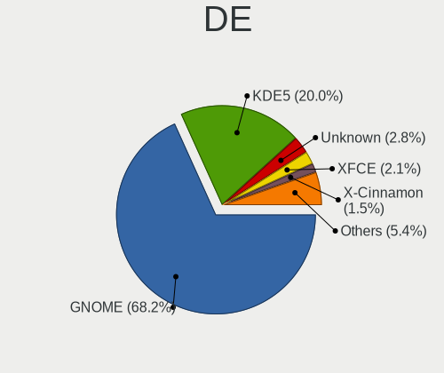
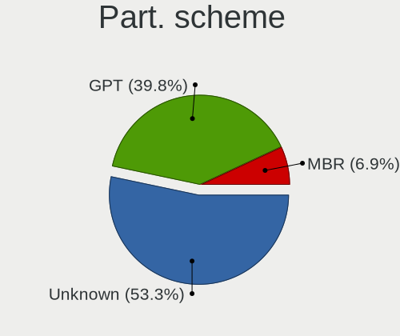
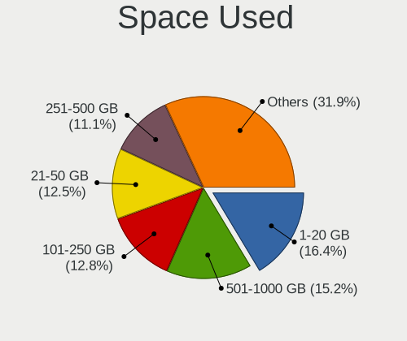
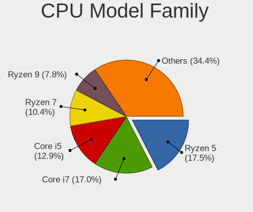
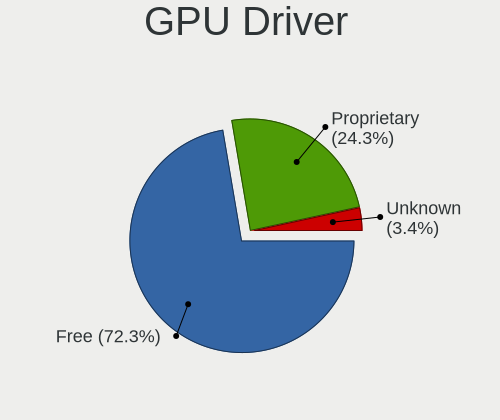
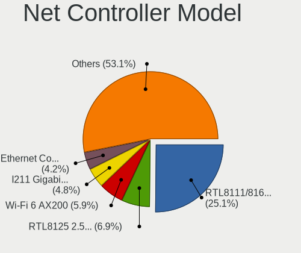
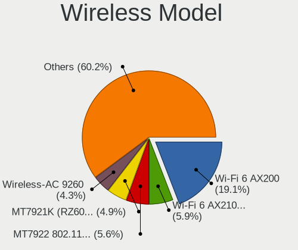
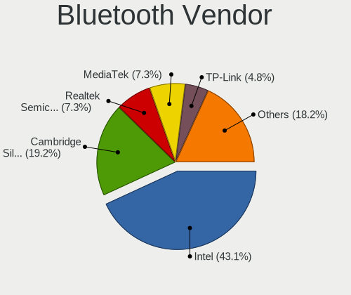

Fedora 37 - Tested Hardware & Statistics (Desktops)
---------------------------------------------------

A project to collect tested hardware configurations for Fedora 37.

Anyone can contribute to this report by the [hw-probe](https://github.com/linuxhw/hw-probe) tool:

    sudo -E hw-probe -all -upload

Please contribute! Especially if your hardware is rare.

Contents
--------

* [ Test Cases ](#test-cases)

* [ System ](#system)
  - [ Kernel                   ](#kernel)
  - [ Kernel Family            ](#kernel-family)
  - [ Kernel Major Ver.        ](#kernel-major-ver)
  - [ Arch                     ](#arch)
  - [ DE                       ](#de)
  - [ Display Server           ](#display-server)
  - [ Display Manager          ](#display-manager)
  - [ OS Lang                  ](#os-lang)
  - [ Boot Mode                ](#boot-mode)
  - [ Filesystem               ](#filesystem)
  - [ Part. scheme             ](#part-scheme)
  - [ Dual Boot with Linux/BSD ](#dual-boot-with-linuxbsd)
  - [ Dual Boot (Win)          ](#dual-boot-win)

* [ Board ](#board)
  - [ Vendor                   ](#vendor)
  - [ Model                    ](#model)
  - [ Model Family             ](#model-family)
  - [ MFG Year                 ](#mfg-year)
  - [ Form Factor              ](#form-factor)
  - [ Secure Boot              ](#secure-boot)
  - [ Coreboot                 ](#coreboot)
  - [ RAM Size                 ](#ram-size)
  - [ RAM Used                 ](#ram-used)
  - [ Total Drives             ](#total-drives)
  - [ Has CD-ROM               ](#has-cd-rom)
  - [ Has Ethernet             ](#has-ethernet)
  - [ Has WiFi                 ](#has-wifi)
  - [ Has Bluetooth            ](#has-bluetooth)

* [ Location ](#location)
  - [ Country                  ](#country)
  - [ City                     ](#city)

* [ Drives ](#drives)
  - [ Drive Vendor             ](#drive-vendor)
  - [ Drive Model              ](#drive-model)
  - [ HDD Vendor               ](#hdd-vendor)
  - [ SSD Vendor               ](#ssd-vendor)
  - [ Drive Kind               ](#drive-kind)
  - [ Drive Connector          ](#drive-connector)
  - [ Drive Size               ](#drive-size)
  - [ Space Total              ](#space-total)
  - [ Space Used               ](#space-used)
  - [ Malfunc. Drives          ](#malfunc-drives)
  - [ Malfunc. Drive Vendor    ](#malfunc-drive-vendor)
  - [ Malfunc. HDD Vendor      ](#malfunc-hdd-vendor)
  - [ Malfunc. Drive Kind      ](#malfunc-drive-kind)
  - [ Failed Drives            ](#failed-drives)
  - [ Failed Drive Vendor      ](#failed-drive-vendor)
  - [ Drive Status             ](#drive-status)

* [ Storage controller ](#storage-controller)
  - [ Storage Vendor           ](#storage-vendor)
  - [ Storage Model            ](#storage-model)
  - [ Storage Kind             ](#storage-kind)

* [ Processor ](#processor)
  - [ CPU Vendor               ](#cpu-vendor)
  - [ CPU Model                ](#cpu-model)
  - [ CPU Model Family         ](#cpu-model-family)
  - [ CPU Cores                ](#cpu-cores)
  - [ CPU Sockets              ](#cpu-sockets)
  - [ CPU Threads              ](#cpu-threads)
  - [ CPU Op-Modes             ](#cpu-op-modes)
  - [ CPU Microcode            ](#cpu-microcode)
  - [ CPU Microarch            ](#cpu-microarch)

* [ Graphics ](#graphics)
  - [ GPU Vendor               ](#gpu-vendor)
  - [ GPU Model                ](#gpu-model)
  - [ GPU Combo                ](#gpu-combo)
  - [ GPU Driver               ](#gpu-driver)
  - [ GPU Memory               ](#gpu-memory)

* [ Monitor ](#monitor)
  - [ Monitor Vendor           ](#monitor-vendor)
  - [ Monitor Model            ](#monitor-model)
  - [ Monitor Resolution       ](#monitor-resolution)
  - [ Monitor Diagonal         ](#monitor-diagonal)
  - [ Monitor Width            ](#monitor-width)
  - [ Aspect Ratio             ](#aspect-ratio)
  - [ Monitor Area             ](#monitor-area)
  - [ Pixel Density            ](#pixel-density)
  - [ Multiple Monitors        ](#multiple-monitors)

* [ Network ](#network)
  - [ Net Controller Vendor    ](#net-controller-vendor)
  - [ Net Controller Model     ](#net-controller-model)
  - [ Wireless Vendor          ](#wireless-vendor)
  - [ Wireless Model           ](#wireless-model)
  - [ Ethernet Vendor          ](#ethernet-vendor)
  - [ Ethernet Model           ](#ethernet-model)
  - [ Net Controller Kind      ](#net-controller-kind)
  - [ Used Controller          ](#used-controller)
  - [ NICs                     ](#nics)
  - [ IPv6                     ](#ipv6)

* [ Bluetooth ](#bluetooth)
  - [ Bluetooth Vendor         ](#bluetooth-vendor)
  - [ Bluetooth Model          ](#bluetooth-model)

* [ Sound ](#sound)
  - [ Sound Vendor             ](#sound-vendor)
  - [ Sound Model              ](#sound-model)

* [ Memory ](#memory)
  - [ Memory Vendor            ](#memory-vendor)
  - [ Memory Model             ](#memory-model)
  - [ Memory Kind              ](#memory-kind)
  - [ Memory Form Factor       ](#memory-form-factor)
  - [ Memory Size              ](#memory-size)
  - [ Memory Speed             ](#memory-speed)

* [ Printers & scanners ](#printers--scanners)
  - [ Printer Vendor           ](#printer-vendor)
  - [ Printer Model            ](#printer-model)
  - [ Scanner Vendor           ](#scanner-vendor)
  - [ Scanner Model            ](#scanner-model)

* [ Camera ](#camera)
  - [ Camera Vendor            ](#camera-vendor)
  - [ Camera Model             ](#camera-model)

* [ Security ](#security)
  - [ Fingerprint Vendor       ](#fingerprint-vendor)
  - [ Fingerprint Model        ](#fingerprint-model)
  - [ Chipcard Vendor          ](#chipcard-vendor)
  - [ Chipcard Model           ](#chipcard-model)

* [ Unsupported ](#unsupported)
  - [ Unsupported Devices      ](#unsupported-devices)
  - [ Unsupported Device Types ](#unsupported-device-types)

Test Cases
----------

Total: 5

| Vendor  | Model         | Probe                                                      | Date         |
|---------|---------------|------------------------------------------------------------|--------------|
| MSI     | Z370 TOMAHAWK | [251d227686](https://linux-hardware.org/?probe=251d227686) | Aug 22, 2022 |
| Dell    | 08NPPY A00    | [93eb00c3c5](https://linux-hardware.org/?probe=93eb00c3c5) | Jun 16, 2022 |
| ASUSTek | P8Z68-V LX    | [2cd65296c2](https://linux-hardware.org/?probe=2cd65296c2) | May 08, 2022 |
| HP      | 0B54h D       | [7153ec172b](https://linux-hardware.org/?probe=7153ec172b) | Mar 21, 2022 |
| HP      | 0B54h D       | [399cc50503](https://linux-hardware.org/?probe=399cc50503) | Mar 02, 2022 |

System
------

Kernel
------

Version of the Linux kernel

| Version                                                | Desktops | Percent |
|--------------------------------------------------------|----------|---------|
| 5.19.0-65.fc37.x86_64                                  | 1        | 25%     |
| 5.19.0-0.rc1.20220610git874c8ca1e60b.18.fc37.x86_64    | 1        | 25%     |
| 5.18.0-0.rc5.20220505gita7391ad3572431a.43.fc37.x86_64 | 1        | 25%     |
| 5.17.0-0.rc6.109.fc37.x86_64                           | 1        | 25%     |

Kernel Family
-------------

Linux kernel without a distro release

| Version | Desktops | Percent |
|---------|----------|---------|
| 5.19.0  | 2        | 50%     |
| 5.18.0  | 1        | 25%     |
| 5.17.0  | 1        | 25%     |

Kernel Major Ver.
-----------------

Linux kernel major version

| Version | Desktops | Percent |
|---------|----------|---------|
| 5.19    | 2        | 50%     |
| 5.18    | 1        | 25%     |
| 5.17    | 1        | 25%     |

Arch
----

OS architecture (x86_64, i586, etc.)

| Name   | Desktops | Percent |
|--------|----------|---------|
| x86_64 | 4        | 100%    |

DE
--

Desktop Environment

| Name       | Desktops | Percent |
|------------|----------|---------|
| GNOME      | 2        | 50%     |
| XFCE       | 1        | 25%     |
| X-Cinnamon | 1        | 25%     |

Display Server
--------------

X11 or Wayland

| Name | Desktops | Percent |
|------|----------|---------|
| X11  | 4        | 100%    |

Display Manager
---------------

SDDM, LightDM, etc.

| Name    | Desktops | Percent |
|---------|----------|---------|
| Unknown | 3        | 75%     |
| LightDM | 1        | 25%     |

OS Lang
-------

Language

| Lang  | Desktops | Percent |
|-------|----------|---------|
| en_GB | 2        | 50%     |
| nl_NL | 1        | 25%     |
| en_US | 1        | 25%     |

Boot Mode
---------

EFI or BIOS

| Mode | Desktops | Percent |
|------|----------|---------|
| EFI  | 3        | 75%     |
| BIOS | 1        | 25%     |

Filesystem
----------

Type of filesystem

| Type  | Desktops | Percent |
|-------|----------|---------|
| Btrfs | 2        | 50%     |
| Xfs   | 1        | 25%     |
| Ext4  | 1        | 25%     |

Part. scheme
------------

Scheme of partitioning

| Type    | Desktops | Percent |
|---------|----------|---------|
| Unknown | 3        | 75%     |
| GPT     | 1        | 25%     |

Dual Boot with Linux/BSD
------------------------

Hosting more than one Linux/BSD

| Dual boot | Desktops | Percent |
|-----------|----------|---------|
| No        | 4        | 100%    |

Dual Boot (Win)
---------------

Hosting Linux and Windows

| Dual boot | Desktops | Percent |
|-----------|----------|---------|
| No        | 4        | 100%    |

Board
-----

Vendor
------

Motherboard manufacturer

| Name             | Desktops | Percent |
|------------------|----------|---------|
| MSI              | 1        | 25%     |
| Hewlett-Packard  | 1        | 25%     |
| Dell             | 1        | 25%     |
| ASUSTek Computer | 1        | 25%     |

Model
-----

Motherboard model

| Name                | Desktops | Percent |
|---------------------|----------|---------|
| MSI MS-7B47         | 1        | 25%     |
| HP Z600 Workstation | 1        | 25%     |
| Dell OptiPlex 3050  | 1        | 25%     |
| ASUS P8Z68-V LX     | 1        | 25%     |

Model Family
------------

Motherboard model prefix

| Name          | Desktops | Percent |
|---------------|----------|---------|
| MSI MS-7B47   | 1        | 25%     |
| HP Z600       | 1        | 25%     |
| Dell OptiPlex | 1        | 25%     |
| ASUS P8Z68-V  | 1        | 25%     |

MFG Year
--------

Motherboard manufacture year

| Year | Desktops | Percent |
|------|----------|---------|
| 2017 | 2        | 50%     |
| 2011 | 1        | 25%     |
| 2010 | 1        | 25%     |

Form Factor
-----------

Physical design of the computer

| Name    | Desktops | Percent |
|---------|----------|---------|
| Desktop | 4        | 100%    |

Secure Boot
-----------

Enabled or disabled

| State    | Desktops | Percent |
|----------|----------|---------|
| Disabled | 4        | 100%    |

Coreboot
--------

Have coreboot on board

| Used | Desktops | Percent |
|------|----------|---------|
| No   | 4        | 100%    |

RAM Size
--------

Total RAM memory

| Size in GB  | Desktops | Percent |
|-------------|----------|---------|
| 32.01-64.0  | 1        | 25%     |
| 64.01-256.0 | 1        | 25%     |
| 16.01-24.0  | 1        | 25%     |
| 8.01-16.0   | 1        | 25%     |

RAM Used
--------

Used RAM memory

| Used GB   | Desktops | Percent |
|-----------|----------|---------|
| 8.01-16.0 | 2        | 50%     |
| 4.01-8.0  | 1        | 25%     |
| 1.01-2.0  | 1        | 25%     |

Total Drives
------------

Number of drives on board

| Drives | Desktops | Percent |
|--------|----------|---------|
| 4      | 2        | 50%     |
| 3      | 1        | 25%     |
| 1      | 1        | 25%     |

Has CD-ROM
----------

Has CD-ROM on board

| Presented | Desktops | Percent |
|-----------|----------|---------|
| No        | 3        | 75%     |
| Yes       | 1        | 25%     |

Has Ethernet
------------

Has Ethernet on board

| Presented | Desktops | Percent |
|-----------|----------|---------|
| Yes       | 4        | 100%    |

Has WiFi
--------

Has WiFi module

| Presented | Desktops | Percent |
|-----------|----------|---------|
| No        | 3        | 75%     |
| Yes       | 1        | 25%     |

Has Bluetooth
-------------

Has Bluetooth module

| Presented | Desktops | Percent |
|-----------|----------|---------|
| No        | 3        | 75%     |
| Yes       | 1        | 25%     |

Location
--------

Country
-------

Geographic location (country)

| Country      | Desktops | Percent |
|--------------|----------|---------|
| USA          | 1        | 25%     |
| UK           | 1        | 25%     |
| South Africa | 1        | 25%     |
| Netherlands  | 1        | 25%     |

City
----

Geographic location (city)

| City        | Desktops | Percent |
|-------------|----------|---------|
| Zierikzee   | 1        | 25%     |
| San Antonio | 1        | 25%     |
| Centurion   | 1        | 25%     |
| Bristol     | 1        | 25%     |

Drives
------

Drive Vendor
------------

Hard drive vendors

| Vendor              | Desktops | Drives | Percent |
|---------------------|----------|--------|---------|
| WDC                 | 2        | 4      | 33.33%  |
| Seagate             | 2        | 3      | 33.33%  |
| Samsung Electronics | 2        | 5      | 33.33%  |

Drive Model
-----------

Hard drive models

| Model                            | Desktops | Percent |
|----------------------------------|----------|---------|
| WDC WDS500G2B0B-00YS70 500GB SSD | 1        | 11.11%  |
| WDC WD40PURX-64GVNY0 4TB         | 1        | 11.11%  |
| WDC WD40EZRZ-00GXCB0 4TB         | 1        | 11.11%  |
| WDC WD10EVDS-63U8B1 1TB          | 1        | 11.11%  |
| Seagate ST4000DM000-1F2168 4TB   | 1        | 11.11%  |
| Seagate ST2000DM008-2FR102 2TB   | 1        | 11.11%  |
| Samsung SSD 860 PRO 512GB        | 1        | 11.11%  |
| Samsung NVMe SSD Drive 1TB       | 1        | 11.11%  |
| Samsung NVMe SSD Drive 1024GB    | 1        | 11.11%  |

HDD Vendor
----------

Hard disk drive vendors

| Vendor  | Desktops | Drives | Percent |
|---------|----------|--------|---------|
| WDC     | 2        | 3      | 50%     |
| Seagate | 2        | 3      | 50%     |

SSD Vendor
----------

Solid state drive vendors

| Vendor              | Desktops | Drives | Percent |
|---------------------|----------|--------|---------|
| WDC                 | 1        | 1      | 50%     |
| Samsung Electronics | 1        | 2      | 50%     |

Drive Kind
----------

HDD or SSD

| Kind | Desktops | Drives | Percent |
|------|----------|--------|---------|
| HDD  | 3        | 6      | 42.86%  |
| NVMe | 2        | 3      | 28.57%  |
| SSD  | 2        | 3      | 28.57%  |

Drive Connector
---------------

SATA, SAS, NVMe, etc.

| Type | Desktops | Drives | Percent |
|------|----------|--------|---------|
| SATA | 4        | 9      | 66.67%  |
| NVMe | 2        | 3      | 33.33%  |

Drive Size
----------

Size of hard drive

| Size in TB | Desktops | Drives | Percent |
|------------|----------|--------|---------|
| 0.51-1.0   | 2        | 3      | 40%     |
| 3.01-4.0   | 1        | 3      | 20%     |
| 1.01-2.0   | 1        | 2      | 20%     |
| 0.01-0.5   | 1        | 1      | 20%     |

Space Total
-----------

Amount of disk space available on the file system

| Size in GB     | Desktops | Percent |
|----------------|----------|---------|
| 501-1000       | 2        | 50%     |
| More than 3000 | 1        | 25%     |
| 1001-2000      | 1        | 25%     |

Space Used
----------

Amount of used disk space

| Used GB   | Desktops | Percent |
|-----------|----------|---------|
| 251-500   | 1        | 25%     |
| 21-50     | 1        | 25%     |
| 101-250   | 1        | 25%     |
| 1001-2000 | 1        | 25%     |

Malfunc. Drives
---------------

Drive models with a malfunction

Zero info for selected period =(

Malfunc. Drive Vendor
---------------------

Vendors of faulty drives

Zero info for selected period =(

Malfunc. HDD Vendor
-------------------

Vendors of faulty HDD drives

Zero info for selected period =(

Malfunc. Drive Kind
-------------------

Kinds of faulty drives

Zero info for selected period =(

Failed Drives
-------------

Failed drive models

Zero info for selected period =(

Failed Drive Vendor
-------------------

Failed drive vendors

Zero info for selected period =(

Drive Status
------------

Number of failed and malfunc. drives

| Status   | Desktops | Drives | Percent |
|----------|----------|--------|---------|
| Detected | 3        | 11     | 75%     |
| Works    | 1        | 1      | 25%     |

Storage controller
------------------

Storage Vendor
--------------

Storage controller vendors

| Vendor              | Desktops | Percent |
|---------------------|----------|---------|
| Intel               | 4        | 66.67%  |
| Samsung Electronics | 2        | 33.33%  |

Storage Model
-------------

Storage controller models

| Model                                                                         | Desktops | Percent |
|-------------------------------------------------------------------------------|----------|---------|
| Intel SATA Controller [RAID mode]                                             | 2        | 33.33%  |
| Samsung NVMe SSD Controller SM981/PM981/PM983                                 | 1        | 16.67%  |
| Samsung NVMe SSD Controller PM9A1/PM9A3/980PRO                                | 1        | 16.67%  |
| Intel 6 Series/C200 Series Chipset Family 6 port Desktop SATA AHCI Controller | 1        | 16.67%  |
| Intel 200 Series PCH SATA controller [AHCI mode]                              | 1        | 16.67%  |

Storage Kind
------------

Kind of storage controller (IDE, SATA, NVMe, SAS, ...)

| Kind | Desktops | Percent |
|------|----------|---------|
| RAID | 2        | 33.33%  |
| NVMe | 2        | 33.33%  |
| SATA | 2        | 33.33%  |

Processor
---------

CPU Vendor
----------

Processor vendors

| Vendor | Desktops | Percent |
|--------|----------|---------|
| Intel  | 4        | 100%    |

CPU Model
---------

Processor models

| Model                             | Desktops | Percent |
|-----------------------------------|----------|---------|
| Intel Xeon CPU X5675 @ 3.07GHz    | 1        | 25%     |
| Intel Core i7-8700K CPU @ 3.70GHz | 1        | 25%     |
| Intel Core i7-2600K CPU @ 3.40GHz | 1        | 25%     |
| Intel Core i5-7500 CPU @ 3.40GHz  | 1        | 25%     |

CPU Model Family
----------------

Processor model prefix

| Model         | Desktops | Percent |
|---------------|----------|---------|
| Intel Core i7 | 2        | 50%     |
| Intel Xeon    | 1        | 25%     |
| Intel Core i5 | 1        | 25%     |

CPU Cores
---------

Number of processor cores

| Number | Desktops | Percent |
|--------|----------|---------|
| 4      | 2        | 50%     |
| 12     | 1        | 25%     |
| 6      | 1        | 25%     |

CPU Sockets
-----------

Number of sockets

| Number | Desktops | Percent |
|--------|----------|---------|
| 1      | 3        | 75%     |
| 2      | 1        | 25%     |

CPU Threads
-----------

Threads per core (Hyper-Threading)

| Number | Desktops | Percent |
|--------|----------|---------|
| 2      | 3        | 75%     |
| 1      | 1        | 25%     |

CPU Op-Modes
------------

CPU Operation Modes (32-bit, 64-bit)

| Op mode        | Desktops | Percent |
|----------------|----------|---------|
| 32-bit, 64-bit | 4        | 100%    |

CPU Microcode
-------------

Microcode number

| Number  | Desktops | Percent |
|---------|----------|---------|
| 0x906ea | 1        | 25%     |
| 0x906e9 | 1        | 25%     |
| 0x206c2 | 1        | 25%     |
| 0x206a7 | 1        | 25%     |

CPU Microarch
-------------

Microarchitecture

| Name        | Desktops | Percent |
|-------------|----------|---------|
| KabyLake    | 2        | 50%     |
| Westmere    | 1        | 25%     |
| SandyBridge | 1        | 25%     |

Graphics
--------

GPU Vendor
----------

Vendors of graphics cards

| Vendor | Desktops | Percent |
|--------|----------|---------|
| Nvidia | 3        | 60%     |
| Intel  | 2        | 40%     |

GPU Model
---------

Graphics card models

| Model                                     | Desktops | Percent |
|-------------------------------------------|----------|---------|
| Nvidia TU104 [GeForce RTX 2070 SUPER]     | 1        | 20%     |
| Nvidia GP107 [GeForce GTX 1050]           | 1        | 20%     |
| Nvidia GF114 [GeForce GTX 560]            | 1        | 20%     |
| Intel HD Graphics 630                     | 1        | 20%     |
| Intel CoffeeLake-S GT2 [UHD Graphics 630] | 1        | 20%     |

GPU Combo
---------

Combinations of graphics cards

| Name       | Desktops | Percent |
|------------|----------|---------|
| 1 x Nvidia | 3        | 75%     |
| 1 x Intel  | 1        | 25%     |

GPU Driver
----------

Free vs proprietary

| Driver      | Desktops | Percent |
|-------------|----------|---------|
| Proprietary | 2        | 50%     |
| Free        | 2        | 50%     |

GPU Memory
----------

Total video memory

| Size in GB | Desktops | Percent |
|------------|----------|---------|
| 7.01-8.0   | 1        | 25%     |
| 1.01-2.0   | 1        | 25%     |
| 0.51-1.0   | 1        | 25%     |
| Unknown    | 1        | 25%     |

Monitor
-------

Monitor Vendor
--------------

Monitor vendors

| Vendor              | Desktops | Percent |
|---------------------|----------|---------|
| Samsung Electronics | 2        | 33.33%  |
| Dell                | 2        | 33.33%  |
| KTC                 | 1        | 16.67%  |
| Hewlett-Packard     | 1        | 16.67%  |

Monitor Model
-------------

Monitor models

| Model                                                              | Desktops | Percent |
|--------------------------------------------------------------------|----------|---------|
| Samsung Electronics SMBX2450 SAM0722 1920x1080 531x299mm 24.0-inch | 1        | 12.5%   |
| Samsung Electronics SMB2330H SAM064A 1920x1080 509x286mm 23.0-inch | 1        | 12.5%   |
| Samsung Electronics C34H89x SAM0E25 3440x1440 797x333mm 34.0-inch  | 1        | 12.5%   |
| KTC 42 TV KTC4200 1920x1080 983x576mm 44.9-inch                    | 1        | 12.5%   |
| Hewlett-Packard ZR2440w HWP2956 1920x1200 518x324mm 24.1-inch      | 1        | 12.5%   |
| Dell SE2416H DELD082 1920x1080 527x296mm 23.8-inch                 | 1        | 12.5%   |
| Dell AW2518HF DELA101 1920x1080 544x303mm 24.5-inch                | 1        | 12.5%   |
| Dell AW2518H DELA0F6 1920x1080 544x303mm 24.5-inch                 | 1        | 12.5%   |

Monitor Resolution
------------------

Monitor screen resolution

| Resolution      | Desktops | Percent |
|-----------------|----------|---------|
| 1920x1080 (FHD) | 3        | 75%     |
| 3440x1440       | 1        | 25%     |

Monitor Diagonal
----------------

Diagonal size in inches

| Inches | Desktops | Percent |
|--------|----------|---------|
| 24     | 3        | 50%     |
| 44     | 1        | 16.67%  |
| 34     | 1        | 16.67%  |
| 23     | 1        | 16.67%  |

Monitor Width
-------------

Physical width

| Width in mm | Desktops | Percent |
|-------------|----------|---------|
| 501-600     | 3        | 60%     |
| 701-800     | 1        | 20%     |
| 901-1000    | 1        | 20%     |

Aspect Ratio
------------

Proportional relationship between the width and the height

| Ratio | Desktops | Percent |
|-------|----------|---------|
| 16/9  | 2        | 50%     |
| 21/9  | 1        | 25%     |
| 16/10 | 1        | 25%     |

Monitor Area
------------

Area in inch²

| Area in inch² | Desktops | Percent |
|----------------|----------|---------|
| 251-300        | 2        | 40%     |
| 351-500        | 1        | 20%     |
| 201-250        | 1        | 20%     |
| 501-1000       | 1        | 20%     |

Pixel Density
-------------

Pixels per inch

| Density | Desktops | Percent |
|---------|----------|---------|
| 51-100  | 3        | 60%     |
| 1-50    | 1        | 20%     |
| 101-120 | 1        | 20%     |

Multiple Monitors
-----------------

Total monitors connected

| Total | Desktops | Percent |
|-------|----------|---------|
| 2     | 2        | 50%     |
| 4     | 1        | 25%     |
| 1     | 1        | 25%     |

Network
-------

Net Controller Vendor
---------------------

Controller vendors

| Vendor                | Desktops | Percent |
|-----------------------|----------|---------|
| Realtek Semiconductor | 2        | 33.33%  |
| Broadcom              | 2        | 33.33%  |
| NetGear               | 1        | 16.67%  |
| Intel                 | 1        | 16.67%  |

Net Controller Model
--------------------

Controller models

| Model                                                             | Desktops | Percent |
|-------------------------------------------------------------------|----------|---------|
| Realtek RTL8111/8168/8411 PCI Express Gigabit Ethernet Controller | 2        | 33.33%  |
| NetGear WNA3100(v1) Wireless-N 300 [Broadcom BCM43231]            | 1        | 16.67%  |
| Intel Ethernet Connection (2) I219-V                              | 1        | 16.67%  |
| Broadcom NetXtreme II BCM57810 10 Gigabit Ethernet Multi Function | 1        | 16.67%  |
| Broadcom NetXtreme BCM5764M Gigabit Ethernet PCIe                 | 1        | 16.67%  |

Wireless Vendor
---------------

Wireless vendors

| Vendor  | Desktops | Percent |
|---------|----------|---------|
| NetGear | 1        | 100%    |

Wireless Model
--------------

Wireless models

| Model                                                  | Desktops | Percent |
|--------------------------------------------------------|----------|---------|
| NetGear WNA3100(v1) Wireless-N 300 [Broadcom BCM43231] | 1        | 100%    |

Ethernet Vendor
---------------

Ethernet vendors

| Vendor                | Desktops | Percent |
|-----------------------|----------|---------|
| Realtek Semiconductor | 2        | 40%     |
| Broadcom              | 2        | 40%     |
| Intel                 | 1        | 20%     |

Ethernet Model
--------------

Ethernet models

| Model                                                             | Desktops | Percent |
|-------------------------------------------------------------------|----------|---------|
| Realtek RTL8111/8168/8411 PCI Express Gigabit Ethernet Controller | 2        | 40%     |
| Intel Ethernet Connection (2) I219-V                              | 1        | 20%     |
| Broadcom NetXtreme II BCM57810 10 Gigabit Ethernet Multi Function | 1        | 20%     |
| Broadcom NetXtreme BCM5764M Gigabit Ethernet PCIe                 | 1        | 20%     |

Net Controller Kind
-------------------

Ethernet, WiFi or modem

| Kind     | Desktops | Percent |
|----------|----------|---------|
| Ethernet | 4        | 80%     |
| WiFi     | 1        | 20%     |

Used Controller
---------------

Currently used network controller

| Kind     | Desktops | Percent |
|----------|----------|---------|
| Ethernet | 4        | 100%    |

NICs
----

Total network controllers on board

| Total | Desktops | Percent |
|-------|----------|---------|
| 1     | 3        | 75%     |
| 9     | 1        | 25%     |

IPv6
----

IPv6 vs IPv4

| Used | Desktops | Percent |
|------|----------|---------|
| No   | 3        | 75%     |
| Yes  | 1        | 25%     |

Bluetooth
---------

Bluetooth Vendor
----------------

Controller vendors

| Vendor   | Desktops | Percent |
|----------|----------|---------|
| Broadcom | 1        | 100%    |

Bluetooth Model
---------------

Controller models

| Model                             | Desktops | Percent |
|-----------------------------------|----------|---------|
| Broadcom BCM20702A0 Bluetooth 4.0 | 1        | 100%    |

Sound
-----

Sound Vendor
------------

Sound card vendors

| Vendor | Desktops | Percent |
|--------|----------|---------|
| Intel  | 4        | 57.14%  |
| Nvidia | 3        | 42.86%  |

Sound Model
-----------

Sound card models

| Model                                                                      | Desktops | Percent |
|----------------------------------------------------------------------------|----------|---------|
| Intel 200 Series PCH HD Audio                                              | 2        | 28.57%  |
| Nvidia TU104 HD Audio Controller                                           | 1        | 14.29%  |
| Nvidia GP107GL High Definition Audio Controller                            | 1        | 14.29%  |
| Nvidia GF114 HDMI Audio Controller                                         | 1        | 14.29%  |
| Intel 82801JI (ICH10 Family) HD Audio Controller                           | 1        | 14.29%  |
| Intel 6 Series/C200 Series Chipset Family High Definition Audio Controller | 1        | 14.29%  |

Memory
------

Memory Vendor
-------------

Memory module vendors

| Vendor  | Desktops | Percent |
|---------|----------|---------|
| Corsair | 1        | 100%    |

Memory Model
------------

Memory module models

| Model                                               | Desktops | Percent |
|-----------------------------------------------------|----------|---------|
| Corsair RAM CMX8GX3M2A1600C9 4GB DIMM DDR3 1800MT/s | 1        | 100%    |

Memory Kind
-----------

Memory module kinds

| Kind | Desktops | Percent |
|------|----------|---------|
| DDR3 | 1        | 100%    |

Memory Form Factor
------------------

Physical design of the memory module

| Name | Desktops | Percent |
|------|----------|---------|
| DIMM | 1        | 100%    |

Memory Size
-----------

Memory module size

| Size | Desktops | Percent |
|------|----------|---------|
| 4096 | 1        | 100%    |

Memory Speed
------------

Memory module speed

| Speed | Desktops | Percent |
|-------|----------|---------|
| 1800  | 1        | 100%    |

Printers & scanners
-------------------

Printer Vendor
--------------

Printer device vendors

| Vendor      | Desktops | Percent |
|-------------|----------|---------|
| Seiko Epson | 1        | 100%    |

Printer Model
-------------

Printer device models

| Model               | Desktops | Percent |
|---------------------|----------|---------|
| Seiko Epson Printer | 1        | 100%    |

Scanner Vendor
--------------

Scanner device vendors

Zero info for selected period =(

Scanner Model
-------------

Scanner device models

Zero info for selected period =(

Camera
------

Camera Vendor
-------------

Camera device vendors

| Vendor    | Desktops | Percent |
|-----------|----------|---------|
| Microsoft | 1        | 100%    |

Camera Model
------------

Camera device models

| Model                     | Desktops | Percent |
|---------------------------|----------|---------|
| Microsoft LifeCam VX-2000 | 1        | 100%    |

Security
--------

Fingerprint Vendor
------------------

Fingerprint sensor vendors

Zero info for selected period =(

Fingerprint Model
-----------------

Fingerprint sensor models

Zero info for selected period =(

Chipcard Vendor
---------------

Chipcard module vendors

Zero info for selected period =(

Chipcard Model
--------------

Chipcard module models

Zero info for selected period =(

Unsupported
-----------

Unsupported Devices
-------------------

Total unsupported devices on board

| Total | Desktops | Percent |
|-------|----------|---------|
| 0     | 3        | 75%     |
| 1     | 1        | 25%     |

Unsupported Device Types
------------------------

Types of unsupported devices

| Type         | Desktops | Percent |
|--------------|----------|---------|
| Net/wireless | 1        | 100%    |

