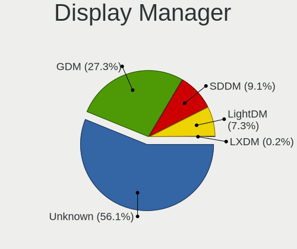
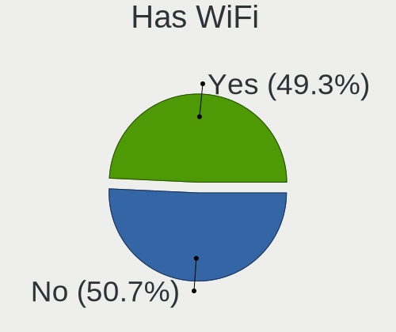
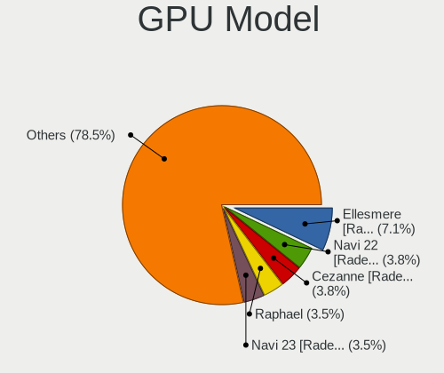
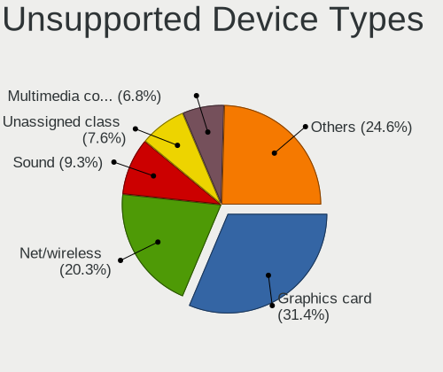

Fedora 37 - Tested Hardware & Statistics (Desktops)
---------------------------------------------------

A project to collect tested hardware configurations for Fedora 37.

Anyone can contribute to this report by the [hw-probe](https://github.com/linuxhw/hw-probe) tool:

    sudo -E hw-probe -all -upload

Please contribute! Especially if your hardware is rare.

Contents
--------

* [ Test Cases ](#test-cases)

* [ System ](#system)
  - [ Kernel                   ](#kernel)
  - [ Kernel Family            ](#kernel-family)
  - [ Kernel Major Ver.        ](#kernel-major-ver)
  - [ Arch                     ](#arch)
  - [ DE                       ](#de)
  - [ Display Server           ](#display-server)
  - [ Display Manager          ](#display-manager)
  - [ OS Lang                  ](#os-lang)
  - [ Boot Mode                ](#boot-mode)
  - [ Filesystem               ](#filesystem)
  - [ Part. scheme             ](#part-scheme)
  - [ Dual Boot with Linux/BSD ](#dual-boot-with-linuxbsd)
  - [ Dual Boot (Win)          ](#dual-boot-win)

* [ Board ](#board)
  - [ Vendor                   ](#vendor)
  - [ Model                    ](#model)
  - [ Model Family             ](#model-family)
  - [ MFG Year                 ](#mfg-year)
  - [ Form Factor              ](#form-factor)
  - [ Secure Boot              ](#secure-boot)
  - [ Coreboot                 ](#coreboot)
  - [ RAM Size                 ](#ram-size)
  - [ RAM Used                 ](#ram-used)
  - [ Total Drives             ](#total-drives)
  - [ Has CD-ROM               ](#has-cd-rom)
  - [ Has Ethernet             ](#has-ethernet)
  - [ Has WiFi                 ](#has-wifi)
  - [ Has Bluetooth            ](#has-bluetooth)

* [ Location ](#location)
  - [ Country                  ](#country)
  - [ City                     ](#city)

* [ Drives ](#drives)
  - [ Drive Vendor             ](#drive-vendor)
  - [ Drive Model              ](#drive-model)
  - [ HDD Vendor               ](#hdd-vendor)
  - [ SSD Vendor               ](#ssd-vendor)
  - [ Drive Kind               ](#drive-kind)
  - [ Drive Connector          ](#drive-connector)
  - [ Drive Size               ](#drive-size)
  - [ Space Total              ](#space-total)
  - [ Space Used               ](#space-used)
  - [ Malfunc. Drives          ](#malfunc-drives)
  - [ Malfunc. Drive Vendor    ](#malfunc-drive-vendor)
  - [ Malfunc. HDD Vendor      ](#malfunc-hdd-vendor)
  - [ Malfunc. Drive Kind      ](#malfunc-drive-kind)
  - [ Failed Drives            ](#failed-drives)
  - [ Failed Drive Vendor      ](#failed-drive-vendor)
  - [ Drive Status             ](#drive-status)

* [ Storage controller ](#storage-controller)
  - [ Storage Vendor           ](#storage-vendor)
  - [ Storage Model            ](#storage-model)
  - [ Storage Kind             ](#storage-kind)

* [ Processor ](#processor)
  - [ CPU Vendor               ](#cpu-vendor)
  - [ CPU Model                ](#cpu-model)
  - [ CPU Model Family         ](#cpu-model-family)
  - [ CPU Cores                ](#cpu-cores)
  - [ CPU Sockets              ](#cpu-sockets)
  - [ CPU Threads              ](#cpu-threads)
  - [ CPU Op-Modes             ](#cpu-op-modes)
  - [ CPU Microcode            ](#cpu-microcode)
  - [ CPU Microarch            ](#cpu-microarch)

* [ Graphics ](#graphics)
  - [ GPU Vendor               ](#gpu-vendor)
  - [ GPU Model                ](#gpu-model)
  - [ GPU Combo                ](#gpu-combo)
  - [ GPU Driver               ](#gpu-driver)
  - [ GPU Memory               ](#gpu-memory)

* [ Monitor ](#monitor)
  - [ Monitor Vendor           ](#monitor-vendor)
  - [ Monitor Model            ](#monitor-model)
  - [ Monitor Resolution       ](#monitor-resolution)
  - [ Monitor Diagonal         ](#monitor-diagonal)
  - [ Monitor Width            ](#monitor-width)
  - [ Aspect Ratio             ](#aspect-ratio)
  - [ Monitor Area             ](#monitor-area)
  - [ Pixel Density            ](#pixel-density)
  - [ Multiple Monitors        ](#multiple-monitors)

* [ Network ](#network)
  - [ Net Controller Vendor    ](#net-controller-vendor)
  - [ Net Controller Model     ](#net-controller-model)
  - [ Wireless Vendor          ](#wireless-vendor)
  - [ Wireless Model           ](#wireless-model)
  - [ Ethernet Vendor          ](#ethernet-vendor)
  - [ Ethernet Model           ](#ethernet-model)
  - [ Net Controller Kind      ](#net-controller-kind)
  - [ Used Controller          ](#used-controller)
  - [ NICs                     ](#nics)
  - [ IPv6                     ](#ipv6)

* [ Bluetooth ](#bluetooth)
  - [ Bluetooth Vendor         ](#bluetooth-vendor)
  - [ Bluetooth Model          ](#bluetooth-model)

* [ Sound ](#sound)
  - [ Sound Vendor             ](#sound-vendor)
  - [ Sound Model              ](#sound-model)

* [ Memory ](#memory)
  - [ Memory Vendor            ](#memory-vendor)
  - [ Memory Model             ](#memory-model)
  - [ Memory Kind              ](#memory-kind)
  - [ Memory Form Factor       ](#memory-form-factor)
  - [ Memory Size              ](#memory-size)
  - [ Memory Speed             ](#memory-speed)

* [ Printers & scanners ](#printers--scanners)
  - [ Printer Vendor           ](#printer-vendor)
  - [ Printer Model            ](#printer-model)
  - [ Scanner Vendor           ](#scanner-vendor)
  - [ Scanner Model            ](#scanner-model)

* [ Camera ](#camera)
  - [ Camera Vendor            ](#camera-vendor)
  - [ Camera Model             ](#camera-model)

* [ Security ](#security)
  - [ Fingerprint Vendor       ](#fingerprint-vendor)
  - [ Fingerprint Model        ](#fingerprint-model)
  - [ Chipcard Vendor          ](#chipcard-vendor)
  - [ Chipcard Model           ](#chipcard-model)

* [ Unsupported ](#unsupported)
  - [ Unsupported Devices      ](#unsupported-devices)
  - [ Unsupported Device Types ](#unsupported-device-types)

Test Cases
----------

Total: 153

| Vendor   | Model                       | Probe                                                      | Date         |
|----------|-----------------------------|------------------------------------------------------------|--------------|
| HP       | 0A98h                       | [f2b620c220](https://linux-hardware.org/?probe=f2b620c220) | Dec 01, 2022 |
| ASUSTek  | PRIME Z690-P WIFI D4        | [42932dd5fd](https://linux-hardware.org/?probe=42932dd5fd) | Dec 01, 2022 |
| ASUSTek  | PRIME X370-PRO              | [aa87dfdc13](https://linux-hardware.org/?probe=aa87dfdc13) | Dec 01, 2022 |
| ASUSTek  | PRIME B450M-GAMING/BR       | [8a4813eec4](https://linux-hardware.org/?probe=8a4813eec4) | Nov 30, 2022 |
| ASUSTek  | ROG STRIX B550-F GAMING     | [80b8b349f8](https://linux-hardware.org/?probe=80b8b349f8) | Nov 30, 2022 |
| Gigabyte | X570 GAMING X               | [7ea2de1a3b](https://linux-hardware.org/?probe=7ea2de1a3b) | Nov 30, 2022 |
| GALAX    | B365M G10b                  | [9eabacd766](https://linux-hardware.org/?probe=9eabacd766) | Nov 30, 2022 |
| ASUSTek  | TUF Gaming Z690-PLUS D4     | [da83c13da3](https://linux-hardware.org/?probe=da83c13da3) | Nov 30, 2022 |
| GALAX    | B365M G10b                  | [9f7438d5a3](https://linux-hardware.org/?probe=9f7438d5a3) | Nov 30, 2022 |
| ASUSTek  | TUF Gaming Z690-PLUS D4     | [459c2ba743](https://linux-hardware.org/?probe=459c2ba743) | Nov 30, 2022 |
| ASUSTek  | SABERTOOTH Z97 MARK S       | [2c5c1d6071](https://linux-hardware.org/?probe=2c5c1d6071) | Nov 30, 2022 |
| HP       | 3048h                       | [6f5a8d1a09](https://linux-hardware.org/?probe=6f5a8d1a09) | Nov 29, 2022 |
| ASUSTek  | ProArt X670E-CREATOR WIF... | [6d835027fa](https://linux-hardware.org/?probe=6d835027fa) | Nov 29, 2022 |
| MSI      | X570-A PRO                  | [92ddd925db](https://linux-hardware.org/?probe=92ddd925db) | Nov 28, 2022 |
| ASUSTek  | GA15DH                      | [a789d492a4](https://linux-hardware.org/?probe=a789d492a4) | Nov 28, 2022 |
| MSI      | Z77A-G43                    | [207d763813](https://linux-hardware.org/?probe=207d763813) | Nov 28, 2022 |
| MSI      | X470 GAMING PRO CARBON      | [81a61c4765](https://linux-hardware.org/?probe=81a61c4765) | Nov 27, 2022 |
| MSI      | B450 TOMAHAWK MAX           | [521f5c20a9](https://linux-hardware.org/?probe=521f5c20a9) | Nov 26, 2022 |
| Gigabyte | TRX40 AORUS MASTER          | [0e35d31780](https://linux-hardware.org/?probe=0e35d31780) | Nov 26, 2022 |
| Gigabyte | B550 GAMING X               | [b9264b2557](https://linux-hardware.org/?probe=b9264b2557) | Nov 26, 2022 |
| ASUSTek  | PRIME X370-PRO              | [5b0f04d592](https://linux-hardware.org/?probe=5b0f04d592) | Nov 25, 2022 |
| MSI      | MPG Z690 EDGE WIFI DDR4     | [33f5823764](https://linux-hardware.org/?probe=33f5823764) | Nov 25, 2022 |
| ASUSTek  | PRIME B360M-D               | [67a7943b8d](https://linux-hardware.org/?probe=67a7943b8d) | Nov 25, 2022 |
| MSI      | B450 TOMAHAWK MAX           | [6f867d822a](https://linux-hardware.org/?probe=6f867d822a) | Nov 25, 2022 |
| Gigabyte | B450 AORUS PRO WIFI-CF      | [bf1722d4d6](https://linux-hardware.org/?probe=bf1722d4d6) | Nov 25, 2022 |
| ASUSTek  | PRIME B550-PLUS             | [d6fe192013](https://linux-hardware.org/?probe=d6fe192013) | Nov 24, 2022 |
| Dell     | 0MN1TX A01                  | [7f0ba24aad](https://linux-hardware.org/?probe=7f0ba24aad) | Nov 24, 2022 |
| ASUSTek  | GA15DH                      | [ec6d666a16](https://linux-hardware.org/?probe=ec6d666a16) | Nov 24, 2022 |
| ASRock   | B75 Pro3                    | [e359d0bd70](https://linux-hardware.org/?probe=e359d0bd70) | Nov 24, 2022 |
| ASUSTek  | PRIME X370-PRO              | [ee5b760222](https://linux-hardware.org/?probe=ee5b760222) | Nov 24, 2022 |
| Dell     | 0MN1TX A01                  | [8de6a24029](https://linux-hardware.org/?probe=8de6a24029) | Nov 24, 2022 |
| Dell     | 0J3C2F A02                  | [0cfd78c6bb](https://linux-hardware.org/?probe=0cfd78c6bb) | Nov 23, 2022 |
| ASUSTek  | PRIME B550-PLUS             | [b0e5869f2d](https://linux-hardware.org/?probe=b0e5869f2d) | Nov 23, 2022 |
| Gigabyte | GA-78LMT-USB3 SEx           | [99fc338b3e](https://linux-hardware.org/?probe=99fc338b3e) | Nov 23, 2022 |
| Lenovo   | 30BE SDK0J40697 WIN 3305... | [1deb081598](https://linux-hardware.org/?probe=1deb081598) | Nov 23, 2022 |
| ASUSTek  | PRIME B450M-A II            | [e89ecf8da4](https://linux-hardware.org/?probe=e89ecf8da4) | Nov 23, 2022 |
| MSI      | 2A9C                        | [ee8683a595](https://linux-hardware.org/?probe=ee8683a595) | Nov 23, 2022 |
| Gigabyte | B550 AORUS ELITE AX V2      | [7dd9d3bec3](https://linux-hardware.org/?probe=7dd9d3bec3) | Nov 23, 2022 |
| MSI      | 2A9C                        | [77dd7e3fbc](https://linux-hardware.org/?probe=77dd7e3fbc) | Nov 23, 2022 |
| ASUSTek  | ROG STRIX B450-F GAMING ... | [bd9c6238bc](https://linux-hardware.org/?probe=bd9c6238bc) | Nov 23, 2022 |
| ASUSTek  | TUF Gaming X570-PLUS        | [393b7f7d3a](https://linux-hardware.org/?probe=393b7f7d3a) | Nov 23, 2022 |
| Gigabyte | Z87-HD3                     | [00faab62d7](https://linux-hardware.org/?probe=00faab62d7) | Nov 22, 2022 |
| ASUSTek  | Maximus IX HERO             | [587aa317bd](https://linux-hardware.org/?probe=587aa317bd) | Nov 22, 2022 |
| MSI      | 990FXA-GD65                 | [8e134485ce](https://linux-hardware.org/?probe=8e134485ce) | Nov 22, 2022 |
| ASUSTek  | P6T DELUXE V2               | [d126214b62](https://linux-hardware.org/?probe=d126214b62) | Nov 22, 2022 |
| HP       | 3647h                       | [8f77a73e9b](https://linux-hardware.org/?probe=8f77a73e9b) | Nov 21, 2022 |
| ASUSTek  | ROG STRIX X570-E GAMING     | [f13d80cf0b](https://linux-hardware.org/?probe=f13d80cf0b) | Nov 21, 2022 |
| Gigabyte | Z370 AORUS Ultra Gaming-... | [34e6521bc8](https://linux-hardware.org/?probe=34e6521bc8) | Nov 21, 2022 |
| ASUSTek  | PRIME Z270-A                | [540d321764](https://linux-hardware.org/?probe=540d321764) | Nov 21, 2022 |
| Fujitsu  | D3220-A1 S26361-D3220-A1    | [34f72bd414](https://linux-hardware.org/?probe=34f72bd414) | Nov 20, 2022 |
| Gigabyte | H310M S2H x.x               | [97ea29ed26](https://linux-hardware.org/?probe=97ea29ed26) | Nov 20, 2022 |
| Dell     | 0HY9JP A02                  | [fa0e9792f0](https://linux-hardware.org/?probe=fa0e9792f0) | Nov 20, 2022 |
| MSI      | 990FXA-GD65                 | [d41acd5075](https://linux-hardware.org/?probe=d41acd5075) | Nov 20, 2022 |
| ASUSTek  | ROG STRIX X670E-F GAMING... | [a28ef28876](https://linux-hardware.org/?probe=a28ef28876) | Nov 20, 2022 |
| ASRock   | B450M Steel Legend          | [0735dabc9b](https://linux-hardware.org/?probe=0735dabc9b) | Nov 20, 2022 |
| MSI      | B450 TOMAHAWK               | [8c271e833d](https://linux-hardware.org/?probe=8c271e833d) | Nov 20, 2022 |
| ASRock   | B450 Pro4                   | [cd0f63540b](https://linux-hardware.org/?probe=cd0f63540b) | Nov 19, 2022 |
| ASUSTek  | ROG STRIX B660-F GAMING ... | [ecceccb3b7](https://linux-hardware.org/?probe=ecceccb3b7) | Nov 19, 2022 |
| Gigabyte | A320M-S2H-CF                | [d304f26226](https://linux-hardware.org/?probe=d304f26226) | Nov 19, 2022 |
| MSI      | B450 TOMAHAWK MAX II        | [050e6cfd68](https://linux-hardware.org/?probe=050e6cfd68) | Nov 19, 2022 |
| ASUSTek  | Z97-P                       | [75748e49d9](https://linux-hardware.org/?probe=75748e49d9) | Nov 19, 2022 |
| Gigabyte | M720-US3                    | [299b2cd745](https://linux-hardware.org/?probe=299b2cd745) | Nov 18, 2022 |
| Acer     | FMP55                       | [f35d63ca8b](https://linux-hardware.org/?probe=f35d63ca8b) | Nov 18, 2022 |
| ASRock   | X300-ITX                    | [54f7198f58](https://linux-hardware.org/?probe=54f7198f58) | Nov 18, 2022 |
| ASRock   | X670E Pro RS                | [bfccdbd536](https://linux-hardware.org/?probe=bfccdbd536) | Nov 17, 2022 |
| ASUSTek  | H81M-R                      | [cd129bebe1](https://linux-hardware.org/?probe=cd129bebe1) | Nov 17, 2022 |
| MSI      | B450M PRO-VDH MAX           | [9f45de6ee3](https://linux-hardware.org/?probe=9f45de6ee3) | Nov 17, 2022 |
| MSI      | B450M PRO-VDH MAX           | [cdf4d49427](https://linux-hardware.org/?probe=cdf4d49427) | Nov 16, 2022 |
| Intel    | DX79SR AAG57199-200         | [b12b9ec8d5](https://linux-hardware.org/?probe=b12b9ec8d5) | Nov 16, 2022 |
| ASUSTek  | P8Z77-V PRO                 | [7bf6427590](https://linux-hardware.org/?probe=7bf6427590) | Nov 14, 2022 |
| Huanan   | X99-F8                      | [503cf4b0ea](https://linux-hardware.org/?probe=503cf4b0ea) | Nov 14, 2022 |
| ASUSTek  | PRIME X370-PRO              | [c1044ebf60](https://linux-hardware.org/?probe=c1044ebf60) | Nov 13, 2022 |
| Lenovo   | ThinkCentre A70z 0401G6M    | [a84e5c2107](https://linux-hardware.org/?probe=a84e5c2107) | Nov 13, 2022 |
| ASUSTek  | PRIME A320M-E               | [2eacb090ee](https://linux-hardware.org/?probe=2eacb090ee) | Nov 12, 2022 |
| ASUSTek  | PRIME A320M-E               | [a35ca3673b](https://linux-hardware.org/?probe=a35ca3673b) | Nov 12, 2022 |
| MSI      | Z390-A PRO                  | [e851ddd11a](https://linux-hardware.org/?probe=e851ddd11a) | Nov 10, 2022 |
| ASRock   | H310M-STX                   | [cb421b22a5](https://linux-hardware.org/?probe=cb421b22a5) | Nov 09, 2022 |
| Lenovo   | ThinkCentre A70z 0401G6M    | [f2afc66464](https://linux-hardware.org/?probe=f2afc66464) | Nov 09, 2022 |
| Gigabyte | B85M-D3V-A                  | [f236aa0a8b](https://linux-hardware.org/?probe=f236aa0a8b) | Nov 08, 2022 |
| Dell     | 09WH54 A00                  | [c7723a2b2f](https://linux-hardware.org/?probe=c7723a2b2f) | Nov 07, 2022 |
| Gigabyte | X670 GAMING X AX            | [1a96ebec7a](https://linux-hardware.org/?probe=1a96ebec7a) | Nov 07, 2022 |
| Gigabyte | A320M-H-CF                  | [fa33ccff27](https://linux-hardware.org/?probe=fa33ccff27) | Nov 05, 2022 |
| MSI      | B350 GAMING PRO CARBON      | [16b0128664](https://linux-hardware.org/?probe=16b0128664) | Nov 05, 2022 |
| MSI      | MAG X570 TOMAHAWK WIFI      | [02104ae91b](https://linux-hardware.org/?probe=02104ae91b) | Nov 05, 2022 |
| ASRock   | X570 Taichi                 | [d9902c03cb](https://linux-hardware.org/?probe=d9902c03cb) | Nov 05, 2022 |
| MSI      | MAG X570 TOMAHAWK WIFI      | [aa9fe4c05c](https://linux-hardware.org/?probe=aa9fe4c05c) | Nov 05, 2022 |
| Lenovo   | 3132 SDK0J40697 WIN 3305... | [108df7bc6d](https://linux-hardware.org/?probe=108df7bc6d) | Nov 05, 2022 |
| Lenovo   | 3132 SDK0J40697 WIN 3305... | [a2c8fe2afa](https://linux-hardware.org/?probe=a2c8fe2afa) | Nov 05, 2022 |
| MSI      | Z390-A PRO                  | [5cfd4967b0](https://linux-hardware.org/?probe=5cfd4967b0) | Nov 05, 2022 |
| MSI      | MAG X570 TOMAHAWK WIFI      | [2c3ddc79ce](https://linux-hardware.org/?probe=2c3ddc79ce) | Nov 04, 2022 |
| HP       | 8459                        | [378537c13c](https://linux-hardware.org/?probe=378537c13c) | Nov 04, 2022 |
| ASUSTek  | PRIME Z370-P II             | [1866954ec7](https://linux-hardware.org/?probe=1866954ec7) | Nov 04, 2022 |
| ASUSTek  | B150 PRO GAMING             | [b2229c56c4](https://linux-hardware.org/?probe=b2229c56c4) | Nov 01, 2022 |
| Gigabyte | B85M-D3V-A                  | [4b5140c9f3](https://linux-hardware.org/?probe=4b5140c9f3) | Oct 31, 2022 |
| ASUSTek  | PRIME B550-PLUS             | [4820bca604](https://linux-hardware.org/?probe=4820bca604) | Oct 30, 2022 |
| ASUSTek  | PRIME B550-PLUS             | [cdca8a4d95](https://linux-hardware.org/?probe=cdca8a4d95) | Oct 30, 2022 |
| ASUSTek  | TUF Gaming B450M-PLUS II    | [8e2ab3d61b](https://linux-hardware.org/?probe=8e2ab3d61b) | Oct 30, 2022 |
| MSI      | Z170A GAMING PRO CARBON     | [d0814afd39](https://linux-hardware.org/?probe=d0814afd39) | Oct 29, 2022 |
| Gigabyte | B450M DS3H V2               | [ba5da6b270](https://linux-hardware.org/?probe=ba5da6b270) | Oct 29, 2022 |
| MSI      | B450M MORTAR                | [44e8a164d1](https://linux-hardware.org/?probe=44e8a164d1) | Oct 27, 2022 |
| MSI      | X299 SLI PLUS               | [4b79f3c1e6](https://linux-hardware.org/?probe=4b79f3c1e6) | Oct 26, 2022 |
| ASUSTek  | ROG STRIX X670E-F GAMING... | [fbd1924bea](https://linux-hardware.org/?probe=fbd1924bea) | Oct 25, 2022 |
| Gigabyte | B85M-D3V-A                  | [055062356e](https://linux-hardware.org/?probe=055062356e) | Oct 25, 2022 |
| ASUSTek  | PRIME B550-PLUS             | [db4db1b508](https://linux-hardware.org/?probe=db4db1b508) | Oct 25, 2022 |
| ASUSTek  | PRIME Z390-P                | [261e670072](https://linux-hardware.org/?probe=261e670072) | Oct 24, 2022 |
| HP       | 2B05                        | [c059b9a786](https://linux-hardware.org/?probe=c059b9a786) | Oct 24, 2022 |
| ASUSTek  | PRIME B550-PLUS             | [7f855c9b05](https://linux-hardware.org/?probe=7f855c9b05) | Oct 22, 2022 |
| ASUSTek  | TUF Gaming Z490-PLUS        | [77b57dbe12](https://linux-hardware.org/?probe=77b57dbe12) | Oct 21, 2022 |
| ASUSTek  | TUF Gaming Z490-PLUS        | [13f4800fa8](https://linux-hardware.org/?probe=13f4800fa8) | Oct 20, 2022 |
| Gigabyte | 970A-DS3P FX                | [e0c8c2fe15](https://linux-hardware.org/?probe=e0c8c2fe15) | Oct 18, 2022 |
| ASUSTek  | ROG STRIX X670E-F GAMING... | [6941ece1e9](https://linux-hardware.org/?probe=6941ece1e9) | Oct 18, 2022 |
| Dell     | 0WR7PY A02                  | [8c1b258565](https://linux-hardware.org/?probe=8c1b258565) | Oct 16, 2022 |
| MSI      | A320M PRO-VH PLUS           | [c3c46266d1](https://linux-hardware.org/?probe=c3c46266d1) | Oct 16, 2022 |
| Gigabyte | H610M H DDR4                | [985b192440](https://linux-hardware.org/?probe=985b192440) | Oct 15, 2022 |
| MSI      | MAG B550 TOMAHAWK           | [4e66c25e04](https://linux-hardware.org/?probe=4e66c25e04) | Oct 15, 2022 |
| MSI      | MEG Z390 GODLIKE            | [3c5f4ad9a5](https://linux-hardware.org/?probe=3c5f4ad9a5) | Oct 15, 2022 |
| Gigabyte | H610M H DDR4                | [05fa96288f](https://linux-hardware.org/?probe=05fa96288f) | Oct 15, 2022 |
| MSI      | MEG Z390 GODLIKE            | [6381ab6a1b](https://linux-hardware.org/?probe=6381ab6a1b) | Oct 14, 2022 |
| ASUSTek  | PRIME B660M-A D4            | [f1fcb66794](https://linux-hardware.org/?probe=f1fcb66794) | Oct 12, 2022 |
| MSI      | B450M-A PRO MAX             | [a993db557b](https://linux-hardware.org/?probe=a993db557b) | Oct 11, 2022 |
| Gigabyte | Z170-D3H-CF                 | [14b0f43bd5](https://linux-hardware.org/?probe=14b0f43bd5) | Oct 11, 2022 |
| MSI      | B550M PRO-VDH               | [c4e09cdf87](https://linux-hardware.org/?probe=c4e09cdf87) | Oct 09, 2022 |
| Gigabyte | GA-990FXA-UD3               | [dc262edc58](https://linux-hardware.org/?probe=dc262edc58) | Oct 09, 2022 |
| Dell     | 0RY007                      | [745f69ec3d](https://linux-hardware.org/?probe=745f69ec3d) | Oct 08, 2022 |
| Gigabyte | B85M-D3V-A                  | [99df624686](https://linux-hardware.org/?probe=99df624686) | Oct 03, 2022 |
| Gigabyte | B550M DS3H                  | [2f8557640c](https://linux-hardware.org/?probe=2f8557640c) | Oct 02, 2022 |
| ASUSTek  | PRIME Z270-A                | [4118e245a3](https://linux-hardware.org/?probe=4118e245a3) | Sep 29, 2022 |
| Intel    | DP35DP AAD81073-208         | [031ff09179](https://linux-hardware.org/?probe=031ff09179) | Sep 27, 2022 |
| Gigabyte | Z170-D3H-CF                 | [254a78c371](https://linux-hardware.org/?probe=254a78c371) | Sep 26, 2022 |
| Acer     | Aspire X1900                | [c7b768051b](https://linux-hardware.org/?probe=c7b768051b) | Sep 25, 2022 |
| ASRock   | FM2A88X Extreme4+           | [2d44b203f9](https://linux-hardware.org/?probe=2d44b203f9) | Sep 25, 2022 |
| ASUSTek  | TUF Gaming X570-PLUS        | [ee8183722c](https://linux-hardware.org/?probe=ee8183722c) | Sep 24, 2022 |
| ASUSTek  | TUF Gaming X570-PLUS        | [ac59b4138c](https://linux-hardware.org/?probe=ac59b4138c) | Sep 23, 2022 |
| ASUSTek  | Pro WS WRX80E-SAGE SE WI... | [54d3096bb6](https://linux-hardware.org/?probe=54d3096bb6) | Sep 21, 2022 |
| Gigabyte | X570 I AORUS PRO WIFI       | [1869422fde](https://linux-hardware.org/?probe=1869422fde) | Sep 20, 2022 |
| ASUSTek  | Z170-A                      | [aad09d3281](https://linux-hardware.org/?probe=aad09d3281) | Sep 20, 2022 |
| ASUSTek  | PRIME X470-PRO              | [a6857e4b03](https://linux-hardware.org/?probe=a6857e4b03) | Sep 19, 2022 |
| Gigabyte | X570 AORUS MASTER           | [424e3ded44](https://linux-hardware.org/?probe=424e3ded44) | Sep 19, 2022 |
| HP       | 2B05                        | [18db320ef7](https://linux-hardware.org/?probe=18db320ef7) | Sep 19, 2022 |
| Gigabyte | B85M-D3V-A                  | [8f6b96ba44](https://linux-hardware.org/?probe=8f6b96ba44) | Sep 19, 2022 |
| ASUSTek  | ProArt Z690-CREATOR WIFI    | [48479f01c1](https://linux-hardware.org/?probe=48479f01c1) | Sep 19, 2022 |
| ASUSTek  | TUF Gaming B550M-PLUS       | [8468466b2a](https://linux-hardware.org/?probe=8468466b2a) | Sep 19, 2022 |
| HP       | 3397                        | [637a5570cf](https://linux-hardware.org/?probe=637a5570cf) | Sep 16, 2022 |
| Gigabyte | AB350N-Gaming WIFI-CF       | [dcaf7e8bd0](https://linux-hardware.org/?probe=dcaf7e8bd0) | Sep 15, 2022 |
| Gigabyte | B85M-D3V-A                  | [a856637b19](https://linux-hardware.org/?probe=a856637b19) | Sep 15, 2022 |
| ASUSTek  | PRIME Z270-A                | [2642647feb](https://linux-hardware.org/?probe=2642647feb) | Sep 14, 2022 |
| ASUSTek  | TUF Gaming B550M-PLUS       | [3557099732](https://linux-hardware.org/?probe=3557099732) | Sep 14, 2022 |
| HP       | 1998                        | [bf93a500f4](https://linux-hardware.org/?probe=bf93a500f4) | Sep 14, 2022 |
| MSI      | Z370 TOMAHAWK               | [251d227686](https://linux-hardware.org/?probe=251d227686) | Aug 22, 2022 |
| Dell     | 08NPPY A00                  | [93eb00c3c5](https://linux-hardware.org/?probe=93eb00c3c5) | Jun 16, 2022 |
| ASUSTek  | P8Z68-V LX                  | [2cd65296c2](https://linux-hardware.org/?probe=2cd65296c2) | May 08, 2022 |
| HP       | 0B54h D                     | [7153ec172b](https://linux-hardware.org/?probe=7153ec172b) | Mar 21, 2022 |
| HP       | 0B54h D                     | [399cc50503](https://linux-hardware.org/?probe=399cc50503) | Mar 02, 2022 |

System
------

Kernel
------

Version of the Linux kernel

| Version                                                | Desktops | Percent |
|--------------------------------------------------------|----------|---------|
| 6.0.9-300.fc37.x86_64                                  | 26       | 20.8%   |
| 6.0.8-300.fc37.x86_64                                  | 26       | 20.8%   |
| 5.19.16-301.fc37.x86_64                                | 12       | 9.6%    |
| 6.0.7-301.fc37.x86_64                                  | 10       | 8%      |
| 5.19.9-300.fc37.x86_64                                 | 8        | 6.4%    |
| 5.19.13-300.fc37.x86_64                                | 8        | 6.4%    |
| 5.19.7-300.fc37.x86_64                                 | 4        | 3.2%    |
| 6.0.5-300.fc37.x86_64                                  | 3        | 2.4%    |
| 6.0.10-300.fc37.x86_64                                 | 3        | 2.4%    |
| 5.19.8-300.fc37.x86_64                                 | 3        | 2.4%    |
| 6.0.6-300.fc37.x86_64                                  | 2        | 1.6%    |
| 5.19.16-300.fc37.x86_64                                | 2        | 1.6%    |
| 5.19.12-300.fc37.x86_64                                | 2        | 1.6%    |
| 6.1.0-0.rc0.20221014git9c9155a3509a.11.fc38.x86_64     | 1        | 0.8%    |
| 6.0.3-300.fc37.x86_64                                  | 1        | 0.8%    |
| 6.0.2-301.fc37.x86_64                                  | 1        | 0.8%    |
| 6.0.0-0.rc6.20220922gitdc164f4fb00a.43.fc38.x86_64     | 1        | 0.8%    |
| 5.8.15-301.fc33.x86_64                                 | 1        | 0.8%    |
| 5.19.8-501.chinfo.fc37.x86_64                          | 1        | 0.8%    |
| 5.19.16-602.inttf.fc37.x86_64                          | 1        | 0.8%    |
| 5.19.15-301.fc37.x86_64                                | 1        | 0.8%    |
| 5.19.14-602.inttf.fc37.x86_64                          | 1        | 0.8%    |
| 5.19.14-300.fc37.x86_64                                | 1        | 0.8%    |
| 5.19.10-602.inttf.fc37.x86_64                          | 1        | 0.8%    |
| 5.19.10-300.fc37.x86_64                                | 1        | 0.8%    |
| 5.19.0-65.fc37.x86_64                                  | 1        | 0.8%    |
| 5.19.0-0.rc1.20220610git874c8ca1e60b.18.fc37.x86_64    | 1        | 0.8%    |
| 5.18.0-0.rc5.20220505gita7391ad3572431a.43.fc37.x86_64 | 1        | 0.8%    |
| 5.17.0-0.rc6.109.fc37.x86_64                           | 1        | 0.8%    |

Kernel Family
-------------

Linux kernel without a distro release

| Version | Desktops | Percent |
|---------|----------|---------|
| 6.0.9   | 26       | 20.8%   |
| 6.0.8   | 26       | 20.8%   |
| 5.19.16 | 15       | 12%     |
| 6.0.7   | 10       | 8%      |
| 5.19.9  | 8        | 6.4%    |
| 5.19.13 | 8        | 6.4%    |
| 5.19.8  | 4        | 3.2%    |
| 5.19.7  | 4        | 3.2%    |
| 6.0.5   | 3        | 2.4%    |
| 6.0.10  | 3        | 2.4%    |
| 6.0.6   | 2        | 1.6%    |
| 5.19.14 | 2        | 1.6%    |
| 5.19.12 | 2        | 1.6%    |
| 5.19.10 | 2        | 1.6%    |
| 5.19.0  | 2        | 1.6%    |
| 6.1.0   | 1        | 0.8%    |
| 6.0.3   | 1        | 0.8%    |
| 6.0.2   | 1        | 0.8%    |
| 6.0.0   | 1        | 0.8%    |
| 5.8.15  | 1        | 0.8%    |
| 5.19.15 | 1        | 0.8%    |
| 5.18.0  | 1        | 0.8%    |
| 5.17.0  | 1        | 0.8%    |

Kernel Major Ver.
-----------------

Linux kernel major version

| Version | Desktops | Percent |
|---------|----------|---------|
| 6.0     | 73       | 59.84%  |
| 5.19    | 45       | 36.89%  |
| 6.1     | 1        | 0.82%   |
| 5.8     | 1        | 0.82%   |
| 5.18    | 1        | 0.82%   |
| 5.17    | 1        | 0.82%   |

Arch
----

OS architecture (x86_64, i586, etc.)

| Name   | Desktops | Percent |
|--------|----------|---------|
| x86_64 | 120      | 100%    |

DE
--

Desktop Environment

| Name                         | Desktops | Percent |
|------------------------------|----------|---------|
| GNOME                        | 98       | 81.67%  |
| KDE5                         | 13       | 10.83%  |
| XFCE                         | 3        | 2.5%    |
| MATE                         | 2        | 1.67%   |
| Unknown                      | 2        | 1.67%   |
| X-Cinnamon                   | 1        | 0.83%   |
| ${XDG_CURRENT_DESKTOP:-sway} | 1        | 0.83%   |

Display Server
--------------

X11 or Wayland

| Name    | Desktops | Percent |
|---------|----------|---------|
| Wayland | 77       | 64.17%  |
| X11     | 39       | 32.5%   |
| Tty     | 2        | 1.67%   |
| Unknown | 2        | 1.67%   |

Display Manager
---------------

SDDM, LightDM, etc.

| Name    | Desktops | Percent |
|---------|----------|---------|
| Unknown | 61       | 50.83%  |
| GDM     | 45       | 37.5%   |
| SDDM    | 8        | 6.67%   |
| LightDM | 6        | 5%      |

OS Lang
-------

Language

| Lang           | Desktops | Percent |
|----------------|----------|---------|
| en_US          | 62       | 51.67%  |
| en_GB          | 13       | 10.83%  |
| ru_RU          | 9        | 7.5%    |
| pt_BR          | 7        | 5.83%   |
| pl_PL          | 5        | 4.17%   |
| it_IT          | 3        | 2.5%    |
| fr_FR          | 3        | 2.5%    |
| es_ES          | 3        | 2.5%    |
| en_CA          | 3        | 2.5%    |
| de_DE          | 3        | 2.5%    |
| hu_HU          | 2        | 1.67%   |
| tr_TR          | 1        | 0.83%   |
| pt_PT          | 1        | 0.83%   |
| nl_NL          | 1        | 0.83%   |
| fi_FI          | 1        | 0.83%   |
| en_AU          | 1        | 0.83%   |
| cs_CZ          | 1        | 0.83%   |
| ca_ES@valencia | 1        | 0.83%   |

Boot Mode
---------

EFI or BIOS

| Mode | Desktops | Percent |
|------|----------|---------|
| EFI  | 84       | 70%     |
| BIOS | 36       | 30%     |

Filesystem
----------

Type of filesystem

| Type  | Desktops | Percent |
|-------|----------|---------|
| Btrfs | 93       | 77.5%   |
| Ext4  | 22       | 18.33%  |
| Xfs   | 5        | 4.17%   |

Part. scheme
------------

Scheme of partitioning

| Type    | Desktops | Percent |
|---------|----------|---------|
| Unknown | 60       | 50%     |
| GPT     | 51       | 42.5%   |
| MBR     | 9        | 7.5%    |

Dual Boot with Linux/BSD
------------------------

Hosting more than one Linux/BSD

| Dual boot | Desktops | Percent |
|-----------|----------|---------|
| No        | 107      | 89.17%  |
| Yes       | 13       | 10.83%  |

Dual Boot (Win)
---------------

Hosting Linux and Windows

| Dual boot | Desktops | Percent |
|-----------|----------|---------|
| No        | 94       | 78.33%  |
| Yes       | 26       | 21.67%  |

Board
-----

Vendor
------

Motherboard manufacturer

| Name                | Desktops | Percent |
|---------------------|----------|---------|
| ASUSTek Computer    | 40       | 33.33%  |
| MSI                 | 25       | 20.83%  |
| Gigabyte Technology | 23       | 19.17%  |
| ASRock              | 8        | 6.67%   |
| Hewlett-Packard     | 7        | 5.83%   |
| Dell                | 7        | 5.83%   |
| Lenovo              | 3        | 2.5%    |
| Intel               | 2        | 1.67%   |
| Acer                | 2        | 1.67%   |
| Huanan              | 1        | 0.83%   |
| GALAX               | 1        | 0.83%   |
| Fujitsu             | 1        | 0.83%   |

Model
-----

Motherboard model

| Name                                | Desktops | Percent |
|-------------------------------------|----------|---------|
| MSI MS-7C02                         | 4        | 3.33%   |
| ASUS PRIME B550-PLUS                | 3        | 2.5%    |
| ASUS All Series                     | 3        | 2.5%    |
| MSI MS-7C84                         | 2        | 1.67%   |
| MSI MS-7A38                         | 2        | 1.67%   |
| Dell OptiPlex 790                   | 2        | 1.67%   |
| Dell OptiPlex 7010                  | 2        | 1.67%   |
| ASUS TUF Gaming B550M-PLUS          | 2        | 1.67%   |
| ASUS PRIME Z270-A                   | 2        | 1.67%   |
| ASUS PRIME X370-PRO                 | 2        | 1.67%   |
| MSI s5650br                         | 1        | 0.83%   |
| MSI MS-7D31                         | 1        | 0.83%   |
| MSI MS-7C95                         | 1        | 0.83%   |
| MSI MS-7C91                         | 1        | 0.83%   |
| MSI MS-7C52                         | 1        | 0.83%   |
| MSI MS-7C37                         | 1        | 0.83%   |
| MSI MS-7B98                         | 1        | 0.83%   |
| MSI MS-7B89                         | 1        | 0.83%   |
| MSI MS-7B78                         | 1        | 0.83%   |
| MSI MS-7B47                         | 1        | 0.83%   |
| MSI MS-7B10                         | 1        | 0.83%   |
| MSI MS-7B07                         | 1        | 0.83%   |
| MSI MS-7B00                         | 1        | 0.83%   |
| MSI MS-7A93                         | 1        | 0.83%   |
| MSI MS-7A12                         | 1        | 0.83%   |
| MSI MS-7758                         | 1        | 0.83%   |
| MSI MS-7640                         | 1        | 0.83%   |
| Lenovo ThinkCentre M920s 10SKS0C100 | 1        | 0.83%   |
| Lenovo ThinkCentre M800 10FXS26A00  | 1        | 0.83%   |
| Lenovo ThinkCentre A70z 0401G6M     | 1        | 0.83%   |
| Intel DX79SR                        | 1        | 0.83%   |
| Intel DP35DP AAD81073-208           | 1        | 0.83%   |
| Huanan X99-F8                       | 1        | 0.83%   |
| HP Z600 Workstation                 | 1        | 0.83%   |
| HP xw8600 Workstation               | 1        | 0.83%   |
| HP Slim Desktop 290-a0xxx           | 1        | 0.83%   |
| HP Compaq Elite 8300 SFF            | 1        | 0.83%   |
| HP Compaq 8000 Elite CMT PC         | 1        | 0.83%   |
| HP Compaq 6000 Pro MT PC            | 1        | 0.83%   |
| HP 110-516no                        | 1        | 0.83%   |

Model Family
------------

Motherboard model prefix

| Name               | Desktops | Percent |
|--------------------|----------|---------|
| ASUS PRIME         | 16       | 13.33%  |
| ASUS TUF           | 6        | 5%      |
| ASUS ROG           | 6        | 5%      |
| Dell OptiPlex      | 5        | 4.17%   |
| MSI MS-7C02        | 4        | 3.33%   |
| Lenovo ThinkCentre | 3        | 2.5%    |
| HP Compaq          | 3        | 2.5%    |
| Gigabyte X570      | 3        | 2.5%    |
| ASUS All           | 3        | 2.5%    |
| MSI MS-7C84        | 2        | 1.67%   |
| MSI MS-7A38        | 2        | 1.67%   |
| Gigabyte B550      | 2        | 1.67%   |
| ASUS ProArt        | 2        | 1.67%   |
| Acer Aspire        | 2        | 1.67%   |
| MSI s5650br        | 1        | 0.83%   |
| MSI MS-7D31        | 1        | 0.83%   |
| MSI MS-7C95        | 1        | 0.83%   |
| MSI MS-7C91        | 1        | 0.83%   |
| MSI MS-7C52        | 1        | 0.83%   |
| MSI MS-7C37        | 1        | 0.83%   |
| MSI MS-7B98        | 1        | 0.83%   |
| MSI MS-7B89        | 1        | 0.83%   |
| MSI MS-7B78        | 1        | 0.83%   |
| MSI MS-7B47        | 1        | 0.83%   |
| MSI MS-7B10        | 1        | 0.83%   |
| MSI MS-7B07        | 1        | 0.83%   |
| MSI MS-7B00        | 1        | 0.83%   |
| MSI MS-7A93        | 1        | 0.83%   |
| MSI MS-7A12        | 1        | 0.83%   |
| MSI MS-7758        | 1        | 0.83%   |
| MSI MS-7640        | 1        | 0.83%   |
| Intel DX79SR       | 1        | 0.83%   |
| Intel DP35DP       | 1        | 0.83%   |
| Huanan X99-F8      | 1        | 0.83%   |
| HP Z600            | 1        | 0.83%   |
| HP xw8600          | 1        | 0.83%   |
| HP Slim            | 1        | 0.83%   |
| HP 110-516no       | 1        | 0.83%   |
| Gigabyte Z87-HD3   | 1        | 0.83%   |
| Gigabyte Z370      | 1        | 0.83%   |

MFG Year
--------

Motherboard manufacture year

| Year | Desktops | Percent |
|------|----------|---------|
| 2020 | 23       | 19.17%  |
| 2018 | 18       | 15%     |
| 2019 | 17       | 14.17%  |
| 2017 | 9        | 7.5%    |
| 2022 | 7        | 5.83%   |
| 2014 | 7        | 5.83%   |
| 2021 | 6        | 5%      |
| 2012 | 6        | 5%      |
| 2015 | 5        | 4.17%   |
| 2009 | 5        | 4.17%   |
| 2013 | 4        | 3.33%   |
| 2011 | 4        | 3.33%   |
| 2016 | 3        | 2.5%    |
| 2010 | 3        | 2.5%    |
| 2008 | 2        | 1.67%   |
| 2007 | 1        | 0.83%   |

Form Factor
-----------

Physical design of the computer

| Name    | Desktops | Percent |
|---------|----------|---------|
| Desktop | 120      | 100%    |

Secure Boot
-----------

Enabled or disabled

| State    | Desktops | Percent |
|----------|----------|---------|
| Disabled | 107      | 89.17%  |
| Enabled  | 13       | 10.83%  |

Coreboot
--------

Have coreboot on board

| Used | Desktops | Percent |
|------|----------|---------|
| No   | 120      | 100%    |

RAM Size
--------

Total RAM memory

| Size in GB      | Desktops | Percent |
|-----------------|----------|---------|
| 32.01-64.0      | 35       | 29.17%  |
| 16.01-24.0      | 34       | 28.33%  |
| 8.01-16.0       | 18       | 15%     |
| 64.01-256.0     | 13       | 10.83%  |
| 4.01-8.0        | 8        | 6.67%   |
| 3.01-4.0        | 6        | 5%      |
| 24.01-32.0      | 4        | 3.33%   |
| More than 256.0 | 1        | 0.83%   |
| 1.01-2.0        | 1        | 0.83%   |

RAM Used
--------

Used RAM memory

| Used GB    | Desktops | Percent |
|------------|----------|---------|
| 4.01-8.0   | 39       | 31.97%  |
| 3.01-4.0   | 32       | 26.23%  |
| 2.01-3.0   | 25       | 20.49%  |
| 8.01-16.0  | 12       | 9.84%   |
| 1.01-2.0   | 11       | 9.02%   |
| 24.01-32.0 | 1        | 0.82%   |
| 16.01-24.0 | 1        | 0.82%   |
| 0.51-1.0   | 1        | 0.82%   |

Total Drives
------------

Number of drives on board

| Drives | Desktops | Percent |
|--------|----------|---------|
| 1      | 36       | 29.75%  |
| 2      | 33       | 27.27%  |
| 3      | 26       | 21.49%  |
| 4      | 13       | 10.74%  |
| 5      | 6        | 4.96%   |
| 6      | 4        | 3.31%   |
| 15     | 1        | 0.83%   |
| 7      | 1        | 0.83%   |
| 0      | 1        | 0.83%   |

Has CD-ROM
----------

Has CD-ROM on board

| Presented | Desktops | Percent |
|-----------|----------|---------|
| No        | 90       | 74.38%  |
| Yes       | 31       | 25.62%  |

Has Ethernet
------------

Has Ethernet on board

| Presented | Desktops | Percent |
|-----------|----------|---------|
| Yes       | 119      | 99.17%  |
| No        | 1        | 0.83%   |

Has WiFi
--------

Has WiFi module

| Presented | Desktops | Percent |
|-----------|----------|---------|
| No        | 66       | 55%     |
| Yes       | 54       | 45%     |

Has Bluetooth
-------------

Has Bluetooth module

| Presented | Desktops | Percent |
|-----------|----------|---------|
| No        | 66       | 55%     |
| Yes       | 54       | 45%     |

Location
--------

Country
-------

Geographic location (country)

| Country      | Desktops | Percent |
|--------------|----------|---------|
| USA          | 28       | 23.33%  |
| Russia       | 9        | 7.5%    |
| Germany      | 9        | 7.5%    |
| Brazil       | 8        | 6.67%   |
| Poland       | 7        | 5.83%   |
| Italy        | 7        | 5.83%   |
| UK           | 5        | 4.17%   |
| Spain        | 5        | 4.17%   |
| France       | 5        | 4.17%   |
| Sweden       | 3        | 2.5%    |
| Netherlands  | 3        | 2.5%    |
| Hungary      | 3        | 2.5%    |
| Canada       | 3        | 2.5%    |
| Portugal     | 2        | 1.67%   |
| Greece       | 2        | 1.67%   |
| Czechia      | 2        | 1.67%   |
| Belarus      | 2        | 1.67%   |
| Austria      | 2        | 1.67%   |
| Australia    | 2        | 1.67%   |
| Turkey       | 1        | 0.83%   |
| South Africa | 1        | 0.83%   |
| Serbia       | 1        | 0.83%   |
| Romania      | 1        | 0.83%   |
| Oman         | 1        | 0.83%   |
| Norway       | 1        | 0.83%   |
| Mexico       | 1        | 0.83%   |
| Maldives     | 1        | 0.83%   |
| Malaysia     | 1        | 0.83%   |
| Israel       | 1        | 0.83%   |
| Finland      | 1        | 0.83%   |
| Colombia     | 1        | 0.83%   |
| Bangladesh   | 1        | 0.83%   |

City
----

Geographic location (city)

| City            | Desktops | Percent |
|-----------------|----------|---------|
| Warsaw          | 4        | 3.28%   |
| Moscow          | 3        | 2.46%   |
| Berlin          | 3        | 2.46%   |
| Minsk           | 2        | 1.64%   |
| Goiânia        | 2        | 1.64%   |
| Budapest        | 2        | 1.64%   |
| Zierikzee       | 1        | 0.82%   |
| Waterbury       | 1        | 0.82%   |
| Wageningen      | 1        | 0.82%   |
| Voronezh        | 1        | 0.82%   |
| Volgograd       | 1        | 0.82%   |
| Vitry-sur-Seine | 1        | 0.82%   |
| Vigo            | 1        | 0.82%   |
| Vienna          | 1        | 0.82%   |
| Veresegyhaz     | 1        | 0.82%   |
| Vaxjo           | 1        | 0.82%   |
| Vancouver       | 1        | 0.82%   |
| Trondheim       | 1        | 0.82%   |
| Thornton Heath  | 1        | 0.82%   |
| Terrassa        | 1        | 0.82%   |
| Tarneit         | 1        | 0.82%   |
| Tampa           | 1        | 0.82%   |
| Stockholm       | 1        | 0.82%   |
| Sterling        | 1        | 0.82%   |
| St. Cloud       | 1        | 0.82%   |
| St Louis        | 1        | 0.82%   |
| Saratov         | 1        | 0.82%   |
| Sao Paulo       | 1        | 0.82%   |
| San Antonio     | 1        | 0.82%   |
| Roquetas de Mar | 1        | 0.82%   |
| Rome            | 1        | 0.82%   |
| Revere          | 1        | 0.82%   |
| Ramla           | 1        | 0.82%   |
| Ragusa          | 1        | 0.82%   |
| Prague          | 1        | 0.82%   |
| Pouso Alegre    | 1        | 0.82%   |
| Poitiers        | 1        | 0.82%   |
| Pescara         | 1        | 0.82%   |
| Passaic         | 1        | 0.82%   |
| Palermo         | 1        | 0.82%   |

Drives
------

Drive Vendor
------------

Hard drive vendors

| Vendor                    | Desktops | Drives | Percent |
|---------------------------|----------|--------|---------|
| Samsung Electronics       | 55       | 89     | 22.92%  |
| WDC                       | 42       | 65     | 17.5%   |
| Seagate                   | 36       | 48     | 15%     |
| Kingston                  | 20       | 22     | 8.33%   |
| Sandisk                   | 17       | 18     | 7.08%   |
| Crucial                   | 12       | 13     | 5%      |
| Toshiba                   | 11       | 11     | 4.58%   |
| Phison Electronics        | 6        | 7      | 2.5%    |
| Intel                     | 5        | 5      | 2.08%   |
| A-DATA Technology         | 5        | 5      | 2.08%   |
| Unknown                   | 3        | 3      | 1.25%   |
| SPCC                      | 3        | 4      | 1.25%   |
| Hitachi                   | 3        | 4      | 1.25%   |
| Micron/Crucial Technology | 2        | 2      | 0.83%   |
| HGST                      | 2        | 3      | 0.83%   |
| Corsair                   | 2        | 2      | 0.83%   |
| Transcend                 | 1        | 1      | 0.42%   |
| Seagate Technology        | 1        | 1      | 0.42%   |
| PNY                       | 1        | 1      | 0.42%   |
| Plextor                   | 1        | 1      | 0.42%   |
| Phison                    | 1        | 1      | 0.42%   |
| Patriot                   | 1        | 1      | 0.42%   |
| Maxtor                    | 1        | 1      | 0.42%   |
| Lite-On Technology        | 1        | 1      | 0.42%   |
| Lexar                     | 1        | 2      | 0.42%   |
| KingSpec                  | 1        | 1      | 0.42%   |
| Intenso                   | 1        | 1      | 0.42%   |
| China                     | 1        | 1      | 0.42%   |
| ASMT                      | 1        | 2      | 0.42%   |
| Apacer                    | 1        | 1      | 0.42%   |
| ADATA Technology          | 1        | 1      | 0.42%   |
| Acer                      | 1        | 1      | 0.42%   |

Drive Model
-----------

Hard drive models

| Model                                                 | Desktops | Percent |
|-------------------------------------------------------|----------|---------|
| Samsung NVMe SSD Controller SM981/PM981/PM983 1TB     | 9        | 3.2%    |
| Seagate ST2000DM008-2FR102 2TB                        | 7        | 2.49%   |
| Samsung SSD 860 EVO 1TB                               | 5        | 1.78%   |
| Phison E12 NVMe Controller 2TB                        | 5        | 1.78%   |
| WDC WD10EZEX-08WN4A0 1TB                              | 4        | 1.42%   |
| Samsung SSD 870 EVO 500GB                             | 4        | 1.42%   |
| Samsung SSD 860 EVO 500GB                             | 4        | 1.42%   |
| Kingston SA400S37240G 240GB SSD                       | 4        | 1.42%   |
| Kingston SA400S37120G 120GB SSD                       | 4        | 1.42%   |
| Crucial CT1000MX500SSD1 1TB                           | 4        | 1.42%   |
| WDC WDS500G2B0A-00SM50 500GB SSD                      | 3        | 1.07%   |
| WDC WD30EFRX-68EUZN0 3TB                              | 3        | 1.07%   |
| Seagate ST2000DM008-2UB102 2TB                        | 3        | 1.07%   |
| Samsung SSD 980 1TB                                   | 3        | 1.07%   |
| Samsung SSD 970 EVO Plus 500GB                        | 3        | 1.07%   |
| Samsung SSD 970 EVO Plus 250GB                        | 3        | 1.07%   |
| Samsung SSD 970 EVO Plus 1TB                          | 3        | 1.07%   |
| Samsung SSD 850 EVO 500GB                             | 3        | 1.07%   |
| Samsung NVMe SSD Controller PM9A1/PM9A3/980PRO 250GB  | 3        | 1.07%   |
| Kingston SA400S37480G 480GB SSD                       | 3        | 1.07%   |
| Intel SSD 660P Series 512GB                           | 3        | 1.07%   |
| WDC WD5000AAKX-60U6AA0 500GB                          | 2        | 0.71%   |
| WDC WD40EZRZ-00GXCB0 4TB                              | 2        | 0.71%   |
| WDC WD20EARX-00PASB0 2TB                              | 2        | 0.71%   |
| Toshiba HDWD110 1TB                                   | 2        | 0.71%   |
| Seagate ST500DM002-1BD142 500GB                       | 2        | 0.71%   |
| Seagate ST31000528AS 1TB                              | 2        | 0.71%   |
| Seagate ST3000DM001-1ER166 3TB                        | 2        | 0.71%   |
| Seagate ST1000DM003-1ER162 1TB                        | 2        | 0.71%   |
| Sandisk WD Blue SN550 NVMe SSD 1TB                    | 2        | 0.71%   |
| Sandisk WD Blue SN500 / PC SN520 NVMe SSD 512GB       | 2        | 0.71%   |
| Sandisk WD Black 2018/SN750 / PC SN720 NVMe SSD 500GB | 2        | 0.71%   |
| Samsung SSD 980 PRO 1TB                               | 2        | 0.71%   |
| Samsung SSD 980 500GB                                 | 2        | 0.71%   |
| Samsung SSD 960 EVO 250GB                             | 2        | 0.71%   |
| Samsung SSD 870 QVO 2TB                               | 2        | 0.71%   |
| Samsung SSD 870 EVO 1TB                               | 2        | 0.71%   |
| Samsung SSD 850 PRO 256GB                             | 2        | 0.71%   |
| Samsung SSD 850 EVO 1TB                               | 2        | 0.71%   |
| Samsung NVMe SSD Controller SM961/PM961/SM963 250GB   | 2        | 0.71%   |

HDD Vendor
----------

Hard disk drive vendors

| Vendor              | Desktops | Drives | Percent |
|---------------------|----------|--------|---------|
| Seagate             | 35       | 47     | 39.77%  |
| WDC                 | 34       | 52     | 38.64%  |
| Toshiba             | 8        | 8      | 9.09%   |
| Samsung Electronics | 3        | 3      | 3.41%   |
| Hitachi             | 3        | 4      | 3.41%   |
| HGST                | 2        | 3      | 2.27%   |
| Unknown             | 1        | 1      | 1.14%   |
| Maxtor              | 1        | 1      | 1.14%   |
| ASMT                | 1        | 2      | 1.14%   |

SSD Vendor
----------

Solid state drive vendors

| Vendor              | Desktops | Drives | Percent |
|---------------------|----------|--------|---------|
| Samsung Electronics | 27       | 44     | 32.93%  |
| Kingston            | 15       | 16     | 18.29%  |
| Crucial             | 11       | 11     | 13.41%  |
| SanDisk             | 8        | 8      | 9.76%   |
| WDC                 | 6        | 7      | 7.32%   |
| SPCC                | 2        | 3      | 2.44%   |
| Unknown             | 1        | 1      | 1.22%   |
| Transcend           | 1        | 1      | 1.22%   |
| Toshiba             | 1        | 1      | 1.22%   |
| PNY                 | 1        | 1      | 1.22%   |
| Plextor             | 1        | 1      | 1.22%   |
| Patriot             | 1        | 1      | 1.22%   |
| Lexar               | 1        | 2      | 1.22%   |
| KingSpec            | 1        | 1      | 1.22%   |
| Intel               | 1        | 1      | 1.22%   |
| Corsair             | 1        | 1      | 1.22%   |
| China               | 1        | 1      | 1.22%   |
| Acer                | 1        | 1      | 1.22%   |
| A-DATA Technology   | 1        | 1      | 1.22%   |

Drive Kind
----------

HDD or SSD

| Kind    | Desktops | Drives | Percent |
|---------|----------|--------|---------|
| NVMe    | 71       | 93     | 33.65%  |
| SSD     | 71       | 103    | 33.65%  |
| HDD     | 67       | 121    | 31.75%  |
| Unknown | 2        | 2      | 0.95%   |

Drive Connector
---------------

SATA, SAS, NVMe, etc.

| Type | Desktops | Drives | Percent |
|------|----------|--------|---------|
| SATA | 102      | 218    | 56.67%  |
| NVMe | 71       | 93     | 39.44%  |
| SAS  | 7        | 8      | 3.89%   |

Drive Size
----------

Size of hard drive

| Size in TB | Desktops | Drives | Percent |
|------------|----------|--------|---------|
| 0.01-0.5   | 64       | 92     | 41.29%  |
| 0.51-1.0   | 47       | 65     | 30.32%  |
| 1.01-2.0   | 22       | 28     | 14.19%  |
| 2.01-3.0   | 8        | 17     | 5.16%   |
| 4.01-10.0  | 8        | 13     | 5.16%   |
| 3.01-4.0   | 6        | 9      | 3.87%   |

Space Total
-----------

Amount of disk space available on the file system

| Size in GB     | Desktops | Percent |
|----------------|----------|---------|
| 1001-2000      | 25       | 20.66%  |
| 501-1000       | 24       | 19.83%  |
| More than 3000 | 20       | 16.53%  |
| 2001-3000      | 18       | 14.88%  |
| 101-250        | 12       | 9.92%   |
| 251-500        | 9        | 7.44%   |
| 1-20           | 8        | 6.61%   |
| Unknown        | 3        | 2.48%   |
| 21-50          | 1        | 0.83%   |
| 51-100         | 1        | 0.83%   |

Space Used
----------

Amount of used disk space

| Used GB        | Desktops | Percent |
|----------------|----------|---------|
| 1-20           | 31       | 25.62%  |
| 501-1000       | 21       | 17.36%  |
| 251-500        | 14       | 11.57%  |
| 1001-2000      | 13       | 10.74%  |
| 21-50          | 12       | 9.92%   |
| 101-250        | 10       | 8.26%   |
| More than 3000 | 7        | 5.79%   |
| 51-100         | 6        | 4.96%   |
| 2001-3000      | 4        | 3.31%   |
| Unknown        | 3        | 2.48%   |

Malfunc. Drives
---------------

Drive models with a malfunction

| Model                               | Desktops | Drives | Percent |
|-------------------------------------|----------|--------|---------|
| WDC WD5000AAKX-60U6AA0 500GB        | 1        | 1      | 5.88%   |
| WDC WD15EARS-00MVWB0 1TB            | 1        | 1      | 5.88%   |
| WDC WD10EFRX-68FYTN0 1TB            | 1        | 1      | 5.88%   |
| Toshiba MK3263GSX 320GB             | 1        | 1      | 5.88%   |
| SPCC SPCCSolidStateDisk 128GB SSD   | 1        | 1      | 5.88%   |
| Seagate ST8000NE001-2M7101 8TB      | 1        | 1      | 5.88%   |
| Seagate ST3500418AS 500GB           | 1        | 1      | 5.88%   |
| Seagate ST3320620AS 320GB           | 1        | 1      | 5.88%   |
| Seagate ST32000641AS 2TB            | 1        | 1      | 5.88%   |
| Seagate ST3000DM001-1ER166 3TB      | 1        | 1      | 5.88%   |
| Seagate ST2000DM008-2FR102 2TB      | 1        | 1      | 5.88%   |
| Samsung Electronics SSD 870 EVO 1TB | 1        | 1      | 5.88%   |
| Samsung Electronics HD642JJ 640GB   | 1        | 1      | 5.88%   |
| Maxtor 6B200M0 208GB                | 1        | 1      | 5.88%   |
| Intel SSDSA2M080G2GC 80GB           | 1        | 1      | 5.88%   |
| Hitachi HDT721032SLA360 320GB       | 1        | 1      | 5.88%   |
| Corsair Force LE200 SSD 240GB       | 1        | 1      | 5.88%   |

Malfunc. Drive Vendor
---------------------

Vendors of faulty drives

| Vendor              | Desktops | Drives | Percent |
|---------------------|----------|--------|---------|
| Seagate             | 5        | 6      | 31.25%  |
| WDC                 | 3        | 3      | 18.75%  |
| Samsung Electronics | 2        | 2      | 12.5%   |
| Toshiba             | 1        | 1      | 6.25%   |
| SPCC                | 1        | 1      | 6.25%   |
| Maxtor              | 1        | 1      | 6.25%   |
| Intel               | 1        | 1      | 6.25%   |
| Hitachi             | 1        | 1      | 6.25%   |
| Corsair             | 1        | 1      | 6.25%   |

Malfunc. HDD Vendor
-------------------

Vendors of faulty HDD drives

| Vendor              | Desktops | Drives | Percent |
|---------------------|----------|--------|---------|
| Seagate             | 5        | 6      | 41.67%  |
| WDC                 | 3        | 3      | 25%     |
| Toshiba             | 1        | 1      | 8.33%   |
| Samsung Electronics | 1        | 1      | 8.33%   |
| Maxtor              | 1        | 1      | 8.33%   |
| Hitachi             | 1        | 1      | 8.33%   |

Malfunc. Drive Kind
-------------------

Kinds of faulty drives

| Kind | Desktops | Drives | Percent |
|------|----------|--------|---------|
| HDD  | 11       | 13     | 73.33%  |
| SSD  | 4        | 4      | 26.67%  |

Failed Drives
-------------

Failed drive models

Zero info for selected period =(

Failed Drive Vendor
-------------------

Failed drive vendors

Zero info for selected period =(

Drive Status
------------

Number of failed and malfunc. drives

| Status   | Desktops | Drives | Percent |
|----------|----------|--------|---------|
| Detected | 68       | 165    | 50.75%  |
| Works    | 52       | 137    | 38.81%  |
| Malfunc  | 14       | 17     | 10.45%  |

Storage controller
------------------

Storage Vendor
--------------

Storage controller vendors

| Vendor                       | Desktops | Percent |
|------------------------------|----------|---------|
| Intel                        | 60       | 28.3%   |
| AMD                          | 60       | 28.3%   |
| Samsung Electronics          | 34       | 16.04%  |
| SanDisk                      | 15       | 7.08%   |
| Phison Electronics           | 9        | 4.25%   |
| ASMedia Technology           | 8        | 3.77%   |
| Kingston Technology Company  | 5        | 2.36%   |
| ADATA Technology             | 4        | 1.89%   |
| Micron/Crucial Technology    | 3        | 1.42%   |
| Marvell Technology Group     | 3        | 1.42%   |
| Toshiba America Info Systems | 2        | 0.94%   |
| Solidigm                     | 1        | 0.47%   |
| Seagate Technology           | 1        | 0.47%   |
| Realtek Semiconductor        | 1        | 0.47%   |
| Nvidia                       | 1        | 0.47%   |
| MAXIO Technology (Hangzhou)  | 1        | 0.47%   |
| LSI Logic / Symbios Logic    | 1        | 0.47%   |
| Lite-On Technology           | 1        | 0.47%   |
| JMicron Technology           | 1        | 0.47%   |
| Broadcom / LSI               | 1        | 0.47%   |

Storage Model
-------------

Storage controller models

| Model                                                                          | Desktops | Percent |
|--------------------------------------------------------------------------------|----------|---------|
| AMD FCH SATA Controller [AHCI mode]                                            | 31       | 12.45%  |
| Samsung NVMe SSD Controller SM981/PM981/PM983                                  | 21       | 8.43%   |
| AMD 400 Series Chipset SATA Controller                                         | 19       | 7.63%   |
| AMD 500 Series Chipset SATA Controller                                         | 10       | 4.02%   |
| Intel 200 Series PCH SATA controller [AHCI mode]                               | 9        | 3.61%   |
| ASMedia ASM1062 Serial ATA Controller                                          | 8        | 3.21%   |
| Samsung NVMe SSD Controller PM9A1/PM9A3/980PRO                                 | 7        | 2.81%   |
| Phison E12 NVMe Controller                                                     | 7        | 2.81%   |
| Intel Alder Lake-S PCH SATA Controller [AHCI Mode]                             | 7        | 2.81%   |
| Intel Volume Management Device NVMe RAID Controller                            | 6        | 2.41%   |
| Intel Q170/Q150/B150/H170/H110/Z170/CM236 Chipset SATA Controller [AHCI Mode]  | 6        | 2.41%   |
| Intel Cannon Lake PCH SATA AHCI Controller                                     | 6        | 2.41%   |
| Intel 7 Series/C210 Series Chipset Family 6-port SATA Controller [AHCI mode]   | 6        | 2.41%   |
| Samsung NVMe SSD Controller 980                                                | 5        | 2.01%   |
| SanDisk WD Blue SN550 NVMe SSD                                                 | 4        | 1.61%   |
| Samsung NVMe SSD Controller SM961/PM961/SM963                                  | 4        | 1.61%   |
| AMD SATA controller                                                            | 4        | 1.61%   |
| AMD FCH SATA Controller D                                                      | 4        | 1.61%   |
| ADATA XPG SX8200 Pro PCIe Gen3x4 M.2 2280 Solid State Drive                    | 4        | 1.61%   |
| SanDisk WD Blue SN500 / PC SN520 NVMe SSD                                      | 3        | 1.2%    |
| SanDisk Non-Volatile memory controller                                         | 3        | 1.2%    |
| Kingston Company Company Non-Volatile memory controller                        | 3        | 1.2%    |
| Intel SSD 660P Series                                                          | 3        | 1.2%    |
| Intel SATA Controller [RAID mode]                                              | 3        | 1.2%    |
| Intel 8 Series/C220 Series Chipset Family 6-port SATA Controller 1 [AHCI mode] | 3        | 1.2%    |
| Intel 6 Series/C200 Series Chipset Family 6 port Desktop SATA AHCI Controller  | 3        | 1.2%    |
| AMD SB7x0/SB8x0/SB9x0 IDE Controller                                           | 3        | 1.2%    |
| SanDisk WD PC SN810 / Black SN850 NVMe SSD                                     | 2        | 0.8%    |
| SanDisk WD Black 2018/SN750 / PC SN720 NVMe SSD                                | 2        | 0.8%    |
| Phison PS5013 E13 NVMe Controller                                              | 2        | 0.8%    |
| Micron/Crucial P2 NVMe PCIe SSD                                                | 2        | 0.8%    |
| Intel NM10/ICH7 Family SATA Controller [IDE mode]                              | 2        | 0.8%    |
| Intel 9 Series Chipset Family SATA Controller [AHCI Mode]                      | 2        | 0.8%    |
| Intel 82801JD/DO (ICH10 Family) SATA AHCI Controller                           | 2        | 0.8%    |
| Intel 82801IR/IO/IH (ICH9R/DO/DH) 4 port SATA Controller [IDE mode]            | 2        | 0.8%    |
| Intel 82801I (ICH9 Family) 2 port SATA Controller [IDE mode]                   | 2        | 0.8%    |
| AMD X370 Series Chipset SATA Controller                                        | 2        | 0.8%    |
| AMD SB7x0/SB8x0/SB9x0 SATA Controller [IDE mode]                               | 2        | 0.8%    |
| AMD SB7x0/SB8x0/SB9x0 SATA Controller [AHCI mode]                              | 2        | 0.8%    |
| AMD 300 Series Chipset SATA Controller                                         | 2        | 0.8%    |

Storage Kind
------------

Kind of storage controller (IDE, SATA, NVMe, SAS, ...)

| Kind | Desktops | Percent |
|------|----------|---------|
| SATA | 110      | 53.14%  |
| NVMe | 71       | 34.3%   |
| IDE  | 13       | 6.28%   |
| RAID | 11       | 5.31%   |
| SAS  | 1        | 0.48%   |
| SCSI | 1        | 0.48%   |

Processor
---------

CPU Vendor
----------

Processor vendors

| Vendor | Desktops | Percent |
|--------|----------|---------|
| AMD    | 62       | 51.67%  |
| Intel  | 58       | 48.33%  |

CPU Model
---------

Processor models

| Model                                       | Desktops | Percent |
|---------------------------------------------|----------|---------|
| AMD Ryzen 5 3600 6-Core Processor           | 5        | 4.17%   |
| AMD Ryzen 7 5800X 8-Core Processor          | 4        | 3.33%   |
| AMD Ryzen 7 5700G with Radeon Graphics      | 4        | 3.33%   |
| AMD Ryzen 7 3700X 8-Core Processor          | 4        | 3.33%   |
| AMD Ryzen 5 5600G with Radeon Graphics      | 4        | 3.33%   |
| Intel Core i7-7700K CPU @ 4.20GHz           | 3        | 2.5%    |
| Intel Core i7-6700 CPU @ 3.40GHz            | 3        | 2.5%    |
| AMD Ryzen 9 7950X 16-Core Processor         | 3        | 2.5%    |
| AMD Ryzen 5 5600X 6-Core Processor          | 3        | 2.5%    |
| AMD Ryzen 5 3600X 6-Core Processor          | 3        | 2.5%    |
| Intel Core i7-9700K CPU @ 3.60GHz           | 2        | 1.67%   |
| Intel Core i7-8700K CPU @ 3.70GHz           | 2        | 1.67%   |
| Intel Core i7-8700 CPU @ 3.20GHz            | 2        | 1.67%   |
| Intel Core i7-6700K CPU @ 4.00GHz           | 2        | 1.67%   |
| Intel Core i7-3770 CPU @ 3.40GHz            | 2        | 1.67%   |
| Intel Core i5-4570 CPU @ 3.20GHz            | 2        | 1.67%   |
| Intel Core i5-2400 CPU @ 3.10GHz            | 2        | 1.67%   |
| Intel 12th Gen Core i5-12600K               | 2        | 1.67%   |
| Intel 12th Gen Core i3-12100F               | 2        | 1.67%   |
| AMD Ryzen 9 5950X 16-Core Processor         | 2        | 1.67%   |
| AMD Ryzen 9 3900X 12-Core Processor         | 2        | 1.67%   |
| AMD Ryzen 7 3800X 8-Core Processor          | 2        | 1.67%   |
| AMD Ryzen 5 3500X 6-Core Processor          | 2        | 1.67%   |
| AMD Ryzen 5 3400G with Radeon Vega Graphics | 2        | 1.67%   |
| AMD Ryzen 5 2600 Six-Core Processor         | 2        | 1.67%   |
| AMD FX-8350 Eight-Core Processor            | 2        | 1.67%   |
| Intel Xeon CPU X5675 @ 3.07GHz              | 1        | 0.83%   |
| Intel Xeon CPU X5450 @ 3.00GHz              | 1        | 0.83%   |
| Intel Xeon CPU E5-2678 v3 @ 2.50GHz         | 1        | 0.83%   |
| Intel Xeon CPU E5-1650 0 @ 3.20GHz          | 1        | 0.83%   |
| Intel Pentium Gold G5400 CPU @ 3.70GHz      | 1        | 0.83%   |
| Intel Pentium Dual-Core CPU E6500 @ 2.93GHz | 1        | 0.83%   |
| Intel Pentium Dual-Core CPU E5700 @ 3.00GHz | 1        | 0.83%   |
| Intel Pentium Dual CPU E2160 @ 1.80GHz      | 1        | 0.83%   |
| Intel Core i9-9900K CPU @ 3.60GHz           | 1        | 0.83%   |
| Intel Core i9-10900X CPU @ 3.70GHz          | 1        | 0.83%   |
| Intel Core i7-9700 CPU @ 3.00GHz            | 1        | 0.83%   |
| Intel Core i7-4790K CPU @ 4.00GHz           | 1        | 0.83%   |
| Intel Core i7-3770S CPU @ 3.10GHz           | 1        | 0.83%   |
| Intel Core i7-2600K CPU @ 3.40GHz           | 1        | 0.83%   |

CPU Model Family
----------------

Processor model prefix

| Model                   | Desktops | Percent |
|-------------------------|----------|---------|
| AMD Ryzen 5             | 24       | 20%     |
| Intel Core i7           | 22       | 18.33%  |
| AMD Ryzen 7             | 17       | 14.17%  |
| Intel Core i5           | 14       | 11.67%  |
| AMD Ryzen 9             | 8        | 6.67%   |
| Other                   | 7        | 5.83%   |
| Intel Xeon              | 4        | 3.33%   |
| AMD FX                  | 4        | 3.33%   |
| Intel Pentium Dual-Core | 2        | 1.67%   |
| Intel Core i9           | 2        | 1.67%   |
| Intel Core i3           | 2        | 1.67%   |
| Intel Core 2 Quad       | 2        | 1.67%   |
| AMD Ryzen Threadripper  | 2        | 1.67%   |
| AMD Ryzen 3             | 2        | 1.67%   |
| Intel Pentium Gold      | 1        | 0.83%   |
| Intel Pentium Dual      | 1        | 0.83%   |
| Intel Core 2 Duo        | 1        | 0.83%   |
| AMD Ryzen 3 PRO         | 1        | 0.83%   |
| AMD Athlon II X2        | 1        | 0.83%   |
| AMD A6                  | 1        | 0.83%   |
| AMD A4                  | 1        | 0.83%   |
| AMD A10                 | 1        | 0.83%   |

CPU Cores
---------

Number of processor cores

| Number | Desktops | Percent |
|--------|----------|---------|
| 4      | 40       | 33.33%  |
| 6      | 29       | 24.17%  |
| 8      | 22       | 18.33%  |
| 2      | 10       | 8.33%   |
| 12     | 7        | 5.83%   |
| 16     | 6        | 5%      |
| 10     | 3        | 2.5%    |
| 32     | 1        | 0.83%   |
| 24     | 1        | 0.83%   |
| 3      | 1        | 0.83%   |

CPU Sockets
-----------

Number of sockets

| Number | Desktops | Percent |
|--------|----------|---------|
| 1      | 119      | 99.17%  |
| 2      | 1        | 0.83%   |

CPU Threads
-----------

Threads per core (Hyper-Threading)

| Number | Desktops | Percent |
|--------|----------|---------|
| 2      | 88       | 73.33%  |
| 1      | 32       | 26.67%  |

CPU Op-Modes
------------

CPU Operation Modes (32-bit, 64-bit)

| Op mode        | Desktops | Percent |
|----------------|----------|---------|
| 32-bit, 64-bit | 120      | 100%    |

CPU Microcode
-------------

Microcode number

| Number     | Desktops | Percent |
|------------|----------|---------|
| 0x08701021 | 13       | 10.83%  |
| 0x0a50000d | 7        | 5.83%   |
| 0x506e3    | 6        | 5%      |
| 0x306c3    | 6        | 5%      |
| 0x0a201016 | 6        | 5%      |
| 0x306a9    | 5        | 4.17%   |
| Unknown    | 5        | 4.17%   |
| 0x906ed    | 4        | 3.33%   |
| 0x906ea    | 4        | 3.33%   |
| 0x906e9    | 4        | 3.33%   |
| 0x90672    | 4        | 3.33%   |
| 0x206a7    | 4        | 3.33%   |
| 0x08701013 | 4        | 3.33%   |
| 0x1067a    | 3        | 2.5%    |
| 0x0a601203 | 3        | 2.5%    |
| 0x0a20120a | 3        | 2.5%    |
| 0x08108109 | 3        | 2.5%    |
| 0x0800820d | 3        | 2.5%    |
| 0x06000822 | 3        | 2.5%    |
| 0x906ec    | 2        | 1.67%   |
| 0x90675    | 2        | 1.67%   |
| 0x0a201009 | 2        | 1.67%   |
| 0xa0655    | 1        | 0.83%   |
| 0x6fd      | 1        | 0.83%   |
| 0x6fb      | 1        | 0.83%   |
| 0x50657    | 1        | 0.83%   |
| 0x306f2    | 1        | 0.83%   |
| 0x206d7    | 1        | 0.83%   |
| 0x206c2    | 1        | 0.83%   |
| 0x20655    | 1        | 0.83%   |
| 0x106e5    | 1        | 0.83%   |
| 0x106a5    | 1        | 0.83%   |
| 0x10677    | 1        | 0.83%   |
| 0x10676    | 1        | 0.83%   |
| 0x0a601201 | 1        | 0.83%   |
| 0x0a50000c | 1        | 0.83%   |
| 0x0a50000b | 1        | 0.83%   |
| 0x0a201204 | 1        | 0.83%   |
| 0x0830104d | 1        | 0.83%   |
| 0x08101016 | 1        | 0.83%   |

CPU Microarch
-------------

Microarchitecture

| Name             | Desktops | Percent |
|------------------|----------|---------|
| Zen 3            | 20       | 16.67%  |
| Zen 2            | 20       | 16.67%  |
| KabyLake         | 15       | 12.5%   |
| Zen+             | 7        | 5.83%   |
| Skylake          | 7        | 5.83%   |
| Haswell          | 7        | 5.83%   |
| Alderlake Hybrid | 6        | 5%      |
| SandyBridge      | 5        | 4.17%   |
| Penryn           | 5        | 4.17%   |
| IvyBridge        | 5        | 4.17%   |
| Unknown          | 5        | 4.17%   |
| Piledriver       | 4        | 3.33%   |
| Zen              | 3        | 2.5%    |
| Westmere         | 2        | 1.67%   |
| Nehalem          | 2        | 1.67%   |
| Core             | 2        | 1.67%   |
| Steamroller      | 1        | 0.83%   |
| K10              | 1        | 0.83%   |
| Jaguar           | 1        | 0.83%   |
| Excavator        | 1        | 0.83%   |
| CometLake        | 1        | 0.83%   |

Graphics
--------

GPU Vendor
----------

Vendors of graphics cards

| Vendor            | Desktops | Percent |
|-------------------|----------|---------|
| Nvidia            | 59       | 45.38%  |
| AMD               | 55       | 42.31%  |
| Intel             | 15       | 11.54%  |
| ASPEED Technology | 1        | 0.77%   |

GPU Model
---------

Graphics card models

| Model                                                                | Desktops | Percent |
|----------------------------------------------------------------------|----------|---------|
| AMD Ellesmere [Radeon RX 470/480/570/570X/580/580X/590]              | 11       | 8.15%   |
| AMD Navi 23 [Radeon RX 6600/6600 XT/6600M]                           | 7        | 5.19%   |
| AMD Navi 22 [Radeon RX 6700/6700 XT/6750 XT / 6800M]                 | 7        | 5.19%   |
| AMD Cezanne [Radeon Vega Series / Radeon Vega Mobile Series]         | 6        | 4.44%   |
| Nvidia GP108 [GeForce GT 1030]                                       | 4        | 2.96%   |
| Nvidia GM206 [GeForce GTX 960]                                       | 4        | 2.96%   |
| AMD Raphael                                                          | 4        | 2.96%   |
| AMD Navi 10 [Radeon RX 5600 OEM/5600 XT / 5700/5700 XT]              | 4        | 2.96%   |
| Nvidia TU104 [GeForce RTX 2070 SUPER]                                | 3        | 2.22%   |
| Nvidia GK208B [GeForce GT 730]                                       | 3        | 2.22%   |
| AMD Picasso/Raven 2 [Radeon Vega Series / Radeon Vega Mobile Series] | 3        | 2.22%   |
| Nvidia TU106 [GeForce RTX 2060 SUPER]                                | 2        | 1.48%   |
| Nvidia GP107 [GeForce GTX 1050 Ti]                                   | 2        | 1.48%   |
| Nvidia GP104 [GeForce GTX 1080]                                      | 2        | 1.48%   |
| Nvidia GP104 [GeForce GTX 1070 Ti]                                   | 2        | 1.48%   |
| Nvidia GA104 [GeForce RTX 3070 Ti]                                   | 2        | 1.48%   |
| Nvidia GA104 [GeForce RTX 3060 Ti Lite Hash Rate]                    | 2        | 1.48%   |
| Nvidia G94 [GeForce 9600 GT]                                         | 2        | 1.48%   |
| Intel IvyBridge GT2 [HD Graphics 4000]                               | 2        | 1.48%   |
| Intel HD Graphics 530                                                | 2        | 1.48%   |
| Intel CoffeeLake-S GT2 [UHD Graphics 630]                            | 2        | 1.48%   |
| Intel 4 Series Chipset Integrated Graphics Controller                | 2        | 1.48%   |
| AMD Lexa PRO [Radeon 540/540X/550/550X / RX 540X/550/550X]           | 2        | 1.48%   |
| AMD Cedar [Radeon HD 5000/6000/7350/8350 Series]                     | 2        | 1.48%   |
| Nvidia TU117 [GeForce GTX 1650]                                      | 1        | 0.74%   |
| Nvidia TU116 [GeForce GTX 1660 Ti]                                   | 1        | 0.74%   |
| Nvidia TU116 [GeForce GTX 1660 SUPER]                                | 1        | 0.74%   |
| Nvidia TU106 [GeForce RTX 2070]                                      | 1        | 0.74%   |
| Nvidia TU106 [GeForce RTX 2060 Rev. A]                               | 1        | 0.74%   |
| Nvidia TU106 [GeForce RTX 2060 12GB]                                 | 1        | 0.74%   |
| Nvidia TU104 [GeForce RTX 2060]                                      | 1        | 0.74%   |
| Nvidia GT218 [GeForce 210]                                           | 1        | 0.74%   |
| Nvidia GP107 [GeForce GTX 1050]                                      | 1        | 0.74%   |
| Nvidia GP106 [GeForce GTX 1060 6GB]                                  | 1        | 0.74%   |
| Nvidia GP106 [GeForce GTX 1060 3GB]                                  | 1        | 0.74%   |
| Nvidia GP104 [GeForce GTX 1070]                                      | 1        | 0.74%   |
| Nvidia GP102 [GeForce GTX 1080 Ti]                                   | 1        | 0.74%   |
| Nvidia GM206 [GeForce GTX 950]                                       | 1        | 0.74%   |
| Nvidia GM204 [GeForce GTX 970]                                       | 1        | 0.74%   |
| Nvidia GM200 [GeForce GTX 980 Ti]                                    | 1        | 0.74%   |

GPU Combo
---------

Combinations of graphics cards

| Name                    | Desktops | Percent |
|-------------------------|----------|---------|
| 1 x Nvidia              | 51       | 42.5%   |
| 1 x AMD                 | 49       | 40.83%  |
| 1 x Intel               | 9        | 7.5%    |
| Intel + Nvidia          | 4        | 3.33%   |
| 2 x AMD                 | 3        | 2.5%    |
| AMD + Nvidia            | 2        | 1.67%   |
| 2 x Nvidia + 1 x ASPEED | 1        | 0.83%   |
| 2 x Nvidia              | 1        | 0.83%   |

GPU Driver
----------

Free vs proprietary

| Driver      | Desktops | Percent |
|-------------|----------|---------|
| Free        | 81       | 67.5%   |
| Proprietary | 34       | 28.33%  |
| Unknown     | 5        | 4.17%   |

GPU Memory
----------

Total video memory

| Size in GB | Desktops | Percent |
|------------|----------|---------|
| 7.01-8.0   | 32       | 26.45%  |
| Unknown    | 29       | 23.97%  |
| 1.01-2.0   | 20       | 16.53%  |
| 3.01-4.0   | 11       | 9.09%   |
| 0.01-0.5   | 10       | 8.26%   |
| 8.01-16.0  | 7        | 5.79%   |
| 0.51-1.0   | 7        | 5.79%   |
| 5.01-6.0   | 4        | 3.31%   |
| 2.01-3.0   | 1        | 0.83%   |

Monitor
-------

Monitor Vendor
--------------

Monitor vendors

| Vendor               | Desktops | Percent |
|----------------------|----------|---------|
| Goldstar             | 21       | 15.67%  |
| Samsung Electronics  | 15       | 11.19%  |
| Dell                 | 11       | 8.21%   |
| AOC                  | 10       | 7.46%   |
| Acer                 | 9        | 6.72%   |
| Hewlett-Packard      | 8        | 5.97%   |
| BenQ                 | 8        | 5.97%   |
| ASUSTek Computer     | 6        | 4.48%   |
| Ancor Communications | 6        | 4.48%   |
| Sceptre Tech         | 5        | 3.73%   |
| Philips              | 5        | 3.73%   |
| Gigabyte Technology  | 3        | 2.24%   |
| Eizo                 | 3        | 2.24%   |
| ViewSonic            | 2        | 1.49%   |
| NEC Computers        | 2        | 1.49%   |
| MSI                  | 2        | 1.49%   |
| Mi                   | 2        | 1.49%   |
| Lenovo               | 2        | 1.49%   |
| Iiyama               | 2        | 1.49%   |
| Unknown              | 1        | 0.75%   |
| Pixio                | 1        | 0.75%   |
| Panasonic            | 1        | 0.75%   |
| ONN                  | 1        | 0.75%   |
| KTC                  | 1        | 0.75%   |
| HUAWEI               | 1        | 0.75%   |
| HannStar             | 1        | 0.75%   |
| Haier                | 1        | 0.75%   |
| DTV                  | 1        | 0.75%   |
| CHE                  | 1        | 0.75%   |
| Belinea              | 1        | 0.75%   |
| Arnos Instruments    | 1        | 0.75%   |

Monitor Model
-------------

Monitor models

| Model                                                                  | Desktops | Percent |
|------------------------------------------------------------------------|----------|---------|
| Sceptre Tech Sceptre M25 SPT0A05 1920x1080 597x336mm 27.0-inch         | 2        | 1.39%   |
| Philips PHL 243V5 PHLC0D1 1920x1080 521x293mm 23.5-inch                | 2        | 1.39%   |
| Mi Monitor XMI3444 3440x1440 800x330mm 34.1-inch                       | 2        | 1.39%   |
| Goldstar HDR 4K GSM7707 3840x2160 600x340mm 27.2-inch                  | 2        | 1.39%   |
| AOC 2470W AOC2470 1920x1080 521x293mm 23.5-inch                        | 2        | 1.39%   |
| ViewSonic XG270QC VSCC438 2560x1440 597x336mm 27.0-inch                | 1        | 0.69%   |
| ViewSonic VX3418-2KPC VSC613B 3440x1440 797x334mm 34.0-inch            | 1        | 0.69%   |
| Unknown LCD Monitor FFFF 2288x1287 2550x2550mm 142.0-inch              | 1        | 0.69%   |
| Sceptre Tech Sceptre M27 SPT0ACD 1920x1080 598x336mm 27.0-inch         | 1        | 0.69%   |
| Sceptre Tech Sceptre K27 SPT0AA4 1920x1080 597x336mm 27.0-inch         | 1        | 0.69%   |
| Sceptre Tech Sceptre F24 SPT09AB 1920x1080 530x290mm 23.8-inch         | 1        | 0.69%   |
| Sceptre Tech Sceptre E24 SPT099D 1920x1080 521x293mm 23.5-inch         | 1        | 0.69%   |
| Sceptre Tech E20 SPT080D 1600x900 434x236mm 19.4-inch                  | 1        | 0.69%   |
| Samsung Electronics T23C350 SAM0ABC 1920x1080 510x287mm 23.0-inch      | 1        | 0.69%   |
| Samsung Electronics SyncMaster SAM060C 1920x1080 510x290mm 23.1-inch   | 1        | 0.69%   |
| Samsung Electronics SyncMaster SAM044C 1680x1050 474x296mm 22.0-inch   | 1        | 0.69%   |
| Samsung Electronics SyncMaster SAM01D0 1600x1200 432x324mm 21.3-inch   | 1        | 0.69%   |
| Samsung Electronics SMBX2450 SAM0722 1920x1080 531x299mm 24.0-inch     | 1        | 0.69%   |
| Samsung Electronics SMB2330H SAM064A 1920x1080 509x286mm 23.0-inch     | 1        | 0.69%   |
| Samsung Electronics S24F350 SAM0D20 1920x1080 521x293mm 23.5-inch      | 1        | 0.69%   |
| Samsung Electronics S23B370 SAM089B 1920x1080 510x287mm 23.0-inch      | 1        | 0.69%   |
| Samsung Electronics Odyssey G50A SAM7181 2560x1440 597x336mm 27.0-inch | 1        | 0.69%   |
| Samsung Electronics LS27A800U SAM71A2 3840x2160 600x340mm 27.2-inch    | 1        | 0.69%   |
| Samsung Electronics LF27T450F SAM7099 1920x1080 597x336mm 27.0-inch    | 1        | 0.69%   |
| Samsung Electronics LCD Monitor SyncMaster 1440x900                    | 1        | 0.69%   |
| Samsung Electronics LCD Monitor SAM0902 1920x1080 480x270mm 21.7-inch  | 1        | 0.69%   |
| Samsung Electronics LC34G55T SAM711A 3440x1440 798x334mm 34.1-inch     | 1        | 0.69%   |
| Samsung Electronics LC24RG50 SAM0F91 1920x1080 532x304mm 24.1-inch     | 1        | 0.69%   |
| Samsung Electronics C34H89x SAM0E25 3440x1440 800x330mm 34.1-inch      | 1        | 0.69%   |
| Samsung Electronics C27F390 SAM0D32 1920x1080 598x336mm 27.0-inch      | 1        | 0.69%   |
| Samsung Electronics C24F390 SAM0D2C 1920x1080 520x290mm 23.4-inch      | 1        | 0.69%   |
| Pixio PX329 PNS0329 2560x1440 697x392mm 31.5-inch                      | 1        | 0.69%   |
| Philips PHL 328E9Q PHLC180 1920x1080 698x393mm 31.5-inch               | 1        | 0.69%   |
| Philips PHL 272E1GJ PHLC245 1920x1080 598x336mm 27.0-inch              | 1        | 0.69%   |
| Philips 226VL PHLC081 1920x1080 480x268mm 21.6-inch                    | 1        | 0.69%   |
| Panasonic TV MEIA296 3840x2160 698x392mm 31.5-inch                     | 1        | 0.69%   |
| ONN ONN32 ONN3553 1680x1050 640x384mm 29.4-inch                        | 1        | 0.69%   |
| NEC Computers PA272W NEC6948 2560x1440 596x335mm 26.9-inch             | 1        | 0.69%   |
| NEC Computers EA231WU NEC2E9F 1920x1200 488x297mm 22.5-inch            | 1        | 0.69%   |
| NEC Computers 20WGX2 NEC6699 1680x1050 433x270mm 20.1-inch             | 1        | 0.69%   |

Monitor Resolution
------------------

Monitor screen resolution

| Resolution         | Desktops | Percent |
|--------------------|----------|---------|
| 1920x1080 (FHD)    | 53       | 42.06%  |
| 3840x2160 (4K)     | 20       | 15.87%  |
| 2560x1440 (QHD)    | 20       | 15.87%  |
| 3440x1440          | 10       | 7.94%   |
| 2560x1080          | 3        | 2.38%   |
| 1680x1050 (WSXGA+) | 3        | 2.38%   |
| 1280x1024 (SXGA)   | 3        | 2.38%   |
| 1920x1200 (WUXGA)  | 2        | 1.59%   |
| 1600x1200          | 2        | 1.59%   |
| 1440x900 (WXGA+)   | 2        | 1.59%   |
| 1360x768           | 2        | 1.59%   |
| 3840x1600          | 1        | 0.79%   |
| 2560x2880          | 1        | 0.79%   |
| 2560x1600          | 1        | 0.79%   |
| 2288x1287          | 1        | 0.79%   |
| 1600x900 (HD+)     | 1        | 0.79%   |
| 1366x768 (WXGA)    | 1        | 0.79%   |

Monitor Diagonal
----------------

Diagonal size in inches

| Inches  | Desktops | Percent |
|---------|----------|---------|
| 27      | 28       | 20.44%  |
| 24      | 22       | 16.06%  |
| 23      | 20       | 14.6%   |
| 21      | 13       | 9.49%   |
| 34      | 12       | 8.76%   |
| 31      | 12       | 8.76%   |
| 32      | 4        | 2.92%   |
| 26      | 3        | 2.19%   |
| 20      | 3        | 2.19%   |
| 29      | 2        | 1.46%   |
| 22      | 2        | 1.46%   |
| 19      | 2        | 1.46%   |
| Unknown | 2        | 1.46%   |
| 142     | 1        | 0.73%   |
| 84      | 1        | 0.73%   |
| 72      | 1        | 0.73%   |
| 54      | 1        | 0.73%   |
| 44      | 1        | 0.73%   |
| 39      | 1        | 0.73%   |
| 37      | 1        | 0.73%   |
| 36      | 1        | 0.73%   |
| 33      | 1        | 0.73%   |
| 25      | 1        | 0.73%   |
| 18      | 1        | 0.73%   |
| 15      | 1        | 0.73%   |

Monitor Width
-------------

Physical width

| Width in mm    | Desktops | Percent |
|----------------|----------|---------|
| 501-600        | 62       | 48.44%  |
| 401-500        | 19       | 14.84%  |
| 701-800        | 18       | 14.06%  |
| 601-700        | 17       | 13.28%  |
| 351-400        | 2        | 1.56%   |
| 1501-2000      | 2        | 1.56%   |
| 901-1000       | 2        | 1.56%   |
| Unknown        | 2        | 1.56%   |
| More than 2000 | 1        | 0.78%   |
| 801-900        | 1        | 0.78%   |
| 301-350        | 1        | 0.78%   |
| 1001-1500      | 1        | 0.78%   |

Aspect Ratio
------------

Proportional relationship between the width and the height

| Ratio   | Desktops | Percent |
|---------|----------|---------|
| 16/9    | 88       | 74.58%  |
| 21/9    | 14       | 11.86%  |
| 16/10   | 7        | 5.93%   |
| 4/3     | 3        | 2.54%   |
| 5/4     | 2        | 1.69%   |
| Unknown | 2        | 1.69%   |
| 1.00    | 1        | 0.85%   |
| 0.89    | 1        | 0.85%   |

Monitor Area
------------

Area in inch²

| Area in inch² | Desktops | Percent |
|----------------|----------|---------|
| 201-250        | 44       | 32.84%  |
| 351-500        | 31       | 23.13%  |
| 301-350        | 30       | 22.39%  |
| 151-200        | 11       | 8.21%   |
| 251-300        | 7        | 5.22%   |
| More than 1000 | 4        | 2.99%   |
| 501-1000       | 4        | 2.99%   |
| Unknown        | 2        | 1.49%   |
| 101-110        | 1        | 0.75%   |

Pixel Density
-------------

Pixels per inch

| Density | Desktops | Percent |
|---------|----------|---------|
| 51-100  | 64       | 52.89%  |
| 101-120 | 33       | 27.27%  |
| 121-160 | 12       | 9.92%   |
| 161-240 | 6        | 4.96%   |
| 1-50    | 4        | 3.31%   |
| Unknown | 2        | 1.65%   |

Multiple Monitors
-----------------

Total monitors connected

| Total | Desktops | Percent |
|-------|----------|---------|
| 1     | 85       | 70.83%  |
| 2     | 22       | 18.33%  |
| 3     | 6        | 5%      |
| 0     | 6        | 5%      |
| 4     | 1        | 0.83%   |

Network
-------

Net Controller Vendor
---------------------

Controller vendors

| Vendor                   | Desktops | Percent |
|--------------------------|----------|---------|
| Realtek Semiconductor    | 71       | 42.01%  |
| Intel                    | 64       | 37.87%  |
| MediaTek                 | 5        | 2.96%   |
| TP-Link                  | 4        | 2.37%   |
| Ralink Technology        | 4        | 2.37%   |
| Qualcomm Atheros         | 4        | 2.37%   |
| Broadcom                 | 4        | 2.37%   |
| Aquantia                 | 3        | 1.78%   |
| Microsoft                | 2        | 1.18%   |
| Google                   | 2        | 1.18%   |
| Ralink                   | 1        | 0.59%   |
| NetGear                  | 1        | 0.59%   |
| Marvell Technology Group | 1        | 0.59%   |
| D-Link                   | 1        | 0.59%   |
| Conexant Systems         | 1        | 0.59%   |
| Arduino SA               | 1        | 0.59%   |

Net Controller Model
--------------------

Controller models

| Model                                                               | Desktops | Percent |
|---------------------------------------------------------------------|----------|---------|
| Realtek RTL8111/8168/8411 PCI Express Gigabit Ethernet Controller   | 56       | 28.87%  |
| Intel Wi-Fi 6 AX200                                                 | 15       | 7.73%   |
| Intel I211 Gigabit Network Connection                               | 13       | 6.7%    |
| Realtek RTL8125 2.5GbE Controller                                   | 11       | 5.67%   |
| Intel Ethernet Connection (2) I219-V                                | 10       | 5.15%   |
| Intel Ethernet Controller I225-V                                    | 7        | 3.61%   |
| Intel 82579LM Gigabit Network Connection (Lewisville)               | 6        | 3.09%   |
| MediaTek MT7922 802.11ax PCI Express Wireless Network Adapter       | 4        | 2.06%   |
| Intel Wi-Fi 6 AX210/AX211/AX411 160MHz                              | 4        | 2.06%   |
| Intel Wireless-AC 9260                                              | 3        | 1.55%   |
| Intel Alder Lake-S PCH CNVi WiFi                                    | 3        | 1.55%   |
| Intel 82574L Gigabit Network Connection                             | 3        | 1.55%   |
| Realtek RTL8812AE 802.11ac PCIe Wireless Network Adapter            | 2        | 1.03%   |
| Realtek RTL8153 Gigabit Ethernet Adapter                            | 2        | 1.03%   |
| Qualcomm Atheros AR9485 Wireless Network Adapter                    | 2        | 1.03%   |
| Intel Ethernet Connection (2) I219-LM                               | 2        | 1.03%   |
| Intel Dual Band Wireless-AC 3168NGW [Stone Peak]                    | 2        | 1.03%   |
| Intel 82567LM-3 Gigabit Network Connection                          | 2        | 1.03%   |
| Aquantia AQC113CS NBase-T/IEEE 802.3bz Ethernet Controller [AQtion] | 2        | 1.03%   |
| TP-Link USB 10/100 LAN                                              | 1        | 0.52%   |
| TP-Link Archer T4U ver.3                                            | 1        | 0.52%   |
| TP-Link 802.11ac WLAN Adapter                                       | 1        | 0.52%   |
| TP-Link 802.11ac NIC                                                | 1        | 0.52%   |
| Realtek USB 10/100/1G/2.5G LAN                                      | 1        | 0.52%   |
| Realtek RTL8822CE 802.11ac PCIe Wireless Network Adapter            | 1        | 0.52%   |
| Realtek RTL8814AU 802.11a/b/g/n/ac Wireless Adapter                 | 1        | 0.52%   |
| Realtek RTL8812AU 802.11a/b/g/n/ac 2T2R DB WLAN Adapter             | 1        | 0.52%   |
| Realtek RTL8723BU 802.11b/g/n WLAN Adapter                          | 1        | 0.52%   |
| Realtek RTL810xE PCI Express Fast Ethernet controller               | 1        | 0.52%   |
| Realtek 8821CE Wireless LAN 802.11ac PCIe NIC                       | 1        | 0.52%   |
| Ralink RT5572 Wireless Adapter                                      | 1        | 0.52%   |
| Ralink RT5370 Wireless Adapter                                      | 1        | 0.52%   |
| Ralink RT3072 Wireless Adapter                                      | 1        | 0.52%   |
| Ralink MT7601U Wireless Adapter                                     | 1        | 0.52%   |
| Ralink RT3090 Wireless 802.11n 1T/1R PCIe                           | 1        | 0.52%   |
| Qualcomm Atheros QCA8171 Gigabit Ethernet                           | 1        | 0.52%   |
| Qualcomm Atheros Killer E2500 Gigabit Ethernet Controller           | 1        | 0.52%   |
| NetGear WNA3100(v1) Wireless-N 300 [Broadcom BCM43231]              | 1        | 0.52%   |
| Microsoft XBOX ACC                                                  | 1        | 0.52%   |
| Microsoft Wireless XBox Controller Dongle                           | 1        | 0.52%   |

Wireless Vendor
---------------

Wireless vendors

| Vendor                | Desktops | Percent |
|-----------------------|----------|---------|
| Intel                 | 29       | 51.79%  |
| Realtek Semiconductor | 7        | 12.5%   |
| MediaTek              | 5        | 8.93%   |
| Ralink Technology     | 4        | 7.14%   |
| TP-Link               | 3        | 5.36%   |
| Qualcomm Atheros      | 2        | 3.57%   |
| Microsoft             | 2        | 3.57%   |
| Ralink                | 1        | 1.79%   |
| NetGear               | 1        | 1.79%   |
| D-Link                | 1        | 1.79%   |
| Broadcom              | 1        | 1.79%   |

Wireless Model
--------------

Wireless models

| Model                                                                       | Desktops | Percent |
|-----------------------------------------------------------------------------|----------|---------|
| Intel Wi-Fi 6 AX200                                                         | 15       | 26.79%  |
| MediaTek MT7922 802.11ax PCI Express Wireless Network Adapter               | 4        | 7.14%   |
| Intel Wi-Fi 6 AX210/AX211/AX411 160MHz                                      | 4        | 7.14%   |
| Intel Wireless-AC 9260                                                      | 3        | 5.36%   |
| Intel Alder Lake-S PCH CNVi WiFi                                            | 3        | 5.36%   |
| Realtek RTL8812AE 802.11ac PCIe Wireless Network Adapter                    | 2        | 3.57%   |
| Qualcomm Atheros AR9485 Wireless Network Adapter                            | 2        | 3.57%   |
| Intel Dual Band Wireless-AC 3168NGW [Stone Peak]                            | 2        | 3.57%   |
| TP-Link Archer T4U ver.3                                                    | 1        | 1.79%   |
| TP-Link 802.11ac WLAN Adapter                                               | 1        | 1.79%   |
| TP-Link 802.11ac NIC                                                        | 1        | 1.79%   |
| Realtek RTL8822CE 802.11ac PCIe Wireless Network Adapter                    | 1        | 1.79%   |
| Realtek RTL8814AU 802.11a/b/g/n/ac Wireless Adapter                         | 1        | 1.79%   |
| Realtek RTL8812AU 802.11a/b/g/n/ac 2T2R DB WLAN Adapter                     | 1        | 1.79%   |
| Realtek RTL8723BU 802.11b/g/n WLAN Adapter                                  | 1        | 1.79%   |
| Realtek 8821CE Wireless LAN 802.11ac PCIe NIC                               | 1        | 1.79%   |
| Ralink RT5572 Wireless Adapter                                              | 1        | 1.79%   |
| Ralink RT5370 Wireless Adapter                                              | 1        | 1.79%   |
| Ralink RT3072 Wireless Adapter                                              | 1        | 1.79%   |
| Ralink MT7601U Wireless Adapter                                             | 1        | 1.79%   |
| Ralink RT3090 Wireless 802.11n 1T/1R PCIe                                   | 1        | 1.79%   |
| NetGear WNA3100(v1) Wireless-N 300 [Broadcom BCM43231]                      | 1        | 1.79%   |
| Microsoft XBOX ACC                                                          | 1        | 1.79%   |
| Microsoft Wireless XBox Controller Dongle                                   | 1        | 1.79%   |
| MediaTek MT7921K (RZ608) Wi-Fi 6E 80MHz                                     | 1        | 1.79%   |
| Intel Wireless 7265                                                         | 1        | 1.79%   |
| Intel Wireless 3165                                                         | 1        | 1.79%   |
| D-Link DWA-131 802.11n Wireless N Nano Adapter (rev.B1) [Realtek RTL8192CU] | 1        | 1.79%   |
| Broadcom Network controller                                                 | 1        | 1.79%   |

Ethernet Vendor
---------------

Ethernet vendors

| Vendor                   | Desktops | Percent |
|--------------------------|----------|---------|
| Realtek Semiconductor    | 68       | 51.91%  |
| Intel                    | 51       | 38.93%  |
| Broadcom                 | 3        | 2.29%   |
| Aquantia                 | 3        | 2.29%   |
| Qualcomm Atheros         | 2        | 1.53%   |
| Google                   | 2        | 1.53%   |
| TP-Link                  | 1        | 0.76%   |
| Marvell Technology Group | 1        | 0.76%   |

Ethernet Model
--------------

Ethernet models

| Model                                                               | Desktops | Percent |
|---------------------------------------------------------------------|----------|---------|
| Realtek RTL8111/8168/8411 PCI Express Gigabit Ethernet Controller   | 56       | 41.18%  |
| Intel I211 Gigabit Network Connection                               | 13       | 9.56%   |
| Realtek RTL8125 2.5GbE Controller                                   | 11       | 8.09%   |
| Intel Ethernet Connection (2) I219-V                                | 10       | 7.35%   |
| Intel Ethernet Controller I225-V                                    | 7        | 5.15%   |
| Intel 82579LM Gigabit Network Connection (Lewisville)               | 6        | 4.41%   |
| Intel 82574L Gigabit Network Connection                             | 3        | 2.21%   |
| Realtek RTL8153 Gigabit Ethernet Adapter                            | 2        | 1.47%   |
| Intel Ethernet Connection (2) I219-LM                               | 2        | 1.47%   |
| Intel 82567LM-3 Gigabit Network Connection                          | 2        | 1.47%   |
| Aquantia AQC113CS NBase-T/IEEE 802.3bz Ethernet Controller [AQtion] | 2        | 1.47%   |
| TP-Link USB 10/100 LAN                                              | 1        | 0.74%   |
| Realtek USB 10/100/1G/2.5G LAN                                      | 1        | 0.74%   |
| Realtek RTL810xE PCI Express Fast Ethernet controller               | 1        | 0.74%   |
| Qualcomm Atheros QCA8171 Gigabit Ethernet                           | 1        | 0.74%   |
| Qualcomm Atheros Killer E2500 Gigabit Ethernet Controller           | 1        | 0.74%   |
| Marvell Group 88E8056 PCI-E Gigabit Ethernet Controller             | 1        | 0.74%   |
| Intel Ethernet Controller X550                                      | 1        | 0.74%   |
| Intel Ethernet Connection (7) I219-V                                | 1        | 0.74%   |
| Intel Ethernet Connection (7) I219-LM                               | 1        | 0.74%   |
| Intel Ethernet Connection (2) I218-V                                | 1        | 0.74%   |
| Intel Ethernet Connection (17) I219-V                               | 1        | 0.74%   |
| Intel Ethernet Connection (11) I219-V                               | 1        | 0.74%   |
| Intel 82579V Gigabit Network Connection                             | 1        | 0.74%   |
| Intel 82578DC Gigabit Network Connection                            | 1        | 0.74%   |
| Intel 82566DC-2 Gigabit Network Connection                          | 1        | 0.74%   |
| Intel 82562V-2 10/100 Network Connection                            | 1        | 0.74%   |
| Google Pixel 7                                                      | 1        | 0.74%   |
| Google Pixel 6                                                      | 1        | 0.74%   |
| Broadcom NetXtreme II BCM57810 10 Gigabit Ethernet Multi Function   | 1        | 0.74%   |
| Broadcom NetXtreme BCM5764M Gigabit Ethernet PCIe                   | 1        | 0.74%   |
| Broadcom NetXtreme BCM5755 Gigabit Ethernet PCI Express             | 1        | 0.74%   |
| Aquantia AQC111 NBase-T/IEEE 802.3bz Ethernet Controller [AQtion]   | 1        | 0.74%   |

Net Controller Kind
-------------------

Ethernet, WiFi or modem

| Kind     | Desktops | Percent |
|----------|----------|---------|
| Ethernet | 120      | 68.18%  |
| WiFi     | 54       | 30.68%  |
| Modem    | 1        | 0.57%   |
| Unknown  | 1        | 0.57%   |

Used Controller
---------------

Currently used network controller

| Kind     | Desktops | Percent |
|----------|----------|---------|
| Ethernet | 97       | 76.98%  |
| WiFi     | 29       | 23.02%  |

NICs
----

Total network controllers on board

| Total | Desktops | Percent |
|-------|----------|---------|
| 1     | 72       | 60%     |
| 2     | 38       | 31.67%  |
| 3     | 9        | 7.5%    |
| 9     | 1        | 0.83%   |

IPv6
----

IPv6 vs IPv4

| Used | Desktops | Percent |
|------|----------|---------|
| No   | 85       | 70.83%  |
| Yes  | 35       | 29.17%  |

Bluetooth
---------

Bluetooth Vendor
----------------

Controller vendors

| Vendor                  | Desktops | Percent |
|-------------------------|----------|---------|
| Intel                   | 27       | 50%     |
| Cambridge Silicon Radio | 9        | 16.67%  |
| TP-Link                 | 4        | 7.41%   |
| Broadcom                | 4        | 7.41%   |
| Realtek Semiconductor   | 3        | 5.56%   |
| MediaTek                | 2        | 3.7%    |
| Foxconn / Hon Hai       | 2        | 3.7%    |
| Belkin Components       | 2        | 3.7%    |
| IMC Networks            | 1        | 1.85%   |

Bluetooth Model
---------------

Controller models

| Model                                                 | Desktops | Percent |
|-------------------------------------------------------|----------|---------|
| Intel AX200 Bluetooth                                 | 14       | 25.93%  |
| Cambridge Silicon Radio Bluetooth Dongle (HCI mode)   | 9        | 16.67%  |
| TP-Link UB500 Adapter                                 | 4        | 7.41%   |
| Intel AX210 Bluetooth                                 | 4        | 7.41%   |
| Broadcom BCM20702A0 Bluetooth 4.0                     | 4        | 7.41%   |
| Intel Wireless-AC 9260 Bluetooth Adapter              | 3        | 5.56%   |
| Intel AX201 Bluetooth                                 | 3        | 5.56%   |
| Realtek Bluetooth Radio                               | 2        | 3.7%    |
| MediaTek Wireless_Device                              | 2        | 3.7%    |
| Intel Wireless-AC 3168 Bluetooth                      | 2        | 3.7%    |
| Foxconn / Hon Hai Wireless_Device                     | 2        | 3.7%    |
| Realtek  Bluetooth 4.2 Adapter                        | 1        | 1.85%   |
| Intel Bluetooth wireless interface                    | 1        | 1.85%   |
| IMC Networks Bluetooth Radio                          | 1        | 1.85%   |
| Belkin Components F8T065BF Mini Bluetooth 4.0 Adapter | 1        | 1.85%   |
| Belkin Components Bluetooth Mini Dongle               | 1        | 1.85%   |

Sound
-----

Sound Vendor
------------

Sound card vendors

| Vendor                               | Desktops | Percent |
|--------------------------------------|----------|---------|
| AMD                                  | 74       | 30.96%  |
| Nvidia                               | 56       | 23.43%  |
| Intel                                | 55       | 23.01%  |
| Logitech                             | 6        | 2.51%   |
| Kingston Technology                  | 4        | 1.67%   |
| Creative Labs                        | 4        | 1.67%   |
| C-Media Electronics                  | 4        | 1.67%   |
| SteelSeries ApS                      | 3        | 1.26%   |
| JMTek                                | 3        | 1.26%   |
| ASUSTek Computer                     | 3        | 1.26%   |
| Sony                                 | 2        | 0.84%   |
| RODE Microphones                     | 2        | 0.84%   |
| Razer USA                            | 2        | 0.84%   |
| Generalplus Technology               | 2        | 0.84%   |
| Focusrite-Novation                   | 2        | 0.84%   |
| XMOS                                 | 1        | 0.42%   |
| Thesycon Systemsoftware & Consulting | 1        | 0.42%   |
| Shure                                | 1        | 0.42%   |
| Samsung Electronics                  | 1        | 0.42%   |
| Samson Technologies                  | 1        | 0.42%   |
| PreSonus Audio Electronics           | 1        | 0.42%   |
| Micro Star International             | 1        | 0.42%   |
| LG Electronics                       | 1        | 0.42%   |
| GYROCOM C&C                          | 1        | 0.42%   |
| GN Netcom                            | 1        | 0.42%   |
| Giga-Byte Technology                 | 1        | 0.42%   |
| Formosa Industrial Computing         | 1        | 0.42%   |
| FiiO Electronics Technology          | 1        | 0.42%   |
| Cirrus Logic                         | 1        | 0.42%   |
| Cambridge Silicon Radio              | 1        | 0.42%   |
| AudioQuest                           | 1        | 0.42%   |
| Antlion Audio                        | 1        | 0.42%   |

Sound Model
-----------

Sound card models

| Model                                                                      | Desktops | Percent |
|----------------------------------------------------------------------------|----------|---------|
| AMD Starship/Matisse HD Audio Controller                                   | 32       | 11.07%  |
| AMD Navi 21/23 HDMI/DP Audio Controller                                    | 16       | 5.54%   |
| AMD Family 17h/19h HD Audio Controller                                     | 16       | 5.54%   |
| AMD Ellesmere HDMI Audio [Radeon RX 470/480 / 570/580/590]                 | 11       | 3.81%   |
| AMD Renoir Radeon High Definition Audio Controller                         | 9        | 3.11%   |
| Intel 200 Series PCH HD Audio                                              | 8        | 2.77%   |
| Intel Alder Lake-S HD Audio Controller                                     | 7        | 2.42%   |
| Nvidia GA104 High Definition Audio Controller                              | 6        | 2.08%   |
| Intel Cannon Lake PCH cAVS                                                 | 6        | 2.08%   |
| Intel 7 Series/C216 Chipset Family High Definition Audio Controller        | 6        | 2.08%   |
| Intel 100 Series/C230 Series Chipset Family HD Audio Controller            | 6        | 2.08%   |
| AMD Family 17h (Models 00h-0fh) HD Audio Controller                        | 6        | 2.08%   |
| Nvidia GP104 High Definition Audio Controller                              | 5        | 1.73%   |
| Nvidia GM206 High Definition Audio Controller                              | 5        | 1.73%   |
| AMD Navi 10 HDMI Audio                                                     | 5        | 1.73%   |
| Nvidia TU106 High Definition Audio Controller                              | 4        | 1.38%   |
| Nvidia TU104 HD Audio Controller                                           | 4        | 1.38%   |
| Nvidia GK208 HDMI/DP Audio Controller                                      | 4        | 1.38%   |
| AMD SBx00 Azalia (Intel HDA)                                               | 4        | 1.38%   |
| AMD Rembrandt Radeon High Definition Audio Controller                      | 4        | 1.38%   |
| AMD Raven/Raven2/Fenghuang HDMI/DP Audio Controller                        | 4        | 1.38%   |
| AMD Baffin HDMI/DP Audio [Radeon RX 550 640SP / RX 560/560X]               | 4        | 1.38%   |
| Nvidia GP108 High Definition Audio Controller                              | 3        | 1.04%   |
| Nvidia GP107GL High Definition Audio Controller                            | 3        | 1.04%   |
| Nvidia GK104 HDMI Audio Controller                                         | 3        | 1.04%   |
| JMTek USB PnP Audio Device                                                 | 3        | 1.04%   |
| Intel 8 Series/C220 Series Chipset High Definition Audio Controller        | 3        | 1.04%   |
| Intel 6 Series/C200 Series Chipset Family High Definition Audio Controller | 3        | 1.04%   |
| ASUSTek Computer USB Audio                                                 | 3        | 1.04%   |
| SteelSeries ApS SteelSeries Arctis 5                                       | 2        | 0.69%   |
| Nvidia TU116 High Definition Audio Controller                              | 2        | 0.69%   |
| Nvidia GP106 High Definition Audio Controller                              | 2        | 0.69%   |
| Nvidia GA106 High Definition Audio Controller                              | 2        | 0.69%   |
| Kingston Technology HyperX 7.1 Audio                                       | 2        | 0.69%   |
| Intel NM10/ICH7 Family High Definition Audio Controller                    | 2        | 0.69%   |
| Intel 9 Series Chipset Family HD Audio Controller                          | 2        | 0.69%   |
| Intel 82801JI (ICH10 Family) HD Audio Controller                           | 2        | 0.69%   |
| Intel 82801JD/DO (ICH10 Family) HD Audio Controller                        | 2        | 0.69%   |
| Intel 82801I (ICH9 Family) HD Audio Controller                             | 2        | 0.69%   |
| Intel 5 Series/3400 Series Chipset High Definition Audio                   | 2        | 0.69%   |

Memory
------

Memory Vendor
-------------

Memory module vendors

| Vendor              | Desktops | Percent |
|---------------------|----------|---------|
| Corsair             | 14       | 22.58%  |
| Kingston            | 13       | 20.97%  |
| G.Skill             | 11       | 17.74%  |
| Samsung Electronics | 6        | 9.68%   |
| Crucial             | 5        | 8.06%   |
| SK hynix            | 2        | 3.23%   |
| Patriot             | 2        | 3.23%   |
| Micron Technology   | 2        | 3.23%   |
| A-DATA Technology   | 2        | 3.23%   |
| Unknown             | 1        | 1.61%   |
| Silicon Power       | 1        | 1.61%   |
| Qimonda             | 1        | 1.61%   |
| GOODRAM             | 1        | 1.61%   |
| Elpida              | 1        | 1.61%   |

Memory Model
------------

Memory module models

| Model                                                   | Desktops | Percent |
|---------------------------------------------------------|----------|---------|
| Corsair RAM CMK16GX4M2B3000C15 8GB DIMM DDR4 3200MT/s   | 3        | 4.55%   |
| Kingston RAM KHX2666C16/8G 8GB DIMM DDR4 3466MT/s       | 2        | 3.03%   |
| Kingston RAM KF552C40-32 32GB DIMM DDR5 5200MT/s        | 2        | 3.03%   |
| G.Skill RAM F4-3200C16-8GVKB 8GB DIMM DDR4 3866MT/s     | 2        | 3.03%   |
| Corsair RAM CMK16GX4M2B3200C16 8GB DIMM DDR4 3600MT/s   | 2        | 3.03%   |
| Unknown RAM Module 2GB DIMM 800MT/s                     | 1        | 1.52%   |
| SK hynix RAM HMT325U6CFR8C-H9 2GB DIMM DDR3 1600MT/s    | 1        | 1.52%   |
| SK hynix RAM HMA81GU6MFR8N-UH 8GB DIMM DDR4 2400MT/s    | 1        | 1.52%   |
| SK hynix RAM HMA81GU6AFR8N-UH 8GB DIMM DDR4 2400MT/s    | 1        | 1.52%   |
| Silicon Power RAM Module 8GB DIMM DDR4 3200MT/s         | 1        | 1.52%   |
| Samsung RAM M395T5750GZ4-CE66 2GB FB-DIMM DDR2 667MT/s  | 1        | 1.52%   |
| Samsung RAM M378B5273DH0-CH9 4GB DIMM DDR3 2133MT/s     | 1        | 1.52%   |
| Samsung RAM M378B5173QH0-CK0 4096MB DIMM DDR3 1600MT/s  | 1        | 1.52%   |
| Samsung RAM M378B5173DB0-CK0 4GB DIMM DDR3 1600MT/s     | 1        | 1.52%   |
| Samsung RAM M378B2873EH1-CH9 1GB DIMM DDR3 1334MT/s     | 1        | 1.52%   |
| Samsung RAM M378A2K43CB1-CTD 16GB DIMM DDR4 2667MT/s    | 1        | 1.52%   |
| Qimonda RAM 72T128420HFN3SB 1GB FB-DIMM DDR2 667MT/s    | 1        | 1.52%   |
| Patriot RAM 3200 C16 Series 16GB DIMM DDR4 3200MT/s     | 1        | 1.52%   |
| Patriot RAM 2800 C16 Series 8GB DIMM DDR4 3466MT/s      | 1        | 1.52%   |
| Micron RAM 18HF12872FD667D6D4 1GB FB-DIMM DDR2 667MT/s  | 1        | 1.52%   |
| Micron RAM 16ATF2G64AZ-2G1B1 16GB DIMM DDR4 2133MT/s    | 1        | 1.52%   |
| Kingston RAM KHX3000C15/16GX 16GB DIMM DDR4 3333MT/s    | 1        | 1.52%   |
| Kingston RAM KHX1600C10D3/8GX 8192MB DIMM DDR3 1600MT/s | 1        | 1.52%   |
| Kingston RAM KF556C40-32 32GB DIMM DDR5 4800MT/s        | 1        | 1.52%   |
| Kingston RAM KF556C40-16 16GB DIMM DDR5 5600MT/s        | 1        | 1.52%   |
| Kingston RAM KF552C40-16 16GB DIMM 5200MT/s             | 1        | 1.52%   |
| Kingston RAM KF3600C18D4/16GX 16GB DIMM DDR4 3600MT/s   | 1        | 1.52%   |
| Kingston RAM KF3200C16D4/32GX 32GB DIMM DDR4 3200MT/s   | 1        | 1.52%   |
| Kingston RAM KF3200C16D4/16GX 16GB DIMM DDR4 3200MT/s   | 1        | 1.52%   |
| Kingston RAM 9965745-039.A00G 32GB DIMM DDR4 3200MT/s   | 1        | 1.52%   |
| GOODRAM RAM GR1600D364L11S/4G 4GB DIMM DDR3 1600MT/s    | 1        | 1.52%   |
| G.Skill RAM F4-3600C18-16GTZN 16GB DIMM DDR4 3666MT/s   | 1        | 1.52%   |
| G.Skill RAM F4-3600C16-8GVKC 8GB DIMM DDR4 3600MT/s     | 1        | 1.52%   |
| G.Skill RAM F4-3200C16-8GIS 8GB DIMM DDR4 3200MT/s      | 1        | 1.52%   |
| G.Skill RAM F4-3200C16-16GVK 16GB DIMM DDR4 3600MT/s    | 1        | 1.52%   |
| G.Skill RAM F4-3200C16-16GTZR 16GB DIMM DDR4 3333MT/s   | 1        | 1.52%   |
| G.Skill RAM F4-3200C16-16GSXWB 16GB DIMM DDR4 3200MT/s  | 1        | 1.52%   |
| G.Skill RAM F4-3200C16-16GIS 16GB DIMM DDR4 3600MT/s    | 1        | 1.52%   |
| G.Skill RAM F4-3200C14-8GTZR 8GB DIMM DDR4 3200MT/s     | 1        | 1.52%   |
| G.Skill RAM F3-2133C11-8GXL 8GB DIMM DDR3 2132MT/s      | 1        | 1.52%   |

Memory Kind
-----------

Memory module kinds

| Kind    | Desktops | Percent |
|---------|----------|---------|
| DDR4    | 40       | 68.97%  |
| DDR3    | 10       | 17.24%  |
| DDR5    | 5        | 8.62%   |
| DDR2    | 2        | 3.45%   |
| Unknown | 1        | 1.72%   |

Memory Form Factor
------------------

Physical design of the memory module

| Name    | Desktops | Percent |
|---------|----------|---------|
| DIMM    | 56       | 96.55%  |
| SODIMM  | 1        | 1.72%   |
| FB-DIMM | 1        | 1.72%   |

Memory Size
-----------

Memory module size

| Size  | Desktops | Percent |
|-------|----------|---------|
| 8192  | 23       | 38.98%  |
| 16384 | 15       | 25.42%  |
| 4096  | 8        | 13.56%  |
| 32768 | 7        | 11.86%  |
| 2048  | 3        | 5.08%   |
| 1024  | 3        | 5.08%   |

Memory Speed
------------

Memory module speed

| Speed | Desktops | Percent |
|-------|----------|---------|
| 3200  | 9        | 14.75%  |
| 3600  | 8        | 13.11%  |
| 3466  | 6        | 9.84%   |
| 2400  | 4        | 6.56%   |
| 1600  | 4        | 6.56%   |
| 5200  | 3        | 4.92%   |
| 2133  | 3        | 4.92%   |
| 3866  | 2        | 3.28%   |
| 3333  | 2        | 3.28%   |
| 3000  | 2        | 3.28%   |
| 2667  | 2        | 3.28%   |
| 667   | 2        | 3.28%   |
| 5600  | 1        | 1.64%   |
| 4800  | 1        | 1.64%   |
| 3800  | 1        | 1.64%   |
| 3733  | 1        | 1.64%   |
| 3666  | 1        | 1.64%   |
| 3100  | 1        | 1.64%   |
| 2800  | 1        | 1.64%   |
| 2132  | 1        | 1.64%   |
| 1866  | 1        | 1.64%   |
| 1800  | 1        | 1.64%   |
| 1334  | 1        | 1.64%   |
| 1333  | 1        | 1.64%   |
| 800   | 1        | 1.64%   |
| 533   | 1        | 1.64%   |

Printers & scanners
-------------------

Printer Vendor
--------------

Printer device vendors

| Vendor              | Desktops | Percent |
|---------------------|----------|---------|
| Hewlett-Packard     | 3        | 50%     |
| Seiko Epson         | 1        | 16.67%  |
| Prolific Technology | 1        | 16.67%  |
| Brother Industries  | 1        | 16.67%  |

Printer Model
-------------

Printer device models

| Model                         | Desktops | Percent |
|-------------------------------|----------|---------|
| Seiko Epson Printer           | 1        | 16.67%  |
| Prolific PL2305 Parallel Port | 1        | 16.67%  |
| HP LaserJet 1010              | 1        | 16.67%  |
| HP ENVY Photo 7800 series     | 1        | 16.67%  |
| HP DeskJet 3630 series        | 1        | 16.67%  |
| Brother DCP-L2510D series     | 1        | 16.67%  |

Scanner Vendor
--------------

Scanner device vendors

Zero info for selected period =(

Scanner Model
-------------

Scanner device models

Zero info for selected period =(

Camera
------

Camera Vendor
-------------

Camera device vendors

| Vendor                      | Desktops | Percent |
|-----------------------------|----------|---------|
| Logitech                    | 14       | 42.42%  |
| Trust                       | 2        | 6.06%   |
| Microsoft                   | 2        | 6.06%   |
| Microdia                    | 2        | 6.06%   |
| LG Electronics              | 2        | 6.06%   |
| KYE Systems (Mouse Systems) | 2        | 6.06%   |
| Apple                       | 2        | 6.06%   |
| WCM_USB                     | 1        | 3.03%   |
| Sonix Technology            | 1        | 3.03%   |
| Samsung Electronics         | 1        | 3.03%   |
| Realtek Semiconductor       | 1        | 3.03%   |
| Hewlett-Packard             | 1        | 3.03%   |
| Chicony Electronics         | 1        | 3.03%   |
| 2M UVC CAMERA               | 1        | 3.03%   |

Camera Model
------------

Camera device models

| Model                                    | Desktops | Percent |
|------------------------------------------|----------|---------|
| Logitech HD Webcam C525                  | 4        | 12.12%  |
| Logitech Logi Webcam C920e               | 2        | 6.06%   |
| Logitech C920 PRO HD Webcam              | 2        | 6.06%   |
| Apple iPhone 5/5C/5S/6/SE                | 2        | 6.06%   |
| WCM_USB WEB CAM                          | 1        | 3.03%   |
| Trust WB-6250X Webcam                    | 1        | 3.03%   |
| Trust Full HD Webcam                     | 1        | 3.03%   |
| Sonix USB Camera                         | 1        | 3.03%   |
| Samsung Galaxy series, misc. (MTP mode)  | 1        | 3.03%   |
| Realtek WEB CAMERA M9 Pro                | 1        | 3.03%   |
| Microsoft LifeCam VX-5000                | 1        | 3.03%   |
| Microsoft LifeCam VX-2000                | 1        | 3.03%   |
| Microdia Webcam Vitade AF                | 1        | 3.03%   |
| Microdia Hy-HD-Camera                    | 1        | 3.03%   |
| Logitech Webcam C270                     | 1        | 3.03%   |
| Logitech HD Webcam C615                  | 1        | 3.03%   |
| Logitech HD Pro Webcam C920              | 1        | 3.03%   |
| Logitech C930c                           | 1        | 3.03%   |
| Logitech C922 Pro Stream Webcam          | 1        | 3.03%   |
| Logitech BRIO                            | 1        | 3.03%   |
| LG Optimus (Various Models) MTP Mode     | 1        | 3.03%   |
| LG LG UltraFine Display Camera           | 1        | 3.03%   |
| KYE Systems (Mouse Systems) iSlim 320    | 1        | 3.03%   |
| KYE Systems (Mouse Systems) FaceCam 2020 | 1        | 3.03%   |
| HP HD-4110 Webcam                        | 1        | 3.03%   |
| Chicony USB 2.0 Camera                   | 1        | 3.03%   |
| 2M UVC CAMERA NexiGo N60 FHD Webcam      | 1        | 3.03%   |

Security
--------

Fingerprint Vendor
------------------

Fingerprint sensor vendors

Zero info for selected period =(

Fingerprint Model
-----------------

Fingerprint sensor models

Zero info for selected period =(

Chipcard Vendor
---------------

Chipcard module vendors

Zero info for selected period =(

Chipcard Model
--------------

Chipcard module models

Zero info for selected period =(

Unsupported
-----------

Unsupported Devices
-------------------

Total unsupported devices on board

| Total | Desktops | Percent |
|-------|----------|---------|
| 0     | 102      | 85%     |
| 1     | 11       | 9.17%   |
| 4     | 4        | 3.33%   |
| 8     | 1        | 0.83%   |
| 5     | 1        | 0.83%   |
| 2     | 1        | 0.83%   |

Unsupported Device Types
------------------------

Types of unsupported devices

| Type                     | Desktops | Percent |
|--------------------------|----------|---------|
| Graphics card            | 8        | 25.81%  |
| Sound                    | 7        | 22.58%  |
| Net/wireless             | 5        | 16.13%  |
| Communication controller | 3        | 9.68%   |
| Network                  | 2        | 6.45%   |
| Camera                   | 2        | 6.45%   |
| Unassigned class         | 1        | 3.23%   |
| Storage/raid             | 1        | 3.23%   |
| Multimedia controller    | 1        | 3.23%   |
| Bluetooth                | 1        | 3.23%   |

