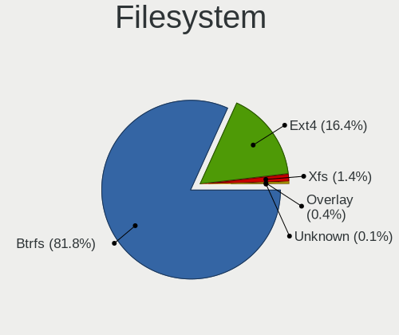
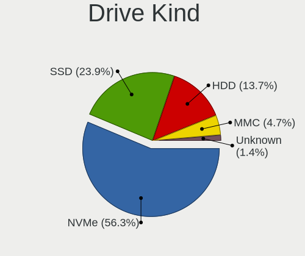

Fedora 37 - Tested Hardware & Statistics (Notebooks)
----------------------------------------------------

A project to collect tested hardware configurations for Fedora 37.

Anyone can contribute to this report by the [hw-probe](https://github.com/linuxhw/hw-probe) tool:

    sudo -E hw-probe -all -upload

Please contribute! Especially if your hardware is rare.

Contents
--------

* [ Test Cases ](#test-cases)

* [ System ](#system)
  - [ Kernel                   ](#kernel)
  - [ Kernel Family            ](#kernel-family)
  - [ Kernel Major Ver.        ](#kernel-major-ver)
  - [ Arch                     ](#arch)
  - [ DE                       ](#de)
  - [ Display Server           ](#display-server)
  - [ Display Manager          ](#display-manager)
  - [ OS Lang                  ](#os-lang)
  - [ Boot Mode                ](#boot-mode)
  - [ Filesystem               ](#filesystem)
  - [ Part. scheme             ](#part-scheme)
  - [ Dual Boot with Linux/BSD ](#dual-boot-with-linuxbsd)
  - [ Dual Boot (Win)          ](#dual-boot-win)

* [ Board ](#board)
  - [ Vendor                   ](#vendor)
  - [ Model                    ](#model)
  - [ Model Family             ](#model-family)
  - [ MFG Year                 ](#mfg-year)
  - [ Form Factor              ](#form-factor)
  - [ Secure Boot              ](#secure-boot)
  - [ Coreboot                 ](#coreboot)
  - [ RAM Size                 ](#ram-size)
  - [ RAM Used                 ](#ram-used)
  - [ Total Drives             ](#total-drives)
  - [ Has CD-ROM               ](#has-cd-rom)
  - [ Has Ethernet             ](#has-ethernet)
  - [ Has WiFi                 ](#has-wifi)
  - [ Has Bluetooth            ](#has-bluetooth)

* [ Location ](#location)
  - [ Country                  ](#country)
  - [ City                     ](#city)

* [ Drives ](#drives)
  - [ Drive Vendor             ](#drive-vendor)
  - [ Drive Model              ](#drive-model)
  - [ HDD Vendor               ](#hdd-vendor)
  - [ SSD Vendor               ](#ssd-vendor)
  - [ Drive Kind               ](#drive-kind)
  - [ Drive Connector          ](#drive-connector)
  - [ Drive Size               ](#drive-size)
  - [ Space Total              ](#space-total)
  - [ Space Used               ](#space-used)
  - [ Malfunc. Drives          ](#malfunc-drives)
  - [ Malfunc. Drive Vendor    ](#malfunc-drive-vendor)
  - [ Malfunc. HDD Vendor      ](#malfunc-hdd-vendor)
  - [ Malfunc. Drive Kind      ](#malfunc-drive-kind)
  - [ Failed Drives            ](#failed-drives)
  - [ Failed Drive Vendor      ](#failed-drive-vendor)
  - [ Drive Status             ](#drive-status)

* [ Storage controller ](#storage-controller)
  - [ Storage Vendor           ](#storage-vendor)
  - [ Storage Model            ](#storage-model)
  - [ Storage Kind             ](#storage-kind)

* [ Processor ](#processor)
  - [ CPU Vendor               ](#cpu-vendor)
  - [ CPU Model                ](#cpu-model)
  - [ CPU Model Family         ](#cpu-model-family)
  - [ CPU Cores                ](#cpu-cores)
  - [ CPU Sockets              ](#cpu-sockets)
  - [ CPU Threads              ](#cpu-threads)
  - [ CPU Op-Modes             ](#cpu-op-modes)
  - [ CPU Microcode            ](#cpu-microcode)
  - [ CPU Microarch            ](#cpu-microarch)

* [ Graphics ](#graphics)
  - [ GPU Vendor               ](#gpu-vendor)
  - [ GPU Model                ](#gpu-model)
  - [ GPU Combo                ](#gpu-combo)
  - [ GPU Driver               ](#gpu-driver)
  - [ GPU Memory               ](#gpu-memory)

* [ Monitor ](#monitor)
  - [ Monitor Vendor           ](#monitor-vendor)
  - [ Monitor Model            ](#monitor-model)
  - [ Monitor Resolution       ](#monitor-resolution)
  - [ Monitor Diagonal         ](#monitor-diagonal)
  - [ Monitor Width            ](#monitor-width)
  - [ Aspect Ratio             ](#aspect-ratio)
  - [ Monitor Area             ](#monitor-area)
  - [ Pixel Density            ](#pixel-density)
  - [ Multiple Monitors        ](#multiple-monitors)

* [ Network ](#network)
  - [ Net Controller Vendor    ](#net-controller-vendor)
  - [ Net Controller Model     ](#net-controller-model)
  - [ Wireless Vendor          ](#wireless-vendor)
  - [ Wireless Model           ](#wireless-model)
  - [ Ethernet Vendor          ](#ethernet-vendor)
  - [ Ethernet Model           ](#ethernet-model)
  - [ Net Controller Kind      ](#net-controller-kind)
  - [ Used Controller          ](#used-controller)
  - [ NICs                     ](#nics)
  - [ IPv6                     ](#ipv6)

* [ Bluetooth ](#bluetooth)
  - [ Bluetooth Vendor         ](#bluetooth-vendor)
  - [ Bluetooth Model          ](#bluetooth-model)

* [ Sound ](#sound)
  - [ Sound Vendor             ](#sound-vendor)
  - [ Sound Model              ](#sound-model)

* [ Memory ](#memory)
  - [ Memory Vendor            ](#memory-vendor)
  - [ Memory Model             ](#memory-model)
  - [ Memory Kind              ](#memory-kind)
  - [ Memory Form Factor       ](#memory-form-factor)
  - [ Memory Size              ](#memory-size)
  - [ Memory Speed             ](#memory-speed)

* [ Printers & scanners ](#printers--scanners)
  - [ Printer Vendor           ](#printer-vendor)
  - [ Printer Model            ](#printer-model)
  - [ Scanner Vendor           ](#scanner-vendor)
  - [ Scanner Model            ](#scanner-model)

* [ Camera ](#camera)
  - [ Camera Vendor            ](#camera-vendor)
  - [ Camera Model             ](#camera-model)

* [ Security ](#security)
  - [ Fingerprint Vendor       ](#fingerprint-vendor)
  - [ Fingerprint Model        ](#fingerprint-model)
  - [ Chipcard Vendor          ](#chipcard-vendor)
  - [ Chipcard Model           ](#chipcard-model)

* [ Unsupported ](#unsupported)
  - [ Unsupported Devices      ](#unsupported-devices)
  - [ Unsupported Device Types ](#unsupported-device-types)

Test Cases
----------

Total: 1482

| Vendor        | Model                       | Probe                                                      | Date         |
|---------------|-----------------------------|------------------------------------------------------------|--------------|
| ASUSTek       | T100TA                      | [5be9a0230e](https://linux-hardware.org/?probe=5be9a0230e) | Apr 01, 2023 |
| Lenovo        | ThinkPad P14s Gen 2a 21A... | [36fab57ba7](https://linux-hardware.org/?probe=36fab57ba7) | Mar 31, 2023 |
| Dell          | Inspiron 7577               | [5800e3859c](https://linux-hardware.org/?probe=5800e3859c) | Mar 31, 2023 |
| Lenovo        | ThinkPad P15v Gen 2i 21A... | [c76f4f4354](https://linux-hardware.org/?probe=c76f4f4354) | Mar 31, 2023 |
| Lenovo        | ThinkPad P15v Gen 2i 21A... | [3a74487ae8](https://linux-hardware.org/?probe=3a74487ae8) | Mar 31, 2023 |
| Toshiba       | Satellite U940              | [277dba9c1f](https://linux-hardware.org/?probe=277dba9c1f) | Mar 31, 2023 |
| Toshiba       | Satellite U940              | [8a5046cad7](https://linux-hardware.org/?probe=8a5046cad7) | Mar 31, 2023 |
| MSI           | GS66 Stealth 10SF           | [a2589dd6f5](https://linux-hardware.org/?probe=a2589dd6f5) | Mar 31, 2023 |
| Google        | Cave                        | [8bd24407be](https://linux-hardware.org/?probe=8bd24407be) | Mar 31, 2023 |
| Dell          | Latitude D620               | [801ede47a2](https://linux-hardware.org/?probe=801ede47a2) | Mar 31, 2023 |
| Acer          | Swift SFA16-41              | [e110fbb7d6](https://linux-hardware.org/?probe=e110fbb7d6) | Mar 31, 2023 |
| HP            | EliteBook 6930p             | [5b087b11f5](https://linux-hardware.org/?probe=5b087b11f5) | Mar 30, 2023 |
| Dell          | Precision 5510              | [4bbf7f5ef2](https://linux-hardware.org/?probe=4bbf7f5ef2) | Mar 30, 2023 |
| AIR           | CX30500                     | [2ea4d0ec83](https://linux-hardware.org/?probe=2ea4d0ec83) | Mar 30, 2023 |
| Lenovo        | ThinkPad T470s 20HGS23V0... | [6af08c4bfe](https://linux-hardware.org/?probe=6af08c4bfe) | Mar 30, 2023 |
| Lenovo        | ThinkPad T470s 20HGS23V0... | [6f0d3fd82b](https://linux-hardware.org/?probe=6f0d3fd82b) | Mar 30, 2023 |
| HUAWEI        | KLVL-WXXW                   | [ab31f6f63d](https://linux-hardware.org/?probe=ab31f6f63d) | Mar 30, 2023 |
| HP            | Pavilion Laptop 15-cs0xx... | [5cf96e41e0](https://linux-hardware.org/?probe=5cf96e41e0) | Mar 30, 2023 |
| Dell          | G15 5515                    | [7bb6311632](https://linux-hardware.org/?probe=7bb6311632) | Mar 30, 2023 |
| HP            | 250 G6 Notebook PC          | [159d154fca](https://linux-hardware.org/?probe=159d154fca) | Mar 30, 2023 |
| Dell          | Latitude 5580               | [84157deda8](https://linux-hardware.org/?probe=84157deda8) | Mar 29, 2023 |
| Dell          | XPS 13 7390                 | [2eb96be1ee](https://linux-hardware.org/?probe=2eb96be1ee) | Mar 29, 2023 |
| Apple         | MacBookPro8,1               | [6023df2b8b](https://linux-hardware.org/?probe=6023df2b8b) | Mar 29, 2023 |
| Dell          | Latitude 5420               | [aee5c648e7](https://linux-hardware.org/?probe=aee5c648e7) | Mar 29, 2023 |
| Dell          | Latitude 7430               | [3f3b04c185](https://linux-hardware.org/?probe=3f3b04c185) | Mar 29, 2023 |
| ASUSTek       | ROG Strix G513QY_G513QY     | [2f6655b77c](https://linux-hardware.org/?probe=2f6655b77c) | Mar 29, 2023 |
| HP            | EliteBook 855 G7 Noteboo... | [bf2f7820cd](https://linux-hardware.org/?probe=bf2f7820cd) | Mar 29, 2023 |
| Notebook      | L140CU                      | [e24f4b285d](https://linux-hardware.org/?probe=e24f4b285d) | Mar 29, 2023 |
| Notebook      | L140CU                      | [b1b0a5fc03](https://linux-hardware.org/?probe=b1b0a5fc03) | Mar 29, 2023 |
| ASUSTek       | Zenbook UX5401ZA_UX5401Z... | [c8f2b78c09](https://linux-hardware.org/?probe=c8f2b78c09) | Mar 29, 2023 |
| Clevo         | M815P                       | [ac4eae2a0b](https://linux-hardware.org/?probe=ac4eae2a0b) | Mar 29, 2023 |
| HP            | Pavilion g7                 | [5b1e547f92](https://linux-hardware.org/?probe=5b1e547f92) | Mar 29, 2023 |
| Lenovo        | Legion 5 15ACH6H 82JU       | [ccb2d60f5c](https://linux-hardware.org/?probe=ccb2d60f5c) | Mar 29, 2023 |
| HP            | Pavilion g7                 | [ce74564fd9](https://linux-hardware.org/?probe=ce74564fd9) | Mar 28, 2023 |
| Lenovo        | IdeaPad 3 15IML05 81WB      | [5520b0fc5f](https://linux-hardware.org/?probe=5520b0fc5f) | Mar 28, 2023 |
| Lenovo        | ThinkPad P50 20EN0013US     | [67789fc0d1](https://linux-hardware.org/?probe=67789fc0d1) | Mar 28, 2023 |
| Lenovo        | ThinkPad T470p 20J7S0QK0... | [7f5fb11940](https://linux-hardware.org/?probe=7f5fb11940) | Mar 28, 2023 |
| ASUSTek       | TX201LA                     | [27c77d0b6c](https://linux-hardware.org/?probe=27c77d0b6c) | Mar 28, 2023 |
| Lenovo        | ThinkPad T495 20NJ000XGE    | [70715024f2](https://linux-hardware.org/?probe=70715024f2) | Mar 28, 2023 |
| HP            | Compaq 6720s                | [9998cb9bfb](https://linux-hardware.org/?probe=9998cb9bfb) | Mar 27, 2023 |
| HP            | 250 G1                      | [75cf798dde](https://linux-hardware.org/?probe=75cf798dde) | Mar 27, 2023 |
| Lenovo        | ThinkBook 14-IIL 20SL       | [3173dc99b6](https://linux-hardware.org/?probe=3173dc99b6) | Mar 27, 2023 |
| Dell          | Latitude E5250              | [7d9e678484](https://linux-hardware.org/?probe=7d9e678484) | Mar 27, 2023 |
| Alienware     | 17 R4                       | [4a61d300b5](https://linux-hardware.org/?probe=4a61d300b5) | Mar 27, 2023 |
| Acer          | Predator PT515-51           | [2ac6541cf1](https://linux-hardware.org/?probe=2ac6541cf1) | Mar 27, 2023 |
| Dell          | Latitude 7280               | [409cf549eb](https://linux-hardware.org/?probe=409cf549eb) | Mar 27, 2023 |
| HP            | Pavilion Laptop 15-eh2xx... | [0ab4054ab9](https://linux-hardware.org/?probe=0ab4054ab9) | Mar 26, 2023 |
| Dell          | G15 5515                    | [3af5157823](https://linux-hardware.org/?probe=3af5157823) | Mar 26, 2023 |
| Chuwi         | HeroBook Air                | [836112a53f](https://linux-hardware.org/?probe=836112a53f) | Mar 26, 2023 |
| Lenovo        | G50-80 80E5                 | [250e0a99d1](https://linux-hardware.org/?probe=250e0a99d1) | Mar 26, 2023 |
| Acer          | Nitro AN515-55              | [36d5ba7071](https://linux-hardware.org/?probe=36d5ba7071) | Mar 26, 2023 |
| Acer          | Nitro AN515-54              | [2163c72a12](https://linux-hardware.org/?probe=2163c72a12) | Mar 25, 2023 |
| Dell          | Vostro 15 3515              | [a999580cf7](https://linux-hardware.org/?probe=a999580cf7) | Mar 25, 2023 |
| ASUSTek       | VivoBook_ASUSLaptop X515... | [31788e7103](https://linux-hardware.org/?probe=31788e7103) | Mar 25, 2023 |
| Dell          | Latitude E6230              | [1a248bdc33](https://linux-hardware.org/?probe=1a248bdc33) | Mar 25, 2023 |
| Lenovo        | G580 2189                   | [edba6da5b6](https://linux-hardware.org/?probe=edba6da5b6) | Mar 25, 2023 |
| ASUSTek       | ROG Zephyrus G14 GA401II... | [ae09be520b](https://linux-hardware.org/?probe=ae09be520b) | Mar 25, 2023 |
| HP            | OMEN by Laptop 16-b1xxx     | [0096d3d3b1](https://linux-hardware.org/?probe=0096d3d3b1) | Mar 25, 2023 |
| ASUSTek       | GL503VS                     | [8e066fcf6e](https://linux-hardware.org/?probe=8e066fcf6e) | Mar 25, 2023 |
| MSI           | Summit E16FlipEvo A11MT     | [62839dd4ac](https://linux-hardware.org/?probe=62839dd4ac) | Mar 24, 2023 |
| HP            | Pavilion Aero Laptop 13-... | [24784bc54d](https://linux-hardware.org/?probe=24784bc54d) | Mar 24, 2023 |
| HP            | Pavilion Aero Laptop 13-... | [c2255f36b2](https://linux-hardware.org/?probe=c2255f36b2) | Mar 24, 2023 |
| ASUSTek       | ROG Strix G512LW_G512LW     | [cbb1418cfa](https://linux-hardware.org/?probe=cbb1418cfa) | Mar 24, 2023 |
| Acer          | Aspire E5-574               | [51a085fb56](https://linux-hardware.org/?probe=51a085fb56) | Mar 24, 2023 |
| Dell          | G15 5515                    | [3510cdb4cf](https://linux-hardware.org/?probe=3510cdb4cf) | Mar 24, 2023 |
| Dell          | Precision 3551              | [bc979e320b](https://linux-hardware.org/?probe=bc979e320b) | Mar 24, 2023 |
| Dell          | Precision 3551              | [0509bee16a](https://linux-hardware.org/?probe=0509bee16a) | Mar 24, 2023 |
| ASUSTek       | ZenBook UX433FN_BX433FN     | [d8e67b032e](https://linux-hardware.org/?probe=d8e67b032e) | Mar 24, 2023 |
| MSI           | Modern 14 B4MW              | [c81d9f3b07](https://linux-hardware.org/?probe=c81d9f3b07) | Mar 24, 2023 |
| Lenovo        | IdeaPad Yoga 13 20175       | [56d564423e](https://linux-hardware.org/?probe=56d564423e) | Mar 24, 2023 |
| Lenovo        | Legion 5 15ACH6H 82JU       | [ca7d9a9342](https://linux-hardware.org/?probe=ca7d9a9342) | Mar 24, 2023 |
| Dell          | Latitude 5580               | [d4ad4c55a6](https://linux-hardware.org/?probe=d4ad4c55a6) | Mar 24, 2023 |
| Dell          | Latitude 5285               | [a8114ded15](https://linux-hardware.org/?probe=a8114ded15) | Mar 23, 2023 |
| HP            | 250 G4                      | [e0ff721413](https://linux-hardware.org/?probe=e0ff721413) | Mar 23, 2023 |
| Dell          | Latitude 5285               | [baa8f358cf](https://linux-hardware.org/?probe=baa8f358cf) | Mar 23, 2023 |
| Framework     | Laptop (12th Gen Intel C... | [aeb25bc22b](https://linux-hardware.org/?probe=aeb25bc22b) | Mar 23, 2023 |
| ASUSTek       | VivoBook_ASUSLaptop M650... | [2d44e8f5c2](https://linux-hardware.org/?probe=2d44e8f5c2) | Mar 23, 2023 |
| Dell          | Latitude 5480               | [ff60b91842](https://linux-hardware.org/?probe=ff60b91842) | Mar 23, 2023 |
| Acer          | Aspire E3-112               | [721e804a03](https://linux-hardware.org/?probe=721e804a03) | Mar 23, 2023 |
| Lenovo        | Yoga Slim 7 13ACN5 82CY     | [950e4b69e8](https://linux-hardware.org/?probe=950e4b69e8) | Mar 23, 2023 |
| Dell          | Inspiron N5110              | [69e58cde56](https://linux-hardware.org/?probe=69e58cde56) | Mar 23, 2023 |
| Lenovo        | ThinkPad L380 20M6S3Q000    | [aab8aada0e](https://linux-hardware.org/?probe=aab8aada0e) | Mar 22, 2023 |
| Lenovo        | Legion 5 82B5               | [5298c41263](https://linux-hardware.org/?probe=5298c41263) | Mar 22, 2023 |
| Dell          | Inspiron N5110              | [2be6f0d943](https://linux-hardware.org/?probe=2be6f0d943) | Mar 22, 2023 |
| Apple         | MacBookPro11,5              | [ac5768cd3f](https://linux-hardware.org/?probe=ac5768cd3f) | Mar 22, 2023 |
| HP            | Laptop 15s-eq2xxx           | [ea18262536](https://linux-hardware.org/?probe=ea18262536) | Mar 22, 2023 |
| Dell          | XPS 13 9310                 | [386f37d114](https://linux-hardware.org/?probe=386f37d114) | Mar 22, 2023 |
| Samsung       | 550XDA                      | [b145c438d7](https://linux-hardware.org/?probe=b145c438d7) | Mar 22, 2023 |
| HP            | OMEN by Laptop 16-c0xxx     | [4ee498d9fc](https://linux-hardware.org/?probe=4ee498d9fc) | Mar 22, 2023 |
| MSI           | GF63 Thin 11SC              | [a63c9ded60](https://linux-hardware.org/?probe=a63c9ded60) | Mar 22, 2023 |
| MSI           | GF63 Thin 11SC              | [cc5ca6f040](https://linux-hardware.org/?probe=cc5ca6f040) | Mar 22, 2023 |
| HP            | ENVY Laptop 13-ad1xx        | [5207701ff8](https://linux-hardware.org/?probe=5207701ff8) | Mar 22, 2023 |
| Lenovo        | Legion 5 82B5               | [8dfc670e24](https://linux-hardware.org/?probe=8dfc670e24) | Mar 22, 2023 |
| Lenovo        | ThinkPad X270 W10DG 20K5... | [23e4353a34](https://linux-hardware.org/?probe=23e4353a34) | Mar 22, 2023 |
| HP            | EliteBook 8470p             | [61025e6e8b](https://linux-hardware.org/?probe=61025e6e8b) | Mar 22, 2023 |
| Lenovo        | ThinkPad P15s Gen 2i 20W... | [80d1a2d67d](https://linux-hardware.org/?probe=80d1a2d67d) | Mar 22, 2023 |
| Lenovo        | ThinkPad P15s Gen 2i 20W... | [eb718edb23](https://linux-hardware.org/?probe=eb718edb23) | Mar 22, 2023 |
| Lenovo        | B50-10 80QR                 | [134bf99094](https://linux-hardware.org/?probe=134bf99094) | Mar 21, 2023 |
| HP            | 250 15.6 inch G9 Noteboo... | [b4d5442d02](https://linux-hardware.org/?probe=b4d5442d02) | Mar 21, 2023 |
| HP            | Pavilion Laptop 15-cs2xx... | [6d96576431](https://linux-hardware.org/?probe=6d96576431) | Mar 21, 2023 |
| Acer          | Aspire F5-573G              | [ec2390af74](https://linux-hardware.org/?probe=ec2390af74) | Mar 21, 2023 |
| Dell          | Vostro 14-5480              | [ee892df403](https://linux-hardware.org/?probe=ee892df403) | Mar 21, 2023 |
| Notebook      | W51XTU                      | [de60f3fcba](https://linux-hardware.org/?probe=de60f3fcba) | Mar 21, 2023 |
| HP            | ProBook 445 G8 Notebook ... | [57663c8d60](https://linux-hardware.org/?probe=57663c8d60) | Mar 21, 2023 |
| HP            | ProBook 445 G8 Notebook ... | [f5cbd1977f](https://linux-hardware.org/?probe=f5cbd1977f) | Mar 20, 2023 |
| Hampoo        | Cherry Trail CR Hampoo_r... | [e7eb855568](https://linux-hardware.org/?probe=e7eb855568) | Mar 20, 2023 |
| HP            | Laptop 15-dy1xxx            | [1686ba2df4](https://linux-hardware.org/?probe=1686ba2df4) | Mar 20, 2023 |
| Lenovo        | ThinkPad T480s 20L8002WM... | [762762da77](https://linux-hardware.org/?probe=762762da77) | Mar 20, 2023 |
| ASUSTek       | VivoBook_ASUSLaptop X571... | [7fb78c1c79](https://linux-hardware.org/?probe=7fb78c1c79) | Mar 20, 2023 |
| Acer          | Aspire F5-573G              | [e3e0efa236](https://linux-hardware.org/?probe=e3e0efa236) | Mar 20, 2023 |
| Dell          | XPS 15 9570                 | [4ad2d5c249](https://linux-hardware.org/?probe=4ad2d5c249) | Mar 19, 2023 |
| Prestigio     | PSB141C01BFH                | [9190e0a0e7](https://linux-hardware.org/?probe=9190e0a0e7) | Mar 19, 2023 |
| ASUSTek       | ASUS TUF Dash F15 FX516P... | [4223bbbf7e](https://linux-hardware.org/?probe=4223bbbf7e) | Mar 19, 2023 |
| Avell High... | B.ON                        | [b215c2fd75](https://linux-hardware.org/?probe=b215c2fd75) | Mar 19, 2023 |
| HP            | 250 G7 Notebook PC          | [5033dda127](https://linux-hardware.org/?probe=5033dda127) | Mar 19, 2023 |
| Lenovo        | ThinkPad P16 Gen 1 21D60... | [63b182c7d6](https://linux-hardware.org/?probe=63b182c7d6) | Mar 19, 2023 |
| Toshiba       | Satellite C75D-B            | [1ff56ed31f](https://linux-hardware.org/?probe=1ff56ed31f) | Mar 19, 2023 |
| HP            | G62                         | [2cb4092da0](https://linux-hardware.org/?probe=2cb4092da0) | Mar 19, 2023 |
| HP            | G62                         | [76d7e36f21](https://linux-hardware.org/?probe=76d7e36f21) | Mar 19, 2023 |
| HONOR         | GLO-FX6P                    | [0fb3ebc365](https://linux-hardware.org/?probe=0fb3ebc365) | Mar 19, 2023 |
| HP            | ProBook 640 G8 Notebook ... | [88b7883383](https://linux-hardware.org/?probe=88b7883383) | Mar 19, 2023 |
| ASUSTek       | VivoBook_ASUSLaptop X509... | [cbad8c5f1e](https://linux-hardware.org/?probe=cbad8c5f1e) | Mar 18, 2023 |
| Acer          | Aspire A315-54              | [49b005770d](https://linux-hardware.org/?probe=49b005770d) | Mar 18, 2023 |
| Acer          | Aspire A315-54              | [6af556d727](https://linux-hardware.org/?probe=6af556d727) | Mar 18, 2023 |
| Dell          | Vostro 5471                 | [3b0eb35766](https://linux-hardware.org/?probe=3b0eb35766) | Mar 18, 2023 |
| Dell          | Vostro 5471                 | [7743b2a5a9](https://linux-hardware.org/?probe=7743b2a5a9) | Mar 18, 2023 |
| ASUSTek       | X750JN                      | [7dd8257bc8](https://linux-hardware.org/?probe=7dd8257bc8) | Mar 18, 2023 |
| MSI           | GF65 Thin 10UE              | [8d2db4b0fe](https://linux-hardware.org/?probe=8d2db4b0fe) | Mar 17, 2023 |
| ASUSTek       | ROG Zephyrus G14 GA402RK... | [f219a6e14a](https://linux-hardware.org/?probe=f219a6e14a) | Mar 17, 2023 |
| ASUSTek       | X750JN                      | [7ee3dac323](https://linux-hardware.org/?probe=7ee3dac323) | Mar 17, 2023 |
| Dell          | Inspiron 3542               | [d79a6ae160](https://linux-hardware.org/?probe=d79a6ae160) | Mar 17, 2023 |
| Dell          | Inspiron 3542               | [691f338c53](https://linux-hardware.org/?probe=691f338c53) | Mar 17, 2023 |
| ASUSTek       | X555LB                      | [a00be2eabe](https://linux-hardware.org/?probe=a00be2eabe) | Mar 17, 2023 |
| Lenovo        | ThinkPad X1 Carbon 7th 2... | [2ab659150c](https://linux-hardware.org/?probe=2ab659150c) | Mar 16, 2023 |
| HONOR         | BMH-WCX9                    | [47a9ec2aa1](https://linux-hardware.org/?probe=47a9ec2aa1) | Mar 16, 2023 |
| Lenovo        | IdeaPad 5 14ITL05 82FE      | [03123126d0](https://linux-hardware.org/?probe=03123126d0) | Mar 16, 2023 |
| HP            | EliteBook 850 G2            | [f2b9853f35](https://linux-hardware.org/?probe=f2b9853f35) | Mar 16, 2023 |
| Lenovo        | ThinkPad T540p 20BFS1N00... | [03b210c1f8](https://linux-hardware.org/?probe=03b210c1f8) | Mar 16, 2023 |
| Dell          | Latitude D620               | [1731735e10](https://linux-hardware.org/?probe=1731735e10) | Mar 16, 2023 |
| LG Electro... | 15Z980-G.BH72P1             | [0bba01d850](https://linux-hardware.org/?probe=0bba01d850) | Mar 16, 2023 |
| Lenovo        | ThinkPad P15 Gen 1 20SUS... | [5667e8416e](https://linux-hardware.org/?probe=5667e8416e) | Mar 16, 2023 |
| Dell          | Latitude E5470              | [cc4f08349d](https://linux-hardware.org/?probe=cc4f08349d) | Mar 16, 2023 |
| Lenovo        | ThinkPad T14s Gen 1 20T1... | [5bf235f5d3](https://linux-hardware.org/?probe=5bf235f5d3) | Mar 16, 2023 |
| ASUSTek       | ASUS TUF Dash F15 FX516P... | [907581c9cc](https://linux-hardware.org/?probe=907581c9cc) | Mar 16, 2023 |
| Lenovo        | ThinkPad P52s 20LBS0AF00    | [fe02ac3290](https://linux-hardware.org/?probe=fe02ac3290) | Mar 15, 2023 |
| HP            | Pavilion Notebook           | [db96098c80](https://linux-hardware.org/?probe=db96098c80) | Mar 15, 2023 |
| Dell          | Inspiron 7577               | [d19eaf791f](https://linux-hardware.org/?probe=d19eaf791f) | Mar 15, 2023 |
| Dell          | Latitude 7430               | [58024877c3](https://linux-hardware.org/?probe=58024877c3) | Mar 15, 2023 |
| Lenovo        | Legion 5 15ACH6A 82NW       | [1e802bfcd0](https://linux-hardware.org/?probe=1e802bfcd0) | Mar 15, 2023 |
| Dell          | Latitude 5530               | [aac966a8af](https://linux-hardware.org/?probe=aac966a8af) | Mar 15, 2023 |
| Dell          | Latitude 7390               | [7cc6b3a278](https://linux-hardware.org/?probe=7cc6b3a278) | Mar 15, 2023 |
| Dell          | Inspiron 7577               | [a519acdd2e](https://linux-hardware.org/?probe=a519acdd2e) | Mar 15, 2023 |
| ASUSTek       | ASUS TUF Gaming A17 FA70... | [96f3739077](https://linux-hardware.org/?probe=96f3739077) | Mar 15, 2023 |
| HP            | 245 G8 Notebook PC          | [6c73c46184](https://linux-hardware.org/?probe=6c73c46184) | Mar 15, 2023 |
| ASUSTek       | X550MD                      | [2cd5ae8a43](https://linux-hardware.org/?probe=2cd5ae8a43) | Mar 15, 2023 |
| Toshiba       | Satellite P55t-B            | [7bd981d445](https://linux-hardware.org/?probe=7bd981d445) | Mar 15, 2023 |
| Lenovo        | Yoga Slim 7 14ARE05 82A2    | [fb73add0f6](https://linux-hardware.org/?probe=fb73add0f6) | Mar 14, 2023 |
| Dell          | Inspiron 7375               | [430599b2da](https://linux-hardware.org/?probe=430599b2da) | Mar 14, 2023 |
| Lenovo        | ThinkPad T490 20N3S3UL00    | [a9db94aee2](https://linux-hardware.org/?probe=a9db94aee2) | Mar 14, 2023 |
| ASUSTek       | VivoBook_ASUSLaptop K650... | [112d979fc6](https://linux-hardware.org/?probe=112d979fc6) | Mar 14, 2023 |
| Exo           | Smart XS1                   | [e1e04684eb](https://linux-hardware.org/?probe=e1e04684eb) | Mar 14, 2023 |
| HUAWEI        | CREM-WXX9                   | [933110cc30](https://linux-hardware.org/?probe=933110cc30) | Mar 14, 2023 |
| Lenovo        | Legion 7 16ARHA7 82UH       | [d23ddde885](https://linux-hardware.org/?probe=d23ddde885) | Mar 14, 2023 |
| ASUSTek       | TUF Gaming FX504GD_FX80G... | [eac2f2ae40](https://linux-hardware.org/?probe=eac2f2ae40) | Mar 14, 2023 |
| System76      | Gazelle                     | [d45f36e46f](https://linux-hardware.org/?probe=d45f36e46f) | Mar 14, 2023 |
| MSI           | Katana GF76 11UD            | [37edbdcce5](https://linux-hardware.org/?probe=37edbdcce5) | Mar 14, 2023 |
| Lenovo        | ThinkPad P16 Gen 1 21D60... | [2c2920d462](https://linux-hardware.org/?probe=2c2920d462) | Mar 14, 2023 |
| HP            | ProBook 450 G3              | [d422d0d291](https://linux-hardware.org/?probe=d422d0d291) | Mar 14, 2023 |
| Lenovo        | ThinkPad E15 Gen 4 21ED0... | [e6792912bf](https://linux-hardware.org/?probe=e6792912bf) | Mar 14, 2023 |
| MSI           | Stealth GS77 12UHS          | [fe00606a03](https://linux-hardware.org/?probe=fe00606a03) | Mar 14, 2023 |
| Lenovo        | ThinkPad X1 Extreme Gen ... | [59d2c50a02](https://linux-hardware.org/?probe=59d2c50a02) | Mar 14, 2023 |
| Toshiba       | Satellite L40               | [bfc73429bb](https://linux-hardware.org/?probe=bfc73429bb) | Mar 13, 2023 |
| Dell          | Inspiron 13 5320            | [efbe50cd5c](https://linux-hardware.org/?probe=efbe50cd5c) | Mar 13, 2023 |
| ASUSTek       | TUF Gaming FX504GD_FX80G... | [70de894994](https://linux-hardware.org/?probe=70de894994) | Mar 13, 2023 |
| ASUSTek       | X510UAR                     | [815dfc26ec](https://linux-hardware.org/?probe=815dfc26ec) | Mar 13, 2023 |
| Samsung       | 300E5M/300E5L               | [8567b21f41](https://linux-hardware.org/?probe=8567b21f41) | Mar 13, 2023 |
| HUAWEI        | BOD-WXX9                    | [74452c1274](https://linux-hardware.org/?probe=74452c1274) | Mar 13, 2023 |
| Acer          | Aspire R7-371T              | [b6aef449b6](https://linux-hardware.org/?probe=b6aef449b6) | Mar 13, 2023 |
| Lenovo        | IdeaPad U300s 20111         | [aaaee5fcf5](https://linux-hardware.org/?probe=aaaee5fcf5) | Mar 12, 2023 |
| Lenovo        | IdeaPad U300s 20111         | [3f3945f7e3](https://linux-hardware.org/?probe=3f3945f7e3) | Mar 12, 2023 |
| TECNO         | MEGABOOK T1                 | [000c3e4761](https://linux-hardware.org/?probe=000c3e4761) | Mar 12, 2023 |
| Dell          | Inspiron 5565               | [9415690de2](https://linux-hardware.org/?probe=9415690de2) | Mar 12, 2023 |
| Insyde        | BayTrail                    | [8d0337a8ee](https://linux-hardware.org/?probe=8d0337a8ee) | Mar 12, 2023 |
| Lenovo        | ThinkPad E590 20NBA000AU    | [47bfd44610](https://linux-hardware.org/?probe=47bfd44610) | Mar 12, 2023 |
| Lenovo        | ThinkPad X1 Carbon 7th 2... | [5c45eb6864](https://linux-hardware.org/?probe=5c45eb6864) | Mar 12, 2023 |
| HUAWEI        | BOD-WXX9                    | [1875fd875d](https://linux-hardware.org/?probe=1875fd875d) | Mar 12, 2023 |
| Lenovo        | ThinkPad P15 Gen 2i 20YQ... | [28769bd85b](https://linux-hardware.org/?probe=28769bd85b) | Mar 12, 2023 |
| Dell          | Vostro 14-5480              | [3ea64e75d4](https://linux-hardware.org/?probe=3ea64e75d4) | Mar 12, 2023 |
| Unknown       | Apple MacBook Pro (14-in... | [8a8b88087b](https://linux-hardware.org/?probe=8a8b88087b) | Mar 12, 2023 |
| TUXEDO        | InfinityBook S 15/17 Gen... | [8aff6217a5](https://linux-hardware.org/?probe=8aff6217a5) | Mar 11, 2023 |
| Dell          | XPS 13 9310                 | [599f8de7ba](https://linux-hardware.org/?probe=599f8de7ba) | Mar 11, 2023 |
| TUXEDO        | InfinityBook S 15/17 Gen... | [2a0539c2b1](https://linux-hardware.org/?probe=2a0539c2b1) | Mar 11, 2023 |
| Unknown       | Apple MacBook Pro (14-in... | [5d69c96eca](https://linux-hardware.org/?probe=5d69c96eca) | Mar 11, 2023 |
| BESSTAR Te... | X300                        | [3f12a2f32e](https://linux-hardware.org/?probe=3f12a2f32e) | Mar 11, 2023 |
| BESSTAR Te... | X300                        | [a6ba9c1545](https://linux-hardware.org/?probe=a6ba9c1545) | Mar 11, 2023 |
| Proline       | V146SH                      | [460deab2ea](https://linux-hardware.org/?probe=460deab2ea) | Mar 11, 2023 |
| Dell          | XPS 13 9300                 | [d3b7f2f978](https://linux-hardware.org/?probe=d3b7f2f978) | Mar 11, 2023 |
| ASUSTek       | G752VL                      | [4a4ea6f987](https://linux-hardware.org/?probe=4a4ea6f987) | Mar 11, 2023 |
| Fujitsu       | LIFEBOOK U759               | [01025c7c43](https://linux-hardware.org/?probe=01025c7c43) | Mar 11, 2023 |
| ASUSTek       | ZenBook 13 UX331UAL         | [9b38c9668e](https://linux-hardware.org/?probe=9b38c9668e) | Mar 10, 2023 |
| Dell          | XPS 13 9310                 | [037f2e4a2d](https://linux-hardware.org/?probe=037f2e4a2d) | Mar 10, 2023 |
| HONOR         | NMH-WCX9                    | [f9cf8b06f6](https://linux-hardware.org/?probe=f9cf8b06f6) | Mar 10, 2023 |
| Lenovo        | ThinkPad T460 20LPS3K002    | [c375b36f4a](https://linux-hardware.org/?probe=c375b36f4a) | Mar 10, 2023 |
| Acer          | Swift SFX14-41G             | [80ecfacebf](https://linux-hardware.org/?probe=80ecfacebf) | Mar 10, 2023 |
| Unknown       | Unknown                     | [cd382356be](https://linux-hardware.org/?probe=cd382356be) | Mar 10, 2023 |
| HP            | Laptop 14-cm0xxx            | [d35d11c64e](https://linux-hardware.org/?probe=d35d11c64e) | Mar 09, 2023 |
| Lenovo        | ThinkPad X1 Carbon Gen 1... | [d35772b8bc](https://linux-hardware.org/?probe=d35772b8bc) | Mar 09, 2023 |
| HP            | Notebook                    | [b5ee32f085](https://linux-hardware.org/?probe=b5ee32f085) | Mar 09, 2023 |
| Lenovo        | ThinkPad T440p 20AWS0XX0... | [780937bb9f](https://linux-hardware.org/?probe=780937bb9f) | Mar 09, 2023 |
| Dell          | XPS 15 9530                 | [d7129009b0](https://linux-hardware.org/?probe=d7129009b0) | Mar 09, 2023 |
| Lenovo        | ThinkBook 14 G4+ ARA 21D... | [e4164a80cd](https://linux-hardware.org/?probe=e4164a80cd) | Mar 09, 2023 |
| HP            | EliteBook 850 G8 Noteboo... | [c50daaf3b9](https://linux-hardware.org/?probe=c50daaf3b9) | Mar 09, 2023 |
| HP            | ENVY Laptop 13-ad1xx        | [5535b412ed](https://linux-hardware.org/?probe=5535b412ed) | Mar 09, 2023 |
| Dell          | Inspiron 7375               | [2dbb99bbb2](https://linux-hardware.org/?probe=2dbb99bbb2) | Mar 09, 2023 |
| ASUSTek       | VivoBook_ASUSLaptop X712... | [2664be8926](https://linux-hardware.org/?probe=2664be8926) | Mar 09, 2023 |
| HP            | ENVY Laptop 17-cr0xxx       | [dc915e443d](https://linux-hardware.org/?probe=dc915e443d) | Mar 09, 2023 |
| HP            | Laptop 15-dy2xxx            | [97698bd9a9](https://linux-hardware.org/?probe=97698bd9a9) | Mar 09, 2023 |
| Google        | Cave                        | [37d6d413b7](https://linux-hardware.org/?probe=37d6d413b7) | Mar 09, 2023 |
| Dell          | Inspiron 3505               | [5ffa875792](https://linux-hardware.org/?probe=5ffa875792) | Mar 08, 2023 |
| ASUSTek       | ASUS TUF Gaming F15 FX50... | [b349a8eedd](https://linux-hardware.org/?probe=b349a8eedd) | Mar 08, 2023 |
| Lenovo        | ThinkPad P15 Gen 2i 20YQ... | [ac772ea51f](https://linux-hardware.org/?probe=ac772ea51f) | Mar 08, 2023 |
| Lenovo        | ThinkPad T450s 20BX0013G... | [11cf435bfe](https://linux-hardware.org/?probe=11cf435bfe) | Mar 08, 2023 |
| Acer          | Aspire A315-58              | [f4de2d1a2a](https://linux-hardware.org/?probe=f4de2d1a2a) | Mar 08, 2023 |
| HP            | OMEN by Laptop              | [a3a369de93](https://linux-hardware.org/?probe=a3a369de93) | Mar 08, 2023 |
| ASUSTek       | ASUS TUF Gaming A15 FA50... | [439ea07bc5](https://linux-hardware.org/?probe=439ea07bc5) | Mar 08, 2023 |
| Dell          | Inspiron 14 5420            | [cb6ec54195](https://linux-hardware.org/?probe=cb6ec54195) | Mar 08, 2023 |
| Dell          | Latitude 5400               | [3d2504745e](https://linux-hardware.org/?probe=3d2504745e) | Mar 08, 2023 |
| HP            | ProBook 440 G7              | [7f4678dcf1](https://linux-hardware.org/?probe=7f4678dcf1) | Mar 07, 2023 |
| Dell          | Latitude 7290               | [38f12088b2](https://linux-hardware.org/?probe=38f12088b2) | Mar 07, 2023 |
| HUAWEI        | CREM-WXX9                   | [1aaf3d1b9f](https://linux-hardware.org/?probe=1aaf3d1b9f) | Mar 07, 2023 |
| MSI           | Modern 15 A5M               | [e88ffa7e1d](https://linux-hardware.org/?probe=e88ffa7e1d) | Mar 07, 2023 |
| Acer          | One S1001                   | [b43d7f0a84](https://linux-hardware.org/?probe=b43d7f0a84) | Mar 06, 2023 |
| HUAWEI        | KLVD-WXX9                   | [1209c224e1](https://linux-hardware.org/?probe=1209c224e1) | Mar 06, 2023 |
| Lenovo        | ThinkPad P1 Gen 2 20QUS1... | [798d6e74da](https://linux-hardware.org/?probe=798d6e74da) | Mar 06, 2023 |
| Lenovo        | ThinkPad L14 Gen 2a 20X6... | [bd9c4997b0](https://linux-hardware.org/?probe=bd9c4997b0) | Mar 06, 2023 |
| Lenovo        | ThinkPad X1 Carbon 6th 2... | [98a2c9f264](https://linux-hardware.org/?probe=98a2c9f264) | Mar 06, 2023 |
| Lenovo        | ThinkPad P53 20QN0011IV     | [4e05d0a0e9](https://linux-hardware.org/?probe=4e05d0a0e9) | Mar 06, 2023 |
| Lenovo        | ThinkPad T14s Gen 1 20UH... | [4b6c93e678](https://linux-hardware.org/?probe=4b6c93e678) | Mar 06, 2023 |
| Lenovo        | ThinkPad P14s Gen 2a 21A... | [0fca5ee94e](https://linux-hardware.org/?probe=0fca5ee94e) | Mar 06, 2023 |
| ASUSTek       | ROG Zephyrus G14 GA401QM... | [d256faa9fc](https://linux-hardware.org/?probe=d256faa9fc) | Mar 06, 2023 |
| Dell          | Inspiron 15 3525            | [cc3e080ded](https://linux-hardware.org/?probe=cc3e080ded) | Mar 06, 2023 |
| Dell          | Inspiron 3593               | [f33f04396c](https://linux-hardware.org/?probe=f33f04396c) | Mar 05, 2023 |
| Acer          | Aspire A515-57T             | [ebd1e9103e](https://linux-hardware.org/?probe=ebd1e9103e) | Mar 05, 2023 |
| Google        | Lillipup                    | [6c7cf4cd9e](https://linux-hardware.org/?probe=6c7cf4cd9e) | Mar 05, 2023 |
| Lenovo        | ThinkPad T15p Gen 1 20TN... | [0811163639](https://linux-hardware.org/?probe=0811163639) | Mar 05, 2023 |
| Lenovo        | Legion 5 15ACH6H 82JU       | [42469e8f5d](https://linux-hardware.org/?probe=42469e8f5d) | Mar 05, 2023 |
| ASUSTek       | ROG Strix G513QY_G513QY     | [d42a19d17b](https://linux-hardware.org/?probe=d42a19d17b) | Mar 05, 2023 |
| Dell          | Latitude 5410               | [6f55e8bbfe](https://linux-hardware.org/?probe=6f55e8bbfe) | Mar 05, 2023 |
| Lenovo        | ThinkPad L15 Gen 1 20U4S... | [fb996384c6](https://linux-hardware.org/?probe=fb996384c6) | Mar 05, 2023 |
| Lenovo        | ThinkPad P1 Gen 3 20TJS2... | [925e02d1dc](https://linux-hardware.org/?probe=925e02d1dc) | Mar 04, 2023 |
| Lenovo        | ThinkPad P14s Gen 2a 21A... | [e2ad6f0e57](https://linux-hardware.org/?probe=e2ad6f0e57) | Mar 04, 2023 |
| Lenovo        | ThinkPad P1 Gen 3 20TJS2... | [7d9acf8639](https://linux-hardware.org/?probe=7d9acf8639) | Mar 04, 2023 |
| ASUSTek       | ROG Strix G513QY_G513QY     | [a28f5eeec0](https://linux-hardware.org/?probe=a28f5eeec0) | Mar 04, 2023 |
| Toshiba       | Satellite L40               | [bd108fcfba](https://linux-hardware.org/?probe=bd108fcfba) | Mar 04, 2023 |
| Lenovo        | ThinkPad P14s Gen 2a 21A... | [6f7115f084](https://linux-hardware.org/?probe=6f7115f084) | Mar 04, 2023 |
| Purism        | Librem 14                   | [fbae41cbd5](https://linux-hardware.org/?probe=fbae41cbd5) | Mar 04, 2023 |
| ASUSTek       | VivoBook_ASUSLaptop X512... | [bd5e51c339](https://linux-hardware.org/?probe=bd5e51c339) | Mar 04, 2023 |
| Toshiba       | Satellite L40               | [e3f1423c39](https://linux-hardware.org/?probe=e3f1423c39) | Mar 04, 2023 |
| Lenovo        | ThinkPad Z16 Gen 1 21D40... | [1bcec582e3](https://linux-hardware.org/?probe=1bcec582e3) | Mar 03, 2023 |
| ASUSTek       | VivoBook_ASUSLaptop X512... | [1ee7b087a8](https://linux-hardware.org/?probe=1ee7b087a8) | Mar 03, 2023 |
| Lenovo        | ThinkPad P14s Gen 1 20Y1... | [4b20311834](https://linux-hardware.org/?probe=4b20311834) | Mar 03, 2023 |
| HP            | EliteBook 830 G5            | [cd6c75d08e](https://linux-hardware.org/?probe=cd6c75d08e) | Mar 03, 2023 |
| Chuwi         | HeroBook Air                | [43248e0ae9](https://linux-hardware.org/?probe=43248e0ae9) | Mar 03, 2023 |
| Toshiba       | Satellite L515              | [daf95cc1e5](https://linux-hardware.org/?probe=daf95cc1e5) | Mar 03, 2023 |
| MSI           | GS63VR 6RF                  | [dd60a9c73b](https://linux-hardware.org/?probe=dd60a9c73b) | Mar 03, 2023 |
| ASUSTek       | VivoBook_ASUSLaptop X512... | [5906e1b848](https://linux-hardware.org/?probe=5906e1b848) | Mar 03, 2023 |
| Lenovo        | ThinkPad X1 Extreme Gen ... | [c4c7ebf544](https://linux-hardware.org/?probe=c4c7ebf544) | Mar 03, 2023 |
| Samsung       | 300E5EV/300E4EV/270E5EV/... | [e5b411431c](https://linux-hardware.org/?probe=e5b411431c) | Mar 02, 2023 |
| Lenovo        | ThinkPad E14 Gen 3 20YDS... | [22c9e146ee](https://linux-hardware.org/?probe=22c9e146ee) | Mar 02, 2023 |
| Apple         | MacBookAir5,2               | [6b7925d129](https://linux-hardware.org/?probe=6b7925d129) | Mar 02, 2023 |
| HP            | 255 G3                      | [78c4cd0a9c](https://linux-hardware.org/?probe=78c4cd0a9c) | Mar 01, 2023 |
| HUAWEI        | KLVD-WXX9                   | [8c878d99a1](https://linux-hardware.org/?probe=8c878d99a1) | Mar 01, 2023 |
| Lenovo        | ThinkPad X1 Carbon Gen 9... | [9ba7cfbdeb](https://linux-hardware.org/?probe=9ba7cfbdeb) | Mar 01, 2023 |
| Lenovo        | ThinkBook 15 G4 ABA 21DL    | [94809b7bc2](https://linux-hardware.org/?probe=94809b7bc2) | Mar 01, 2023 |
| Apple         | MacBookPro7,1               | [4d1bdc90ea](https://linux-hardware.org/?probe=4d1bdc90ea) | Mar 01, 2023 |
| HP            | Pavilion Laptop 15-eg0xx... | [6a99428156](https://linux-hardware.org/?probe=6a99428156) | Mar 01, 2023 |
| Lenovo        | ThinkPad P53 20QN0011IV     | [3db8300147](https://linux-hardware.org/?probe=3db8300147) | Mar 01, 2023 |
| HP            | OMEN by Laptop 16-c0xxx     | [1c09e468d0](https://linux-hardware.org/?probe=1c09e468d0) | Mar 01, 2023 |
| Lenovo        | ThinkBook 15 G3 ACL 21A4    | [165c0356a5](https://linux-hardware.org/?probe=165c0356a5) | Mar 01, 2023 |
| HUAWEI        | CREM-WXX9                   | [22d51a725f](https://linux-hardware.org/?probe=22d51a725f) | Feb 28, 2023 |
| Dell          | Latitude E7270              | [2718026d03](https://linux-hardware.org/?probe=2718026d03) | Feb 28, 2023 |
| TECNO         | MEGABOOK T1                 | [3b70c27ca4](https://linux-hardware.org/?probe=3b70c27ca4) | Feb 28, 2023 |
| HUAWEI        | MRC-WX0                     | [e2776f99bf](https://linux-hardware.org/?probe=e2776f99bf) | Feb 28, 2023 |
| HP            | ProBook 635 Aero G8 Note... | [93ee76f198](https://linux-hardware.org/?probe=93ee76f198) | Feb 28, 2023 |
| Acer          | Aspire A315-59              | [9a897f5d7c](https://linux-hardware.org/?probe=9a897f5d7c) | Feb 28, 2023 |
| Lenovo        | ThinkPad Z13 Gen 1 21D2C... | [b5a4a1809f](https://linux-hardware.org/?probe=b5a4a1809f) | Feb 28, 2023 |
| TECNO         | MEGABOOK T1                 | [3d003c6d17](https://linux-hardware.org/?probe=3d003c6d17) | Feb 28, 2023 |
| ASUSTek       | ROG Strix G712LW_G712LW     | [ed67c567d2](https://linux-hardware.org/?probe=ed67c567d2) | Feb 28, 2023 |
| Standard      | Unknown                     | [63732ac2da](https://linux-hardware.org/?probe=63732ac2da) | Feb 28, 2023 |
| Dell          | Precision 5570              | [7e8d7c37cb](https://linux-hardware.org/?probe=7e8d7c37cb) | Feb 28, 2023 |
| HP            | OMEN by Laptop 16-c0xxx     | [c829e9e0b8](https://linux-hardware.org/?probe=c829e9e0b8) | Feb 27, 2023 |
| HP            | EliteBook Folio 9470m       | [45403acec9](https://linux-hardware.org/?probe=45403acec9) | Feb 27, 2023 |
| HUAWEI        | MACHR-WX9                   | [b1ef7c7ea1](https://linux-hardware.org/?probe=b1ef7c7ea1) | Feb 27, 2023 |
| Apple         | MacBookAir6,1               | [1c1dc86eb1](https://linux-hardware.org/?probe=1c1dc86eb1) | Feb 27, 2023 |
| HP            | EliteBook 845 14 inch G9... | [ed251c6cfe](https://linux-hardware.org/?probe=ed251c6cfe) | Feb 27, 2023 |
| Lenovo        | ThinkPad P15 Gen 1 20SUS... | [dd5ce2c6db](https://linux-hardware.org/?probe=dd5ce2c6db) | Feb 27, 2023 |
| Toshiba       | Satellite P870              | [6d9216b866](https://linux-hardware.org/?probe=6d9216b866) | Feb 27, 2023 |
| Dell          | Inspiron 15 3511            | [4c96506f38](https://linux-hardware.org/?probe=4c96506f38) | Feb 27, 2023 |
| ASUSTek       | VivoBook_ASUSLaptop X513... | [d7e55bb97e](https://linux-hardware.org/?probe=d7e55bb97e) | Feb 27, 2023 |
| ASUSTek       | VivoBook_ASUS Laptop E41... | [091e4e3188](https://linux-hardware.org/?probe=091e4e3188) | Feb 27, 2023 |
| Apple         | MacBookAir6,1               | [058ecdce01](https://linux-hardware.org/?probe=058ecdce01) | Feb 27, 2023 |
| Lenovo        | ThinkPad X395 20NL0006US    | [9030fac261](https://linux-hardware.org/?probe=9030fac261) | Feb 26, 2023 |
| ASUSTek       | VivoBook_ASUS Laptop X50... | [fe8735a027](https://linux-hardware.org/?probe=fe8735a027) | Feb 26, 2023 |
| HP            | Notebook                    | [ab0dddc914](https://linux-hardware.org/?probe=ab0dddc914) | Feb 26, 2023 |
| Lenovo        | IdeaPad L340-15IRH Gamin... | [6b712e555f](https://linux-hardware.org/?probe=6b712e555f) | Feb 26, 2023 |
| Dell          | Vostro 3578                 | [da6968c8ac](https://linux-hardware.org/?probe=da6968c8ac) | Feb 26, 2023 |
| Samsung       | 370E4K                      | [7b769eb33e](https://linux-hardware.org/?probe=7b769eb33e) | Feb 26, 2023 |
| HUAWEI        | CREM-WXX9                   | [c026a25fb2](https://linux-hardware.org/?probe=c026a25fb2) | Feb 26, 2023 |
| HP            | 250 G6 Notebook PC          | [af6a897a26](https://linux-hardware.org/?probe=af6a897a26) | Feb 26, 2023 |
| Timi          | TM1612                      | [eb4a3f330e](https://linux-hardware.org/?probe=eb4a3f330e) | Feb 26, 2023 |
| Lenovo        | ThinkPad P15 Gen 1 20SUS... | [d3b6621252](https://linux-hardware.org/?probe=d3b6621252) | Feb 26, 2023 |
| Acer          | Nitro AN515-52              | [f589c3687b](https://linux-hardware.org/?probe=f589c3687b) | Feb 26, 2023 |
| ASUSTek       | VivoBook 15_ASUS Laptop ... | [d610badec8](https://linux-hardware.org/?probe=d610badec8) | Feb 26, 2023 |
| Lenovo        | ThinkPad T61 6464A13        | [e981803528](https://linux-hardware.org/?probe=e981803528) | Feb 26, 2023 |
| Standard      | Unknown                     | [9d002e0593](https://linux-hardware.org/?probe=9d002e0593) | Feb 26, 2023 |
| Lenovo        | Legion 5 82B5               | [8db23a7237](https://linux-hardware.org/?probe=8db23a7237) | Feb 25, 2023 |
| Lenovo        | Yoga Slim 7 14ARE05 82A2    | [bd2c3ecd74](https://linux-hardware.org/?probe=bd2c3ecd74) | Feb 25, 2023 |
| Lenovo        | ThinkPad T480 20L5S03600    | [5c9736ab0c](https://linux-hardware.org/?probe=5c9736ab0c) | Feb 25, 2023 |
| Dell          | Vostro 14-5459              | [1f96898a48](https://linux-hardware.org/?probe=1f96898a48) | Feb 25, 2023 |
| Dell          | Latitude E6420              | [7ae4fe9340](https://linux-hardware.org/?probe=7ae4fe9340) | Feb 25, 2023 |
| Dell          | Latitude 5511               | [4402838fb3](https://linux-hardware.org/?probe=4402838fb3) | Feb 25, 2023 |
| Google        | Voxel                       | [ce917fe8ec](https://linux-hardware.org/?probe=ce917fe8ec) | Feb 25, 2023 |
| Google        | Voxel                       | [93ea143f69](https://linux-hardware.org/?probe=93ea143f69) | Feb 25, 2023 |
| Dell          | Inspiron 5759               | [be0b15660e](https://linux-hardware.org/?probe=be0b15660e) | Feb 25, 2023 |
| HUAWEI        | MACH-WX9                    | [52924074db](https://linux-hardware.org/?probe=52924074db) | Feb 25, 2023 |
| Dell          | Precision 5520              | [c41014658b](https://linux-hardware.org/?probe=c41014658b) | Feb 25, 2023 |
| Dell          | System XPS L321X            | [4de5ba1c80](https://linux-hardware.org/?probe=4de5ba1c80) | Feb 25, 2023 |
| Lenovo        | ThinkPad T14s Gen 1 20T1... | [1c1e5c991f](https://linux-hardware.org/?probe=1c1e5c991f) | Feb 25, 2023 |
| Samsung       | 340XAA/350XAA/550XAA        | [9cbbaaf012](https://linux-hardware.org/?probe=9cbbaaf012) | Feb 24, 2023 |
| Chuwi         | GemiBook Pro                | [f8f1005d73](https://linux-hardware.org/?probe=f8f1005d73) | Feb 24, 2023 |
| ASUSTek       | ASUS TUF Gaming A15 FA50... | [787270bc9e](https://linux-hardware.org/?probe=787270bc9e) | Feb 24, 2023 |
| Lenovo        | Yoga Pro 14s IAH7 82TK      | [ade006d016](https://linux-hardware.org/?probe=ade006d016) | Feb 24, 2023 |
| ASUSTek       | VivoBook_ASUSLaptop X512... | [2bbce041f5](https://linux-hardware.org/?probe=2bbce041f5) | Feb 24, 2023 |
| ASUSTek       | ASUS TUF Gaming A15 FA50... | [f7063f868f](https://linux-hardware.org/?probe=f7063f868f) | Feb 24, 2023 |
| HP            | 245 G8 Notebook PC          | [7686bcd76d](https://linux-hardware.org/?probe=7686bcd76d) | Feb 24, 2023 |
| Dell          | Inspiron 13-7359            | [7858955f02](https://linux-hardware.org/?probe=7858955f02) | Feb 24, 2023 |
| Toshiba       | Satellite L515              | [969c2042b9](https://linux-hardware.org/?probe=969c2042b9) | Feb 24, 2023 |
| Dell          | G5 5587                     | [1f43871064](https://linux-hardware.org/?probe=1f43871064) | Feb 24, 2023 |
| Lenovo        | Yoga Slim 7 ProX 14ARH7 ... | [f92ac89547](https://linux-hardware.org/?probe=f92ac89547) | Feb 23, 2023 |
| Lenovo        | ThinkPad P15 Gen 1 20SUS... | [4b0436b55d](https://linux-hardware.org/?probe=4b0436b55d) | Feb 23, 2023 |
| Lenovo        | ThinkPad P15 Gen 1 20SUS... | [a4c4313238](https://linux-hardware.org/?probe=a4c4313238) | Feb 23, 2023 |
| HP            | Pavilion Laptop 14-ec0xx... | [bb2bef71e0](https://linux-hardware.org/?probe=bb2bef71e0) | Feb 23, 2023 |
| Lenovo        | ThinkPad X230 2325CS6       | [ed9501bbcb](https://linux-hardware.org/?probe=ed9501bbcb) | Feb 23, 2023 |
| Dell          | Inspiron 13-7359            | [39d95063c3](https://linux-hardware.org/?probe=39d95063c3) | Feb 23, 2023 |
| ASUSTek       | K56CA                       | [d8475e4c48](https://linux-hardware.org/?probe=d8475e4c48) | Feb 23, 2023 |
| Lenovo        | IdeaPad S145-15API 81V7     | [e23562af05](https://linux-hardware.org/?probe=e23562af05) | Feb 23, 2023 |
| Lenovo        | ThinkBook 15 G2 ARE 20VG    | [becb5b0ba1](https://linux-hardware.org/?probe=becb5b0ba1) | Feb 22, 2023 |
| CyberPower... | Tracer IV GM5MQ8W           | [284e8a4fb1](https://linux-hardware.org/?probe=284e8a4fb1) | Feb 22, 2023 |
| Dell          | Latitude E5570              | [338538c1c9](https://linux-hardware.org/?probe=338538c1c9) | Feb 22, 2023 |
| Gigabyte      | G5 KD                       | [65c50530c8](https://linux-hardware.org/?probe=65c50530c8) | Feb 22, 2023 |
| HP            | ProBook 445 G8 Notebook ... | [7d3442e2a7](https://linux-hardware.org/?probe=7d3442e2a7) | Feb 22, 2023 |
| Alienware     | x14                         | [0b32a33625](https://linux-hardware.org/?probe=0b32a33625) | Feb 22, 2023 |
| Alienware     | x14                         | [04094754b6](https://linux-hardware.org/?probe=04094754b6) | Feb 22, 2023 |
| HP            | Notebook                    | [f6d3ba25ba](https://linux-hardware.org/?probe=f6d3ba25ba) | Feb 22, 2023 |
| Samsung       | 767XCL                      | [3fb09fb626](https://linux-hardware.org/?probe=3fb09fb626) | Feb 22, 2023 |
| Dell          | Latitude 5491               | [fd68ba9595](https://linux-hardware.org/?probe=fd68ba9595) | Feb 21, 2023 |
| Lenovo        | ThinkPad P15 Gen 2i 20YQ... | [a459216464](https://linux-hardware.org/?probe=a459216464) | Feb 21, 2023 |
| Lenovo        | ThinkPad T470s W10DG 20J... | [7ead9488ae](https://linux-hardware.org/?probe=7ead9488ae) | Feb 21, 2023 |
| Apple         | MacBookAir6,1               | [b9117f0c6f](https://linux-hardware.org/?probe=b9117f0c6f) | Feb 21, 2023 |
| TUXEDO        | Polaris Intel Gen3 (TGL)    | [c0733771d5](https://linux-hardware.org/?probe=c0733771d5) | Feb 21, 2023 |
| TUXEDO        | Polaris Intel Gen3 (TGL)    | [039bb422e0](https://linux-hardware.org/?probe=039bb422e0) | Feb 21, 2023 |
| Acer          | Aspire SW3-013              | [f0111df214](https://linux-hardware.org/?probe=f0111df214) | Feb 21, 2023 |
| Alienware     | 15 R2                       | [96aa09ae59](https://linux-hardware.org/?probe=96aa09ae59) | Feb 21, 2023 |
| HP            | EliteBook 2540p             | [bf037f7503](https://linux-hardware.org/?probe=bf037f7503) | Feb 21, 2023 |
| Lenovo        | ThinkPad P53 20QN0011IV     | [d1f67d5e08](https://linux-hardware.org/?probe=d1f67d5e08) | Feb 21, 2023 |
| Acer          | Nitro AN515-52              | [9989903f85](https://linux-hardware.org/?probe=9989903f85) | Feb 21, 2023 |
| Dell          | XPS 13 7390                 | [2b329d108f](https://linux-hardware.org/?probe=2b329d108f) | Feb 21, 2023 |
| Lenovo        | IdeaPad 5 15ARE05 81YQ      | [53737369e8](https://linux-hardware.org/?probe=53737369e8) | Feb 21, 2023 |
| Lenovo        | ThinkPad E15 Gen 4 21EES... | [b8c4b41baf](https://linux-hardware.org/?probe=b8c4b41baf) | Feb 21, 2023 |
| Dell          | XPS 13 7390                 | [a3ed8101b1](https://linux-hardware.org/?probe=a3ed8101b1) | Feb 20, 2023 |
| MSI           | Modern 15 A5M               | [f6c80ff7a9](https://linux-hardware.org/?probe=f6c80ff7a9) | Feb 20, 2023 |
| Fujitsu       | LIFEBOOK E559               | [5e4c3607c7](https://linux-hardware.org/?probe=5e4c3607c7) | Feb 20, 2023 |
| Fujitsu       | LIFEBOOK A357               | [a813f73ea2](https://linux-hardware.org/?probe=a813f73ea2) | Feb 20, 2023 |
| MSI           | Bravo 15 B5ED               | [a0b7f1b5f8](https://linux-hardware.org/?probe=a0b7f1b5f8) | Feb 20, 2023 |
| Lenovo        | ThinkPad T530 239265U       | [9f60ca6bf5](https://linux-hardware.org/?probe=9f60ca6bf5) | Feb 20, 2023 |
| Dell          | XPS 13 7390                 | [542077cc42](https://linux-hardware.org/?probe=542077cc42) | Feb 20, 2023 |
| Lenovo        | ThinkPad T14s Gen 2a 20X... | [057dcdc86b](https://linux-hardware.org/?probe=057dcdc86b) | Feb 20, 2023 |
| HP            | Pavilion Laptop 14-ec0xx... | [d8abf7361b](https://linux-hardware.org/?probe=d8abf7361b) | Feb 20, 2023 |
| Lenovo        | ThinkPad T14s Gen 2a 20X... | [89eb85b36f](https://linux-hardware.org/?probe=89eb85b36f) | Feb 19, 2023 |
| Chuwi         | HeroBook Air                | [c669fff700](https://linux-hardware.org/?probe=c669fff700) | Feb 19, 2023 |
| Acer          | Predator PH315-52           | [7432db815e](https://linux-hardware.org/?probe=7432db815e) | Feb 19, 2023 |
| Acer          | Predator PH315-52           | [aaee9da394](https://linux-hardware.org/?probe=aaee9da394) | Feb 19, 2023 |
| ASUSTek       | ROG Strix G733ZW_G733ZW     | [72f074b930](https://linux-hardware.org/?probe=72f074b930) | Feb 19, 2023 |
| Dell          | Latitude E6430              | [23c0ff9281](https://linux-hardware.org/?probe=23c0ff9281) | Feb 19, 2023 |
| ASUSTek       | VivoBook_ASUSLaptop K650... | [b1d168b6ce](https://linux-hardware.org/?probe=b1d168b6ce) | Feb 19, 2023 |
| Dell          | Latitude E6430              | [d97087b55f](https://linux-hardware.org/?probe=d97087b55f) | Feb 19, 2023 |
| Lenovo        | ThinkPad E555 20DH000TUK    | [b2d5c9de8b](https://linux-hardware.org/?probe=b2d5c9de8b) | Feb 19, 2023 |
| Standard      | Unknown                     | [149bdc4e40](https://linux-hardware.org/?probe=149bdc4e40) | Feb 19, 2023 |
| Lenovo        | IdeaPad 5 15ALC05 82LN      | [9b0ecbd3c7](https://linux-hardware.org/?probe=9b0ecbd3c7) | Feb 19, 2023 |
| Lenovo        | ThinkPad T480s 20L70028U... | [ee24b75c39](https://linux-hardware.org/?probe=ee24b75c39) | Feb 19, 2023 |
| Dell          | Precision M4500             | [b0d8bf3c56](https://linux-hardware.org/?probe=b0d8bf3c56) | Feb 19, 2023 |
| Apple         | MacBookAir6,1               | [5cade7cfc3](https://linux-hardware.org/?probe=5cade7cfc3) | Feb 19, 2023 |
| Google        | Kled                        | [788d726509](https://linux-hardware.org/?probe=788d726509) | Feb 18, 2023 |
| HP            | EliteBook 850 G8 Noteboo... | [9b53b2b842](https://linux-hardware.org/?probe=9b53b2b842) | Feb 18, 2023 |
| Lenovo        | ThinkBook 14 G2 ITL 20VD    | [cdfcc639d3](https://linux-hardware.org/?probe=cdfcc639d3) | Feb 18, 2023 |
| Lenovo        | ThinkPad T530 2429F27       | [b835147a32](https://linux-hardware.org/?probe=b835147a32) | Feb 18, 2023 |
| Unknown       | Apple MacBook Pro (14-in... | [fb2cbe3576](https://linux-hardware.org/?probe=fb2cbe3576) | Feb 18, 2023 |
| ASUSTek       | ASUS TUF Gaming F15 FX50... | [a424b3aa47](https://linux-hardware.org/?probe=a424b3aa47) | Feb 18, 2023 |
| Lenovo        | ThinkPad T14 Gen 2i 20W1... | [e7988c5ab6](https://linux-hardware.org/?probe=e7988c5ab6) | Feb 18, 2023 |
| ASUSTek       | VivoBook_ASUSLaptop S540... | [6d2b283e83](https://linux-hardware.org/?probe=6d2b283e83) | Feb 18, 2023 |
| Dell          | Precision 5560              | [24e5de4a3d](https://linux-hardware.org/?probe=24e5de4a3d) | Feb 18, 2023 |
| HP            | Pavilion Laptop 15-eg0xx... | [c4a1fe4a4f](https://linux-hardware.org/?probe=c4a1fe4a4f) | Feb 17, 2023 |
| Lenovo        | ThinkPad T490 20N2001YUS    | [53ef9ffad8](https://linux-hardware.org/?probe=53ef9ffad8) | Feb 17, 2023 |
| Dell          | Latitude 5491               | [8a3298cdff](https://linux-hardware.org/?probe=8a3298cdff) | Feb 17, 2023 |
| Lenovo        | ThinkBook 15 G3 ACL 21A4    | [e4483255db](https://linux-hardware.org/?probe=e4483255db) | Feb 17, 2023 |
| Lenovo        | Legion 5 15ACH6H 82JU       | [09aefeb3d6](https://linux-hardware.org/?probe=09aefeb3d6) | Feb 17, 2023 |
| Dell          | Inspiron 5566               | [502adcba49](https://linux-hardware.org/?probe=502adcba49) | Feb 17, 2023 |
| Lenovo        | ThinkPad Z16 Gen 1 21D40... | [cc44156b99](https://linux-hardware.org/?probe=cc44156b99) | Feb 17, 2023 |
| Lenovo        | ThinkPad Z16 Gen 1 21D40... | [bc234d0b32](https://linux-hardware.org/?probe=bc234d0b32) | Feb 17, 2023 |
| HP            | ENVY Laptop 17-ch2xxx       | [c1abb80cb1](https://linux-hardware.org/?probe=c1abb80cb1) | Feb 17, 2023 |
| Lenovo        | ZIWB2                       | [8ade075157](https://linux-hardware.org/?probe=8ade075157) | Feb 16, 2023 |
| HP            | 245 G8 Notebook PC          | [c48e458030](https://linux-hardware.org/?probe=c48e458030) | Feb 16, 2023 |
| ASUSTek       | VivoBook_ASUSLaptop X515... | [4657fc266d](https://linux-hardware.org/?probe=4657fc266d) | Feb 16, 2023 |
| Acer          | Swift SF314-511             | [71778cedf9](https://linux-hardware.org/?probe=71778cedf9) | Feb 16, 2023 |
| Samsung       | 940XFG                      | [56f236f8ab](https://linux-hardware.org/?probe=56f236f8ab) | Feb 16, 2023 |
| HP            | Pavilion Laptop 15-eg0xx... | [ddc2c7ec7a](https://linux-hardware.org/?probe=ddc2c7ec7a) | Feb 16, 2023 |
| Lenovo        | ThinkPad P51 20HHCTO1WW     | [5a3b0950b3](https://linux-hardware.org/?probe=5a3b0950b3) | Feb 16, 2023 |
| Lenovo        | Y50-70 20378                | [09301690c5](https://linux-hardware.org/?probe=09301690c5) | Feb 15, 2023 |
| HP            | Notebook                    | [9fe647f9a1](https://linux-hardware.org/?probe=9fe647f9a1) | Feb 15, 2023 |
| Lenovo        | IdeaPad 530S-14ARR 81H1     | [36f57d56f8](https://linux-hardware.org/?probe=36f57d56f8) | Feb 15, 2023 |
| HP            | Notebook                    | [c4516fb37a](https://linux-hardware.org/?probe=c4516fb37a) | Feb 15, 2023 |
| Lenovo        | Legion 5 15ARH05H 82B1      | [7fd55795a0](https://linux-hardware.org/?probe=7fd55795a0) | Feb 15, 2023 |
| Lenovo        | ThinkPad P50 20EQS64N09     | [72fad631b7](https://linux-hardware.org/?probe=72fad631b7) | Feb 15, 2023 |
| Lenovo        | ThinkPad T14s Gen 1 20T1... | [70885f1dfd](https://linux-hardware.org/?probe=70885f1dfd) | Feb 15, 2023 |
| HP            | Laptop 15s-eq2xxx           | [92a9452070](https://linux-hardware.org/?probe=92a9452070) | Feb 15, 2023 |
| Dell          | Inspiron 7375               | [3916d619ed](https://linux-hardware.org/?probe=3916d619ed) | Feb 15, 2023 |
| Lenovo        | IdeaPad Gaming 3 15IHU6 ... | [1ca19c3d1d](https://linux-hardware.org/?probe=1ca19c3d1d) | Feb 14, 2023 |
| ASUSTek       | UL30A                       | [90114a4fe4](https://linux-hardware.org/?probe=90114a4fe4) | Feb 14, 2023 |
| Lenovo        | ThinkPad P53 20QN0011IV     | [390686f5f6](https://linux-hardware.org/?probe=390686f5f6) | Feb 14, 2023 |
| HP            | ProBook 440 G7              | [bc4811db07](https://linux-hardware.org/?probe=bc4811db07) | Feb 14, 2023 |
| HP            | OMEN by Laptop 16-c0xxx     | [cbcadcf80a](https://linux-hardware.org/?probe=cbcadcf80a) | Feb 14, 2023 |
| Dell          | Latitude E7270              | [03199b7612](https://linux-hardware.org/?probe=03199b7612) | Feb 14, 2023 |
| Lenovo        | IdeaPad 520S-14IKB 81BL     | [008d06fbf8](https://linux-hardware.org/?probe=008d06fbf8) | Feb 14, 2023 |
| Timi          | Xiaomi NoteBook Pro         | [561e1a6160](https://linux-hardware.org/?probe=561e1a6160) | Feb 14, 2023 |
| Dell          | Latitude 7430               | [82dcb0a8a2](https://linux-hardware.org/?probe=82dcb0a8a2) | Feb 14, 2023 |
| Dell          | G3 3579                     | [35c8b69b8c](https://linux-hardware.org/?probe=35c8b69b8c) | Feb 14, 2023 |
| HP            | EliteBook 840 G5            | [2f78b0c253](https://linux-hardware.org/?probe=2f78b0c253) | Feb 14, 2023 |
| Lenovo        | ThinkPad T14 Gen 1 20UD0... | [ac71e5b8ef](https://linux-hardware.org/?probe=ac71e5b8ef) | Feb 14, 2023 |
| Dell          | Inspiron 14 5420            | [45862fde09](https://linux-hardware.org/?probe=45862fde09) | Feb 13, 2023 |
| Lenovo        | Legion 5 15ACH6A 82NW       | [1f0e965483](https://linux-hardware.org/?probe=1f0e965483) | Feb 13, 2023 |
| Dell          | Inspiron 14 5420            | [8153aeb3fb](https://linux-hardware.org/?probe=8153aeb3fb) | Feb 13, 2023 |
| Dell          | XPS 15 9560                 | [01319ac289](https://linux-hardware.org/?probe=01319ac289) | Feb 13, 2023 |
| Lenovo        | ThinkPad T14 Gen 1 20UD0... | [f701208fd4](https://linux-hardware.org/?probe=f701208fd4) | Feb 13, 2023 |
| Lenovo        | Legion 5 15ACH6A 82NW       | [3b7765dfcc](https://linux-hardware.org/?probe=3b7765dfcc) | Feb 13, 2023 |
| Lenovo        | ThinkPad X1 Carbon Gen 9... | [6add161dbe](https://linux-hardware.org/?probe=6add161dbe) | Feb 13, 2023 |
| Dell          | Latitude 5511               | [161095d97a](https://linux-hardware.org/?probe=161095d97a) | Feb 13, 2023 |
| Lenovo        | ThinkPad P15v Gen 2i 21A... | [7e90fe56d1](https://linux-hardware.org/?probe=7e90fe56d1) | Feb 13, 2023 |
| MSI           | Raider GE77HX 12UHS         | [abd464b0d3](https://linux-hardware.org/?probe=abd464b0d3) | Feb 13, 2023 |
| HP            | ProBook 445 G7              | [7fdcffc633](https://linux-hardware.org/?probe=7fdcffc633) | Feb 13, 2023 |
| ASUSTek       | Zenbook UM5401QAB_UM5401... | [0560a363b8](https://linux-hardware.org/?probe=0560a363b8) | Feb 12, 2023 |
| Dell          | Venue 10 Pro 5055           | [7afcfff799](https://linux-hardware.org/?probe=7afcfff799) | Feb 12, 2023 |
| Acer          | Aspire A715-74G             | [cdd913ae48](https://linux-hardware.org/?probe=cdd913ae48) | Feb 12, 2023 |
| Dell          | Latitude E6420              | [6ffa1ea310](https://linux-hardware.org/?probe=6ffa1ea310) | Feb 12, 2023 |
| ASUSTek       | ASUS TUF Gaming F15 FX50... | [04cfa15383](https://linux-hardware.org/?probe=04cfa15383) | Feb 12, 2023 |
| ASUSTek       | VivoBook_ASUSLaptop X512... | [3c8717baf4](https://linux-hardware.org/?probe=3c8717baf4) | Feb 12, 2023 |
| Lenovo        | IdeaPad S340-15IIL 81VW     | [8f74caf33e](https://linux-hardware.org/?probe=8f74caf33e) | Feb 12, 2023 |
| HP            | EliteBook 840 G5            | [b569293b7b](https://linux-hardware.org/?probe=b569293b7b) | Feb 12, 2023 |
| Lenovo        | IdeaPad S145-15IWL 81MV     | [a4b4558244](https://linux-hardware.org/?probe=a4b4558244) | Feb 12, 2023 |
| Lenovo        | ThinkPad X1 Carbon 6th 2... | [1e3ceef5e6](https://linux-hardware.org/?probe=1e3ceef5e6) | Feb 12, 2023 |
| HP            | Notebook                    | [729f2b5250](https://linux-hardware.org/?probe=729f2b5250) | Feb 12, 2023 |
| HP            | Notebook                    | [155c8fa16e](https://linux-hardware.org/?probe=155c8fa16e) | Feb 12, 2023 |
| ASUSTek       | X510UAR                     | [365b6606cd](https://linux-hardware.org/?probe=365b6606cd) | Feb 12, 2023 |
| HUAWEI        | NBD-WXX9                    | [c8caa92db3](https://linux-hardware.org/?probe=c8caa92db3) | Feb 11, 2023 |
| Lenovo        | IdeaPad S540-15IWL          | [321710ca2d](https://linux-hardware.org/?probe=321710ca2d) | Feb 11, 2023 |
| ASUSTek       | VivoBook_ASUSLaptop X412... | [40116058d1](https://linux-hardware.org/?probe=40116058d1) | Feb 11, 2023 |
| HONOR         | BBR-WAX9                    | [de54b14304](https://linux-hardware.org/?probe=de54b14304) | Feb 11, 2023 |
| ASUSTek       | VivoBook_ASUSLaptop X412... | [8e00bdf032](https://linux-hardware.org/?probe=8e00bdf032) | Feb 11, 2023 |
| Dell          | Vostro 15 3515              | [22d5eabee5](https://linux-hardware.org/?probe=22d5eabee5) | Feb 11, 2023 |
| HP            | Pavilion Power Laptop 15... | [2beb0c0b30](https://linux-hardware.org/?probe=2beb0c0b30) | Feb 11, 2023 |
| Lenovo        | ThinkPad P16s Gen 1 21CK... | [a1133b56be](https://linux-hardware.org/?probe=a1133b56be) | Feb 11, 2023 |
| ASUSTek       | G75VW                       | [e2eeee26af](https://linux-hardware.org/?probe=e2eeee26af) | Feb 11, 2023 |
| Acer          | Aspire A315-23              | [f56c83d6dd](https://linux-hardware.org/?probe=f56c83d6dd) | Feb 11, 2023 |
| Dell          | Latitude E7270              | [c684709755](https://linux-hardware.org/?probe=c684709755) | Feb 11, 2023 |
| Acer          | TravelMate 7730             | [a9a9e21b5a](https://linux-hardware.org/?probe=a9a9e21b5a) | Feb 10, 2023 |
| Dell          | Inspiron 7559               | [956a602343](https://linux-hardware.org/?probe=956a602343) | Feb 10, 2023 |
| ASUSTek       | ROG Strix G733QR_G733QR     | [da12318597](https://linux-hardware.org/?probe=da12318597) | Feb 10, 2023 |
| Dell          | XPS 13 9310                 | [0461c55b4a](https://linux-hardware.org/?probe=0461c55b4a) | Feb 10, 2023 |
| MSI           | Raider GE77HX 12UHS         | [d77cac7fb6](https://linux-hardware.org/?probe=d77cac7fb6) | Feb 10, 2023 |
| Lenovo        | ThinkBook 13s G4 ARB 21A... | [9b8563ab53](https://linux-hardware.org/?probe=9b8563ab53) | Feb 10, 2023 |
| ASUSTek       | VivoBook_ASUSLaptop X521... | [3f4b71a601](https://linux-hardware.org/?probe=3f4b71a601) | Feb 09, 2023 |
| Lenovo        | ThinkPad E14 Gen 2 20TA0... | [25e4994344](https://linux-hardware.org/?probe=25e4994344) | Feb 09, 2023 |
| Lenovo        | ThinkPad T590 20N5S4R800    | [6a55f84594](https://linux-hardware.org/?probe=6a55f84594) | Feb 09, 2023 |
| HP            | EliteBook 8460p             | [91de8b5956](https://linux-hardware.org/?probe=91de8b5956) | Feb 09, 2023 |
| Monster       | TULPAR T7 V5.x              | [edc2a0bc35](https://linux-hardware.org/?probe=edc2a0bc35) | Feb 09, 2023 |
| Monster       | TULPAR T7 V5.x              | [8d1a082e35](https://linux-hardware.org/?probe=8d1a082e35) | Feb 09, 2023 |
| ASUSTek       | ASUS TUF Gaming A15 FA50... | [8d2e488f38](https://linux-hardware.org/?probe=8d2e488f38) | Feb 09, 2023 |
| Lenovo        | IdeaPad Z570 HuronRiver ... | [467c3e9149](https://linux-hardware.org/?probe=467c3e9149) | Feb 09, 2023 |
| HP            | 2000                        | [f76b7389d7](https://linux-hardware.org/?probe=f76b7389d7) | Feb 09, 2023 |
| Lenovo        | ThinkPad T14s Gen 2i 20W... | [81a3a141ba](https://linux-hardware.org/?probe=81a3a141ba) | Feb 08, 2023 |
| Acer          | Aspire A315-59              | [78d55087bb](https://linux-hardware.org/?probe=78d55087bb) | Feb 08, 2023 |
| Lenovo        | ThinkPad L15 Gen 3 21C7C... | [26fb33ec6c](https://linux-hardware.org/?probe=26fb33ec6c) | Feb 08, 2023 |
| Dell          | Latitude 3570               | [dc460632ef](https://linux-hardware.org/?probe=dc460632ef) | Feb 08, 2023 |
| ASUSTek       | ROG Zephyrus G15 GA503QM... | [bc2ea675c8](https://linux-hardware.org/?probe=bc2ea675c8) | Feb 08, 2023 |
| ASUSTek       | X510UAR                     | [0b2a31bed4](https://linux-hardware.org/?probe=0b2a31bed4) | Feb 08, 2023 |
| Lenovo        | ThinkPad P1 Gen 3 20TJS1... | [9bf97a14cf](https://linux-hardware.org/?probe=9bf97a14cf) | Feb 08, 2023 |
| ASUSTek       | X510UAR                     | [b440353d20](https://linux-hardware.org/?probe=b440353d20) | Feb 08, 2023 |
| Google        | Delbin                      | [268fbe9849](https://linux-hardware.org/?probe=268fbe9849) | Feb 08, 2023 |
| Google        | Delbin                      | [1afd4fec8d](https://linux-hardware.org/?probe=1afd4fec8d) | Feb 08, 2023 |
| Lenovo        | ThinkPad P1 Gen 3 20TJS1... | [5e5ec021d0](https://linux-hardware.org/?probe=5e5ec021d0) | Feb 08, 2023 |
| Apple         | MacBookPro10,1              | [fd61c4416f](https://linux-hardware.org/?probe=fd61c4416f) | Feb 08, 2023 |
| HP            | Pavilion 17                 | [9bd81582a4](https://linux-hardware.org/?probe=9bd81582a4) | Feb 07, 2023 |
| HP            | Pavilion 17                 | [45eb87271b](https://linux-hardware.org/?probe=45eb87271b) | Feb 07, 2023 |
| TUXEDO        | InfinityBook S 14 Gen6      | [9e019a0396](https://linux-hardware.org/?probe=9e019a0396) | Feb 07, 2023 |
| MSI           | Modern 14 B11MOU            | [325806b7cc](https://linux-hardware.org/?probe=325806b7cc) | Feb 07, 2023 |
| MSI           | Modern 14 B11MOU            | [870a2912c9](https://linux-hardware.org/?probe=870a2912c9) | Feb 07, 2023 |
| HUAWEI        | MACH-WX9                    | [263101d492](https://linux-hardware.org/?probe=263101d492) | Feb 07, 2023 |
| Dell          | Latitude 5330               | [30cd96be4d](https://linux-hardware.org/?probe=30cd96be4d) | Feb 07, 2023 |
| Timi          | TM1613                      | [503133b0db](https://linux-hardware.org/?probe=503133b0db) | Feb 07, 2023 |
| Samsung       | 900X5N                      | [91793918de](https://linux-hardware.org/?probe=91793918de) | Feb 07, 2023 |
| HP            | Laptop 15-bw0xx             | [da8dac3c03](https://linux-hardware.org/?probe=da8dac3c03) | Feb 07, 2023 |
| Google        | Kefka                       | [5f290f685b](https://linux-hardware.org/?probe=5f290f685b) | Feb 06, 2023 |
| Dell          | Latitude 5490               | [95de125f35](https://linux-hardware.org/?probe=95de125f35) | Feb 06, 2023 |
| ASUSTek       | P453UA                      | [476ff28577](https://linux-hardware.org/?probe=476ff28577) | Feb 06, 2023 |
| MSI           | Stealth 15M B12UE           | [44de7ac1aa](https://linux-hardware.org/?probe=44de7ac1aa) | Feb 06, 2023 |
| ASUSTek       | G73Sw                       | [42e7c32817](https://linux-hardware.org/?probe=42e7c32817) | Feb 06, 2023 |
| Dell          | Inspiron 5749               | [2fbf439175](https://linux-hardware.org/?probe=2fbf439175) | Feb 06, 2023 |
| HONOR         | NMH-WCX9                    | [1f2418bafb](https://linux-hardware.org/?probe=1f2418bafb) | Feb 06, 2023 |
| Toshiba       | Satellite L50-B             | [fe59cbe322](https://linux-hardware.org/?probe=fe59cbe322) | Feb 06, 2023 |
| HP            | 2000                        | [5e672192b6](https://linux-hardware.org/?probe=5e672192b6) | Feb 06, 2023 |
| HP            | Pavilion Laptop 15-eh1xx... | [f3ec6a2ed1](https://linux-hardware.org/?probe=f3ec6a2ed1) | Feb 06, 2023 |
| Lenovo        | ThinkPad X1 Carbon Gen 1... | [da270fa237](https://linux-hardware.org/?probe=da270fa237) | Feb 05, 2023 |
| ASUSTek       | ASUS TUF Gaming A15 FA50... | [de72d92ada](https://linux-hardware.org/?probe=de72d92ada) | Feb 05, 2023 |
| HUAWEI        | KLVL-WXX9                   | [c222b31f37](https://linux-hardware.org/?probe=c222b31f37) | Feb 05, 2023 |
| Google        | Kefka                       | [59e3f92752](https://linux-hardware.org/?probe=59e3f92752) | Feb 05, 2023 |
| Lenovo        | ThinkPad P1 Gen 4i 20Y4S... | [a0fea9707e](https://linux-hardware.org/?probe=a0fea9707e) | Feb 05, 2023 |
| ASUSTek       | X556UV                      | [ae90dba4ca](https://linux-hardware.org/?probe=ae90dba4ca) | Feb 04, 2023 |
| Dell          | Inspiron 3593               | [2e87d3f607](https://linux-hardware.org/?probe=2e87d3f607) | Feb 04, 2023 |
| Dell          | Vostro 15 3515              | [c4c5c0888a](https://linux-hardware.org/?probe=c4c5c0888a) | Feb 04, 2023 |
| HP            | Pavilion Laptop 14-bf0xx    | [8771985f5b](https://linux-hardware.org/?probe=8771985f5b) | Feb 04, 2023 |
| HP            | Pavilion Laptop 14-bf0xx    | [9592836c3b](https://linux-hardware.org/?probe=9592836c3b) | Feb 04, 2023 |
| Dell          | XPS 15 9550                 | [200495d065](https://linux-hardware.org/?probe=200495d065) | Feb 04, 2023 |
| ASUSTek       | X200CA                      | [38cdc2564e](https://linux-hardware.org/?probe=38cdc2564e) | Feb 04, 2023 |
| HP            | Laptop 17-ak0xx             | [2ec4deba0b](https://linux-hardware.org/?probe=2ec4deba0b) | Feb 04, 2023 |
| Lenovo        | IdeaPad 330-15IKB 81DE      | [cfaa43cc81](https://linux-hardware.org/?probe=cfaa43cc81) | Feb 04, 2023 |
| ASUSTek       | X200CA                      | [8c2a91c204](https://linux-hardware.org/?probe=8c2a91c204) | Feb 04, 2023 |
| SiComputer    | Nauta 01C                   | [1579a837f7](https://linux-hardware.org/?probe=1579a837f7) | Feb 04, 2023 |
| HUAWEI        | CREM-WXX9                   | [43a0910ff6](https://linux-hardware.org/?probe=43a0910ff6) | Feb 04, 2023 |
| Lenovo        | ThinkPad P72 20MB0005GE     | [6322972a9c](https://linux-hardware.org/?probe=6322972a9c) | Feb 04, 2023 |
| MSI           | Stealth 15M B12UE           | [c0434c976e](https://linux-hardware.org/?probe=c0434c976e) | Feb 04, 2023 |
| HP            | ZBook Power 15.6 inch G9... | [1e38d08821](https://linux-hardware.org/?probe=1e38d08821) | Feb 03, 2023 |
| Dell          | Latitude 5530               | [dd0a933124](https://linux-hardware.org/?probe=dd0a933124) | Feb 03, 2023 |
| Dynabook      | PORTEGE X30L-K              | [af43366b45](https://linux-hardware.org/?probe=af43366b45) | Feb 03, 2023 |
| Acer          | Aspire 5750G                | [fa1e255519](https://linux-hardware.org/?probe=fa1e255519) | Feb 03, 2023 |
| Lenovo        | IdeaPad 330-15IKB 81DC      | [d7fff6982b](https://linux-hardware.org/?probe=d7fff6982b) | Feb 03, 2023 |
| Acer          | Aspire 5750G                | [ada6dd2b76](https://linux-hardware.org/?probe=ada6dd2b76) | Feb 03, 2023 |
| Lenovo        | Legion 5 15ACH6A 82NW       | [a1073e64f7](https://linux-hardware.org/?probe=a1073e64f7) | Feb 03, 2023 |
| Dell          | Latitude E6430              | [10b3b0cfbb](https://linux-hardware.org/?probe=10b3b0cfbb) | Feb 03, 2023 |
| ASUSTek       | VivoBook_ASUSLaptop X421... | [9c5cfbc1a1](https://linux-hardware.org/?probe=9c5cfbc1a1) | Feb 03, 2023 |
| Lenovo        | Legion 5 15ACH6H 82JU       | [b660fd4859](https://linux-hardware.org/?probe=b660fd4859) | Feb 03, 2023 |
| ASUSTek       | UL30A                       | [11885376b2](https://linux-hardware.org/?probe=11885376b2) | Feb 03, 2023 |
| HP            | ProBook 440 G7              | [f9a4f80656](https://linux-hardware.org/?probe=f9a4f80656) | Feb 03, 2023 |
| ASUSTek       | G751JT                      | [2085089213](https://linux-hardware.org/?probe=2085089213) | Feb 03, 2023 |
| HUAWEI        | CREM-WXX9                   | [f794d33e76](https://linux-hardware.org/?probe=f794d33e76) | Feb 02, 2023 |
| Lenovo        | ThinkBook 15 G4 IAP 21DJ    | [8c9b8348a4](https://linux-hardware.org/?probe=8c9b8348a4) | Feb 02, 2023 |
| Lenovo        | ThinkBook 14-IIL 20SL       | [bd19e14a45](https://linux-hardware.org/?probe=bd19e14a45) | Feb 02, 2023 |
| Lenovo        | IdeaPad 5 15ARE05 81YQ      | [e49b22de8a](https://linux-hardware.org/?probe=e49b22de8a) | Feb 02, 2023 |
| Acer          | Aspire F5-573G              | [ba43497e32](https://linux-hardware.org/?probe=ba43497e32) | Feb 02, 2023 |
| Acer          | Aspire A715-42G             | [a169951063](https://linux-hardware.org/?probe=a169951063) | Feb 02, 2023 |
| HP            | EliteBook 840 G2            | [7dd8dceb80](https://linux-hardware.org/?probe=7dd8dceb80) | Feb 02, 2023 |
| Lenovo        | ThinkPad T14 Gen 3 21AH0... | [27c816b62a](https://linux-hardware.org/?probe=27c816b62a) | Feb 02, 2023 |
| HP            | EliteBook 840 G2            | [3339c49f38](https://linux-hardware.org/?probe=3339c49f38) | Feb 02, 2023 |
| Lenovo        | ThinkPad X1 Extreme 20MF... | [1c6ed7ede6](https://linux-hardware.org/?probe=1c6ed7ede6) | Feb 02, 2023 |
| ASUSTek       | ZenBook UX425JA_UX425JA     | [367646ee16](https://linux-hardware.org/?probe=367646ee16) | Feb 02, 2023 |
| Lenovo        | ZIWB2                       | [b7ff6b4dd5](https://linux-hardware.org/?probe=b7ff6b4dd5) | Feb 02, 2023 |
| ASUSTek       | K54L                        | [8568b17267](https://linux-hardware.org/?probe=8568b17267) | Feb 02, 2023 |
| Acer          | Aspire A715-42G             | [45890fca78](https://linux-hardware.org/?probe=45890fca78) | Feb 02, 2023 |
| Lenovo        | IdeaPad Gaming 3 15IMH05... | [159a453649](https://linux-hardware.org/?probe=159a453649) | Feb 02, 2023 |
| Lenovo        | IdeaPad Gaming 3 15IMH05... | [0538afb301](https://linux-hardware.org/?probe=0538afb301) | Feb 02, 2023 |
| Dell          | XPS 15 9510                 | [78ea388883](https://linux-hardware.org/?probe=78ea388883) | Feb 02, 2023 |
| Dell          | Latitude E6430              | [55c398146b](https://linux-hardware.org/?probe=55c398146b) | Feb 01, 2023 |
| ASUSTek       | VivoBook_ASUSLaptop M540... | [8bc290ef67](https://linux-hardware.org/?probe=8bc290ef67) | Feb 01, 2023 |
| MSI           | Modern 14 B11MOU            | [542173e9a2](https://linux-hardware.org/?probe=542173e9a2) | Feb 01, 2023 |
| ASUSTek       | ASUS TUF Gaming F15 FX50... | [ab31f6153e](https://linux-hardware.org/?probe=ab31f6153e) | Feb 01, 2023 |
| Lenovo        | ThinkPad P1 Gen 3 20TJS2... | [22abfb4a79](https://linux-hardware.org/?probe=22abfb4a79) | Feb 01, 2023 |
| Lenovo        | ThinkPad A485 20MVS0U500    | [b398a8e8e6](https://linux-hardware.org/?probe=b398a8e8e6) | Feb 01, 2023 |
| ASUSTek       | N552VW                      | [1ebeeec517](https://linux-hardware.org/?probe=1ebeeec517) | Feb 01, 2023 |
| Dell          | Inspiron 7501               | [426493e8a5](https://linux-hardware.org/?probe=426493e8a5) | Feb 01, 2023 |
| HP            | Laptop 14-dq4xxx            | [c102edf6a0](https://linux-hardware.org/?probe=c102edf6a0) | Feb 01, 2023 |
| Lenovo        | ThinkPad T14s Gen 3 21CQ... | [6b9dc508e1](https://linux-hardware.org/?probe=6b9dc508e1) | Feb 01, 2023 |
| Dell          | Inspiron 5748               | [7ee6505f8d](https://linux-hardware.org/?probe=7ee6505f8d) | Feb 01, 2023 |
| ASUSTek       | Zenbook UX8402ZA_UX8402Z... | [1d212c67b2](https://linux-hardware.org/?probe=1d212c67b2) | Jan 31, 2023 |
| Lenovo        | ThinkPad X1 Extreme 20MF... | [70310e25d1](https://linux-hardware.org/?probe=70310e25d1) | Jan 31, 2023 |
| HUAWEI        | HN-WX9X                     | [4b8ddf5d09](https://linux-hardware.org/?probe=4b8ddf5d09) | Jan 31, 2023 |
| Dell          | Inspiron 5748               | [ecbd4ac8b6](https://linux-hardware.org/?probe=ecbd4ac8b6) | Jan 31, 2023 |
| Lenovo        | ThinkPad T530 2429F27       | [85ac6a588d](https://linux-hardware.org/?probe=85ac6a588d) | Jan 31, 2023 |
| ASUSTek       | Zenbook UX8402ZA_UX8402Z... | [4dcc88b215](https://linux-hardware.org/?probe=4dcc88b215) | Jan 31, 2023 |
| TUXEDO        | Stellaris Intel Gen4        | [2df9f60f2e](https://linux-hardware.org/?probe=2df9f60f2e) | Jan 31, 2023 |
| Acer          | Predator PH315-52           | [b1c77eb9c7](https://linux-hardware.org/?probe=b1c77eb9c7) | Jan 31, 2023 |
| Notebook      | PD5x_7xPNP_PNN_PNT          | [a64ae29757](https://linux-hardware.org/?probe=a64ae29757) | Jan 31, 2023 |
| Samsung       | 550XCJ/550XCR               | [75fad3daf3](https://linux-hardware.org/?probe=75fad3daf3) | Jan 31, 2023 |
| Dell          | XPS 15 9570                 | [ee60c1c921](https://linux-hardware.org/?probe=ee60c1c921) | Jan 31, 2023 |
| Lenovo        | ThinkPad E14 Gen 4 21E30... | [87904d9d06](https://linux-hardware.org/?probe=87904d9d06) | Jan 31, 2023 |
| Dell          | Vostro 15 3515              | [357d14774f](https://linux-hardware.org/?probe=357d14774f) | Jan 30, 2023 |
| ASUSTek       | ROG Zephyrus M16 GU603ZX... | [7442c84b55](https://linux-hardware.org/?probe=7442c84b55) | Jan 30, 2023 |
| Dell          | Latitude 7480               | [f3a84b494f](https://linux-hardware.org/?probe=f3a84b494f) | Jan 30, 2023 |
| ASUSTek       | VivoBook_ASUSLaptop X515... | [1ecef01472](https://linux-hardware.org/?probe=1ecef01472) | Jan 30, 2023 |
| HP            | Pavilion 15                 | [6ceccb3d73](https://linux-hardware.org/?probe=6ceccb3d73) | Jan 30, 2023 |
| Lenovo        | ThinkPad T430 2347G4U       | [5802e6b9b9](https://linux-hardware.org/?probe=5802e6b9b9) | Jan 30, 2023 |
| Dell          | XPS 15 9570                 | [1d06f2715a](https://linux-hardware.org/?probe=1d06f2715a) | Jan 30, 2023 |
| Dell          | Vostro 7620                 | [b6d43b8741](https://linux-hardware.org/?probe=b6d43b8741) | Jan 29, 2023 |
| HP            | Laptop 14-cm0xxx            | [9b93652159](https://linux-hardware.org/?probe=9b93652159) | Jan 29, 2023 |
| Acer          | Aspire V5-573G              | [e253d5b49b](https://linux-hardware.org/?probe=e253d5b49b) | Jan 29, 2023 |
| HP            | OMEN by Laptop 16-c0xxx     | [32d5472e21](https://linux-hardware.org/?probe=32d5472e21) | Jan 29, 2023 |
| Lenovo        | Legion 5 15ACH6H 82JU       | [dd07a46c6a](https://linux-hardware.org/?probe=dd07a46c6a) | Jan 29, 2023 |
| TECNO         | MEGABOOK T1                 | [db0e6c89b4](https://linux-hardware.org/?probe=db0e6c89b4) | Jan 29, 2023 |
| Razer         | Blade 15 (2022) - RZ09-0... | [41d33a9029](https://linux-hardware.org/?probe=41d33a9029) | Jan 29, 2023 |
| Lenovo        | IdeaPad 3 14ITL6 82H7       | [086e08a04b](https://linux-hardware.org/?probe=086e08a04b) | Jan 29, 2023 |
| Dell          | XPS 13 7390                 | [60c03ee1f7](https://linux-hardware.org/?probe=60c03ee1f7) | Jan 29, 2023 |
| HP            | EliteBook 840 G1            | [30549ebd3a](https://linux-hardware.org/?probe=30549ebd3a) | Jan 28, 2023 |
| HP            | Laptop 15-da2xxx            | [8384a02b4b](https://linux-hardware.org/?probe=8384a02b4b) | Jan 28, 2023 |
| Lenovo        | ThinkBook 16p Gen 2 20YM    | [53015adc9d](https://linux-hardware.org/?probe=53015adc9d) | Jan 28, 2023 |
| HP            | ENVY Laptop 17-cg0xxx       | [ed1ce46901](https://linux-hardware.org/?probe=ed1ce46901) | Jan 28, 2023 |
| Lenovo        | ThinkPad T14 Gen 3 21AH0... | [844e4e4b2a](https://linux-hardware.org/?probe=844e4e4b2a) | Jan 28, 2023 |
| HP            | ENVY Laptop 17-cg0xxx       | [ab3f84f96b](https://linux-hardware.org/?probe=ab3f84f96b) | Jan 28, 2023 |
| Apple         | MacBookPro11,4              | [8a5423443a](https://linux-hardware.org/?probe=8a5423443a) | Jan 28, 2023 |
| Timi          | Redmi Book Pro 15 2022      | [7e6cf30d81](https://linux-hardware.org/?probe=7e6cf30d81) | Jan 28, 2023 |
| Timi          | A35S                        | [b6611f9b22](https://linux-hardware.org/?probe=b6611f9b22) | Jan 28, 2023 |
| Lenovo        | Legion 5 15ACH6H 82JU       | [4a82904f14](https://linux-hardware.org/?probe=4a82904f14) | Jan 28, 2023 |
| Lenovo        | ThinkPad X1 Extreme 20MF... | [fb7b1bdaf5](https://linux-hardware.org/?probe=fb7b1bdaf5) | Jan 27, 2023 |
| Lenovo        | ThinkPad T450s 20BWS23W0... | [41c82dbadb](https://linux-hardware.org/?probe=41c82dbadb) | Jan 27, 2023 |
| Lenovo        | IdeaPad 330-15IKB 81DE      | [a69331d2ea](https://linux-hardware.org/?probe=a69331d2ea) | Jan 27, 2023 |
| Acer          | Swift SF314-511             | [c47b08d2a9](https://linux-hardware.org/?probe=c47b08d2a9) | Jan 27, 2023 |
| HONOR         | BMH-WCX9                    | [882bb3b505](https://linux-hardware.org/?probe=882bb3b505) | Jan 27, 2023 |
| MECHREVO      | Code10-7CC6U                | [86e769b2a3](https://linux-hardware.org/?probe=86e769b2a3) | Jan 27, 2023 |
| Dell          | Precision 3550              | [4c42615cef](https://linux-hardware.org/?probe=4c42615cef) | Jan 27, 2023 |
| HUAWEI        | BOHB-WAX9                   | [00e21c8359](https://linux-hardware.org/?probe=00e21c8359) | Jan 27, 2023 |
| Dynabook      | TECRA A50-J                 | [a2ad3f4eb3](https://linux-hardware.org/?probe=a2ad3f4eb3) | Jan 27, 2023 |
| Dynabook      | TECRA A50-J                 | [3921b100b4](https://linux-hardware.org/?probe=3921b100b4) | Jan 27, 2023 |
| ASUSTek       | X550VX                      | [37d2157b37](https://linux-hardware.org/?probe=37d2157b37) | Jan 26, 2023 |
| Lenovo        | Yoga Slim 7 Pro 16ACH6 8... | [9dfc820ceb](https://linux-hardware.org/?probe=9dfc820ceb) | Jan 26, 2023 |
| Lenovo        | Yoga Slim 7 Pro 16ACH6 8... | [0168a5cae2](https://linux-hardware.org/?probe=0168a5cae2) | Jan 26, 2023 |
| HP            | OMEN by Laptop 16-c0xxx     | [4024f7c3bd](https://linux-hardware.org/?probe=4024f7c3bd) | Jan 26, 2023 |
| ASUSTek       | K55VD                       | [b2b19ec3f1](https://linux-hardware.org/?probe=b2b19ec3f1) | Jan 26, 2023 |
| Acer          | Swift SF314-511             | [9c04ff43a3](https://linux-hardware.org/?probe=9c04ff43a3) | Jan 26, 2023 |
| Lenovo        | ThinkPad T495 20NKS01Y00    | [a1dfc58700](https://linux-hardware.org/?probe=a1dfc58700) | Jan 26, 2023 |
| ASUSTek       | VivoBook_ASUSLaptop X515... | [303593899d](https://linux-hardware.org/?probe=303593899d) | Jan 26, 2023 |
| ASUSTek       | ROG Zephyrus M16 GU603HM... | [26f64a2ad0](https://linux-hardware.org/?probe=26f64a2ad0) | Jan 26, 2023 |
| Multilaser    | PC150                       | [1c4ace00d1](https://linux-hardware.org/?probe=1c4ace00d1) | Jan 26, 2023 |
| Lenovo        | Yoga Slim 7 Pro 14ACH5 D... | [d2a46bd14a](https://linux-hardware.org/?probe=d2a46bd14a) | Jan 26, 2023 |
| HP            | Pavilion Laptop 15-cs3xx... | [8725d530e5](https://linux-hardware.org/?probe=8725d530e5) | Jan 26, 2023 |
| HP            | EliteBook 855 G8 Noteboo... | [ea142e4848](https://linux-hardware.org/?probe=ea142e4848) | Jan 25, 2023 |
| HP            | EliteBook 2540p             | [f03240c746](https://linux-hardware.org/?probe=f03240c746) | Jan 25, 2023 |
| ASUSTek       | VivoBook_ASUSLaptop X415... | [af63cfc79a](https://linux-hardware.org/?probe=af63cfc79a) | Jan 25, 2023 |
| Clevo         | M815P                       | [cfc5f6689f](https://linux-hardware.org/?probe=cfc5f6689f) | Jan 25, 2023 |
| MSI           | GL63 8RC                    | [138e8de541](https://linux-hardware.org/?probe=138e8de541) | Jan 25, 2023 |
| Acer          | Aspire A315-59              | [33292253d0](https://linux-hardware.org/?probe=33292253d0) | Jan 25, 2023 |
| HP            | ZBook Power 15.6 inch G9... | [dd2f21ab84](https://linux-hardware.org/?probe=dd2f21ab84) | Jan 25, 2023 |
| Dynabook      | TECRA A50-J                 | [2f24f18672](https://linux-hardware.org/?probe=2f24f18672) | Jan 25, 2023 |
| ASUSTek       | ROG Zephyrus G14 GA402RK... | [993ba3e73b](https://linux-hardware.org/?probe=993ba3e73b) | Jan 25, 2023 |
| Lenovo        | ThinkPad T14 Gen 1 20UES... | [aa6488b6b8](https://linux-hardware.org/?probe=aa6488b6b8) | Jan 25, 2023 |
| Fujitsu Si... | AMILO Notebook Xa 3530      | [e8384494a3](https://linux-hardware.org/?probe=e8384494a3) | Jan 25, 2023 |
| Dell          | Inspiron 5402               | [d8df4aafe8](https://linux-hardware.org/?probe=d8df4aafe8) | Jan 25, 2023 |
| Dell          | Inspiron 5468               | [3e59c1f38b](https://linux-hardware.org/?probe=3e59c1f38b) | Jan 25, 2023 |
| Acer          | Nitro AN515-42              | [cb02367642](https://linux-hardware.org/?probe=cb02367642) | Jan 25, 2023 |
| Dell          | Latitude 5420               | [cd6dc3695e](https://linux-hardware.org/?probe=cd6dc3695e) | Jan 24, 2023 |
| Dell          | Latitude 5520               | [662284824b](https://linux-hardware.org/?probe=662284824b) | Jan 24, 2023 |
| HP            | ProBook 6570b               | [841250ba59](https://linux-hardware.org/?probe=841250ba59) | Jan 24, 2023 |
| Dell          | Latitude E6410              | [854634fb32](https://linux-hardware.org/?probe=854634fb32) | Jan 24, 2023 |
| Dell          | Latitude E6410              | [a5edbef8d2](https://linux-hardware.org/?probe=a5edbef8d2) | Jan 24, 2023 |
| Lenovo        | ThinkPad T500 2082BPG       | [08a30fd24c](https://linux-hardware.org/?probe=08a30fd24c) | Jan 24, 2023 |
| Lenovo        | ThinkPad E15 20RD0011RT     | [3fb25133ec](https://linux-hardware.org/?probe=3fb25133ec) | Jan 24, 2023 |
| HP            | OMEN Laptop 15-en0xxx       | [c2226035ce](https://linux-hardware.org/?probe=c2226035ce) | Jan 24, 2023 |
| Google        | Treeya                      | [27a381272a](https://linux-hardware.org/?probe=27a381272a) | Jan 24, 2023 |
| HUAWEI        | NBLK-WAX9X                  | [a227de29c5](https://linux-hardware.org/?probe=a227de29c5) | Jan 24, 2023 |
| Dell          | Precision 3551              | [1338d3df20](https://linux-hardware.org/?probe=1338d3df20) | Jan 23, 2023 |
| HP            | ProBook 430 G8 Notebook ... | [335275777a](https://linux-hardware.org/?probe=335275777a) | Jan 23, 2023 |
| Dell          | Latitude 7490               | [e40bb2f01f](https://linux-hardware.org/?probe=e40bb2f01f) | Jan 23, 2023 |
| Dell          | Latitude 7490               | [31789ae630](https://linux-hardware.org/?probe=31789ae630) | Jan 23, 2023 |
| Lenovo        | ThinkPad E15 Gen 3 20YHS... | [091effd2ac](https://linux-hardware.org/?probe=091effd2ac) | Jan 23, 2023 |
| Apple         | MacBookPro9,1               | [0a597ba033](https://linux-hardware.org/?probe=0a597ba033) | Jan 23, 2023 |
| Lenovo        | Erazer Z500 20226           | [6e7a21c6d5](https://linux-hardware.org/?probe=6e7a21c6d5) | Jan 23, 2023 |
| Lenovo        | Erazer Z500 20226           | [7d6077c27c](https://linux-hardware.org/?probe=7d6077c27c) | Jan 23, 2023 |
| Apple         | MacBookPro9,1               | [90884b19a9](https://linux-hardware.org/?probe=90884b19a9) | Jan 23, 2023 |
| Lenovo        | ThinkPad P50 20EQS12Q3M     | [e46b5a8b46](https://linux-hardware.org/?probe=e46b5a8b46) | Jan 23, 2023 |
| Dell          | Latitude E6500              | [ba7c36fe15](https://linux-hardware.org/?probe=ba7c36fe15) | Jan 23, 2023 |
| Dynabook      | TECRA A50-J                 | [689fe06d4d](https://linux-hardware.org/?probe=689fe06d4d) | Jan 23, 2023 |
| Dynabook      | TECRA A50-J                 | [92690b43cd](https://linux-hardware.org/?probe=92690b43cd) | Jan 23, 2023 |
| ASUSTek       | TUF Gaming FX505DT_FX505... | [d03b7c0a68](https://linux-hardware.org/?probe=d03b7c0a68) | Jan 22, 2023 |
| Lenovo        | Legion 5 Pro 16ACH6H 82J... | [07005e3e32](https://linux-hardware.org/?probe=07005e3e32) | Jan 22, 2023 |
| ASUSTek       | VivoBook_ASUSLaptop X740... | [d999192dbf](https://linux-hardware.org/?probe=d999192dbf) | Jan 22, 2023 |
| HP            | EliteBook 820 G3            | [3edd4ab0dc](https://linux-hardware.org/?probe=3edd4ab0dc) | Jan 22, 2023 |
| ASUSTek       | ASUS TUF Gaming F15 FX50... | [523d0331a1](https://linux-hardware.org/?probe=523d0331a1) | Jan 21, 2023 |
| HP            | Victus by Gaming Laptop ... | [0aa98390a7](https://linux-hardware.org/?probe=0aa98390a7) | Jan 21, 2023 |
| Acer          | Predator G9-591             | [0544a1b07c](https://linux-hardware.org/?probe=0544a1b07c) | Jan 21, 2023 |
| Dell          | XPS 9315                    | [9dfb19b7c1](https://linux-hardware.org/?probe=9dfb19b7c1) | Jan 21, 2023 |
| Lenovo        | ThinkPad T14s Gen 2i 20W... | [e8a0c0066b](https://linux-hardware.org/?probe=e8a0c0066b) | Jan 21, 2023 |
| HP            | OMEN Laptop 15-en1xxx       | [adeb24c41e](https://linux-hardware.org/?probe=adeb24c41e) | Jan 21, 2023 |
| Dell          | G5 5587                     | [96ca22c550](https://linux-hardware.org/?probe=96ca22c550) | Jan 21, 2023 |
| Dell          | G5 5587                     | [a070a8ba69](https://linux-hardware.org/?probe=a070a8ba69) | Jan 21, 2023 |
| Lenovo        | ThinkPad P15v Gen 1 20TQ... | [c228c064b7](https://linux-hardware.org/?probe=c228c064b7) | Jan 20, 2023 |
| Dell          | Venue 8 Pro 5830            | [4f815d5b4f](https://linux-hardware.org/?probe=4f815d5b4f) | Jan 20, 2023 |
| Acer          | Aspire A315-42G             | [ed4c536efa](https://linux-hardware.org/?probe=ed4c536efa) | Jan 20, 2023 |
| Lenovo        | ThinkPad T490 20N3S0E000    | [d324a863a5](https://linux-hardware.org/?probe=d324a863a5) | Jan 20, 2023 |
| Acer          | Aspire A515-45              | [9d5faff505](https://linux-hardware.org/?probe=9d5faff505) | Jan 20, 2023 |
| MSI           | GS66 Stealth 10UE           | [d5a2a6aaa8](https://linux-hardware.org/?probe=d5a2a6aaa8) | Jan 19, 2023 |
| SLIMBOOK      | TITAN                       | [15c0522754](https://linux-hardware.org/?probe=15c0522754) | Jan 19, 2023 |
| SLIMBOOK      | TITAN                       | [e81652a68c](https://linux-hardware.org/?probe=e81652a68c) | Jan 19, 2023 |
| Dell          | Precision 3551              | [4ff5a0ab8d](https://linux-hardware.org/?probe=4ff5a0ab8d) | Jan 19, 2023 |
| ASUSTek       | VivoBook_ASUSLaptop E410... | [0f079e1dc7](https://linux-hardware.org/?probe=0f079e1dc7) | Jan 19, 2023 |
| Acer          | Aspire A315-23              | [90049e4bb7](https://linux-hardware.org/?probe=90049e4bb7) | Jan 19, 2023 |
| Acer          | Nitro AN515-42              | [d6a24ede85](https://linux-hardware.org/?probe=d6a24ede85) | Jan 19, 2023 |
| HP            | ENVY Laptop 13-ad1xx        | [6a47296f0c](https://linux-hardware.org/?probe=6a47296f0c) | Jan 19, 2023 |
| Dell          | Latitude 3410               | [187aebc2cd](https://linux-hardware.org/?probe=187aebc2cd) | Jan 19, 2023 |
| Intel Clie... | LAPRC510                    | [6d570a1aee](https://linux-hardware.org/?probe=6d570a1aee) | Jan 19, 2023 |
| ASUSTek       | X455LF                      | [9995b86c04](https://linux-hardware.org/?probe=9995b86c04) | Jan 18, 2023 |
| HP            | Victus by Gaming Laptop ... | [533d99e2f1](https://linux-hardware.org/?probe=533d99e2f1) | Jan 18, 2023 |
| Lenovo        | ThinkPad E15 20RD0011RT     | [d27ca45841](https://linux-hardware.org/?probe=d27ca45841) | Jan 18, 2023 |
| Dell          | Precision 3561              | [9528d74be6](https://linux-hardware.org/?probe=9528d74be6) | Jan 18, 2023 |
| Dell          | Precision 3561              | [5f23addbde](https://linux-hardware.org/?probe=5f23addbde) | Jan 18, 2023 |
| Acer          | Swift SFX14-41G             | [1b916fe30d](https://linux-hardware.org/?probe=1b916fe30d) | Jan 18, 2023 |
| Lenovo        | Yoga 500-14IHW 80N5         | [e233e8d6d2](https://linux-hardware.org/?probe=e233e8d6d2) | Jan 18, 2023 |
| Acer          | Nitro AN515-54              | [4a997fa99d](https://linux-hardware.org/?probe=4a997fa99d) | Jan 17, 2023 |
| Lenovo        | Legion 5 15ACH6H 82JU       | [a81a940d33](https://linux-hardware.org/?probe=a81a940d33) | Jan 17, 2023 |
| HP            | Laptop 17-ca0xxx            | [a8fbe01fc5](https://linux-hardware.org/?probe=a8fbe01fc5) | Jan 17, 2023 |
| Acer          | Aspire A315-59              | [469c40ec75](https://linux-hardware.org/?probe=469c40ec75) | Jan 17, 2023 |
| Timi          | Xiaomi NoteBook Pro         | [681de2b0c1](https://linux-hardware.org/?probe=681de2b0c1) | Jan 17, 2023 |
| Lenovo        | ThinkBook 15 G2 ITL 20VE    | [7b36d7e8eb](https://linux-hardware.org/?probe=7b36d7e8eb) | Jan 17, 2023 |
| Timi          | Xiaomi NoteBook Pro         | [f1ee502754](https://linux-hardware.org/?probe=f1ee502754) | Jan 17, 2023 |
| ASUSTek       | ASUS TUF Gaming A15 FA50... | [0d91852ebf](https://linux-hardware.org/?probe=0d91852ebf) | Jan 17, 2023 |
| ASUSTek       | VivoBook_ASUSLaptop X515... | [c16356f056](https://linux-hardware.org/?probe=c16356f056) | Jan 17, 2023 |
| ASUSTek       | VivoBook_ASUSLaptop X515... | [70b8007dcc](https://linux-hardware.org/?probe=70b8007dcc) | Jan 17, 2023 |
| Acer          | Aspire AV14-51              | [596219796d](https://linux-hardware.org/?probe=596219796d) | Jan 17, 2023 |
| HUAWEI        | BOHB-WAX9                   | [b39c4fc9b7](https://linux-hardware.org/?probe=b39c4fc9b7) | Jan 16, 2023 |
| Lenovo        | IdeaPad 5 Pro 14ARH7 82S... | [1c81e8c322](https://linux-hardware.org/?probe=1c81e8c322) | Jan 16, 2023 |
| Dell          | Inspiron 11 - 3147          | [af542a44ad](https://linux-hardware.org/?probe=af542a44ad) | Jan 16, 2023 |
| PC Special... | Recoil II RTX               | [33850c8810](https://linux-hardware.org/?probe=33850c8810) | Jan 16, 2023 |
| Lenovo        | IdeaPad 3 15ALC6 82MF       | [b53dd87f87](https://linux-hardware.org/?probe=b53dd87f87) | Jan 16, 2023 |
| Schenker      | XMG CORE 15 (M22)           | [6c2b631f12](https://linux-hardware.org/?probe=6c2b631f12) | Jan 16, 2023 |
| HP            | 15                          | [ae082994e2](https://linux-hardware.org/?probe=ae082994e2) | Jan 16, 2023 |
| Acer          | Nitro AN515-46              | [1de96d005a](https://linux-hardware.org/?probe=1de96d005a) | Jan 16, 2023 |
| Acer          | Nitro AN515-46              | [f0eab1c81a](https://linux-hardware.org/?probe=f0eab1c81a) | Jan 16, 2023 |
| Lenovo        | IdeaPad 3 14ADA05 81W0      | [e1aa5d3186](https://linux-hardware.org/?probe=e1aa5d3186) | Jan 16, 2023 |
| Lenovo        | IdeaPad Gaming 3 15IHU6 ... | [1a51848ffb](https://linux-hardware.org/?probe=1a51848ffb) | Jan 16, 2023 |
| ASUSTek       | Zenbook UM3402YA_UM3402Y... | [b36eb94e80](https://linux-hardware.org/?probe=b36eb94e80) | Jan 16, 2023 |
| HP            | 255 G6 Notebook PC          | [4d2e9f3ee4](https://linux-hardware.org/?probe=4d2e9f3ee4) | Jan 16, 2023 |
| Lenovo        | ThinkPad T440s 20AQ0069G... | [cb2e9f2623](https://linux-hardware.org/?probe=cb2e9f2623) | Jan 16, 2023 |
| Lenovo        | Legion 5 15ACH6H 82JU       | [a38eb750aa](https://linux-hardware.org/?probe=a38eb750aa) | Jan 16, 2023 |
| ASUSTek       | VivoBook 15_ASUS Laptop ... | [9ac2f0ab83](https://linux-hardware.org/?probe=9ac2f0ab83) | Jan 15, 2023 |
| HP            | EliteBook 840 G2            | [4850c49a4a](https://linux-hardware.org/?probe=4850c49a4a) | Jan 15, 2023 |
| Lenovo        | ThinkPad X1 Carbon 5th 2... | [448ae92dc8](https://linux-hardware.org/?probe=448ae92dc8) | Jan 15, 2023 |
| HP            | EliteBook 840 G2            | [972e3e026a](https://linux-hardware.org/?probe=972e3e026a) | Jan 15, 2023 |
| ASUSTek       | Zenbook UM3402YA_UM3402Y... | [57d99b139f](https://linux-hardware.org/?probe=57d99b139f) | Jan 15, 2023 |
| Acer          | Aspire A515-43              | [cefbe7ee6e](https://linux-hardware.org/?probe=cefbe7ee6e) | Jan 15, 2023 |
| Lenovo        | IdeaPad L340-15IRH Gamin... | [fcc6481e2a](https://linux-hardware.org/?probe=fcc6481e2a) | Jan 15, 2023 |
| HP            | Pavilion Laptop 14-bk0xx    | [ebe90b5052](https://linux-hardware.org/?probe=ebe90b5052) | Jan 15, 2023 |
| Dell          | Inspiron N5110              | [20625ce99d](https://linux-hardware.org/?probe=20625ce99d) | Jan 14, 2023 |
| Olivetti      | Olibook P55-431W850-8G50... | [fe5c9c2425](https://linux-hardware.org/?probe=fe5c9c2425) | Jan 14, 2023 |
| Olivetti      | Olibook P55-431W850-8G50... | [649546bc61](https://linux-hardware.org/?probe=649546bc61) | Jan 14, 2023 |
| Lenovo        | IdeaPad 330-15IKB 81DE      | [86fff559f5](https://linux-hardware.org/?probe=86fff559f5) | Jan 14, 2023 |
| HP            | Pavilion Laptop 14-bk0xx    | [bcbf941284](https://linux-hardware.org/?probe=bcbf941284) | Jan 14, 2023 |
| ASUSTek       | ASUS TUF Gaming A15 FA50... | [efffe2d61b](https://linux-hardware.org/?probe=efffe2d61b) | Jan 14, 2023 |
| MSI           | PS63 Modern 8RC             | [e55e0d9d0a](https://linux-hardware.org/?probe=e55e0d9d0a) | Jan 14, 2023 |
| HP            | ZBook 15 G4                 | [3325b8ab60](https://linux-hardware.org/?probe=3325b8ab60) | Jan 14, 2023 |
| System76      | Oryx Pro                    | [f706b667bb](https://linux-hardware.org/?probe=f706b667bb) | Jan 14, 2023 |
| Lenovo        | ThinkPad L15 Gen 1 20U70... | [5047da7461](https://linux-hardware.org/?probe=5047da7461) | Jan 14, 2023 |
| Acer          | Swift SF314-43              | [e292f699eb](https://linux-hardware.org/?probe=e292f699eb) | Jan 14, 2023 |
| Lenovo        | ThinkPad X1 Carbon Gen 9... | [9096450d56](https://linux-hardware.org/?probe=9096450d56) | Jan 14, 2023 |
| Lenovo        | ThinkPad L14 Gen 2a 20X5... | [bbf1dabe59](https://linux-hardware.org/?probe=bbf1dabe59) | Jan 14, 2023 |
| Dell          | Latitude 7430               | [9caa5939ef](https://linux-hardware.org/?probe=9caa5939ef) | Jan 13, 2023 |
| Lenovo        | ThinkPad P53 20QN0011IV     | [61c432b134](https://linux-hardware.org/?probe=61c432b134) | Jan 13, 2023 |
| Acer          | Nitro AN515-44              | [b2c96e31d9](https://linux-hardware.org/?probe=b2c96e31d9) | Jan 13, 2023 |
| ASUSTek       | ASUS TUF Gaming A15 FA50... | [810b2daeef](https://linux-hardware.org/?probe=810b2daeef) | Jan 13, 2023 |
| Toshiba       | Satellite L855D             | [0606d04520](https://linux-hardware.org/?probe=0606d04520) | Jan 13, 2023 |
| Dell          | Inspiron 5721               | [b9435f9f7d](https://linux-hardware.org/?probe=b9435f9f7d) | Jan 13, 2023 |
| Acer          | Predator PH315-52           | [c6a710b940](https://linux-hardware.org/?probe=c6a710b940) | Jan 13, 2023 |
| HP            | EliteBook 850 G8 Noteboo... | [64c403ce6d](https://linux-hardware.org/?probe=64c403ce6d) | Jan 13, 2023 |
| Lenovo        | ThinkPad T495s 20QKS2R40... | [28d821da5f](https://linux-hardware.org/?probe=28d821da5f) | Jan 13, 2023 |
| ASUSTek       | ASUS TUF Gaming A15 FA50... | [f9d244586a](https://linux-hardware.org/?probe=f9d244586a) | Jan 13, 2023 |
| Lenovo        | Legion Y540-17IRH 81Q4      | [05899ebb86](https://linux-hardware.org/?probe=05899ebb86) | Jan 13, 2023 |
| TUXEDO        | Pulse 15 Gen1               | [033a92981f](https://linux-hardware.org/?probe=033a92981f) | Jan 13, 2023 |
| Acer          | Predator PT515-51           | [150f12dceb](https://linux-hardware.org/?probe=150f12dceb) | Jan 12, 2023 |
| Dell          | G15 5520                    | [1aeaf74f9a](https://linux-hardware.org/?probe=1aeaf74f9a) | Jan 12, 2023 |
| HP            | ProBook 450 G6              | [f675188c46](https://linux-hardware.org/?probe=f675188c46) | Jan 12, 2023 |
| Lenovo        | ThinkPad L14 Gen 2a 20X5... | [e9783891d1](https://linux-hardware.org/?probe=e9783891d1) | Jan 12, 2023 |
| Acer          | Nitro AN517-42              | [c8440739f9](https://linux-hardware.org/?probe=c8440739f9) | Jan 12, 2023 |
| Dell          | Latitude E5550              | [0b14eb18d9](https://linux-hardware.org/?probe=0b14eb18d9) | Jan 12, 2023 |
| Lenovo        | ThinkPad T430 2349W1C       | [1f310a8a2e](https://linux-hardware.org/?probe=1f310a8a2e) | Jan 12, 2023 |
| Lenovo        | IdeaPad 5 15ABA7 82SG       | [fad743f278](https://linux-hardware.org/?probe=fad743f278) | Jan 12, 2023 |
| HUAWEI        | KLVL-WXXW                   | [1270cfda4e](https://linux-hardware.org/?probe=1270cfda4e) | Jan 11, 2023 |
| Lenovo        | IdeaPad 3 15ALC6 82KU       | [8c1eb7fc02](https://linux-hardware.org/?probe=8c1eb7fc02) | Jan 11, 2023 |
| Dell          | Latitude E5550              | [5e76d378f9](https://linux-hardware.org/?probe=5e76d378f9) | Jan 11, 2023 |
| HP            | Pavilion Aero Laptop 13-... | [ec0f3564ed](https://linux-hardware.org/?probe=ec0f3564ed) | Jan 11, 2023 |
| Acer          | Aspire A315-59              | [a436e3e89f](https://linux-hardware.org/?probe=a436e3e89f) | Jan 11, 2023 |
| ASUSTek       | VivoBook_ASUSLaptop X512... | [c79ad1fc10](https://linux-hardware.org/?probe=c79ad1fc10) | Jan 11, 2023 |
| Acer          | Predator G9-591             | [aa9794813e](https://linux-hardware.org/?probe=aa9794813e) | Jan 11, 2023 |
| Dell          | Latitude E7440              | [bfdc9dfc63](https://linux-hardware.org/?probe=bfdc9dfc63) | Jan 11, 2023 |
| Lenovo        | ThinkPad X1 Carbon Gen 9... | [25090a9dcb](https://linux-hardware.org/?probe=25090a9dcb) | Jan 11, 2023 |
| MSI           | Modern 14 B4MW              | [815ee96451](https://linux-hardware.org/?probe=815ee96451) | Jan 11, 2023 |
| HP            | Pavilion Laptop 13-bb0xx... | [790736a10e](https://linux-hardware.org/?probe=790736a10e) | Jan 11, 2023 |
| HP            | Pavilion Laptop 15-eh1xx... | [fdb726b276](https://linux-hardware.org/?probe=fdb726b276) | Jan 11, 2023 |
| Infinix       | INBOOK X2                   | [11aac46bdc](https://linux-hardware.org/?probe=11aac46bdc) | Jan 10, 2023 |
| ASUSTek       | X510UAR                     | [dc3e0fffe7](https://linux-hardware.org/?probe=dc3e0fffe7) | Jan 10, 2023 |
| ASUSTek       | X510UAR                     | [53d6bec0e8](https://linux-hardware.org/?probe=53d6bec0e8) | Jan 10, 2023 |
| HP            | OMEN by Laptop 16-c0xxx     | [62ddf88d2d](https://linux-hardware.org/?probe=62ddf88d2d) | Jan 10, 2023 |
| Lenovo        | ThinkPad T590 20N5S4R800    | [51d6d75e64](https://linux-hardware.org/?probe=51d6d75e64) | Jan 10, 2023 |
| ASUSTek       | FX503VD                     | [c3a958527e](https://linux-hardware.org/?probe=c3a958527e) | Jan 10, 2023 |
| HP            | ProBook 450 15.6 inch G9... | [37b5b1648e](https://linux-hardware.org/?probe=37b5b1648e) | Jan 10, 2023 |
| Lenovo        | ThinkPad P53 20QNS00X00     | [e16ef8937b](https://linux-hardware.org/?probe=e16ef8937b) | Jan 09, 2023 |
| Alienware     | m15 Ryzen Ed. R5            | [ef83299ad4](https://linux-hardware.org/?probe=ef83299ad4) | Jan 09, 2023 |
| Chuwi         | GemiBook                    | [918dc5f283](https://linux-hardware.org/?probe=918dc5f283) | Jan 09, 2023 |
| HP            | OMEN by Laptop 16-c0xxx     | [ad39556257](https://linux-hardware.org/?probe=ad39556257) | Jan 09, 2023 |
| HP            | EliteBook 850 G4            | [e6cb9446f5](https://linux-hardware.org/?probe=e6cb9446f5) | Jan 09, 2023 |
| HP            | Laptop 15-da1xxx            | [2fa89881b4](https://linux-hardware.org/?probe=2fa89881b4) | Jan 09, 2023 |
| Dell          | XPS 15 9520                 | [2e13f150e6](https://linux-hardware.org/?probe=2e13f150e6) | Jan 09, 2023 |
| ASUSTek       | ASUS TUF Gaming A15 FA50... | [6e756926b8](https://linux-hardware.org/?probe=6e756926b8) | Jan 09, 2023 |
| Apple         | MacBookPro11,1              | [92a4be502c](https://linux-hardware.org/?probe=92a4be502c) | Jan 09, 2023 |
| Acer          | Iconia W700                 | [bcfec36896](https://linux-hardware.org/?probe=bcfec36896) | Jan 09, 2023 |
| ASUSTek       | ROG Zephyrus M16 GU603HM... | [8be13470fb](https://linux-hardware.org/?probe=8be13470fb) | Jan 09, 2023 |
| Lenovo        | IdeaPad 720-15IKB 81AG      | [8c76c72880](https://linux-hardware.org/?probe=8c76c72880) | Jan 08, 2023 |
| HP            | ProBook 6465b               | [336f10e70b](https://linux-hardware.org/?probe=336f10e70b) | Jan 08, 2023 |
| ASUSTek       | X541UVK                     | [50e9caee7f](https://linux-hardware.org/?probe=50e9caee7f) | Jan 08, 2023 |
| Lenovo        | V330-15IKB 81AX             | [1ca4c751d8](https://linux-hardware.org/?probe=1ca4c751d8) | Jan 08, 2023 |
| Framework     | Laptop                      | [0c13e3ab8d](https://linux-hardware.org/?probe=0c13e3ab8d) | Jan 08, 2023 |
| Acer          | Aspire A315-41              | [b4ed141fd3](https://linux-hardware.org/?probe=b4ed141fd3) | Jan 08, 2023 |
| Lenovo        | ThinkPad T14s Gen 3 21CR... | [ff783dac11](https://linux-hardware.org/?probe=ff783dac11) | Jan 08, 2023 |
| Lenovo        | ThinkPad Z16 Gen 1 21D4C... | [d2e10cee5b](https://linux-hardware.org/?probe=d2e10cee5b) | Jan 08, 2023 |
| Dell          | Latitude 3450               | [e4e8bee1cb](https://linux-hardware.org/?probe=e4e8bee1cb) | Jan 08, 2023 |
| HP            | EliteBook 745 G5            | [b732d98167](https://linux-hardware.org/?probe=b732d98167) | Jan 08, 2023 |
| Acer          | Aspire A715-42G             | [206359e4ad](https://linux-hardware.org/?probe=206359e4ad) | Jan 08, 2023 |
| ASUSTek       | ROG Strix G512LI_G512LI     | [f75fea559f](https://linux-hardware.org/?probe=f75fea559f) | Jan 08, 2023 |
| Acer          | Aspire A715-42G             | [eed9db8255](https://linux-hardware.org/?probe=eed9db8255) | Jan 08, 2023 |
| Lenovo        | ThinkPad P53 20QNS00X00     | [6290949f56](https://linux-hardware.org/?probe=6290949f56) | Jan 08, 2023 |
| Dell          | Vostro 15-3568              | [a6c731c83b](https://linux-hardware.org/?probe=a6c731c83b) | Jan 08, 2023 |
| Dell          | Inspiron 5567               | [a43647cad6](https://linux-hardware.org/?probe=a43647cad6) | Jan 08, 2023 |
| Acer          | Predator PT515-51           | [a33d9c5a74](https://linux-hardware.org/?probe=a33d9c5a74) | Jan 07, 2023 |
| HP            | EliteBook 850 G6            | [595e6fa89a](https://linux-hardware.org/?probe=595e6fa89a) | Jan 07, 2023 |
| Dell          | XPS 15 9510                 | [f0a688060c](https://linux-hardware.org/?probe=f0a688060c) | Jan 07, 2023 |
| Lenovo        | ThinkPad T530 2392CTO       | [8c1cf48875](https://linux-hardware.org/?probe=8c1cf48875) | Jan 07, 2023 |
| Framework     | Laptop                      | [cfabfdec3c](https://linux-hardware.org/?probe=cfabfdec3c) | Jan 07, 2023 |
| System76      | Lemur Pro                   | [36156d9aa7](https://linux-hardware.org/?probe=36156d9aa7) | Jan 07, 2023 |
| Dell          | Inspiron 13 5320            | [0007a36030](https://linux-hardware.org/?probe=0007a36030) | Jan 07, 2023 |
| HP            | EliteBook 840 G3            | [667330c83f](https://linux-hardware.org/?probe=667330c83f) | Jan 07, 2023 |
| HP            | ZBook Studio G5             | [dfd35ce9ca](https://linux-hardware.org/?probe=dfd35ce9ca) | Jan 07, 2023 |
| Alienware     | m15 Ryzen Ed. R5            | [bf4c8770e7](https://linux-hardware.org/?probe=bf4c8770e7) | Jan 07, 2023 |
| Dell          | Inspiron 7577               | [ff95fa094b](https://linux-hardware.org/?probe=ff95fa094b) | Jan 06, 2023 |
| HP            | EliteBook 845 G8 Noteboo... | [1fc8d104f7](https://linux-hardware.org/?probe=1fc8d104f7) | Jan 06, 2023 |
| Lenovo        | ThinkPad T14 Gen 3 21AH0... | [0a6589c07d](https://linux-hardware.org/?probe=0a6589c07d) | Jan 06, 2023 |
| Lenovo        | IdeaPad 5 Pro 14ACN6 82L... | [ab29e81efd](https://linux-hardware.org/?probe=ab29e81efd) | Jan 06, 2023 |
| HP            | Laptop 15s-eq2xxx           | [684653e302](https://linux-hardware.org/?probe=684653e302) | Jan 06, 2023 |
| Acer          | Aspire A515-47              | [896288776d](https://linux-hardware.org/?probe=896288776d) | Jan 06, 2023 |
| HP            | Victus by Laptop 16-e0xx... | [9946b25232](https://linux-hardware.org/?probe=9946b25232) | Jan 06, 2023 |
| ASUSTek       | ASUS TUF Gaming A15 FA50... | [fd5120fea6](https://linux-hardware.org/?probe=fd5120fea6) | Jan 06, 2023 |
| Lenovo        | ThinkPad T430 2349KB4       | [4546ecbe85](https://linux-hardware.org/?probe=4546ecbe85) | Jan 06, 2023 |
| Chuwi         | HeroBook Air                | [58434d2c3c](https://linux-hardware.org/?probe=58434d2c3c) | Jan 06, 2023 |
| Dell          | XPS 15 9520                 | [ec6743fa1b](https://linux-hardware.org/?probe=ec6743fa1b) | Jan 06, 2023 |
| Lenovo        | IdeaPad Z570 HuronRiver ... | [c84d3b6b03](https://linux-hardware.org/?probe=c84d3b6b03) | Jan 06, 2023 |
| Dell          | G15 5525                    | [2c61cbc942](https://linux-hardware.org/?probe=2c61cbc942) | Jan 06, 2023 |
| Lenovo        | IdeaPad 330-15IKB 81DE      | [cddb2a7b81](https://linux-hardware.org/?probe=cddb2a7b81) | Jan 06, 2023 |
| Lenovo        | Z50-75 80EC                 | [7fe70dc4c8](https://linux-hardware.org/?probe=7fe70dc4c8) | Jan 06, 2023 |
| Apple         | MacBookPro12,1              | [0cca8fbbb6](https://linux-hardware.org/?probe=0cca8fbbb6) | Jan 05, 2023 |
| Lenovo        | IdeaPad 5 Pro 16ACH6 82L... | [c47405aaf4](https://linux-hardware.org/?probe=c47405aaf4) | Jan 05, 2023 |
| Lenovo        | ThinkPad X220 4290KJ6       | [8296e61afd](https://linux-hardware.org/?probe=8296e61afd) | Jan 05, 2023 |
| Acer          | Predator PT515-51           | [77651b16db](https://linux-hardware.org/?probe=77651b16db) | Jan 05, 2023 |
| Lenovo        | ThinkPad T460 20FMS49100    | [28af5637ef](https://linux-hardware.org/?probe=28af5637ef) | Jan 05, 2023 |
| Lenovo        | ThinkPad T460 20FMS49100    | [4605f322cb](https://linux-hardware.org/?probe=4605f322cb) | Jan 05, 2023 |
| Lenovo        | Legion 5 15ACH6H 82JU       | [31f9cd0972](https://linux-hardware.org/?probe=31f9cd0972) | Jan 05, 2023 |
| Lenovo        | IdeaPad 3 15ABA7 82RN       | [a2ec6616aa](https://linux-hardware.org/?probe=a2ec6616aa) | Jan 05, 2023 |
| Lenovo        | ThinkBook 14 G3 ACL 21A2    | [8ac0b43549](https://linux-hardware.org/?probe=8ac0b43549) | Jan 05, 2023 |
| MSI           | Modern 14 B4MW              | [b7855a84cf](https://linux-hardware.org/?probe=b7855a84cf) | Jan 05, 2023 |
| HP            | EliteBook 840 G5 NOTEBOO... | [343d0f4c48](https://linux-hardware.org/?probe=343d0f4c48) | Jan 04, 2023 |
| ASUSTek       | X510UAR                     | [39f45e87d1](https://linux-hardware.org/?probe=39f45e87d1) | Jan 04, 2023 |
| ASUSTek       | X510UAR                     | [2f4bb5b17d](https://linux-hardware.org/?probe=2f4bb5b17d) | Jan 04, 2023 |
| Chuwi         | GemiBook Pro                | [272d23ec5d](https://linux-hardware.org/?probe=272d23ec5d) | Jan 04, 2023 |
| HP            | EliteBook 840 G3            | [76f2ef98b9](https://linux-hardware.org/?probe=76f2ef98b9) | Jan 04, 2023 |
| Acer          | Swift SF314-43              | [50d8f0c1cb](https://linux-hardware.org/?probe=50d8f0c1cb) | Jan 04, 2023 |
| HP            | Notebook                    | [679c0bfbe8](https://linux-hardware.org/?probe=679c0bfbe8) | Jan 04, 2023 |
| HP            | EliteBook 845 14 inch G9... | [26826e3c23](https://linux-hardware.org/?probe=26826e3c23) | Jan 04, 2023 |
| HP            | ZBook 15 G3                 | [6a38362bbe](https://linux-hardware.org/?probe=6a38362bbe) | Jan 04, 2023 |
| Unknown       | Unknown                     | [b363093f89](https://linux-hardware.org/?probe=b363093f89) | Jan 04, 2023 |
| Acer          | Nitro AN515-45              | [5741654cdc](https://linux-hardware.org/?probe=5741654cdc) | Jan 04, 2023 |
| MSI           | Modern 14 B11MOU            | [036ae164e8](https://linux-hardware.org/?probe=036ae164e8) | Jan 04, 2023 |
| Clevo         | M815P                       | [7f1503c5e6](https://linux-hardware.org/?probe=7f1503c5e6) | Jan 03, 2023 |
| MSI           | Katana GF66 11SC            | [d788f444ff](https://linux-hardware.org/?probe=d788f444ff) | Jan 03, 2023 |
| HP            | ProBook 6570b               | [875054c6d7](https://linux-hardware.org/?probe=875054c6d7) | Jan 03, 2023 |
| ASUSTek       | X453MA                      | [1584b0616c](https://linux-hardware.org/?probe=1584b0616c) | Jan 03, 2023 |
| Lenovo        | IdeaPad 3 15ABA7 82RN       | [40af3a30ca](https://linux-hardware.org/?probe=40af3a30ca) | Jan 03, 2023 |
| Lenovo        | ThinkPad T590 20N5S2NC1V    | [c621679405](https://linux-hardware.org/?probe=c621679405) | Jan 03, 2023 |
| HP            | 240 G8 Notebook PC          | [a316608c78](https://linux-hardware.org/?probe=a316608c78) | Jan 03, 2023 |
| MSI           | Katana GF66 11SC            | [5a078a161f](https://linux-hardware.org/?probe=5a078a161f) | Jan 03, 2023 |
| Toshiba       | Satellite C50-A             | [9b02393248](https://linux-hardware.org/?probe=9b02393248) | Jan 02, 2023 |
| HP            | Notebook                    | [530e6cfeb9](https://linux-hardware.org/?probe=530e6cfeb9) | Jan 02, 2023 |
| Clevo         | M815P                       | [034cecc238](https://linux-hardware.org/?probe=034cecc238) | Jan 02, 2023 |
| Lenovo        | ThinkBook 13s G2 ITL 20V... | [daeb060f32](https://linux-hardware.org/?probe=daeb060f32) | Jan 02, 2023 |
| Acer          | Aspire A315-31              | [4a79c65764](https://linux-hardware.org/?probe=4a79c65764) | Jan 02, 2023 |
| ASUSTek       | X756UXK                     | [f0bc632c50](https://linux-hardware.org/?probe=f0bc632c50) | Jan 02, 2023 |
| Dell          | Latitude 7410               | [acb8ce902e](https://linux-hardware.org/?probe=acb8ce902e) | Jan 01, 2023 |
| Acer          | Aspire A315-59              | [f84116ec07](https://linux-hardware.org/?probe=f84116ec07) | Jan 01, 2023 |
| Fujitsu       | LIFEBOOK U749               | [c09072c09f](https://linux-hardware.org/?probe=c09072c09f) | Jan 01, 2023 |
| Lenovo        | Y520-15IKBN 80WK            | [f438866c0d](https://linux-hardware.org/?probe=f438866c0d) | Jan 01, 2023 |
| Lenovo        | ThinkPad X270 20K60018GE    | [a92939c1f5](https://linux-hardware.org/?probe=a92939c1f5) | Jan 01, 2023 |
| Lenovo        | ThinkPad X390 20Q00051GE    | [5b3d1b750d](https://linux-hardware.org/?probe=5b3d1b750d) | Dec 31, 2022 |
| Valve         | Jupiter                     | [c0fb48bccb](https://linux-hardware.org/?probe=c0fb48bccb) | Dec 31, 2022 |
| System76      | Oryx Pro                    | [0d65e57758](https://linux-hardware.org/?probe=0d65e57758) | Dec 31, 2022 |
| Lenovo        | ThinkPad X390 20Q00051GE    | [775096be09](https://linux-hardware.org/?probe=775096be09) | Dec 31, 2022 |
| Lenovo        | ThinkPad T14 Gen 3 21AH0... | [322cf5484d](https://linux-hardware.org/?probe=322cf5484d) | Dec 31, 2022 |
| Lenovo        | ThinkPad E15 Gen 3 20YHS... | [5fbe1632b0](https://linux-hardware.org/?probe=5fbe1632b0) | Dec 31, 2022 |
| Lenovo        | ThinkPad E15 Gen 3 20YHS... | [5a479fed95](https://linux-hardware.org/?probe=5a479fed95) | Dec 31, 2022 |
| Lenovo        | ThinkPad T14 Gen 3 21AH0... | [591d985e85](https://linux-hardware.org/?probe=591d985e85) | Dec 31, 2022 |
| HP            | Pavilion dv6700             | [4b3b106bee](https://linux-hardware.org/?probe=4b3b106bee) | Dec 30, 2022 |
| MACHENIKE     | MACHCREATOR-16              | [f7ed4a6609](https://linux-hardware.org/?probe=f7ed4a6609) | Dec 30, 2022 |
| Dell          | Inspiron 3421               | [d2cd50a2a6](https://linux-hardware.org/?probe=d2cd50a2a6) | Dec 30, 2022 |
| Timi          | A35S                        | [c62c9ae956](https://linux-hardware.org/?probe=c62c9ae956) | Dec 30, 2022 |
| Dell          | Inspiron 3421               | [ae7d821823](https://linux-hardware.org/?probe=ae7d821823) | Dec 30, 2022 |
| Dell          | XPS 15 9520                 | [19b4bfd852](https://linux-hardware.org/?probe=19b4bfd852) | Dec 30, 2022 |
| HUAWEI        | BOHK-WAX9X                  | [68b3b51892](https://linux-hardware.org/?probe=68b3b51892) | Dec 30, 2022 |
| MSI           | GP72MVR 7RFX                | [cefedef93c](https://linux-hardware.org/?probe=cefedef93c) | Dec 30, 2022 |
| MSI           | Stealth GS66 12UGS          | [da812c8fa2](https://linux-hardware.org/?probe=da812c8fa2) | Dec 30, 2022 |
| Lenovo        | Z70-80 80FG                 | [16419f6991](https://linux-hardware.org/?probe=16419f6991) | Dec 30, 2022 |
| Lenovo        | Z70-80 80FG                 | [4386242be1](https://linux-hardware.org/?probe=4386242be1) | Dec 30, 2022 |
| Lenovo        | ThinkPad P15v Gen 1 20TQ... | [770c5eee84](https://linux-hardware.org/?probe=770c5eee84) | Dec 30, 2022 |
| Dell          | XPS 15 9570                 | [cc31efb32d](https://linux-hardware.org/?probe=cc31efb32d) | Dec 30, 2022 |
| Dell          | Inspiron N4050              | [b34f09894d](https://linux-hardware.org/?probe=b34f09894d) | Dec 29, 2022 |
| Lenovo        | IdeaPad 330-15IKB 81DE      | [ed5315b768](https://linux-hardware.org/?probe=ed5315b768) | Dec 29, 2022 |
| MACHENIKE     | MACHCREATOR-16              | [3c627bc707](https://linux-hardware.org/?probe=3c627bc707) | Dec 29, 2022 |
| MACHENIKE     | MACHCREATOR-16              | [b246257695](https://linux-hardware.org/?probe=b246257695) | Dec 29, 2022 |
| HP            | Stream Notebook PC 13       | [2154a332b0](https://linux-hardware.org/?probe=2154a332b0) | Dec 29, 2022 |
| HP            | ZBook Fury 16 G9 Mobile ... | [6c67e1435e](https://linux-hardware.org/?probe=6c67e1435e) | Dec 29, 2022 |
| Lenovo        | ThinkPad T480 20L5001DUS    | [51bb19bbf2](https://linux-hardware.org/?probe=51bb19bbf2) | Dec 29, 2022 |
| Lenovo        | ThinkPad T15 Gen 1 20S7S... | [74f8dcfbb4](https://linux-hardware.org/?probe=74f8dcfbb4) | Dec 29, 2022 |
| Schenker      | VISION 16 Pro (L22)         | [bbd6e1daf5](https://linux-hardware.org/?probe=bbd6e1daf5) | Dec 29, 2022 |
| Acer          | Predator PH315-53           | [d5d0e740c1](https://linux-hardware.org/?probe=d5d0e740c1) | Dec 29, 2022 |
| Schenker      | VISION 16 Pro (L22)         | [2412713729](https://linux-hardware.org/?probe=2412713729) | Dec 29, 2022 |
| Dell          | G5 5590                     | [58bd69f40b](https://linux-hardware.org/?probe=58bd69f40b) | Dec 28, 2022 |
| Lenovo        | ThinkPad T14 Gen 3 21AH0... | [8901206dd0](https://linux-hardware.org/?probe=8901206dd0) | Dec 28, 2022 |
| Dell          | Inspiron 5458               | [269d455191](https://linux-hardware.org/?probe=269d455191) | Dec 28, 2022 |
| HP            | ProBook 440 14 inch G9 N... | [e23c23e61f](https://linux-hardware.org/?probe=e23c23e61f) | Dec 28, 2022 |
| HP            | ProBook 440 14 inch G9 N... | [5c4856e5c8](https://linux-hardware.org/?probe=5c4856e5c8) | Dec 28, 2022 |
| Lenovo        | IdeaPad L3 15ITL6 82HL      | [0852995abb](https://linux-hardware.org/?probe=0852995abb) | Dec 28, 2022 |
| Lenovo        | IdeaPad 330-14IGM 81D0      | [e12c24fd74](https://linux-hardware.org/?probe=e12c24fd74) | Dec 28, 2022 |
| Google        | Voxel                       | [430244f188](https://linux-hardware.org/?probe=430244f188) | Dec 28, 2022 |
| HP            | ProBook 440 G6              | [6240bc3677](https://linux-hardware.org/?probe=6240bc3677) | Dec 28, 2022 |
| HP            | ProBook 440 G6              | [f5689c6edc](https://linux-hardware.org/?probe=f5689c6edc) | Dec 28, 2022 |
| Dell          | Inspiron 16 5625            | [dbc2d2fc6f](https://linux-hardware.org/?probe=dbc2d2fc6f) | Dec 28, 2022 |
| HUAWEI        | HLYL-WXX9                   | [790b3dcdde](https://linux-hardware.org/?probe=790b3dcdde) | Dec 28, 2022 |
| ASUSTek       | ASUS TUF Gaming F15 FX50... | [ad33bb0d6f](https://linux-hardware.org/?probe=ad33bb0d6f) | Dec 28, 2022 |
| HP            | G62                         | [05ad917600](https://linux-hardware.org/?probe=05ad917600) | Dec 28, 2022 |
| ASUSTek       | ROG Zephyrus G14 GA401IU... | [d1f63174e4](https://linux-hardware.org/?probe=d1f63174e4) | Dec 28, 2022 |
| HUAWEI        | BOM-WXX9                    | [826a683b58](https://linux-hardware.org/?probe=826a683b58) | Dec 28, 2022 |
| ASUSTek       | ROG Strix G513QE_G513QE     | [00a92c3818](https://linux-hardware.org/?probe=00a92c3818) | Dec 28, 2022 |
| ASUSTek       | ROG Zephyrus G14 GA401IU... | [6eaa690ff2](https://linux-hardware.org/?probe=6eaa690ff2) | Dec 28, 2022 |
| Lenovo        | ThinkPad E15 Gen 2 20T80... | [538bf2bb33](https://linux-hardware.org/?probe=538bf2bb33) | Dec 28, 2022 |
| MSI           | GL63 8RC                    | [0b973e252f](https://linux-hardware.org/?probe=0b973e252f) | Dec 27, 2022 |
| Lenovo        | ThinkBook 15-IIL 20SM       | [d579ff34ee](https://linux-hardware.org/?probe=d579ff34ee) | Dec 27, 2022 |
| Dell          | Inspiron 15 3525            | [64a70af984](https://linux-hardware.org/?probe=64a70af984) | Dec 27, 2022 |
| HP            | Laptop 15-dy5xxx            | [d7daff3ed1](https://linux-hardware.org/?probe=d7daff3ed1) | Dec 27, 2022 |
| Timi          | RedmiBook 15                | [cf38b14bc5](https://linux-hardware.org/?probe=cf38b14bc5) | Dec 27, 2022 |
| Lenovo        | ThinkPad T14 Gen 3 21AH0... | [e41c8ca4ee](https://linux-hardware.org/?probe=e41c8ca4ee) | Dec 27, 2022 |
| Dell          | Latitude E7440              | [f2c052dde9](https://linux-hardware.org/?probe=f2c052dde9) | Dec 27, 2022 |
| Dell          | Inspiron 15-3567            | [2f5381fa26](https://linux-hardware.org/?probe=2f5381fa26) | Dec 26, 2022 |
| HP            | ProBook 450 G7              | [dfedb566ff](https://linux-hardware.org/?probe=dfedb566ff) | Dec 26, 2022 |
| Lenovo        | G510 20238                  | [812d6eb07e](https://linux-hardware.org/?probe=812d6eb07e) | Dec 26, 2022 |
| Lenovo        | ThinkBook 16p Gen 2 20YM    | [c7babe827f](https://linux-hardware.org/?probe=c7babe827f) | Dec 26, 2022 |
| Dell          | Inspiron 3521               | [9d544fbcd4](https://linux-hardware.org/?probe=9d544fbcd4) | Dec 26, 2022 |
| Dell          | Inspiron 5458               | [4e393c7334](https://linux-hardware.org/?probe=4e393c7334) | Dec 26, 2022 |
| Lenovo        | ThinkPad X1 Extreme Gen ... | [ce352bf1b1](https://linux-hardware.org/?probe=ce352bf1b1) | Dec 26, 2022 |
| Acer          | Aspire A515-51              | [e763dd5dfe](https://linux-hardware.org/?probe=e763dd5dfe) | Dec 26, 2022 |
| ASUSTek       | ASUS TUF Gaming F15 FX50... | [62869e3d8c](https://linux-hardware.org/?probe=62869e3d8c) | Dec 26, 2022 |
| Dell          | Inspiron 5759               | [d1938219e9](https://linux-hardware.org/?probe=d1938219e9) | Dec 26, 2022 |
| Dell          | Latitude 5580               | [72c0e42aeb](https://linux-hardware.org/?probe=72c0e42aeb) | Dec 26, 2022 |
| Acer          | Aspire A315-59              | [6625ce058f](https://linux-hardware.org/?probe=6625ce058f) | Dec 25, 2022 |
| HP            | ProBook 6465b               | [d0f5218f72](https://linux-hardware.org/?probe=d0f5218f72) | Dec 25, 2022 |
| ASUSTek       | K55VD                       | [52df2ba00b](https://linux-hardware.org/?probe=52df2ba00b) | Dec 25, 2022 |
| Lenovo        | ThinkBook 15p 20V3          | [5aa14f474e](https://linux-hardware.org/?probe=5aa14f474e) | Dec 25, 2022 |
| MSI           | Modern 14 B4MW              | [e9dbd838ec](https://linux-hardware.org/?probe=e9dbd838ec) | Dec 25, 2022 |
| ASUSTek       | ASUS TUF Gaming F15 FX50... | [fa7183c982](https://linux-hardware.org/?probe=fa7183c982) | Dec 25, 2022 |
| Dell          | XPS 15 9510                 | [6c809c224c](https://linux-hardware.org/?probe=6c809c224c) | Dec 24, 2022 |
| Dell          | Latitude 5510               | [68e4810231](https://linux-hardware.org/?probe=68e4810231) | Dec 24, 2022 |
| HUAWEI        | CREM-WXX9                   | [a48a2f6362](https://linux-hardware.org/?probe=a48a2f6362) | Dec 24, 2022 |
| HP            | Pavilion g6                 | [71d7947da6](https://linux-hardware.org/?probe=71d7947da6) | Dec 24, 2022 |
| MSI           | Stealth 15M B12UE           | [a8e294154b](https://linux-hardware.org/?probe=a8e294154b) | Dec 24, 2022 |
| Lenovo        | ThinkPad T470s 20HGS0AY0... | [28e67f37bc](https://linux-hardware.org/?probe=28e67f37bc) | Dec 24, 2022 |
| Acer          | Aspire A514-54              | [ea57f4aa3a](https://linux-hardware.org/?probe=ea57f4aa3a) | Dec 24, 2022 |
| Dell          | Latitude 5420               | [201e81d0ed](https://linux-hardware.org/?probe=201e81d0ed) | Dec 23, 2022 |
| Dell          | Latitude 5420               | [9fd9875465](https://linux-hardware.org/?probe=9fd9875465) | Dec 23, 2022 |
| HUAWEI        | NBLK-WAX9X                  | [f114731a78](https://linux-hardware.org/?probe=f114731a78) | Dec 23, 2022 |
| ASUSTek       | X750JN                      | [d933b1a80b](https://linux-hardware.org/?probe=d933b1a80b) | Dec 23, 2022 |
| Jooyon Tec... | J6BF                        | [dabe200abe](https://linux-hardware.org/?probe=dabe200abe) | Dec 23, 2022 |
| ASUSTek       | ASUS EXPERTBOOK B3302CEA... | [756390ae0c](https://linux-hardware.org/?probe=756390ae0c) | Dec 23, 2022 |
| ASUSTek       | ASUS EXPERTBOOK B3302CEA... | [c2dd56664a](https://linux-hardware.org/?probe=c2dd56664a) | Dec 23, 2022 |
| ASUSTek       | VivoBook_ASUSLaptop X513... | [627186e9e8](https://linux-hardware.org/?probe=627186e9e8) | Dec 23, 2022 |
| ASUSTek       | ASUS TUF Gaming F15 FX50... | [fe159bf4ca](https://linux-hardware.org/?probe=fe159bf4ca) | Dec 23, 2022 |
| HUAWEI        | NBLB-WAX9N                  | [77e30fee83](https://linux-hardware.org/?probe=77e30fee83) | Dec 23, 2022 |
| Acer          | Aspire A515-57G             | [a208b5598e](https://linux-hardware.org/?probe=a208b5598e) | Dec 22, 2022 |
| Acer          | Aspire A515-57G             | [cccd3d01d7](https://linux-hardware.org/?probe=cccd3d01d7) | Dec 22, 2022 |
| Acer          | Aspire V5-571               | [b4de144f3e](https://linux-hardware.org/?probe=b4de144f3e) | Dec 22, 2022 |
| Lenovo        | Legion 5 15ACH6H 82JU       | [2505eabeaf](https://linux-hardware.org/?probe=2505eabeaf) | Dec 22, 2022 |
| ASUSTek       | ASUS TUF Gaming A15 FA50... | [677cb5b0b3](https://linux-hardware.org/?probe=677cb5b0b3) | Dec 22, 2022 |
| MSI           | Stealth 15M B12UE           | [65d1cc61ba](https://linux-hardware.org/?probe=65d1cc61ba) | Dec 22, 2022 |
| Lenovo        | XiaoXinPro 16ACH 2021 82... | [2b25ab8790](https://linux-hardware.org/?probe=2b25ab8790) | Dec 22, 2022 |
| GPD           | P3 MAX                      | [9069ed5580](https://linux-hardware.org/?probe=9069ed5580) | Dec 22, 2022 |
| ASUSTek       | Zenbook UM5302TA_UM5302T... | [6db25ba5ca](https://linux-hardware.org/?probe=6db25ba5ca) | Dec 22, 2022 |
| Lenovo        | ThinkPad X1 Carbon Gen 1... | [fb60e7984c](https://linux-hardware.org/?probe=fb60e7984c) | Dec 21, 2022 |
| ASUSTek       | X450CA                      | [5b793f14ff](https://linux-hardware.org/?probe=5b793f14ff) | Dec 21, 2022 |
| ASUSTek       | ASUS TUF Gaming F15 FX50... | [721bc5f662](https://linux-hardware.org/?probe=721bc5f662) | Dec 21, 2022 |
| MSI           | Stealth 15M B12UE           | [6f7a27c8c5](https://linux-hardware.org/?probe=6f7a27c8c5) | Dec 21, 2022 |
| Apple         | MacBookPro9,2               | [5bc62fc208](https://linux-hardware.org/?probe=5bc62fc208) | Dec 21, 2022 |
| MSI           | Stealth 15M B12UE           | [ce6c271622](https://linux-hardware.org/?probe=ce6c271622) | Dec 21, 2022 |
| HP            | Stream Notebook PC 13       | [9c88ffc394](https://linux-hardware.org/?probe=9c88ffc394) | Dec 21, 2022 |
| Positivo B... | VJFE41F11X-XXXXXX           | [77c9275988](https://linux-hardware.org/?probe=77c9275988) | Dec 21, 2022 |
| Lenovo        | ThinkPad E14 Gen 2 20TB0... | [ec20f98178](https://linux-hardware.org/?probe=ec20f98178) | Dec 21, 2022 |
| Dell          | Latitude 5520               | [203652b6dd](https://linux-hardware.org/?probe=203652b6dd) | Dec 21, 2022 |

...

See full list of test cases in the file [Test_Cases.md](</Dist/Fedora_37/Notebook/Test_Cases.md>).

System
------

Kernel
------

Version of the Linux kernel

| Version                   | Notebooks | Percent |
|---------------------------|-----------|---------|
| 6.0.7-301.fc37.x86_64     | 76        | 6.53%   |
| 6.0.15-300.fc37.x86_64    | 75        | 6.44%   |
| 6.1.14-200.fc37.x86_64    | 59        | 5.07%   |
| 6.1.7-200.fc37.x86_64     | 56        | 4.81%   |
| 6.0.8-300.fc37.x86_64     | 54        | 4.64%   |
| 6.0.9-300.fc37.x86_64     | 51        | 4.38%   |
| 6.0.12-300.fc37.x86_64    | 51        | 4.38%   |
| 6.1.18-200.fc37.x86_64    | 50        | 4.3%    |
| 6.1.8-200.fc37.x86_64     | 43        | 3.69%   |
| 6.1.11-200.fc37.x86_64    | 42        | 3.61%   |
| 6.1.9-200.fc37.x86_64     | 39        | 3.35%   |
| 6.2.7-200.fc37.x86_64     | 36        | 3.09%   |
| 6.1.6-200.fc37.x86_64     | 36        | 3.09%   |
| 6.1.13-200.fc37.x86_64    | 36        | 3.09%   |
| 6.1.10-200.fc37.x86_64    | 36        | 3.09%   |
| 6.0.11-300.fc37.x86_64    | 36        | 3.09%   |
| 6.0.10-300.fc37.x86_64    | 35        | 3.01%   |
| 6.0.18-300.fc37.x86_64    | 31        | 2.66%   |
| 6.0.16-300.fc37.x86_64    | 31        | 2.66%   |
| 6.1.15-200.fc37.x86_64    | 28        | 2.41%   |
| 5.19.16-301.fc37.x86_64   | 25        | 2.15%   |
| 6.1.5-200.fc37.x86_64     | 21        | 1.8%    |
| 6.2.8-200.fc37.x86_64     | 19        | 1.63%   |
| 6.0.17-300.fc37.x86_64    | 18        | 1.55%   |
| 6.0.14-300.fc37.x86_64    | 17        | 1.46%   |
| 6.1.12-200.fc37.x86_64    | 16        | 1.37%   |
| 6.0.13-300.fc37.x86_64    | 16        | 1.37%   |
| 5.19.8-300.fc37.x86_64    | 10        | 0.86%   |
| 5.19.7-300.fc37.x86_64    | 9         | 0.77%   |
| 5.19.13-300.fc37.x86_64   | 9         | 0.77%   |
| 5.19.14-300.fc37.x86_64   | 7         | 0.6%    |
| 6.0.6-300.fc37.x86_64     | 6         | 0.52%   |
| 5.19.15-301.fc37.x86_64   | 6         | 0.52%   |
| 5.19.11-300.fc37.x86_64   | 6         | 0.52%   |
| 5.19.10-300.fc37.x86_64   | 6         | 0.52%   |
| 5.19.9-300.fc37.x86_64    | 5         | 0.43%   |
| 5.19.12-300.fc37.x86_64   | 4         | 0.34%   |
| 6.0.5-300.fc37.x86_64     | 3         | 0.26%   |
| 5.19.16-300.fc37.x86_64   | 3         | 0.26%   |
| 6.2.5-300.rog.fc37.x86_64 | 2         | 0.17%   |

Kernel Family
-------------

Linux kernel without a distro release

| Version | Notebooks | Percent |
|---------|-----------|---------|
| 6.0.15  | 77        | 6.62%   |
| 6.0.7   | 76        | 6.53%   |
| 6.1.14  | 60        | 5.15%   |
| 6.0.8   | 58        | 4.98%   |
| 6.0.9   | 57        | 4.9%    |
| 6.1.7   | 56        | 4.81%   |
| 6.0.12  | 51        | 4.38%   |
| 6.1.18  | 50        | 4.3%    |
| 6.1.8   | 44        | 3.78%   |
| 6.1.11  | 44        | 3.78%   |
| 6.1.9   | 40        | 3.44%   |
| 6.1.10  | 38        | 3.26%   |
| 6.2.7   | 36        | 3.09%   |
| 6.1.6   | 36        | 3.09%   |
| 6.1.13  | 36        | 3.09%   |
| 6.0.11  | 36        | 3.09%   |
| 6.0.10  | 36        | 3.09%   |
| 6.0.18  | 31        | 2.66%   |
| 6.0.16  | 31        | 2.66%   |
| 5.19.16 | 29        | 2.49%   |
| 6.1.15  | 28        | 2.41%   |
| 6.1.5   | 21        | 1.8%    |
| 6.2.8   | 19        | 1.63%   |
| 6.0.17  | 18        | 1.55%   |
| 6.1.12  | 17        | 1.46%   |
| 6.0.14  | 17        | 1.46%   |
| 6.0.13  | 16        | 1.37%   |
| 5.19.8  | 10        | 0.86%   |
| 5.19.7  | 9         | 0.77%   |
| 5.19.13 | 9         | 0.77%   |
| 5.19.15 | 8         | 0.69%   |
| 6.1.0   | 7         | 0.6%    |
| 5.19.14 | 7         | 0.6%    |
| 5.19.10 | 7         | 0.6%    |
| 6.0.6   | 6         | 0.52%   |
| 5.19.12 | 6         | 0.52%   |
| 5.19.11 | 6         | 0.52%   |
| 5.19.9  | 5         | 0.43%   |
| 6.2.0   | 3         | 0.26%   |
| 6.0.5   | 3         | 0.26%   |

Kernel Major Ver.
-----------------

Linux kernel major version

| Version | Notebooks | Percent |
|---------|-----------|---------|
| 6.0     | 487       | 44.03%  |
| 6.1     | 454       | 41.05%  |
| 5.19    | 97        | 8.77%   |
| 6.2     | 61        | 5.52%   |
| 5.18    | 2         | 0.18%   |
| 5.17    | 2         | 0.18%   |
| 5.15    | 2         | 0.18%   |
| 5.10    | 1         | 0.09%   |

Arch
----

OS architecture (x86_64, i586, etc.)

| Name    | Notebooks | Percent |
|---------|-----------|---------|
| x86_64  | 1055      | 99.91%  |
| aarch64 | 1         | 0.09%   |

DE
--

Desktop Environment

| Name          | Notebooks | Percent |
|---------------|-----------|---------|
| GNOME         | 789       | 74.22%  |
| KDE5          | 179       | 16.84%  |
| XFCE          | 22        | 2.07%   |
| Unknown       | 21        | 1.98%   |
| X-Cinnamon    | 12        | 1.13%   |
| MATE          | 11        | 1.03%   |
| i3            | 9         | 0.85%   |
| Cinnamon      | 5         | 0.47%   |
| sway          | 4         | 0.38%   |
| LXDE          | 3         | 0.28%   |
| KDE           | 2         | 0.19%   |
| xmonad        | 1         | 0.09%   |
| xinit-compat  | 1         | 0.09%   |
| qtile         | 1         | 0.09%   |
| LXQt          | 1         | 0.09%   |
| GNOME-Classic | 1         | 0.09%   |
| GNOME Classic | 1         | 0.09%   |

Display Server
--------------

X11 or Wayland

| Name    | Notebooks | Percent |
|---------|-----------|---------|
| Wayland | 813       | 76.19%  |
| X11     | 235       | 22.02%  |
| Unknown | 13        | 1.22%   |
| Tty     | 6         | 0.56%   |

Display Manager
---------------

SDDM, LightDM, etc.

| Name    | Notebooks | Percent |
|---------|-----------|---------|
| Unknown | 531       | 49.81%  |
| GDM     | 384       | 36.02%  |
| SDDM    | 91        | 8.54%   |
| LightDM | 57        | 5.35%   |
| LXDM    | 2         | 0.19%   |
| GREETD  | 1         | 0.09%   |

OS Lang
-------

Language

| Lang    | Notebooks | Percent |
|---------|-----------|---------|
| en_US   | 556       | 52.3%   |
| ru_RU   | 72        | 6.77%   |
| en_GB   | 71        | 6.68%   |
| pt_BR   | 44        | 4.14%   |
| de_DE   | 43        | 4.05%   |
| fr_FR   | 34        | 3.2%    |
| it_IT   | 31        | 2.92%   |
| en_IN   | 21        | 1.98%   |
| es_ES   | 18        | 1.69%   |
| en_AU   | 17        | 1.6%    |
| pl_PL   | 14        | 1.32%   |
| en_CA   | 13        | 1.22%   |
| es_MX   | 10        | 0.94%   |
| es_CL   | 10        | 0.94%   |
| zh_CN   | 8         | 0.75%   |
| tr_TR   | 8         | 0.75%   |
| de_AT   | 6         | 0.56%   |
| C       | 6         | 0.56%   |
| es_AR   | 5         | 0.47%   |
| en_ZA   | 5         | 0.47%   |
| Unknown | 5         | 0.47%   |
| zh_TW   | 4         | 0.38%   |
| nl_NL   | 3         | 0.28%   |
| hu_HU   | 3         | 0.28%   |
| es_CO   | 3         | 0.28%   |
| en_PH   | 3         | 0.28%   |
| en_IE   | 3         | 0.28%   |
| en_DK   | 3         | 0.28%   |
| cs_CZ   | 3         | 0.28%   |
| sv_SE   | 2         | 0.19%   |
| fr_CA   | 2         | 0.19%   |
| fr_BE   | 2         | 0.19%   |
| fi_FI   | 2         | 0.19%   |
| es_VE   | 2         | 0.19%   |
| es_PE   | 2         | 0.19%   |
| es_GT   | 2         | 0.19%   |
| en_IL   | 2         | 0.19%   |
| de_CH   | 2         | 0.19%   |
| ca_ES   | 2         | 0.19%   |
| uk_UA   | 1         | 0.09%   |

Boot Mode
---------

EFI or BIOS

| Mode | Notebooks | Percent |
|------|-----------|---------|
| EFI  | 927       | 87.54%  |
| BIOS | 132       | 12.46%  |

Filesystem
----------

Type of filesystem

| Type    | Notebooks | Percent |
|---------|-----------|---------|
| Btrfs   | 881       | 83.11%  |
| Ext4    | 163       | 15.38%  |
| Xfs     | 11        | 1.04%   |
| Overlay | 5         | 0.47%   |

Part. scheme
------------

Scheme of partitioning

| Type    | Notebooks | Percent |
|---------|-----------|---------|
| GPT     | 526       | 49.58%  |
| Unknown | 513       | 48.35%  |
| MBR     | 22        | 2.07%   |

Dual Boot with Linux/BSD
------------------------

Hosting more than one Linux/BSD

| Dual boot | Notebooks | Percent |
|-----------|-----------|---------|
| No        | 968       | 91.15%  |
| Yes       | 94        | 8.85%   |

Dual Boot (Win)
---------------

Hosting Linux and Windows

| Dual boot | Notebooks | Percent |
|-----------|-----------|---------|
| No        | 857       | 81%     |
| Yes       | 201       | 19%     |

Board
-----

Vendor
------

Motherboard manufacturer

| Name                  | Notebooks | Percent |
|-----------------------|-----------|---------|
| Lenovo                | 294       | 27.84%  |
| Dell                  | 167       | 15.81%  |
| Hewlett-Packard       | 154       | 14.58%  |
| ASUSTek Computer      | 134       | 12.69%  |
| Acer                  | 75        | 7.1%    |
| HUAWEI                | 35        | 3.31%   |
| MSI                   | 30        | 2.84%   |
| Apple                 | 19        | 1.8%    |
| Toshiba               | 13        | 1.23%   |
| Google                | 13        | 1.23%   |
| Timi                  | 12        | 1.14%   |
| Samsung Electronics   | 12        | 1.14%   |
| TUXEDO                | 8         | 0.76%   |
| HONOR                 | 6         | 0.57%   |
| GPD                   | 5         | 0.47%   |
| Alienware             | 5         | 0.47%   |
| System76              | 4         | 0.38%   |
| Schenker              | 4         | 0.38%   |
| Notebook              | 4         | 0.38%   |
| Fujitsu               | 4         | 0.38%   |
| Framework             | 4         | 0.38%   |
| Chuwi                 | 3         | 0.28%   |
| Unknown               | 3         | 0.28%   |
| TECNO                 | 2         | 0.19%   |
| Standard              | 2         | 0.19%   |
| Sony                  | 2         | 0.19%   |
| SLIMBOOK              | 2         | 0.19%   |
| Pegatron              | 2         | 0.19%   |
| MACHENIKE             | 2         | 0.19%   |
| LG Electronics        | 2         | 0.19%   |
| Dynabook              | 2         | 0.19%   |
| Valve                 | 1         | 0.09%   |
| UNOWHY                | 1         | 0.09%   |
| SiComputer            | 1         | 0.09%   |
| Razer                 | 1         | 0.09%   |
| Purism                | 1         | 0.09%   |
| Proline               | 1         | 0.09%   |
| Prestigio             | 1         | 0.09%   |
| Positivo Bahia - VAIO | 1         | 0.09%   |
| PC Specialist         | 1         | 0.09%   |

Model
-----

Motherboard model

| Name                                        | Notebooks | Percent |
|---------------------------------------------|-----------|---------|
| HUAWEI CREM-WXX9                            | 6         | 0.57%   |
| Unknown                                     | 6         | 0.57%   |
| Lenovo ThinkBook 15 G3 ACL 21A4             | 5         | 0.47%   |
| HP Notebook                                 | 5         | 0.47%   |
| Dell XPS 13 7390                            | 5         | 0.47%   |
| Lenovo IdeaPad 330-15IKB 81DE               | 4         | 0.38%   |
| HUAWEI MACH-WX9                             | 4         | 0.38%   |
| HP OMEN by Laptop 16-c0xxx                  | 4         | 0.38%   |
| Dell XPS 13 9310                            | 4         | 0.38%   |
| Dell Latitude 5420                          | 4         | 0.38%   |
| Dell Inspiron 5566                          | 4         | 0.38%   |
| ASUS VivoBook_ASUSLaptop X515EA_X515EA      | 4         | 0.38%   |
| MSI Modern 14 B11MOU                        | 3         | 0.28%   |
| Lenovo ThinkPad X1 Carbon Gen 10 21CBCTO1WW | 3         | 0.28%   |
| Lenovo Legion 5 15ACH6H 82JU                | 3         | 0.28%   |
| Lenovo IdeaPad L340-15IRH Gaming 81LK       | 3         | 0.28%   |
| Lenovo IdeaPad 5 Pro 16ACH6 82L5            | 3         | 0.28%   |
| HUAWEI KLVL-WXX9                            | 3         | 0.28%   |
| HP ProBook 440 G7                           | 3         | 0.28%   |
| GPD G1619-04                                | 3         | 0.28%   |
| Framework Laptop (12th Gen Intel Core)      | 3         | 0.28%   |
| Dell XPS 15 9570                            | 3         | 0.28%   |
| Dell XPS 15 9520                            | 3         | 0.28%   |
| Dell XPS 15 9510                            | 3         | 0.28%   |
| Dell Latitude E7270                         | 3         | 0.28%   |
| Dell Latitude 7490                          | 3         | 0.28%   |
| Dell Latitude 7480                          | 3         | 0.28%   |
| Dell Latitude 7430                          | 3         | 0.28%   |
| ASUS VivoBook_ASUSLaptop M5402RA_M5402RA    | 3         | 0.28%   |
| Apple MacBookPro9,2                         | 3         | 0.28%   |
| Acer Predator PH315-52                      | 3         | 0.28%   |
| Acer Nitro AN515-54                         | 3         | 0.28%   |
| Acer Aspire A515-45                         | 3         | 0.28%   |
| Acer Aspire A315-59                         | 3         | 0.28%   |
| TUXEDO InfinityBook S 15/17 Gen7            | 2         | 0.19%   |
| Timi Xiaomi NoteBook Pro                    | 2         | 0.19%   |
| Timi A35S                                   | 2         | 0.19%   |
| TECNO MEGABOOK T1                           | 2         | 0.19%   |
| MSI Stealth GS66 12UGS                      | 2         | 0.19%   |
| MSI Modern 15 A5M                           | 2         | 0.19%   |

Model Family
------------

Motherboard model prefix

| Name                | Notebooks | Percent |
|---------------------|-----------|---------|
| Lenovo ThinkPad     | 175       | 16.57%  |
| Dell Latitude       | 59        | 5.59%   |
| Lenovo IdeaPad      | 56        | 5.3%    |
| Dell Inspiron       | 47        | 4.45%   |
| Acer Aspire         | 41        | 3.88%   |
| ASUS VivoBook       | 38        | 3.6%    |
| HP Pavilion         | 31        | 2.94%   |
| HP EliteBook        | 30        | 2.84%   |
| Dell XPS            | 30        | 2.84%   |
| Lenovo ThinkBook    | 25        | 2.37%   |
| HP Laptop           | 25        | 2.37%   |
| HP ProBook          | 20        | 1.89%   |
| ASUS ROG            | 20        | 1.89%   |
| ASUS ASUS           | 20        | 1.89%   |
| Acer Nitro          | 15        | 1.42%   |
| Lenovo Legion       | 14        | 1.33%   |
| ASUS ZenBook        | 14        | 1.33%   |
| Toshiba Satellite   | 12        | 1.14%   |
| Dell Vostro         | 11        | 1.04%   |
| Lenovo Yoga         | 9         | 0.85%   |
| HP ZBook            | 9         | 0.85%   |
| HP OMEN             | 9         | 0.85%   |
| Dell Precision      | 9         | 0.85%   |
| MSI Modern          | 8         | 0.76%   |
| Acer Predator       | 7         | 0.66%   |
| HUAWEI CREM-WXX9    | 6         | 0.57%   |
| HP ENVY             | 6         | 0.57%   |
| HP 250              | 6         | 0.57%   |
| Acer Swift          | 6         | 0.57%   |
| Unknown             | 6         | 0.57%   |
| HP Notebook         | 5         | 0.47%   |
| TUXEDO InfinityBook | 4         | 0.38%   |
| MSI Stealth         | 4         | 0.38%   |
| HUAWEI MACH-WX9     | 4         | 0.38%   |
| Fujitsu LIFEBOOK    | 4         | 0.38%   |
| Framework Laptop    | 4         | 0.38%   |
| Apple MacBookPro9   | 4         | 0.38%   |
| Apple MacBookPro11  | 4         | 0.38%   |
| Timi Xiaomi         | 3         | 0.28%   |
| HUAWEI KLVL-WXX9    | 3         | 0.28%   |

MFG Year
--------

Motherboard manufacture year

| Year    | Notebooks | Percent |
|---------|-----------|---------|
| 2021    | 212       | 20.08%  |
| 2022    | 167       | 15.81%  |
| 2020    | 158       | 14.96%  |
| 2019    | 101       | 9.56%   |
| 2018    | 95        | 9%      |
| 2017    | 68        | 6.44%   |
| 2016    | 48        | 4.55%   |
| 2015    | 39        | 3.69%   |
| 2012    | 39        | 3.69%   |
| 2014    | 36        | 3.41%   |
| 2013    | 36        | 3.41%   |
| 2011    | 18        | 1.7%    |
| 2010    | 12        | 1.14%   |
| 2008    | 10        | 0.95%   |
| 2023    | 6         | 0.57%   |
| 2007    | 4         | 0.38%   |
| 2009    | 3         | 0.28%   |
| 2006    | 2         | 0.19%   |
| Unknown | 2         | 0.19%   |

Form Factor
-----------

Physical design of the computer

| Name     | Notebooks | Percent |
|----------|-----------|---------|
| Notebook | 1056      | 100%    |

Secure Boot
-----------

Enabled or disabled

| State    | Notebooks | Percent |
|----------|-----------|---------|
| Disabled | 766       | 72.06%  |
| Enabled  | 297       | 27.94%  |

Coreboot
--------

Have coreboot on board

| Used | Notebooks | Percent |
|------|-----------|---------|
| No   | 1041      | 98.58%  |
| Yes  | 15        | 1.42%   |

RAM Size
--------

Total RAM memory

| Size in GB  | Notebooks | Percent |
|-------------|-----------|---------|
| 4.01-8.0    | 284       | 26.82%  |
| 16.01-24.0  | 244       | 23.04%  |
| 8.01-16.0   | 232       | 21.91%  |
| 32.01-64.0  | 142       | 13.41%  |
| 3.01-4.0    | 80        | 7.55%   |
| 24.01-32.0  | 30        | 2.83%   |
| 64.01-256.0 | 27        | 2.55%   |
| 1.01-2.0    | 18        | 1.7%    |
| 2.01-3.0    | 2         | 0.19%   |

RAM Used
--------

Used RAM memory

| Used GB    | Notebooks | Percent |
|------------|-----------|---------|
| 4.01-8.0   | 383       | 34.11%  |
| 2.01-3.0   | 262       | 23.33%  |
| 3.01-4.0   | 260       | 23.15%  |
| 8.01-16.0  | 96        | 8.55%   |
| 1.01-2.0   | 95        | 8.46%   |
| 16.01-24.0 | 12        | 1.07%   |
| 0.51-1.0   | 9         | 0.8%    |
| 24.01-32.0 | 4         | 0.36%   |
| 32.01-64.0 | 2         | 0.18%   |

Total Drives
------------

Number of drives on board

| Drives | Notebooks | Percent |
|--------|-----------|---------|
| 1      | 791       | 74.41%  |
| 2      | 235       | 22.11%  |
| 3      | 23        | 2.16%   |
| 4      | 7         | 0.66%   |
| 0      | 6         | 0.56%   |
| 6      | 1         | 0.09%   |

Has CD-ROM
----------

Has CD-ROM on board

| Presented | Notebooks | Percent |
|-----------|-----------|---------|
| No        | 916       | 86.66%  |
| Yes       | 141       | 13.34%  |

Has Ethernet
------------

Has Ethernet on board

| Presented | Notebooks | Percent |
|-----------|-----------|---------|
| Yes       | 710       | 67.23%  |
| No        | 346       | 32.77%  |

Has WiFi
--------

Has WiFi module

| Presented | Notebooks | Percent |
|-----------|-----------|---------|
| Yes       | 1043      | 98.68%  |
| No        | 14        | 1.32%   |

Has Bluetooth
-------------

Has Bluetooth module

| Presented | Notebooks | Percent |
|-----------|-----------|---------|
| Yes       | 923       | 87.16%  |
| No        | 136       | 12.84%  |

Location
--------

Country
-------

Geographic location (country)

| Country      | Notebooks | Percent |
|--------------|-----------|---------|
| USA          | 142       | 13.4%   |
| Russia       | 89        | 8.4%    |
| Germany      | 82        | 7.74%   |
| Brazil       | 65        | 6.13%   |
| Italy        | 61        | 5.75%   |
| India        | 49        | 4.62%   |
| France       | 42        | 3.96%   |
| Poland       | 38        | 3.58%   |
| Canada       | 30        | 2.83%   |
| UK           | 29        | 2.74%   |
| Spain        | 27        | 2.55%   |
| Turkey       | 25        | 2.36%   |
| Netherlands  | 22        | 2.08%   |
| Australia    | 21        | 1.98%   |
| Austria      | 19        | 1.79%   |
| Mexico       | 16        | 1.51%   |
| Switzerland  | 12        | 1.13%   |
| Sweden       | 12        | 1.13%   |
| Indonesia    | 11        | 1.04%   |
| Czechia      | 11        | 1.04%   |
| Taiwan       | 10        | 0.94%   |
| Chile        | 10        | 0.94%   |
| Argentina    | 10        | 0.94%   |
| Hungary      | 9         | 0.85%   |
| Israel       | 8         | 0.75%   |
| Belgium      | 8         | 0.75%   |
| South Africa | 7         | 0.66%   |
| Portugal     | 7         | 0.66%   |
| Finland      | 7         | 0.66%   |
| Thailand     | 6         | 0.57%   |
| Slovakia     | 6         | 0.57%   |
| Serbia       | 6         | 0.57%   |
| Norway       | 6         | 0.57%   |
| Hong Kong    | 6         | 0.57%   |
| Denmark      | 6         | 0.57%   |
| Vietnam      | 5         | 0.47%   |
| Ukraine      | 5         | 0.47%   |
| Romania      | 5         | 0.47%   |
| Peru         | 5         | 0.47%   |
| Japan        | 5         | 0.47%   |

City
----

Geographic location (city)

| City              | Notebooks | Percent |
|-------------------|-----------|---------|
| Moscow            | 25        | 2.29%   |
| St Petersburg     | 14        | 1.28%   |
| Madrid            | 13        | 1.19%   |
| Vienna            | 11        | 1.01%   |
| Berlin            | 11        | 1.01%   |
| Istanbul          | 10        | 0.91%   |
| Sao Paulo         | 8         | 0.73%   |
| Milan             | 8         | 0.73%   |
| London            | 8         | 0.73%   |
| Warsaw            | 7         | 0.64%   |
| Paris             | 7         | 0.64%   |
| Melbourne         | 7         | 0.64%   |
| Frankfurt am Main | 7         | 0.64%   |
| Jakarta           | 6         | 0.55%   |
| Brisbane          | 6         | 0.55%   |
| Bengaluru         | 6         | 0.55%   |
| Amsterdam         | 6         | 0.55%   |
| Zurich            | 5         | 0.46%   |
| Santiago          | 5         | 0.46%   |
| Prague            | 5         | 0.46%   |
| Montreal          | 5         | 0.46%   |
| Izmir             | 5         | 0.46%   |
| Gdansk            | 5         | 0.46%   |
| Central           | 5         | 0.46%   |
| Budapest          | 5         | 0.46%   |
| Bangkok           | 5         | 0.46%   |
| Wroclaw           | 4         | 0.37%   |
| Sydney            | 4         | 0.37%   |
| Pune              | 4         | 0.37%   |
| Porto Alegre      | 4         | 0.37%   |
| Perm              | 4         | 0.37%   |
| Oslo              | 4         | 0.37%   |
| New Taipei        | 4         | 0.37%   |
| Munich            | 4         | 0.37%   |
| Milano            | 4         | 0.37%   |
| Miami             | 4         | 0.37%   |
| Kochi             | 4         | 0.37%   |
| Helsinki          | 4         | 0.37%   |
| Elblag            | 4         | 0.37%   |
| Delft             | 4         | 0.37%   |

Drives
------

Drive Vendor
------------

Hard drive vendors

| Vendor                      | Notebooks | Drives | Percent |
|-----------------------------|-----------|--------|---------|
| Samsung Electronics         | 305       | 365    | 23.25%  |
| WDC                         | 114       | 127    | 8.69%   |
| Sandisk                     | 110       | 126    | 8.38%   |
| SK hynix                    | 95        | 106    | 7.24%   |
| Micron Technology           | 67        | 78     | 5.11%   |
| Kingston                    | 65        | 74     | 4.95%   |
| Toshiba                     | 63        | 69     | 4.8%    |
| Seagate                     | 58        | 63     | 4.42%   |
| Unknown                     | 54        | 64     | 4.12%   |
| Intel                       | 52        | 61     | 3.96%   |
| Crucial                     | 45        | 49     | 3.43%   |
| KIOXIA                      | 37        | 46     | 2.82%   |
| HGST                        | 19        | 21     | 1.45%   |
| A-DATA Technology           | 14        | 15     | 1.07%   |
| Micron/Crucial Technology   | 13        | 14     | 0.99%   |
| Apple                       | 13        | 22     | 0.99%   |
| LITEON                      | 10        | 10     | 0.76%   |
| ADATA Technology            | 10        | 11     | 0.76%   |
| PNY                         | 9         | 10     | 0.69%   |
| Kingston Technology Company | 9         | 9      | 0.69%   |
| Phison Electronics          | 8         | 9      | 0.61%   |
| Phison                      | 7         | 7      | 0.53%   |
| Hitachi                     | 7         | 7      | 0.53%   |
| China                       | 7         | 8      | 0.53%   |
| Unknown                     | 7         | 9      | 0.53%   |
| UMIS                        | 6         | 6      | 0.46%   |
| SPCC                        | 5         | 5      | 0.38%   |
| Realtek Semiconductor       | 4         | 4      | 0.3%    |
| Netac                       | 4         | 7      | 0.3%    |
| Lexar                       | 4         | 4      | 0.3%    |
| JMicron Technology          | 4         | 4      | 0.3%    |
| Intenso                     | 4         | 5      | 0.3%    |
| HS-SSD-E100                 | 4         | 4      | 0.3%    |
| FORESEE                     | 4         | 5      | 0.3%    |
| YMTC                        | 3         | 3      | 0.23%   |
| XPG                         | 3         | 3      | 0.23%   |
| Silicon Motion              | 3         | 3      | 0.23%   |
| Realtek                     | 3         | 3      | 0.23%   |
| Lenovo                      | 3         | 3      | 0.23%   |
| Gigabyte Technology         | 3         | 4      | 0.23%   |

Drive Model
-----------

Hard drive models

| Model                                               | Notebooks | Percent |
|-----------------------------------------------------|-----------|---------|
| Samsung NVMe SSD Controller SM981/PM981/PM983 250GB | 49        | 3.62%   |
| Samsung NVMe SSD Controller PM9A1/PM9A3/980PRO 1TB  | 27        | 2%      |
| Sandisk WD Black SN750 / PC SN730 NVMe SSD 1TB      | 18        | 1.33%   |
| Toshiba MQ04ABF100 1TB                              | 16        | 1.18%   |
| Seagate ST1000LM035-1RK172 1TB                      | 16        | 1.18%   |
| Intel SSDPEKNU512GZ 512GB                           | 13        | 0.96%   |
| Unknown MMC Card  32GB                              | 12        | 0.89%   |
| Kingston SA400S37240G 240GB SSD                     | 12        | 0.89%   |
| Sandisk WD Blue SN550 NVMe SSD 256GB                | 11        | 0.81%   |
| Crucial CT240BX500SSD1 240GB                        | 11        | 0.81%   |
| Samsung MZALQ512HBLU-00BL2 512GB                    | 9         | 0.67%   |
| Micron/Crucial P2 NVMe PCIe SSD 1TB                 | 9         | 0.67%   |
| Unknown MMC Card  64GB                              | 8         | 0.59%   |
| HGST HTS721010A9E630 1TB                            | 8         | 0.59%   |
| Crucial CT1000MX500SSD1 1TB                         | 8         | 0.59%   |
| SK hynix SKHynix_HFS512GDE9X081N 512GB              | 7         | 0.52%   |
| SK hynix BC501 NVMe Solid State Drive 512GB         | 7         | 0.52%   |
| Sandisk WD Blue SN500 / PC SN520 NVMe SSD 512GB     | 7         | 0.52%   |
| Sandisk WD Black SN850 1TB                          | 7         | 0.52%   |
| Samsung SSD 980 PRO 1TB                             | 7         | 0.52%   |
| Samsung SSD 980 1TB                                 | 7         | 0.52%   |
| Micron 2210_MTFDHBA512QFD 512GB                     | 7         | 0.52%   |
| KIOXIA KBG40ZNV512G 512GB                           | 7         | 0.52%   |
| Kingston SA400S37480G 480GB SSD                     | 7         | 0.52%   |
| Intel SSD 660P Series 512GB                         | 7         | 0.52%   |
| Unknown                                             | 7         | 0.52%   |
| WDC WDS240G2G0B-00EPW0 240GB SSD                    | 6         | 0.44%   |
| WDC WD10SPZX-21Z10T0 1TB                            | 6         | 0.44%   |
| Unknown MMC Card  128GB                             | 6         | 0.44%   |
| Toshiba XG6 NVMe SSD Controller 512GB               | 6         | 0.44%   |
| Samsung SSD 860 EVO 500GB                           | 6         | 0.44%   |
| Samsung SSD 860 EVO 250GB                           | 6         | 0.44%   |
| Samsung MZVLQ512HBLU-00B00 512GB                    | 6         | 0.44%   |
| Samsung MZALQ512HALU-000L2 512GB                    | 6         | 0.44%   |
| WDC WD10SPZX-60Z10T0 1TB                            | 5         | 0.37%   |
| Toshiba MQ01ABD100 1TB                              | 5         | 0.37%   |
| Seagate ST1000LM024 HN-M101MBB 1TB                  | 5         | 0.37%   |
| SanDisk NVMe SSD Drive 1TB                          | 5         | 0.37%   |
| Samsung SSD 980 500GB                               | 5         | 0.37%   |
| Samsung SSD 970 EVO Plus 500GB                      | 5         | 0.37%   |

HDD Vendor
----------

Hard disk drive vendors

| Vendor   | Notebooks | Drives | Percent |
|----------|-----------|--------|---------|
| Seagate  | 56        | 61     | 32%     |
| WDC      | 44        | 49     | 25.14%  |
| Toshiba  | 40        | 41     | 22.86%  |
| HGST     | 19        | 21     | 10.86%  |
| Hitachi  | 7         | 7      | 4%      |
| Unknown  | 3         | 5      | 1.71%   |
| SABRENT  | 2         | 2      | 1.14%   |
| Intenso  | 1         | 1      | 0.57%   |
| HGST HTS | 1         | 1      | 0.57%   |
| Fujitsu  | 1         | 1      | 0.57%   |
| External | 1         | 1      | 0.57%   |

SSD Vendor
----------

Solid state drive vendors

| Vendor              | Notebooks | Drives | Percent |
|---------------------|-----------|--------|---------|
| Samsung Electronics | 72        | 80     | 22.64%  |
| Kingston            | 40        | 44     | 12.58%  |
| Crucial             | 36        | 40     | 11.32%  |
| WDC                 | 25        | 26     | 7.86%   |
| SanDisk             | 25        | 27     | 7.86%   |
| SK hynix            | 14        | 14     | 4.4%    |
| Micron Technology   | 13        | 13     | 4.09%   |
| Apple               | 9         | 10     | 2.83%   |
| PNY                 | 8         | 9      | 2.52%   |
| LITEON              | 8         | 8      | 2.52%   |
| China               | 7         | 8      | 2.2%    |
| Toshiba             | 5         | 6      | 1.57%   |
| A-DATA Technology   | 5         | 5      | 1.57%   |
| Intenso             | 4         | 4      | 1.26%   |
| SPCC                | 3         | 3      | 0.94%   |
| Netac               | 3         | 5      | 0.94%   |
| Lexar               | 3         | 3      | 0.94%   |
| Intel               | 3         | 3      | 0.94%   |
| Gigabyte Technology | 3         | 4      | 0.94%   |
| Apacer              | 3         | 4      | 0.94%   |
| Patriot             | 2         | 2      | 0.63%   |
| JMicron Technology  | 2         | 2      | 0.63%   |
| GOODRAM             | 2         | 3      | 0.63%   |
| FORESEE             | 2         | 2      | 0.63%   |
| Corsair             | 2         | 2      | 0.63%   |
| Unknown             | 2         | 2      | 0.63%   |
| XrayDisk            | 1         | 1      | 0.31%   |
| TO Exter            | 1         | 1      | 0.31%   |
| Teclast             | 1         | 2      | 0.31%   |
| Team                | 1         | 2      | 0.31%   |
| Ramaxel Technology  | 1         | 1      | 0.31%   |
| OCZ                 | 1         | 1      | 0.31%   |
| Mushkin             | 1         | 1      | 0.31%   |
| MidasForce          | 1         | 1      | 0.31%   |
| LITEONIT            | 1         | 1      | 0.31%   |
| KingSpec            | 1         | 2      | 0.31%   |
| KingFast            | 1         | 1      | 0.31%   |
| JAMESDONKEY         | 1         | 1      | 0.31%   |
| HS-SSD-C100         | 1         | 1      | 0.31%   |
| G521N               | 1         | 1      | 0.31%   |

Drive Kind
----------

HDD or SSD

| Kind    | Notebooks | Drives | Percent |
|---------|-----------|--------|---------|
| NVMe    | 698       | 884    | 56.15%  |
| SSD     | 301       | 350    | 24.22%  |
| HDD     | 170       | 190    | 13.68%  |
| MMC     | 56        | 64     | 4.51%   |
| Unknown | 18        | 19     | 1.45%   |

Drive Connector
---------------

SATA, SAS, NVMe, etc.

| Type | Notebooks | Drives | Percent |
|------|-----------|--------|---------|
| NVMe | 696       | 880    | 57.71%  |
| SATA | 414       | 517    | 34.33%  |
| MMC  | 56        | 64     | 4.64%   |
| SAS  | 40        | 46     | 3.32%   |

Drive Size
----------

Size of hard drive

| Size in TB | Notebooks | Drives | Percent |
|------------|-----------|--------|---------|
| 0.01-0.5   | 292       | 345    | 62.39%  |
| 0.51-1.0   | 151       | 168    | 32.26%  |
| 1.01-2.0   | 18        | 20     | 3.85%   |
| 4.01-10.0  | 4         | 4      | 0.85%   |
| 3.01-4.0   | 2         | 2      | 0.43%   |
| 2.01-3.0   | 1         | 1      | 0.21%   |

Space Total
-----------

Amount of disk space available on the file system

| Size in GB     | Notebooks | Percent |
|----------------|-----------|---------|
| 501-1000       | 244       | 22.72%  |
| 251-500        | 218       | 20.3%   |
| 1-20           | 142       | 13.22%  |
| 1001-2000      | 141       | 13.13%  |
| 101-250        | 132       | 12.29%  |
| Unknown        | 102       | 9.5%    |
| More than 3000 | 27        | 2.51%   |
| 51-100         | 25        | 2.33%   |
| 21-50          | 23        | 2.14%   |
| 2001-3000      | 20        | 1.86%   |

Space Used
----------

Amount of used disk space

| Used GB        | Notebooks | Percent |
|----------------|-----------|---------|
| 1-20           | 324       | 29.4%   |
| 21-50          | 178       | 16.15%  |
| 101-250        | 162       | 14.7%   |
| 51-100         | 132       | 11.98%  |
| 251-500        | 107       | 9.71%   |
| Unknown        | 102       | 9.26%   |
| 501-1000       | 73        | 6.62%   |
| 1001-2000      | 19        | 1.72%   |
| 2001-3000      | 3         | 0.27%   |
| More than 3000 | 2         | 0.18%   |

Malfunc. Drives
---------------

Drive models with a malfunction

| Model                                               | Notebooks | Drives | Percent |
|-----------------------------------------------------|-----------|--------|---------|
| WDC WDS240G2G0B-00EPW0 240GB SSD                    | 2         | 2      | 6.25%   |
| Samsung Electronics SSD 980 1TB                     | 2         | 2      | 6.25%   |
| HGST HTS721010A9E630 1TB                            | 2         | 2      | 6.25%   |
| WDC WD5000LPVX-22V0TT0 500GB                        | 1         | 1      | 3.13%   |
| WDC WD10JPVX-60JC3T1 1TB                            | 1         | 1      | 3.13%   |
| Toshiba MQ01ABD075 752GB                            | 1         | 1      | 3.13%   |
| Toshiba MK5061GSY 500GB                             | 1         | 1      | 3.13%   |
| Toshiba MK3265GSX 320GB                             | 1         | 1      | 3.13%   |
| Toshiba MK1237GSX 120GB                             | 1         | 1      | 3.13%   |
| SK hynix SC308 SATA 128GB SSD                       | 1         | 1      | 3.13%   |
| SK hynix HFS128G39TND-N210A 128GB SSD               | 1         | 1      | 3.13%   |
| Seagate ST9500325AS 500GB                           | 1         | 1      | 3.13%   |
| Seagate ST9320325AS 320GB                           | 1         | 1      | 3.13%   |
| Seagate ST500LT012-1DG142 500GB                     | 1         | 1      | 3.13%   |
| Seagate ST500LM012 HN-M500MBB 500GB                 | 1         | 1      | 3.13%   |
| Seagate ST500LM000-SSHD-8GB                         | 1         | 1      | 3.13%   |
| Seagate ST500LM000-1EJ162 500GB                     | 1         | 1      | 3.13%   |
| Seagate ST4000LM024-2AN17V 4TB                      | 1         | 1      | 3.13%   |
| Seagate ST2000LM003 HN-M201RAD 2TB                  | 1         | 1      | 3.13%   |
| Seagate ST1000LM024 HN-M101MBB 1TB                  | 1         | 1      | 3.13%   |
| Samsung Electronics SSD 870 EVO 500GB               | 1         | 2      | 3.13%   |
| Samsung Electronics PM9A1 NVMe 1024GB               | 1         | 1      | 3.13%   |
| Micron Technology MTFDDAK256MAY-1AH12ABHA 256GB SSD | 1         | 1      | 3.13%   |
| Micron Technology 1100_MTFDDAV256TBN 256GB SSD      | 1         | 1      | 3.13%   |
| Micron Technology 1100 SATA 512GB SSD               | 1         | 1      | 3.13%   |
| HGST HTS541075A9E680 752GB                          | 1         | 1      | 3.13%   |
| HGST HTS 545050A7E680 500GB                         | 1         | 1      | 3.13%   |
| Crucial CT1050MX300SSD1 1TB                         | 1         | 1      | 3.13%   |
| Unknown                                             | 1         | 1      | 3.13%   |

Malfunc. Drive Vendor
---------------------

Vendors of faulty drives

| Vendor              | Notebooks | Drives | Percent |
|---------------------|-----------|--------|---------|
| Seagate             | 9         | 9      | 28.13%  |
| WDC                 | 4         | 4      | 12.5%   |
| Toshiba             | 4         | 4      | 12.5%   |
| Samsung Electronics | 4         | 5      | 12.5%   |
| Micron Technology   | 3         | 3      | 9.38%   |
| HGST                | 3         | 3      | 9.38%   |
| SK hynix            | 2         | 2      | 6.25%   |
| HGST HTS            | 1         | 1      | 3.13%   |
| Crucial             | 1         | 1      | 3.13%   |
| Unknown             | 1         | 1      | 3.13%   |

Malfunc. HDD Vendor
-------------------

Vendors of faulty HDD drives

| Vendor   | Notebooks | Drives | Percent |
|----------|-----------|--------|---------|
| Seagate  | 9         | 9      | 47.37%  |
| Toshiba  | 4         | 4      | 21.05%  |
| HGST     | 3         | 3      | 15.79%  |
| WDC      | 2         | 2      | 10.53%  |
| HGST HTS | 1         | 1      | 5.26%   |

Malfunc. Drive Kind
-------------------

Kinds of faulty drives

| Kind | Notebooks | Drives | Percent |
|------|-----------|--------|---------|
| HDD  | 19        | 19     | 59.38%  |
| SSD  | 10        | 11     | 31.25%  |
| NVMe | 3         | 3      | 9.38%   |

Failed Drives
-------------

Failed drive models

| Model                                            | Notebooks | Drives | Percent |
|--------------------------------------------------|-----------|--------|---------|
| Samsung Electronics SSD 980 1TB                  | 1         | 1      | 50%     |
| Samsung Electronics MZNTY128HDHP-00000 128GB SSD | 1         | 1      | 50%     |

Failed Drive Vendor
-------------------

Failed drive vendors

| Vendor              | Notebooks | Drives | Percent |
|---------------------|-----------|--------|---------|
| Samsung Electronics | 2         | 2      | 100%    |

Drive Status
------------

Number of failed and malfunc. drives

| Status   | Notebooks | Drives | Percent |
|----------|-----------|--------|---------|
| Detected | 601       | 853    | 54.05%  |
| Works    | 477       | 619    | 42.9%   |
| Malfunc  | 32        | 33     | 2.88%   |
| Failed   | 2         | 2      | 0.18%   |

Storage controller
------------------

Storage Vendor
--------------

Storage controller vendors

| Vendor                         | Notebooks | Percent |
|--------------------------------|-----------|---------|
| Intel                          | 565       | 40.5%   |
| Samsung Electronics            | 245       | 17.56%  |
| SanDisk                        | 131       | 9.39%   |
| AMD                            | 122       | 8.75%   |
| SK hynix                       | 81        | 5.81%   |
| Micron Technology              | 55        | 3.94%   |
| Kingston Technology Company    | 34        | 2.44%   |
| KIOXIA                         | 32        | 2.29%   |
| Toshiba America Info Systems   | 26        | 1.86%   |
| Micron/Crucial Technology      | 20        | 1.43%   |
| ADATA Technology               | 19        | 1.36%   |
| Phison Electronics             | 17        | 1.22%   |
| Union Memory (Shenzhen)        | 8         | 0.57%   |
| Realtek Semiconductor          | 6         | 0.43%   |
| Solid State Storage Technology | 5         | 0.36%   |
| Yangtze Memory Technologies    | 4         | 0.29%   |
| Silicon Motion                 | 4         | 0.29%   |
| Shenzhen Longsys Electronics   | 4         | 0.29%   |
| Lite-On Technology             | 4         | 0.29%   |
| Lenovo                         | 3         | 0.22%   |
| Apple                          | 3         | 0.22%   |
| MAXIO Technology (Hangzhou)    | 2         | 0.14%   |
| Biwin Storage Technology       | 2         | 0.14%   |
| Nvidia                         | 1         | 0.07%   |
| Netac Technology               | 1         | 0.07%   |
| Marvell Technology Group       | 1         | 0.07%   |

Storage Model
-------------

Storage controller models

| Model                                                                          | Notebooks | Percent |
|--------------------------------------------------------------------------------|-----------|---------|
| AMD FCH SATA Controller [AHCI mode]                                            | 118       | 8.08%   |
| Samsung NVMe SSD Controller SM981/PM981/PM983                                  | 91        | 6.23%   |
| Intel Volume Management Device NVMe RAID Controller                            | 90        | 6.16%   |
| Intel Sunrise Point-LP SATA Controller [AHCI mode]                             | 88        | 6.03%   |
| Samsung NVMe SSD Controller 980                                                | 80        | 5.48%   |
| Samsung NVMe SSD Controller PM9A1/PM9A3/980PRO                                 | 62        | 4.25%   |
| Intel 82801 Mobile SATA Controller [RAID mode]                                 | 58        | 3.97%   |
| Micron NVMe Storage Controller                                                 | 53        | 3.63%   |
| Intel 7 Series Chipset Family 6-port SATA Controller [AHCI mode]               | 48        | 3.29%   |
| SK hynix Gold P31/PC711 NVMe Solid State Drive                                 | 43        | 2.95%   |
| SanDisk WD Black SN750 / PC SN730 NVMe SSD                                     | 32        | 2.19%   |
| Intel Cannon Lake Mobile PCH SATA AHCI Controller                              | 31        | 2.12%   |
| Intel Tiger Lake-LP SATA Controller                                            | 29        | 1.99%   |
| SanDisk WD Blue SN550 NVMe SSD                                                 | 27        | 1.85%   |
| Intel Wildcat Point-LP SATA Controller [AHCI Mode]                             | 24        | 1.64%   |
| Intel Comet Lake SATA AHCI Controller                                          | 21        | 1.44%   |
| Intel Non-Volatile memory controller                                           | 20        | 1.37%   |
| Intel HM170/QM170 Chipset SATA Controller [AHCI Mode]                          | 20        | 1.37%   |
| Intel 8 Series SATA Controller 1 [AHCI mode]                                   | 18        | 1.23%   |
| Toshiba America Info Systems XG6 NVMe SSD Controller                           | 16        | 1.1%    |
| KIOXIA NVMe SSD Controller BG4                                                 | 16        | 1.1%    |
| SanDisk NVMe Controller                                                        | 15        | 1.03%   |
| SanDisk Non-Volatile memory controller                                         | 15        | 1.03%   |
| KIOXIA Non-Volatile memory controller                                          | 15        | 1.03%   |
| Kingston Company Company Non-Volatile memory controller                        | 15        | 1.03%   |
| SanDisk WD PC SN810 / Black SN850 NVMe SSD                                     | 13        | 0.89%   |
| Micron/Crucial P2 NVMe PCIe SSD                                                | 13        | 0.89%   |
| Intel Cannon Point-LP SATA Controller [AHCI Mode]                              | 13        | 0.89%   |
| Intel 8 Series/C220 Series Chipset Family 6-port SATA Controller 1 [AHCI mode] | 13        | 0.89%   |
| Intel 6 Series/C200 Series Chipset Family 6 port Mobile SATA AHCI Controller   | 13        | 0.89%   |
| Intel 400 Series Chipset Family SATA AHCI Controller                           | 13        | 0.89%   |
| SK hynix BC501 NVMe Solid State Drive                                          | 12        | 0.82%   |
| Intel Q170/Q150/B150/H170/H110/Z170/CM236 Chipset SATA Controller [AHCI Mode]  | 12        | 0.82%   |
| Intel SSD 660P Series                                                          | 11        | 0.75%   |
| Intel 82801IBM/IEM (ICH9M/ICH9M-E) 4 port SATA Controller [AHCI mode]          | 11        | 0.75%   |
| Intel 500 Series Chipset Family SATA AHCI Controller                           | 10        | 0.68%   |
| SanDisk WD Blue SN500 / PC SN520 NVMe SSD                                      | 9         | 0.62%   |
| Intel Celeron/Pentium Silver Processor SATA Controller                         | 9         | 0.62%   |
| SK hynix Non-Volatile memory controller                                        | 8         | 0.55%   |
| SanDisk WD Blue SN570 NVMe SSD 1TB                                             | 8         | 0.55%   |

Storage Kind
------------

Kind of storage controller (IDE, SATA, NVMe, SAS, ...)

| Kind | Notebooks | Percent |
|------|-----------|---------|
| NVMe | 695       | 49.75%  |
| SATA | 542       | 38.8%   |
| RAID | 151       | 10.81%  |
| IDE  | 9         | 0.64%   |

Processor
---------

CPU Vendor
----------

Processor vendors

| Vendor  | Notebooks | Percent |
|---------|-----------|---------|
| Intel   | 781       | 73.96%  |
| AMD     | 274       | 25.95%  |
| Unknown | 1         | 0.09%   |

CPU Model
---------

Processor models

| Model                                         | Notebooks | Percent |
|-----------------------------------------------|-----------|---------|
| Intel 11th Gen Core i5-1135G7 @ 2.40GHz       | 40        | 3.79%   |
| Intel 11th Gen Core i7-1165G7 @ 2.80GHz       | 27        | 2.56%   |
| AMD Ryzen 7 5800H with Radeon Graphics        | 22        | 2.08%   |
| AMD Ryzen 5 5500U with Radeon Graphics        | 21        | 1.99%   |
| Intel Core i5-10210U CPU @ 1.60GHz            | 20        | 1.89%   |
| Intel Core i5-7200U CPU @ 2.50GHz             | 19        | 1.8%    |
| Intel Core i5-8265U CPU @ 1.60GHz             | 18        | 1.7%    |
| Intel Core i7-8550U CPU @ 1.80GHz             | 17        | 1.61%   |
| Intel Core i7-9750H CPU @ 2.60GHz             | 16        | 1.52%   |
| Intel Core i5-8250U CPU @ 1.60GHz             | 15        | 1.42%   |
| Intel Core i5-5200U CPU @ 2.20GHz             | 15        | 1.42%   |
| Intel 12th Gen Core i7-12700H                 | 15        | 1.42%   |
| AMD Ryzen 5 3500U with Radeon Vega Mobile Gfx | 15        | 1.42%   |
| Intel Core i7-10510U CPU @ 1.80GHz            | 14        | 1.33%   |
| Intel Core i5-6200U CPU @ 2.30GHz             | 13        | 1.23%   |
| AMD Ryzen 7 5700U with Radeon Graphics        | 13        | 1.23%   |
| Intel Core i7-8565U CPU @ 1.80GHz             | 12        | 1.14%   |
| Intel 11th Gen Core i7-11800H @ 2.30GHz       | 12        | 1.14%   |
| AMD Ryzen 9 5900HX with Radeon Graphics       | 12        | 1.14%   |
| AMD Ryzen 7 4800H with Radeon Graphics        | 12        | 1.14%   |
| Intel Core i7-8750H CPU @ 2.20GHz             | 11        | 1.04%   |
| Intel Core i7-7700HQ CPU @ 2.80GHz            | 11        | 1.04%   |
| Intel Core i7-10750H CPU @ 2.60GHz            | 11        | 1.04%   |
| Intel Core i5-8350U CPU @ 1.70GHz             | 11        | 1.04%   |
| Intel Core i5-1035G1 CPU @ 1.00GHz            | 11        | 1.04%   |
| AMD Ryzen 7 PRO 4750U with Radeon Graphics    | 11        | 1.04%   |
| Intel Core i5-6300U CPU @ 2.40GHz             | 10        | 0.95%   |
| Intel 12th Gen Core i9-12900H                 | 10        | 0.95%   |
| Intel 12th Gen Core i5-1240P                  | 10        | 0.95%   |
| Intel 12th Gen Core i5-1235U                  | 10        | 0.95%   |
| Intel 11th Gen Core i7-1185G7 @ 3.00GHz       | 10        | 0.95%   |
| Intel 11th Gen Core i3-1115G4 @ 3.00GHz       | 10        | 0.95%   |
| Intel Core i7-6700HQ CPU @ 2.60GHz            | 9         | 0.85%   |
| Intel 12th Gen Core i7-1260P                  | 9         | 0.85%   |
| AMD Ryzen 5 5600H with Radeon Graphics        | 9         | 0.85%   |
| Intel Core i7-8650U CPU @ 1.90GHz             | 8         | 0.76%   |
| Intel Core i7-10850H CPU @ 2.70GHz            | 8         | 0.76%   |
| Intel 12th Gen Core i7-1255U                  | 8         | 0.76%   |
| AMD Ryzen 7 6800H with Radeon Graphics        | 8         | 0.76%   |
| AMD Ryzen 5 4500U with Radeon Graphics        | 8         | 0.76%   |

CPU Model Family
----------------

Processor model prefix

| Model                                | Notebooks | Percent |
|--------------------------------------|-----------|---------|
| Intel Core i5                        | 226       | 21.4%   |
| Other                                | 223       | 21.12%  |
| Intel Core i7                        | 207       | 19.6%   |
| AMD Ryzen 7                          | 88        | 8.33%   |
| AMD Ryzen 5                          | 84        | 7.95%   |
| Intel Core i3                        | 50        | 4.73%   |
| Intel Celeron                        | 25        | 2.37%   |
| AMD Ryzen 7 PRO                      | 25        | 2.37%   |
| AMD Ryzen 9                          | 22        | 2.08%   |
| AMD Ryzen 3                          | 17        | 1.61%   |
| AMD Ryzen 5 PRO                      | 16        | 1.52%   |
| Intel Core 2 Duo                     | 13        | 1.23%   |
| Intel Atom                           | 11        | 1.04%   |
| Intel Pentium                        | 8         | 0.76%   |
| Intel Core i9                        | 6         | 0.57%   |
| AMD A6                               | 6         | 0.57%   |
| AMD A4                               | 5         | 0.47%   |
| Intel Pentium Silver                 | 3         | 0.28%   |
| Intel Core m3                        | 3         | 0.28%   |
| AMD A12                              | 3         | 0.28%   |
| Intel Pentium Dual-Core              | 2         | 0.19%   |
| Intel Core 2                         | 2         | 0.19%   |
| AMD A8                               | 2         | 0.19%   |
| Intel Pentium Dual                   | 1         | 0.09%   |
| Intel Genuine                        | 1         | 0.09%   |
| Intel Core m7                        | 1         | 0.09%   |
| Intel Core m5                        | 1         | 0.09%   |
| AMD Turion X2 Ultra Dual-Core Mobile | 1         | 0.09%   |
| AMD E1                               | 1         | 0.09%   |
| AMD E                                | 1         | 0.09%   |
| AMD Athlon II                        | 1         | 0.09%   |
| AMD A10                              | 1         | 0.09%   |

CPU Cores
---------

Number of processor cores

| Number | Notebooks | Percent |
|--------|-----------|---------|
| 4      | 386       | 36.55%  |
| 2      | 289       | 27.37%  |
| 8      | 156       | 14.77%  |
| 6      | 134       | 12.69%  |
| 14     | 31        | 2.94%   |
| 12     | 31        | 2.94%   |
| 10     | 22        | 2.08%   |
| 16     | 4         | 0.38%   |
| 1      | 2         | 0.19%   |
| 5      | 1         | 0.09%   |

CPU Sockets
-----------

Number of sockets

| Number | Notebooks | Percent |
|--------|-----------|---------|
| 1      | 1056      | 100%    |

CPU Threads
-----------

Threads per core (Hyper-Threading)

| Number | Notebooks | Percent |
|--------|-----------|---------|
| 2      | 955       | 90.35%  |
| 1      | 102       | 9.65%   |

CPU Op-Modes
------------

CPU Operation Modes (32-bit, 64-bit)

| Op mode        | Notebooks | Percent |
|----------------|-----------|---------|
| 32-bit, 64-bit | 1055      | 99.91%  |
| 64-bit         | 1         | 0.09%   |

CPU Microcode
-------------

Microcode number

| Number     | Notebooks | Percent |
|------------|-----------|---------|
| Unknown    | 97        | 9.07%   |
| 0x806c1    | 89        | 8.33%   |
| 0x0a50000c | 63        | 5.89%   |
| 0x806ec    | 62        | 5.8%    |
| 0x906a3    | 58        | 5.43%   |
| 0x806ea    | 57        | 5.33%   |
| 0x306a9    | 41        | 3.84%   |
| 0x406e3    | 40        | 3.74%   |
| 0x906ea    | 37        | 3.46%   |
| 0xa0652    | 29        | 2.71%   |
| 0x806e9    | 29        | 2.71%   |
| 0x08608103 | 28        | 2.62%   |
| 0x306d4    | 27        | 2.53%   |
| 0x08600106 | 27        | 2.53%   |
| 0x906a4    | 23        | 2.15%   |
| 0x806d1    | 23        | 2.15%   |
| 0x0a404102 | 23        | 2.15%   |
| 0x08108109 | 23        | 2.15%   |
| 0x40651    | 20        | 1.87%   |
| 0x206a7    | 18        | 1.68%   |
| 0x706e5    | 17        | 1.59%   |
| 0x506e3    | 16        | 1.5%    |
| 0x906e9    | 15        | 1.4%    |
| 0x306c3    | 15        | 1.4%    |
| 0x08600104 | 14        | 1.31%   |
| 0x0a50000d | 12        | 1.12%   |
| 0x806c2    | 11        | 1.03%   |
| 0x30678    | 11        | 1.03%   |
| 0x0a404101 | 10        | 0.94%   |
| 0x806eb    | 9         | 0.84%   |
| 0x706a8    | 9         | 0.84%   |
| 0x1067a    | 9         | 0.84%   |
| 0x08608102 | 8         | 0.75%   |
| 0x0810100b | 7         | 0.65%   |
| 0x406c4    | 6         | 0.56%   |
| 0x06006705 | 6         | 0.56%   |
| 0x08108102 | 5         | 0.47%   |
| 0xa0660    | 4         | 0.37%   |
| 0x906ed    | 4         | 0.37%   |
| 0x90672    | 4         | 0.37%   |

CPU Microarch
-------------

Microarchitecture

| Name             | Notebooks | Percent |
|------------------|-----------|---------|
| KabyLake         | 239       | 22.63%  |
| TigerLake        | 105       | 9.94%   |
| Alderlake Hybrid | 89        | 8.43%   |
| Zen 3            | 85        | 8.05%   |
| Unknown          | 79        | 7.48%   |
| Skylake          | 63        | 5.97%   |
| Zen 2            | 52        | 4.92%   |
| IvyBridge        | 47        | 4.45%   |
| Icelake          | 43        | 4.07%   |
| Haswell          | 39        | 3.69%   |
| CometLake        | 36        | 3.41%   |
| Zen+             | 29        | 2.75%   |
| Broadwell        | 28        | 2.65%   |
| Silvermont       | 23        | 2.18%   |
| SandyBridge      | 20        | 1.89%   |
| Zen              | 13        | 1.23%   |
| Penryn           | 12        | 1.14%   |
| Goldmont plus    | 10        | 0.95%   |
| Excavator        | 10        | 0.95%   |
| Westmere         | 7         | 0.66%   |
| Core             | 7         | 0.66%   |
| Goldmont         | 4         | 0.38%   |
| Tremont          | 3         | 0.28%   |
| Steamroller      | 2         | 0.19%   |
| Puma             | 2         | 0.19%   |
| Jaguar           | 2         | 0.19%   |
| Piledriver       | 1         | 0.09%   |
| Nehalem          | 1         | 0.09%   |
| K8 & K10 hybrid  | 1         | 0.09%   |
| K10 Llano        | 1         | 0.09%   |
| K10              | 1         | 0.09%   |
| Bonnell          | 1         | 0.09%   |
| Bobcat           | 1         | 0.09%   |

Graphics
--------

GPU Vendor
----------

Vendors of graphics cards

| Vendor | Notebooks | Percent |
|--------|-----------|---------|
| Intel  | 751       | 53.87%  |
| Nvidia | 335       | 24.03%  |
| AMD    | 308       | 22.09%  |

GPU Model
---------

Graphics card models

| Model                                                                                 | Notebooks | Percent |
|---------------------------------------------------------------------------------------|-----------|---------|
| Intel TigerLake-LP GT2 [Iris Xe Graphics]                                             | 93        | 6.53%   |
| AMD Cezanne [Radeon Vega Series / Radeon Vega Mobile Series]                          | 67        | 4.71%   |
| Intel Alder Lake-P Integrated Graphics Controller                                     | 59        | 4.14%   |
| Intel UHD Graphics 620                                                                | 55        | 3.86%   |
| AMD Renoir                                                                            | 50        | 3.51%   |
| Intel 3rd Gen Core processor Graphics Controller                                      | 45        | 3.16%   |
| Intel CometLake-U GT2 [UHD Graphics]                                                  | 41        | 2.88%   |
| Intel CoffeeLake-H GT2 [UHD Graphics 630]                                             | 41        | 2.88%   |
| Intel Skylake GT2 [HD Graphics 520]                                                   | 40        | 2.81%   |
| Intel HD Graphics 620                                                                 | 39        | 2.74%   |
| AMD Lucienne                                                                          | 39        | 2.74%   |
| Intel WhiskeyLake-U GT2 [UHD Graphics 620]                                            | 37        | 2.6%    |
| AMD Rembrandt [Radeon 680M]                                                           | 34        | 2.39%   |
| Nvidia GA106M [GeForce RTX 3060 Mobile / Max-Q]                                       | 32        | 2.25%   |
| Intel CometLake-H GT2 [UHD Graphics]                                                  | 30        | 2.11%   |
| AMD Picasso/Raven 2 [Radeon Vega Series / Radeon Vega Mobile Series]                  | 29        | 2.04%   |
| Intel HD Graphics 5500                                                                | 26        | 1.83%   |
| Intel TigerLake-H GT1 [UHD Graphics]                                                  | 23        | 1.62%   |
| Nvidia TU117M [GeForce GTX 1650 Mobile / Max-Q]                                       | 21        | 1.47%   |
| Intel Haswell-ULT Integrated Graphics Controller                                      | 21        | 1.47%   |
| Intel Alder Lake-UP3 GT2 [Iris Xe Graphics]                                           | 19        | 1.33%   |
| Intel 2nd Generation Core Processor Family Integrated Graphics Controller             | 18        | 1.26%   |
| Intel HD Graphics 630                                                                 | 17        | 1.19%   |
| AMD Barcelo                                                                           | 17        | 1.19%   |
| Intel Atom Processor Z36xxx/Z37xxx Series Graphics & Display                          | 16        | 1.12%   |
| Nvidia GP108M [GeForce MX150]                                                         | 15        | 1.05%   |
| Nvidia GA107M [GeForce RTX 3050 Mobile]                                               | 15        | 1.05%   |
| Nvidia GP107M [GeForce GTX 1050 Ti Mobile]                                            | 14        | 0.98%   |
| Intel Iris Plus Graphics G1 (Ice Lake)                                                | 14        | 0.98%   |
| Intel HD Graphics 530                                                                 | 14        | 0.98%   |
| Intel 4th Gen Core Processor Integrated Graphics Controller                           | 14        | 0.98%   |
| AMD Raven Ridge [Radeon Vega Series / Radeon Vega Mobile Series]                      | 13        | 0.91%   |
| Nvidia GA107M [GeForce RTX 3050 Ti Mobile]                                            | 12        | 0.84%   |
| Nvidia TU106M [GeForce RTX 2060 Mobile]                                               | 11        | 0.77%   |
| Intel Tiger Lake-LP GT2 [UHD Graphics G4]                                             | 11        | 0.77%   |
| AMD Topaz XT [Radeon R7 M260/M265 / M340/M360 / M440/M445 / 530/535 / 620/625 Mobile] | 10        | 0.7%    |
| Nvidia GP107M [GeForce GTX 1050 Mobile]                                               | 9         | 0.63%   |
| Intel GeminiLake [UHD Graphics 600]                                                   | 9         | 0.63%   |
| Nvidia TU117M [GeForce GTX 1650 Ti Mobile]                                            | 8         | 0.56%   |
| Nvidia GM108M [GeForce MX110]                                                         | 7         | 0.49%   |

GPU Combo
---------

Combinations of graphics cards

| Name               | Notebooks | Percent |
|--------------------|-----------|---------|
| 1 x Intel          | 459       | 43.47%  |
| Intel + Nvidia     | 258       | 24.43%  |
| 1 x AMD            | 211       | 19.98%  |
| AMD + Nvidia       | 48        | 4.55%   |
| Intel + AMD        | 27        | 2.56%   |
| 1 x Nvidia         | 26        | 2.46%   |
| 2 x AMD            | 22        | 2.08%   |
| 2 x Intel          | 3         | 0.28%   |
| Other              | 1         | 0.09%   |
| Intel + 2 x Nvidia | 1         | 0.09%   |

GPU Driver
----------

Free vs proprietary

| Driver      | Notebooks | Percent |
|-------------|-----------|---------|
| Free        | 860       | 80.9%   |
| Proprietary | 183       | 17.22%  |
| Unknown     | 20        | 1.88%   |

GPU Memory
----------

Total video memory

| Size in GB | Notebooks | Percent |
|------------|-----------|---------|
| Unknown    | 649       | 60.88%  |
| 0.01-0.5   | 143       | 13.41%  |
| 1.01-2.0   | 110       | 10.32%  |
| 3.01-4.0   | 75        | 7.04%   |
| 0.51-1.0   | 48        | 4.5%    |
| 5.01-6.0   | 21        | 1.97%   |
| 7.01-8.0   | 12        | 1.13%   |
| 2.01-3.0   | 4         | 0.38%   |
| 8.01-16.0  | 4         | 0.38%   |

Monitor
-------

Monitor Vendor
--------------

Monitor vendors

| Vendor                  | Notebooks | Percent |
|-------------------------|-----------|---------|
| BOE                     | 236       | 18.64%  |
| AU Optronics            | 225       | 17.77%  |
| Chimei Innolux          | 188       | 14.85%  |
| LG Display              | 142       | 11.22%  |
| Samsung Electronics     | 77        | 6.08%   |
| Dell                    | 45        | 3.55%   |
| Sharp                   | 41        | 3.24%   |
| Goldstar                | 30        | 2.37%   |
| CSO                     | 28        | 2.21%   |
| PANDA                   | 26        | 2.05%   |
| Lenovo                  | 22        | 1.74%   |
| Apple                   | 19        | 1.5%    |
| AOC                     | 18        | 1.42%   |
| Hewlett-Packard         | 16        | 1.26%   |
| Acer                    | 14        | 1.11%   |
| InfoVision              | 13        | 1.03%   |
| BenQ                    | 12        | 0.95%   |
| ASUSTek Computer        | 9         | 0.71%   |
| ViewSonic               | 8         | 0.63%   |
| Philips                 | 8         | 0.63%   |
| Chi Mei Optoelectronics | 8         | 0.63%   |
| JDI                     | 7         | 0.55%   |
| TMX                     | 6         | 0.47%   |
| Toshiba                 | 5         | 0.39%   |
| Mi                      | 5         | 0.39%   |
| LG Philips              | 5         | 0.39%   |
| Sony                    | 4         | 0.32%   |
| Iiyama                  | 4         | 0.32%   |
| MSI                     | 3         | 0.24%   |
| HUAWEI                  | 3         | 0.24%   |
| Vestel Elektronik       | 2         | 0.16%   |
| Tianma XM               | 2         | 0.16%   |
| Panasonic               | 2         | 0.16%   |
| NEC Computers           | 2         | 0.16%   |
| NCS                     | 2         | 0.16%   |
| Fujitsu Siemens         | 2         | 0.16%   |
| Ancor Communications    | 2         | 0.16%   |
| Vizio                   | 1         | 0.08%   |
| Valve                   | 1         | 0.08%   |
| STD                     | 1         | 0.08%   |

Monitor Model
-------------

Monitor models

| Model                                                                 | Notebooks | Percent |
|-----------------------------------------------------------------------|-----------|---------|
| AU Optronics LCD Monitor AUO21ED 1920x1080 344x194mm 15.5-inch        | 16        | 1.25%   |
| AU Optronics LCD Monitor AUO403D 1920x1080 309x173mm 13.9-inch        | 15        | 1.17%   |
| Chimei Innolux LCD Monitor CMN1521 1920x1080 344x193mm 15.5-inch      | 14        | 1.09%   |
| Chimei Innolux LCD Monitor CMN15E7 1920x1080 344x193mm 15.5-inch      | 13        | 1.02%   |
| PANDA LCD Monitor NCP004D 1920x1080 344x194mm 15.5-inch               | 11        | 0.86%   |
| Chimei Innolux LCD Monitor CMN14D4 1920x1080 309x173mm 13.9-inch      | 11        | 0.86%   |
| Chimei Innolux LCD Monitor CMN15E8 1920x1080 344x193mm 15.5-inch      | 9         | 0.7%    |
| Chimei Innolux LCD Monitor CMN15DB 1366x768 344x193mm 15.5-inch       | 9         | 0.7%    |
| BOE LCD Monitor BOE0893 2160x1440 296x197mm 14.0-inch                 | 8         | 0.63%   |
| Chimei Innolux LCD Monitor CMN14D5 1920x1080 309x173mm 13.9-inch      | 7         | 0.55%   |
| Chimei Innolux LCD Monitor CMN15F5 1920x1080 344x193mm 15.5-inch      | 6         | 0.47%   |
| Chimei Innolux LCD Monitor CMN15D5 1920x1080 344x193mm 15.5-inch      | 6         | 0.47%   |
| Chimei Innolux LCD Monitor CMN15C4 1920x1080 344x193mm 15.5-inch      | 6         | 0.47%   |
| Chimei Innolux LCD Monitor CMN14FF 1920x1080 309x173mm 13.9-inch      | 6         | 0.47%   |
| Chimei Innolux LCD Monitor CMN14C9 1920x1080 309x173mm 13.9-inch      | 6         | 0.47%   |
| BOE LCD Monitor BOE095F 2256x1504 285x190mm 13.5-inch                 | 6         | 0.47%   |
| BOE LCD Monitor BOE092F 2520x1680 338x226mm 16.0-inch                 | 6         | 0.47%   |
| BOE LCD Monitor BOE0872 1920x1080 344x194mm 15.5-inch                 | 6         | 0.47%   |
| AU Optronics LCD Monitor AUOE48D 1920x1080 344x194mm 15.5-inch        | 6         | 0.47%   |
| AU Optronics LCD Monitor AUO38ED 1920x1080 344x193mm 15.5-inch        | 6         | 0.47%   |
| Samsung Electronics LCD Monitor SDC4171 2880x1800 302x189mm 14.0-inch | 5         | 0.39%   |
| Samsung Electronics LCD Monitor SDC416D 2880x1800 312x195mm 14.5-inch | 5         | 0.39%   |
| LG Display LCD Monitor LGD0521 1920x1080 309x174mm 14.0-inch          | 5         | 0.39%   |
| LG Display LCD Monitor LGD046F 1920x1080 344x194mm 15.5-inch          | 5         | 0.39%   |
| Chimei Innolux LCD Monitor CMN151E 1920x1080 344x193mm 15.5-inch      | 5         | 0.39%   |
| BOE LCD Monitor BOE06A4 1366x768 344x194mm 15.5-inch                  | 5         | 0.39%   |
| AU Optronics LCD Monitor AUO2E8D 1920x1080 344x194mm 15.5-inch        | 5         | 0.39%   |
| Samsung Electronics C27F390 SAM0D32 1920x1080 598x336mm 27.0-inch     | 4         | 0.31%   |
| LG Display LCD Monitor LGD068D 1920x1080 309x174mm 14.0-inch          | 4         | 0.31%   |
| LG Display LCD Monitor LGD062E 1920x1080 344x194mm 15.5-inch          | 4         | 0.31%   |
| JDI LCD Monitor JDI422A 3000x2000 293x196mm 13.9-inch                 | 4         | 0.31%   |
| CSO LCD Monitor CSO160A 2560x1600 345x215mm 16.0-inch                 | 4         | 0.31%   |
| CSO LCD Monitor CSO1500 3840x2160 344x194mm 15.5-inch                 | 4         | 0.31%   |
| BOE LCD Monitor BOE08D7 1920x1080 309x174mm 14.0-inch                 | 4         | 0.31%   |
| BOE LCD Monitor BOE08D5 1920x1080 344x194mm 15.5-inch                 | 4         | 0.31%   |
| BOE LCD Monitor BOE0877 1920x1080 309x173mm 13.9-inch                 | 4         | 0.31%   |
| BOE LCD Monitor BOE0853 1920x1080 344x194mm 15.5-inch                 | 4         | 0.31%   |
| AU Optronics LCD Monitor AUOA08B 1920x1080 344x193mm 15.5-inch        | 4         | 0.31%   |
| AU Optronics LCD Monitor AUO5B2D 1920x1080 293x162mm 13.2-inch        | 4         | 0.31%   |
| AU Optronics LCD Monitor AUO106C 1366x768 276x155mm 12.5-inch         | 4         | 0.31%   |

Monitor Resolution
------------------

Monitor screen resolution

| Resolution         | Notebooks | Percent |
|--------------------|-----------|---------|
| 1920x1080 (FHD)    | 626       | 53.23%  |
| 1366x768 (WXGA)    | 164       | 13.95%  |
| 3840x2160 (4K)     | 57        | 4.85%   |
| 2560x1440 (QHD)    | 57        | 4.85%   |
| 2560x1600          | 43        | 3.66%   |
| 1920x1200 (WUXGA)  | 42        | 3.57%   |
| 1600x900 (HD+)     | 35        | 2.98%   |
| 2880x1800          | 25        | 2.13%   |
| 3440x1440          | 19        | 1.62%   |
| 3840x2400          | 13        | 1.11%   |
| 1280x800 (WXGA)    | 13        | 1.11%   |
| 2160x1440          | 10        | 0.85%   |
| 2560x1080          | 7         | 0.6%    |
| 1440x900 (WXGA+)   | 7         | 0.6%    |
| 1280x1024 (SXGA)   | 7         | 0.6%    |
| 3000x2000          | 6         | 0.51%   |
| 2520x1680          | 6         | 0.51%   |
| 2256x1504          | 6         | 0.51%   |
| 3456x2160          | 4         | 0.34%   |
| 1680x1050 (WSXGA+) | 4         | 0.34%   |
| 3840x1080          | 3         | 0.26%   |
| 1360x768           | 3         | 0.26%   |
| 3200x2000          | 2         | 0.17%   |
| 3200x1800 (QHD+)   | 2         | 0.17%   |
| 3072x1920          | 2         | 0.17%   |
| 2240x1400          | 2         | 0.17%   |
| 2160x1350          | 2         | 0.17%   |
| 1024x768 (XGA)     | 2         | 0.17%   |
| 800x1280           | 1         | 0.09%   |
| 2880x864           | 1         | 0.09%   |
| 2880x1620          | 1         | 0.09%   |
| 2304x1440          | 1         | 0.09%   |
| 1920x540           | 1         | 0.09%   |
| 1920x1280          | 1         | 0.09%   |
| 1024x600           | 1         | 0.09%   |

Monitor Diagonal
----------------

Diagonal size in inches

| Inches  | Notebooks | Percent |
|---------|-----------|---------|
| 15      | 488       | 38.36%  |
| 13      | 199       | 15.64%  |
| 14      | 182       | 14.31%  |
| 27      | 62        | 4.87%   |
| 17      | 56        | 4.4%    |
| 16      | 50        | 3.93%   |
| 24      | 43        | 3.38%   |
| 23      | 38        | 2.99%   |
| 12      | 26        | 2.04%   |
| 34      | 21        | 1.65%   |
| 21      | 17        | 1.34%   |
| 31      | 12        | 0.94%   |
| 11      | 11        | 0.86%   |
| 40      | 9         | 0.71%   |
| 18      | 9         | 0.71%   |
| 19      | 5         | 0.39%   |
| Unknown | 5         | 0.39%   |
| 25      | 4         | 0.31%   |
| 20      | 4         | 0.31%   |
| 84      | 3         | 0.24%   |
| 72      | 3         | 0.24%   |
| 48      | 3         | 0.24%   |
| 32      | 3         | 0.24%   |
| 26      | 3         | 0.24%   |
| 54      | 2         | 0.16%   |
| 35      | 2         | 0.16%   |
| 29      | 2         | 0.16%   |
| 28      | 2         | 0.16%   |
| 74      | 1         | 0.08%   |
| 69      | 1         | 0.08%   |
| 47      | 1         | 0.08%   |
| 39      | 1         | 0.08%   |
| 38      | 1         | 0.08%   |
| 22      | 1         | 0.08%   |
| 10      | 1         | 0.08%   |
| 7       | 1         | 0.08%   |

Monitor Width
-------------

Physical width

| Width in mm | Notebooks | Percent |
|-------------|-----------|---------|
| 301-350     | 803       | 63.83%  |
| 201-300     | 137       | 10.89%  |
| 501-600     | 133       | 10.57%  |
| 351-400     | 73        | 5.8%    |
| 401-500     | 33        | 2.62%   |
| 701-800     | 24        | 1.91%   |
| 601-700     | 22        | 1.75%   |
| 801-900     | 12        | 0.95%   |
| 1501-2000   | 8         | 0.64%   |
| 1001-1500   | 6         | 0.48%   |
| Unknown     | 5         | 0.4%    |
| 901-1000    | 1         | 0.08%   |
| 1-100       | 1         | 0.08%   |

Aspect Ratio
------------

Proportional relationship between the width and the height

| Ratio   | Notebooks | Percent |
|---------|-----------|---------|
| 16/9    | 867       | 79.03%  |
| 16/10   | 157       | 14.31%  |
| 3/2     | 30        | 2.73%   |
| 21/9    | 25        | 2.28%   |
| 4/3     | 8         | 0.73%   |
| 5/4     | 4         | 0.36%   |
| 32/9    | 3         | 0.27%   |
| 3.33    | 1         | 0.09%   |
| 0.67    | 1         | 0.09%   |
| Unknown | 1         | 0.09%   |

Monitor Area
------------

Area in inch

| Area in inch | Notebooks | Percent |
|----------------|-----------|---------|
| 101-110        | 492       | 38.8%   |
| 81-90          | 301       | 23.74%  |
| 201-250        | 79        | 6.23%   |
| 71-80          | 76        | 5.99%   |
| 301-350        | 65        | 5.13%   |
| 121-130        | 52        | 4.1%    |
| 111-120        | 44        | 3.47%   |
| 351-500        | 41        | 3.23%   |
| 61-70          | 23        | 1.81%   |
| 151-200        | 18        | 1.42%   |
| 251-300        | 15        | 1.18%   |
| 501-1000       | 15        | 1.18%   |
| 51-60          | 11        | 0.87%   |
| More than 1000 | 10        | 0.79%   |
| 91-100         | 9         | 0.71%   |
| 141-150        | 7         | 0.55%   |
| Unknown        | 5         | 0.39%   |
| 131-140        | 3         | 0.24%   |
| 41-50          | 1         | 0.08%   |
| 1-40           | 1         | 0.08%   |

Pixel Density
-------------

Pixels per inch

| Density       | Notebooks | Percent |
|---------------|-----------|---------|
| 121-160       | 590       | 47.54%  |
| 101-120       | 209       | 16.84%  |
| 161-240       | 181       | 14.59%  |
| 51-100        | 175       | 14.1%   |
| More than 240 | 73        | 5.88%   |
| 1-50          | 8         | 0.64%   |
| Unknown       | 5         | 0.4%    |

Multiple Monitors
-----------------

Total monitors connected

| Total | Notebooks | Percent |
|-------|-----------|---------|
| 1     | 814       | 75.72%  |
| 2     | 209       | 19.44%  |
| 0     | 24        | 2.23%   |
| 3     | 23        | 2.14%   |
| 4     | 4         | 0.37%   |
| 5     | 1         | 0.09%   |

Network
-------

Net Controller Vendor
---------------------

Controller vendors

| Vendor                                 | Notebooks | Percent |
|----------------------------------------|-----------|---------|
| Intel                                  | 641       | 41.2%   |
| Realtek Semiconductor                  | 533       | 34.25%  |
| Qualcomm Atheros                       | 135       | 8.68%   |
| MediaTek                               | 78        | 5.01%   |
| Broadcom                               | 44        | 2.83%   |
| Qualcomm                               | 16        | 1.03%   |
| Lenovo                                 | 16        | 1.03%   |
| ASIX Electronics                       | 11        | 0.71%   |
| Dell                                   | 8         | 0.51%   |
| Sierra Wireless                        | 7         | 0.45%   |
| Broadcom Limited                       | 7         | 0.45%   |
| Samsung Electronics                    | 6         | 0.39%   |
| Xiaomi                                 | 5         | 0.32%   |
| TP-Link                                | 5         | 0.32%   |
| Ralink                                 | 5         | 0.32%   |
| Hewlett-Packard                        | 5         | 0.32%   |
| DisplayLink                            | 4         | 0.26%   |
| ASUSTek Computer                       | 4         | 0.26%   |
| Ralink Technology                      | 3         | 0.19%   |
| Google                                 | 3         | 0.19%   |
| Ericsson Business Mobile Networks      | 3         | 0.19%   |
| Marvell Technology Group               | 2         | 0.13%   |
| Fibocom                                | 2         | 0.13%   |
| ZTE WCDMA Technologies MSM             | 1         | 0.06%   |
| Sony Ericsson Mobile Communications AB | 1         | 0.06%   |
| OPPO Electronics                       | 1         | 0.06%   |
| Microsoft                              | 1         | 0.06%   |
| Linksys                                | 1         | 0.06%   |
| JMicron Technology                     | 1         | 0.06%   |
| Huawei Technologies                    | 1         | 0.06%   |
| D-Link System                          | 1         | 0.06%   |
| D-Link                                 | 1         | 0.06%   |
| Arduino SA                             | 1         | 0.06%   |
| Aquantia                               | 1         | 0.06%   |
| Apple                                  | 1         | 0.06%   |
| 802.11g Adapter [Linksys WUSB54GC v3]  | 1         | 0.06%   |

Net Controller Model
--------------------

Controller models

| Model                                                             | Notebooks | Percent |
|-------------------------------------------------------------------|-----------|---------|
| Realtek RTL8111/8168/8411 PCI Express Gigabit Ethernet Controller | 316       | 17%     |
| Intel Wi-Fi 6 AX201                                               | 87        | 4.68%   |
| Intel Wi-Fi 6 AX200                                               | 76        | 4.09%   |
| Intel Alder Lake-P PCH CNVi WiFi                                  | 68        | 3.66%   |
| Intel Wireless 8265 / 8275                                        | 63        | 3.39%   |
| Realtek RTL810xE PCI Express Fast Ethernet controller             | 56        | 3.01%   |
| MediaTek MT7921 802.11ax PCI Express Wireless Network Adapter     | 55        | 2.96%   |
| Realtek RTL8822CE 802.11ac PCIe Wireless Network Adapter          | 53        | 2.85%   |
| Realtek RTL8153 Gigabit Ethernet Adapter                          | 51        | 2.74%   |
| Qualcomm Atheros QCA9377 802.11ac Wireless Network Adapter        | 35        | 1.88%   |
| Intel Comet Lake PCH-LP CNVi WiFi                                 | 32        | 1.72%   |
| Intel Ethernet Connection (4) I219-LM                             | 30        | 1.61%   |
| Realtek RTL8821CE 802.11ac PCIe Wireless Network Adapter          | 29        | 1.56%   |
| Intel Wi-Fi 6 AX210/AX211/AX411 160MHz                            | 29        | 1.56%   |
| Intel Wireless 8260                                               | 28        | 1.51%   |
| Intel Wireless 7265                                               | 28        | 1.51%   |
| Intel Comet Lake PCH CNVi WiFi                                    | 27        | 1.45%   |
| Intel Cannon Lake PCH CNVi WiFi                                   | 27        | 1.45%   |
| Qualcomm Atheros QCA9565 / AR9565 Wireless Network Adapter        | 25        | 1.34%   |
| Qualcomm Atheros QCA6174 802.11ac Wireless Network Adapter        | 24        | 1.29%   |
| Realtek RTL8852AE 802.11ax PCIe Wireless Network Adapter          | 22        | 1.18%   |
| Intel Cannon Point-LP CNVi [Wireless-AC]                          | 22        | 1.18%   |
| Intel Wireless 7260                                               | 20        | 1.08%   |
| Intel 82579LM Gigabit Network Connection (Lewisville)             | 18        | 0.97%   |
| Intel Tiger Lake PCH CNVi WiFi                                    | 16        | 0.86%   |
| Realtek RTL8723BE PCIe Wireless Network Adapter                   | 15        | 0.81%   |
| Qualcomm Atheros AR9485 Wireless Network Adapter                  | 15        | 0.81%   |
| Intel Ice Lake-LP PCH CNVi WiFi                                   | 15        | 0.81%   |
| Realtek RTL8125 2.5GbE Controller                                 | 14        | 0.75%   |
| Realtek RTL8852BE PCIe 802.11ax Wireless Network Controller       | 13        | 0.7%    |
| Intel Ethernet Connection I219-LM                                 | 13        | 0.7%    |
| Qualcomm QCNFA765 Wireless Network Adapter                        | 12        | 0.65%   |
| MediaTek MT7922 802.11ax PCI Express Wireless Network Adapter     | 12        | 0.65%   |
| Intel Dual Band Wireless-AC 3168NGW [Stone Peak]                  | 12        | 0.65%   |
| Intel Ethernet Connection (13) I219-V                             | 11        | 0.59%   |
| Intel Centrino Ultimate-N 6300                                    | 11        | 0.59%   |
| ASIX AX88179 Gigabit Ethernet                                     | 11        | 0.59%   |
| Intel Ethernet Connection (16) I219-V                             | 10        | 0.54%   |
| Realtek Killer E2600 Gigabit Ethernet Controller                  | 9         | 0.48%   |
| Intel Wireless-AC 9260                                            | 9         | 0.48%   |

Wireless Vendor
---------------

Wireless vendors

| Vendor                                | Notebooks | Percent |
|---------------------------------------|-----------|---------|
| Intel                                 | 630       | 58.17%  |
| Realtek Semiconductor                 | 167       | 15.42%  |
| Qualcomm Atheros                      | 113       | 10.43%  |
| MediaTek                              | 77        | 7.11%   |
| Broadcom                              | 37        | 3.42%   |
| Qualcomm                              | 13        | 1.2%    |
| Sierra Wireless                       | 7         | 0.65%   |
| Dell                                  | 7         | 0.65%   |
| Broadcom Limited                      | 7         | 0.65%   |
| Ralink                                | 5         | 0.46%   |
| TP-Link                               | 4         | 0.37%   |
| ASUSTek Computer                      | 4         | 0.37%   |
| Ralink Technology                     | 3         | 0.28%   |
| Hewlett-Packard                       | 3         | 0.28%   |
| Fibocom                               | 2         | 0.18%   |
| Linksys                               | 1         | 0.09%   |
| D-Link System                         | 1         | 0.09%   |
| D-Link                                | 1         | 0.09%   |
| 802.11g Adapter [Linksys WUSB54GC v3] | 1         | 0.09%   |

Wireless Model
--------------

Wireless models

| Model                                                          | Notebooks | Percent |
|----------------------------------------------------------------|-----------|---------|
| Intel Wi-Fi 6 AX201                                            | 87        | 8.03%   |
| Intel Wi-Fi 6 AX200                                            | 76        | 7.01%   |
| Intel Alder Lake-P PCH CNVi WiFi                               | 68        | 6.27%   |
| Intel Wireless 8265 / 8275                                     | 63        | 5.81%   |
| MediaTek MT7921 802.11ax PCI Express Wireless Network Adapter  | 55        | 5.07%   |
| Realtek RTL8822CE 802.11ac PCIe Wireless Network Adapter       | 53        | 4.89%   |
| Qualcomm Atheros QCA9377 802.11ac Wireless Network Adapter     | 35        | 3.23%   |
| Intel Comet Lake PCH-LP CNVi WiFi                              | 32        | 2.95%   |
| Realtek RTL8821CE 802.11ac PCIe Wireless Network Adapter       | 29        | 2.68%   |
| Intel Wi-Fi 6 AX210/AX211/AX411 160MHz                         | 29        | 2.68%   |
| Intel Wireless 8260                                            | 28        | 2.58%   |
| Intel Wireless 7265                                            | 28        | 2.58%   |
| Intel Comet Lake PCH CNVi WiFi                                 | 27        | 2.49%   |
| Intel Cannon Lake PCH CNVi WiFi                                | 27        | 2.49%   |
| Qualcomm Atheros QCA9565 / AR9565 Wireless Network Adapter     | 25        | 2.31%   |
| Qualcomm Atheros QCA6174 802.11ac Wireless Network Adapter     | 24        | 2.21%   |
| Realtek RTL8852AE 802.11ax PCIe Wireless Network Adapter       | 22        | 2.03%   |
| Intel Cannon Point-LP CNVi [Wireless-AC]                       | 22        | 2.03%   |
| Intel Wireless 7260                                            | 20        | 1.85%   |
| Intel Tiger Lake PCH CNVi WiFi                                 | 16        | 1.48%   |
| Realtek RTL8723BE PCIe Wireless Network Adapter                | 15        | 1.38%   |
| Qualcomm Atheros AR9485 Wireless Network Adapter               | 15        | 1.38%   |
| Intel Ice Lake-LP PCH CNVi WiFi                                | 15        | 1.38%   |
| Realtek RTL8852BE PCIe 802.11ax Wireless Network Controller    | 12        | 1.11%   |
| Qualcomm QCNFA765 Wireless Network Adapter                     | 12        | 1.11%   |
| MediaTek MT7922 802.11ax PCI Express Wireless Network Adapter  | 12        | 1.11%   |
| Intel Dual Band Wireless-AC 3168NGW [Stone Peak]               | 12        | 1.11%   |
| Intel Centrino Ultimate-N 6300                                 | 11        | 1.01%   |
| Intel Wireless-AC 9260                                         | 9         | 0.83%   |
| Intel Wireless 3160                                            | 9         | 0.83%   |
| Broadcom BCM43142 802.11b/g/n                                  | 9         | 0.83%   |
| Intel Wireless 3165                                            | 8         | 0.74%   |
| Qualcomm Atheros AR9285 Wireless Network Adapter (PCI-Express) | 7         | 0.65%   |
| Intel Dual Band Wireless-AC 3165 Plus Bluetooth                | 6         | 0.55%   |
| Intel Centrino Advanced-N 6205 [Taylor Peak]                   | 6         | 0.55%   |
| Broadcom BCM4331 802.11a/b/g/n                                 | 6         | 0.55%   |
| Realtek RTL8188CE 802.11b/g/n WiFi Adapter                     | 5         | 0.46%   |
| Qualcomm Atheros AR9462 Wireless Network Adapter               | 5         | 0.46%   |
| MediaTek Wi-Fi 6E MT7922 160MHz Wireless Network Adapter       | 5         | 0.46%   |
| Dell DW5811e Snapdragon X7 LTE                           | 5         | 0.46%   |

Ethernet Vendor
---------------

Ethernet vendors

| Vendor                                 | Notebooks | Percent |
|----------------------------------------|-----------|---------|
| Realtek Semiconductor                  | 452       | 59.95%  |
| Intel                                  | 198       | 26.26%  |
| Qualcomm Atheros                       | 28        | 3.71%   |
| Broadcom                               | 17        | 2.25%   |
| Lenovo                                 | 15        | 1.99%   |
| ASIX Electronics                       | 11        | 1.46%   |
| Samsung Electronics                    | 6         | 0.8%    |
| Xiaomi                                 | 5         | 0.66%   |
| DisplayLink                            | 4         | 0.53%   |
| Qualcomm                               | 3         | 0.4%    |
| Google                                 | 3         | 0.4%    |
| Marvell Technology Group               | 2         | 0.27%   |
| ZTE WCDMA Technologies MSM             | 1         | 0.13%   |
| TP-Link                                | 1         | 0.13%   |
| Sony Ericsson Mobile Communications AB | 1         | 0.13%   |
| OPPO Electronics                       | 1         | 0.13%   |
| Microsoft                              | 1         | 0.13%   |
| MediaTek                               | 1         | 0.13%   |
| JMicron Technology                     | 1         | 0.13%   |
| Hewlett-Packard                        | 1         | 0.13%   |
| Aquantia                               | 1         | 0.13%   |
| Apple                                  | 1         | 0.13%   |

Ethernet Model
--------------

Ethernet models

| Model                                                             | Notebooks | Percent |
|-------------------------------------------------------------------|-----------|---------|
| Realtek RTL8111/8168/8411 PCI Express Gigabit Ethernet Controller | 316       | 41.31%  |
| Realtek RTL810xE PCI Express Fast Ethernet controller             | 56        | 7.32%   |
| Realtek RTL8153 Gigabit Ethernet Adapter                          | 51        | 6.67%   |
| Intel Ethernet Connection (4) I219-LM                             | 30        | 3.92%   |
| Intel 82579LM Gigabit Network Connection (Lewisville)             | 18        | 2.35%   |
| Realtek RTL8125 2.5GbE Controller                                 | 14        | 1.83%   |
| Intel Ethernet Connection I219-LM                                 | 13        | 1.7%    |
| Intel Ethernet Connection (13) I219-V                             | 11        | 1.44%   |
| ASIX AX88179 Gigabit Ethernet                                     | 11        | 1.44%   |
| Intel Ethernet Connection (16) I219-V                             | 10        | 1.31%   |
| Realtek Killer E2600 Gigabit Ethernet Controller                  | 9         | 1.18%   |
| Intel Ethernet Connection I218-LM                                 | 9         | 1.18%   |
| Intel Ethernet Connection (4) I219-V                              | 9         | 1.18%   |
| Qualcomm Atheros Killer E2400 Gigabit Ethernet Controller         | 8         | 1.05%   |
| Intel Ethernet Connection (6) I219-LM                             | 8         | 1.05%   |
| Intel Ethernet Connection (3) I218-LM                             | 8         | 1.05%   |
| Intel Ethernet Connection (10) I219-V                             | 8         | 1.05%   |
| Lenovo ThinkPad TBT 3 Dock                                        | 7         | 0.92%   |
| Samsung Galaxy series, misc. (tethering mode)                     | 6         | 0.78%   |
| Realtek RTL8152 Fast Ethernet Adapter                             | 6         | 0.78%   |
| Realtek Killer E3000 2.5GbE Controller                            | 6         | 0.78%   |
| Broadcom NetXtreme BCM57765 Gigabit Ethernet PCIe                 | 6         | 0.78%   |
| Xiaomi Mi/Redmi series (RNDIS)                                    | 5         | 0.65%   |
| Qualcomm Atheros Killer E2500 Gigabit Ethernet Controller         | 5         | 0.65%   |
| Intel Ethernet Connection I219-V                                  | 5         | 0.65%   |
| Intel Ethernet Connection (2) I219-LM                             | 5         | 0.65%   |
| Intel Ethernet Connection (11) I219-LM                            | 5         | 0.65%   |
| Intel Ethernet Connection (10) I219-LM                            | 5         | 0.65%   |
| Lenovo USB-C Dock Ethernet                                        | 4         | 0.52%   |
| Intel Ethernet Connection I217-LM                                 | 4         | 0.52%   |
| Intel Ethernet Connection (6) I219-V                              | 4         | 0.52%   |
| Intel 82577LM Gigabit Network Connection                          | 4         | 0.52%   |
| Qualcomm Fairphone 4 5G                                           | 3         | 0.39%   |
| Qualcomm Atheros QCA8172 Fast Ethernet                            | 3         | 0.39%   |
| Qualcomm Atheros AR8162 Fast Ethernet                             | 3         | 0.39%   |
| Qualcomm Atheros AR8151 v2.0 Gigabit Ethernet                     | 3         | 0.39%   |
| Intel Ethernet Connection (7) I219-V                              | 3         | 0.39%   |
| Intel Ethernet Connection (7) I219-LM                             | 3         | 0.39%   |
| Intel Ethernet Connection (3) I218-V                              | 3         | 0.39%   |
| Intel Ethernet Connection (16) I219-LM                            | 3         | 0.39%   |

Net Controller Kind
-------------------

Ethernet, WiFi or modem

| Kind     | Notebooks | Percent |
|----------|-----------|---------|
| WiFi     | 1043      | 59.16%  |
| Ethernet | 710       | 40.27%  |
| Modem    | 8         | 0.45%   |
| Unknown  | 2         | 0.11%   |

Used Controller
---------------

Currently used network controller

| Kind     | Notebooks | Percent |
|----------|-----------|---------|
| WiFi     | 922       | 82.84%  |
| Ethernet | 191       | 17.16%  |

NICs
----

Total network controllers on board

| Total | Notebooks | Percent |
|-------|-----------|---------|
| 2     | 630       | 59.6%   |
| 1     | 394       | 37.28%  |
| 3     | 17        | 1.61%   |
| 0     | 16        | 1.51%   |

IPv6
----

IPv6 vs IPv4

| Used | Notebooks | Percent |
|------|-----------|---------|
| No   | 786       | 73.8%   |
| Yes  | 279       | 26.2%   |

Bluetooth
---------

Bluetooth Vendor
----------------

Controller vendors

| Vendor                          | Notebooks | Percent |
|---------------------------------|-----------|---------|
| Intel                           | 550       | 59.33%  |
| Realtek Semiconductor           | 102       | 11%     |
| Qualcomm Atheros Communications | 56        | 6.04%   |
| IMC Networks                    | 49        | 5.29%   |
| Foxconn / Hon Hai               | 48        | 5.18%   |
| Lite-On Technology              | 38        | 4.1%    |
| Broadcom                        | 19        | 2.05%   |
| Realtek                         | 17        | 1.83%   |
| Apple                           | 16        | 1.73%   |
| Dell                            | 5         | 0.54%   |
| USI                             | 4         | 0.43%   |
| MediaTek                        | 4         | 0.43%   |
| Hewlett-Packard                 | 4         | 0.43%   |
| Toshiba                         | 3         | 0.32%   |
| Opticis                         | 3         | 0.32%   |
| Cambridge Silicon Radio         | 3         | 0.32%   |
| Ralink                          | 2         | 0.22%   |
| ASUSTek Computer                | 2         | 0.22%   |
| Corsair                         | 1         | 0.11%   |
| Chicony Electronics             | 1         | 0.11%   |

Bluetooth Model
---------------

Controller models

| Model                                               | Notebooks | Percent |
|-----------------------------------------------------|-----------|---------|
| Intel AX201 Bluetooth                               | 151       | 16.29%  |
| Intel Bluetooth wireless interface                  | 136       | 14.67%  |
| Intel Bluetooth 9460/9560 Jefferson Peak (JfP)      | 86        | 9.28%   |
| Realtek Bluetooth Radio                             | 82        | 8.85%   |
| Intel AX200 Bluetooth                               | 74        | 7.98%   |
| Intel Bluetooth Device                              | 50        | 5.39%   |
| Qualcomm Atheros  Bluetooth Device                  | 36        | 3.88%   |
| Foxconn / Hon Hai Wireless_Device                   | 36        | 3.88%   |
| Intel AX210 Bluetooth                               | 29        | 3.13%   |
| IMC Networks Wireless_Device                        | 26        | 2.8%    |
| Realtek Bluetooth Radio                             | 17        | 1.83%   |
| Realtek  Bluetooth 4.2 Adapter                      | 14        | 1.51%   |
| IMC Networks Bluetooth Radio                        | 12        | 1.29%   |
| Lite-On Bluetooth Device                            | 11        | 1.19%   |
| Intel Wireless-AC 3168 Bluetooth                    | 11        | 1.19%   |
| Qualcomm Atheros QCA61x4 Bluetooth 4.0              | 10        | 1.08%   |
| Lite-On Qualcomm Atheros QCA9377 Bluetooth          | 10        | 1.08%   |
| Apple Bluetooth Host Controller                     | 10        | 1.08%   |
| Lite-On Wireless_Device                             | 9         | 0.97%   |
| Foxconn / Hon Hai Bluetooth Device                  | 9         | 0.97%   |
| IMC Networks Bluetooth Device                       | 7         | 0.76%   |
| Intel Wireless-AC 9260 Bluetooth Adapter            | 6         | 0.65%   |
| Broadcom BCM20702 Bluetooth 4.0 [ThinkPad]          | 6         | 0.65%   |
| Intel Centrino Bluetooth Wireless Transceiver       | 5         | 0.54%   |
| Apple Bluetooth USB Host Controller                 | 5         | 0.54%   |
| USI Bluetooth Device                                | 4         | 0.43%   |
| Qualcomm Atheros AR3012 Bluetooth 4.0               | 4         | 0.43%   |
| MediaTek Wireless_Device                            | 4         | 0.43%   |
| Lite-On Bluetooth Radio                             | 4         | 0.43%   |
| Qualcomm Atheros AR3011 Bluetooth                   | 3         | 0.32%   |
| Opticis Bluetooth Radio                             | 3         | 0.32%   |
| Lite-On Atheros AR3012 Bluetooth                    | 3         | 0.32%   |
| HP Bluetooth 2.0 Interface [Broadcom BCM2045]       | 3         | 0.32%   |
| Cambridge Silicon Radio Bluetooth Dongle (HCI mode) | 3         | 0.32%   |
| Broadcom BCM43142 Bluetooth 4.0                     | 3         | 0.32%   |
| Realtek RTL8822BE Bluetooth 4.2 Adapter             | 2         | 0.22%   |
| Realtek RTL8821A Bluetooth                          | 2         | 0.22%   |
| Realtek RTL8723B Bluetooth                          | 2         | 0.22%   |
| Ralink RT3290 Bluetooth                             | 2         | 0.22%   |
| Qualcomm Atheros AR9462 Bluetooth                   | 2         | 0.22%   |

Sound
-----

Sound Vendor
------------

Sound card vendors

| Vendor                               | Notebooks | Percent |
|--------------------------------------|-----------|---------|
| Intel                                | 769       | 57.13%  |
| AMD                                  | 278       | 20.65%  |
| Nvidia                               | 180       | 13.37%  |
| Lenovo                               | 18        | 1.34%   |
| C-Media Electronics                  | 12        | 0.89%   |
| Logitech                             | 11        | 0.82%   |
| Plantronics                          | 8         | 0.59%   |
| GN Netcom                            | 7         | 0.52%   |
| Realtek Semiconductor                | 6         | 0.45%   |
| Kingston Technology                  | 4         | 0.3%    |
| Hewlett-Packard                      | 4         | 0.3%    |
| Samsung Electronics                  | 3         | 0.22%   |
| Razer USA                            | 3         | 0.22%   |
| Creative Technology                  | 3         | 0.22%   |
| Corsair                              | 3         | 0.22%   |
| Blue Microphones                     | 3         | 0.22%   |
| ASUSTek Computer                     | 3         | 0.22%   |
| SteelSeries ApS                      | 2         | 0.15%   |
| RODE Microphones                     | 2         | 0.15%   |
| No brand                             | 2         | 0.15%   |
| JMTek                                | 2         | 0.15%   |
| Generalplus Technology               | 2         | 0.15%   |
| Focusrite-Novation                   | 2         | 0.15%   |
| Asahi Kasei Microsystems             | 2         | 0.15%   |
| Apple                                | 2         | 0.15%   |
| Yamaha                               | 1         | 0.07%   |
| Thesycon Systemsoftware & Consulting | 1         | 0.07%   |
| Samson Technologies                  | 1         | 0.07%   |
| Power Delivery                       | 1         | 0.07%   |
| Native Instruments                   | 1         | 0.07%   |
| Microsoft                            | 1         | 0.07%   |
| Microchip Technology                 | 1         | 0.07%   |
| Micro Star International             | 1         | 0.07%   |
| M-Audio                              | 1         | 0.07%   |
| Huawei Technologies                  | 1         | 0.07%   |
| Google                               | 1         | 0.07%   |
| Dell                                 | 1         | 0.07%   |
| Conexant Systems                     | 1         | 0.07%   |
| BR36                                 | 1         | 0.07%   |
| Alesis                               | 1         | 0.07%   |

Sound Model
-----------

Sound card models

| Model                                                                      | Notebooks | Percent |
|----------------------------------------------------------------------------|-----------|---------|
| AMD Family 17h/19h HD Audio Controller                                     | 243       | 14.62%  |
| AMD Renoir Radeon High Definition Audio Controller                         | 156       | 9.39%   |
| Intel Sunrise Point-LP HD Audio                                            | 142       | 8.54%   |
| Intel Tiger Lake-LP Smart Sound Technology Audio Controller                | 104       | 6.26%   |
| Intel Alder Lake PCH-P High Definition Audio Controller                    | 86        | 5.17%   |
| Intel 7 Series/C216 Chipset Family High Definition Audio Controller        | 51        | 3.07%   |
| Intel Comet Lake PCH-LP cAVS                                               | 45        | 2.71%   |
| Intel Cannon Lake PCH cAVS                                                 | 44        | 2.65%   |
| AMD Raven/Raven2/Fenghuang HDMI/DP Audio Controller                        | 41        | 2.47%   |
| Intel Cannon Point-LP High Definition Audio Controller                     | 39        | 2.35%   |
| Intel Comet Lake PCH cAVS                                                  | 32        | 1.93%   |
| AMD Rembrandt Radeon High Definition Audio Controller                      | 32        | 1.93%   |
| Nvidia GA106 High Definition Audio Controller                              | 30        | 1.81%   |
| Intel Wildcat Point-LP High Definition Audio Controller                    | 28        | 1.68%   |
| Intel Broadwell-U Audio Controller                                         | 28        | 1.68%   |
| Nvidia TU107 GeForce GTX 1650 High Definition Audio Controller             | 27        | 1.62%   |
| Intel Tiger Lake-H HD Audio Controller                                     | 24        | 1.44%   |
| Nvidia Audio device                                                        | 21        | 1.26%   |
| Intel Haswell-ULT HD Audio Controller                                      | 21        | 1.26%   |
| Intel 8 Series HD Audio Controller                                         | 21        | 1.26%   |
| Nvidia GP107GL High Definition Audio Controller                            | 19        | 1.14%   |
| Intel Ice Lake-LP Smart Sound Technology Audio Controller                  | 19        | 1.14%   |
| Intel CM238 HD Audio Controller                                            | 18        | 1.08%   |
| Intel 8 Series/C220 Series Chipset High Definition Audio Controller        | 18        | 1.08%   |
| Intel 100 Series/C230 Series Chipset Family HD Audio Controller            | 18        | 1.08%   |
| Nvidia TU106 High Definition Audio Controller                              | 17        | 1.02%   |
| Intel 6 Series/C200 Series Chipset Family High Definition Audio Controller | 16        | 0.96%   |
| Intel Xeon E3-1200 v3/4th Gen Core Processor HD Audio Controller           | 13        | 0.78%   |
| Nvidia GA104 High Definition Audio Controller                              | 12        | 0.72%   |
| Intel 82801I (ICH9 Family) HD Audio Controller                             | 11        | 0.66%   |
| AMD Navi 21/23 HDMI/DP Audio Controller                                    | 11        | 0.66%   |
| Intel Celeron/Pentium Silver Processor High Definition Audio               | 10        | 0.6%    |
| Intel Atom Processor Z36xxx/Z37xxx Series High Definition Audio Controller | 9         | 0.54%   |
| Nvidia GF108 High Definition Audio Controller                              | 8         | 0.48%   |
| Intel 5 Series/3400 Series Chipset High Definition Audio                   | 8         | 0.48%   |
| AMD FCH Azalia Controller                                                  | 8         | 0.48%   |
| Nvidia GM107 High Definition Audio Controller [GeForce 940MX]              | 7         | 0.42%   |
| Lenovo ThinkPad Thunderbolt 3 Dock USB Audio                               | 7         | 0.42%   |
| AMD Kabini HDMI/DP Audio                                                   | 7         | 0.42%   |
| AMD High Definition Audio Controller                                       | 7         | 0.42%   |

Memory
------

Memory Vendor
-------------

Memory module vendors

| Vendor              | Notebooks | Percent |
|---------------------|-----------|---------|
| Samsung Electronics | 201       | 31.11%  |
| SK hynix            | 153       | 23.68%  |
| Micron Technology   | 96        | 14.86%  |
| Crucial             | 39        | 6.04%   |
| Kingston            | 35        | 5.42%   |
| Unknown             | 23        | 3.56%   |
| A-DATA Technology   | 17        | 2.63%   |
| Ramaxel Technology  | 11        | 1.7%    |
| Corsair             | 11        | 1.7%    |
| Team                | 8         | 1.24%   |
| Elpida              | 6         | 0.93%   |
| Smart               | 5         | 0.77%   |
| G.Skill             | 5         | 0.77%   |
| Unknown             | 5         | 0.77%   |
| Unknown (ABCD)      | 3         | 0.46%   |
| Transcend           | 2         | 0.31%   |
| PUSKILL             | 2         | 0.31%   |
| Patriot             | 2         | 0.31%   |
| Goldkey             | 2         | 0.31%   |
| Avant               | 2         | 0.31%   |
| Wilk                | 1         | 0.15%   |
| V-Color             | 1         | 0.15%   |
| Unknown (F288)      | 1         | 0.15%   |
| Unknown (0x0B5E)    | 1         | 0.15%   |
| Timetec             | 1         | 0.15%   |
| Teikon              | 1         | 0.15%   |
| Smart Brazil        | 1         | 0.15%   |
| Qumo                | 1         | 0.15%   |
| Nanya Technology    | 1         | 0.15%   |
| Miron               | 1         | 0.15%   |
| Lexar Co Limited    | 1         | 0.15%   |
| Lexar               | 1         | 0.15%   |
| Kllisre             | 1         | 0.15%   |
| High Bridge         | 1         | 0.15%   |
| Hewlett-Packard     | 1         | 0.15%   |
| GOODRAM             | 1         | 0.15%   |
| ASint Technology    | 1         | 0.15%   |
| 4ea5                | 1         | 0.15%   |

Memory Model
------------

Memory module models

| Model                                                            | Notebooks | Percent |
|------------------------------------------------------------------|-----------|---------|
| Samsung RAM M471A1K43DB1-CWE 8GB SODIMM DDR4 3200MT/s            | 15        | 2.2%    |
| Samsung RAM M471A1K43EB1-CWE 8GB SODIMM DDR4 3200MT/s            | 12        | 1.76%   |
| Samsung RAM M471A1G44AB0-CWE 8GB SODIMM DDR4 3200MT/s            | 12        | 1.76%   |
| SK hynix RAM HMAA1GS6CJR6N-XN 8GB SODIMM DDR4 3200MT/s           | 11        | 1.61%   |
| SK hynix RAM HMA81GS6AFR8N-UH 8GB SODIMM DDR4 2667MT/s           | 11        | 1.61%   |
| Samsung RAM M471A1G44BB0-CWE 8GB SODIMM DDR4 3200MT/s            | 9         | 1.32%   |
| Samsung RAM M471A1G44AB0-CWE 8GB Row Of Chips DDR4 3200MT/s      | 9         | 1.32%   |
| Micron RAM 8ATF1G64HZ-3G2J1 8GB SODIMM DDR4 3200MT/s             | 8         | 1.17%   |
| Micron RAM 4ATF1G64HZ-3G2E1 8GB Row Of Chips DDR4 3200MT/s       | 8         | 1.17%   |
| Samsung RAM M471A5244CB0-CWE 4GB SODIMM DDR4 3200MT/s            | 7         | 1.03%   |
| Samsung RAM M471A5244CB0-CTD 4GB SODIMM DDR4 3266MT/s            | 7         | 1.03%   |
| Samsung RAM M425R1GB4BB0-CQKOL 8GB SODIMM DDR5 4800MT/s          | 6         | 0.88%   |
| SK hynix RAM HMA81GS6DJR8N-XN 8GB SODIMM DDR4 3200MT/s           | 5         | 0.73%   |
| SK hynix RAM H9CCNNNCLGALAR-NVD 8GB Row Of Chips LPDDR3 2133MT/s | 5         | 0.73%   |
| Samsung RAM M471A2G44AM0-CWE 16GB SODIMM DDR4 3200MT/s           | 5         | 0.73%   |
| Unknown                                                          | 5         | 0.73%   |
| SK hynix RAM HMT41GS6BFR8A-PB 8GB SODIMM DDR3 1600MT/s           | 4         | 0.59%   |
| SK hynix RAM HMT351S6EFR8A-PB 4GB SODIMM DDR3 1600MT/s           | 4         | 0.59%   |
| SK hynix RAM HMAA4GS6AJR8N-XN 32GB SODIMM DDR4 3200MT/s          | 4         | 0.59%   |
| SK hynix RAM HMA851S6DJR6N-XN 4GB Row Of Chips DDR4 3200MT/s     | 4         | 0.59%   |
| SK hynix RAM HMA81GS6CJR8N-VK 8GB SODIMM DDR4 2667MT/s           | 4         | 0.59%   |
| Samsung RAM M471B1G73DB0-YK0 8GB SODIMM DDR3 1600MT/s            | 4         | 0.59%   |
| Samsung RAM M471A5244CB0-CRC 4GB SODIMM DDR4 2667MT/s            | 4         | 0.59%   |
| Samsung RAM M471A4G43AB1-CWE 32GB SODIMM DDR4 3200MT/s           | 4         | 0.59%   |
| Samsung RAM M471A1K43DB1-CTD 8GB SODIMM DDR4 2667MT/s            | 4         | 0.59%   |
| Samsung RAM M471A1K43CB1-CRC 8GB SODIMM DDR4 2667MT/s            | 4         | 0.59%   |
| Samsung RAM M471A1K43BB1-CRC 8GB SODIMM DDR4 2667MT/s            | 4         | 0.59%   |
| Samsung RAM M425R2GA3BB0-CQKOL 16GB SODIMM DDR5 4800MT/s         | 4         | 0.59%   |
| Micron RAM MT62F2G32D8DR-031 WT 8GB SODIMM LPDDR5 6400MT/s       | 4         | 0.59%   |
| Micron RAM 4ATS2G64HZ-3G2B1 16GB SODIMM DDR4 3200MT/s            | 4         | 0.59%   |
| Micron RAM 4ATS1G64HZ-2G6E1 8GB SODIMM DDR4 2667MT/s             | 4         | 0.59%   |
| Micron RAM 4ATF51264HZ-3G2J1 4GB SODIMM DDR4 3200MT/s            | 4         | 0.59%   |
| Unknown RAM Module 8GB Row Of Chips LPDDR4 4267MT/s              | 3         | 0.44%   |
| Unknown RAM Module 2GB SODIMM DDR3 1333MT/s                      | 3         | 0.44%   |
| Unknown (ABCD) RAM 123456789012345678 2GB SODIMM LPDDR4 2400MT/s | 3         | 0.44%   |
| Team RAM TEAMGROUP-SD4-2666 16GB SODIMM DDR4 2667MT/s            | 3         | 0.44%   |
| SK hynix RAM Module 8GB SODIMM DDR3 1600MT/s                     | 3         | 0.44%   |
| SK hynix RAM HMT351S6CFR8C-PB 4GB SODIMM DDR3 1600MT/s           | 3         | 0.44%   |
| SK hynix RAM HMCG66MEBSA092N 8GB SODIMM DDR5 4800MT/s            | 3         | 0.44%   |
| SK hynix RAM HMAB2GS6CMR6N-XN 16GB SODIMM DDR4 3200MT/s          | 3         | 0.44%   |

Memory Kind
-----------

Memory module kinds

| Kind   | Notebooks | Percent |
|--------|-----------|---------|
| DDR4   | 347       | 63.9%   |
| DDR3   | 78        | 14.36%  |
| LPDDR4 | 38        | 7%      |
| LPDDR5 | 29        | 5.34%   |
| LPDDR3 | 24        | 4.42%   |
| DDR5   | 20        | 3.68%   |
| DDR2   | 6         | 1.1%    |
| SDRAM  | 1         | 0.18%   |

Memory Form Factor
------------------

Physical design of the memory module

| Name         | Notebooks | Percent |
|--------------|-----------|---------|
| SODIMM       | 440       | 79.57%  |
| Row Of Chips | 107       | 19.35%  |
| Unknown      | 3         | 0.54%   |
| Chip         | 2         | 0.36%   |
| DIMM         | 1         | 0.18%   |

Memory Size
-----------

Memory module size

| Size  | Notebooks | Percent |
|-------|-----------|---------|
| 8192  | 287       | 49.06%  |
| 16384 | 111       | 18.97%  |
| 4096  | 108       | 18.46%  |
| 2048  | 41        | 7.01%   |
| 32768 | 33        | 5.64%   |
| 1024  | 5         | 0.85%   |

Memory Speed
------------

Memory module speed

| Speed   | Notebooks | Percent |
|---------|-----------|---------|
| 3200    | 207       | 35.75%  |
| 2667    | 118       | 20.38%  |
| 1600    | 59        | 10.19%  |
| 2400    | 35        | 6.04%   |
| 2133    | 35        | 6.04%   |
| 6400    | 29        | 5.01%   |
| 4800    | 20        | 3.45%   |
| 4267    | 18        | 3.11%   |
| 1333    | 10        | 1.73%   |
| 4266    | 9         | 1.55%   |
| 1867    | 9         | 1.55%   |
| 3266    | 7         | 1.21%   |
| 3733    | 3         | 0.52%   |
| 1066    | 3         | 0.52%   |
| 8400    | 2         | 0.35%   |
| 1334    | 2         | 0.35%   |
| 933     | 2         | 0.35%   |
| 800     | 2         | 0.35%   |
| 667     | 2         | 0.35%   |
| Unknown | 2         | 0.35%   |
| 2933    | 1         | 0.17%   |
| 2048    | 1         | 0.17%   |
| 1777    | 1         | 0.17%   |
| 1067    | 1         | 0.17%   |
| 975     | 1         | 0.17%   |

Printers & scanners
-------------------

Printer Vendor
--------------

Printer device vendors

| Vendor             | Notebooks | Percent |
|--------------------|-----------|---------|
| MiiiW              | 1         | 33.33%  |
| Hewlett-Packard    | 1         | 33.33%  |
| Brother Industries | 1         | 33.33%  |

Printer Model
-------------

Printer device models

| Model                    | Notebooks | Percent |
|--------------------------|-----------|---------|
| MiiiW MW USB Receiver    | 1         | 33.33%  |
| HP Officejet 2620 series | 1         | 33.33%  |
| Brother DCP-1600         | 1         | 33.33%  |

Scanner Vendor
--------------

Scanner device vendors

| Vendor | Notebooks | Percent |
|--------|-----------|---------|
| Canon  | 1         | 100%    |

Scanner Model
-------------

Scanner device models

| Model                              | Notebooks | Percent |
|------------------------------------|-----------|---------|
| Canon CanoScan N670U/N676U/LiDE 20 | 1         | 100%    |

Camera
------

Camera Vendor
-------------

Camera device vendors

| Vendor                                 | Notebooks | Percent |
|----------------------------------------|-----------|---------|
| Chicony Electronics                    | 247       | 25.2%   |
| IMC Networks                           | 146       | 14.9%   |
| Microdia                               | 95        | 9.69%   |
| Quanta                                 | 88        | 8.98%   |
| Acer                                   | 70        | 7.14%   |
| Realtek Semiconductor                  | 51        | 5.2%    |
| Sunplus Innovation Technology          | 46        | 4.69%   |
| Luxvisions Innotech Limited            | 33        | 3.37%   |
| Cheng Uei Precision Industry (Foxlink) | 33        | 3.37%   |
| Syntek                                 | 29        | 2.96%   |
| Logitech                               | 20        | 2.04%   |
| Lite-On Technology                     | 19        | 1.94%   |
| Sonix Technology                       | 17        | 1.73%   |
| Bison Electronics                      | 13        | 1.33%   |
| Apple                                  | 12        | 1.22%   |
| Silicon Motion                         | 9         | 0.92%   |
| Suyin                                  | 8         | 0.82%   |
| Alcor Micro                            | 5         | 0.51%   |
| SunplusIT                              | 4         | 0.41%   |
| Tripath Technology                     | 3         | 0.31%   |
| Primax Electronics                     | 3         | 0.31%   |
| Microsoft                              | 3         | 0.31%   |
| USB Camera                             | 2         | 0.2%    |
| MacroSilicon                           | 2         | 0.2%    |
| Lenovo                                 | 2         | 0.2%    |
| kingcome                               | 2         | 0.2%    |
| Importek                               | 2         | 0.2%    |
| Generalplus Technology                 | 2         | 0.2%    |
| AVerMedia Technologies                 | 2         | 0.2%    |
| Y Media                                | 1         | 0.1%    |
| WaveRider Communications               | 1         | 0.1%    |
| USB Camera CS                          | 1         | 0.1%    |
| Tobii Technology AB                    | 1         | 0.1%    |
| Samsung Electronics                    | 1         | 0.1%    |
| Ricoh                                  | 1         | 0.1%    |
| Novatek Microelectronics               | 1         | 0.1%    |
| Jieli Technology                       | 1         | 0.1%    |
| Hewlett-Packard                        | 1         | 0.1%    |
| Goodong Industry                       | 1         | 0.1%    |
| ARC International                      | 1         | 0.1%    |

Camera Model
------------

Camera device models

| Model                                                | Notebooks | Percent |
|------------------------------------------------------|-----------|---------|
| Chicony Integrated Camera                            | 93        | 9.42%   |
| Microdia Integrated_Webcam_HD                        | 56        | 5.67%   |
| IMC Networks USB2.0 HD UVC WebCam                    | 46        | 4.66%   |
| IMC Networks Integrated Camera                       | 43        | 4.36%   |
| Realtek Integrated_Webcam_HD                         | 28        | 2.84%   |
| Acer Integrated Camera                               | 26        | 2.63%   |
| Syntek Integrated Camera                             | 20        | 2.03%   |
| Chicony HD WebCam                                    | 20        | 2.03%   |
| Quanta HD User Facing                                | 19        | 1.93%   |
| Sunplus Integrated_Webcam_HD                         | 18        | 1.82%   |
| IMC Networks HD Camera                               | 18        | 1.82%   |
| Microdia Integrated_Webcam_FHD                       | 14        | 1.42%   |
| Quanta HP HD Camera                                  | 13        | 1.32%   |
| Quanta HP Wide Vision HD Camera                      | 12        | 1.22%   |
| Sonix USB2.0 HD UVC WebCam                           | 11        | 1.11%   |
| IMC Networks USB2.0 VGA UVC WebCam                   | 11        | 1.11%   |
| Chicony USB2.0 Camera                                | 10        | 1.01%   |
| Chicony Integrated IR Camera                         | 10        | 1.01%   |
| Chicony Integrated Camera (1280x720@30)              | 10        | 1.01%   |
| Chicony HP TrueVision HD Camera                      | 10        | 1.01%   |
| Luxvisions Innotech Limited Integrated RGB Camera    | 9         | 0.91%   |
| Lite-On Integrated Camera                            | 9         | 0.91%   |
| Chicony HD User Facing                               | 9         | 0.91%   |
| Chicony HP HD Camera                                 | 8         | 0.81%   |
| Bison Integrated Camera                              | 8         | 0.81%   |
| Acer HD Webcam                                       | 8         | 0.81%   |
| Quanta VGA WebCam                                    | 7         | 0.71%   |
| Quanta HP TrueVision HD Camera                       | 7         | 0.71%   |
| IMC Networks ov9734_azurewave_camera                 | 7         | 0.71%   |
| Chicony USB2.0 VGA UVC WebCam                        | 7         | 0.71%   |
| Chicony HP Wide Vision HD Camera                     | 7         | 0.71%   |
| Chicony EasyCamera                                   | 7         | 0.71%   |
| Cheng Uei Precision Industry (Foxlink) HP HD Camera  | 7         | 0.71%   |
| Acer SunplusIT Integrated Camera                     | 7         | 0.71%   |
| Quanta ACER HD User Facing                           | 6         | 0.61%   |
| Luxvisions Innotech Limited Integrated Camera        | 6         | 0.61%   |
| Luxvisions Innotech Limited HP Wide Vision HD Camera | 6         | 0.61%   |
| Cheng Uei Precision Industry (Foxlink) HD Camera     | 6         | 0.61%   |
| Sunplus Integrated_Webcam_FHD                        | 5         | 0.51%   |
| Quanta ov9734_techfront_camera                       | 5         | 0.51%   |

Security
--------

Fingerprint Vendor
------------------

Fingerprint sensor vendors

| Vendor                             | Notebooks | Percent |
|------------------------------------|-----------|---------|
| Synaptics                          | 95        | 40.25%  |
| Shenzhen Goodix Technology         | 57        | 24.15%  |
| Validity Sensors                   | 49        | 20.76%  |
| Elan Microelectronics              | 19        | 8.05%   |
| LighTuning Technology              | 5         | 2.12%   |
| AuthenTec                          | 4         | 1.69%   |
| Realtek USB2.0 Finger Print Bridge | 3         | 1.27%   |
| Upek                               | 2         | 0.85%   |
| STMicroelectronics                 | 1         | 0.42%   |
| Samsung Electronics                | 1         | 0.42%   |

Fingerprint Model
-----------------

Fingerprint sensor models

| Model                                                                      | Notebooks | Percent |
|----------------------------------------------------------------------------|-----------|---------|
| Synaptics Prometheus MIS Touch Fingerprint Reader                          | 50        | 21.19%  |
| Shenzhen Goodix  Fingerprint Device                                        | 45        | 19.07%  |
| Synaptics Metallica MIS Touch Fingerprint Reader                           | 14        | 5.93%   |
| Elan ELAN:ARM-M4                                                           | 12        | 5.08%   |
| Validity Sensors VFS 5011 fingerprint sensor                               | 10        | 4.24%   |
| Validity Sensors VFS495 Fingerprint Reader                                 | 9         | 3.81%   |
| Validity Sensors Synaptics WBDI                                            | 9         | 3.81%   |
| Synaptics FS7604 Touch Fingerprint Sensor with PurePrint                   | 9         | 3.81%   |
| Shenzhen Goodix FingerPrint                                                | 7         | 2.97%   |
| Elan ELAN:Fingerprint                                                      | 7         | 2.97%   |
| Validity Sensors Synaptics VFS7552 Touch Fingerprint Sensor with PurePrint | 6         | 2.54%   |
| Synaptics UWP WBDI Device                                                  | 6         | 2.54%   |
| Validity Sensors VFS5011 Fingerprint Reader                                | 5         | 2.12%   |
| Synaptics WBDI Fingerprint Reader USB 086                                  | 5         | 2.12%   |
| Synaptics  WBDI                                                            | 5         | 2.12%   |
| Shenzhen Goodix Fingerprint Reader                                         | 5         | 2.12%   |
| Validity Sensors VFS491                                                    | 3         | 1.27%   |
| Realtek USB2.0 Finger Print Bridge FocalTech Fingerprint Device            | 3         | 1.27%   |
| LighTuning EgisTec Touch Fingerprint Sensor                                | 3         | 1.27%   |
| Validity Sensors VFS7500 Touch Fingerprint Sensor                          | 2         | 0.85%   |
| Validity Sensors VFS471 Fingerprint Reader                                 | 2         | 0.85%   |
| Upek Biometric Touchchip/Touchstrip Fingerprint Sensor                     | 2         | 0.85%   |
| Synaptics  FS7604 Touch Fingerprint Sensor with PurePrint                  | 2         | 0.85%   |
| LighTuning ES603 Swipe Fingerprint Sensor                                  | 2         | 0.85%   |
| AuthenTec AES2810                                                          | 2         | 0.85%   |
| AuthenTec AES1600                                                          | 2         | 0.85%   |
| Validity Sensors VFS451 Fingerprint Reader                                 | 1         | 0.42%   |
| Validity Sensors VFS Fingerprint sensor                                    | 1         | 0.42%   |
| Validity Sensors Synaptics VFS7552 Touch Fingerprint Sensor                | 1         | 0.42%   |
| Synaptics WBDI Device                                                      | 1         | 0.42%   |
| Synaptics WBDI                                                             | 1         | 0.42%   |
| Synaptics  VFS7552 Touch Fingerprint Sensor with PurePrint                 | 1         | 0.42%   |
| Synaptics Metallica MOH Touch Fingerprint Reader                           | 1         | 0.42%   |
| STMicroelectronics Fingerprint Reader                                      | 1         | 0.42%   |
| Samsung Fingerprint Device                                                 | 1         | 0.42%   |

Chipcard Vendor
---------------

Chipcard module vendors

| Vendor                | Notebooks | Percent |
|-----------------------|-----------|---------|
| Broadcom              | 41        | 43.16%  |
| Alcor Micro           | 39        | 41.05%  |
| Upek                  | 6         | 6.32%   |
| Lenovo                | 3         | 3.16%   |
| O2 Micro              | 2         | 2.11%   |
| Gemalto (was Gemplus) | 2         | 2.11%   |
| Yubico.com            | 1         | 1.05%   |
| Purism, SPC           | 1         | 1.05%   |

Chipcard Model
--------------

Chipcard module models

| Model                                                                        | Notebooks | Percent |
|------------------------------------------------------------------------------|-----------|---------|
| Alcor Micro AU9540 Smartcard Reader                                          | 39        | 41.05%  |
| Broadcom 5880                                                                | 16        | 16.84%  |
| Broadcom 58200                                                               | 16        | 16.84%  |
| Broadcom BCM5880 Secure Applications Processor                               | 7         | 7.37%   |
| Upek TouchChip Fingerprint Coprocessor (WBF advanced mode)                   | 6         | 6.32%   |
| Lenovo Integrated Smart Card Reader                                          | 3         | 3.16%   |
| O2 Micro Oz776 SmartCard Reader                                              | 2         | 2.11%   |
| Gemalto (was Gemplus) Compact Smart Card Reader Writer                       | 2         | 2.11%   |
| Broadcom BCM5880 Secure Applications Processor with fingerprint swipe sensor | 2         | 2.11%   |
| Yubico.com Yubikey 4/5 U2F+CCID                                              | 1         | 1.05%   |
| Purism, SPC Librem Key                                                       | 1         | 1.05%   |

Unsupported
-----------

Unsupported Devices
-------------------

Total unsupported devices on board

| Total | Notebooks | Percent |
|-------|-----------|---------|
| 0     | 631       | 58.97%  |
| 1     | 369       | 34.49%  |
| 2     | 57        | 5.33%   |
| 5     | 4         | 0.37%   |
| 3     | 4         | 0.37%   |
| 7     | 3         | 0.28%   |
| 4     | 2         | 0.19%   |

Unsupported Device Types
------------------------

Types of unsupported devices

| Type                     | Notebooks | Percent |
|--------------------------|-----------|---------|
| Fingerprint reader       | 234       | 44.66%  |
| Graphics card            | 123       | 23.47%  |
| Multimedia controller    | 56        | 10.69%  |
| Net/wireless             | 26        | 4.96%   |
| Camera                   | 26        | 4.96%   |
| Chipcard                 | 21        | 4.01%   |
| Sound                    | 9         | 1.72%   |
| Card reader              | 9         | 1.72%   |
| Bluetooth                | 9         | 1.72%   |
| Storage                  | 3         | 0.57%   |
| Net/ethernet             | 3         | 0.57%   |
| Communication controller | 3         | 0.57%   |
| Network                  | 1         | 0.19%   |
| Firewire controller      | 1         | 0.19%   |

