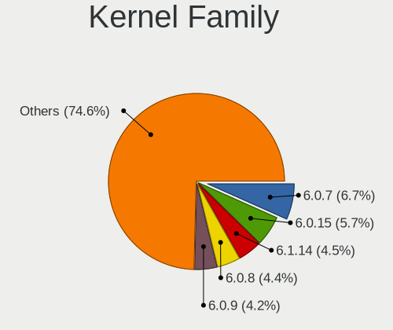
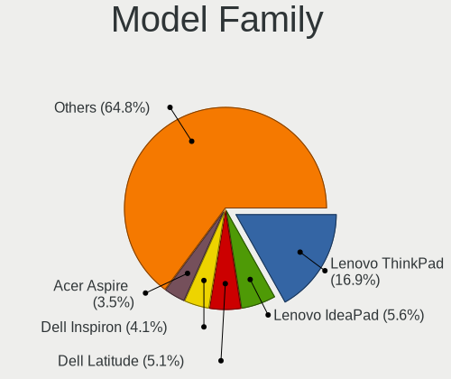
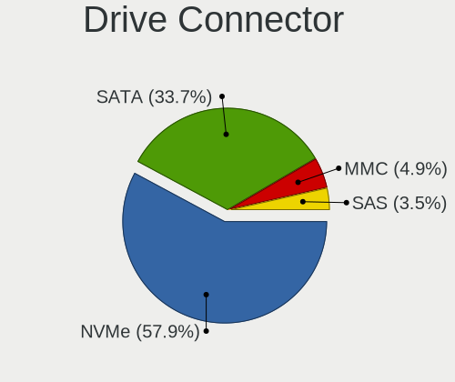
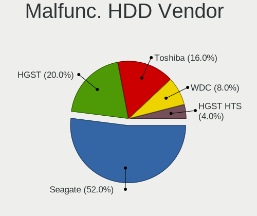
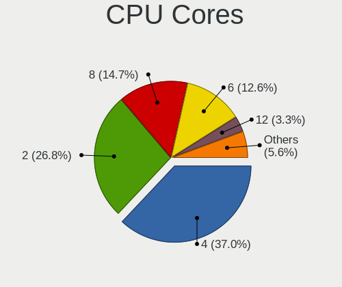

Fedora 37 - Tested Hardware & Statistics (Notebooks)
----------------------------------------------------

A project to collect tested hardware configurations for Fedora 37.

Anyone can contribute to this report by the [hw-probe](https://github.com/linuxhw/hw-probe) tool:

    sudo -E hw-probe -all -upload

Please contribute! Especially if your hardware is rare.

Contents
--------

* [ Test Cases ](#test-cases)

* [ System ](#system)
  - [ Kernel                   ](#kernel)
  - [ Kernel Family            ](#kernel-family)
  - [ Kernel Major Ver.        ](#kernel-major-ver)
  - [ Arch                     ](#arch)
  - [ DE                       ](#de)
  - [ Display Server           ](#display-server)
  - [ Display Manager          ](#display-manager)
  - [ OS Lang                  ](#os-lang)
  - [ Boot Mode                ](#boot-mode)
  - [ Filesystem               ](#filesystem)
  - [ Part. scheme             ](#part-scheme)
  - [ Dual Boot with Linux/BSD ](#dual-boot-with-linuxbsd)
  - [ Dual Boot (Win)          ](#dual-boot-win)

* [ Board ](#board)
  - [ Vendor                   ](#vendor)
  - [ Model                    ](#model)
  - [ Model Family             ](#model-family)
  - [ MFG Year                 ](#mfg-year)
  - [ Form Factor              ](#form-factor)
  - [ Secure Boot              ](#secure-boot)
  - [ Coreboot                 ](#coreboot)
  - [ RAM Size                 ](#ram-size)
  - [ RAM Used                 ](#ram-used)
  - [ Total Drives             ](#total-drives)
  - [ Has CD-ROM               ](#has-cd-rom)
  - [ Has Ethernet             ](#has-ethernet)
  - [ Has WiFi                 ](#has-wifi)
  - [ Has Bluetooth            ](#has-bluetooth)

* [ Location ](#location)
  - [ Country                  ](#country)
  - [ City                     ](#city)

* [ Drives ](#drives)
  - [ Drive Vendor             ](#drive-vendor)
  - [ Drive Model              ](#drive-model)
  - [ HDD Vendor               ](#hdd-vendor)
  - [ SSD Vendor               ](#ssd-vendor)
  - [ Drive Kind               ](#drive-kind)
  - [ Drive Connector          ](#drive-connector)
  - [ Drive Size               ](#drive-size)
  - [ Space Total              ](#space-total)
  - [ Space Used               ](#space-used)
  - [ Malfunc. Drives          ](#malfunc-drives)
  - [ Malfunc. Drive Vendor    ](#malfunc-drive-vendor)
  - [ Malfunc. HDD Vendor      ](#malfunc-hdd-vendor)
  - [ Malfunc. Drive Kind      ](#malfunc-drive-kind)
  - [ Failed Drives            ](#failed-drives)
  - [ Failed Drive Vendor      ](#failed-drive-vendor)
  - [ Drive Status             ](#drive-status)

* [ Storage controller ](#storage-controller)
  - [ Storage Vendor           ](#storage-vendor)
  - [ Storage Model            ](#storage-model)
  - [ Storage Kind             ](#storage-kind)

* [ Processor ](#processor)
  - [ CPU Vendor               ](#cpu-vendor)
  - [ CPU Model                ](#cpu-model)
  - [ CPU Model Family         ](#cpu-model-family)
  - [ CPU Cores                ](#cpu-cores)
  - [ CPU Sockets              ](#cpu-sockets)
  - [ CPU Threads              ](#cpu-threads)
  - [ CPU Op-Modes             ](#cpu-op-modes)
  - [ CPU Microcode            ](#cpu-microcode)
  - [ CPU Microarch            ](#cpu-microarch)

* [ Graphics ](#graphics)
  - [ GPU Vendor               ](#gpu-vendor)
  - [ GPU Model                ](#gpu-model)
  - [ GPU Combo                ](#gpu-combo)
  - [ GPU Driver               ](#gpu-driver)
  - [ GPU Memory               ](#gpu-memory)

* [ Monitor ](#monitor)
  - [ Monitor Vendor           ](#monitor-vendor)
  - [ Monitor Model            ](#monitor-model)
  - [ Monitor Resolution       ](#monitor-resolution)
  - [ Monitor Diagonal         ](#monitor-diagonal)
  - [ Monitor Width            ](#monitor-width)
  - [ Aspect Ratio             ](#aspect-ratio)
  - [ Monitor Area             ](#monitor-area)
  - [ Pixel Density            ](#pixel-density)
  - [ Multiple Monitors        ](#multiple-monitors)

* [ Network ](#network)
  - [ Net Controller Vendor    ](#net-controller-vendor)
  - [ Net Controller Model     ](#net-controller-model)
  - [ Wireless Vendor          ](#wireless-vendor)
  - [ Wireless Model           ](#wireless-model)
  - [ Ethernet Vendor          ](#ethernet-vendor)
  - [ Ethernet Model           ](#ethernet-model)
  - [ Net Controller Kind      ](#net-controller-kind)
  - [ Used Controller          ](#used-controller)
  - [ NICs                     ](#nics)
  - [ IPv6                     ](#ipv6)

* [ Bluetooth ](#bluetooth)
  - [ Bluetooth Vendor         ](#bluetooth-vendor)
  - [ Bluetooth Model          ](#bluetooth-model)

* [ Sound ](#sound)
  - [ Sound Vendor             ](#sound-vendor)
  - [ Sound Model              ](#sound-model)

* [ Memory ](#memory)
  - [ Memory Vendor            ](#memory-vendor)
  - [ Memory Model             ](#memory-model)
  - [ Memory Kind              ](#memory-kind)
  - [ Memory Form Factor       ](#memory-form-factor)
  - [ Memory Size              ](#memory-size)
  - [ Memory Speed             ](#memory-speed)

* [ Printers & scanners ](#printers--scanners)
  - [ Printer Vendor           ](#printer-vendor)
  - [ Printer Model            ](#printer-model)
  - [ Scanner Vendor           ](#scanner-vendor)
  - [ Scanner Model            ](#scanner-model)

* [ Camera ](#camera)
  - [ Camera Vendor            ](#camera-vendor)
  - [ Camera Model             ](#camera-model)

* [ Security ](#security)
  - [ Fingerprint Vendor       ](#fingerprint-vendor)
  - [ Fingerprint Model        ](#fingerprint-model)
  - [ Chipcard Vendor          ](#chipcard-vendor)
  - [ Chipcard Model           ](#chipcard-model)

* [ Unsupported ](#unsupported)
  - [ Unsupported Devices      ](#unsupported-devices)
  - [ Unsupported Device Types ](#unsupported-device-types)

Test Cases
----------

Total: 295

| Vendor        | Model                       | Probe                                                      | Date         |
|---------------|-----------------------------|------------------------------------------------------------|--------------|
| Lenovo        | Legion S7 15ACH6 82K8       | [4ab89a8ad2](https://linux-hardware.org/?probe=4ab89a8ad2) | Dec 01, 2022 |
| Dell          | Latitude E5450              | [305bf364f6](https://linux-hardware.org/?probe=305bf364f6) | Dec 01, 2022 |
| ASUSTek       | Zephyrus M GU502GV_GU502... | [de34f148b9](https://linux-hardware.org/?probe=de34f148b9) | Dec 01, 2022 |
| Dell          | Latitude E5450              | [2b934a729c](https://linux-hardware.org/?probe=2b934a729c) | Dec 01, 2022 |
| TUXEDO        | InfinityBook Pro 14 Gen6    | [946e66e35e](https://linux-hardware.org/?probe=946e66e35e) | Dec 01, 2022 |
| HUAWEI        | MACH-WX9                    | [a37f48c68a](https://linux-hardware.org/?probe=a37f48c68a) | Dec 01, 2022 |
| Lenovo        | Legion 5 15ACH6H 82JU       | [2cf7f9ab67](https://linux-hardware.org/?probe=2cf7f9ab67) | Dec 01, 2022 |
| ASUSTek       | ASUS TUF Dash F15 FX516P... | [0128a48982](https://linux-hardware.org/?probe=0128a48982) | Dec 01, 2022 |
| HP            | ProBook 440 G7              | [a54a325001](https://linux-hardware.org/?probe=a54a325001) | Dec 01, 2022 |
| Lenovo        | ThinkPad X13 Gen 2a 20XH... | [f0ee9f78bd](https://linux-hardware.org/?probe=f0ee9f78bd) | Dec 01, 2022 |
| ASUSTek       | K55VD                       | [149d517fa5](https://linux-hardware.org/?probe=149d517fa5) | Dec 01, 2022 |
| HUAWEI        | CREM-WXX9                   | [2436f4cf5e](https://linux-hardware.org/?probe=2436f4cf5e) | Nov 30, 2022 |
| Lenovo        | ThinkPad X220 4291WSH       | [3e67e44d23](https://linux-hardware.org/?probe=3e67e44d23) | Nov 30, 2022 |
| Lenovo        | ThinkPad P1 Gen 3 20TJS5... | [2df1670891](https://linux-hardware.org/?probe=2df1670891) | Nov 30, 2022 |
| Lenovo        | Legion 5 15ACH6H 82JU       | [944ace565b](https://linux-hardware.org/?probe=944ace565b) | Nov 30, 2022 |
| HP            | Notebook                    | [afac08b852](https://linux-hardware.org/?probe=afac08b852) | Nov 30, 2022 |
| Dell          | Inspiron 3580               | [6bc2705d99](https://linux-hardware.org/?probe=6bc2705d99) | Nov 30, 2022 |
| HP            | Laptop 15s-fq4xxx           | [19b00c186f](https://linux-hardware.org/?probe=19b00c186f) | Nov 30, 2022 |
| HP            | Laptop 15s-fq4xxx           | [18ec3bc77e](https://linux-hardware.org/?probe=18ec3bc77e) | Nov 30, 2022 |
| Lenovo        | ThinkPad T480 20L6S01Q3K    | [9fd6308179](https://linux-hardware.org/?probe=9fd6308179) | Nov 30, 2022 |
| Lenovo        | ThinkPad X1 Carbon 6th 2... | [38c4009dba](https://linux-hardware.org/?probe=38c4009dba) | Nov 30, 2022 |
| HP            | Pavilion Laptop 14-dv0xx... | [4a49152177](https://linux-hardware.org/?probe=4a49152177) | Nov 29, 2022 |
| Lenovo        | ThinkPad E550 20DF004RGE    | [a06fd97ee3](https://linux-hardware.org/?probe=a06fd97ee3) | Nov 29, 2022 |
| ASUSTek       | X756UXK                     | [a8fde1c59a](https://linux-hardware.org/?probe=a8fde1c59a) | Nov 29, 2022 |
| Lenovo        | ThinkPad L14 Gen 1 20U50... | [9216162e85](https://linux-hardware.org/?probe=9216162e85) | Nov 29, 2022 |
| Dell          | Latitude D620               | [9f6317405c](https://linux-hardware.org/?probe=9f6317405c) | Nov 29, 2022 |
| HP            | ZBook Power G7 Mobile Wo... | [bb023e130b](https://linux-hardware.org/?probe=bb023e130b) | Nov 29, 2022 |
| Lenovo        | ThinkPad L15 Gen 1 20U70... | [fd821a4b54](https://linux-hardware.org/?probe=fd821a4b54) | Nov 29, 2022 |
| Lenovo        | IdeaPad 5 Pro 16ACH6 82L... | [39e771bd92](https://linux-hardware.org/?probe=39e771bd92) | Nov 28, 2022 |
| Dell          | Latitude 7480               | [409c2f27c8](https://linux-hardware.org/?probe=409c2f27c8) | Nov 28, 2022 |
| HP            | EliteBook 845 G7 Noteboo... | [e1495dc120](https://linux-hardware.org/?probe=e1495dc120) | Nov 28, 2022 |
| Lenovo        | ThinkBook 15 G3 ACL 21A4    | [901fa6e871](https://linux-hardware.org/?probe=901fa6e871) | Nov 28, 2022 |
| Lenovo        | ThinkPad P15s Gen 2i 20W... | [ea6f1fc82e](https://linux-hardware.org/?probe=ea6f1fc82e) | Nov 28, 2022 |
| ASUSTek       | ROG Zephyrus G15 GA502IV... | [86f58e68b6](https://linux-hardware.org/?probe=86f58e68b6) | Nov 28, 2022 |
| Acer          | Nitro AN517-54              | [a9b90b8910](https://linux-hardware.org/?probe=a9b90b8910) | Nov 27, 2022 |
| Unknown       | Unknown                     | [4f73de3788](https://linux-hardware.org/?probe=4f73de3788) | Nov 27, 2022 |
| Lenovo        | IdeaPad 3 15IGL05 81WQ      | [415a8f0d8b](https://linux-hardware.org/?probe=415a8f0d8b) | Nov 27, 2022 |
| Acer          | Nitro AN517-54              | [445583d2bb](https://linux-hardware.org/?probe=445583d2bb) | Nov 27, 2022 |
| HP            | Laptop 15-da1xxx            | [8c4cae32db](https://linux-hardware.org/?probe=8c4cae32db) | Nov 27, 2022 |
| HP            | Laptop 15s-eq2xxx           | [bdc1a14cd4](https://linux-hardware.org/?probe=bdc1a14cd4) | Nov 27, 2022 |
| HP            | Pavilion Laptop 14-ec0xx... | [26083dd909](https://linux-hardware.org/?probe=26083dd909) | Nov 27, 2022 |
| ASUSTek       | N53Jf                       | [e4dc6e5cd9](https://linux-hardware.org/?probe=e4dc6e5cd9) | Nov 27, 2022 |
| AVITA         | NS14A6                      | [b9cc8fe757](https://linux-hardware.org/?probe=b9cc8fe757) | Nov 27, 2022 |
| Lenovo        | ThinkPad T440p 20AWS0XX0... | [f91c391079](https://linux-hardware.org/?probe=f91c391079) | Nov 26, 2022 |
| HP            | Pavilion Gaming Laptop 1... | [dc561bb107](https://linux-hardware.org/?probe=dc561bb107) | Nov 26, 2022 |
| HP            | Pavilion Gaming Laptop 1... | [336d829333](https://linux-hardware.org/?probe=336d829333) | Nov 26, 2022 |
| HP            | EliteBook 830 G5            | [bda395e731](https://linux-hardware.org/?probe=bda395e731) | Nov 26, 2022 |
| HP            | EliteBook 830 G5            | [0138561b29](https://linux-hardware.org/?probe=0138561b29) | Nov 26, 2022 |
| ASUSTek       | ASUS TUF Gaming A15 FA50... | [74fcf5cb22](https://linux-hardware.org/?probe=74fcf5cb22) | Nov 26, 2022 |
| ASUSTek       | ASUS TUF Gaming A15 FA50... | [a4dbfc0da9](https://linux-hardware.org/?probe=a4dbfc0da9) | Nov 26, 2022 |
| MACHENIKE     | MACHCREATOR-16              | [15d49eb71a](https://linux-hardware.org/?probe=15d49eb71a) | Nov 26, 2022 |
| Apple         | MacBookPro15,2              | [446ef54cb5](https://linux-hardware.org/?probe=446ef54cb5) | Nov 26, 2022 |
| Apple         | MacBookAir8,1               | [6656b4e315](https://linux-hardware.org/?probe=6656b4e315) | Nov 26, 2022 |
| MSI           | Modern 14 B5M               | [bf3c55e13b](https://linux-hardware.org/?probe=bf3c55e13b) | Nov 26, 2022 |
| ASUSTek       | ASUS TUF Gaming A15 FA50... | [ab6ce548bc](https://linux-hardware.org/?probe=ab6ce548bc) | Nov 26, 2022 |
| Lenovo        | B51-80 80LM                 | [848b6ab7b3](https://linux-hardware.org/?probe=848b6ab7b3) | Nov 26, 2022 |
| Lenovo        | B51-80 80LM                 | [c34893c661](https://linux-hardware.org/?probe=c34893c661) | Nov 26, 2022 |
| ASUSTek       | ROG Zephyrus G15 GA503RM... | [83a97530e1](https://linux-hardware.org/?probe=83a97530e1) | Nov 26, 2022 |
| Google        | Glimmer                     | [8ad30368c9](https://linux-hardware.org/?probe=8ad30368c9) | Nov 26, 2022 |
| GPD           | G1621-02                    | [f0e9e8442c](https://linux-hardware.org/?probe=f0e9e8442c) | Nov 26, 2022 |
| ASUSTek       | ZenBook UX534FTC_UX534FT    | [d845cbb51d](https://linux-hardware.org/?probe=d845cbb51d) | Nov 26, 2022 |
| Lenovo        | ThinkPad L15 Gen 1 20U70... | [18130ae317](https://linux-hardware.org/?probe=18130ae317) | Nov 25, 2022 |
| Sony          | SVE15133CNB                 | [376fc86892](https://linux-hardware.org/?probe=376fc86892) | Nov 25, 2022 |
| Sony          | SVE15133CNB                 | [f46e1bc341](https://linux-hardware.org/?probe=f46e1bc341) | Nov 25, 2022 |
| Lenovo        | ThinkBook 14 G2 ITL 20VD    | [4261949a3e](https://linux-hardware.org/?probe=4261949a3e) | Nov 25, 2022 |
| HP            | EliteBook 850 G8 Noteboo... | [8acafcf4ab](https://linux-hardware.org/?probe=8acafcf4ab) | Nov 25, 2022 |
| ASUSTek       | VivoBook_ASUSLaptop M540... | [682993f58f](https://linux-hardware.org/?probe=682993f58f) | Nov 25, 2022 |
| HP            | Laptop 14-dq1xxx            | [1e6fa19cc3](https://linux-hardware.org/?probe=1e6fa19cc3) | Nov 25, 2022 |
| Acer          | Nitro AN515-54              | [9226b4c616](https://linux-hardware.org/?probe=9226b4c616) | Nov 24, 2022 |
| MSI           | Summit E16Flip A12UCT       | [95f653bddb](https://linux-hardware.org/?probe=95f653bddb) | Nov 24, 2022 |
| MSI           | Summit E16Flip A12UCT       | [a4a2b60b09](https://linux-hardware.org/?probe=a4a2b60b09) | Nov 24, 2022 |
| Dell          | Inspiron 5370               | [469b2c3fd4](https://linux-hardware.org/?probe=469b2c3fd4) | Nov 24, 2022 |
| Toshiba       | Satellite S55-A             | [5466c61736](https://linux-hardware.org/?probe=5466c61736) | Nov 24, 2022 |
| ASUSTek       | Q550LF                      | [713f7b2c74](https://linux-hardware.org/?probe=713f7b2c74) | Nov 24, 2022 |
| Lenovo        | ThinkPad P15s Gen 2i 20W... | [1c65fff6e7](https://linux-hardware.org/?probe=1c65fff6e7) | Nov 24, 2022 |
| HP            | OMEN Laptop 15-en0xxx       | [d84bc82678](https://linux-hardware.org/?probe=d84bc82678) | Nov 23, 2022 |
| ASUSTek       | ZenBook UX534FTC_UX534FT    | [5b18e83e0d](https://linux-hardware.org/?probe=5b18e83e0d) | Nov 23, 2022 |
| Lenovo        | IdeaPad 520S-14IKB 80X2     | [57dfd88985](https://linux-hardware.org/?probe=57dfd88985) | Nov 23, 2022 |
| HP            | Laptop 15-da0xxx            | [fa989478ad](https://linux-hardware.org/?probe=fa989478ad) | Nov 23, 2022 |
| HP            | Laptop 15-dw3xxx            | [fbf991818d](https://linux-hardware.org/?probe=fbf991818d) | Nov 23, 2022 |
| Apple         | MacBookPro9,2               | [3e176f0c26](https://linux-hardware.org/?probe=3e176f0c26) | Nov 22, 2022 |
| Acer          | Extensa 4220                | [af778b2ec9](https://linux-hardware.org/?probe=af778b2ec9) | Nov 22, 2022 |
| Acer          | Extensa 4220                | [04187e0d6e](https://linux-hardware.org/?probe=04187e0d6e) | Nov 22, 2022 |
| Lenovo        | ThinkPad T14s Gen 1 20UH... | [923ccf8b76](https://linux-hardware.org/?probe=923ccf8b76) | Nov 22, 2022 |
| HP            | ProBook 430 G8 Notebook ... | [8a773e7358](https://linux-hardware.org/?probe=8a773e7358) | Nov 22, 2022 |
| Lenovo        | ThinkPad P53 20QNS00X00     | [d49ca08585](https://linux-hardware.org/?probe=d49ca08585) | Nov 22, 2022 |
| Lenovo        | ThinkPad X1 Nano Gen 1 2... | [d48ad61c01](https://linux-hardware.org/?probe=d48ad61c01) | Nov 22, 2022 |
| Acer          | Aspire A515-45              | [0dcdb72cd6](https://linux-hardware.org/?probe=0dcdb72cd6) | Nov 22, 2022 |
| Acer          | Predator PH315-55           | [f411f75743](https://linux-hardware.org/?probe=f411f75743) | Nov 22, 2022 |
| HP            | Laptop 15-da0xxx            | [aef0888523](https://linux-hardware.org/?probe=aef0888523) | Nov 21, 2022 |
| ASUSTek       | X541NA                      | [8c624c76fa](https://linux-hardware.org/?probe=8c624c76fa) | Nov 21, 2022 |
| Acer          | Aspire A315-51              | [bcff111ecd](https://linux-hardware.org/?probe=bcff111ecd) | Nov 21, 2022 |
| Lenovo        | IdeaPad S540-15IWL          | [bce41d01ae](https://linux-hardware.org/?probe=bce41d01ae) | Nov 21, 2022 |
| Dell          | Latitude D620               | [d45ad40496](https://linux-hardware.org/?probe=d45ad40496) | Nov 21, 2022 |
| Apple         | MacBookPro10,1              | [71cb60b441](https://linux-hardware.org/?probe=71cb60b441) | Nov 21, 2022 |
| Dell          | Inspiron 3505               | [634f7d190d](https://linux-hardware.org/?probe=634f7d190d) | Nov 21, 2022 |
| HP            | ZBook 15 G4                 | [3378343bab](https://linux-hardware.org/?probe=3378343bab) | Nov 21, 2022 |
| HP            | Pavilion Laptop 14-ce2xx... | [0e9d717db2](https://linux-hardware.org/?probe=0e9d717db2) | Nov 21, 2022 |
| ASUSTek       | X541NA                      | [aa4d9601ee](https://linux-hardware.org/?probe=aa4d9601ee) | Nov 21, 2022 |
| MSI           | Stealth GS66 12UGS          | [ca3d88f38d](https://linux-hardware.org/?probe=ca3d88f38d) | Nov 21, 2022 |
| Dell          | Latitude 7420               | [ca5319fd67](https://linux-hardware.org/?probe=ca5319fd67) | Nov 21, 2022 |
| Acer          | Aspire A515-45              | [5739045caa](https://linux-hardware.org/?probe=5739045caa) | Nov 20, 2022 |
| HUAWEI        | MACH-WX9                    | [32fa69ea64](https://linux-hardware.org/?probe=32fa69ea64) | Nov 20, 2022 |
| Dell          | XPS 13 7390                 | [9f6c38b4ee](https://linux-hardware.org/?probe=9f6c38b4ee) | Nov 20, 2022 |
| Acer          | Aspire A515-45              | [11e00d597d](https://linux-hardware.org/?probe=11e00d597d) | Nov 20, 2022 |
| Lenovo        | ThinkPad X13 Gen 1 20UFS... | [678cfec38b](https://linux-hardware.org/?probe=678cfec38b) | Nov 20, 2022 |
| MSI           | Katana GF76 11UD            | [1f47d7c31b](https://linux-hardware.org/?probe=1f47d7c31b) | Nov 20, 2022 |
| Lenovo        | ThinkPad P15 Gen 2i 20YQ... | [ade5f58f0e](https://linux-hardware.org/?probe=ade5f58f0e) | Nov 20, 2022 |
| Lenovo        | ThinkPad P53 20QN0011IV     | [58c63522a4](https://linux-hardware.org/?probe=58c63522a4) | Nov 20, 2022 |
| Lenovo        | ThinkPad T460 20FN004CMD    | [1b7140151d](https://linux-hardware.org/?probe=1b7140151d) | Nov 20, 2022 |
| Lenovo        | ThinkPad X240 20AMS56K00    | [5ff1608320](https://linux-hardware.org/?probe=5ff1608320) | Nov 19, 2022 |
| Apple         | MacBookPro11,5              | [3b5c35b319](https://linux-hardware.org/?probe=3b5c35b319) | Nov 19, 2022 |
| Google        | Celes                       | [00ed0ea4b5](https://linux-hardware.org/?probe=00ed0ea4b5) | Nov 19, 2022 |
| Sony          | SVE15133CNB                 | [3d78ceb657](https://linux-hardware.org/?probe=3d78ceb657) | Nov 19, 2022 |
| Lenovo        | ThinkPad T580 20L9CTO1WW    | [bed1f98f04](https://linux-hardware.org/?probe=bed1f98f04) | Nov 19, 2022 |
| HUAWEI        | CREM-WXX9                   | [f9b8181279](https://linux-hardware.org/?probe=f9b8181279) | Nov 19, 2022 |
| Google        | Lick                        | [6d8750d974](https://linux-hardware.org/?probe=6d8750d974) | Nov 19, 2022 |
| Lenovo        | ThinkBook 15 G2 ARE 20VG    | [87d8a1ee6b](https://linux-hardware.org/?probe=87d8a1ee6b) | Nov 19, 2022 |
| ASUSTek       | M80TA                       | [d2427d8942](https://linux-hardware.org/?probe=d2427d8942) | Nov 18, 2022 |
| Lenovo        | ThinkPad T480 20L6S3L400    | [ae98e93989](https://linux-hardware.org/?probe=ae98e93989) | Nov 18, 2022 |
| Google        | Careena                     | [81dd8e9906](https://linux-hardware.org/?probe=81dd8e9906) | Nov 18, 2022 |
| HP            | EliteBook 840 14 inch G9... | [b5d4ff63a5](https://linux-hardware.org/?probe=b5d4ff63a5) | Nov 18, 2022 |
| HP            | Laptop 15-ef1xxx            | [2e47c9c20f](https://linux-hardware.org/?probe=2e47c9c20f) | Nov 18, 2022 |
| Dell          | XPS 13 7390                 | [19d18ac52c](https://linux-hardware.org/?probe=19d18ac52c) | Nov 17, 2022 |
| ASUSTek       | VivoBook_ASUSLaptop X421... | [33113bb27d](https://linux-hardware.org/?probe=33113bb27d) | Nov 17, 2022 |
| Lenovo        | IdeaPad 720S-13ARR 81BR     | [2cb56b8c63](https://linux-hardware.org/?probe=2cb56b8c63) | Nov 17, 2022 |
| Lenovo        | ThinkPad T480s 20L8S1R50... | [61f6e057e6](https://linux-hardware.org/?probe=61f6e057e6) | Nov 17, 2022 |
| Acer          | Aspire A515-51              | [ee9d0faeef](https://linux-hardware.org/?probe=ee9d0faeef) | Nov 17, 2022 |
| HP            | Pavilion Laptop 14-dv0xx... | [190c6d9cc7](https://linux-hardware.org/?probe=190c6d9cc7) | Nov 17, 2022 |
| HP            | Pavilion Gaming Laptop 1... | [450e658685](https://linux-hardware.org/?probe=450e658685) | Nov 16, 2022 |
| Lenovo        | ThinkPad E15 Gen 2 20T80... | [6f2f504425](https://linux-hardware.org/?probe=6f2f504425) | Nov 16, 2022 |
| Lenovo        | ThinkPad Edge 03192AG       | [48da1b11bc](https://linux-hardware.org/?probe=48da1b11bc) | Nov 16, 2022 |
| Apple         | MacBookPro11,5              | [62586ed7f9](https://linux-hardware.org/?probe=62586ed7f9) | Nov 16, 2022 |
| ASUSTek       | VivoBook_ASUSLaptop X513... | [8b2d48cd24](https://linux-hardware.org/?probe=8b2d48cd24) | Nov 16, 2022 |
| MSI           | Katana GF76 11UD            | [fec345f330](https://linux-hardware.org/?probe=fec345f330) | Nov 16, 2022 |
| GPD           | G1619-04                    | [c1e365fd5d](https://linux-hardware.org/?probe=c1e365fd5d) | Nov 16, 2022 |
| HP            | Laptop 15-dw3xxx            | [03426a19e5](https://linux-hardware.org/?probe=03426a19e5) | Nov 16, 2022 |
| Lenovo        | IdeaPad 5 Pro 14ACN6 82L... | [e7343719c2](https://linux-hardware.org/?probe=e7343719c2) | Nov 16, 2022 |
| HP            | ZBook Fury 15 G7 Mobile ... | [5d11a28230](https://linux-hardware.org/?probe=5d11a28230) | Nov 16, 2022 |
| ASUSTek       | ASUS TUF Gaming A15 FA50... | [94983688d2](https://linux-hardware.org/?probe=94983688d2) | Nov 16, 2022 |
| Lenovo        | ThinkPad E15 Gen 4 21E60... | [bafff409d9](https://linux-hardware.org/?probe=bafff409d9) | Nov 16, 2022 |
| Lenovo        | ThinkBook 14 G4+ IAP 21C... | [1104a26017](https://linux-hardware.org/?probe=1104a26017) | Nov 16, 2022 |
| Lenovo        | IdeaPad 3 15ITL6 82H8       | [119f9da4af](https://linux-hardware.org/?probe=119f9da4af) | Nov 16, 2022 |
| Lenovo        | ThinkBook 14 G3 ACL 21A2    | [4c05f821c1](https://linux-hardware.org/?probe=4c05f821c1) | Nov 16, 2022 |
| HP            | Laptop 15s-eq2xxx           | [6af7c2ad85](https://linux-hardware.org/?probe=6af7c2ad85) | Nov 15, 2022 |
| Schenker      | XMG FUSION 15 (XFU15L19)    | [d2cf28fbb9](https://linux-hardware.org/?probe=d2cf28fbb9) | Nov 15, 2022 |
| Kraftway      | ACCORD                      | [7021cedadf](https://linux-hardware.org/?probe=7021cedadf) | Nov 15, 2022 |
| ASUSTek       | Zenbook UM3402YA_UM3402Y... | [66737bb1cc](https://linux-hardware.org/?probe=66737bb1cc) | Nov 15, 2022 |
| Lenovo        | Legion 5 15ACH6H 82JU       | [465bc481e2](https://linux-hardware.org/?probe=465bc481e2) | Nov 14, 2022 |
| Lenovo        | ThinkPad L450 20DSS1GD00    | [b0ea02b16c](https://linux-hardware.org/?probe=b0ea02b16c) | Nov 13, 2022 |
| Lenovo        | IdeaPad 3 14ITL05 81X7      | [09285b9428](https://linux-hardware.org/?probe=09285b9428) | Nov 13, 2022 |
| Apple         | MacBook9,1                  | [755a70132f](https://linux-hardware.org/?probe=755a70132f) | Nov 12, 2022 |
| Apple         | MacBook9,1                  | [4371465097](https://linux-hardware.org/?probe=4371465097) | Nov 12, 2022 |
| HP            | Laptop 15s-eq2xxx           | [b64a32327f](https://linux-hardware.org/?probe=b64a32327f) | Nov 11, 2022 |
| ASUSTek       | ASUS TUF Gaming F15 FX50... | [0e3e3c885a](https://linux-hardware.org/?probe=0e3e3c885a) | Nov 11, 2022 |
| ASUSTek       | ASUS TUF Gaming F15 FX50... | [2421b6c5a4](https://linux-hardware.org/?probe=2421b6c5a4) | Nov 11, 2022 |
| ASUSTek       | VivoBook 15_ASUS Laptop ... | [3bcdc36fff](https://linux-hardware.org/?probe=3bcdc36fff) | Nov 11, 2022 |
| Dell          | Latitude 7480               | [cd19ef7ab8](https://linux-hardware.org/?probe=cd19ef7ab8) | Nov 10, 2022 |
| Dell          | Latitude 7480               | [100bc3303a](https://linux-hardware.org/?probe=100bc3303a) | Nov 10, 2022 |
| Acer          | Nitro AN515-46              | [741209999d](https://linux-hardware.org/?probe=741209999d) | Nov 10, 2022 |
| HUAWEI        | CREM-WXX9                   | [4e535c916f](https://linux-hardware.org/?probe=4e535c916f) | Nov 10, 2022 |
| GPD           | G1619-04                    | [cf4cb47a12](https://linux-hardware.org/?probe=cf4cb47a12) | Nov 09, 2022 |
| Lenovo        | ThinkPad W541 20EFCTO1WW    | [4a6aec2eb8](https://linux-hardware.org/?probe=4a6aec2eb8) | Nov 09, 2022 |
| ASUSTek       | VivoBook S15 X510UF         | [a2e9b34d94](https://linux-hardware.org/?probe=a2e9b34d94) | Nov 09, 2022 |
| Acer          | SW5-017                     | [d4ff3ee29e](https://linux-hardware.org/?probe=d4ff3ee29e) | Nov 08, 2022 |
| Lenovo        | ThinkPad P14s Gen 2a 21A... | [1cca3aa247](https://linux-hardware.org/?probe=1cca3aa247) | Nov 08, 2022 |
| Eluktronic... | P670RE3                     | [d96ecdf7ab](https://linux-hardware.org/?probe=d96ecdf7ab) | Nov 08, 2022 |
| ASUSTek       | ASUS TUF Gaming F15 FX50... | [fc4fb9249e](https://linux-hardware.org/?probe=fc4fb9249e) | Nov 08, 2022 |
| TUXEDO        | Pulse 15 Gen2               | [f0c2157642](https://linux-hardware.org/?probe=f0c2157642) | Nov 07, 2022 |
| Acer          | Aspire A315-41              | [df6426eef5](https://linux-hardware.org/?probe=df6426eef5) | Nov 07, 2022 |
| Acer          | Aspire A315-41              | [bae4adcff9](https://linux-hardware.org/?probe=bae4adcff9) | Nov 07, 2022 |
| Dell          | G3 3579                     | [b793526167](https://linux-hardware.org/?probe=b793526167) | Nov 06, 2022 |
| Dell          | Vostro 13 5310              | [c25e192969](https://linux-hardware.org/?probe=c25e192969) | Nov 05, 2022 |
| Lenovo        | ThinkPad L15 Gen 1 20U70... | [a2905cad90](https://linux-hardware.org/?probe=a2905cad90) | Nov 04, 2022 |
| HP            | Laptop 15s-eq2xxx           | [3cb1f34e2a](https://linux-hardware.org/?probe=3cb1f34e2a) | Nov 04, 2022 |
| Lenovo        | ThinkPad T430 2347AP9       | [80dbecb998](https://linux-hardware.org/?probe=80dbecb998) | Nov 04, 2022 |
| Apple         | MacBookPro10,1              | [b2af134ab3](https://linux-hardware.org/?probe=b2af134ab3) | Nov 04, 2022 |
| HP            | ProBook 640 G1              | [9d1ba43c71](https://linux-hardware.org/?probe=9d1ba43c71) | Nov 04, 2022 |
| Lenovo        | Unknown                     | [0825807141](https://linux-hardware.org/?probe=0825807141) | Nov 04, 2022 |
| HP            | ProBook 640 G1              | [dac055fa29](https://linux-hardware.org/?probe=dac055fa29) | Nov 04, 2022 |
| SLIMBOOK      | Executive                   | [cff86cc921](https://linux-hardware.org/?probe=cff86cc921) | Nov 04, 2022 |
| Lenovo        | IdeaPad 5 Pro 16ACH6 82L... | [9af713ef6e](https://linux-hardware.org/?probe=9af713ef6e) | Nov 04, 2022 |
| Framework     | Laptop (12th Gen Intel C... | [d87e75abbf](https://linux-hardware.org/?probe=d87e75abbf) | Nov 04, 2022 |
| Lenovo        | IdeaPad 5 Pro 16ACH6 82L... | [dae32fcba7](https://linux-hardware.org/?probe=dae32fcba7) | Nov 04, 2022 |
| Alienware     | x17 R2                      | [2e25d30db1](https://linux-hardware.org/?probe=2e25d30db1) | Nov 04, 2022 |
| Lenovo        | IdeaPad Yoga 13 20175       | [a2d3502165](https://linux-hardware.org/?probe=a2d3502165) | Nov 04, 2022 |
| UNOWHY        | Y13G011S4EI                 | [da784a5c82](https://linux-hardware.org/?probe=da784a5c82) | Nov 04, 2022 |
| Timi          | RedmiBook Pro 14S           | [9fbf084c28](https://linux-hardware.org/?probe=9fbf084c28) | Nov 04, 2022 |
| ASUSTek       | VivoBook_ASUSLaptop X515... | [18b0671002](https://linux-hardware.org/?probe=18b0671002) | Nov 03, 2022 |
| HUAWEI        | CREM-WXX9                   | [870d04c833](https://linux-hardware.org/?probe=870d04c833) | Nov 03, 2022 |
| Lenovo        | ThinkPad T470 20HDCTO1WW    | [984c379f69](https://linux-hardware.org/?probe=984c379f69) | Nov 03, 2022 |
| Lenovo        | Legion 5 15IAH7H 82RB       | [aa6c06f2bb](https://linux-hardware.org/?probe=aa6c06f2bb) | Nov 02, 2022 |
| Lenovo        | Legion 5 15IAH7H 82RB       | [584db1dcb2](https://linux-hardware.org/?probe=584db1dcb2) | Nov 02, 2022 |
| GPD           | G1619-04                    | [898bbfb591](https://linux-hardware.org/?probe=898bbfb591) | Nov 01, 2022 |
| HUAWEI        | CREM-WXX9                   | [1d24aac4ce](https://linux-hardware.org/?probe=1d24aac4ce) | Nov 01, 2022 |
| HUAWEI        | CREM-WXX9                   | [2eb32b1bb3](https://linux-hardware.org/?probe=2eb32b1bb3) | Nov 01, 2022 |
| HP            | ZBook 15 G2                 | [7254a9a2fc](https://linux-hardware.org/?probe=7254a9a2fc) | Nov 01, 2022 |
| Samsung       | RV410/RV510/S3510/E3510     | [566d83485b](https://linux-hardware.org/?probe=566d83485b) | Oct 31, 2022 |
| HUAWEI        | BOHK-WAX9X                  | [e993af2670](https://linux-hardware.org/?probe=e993af2670) | Oct 31, 2022 |
| HP            | ENVY 17                     | [5b845d9ee3](https://linux-hardware.org/?probe=5b845d9ee3) | Oct 31, 2022 |
| Samsung       | RV410/RV510/S3510/E3510     | [073ba962ff](https://linux-hardware.org/?probe=073ba962ff) | Oct 31, 2022 |
| Schenker      | XMG FUSION 15 (XFU15L19)    | [221710c9ea](https://linux-hardware.org/?probe=221710c9ea) | Oct 31, 2022 |
| Lenovo        | ThinkPad X220 4291WSH       | [a4eebe6485](https://linux-hardware.org/?probe=a4eebe6485) | Oct 30, 2022 |
| Dell          | Latitude 7490               | [95d0006efb](https://linux-hardware.org/?probe=95d0006efb) | Oct 30, 2022 |
| Dell          | XPS 13 9300                 | [cc62dbe2f6](https://linux-hardware.org/?probe=cc62dbe2f6) | Oct 29, 2022 |
| Dell          | XPS 13 9300                 | [301aab9126](https://linux-hardware.org/?probe=301aab9126) | Oct 29, 2022 |
| HP            | ZBook 15 G3                 | [c60b429baa](https://linux-hardware.org/?probe=c60b429baa) | Oct 28, 2022 |
| Lenovo        | ThinkPad P15 Gen 2i 20YR... | [0c6a68368c](https://linux-hardware.org/?probe=0c6a68368c) | Oct 27, 2022 |
| Lenovo        | IdeaPad 5 14ITL05 82FE      | [670823778e](https://linux-hardware.org/?probe=670823778e) | Oct 27, 2022 |
| Dell          | Latitude E7270              | [7f2c8b9e9c](https://linux-hardware.org/?probe=7f2c8b9e9c) | Oct 25, 2022 |
| Dell          | Latitude E7450              | [45e65cd626](https://linux-hardware.org/?probe=45e65cd626) | Oct 25, 2022 |
| HP            | 340S G7 Notebook PC         | [dc8eab937b](https://linux-hardware.org/?probe=dc8eab937b) | Oct 24, 2022 |
| HP            | 340S G7 Notebook PC         | [406538a0de](https://linux-hardware.org/?probe=406538a0de) | Oct 23, 2022 |
| Lenovo        | IdeaPad L340-15IRH Gamin... | [14830504a7](https://linux-hardware.org/?probe=14830504a7) | Oct 22, 2022 |
| Lenovo        | ThinkPad X260 20F5S5Q200    | [c2e041fd54](https://linux-hardware.org/?probe=c2e041fd54) | Oct 21, 2022 |
| Timi          | Xiaomi Book Pro 16 2022     | [41bade1339](https://linux-hardware.org/?probe=41bade1339) | Oct 21, 2022 |
| LG Electro... | 16Z90P-G.AP75D              | [1e1526e9d8](https://linux-hardware.org/?probe=1e1526e9d8) | Oct 21, 2022 |
| Lenovo        | IdeaPad 5 15ALC05 82LN      | [63751816bc](https://linux-hardware.org/?probe=63751816bc) | Oct 21, 2022 |
| Lenovo        | ThinkPad P15 Gen 2i 20YR... | [e03569f758](https://linux-hardware.org/?probe=e03569f758) | Oct 20, 2022 |
| ASUSTek       | VivoBook_ASUSLaptop X515... | [06328b7f7c](https://linux-hardware.org/?probe=06328b7f7c) | Oct 20, 2022 |
| Dell          | Latitude 7420               | [332d2cd420](https://linux-hardware.org/?probe=332d2cd420) | Oct 19, 2022 |
| System76      | Kudu                        | [49c0e1c400](https://linux-hardware.org/?probe=49c0e1c400) | Oct 19, 2022 |
| ASUSTek       | ROG Strix G533ZM_G533ZM     | [f91daeac73](https://linux-hardware.org/?probe=f91daeac73) | Oct 19, 2022 |
| Dell          | Precision 5510              | [d56d0aceaf](https://linux-hardware.org/?probe=d56d0aceaf) | Oct 18, 2022 |
| Acer          | Aspire A717-71G             | [969c0ac771](https://linux-hardware.org/?probe=969c0ac771) | Oct 17, 2022 |
| Lenovo        | ThinkBook 15 G2 ITL 20VE    | [7b5da7d635](https://linux-hardware.org/?probe=7b5da7d635) | Oct 17, 2022 |
| HUAWEI        | NBLB-WAX9N                  | [678415db20](https://linux-hardware.org/?probe=678415db20) | Oct 17, 2022 |
| Lenovo        | IdeaPad 330-15IKB 81DE      | [c1bad579af](https://linux-hardware.org/?probe=c1bad579af) | Oct 17, 2022 |
| HP            | Pavilion Gaming Laptop 1... | [2a36feb313](https://linux-hardware.org/?probe=2a36feb313) | Oct 16, 2022 |
| Timi          | TM1701                      | [c2b709ff0c](https://linux-hardware.org/?probe=c2b709ff0c) | Oct 15, 2022 |
| Lenovo        | ThinkPad T480s 20L8S1R50... | [478b58f9b6](https://linux-hardware.org/?probe=478b58f9b6) | Oct 15, 2022 |
| ASUSTek       | ZenBook UX431DA_UM431DA     | [dbd2328d0f](https://linux-hardware.org/?probe=dbd2328d0f) | Oct 14, 2022 |
| ASUSTek       | ZenBook UX431DA_UM431DA     | [3a8bdfb3f5](https://linux-hardware.org/?probe=3a8bdfb3f5) | Oct 14, 2022 |
| ASUSTek       | VivoBook_ASUSLaptop X513... | [9b0a923899](https://linux-hardware.org/?probe=9b0a923899) | Oct 13, 2022 |
| Acer          | Aspire A715-71G             | [2b0752150c](https://linux-hardware.org/?probe=2b0752150c) | Oct 12, 2022 |
| HP            | EliteBook 840 G6            | [29f63f8a32](https://linux-hardware.org/?probe=29f63f8a32) | Oct 10, 2022 |
| HP            | ENVY Laptop 13-ad0xx        | [52658eb393](https://linux-hardware.org/?probe=52658eb393) | Oct 09, 2022 |
| ASUSTek       | K55VM                       | [d17d1273de](https://linux-hardware.org/?probe=d17d1273de) | Oct 09, 2022 |
| ASUSTek       | ASUS TUF Gaming F15 FX50... | [c0c2e0ca69](https://linux-hardware.org/?probe=c0c2e0ca69) | Oct 08, 2022 |
| HP            | Pavilion Laptop 14-ec1xx... | [615578d390](https://linux-hardware.org/?probe=615578d390) | Oct 08, 2022 |
| Lenovo        | ThinkPad X1 Carbon 7th 2... | [5dbeb45ba5](https://linux-hardware.org/?probe=5dbeb45ba5) | Oct 06, 2022 |
| Acer          | Aspire E5-475G              | [a545cecc64](https://linux-hardware.org/?probe=a545cecc64) | Oct 05, 2022 |
| Acer          | Aspire E5-475G              | [06fa787cb1](https://linux-hardware.org/?probe=06fa787cb1) | Oct 05, 2022 |
| Lenovo        | ThinkPad E14 Gen 2 20TAS... | [f6fc1950ac](https://linux-hardware.org/?probe=f6fc1950ac) | Oct 05, 2022 |
| Lenovo        | IdeaPad S145-15IWL 81S9     | [d0d3494971](https://linux-hardware.org/?probe=d0d3494971) | Oct 05, 2022 |
| ASUSTek       | ROG Strix G533ZM_G533ZM     | [ddb0e3fb81](https://linux-hardware.org/?probe=ddb0e3fb81) | Oct 05, 2022 |
| HP            | Laptop 15s-eq3xxx           | [2bd986670e](https://linux-hardware.org/?probe=2bd986670e) | Oct 04, 2022 |
| ASUSTek       | ROG Strix G533ZM_G533ZM     | [4ba3e28201](https://linux-hardware.org/?probe=4ba3e28201) | Oct 04, 2022 |
| Timi          | A35S                        | [fe7ad0ac13](https://linux-hardware.org/?probe=fe7ad0ac13) | Oct 03, 2022 |
| Lenovo        | Legion Y540-15IRH 81SX      | [80a2948ff1](https://linux-hardware.org/?probe=80a2948ff1) | Oct 02, 2022 |
| Lenovo        | ThinkPad T470s 20HGS09L0... | [7c384e5578](https://linux-hardware.org/?probe=7c384e5578) | Sep 30, 2022 |
| A-DATA Tec... | XENIA 14                    | [251f390772](https://linux-hardware.org/?probe=251f390772) | Sep 30, 2022 |
| Dell          | Latitude 7430               | [2151370437](https://linux-hardware.org/?probe=2151370437) | Sep 29, 2022 |
| A-DATA Tec... | XENIA 14                    | [e819e5dc14](https://linux-hardware.org/?probe=e819e5dc14) | Sep 29, 2022 |
| HP            | ZBook 15 G3                 | [1d612b997a](https://linux-hardware.org/?probe=1d612b997a) | Sep 29, 2022 |
| ASUSTek       | X550CL                      | [ded047597e](https://linux-hardware.org/?probe=ded047597e) | Sep 28, 2022 |
| Timi          | A35S                        | [bdb2ba4eab](https://linux-hardware.org/?probe=bdb2ba4eab) | Sep 27, 2022 |
| ASUSTek       | ROG Zephyrus G14 GA401IH... | [7c62f5131f](https://linux-hardware.org/?probe=7c62f5131f) | Sep 27, 2022 |
| Lenovo        | IdeaPad 310-14ISK 80UG      | [d8b270de2b](https://linux-hardware.org/?probe=d8b270de2b) | Sep 25, 2022 |
| ASUSTek       | ROG Strix G513QY_G513QY     | [9f37c7c4fa](https://linux-hardware.org/?probe=9f37c7c4fa) | Sep 25, 2022 |
| ASUSTek       | ROG Strix G513QY_G513QY     | [0d790a94fa](https://linux-hardware.org/?probe=0d790a94fa) | Sep 25, 2022 |
| Dell          | XPS 15 9520                 | [fab5b34402](https://linux-hardware.org/?probe=fab5b34402) | Sep 25, 2022 |
| Dell          | Inspiron 15 7000 Gaming     | [2e96ddfdd1](https://linux-hardware.org/?probe=2e96ddfdd1) | Sep 25, 2022 |
| Lenovo        | ThinkBook 13s G3 ACN 20Y... | [96f4499ec5](https://linux-hardware.org/?probe=96f4499ec5) | Sep 25, 2022 |
| Lenovo        | ThinkPad E495 20NE001RTX    | [91bd22b430](https://linux-hardware.org/?probe=91bd22b430) | Sep 25, 2022 |
| Dell          | XPS 13 9380                 | [332540a4c8](https://linux-hardware.org/?probe=332540a4c8) | Sep 24, 2022 |
| Lenovo        | IdeaPad 5 15ALC05 82LN      | [24b2810c64](https://linux-hardware.org/?probe=24b2810c64) | Sep 24, 2022 |
| Lenovo        | ThinkPad T440s 20ARA0YL0... | [93eedc638b](https://linux-hardware.org/?probe=93eedc638b) | Sep 24, 2022 |
| Lenovo        | ThinkPad Edge E540 20C60... | [b7f6ab8ad0](https://linux-hardware.org/?probe=b7f6ab8ad0) | Sep 23, 2022 |
| Timi          | A35S                        | [d0f195a77a](https://linux-hardware.org/?probe=d0f195a77a) | Sep 23, 2022 |
| Dell          | XPS 9320                    | [959d1406dd](https://linux-hardware.org/?probe=959d1406dd) | Sep 23, 2022 |
| Acer          | Nitro AN517-51              | [7bd22a5e38](https://linux-hardware.org/?probe=7bd22a5e38) | Sep 20, 2022 |
| Lenovo        | IdeaPad 320-15IAP 80XR      | [1da95a964b](https://linux-hardware.org/?probe=1da95a964b) | Sep 20, 2022 |
| Lenovo        | ThinkPad X1 Carbon Gen 9... | [be279328b1](https://linux-hardware.org/?probe=be279328b1) | Sep 19, 2022 |
| Lenovo        | IdeaPad 5 Pro 14ARH7 82S... | [3615e82cb6](https://linux-hardware.org/?probe=3615e82cb6) | Sep 17, 2022 |
| Lenovo        | ThinkPad T14 Gen 1 20UES... | [9c23c7bb58](https://linux-hardware.org/?probe=9c23c7bb58) | Sep 17, 2022 |
| Irbis         | NB264                       | [e9361bf1c8](https://linux-hardware.org/?probe=e9361bf1c8) | Sep 17, 2022 |
| Lenovo        | ThinkBook 14-IIL 20SL       | [9497f1e17f](https://linux-hardware.org/?probe=9497f1e17f) | Sep 16, 2022 |
| ASUSTek       | ROG Zephyrus M16 GU603ZX... | [099e5d3523](https://linux-hardware.org/?probe=099e5d3523) | Sep 16, 2022 |
| ASUSTek       | ZenBook UX425IA_UM425IA     | [26cdf51338](https://linux-hardware.org/?probe=26cdf51338) | Sep 15, 2022 |
| Lenovo        | ThinkPad X1 Carbon Gen 8... | [ec8f0a9ebf](https://linux-hardware.org/?probe=ec8f0a9ebf) | Sep 14, 2022 |
| HUAWEI        | HVY-WXX9                    | [8fab790c57](https://linux-hardware.org/?probe=8fab790c57) | Sep 14, 2022 |
| System76      | Lemur Pro                   | [d6682a260a](https://linux-hardware.org/?probe=d6682a260a) | Sep 14, 2022 |
| Lenovo        | ThinkPad T14 Gen 2a 20XK... | [4aa3e2b6c2](https://linux-hardware.org/?probe=4aa3e2b6c2) | Sep 14, 2022 |
| HP            | Laptop 17-cp0xxx            | [c05d80959b](https://linux-hardware.org/?probe=c05d80959b) | Sep 14, 2022 |
| HUAWEI        | HVY-WXX9                    | [d574f5da9b](https://linux-hardware.org/?probe=d574f5da9b) | Sep 13, 2022 |
| ASUSTek       | ASUS TUF Gaming F15 FX50... | [7326474aae](https://linux-hardware.org/?probe=7326474aae) | Sep 13, 2022 |
| AXDIA Inte... | WINPAD V10                  | [b3e5abaf4b](https://linux-hardware.org/?probe=b3e5abaf4b) | Sep 09, 2022 |
| TUXEDO        | InfinityBook S 15/17 Gen... | [e1a78657ba](https://linux-hardware.org/?probe=e1a78657ba) | Sep 07, 2022 |
| Lenovo        | Legion 5 Pro 16ITH6H 82J... | [681486095a](https://linux-hardware.org/?probe=681486095a) | Aug 27, 2022 |
| Lenovo        | ThinkPad W510 4391F66       | [a92e3ba61f](https://linux-hardware.org/?probe=a92e3ba61f) | Aug 19, 2022 |
| HP            | EliteBook 820 G1            | [1bdfc2f218](https://linux-hardware.org/?probe=1bdfc2f218) | Aug 09, 2022 |
| Samsung       | 270E5G/270E5U               | [d1f2245fb4](https://linux-hardware.org/?probe=d1f2245fb4) | Jul 18, 2022 |
| HUAWEI        | HVY-WXX9                    | [43098a1f34](https://linux-hardware.org/?probe=43098a1f34) | Apr 23, 2022 |
| HP            | Laptop 14-dq2xxx            | [2477951c04](https://linux-hardware.org/?probe=2477951c04) | Apr 15, 2022 |

System
------

Kernel
------

Version of the Linux kernel

| Version                                                      | Notebooks | Percent |
|--------------------------------------------------------------|-----------|---------|
| 6.0.8-300.fc37.x86_64                                        | 51        | 21.07%  |
| 6.0.9-300.fc37.x86_64                                        | 39        | 16.12%  |
| 5.19.16-301.fc37.x86_64                                      | 25        | 10.33%  |
| 6.0.7-301.fc37.x86_64                                        | 17        | 7.02%   |
| 5.19.8-300.fc37.x86_64                                       | 10        | 4.13%   |
| 5.19.7-300.fc37.x86_64                                       | 9         | 3.72%   |
| 5.19.13-300.fc37.x86_64                                      | 9         | 3.72%   |
| 6.0.10-300.fc37.x86_64                                       | 8         | 3.31%   |
| 5.19.14-300.fc37.x86_64                                      | 7         | 2.89%   |
| 6.0.6-300.fc37.x86_64                                        | 6         | 2.48%   |
| 5.19.15-301.fc37.x86_64                                      | 6         | 2.48%   |
| 5.19.11-300.fc37.x86_64                                      | 6         | 2.48%   |
| 5.19.10-300.fc37.x86_64                                      | 6         | 2.48%   |
| 5.19.9-300.fc37.x86_64                                       | 5         | 2.07%   |
| 5.19.12-300.fc37.x86_64                                      | 4         | 1.65%   |
| 6.0.5-300.fc37.x86_64                                        | 3         | 1.24%   |
| 5.19.16-300.fc37.x86_64                                      | 3         | 1.24%   |
| 6.0.9-300.mbp.fc37.x86_64                                    | 2         | 0.83%   |
| 6.0.2-xm1.0.fc37.x86_64                                      | 2         | 0.83%   |
| 5.19.15-300.fc37.x86_64                                      | 2         | 0.83%   |
| 5.18.0-0.rc2.23.fc37.x86_64                                  | 2         | 0.83%   |
| 6.1.0-rc6+                                                   | 1         | 0.41%   |
| 6.1.0-rc4+                                                   | 1         | 0.41%   |
| 6.1.0-0.rc6.46.fc38.x86_64                                   | 1         | 0.41%   |
| 6.1.0-0.rc4.34.inttf.fc37.x86_64                             | 1         | 0.41%   |
| 6.1.0-0.rc0.20221012git49da07006239.10.vanilla.1.fc37.x86_64 | 1         | 0.41%   |
| 6.0.9-350.vanilla.1.fc37.x86_64                              | 1         | 0.41%   |
| 6.0.9-302.rog.fc37.x86_64                                    | 1         | 0.41%   |
| 6.0.9-200.fc36.x86_64                                        | 1         | 0.41%   |
| 6.0.8-oem-lenovo                                             | 1         | 0.41%   |
| 6.0.8-602.inttf.fc37.x86_64                                  | 1         | 0.41%   |
| 6.0.10-602.inttf.fc37.x86_64                                 | 1         | 0.41%   |
| 6.0.0-0.rc6.41.fc38.x86_64                                   | 1         | 0.41%   |
| 5.19.4-300.fc37.x86_64                                       | 1         | 0.41%   |
| 5.19.12-xm1.0.fc37.x86_64                                    | 1         | 0.41%   |
| 5.19.12-302.rog.fc37.x86_64                                  | 1         | 0.41%   |
| 5.19.10-602.inttf.fc37.x86_64                                | 1         | 0.41%   |
| 5.19.0-xm2.0.fc37.x86_64                                     | 1         | 0.41%   |
| 5.19.0-65.fc37.x86_64                                        | 1         | 0.41%   |
| 5.19.0-0.rc6.20220714git4a57a8400075.49.fc37.x86_64          | 1         | 0.41%   |

Kernel Family
-------------

Linux kernel without a distro release

| Version | Notebooks | Percent |
|---------|-----------|---------|
| 6.0.8   | 53        | 21.9%   |
| 6.0.9   | 44        | 18.18%  |
| 5.19.16 | 28        | 11.57%  |
| 6.0.7   | 17        | 7.02%   |
| 5.19.8  | 10        | 4.13%   |
| 6.0.10  | 9         | 3.72%   |
| 5.19.7  | 9         | 3.72%   |
| 5.19.13 | 9         | 3.72%   |
| 5.19.15 | 8         | 3.31%   |
| 5.19.14 | 7         | 2.89%   |
| 5.19.10 | 7         | 2.89%   |
| 6.0.6   | 6         | 2.48%   |
| 5.19.12 | 6         | 2.48%   |
| 5.19.11 | 6         | 2.48%   |
| 6.1.0   | 5         | 2.07%   |
| 5.19.9  | 5         | 2.07%   |
| 6.0.5   | 3         | 1.24%   |
| 5.19.0  | 3         | 1.24%   |
| 6.0.2   | 2         | 0.83%   |
| 5.18.0  | 2         | 0.83%   |
| 6.0.0   | 1         | 0.41%   |
| 5.19.4  | 1         | 0.41%   |
| 5.17.5  | 1         | 0.41%   |

Kernel Major Ver.
-----------------

Linux kernel major version

| Version | Notebooks | Percent |
|---------|-----------|---------|
| 6.0     | 134       | 56.3%   |
| 5.19    | 96        | 40.34%  |
| 6.1     | 5         | 2.1%    |
| 5.18    | 2         | 0.84%   |
| 5.17    | 1         | 0.42%   |

Arch
----

OS architecture (x86_64, i586, etc.)

| Name   | Notebooks | Percent |
|--------|-----------|---------|
| x86_64 | 235       | 100%    |

DE
--

Desktop Environment

| Name       | Notebooks | Percent |
|------------|-----------|---------|
| GNOME      | 185       | 78.39%  |
| KDE5       | 36        | 15.25%  |
| XFCE       | 4         | 1.69%   |
| Unknown    | 4         | 1.69%   |
| MATE       | 3         | 1.27%   |
| LXDE       | 2         | 0.85%   |
| X-Cinnamon | 1         | 0.42%   |
| sway       | 1         | 0.42%   |

Display Server
--------------

X11 or Wayland

| Name    | Notebooks | Percent |
|---------|-----------|---------|
| Wayland | 183       | 77.54%  |
| X11     | 47        | 19.92%  |
| Unknown | 4         | 1.69%   |
| Tty     | 2         | 0.85%   |

Display Manager
---------------

SDDM, LightDM, etc.

| Name    | Notebooks | Percent |
|---------|-----------|---------|
| Unknown | 114       | 48.51%  |
| GDM     | 90        | 38.3%   |
| SDDM    | 19        | 8.09%   |
| LightDM | 11        | 4.68%   |
| LXDM    | 1         | 0.43%   |

OS Lang
-------

Language

| Lang   | Notebooks | Percent |
|--------|-----------|---------|
| en_US  | 132       | 56.17%  |
| ru_RU  | 16        | 6.81%   |
| en_GB  | 10        | 4.26%   |
| de_DE  | 9         | 3.83%   |
| pt_BR  | 8         | 3.4%    |
| it_IT  | 8         | 3.4%    |
| fr_FR  | 8         | 3.4%    |
| en_IN  | 8         | 3.4%    |
| en_AU  | 5         | 2.13%   |
| en_CA  | 3         | 1.28%   |
| zh_CN  | 2         | 0.85%   |
| tr_TR  | 2         | 0.85%   |
| pl_PL  | 2         | 0.85%   |
| nl_NL  | 2         | 0.85%   |
| es_ES  | 2         | 0.85%   |
| en_PH  | 2         | 0.85%   |
| en_IE  | 2         | 0.85%   |
| uk_UA  | 1         | 0.43%   |
| ro_RO  | 1         | 0.43%   |
| pt_PT  | 1         | 0.43%   |
| ja_JP  | 1         | 0.43%   |
| hu_HU  | 1         | 0.43%   |
| fi_FI  | 1         | 0.43%   |
| es_GT  | 1         | 0.43%   |
| es_AR  | 1         | 0.43%   |
| en_ZA  | 1         | 0.43%   |
| en_IL  | 1         | 0.43%   |
| en_DK  | 1         | 0.43%   |
| en_AT  | 1         | 0.43%   |
| en_001 | 1         | 0.43%   |
| C      | 1         | 0.43%   |

Boot Mode
---------

EFI or BIOS

| Mode | Notebooks | Percent |
|------|-----------|---------|
| EFI  | 212       | 90.21%  |
| BIOS | 23        | 9.79%   |

Filesystem
----------

Type of filesystem

| Type    | Notebooks | Percent |
|---------|-----------|---------|
| Btrfs   | 199       | 84.32%  |
| Ext4    | 33        | 13.98%  |
| Xfs     | 2         | 0.85%   |
| Overlay | 2         | 0.85%   |

Part. scheme
------------

Scheme of partitioning

| Type    | Notebooks | Percent |
|---------|-----------|---------|
| GPT     | 121       | 51.49%  |
| Unknown | 110       | 46.81%  |
| MBR     | 4         | 1.7%    |

Dual Boot with Linux/BSD
------------------------

Hosting more than one Linux/BSD

| Dual boot | Notebooks | Percent |
|-----------|-----------|---------|
| No        | 211       | 89.41%  |
| Yes       | 25        | 10.59%  |

Dual Boot (Win)
---------------

Hosting Linux and Windows

| Dual boot | Notebooks | Percent |
|-----------|-----------|---------|
| No        | 190       | 80.85%  |
| Yes       | 45        | 19.15%  |

Board
-----

Vendor
------

Motherboard manufacturer

| Name                | Notebooks | Percent |
|---------------------|-----------|---------|
| Lenovo              | 77        | 32.77%  |
| Hewlett-Packard     | 36        | 15.32%  |
| ASUSTek Computer    | 34        | 14.47%  |
| Dell                | 21        | 8.94%   |
| Acer                | 14        | 5.96%   |
| HUAWEI              | 9         | 3.83%   |
| Apple               | 7         | 2.98%   |
| Timi                | 4         | 1.7%    |
| MSI                 | 4         | 1.7%    |
| Google              | 4         | 1.7%    |
| TUXEDO              | 3         | 1.28%   |
| GPD                 | 3         | 1.28%   |
| System76            | 2         | 0.85%   |
| Samsung Electronics | 2         | 0.85%   |
| UNOWHY              | 1         | 0.43%   |
| Toshiba             | 1         | 0.43%   |
| Sony                | 1         | 0.43%   |
| SLIMBOOK            | 1         | 0.43%   |
| Schenker            | 1         | 0.43%   |
| MACHENIKE           | 1         | 0.43%   |
| LG Electronics      | 1         | 0.43%   |
| Kraftway            | 1         | 0.43%   |
| Irbis               | 1         | 0.43%   |
| Framework           | 1         | 0.43%   |
| Eluktronics         | 1         | 0.43%   |
| AVITA               | 1         | 0.43%   |
| Alienware           | 1         | 0.43%   |
| A-DATA Technology   | 1         | 0.43%   |
| Unknown             | 1         | 0.43%   |

Model
-----

Motherboard model

| Name                                     | Notebooks | Percent |
|------------------------------------------|-----------|---------|
| HUAWEI CREM-WXX9                         | 3         | 1.28%   |
| GPD G1619-04                             | 3         | 1.28%   |
| Lenovo IdeaPad 5 Pro 16ACH6 82L5         | 2         | 0.85%   |
| HUAWEI MACH-WX9                          | 2         | 0.85%   |
| HUAWEI HVY-WXX9                          | 2         | 0.85%   |
| HP Pavilion Laptop 14-dv0xxx             | 2         | 0.85%   |
| HP Laptop 15-dw3xxx                      | 2         | 0.85%   |
| Dell Latitude 7480                       | 2         | 0.85%   |
| Dell Latitude 7420                       | 2         | 0.85%   |
| ASUS ZenBook UX534FTC_UX534FT            | 2         | 0.85%   |
| Apple MacBookPro10,1                     | 2         | 0.85%   |
| Unknown                                  | 2         | 0.85%   |
| UNOWHY Y13G011S4EI                       | 1         | 0.43%   |
| TUXEDO Pulse 15 Gen2                     | 1         | 0.43%   |
| TUXEDO InfinityBook S 15/17 Gen7         | 1         | 0.43%   |
| TUXEDO InfinityBook Pro 14 Gen6          | 1         | 0.43%   |
| Toshiba Satellite S55-A                  | 1         | 0.43%   |
| Timi Xiaomi Book Pro 16 2022             | 1         | 0.43%   |
| Timi TM1701                              | 1         | 0.43%   |
| Timi RedmiBook Pro 14S                   | 1         | 0.43%   |
| Timi A35S                                | 1         | 0.43%   |
| System76 Lemur Pro                       | 1         | 0.43%   |
| System76 Kudu                            | 1         | 0.43%   |
| Sony SVE15133CNB                         | 1         | 0.43%   |
| SLIMBOOK Executive                       | 1         | 0.43%   |
| Schenker XMG FUSION 15 (XFU15L19)        | 1         | 0.43%   |
| Samsung RV410/RV510/S3510/E3510          | 1         | 0.43%   |
| Samsung 270E5G/270E5U                    | 1         | 0.43%   |
| MSI Summit E16Flip A12UCT                | 1         | 0.43%   |
| MSI Stealth GS66 12UGS                   | 1         | 0.43%   |
| MSI Modern 14 B5M                        | 1         | 0.43%   |
| MSI Katana GF76 11UD                     | 1         | 0.43%   |
| MACHENIKE MACHCREATOR-16                 | 1         | 0.43%   |
| LG 16Z90P-G.AP75D                        | 1         | 0.43%   |
| Lenovo ThinkPad X260 20F5S5Q200          | 1         | 0.43%   |
| Lenovo ThinkPad X240 20AMS56K00          | 1         | 0.43%   |
| Lenovo ThinkPad X220 4291WSH             | 1         | 0.43%   |
| Lenovo ThinkPad X13 Gen 2a 20XH005HUS    | 1         | 0.43%   |
| Lenovo ThinkPad X13 Gen 1 20UFS0BA00     | 1         | 0.43%   |
| Lenovo ThinkPad X1 Nano Gen 1 20UN000DUS | 1         | 0.43%   |

Model Family
------------

Motherboard model prefix

| Name                | Notebooks | Percent |
|---------------------|-----------|---------|
| Lenovo ThinkPad     | 44        | 18.72%  |
| Lenovo IdeaPad      | 18        | 7.66%   |
| HP Laptop           | 10        | 4.26%   |
| Dell Latitude       | 9         | 3.83%   |
| Lenovo ThinkBook    | 8         | 3.4%    |
| HP Pavilion         | 8         | 3.4%    |
| ASUS VivoBook       | 7         | 2.98%   |
| ASUS ASUS           | 7         | 2.98%   |
| Acer Aspire         | 7         | 2.98%   |
| HP EliteBook        | 6         | 2.55%   |
| ASUS ROG            | 6         | 2.55%   |
| Lenovo Legion       | 5         | 2.13%   |
| Dell XPS            | 5         | 2.13%   |
| ASUS Zenbook        | 5         | 2.13%   |
| HP ZBook            | 4         | 1.7%    |
| Dell Inspiron       | 4         | 1.7%    |
| Acer Nitro          | 4         | 1.7%    |
| HUAWEI CREM-WXX9    | 3         | 1.28%   |
| HP ProBook          | 3         | 1.28%   |
| GPD G1619-04        | 3         | 1.28%   |
| TUXEDO InfinityBook | 2         | 0.85%   |
| HUAWEI MACH-WX9     | 2         | 0.85%   |
| HUAWEI HVY-WXX9     | 2         | 0.85%   |
| HP ENVY             | 2         | 0.85%   |
| Apple MacBookPro10  | 2         | 0.85%   |
| Unknown             | 2         | 0.85%   |
| UNOWHY Y13G011S4EI  | 1         | 0.43%   |
| TUXEDO Pulse        | 1         | 0.43%   |
| Toshiba Satellite   | 1         | 0.43%   |
| Timi Xiaomi         | 1         | 0.43%   |
| Timi TM1701         | 1         | 0.43%   |
| Timi RedmiBook      | 1         | 0.43%   |
| Timi A35S           | 1         | 0.43%   |
| System76 Lemur      | 1         | 0.43%   |
| System76 Kudu       | 1         | 0.43%   |
| Sony SVE15133CNB    | 1         | 0.43%   |
| SLIMBOOK Executive  | 1         | 0.43%   |
| Schenker XMG        | 1         | 0.43%   |
| Samsung RV410       | 1         | 0.43%   |
| Samsung 270E5G      | 1         | 0.43%   |

MFG Year
--------

Motherboard manufacture year

| Year | Notebooks | Percent |
|------|-----------|---------|
| 2021 | 57        | 24.26%  |
| 2020 | 43        | 18.3%   |
| 2022 | 35        | 14.89%  |
| 2018 | 21        | 8.94%   |
| 2019 | 19        | 8.09%   |
| 2017 | 17        | 7.23%   |
| 2016 | 11        | 4.68%   |
| 2013 | 10        | 4.26%   |
| 2015 | 6         | 2.55%   |
| 2012 | 5         | 2.13%   |
| 2010 | 5         | 2.13%   |
| 2014 | 3         | 1.28%   |
| 2011 | 1         | 0.43%   |
| 2008 | 1         | 0.43%   |
| 2006 | 1         | 0.43%   |

Form Factor
-----------

Physical design of the computer

| Name     | Notebooks | Percent |
|----------|-----------|---------|
| Notebook | 235       | 100%    |

Secure Boot
-----------

Enabled or disabled

| State    | Notebooks | Percent |
|----------|-----------|---------|
| Disabled | 162       | 68.94%  |
| Enabled  | 73        | 31.06%  |

Coreboot
--------

Have coreboot on board

| Used | Notebooks | Percent |
|------|-----------|---------|
| No   | 230       | 97.87%  |
| Yes  | 5         | 2.13%   |

RAM Size
--------

Total RAM memory

| Size in GB  | Notebooks | Percent |
|-------------|-----------|---------|
| 4.01-8.0    | 68        | 28.94%  |
| 16.01-24.0  | 51        | 21.7%   |
| 8.01-16.0   | 50        | 21.28%  |
| 32.01-64.0  | 29        | 12.34%  |
| 3.01-4.0    | 18        | 7.66%   |
| 64.01-256.0 | 10        | 4.26%   |
| 24.01-32.0  | 6         | 2.55%   |
| 1.01-2.0    | 2         | 0.85%   |
| 2.01-3.0    | 1         | 0.43%   |

RAM Used
--------

Used RAM memory

| Used GB    | Notebooks | Percent |
|------------|-----------|---------|
| 4.01-8.0   | 81        | 33.75%  |
| 2.01-3.0   | 65        | 27.08%  |
| 3.01-4.0   | 49        | 20.42%  |
| 1.01-2.0   | 22        | 9.17%   |
| 8.01-16.0  | 19        | 7.92%   |
| 0.51-1.0   | 2         | 0.83%   |
| 24.01-32.0 | 1         | 0.42%   |
| 16.01-24.0 | 1         | 0.42%   |

Total Drives
------------

Number of drives on board

| Drives | Notebooks | Percent |
|--------|-----------|---------|
| 1      | 180       | 76.6%   |
| 2      | 49        | 20.85%  |
| 3      | 4         | 1.7%    |
| 0      | 2         | 0.85%   |

Has CD-ROM
----------

Has CD-ROM on board

| Presented | Notebooks | Percent |
|-----------|-----------|---------|
| No        | 210       | 89.36%  |
| Yes       | 25        | 10.64%  |

Has Ethernet
------------

Has Ethernet on board

| Presented | Notebooks | Percent |
|-----------|-----------|---------|
| Yes       | 148       | 62.98%  |
| No        | 87        | 37.02%  |

Has WiFi
--------

Has WiFi module

| Presented | Notebooks | Percent |
|-----------|-----------|---------|
| Yes       | 233       | 99.15%  |
| No        | 2         | 0.85%   |

Has Bluetooth
-------------

Has Bluetooth module

| Presented | Notebooks | Percent |
|-----------|-----------|---------|
| Yes       | 204       | 86.81%  |
| No        | 31        | 13.19%  |

Location
--------

Country
-------

Geographic location (country)

| Country             | Notebooks | Percent |
|---------------------|-----------|---------|
| USA                 | 41        | 17.37%  |
| Russia              | 21        | 8.9%    |
| India               | 19        | 8.05%   |
| Germany             | 16        | 6.78%   |
| Italy               | 13        | 5.51%   |
| France              | 10        | 4.24%   |
| Brazil              | 10        | 4.24%   |
| Poland              | 8         | 3.39%   |
| Spain               | 7         | 2.97%   |
| Australia           | 7         | 2.97%   |
| Turkey              | 6         | 2.54%   |
| Switzerland         | 6         | 2.54%   |
| Netherlands         | 6         | 2.54%   |
| Sweden              | 3         | 1.27%   |
| Japan               | 3         | 1.27%   |
| Indonesia           | 3         | 1.27%   |
| Canada              | 3         | 1.27%   |
| Austria             | 3         | 1.27%   |
| UK                  | 2         | 0.85%   |
| Thailand            | 2         | 0.85%   |
| Taiwan              | 2         | 0.85%   |
| Slovakia            | 2         | 0.85%   |
| Philippines         | 2         | 0.85%   |
| Pakistan            | 2         | 0.85%   |
| Norway              | 2         | 0.85%   |
| Mexico              | 2         | 0.85%   |
| Israel              | 2         | 0.85%   |
| Ireland             | 2         | 0.85%   |
| Hungary             | 2         | 0.85%   |
| Finland             | 2         | 0.85%   |
| Czechia             | 2         | 0.85%   |
| Argentina           | 2         | 0.85%   |
| Vietnam             | 1         | 0.42%   |
| Trinidad and Tobago | 1         | 0.42%   |
| Sudan               | 1         | 0.42%   |
| South Africa        | 1         | 0.42%   |
| Singapore           | 1         | 0.42%   |
| Puerto Rico         | 1         | 0.42%   |
| Portugal            | 1         | 0.42%   |
| Peru                | 1         | 0.42%   |

City
----

Geographic location (city)

| City            | Notebooks | Percent |
|-----------------|-----------|---------|
| Moscow          | 7         | 2.95%   |
| Warsaw          | 3         | 1.27%   |
| Paris           | 3         | 1.27%   |
| Karlskrona      | 3         | 1.27%   |
| Brisbane        | 3         | 1.27%   |
| Vienna          | 2         | 0.84%   |
| Sao Paulo       | 2         | 0.84%   |
| Rishon LeZiyyon | 2         | 0.84%   |
| Portland        | 2         | 0.84%   |
| Oslo            | 2         | 0.84%   |
| New York        | 2         | 0.84%   |
| Melbourne       | 2         | 0.84%   |
| Madrid          | 2         | 0.84%   |
| Krakow          | 2         | 0.84%   |
| Izmir           | 2         | 0.84%   |
| Easton          | 2         | 0.84%   |
| Delft           | 2         | 0.84%   |
| Chennai         | 2         | 0.84%   |
| Canoas          | 2         | 0.84%   |
| Budapest        | 2         | 0.84%   |
| Bengaluru       | 2         | 0.84%   |
| Barcelona       | 2         | 0.84%   |
| Bangkok         | 2         | 0.84%   |
| Altus           | 2         | 0.84%   |
| Zurich          | 1         | 0.42%   |
| Zenica          | 1         | 0.42%   |
| Zeist           | 1         | 0.42%   |
| Yerevan         | 1         | 0.42%   |
| Yekaterinburg   | 1         | 0.42%   |
| Yaroslavl       | 1         | 0.42%   |
| Wytheville      | 1         | 0.42%   |
| Wroclaw         | 1         | 0.42%   |
| Worms           | 1         | 0.42%   |
| Wellington      | 1         | 0.42%   |
| Wallisellen     | 1         | 0.42%   |
| Waake           | 1         | 0.42%   |
| Vladimir        | 1         | 0.42%   |
| Vignola         | 1         | 0.42%   |
| Varkaus         | 1         | 0.42%   |
| Vantaa          | 1         | 0.42%   |

Drives
------

Drive Vendor
------------

Hard drive vendors

| Vendor                         | Notebooks | Drives | Percent |
|--------------------------------|-----------|--------|---------|
| Samsung Electronics            | 66        | 73     | 23.4%   |
| Sandisk                        | 29        | 33     | 10.28%  |
| WDC                            | 26        | 27     | 9.22%   |
| SK hynix                       | 21        | 21     | 7.45%   |
| Intel                          | 15        | 16     | 5.32%   |
| Kingston                       | 13        | 14     | 4.61%   |
| Unknown                        | 12        | 15     | 4.26%   |
| Micron Technology              | 11        | 11     | 3.9%    |
| Toshiba                        | 10        | 10     | 3.55%   |
| Seagate                        | 8         | 8      | 2.84%   |
| KIOXIA                         | 8         | 9      | 2.84%   |
| Crucial                        | 8         | 8      | 2.84%   |
| Apple                          | 6         | 9      | 2.13%   |
| Micron/Crucial Technology      | 3         | 3      | 1.06%   |
| Hitachi                        | 3         | 3      | 1.06%   |
| HGST                           | 3         | 3      | 1.06%   |
| ADATA Technology               | 3         | 3      | 1.06%   |
| A-DATA Technology              | 3         | 3      | 1.06%   |
| XPG                            | 2         | 2      | 0.71%   |
| UMIS                           | 2         | 2      | 0.71%   |
| PNY                            | 2         | 2      | 0.71%   |
| Phison Electronics             | 2         | 2      | 0.71%   |
| Kingston Technology Company    | 2         | 2      | 0.71%   |
| YMTC                           | 1         | 1      | 0.35%   |
| Yangtze Memory Technologies    | 1         | 1      | 0.35%   |
| Teclast                        | 1         | 1      | 0.35%   |
| Team                           | 1         | 2      | 0.35%   |
| SYMWAVE                        | 1         | 1      | 0.35%   |
| Solid State Storage Technology | 1         | 1      | 0.35%   |
| Silicon Motion                 | 1         | 1      | 0.35%   |
| SABRENT                        | 1         | 1      | 0.35%   |
| Ramaxel Technology             | 1         | 1      | 0.35%   |
| Phison                         | 1         | 1      | 0.35%   |
| MAXIO Technology (Hangzhou)    | 1         | 1      | 0.35%   |
| LITEON                         | 1         | 1      | 0.35%   |
| Lite-On Technology             | 1         | 1      | 0.35%   |
| Lexar                          | 1         | 1      | 0.35%   |
| Lenovo                         | 1         | 1      | 0.35%   |
| JAMESDONKEY                    | 1         | 1      | 0.35%   |
| Intenso                        | 1         | 1      | 0.35%   |

Drive Model
-----------

Hard drive models

| Model                                                | Notebooks | Percent |
|------------------------------------------------------|-----------|---------|
| Samsung NVMe SSD Controller SM981/PM981/PM983 1TB    | 14        | 4.83%   |
| Sandisk WD Blue SN550 NVMe SSD 1TB                   | 6         | 2.07%   |
| Samsung NVMe SSD Controller PM9A1/PM9A3/980PRO 250GB | 6         | 2.07%   |
| Seagate ST1000LM035-1RK172 1TB                       | 4         | 1.38%   |
| Sandisk WD Black SN850 256GB                         | 4         | 1.38%   |
| Sandisk WD Black SN750 / PC SN730 NVMe SSD 1024GB    | 4         | 1.38%   |
| WDC WDS240G2G0B-00EPW0 240GB SSD                     | 3         | 1.03%   |
| Unknown MMC Card  64GB                               | 3         | 1.03%   |
| Toshiba MQ04ABF100 1TB                               | 3         | 1.03%   |
| SK hynix BC501 NVMe Solid State Drive 512GB          | 3         | 1.03%   |
| SanDisk NVMe SSD Drive 1TB                           | 3         | 1.03%   |
| Samsung MZVLQ512HALU-000H1 512GB                     | 3         | 1.03%   |
| Micron 2210_MTFDHBA512QFD 512GB                      | 3         | 1.03%   |
| KIOXIA KBG40ZNV512G 512GB                            | 3         | 1.03%   |
| Kingston SA400S37240G 240GB SSD                      | 3         | 1.03%   |
| Intel SSD 600P Series 1024GB                         | 3         | 1.03%   |
| Crucial CT240BX500SSD1 240GB                         | 3         | 1.03%   |
| XPG GAMMIX S50 Lite 1TB                              | 2         | 0.69%   |
| WDC WDS100T1X0E-00AFY0 1TB                           | 2         | 0.69%   |
| WDC WD10SPZX-60Z10T0 1TB                             | 2         | 0.69%   |
| WDC PC SN730 SDBPNTY-512G                            | 2         | 0.69%   |
| SK hynix SKHynix_HFS512GDE9X084N 512GB               | 2         | 0.69%   |
| SK hynix SKHynix_HFS512GDE9X081N 512GB               | 2         | 0.69%   |
| SK hynix BC711 HFM512GD3JX013N 512GB                 | 2         | 0.69%   |
| Sandisk PC SN530 NVMe WDC 256GB                      | 2         | 0.69%   |
| SanDisk NVMe SSD Drive 2TB                           | 2         | 0.69%   |
| Samsung SSD 970 EVO Plus 500GB                       | 2         | 0.69%   |
| Samsung SSD 860 EVO 500GB                            | 2         | 0.69%   |
| Samsung SSD 850 EVO 500GB                            | 2         | 0.69%   |
| Samsung NVMe SSD Drive 1TB                           | 2         | 0.69%   |
| Samsung MZVLQ512HBLU-00BTW 512GB                     | 2         | 0.69%   |
| Samsung MZVLQ512HBLU-00BH1 512GB                     | 2         | 0.69%   |
| Samsung MZVLQ1T0HBLB-00B00 1TB                       | 2         | 0.69%   |
| Samsung MZVLB1T0HBLR-000L7 1TB                       | 2         | 0.69%   |
| Samsung MZVL2512HCJQ-00BL2 512GB                     | 2         | 0.69%   |
| Samsung MZALQ512HBLU-00BL2 512GB                     | 2         | 0.69%   |
| Samsung MZALQ512HALU-000L2 512GB                     | 2         | 0.69%   |
| Micron MTFDKBA512TFH 512GB                           | 2         | 0.69%   |
| Micron 3400_MTFDKBA1T0TFH 1TB                        | 2         | 0.69%   |
| KIOXIA KBG40ZNV256G 256GB                            | 2         | 0.69%   |

HDD Vendor
----------

Hard disk drive vendors

| Vendor  | Notebooks | Drives | Percent |
|---------|-----------|--------|---------|
| WDC     | 9         | 9      | 31.03%  |
| Seagate | 8         | 8      | 27.59%  |
| Toshiba | 6         | 6      | 20.69%  |
| Hitachi | 3         | 3      | 10.34%  |
| HGST    | 3         | 3      | 10.34%  |

SSD Vendor
----------

Solid state drive vendors

| Vendor              | Notebooks | Drives | Percent |
|---------------------|-----------|--------|---------|
| Samsung Electronics | 11        | 12     | 19.64%  |
| Crucial             | 8         | 8      | 14.29%  |
| WDC                 | 6         | 6      | 10.71%  |
| Kingston            | 5         | 5      | 8.93%   |
| SanDisk             | 3         | 3      | 5.36%   |
| Intel               | 3         | 3      | 5.36%   |
| Apple               | 3         | 3      | 5.36%   |
| PNY                 | 2         | 2      | 3.57%   |
| Toshiba             | 1         | 1      | 1.79%   |
| Teclast             | 1         | 1      | 1.79%   |
| Team                | 1         | 2      | 1.79%   |
| SK hynix            | 1         | 1      | 1.79%   |
| Ramaxel Technology  | 1         | 1      | 1.79%   |
| Micron Technology   | 1         | 1      | 1.79%   |
| LITEON              | 1         | 1      | 1.79%   |
| Lexar               | 1         | 1      | 1.79%   |
| JAMESDONKEY         | 1         | 1      | 1.79%   |
| Intenso             | 1         | 1      | 1.79%   |
| GOODRAM             | 1         | 2      | 1.79%   |
| FORESEE             | 1         | 1      | 1.79%   |
| ExeGate             | 1         | 1      | 1.79%   |
| Eluktro             | 1         | 1      | 1.79%   |
| A-DATA Technology   | 1         | 1      | 1.79%   |

Drive Kind
----------

HDD or SSD

| Kind    | Notebooks | Drives | Percent |
|---------|-----------|--------|---------|
| NVMe    | 167       | 200    | 62.78%  |
| SSD     | 56        | 59     | 21.05%  |
| HDD     | 29        | 29     | 10.9%   |
| MMC     | 12        | 15     | 4.51%   |
| Unknown | 2         | 2      | 0.75%   |

Drive Connector
---------------

SATA, SAS, NVMe, etc.

| Type | Notebooks | Drives | Percent |
|------|-----------|--------|---------|
| NVMe | 167       | 199    | 64.73%  |
| SATA | 76        | 88     | 29.46%  |
| MMC  | 12        | 15     | 4.65%   |
| SAS  | 3         | 3      | 1.16%   |

Drive Size
----------

Size of hard drive

| Size in TB | Notebooks | Drives | Percent |
|------------|-----------|--------|---------|
| 0.01-0.5   | 55        | 61     | 67.07%  |
| 0.51-1.0   | 26        | 26     | 31.71%  |
| 1.01-2.0   | 1         | 1      | 1.22%   |

Space Total
-----------

Amount of disk space available on the file system

| Size in GB     | Notebooks | Percent |
|----------------|-----------|---------|
| 501-1000       | 51        | 21.52%  |
| 251-500        | 42        | 17.72%  |
| 1-20           | 41        | 17.3%   |
| 101-250        | 32        | 13.5%   |
| 1001-2000      | 27        | 11.39%  |
| Unknown        | 22        | 9.28%   |
| 21-50          | 7         | 2.95%   |
| 51-100         | 7         | 2.95%   |
| More than 3000 | 6         | 2.53%   |
| 2001-3000      | 2         | 0.84%   |

Space Used
----------

Amount of used disk space

| Used GB   | Notebooks | Percent |
|-----------|-----------|---------|
| 1-20      | 75        | 31.51%  |
| 21-50     | 43        | 18.07%  |
| 51-100    | 35        | 14.71%  |
| 101-250   | 30        | 12.61%  |
| Unknown   | 22        | 9.24%   |
| 251-500   | 21        | 8.82%   |
| 501-1000  | 10        | 4.2%    |
| 2001-3000 | 1         | 0.42%   |
| 1001-2000 | 1         | 0.42%   |

Malfunc. Drives
---------------

Drive models with a malfunction

| Model                                               | Notebooks | Drives | Percent |
|-----------------------------------------------------|-----------|--------|---------|
| WDC WDS240G2G0B-00EPW0 240GB SSD                    | 1         | 1      | 20%     |
| Toshiba MK3265GSX 320GB                             | 1         | 1      | 20%     |
| Seagate ST9320325AS 320GB                           | 1         | 1      | 20%     |
| Micron Technology MTFDDAK256MAY-1AH12ABHA 256GB SSD | 1         | 1      | 20%     |
| HGST HTS721010A9E630 1TB                            | 1         | 1      | 20%     |

Malfunc. Drive Vendor
---------------------

Vendors of faulty drives

| Vendor            | Notebooks | Drives | Percent |
|-------------------|-----------|--------|---------|
| WDC               | 1         | 1      | 20%     |
| Toshiba           | 1         | 1      | 20%     |
| Seagate           | 1         | 1      | 20%     |
| Micron Technology | 1         | 1      | 20%     |
| HGST              | 1         | 1      | 20%     |

Malfunc. HDD Vendor
-------------------

Vendors of faulty HDD drives

| Vendor  | Notebooks | Drives | Percent |
|---------|-----------|--------|---------|
| Toshiba | 1         | 1      | 33.33%  |
| Seagate | 1         | 1      | 33.33%  |
| HGST    | 1         | 1      | 33.33%  |

Malfunc. Drive Kind
-------------------

Kinds of faulty drives

| Kind | Notebooks | Drives | Percent |
|------|-----------|--------|---------|
| HDD  | 3         | 3      | 60%     |
| SSD  | 2         | 2      | 40%     |

Failed Drives
-------------

Failed drive models

Zero info for selected period =(

Failed Drive Vendor
-------------------

Failed drive vendors

Zero info for selected period =(

Drive Status
------------

Number of failed and malfunc. drives

| Status   | Notebooks | Drives | Percent |
|----------|-----------|--------|---------|
| Detected | 125       | 170    | 51.65%  |
| Works    | 112       | 130    | 46.28%  |
| Malfunc  | 5         | 5      | 2.07%   |

Storage controller
------------------

Storage Vendor
--------------

Storage controller vendors

| Vendor                         | Notebooks | Percent |
|--------------------------------|-----------|---------|
| Intel                          | 116       | 37.3%   |
| Samsung Electronics            | 56        | 18.01%  |
| SanDisk                        | 37        | 11.9%   |
| AMD                            | 26        | 8.36%   |
| SK hynix                       | 20        | 6.43%   |
| Micron Technology              | 10        | 3.22%   |
| Kingston Technology Company    | 10        | 3.22%   |
| KIOXIA                         | 7         | 2.25%   |
| ADATA Technology               | 5         | 1.61%   |
| Toshiba America Info Systems   | 4         | 1.29%   |
| Phison Electronics             | 3         | 0.96%   |
| Micron/Crucial Technology      | 3         | 0.96%   |
| Apple                          | 3         | 0.96%   |
| Yangtze Memory Technologies    | 2         | 0.64%   |
| Union Memory (Shenzhen)        | 2         | 0.64%   |
| Silicon Motion                 | 2         | 0.64%   |
| Solid State Storage Technology | 1         | 0.32%   |
| MAXIO Technology (Hangzhou)    | 1         | 0.32%   |
| Lite-On Technology             | 1         | 0.32%   |
| Lenovo                         | 1         | 0.32%   |
| Biwin Storage Technology       | 1         | 0.32%   |

Storage Model
-------------

Storage controller models

| Model                                                                          | Notebooks | Percent |
|--------------------------------------------------------------------------------|-----------|---------|
| AMD FCH SATA Controller [AHCI mode]                                            | 26        | 7.93%   |
| Samsung NVMe SSD Controller SM981/PM981/PM983                                  | 22        | 6.71%   |
| Intel Volume Management Device NVMe RAID Controller                            | 21        | 6.4%    |
| Samsung NVMe SSD Controller 980                                                | 18        | 5.49%   |
| Samsung NVMe SSD Controller PM9A1/PM9A3/980PRO                                 | 13        | 3.96%   |
| Intel Sunrise Point-LP SATA Controller [AHCI mode]                             | 13        | 3.96%   |
| Intel 82801 Mobile SATA Controller [RAID mode]                                 | 13        | 3.96%   |
| SK hynix Gold P31/PC711 NVMe Solid State Drive                                 | 12        | 3.66%   |
| Intel 7 Series Chipset Family 6-port SATA Controller [AHCI mode]               | 12        | 3.66%   |
| SanDisk Non-Volatile memory controller                                         | 10        | 3.05%   |
| Micron Non-Volatile memory controller                                          | 10        | 3.05%   |
| SanDisk WD Blue SN550 NVMe SSD                                                 | 8         | 2.44%   |
| SanDisk WD Black SN750 / PC SN730 NVMe SSD                                     | 8         | 2.44%   |
| Intel Tiger Lake-LP SATA Controller                                            | 8         | 2.44%   |
| Intel Cannon Lake Mobile PCH SATA AHCI Controller                              | 8         | 2.44%   |
| SanDisk WD PC SN810 / Black SN850 NVMe SSD                                     | 6         | 1.83%   |
| KIOXIA NVMe SSD Controller BG4                                                 | 6         | 1.83%   |
| Kingston Company Company Non-Volatile memory controller                        | 6         | 1.83%   |
| SK hynix BC501 NVMe Solid State Drive                                          | 4         | 1.22%   |
| Intel Non-Volatile memory controller                                           | 4         | 1.22%   |
| Intel HM170/QM170 Chipset SATA Controller [AHCI Mode]                          | 4         | 1.22%   |
| Intel Celeron/Pentium Silver Processor SATA Controller                         | 4         | 1.22%   |
| Intel Cannon Point-LP SATA Controller [AHCI Mode]                              | 4         | 1.22%   |
| Intel 8 Series/C220 Series Chipset Family 6-port SATA Controller 1 [AHCI mode] | 4         | 1.22%   |
| Intel 8 Series SATA Controller 1 [AHCI mode]                                   | 4         | 1.22%   |
| SK hynix Non-Volatile memory controller                                        | 3         | 0.91%   |
| SanDisk WD Blue SN570 NVMe SSD                                                 | 3         | 0.91%   |
| Intel Wildcat Point-LP SATA Controller [AHCI Mode]                             | 3         | 0.91%   |
| Intel SSD 660P Series                                                          | 3         | 0.91%   |
| Intel SSD 600P Series                                                          | 3         | 0.91%   |
| Intel 500 Series Chipset Family SATA AHCI Controller                           | 3         | 0.91%   |
| Yangtze Memory Non-Volatile memory controller                                  | 2         | 0.61%   |
| Union Memory (Shenzhen) Non-Volatile memory controller                         | 2         | 0.61%   |
| Toshiba America Info Systems XG6 NVMe SSD Controller                           | 2         | 0.61%   |
| SanDisk WD Black 2018/SN750 / PC SN720 NVMe SSD                                | 2         | 0.61%   |
| Samsung NVMe SSD Controller SM961/PM961/SM963                                  | 2         | 0.61%   |
| Phison E12 NVMe Controller                                                     | 2         | 0.61%   |
| Kingston Company U-SNS8154P3 NVMe SSD                                          | 2         | 0.61%   |
| Kingston Company A2000 NVMe SSD                                                | 2         | 0.61%   |
| Intel SSD Pro 7600p/760p/E 6100p Series                                        | 2         | 0.61%   |

Storage Kind
------------

Kind of storage controller (IDE, SATA, NVMe, SAS, ...)

| Kind | Notebooks | Percent |
|------|-----------|---------|
| NVMe | 166       | 53.04%  |
| SATA | 110       | 35.14%  |
| RAID | 35        | 11.18%  |
| IDE  | 2         | 0.64%   |

Processor
---------

CPU Vendor
----------

Processor vendors

| Vendor | Notebooks | Percent |
|--------|-----------|---------|
| Intel  | 171       | 72.77%  |
| AMD    | 64        | 27.23%  |

CPU Model
---------

Processor models

| Model                                         | Notebooks | Percent |
|-----------------------------------------------|-----------|---------|
| Intel 11th Gen Core i7-1165G7 @ 2.80GHz       | 9         | 3.83%   |
| Intel 11th Gen Core i5-1135G7 @ 2.40GHz       | 8         | 3.4%    |
| Intel Core i5-7200U CPU @ 2.50GHz             | 7         | 2.98%   |
| AMD Ryzen 7 5800H with Radeon Graphics        | 7         | 2.98%   |
| Intel Core i7-9750H CPU @ 2.60GHz             | 5         | 2.13%   |
| Intel Core i7-8550U CPU @ 1.80GHz             | 5         | 2.13%   |
| Intel Core i5-10210U CPU @ 1.60GHz            | 5         | 2.13%   |
| Intel 12th Gen Core i9-12900H                 | 5         | 2.13%   |
| Intel 11th Gen Core i7-11800H @ 2.30GHz       | 5         | 2.13%   |
| AMD Ryzen 5 5500U with Radeon Graphics        | 5         | 2.13%   |
| Intel Core i7-8565U CPU @ 1.80GHz             | 4         | 1.7%    |
| Intel Core i5-8350U CPU @ 1.70GHz             | 4         | 1.7%    |
| Intel 12th Gen Core i7-12700H                 | 4         | 1.7%    |
| AMD Ryzen 7 PRO 4750U with Radeon Graphics    | 4         | 1.7%    |
| AMD Ryzen 7 5700U with Radeon Graphics        | 4         | 1.7%    |
| AMD Ryzen 5 3500U with Radeon Vega Mobile Gfx | 4         | 1.7%    |
| Intel Core i5-10300H CPU @ 2.50GHz            | 3         | 1.28%   |
| Intel Celeron N4020 CPU @ 1.10GHz             | 3         | 1.28%   |
| Intel 12th Gen Core i5-1240P                  | 3         | 1.28%   |
| Intel 11th Gen Core i7-1185G7 @ 3.00GHz       | 3         | 1.28%   |
| AMD Ryzen 7 6800U with Radeon Graphics        | 3         | 1.28%   |
| AMD Ryzen 5 4600H with Radeon Graphics        | 3         | 1.28%   |
| Intel Core i7-8650U CPU @ 1.90GHz             | 2         | 0.85%   |
| Intel Core i7-7700HQ CPU @ 2.80GHz            | 2         | 0.85%   |
| Intel Core i7-6820HQ CPU @ 2.70GHz            | 2         | 0.85%   |
| Intel Core i7-3740QM CPU @ 2.70GHz            | 2         | 0.85%   |
| Intel Core i7-3610QM CPU @ 2.30GHz            | 2         | 0.85%   |
| Intel Core i7-10510U CPU @ 1.80GHz            | 2         | 0.85%   |
| Intel Core i5-9300H CPU @ 2.40GHz             | 2         | 0.85%   |
| Intel Core i5-8265U CPU @ 1.60GHz             | 2         | 0.85%   |
| Intel Core i5-8250U CPU @ 1.60GHz             | 2         | 0.85%   |
| Intel Core i5-6300U CPU @ 2.40GHz             | 2         | 0.85%   |
| Intel Core i5-6200U CPU @ 2.30GHz             | 2         | 0.85%   |
| Intel Core i5-5200U CPU @ 2.20GHz             | 2         | 0.85%   |
| Intel Core i5-3337U CPU @ 1.80GHz             | 2         | 0.85%   |
| Intel Core i5-3210M CPU @ 2.50GHz             | 2         | 0.85%   |
| Intel Core i5-1035G1 CPU @ 1.00GHz            | 2         | 0.85%   |
| Intel Celeron N4120 CPU @ 1.10GHz             | 2         | 0.85%   |
| Intel 11th Gen Core i7-11850H @ 2.50GHz       | 2         | 0.85%   |
| Intel 11th Gen Core i3-1115G4 @ 3.00GHz       | 2         | 0.85%   |

CPU Model Family
----------------

Processor model prefix

| Model                   | Notebooks | Percent |
|-------------------------|-----------|---------|
| Intel Core i5           | 53        | 22.55%  |
| Other                   | 52        | 22.13%  |
| Intel Core i7           | 40        | 17.02%  |
| AMD Ryzen 7             | 26        | 11.06%  |
| AMD Ryzen 5             | 20        | 8.51%   |
| Intel Core i3           | 9         | 3.83%   |
| Intel Celeron           | 9         | 3.83%   |
| AMD Ryzen 7 PRO         | 6         | 2.55%   |
| AMD Ryzen 3             | 5         | 2.13%   |
| AMD Ryzen 9             | 3         | 1.28%   |
| AMD Ryzen 5 PRO         | 3         | 1.28%   |
| Intel Core i9           | 2         | 0.85%   |
| Intel Atom              | 2         | 0.85%   |
| Intel Pentium Dual-Core | 1         | 0.43%   |
| Intel Core m5           | 1         | 0.43%   |
| Intel Core 2 Duo        | 1         | 0.43%   |
| Intel Core 2            | 1         | 0.43%   |
| AMD A4                  | 1         | 0.43%   |

CPU Cores
---------

Number of processor cores

| Number | Notebooks | Percent |
|--------|-----------|---------|
| 4      | 91        | 38.72%  |
| 2      | 55        | 23.4%   |
| 8      | 43        | 18.3%   |
| 6      | 27        | 11.49%  |
| 14     | 11        | 4.68%   |
| 12     | 5         | 2.13%   |
| 10     | 2         | 0.85%   |
| 1      | 1         | 0.43%   |

CPU Sockets
-----------

Number of sockets

| Number | Notebooks | Percent |
|--------|-----------|---------|
| 1      | 235       | 100%    |

CPU Threads
-----------

Threads per core (Hyper-Threading)

| Number | Notebooks | Percent |
|--------|-----------|---------|
| 2      | 213       | 90.64%  |
| 1      | 22        | 9.36%   |

CPU Op-Modes
------------

CPU Operation Modes (32-bit, 64-bit)

| Op mode        | Notebooks | Percent |
|----------------|-----------|---------|
| 32-bit, 64-bit | 235       | 100%    |

CPU Microcode
-------------

Microcode number

| Number     | Notebooks | Percent |
|------------|-----------|---------|
| 0x806c1    | 24        | 10.21%  |
| 0x906a3    | 16        | 6.81%   |
| 0x806ea    | 16        | 6.81%   |
| 0x0a50000c | 13        | 5.53%   |
| Unknown    | 13        | 5.53%   |
| 0x806ec    | 12        | 5.11%   |
| 0x306a9    | 12        | 5.11%   |
| 0x08600106 | 12        | 5.11%   |
| 0x806e9    | 11        | 4.68%   |
| 0x906ea    | 8         | 3.4%    |
| 0x806d1    | 7         | 2.98%   |
| 0xa0652    | 6         | 2.55%   |
| 0x406e3    | 6         | 2.55%   |
| 0x08608103 | 6         | 2.55%   |
| 0x706a8    | 5         | 2.13%   |
| 0x08108109 | 5         | 2.13%   |
| 0x906e9    | 4         | 1.7%    |
| 0x40651    | 4         | 1.7%    |
| 0x306d4    | 4         | 1.7%    |
| 0x306c3    | 4         | 1.7%    |
| 0x0a404102 | 4         | 1.7%    |
| 0x0a404101 | 4         | 1.7%    |
| 0x08600104 | 4         | 1.7%    |
| 0x906ed    | 3         | 1.28%   |
| 0x506e3    | 3         | 1.28%   |
| 0x906a4    | 2         | 0.85%   |
| 0x806eb    | 2         | 0.85%   |
| 0x806c2    | 2         | 0.85%   |
| 0x706e5    | 2         | 0.85%   |
| 0x506c9    | 2         | 0.85%   |
| 0x406c4    | 2         | 0.85%   |
| 0x20655    | 2         | 0.85%   |
| 0x08608102 | 2         | 0.85%   |
| 0x6fb      | 1         | 0.43%   |
| 0x6f6      | 1         | 0.43%   |
| 0x40661    | 1         | 0.43%   |
| 0x30678    | 1         | 0.43%   |
| 0x30673    | 1         | 0.43%   |
| 0x206a7    | 1         | 0.43%   |
| 0x1067a    | 1         | 0.43%   |

CPU Microarch
-------------

Microarchitecture

| Name             | Notebooks | Percent |
|------------------|-----------|---------|
| KabyLake         | 57        | 24.26%  |
| TigerLake        | 27        | 11.49%  |
| Zen 3            | 19        | 8.09%   |
| Unknown          | 19        | 8.09%   |
| Alderlake Hybrid | 18        | 7.66%   |
| Zen 2            | 17        | 7.23%   |
| IvyBridge        | 12        | 5.11%   |
| Skylake          | 10        | 4.26%   |
| Icelake          | 10        | 4.26%   |
| Haswell          | 9         | 3.83%   |
| Zen+             | 6         | 2.55%   |
| CometLake        | 6         | 2.55%   |
| Goldmont plus    | 5         | 2.13%   |
| Silvermont       | 4         | 1.7%    |
| Broadwell        | 4         | 1.7%    |
| Zen              | 2         | 0.85%   |
| Westmere         | 2         | 0.85%   |
| Goldmont         | 2         | 0.85%   |
| Core             | 2         | 0.85%   |
| SandyBridge      | 1         | 0.43%   |
| Penryn           | 1         | 0.43%   |
| Nehalem          | 1         | 0.43%   |
| Excavator        | 1         | 0.43%   |

Graphics
--------

GPU Vendor
----------

Vendors of graphics cards

| Vendor | Notebooks | Percent |
|--------|-----------|---------|
| Intel  | 165       | 52.55%  |
| Nvidia | 81        | 25.8%   |
| AMD    | 68        | 21.66%  |

GPU Model
---------

Graphics card models

| Model                                                                | Notebooks | Percent |
|----------------------------------------------------------------------|-----------|---------|
| Intel TigerLake-LP GT2 [Iris Xe Graphics]                            | 23        | 7.26%   |
| AMD Renoir                                                           | 17        | 5.36%   |
| Intel Alder Lake-P Integrated Graphics Controller                    | 16        | 5.05%   |
| AMD Cezanne [Radeon Vega Series / Radeon Vega Mobile Series]         | 16        | 5.05%   |
| Intel UHD Graphics 620                                               | 14        | 4.42%   |
| Intel 3rd Gen Core processor Graphics Controller                     | 12        | 3.79%   |
| AMD Lucienne                                                         | 11        | 3.47%   |
| Intel HD Graphics 620                                                | 10        | 3.15%   |
| Intel CoffeeLake-H GT2 [UHD Graphics 630]                            | 10        | 3.15%   |
| Nvidia GA106M [GeForce RTX 3060 Mobile / Max-Q]                      | 8         | 2.52%   |
| Intel WhiskeyLake-U GT2 [UHD Graphics 620]                           | 8         | 2.52%   |
| AMD Rembrandt [Radeon 680M]                                          | 8         | 2.52%   |
| Intel TigerLake-H GT1 [UHD Graphics]                                 | 7         | 2.21%   |
| Intel CometLake-U GT2 [UHD Graphics]                                 | 7         | 2.21%   |
| Nvidia TU117M [GeForce GTX 1650 Mobile / Max-Q]                      | 6         | 1.89%   |
| Intel Skylake GT2 [HD Graphics 520]                                  | 6         | 1.89%   |
| AMD Picasso/Raven 2 [Radeon Vega Series / Radeon Vega Mobile Series] | 6         | 1.89%   |
| Nvidia GP108M [GeForce MX150]                                        | 5         | 1.58%   |
| Intel GeminiLake [UHD Graphics 600]                                  | 5         | 1.58%   |
| Intel CometLake-H GT2 [UHD Graphics]                                 | 5         | 1.58%   |
| Nvidia TU106M [GeForce RTX 2060 Mobile]                              | 4         | 1.26%   |
| Nvidia GP107M [GeForce GTX 1050 Ti Mobile]                           | 4         | 1.26%   |
| Nvidia GA107M [GeForce RTX 3050 Mobile]                              | 4         | 1.26%   |
| Intel HD Graphics 630                                                | 4         | 1.26%   |
| Intel HD Graphics 5500                                               | 4         | 1.26%   |
| Intel Haswell-ULT Integrated Graphics Controller                     | 4         | 1.26%   |
| Intel 4th Gen Core Processor Integrated Graphics Controller          | 4         | 1.26%   |
| Nvidia TU117M [GeForce MX450]                                        | 3         | 0.95%   |
| Nvidia GA107M [GeForce RTX 3050 Ti Mobile]                           | 3         | 0.95%   |
| Intel Tiger Lake-LP GT2 [UHD Graphics G4]                            | 3         | 0.95%   |
| AMD Barcelo                                                          | 3         | 0.95%   |
| Nvidia TU117M [GeForce GTX 1650 Ti Mobile]                           | 2         | 0.63%   |
| Nvidia TU117M                                                        | 2         | 0.63%   |
| Nvidia TU117GLM [Quadro T500 Mobile]                                 | 2         | 0.63%   |
| Nvidia TU117GLM [Quadro T1000 Mobile]                                | 2         | 0.63%   |
| Nvidia GP108M [GeForce MX250]                                        | 2         | 0.63%   |
| Nvidia GM108M [GeForce MX130]                                        | 2         | 0.63%   |
| Nvidia GM108M [GeForce 940MX]                                        | 2         | 0.63%   |
| Nvidia GM107GLM [Quadro M1000M]                                      | 2         | 0.63%   |
| Nvidia GK107M [GeForce GT 650M Mac Edition]                          | 2         | 0.63%   |

GPU Combo
---------

Combinations of graphics cards

| Name           | Notebooks | Percent |
|----------------|-----------|---------|
| 1 x Intel      | 98        | 41.7%   |
| Intel + Nvidia | 62        | 26.38%  |
| 1 x AMD        | 53        | 22.55%  |
| AMD + Nvidia   | 12        | 5.11%   |
| 1 x Nvidia     | 6         | 2.55%   |
| Intel + AMD    | 2         | 0.85%   |
| 2 x Intel      | 1         | 0.43%   |
| 2 x AMD        | 1         | 0.43%   |

GPU Driver
----------

Free vs proprietary

| Driver      | Notebooks | Percent |
|-------------|-----------|---------|
| Free        | 188       | 79.66%  |
| Proprietary | 47        | 19.92%  |
| Unknown     | 1         | 0.42%   |

GPU Memory
----------

Total video memory

| Size in GB | Notebooks | Percent |
|------------|-----------|---------|
| Unknown    | 140       | 59.32%  |
| 0.01-0.5   | 40        | 16.95%  |
| 1.01-2.0   | 20        | 8.47%   |
| 3.01-4.0   | 19        | 8.05%   |
| 0.51-1.0   | 9         | 3.81%   |
| 5.01-6.0   | 4         | 1.69%   |
| 2.01-3.0   | 3         | 1.27%   |
| 8.01-16.0  | 1         | 0.42%   |

Monitor
-------

Monitor Vendor
--------------

Monitor vendors

| Vendor                  | Notebooks | Percent |
|-------------------------|-----------|---------|
| AU Optronics            | 58        | 20.79%  |
| BOE                     | 57        | 20.43%  |
| Chimei Innolux          | 34        | 12.19%  |
| LG Display              | 25        | 8.96%   |
| Samsung Electronics     | 13        | 4.66%   |
| PANDA                   | 9         | 3.23%   |
| CSO                     | 9         | 3.23%   |
| Goldstar                | 7         | 2.51%   |
| Apple                   | 7         | 2.51%   |
| Lenovo                  | 6         | 2.15%   |
| InfoVision              | 6         | 2.15%   |
| Hewlett-Packard         | 6         | 2.15%   |
| Sharp                   | 5         | 1.79%   |
| JDI                     | 5         | 1.79%   |
| Dell                    | 5         | 1.79%   |
| BenQ                    | 4         | 1.43%   |
| ViewSonic               | 2         | 0.72%   |
| Toshiba                 | 2         | 0.72%   |
| TMX                     | 2         | 0.72%   |
| MSI                     | 2         | 0.72%   |
| Mi                      | 2         | 0.72%   |
| Chi Mei Optoelectronics | 2         | 0.72%   |
| Vestel Elektronik       | 1         | 0.36%   |
| Sceptre Tech            | 1         | 0.36%   |
| Philips                 | 1         | 0.36%   |
| Panasonic               | 1         | 0.36%   |
| LG Philips              | 1         | 0.36%   |
| HUAWEI                  | 1         | 0.36%   |
| Fujitsu Siemens         | 1         | 0.36%   |
| CTO                     | 1         | 0.36%   |
| CPT                     | 1         | 0.36%   |
| Arnos Instruments       | 1         | 0.36%   |
| AOC                     | 1         | 0.36%   |

Monitor Model
-------------

Monitor models

| Model                                                                  | Notebooks | Percent |
|------------------------------------------------------------------------|-----------|---------|
| AU Optronics LCD Monitor AUO403D 1920x1080 309x173mm 13.9-inch         | 7         | 2.46%   |
| Chimei Innolux LCD Monitor CMN14FF 1920x1080 309x173mm 13.9-inch       | 5         | 1.76%   |
| AU Optronics LCD Monitor AUO21ED 1920x1080 344x193mm 15.5-inch         | 4         | 1.41%   |
| PANDA LCD Monitor NCP004D 1920x1080 344x194mm 15.5-inch                | 3         | 1.06%   |
| JDI GPD1001H JDI0031 2560x1600 890x500mm 40.2-inch                     | 3         | 1.06%   |
| Chimei Innolux LCD Monitor CMN1521 1920x1080 344x193mm 15.5-inch       | 3         | 1.06%   |
| BOE LCD Monitor BOE092F 2520x1680 338x226mm 16.0-inch                  | 3         | 1.06%   |
| AU Optronics LCD Monitor AUO38ED 1920x1080 344x193mm 15.5-inch         | 3         | 1.06%   |
| Toshiba ScreenXpert TSB8888 1080x2160                                  | 2         | 0.7%    |
| TMX TL156VDXP0101 TMX1561 1920x1080 344x194mm 15.5-inch                | 2         | 0.7%    |
| PANDA LCD Monitor NCP0035 1920x1080 344x194mm 15.5-inch                | 2         | 0.7%    |
| Mi Monitor XMI3446 3440x1440 797x334mm 34.0-inch                       | 2         | 0.7%    |
| LG Display LCD Monitor LGD06F0 1920x1080 309x174mm 14.0-inch           | 2         | 0.7%    |
| JDI LCD Monitor JDI422A 3000x2000 293x196mm 13.9-inch                  | 2         | 0.7%    |
| CSO LCD Monitor CSO160A 2560x1600 345x215mm 16.0-inch                  | 2         | 0.7%    |
| CSO LCD Monitor CSO1500 3840x2160 344x194mm 15.5-inch                  | 2         | 0.7%    |
| CSO LCD Monitor CSO140C 2880x1800 302x188mm 14.0-inch                  | 2         | 0.7%    |
| Chimei Innolux LCD Monitor CMN15DB 1366x768 344x193mm 15.5-inch        | 2         | 0.7%    |
| Chimei Innolux LCD Monitor CMN14D5 1920x1080 309x173mm 13.9-inch       | 2         | 0.7%    |
| Chimei Innolux LCD Monitor CMN14D3 1920x1080 309x173mm 13.9-inch       | 2         | 0.7%    |
| Chimei Innolux LCD Monitor CMN14C9 1920x1080 309x173mm 13.9-inch       | 2         | 0.7%    |
| BOE LCD Monitor BOE0961 1920x1200 302x188mm 14.0-inch                  | 2         | 0.7%    |
| BOE LCD Monitor BOE08A6 1920x1080 294x165mm 13.3-inch                  | 2         | 0.7%    |
| BOE LCD Monitor BOE0878 1920x1080 355x200mm 16.0-inch                  | 2         | 0.7%    |
| BOE LCD Monitor BOE0853 1920x1080 344x194mm 15.5-inch                  | 2         | 0.7%    |
| BOE LCD Monitor BOE084D 1920x1080 344x193mm 15.5-inch                  | 2         | 0.7%    |
| BOE LCD Monitor BOE07D9 3840x2160 344x194mm 15.5-inch                  | 2         | 0.7%    |
| BOE LCD Monitor BOE06FB 1920x1080 344x194mm 15.5-inch                  | 2         | 0.7%    |
| AU Optronics LCD Monitor AUOA08B 1920x1080 344x193mm 15.5-inch         | 2         | 0.7%    |
| AU Optronics LCD Monitor AUO978F 1920x1080 382x215mm 17.3-inch         | 2         | 0.7%    |
| AU Optronics LCD Monitor AUO61ED 1920x1080 344x193mm 15.5-inch         | 2         | 0.7%    |
| AU Optronics LCD Monitor AUO26EC 1366x768 344x193mm 15.5-inch          | 2         | 0.7%    |
| Apple Color LCD APPA00F 2880x1800 331x207mm 15.4-inch                  | 2         | 0.7%    |
| ViewSonic VX2758-Series VSCA738 2560x1440 598x336mm 27.0-inch          | 1         | 0.35%   |
| ViewSonic VX2705-2KP VSC3B3A 2560x1440 597x336mm 27.0-inch             | 1         | 0.35%   |
| ViewSonic VX2410 SERIES VSCEF2D 1920x1080 521x293mm 23.5-inch          | 1         | 0.35%   |
| Vestel Elektronik 55UHD_LCD_TV VES3700 3840x2160 1872x1053mm 84.6-inch | 1         | 0.35%   |
| Sharp LCD Monitor SHP1547 1920x1200 288x180mm 13.4-inch                | 1         | 0.35%   |
| Sharp LCD Monitor SHP1516 3840x2400 336x210mm 15.6-inch                | 1         | 0.35%   |
| Sharp LCD Monitor SHP14CB 1920x1200 288x180mm 13.4-inch                | 1         | 0.35%   |

Monitor Resolution
------------------

Monitor screen resolution

| Resolution         | Notebooks | Percent |
|--------------------|-----------|---------|
| 1920x1080 (FHD)    | 142       | 53.18%  |
| 1366x768 (WXGA)    | 32        | 11.99%  |
| 2560x1600          | 15        | 5.62%   |
| 2560x1440 (QHD)    | 14        | 5.24%   |
| 3840x2160 (4K)     | 12        | 4.49%   |
| 1920x1200 (WUXGA)  | 12        | 4.49%   |
| 2880x1800          | 8         | 3%      |
| 1600x900 (HD+)     | 5         | 1.87%   |
| 3440x1440          | 4         | 1.5%    |
| 1280x1024 (SXGA)   | 4         | 1.5%    |
| 2520x1680          | 3         | 1.12%   |
| 3840x2400          | 2         | 0.75%   |
| 3000x2000          | 2         | 0.75%   |
| 2560x1080          | 2         | 0.75%   |
| 1280x800 (WXGA)    | 2         | 0.75%   |
| 3840x1080          | 1         | 0.37%   |
| 3456x2160          | 1         | 0.37%   |
| 2304x1440          | 1         | 0.37%   |
| 2256x1504          | 1         | 0.37%   |
| 2160x1350          | 1         | 0.37%   |
| 1680x1050 (WSXGA+) | 1         | 0.37%   |
| 1440x900 (WXGA+)   | 1         | 0.37%   |
| 1024x768 (XGA)     | 1         | 0.37%   |

Monitor Diagonal
----------------

Diagonal size in inches

| Inches  | Notebooks | Percent |
|---------|-----------|---------|
| 15      | 108       | 38.3%   |
| 13      | 47        | 16.67%  |
| 14      | 42        | 14.89%  |
| 16      | 15        | 5.32%   |
| 27      | 12        | 4.26%   |
| 17      | 11        | 3.9%    |
| 24      | 7         | 2.48%   |
| 34      | 6         | 2.13%   |
| 12      | 6         | 2.13%   |
| 31      | 4         | 1.42%   |
| 23      | 4         | 1.42%   |
| 40      | 3         | 1.06%   |
| 11      | 3         | 1.06%   |
| 32      | 2         | 0.71%   |
| 26      | 2         | 0.71%   |
| 18      | 2         | 0.71%   |
| Unknown | 2         | 0.71%   |
| 84      | 1         | 0.35%   |
| 72      | 1         | 0.35%   |
| 48      | 1         | 0.35%   |
| 29      | 1         | 0.35%   |
| 21      | 1         | 0.35%   |
| 19      | 1         | 0.35%   |

Monitor Width
-------------

Physical width

| Width in mm | Notebooks | Percent |
|-------------|-----------|---------|
| 301-350     | 185       | 66.79%  |
| 201-300     | 31        | 11.19%  |
| 501-600     | 21        | 7.58%   |
| 351-400     | 15        | 5.42%   |
| 701-800     | 8         | 2.89%   |
| 601-700     | 6         | 2.17%   |
| 801-900     | 3         | 1.08%   |
| 401-500     | 3         | 1.08%   |
| 1501-2000   | 2         | 0.72%   |
| Unknown     | 2         | 0.72%   |
| 1001-1500   | 1         | 0.36%   |

Aspect Ratio
------------

Proportional relationship between the width and the height

| Ratio | Notebooks | Percent |
|-------|-----------|---------|
| 16/9  | 194       | 76.98%  |
| 16/10 | 39        | 15.48%  |
| 3/2   | 7         | 2.78%   |
| 21/9  | 6         | 2.38%   |
| 4/3   | 3         | 1.19%   |
| 5/4   | 2         | 0.79%   |
| 32/9  | 1         | 0.4%    |

Monitor Area
------------

Area in inch

| Area in inch | Notebooks | Percent |
|----------------|-----------|---------|
| 101-110        | 110       | 39.01%  |
| 81-90          | 70        | 24.82%  |
| 71-80          | 18        | 6.38%   |
| 301-350        | 14        | 4.96%   |
| 351-500        | 13        | 4.61%   |
| 111-120        | 13        | 4.61%   |
| 121-130        | 10        | 3.55%   |
| 201-250        | 7         | 2.48%   |
| 61-70          | 6         | 2.13%   |
| 251-300        | 5         | 1.77%   |
| 501-1000       | 4         | 1.42%   |
| 51-60          | 3         | 1.06%   |
| More than 1000 | 2         | 0.71%   |
| 151-200        | 2         | 0.71%   |
| 141-150        | 2         | 0.71%   |
| Unknown        | 2         | 0.71%   |
| 91-100         | 1         | 0.35%   |

Pixel Density
-------------

Pixels per inch

| Density       | Notebooks | Percent |
|---------------|-----------|---------|
| 121-160       | 137       | 50%     |
| 161-240       | 45        | 16.42%  |
| 51-100        | 37        | 13.5%   |
| 101-120       | 36        | 13.14%  |
| More than 240 | 17        | 6.2%    |
| Unknown       | 2         | 0.73%   |

Multiple Monitors
-----------------

Total monitors connected

| Total | Notebooks | Percent |
|-------|-----------|---------|
| 1     | 190       | 79.83%  |
| 2     | 37        | 15.55%  |
| 3     | 7         | 2.94%   |
| 0     | 3         | 1.26%   |
| 5     | 1         | 0.42%   |

Network
-------

Net Controller Vendor
---------------------

Controller vendors

| Vendor                   | Notebooks | Percent |
|--------------------------|-----------|---------|
| Intel                    | 146       | 42.82%  |
| Realtek Semiconductor    | 114       | 33.43%  |
| Qualcomm Atheros         | 26        | 7.62%   |
| MediaTek                 | 18        | 5.28%   |
| Broadcom                 | 10        | 2.93%   |
| Lenovo                   | 5         | 1.47%   |
| Broadcom Limited         | 4         | 1.17%   |
| ASUSTek Computer         | 3         | 0.88%   |
| Xiaomi                   | 2         | 0.59%   |
| Sierra Wireless          | 2         | 0.59%   |
| Google                   | 2         | 0.59%   |
| Ralink                   | 1         | 0.29%   |
| Marvell Technology Group | 1         | 0.29%   |
| Huawei Technologies      | 1         | 0.29%   |
| Hewlett-Packard          | 1         | 0.29%   |
| Fibocom                  | 1         | 0.29%   |
| DisplayLink              | 1         | 0.29%   |
| Dell                     | 1         | 0.29%   |
| ASIX Electronics         | 1         | 0.29%   |
| Apple                    | 1         | 0.29%   |

Net Controller Model
--------------------

Controller models

| Model                                                             | Notebooks | Percent |
|-------------------------------------------------------------------|-----------|---------|
| Realtek RTL8111/8168/8411 PCI Express Gigabit Ethernet Controller | 70        | 17.41%  |
| Intel Wi-Fi 6 AX200                                               | 27        | 6.72%   |
| Intel Wi-Fi 6 AX201                                               | 22        | 5.47%   |
| Intel Wireless 8265 / 8275                                        | 16        | 3.98%   |
| Intel Alder Lake-P PCH CNVi WiFi                                  | 15        | 3.73%   |
| MediaTek MT7921 802.11ax PCI Express Wireless Network Adapter     | 13        | 3.23%   |
| Realtek RTL8822CE 802.11ac PCIe Wireless Network Adapter          | 11        | 2.74%   |
| Qualcomm Atheros QCA9377 802.11ac Wireless Network Adapter        | 10        | 2.49%   |
| Realtek RTL8153 Gigabit Ethernet Adapter                          | 9         | 2.24%   |
| Intel Wi-Fi 6 AX210/AX211/AX411 160MHz                            | 9         | 2.24%   |
| Intel Ethernet Connection (4) I219-LM                             | 9         | 2.24%   |
| Realtek RTL8852AE 802.11ax PCIe Wireless Network Adapter          | 7         | 1.74%   |
| Realtek RTL8821CE 802.11ac PCIe Wireless Network Adapter          | 7         | 1.74%   |
| Intel Wireless 7260                                               | 7         | 1.74%   |
| Intel Cannon Lake PCH CNVi WiFi                                   | 7         | 1.74%   |
| Realtek RTL810xE PCI Express Fast Ethernet controller             | 6         | 1.49%   |
| Qualcomm Atheros QCA6174 802.11ac Wireless Network Adapter        | 6         | 1.49%   |
| Intel Wireless 8260                                               | 6         | 1.49%   |
| Intel Comet Lake PCH-LP CNVi WiFi                                 | 5         | 1.24%   |
| Realtek RTL8125 2.5GbE Controller                                 | 4         | 1%      |
| Lenovo ThinkPad TBT 3 Dock                                        | 4         | 1%      |
| Intel Wireless 7265                                               | 4         | 1%      |
| Intel Comet Lake PCH CNVi WiFi                                    | 4         | 1%      |
| Realtek RTL8723BE PCIe Wireless Network Adapter                   | 3         | 0.75%   |
| Realtek Realtek Network controller                                | 3         | 0.75%   |
| Realtek Killer E2600 Gigabit Ethernet Controller                  | 3         | 0.75%   |
| Qualcomm Atheros QCA9565 / AR9565 Wireless Network Adapter        | 3         | 0.75%   |
| Qualcomm Atheros AR9485 Wireless Network Adapter                  | 3         | 0.75%   |
| Intel Tiger Lake PCH CNVi WiFi                                    | 3         | 0.75%   |
| Intel Ice Lake-LP PCH CNVi WiFi                                   | 3         | 0.75%   |
| Intel Ethernet Connection I218-LM                                 | 3         | 0.75%   |
| Intel Dual Band Wireless-AC 3165 Plus Bluetooth                   | 3         | 0.75%   |
| Intel Cannon Point-LP CNVi [Wireless-AC]                          | 3         | 0.75%   |
| ASUS 802.11ac NIC                                                 | 3         | 0.75%   |
| Xiaomi Mi/Redmi series (RNDIS)                                    | 2         | 0.5%    |
| Realtek Killer E3000 2.5GbE Controller                            | 2         | 0.5%    |
| Qualcomm Atheros AR9285 Wireless Network Adapter (PCI-Express)    | 2         | 0.5%    |
| MediaTek WLAN controller                                          | 2         | 0.5%    |
| MediaTek MT7922 802.11ax PCI Express Wireless Network Adapter     | 2         | 0.5%    |
| Intel Gemini Lake PCH CNVi WiFi                                   | 2         | 0.5%    |

Wireless Vendor
---------------

Wireless vendors

| Vendor                | Notebooks | Percent |
|-----------------------|-----------|---------|
| Intel                 | 144       | 59.5%   |
| Realtek Semiconductor | 37        | 15.29%  |
| Qualcomm Atheros      | 24        | 9.92%   |
| MediaTek              | 18        | 7.44%   |
| Broadcom              | 6         | 2.48%   |
| Broadcom Limited      | 4         | 1.65%   |
| ASUSTek Computer      | 3         | 1.24%   |
| Sierra Wireless       | 2         | 0.83%   |
| Ralink                | 1         | 0.41%   |
| Hewlett-Packard       | 1         | 0.41%   |
| Fibocom               | 1         | 0.41%   |
| Dell                  | 1         | 0.41%   |

Wireless Model
--------------

Wireless models

| Model                                                          | Notebooks | Percent |
|----------------------------------------------------------------|-----------|---------|
| Intel Wi-Fi 6 AX200                                            | 27        | 11.16%  |
| Intel Wi-Fi 6 AX201                                            | 22        | 9.09%   |
| Intel Wireless 8265 / 8275                                     | 16        | 6.61%   |
| Intel Alder Lake-P PCH CNVi WiFi                               | 15        | 6.2%    |
| MediaTek MT7921 802.11ax PCI Express Wireless Network Adapter  | 13        | 5.37%   |
| Realtek RTL8822CE 802.11ac PCIe Wireless Network Adapter       | 11        | 4.55%   |
| Qualcomm Atheros QCA9377 802.11ac Wireless Network Adapter     | 10        | 4.13%   |
| Intel Wi-Fi 6 AX210/AX211/AX411 160MHz                         | 9         | 3.72%   |
| Realtek RTL8852AE 802.11ax PCIe Wireless Network Adapter       | 7         | 2.89%   |
| Realtek RTL8821CE 802.11ac PCIe Wireless Network Adapter       | 7         | 2.89%   |
| Intel Wireless 7260                                            | 7         | 2.89%   |
| Intel Cannon Lake PCH CNVi WiFi                                | 7         | 2.89%   |
| Qualcomm Atheros QCA6174 802.11ac Wireless Network Adapter     | 6         | 2.48%   |
| Intel Wireless 8260                                            | 6         | 2.48%   |
| Intel Comet Lake PCH-LP CNVi WiFi                              | 5         | 2.07%   |
| Intel Wireless 7265                                            | 4         | 1.65%   |
| Intel Comet Lake PCH CNVi WiFi                                 | 4         | 1.65%   |
| Realtek RTL8723BE PCIe Wireless Network Adapter                | 3         | 1.24%   |
| Realtek Realtek Network controller                             | 3         | 1.24%   |
| Qualcomm Atheros QCA9565 / AR9565 Wireless Network Adapter     | 3         | 1.24%   |
| Qualcomm Atheros AR9485 Wireless Network Adapter               | 3         | 1.24%   |
| Intel Tiger Lake PCH CNVi WiFi                                 | 3         | 1.24%   |
| Intel Ice Lake-LP PCH CNVi WiFi                                | 3         | 1.24%   |
| Intel Dual Band Wireless-AC 3165 Plus Bluetooth                | 3         | 1.24%   |
| Intel Cannon Point-LP CNVi [Wireless-AC]                       | 3         | 1.24%   |
| ASUS 802.11ac NIC                                              | 3         | 1.24%   |
| Qualcomm Atheros AR9285 Wireless Network Adapter (PCI-Express) | 2         | 0.83%   |
| MediaTek WLAN controller                                       | 2         | 0.83%   |
| MediaTek MT7922 802.11ax PCI Express Wireless Network Adapter  | 2         | 0.83%   |
| Intel Gemini Lake PCH CNVi WiFi                                | 2         | 0.83%   |
| Intel Centrino Ultimate-N 6300                                 | 2         | 0.83%   |
| Intel Centrino Advanced-N 6205 [Taylor Peak]                   | 2         | 0.83%   |
| Broadcom Limited BCM4331 802.11a/b/g/n                         | 2         | 0.83%   |
| Sierra Wireless EM7455                                         | 1         | 0.41%   |
| Sierra Wireless EM7345 4G LTE                                  | 1         | 0.41%   |
| Realtek RTL88x2bu [AC1200 Techkey]                             | 1         | 0.41%   |
| Realtek RTL8821AE 802.11ac PCIe Wireless Network Adapter       | 1         | 0.41%   |
| Realtek RTL8723BU 802.11b/g/n WLAN Adapter                     | 1         | 0.41%   |
| Realtek RTL8723AU 802.11n WLAN Adapter                         | 1         | 0.41%   |
| Realtek RTL8188EE Wireless Network Adapter                     | 1         | 0.41%   |

Ethernet Vendor
---------------

Ethernet vendors

| Vendor                   | Notebooks | Percent |
|--------------------------|-----------|---------|
| Realtek Semiconductor    | 94        | 60.26%  |
| Intel                    | 40        | 25.64%  |
| Broadcom                 | 6         | 3.85%   |
| Lenovo                   | 5         | 3.21%   |
| Qualcomm Atheros         | 3         | 1.92%   |
| Xiaomi                   | 2         | 1.28%   |
| Google                   | 2         | 1.28%   |
| Marvell Technology Group | 1         | 0.64%   |
| DisplayLink              | 1         | 0.64%   |
| ASIX Electronics         | 1         | 0.64%   |
| Apple                    | 1         | 0.64%   |

Ethernet Model
--------------

Ethernet models

| Model                                                             | Notebooks | Percent |
|-------------------------------------------------------------------|-----------|---------|
| Realtek RTL8111/8168/8411 PCI Express Gigabit Ethernet Controller | 70        | 44.03%  |
| Realtek RTL8153 Gigabit Ethernet Adapter                          | 9         | 5.66%   |
| Intel Ethernet Connection (4) I219-LM                             | 9         | 5.66%   |
| Realtek RTL810xE PCI Express Fast Ethernet controller             | 6         | 3.77%   |
| Realtek RTL8125 2.5GbE Controller                                 | 4         | 2.52%   |
| Lenovo ThinkPad TBT 3 Dock                                        | 4         | 2.52%   |
| Realtek Killer E2600 Gigabit Ethernet Controller                  | 3         | 1.89%   |
| Intel Ethernet Connection I218-LM                                 | 3         | 1.89%   |
| Xiaomi Mi/Redmi series (RNDIS)                                    | 2         | 1.26%   |
| Realtek Killer E3000 2.5GbE Controller                            | 2         | 1.26%   |
| Intel Ethernet Controller I225-LM                                 | 2         | 1.26%   |
| Intel Ethernet Connection I219-V                                  | 2         | 1.26%   |
| Intel Ethernet Connection I217-LM                                 | 2         | 1.26%   |
| Intel Ethernet Connection (4) I219-V                              | 2         | 1.26%   |
| Intel Ethernet Connection (3) I218-LM                             | 2         | 1.26%   |
| Intel Ethernet Connection (2) I219-LM                             | 2         | 1.26%   |
| Intel Ethernet Connection (16) I219-V                             | 2         | 1.26%   |
| Intel Ethernet Connection (13) I219-V                             | 2         | 1.26%   |
| Intel Ethernet Connection (10) I219-V                             | 2         | 1.26%   |
| Intel 82579LM Gigabit Network Connection (Lewisville)             | 2         | 1.26%   |
| Broadcom NetXtreme BCM57786 Gigabit Ethernet PCIe                 | 2         | 1.26%   |
| Broadcom NetXtreme BCM57762 Gigabit Ethernet PCIe                 | 2         | 1.26%   |
| Realtek RTL8152 Fast Ethernet Adapter                             | 1         | 0.63%   |
| Realtek Realtek Ethernet controller                               | 1         | 0.63%   |
| Qualcomm Atheros QCA8171 Gigabit Ethernet                         | 1         | 0.63%   |
| Qualcomm Atheros AR8151 v2.0 Gigabit Ethernet                     | 1         | 0.63%   |
| Qualcomm Atheros AR8131 Gigabit Ethernet                          | 1         | 0.63%   |
| Marvell Group 88E8040 PCI-E Fast Ethernet Controller              | 1         | 0.63%   |
| Lenovo USB-C Dock Ethernet                                        | 1         | 0.63%   |
| Intel Ethernet Controller I225-V                                  | 1         | 0.63%   |
| Intel Ethernet Connection I219-LM                                 | 1         | 0.63%   |
| Intel Ethernet Connection I217-V                                  | 1         | 0.63%   |
| Intel Ethernet Connection (7) I219-V                              | 1         | 0.63%   |
| Intel Ethernet Connection (7) I219-LM                             | 1         | 0.63%   |
| Intel Ethernet Connection (6) I219-LM                             | 1         | 0.63%   |
| Intel Ethernet Connection (3) I218-V                              | 1         | 0.63%   |
| Intel 82577LM Gigabit Network Connection                          | 1         | 0.63%   |
| Google Pixel 7                                                    | 1         | 0.63%   |
| Google Pixel 6                                                    | 1         | 0.63%   |
| DisplayLink USB 3.0 DOCK                                          | 1         | 0.63%   |

Net Controller Kind
-------------------

Ethernet, WiFi or modem

| Kind     | Notebooks | Percent |
|----------|-----------|---------|
| WiFi     | 233       | 60.99%  |
| Ethernet | 148       | 38.74%  |
| Modem    | 1         | 0.26%   |

Used Controller
---------------

Currently used network controller

| Kind     | Notebooks | Percent |
|----------|-----------|---------|
| WiFi     | 210       | 85.37%  |
| Ethernet | 36        | 14.63%  |

NICs
----

Total network controllers on board

| Total | Notebooks | Percent |
|-------|-----------|---------|
| 2     | 131       | 55.74%  |
| 1     | 97        | 41.28%  |
| 3     | 4         | 1.7%    |
| 0     | 3         | 1.28%   |

IPv6
----

IPv6 vs IPv4

| Used | Notebooks | Percent |
|------|-----------|---------|
| No   | 177       | 75%     |
| Yes  | 59        | 25%     |

Bluetooth
---------

Bluetooth Vendor
----------------

Controller vendors

| Vendor                          | Notebooks | Percent |
|---------------------------------|-----------|---------|
| Intel                           | 130       | 63.73%  |
| Realtek Semiconductor           | 26        | 12.75%  |
| Foxconn / Hon Hai               | 11        | 5.39%   |
| Qualcomm Atheros Communications | 9         | 4.41%   |
| IMC Networks                    | 9         | 4.41%   |
| Lite-On Technology              | 8         | 3.92%   |
| Apple                           | 4         | 1.96%   |
| Realtek                         | 3         | 1.47%   |
| Broadcom                        | 2         | 0.98%   |
| Opticis                         | 1         | 0.49%   |
| MediaTek                        | 1         | 0.49%   |

Bluetooth Model
---------------

Controller models

| Model                                           | Notebooks | Percent |
|-------------------------------------------------|-----------|---------|
| Intel AX201 Bluetooth                           | 33        | 16.18%  |
| Intel Bluetooth wireless interface              | 31        | 15.2%   |
| Intel AX200 Bluetooth                           | 26        | 12.75%  |
| Realtek Bluetooth Radio                         | 21        | 10.29%  |
| Intel Bluetooth 9460/9560 Jefferson Peak (JfP)  | 16        | 7.84%   |
| Intel Bluetooth Device                          | 13        | 6.37%   |
| Intel AX210 Bluetooth                           | 9         | 4.41%   |
| Foxconn / Hon Hai Wireless_Device               | 9         | 4.41%   |
| Qualcomm Atheros  Bluetooth Device              | 7         | 3.43%   |
| IMC Networks Wireless_Device                    | 6         | 2.94%   |
| Lite-On Bluetooth Device                        | 4         | 1.96%   |
| Realtek  Bluetooth 4.2 Adapter                  | 3         | 1.47%   |
| Realtek Bluetooth Radio                         | 3         | 1.47%   |
| Lite-On Qualcomm Atheros QCA9377 Bluetooth      | 3         | 1.47%   |
| Apple Bluetooth Host Controller                 | 3         | 1.47%   |
| IMC Networks Bluetooth Device                   | 2         | 0.98%   |
| Realtek RTL8821A Bluetooth                      | 1         | 0.49%   |
| Realtek RTL8723B Bluetooth                      | 1         | 0.49%   |
| Qualcomm Atheros QCA61x4 Bluetooth 4.0          | 1         | 0.49%   |
| Qualcomm Atheros AR3012 Bluetooth 4.0           | 1         | 0.49%   |
| Opticis Bluetooth Radio                         | 1         | 0.49%   |
| MediaTek Wireless_Device                        | 1         | 0.49%   |
| Lite-On Wireless_Device                         | 1         | 0.49%   |
| Intel Wireless-AC 9260 Bluetooth Adapter        | 1         | 0.49%   |
| Intel Wireless-AC 3168 Bluetooth                | 1         | 0.49%   |
| IMC Networks Bluetooth Radio                    | 1         | 0.49%   |
| Foxconn / Hon Hai Bluetooth USB Host Controller | 1         | 0.49%   |
| Foxconn / Hon Hai Bluetooth Device              | 1         | 0.49%   |
| Broadcom HP Portable Bumble Bee                 | 1         | 0.49%   |
| Broadcom BCM2045B (BDC-2.1)                     | 1         | 0.49%   |
| Apple Bluetooth USB Host Controller             | 1         | 0.49%   |

Sound
-----

Sound Vendor
------------

Sound card vendors

| Vendor                               | Notebooks | Percent |
|--------------------------------------|-----------|---------|
| Intel                                | 168       | 54.9%   |
| AMD                                  | 64        | 20.92%  |
| Nvidia                               | 49        | 16.01%  |
| Lenovo                               | 7         | 2.29%   |
| Razer USA                            | 2         | 0.65%   |
| C-Media Electronics                  | 2         | 0.65%   |
| Apple                                | 2         | 0.65%   |
| Thesycon Systemsoftware & Consulting | 1         | 0.33%   |
| Samsung Electronics                  | 1         | 0.33%   |
| RODE Microphones                     | 1         | 0.33%   |
| Plantronics                          | 1         | 0.33%   |
| Microchip Technology                 | 1         | 0.33%   |
| Micro Star International             | 1         | 0.33%   |
| JMTek                                | 1         | 0.33%   |
| Hewlett-Packard                      | 1         | 0.33%   |
| GN Netcom                            | 1         | 0.33%   |
| Creative Technology                  | 1         | 0.33%   |
| Blue Microphones                     | 1         | 0.33%   |
| ASUSTek Computer                     | 1         | 0.33%   |

Sound Model
-----------

Sound card models

| Model                                                               | Notebooks | Percent |
|---------------------------------------------------------------------|-----------|---------|
| AMD Family 17h/19h HD Audio Controller                              | 60        | 16%     |
| AMD Renoir Radeon High Definition Audio Controller                  | 43        | 11.47%  |
| Intel Sunrise Point-LP HD Audio                                     | 32        | 8.53%   |
| Intel Tiger Lake-LP Smart Sound Technology Audio Controller         | 26        | 6.93%   |
| Intel Alder Lake PCH-P High Definition Audio Controller             | 18        | 4.8%    |
| Intel 7 Series/C216 Chipset Family High Definition Audio Controller | 12        | 3.2%    |
| Intel Cannon Lake PCH cAVS                                          | 11        | 2.93%   |
| Nvidia TU107 GeForce GTX 1650 High Definition Audio Controller      | 10        | 2.67%   |
| Intel Cannon Point-LP High Definition Audio Controller              | 10        | 2.67%   |
| Nvidia GA106 High Definition Audio Controller                       | 8         | 2.13%   |
| AMD Raven/Raven2/Fenghuang HDMI/DP Audio Controller                 | 8         | 2.13%   |
| Nvidia Audio device                                                 | 7         | 1.87%   |
| Intel Tiger Lake-H HD Audio Controller                              | 7         | 1.87%   |
| Intel Comet Lake PCH-LP cAVS                                        | 7         | 1.87%   |
| AMD Rembrandt Radeon High Definition Audio Controller               | 7         | 1.87%   |
| Nvidia TU106 High Definition Audio Controller                       | 6         | 1.6%    |
| Nvidia GP107GL High Definition Audio Controller                     | 6         | 1.6%    |
| Intel Comet Lake PCH cAVS                                           | 6         | 1.6%    |
| Intel Celeron/Pentium Silver Processor High Definition Audio        | 5         | 1.33%   |
| Intel 8 Series/C220 Series Chipset High Definition Audio Controller | 5         | 1.33%   |
| Lenovo ThinkPad Thunderbolt 3 Dock USB Audio                        | 4         | 1.07%   |
| Intel Xeon E3-1200 v3/4th Gen Core Processor HD Audio Controller    | 4         | 1.07%   |
| Intel Wildcat Point-LP High Definition Audio Controller             | 4         | 1.07%   |
| Intel Haswell-ULT HD Audio Controller                               | 4         | 1.07%   |
| Intel CM238 HD Audio Controller                                     | 4         | 1.07%   |
| Intel Broadwell-U Audio Controller                                  | 4         | 1.07%   |
| Intel 8 Series HD Audio Controller                                  | 4         | 1.07%   |
| Nvidia GK107 HDMI Audio Controller                                  | 3         | 0.8%    |
| Intel Ice Lake-LP Smart Sound Technology Audio Controller           | 3         | 0.8%    |
| Intel 5 Series/3400 Series Chipset High Definition Audio            | 3         | 0.8%    |
| Intel 100 Series/C230 Series Chipset Family HD Audio Controller     | 3         | 0.8%    |
| Nvidia GF108 High Definition Audio Controller                       | 2         | 0.53%   |
| Nvidia GA104 High Definition Audio Controller                       | 2         | 0.53%   |
| Intel Celeron N3350/Pentium N4200/Atom E3900 Series Audio Cluster   | 2         | 0.53%   |
| Apple Audio Device                                                  | 2         | 0.53%   |
| Thesycon Systemsoftware & Consulting D90                            | 1         | 0.27%   |
| Samsung Electronics USB C Earphone                                  | 1         | 0.27%   |
| RODE Microphones RODE NT-USB                                        | 1         | 0.27%   |
| Razer USA Razer Seiren V2 X                                         | 1         | 0.27%   |
| Razer USA Kraken 7.1 V2                                             | 1         | 0.27%   |

Memory
------

Memory Vendor
-------------

Memory module vendors

| Vendor              | Notebooks | Percent |
|---------------------|-----------|---------|
| Samsung Electronics | 50        | 32.05%  |
| SK hynix            | 40        | 25.64%  |
| Micron Technology   | 21        | 13.46%  |
| Kingston            | 7         | 4.49%   |
| Crucial             | 7         | 4.49%   |
| Unknown             | 6         | 3.85%   |
| Ramaxel Technology  | 4         | 2.56%   |
| G.Skill             | 3         | 1.92%   |
| A-DATA Technology   | 3         | 1.92%   |
| Unknown             | 3         | 1.92%   |
| Corsair             | 2         | 1.28%   |
| Avant               | 2         | 1.28%   |
| Unknown (ABCD)      | 1         | 0.64%   |
| Transcend           | 1         | 0.64%   |
| Team                | 1         | 0.64%   |
| Smart Brazil        | 1         | 0.64%   |
| Qumo                | 1         | 0.64%   |
| Patriot             | 1         | 0.64%   |
| Goldkey             | 1         | 0.64%   |
| ASint Technology    | 1         | 0.64%   |

Memory Model
------------

Memory module models

| Model                                                            | Notebooks | Percent |
|------------------------------------------------------------------|-----------|---------|
| Samsung RAM M471A1K43DB1-CWE 8192MB SODIMM DDR4 3200MT/s         | 7         | 4.29%   |
| Samsung RAM M471A5244CB0-CWE 4096MB SODIMM DDR4 3200MT/s         | 5         | 3.07%   |
| Samsung RAM M471A1G44AB0-CWE 8GB Row Of Chips DDR4 3200MT/s      | 5         | 3.07%   |
| SK hynix RAM HMA81GS6AFR8N-UH 8GB SODIMM DDR4 2667MT/s           | 3         | 1.84%   |
| Samsung RAM M471A5244CB0-CTD 4GB SODIMM DDR4 3266MT/s            | 3         | 1.84%   |
| Micron RAM 8ATF1G64HZ-3G2J1 8GB SODIMM DDR4 3200MT/s             | 3         | 1.84%   |
| Micron RAM 4ATF1G64HZ-3G2E1 8GB Row Of Chips DDR4 3200MT/s       | 3         | 1.84%   |
| Unknown                                                          | 3         | 1.84%   |
| Unknown RAM Module 8GB Row Of Chips LPDDR4 4267MT/s              | 2         | 1.23%   |
| SK hynix RAM Module 8GB SODIMM DDR3 1600MT/s                     | 2         | 1.23%   |
| SK hynix RAM Module 8GB Row Of Chips LPDDR3 2133MT/s             | 2         | 1.23%   |
| SK hynix RAM HMT351S6CFR8C-PB 4GB SODIMM DDR3 1600MT/s           | 2         | 1.23%   |
| SK hynix RAM HMAA1GS6CJR6N-XN 8GB SODIMM DDR4 3200MT/s           | 2         | 1.23%   |
| SK hynix RAM HMA851S6CJR6N-VK 4GB SODIMM DDR4 2667MT/s           | 2         | 1.23%   |
| SK hynix RAM HMA851S6AFR6N-UH 4GB SODIMM DDR4 2667MT/s           | 2         | 1.23%   |
| Samsung RAM M471A5244CB0-CRC 4GB SODIMM DDR4 2667MT/s            | 2         | 1.23%   |
| Samsung RAM M471A1K43EB1-CWE 8GB SODIMM DDR4 3200MT/s            | 2         | 1.23%   |
| Samsung RAM M471A1K43DB1-CTD 8GB SODIMM DDR4 2667MT/s            | 2         | 1.23%   |
| Samsung RAM M425R2GA3BB0-CQKOL 16GB SODIMM DDR5 4800MT/s         | 2         | 1.23%   |
| Samsung RAM K4EBE3 4ED-EGCG 8GB Row Of Chips LPDDR3 2133MT/s     | 2         | 1.23%   |
| Micron RAM 4ATS2G64HZ-3G2B1 16GB SODIMM DDR4 3200MT/s            | 2         | 1.23%   |
| Crucial RAM CT8G4SFRA32A.C4FE 8GB SODIMM DDR4 3200MT/s           | 2         | 1.23%   |
| Unknown RAM Module 8GB SODIMM DDR4 3200MT/s                      | 1         | 0.61%   |
| Unknown RAM Module 4GB SODIMM DDR3 1600MT/s                      | 1         | 0.61%   |
| Unknown RAM Module 2GB SODIMM DDR2 800MT/s                       | 1         | 0.61%   |
| Unknown RAM Module 1GB SODIMM DDR2 800MT/s                       | 1         | 0.61%   |
| Unknown RAM Module 1GB SODIMM DDR2 667MT/s                       | 1         | 0.61%   |
| Unknown (ABCD) RAM 123456789012345678 2GB SODIMM LPDDR4 2400MT/s | 1         | 0.61%   |
| Transcend RAM Module 16GB SODIMM DDR4 3200MT/s                   | 1         | 0.61%   |
| Team RAM TEAMGROUP-SD4-3200 8GB SODIMM DDR4 3200MT/s             | 1         | 0.61%   |
| Smart Brazil RAM SMS4TDC3C0K0446SCG 4GB SODIMM DDR4 2667MT/s     | 1         | 0.61%   |
| SK hynix RAM Module 4GB SODIMM LPDDR3 2133MT/s                   | 1         | 0.61%   |
| SK hynix RAM Module 4GB SODIMM LPDDR3 1867MT/s                   | 1         | 0.61%   |
| SK hynix RAM Module 16GB SODIMM DDR4 2133MT/s                    | 1         | 0.61%   |
| SK hynix RAM HMT351S6EFR8A-PB 4GB SODIMM DDR3 1600MT/s           | 1         | 0.61%   |
| SK hynix RAM HMCG78MEBSA092N 16GB SODIMM DDR5 4800MT/s           | 1         | 0.61%   |
| SK hynix RAM HMCG66MEBSA092N 8GB SODIMM DDR5 4800MT/s            | 1         | 0.61%   |
| SK hynix RAM HMAB2GS6CMR6N-XN 16GB SODIMM DDR4 3200MT/s          | 1         | 0.61%   |
| SK hynix RAM HMAA4GS6CJR8N-XN 32GB SODIMM DDR4 3200MT/s          | 1         | 0.61%   |
| SK hynix RAM HMAA2GS6CJR8N-XN 16GB SODIMM DDR4 3200MT/s          | 1         | 0.61%   |

Memory Kind
-----------

Memory module kinds

| Kind   | Notebooks | Percent |
|--------|-----------|---------|
| DDR4   | 79        | 61.72%  |
| DDR3   | 12        | 9.38%   |
| LPDDR4 | 11        | 8.59%   |
| LPDDR3 | 10        | 7.81%   |
| LPDDR5 | 7         | 5.47%   |
| DDR5   | 7         | 5.47%   |
| DDR2   | 2         | 1.56%   |

Memory Form Factor
------------------

Physical design of the memory module

| Name         | Notebooks | Percent |
|--------------|-----------|---------|
| SODIMM       | 99        | 75%     |
| Row Of Chips | 30        | 22.73%  |
| DIMM         | 2         | 1.52%   |
| Unknown      | 1         | 0.76%   |

Memory Size
-----------

Memory module size

| Size  | Notebooks | Percent |
|-------|-----------|---------|
| 8192  | 69        | 50.36%  |
| 4096  | 33        | 24.09%  |
| 16384 | 19        | 13.87%  |
| 32768 | 9         | 6.57%   |
| 2048  | 5         | 3.65%   |
| 1024  | 2         | 1.46%   |

Memory Speed
------------

Memory module speed

| Speed | Notebooks | Percent |
|-------|-----------|---------|
| 3200  | 50        | 36.5%   |
| 2667  | 24        | 17.52%  |
| 2133  | 13        | 9.49%   |
| 1600  | 10        | 7.3%    |
| 2400  | 9         | 6.57%   |
| 6400  | 7         | 5.11%   |
| 4800  | 7         | 5.11%   |
| 4267  | 5         | 3.65%   |
| 3266  | 3         | 2.19%   |
| 4266  | 2         | 1.46%   |
| 1867  | 2         | 1.46%   |
| 1333  | 2         | 1.46%   |
| 2933  | 1         | 0.73%   |
| 800   | 1         | 0.73%   |
| 667   | 1         | 0.73%   |

Printers & scanners
-------------------

Printer Vendor
--------------

Printer device vendors

Zero info for selected period =(

Printer Model
-------------

Printer device models

Zero info for selected period =(

Scanner Vendor
--------------

Scanner device vendors

Zero info for selected period =(

Scanner Model
-------------

Scanner device models

Zero info for selected period =(

Camera
------

Camera Vendor
-------------

Camera device vendors

| Vendor                                 | Notebooks | Percent |
|----------------------------------------|-----------|---------|
| Chicony Electronics                    | 53        | 24.77%  |
| IMC Networks                           | 33        | 15.42%  |
| Quanta                                 | 23        | 10.75%  |
| Acer                                   | 20        | 9.35%   |
| Sunplus Innovation Technology          | 12        | 5.61%   |
| Microdia                               | 9         | 4.21%   |
| Luxvisions Innotech Limited            | 9         | 4.21%   |
| Cheng Uei Precision Industry (Foxlink) | 9         | 4.21%   |
| Syntek                                 | 8         | 3.74%   |
| Realtek Semiconductor                  | 6         | 2.8%    |
| Lite-On Technology                     | 6         | 2.8%    |
| Sonix Technology                       | 4         | 1.87%   |
| Logitech                               | 4         | 1.87%   |
| Apple                                  | 4         | 1.87%   |
| Tripath Technology                     | 3         | 1.4%    |
| Silicon Motion                         | 3         | 1.4%    |
| Lenovo                                 | 2         | 0.93%   |
| Alcor Micro                            | 2         | 0.93%   |
| USB Camera CS                          | 1         | 0.47%   |
| Importek                               | 1         | 0.47%   |
| Goodong Industry                       | 1         | 0.47%   |
| DJKANA19IDX53W                         | 1         | 0.47%   |

Camera Model
------------

Camera device models

| Model                                                           | Notebooks | Percent |
|-----------------------------------------------------------------|-----------|---------|
| Chicony Integrated Camera                                       | 23        | 10.7%   |
| IMC Networks Integrated Camera                                  | 9         | 4.19%   |
| Microdia Integrated_Webcam_HD                                   | 8         | 3.72%   |
| IMC Networks USB2.0 HD UVC WebCam                               | 8         | 3.72%   |
| Acer Integrated Camera                                          | 8         | 3.72%   |
| Chicony HP TrueVision HD Camera                                 | 5         | 2.33%   |
| Syntek Integrated Camera                                        | 4         | 1.86%   |
| Sunplus Integrated_Webcam_HD                                    | 4         | 1.86%   |
| Quanta HP Wide Vision HD Camera                                 | 4         | 1.86%   |
| Quanta HP TrueVision HD Camera                                  | 4         | 1.86%   |
| Quanta HP HD Camera                                             | 4         | 1.86%   |
| Quanta HD Webcam                                                | 4         | 1.86%   |
| Lite-On Integrated Camera                                       | 4         | 1.86%   |
| IMC Networks HD Camera                                          | 4         | 1.86%   |
| Tripath USB Camera                                              | 3         | 1.4%    |
| Syntek EasyCamera                                               | 3         | 1.4%    |
| Sonix USB2.0 HD UVC WebCam                                      | 3         | 1.4%    |
| Realtek Integrated_Webcam_HD                                    | 3         | 1.4%    |
| Luxvisions Innotech Limited Integrated Camera                   | 3         | 1.4%    |
| Chicony USB2.0 Camera                                           | 3         | 1.4%    |
| Chicony HD Webcam                                               | 3         | 1.4%    |
| Cheng Uei Precision Industry (Foxlink) HD Camera                | 3         | 1.4%    |
| Apple FaceTime HD Camera (Built-in)                             | 3         | 1.4%    |
| Acer SunplusIT Integrated Camera                                | 3         | 1.4%    |
| Sunplus Integrated_Webcam_FHD                                   | 2         | 0.93%   |
| Sunplus Integrated Camera                                       | 2         | 0.93%   |
| Quanta HD User Facing                                           | 2         | 0.93%   |
| Luxvisions Innotech Limited Integrated RGB Camera               | 2         | 0.93%   |
| Luxvisions Innotech Limited HP HD Camera                        | 2         | 0.93%   |
| Lenovo Integrated Webcam [R5U877]                               | 2         | 0.93%   |
| IMC Networks USB2.0 VGA UVC WebCam                              | 2         | 0.93%   |
| IMC Networks USB2.0 HD IR UVC WebCam                            | 2         | 0.93%   |
| IMC Networks ov9734_azurewave_camera                            | 2         | 0.93%   |
| Chicony EasyCamera                                              | 2         | 0.93%   |
| Cheng Uei Precision Industry (Foxlink) HP True Vision HD Camera | 2         | 0.93%   |
| Acer Lenovo EasyCamera                                          | 2         | 0.93%   |
| Acer HD Webcam                                                  | 2         | 0.93%   |
| USB Camera CS USB Camera CS                                     | 1         | 0.47%   |
| Syntek HD WebCam                                                | 1         | 0.47%   |
| Sunplus XiaoMi WebCam                                           | 1         | 0.47%   |

Security
--------

Fingerprint Vendor
------------------

Fingerprint sensor vendors

| Vendor                     | Notebooks | Percent |
|----------------------------|-----------|---------|
| Synaptics                  | 27        | 40.91%  |
| Shenzhen Goodix Technology | 14        | 21.21%  |
| Validity Sensors           | 11        | 16.67%  |
| Elan Microelectronics      | 11        | 16.67%  |
| LighTuning Technology      | 2         | 3.03%   |
| Upek                       | 1         | 1.52%   |

Fingerprint Model
-----------------

Fingerprint sensor models

| Model                                                                      | Notebooks | Percent |
|----------------------------------------------------------------------------|-----------|---------|
| Synaptics Prometheus MIS Touch Fingerprint Reader                          | 15        | 22.73%  |
| Shenzhen Goodix  FingerPrint Device                                        | 12        | 18.18%  |
| Elan ELAN:ARM-M4                                                           | 7         | 10.61%  |
| Unknown                                                                    | 5         | 7.58%   |
| Validity Sensors VFS 5011 fingerprint sensor                               | 4         | 6.06%   |
| Synaptics Metallica MIS Touch Fingerprint Reader                           | 4         | 6.06%   |
| Elan ELAN:Fingerprint                                                      | 4         | 6.06%   |
| Validity Sensors VFS495 Fingerprint Reader                                 | 3         | 4.55%   |
| Validity Sensors VFS5011 Fingerprint Reader                                | 2         | 3.03%   |
| Synaptics  WBDI                                                            | 2         | 3.03%   |
| Validity Sensors Synaptics WBDI                                            | 1         | 1.52%   |
| Validity Sensors Synaptics VFS7552 Touch Fingerprint Sensor with PurePrint | 1         | 1.52%   |
| Upek Biometric Touchchip/Touchstrip Fingerprint Sensor                     | 1         | 1.52%   |
| Synaptics  FS7604 Touch Fingerprint Sensor with PurePrint                  | 1         | 1.52%   |
| Shenzhen Goodix Fingerprint Reader                                         | 1         | 1.52%   |
| Shenzhen Goodix FingerPrint                                                | 1         | 1.52%   |
| LighTuning ES603 Swipe Fingerprint Sensor                                  | 1         | 1.52%   |
| LighTuning EgisTec Touch Fingerprint Sensor                                | 1         | 1.52%   |

Chipcard Vendor
---------------

Chipcard module vendors

| Vendor                | Notebooks | Percent |
|-----------------------|-----------|---------|
| Alcor Micro           | 12        | 54.55%  |
| Broadcom              | 7         | 31.82%  |
| O2 Micro              | 1         | 4.55%   |
| Lenovo                | 1         | 4.55%   |
| Gemalto (was Gemplus) | 1         | 4.55%   |

Chipcard Model
--------------

Chipcard module models

| Model                                                  | Notebooks | Percent |
|--------------------------------------------------------|-----------|---------|
| Alcor Micro AU9540 Smartcard Reader                    | 12        | 54.55%  |
| Broadcom 5880                                          | 4         | 18.18%  |
| Broadcom 58200                                         | 3         | 13.64%  |
| O2 Micro Oz776 SmartCard Reader                        | 1         | 4.55%   |
| Lenovo Integrated Smart Card Reader                    | 1         | 4.55%   |
| Gemalto (was Gemplus) Compact Smart Card Reader Writer | 1         | 4.55%   |

Unsupported
-----------

Unsupported Devices
-------------------

Total unsupported devices on board

| Total | Notebooks | Percent |
|-------|-----------|---------|
| 0     | 128       | 54.01%  |
| 1     | 94        | 39.66%  |
| 2     | 11        | 4.64%   |
| 3     | 3         | 1.27%   |
| 5     | 1         | 0.42%   |

Unsupported Device Types
------------------------

Types of unsupported devices

| Type                     | Notebooks | Percent |
|--------------------------|-----------|---------|
| Fingerprint reader       | 65        | 50.78%  |
| Graphics card            | 24        | 18.75%  |
| Multimedia controller    | 12        | 9.38%   |
| Camera                   | 11        | 8.59%   |
| Net/wireless             | 5         | 3.91%   |
| Chipcard                 | 4         | 3.13%   |
| Net/ethernet             | 2         | 1.56%   |
| Card reader              | 2         | 1.56%   |
| Sound                    | 1         | 0.78%   |
| Communication controller | 1         | 0.78%   |
| Bluetooth                | 1         | 0.78%   |

