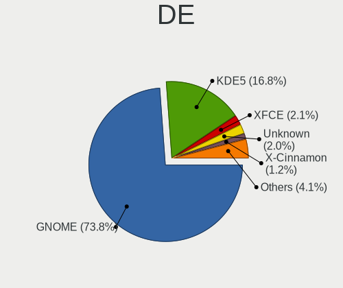
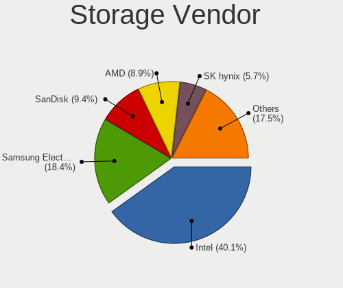
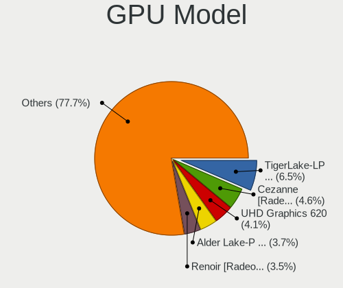
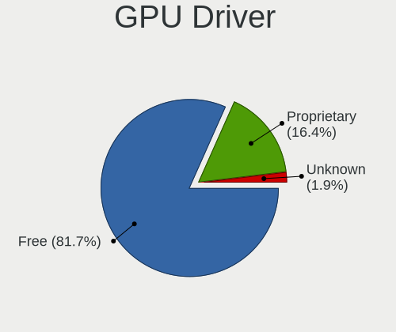
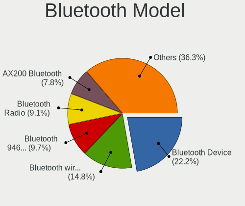
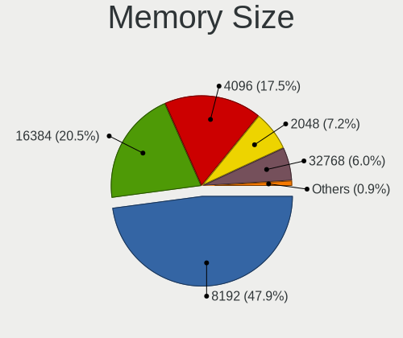

Fedora 37 - Tested Hardware & Statistics (Notebooks)
----------------------------------------------------

A project to collect tested hardware configurations for Fedora 37.

Anyone can contribute to this report by the [hw-probe](https://github.com/linuxhw/hw-probe) tool:

    sudo -E hw-probe -all -upload

Please contribute! Especially if your hardware is rare.

Contents
--------

* [ Test Cases ](#test-cases)

* [ System ](#system)
  - [ Kernel                   ](#kernel)
  - [ Kernel Family            ](#kernel-family)
  - [ Kernel Major Ver.        ](#kernel-major-ver)
  - [ Arch                     ](#arch)
  - [ DE                       ](#de)
  - [ Display Server           ](#display-server)
  - [ Display Manager          ](#display-manager)
  - [ OS Lang                  ](#os-lang)
  - [ Boot Mode                ](#boot-mode)
  - [ Filesystem               ](#filesystem)
  - [ Part. scheme             ](#part-scheme)
  - [ Dual Boot with Linux/BSD ](#dual-boot-with-linuxbsd)
  - [ Dual Boot (Win)          ](#dual-boot-win)

* [ Board ](#board)
  - [ Vendor                   ](#vendor)
  - [ Model                    ](#model)
  - [ Model Family             ](#model-family)
  - [ MFG Year                 ](#mfg-year)
  - [ Form Factor              ](#form-factor)
  - [ Secure Boot              ](#secure-boot)
  - [ Coreboot                 ](#coreboot)
  - [ RAM Size                 ](#ram-size)
  - [ RAM Used                 ](#ram-used)
  - [ Total Drives             ](#total-drives)
  - [ Has CD-ROM               ](#has-cd-rom)
  - [ Has Ethernet             ](#has-ethernet)
  - [ Has WiFi                 ](#has-wifi)
  - [ Has Bluetooth            ](#has-bluetooth)

* [ Location ](#location)
  - [ Country                  ](#country)
  - [ City                     ](#city)

* [ Drives ](#drives)
  - [ Drive Vendor             ](#drive-vendor)
  - [ Drive Model              ](#drive-model)
  - [ HDD Vendor               ](#hdd-vendor)
  - [ SSD Vendor               ](#ssd-vendor)
  - [ Drive Kind               ](#drive-kind)
  - [ Drive Connector          ](#drive-connector)
  - [ Drive Size               ](#drive-size)
  - [ Space Total              ](#space-total)
  - [ Space Used               ](#space-used)
  - [ Malfunc. Drives          ](#malfunc-drives)
  - [ Malfunc. Drive Vendor    ](#malfunc-drive-vendor)
  - [ Malfunc. HDD Vendor      ](#malfunc-hdd-vendor)
  - [ Malfunc. Drive Kind      ](#malfunc-drive-kind)
  - [ Failed Drives            ](#failed-drives)
  - [ Failed Drive Vendor      ](#failed-drive-vendor)
  - [ Drive Status             ](#drive-status)

* [ Storage controller ](#storage-controller)
  - [ Storage Vendor           ](#storage-vendor)
  - [ Storage Model            ](#storage-model)
  - [ Storage Kind             ](#storage-kind)

* [ Processor ](#processor)
  - [ CPU Vendor               ](#cpu-vendor)
  - [ CPU Model                ](#cpu-model)
  - [ CPU Model Family         ](#cpu-model-family)
  - [ CPU Cores                ](#cpu-cores)
  - [ CPU Sockets              ](#cpu-sockets)
  - [ CPU Threads              ](#cpu-threads)
  - [ CPU Op-Modes             ](#cpu-op-modes)
  - [ CPU Microcode            ](#cpu-microcode)
  - [ CPU Microarch            ](#cpu-microarch)

* [ Graphics ](#graphics)
  - [ GPU Vendor               ](#gpu-vendor)
  - [ GPU Model                ](#gpu-model)
  - [ GPU Combo                ](#gpu-combo)
  - [ GPU Driver               ](#gpu-driver)
  - [ GPU Memory               ](#gpu-memory)

* [ Monitor ](#monitor)
  - [ Monitor Vendor           ](#monitor-vendor)
  - [ Monitor Model            ](#monitor-model)
  - [ Monitor Resolution       ](#monitor-resolution)
  - [ Monitor Diagonal         ](#monitor-diagonal)
  - [ Monitor Width            ](#monitor-width)
  - [ Aspect Ratio             ](#aspect-ratio)
  - [ Monitor Area             ](#monitor-area)
  - [ Pixel Density            ](#pixel-density)
  - [ Multiple Monitors        ](#multiple-monitors)

* [ Network ](#network)
  - [ Net Controller Vendor    ](#net-controller-vendor)
  - [ Net Controller Model     ](#net-controller-model)
  - [ Wireless Vendor          ](#wireless-vendor)
  - [ Wireless Model           ](#wireless-model)
  - [ Ethernet Vendor          ](#ethernet-vendor)
  - [ Ethernet Model           ](#ethernet-model)
  - [ Net Controller Kind      ](#net-controller-kind)
  - [ Used Controller          ](#used-controller)
  - [ NICs                     ](#nics)
  - [ IPv6                     ](#ipv6)

* [ Bluetooth ](#bluetooth)
  - [ Bluetooth Vendor         ](#bluetooth-vendor)
  - [ Bluetooth Model          ](#bluetooth-model)

* [ Sound ](#sound)
  - [ Sound Vendor             ](#sound-vendor)
  - [ Sound Model              ](#sound-model)

* [ Memory ](#memory)
  - [ Memory Vendor            ](#memory-vendor)
  - [ Memory Model             ](#memory-model)
  - [ Memory Kind              ](#memory-kind)
  - [ Memory Form Factor       ](#memory-form-factor)
  - [ Memory Size              ](#memory-size)
  - [ Memory Speed             ](#memory-speed)

* [ Printers & scanners ](#printers--scanners)
  - [ Printer Vendor           ](#printer-vendor)
  - [ Printer Model            ](#printer-model)
  - [ Scanner Vendor           ](#scanner-vendor)
  - [ Scanner Model            ](#scanner-model)

* [ Camera ](#camera)
  - [ Camera Vendor            ](#camera-vendor)
  - [ Camera Model             ](#camera-model)

* [ Security ](#security)
  - [ Fingerprint Vendor       ](#fingerprint-vendor)
  - [ Fingerprint Model        ](#fingerprint-model)
  - [ Chipcard Vendor          ](#chipcard-vendor)
  - [ Chipcard Model           ](#chipcard-model)

* [ Unsupported ](#unsupported)
  - [ Unsupported Devices      ](#unsupported-devices)
  - [ Unsupported Device Types ](#unsupported-device-types)

Test Cases
----------

Total: 27

| Vendor        | Model                       | Probe                                                      | Date         |
|---------------|-----------------------------|------------------------------------------------------------|--------------|
| Lenovo        | ThinkPad Edge E540 20C60... | [b7f6ab8ad0](https://linux-hardware.org/?probe=b7f6ab8ad0) | Sep 23, 2022 |
| Timi          | A35S                        | [d0f195a77a](https://linux-hardware.org/?probe=d0f195a77a) | Sep 23, 2022 |
| Dell          | XPS 9320                    | [959d1406dd](https://linux-hardware.org/?probe=959d1406dd) | Sep 23, 2022 |
| Acer          | Nitro AN517-51              | [7bd22a5e38](https://linux-hardware.org/?probe=7bd22a5e38) | Sep 20, 2022 |
| Lenovo        | IdeaPad 320-15IAP 80XR      | [1da95a964b](https://linux-hardware.org/?probe=1da95a964b) | Sep 20, 2022 |
| Lenovo        | ThinkPad X1 Carbon Gen 9... | [be279328b1](https://linux-hardware.org/?probe=be279328b1) | Sep 19, 2022 |
| Lenovo        | IdeaPad 5 Pro 14ARH7 82S... | [3615e82cb6](https://linux-hardware.org/?probe=3615e82cb6) | Sep 17, 2022 |
| Lenovo        | ThinkPad T14 Gen 1 20UES... | [9c23c7bb58](https://linux-hardware.org/?probe=9c23c7bb58) | Sep 17, 2022 |
| Irbis         | NB264                       | [e9361bf1c8](https://linux-hardware.org/?probe=e9361bf1c8) | Sep 17, 2022 |
| Lenovo        | ThinkBook 14-IIL 20SL       | [9497f1e17f](https://linux-hardware.org/?probe=9497f1e17f) | Sep 16, 2022 |
| ASUSTek       | ROG Zephyrus M16 GU603ZX... | [099e5d3523](https://linux-hardware.org/?probe=099e5d3523) | Sep 16, 2022 |
| ASUSTek       | ZenBook UX425IA_UM425IA     | [26cdf51338](https://linux-hardware.org/?probe=26cdf51338) | Sep 15, 2022 |
| Lenovo        | ThinkPad X1 Carbon Gen 8... | [ec8f0a9ebf](https://linux-hardware.org/?probe=ec8f0a9ebf) | Sep 14, 2022 |
| HUAWEI        | HVY-WXX9                    | [8fab790c57](https://linux-hardware.org/?probe=8fab790c57) | Sep 14, 2022 |
| System76      | Lemur Pro                   | [d6682a260a](https://linux-hardware.org/?probe=d6682a260a) | Sep 14, 2022 |
| Lenovo        | ThinkPad T14 Gen 2a 20XK... | [4aa3e2b6c2](https://linux-hardware.org/?probe=4aa3e2b6c2) | Sep 14, 2022 |
| HP            | Laptop 17-cp0xxx            | [c05d80959b](https://linux-hardware.org/?probe=c05d80959b) | Sep 14, 2022 |
| HUAWEI        | HVY-WXX9                    | [d574f5da9b](https://linux-hardware.org/?probe=d574f5da9b) | Sep 13, 2022 |
| ASUSTek       | ASUS TUF Gaming F15 FX50... | [7326474aae](https://linux-hardware.org/?probe=7326474aae) | Sep 13, 2022 |
| AXDIA Inte... | WINPAD V10                  | [b3e5abaf4b](https://linux-hardware.org/?probe=b3e5abaf4b) | Sep 09, 2022 |
| TUXEDO        | InfinityBook S 15/17 Gen... | [e1a78657ba](https://linux-hardware.org/?probe=e1a78657ba) | Sep 07, 2022 |
| Lenovo        | Legion 5 Pro 16ITH6H 82J... | [681486095a](https://linux-hardware.org/?probe=681486095a) | Aug 27, 2022 |
| Lenovo        | ThinkPad W510 4391F66       | [a92e3ba61f](https://linux-hardware.org/?probe=a92e3ba61f) | Aug 19, 2022 |
| HP            | EliteBook 820 G1            | [1bdfc2f218](https://linux-hardware.org/?probe=1bdfc2f218) | Aug 09, 2022 |
| Samsung       | 270E5G/270E5U               | [d1f2245fb4](https://linux-hardware.org/?probe=d1f2245fb4) | Jul 18, 2022 |
| HUAWEI        | HVY-WXX9                    | [43098a1f34](https://linux-hardware.org/?probe=43098a1f34) | Apr 23, 2022 |
| HP            | Laptop 14-dq2xxx            | [2477951c04](https://linux-hardware.org/?probe=2477951c04) | Apr 15, 2022 |

System
------

Kernel
------

Version of the Linux kernel

| Version                                             | Notebooks | Percent |
|-----------------------------------------------------|-----------|---------|
| 5.19.8-300.fc37.x86_64                              | 10        | 40%     |
| 5.19.7-300.fc37.x86_64                              | 4         | 16%     |
| 5.19.10-300.fc37.x86_64                             | 3         | 12%     |
| 5.19.9-300.fc37.x86_64                              | 2         | 8%      |
| 5.18.0-0.rc2.23.fc37.x86_64                         | 2         | 8%      |
| 5.19.4-300.fc37.x86_64                              | 1         | 4%      |
| 5.19.0-xm2.0.fc37.x86_64                            | 1         | 4%      |
| 5.19.0-65.fc37.x86_64                               | 1         | 4%      |
| 5.19.0-0.rc6.20220714git4a57a8400075.49.fc37.x86_64 | 1         | 4%      |

Kernel Family
-------------

Linux kernel without a distro release

| Version | Notebooks | Percent |
|---------|-----------|---------|
| 5.19.8  | 10        | 40%     |
| 5.19.7  | 4         | 16%     |
| 5.19.10 | 3         | 12%     |
| 5.19.0  | 3         | 12%     |
| 5.19.9  | 2         | 8%      |
| 5.18.0  | 2         | 8%      |
| 5.19.4  | 1         | 4%      |

Kernel Major Ver.
-----------------

Linux kernel major version

| Version | Notebooks | Percent |
|---------|-----------|---------|
| 5.19    | 23        | 92%     |
| 5.18    | 2         | 8%      |

Arch
----

OS architecture (x86_64, i586, etc.)

| Name   | Notebooks | Percent |
|--------|-----------|---------|
| x86_64 | 25        | 100%    |

DE
--

Desktop Environment

| Name  | Notebooks | Percent |
|-------|-----------|---------|
| GNOME | 19        | 76%     |
| KDE5  | 5         | 20%     |
| XFCE  | 1         | 4%      |

Display Server
--------------

X11 or Wayland

| Name    | Notebooks | Percent |
|---------|-----------|---------|
| Wayland | 20        | 80%     |
| X11     | 4         | 16%     |
| Tty     | 1         | 4%      |

Display Manager
---------------

SDDM, LightDM, etc.

| Name    | Notebooks | Percent |
|---------|-----------|---------|
| Unknown | 13        | 52%     |
| GDM     | 7         | 28%     |
| SDDM    | 3         | 12%     |
| LightDM | 2         | 8%      |

OS Lang
-------

Language

| Lang  | Notebooks | Percent |
|-------|-----------|---------|
| en_US | 12        | 48%     |
| fr_FR | 3         | 12%     |
| en_GB | 2         | 8%      |
| ru_RU | 1         | 4%      |
| ro_RO | 1         | 4%      |
| pt_BR | 1         | 4%      |
| es_GT | 1         | 4%      |
| es_AR | 1         | 4%      |
| en_ZA | 1         | 4%      |
| en_CA | 1         | 4%      |
| de_DE | 1         | 4%      |

Boot Mode
---------

EFI or BIOS

| Mode | Notebooks | Percent |
|------|-----------|---------|
| EFI  | 20        | 80%     |
| BIOS | 5         | 20%     |

Filesystem
----------

Type of filesystem

| Type  | Notebooks | Percent |
|-------|-----------|---------|
| Btrfs | 21        | 84%     |
| Ext4  | 4         | 16%     |

Part. scheme
------------

Scheme of partitioning

| Type    | Notebooks | Percent |
|---------|-----------|---------|
| Unknown | 13        | 52%     |
| GPT     | 11        | 44%     |
| MBR     | 1         | 4%      |

Dual Boot with Linux/BSD
------------------------

Hosting more than one Linux/BSD

| Dual boot | Notebooks | Percent |
|-----------|-----------|---------|
| No        | 23        | 92%     |
| Yes       | 2         | 8%      |

Dual Boot (Win)
---------------

Hosting Linux and Windows

| Dual boot | Notebooks | Percent |
|-----------|-----------|---------|
| No        | 20        | 80%     |
| Yes       | 5         | 20%     |

Board
-----

Vendor
------

Motherboard manufacturer

| Name                | Notebooks | Percent |
|---------------------|-----------|---------|
| Lenovo              | 10        | 40%     |
| Hewlett-Packard     | 3         | 12%     |
| ASUSTek Computer    | 3         | 12%     |
| HUAWEI              | 2         | 8%      |
| TUXEDO              | 1         | 4%      |
| Timi                | 1         | 4%      |
| System76            | 1         | 4%      |
| Samsung Electronics | 1         | 4%      |
| Irbis               | 1         | 4%      |
| Dell                | 1         | 4%      |
| Acer                | 1         | 4%      |

Model
-----

Motherboard model

| Name                                       | Notebooks | Percent |
|--------------------------------------------|-----------|---------|
| HUAWEI HVY-WXX9                            | 2         | 8%      |
| TUXEDO InfinityBook S 15/17 Gen7           | 1         | 4%      |
| Timi A35S                                  | 1         | 4%      |
| System76 Lemur Pro                         | 1         | 4%      |
| Samsung 270E5G/270E5U                      | 1         | 4%      |
| Lenovo ThinkPad X1 Carbon Gen 9 20XWCTO1WW | 1         | 4%      |
| Lenovo ThinkPad X1 Carbon Gen 8 20UAS0X800 | 1         | 4%      |
| Lenovo ThinkPad W510 4391F66               | 1         | 4%      |
| Lenovo ThinkPad T14 Gen 2a 20XK000YSP      | 1         | 4%      |
| Lenovo ThinkPad T14 Gen 1 20UES08Q15       | 1         | 4%      |
| Lenovo ThinkPad Edge E540 20C600AKZA       | 1         | 4%      |
| Lenovo ThinkBook 14-IIL 20SL               | 1         | 4%      |
| Lenovo Legion 5 Pro 16ITH6H 82JD           | 1         | 4%      |
| Lenovo IdeaPad 5 Pro 14ARH7 82SJ           | 1         | 4%      |
| Lenovo IdeaPad 320-15IAP 80XR              | 1         | 4%      |
| Irbis NB264                                | 1         | 4%      |
| HP Laptop 17-cp0xxx                        | 1         | 4%      |
| HP Laptop 14-dq2xxx                        | 1         | 4%      |
| HP EliteBook 820 G1                        | 1         | 4%      |
| Dell XPS 9320                              | 1         | 4%      |
| ASUS ZenBook UX425IA_UM425IA               | 1         | 4%      |
| ASUS ROG Zephyrus M16 GU603ZX_GU603ZX      | 1         | 4%      |
| ASUS ASUS TUF Gaming F15 FX506LI_FX506LI   | 1         | 4%      |
| Acer Nitro AN517-51                        | 1         | 4%      |

Model Family
------------

Motherboard model prefix

| Name                | Notebooks | Percent |
|---------------------|-----------|---------|
| Lenovo ThinkPad     | 6         | 24%     |
| Lenovo IdeaPad      | 2         | 8%      |
| HUAWEI HVY-WXX9     | 2         | 8%      |
| HP Laptop           | 2         | 8%      |
| TUXEDO InfinityBook | 1         | 4%      |
| Timi A35S           | 1         | 4%      |
| System76 Lemur      | 1         | 4%      |
| Samsung 270E5G      | 1         | 4%      |
| Lenovo ThinkBook    | 1         | 4%      |
| Lenovo Legion       | 1         | 4%      |
| Irbis NB264         | 1         | 4%      |
| HP EliteBook        | 1         | 4%      |
| Dell XPS            | 1         | 4%      |
| ASUS ZenBook        | 1         | 4%      |
| ASUS ROG            | 1         | 4%      |
| ASUS ASUS           | 1         | 4%      |
| Acer Nitro          | 1         | 4%      |

MFG Year
--------

Motherboard manufacture year

| Year | Notebooks | Percent |
|------|-----------|---------|
| 2021 | 8         | 32%     |
| 2020 | 6         | 24%     |
| 2022 | 4         | 16%     |
| 2013 | 3         | 12%     |
| 2019 | 2         | 8%      |
| 2017 | 1         | 4%      |
| 2010 | 1         | 4%      |

Form Factor
-----------

Physical design of the computer

| Name     | Notebooks | Percent |
|----------|-----------|---------|
| Notebook | 25        | 100%    |

Secure Boot
-----------

Enabled or disabled

| State    | Notebooks | Percent |
|----------|-----------|---------|
| Disabled | 24        | 96%     |
| Enabled  | 1         | 4%      |

Coreboot
--------

Have coreboot on board

| Used | Notebooks | Percent |
|------|-----------|---------|
| No   | 24        | 96%     |
| Yes  | 1         | 4%      |

RAM Size
--------

Total RAM memory

| Size in GB | Notebooks | Percent |
|------------|-----------|---------|
| 8.01-16.0  | 9         | 36%     |
| 32.01-64.0 | 5         | 20%     |
| 16.01-24.0 | 5         | 20%     |
| 4.01-8.0   | 3         | 12%     |
| 3.01-4.0   | 2         | 8%      |
| 24.01-32.0 | 1         | 4%      |

RAM Used
--------

Used RAM memory

| Used GB   | Notebooks | Percent |
|-----------|-----------|---------|
| 4.01-8.0  | 8         | 32%     |
| 2.01-3.0  | 7         | 28%     |
| 3.01-4.0  | 5         | 20%     |
| 8.01-16.0 | 3         | 12%     |
| 1.01-2.0  | 2         | 8%      |

Total Drives
------------

Number of drives on board

| Drives | Notebooks | Percent |
|--------|-----------|---------|
| 1      | 24        | 96%     |
| 3      | 1         | 4%      |

Has CD-ROM
----------

Has CD-ROM on board

| Presented | Notebooks | Percent |
|-----------|-----------|---------|
| No        | 22        | 88%     |
| Yes       | 3         | 12%     |

Has Ethernet
------------

Has Ethernet on board

| Presented | Notebooks | Percent |
|-----------|-----------|---------|
| Yes       | 14        | 56%     |
| No        | 11        | 44%     |

Has WiFi
--------

Has WiFi module

| Presented | Notebooks | Percent |
|-----------|-----------|---------|
| Yes       | 25        | 100%    |

Has Bluetooth
-------------

Has Bluetooth module

| Presented | Notebooks | Percent |
|-----------|-----------|---------|
| Yes       | 22        | 88%     |
| No        | 3         | 12%     |

Location
--------

Country
-------

Geographic location (country)

| Country      | Notebooks | Percent |
|--------------|-----------|---------|
| USA          | 4         | 16%     |
| Poland       | 3         | 12%     |
| France       | 3         | 12%     |
| Japan        | 2         | 8%      |
| Spain        | 1         | 4%      |
| South Africa | 1         | 4%      |
| Russia       | 1         | 4%      |
| Norway       | 1         | 4%      |
| Moldova      | 1         | 4%      |
| Mexico       | 1         | 4%      |
| Indonesia    | 1         | 4%      |
| Germany      | 1         | 4%      |
| Czechia      | 1         | 4%      |
| Canada       | 1         | 4%      |
| Brazil       | 1         | 4%      |
| Austria      | 1         | 4%      |
| Argentina    | 1         | 4%      |

City
----

Geographic location (city)

| City               | Notebooks | Percent |
|--------------------|-----------|---------|
| Warsaw             | 3         | 12%     |
| Wytheville         | 1         | 4%      |
| Tokyo              | 1         | 4%      |
| Surabaya           | 1         | 4%      |
| Shinagawa          | 1         | 4%      |
| Scarborough        | 1         | 4%      |
| Sao Paulo          | 1         | 4%      |
| San Andres Cholula | 1         | 4%      |
| Rosario            | 1         | 4%      |
| Queens             | 1         | 4%      |
| Plancher-les-Mines | 1         | 4%      |
| Palaiseau          | 1         | 4%      |
| Oslo               | 1         | 4%      |
| Orekhovo-Zuyevo    | 1         | 4%      |
| New York           | 1         | 4%      |
| Matzendorf         | 1         | 4%      |
| Málaga            | 1         | 4%      |
| Hukvaldy           | 1         | 4%      |
| Fonsorbes          | 1         | 4%      |
| Eberswalde         | 1         | 4%      |
| Denton             | 1         | 4%      |
| Cape Town          | 1         | 4%      |
| Bălţi            | 1         | 4%      |

Drives
------

Drive Vendor
------------

Hard drive vendors

| Vendor                      | Notebooks | Drives | Percent |
|-----------------------------|-----------|--------|---------|
| Samsung Electronics         | 11        | 11     | 39.29%  |
| Kingston                    | 4         | 4      | 14.29%  |
| Unknown                     | 2         | 3      | 7.14%   |
| Seagate                     | 2         | 2      | 7.14%   |
| Micron Technology           | 2         | 2      | 7.14%   |
| YMTC                        | 1         | 1      | 3.57%   |
| Yangtze Memory Technologies | 1         | 1      | 3.57%   |
| SK hynix                    | 1         | 1      | 3.57%   |
| Sandisk                     | 1         | 1      | 3.57%   |
| Micron/Crucial Technology   | 1         | 1      | 3.57%   |
| KIOXIA                      | 1         | 1      | 3.57%   |
| Kingston Technology Company | 1         | 1      | 3.57%   |

Drive Model
-----------

Hard drive models

| Model                                              | Notebooks | Percent |
|----------------------------------------------------|-----------|---------|
| Samsung PM963 2.5" NVMe PCIe SSD 1TB               | 2         | 6.9%    |
| Kingston OM8PCP3512F-AB 512GB                      | 2         | 6.9%    |
| YMTC PC005 512GB                                   | 1         | 3.45%   |
| Yangtze Memory NVMe SSD Drive 512GB                | 1         | 3.45%   |
| Unknown SL64G  64GB                                | 1         | 3.45%   |
| Unknown MMC Card  128GB                            | 1         | 3.45%   |
| Unknown 032GE4  32GB                               | 1         | 3.45%   |
| SK hynix SHGP31-1000GM 1TB                         | 1         | 3.45%   |
| Seagate ST2000LX001-1RG174 2TB                     | 1         | 3.45%   |
| Seagate ST1000LM035-1RK172 1TB                     | 1         | 3.45%   |
| Sandisk WD Blue SN570 1TB                          | 1         | 3.45%   |
| Samsung SSD 970 EVO Plus 500GB                     | 1         | 3.45%   |
| Samsung SSD 840 Series 250GB                       | 1         | 3.45%   |
| Samsung PM9A1 NVMe 1024GB                          | 1         | 3.45%   |
| Samsung NVMe SSD Drive 1024GB                      | 1         | 3.45%   |
| Samsung NVMe SSD Controller PM9A1/PM9A3/980PRO 1TB | 1         | 3.45%   |
| Samsung MZVLQ512HBLU-00BH1 512GB                   | 1         | 3.45%   |
| Samsung MZVLB512HBJQ-000L7 512GB                   | 1         | 3.45%   |
| Samsung MZVLB1T0HBLR-000L7 1TB                     | 1         | 3.45%   |
| Samsung MZVL2512HCJQ-00BL2 512GB                   | 1         | 3.45%   |
| Micron/Crucial NVMe SSD Drive 500GB                | 1         | 3.45%   |
| Micron MTFDDAK256MAY-1AH12ABHA 256GB SSD           | 1         | 3.45%   |
| Micron 3400_MTFDKBA1T0TFH 1TB                      | 1         | 3.45%   |
| KIOXIA KBG40ZNV512G 512GB                          | 1         | 3.45%   |
| Kingston Company U-SNS8154P3 NVMe SSD 256GB        | 1         | 3.45%   |
| Kingston SUV400S37240G 240GB SSD                   | 1         | 3.45%   |
| Kingston SA400S37240G 240GB SSD                    | 1         | 3.45%   |

HDD Vendor
----------

Hard disk drive vendors

| Vendor  | Notebooks | Drives | Percent |
|---------|-----------|--------|---------|
| Seagate | 2         | 2      | 100%    |

SSD Vendor
----------

Solid state drive vendors

| Vendor              | Notebooks | Drives | Percent |
|---------------------|-----------|--------|---------|
| Kingston            | 2         | 2      | 50%     |
| Samsung Electronics | 1         | 1      | 25%     |
| Micron Technology   | 1         | 1      | 25%     |

Drive Kind
----------

HDD or SSD

| Kind | Notebooks | Drives | Percent |
|------|-----------|--------|---------|
| NVMe | 19        | 20     | 70.37%  |
| SSD  | 4         | 4      | 14.81%  |
| MMC  | 2         | 3      | 7.41%   |
| HDD  | 2         | 2      | 7.41%   |

Drive Connector
---------------

SATA, SAS, NVMe, etc.

| Type | Notebooks | Drives | Percent |
|------|-----------|--------|---------|
| NVMe | 19        | 20     | 70.37%  |
| SATA | 6         | 6      | 22.22%  |
| MMC  | 2         | 3      | 7.41%   |

Drive Size
----------

Size of hard drive

| Size in TB | Notebooks | Drives | Percent |
|------------|-----------|--------|---------|
| 0.01-0.5   | 4         | 4      | 66.67%  |
| 1.01-2.0   | 1         | 1      | 16.67%  |
| 0.51-1.0   | 1         | 1      | 16.67%  |

Space Total
-----------

Amount of disk space available on the file system

| Size in GB | Notebooks | Percent |
|------------|-----------|---------|
| 251-500    | 6         | 24%     |
| 1001-2000  | 6         | 24%     |
| 501-1000   | 6         | 24%     |
| 1-20       | 3         | 12%     |
| 101-250    | 2         | 8%      |
| 21-50      | 1         | 4%      |
| Unknown    | 1         | 4%      |

Space Used
----------

Amount of used disk space

| Used GB  | Notebooks | Percent |
|----------|-----------|---------|
| 1-20     | 9         | 36%     |
| 251-500  | 4         | 16%     |
| 101-250  | 4         | 16%     |
| 501-1000 | 3         | 12%     |
| 21-50    | 2         | 8%      |
| 51-100   | 2         | 8%      |
| Unknown  | 1         | 4%      |

Malfunc. Drives
---------------

Drive models with a malfunction

| Model                                               | Notebooks | Drives | Percent |
|-----------------------------------------------------|-----------|--------|---------|
| Micron Technology MTFDDAK256MAY-1AH12ABHA 256GB SSD | 1         | 1      | 100%    |

Malfunc. Drive Vendor
---------------------

Vendors of faulty drives

| Vendor            | Notebooks | Drives | Percent |
|-------------------|-----------|--------|---------|
| Micron Technology | 1         | 1      | 100%    |

Malfunc. HDD Vendor
-------------------

Vendors of faulty HDD drives

Zero info for selected period =(

Malfunc. Drive Kind
-------------------

Kinds of faulty drives

| Kind | Notebooks | Drives | Percent |
|------|-----------|--------|---------|
| SSD  | 1         | 1      | 100%    |

Failed Drives
-------------

Failed drive models

Zero info for selected period =(

Failed Drive Vendor
-------------------

Failed drive vendors

Zero info for selected period =(

Drive Status
------------

Number of failed and malfunc. drives

| Status   | Notebooks | Drives | Percent |
|----------|-----------|--------|---------|
| Detected | 14        | 17     | 53.85%  |
| Works    | 11        | 11     | 42.31%  |
| Malfunc  | 1         | 1      | 3.85%   |

Storage controller
------------------

Storage Vendor
--------------

Storage controller vendors

| Vendor                      | Notebooks | Percent |
|-----------------------------|-----------|---------|
| Intel                       | 12        | 35.29%  |
| Samsung Electronics         | 10        | 29.41%  |
| Kingston Technology Company | 3         | 8.82%   |
| Yangtze Memory Technologies | 2         | 5.88%   |
| AMD                         | 2         | 5.88%   |
| SK hynix                    | 1         | 2.94%   |
| SanDisk                     | 1         | 2.94%   |
| Micron/Crucial Technology   | 1         | 2.94%   |
| Micron Technology           | 1         | 2.94%   |
| KIOXIA                      | 1         | 2.94%   |

Storage Model
-------------

Storage controller models

| Model                                                                          | Notebooks | Percent |
|--------------------------------------------------------------------------------|-----------|---------|
| Samsung NVMe SSD Controller PM9A1/PM9A3/980PRO                                 | 5         | 14.71%  |
| Samsung NVMe SSD Controller SM981/PM981/PM983                                  | 3         | 8.82%   |
| Yangtze Memory Non-Volatile memory controller                                  | 2         | 5.88%   |
| Samsung NVMe SSD Controller 980                                                | 2         | 5.88%   |
| Kingston Company Company Non-Volatile memory controller                        | 2         | 5.88%   |
| Intel Volume Management Device NVMe RAID Controller                            | 2         | 5.88%   |
| AMD FCH SATA Controller [AHCI mode]                                            | 2         | 5.88%   |
| SK hynix Gold P31 SSD                                                          | 1         | 2.94%   |
| SanDisk WD Blue SN570 NVMe SSD                                                 | 1         | 2.94%   |
| Micron/Crucial Non-Volatile memory controller                                  | 1         | 2.94%   |
| Micron Non-Volatile memory controller                                          | 1         | 2.94%   |
| KIOXIA NVMe SSD Controller BG4                                                 | 1         | 2.94%   |
| Kingston Company U-SNS8154P3 NVMe SSD                                          | 1         | 2.94%   |
| Intel Ice Lake-LP SATA Controller [AHCI mode]                                  | 1         | 2.94%   |
| Intel Celeron/Pentium Silver Processor SATA Controller                         | 1         | 2.94%   |
| Intel Celeron N3350/Pentium N4200/Atom E3900 Series SATA AHCI Controller       | 1         | 2.94%   |
| Intel Cannon Lake Mobile PCH SATA AHCI Controller                              | 1         | 2.94%   |
| Intel 8 Series/C220 Series Chipset Family 6-port SATA Controller 1 [AHCI mode] | 1         | 2.94%   |
| Intel 8 Series SATA Controller 1 [AHCI mode]                                   | 1         | 2.94%   |
| Intel 7 Series Chipset Family 6-port SATA Controller [AHCI mode]               | 1         | 2.94%   |
| Intel 500 Series Chipset Family SATA AHCI Controller                           | 1         | 2.94%   |
| Intel 5 Series/3400 Series Chipset 6 port SATA AHCI Controller                 | 1         | 2.94%   |
| Intel 400 Series Chipset Family SATA AHCI Controller                           | 1         | 2.94%   |

Storage Kind
------------

Kind of storage controller (IDE, SATA, NVMe, SAS, ...)

| Kind | Notebooks | Percent |
|------|-----------|---------|
| NVMe | 19        | 57.58%  |
| SATA | 12        | 36.36%  |
| RAID | 2         | 6.06%   |

Processor
---------

CPU Vendor
----------

Processor vendors

| Vendor | Notebooks | Percent |
|--------|-----------|---------|
| Intel  | 17        | 68%     |
| AMD    | 8         | 32%     |

CPU Model
---------

Processor models

| Model                                      | Notebooks | Percent |
|--------------------------------------------|-----------|---------|
| Intel Core i5-10210U CPU @ 1.60GHz         | 2         | 8%      |
| AMD Ryzen 5 4600H with Radeon Graphics     | 2         | 8%      |
| Intel Core i7 CPU Q 720 @ 1.60GHz          | 1         | 4%      |
| Intel Core i5-9300H CPU @ 2.40GHz          | 1         | 4%      |
| Intel Core i5-4310U CPU @ 2.00GHz          | 1         | 4%      |
| Intel Core i5-3230M CPU @ 2.60GHz          | 1         | 4%      |
| Intel Core i5-1035G1 CPU @ 1.00GHz         | 1         | 4%      |
| Intel Core i5-10300H CPU @ 2.50GHz         | 1         | 4%      |
| Intel Core i3-4000M CPU @ 2.40GHz          | 1         | 4%      |
| Intel Celeron N4020 CPU @ 1.10GHz          | 1         | 4%      |
| Intel Celeron CPU N3350 @ 1.10GHz          | 1         | 4%      |
| Intel 12th Gen Core i9-12900H              | 1         | 4%      |
| Intel 12th Gen Core i7-1260P               | 1         | 4%      |
| Intel 12th Gen Core i5-1240P               | 1         | 4%      |
| Intel 11th Gen Core i7-11800H @ 2.30GHz    | 1         | 4%      |
| Intel 11th Gen Core i7-1165G7 @ 2.80GHz    | 1         | 4%      |
| Intel 11th Gen Core i3-1125G4 @ 2.00GHz    | 1         | 4%      |
| AMD Ryzen 7 PRO 5850U with Radeon Graphics | 1         | 4%      |
| AMD Ryzen 7 6800HS Creator Edition         | 1         | 4%      |
| AMD Ryzen 7 5800H with Radeon Graphics     | 1         | 4%      |
| AMD Ryzen 7 4700U with Radeon Graphics     | 1         | 4%      |
| AMD Ryzen 5 PRO 4650U with Radeon Graphics | 1         | 4%      |
| AMD Ryzen 5 5500U with Radeon Graphics     | 1         | 4%      |

CPU Model Family
----------------

Processor model prefix

| Model           | Notebooks | Percent |
|-----------------|-----------|---------|
| Intel Core i5   | 7         | 28%     |
| Other           | 6         | 24%     |
| AMD Ryzen 7     | 3         | 12%     |
| AMD Ryzen 5     | 3         | 12%     |
| Intel Celeron   | 2         | 8%      |
| Intel Core i7   | 1         | 4%      |
| Intel Core i3   | 1         | 4%      |
| AMD Ryzen 7 PRO | 1         | 4%      |
| AMD Ryzen 5 PRO | 1         | 4%      |

CPU Cores
---------

Number of processor cores

| Number | Notebooks | Percent |
|--------|-----------|---------|
| 4      | 8         | 32%     |
| 8      | 5         | 20%     |
| 2      | 5         | 20%     |
| 6      | 4         | 16%     |
| 12     | 2         | 8%      |
| 14     | 1         | 4%      |

CPU Sockets
-----------

Number of sockets

| Number | Notebooks | Percent |
|--------|-----------|---------|
| 1      | 25        | 100%    |

CPU Threads
-----------

Threads per core (Hyper-Threading)

| Number | Notebooks | Percent |
|--------|-----------|---------|
| 2      | 22        | 88%     |
| 1      | 3         | 12%     |

CPU Op-Modes
------------

CPU Operation Modes (32-bit, 64-bit)

| Op mode        | Notebooks | Percent |
|----------------|-----------|---------|
| 32-bit, 64-bit | 25        | 100%    |

CPU Microcode
-------------

Microcode number

| Number     | Notebooks | Percent |
|------------|-----------|---------|
| 0x906a3    | 3         | 12%     |
| 0x08600106 | 3         | 12%     |
| 0x806ec    | 2         | 8%      |
| 0x0a50000c | 2         | 8%      |
| Unknown    | 2         | 8%      |
| 0xa0652    | 1         | 4%      |
| 0x906ea    | 1         | 4%      |
| 0x806d1    | 1         | 4%      |
| 0x806c1    | 1         | 4%      |
| 0x706e5    | 1         | 4%      |
| 0x706a8    | 1         | 4%      |
| 0x506c9    | 1         | 4%      |
| 0x40651    | 1         | 4%      |
| 0x306c3    | 1         | 4%      |
| 0x306a9    | 1         | 4%      |
| 0x0a404102 | 1         | 4%      |
| 0x08608103 | 1         | 4%      |
| 0x08600104 | 1         | 4%      |

CPU Microarch
-------------

Microarchitecture

| Name             | Notebooks | Percent |
|------------------|-----------|---------|
| Zen 2            | 4         | 16%     |
| KabyLake         | 3         | 12%     |
| Alderlake Hybrid | 3         | 12%     |
| Zen 3            | 2         | 8%      |
| TigerLake        | 2         | 8%      |
| Icelake          | 2         | 8%      |
| Haswell          | 2         | 8%      |
| Unknown          | 2         | 8%      |
| Nehalem          | 1         | 4%      |
| IvyBridge        | 1         | 4%      |
| Goldmont plus    | 1         | 4%      |
| Goldmont         | 1         | 4%      |
| CometLake        | 1         | 4%      |

Graphics
--------

GPU Vendor
----------

Vendors of graphics cards

| Vendor | Notebooks | Percent |
|--------|-----------|---------|
| Intel  | 16        | 53.33%  |
| AMD    | 8         | 26.67%  |
| Nvidia | 6         | 20%     |

GPU Model
---------

Graphics card models

| Model                                                                | Notebooks | Percent |
|----------------------------------------------------------------------|-----------|---------|
| AMD Renoir                                                           | 4         | 13.33%  |
| Intel Alder Lake-P Integrated Graphics Controller                    | 3         | 10%     |
| Intel CometLake-U GT2 [UHD Graphics]                                 | 2         | 6.67%   |
| AMD Cezanne                                                          | 2         | 6.67%   |
| Nvidia TU117M [GeForce GTX 1650 Ti Mobile]                           | 1         | 3.33%   |
| Nvidia TU117M [GeForce GTX 1650 Mobile / Max-Q]                      | 1         | 3.33%   |
| Nvidia GT216GLM [Quadro FX 880M]                                     | 1         | 3.33%   |
| Nvidia GF117M [GeForce 610M/710M/810M/820M / GT 620M/625M/630M/720M] | 1         | 3.33%   |
| Nvidia GA104M [GeForce RTX 3070 Mobile / Max-Q]                      | 1         | 3.33%   |
| Nvidia GA103M [GeForce RTX 3080 Ti Mobile]                           | 1         | 3.33%   |
| Intel TigerLake-LP GT2 [Iris Xe Graphics]                            | 1         | 3.33%   |
| Intel TigerLake-H GT1 [UHD Graphics]                                 | 1         | 3.33%   |
| Intel Tiger Lake UHD Graphics                                        | 1         | 3.33%   |
| Intel Iris Plus Graphics G1 (Ice Lake)                               | 1         | 3.33%   |
| Intel HD Graphics 500                                                | 1         | 3.33%   |
| Intel Haswell-ULT Integrated Graphics Controller                     | 1         | 3.33%   |
| Intel GeminiLake [UHD Graphics 600]                                  | 1         | 3.33%   |
| Intel CometLake-H GT2 [UHD Graphics]                                 | 1         | 3.33%   |
| Intel CoffeeLake-H GT2 [UHD Graphics 630]                            | 1         | 3.33%   |
| Intel 4th Gen Core Processor Integrated Graphics Controller          | 1         | 3.33%   |
| Intel 3rd Gen Core processor Graphics Controller                     | 1         | 3.33%   |
| AMD Rembrandt [Radeon 680M]                                          | 1         | 3.33%   |
| AMD Lucienne                                                         | 1         | 3.33%   |

GPU Combo
---------

Combinations of graphics cards

| Name           | Notebooks | Percent |
|----------------|-----------|---------|
| 1 x Intel      | 11        | 44%     |
| 1 x AMD        | 8         | 32%     |
| Intel + Nvidia | 5         | 20%     |
| 1 x Nvidia     | 1         | 4%      |

GPU Driver
----------

Free vs proprietary

| Driver      | Notebooks | Percent |
|-------------|-----------|---------|
| Free        | 23        | 92%     |
| Proprietary | 2         | 8%      |

GPU Memory
----------

Total video memory

| Size in GB | Notebooks | Percent |
|------------|-----------|---------|
| Unknown    | 14        | 56%     |
| 0.01-0.5   | 6         | 24%     |
| 3.01-4.0   | 2         | 8%      |
| 1.01-2.0   | 2         | 8%      |
| 0.51-1.0   | 1         | 4%      |

Monitor
-------

Monitor Vendor
--------------

Monitor vendors

| Vendor                  | Notebooks | Percent |
|-------------------------|-----------|---------|
| BOE                     | 10        | 32.26%  |
| Chimei Innolux          | 4         | 12.9%   |
| Samsung Electronics     | 2         | 6.45%   |
| PANDA                   | 2         | 6.45%   |
| Lenovo                  | 2         | 6.45%   |
| Hewlett-Packard         | 2         | 6.45%   |
| CSO                     | 2         | 6.45%   |
| AU Optronics            | 2         | 6.45%   |
| Sharp                   | 1         | 3.23%   |
| InfoVision              | 1         | 3.23%   |
| Goldstar                | 1         | 3.23%   |
| Dell                    | 1         | 3.23%   |
| Chi Mei Optoelectronics | 1         | 3.23%   |

Monitor Model
-------------

Monitor models

| Model                                                                    | Notebooks | Percent |
|--------------------------------------------------------------------------|-----------|---------|
| BOE LCD Monitor BOE0878 1920x1080 355x200mm 16.0-inch                    | 2         | 6.06%   |
| Sharp LCD Monitor SHP1547 1920x1200 288x180mm 13.4-inch                  | 1         | 3.03%   |
| Samsung Electronics LCD Monitor SDC4150 3456x2160 336x210mm 15.6-inch    | 1         | 3.03%   |
| Samsung Electronics LC32G7xT SAM705A 2560x1440 698x393mm 31.5-inch       | 1         | 3.03%   |
| PANDA LCD Monitor NCP0035 1920x1080 309x174mm 14.0-inch                  | 1         | 3.03%   |
| PANDA LCD Monitor NCP002D 1920x1080 344x194mm 15.5-inch                  | 1         | 3.03%   |
| Lenovo LEN P24h-20 LEN61F4 2560x1440 527x296mm 23.8-inch                 | 1         | 3.03%   |
| Lenovo LCD Monitor LEN40B1 1600x900 344x193mm 15.5-inch                  | 1         | 3.03%   |
| InfoVision LCD Monitor IVO03F4 1920x1080 309x173mm 13.9-inch             | 1         | 3.03%   |
| Hewlett-Packard OMEN by HP 27 HPN3422 2560x1440 598x336mm 27.0-inch      | 1         | 3.03%   |
| Hewlett-Packard E271i HWP3106 1920x1080 600x340mm 27.2-inch              | 1         | 3.03%   |
| Goldstar W2252 GSM567D 1680x1050 490x320mm 23.0-inch                     | 1         | 3.03%   |
| Dell U2412M DELA07B 1920x1200 518x324mm 24.1-inch                        | 1         | 3.03%   |
| Dell P2714H DELD05E 1920x1080 600x340mm 27.2-inch                        | 1         | 3.03%   |
| CSO LCD Monitor CSO1606 2560x1600 345x215mm 16.0-inch                    | 1         | 3.03%   |
| CSO LCD Monitor CSO140C 2880x1800 302x188mm 14.0-inch                    | 1         | 3.03%   |
| Chimei Innolux LCD Monitor CMN15E8 1920x1080 344x193mm 15.5-inch         | 1         | 3.03%   |
| Chimei Innolux LCD Monitor CMN15B4 1366x768 344x193mm 15.5-inch          | 1         | 3.03%   |
| Chimei Innolux LCD Monitor CMN14FF 1920x1080 309x173mm 13.9-inch         | 1         | 3.03%   |
| Chimei Innolux LCD Monitor CMN14F5 1920x1080 309x173mm 13.9-inch         | 1         | 3.03%   |
| Chimei Innolux LCD Monitor CMN14D5 1920x1080 309x173mm 13.9-inch         | 1         | 3.03%   |
| Chi Mei Optoelectronics LCD Monitor CMO15A3 1366x768 344x193mm 15.5-inch | 1         | 3.03%   |
| BOE LCD Monitor BOE0A0B 2560x1600 344x215mm 16.0-inch                    | 1         | 3.03%   |
| BOE LCD Monitor BOE0953 1920x1080 382x215mm 17.3-inch                    | 1         | 3.03%   |
| BOE LCD Monitor BOE0839 1920x1080 382x215mm 17.3-inch                    | 1         | 3.03%   |
| BOE LCD Monitor BOE07D8 1920x1080 344x194mm 15.5-inch                    | 1         | 3.03%   |
| BOE LCD Monitor BOE07C8 3840x2160 309x174mm 14.0-inch                    | 1         | 3.03%   |
| BOE LCD Monitor BOE06F2 1920x1080 309x173mm 13.9-inch                    | 1         | 3.03%   |
| BOE LCD Monitor BOE0675 1366x768 344x194mm 15.5-inch                     | 1         | 3.03%   |
| BOE LCD Monitor BOE05F5 1366x768 277x156mm 12.5-inch                     | 1         | 3.03%   |
| AU Optronics LCD Monitor AUOD291 1920x1200 301x188mm 14.0-inch           | 1         | 3.03%   |
| AU Optronics LCD Monitor AUO408D 1920x1080 309x174mm 14.0-inch           | 1         | 3.03%   |

Monitor Resolution
------------------

Monitor screen resolution

| Resolution         | Notebooks | Percent |
|--------------------|-----------|---------|
| 1920x1080 (FHD)    | 14        | 45.16%  |
| 1920x1200 (WUXGA)  | 4         | 12.9%   |
| 1366x768 (WXGA)    | 4         | 12.9%   |
| 2560x1600          | 2         | 6.45%   |
| 2560x1440 (QHD)    | 2         | 6.45%   |
| 3840x2160 (4K)     | 1         | 3.23%   |
| 3456x2160          | 1         | 3.23%   |
| 2880x1800          | 1         | 3.23%   |
| 1680x1050 (WSXGA+) | 1         | 3.23%   |
| 1600x900 (HD+)     | 1         | 3.23%   |

Monitor Diagonal
----------------

Diagonal size in inches

| Inches | Notebooks | Percent |
|--------|-----------|---------|
| 15     | 10        | 30.3%   |
| 13     | 5         | 15.15%  |
| 16     | 4         | 12.12%  |
| 14     | 4         | 12.12%  |
| 27     | 3         | 9.09%   |
| 23     | 2         | 6.06%   |
| 17     | 2         | 6.06%   |
| 31     | 1         | 3.03%   |
| 24     | 1         | 3.03%   |
| 12     | 1         | 3.03%   |

Monitor Width
-------------

Physical width

| Width in mm | Notebooks | Percent |
|-------------|-----------|---------|
| 301-350     | 19        | 61.29%  |
| 501-600     | 4         | 12.9%   |
| 351-400     | 4         | 12.9%   |
| 201-300     | 2         | 6.45%   |
| 601-700     | 1         | 3.23%   |
| 401-500     | 1         | 3.23%   |

Aspect Ratio
------------

Proportional relationship between the width and the height

| Ratio | Notebooks | Percent |
|-------|-----------|---------|
| 16/9  | 19        | 70.37%  |
| 16/10 | 7         | 25.93%  |
| 3/2   | 1         | 3.7%    |

Monitor Area
------------

Area in inch²

| Area in inch² | Notebooks | Percent |
|----------------|-----------|---------|
| 101-110        | 12        | 36.36%  |
| 81-90          | 8         | 24.24%  |
| 301-350        | 3         | 9.09%   |
| 201-250        | 2         | 6.06%   |
| 121-130        | 2         | 6.06%   |
| 111-120        | 2         | 6.06%   |
| 71-80          | 1         | 3.03%   |
| 61-70          | 1         | 3.03%   |
| 351-500        | 1         | 3.03%   |
| 251-300        | 1         | 3.03%   |

Pixel Density
-------------

Pixels per inch

| Density       | Notebooks | Percent |
|---------------|-----------|---------|
| 121-160       | 13        | 44.83%  |
| 51-100        | 5         | 17.24%  |
| 161-240       | 4         | 13.79%  |
| 101-120       | 4         | 13.79%  |
| More than 240 | 3         | 10.34%  |

Multiple Monitors
-----------------

Total monitors connected

| Total | Notebooks | Percent |
|-------|-----------|---------|
| 1     | 19        | 76%     |
| 2     | 4         | 16%     |
| 3     | 2         | 8%      |

Network
-------

Net Controller Vendor
---------------------

Controller vendors

| Vendor                | Notebooks | Percent |
|-----------------------|-----------|---------|
| Intel                 | 17        | 50%     |
| Realtek Semiconductor | 15        | 44.12%  |
| Qualcomm Atheros      | 1         | 2.94%   |
| Hewlett-Packard       | 1         | 2.94%   |

Net Controller Model
--------------------

Controller models

| Model                                                             | Notebooks | Percent |
|-------------------------------------------------------------------|-----------|---------|
| Realtek RTL8111/8168/8411 PCI Express Gigabit Ethernet Controller | 8         | 19.05%  |
| Intel Wi-Fi 6 AX200                                               | 6         | 14.29%  |
| Realtek RTL810xE PCI Express Fast Ethernet controller             | 2         | 4.76%   |
| Intel Alder Lake-P PCH CNVi WiFi                                  | 2         | 4.76%   |
| Realtek RTL88x2bu [AC1200 Techkey]                                | 1         | 2.38%   |
| Realtek RTL8852AE 802.11ax PCIe Wireless Network Adapter          | 1         | 2.38%   |
| Realtek RTL8822CE 802.11ac PCIe Wireless Network Adapter          | 1         | 2.38%   |
| Realtek RTL8821CE 802.11ac PCIe Wireless Network Adapter          | 1         | 2.38%   |
| Realtek RTL8821AE 802.11ac PCIe Wireless Network Adapter          | 1         | 2.38%   |
| Realtek RTL8723BU 802.11b/g/n WLAN Adapter                        | 1         | 2.38%   |
| Realtek RTL8723BE PCIe Wireless Network Adapter                   | 1         | 2.38%   |
| Realtek RTL8153 Gigabit Ethernet Adapter                          | 1         | 2.38%   |
| Realtek RTL8125 2.5GbE Controller                                 | 1         | 2.38%   |
| Realtek Realtek Network controller                                | 1         | 2.38%   |
| Qualcomm Atheros QCA9565 / AR9565 Wireless Network Adapter        | 1         | 2.38%   |
| Intel Wireless 7260                                               | 1         | 2.38%   |
| Intel Wi-Fi 6 AX210/AX211/AX411 160MHz                            | 1         | 2.38%   |
| Intel Wi-Fi 6 AX201                                               | 1         | 2.38%   |
| Intel Tiger Lake PCH CNVi WiFi                                    | 1         | 2.38%   |
| Intel Ice Lake-LP PCH CNVi WiFi                                   | 1         | 2.38%   |
| Intel Ethernet Connection I218-LM                                 | 1         | 2.38%   |
| Intel Ethernet Connection (10) I219-V                             | 1         | 2.38%   |
| Intel Comet Lake PCH-LP CNVi WiFi                                 | 1         | 2.38%   |
| Intel Comet Lake PCH CNVi WiFi                                    | 1         | 2.38%   |
| Intel Centrino Ultimate-N 6300                                    | 1         | 2.38%   |
| Intel Cannon Lake PCH CNVi WiFi                                   | 1         | 2.38%   |
| Intel 82577LM Gigabit Network Connection                          | 1         | 2.38%   |
| HP lt4112 Gobi 4G Module Network Device                           | 1         | 2.38%   |

Wireless Vendor
---------------

Wireless vendors

| Vendor                | Notebooks | Percent |
|-----------------------|-----------|---------|
| Intel                 | 17        | 62.96%  |
| Realtek Semiconductor | 8         | 29.63%  |
| Qualcomm Atheros      | 1         | 3.7%    |
| Hewlett-Packard       | 1         | 3.7%    |

Wireless Model
--------------

Wireless models

| Model                                                      | Notebooks | Percent |
|------------------------------------------------------------|-----------|---------|
| Intel Wi-Fi 6 AX200                                        | 6         | 22.22%  |
| Intel Alder Lake-P PCH CNVi WiFi                           | 2         | 7.41%   |
| Realtek RTL88x2bu [AC1200 Techkey]                         | 1         | 3.7%    |
| Realtek RTL8852AE 802.11ax PCIe Wireless Network Adapter   | 1         | 3.7%    |
| Realtek RTL8822CE 802.11ac PCIe Wireless Network Adapter   | 1         | 3.7%    |
| Realtek RTL8821CE 802.11ac PCIe Wireless Network Adapter   | 1         | 3.7%    |
| Realtek RTL8821AE 802.11ac PCIe Wireless Network Adapter   | 1         | 3.7%    |
| Realtek RTL8723BU 802.11b/g/n WLAN Adapter                 | 1         | 3.7%    |
| Realtek RTL8723BE PCIe Wireless Network Adapter            | 1         | 3.7%    |
| Realtek Realtek Network controller                         | 1         | 3.7%    |
| Qualcomm Atheros QCA9565 / AR9565 Wireless Network Adapter | 1         | 3.7%    |
| Intel Wireless 7260                                        | 1         | 3.7%    |
| Intel Wi-Fi 6 AX210/AX211/AX411 160MHz                     | 1         | 3.7%    |
| Intel Wi-Fi 6 AX201                                        | 1         | 3.7%    |
| Intel Tiger Lake PCH CNVi WiFi                             | 1         | 3.7%    |
| Intel Ice Lake-LP PCH CNVi WiFi                            | 1         | 3.7%    |
| Intel Comet Lake PCH-LP CNVi WiFi                          | 1         | 3.7%    |
| Intel Comet Lake PCH CNVi WiFi                             | 1         | 3.7%    |
| Intel Centrino Ultimate-N 6300                             | 1         | 3.7%    |
| Intel Cannon Lake PCH CNVi WiFi                            | 1         | 3.7%    |
| HP lt4112 Gobi 4G Module Network Device                    | 1         | 3.7%    |

Ethernet Vendor
---------------

Ethernet vendors

| Vendor                | Notebooks | Percent |
|-----------------------|-----------|---------|
| Realtek Semiconductor | 11        | 78.57%  |
| Intel                 | 3         | 21.43%  |

Ethernet Model
--------------

Ethernet models

| Model                                                             | Notebooks | Percent |
|-------------------------------------------------------------------|-----------|---------|
| Realtek RTL8111/8168/8411 PCI Express Gigabit Ethernet Controller | 8         | 53.33%  |
| Realtek RTL810xE PCI Express Fast Ethernet controller             | 2         | 13.33%  |
| Realtek RTL8153 Gigabit Ethernet Adapter                          | 1         | 6.67%   |
| Realtek RTL8125 2.5GbE Controller                                 | 1         | 6.67%   |
| Intel Ethernet Connection I218-LM                                 | 1         | 6.67%   |
| Intel Ethernet Connection (10) I219-V                             | 1         | 6.67%   |
| Intel 82577LM Gigabit Network Connection                          | 1         | 6.67%   |

Net Controller Kind
-------------------

Ethernet, WiFi or modem

| Kind     | Notebooks | Percent |
|----------|-----------|---------|
| WiFi     | 25        | 64.1%   |
| Ethernet | 14        | 35.9%   |

Used Controller
---------------

Currently used network controller

| Kind     | Notebooks | Percent |
|----------|-----------|---------|
| WiFi     | 21        | 80.77%  |
| Ethernet | 5         | 19.23%  |

NICs
----

Total network controllers on board

| Total | Notebooks | Percent |
|-------|-----------|---------|
| 2     | 12        | 48%     |
| 1     | 10        | 40%     |
| 3     | 2         | 8%      |
| 0     | 1         | 4%      |

IPv6
----

IPv6 vs IPv4

| Used | Notebooks | Percent |
|------|-----------|---------|
| No   | 22        | 88%     |
| Yes  | 3         | 12%     |

Bluetooth
---------

Bluetooth Vendor
----------------

Controller vendors

| Vendor                          | Notebooks | Percent |
|---------------------------------|-----------|---------|
| Intel                           | 16        | 72.73%  |
| Realtek Semiconductor           | 5         | 22.73%  |
| Qualcomm Atheros Communications | 1         | 4.55%   |

Bluetooth Model
---------------

Controller models

| Model                                          | Notebooks | Percent |
|------------------------------------------------|-----------|---------|
| Intel AX200 Bluetooth                          | 6         | 27.27%  |
| Intel AX201 Bluetooth                          | 4         | 18.18%  |
| Realtek Bluetooth Radio                        | 3         | 13.64%  |
| Intel Bluetooth Device                         | 3         | 13.64%  |
| Intel Bluetooth 9460/9560 Jefferson Peak (JfP) | 2         | 9.09%   |
| Realtek RTL8821A Bluetooth                     | 1         | 4.55%   |
| Realtek RTL8723B Bluetooth                     | 1         | 4.55%   |
| Qualcomm Atheros AR3012 Bluetooth 4.0          | 1         | 4.55%   |
| Intel Bluetooth wireless interface             | 1         | 4.55%   |

Sound
-----

Sound Vendor
------------

Sound card vendors

| Vendor                               | Notebooks | Percent |
|--------------------------------------|-----------|---------|
| Intel                                | 17        | 51.52%  |
| AMD                                  | 8         | 24.24%  |
| Nvidia                               | 5         | 15.15%  |
| Thesycon Systemsoftware & Consulting | 1         | 3.03%   |
| Lenovo                               | 1         | 3.03%   |
| C-Media Electronics                  | 1         | 3.03%   |

Sound Model
-----------

Sound card models

| Model                                                               | Notebooks | Percent |
|---------------------------------------------------------------------|-----------|---------|
| AMD Renoir Radeon High Definition Audio Controller                  | 7         | 17.07%  |
| AMD Family 17h/19h HD Audio Controller                              | 6         | 14.63%  |
| Intel Alder Lake PCH-P High Definition Audio Controller             | 3         | 7.32%   |
| Nvidia TU107 GeForce GTX 1650 High Definition Audio Controller      | 2         | 4.88%   |
| Intel Tiger Lake-LP Smart Sound Technology Audio Controller         | 2         | 4.88%   |
| Intel Comet Lake PCH-LP cAVS                                        | 2         | 4.88%   |
| Thesycon Systemsoftware & Consulting DX5                            | 1         | 2.44%   |
| Nvidia GT216 HDMI Audio Controller                                  | 1         | 2.44%   |
| Nvidia GA104 High Definition Audio Controller                       | 1         | 2.44%   |
| Nvidia Audio device                                                 | 1         | 2.44%   |
| Lenovo ThinkPad Dock USB Audio                                      | 1         | 2.44%   |
| Intel Xeon E3-1200 v3/4th Gen Core Processor HD Audio Controller    | 1         | 2.44%   |
| Intel Tiger Lake-H HD Audio Controller                              | 1         | 2.44%   |
| Intel Ice Lake-LP Smart Sound Technology Audio Controller           | 1         | 2.44%   |
| Intel Haswell-ULT HD Audio Controller                               | 1         | 2.44%   |
| Intel Comet Lake PCH cAVS                                           | 1         | 2.44%   |
| Intel Celeron/Pentium Silver Processor High Definition Audio        | 1         | 2.44%   |
| Intel Celeron N3350/Pentium N4200/Atom E3900 Series Audio Cluster   | 1         | 2.44%   |
| Intel Cannon Lake PCH cAVS                                          | 1         | 2.44%   |
| Intel 8 Series/C220 Series Chipset High Definition Audio Controller | 1         | 2.44%   |
| Intel 8 Series HD Audio Controller                                  | 1         | 2.44%   |
| Intel 7 Series/C216 Chipset Family High Definition Audio Controller | 1         | 2.44%   |
| Intel 5 Series/3400 Series Chipset High Definition Audio            | 1         | 2.44%   |
| C-Media Electronics TONOR TC-777 Audio Device                       | 1         | 2.44%   |
| AMD Rembrandt Radeon High Definition Audio Controller               | 1         | 2.44%   |

Memory
------

Memory Vendor
-------------

Memory module vendors

| Vendor              | Notebooks | Percent |
|---------------------|-----------|---------|
| Samsung Electronics | 8         | 47.06%  |
| SK hynix            | 3         | 17.65%  |
| Micron Technology   | 2         | 11.76%  |
| Kingston            | 1         | 5.88%   |
| Goldkey             | 1         | 5.88%   |
| A-DATA Technology   | 1         | 5.88%   |
| Unknown             | 1         | 5.88%   |

Memory Model
------------

Memory module models

| Model                                                            | Notebooks | Percent |
|------------------------------------------------------------------|-----------|---------|
| Samsung RAM M471A1K43DB1-CWE 8GB SODIMM DDR4 3200MT/s            | 2         | 11.76%  |
| SK hynix RAM Module 8GB Row Of Chips LPDDR3 2133MT/s             | 1         | 5.88%   |
| SK hynix RAM HMAB2GS6CMR6N-XN 16GB SODIMM DDR4 3200MT/s          | 1         | 5.88%   |
| SK hynix RAM H9JCNNNCP3MLYR-N6E 4GB Row Of Chips LPDDR5 6400MT/s | 1         | 5.88%   |
| Samsung RAM M471B1G73QH0-YK0 8GB SODIMM DDR3 1600MT/s            | 1         | 5.88%   |
| Samsung RAM M471A4G43AB1-CWE 32GB SODIMM DDR4 3200MT/s           | 1         | 5.88%   |
| Samsung RAM M471A1K43EB1-CWE 8GB SODIMM DDR4 3200MT/s            | 1         | 5.88%   |
| Samsung RAM M425R2GA3BB0-CQKOL 16GB SODIMM 4800MT/s              | 1         | 5.88%   |
| Samsung RAM K4UBE3D4AA-MGCL 8GB SODIMM LPDDR4 4266MT/s           | 1         | 5.88%   |
| Samsung RAM K4AAG165WA-BCTD 8GB SODIMM DDR4 2667MT/s             | 1         | 5.88%   |
| Micron RAM MTC8C1084S1SC48BA1 16GB SODIMM 4800MT/s               | 1         | 5.88%   |
| Micron RAM 4ATF1G64HZ-3G2E1 8GB Row Of Chips DDR4 3200MT/s       | 1         | 5.88%   |
| Kingston RAM 9905428-417.A00LF 8GB SODIMM DDR3 1600MT/s          | 1         | 5.88%   |
| Goldkey RAM GKE160SO102408-2666 16GB SODIMM DDR4 2667MT/s        | 1         | 5.88%   |
| A-DATA RAM AO1P26KC8T1-BXPS 8GB SODIMM DDR4 2667MT/s             | 1         | 5.88%   |
| Unknown                                                          | 1         | 5.88%   |

Memory Kind
-----------

Memory module kinds

| Kind   | Notebooks | Percent |
|--------|-----------|---------|
| DDR4   | 6         | 50%     |
| LPDDR5 | 2         | 16.67%  |
| LPDDR4 | 1         | 8.33%   |
| LPDDR3 | 1         | 8.33%   |
| DDR5   | 1         | 8.33%   |
| DDR3   | 1         | 8.33%   |

Memory Form Factor
------------------

Physical design of the memory module

| Name         | Notebooks | Percent |
|--------------|-----------|---------|
| SODIMM       | 8         | 66.67%  |
| Row Of Chips | 4         | 33.33%  |

Memory Size
-----------

Memory module size

| Size  | Notebooks | Percent |
|-------|-----------|---------|
| 8192  | 8         | 57.14%  |
| 16384 | 3         | 21.43%  |
| 4096  | 2         | 14.29%  |
| 32768 | 1         | 7.14%   |

Memory Speed
------------

Memory module speed

| Speed | Notebooks | Percent |
|-------|-----------|---------|
| 3200  | 5         | 35.71%  |
| 2667  | 3         | 21.43%  |
| 6400  | 2         | 14.29%  |
| 4800  | 1         | 7.14%   |
| 4266  | 1         | 7.14%   |
| 2133  | 1         | 7.14%   |
| 1600  | 1         | 7.14%   |

Printers & scanners
-------------------

Printer Vendor
--------------

Printer device vendors

Zero info for selected period =(

Printer Model
-------------

Printer device models

Zero info for selected period =(

Scanner Vendor
--------------

Scanner device vendors

Zero info for selected period =(

Scanner Model
-------------

Scanner device models

Zero info for selected period =(

Camera
------

Camera Vendor
-------------

Camera device vendors

| Vendor                                 | Notebooks | Percent |
|----------------------------------------|-----------|---------|
| Chicony Electronics                    | 7         | 30.43%  |
| IMC Networks                           | 4         | 17.39%  |
| Quanta                                 | 2         | 8.7%    |
| Cheng Uei Precision Industry (Foxlink) | 2         | 8.7%    |
| USB Camera CS                          | 1         | 4.35%   |
| Syntek                                 | 1         | 4.35%   |
| Silicon Motion                         | 1         | 4.35%   |
| Luxvisions Innotech Limited            | 1         | 4.35%   |
| Lite-On Technology                     | 1         | 4.35%   |
| Lenovo                                 | 1         | 4.35%   |
| Goodong Industry                       | 1         | 4.35%   |
| Acer                                   | 1         | 4.35%   |

Camera Model
------------

Camera device models

| Model                                                           | Notebooks | Percent |
|-----------------------------------------------------------------|-----------|---------|
| Chicony Integrated Camera                                       | 4         | 17.39%  |
| IMC Networks USB2.0 HD UVC WebCam                               | 2         | 8.7%    |
| Chicony USB2.0 Camera                                           | 2         | 8.7%    |
| USB Camera CS USB Camera CS                                     | 1         | 4.35%   |
| Syntek EasyCamera                                               | 1         | 4.35%   |
| Silicon Motion WebCam SC-10HDD12636N                            | 1         | 4.35%   |
| Quanta HP TrueVision HD Camera                                  | 1         | 4.35%   |
| Quanta HD Webcam                                                | 1         | 4.35%   |
| Luxvisions Innotech Limited Integrated RGB Camera               | 1         | 4.35%   |
| Lite-On Integrated Camera                                       | 1         | 4.35%   |
| Lenovo Integrated Webcam [R5U877]                               | 1         | 4.35%   |
| IMC Networks XiaoMi Webcam                                      | 1         | 4.35%   |
| IMC Networks HD Camera                                          | 1         | 4.35%   |
| Goodong Industry USB2.0 HD UVC WebCam                           | 1         | 4.35%   |
| Chicony HP HD Webcam                                            | 1         | 4.35%   |
| Cheng Uei Precision Industry (Foxlink) HP True Vision HD Camera | 1         | 4.35%   |
| Cheng Uei Precision Industry (Foxlink) HD Camera                | 1         | 4.35%   |
| Acer Integrated Camera                                          | 1         | 4.35%   |

Security
--------

Fingerprint Vendor
------------------

Fingerprint sensor vendors

| Vendor                     | Notebooks | Percent |
|----------------------------|-----------|---------|
| Synaptics                  | 3         | 37.5%   |
| Shenzhen Goodix Technology | 3         | 37.5%   |
| Validity Sensors           | 1         | 12.5%   |
| Elan Microelectronics      | 1         | 12.5%   |

Fingerprint Model
-----------------

Fingerprint sensor models

| Model                                             | Notebooks | Percent |
|---------------------------------------------------|-----------|---------|
| Synaptics Prometheus MIS Touch Fingerprint Reader | 3         | 37.5%   |
| Shenzhen Goodix  FingerPrint Device               | 3         | 37.5%   |
| Validity Sensors VFS495 Fingerprint Reader        | 1         | 12.5%   |
| Elan ELAN:ARM-M4                                  | 1         | 12.5%   |

Chipcard Vendor
---------------

Chipcard module vendors

| Vendor      | Notebooks | Percent |
|-------------|-----------|---------|
| Lenovo      | 1         | 50%     |
| Alcor Micro | 1         | 50%     |

Chipcard Model
--------------

Chipcard module models

| Model                               | Notebooks | Percent |
|-------------------------------------|-----------|---------|
| Lenovo Integrated Smart Card Reader | 1         | 50%     |
| Alcor Micro AU9540 Smartcard Reader | 1         | 50%     |

Unsupported
-----------

Unsupported Devices
-------------------

Total unsupported devices on board

| Total | Notebooks | Percent |
|-------|-----------|---------|
| 0     | 12        | 48%     |
| 1     | 10        | 40%     |
| 2     | 3         | 12%     |

Unsupported Device Types
------------------------

Types of unsupported devices

| Type                     | Notebooks | Percent |
|--------------------------|-----------|---------|
| Fingerprint reader       | 8         | 53.33%  |
| Graphics card            | 2         | 13.33%  |
| Net/wireless             | 1         | 6.67%   |
| Multimedia controller    | 1         | 6.67%   |
| Communication controller | 1         | 6.67%   |
| Card reader              | 1         | 6.67%   |
| Camera                   | 1         | 6.67%   |

