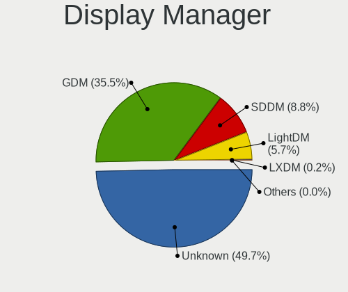
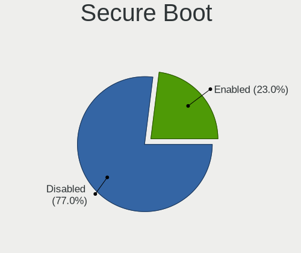
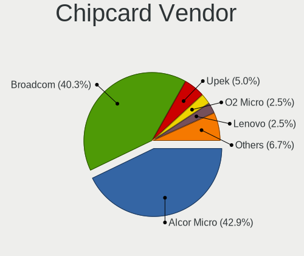

Fedora 37 - Tested Hardware & Statistics
----------------------------------------

A project to collect tested hardware configurations for Fedora 37.

Anyone can contribute to this report by the [hw-probe](https://github.com/linuxhw/hw-probe) tool:

    sudo -E hw-probe -all -upload

Please contribute! Especially if your hardware is rare.

This is a report for all computer types. See also reports for [desktops](/Dist/Fedora_37/Desktop/README.md) and [notebooks](/Dist/Fedora_37/Notebook/README.md).

Contents
--------

* [ Test Cases ](#test-cases)

* [ System ](#system)
  - [ Kernel                   ](#kernel)
  - [ Kernel Family            ](#kernel-family)
  - [ Kernel Major Ver.        ](#kernel-major-ver)
  - [ Arch                     ](#arch)
  - [ DE                       ](#de)
  - [ Display Server           ](#display-server)
  - [ Display Manager          ](#display-manager)
  - [ OS Lang                  ](#os-lang)
  - [ Boot Mode                ](#boot-mode)
  - [ Filesystem               ](#filesystem)
  - [ Part. scheme             ](#part-scheme)
  - [ Dual Boot with Linux/BSD ](#dual-boot-with-linuxbsd)
  - [ Dual Boot (Win)          ](#dual-boot-win)

* [ Board ](#board)
  - [ Vendor                   ](#vendor)
  - [ Model                    ](#model)
  - [ Model Family             ](#model-family)
  - [ MFG Year                 ](#mfg-year)
  - [ Form Factor              ](#form-factor)
  - [ Secure Boot              ](#secure-boot)
  - [ Coreboot                 ](#coreboot)
  - [ RAM Size                 ](#ram-size)
  - [ RAM Used                 ](#ram-used)
  - [ Total Drives             ](#total-drives)
  - [ Has CD-ROM               ](#has-cd-rom)
  - [ Has Ethernet             ](#has-ethernet)
  - [ Has WiFi                 ](#has-wifi)
  - [ Has Bluetooth            ](#has-bluetooth)

* [ Location ](#location)
  - [ Country                  ](#country)
  - [ City                     ](#city)

* [ Drives ](#drives)
  - [ Drive Vendor             ](#drive-vendor)
  - [ Drive Model              ](#drive-model)
  - [ HDD Vendor               ](#hdd-vendor)
  - [ SSD Vendor               ](#ssd-vendor)
  - [ Drive Kind               ](#drive-kind)
  - [ Drive Connector          ](#drive-connector)
  - [ Drive Size               ](#drive-size)
  - [ Space Total              ](#space-total)
  - [ Space Used               ](#space-used)
  - [ Malfunc. Drives          ](#malfunc-drives)
  - [ Malfunc. Drive Vendor    ](#malfunc-drive-vendor)
  - [ Malfunc. HDD Vendor      ](#malfunc-hdd-vendor)
  - [ Malfunc. Drive Kind      ](#malfunc-drive-kind)
  - [ Failed Drives            ](#failed-drives)
  - [ Failed Drive Vendor      ](#failed-drive-vendor)
  - [ Drive Status             ](#drive-status)

* [ Storage controller ](#storage-controller)
  - [ Storage Vendor           ](#storage-vendor)
  - [ Storage Model            ](#storage-model)
  - [ Storage Kind             ](#storage-kind)

* [ Processor ](#processor)
  - [ CPU Vendor               ](#cpu-vendor)
  - [ CPU Model                ](#cpu-model)
  - [ CPU Model Family         ](#cpu-model-family)
  - [ CPU Cores                ](#cpu-cores)
  - [ CPU Sockets              ](#cpu-sockets)
  - [ CPU Threads              ](#cpu-threads)
  - [ CPU Op-Modes             ](#cpu-op-modes)
  - [ CPU Microcode            ](#cpu-microcode)
  - [ CPU Microarch            ](#cpu-microarch)

* [ Graphics ](#graphics)
  - [ GPU Vendor               ](#gpu-vendor)
  - [ GPU Model                ](#gpu-model)
  - [ GPU Combo                ](#gpu-combo)
  - [ GPU Driver               ](#gpu-driver)
  - [ GPU Memory               ](#gpu-memory)

* [ Monitor ](#monitor)
  - [ Monitor Vendor           ](#monitor-vendor)
  - [ Monitor Model            ](#monitor-model)
  - [ Monitor Resolution       ](#monitor-resolution)
  - [ Monitor Diagonal         ](#monitor-diagonal)
  - [ Monitor Width            ](#monitor-width)
  - [ Aspect Ratio             ](#aspect-ratio)
  - [ Monitor Area             ](#monitor-area)
  - [ Pixel Density            ](#pixel-density)
  - [ Multiple Monitors        ](#multiple-monitors)

* [ Network ](#network)
  - [ Net Controller Vendor    ](#net-controller-vendor)
  - [ Net Controller Model     ](#net-controller-model)
  - [ Wireless Vendor          ](#wireless-vendor)
  - [ Wireless Model           ](#wireless-model)
  - [ Ethernet Vendor          ](#ethernet-vendor)
  - [ Ethernet Model           ](#ethernet-model)
  - [ Net Controller Kind      ](#net-controller-kind)
  - [ Used Controller          ](#used-controller)
  - [ NICs                     ](#nics)
  - [ IPv6                     ](#ipv6)

* [ Bluetooth ](#bluetooth)
  - [ Bluetooth Vendor         ](#bluetooth-vendor)
  - [ Bluetooth Model          ](#bluetooth-model)

* [ Sound ](#sound)
  - [ Sound Vendor             ](#sound-vendor)
  - [ Sound Model              ](#sound-model)

* [ Memory ](#memory)
  - [ Memory Vendor            ](#memory-vendor)
  - [ Memory Model             ](#memory-model)
  - [ Memory Kind              ](#memory-kind)
  - [ Memory Form Factor       ](#memory-form-factor)
  - [ Memory Size              ](#memory-size)
  - [ Memory Speed             ](#memory-speed)

* [ Printers & scanners ](#printers--scanners)
  - [ Printer Vendor           ](#printer-vendor)
  - [ Printer Model            ](#printer-model)
  - [ Scanner Vendor           ](#scanner-vendor)
  - [ Scanner Model            ](#scanner-model)

* [ Camera ](#camera)
  - [ Camera Vendor            ](#camera-vendor)
  - [ Camera Model             ](#camera-model)

* [ Security ](#security)
  - [ Fingerprint Vendor       ](#fingerprint-vendor)
  - [ Fingerprint Model        ](#fingerprint-model)
  - [ Chipcard Vendor          ](#chipcard-vendor)
  - [ Chipcard Model           ](#chipcard-model)

* [ Unsupported ](#unsupported)
  - [ Unsupported Devices      ](#unsupported-devices)
  - [ Unsupported Device Types ](#unsupported-device-types)

Test Cases
----------

Total: 494

| Vendor        | Model                       | Form-Factor | Probe                                                      | Date         |
|---------------|-----------------------------|-------------|------------------------------------------------------------|--------------|
| Lenovo        | Legion S7 15ACH6 82K8       | Notebook    | [4ab89a8ad2](https://linux-hardware.org/?probe=4ab89a8ad2) | Dec 01, 2022 |
| Dell          | Latitude E5450              | Notebook    | [305bf364f6](https://linux-hardware.org/?probe=305bf364f6) | Dec 01, 2022 |
| HP            | ENVY x360 Convertible 15... | Convertible | [c0663aa7da](https://linux-hardware.org/?probe=c0663aa7da) | Dec 01, 2022 |
| ASUSTek       | Zephyrus M GU502GV_GU502... | Notebook    | [de34f148b9](https://linux-hardware.org/?probe=de34f148b9) | Dec 01, 2022 |
| HP            | 0A98h                       | Desktop     | [f2b620c220](https://linux-hardware.org/?probe=f2b620c220) | Dec 01, 2022 |
| Dell          | Latitude E5450              | Notebook    | [2b934a729c](https://linux-hardware.org/?probe=2b934a729c) | Dec 01, 2022 |
| TUXEDO        | InfinityBook Pro 14 Gen6    | Notebook    | [946e66e35e](https://linux-hardware.org/?probe=946e66e35e) | Dec 01, 2022 |
| HUAWEI        | MACH-WX9                    | Notebook    | [a37f48c68a](https://linux-hardware.org/?probe=a37f48c68a) | Dec 01, 2022 |
| Lenovo        | Legion 5 15ACH6H 82JU       | Notebook    | [2cf7f9ab67](https://linux-hardware.org/?probe=2cf7f9ab67) | Dec 01, 2022 |
| ASUSTek       | ASUS TUF Dash F15 FX516P... | Notebook    | [0128a48982](https://linux-hardware.org/?probe=0128a48982) | Dec 01, 2022 |
| HP            | ProBook 440 G7              | Notebook    | [a54a325001](https://linux-hardware.org/?probe=a54a325001) | Dec 01, 2022 |
| ASUSTek       | PRIME Z690-P WIFI D4        | Desktop     | [42932dd5fd](https://linux-hardware.org/?probe=42932dd5fd) | Dec 01, 2022 |
| ASUSTek       | PRIME X370-PRO              | Desktop     | [aa87dfdc13](https://linux-hardware.org/?probe=aa87dfdc13) | Dec 01, 2022 |
| Lenovo        | ThinkPad X13 Gen 2a 20XH... | Notebook    | [f0ee9f78bd](https://linux-hardware.org/?probe=f0ee9f78bd) | Dec 01, 2022 |
| ASUSTek       | K55VD                       | Notebook    | [149d517fa5](https://linux-hardware.org/?probe=149d517fa5) | Dec 01, 2022 |
| ASUSTek       | PRIME B450M-GAMING/BR       | Desktop     | [8a4813eec4](https://linux-hardware.org/?probe=8a4813eec4) | Nov 30, 2022 |
| HUAWEI        | CREM-WXX9                   | Notebook    | [2436f4cf5e](https://linux-hardware.org/?probe=2436f4cf5e) | Nov 30, 2022 |
| Lenovo        | ThinkPad X220 4291WSH       | Notebook    | [3e67e44d23](https://linux-hardware.org/?probe=3e67e44d23) | Nov 30, 2022 |
| ASUSTek       | ROG STRIX B550-F GAMING     | Desktop     | [80b8b349f8](https://linux-hardware.org/?probe=80b8b349f8) | Nov 30, 2022 |
| Gigabyte      | X570 GAMING X               | Desktop     | [7ea2de1a3b](https://linux-hardware.org/?probe=7ea2de1a3b) | Nov 30, 2022 |
| Lenovo        | ThinkPad P1 Gen 3 20TJS5... | Notebook    | [2df1670891](https://linux-hardware.org/?probe=2df1670891) | Nov 30, 2022 |
| GALAX         | B365M G10b                  | Desktop     | [9eabacd766](https://linux-hardware.org/?probe=9eabacd766) | Nov 30, 2022 |
| ASUSTek       | TUF Gaming Z690-PLUS D4     | Desktop     | [da83c13da3](https://linux-hardware.org/?probe=da83c13da3) | Nov 30, 2022 |
| Lenovo        | Legion 5 15ACH6H 82JU       | Notebook    | [944ace565b](https://linux-hardware.org/?probe=944ace565b) | Nov 30, 2022 |
| HP            | Notebook                    | Notebook    | [afac08b852](https://linux-hardware.org/?probe=afac08b852) | Nov 30, 2022 |
| GALAX         | B365M G10b                  | Desktop     | [9f7438d5a3](https://linux-hardware.org/?probe=9f7438d5a3) | Nov 30, 2022 |
| ASUSTek       | TUF Gaming Z690-PLUS D4     | Desktop     | [459c2ba743](https://linux-hardware.org/?probe=459c2ba743) | Nov 30, 2022 |
| ASUSTek       | SABERTOOTH Z97 MARK S       | Desktop     | [2c5c1d6071](https://linux-hardware.org/?probe=2c5c1d6071) | Nov 30, 2022 |
| Dell          | Inspiron 3580               | Notebook    | [6bc2705d99](https://linux-hardware.org/?probe=6bc2705d99) | Nov 30, 2022 |
| HP            | Laptop 15s-fq4xxx           | Notebook    | [19b00c186f](https://linux-hardware.org/?probe=19b00c186f) | Nov 30, 2022 |
| HP            | Laptop 15s-fq4xxx           | Notebook    | [18ec3bc77e](https://linux-hardware.org/?probe=18ec3bc77e) | Nov 30, 2022 |
| Lenovo        | ThinkPad T480 20L6S01Q3K    | Notebook    | [9fd6308179](https://linux-hardware.org/?probe=9fd6308179) | Nov 30, 2022 |
| Lenovo        | ThinkPad X1 Carbon 6th 2... | Notebook    | [38c4009dba](https://linux-hardware.org/?probe=38c4009dba) | Nov 30, 2022 |
| HP            | Pavilion Laptop 14-dv0xx... | Notebook    | [4a49152177](https://linux-hardware.org/?probe=4a49152177) | Nov 29, 2022 |
| Lenovo        | IdeaPadFlex 5 14ARE05 81... | Convertible | [997ffc40f0](https://linux-hardware.org/?probe=997ffc40f0) | Nov 29, 2022 |
| Lenovo        | ThinkPad E550 20DF004RGE    | Notebook    | [a06fd97ee3](https://linux-hardware.org/?probe=a06fd97ee3) | Nov 29, 2022 |
| HP            | 3048h                       | Desktop     | [6f5a8d1a09](https://linux-hardware.org/?probe=6f5a8d1a09) | Nov 29, 2022 |
| ASUSTek       | X756UXK                     | Notebook    | [a8fde1c59a](https://linux-hardware.org/?probe=a8fde1c59a) | Nov 29, 2022 |
| Lenovo        | ThinkPad L14 Gen 1 20U50... | Notebook    | [9216162e85](https://linux-hardware.org/?probe=9216162e85) | Nov 29, 2022 |
| ASUSTek       | ProArt X670E-CREATOR WIF... | Desktop     | [6d835027fa](https://linux-hardware.org/?probe=6d835027fa) | Nov 29, 2022 |
| Dell          | Latitude D620               | Notebook    | [9f6317405c](https://linux-hardware.org/?probe=9f6317405c) | Nov 29, 2022 |
| HP            | ZBook Power G7 Mobile Wo... | Notebook    | [bb023e130b](https://linux-hardware.org/?probe=bb023e130b) | Nov 29, 2022 |
| Lenovo        | ThinkPad L15 Gen 1 20U70... | Notebook    | [fd821a4b54](https://linux-hardware.org/?probe=fd821a4b54) | Nov 29, 2022 |
| Lenovo        | IdeaPad 5 Pro 16ACH6 82L... | Notebook    | [39e771bd92](https://linux-hardware.org/?probe=39e771bd92) | Nov 28, 2022 |
| Dell          | Latitude 7480               | Notebook    | [409c2f27c8](https://linux-hardware.org/?probe=409c2f27c8) | Nov 28, 2022 |
| MSI           | X570-A PRO                  | Desktop     | [92ddd925db](https://linux-hardware.org/?probe=92ddd925db) | Nov 28, 2022 |
| ASUSTek       | GA15DH                      | Desktop     | [a789d492a4](https://linux-hardware.org/?probe=a789d492a4) | Nov 28, 2022 |
| HP            | EliteBook 845 G7 Noteboo... | Notebook    | [e1495dc120](https://linux-hardware.org/?probe=e1495dc120) | Nov 28, 2022 |
| MSI           | Z77A-G43                    | Desktop     | [207d763813](https://linux-hardware.org/?probe=207d763813) | Nov 28, 2022 |
| Lenovo        | ThinkBook 15 G3 ACL 21A4    | Notebook    | [901fa6e871](https://linux-hardware.org/?probe=901fa6e871) | Nov 28, 2022 |
| Lenovo        | ThinkPad P15s Gen 2i 20W... | Notebook    | [ea6f1fc82e](https://linux-hardware.org/?probe=ea6f1fc82e) | Nov 28, 2022 |
| ASUSTek       | ROG Zephyrus G15 GA502IV... | Notebook    | [86f58e68b6](https://linux-hardware.org/?probe=86f58e68b6) | Nov 28, 2022 |
| Acer          | Nitro AN517-54              | Notebook    | [a9b90b8910](https://linux-hardware.org/?probe=a9b90b8910) | Nov 27, 2022 |
| Unknown       | Unknown                     | Notebook    | [4f73de3788](https://linux-hardware.org/?probe=4f73de3788) | Nov 27, 2022 |
| Lenovo        | IdeaPad 3 15IGL05 81WQ      | Notebook    | [415a8f0d8b](https://linux-hardware.org/?probe=415a8f0d8b) | Nov 27, 2022 |
| Acer          | Nitro AN517-54              | Notebook    | [445583d2bb](https://linux-hardware.org/?probe=445583d2bb) | Nov 27, 2022 |
| HP            | Laptop 15-da1xxx            | Notebook    | [8c4cae32db](https://linux-hardware.org/?probe=8c4cae32db) | Nov 27, 2022 |
| CompuLab      | Intense-PC                  | Mini pc     | [25e327c3f1](https://linux-hardware.org/?probe=25e327c3f1) | Nov 27, 2022 |
| HP            | Laptop 15s-eq2xxx           | Notebook    | [bdc1a14cd4](https://linux-hardware.org/?probe=bdc1a14cd4) | Nov 27, 2022 |
| HP            | Pavilion Laptop 14-ec0xx... | Notebook    | [26083dd909](https://linux-hardware.org/?probe=26083dd909) | Nov 27, 2022 |
| ASUSTek       | N53Jf                       | Notebook    | [e4dc6e5cd9](https://linux-hardware.org/?probe=e4dc6e5cd9) | Nov 27, 2022 |
| AVITA         | NS14A6                      | Notebook    | [b9cc8fe757](https://linux-hardware.org/?probe=b9cc8fe757) | Nov 27, 2022 |
| MSI           | X470 GAMING PRO CARBON      | Desktop     | [81a61c4765](https://linux-hardware.org/?probe=81a61c4765) | Nov 27, 2022 |
| Lenovo        | ThinkPad T440p 20AWS0XX0... | Notebook    | [f91c391079](https://linux-hardware.org/?probe=f91c391079) | Nov 26, 2022 |
| Intel         | NUC5i5MYBE H47797-202       | Mini pc     | [e904ef7a24](https://linux-hardware.org/?probe=e904ef7a24) | Nov 26, 2022 |
| HP            | Pavilion Gaming Laptop 1... | Notebook    | [dc561bb107](https://linux-hardware.org/?probe=dc561bb107) | Nov 26, 2022 |
| HP            | Pavilion Gaming Laptop 1... | Notebook    | [336d829333](https://linux-hardware.org/?probe=336d829333) | Nov 26, 2022 |
| HP            | EliteBook 830 G5            | Notebook    | [bda395e731](https://linux-hardware.org/?probe=bda395e731) | Nov 26, 2022 |
| HP            | EliteBook 830 G5            | Notebook    | [0138561b29](https://linux-hardware.org/?probe=0138561b29) | Nov 26, 2022 |
| ASUSTek       | ASUS TUF Gaming A15 FA50... | Notebook    | [74fcf5cb22](https://linux-hardware.org/?probe=74fcf5cb22) | Nov 26, 2022 |
| ASUSTek       | ASUS TUF Gaming A15 FA50... | Notebook    | [a4dbfc0da9](https://linux-hardware.org/?probe=a4dbfc0da9) | Nov 26, 2022 |
| MSI           | B450 TOMAHAWK MAX           | Desktop     | [521f5c20a9](https://linux-hardware.org/?probe=521f5c20a9) | Nov 26, 2022 |
| Gigabyte      | TRX40 AORUS MASTER          | Desktop     | [0e35d31780](https://linux-hardware.org/?probe=0e35d31780) | Nov 26, 2022 |
| Dell          | Inspiron 7586               | Convertible | [16679f50e3](https://linux-hardware.org/?probe=16679f50e3) | Nov 26, 2022 |
| Dell          | Inspiron 7586               | Convertible | [a178e673c3](https://linux-hardware.org/?probe=a178e673c3) | Nov 26, 2022 |
| MACHENIKE     | MACHCREATOR-16              | Notebook    | [15d49eb71a](https://linux-hardware.org/?probe=15d49eb71a) | Nov 26, 2022 |
| Apple         | MacBookPro15,2              | Notebook    | [446ef54cb5](https://linux-hardware.org/?probe=446ef54cb5) | Nov 26, 2022 |
| Apple         | MacBookAir8,1               | Notebook    | [6656b4e315](https://linux-hardware.org/?probe=6656b4e315) | Nov 26, 2022 |
| ASUSTek       | Zenbook UP5401ZA_UP5401Z... | Convertible | [bb84c0cdc2](https://linux-hardware.org/?probe=bb84c0cdc2) | Nov 26, 2022 |
| MSI           | Modern 14 B5M               | Notebook    | [bf3c55e13b](https://linux-hardware.org/?probe=bf3c55e13b) | Nov 26, 2022 |
| ASUSTek       | ASUS TUF Gaming A15 FA50... | Notebook    | [ab6ce548bc](https://linux-hardware.org/?probe=ab6ce548bc) | Nov 26, 2022 |
| Gigabyte      | B550 GAMING X               | Desktop     | [b9264b2557](https://linux-hardware.org/?probe=b9264b2557) | Nov 26, 2022 |
| Lenovo        | B51-80 80LM                 | Notebook    | [848b6ab7b3](https://linux-hardware.org/?probe=848b6ab7b3) | Nov 26, 2022 |
| Lenovo        | B51-80 80LM                 | Notebook    | [c34893c661](https://linux-hardware.org/?probe=c34893c661) | Nov 26, 2022 |
| ASUSTek       | ROG Zephyrus G15 GA503RM... | Notebook    | [83a97530e1](https://linux-hardware.org/?probe=83a97530e1) | Nov 26, 2022 |
| Google        | Glimmer                     | Notebook    | [8ad30368c9](https://linux-hardware.org/?probe=8ad30368c9) | Nov 26, 2022 |
| GPD           | G1621-02                    | Notebook    | [f0e9e8442c](https://linux-hardware.org/?probe=f0e9e8442c) | Nov 26, 2022 |
| ASUSTek       | ZenBook UX534FTC_UX534FT    | Notebook    | [d845cbb51d](https://linux-hardware.org/?probe=d845cbb51d) | Nov 26, 2022 |
| ASUSTek       | PRIME X370-PRO              | Desktop     | [5b0f04d592](https://linux-hardware.org/?probe=5b0f04d592) | Nov 25, 2022 |
| MSI           | MPG Z690 EDGE WIFI DDR4     | Desktop     | [33f5823764](https://linux-hardware.org/?probe=33f5823764) | Nov 25, 2022 |
| Lenovo        | ThinkPad L15 Gen 1 20U70... | Notebook    | [18130ae317](https://linux-hardware.org/?probe=18130ae317) | Nov 25, 2022 |
| Sony          | SVE15133CNB                 | Notebook    | [376fc86892](https://linux-hardware.org/?probe=376fc86892) | Nov 25, 2022 |
| Sony          | SVE15133CNB                 | Notebook    | [f46e1bc341](https://linux-hardware.org/?probe=f46e1bc341) | Nov 25, 2022 |
| ASUSTek       | PRIME B360M-D               | Desktop     | [67a7943b8d](https://linux-hardware.org/?probe=67a7943b8d) | Nov 25, 2022 |
| Lenovo        | ThinkBook 14 G2 ITL 20VD    | Notebook    | [4261949a3e](https://linux-hardware.org/?probe=4261949a3e) | Nov 25, 2022 |
| HP            | EliteBook 850 G8 Noteboo... | Notebook    | [8acafcf4ab](https://linux-hardware.org/?probe=8acafcf4ab) | Nov 25, 2022 |
| MSI           | B450 TOMAHAWK MAX           | Desktop     | [6f867d822a](https://linux-hardware.org/?probe=6f867d822a) | Nov 25, 2022 |
| Gigabyte      | B450 AORUS PRO WIFI-CF      | Desktop     | [bf1722d4d6](https://linux-hardware.org/?probe=bf1722d4d6) | Nov 25, 2022 |
| ASUSTek       | VivoBook_ASUSLaptop M540... | Notebook    | [682993f58f](https://linux-hardware.org/?probe=682993f58f) | Nov 25, 2022 |
| HP            | Spectre x360 Convertible... | Convertible | [b2b884d32f](https://linux-hardware.org/?probe=b2b884d32f) | Nov 25, 2022 |
| HP            | Laptop 14-dq1xxx            | Notebook    | [1e6fa19cc3](https://linux-hardware.org/?probe=1e6fa19cc3) | Nov 25, 2022 |
| Acer          | Nitro AN515-54              | Notebook    | [9226b4c616](https://linux-hardware.org/?probe=9226b4c616) | Nov 24, 2022 |
| ASUSTek       | PRIME B550-PLUS             | Desktop     | [d6fe192013](https://linux-hardware.org/?probe=d6fe192013) | Nov 24, 2022 |
| Dell          | 0MN1TX A01                  | Desktop     | [7f0ba24aad](https://linux-hardware.org/?probe=7f0ba24aad) | Nov 24, 2022 |
| ASUSTek       | GA15DH                      | Desktop     | [ec6d666a16](https://linux-hardware.org/?probe=ec6d666a16) | Nov 24, 2022 |
| MSI           | Summit E16Flip A12UCT       | Notebook    | [95f653bddb](https://linux-hardware.org/?probe=95f653bddb) | Nov 24, 2022 |
| MSI           | Summit E16Flip A12UCT       | Notebook    | [a4a2b60b09](https://linux-hardware.org/?probe=a4a2b60b09) | Nov 24, 2022 |
| ASUSTek       | ROG Flow X13 GV301RE_GV3... | Convertible | [3995c6708e](https://linux-hardware.org/?probe=3995c6708e) | Nov 24, 2022 |
| Dell          | Inspiron 5370               | Notebook    | [469b2c3fd4](https://linux-hardware.org/?probe=469b2c3fd4) | Nov 24, 2022 |
| Toshiba       | Satellite S55-A             | Notebook    | [5466c61736](https://linux-hardware.org/?probe=5466c61736) | Nov 24, 2022 |
| ASUSTek       | Q550LF                      | Notebook    | [713f7b2c74](https://linux-hardware.org/?probe=713f7b2c74) | Nov 24, 2022 |
| HP            | Pavilion x2 Detachable      | Tablet      | [3a3ff8db5e](https://linux-hardware.org/?probe=3a3ff8db5e) | Nov 24, 2022 |
| ASRock        | B75 Pro3                    | Desktop     | [e359d0bd70](https://linux-hardware.org/?probe=e359d0bd70) | Nov 24, 2022 |
| ASUSTek       | PRIME X370-PRO              | Desktop     | [ee5b760222](https://linux-hardware.org/?probe=ee5b760222) | Nov 24, 2022 |
| Dell          | 0MN1TX A01                  | Desktop     | [8de6a24029](https://linux-hardware.org/?probe=8de6a24029) | Nov 24, 2022 |
| Lenovo        | ThinkPad P15s Gen 2i 20W... | Notebook    | [1c65fff6e7](https://linux-hardware.org/?probe=1c65fff6e7) | Nov 24, 2022 |
| Dell          | 0J3C2F A02                  | Desktop     | [0cfd78c6bb](https://linux-hardware.org/?probe=0cfd78c6bb) | Nov 23, 2022 |
| HP            | OMEN Laptop 15-en0xxx       | Notebook    | [d84bc82678](https://linux-hardware.org/?probe=d84bc82678) | Nov 23, 2022 |
| ASUSTek       | ZenBook UX534FTC_UX534FT    | Notebook    | [5b18e83e0d](https://linux-hardware.org/?probe=5b18e83e0d) | Nov 23, 2022 |
| HP            | ENVY x360 Convertible 15... | Convertible | [a9d12017bb](https://linux-hardware.org/?probe=a9d12017bb) | Nov 23, 2022 |
| Lenovo        | IdeaPad 520S-14IKB 80X2     | Notebook    | [57dfd88985](https://linux-hardware.org/?probe=57dfd88985) | Nov 23, 2022 |
| HP            | Laptop 15-da0xxx            | Notebook    | [fa989478ad](https://linux-hardware.org/?probe=fa989478ad) | Nov 23, 2022 |
| HP            | 3561                        | All in one  | [7af1912ab7](https://linux-hardware.org/?probe=7af1912ab7) | Nov 23, 2022 |
| ASUSTek       | PRIME B550-PLUS             | Desktop     | [b0e5869f2d](https://linux-hardware.org/?probe=b0e5869f2d) | Nov 23, 2022 |
| Gigabyte      | GA-78LMT-USB3 SEx           | Desktop     | [99fc338b3e](https://linux-hardware.org/?probe=99fc338b3e) | Nov 23, 2022 |
| Lenovo        | 30BE SDK0J40697 WIN 3305... | Desktop     | [1deb081598](https://linux-hardware.org/?probe=1deb081598) | Nov 23, 2022 |
| HP            | Laptop 15-dw3xxx            | Notebook    | [fbf991818d](https://linux-hardware.org/?probe=fbf991818d) | Nov 23, 2022 |
| ASUSTek       | PRIME B450M-A II            | Desktop     | [e89ecf8da4](https://linux-hardware.org/?probe=e89ecf8da4) | Nov 23, 2022 |
| MSI           | 2A9C                        | Desktop     | [ee8683a595](https://linux-hardware.org/?probe=ee8683a595) | Nov 23, 2022 |
| Gigabyte      | B550 AORUS ELITE AX V2      | Desktop     | [7dd9d3bec3](https://linux-hardware.org/?probe=7dd9d3bec3) | Nov 23, 2022 |
| MSI           | 2A9C                        | Desktop     | [77dd7e3fbc](https://linux-hardware.org/?probe=77dd7e3fbc) | Nov 23, 2022 |
| ASUSTek       | ROG STRIX B450-F GAMING ... | Desktop     | [bd9c6238bc](https://linux-hardware.org/?probe=bd9c6238bc) | Nov 23, 2022 |
| ASUSTek       | TUF Gaming X570-PLUS        | Desktop     | [393b7f7d3a](https://linux-hardware.org/?probe=393b7f7d3a) | Nov 23, 2022 |
| Gigabyte      | Z87-HD3                     | Desktop     | [00faab62d7](https://linux-hardware.org/?probe=00faab62d7) | Nov 22, 2022 |
| ASUSTek       | Maximus IX HERO             | Desktop     | [587aa317bd](https://linux-hardware.org/?probe=587aa317bd) | Nov 22, 2022 |
| Apple         | MacBookPro9,2               | Notebook    | [3e176f0c26](https://linux-hardware.org/?probe=3e176f0c26) | Nov 22, 2022 |
| Acer          | Extensa 4220                | Notebook    | [af778b2ec9](https://linux-hardware.org/?probe=af778b2ec9) | Nov 22, 2022 |
| Acer          | Extensa 4220                | Notebook    | [04187e0d6e](https://linux-hardware.org/?probe=04187e0d6e) | Nov 22, 2022 |
| MSI           | 990FXA-GD65                 | Desktop     | [8e134485ce](https://linux-hardware.org/?probe=8e134485ce) | Nov 22, 2022 |
| Lenovo        | ThinkPad T14s Gen 1 20UH... | Notebook    | [923ccf8b76](https://linux-hardware.org/?probe=923ccf8b76) | Nov 22, 2022 |
| HP            | ProBook 430 G8 Notebook ... | Notebook    | [8a773e7358](https://linux-hardware.org/?probe=8a773e7358) | Nov 22, 2022 |
| Lenovo        | ThinkPad P53 20QNS00X00     | Notebook    | [d49ca08585](https://linux-hardware.org/?probe=d49ca08585) | Nov 22, 2022 |
| Lenovo        | ThinkPad X1 Nano Gen 1 2... | Notebook    | [d48ad61c01](https://linux-hardware.org/?probe=d48ad61c01) | Nov 22, 2022 |
| ASUSTek       | P6T DELUXE V2               | Desktop     | [d126214b62](https://linux-hardware.org/?probe=d126214b62) | Nov 22, 2022 |
| Acer          | Aspire A515-45              | Notebook    | [0dcdb72cd6](https://linux-hardware.org/?probe=0dcdb72cd6) | Nov 22, 2022 |
| Acer          | Predator PH315-55           | Notebook    | [f411f75743](https://linux-hardware.org/?probe=f411f75743) | Nov 22, 2022 |
| HP            | Laptop 15-da0xxx            | Notebook    | [aef0888523](https://linux-hardware.org/?probe=aef0888523) | Nov 21, 2022 |
| ASUSTek       | X541NA                      | Notebook    | [8c624c76fa](https://linux-hardware.org/?probe=8c624c76fa) | Nov 21, 2022 |
| Acer          | Aspire A315-51              | Notebook    | [bcff111ecd](https://linux-hardware.org/?probe=bcff111ecd) | Nov 21, 2022 |
| Lenovo        | IdeaPad S540-15IWL          | Notebook    | [bce41d01ae](https://linux-hardware.org/?probe=bce41d01ae) | Nov 21, 2022 |
| HP            | 3647h                       | Desktop     | [8f77a73e9b](https://linux-hardware.org/?probe=8f77a73e9b) | Nov 21, 2022 |
| ASUSTek       | ROG STRIX X570-E GAMING     | Desktop     | [f13d80cf0b](https://linux-hardware.org/?probe=f13d80cf0b) | Nov 21, 2022 |
| Dell          | Latitude D620               | Notebook    | [d45ad40496](https://linux-hardware.org/?probe=d45ad40496) | Nov 21, 2022 |
| Gigabyte      | Z370 AORUS Ultra Gaming-... | Desktop     | [34e6521bc8](https://linux-hardware.org/?probe=34e6521bc8) | Nov 21, 2022 |
| Apple         | MacBookPro10,1              | Notebook    | [71cb60b441](https://linux-hardware.org/?probe=71cb60b441) | Nov 21, 2022 |
| Dell          | Inspiron 3505               | Notebook    | [634f7d190d](https://linux-hardware.org/?probe=634f7d190d) | Nov 21, 2022 |
| HP            | ZBook 15 G4                 | Notebook    | [3378343bab](https://linux-hardware.org/?probe=3378343bab) | Nov 21, 2022 |
| ASUSTek       | PRIME Z270-A                | Desktop     | [540d321764](https://linux-hardware.org/?probe=540d321764) | Nov 21, 2022 |
| HP            | Pavilion Laptop 14-ce2xx... | Notebook    | [0e9d717db2](https://linux-hardware.org/?probe=0e9d717db2) | Nov 21, 2022 |
| ASUSTek       | X541NA                      | Notebook    | [aa4d9601ee](https://linux-hardware.org/?probe=aa4d9601ee) | Nov 21, 2022 |
| MSI           | Stealth GS66 12UGS          | Notebook    | [ca3d88f38d](https://linux-hardware.org/?probe=ca3d88f38d) | Nov 21, 2022 |
| Dell          | Latitude 7420               | Notebook    | [ca5319fd67](https://linux-hardware.org/?probe=ca5319fd67) | Nov 21, 2022 |
| Acer          | Aspire A515-45              | Notebook    | [5739045caa](https://linux-hardware.org/?probe=5739045caa) | Nov 20, 2022 |
| Fujitsu       | D3220-A1 S26361-D3220-A1    | Desktop     | [34f72bd414](https://linux-hardware.org/?probe=34f72bd414) | Nov 20, 2022 |
| Gigabyte      | H310M S2H x.x               | Desktop     | [97ea29ed26](https://linux-hardware.org/?probe=97ea29ed26) | Nov 20, 2022 |
| Dell          | 0HY9JP A02                  | Desktop     | [fa0e9792f0](https://linux-hardware.org/?probe=fa0e9792f0) | Nov 20, 2022 |
| HUAWEI        | MACH-WX9                    | Notebook    | [32fa69ea64](https://linux-hardware.org/?probe=32fa69ea64) | Nov 20, 2022 |
| MSI           | 990FXA-GD65                 | Desktop     | [d41acd5075](https://linux-hardware.org/?probe=d41acd5075) | Nov 20, 2022 |
| Dell          | XPS 13 7390                 | Notebook    | [9f6c38b4ee](https://linux-hardware.org/?probe=9f6c38b4ee) | Nov 20, 2022 |
| ASUSTek       | ROG STRIX X670E-F GAMING... | Desktop     | [a28ef28876](https://linux-hardware.org/?probe=a28ef28876) | Nov 20, 2022 |
| Acer          | Aspire A515-45              | Notebook    | [11e00d597d](https://linux-hardware.org/?probe=11e00d597d) | Nov 20, 2022 |
| Lenovo        | Yoga 530-14ARR 81H9         | Convertible | [acb3ae70b9](https://linux-hardware.org/?probe=acb3ae70b9) | Nov 20, 2022 |
| Lenovo        | ThinkPad X13 Gen 1 20UFS... | Notebook    | [678cfec38b](https://linux-hardware.org/?probe=678cfec38b) | Nov 20, 2022 |
| MSI           | Katana GF76 11UD            | Notebook    | [1f47d7c31b](https://linux-hardware.org/?probe=1f47d7c31b) | Nov 20, 2022 |
| Lenovo        | ThinkPad P15 Gen 2i 20YQ... | Notebook    | [ade5f58f0e](https://linux-hardware.org/?probe=ade5f58f0e) | Nov 20, 2022 |
| Lenovo        | ThinkPad P53 20QN0011IV     | Notebook    | [58c63522a4](https://linux-hardware.org/?probe=58c63522a4) | Nov 20, 2022 |
| ASRock        | B450M Steel Legend          | Desktop     | [0735dabc9b](https://linux-hardware.org/?probe=0735dabc9b) | Nov 20, 2022 |
| Lenovo        | ThinkPad T460 20FN004CMD    | Notebook    | [1b7140151d](https://linux-hardware.org/?probe=1b7140151d) | Nov 20, 2022 |
| MSI           | B450 TOMAHAWK               | Desktop     | [8c271e833d](https://linux-hardware.org/?probe=8c271e833d) | Nov 20, 2022 |
| Lenovo        | ThinkPad X240 20AMS56K00    | Notebook    | [5ff1608320](https://linux-hardware.org/?probe=5ff1608320) | Nov 19, 2022 |
| TYAN Compu... | S7012                       | Server      | [5b5d81b1a8](https://linux-hardware.org/?probe=5b5d81b1a8) | Nov 19, 2022 |
| Apple         | MacBookPro11,5              | Notebook    | [3b5c35b319](https://linux-hardware.org/?probe=3b5c35b319) | Nov 19, 2022 |
| Google        | Celes                       | Notebook    | [00ed0ea4b5](https://linux-hardware.org/?probe=00ed0ea4b5) | Nov 19, 2022 |
| Sony          | SVE15133CNB                 | Notebook    | [3d78ceb657](https://linux-hardware.org/?probe=3d78ceb657) | Nov 19, 2022 |
| Lenovo        | ThinkPad T580 20L9CTO1WW    | Notebook    | [bed1f98f04](https://linux-hardware.org/?probe=bed1f98f04) | Nov 19, 2022 |
| ASRock        | B450 Pro4                   | Desktop     | [cd0f63540b](https://linux-hardware.org/?probe=cd0f63540b) | Nov 19, 2022 |
| Lenovo        | Yoga 530-14ARR 81H9         | Convertible | [3e2911ed20](https://linux-hardware.org/?probe=3e2911ed20) | Nov 19, 2022 |
| HUAWEI        | CREM-WXX9                   | Notebook    | [f9b8181279](https://linux-hardware.org/?probe=f9b8181279) | Nov 19, 2022 |
| ASUSTek       | ROG STRIX B660-F GAMING ... | Desktop     | [ecceccb3b7](https://linux-hardware.org/?probe=ecceccb3b7) | Nov 19, 2022 |
| Gigabyte      | A320M-S2H-CF                | Desktop     | [d304f26226](https://linux-hardware.org/?probe=d304f26226) | Nov 19, 2022 |
| MSI           | B450 TOMAHAWK MAX II        | Desktop     | [050e6cfd68](https://linux-hardware.org/?probe=050e6cfd68) | Nov 19, 2022 |
| Google        | Lick                        | Notebook    | [6d8750d974](https://linux-hardware.org/?probe=6d8750d974) | Nov 19, 2022 |
| ASUSTek       | Z97-P                       | Desktop     | [75748e49d9](https://linux-hardware.org/?probe=75748e49d9) | Nov 19, 2022 |
| Lenovo        | ThinkBook 15 G2 ARE 20VG    | Notebook    | [87d8a1ee6b](https://linux-hardware.org/?probe=87d8a1ee6b) | Nov 19, 2022 |
| ASUSTek       | M80TA                       | Notebook    | [d2427d8942](https://linux-hardware.org/?probe=d2427d8942) | Nov 18, 2022 |
| Gigabyte      | M720-US3                    | Desktop     | [299b2cd745](https://linux-hardware.org/?probe=299b2cd745) | Nov 18, 2022 |
| Acer          | FMP55                       | Desktop     | [f35d63ca8b](https://linux-hardware.org/?probe=f35d63ca8b) | Nov 18, 2022 |
| Lenovo        | ThinkPad T480 20L6S3L400    | Notebook    | [ae98e93989](https://linux-hardware.org/?probe=ae98e93989) | Nov 18, 2022 |
| ASRock        | X300-ITX                    | Desktop     | [54f7198f58](https://linux-hardware.org/?probe=54f7198f58) | Nov 18, 2022 |
| Google        | Careena                     | Notebook    | [81dd8e9906](https://linux-hardware.org/?probe=81dd8e9906) | Nov 18, 2022 |
| Dell          | Inspiron 14 7425 2-in-1     | Convertible | [2449febfcb](https://linux-hardware.org/?probe=2449febfcb) | Nov 18, 2022 |
| HP            | EliteBook 840 14 inch G9... | Notebook    | [b5d4ff63a5](https://linux-hardware.org/?probe=b5d4ff63a5) | Nov 18, 2022 |
| HP            | Laptop 15-ef1xxx            | Notebook    | [2e47c9c20f](https://linux-hardware.org/?probe=2e47c9c20f) | Nov 18, 2022 |
| HP            | Spectre x360 2-in-1 Lapt... | Convertible | [fabe7a0c22](https://linux-hardware.org/?probe=fabe7a0c22) | Nov 17, 2022 |
| Dell          | XPS 13 7390                 | Notebook    | [19d18ac52c](https://linux-hardware.org/?probe=19d18ac52c) | Nov 17, 2022 |
| ASUSTek       | VivoBook_ASUSLaptop X421... | Notebook    | [33113bb27d](https://linux-hardware.org/?probe=33113bb27d) | Nov 17, 2022 |
| ASRock        | X670E Pro RS                | Desktop     | [bfccdbd536](https://linux-hardware.org/?probe=bfccdbd536) | Nov 17, 2022 |
| Microsoft     | Surface Pro 6               | Tablet      | [3f03d0cbaa](https://linux-hardware.org/?probe=3f03d0cbaa) | Nov 17, 2022 |
| Lenovo        | IdeaPad 720S-13ARR 81BR     | Notebook    | [2cb56b8c63](https://linux-hardware.org/?probe=2cb56b8c63) | Nov 17, 2022 |
| ASUSTek       | H81M-R                      | Desktop     | [cd129bebe1](https://linux-hardware.org/?probe=cd129bebe1) | Nov 17, 2022 |
| Lenovo        | ThinkPad T480s 20L8S1R50... | Notebook    | [61f6e057e6](https://linux-hardware.org/?probe=61f6e057e6) | Nov 17, 2022 |
| MSI           | B450M PRO-VDH MAX           | Desktop     | [9f45de6ee3](https://linux-hardware.org/?probe=9f45de6ee3) | Nov 17, 2022 |
| Acer          | Aspire A515-51              | Notebook    | [ee9d0faeef](https://linux-hardware.org/?probe=ee9d0faeef) | Nov 17, 2022 |
| HP            | Pavilion Laptop 14-dv0xx... | Notebook    | [190c6d9cc7](https://linux-hardware.org/?probe=190c6d9cc7) | Nov 17, 2022 |
| HP            | Pavilion Gaming Laptop 1... | Notebook    | [450e658685](https://linux-hardware.org/?probe=450e658685) | Nov 16, 2022 |
| Lenovo        | ThinkPad E15 Gen 2 20T80... | Notebook    | [6f2f504425](https://linux-hardware.org/?probe=6f2f504425) | Nov 16, 2022 |
| Lenovo        | ThinkPad Edge 03192AG       | Notebook    | [48da1b11bc](https://linux-hardware.org/?probe=48da1b11bc) | Nov 16, 2022 |
| Apple         | MacBookPro11,5              | Notebook    | [62586ed7f9](https://linux-hardware.org/?probe=62586ed7f9) | Nov 16, 2022 |
| ASUSTek       | VivoBook_ASUSLaptop X513... | Notebook    | [8b2d48cd24](https://linux-hardware.org/?probe=8b2d48cd24) | Nov 16, 2022 |
| MSI           | Katana GF76 11UD            | Notebook    | [fec345f330](https://linux-hardware.org/?probe=fec345f330) | Nov 16, 2022 |
| GPD           | G1619-04                    | Notebook    | [c1e365fd5d](https://linux-hardware.org/?probe=c1e365fd5d) | Nov 16, 2022 |
| MSI           | B450M PRO-VDH MAX           | Desktop     | [cdf4d49427](https://linux-hardware.org/?probe=cdf4d49427) | Nov 16, 2022 |
| HP            | Laptop 15-dw3xxx            | Notebook    | [03426a19e5](https://linux-hardware.org/?probe=03426a19e5) | Nov 16, 2022 |
| Lenovo        | IdeaPad 5 Pro 14ACN6 82L... | Notebook    | [e7343719c2](https://linux-hardware.org/?probe=e7343719c2) | Nov 16, 2022 |
| HP            | ZBook Fury 15 G7 Mobile ... | Notebook    | [5d11a28230](https://linux-hardware.org/?probe=5d11a28230) | Nov 16, 2022 |
| ASUSTek       | ASUS TUF Gaming A15 FA50... | Notebook    | [94983688d2](https://linux-hardware.org/?probe=94983688d2) | Nov 16, 2022 |
| Lenovo        | ThinkPad E15 Gen 4 21E60... | Notebook    | [bafff409d9](https://linux-hardware.org/?probe=bafff409d9) | Nov 16, 2022 |
| Lenovo        | ThinkBook 14 G4+ IAP 21C... | Notebook    | [1104a26017](https://linux-hardware.org/?probe=1104a26017) | Nov 16, 2022 |
| Lenovo        | IdeaPad 3 15ITL6 82H8       | Notebook    | [119f9da4af](https://linux-hardware.org/?probe=119f9da4af) | Nov 16, 2022 |
| Lenovo        | ThinkBook 14 G3 ACL 21A2    | Notebook    | [4c05f821c1](https://linux-hardware.org/?probe=4c05f821c1) | Nov 16, 2022 |
| Intel         | DX79SR AAG57199-200         | Desktop     | [b12b9ec8d5](https://linux-hardware.org/?probe=b12b9ec8d5) | Nov 16, 2022 |
| HP            | Laptop 15s-eq2xxx           | Notebook    | [6af7c2ad85](https://linux-hardware.org/?probe=6af7c2ad85) | Nov 15, 2022 |
| Schenker      | XMG FUSION 15 (XFU15L19)    | Notebook    | [d2cf28fbb9](https://linux-hardware.org/?probe=d2cf28fbb9) | Nov 15, 2022 |
| Kraftway      | ACCORD                      | Notebook    | [7021cedadf](https://linux-hardware.org/?probe=7021cedadf) | Nov 15, 2022 |
| ASUSTek       | Zenbook UM3402YA_UM3402Y... | Notebook    | [66737bb1cc](https://linux-hardware.org/?probe=66737bb1cc) | Nov 15, 2022 |
| Microsoft     | Surface Go 3                | Tablet      | [22b5f9a8f3](https://linux-hardware.org/?probe=22b5f9a8f3) | Nov 15, 2022 |
| ASUSTek       | P8Z77-V PRO                 | Desktop     | [7bf6427590](https://linux-hardware.org/?probe=7bf6427590) | Nov 14, 2022 |
| Huanan        | X99-F8                      | Desktop     | [503cf4b0ea](https://linux-hardware.org/?probe=503cf4b0ea) | Nov 14, 2022 |
| HP            | ENVY x360 2-in-1 Laptop ... | Convertible | [bcce834785](https://linux-hardware.org/?probe=bcce834785) | Nov 14, 2022 |
| HP            | ENVY x360 2-in-1 Laptop ... | Convertible | [26fad3df24](https://linux-hardware.org/?probe=26fad3df24) | Nov 14, 2022 |
| Lenovo        | Legion 5 15ACH6H 82JU       | Notebook    | [465bc481e2](https://linux-hardware.org/?probe=465bc481e2) | Nov 14, 2022 |
| ASUSTek       | PRIME X370-PRO              | Desktop     | [c1044ebf60](https://linux-hardware.org/?probe=c1044ebf60) | Nov 13, 2022 |
| Lenovo        | ThinkPad L450 20DSS1GD00    | Notebook    | [b0ea02b16c](https://linux-hardware.org/?probe=b0ea02b16c) | Nov 13, 2022 |
| Lenovo        | IdeaPad 3 14ITL05 81X7      | Notebook    | [09285b9428](https://linux-hardware.org/?probe=09285b9428) | Nov 13, 2022 |
| Lenovo        | ThinkCentre A70z 0401G6M    | Desktop     | [a84e5c2107](https://linux-hardware.org/?probe=a84e5c2107) | Nov 13, 2022 |
| ASUSTek       | PRIME A320M-E               | Desktop     | [2eacb090ee](https://linux-hardware.org/?probe=2eacb090ee) | Nov 12, 2022 |
| ASUSTek       | PRIME A320M-E               | Desktop     | [a35ca3673b](https://linux-hardware.org/?probe=a35ca3673b) | Nov 12, 2022 |
| Apple         | MacBook9,1                  | Notebook    | [755a70132f](https://linux-hardware.org/?probe=755a70132f) | Nov 12, 2022 |
| Apple         | MacBook9,1                  | Notebook    | [4371465097](https://linux-hardware.org/?probe=4371465097) | Nov 12, 2022 |
| Intel         | NUC11PHBi7 M26151-404       | Mini pc     | [746e245653](https://linux-hardware.org/?probe=746e245653) | Nov 12, 2022 |
| HP            | Laptop 15s-eq2xxx           | Notebook    | [b64a32327f](https://linux-hardware.org/?probe=b64a32327f) | Nov 11, 2022 |
| ASUSTek       | ASUS TUF Gaming F15 FX50... | Notebook    | [0e3e3c885a](https://linux-hardware.org/?probe=0e3e3c885a) | Nov 11, 2022 |
| ASUSTek       | ASUS TUF Gaming F15 FX50... | Notebook    | [2421b6c5a4](https://linux-hardware.org/?probe=2421b6c5a4) | Nov 11, 2022 |
| ASUSTek       | VivoBook 15_ASUS Laptop ... | Notebook    | [3bcdc36fff](https://linux-hardware.org/?probe=3bcdc36fff) | Nov 11, 2022 |
| HP            | ENVY x360 2-in-1 Laptop ... | Convertible | [e0d9c19e2b](https://linux-hardware.org/?probe=e0d9c19e2b) | Nov 11, 2022 |
| Dell          | Latitude 7480               | Notebook    | [cd19ef7ab8](https://linux-hardware.org/?probe=cd19ef7ab8) | Nov 10, 2022 |
| Dell          | Latitude 7480               | Notebook    | [100bc3303a](https://linux-hardware.org/?probe=100bc3303a) | Nov 10, 2022 |
| Acer          | Nitro AN515-46              | Notebook    | [741209999d](https://linux-hardware.org/?probe=741209999d) | Nov 10, 2022 |
| HUAWEI        | CREM-WXX9                   | Notebook    | [4e535c916f](https://linux-hardware.org/?probe=4e535c916f) | Nov 10, 2022 |
| MSI           | Z390-A PRO                  | Desktop     | [e851ddd11a](https://linux-hardware.org/?probe=e851ddd11a) | Nov 10, 2022 |
| HP            | ENVY x360 Convertible 13... | Convertible | [7afd10a1a7](https://linux-hardware.org/?probe=7afd10a1a7) | Nov 09, 2022 |
| GPD           | G1619-04                    | Notebook    | [cf4cb47a12](https://linux-hardware.org/?probe=cf4cb47a12) | Nov 09, 2022 |
| Lenovo        | ThinkPad W541 20EFCTO1WW    | Notebook    | [4a6aec2eb8](https://linux-hardware.org/?probe=4a6aec2eb8) | Nov 09, 2022 |
| Microsoft     | Surface Go 3                | Tablet      | [185790dbca](https://linux-hardware.org/?probe=185790dbca) | Nov 09, 2022 |
| ASUSTek       | VivoBook S15 X510UF         | Notebook    | [a2e9b34d94](https://linux-hardware.org/?probe=a2e9b34d94) | Nov 09, 2022 |
| ASRock        | H310M-STX                   | Desktop     | [cb421b22a5](https://linux-hardware.org/?probe=cb421b22a5) | Nov 09, 2022 |
| Lenovo        | ThinkCentre A70z 0401G6M    | Desktop     | [f2afc66464](https://linux-hardware.org/?probe=f2afc66464) | Nov 09, 2022 |
| Acer          | SW5-017                     | Notebook    | [d4ff3ee29e](https://linux-hardware.org/?probe=d4ff3ee29e) | Nov 08, 2022 |
| Lenovo        | ThinkPad P14s Gen 2a 21A... | Notebook    | [1cca3aa247](https://linux-hardware.org/?probe=1cca3aa247) | Nov 08, 2022 |
| Gigabyte      | B85M-D3V-A                  | Desktop     | [f236aa0a8b](https://linux-hardware.org/?probe=f236aa0a8b) | Nov 08, 2022 |
| Eluktronic... | P670RE3                     | Notebook    | [d96ecdf7ab](https://linux-hardware.org/?probe=d96ecdf7ab) | Nov 08, 2022 |
| ASUSTek       | ASUS TUF Gaming F15 FX50... | Notebook    | [fc4fb9249e](https://linux-hardware.org/?probe=fc4fb9249e) | Nov 08, 2022 |
| ASUSTek       | Zenbook UX3402ZA_UX3402Z... | Convertible | [4cf4bffd62](https://linux-hardware.org/?probe=4cf4bffd62) | Nov 07, 2022 |
| TUXEDO        | Pulse 15 Gen2               | Notebook    | [f0c2157642](https://linux-hardware.org/?probe=f0c2157642) | Nov 07, 2022 |
| Acer          | Aspire A315-41              | Notebook    | [df6426eef5](https://linux-hardware.org/?probe=df6426eef5) | Nov 07, 2022 |
| Acer          | Aspire A315-41              | Notebook    | [bae4adcff9](https://linux-hardware.org/?probe=bae4adcff9) | Nov 07, 2022 |
| Dell          | 09WH54 A00                  | Desktop     | [c7723a2b2f](https://linux-hardware.org/?probe=c7723a2b2f) | Nov 07, 2022 |
| Gigabyte      | X670 GAMING X AX            | Desktop     | [1a96ebec7a](https://linux-hardware.org/?probe=1a96ebec7a) | Nov 07, 2022 |
| Dell          | G3 3579                     | Notebook    | [b793526167](https://linux-hardware.org/?probe=b793526167) | Nov 06, 2022 |
| Gigabyte      | A320M-H-CF                  | Desktop     | [fa33ccff27](https://linux-hardware.org/?probe=fa33ccff27) | Nov 05, 2022 |
| MSI           | B350 GAMING PRO CARBON      | Desktop     | [16b0128664](https://linux-hardware.org/?probe=16b0128664) | Nov 05, 2022 |
| MSI           | MAG X570 TOMAHAWK WIFI      | Desktop     | [02104ae91b](https://linux-hardware.org/?probe=02104ae91b) | Nov 05, 2022 |
| ASRock        | X570 Taichi                 | Desktop     | [d9902c03cb](https://linux-hardware.org/?probe=d9902c03cb) | Nov 05, 2022 |
| Dell          | Vostro 13 5310              | Notebook    | [c25e192969](https://linux-hardware.org/?probe=c25e192969) | Nov 05, 2022 |
| MSI           | MAG X570 TOMAHAWK WIFI      | Desktop     | [aa9fe4c05c](https://linux-hardware.org/?probe=aa9fe4c05c) | Nov 05, 2022 |
| Lenovo        | 3132 SDK0J40697 WIN 3305... | Desktop     | [108df7bc6d](https://linux-hardware.org/?probe=108df7bc6d) | Nov 05, 2022 |
| Lenovo        | 3132 SDK0J40697 WIN 3305... | Desktop     | [a2c8fe2afa](https://linux-hardware.org/?probe=a2c8fe2afa) | Nov 05, 2022 |
| MSI           | Z390-A PRO                  | Desktop     | [5cfd4967b0](https://linux-hardware.org/?probe=5cfd4967b0) | Nov 05, 2022 |
| Lenovo        | ThinkPad L15 Gen 1 20U70... | Notebook    | [a2905cad90](https://linux-hardware.org/?probe=a2905cad90) | Nov 04, 2022 |
| HP            | Laptop 15s-eq2xxx           | Notebook    | [3cb1f34e2a](https://linux-hardware.org/?probe=3cb1f34e2a) | Nov 04, 2022 |
| Lenovo        | ThinkPad T430 2347AP9       | Notebook    | [80dbecb998](https://linux-hardware.org/?probe=80dbecb998) | Nov 04, 2022 |
| MSI           | MAG X570 TOMAHAWK WIFI      | Desktop     | [2c3ddc79ce](https://linux-hardware.org/?probe=2c3ddc79ce) | Nov 04, 2022 |
| raspberryp... | Raspberry Pi 4 Model B R... | Soc         | [c719c2da02](https://linux-hardware.org/?probe=c719c2da02) | Nov 04, 2022 |
| Apple         | MacBookPro10,1              | Notebook    | [b2af134ab3](https://linux-hardware.org/?probe=b2af134ab3) | Nov 04, 2022 |
| HP            | ProBook 640 G1              | Notebook    | [9d1ba43c71](https://linux-hardware.org/?probe=9d1ba43c71) | Nov 04, 2022 |
| Lenovo        | Unknown                     | Notebook    | [0825807141](https://linux-hardware.org/?probe=0825807141) | Nov 04, 2022 |
| HP            | ProBook 640 G1              | Notebook    | [dac055fa29](https://linux-hardware.org/?probe=dac055fa29) | Nov 04, 2022 |
| HP            | 8459                        | Desktop     | [378537c13c](https://linux-hardware.org/?probe=378537c13c) | Nov 04, 2022 |
| ASUSTek       | PRIME Z370-P II             | Desktop     | [1866954ec7](https://linux-hardware.org/?probe=1866954ec7) | Nov 04, 2022 |
| SLIMBOOK      | Executive                   | Notebook    | [cff86cc921](https://linux-hardware.org/?probe=cff86cc921) | Nov 04, 2022 |
| Lenovo        | IdeaPad 5 Pro 16ACH6 82L... | Notebook    | [9af713ef6e](https://linux-hardware.org/?probe=9af713ef6e) | Nov 04, 2022 |
| Framework     | Laptop (12th Gen Intel C... | Notebook    | [d87e75abbf](https://linux-hardware.org/?probe=d87e75abbf) | Nov 04, 2022 |
| Lenovo        | IdeaPad 5 Pro 16ACH6 82L... | Notebook    | [dae32fcba7](https://linux-hardware.org/?probe=dae32fcba7) | Nov 04, 2022 |
| Alienware     | x17 R2                      | Notebook    | [2e25d30db1](https://linux-hardware.org/?probe=2e25d30db1) | Nov 04, 2022 |
| Lenovo        | IdeaPad Yoga 13 20175       | Notebook    | [a2d3502165](https://linux-hardware.org/?probe=a2d3502165) | Nov 04, 2022 |
| UNOWHY        | Y13G011S4EI                 | Notebook    | [da784a5c82](https://linux-hardware.org/?probe=da784a5c82) | Nov 04, 2022 |
| Timi          | RedmiBook Pro 14S           | Notebook    | [9fbf084c28](https://linux-hardware.org/?probe=9fbf084c28) | Nov 04, 2022 |
| Lenovo        | ThinkPad X1 Yoga 1st 20F... | Convertible | [0ec59a6241](https://linux-hardware.org/?probe=0ec59a6241) | Nov 04, 2022 |
| ASUSTek       | VivoBook_ASUSLaptop X515... | Notebook    | [18b0671002](https://linux-hardware.org/?probe=18b0671002) | Nov 03, 2022 |
| HUAWEI        | CREM-WXX9                   | Notebook    | [870d04c833](https://linux-hardware.org/?probe=870d04c833) | Nov 03, 2022 |
| Lenovo        | ThinkPad T470 20HDCTO1WW    | Notebook    | [984c379f69](https://linux-hardware.org/?probe=984c379f69) | Nov 03, 2022 |
| Dell          | XPS 13 9310 2-in-1          | Convertible | [2ece2f7351](https://linux-hardware.org/?probe=2ece2f7351) | Nov 02, 2022 |
| Lenovo        | Legion 5 15IAH7H 82RB       | Notebook    | [aa6c06f2bb](https://linux-hardware.org/?probe=aa6c06f2bb) | Nov 02, 2022 |
| Lenovo        | Legion 5 15IAH7H 82RB       | Notebook    | [584db1dcb2](https://linux-hardware.org/?probe=584db1dcb2) | Nov 02, 2022 |
| Intel         | NUC6i7KYB H90766-410        | Mini pc     | [9c17f472ee](https://linux-hardware.org/?probe=9c17f472ee) | Nov 01, 2022 |
| GPD           | G1619-04                    | Notebook    | [898bbfb591](https://linux-hardware.org/?probe=898bbfb591) | Nov 01, 2022 |
| ASUSTek       | B150 PRO GAMING             | Desktop     | [b2229c56c4](https://linux-hardware.org/?probe=b2229c56c4) | Nov 01, 2022 |
| HUAWEI        | CREM-WXX9                   | Notebook    | [1d24aac4ce](https://linux-hardware.org/?probe=1d24aac4ce) | Nov 01, 2022 |
| HUAWEI        | CREM-WXX9                   | Notebook    | [2eb32b1bb3](https://linux-hardware.org/?probe=2eb32b1bb3) | Nov 01, 2022 |
| HP            | ZBook 15 G2                 | Notebook    | [7254a9a2fc](https://linux-hardware.org/?probe=7254a9a2fc) | Nov 01, 2022 |
| Samsung       | RV410/RV510/S3510/E3510     | Notebook    | [566d83485b](https://linux-hardware.org/?probe=566d83485b) | Oct 31, 2022 |
| Gigabyte      | B85M-D3V-A                  | Desktop     | [4b5140c9f3](https://linux-hardware.org/?probe=4b5140c9f3) | Oct 31, 2022 |
| HUAWEI        | BOHK-WAX9X                  | Notebook    | [e993af2670](https://linux-hardware.org/?probe=e993af2670) | Oct 31, 2022 |
| HP            | ENVY 17                     | Notebook    | [5b845d9ee3](https://linux-hardware.org/?probe=5b845d9ee3) | Oct 31, 2022 |
| Samsung       | RV410/RV510/S3510/E3510     | Notebook    | [073ba962ff](https://linux-hardware.org/?probe=073ba962ff) | Oct 31, 2022 |
| Schenker      | XMG FUSION 15 (XFU15L19)    | Notebook    | [221710c9ea](https://linux-hardware.org/?probe=221710c9ea) | Oct 31, 2022 |
| ASUSTek       | PRIME B550-PLUS             | Desktop     | [4820bca604](https://linux-hardware.org/?probe=4820bca604) | Oct 30, 2022 |
| ASUSTek       | PRIME B550-PLUS             | Desktop     | [cdca8a4d95](https://linux-hardware.org/?probe=cdca8a4d95) | Oct 30, 2022 |
| Lenovo        | ThinkPad X220 4291WSH       | Notebook    | [a4eebe6485](https://linux-hardware.org/?probe=a4eebe6485) | Oct 30, 2022 |
| ASUSTek       | TUF Gaming B450M-PLUS II    | Desktop     | [8e2ab3d61b](https://linux-hardware.org/?probe=8e2ab3d61b) | Oct 30, 2022 |
| Dell          | Latitude 7490               | Notebook    | [95d0006efb](https://linux-hardware.org/?probe=95d0006efb) | Oct 30, 2022 |
| MSI           | Z170A GAMING PRO CARBON     | Desktop     | [d0814afd39](https://linux-hardware.org/?probe=d0814afd39) | Oct 29, 2022 |
| Gigabyte      | B450M DS3H V2               | Desktop     | [ba5da6b270](https://linux-hardware.org/?probe=ba5da6b270) | Oct 29, 2022 |
| Dell          | XPS 13 9300                 | Notebook    | [cc62dbe2f6](https://linux-hardware.org/?probe=cc62dbe2f6) | Oct 29, 2022 |
| Dell          | XPS 13 9300                 | Notebook    | [301aab9126](https://linux-hardware.org/?probe=301aab9126) | Oct 29, 2022 |
| HP            | ZBook 15 G3                 | Notebook    | [c60b429baa](https://linux-hardware.org/?probe=c60b429baa) | Oct 28, 2022 |
| Lenovo        | ThinkPad P15 Gen 2i 20YR... | Notebook    | [0c6a68368c](https://linux-hardware.org/?probe=0c6a68368c) | Oct 27, 2022 |
| MSI           | B450M MORTAR                | Desktop     | [44e8a164d1](https://linux-hardware.org/?probe=44e8a164d1) | Oct 27, 2022 |
| Lenovo        | IdeaPad 5 14ITL05 82FE      | Notebook    | [670823778e](https://linux-hardware.org/?probe=670823778e) | Oct 27, 2022 |
| MSI           | X299 SLI PLUS               | Desktop     | [4b79f3c1e6](https://linux-hardware.org/?probe=4b79f3c1e6) | Oct 26, 2022 |
| Dell          | Latitude E7270              | Notebook    | [7f2c8b9e9c](https://linux-hardware.org/?probe=7f2c8b9e9c) | Oct 25, 2022 |
| Dell          | Inspiron 7791 2n1           | Convertible | [a78a644cc1](https://linux-hardware.org/?probe=a78a644cc1) | Oct 25, 2022 |
| ASUSTek       | ROG STRIX X670E-F GAMING... | Desktop     | [fbd1924bea](https://linux-hardware.org/?probe=fbd1924bea) | Oct 25, 2022 |
| Gigabyte      | B85M-D3V-A                  | Desktop     | [055062356e](https://linux-hardware.org/?probe=055062356e) | Oct 25, 2022 |
| ASUSTek       | PRIME B550-PLUS             | Desktop     | [db4db1b508](https://linux-hardware.org/?probe=db4db1b508) | Oct 25, 2022 |
| Dell          | Latitude E7450              | Notebook    | [45e65cd626](https://linux-hardware.org/?probe=45e65cd626) | Oct 25, 2022 |
| ASUSTek       | PRIME Z390-P                | Desktop     | [261e670072](https://linux-hardware.org/?probe=261e670072) | Oct 24, 2022 |
| HP            | 340S G7 Notebook PC         | Notebook    | [dc8eab937b](https://linux-hardware.org/?probe=dc8eab937b) | Oct 24, 2022 |
| HP            | 2B05                        | Desktop     | [c059b9a786](https://linux-hardware.org/?probe=c059b9a786) | Oct 24, 2022 |
| Lenovo        | Yoga 520-14IKB 81C8         | Convertible | [dac168fe77](https://linux-hardware.org/?probe=dac168fe77) | Oct 23, 2022 |
| HP            | 340S G7 Notebook PC         | Notebook    | [406538a0de](https://linux-hardware.org/?probe=406538a0de) | Oct 23, 2022 |
| Lenovo        | IdeaPad L340-15IRH Gamin... | Notebook    | [14830504a7](https://linux-hardware.org/?probe=14830504a7) | Oct 22, 2022 |
| ASUSTek       | PRIME B550-PLUS             | Desktop     | [7f855c9b05](https://linux-hardware.org/?probe=7f855c9b05) | Oct 22, 2022 |
| ASUSTek       | TUF Gaming Z490-PLUS        | Desktop     | [77b57dbe12](https://linux-hardware.org/?probe=77b57dbe12) | Oct 21, 2022 |
| Lenovo        | ThinkPad X260 20F5S5Q200    | Notebook    | [c2e041fd54](https://linux-hardware.org/?probe=c2e041fd54) | Oct 21, 2022 |
| Timi          | Xiaomi Book Pro 16 2022     | Notebook    | [41bade1339](https://linux-hardware.org/?probe=41bade1339) | Oct 21, 2022 |
| LG Electro... | 16Z90P-G.AP75D              | Notebook    | [1e1526e9d8](https://linux-hardware.org/?probe=1e1526e9d8) | Oct 21, 2022 |
| Lenovo        | IdeaPad 5 15ALC05 82LN      | Notebook    | [63751816bc](https://linux-hardware.org/?probe=63751816bc) | Oct 21, 2022 |
| Lenovo        | ThinkPad P15 Gen 2i 20YR... | Notebook    | [e03569f758](https://linux-hardware.org/?probe=e03569f758) | Oct 20, 2022 |
| ASUSTek       | VivoBook_ASUSLaptop X515... | Notebook    | [06328b7f7c](https://linux-hardware.org/?probe=06328b7f7c) | Oct 20, 2022 |
| ASUSTek       | TUF Gaming Z490-PLUS        | Desktop     | [13f4800fa8](https://linux-hardware.org/?probe=13f4800fa8) | Oct 20, 2022 |
| Dell          | Latitude 7420               | Notebook    | [332d2cd420](https://linux-hardware.org/?probe=332d2cd420) | Oct 19, 2022 |
| System76      | Kudu                        | Notebook    | [49c0e1c400](https://linux-hardware.org/?probe=49c0e1c400) | Oct 19, 2022 |
| ASUSTek       | ROG Strix G533ZM_G533ZM     | Notebook    | [f91daeac73](https://linux-hardware.org/?probe=f91daeac73) | Oct 19, 2022 |
| Gigabyte      | 970A-DS3P FX                | Desktop     | [e0c8c2fe15](https://linux-hardware.org/?probe=e0c8c2fe15) | Oct 18, 2022 |
| ASUSTek       | ROG STRIX X670E-F GAMING... | Desktop     | [6941ece1e9](https://linux-hardware.org/?probe=6941ece1e9) | Oct 18, 2022 |
| Dell          | Precision 5510              | Notebook    | [d56d0aceaf](https://linux-hardware.org/?probe=d56d0aceaf) | Oct 18, 2022 |
| Acer          | Spin SP513-52N              | Convertible | [465c32fbf8](https://linux-hardware.org/?probe=465c32fbf8) | Oct 18, 2022 |
| Acer          | Aspire A717-71G             | Notebook    | [969c0ac771](https://linux-hardware.org/?probe=969c0ac771) | Oct 17, 2022 |
| Lenovo        | ThinkBook 15 G2 ITL 20VE    | Notebook    | [7b5da7d635](https://linux-hardware.org/?probe=7b5da7d635) | Oct 17, 2022 |
| HUAWEI        | NBLB-WAX9N                  | Notebook    | [678415db20](https://linux-hardware.org/?probe=678415db20) | Oct 17, 2022 |
| Lenovo        | IdeaPad 330-15IKB 81DE      | Notebook    | [c1bad579af](https://linux-hardware.org/?probe=c1bad579af) | Oct 17, 2022 |
| Dell          | 0WR7PY A02                  | Desktop     | [8c1b258565](https://linux-hardware.org/?probe=8c1b258565) | Oct 16, 2022 |
| HP            | Pavilion Gaming Laptop 1... | Notebook    | [2a36feb313](https://linux-hardware.org/?probe=2a36feb313) | Oct 16, 2022 |
| MSI           | A320M PRO-VH PLUS           | Desktop     | [c3c46266d1](https://linux-hardware.org/?probe=c3c46266d1) | Oct 16, 2022 |
| Timi          | TM1701                      | Notebook    | [c2b709ff0c](https://linux-hardware.org/?probe=c2b709ff0c) | Oct 15, 2022 |
| Lenovo        | ThinkPad T480s 20L8S1R50... | Notebook    | [478b58f9b6](https://linux-hardware.org/?probe=478b58f9b6) | Oct 15, 2022 |
| Gigabyte      | H610M H DDR4                | Desktop     | [985b192440](https://linux-hardware.org/?probe=985b192440) | Oct 15, 2022 |
| MSI           | MAG B550 TOMAHAWK           | Desktop     | [4e66c25e04](https://linux-hardware.org/?probe=4e66c25e04) | Oct 15, 2022 |
| MSI           | MEG Z390 GODLIKE            | Desktop     | [3c5f4ad9a5](https://linux-hardware.org/?probe=3c5f4ad9a5) | Oct 15, 2022 |
| Gigabyte      | H610M H DDR4                | Desktop     | [05fa96288f](https://linux-hardware.org/?probe=05fa96288f) | Oct 15, 2022 |
| MSI           | MEG Z390 GODLIKE            | Desktop     | [6381ab6a1b](https://linux-hardware.org/?probe=6381ab6a1b) | Oct 14, 2022 |
| ASUSTek       | ZenBook UX431DA_UM431DA     | Notebook    | [dbd2328d0f](https://linux-hardware.org/?probe=dbd2328d0f) | Oct 14, 2022 |
| ASUSTek       | ZenBook UX431DA_UM431DA     | Notebook    | [3a8bdfb3f5](https://linux-hardware.org/?probe=3a8bdfb3f5) | Oct 14, 2022 |
| ASUSTek       | VivoBook_ASUSLaptop X513... | Notebook    | [9b0a923899](https://linux-hardware.org/?probe=9b0a923899) | Oct 13, 2022 |
| ASUSTek       | PRIME B660M-A D4            | Desktop     | [f1fcb66794](https://linux-hardware.org/?probe=f1fcb66794) | Oct 12, 2022 |
| Tactus        | GeoFlex 110                 | Convertible | [70fe7376b5](https://linux-hardware.org/?probe=70fe7376b5) | Oct 12, 2022 |
| Acer          | Aspire A715-71G             | Notebook    | [2b0752150c](https://linux-hardware.org/?probe=2b0752150c) | Oct 12, 2022 |
| HUAWEI        | DRC-WXX                     | Tablet      | [e2a5049dc1](https://linux-hardware.org/?probe=e2a5049dc1) | Oct 11, 2022 |
| MSI           | B450M-A PRO MAX             | Desktop     | [a993db557b](https://linux-hardware.org/?probe=a993db557b) | Oct 11, 2022 |
| Gigabyte      | Z170-D3H-CF                 | Desktop     | [14b0f43bd5](https://linux-hardware.org/?probe=14b0f43bd5) | Oct 11, 2022 |
| HP            | EliteBook 840 G6            | Notebook    | [29f63f8a32](https://linux-hardware.org/?probe=29f63f8a32) | Oct 10, 2022 |
| HP            | ENVY Laptop 13-ad0xx        | Notebook    | [52658eb393](https://linux-hardware.org/?probe=52658eb393) | Oct 09, 2022 |
| MSI           | B550M PRO-VDH               | Desktop     | [c4e09cdf87](https://linux-hardware.org/?probe=c4e09cdf87) | Oct 09, 2022 |
| PINE64        | Pinebook Pro                | Soc         | [8d79fe1eba](https://linux-hardware.org/?probe=8d79fe1eba) | Oct 09, 2022 |
| ASUSTek       | K55VM                       | Notebook    | [d17d1273de](https://linux-hardware.org/?probe=d17d1273de) | Oct 09, 2022 |
| Gigabyte      | GA-990FXA-UD3               | Desktop     | [dc262edc58](https://linux-hardware.org/?probe=dc262edc58) | Oct 09, 2022 |
| ASUSTek       | ASUS TUF Gaming F15 FX50... | Notebook    | [c0c2e0ca69](https://linux-hardware.org/?probe=c0c2e0ca69) | Oct 08, 2022 |
| HP            | Pavilion Laptop 14-ec1xx... | Notebook    | [615578d390](https://linux-hardware.org/?probe=615578d390) | Oct 08, 2022 |
| Dell          | 0RY007                      | Desktop     | [745f69ec3d](https://linux-hardware.org/?probe=745f69ec3d) | Oct 08, 2022 |
| Lenovo        | ThinkPad X390 Yoga 20NQS... | Convertible | [ddf48e7a31](https://linux-hardware.org/?probe=ddf48e7a31) | Oct 06, 2022 |
| Lenovo        | ThinkPad X1 Carbon 7th 2... | Notebook    | [5dbeb45ba5](https://linux-hardware.org/?probe=5dbeb45ba5) | Oct 06, 2022 |
| Acer          | Aspire E5-475G              | Notebook    | [a545cecc64](https://linux-hardware.org/?probe=a545cecc64) | Oct 05, 2022 |
| Acer          | Aspire E5-475G              | Notebook    | [06fa787cb1](https://linux-hardware.org/?probe=06fa787cb1) | Oct 05, 2022 |
| Lenovo        | ThinkPad E14 Gen 2 20TAS... | Notebook    | [f6fc1950ac](https://linux-hardware.org/?probe=f6fc1950ac) | Oct 05, 2022 |
| Lenovo        | IdeaPad S145-15IWL 81S9     | Notebook    | [d0d3494971](https://linux-hardware.org/?probe=d0d3494971) | Oct 05, 2022 |
| ASUSTek       | ROG Strix G533ZM_G533ZM     | Notebook    | [ddb0e3fb81](https://linux-hardware.org/?probe=ddb0e3fb81) | Oct 05, 2022 |
| HP            | Laptop 15s-eq3xxx           | Notebook    | [2bd986670e](https://linux-hardware.org/?probe=2bd986670e) | Oct 04, 2022 |
| ASUSTek       | ROG Strix G533ZM_G533ZM     | Notebook    | [4ba3e28201](https://linux-hardware.org/?probe=4ba3e28201) | Oct 04, 2022 |
| HP            | ENVY x360 Convertible 13... | Convertible | [7e0854ac78](https://linux-hardware.org/?probe=7e0854ac78) | Oct 04, 2022 |
| Timi          | A35S                        | Notebook    | [fe7ad0ac13](https://linux-hardware.org/?probe=fe7ad0ac13) | Oct 03, 2022 |
| Gigabyte      | B85M-D3V-A                  | Desktop     | [99df624686](https://linux-hardware.org/?probe=99df624686) | Oct 03, 2022 |
| Lenovo        | Legion Y540-15IRH 81SX      | Notebook    | [80a2948ff1](https://linux-hardware.org/?probe=80a2948ff1) | Oct 02, 2022 |
| Gigabyte      | B550M DS3H                  | Desktop     | [2f8557640c](https://linux-hardware.org/?probe=2f8557640c) | Oct 02, 2022 |
| Lenovo        | ThinkPad T470s 20HGS09L0... | Notebook    | [7c384e5578](https://linux-hardware.org/?probe=7c384e5578) | Sep 30, 2022 |
| A-DATA Tec... | XENIA 14                    | Notebook    | [251f390772](https://linux-hardware.org/?probe=251f390772) | Sep 30, 2022 |
| Dell          | Latitude 7430               | Notebook    | [2151370437](https://linux-hardware.org/?probe=2151370437) | Sep 29, 2022 |
| A-DATA Tec... | XENIA 14                    | Notebook    | [e819e5dc14](https://linux-hardware.org/?probe=e819e5dc14) | Sep 29, 2022 |
| HP            | ZBook 15 G3                 | Notebook    | [1d612b997a](https://linux-hardware.org/?probe=1d612b997a) | Sep 29, 2022 |
| ASUSTek       | PRIME Z270-A                | Desktop     | [4118e245a3](https://linux-hardware.org/?probe=4118e245a3) | Sep 29, 2022 |
| ASUSTek       | X550CL                      | Notebook    | [ded047597e](https://linux-hardware.org/?probe=ded047597e) | Sep 28, 2022 |
| Timi          | A35S                        | Notebook    | [bdb2ba4eab](https://linux-hardware.org/?probe=bdb2ba4eab) | Sep 27, 2022 |
| Intel         | DP35DP AAD81073-208         | Desktop     | [031ff09179](https://linux-hardware.org/?probe=031ff09179) | Sep 27, 2022 |
| Lenovo        | ThinkBook 14s Yoga ITL 2... | Convertible | [98742c4135](https://linux-hardware.org/?probe=98742c4135) | Sep 27, 2022 |
| ASUSTek       | ROG Zephyrus G14 GA401IH... | Notebook    | [7c62f5131f](https://linux-hardware.org/?probe=7c62f5131f) | Sep 27, 2022 |
| Gigabyte      | Z170-D3H-CF                 | Desktop     | [254a78c371](https://linux-hardware.org/?probe=254a78c371) | Sep 26, 2022 |
| Lenovo        | IdeaPad 310-14ISK 80UG      | Notebook    | [d8b270de2b](https://linux-hardware.org/?probe=d8b270de2b) | Sep 25, 2022 |
| ASUSTek       | ROG Strix G513QY_G513QY     | Notebook    | [9f37c7c4fa](https://linux-hardware.org/?probe=9f37c7c4fa) | Sep 25, 2022 |
| ASUSTek       | ROG Strix G513QY_G513QY     | Notebook    | [0d790a94fa](https://linux-hardware.org/?probe=0d790a94fa) | Sep 25, 2022 |
| Dell          | XPS 15 9520                 | Notebook    | [fab5b34402](https://linux-hardware.org/?probe=fab5b34402) | Sep 25, 2022 |
| Acer          | Aspire X1900                | Desktop     | [c7b768051b](https://linux-hardware.org/?probe=c7b768051b) | Sep 25, 2022 |
| Dell          | Inspiron 15 7000 Gaming     | Notebook    | [2e96ddfdd1](https://linux-hardware.org/?probe=2e96ddfdd1) | Sep 25, 2022 |
| Dell          | Inspiron 14 7425 2-in-1     | Convertible | [9a7ec70bad](https://linux-hardware.org/?probe=9a7ec70bad) | Sep 25, 2022 |
| ASRock        | FM2A88X Extreme4+           | Desktop     | [2d44b203f9](https://linux-hardware.org/?probe=2d44b203f9) | Sep 25, 2022 |
| Lenovo        | ThinkBook 13s G3 ACN 20Y... | Notebook    | [96f4499ec5](https://linux-hardware.org/?probe=96f4499ec5) | Sep 25, 2022 |
| Lenovo        | ThinkPad E495 20NE001RTX    | Notebook    | [91bd22b430](https://linux-hardware.org/?probe=91bd22b430) | Sep 25, 2022 |
| Dell          | XPS 13 9380                 | Notebook    | [332540a4c8](https://linux-hardware.org/?probe=332540a4c8) | Sep 24, 2022 |
| Lenovo        | Yoga 310-11IAP 80U2         | Convertible | [b598ecc4f8](https://linux-hardware.org/?probe=b598ecc4f8) | Sep 24, 2022 |
| Lenovo        | IdeaPad 5 15ALC05 82LN      | Notebook    | [24b2810c64](https://linux-hardware.org/?probe=24b2810c64) | Sep 24, 2022 |
| ASUSTek       | TUF Gaming X570-PLUS        | Desktop     | [ee8183722c](https://linux-hardware.org/?probe=ee8183722c) | Sep 24, 2022 |
| Lenovo        | ThinkPad T440s 20ARA0YL0... | Notebook    | [93eedc638b](https://linux-hardware.org/?probe=93eedc638b) | Sep 24, 2022 |
| Lenovo        | ThinkPad Edge E540 20C60... | Notebook    | [b7f6ab8ad0](https://linux-hardware.org/?probe=b7f6ab8ad0) | Sep 23, 2022 |
| Timi          | A35S                        | Notebook    | [d0f195a77a](https://linux-hardware.org/?probe=d0f195a77a) | Sep 23, 2022 |
| ASUSTek       | TUF Gaming X570-PLUS        | Desktop     | [ac59b4138c](https://linux-hardware.org/?probe=ac59b4138c) | Sep 23, 2022 |
| Dell          | XPS 9320                    | Notebook    | [959d1406dd](https://linux-hardware.org/?probe=959d1406dd) | Sep 23, 2022 |
| ASUSTek       | Pro WS WRX80E-SAGE SE WI... | Desktop     | [54d3096bb6](https://linux-hardware.org/?probe=54d3096bb6) | Sep 21, 2022 |
| Gigabyte      | X570 I AORUS PRO WIFI       | Desktop     | [1869422fde](https://linux-hardware.org/?probe=1869422fde) | Sep 20, 2022 |
| ASUSTek       | Z170-A                      | Desktop     | [aad09d3281](https://linux-hardware.org/?probe=aad09d3281) | Sep 20, 2022 |
| Acer          | Nitro AN517-51              | Notebook    | [7bd22a5e38](https://linux-hardware.org/?probe=7bd22a5e38) | Sep 20, 2022 |
| Lenovo        | IdeaPad 320-15IAP 80XR      | Notebook    | [1da95a964b](https://linux-hardware.org/?probe=1da95a964b) | Sep 20, 2022 |
| ASUSTek       | PRIME X470-PRO              | Desktop     | [a6857e4b03](https://linux-hardware.org/?probe=a6857e4b03) | Sep 19, 2022 |
| Gigabyte      | X570 AORUS MASTER           | Desktop     | [424e3ded44](https://linux-hardware.org/?probe=424e3ded44) | Sep 19, 2022 |
| HP            | 2B05                        | Desktop     | [18db320ef7](https://linux-hardware.org/?probe=18db320ef7) | Sep 19, 2022 |
| Gigabyte      | B85M-D3V-A                  | Desktop     | [8f6b96ba44](https://linux-hardware.org/?probe=8f6b96ba44) | Sep 19, 2022 |
| Lenovo        | ThinkPad X1 Carbon Gen 9... | Notebook    | [be279328b1](https://linux-hardware.org/?probe=be279328b1) | Sep 19, 2022 |
| ASUSTek       | ProArt Z690-CREATOR WIFI    | Desktop     | [48479f01c1](https://linux-hardware.org/?probe=48479f01c1) | Sep 19, 2022 |
| ASUSTek       | TUF Gaming B550M-PLUS       | Desktop     | [8468466b2a](https://linux-hardware.org/?probe=8468466b2a) | Sep 19, 2022 |
| Lenovo        | IdeaPad 5 Pro 14ARH7 82S... | Notebook    | [3615e82cb6](https://linux-hardware.org/?probe=3615e82cb6) | Sep 17, 2022 |
| Lenovo        | ThinkPad T14 Gen 1 20UES... | Notebook    | [9c23c7bb58](https://linux-hardware.org/?probe=9c23c7bb58) | Sep 17, 2022 |
| Irbis         | NB264                       | Notebook    | [e9361bf1c8](https://linux-hardware.org/?probe=e9361bf1c8) | Sep 17, 2022 |
| ASUSTek       | T101HA                      | Tablet      | [247e54458c](https://linux-hardware.org/?probe=247e54458c) | Sep 17, 2022 |
| ASUSTek       | T101HA                      | Tablet      | [e138435857](https://linux-hardware.org/?probe=e138435857) | Sep 17, 2022 |
| HP            | 3397                        | Desktop     | [637a5570cf](https://linux-hardware.org/?probe=637a5570cf) | Sep 16, 2022 |
| Lenovo        | ThinkBook 14-IIL 20SL       | Notebook    | [9497f1e17f](https://linux-hardware.org/?probe=9497f1e17f) | Sep 16, 2022 |
| ASUSTek       | ROG Zephyrus M16 GU603ZX... | Notebook    | [099e5d3523](https://linux-hardware.org/?probe=099e5d3523) | Sep 16, 2022 |
| Gigabyte      | AB350N-Gaming WIFI-CF       | Desktop     | [dcaf7e8bd0](https://linux-hardware.org/?probe=dcaf7e8bd0) | Sep 15, 2022 |
| Acer          | Spin SP313-51N              | Convertible | [c62891882f](https://linux-hardware.org/?probe=c62891882f) | Sep 15, 2022 |
| Gigabyte      | B85M-D3V-A                  | Desktop     | [a856637b19](https://linux-hardware.org/?probe=a856637b19) | Sep 15, 2022 |
| ASUSTek       | ZenBook UX425IA_UM425IA     | Notebook    | [26cdf51338](https://linux-hardware.org/?probe=26cdf51338) | Sep 15, 2022 |
| ASUSTek       | PRIME Z270-A                | Desktop     | [2642647feb](https://linux-hardware.org/?probe=2642647feb) | Sep 14, 2022 |
| Lenovo        | ThinkPad X1 Carbon Gen 8... | Notebook    | [ec8f0a9ebf](https://linux-hardware.org/?probe=ec8f0a9ebf) | Sep 14, 2022 |
| HUAWEI        | HVY-WXX9                    | Notebook    | [8fab790c57](https://linux-hardware.org/?probe=8fab790c57) | Sep 14, 2022 |
| System76      | Lemur Pro                   | Notebook    | [d6682a260a](https://linux-hardware.org/?probe=d6682a260a) | Sep 14, 2022 |
| Lenovo        | ThinkPad T14 Gen 2a 20XK... | Notebook    | [4aa3e2b6c2](https://linux-hardware.org/?probe=4aa3e2b6c2) | Sep 14, 2022 |
| HP            | Laptop 17-cp0xxx            | Notebook    | [c05d80959b](https://linux-hardware.org/?probe=c05d80959b) | Sep 14, 2022 |
| ASUSTek       | TUF Gaming B550M-PLUS       | Desktop     | [3557099732](https://linux-hardware.org/?probe=3557099732) | Sep 14, 2022 |
| HP            | 1998                        | Desktop     | [bf93a500f4](https://linux-hardware.org/?probe=bf93a500f4) | Sep 14, 2022 |
| HUAWEI        | HVY-WXX9                    | Notebook    | [d574f5da9b](https://linux-hardware.org/?probe=d574f5da9b) | Sep 13, 2022 |
| ASUSTek       | ASUS TUF Gaming F15 FX50... | Notebook    | [7326474aae](https://linux-hardware.org/?probe=7326474aae) | Sep 13, 2022 |
| AXDIA Inte... | WINPAD V10                  | Notebook    | [b3e5abaf4b](https://linux-hardware.org/?probe=b3e5abaf4b) | Sep 09, 2022 |
| TUXEDO        | InfinityBook S 15/17 Gen... | Notebook    | [e1a78657ba](https://linux-hardware.org/?probe=e1a78657ba) | Sep 07, 2022 |
| Raspberry ... | Raspberry Pi 4 Model B R... | Soc         | [47dbe77b54](https://linux-hardware.org/?probe=47dbe77b54) | Sep 02, 2022 |
| Lenovo        | Legion 5 Pro 16ITH6H 82J... | Notebook    | [681486095a](https://linux-hardware.org/?probe=681486095a) | Aug 27, 2022 |
| MSI           | Z370 TOMAHAWK               | Desktop     | [251d227686](https://linux-hardware.org/?probe=251d227686) | Aug 22, 2022 |
| Lenovo        | ThinkPad W510 4391F66       | Notebook    | [a92e3ba61f](https://linux-hardware.org/?probe=a92e3ba61f) | Aug 19, 2022 |
| HP            | EliteBook 820 G1            | Notebook    | [1bdfc2f218](https://linux-hardware.org/?probe=1bdfc2f218) | Aug 09, 2022 |
| Samsung       | 270E5G/270E5U               | Notebook    | [d1f2245fb4](https://linux-hardware.org/?probe=d1f2245fb4) | Jul 18, 2022 |
| Dell          | 08NPPY A00                  | Desktop     | [93eb00c3c5](https://linux-hardware.org/?probe=93eb00c3c5) | Jun 16, 2022 |
| ASUSTek       | P8Z68-V LX                  | Desktop     | [2cd65296c2](https://linux-hardware.org/?probe=2cd65296c2) | May 08, 2022 |
| HUAWEI        | HVY-WXX9                    | Notebook    | [43098a1f34](https://linux-hardware.org/?probe=43098a1f34) | Apr 23, 2022 |
| HUAWEI        | DRC-WXX                     | Tablet      | [b2b1324db9](https://linux-hardware.org/?probe=b2b1324db9) | Apr 22, 2022 |
| HP            | Laptop 14-dq2xxx            | Notebook    | [2477951c04](https://linux-hardware.org/?probe=2477951c04) | Apr 15, 2022 |
| HP            | 0B54h D                     | Desktop     | [7153ec172b](https://linux-hardware.org/?probe=7153ec172b) | Mar 21, 2022 |
| HP            | 0B54h D                     | Desktop     | [399cc50503](https://linux-hardware.org/?probe=399cc50503) | Mar 02, 2022 |

System
------

Kernel
------

Version of the Linux kernel

| Version                                                      | Computers | Percent |
|--------------------------------------------------------------|-----------|---------|
| 6.0.8-300.fc37.x86_64                                        | 81        | 20%     |
| 6.0.9-300.fc37.x86_64                                        | 71        | 17.53%  |
| 5.19.16-301.fc37.x86_64                                      | 39        | 9.63%   |
| 6.0.7-301.fc37.x86_64                                        | 31        | 7.65%   |
| 5.19.13-300.fc37.x86_64                                      | 18        | 4.44%   |
| 5.19.8-300.fc37.x86_64                                       | 15        | 3.7%    |
| 5.19.9-300.fc37.x86_64                                       | 14        | 3.46%   |
| 5.19.7-300.fc37.x86_64                                       | 14        | 3.46%   |
| 6.0.10-300.fc37.x86_64                                       | 12        | 2.96%   |
| 6.0.6-300.fc37.x86_64                                        | 9         | 2.22%   |
| 5.19.15-301.fc37.x86_64                                      | 9         | 2.22%   |
| 5.19.14-300.fc37.x86_64                                      | 8         | 1.98%   |
| 5.19.12-300.fc37.x86_64                                      | 7         | 1.73%   |
| 5.19.10-300.fc37.x86_64                                      | 7         | 1.73%   |
| 6.0.5-300.fc37.x86_64                                        | 6         | 1.48%   |
| 5.19.16-300.fc37.x86_64                                      | 6         | 1.48%   |
| 5.19.11-300.fc37.x86_64                                      | 6         | 1.48%   |
| 6.1.0-0.rc4.34.inttf.fc37.x86_64                             | 2         | 0.49%   |
| 6.0.9-302.rog.fc37.x86_64                                    | 2         | 0.49%   |
| 6.0.9-300.mbp.fc37.x86_64                                    | 2         | 0.49%   |
| 6.0.2-xm1.0.fc37.x86_64                                      | 2         | 0.49%   |
| 5.19.15-300.fc37.x86_64                                      | 2         | 0.49%   |
| 5.19.10-602.inttf.fc37.x86_64                                | 2         | 0.49%   |
| 5.19.0-65.fc37.x86_64                                        | 2         | 0.49%   |
| 5.18.0-0.rc2.23.fc37.x86_64                                  | 2         | 0.49%   |
| 5.17.5-300.fc36.x86_64                                       | 2         | 0.49%   |
| 6.1.0-rc6+                                                   | 1         | 0.25%   |
| 6.1.0-rc4+                                                   | 1         | 0.25%   |
| 6.1.0-0.rc6.46.fc38.x86_64                                   | 1         | 0.25%   |
| 6.1.0-0.rc0.20221014git9c9155a3509a.11.fc38.x86_64           | 1         | 0.25%   |
| 6.1.0-0.rc0.20221012git49da07006239.10.vanilla.1.fc37.x86_64 | 1         | 0.25%   |
| 6.0.9-350.vanilla.1.fc37.x86_64                              | 1         | 0.25%   |
| 6.0.9-200.fc36.x86_64                                        | 1         | 0.25%   |
| 6.0.8-oem-lenovo                                             | 1         | 0.25%   |
| 6.0.8-602.inttf.fc37.x86_64                                  | 1         | 0.25%   |
| 6.0.7-602.inttf.fc37.x86_64                                  | 1         | 0.25%   |
| 6.0.5-300.fc37.aarch64                                       | 1         | 0.25%   |
| 6.0.3-300.fc37.x86_64                                        | 1         | 0.25%   |
| 6.0.2-301.fc37.x86_64                                        | 1         | 0.25%   |
| 6.0.10-602.inttf.fc37.x86_64                                 | 1         | 0.25%   |

Kernel Family
-------------

Linux kernel without a distro release

| Version | Computers | Percent |
|---------|-----------|---------|
| 6.0.8   | 83        | 20.49%  |
| 6.0.9   | 77        | 19.01%  |
| 5.19.16 | 46        | 11.36%  |
| 6.0.7   | 32        | 7.9%    |
| 5.19.13 | 19        | 4.69%   |
| 5.19.8  | 16        | 3.95%   |
| 5.19.9  | 14        | 3.46%   |
| 5.19.7  | 14        | 3.46%   |
| 6.0.10  | 13        | 3.21%   |
| 5.19.15 | 11        | 2.72%   |
| 6.0.6   | 9         | 2.22%   |
| 5.19.14 | 9         | 2.22%   |
| 5.19.12 | 9         | 2.22%   |
| 5.19.10 | 9         | 2.22%   |
| 6.1.0   | 7         | 1.73%   |
| 6.0.5   | 7         | 1.73%   |
| 5.19.11 | 6         | 1.48%   |
| 5.19.0  | 5         | 1.23%   |
| 5.18.0  | 4         | 0.99%   |
| 6.0.2   | 3         | 0.74%   |
| 6.0.0   | 3         | 0.74%   |
| 5.17.5  | 2         | 0.49%   |
| 6.0.3   | 1         | 0.25%   |
| 5.8.15  | 1         | 0.25%   |
| 5.19.6  | 1         | 0.25%   |
| 5.19.4  | 1         | 0.25%   |
| 5.19.17 | 1         | 0.25%   |
| 5.18.19 | 1         | 0.25%   |
| 5.17.0  | 1         | 0.25%   |

Kernel Major Ver.
-----------------

Linux kernel major version

| Version | Computers | Percent |
|---------|-----------|---------|
| 6.0     | 227       | 57.04%  |
| 5.19    | 155       | 38.94%  |
| 6.1     | 7         | 1.76%   |
| 5.18    | 5         | 1.26%   |
| 5.17    | 3         | 0.75%   |
| 5.8     | 1         | 0.25%   |

Arch
----

OS architecture (x86_64, i586, etc.)

| Name    | Computers | Percent |
|---------|-----------|---------|
| x86_64  | 390       | 99.24%  |
| aarch64 | 3         | 0.76%   |

DE
--

Desktop Environment

| Name                         | Computers | Percent |
|------------------------------|-----------|---------|
| GNOME                        | 312       | 79.19%  |
| KDE5                         | 53        | 13.45%  |
| Unknown                      | 10        | 2.54%   |
| XFCE                         | 7         | 1.78%   |
| MATE                         | 5         | 1.27%   |
| X-Cinnamon                   | 2         | 0.51%   |
| LXDE                         | 2         | 0.51%   |
| sway                         | 1         | 0.25%   |
| Phosh:GNOME                  | 1         | 0.25%   |
| ${XDG_CURRENT_DESKTOP:-sway} | 1         | 0.25%   |

Display Server
--------------

X11 or Wayland

| Name    | Computers | Percent |
|---------|-----------|---------|
| Wayland | 287       | 72.84%  |
| X11     | 94        | 23.86%  |
| Unknown | 9         | 2.28%   |
| Tty     | 4         | 1.02%   |

Display Manager
---------------

SDDM, LightDM, etc.

| Name    | Computers | Percent |
|---------|-----------|---------|
| Unknown | 195       | 49.62%  |
| GDM     | 148       | 37.66%  |
| SDDM    | 31        | 7.89%   |
| LightDM | 18        | 4.58%   |
| LXDM    | 1         | 0.25%   |

OS Lang
-------

Language

| Lang           | Computers | Percent |
|----------------|-----------|---------|
| en_US          | 220       | 55.98%  |
| en_GB          | 27        | 6.87%   |
| ru_RU          | 25        | 6.36%   |
| pt_BR          | 15        | 3.82%   |
| de_DE          | 15        | 3.82%   |
| it_IT          | 13        | 3.31%   |
| fr_FR          | 11        | 2.8%    |
| en_IN          | 9         | 2.29%   |
| pl_PL          | 7         | 1.78%   |
| en_CA          | 7         | 1.78%   |
| en_AU          | 6         | 1.53%   |
| es_ES          | 5         | 1.27%   |
| nl_NL          | 4         | 1.02%   |
| tr_TR          | 3         | 0.76%   |
| hu_HU          | 3         | 0.76%   |
| zh_CN          | 2         | 0.51%   |
| pt_PT          | 2         | 0.51%   |
| fi_FI          | 2         | 0.51%   |
| en_PH          | 2         | 0.51%   |
| en_IE          | 2         | 0.51%   |
| uk_UA          | 1         | 0.25%   |
| ro_RO          | 1         | 0.25%   |
| ja_JP          | 1         | 0.25%   |
| es_GT          | 1         | 0.25%   |
| es_AR          | 1         | 0.25%   |
| en_ZA          | 1         | 0.25%   |
| en_IL          | 1         | 0.25%   |
| en_DK          | 1         | 0.25%   |
| en_AT          | 1         | 0.25%   |
| en_001         | 1         | 0.25%   |
| cs_CZ          | 1         | 0.25%   |
| ca_ES@valencia | 1         | 0.25%   |
| C              | 1         | 0.25%   |

Boot Mode
---------

EFI or BIOS

| Mode | Computers | Percent |
|------|-----------|---------|
| EFI  | 329       | 83.72%  |
| BIOS | 64        | 16.28%  |

Filesystem
----------

Type of filesystem

| Type    | Computers | Percent |
|---------|-----------|---------|
| Btrfs   | 322       | 81.73%  |
| Ext4    | 62        | 15.74%  |
| Xfs     | 8         | 2.03%   |
| Overlay | 2         | 0.51%   |

Part. scheme
------------

Scheme of partitioning

| Type    | Computers | Percent |
|---------|-----------|---------|
| GPT     | 192       | 48.85%  |
| Unknown | 186       | 47.33%  |
| MBR     | 15        | 3.82%   |

Dual Boot with Linux/BSD
------------------------

Hosting more than one Linux/BSD

| Dual boot | Computers | Percent |
|-----------|-----------|---------|
| No        | 349       | 88.58%  |
| Yes       | 45        | 11.42%  |

Dual Boot (Win)
---------------

Hosting Linux and Windows

| Dual boot | Computers | Percent |
|-----------|-----------|---------|
| No        | 313       | 79.64%  |
| Yes       | 80        | 20.36%  |

Board
-----

Vendor
------

Motherboard manufacturer

| Name                    | Computers | Percent |
|-------------------------|-----------|---------|
| Lenovo                  | 86        | 21.88%  |
| ASUSTek Computer        | 78        | 19.85%  |
| Hewlett-Packard         | 52        | 13.23%  |
| Dell                    | 33        | 8.4%    |
| MSI                     | 29        | 7.38%   |
| Gigabyte Technology     | 23        | 5.85%   |
| Acer                    | 18        | 4.58%   |
| HUAWEI                  | 11        | 2.8%    |
| ASRock                  | 8         | 2.04%   |
| Apple                   | 7         | 1.78%   |
| Intel                   | 5         | 1.27%   |
| Timi                    | 4         | 1.02%   |
| Google                  | 4         | 1.02%   |
| TUXEDO                  | 3         | 0.76%   |
| GPD                     | 3         | 0.76%   |
| System76                | 2         | 0.51%   |
| Samsung Electronics     | 2         | 0.51%   |
| Microsoft               | 2         | 0.51%   |
| UNOWHY                  | 1         | 0.25%   |
| TYAN Computer           | 1         | 0.25%   |
| Toshiba                 | 1         | 0.25%   |
| Sony                    | 1         | 0.25%   |
| SLIMBOOK                | 1         | 0.25%   |
| Schenker                | 1         | 0.25%   |
| raspberrypi,4-model-b   | 1         | 0.25%   |
| Raspberry Pi Foundation | 1         | 0.25%   |
| PINE64                  | 1         | 0.25%   |
| MACHENIKE               | 1         | 0.25%   |
| LG Electronics          | 1         | 0.25%   |
| Kraftway                | 1         | 0.25%   |
| Irbis                   | 1         | 0.25%   |
| Huanan                  | 1         | 0.25%   |
| GALAX                   | 1         | 0.25%   |
| Fujitsu                 | 1         | 0.25%   |
| Framework               | 1         | 0.25%   |
| Eluktronics             | 1         | 0.25%   |
| CompuLab                | 1         | 0.25%   |
| AVITA                   | 1         | 0.25%   |
| Alienware               | 1         | 0.25%   |
| A-DATA Technology       | 1         | 0.25%   |

Model
-----

Motherboard model

| Name                              | Computers | Percent |
|-----------------------------------|-----------|---------|
| MSI MS-7C02                       | 4         | 1.02%   |
| HUAWEI CREM-WXX9                  | 3         | 0.76%   |
| GPD G1619-04                      | 3         | 0.76%   |
| ASUS PRIME B550-PLUS              | 3         | 0.76%   |
| ASUS All Series                   | 3         | 0.76%   |
| MSI MS-7C84                       | 2         | 0.51%   |
| MSI MS-7A38                       | 2         | 0.51%   |
| Lenovo IdeaPad 5 Pro 16ACH6 82L5  | 2         | 0.51%   |
| HUAWEI MACH-WX9                   | 2         | 0.51%   |
| HUAWEI HVY-WXX9                   | 2         | 0.51%   |
| HUAWEI DRC-WXX                    | 2         | 0.51%   |
| HP Pavilion Laptop 14-dv0xxx      | 2         | 0.51%   |
| HP Laptop 15-dw3xxx               | 2         | 0.51%   |
| Dell OptiPlex 790                 | 2         | 0.51%   |
| Dell OptiPlex 7010                | 2         | 0.51%   |
| Dell Latitude 7480                | 2         | 0.51%   |
| Dell Latitude 7420                | 2         | 0.51%   |
| Dell Inspiron 14 7425 2-in-1      | 2         | 0.51%   |
| ASUS ZenBook UX534FTC_UX534FT     | 2         | 0.51%   |
| ASUS TUF Gaming B550M-PLUS        | 2         | 0.51%   |
| ASUS PRIME Z270-A                 | 2         | 0.51%   |
| ASUS PRIME X370-PRO               | 2         | 0.51%   |
| Apple MacBookPro10,1              | 2         | 0.51%   |
| Unknown                           | 2         | 0.51%   |
| UNOWHY Y13G011S4EI                | 1         | 0.25%   |
| TYAN S7012                        | 1         | 0.25%   |
| TUXEDO Pulse 15 Gen2              | 1         | 0.25%   |
| TUXEDO InfinityBook S 15/17 Gen7  | 1         | 0.25%   |
| TUXEDO InfinityBook Pro 14 Gen6   | 1         | 0.25%   |
| Toshiba Satellite S55-A           | 1         | 0.25%   |
| Timi Xiaomi Book Pro 16 2022      | 1         | 0.25%   |
| Timi TM1701                       | 1         | 0.25%   |
| Timi RedmiBook Pro 14S            | 1         | 0.25%   |
| Timi A35S                         | 1         | 0.25%   |
| System76 Lemur Pro                | 1         | 0.25%   |
| System76 Kudu                     | 1         | 0.25%   |
| Sony SVE15133CNB                  | 1         | 0.25%   |
| SLIMBOOK Executive                | 1         | 0.25%   |
| Schenker XMG FUSION 15 (XFU15L19) | 1         | 0.25%   |
| Samsung RV410/RV510/S3510/E3510   | 1         | 0.25%   |

Model Family
------------

Motherboard model prefix

| Name                | Computers | Percent |
|---------------------|-----------|---------|
| Lenovo ThinkPad     | 46        | 11.7%   |
| Lenovo IdeaPad      | 18        | 4.58%   |
| ASUS PRIME          | 16        | 4.07%   |
| ASUS ROG            | 13        | 3.31%   |
| HP Laptop           | 10        | 2.54%   |
| Lenovo ThinkBook    | 9         | 2.29%   |
| HP Pavilion         | 9         | 2.29%   |
| Dell Latitude       | 9         | 2.29%   |
| Dell Inspiron       | 9         | 2.29%   |
| Acer Aspire         | 9         | 2.29%   |
| HP ENVY             | 8         | 2.04%   |
| ASUS ZenBook        | 7         | 1.78%   |
| ASUS VivoBook       | 7         | 1.78%   |
| ASUS ASUS           | 7         | 1.78%   |
| HP EliteBook        | 6         | 1.53%   |
| Dell XPS            | 6         | 1.53%   |
| ASUS TUF            | 6         | 1.53%   |
| Lenovo Legion       | 5         | 1.27%   |
| Dell OptiPlex       | 5         | 1.27%   |
| MSI MS-7C02         | 4         | 1.02%   |
| HP ZBook            | 4         | 1.02%   |
| Acer Nitro          | 4         | 1.02%   |
| Lenovo ThinkCentre  | 3         | 0.76%   |
| HUAWEI CREM-WXX9    | 3         | 0.76%   |
| HP ProBook          | 3         | 0.76%   |
| HP Compaq           | 3         | 0.76%   |
| GPD G1619-04        | 3         | 0.76%   |
| Gigabyte X570       | 3         | 0.76%   |
| ASUS All            | 3         | 0.76%   |
| TUXEDO InfinityBook | 2         | 0.51%   |
| MSI MS-7C84         | 2         | 0.51%   |
| MSI MS-7A38         | 2         | 0.51%   |
| Microsoft Surface   | 2         | 0.51%   |
| Lenovo Yoga         | 2         | 0.51%   |
| HUAWEI MACH-WX9     | 2         | 0.51%   |
| HUAWEI HVY-WXX9     | 2         | 0.51%   |
| HUAWEI DRC-WXX      | 2         | 0.51%   |
| Gigabyte B550       | 2         | 0.51%   |
| Dell Precision      | 2         | 0.51%   |
| ASUS ProArt         | 2         | 0.51%   |

MFG Year
--------

Motherboard manufacture year

| Year | Computers | Percent |
|------|-----------|---------|
| 2020 | 73        | 18.58%  |
| 2021 | 69        | 17.56%  |
| 2022 | 51        | 12.98%  |
| 2018 | 43        | 10.94%  |
| 2019 | 40        | 10.18%  |
| 2017 | 30        | 7.63%   |
| 2016 | 14        | 3.56%   |
| 2013 | 14        | 3.56%   |
| 2015 | 13        | 3.31%   |
| 2014 | 11        | 2.8%    |
| 2012 | 11        | 2.8%    |
| 2010 | 8         | 2.04%   |
| 2011 | 6         | 1.53%   |
| 2009 | 5         | 1.27%   |
| 2008 | 3         | 0.76%   |
| 2007 | 1         | 0.25%   |
| 2006 | 1         | 0.25%   |

Form Factor
-----------

Physical design of the computer

| Name           | Computers | Percent |
|----------------|-----------|---------|
| Notebook       | 235       | 59.8%   |
| Desktop        | 120       | 30.53%  |
| Convertible    | 23        | 5.85%   |
| Tablet         | 6         | 1.53%   |
| Mini pc        | 4         | 1.02%   |
| System on chip | 3         | 0.76%   |
| All in one     | 1         | 0.25%   |
| Server         | 1         | 0.25%   |

Secure Boot
-----------

Enabled or disabled

| State    | Computers | Percent |
|----------|-----------|---------|
| Disabled | 294       | 74.81%  |
| Enabled  | 99        | 25.19%  |

Coreboot
--------

Have coreboot on board

| Used | Computers | Percent |
|------|-----------|---------|
| No   | 388       | 98.73%  |
| Yes  | 5         | 1.27%   |

RAM Size
--------

Total RAM memory

| Size in GB      | Computers | Percent |
|-----------------|-----------|---------|
| 16.01-24.0      | 93        | 23.66%  |
| 4.01-8.0        | 90        | 22.9%   |
| 8.01-16.0       | 74        | 18.83%  |
| 32.01-64.0      | 68        | 17.3%   |
| 3.01-4.0        | 28        | 7.12%   |
| 64.01-256.0     | 23        | 5.85%   |
| 24.01-32.0      | 10        | 2.54%   |
| 1.01-2.0        | 5         | 1.27%   |
| More than 256.0 | 1         | 0.25%   |
| 2.01-3.0        | 1         | 0.25%   |

RAM Used
--------

Used RAM memory

| Used GB    | Computers | Percent |
|------------|-----------|---------|
| 4.01-8.0   | 135       | 33.75%  |
| 2.01-3.0   | 98        | 24.5%   |
| 3.01-4.0   | 91        | 22.75%  |
| 1.01-2.0   | 36        | 9%      |
| 8.01-16.0  | 32        | 8%      |
| 0.51-1.0   | 4         | 1%      |
| 24.01-32.0 | 2         | 0.5%    |
| 16.01-24.0 | 2         | 0.5%    |

Total Drives
------------

Number of drives on board

| Drives | Computers | Percent |
|--------|-----------|---------|
| 1      | 245       | 62.18%  |
| 2      | 88        | 22.34%  |
| 3      | 32        | 8.12%   |
| 4      | 13        | 3.3%    |
| 5      | 6         | 1.52%   |
| 6      | 4         | 1.02%   |
| 0      | 4         | 1.02%   |
| 15     | 1         | 0.25%   |
| 7      | 1         | 0.25%   |

Has CD-ROM
----------

Has CD-ROM on board

| Presented | Computers | Percent |
|-----------|-----------|---------|
| No        | 336       | 85.28%  |
| Yes       | 58        | 14.72%  |

Has Ethernet
------------

Has Ethernet on board

| Presented | Computers | Percent |
|-----------|-----------|---------|
| Yes       | 279       | 70.99%  |
| No        | 114       | 29.01%  |

Has WiFi
--------

Has WiFi module

| Presented | Computers | Percent |
|-----------|-----------|---------|
| Yes       | 320       | 81.42%  |
| No        | 73        | 18.58%  |

Has Bluetooth
-------------

Has Bluetooth module

| Presented | Computers | Percent |
|-----------|-----------|---------|
| Yes       | 290       | 73.79%  |
| No        | 103       | 26.21%  |

Location
--------

Country
-------

Geographic location (country)

| Country      | Computers | Percent |
|--------------|-----------|---------|
| USA          | 77        | 19.54%  |
| Germany      | 31        | 7.87%   |
| Russia       | 30        | 7.61%   |
| Italy        | 23        | 5.84%   |
| India        | 20        | 5.08%   |
| Brazil       | 20        | 5.08%   |
| France       | 17        | 4.31%   |
| Poland       | 15        | 3.81%   |
| Spain        | 12        | 3.05%   |
| Netherlands  | 12        | 3.05%   |
| UK           | 10        | 2.54%   |
| Australia    | 9         | 2.28%   |
| Turkey       | 8         | 2.03%   |
| Sweden       | 8         | 2.03%   |
| Canada       | 8         | 2.03%   |
| Switzerland  | 6         | 1.52%   |
| Hungary      | 5         | 1.27%   |
| Austria      | 5         | 1.27%   |
| Czechia      | 4         | 1.02%   |
| Portugal     | 3         | 0.76%   |
| Norway       | 3         | 0.76%   |
| Mexico       | 3         | 0.76%   |
| Japan        | 3         | 0.76%   |
| Israel       | 3         | 0.76%   |
| Indonesia    | 3         | 0.76%   |
| Greece       | 3         | 0.76%   |
| Finland      | 3         | 0.76%   |
| Belarus      | 3         | 0.76%   |
| Thailand     | 2         | 0.51%   |
| Taiwan       | 2         | 0.51%   |
| South Africa | 2         | 0.51%   |
| Slovakia     | 2         | 0.51%   |
| Romania      | 2         | 0.51%   |
| Philippines  | 2         | 0.51%   |
| Pakistan     | 2         | 0.51%   |
| Ireland      | 2         | 0.51%   |
| Denmark      | 2         | 0.51%   |
| Argentina    | 2         | 0.51%   |
| Vietnam      | 1         | 0.25%   |
| Uzbekistan   | 1         | 0.25%   |

City
----

Geographic location (city)

| City              | Computers | Percent |
|-------------------|-----------|---------|
| Moscow            | 10        | 2.52%   |
| Warsaw            | 7         | 1.76%   |
| Paris             | 4         | 1.01%   |
| New York          | 4         | 1.01%   |
| Budapest          | 4         | 1.01%   |
| Berlin            | 4         | 1.01%   |
| Vienna            | 3         | 0.76%   |
| Sao Paulo         | 3         | 0.76%   |
| Portland          | 3         | 0.76%   |
| Minsk             | 3         | 0.76%   |
| Melbourne         | 3         | 0.76%   |
| Karlskrona        | 3         | 0.76%   |
| Brisbane          | 3         | 0.76%   |
| Bengaluru         | 3         | 0.76%   |
| Vancouver         | 2         | 0.5%    |
| Saratov           | 2         | 0.5%    |
| Rome              | 2         | 0.5%    |
| Rishon LeZiyyon   | 2         | 0.5%    |
| Prague            | 2         | 0.5%    |
| Oslo              | 2         | 0.5%    |
| Omaha             | 2         | 0.5%    |
| Nashua            | 2         | 0.5%    |
| Naples            | 2         | 0.5%    |
| Madrid            | 2         | 0.5%    |
| Krakow            | 2         | 0.5%    |
| Izmir             | 2         | 0.5%    |
| Goinia          | 2         | 0.5%    |
| Frankfurt am Main | 2         | 0.5%    |
| Easton            | 2         | 0.5%    |
| Dsseldorf       | 2         | 0.5%    |
| Delft             | 2         | 0.5%    |
| Chennai           | 2         | 0.5%    |
| Canoas            | 2         | 0.5%    |
| Bucharest         | 2         | 0.5%    |
| Bari              | 2         | 0.5%    |
| Barcelona         | 2         | 0.5%    |
| Bangkok           | 2         | 0.5%    |
| Altus             | 2         | 0.5%    |
| Zurich            | 1         | 0.25%   |
| Zierikzee         | 1         | 0.25%   |

Drives
------

Drive Vendor
------------

Hard drive vendors

| Vendor                      | Computers | Drives | Percent |
|-----------------------------|-----------|--------|---------|
| Samsung Electronics         | 131       | 172    | 23.19%  |
| WDC                         | 70        | 94     | 12.39%  |
| SanDisk                     | 51        | 56     | 9.03%   |
| Seagate                     | 44        | 56     | 7.79%   |
| Kingston                    | 34        | 37     | 6.02%   |
| Intel                       | 24        | 26     | 4.25%   |
| Toshiba                     | 23        | 24     | 4.07%   |
| SK hynix                    | 23        | 23     | 4.07%   |
| Unknown                     | 20        | 25     | 3.54%   |
| Crucial                     | 20        | 21     | 3.54%   |
| Micron Technology           | 12        | 12     | 2.12%   |
| KIOXIA                      | 10        | 11     | 1.77%   |
| Phison Electronics          | 9         | 10     | 1.59%   |
| A-DATA Technology           | 8         | 8      | 1.42%   |
| Hitachi                     | 6         | 7      | 1.06%   |
| HGST                        | 6         | 7      | 1.06%   |
| Apple                       | 6         | 9      | 1.06%   |
| Micron/Crucial Technology   | 5         | 5      | 0.88%   |
| ADATA Technology            | 4         | 4      | 0.71%   |
| SPCC                        | 3         | 4      | 0.53%   |
| PNY                         | 3         | 3      | 0.53%   |
| XPG                         | 2         | 2      | 0.35%   |
| UMIS                        | 2         | 2      | 0.35%   |
| Silicon Motion              | 2         | 2      | 0.35%   |
| Phison                      | 2         | 2      | 0.35%   |
| Patriot                     | 2         | 2      | 0.35%   |
| Lite-On Technology          | 2         | 2      | 0.35%   |
| Lexar                       | 2         | 3      | 0.35%   |
| Kingston Technology Company | 2         | 2      | 0.35%   |
| Intenso                     | 2         | 2      | 0.35%   |
| Corsair                     | 2         | 2      | 0.35%   |
| YMTC                        | 1         | 1      | 0.18%   |
| Yangtze Memory Technologies | 1         | 1      | 0.18%   |
| WDC WDS                     | 1         | 1      | 0.18%   |
| Union Memory (Shenzhen)     | 1         | 1      | 0.18%   |
| Transcend                   | 1         | 1      | 0.18%   |
| Timetec                     | 1         | 1      | 0.18%   |
| Teclast                     | 1         | 1      | 0.18%   |
| Team                        | 1         | 2      | 0.18%   |
| SYMWAVE                     | 1         | 1      | 0.18%   |

Drive Model
-----------

Hard drive models

| Model                                                | Computers | Percent |
|------------------------------------------------------|-----------|---------|
| Samsung NVMe SSD Controller SM981/PM981/PM983 1TB    | 24        | 3.88%   |
| Samsung NVMe SSD Controller PM9A1/PM9A3/980PRO 250GB | 9         | 1.46%   |
| Sandisk WD Blue SN550 NVMe SSD 1TB                   | 8         | 1.29%   |
| Kingston SA400S37240G 240GB SSD                      | 8         | 1.29%   |
| Seagate ST2000DM008-2FR102 2TB                       | 7         | 1.13%   |
| Samsung SSD 860 EVO 500GB                            | 6         | 0.97%   |
| Samsung SSD 860 EVO 1TB                              | 6         | 0.97%   |
| Phison E12 NVMe Controller 2TB                       | 6         | 0.97%   |
| Crucial CT1000MX500SSD1 1TB                          | 6         | 0.97%   |
| Unknown MMC Card  64GB                               | 5         | 0.81%   |
| Sandisk WD Black SN850 256GB                         | 5         | 0.81%   |
| Sandisk WD Black SN750 / PC SN730 NVMe SSD 1024GB    | 5         | 0.81%   |
| Samsung SSD 970 EVO Plus 500GB                       | 5         | 0.81%   |
| Samsung SSD 850 EVO 500GB                            | 5         | 0.81%   |
| Intel SSD 660P Series 512GB                          | 5         | 0.81%   |
| WDC WDS500G2B0A-00SM50 500GB SSD                     | 4         | 0.65%   |
| WDC WD10EZEX-08WN4A0 1TB                             | 4         | 0.65%   |
| Seagate ST1000LM035-1RK172 1TB                       | 4         | 0.65%   |
| Samsung SSD 870 EVO 500GB                            | 4         | 0.65%   |
| Samsung NVMe SSD Controller SM961/PM961/SM963 250GB  | 4         | 0.65%   |
| Kingston SA400S37120G 120GB SSD                      | 4         | 0.65%   |
| Crucial CT240BX500SSD1 240GB                         | 4         | 0.65%   |
| WDC WDS240G2G0B-00EPW0 240GB SSD                     | 3         | 0.49%   |
| WDC WDS100T1X0E-00AFY0 1TB                           | 3         | 0.49%   |
| WDC WD30EFRX-68EUZN0 3TB                             | 3         | 0.49%   |
| Unknown MMC Card  32GB                               | 3         | 0.49%   |
| Toshiba MQ04ABF100 1TB                               | 3         | 0.49%   |
| SK hynix BC711 HFM512GD3JX013N 512GB                 | 3         | 0.49%   |
| SK hynix BC501 NVMe Solid State Drive 512GB          | 3         | 0.49%   |
| Seagate ST2000DM008-2UB102 2TB                       | 3         | 0.49%   |
| SanDisk NVMe SSD Drive 1TB                           | 3         | 0.49%   |
| Samsung SSD 980 PRO 1TB                              | 3         | 0.49%   |
| Samsung SSD 980 500GB                                | 3         | 0.49%   |
| Samsung SSD 980 1TB                                  | 3         | 0.49%   |
| Samsung SSD 970 EVO Plus 250GB                       | 3         | 0.49%   |
| Samsung SSD 970 EVO Plus 1TB                         | 3         | 0.49%   |
| Samsung NVMe SSD Drive 1TB                           | 3         | 0.49%   |
| Samsung MZVLQ512HALU-000H1 512GB                     | 3         | 0.49%   |
| Phison PS5013 E13 NVMe Controller 256GB              | 3         | 0.49%   |
| Micron/Crucial P2 NVMe PCIe SSD 250GB                | 3         | 0.49%   |

HDD Vendor
----------

Hard disk drive vendors

| Vendor              | Computers | Drives | Percent |
|---------------------|-----------|--------|---------|
| WDC                 | 43        | 61     | 36.44%  |
| Seagate             | 43        | 55     | 36.44%  |
| Toshiba             | 14        | 14     | 11.86%  |
| Hitachi             | 6         | 7      | 5.08%   |
| HGST                | 6         | 7      | 5.08%   |
| Samsung Electronics | 3         | 3      | 2.54%   |
| Unknown             | 1         | 1      | 0.85%   |
| Maxtor              | 1         | 1      | 0.85%   |
| ASMT                | 1         | 2      | 0.85%   |

SSD Vendor
----------

Solid state drive vendors

| Vendor              | Computers | Drives | Percent |
|---------------------|-----------|--------|---------|
| Samsung Electronics | 41        | 59     | 27.89%  |
| Kingston            | 21        | 22     | 14.29%  |
| Crucial             | 19        | 19     | 12.93%  |
| WDC                 | 12        | 13     | 8.16%   |
| SanDisk             | 12        | 12     | 8.16%   |
| Intel               | 4         | 4      | 2.72%   |
| PNY                 | 3         | 3      | 2.04%   |
| Apple               | 3         | 3      | 2.04%   |
| Toshiba             | 2         | 2      | 1.36%   |
| SPCC                | 2         | 3      | 1.36%   |
| Patriot             | 2         | 2      | 1.36%   |
| Lexar               | 2         | 3      | 1.36%   |
| A-DATA Technology   | 2         | 2      | 1.36%   |
| WDC WDS             | 1         | 1      | 0.68%   |
| Unknown             | 1         | 1      | 0.68%   |
| Transcend           | 1         | 1      | 0.68%   |
| Teclast             | 1         | 1      | 0.68%   |
| Team                | 1         | 2      | 0.68%   |
| SK hynix            | 1         | 1      | 0.68%   |
| Ramaxel Technology  | 1         | 1      | 0.68%   |
| Plextor             | 1         | 1      | 0.68%   |
| Netac               | 1         | 2      | 0.68%   |
| Micron Technology   | 1         | 1      | 0.68%   |
| LITEON              | 1         | 1      | 0.68%   |
| KIOXIA-EXCERIA      | 1         | 1      | 0.68%   |
| KingSpec            | 1         | 1      | 0.68%   |
| JAMESDONKEY         | 1         | 1      | 0.68%   |
| Intenso             | 1         | 1      | 0.68%   |
| GOODRAM             | 1         | 2      | 0.68%   |
| FORESEE             | 1         | 1      | 0.68%   |
| ExeGate             | 1         | 1      | 0.68%   |
| Eluktro             | 1         | 1      | 0.68%   |
| Corsair             | 1         | 1      | 0.68%   |
| China               | 1         | 1      | 0.68%   |
| Acer                | 1         | 1      | 0.68%   |

Drive Kind
----------

HDD or SSD

| Kind    | Computers | Drives | Percent |
|---------|-----------|--------|---------|
| NVMe    | 263       | 321    | 50.77%  |
| SSD     | 135       | 172    | 26.06%  |
| HDD     | 97        | 151    | 18.73%  |
| MMC     | 17        | 22     | 3.28%   |
| Unknown | 6         | 6      | 1.16%   |

Drive Connector
---------------

SATA, SAS, NVMe, etc.

| Type | Computers | Drives | Percent |
|------|-----------|--------|---------|
| NVMe | 263       | 320    | 55.02%  |
| SATA | 186       | 317    | 38.91%  |
| MMC  | 17        | 22     | 3.56%   |
| SAS  | 12        | 13     | 2.51%   |

Drive Size
----------

Size of hard drive

| Size in TB | Computers | Drives | Percent |
|------------|-----------|--------|---------|
| 0.01-0.5   | 123       | 157    | 50%     |
| 0.51-1.0   | 77        | 97     | 31.3%   |
| 1.01-2.0   | 24        | 30     | 9.76%   |
| 2.01-3.0   | 8         | 17     | 3.25%   |
| 4.01-10.0  | 8         | 13     | 3.25%   |
| 3.01-4.0   | 6         | 9      | 2.44%   |

Space Total
-----------

Amount of disk space available on the file system

| Size in GB     | Computers | Percent |
|----------------|-----------|---------|
| 501-1000       | 83        | 20.96%  |
| 251-500        | 63        | 15.91%  |
| 1001-2000      | 56        | 14.14%  |
| 1-20           | 54        | 13.64%  |
| 101-250        | 47        | 11.87%  |
| More than 3000 | 28        | 7.07%   |
| Unknown        | 28        | 7.07%   |
| 2001-3000      | 20        | 5.05%   |
| 51-100         | 9         | 2.27%   |
| 21-50          | 8         | 2.02%   |

Space Used
----------

Amount of used disk space

| Used GB        | Computers | Percent |
|----------------|-----------|---------|
| 1-20           | 117       | 29.47%  |
| 21-50          | 63        | 15.87%  |
| 101-250        | 46        | 11.59%  |
| 51-100         | 43        | 10.83%  |
| 251-500        | 39        | 9.82%   |
| 501-1000       | 32        | 8.06%   |
| Unknown        | 28        | 7.05%   |
| 1001-2000      | 15        | 3.78%   |
| More than 3000 | 9         | 2.27%   |
| 2001-3000      | 5         | 1.26%   |

Malfunc. Drives
---------------

Drive models with a malfunction

| Model                                               | Computers | Drives | Percent |
|-----------------------------------------------------|-----------|--------|---------|
| WDC WDS240G2G0B-00EPW0 240GB SSD                    | 1         | 1      | 4.55%   |
| WDC WD5000AAKX-60U6AA0 500GB                        | 1         | 1      | 4.55%   |
| WDC WD15EARS-00MVWB0 1TB                            | 1         | 1      | 4.55%   |
| WDC WD10EFRX-68FYTN0 1TB                            | 1         | 1      | 4.55%   |
| Toshiba MK3265GSX 320GB                             | 1         | 1      | 4.55%   |
| Toshiba MK3263GSX 320GB                             | 1         | 1      | 4.55%   |
| SPCC SPCCSolidStateDisk 128GB SSD                   | 1         | 1      | 4.55%   |
| Seagate ST9320325AS 320GB                           | 1         | 1      | 4.55%   |
| Seagate ST8000NE001-2M7101 8TB                      | 1         | 1      | 4.55%   |
| Seagate ST3500418AS 500GB                           | 1         | 1      | 4.55%   |
| Seagate ST3320620AS 320GB                           | 1         | 1      | 4.55%   |
| Seagate ST32000641AS 2TB                            | 1         | 1      | 4.55%   |
| Seagate ST3000DM001-1ER166 3TB                      | 1         | 1      | 4.55%   |
| Seagate ST2000DM008-2FR102 2TB                      | 1         | 1      | 4.55%   |
| Samsung Electronics SSD 870 EVO 1TB                 | 1         | 1      | 4.55%   |
| Samsung Electronics HD642JJ 640GB                   | 1         | 1      | 4.55%   |
| Micron Technology MTFDDAK256MAY-1AH12ABHA 256GB SSD | 1         | 1      | 4.55%   |
| Maxtor 6B200M0 208GB                                | 1         | 1      | 4.55%   |
| Intel SSDSA2M080G2GC 80GB                           | 1         | 1      | 4.55%   |
| Hitachi HDT721032SLA360 320GB                       | 1         | 1      | 4.55%   |
| HGST HTS721010A9E630 1TB                            | 1         | 1      | 4.55%   |
| Corsair Force LE200 SSD 240GB                       | 1         | 1      | 4.55%   |

Malfunc. Drive Vendor
---------------------

Vendors of faulty drives

| Vendor              | Computers | Drives | Percent |
|---------------------|-----------|--------|---------|
| Seagate             | 6         | 7      | 28.57%  |
| WDC                 | 4         | 4      | 19.05%  |
| Toshiba             | 2         | 2      | 9.52%   |
| Samsung Electronics | 2         | 2      | 9.52%   |
| SPCC                | 1         | 1      | 4.76%   |
| Micron Technology   | 1         | 1      | 4.76%   |
| Maxtor              | 1         | 1      | 4.76%   |
| Intel               | 1         | 1      | 4.76%   |
| Hitachi             | 1         | 1      | 4.76%   |
| HGST                | 1         | 1      | 4.76%   |
| Corsair             | 1         | 1      | 4.76%   |

Malfunc. HDD Vendor
-------------------

Vendors of faulty HDD drives

| Vendor              | Computers | Drives | Percent |
|---------------------|-----------|--------|---------|
| Seagate             | 6         | 7      | 40%     |
| WDC                 | 3         | 3      | 20%     |
| Toshiba             | 2         | 2      | 13.33%  |
| Samsung Electronics | 1         | 1      | 6.67%   |
| Maxtor              | 1         | 1      | 6.67%   |
| Hitachi             | 1         | 1      | 6.67%   |
| HGST                | 1         | 1      | 6.67%   |

Malfunc. Drive Kind
-------------------

Kinds of faulty drives

| Kind | Computers | Drives | Percent |
|------|-----------|--------|---------|
| HDD  | 14        | 16     | 70%     |
| SSD  | 6         | 6      | 30%     |

Failed Drives
-------------

Failed drive models

Zero info for selected period =(

Failed Drive Vendor
-------------------

Failed drive vendors

Zero info for selected period =(

Drive Status
------------

Number of failed and malfunc. drives

| Status   | Computers | Drives | Percent |
|----------|-----------|--------|---------|
| Detected | 209       | 355    | 50.36%  |
| Works    | 187       | 295    | 45.06%  |
| Malfunc  | 19        | 22     | 4.58%   |

Storage controller
------------------

Storage Vendor
--------------

Storage controller vendors

| Vendor                         | Computers | Percent |
|--------------------------------|-----------|---------|
| Intel                          | 193       | 34.16%  |
| Samsung Electronics            | 97        | 17.17%  |
| AMD                            | 89        | 15.75%  |
| Sandisk                        | 57        | 10.09%  |
| SK hynix                       | 22        | 3.89%   |
| Kingston Technology Company    | 15        | 2.65%   |
| Phison Electronics             | 13        | 2.3%    |
| Micron Technology              | 11        | 1.95%   |
| KIOXIA                         | 9         | 1.59%   |
| ADATA Technology               | 9         | 1.59%   |
| Toshiba America Info Systems   | 8         | 1.42%   |
| ASMedia Technology             | 8         | 1.42%   |
| Micron/Crucial Technology      | 6         | 1.06%   |
| Union Memory (Shenzhen)        | 3         | 0.53%   |
| Silicon Motion                 | 3         | 0.53%   |
| Marvell Technology Group       | 3         | 0.53%   |
| Apple                          | 3         | 0.53%   |
| Yangtze Memory Technologies    | 2         | 0.35%   |
| MAXIO Technology (Hangzhou)    | 2         | 0.35%   |
| Lite-On Technology             | 2         | 0.35%   |
| Solidigm                       | 1         | 0.18%   |
| Solid State Storage Technology | 1         | 0.18%   |
| Seagate Technology             | 1         | 0.18%   |
| Realtek Semiconductor          | 1         | 0.18%   |
| Nvidia                         | 1         | 0.18%   |
| LSI Logic / Symbios Logic      | 1         | 0.18%   |
| Lenovo                         | 1         | 0.18%   |
| JMicron Technology             | 1         | 0.18%   |
| Broadcom / LSI                 | 1         | 0.18%   |
| Biwin Storage Technology       | 1         | 0.18%   |

Storage Model
-------------

Storage controller models

| Model                                                                          | Computers | Percent |
|--------------------------------------------------------------------------------|-----------|---------|
| AMD FCH SATA Controller [AHCI mode]                                            | 60        | 9.63%   |
| Samsung NVMe SSD Controller SM981/PM981/PM983                                  | 44        | 7.06%   |
| Intel Volume Management Device NVMe RAID Controller                            | 31        | 4.98%   |
| Samsung NVMe SSD Controller 980                                                | 24        | 3.85%   |
| Samsung NVMe SSD Controller PM9A1/PM9A3/980PRO                                 | 21        | 3.37%   |
| AMD 400 Series Chipset SATA Controller                                         | 19        | 3.05%   |
| Intel Sunrise Point-LP SATA Controller [AHCI mode]                             | 17        | 2.73%   |
| SanDisk Non-Volatile memory controller                                         | 16        | 2.57%   |
| SK hynix Gold P31/PC711 NVMe Solid State Drive                                 | 13        | 2.09%   |
| SanDisk WD Blue SN550 NVMe SSD                                                 | 13        | 2.09%   |
| Intel 82801 Mobile SATA Controller [RAID mode]                                 | 13        | 2.09%   |
| Intel 7 Series Chipset Family 6-port SATA Controller [AHCI mode]               | 13        | 2.09%   |
| Micron Non-Volatile memory controller                                          | 11        | 1.77%   |
| AMD 500 Series Chipset SATA Controller                                         | 10        | 1.61%   |
| SanDisk WD Black SN750 / PC SN730 NVMe SSD                                     | 9         | 1.44%   |
| Phison E12 NVMe Controller                                                     | 9         | 1.44%   |
| Kingston Company Company Non-Volatile memory controller                        | 9         | 1.44%   |
| Intel 200 Series PCH SATA controller [AHCI mode]                               | 9         | 1.44%   |
| SanDisk WD PC SN810 / Black SN850 NVMe SSD                                     | 8         | 1.28%   |
| Samsung NVMe SSD Controller SM961/PM961/SM963                                  | 8         | 1.28%   |
| Intel Tiger Lake-LP SATA Controller                                            | 8         | 1.28%   |
| Intel Q170/Q150/B150/H170/H110/Z170/CM236 Chipset SATA Controller [AHCI Mode]  | 8         | 1.28%   |
| Intel Cannon Lake Mobile PCH SATA AHCI Controller                              | 8         | 1.28%   |
| ASMedia ASM1062 Serial ATA Controller                                          | 8         | 1.28%   |
| KIOXIA NVMe SSD Controller BG4                                                 | 7         | 1.12%   |
| Intel SSD 660P Series                                                          | 7         | 1.12%   |
| Intel Alder Lake-S PCH SATA Controller [AHCI Mode]                             | 7         | 1.12%   |
| Intel 8 Series/C220 Series Chipset Family 6-port SATA Controller 1 [AHCI mode] | 7         | 1.12%   |
| Intel Non-Volatile memory controller                                           | 6         | 0.96%   |
| Intel Cannon Lake PCH SATA AHCI Controller                                     | 6         | 0.96%   |
| Intel 7 Series/C210 Series Chipset Family 6-port SATA Controller [AHCI mode]   | 6         | 0.96%   |
| ADATA XPG SX8200 Pro PCIe Gen3x4 M.2 2280 Solid State Drive                    | 6         | 0.96%   |
| Intel SATA Controller [RAID mode]                                              | 5         | 0.8%    |
| Intel Cannon Point-LP SATA Controller [AHCI Mode]                              | 5         | 0.8%    |
| Toshiba America Info Systems XG6 NVMe SSD Controller                           | 4         | 0.64%   |
| SK hynix BC501 NVMe Solid State Drive                                          | 4         | 0.64%   |
| SanDisk WD Black 2018/SN750 / PC SN720 NVMe SSD                                | 4         | 0.64%   |
| Phison PS5013 E13 NVMe Controller                                              | 4         | 0.64%   |
| Intel Wildcat Point-LP SATA Controller [AHCI Mode]                             | 4         | 0.64%   |
| Intel HM170/QM170 Chipset SATA Controller [AHCI Mode]                          | 4         | 0.64%   |

Storage Kind
------------

Kind of storage controller (IDE, SATA, NVMe, SAS, ...)

| Kind | Computers | Percent |
|------|-----------|---------|
| NVMe | 262       | 46.45%  |
| SATA | 231       | 40.96%  |
| RAID | 52        | 9.22%   |
| IDE  | 17        | 3.01%   |
| SAS  | 1         | 0.18%   |
| SCSI | 1         | 0.18%   |

Processor
---------

CPU Vendor
----------

Processor vendors

| Vendor | Computers | Percent |
|--------|-----------|---------|
| Intel  | 256       | 65.14%  |
| AMD    | 134       | 34.1%   |
| ARM    | 3         | 0.76%   |

CPU Model
---------

Processor models

| Model                                         | Computers | Percent |
|-----------------------------------------------|-----------|---------|
| Intel 11th Gen Core i5-1135G7 @ 2.40GHz       | 11        | 2.8%    |
| Intel 11th Gen Core i7-1165G7 @ 2.80GHz       | 10        | 2.54%   |
| Intel Core i5-7200U CPU @ 2.50GHz             | 7         | 1.78%   |
| AMD Ryzen 7 5800H with Radeon Graphics        | 7         | 1.78%   |
| Intel Core i7-8565U CPU @ 1.80GHz             | 6         | 1.53%   |
| Intel Core i7-9750H CPU @ 2.60GHz             | 5         | 1.27%   |
| Intel Core i7-8550U CPU @ 1.80GHz             | 5         | 1.27%   |
| Intel Core i5-8250U CPU @ 1.60GHz             | 5         | 1.27%   |
| Intel Core i5-10210U CPU @ 1.60GHz            | 5         | 1.27%   |
| Intel 12th Gen Core i9-12900H                 | 5         | 1.27%   |
| Intel 12th Gen Core i7-12700H                 | 5         | 1.27%   |
| Intel 11th Gen Core i7-11800H @ 2.30GHz       | 5         | 1.27%   |
| AMD Ryzen 7 5700U with Radeon Graphics        | 5         | 1.27%   |
| AMD Ryzen 5 5500U with Radeon Graphics        | 5         | 1.27%   |
| AMD Ryzen 5 3600 6-Core Processor             | 5         | 1.27%   |
| Intel Core i5-8350U CPU @ 1.70GHz             | 4         | 1.02%   |
| Intel 12th Gen Core i5-1240P                  | 4         | 1.02%   |
| AMD Ryzen 7 PRO 4750U with Radeon Graphics    | 4         | 1.02%   |
| AMD Ryzen 7 5800X 8-Core Processor            | 4         | 1.02%   |
| AMD Ryzen 7 5700G with Radeon Graphics        | 4         | 1.02%   |
| AMD Ryzen 7 4700U with Radeon Graphics        | 4         | 1.02%   |
| AMD Ryzen 7 3700X 8-Core Processor            | 4         | 1.02%   |
| AMD Ryzen 5 5625U with Radeon Graphics        | 4         | 1.02%   |
| AMD Ryzen 5 5600G with Radeon Graphics        | 4         | 1.02%   |
| AMD Ryzen 5 3500U with Radeon Vega Mobile Gfx | 4         | 1.02%   |
| Intel Core i7-7700K CPU @ 4.20GHz             | 3         | 0.76%   |
| Intel Core i7-6700 CPU @ 3.40GHz              | 3         | 0.76%   |
| Intel Core i7-10510U CPU @ 1.80GHz            | 3         | 0.76%   |
| Intel Core i5-10300H CPU @ 2.50GHz            | 3         | 0.76%   |
| Intel Celeron N4020 CPU @ 1.10GHz             | 3         | 0.76%   |
| Intel 11th Gen Core i7-1185G7 @ 3.00GHz       | 3         | 0.76%   |
| ARM Processor                                 | 3         | 0.76%   |
| AMD Ryzen 9 7950X 16-Core Processor           | 3         | 0.76%   |
| AMD Ryzen 7 6800U with Radeon Graphics        | 3         | 0.76%   |
| AMD Ryzen 5 5600X 6-Core Processor            | 3         | 0.76%   |
| AMD Ryzen 5 4600H with Radeon Graphics        | 3         | 0.76%   |
| AMD Ryzen 5 3600X 6-Core Processor            | 3         | 0.76%   |
| Intel Core i7-9700K CPU @ 3.60GHz             | 2         | 0.51%   |
| Intel Core i7-8700K CPU @ 3.70GHz             | 2         | 0.51%   |
| Intel Core i7-8700 CPU @ 3.20GHz              | 2         | 0.51%   |

CPU Model Family
----------------

Processor model prefix

| Model                   | Computers | Percent |
|-------------------------|-----------|---------|
| Other                   | 72        | 18.32%  |
| Intel Core i5           | 71        | 18.07%  |
| Intel Core i7           | 70        | 17.81%  |
| AMD Ryzen 7             | 47        | 11.96%  |
| AMD Ryzen 5             | 47        | 11.96%  |
| AMD Ryzen 9             | 12        | 3.05%   |
| Intel Core i3           | 11        | 2.8%    |
| Intel Celeron           | 9         | 2.29%   |
| AMD Ryzen 3             | 7         | 1.78%   |
| Intel Xeon              | 6         | 1.53%   |
| AMD Ryzen 7 PRO         | 6         | 1.53%   |
| Intel Core i9           | 4         | 1.02%   |
| Intel Atom              | 4         | 1.02%   |
| AMD FX                  | 4         | 1.02%   |
| Intel Pentium Dual-Core | 3         | 0.76%   |
| AMD Ryzen 5 PRO         | 3         | 0.76%   |
| Intel Core 2 Quad       | 2         | 0.51%   |
| Intel Core 2 Duo        | 2         | 0.51%   |
| AMD Ryzen Threadripper  | 2         | 0.51%   |
| AMD A4                  | 2         | 0.51%   |
| Intel Pentium Gold      | 1         | 0.25%   |
| Intel Pentium Dual      | 1         | 0.25%   |
| Intel Pentium           | 1         | 0.25%   |
| Intel Core m5           | 1         | 0.25%   |
| Intel Core 2            | 1         | 0.25%   |
| AMD Ryzen 3 PRO         | 1         | 0.25%   |
| AMD Athlon II X2        | 1         | 0.25%   |
| AMD A6                  | 1         | 0.25%   |
| AMD A10                 | 1         | 0.25%   |

CPU Cores
---------

Number of processor cores

| Number  | Computers | Percent |
|---------|-----------|---------|
| 4       | 148       | 37.66%  |
| 2       | 72        | 18.32%  |
| 8       | 70        | 17.81%  |
| 6       | 59        | 15.01%  |
| 12      | 14        | 3.56%   |
| 14      | 12        | 3.05%   |
| 16      | 6         | 1.53%   |
| 10      | 6         | 1.53%   |
| Unknown | 2         | 0.51%   |
| 32      | 1         | 0.25%   |
| 24      | 1         | 0.25%   |
| 3       | 1         | 0.25%   |
| 1       | 1         | 0.25%   |

CPU Sockets
-----------

Number of sockets

| Number  | Computers | Percent |
|---------|-----------|---------|
| 1       | 389       | 98.98%  |
| 2       | 2         | 0.51%   |
| Unknown | 2         | 0.51%   |

CPU Threads
-----------

Threads per core (Hyper-Threading)

| Number  | Computers | Percent |
|---------|-----------|---------|
| 2       | 332       | 84.48%  |
| 1       | 59        | 15.01%  |
| Unknown | 2         | 0.51%   |

CPU Op-Modes
------------

CPU Operation Modes (32-bit, 64-bit)

| Op mode        | Computers | Percent |
|----------------|-----------|---------|
| 32-bit, 64-bit | 391       | 99.49%  |
| 64-bit         | 2         | 0.51%   |

CPU Microcode
-------------

Microcode number

| Number     | Computers | Percent |
|------------|-----------|---------|
| 0x806c1    | 29        | 7.38%   |
| Unknown    | 23        | 5.85%   |
| 0x806ea    | 19        | 4.83%   |
| 0x906a3    | 18        | 4.58%   |
| 0x306a9    | 18        | 4.58%   |
| 0x0a50000c | 15        | 3.82%   |
| 0x08600106 | 14        | 3.56%   |
| 0x806ec    | 13        | 3.31%   |
| 0x806e9    | 13        | 3.31%   |
| 0x08701021 | 13        | 3.31%   |
| 0x906ea    | 12        | 3.05%   |
| 0x506e3    | 10        | 2.54%   |
| 0x306c3    | 10        | 2.54%   |
| 0x0a50000d | 9         | 2.29%   |
| 0x906e9    | 8         | 2.04%   |
| 0x08108109 | 8         | 2.04%   |
| 0xa0652    | 7         | 1.78%   |
| 0x906ed    | 7         | 1.78%   |
| 0x806d1    | 7         | 1.78%   |
| 0x406e3    | 7         | 1.78%   |
| 0x08608103 | 7         | 1.78%   |
| 0x206a7    | 6         | 1.53%   |
| 0x0a201016 | 6         | 1.53%   |
| 0x706a8    | 5         | 1.27%   |
| 0x306d4    | 5         | 1.27%   |
| 0x0a404101 | 5         | 1.27%   |
| 0x90672    | 4         | 1.02%   |
| 0x806eb    | 4         | 1.02%   |
| 0x40651    | 4         | 1.02%   |
| 0x1067a    | 4         | 1.02%   |
| 0x0a404102 | 4         | 1.02%   |
| 0x08701013 | 4         | 1.02%   |
| 0x08600104 | 4         | 1.02%   |
| 0x906a4    | 3         | 0.76%   |
| 0x806c2    | 3         | 0.76%   |
| 0x406c4    | 3         | 0.76%   |
| 0x20655    | 3         | 0.76%   |
| 0x0a601203 | 3         | 0.76%   |
| 0x0a20120a | 3         | 0.76%   |
| 0x0800820d | 3         | 0.76%   |

CPU Microarch
-------------

Microarchitecture

| Name             | Computers | Percent |
|------------------|-----------|---------|
| KabyLake         | 80        | 20.36%  |
| Zen 3            | 42        | 10.69%  |
| Zen 2            | 39        | 9.92%   |
| TigerLake        | 34        | 8.65%   |
| Unknown          | 29        | 7.38%   |
| Alderlake Hybrid | 27        | 6.87%   |
| Skylake          | 19        | 4.83%   |
| IvyBridge        | 18        | 4.58%   |
| Haswell          | 16        | 4.07%   |
| Zen+             | 13        | 3.31%   |
| IceLake          | 10        | 2.54%   |
| CometLake        | 8         | 2.04%   |
| SandyBridge      | 7         | 1.78%   |
| Zen              | 6         | 1.53%   |
| Silvermont       | 6         | 1.53%   |
| Penryn           | 6         | 1.53%   |
| Westmere         | 5         | 1.27%   |
| Goldmont plus    | 5         | 1.27%   |
| Broadwell        | 5         | 1.27%   |
| Piledriver       | 4         | 1.02%   |
| Core             | 4         | 1.02%   |
| Nehalem          | 3         | 0.76%   |
| Goldmont         | 2         | 0.51%   |
| Excavator        | 2         | 0.51%   |
| Steamroller      | 1         | 0.25%   |
| K10              | 1         | 0.25%   |
| Jaguar           | 1         | 0.25%   |

Graphics
--------

GPU Vendor
----------

Vendors of graphics cards

| Vendor            | Computers | Percent |
|-------------------|-----------|---------|
| Intel             | 205       | 42.18%  |
| Nvidia            | 148       | 30.45%  |
| AMD               | 131       | 26.95%  |
| ASPEED Technology | 2         | 0.41%   |

GPU Model
---------

Graphics card models

| Model                                                                | Computers | Percent |
|----------------------------------------------------------------------|-----------|---------|
| Intel TigerLake-LP GT2 [Iris Xe Graphics]                            | 28        | 5.67%   |
| AMD Cezanne [Radeon Vega Series / Radeon Vega Mobile Series]         | 22        | 4.45%   |
| AMD Renoir                                                           | 19        | 3.85%   |
| Intel Alder Lake-P Integrated Graphics Controller                    | 18        | 3.64%   |
| Intel UHD Graphics 620                                               | 17        | 3.44%   |
| Intel 3rd Gen Core processor Graphics Controller                     | 13        | 2.63%   |
| AMD Lucienne                                                         | 12        | 2.43%   |
| Intel HD Graphics 620                                                | 11        | 2.23%   |
| AMD Ellesmere [Radeon RX 470/480/570/570X/580/580X/590]              | 11        | 2.23%   |
| Intel WhiskeyLake-U GT2 [UHD Graphics 620]                           | 10        | 2.02%   |
| Intel CoffeeLake-H GT2 [UHD Graphics 630]                            | 10        | 2.02%   |
| AMD Rembrandt [Radeon 680M]                                          | 9         | 1.82%   |
| AMD Picasso/Raven 2 [Radeon Vega Series / Radeon Vega Mobile Series] | 9         | 1.82%   |
| Nvidia GA106M [GeForce RTX 3060 Mobile / Max-Q]                      | 8         | 1.62%   |
| Intel CometLake-U GT2 [UHD Graphics]                                 | 8         | 1.62%   |
| AMD Navi 22 [Radeon RX 6700/6700 XT/6750 XT / 6800M]                 | 8         | 1.62%   |
| Intel TigerLake-H GT1 [UHD Graphics]                                 | 7         | 1.42%   |
| Intel Skylake GT2 [HD Graphics 520]                                  | 7         | 1.42%   |
| AMD Navi 23 [Radeon RX 6600/6600 XT/6600M]                           | 7         | 1.42%   |
| Nvidia TU117M [GeForce GTX 1650 Mobile / Max-Q]                      | 6         | 1.21%   |
| Nvidia GP108M [GeForce MX150]                                        | 6         | 1.21%   |
| Intel CometLake-H GT2 [UHD Graphics]                                 | 6         | 1.21%   |
| AMD Barcelo                                                          | 6         | 1.21%   |
| Nvidia TU106M [GeForce RTX 2060 Mobile]                              | 5         | 1.01%   |
| Intel HD Graphics 630                                                | 5         | 1.01%   |
| Intel HD Graphics 5500                                               | 5         | 1.01%   |
| Intel GeminiLake [UHD Graphics 600]                                  | 5         | 1.01%   |
| Nvidia GP108 [GeForce GT 1030]                                       | 4         | 0.81%   |
| Nvidia GP107M [GeForce GTX 1050 Ti Mobile]                           | 4         | 0.81%   |
| Nvidia GM206 [GeForce GTX 960]                                       | 4         | 0.81%   |
| Nvidia GA107M [GeForce RTX 3050 Mobile]                              | 4         | 0.81%   |
| Intel Tiger Lake-LP GT2 [UHD Graphics G4]                            | 4         | 0.81%   |
| Intel HD Graphics 530                                                | 4         | 0.81%   |
| Intel Haswell-ULT Integrated Graphics Controller                     | 4         | 0.81%   |
| Intel 4th Gen Core Processor Integrated Graphics Controller          | 4         | 0.81%   |
| AMD Raven Ridge [Radeon Vega Series / Radeon Vega Mobile Series]     | 4         | 0.81%   |
| AMD Raphael                                                          | 4         | 0.81%   |
| AMD Navi 10 [Radeon RX 5600 OEM/5600 XT / 5700/5700 XT]              | 4         | 0.81%   |
| Nvidia TU117M [GeForce MX450]                                        | 3         | 0.61%   |
| Nvidia TU117M [GeForce GTX 1650 Ti Mobile]                           | 3         | 0.61%   |

GPU Combo
---------

Combinations of graphics cards

| Name                    | Computers | Percent |
|-------------------------|-----------|---------|
| 1 x Intel               | 126       | 32.06%  |
| 1 x AMD                 | 110       | 27.99%  |
| Intel + Nvidia          | 72        | 18.32%  |
| 1 x Nvidia              | 58        | 14.76%  |
| AMD + Nvidia            | 14        | 3.56%   |
| 2 x AMD                 | 4         | 1.02%   |
| Other                   | 3         | 0.76%   |
| Intel + AMD             | 2         | 0.51%   |
| 2 x Nvidia + 1 x ASPEED | 1         | 0.25%   |
| 2 x Nvidia              | 1         | 0.25%   |
| 2 x Intel               | 1         | 0.25%   |
| Nvidia + ASPEED         | 1         | 0.25%   |

GPU Driver
----------

Free vs proprietary

| Driver      | Computers | Percent |
|-------------|-----------|---------|
| Free        | 296       | 75.13%  |
| Proprietary | 86        | 21.83%  |
| Unknown     | 12        | 3.05%   |

GPU Memory
----------

Total video memory

| Size in GB | Computers | Percent |
|------------|-----------|---------|
| Unknown    | 198       | 50.13%  |
| 0.01-0.5   | 56        | 14.18%  |
| 1.01-2.0   | 40        | 10.13%  |
| 7.01-8.0   | 32        | 8.1%    |
| 3.01-4.0   | 31        | 7.85%   |
| 0.51-1.0   | 17        | 4.3%    |
| 5.01-6.0   | 9         | 2.28%   |
| 8.01-16.0  | 8         | 2.03%   |
| 2.01-3.0   | 4         | 1.01%   |

Monitor
-------

Monitor Vendor
--------------

Monitor vendors

| Vendor                  | Computers | Percent |
|-------------------------|-----------|---------|
| AU Optronics            | 62        | 13.87%  |
| BOE                     | 60        | 13.42%  |
| Chimei Innolux          | 39        | 8.72%   |
| Samsung Electronics     | 33        | 7.38%   |
| Goldstar                | 30        | 6.71%   |
| LG Display              | 29        | 6.49%   |
| Dell                    | 16        | 3.58%   |
| Hewlett-Packard         | 15        | 3.36%   |
| BenQ                    | 12        | 2.68%   |
| AOC                     | 11        | 2.46%   |
| Acer                    | 11        | 2.46%   |
| PANDA                   | 10        | 2.24%   |
| CSO                     | 9         | 2.01%   |
| Lenovo                  | 8         | 1.79%   |
| Sharp                   | 7         | 1.57%   |
| Philips                 | 7         | 1.57%   |
| InfoVision              | 7         | 1.57%   |
| Apple                   | 7         | 1.57%   |
| Sceptre Tech            | 6         | 1.34%   |
| ASUSTek Computer        | 6         | 1.34%   |
| Ancor Communications    | 6         | 1.34%   |
| Mi                      | 5         | 1.12%   |
| JDI                     | 5         | 1.12%   |
| ViewSonic               | 4         | 0.89%   |
| MSI                     | 4         | 0.89%   |
| Toshiba                 | 3         | 0.67%   |
| Panasonic               | 3         | 0.67%   |
| Gigabyte Technology     | 3         | 0.67%   |
| Eizo                    | 3         | 0.67%   |
| TMX                     | 2         | 0.45%   |
| NEC Computers           | 2         | 0.45%   |
| Iiyama                  | 2         | 0.45%   |
| HUAWEI                  | 2         | 0.45%   |
| Chi Mei Optoelectronics | 2         | 0.45%   |
| Arnos Instruments       | 2         | 0.45%   |
| Vestel Elektronik       | 1         | 0.22%   |
| Unknown                 | 1         | 0.22%   |
| Pixio                   | 1         | 0.22%   |
| ONN                     | 1         | 0.22%   |
| LG Philips              | 1         | 0.22%   |

Monitor Model
-------------

Monitor models

| Model                                                                 | Computers | Percent |
|-----------------------------------------------------------------------|-----------|---------|
| AU Optronics LCD Monitor AUO403D 1920x1080 309x173mm 13.9-inch        | 7         | 1.51%   |
| Chimei Innolux LCD Monitor CMN14FF 1920x1080 309x173mm 13.9-inch      | 5         | 1.08%   |
| AU Optronics LCD Monitor AUO21ED 1920x1080 344x193mm 15.5-inch        | 4         | 0.86%   |
| PANDA LCD Monitor NCP004D 1920x1080 344x194mm 15.5-inch               | 3         | 0.65%   |
| Mi Monitor XMI3444 3440x1440 800x330mm 34.1-inch                      | 3         | 0.65%   |
| JDI GPD1001H JDI0031 2560x1600 890x500mm 40.2-inch                    | 3         | 0.65%   |
| Goldstar HDR 4K GSM7707 3840x2160 600x340mm 27.2-inch                 | 3         | 0.65%   |
| Chimei Innolux LCD Monitor CMN1521 1920x1080 344x193mm 15.5-inch      | 3         | 0.65%   |
| BOE LCD Monitor BOE092F 2520x1680 338x226mm 16.0-inch                 | 3         | 0.65%   |
| AU Optronics LCD Monitor AUO38ED 1920x1080 344x193mm 15.5-inch        | 3         | 0.65%   |
| Toshiba ScreenXpert TSB8888 1080x2160                                 | 2         | 0.43%   |
| TMX TL156VDXP0101 TMX1561 1920x1080 344x194mm 15.5-inch               | 2         | 0.43%   |
| Sceptre Tech Sceptre M25 SPT0A05 1920x1080 597x336mm 27.0-inch        | 2         | 0.43%   |
| Sceptre Tech Sceptre F24 SPT09AB 1920x1080 530x290mm 23.8-inch        | 2         | 0.43%   |
| Samsung Electronics LCD Monitor SDC4171 2880x1800 302x189mm 14.0-inch | 2         | 0.43%   |
| Samsung Electronics C27F390 SAM0D32 1920x1080 598x336mm 27.0-inch     | 2         | 0.43%   |
| Philips PHL 243V5 PHLC0D1 1920x1080 521x293mm 23.5-inch               | 2         | 0.43%   |
| PANDA LCD Monitor NCP0035 1920x1080 344x194mm 15.5-inch               | 2         | 0.43%   |
| Panasonic LCD Monitor MEI96A2 2560x1440 309x173mm 13.9-inch           | 2         | 0.43%   |
| Mi Monitor XMI3446 3440x1440 797x334mm 34.0-inch                      | 2         | 0.43%   |
| LG Display LCD Monitor LGD06F9 1920x1200 302x189mm 14.0-inch          | 2         | 0.43%   |
| LG Display LCD Monitor LGD06F0 1920x1080 309x174mm 14.0-inch          | 2         | 0.43%   |
| Lenovo LEN L28u-30 LEN65FA 3840x2160 621x341mm 27.9-inch              | 2         | 0.43%   |
| JDI LCD Monitor JDI422A 3000x2000 293x196mm 13.9-inch                 | 2         | 0.43%   |
| InfoVision LCD Monitor IVO057D 1920x1080 309x174mm 14.0-inch          | 2         | 0.43%   |
| Goldstar TV SSCR2 GSMC0C8 3840x2160                                   | 2         | 0.43%   |
| Goldstar LG ULTRAWIDE GSM59F1 2560x1080 670x280mm 28.6-inch           | 2         | 0.43%   |
| CSO LCD Monitor CSO160A 2560x1600 345x215mm 16.0-inch                 | 2         | 0.43%   |
| CSO LCD Monitor CSO1500 3840x2160 344x194mm 15.5-inch                 | 2         | 0.43%   |
| CSO LCD Monitor CSO140C 2880x1800 302x188mm 14.0-inch                 | 2         | 0.43%   |
| Chimei Innolux LCD Monitor CMN15DB 1366x768 344x193mm 15.5-inch       | 2         | 0.43%   |
| Chimei Innolux LCD Monitor CMN14D5 1920x1080 309x173mm 13.9-inch      | 2         | 0.43%   |
| Chimei Innolux LCD Monitor CMN14D3 1920x1080 309x173mm 13.9-inch      | 2         | 0.43%   |
| Chimei Innolux LCD Monitor CMN14C9 1920x1080 309x173mm 13.9-inch      | 2         | 0.43%   |
| BOE LCD Monitor BOE0961 1920x1200 302x188mm 14.0-inch                 | 2         | 0.43%   |
| BOE LCD Monitor BOE08A6 1920x1080 294x165mm 13.3-inch                 | 2         | 0.43%   |
| BOE LCD Monitor BOE0878 1920x1080 355x200mm 16.0-inch                 | 2         | 0.43%   |
| BOE LCD Monitor BOE0853 1920x1080 344x194mm 15.5-inch                 | 2         | 0.43%   |
| BOE LCD Monitor BOE084D 1920x1080 344x193mm 15.5-inch                 | 2         | 0.43%   |
| BOE LCD Monitor BOE07D9 3840x2160 344x194mm 15.5-inch                 | 2         | 0.43%   |

Monitor Resolution
------------------

Monitor screen resolution

| Resolution         | Computers | Percent |
|--------------------|-----------|---------|
| 1920x1080 (FHD)    | 210       | 49.18%  |
| 3840x2160 (4K)     | 38        | 8.9%    |
| 2560x1440 (QHD)    | 36        | 8.43%   |
| 1366x768 (WXGA)    | 33        | 7.73%   |
| 1920x1200 (WUXGA)  | 18        | 4.22%   |
| 2560x1600          | 17        | 3.98%   |
| 3440x1440          | 15        | 3.51%   |
| 2880x1800          | 10        | 2.34%   |
| 1280x1024 (SXGA)   | 7         | 1.64%   |
| 2560x1080          | 6         | 1.41%   |
| 1600x900 (HD+)     | 6         | 1.41%   |
| 1680x1050 (WSXGA+) | 4         | 0.94%   |
| 2520x1680          | 3         | 0.7%    |
| 1440x900 (WXGA+)   | 3         | 0.7%    |
| 3840x2400          | 2         | 0.47%   |
| 3000x2000          | 2         | 0.47%   |
| 1600x1200          | 2         | 0.47%   |
| 1360x768           | 2         | 0.47%   |
| 1280x800 (WXGA)    | 2         | 0.47%   |
| 3840x1600          | 1         | 0.23%   |
| 3840x1080          | 1         | 0.23%   |
| 3456x2160          | 1         | 0.23%   |
| 2736x1824          | 1         | 0.23%   |
| 2560x2880          | 1         | 0.23%   |
| 2304x1440          | 1         | 0.23%   |
| 2288x1287          | 1         | 0.23%   |
| 2256x1504          | 1         | 0.23%   |
| 2160x1350          | 1         | 0.23%   |
| 1920x1280          | 1         | 0.23%   |
| 1024x768 (XGA)     | 1         | 0.23%   |

Monitor Diagonal
----------------

Diagonal size in inches

| Inches  | Computers | Percent |
|---------|-----------|---------|
| 15      | 115       | 25.33%  |
| 13      | 57        | 12.56%  |
| 14      | 47        | 10.35%  |
| 27      | 44        | 9.69%   |
| 24      | 29        | 6.39%   |
| 23      | 24        | 5.29%   |
| 34      | 20        | 4.41%   |
| 31      | 16        | 3.52%   |
| 21      | 15        | 3.3%    |
| 16      | 15        | 3.3%    |
| 17      | 13        | 2.86%   |
| 12      | 7         | 1.54%   |
| 32      | 6         | 1.32%   |
| 26      | 6         | 1.32%   |
| Unknown | 4         | 0.88%   |
| 40      | 3         | 0.66%   |
| 29      | 3         | 0.66%   |
| 20      | 3         | 0.66%   |
| 19      | 3         | 0.66%   |
| 18      | 3         | 0.66%   |
| 11      | 3         | 0.66%   |
| 84      | 2         | 0.44%   |
| 72      | 2         | 0.44%   |
| 22      | 2         | 0.44%   |
| 142     | 1         | 0.22%   |
| 54      | 1         | 0.22%   |
| 50      | 1         | 0.22%   |
| 48      | 1         | 0.22%   |
| 44      | 1         | 0.22%   |
| 43      | 1         | 0.22%   |
| 39      | 1         | 0.22%   |
| 37      | 1         | 0.22%   |
| 36      | 1         | 0.22%   |
| 33      | 1         | 0.22%   |
| 25      | 1         | 0.22%   |
| 10      | 1         | 0.22%   |

Monitor Width
-------------

Physical width

| Width in mm    | Computers | Percent |
|----------------|-----------|---------|
| 301-350        | 200       | 45.45%  |
| 501-600        | 87        | 19.77%  |
| 201-300        | 40        | 9.09%   |
| 701-800        | 28        | 6.36%   |
| 601-700        | 24        | 5.45%   |
| 401-500        | 23        | 5.23%   |
| 351-400        | 19        | 4.32%   |
| 801-900        | 4         | 0.91%   |
| 1501-2000      | 4         | 0.91%   |
| Unknown        | 4         | 0.91%   |
| 1001-1500      | 3         | 0.68%   |
| 901-1000       | 3         | 0.68%   |
| More than 2000 | 1         | 0.23%   |

Aspect Ratio
------------

Proportional relationship between the width and the height

| Ratio   | Computers | Percent |
|---------|-----------|---------|
| 16/9    | 304       | 75.43%  |
| 16/10   | 53        | 13.15%  |
| 21/9    | 22        | 5.46%   |
| 3/2     | 9         | 2.23%   |
| 4/3     | 6         | 1.49%   |
| 5/4     | 4         | 0.99%   |
| Unknown | 2         | 0.5%    |
| 32/9    | 1         | 0.25%   |
| 1.00    | 1         | 0.25%   |
| 0.89    | 1         | 0.25%   |

Monitor Area
------------

Area in inch

| Area in inch | Computers | Percent |
|----------------|-----------|---------|
| 101-110        | 117       | 25.94%  |
| 81-90          | 78        | 17.29%  |
| 201-250        | 52        | 11.53%  |
| 301-350        | 49        | 10.86%  |
| 351-500        | 46        | 10.2%   |
| 71-80          | 26        | 5.76%   |
| 151-200        | 13        | 2.88%   |
| 111-120        | 13        | 2.88%   |
| 251-300        | 12        | 2.66%   |
| 121-130        | 12        | 2.66%   |
| 501-1000       | 9         | 2%      |
| More than 1000 | 7         | 1.55%   |
| 61-70          | 6         | 1.33%   |
| 51-60          | 4         | 0.89%   |
| Unknown        | 4         | 0.89%   |
| 141-150        | 2         | 0.44%   |
| 91-100         | 1         | 0.22%   |

Pixel Density
-------------

Pixels per inch

| Density       | Computers | Percent |
|---------------|-----------|---------|
| 121-160       | 158       | 36.83%  |
| 51-100        | 104       | 24.24%  |
| 101-120       | 73        | 17.02%  |
| 161-240       | 63        | 14.69%  |
| More than 240 | 22        | 5.13%   |
| 1-50          | 5         | 1.17%   |
| Unknown       | 4         | 0.93%   |

Multiple Monitors
-----------------

Total monitors connected

| Total | Computers | Percent |
|-------|-----------|---------|
| 1     | 307       | 77.53%  |
| 2     | 61        | 15.4%   |
| 3     | 13        | 3.28%   |
| 0     | 13        | 3.28%   |
| 5     | 1         | 0.25%   |
| 4     | 1         | 0.25%   |

Network
-------

Net Controller Vendor
---------------------

Controller vendors

| Vendor                   | Computers | Percent |
|--------------------------|-----------|---------|
| Intel                    | 232       | 42.34%  |
| Realtek Semiconductor    | 192       | 35.04%  |
| Qualcomm Atheros         | 33        | 6.02%   |
| MediaTek                 | 27        | 4.93%   |
| Broadcom                 | 14        | 2.55%   |
| Lenovo                   | 5         | 0.91%   |
| TP-Link                  | 4         | 0.73%   |
| Ralink Technology        | 4         | 0.73%   |
| Google                   | 4         | 0.73%   |
| Broadcom Limited         | 4         | 0.73%   |
| Sierra Wireless          | 3         | 0.55%   |
| Marvell Technology Group | 3         | 0.55%   |
| ASUSTek Computer         | 3         | 0.55%   |
| Aquantia                 | 3         | 0.55%   |
| Xiaomi                   | 2         | 0.36%   |
| Ralink                   | 2         | 0.36%   |
| Microsoft                | 2         | 0.36%   |
| NetGear                  | 1         | 0.18%   |
| Huawei Technologies      | 1         | 0.18%   |
| Hewlett-Packard          | 1         | 0.18%   |
| Fibocom                  | 1         | 0.18%   |
| DisplayLink              | 1         | 0.18%   |
| Dell                     | 1         | 0.18%   |
| D-Link                   | 1         | 0.18%   |
| Conexant Systems         | 1         | 0.18%   |
| ASIX Electronics         | 1         | 0.18%   |
| Arduino SA               | 1         | 0.18%   |
| Apple                    | 1         | 0.18%   |

Net Controller Model
--------------------

Controller models

| Model                                                             | Computers | Percent |
|-------------------------------------------------------------------|-----------|---------|
| Realtek RTL8111/8168/8411 PCI Express Gigabit Ethernet Controller | 127       | 19.75%  |
| Intel Wi-Fi 6 AX200                                               | 43        | 6.69%   |
| Intel Wi-Fi 6 AX201                                               | 29        | 4.51%   |
| Intel Alder Lake-P PCH CNVi WiFi                                  | 18        | 2.8%    |
| Intel Wireless 8265 / 8275                                        | 16        | 2.49%   |
| Realtek RTL8125 2.5GbE Controller                                 | 15        | 2.33%   |
| MediaTek MT7921 802.11ax PCI Express Wireless Network Adapter     | 15        | 2.33%   |
| Realtek RTL8822CE 802.11ac PCIe Wireless Network Adapter          | 14        | 2.18%   |
| Realtek RTL8153 Gigabit Ethernet Adapter                          | 13        | 2.02%   |
| Intel Wi-Fi 6 AX210/AX211/AX411 160MHz                            | 13        | 2.02%   |
| Intel I211 Gigabit Network Connection                             | 13        | 2.02%   |
| Qualcomm Atheros QCA9377 802.11ac Wireless Network Adapter        | 12        | 1.87%   |
| Intel Ethernet Connection (2) I219-V                              | 10        | 1.56%   |
| Intel 82579LM Gigabit Network Connection (Lewisville)             | 10        | 1.56%   |
| Intel Ethernet Connection (4) I219-LM                             | 9         | 1.4%    |
| Realtek RTL8852AE 802.11ax PCIe Wireless Network Adapter          | 8         | 1.24%   |
| Realtek RTL8821CE 802.11ac PCIe Wireless Network Adapter          | 8         | 1.24%   |
| Intel Wireless 8260                                               | 8         | 1.24%   |
| Intel Ethernet Controller I225-V                                  | 8         | 1.24%   |
| Realtek RTL810xE PCI Express Fast Ethernet controller             | 7         | 1.09%   |
| Qualcomm Atheros QCA6174 802.11ac Wireless Network Adapter        | 7         | 1.09%   |
| MediaTek MT7922 802.11ax PCI Express Wireless Network Adapter     | 7         | 1.09%   |
| Intel Wireless 7260                                               | 7         | 1.09%   |
| Intel Cannon Lake PCH CNVi WiFi                                   | 7         | 1.09%   |
| Intel Wireless 7265                                               | 6         | 0.93%   |
| Intel Comet Lake PCH-LP CNVi WiFi                                 | 6         | 0.93%   |
| Qualcomm Atheros AR9485 Wireless Network Adapter                  | 5         | 0.78%   |
| Intel Ethernet Connection (2) I219-LM                             | 5         | 0.78%   |
| Intel Comet Lake PCH CNVi WiFi                                    | 5         | 0.78%   |
| Intel Cannon Point-LP CNVi [Wireless-AC]                          | 5         | 0.78%   |
| Lenovo ThinkPad TBT 3 Dock                                        | 4         | 0.62%   |
| Intel Wireless-AC 9260                                            | 4         | 0.62%   |
| Intel 82574L Gigabit Network Connection                           | 4         | 0.62%   |
| Realtek RTL8723BE PCIe Wireless Network Adapter                   | 3         | 0.47%   |
| Realtek RTL8152 Fast Ethernet Adapter                             | 3         | 0.47%   |
| Realtek Realtek Network controller                                | 3         | 0.47%   |
| Realtek Killer E2600 Gigabit Ethernet Controller                  | 3         | 0.47%   |
| Qualcomm Atheros QCA9565 / AR9565 Wireless Network Adapter        | 3         | 0.47%   |
| MediaTek WLAN controller                                          | 3         | 0.47%   |
| Intel Wireless 3165                                               | 3         | 0.47%   |

Wireless Vendor
---------------

Wireless vendors

| Vendor                   | Computers | Percent |
|--------------------------|-----------|---------|
| Intel                    | 193       | 58.13%  |
| Realtek Semiconductor    | 49        | 14.76%  |
| Qualcomm Atheros         | 29        | 8.73%   |
| MediaTek                 | 27        | 8.13%   |
| Broadcom                 | 7         | 2.11%   |
| Ralink Technology        | 4         | 1.2%    |
| Broadcom Limited         | 4         | 1.2%    |
| TP-Link                  | 3         | 0.9%    |
| Sierra Wireless          | 3         | 0.9%    |
| ASUSTek Computer         | 3         | 0.9%    |
| Ralink                   | 2         | 0.6%    |
| Microsoft                | 2         | 0.6%    |
| NetGear                  | 1         | 0.3%    |
| Marvell Technology Group | 1         | 0.3%    |
| Hewlett-Packard          | 1         | 0.3%    |
| Fibocom                  | 1         | 0.3%    |
| Dell                     | 1         | 0.3%    |
| D-Link                   | 1         | 0.3%    |

Wireless Model
--------------

Wireless models

| Model                                                          | Computers | Percent |
|----------------------------------------------------------------|-----------|---------|
| Intel Wi-Fi 6 AX200                                            | 43        | 12.95%  |
| Intel Wi-Fi 6 AX201                                            | 29        | 8.73%   |
| Intel Alder Lake-P PCH CNVi WiFi                               | 18        | 5.42%   |
| Intel Wireless 8265 / 8275                                     | 16        | 4.82%   |
| MediaTek MT7921 802.11ax PCI Express Wireless Network Adapter  | 15        | 4.52%   |
| Realtek RTL8822CE 802.11ac PCIe Wireless Network Adapter       | 14        | 4.22%   |
| Intel Wi-Fi 6 AX210/AX211/AX411 160MHz                         | 13        | 3.92%   |
| Qualcomm Atheros QCA9377 802.11ac Wireless Network Adapter     | 12        | 3.61%   |
| Realtek RTL8852AE 802.11ax PCIe Wireless Network Adapter       | 8         | 2.41%   |
| Realtek RTL8821CE 802.11ac PCIe Wireless Network Adapter       | 8         | 2.41%   |
| Intel Wireless 8260                                            | 8         | 2.41%   |
| Qualcomm Atheros QCA6174 802.11ac Wireless Network Adapter     | 7         | 2.11%   |
| MediaTek MT7922 802.11ax PCI Express Wireless Network Adapter  | 7         | 2.11%   |
| Intel Wireless 7260                                            | 7         | 2.11%   |
| Intel Cannon Lake PCH CNVi WiFi                                | 7         | 2.11%   |
| Intel Wireless 7265                                            | 6         | 1.81%   |
| Intel Comet Lake PCH-LP CNVi WiFi                              | 6         | 1.81%   |
| Qualcomm Atheros AR9485 Wireless Network Adapter               | 5         | 1.51%   |
| Intel Comet Lake PCH CNVi WiFi                                 | 5         | 1.51%   |
| Intel Cannon Point-LP CNVi [Wireless-AC]                       | 5         | 1.51%   |
| Intel Wireless-AC 9260                                         | 4         | 1.2%    |
| Realtek RTL8723BE PCIe Wireless Network Adapter                | 3         | 0.9%    |
| Realtek Realtek Network controller                             | 3         | 0.9%    |
| Qualcomm Atheros QCA9565 / AR9565 Wireless Network Adapter     | 3         | 0.9%    |
| MediaTek WLAN controller                                       | 3         | 0.9%    |
| Intel Wireless 3165                                            | 3         | 0.9%    |
| Intel Tiger Lake PCH CNVi WiFi                                 | 3         | 0.9%    |
| Intel Ice Lake-LP PCH CNVi WiFi                                | 3         | 0.9%    |
| Intel Dual Band Wireless-AC 3168NGW [Stone Peak]               | 3         | 0.9%    |
| Intel Dual Band Wireless-AC 3165 Plus Bluetooth                | 3         | 0.9%    |
| Intel Alder Lake-S PCH CNVi WiFi                               | 3         | 0.9%    |
| ASUS 802.11ac NIC                                              | 3         | 0.9%    |
| Sierra Wireless EM7455                                         | 2         | 0.6%    |
| Realtek RTL8812AE 802.11ac PCIe Wireless Network Adapter       | 2         | 0.6%    |
| Realtek RTL8723BU 802.11b/g/n WLAN Adapter                     | 2         | 0.6%    |
| Realtek RTL8188CE 802.11b/g/n WiFi Adapter                     | 2         | 0.6%    |
| Qualcomm Atheros AR9285 Wireless Network Adapter (PCI-Express) | 2         | 0.6%    |
| MediaTek MT7921K (RZ608) Wi-Fi 6E 80MHz                        | 2         | 0.6%    |
| Intel Gemini Lake PCH CNVi WiFi                                | 2         | 0.6%    |
| Intel Centrino Ultimate-N 6300                                 | 2         | 0.6%    |

Ethernet Vendor
---------------

Ethernet vendors

| Vendor                   | Computers | Percent |
|--------------------------|-----------|---------|
| Realtek Semiconductor    | 167       | 55.85%  |
| Intel                    | 98        | 32.78%  |
| Broadcom                 | 9         | 3.01%   |
| Qualcomm Atheros         | 5         | 1.67%   |
| Lenovo                   | 5         | 1.67%   |
| Google                   | 4         | 1.34%   |
| Aquantia                 | 3         | 1%      |
| Xiaomi                   | 2         | 0.67%   |
| Marvell Technology Group | 2         | 0.67%   |
| TP-Link                  | 1         | 0.33%   |
| DisplayLink              | 1         | 0.33%   |
| ASIX Electronics         | 1         | 0.33%   |
| Apple                    | 1         | 0.33%   |

Ethernet Model
--------------

Ethernet models

| Model                                                               | Computers | Percent |
|---------------------------------------------------------------------|-----------|---------|
| Realtek RTL8111/8168/8411 PCI Express Gigabit Ethernet Controller   | 127       | 41.23%  |
| Realtek RTL8125 2.5GbE Controller                                   | 15        | 4.87%   |
| Realtek RTL8153 Gigabit Ethernet Adapter                            | 13        | 4.22%   |
| Intel I211 Gigabit Network Connection                               | 13        | 4.22%   |
| Intel Ethernet Connection (2) I219-V                                | 10        | 3.25%   |
| Intel 82579LM Gigabit Network Connection (Lewisville)               | 10        | 3.25%   |
| Intel Ethernet Connection (4) I219-LM                               | 9         | 2.92%   |
| Intel Ethernet Controller I225-V                                    | 8         | 2.6%    |
| Realtek RTL810xE PCI Express Fast Ethernet controller               | 7         | 2.27%   |
| Intel Ethernet Connection (2) I219-LM                               | 5         | 1.62%   |
| Lenovo ThinkPad TBT 3 Dock                                          | 4         | 1.3%    |
| Intel 82574L Gigabit Network Connection                             | 4         | 1.3%    |
| Realtek RTL8152 Fast Ethernet Adapter                               | 3         | 0.97%   |
| Realtek Killer E2600 Gigabit Ethernet Controller                    | 3         | 0.97%   |
| Intel Ethernet Connection I219-V                                    | 3         | 0.97%   |
| Intel Ethernet Connection I218-LM                                   | 3         | 0.97%   |
| Intel Ethernet Connection (3) I218-LM                               | 3         | 0.97%   |
| Xiaomi Mi/Redmi series (RNDIS)                                      | 2         | 0.65%   |
| Realtek Killer E3000 2.5GbE Controller                              | 2         | 0.65%   |
| Qualcomm Atheros QCA8171 Gigabit Ethernet                           | 2         | 0.65%   |
| Intel Ethernet Controller I225-LM                                   | 2         | 0.65%   |
| Intel Ethernet Connection I217-LM                                   | 2         | 0.65%   |
| Intel Ethernet Connection (7) I219-V                                | 2         | 0.65%   |
| Intel Ethernet Connection (7) I219-LM                               | 2         | 0.65%   |
| Intel Ethernet Connection (4) I219-V                                | 2         | 0.65%   |
| Intel Ethernet Connection (16) I219-V                               | 2         | 0.65%   |
| Intel Ethernet Connection (13) I219-V                               | 2         | 0.65%   |
| Intel Ethernet Connection (10) I219-V                               | 2         | 0.65%   |
| Intel 82567LM-3 Gigabit Network Connection                          | 2         | 0.65%   |
| Google Pixel 7                                                      | 2         | 0.65%   |
| Google Pixel 6                                                      | 2         | 0.65%   |
| Broadcom NetXtreme BCM57786 Gigabit Ethernet PCIe                   | 2         | 0.65%   |
| Broadcom NetXtreme BCM57762 Gigabit Ethernet PCIe                   | 2         | 0.65%   |
| Aquantia AQC113CS NBase-T/IEEE 802.3bz Ethernet Controller [AQtion] | 2         | 0.65%   |
| TP-Link USB 10/100 LAN                                              | 1         | 0.32%   |
| Realtek USB 10/100/1G/2.5G LAN                                      | 1         | 0.32%   |
| Realtek Realtek Ethernet controller                                 | 1         | 0.32%   |
| Qualcomm Atheros Killer E2500 Gigabit Ethernet Controller           | 1         | 0.32%   |
| Qualcomm Atheros AR8151 v2.0 Gigabit Ethernet                       | 1         | 0.32%   |
| Qualcomm Atheros AR8131 Gigabit Ethernet                            | 1         | 0.32%   |

Net Controller Kind
-------------------

Ethernet, WiFi or modem

| Kind     | Computers | Percent |
|----------|-----------|---------|
| WiFi     | 320       | 53.16%  |
| Ethernet | 279       | 46.35%  |
| Modem    | 2         | 0.33%   |
| Unknown  | 1         | 0.17%   |

Used Controller
---------------

Currently used network controller

| Kind     | Computers | Percent |
|----------|-----------|---------|
| WiFi     | 267       | 65.76%  |
| Ethernet | 139       | 34.24%  |

NICs
----

Total network controllers on board

| Total | Computers | Percent |
|-------|-----------|---------|
| 1     | 196       | 49.87%  |
| 2     | 174       | 44.27%  |
| 3     | 14        | 3.56%   |
| 0     | 7         | 1.78%   |
| 9     | 1         | 0.25%   |
| 4     | 1         | 0.25%   |

IPv6
----

IPv6 vs IPv4

| Used | Computers | Percent |
|------|-----------|---------|
| No   | 291       | 73.86%  |
| Yes  | 103       | 26.14%  |

Bluetooth
---------

Bluetooth Vendor
----------------

Controller vendors

| Vendor                          | Computers | Percent |
|---------------------------------|-----------|---------|
| Intel                           | 176       | 60.69%  |
| Realtek Semiconductor           | 33        | 11.38%  |
| Foxconn / Hon Hai               | 16        | 5.52%   |
| IMC Networks                    | 13        | 4.48%   |
| Qualcomm Atheros Communications | 10        | 3.45%   |
| Lite-On Technology              | 9         | 3.1%    |
| Cambridge Silicon Radio         | 9         | 3.1%    |
| Broadcom                        | 6         | 2.07%   |
| TP-Link                         | 4         | 1.38%   |
| Apple                           | 4         | 1.38%   |
| Realtek                         | 3         | 1.03%   |
| MediaTek                        | 3         | 1.03%   |
| Belkin Components               | 2         | 0.69%   |
| Opticis                         | 1         | 0.34%   |
| Marvell Semiconductor           | 1         | 0.34%   |

Bluetooth Model
---------------

Controller models

| Model                                                 | Computers | Percent |
|-------------------------------------------------------|-----------|---------|
| Intel AX201 Bluetooth                                 | 44        | 15.17%  |
| Intel AX200 Bluetooth                                 | 41        | 14.14%  |
| Intel Bluetooth wireless interface                    | 35        | 12.07%  |
| Realtek Bluetooth Radio                               | 27        | 9.31%   |
| Intel Bluetooth 9460/9560 Jefferson Peak (JfP)        | 19        | 6.55%   |
| Intel Bluetooth Device                                | 16        | 5.52%   |
| Foxconn / Hon Hai Wireless_Device                     | 14        | 4.83%   |
| Intel AX210 Bluetooth                                 | 13        | 4.48%   |
| Cambridge Silicon Radio Bluetooth Dongle (HCI mode)   | 9         | 3.1%    |
| Qualcomm Atheros  Bluetooth Device                    | 8         | 2.76%   |
| IMC Networks Wireless_Device                          | 7         | 2.41%   |
| Lite-On Bluetooth Device                              | 5         | 1.72%   |
| TP-Link UB500 Adapter                                 | 4         | 1.38%   |
| Realtek  Bluetooth 4.2 Adapter                        | 4         | 1.38%   |
| Intel Wireless-AC 9260 Bluetooth Adapter              | 4         | 1.38%   |
| IMC Networks Bluetooth Device                         | 4         | 1.38%   |
| Broadcom BCM20702A0 Bluetooth 4.0                     | 4         | 1.38%   |
| Realtek Bluetooth Radio                               | 3         | 1.03%   |
| MediaTek Wireless_Device                              | 3         | 1.03%   |
| Lite-On Qualcomm Atheros QCA9377 Bluetooth            | 3         | 1.03%   |
| Intel Wireless-AC 3168 Bluetooth                      | 3         | 1.03%   |
| Apple Bluetooth Host Controller                       | 3         | 1.03%   |
| IMC Networks Bluetooth Radio                          | 2         | 0.69%   |
| Realtek RTL8821A Bluetooth                            | 1         | 0.34%   |
| Realtek RTL8723B Bluetooth                            | 1         | 0.34%   |
| Qualcomm Atheros QCA61x4 Bluetooth 4.0                | 1         | 0.34%   |
| Qualcomm Atheros AR3012 Bluetooth 4.0                 | 1         | 0.34%   |
| Opticis Bluetooth Radio                               | 1         | 0.34%   |
| Marvell Bluetooth and Wireless LAN Composite          | 1         | 0.34%   |
| Lite-On Wireless_Device                               | 1         | 0.34%   |
| Intel Centrino Advanced-N 6230 Bluetooth adapter      | 1         | 0.34%   |
| Foxconn / Hon Hai Bluetooth USB Host Controller       | 1         | 0.34%   |
| Foxconn / Hon Hai Bluetooth Device                    | 1         | 0.34%   |
| Broadcom HP Portable Bumble Bee                       | 1         | 0.34%   |
| Broadcom BCM2045B (BDC-2.1)                           | 1         | 0.34%   |
| Belkin Components F8T065BF Mini Bluetooth 4.0 Adapter | 1         | 0.34%   |
| Belkin Components Bluetooth Mini Dongle               | 1         | 0.34%   |
| Apple Bluetooth USB Host Controller                   | 1         | 0.34%   |

Sound
-----

Sound Vendor
------------

Sound card vendors

| Vendor                               | Computers | Percent |
|--------------------------------------|-----------|---------|
| Intel                                | 247       | 42.44%  |
| AMD                                  | 146       | 25.09%  |
| Nvidia                               | 108       | 18.56%  |
| Lenovo                               | 7         | 1.2%    |
| Logitech                             | 6         | 1.03%   |
| C-Media Electronics                  | 6         | 1.03%   |
| Creative Labs                        | 5         | 0.86%   |
| Razer USA                            | 4         | 0.69%   |
| Kingston Technology                  | 4         | 0.69%   |
| JMTek                                | 4         | 0.69%   |
| ASUSTek Computer                     | 4         | 0.69%   |
| SteelSeries ApS                      | 3         | 0.52%   |
| RODE Microphones                     | 3         | 0.52%   |
| Thesycon Systemsoftware & Consulting | 2         | 0.34%   |
| Sony                                 | 2         | 0.34%   |
| Samsung Electronics                  | 2         | 0.34%   |
| Micro Star International             | 2         | 0.34%   |
| GN Netcom                            | 2         | 0.34%   |
| Generalplus Technology               | 2         | 0.34%   |
| Focusrite-Novation                   | 2         | 0.34%   |
| Apple                                | 2         | 0.34%   |
| XMOS                                 | 1         | 0.17%   |
| VIA Technologies                     | 1         | 0.17%   |
| Shure                                | 1         | 0.17%   |
| Samson Technologies                  | 1         | 0.17%   |
| PreSonus Audio Electronics           | 1         | 0.17%   |
| Plantronics                          | 1         | 0.17%   |
| Microchip Technology                 | 1         | 0.17%   |
| LG Electronics                       | 1         | 0.17%   |
| Hewlett-Packard                      | 1         | 0.17%   |
| GYROCOM C&C                          | 1         | 0.17%   |
| Giga-Byte Technology                 | 1         | 0.17%   |
| Formosa Industrial Computing         | 1         | 0.17%   |
| FiiO Electronics Technology          | 1         | 0.17%   |
| Creative Technology                  | 1         | 0.17%   |
| Cirrus Logic                         | 1         | 0.17%   |
| Cambridge Silicon Radio              | 1         | 0.17%   |
| Blue Microphones                     | 1         | 0.17%   |
| AudioQuest                           | 1         | 0.17%   |
| Antlion Audio                        | 1         | 0.17%   |

Sound Model
-----------

Sound card models

| Model                                                                      | Computers | Percent |
|----------------------------------------------------------------------------|-----------|---------|
| AMD Family 17h/19h HD Audio Controller                                     | 84        | 11.83%  |
| AMD Renoir Radeon High Definition Audio Controller                         | 58        | 8.17%   |
| Intel Sunrise Point-LP HD Audio                                            | 38        | 5.35%   |
| Intel Tiger Lake-LP Smart Sound Technology Audio Controller                | 33        | 4.65%   |
| AMD Starship/Matisse HD Audio Controller                                   | 32        | 4.51%   |
| Intel Alder Lake PCH-P High Definition Audio Controller                    | 21        | 2.96%   |
| Intel 7 Series/C216 Chipset Family High Definition Audio Controller        | 19        | 2.68%   |
| Intel Cannon Lake PCH cAVS                                                 | 17        | 2.39%   |
| AMD Navi 21/23 HDMI/DP Audio Controller                                    | 17        | 2.39%   |
| AMD Raven/Raven2/Fenghuang HDMI/DP Audio Controller                        | 13        | 1.83%   |
| Nvidia TU107 GeForce GTX 1650 High Definition Audio Controller             | 12        | 1.69%   |
| Intel Cannon Point-LP High Definition Audio Controller                     | 12        | 1.69%   |
| AMD Rembrandt Radeon High Definition Audio Controller                      | 12        | 1.69%   |
| Nvidia TU106 High Definition Audio Controller                              | 11        | 1.55%   |
| AMD Ellesmere HDMI Audio [Radeon RX 470/480 / 570/580/590]                 | 11        | 1.55%   |
| Nvidia GA106 High Definition Audio Controller                              | 10        | 1.41%   |
| Intel 100 Series/C230 Series Chipset Family HD Audio Controller            | 10        | 1.41%   |
| Nvidia GP107GL High Definition Audio Controller                            | 9         | 1.27%   |
| Nvidia GA104 High Definition Audio Controller                              | 8         | 1.13%   |
| Nvidia Audio device                                                        | 8         | 1.13%   |
| Intel Comet Lake PCH-LP cAVS                                               | 8         | 1.13%   |
| Intel Comet Lake PCH cAVS                                                  | 8         | 1.13%   |
| Intel 8 Series/C220 Series Chipset High Definition Audio Controller        | 8         | 1.13%   |
| Intel 200 Series PCH HD Audio                                              | 8         | 1.13%   |
| Intel Tiger Lake-H HD Audio Controller                                     | 7         | 0.99%   |
| Intel Alder Lake-S HD Audio Controller                                     | 7         | 0.99%   |
| Nvidia GM206 High Definition Audio Controller                              | 6         | 0.85%   |
| AMD Family 17h (Models 00h-0fh) HD Audio Controller                        | 6         | 0.85%   |
| Nvidia TU104 HD Audio Controller                                           | 5         | 0.7%    |
| Nvidia GP104 High Definition Audio Controller                              | 5         | 0.7%    |
| Intel Xeon E3-1200 v3/4th Gen Core Processor HD Audio Controller           | 5         | 0.7%    |
| Intel Wildcat Point-LP High Definition Audio Controller                    | 5         | 0.7%    |
| Intel Celeron/Pentium Silver Processor High Definition Audio               | 5         | 0.7%    |
| Intel Broadwell-U Audio Controller                                         | 5         | 0.7%    |
| Intel 6 Series/C200 Series Chipset Family High Definition Audio Controller | 5         | 0.7%    |
| Intel 5 Series/3400 Series Chipset High Definition Audio                   | 5         | 0.7%    |
| AMD Navi 10 HDMI Audio                                                     | 5         | 0.7%    |
| Nvidia GK208 HDMI/DP Audio Controller                                      | 4         | 0.56%   |
| Nvidia GK107 HDMI Audio Controller                                         | 4         | 0.56%   |
| Nvidia GF108 High Definition Audio Controller                              | 4         | 0.56%   |

Memory
------

Memory Vendor
-------------

Memory module vendors

| Vendor              | Computers | Percent |
|---------------------|-----------|---------|
| Samsung Electronics | 62        | 25.41%  |
| SK hynix            | 49        | 20.08%  |
| Micron Technology   | 31        | 12.7%   |
| Kingston            | 21        | 8.61%   |
| Corsair             | 17        | 6.97%   |
| G.Skill             | 15        | 6.15%   |
| Crucial             | 12        | 4.92%   |
| Unknown             | 7         | 2.87%   |
| A-DATA Technology   | 5         | 2.05%   |
| Ramaxel Technology  | 4         | 1.64%   |
| Patriot             | 4         | 1.64%   |
| Unknown             | 3         | 1.23%   |
| Avant               | 2         | 0.82%   |
| Unknown (ABCD)      | 1         | 0.41%   |
| Transcend           | 1         | 0.41%   |
| Team                | 1         | 0.41%   |
| Smart Brazil        | 1         | 0.41%   |
| Silicon Power       | 1         | 0.41%   |
| Qumo                | 1         | 0.41%   |
| Qimonda             | 1         | 0.41%   |
| Nanya Technology    | 1         | 0.41%   |
| GOODRAM             | 1         | 0.41%   |
| Goldkey             | 1         | 0.41%   |
| Elpida              | 1         | 0.41%   |
| ASint Technology    | 1         | 0.41%   |

Memory Model
------------

Memory module models

| Model                                                            | Computers | Percent |
|------------------------------------------------------------------|-----------|---------|
| Samsung RAM M471A1K43DB1-CWE 8192MB SODIMM DDR4 3200MT/s         | 7         | 2.71%   |
| Samsung RAM M471A1G44AB0-CWE 8GB Row Of Chips DDR4 3200MT/s      | 6         | 2.33%   |
| Samsung RAM M471A5244CB0-CWE 4096MB SODIMM DDR4 3200MT/s         | 5         | 1.94%   |
| SK hynix RAM HMA81GS6AFR8N-UH 8GB SODIMM DDR4 2667MT/s           | 3         | 1.16%   |
| Samsung RAM M471A5244CB0-CTD 4GB SODIMM DDR4 3266MT/s            | 3         | 1.16%   |
| Micron RAM 8ATF1G64HZ-3G2J1 8GB SODIMM DDR4 3200MT/s             | 3         | 1.16%   |
| Micron RAM 4ATF1G64HZ-3G2E1 8GB Row Of Chips DDR4 3200MT/s       | 3         | 1.16%   |
| Corsair RAM CMK16GX4M2B3000C15 8GB DIMM DDR4 3200MT/s            | 3         | 1.16%   |
| Unknown                                                          | 3         | 1.16%   |
| Unknown RAM Module 8GB Row Of Chips LPDDR4 4267MT/s              | 2         | 0.78%   |
| SK hynix RAM Module 8GB SODIMM DDR3 1600MT/s                     | 2         | 0.78%   |
| SK hynix RAM Module 8GB Row Of Chips LPDDR3 2133MT/s             | 2         | 0.78%   |
| SK hynix RAM HMT351S6CFR8C-PB 4GB SODIMM DDR3 1600MT/s           | 2         | 0.78%   |
| SK hynix RAM HMAA1GS6CJR6N-XN 8GB SODIMM DDR4 3200MT/s           | 2         | 0.78%   |
| SK hynix RAM HMA851S6CJR6N-VK 4GB SODIMM DDR4 2667MT/s           | 2         | 0.78%   |
| SK hynix RAM HMA851S6AFR6N-UH 4GB SODIMM DDR4 2667MT/s           | 2         | 0.78%   |
| SK hynix RAM HMA81GS6CJR8N-XN 8GB SODIMM DDR4 3200MT/s           | 2         | 0.78%   |
| Samsung RAM M471A5244CB0-CRC 4GB SODIMM DDR4 2667MT/s            | 2         | 0.78%   |
| Samsung RAM M471A1K43EB1-CWE 8GB SODIMM DDR4 3200MT/s            | 2         | 0.78%   |
| Samsung RAM M471A1K43DB1-CTD 8GB SODIMM DDR4 2667MT/s            | 2         | 0.78%   |
| Samsung RAM M425R2GA3BB0-CQKOL 16GB SODIMM DDR5 4800MT/s         | 2         | 0.78%   |
| Samsung RAM K4EBE3 4ED-EGCG 8GB Row Of Chips LPDDR3 2133MT/s     | 2         | 0.78%   |
| Micron RAM MT40A1G16RC-062E:B 8GB SODIMM DDR4 3200MT/s           | 2         | 0.78%   |
| Micron RAM 4ATS2G64HZ-3G2B1 16GB SODIMM DDR4 3200MT/s            | 2         | 0.78%   |
| Micron RAM 4ATF1G64HZ-3G2F1 8GB SODIMM DDR4 3200MT/s             | 2         | 0.78%   |
| Kingston RAM KHX2666C16/8G 8GB DIMM DDR4 3466MT/s                | 2         | 0.78%   |
| Kingston RAM KF552C40-32 32GB DIMM DDR5 5200MT/s                 | 2         | 0.78%   |
| G.Skill RAM F4-3200C16-8GVKB 8GB DIMM DDR4 3866MT/s              | 2         | 0.78%   |
| Crucial RAM CT8G4SFRA32A.C4FE 8GB SODIMM DDR4 3200MT/s           | 2         | 0.78%   |
| Corsair RAM CMK16GX4M2B3200C16 8GB DIMM DDR4 3600MT/s            | 2         | 0.78%   |
| Unknown RAM Module 8GB SODIMM DDR4 3200MT/s                      | 1         | 0.39%   |
| Unknown RAM Module 4GB SODIMM DDR3 1600MT/s                      | 1         | 0.39%   |
| Unknown RAM Module 2GB SODIMM DDR2 800MT/s                       | 1         | 0.39%   |
| Unknown RAM Module 2GB DIMM 800MT/s                              | 1         | 0.39%   |
| Unknown RAM Module 1GB SODIMM DDR2 800MT/s                       | 1         | 0.39%   |
| Unknown RAM Module 1GB SODIMM DDR2 667MT/s                       | 1         | 0.39%   |
| Unknown (ABCD) RAM 123456789012345678 2GB SODIMM LPDDR4 2400MT/s | 1         | 0.39%   |
| Transcend RAM Module 16GB SODIMM DDR4 3200MT/s                   | 1         | 0.39%   |
| Team RAM TEAMGROUP-SD4-3200 8GB SODIMM DDR4 3200MT/s             | 1         | 0.39%   |
| Smart Brazil RAM SMS4TDC3C0K0446SCG 4GB SODIMM DDR4 2667MT/s     | 1         | 0.39%   |

Memory Kind
-----------

Memory module kinds

| Kind    | Computers | Percent |
|---------|-----------|---------|
| DDR4    | 129       | 61.72%  |
| DDR3    | 26        | 12.44%  |
| LPDDR4  | 14        | 6.7%    |
| LPDDR3  | 13        | 6.22%   |
| DDR5    | 12        | 5.74%   |
| LPDDR5  | 9         | 4.31%   |
| DDR2    | 4         | 1.91%   |
| Unknown | 2         | 0.96%   |

Memory Form Factor
------------------

Physical design of the memory module

| Name         | Computers | Percent |
|--------------|-----------|---------|
| SODIMM       | 111       | 52.11%  |
| DIMM         | 60        | 28.17%  |
| Row Of Chips | 39        | 18.31%  |
| FB-DIMM      | 1         | 0.47%   |
| Chip         | 1         | 0.47%   |
| Unknown      | 1         | 0.47%   |

Memory Size
-----------

Memory module size

| Size  | Computers | Percent |
|-------|-----------|---------|
| 8192  | 102       | 46.58%  |
| 4096  | 47        | 21.46%  |
| 16384 | 36        | 16.44%  |
| 32768 | 16        | 7.31%   |
| 2048  | 12        | 5.48%   |
| 1024  | 6         | 2.74%   |

Memory Speed
------------

Memory module speed

| Speed | Computers | Percent |
|-------|-----------|---------|
| 3200  | 66        | 30%     |
| 2667  | 28        | 12.73%  |
| 1600  | 17        | 7.73%   |
| 2133  | 16        | 7.27%   |
| 2400  | 14        | 6.36%   |
| 6400  | 9         | 4.09%   |
| 4800  | 8         | 3.64%   |
| 4267  | 8         | 3.64%   |
| 3600  | 8         | 3.64%   |
| 3466  | 6         | 2.73%   |
| 1867  | 5         | 2.27%   |
| 1333  | 4         | 1.82%   |
| 5200  | 3         | 1.36%   |
| 3266  | 3         | 1.36%   |
| 667   | 3         | 1.36%   |
| 4266  | 2         | 0.91%   |
| 3866  | 2         | 0.91%   |
| 3333  | 2         | 0.91%   |
| 3000  | 2         | 0.91%   |
| 800   | 2         | 0.91%   |
| 5600  | 1         | 0.45%   |
| 3800  | 1         | 0.45%   |
| 3733  | 1         | 0.45%   |
| 3666  | 1         | 0.45%   |
| 3100  | 1         | 0.45%   |
| 2933  | 1         | 0.45%   |
| 2800  | 1         | 0.45%   |
| 2132  | 1         | 0.45%   |
| 1866  | 1         | 0.45%   |
| 1800  | 1         | 0.45%   |
| 1334  | 1         | 0.45%   |
| 533   | 1         | 0.45%   |

Printers & scanners
-------------------

Printer Vendor
--------------

Printer device vendors

| Vendor              | Computers | Percent |
|---------------------|-----------|---------|
| Hewlett-Packard     | 3         | 50%     |
| Seiko Epson         | 1         | 16.67%  |
| Prolific Technology | 1         | 16.67%  |
| Brother Industries  | 1         | 16.67%  |

Printer Model
-------------

Printer device models

| Model                         | Computers | Percent |
|-------------------------------|-----------|---------|
| Seiko Epson Printer           | 1         | 16.67%  |
| Prolific PL2305 Parallel Port | 1         | 16.67%  |
| HP LaserJet 1010              | 1         | 16.67%  |
| HP ENVY Photo 7800 series     | 1         | 16.67%  |
| HP DeskJet 3630 series        | 1         | 16.67%  |
| Brother DCP-L2510D series     | 1         | 16.67%  |

Scanner Vendor
--------------

Scanner device vendors

Zero info for selected period =(

Scanner Model
-------------

Scanner device models

Zero info for selected period =(

Camera
------

Camera Vendor
-------------

Camera device vendors

| Vendor                                 | Computers | Percent |
|----------------------------------------|-----------|---------|
| Chicony Electronics                    | 60        | 22.3%   |
| IMC Networks                           | 37        | 13.75%  |
| Quanta                                 | 23        | 8.55%   |
| Acer                                   | 22        | 8.18%   |
| Logitech                               | 18        | 6.69%   |
| Microdia                               | 16        | 5.95%   |
| Sunplus Innovation Technology          | 13        | 4.83%   |
| Realtek Semiconductor                  | 9         | 3.35%   |
| Luxvisions Innotech Limited            | 9         | 3.35%   |
| Cheng Uei Precision Industry (Foxlink) | 9         | 3.35%   |
| Syntek                                 | 8         | 2.97%   |
| Apple                                  | 7         | 2.6%    |
| Sonix Technology                       | 6         | 2.23%   |
| Lite-On Technology                     | 6         | 2.23%   |
| Tripath Technology                     | 3         | 1.12%   |
| Silicon Motion                         | 3         | 1.12%   |
| Trust                                  | 2         | 0.74%   |
| Microsoft                              | 2         | 0.74%   |
| LG Electronics                         | 2         | 0.74%   |
| Lenovo                                 | 2         | 0.74%   |
| KYE Systems (Mouse Systems)            | 2         | 0.74%   |
| Alcor Micro                            | 2         | 0.74%   |
| WCM_USB                                | 1         | 0.37%   |
| USB Camera CS                          | 1         | 0.37%   |
| Samsung Electronics                    | 1         | 0.37%   |
| Importek                               | 1         | 0.37%   |
| Hewlett-Packard                        | 1         | 0.37%   |
| Goodong Industry                       | 1         | 0.37%   |
| DJKANA19IDX53W                         | 1         | 0.37%   |
| 2M UVC CAMERA                          | 1         | 0.37%   |

Camera Model
------------

Camera device models

| Model                                             | Computers | Percent |
|---------------------------------------------------|-----------|---------|
| Chicony Integrated Camera                         | 24        | 8.89%   |
| IMC Networks Integrated Camera                    | 11        | 4.07%   |
| Microdia Integrated_Webcam_HD                     | 10        | 3.7%    |
| IMC Networks USB2.0 HD UVC WebCam                 | 10        | 3.7%    |
| Acer Integrated Camera                            | 10        | 3.7%    |
| Chicony HP TrueVision HD Camera                   | 5         | 1.85%   |
| Chicony HD Webcam                                 | 5         | 1.85%   |
| Syntek Integrated Camera                          | 4         | 1.48%   |
| Sunplus Integrated_Webcam_HD                      | 4         | 1.48%   |
| Realtek Integrated_Webcam_HD                      | 4         | 1.48%   |
| Quanta HP Wide Vision HD Camera                   | 4         | 1.48%   |
| Quanta HP TrueVision HD Camera                    | 4         | 1.48%   |
| Quanta HP HD Camera                               | 4         | 1.48%   |
| Quanta HD Webcam                                  | 4         | 1.48%   |
| Logitech HD Webcam C525                           | 4         | 1.48%   |
| Lite-On Integrated Camera                         | 4         | 1.48%   |
| IMC Networks HD Camera                            | 4         | 1.48%   |
| Tripath USB Camera                                | 3         | 1.11%   |
| Syntek EasyCamera                                 | 3         | 1.11%   |
| Sonix USB2.0 HD UVC WebCam                        | 3         | 1.11%   |
| Microdia Integrated_Webcam_FHD                    | 3         | 1.11%   |
| Luxvisions Innotech Limited Integrated Camera     | 3         | 1.11%   |
| Chicony USB2.0 Camera                             | 3         | 1.11%   |
| Chicony EasyCamera                                | 3         | 1.11%   |
| Cheng Uei Precision Industry (Foxlink) HD Camera  | 3         | 1.11%   |
| Apple iPhone 5/5C/5S/6/SE                         | 3         | 1.11%   |
| Apple FaceTime HD Camera (Built-in)               | 3         | 1.11%   |
| Acer SunplusIT Integrated Camera                  | 3         | 1.11%   |
| Sunplus Integrated_Webcam_FHD                     | 2         | 0.74%   |
| Sunplus Integrated Camera                         | 2         | 0.74%   |
| Quanta HD User Facing                             | 2         | 0.74%   |
| Luxvisions Innotech Limited Integrated RGB Camera | 2         | 0.74%   |
| Luxvisions Innotech Limited HP HD Camera          | 2         | 0.74%   |
| Logitech Logi Webcam C920e                        | 2         | 0.74%   |
| Logitech C922 Pro Stream Webcam                   | 2         | 0.74%   |
| Logitech C920 PRO HD Webcam                       | 2         | 0.74%   |
| Lenovo Integrated Webcam [R5U877]                 | 2         | 0.74%   |
| IMC Networks USB2.0 VGA UVC WebCam                | 2         | 0.74%   |
| IMC Networks USB2.0 HD IR UVC WebCam              | 2         | 0.74%   |
| IMC Networks ov9734_azurewave_camera              | 2         | 0.74%   |

Security
--------

Fingerprint Vendor
------------------

Fingerprint sensor vendors

| Vendor                     | Computers | Percent |
|----------------------------|-----------|---------|
| Synaptics                  | 34        | 43.59%  |
| Shenzhen Goodix Technology | 17        | 21.79%  |
| Validity Sensors           | 12        | 15.38%  |
| Elan Microelectronics      | 12        | 15.38%  |
| LighTuning Technology      | 2         | 2.56%   |
| Upek                       | 1         | 1.28%   |

Fingerprint Model
-----------------

Fingerprint sensor models

| Model                                                                      | Computers | Percent |
|----------------------------------------------------------------------------|-----------|---------|
| Synaptics Prometheus MIS Touch Fingerprint Reader                          | 16        | 20.51%  |
| Shenzhen Goodix  FingerPrint Device                                        | 14        | 17.95%  |
| Unknown                                                                    | 9         | 11.54%  |
| Elan ELAN:ARM-M4                                                           | 7         | 8.97%   |
| Elan ELAN:Fingerprint                                                      | 5         | 6.41%   |
| Validity Sensors VFS 5011 fingerprint sensor                               | 4         | 5.13%   |
| Synaptics  WBDI                                                            | 4         | 5.13%   |
| Synaptics Metallica MIS Touch Fingerprint Reader                           | 4         | 5.13%   |
| Validity Sensors VFS495 Fingerprint Reader                                 | 3         | 3.85%   |
| Validity Sensors VFS5011 Fingerprint Reader                                | 2         | 2.56%   |
| Shenzhen Goodix Fingerprint Reader                                         | 2         | 2.56%   |
| Validity Sensors VFS7500 Touch Fingerprint Sensor                          | 1         | 1.28%   |
| Validity Sensors Synaptics WBDI                                            | 1         | 1.28%   |
| Validity Sensors Synaptics VFS7552 Touch Fingerprint Sensor with PurePrint | 1         | 1.28%   |
| Upek Biometric Touchchip/Touchstrip Fingerprint Sensor                     | 1         | 1.28%   |
| Synaptics  FS7604 Touch Fingerprint Sensor with PurePrint                  | 1         | 1.28%   |
| Shenzhen Goodix FingerPrint                                                | 1         | 1.28%   |
| LighTuning ES603 Swipe Fingerprint Sensor                                  | 1         | 1.28%   |
| LighTuning EgisTec Touch Fingerprint Sensor                                | 1         | 1.28%   |

Chipcard Vendor
---------------

Chipcard module vendors

| Vendor                | Computers | Percent |
|-----------------------|-----------|---------|
| Alcor Micro           | 12        | 54.55%  |
| Broadcom              | 7         | 31.82%  |
| O2 Micro              | 1         | 4.55%   |
| Lenovo                | 1         | 4.55%   |
| Gemalto (was Gemplus) | 1         | 4.55%   |

Chipcard Model
--------------

Chipcard module models

| Model                                                  | Computers | Percent |
|--------------------------------------------------------|-----------|---------|
| Alcor Micro AU9540 Smartcard Reader                    | 12        | 54.55%  |
| Broadcom 5880                                          | 4         | 18.18%  |
| Broadcom 58200                                         | 3         | 13.64%  |
| O2 Micro Oz776 SmartCard Reader                        | 1         | 4.55%   |
| Lenovo Integrated Smart Card Reader                    | 1         | 4.55%   |
| Gemalto (was Gemplus) Compact Smart Card Reader Writer | 1         | 4.55%   |

Unsupported
-----------

Unsupported Devices
-------------------

Total unsupported devices on board

| Total | Computers | Percent |
|-------|-----------|---------|
| 0     | 255       | 64.56%  |
| 1     | 113       | 28.61%  |
| 2     | 15        | 3.8%    |
| 3     | 5         | 1.27%   |
| 4     | 4         | 1.01%   |
| 5     | 2         | 0.51%   |
| 8     | 1         | 0.25%   |

Unsupported Device Types
------------------------

Types of unsupported devices

| Type                     | Computers | Percent |
|--------------------------|-----------|---------|
| Fingerprint reader       | 77        | 43.02%  |
| Graphics card            | 36        | 20.11%  |
| Multimedia controller    | 17        | 9.5%    |
| Camera                   | 13        | 7.26%   |
| Net/wireless             | 10        | 5.59%   |
| Sound                    | 8         | 4.47%   |
| Communication controller | 4         | 2.23%   |
| Chipcard                 | 4         | 2.23%   |
| Network                  | 2         | 1.12%   |
| Net/ethernet             | 2         | 1.12%   |
| Card reader              | 2         | 1.12%   |
| Bluetooth                | 2         | 1.12%   |
| Unassigned class         | 1         | 0.56%   |
| Storage/raid             | 1         | 0.56%   |

