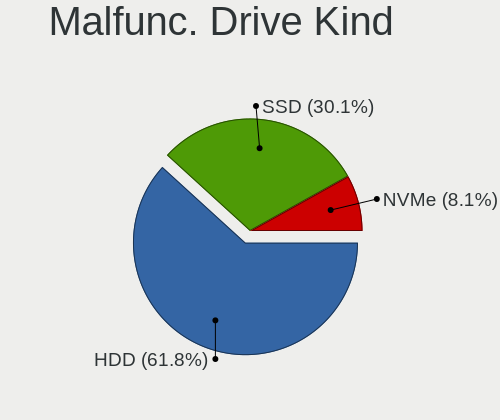
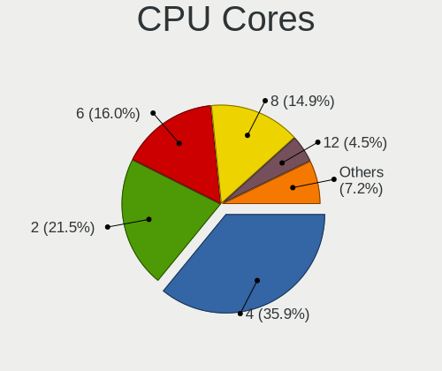
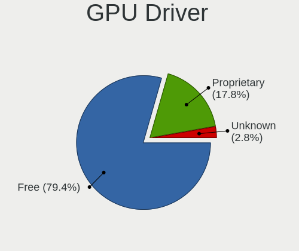
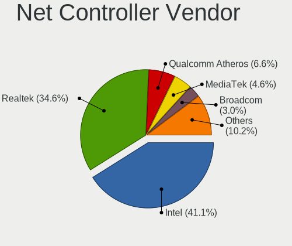
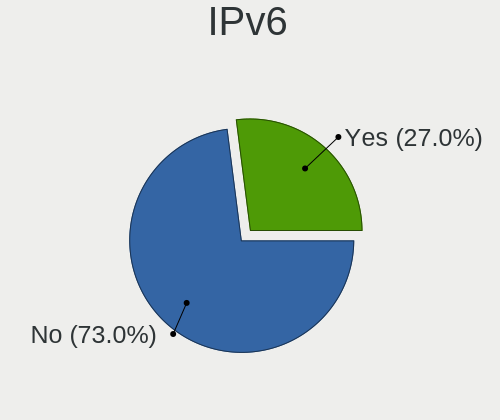
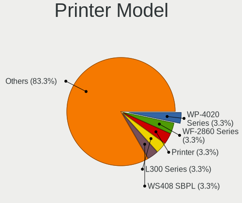
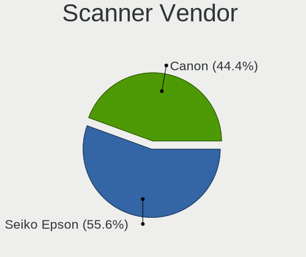
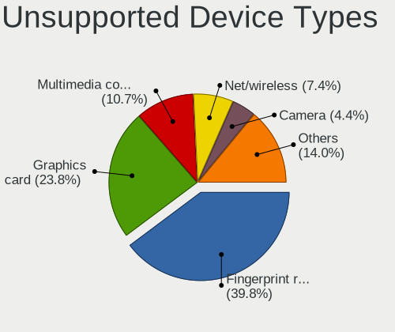

Fedora 37 - Tested Hardware & Statistics
----------------------------------------

A project to collect tested hardware configurations for Fedora 37.

Anyone can contribute to this report by the [hw-probe](https://github.com/linuxhw/hw-probe) tool:

    sudo -E hw-probe -all -upload

Please contribute! Especially if your hardware is rare.

This is a report for all computer types. See also reports for [desktops](/Dist/Fedora_37/Desktop/README.md) and [notebooks](/Dist/Fedora_37/Notebook/README.md).

Contents
--------

* [ Test Cases ](#test-cases)

* [ System ](#system)
  - [ Kernel                   ](#kernel)
  - [ Kernel Family            ](#kernel-family)
  - [ Kernel Major Ver.        ](#kernel-major-ver)
  - [ Arch                     ](#arch)
  - [ DE                       ](#de)
  - [ Display Server           ](#display-server)
  - [ Display Manager          ](#display-manager)
  - [ OS Lang                  ](#os-lang)
  - [ Boot Mode                ](#boot-mode)
  - [ Filesystem               ](#filesystem)
  - [ Part. scheme             ](#part-scheme)
  - [ Dual Boot with Linux/BSD ](#dual-boot-with-linuxbsd)
  - [ Dual Boot (Win)          ](#dual-boot-win)

* [ Board ](#board)
  - [ Vendor                   ](#vendor)
  - [ Model                    ](#model)
  - [ Model Family             ](#model-family)
  - [ MFG Year                 ](#mfg-year)
  - [ Form Factor              ](#form-factor)
  - [ Secure Boot              ](#secure-boot)
  - [ Coreboot                 ](#coreboot)
  - [ RAM Size                 ](#ram-size)
  - [ RAM Used                 ](#ram-used)
  - [ Total Drives             ](#total-drives)
  - [ Has CD-ROM               ](#has-cd-rom)
  - [ Has Ethernet             ](#has-ethernet)
  - [ Has WiFi                 ](#has-wifi)
  - [ Has Bluetooth            ](#has-bluetooth)

* [ Location ](#location)
  - [ Country                  ](#country)
  - [ City                     ](#city)

* [ Drives ](#drives)
  - [ Drive Vendor             ](#drive-vendor)
  - [ Drive Model              ](#drive-model)
  - [ HDD Vendor               ](#hdd-vendor)
  - [ SSD Vendor               ](#ssd-vendor)
  - [ Drive Kind               ](#drive-kind)
  - [ Drive Connector          ](#drive-connector)
  - [ Drive Size               ](#drive-size)
  - [ Space Total              ](#space-total)
  - [ Space Used               ](#space-used)
  - [ Malfunc. Drives          ](#malfunc-drives)
  - [ Malfunc. Drive Vendor    ](#malfunc-drive-vendor)
  - [ Malfunc. HDD Vendor      ](#malfunc-hdd-vendor)
  - [ Malfunc. Drive Kind      ](#malfunc-drive-kind)
  - [ Failed Drives            ](#failed-drives)
  - [ Failed Drive Vendor      ](#failed-drive-vendor)
  - [ Drive Status             ](#drive-status)

* [ Storage controller ](#storage-controller)
  - [ Storage Vendor           ](#storage-vendor)
  - [ Storage Model            ](#storage-model)
  - [ Storage Kind             ](#storage-kind)

* [ Processor ](#processor)
  - [ CPU Vendor               ](#cpu-vendor)
  - [ CPU Model                ](#cpu-model)
  - [ CPU Model Family         ](#cpu-model-family)
  - [ CPU Cores                ](#cpu-cores)
  - [ CPU Sockets              ](#cpu-sockets)
  - [ CPU Threads              ](#cpu-threads)
  - [ CPU Op-Modes             ](#cpu-op-modes)
  - [ CPU Microcode            ](#cpu-microcode)
  - [ CPU Microarch            ](#cpu-microarch)

* [ Graphics ](#graphics)
  - [ GPU Vendor               ](#gpu-vendor)
  - [ GPU Model                ](#gpu-model)
  - [ GPU Combo                ](#gpu-combo)
  - [ GPU Driver               ](#gpu-driver)
  - [ GPU Memory               ](#gpu-memory)

* [ Monitor ](#monitor)
  - [ Monitor Vendor           ](#monitor-vendor)
  - [ Monitor Model            ](#monitor-model)
  - [ Monitor Resolution       ](#monitor-resolution)
  - [ Monitor Diagonal         ](#monitor-diagonal)
  - [ Monitor Width            ](#monitor-width)
  - [ Aspect Ratio             ](#aspect-ratio)
  - [ Monitor Area             ](#monitor-area)
  - [ Pixel Density            ](#pixel-density)
  - [ Multiple Monitors        ](#multiple-monitors)

* [ Network ](#network)
  - [ Net Controller Vendor    ](#net-controller-vendor)
  - [ Net Controller Model     ](#net-controller-model)
  - [ Wireless Vendor          ](#wireless-vendor)
  - [ Wireless Model           ](#wireless-model)
  - [ Ethernet Vendor          ](#ethernet-vendor)
  - [ Ethernet Model           ](#ethernet-model)
  - [ Net Controller Kind      ](#net-controller-kind)
  - [ Used Controller          ](#used-controller)
  - [ NICs                     ](#nics)
  - [ IPv6                     ](#ipv6)

* [ Bluetooth ](#bluetooth)
  - [ Bluetooth Vendor         ](#bluetooth-vendor)
  - [ Bluetooth Model          ](#bluetooth-model)

* [ Sound ](#sound)
  - [ Sound Vendor             ](#sound-vendor)
  - [ Sound Model              ](#sound-model)

* [ Memory ](#memory)
  - [ Memory Vendor            ](#memory-vendor)
  - [ Memory Model             ](#memory-model)
  - [ Memory Kind              ](#memory-kind)
  - [ Memory Form Factor       ](#memory-form-factor)
  - [ Memory Size              ](#memory-size)
  - [ Memory Speed             ](#memory-speed)

* [ Printers & scanners ](#printers--scanners)
  - [ Printer Vendor           ](#printer-vendor)
  - [ Printer Model            ](#printer-model)
  - [ Scanner Vendor           ](#scanner-vendor)
  - [ Scanner Model            ](#scanner-model)

* [ Camera ](#camera)
  - [ Camera Vendor            ](#camera-vendor)
  - [ Camera Model             ](#camera-model)

* [ Security ](#security)
  - [ Fingerprint Vendor       ](#fingerprint-vendor)
  - [ Fingerprint Model        ](#fingerprint-model)
  - [ Chipcard Vendor          ](#chipcard-vendor)
  - [ Chipcard Model           ](#chipcard-model)

* [ Unsupported ](#unsupported)
  - [ Unsupported Devices      ](#unsupported-devices)
  - [ Unsupported Device Types ](#unsupported-device-types)

Test Cases
----------

Total: 2938

| Vendor        | Model                       | Form-Factor | Probe                                                      | Date         |
|---------------|-----------------------------|-------------|------------------------------------------------------------|--------------|
| HP            | ProBook 440 14 inch G9 N... | Notebook    | [b37cf7f8cf](https://linux-hardware.org/?probe=b37cf7f8cf) | Aug 30, 2023 |
| ASUSTek       | TUF Z370-PLUS GAMING        | Desktop     | [b93e0fc32b](https://linux-hardware.org/?probe=b93e0fc32b) | Aug 30, 2023 |
| HP            | Laptop 17-by0xxx            | Notebook    | [4617fe766a](https://linux-hardware.org/?probe=4617fe766a) | Aug 29, 2023 |
| ASUSTek       | ROG STRIX Z390-F GAMING     | Desktop     | [44e98cb157](https://linux-hardware.org/?probe=44e98cb157) | Aug 29, 2023 |
| MSI           | Z370-A PRO                  | Desktop     | [d9a6d27a28](https://linux-hardware.org/?probe=d9a6d27a28) | Aug 29, 2023 |
| ASUSTek       | TUF Z370-PLUS GAMING        | Desktop     | [7da432892e](https://linux-hardware.org/?probe=7da432892e) | Aug 29, 2023 |
| Dell          | 0GXM1W A01                  | Desktop     | [9bd4ef3aac](https://linux-hardware.org/?probe=9bd4ef3aac) | Aug 26, 2023 |
| Dell          | 0GXM1W A01                  | Desktop     | [978f1e9fa5](https://linux-hardware.org/?probe=978f1e9fa5) | Aug 26, 2023 |
| MSI           | MS-B9321                    | Desktop     | [07564a2fc4](https://linux-hardware.org/?probe=07564a2fc4) | Aug 25, 2023 |
| Dell          | 0HHV7N A00                  | Desktop     | [1bcc49b615](https://linux-hardware.org/?probe=1bcc49b615) | Aug 25, 2023 |
| MSI           | MS-B9321                    | Desktop     | [df54486a48](https://linux-hardware.org/?probe=df54486a48) | Aug 25, 2023 |
| HP            | OMEN by Laptop 15-dh1xxx    | Notebook    | [6e84e686ec](https://linux-hardware.org/?probe=6e84e686ec) | Aug 25, 2023 |
| ASUSTek       | X540UP                      | Notebook    | [7041925c33](https://linux-hardware.org/?probe=7041925c33) | Aug 23, 2023 |
| Intel         | NUC6i7KYB H90766-406        | Mini pc     | [fed21c9b13](https://linux-hardware.org/?probe=fed21c9b13) | Aug 23, 2023 |
| Toshiba       | Satellite L515              | Notebook    | [fa5d7d5547](https://linux-hardware.org/?probe=fa5d7d5547) | Aug 23, 2023 |
| ASUSTek       | CM6870                      | Desktop     | [05507d2151](https://linux-hardware.org/?probe=05507d2151) | Aug 20, 2023 |
| ASUSTek       | CM6870                      | Desktop     | [b91ffcb2be](https://linux-hardware.org/?probe=b91ffcb2be) | Aug 20, 2023 |
| HP            | Laptop 15s-eq2xxx           | Notebook    | [34f09bffb0](https://linux-hardware.org/?probe=34f09bffb0) | Aug 20, 2023 |
| Lenovo        | IdeaPad 3 14ITL6 82H7       | Notebook    | [bbf57bf744](https://linux-hardware.org/?probe=bbf57bf744) | Aug 17, 2023 |
| Gigabyte      | B550 AORUS ELITE AX V2      | Desktop     | [12c4ed323e](https://linux-hardware.org/?probe=12c4ed323e) | Aug 15, 2023 |
| Lenovo        | IdeaPad 320-15IKB 81G3      | Notebook    | [83879b8247](https://linux-hardware.org/?probe=83879b8247) | Aug 11, 2023 |
| Fujitsu       | UH-X                        | Notebook    | [e26b430aef](https://linux-hardware.org/?probe=e26b430aef) | Aug 09, 2023 |
| Microsoft     | Surface Pro 6               | Tablet      | [d9513873ac](https://linux-hardware.org/?probe=d9513873ac) | Aug 07, 2023 |
| ASUSTek       | VivoBook_ASUSLaptop X340... | Notebook    | [2980681052](https://linux-hardware.org/?probe=2980681052) | Aug 07, 2023 |
| HP            | EliteBook 850 G8 Noteboo... | Notebook    | [08b395f8d6](https://linux-hardware.org/?probe=08b395f8d6) | Aug 07, 2023 |
| ASUSTek       | VivoBook_ASUSLaptop X340... | Notebook    | [4dec7b692a](https://linux-hardware.org/?probe=4dec7b692a) | Aug 07, 2023 |
| Lenovo        | ThinkPad X1 Carbon Gen 1... | Notebook    | [2771828543](https://linux-hardware.org/?probe=2771828543) | Aug 06, 2023 |
| MSI           | MAG B550 TOMAHAWK           | Desktop     | [8add0a69cc](https://linux-hardware.org/?probe=8add0a69cc) | Aug 05, 2023 |
| ASUSTek       | PRIME B350M-A               | Desktop     | [9a4f9f590c](https://linux-hardware.org/?probe=9a4f9f590c) | Aug 04, 2023 |
| HP            | ENVY Laptop 16-h1xxx        | Notebook    | [ca0d3636a5](https://linux-hardware.org/?probe=ca0d3636a5) | Aug 03, 2023 |
| Lenovo        | ThinkPad X240 20AMS1RR0D    | Notebook    | [dcf2bedb58](https://linux-hardware.org/?probe=dcf2bedb58) | Aug 03, 2023 |
| ASUSTek       | PRIME B350M-A               | Desktop     | [41cc0d3bfc](https://linux-hardware.org/?probe=41cc0d3bfc) | Aug 01, 2023 |
| MSI           | GE75 Raider 10SE            | Notebook    | [995b9ae73e](https://linux-hardware.org/?probe=995b9ae73e) | Jul 31, 2023 |
| ASUSTek       | M4A89TD PRO USB3            | Desktop     | [bcfe09b617](https://linux-hardware.org/?probe=bcfe09b617) | Jul 29, 2023 |
| ECS           | H61H2-M17                   | Desktop     | [360623689a](https://linux-hardware.org/?probe=360623689a) | Jul 29, 2023 |
| ECS           | H61H2-M17                   | Desktop     | [aa0f0813e4](https://linux-hardware.org/?probe=aa0f0813e4) | Jul 29, 2023 |
| ASUSTek       | PRIME X570-P                | Desktop     | [fa1452d305](https://linux-hardware.org/?probe=fa1452d305) | Jul 28, 2023 |
| HP            | Pavilion Laptop 15-cw0xx... | Notebook    | [87d69792fb](https://linux-hardware.org/?probe=87d69792fb) | Jul 26, 2023 |
| HP            | Pavilion Laptop 15-cw0xx... | Notebook    | [83097985a2](https://linux-hardware.org/?probe=83097985a2) | Jul 26, 2023 |
| Gigabyte      | H61MS                       | Desktop     | [545d840e2f](https://linux-hardware.org/?probe=545d840e2f) | Jul 23, 2023 |
| Lenovo        | IdeaPad 330S-15IKB 81F5     | Notebook    | [6c0c0671df](https://linux-hardware.org/?probe=6c0c0671df) | Jul 23, 2023 |
| Lenovo        | ThinkPad T470 W10DG 20HE... | Notebook    | [e6320dd4ae](https://linux-hardware.org/?probe=e6320dd4ae) | Jul 22, 2023 |
| Toshiba       | TECRA A50-A                 | Notebook    | [e96ff00334](https://linux-hardware.org/?probe=e96ff00334) | Jul 21, 2023 |
| Dell          | 00010C A00                  | Desktop     | [71eca6ee4c](https://linux-hardware.org/?probe=71eca6ee4c) | Jul 20, 2023 |
| Lenovo        | IdeaPad S540-14API 81NH     | Notebook    | [a1f316c8c9](https://linux-hardware.org/?probe=a1f316c8c9) | Jul 20, 2023 |
| Lenovo        | ThinkPad T61 6465CTO        | Notebook    | [fcf6ce5b9e](https://linux-hardware.org/?probe=fcf6ce5b9e) | Jul 13, 2023 |
| MSI           | MPG X570 GAMING PLUS        | Desktop     | [c09e539c94](https://linux-hardware.org/?probe=c09e539c94) | Jul 09, 2023 |
| Lenovo        | ThinkPad T490 20N2CTO1WW    | Notebook    | [b4d926a4bc](https://linux-hardware.org/?probe=b4d926a4bc) | Jul 08, 2023 |
| MSI           | GF65 Thin 10UE              | Notebook    | [8dd1516457](https://linux-hardware.org/?probe=8dd1516457) | Jul 08, 2023 |
| AZW           | SER                         | Mini pc     | [1a93a70c6b](https://linux-hardware.org/?probe=1a93a70c6b) | Jul 07, 2023 |
| HP            | Laptop 15-dw3xxx            | Notebook    | [2ed128676f](https://linux-hardware.org/?probe=2ed128676f) | Jul 07, 2023 |
| Lenovo        | ThinkPad X1 Carbon Gen 1... | Notebook    | [0b4200c1e4](https://linux-hardware.org/?probe=0b4200c1e4) | Jul 07, 2023 |
| Lenovo        | ThinkPad P52 20MAS17228     | Notebook    | [cb869cfeab](https://linux-hardware.org/?probe=cb869cfeab) | Jul 07, 2023 |
| Dell          | 0KRC95 A02                  | Desktop     | [5d0d505ca1](https://linux-hardware.org/?probe=5d0d505ca1) | Jul 07, 2023 |
| Lenovo        | ThinkPad P52 20M9CTO1WW     | Notebook    | [b50c5ad983](https://linux-hardware.org/?probe=b50c5ad983) | Jul 06, 2023 |
| Lenovo        | ThinkBook 15 G3 ACL 21A4    | Notebook    | [dfd88b9f78](https://linux-hardware.org/?probe=dfd88b9f78) | Jul 04, 2023 |
| ASUSTek       | ROG Zephyrus G14 GA401IV... | Notebook    | [ca25e859c3](https://linux-hardware.org/?probe=ca25e859c3) | Jul 04, 2023 |
| MSI           | Z170A KRAIT GAMING          | Desktop     | [4bede9ff31](https://linux-hardware.org/?probe=4bede9ff31) | Jul 03, 2023 |
| MSI           | Raider GE77HX 12UHS         | Notebook    | [87cc790852](https://linux-hardware.org/?probe=87cc790852) | Jul 03, 2023 |
| ASRock        | Z87 Extreme6                | Desktop     | [d69ea1a2cb](https://linux-hardware.org/?probe=d69ea1a2cb) | Jul 02, 2023 |
| Samsung       | 700Z3A/700Z4A/700Z5A/700... | Notebook    | [4586b855ca](https://linux-hardware.org/?probe=4586b855ca) | Jul 02, 2023 |
| ASRock        | FM2A88X Extreme6+           | Desktop     | [8ea4c888cf](https://linux-hardware.org/?probe=8ea4c888cf) | Jul 01, 2023 |
| ASRock        | FM2A88X Extreme6+           | Desktop     | [77e6b09eb9](https://linux-hardware.org/?probe=77e6b09eb9) | Jun 30, 2023 |
| ASUSTek       | ROG STRIX B650E-F GAMING... | Desktop     | [08708e8e9d](https://linux-hardware.org/?probe=08708e8e9d) | Jun 28, 2023 |
| ASRock        | FM2A88X Extreme6+           | Desktop     | [a974c1b82e](https://linux-hardware.org/?probe=a974c1b82e) | Jun 26, 2023 |
| ASRock        | FM2A88X Extreme6+           | Desktop     | [1c648f1f3e](https://linux-hardware.org/?probe=1c648f1f3e) | Jun 25, 2023 |
| Lenovo        | V14 G2 ALC 82KC             | Notebook    | [40cbc38a69](https://linux-hardware.org/?probe=40cbc38a69) | Jun 25, 2023 |
| Lenovo        | ThinkPad P15 Gen 1 20ST0... | Notebook    | [e44e80fc33](https://linux-hardware.org/?probe=e44e80fc33) | Jun 23, 2023 |
| ASUSTek       | ROG STRIX B650E-F GAMING... | Desktop     | [b07361bc89](https://linux-hardware.org/?probe=b07361bc89) | Jun 22, 2023 |
| Apple         | MacBookAir5,2               | Notebook    | [8f6d75c75e](https://linux-hardware.org/?probe=8f6d75c75e) | Jun 22, 2023 |
| HP            | EliteBook 865 16 inch G9... | Notebook    | [e4407d328d](https://linux-hardware.org/?probe=e4407d328d) | Jun 22, 2023 |
| Lenovo        | IdeaPad S540-14IWL 81ND     | Notebook    | [3be3d70197](https://linux-hardware.org/?probe=3be3d70197) | Jun 20, 2023 |
| Dell          | Inspiron 7415 2-in-1        | Convertible | [744e0e7188](https://linux-hardware.org/?probe=744e0e7188) | Jun 20, 2023 |
| Gigabyte      | MZBAYAB-00                  | Desktop     | [5864261490](https://linux-hardware.org/?probe=5864261490) | Jun 20, 2023 |
| Lenovo        | Legion 5 82B5               | Notebook    | [146ef72817](https://linux-hardware.org/?probe=146ef72817) | Jun 19, 2023 |
| HP            | 212B                        | Desktop     | [134ff203c4](https://linux-hardware.org/?probe=134ff203c4) | Jun 16, 2023 |
| Lenovo        | ThinkPad L14 Gen 2a 20X6... | Notebook    | [e3e61eef7a](https://linux-hardware.org/?probe=e3e61eef7a) | Jun 15, 2023 |
| HP            | 212B                        | Desktop     | [b107461bdd](https://linux-hardware.org/?probe=b107461bdd) | Jun 14, 2023 |
| ECS           | H61H2-M17                   | Desktop     | [63ded73edb](https://linux-hardware.org/?probe=63ded73edb) | Jun 14, 2023 |
| HP            | ProBook 455 G8 Notebook ... | Notebook    | [57b3c23d43](https://linux-hardware.org/?probe=57b3c23d43) | Jun 14, 2023 |
| Dell          | 0KRC95 A02                  | Desktop     | [5f9a1aafe0](https://linux-hardware.org/?probe=5f9a1aafe0) | Jun 14, 2023 |
| ECS           | H61H2-M17                   | Desktop     | [fb57cc3ed4](https://linux-hardware.org/?probe=fb57cc3ed4) | Jun 13, 2023 |
| Gigabyte      | D525TUD                     | Desktop     | [be2c796ab2](https://linux-hardware.org/?probe=be2c796ab2) | Jun 13, 2023 |
| Lenovo        | IdeaPad 330S-14IKB 81F4     | Notebook    | [b9c83e1b8a](https://linux-hardware.org/?probe=b9c83e1b8a) | Jun 12, 2023 |
| ASUSTek       | M5A78L-M/USB3               | Desktop     | [cf9274f969](https://linux-hardware.org/?probe=cf9274f969) | Jun 11, 2023 |
| ASRock        | FM2A88X Extreme6+           | Desktop     | [1c5e1b092a](https://linux-hardware.org/?probe=1c5e1b092a) | Jun 11, 2023 |
| ASRock        | FM2A88X Extreme6+           | Desktop     | [212c44c43f](https://linux-hardware.org/?probe=212c44c43f) | Jun 10, 2023 |
| Gigabyte      | B450 AORUS PRO WIFI-CF      | Desktop     | [f9677c0861](https://linux-hardware.org/?probe=f9677c0861) | Jun 09, 2023 |
| HUAWEI        | NBLK-WAX9X                  | Notebook    | [e28668e147](https://linux-hardware.org/?probe=e28668e147) | Jun 08, 2023 |
| Lenovo        | ThinkPad T590 20N5S2NC0F    | Notebook    | [581602e921](https://linux-hardware.org/?probe=581602e921) | Jun 07, 2023 |
| Dell          | Latitude 5300               | Notebook    | [1eea10cfa3](https://linux-hardware.org/?probe=1eea10cfa3) | Jun 07, 2023 |
| Lenovo        | ThinkPad P51 20HH0011US     | Notebook    | [4766608bc1](https://linux-hardware.org/?probe=4766608bc1) | Jun 06, 2023 |
| ASRock        | FM2A88X Extreme6+           | Desktop     | [3c3708dcec](https://linux-hardware.org/?probe=3c3708dcec) | Jun 06, 2023 |
| ASRock        | FM2A88X Extreme6+           | Desktop     | [79b80daf83](https://linux-hardware.org/?probe=79b80daf83) | Jun 05, 2023 |
| ASUSTek       | X540UP                      | Notebook    | [b6613930a2](https://linux-hardware.org/?probe=b6613930a2) | Jun 05, 2023 |
| ASUSTek       | X540UP                      | Notebook    | [5102ecc266](https://linux-hardware.org/?probe=5102ecc266) | Jun 04, 2023 |
| Acer          | Aspire AV15-51              | Notebook    | [41e5c1790c](https://linux-hardware.org/?probe=41e5c1790c) | Jun 03, 2023 |
| Acer          | Aspire AV15-51              | Notebook    | [d583c74274](https://linux-hardware.org/?probe=d583c74274) | Jun 03, 2023 |
| Acer          | Aspire AV15-51              | Notebook    | [7ed9ba7165](https://linux-hardware.org/?probe=7ed9ba7165) | Jun 03, 2023 |
| ASUSTek       | ASUS TUF Dash F15 FX516P... | Notebook    | [1aa286ccff](https://linux-hardware.org/?probe=1aa286ccff) | Jun 03, 2023 |
| HP            | 212B                        | Desktop     | [15c4a7b64f](https://linux-hardware.org/?probe=15c4a7b64f) | Jun 02, 2023 |
| Dell          | Latitude 7490               | Notebook    | [3cb9ad156f](https://linux-hardware.org/?probe=3cb9ad156f) | Jun 01, 2023 |
| Toshiba       | TECRA Z40t-C                | Notebook    | [f3dc10c852](https://linux-hardware.org/?probe=f3dc10c852) | Jun 01, 2023 |
| ASRock        | FM2A88X Extreme6+           | Desktop     | [df9086deb4](https://linux-hardware.org/?probe=df9086deb4) | Jun 01, 2023 |
| Toshiba       | TECRA Z40t-C                | Notebook    | [1d128e6153](https://linux-hardware.org/?probe=1d128e6153) | Jun 01, 2023 |
| ASRock        | FM2A88X Extreme6+           | Desktop     | [4a908da319](https://linux-hardware.org/?probe=4a908da319) | May 31, 2023 |
| Framework     | Laptop (12th Gen Intel C... | Notebook    | [287ebf0b10](https://linux-hardware.org/?probe=287ebf0b10) | May 30, 2023 |
| HP            | EliteBook 6930p             | Notebook    | [882f43330b](https://linux-hardware.org/?probe=882f43330b) | May 30, 2023 |
| Gigabyte      | B550 AORUS ELITE AX V2      | Desktop     | [ffbccb8f47](https://linux-hardware.org/?probe=ffbccb8f47) | May 30, 2023 |
| ASUSTek       | ASUS TUF Dash F15 FX516P... | Notebook    | [360e8fd5e5](https://linux-hardware.org/?probe=360e8fd5e5) | May 30, 2023 |
| ASRock        | FM2A88X Extreme6+           | Desktop     | [8b96413dfd](https://linux-hardware.org/?probe=8b96413dfd) | May 30, 2023 |
| HP            | 8169                        | Desktop     | [4f10a589e7](https://linux-hardware.org/?probe=4f10a589e7) | May 29, 2023 |
| MSI           | GF65 Thin 10UE              | Notebook    | [98e2096ab6](https://linux-hardware.org/?probe=98e2096ab6) | May 29, 2023 |
| Dell          | Inspiron 7577               | Notebook    | [94e5a63c07](https://linux-hardware.org/?probe=94e5a63c07) | May 29, 2023 |
| ASRock        | FM2A88X Extreme6+           | Desktop     | [38936854c8](https://linux-hardware.org/?probe=38936854c8) | May 29, 2023 |
| HP            | ProLiant ML110 G7           | Desktop     | [fd74c84f0a](https://linux-hardware.org/?probe=fd74c84f0a) | May 28, 2023 |
| Dell          | XPS 9320                    | Notebook    | [33e7d964ad](https://linux-hardware.org/?probe=33e7d964ad) | May 28, 2023 |
| Gigabyte      | Z77MX-D3H                   | Desktop     | [3c001962b0](https://linux-hardware.org/?probe=3c001962b0) | May 28, 2023 |
| Lenovo        | V15 G2 ALC 82KD             | Notebook    | [dc2b5e538f](https://linux-hardware.org/?probe=dc2b5e538f) | May 27, 2023 |
| ASUSTek       | ASUS EXPERTBOOK B1400CEA... | Notebook    | [f068d88c01](https://linux-hardware.org/?probe=f068d88c01) | May 27, 2023 |
| AAEON         | AEC-6637                    | Notebook    | [19050f7ccd](https://linux-hardware.org/?probe=19050f7ccd) | May 26, 2023 |
| Intel Clie... | LAPBC510                    | Notebook    | [fe45f8ba3c](https://linux-hardware.org/?probe=fe45f8ba3c) | May 26, 2023 |
| Lenovo        | ThinkPad T14 Gen 1 20S0C... | Notebook    | [29d761bff5](https://linux-hardware.org/?probe=29d761bff5) | May 26, 2023 |
| Lenovo        | ThinkPad T15 Gen 2i 20W4... | Notebook    | [5dd56ed986](https://linux-hardware.org/?probe=5dd56ed986) | May 25, 2023 |
| ASRock        | B450M-HDV R4.0              | Desktop     | [063077bd52](https://linux-hardware.org/?probe=063077bd52) | May 25, 2023 |
| ASUSTek       | PRIME B450M-GAMING/BR       | Desktop     | [2c31d88fa2](https://linux-hardware.org/?probe=2c31d88fa2) | May 25, 2023 |
| ASUSTek       | PRIME B450M-GAMING/BR       | Desktop     | [efb5aa9bfc](https://linux-hardware.org/?probe=efb5aa9bfc) | May 24, 2023 |
| Dell          | Precision 7530              | Notebook    | [5cf37f39f4](https://linux-hardware.org/?probe=5cf37f39f4) | May 24, 2023 |
| HP            | EliteBook 845 G8 Noteboo... | Notebook    | [1280876877](https://linux-hardware.org/?probe=1280876877) | May 24, 2023 |
| HP            | ENVY 15                     | Notebook    | [85a97390d5](https://linux-hardware.org/?probe=85a97390d5) | May 23, 2023 |
| ASRock        | FM2A88X Extreme6+           | Desktop     | [ec7d8d12e1](https://linux-hardware.org/?probe=ec7d8d12e1) | May 23, 2023 |
| HP            | ENVY x360 Convertible 13... | Convertible | [d5b2c1e7b5](https://linux-hardware.org/?probe=d5b2c1e7b5) | May 22, 2023 |
| ASRock        | FM2A88X Extreme6+           | Desktop     | [ecc77ee7a9](https://linux-hardware.org/?probe=ecc77ee7a9) | May 22, 2023 |
| HP            | ENVY 15                     | Notebook    | [21a38278ca](https://linux-hardware.org/?probe=21a38278ca) | May 21, 2023 |
| Gigabyte      | X570 AORUS ELITE            | Desktop     | [7b5628af0e](https://linux-hardware.org/?probe=7b5628af0e) | May 21, 2023 |
| ASUSTek       | ROG Strix G713PV_G713PV     | Notebook    | [8ec7bb4682](https://linux-hardware.org/?probe=8ec7bb4682) | May 21, 2023 |
| Lenovo        | IdeaPad Gaming 3 15ARH05... | Notebook    | [0f8329fecb](https://linux-hardware.org/?probe=0f8329fecb) | May 20, 2023 |
| Lenovo        | ThinkPad T480 20L5S1S000    | Notebook    | [30950ddd01](https://linux-hardware.org/?probe=30950ddd01) | May 19, 2023 |
| Gigabyte      | H77N-WIFI                   | Desktop     | [b59b0160fb](https://linux-hardware.org/?probe=b59b0160fb) | May 19, 2023 |
| MSI           | Stealth 15M B12UE           | Notebook    | [d6e14242b8](https://linux-hardware.org/?probe=d6e14242b8) | May 19, 2023 |
| Lenovo        | ThinkPad E14 Gen 2 20T7S... | Notebook    | [f811501691](https://linux-hardware.org/?probe=f811501691) | May 18, 2023 |
| Gigabyte      | B550I AORUS PRO AX          | Desktop     | [b8ed6a8b77](https://linux-hardware.org/?probe=b8ed6a8b77) | May 18, 2023 |
| Gigabyte      | 990FXA-UD3 R5               | Desktop     | [b3e10fd912](https://linux-hardware.org/?probe=b3e10fd912) | May 17, 2023 |
| HP            | ENVY 15                     | Notebook    | [4576cea8b0](https://linux-hardware.org/?probe=4576cea8b0) | May 17, 2023 |
| Gigabyte      | H170-Gaming 3               | Desktop     | [ae5f06df99](https://linux-hardware.org/?probe=ae5f06df99) | May 16, 2023 |
| MSI           | H170A PC MATE               | Desktop     | [389ab53539](https://linux-hardware.org/?probe=389ab53539) | May 15, 2023 |
| ASRock        | FM2A88X Extreme6+           | Desktop     | [d4344603b6](https://linux-hardware.org/?probe=d4344603b6) | May 15, 2023 |
| Gigabyte      | X570 I AORUS PRO WIFI       | Desktop     | [bd390995e3](https://linux-hardware.org/?probe=bd390995e3) | May 14, 2023 |
| ASRock        | FM2A88X Extreme6+           | Desktop     | [903ece310a](https://linux-hardware.org/?probe=903ece310a) | May 14, 2023 |
| Lenovo        | ThinkPad P1 Gen 4i 20Y4S... | Notebook    | [9dda4f6b83](https://linux-hardware.org/?probe=9dda4f6b83) | May 13, 2023 |
| ASRock        | FM2A88X Extreme6+           | Desktop     | [4243b6a57b](https://linux-hardware.org/?probe=4243b6a57b) | May 13, 2023 |
| Gigabyte      | B550 AORUS ELITE AX V2      | Desktop     | [fdf45a81de](https://linux-hardware.org/?probe=fdf45a81de) | May 13, 2023 |
| HP            | ENVY 15                     | Notebook    | [e188fe21b7](https://linux-hardware.org/?probe=e188fe21b7) | May 12, 2023 |
| Dell          | 02YYK5 A00                  | Desktop     | [68213fddbd](https://linux-hardware.org/?probe=68213fddbd) | May 12, 2023 |
| ASUSTek       | TUF Gaming B660M-PLUS D4    | Desktop     | [35990f19da](https://linux-hardware.org/?probe=35990f19da) | May 12, 2023 |
| Lenovo        | YangTian V340-15-IML 81V... | Notebook    | [cedb6136dc](https://linux-hardware.org/?probe=cedb6136dc) | May 12, 2023 |
| ASUSTek       | X79-DELUXE                  | Desktop     | [ad6be5fe7c](https://linux-hardware.org/?probe=ad6be5fe7c) | May 12, 2023 |
| ASRock        | FM2A88X Extreme6+           | Desktop     | [e985d1beac](https://linux-hardware.org/?probe=e985d1beac) | May 12, 2023 |
| ASUSTek       | PRIME B450M-GAMING/BR       | Desktop     | [1b0cd4f3e1](https://linux-hardware.org/?probe=1b0cd4f3e1) | May 11, 2023 |
| Gigabyte      | H77N-WIFI                   | Desktop     | [3dc1af6df9](https://linux-hardware.org/?probe=3dc1af6df9) | May 11, 2023 |
| Dell          | Precision M3800             | Notebook    | [f5f8f44c9e](https://linux-hardware.org/?probe=f5f8f44c9e) | May 10, 2023 |
| ASUSTek       | VivoBook_ASUS Laptop X50... | Notebook    | [b791be35c2](https://linux-hardware.org/?probe=b791be35c2) | May 10, 2023 |
| ASUSTek       | VivoBook_ASUS Laptop X50... | Notebook    | [7058baf75d](https://linux-hardware.org/?probe=7058baf75d) | May 10, 2023 |
| HP            | Pavilion Aero Laptop 13-... | Notebook    | [80a4bfeb08](https://linux-hardware.org/?probe=80a4bfeb08) | May 10, 2023 |
| ASUSTek       | PRIME B560M-K               | Desktop     | [ce0391bdee](https://linux-hardware.org/?probe=ce0391bdee) | May 09, 2023 |
| ASRock        | FM2A88X Extreme6+           | Desktop     | [e2bbbffe45](https://linux-hardware.org/?probe=e2bbbffe45) | May 09, 2023 |
| SK hynix      | HyBook Plus                 | Notebook    | [817a46f154](https://linux-hardware.org/?probe=817a46f154) | May 09, 2023 |
| Dell          | XPS 15 9500                 | Notebook    | [0a72d00670](https://linux-hardware.org/?probe=0a72d00670) | May 09, 2023 |
| Supermicro    | X11DPU                      | Server      | [d4b08b5129](https://linux-hardware.org/?probe=d4b08b5129) | May 08, 2023 |
| Notebook      | P750ZM                      | Notebook    | [2cbd56abdc](https://linux-hardware.org/?probe=2cbd56abdc) | May 08, 2023 |
| ASRock        | B560M-ITX/ac                | Desktop     | [80b16a8567](https://linux-hardware.org/?probe=80b16a8567) | May 08, 2023 |
| HP            | Pavilion Laptop 15-eg0xx... | Notebook    | [d782846579](https://linux-hardware.org/?probe=d782846579) | May 08, 2023 |
| ASRock        | FM2A88X Extreme6+           | Desktop     | [53c03d6942](https://linux-hardware.org/?probe=53c03d6942) | May 08, 2023 |
| ASRock        | N68C-GS FX                  | Desktop     | [dcf5cd4ca2](https://linux-hardware.org/?probe=dcf5cd4ca2) | May 08, 2023 |
| Intel         | DP43TF AAE34878-403         | Desktop     | [9d5ca00c7c](https://linux-hardware.org/?probe=9d5ca00c7c) | May 07, 2023 |
| Intel         | DP43TF AAE34878-404         | Desktop     | [6bea90b569](https://linux-hardware.org/?probe=6bea90b569) | May 07, 2023 |
| Intel         | DP43TF AAE34878-403         | Desktop     | [6353d110f5](https://linux-hardware.org/?probe=6353d110f5) | May 07, 2023 |
| Intel         | DP43TF AAE34878-404         | Desktop     | [db0ab14831](https://linux-hardware.org/?probe=db0ab14831) | May 07, 2023 |
| HP            | ENVY x360 2-in-1 Laptop ... | Convertible | [82afa36341](https://linux-hardware.org/?probe=82afa36341) | May 06, 2023 |
| Dell          | Inspiron 5490               | Notebook    | [6e2a4689b5](https://linux-hardware.org/?probe=6e2a4689b5) | May 06, 2023 |
| Lenovo        | ThinkPad T580 20L9CTO1WW    | Notebook    | [b8a363f717](https://linux-hardware.org/?probe=b8a363f717) | May 04, 2023 |
| Dell          | Precision 5540              | Notebook    | [3139d97ce0](https://linux-hardware.org/?probe=3139d97ce0) | May 04, 2023 |
| Toshiba       | PORTEGE Z830                | Notebook    | [a8cc4a63c2](https://linux-hardware.org/?probe=a8cc4a63c2) | May 03, 2023 |
| Lenovo        | IdeaPad 310-15ISK 80UH      | Notebook    | [143b75f514](https://linux-hardware.org/?probe=143b75f514) | May 02, 2023 |
| ASRock        | FM2A88X Extreme6+           | Desktop     | [513f1e9efb](https://linux-hardware.org/?probe=513f1e9efb) | May 02, 2023 |
| ASUSTek       | M5A99FX PRO R2.0            | Desktop     | [dc9cb3badc](https://linux-hardware.org/?probe=dc9cb3badc) | May 02, 2023 |
| Gigabyte      | B450 AORUS ELITE            | Desktop     | [961ec7671c](https://linux-hardware.org/?probe=961ec7671c) | May 01, 2023 |
| ASRock        | FM2A88X Extreme6+           | Desktop     | [be8b69e1b4](https://linux-hardware.org/?probe=be8b69e1b4) | May 01, 2023 |
| Intel         | CHERRYVIEW D1 PLATFORM      | Notebook    | [6c58138c35](https://linux-hardware.org/?probe=6c58138c35) | May 01, 2023 |
| ASUSTek       | X555QG                      | Notebook    | [5263b174b2](https://linux-hardware.org/?probe=5263b174b2) | Apr 30, 2023 |
| ASRock        | FM2A88X Extreme6+           | Desktop     | [c33288abe2](https://linux-hardware.org/?probe=c33288abe2) | Apr 30, 2023 |
| HP            | EliteBook 840 G3            | Notebook    | [c262e81ab9](https://linux-hardware.org/?probe=c262e81ab9) | Apr 30, 2023 |
| Dell          | XPS 13 9380                 | Notebook    | [c6591b0852](https://linux-hardware.org/?probe=c6591b0852) | Apr 29, 2023 |
| Intel         | CHERRYVIEW D1 PLATFORM      | Notebook    | [edf1d60e46](https://linux-hardware.org/?probe=edf1d60e46) | Apr 29, 2023 |
| Apple         | Mac-F60DEB81FF30ACF6 Mac... | Desktop     | [80ea529a18](https://linux-hardware.org/?probe=80ea529a18) | Apr 29, 2023 |
| MSI           | Modern 14 B11MOU            | Notebook    | [6b3fcf3fcc](https://linux-hardware.org/?probe=6b3fcf3fcc) | Apr 29, 2023 |
| ASUSTek       | X555QG                      | Notebook    | [b33f41d3c3](https://linux-hardware.org/?probe=b33f41d3c3) | Apr 28, 2023 |
| Lenovo        | ThinkPad T14 Gen 3 21AH0... | Notebook    | [e0ef7894af](https://linux-hardware.org/?probe=e0ef7894af) | Apr 28, 2023 |
| HP            | ENVY x360 2-in-1 Laptop ... | Convertible | [8a3c1cbc1c](https://linux-hardware.org/?probe=8a3c1cbc1c) | Apr 28, 2023 |
| Lenovo        | ThinkPad L13 Yoga 20R6S1... | Convertible | [c01483e50f](https://linux-hardware.org/?probe=c01483e50f) | Apr 28, 2023 |
| Lenovo        | ThinkPad X230 2325O32       | Notebook    | [b38ef1a717](https://linux-hardware.org/?probe=b38ef1a717) | Apr 27, 2023 |
| Lenovo        | ThinkPad T420 4177QKU       | Notebook    | [cbabefb1fa](https://linux-hardware.org/?probe=cbabefb1fa) | Apr 27, 2023 |
| ASRock        | FM2A88X Extreme6+           | Desktop     | [853016bfe3](https://linux-hardware.org/?probe=853016bfe3) | Apr 27, 2023 |
| Lenovo        | ThinkPad E14 Gen 4 21EBC... | Notebook    | [3a6e27c6ce](https://linux-hardware.org/?probe=3a6e27c6ce) | Apr 26, 2023 |
| Gigabyte      | EX58-EXTREME                | Desktop     | [3b263c29fc](https://linux-hardware.org/?probe=3b263c29fc) | Apr 26, 2023 |
| ASRock        | FM2A88X Extreme6+           | Desktop     | [909ad37ab0](https://linux-hardware.org/?probe=909ad37ab0) | Apr 26, 2023 |
| MSI           | Creator 15 A10SGS           | Notebook    | [1b364e385a](https://linux-hardware.org/?probe=1b364e385a) | Apr 26, 2023 |
| HP            | Laptop 15-fc0xxx            | Notebook    | [cc994920bf](https://linux-hardware.org/?probe=cc994920bf) | Apr 25, 2023 |
| HP            | 0AECh D                     | Desktop     | [c9e99b3f8c](https://linux-hardware.org/?probe=c9e99b3f8c) | Apr 25, 2023 |
| HUAWEI        | BOHK-WAX9X                  | Notebook    | [c0d8e6e6b5](https://linux-hardware.org/?probe=c0d8e6e6b5) | Apr 25, 2023 |
| Lenovo        | 1037 SDK0Q40104 WIN 3305... | Server      | [1d6082efe8](https://linux-hardware.org/?probe=1d6082efe8) | Apr 25, 2023 |
| Lenovo        | 1037 SDK0Q40104 WIN 3305... | Server      | [d86639089a](https://linux-hardware.org/?probe=d86639089a) | Apr 25, 2023 |
| Gigabyte      | Z77MX-D3H                   | Desktop     | [373372bf75](https://linux-hardware.org/?probe=373372bf75) | Apr 25, 2023 |
| Lenovo        | V130-15IKB 81HN             | Notebook    | [1b26b3f89b](https://linux-hardware.org/?probe=1b26b3f89b) | Apr 24, 2023 |
| HP            | Pavilion Laptop 15-cc1xx    | Notebook    | [2f3390afca](https://linux-hardware.org/?probe=2f3390afca) | Apr 24, 2023 |
| Gigabyte      | X570S I AORUS PRO AX        | Desktop     | [9c37fa5192](https://linux-hardware.org/?probe=9c37fa5192) | Apr 24, 2023 |
| Gigabyte      | F2A88X-UP4                  | Desktop     | [06859fe586](https://linux-hardware.org/?probe=06859fe586) | Apr 23, 2023 |
| Notebook      | NLxxPUx                     | Notebook    | [3648be5b0f](https://linux-hardware.org/?probe=3648be5b0f) | Apr 23, 2023 |
| ASUSTek       | ZenBook UX425UA_UM425UA     | Notebook    | [a8644a5b03](https://linux-hardware.org/?probe=a8644a5b03) | Apr 23, 2023 |
| Lenovo        | IdeaPad Gaming 3 15IMH05... | Notebook    | [0e798db6a8](https://linux-hardware.org/?probe=0e798db6a8) | Apr 23, 2023 |
| ASUSTek       | X550CC                      | Notebook    | [f51db9e4de](https://linux-hardware.org/?probe=f51db9e4de) | Apr 23, 2023 |
| ASUSTek       | PRIME B660-PLUS D4          | Desktop     | [3c0a66f0fc](https://linux-hardware.org/?probe=3c0a66f0fc) | Apr 22, 2023 |
| MSI           | Z370M MORTAR                | Desktop     | [9ed0395d2c](https://linux-hardware.org/?probe=9ed0395d2c) | Apr 22, 2023 |
| Gigabyte      | H77N-WIFI                   | Desktop     | [80312ab34c](https://linux-hardware.org/?probe=80312ab34c) | Apr 22, 2023 |
| ASUSTek       | ZenBook UX425EA_UX425EA     | Notebook    | [b7f138b04c](https://linux-hardware.org/?probe=b7f138b04c) | Apr 20, 2023 |
| ASUSTek       | TUF B450-PLUS GAMING        | Desktop     | [81334f294e](https://linux-hardware.org/?probe=81334f294e) | Apr 20, 2023 |
| ASUSTek       | TUF B450-PLUS GAMING        | Desktop     | [cebfbef6d8](https://linux-hardware.org/?probe=cebfbef6d8) | Apr 20, 2023 |
| Dell          | G15 5510                    | Notebook    | [724945ee92](https://linux-hardware.org/?probe=724945ee92) | Apr 20, 2023 |
| Gigabyte      | Z270XP-SLI-CF               | Desktop     | [1383ab9981](https://linux-hardware.org/?probe=1383ab9981) | Apr 20, 2023 |
| Lenovo        | ThinkPad T14 Gen 3 21AHS... | Notebook    | [59d7ef5ddd](https://linux-hardware.org/?probe=59d7ef5ddd) | Apr 20, 2023 |
| Toshiba       | Satellite L515              | Notebook    | [5262a186b5](https://linux-hardware.org/?probe=5262a186b5) | Apr 20, 2023 |
| ASUSTek       | TUF B450-PRO GAMING         | Desktop     | [990cf467d8](https://linux-hardware.org/?probe=990cf467d8) | Apr 19, 2023 |
| ASUSTek       | ROG STRIX B650E-F GAMING... | Desktop     | [4fbb42afa0](https://linux-hardware.org/?probe=4fbb42afa0) | Apr 19, 2023 |
| Unknown       | Unknown                     | Desktop     | [85700f4804](https://linux-hardware.org/?probe=85700f4804) | Apr 19, 2023 |
| Dell          | Precision 5540              | Notebook    | [66b58fad6c](https://linux-hardware.org/?probe=66b58fad6c) | Apr 19, 2023 |
| Dell          | Precision 5540              | Notebook    | [e114fb911c](https://linux-hardware.org/?probe=e114fb911c) | Apr 19, 2023 |
| ASUSTek       | TUF Gaming X570-PLUS        | Desktop     | [2a80be40e3](https://linux-hardware.org/?probe=2a80be40e3) | Apr 19, 2023 |
| HP            | Pavilion 17                 | Notebook    | [66df49c906](https://linux-hardware.org/?probe=66df49c906) | Apr 19, 2023 |
| Intel         | X79M-S                      | Desktop     | [0c51f5a0e0](https://linux-hardware.org/?probe=0c51f5a0e0) | Apr 19, 2023 |
| Alienware     | 0K9TKY A00                  | Desktop     | [22582f8d3e](https://linux-hardware.org/?probe=22582f8d3e) | Apr 19, 2023 |
| Lenovo        | ThinkBook 15 G4 IAP 21DJ    | Notebook    | [1a5add814c](https://linux-hardware.org/?probe=1a5add814c) | Apr 18, 2023 |
| HUAWEI        | BOHK-WAX9X                  | Notebook    | [67a6474ece](https://linux-hardware.org/?probe=67a6474ece) | Apr 18, 2023 |
| Fujitsu       | LIFEBOOK U7510              | Notebook    | [21605e555f](https://linux-hardware.org/?probe=21605e555f) | Apr 18, 2023 |
| MSI           | Z170A GAMING PRO CARBON     | Desktop     | [cf13c3781c](https://linux-hardware.org/?probe=cf13c3781c) | Apr 18, 2023 |
| Dell          | 08NPPY A00                  | Desktop     | [7fcc7d1b34](https://linux-hardware.org/?probe=7fcc7d1b34) | Apr 18, 2023 |
| ASRock        | Z170 Gaming K4              | Desktop     | [cbd09f0f67](https://linux-hardware.org/?probe=cbd09f0f67) | Apr 18, 2023 |
| Lenovo        | ThinkPad Edge 031946U       | Notebook    | [f9d813509a](https://linux-hardware.org/?probe=f9d813509a) | Apr 18, 2023 |
| Dell          | 0XHYJF A00                  | All in one  | [9348834e54](https://linux-hardware.org/?probe=9348834e54) | Apr 18, 2023 |
| Dell          | 0XHYJF A00                  | All in one  | [c8804b1836](https://linux-hardware.org/?probe=c8804b1836) | Apr 18, 2023 |
| Lenovo        | ThinkPad P52 20MAS11D00     | Notebook    | [c2227e5f29](https://linux-hardware.org/?probe=c2227e5f29) | Apr 18, 2023 |
| Lenovo        | Unknown                     | Notebook    | [99a0c76ea9](https://linux-hardware.org/?probe=99a0c76ea9) | Apr 18, 2023 |
| Lenovo        | ThinkPad P52 20MAS11D00     | Notebook    | [f56edbb1d1](https://linux-hardware.org/?probe=f56edbb1d1) | Apr 18, 2023 |
| Acer          | Nitro AN515-54              | Notebook    | [7b3a68ca48](https://linux-hardware.org/?probe=7b3a68ca48) | Apr 18, 2023 |
| Intel         | DZ68DB AAG27985-105         | Desktop     | [aa030a4054](https://linux-hardware.org/?probe=aa030a4054) | Apr 18, 2023 |
| Lenovo        | IdeaPad S145-15API 81V7     | Notebook    | [90c4ba9f6e](https://linux-hardware.org/?probe=90c4ba9f6e) | Apr 17, 2023 |
| ASUSTek       | B85-PRO GAMER               | Desktop     | [bbe3e437d6](https://linux-hardware.org/?probe=bbe3e437d6) | Apr 17, 2023 |
| Lenovo        | Unknown                     | Notebook    | [653cf225b8](https://linux-hardware.org/?probe=653cf225b8) | Apr 17, 2023 |
| ASUSTek       | PRIME B550M-A               | Desktop     | [4b953003cc](https://linux-hardware.org/?probe=4b953003cc) | Apr 17, 2023 |
| Gigabyte      | GA-MA780G-UD3H              | Desktop     | [07a49303af](https://linux-hardware.org/?probe=07a49303af) | Apr 17, 2023 |
| Lenovo        | ThinkBook 15 G4 IAP 21DJ    | Notebook    | [f8a45caf43](https://linux-hardware.org/?probe=f8a45caf43) | Apr 17, 2023 |
| Dell          | Inspiron 15 7000 Gaming     | Notebook    | [7ca92cfada](https://linux-hardware.org/?probe=7ca92cfada) | Apr 17, 2023 |
| HP            | Pavilion 17                 | Notebook    | [a09113d5ab](https://linux-hardware.org/?probe=a09113d5ab) | Apr 17, 2023 |
| HP            | ENVY x360 Convertible 13... | Convertible | [a6a81342e7](https://linux-hardware.org/?probe=a6a81342e7) | Apr 17, 2023 |
| HUAWEI        | HVY-WXX9                    | Notebook    | [3d14cefd78](https://linux-hardware.org/?probe=3d14cefd78) | Apr 17, 2023 |
| MSI           | H310M PRO-VD PLUS           | Desktop     | [bff38bc725](https://linux-hardware.org/?probe=bff38bc725) | Apr 16, 2023 |
| HP            | EliteBook 845 14 inch G9... | Notebook    | [fd256ca124](https://linux-hardware.org/?probe=fd256ca124) | Apr 16, 2023 |
| ASUSTek       | ROG Flow X13 GV301QH_GV3... | Notebook    | [2092251807](https://linux-hardware.org/?probe=2092251807) | Apr 16, 2023 |
| ASUSTek       | TUF Gaming B550-PLUS WIF... | Desktop     | [c8513ddcf3](https://linux-hardware.org/?probe=c8513ddcf3) | Apr 16, 2023 |
| Gigabyte      | GA-880GM-UD2H               | Desktop     | [1fa07cd218](https://linux-hardware.org/?probe=1fa07cd218) | Apr 16, 2023 |
| HP            | 15-dc1018ur                 | Notebook    | [7df35a90ad](https://linux-hardware.org/?probe=7df35a90ad) | Apr 16, 2023 |
| ASUSTek       | PRIME B360-PLUS             | Desktop     | [c228cbe8e1](https://linux-hardware.org/?probe=c228cbe8e1) | Apr 16, 2023 |
| Framework     | Laptop                      | Notebook    | [c03bcdf19a](https://linux-hardware.org/?probe=c03bcdf19a) | Apr 16, 2023 |
| Gigabyte      | B85-HD3                     | Desktop     | [25e7d545ae](https://linux-hardware.org/?probe=25e7d545ae) | Apr 16, 2023 |
| ASUSTek       | ASUS TUF Dash F15 FX517Z... | Notebook    | [afc478cf27](https://linux-hardware.org/?probe=afc478cf27) | Apr 16, 2023 |
| Dell          | Inspiron 3501               | Notebook    | [19b858e5f8](https://linux-hardware.org/?probe=19b858e5f8) | Apr 16, 2023 |
| ASRock        | A520M-HVS                   | Desktop     | [a0d799e140](https://linux-hardware.org/?probe=a0d799e140) | Apr 16, 2023 |
| Sony          | VPCCA1S1E                   | Notebook    | [05ab5df066](https://linux-hardware.org/?probe=05ab5df066) | Apr 16, 2023 |
| Acer          | Nitro AN515-54              | Notebook    | [73c46e2901](https://linux-hardware.org/?probe=73c46e2901) | Apr 15, 2023 |
| Google        | Dragonair                   | Notebook    | [be10ee5035](https://linux-hardware.org/?probe=be10ee5035) | Apr 15, 2023 |
| Sony          | VPCCA1S1E                   | Notebook    | [30625007d9](https://linux-hardware.org/?probe=30625007d9) | Apr 15, 2023 |
| Google        | Dragonair                   | Notebook    | [cb2aa57d07](https://linux-hardware.org/?probe=cb2aa57d07) | Apr 15, 2023 |
| HP            | 212B                        | Desktop     | [c8f86eb8a4](https://linux-hardware.org/?probe=c8f86eb8a4) | Apr 15, 2023 |
| Acer          | Aspire A114-33              | Notebook    | [53c9fe0b8d](https://linux-hardware.org/?probe=53c9fe0b8d) | Apr 15, 2023 |
| Acer          | Aspire A114-33              | Notebook    | [99f95937d4](https://linux-hardware.org/?probe=99f95937d4) | Apr 15, 2023 |
| Apple         | MacBookAir6,1               | Notebook    | [c649f1b898](https://linux-hardware.org/?probe=c649f1b898) | Apr 15, 2023 |
| HP            | Pavilion Laptop 15-eh1xx... | Notebook    | [37eee19e22](https://linux-hardware.org/?probe=37eee19e22) | Apr 15, 2023 |
| Lenovo        | ThinkCentre M58p 7220A72    | Desktop     | [2be395131f](https://linux-hardware.org/?probe=2be395131f) | Apr 15, 2023 |
| HONOR         | HYM-WXX                     | Notebook    | [109b28f217](https://linux-hardware.org/?probe=109b28f217) | Apr 15, 2023 |
| Lenovo        | ThinkCentre M58p 7220A72    | Desktop     | [0ca4b7045e](https://linux-hardware.org/?probe=0ca4b7045e) | Apr 15, 2023 |
| ASUSTek       | TUF Gaming X570-PRO WIFI... | Desktop     | [2e601ecae8](https://linux-hardware.org/?probe=2e601ecae8) | Apr 15, 2023 |
| Panasonic     | CF-C2CCEZXCM                | Notebook    | [361573ef78](https://linux-hardware.org/?probe=361573ef78) | Apr 14, 2023 |
| Dell          | Inspiron 7460               | Notebook    | [ae861b54cd](https://linux-hardware.org/?probe=ae861b54cd) | Apr 14, 2023 |
| HP            | Victus by Laptop 16-e0xx... | Notebook    | [b60b4dbb07](https://linux-hardware.org/?probe=b60b4dbb07) | Apr 14, 2023 |
| Dell          | Precision 5560              | Notebook    | [b6d20ef4bf](https://linux-hardware.org/?probe=b6d20ef4bf) | Apr 14, 2023 |
| Dell          | Precision 5560              | Notebook    | [b76f840bd9](https://linux-hardware.org/?probe=b76f840bd9) | Apr 14, 2023 |
| MSI           | H310M PRO-VD PLUS           | Desktop     | [9f6209111c](https://linux-hardware.org/?probe=9f6209111c) | Apr 14, 2023 |
| Toshiba       | PORTEGE X20W-E              | Convertible | [40894d0141](https://linux-hardware.org/?probe=40894d0141) | Apr 14, 2023 |
| ASRock        | B550M Pro4                  | Desktop     | [ec08193576](https://linux-hardware.org/?probe=ec08193576) | Apr 14, 2023 |
| HP            | ENVY x360 Convertible 15... | Convertible | [d4f384271e](https://linux-hardware.org/?probe=d4f384271e) | Apr 14, 2023 |
| ASUSTek       | TUF Gaming B550M-PLUS       | Desktop     | [c7ca0e9fd1](https://linux-hardware.org/?probe=c7ca0e9fd1) | Apr 14, 2023 |
| Toshiba       | PORTEGE X20W-E              | Convertible | [d2c04327fb](https://linux-hardware.org/?probe=d2c04327fb) | Apr 14, 2023 |
| HP            | ZBook 15                    | Notebook    | [c5397a7fbb](https://linux-hardware.org/?probe=c5397a7fbb) | Apr 14, 2023 |
| Gigabyte      | B560M H                     | Desktop     | [c59729f9d2](https://linux-hardware.org/?probe=c59729f9d2) | Apr 14, 2023 |
| HP            | Laptop 15-db0xxx            | Notebook    | [f02a5fef82](https://linux-hardware.org/?probe=f02a5fef82) | Apr 14, 2023 |
| Lenovo        | Legion 5 15IAH7 82RC        | Notebook    | [9cb53e6d6f](https://linux-hardware.org/?probe=9cb53e6d6f) | Apr 13, 2023 |
| HP            | ZBook 15                    | Notebook    | [aaaa838a8f](https://linux-hardware.org/?probe=aaaa838a8f) | Apr 13, 2023 |
| 3Logic Gro... | Graviton N15i-K2            | Notebook    | [7b75b7b08e](https://linux-hardware.org/?probe=7b75b7b08e) | Apr 13, 2023 |
| Dell          | Inspiron 5515               | Notebook    | [e7306b2521](https://linux-hardware.org/?probe=e7306b2521) | Apr 13, 2023 |
| Lenovo        | ThinkPad T490 20N2000NRT    | Notebook    | [ea97cd752d](https://linux-hardware.org/?probe=ea97cd752d) | Apr 13, 2023 |
| ASUSTek       | ROG Zephyrus G14 GA401QM... | Notebook    | [2d321f3134](https://linux-hardware.org/?probe=2d321f3134) | Apr 13, 2023 |
| ASRock        | 970 Pro3 R2.0               | Desktop     | [1d6ace19a5](https://linux-hardware.org/?probe=1d6ace19a5) | Apr 13, 2023 |
| Dell          | Inspiron 5482               | Convertible | [2d1dbac3cf](https://linux-hardware.org/?probe=2d1dbac3cf) | Apr 13, 2023 |
| Lenovo        | Yoga 6 13ABR8 83B2          | Convertible | [817e4bb939](https://linux-hardware.org/?probe=817e4bb939) | Apr 13, 2023 |
| Lenovo        | Yoga 6 13ALC6 82ND          | Convertible | [29d92f085a](https://linux-hardware.org/?probe=29d92f085a) | Apr 12, 2023 |
| Lenovo        | IdeaPad 5 15ITL05 82FG      | Notebook    | [77384847ef](https://linux-hardware.org/?probe=77384847ef) | Apr 12, 2023 |
| Lenovo        | IdeaPadFlex 5 14ITL05 82... | Convertible | [ada19dbe5c](https://linux-hardware.org/?probe=ada19dbe5c) | Apr 12, 2023 |
| MSI           | MS-7388                     | Desktop     | [d7f892b3e2](https://linux-hardware.org/?probe=d7f892b3e2) | Apr 12, 2023 |
| Apple         | Mac-35C5E08120C7EEAF Mac... | Mini pc     | [6182cca953](https://linux-hardware.org/?probe=6182cca953) | Apr 12, 2023 |
| Dell          | XPS 13 9370                 | Notebook    | [66924704d2](https://linux-hardware.org/?probe=66924704d2) | Apr 12, 2023 |
| Intel         | NUC8BEB J72692-304          | Mini pc     | [19c864f074](https://linux-hardware.org/?probe=19c864f074) | Apr 12, 2023 |
| Lenovo        | IdeaPad Slim 9 14ITL5 82... | Notebook    | [16a7a866f1](https://linux-hardware.org/?probe=16a7a866f1) | Apr 12, 2023 |
| HUAWEI        | HVY-WXX9                    | Notebook    | [10da0191c4](https://linux-hardware.org/?probe=10da0191c4) | Apr 11, 2023 |
| MSI           | B450 GAMING PLUS MAX        | Desktop     | [c279e7b8fe](https://linux-hardware.org/?probe=c279e7b8fe) | Apr 11, 2023 |
| Lenovo        | IdeaPad 5 Pro 16ACH6 82L... | Notebook    | [5662df110d](https://linux-hardware.org/?probe=5662df110d) | Apr 11, 2023 |
| Dell          | 0J3C2F A00                  | Desktop     | [12f634cf42](https://linux-hardware.org/?probe=12f634cf42) | Apr 11, 2023 |
| Dell          | XPS 13 7390                 | Notebook    | [da86532b55](https://linux-hardware.org/?probe=da86532b55) | Apr 11, 2023 |
| MSI           | B450 GAMING PRO CARBON A... | Desktop     | [e8645a51dc](https://linux-hardware.org/?probe=e8645a51dc) | Apr 11, 2023 |
| ASUSTek       | ASUS TUF Gaming F15 FX50... | Notebook    | [3792cccd19](https://linux-hardware.org/?probe=3792cccd19) | Apr 11, 2023 |
| Notebook      | NH55RGQ                     | Notebook    | [7fc1310fc2](https://linux-hardware.org/?probe=7fc1310fc2) | Apr 11, 2023 |
| HP            | 225E                        | Desktop     | [46f665e085](https://linux-hardware.org/?probe=46f665e085) | Apr 11, 2023 |
| Lenovo        | ThinkPad X1 Carbon 4th 2... | Notebook    | [3c1e7c6f4a](https://linux-hardware.org/?probe=3c1e7c6f4a) | Apr 11, 2023 |
| ASUSTek       | VivoBook_ASUSLaptop X160... | Notebook    | [9d3c5ea28d](https://linux-hardware.org/?probe=9d3c5ea28d) | Apr 11, 2023 |
| Lenovo        | Legion 5 15ACH6H 82JU       | Notebook    | [ac983c99b9](https://linux-hardware.org/?probe=ac983c99b9) | Apr 10, 2023 |
| Lenovo        | Yoga 6 13ALC6 82ND          | Convertible | [6e4aea5587](https://linux-hardware.org/?probe=6e4aea5587) | Apr 10, 2023 |
| Lenovo        | ThinkPad L13 Yoga 20R6S1... | Convertible | [8ca7e7c5ad](https://linux-hardware.org/?probe=8ca7e7c5ad) | Apr 10, 2023 |
| ASRock        | FM2A88X Extreme6+           | Desktop     | [6fe9dfd9a6](https://linux-hardware.org/?probe=6fe9dfd9a6) | Apr 10, 2023 |
| ECS           | H61H2-M12                   | Desktop     | [f3e8f5eb22](https://linux-hardware.org/?probe=f3e8f5eb22) | Apr 10, 2023 |
| HUAWEI        | HVY-WXX9                    | Notebook    | [11ecb91fec](https://linux-hardware.org/?probe=11ecb91fec) | Apr 09, 2023 |
| ASUSTek       | PRIME B350-PLUS             | Desktop     | [621eb9522f](https://linux-hardware.org/?probe=621eb9522f) | Apr 09, 2023 |
| ASRock        | FM2A88X Extreme6+           | Desktop     | [87f9a72b18](https://linux-hardware.org/?probe=87f9a72b18) | Apr 09, 2023 |
| ASUSTek       | P552LA                      | Notebook    | [803ac095e7](https://linux-hardware.org/?probe=803ac095e7) | Apr 08, 2023 |
| Lenovo        | ThinkBook 13s G2 ITL 20V... | Notebook    | [a334fb8e82](https://linux-hardware.org/?probe=a334fb8e82) | Apr 08, 2023 |
| Lenovo        | ThinkBook 13s-IML 20RR      | Notebook    | [c06058447c](https://linux-hardware.org/?probe=c06058447c) | Apr 08, 2023 |
| Samsung       | Galaxy Book 12 LTE          | Tablet      | [d866c03132](https://linux-hardware.org/?probe=d866c03132) | Apr 08, 2023 |
| Dell          | 0M5DCD A00                  | Desktop     | [f65d106f65](https://linux-hardware.org/?probe=f65d106f65) | Apr 08, 2023 |
| ASUSTek       | VivoBook 15_ASUS Laptop ... | Notebook    | [5605228f3b](https://linux-hardware.org/?probe=5605228f3b) | Apr 08, 2023 |
| MSI           | B450I GAMING PLUS AC        | Desktop     | [e34683f5f0](https://linux-hardware.org/?probe=e34683f5f0) | Apr 07, 2023 |
| ASUSTek       | X553MA                      | Notebook    | [0a307c8c2b](https://linux-hardware.org/?probe=0a307c8c2b) | Apr 07, 2023 |
| HP            | Pavilion dv7                | Notebook    | [3a159264b1](https://linux-hardware.org/?probe=3a159264b1) | Apr 07, 2023 |
| Timi          | Redmi Book Pro 15 2022      | Notebook    | [8c1127cfab](https://linux-hardware.org/?probe=8c1127cfab) | Apr 07, 2023 |
| Dell          | Latitude 7490               | Notebook    | [01957ea955](https://linux-hardware.org/?probe=01957ea955) | Apr 07, 2023 |
| Lenovo        | IdeaPad 5 Pro 16ACH6 82L... | Notebook    | [8d68ef79c3](https://linux-hardware.org/?probe=8d68ef79c3) | Apr 06, 2023 |
| MSI           | B450M MORTAR MAX            | Desktop     | [e9281d0364](https://linux-hardware.org/?probe=e9281d0364) | Apr 06, 2023 |
| Clevo         | M815P                       | Notebook    | [e5194b9fea](https://linux-hardware.org/?probe=e5194b9fea) | Apr 06, 2023 |
| Dell          | XPS 9320                    | Notebook    | [ff14e0074a](https://linux-hardware.org/?probe=ff14e0074a) | Apr 06, 2023 |
| MSI           | Katana 17 B12VGK            | Notebook    | [0f8f9e8ba8](https://linux-hardware.org/?probe=0f8f9e8ba8) | Apr 06, 2023 |
| Samsung       | 760XDA                      | Notebook    | [625178fa5a](https://linux-hardware.org/?probe=625178fa5a) | Apr 06, 2023 |
| NEC Comput... | PC-VK27MCZCK                | Notebook    | [e9572ebd2e](https://linux-hardware.org/?probe=e9572ebd2e) | Apr 06, 2023 |
| Lenovo        | ThinkBook 14 G2 ARE 20VF    | Notebook    | [320195c782](https://linux-hardware.org/?probe=320195c782) | Apr 06, 2023 |
| MSI           | Delta 15 A5EFK              | Notebook    | [d3066bb3d4](https://linux-hardware.org/?probe=d3066bb3d4) | Apr 06, 2023 |
| ASUSTek       | GL552VW                     | Notebook    | [ab450c0ddd](https://linux-hardware.org/?probe=ab450c0ddd) | Apr 06, 2023 |
| HP            | OMEN by Laptop 16-b1xxx     | Notebook    | [d741226152](https://linux-hardware.org/?probe=d741226152) | Apr 06, 2023 |
| Dell          | Latitude E7470              | Notebook    | [64721a0d8a](https://linux-hardware.org/?probe=64721a0d8a) | Apr 05, 2023 |
| ASUSTek       | T100TAF                     | Notebook    | [fed8f42482](https://linux-hardware.org/?probe=fed8f42482) | Apr 05, 2023 |
| Lenovo        | IdeaPad 3 15ITL6 82H8       | Notebook    | [a64c365f62](https://linux-hardware.org/?probe=a64c365f62) | Apr 05, 2023 |
| Microsoft     | Surface Laptop 3            | Tablet      | [86291f499e](https://linux-hardware.org/?probe=86291f499e) | Apr 05, 2023 |
| Lenovo        | ThinkPad X1 Carbon Gen 1... | Notebook    | [f98b9efce7](https://linux-hardware.org/?probe=f98b9efce7) | Apr 05, 2023 |
| HUAWEI        | MACHD-WXX9                  | Notebook    | [7e5be74f0b](https://linux-hardware.org/?probe=7e5be74f0b) | Apr 05, 2023 |
| Lenovo        | G50-80 80E5                 | Notebook    | [b469666726](https://linux-hardware.org/?probe=b469666726) | Apr 05, 2023 |
| Apple         | MacBookPro9,2               | Notebook    | [3a70dc24db](https://linux-hardware.org/?probe=3a70dc24db) | Apr 05, 2023 |
| HUAWEI        | NBLB-WAX9N                  | Notebook    | [4710939159](https://linux-hardware.org/?probe=4710939159) | Apr 05, 2023 |
| HP            | 1495                        | Desktop     | [c0665ecb23](https://linux-hardware.org/?probe=c0665ecb23) | Apr 04, 2023 |
| HP            | 255 G8 Notebook PC          | Notebook    | [4c46d2ae80](https://linux-hardware.org/?probe=4c46d2ae80) | Apr 04, 2023 |
| ASUSTek       | X550JK                      | Notebook    | [b75b9b9fa2](https://linux-hardware.org/?probe=b75b9b9fa2) | Apr 04, 2023 |
| HP            | Notebook                    | Notebook    | [935131a649](https://linux-hardware.org/?probe=935131a649) | Apr 04, 2023 |
| HP            | Notebook                    | Notebook    | [f35bee3b90](https://linux-hardware.org/?probe=f35bee3b90) | Apr 04, 2023 |
| Lenovo        | Yoga 530-14IKB 81EK         | Convertible | [316e31eae5](https://linux-hardware.org/?probe=316e31eae5) | Apr 04, 2023 |
| Lenovo        | Yoga 530-14IKB 81EK         | Convertible | [088a09317e](https://linux-hardware.org/?probe=088a09317e) | Apr 04, 2023 |
| Lenovo        | ThinkPad X1 Carbon Gen 1... | Notebook    | [c2240b20c2](https://linux-hardware.org/?probe=c2240b20c2) | Apr 04, 2023 |
| Notebook      | L140PU                      | Notebook    | [628319771e](https://linux-hardware.org/?probe=628319771e) | Apr 04, 2023 |
| Dell          | 00V62H A00                  | Desktop     | [f801258fa5](https://linux-hardware.org/?probe=f801258fa5) | Apr 04, 2023 |
| Lenovo        | ThinkPad E15 Gen 4 21E60... | Notebook    | [ddbd47af34](https://linux-hardware.org/?probe=ddbd47af34) | Apr 04, 2023 |
| Itautec       | ST 4265 ST-4265 Padrao 0... | Desktop     | [26e8d46d94](https://linux-hardware.org/?probe=26e8d46d94) | Apr 03, 2023 |
| ASUSTek       | PRIME B550M-A               | Desktop     | [84c709f5f9](https://linux-hardware.org/?probe=84c709f5f9) | Apr 03, 2023 |
| Dell          | Vostro 15 3515              | Notebook    | [95a98c59b1](https://linux-hardware.org/?probe=95a98c59b1) | Apr 03, 2023 |
| Fanless Mi... | Rev GMLR1                   | Mini pc     | [58eae7ff4e](https://linux-hardware.org/?probe=58eae7ff4e) | Apr 03, 2023 |
| Fujitsu       | LIFEBOOK U747               | Notebook    | [868448ea4b](https://linux-hardware.org/?probe=868448ea4b) | Apr 03, 2023 |
| Lenovo        | ThinkPad P14s Gen 1 20Y1... | Notebook    | [e6a732e9b0](https://linux-hardware.org/?probe=e6a732e9b0) | Apr 03, 2023 |
| ASUSTek       | ASUS TUF Dash F15 FX517Z... | Notebook    | [0b97a5a77a](https://linux-hardware.org/?probe=0b97a5a77a) | Apr 03, 2023 |
| ASUSTek       | PRIME B550M-A               | Desktop     | [e65532d978](https://linux-hardware.org/?probe=e65532d978) | Apr 03, 2023 |
| Dell          | Inspiron 7577               | Notebook    | [ada2cb6e08](https://linux-hardware.org/?probe=ada2cb6e08) | Apr 02, 2023 |
| Dell          | Inspiron 7577               | Notebook    | [a761c8f978](https://linux-hardware.org/?probe=a761c8f978) | Apr 02, 2023 |
| Toshiba       | Satellite C55-B             | Notebook    | [da341e3be8](https://linux-hardware.org/?probe=da341e3be8) | Apr 02, 2023 |
| ASUSTek       | VivoBook_ASUSLaptop X510... | Notebook    | [f995b3a81f](https://linux-hardware.org/?probe=f995b3a81f) | Apr 02, 2023 |
| Lenovo        | ThinkPad X270 W10DG 20K5... | Notebook    | [65cee818b6](https://linux-hardware.org/?probe=65cee818b6) | Apr 02, 2023 |
| Samsung       | 550P5C/550P7C               | Notebook    | [8e6191f4bb](https://linux-hardware.org/?probe=8e6191f4bb) | Apr 02, 2023 |
| Medion        | MS-7728                     | Desktop     | [83f7f01bde](https://linux-hardware.org/?probe=83f7f01bde) | Apr 02, 2023 |
| ilife         | S806                        | Notebook    | [d089301e66](https://linux-hardware.org/?probe=d089301e66) | Apr 02, 2023 |
| Lenovo        | ThinkPad E14 20RAS0D800     | Notebook    | [ea2f5b484f](https://linux-hardware.org/?probe=ea2f5b484f) | Apr 02, 2023 |
| HP            | Spectre x360 Convertible... | Convertible | [60e80d51ab](https://linux-hardware.org/?probe=60e80d51ab) | Apr 02, 2023 |
| Lenovo        | Yoga 520-14IKB 80X8         | Convertible | [71f34e6ebc](https://linux-hardware.org/?probe=71f34e6ebc) | Apr 02, 2023 |
| Gigabyte      | X570S AERO G                | Desktop     | [30e0bd8317](https://linux-hardware.org/?probe=30e0bd8317) | Apr 02, 2023 |
| ASRock        | X570 Phantom Gaming 4       | Desktop     | [f3b1797500](https://linux-hardware.org/?probe=f3b1797500) | Apr 02, 2023 |
| ASRock        | FM2A88X Extreme6+           | Desktop     | [94df0605ae](https://linux-hardware.org/?probe=94df0605ae) | Apr 02, 2023 |
| Lenovo        | ThinkPad A485 20MUCTO1WW    | Notebook    | [f64cf6a2ae](https://linux-hardware.org/?probe=f64cf6a2ae) | Apr 02, 2023 |
| ASUSTek       | ROG CROSSHAIR VIII IMPAC... | Desktop     | [9148a1d487](https://linux-hardware.org/?probe=9148a1d487) | Apr 02, 2023 |
| HP            | Snappy                      | Notebook    | [993161a4c7](https://linux-hardware.org/?probe=993161a4c7) | Apr 02, 2023 |
| Chuwi         | LarkBox Pro                 | Mini pc     | [237eb0712d](https://linux-hardware.org/?probe=237eb0712d) | Apr 02, 2023 |
| ASRock        | J3160DC-ITX                 | Desktop     | [7735423853](https://linux-hardware.org/?probe=7735423853) | Apr 02, 2023 |
| BYTENUC       | AZ51                        | Mini pc     | [d75fba5311](https://linux-hardware.org/?probe=d75fba5311) | Apr 02, 2023 |
| ilife         | S806                        | Notebook    | [3a3ccd7c55](https://linux-hardware.org/?probe=3a3ccd7c55) | Apr 02, 2023 |
| ASUSTek       | VivoBook_ASUS Laptop E41... | Notebook    | [dabe76e4ca](https://linux-hardware.org/?probe=dabe76e4ca) | Apr 01, 2023 |
| Lenovo        | 30FD NOK                    | Mini pc     | [f355bab53f](https://linux-hardware.org/?probe=f355bab53f) | Apr 01, 2023 |
| Gigabyte      | Z170-D3H-CF                 | Desktop     | [f278e6aad0](https://linux-hardware.org/?probe=f278e6aad0) | Apr 01, 2023 |
| HP            | ProBook 6475b               | Notebook    | [680348d948](https://linux-hardware.org/?probe=680348d948) | Apr 01, 2023 |
| Gigabyte      | GA-970A-UD3                 | Desktop     | [30d25bdb17](https://linux-hardware.org/?probe=30d25bdb17) | Apr 01, 2023 |
| Gigabyte      | B450 I AORUS PRO WIFI-CF    | Desktop     | [b4a624599e](https://linux-hardware.org/?probe=b4a624599e) | Apr 01, 2023 |
| Intel         | DH77EB AAG39073-304         | Desktop     | [f0d73d9284](https://linux-hardware.org/?probe=f0d73d9284) | Apr 01, 2023 |
| ASUSTek       | T100TA                      | Notebook    | [5be9a0230e](https://linux-hardware.org/?probe=5be9a0230e) | Apr 01, 2023 |
| MSI           | MAG B660M MORTAR WIFI DD... | Desktop     | [c512f4cdd9](https://linux-hardware.org/?probe=c512f4cdd9) | Apr 01, 2023 |
| ASUSTek       | PRIME B550M-A               | Desktop     | [79d44a9e66](https://linux-hardware.org/?probe=79d44a9e66) | Apr 01, 2023 |
| MSI           | MAG B660M MORTAR WIFI DD... | Desktop     | [e615755655](https://linux-hardware.org/?probe=e615755655) | Apr 01, 2023 |
| ASRock        | FM2A88X Extreme6+           | Desktop     | [4a9aebc7f0](https://linux-hardware.org/?probe=4a9aebc7f0) | Apr 01, 2023 |
| ASUSTek       | TUF Gaming Z590-PLUS WIF... | Desktop     | [acfff71638](https://linux-hardware.org/?probe=acfff71638) | Mar 31, 2023 |
| Lenovo        | ThinkPad P14s Gen 2a 21A... | Notebook    | [36fab57ba7](https://linux-hardware.org/?probe=36fab57ba7) | Mar 31, 2023 |
| Dell          | Inspiron 7577               | Notebook    | [5800e3859c](https://linux-hardware.org/?probe=5800e3859c) | Mar 31, 2023 |
| Lenovo        | ThinkPad P15v Gen 2i 21A... | Notebook    | [c76f4f4354](https://linux-hardware.org/?probe=c76f4f4354) | Mar 31, 2023 |
| Lenovo        | ThinkPad P15v Gen 2i 21A... | Notebook    | [3a74487ae8](https://linux-hardware.org/?probe=3a74487ae8) | Mar 31, 2023 |
| Toshiba       | Satellite U940              | Notebook    | [277dba9c1f](https://linux-hardware.org/?probe=277dba9c1f) | Mar 31, 2023 |
| Gigabyte      | Z270P-D3-CF                 | Desktop     | [8ce3dc1981](https://linux-hardware.org/?probe=8ce3dc1981) | Mar 31, 2023 |
| Toshiba       | Satellite U940              | Notebook    | [8a5046cad7](https://linux-hardware.org/?probe=8a5046cad7) | Mar 31, 2023 |
| Lenovo        | ThinkPad Yoga 370 20JJS1... | Convertible | [bb2f5a2276](https://linux-hardware.org/?probe=bb2f5a2276) | Mar 31, 2023 |
| Gigabyte      | B550M DS3H AC               | Desktop     | [4693b65922](https://linux-hardware.org/?probe=4693b65922) | Mar 31, 2023 |
| MSI           | GS66 Stealth 10SF           | Notebook    | [a2589dd6f5](https://linux-hardware.org/?probe=a2589dd6f5) | Mar 31, 2023 |
| Google        | Cave                        | Notebook    | [8bd24407be](https://linux-hardware.org/?probe=8bd24407be) | Mar 31, 2023 |
| ASUSTek       | TUF B365M-PLUS GAMING       | Desktop     | [8d4ef602e5](https://linux-hardware.org/?probe=8d4ef602e5) | Mar 31, 2023 |
| Dell          | 0PP150 A00                  | Desktop     | [fdc879a486](https://linux-hardware.org/?probe=fdc879a486) | Mar 31, 2023 |
| Dell          | Latitude D620               | Notebook    | [801ede47a2](https://linux-hardware.org/?probe=801ede47a2) | Mar 31, 2023 |
| Microsoft     | Surface Pro 7               | Tablet      | [fcb2279eb0](https://linux-hardware.org/?probe=fcb2279eb0) | Mar 31, 2023 |
| Acer          | Swift SFA16-41              | Notebook    | [e110fbb7d6](https://linux-hardware.org/?probe=e110fbb7d6) | Mar 31, 2023 |
| ASRock        | X570 Phantom Gaming 4       | Desktop     | [1417777bbc](https://linux-hardware.org/?probe=1417777bbc) | Mar 30, 2023 |
| Gigabyte      | Z170XP-SLI-CF               | Desktop     | [70efcb81e9](https://linux-hardware.org/?probe=70efcb81e9) | Mar 30, 2023 |
| ASRock        | X570 Phantom Gaming 4       | Desktop     | [2ac52b4538](https://linux-hardware.org/?probe=2ac52b4538) | Mar 30, 2023 |
| HP            | EliteBook 6930p             | Notebook    | [5b087b11f5](https://linux-hardware.org/?probe=5b087b11f5) | Mar 30, 2023 |
| Dell          | Precision 5510              | Notebook    | [4bbf7f5ef2](https://linux-hardware.org/?probe=4bbf7f5ef2) | Mar 30, 2023 |
| AIR           | CX30500                     | Notebook    | [2ea4d0ec83](https://linux-hardware.org/?probe=2ea4d0ec83) | Mar 30, 2023 |
| Lenovo        | ThinkPad T470s 20HGS23V0... | Notebook    | [6af08c4bfe](https://linux-hardware.org/?probe=6af08c4bfe) | Mar 30, 2023 |
| Lenovo        | ThinkPad T470s 20HGS23V0... | Notebook    | [6f0d3fd82b](https://linux-hardware.org/?probe=6f0d3fd82b) | Mar 30, 2023 |
| HUAWEI        | KLVL-WXXW                   | Notebook    | [ab31f6f63d](https://linux-hardware.org/?probe=ab31f6f63d) | Mar 30, 2023 |
| HP            | Pavilion Laptop 15-cs0xx... | Notebook    | [5cf96e41e0](https://linux-hardware.org/?probe=5cf96e41e0) | Mar 30, 2023 |
| Dell          | G15 5515                    | Notebook    | [7bb6311632](https://linux-hardware.org/?probe=7bb6311632) | Mar 30, 2023 |
| Gigabyte      | J1900M-D2P                  | Desktop     | [881f70cb12](https://linux-hardware.org/?probe=881f70cb12) | Mar 30, 2023 |
| ASUSTek       | TUF Gaming X570-PLUS        | Desktop     | [bc798d371a](https://linux-hardware.org/?probe=bc798d371a) | Mar 30, 2023 |
| HP            | 250 G6 Notebook PC          | Notebook    | [159d154fca](https://linux-hardware.org/?probe=159d154fca) | Mar 30, 2023 |
| System76      | Thelio Mira thelio-mira-... | Desktop     | [4915a172bd](https://linux-hardware.org/?probe=4915a172bd) | Mar 29, 2023 |
| Dell          | Latitude 5580               | Notebook    | [84157deda8](https://linux-hardware.org/?probe=84157deda8) | Mar 29, 2023 |
| Dell          | XPS 13 7390                 | Notebook    | [2eb96be1ee](https://linux-hardware.org/?probe=2eb96be1ee) | Mar 29, 2023 |
| Apple         | MacBookPro8,1               | Notebook    | [6023df2b8b](https://linux-hardware.org/?probe=6023df2b8b) | Mar 29, 2023 |
| Dell          | Latitude 5420               | Notebook    | [aee5c648e7](https://linux-hardware.org/?probe=aee5c648e7) | Mar 29, 2023 |
| Dell          | Latitude 7430               | Notebook    | [3f3b04c185](https://linux-hardware.org/?probe=3f3b04c185) | Mar 29, 2023 |
| ASUSTek       | ROG Strix G513QY_G513QY     | Notebook    | [2f6655b77c](https://linux-hardware.org/?probe=2f6655b77c) | Mar 29, 2023 |
| HP            | EliteBook 855 G7 Noteboo... | Notebook    | [bf2f7820cd](https://linux-hardware.org/?probe=bf2f7820cd) | Mar 29, 2023 |
| Notebook      | L140CU                      | Notebook    | [e24f4b285d](https://linux-hardware.org/?probe=e24f4b285d) | Mar 29, 2023 |
| Gigabyte      | Z270P-D3-CF                 | Desktop     | [a091222ad4](https://linux-hardware.org/?probe=a091222ad4) | Mar 29, 2023 |
| Notebook      | L140CU                      | Notebook    | [b1b0a5fc03](https://linux-hardware.org/?probe=b1b0a5fc03) | Mar 29, 2023 |
| Acer          | Veriton N4630G              | Desktop     | [fab3140b7b](https://linux-hardware.org/?probe=fab3140b7b) | Mar 29, 2023 |
| ASUSTek       | Zenbook UX5401ZA_UX5401Z... | Notebook    | [c8f2b78c09](https://linux-hardware.org/?probe=c8f2b78c09) | Mar 29, 2023 |
| Clevo         | M815P                       | Notebook    | [ac4eae2a0b](https://linux-hardware.org/?probe=ac4eae2a0b) | Mar 29, 2023 |
| Gigabyte      | P55-UD6-C                   | Desktop     | [7c56c30e23](https://linux-hardware.org/?probe=7c56c30e23) | Mar 29, 2023 |
| HP            | Pavilion g7                 | Notebook    | [5b1e547f92](https://linux-hardware.org/?probe=5b1e547f92) | Mar 29, 2023 |
| Gigabyte      | P55-UD6-C                   | Desktop     | [010ed7a818](https://linux-hardware.org/?probe=010ed7a818) | Mar 29, 2023 |
| Lenovo        | Legion 5 15ACH6H 82JU       | Notebook    | [ccb2d60f5c](https://linux-hardware.org/?probe=ccb2d60f5c) | Mar 29, 2023 |
| HP            | Pavilion g7                 | Notebook    | [ce74564fd9](https://linux-hardware.org/?probe=ce74564fd9) | Mar 28, 2023 |
| Lenovo        | IdeaPad 3 15IML05 81WB      | Notebook    | [5520b0fc5f](https://linux-hardware.org/?probe=5520b0fc5f) | Mar 28, 2023 |
| Lenovo        | ThinkPad P50 20EN0013US     | Notebook    | [67789fc0d1](https://linux-hardware.org/?probe=67789fc0d1) | Mar 28, 2023 |
| HP            | ENVY x360 Convertible 13... | Convertible | [042e72aea5](https://linux-hardware.org/?probe=042e72aea5) | Mar 28, 2023 |
| MSI           | B450M MORTAR                | Desktop     | [7febdf82c0](https://linux-hardware.org/?probe=7febdf82c0) | Mar 28, 2023 |
| Lenovo        | ThinkPad T470p 20J7S0QK0... | Notebook    | [7f5fb11940](https://linux-hardware.org/?probe=7f5fb11940) | Mar 28, 2023 |
| MSI           | X370 GAMING PRO CARBON      | Desktop     | [151a527b35](https://linux-hardware.org/?probe=151a527b35) | Mar 28, 2023 |
| ASUSTek       | TX201LA                     | Notebook    | [27c77d0b6c](https://linux-hardware.org/?probe=27c77d0b6c) | Mar 28, 2023 |
| ASUSTek       | ROG Flow Z13 GZ301ZC_GZ3... | Tablet      | [e5644591de](https://linux-hardware.org/?probe=e5644591de) | Mar 28, 2023 |
| ASUSTek       | TP410UA                     | Convertible | [b74b7f7d31](https://linux-hardware.org/?probe=b74b7f7d31) | Mar 28, 2023 |
| ASUSTek       | PRIME B550M-A               | Desktop     | [4b0ae8033f](https://linux-hardware.org/?probe=4b0ae8033f) | Mar 28, 2023 |
| Lenovo        | ThinkPad T495 20NJ000XGE    | Notebook    | [70715024f2](https://linux-hardware.org/?probe=70715024f2) | Mar 28, 2023 |
| Intel         | NUC11PABi7 K90104-305       | Mini pc     | [35510eaf63](https://linux-hardware.org/?probe=35510eaf63) | Mar 28, 2023 |
| MSI           | B550-A PRO                  | Desktop     | [999219f420](https://linux-hardware.org/?probe=999219f420) | Mar 28, 2023 |
| Lenovo        | ThinkServer TS130           | Desktop     | [2a36fc5043](https://linux-hardware.org/?probe=2a36fc5043) | Mar 28, 2023 |
| Dell          | 08HPGT A01                  | Desktop     | [451ccd93f2](https://linux-hardware.org/?probe=451ccd93f2) | Mar 27, 2023 |
| Dell          | 08HPGT A01                  | Desktop     | [e38a63e793](https://linux-hardware.org/?probe=e38a63e793) | Mar 27, 2023 |
| Huanan        | X99-F8D V2.6                | Desktop     | [65f96586ec](https://linux-hardware.org/?probe=65f96586ec) | Mar 27, 2023 |
| HP            | Compaq 6720s                | Notebook    | [9998cb9bfb](https://linux-hardware.org/?probe=9998cb9bfb) | Mar 27, 2023 |
| HP            | 250 G1                      | Notebook    | [75cf798dde](https://linux-hardware.org/?probe=75cf798dde) | Mar 27, 2023 |
| HP            | Pavilion x360 Convertibl... | Convertible | [fc1af1a499](https://linux-hardware.org/?probe=fc1af1a499) | Mar 27, 2023 |
| HP            | Pavilion x360 Convertibl... | Convertible | [ccc0edffff](https://linux-hardware.org/?probe=ccc0edffff) | Mar 27, 2023 |
| Gigabyte      | X570 AORUS PRO WIFI         | Desktop     | [14380327b0](https://linux-hardware.org/?probe=14380327b0) | Mar 27, 2023 |
| Lenovo        | ThinkBook 14-IIL 20SL       | Notebook    | [3173dc99b6](https://linux-hardware.org/?probe=3173dc99b6) | Mar 27, 2023 |
| ASUSTek       | Pro WS WRX80E-SAGE SE WI... | Desktop     | [79dc82b50b](https://linux-hardware.org/?probe=79dc82b50b) | Mar 27, 2023 |
| ASUSTek       | Maximus VIII HERO           | Desktop     | [23ee1856bc](https://linux-hardware.org/?probe=23ee1856bc) | Mar 27, 2023 |
| Dell          | Latitude E5250              | Notebook    | [7d9e678484](https://linux-hardware.org/?probe=7d9e678484) | Mar 27, 2023 |
| ASRock        | FM2A88X Extreme6+           | Desktop     | [6b00de6bed](https://linux-hardware.org/?probe=6b00de6bed) | Mar 27, 2023 |
| Alienware     | 17 R4                       | Notebook    | [4a61d300b5](https://linux-hardware.org/?probe=4a61d300b5) | Mar 27, 2023 |
| Acer          | Predator PT515-51           | Notebook    | [2ac6541cf1](https://linux-hardware.org/?probe=2ac6541cf1) | Mar 27, 2023 |
| Dell          | Latitude 7280               | Notebook    | [409cf549eb](https://linux-hardware.org/?probe=409cf549eb) | Mar 27, 2023 |
| Dell          | 07PR60 A01                  | Desktop     | [f312d049e0](https://linux-hardware.org/?probe=f312d049e0) | Mar 27, 2023 |
| ASRock        | B450M-HDV R4.0              | Desktop     | [e069fb2622](https://linux-hardware.org/?probe=e069fb2622) | Mar 26, 2023 |
| HP            | Pavilion Laptop 15-eh2xx... | Notebook    | [0ab4054ab9](https://linux-hardware.org/?probe=0ab4054ab9) | Mar 26, 2023 |
| Dell          | G15 5515                    | Notebook    | [3af5157823](https://linux-hardware.org/?probe=3af5157823) | Mar 26, 2023 |
| Acer          | Veriton M2631 V:1.0         | Desktop     | [4a4f12631a](https://linux-hardware.org/?probe=4a4f12631a) | Mar 26, 2023 |
| Chuwi         | HeroBook Air                | Notebook    | [836112a53f](https://linux-hardware.org/?probe=836112a53f) | Mar 26, 2023 |
| Lenovo        | G50-80 80E5                 | Notebook    | [250e0a99d1](https://linux-hardware.org/?probe=250e0a99d1) | Mar 26, 2023 |
| Acer          | Nitro AN515-55              | Notebook    | [36d5ba7071](https://linux-hardware.org/?probe=36d5ba7071) | Mar 26, 2023 |
| MSI           | X79A-GD45 Plus              | Desktop     | [0a5446e862](https://linux-hardware.org/?probe=0a5446e862) | Mar 26, 2023 |
| ASRock        | FM2A88X Extreme6+           | Desktop     | [a607ac616d](https://linux-hardware.org/?probe=a607ac616d) | Mar 26, 2023 |
| Dell          | Latitude 7410               | Convertible | [59c5a72671](https://linux-hardware.org/?probe=59c5a72671) | Mar 26, 2023 |
| ASUSTek       | TUF Gaming B550M-PLUS       | Desktop     | [3711318620](https://linux-hardware.org/?probe=3711318620) | Mar 26, 2023 |
| BESSTAR Te... | F6BFC                       | Desktop     | [881c531ee5](https://linux-hardware.org/?probe=881c531ee5) | Mar 25, 2023 |
| Acer          | Nitro AN515-54              | Notebook    | [2163c72a12](https://linux-hardware.org/?probe=2163c72a12) | Mar 25, 2023 |
| ASUSTek       | PRIME B450M-K               | Desktop     | [95b0768bfc](https://linux-hardware.org/?probe=95b0768bfc) | Mar 25, 2023 |
| Dell          | Vostro 15 3515              | Notebook    | [a999580cf7](https://linux-hardware.org/?probe=a999580cf7) | Mar 25, 2023 |
| MSI           | 2AE0                        | Desktop     | [43a4a75176](https://linux-hardware.org/?probe=43a4a75176) | Mar 25, 2023 |
| Lenovo        | SHARKBAY No DPK             | Desktop     | [2941abc936](https://linux-hardware.org/?probe=2941abc936) | Mar 25, 2023 |
| ASUSTek       | VivoBook_ASUSLaptop X515... | Notebook    | [31788e7103](https://linux-hardware.org/?probe=31788e7103) | Mar 25, 2023 |
| ASRock        | AD525PV3                    | Desktop     | [84545fd0ea](https://linux-hardware.org/?probe=84545fd0ea) | Mar 25, 2023 |
| Dell          | Latitude E6230              | Notebook    | [1a248bdc33](https://linux-hardware.org/?probe=1a248bdc33) | Mar 25, 2023 |
| Lenovo        | G580 2189                   | Notebook    | [edba6da5b6](https://linux-hardware.org/?probe=edba6da5b6) | Mar 25, 2023 |
| MSI           | A320M-A PRO MAX             | Desktop     | [505777b9b6](https://linux-hardware.org/?probe=505777b9b6) | Mar 25, 2023 |
| ASUSTek       | ROG Zephyrus G14 GA401II... | Notebook    | [ae09be520b](https://linux-hardware.org/?probe=ae09be520b) | Mar 25, 2023 |
| Gigabyte      | J1900M-D2P                  | Desktop     | [5acd2b0492](https://linux-hardware.org/?probe=5acd2b0492) | Mar 25, 2023 |
| HP            | OMEN by Laptop 16-b1xxx     | Notebook    | [0096d3d3b1](https://linux-hardware.org/?probe=0096d3d3b1) | Mar 25, 2023 |
| ASUSTek       | GL503VS                     | Notebook    | [8e066fcf6e](https://linux-hardware.org/?probe=8e066fcf6e) | Mar 25, 2023 |
| Samsung       | 950QED                      | Convertible | [14fa80f70c](https://linux-hardware.org/?probe=14fa80f70c) | Mar 25, 2023 |
| MSI           | Summit E16FlipEvo A11MT     | Notebook    | [62839dd4ac](https://linux-hardware.org/?probe=62839dd4ac) | Mar 24, 2023 |
| HP            | Pavilion Aero Laptop 13-... | Notebook    | [24784bc54d](https://linux-hardware.org/?probe=24784bc54d) | Mar 24, 2023 |
| HP            | Pavilion Aero Laptop 13-... | Notebook    | [c2255f36b2](https://linux-hardware.org/?probe=c2255f36b2) | Mar 24, 2023 |
| ASUSTek       | ROG Strix G512LW_G512LW     | Notebook    | [cbb1418cfa](https://linux-hardware.org/?probe=cbb1418cfa) | Mar 24, 2023 |
| ASRock        | X570 Phantom Gaming 4       | Desktop     | [518cef7fe4](https://linux-hardware.org/?probe=518cef7fe4) | Mar 24, 2023 |
| Acer          | Aspire E5-574               | Notebook    | [51a085fb56](https://linux-hardware.org/?probe=51a085fb56) | Mar 24, 2023 |
| Dell          | G15 5515                    | Notebook    | [3510cdb4cf](https://linux-hardware.org/?probe=3510cdb4cf) | Mar 24, 2023 |
| ASUSTek       | TUF Gaming X570-PLUS_BR     | Desktop     | [cce19de050](https://linux-hardware.org/?probe=cce19de050) | Mar 24, 2023 |
| Gigabyte      | H77N-WIFI                   | Desktop     | [1503a33123](https://linux-hardware.org/?probe=1503a33123) | Mar 24, 2023 |
| Dell          | Precision 3551              | Notebook    | [bc979e320b](https://linux-hardware.org/?probe=bc979e320b) | Mar 24, 2023 |
| Dell          | Precision 3551              | Notebook    | [0509bee16a](https://linux-hardware.org/?probe=0509bee16a) | Mar 24, 2023 |
| ASUSTek       | ZenBook UX433FN_BX433FN     | Notebook    | [d8e67b032e](https://linux-hardware.org/?probe=d8e67b032e) | Mar 24, 2023 |
| MSI           | Modern 14 B4MW              | Notebook    | [c81d9f3b07](https://linux-hardware.org/?probe=c81d9f3b07) | Mar 24, 2023 |
| Dell          | Latitude 5290 2-in-1        | Tablet      | [88900a37b9](https://linux-hardware.org/?probe=88900a37b9) | Mar 24, 2023 |
| ASRock        | X670E Pro RS                | Desktop     | [8437e47a82](https://linux-hardware.org/?probe=8437e47a82) | Mar 24, 2023 |
| ASUSTek       | Z170 PRO GAMING             | Desktop     | [b2cdf1deb7](https://linux-hardware.org/?probe=b2cdf1deb7) | Mar 24, 2023 |
| Lenovo        | IdeaPad Yoga 13 20175       | Notebook    | [56d564423e](https://linux-hardware.org/?probe=56d564423e) | Mar 24, 2023 |
| Lenovo        | Legion 5 15ACH6H 82JU       | Notebook    | [ca7d9a9342](https://linux-hardware.org/?probe=ca7d9a9342) | Mar 24, 2023 |
| HP            | ENVY x360 Convertible 15... | Convertible | [3769ec9ab5](https://linux-hardware.org/?probe=3769ec9ab5) | Mar 24, 2023 |
| Dell          | Latitude 5580               | Notebook    | [d4ad4c55a6](https://linux-hardware.org/?probe=d4ad4c55a6) | Mar 24, 2023 |
| Itautec       | ST 4265                     | Desktop     | [4671d7c30e](https://linux-hardware.org/?probe=4671d7c30e) | Mar 23, 2023 |
| Dell          | Latitude 5285               | Notebook    | [a8114ded15](https://linux-hardware.org/?probe=a8114ded15) | Mar 23, 2023 |
| HP            | 250 G4                      | Notebook    | [e0ff721413](https://linux-hardware.org/?probe=e0ff721413) | Mar 23, 2023 |
| ASUSTek       | TUF Gaming X570-PLUS        | Desktop     | [4731315325](https://linux-hardware.org/?probe=4731315325) | Mar 23, 2023 |
| Dell          | Latitude 5285               | Notebook    | [baa8f358cf](https://linux-hardware.org/?probe=baa8f358cf) | Mar 23, 2023 |
| Framework     | Laptop (12th Gen Intel C... | Notebook    | [aeb25bc22b](https://linux-hardware.org/?probe=aeb25bc22b) | Mar 23, 2023 |
| ASUSTek       | P8P67 PRO                   | Desktop     | [7ed577df49](https://linux-hardware.org/?probe=7ed577df49) | Mar 23, 2023 |
| Gigabyte      | A520M S2H                   | Desktop     | [50931f533e](https://linux-hardware.org/?probe=50931f533e) | Mar 23, 2023 |
| ASUSTek       | PRIME Z590M-PLUS            | Desktop     | [0027308e3d](https://linux-hardware.org/?probe=0027308e3d) | Mar 23, 2023 |
| ASUSTek       | VivoBook_ASUSLaptop M650... | Notebook    | [2d44e8f5c2](https://linux-hardware.org/?probe=2d44e8f5c2) | Mar 23, 2023 |
| Dell          | Latitude 5480               | Notebook    | [ff60b91842](https://linux-hardware.org/?probe=ff60b91842) | Mar 23, 2023 |
| Acer          | Aspire E3-112               | Notebook    | [721e804a03](https://linux-hardware.org/?probe=721e804a03) | Mar 23, 2023 |
| ASRock        | X79 Extreme6                | Desktop     | [1287699f09](https://linux-hardware.org/?probe=1287699f09) | Mar 23, 2023 |
| Lenovo        | Yoga Slim 7 13ACN5 82CY     | Notebook    | [950e4b69e8](https://linux-hardware.org/?probe=950e4b69e8) | Mar 23, 2023 |
| ASUSTek       | Z170 PRO GAMING             | Desktop     | [bf24fe6112](https://linux-hardware.org/?probe=bf24fe6112) | Mar 23, 2023 |
| HP            | ENVY x360 Convertible 15... | Convertible | [d32ee19009](https://linux-hardware.org/?probe=d32ee19009) | Mar 23, 2023 |
| MSI           | PRO B650M-A WIFI            | Desktop     | [457915fe10](https://linux-hardware.org/?probe=457915fe10) | Mar 23, 2023 |
| Dell          | Inspiron N5110              | Notebook    | [69e58cde56](https://linux-hardware.org/?probe=69e58cde56) | Mar 23, 2023 |
| Lenovo        | SDK0F82993 WIN              | Desktop     | [fbff3ec47c](https://linux-hardware.org/?probe=fbff3ec47c) | Mar 23, 2023 |
| ASUSTek       | TUF Gaming B560M-PLUS WI... | Desktop     | [1159055040](https://linux-hardware.org/?probe=1159055040) | Mar 23, 2023 |
| HP            | ENVY x360 Convertible 13... | Convertible | [aad036448d](https://linux-hardware.org/?probe=aad036448d) | Mar 23, 2023 |
| Intel         | X79 (INTEL Xeon E5/Corei... | Desktop     | [299072c37e](https://linux-hardware.org/?probe=299072c37e) | Mar 22, 2023 |
| Lenovo        | ThinkPad L380 20M6S3Q000    | Notebook    | [aab8aada0e](https://linux-hardware.org/?probe=aab8aada0e) | Mar 22, 2023 |
| Lenovo        | Legion 5 82B5               | Notebook    | [5298c41263](https://linux-hardware.org/?probe=5298c41263) | Mar 22, 2023 |
| HP            | ENVY x360 Convertible 13... | Convertible | [7b899e790a](https://linux-hardware.org/?probe=7b899e790a) | Mar 22, 2023 |
| Dell          | Inspiron N5110              | Notebook    | [2be6f0d943](https://linux-hardware.org/?probe=2be6f0d943) | Mar 22, 2023 |
| Apple         | MacBookPro11,5              | Notebook    | [ac5768cd3f](https://linux-hardware.org/?probe=ac5768cd3f) | Mar 22, 2023 |
| HP            | Laptop 15s-eq2xxx           | Notebook    | [ea18262536](https://linux-hardware.org/?probe=ea18262536) | Mar 22, 2023 |
| ASUSTek       | B85M-G                      | Desktop     | [e973d0294d](https://linux-hardware.org/?probe=e973d0294d) | Mar 22, 2023 |
| Dell          | XPS 13 9310                 | Notebook    | [386f37d114](https://linux-hardware.org/?probe=386f37d114) | Mar 22, 2023 |
| Samsung       | 550XDA                      | Notebook    | [b145c438d7](https://linux-hardware.org/?probe=b145c438d7) | Mar 22, 2023 |
| HP            | OMEN by Laptop 16-c0xxx     | Notebook    | [4ee498d9fc](https://linux-hardware.org/?probe=4ee498d9fc) | Mar 22, 2023 |
| MSI           | GF63 Thin 11SC              | Notebook    | [a63c9ded60](https://linux-hardware.org/?probe=a63c9ded60) | Mar 22, 2023 |
| MSI           | GF63 Thin 11SC              | Notebook    | [cc5ca6f040](https://linux-hardware.org/?probe=cc5ca6f040) | Mar 22, 2023 |
| HP            | ENVY Laptop 13-ad1xx        | Notebook    | [5207701ff8](https://linux-hardware.org/?probe=5207701ff8) | Mar 22, 2023 |
| Lenovo        | Legion 5 82B5               | Notebook    | [8dfc670e24](https://linux-hardware.org/?probe=8dfc670e24) | Mar 22, 2023 |
| Lenovo        | ThinkPad X270 W10DG 20K5... | Notebook    | [23e4353a34](https://linux-hardware.org/?probe=23e4353a34) | Mar 22, 2023 |
| ASUSTek       | PRIME B550M-A               | Desktop     | [aede16096d](https://linux-hardware.org/?probe=aede16096d) | Mar 22, 2023 |
| HP            | EliteBook 8470p             | Notebook    | [61025e6e8b](https://linux-hardware.org/?probe=61025e6e8b) | Mar 22, 2023 |
| Lenovo        | ThinkPad P15s Gen 2i 20W... | Notebook    | [80d1a2d67d](https://linux-hardware.org/?probe=80d1a2d67d) | Mar 22, 2023 |
| Lenovo        | ThinkPad P15s Gen 2i 20W... | Notebook    | [eb718edb23](https://linux-hardware.org/?probe=eb718edb23) | Mar 22, 2023 |
| Gigabyte      | X570 AORUS PRO              | Desktop     | [825332bfce](https://linux-hardware.org/?probe=825332bfce) | Mar 21, 2023 |
| Lenovo        | B50-10 80QR                 | Notebook    | [134bf99094](https://linux-hardware.org/?probe=134bf99094) | Mar 21, 2023 |
| HP            | 250 15.6 inch G9 Noteboo... | Notebook    | [b4d5442d02](https://linux-hardware.org/?probe=b4d5442d02) | Mar 21, 2023 |
| NZXT          | N7 B550                     | Desktop     | [8ca9bc3db9](https://linux-hardware.org/?probe=8ca9bc3db9) | Mar 21, 2023 |
| HP            | Pavilion Laptop 15-cs2xx... | Notebook    | [6d96576431](https://linux-hardware.org/?probe=6d96576431) | Mar 21, 2023 |
| HP            | Elite x2 1012 G2            | Tablet      | [dbbcf4a29a](https://linux-hardware.org/?probe=dbbcf4a29a) | Mar 21, 2023 |
| Acer          | Aspire F5-573G              | Notebook    | [ec2390af74](https://linux-hardware.org/?probe=ec2390af74) | Mar 21, 2023 |
| MSI           | X570-A PRO                  | Desktop     | [a9c58c1f47](https://linux-hardware.org/?probe=a9c58c1f47) | Mar 21, 2023 |
| Dell          | Vostro 14-5480              | Notebook    | [ee892df403](https://linux-hardware.org/?probe=ee892df403) | Mar 21, 2023 |
| Shuttle       | SH570                       | Desktop     | [3ef2bf52b7](https://linux-hardware.org/?probe=3ef2bf52b7) | Mar 21, 2023 |
| Notebook      | W51XTU                      | Notebook    | [de60f3fcba](https://linux-hardware.org/?probe=de60f3fcba) | Mar 21, 2023 |
| HP            | ProBook 445 G8 Notebook ... | Notebook    | [57663c8d60](https://linux-hardware.org/?probe=57663c8d60) | Mar 21, 2023 |
| HP            | ProBook 445 G8 Notebook ... | Notebook    | [f5cbd1977f](https://linux-hardware.org/?probe=f5cbd1977f) | Mar 20, 2023 |
| Hampoo        | Cherry Trail CR Hampoo_r... | Notebook    | [e7eb855568](https://linux-hardware.org/?probe=e7eb855568) | Mar 20, 2023 |
| MSI           | MAG B550 TOMAHAWK           | Desktop     | [3298f3c951](https://linux-hardware.org/?probe=3298f3c951) | Mar 20, 2023 |
| HP            | Laptop 15-dy1xxx            | Notebook    | [1686ba2df4](https://linux-hardware.org/?probe=1686ba2df4) | Mar 20, 2023 |
| Lenovo        | ThinkPad T480s 20L8002WM... | Notebook    | [762762da77](https://linux-hardware.org/?probe=762762da77) | Mar 20, 2023 |
| ASUSTek       | ROG STRIX B650E-F GAMING... | Desktop     | [cb21d30b9e](https://linux-hardware.org/?probe=cb21d30b9e) | Mar 20, 2023 |
| MSI           | PRO Z790-P WIFI             | Desktop     | [038bd3a32b](https://linux-hardware.org/?probe=038bd3a32b) | Mar 20, 2023 |
| ASUSTek       | VivoBook_ASUSLaptop X571... | Notebook    | [7fb78c1c79](https://linux-hardware.org/?probe=7fb78c1c79) | Mar 20, 2023 |
| Acer          | Aspire F5-573G              | Notebook    | [e3e0efa236](https://linux-hardware.org/?probe=e3e0efa236) | Mar 20, 2023 |
| Gigabyte      | GA-78LMT-USB3 SEx           | Desktop     | [4483bfa54d](https://linux-hardware.org/?probe=4483bfa54d) | Mar 20, 2023 |
| Dell          | Latitude 5290 2-in-1        | Notebook    | [1840c57073](https://linux-hardware.org/?probe=1840c57073) | Mar 20, 2023 |
| Win elemen... | M600                        | Desktop     | [eb40c2a7fc](https://linux-hardware.org/?probe=eb40c2a7fc) | Mar 20, 2023 |
| Lenovo        | IdeaPadFlex 5 14ARE05 81... | Convertible | [c63a27da32](https://linux-hardware.org/?probe=c63a27da32) | Mar 20, 2023 |
| ASRock        | H81M-HG4 R4.0               | Desktop     | [ef87ac1a64](https://linux-hardware.org/?probe=ef87ac1a64) | Mar 20, 2023 |
| Gigabyte      | AB350-Gaming 3-CF           | Desktop     | [53a3d14aa0](https://linux-hardware.org/?probe=53a3d14aa0) | Mar 20, 2023 |
| Microsoft     | Surface Laptop 2            | Tablet      | [58900f0caa](https://linux-hardware.org/?probe=58900f0caa) | Mar 19, 2023 |
| HP            | ENVY x360 Convertible 15... | Convertible | [cb27b0fbaf](https://linux-hardware.org/?probe=cb27b0fbaf) | Mar 19, 2023 |
| Dell          | 0YXT71 A00                  | Desktop     | [7a4669a603](https://linux-hardware.org/?probe=7a4669a603) | Mar 19, 2023 |
| Dell          | XPS 15 9570                 | Notebook    | [4ad2d5c249](https://linux-hardware.org/?probe=4ad2d5c249) | Mar 19, 2023 |
| Prestigio     | PSB141C01BFH                | Notebook    | [9190e0a0e7](https://linux-hardware.org/?probe=9190e0a0e7) | Mar 19, 2023 |
| ASUSTek       | ASUS TUF Dash F15 FX516P... | Notebook    | [4223bbbf7e](https://linux-hardware.org/?probe=4223bbbf7e) | Mar 19, 2023 |
| Avell High... | B.ON                        | Notebook    | [b215c2fd75](https://linux-hardware.org/?probe=b215c2fd75) | Mar 19, 2023 |
| HP            | 250 G7 Notebook PC          | Notebook    | [5033dda127](https://linux-hardware.org/?probe=5033dda127) | Mar 19, 2023 |
| Lenovo        | ThinkPad P16 Gen 1 21D60... | Notebook    | [63b182c7d6](https://linux-hardware.org/?probe=63b182c7d6) | Mar 19, 2023 |
| ASRock        | FM2A88X Extreme6+           | Desktop     | [93ff9f0891](https://linux-hardware.org/?probe=93ff9f0891) | Mar 19, 2023 |
| Toshiba       | Satellite C75D-B            | Notebook    | [1ff56ed31f](https://linux-hardware.org/?probe=1ff56ed31f) | Mar 19, 2023 |
| HP            | G62                         | Notebook    | [2cb4092da0](https://linux-hardware.org/?probe=2cb4092da0) | Mar 19, 2023 |
| HP            | G62                         | Notebook    | [76d7e36f21](https://linux-hardware.org/?probe=76d7e36f21) | Mar 19, 2023 |
| ASRock        | B450M-HDV R4.0              | Desktop     | [dca0487261](https://linux-hardware.org/?probe=dca0487261) | Mar 19, 2023 |
| HONOR         | GLO-FX6P                    | Notebook    | [0fb3ebc365](https://linux-hardware.org/?probe=0fb3ebc365) | Mar 19, 2023 |
| ASUSTek       | PRIME Z690-P                | Desktop     | [923aa59ad5](https://linux-hardware.org/?probe=923aa59ad5) | Mar 19, 2023 |
| HP            | ProBook 640 G8 Notebook ... | Notebook    | [88b7883383](https://linux-hardware.org/?probe=88b7883383) | Mar 19, 2023 |
| ASUSTek       | VivoBook_ASUSLaptop X509... | Notebook    | [cbad8c5f1e](https://linux-hardware.org/?probe=cbad8c5f1e) | Mar 18, 2023 |
| ASUSTek       | PRIME B550M-A               | Desktop     | [b63ad62fc2](https://linux-hardware.org/?probe=b63ad62fc2) | Mar 18, 2023 |
| ASUSTek       | PRIME B550M-A               | Desktop     | [783a968012](https://linux-hardware.org/?probe=783a968012) | Mar 18, 2023 |
| MSI           | B365M PRO-VDH               | Desktop     | [3332cb54e5](https://linux-hardware.org/?probe=3332cb54e5) | Mar 18, 2023 |
| Acer          | Aspire A315-54              | Notebook    | [49b005770d](https://linux-hardware.org/?probe=49b005770d) | Mar 18, 2023 |
| Acer          | Aspire A315-54              | Notebook    | [6af556d727](https://linux-hardware.org/?probe=6af556d727) | Mar 18, 2023 |
| Dell          | Vostro 5471                 | Notebook    | [3b0eb35766](https://linux-hardware.org/?probe=3b0eb35766) | Mar 18, 2023 |
| Dell          | Vostro 5471                 | Notebook    | [7743b2a5a9](https://linux-hardware.org/?probe=7743b2a5a9) | Mar 18, 2023 |
| ASUSTek       | ROG STRIX B650E-F GAMING... | Desktop     | [501c72715a](https://linux-hardware.org/?probe=501c72715a) | Mar 18, 2023 |
| ASRock        | FM2A88X Extreme6+           | Desktop     | [280e67175b](https://linux-hardware.org/?probe=280e67175b) | Mar 18, 2023 |
| ASUSTek       | ROG STRIX Z690-A GAMING ... | Desktop     | [def0907a23](https://linux-hardware.org/?probe=def0907a23) | Mar 18, 2023 |
| ASUSTek       | ROG STRIX Z690-A GAMING ... | Desktop     | [674c4a159e](https://linux-hardware.org/?probe=674c4a159e) | Mar 18, 2023 |
| ASUSTek       | X750JN                      | Notebook    | [7dd8257bc8](https://linux-hardware.org/?probe=7dd8257bc8) | Mar 18, 2023 |
| ASUSTek       | Z170 PRO GAMING             | Desktop     | [bd119c8898](https://linux-hardware.org/?probe=bd119c8898) | Mar 17, 2023 |
| MSI           | GF65 Thin 10UE              | Notebook    | [8d2db4b0fe](https://linux-hardware.org/?probe=8d2db4b0fe) | Mar 17, 2023 |
| ASUSTek       | ROG Zephyrus G14 GA402RK... | Notebook    | [f219a6e14a](https://linux-hardware.org/?probe=f219a6e14a) | Mar 17, 2023 |
| Gigabyte      | A320M-S2H-CF                | Desktop     | [35505ab2bf](https://linux-hardware.org/?probe=35505ab2bf) | Mar 17, 2023 |
| ASUSTek       | M5A78L-M/USB3               | Desktop     | [261bcbfc32](https://linux-hardware.org/?probe=261bcbfc32) | Mar 17, 2023 |
| ASUSTek       | X750JN                      | Notebook    | [7ee3dac323](https://linux-hardware.org/?probe=7ee3dac323) | Mar 17, 2023 |
| ASUSTek       | M2N-E SLI                   | Desktop     | [bf5b0c4406](https://linux-hardware.org/?probe=bf5b0c4406) | Mar 17, 2023 |
| Dell          | Inspiron 3542               | Notebook    | [d79a6ae160](https://linux-hardware.org/?probe=d79a6ae160) | Mar 17, 2023 |
| Dell          | Inspiron 3542               | Notebook    | [691f338c53](https://linux-hardware.org/?probe=691f338c53) | Mar 17, 2023 |
| ASUSTek       | X555LB                      | Notebook    | [a00be2eabe](https://linux-hardware.org/?probe=a00be2eabe) | Mar 17, 2023 |
| MSI           | MPG X570 GAMING PRO CARB... | Desktop     | [4d82c078c8](https://linux-hardware.org/?probe=4d82c078c8) | Mar 16, 2023 |
| Lenovo        | ThinkPad X1 Carbon 7th 2... | Notebook    | [2ab659150c](https://linux-hardware.org/?probe=2ab659150c) | Mar 16, 2023 |
| HONOR         | BMH-WCX9                    | Notebook    | [47a9ec2aa1](https://linux-hardware.org/?probe=47a9ec2aa1) | Mar 16, 2023 |
| Lenovo        | IdeaPad 5 14ITL05 82FE      | Notebook    | [03123126d0](https://linux-hardware.org/?probe=03123126d0) | Mar 16, 2023 |
| HP            | EliteBook 850 G2            | Notebook    | [f2b9853f35](https://linux-hardware.org/?probe=f2b9853f35) | Mar 16, 2023 |
| Gigabyte      | G41MT-D3                    | Desktop     | [b4483fd4e2](https://linux-hardware.org/?probe=b4483fd4e2) | Mar 16, 2023 |
| Lenovo        | ThinkPad T540p 20BFS1N00... | Notebook    | [03b210c1f8](https://linux-hardware.org/?probe=03b210c1f8) | Mar 16, 2023 |
| Dell          | Latitude D620               | Notebook    | [1731735e10](https://linux-hardware.org/?probe=1731735e10) | Mar 16, 2023 |
| LG Electro... | 15Z980-G.BH72P1             | Notebook    | [0bba01d850](https://linux-hardware.org/?probe=0bba01d850) | Mar 16, 2023 |
| Lenovo        | ThinkPad P15 Gen 1 20SUS... | Notebook    | [5667e8416e](https://linux-hardware.org/?probe=5667e8416e) | Mar 16, 2023 |
| Dell          | Latitude E5470              | Notebook    | [cc4f08349d](https://linux-hardware.org/?probe=cc4f08349d) | Mar 16, 2023 |
| Lenovo        | ThinkPad T14s Gen 1 20T1... | Notebook    | [5bf235f5d3](https://linux-hardware.org/?probe=5bf235f5d3) | Mar 16, 2023 |
| Gigabyte      | H410M H V3                  | Desktop     | [6023b7ce1d](https://linux-hardware.org/?probe=6023b7ce1d) | Mar 16, 2023 |
| Lenovo        | 32E6 SDK0T76530 WIN 3556... | Desktop     | [69cb363858](https://linux-hardware.org/?probe=69cb363858) | Mar 16, 2023 |
| Lenovo        | 32E6 SDK0T76530 WIN 3556... | Desktop     | [c9e4cb7c2e](https://linux-hardware.org/?probe=c9e4cb7c2e) | Mar 16, 2023 |
| ASUSTek       | PRIME B550M-A               | Desktop     | [f48398a1e2](https://linux-hardware.org/?probe=f48398a1e2) | Mar 16, 2023 |
| Unknown       | V00                         | Mini pc     | [3a2e981385](https://linux-hardware.org/?probe=3a2e981385) | Mar 16, 2023 |
| Lenovo        | 30D2 SDK0J40697 WIN 3305... | Desktop     | [679da48c41](https://linux-hardware.org/?probe=679da48c41) | Mar 16, 2023 |
| Gigabyte      | B550 AORUS PRO              | Desktop     | [b72b91fd00](https://linux-hardware.org/?probe=b72b91fd00) | Mar 16, 2023 |
| ASUSTek       | ASUS TUF Dash F15 FX516P... | Notebook    | [907581c9cc](https://linux-hardware.org/?probe=907581c9cc) | Mar 16, 2023 |
| MSI           | X470 GAMING PLUS MAX        | Desktop     | [897879b2c7](https://linux-hardware.org/?probe=897879b2c7) | Mar 16, 2023 |
| MSI           | X470 GAMING PLUS MAX        | Desktop     | [bf303c0c16](https://linux-hardware.org/?probe=bf303c0c16) | Mar 16, 2023 |
| Intel         | NUC5i5RYB H40999-502        | Mini pc     | [8f1af30bba](https://linux-hardware.org/?probe=8f1af30bba) | Mar 15, 2023 |
| MSI           | H81M-P33                    | Desktop     | [cb3d11f591](https://linux-hardware.org/?probe=cb3d11f591) | Mar 15, 2023 |
| Lenovo        | ThinkPad P52s 20LBS0AF00    | Notebook    | [fe02ac3290](https://linux-hardware.org/?probe=fe02ac3290) | Mar 15, 2023 |
| HP            | Pavilion Notebook           | Notebook    | [db96098c80](https://linux-hardware.org/?probe=db96098c80) | Mar 15, 2023 |
| MSI           | B450M MORTAR                | Desktop     | [14a4314e39](https://linux-hardware.org/?probe=14a4314e39) | Mar 15, 2023 |
| Dell          | Inspiron 7577               | Notebook    | [d19eaf791f](https://linux-hardware.org/?probe=d19eaf791f) | Mar 15, 2023 |
| Dell          | Latitude 7430               | Notebook    | [58024877c3](https://linux-hardware.org/?probe=58024877c3) | Mar 15, 2023 |
| Lenovo        | Legion 5 15ACH6A 82NW       | Notebook    | [1e802bfcd0](https://linux-hardware.org/?probe=1e802bfcd0) | Mar 15, 2023 |
| Dell          | Latitude 5530               | Notebook    | [aac966a8af](https://linux-hardware.org/?probe=aac966a8af) | Mar 15, 2023 |
| Dell          | Latitude 7390               | Notebook    | [7cc6b3a278](https://linux-hardware.org/?probe=7cc6b3a278) | Mar 15, 2023 |
| Dell          | Inspiron 7577               | Notebook    | [a519acdd2e](https://linux-hardware.org/?probe=a519acdd2e) | Mar 15, 2023 |
| ASUSTek       | ASUS TUF Gaming A17 FA70... | Notebook    | [96f3739077](https://linux-hardware.org/?probe=96f3739077) | Mar 15, 2023 |
| HP            | 245 G8 Notebook PC          | Notebook    | [6c73c46184](https://linux-hardware.org/?probe=6c73c46184) | Mar 15, 2023 |
| ASUSTek       | X550MD                      | Notebook    | [2cd5ae8a43](https://linux-hardware.org/?probe=2cd5ae8a43) | Mar 15, 2023 |
| Toshiba       | Satellite P55t-B            | Notebook    | [7bd981d445](https://linux-hardware.org/?probe=7bd981d445) | Mar 15, 2023 |
| Lenovo        | Yoga Slim 7 14ARE05 82A2    | Notebook    | [fb73add0f6](https://linux-hardware.org/?probe=fb73add0f6) | Mar 14, 2023 |
| Dell          | Inspiron 7375               | Notebook    | [430599b2da](https://linux-hardware.org/?probe=430599b2da) | Mar 14, 2023 |
| Lenovo        | ThinkPad T490 20N3S3UL00    | Notebook    | [a9db94aee2](https://linux-hardware.org/?probe=a9db94aee2) | Mar 14, 2023 |
| Dell          | 0NC2VH A01                  | Desktop     | [e6fd051ae8](https://linux-hardware.org/?probe=e6fd051ae8) | Mar 14, 2023 |
| ASUSTek       | VivoBook_ASUSLaptop K650... | Notebook    | [112d979fc6](https://linux-hardware.org/?probe=112d979fc6) | Mar 14, 2023 |
| MSI           | MS-AEA11                    | All in one  | [b1afba007b](https://linux-hardware.org/?probe=b1afba007b) | Mar 14, 2023 |
| Exo           | Smart XS1                   | Notebook    | [e1e04684eb](https://linux-hardware.org/?probe=e1e04684eb) | Mar 14, 2023 |
| HUAWEI        | CREM-WXX9                   | Notebook    | [933110cc30](https://linux-hardware.org/?probe=933110cc30) | Mar 14, 2023 |
| Huanan        | X99-QD4 V1.0                | Desktop     | [800c597040](https://linux-hardware.org/?probe=800c597040) | Mar 14, 2023 |
| ASUSTek       | A8R32-MVP Deluxe            | Desktop     | [b324afc6f8](https://linux-hardware.org/?probe=b324afc6f8) | Mar 14, 2023 |
| Lenovo        | Legion 7 16ARHA7 82UH       | Notebook    | [d23ddde885](https://linux-hardware.org/?probe=d23ddde885) | Mar 14, 2023 |
| ASRock        | H170M Pro4                  | Desktop     | [c34ef2441a](https://linux-hardware.org/?probe=c34ef2441a) | Mar 14, 2023 |
| Intel         | W2600CR G21602-308          | Server      | [96cda648c2](https://linux-hardware.org/?probe=96cda648c2) | Mar 14, 2023 |
| Dell          | 0C96W1 A03                  | Desktop     | [171959ac44](https://linux-hardware.org/?probe=171959ac44) | Mar 14, 2023 |
| Dell          | 0C96W1 A03                  | Desktop     | [9456c9ff8e](https://linux-hardware.org/?probe=9456c9ff8e) | Mar 14, 2023 |
| ASUSTek       | TUF Gaming FX504GD_FX80G... | Notebook    | [eac2f2ae40](https://linux-hardware.org/?probe=eac2f2ae40) | Mar 14, 2023 |
| System76      | Gazelle                     | Notebook    | [d45f36e46f](https://linux-hardware.org/?probe=d45f36e46f) | Mar 14, 2023 |
| MSI           | Katana GF76 11UD            | Notebook    | [37edbdcce5](https://linux-hardware.org/?probe=37edbdcce5) | Mar 14, 2023 |
| Lenovo        | ThinkPad P16 Gen 1 21D60... | Notebook    | [2c2920d462](https://linux-hardware.org/?probe=2c2920d462) | Mar 14, 2023 |
| HP            | ProBook 450 G3              | Notebook    | [d422d0d291](https://linux-hardware.org/?probe=d422d0d291) | Mar 14, 2023 |
| Lenovo        | ThinkPad E15 Gen 4 21ED0... | Notebook    | [e6792912bf](https://linux-hardware.org/?probe=e6792912bf) | Mar 14, 2023 |
| MSI           | Stealth GS77 12UHS          | Notebook    | [fe00606a03](https://linux-hardware.org/?probe=fe00606a03) | Mar 14, 2023 |
| Lenovo        | ThinkPad X1 Extreme Gen ... | Notebook    | [59d2c50a02](https://linux-hardware.org/?probe=59d2c50a02) | Mar 14, 2023 |
| ASUSTek       | Rampage V EXTREME           | Desktop     | [e186537a7e](https://linux-hardware.org/?probe=e186537a7e) | Mar 14, 2023 |
| MSI           | MPG Z390 GAMING PLUS        | Desktop     | [532c5768ad](https://linux-hardware.org/?probe=532c5768ad) | Mar 14, 2023 |
| Toshiba       | Satellite L40               | Notebook    | [bfc73429bb](https://linux-hardware.org/?probe=bfc73429bb) | Mar 13, 2023 |
| HP            | Pro x2 612 G2               | Tablet      | [6ecc8f0bad](https://linux-hardware.org/?probe=6ecc8f0bad) | Mar 13, 2023 |
| Dell          | Inspiron 13 5320            | Notebook    | [efbe50cd5c](https://linux-hardware.org/?probe=efbe50cd5c) | Mar 13, 2023 |
| ASRock        | X570 Phantom Gaming 4       | Desktop     | [c59a00db09](https://linux-hardware.org/?probe=c59a00db09) | Mar 13, 2023 |
| Dell          | Latitude 5290 2-in-1        | Notebook    | [ca456dde7d](https://linux-hardware.org/?probe=ca456dde7d) | Mar 13, 2023 |
| HP            | Pro x2 612 G2               | Tablet      | [13f42eb616](https://linux-hardware.org/?probe=13f42eb616) | Mar 13, 2023 |
| ASUSTek       | TUF Gaming FX504GD_FX80G... | Notebook    | [70de894994](https://linux-hardware.org/?probe=70de894994) | Mar 13, 2023 |
| ASUSTek       | X510UAR                     | Notebook    | [815dfc26ec](https://linux-hardware.org/?probe=815dfc26ec) | Mar 13, 2023 |
| Samsung       | 300E5M/300E5L               | Notebook    | [8567b21f41](https://linux-hardware.org/?probe=8567b21f41) | Mar 13, 2023 |
| MSI           | PRO B550M-VC WIFI           | Desktop     | [c3a62d14b3](https://linux-hardware.org/?probe=c3a62d14b3) | Mar 13, 2023 |
| Gigabyte      | B650 AORUS PRO AX           | Desktop     | [e245557641](https://linux-hardware.org/?probe=e245557641) | Mar 13, 2023 |
| Gigabyte      | 990FXA-UD5 R5               | Desktop     | [532bf1dca2](https://linux-hardware.org/?probe=532bf1dca2) | Mar 13, 2023 |
| HUAWEI        | BOD-WXX9                    | Notebook    | [74452c1274](https://linux-hardware.org/?probe=74452c1274) | Mar 13, 2023 |
| Acer          | Aspire R7-371T              | Notebook    | [b6aef449b6](https://linux-hardware.org/?probe=b6aef449b6) | Mar 13, 2023 |
| Lenovo        | Yoga 6-13ALC7 82UD          | Convertible | [6e3643ecb4](https://linux-hardware.org/?probe=6e3643ecb4) | Mar 13, 2023 |
| Lenovo        | IdeaPad U300s 20111         | Notebook    | [aaaee5fcf5](https://linux-hardware.org/?probe=aaaee5fcf5) | Mar 12, 2023 |
| Lenovo        | IdeaPad U300s 20111         | Notebook    | [3f3945f7e3](https://linux-hardware.org/?probe=3f3945f7e3) | Mar 12, 2023 |
| TECNO         | MEGABOOK T1                 | Notebook    | [000c3e4761](https://linux-hardware.org/?probe=000c3e4761) | Mar 12, 2023 |
| Acer          | One S1003                   | Tablet      | [89fff0b13a](https://linux-hardware.org/?probe=89fff0b13a) | Mar 12, 2023 |
| Dell          | Inspiron 5565               | Notebook    | [9415690de2](https://linux-hardware.org/?probe=9415690de2) | Mar 12, 2023 |
| Insyde        | BayTrail                    | Notebook    | [8d0337a8ee](https://linux-hardware.org/?probe=8d0337a8ee) | Mar 12, 2023 |
| Lenovo        | ThinkPad E590 20NBA000AU    | Notebook    | [47bfd44610](https://linux-hardware.org/?probe=47bfd44610) | Mar 12, 2023 |
| Lenovo        | ThinkPad X1 Carbon 7th 2... | Notebook    | [5c45eb6864](https://linux-hardware.org/?probe=5c45eb6864) | Mar 12, 2023 |
| HUAWEI        | BOD-WXX9                    | Notebook    | [1875fd875d](https://linux-hardware.org/?probe=1875fd875d) | Mar 12, 2023 |
| Lenovo        | ThinkPad P15 Gen 2i 20YQ... | Notebook    | [28769bd85b](https://linux-hardware.org/?probe=28769bd85b) | Mar 12, 2023 |
| MSI           | MAG B550M MORTAR WIFI       | Desktop     | [e45386803e](https://linux-hardware.org/?probe=e45386803e) | Mar 12, 2023 |
| HP            | ENVY x360 Convertible 15... | Convertible | [f70aee3bd6](https://linux-hardware.org/?probe=f70aee3bd6) | Mar 12, 2023 |
| Dell          | Latitude 5290 2-in-1        | Tablet      | [03c104f5f3](https://linux-hardware.org/?probe=03c104f5f3) | Mar 12, 2023 |
| Dell          | Vostro 14-5480              | Notebook    | [3ea64e75d4](https://linux-hardware.org/?probe=3ea64e75d4) | Mar 12, 2023 |
| ASUSTek       | PRIME Z690-P                | Desktop     | [76054930ac](https://linux-hardware.org/?probe=76054930ac) | Mar 12, 2023 |
| ASUSTek       | PRIME Z690-P                | Desktop     | [a925c8a320](https://linux-hardware.org/?probe=a925c8a320) | Mar 12, 2023 |
| ASRock        | FM2A88X Extreme6+           | Desktop     | [5434188010](https://linux-hardware.org/?probe=5434188010) | Mar 12, 2023 |
| Unknown       | Apple MacBook Pro (14-in... | Notebook    | [8a8b88087b](https://linux-hardware.org/?probe=8a8b88087b) | Mar 12, 2023 |
| MSI           | A320M-A PRO MAX             | Desktop     | [07ebf171d6](https://linux-hardware.org/?probe=07ebf171d6) | Mar 12, 2023 |
| ASUSTek       | PRIME A520M-E               | Desktop     | [d2b4cffe84](https://linux-hardware.org/?probe=d2b4cffe84) | Mar 11, 2023 |
| ASUSTek       | H170-PRO                    | Desktop     | [c3e0b5bc1d](https://linux-hardware.org/?probe=c3e0b5bc1d) | Mar 11, 2023 |
| ASUSTek       | PRIME B550M-A               | Desktop     | [b7a4968bcd](https://linux-hardware.org/?probe=b7a4968bcd) | Mar 11, 2023 |
| TUXEDO        | InfinityBook S 15/17 Gen... | Notebook    | [8aff6217a5](https://linux-hardware.org/?probe=8aff6217a5) | Mar 11, 2023 |
| Dell          | XPS 13 9310                 | Notebook    | [599f8de7ba](https://linux-hardware.org/?probe=599f8de7ba) | Mar 11, 2023 |
| TUXEDO        | InfinityBook S 15/17 Gen... | Notebook    | [2a0539c2b1](https://linux-hardware.org/?probe=2a0539c2b1) | Mar 11, 2023 |
| Gigabyte      | Z170X-UD3 Ultra-CF          | Desktop     | [fa2be7de30](https://linux-hardware.org/?probe=fa2be7de30) | Mar 11, 2023 |
| Unknown       | Apple MacBook Pro (14-in... | Notebook    | [5d69c96eca](https://linux-hardware.org/?probe=5d69c96eca) | Mar 11, 2023 |
| Unknown       | Unknown                     | Desktop     | [7e7927f2dd](https://linux-hardware.org/?probe=7e7927f2dd) | Mar 11, 2023 |
| BESSTAR Te... | X300                        | Notebook    | [3f12a2f32e](https://linux-hardware.org/?probe=3f12a2f32e) | Mar 11, 2023 |
| BESSTAR Te... | X300                        | Notebook    | [a6ba9c1545](https://linux-hardware.org/?probe=a6ba9c1545) | Mar 11, 2023 |
| ASRock        | X570 Phantom Gaming 4       | Desktop     | [1d552cfca2](https://linux-hardware.org/?probe=1d552cfca2) | Mar 11, 2023 |
| Lenovo        | SHARKBAY NOK                | Desktop     | [d674283cb0](https://linux-hardware.org/?probe=d674283cb0) | Mar 11, 2023 |
| HP            | EliteBook x360 830 G6       | Convertible | [fd29c0dc4e](https://linux-hardware.org/?probe=fd29c0dc4e) | Mar 11, 2023 |
| Proline       | V146SH                      | Notebook    | [460deab2ea](https://linux-hardware.org/?probe=460deab2ea) | Mar 11, 2023 |
| Dell          | XPS 13 9300                 | Notebook    | [d3b7f2f978](https://linux-hardware.org/?probe=d3b7f2f978) | Mar 11, 2023 |
| ASUSTek       | G752VL                      | Notebook    | [4a4ea6f987](https://linux-hardware.org/?probe=4a4ea6f987) | Mar 11, 2023 |
| Acer          | Veriton X4620G v1.0         | Desktop     | [fc27bc474e](https://linux-hardware.org/?probe=fc27bc474e) | Mar 11, 2023 |
| ASRock        | FM2A88X Extreme6+           | Desktop     | [0f9de03c50](https://linux-hardware.org/?probe=0f9de03c50) | Mar 11, 2023 |
| Fujitsu       | LIFEBOOK U759               | Notebook    | [01025c7c43](https://linux-hardware.org/?probe=01025c7c43) | Mar 11, 2023 |
| MSI           | X370 XPOWER GAMING TITAN... | Desktop     | [abebd8a5c2](https://linux-hardware.org/?probe=abebd8a5c2) | Mar 11, 2023 |
| ASUSTek       | ZenBook 13 UX331UAL         | Notebook    | [9b38c9668e](https://linux-hardware.org/?probe=9b38c9668e) | Mar 10, 2023 |
| Dell          | XPS 13 9310                 | Notebook    | [037f2e4a2d](https://linux-hardware.org/?probe=037f2e4a2d) | Mar 10, 2023 |
| HONOR         | NMH-WCX9                    | Notebook    | [f9cf8b06f6](https://linux-hardware.org/?probe=f9cf8b06f6) | Mar 10, 2023 |
| Lenovo        | ThinkPad T460 20LPS3K002    | Notebook    | [c375b36f4a](https://linux-hardware.org/?probe=c375b36f4a) | Mar 10, 2023 |
| Acer          | Swift SFX14-41G             | Notebook    | [80ecfacebf](https://linux-hardware.org/?probe=80ecfacebf) | Mar 10, 2023 |
| ASUSTek       | PRIME B550M-A               | Desktop     | [e9af5c4cb2](https://linux-hardware.org/?probe=e9af5c4cb2) | Mar 10, 2023 |
| Unknown       | Unknown                     | Notebook    | [cd382356be](https://linux-hardware.org/?probe=cd382356be) | Mar 10, 2023 |
| MSI           | MPG B760I EDGE WIFI DDR4    | Desktop     | [ca937e17a7](https://linux-hardware.org/?probe=ca937e17a7) | Mar 10, 2023 |
| HP            | Laptop 14-cm0xxx            | Notebook    | [d35d11c64e](https://linux-hardware.org/?probe=d35d11c64e) | Mar 09, 2023 |
| Lenovo        | 3190 SDK0J40697 WIN 3305... | Mini pc     | [56b4f8a1a9](https://linux-hardware.org/?probe=56b4f8a1a9) | Mar 09, 2023 |
| Lenovo        | ThinkPad X1 Carbon Gen 1... | Notebook    | [d35772b8bc](https://linux-hardware.org/?probe=d35772b8bc) | Mar 09, 2023 |
| HP            | Notebook                    | Notebook    | [b5ee32f085](https://linux-hardware.org/?probe=b5ee32f085) | Mar 09, 2023 |
| Lenovo        | ThinkPad T440p 20AWS0XX0... | Notebook    | [780937bb9f](https://linux-hardware.org/?probe=780937bb9f) | Mar 09, 2023 |
| Gigabyte      | G41MT-D3                    | Desktop     | [e27d91ea6f](https://linux-hardware.org/?probe=e27d91ea6f) | Mar 09, 2023 |
| Gigabyte      | G41MT-D3                    | Desktop     | [790877da61](https://linux-hardware.org/?probe=790877da61) | Mar 09, 2023 |
| Dell          | XPS 15 9530                 | Notebook    | [d7129009b0](https://linux-hardware.org/?probe=d7129009b0) | Mar 09, 2023 |
| Lenovo        | ThinkPad L13 Yoga 20R6S1... | Convertible | [970e94ad07](https://linux-hardware.org/?probe=970e94ad07) | Mar 09, 2023 |
| Lenovo        | ThinkBook 14 G4+ ARA 21D... | Notebook    | [e4164a80cd](https://linux-hardware.org/?probe=e4164a80cd) | Mar 09, 2023 |
| HP            | EliteBook 850 G8 Noteboo... | Notebook    | [c50daaf3b9](https://linux-hardware.org/?probe=c50daaf3b9) | Mar 09, 2023 |
| HP            | ENVY Laptop 13-ad1xx        | Notebook    | [5535b412ed](https://linux-hardware.org/?probe=5535b412ed) | Mar 09, 2023 |
| Dell          | Inspiron 7375               | Notebook    | [2dbb99bbb2](https://linux-hardware.org/?probe=2dbb99bbb2) | Mar 09, 2023 |
| ASUSTek       | VivoBook_ASUSLaptop X712... | Notebook    | [2664be8926](https://linux-hardware.org/?probe=2664be8926) | Mar 09, 2023 |
| ASUSTek       | ROG STRIX Z370-H GAMING     | Desktop     | [9cd2cf85c7](https://linux-hardware.org/?probe=9cd2cf85c7) | Mar 09, 2023 |
| HP            | ENVY Laptop 17-cr0xxx       | Notebook    | [dc915e443d](https://linux-hardware.org/?probe=dc915e443d) | Mar 09, 2023 |
| HP            | Laptop 15-dy2xxx            | Notebook    | [97698bd9a9](https://linux-hardware.org/?probe=97698bd9a9) | Mar 09, 2023 |
| Google        | Cave                        | Notebook    | [37d6d413b7](https://linux-hardware.org/?probe=37d6d413b7) | Mar 09, 2023 |
| Intel         | NUC5i5RYB H40999-502        | Mini pc     | [7d6aa1edeb](https://linux-hardware.org/?probe=7d6aa1edeb) | Mar 08, 2023 |
| Dell          | Inspiron 3505               | Notebook    | [5ffa875792](https://linux-hardware.org/?probe=5ffa875792) | Mar 08, 2023 |
| ASUSTek       | ASUS TUF Gaming F15 FX50... | Notebook    | [b349a8eedd](https://linux-hardware.org/?probe=b349a8eedd) | Mar 08, 2023 |
| Intel         | ArcherCity                  | Server      | [3ddb00da94](https://linux-hardware.org/?probe=3ddb00da94) | Mar 08, 2023 |
| Lenovo        | ThinkPad P15 Gen 2i 20YQ... | Notebook    | [ac772ea51f](https://linux-hardware.org/?probe=ac772ea51f) | Mar 08, 2023 |
| Lenovo        | ThinkPad X12 Detachable ... | Tablet      | [89adccae04](https://linux-hardware.org/?probe=89adccae04) | Mar 08, 2023 |
| Lenovo        | ThinkPad T450s 20BX0013G... | Notebook    | [11cf435bfe](https://linux-hardware.org/?probe=11cf435bfe) | Mar 08, 2023 |
| ASRock        | Z370M Pro4                  | Desktop     | [c4bb8436ac](https://linux-hardware.org/?probe=c4bb8436ac) | Mar 08, 2023 |
| Acer          | Aspire A315-58              | Notebook    | [f4de2d1a2a](https://linux-hardware.org/?probe=f4de2d1a2a) | Mar 08, 2023 |
| HP            | OMEN by Laptop              | Notebook    | [a3a369de93](https://linux-hardware.org/?probe=a3a369de93) | Mar 08, 2023 |
| ASUSTek       | ASUS TUF Gaming A15 FA50... | Notebook    | [439ea07bc5](https://linux-hardware.org/?probe=439ea07bc5) | Mar 08, 2023 |
| MSI           | MAG B460M MORTAR            | Desktop     | [233700c52d](https://linux-hardware.org/?probe=233700c52d) | Mar 08, 2023 |
| Dell          | Inspiron 14 5420            | Notebook    | [cb6ec54195](https://linux-hardware.org/?probe=cb6ec54195) | Mar 08, 2023 |
| Gigabyte      | J1900M-D2P                  | Desktop     | [dfe7f75406](https://linux-hardware.org/?probe=dfe7f75406) | Mar 08, 2023 |
| Gigabyte      | H77N-WIFI                   | Desktop     | [ffaa232ea2](https://linux-hardware.org/?probe=ffaa232ea2) | Mar 08, 2023 |
| Gigabyte      | Z77MX-D3H                   | Desktop     | [916862cd66](https://linux-hardware.org/?probe=916862cd66) | Mar 08, 2023 |
| Dell          | Latitude 5400               | Notebook    | [3d2504745e](https://linux-hardware.org/?probe=3d2504745e) | Mar 08, 2023 |
| HP            | ProBook 440 G7              | Notebook    | [7f4678dcf1](https://linux-hardware.org/?probe=7f4678dcf1) | Mar 07, 2023 |
| ASUSTek       | PRIME B550M-A               | Desktop     | [62800640af](https://linux-hardware.org/?probe=62800640af) | Mar 07, 2023 |
| Dell          | Latitude 5300 2-in-1        | Convertible | [5a706c6543](https://linux-hardware.org/?probe=5a706c6543) | Mar 07, 2023 |
| AZW           | GTR V02                     | Desktop     | [030dde937b](https://linux-hardware.org/?probe=030dde937b) | Mar 07, 2023 |
| Dell          | Latitude 7290               | Notebook    | [38f12088b2](https://linux-hardware.org/?probe=38f12088b2) | Mar 07, 2023 |
| HUAWEI        | CREM-WXX9                   | Notebook    | [1aaf3d1b9f](https://linux-hardware.org/?probe=1aaf3d1b9f) | Mar 07, 2023 |
| MSI           | Modern 15 A5M               | Notebook    | [e88ffa7e1d](https://linux-hardware.org/?probe=e88ffa7e1d) | Mar 07, 2023 |
| ASRock        | FM2A88X Extreme6+           | Desktop     | [bac7bd817d](https://linux-hardware.org/?probe=bac7bd817d) | Mar 07, 2023 |
| Acer          | One S1001                   | Notebook    | [b43d7f0a84](https://linux-hardware.org/?probe=b43d7f0a84) | Mar 06, 2023 |
| ASUSTek       | PRIME B550M-A               | Desktop     | [5750b514a0](https://linux-hardware.org/?probe=5750b514a0) | Mar 06, 2023 |
| HUAWEI        | KLVD-WXX9                   | Notebook    | [1209c224e1](https://linux-hardware.org/?probe=1209c224e1) | Mar 06, 2023 |
| Microsoft     | Surface Laptop Go 2         | Tablet      | [f5a1ceaa74](https://linux-hardware.org/?probe=f5a1ceaa74) | Mar 06, 2023 |
| MSI           | B450 GAMING PLUS MAX        | Desktop     | [6735fc94ae](https://linux-hardware.org/?probe=6735fc94ae) | Mar 06, 2023 |
| Gigabyte      | Z170-D3H-CF                 | Desktop     | [3fb642aac7](https://linux-hardware.org/?probe=3fb642aac7) | Mar 06, 2023 |
| Lenovo        | ThinkPad P1 Gen 2 20QUS1... | Notebook    | [798d6e74da](https://linux-hardware.org/?probe=798d6e74da) | Mar 06, 2023 |
| MSI           | MAG B460M MORTAR            | Desktop     | [de44275a2c](https://linux-hardware.org/?probe=de44275a2c) | Mar 06, 2023 |
| HP            | ProLiant DL380p Gen8        | Server      | [c36bf90efb](https://linux-hardware.org/?probe=c36bf90efb) | Mar 06, 2023 |
| Lenovo        | ThinkPad L14 Gen 2a 20X6... | Notebook    | [bd9c4997b0](https://linux-hardware.org/?probe=bd9c4997b0) | Mar 06, 2023 |
| Lenovo        | ThinkPad X1 Carbon 6th 2... | Notebook    | [98a2c9f264](https://linux-hardware.org/?probe=98a2c9f264) | Mar 06, 2023 |
| Lenovo        | ThinkPad P53 20QN0011IV     | Notebook    | [4e05d0a0e9](https://linux-hardware.org/?probe=4e05d0a0e9) | Mar 06, 2023 |
| Lenovo        | ThinkPad T14s Gen 1 20UH... | Notebook    | [4b6c93e678](https://linux-hardware.org/?probe=4b6c93e678) | Mar 06, 2023 |
| Lenovo        | ThinkPad P14s Gen 2a 21A... | Notebook    | [0fca5ee94e](https://linux-hardware.org/?probe=0fca5ee94e) | Mar 06, 2023 |
| ASUSTek       | ROG Zephyrus G14 GA401QM... | Notebook    | [d256faa9fc](https://linux-hardware.org/?probe=d256faa9fc) | Mar 06, 2023 |
| Dell          | 0RY007                      | Desktop     | [1aff8f499e](https://linux-hardware.org/?probe=1aff8f499e) | Mar 06, 2023 |
| ASRock        | FM2A88X Extreme6+           | Desktop     | [d725cc57f0](https://linux-hardware.org/?probe=d725cc57f0) | Mar 06, 2023 |
| Dell          | Inspiron 15 3525            | Notebook    | [cc3e080ded](https://linux-hardware.org/?probe=cc3e080ded) | Mar 06, 2023 |
| ASUSTek       | PRIME X570-P                | Desktop     | [14eb2d295d](https://linux-hardware.org/?probe=14eb2d295d) | Mar 06, 2023 |
| MSI           | MPG B550I GAMING EDGE WI... | Desktop     | [e6421e9301](https://linux-hardware.org/?probe=e6421e9301) | Mar 06, 2023 |
| Huanan        | X99-TF                      | Desktop     | [99a3729e53](https://linux-hardware.org/?probe=99a3729e53) | Mar 05, 2023 |
| MSI           | B550M PRO                   | Desktop     | [6d904e2413](https://linux-hardware.org/?probe=6d904e2413) | Mar 05, 2023 |
| Dell          | Inspiron 3593               | Notebook    | [f33f04396c](https://linux-hardware.org/?probe=f33f04396c) | Mar 05, 2023 |
| HP            | 2B05                        | Desktop     | [deb075440f](https://linux-hardware.org/?probe=deb075440f) | Mar 05, 2023 |
| Acer          | Aspire A515-57T             | Notebook    | [ebd1e9103e](https://linux-hardware.org/?probe=ebd1e9103e) | Mar 05, 2023 |
| HP            | 2B05                        | Desktop     | [f21bd9cc58](https://linux-hardware.org/?probe=f21bd9cc58) | Mar 05, 2023 |
| ASUSTek       | P8P67 DELUXE                | Desktop     | [31e4b3ada8](https://linux-hardware.org/?probe=31e4b3ada8) | Mar 05, 2023 |
| Google        | Lillipup                    | Notebook    | [6c7cf4cd9e](https://linux-hardware.org/?probe=6c7cf4cd9e) | Mar 05, 2023 |
| Lenovo        | ThinkPad T15p Gen 1 20TN... | Notebook    | [0811163639](https://linux-hardware.org/?probe=0811163639) | Mar 05, 2023 |
| Gigabyte      | H77N-WIFI                   | Desktop     | [dfc84acc1a](https://linux-hardware.org/?probe=dfc84acc1a) | Mar 05, 2023 |
| Lenovo        | Legion 5 15ACH6H 82JU       | Notebook    | [42469e8f5d](https://linux-hardware.org/?probe=42469e8f5d) | Mar 05, 2023 |
| Gigabyte      | Z87X-UD3H-CF                | Desktop     | [f0b9f4e39f](https://linux-hardware.org/?probe=f0b9f4e39f) | Mar 05, 2023 |
| ASUSTek       | ROG Strix G513QY_G513QY     | Notebook    | [d42a19d17b](https://linux-hardware.org/?probe=d42a19d17b) | Mar 05, 2023 |
| ASRock        | B560M-ITX/ac                | Desktop     | [0bbfe90659](https://linux-hardware.org/?probe=0bbfe90659) | Mar 05, 2023 |
| HP            | ENVY x360 Convertible 15... | Convertible | [eeb75c7723](https://linux-hardware.org/?probe=eeb75c7723) | Mar 05, 2023 |
| Dell          | Latitude 5410               | Notebook    | [6f55e8bbfe](https://linux-hardware.org/?probe=6f55e8bbfe) | Mar 05, 2023 |
| HP            | ENVY x360 Convertible 13... | Convertible | [e61f05b7f6](https://linux-hardware.org/?probe=e61f05b7f6) | Mar 05, 2023 |
| Lenovo        | ThinkPad L15 Gen 1 20U4S... | Notebook    | [fb996384c6](https://linux-hardware.org/?probe=fb996384c6) | Mar 05, 2023 |
| ASUSTek       | P7H55-M LX                  | Desktop     | [79e06d188d](https://linux-hardware.org/?probe=79e06d188d) | Mar 04, 2023 |
| Lenovo        | ThinkPad P1 Gen 3 20TJS2... | Notebook    | [925e02d1dc](https://linux-hardware.org/?probe=925e02d1dc) | Mar 04, 2023 |
| Lenovo        | ThinkPad P14s Gen 2a 21A... | Notebook    | [e2ad6f0e57](https://linux-hardware.org/?probe=e2ad6f0e57) | Mar 04, 2023 |
| Lenovo        | ThinkPad P1 Gen 3 20TJS2... | Notebook    | [7d9acf8639](https://linux-hardware.org/?probe=7d9acf8639) | Mar 04, 2023 |
| ASUSTek       | ROG Strix G513QY_G513QY     | Notebook    | [a28f5eeec0](https://linux-hardware.org/?probe=a28f5eeec0) | Mar 04, 2023 |
| Toshiba       | Satellite L40               | Notebook    | [bd108fcfba](https://linux-hardware.org/?probe=bd108fcfba) | Mar 04, 2023 |
| ASRock        | X470 Taichi                 | Desktop     | [59392dfa37](https://linux-hardware.org/?probe=59392dfa37) | Mar 04, 2023 |
| Lenovo        | ThinkPad P14s Gen 2a 21A... | Notebook    | [6f7115f084](https://linux-hardware.org/?probe=6f7115f084) | Mar 04, 2023 |
| ASUSTek       | ROG Flow X16 GV601RM_GV6... | Convertible | [d24552db45](https://linux-hardware.org/?probe=d24552db45) | Mar 04, 2023 |
| MSI           | B350 TOMAHAWK ARCTIC        | Desktop     | [06063736c6](https://linux-hardware.org/?probe=06063736c6) | Mar 04, 2023 |
| Purism        | Librem 14                   | Notebook    | [fbae41cbd5](https://linux-hardware.org/?probe=fbae41cbd5) | Mar 04, 2023 |
| ASRock        | FM2A88X Extreme6+           | Desktop     | [b4110d0e0b](https://linux-hardware.org/?probe=b4110d0e0b) | Mar 04, 2023 |
| ASUSTek       | VivoBook_ASUSLaptop X512... | Notebook    | [bd5e51c339](https://linux-hardware.org/?probe=bd5e51c339) | Mar 04, 2023 |
| Toshiba       | Satellite L40               | Notebook    | [e3f1423c39](https://linux-hardware.org/?probe=e3f1423c39) | Mar 04, 2023 |
| Lenovo        | ThinkPad Z16 Gen 1 21D40... | Notebook    | [1bcec582e3](https://linux-hardware.org/?probe=1bcec582e3) | Mar 03, 2023 |
| MSI           | MAG B460M MORTAR WIFI       | Desktop     | [4b9b04ef26](https://linux-hardware.org/?probe=4b9b04ef26) | Mar 03, 2023 |
| MSI           | MAG B460M MORTAR WIFI       | Desktop     | [b6535fad6b](https://linux-hardware.org/?probe=b6535fad6b) | Mar 03, 2023 |
| ASUSTek       | VivoBook_ASUSLaptop X512... | Notebook    | [1ee7b087a8](https://linux-hardware.org/?probe=1ee7b087a8) | Mar 03, 2023 |
| Lenovo        | ThinkBook 14s Yoga ITL 2... | Convertible | [196e49402d](https://linux-hardware.org/?probe=196e49402d) | Mar 03, 2023 |
| Lenovo        | ThinkPad P14s Gen 1 20Y1... | Notebook    | [4b20311834](https://linux-hardware.org/?probe=4b20311834) | Mar 03, 2023 |
| HP            | EliteBook 830 G5            | Notebook    | [cd6c75d08e](https://linux-hardware.org/?probe=cd6c75d08e) | Mar 03, 2023 |
| Chuwi         | HeroBook Air                | Notebook    | [43248e0ae9](https://linux-hardware.org/?probe=43248e0ae9) | Mar 03, 2023 |
| Toshiba       | Satellite L515              | Notebook    | [daf95cc1e5](https://linux-hardware.org/?probe=daf95cc1e5) | Mar 03, 2023 |
| ASRock        | FM2A88X Extreme6+           | Desktop     | [7efed287ee](https://linux-hardware.org/?probe=7efed287ee) | Mar 03, 2023 |
| MSI           | GS63VR 6RF                  | Notebook    | [dd60a9c73b](https://linux-hardware.org/?probe=dd60a9c73b) | Mar 03, 2023 |
| ASUSTek       | VivoBook_ASUSLaptop X512... | Notebook    | [5906e1b848](https://linux-hardware.org/?probe=5906e1b848) | Mar 03, 2023 |
| Lenovo        | ThinkPad X1 Extreme Gen ... | Notebook    | [c4c7ebf544](https://linux-hardware.org/?probe=c4c7ebf544) | Mar 03, 2023 |
| Dell          | 00V62H A01                  | Desktop     | [191bd6ec28](https://linux-hardware.org/?probe=191bd6ec28) | Mar 03, 2023 |
| Dell          | 00V62H A01                  | Desktop     | [391c255a97](https://linux-hardware.org/?probe=391c255a97) | Mar 03, 2023 |
| ASUSTek       | TUF Gaming B660M-E D4       | Desktop     | [277d16fb2a](https://linux-hardware.org/?probe=277d16fb2a) | Mar 02, 2023 |
| Microsoft     | Surface Go 3                | Tablet      | [86ec7ef027](https://linux-hardware.org/?probe=86ec7ef027) | Mar 02, 2023 |
| ASUSTek       | Maximus VII RANGER          | Desktop     | [3934b91be7](https://linux-hardware.org/?probe=3934b91be7) | Mar 02, 2023 |
| ASUSTek       | ROG Flow X13 GV301RE_GV3... | Convertible | [886538fe37](https://linux-hardware.org/?probe=886538fe37) | Mar 02, 2023 |
| ASUSTek       | PRIME B550M-K               | Desktop     | [8ef1c9b71d](https://linux-hardware.org/?probe=8ef1c9b71d) | Mar 02, 2023 |
| Samsung       | 300E5EV/300E4EV/270E5EV/... | Notebook    | [e5b411431c](https://linux-hardware.org/?probe=e5b411431c) | Mar 02, 2023 |
| Lenovo        | ThinkPad E14 Gen 3 20YDS... | Notebook    | [22c9e146ee](https://linux-hardware.org/?probe=22c9e146ee) | Mar 02, 2023 |
| Apple         | MacBookAir5,2               | Notebook    | [6b7925d129](https://linux-hardware.org/?probe=6b7925d129) | Mar 02, 2023 |
| MSI           | B350 TOMAHAWK               | Desktop     | [e699d6bb6e](https://linux-hardware.org/?probe=e699d6bb6e) | Mar 02, 2023 |
| ASUSTek       | TUF Gaming B550-PLUS WIF... | Desktop     | [883911a8df](https://linux-hardware.org/?probe=883911a8df) | Mar 02, 2023 |
| AZW           | SEi                         | Desktop     | [eb876ab2f4](https://linux-hardware.org/?probe=eb876ab2f4) | Mar 02, 2023 |
| AZW           | SEi                         | Desktop     | [7184a124c7](https://linux-hardware.org/?probe=7184a124c7) | Mar 02, 2023 |
| Dell          | 0KRC95 A02                  | Desktop     | [3bb7b686ec](https://linux-hardware.org/?probe=3bb7b686ec) | Mar 02, 2023 |
| HP            | 255 G3                      | Notebook    | [78c4cd0a9c](https://linux-hardware.org/?probe=78c4cd0a9c) | Mar 01, 2023 |
| Gigabyte      | Z370 AORUS Ultra Gaming-... | Desktop     | [420e6e6325](https://linux-hardware.org/?probe=420e6e6325) | Mar 01, 2023 |
| Lenovo        | Yoga 920-13IKB 80Y7         | Convertible | [43deb753b9](https://linux-hardware.org/?probe=43deb753b9) | Mar 01, 2023 |
| ASUSTek       | Z170 PRO GAMING             | Desktop     | [50520b2cf0](https://linux-hardware.org/?probe=50520b2cf0) | Mar 01, 2023 |
| Gigabyte      | B365M GAMING HD             | Desktop     | [1b3d15d8f6](https://linux-hardware.org/?probe=1b3d15d8f6) | Mar 01, 2023 |
| Gigabyte      | B365M GAMING HD             | Desktop     | [0485a3d508](https://linux-hardware.org/?probe=0485a3d508) | Mar 01, 2023 |
| ASUSTek       | PRIME B550M-A               | Desktop     | [9d6539b8f6](https://linux-hardware.org/?probe=9d6539b8f6) | Mar 01, 2023 |
| ASUSTek       | PRIME B550M-K               | Desktop     | [588ac214ef](https://linux-hardware.org/?probe=588ac214ef) | Mar 01, 2023 |
| HP            | 834F                        | Desktop     | [96631603b3](https://linux-hardware.org/?probe=96631603b3) | Mar 01, 2023 |
| HUAWEI        | KLVD-WXX9                   | Notebook    | [8c878d99a1](https://linux-hardware.org/?probe=8c878d99a1) | Mar 01, 2023 |
| ASUSTek       | ROG Flow X13 GV301RE_GV3... | Convertible | [915d5fcb1d](https://linux-hardware.org/?probe=915d5fcb1d) | Mar 01, 2023 |
| Lenovo        | ThinkPad X1 Carbon Gen 9... | Notebook    | [9ba7cfbdeb](https://linux-hardware.org/?probe=9ba7cfbdeb) | Mar 01, 2023 |
| Lenovo        | ThinkBook 15 G4 ABA 21DL    | Notebook    | [94809b7bc2](https://linux-hardware.org/?probe=94809b7bc2) | Mar 01, 2023 |
| Apple         | MacBookPro7,1               | Notebook    | [4d1bdc90ea](https://linux-hardware.org/?probe=4d1bdc90ea) | Mar 01, 2023 |
| MSI           | A320M GRENADE               | Desktop     | [1a5ffd0fc4](https://linux-hardware.org/?probe=1a5ffd0fc4) | Mar 01, 2023 |
| HP            | Pavilion Laptop 15-eg0xx... | Notebook    | [6a99428156](https://linux-hardware.org/?probe=6a99428156) | Mar 01, 2023 |
| Lenovo        | ThinkPad P53 20QN0011IV     | Notebook    | [3db8300147](https://linux-hardware.org/?probe=3db8300147) | Mar 01, 2023 |
| HP            | OMEN by Laptop 16-c0xxx     | Notebook    | [1c09e468d0](https://linux-hardware.org/?probe=1c09e468d0) | Mar 01, 2023 |
| ASUSTek       | PRIME B550M-A               | Desktop     | [713781f44e](https://linux-hardware.org/?probe=713781f44e) | Mar 01, 2023 |
| ASRock        | FM2A88X Extreme6+           | Desktop     | [833b6835b6](https://linux-hardware.org/?probe=833b6835b6) | Mar 01, 2023 |
| Lenovo        | ThinkBook 15 G3 ACL 21A4    | Notebook    | [165c0356a5](https://linux-hardware.org/?probe=165c0356a5) | Mar 01, 2023 |
| Dell          | 0KRC95 A02                  | Desktop     | [5cf1539621](https://linux-hardware.org/?probe=5cf1539621) | Mar 01, 2023 |
| HUAWEI        | CREM-WXX9                   | Notebook    | [22d51a725f](https://linux-hardware.org/?probe=22d51a725f) | Feb 28, 2023 |
| Dell          | Latitude E7270              | Notebook    | [2718026d03](https://linux-hardware.org/?probe=2718026d03) | Feb 28, 2023 |
| TECNO         | MEGABOOK T1                 | Notebook    | [3b70c27ca4](https://linux-hardware.org/?probe=3b70c27ca4) | Feb 28, 2023 |
| ASUSTek       | PRIME B550M-A               | Desktop     | [48c5c743c9](https://linux-hardware.org/?probe=48c5c743c9) | Feb 28, 2023 |
| ASRock        | H61M-VS                     | Desktop     | [04d5b9593e](https://linux-hardware.org/?probe=04d5b9593e) | Feb 28, 2023 |
| HUAWEI        | MRC-WX0                     | Notebook    | [e2776f99bf](https://linux-hardware.org/?probe=e2776f99bf) | Feb 28, 2023 |
| HP            | ProBook 635 Aero G8 Note... | Notebook    | [93ee76f198](https://linux-hardware.org/?probe=93ee76f198) | Feb 28, 2023 |
| Acer          | Aspire A315-59              | Notebook    | [9a897f5d7c](https://linux-hardware.org/?probe=9a897f5d7c) | Feb 28, 2023 |
| Lenovo        | ThinkPad Z13 Gen 1 21D2C... | Notebook    | [b5a4a1809f](https://linux-hardware.org/?probe=b5a4a1809f) | Feb 28, 2023 |
| TECNO         | MEGABOOK T1                 | Notebook    | [3d003c6d17](https://linux-hardware.org/?probe=3d003c6d17) | Feb 28, 2023 |
| ASUSTek       | ROG Strix G712LW_G712LW     | Notebook    | [ed67c567d2](https://linux-hardware.org/?probe=ed67c567d2) | Feb 28, 2023 |
| Standard      | Unknown                     | Notebook    | [63732ac2da](https://linux-hardware.org/?probe=63732ac2da) | Feb 28, 2023 |
| HP            | 158A                        | Desktop     | [64f3590183](https://linux-hardware.org/?probe=64f3590183) | Feb 28, 2023 |
| ASRock        | FM2A88X Extreme6+           | Desktop     | [1b5fd0df61](https://linux-hardware.org/?probe=1b5fd0df61) | Feb 28, 2023 |
| Dell          | Precision 5570              | Notebook    | [7e8d7c37cb](https://linux-hardware.org/?probe=7e8d7c37cb) | Feb 28, 2023 |
| Fujitsu       | D3224-P1 S26361-D3224-P1    | Desktop     | [53649a9546](https://linux-hardware.org/?probe=53649a9546) | Feb 28, 2023 |
| HP            | OMEN by Laptop 16-c0xxx     | Notebook    | [c829e9e0b8](https://linux-hardware.org/?probe=c829e9e0b8) | Feb 27, 2023 |
| HP            | EliteBook Folio 9470m       | Notebook    | [45403acec9](https://linux-hardware.org/?probe=45403acec9) | Feb 27, 2023 |
| HUAWEI        | MACHR-WX9                   | Notebook    | [b1ef7c7ea1](https://linux-hardware.org/?probe=b1ef7c7ea1) | Feb 27, 2023 |
| Lenovo        | ThinkPad X1 Yoga 3rd 20L... | Convertible | [43602775cd](https://linux-hardware.org/?probe=43602775cd) | Feb 27, 2023 |
| Apple         | MacBookAir6,1               | Notebook    | [1c1dc86eb1](https://linux-hardware.org/?probe=1c1dc86eb1) | Feb 27, 2023 |
| HP            | EliteBook 845 14 inch G9... | Notebook    | [ed251c6cfe](https://linux-hardware.org/?probe=ed251c6cfe) | Feb 27, 2023 |
| ASUSTek       | PRIME Q270M-C               | Desktop     | [3a9683fbb7](https://linux-hardware.org/?probe=3a9683fbb7) | Feb 27, 2023 |
| Lenovo        | ThinkPad P15 Gen 1 20SUS... | Notebook    | [dd5ce2c6db](https://linux-hardware.org/?probe=dd5ce2c6db) | Feb 27, 2023 |
| Toshiba       | Satellite P870              | Notebook    | [6d9216b866](https://linux-hardware.org/?probe=6d9216b866) | Feb 27, 2023 |
| HP            | EliteBook x360 1030 G2      | Convertible | [11aeca0c24](https://linux-hardware.org/?probe=11aeca0c24) | Feb 27, 2023 |
| Dell          | Inspiron 15 3511            | Notebook    | [4c96506f38](https://linux-hardware.org/?probe=4c96506f38) | Feb 27, 2023 |
| ASUSTek       | VivoBook_ASUSLaptop X513... | Notebook    | [d7e55bb97e](https://linux-hardware.org/?probe=d7e55bb97e) | Feb 27, 2023 |
| ASUSTek       | VivoBook_ASUS Laptop E41... | Notebook    | [091e4e3188](https://linux-hardware.org/?probe=091e4e3188) | Feb 27, 2023 |
| Gigabyte      | Z490 VISION D               | Desktop     | [cbea73a793](https://linux-hardware.org/?probe=cbea73a793) | Feb 27, 2023 |
| Apple         | MacBookAir6,1               | Notebook    | [058ecdce01](https://linux-hardware.org/?probe=058ecdce01) | Feb 27, 2023 |
| ASUSTek       | ROG Flow X13 GV301RE_GV3... | Convertible | [7f7bdeae7c](https://linux-hardware.org/?probe=7f7bdeae7c) | Feb 27, 2023 |
| Gigabyte      | Z490 VISION D               | Desktop     | [3e9f2feeaa](https://linux-hardware.org/?probe=3e9f2feeaa) | Feb 27, 2023 |
| Gigabyte      | Z170MX-Gaming 5             | Desktop     | [1f0e9197f9](https://linux-hardware.org/?probe=1f0e9197f9) | Feb 26, 2023 |
| ASUSTek       | PRIME B550M-A               | Desktop     | [a121d0545a](https://linux-hardware.org/?probe=a121d0545a) | Feb 26, 2023 |
| Lenovo        | ThinkPad X395 20NL0006US    | Notebook    | [9030fac261](https://linux-hardware.org/?probe=9030fac261) | Feb 26, 2023 |
| ASUSTek       | TUF Gaming X570-PLUS        | Desktop     | [c56cf68cef](https://linux-hardware.org/?probe=c56cf68cef) | Feb 26, 2023 |
| ASUSTek       | VivoBook_ASUS Laptop X50... | Notebook    | [fe8735a027](https://linux-hardware.org/?probe=fe8735a027) | Feb 26, 2023 |
| Gigabyte      | EX58-UD5                    | Desktop     | [85ed1d43c7](https://linux-hardware.org/?probe=85ed1d43c7) | Feb 26, 2023 |
| HP            | Notebook                    | Notebook    | [ab0dddc914](https://linux-hardware.org/?probe=ab0dddc914) | Feb 26, 2023 |
| Lenovo        | IdeaPad L340-15IRH Gamin... | Notebook    | [6b712e555f](https://linux-hardware.org/?probe=6b712e555f) | Feb 26, 2023 |
| Dell          | Vostro 3578                 | Notebook    | [da6968c8ac](https://linux-hardware.org/?probe=da6968c8ac) | Feb 26, 2023 |
| Gigabyte      | H510M S2                    | Desktop     | [24ea8468ca](https://linux-hardware.org/?probe=24ea8468ca) | Feb 26, 2023 |
| Samsung       | 370E4K                      | Notebook    | [7b769eb33e](https://linux-hardware.org/?probe=7b769eb33e) | Feb 26, 2023 |
| HUAWEI        | CREM-WXX9                   | Notebook    | [c026a25fb2](https://linux-hardware.org/?probe=c026a25fb2) | Feb 26, 2023 |
| HP            | 250 G6 Notebook PC          | Notebook    | [af6a897a26](https://linux-hardware.org/?probe=af6a897a26) | Feb 26, 2023 |
| Timi          | TM1612                      | Notebook    | [eb4a3f330e](https://linux-hardware.org/?probe=eb4a3f330e) | Feb 26, 2023 |
| Lenovo        | ThinkPad P15 Gen 1 20SUS... | Notebook    | [d3b6621252](https://linux-hardware.org/?probe=d3b6621252) | Feb 26, 2023 |
| Acer          | Nitro AN515-52              | Notebook    | [f589c3687b](https://linux-hardware.org/?probe=f589c3687b) | Feb 26, 2023 |
| ASUSTek       | VivoBook 15_ASUS Laptop ... | Notebook    | [d610badec8](https://linux-hardware.org/?probe=d610badec8) | Feb 26, 2023 |
| Lenovo        | ThinkPad T61 6464A13        | Notebook    | [e981803528](https://linux-hardware.org/?probe=e981803528) | Feb 26, 2023 |
| Standard      | Unknown                     | Notebook    | [9d002e0593](https://linux-hardware.org/?probe=9d002e0593) | Feb 26, 2023 |
| ASUSTek       | PRIME A320M-K               | Desktop     | [c204192a4b](https://linux-hardware.org/?probe=c204192a4b) | Feb 26, 2023 |
| Lenovo        | Legion 5 82B5               | Notebook    | [8db23a7237](https://linux-hardware.org/?probe=8db23a7237) | Feb 25, 2023 |
| Lenovo        | Yoga Slim 7 14ARE05 82A2    | Notebook    | [bd2c3ecd74](https://linux-hardware.org/?probe=bd2c3ecd74) | Feb 25, 2023 |
| Lenovo        | Yoga 9 14IAP7 82LU          | Convertible | [d6805fb81b](https://linux-hardware.org/?probe=d6805fb81b) | Feb 25, 2023 |
| Lenovo        | ThinkPad T480 20L5S03600    | Notebook    | [5c9736ab0c](https://linux-hardware.org/?probe=5c9736ab0c) | Feb 25, 2023 |
| Dell          | Vostro 14-5459              | Notebook    | [1f96898a48](https://linux-hardware.org/?probe=1f96898a48) | Feb 25, 2023 |
| ASUSTek       | PRIME B450M-A II            | Desktop     | [420520e3ab](https://linux-hardware.org/?probe=420520e3ab) | Feb 25, 2023 |
| Dell          | Latitude E6420              | Notebook    | [7ae4fe9340](https://linux-hardware.org/?probe=7ae4fe9340) | Feb 25, 2023 |
| Dell          | Latitude 5511               | Notebook    | [4402838fb3](https://linux-hardware.org/?probe=4402838fb3) | Feb 25, 2023 |
| Google        | Voxel                       | Notebook    | [ce917fe8ec](https://linux-hardware.org/?probe=ce917fe8ec) | Feb 25, 2023 |
| Google        | Voxel                       | Notebook    | [93ea143f69](https://linux-hardware.org/?probe=93ea143f69) | Feb 25, 2023 |
| Dell          | Inspiron 5759               | Notebook    | [be0b15660e](https://linux-hardware.org/?probe=be0b15660e) | Feb 25, 2023 |
| HUAWEI        | MACH-WX9                    | Notebook    | [52924074db](https://linux-hardware.org/?probe=52924074db) | Feb 25, 2023 |
| Dell          | 0W2F8G A01                  | Desktop     | [1d0d54843b](https://linux-hardware.org/?probe=1d0d54843b) | Feb 25, 2023 |
| ASRock        | FM2A88X Extreme6+           | Desktop     | [87c5af58f5](https://linux-hardware.org/?probe=87c5af58f5) | Feb 25, 2023 |
| Dell          | Precision 5520              | Notebook    | [c41014658b](https://linux-hardware.org/?probe=c41014658b) | Feb 25, 2023 |
| Dell          | System XPS L321X            | Notebook    | [4de5ba1c80](https://linux-hardware.org/?probe=4de5ba1c80) | Feb 25, 2023 |
| Lenovo        | ThinkPad T14s Gen 1 20T1... | Notebook    | [1c1e5c991f](https://linux-hardware.org/?probe=1c1e5c991f) | Feb 25, 2023 |
| Lenovo        | Yoga 9 14IAP7 82LU          | Convertible | [3575d2e78d](https://linux-hardware.org/?probe=3575d2e78d) | Feb 25, 2023 |
| Gigabyte      | H310M S2 x.x                | Desktop     | [27fa5a62b6](https://linux-hardware.org/?probe=27fa5a62b6) | Feb 24, 2023 |

...

See full list of test cases in the file [Test_Cases.md](</Dist/Fedora_37/All/Test_Cases.md>).

System
------

Kernel
------

Version of the Linux kernel

| Version                 | Computers | Percent |
|-------------------------|-----------|---------|
| 6.0.7-301.fc37.x86_64   | 145       | 6.47%   |
| 6.0.15-300.fc37.x86_64  | 131       | 5.85%   |
| 6.0.12-300.fc37.x86_64  | 107       | 4.77%   |
| 6.1.14-200.fc37.x86_64  | 97        | 4.33%   |
| 6.1.18-200.fc37.x86_64  | 88        | 3.93%   |
| 6.0.9-300.fc37.x86_64   | 87        | 3.88%   |
| 6.0.8-300.fc37.x86_64   | 85        | 3.79%   |
| 6.1.7-200.fc37.x86_64   | 80        | 3.57%   |
| 6.0.11-300.fc37.x86_64  | 71        | 3.17%   |
| 6.2.8-200.fc37.x86_64   | 69        | 3.08%   |
| 6.1.8-200.fc37.x86_64   | 69        | 3.08%   |
| 6.1.11-200.fc37.x86_64  | 67        | 2.99%   |
| 6.2.7-200.fc37.x86_64   | 66        | 2.95%   |
| 6.1.9-200.fc37.x86_64   | 66        | 2.95%   |
| 6.1.6-200.fc37.x86_64   | 64        | 2.86%   |
| 6.0.10-300.fc37.x86_64  | 62        | 2.77%   |
| 6.1.13-200.fc37.x86_64  | 58        | 2.59%   |
| 6.2.9-200.fc37.x86_64   | 57        | 2.54%   |
| 6.1.15-200.fc37.x86_64  | 51        | 2.28%   |
| 6.1.10-200.fc37.x86_64  | 49        | 2.19%   |
| 6.0.18-300.fc37.x86_64  | 49        | 2.19%   |
| 6.0.16-300.fc37.x86_64  | 40        | 1.78%   |
| 5.19.16-301.fc37.x86_64 | 39        | 1.74%   |
| 6.1.5-200.fc37.x86_64   | 35        | 1.56%   |
| 6.2.10-200.fc37.x86_64  | 30        | 1.34%   |
| 6.2.15-200.fc37.x86_64  | 29        | 1.29%   |
| 6.0.17-300.fc37.x86_64  | 29        | 1.29%   |
| 6.1.12-200.fc37.x86_64  | 28        | 1.25%   |
| 6.0.14-300.fc37.x86_64  | 28        | 1.25%   |
| 6.0.13-300.fc37.x86_64  | 22        | 0.98%   |
| 6.2.14-200.fc37.x86_64  | 19        | 0.85%   |
| 5.19.13-300.fc37.x86_64 | 18        | 0.8%    |
| 6.3.8-100.fc37.x86_64   | 16        | 0.71%   |
| 6.2.11-200.fc37.x86_64  | 15        | 0.67%   |
| 5.19.8-300.fc37.x86_64  | 15        | 0.67%   |
| 5.19.9-300.fc37.x86_64  | 14        | 0.62%   |
| 5.19.7-300.fc37.x86_64  | 14        | 0.62%   |
| 6.2.12-200.fc37.x86_64  | 13        | 0.58%   |
| 6.0.6-300.fc37.x86_64   | 9         | 0.4%    |
| 5.19.15-301.fc37.x86_64 | 9         | 0.4%    |

Kernel Family
-------------

Linux kernel without a distro release

| Version | Computers | Percent |
|---------|-----------|---------|
| 6.0.7   | 147       | 6.56%   |
| 6.0.15  | 134       | 5.98%   |
| 6.0.12  | 109       | 4.86%   |
| 6.1.14  | 100       | 4.46%   |
| 6.0.9   | 94        | 4.19%   |
| 6.1.18  | 91        | 4.06%   |
| 6.0.8   | 89        | 3.97%   |
| 6.1.7   | 80        | 3.57%   |
| 6.1.11  | 72        | 3.21%   |
| 6.0.11  | 72        | 3.21%   |
| 6.1.8   | 71        | 3.17%   |
| 6.2.8   | 70        | 3.12%   |
| 6.2.7   | 68        | 3.03%   |
| 6.1.9   | 67        | 2.99%   |
| 6.0.10  | 65        | 2.9%    |
| 6.1.6   | 64        | 2.86%   |
| 6.2.9   | 58        | 2.59%   |
| 6.1.13  | 58        | 2.59%   |
| 6.1.15  | 51        | 2.28%   |
| 6.1.10  | 51        | 2.28%   |
| 6.0.18  | 49        | 2.19%   |
| 5.19.16 | 47        | 2.1%    |
| 6.0.16  | 42        | 1.87%   |
| 6.1.5   | 36        | 1.61%   |
| 6.2.10  | 32        | 1.43%   |
| 6.1.12  | 31        | 1.38%   |
| 6.0.17  | 30        | 1.34%   |
| 6.2.15  | 29        | 1.29%   |
| 6.0.14  | 28        | 1.25%   |
| 6.0.13  | 23        | 1.03%   |
| 6.2.14  | 19        | 0.85%   |
| 5.19.13 | 19        | 0.85%   |
| 6.3.8   | 16        | 0.71%   |
| 5.19.8  | 16        | 0.71%   |
| 6.2.11  | 15        | 0.67%   |
| 5.19.9  | 14        | 0.62%   |
| 5.19.7  | 14        | 0.62%   |
| 6.2.12  | 13        | 0.58%   |
| 5.19.15 | 11        | 0.49%   |
| 6.1.0   | 9         | 0.4%    |

Kernel Major Ver.
-----------------

Linux kernel major version

| Version | Computers | Percent |
|---------|-----------|---------|
| 6.0     | 861       | 40.18%  |
| 6.1     | 745       | 34.76%  |
| 6.2     | 308       | 14.37%  |
| 5.19    | 157       | 7.33%   |
| 6.3     | 35        | 1.63%   |
| 6.4     | 22        | 1.03%   |
| 5.18    | 5         | 0.23%   |
| 5.17    | 4         | 0.19%   |
| 5.15    | 2         | 0.09%   |
| 5.8     | 1         | 0.05%   |
| 5.16    | 1         | 0.05%   |
| 5.10    | 1         | 0.05%   |
| 5.0     | 1         | 0.05%   |

Arch
----

OS architecture (x86_64, i586, etc.)

| Name    | Computers | Percent |
|---------|-----------|---------|
| x86_64  | 2007      | 99.65%  |
| aarch64 | 7         | 0.35%   |

DE
--

Desktop Environment

| Name                         | Computers | Percent |
|------------------------------|-----------|---------|
| GNOME                        | 1479      | 73.04%  |
| KDE5                         | 346       | 17.09%  |
| Unknown                      | 52        | 2.57%   |
| XFCE                         | 38        | 1.88%   |
| X-Cinnamon                   | 23        | 1.14%   |
| MATE                         | 20        | 0.99%   |
| i3                           | 14        | 0.69%   |
| Cinnamon                     | 14        | 0.69%   |
| sway                         | 6         | 0.3%    |
| LXQt                         | 5         | 0.25%   |
| GNOME Classic                | 5         | 0.25%   |
| LXDE                         | 4         | 0.2%    |
| Xpra                         | 3         | 0.15%   |
| qtile                        | 2         | 0.1%    |
| KDE                          | 2         | 0.1%    |
| GNOME-Classic                | 2         | 0.1%    |
| bspwm                        | 2         | 0.1%    |
| xmonad                       | 1         | 0.05%   |
| xinit-compat                 | 1         | 0.05%   |
| Phosh:GNOME                  | 1         | 0.05%   |
| Hyprland                     | 1         | 0.05%   |
| fluxbox                      | 1         | 0.05%   |
| Deepin                       | 1         | 0.05%   |
| custom                       | 1         | 0.05%   |
| ${XDG_CURRENT_DESKTOP:-sway} | 1         | 0.05%   |

Display Server
--------------

X11 or Wayland

| Name    | Computers | Percent |
|---------|-----------|---------|
| Wayland | 1469      | 71.97%  |
| X11     | 506       | 24.79%  |
| Tty     | 38        | 1.86%   |
| Unknown | 28        | 1.37%   |

Display Manager
---------------

SDDM, LightDM, etc.

| Name    | Computers | Percent |
|---------|-----------|---------|
| Unknown | 1017      | 50.05%  |
| GDM     | 717       | 35.29%  |
| SDDM    | 179       | 8.81%   |
| LightDM | 114       | 5.61%   |
| LXDM    | 4         | 0.2%    |
| GREETD  | 1         | 0.05%   |

OS Lang
-------

Language

| Lang    | Computers | Percent |
|---------|-----------|---------|
| en_US   | 1071      | 52.92%  |
| en_GB   | 153       | 7.56%   |
| ru_RU   | 124       | 6.13%   |
| de_DE   | 87        | 4.3%    |
| pt_BR   | 86        | 4.25%   |
| fr_FR   | 56        | 2.77%   |
| it_IT   | 53        | 2.62%   |
| en_CA   | 42        | 2.08%   |
| en_AU   | 42        | 2.08%   |
| es_ES   | 37        | 1.83%   |
| pl_PL   | 29        | 1.43%   |
| en_IN   | 26        | 1.28%   |
| es_MX   | 15        | 0.74%   |
| es_CL   | 15        | 0.74%   |
| zh_CN   | 14        | 0.69%   |
| tr_TR   | 12        | 0.59%   |
| C       | 9         | 0.44%   |
| de_AT   | 8         | 0.4%    |
| cs_CZ   | 8         | 0.4%    |
| Unknown | 8         | 0.4%    |
| hu_HU   | 7         | 0.35%   |
| es_AR   | 7         | 0.35%   |
| en_NZ   | 7         | 0.35%   |
| en_IE   | 7         | 0.35%   |
| nl_NL   | 6         | 0.3%    |
| sv_SE   | 5         | 0.25%   |
| fi_FI   | 5         | 0.25%   |
| en_ZA   | 5         | 0.25%   |
| de_CH   | 5         | 0.25%   |
| zh_TW   | 4         | 0.2%    |
| fr_BE   | 4         | 0.2%    |
| es_CO   | 4         | 0.2%    |
| en_IL   | 4         | 0.2%    |
| en_DK   | 4         | 0.2%    |
| pt_PT   | 3         | 0.15%   |
| ko_KR   | 3         | 0.15%   |
| es_PE   | 3         | 0.15%   |
| en_PH   | 3         | 0.15%   |
| ca_ES   | 3         | 0.15%   |
| vi_VN   | 2         | 0.1%    |

Boot Mode
---------

EFI or BIOS

| Mode | Computers | Percent |
|------|-----------|---------|
| EFI  | 1672      | 82.57%  |
| BIOS | 353       | 17.43%  |

Filesystem
----------

Type of filesystem

| Type    | Computers | Percent |
|---------|-----------|---------|
| Btrfs   | 1616      | 80.04%  |
| Ext4    | 348       | 17.24%  |
| Xfs     | 48        | 2.38%   |
| Overlay | 5         | 0.25%   |
| F2fs    | 2         | 0.1%    |

Part. scheme
------------

Scheme of partitioning

| Type    | Computers | Percent |
|---------|-----------|---------|
| GPT     | 989       | 48.74%  |
| Unknown | 971       | 47.86%  |
| MBR     | 69        | 3.4%    |

Dual Boot with Linux/BSD
------------------------

Hosting more than one Linux/BSD

| Dual boot | Computers | Percent |
|-----------|-----------|---------|
| No        | 1810      | 89.29%  |
| Yes       | 217       | 10.71%  |

Dual Boot (Win)
---------------

Hosting Linux and Windows

| Dual boot | Computers | Percent |
|-----------|-----------|---------|
| No        | 1616      | 79.84%  |
| Yes       | 408       | 20.16%  |

Board
-----

Vendor
------

Motherboard manufacturer

| Name                | Computers | Percent |
|---------------------|-----------|---------|
| Lenovo              | 404       | 20.06%  |
| ASUSTek Computer    | 358       | 17.78%  |
| Dell                | 248       | 12.31%  |
| Hewlett-Packard     | 244       | 12.12%  |
| MSI                 | 144       | 7.15%   |
| Gigabyte Technology | 106       | 5.26%   |
| Acer                | 89        | 4.42%   |
| ASRock              | 58        | 2.88%   |
| HUAWEI              | 43        | 2.14%   |
| Intel               | 31        | 1.54%   |
| Apple               | 28        | 1.39%   |
| Samsung Electronics | 22        | 1.09%   |
| Toshiba             | 18        | 0.89%   |
| Microsoft           | 16        | 0.79%   |
| Google              | 14        | 0.7%    |
| Timi                | 13        | 0.65%   |
| Fujitsu             | 9         | 0.45%   |
| TUXEDO              | 8         | 0.4%    |
| Notebook            | 8         | 0.4%    |
| Unknown             | 8         | 0.4%    |
| HONOR               | 7         | 0.35%   |
| Framework           | 6         | 0.3%    |
| Alienware           | 6         | 0.3%    |
| System76            | 5         | 0.25%   |
| Pegatron            | 5         | 0.25%   |
| GPD                 | 5         | 0.25%   |
| AZW                 | 5         | 0.25%   |
| Schenker            | 4         | 0.2%    |
| Huanan              | 4         | 0.2%    |
| Chuwi               | 4         | 0.2%    |
| Supermicro          | 3         | 0.15%   |
| Sony                | 3         | 0.15%   |
| Positivo            | 3         | 0.15%   |
| LG Electronics      | 3         | 0.15%   |
| Itautec             | 3         | 0.15%   |
| ECS                 | 3         | 0.15%   |
| Dynabook            | 3         | 0.15%   |
| BESSTAR Tech        | 3         | 0.15%   |
| TECNO               | 2         | 0.1%    |
| Standard            | 2         | 0.1%    |

Model
-----

Motherboard model

| Name                                        | Computers | Percent |
|---------------------------------------------|-----------|---------|
| ASUS All Series                             | 17        | 0.84%   |
| Unknown                                     | 12        | 0.6%    |
| Dell OptiPlex 7010                          | 8         | 0.4%    |
| ASUS TUF Gaming X570-PLUS                   | 7         | 0.35%   |
| MSI MS-7C37                                 | 6         | 0.3%    |
| Lenovo ThinkBook 15 G3 ACL 21A4             | 6         | 0.3%    |
| HUAWEI CREM-WXX9                            | 6         | 0.3%    |
| Lenovo ThinkPad X1 Carbon Gen 10 21CBCTO1WW | 5         | 0.25%   |
| HP Notebook                                 | 5         | 0.25%   |
| HP ENVY x360 Convertible 13-ay0xxx          | 5         | 0.25%   |
| Dell XPS 13 7390                            | 5         | 0.25%   |
| ASUS TUF Gaming B550M-PLUS                  | 5         | 0.25%   |
| MSI MS-7C91                                 | 4         | 0.2%    |
| MSI MS-7C84                                 | 4         | 0.2%    |
| MSI MS-7C56                                 | 4         | 0.2%    |
| MSI MS-7C02                                 | 4         | 0.2%    |
| MSI MS-7B89                                 | 4         | 0.2%    |
| MSI MS-7A38                                 | 4         | 0.2%    |
| MSI Modern 14 B11MOU                        | 4         | 0.2%    |
| Lenovo IdeaPadFlex 5 14ARE05 81X2           | 4         | 0.2%    |
| Lenovo IdeaPad 5 Pro 16ACH6 82L5            | 4         | 0.2%    |
| Lenovo IdeaPad 330-15IKB 81DE               | 4         | 0.2%    |
| HUAWEI MACH-WX9                             | 4         | 0.2%    |
| HUAWEI HVY-WXX9                             | 4         | 0.2%    |
| HP OMEN by Laptop 16-c0xxx                  | 4         | 0.2%    |
| Framework Laptop (12th Gen Intel Core)      | 4         | 0.2%    |
| Dell XPS 13 9310                            | 4         | 0.2%    |
| Dell Latitude 7490                          | 4         | 0.2%    |
| Dell Latitude 5420                          | 4         | 0.2%    |
| Dell Inspiron 5566                          | 4         | 0.2%    |
| ASUS VivoBook_ASUSLaptop X515EA_X515EA      | 4         | 0.2%    |
| ASUS ROG STRIX B450-F GAMING                | 4         | 0.2%    |
| ASUS ProArt Z690-CREATOR WIFI               | 4         | 0.2%    |
| ASUS ProArt X670E-CREATOR WIFI              | 4         | 0.2%    |
| ASUS PRIME B450M-A II                       | 4         | 0.2%    |
| Acer Nitro AN515-54                         | 4         | 0.2%    |
| MSI MS-7C94                                 | 3         | 0.15%   |
| MSI MS-7C52                                 | 3         | 0.15%   |
| MSI MS-7971                                 | 3         | 0.15%   |
| Microsoft Surface Laptop 3                  | 3         | 0.15%   |

Model Family
------------

Motherboard model prefix

| Name               | Computers | Percent |
|--------------------|-----------|---------|
| Lenovo ThinkPad    | 220       | 10.92%  |
| Dell Inspiron      | 71        | 3.53%   |
| Dell Latitude      | 69        | 3.43%   |
| ASUS ROG           | 69        | 3.43%   |
| Lenovo IdeaPad     | 68        | 3.38%   |
| ASUS PRIME         | 48        | 2.38%   |
| Acer Aspire        | 48        | 2.38%   |
| HP Pavilion        | 45        | 2.23%   |
| ASUS VivoBook      | 42        | 2.09%   |
| Dell XPS           | 40        | 1.99%   |
| HP EliteBook       | 37        | 1.84%   |
| ASUS TUF           | 37        | 1.84%   |
| Lenovo ThinkBook   | 30        | 1.49%   |
| HP Laptop          | 30        | 1.49%   |
| HP ENVY            | 28        | 1.39%   |
| Dell OptiPlex      | 25        | 1.24%   |
| ASUS ASUS          | 24        | 1.19%   |
| Lenovo Yoga        | 23        | 1.14%   |
| HP ProBook         | 23        | 1.14%   |
| ASUS ZenBook       | 21        | 1.04%   |
| Dell Precision     | 20        | 0.99%   |
| ASUS All           | 17        | 0.84%   |
| Microsoft Surface  | 16        | 0.79%   |
| Lenovo Legion      | 16        | 0.79%   |
| Acer Nitro         | 16        | 0.79%   |
| Toshiba Satellite  | 13        | 0.65%   |
| Lenovo ThinkCentre | 12        | 0.6%    |
| Unknown            | 12        | 0.6%    |
| Dell Vostro        | 11        | 0.55%   |
| HP ZBook           | 10        | 0.5%    |
| HP OMEN            | 10        | 0.5%    |
| MSI Modern         | 9         | 0.45%   |
| Gigabyte X570      | 9         | 0.45%   |
| ASUS ProArt        | 8         | 0.4%    |
| Gigabyte B550      | 7         | 0.35%   |
| Acer Predator      | 7         | 0.35%   |
| MSI MS-7C37        | 6         | 0.3%    |
| Lenovo IdeaPadFlex | 6         | 0.3%    |
| HUAWEI CREM-WXX9   | 6         | 0.3%    |
| HP Compaq          | 6         | 0.3%    |

MFG Year
--------

Motherboard manufacture year

| Year    | Computers | Percent |
|---------|-----------|---------|
| 2021    | 331       | 16.43%  |
| 2020    | 295       | 14.65%  |
| 2022    | 279       | 13.85%  |
| 2019    | 222       | 11.02%  |
| 2018    | 208       | 10.33%  |
| 2017    | 140       | 6.95%   |
| 2012    | 89        | 4.42%   |
| 2013    | 82        | 4.07%   |
| 2014    | 81        | 4.02%   |
| 2015    | 74        | 3.67%   |
| 2016    | 71        | 3.53%   |
| 2011    | 45        | 2.23%   |
| 2010    | 34        | 1.69%   |
| 2008    | 20        | 0.99%   |
| 2009    | 17        | 0.84%   |
| 2023    | 11        | 0.55%   |
| 2007    | 6         | 0.3%    |
| 2006    | 6         | 0.3%    |
| Unknown | 3         | 0.15%   |

Form Factor
-----------

Physical design of the computer

| Name           | Computers | Percent |
|----------------|-----------|---------|
| Notebook       | 1216      | 60.38%  |
| Desktop        | 603       | 29.94%  |
| Convertible    | 110       | 5.46%   |
| Tablet         | 30        | 1.49%   |
| Mini pc        | 29        | 1.44%   |
| All in one     | 12        | 0.6%    |
| Server         | 8         | 0.4%    |
| System on chip | 6         | 0.3%    |

Secure Boot
-----------

Enabled or disabled

| State    | Computers | Percent |
|----------|-----------|---------|
| Disabled | 1560      | 76.92%  |
| Enabled  | 468       | 23.08%  |

Coreboot
--------

Have coreboot on board

| Used | Computers | Percent |
|------|-----------|---------|
| No   | 1996      | 99.11%  |
| Yes  | 18        | 0.89%   |

RAM Size
--------

Total RAM memory

| Size in GB      | Computers | Percent |
|-----------------|-----------|---------|
| 16.01-24.0      | 509       | 25.15%  |
| 4.01-8.0        | 423       | 20.9%   |
| 8.01-16.0       | 400       | 19.76%  |
| 32.01-64.0      | 352       | 17.39%  |
| 3.01-4.0        | 140       | 6.92%   |
| 64.01-256.0     | 92        | 4.55%   |
| 24.01-32.0      | 74        | 3.66%   |
| 1.01-2.0        | 27        | 1.33%   |
| 2.01-3.0        | 4         | 0.2%    |
| More than 256.0 | 3         | 0.15%   |

RAM Used
--------

Used RAM memory

| Used GB    | Computers | Percent |
|------------|-----------|---------|
| 4.01-8.0   | 736       | 34.25%  |
| 3.01-4.0   | 487       | 22.66%  |
| 2.01-3.0   | 472       | 21.96%  |
| 8.01-16.0  | 200       | 9.31%   |
| 1.01-2.0   | 182       | 8.47%   |
| 0.51-1.0   | 31        | 1.44%   |
| 16.01-24.0 | 26        | 1.21%   |
| 24.01-32.0 | 7         | 0.33%   |
| 32.01-64.0 | 5         | 0.23%   |
| 0.01-0.5   | 3         | 0.14%   |

Total Drives
------------

Number of drives on board

| Drives | Computers | Percent |
|--------|-----------|---------|
| 1      | 1223      | 60.07%  |
| 2      | 498       | 24.46%  |
| 3      | 162       | 7.96%   |
| 4      | 73        | 3.59%   |
| 5      | 35        | 1.72%   |
| 6      | 15        | 0.74%   |
| 0      | 11        | 0.54%   |
| 7      | 8         | 0.39%   |
| 9      | 3         | 0.15%   |
| 8      | 3         | 0.15%   |
| 18     | 1         | 0.05%   |
| 17     | 1         | 0.05%   |
| 15     | 1         | 0.05%   |
| 12     | 1         | 0.05%   |
| 10     | 1         | 0.05%   |

Has CD-ROM
----------

Has CD-ROM on board

| Presented | Computers | Percent |
|-----------|-----------|---------|
| No        | 1676      | 83.09%  |
| Yes       | 341       | 16.91%  |

Has Ethernet
------------

Has Ethernet on board

| Presented | Computers | Percent |
|-----------|-----------|---------|
| Yes       | 1507      | 74.64%  |
| No        | 512       | 25.36%  |

Has WiFi
--------

Has WiFi module

| Presented | Computers | Percent |
|-----------|-----------|---------|
| Yes       | 1673      | 82.86%  |
| No        | 346       | 17.14%  |

Has Bluetooth
-------------

Has Bluetooth module

| Presented | Computers | Percent |
|-----------|-----------|---------|
| Yes       | 1528      | 75.49%  |
| No        | 496       | 24.51%  |

Location
--------

Country
-------

Geographic location (country)

| Country      | Computers | Percent |
|--------------|-----------|---------|
| USA          | 367       | 18.12%  |
| Germany      | 163       | 8.05%   |
| Russia       | 148       | 7.31%   |
| Brazil       | 124       | 6.12%   |
| Italy        | 103       | 5.09%   |
| France       | 69        | 3.41%   |
| UK           | 68        | 3.36%   |
| Poland       | 66        | 3.26%   |
| Canada       | 62        | 3.06%   |
| India        | 60        | 2.96%   |
| Spain        | 52        | 2.57%   |
| Australia    | 51        | 2.52%   |
| Netherlands  | 50        | 2.47%   |
| Turkey       | 35        | 1.73%   |
| Austria      | 32        | 1.58%   |
| Sweden       | 29        | 1.43%   |
| Mexico       | 24        | 1.19%   |
| Switzerland  | 23        | 1.14%   |
| Czechia      | 21        | 1.04%   |
| Belgium      | 18        | 0.89%   |
| Chile        | 16        | 0.79%   |
| Portugal     | 15        | 0.74%   |
| Indonesia    | 15        | 0.74%   |
| Hungary      | 15        | 0.74%   |
| Taiwan       | 14        | 0.69%   |
| Norway       | 14        | 0.69%   |
| Finland      | 14        | 0.69%   |
| Argentina    | 14        | 0.69%   |
| Romania      | 13        | 0.64%   |
| Japan        | 13        | 0.64%   |
| Israel       | 13        | 0.64%   |
| Vietnam      | 12        | 0.59%   |
| Thailand     | 11        | 0.54%   |
| Colombia     | 11        | 0.54%   |
| New Zealand  | 10        | 0.49%   |
| Ireland      | 10        | 0.49%   |
| Hong Kong    | 10        | 0.49%   |
| South Africa | 9         | 0.44%   |
| Greece       | 9         | 0.44%   |
| Denmark      | 9         | 0.44%   |

City
----

Geographic location (city)

| City              | Computers | Percent |
|-------------------|-----------|---------|
| Moscow            | 40        | 1.91%   |
| Berlin            | 22        | 1.05%   |
| Sydney            | 18        | 0.86%   |
| Vienna            | 16        | 0.76%   |
| St Petersburg     | 16        | 0.76%   |
| Sao Paulo         | 15        | 0.72%   |
| Madrid            | 15        | 0.72%   |
| Warsaw            | 14        | 0.67%   |
| Frankfurt am Main | 13        | 0.62%   |
| Milan             | 12        | 0.57%   |
| Melbourne         | 12        | 0.57%   |
| Istanbul          | 12        | 0.57%   |
| Wroclaw           | 10        | 0.48%   |
| London            | 10        | 0.48%   |
| Paris             | 9         | 0.43%   |
| Helsinki          | 9         | 0.43%   |
| Delft             | 9         | 0.43%   |
| Bengaluru         | 9         | 0.43%   |
| Amsterdam         | 9         | 0.43%   |
| Tokyo             | 8         | 0.38%   |
| Portland          | 8         | 0.38%   |
| Montreal          | 8         | 0.38%   |
| Milano            | 8         | 0.38%   |
| Budapest          | 8         | 0.38%   |
| Singapore         | 7         | 0.33%   |
| Seattle           | 7         | 0.33%   |
| Santiago          | 7         | 0.33%   |
| Prague            | 7         | 0.33%   |
| Porto Alegre      | 7         | 0.33%   |
| Palmas            | 7         | 0.33%   |
| New York          | 7         | 0.33%   |
| New Taipei        | 7         | 0.33%   |
| Krasnodar         | 7         | 0.33%   |
| Jakarta           | 7         | 0.33%   |
| Bogot           | 7         | 0.33%   |
| Bangkok           | 7         | 0.33%   |
| Zurich            | 6         | 0.29%   |
| Yekaterinburg     | 6         | 0.29%   |
| Stockholm         | 6         | 0.29%   |
| Riga              | 6         | 0.29%   |

Drives
------

Drive Vendor
------------

Hard drive vendors

| Vendor                      | Computers | Drives | Percent |
|-----------------------------|-----------|--------|---------|
| Samsung Electronics         | 654       | 895    | 21.92%  |
| WDC                         | 335       | 512    | 11.23%  |
| Seagate                     | 259       | 340    | 8.68%   |
| Sandisk                     | 221       | 270    | 7.41%   |
| Kingston                    | 166       | 201    | 5.56%   |
| Toshiba                     | 147       | 177    | 4.93%   |
| SK hynix                    | 139       | 153    | 4.66%   |
| Crucial                     | 126       | 159    | 4.22%   |
| Intel                       | 105       | 130    | 3.52%   |
| Unknown                     | 98        | 120    | 3.28%   |
| Micron Technology           | 87        | 101    | 2.92%   |
| KIOXIA                      | 55        | 66     | 1.84%   |
| Phison Electronics          | 43        | 50     | 1.44%   |
| HGST                        | 38        | 57     | 1.27%   |
| A-DATA Technology           | 32        | 33     | 1.07%   |
| Micron/Crucial Technology   | 29        | 34     | 0.97%   |
| Hitachi                     | 28        | 36     | 0.94%   |
| China                       | 24        | 31     | 0.8%    |
| Kingston Technology Company | 19        | 20     | 0.64%   |
| Apple                       | 17        | 26     | 0.57%   |
| ADATA Technology            | 17        | 19     | 0.57%   |
| PNY                         | 16        | 18     | 0.54%   |
| Silicon Motion              | 15        | 16     | 0.5%    |
| Realtek Semiconductor       | 14        | 15     | 0.47%   |
| LITEON                      | 13        | 13     | 0.44%   |
| SPCC                        | 12        | 15     | 0.4%    |
| Phison                      | 12        | 12     | 0.4%    |
| Corsair                     | 12        | 16     | 0.4%    |
| Apacer                      | 12        | 17     | 0.4%    |
| JMicron Technology          | 11        | 14     | 0.37%   |
| Netac                       | 10        | 14     | 0.34%   |
| Unknown                     | 10        | 13     | 0.34%   |
| Intenso                     | 8         | 9      | 0.27%   |
| UMIS                        | 7         | 7      | 0.23%   |
| Gigabyte Technology         | 7         | 9      | 0.23%   |
| Transcend                   | 6         | 6      | 0.2%    |
| Lexar                       | 6         | 7      | 0.2%    |
| Lenovo                      | 6         | 6      | 0.2%    |
| SABRENT                     | 5         | 5      | 0.17%   |
| Patriot                     | 5         | 5      | 0.17%   |

Drive Model
-----------

Hard drive models

| Model                                                 | Computers | Percent |
|-------------------------------------------------------|-----------|---------|
| Samsung NVMe SSD Controller SM981/PM981/PM983 500GB   | 113       | 3.47%   |
| Samsung NVMe SSD Controller PM9A1/PM9A3/980PRO 1024GB | 58        | 1.78%   |
| Kingston SA400S37240G 240GB SSD                       | 32        | 0.98%   |
| Sandisk WD Black SN750 / PC SN730 NVMe SSD 1024GB     | 29        | 0.89%   |
| Crucial CT1000MX500SSD1 1TB                           | 24        | 0.74%   |
| Seagate ST2000DM008-2FR102 2TB                        | 23        | 0.71%   |
| Kingston SA400S37480G 480GB SSD                       | 22        | 0.68%   |
| Seagate ST1000LM035-1RK172 1TB                        | 21        | 0.65%   |
| Samsung SSD 850 EVO 250GB                             | 21        | 0.65%   |
| Toshiba MQ04ABF100 1TB                                | 20        | 0.62%   |
| Samsung SSD 860 EVO 500GB                             | 20        | 0.62%   |
| Micron/Crucial P2 NVMe PCIe SSD 1TB                   | 20        | 0.62%   |
| Intel SSDPEKNU512GZ 512GB                             | 20        | 0.62%   |
| Sandisk WD Blue SN550 NVMe SSD 250GB                  | 19        | 0.58%   |
| Kingston SA400S37120G 120GB SSD                       | 19        | 0.58%   |
| Samsung NVMe SSD Controller SM961/PM961/SM963 1024GB  | 18        | 0.55%   |
| Intel SSD 660P Series 512GB                           | 18        | 0.55%   |
| Samsung SSD 870 EVO 500GB                             | 17        | 0.52%   |
| Phison E12 NVMe Controller 256GB                      | 17        | 0.52%   |
| Unknown MMC Card  32GB                                | 16        | 0.49%   |
| Samsung SSD 980 1TB                                   | 16        | 0.49%   |
| Crucial CT240BX500SSD1 240GB                          | 16        | 0.49%   |
| Seagate ST1000DM010-2EP102 1TB                        | 15        | 0.46%   |
| Sandisk WD Blue SN500 / PC SN520 NVMe SSD 512GB       | 15        | 0.46%   |
| Samsung SSD 980 PRO 1TB                               | 15        | 0.46%   |
| Samsung SSD 860 EVO 250GB                             | 15        | 0.46%   |
| Seagate ST500DM002-1BD142 500GB                       | 14        | 0.43%   |
| Samsung SSD 970 EVO Plus 500GB                        | 14        | 0.43%   |
| Samsung SSD 860 EVO 1TB                               | 14        | 0.43%   |
| Samsung SSD 850 EVO 500GB                             | 14        | 0.43%   |
| Unknown MMC Card  128GB                               | 13        | 0.4%    |
| Unknown MMC Card  64GB                                | 12        | 0.37%   |
| Samsung SSD 870 EVO 1TB                               | 12        | 0.37%   |
| Phison E16 PCIe4 NVMe Controller 1TB                  | 12        | 0.37%   |
| HGST HTS721010A9E630 1TB                              | 12        | 0.37%   |
| Crucial CT500MX500SSD1 500GB                          | 12        | 0.37%   |
| WDC WD10EZEX-08WN4A0 1TB                              | 11        | 0.34%   |
| Sandisk WD Black SN850 256GB                          | 11        | 0.34%   |
| Samsung SSD 970 EVO Plus 2TB                          | 11        | 0.34%   |
| Samsung MZALQ512HBLU-00BL2 512GB                      | 11        | 0.34%   |

HDD Vendor
----------

Hard disk drive vendors

| Vendor              | Computers | Drives | Percent |
|---------------------|-----------|--------|---------|
| Seagate             | 255       | 334    | 37.5%   |
| WDC                 | 220       | 356    | 32.35%  |
| Toshiba             | 98        | 115    | 14.41%  |
| HGST                | 38        | 57     | 5.59%   |
| Hitachi             | 28        | 36     | 4.12%   |
| Samsung Electronics | 14        | 19     | 2.06%   |
| Unknown             | 6         | 8      | 0.88%   |
| SABRENT             | 5         | 5      | 0.74%   |
| Maxtor              | 3         | 4      | 0.44%   |
| Intenso             | 2         | 2      | 0.29%   |
| External            | 2         | 2      | 0.29%   |
| USB3.0              | 1         | 1      | 0.15%   |
| JMicron Technology  | 1         | 4      | 0.15%   |
| Inateck             | 1         | 4      | 0.15%   |
| IET                 | 1         | 1      | 0.15%   |
| HGST HTS            | 1         | 1      | 0.15%   |
| Hewlett-Packard     | 1         | 12     | 0.15%   |
| Fujitsu             | 1         | 1      | 0.15%   |
| ASMT                | 1         | 2      | 0.15%   |
| Apple               | 1         | 1      | 0.15%   |

SSD Vendor
----------

Solid state drive vendors

| Vendor              | Computers | Drives | Percent |
|---------------------|-----------|--------|---------|
| Samsung Electronics | 214       | 287    | 25.21%  |
| Kingston            | 113       | 133    | 13.31%  |
| Crucial             | 110       | 139    | 12.96%  |
| SanDisk             | 68        | 74     | 8.01%   |
| WDC                 | 56        | 69     | 6.6%    |
| China               | 24        | 31     | 2.83%   |
| SK hynix            | 20        | 20     | 2.36%   |
| A-DATA Technology   | 19        | 19     | 2.24%   |
| Intel               | 18        | 21     | 2.12%   |
| PNY                 | 15        | 17     | 1.77%   |
| Micron Technology   | 15        | 17     | 1.77%   |
| Toshiba             | 14        | 16     | 1.65%   |
| LITEON              | 11        | 11     | 1.3%    |
| Apple               | 11        | 12     | 1.3%    |
| Apacer              | 10        | 14     | 1.18%   |
| Corsair             | 8         | 10     | 0.94%   |
| SPCC                | 7         | 9      | 0.82%   |
| Netac               | 7         | 10     | 0.82%   |
| JMicron Technology  | 6         | 6      | 0.71%   |
| Intenso             | 6         | 6      | 0.71%   |
| Gigabyte Technology | 6         | 8      | 0.71%   |
| Patriot             | 5         | 5      | 0.59%   |
| Lexar               | 5         | 6      | 0.59%   |
| Transcend           | 4         | 4      | 0.47%   |
| KingSpec            | 4         | 5      | 0.47%   |
| GOODRAM             | 4         | 8      | 0.47%   |
| Team                | 3         | 4      | 0.35%   |
| Plextor             | 3         | 3      | 0.35%   |
| Mushkin             | 3         | 3      | 0.35%   |
| LITEONIT            | 3         | 3      | 0.35%   |
| ASMT                | 3         | 3      | 0.35%   |
| WDC WDS2            | 2         | 2      | 0.24%   |
| Unknown             | 2         | 2      | 0.24%   |
| Teclast             | 2         | 3      | 0.24%   |
| OCZ                 | 2         | 2      | 0.24%   |
| LT                  | 2         | 2      | 0.24%   |
| Lenovo              | 2         | 2      | 0.24%   |
| KIOXIA-EXCERIA      | 2         | 2      | 0.24%   |
| KingFast            | 2         | 2      | 0.24%   |
| KingDian            | 2         | 2      | 0.24%   |

Drive Kind
----------

HDD or SSD

| Kind    | Computers | Drives | Percent |
|---------|-----------|--------|---------|
| NVMe    | 1278      | 1681   | 46.86%  |
| SSD     | 744       | 1032   | 27.28%  |
| HDD     | 569       | 965    | 20.87%  |
| MMC     | 92        | 108    | 3.37%   |
| Unknown | 44        | 51     | 1.61%   |

Drive Connector
---------------

SATA, SAS, NVMe, etc.

| Type | Computers | Drives | Percent |
|------|-----------|--------|---------|
| NVMe | 1275      | 1673   | 51.04%  |
| SATA | 1022      | 1913   | 40.91%  |
| SAS  | 109       | 143    | 4.36%   |
| MMC  | 92        | 108    | 3.68%   |

Drive Size
----------

Size of hard drive

| Size in TB | Computers | Drives | Percent |
|------------|-----------|--------|---------|
| 0.01-0.5   | 688       | 963    | 49.43%  |
| 0.51-1.0   | 450       | 623    | 32.33%  |
| 1.01-2.0   | 143       | 191    | 10.27%  |
| 3.01-4.0   | 43        | 72     | 3.09%   |
| 4.01-10.0  | 36        | 62     | 2.59%   |
| 2.01-3.0   | 27        | 62     | 1.94%   |
| 10.01-20.0 | 5         | 24     | 0.36%   |

Space Total
-----------

Amount of disk space available on the file system

| Size in GB     | Computers | Percent |
|----------------|-----------|---------|
| 501-1000       | 427       | 20.85%  |
| 251-500        | 378       | 18.46%  |
| 1001-2000      | 308       | 15.04%  |
| 101-250        | 232       | 11.33%  |
| 1-20           | 225       | 10.99%  |
| Unknown        | 159       | 7.76%   |
| More than 3000 | 147       | 7.18%   |
| 2001-3000      | 87        | 4.25%   |
| 51-100         | 52        | 2.54%   |
| 21-50          | 33        | 1.61%   |

Space Used
----------

Amount of used disk space

| Used GB        | Computers | Percent |
|----------------|-----------|---------|
| 1-20           | 546       | 25.9%   |
| 21-50          | 315       | 14.94%  |
| 101-250        | 287       | 13.61%  |
| 51-100         | 238       | 11.29%  |
| 251-500        | 212       | 10.06%  |
| 501-1000       | 190       | 9.01%   |
| Unknown        | 159       | 7.54%   |
| 1001-2000      | 94        | 4.46%   |
| More than 3000 | 37        | 1.76%   |
| 2001-3000      | 30        | 1.42%   |

Malfunc. Drives
---------------

Drive models with a malfunction

| Model                                 | Computers | Drives | Percent |
|---------------------------------------|-----------|--------|---------|
| Samsung Electronics SSD 870 EVO 1TB   | 4         | 4      | 2.8%    |
| Samsung Electronics SSD 980 1TB       | 3         | 3      | 2.1%    |
| WDC WDS240G2G0B-00EPW0 240GB SSD      | 2         | 2      | 1.4%    |
| WDC WD5000AAKX-603CA0 500GB           | 2         | 2      | 1.4%    |
| WDC WD10EZEX-00BN5A0 1TB              | 2         | 2      | 1.4%    |
| Seagate ST500LT012-1DG142 500GB       | 2         | 2      | 1.4%    |
| Seagate ST500DM002-1BD142 500GB       | 2         | 2      | 1.4%    |
| Seagate ST3500418AS 500GB             | 2         | 2      | 1.4%    |
| Seagate ST31000524AS 1TB              | 2         | 2      | 1.4%    |
| Samsung Electronics SSD 870 EVO 500GB | 2         | 3      | 1.4%    |
| Intel SSDSC2CT120A3 120GB             | 2         | 5      | 1.4%    |
| HGST HTS725050A7E630 500GB            | 2         | 2      | 1.4%    |
| HGST HTS721010A9E630 1TB              | 2         | 2      | 1.4%    |
| Crucial CT275MX300SSD1 275GB          | 2         | 2      | 1.4%    |
| WDC WDS480G2G0A-00JH30 480GB SSD      | 1         | 1      | 0.7%    |
| WDC WD50EFRX-68MYMN1 5TB              | 1         | 4      | 0.7%    |
| WDC WD5000LPVX-22V0TT0 500GB          | 1         | 1      | 0.7%    |
| WDC WD5000AVVS-63H0B1 500GB           | 1         | 1      | 0.7%    |
| WDC WD5000AAKX-60U6AA0 500GB          | 1         | 1      | 0.7%    |
| WDC WD5000AAKX-00ERMA0 500GB          | 1         | 1      | 0.7%    |
| WDC WD40PURZ-85AKKY0 4TB              | 1         | 1      | 0.7%    |
| WDC WD40EZRZ-00WN9B0 4TB              | 1         | 1      | 0.7%    |
| WDC WD3200BPVT-80JJ5T0 320GB          | 1         | 1      | 0.7%    |
| WDC WD3200AAKS-00V1A0 320GB           | 1         | 1      | 0.7%    |
| WDC WD3200AAKS-00UU3A0 320GB          | 1         | 1      | 0.7%    |
| WDC WD30EFRX-68AX9N0 3TB              | 1         | 1      | 0.7%    |
| WDC WD2500BEVT-80A23T0 250GB          | 1         | 1      | 0.7%    |
| WDC WD2500AAKX-753CA1 250GB           | 1         | 1      | 0.7%    |
| WDC WD20EZRX-22D8PB0 2TB              | 1         | 1      | 0.7%    |
| WDC WD20EZRX-00D8PB0 2TB              | 1         | 1      | 0.7%    |
| WDC WD15EARS-00MVWB0 1TB              | 1         | 1      | 0.7%    |
| WDC WD140EDFZ-11A0VA0 14TB            | 1         | 2      | 0.7%    |
| WDC WD10JPVX-60JC3T1 1TB              | 1         | 1      | 0.7%    |
| WDC WD10EZEX-60WN4A0 1TB              | 1         | 2      | 0.7%    |
| WDC WD10EZEX-08WN4A0 1TB              | 1         | 1      | 0.7%    |
| WDC WD10EZEX-00WN4A0 1TB              | 1         | 1      | 0.7%    |
| WDC WD10EFRX-68FYTN0 1TB              | 1         | 1      | 0.7%    |
| WDC WD10EADS-65M2B0 1TB               | 1         | 1      | 0.7%    |
| WDC WD10EADS-00L5B1 1TB               | 1         | 1      | 0.7%    |
| WDC WD1002FAEX-00Y9A0 1TB             | 1         | 1      | 0.7%    |

Malfunc. Drive Vendor
---------------------

Vendors of faulty drives

| Vendor              | Computers | Drives | Percent |
|---------------------|-----------|--------|---------|
| Seagate             | 38        | 51     | 27.74%  |
| WDC                 | 30        | 37     | 21.9%   |
| Samsung Electronics | 17        | 24     | 12.41%  |
| Toshiba             | 8         | 8      | 5.84%   |
| Crucial             | 8         | 8      | 5.84%   |
| SK hynix            | 6         | 6      | 4.38%   |
| HGST                | 5         | 5      | 3.65%   |
| SanDisk             | 4         | 4      | 2.92%   |
| Micron Technology   | 3         | 3      | 2.19%   |
| Kingston            | 3         | 3      | 2.19%   |
| Intel               | 3         | 6      | 2.19%   |
| Hitachi             | 2         | 2      | 1.46%   |
| Corsair             | 2         | 2      | 1.46%   |
| SPCC                | 1         | 1      | 0.73%   |
| Maxtor              | 1         | 1      | 0.73%   |
| Intenso             | 1         | 1      | 0.73%   |
| HGST HTS            | 1         | 1      | 0.73%   |
| Apple               | 1         | 1      | 0.73%   |
| AMD                 | 1         | 2      | 0.73%   |
| A-DATA Technology   | 1         | 1      | 0.73%   |
| Unknown             | 1         | 1      | 0.73%   |

Malfunc. HDD Vendor
-------------------

Vendors of faulty HDD drives

| Vendor              | Computers | Drives | Percent |
|---------------------|-----------|--------|---------|
| Seagate             | 38        | 51     | 43.68%  |
| WDC                 | 27        | 34     | 31.03%  |
| Toshiba             | 7         | 7      | 8.05%   |
| Samsung Electronics | 6         | 11     | 6.9%    |
| HGST                | 5         | 5      | 5.75%   |
| Hitachi             | 2         | 2      | 2.3%    |
| Maxtor              | 1         | 1      | 1.15%   |
| HGST HTS            | 1         | 1      | 1.15%   |

Malfunc. Drive Kind
-------------------

Kinds of faulty drives

| Kind | Computers | Drives | Percent |
|------|-----------|--------|---------|
| HDD  | 81        | 112    | 61.83%  |
| SSD  | 40        | 46     | 30.53%  |
| NVMe | 10        | 10     | 7.63%   |

Failed Drives
-------------

Failed drive models

| Model                                            | Computers | Drives | Percent |
|--------------------------------------------------|-----------|--------|---------|
| SPCC M.2 PCIe SSD 2TB                            | 1         | 1      | 25%     |
| Seagate ST31000528AS 1TB                         | 1         | 2      | 25%     |
| Samsung Electronics SSD 980 1TB                  | 1         | 1      | 25%     |
| Samsung Electronics MZNTY128HDHP-00000 128GB SSD | 1         | 1      | 25%     |

Failed Drive Vendor
-------------------

Failed drive vendors

| Vendor              | Computers | Drives | Percent |
|---------------------|-----------|--------|---------|
| Samsung Electronics | 2         | 2      | 50%     |
| SPCC                | 1         | 1      | 25%     |
| Seagate             | 1         | 2      | 25%     |

Drive Status
------------

Number of failed and malfunc. drives

| Status   | Computers | Drives | Percent |
|----------|-----------|--------|---------|
| Detected | 1127      | 2106   | 51.48%  |
| Works    | 934       | 1558   | 42.67%  |
| Malfunc  | 124       | 168    | 5.66%   |
| Failed   | 4         | 5      | 0.18%   |

Storage controller
------------------

Storage Vendor
--------------

Storage controller vendors

| Vendor                         | Computers | Percent |
|--------------------------------|-----------|---------|
| Intel                          | 1047      | 36.72%  |
| Samsung Electronics            | 476       | 16.7%   |
| AMD                            | 416       | 14.59%  |
| SanDisk                        | 225       | 7.89%   |
| SK hynix                       | 119       | 4.17%   |
| Kingston Technology Company    | 77        | 2.7%    |
| Micron Technology              | 73        | 2.56%   |
| Phison Electronics             | 64        | 2.24%   |
| KIOXIA                         | 50        | 1.75%   |
| Toshiba America Info Systems   | 43        | 1.51%   |
| Micron/Crucial Technology      | 43        | 1.51%   |
| ASMedia Technology             | 42        | 1.47%   |
| ADATA Technology               | 30        | 1.05%   |
| Silicon Motion                 | 21        | 0.74%   |
| Marvell Technology Group       | 20        | 0.7%    |
| Realtek Semiconductor          | 17        | 0.6%    |
| Union Memory (Shenzhen)        | 10        | 0.35%   |
| MAXIO Technology (Hangzhou)    | 9         | 0.32%   |
| JMicron Technology             | 9         | 0.32%   |
| Solid State Storage Technology | 7         | 0.25%   |
| Shenzhen Longsys Electronics   | 7         | 0.25%   |
| Nvidia                         | 7         | 0.25%   |
| Lite-On Technology             | 7         | 0.25%   |
| Yangtze Memory Technologies    | 4         | 0.14%   |
| Lenovo                         | 4         | 0.14%   |
| Broadcom / LSI                 | 4         | 0.14%   |
| LSI Logic / Symbios Logic      | 3         | 0.11%   |
| Biwin Storage Technology       | 3         | 0.11%   |
| Apple                          | 3         | 0.11%   |
| VIA Technologies               | 2         | 0.07%   |
| Netac Technology               | 2         | 0.07%   |
| ULi Electronics                | 1         | 0.04%   |
| Transcend                      | 1         | 0.04%   |
| Solidigm                       | 1         | 0.04%   |
| Silicon Image                  | 1         | 0.04%   |
| Seagate Technology             | 1         | 0.04%   |
| Hewlett-Packard                | 1         | 0.04%   |
| Adaptec                        | 1         | 0.04%   |

Storage Model
-------------

Storage controller models

| Model                                                                          | Computers | Percent |
|--------------------------------------------------------------------------------|-----------|---------|
| AMD FCH SATA Controller [AHCI mode]                                            | 302       | 9.69%   |
| Samsung NVMe SSD Controller SM981/PM981/PM983                                  | 202       | 6.48%   |
| Intel Volume Management Device NVMe RAID Controller                            | 126       | 4.04%   |
| Samsung NVMe SSD Controller PM9A1/PM9A3/980PRO                                 | 117       | 3.75%   |
| Samsung NVMe SSD Controller 980                                                | 114       | 3.66%   |
| Intel Sunrise Point-LP SATA Controller [AHCI mode]                             | 110       | 3.53%   |
| Intel 82801 Mobile SATA Controller [RAID mode]                                 | 68        | 2.18%   |
| SK hynix Gold P31/BC711/PC711 NVMe Solid State Drive                           | 65        | 2.09%   |
| AMD 400 Series Chipset SATA Controller                                         | 61        | 1.96%   |
| AMD 500 Series Chipset SATA Controller                                         | 56        | 1.8%    |
| Intel 7 Series Chipset Family 6-port SATA Controller [AHCI mode]               | 54        | 1.73%   |
| SanDisk WD Black SN750 / PC SN730 NVMe SSD                                     | 48        | 1.54%   |
| Intel 8 Series/C220 Series Chipset Family 6-port SATA Controller 1 [AHCI mode] | 48        | 1.54%   |
| SanDisk WD Blue SN550 NVMe SSD                                                 | 43        | 1.38%   |
| Intel Q170/Q150/B150/H170/H110/Z170/CM236 Chipset SATA Controller [AHCI Mode]  | 43        | 1.38%   |
| ASMedia ASM1062 Serial ATA Controller                                          | 40        | 1.28%   |
| Intel Tiger Lake-LP SATA Controller                                            | 36        | 1.16%   |
| Intel Cannon Lake Mobile PCH SATA AHCI Controller                              | 36        | 1.16%   |
| Samsung NVMe SSD Controller SM961/PM961/SM963                                  | 34        | 1.09%   |
| Intel 200 Series PCH SATA controller [AHCI mode]                               | 34        | 1.09%   |
| Intel Comet Lake SATA AHCI Controller                                          | 33        | 1.06%   |
| Intel SSD 670p Series [Keystone Harbor]                                        | 31        | 0.99%   |
| KIOXIA NVMe SSD Controller BG4 (DRAM-less)                                     | 30        | 0.96%   |
| Intel Alder Lake-S PCH SATA Controller [AHCI Mode]                             | 29        | 0.93%   |
| Intel 7 Series/C210 Series Chipset Family 6-port SATA Controller [AHCI mode]   | 29        | 0.93%   |
| Phison E12 NVMe Controller                                                     | 28        | 0.9%    |
| Intel Wildcat Point-LP SATA Controller [AHCI Mode]                             | 27        | 0.87%   |
| Intel SSD 660P Series                                                          | 27        | 0.87%   |
| Micron/Crucial P2 [Nick P2] / P3 / P3 Plus NVMe PCIe SSD (DRAM-less)           | 26        | 0.83%   |
| Intel Cannon Point-LP SATA Controller [AHCI Mode]                              | 26        | 0.83%   |
| Intel HM170/QM170 Chipset SATA Controller [AHCI Mode]                          | 25        | 0.8%    |
| Intel SATA Controller [RAID mode]                                              | 23        | 0.74%   |
| Intel 400 Series Chipset Family SATA AHCI Controller                           | 23        | 0.74%   |
| Intel Cannon Lake PCH SATA AHCI Controller                                     | 22        | 0.71%   |
| Intel 6 Series/C200 Series Chipset Family 6 port Desktop SATA AHCI Controller  | 22        | 0.71%   |
| Toshiba America Info Systems XG6 NVMe SSD Controller                           | 21        | 0.67%   |
| Intel 8 Series SATA Controller 1 [AHCI mode]                                   | 21        | 0.67%   |
| SanDisk WD PC SN810 / Black SN850 NVMe SSD                                     | 19        | 0.61%   |
| SanDisk WD Blue SN500 / PC SN520 NVMe SSD                                      | 19        | 0.61%   |
| SK hynix BC501 NVMe Solid State Drive                                          | 17        | 0.55%   |

Storage Kind
------------

Kind of storage controller (IDE, SATA, NVMe, SAS, ...)

| Kind | Computers | Percent |
|------|-----------|---------|
| NVMe | 1268      | 45.06%  |
| SATA | 1219      | 43.32%  |
| RAID | 231       | 8.21%   |
| IDE  | 84        | 2.99%   |
| SAS  | 10        | 0.36%   |
| SCSI | 2         | 0.07%   |

Processor
---------

CPU Vendor
----------

Processor vendors

| Vendor  | Computers | Percent |
|---------|-----------|---------|
| Intel   | 1380      | 68.52%  |
| AMD     | 627       | 31.13%  |
| ARM     | 6         | 0.3%    |
| Unknown | 1         | 0.05%   |

CPU Model
---------

Processor models

| Model                                         | Computers | Percent |
|-----------------------------------------------|-----------|---------|
| Intel 11th Gen Core i5-1135G7 @ 2.40GHz       | 55        | 2.73%   |
| Intel 11th Gen Core i7-1165G7 @ 2.80GHz       | 36        | 1.79%   |
| Intel Core i5-8250U CPU @ 1.60GHz             | 27        | 1.34%   |
| AMD Ryzen 5 5500U with Radeon Graphics        | 26        | 1.29%   |
| Intel Core i7-8565U CPU @ 1.80GHz             | 25        | 1.24%   |
| Intel Core i5-7200U CPU @ 2.50GHz             | 25        | 1.24%   |
| Intel Core i5-10210U CPU @ 1.60GHz            | 25        | 1.24%   |
| AMD Ryzen 5 3600 6-Core Processor             | 25        | 1.24%   |
| AMD Ryzen 7 5800H with Radeon Graphics        | 23        | 1.14%   |
| Intel Core i7-8550U CPU @ 1.80GHz             | 22        | 1.09%   |
| Intel Core i7-10510U CPU @ 1.80GHz            | 22        | 1.09%   |
| Intel Core i5-8265U CPU @ 1.60GHz             | 22        | 1.09%   |
| Intel 12th Gen Core i7-1260P                  | 21        | 1.04%   |
| Intel 12th Gen Core i7-12700H                 | 20        | 0.99%   |
| AMD Ryzen 7 5700U with Radeon Graphics        | 20        | 0.99%   |
| AMD Ryzen 5 5600G with Radeon Graphics        | 18        | 0.89%   |
| Intel Core i7-9750H CPU @ 2.60GHz             | 17        | 0.84%   |
| AMD Ryzen 5 3500U with Radeon Vega Mobile Gfx | 17        | 0.84%   |
| Intel Core i7-10750H CPU @ 2.60GHz            | 16        | 0.79%   |
| Intel Core i5-8350U CPU @ 1.70GHz             | 16        | 0.79%   |
| Intel Core i5-6300U CPU @ 2.40GHz             | 16        | 0.79%   |
| Intel Core i7-3770 CPU @ 3.40GHz              | 15        | 0.74%   |
| Intel Core i5-5200U CPU @ 2.20GHz             | 15        | 0.74%   |
| Intel 12th Gen Core i7-1255U                  | 15        | 0.74%   |
| AMD Ryzen 9 5900HX with Radeon Graphics       | 15        | 0.74%   |
| AMD Ryzen 7 5700G with Radeon Graphics        | 14        | 0.69%   |
| Intel Core i7-8750H CPU @ 2.20GHz             | 13        | 0.65%   |
| Intel Core i7-7700HQ CPU @ 2.80GHz            | 13        | 0.65%   |
| Intel Core i5-6200U CPU @ 2.30GHz             | 13        | 0.65%   |
| Intel 12th Gen Core i5-1235U                  | 13        | 0.65%   |
| AMD Ryzen 5 5600X 6-Core Processor            | 13        | 0.65%   |
| Intel Core i7-8650U CPU @ 1.90GHz             | 12        | 0.6%    |
| Intel 12th Gen Core i5-1240P                  | 12        | 0.6%    |
| Intel 11th Gen Core i7-11800H @ 2.30GHz       | 12        | 0.6%    |
| Intel 11th Gen Core i3-1115G4 @ 3.00GHz       | 12        | 0.6%    |
| AMD Ryzen 9 5900X 12-Core Processor           | 12        | 0.6%    |
| AMD Ryzen 7 PRO 4750U with Radeon Graphics    | 12        | 0.6%    |
| AMD Ryzen 7 4800H with Radeon Graphics        | 12        | 0.6%    |
| AMD Ryzen 7 3700X 8-Core Processor            | 12        | 0.6%    |
| AMD Ryzen 5 5600H with Radeon Graphics        | 12        | 0.6%    |

CPU Model Family
----------------

Processor model prefix

| Model                   | Computers | Percent |
|-------------------------|-----------|---------|
| Intel Core i7           | 389       | 19.31%  |
| Intel Core i5           | 371       | 18.41%  |
| Other                   | 349       | 17.32%  |
| AMD Ryzen 5             | 216       | 10.72%  |
| AMD Ryzen 7             | 183       | 9.08%   |
| Intel Core i3           | 90        | 4.47%   |
| AMD Ryzen 9             | 77        | 3.82%   |
| Intel Celeron           | 40        | 1.99%   |
| Intel Xeon              | 38        | 1.89%   |
| AMD Ryzen 7 PRO         | 29        | 1.44%   |
| AMD Ryzen 3             | 26        | 1.29%   |
| Intel Atom              | 24        | 1.19%   |
| Intel Core 2 Duo        | 23        | 1.14%   |
| Intel Pentium           | 20        | 0.99%   |
| AMD Ryzen 5 PRO         | 19        | 0.94%   |
| AMD FX                  | 15        | 0.74%   |
| Intel Core i9           | 13        | 0.65%   |
| AMD A6                  | 10        | 0.5%    |
| AMD A4                  | 8         | 0.4%    |
| AMD A10                 | 8         | 0.4%    |
| Intel Core 2 Quad       | 7         | 0.35%   |
| Intel Pentium Dual-Core | 6         | 0.3%    |
| AMD A8                  | 6         | 0.3%    |
| Intel Pentium Silver    | 4         | 0.2%    |
| AMD Ryzen Threadripper  | 4         | 0.2%    |
| AMD A12                 | 4         | 0.2%    |
| Intel Core m3           | 3         | 0.15%   |
| AMD Phenom II X6        | 3         | 0.15%   |
| AMD Phenom II X4        | 3         | 0.15%   |
| Intel Pentium Gold      | 2         | 0.1%    |
| Intel Pentium Dual      | 2         | 0.1%    |
| Intel Genuine           | 2         | 0.1%    |
| Intel Core 2            | 2         | 0.1%    |
| AMD PRO A10             | 2         | 0.1%    |
| AMD Phenom II X2        | 2         | 0.1%    |
| AMD Athlon 64 X2        | 2         | 0.1%    |
| Intel Xeon Silver       | 1         | 0.05%   |
| Intel Xeon Platinum     | 1         | 0.05%   |
| Intel Xeon Gold         | 1         | 0.05%   |
| Intel Core m7           | 1         | 0.05%   |

CPU Cores
---------

Number of processor cores

| Number  | Computers | Percent |
|---------|-----------|---------|
| 4       | 720       | 35.75%  |
| 2       | 433       | 21.5%   |
| 6       | 324       | 16.09%  |
| 8       | 301       | 14.95%  |
| 12      | 90        | 4.47%   |
| 10      | 43        | 2.14%   |
| 14      | 42        | 2.09%   |
| 16      | 38        | 1.89%   |
| 24      | 5         | 0.25%   |
| 3       | 5         | 0.25%   |
| 1       | 5         | 0.25%   |
| 36      | 2         | 0.1%    |
| Unknown | 2         | 0.1%    |
| 96      | 1         | 0.05%   |
| 32      | 1         | 0.05%   |
| 20      | 1         | 0.05%   |
| 5       | 1         | 0.05%   |

CPU Sockets
-----------

Number of sockets

| Number  | Computers | Percent |
|---------|-----------|---------|
| 1       | 1997      | 99.16%  |
| 2       | 15        | 0.74%   |
| Unknown | 2         | 0.1%    |

CPU Threads
-----------

Threads per core (Hyper-Threading)

| Number  | Computers | Percent |
|---------|-----------|---------|
| 2       | 1711      | 84.91%  |
| 1       | 302       | 14.99%  |
| Unknown | 2         | 0.1%    |

CPU Op-Modes
------------

CPU Operation Modes (32-bit, 64-bit)

| Op mode        | Computers | Percent |
|----------------|-----------|---------|
| 32-bit, 64-bit | 2009      | 99.75%  |
| 64-bit         | 5         | 0.25%   |

CPU Microcode
-------------

Microcode number

| Number     | Computers | Percent |
|------------|-----------|---------|
| Unknown    | 334       | 16.25%  |
| 0x806c1    | 108       | 5.25%   |
| 0x0a50000c | 84        | 4.09%   |
| 0x306a9    | 77        | 3.75%   |
| 0x806ec    | 76        | 3.7%    |
| 0x806ea    | 74        | 3.6%    |
| 0x906a3    | 71        | 3.45%   |
| 0x906ea    | 63        | 3.06%   |
| 0x08701021 | 53        | 2.58%   |
| 0x306c3    | 48        | 2.33%   |
| 0x806e9    | 45        | 2.19%   |
| 0x506e3    | 45        | 2.19%   |
| 0x406e3    | 44        | 2.14%   |
| 0x08600106 | 43        | 2.09%   |
| 0x08608103 | 42        | 2.04%   |
| 0x206a7    | 38        | 1.85%   |
| 0x0a50000d | 37        | 1.8%    |
| 0x08108109 | 32        | 1.56%   |
| 0xa0652    | 31        | 1.51%   |
| 0x306d4    | 29        | 1.41%   |
| 0x0a404102 | 29        | 1.41%   |
| 0x906e9    | 28        | 1.36%   |
| 0x906a4    | 27        | 1.31%   |
| 0x806d1    | 24        | 1.17%   |
| 0x90672    | 22        | 1.07%   |
| 0x706e5    | 21        | 1.02%   |
| 0x0a601203 | 21        | 1.02%   |
| 0x40651    | 20        | 0.97%   |
| 0x1067a    | 18        | 0.88%   |
| 0x0a20120a | 18        | 0.88%   |
| 0x0a201016 | 18        | 0.88%   |
| 0x806eb    | 17        | 0.83%   |
| 0x08600104 | 17        | 0.83%   |
| 0x906ed    | 16        | 0.78%   |
| 0x30678    | 15        | 0.73%   |
| 0x0a404101 | 14        | 0.68%   |
| 0x0810100b | 14        | 0.68%   |
| 0x806c2    | 13        | 0.63%   |
| 0x706a8    | 13        | 0.63%   |
| 0x08701013 | 12        | 0.58%   |

CPU Microarch
-------------

Microarchitecture

| Name             | Computers | Percent |
|------------------|-----------|---------|
| KabyLake         | 409       | 20.31%  |
| Zen 3            | 193       | 9.58%   |
| Alderlake Hybrid | 158       | 7.85%   |
| Zen 2            | 145       | 7.2%    |
| Unknown          | 145       | 7.2%    |
| TigerLake        | 141       | 7%      |
| Skylake          | 111       | 5.51%   |
| IvyBridge        | 99        | 4.92%   |
| Haswell          | 97        | 4.82%   |
| CometLake        | 67        | 3.33%   |
| SandyBridge      | 60        | 2.98%   |
| Icelake          | 58        | 2.88%   |
| Zen+             | 54        | 2.68%   |
| Silvermont       | 38        | 1.89%   |
| Zen              | 37        | 1.84%   |
| Broadwell        | 34        | 1.69%   |
| Penryn           | 29        | 1.44%   |
| Piledriver       | 20        | 0.99%   |
| Excavator        | 18        | 0.89%   |
| Westmere         | 16        | 0.79%   |
| Goldmont plus    | 15        | 0.74%   |
| Core             | 13        | 0.65%   |
| K10              | 10        | 0.5%    |
| Tremont          | 7         | 0.35%   |
| Nehalem          | 7         | 0.35%   |
| Steamroller      | 6         | 0.3%    |
| Goldmont         | 6         | 0.3%    |
| Bonnell          | 5         | 0.25%   |
| Jaguar           | 4         | 0.2%    |
| Puma             | 3         | 0.15%   |
| Bulldozer        | 3         | 0.15%   |
| K8 Hammer        | 2         | 0.1%    |
| K10 Llano        | 2         | 0.1%    |
| K8 & K10 hybrid  | 1         | 0.05%   |
| Bobcat           | 1         | 0.05%   |

Graphics
--------

GPU Vendor
----------

Vendors of graphics cards

| Vendor                     | Computers | Percent |
|----------------------------|-----------|---------|
| Intel                      | 1128      | 45.74%  |
| Nvidia                     | 667       | 27.05%  |
| AMD                        | 662       | 26.85%  |
| ASPEED Technology          | 7         | 0.28%   |
| Matrox Electronics Systems | 2         | 0.08%   |

GPU Model
---------

Graphics card models

| Model                                                                     | Computers | Percent |
|---------------------------------------------------------------------------|-----------|---------|
| Intel TigerLake-LP GT2 [Iris Xe Graphics]                                 | 123       | 4.86%   |
| AMD Cezanne [Radeon Vega Series / Radeon Vega Mobile Series]              | 104       | 4.11%   |
| Intel Alder Lake-P Integrated Graphics Controller                         | 84        | 3.32%   |
| Intel UHD Graphics 620                                                    | 81        | 3.2%    |
| AMD Renoir                                                                | 72        | 2.85%   |
| Intel WhiskeyLake-U GT2 [UHD Graphics 620]                                | 58        | 2.29%   |
| Intel HD Graphics 620                                                     | 56        | 2.21%   |
| Intel CometLake-U GT2 [UHD Graphics]                                      | 56        | 2.21%   |
| AMD Lucienne                                                              | 53        | 2.1%    |
| Intel 3rd Gen Core processor Graphics Controller                          | 52        | 2.06%   |
| Intel Skylake GT2 [HD Graphics 520]                                       | 50        | 1.98%   |
| AMD Ellesmere [Radeon RX 470/480/570/570X/580/580X/590]                   | 50        | 1.98%   |
| Intel CoffeeLake-H GT2 [UHD Graphics 630]                                 | 47        | 1.86%   |
| AMD Rembrandt [Radeon 680M]                                               | 46        | 1.82%   |
| Intel CometLake-H GT2 [UHD Graphics]                                      | 39        | 1.54%   |
| Nvidia GA106M [GeForce RTX 3060 Mobile / Max-Q]                           | 37        | 1.46%   |
| AMD Picasso/Raven 2 [Radeon Vega Series / Radeon Vega Mobile Series]      | 35        | 1.38%   |
| Intel 2nd Generation Core Processor Family Integrated Graphics Controller | 33        | 1.3%    |
| Intel Alder Lake-UP3 GT2 [Iris Xe Graphics]                               | 30        | 1.19%   |
| AMD Navi 23 [Radeon RX 6600/6600 XT/6600M]                                | 30        | 1.19%   |
| AMD Navi 22 [Radeon RX 6700/6700 XT/6750 XT / 6800M/6850M XT]             | 30        | 1.19%   |
| Intel HD Graphics 630                                                     | 28        | 1.11%   |
| Intel HD Graphics 5500                                                    | 28        | 1.11%   |
| Intel HD Graphics 530                                                     | 26        | 1.03%   |
| AMD Raphael                                                               | 25        | 0.99%   |
| Nvidia TU117M [GeForce GTX 1650 Mobile / Max-Q]                           | 24        | 0.95%   |
| Intel TigerLake-H GT1 [UHD Graphics]                                      | 24        | 0.95%   |
| Intel Haswell-ULT Integrated Graphics Controller                          | 24        | 0.95%   |
| Intel Atom Processor Z36xxx/Z37xxx Series Graphics & Display              | 24        | 0.95%   |
| AMD Raven Ridge [Radeon Vega Series / Radeon Vega Mobile Series]          | 24        | 0.95%   |
| AMD Barcelo                                                               | 23        | 0.91%   |
| Nvidia GP108M [GeForce MX150]                                             | 18        | 0.71%   |
| Intel 4th Gen Core Processor Integrated Graphics Controller               | 18        | 0.71%   |
| Nvidia GA107M [GeForce RTX 3050 Mobile]                                   | 17        | 0.67%   |
| Intel Tiger Lake-LP GT2 [UHD Graphics G4]                                 | 15        | 0.59%   |
| Intel Iris Plus Graphics G1 (Ice Lake)                                    | 15        | 0.59%   |
| Intel CoffeeLake-S GT2 [UHD Graphics 630]                                 | 15        | 0.59%   |
| Nvidia TU106M [GeForce RTX 2060 Mobile]                                   | 14        | 0.55%   |
| Nvidia GP107M [GeForce GTX 1050 Ti Mobile]                                | 14        | 0.55%   |
| Intel GeminiLake [UHD Graphics 600]                                       | 14        | 0.55%   |

GPU Combo
---------

Combinations of graphics cards

| Name                     | Computers | Percent |
|--------------------------|-----------|---------|
| 1 x Intel                | 741       | 36.74%  |
| 1 x AMD                  | 508       | 25.19%  |
| Intel + Nvidia           | 328       | 16.26%  |
| 1 x Nvidia               | 259       | 12.84%  |
| AMD + Nvidia             | 71        | 3.52%   |
| 2 x AMD                  | 44        | 2.18%   |
| Intel + AMD              | 36        | 1.78%   |
| 2 x Intel                | 9         | 0.45%   |
| Other                    | 7         | 0.35%   |
| 1 x ASPEED               | 4         | 0.2%    |
| 2 x Nvidia               | 2         | 0.1%    |
| 3 x AMD                  | 1         | 0.05%   |
| 2 x Nvidia + 1 x ASPEED  | 1         | 0.05%   |
| Nvidia + ASPEED          | 1         | 0.05%   |
| 1 x Matrox               | 1         | 0.05%   |
| Intel + 2 x Nvidia       | 1         | 0.05%   |
| Intel + AMD + 1 x Nvidia | 1         | 0.05%   |
| AMD + Matrox             | 1         | 0.05%   |
| AMD + ASPEED             | 1         | 0.05%   |

GPU Driver
----------

Free vs proprietary

| Driver      | Computers | Percent |
|-------------|-----------|---------|
| Free        | 1607      | 79.28%  |
| Proprietary | 362       | 17.86%  |
| Unknown     | 58        | 2.86%   |

GPU Memory
----------

Total video memory

| Size in GB | Computers | Percent |
|------------|-----------|---------|
| Unknown    | 1063      | 52.08%  |
| 0.01-0.5   | 232       | 11.37%  |
| 1.01-2.0   | 199       | 9.75%   |
| 3.01-4.0   | 151       | 7.4%    |
| 7.01-8.0   | 148       | 7.25%   |
| 0.51-1.0   | 113       | 5.54%   |
| 8.01-16.0  | 63        | 3.09%   |
| 5.01-6.0   | 54        | 2.65%   |
| 2.01-3.0   | 11        | 0.54%   |
| 16.01-24.0 | 7         | 0.34%   |

Monitor
-------

Monitor Vendor
--------------

Monitor vendors

| Vendor                  | Computers | Percent |
|-------------------------|-----------|---------|
| AU Optronics            | 291       | 12.29%  |
| BOE                     | 287       | 12.13%  |
| Chimei Innolux          | 236       | 9.97%   |
| Samsung Electronics     | 214       | 9.04%   |
| LG Display              | 183       | 7.73%   |
| Dell                    | 172       | 7.27%   |
| Goldstar                | 127       | 5.37%   |
| Hewlett-Packard         | 74        | 3.13%   |
| AOC                     | 71        | 3%      |
| Sharp                   | 66        | 2.79%   |
| Acer                    | 63        | 2.66%   |
| Lenovo                  | 53        | 2.24%   |
| BenQ                    | 52        | 2.2%    |
| Philips                 | 38        | 1.61%   |
| ASUSTek Computer        | 34        | 1.44%   |
| Ancor Communications    | 33        | 1.39%   |
| PANDA                   | 30        | 1.27%   |
| CSO                     | 30        | 1.27%   |
| Apple                   | 23        | 0.97%   |
| InfoVision              | 20        | 0.84%   |
| ViewSonic               | 19        | 0.8%    |
| Iiyama                  | 18        | 0.76%   |
| MSI                     | 13        | 0.55%   |
| Gigabyte Technology     | 13        | 0.55%   |
| Sony                    | 11        | 0.46%   |
| Mi                      | 11        | 0.46%   |
| Sceptre Tech            | 10        | 0.42%   |
| Chi Mei Optoelectronics | 9         | 0.38%   |
| Panasonic               | 8         | 0.34%   |
| TMX                     | 7         | 0.3%    |
| JDI                     | 7         | 0.3%    |
| Eizo                    | 7         | 0.3%    |
| Unknown                 | 6         | 0.25%   |
| Toshiba                 | 6         | 0.25%   |
| NEC Computers           | 6         | 0.25%   |
| Vizio                   | 5         | 0.21%   |
| LG Philips              | 5         | 0.21%   |
| HUAWEI                  | 5         | 0.21%   |
| Unknown                 | 5         | 0.21%   |
| Pixio                   | 4         | 0.17%   |

Monitor Model
-------------

Monitor models

| Model                                                                 | Computers | Percent |
|-----------------------------------------------------------------------|-----------|---------|
| AU Optronics LCD Monitor AUO21ED 1920x1080 344x193mm 15.5-inch        | 18        | 0.74%   |
| Chimei Innolux LCD Monitor CMN1521 1920x1080 344x193mm 15.5-inch      | 15        | 0.61%   |
| AU Optronics LCD Monitor AUO403D 1920x1080 309x173mm 13.9-inch        | 15        | 0.61%   |
| Chimei Innolux LCD Monitor CMN15E7 1920x1080 344x193mm 15.5-inch      | 14        | 0.57%   |
| Chimei Innolux LCD Monitor CMN14D4 1920x1080 309x173mm 13.9-inch      | 14        | 0.57%   |
| PANDA LCD Monitor NCP004D 1920x1080 344x194mm 15.5-inch               | 12        | 0.49%   |
| AOC 27G2WG3 AOC2702 1920x1080 598x336mm 27.0-inch                     | 11        | 0.45%   |
| Chimei Innolux LCD Monitor CMN15E8 1920x1080 344x193mm 15.5-inch      | 10        | 0.41%   |
| Chimei Innolux LCD Monitor CMN15DB 1366x768 344x193mm 15.5-inch       | 10        | 0.41%   |
| Chimei Innolux LCD Monitor CMN14D5 1920x1080 309x173mm 13.9-inch      | 9         | 0.37%   |
| Goldstar ULTRAWIDE GSM59F1 2560x1080 673x284mm 28.8-inch              | 8         | 0.33%   |
| Chimei Innolux LCD Monitor CMN15F5 1920x1080 344x193mm 15.5-inch      | 8         | 0.33%   |
| BOE LCD Monitor BOE095F 2256x1504 285x190mm 13.5-inch                 | 8         | 0.33%   |
| BOE LCD Monitor BOE0893 2160x1440 296x197mm 14.0-inch                 | 8         | 0.33%   |
| AU Optronics LCD Monitor AUO38ED 1920x1080 344x193mm 15.5-inch        | 8         | 0.33%   |
| Samsung Electronics LCD Monitor SDC4171 2880x1800 302x189mm 14.0-inch | 7         | 0.29%   |
| Samsung Electronics C27F390 SAM0D32 1920x1080 598x336mm 27.0-inch     | 7         | 0.29%   |
| Chimei Innolux LCD Monitor CMN14FF 1920x1080 309x173mm 13.9-inch      | 7         | 0.29%   |
| BOE LCD Monitor BOE0872 1920x1080 344x194mm 15.5-inch                 | 7         | 0.29%   |
| LG Display LCD Monitor LGD0521 1920x1080 309x174mm 14.0-inch          | 6         | 0.25%   |
| Hewlett-Packard 24f HPN3545 1920x1080 527x296mm 23.8-inch             | 6         | 0.25%   |
| Goldstar FULL HD GSM5B55 1920x1080 480x270mm 21.7-inch                | 6         | 0.25%   |
| Dell P2419H DELD0DA 1920x1080 527x296mm 23.8-inch                     | 6         | 0.25%   |
| Chimei Innolux LCD Monitor CMN15D5 1920x1080 344x193mm 15.5-inch      | 6         | 0.25%   |
| Chimei Innolux LCD Monitor CMN15C4 1920x1080 344x193mm 15.5-inch      | 6         | 0.25%   |
| Chimei Innolux LCD Monitor CMN14C9 1920x1080 309x173mm 13.9-inch      | 6         | 0.25%   |
| BOE LCD Monitor BOE092F 2520x1680 338x226mm 16.0-inch                 | 6         | 0.25%   |
| BOE LCD Monitor BOE0878 1920x1080 355x200mm 16.0-inch                 | 6         | 0.25%   |
| BOE LCD Monitor BOE0877 1920x1080 309x173mm 13.9-inch                 | 6         | 0.25%   |
| AU Optronics LCD Monitor AUOE48D 1920x1080 344x194mm 15.5-inch        | 6         | 0.25%   |
| AOC 24G2W1G4 AOC2402 1920x1080 527x296mm 23.8-inch                    | 6         | 0.25%   |
| Unknown LCD Monitor FFFF 2288x1287 2550x2550mm 142.0-inch             | 5         | 0.2%    |
| Samsung Electronics LCD Monitor SDC416D 2880x1800 312x195mm 14.5-inch | 5         | 0.2%    |
| Panasonic TDM13O56 MEI96A2 3000x2000 285x190mm 13.5-inch              | 5         | 0.2%    |
| LG Display LCD Monitor LGD0555 2736x1824 260x173mm 12.3-inch          | 5         | 0.2%    |
| LG Display LCD Monitor LGD046F 1920x1080 345x194mm 15.6-inch          | 5         | 0.2%    |
| Lenovo LEN L28u-30 LEN65FA 3840x2160 620x340mm 27.8-inch              | 5         | 0.2%    |
| Lenovo LCD Monitor LEN40BA 1920x1080 344x194mm 15.5-inch              | 5         | 0.2%    |
| InfoVision LCD Monitor IVO057D 1920x1080 309x174mm 14.0-inch          | 5         | 0.2%    |
| Chimei Innolux LCD Monitor CMN151E 1920x1080 344x193mm 15.5-inch      | 5         | 0.2%    |

Monitor Resolution
------------------

Monitor screen resolution

| Resolution         | Computers | Percent |
|--------------------|-----------|---------|
| 1920x1080 (FHD)    | 1092      | 49.32%  |
| 1366x768 (WXGA)    | 209       | 9.44%   |
| 3840x2160 (4K)     | 200       | 9.03%   |
| 2560x1440 (QHD)    | 183       | 8.27%   |
| 1920x1200 (WUXGA)  | 77        | 3.48%   |
| 3440x1440          | 64        | 2.89%   |
| 1600x900 (HD+)     | 58        | 2.62%   |
| 2560x1600          | 53        | 2.39%   |
| 2880x1800          | 31        | 1.4%    |
| 1280x1024 (SXGA)   | 25        | 1.13%   |
| 2560x1080          | 24        | 1.08%   |
| 1680x1050 (WSXGA+) | 22        | 0.99%   |
| 1440x900 (WXGA+)   | 19        | 0.86%   |
| 3840x2400          | 18        | 0.81%   |
| 1280x800 (WXGA)    | 13        | 0.59%   |
| 2256x1504          | 10        | 0.45%   |
| 2160x1440          | 10        | 0.45%   |
| 3840x1080          | 8         | 0.36%   |
| 3000x2000          | 8         | 0.36%   |
| 2736x1824          | 8         | 0.36%   |
| 1920x1280          | 8         | 0.36%   |
| 1360x768           | 7         | 0.32%   |
| 2520x1680          | 6         | 0.27%   |
| Unknown            | 6         | 0.27%   |
| 2288x1287          | 5         | 0.23%   |
| 1600x1200          | 5         | 0.23%   |
| 3456x2160          | 4         | 0.18%   |
| 3200x2000          | 3         | 0.14%   |
| 3200x1800 (QHD+)   | 3         | 0.14%   |
| 3072x1920          | 3         | 0.14%   |
| 1024x768 (XGA)     | 3         | 0.14%   |
| 5760x1080          | 2         | 0.09%   |
| 2880x1620          | 2         | 0.09%   |
| 2240x1400          | 2         | 0.09%   |
| 2160x1350          | 2         | 0.09%   |
| 2160x1200          | 2         | 0.09%   |
| 1920x540           | 2         | 0.09%   |
| 800x1280           | 1         | 0.05%   |
| 4160x1440          | 1         | 0.05%   |
| 3840x2560          | 1         | 0.05%   |

Monitor Diagonal
----------------

Diagonal size in inches

| Inches  | Computers | Percent |
|---------|-----------|---------|
| 15      | 592       | 24.92%  |
| 13      | 279       | 11.74%  |
| 27      | 249       | 10.48%  |
| 14      | 226       | 9.51%   |
| 24      | 185       | 7.79%   |
| 23      | 127       | 5.35%   |
| 21      | 92        | 3.87%   |
| 17      | 76        | 3.2%    |
| 34      | 72        | 3.03%   |
| 31      | 71        | 2.99%   |
| 16      | 64        | 2.69%   |
| 12      | 45        | 1.89%   |
| Unknown | 30        | 1.26%   |
| 19      | 29        | 1.22%   |
| 20      | 27        | 1.14%   |
| 18      | 26        | 1.09%   |
| 25      | 17        | 0.72%   |
| 22      | 15        | 0.63%   |
| 11      | 15        | 0.63%   |
| 32      | 14        | 0.59%   |
| 84      | 13        | 0.55%   |
| 40      | 13        | 0.55%   |
| 26      | 12        | 0.51%   |
| 48      | 10        | 0.42%   |
| 54      | 8         | 0.34%   |
| 29      | 8         | 0.34%   |
| 28      | 8         | 0.34%   |
| 72      | 6         | 0.25%   |
| 142     | 5         | 0.21%   |
| 35      | 5         | 0.21%   |
| 10      | 5         | 0.21%   |
| 43      | 4         | 0.17%   |
| 39      | 4         | 0.17%   |
| 69      | 3         | 0.13%   |
| 42      | 3         | 0.13%   |
| 65      | 2         | 0.08%   |
| 52      | 2         | 0.08%   |
| 38      | 2         | 0.08%   |
| 36      | 2         | 0.08%   |
| 33      | 2         | 0.08%   |

Monitor Width
-------------

Physical width

| Width in mm    | Computers | Percent |
|----------------|-----------|---------|
| 301-350        | 996       | 42.95%  |
| 501-600        | 522       | 22.51%  |
| 201-300        | 214       | 9.23%   |
| 401-500        | 170       | 7.33%   |
| 601-700        | 106       | 4.57%   |
| 351-400        | 103       | 4.44%   |
| 701-800        | 89        | 3.84%   |
| Unknown        | 30        | 1.29%   |
| 1001-1500      | 25        | 1.08%   |
| 801-900        | 23        | 0.99%   |
| 1501-2000      | 23        | 0.99%   |
| 901-1000       | 12        | 0.52%   |
| More than 2000 | 5         | 0.22%   |
| 1-100          | 1         | 0.04%   |

Aspect Ratio
------------

Proportional relationship between the width and the height

| Ratio   | Computers | Percent |
|---------|-----------|---------|
| 16/9    | 1584      | 77.16%  |
| 16/10   | 254       | 12.37%  |
| 21/9    | 85        | 4.14%   |
| 3/2     | 55        | 2.68%   |
| 5/4     | 23        | 1.12%   |
| 4/3     | 19        | 0.93%   |
| Unknown | 17        | 0.83%   |
| 32/9    | 7         | 0.34%   |
| 1.00    | 5         | 0.24%   |
| 3.33    | 1         | 0.05%   |
| 1.96    | 1         | 0.05%   |
| 0.89    | 1         | 0.05%   |
| 0.67    | 1         | 0.05%   |

Monitor Area
------------

Area in inch

| Area in inch | Computers | Percent |
|----------------|-----------|---------|
| 101-110        | 600       | 25.45%  |
| 81-90          | 381       | 16.16%  |
| 201-250        | 326       | 13.83%  |
| 301-350        | 258       | 10.94%  |
| 351-500        | 173       | 7.34%   |
| 71-80          | 126       | 5.34%   |
| 151-200        | 87        | 3.69%   |
| 251-300        | 78        | 3.31%   |
| 121-130        | 64        | 2.71%   |
| 111-120        | 54        | 2.29%   |
| More than 1000 | 44        | 1.87%   |
| 501-1000       | 40        | 1.7%    |
| 61-70          | 35        | 1.48%   |
| Unknown        | 30        | 1.27%   |
| 141-150        | 27        | 1.15%   |
| 51-60          | 18        | 0.76%   |
| 91-100         | 10        | 0.42%   |
| 131-140        | 4         | 0.17%   |
| 41-50          | 2         | 0.08%   |
| 1-40           | 1         | 0.04%   |

Pixel Density
-------------

Pixels per inch

| Density       | Computers | Percent |
|---------------|-----------|---------|
| 121-160       | 790       | 34.74%  |
| 51-100        | 591       | 25.99%  |
| 101-120       | 435       | 19.13%  |
| 161-240       | 288       | 12.66%  |
| More than 240 | 106       | 4.66%   |
| 1-50          | 34        | 1.5%    |
| Unknown       | 30        | 1.32%   |

Multiple Monitors
-----------------

Total monitors connected

| Total | Computers | Percent |
|-------|-----------|---------|
| 1     | 1481      | 72.28%  |
| 2     | 428       | 20.89%  |
| 0     | 68        | 3.32%   |
| 3     | 64        | 3.12%   |
| 4     | 6         | 0.29%   |
| 5     | 2         | 0.1%    |

Network
-------

Net Controller Vendor
---------------------

Controller vendors

| Vendor                            | Computers | Percent |
|-----------------------------------|-----------|---------|
| Intel                             | 1198      | 40.94%  |
| Realtek Semiconductor             | 1020      | 34.86%  |
| Qualcomm Atheros                  | 193       | 6.6%    |
| MediaTek                          | 135       | 4.61%   |
| Broadcom                          | 87        | 2.97%   |
| TP-Link                           | 31        | 1.06%   |
| Qualcomm                          | 21        | 0.72%   |
| Lenovo                            | 20        | 0.68%   |
| Ralink                            | 15        | 0.51%   |
| Samsung Electronics               | 14        | 0.48%   |
| Ralink Technology                 | 14        | 0.48%   |
| ASIX Electronics                  | 14        | 0.48%   |
| Xiaomi                            | 12        | 0.41%   |
| Sierra Wireless                   | 12        | 0.41%   |
| Broadcom Limited                  | 12        | 0.41%   |
| Aquantia                          | 12        | 0.41%   |
| Microsoft                         | 9         | 0.31%   |
| Marvell Technology Group          | 9         | 0.31%   |
| Hewlett-Packard                   | 8         | 0.27%   |
| Google                            | 8         | 0.27%   |
| DisplayLink                       | 8         | 0.27%   |
| Dell                              | 8         | 0.27%   |
| D-Link                            | 8         | 0.27%   |
| Nvidia                            | 4         | 0.14%   |
| Mellanox Technologies             | 4         | 0.14%   |
| Huawei Technologies               | 4         | 0.14%   |
| ASUSTek Computer                  | 4         | 0.14%   |
| OPPO Electronics                  | 3         | 0.1%    |
| Fibocom                           | 3         | 0.1%    |
| Ericsson Business Mobile Networks | 3         | 0.1%    |
| Qualcomm Atheros Communications   | 2         | 0.07%   |
| NetGear                           | 2         | 0.07%   |
| Motorola PCS                      | 2         | 0.07%   |
| Linksys                           | 2         | 0.07%   |
| InterBiometrics                   | 2         | 0.07%   |
| Arduino SA                        | 2         | 0.07%   |
| Apple                             | 2         | 0.07%   |
| ZTE WCDMA Technologies MSM        | 1         | 0.03%   |
| Zoom Telephonics                  | 1         | 0.03%   |
| T & A Mobile Phones               | 1         | 0.03%   |

Net Controller Model
--------------------

Controller models

| Model                                                             | Computers | Percent |
|-------------------------------------------------------------------|-----------|---------|
| Realtek RTL8111/8168/8411 PCI Express Gigabit Ethernet Controller | 640       | 18.55%  |
| Intel Wi-Fi 6 AX200                                               | 158       | 4.58%   |
| Intel Wi-Fi 6 AX201                                               | 117       | 3.39%   |
| Intel Alder Lake-P PCH CNVi WiFi                                  | 102       | 2.96%   |
| Intel Wireless 8265 / 8275                                        | 94        | 2.72%   |
| Realtek RTL8125 2.5GbE Controller                                 | 89        | 2.58%   |
| Realtek RTL8153 Gigabit Ethernet Adapter                          | 83        | 2.41%   |
| Realtek RTL8822CE 802.11ac PCIe Wireless Network Adapter          | 77        | 2.23%   |
| MediaTek MT7921 802.11ax PCI Express Wireless Network Adapter     | 68        | 1.97%   |
| Realtek RTL810xE PCI Express Fast Ethernet controller             | 67        | 1.94%   |
| Intel Wi-Fi 6 AX210/AX211/AX411 160MHz                            | 54        | 1.57%   |
| Intel I211 Gigabit Network Connection                             | 50        | 1.45%   |
| Intel Ethernet Controller I225-V                                  | 48        | 1.39%   |
| Intel 82579LM Gigabit Network Connection (Lewisville)             | 48        | 1.39%   |
| Intel Comet Lake PCH-LP CNVi WiFi                                 | 47        | 1.36%   |
| MediaTek MT7922 802.11ax PCI Express Wireless Network Adapter     | 42        | 1.22%   |
| Intel Wireless 8260                                               | 42        | 1.22%   |
| Qualcomm Atheros QCA9377 802.11ac Wireless Network Adapter        | 41        | 1.19%   |
| Intel Cannon Point-LP CNVi [Wireless-AC]                          | 41        | 1.19%   |
| Intel Wireless 7265                                               | 39        | 1.13%   |
| Intel Ethernet Connection (4) I219-LM                             | 36        | 1.04%   |
| Intel Ethernet Connection (2) I219-V                              | 36        | 1.04%   |
| Intel Comet Lake PCH CNVi WiFi                                    | 36        | 1.04%   |
| Intel Cannon Lake PCH CNVi WiFi                                   | 36        | 1.04%   |
| Realtek RTL8821CE 802.11ac PCIe Wireless Network Adapter          | 35        | 1.01%   |
| Qualcomm Atheros QCA6174 802.11ac Wireless Network Adapter        | 34        | 0.99%   |
| Realtek RTL8852AE 802.11ax PCIe Wireless Network Adapter          | 29        | 0.84%   |
| Qualcomm Atheros QCA9565 / AR9565 Wireless Network Adapter        | 28        | 0.81%   |
| Intel Wireless 7260                                               | 27        | 0.78%   |
| Intel Dual Band Wireless-AC 3168NGW [Stone Peak]                  | 27        | 0.78%   |
| Intel Wireless-AC 9260                                            | 25        | 0.72%   |
| Qualcomm Atheros AR9485 Wireless Network Adapter                  | 22        | 0.64%   |
| MediaTek MT7921K (RZ608) Wi-Fi 6E 80MHz                           | 21        | 0.61%   |
| Intel Ice Lake-LP PCH CNVi WiFi                                   | 20        | 0.58%   |
| Intel Ethernet Connection I219-LM                                 | 20        | 0.58%   |
| Intel Tiger Lake PCH CNVi WiFi                                    | 19        | 0.55%   |
| Realtek RTL8852BE PCIe 802.11ax Wireless Network Controller       | 17        | 0.49%   |
| Realtek RTL8723BE PCIe Wireless Network Adapter                   | 17        | 0.49%   |
| Intel Ethernet Connection (7) I219-V                              | 17        | 0.49%   |
| Intel Alder Lake-S PCH CNVi WiFi                                  | 16        | 0.46%   |

Wireless Vendor
---------------

Wireless vendors

| Vendor                                | Computers | Percent |
|---------------------------------------|-----------|---------|
| Intel                                 | 992       | 56.78%  |
| Realtek Semiconductor                 | 265       | 15.17%  |
| Qualcomm Atheros                      | 153       | 8.76%   |
| MediaTek                              | 134       | 7.67%   |
| Broadcom                              | 60        | 3.43%   |
| TP-Link                               | 28        | 1.6%    |
| Qualcomm                              | 16        | 0.92%   |
| Ralink                                | 15        | 0.86%   |
| Ralink Technology                     | 14        | 0.8%    |
| Sierra Wireless                       | 12        | 0.69%   |
| Broadcom Limited                      | 12        | 0.69%   |
| Microsoft                             | 8         | 0.46%   |
| Dell                                  | 7         | 0.4%    |
| Marvell Technology Group              | 5         | 0.29%   |
| D-Link                                | 5         | 0.29%   |
| Hewlett-Packard                       | 4         | 0.23%   |
| ASUSTek Computer                      | 4         | 0.23%   |
| Fibocom                               | 3         | 0.17%   |
| Qualcomm Atheros Communications       | 2         | 0.11%   |
| NetGear                               | 2         | 0.11%   |
| Linksys                               | 1         | 0.06%   |
| IMC Networks                          | 1         | 0.06%   |
| Ericsson Business Mobile Networks     | 1         | 0.06%   |
| D-Link System                         | 1         | 0.06%   |
| AboCom Systems                        | 1         | 0.06%   |
| 802.11g Adapter [Linksys WUSB54GC v3] | 1         | 0.06%   |

Wireless Model
--------------

Wireless models

| Model                                                          | Computers | Percent |
|----------------------------------------------------------------|-----------|---------|
| Intel Wi-Fi 6 AX200                                            | 158       | 9.02%   |
| Intel Wi-Fi 6 AX201                                            | 117       | 6.68%   |
| Intel Alder Lake-P PCH CNVi WiFi                               | 102       | 5.83%   |
| Intel Wireless 8265 / 8275                                     | 94        | 5.37%   |
| Realtek RTL8822CE 802.11ac PCIe Wireless Network Adapter       | 77        | 4.4%    |
| MediaTek MT7921 802.11ax PCI Express Wireless Network Adapter  | 68        | 3.88%   |
| Intel Wi-Fi 6 AX210/AX211/AX411 160MHz                         | 54        | 3.08%   |
| Intel Comet Lake PCH-LP CNVi WiFi                              | 47        | 2.68%   |
| MediaTek MT7922 802.11ax PCI Express Wireless Network Adapter  | 42        | 2.4%    |
| Intel Wireless 8260                                            | 42        | 2.4%    |
| Qualcomm Atheros QCA9377 802.11ac Wireless Network Adapter     | 41        | 2.34%   |
| Intel Cannon Point-LP CNVi [Wireless-AC]                       | 41        | 2.34%   |
| Intel Wireless 7265                                            | 39        | 2.23%   |
| Intel Comet Lake PCH CNVi WiFi                                 | 36        | 2.06%   |
| Intel Cannon Lake PCH CNVi WiFi                                | 36        | 2.06%   |
| Realtek RTL8821CE 802.11ac PCIe Wireless Network Adapter       | 35        | 2%      |
| Qualcomm Atheros QCA6174 802.11ac Wireless Network Adapter     | 34        | 1.94%   |
| Realtek RTL8852AE 802.11ax PCIe Wireless Network Adapter       | 29        | 1.66%   |
| Qualcomm Atheros QCA9565 / AR9565 Wireless Network Adapter     | 28        | 1.6%    |
| Intel Wireless 7260                                            | 27        | 1.54%   |
| Intel Dual Band Wireless-AC 3168NGW [Stone Peak]               | 27        | 1.54%   |
| Intel Wireless-AC 9260                                         | 25        | 1.43%   |
| Qualcomm Atheros AR9485 Wireless Network Adapter               | 22        | 1.26%   |
| MediaTek MT7921K (RZ608) Wi-Fi 6E 80MHz                        | 21        | 1.2%    |
| Intel Ice Lake-LP PCH CNVi WiFi                                | 20        | 1.14%   |
| Intel Tiger Lake PCH CNVi WiFi                                 | 19        | 1.09%   |
| Realtek RTL8852BE PCIe 802.11ax Wireless Network Controller    | 17        | 0.97%   |
| Realtek RTL8723BE PCIe Wireless Network Adapter                | 17        | 0.97%   |
| Intel Alder Lake-S PCH CNVi WiFi                               | 16        | 0.91%   |
| Qualcomm QCNFA765 Wireless Network Adapter                     | 14        | 0.8%    |
| Intel Wireless 3165                                            | 14        | 0.8%    |
| Broadcom BCM43142 802.11b/g/n                                  | 12        | 0.69%   |
| Intel Centrino Ultimate-N 6300                                 | 11        | 0.63%   |
| Realtek 802.11ac NIC                                           | 10        | 0.57%   |
| Intel Wireless 3160                                            | 10        | 0.57%   |
| Intel Dual Band Wireless-AC 3165 Plus Bluetooth                | 10        | 0.57%   |
| Realtek RTL8822BE 802.11a/b/g/n/ac WiFi adapter                | 9         | 0.51%   |
| Realtek RTL8188CE 802.11b/g/n WiFi Adapter                     | 9         | 0.51%   |
| Qualcomm Atheros AR9285 Wireless Network Adapter (PCI-Express) | 9         | 0.51%   |
| Sierra Wireless EM7455                                         | 8         | 0.46%   |

Ethernet Vendor
---------------

Ethernet vendors

| Vendor                                 | Computers | Percent |
|----------------------------------------|-----------|---------|
| Realtek Semiconductor                  | 890       | 54.5%   |
| Intel                                  | 524       | 32.09%  |
| Qualcomm Atheros                       | 48        | 2.94%   |
| Broadcom                               | 40        | 2.45%   |
| Lenovo                                 | 19        | 1.16%   |
| Samsung Electronics                    | 14        | 0.86%   |
| ASIX Electronics                       | 14        | 0.86%   |
| Xiaomi                                 | 12        | 0.73%   |
| Aquantia                               | 12        | 0.73%   |
| Google                                 | 8         | 0.49%   |
| DisplayLink                            | 8         | 0.49%   |
| Qualcomm                               | 5         | 0.31%   |
| Nvidia                                 | 4         | 0.24%   |
| Mellanox Technologies                  | 4         | 0.24%   |
| Marvell Technology Group               | 4         | 0.24%   |
| TP-Link                                | 3         | 0.18%   |
| OPPO Electronics                       | 3         | 0.18%   |
| D-Link                                 | 3         | 0.18%   |
| Huawei Technologies                    | 2         | 0.12%   |
| Apple                                  | 2         | 0.12%   |
| ZTE WCDMA Technologies MSM             | 1         | 0.06%   |
| T & A Mobile Phones                    | 1         | 0.06%   |
| Sony Ericsson Mobile Communications AB | 1         | 0.06%   |
| OnePlus Technology (Shenzhen)          | 1         | 0.06%   |
| Motorola PCS                           | 1         | 0.06%   |
| Microsoft                              | 1         | 0.06%   |
| MediaTek                               | 1         | 0.06%   |
| Magic Control Technology               | 1         | 0.06%   |
| Linksys                                | 1         | 0.06%   |
| JMicron Technology                     | 1         | 0.06%   |
| ICS Advent                             | 1         | 0.06%   |
| Hewlett-Packard                        | 1         | 0.06%   |
| American Megatrends                    | 1         | 0.06%   |
| 3Com                                   | 1         | 0.06%   |

Ethernet Model
--------------

Ethernet models

| Model                                                               | Computers | Percent |
|---------------------------------------------------------------------|-----------|---------|
| Realtek RTL8111/8168/8411 PCI Express Gigabit Ethernet Controller   | 640       | 38.14%  |
| Realtek RTL8125 2.5GbE Controller                                   | 89        | 5.3%    |
| Realtek RTL8153 Gigabit Ethernet Adapter                            | 83        | 4.95%   |
| Realtek RTL810xE PCI Express Fast Ethernet controller               | 67        | 3.99%   |
| Intel I211 Gigabit Network Connection                               | 50        | 2.98%   |
| Intel Ethernet Controller I225-V                                    | 48        | 2.86%   |
| Intel 82579LM Gigabit Network Connection (Lewisville)               | 48        | 2.86%   |
| Intel Ethernet Connection (4) I219-LM                               | 36        | 2.15%   |
| Intel Ethernet Connection (2) I219-V                                | 36        | 2.15%   |
| Intel Ethernet Connection I219-LM                                   | 20        | 1.19%   |
| Intel Ethernet Connection (7) I219-V                                | 17        | 1.01%   |
| Intel Ethernet Connection I217-LM                                   | 15        | 0.89%   |
| Intel Ethernet Connection (4) I219-V                                | 15        | 0.89%   |
| Intel Ethernet Connection (2) I219-LM                               | 15        | 0.89%   |
| Intel Ethernet Connection (10) I219-V                               | 15        | 0.89%   |
| Intel Ethernet Connection (6) I219-V                                | 14        | 0.83%   |
| Samsung Galaxy series, misc. (tethering mode)                       | 13        | 0.77%   |
| Realtek RTL8152 Fast Ethernet Adapter                               | 13        | 0.77%   |
| Intel Ethernet Connection (16) I219-V                               | 13        | 0.77%   |
| ASIX AX88179 Gigabit Ethernet                                       | 13        | 0.77%   |
| Intel Ethernet Connection (7) I219-LM                               | 12        | 0.72%   |
| Xiaomi Mi/Redmi series (RNDIS)                                      | 11        | 0.66%   |
| Qualcomm Atheros Killer E2400 Gigabit Ethernet Controller           | 11        | 0.66%   |
| Intel Ethernet Connection I218-LM                                   | 11        | 0.66%   |
| Intel Ethernet Connection (13) I219-V                               | 11        | 0.66%   |
| Intel Ethernet Connection (6) I219-LM                               | 10        | 0.6%    |
| Intel 82579V Gigabit Network Connection                             | 10        | 0.6%    |
| Realtek Killer E2600 Gigabit Ethernet Controller                    | 9         | 0.54%   |
| Qualcomm Atheros AR8151 v2.0 Gigabit Ethernet                       | 9         | 0.54%   |
| Intel Ethernet Connection (3) I218-LM                               | 9         | 0.54%   |
| Intel 82574L Gigabit Network Connection                             | 9         | 0.54%   |
| Lenovo ThinkPad TBT 3 Dock                                          | 8         | 0.48%   |
| Intel Ethernet Connection I217-V                                    | 8         | 0.48%   |
| Intel Ethernet Connection (2) I218-V                                | 8         | 0.48%   |
| Aquantia AQC113CS NBase-T/IEEE 802.3bz Ethernet Controller [AQtion] | 8         | 0.48%   |
| Realtek Killer E3000 2.5GbE Controller                              | 7         | 0.42%   |
| Qualcomm Atheros Killer E2500 Gigabit Ethernet Controller           | 7         | 0.42%   |
| Intel I210 Gigabit Network Connection                               | 6         | 0.36%   |
| Intel Ethernet Connection I219-V                                    | 6         | 0.36%   |
| Intel Ethernet Connection (11) I219-V                               | 6         | 0.36%   |

Net Controller Kind
-------------------

Ethernet, WiFi or modem

| Kind     | Computers | Percent |
|----------|-----------|---------|
| WiFi     | 1671      | 52.28%  |
| Ethernet | 1504      | 47.06%  |
| Modem    | 16        | 0.5%    |
| Unknown  | 5         | 0.16%   |

Used Controller
---------------

Currently used network controller

| Kind     | Computers | Percent |
|----------|-----------|---------|
| WiFi     | 1364      | 64.83%  |
| Ethernet | 740       | 35.17%  |

NICs
----

Total network controllers on board

| Total | Computers | Percent |
|-------|-----------|---------|
| 2     | 1012      | 50.12%  |
| 1     | 899       | 44.53%  |
| 3     | 62        | 3.07%   |
| 0     | 33        | 1.63%   |
| 4     | 9         | 0.45%   |
| 5     | 2         | 0.1%    |
| 9     | 1         | 0.05%   |
| 8     | 1         | 0.05%   |

IPv6
----

IPv6 vs IPv4

| Used | Computers | Percent |
|------|-----------|---------|
| No   | 1486      | 73.17%  |
| Yes  | 545       | 26.83%  |

Bluetooth
---------

Bluetooth Vendor
----------------

Controller vendors

| Vendor                          | Computers | Percent |
|---------------------------------|-----------|---------|
| Intel                           | 888       | 57.59%  |
| Realtek Semiconductor           | 163       | 10.57%  |
| Foxconn / Hon Hai               | 73        | 4.73%   |
| Qualcomm Atheros Communications | 71        | 4.6%    |
| IMC Networks                    | 64        | 4.15%   |
| Cambridge Silicon Radio         | 62        | 4.02%   |
| Lite-On Technology              | 42        | 2.72%   |
| Broadcom                        | 37        | 2.4%    |
| MediaTek                        | 28        | 1.82%   |
| Apple                           | 26        | 1.69%   |
| Realtek                         | 19        | 1.23%   |
| TP-Link                         | 15        | 0.97%   |
| ASUSTek Computer                | 11        | 0.71%   |
| Toshiba                         | 5         | 0.32%   |
| Marvell Semiconductor           | 5         | 0.32%   |
| Dell                            | 5         | 0.32%   |
| USI                             | 4         | 0.26%   |
| Opticis                         | 4         | 0.26%   |
| Hewlett-Packard                 | 4         | 0.26%   |
| Belkin Components               | 3         | 0.19%   |
| Ralink                          | 2         | 0.13%   |
| Integrated System Solution      | 2         | 0.13%   |
| HTC (High Tech Computer)        | 2         | 0.13%   |
| Edimax Technology               | 2         | 0.13%   |
| Smart Modular Technologies      | 1         | 0.06%   |
| SINO WEALTH                     | 1         | 0.06%   |
| Dynex                           | 1         | 0.06%   |
| Corsair                         | 1         | 0.06%   |
| Chicony Electronics             | 1         | 0.06%   |

Bluetooth Model
---------------

Controller models

| Model                                               | Computers | Percent |
|-----------------------------------------------------|-----------|---------|
| Intel AX201 Bluetooth                               | 218       | 14.12%  |
| Intel Bluetooth wireless interface                  | 200       | 12.95%  |
| Intel AX200 Bluetooth                               | 152       | 9.84%   |
| Realtek Bluetooth Radio                             | 136       | 8.81%   |
| Intel Bluetooth 9460/9560 Jefferson Peak (JfP)      | 126       | 8.16%   |
| Intel Bluetooth Device                              | 108       | 6.99%   |
| Cambridge Silicon Radio Bluetooth Dongle (HCI mode) | 62        | 4.02%   |
| Intel AX210 Bluetooth                               | 53        | 3.43%   |
| Qualcomm Atheros  Bluetooth Device                  | 46        | 2.98%   |
| IMC Networks Wireless_Device                        | 33        | 2.14%   |
| MediaTek Wireless_Device                            | 28        | 1.81%   |
| Foxconn / Hon Hai MediaTek Bluetooth Adapter        | 26        | 1.68%   |
| Foxconn / Hon Hai Wireless_Device                   | 24        | 1.55%   |
| Intel Wireless-AC 9260 Bluetooth Adapter            | 21        | 1.36%   |
| Realtek  Bluetooth 4.2 Adapter                      | 20        | 1.3%    |
| Realtek 802.11ac WLAN Adapter                       | 19        | 1.23%   |
| IMC Networks Bluetooth Radio                        | 18        | 1.17%   |
| TP-Link UB5A Adapter                                | 15        | 0.97%   |
| Apple Bluetooth Host Controller                     | 14        | 0.91%   |
| Qualcomm Atheros QCA61x4 Bluetooth 4.0              | 13        | 0.84%   |
| Lite-On Bluetooth Device                            | 13        | 0.84%   |
| Foxconn / Hon Hai Bluetooth Device                  | 13        | 0.84%   |
| Broadcom BCM20702A0 Bluetooth 4.0                   | 12        | 0.78%   |
| Lite-On Qualcomm Atheros QCA9377 Bluetooth          | 10        | 0.65%   |
| Lite-On Wireless_Device                             | 9         | 0.58%   |
| IMC Networks Bluetooth Device                       | 9         | 0.58%   |
| Apple Bluetooth USB Host Controller                 | 9         | 0.58%   |
| Intel Centrino Bluetooth Wireless Transceiver       | 8         | 0.52%   |
| Broadcom BCM20702 Bluetooth 4.0 [ThinkPad]          | 6         | 0.39%   |
| Marvell Bluetooth and Wireless LAN Composite        | 5         | 0.32%   |
| Foxconn / Hon Hai MediaTek MT7921 Bluetooth         | 5         | 0.32%   |
| ASUS ASUS USB-BT500                                 | 5         | 0.32%   |
| USI Bluetooth Device                                | 4         | 0.26%   |
| Realtek RTL8822BE Bluetooth 4.2 Adapter             | 4         | 0.26%   |
| Qualcomm Atheros AR3012 Bluetooth 4.0               | 4         | 0.26%   |
| Qualcomm Atheros AR3011 Bluetooth                   | 4         | 0.26%   |
| Opticis Bluetooth Radio                             | 4         | 0.26%   |
| Lite-On Bluetooth Radio                             | 4         | 0.26%   |
| Intel Centrino Advanced-N 6230 Bluetooth adapter    | 4         | 0.26%   |
| Realtek RTL8821A Bluetooth                          | 3         | 0.19%   |

Sound
-----

Sound Vendor
------------

Sound card vendors

| Vendor                               | Computers | Percent |
|--------------------------------------|-----------|---------|
| Intel                                | 1337      | 45.26%  |
| AMD                                  | 706       | 23.9%   |
| Nvidia                               | 475       | 16.08%  |
| C-Media Electronics                  | 48        | 1.62%   |
| Logitech                             | 37        | 1.25%   |
| Lenovo                               | 21        | 0.71%   |
| GN Netcom                            | 18        | 0.61%   |
| Razer USA                            | 17        | 0.58%   |
| JMTek                                | 17        | 0.58%   |
| ASUSTek Computer                     | 17        | 0.58%   |
| Realtek Semiconductor                | 16        | 0.54%   |
| Creative Labs                        | 16        | 0.54%   |
| Kingston Technology                  | 15        | 0.51%   |
| Plantronics                          | 12        | 0.41%   |
| SteelSeries ApS                      | 11        | 0.37%   |
| Generalplus Technology               | 11        | 0.37%   |
| Focusrite-Novation                   | 11        | 0.37%   |
| Corsair                              | 10        | 0.34%   |
| Texas Instruments                    | 8         | 0.27%   |
| Hewlett-Packard                      | 7         | 0.24%   |
| Dell                                 | 7         | 0.24%   |
| Creative Technology                  | 7         | 0.24%   |
| Samson Technologies                  | 6         | 0.2%    |
| RODE Microphones                     | 5         | 0.17%   |
| Blue Microphones                     | 5         | 0.17%   |
| VIA Technologies                     | 4         | 0.14%   |
| Sony                                 | 4         | 0.14%   |
| Samsung Electronics                  | 4         | 0.14%   |
| Micro Star International             | 4         | 0.14%   |
| M-Audio                              | 4         | 0.14%   |
| XMOS                                 | 3         | 0.1%    |
| Thesycon Systemsoftware & Consulting | 3         | 0.1%    |
| Huawei Technologies                  | 3         | 0.1%    |
| Giga-Byte Technology                 | 3         | 0.1%    |
| FiiO Electronics Technology          | 3         | 0.1%    |
| Cambridge Silicon Radio              | 3         | 0.1%    |
| Asahi Kasei Microsystems             | 3         | 0.1%    |
| Apple                                | 3         | 0.1%    |
| Yamaha                               | 2         | 0.07%   |
| Trust                                | 2         | 0.07%   |

Sound Model
-----------

Sound card models

| Model                                                                      | Computers | Percent |
|----------------------------------------------------------------------------|-----------|---------|
| AMD Family 17h/19h HD Audio Controller                                     | 384       | 10.73%  |
| AMD Renoir Radeon High Definition Audio Controller                         | 244       | 6.82%   |
| Intel Sunrise Point-LP HD Audio                                            | 201       | 5.61%   |
| Intel Tiger Lake-LP Smart Sound Technology Audio Controller                | 140       | 3.91%   |
| AMD Starship/Matisse HD Audio Controller                                   | 126       | 3.52%   |
| Intel Alder Lake PCH-P High Definition Audio Controller                    | 124       | 3.46%   |
| Intel 7 Series/C216 Chipset Family High Definition Audio Controller        | 91        | 2.54%   |
| AMD Navi 21/23 HDMI/DP Audio Controller                                    | 90        | 2.51%   |
| Intel Cannon Lake PCH cAVS                                                 | 76        | 2.12%   |
| AMD Rembrandt Radeon High Definition Audio Controller                      | 69        | 1.93%   |
| Intel Cannon Point-LP High Definition Audio Controller                     | 66        | 1.84%   |
| Intel Comet Lake PCH-LP cAVS                                               | 61        | 1.7%    |
| AMD Raven/Raven2/Fenghuang HDMI/DP Audio Controller                        | 58        | 1.62%   |
| Intel 8 Series/C220 Series Chipset High Definition Audio Controller        | 54        | 1.51%   |
| Intel 100 Series/C230 Series Chipset Family HD Audio Controller            | 54        | 1.51%   |
| AMD Ellesmere HDMI Audio [Radeon RX 470/480 / 570/580/590]                 | 53        | 1.48%   |
| Intel 6 Series/C200 Series Chipset Family High Definition Audio Controller | 51        | 1.42%   |
| Intel Comet Lake PCH cAVS                                                  | 49        | 1.37%   |
| Nvidia GA106 High Definition Audio Controller                              | 47        | 1.31%   |
| Nvidia TU107 GeForce GTX 1650 High Definition Audio Controller             | 41        | 1.15%   |
| Nvidia GP107GL High Definition Audio Controller                            | 39        | 1.09%   |
| Intel 200 Series PCH HD Audio                                              | 37        | 1.03%   |
| Nvidia TU106 High Definition Audio Controller                              | 34        | 0.95%   |
| Nvidia GA104 High Definition Audio Controller                              | 34        | 0.95%   |
| Intel Tiger Lake-H HD Audio Controller                                     | 33        | 0.92%   |
| Intel Xeon E3-1200 v3/4th Gen Core Processor HD Audio Controller           | 32        | 0.89%   |
| Intel Alder Lake-S HD Audio Controller                                     | 32        | 0.89%   |
| Intel Wildcat Point-LP High Definition Audio Controller                    | 31        | 0.87%   |
| Intel Broadwell-U Audio Controller                                         | 31        | 0.87%   |
| Nvidia Audio device                                                        | 29        | 0.81%   |
| AMD Family 17h (Models 00h-0fh) HD Audio Controller                        | 28        | 0.78%   |
| Nvidia GP106 High Definition Audio Controller                              | 26        | 0.73%   |
| Intel Ice Lake-LP Smart Sound Technology Audio Controller                  | 25        | 0.7%    |
| Intel Haswell-ULT HD Audio Controller                                      | 24        | 0.67%   |
| Intel 8 Series HD Audio Controller                                         | 24        | 0.67%   |
| Intel CM238 HD Audio Controller                                            | 23        | 0.64%   |
| AMD FCH Azalia Controller                                                  | 23        | 0.64%   |
| Nvidia GP104 High Definition Audio Controller                              | 22        | 0.61%   |
| AMD SBx00 Azalia (Intel HDA)                                               | 22        | 0.61%   |
| Nvidia TU116 High Definition Audio Controller                              | 21        | 0.59%   |

Memory
------

Memory Vendor
-------------

Memory module vendors

| Vendor              | Computers | Percent |
|---------------------|-----------|---------|
| Samsung Electronics | 303       | 24.73%  |
| SK hynix            | 226       | 18.45%  |
| Micron Technology   | 156       | 12.73%  |
| Kingston            | 111       | 9.06%   |
| Crucial             | 74        | 6.04%   |
| Corsair             | 63        | 5.14%   |
| G.Skill             | 59        | 4.82%   |
| Unknown             | 56        | 4.57%   |
| A-DATA Technology   | 31        | 2.53%   |
| Ramaxel Technology  | 20        | 1.63%   |
| Team                | 15        | 1.22%   |
| Unknown             | 12        | 0.98%   |
| Patriot             | 10        | 0.82%   |
| Smart               | 9         | 0.73%   |
| Elpida              | 8         | 0.65%   |
| Unknown (ABCD)      | 6         | 0.49%   |
| Nanya Technology    | 6         | 0.49%   |
| Transcend           | 4         | 0.33%   |
| AMD                 | 4         | 0.33%   |
| PNY                 | 3         | 0.24%   |
| GeIL                | 3         | 0.24%   |
| Avant               | 3         | 0.24%   |
| Apacer              | 3         | 0.24%   |
| Unifosa             | 2         | 0.16%   |
| Smart Brazil        | 2         | 0.16%   |
| Silicon Power       | 2         | 0.16%   |
| PUSKILL             | 2         | 0.16%   |
| Hewlett-Packard     | 2         | 0.16%   |
| GOODRAM             | 2         | 0.16%   |
| Goldkey             | 2         | 0.16%   |
| Gold Key            | 2         | 0.16%   |
| Wodposit            | 1         | 0.08%   |
| Wilk                | 1         | 0.08%   |
| V-Color             | 1         | 0.08%   |
| Unknown (F288)      | 1         | 0.08%   |
| Unknown (0x0C97)    | 1         | 0.08%   |
| Unknown (0x0B5E)    | 1         | 0.08%   |
| Unknown (08C8)      | 1         | 0.08%   |
| Timetec             | 1         | 0.08%   |
| Teikon              | 1         | 0.08%   |

Memory Model
------------

Memory module models

| Model                                                            | Computers | Percent |
|------------------------------------------------------------------|-----------|---------|
| Samsung RAM M471A1K43DB1-CWE 8GB SODIMM DDR4 3200MT/s            | 18        | 1.39%   |
| Samsung RAM M471A1K43EB1-CWE 8GB SODIMM DDR4 3200MT/s            | 15        | 1.16%   |
| Samsung RAM M471A1G44AB0-CWE 8GB SODIMM DDR4 3200MT/s            | 15        | 1.16%   |
| Samsung RAM M471A1G44AB0-CWE 8GB Row Of Chips DDR4 3200MT/s      | 15        | 1.16%   |
| SK hynix RAM HMAA1GS6CJR6N-XN 8GB SODIMM DDR4 3200MT/s           | 13        | 1%      |
| Micron RAM 4ATF1G64HZ-3G2E1 8GB Row Of Chips DDR4 3200MT/s       | 13        | 1%      |
| SK hynix RAM HMA81GS6AFR8N-UH 8GB SODIMM DDR4 2667MT/s           | 12        | 0.93%   |
| Unknown                                                          | 12        | 0.93%   |
| Samsung RAM M471A1G44BB0-CWE 8GB SODIMM DDR4 3200MT/s            | 11        | 0.85%   |
| Micron RAM 8ATF1G64HZ-3G2J1 8GB SODIMM DDR4 3200MT/s             | 10        | 0.77%   |
| SK hynix RAM HMA81GS6DJR8N-XN 8GB SODIMM DDR4 3200MT/s           | 9         | 0.7%    |
| Samsung RAM M471A5244CB0-CWE 4GB SODIMM DDR4 3200MT/s            | 9         | 0.7%    |
| Samsung RAM M471A5244CB0-CTD 4GB SODIMM DDR4 3266MT/s            | 7         | 0.54%   |
| Samsung RAM M425R1GB4BB0-CQKOL 8GB SODIMM DDR5 4800MT/s          | 7         | 0.54%   |
| Unknown RAM Module 2GB SODIMM DDR3 1333MT/s                      | 6         | 0.46%   |
| SK hynix RAM HMAA2GS6CJR8N-XN 16GB SODIMM DDR4 3200MT/s          | 6         | 0.46%   |
| Samsung RAM M471A2K43EB1-CWE 16GB SODIMM DDR4 3200MT/s           | 6         | 0.46%   |
| Samsung RAM M471A2G44AM0-CWE 16GB SODIMM DDR4 3200MT/s           | 6         | 0.46%   |
| Samsung RAM M471A1K43CB1-CTD 8GB SODIMM DDR4 2667MT/s            | 6         | 0.46%   |
| Samsung RAM M471A1K43BB1-CRC 8GB SODIMM DDR4 2667MT/s            | 6         | 0.46%   |
| Micron RAM 4ATF51264HZ-3G2J1 4GB SODIMM DDR4 3200MT/s            | 6         | 0.46%   |
| G.Skill RAM F4-3200C16-8GVKB 8192MB DIMM DDR4 3866MT/s           | 6         | 0.46%   |
| Corsair RAM CMK16GX4M2B3000C15 8GB DIMM DDR4 3533MT/s            | 6         | 0.46%   |
| SK hynix RAM HMAA1GS6CJR6N-XN 8GB Row Of Chips DDR4 3200MT/s     | 5         | 0.39%   |
| SK hynix RAM HMA851S6DJR6N-XN 4GB Row Of Chips DDR4 3200MT/s     | 5         | 0.39%   |
| SK hynix RAM HMA851S6AFR6N-UH 4GB SODIMM DDR4 2667MT/s           | 5         | 0.39%   |
| SK hynix RAM H9CCNNNCLGALAR-NVD 8GB Row Of Chips LPDDR3 2133MT/s | 5         | 0.39%   |
| Samsung RAM M471A5244CB0-CRC 4GB SODIMM DDR4 2667MT/s            | 5         | 0.39%   |
| Samsung RAM M471A4G43AB1-CWE 32GB SODIMM DDR4 3200MT/s           | 5         | 0.39%   |
| Samsung RAM M471A1K43DB1-CTD 8GB SODIMM DDR4 2667MT/s            | 5         | 0.39%   |
| Samsung RAM K3LKBKB@BM-MGCP 2GB Row Of Chips LPDDR5 6400MT/s     | 5         | 0.39%   |
| Micron RAM 4ATS1G64HZ-2G6E1 8GB SODIMM DDR4 2667MT/s             | 5         | 0.39%   |
| Micron RAM 16ATF2G64HZ-2G6E1 16GB SODIMM DDR4 2667MT/s           | 5         | 0.39%   |
| Kingston RAM KHX3200C16D4/8GX 8192MB DIMM DDR4 3600MT/s          | 5         | 0.39%   |
| A-DATA RAM Module 16GB SODIMM DDR4 3200MT/s                      | 5         | 0.39%   |
| Unknown RAM Module 2GB DIMM DDR2 800MT/s                         | 4         | 0.31%   |
| Unknown (ABCD) RAM 123456789012345678 4GB SODIMM LPDDR4 2400MT/s | 4         | 0.31%   |
| Team RAM TEAMGROUP-SD4-2666 16GB SODIMM DDR4 2667MT/s            | 4         | 0.31%   |
| SK hynix RAM HMT41GS6BFR8A-PB 8192MB SODIMM DDR3 1600MT/s        | 4         | 0.31%   |
| SK hynix RAM HMT351S6EFR8A-PB 4096MB SODIMM DDR3 1600MT/s        | 4         | 0.31%   |

Memory Kind
-----------

Memory module kinds

| Kind            | Computers | Percent |
|-----------------|-----------|---------|
| DDR4            | 644       | 61.33%  |
| DDR3            | 175       | 16.67%  |
| LPDDR4          | 60        | 5.71%   |
| DDR5            | 54        | 5.14%   |
| LPDDR5          | 46        | 4.38%   |
| LPDDR3          | 38        | 3.62%   |
| DDR2            | 20        | 1.9%    |
| Unknown         | 7         | 0.67%   |
| SDRAM           | 4         | 0.38%   |
| Logical non-vol | 1         | 0.1%    |
| DDR             | 1         | 0.1%    |

Memory Form Factor
------------------

Physical design of the memory module

| Name         | Computers | Percent |
|--------------|-----------|---------|
| SODIMM       | 603       | 56.78%  |
| DIMM         | 270       | 25.42%  |
| Row Of Chips | 174       | 16.38%  |
| Unknown      | 8         | 0.75%   |
| Chip         | 4         | 0.38%   |
| FB-DIMM      | 2         | 0.19%   |
| RIMM         | 1         | 0.09%   |

Memory Size
-----------

Memory module size

| Size   | Computers | Percent |
|--------|-----------|---------|
| 8192   | 524       | 46.66%  |
| 16384  | 231       | 20.57%  |
| 4096   | 206       | 18.34%  |
| 2048   | 80        | 7.12%   |
| 32768  | 70        | 6.23%   |
| 1024   | 10        | 0.89%   |
| 129408 | 1         | 0.09%   |
| 12288  | 1         | 0.09%   |

Memory Speed
------------

Memory module speed

| Speed   | Computers | Percent |
|---------|-----------|---------|
| 3200    | 332       | 29.51%  |
| 2667    | 177       | 15.73%  |
| 1600    | 116       | 10.31%  |
| 2400    | 64        | 5.69%   |
| 2133    | 54        | 4.8%    |
| 6400    | 46        | 4.09%   |
| 1333    | 39        | 3.47%   |
| 4800    | 37        | 3.29%   |
| 3600    | 34        | 3.02%   |
| 4267    | 29        | 2.58%   |
| 1867    | 24        | 2.13%   |
| 800     | 12        | 1.07%   |
| 4266    | 11        | 0.98%   |
| 3733    | 9         | 0.8%    |
| 3266    | 9         | 0.8%    |
| 667     | 9         | 0.8%    |
| 3866    | 8         | 0.71%   |
| 1800    | 7         | 0.62%   |
| 5200    | 6         | 0.53%   |
| 3533    | 6         | 0.53%   |
| 3466    | 6         | 0.53%   |
| 3000    | 6         | 0.53%   |
| 2666    | 6         | 0.53%   |
| 1334    | 6         | 0.53%   |
| 8400    | 5         | 0.44%   |
| 1866    | 5         | 0.44%   |
| 6000    | 4         | 0.36%   |
| 3800    | 4         | 0.36%   |
| 3400    | 4         | 0.36%   |
| 2933    | 4         | 0.36%   |
| 1066    | 4         | 0.36%   |
| 5600    | 3         | 0.27%   |
| 3666    | 3         | 0.27%   |
| Unknown | 3         | 0.27%   |
| 3333    | 2         | 0.18%   |
| 3100    | 2         | 0.18%   |
| 2800    | 2         | 0.18%   |
| 1067    | 2         | 0.18%   |
| 933     | 2         | 0.18%   |
| 533     | 2         | 0.18%   |

Printers & scanners
-------------------

Printer Vendor
--------------

Printer device vendors

| Vendor                | Computers | Percent |
|-----------------------|-----------|---------|
| Hewlett-Packard       | 8         | 26.67%  |
| Brother Industries    | 8         | 26.67%  |
| Seiko Epson           | 4         | 13.33%  |
| Samsung Electronics   | 4         | 13.33%  |
| Canon                 | 2         | 6.67%   |
| Sato                  | 1         | 3.33%   |
| Prolific Technology   | 1         | 3.33%   |
| MiiiW                 | 1         | 3.33%   |
| Lexmark International | 1         | 3.33%   |

Printer Model
-------------

Printer device models

| Model                         | Computers | Percent |
|-------------------------------|-----------|---------|
| Seiko Epson WP-4020 Series    | 1         | 3.33%   |
| Seiko Epson WF-2860 Series    | 1         | 3.33%   |
| Seiko Epson Printer           | 1         | 3.33%   |
| Seiko Epson L300 Series       | 1         | 3.33%   |
| Sato WS408 SBPL               | 1         | 3.33%   |
| Samsung SCX-4623 Series       | 1         | 3.33%   |
| Samsung SCX-4300 Series       | 1         | 3.33%   |
| Samsung ML-2855 Series        | 1         | 3.33%   |
| Samsung M2070 Series          | 1         | 3.33%   |
| Prolific PL2305 Parallel Port | 1         | 3.33%   |
| MiiiW MW USB Receiver         | 1         | 3.33%   |
| Lexmark International B2236dw | 1         | 3.33%   |
| HP Officejet 2620 series      | 1         | 3.33%   |
| HP LaserJet P2055 series      | 1         | 3.33%   |
| HP LaserJet 1012              | 1         | 3.33%   |
| HP LaserJet 1010              | 1         | 3.33%   |
| HP ENVY Photo 7800 series     | 1         | 3.33%   |
| HP DeskJet F300 series        | 1         | 3.33%   |
| HP DeskJet 5650c              | 1         | 3.33%   |
| HP DeskJet 3630 series        | 1         | 3.33%   |
| Canon TS5100 series           | 1         | 3.33%   |
| Canon LiDE 400                | 1         | 3.33%   |
| Brother MFC-7460DN            | 1         | 3.33%   |
| Brother HL-L2350DW series     | 1         | 3.33%   |
| Brother HL-L2320D series      | 1         | 3.33%   |
| Brother HL-L2300D series      | 1         | 3.33%   |
| Brother HL-2030 Laser Printer | 1         | 3.33%   |
| Brother DCP-L2510D series     | 1         | 3.33%   |
| Brother DCP-7025 Printer      | 1         | 3.33%   |
| Brother DCP-1600              | 1         | 3.33%   |

Scanner Vendor
--------------

Scanner device vendors

| Vendor      | Computers | Percent |
|-------------|-----------|---------|
| Seiko Epson | 5         | 62.5%   |
| Canon       | 3         | 37.5%   |

Scanner Model
-------------

Scanner device models

| Model                                                    | Computers | Percent |
|----------------------------------------------------------|-----------|---------|
| Seiko Epson GT-X770 [Perfection V500]                    | 2         | 25%     |
| Seiko Epson GT-6600U [Perfection 610]                    | 2         | 25%     |
| Seiko Epson GT-F500/GT-F550 [Perfection 2480/2580 PHOTO] | 1         | 12.5%   |
| Canon CanoScan N670U/N676U/LiDE 20                       | 1         | 12.5%   |
| Canon CanoScan LiDE 210                                  | 1         | 12.5%   |
| Canon CanoScan LiDE 100                                  | 1         | 12.5%   |

Camera
------

Camera Vendor
-------------

Camera device vendors

| Vendor                                 | Computers | Percent |
|----------------------------------------|-----------|---------|
| Chicony Electronics                    | 317       | 22.25%  |
| IMC Networks                           | 178       | 12.49%  |
| Microdia                               | 132       | 9.26%   |
| Logitech                               | 109       | 7.65%   |
| Quanta                                 | 104       | 7.3%    |
| Bison Electronics                      | 91        | 6.39%   |
| Realtek Semiconductor                  | 73        | 5.12%   |
| Sunplus Innovation Technology          | 61        | 4.28%   |
| Luxvisions Innotech Limited            | 43        | 3.02%   |
| Cheng Uei Precision Industry (Foxlink) | 43        | 3.02%   |
| Syntek                                 | 38        | 2.67%   |
| Apple                                  | 25        | 1.75%   |
| Lite-On Technology                     | 23        | 1.61%   |
| Acer                                   | 23        | 1.61%   |
| Sonix Technology                       | 21        | 1.47%   |
| Microsoft                              | 17        | 1.19%   |
| Silicon Motion                         | 12        | 0.84%   |
| Samsung Electronics                    | 10        | 0.7%    |
| Suyin                                  | 9         | 0.63%   |
| SunplusIT                              | 8         | 0.56%   |
| KYE Systems (Mouse Systems)            | 5         | 0.35%   |
| AVerMedia Technologies                 | 5         | 0.35%   |
| Alcor Micro                            | 5         | 0.35%   |
| Tripath Technology                     | 4         | 0.28%   |
| MacroSilicon                           | 4         | 0.28%   |
| WaveRider Communications               | 3         | 0.21%   |
| Primax Electronics                     | 3         | 0.21%   |
| LG Electronics                         | 3         | 0.21%   |
| Generalplus Technology                 | 3         | 0.21%   |
| ARC International                      | 3         | 0.21%   |
| 2M UVC CAMERA                          | 3         | 0.21%   |
| Trust                                  | 2         | 0.14%   |
| Shenzhen Kingcome Optoelectronic       | 2         | 0.14%   |
| Ricoh                                  | 2         | 0.14%   |
| Lenovo                                 | 2         | 0.14%   |
| kingcome                               | 2         | 0.14%   |
| Importek                               | 2         | 0.14%   |
| icSpring                               | 2         | 0.14%   |
| Hewlett-Packard                        | 2         | 0.14%   |
| Cubeternet                             | 2         | 0.14%   |

Camera Model
------------

Camera device models

| Model                                             | Computers | Percent |
|---------------------------------------------------|-----------|---------|
| Chicony Integrated Camera                         | 110       | 7.66%   |
| Microdia Integrated_Webcam_HD                     | 68        | 4.74%   |
| IMC Networks USB2.0 HD UVC WebCam                 | 58        | 4.04%   |
| IMC Networks Integrated Camera                    | 56        | 3.9%    |
| Bison Integrated Camera                           | 44        | 3.06%   |
| Realtek Integrated_Webcam_HD                      | 41        | 2.86%   |
| Syntek Integrated Camera                          | 27        | 1.88%   |
| Logitech HD Pro Webcam C920                       | 27        | 1.88%   |
| Quanta HD User Facing                             | 22        | 1.53%   |
| Sunplus Integrated_Webcam_HD                      | 21        | 1.46%   |
| Chicony HD Webcam                                 | 21        | 1.46%   |
| IMC Networks HD Camera                            | 19        | 1.32%   |
| Microdia Integrated_Webcam_FHD                    | 17        | 1.18%   |
| Logitech Webcam C270                              | 17        | 1.18%   |
| Quanta HP Wide Vision HD Camera                   | 16        | 1.11%   |
| Chicony HP Wide Vision HD Camera                  | 15        | 1.04%   |
| Quanta HP HD Camera                               | 14        | 0.97%   |
| Sonix USB2.0 HD UVC WebCam                        | 13        | 0.91%   |
| Chicony Integrated Camera (1280x720@30)           | 13        | 0.91%   |
| Logitech C922 Pro Stream Webcam                   | 12        | 0.84%   |
| IMC Networks USB2.0 VGA UVC WebCam                | 12        | 0.84%   |
| Chicony USB2.0 Camera                             | 12        | 0.84%   |
| Chicony Integrated IR Camera                      | 12        | 0.84%   |
| Chicony HP TrueVision HD Camera                   | 12        | 0.84%   |
| Luxvisions Innotech Limited Integrated RGB Camera | 11        | 0.77%   |
| Chicony HP HD Camera                              | 11        | 0.77%   |
| Bison SunplusIT Integrated Camera                 | 11        | 0.77%   |
| Samsung Galaxy series, misc. (MTP mode)           | 10        | 0.7%    |
| Luxvisions Innotech Limited Integrated Camera     | 10        | 0.7%    |
| Lite-On Integrated Camera                         | 10        | 0.7%    |
| Apple iPhone 5/5C/5S/6/SE/7/8/X                   | 10        | 0.7%    |
| Quanta HP TrueVision HD Camera                    | 9         | 0.63%   |
| Microdia Webcam Vitade AF                         | 9         | 0.63%   |
| Logitech HD Webcam C525                           | 9         | 0.63%   |
| IMC Networks ov9734_azurewave_camera              | 9         | 0.63%   |
| Chicony USB2.0 VGA UVC WebCam                     | 9         | 0.63%   |
| Chicony HD User Facing                            | 9         | 0.63%   |
| Chicony EasyCamera                                | 9         | 0.63%   |
| Cheng Uei Precision Industry (Foxlink) HD Camera  | 9         | 0.63%   |
| Bison HD Webcam                                   | 9         | 0.63%   |

Security
--------

Fingerprint Vendor
------------------

Fingerprint sensor vendors

| Vendor                             | Computers | Percent |
|------------------------------------|-----------|---------|
| Synaptics                          | 137       | 41.52%  |
| Shenzhen Goodix Technology         | 80        | 24.24%  |
| Validity Sensors                   | 67        | 20.3%   |
| Elan Microelectronics              | 22        | 6.67%   |
| LighTuning Technology              | 8         | 2.42%   |
| AuthenTec                          | 6         | 1.82%   |
| Realtek USB2.0 Finger Print Bridge | 3         | 0.91%   |
| Upek                               | 2         | 0.61%   |
| Samsung Electronics                | 2         | 0.61%   |
| STMicroelectronics                 | 1         | 0.3%    |
| Microsoft                          | 1         | 0.3%    |
| DigitalPersona                     | 1         | 0.3%    |

Fingerprint Model
-----------------

Fingerprint sensor models

| Model                                                                      | Computers | Percent |
|----------------------------------------------------------------------------|-----------|---------|
| Shenzhen Goodix  FingerPrint Device                                        | 59        | 17.88%  |
| Synaptics Prometheus MIS Touch Fingerprint Reader                          | 57        | 17.27%  |
| Synaptics Metallica MIS Touch Fingerprint Reader                           | 19        | 5.76%   |
| Validity Sensors Synaptics WBDI                                            | 15        | 4.55%   |
| Shenzhen Goodix Fingerprint Reader                                         | 13        | 3.94%   |
| Elan ELAN:ARM-M4                                                           | 13        | 3.94%   |
| Validity Sensors VFS495 Fingerprint Reader                                 | 11        | 3.33%   |
| Synaptics  WBDI                                                            | 11        | 3.33%   |
| Validity Sensors VFS 5011 fingerprint sensor                               | 10        | 3.03%   |
| Synaptics FS7604 Touch Fingerprint Sensor with PurePrint                   | 10        | 3.03%   |
| Synaptics UWP WBDI                                                         | 9         | 2.73%   |
| Synaptics WBDI                                                             | 8         | 2.42%   |
| Shenzhen Goodix FingerPrint                                                | 8         | 2.42%   |
| Synaptics UWP WBDI Device                                                  | 7         | 2.12%   |
| Validity Sensors Synaptics VFS7552 Touch Fingerprint Sensor with PurePrint | 6         | 1.82%   |
| Synaptics WBDI Fingerprint Reader USB 086                                  | 6         | 1.82%   |
| Validity Sensors VFS7500 Touch Fingerprint Sensor                          | 5         | 1.52%   |
| Validity Sensors VFS5011 Fingerprint Reader                                | 5         | 1.52%   |
| Validity Sensors Synaptics VFS7552 Touch Fingerprint Sensor                | 5         | 1.52%   |
| Elan ELAN:Fingerprint                                                      | 5         | 1.52%   |
| Validity Sensors VFS491                                                    | 3         | 0.91%   |
| Validity Sensors VFS Fingerprint sensor                                    | 3         | 0.91%   |
| Synaptics  FS7604 Touch Fingerprint Sensor with PurePrint                  | 3         | 0.91%   |
| Synaptics Fingerprint reader [HP G6]                                       | 3         | 0.91%   |
| Realtek USB2.0 Finger Print Bridge FocalTech Fingerprint Device            | 3         | 0.91%   |
| LighTuning ES603 Swipe Fingerprint Sensor                                  | 3         | 0.91%   |
| LighTuning EgisTec Touch Fingerprint Sensor                                | 3         | 0.91%   |
| Elan WBF Fingerprint Sensor                                                | 3         | 0.91%   |
| AuthenTec AES1600                                                          | 3         | 0.91%   |
| Validity Sensors VFS471 Fingerprint Reader                                 | 2         | 0.61%   |
| Upek Biometric Touchchip/Touchstrip Fingerprint Sensor                     | 2         | 0.61%   |
| Synaptics WBDI Fingerprint Reader USB 102                                  | 2         | 0.61%   |
| LighTuning Fingerprint Sensor                                              | 2         | 0.61%   |
| AuthenTec AES2810                                                          | 2         | 0.61%   |
| Validity Sensors VFS7552 Touch Fingerprint Sensor                          | 1         | 0.3%    |
| Validity Sensors VFS451 Fingerprint Reader                                 | 1         | 0.3%    |
| Synaptics WBDI Device                                                      | 1         | 0.3%    |
| Synaptics Metallica MOH Touch Fingerprint Reader                           | 1         | 0.3%    |
| STMicroelectronics Fingerprint Reader                                      | 1         | 0.3%    |
| Samsung Fingerprint Sensor Device - 730B                                   | 1         | 0.3%    |

Chipcard Vendor
---------------

Chipcard module vendors

| Vendor                   | Computers | Percent |
|--------------------------|-----------|---------|
| Alcor Micro              | 49        | 41.88%  |
| Broadcom                 | 48        | 41.03%  |
| Upek                     | 6         | 5.13%   |
| O2 Micro                 | 3         | 2.56%   |
| Lenovo                   | 3         | 2.56%   |
| Gemalto (was Gemplus)    | 3         | 2.56%   |
| Yubico.com               | 1         | 0.85%   |
| Reiner SCT Kartensysteme | 1         | 0.85%   |
| Realtek Semiconductor    | 1         | 0.85%   |
| Purism, SPC              | 1         | 0.85%   |
| Aktiv                    | 1         | 0.85%   |

Chipcard Model
--------------

Chipcard module models

| Model                                                                        | Computers | Percent |
|------------------------------------------------------------------------------|-----------|---------|
| Alcor Micro AU9540 Smartcard Reader                                          | 49        | 41.88%  |
| Broadcom 58200                                                               | 20        | 17.09%  |
| Broadcom 5880                                                                | 19        | 16.24%  |
| Broadcom BCM5880 Secure Applications Processor                               | 7         | 5.98%   |
| Upek TouchChip Fingerprint Coprocessor (WBF advanced mode)                   | 6         | 5.13%   |
| Lenovo Integrated Smart Card Reader                                          | 3         | 2.56%   |
| Gemalto (was Gemplus) Compact Smart Card Reader Writer                       | 3         | 2.56%   |
| O2 Micro Oz776 SmartCard Reader                                              | 2         | 1.71%   |
| Broadcom BCM5880 Secure Applications Processor with fingerprint swipe sensor | 2         | 1.71%   |
| Yubico.com Yubikey 4/5 U2F+CCID                                              | 1         | 0.85%   |
| Reiner SCT Kartensysteme cyberJack RFID basis contactless smartcard reader   | 1         | 0.85%   |
| Realtek Semiconductor Smart Card Reader Interface                            | 1         | 0.85%   |
| Purism, SPC Librem Key                                                       | 1         | 0.85%   |
| O2 Micro OZ776 CCID Smartcard Reader                                         | 1         | 0.85%   |
| Aktiv Rutoken lite                                                           | 1         | 0.85%   |

Unsupported
-----------

Unsupported Devices
-------------------

Total unsupported devices on board

| Total | Computers | Percent |
|-------|-----------|---------|
| 0     | 1353      | 66.36%  |
| 1     | 569       | 27.91%  |
| 2     | 86        | 4.22%   |
| 3     | 13        | 0.64%   |
| 4     | 8         | 0.39%   |
| 5     | 5         | 0.25%   |
| 7     | 4         | 0.2%    |
| 8     | 1         | 0.05%   |

Unsupported Device Types
------------------------

Types of unsupported devices

| Type                     | Computers | Percent |
|--------------------------|-----------|---------|
| Fingerprint reader       | 326       | 39.37%  |
| Graphics card            | 201       | 24.28%  |
| Multimedia controller    | 89        | 10.75%  |
| Net/wireless             | 59        | 7.13%   |
| Camera                   | 37        | 4.47%   |
| Chipcard                 | 23        | 2.78%   |
| Sound                    | 22        | 2.66%   |
| Communication controller | 16        | 1.93%   |
| Unassigned class         | 13        | 1.57%   |
| Card reader              | 12        | 1.45%   |
| Bluetooth                | 12        | 1.45%   |
| Net/ethernet             | 6         | 0.72%   |
| Network                  | 4         | 0.48%   |
| Storage/raid             | 3         | 0.36%   |
| Storage                  | 3         | 0.36%   |
| Modem                    | 1         | 0.12%   |
| Firewire controller      | 1         | 0.12%   |

