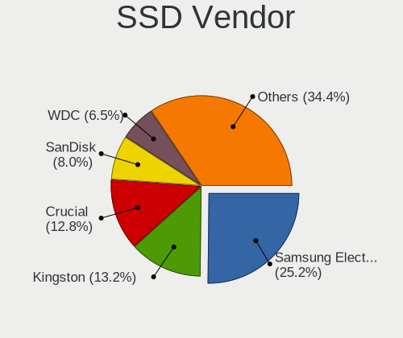
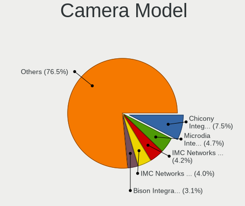
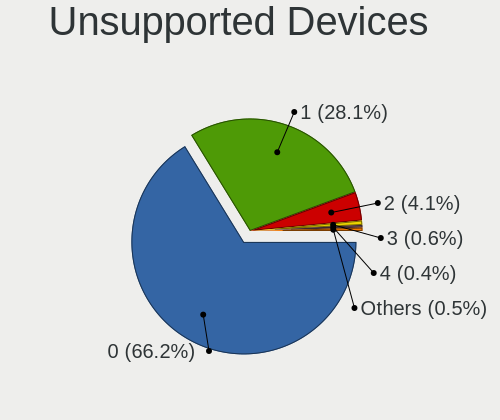

Fedora 37 - Tested Hardware & Statistics
----------------------------------------

A project to collect tested hardware configurations for Fedora 37.

Anyone can contribute to this report by the [hw-probe](https://github.com/linuxhw/hw-probe) tool:

    sudo -E hw-probe -all -upload

Please contribute! Especially if your hardware is rare.

This is a report for all computer types. See also reports for [desktops](/Dist/Fedora_37/Desktop/README.md) and [notebooks](/Dist/Fedora_37/Notebook/README.md).

Contents
--------

* [ Test Cases ](#test-cases)

* [ System ](#system)
  - [ Kernel                   ](#kernel)
  - [ Kernel Family            ](#kernel-family)
  - [ Kernel Major Ver.        ](#kernel-major-ver)
  - [ Arch                     ](#arch)
  - [ DE                       ](#de)
  - [ Display Server           ](#display-server)
  - [ Display Manager          ](#display-manager)
  - [ OS Lang                  ](#os-lang)
  - [ Boot Mode                ](#boot-mode)
  - [ Filesystem               ](#filesystem)
  - [ Part. scheme             ](#part-scheme)
  - [ Dual Boot with Linux/BSD ](#dual-boot-with-linuxbsd)
  - [ Dual Boot (Win)          ](#dual-boot-win)

* [ Board ](#board)
  - [ Vendor                   ](#vendor)
  - [ Model                    ](#model)
  - [ Model Family             ](#model-family)
  - [ MFG Year                 ](#mfg-year)
  - [ Form Factor              ](#form-factor)
  - [ Secure Boot              ](#secure-boot)
  - [ Coreboot                 ](#coreboot)
  - [ RAM Size                 ](#ram-size)
  - [ RAM Used                 ](#ram-used)
  - [ Total Drives             ](#total-drives)
  - [ Has CD-ROM               ](#has-cd-rom)
  - [ Has Ethernet             ](#has-ethernet)
  - [ Has WiFi                 ](#has-wifi)
  - [ Has Bluetooth            ](#has-bluetooth)

* [ Location ](#location)
  - [ Country                  ](#country)
  - [ City                     ](#city)

* [ Drives ](#drives)
  - [ Drive Vendor             ](#drive-vendor)
  - [ Drive Model              ](#drive-model)
  - [ HDD Vendor               ](#hdd-vendor)
  - [ SSD Vendor               ](#ssd-vendor)
  - [ Drive Kind               ](#drive-kind)
  - [ Drive Connector          ](#drive-connector)
  - [ Drive Size               ](#drive-size)
  - [ Space Total              ](#space-total)
  - [ Space Used               ](#space-used)
  - [ Malfunc. Drives          ](#malfunc-drives)
  - [ Malfunc. Drive Vendor    ](#malfunc-drive-vendor)
  - [ Malfunc. HDD Vendor      ](#malfunc-hdd-vendor)
  - [ Malfunc. Drive Kind      ](#malfunc-drive-kind)
  - [ Failed Drives            ](#failed-drives)
  - [ Failed Drive Vendor      ](#failed-drive-vendor)
  - [ Drive Status             ](#drive-status)

* [ Storage controller ](#storage-controller)
  - [ Storage Vendor           ](#storage-vendor)
  - [ Storage Model            ](#storage-model)
  - [ Storage Kind             ](#storage-kind)

* [ Processor ](#processor)
  - [ CPU Vendor               ](#cpu-vendor)
  - [ CPU Model                ](#cpu-model)
  - [ CPU Model Family         ](#cpu-model-family)
  - [ CPU Cores                ](#cpu-cores)
  - [ CPU Sockets              ](#cpu-sockets)
  - [ CPU Threads              ](#cpu-threads)
  - [ CPU Op-Modes             ](#cpu-op-modes)
  - [ CPU Microcode            ](#cpu-microcode)
  - [ CPU Microarch            ](#cpu-microarch)

* [ Graphics ](#graphics)
  - [ GPU Vendor               ](#gpu-vendor)
  - [ GPU Model                ](#gpu-model)
  - [ GPU Combo                ](#gpu-combo)
  - [ GPU Driver               ](#gpu-driver)
  - [ GPU Memory               ](#gpu-memory)

* [ Monitor ](#monitor)
  - [ Monitor Vendor           ](#monitor-vendor)
  - [ Monitor Model            ](#monitor-model)
  - [ Monitor Resolution       ](#monitor-resolution)
  - [ Monitor Diagonal         ](#monitor-diagonal)
  - [ Monitor Width            ](#monitor-width)
  - [ Aspect Ratio             ](#aspect-ratio)
  - [ Monitor Area             ](#monitor-area)
  - [ Pixel Density            ](#pixel-density)
  - [ Multiple Monitors        ](#multiple-monitors)

* [ Network ](#network)
  - [ Net Controller Vendor    ](#net-controller-vendor)
  - [ Net Controller Model     ](#net-controller-model)
  - [ Wireless Vendor          ](#wireless-vendor)
  - [ Wireless Model           ](#wireless-model)
  - [ Ethernet Vendor          ](#ethernet-vendor)
  - [ Ethernet Model           ](#ethernet-model)
  - [ Net Controller Kind      ](#net-controller-kind)
  - [ Used Controller          ](#used-controller)
  - [ NICs                     ](#nics)
  - [ IPv6                     ](#ipv6)

* [ Bluetooth ](#bluetooth)
  - [ Bluetooth Vendor         ](#bluetooth-vendor)
  - [ Bluetooth Model          ](#bluetooth-model)

* [ Sound ](#sound)
  - [ Sound Vendor             ](#sound-vendor)
  - [ Sound Model              ](#sound-model)

* [ Memory ](#memory)
  - [ Memory Vendor            ](#memory-vendor)
  - [ Memory Model             ](#memory-model)
  - [ Memory Kind              ](#memory-kind)
  - [ Memory Form Factor       ](#memory-form-factor)
  - [ Memory Size              ](#memory-size)
  - [ Memory Speed             ](#memory-speed)

* [ Printers & scanners ](#printers--scanners)
  - [ Printer Vendor           ](#printer-vendor)
  - [ Printer Model            ](#printer-model)
  - [ Scanner Vendor           ](#scanner-vendor)
  - [ Scanner Model            ](#scanner-model)

* [ Camera ](#camera)
  - [ Camera Vendor            ](#camera-vendor)
  - [ Camera Model             ](#camera-model)

* [ Security ](#security)
  - [ Fingerprint Vendor       ](#fingerprint-vendor)
  - [ Fingerprint Model        ](#fingerprint-model)
  - [ Chipcard Vendor          ](#chipcard-vendor)
  - [ Chipcard Model           ](#chipcard-model)

* [ Unsupported ](#unsupported)
  - [ Unsupported Devices      ](#unsupported-devices)
  - [ Unsupported Device Types ](#unsupported-device-types)

Test Cases
----------

Total: 1013

| Vendor        | Model                       | Form-Factor | Probe                                                      | Date         |
|---------------|-----------------------------|-------------|------------------------------------------------------------|--------------|
| Lenovo        | ThinkPad X390 20Q00051GE    | Notebook    | [5b3d1b750d](https://linux-hardware.org/?probe=5b3d1b750d) | Dec 31, 2022 |
| Valve         | Jupiter                     | Notebook    | [c0fb48bccb](https://linux-hardware.org/?probe=c0fb48bccb) | Dec 31, 2022 |
| System76      | Oryx Pro                    | Notebook    | [0d65e57758](https://linux-hardware.org/?probe=0d65e57758) | Dec 31, 2022 |
| Lenovo        | ThinkPad X390 20Q00051GE    | Notebook    | [775096be09](https://linux-hardware.org/?probe=775096be09) | Dec 31, 2022 |
| Lenovo        | ThinkPad T14 Gen 3 21AH0... | Notebook    | [322cf5484d](https://linux-hardware.org/?probe=322cf5484d) | Dec 31, 2022 |
| ASUSTek       | ROG STRIX X570-E GAMING     | Desktop     | [f16b55ea54](https://linux-hardware.org/?probe=f16b55ea54) | Dec 31, 2022 |
| Lenovo        | ThinkPad E15 Gen 3 20YHS... | Notebook    | [5fbe1632b0](https://linux-hardware.org/?probe=5fbe1632b0) | Dec 31, 2022 |
| Lenovo        | ThinkPad E15 Gen 3 20YHS... | Notebook    | [5a479fed95](https://linux-hardware.org/?probe=5a479fed95) | Dec 31, 2022 |
| Shuttle       | SH570                       | Desktop     | [09994766ed](https://linux-hardware.org/?probe=09994766ed) | Dec 31, 2022 |
| Shuttle       | SH570                       | Desktop     | [f4d5ef752c](https://linux-hardware.org/?probe=f4d5ef752c) | Dec 31, 2022 |
| ASRock        | A320M-DVS R4.0              | Desktop     | [f82bf510be](https://linux-hardware.org/?probe=f82bf510be) | Dec 31, 2022 |
| Lenovo        | ThinkPad T14 Gen 3 21AH0... | Notebook    | [591d985e85](https://linux-hardware.org/?probe=591d985e85) | Dec 31, 2022 |
| ASRock        | FM2A88X Extreme6+           | Desktop     | [c45e0f54fd](https://linux-hardware.org/?probe=c45e0f54fd) | Dec 31, 2022 |
| Shuttle       | SH570                       | Desktop     | [2d7f57de8f](https://linux-hardware.org/?probe=2d7f57de8f) | Dec 31, 2022 |
| MSI           | MPG X570 GAMING PRO CARB... | Desktop     | [1347eaedb9](https://linux-hardware.org/?probe=1347eaedb9) | Dec 31, 2022 |
| ASRock        | X79 Extreme6                | Desktop     | [5ea31811b4](https://linux-hardware.org/?probe=5ea31811b4) | Dec 30, 2022 |
| HP            | Pavilion dv6700             | Notebook    | [4b3b106bee](https://linux-hardware.org/?probe=4b3b106bee) | Dec 30, 2022 |
| MSI           | H510M-A PRO                 | Desktop     | [4dba3b7c55](https://linux-hardware.org/?probe=4dba3b7c55) | Dec 30, 2022 |
| MACHENIKE     | MACHCREATOR-16              | Notebook    | [f7ed4a6609](https://linux-hardware.org/?probe=f7ed4a6609) | Dec 30, 2022 |
| Dell          | Inspiron 3421               | Notebook    | [d2cd50a2a6](https://linux-hardware.org/?probe=d2cd50a2a6) | Dec 30, 2022 |
| Timi          | A35S                        | Notebook    | [c62c9ae956](https://linux-hardware.org/?probe=c62c9ae956) | Dec 30, 2022 |
| Dell          | Inspiron 3421               | Notebook    | [ae7d821823](https://linux-hardware.org/?probe=ae7d821823) | Dec 30, 2022 |
| Dell          | XPS 15 9520                 | Notebook    | [19b4bfd852](https://linux-hardware.org/?probe=19b4bfd852) | Dec 30, 2022 |
| HUAWEI        | BOHK-WAX9X                  | Notebook    | [68b3b51892](https://linux-hardware.org/?probe=68b3b51892) | Dec 30, 2022 |
| ASUSTek       | PRIME X670-P WIFI           | Desktop     | [498c8c83e2](https://linux-hardware.org/?probe=498c8c83e2) | Dec 30, 2022 |
| Gigabyte      | Z390 UD                     | Desktop     | [70dc568eae](https://linux-hardware.org/?probe=70dc568eae) | Dec 30, 2022 |
| MSI           | GP72MVR 7RFX                | Notebook    | [cefedef93c](https://linux-hardware.org/?probe=cefedef93c) | Dec 30, 2022 |
| MSI           | Stealth GS66 12UGS          | Notebook    | [da812c8fa2](https://linux-hardware.org/?probe=da812c8fa2) | Dec 30, 2022 |
| Lenovo        | Z70-80 80FG                 | Notebook    | [16419f6991](https://linux-hardware.org/?probe=16419f6991) | Dec 30, 2022 |
| Lenovo        | Z70-80 80FG                 | Notebook    | [4386242be1](https://linux-hardware.org/?probe=4386242be1) | Dec 30, 2022 |
| Intel         | NUC8BEB J72688-308          | Mini pc     | [b4a7d759f7](https://linux-hardware.org/?probe=b4a7d759f7) | Dec 30, 2022 |
| Lenovo        | ThinkPad P15v Gen 1 20TQ... | Notebook    | [770c5eee84](https://linux-hardware.org/?probe=770c5eee84) | Dec 30, 2022 |
| Dell          | XPS 15 9570                 | Notebook    | [cc31efb32d](https://linux-hardware.org/?probe=cc31efb32d) | Dec 30, 2022 |
| ASRock        | FM2A88X Extreme6+           | Desktop     | [8289d108fb](https://linux-hardware.org/?probe=8289d108fb) | Dec 30, 2022 |
| ASUSTek       | Z87-PRO                     | Desktop     | [eafab9edba](https://linux-hardware.org/?probe=eafab9edba) | Dec 30, 2022 |
| Intel         | NUC8BEB J72688-308          | Mini pc     | [d3daa756b4](https://linux-hardware.org/?probe=d3daa756b4) | Dec 30, 2022 |
| MSI           | MAG B650 TOMAHAWK WIFI      | Desktop     | [bdc5158ffb](https://linux-hardware.org/?probe=bdc5158ffb) | Dec 29, 2022 |
| HP            | Spectre x360 2-in-1 Lapt... | Convertible | [3303908896](https://linux-hardware.org/?probe=3303908896) | Dec 29, 2022 |
| Dell          | Inspiron N4050              | Notebook    | [b34f09894d](https://linux-hardware.org/?probe=b34f09894d) | Dec 29, 2022 |
| HP            | ENVY x360 Convertible 15... | Convertible | [51f9de5f53](https://linux-hardware.org/?probe=51f9de5f53) | Dec 29, 2022 |
| Lenovo        | IdeaPad 330-15IKB 81DE      | Notebook    | [ed5315b768](https://linux-hardware.org/?probe=ed5315b768) | Dec 29, 2022 |
| Dell          | 0KRC95 A02                  | Desktop     | [4cf9d40c0d](https://linux-hardware.org/?probe=4cf9d40c0d) | Dec 29, 2022 |
| MACHENIKE     | MACHCREATOR-16              | Notebook    | [3c627bc707](https://linux-hardware.org/?probe=3c627bc707) | Dec 29, 2022 |
| MACHENIKE     | MACHCREATOR-16              | Notebook    | [b246257695](https://linux-hardware.org/?probe=b246257695) | Dec 29, 2022 |
| HP            | Stream Notebook PC 13       | Notebook    | [2154a332b0](https://linux-hardware.org/?probe=2154a332b0) | Dec 29, 2022 |
| Dell          | 0KRC95 A02                  | Desktop     | [7e53808767](https://linux-hardware.org/?probe=7e53808767) | Dec 29, 2022 |
| HP            | ZBook Fury 16 G9 Mobile ... | Notebook    | [6c67e1435e](https://linux-hardware.org/?probe=6c67e1435e) | Dec 29, 2022 |
| ASRock        | FM2A88X Extreme6+           | Desktop     | [12c052156c](https://linux-hardware.org/?probe=12c052156c) | Dec 29, 2022 |
| Lenovo        | ThinkPad T480 20L5001DUS    | Notebook    | [51bb19bbf2](https://linux-hardware.org/?probe=51bb19bbf2) | Dec 29, 2022 |
| Lenovo        | ThinkPad T15 Gen 1 20S7S... | Notebook    | [74f8dcfbb4](https://linux-hardware.org/?probe=74f8dcfbb4) | Dec 29, 2022 |
| Schenker      | VISION 16 Pro (L22)         | Notebook    | [bbd6e1daf5](https://linux-hardware.org/?probe=bbd6e1daf5) | Dec 29, 2022 |
| Acer          | Predator PH315-53           | Notebook    | [d5d0e740c1](https://linux-hardware.org/?probe=d5d0e740c1) | Dec 29, 2022 |
| Schenker      | VISION 16 Pro (L22)         | Notebook    | [2412713729](https://linux-hardware.org/?probe=2412713729) | Dec 29, 2022 |
| Dell          | G5 5590                     | Notebook    | [58bd69f40b](https://linux-hardware.org/?probe=58bd69f40b) | Dec 28, 2022 |
| Lenovo        | ThinkPad T14 Gen 3 21AH0... | Notebook    | [8901206dd0](https://linux-hardware.org/?probe=8901206dd0) | Dec 28, 2022 |
| Dell          | Inspiron 5458               | Notebook    | [269d455191](https://linux-hardware.org/?probe=269d455191) | Dec 28, 2022 |
| HP            | ProBook 440 14 inch G9 N... | Notebook    | [e23c23e61f](https://linux-hardware.org/?probe=e23c23e61f) | Dec 28, 2022 |
| HP            | ProBook 440 14 inch G9 N... | Notebook    | [5c4856e5c8](https://linux-hardware.org/?probe=5c4856e5c8) | Dec 28, 2022 |
| Lenovo        | IdeaPad L3 15ITL6 82HL      | Notebook    | [0852995abb](https://linux-hardware.org/?probe=0852995abb) | Dec 28, 2022 |
| Intel         | NUC10i7FNB K61360-306       | Mini pc     | [6e3a112190](https://linux-hardware.org/?probe=6e3a112190) | Dec 28, 2022 |
| ASUSTek       | ROG STRIX B450-F GAMING     | Desktop     | [24b822291e](https://linux-hardware.org/?probe=24b822291e) | Dec 28, 2022 |
| Lenovo        | IdeaPad 330-14IGM 81D0      | Notebook    | [e12c24fd74](https://linux-hardware.org/?probe=e12c24fd74) | Dec 28, 2022 |
| Gigabyte      | B365M DS3H                  | Desktop     | [0dc3c192fd](https://linux-hardware.org/?probe=0dc3c192fd) | Dec 28, 2022 |
| Google        | Voxel rev3                  | Notebook    | [430244f188](https://linux-hardware.org/?probe=430244f188) | Dec 28, 2022 |
| HP            | ProBook 440 G6              | Notebook    | [6240bc3677](https://linux-hardware.org/?probe=6240bc3677) | Dec 28, 2022 |
| HP            | ProBook 440 G6              | Notebook    | [f5689c6edc](https://linux-hardware.org/?probe=f5689c6edc) | Dec 28, 2022 |
| Dell          | 0N4YC8 A00                  | Desktop     | [fc766b2a1b](https://linux-hardware.org/?probe=fc766b2a1b) | Dec 28, 2022 |
| Dell          | Inspiron 16 5625            | Notebook    | [dbc2d2fc6f](https://linux-hardware.org/?probe=dbc2d2fc6f) | Dec 28, 2022 |
| HUAWEI        | HLYL-WXX9                   | Notebook    | [790b3dcdde](https://linux-hardware.org/?probe=790b3dcdde) | Dec 28, 2022 |
| ASUSTek       | PRIME Z790-P WIFI           | Desktop     | [7bb247e453](https://linux-hardware.org/?probe=7bb247e453) | Dec 28, 2022 |
| ASUSTek       | ASUS TUF Gaming F15 FX50... | Notebook    | [ad33bb0d6f](https://linux-hardware.org/?probe=ad33bb0d6f) | Dec 28, 2022 |
| pine64,pin... | Pinebook Pro                | Soc         | [931d20e8ae](https://linux-hardware.org/?probe=931d20e8ae) | Dec 28, 2022 |
| Gigabyte      | B365M D2V                   | Desktop     | [93f7c010a2](https://linux-hardware.org/?probe=93f7c010a2) | Dec 28, 2022 |
| HP            | G62                         | Notebook    | [05ad917600](https://linux-hardware.org/?probe=05ad917600) | Dec 28, 2022 |
| ASRock        | FM2A88X Extreme6+           | Desktop     | [f5ac2a0028](https://linux-hardware.org/?probe=f5ac2a0028) | Dec 28, 2022 |
| ASUSTek       | ROG Zephyrus G14 GA401IU... | Notebook    | [d1f63174e4](https://linux-hardware.org/?probe=d1f63174e4) | Dec 28, 2022 |
| HUAWEI        | BOM-WXX9                    | Notebook    | [826a683b58](https://linux-hardware.org/?probe=826a683b58) | Dec 28, 2022 |
| ASUSTek       | ROG Strix G513QE_G513QE     | Notebook    | [00a92c3818](https://linux-hardware.org/?probe=00a92c3818) | Dec 28, 2022 |
| MSI           | Z97 GAMING 3                | Desktop     | [7aab4546f6](https://linux-hardware.org/?probe=7aab4546f6) | Dec 28, 2022 |
| ASRock        | Z370M-ITX/ac                | Desktop     | [f87fbed6a1](https://linux-hardware.org/?probe=f87fbed6a1) | Dec 28, 2022 |
| ASUSTek       | ROG Zephyrus G14 GA401IU... | Notebook    | [6eaa690ff2](https://linux-hardware.org/?probe=6eaa690ff2) | Dec 28, 2022 |
| ASUSTek       | ZenBook UX363EA_UX363EA     | Convertible | [56e25a5805](https://linux-hardware.org/?probe=56e25a5805) | Dec 28, 2022 |
| Gigabyte      | B650I AORUS ULTRA           | Desktop     | [3c25f43c23](https://linux-hardware.org/?probe=3c25f43c23) | Dec 28, 2022 |
| Lenovo        | ThinkPad E15 Gen 2 20T80... | Notebook    | [538bf2bb33](https://linux-hardware.org/?probe=538bf2bb33) | Dec 28, 2022 |
| MSI           | GL63 8RC                    | Notebook    | [0b973e252f](https://linux-hardware.org/?probe=0b973e252f) | Dec 27, 2022 |
| Lenovo        | ThinkBook 15-IIL 20SM       | Notebook    | [d579ff34ee](https://linux-hardware.org/?probe=d579ff34ee) | Dec 27, 2022 |
| Itautec       | ST 4265                     | Desktop     | [38e4a07f9a](https://linux-hardware.org/?probe=38e4a07f9a) | Dec 27, 2022 |
| ASUSTek       | TUF Gaming B550-PLUS        | Desktop     | [f2751df7ec](https://linux-hardware.org/?probe=f2751df7ec) | Dec 27, 2022 |
| MSI           | Z390-A PRO                  | Desktop     | [e2feef912f](https://linux-hardware.org/?probe=e2feef912f) | Dec 27, 2022 |
| Dell          | XPS 13 9365                 | Convertible | [4eda9a1749](https://linux-hardware.org/?probe=4eda9a1749) | Dec 27, 2022 |
| Dell          | Inspiron 15 3525            | Notebook    | [64a70af984](https://linux-hardware.org/?probe=64a70af984) | Dec 27, 2022 |
| ASRock        | AD2700-ITX                  | Desktop     | [d4fff49f31](https://linux-hardware.org/?probe=d4fff49f31) | Dec 27, 2022 |
| HP            | Laptop 15-dy5xxx            | Notebook    | [d7daff3ed1](https://linux-hardware.org/?probe=d7daff3ed1) | Dec 27, 2022 |
| Timi          | RedmiBook 15                | Notebook    | [cf38b14bc5](https://linux-hardware.org/?probe=cf38b14bc5) | Dec 27, 2022 |
| Lenovo        | ThinkPad T14 Gen 3 21AH0... | Notebook    | [e41c8ca4ee](https://linux-hardware.org/?probe=e41c8ca4ee) | Dec 27, 2022 |
| Dell          | Latitude E7440              | Notebook    | [f2c052dde9](https://linux-hardware.org/?probe=f2c052dde9) | Dec 27, 2022 |
| Dell          | Inspiron 15-3567            | Notebook    | [2f5381fa26](https://linux-hardware.org/?probe=2f5381fa26) | Dec 26, 2022 |
| Itautec       | ST 4265                     | Desktop     | [8323542129](https://linux-hardware.org/?probe=8323542129) | Dec 26, 2022 |
| HP            | ProBook 450 G7              | Notebook    | [dfedb566ff](https://linux-hardware.org/?probe=dfedb566ff) | Dec 26, 2022 |
| Lenovo        | G510 20238                  | Notebook    | [812d6eb07e](https://linux-hardware.org/?probe=812d6eb07e) | Dec 26, 2022 |
| Lenovo        | ThinkBook 16p Gen 2 20YM    | Notebook    | [c7babe827f](https://linux-hardware.org/?probe=c7babe827f) | Dec 26, 2022 |
| Dell          | Inspiron 3521               | Notebook    | [9d544fbcd4](https://linux-hardware.org/?probe=9d544fbcd4) | Dec 26, 2022 |
| Dell          | Inspiron 5458               | Notebook    | [4e393c7334](https://linux-hardware.org/?probe=4e393c7334) | Dec 26, 2022 |
| Lenovo        | ThinkPad X1 Extreme Gen ... | Notebook    | [ce352bf1b1](https://linux-hardware.org/?probe=ce352bf1b1) | Dec 26, 2022 |
| Acer          | Aspire A515-51              | Notebook    | [e763dd5dfe](https://linux-hardware.org/?probe=e763dd5dfe) | Dec 26, 2022 |
| Tactus        | GeoFlex 110                 | Convertible | [3c2a7f9115](https://linux-hardware.org/?probe=3c2a7f9115) | Dec 26, 2022 |
| ASUSTek       | ASUS TUF Gaming F15 FX50... | Notebook    | [62869e3d8c](https://linux-hardware.org/?probe=62869e3d8c) | Dec 26, 2022 |
| Dell          | Inspiron 5759               | Notebook    | [d1938219e9](https://linux-hardware.org/?probe=d1938219e9) | Dec 26, 2022 |
| ASRock        | FM2A88X Extreme6+           | Desktop     | [8d1181c71b](https://linux-hardware.org/?probe=8d1181c71b) | Dec 26, 2022 |
| Dell          | Latitude 5580               | Notebook    | [72c0e42aeb](https://linux-hardware.org/?probe=72c0e42aeb) | Dec 26, 2022 |
| Acer          | Aspire A315-59              | Notebook    | [6625ce058f](https://linux-hardware.org/?probe=6625ce058f) | Dec 25, 2022 |
| HP            | Spectre x360 2-in-1 Lapt... | Convertible | [2df0678d78](https://linux-hardware.org/?probe=2df0678d78) | Dec 25, 2022 |
| HP            | ProBook 6465b               | Notebook    | [d0f5218f72](https://linux-hardware.org/?probe=d0f5218f72) | Dec 25, 2022 |
| ASUSTek       | K55VD                       | Notebook    | [52df2ba00b](https://linux-hardware.org/?probe=52df2ba00b) | Dec 25, 2022 |
| Lenovo        | ThinkBook 15p 20V3          | Notebook    | [5aa14f474e](https://linux-hardware.org/?probe=5aa14f474e) | Dec 25, 2022 |
| MSI           | MPG B550 GAMING PLUS        | Desktop     | [4c97c87b61](https://linux-hardware.org/?probe=4c97c87b61) | Dec 25, 2022 |
| ASUSTek       | TUF Gaming B560M-PLUS WI... | Desktop     | [8762b5f41f](https://linux-hardware.org/?probe=8762b5f41f) | Dec 25, 2022 |
| ASUSTek       | ROG STRIX X670E-F GAMING... | Desktop     | [628cefc78a](https://linux-hardware.org/?probe=628cefc78a) | Dec 25, 2022 |
| MSI           | Modern 14 B4MW              | Notebook    | [e9dbd838ec](https://linux-hardware.org/?probe=e9dbd838ec) | Dec 25, 2022 |
| ASUSTek       | ASUS TUF Gaming F15 FX50... | Notebook    | [fa7183c982](https://linux-hardware.org/?probe=fa7183c982) | Dec 25, 2022 |
| ASRock        | FM2A88X Extreme6+           | Desktop     | [b6def743ea](https://linux-hardware.org/?probe=b6def743ea) | Dec 25, 2022 |
| Gigabyte      | Z690 AORUS ULTRA            | Desktop     | [46705eb79f](https://linux-hardware.org/?probe=46705eb79f) | Dec 25, 2022 |
| Dell          | Inspiron 16 7620 2-in-1     | Convertible | [3d555f9bee](https://linux-hardware.org/?probe=3d555f9bee) | Dec 25, 2022 |
| ASUSTek       | ProArt Z690-CREATOR WIFI    | Desktop     | [04b76a7e78](https://linux-hardware.org/?probe=04b76a7e78) | Dec 24, 2022 |
| Dell          | XPS 15 9510                 | Notebook    | [6c809c224c](https://linux-hardware.org/?probe=6c809c224c) | Dec 24, 2022 |
| Dell          | Latitude 5510               | Notebook    | [68e4810231](https://linux-hardware.org/?probe=68e4810231) | Dec 24, 2022 |
| ASUSTek       | PRIME B450M-GAMING/BR       | Desktop     | [c7d8ce8f80](https://linux-hardware.org/?probe=c7d8ce8f80) | Dec 24, 2022 |
| HUAWEI        | CREM-WXX9                   | Notebook    | [a48a2f6362](https://linux-hardware.org/?probe=a48a2f6362) | Dec 24, 2022 |
| ASUSTek       | PRIME Z790-P WIFI           | Desktop     | [e853f645cf](https://linux-hardware.org/?probe=e853f645cf) | Dec 24, 2022 |
| Gigabyte      | GA-78LMT-USB3 SEx           | Desktop     | [82f8802857](https://linux-hardware.org/?probe=82f8802857) | Dec 24, 2022 |
| HP            | Pavilion g6                 | Notebook    | [71d7947da6](https://linux-hardware.org/?probe=71d7947da6) | Dec 24, 2022 |
| MSI           | Stealth 15M B12UE           | Notebook    | [a8e294154b](https://linux-hardware.org/?probe=a8e294154b) | Dec 24, 2022 |
| MSI           | Z270M MORTAR                | Desktop     | [70564a2846](https://linux-hardware.org/?probe=70564a2846) | Dec 24, 2022 |
| Lenovo        | ThinkPad T470s 20HGS0AY0... | Notebook    | [28e67f37bc](https://linux-hardware.org/?probe=28e67f37bc) | Dec 24, 2022 |
| MSI           | MAG B650 TOMAHAWK WIFI      | Desktop     | [bf8f02ac85](https://linux-hardware.org/?probe=bf8f02ac85) | Dec 24, 2022 |
| ASRock        | FM2A88X Extreme6+           | Desktop     | [f5fa069144](https://linux-hardware.org/?probe=f5fa069144) | Dec 24, 2022 |
| Acer          | Aspire A514-54              | Notebook    | [ea57f4aa3a](https://linux-hardware.org/?probe=ea57f4aa3a) | Dec 24, 2022 |
| Gigabyte      | Z690 AORUS ULTRA            | Desktop     | [926850a516](https://linux-hardware.org/?probe=926850a516) | Dec 24, 2022 |
| Dell          | Latitude 5420               | Notebook    | [201e81d0ed](https://linux-hardware.org/?probe=201e81d0ed) | Dec 23, 2022 |
| Dell          | Latitude 5420               | Notebook    | [9fd9875465](https://linux-hardware.org/?probe=9fd9875465) | Dec 23, 2022 |
| HUAWEI        | NBLK-WAX9X                  | Notebook    | [f114731a78](https://linux-hardware.org/?probe=f114731a78) | Dec 23, 2022 |
| ASUSTek       | X750JN                      | Notebook    | [d933b1a80b](https://linux-hardware.org/?probe=d933b1a80b) | Dec 23, 2022 |
| Jooyon Tec... | J6BF                        | Notebook    | [dabe200abe](https://linux-hardware.org/?probe=dabe200abe) | Dec 23, 2022 |
| ASUSTek       | ASUS EXPERTBOOK B3302CEA... | Notebook    | [756390ae0c](https://linux-hardware.org/?probe=756390ae0c) | Dec 23, 2022 |
| ASUSTek       | ASUS EXPERTBOOK B3302CEA... | Notebook    | [c2dd56664a](https://linux-hardware.org/?probe=c2dd56664a) | Dec 23, 2022 |
| ASUSTek       | VivoBook_ASUSLaptop X513... | Notebook    | [627186e9e8](https://linux-hardware.org/?probe=627186e9e8) | Dec 23, 2022 |
| ASUSTek       | ASUS TUF Gaming F15 FX50... | Notebook    | [fe159bf4ca](https://linux-hardware.org/?probe=fe159bf4ca) | Dec 23, 2022 |
| Samsung       | 730QED                      | Convertible | [0c36621efa](https://linux-hardware.org/?probe=0c36621efa) | Dec 23, 2022 |
| ASRock        | FM2A88X Extreme6+           | Desktop     | [88df914367](https://linux-hardware.org/?probe=88df914367) | Dec 23, 2022 |
| HUAWEI        | NBLB-WAX9N                  | Notebook    | [77e30fee83](https://linux-hardware.org/?probe=77e30fee83) | Dec 23, 2022 |
| Acer          | Aspire A515-57G             | Notebook    | [a208b5598e](https://linux-hardware.org/?probe=a208b5598e) | Dec 22, 2022 |
| Acer          | Aspire A515-57G             | Notebook    | [cccd3d01d7](https://linux-hardware.org/?probe=cccd3d01d7) | Dec 22, 2022 |
| ASUSTek       | B85-PLUS                    | Desktop     | [16b14098bf](https://linux-hardware.org/?probe=16b14098bf) | Dec 22, 2022 |
| Acer          | Aspire V5-571               | Notebook    | [b4de144f3e](https://linux-hardware.org/?probe=b4de144f3e) | Dec 22, 2022 |
| Lenovo        | Legion 5 15ACH6H 82JU       | Notebook    | [2505eabeaf](https://linux-hardware.org/?probe=2505eabeaf) | Dec 22, 2022 |
| ASUSTek       | ASUS TUF Gaming A15 FA50... | Notebook    | [677cb5b0b3](https://linux-hardware.org/?probe=677cb5b0b3) | Dec 22, 2022 |
| MSI           | Stealth 15M B12UE           | Notebook    | [65d1cc61ba](https://linux-hardware.org/?probe=65d1cc61ba) | Dec 22, 2022 |
| AZW           | GTR V01                     | Mini pc     | [7502622c61](https://linux-hardware.org/?probe=7502622c61) | Dec 22, 2022 |
| Lenovo        | XiaoXinPro 16ACH 2021 82... | Notebook    | [2b25ab8790](https://linux-hardware.org/?probe=2b25ab8790) | Dec 22, 2022 |
| ASRock        | H470M Pro4                  | Desktop     | [b69ccc3353](https://linux-hardware.org/?probe=b69ccc3353) | Dec 22, 2022 |
| Gigabyte      | X570S I AORUS PRO AX        | Desktop     | [3f3c7b0e92](https://linux-hardware.org/?probe=3f3c7b0e92) | Dec 22, 2022 |
| ASRock        | FM2A88X Extreme6+           | Desktop     | [6eb006d2d4](https://linux-hardware.org/?probe=6eb006d2d4) | Dec 22, 2022 |
| GPD           | P3 MAX                      | Notebook    | [9069ed5580](https://linux-hardware.org/?probe=9069ed5580) | Dec 22, 2022 |
| ASUSTek       | Zenbook UM5302TA_UM5302T... | Notebook    | [6db25ba5ca](https://linux-hardware.org/?probe=6db25ba5ca) | Dec 22, 2022 |
| ASUSTek       | B85-PLUS                    | Desktop     | [cbad10e284](https://linux-hardware.org/?probe=cbad10e284) | Dec 21, 2022 |
| Lenovo        | ThinkPad X1 Carbon Gen 1... | Notebook    | [fb60e7984c](https://linux-hardware.org/?probe=fb60e7984c) | Dec 21, 2022 |
| ASUSTek       | X450CA                      | Notebook    | [5b793f14ff](https://linux-hardware.org/?probe=5b793f14ff) | Dec 21, 2022 |
| ASUSTek       | ASUS TUF Gaming F15 FX50... | Notebook    | [721bc5f662](https://linux-hardware.org/?probe=721bc5f662) | Dec 21, 2022 |
| MSI           | Stealth 15M B12UE           | Notebook    | [6f7a27c8c5](https://linux-hardware.org/?probe=6f7a27c8c5) | Dec 21, 2022 |
| Dell          | 0T10XW A02                  | Desktop     | [f39488c597](https://linux-hardware.org/?probe=f39488c597) | Dec 21, 2022 |
| Dell          | 0T10XW A02                  | Desktop     | [0243df6ce4](https://linux-hardware.org/?probe=0243df6ce4) | Dec 21, 2022 |
| Apple         | MacBookPro9,2               | Notebook    | [5bc62fc208](https://linux-hardware.org/?probe=5bc62fc208) | Dec 21, 2022 |
| MSI           | Stealth 15M B12UE           | Notebook    | [ce6c271622](https://linux-hardware.org/?probe=ce6c271622) | Dec 21, 2022 |
| HP            | Stream Notebook PC 13       | Notebook    | [9c88ffc394](https://linux-hardware.org/?probe=9c88ffc394) | Dec 21, 2022 |
| Positivo B... | VJFE41F11X-XXXXXX           | Notebook    | [77c9275988](https://linux-hardware.org/?probe=77c9275988) | Dec 21, 2022 |
| Lenovo        | ThinkPad E14 Gen 2 20TB0... | Notebook    | [ec20f98178](https://linux-hardware.org/?probe=ec20f98178) | Dec 21, 2022 |
| HP            | 8266                        | Desktop     | [321dbc66bf](https://linux-hardware.org/?probe=321dbc66bf) | Dec 21, 2022 |
| Dell          | Latitude 5520               | Notebook    | [203652b6dd](https://linux-hardware.org/?probe=203652b6dd) | Dec 21, 2022 |
| Lenovo        | ThinkPad E15 20RD0011RT     | Notebook    | [1f1c718c61](https://linux-hardware.org/?probe=1f1c718c61) | Dec 21, 2022 |
| Timi          | Mi NoteBook Pro             | Notebook    | [b5bbb4f410](https://linux-hardware.org/?probe=b5bbb4f410) | Dec 21, 2022 |
| MSI           | Modern 14 B4MW              | Notebook    | [2d446beedf](https://linux-hardware.org/?probe=2d446beedf) | Dec 21, 2022 |
| ASUSTek       | TUF Gaming Z590-PLUS WIF... | Desktop     | [8428e68855](https://linux-hardware.org/?probe=8428e68855) | Dec 21, 2022 |
| ASRock        | FM2A88X Extreme6+           | Desktop     | [bd7ed31b20](https://linux-hardware.org/?probe=bd7ed31b20) | Dec 21, 2022 |
| ASUSTek       | ASUS TUF Gaming F15 FX50... | Notebook    | [d9db7be046](https://linux-hardware.org/?probe=d9db7be046) | Dec 21, 2022 |
| ASUSTek       | ROG STRIX B550-F GAMING     | Desktop     | [cb70181c3a](https://linux-hardware.org/?probe=cb70181c3a) | Dec 21, 2022 |
| Dell          | 02YRK5 A02                  | Desktop     | [f5f6093483](https://linux-hardware.org/?probe=f5f6093483) | Dec 21, 2022 |
| Dell          | Latitude 3420               | Notebook    | [99d501d768](https://linux-hardware.org/?probe=99d501d768) | Dec 20, 2022 |
| Intel         | H81                         | Desktop     | [747dd5e27a](https://linux-hardware.org/?probe=747dd5e27a) | Dec 20, 2022 |
| ASRock        | Z790 Pro RS WiFi            | Desktop     | [d54c198ec8](https://linux-hardware.org/?probe=d54c198ec8) | Dec 20, 2022 |
| ASUSTek       | ASUS TUF Gaming F15 FX50... | Notebook    | [89b8982148](https://linux-hardware.org/?probe=89b8982148) | Dec 20, 2022 |
| ASUSTek       | ASUS TUF Gaming F15 FX50... | Notebook    | [082a1fb19e](https://linux-hardware.org/?probe=082a1fb19e) | Dec 20, 2022 |
| Positivo B... | VJFE41F11X-XXXXXX           | Notebook    | [383b0f3311](https://linux-hardware.org/?probe=383b0f3311) | Dec 20, 2022 |
| ASUSTek       | TUF Gaming B650M-PLUS       | Desktop     | [ef5cd85ef3](https://linux-hardware.org/?probe=ef5cd85ef3) | Dec 20, 2022 |
| Dell          | Inspiron 15 7000 Gaming     | Notebook    | [0d59e38c20](https://linux-hardware.org/?probe=0d59e38c20) | Dec 20, 2022 |
| HP            | ZBook 15                    | Notebook    | [a3bf671d64](https://linux-hardware.org/?probe=a3bf671d64) | Dec 20, 2022 |
| Lenovo        | IdeaPad 3 15ARE05 81W4      | Notebook    | [af14f0c425](https://linux-hardware.org/?probe=af14f0c425) | Dec 20, 2022 |
| Gigabyte      | GA-A75M-UD2H                | Desktop     | [f7e97a6c6c](https://linux-hardware.org/?probe=f7e97a6c6c) | Dec 20, 2022 |
| Lenovo        | IdeaPad 3 15ARE05 81W4      | Notebook    | [e7393fd2b7](https://linux-hardware.org/?probe=e7393fd2b7) | Dec 20, 2022 |
| Intel         | NUC7i3BNB J22859-303        | Mini pc     | [e04881408e](https://linux-hardware.org/?probe=e04881408e) | Dec 20, 2022 |
| Dell          | Vostro 5620                 | Notebook    | [005d388376](https://linux-hardware.org/?probe=005d388376) | Dec 20, 2022 |
| Intel         | NUC7i3BNB J22859-303        | Mini pc     | [dbcde72217](https://linux-hardware.org/?probe=dbcde72217) | Dec 20, 2022 |
| Lenovo        | ThinkPad E15 20RD0011RT     | Notebook    | [bbfea042cd](https://linux-hardware.org/?probe=bbfea042cd) | Dec 20, 2022 |
| HP            | Pavilion dv6                | Notebook    | [8b0f82599c](https://linux-hardware.org/?probe=8b0f82599c) | Dec 20, 2022 |
| ASRock        | FM2A88X Extreme6+           | Desktop     | [9451dc3035](https://linux-hardware.org/?probe=9451dc3035) | Dec 20, 2022 |
| ASUSTek       | Zenbook UX5400EA_UX5400E... | Notebook    | [011d3e746d](https://linux-hardware.org/?probe=011d3e746d) | Dec 20, 2022 |
| ASUSTek       | TUF Gaming B660M-PLUS WI... | Desktop     | [60dbf09ee4](https://linux-hardware.org/?probe=60dbf09ee4) | Dec 20, 2022 |
| Gigabyte      | H61M-USB3V                  | Desktop     | [3161a64c4b](https://linux-hardware.org/?probe=3161a64c4b) | Dec 19, 2022 |
| ASUSTek       | Zenbook UP6502ZD_UP6502Z... | Convertible | [6044a618cf](https://linux-hardware.org/?probe=6044a618cf) | Dec 19, 2022 |
| ATOPNUC       | MA90                        | Mini pc     | [8c397c3784](https://linux-hardware.org/?probe=8c397c3784) | Dec 19, 2022 |
| ASUSTek       | VivoBook_ASUSLaptop X340... | Notebook    | [b30bf77d27](https://linux-hardware.org/?probe=b30bf77d27) | Dec 19, 2022 |
| Fanless Mi... | Rev GMLR1                   | Mini pc     | [57d06c0f37](https://linux-hardware.org/?probe=57d06c0f37) | Dec 19, 2022 |
| Lenovo        | ThinkPad T14s Gen 1 20T1... | Notebook    | [c67b4d2b31](https://linux-hardware.org/?probe=c67b4d2b31) | Dec 19, 2022 |
| HP            | OMEN by Laptop 16-c0xxx     | Notebook    | [9f5a91c628](https://linux-hardware.org/?probe=9f5a91c628) | Dec 19, 2022 |
| Sony          | SVE15133CNB                 | Notebook    | [a2bee3bb3f](https://linux-hardware.org/?probe=a2bee3bb3f) | Dec 19, 2022 |
| ASUSTek       | X556UJ                      | Notebook    | [256957850d](https://linux-hardware.org/?probe=256957850d) | Dec 19, 2022 |
| MSI           | GE63 Raider RGB 8RF         | Notebook    | [a85193c482](https://linux-hardware.org/?probe=a85193c482) | Dec 19, 2022 |
| ASUSTek       | ASUS TUF Gaming A15 FA50... | Notebook    | [714d2a6dea](https://linux-hardware.org/?probe=714d2a6dea) | Dec 19, 2022 |
| HP            | OMEN by Laptop 16-c0xxx     | Notebook    | [ab3b4786ea](https://linux-hardware.org/?probe=ab3b4786ea) | Dec 19, 2022 |
| Gigabyte      | B85M-D3V-A                  | Desktop     | [6a964b9d6b](https://linux-hardware.org/?probe=6a964b9d6b) | Dec 19, 2022 |
| Lenovo        | ThinkPad T470s W10DG 20J... | Notebook    | [856515e522](https://linux-hardware.org/?probe=856515e522) | Dec 19, 2022 |
| Lenovo        | IdeaPad 510-15ISK 80SR      | Notebook    | [a5a207a46d](https://linux-hardware.org/?probe=a5a207a46d) | Dec 19, 2022 |
| MSI           | PS42 8RB                    | Notebook    | [42422af633](https://linux-hardware.org/?probe=42422af633) | Dec 19, 2022 |
| Fanless Mi... | Rev GMLR1                   | Mini pc     | [97d43c4ad3](https://linux-hardware.org/?probe=97d43c4ad3) | Dec 18, 2022 |
| Gigabyte      | A520M DS3H                  | Desktop     | [4251c08b5d](https://linux-hardware.org/?probe=4251c08b5d) | Dec 18, 2022 |
| Dell          | 0KRC95 A02                  | Desktop     | [e7bb083869](https://linux-hardware.org/?probe=e7bb083869) | Dec 18, 2022 |
| MSI           | Z87M GAMING                 | Desktop     | [bf27014217](https://linux-hardware.org/?probe=bf27014217) | Dec 18, 2022 |
| Acer          | Swift SF114-32              | Notebook    | [757b666913](https://linux-hardware.org/?probe=757b666913) | Dec 18, 2022 |
| Lenovo        | ThinkBook 15 G3 ACL 21A4    | Notebook    | [23b255ed61](https://linux-hardware.org/?probe=23b255ed61) | Dec 18, 2022 |
| ASUSTek       | P8H77-V LE                  | Desktop     | [3f76e320c0](https://linux-hardware.org/?probe=3f76e320c0) | Dec 18, 2022 |
| Lenovo        | ThinkPad A485 20MVS0LG00    | Notebook    | [86c9426d80](https://linux-hardware.org/?probe=86c9426d80) | Dec 18, 2022 |
| Lenovo        | ThinkPad A485 20MVS0LG00    | Notebook    | [05fcf7302f](https://linux-hardware.org/?probe=05fcf7302f) | Dec 18, 2022 |
| Acer          | Aspire A315-31              | Notebook    | [e391c56a47](https://linux-hardware.org/?probe=e391c56a47) | Dec 18, 2022 |
| Lenovo        | ThinkPad X1 Tablet Gen 3... | Tablet      | [2b0d31db9d](https://linux-hardware.org/?probe=2b0d31db9d) | Dec 18, 2022 |
| Lenovo        | ThinkPad W550s 20E2000PG... | Notebook    | [938c10075a](https://linux-hardware.org/?probe=938c10075a) | Dec 18, 2022 |
| HP            | Laptop 15-da0xxx            | Notebook    | [b712a7bd77](https://linux-hardware.org/?probe=b712a7bd77) | Dec 18, 2022 |
| Gigabyte      | B360M D3H-CF                | Desktop     | [fed4383ac0](https://linux-hardware.org/?probe=fed4383ac0) | Dec 18, 2022 |
| MSI           | B550-A PRO                  | Desktop     | [53c582a7f6](https://linux-hardware.org/?probe=53c582a7f6) | Dec 18, 2022 |
| ASRock        | FM2A88X Extreme6+           | Desktop     | [561aa4411a](https://linux-hardware.org/?probe=561aa4411a) | Dec 18, 2022 |
| ASUSTek       | Zenbook UM5302TA_UM5302T... | Notebook    | [56e75d70fa](https://linux-hardware.org/?probe=56e75d70fa) | Dec 18, 2022 |
| ASUSTek       | PRIME B550M-K               | Desktop     | [0c496cdb01](https://linux-hardware.org/?probe=0c496cdb01) | Dec 17, 2022 |
| HP            | ProBook 450 G7              | Notebook    | [ad9bf6b390](https://linux-hardware.org/?probe=ad9bf6b390) | Dec 17, 2022 |
| Lenovo        | ThinkPad X1 Extreme Gen ... | Notebook    | [c9cc617e08](https://linux-hardware.org/?probe=c9cc617e08) | Dec 17, 2022 |
| MSI           | A88XM-E35                   | Desktop     | [2e3cc90610](https://linux-hardware.org/?probe=2e3cc90610) | Dec 17, 2022 |
| Lenovo        | IdeaPad 510-15ISK 80SR      | Notebook    | [f047451b08](https://linux-hardware.org/?probe=f047451b08) | Dec 17, 2022 |
| Sony          | SVE15133CNB                 | Notebook    | [acca7c4697](https://linux-hardware.org/?probe=acca7c4697) | Dec 17, 2022 |
| Lenovo        | ThinkPad E14 Gen 3 20Y70... | Notebook    | [49969f1b81](https://linux-hardware.org/?probe=49969f1b81) | Dec 17, 2022 |
| Lenovo        | ThinkBook 15 G3 ACL 21A4    | Notebook    | [df49d0114f](https://linux-hardware.org/?probe=df49d0114f) | Dec 17, 2022 |
| Lenovo        | Legion 5 15ACH6H 82JU       | Notebook    | [c94cd1a926](https://linux-hardware.org/?probe=c94cd1a926) | Dec 17, 2022 |
| ASUSTek       | ASUS EXPERTBOOK B1400CEA... | Notebook    | [a481e4a590](https://linux-hardware.org/?probe=a481e4a590) | Dec 17, 2022 |
| ASUSTek       | ROG CROSSHAIR VIII IMPAC... | Desktop     | [3db1266e41](https://linux-hardware.org/?probe=3db1266e41) | Dec 17, 2022 |
| ASUSTek       | P8H77-M LE                  | Desktop     | [d9eba2d52f](https://linux-hardware.org/?probe=d9eba2d52f) | Dec 17, 2022 |
| GPD           | P2 MAX                      | Notebook    | [de5983ec37](https://linux-hardware.org/?probe=de5983ec37) | Dec 17, 2022 |
| ASUSTek       | X45C                        | Notebook    | [80377ba23f](https://linux-hardware.org/?probe=80377ba23f) | Dec 17, 2022 |
| Gigabyte      | J1900M-D2P                  | Desktop     | [26ecfabc95](https://linux-hardware.org/?probe=26ecfabc95) | Dec 17, 2022 |
| HP            | Pavilion Laptop 14-ce1xx... | Notebook    | [8d631bb590](https://linux-hardware.org/?probe=8d631bb590) | Dec 17, 2022 |
| ASUSTek       | TUF Z270 MARK 2             | Desktop     | [1bb7d1bffe](https://linux-hardware.org/?probe=1bb7d1bffe) | Dec 17, 2022 |
| ASRock        | FM2A88X Extreme6+           | Desktop     | [88d55eced8](https://linux-hardware.org/?probe=88d55eced8) | Dec 17, 2022 |
| Dell          | Inspiron 3583               | Notebook    | [5629961182](https://linux-hardware.org/?probe=5629961182) | Dec 17, 2022 |
| HP            | ProBook 440 14 inch G9 N... | Notebook    | [5ab1c3b848](https://linux-hardware.org/?probe=5ab1c3b848) | Dec 17, 2022 |
| Lenovo        | IdeaPad 510-15ISK 80SR      | Notebook    | [645e7245d4](https://linux-hardware.org/?probe=645e7245d4) | Dec 17, 2022 |
| MSI           | A88XM-E35                   | Desktop     | [f0efaa3c30](https://linux-hardware.org/?probe=f0efaa3c30) | Dec 17, 2022 |
| ASUSTek       | PRIME H670-PLUS D4          | Desktop     | [54132f7285](https://linux-hardware.org/?probe=54132f7285) | Dec 17, 2022 |
| HP            | 82F2 A01                    | Desktop     | [859d719a2a](https://linux-hardware.org/?probe=859d719a2a) | Dec 16, 2022 |
| ASUSTek       | VivoBook_ASUSLaptop M540... | Notebook    | [2ba98da01d](https://linux-hardware.org/?probe=2ba98da01d) | Dec 16, 2022 |
| Gigabyte      | Z77MX-D3H                   | Desktop     | [50ba321b50](https://linux-hardware.org/?probe=50ba321b50) | Dec 16, 2022 |
| HUAWEI        | KLVL-WXX9                   | Notebook    | [a767e0fbf0](https://linux-hardware.org/?probe=a767e0fbf0) | Dec 16, 2022 |
| Intel         | NUC8BEB J72688-304          | Mini pc     | [86ab78d0be](https://linux-hardware.org/?probe=86ab78d0be) | Dec 16, 2022 |
| HP            | Laptop 14-cm0xxx            | Notebook    | [a5bdc5f3c9](https://linux-hardware.org/?probe=a5bdc5f3c9) | Dec 16, 2022 |
| Dell          | Vostro 5590                 | Notebook    | [3735674d3f](https://linux-hardware.org/?probe=3735674d3f) | Dec 16, 2022 |
| ASUSTek       | ROG STRIX Z490-F GAMING     | Desktop     | [f048f7fcdb](https://linux-hardware.org/?probe=f048f7fcdb) | Dec 16, 2022 |
| Lenovo        | IdeaPad 3 15ALC6 82KU       | Notebook    | [7c678e18cd](https://linux-hardware.org/?probe=7c678e18cd) | Dec 16, 2022 |
| Dell          | Inspiron 5566               | Notebook    | [ccfc358303](https://linux-hardware.org/?probe=ccfc358303) | Dec 16, 2022 |
| HP            | Pavilion x360 Convertibl... | Convertible | [9bfd668093](https://linux-hardware.org/?probe=9bfd668093) | Dec 16, 2022 |
| ASRock        | FM2A88X Extreme6+           | Desktop     | [04bbc083d7](https://linux-hardware.org/?probe=04bbc083d7) | Dec 16, 2022 |
| ASUSTek       | X550LD                      | Notebook    | [2960bdb195](https://linux-hardware.org/?probe=2960bdb195) | Dec 16, 2022 |
| Lenovo        | ThinkPad W530 243858U       | Notebook    | [9dc4fb1abb](https://linux-hardware.org/?probe=9dc4fb1abb) | Dec 16, 2022 |
| ASUSTek       | VivoBook_ASUSLaptop K350... | Notebook    | [955de558cb](https://linux-hardware.org/?probe=955de558cb) | Dec 16, 2022 |
| ASUSTek       | VivoBook_ASUSLaptop K350... | Notebook    | [e1d8403247](https://linux-hardware.org/?probe=e1d8403247) | Dec 16, 2022 |
| AZW           | GTR V01                     | Mini pc     | [bbf59c4c2a](https://linux-hardware.org/?probe=bbf59c4c2a) | Dec 16, 2022 |
| AZW           | GTR V01                     | Mini pc     | [33d60ebbbe](https://linux-hardware.org/?probe=33d60ebbbe) | Dec 16, 2022 |
| Dell          | XPS 13 9380                 | Notebook    | [719f489e01](https://linux-hardware.org/?probe=719f489e01) | Dec 15, 2022 |
| ASUSTek       | PRIME B550M-K               | Desktop     | [5148fddbd1](https://linux-hardware.org/?probe=5148fddbd1) | Dec 15, 2022 |
| ASUSTek       | PRIME B450M-K               | Desktop     | [a6dfbac9f9](https://linux-hardware.org/?probe=a6dfbac9f9) | Dec 15, 2022 |
| Dell          | Inspiron 7501               | Notebook    | [1749ece1b3](https://linux-hardware.org/?probe=1749ece1b3) | Dec 15, 2022 |
| Lenovo        | ThinkPad T14 Gen 3 21AH0... | Notebook    | [b8cc280665](https://linux-hardware.org/?probe=b8cc280665) | Dec 15, 2022 |
| MACHINIST     | X99-RS9 V2.0                | Desktop     | [83c2de0b09](https://linux-hardware.org/?probe=83c2de0b09) | Dec 15, 2022 |
| Intel         | NUC8BEB J72688-304          | Mini pc     | [75a24499f9](https://linux-hardware.org/?probe=75a24499f9) | Dec 15, 2022 |
| HUAWEI        | KLVL-WXXW                   | Notebook    | [1dd0f2a71f](https://linux-hardware.org/?probe=1dd0f2a71f) | Dec 15, 2022 |
| Lenovo        | ThinkPad P14s Gen 1 20Y1... | Notebook    | [85c38f0af3](https://linux-hardware.org/?probe=85c38f0af3) | Dec 15, 2022 |
| Lenovo        | 31900003 STD                | Desktop     | [81dea8d96e](https://linux-hardware.org/?probe=81dea8d96e) | Dec 15, 2022 |
| ASRock        | X670E Steel Legend          | Desktop     | [fec86201de](https://linux-hardware.org/?probe=fec86201de) | Dec 15, 2022 |
| MSI           | B550-A PRO B02              | Desktop     | [3a1ebe10f8](https://linux-hardware.org/?probe=3a1ebe10f8) | Dec 15, 2022 |
| ASRock        | FM2A88X Extreme6+           | Desktop     | [2e9fac9df4](https://linux-hardware.org/?probe=2e9fac9df4) | Dec 15, 2022 |
| ASUSTek       | ROG STRIX B450-F GAMING     | Desktop     | [572f0231a5](https://linux-hardware.org/?probe=572f0231a5) | Dec 15, 2022 |
| ASUSTek       | ROG STRIX B450-F GAMING     | Desktop     | [a0d17e1d50](https://linux-hardware.org/?probe=a0d17e1d50) | Dec 15, 2022 |
| Lenovo        | ThinkBook 15-IML 20RW       | Notebook    | [06d690e9fe](https://linux-hardware.org/?probe=06d690e9fe) | Dec 15, 2022 |
| ASUSTek       | PRIME H410M-E               | Desktop     | [cb7bfc231e](https://linux-hardware.org/?probe=cb7bfc231e) | Dec 15, 2022 |
| HP            | ProBook 440 14 inch G9 N... | Notebook    | [1380e253a5](https://linux-hardware.org/?probe=1380e253a5) | Dec 14, 2022 |
| Intel         | DQ67SW AAG12527-309         | Desktop     | [3b826b42e0](https://linux-hardware.org/?probe=3b826b42e0) | Dec 14, 2022 |
| Samsung       | 750XDA                      | Notebook    | [0120054e9f](https://linux-hardware.org/?probe=0120054e9f) | Dec 14, 2022 |
| Dell          | 0XJ8C4 A00                  | Desktop     | [c7ce3d7180](https://linux-hardware.org/?probe=c7ce3d7180) | Dec 14, 2022 |
| ASUSTek       | Z97-A                       | Desktop     | [fa4afa166d](https://linux-hardware.org/?probe=fa4afa166d) | Dec 14, 2022 |
| Dell          | 0XJ8C4 A00                  | Desktop     | [b136ecfff3](https://linux-hardware.org/?probe=b136ecfff3) | Dec 14, 2022 |
| ASUSTek       | Z97-A                       | Desktop     | [5cde0cdcc4](https://linux-hardware.org/?probe=5cde0cdcc4) | Dec 14, 2022 |
| HP            | 18E4                        | Desktop     | [fece9d45b4](https://linux-hardware.org/?probe=fece9d45b4) | Dec 14, 2022 |
| Lenovo        | ThinkBook 15-IML 20RW       | Notebook    | [fe7f585504](https://linux-hardware.org/?probe=fe7f585504) | Dec 14, 2022 |
| Dell          | Inspiron 3583               | Notebook    | [70992b154e](https://linux-hardware.org/?probe=70992b154e) | Dec 14, 2022 |
| Lenovo        | IdeaPad 3 15ALC6 82KU       | Notebook    | [b2d808ab85](https://linux-hardware.org/?probe=b2d808ab85) | Dec 14, 2022 |
| Dell          | 0M5DCD A00                  | Desktop     | [61c4e63c2d](https://linux-hardware.org/?probe=61c4e63c2d) | Dec 14, 2022 |
| ASUSTek       | PRIME X670E-PRO WIFI        | Desktop     | [b7fa78df7a](https://linux-hardware.org/?probe=b7fa78df7a) | Dec 14, 2022 |
| Lenovo        | ThinkPad T480s 20L8S4GU0... | Notebook    | [bed7f6d44e](https://linux-hardware.org/?probe=bed7f6d44e) | Dec 14, 2022 |
| Acer          | Aspire Z1801                | All in one  | [9d1453b919](https://linux-hardware.org/?probe=9d1453b919) | Dec 14, 2022 |
| Lenovo        | ThinkPad E15 Gen 2 20T80... | Notebook    | [95aca2679a](https://linux-hardware.org/?probe=95aca2679a) | Dec 14, 2022 |
| ASUSTek       | ASUSPRO P1440FAC_P1440FA    | Notebook    | [44484456f8](https://linux-hardware.org/?probe=44484456f8) | Dec 14, 2022 |
| ASUSTek       | ROG CROSSHAIR VIII IMPAC... | Desktop     | [1ccd39b328](https://linux-hardware.org/?probe=1ccd39b328) | Dec 14, 2022 |
| ASRock        | FM2A88X Extreme6+           | Desktop     | [b20a4554c5](https://linux-hardware.org/?probe=b20a4554c5) | Dec 14, 2022 |
| Dell          | 0YJMC0 A01                  | Desktop     | [59de758672](https://linux-hardware.org/?probe=59de758672) | Dec 14, 2022 |
| LG Electro... | 22V280 FAB1                 | All in one  | [ec912efb6f](https://linux-hardware.org/?probe=ec912efb6f) | Dec 14, 2022 |
| ASUSTek       | TUF Gaming Z590-PLUS WIF... | Desktop     | [1800fc9efb](https://linux-hardware.org/?probe=1800fc9efb) | Dec 14, 2022 |
| HP            | Laptop 14-fq1xxx            | Notebook    | [2da9ae7906](https://linux-hardware.org/?probe=2da9ae7906) | Dec 14, 2022 |
| Lenovo        | ThinkPad E14 Gen 4 21ECS... | Notebook    | [034b34f6d6](https://linux-hardware.org/?probe=034b34f6d6) | Dec 13, 2022 |
| Gigabyte      | B550M DS3H                  | Desktop     | [bf6f0c23a2](https://linux-hardware.org/?probe=bf6f0c23a2) | Dec 13, 2022 |
| Pegatron      | C17A                        | Notebook    | [adde308568](https://linux-hardware.org/?probe=adde308568) | Dec 13, 2022 |
| HP            | Laptop 14-fq1xxx            | Notebook    | [ed92313ebc](https://linux-hardware.org/?probe=ed92313ebc) | Dec 13, 2022 |
| HP            | ProBook 440 G7              | Notebook    | [ca2ba2d622](https://linux-hardware.org/?probe=ca2ba2d622) | Dec 13, 2022 |
| Toshiba       | TECRA A10                   | Notebook    | [760bda2b7d](https://linux-hardware.org/?probe=760bda2b7d) | Dec 13, 2022 |
| Acer          | Predator G9-591             | Notebook    | [838b0e0f8c](https://linux-hardware.org/?probe=838b0e0f8c) | Dec 13, 2022 |
| ASUSTek       | TUF Gaming X570-PLUS        | Desktop     | [466ea5976d](https://linux-hardware.org/?probe=466ea5976d) | Dec 13, 2022 |
| Lenovo        | ThinkBook 15-IML 20RW       | Notebook    | [63cbf5d0e9](https://linux-hardware.org/?probe=63cbf5d0e9) | Dec 13, 2022 |
| MSI           | Modern 14 B4MW              | Notebook    | [8489ca12d8](https://linux-hardware.org/?probe=8489ca12d8) | Dec 13, 2022 |
| Lenovo        | IdeaPadFlex 5 14ARE05 81... | Convertible | [05ffc0ef7a](https://linux-hardware.org/?probe=05ffc0ef7a) | Dec 13, 2022 |
| ASUSTek       | ASUS EXPERTBOOK P2451FA_... | Notebook    | [3eb157838e](https://linux-hardware.org/?probe=3eb157838e) | Dec 13, 2022 |
| Lenovo        | ThinkBook 15-IML 20RW       | Notebook    | [3c5a5379a4](https://linux-hardware.org/?probe=3c5a5379a4) | Dec 13, 2022 |
| Dell          | Inspiron 13-5368            | Notebook    | [952dd9d819](https://linux-hardware.org/?probe=952dd9d819) | Dec 13, 2022 |
| MSI           | PRO B650M-A WIFI            | Desktop     | [485240a680](https://linux-hardware.org/?probe=485240a680) | Dec 13, 2022 |
| Lenovo        | IdeaPadFlex 5 14ITL05 82... | Convertible | [8abe5b6b3c](https://linux-hardware.org/?probe=8abe5b6b3c) | Dec 13, 2022 |
| Lenovo        | IdeaPadFlex 5 14ITL05 82... | Convertible | [83c4f5978a](https://linux-hardware.org/?probe=83c4f5978a) | Dec 13, 2022 |
| Lenovo        | ThinkPad T480s 20L8002WM... | Notebook    | [d742af8997](https://linux-hardware.org/?probe=d742af8997) | Dec 13, 2022 |
| ASUSTek       | ROG STRIX B550-F GAMING     | Desktop     | [469dfe26a6](https://linux-hardware.org/?probe=469dfe26a6) | Dec 13, 2022 |
| HUAWEI        | KLVL-WXX9                   | Notebook    | [469a37f1e4](https://linux-hardware.org/?probe=469a37f1e4) | Dec 12, 2022 |
| Dell          | Inspiron 7380               | Notebook    | [29d4feb456](https://linux-hardware.org/?probe=29d4feb456) | Dec 12, 2022 |
| Intel         | NUC6i7KYB H90766-408        | Mini pc     | [e008a86cd5](https://linux-hardware.org/?probe=e008a86cd5) | Dec 12, 2022 |
| ASUSTek       | ROG CROSSHAIR VII HERO      | Desktop     | [9b02acceb3](https://linux-hardware.org/?probe=9b02acceb3) | Dec 12, 2022 |
| Acer          | Spin SP313-51N              | Convertible | [415666008a](https://linux-hardware.org/?probe=415666008a) | Dec 12, 2022 |
| Lenovo        | Legion 5 15ACH6H 82JU       | Notebook    | [fd0700b7ae](https://linux-hardware.org/?probe=fd0700b7ae) | Dec 12, 2022 |
| HP            | ProBook 6570b               | Notebook    | [a6b67497a1](https://linux-hardware.org/?probe=a6b67497a1) | Dec 12, 2022 |
| HUAWEI        | KLVL-WXX9                   | Notebook    | [bdddbb7807](https://linux-hardware.org/?probe=bdddbb7807) | Dec 12, 2022 |
| ASUSTek       | K55VD                       | Notebook    | [f74382c966](https://linux-hardware.org/?probe=f74382c966) | Dec 12, 2022 |
| Lenovo        | ThinkPad T590 20N5S4R800    | Notebook    | [9fb659eea3](https://linux-hardware.org/?probe=9fb659eea3) | Dec 12, 2022 |
| MSI           | GE63 Raider RGB 8RF         | Notebook    | [b311865418](https://linux-hardware.org/?probe=b311865418) | Dec 12, 2022 |
| MSI           | Modern 14 B11MOU            | Notebook    | [9739ffdf34](https://linux-hardware.org/?probe=9739ffdf34) | Dec 12, 2022 |
| Lenovo        | ThinkPad P15 Gen 2i 20YR... | Notebook    | [257e692fa4](https://linux-hardware.org/?probe=257e692fa4) | Dec 11, 2022 |
| Toshiba       | Satellite A300              | Notebook    | [211e44e5d2](https://linux-hardware.org/?probe=211e44e5d2) | Dec 11, 2022 |
| Lenovo        | IdeaPad 3 15IIL05 81WE      | Notebook    | [50e8243e50](https://linux-hardware.org/?probe=50e8243e50) | Dec 11, 2022 |
| Acer          | Aspire E5-576G              | Notebook    | [9cc371883c](https://linux-hardware.org/?probe=9cc371883c) | Dec 11, 2022 |
| ASUSTek       | X75VD                       | Notebook    | [5cdd66c849](https://linux-hardware.org/?probe=5cdd66c849) | Dec 11, 2022 |
| ASUSTek       | X75VD                       | Notebook    | [624ea43f9d](https://linux-hardware.org/?probe=624ea43f9d) | Dec 11, 2022 |
| Notebook      | WA50SRQ                     | Notebook    | [da74211ac6](https://linux-hardware.org/?probe=da74211ac6) | Dec 11, 2022 |
| ASRock        | X79 Extreme6                | Desktop     | [8ef84e95c1](https://linux-hardware.org/?probe=8ef84e95c1) | Dec 11, 2022 |
| HP            | Pavilion g6                 | Notebook    | [b5662e5fec](https://linux-hardware.org/?probe=b5662e5fec) | Dec 11, 2022 |
| Gigabyte      | H370M DS3H-CF               | Desktop     | [8c1901e5d6](https://linux-hardware.org/?probe=8c1901e5d6) | Dec 11, 2022 |
| ASRock        | 760GM-HD                    | Desktop     | [03fdf6453b](https://linux-hardware.org/?probe=03fdf6453b) | Dec 11, 2022 |
| Dell          | Latitude E7240              | Notebook    | [591f0ad589](https://linux-hardware.org/?probe=591f0ad589) | Dec 11, 2022 |
| MSI           | B450M PRO-VDH MAX           | Desktop     | [6bf96cf0fc](https://linux-hardware.org/?probe=6bf96cf0fc) | Dec 11, 2022 |
| MSI           | Prestige 15 A11SCX          | Notebook    | [5941b1aed7](https://linux-hardware.org/?probe=5941b1aed7) | Dec 10, 2022 |
| MSI           | Prestige 15 A11SCX          | Notebook    | [ab1334fca2](https://linux-hardware.org/?probe=ab1334fca2) | Dec 10, 2022 |
| ASUSTek       | PRIME H310I-PLUS R2.0       | Desktop     | [5749b67534](https://linux-hardware.org/?probe=5749b67534) | Dec 10, 2022 |
| Lenovo        | ThinkStation S30 056851U    | Desktop     | [8c7b6cfca0](https://linux-hardware.org/?probe=8c7b6cfca0) | Dec 10, 2022 |
| MSI           | MAG B550M MORTAR WIFI       | Desktop     | [4f1f6fde97](https://linux-hardware.org/?probe=4f1f6fde97) | Dec 10, 2022 |
| MSI           | H97M-G43                    | Desktop     | [c62f2a0b49](https://linux-hardware.org/?probe=c62f2a0b49) | Dec 10, 2022 |
| ASUSTek       | PRIME X670E-PRO WIFI        | Desktop     | [a9351a042f](https://linux-hardware.org/?probe=a9351a042f) | Dec 10, 2022 |
| Gigabyte      | A520I AC                    | Desktop     | [39d35f8e37](https://linux-hardware.org/?probe=39d35f8e37) | Dec 10, 2022 |
| Dell          | XPS 17 9700                 | Notebook    | [0426545e91](https://linux-hardware.org/?probe=0426545e91) | Dec 10, 2022 |
| Acer          | Predator PH315-52           | Notebook    | [e80dfca4a8](https://linux-hardware.org/?probe=e80dfca4a8) | Dec 10, 2022 |
| Lenovo        | ThinkPad P14s Gen 2a 21A... | Notebook    | [25d5b5623b](https://linux-hardware.org/?probe=25d5b5623b) | Dec 10, 2022 |
| MSI           | PRO Z690-A                  | Desktop     | [3e5339eeae](https://linux-hardware.org/?probe=3e5339eeae) | Dec 10, 2022 |
| Acer          | Predator PH315-52           | Notebook    | [72f0e70b26](https://linux-hardware.org/?probe=72f0e70b26) | Dec 10, 2022 |
| ASRock        | X670E Steel Legend          | Desktop     | [11df680f78](https://linux-hardware.org/?probe=11df680f78) | Dec 09, 2022 |
| Pegatron      | C17A                        | Notebook    | [2437a88730](https://linux-hardware.org/?probe=2437a88730) | Dec 09, 2022 |
| Gigabyte      | G31_ICH7                    | Desktop     | [d433eed3f1](https://linux-hardware.org/?probe=d433eed3f1) | Dec 09, 2022 |
| Dell          | 0GU083 A00                  | Desktop     | [1f3f73a41c](https://linux-hardware.org/?probe=1f3f73a41c) | Dec 09, 2022 |
| Lenovo        | ThinkPad T480s 20L7CTO1W... | Notebook    | [b524e6fd67](https://linux-hardware.org/?probe=b524e6fd67) | Dec 09, 2022 |
| Lenovo        | ThinkPad T15 Gen 2i 20W4... | Notebook    | [ad09795330](https://linux-hardware.org/?probe=ad09795330) | Dec 09, 2022 |
| Schenker      | VIA 15                      | Notebook    | [25883b06a1](https://linux-hardware.org/?probe=25883b06a1) | Dec 09, 2022 |
| MSI           | Modern 15 A11MU             | Notebook    | [e5ba0c8749](https://linux-hardware.org/?probe=e5ba0c8749) | Dec 09, 2022 |
| Gigabyte      | Z77MX-D3H                   | Desktop     | [b77b64cc48](https://linux-hardware.org/?probe=b77b64cc48) | Dec 09, 2022 |
| HP            | 245 G8 Notebook PC          | Notebook    | [c291bac936](https://linux-hardware.org/?probe=c291bac936) | Dec 09, 2022 |
| Lenovo        | ThinkBook 14 G3 ACL 21A2    | Notebook    | [5250630bdd](https://linux-hardware.org/?probe=5250630bdd) | Dec 09, 2022 |
| Acer          | Aspire E1-572G              | Notebook    | [2dabd7cf91](https://linux-hardware.org/?probe=2dabd7cf91) | Dec 09, 2022 |
| ASRock        | FM2A88X Extreme6+           | Desktop     | [bcb55a7e4c](https://linux-hardware.org/?probe=bcb55a7e4c) | Dec 09, 2022 |
| Gigabyte      | B550 AORUS ELITE            | Desktop     | [b80c17a638](https://linux-hardware.org/?probe=b80c17a638) | Dec 09, 2022 |
| Lenovo        | IdeaPad 3 15ALC6 82KU       | Notebook    | [1595cc246a](https://linux-hardware.org/?probe=1595cc246a) | Dec 09, 2022 |
| HP            | Laptop 15-db0xxx            | Notebook    | [b0de030271](https://linux-hardware.org/?probe=b0de030271) | Dec 09, 2022 |
| Lenovo        | IdeaPad 3 15ALC6 82KU       | Notebook    | [94c151e95d](https://linux-hardware.org/?probe=94c151e95d) | Dec 09, 2022 |
| ASUSTek       | TUF Gaming B550M-PLUS       | Desktop     | [bddf744d58](https://linux-hardware.org/?probe=bddf744d58) | Dec 09, 2022 |
| MSI           | X470 GAMING PRO CARBON      | Desktop     | [a875eabf3d](https://linux-hardware.org/?probe=a875eabf3d) | Dec 09, 2022 |
| HP            | Pavilion dv5                | Notebook    | [cdd08235ff](https://linux-hardware.org/?probe=cdd08235ff) | Dec 09, 2022 |
| Apple         | Mac-F221BEC8                | Desktop     | [6ab58fe686](https://linux-hardware.org/?probe=6ab58fe686) | Dec 09, 2022 |
| Apple         | Mac-F221BEC8                | Desktop     | [07e4a8072a](https://linux-hardware.org/?probe=07e4a8072a) | Dec 09, 2022 |
| Gigabyte      | GA-78LMT-USB3 SEx           | Desktop     | [42f14a38dd](https://linux-hardware.org/?probe=42f14a38dd) | Dec 09, 2022 |
| ASRock        | 970 Extreme3 R2.0           | Desktop     | [d52b5053b2](https://linux-hardware.org/?probe=d52b5053b2) | Dec 09, 2022 |
| Gigabyte      | A320M-S2H-CF                | Desktop     | [5544994d11](https://linux-hardware.org/?probe=5544994d11) | Dec 08, 2022 |
| MACHINIST     | X99-RS9 V2.0                | Desktop     | [527789fc7d](https://linux-hardware.org/?probe=527789fc7d) | Dec 08, 2022 |
| MSI           | X370 XPOWER GAMING TITAN... | Desktop     | [cb246bfc71](https://linux-hardware.org/?probe=cb246bfc71) | Dec 08, 2022 |
| MSI           | X370 XPOWER GAMING TITAN... | Desktop     | [1b0ddaccb8](https://linux-hardware.org/?probe=1b0ddaccb8) | Dec 08, 2022 |
| Shenzhen M... | HX90G                       | Desktop     | [83a892b661](https://linux-hardware.org/?probe=83a892b661) | Dec 08, 2022 |
| Lenovo        | ThinkPad P1 Gen 3 20THCT... | Notebook    | [182678a056](https://linux-hardware.org/?probe=182678a056) | Dec 08, 2022 |
| Acer          | Aspire E1-572G              | Notebook    | [df78e85dfe](https://linux-hardware.org/?probe=df78e85dfe) | Dec 08, 2022 |
| HP            | ProBook 640 G1              | Notebook    | [c3bf44d032](https://linux-hardware.org/?probe=c3bf44d032) | Dec 08, 2022 |
| Lenovo        | Legion 5 15ACH6H 82JU       | Notebook    | [9122edaf0a](https://linux-hardware.org/?probe=9122edaf0a) | Dec 08, 2022 |
| Gigabyte      | A520I AC                    | Desktop     | [cbdee77af1](https://linux-hardware.org/?probe=cbdee77af1) | Dec 08, 2022 |
| HUAWEI        | MACH-WX9                    | Notebook    | [5ed19862a7](https://linux-hardware.org/?probe=5ed19862a7) | Dec 08, 2022 |
| MSI           | H97M-G43                    | Desktop     | [53754acfcb](https://linux-hardware.org/?probe=53754acfcb) | Dec 08, 2022 |
| Dell          | Inspiron 5566               | Notebook    | [dcf5539e74](https://linux-hardware.org/?probe=dcf5539e74) | Dec 08, 2022 |
| ASRock        | FM2A88X Extreme6+           | Desktop     | [e40a7efd61](https://linux-hardware.org/?probe=e40a7efd61) | Dec 08, 2022 |
| Gigabyte      | G41MT-S2                    | Desktop     | [f69d93aece](https://linux-hardware.org/?probe=f69d93aece) | Dec 08, 2022 |
| ASUSTek       | ROG STRIX X570-E GAMING     | Desktop     | [551e0142a8](https://linux-hardware.org/?probe=551e0142a8) | Dec 08, 2022 |
| MSI           | PRO B660M-A WIFI DDR4       | Desktop     | [6f715ffe60](https://linux-hardware.org/?probe=6f715ffe60) | Dec 08, 2022 |
| Gigabyte      | B450M AORUS ELITE           | Desktop     | [7f45781139](https://linux-hardware.org/?probe=7f45781139) | Dec 08, 2022 |
| MSI           | B550-A PRO                  | Desktop     | [804710787d](https://linux-hardware.org/?probe=804710787d) | Dec 08, 2022 |
| HP            | ENVY x360 Convertible 15... | Convertible | [91aa6eb03e](https://linux-hardware.org/?probe=91aa6eb03e) | Dec 07, 2022 |
| Lenovo        | V14 G2 ITL 82NM             | Notebook    | [00995baaae](https://linux-hardware.org/?probe=00995baaae) | Dec 07, 2022 |
| MSI           | B450 GAMING PRO CARBON A... | Desktop     | [61a9d5f84c](https://linux-hardware.org/?probe=61a9d5f84c) | Dec 07, 2022 |
| HP            | EliteBook 820 G1            | Notebook    | [59118a0638](https://linux-hardware.org/?probe=59118a0638) | Dec 07, 2022 |
| Microsoft     | Surface Laptop 3            | Tablet      | [d1e2a097a9](https://linux-hardware.org/?probe=d1e2a097a9) | Dec 07, 2022 |
| Dell          | XPS 13 9350                 | Notebook    | [9779817777](https://linux-hardware.org/?probe=9779817777) | Dec 07, 2022 |
| Lenovo        | ThinkPad T460 20FN002JUS    | Notebook    | [efe4d93e2d](https://linux-hardware.org/?probe=efe4d93e2d) | Dec 07, 2022 |
| Google        | Eve                         | Convertible | [5269504bf0](https://linux-hardware.org/?probe=5269504bf0) | Dec 07, 2022 |
| Acer          | Aspire E5-571               | Notebook    | [d5d013b642](https://linux-hardware.org/?probe=d5d013b642) | Dec 07, 2022 |
| HP            | EliteBook 820 G1            | Notebook    | [a214979767](https://linux-hardware.org/?probe=a214979767) | Dec 07, 2022 |
| Lenovo        | Yoga C740-15IML 81TD        | Convertible | [06cc238c83](https://linux-hardware.org/?probe=06cc238c83) | Dec 06, 2022 |
| Gigabyte      | X570 GAMING X               | Desktop     | [811b0e1a71](https://linux-hardware.org/?probe=811b0e1a71) | Dec 06, 2022 |
| Dell          | Latitude E6420              | Notebook    | [e87ced9ea4](https://linux-hardware.org/?probe=e87ced9ea4) | Dec 06, 2022 |
| Dell          | Latitude E6420              | Notebook    | [17c9263444](https://linux-hardware.org/?probe=17c9263444) | Dec 06, 2022 |
| Framework     | Laptop (12th Gen Intel C... | Notebook    | [a3b78e7093](https://linux-hardware.org/?probe=a3b78e7093) | Dec 06, 2022 |
| ASUSTek       | TUF Gaming B550-PLUS        | Desktop     | [5be32d156a](https://linux-hardware.org/?probe=5be32d156a) | Dec 06, 2022 |
| Acer          | Predator G9-591             | Notebook    | [6e8fe2e030](https://linux-hardware.org/?probe=6e8fe2e030) | Dec 06, 2022 |
| Acer          | Aspire E5-571               | Notebook    | [e9d00a798c](https://linux-hardware.org/?probe=e9d00a798c) | Dec 06, 2022 |
| Lenovo        | Yoga S740-15IRH 81NX        | Notebook    | [2f14f32399](https://linux-hardware.org/?probe=2f14f32399) | Dec 06, 2022 |
| Dell          | Inspiron 5482               | Convertible | [1acc329a88](https://linux-hardware.org/?probe=1acc329a88) | Dec 06, 2022 |
| BANGHO        | BES T5                      | Notebook    | [db1db74a86](https://linux-hardware.org/?probe=db1db74a86) | Dec 06, 2022 |
| HP            | Laptop 14-fq1xxx            | Notebook    | [4f93d8895e](https://linux-hardware.org/?probe=4f93d8895e) | Dec 06, 2022 |
| HP            | 8767 A                      | Desktop     | [1d4dc77fa3](https://linux-hardware.org/?probe=1d4dc77fa3) | Dec 06, 2022 |
| ASUSTek       | ASUS TUF Dash F15 FX516P... | Notebook    | [12e33b1925](https://linux-hardware.org/?probe=12e33b1925) | Dec 06, 2022 |
| Acer          | FMP55                       | Desktop     | [78aabc71bf](https://linux-hardware.org/?probe=78aabc71bf) | Dec 05, 2022 |
| Unknown       | HX90                        | Desktop     | [9f3f9dec0b](https://linux-hardware.org/?probe=9f3f9dec0b) | Dec 05, 2022 |
| MSI           | MAG B550 TOMAHAWK           | Desktop     | [57b6a24933](https://linux-hardware.org/?probe=57b6a24933) | Dec 05, 2022 |
| Lenovo        | Legion 5 15ACH6H 82JU       | Notebook    | [36985fd47e](https://linux-hardware.org/?probe=36985fd47e) | Dec 05, 2022 |
| Lenovo        | ThinkPad X1 Carbon Gen 9... | Notebook    | [a6763bdd89](https://linux-hardware.org/?probe=a6763bdd89) | Dec 05, 2022 |
| Dell          | XPS 13 9343                 | Notebook    | [476763a913](https://linux-hardware.org/?probe=476763a913) | Dec 05, 2022 |
| HP            | 8860 A                      | Desktop     | [23fde1381a](https://linux-hardware.org/?probe=23fde1381a) | Dec 05, 2022 |
| Lenovo        | IdeaPad Gaming 3 15ACH6 ... | Notebook    | [c22a748043](https://linux-hardware.org/?probe=c22a748043) | Dec 05, 2022 |
| Dell          | Latitude 7490               | Notebook    | [e75a902d11](https://linux-hardware.org/?probe=e75a902d11) | Dec 05, 2022 |
| ASUSTek       | X510UNR                     | Notebook    | [b85ac74a3f](https://linux-hardware.org/?probe=b85ac74a3f) | Dec 05, 2022 |
| MSI           | Modern 14 B4MW              | Notebook    | [03c0b9e50d](https://linux-hardware.org/?probe=03c0b9e50d) | Dec 05, 2022 |
| Samsung       | 950QDB                      | Convertible | [f28eba8fdf](https://linux-hardware.org/?probe=f28eba8fdf) | Dec 05, 2022 |
| Acer          | Aspire TC-885 V:1.1         | Desktop     | [73d037e031](https://linux-hardware.org/?probe=73d037e031) | Dec 05, 2022 |
| Dell          | Latitude 7390 2-in-1        | Convertible | [32594286ae](https://linux-hardware.org/?probe=32594286ae) | Dec 05, 2022 |
| ASUSTek       | ROG STRIX X670E-F GAMING... | Desktop     | [ce36bcdf8b](https://linux-hardware.org/?probe=ce36bcdf8b) | Dec 05, 2022 |
| HP            | Pavilion Laptop 15-eg2xx... | Notebook    | [9b87c97ed5](https://linux-hardware.org/?probe=9b87c97ed5) | Dec 05, 2022 |
| HP            | Pavilion Laptop 15-eg2xx... | Notebook    | [fe17634e66](https://linux-hardware.org/?probe=fe17634e66) | Dec 05, 2022 |
| Dell          | 0M017G A00                  | Desktop     | [d6b5487094](https://linux-hardware.org/?probe=d6b5487094) | Dec 05, 2022 |
| Dell          | Inspiron 7386               | Convertible | [b5d25a2330](https://linux-hardware.org/?probe=b5d25a2330) | Dec 05, 2022 |
| Dell          | Inspiron 13-7378            | Notebook    | [b628250da9](https://linux-hardware.org/?probe=b628250da9) | Dec 04, 2022 |
| MSI           | GE72 6QD                    | Notebook    | [257a807435](https://linux-hardware.org/?probe=257a807435) | Dec 04, 2022 |
| Sony          | SVE15133CNB                 | Notebook    | [16f43f11a1](https://linux-hardware.org/?probe=16f43f11a1) | Dec 04, 2022 |
| Gigabyte      | B650E AORUS MASTER se2      | Desktop     | [101ea2715c](https://linux-hardware.org/?probe=101ea2715c) | Dec 04, 2022 |
| ASUSTek       | ROG STRIX Z390-F GAMING     | Desktop     | [cff58a3529](https://linux-hardware.org/?probe=cff58a3529) | Dec 04, 2022 |
| ASRock        | X300-ITX                    | Desktop     | [77d8c41481](https://linux-hardware.org/?probe=77d8c41481) | Dec 04, 2022 |
| Dell          | Inspiron 5459               | Notebook    | [9b714617c8](https://linux-hardware.org/?probe=9b714617c8) | Dec 04, 2022 |
| Apple         | MacBookPro8,1               | Notebook    | [29fa28c3f1](https://linux-hardware.org/?probe=29fa28c3f1) | Dec 04, 2022 |
| Gigabyte      | Z170-D3H-CF                 | Desktop     | [d6829bfb6d](https://linux-hardware.org/?probe=d6829bfb6d) | Dec 04, 2022 |
| Lenovo        | ThinkPad X1 Carbon 7th 2... | Notebook    | [076685806a](https://linux-hardware.org/?probe=076685806a) | Dec 04, 2022 |
| Lenovo        | ThinkPad T470s W10DG 20J... | Notebook    | [fb96bd56ad](https://linux-hardware.org/?probe=fb96bd56ad) | Dec 04, 2022 |
| HP            | 158B                        | Desktop     | [5652b24e0d](https://linux-hardware.org/?probe=5652b24e0d) | Dec 04, 2022 |
| HP            | 158B                        | Desktop     | [015085e084](https://linux-hardware.org/?probe=015085e084) | Dec 04, 2022 |
| MSI           | X470 GAMING PRO CARBON      | Desktop     | [0a626fffe5](https://linux-hardware.org/?probe=0a626fffe5) | Dec 04, 2022 |
| Dell          | Inspiron 5566               | Notebook    | [fb9c1854a2](https://linux-hardware.org/?probe=fb9c1854a2) | Dec 04, 2022 |
| Lenovo        | ThinkPad T14 Gen 1 20UDS... | Notebook    | [937053920b](https://linux-hardware.org/?probe=937053920b) | Dec 04, 2022 |
| Acer          | Spin SP313-51N              | Convertible | [2edb3554c2](https://linux-hardware.org/?probe=2edb3554c2) | Dec 04, 2022 |
| Acer          | Aspire A515-45              | Notebook    | [48d98f5da4](https://linux-hardware.org/?probe=48d98f5da4) | Dec 04, 2022 |
| ASUSTek       | VivoBook_ASUSLaptop M340... | Notebook    | [f93dd5ad2d](https://linux-hardware.org/?probe=f93dd5ad2d) | Dec 03, 2022 |
| Apple         | MacBookPro9,2               | Notebook    | [eadd4cd3e1](https://linux-hardware.org/?probe=eadd4cd3e1) | Dec 03, 2022 |
| Pegatron      | A15W8                       | Notebook    | [f33c1aea21](https://linux-hardware.org/?probe=f33c1aea21) | Dec 03, 2022 |
| Gigabyte      | GA-970A-DS3                 | Desktop     | [8c06e98cf8](https://linux-hardware.org/?probe=8c06e98cf8) | Dec 03, 2022 |
| Dell          | 0N826N A02                  | Desktop     | [e9f0634dd6](https://linux-hardware.org/?probe=e9f0634dd6) | Dec 03, 2022 |
| HP            | Laptop 15s-fr2xxx           | Notebook    | [623e794238](https://linux-hardware.org/?probe=623e794238) | Dec 03, 2022 |
| ASUSTek       | P8H67-M PRO                 | Desktop     | [05131558b5](https://linux-hardware.org/?probe=05131558b5) | Dec 03, 2022 |
| Lenovo        | ThinkPad T14 Gen 1 20UD0... | Notebook    | [c00aab388c](https://linux-hardware.org/?probe=c00aab388c) | Dec 03, 2022 |
| ASUSTek       | P8H67-M PRO                 | Desktop     | [9fcc18738b](https://linux-hardware.org/?probe=9fcc18738b) | Dec 03, 2022 |
| ASUSTek       | ASUS EXPERTBOOK P2451FA_... | Notebook    | [037216f966](https://linux-hardware.org/?probe=037216f966) | Dec 03, 2022 |
| ASUSTek       | ASUS EXPERTBOOK P2451FA_... | Notebook    | [1c27bd3d06](https://linux-hardware.org/?probe=1c27bd3d06) | Dec 03, 2022 |
| MSI           | Modern 14 B4MW              | Notebook    | [6890b98eeb](https://linux-hardware.org/?probe=6890b98eeb) | Dec 03, 2022 |
| Dell          | Inspiron 5567               | Notebook    | [d64c6bc6f4](https://linux-hardware.org/?probe=d64c6bc6f4) | Dec 03, 2022 |
| Dell          | Inspiron 5567               | Notebook    | [a9f812a233](https://linux-hardware.org/?probe=a9f812a233) | Dec 03, 2022 |
| ASUSTek       | ROG STRIX B450-F GAMING     | Desktop     | [80bba2043d](https://linux-hardware.org/?probe=80bba2043d) | Dec 03, 2022 |
| Acer          | Aspire A715-51G             | Notebook    | [65aa3f7e69](https://linux-hardware.org/?probe=65aa3f7e69) | Dec 03, 2022 |
| Unknown       | HX90                        | Desktop     | [40847bd89b](https://linux-hardware.org/?probe=40847bd89b) | Dec 03, 2022 |
| HUAWEI        | MACHC-WAX9                  | Notebook    | [958e17ffc9](https://linux-hardware.org/?probe=958e17ffc9) | Dec 03, 2022 |
| Toshiba       | Satellite C50D-A-138        | Notebook    | [ccda846d5e](https://linux-hardware.org/?probe=ccda846d5e) | Dec 03, 2022 |
| ASUSTek       | ROG Flow X16 GV601RW_GV6... | Convertible | [4bae364a79](https://linux-hardware.org/?probe=4bae364a79) | Dec 02, 2022 |
| MSI           | B450I GAMING PLUS AC        | Desktop     | [9b1ef89e7e](https://linux-hardware.org/?probe=9b1ef89e7e) | Dec 02, 2022 |
| Dell          | XPS 13 9350                 | Notebook    | [38c002d686](https://linux-hardware.org/?probe=38c002d686) | Dec 02, 2022 |
| Google        | Lick                        | Notebook    | [a03c415d36](https://linux-hardware.org/?probe=a03c415d36) | Dec 02, 2022 |
| ASUSTek       | VivoBook_ASUSLaptop E410... | Notebook    | [dc80fd6907](https://linux-hardware.org/?probe=dc80fd6907) | Dec 02, 2022 |
| HP            | ProBook 6570b               | Notebook    | [be8f757095](https://linux-hardware.org/?probe=be8f757095) | Dec 02, 2022 |
| HP            | 0A98h                       | Desktop     | [e1413607aa](https://linux-hardware.org/?probe=e1413607aa) | Dec 02, 2022 |
| HP            | ProBook 6570b               | Notebook    | [1e40d6a94b](https://linux-hardware.org/?probe=1e40d6a94b) | Dec 02, 2022 |
| HP            | Pavilion Laptop 14-bk0xx    | Notebook    | [57c3eeaf3d](https://linux-hardware.org/?probe=57c3eeaf3d) | Dec 02, 2022 |
| Lenovo        | 310B SDK0J40697 WIN 3305... | Desktop     | [07a15db1a6](https://linux-hardware.org/?probe=07a15db1a6) | Dec 02, 2022 |
| Acer          | Aspire A515-45              | Notebook    | [495abda40a](https://linux-hardware.org/?probe=495abda40a) | Dec 02, 2022 |
| Itautec       | ST 4265                     | Desktop     | [6c18ee8479](https://linux-hardware.org/?probe=6c18ee8479) | Dec 02, 2022 |
| Itautec       | ST 4265                     | Desktop     | [d31a6b4c0f](https://linux-hardware.org/?probe=d31a6b4c0f) | Dec 01, 2022 |
| Sony          | VPCEB1M1E                   | Notebook    | [7ea8161a05](https://linux-hardware.org/?probe=7ea8161a05) | Dec 01, 2022 |
| ASUSTek       | VivoBook_ASUSLaptop E410... | Notebook    | [2397eee427](https://linux-hardware.org/?probe=2397eee427) | Dec 01, 2022 |
| Positivo      | POS-PIQ57BQA                | Desktop     | [8403658c27](https://linux-hardware.org/?probe=8403658c27) | Dec 01, 2022 |
| Google        | Kasumi                      | Notebook    | [d67591d35c](https://linux-hardware.org/?probe=d67591d35c) | Dec 01, 2022 |
| Acer          | Iconia W4-820               | Notebook    | [cf25eeba85](https://linux-hardware.org/?probe=cf25eeba85) | Dec 01, 2022 |
| MSI           | X470 GAMING PRO CARBON      | Desktop     | [9cd70143b5](https://linux-hardware.org/?probe=9cd70143b5) | Dec 01, 2022 |
| Lenovo        | Legion S7 15ACH6 82K8       | Notebook    | [4ab89a8ad2](https://linux-hardware.org/?probe=4ab89a8ad2) | Dec 01, 2022 |
| Dell          | Latitude E5450              | Notebook    | [305bf364f6](https://linux-hardware.org/?probe=305bf364f6) | Dec 01, 2022 |
| HP            | ENVY x360 Convertible 15... | Convertible | [c0663aa7da](https://linux-hardware.org/?probe=c0663aa7da) | Dec 01, 2022 |
| ASUSTek       | Zephyrus M GU502GV_GU502... | Notebook    | [de34f148b9](https://linux-hardware.org/?probe=de34f148b9) | Dec 01, 2022 |
| HP            | 0A98h                       | Desktop     | [f2b620c220](https://linux-hardware.org/?probe=f2b620c220) | Dec 01, 2022 |
| Dell          | Latitude E5450              | Notebook    | [2b934a729c](https://linux-hardware.org/?probe=2b934a729c) | Dec 01, 2022 |
| TUXEDO        | InfinityBook Pro 14 Gen6    | Notebook    | [946e66e35e](https://linux-hardware.org/?probe=946e66e35e) | Dec 01, 2022 |
| HUAWEI        | MACH-WX9                    | Notebook    | [a37f48c68a](https://linux-hardware.org/?probe=a37f48c68a) | Dec 01, 2022 |
| Lenovo        | Legion 5 15ACH6H 82JU       | Notebook    | [2cf7f9ab67](https://linux-hardware.org/?probe=2cf7f9ab67) | Dec 01, 2022 |
| ASUSTek       | ASUS TUF Dash F15 FX516P... | Notebook    | [0128a48982](https://linux-hardware.org/?probe=0128a48982) | Dec 01, 2022 |
| HP            | ProBook 440 G7              | Notebook    | [a54a325001](https://linux-hardware.org/?probe=a54a325001) | Dec 01, 2022 |
| ASUSTek       | PRIME Z690-P WIFI D4        | Desktop     | [42932dd5fd](https://linux-hardware.org/?probe=42932dd5fd) | Dec 01, 2022 |
| ASUSTek       | PRIME X370-PRO              | Desktop     | [aa87dfdc13](https://linux-hardware.org/?probe=aa87dfdc13) | Dec 01, 2022 |
| Lenovo        | ThinkPad X13 Gen 2a 20XH... | Notebook    | [f0ee9f78bd](https://linux-hardware.org/?probe=f0ee9f78bd) | Dec 01, 2022 |
| ASUSTek       | K55VD                       | Notebook    | [149d517fa5](https://linux-hardware.org/?probe=149d517fa5) | Dec 01, 2022 |
| ASUSTek       | PRIME B450M-GAMING/BR       | Desktop     | [8a4813eec4](https://linux-hardware.org/?probe=8a4813eec4) | Nov 30, 2022 |
| HUAWEI        | CREM-WXX9                   | Notebook    | [2436f4cf5e](https://linux-hardware.org/?probe=2436f4cf5e) | Nov 30, 2022 |
| Lenovo        | ThinkPad X220 4291WSH       | Notebook    | [3e67e44d23](https://linux-hardware.org/?probe=3e67e44d23) | Nov 30, 2022 |
| ASUSTek       | ROG STRIX B550-F GAMING     | Desktop     | [80b8b349f8](https://linux-hardware.org/?probe=80b8b349f8) | Nov 30, 2022 |
| Gigabyte      | X570 GAMING X               | Desktop     | [7ea2de1a3b](https://linux-hardware.org/?probe=7ea2de1a3b) | Nov 30, 2022 |
| Lenovo        | ThinkPad P1 Gen 3 20TJS5... | Notebook    | [2df1670891](https://linux-hardware.org/?probe=2df1670891) | Nov 30, 2022 |
| GALAX         | B365M G10b                  | Desktop     | [9eabacd766](https://linux-hardware.org/?probe=9eabacd766) | Nov 30, 2022 |
| ASUSTek       | TUF Gaming Z690-PLUS D4     | Desktop     | [da83c13da3](https://linux-hardware.org/?probe=da83c13da3) | Nov 30, 2022 |
| Lenovo        | Legion 5 15ACH6H 82JU       | Notebook    | [944ace565b](https://linux-hardware.org/?probe=944ace565b) | Nov 30, 2022 |
| HP            | Notebook                    | Notebook    | [afac08b852](https://linux-hardware.org/?probe=afac08b852) | Nov 30, 2022 |
| GALAX         | B365M G10b                  | Desktop     | [9f7438d5a3](https://linux-hardware.org/?probe=9f7438d5a3) | Nov 30, 2022 |
| ASUSTek       | TUF Gaming Z690-PLUS D4     | Desktop     | [459c2ba743](https://linux-hardware.org/?probe=459c2ba743) | Nov 30, 2022 |
| ASUSTek       | SABERTOOTH Z97 MARK S       | Desktop     | [2c5c1d6071](https://linux-hardware.org/?probe=2c5c1d6071) | Nov 30, 2022 |
| Dell          | Inspiron 3580               | Notebook    | [6bc2705d99](https://linux-hardware.org/?probe=6bc2705d99) | Nov 30, 2022 |
| HP            | Laptop 15s-fq4xxx           | Notebook    | [19b00c186f](https://linux-hardware.org/?probe=19b00c186f) | Nov 30, 2022 |
| HP            | Laptop 15s-fq4xxx           | Notebook    | [18ec3bc77e](https://linux-hardware.org/?probe=18ec3bc77e) | Nov 30, 2022 |
| Lenovo        | ThinkPad T480 20L6S01Q3K    | Notebook    | [9fd6308179](https://linux-hardware.org/?probe=9fd6308179) | Nov 30, 2022 |
| Lenovo        | ThinkPad X1 Carbon 6th 2... | Notebook    | [38c4009dba](https://linux-hardware.org/?probe=38c4009dba) | Nov 30, 2022 |
| HP            | Pavilion Laptop 14-dv0xx... | Notebook    | [4a49152177](https://linux-hardware.org/?probe=4a49152177) | Nov 29, 2022 |
| Lenovo        | IdeaPadFlex 5 14ARE05 81... | Convertible | [997ffc40f0](https://linux-hardware.org/?probe=997ffc40f0) | Nov 29, 2022 |
| Lenovo        | ThinkPad E550 20DF004RGE    | Notebook    | [a06fd97ee3](https://linux-hardware.org/?probe=a06fd97ee3) | Nov 29, 2022 |
| HP            | 3048h                       | Desktop     | [6f5a8d1a09](https://linux-hardware.org/?probe=6f5a8d1a09) | Nov 29, 2022 |
| ASUSTek       | X756UXK                     | Notebook    | [a8fde1c59a](https://linux-hardware.org/?probe=a8fde1c59a) | Nov 29, 2022 |
| Lenovo        | ThinkPad L14 Gen 1 20U50... | Notebook    | [9216162e85](https://linux-hardware.org/?probe=9216162e85) | Nov 29, 2022 |
| ASUSTek       | ProArt X670E-CREATOR WIF... | Desktop     | [6d835027fa](https://linux-hardware.org/?probe=6d835027fa) | Nov 29, 2022 |
| Dell          | Latitude D620               | Notebook    | [9f6317405c](https://linux-hardware.org/?probe=9f6317405c) | Nov 29, 2022 |
| HP            | ZBook Power G7 Mobile Wo... | Notebook    | [bb023e130b](https://linux-hardware.org/?probe=bb023e130b) | Nov 29, 2022 |
| Lenovo        | ThinkPad L15 Gen 1 20U70... | Notebook    | [fd821a4b54](https://linux-hardware.org/?probe=fd821a4b54) | Nov 29, 2022 |
| Lenovo        | IdeaPad 5 Pro 16ACH6 82L... | Notebook    | [39e771bd92](https://linux-hardware.org/?probe=39e771bd92) | Nov 28, 2022 |
| Dell          | Latitude 7480               | Notebook    | [409c2f27c8](https://linux-hardware.org/?probe=409c2f27c8) | Nov 28, 2022 |
| MSI           | X570-A PRO                  | Desktop     | [92ddd925db](https://linux-hardware.org/?probe=92ddd925db) | Nov 28, 2022 |
| ASUSTek       | GA15DH                      | Desktop     | [a789d492a4](https://linux-hardware.org/?probe=a789d492a4) | Nov 28, 2022 |
| HP            | EliteBook 845 G7 Noteboo... | Notebook    | [e1495dc120](https://linux-hardware.org/?probe=e1495dc120) | Nov 28, 2022 |
| MSI           | Z77A-G43                    | Desktop     | [207d763813](https://linux-hardware.org/?probe=207d763813) | Nov 28, 2022 |
| Lenovo        | ThinkBook 15 G3 ACL 21A4    | Notebook    | [901fa6e871](https://linux-hardware.org/?probe=901fa6e871) | Nov 28, 2022 |
| Lenovo        | ThinkPad P15s Gen 2i 20W... | Notebook    | [ea6f1fc82e](https://linux-hardware.org/?probe=ea6f1fc82e) | Nov 28, 2022 |
| ASUSTek       | ROG Zephyrus G15 GA502IV... | Notebook    | [86f58e68b6](https://linux-hardware.org/?probe=86f58e68b6) | Nov 28, 2022 |
| Acer          | Nitro AN517-54              | Notebook    | [a9b90b8910](https://linux-hardware.org/?probe=a9b90b8910) | Nov 27, 2022 |
| Unknown       | Unknown                     | Notebook    | [4f73de3788](https://linux-hardware.org/?probe=4f73de3788) | Nov 27, 2022 |
| Lenovo        | IdeaPad 3 15IGL05 81WQ      | Notebook    | [415a8f0d8b](https://linux-hardware.org/?probe=415a8f0d8b) | Nov 27, 2022 |
| Acer          | Nitro AN517-54              | Notebook    | [445583d2bb](https://linux-hardware.org/?probe=445583d2bb) | Nov 27, 2022 |
| HP            | Laptop 15-da1xxx            | Notebook    | [8c4cae32db](https://linux-hardware.org/?probe=8c4cae32db) | Nov 27, 2022 |
| CompuLab      | Intense-PC                  | Mini pc     | [25e327c3f1](https://linux-hardware.org/?probe=25e327c3f1) | Nov 27, 2022 |
| HP            | Laptop 15s-eq2xxx           | Notebook    | [bdc1a14cd4](https://linux-hardware.org/?probe=bdc1a14cd4) | Nov 27, 2022 |
| HP            | Pavilion Laptop 14-ec0xx... | Notebook    | [26083dd909](https://linux-hardware.org/?probe=26083dd909) | Nov 27, 2022 |
| ASUSTek       | N53Jf                       | Notebook    | [e4dc6e5cd9](https://linux-hardware.org/?probe=e4dc6e5cd9) | Nov 27, 2022 |
| AVITA         | NS14A6                      | Notebook    | [b9cc8fe757](https://linux-hardware.org/?probe=b9cc8fe757) | Nov 27, 2022 |
| MSI           | X470 GAMING PRO CARBON      | Desktop     | [81a61c4765](https://linux-hardware.org/?probe=81a61c4765) | Nov 27, 2022 |
| Lenovo        | ThinkPad T440p 20AWS0XX0... | Notebook    | [f91c391079](https://linux-hardware.org/?probe=f91c391079) | Nov 26, 2022 |
| Intel         | NUC5i5MYBE H47797-202       | Mini pc     | [e904ef7a24](https://linux-hardware.org/?probe=e904ef7a24) | Nov 26, 2022 |
| HP            | Pavilion Gaming Laptop 1... | Notebook    | [dc561bb107](https://linux-hardware.org/?probe=dc561bb107) | Nov 26, 2022 |
| HP            | Pavilion Gaming Laptop 1... | Notebook    | [336d829333](https://linux-hardware.org/?probe=336d829333) | Nov 26, 2022 |
| HP            | EliteBook 830 G5            | Notebook    | [bda395e731](https://linux-hardware.org/?probe=bda395e731) | Nov 26, 2022 |
| HP            | EliteBook 830 G5            | Notebook    | [0138561b29](https://linux-hardware.org/?probe=0138561b29) | Nov 26, 2022 |
| ASUSTek       | ASUS TUF Gaming A15 FA50... | Notebook    | [74fcf5cb22](https://linux-hardware.org/?probe=74fcf5cb22) | Nov 26, 2022 |
| ASUSTek       | ASUS TUF Gaming A15 FA50... | Notebook    | [a4dbfc0da9](https://linux-hardware.org/?probe=a4dbfc0da9) | Nov 26, 2022 |
| MSI           | B450 TOMAHAWK MAX           | Desktop     | [521f5c20a9](https://linux-hardware.org/?probe=521f5c20a9) | Nov 26, 2022 |
| Gigabyte      | TRX40 AORUS MASTER          | Desktop     | [0e35d31780](https://linux-hardware.org/?probe=0e35d31780) | Nov 26, 2022 |
| Dell          | Inspiron 7586               | Convertible | [16679f50e3](https://linux-hardware.org/?probe=16679f50e3) | Nov 26, 2022 |
| Dell          | Inspiron 7586               | Convertible | [a178e673c3](https://linux-hardware.org/?probe=a178e673c3) | Nov 26, 2022 |
| MACHENIKE     | MACHCREATOR-16              | Notebook    | [15d49eb71a](https://linux-hardware.org/?probe=15d49eb71a) | Nov 26, 2022 |
| Apple         | MacBookPro15,2              | Notebook    | [446ef54cb5](https://linux-hardware.org/?probe=446ef54cb5) | Nov 26, 2022 |
| Apple         | MacBookAir8,1               | Notebook    | [6656b4e315](https://linux-hardware.org/?probe=6656b4e315) | Nov 26, 2022 |
| ASUSTek       | Zenbook UP5401ZA_UP5401Z... | Convertible | [bb84c0cdc2](https://linux-hardware.org/?probe=bb84c0cdc2) | Nov 26, 2022 |
| MSI           | Modern 14 B5M               | Notebook    | [bf3c55e13b](https://linux-hardware.org/?probe=bf3c55e13b) | Nov 26, 2022 |
| ASUSTek       | ASUS TUF Gaming A15 FA50... | Notebook    | [ab6ce548bc](https://linux-hardware.org/?probe=ab6ce548bc) | Nov 26, 2022 |
| Gigabyte      | B550 GAMING X               | Desktop     | [b9264b2557](https://linux-hardware.org/?probe=b9264b2557) | Nov 26, 2022 |
| Lenovo        | B51-80 80LM                 | Notebook    | [848b6ab7b3](https://linux-hardware.org/?probe=848b6ab7b3) | Nov 26, 2022 |
| Lenovo        | B51-80 80LM                 | Notebook    | [c34893c661](https://linux-hardware.org/?probe=c34893c661) | Nov 26, 2022 |
| ASUSTek       | ROG Zephyrus G15 GA503RM... | Notebook    | [83a97530e1](https://linux-hardware.org/?probe=83a97530e1) | Nov 26, 2022 |
| Google        | Glimmer                     | Notebook    | [8ad30368c9](https://linux-hardware.org/?probe=8ad30368c9) | Nov 26, 2022 |
| GPD           | G1621-02                    | Notebook    | [f0e9e8442c](https://linux-hardware.org/?probe=f0e9e8442c) | Nov 26, 2022 |
| ASUSTek       | ZenBook UX534FTC_UX534FT    | Notebook    | [d845cbb51d](https://linux-hardware.org/?probe=d845cbb51d) | Nov 26, 2022 |
| ASUSTek       | PRIME X370-PRO              | Desktop     | [5b0f04d592](https://linux-hardware.org/?probe=5b0f04d592) | Nov 25, 2022 |
| MSI           | MPG Z690 EDGE WIFI DDR4     | Desktop     | [33f5823764](https://linux-hardware.org/?probe=33f5823764) | Nov 25, 2022 |
| Lenovo        | ThinkPad L15 Gen 1 20U70... | Notebook    | [18130ae317](https://linux-hardware.org/?probe=18130ae317) | Nov 25, 2022 |
| Sony          | SVE15133CNB                 | Notebook    | [376fc86892](https://linux-hardware.org/?probe=376fc86892) | Nov 25, 2022 |
| Sony          | SVE15133CNB                 | Notebook    | [f46e1bc341](https://linux-hardware.org/?probe=f46e1bc341) | Nov 25, 2022 |
| ASUSTek       | PRIME B360M-D               | Desktop     | [67a7943b8d](https://linux-hardware.org/?probe=67a7943b8d) | Nov 25, 2022 |
| Lenovo        | ThinkBook 14 G2 ITL 20VD    | Notebook    | [4261949a3e](https://linux-hardware.org/?probe=4261949a3e) | Nov 25, 2022 |
| HP            | EliteBook 850 G8 Noteboo... | Notebook    | [8acafcf4ab](https://linux-hardware.org/?probe=8acafcf4ab) | Nov 25, 2022 |
| MSI           | B450 TOMAHAWK MAX           | Desktop     | [6f867d822a](https://linux-hardware.org/?probe=6f867d822a) | Nov 25, 2022 |
| Gigabyte      | B450 AORUS PRO WIFI-CF      | Desktop     | [bf1722d4d6](https://linux-hardware.org/?probe=bf1722d4d6) | Nov 25, 2022 |
| ASUSTek       | VivoBook_ASUSLaptop M540... | Notebook    | [682993f58f](https://linux-hardware.org/?probe=682993f58f) | Nov 25, 2022 |
| HP            | Spectre x360 Convertible... | Convertible | [b2b884d32f](https://linux-hardware.org/?probe=b2b884d32f) | Nov 25, 2022 |
| HP            | Laptop 14-dq1xxx            | Notebook    | [1e6fa19cc3](https://linux-hardware.org/?probe=1e6fa19cc3) | Nov 25, 2022 |
| Acer          | Nitro AN515-54              | Notebook    | [9226b4c616](https://linux-hardware.org/?probe=9226b4c616) | Nov 24, 2022 |
| ASUSTek       | PRIME B550-PLUS             | Desktop     | [d6fe192013](https://linux-hardware.org/?probe=d6fe192013) | Nov 24, 2022 |
| Dell          | 0MN1TX A01                  | Desktop     | [7f0ba24aad](https://linux-hardware.org/?probe=7f0ba24aad) | Nov 24, 2022 |
| ASUSTek       | GA15DH                      | Desktop     | [ec6d666a16](https://linux-hardware.org/?probe=ec6d666a16) | Nov 24, 2022 |
| MSI           | Summit E16Flip A12UCT       | Notebook    | [95f653bddb](https://linux-hardware.org/?probe=95f653bddb) | Nov 24, 2022 |
| MSI           | Summit E16Flip A12UCT       | Notebook    | [a4a2b60b09](https://linux-hardware.org/?probe=a4a2b60b09) | Nov 24, 2022 |
| ASUSTek       | ROG Flow X13 GV301RE_GV3... | Convertible | [3995c6708e](https://linux-hardware.org/?probe=3995c6708e) | Nov 24, 2022 |
| Dell          | Inspiron 5370               | Notebook    | [469b2c3fd4](https://linux-hardware.org/?probe=469b2c3fd4) | Nov 24, 2022 |
| Toshiba       | Satellite S55-A             | Notebook    | [5466c61736](https://linux-hardware.org/?probe=5466c61736) | Nov 24, 2022 |
| ASUSTek       | Q550LF                      | Notebook    | [713f7b2c74](https://linux-hardware.org/?probe=713f7b2c74) | Nov 24, 2022 |
| HP            | Pavilion x2 Detachable      | Tablet      | [3a3ff8db5e](https://linux-hardware.org/?probe=3a3ff8db5e) | Nov 24, 2022 |
| ASRock        | B75 Pro3                    | Desktop     | [e359d0bd70](https://linux-hardware.org/?probe=e359d0bd70) | Nov 24, 2022 |
| ASUSTek       | PRIME X370-PRO              | Desktop     | [ee5b760222](https://linux-hardware.org/?probe=ee5b760222) | Nov 24, 2022 |
| Dell          | 0MN1TX A01                  | Desktop     | [8de6a24029](https://linux-hardware.org/?probe=8de6a24029) | Nov 24, 2022 |
| Lenovo        | ThinkPad P15s Gen 2i 20W... | Notebook    | [1c65fff6e7](https://linux-hardware.org/?probe=1c65fff6e7) | Nov 24, 2022 |
| Dell          | 0J3C2F A02                  | Desktop     | [0cfd78c6bb](https://linux-hardware.org/?probe=0cfd78c6bb) | Nov 23, 2022 |
| HP            | OMEN Laptop 15-en0xxx       | Notebook    | [d84bc82678](https://linux-hardware.org/?probe=d84bc82678) | Nov 23, 2022 |
| ASUSTek       | ZenBook UX534FTC_UX534FT    | Notebook    | [5b18e83e0d](https://linux-hardware.org/?probe=5b18e83e0d) | Nov 23, 2022 |
| HP            | ENVY x360 Convertible 15... | Convertible | [a9d12017bb](https://linux-hardware.org/?probe=a9d12017bb) | Nov 23, 2022 |
| Lenovo        | IdeaPad 520S-14IKB 80X2     | Notebook    | [57dfd88985](https://linux-hardware.org/?probe=57dfd88985) | Nov 23, 2022 |
| HP            | Laptop 15-da0xxx            | Notebook    | [fa989478ad](https://linux-hardware.org/?probe=fa989478ad) | Nov 23, 2022 |
| HP            | 3561                        | All in one  | [7af1912ab7](https://linux-hardware.org/?probe=7af1912ab7) | Nov 23, 2022 |
| ASUSTek       | PRIME B550-PLUS             | Desktop     | [b0e5869f2d](https://linux-hardware.org/?probe=b0e5869f2d) | Nov 23, 2022 |
| Gigabyte      | GA-78LMT-USB3 SEx           | Desktop     | [99fc338b3e](https://linux-hardware.org/?probe=99fc338b3e) | Nov 23, 2022 |
| Lenovo        | 30BE SDK0J40697 WIN 3305... | Desktop     | [1deb081598](https://linux-hardware.org/?probe=1deb081598) | Nov 23, 2022 |
| HP            | Laptop 15-dw3xxx            | Notebook    | [fbf991818d](https://linux-hardware.org/?probe=fbf991818d) | Nov 23, 2022 |
| ASUSTek       | PRIME B450M-A II            | Desktop     | [e89ecf8da4](https://linux-hardware.org/?probe=e89ecf8da4) | Nov 23, 2022 |
| MSI           | 2A9C                        | Desktop     | [ee8683a595](https://linux-hardware.org/?probe=ee8683a595) | Nov 23, 2022 |
| Gigabyte      | B550 AORUS ELITE AX V2      | Desktop     | [7dd9d3bec3](https://linux-hardware.org/?probe=7dd9d3bec3) | Nov 23, 2022 |
| MSI           | 2A9C                        | Desktop     | [77dd7e3fbc](https://linux-hardware.org/?probe=77dd7e3fbc) | Nov 23, 2022 |
| ASUSTek       | ROG STRIX B450-F GAMING ... | Desktop     | [bd9c6238bc](https://linux-hardware.org/?probe=bd9c6238bc) | Nov 23, 2022 |
| ASUSTek       | TUF Gaming X570-PLUS        | Desktop     | [393b7f7d3a](https://linux-hardware.org/?probe=393b7f7d3a) | Nov 23, 2022 |
| Gigabyte      | Z87-HD3                     | Desktop     | [00faab62d7](https://linux-hardware.org/?probe=00faab62d7) | Nov 22, 2022 |
| ASUSTek       | Maximus IX HERO             | Desktop     | [587aa317bd](https://linux-hardware.org/?probe=587aa317bd) | Nov 22, 2022 |
| Apple         | MacBookPro9,2               | Notebook    | [3e176f0c26](https://linux-hardware.org/?probe=3e176f0c26) | Nov 22, 2022 |
| Acer          | Extensa 4220                | Notebook    | [af778b2ec9](https://linux-hardware.org/?probe=af778b2ec9) | Nov 22, 2022 |
| Acer          | Extensa 4220                | Notebook    | [04187e0d6e](https://linux-hardware.org/?probe=04187e0d6e) | Nov 22, 2022 |
| MSI           | 990FXA-GD65                 | Desktop     | [8e134485ce](https://linux-hardware.org/?probe=8e134485ce) | Nov 22, 2022 |
| Lenovo        | ThinkPad T14s Gen 1 20UH... | Notebook    | [923ccf8b76](https://linux-hardware.org/?probe=923ccf8b76) | Nov 22, 2022 |
| HP            | ProBook 430 G8 Notebook ... | Notebook    | [8a773e7358](https://linux-hardware.org/?probe=8a773e7358) | Nov 22, 2022 |
| Lenovo        | ThinkPad P53 20QNS00X00     | Notebook    | [d49ca08585](https://linux-hardware.org/?probe=d49ca08585) | Nov 22, 2022 |
| Lenovo        | ThinkPad X1 Nano Gen 1 2... | Notebook    | [d48ad61c01](https://linux-hardware.org/?probe=d48ad61c01) | Nov 22, 2022 |
| ASUSTek       | P6T DELUXE V2               | Desktop     | [d126214b62](https://linux-hardware.org/?probe=d126214b62) | Nov 22, 2022 |
| Acer          | Aspire A515-45              | Notebook    | [0dcdb72cd6](https://linux-hardware.org/?probe=0dcdb72cd6) | Nov 22, 2022 |
| Acer          | Predator PH315-55           | Notebook    | [f411f75743](https://linux-hardware.org/?probe=f411f75743) | Nov 22, 2022 |
| HP            | Laptop 15-da0xxx            | Notebook    | [aef0888523](https://linux-hardware.org/?probe=aef0888523) | Nov 21, 2022 |
| ASUSTek       | X541NA                      | Notebook    | [8c624c76fa](https://linux-hardware.org/?probe=8c624c76fa) | Nov 21, 2022 |
| Acer          | Aspire A315-51              | Notebook    | [bcff111ecd](https://linux-hardware.org/?probe=bcff111ecd) | Nov 21, 2022 |
| Lenovo        | IdeaPad S540-15IWL          | Notebook    | [bce41d01ae](https://linux-hardware.org/?probe=bce41d01ae) | Nov 21, 2022 |
| HP            | 3647h                       | Desktop     | [8f77a73e9b](https://linux-hardware.org/?probe=8f77a73e9b) | Nov 21, 2022 |
| ASUSTek       | ROG STRIX X570-E GAMING     | Desktop     | [f13d80cf0b](https://linux-hardware.org/?probe=f13d80cf0b) | Nov 21, 2022 |
| Dell          | Latitude D620               | Notebook    | [d45ad40496](https://linux-hardware.org/?probe=d45ad40496) | Nov 21, 2022 |
| Gigabyte      | Z370 AORUS Ultra Gaming-... | Desktop     | [34e6521bc8](https://linux-hardware.org/?probe=34e6521bc8) | Nov 21, 2022 |
| Apple         | MacBookPro10,1              | Notebook    | [71cb60b441](https://linux-hardware.org/?probe=71cb60b441) | Nov 21, 2022 |
| Dell          | Inspiron 3505               | Notebook    | [634f7d190d](https://linux-hardware.org/?probe=634f7d190d) | Nov 21, 2022 |
| HP            | ZBook 15 G4                 | Notebook    | [3378343bab](https://linux-hardware.org/?probe=3378343bab) | Nov 21, 2022 |
| ASUSTek       | PRIME Z270-A                | Desktop     | [540d321764](https://linux-hardware.org/?probe=540d321764) | Nov 21, 2022 |
| HP            | Pavilion Laptop 14-ce2xx... | Notebook    | [0e9d717db2](https://linux-hardware.org/?probe=0e9d717db2) | Nov 21, 2022 |
| ASUSTek       | X541NA                      | Notebook    | [aa4d9601ee](https://linux-hardware.org/?probe=aa4d9601ee) | Nov 21, 2022 |
| MSI           | Stealth GS66 12UGS          | Notebook    | [ca3d88f38d](https://linux-hardware.org/?probe=ca3d88f38d) | Nov 21, 2022 |
| Dell          | Latitude 7420               | Notebook    | [ca5319fd67](https://linux-hardware.org/?probe=ca5319fd67) | Nov 21, 2022 |
| Acer          | Aspire A515-45              | Notebook    | [5739045caa](https://linux-hardware.org/?probe=5739045caa) | Nov 20, 2022 |
| Fujitsu       | D3220-A1 S26361-D3220-A1    | Desktop     | [34f72bd414](https://linux-hardware.org/?probe=34f72bd414) | Nov 20, 2022 |
| Gigabyte      | H310M S2H x.x               | Desktop     | [97ea29ed26](https://linux-hardware.org/?probe=97ea29ed26) | Nov 20, 2022 |
| Dell          | 0HY9JP A02                  | Desktop     | [fa0e9792f0](https://linux-hardware.org/?probe=fa0e9792f0) | Nov 20, 2022 |
| HUAWEI        | MACH-WX9                    | Notebook    | [32fa69ea64](https://linux-hardware.org/?probe=32fa69ea64) | Nov 20, 2022 |
| MSI           | 990FXA-GD65                 | Desktop     | [d41acd5075](https://linux-hardware.org/?probe=d41acd5075) | Nov 20, 2022 |
| Dell          | XPS 13 7390                 | Notebook    | [9f6c38b4ee](https://linux-hardware.org/?probe=9f6c38b4ee) | Nov 20, 2022 |
| ASUSTek       | ROG STRIX X670E-F GAMING... | Desktop     | [a28ef28876](https://linux-hardware.org/?probe=a28ef28876) | Nov 20, 2022 |
| Acer          | Aspire A515-45              | Notebook    | [11e00d597d](https://linux-hardware.org/?probe=11e00d597d) | Nov 20, 2022 |
| Lenovo        | Yoga 530-14ARR 81H9         | Convertible | [acb3ae70b9](https://linux-hardware.org/?probe=acb3ae70b9) | Nov 20, 2022 |
| Lenovo        | ThinkPad X13 Gen 1 20UFS... | Notebook    | [678cfec38b](https://linux-hardware.org/?probe=678cfec38b) | Nov 20, 2022 |
| MSI           | Katana GF76 11UD            | Notebook    | [1f47d7c31b](https://linux-hardware.org/?probe=1f47d7c31b) | Nov 20, 2022 |
| Lenovo        | ThinkPad P15 Gen 2i 20YQ... | Notebook    | [ade5f58f0e](https://linux-hardware.org/?probe=ade5f58f0e) | Nov 20, 2022 |
| Lenovo        | ThinkPad P53 20QN0011IV     | Notebook    | [58c63522a4](https://linux-hardware.org/?probe=58c63522a4) | Nov 20, 2022 |
| ASRock        | B450M Steel Legend          | Desktop     | [0735dabc9b](https://linux-hardware.org/?probe=0735dabc9b) | Nov 20, 2022 |
| Lenovo        | ThinkPad T460 20FN004CMD    | Notebook    | [1b7140151d](https://linux-hardware.org/?probe=1b7140151d) | Nov 20, 2022 |
| MSI           | B450 TOMAHAWK               | Desktop     | [8c271e833d](https://linux-hardware.org/?probe=8c271e833d) | Nov 20, 2022 |
| Lenovo        | ThinkPad X240 20AMS56K00    | Notebook    | [5ff1608320](https://linux-hardware.org/?probe=5ff1608320) | Nov 19, 2022 |
| TYAN Compu... | S7012                       | Server      | [5b5d81b1a8](https://linux-hardware.org/?probe=5b5d81b1a8) | Nov 19, 2022 |
| Apple         | MacBookPro11,5              | Notebook    | [3b5c35b319](https://linux-hardware.org/?probe=3b5c35b319) | Nov 19, 2022 |
| Google        | Celes                       | Notebook    | [00ed0ea4b5](https://linux-hardware.org/?probe=00ed0ea4b5) | Nov 19, 2022 |
| Sony          | SVE15133CNB                 | Notebook    | [3d78ceb657](https://linux-hardware.org/?probe=3d78ceb657) | Nov 19, 2022 |
| Lenovo        | ThinkPad T580 20L9CTO1WW    | Notebook    | [bed1f98f04](https://linux-hardware.org/?probe=bed1f98f04) | Nov 19, 2022 |
| ASRock        | B450 Pro4                   | Desktop     | [cd0f63540b](https://linux-hardware.org/?probe=cd0f63540b) | Nov 19, 2022 |
| Lenovo        | Yoga 530-14ARR 81H9         | Convertible | [3e2911ed20](https://linux-hardware.org/?probe=3e2911ed20) | Nov 19, 2022 |
| HUAWEI        | CREM-WXX9                   | Notebook    | [f9b8181279](https://linux-hardware.org/?probe=f9b8181279) | Nov 19, 2022 |
| ASUSTek       | ROG STRIX B660-F GAMING ... | Desktop     | [ecceccb3b7](https://linux-hardware.org/?probe=ecceccb3b7) | Nov 19, 2022 |
| Gigabyte      | A320M-S2H-CF                | Desktop     | [d304f26226](https://linux-hardware.org/?probe=d304f26226) | Nov 19, 2022 |
| MSI           | B450 TOMAHAWK MAX II        | Desktop     | [050e6cfd68](https://linux-hardware.org/?probe=050e6cfd68) | Nov 19, 2022 |
| Google        | Lick                        | Notebook    | [6d8750d974](https://linux-hardware.org/?probe=6d8750d974) | Nov 19, 2022 |
| ASUSTek       | Z97-P                       | Desktop     | [75748e49d9](https://linux-hardware.org/?probe=75748e49d9) | Nov 19, 2022 |
| Lenovo        | ThinkBook 15 G2 ARE 20VG    | Notebook    | [87d8a1ee6b](https://linux-hardware.org/?probe=87d8a1ee6b) | Nov 19, 2022 |
| ASUSTek       | M80TA                       | Notebook    | [d2427d8942](https://linux-hardware.org/?probe=d2427d8942) | Nov 18, 2022 |
| Gigabyte      | M720-US3                    | Desktop     | [299b2cd745](https://linux-hardware.org/?probe=299b2cd745) | Nov 18, 2022 |
| Acer          | FMP55                       | Desktop     | [f35d63ca8b](https://linux-hardware.org/?probe=f35d63ca8b) | Nov 18, 2022 |
| Lenovo        | ThinkPad T480 20L6S3L400    | Notebook    | [ae98e93989](https://linux-hardware.org/?probe=ae98e93989) | Nov 18, 2022 |
| ASRock        | X300-ITX                    | Desktop     | [54f7198f58](https://linux-hardware.org/?probe=54f7198f58) | Nov 18, 2022 |
| Google        | Careena                     | Notebook    | [81dd8e9906](https://linux-hardware.org/?probe=81dd8e9906) | Nov 18, 2022 |
| Dell          | Inspiron 14 7425 2-in-1     | Convertible | [2449febfcb](https://linux-hardware.org/?probe=2449febfcb) | Nov 18, 2022 |
| HP            | EliteBook 840 14 inch G9... | Notebook    | [b5d4ff63a5](https://linux-hardware.org/?probe=b5d4ff63a5) | Nov 18, 2022 |
| HP            | Laptop 15-ef1xxx            | Notebook    | [2e47c9c20f](https://linux-hardware.org/?probe=2e47c9c20f) | Nov 18, 2022 |
| HP            | Spectre x360 2-in-1 Lapt... | Convertible | [fabe7a0c22](https://linux-hardware.org/?probe=fabe7a0c22) | Nov 17, 2022 |
| Dell          | XPS 13 7390                 | Notebook    | [19d18ac52c](https://linux-hardware.org/?probe=19d18ac52c) | Nov 17, 2022 |
| ASUSTek       | VivoBook_ASUSLaptop X421... | Notebook    | [33113bb27d](https://linux-hardware.org/?probe=33113bb27d) | Nov 17, 2022 |
| ASRock        | X670E Pro RS                | Desktop     | [bfccdbd536](https://linux-hardware.org/?probe=bfccdbd536) | Nov 17, 2022 |
| Microsoft     | Surface Pro 6               | Tablet      | [3f03d0cbaa](https://linux-hardware.org/?probe=3f03d0cbaa) | Nov 17, 2022 |
| Lenovo        | IdeaPad 720S-13ARR 81BR     | Notebook    | [2cb56b8c63](https://linux-hardware.org/?probe=2cb56b8c63) | Nov 17, 2022 |
| ASUSTek       | H81M-R                      | Desktop     | [cd129bebe1](https://linux-hardware.org/?probe=cd129bebe1) | Nov 17, 2022 |
| Lenovo        | ThinkPad T480s 20L8S1R50... | Notebook    | [61f6e057e6](https://linux-hardware.org/?probe=61f6e057e6) | Nov 17, 2022 |
| MSI           | B450M PRO-VDH MAX           | Desktop     | [9f45de6ee3](https://linux-hardware.org/?probe=9f45de6ee3) | Nov 17, 2022 |
| Acer          | Aspire A515-51              | Notebook    | [ee9d0faeef](https://linux-hardware.org/?probe=ee9d0faeef) | Nov 17, 2022 |
| HP            | Pavilion Laptop 14-dv0xx... | Notebook    | [190c6d9cc7](https://linux-hardware.org/?probe=190c6d9cc7) | Nov 17, 2022 |
| HP            | Pavilion Gaming Laptop 1... | Notebook    | [450e658685](https://linux-hardware.org/?probe=450e658685) | Nov 16, 2022 |
| Lenovo        | ThinkPad E15 Gen 2 20T80... | Notebook    | [6f2f504425](https://linux-hardware.org/?probe=6f2f504425) | Nov 16, 2022 |
| Lenovo        | ThinkPad Edge 03192AG       | Notebook    | [48da1b11bc](https://linux-hardware.org/?probe=48da1b11bc) | Nov 16, 2022 |
| Apple         | MacBookPro11,5              | Notebook    | [62586ed7f9](https://linux-hardware.org/?probe=62586ed7f9) | Nov 16, 2022 |
| ASUSTek       | VivoBook_ASUSLaptop X513... | Notebook    | [8b2d48cd24](https://linux-hardware.org/?probe=8b2d48cd24) | Nov 16, 2022 |
| MSI           | Katana GF76 11UD            | Notebook    | [fec345f330](https://linux-hardware.org/?probe=fec345f330) | Nov 16, 2022 |
| GPD           | G1619-04                    | Notebook    | [c1e365fd5d](https://linux-hardware.org/?probe=c1e365fd5d) | Nov 16, 2022 |
| MSI           | B450M PRO-VDH MAX           | Desktop     | [cdf4d49427](https://linux-hardware.org/?probe=cdf4d49427) | Nov 16, 2022 |
| HP            | Laptop 15-dw3xxx            | Notebook    | [03426a19e5](https://linux-hardware.org/?probe=03426a19e5) | Nov 16, 2022 |
| Lenovo        | IdeaPad 5 Pro 14ACN6 82L... | Notebook    | [e7343719c2](https://linux-hardware.org/?probe=e7343719c2) | Nov 16, 2022 |
| HP            | ZBook Fury 15 G7 Mobile ... | Notebook    | [5d11a28230](https://linux-hardware.org/?probe=5d11a28230) | Nov 16, 2022 |
| ASUSTek       | ASUS TUF Gaming A15 FA50... | Notebook    | [94983688d2](https://linux-hardware.org/?probe=94983688d2) | Nov 16, 2022 |
| Lenovo        | ThinkPad E15 Gen 4 21E60... | Notebook    | [bafff409d9](https://linux-hardware.org/?probe=bafff409d9) | Nov 16, 2022 |
| Lenovo        | ThinkBook 14 G4+ IAP 21C... | Notebook    | [1104a26017](https://linux-hardware.org/?probe=1104a26017) | Nov 16, 2022 |
| Lenovo        | IdeaPad 3 15ITL6 82H8       | Notebook    | [119f9da4af](https://linux-hardware.org/?probe=119f9da4af) | Nov 16, 2022 |
| Lenovo        | ThinkBook 14 G3 ACL 21A2    | Notebook    | [4c05f821c1](https://linux-hardware.org/?probe=4c05f821c1) | Nov 16, 2022 |
| Intel         | DX79SR AAG57199-200         | Desktop     | [b12b9ec8d5](https://linux-hardware.org/?probe=b12b9ec8d5) | Nov 16, 2022 |
| HP            | Laptop 15s-eq2xxx           | Notebook    | [6af7c2ad85](https://linux-hardware.org/?probe=6af7c2ad85) | Nov 15, 2022 |
| Schenker      | XMG FUSION 15 (XFU15L19)    | Notebook    | [d2cf28fbb9](https://linux-hardware.org/?probe=d2cf28fbb9) | Nov 15, 2022 |
| Kraftway      | ACCORD                      | Notebook    | [7021cedadf](https://linux-hardware.org/?probe=7021cedadf) | Nov 15, 2022 |
| ASUSTek       | Zenbook UM3402YA_UM3402Y... | Notebook    | [66737bb1cc](https://linux-hardware.org/?probe=66737bb1cc) | Nov 15, 2022 |
| Microsoft     | Surface Go 3                | Tablet      | [22b5f9a8f3](https://linux-hardware.org/?probe=22b5f9a8f3) | Nov 15, 2022 |
| ASUSTek       | P8Z77-V PRO                 | Desktop     | [7bf6427590](https://linux-hardware.org/?probe=7bf6427590) | Nov 14, 2022 |
| Huanan        | X99-F8                      | Desktop     | [503cf4b0ea](https://linux-hardware.org/?probe=503cf4b0ea) | Nov 14, 2022 |
| HP            | ENVY x360 2-in-1 Laptop ... | Convertible | [bcce834785](https://linux-hardware.org/?probe=bcce834785) | Nov 14, 2022 |
| HP            | ENVY x360 2-in-1 Laptop ... | Convertible | [26fad3df24](https://linux-hardware.org/?probe=26fad3df24) | Nov 14, 2022 |
| Lenovo        | Legion 5 15ACH6H 82JU       | Notebook    | [465bc481e2](https://linux-hardware.org/?probe=465bc481e2) | Nov 14, 2022 |
| ASUSTek       | PRIME X370-PRO              | Desktop     | [c1044ebf60](https://linux-hardware.org/?probe=c1044ebf60) | Nov 13, 2022 |
| Lenovo        | ThinkPad L450 20DSS1GD00    | Notebook    | [b0ea02b16c](https://linux-hardware.org/?probe=b0ea02b16c) | Nov 13, 2022 |
| Lenovo        | IdeaPad 3 14ITL05 81X7      | Notebook    | [09285b9428](https://linux-hardware.org/?probe=09285b9428) | Nov 13, 2022 |
| Lenovo        | ThinkCentre A70z 0401G6M    | Desktop     | [a84e5c2107](https://linux-hardware.org/?probe=a84e5c2107) | Nov 13, 2022 |
| ASUSTek       | PRIME A320M-E               | Desktop     | [2eacb090ee](https://linux-hardware.org/?probe=2eacb090ee) | Nov 12, 2022 |
| ASUSTek       | PRIME A320M-E               | Desktop     | [a35ca3673b](https://linux-hardware.org/?probe=a35ca3673b) | Nov 12, 2022 |
| Apple         | MacBook9,1                  | Notebook    | [755a70132f](https://linux-hardware.org/?probe=755a70132f) | Nov 12, 2022 |
| Apple         | MacBook9,1                  | Notebook    | [4371465097](https://linux-hardware.org/?probe=4371465097) | Nov 12, 2022 |
| Intel         | NUC11PHBi7 M26151-404       | Mini pc     | [746e245653](https://linux-hardware.org/?probe=746e245653) | Nov 12, 2022 |
| HP            | Laptop 15s-eq2xxx           | Notebook    | [b64a32327f](https://linux-hardware.org/?probe=b64a32327f) | Nov 11, 2022 |
| ASUSTek       | ASUS TUF Gaming F15 FX50... | Notebook    | [0e3e3c885a](https://linux-hardware.org/?probe=0e3e3c885a) | Nov 11, 2022 |
| ASUSTek       | ASUS TUF Gaming F15 FX50... | Notebook    | [2421b6c5a4](https://linux-hardware.org/?probe=2421b6c5a4) | Nov 11, 2022 |
| ASUSTek       | VivoBook 15_ASUS Laptop ... | Notebook    | [3bcdc36fff](https://linux-hardware.org/?probe=3bcdc36fff) | Nov 11, 2022 |
| HP            | ENVY x360 2-in-1 Laptop ... | Convertible | [e0d9c19e2b](https://linux-hardware.org/?probe=e0d9c19e2b) | Nov 11, 2022 |
| Dell          | Latitude 7480               | Notebook    | [cd19ef7ab8](https://linux-hardware.org/?probe=cd19ef7ab8) | Nov 10, 2022 |
| Dell          | Latitude 7480               | Notebook    | [100bc3303a](https://linux-hardware.org/?probe=100bc3303a) | Nov 10, 2022 |
| Acer          | Nitro AN515-46              | Notebook    | [741209999d](https://linux-hardware.org/?probe=741209999d) | Nov 10, 2022 |
| HUAWEI        | CREM-WXX9                   | Notebook    | [4e535c916f](https://linux-hardware.org/?probe=4e535c916f) | Nov 10, 2022 |
| MSI           | Z390-A PRO                  | Desktop     | [e851ddd11a](https://linux-hardware.org/?probe=e851ddd11a) | Nov 10, 2022 |
| HP            | ENVY x360 Convertible 13... | Convertible | [7afd10a1a7](https://linux-hardware.org/?probe=7afd10a1a7) | Nov 09, 2022 |
| GPD           | G1619-04                    | Notebook    | [cf4cb47a12](https://linux-hardware.org/?probe=cf4cb47a12) | Nov 09, 2022 |
| Lenovo        | ThinkPad W541 20EFCTO1WW    | Notebook    | [4a6aec2eb8](https://linux-hardware.org/?probe=4a6aec2eb8) | Nov 09, 2022 |
| Microsoft     | Surface Go 3                | Tablet      | [185790dbca](https://linux-hardware.org/?probe=185790dbca) | Nov 09, 2022 |
| ASUSTek       | VivoBook S15 X510UF         | Notebook    | [a2e9b34d94](https://linux-hardware.org/?probe=a2e9b34d94) | Nov 09, 2022 |
| ASRock        | H310M-STX                   | Desktop     | [cb421b22a5](https://linux-hardware.org/?probe=cb421b22a5) | Nov 09, 2022 |
| Lenovo        | ThinkCentre A70z 0401G6M    | Desktop     | [f2afc66464](https://linux-hardware.org/?probe=f2afc66464) | Nov 09, 2022 |
| Acer          | SW5-017                     | Notebook    | [d4ff3ee29e](https://linux-hardware.org/?probe=d4ff3ee29e) | Nov 08, 2022 |
| Lenovo        | ThinkPad P14s Gen 2a 21A... | Notebook    | [1cca3aa247](https://linux-hardware.org/?probe=1cca3aa247) | Nov 08, 2022 |
| Gigabyte      | B85M-D3V-A                  | Desktop     | [f236aa0a8b](https://linux-hardware.org/?probe=f236aa0a8b) | Nov 08, 2022 |
| Eluktronic... | P670RE3                     | Notebook    | [d96ecdf7ab](https://linux-hardware.org/?probe=d96ecdf7ab) | Nov 08, 2022 |
| ASUSTek       | ASUS TUF Gaming F15 FX50... | Notebook    | [fc4fb9249e](https://linux-hardware.org/?probe=fc4fb9249e) | Nov 08, 2022 |
| ASUSTek       | Zenbook UX3402ZA_UX3402Z... | Convertible | [4cf4bffd62](https://linux-hardware.org/?probe=4cf4bffd62) | Nov 07, 2022 |
| TUXEDO        | Pulse 15 Gen2               | Notebook    | [f0c2157642](https://linux-hardware.org/?probe=f0c2157642) | Nov 07, 2022 |
| Acer          | Aspire A315-41              | Notebook    | [df6426eef5](https://linux-hardware.org/?probe=df6426eef5) | Nov 07, 2022 |
| Acer          | Aspire A315-41              | Notebook    | [bae4adcff9](https://linux-hardware.org/?probe=bae4adcff9) | Nov 07, 2022 |
| Dell          | 09WH54 A00                  | Desktop     | [c7723a2b2f](https://linux-hardware.org/?probe=c7723a2b2f) | Nov 07, 2022 |
| Gigabyte      | X670 GAMING X AX            | Desktop     | [1a96ebec7a](https://linux-hardware.org/?probe=1a96ebec7a) | Nov 07, 2022 |
| Dell          | G3 3579                     | Notebook    | [b793526167](https://linux-hardware.org/?probe=b793526167) | Nov 06, 2022 |
| Gigabyte      | A320M-H-CF                  | Desktop     | [fa33ccff27](https://linux-hardware.org/?probe=fa33ccff27) | Nov 05, 2022 |
| MSI           | B350 GAMING PRO CARBON      | Desktop     | [16b0128664](https://linux-hardware.org/?probe=16b0128664) | Nov 05, 2022 |
| MSI           | MAG X570 TOMAHAWK WIFI      | Desktop     | [02104ae91b](https://linux-hardware.org/?probe=02104ae91b) | Nov 05, 2022 |
| ASRock        | X570 Taichi                 | Desktop     | [d9902c03cb](https://linux-hardware.org/?probe=d9902c03cb) | Nov 05, 2022 |
| Dell          | Vostro 13 5310              | Notebook    | [c25e192969](https://linux-hardware.org/?probe=c25e192969) | Nov 05, 2022 |
| MSI           | MAG X570 TOMAHAWK WIFI      | Desktop     | [aa9fe4c05c](https://linux-hardware.org/?probe=aa9fe4c05c) | Nov 05, 2022 |
| Lenovo        | 3132 SDK0J40697 WIN 3305... | Desktop     | [108df7bc6d](https://linux-hardware.org/?probe=108df7bc6d) | Nov 05, 2022 |
| Lenovo        | 3132 SDK0J40697 WIN 3305... | Desktop     | [a2c8fe2afa](https://linux-hardware.org/?probe=a2c8fe2afa) | Nov 05, 2022 |
| MSI           | Z390-A PRO                  | Desktop     | [5cfd4967b0](https://linux-hardware.org/?probe=5cfd4967b0) | Nov 05, 2022 |
| Lenovo        | ThinkPad L15 Gen 1 20U70... | Notebook    | [a2905cad90](https://linux-hardware.org/?probe=a2905cad90) | Nov 04, 2022 |
| HP            | Laptop 15s-eq2xxx           | Notebook    | [3cb1f34e2a](https://linux-hardware.org/?probe=3cb1f34e2a) | Nov 04, 2022 |
| Lenovo        | ThinkPad T430 2347AP9       | Notebook    | [80dbecb998](https://linux-hardware.org/?probe=80dbecb998) | Nov 04, 2022 |
| MSI           | MAG X570 TOMAHAWK WIFI      | Desktop     | [2c3ddc79ce](https://linux-hardware.org/?probe=2c3ddc79ce) | Nov 04, 2022 |
| raspberryp... | Raspberry Pi 4 Model B R... | Soc         | [c719c2da02](https://linux-hardware.org/?probe=c719c2da02) | Nov 04, 2022 |
| Apple         | MacBookPro10,1              | Notebook    | [b2af134ab3](https://linux-hardware.org/?probe=b2af134ab3) | Nov 04, 2022 |
| HP            | ProBook 640 G1              | Notebook    | [9d1ba43c71](https://linux-hardware.org/?probe=9d1ba43c71) | Nov 04, 2022 |
| Lenovo        | Unknown                     | Notebook    | [0825807141](https://linux-hardware.org/?probe=0825807141) | Nov 04, 2022 |
| HP            | ProBook 640 G1              | Notebook    | [dac055fa29](https://linux-hardware.org/?probe=dac055fa29) | Nov 04, 2022 |
| HP            | 8459                        | Desktop     | [378537c13c](https://linux-hardware.org/?probe=378537c13c) | Nov 04, 2022 |
| ASUSTek       | PRIME Z370-P II             | Desktop     | [1866954ec7](https://linux-hardware.org/?probe=1866954ec7) | Nov 04, 2022 |
| SLIMBOOK      | Executive                   | Notebook    | [cff86cc921](https://linux-hardware.org/?probe=cff86cc921) | Nov 04, 2022 |
| Lenovo        | IdeaPad 5 Pro 16ACH6 82L... | Notebook    | [9af713ef6e](https://linux-hardware.org/?probe=9af713ef6e) | Nov 04, 2022 |
| Framework     | Laptop (12th Gen Intel C... | Notebook    | [d87e75abbf](https://linux-hardware.org/?probe=d87e75abbf) | Nov 04, 2022 |
| Lenovo        | IdeaPad 5 Pro 16ACH6 82L... | Notebook    | [dae32fcba7](https://linux-hardware.org/?probe=dae32fcba7) | Nov 04, 2022 |
| Alienware     | x17 R2                      | Notebook    | [2e25d30db1](https://linux-hardware.org/?probe=2e25d30db1) | Nov 04, 2022 |
| Lenovo        | IdeaPad Yoga 13 20175       | Notebook    | [a2d3502165](https://linux-hardware.org/?probe=a2d3502165) | Nov 04, 2022 |
| UNOWHY        | Y13G011S4EI                 | Notebook    | [da784a5c82](https://linux-hardware.org/?probe=da784a5c82) | Nov 04, 2022 |
| Timi          | RedmiBook Pro 14S           | Notebook    | [9fbf084c28](https://linux-hardware.org/?probe=9fbf084c28) | Nov 04, 2022 |
| Lenovo        | ThinkPad X1 Yoga 1st 20F... | Convertible | [0ec59a6241](https://linux-hardware.org/?probe=0ec59a6241) | Nov 04, 2022 |
| ASUSTek       | VivoBook_ASUSLaptop X515... | Notebook    | [18b0671002](https://linux-hardware.org/?probe=18b0671002) | Nov 03, 2022 |
| HUAWEI        | CREM-WXX9                   | Notebook    | [870d04c833](https://linux-hardware.org/?probe=870d04c833) | Nov 03, 2022 |
| Lenovo        | ThinkPad T470 20HDCTO1WW    | Notebook    | [984c379f69](https://linux-hardware.org/?probe=984c379f69) | Nov 03, 2022 |
| Dell          | XPS 13 9310 2-in-1          | Convertible | [2ece2f7351](https://linux-hardware.org/?probe=2ece2f7351) | Nov 02, 2022 |
| Lenovo        | Legion 5 15IAH7H 82RB       | Notebook    | [aa6c06f2bb](https://linux-hardware.org/?probe=aa6c06f2bb) | Nov 02, 2022 |
| Lenovo        | Legion 5 15IAH7H 82RB       | Notebook    | [584db1dcb2](https://linux-hardware.org/?probe=584db1dcb2) | Nov 02, 2022 |
| Intel         | NUC6i7KYB H90766-410        | Mini pc     | [9c17f472ee](https://linux-hardware.org/?probe=9c17f472ee) | Nov 01, 2022 |
| GPD           | G1619-04                    | Notebook    | [898bbfb591](https://linux-hardware.org/?probe=898bbfb591) | Nov 01, 2022 |
| ASUSTek       | B150 PRO GAMING             | Desktop     | [b2229c56c4](https://linux-hardware.org/?probe=b2229c56c4) | Nov 01, 2022 |
| HUAWEI        | CREM-WXX9                   | Notebook    | [1d24aac4ce](https://linux-hardware.org/?probe=1d24aac4ce) | Nov 01, 2022 |
| HUAWEI        | CREM-WXX9                   | Notebook    | [2eb32b1bb3](https://linux-hardware.org/?probe=2eb32b1bb3) | Nov 01, 2022 |
| HP            | ZBook 15 G2                 | Notebook    | [7254a9a2fc](https://linux-hardware.org/?probe=7254a9a2fc) | Nov 01, 2022 |
| Samsung       | RV410/RV510/S3510/E3510     | Notebook    | [566d83485b](https://linux-hardware.org/?probe=566d83485b) | Oct 31, 2022 |
| Gigabyte      | B85M-D3V-A                  | Desktop     | [4b5140c9f3](https://linux-hardware.org/?probe=4b5140c9f3) | Oct 31, 2022 |
| HUAWEI        | BOHK-WAX9X                  | Notebook    | [e993af2670](https://linux-hardware.org/?probe=e993af2670) | Oct 31, 2022 |
| HP            | ENVY 17                     | Notebook    | [5b845d9ee3](https://linux-hardware.org/?probe=5b845d9ee3) | Oct 31, 2022 |
| Samsung       | RV410/RV510/S3510/E3510     | Notebook    | [073ba962ff](https://linux-hardware.org/?probe=073ba962ff) | Oct 31, 2022 |
| Schenker      | XMG FUSION 15 (XFU15L19)    | Notebook    | [221710c9ea](https://linux-hardware.org/?probe=221710c9ea) | Oct 31, 2022 |
| ASUSTek       | PRIME B550-PLUS             | Desktop     | [4820bca604](https://linux-hardware.org/?probe=4820bca604) | Oct 30, 2022 |
| ASUSTek       | PRIME B550-PLUS             | Desktop     | [cdca8a4d95](https://linux-hardware.org/?probe=cdca8a4d95) | Oct 30, 2022 |
| Lenovo        | ThinkPad X220 4291WSH       | Notebook    | [a4eebe6485](https://linux-hardware.org/?probe=a4eebe6485) | Oct 30, 2022 |
| ASUSTek       | TUF Gaming B450M-PLUS II    | Desktop     | [8e2ab3d61b](https://linux-hardware.org/?probe=8e2ab3d61b) | Oct 30, 2022 |
| Dell          | Latitude 7490               | Notebook    | [95d0006efb](https://linux-hardware.org/?probe=95d0006efb) | Oct 30, 2022 |
| MSI           | Z170A GAMING PRO CARBON     | Desktop     | [d0814afd39](https://linux-hardware.org/?probe=d0814afd39) | Oct 29, 2022 |
| Gigabyte      | B450M DS3H V2               | Desktop     | [ba5da6b270](https://linux-hardware.org/?probe=ba5da6b270) | Oct 29, 2022 |
| Dell          | XPS 13 9300                 | Notebook    | [cc62dbe2f6](https://linux-hardware.org/?probe=cc62dbe2f6) | Oct 29, 2022 |
| Dell          | XPS 13 9300                 | Notebook    | [301aab9126](https://linux-hardware.org/?probe=301aab9126) | Oct 29, 2022 |
| HP            | ZBook 15 G3                 | Notebook    | [c60b429baa](https://linux-hardware.org/?probe=c60b429baa) | Oct 28, 2022 |
| Lenovo        | ThinkPad P15 Gen 2i 20YR... | Notebook    | [0c6a68368c](https://linux-hardware.org/?probe=0c6a68368c) | Oct 27, 2022 |
| MSI           | B450M MORTAR                | Desktop     | [44e8a164d1](https://linux-hardware.org/?probe=44e8a164d1) | Oct 27, 2022 |
| Lenovo        | IdeaPad 5 14ITL05 82FE      | Notebook    | [670823778e](https://linux-hardware.org/?probe=670823778e) | Oct 27, 2022 |
| MSI           | X299 SLI PLUS               | Desktop     | [4b79f3c1e6](https://linux-hardware.org/?probe=4b79f3c1e6) | Oct 26, 2022 |
| Dell          | Latitude E7270              | Notebook    | [7f2c8b9e9c](https://linux-hardware.org/?probe=7f2c8b9e9c) | Oct 25, 2022 |
| Dell          | Inspiron 7791 2n1           | Convertible | [a78a644cc1](https://linux-hardware.org/?probe=a78a644cc1) | Oct 25, 2022 |
| ASUSTek       | ROG STRIX X670E-F GAMING... | Desktop     | [fbd1924bea](https://linux-hardware.org/?probe=fbd1924bea) | Oct 25, 2022 |
| Gigabyte      | B85M-D3V-A                  | Desktop     | [055062356e](https://linux-hardware.org/?probe=055062356e) | Oct 25, 2022 |
| ASUSTek       | PRIME B550-PLUS             | Desktop     | [db4db1b508](https://linux-hardware.org/?probe=db4db1b508) | Oct 25, 2022 |
| Dell          | Latitude E7450              | Notebook    | [45e65cd626](https://linux-hardware.org/?probe=45e65cd626) | Oct 25, 2022 |
| ASUSTek       | PRIME Z390-P                | Desktop     | [261e670072](https://linux-hardware.org/?probe=261e670072) | Oct 24, 2022 |
| HP            | 340S G7 Notebook PC         | Notebook    | [dc8eab937b](https://linux-hardware.org/?probe=dc8eab937b) | Oct 24, 2022 |
| HP            | 2B05                        | Desktop     | [c059b9a786](https://linux-hardware.org/?probe=c059b9a786) | Oct 24, 2022 |
| Lenovo        | Yoga 520-14IKB 81C8         | Convertible | [dac168fe77](https://linux-hardware.org/?probe=dac168fe77) | Oct 23, 2022 |
| HP            | 340S G7 Notebook PC         | Notebook    | [406538a0de](https://linux-hardware.org/?probe=406538a0de) | Oct 23, 2022 |
| Lenovo        | IdeaPad L340-15IRH Gamin... | Notebook    | [14830504a7](https://linux-hardware.org/?probe=14830504a7) | Oct 22, 2022 |
| ASUSTek       | PRIME B550-PLUS             | Desktop     | [7f855c9b05](https://linux-hardware.org/?probe=7f855c9b05) | Oct 22, 2022 |
| ASUSTek       | TUF Gaming Z490-PLUS        | Desktop     | [77b57dbe12](https://linux-hardware.org/?probe=77b57dbe12) | Oct 21, 2022 |
| Lenovo        | ThinkPad X260 20F5S5Q200    | Notebook    | [c2e041fd54](https://linux-hardware.org/?probe=c2e041fd54) | Oct 21, 2022 |
| Timi          | Xiaomi Book Pro 16 2022     | Notebook    | [41bade1339](https://linux-hardware.org/?probe=41bade1339) | Oct 21, 2022 |
| LG Electro... | 16Z90P-G.AP75D              | Notebook    | [1e1526e9d8](https://linux-hardware.org/?probe=1e1526e9d8) | Oct 21, 2022 |
| Lenovo        | IdeaPad 5 15ALC05 82LN      | Notebook    | [63751816bc](https://linux-hardware.org/?probe=63751816bc) | Oct 21, 2022 |
| Lenovo        | ThinkPad P15 Gen 2i 20YR... | Notebook    | [e03569f758](https://linux-hardware.org/?probe=e03569f758) | Oct 20, 2022 |
| ASUSTek       | VivoBook_ASUSLaptop X515... | Notebook    | [06328b7f7c](https://linux-hardware.org/?probe=06328b7f7c) | Oct 20, 2022 |
| ASUSTek       | TUF Gaming Z490-PLUS        | Desktop     | [13f4800fa8](https://linux-hardware.org/?probe=13f4800fa8) | Oct 20, 2022 |
| Dell          | Latitude 7420               | Notebook    | [332d2cd420](https://linux-hardware.org/?probe=332d2cd420) | Oct 19, 2022 |
| System76      | Kudu                        | Notebook    | [49c0e1c400](https://linux-hardware.org/?probe=49c0e1c400) | Oct 19, 2022 |
| ASUSTek       | ROG Strix G533ZM_G533ZM     | Notebook    | [f91daeac73](https://linux-hardware.org/?probe=f91daeac73) | Oct 19, 2022 |
| Gigabyte      | 970A-DS3P FX                | Desktop     | [e0c8c2fe15](https://linux-hardware.org/?probe=e0c8c2fe15) | Oct 18, 2022 |
| ASUSTek       | ROG STRIX X670E-F GAMING... | Desktop     | [6941ece1e9](https://linux-hardware.org/?probe=6941ece1e9) | Oct 18, 2022 |
| Dell          | Precision 5510              | Notebook    | [d56d0aceaf](https://linux-hardware.org/?probe=d56d0aceaf) | Oct 18, 2022 |
| Acer          | Spin SP513-52N              | Convertible | [465c32fbf8](https://linux-hardware.org/?probe=465c32fbf8) | Oct 18, 2022 |
| Acer          | Aspire A717-71G             | Notebook    | [969c0ac771](https://linux-hardware.org/?probe=969c0ac771) | Oct 17, 2022 |
| Lenovo        | ThinkBook 15 G2 ITL 20VE    | Notebook    | [7b5da7d635](https://linux-hardware.org/?probe=7b5da7d635) | Oct 17, 2022 |
| HUAWEI        | NBLB-WAX9N                  | Notebook    | [678415db20](https://linux-hardware.org/?probe=678415db20) | Oct 17, 2022 |
| Lenovo        | IdeaPad 330-15IKB 81DE      | Notebook    | [c1bad579af](https://linux-hardware.org/?probe=c1bad579af) | Oct 17, 2022 |
| Dell          | 0WR7PY A02                  | Desktop     | [8c1b258565](https://linux-hardware.org/?probe=8c1b258565) | Oct 16, 2022 |
| HP            | Pavilion Gaming Laptop 1... | Notebook    | [2a36feb313](https://linux-hardware.org/?probe=2a36feb313) | Oct 16, 2022 |
| MSI           | A320M PRO-VH PLUS           | Desktop     | [c3c46266d1](https://linux-hardware.org/?probe=c3c46266d1) | Oct 16, 2022 |
| Timi          | TM1701                      | Notebook    | [c2b709ff0c](https://linux-hardware.org/?probe=c2b709ff0c) | Oct 15, 2022 |
| Lenovo        | ThinkPad T480s 20L8S1R50... | Notebook    | [478b58f9b6](https://linux-hardware.org/?probe=478b58f9b6) | Oct 15, 2022 |
| Gigabyte      | H610M H DDR4                | Desktop     | [985b192440](https://linux-hardware.org/?probe=985b192440) | Oct 15, 2022 |
| MSI           | MAG B550 TOMAHAWK           | Desktop     | [4e66c25e04](https://linux-hardware.org/?probe=4e66c25e04) | Oct 15, 2022 |
| MSI           | MEG Z390 GODLIKE            | Desktop     | [3c5f4ad9a5](https://linux-hardware.org/?probe=3c5f4ad9a5) | Oct 15, 2022 |
| Gigabyte      | H610M H DDR4                | Desktop     | [05fa96288f](https://linux-hardware.org/?probe=05fa96288f) | Oct 15, 2022 |
| MSI           | MEG Z390 GODLIKE            | Desktop     | [6381ab6a1b](https://linux-hardware.org/?probe=6381ab6a1b) | Oct 14, 2022 |
| ASUSTek       | ZenBook UX431DA_UM431DA     | Notebook    | [dbd2328d0f](https://linux-hardware.org/?probe=dbd2328d0f) | Oct 14, 2022 |
| ASUSTek       | ZenBook UX431DA_UM431DA     | Notebook    | [3a8bdfb3f5](https://linux-hardware.org/?probe=3a8bdfb3f5) | Oct 14, 2022 |
| ASUSTek       | VivoBook_ASUSLaptop X513... | Notebook    | [9b0a923899](https://linux-hardware.org/?probe=9b0a923899) | Oct 13, 2022 |
| ASUSTek       | PRIME B660M-A D4            | Desktop     | [f1fcb66794](https://linux-hardware.org/?probe=f1fcb66794) | Oct 12, 2022 |
| Tactus        | GeoFlex 110                 | Convertible | [70fe7376b5](https://linux-hardware.org/?probe=70fe7376b5) | Oct 12, 2022 |
| Acer          | Aspire A715-71G             | Notebook    | [2b0752150c](https://linux-hardware.org/?probe=2b0752150c) | Oct 12, 2022 |
| HUAWEI        | DRC-WXX                     | Tablet      | [e2a5049dc1](https://linux-hardware.org/?probe=e2a5049dc1) | Oct 11, 2022 |
| MSI           | B450M-A PRO MAX             | Desktop     | [a993db557b](https://linux-hardware.org/?probe=a993db557b) | Oct 11, 2022 |
| Gigabyte      | Z170-D3H-CF                 | Desktop     | [14b0f43bd5](https://linux-hardware.org/?probe=14b0f43bd5) | Oct 11, 2022 |
| HP            | EliteBook 840 G6            | Notebook    | [29f63f8a32](https://linux-hardware.org/?probe=29f63f8a32) | Oct 10, 2022 |
| HP            | ENVY Laptop 13-ad0xx        | Notebook    | [52658eb393](https://linux-hardware.org/?probe=52658eb393) | Oct 09, 2022 |
| MSI           | B550M PRO-VDH               | Desktop     | [c4e09cdf87](https://linux-hardware.org/?probe=c4e09cdf87) | Oct 09, 2022 |
| PINE64        | Pinebook Pro                | Soc         | [8d79fe1eba](https://linux-hardware.org/?probe=8d79fe1eba) | Oct 09, 2022 |
| ASUSTek       | K55VM                       | Notebook    | [d17d1273de](https://linux-hardware.org/?probe=d17d1273de) | Oct 09, 2022 |
| Gigabyte      | GA-990FXA-UD3               | Desktop     | [dc262edc58](https://linux-hardware.org/?probe=dc262edc58) | Oct 09, 2022 |
| ASUSTek       | ASUS TUF Gaming F15 FX50... | Notebook    | [c0c2e0ca69](https://linux-hardware.org/?probe=c0c2e0ca69) | Oct 08, 2022 |
| HP            | Pavilion Laptop 14-ec1xx... | Notebook    | [615578d390](https://linux-hardware.org/?probe=615578d390) | Oct 08, 2022 |
| Dell          | 0RY007                      | Desktop     | [745f69ec3d](https://linux-hardware.org/?probe=745f69ec3d) | Oct 08, 2022 |
| Lenovo        | ThinkPad X390 Yoga 20NQS... | Convertible | [ddf48e7a31](https://linux-hardware.org/?probe=ddf48e7a31) | Oct 06, 2022 |
| Lenovo        | ThinkPad X1 Carbon 7th 2... | Notebook    | [5dbeb45ba5](https://linux-hardware.org/?probe=5dbeb45ba5) | Oct 06, 2022 |
| Acer          | Aspire E5-475G              | Notebook    | [a545cecc64](https://linux-hardware.org/?probe=a545cecc64) | Oct 05, 2022 |
| Acer          | Aspire E5-475G              | Notebook    | [06fa787cb1](https://linux-hardware.org/?probe=06fa787cb1) | Oct 05, 2022 |
| Lenovo        | ThinkPad E14 Gen 2 20TAS... | Notebook    | [f6fc1950ac](https://linux-hardware.org/?probe=f6fc1950ac) | Oct 05, 2022 |
| Lenovo        | IdeaPad S145-15IWL 81S9     | Notebook    | [d0d3494971](https://linux-hardware.org/?probe=d0d3494971) | Oct 05, 2022 |
| ASUSTek       | ROG Strix G533ZM_G533ZM     | Notebook    | [ddb0e3fb81](https://linux-hardware.org/?probe=ddb0e3fb81) | Oct 05, 2022 |
| HP            | Laptop 15s-eq3xxx           | Notebook    | [2bd986670e](https://linux-hardware.org/?probe=2bd986670e) | Oct 04, 2022 |
| ASUSTek       | ROG Strix G533ZM_G533ZM     | Notebook    | [4ba3e28201](https://linux-hardware.org/?probe=4ba3e28201) | Oct 04, 2022 |
| HP            | ENVY x360 Convertible 13... | Convertible | [7e0854ac78](https://linux-hardware.org/?probe=7e0854ac78) | Oct 04, 2022 |
| Timi          | A35S                        | Notebook    | [fe7ad0ac13](https://linux-hardware.org/?probe=fe7ad0ac13) | Oct 03, 2022 |
| Gigabyte      | B85M-D3V-A                  | Desktop     | [99df624686](https://linux-hardware.org/?probe=99df624686) | Oct 03, 2022 |
| Lenovo        | Legion Y540-15IRH 81SX      | Notebook    | [80a2948ff1](https://linux-hardware.org/?probe=80a2948ff1) | Oct 02, 2022 |
| Gigabyte      | B550M DS3H                  | Desktop     | [2f8557640c](https://linux-hardware.org/?probe=2f8557640c) | Oct 02, 2022 |
| Lenovo        | ThinkPad T470s 20HGS09L0... | Notebook    | [7c384e5578](https://linux-hardware.org/?probe=7c384e5578) | Sep 30, 2022 |
| A-DATA Tec... | XENIA 14                    | Notebook    | [251f390772](https://linux-hardware.org/?probe=251f390772) | Sep 30, 2022 |
| Dell          | Latitude 7430               | Notebook    | [2151370437](https://linux-hardware.org/?probe=2151370437) | Sep 29, 2022 |
| A-DATA Tec... | XENIA 14                    | Notebook    | [e819e5dc14](https://linux-hardware.org/?probe=e819e5dc14) | Sep 29, 2022 |
| HP            | ZBook 15 G3                 | Notebook    | [1d612b997a](https://linux-hardware.org/?probe=1d612b997a) | Sep 29, 2022 |
| ASUSTek       | PRIME Z270-A                | Desktop     | [4118e245a3](https://linux-hardware.org/?probe=4118e245a3) | Sep 29, 2022 |
| ASUSTek       | X550CL                      | Notebook    | [ded047597e](https://linux-hardware.org/?probe=ded047597e) | Sep 28, 2022 |
| Timi          | A35S                        | Notebook    | [bdb2ba4eab](https://linux-hardware.org/?probe=bdb2ba4eab) | Sep 27, 2022 |
| Intel         | DP35DP AAD81073-208         | Desktop     | [031ff09179](https://linux-hardware.org/?probe=031ff09179) | Sep 27, 2022 |
| Lenovo        | ThinkBook 14s Yoga ITL 2... | Convertible | [98742c4135](https://linux-hardware.org/?probe=98742c4135) | Sep 27, 2022 |
| ASUSTek       | ROG Zephyrus G14 GA401IH... | Notebook    | [7c62f5131f](https://linux-hardware.org/?probe=7c62f5131f) | Sep 27, 2022 |
| Gigabyte      | Z170-D3H-CF                 | Desktop     | [254a78c371](https://linux-hardware.org/?probe=254a78c371) | Sep 26, 2022 |
| Lenovo        | IdeaPad 310-14ISK 80UG      | Notebook    | [d8b270de2b](https://linux-hardware.org/?probe=d8b270de2b) | Sep 25, 2022 |
| ASUSTek       | ROG Strix G513QY_G513QY     | Notebook    | [9f37c7c4fa](https://linux-hardware.org/?probe=9f37c7c4fa) | Sep 25, 2022 |
| ASUSTek       | ROG Strix G513QY_G513QY     | Notebook    | [0d790a94fa](https://linux-hardware.org/?probe=0d790a94fa) | Sep 25, 2022 |
| Dell          | XPS 15 9520                 | Notebook    | [fab5b34402](https://linux-hardware.org/?probe=fab5b34402) | Sep 25, 2022 |
| Acer          | Aspire X1900                | Desktop     | [c7b768051b](https://linux-hardware.org/?probe=c7b768051b) | Sep 25, 2022 |
| Dell          | Inspiron 15 7000 Gaming     | Notebook    | [2e96ddfdd1](https://linux-hardware.org/?probe=2e96ddfdd1) | Sep 25, 2022 |
| Dell          | Inspiron 14 7425 2-in-1     | Convertible | [9a7ec70bad](https://linux-hardware.org/?probe=9a7ec70bad) | Sep 25, 2022 |
| ASRock        | FM2A88X Extreme4+           | Desktop     | [2d44b203f9](https://linux-hardware.org/?probe=2d44b203f9) | Sep 25, 2022 |
| Lenovo        | ThinkBook 13s G3 ACN 20Y... | Notebook    | [96f4499ec5](https://linux-hardware.org/?probe=96f4499ec5) | Sep 25, 2022 |
| Lenovo        | ThinkPad E495 20NE001RTX    | Notebook    | [91bd22b430](https://linux-hardware.org/?probe=91bd22b430) | Sep 25, 2022 |
| Dell          | XPS 13 9380                 | Notebook    | [332540a4c8](https://linux-hardware.org/?probe=332540a4c8) | Sep 24, 2022 |
| Lenovo        | Yoga 310-11IAP 80U2         | Convertible | [b598ecc4f8](https://linux-hardware.org/?probe=b598ecc4f8) | Sep 24, 2022 |
| Lenovo        | IdeaPad 5 15ALC05 82LN      | Notebook    | [24b2810c64](https://linux-hardware.org/?probe=24b2810c64) | Sep 24, 2022 |
| ASUSTek       | TUF Gaming X570-PLUS        | Desktop     | [ee8183722c](https://linux-hardware.org/?probe=ee8183722c) | Sep 24, 2022 |
| Lenovo        | ThinkPad T440s 20ARA0YL0... | Notebook    | [93eedc638b](https://linux-hardware.org/?probe=93eedc638b) | Sep 24, 2022 |
| Lenovo        | ThinkPad Edge E540 20C60... | Notebook    | [b7f6ab8ad0](https://linux-hardware.org/?probe=b7f6ab8ad0) | Sep 23, 2022 |
| Timi          | A35S                        | Notebook    | [d0f195a77a](https://linux-hardware.org/?probe=d0f195a77a) | Sep 23, 2022 |
| ASUSTek       | TUF Gaming X570-PLUS        | Desktop     | [ac59b4138c](https://linux-hardware.org/?probe=ac59b4138c) | Sep 23, 2022 |
| Dell          | XPS 9320                    | Notebook    | [959d1406dd](https://linux-hardware.org/?probe=959d1406dd) | Sep 23, 2022 |
| ASUSTek       | Pro WS WRX80E-SAGE SE WI... | Desktop     | [54d3096bb6](https://linux-hardware.org/?probe=54d3096bb6) | Sep 21, 2022 |
| Gigabyte      | X570 I AORUS PRO WIFI       | Desktop     | [1869422fde](https://linux-hardware.org/?probe=1869422fde) | Sep 20, 2022 |
| ASUSTek       | Z170-A                      | Desktop     | [aad09d3281](https://linux-hardware.org/?probe=aad09d3281) | Sep 20, 2022 |
| Acer          | Nitro AN517-51              | Notebook    | [7bd22a5e38](https://linux-hardware.org/?probe=7bd22a5e38) | Sep 20, 2022 |
| Lenovo        | IdeaPad 320-15IAP 80XR      | Notebook    | [1da95a964b](https://linux-hardware.org/?probe=1da95a964b) | Sep 20, 2022 |
| ASUSTek       | PRIME X470-PRO              | Desktop     | [a6857e4b03](https://linux-hardware.org/?probe=a6857e4b03) | Sep 19, 2022 |
| Gigabyte      | X570 AORUS MASTER           | Desktop     | [424e3ded44](https://linux-hardware.org/?probe=424e3ded44) | Sep 19, 2022 |
| HP            | 2B05                        | Desktop     | [18db320ef7](https://linux-hardware.org/?probe=18db320ef7) | Sep 19, 2022 |
| Gigabyte      | B85M-D3V-A                  | Desktop     | [8f6b96ba44](https://linux-hardware.org/?probe=8f6b96ba44) | Sep 19, 2022 |
| Lenovo        | ThinkPad X1 Carbon Gen 9... | Notebook    | [be279328b1](https://linux-hardware.org/?probe=be279328b1) | Sep 19, 2022 |
| ASUSTek       | ProArt Z690-CREATOR WIFI    | Desktop     | [48479f01c1](https://linux-hardware.org/?probe=48479f01c1) | Sep 19, 2022 |
| ASUSTek       | TUF Gaming B550M-PLUS       | Desktop     | [8468466b2a](https://linux-hardware.org/?probe=8468466b2a) | Sep 19, 2022 |
| Lenovo        | IdeaPad 5 Pro 14ARH7 82S... | Notebook    | [3615e82cb6](https://linux-hardware.org/?probe=3615e82cb6) | Sep 17, 2022 |
| Lenovo        | ThinkPad T14 Gen 1 20UES... | Notebook    | [9c23c7bb58](https://linux-hardware.org/?probe=9c23c7bb58) | Sep 17, 2022 |
| Irbis         | NB264                       | Notebook    | [e9361bf1c8](https://linux-hardware.org/?probe=e9361bf1c8) | Sep 17, 2022 |
| ASUSTek       | T101HA                      | Tablet      | [247e54458c](https://linux-hardware.org/?probe=247e54458c) | Sep 17, 2022 |
| ASUSTek       | T101HA                      | Tablet      | [e138435857](https://linux-hardware.org/?probe=e138435857) | Sep 17, 2022 |
| HP            | 3397                        | Desktop     | [637a5570cf](https://linux-hardware.org/?probe=637a5570cf) | Sep 16, 2022 |
| Lenovo        | ThinkBook 14-IIL 20SL       | Notebook    | [9497f1e17f](https://linux-hardware.org/?probe=9497f1e17f) | Sep 16, 2022 |
| ASUSTek       | ROG Zephyrus M16 GU603ZX... | Notebook    | [099e5d3523](https://linux-hardware.org/?probe=099e5d3523) | Sep 16, 2022 |
| Gigabyte      | AB350N-Gaming WIFI-CF       | Desktop     | [dcaf7e8bd0](https://linux-hardware.org/?probe=dcaf7e8bd0) | Sep 15, 2022 |
| Acer          | Spin SP313-51N              | Convertible | [c62891882f](https://linux-hardware.org/?probe=c62891882f) | Sep 15, 2022 |
| Gigabyte      | B85M-D3V-A                  | Desktop     | [a856637b19](https://linux-hardware.org/?probe=a856637b19) | Sep 15, 2022 |
| ASUSTek       | ZenBook UX425IA_UM425IA     | Notebook    | [26cdf51338](https://linux-hardware.org/?probe=26cdf51338) | Sep 15, 2022 |
| ASUSTek       | PRIME Z270-A                | Desktop     | [2642647feb](https://linux-hardware.org/?probe=2642647feb) | Sep 14, 2022 |
| Lenovo        | ThinkPad X1 Carbon Gen 8... | Notebook    | [ec8f0a9ebf](https://linux-hardware.org/?probe=ec8f0a9ebf) | Sep 14, 2022 |
| HUAWEI        | HVY-WXX9                    | Notebook    | [8fab790c57](https://linux-hardware.org/?probe=8fab790c57) | Sep 14, 2022 |
| System76      | Lemur Pro                   | Notebook    | [d6682a260a](https://linux-hardware.org/?probe=d6682a260a) | Sep 14, 2022 |
| Lenovo        | ThinkPad T14 Gen 2a 20XK... | Notebook    | [4aa3e2b6c2](https://linux-hardware.org/?probe=4aa3e2b6c2) | Sep 14, 2022 |
| HP            | Laptop 17-cp0xxx            | Notebook    | [c05d80959b](https://linux-hardware.org/?probe=c05d80959b) | Sep 14, 2022 |
| ASUSTek       | TUF Gaming B550M-PLUS       | Desktop     | [3557099732](https://linux-hardware.org/?probe=3557099732) | Sep 14, 2022 |
| HP            | 1998                        | Desktop     | [bf93a500f4](https://linux-hardware.org/?probe=bf93a500f4) | Sep 14, 2022 |
| HUAWEI        | HVY-WXX9                    | Notebook    | [d574f5da9b](https://linux-hardware.org/?probe=d574f5da9b) | Sep 13, 2022 |
| ASUSTek       | ASUS TUF Gaming F15 FX50... | Notebook    | [7326474aae](https://linux-hardware.org/?probe=7326474aae) | Sep 13, 2022 |
| AXDIA Inte... | WINPAD V10                  | Notebook    | [b3e5abaf4b](https://linux-hardware.org/?probe=b3e5abaf4b) | Sep 09, 2022 |
| TUXEDO        | InfinityBook S 15/17 Gen... | Notebook    | [e1a78657ba](https://linux-hardware.org/?probe=e1a78657ba) | Sep 07, 2022 |
| Raspberry ... | Raspberry Pi 4 Model B R... | Soc         | [47dbe77b54](https://linux-hardware.org/?probe=47dbe77b54) | Sep 02, 2022 |

...

See full list of test cases in the file [Test_Cases.md](</Dist/Fedora_37/All/Test_Cases.md>).

System
------

Kernel
------

Version of the Linux kernel

| Version                                            | Computers | Percent |
|----------------------------------------------------|-----------|---------|
| 6.0.12-300.fc37.x86_64                             | 104       | 13.28%  |
| 6.0.8-300.fc37.x86_64                              | 85        | 10.86%  |
| 6.0.9-300.fc37.x86_64                              | 84        | 10.73%  |
| 6.0.11-300.fc37.x86_64                             | 68        | 8.68%   |
| 6.0.15-300.fc37.x86_64                             | 64        | 8.17%   |
| 6.0.10-300.fc37.x86_64                             | 62        | 7.92%   |
| 6.0.7-301.fc37.x86_64                              | 48        | 6.13%   |
| 5.19.16-301.fc37.x86_64                            | 39        | 4.98%   |
| 6.0.14-300.fc37.x86_64                             | 25        | 3.19%   |
| 6.0.13-300.fc37.x86_64                             | 19        | 2.43%   |
| 5.19.13-300.fc37.x86_64                            | 18        | 2.3%    |
| 5.19.8-300.fc37.x86_64                             | 15        | 1.92%   |
| 5.19.9-300.fc37.x86_64                             | 14        | 1.79%   |
| 5.19.7-300.fc37.x86_64                             | 14        | 1.79%   |
| 6.0.6-300.fc37.x86_64                              | 9         | 1.15%   |
| 5.19.15-301.fc37.x86_64                            | 9         | 1.15%   |
| 5.19.14-300.fc37.x86_64                            | 8         | 1.02%   |
| 5.19.12-300.fc37.x86_64                            | 7         | 0.89%   |
| 5.19.10-300.fc37.x86_64                            | 7         | 0.89%   |
| 6.0.5-300.fc37.x86_64                              | 6         | 0.77%   |
| 5.19.16-300.fc37.x86_64                            | 6         | 0.77%   |
| 5.19.11-300.fc37.x86_64                            | 6         | 0.77%   |
| 6.1.0-0.rc4.34.inttf.fc37.x86_64                   | 2         | 0.26%   |
| 6.0.9-302.rog.fc37.x86_64                          | 2         | 0.26%   |
| 6.0.9-300.mbp.fc37.x86_64                          | 2         | 0.26%   |
| 6.0.2-xm1.0.fc37.x86_64                            | 2         | 0.26%   |
| 6.0.10-602.inttf.fc37.x86_64                       | 2         | 0.26%   |
| 5.19.15-300.fc37.x86_64                            | 2         | 0.26%   |
| 5.19.10-602.inttf.fc37.x86_64                      | 2         | 0.26%   |
| 5.19.0-65.fc37.x86_64                              | 2         | 0.26%   |
| 5.18.0-0.rc2.23.fc37.x86_64                        | 2         | 0.26%   |
| 5.17.5-300.fc36.x86_64                             | 2         | 0.26%   |
| 6.1.1-xm1.0.fc37.x86_64                            | 1         | 0.13%   |
| 6.1.1-225.vanilla.1.fc37.x86_64                    | 1         | 0.13%   |
| 6.1.0-rc7+                                         | 1         | 0.13%   |
| 6.1.0-rc6+                                         | 1         | 0.13%   |
| 6.1.0-rc4+                                         | 1         | 0.13%   |
| 6.1.0-65.vanilla.1.fc37.x86_64                     | 1         | 0.13%   |
| 6.1.0-0.rc6.46.fc38.x86_64                         | 1         | 0.13%   |
| 6.1.0-0.rc0.20221014git9c9155a3509a.11.fc38.x86_64 | 1         | 0.13%   |

Kernel Family
-------------

Linux kernel without a distro release

| Version | Computers | Percent |
|---------|-----------|---------|
| 6.0.12  | 104       | 13.28%  |
| 6.0.9   | 91        | 11.62%  |
| 6.0.8   | 88        | 11.24%  |
| 6.0.11  | 68        | 8.68%   |
| 6.0.15  | 66        | 8.43%   |
| 6.0.10  | 65        | 8.3%    |
| 6.0.7   | 49        | 6.26%   |
| 5.19.16 | 47        | 6%      |
| 6.0.14  | 25        | 3.19%   |
| 6.0.13  | 20        | 2.55%   |
| 5.19.13 | 19        | 2.43%   |
| 5.19.8  | 16        | 2.04%   |
| 5.19.9  | 14        | 1.79%   |
| 5.19.7  | 14        | 1.79%   |
| 5.19.15 | 11        | 1.4%    |
| 6.1.0   | 9         | 1.15%   |
| 6.0.6   | 9         | 1.15%   |
| 5.19.14 | 9         | 1.15%   |
| 5.19.12 | 9         | 1.15%   |
| 5.19.10 | 9         | 1.15%   |
| 6.0.5   | 7         | 0.89%   |
| 5.19.11 | 6         | 0.77%   |
| 5.19.0  | 5         | 0.64%   |
| 5.18.0  | 4         | 0.51%   |
| 6.0.2   | 3         | 0.38%   |
| 6.0.0   | 3         | 0.38%   |
| 6.1.1   | 2         | 0.26%   |
| 5.17.5  | 2         | 0.26%   |
| 6.0.3   | 1         | 0.13%   |
| 5.8.15  | 1         | 0.13%   |
| 5.19.6  | 1         | 0.13%   |
| 5.19.4  | 1         | 0.13%   |
| 5.19.17 | 1         | 0.13%   |
| 5.18.19 | 1         | 0.13%   |
| 5.17.0  | 1         | 0.13%   |
| 5.15.55 | 1         | 0.13%   |
| 5.0.9   | 1         | 0.13%   |

Kernel Major Ver.
-----------------

Linux kernel major version

| Version | Computers | Percent |
|---------|-----------|---------|
| 6.0     | 587       | 76.73%  |
| 5.19    | 156       | 20.39%  |
| 6.1     | 11        | 1.44%   |
| 5.18    | 5         | 0.65%   |
| 5.17    | 3         | 0.39%   |
| 5.8     | 1         | 0.13%   |
| 5.15    | 1         | 0.13%   |
| 5.0     | 1         | 0.13%   |

Arch
----

OS architecture (x86_64, i586, etc.)

| Name    | Computers | Percent |
|---------|-----------|---------|
| x86_64  | 752       | 99.47%  |
| aarch64 | 4         | 0.53%   |

DE
--

Desktop Environment

| Name                         | Computers | Percent |
|------------------------------|-----------|---------|
| GNOME                        | 582       | 76.88%  |
| KDE5                         | 117       | 15.46%  |
| Unknown                      | 17        | 2.25%   |
| XFCE                         | 13        | 1.72%   |
| X-Cinnamon                   | 7         | 0.92%   |
| MATE                         | 6         | 0.79%   |
| LXDE                         | 4         | 0.53%   |
| Cinnamon                     | 4         | 0.53%   |
| i3                           | 2         | 0.26%   |
| xmonad                       | 1         | 0.13%   |
| sway                         | 1         | 0.13%   |
| Phosh:GNOME                  | 1         | 0.13%   |
| LXQt                         | 1         | 0.13%   |
| ${XDG_CURRENT_DESKTOP:-sway} | 1         | 0.13%   |

Display Server
--------------

X11 or Wayland

| Name    | Computers | Percent |
|---------|-----------|---------|
| Wayland | 558       | 73.71%  |
| X11     | 178       | 23.51%  |
| Unknown | 14        | 1.85%   |
| Tty     | 7         | 0.92%   |

Display Manager
---------------

SDDM, LightDM, etc.

| Name    | Computers | Percent |
|---------|-----------|---------|
| Unknown | 401       | 52.97%  |
| GDM     | 255       | 33.69%  |
| SDDM    | 62        | 8.19%   |
| LightDM | 36        | 4.76%   |
| LXDM    | 3         | 0.4%    |

OS Lang
-------

Language

| Lang  | Computers | Percent |
|-------|-----------|---------|
| en_US | 397       | 52.51%  |
| en_GB | 54        | 7.14%   |
| ru_RU | 45        | 5.95%   |
| pt_BR | 40        | 5.29%   |
| de_DE | 28        | 3.7%    |
| fr_FR | 24        | 3.17%   |
| it_IT | 23        | 3.04%   |
| en_AU | 17        | 2.25%   |
| en_IN | 14        | 1.85%   |
| es_ES | 13        | 1.72%   |
| pl_PL | 12        | 1.59%   |
| en_CA | 12        | 1.59%   |
| hu_HU | 6         | 0.79%   |
| tr_TR | 5         | 0.66%   |
| es_MX | 5         | 0.66%   |
| C     | 5         | 0.66%   |
| nl_NL | 4         | 0.53%   |
| es_AR | 4         | 0.53%   |
| zh_CN | 3         | 0.4%    |
| fi_FI | 3         | 0.4%    |
| es_CL | 3         | 0.4%    |
| en_ZA | 3         | 0.4%    |
| en_PH | 3         | 0.4%    |
| cs_CZ | 3         | 0.4%    |
| ca_ES | 3         | 0.4%    |
| zh_TW | 2         | 0.26%   |
| pt_PT | 2         | 0.26%   |
| en_IE | 2         | 0.26%   |
| de_AT | 2         | 0.26%   |
| uk_UA | 1         | 0.13%   |
| sv_SE | 1         | 0.13%   |
| sk_SK | 1         | 0.13%   |
| ro_RO | 1         | 0.13%   |
| ja_JP | 1         | 0.13%   |
| fr_CA | 1         | 0.13%   |
| es_US | 1         | 0.13%   |
| es_PE | 1         | 0.13%   |
| es_GT | 1         | 0.13%   |
| es_CU | 1         | 0.13%   |
| en_NZ | 1         | 0.13%   |

Boot Mode
---------

EFI or BIOS

| Mode | Computers | Percent |
|------|-----------|---------|
| EFI  | 633       | 83.4%   |
| BIOS | 126       | 16.6%   |

Filesystem
----------

Type of filesystem

| Type    | Computers | Percent |
|---------|-----------|---------|
| Btrfs   | 618       | 81.64%  |
| Ext4    | 124       | 16.38%  |
| Xfs     | 11        | 1.45%   |
| Overlay | 3         | 0.4%    |
| F2fs    | 1         | 0.13%   |

Part. scheme
------------

Scheme of partitioning

| Type    | Computers | Percent |
|---------|-----------|---------|
| Unknown | 385       | 50.86%  |
| GPT     | 347       | 45.84%  |
| MBR     | 25        | 3.3%    |

Dual Boot with Linux/BSD
------------------------

Hosting more than one Linux/BSD

| Dual boot | Computers | Percent |
|-----------|-----------|---------|
| No        | 674       | 89.04%  |
| Yes       | 83        | 10.96%  |

Dual Boot (Win)
---------------

Hosting Linux and Windows

| Dual boot | Computers | Percent |
|-----------|-----------|---------|
| No        | 614       | 81.22%  |
| Yes       | 142       | 18.78%  |

Board
-----

Vendor
------

Motherboard manufacturer

| Name                                 | Computers | Percent |
|--------------------------------------|-----------|---------|
| Lenovo                               | 147       | 19.44%  |
| ASUSTek Computer                     | 140       | 18.52%  |
| Hewlett-Packard                      | 91        | 12.04%  |
| Dell                                 | 88        | 11.64%  |
| MSI                                  | 62        | 8.2%    |
| Gigabyte Technology                  | 45        | 5.95%   |
| Acer                                 | 36        | 4.76%   |
| HUAWEI                               | 21        | 2.78%   |
| ASRock                               | 21        | 2.78%   |
| Intel                                | 12        | 1.59%   |
| Apple                                | 11        | 1.46%   |
| Timi                                 | 7         | 0.93%   |
| Google                               | 6         | 0.79%   |
| Samsung Electronics                  | 5         | 0.66%   |
| GPD                                  | 5         | 0.66%   |
| Toshiba                              | 4         | 0.53%   |
| TUXEDO                               | 3         | 0.4%    |
| System76                             | 3         | 0.4%    |
| Schenker                             | 3         | 0.4%    |
| Microsoft                            | 3         | 0.4%    |
| Sony                                 | 2         | 0.26%   |
| Pegatron                             | 2         | 0.26%   |
| MACHENIKE                            | 2         | 0.26%   |
| LG Electronics                       | 2         | 0.26%   |
| Framework                            | 2         | 0.26%   |
| Unknown                              | 2         | 0.26%   |
| Valve                                | 1         | 0.13%   |
| UNOWHY                               | 1         | 0.13%   |
| TYAN Computer                        | 1         | 0.13%   |
| Tactus                               | 1         | 0.13%   |
| SLIMBOOK                             | 1         | 0.13%   |
| Shuttle                              | 1         | 0.13%   |
| Shenzhen Meigao Electronic Equipment | 1         | 0.13%   |
| raspberrypi,4-model-b                | 1         | 0.13%   |
| Raspberry Pi Foundation              | 1         | 0.13%   |
| Positivo Bahia - VAIO                | 1         | 0.13%   |
| Positivo                             | 1         | 0.13%   |
| pine64,pinebook-pro                  | 1         | 0.13%   |
| PINE64                               | 1         | 0.13%   |
| Notebook                             | 1         | 0.13%   |

Model
-----

Motherboard model

| Name                                       | Computers | Percent |
|--------------------------------------------|-----------|---------|
| ASUS All Series                            | 6         | 0.79%   |
| MSI MS-7C02                                | 4         | 0.53%   |
| HUAWEI CREM-WXX9                           | 4         | 0.53%   |
| Dell OptiPlex 7010                         | 4         | 0.53%   |
| MSI MS-7C56                                | 3         | 0.4%    |
| MSI MS-7A38                                | 3         | 0.4%    |
| Lenovo ThinkBook 15 G3 ACL 21A4            | 3         | 0.4%    |
| GPD G1619-04                               | 3         | 0.4%    |
| Dell Inspiron 5566                         | 3         | 0.4%    |
| ASUS TUF Gaming B550M-PLUS                 | 3         | 0.4%    |
| ASUS ROG STRIX X670E-F GAMING WIFI         | 3         | 0.4%    |
| ASUS ROG STRIX X570-E GAMING               | 3         | 0.4%    |
| ASUS ROG STRIX B450-F GAMING               | 3         | 0.4%    |
| ASUS PRIME B550-PLUS                       | 3         | 0.4%    |
| Apple MacBookPro9,2                        | 3         | 0.4%    |
| Unknown                                    | 3         | 0.4%    |
| Timi A35S                                  | 2         | 0.26%   |
| MSI Stealth GS66 12UGS                     | 2         | 0.26%   |
| MSI MS-7C91                                | 2         | 0.26%   |
| MSI MS-7C84                                | 2         | 0.26%   |
| MSI MS-7B98                                | 2         | 0.26%   |
| MSI MS-7B78                                | 2         | 0.26%   |
| MACHENIKE MACHCREATOR-16                   | 2         | 0.26%   |
| Lenovo ThinkPad X1 Carbon Gen 9 20XWCTO1WW | 2         | 0.26%   |
| Lenovo Legion 5 15ACH6H 82JU               | 2         | 0.26%   |
| Lenovo IdeaPad 5 Pro 16ACH6 82L5           | 2         | 0.26%   |
| Lenovo IdeaPad 330-15IKB 81DE              | 2         | 0.26%   |
| Lenovo IdeaPad 3 15ALC6 82KU               | 2         | 0.26%   |
| Intel NUC8i7BEH                            | 2         | 0.26%   |
| HUAWEI NBLB-WAX9N                          | 2         | 0.26%   |
| HUAWEI MACH-WX9                            | 2         | 0.26%   |
| HUAWEI KLVL-WXX9                           | 2         | 0.26%   |
| HUAWEI HVY-WXX9                            | 2         | 0.26%   |
| HUAWEI DRC-WXX                             | 2         | 0.26%   |
| HUAWEI BOHK-WAX9X                          | 2         | 0.26%   |
| HP Spectre x360 2-in-1 Laptop 16-f1xxx     | 2         | 0.26%   |
| HP ProBook 640 G1                          | 2         | 0.26%   |
| HP ProBook 440 G7                          | 2         | 0.26%   |
| HP Pavilion Laptop 14-dv0xxx               | 2         | 0.26%   |
| HP OMEN by Laptop 16-c0xxx                 | 2         | 0.26%   |

Model Family
------------

Motherboard model prefix

| Name               | Computers | Percent |
|--------------------|-----------|---------|
| Lenovo ThinkPad    | 81        | 10.71%  |
| Dell Inspiron      | 34        | 4.5%    |
| ASUS ROG           | 29        | 3.84%   |
| Lenovo IdeaPad     | 27        | 3.57%   |
| ASUS PRIME         | 25        | 3.31%   |
| Acer Aspire        | 22        | 2.91%   |
| HP Pavilion        | 20        | 2.65%   |
| Dell Latitude      | 20        | 2.65%   |
| HP Laptop          | 16        | 2.12%   |
| Lenovo ThinkBook   | 15        | 1.98%   |
| Dell XPS           | 15        | 1.98%   |
| ASUS TUF           | 15        | 1.98%   |
| ASUS VivoBook      | 13        | 1.72%   |
| Dell OptiPlex      | 11        | 1.46%   |
| ASUS ZenBook       | 11        | 1.46%   |
| ASUS ASUS          | 11        | 1.46%   |
| HP ProBook         | 10        | 1.32%   |
| HP ENVY            | 10        | 1.32%   |
| HP EliteBook       | 7         | 0.93%   |
| Lenovo Legion      | 6         | 0.79%   |
| HP ZBook           | 6         | 0.79%   |
| ASUS All           | 6         | 0.79%   |
| MSI MS-7C02        | 4         | 0.53%   |
| MSI Modern         | 4         | 0.53%   |
| Lenovo Yoga        | 4         | 0.53%   |
| Lenovo ThinkCentre | 4         | 0.53%   |
| HUAWEI CREM-WXX9   | 4         | 0.53%   |
| Acer Predator      | 4         | 0.53%   |
| Acer Nitro         | 4         | 0.53%   |
| Toshiba Satellite  | 3         | 0.4%    |
| MSI MS-7C56        | 3         | 0.4%    |
| MSI MS-7A38        | 3         | 0.4%    |
| Microsoft Surface  | 3         | 0.4%    |
| HP Spectre         | 3         | 0.4%    |
| HP OMEN            | 3         | 0.4%    |
| HP Compaq          | 3         | 0.4%    |
| GPD G1619-04       | 3         | 0.4%    |
| Gigabyte X570      | 3         | 0.4%    |
| Gigabyte B550      | 3         | 0.4%    |
| Dell Vostro        | 3         | 0.4%    |

MFG Year
--------

Motherboard manufacture year

| Year | Computers | Percent |
|------|-----------|---------|
| 2021 | 134       | 17.72%  |
| 2020 | 126       | 16.67%  |
| 2022 | 103       | 13.62%  |
| 2018 | 84        | 11.11%  |
| 2019 | 76        | 10.05%  |
| 2017 | 50        | 6.61%   |
| 2013 | 38        | 5.03%   |
| 2012 | 31        | 4.1%    |
| 2016 | 25        | 3.31%   |
| 2014 | 22        | 2.91%   |
| 2015 | 20        | 2.65%   |
| 2011 | 15        | 1.98%   |
| 2010 | 13        | 1.72%   |
| 2008 | 8         | 1.06%   |
| 2009 | 7         | 0.93%   |
| 2007 | 2         | 0.26%   |
| 2006 | 2         | 0.26%   |

Form Factor
-----------

Physical design of the computer

| Name           | Computers | Percent |
|----------------|-----------|---------|
| Notebook       | 442       | 58.47%  |
| Desktop        | 245       | 32.41%  |
| Convertible    | 41        | 5.42%   |
| Mini pc        | 12        | 1.59%   |
| Tablet         | 8         | 1.06%   |
| System on chip | 4         | 0.53%   |
| All in one     | 3         | 0.4%    |
| Server         | 1         | 0.13%   |

Secure Boot
-----------

Enabled or disabled

| State    | Computers | Percent |
|----------|-----------|---------|
| Disabled | 590       | 77.84%  |
| Enabled  | 168       | 22.16%  |

Coreboot
--------

Have coreboot on board

| Used | Computers | Percent |
|------|-----------|---------|
| No   | 749       | 99.07%  |
| Yes  | 7         | 0.93%   |

RAM Size
--------

Total RAM memory

| Size in GB      | Computers | Percent |
|-----------------|-----------|---------|
| 16.01-24.0      | 191       | 25.23%  |
| 4.01-8.0        | 172       | 22.72%  |
| 8.01-16.0       | 146       | 19.29%  |
| 32.01-64.0      | 121       | 15.98%  |
| 3.01-4.0        | 50        | 6.61%   |
| 64.01-256.0     | 39        | 5.15%   |
| 24.01-32.0      | 26        | 3.43%   |
| 1.01-2.0        | 8         | 1.06%   |
| 2.01-3.0        | 3         | 0.4%    |
| More than 256.0 | 1         | 0.13%   |

RAM Used
--------

Used RAM memory

| Used GB    | Computers | Percent |
|------------|-----------|---------|
| 4.01-8.0   | 251       | 32.51%  |
| 3.01-4.0   | 196       | 25.39%  |
| 2.01-3.0   | 180       | 23.32%  |
| 8.01-16.0  | 70        | 9.07%   |
| 1.01-2.0   | 57        | 7.38%   |
| 0.51-1.0   | 12        | 1.55%   |
| 16.01-24.0 | 4         | 0.52%   |
| 24.01-32.0 | 2         | 0.26%   |

Total Drives
------------

Number of drives on board

| Drives | Computers | Percent |
|--------|-----------|---------|
| 1      | 457       | 60.29%  |
| 2      | 184       | 24.27%  |
| 3      | 63        | 8.31%   |
| 4      | 27        | 3.56%   |
| 5      | 11        | 1.45%   |
| 6      | 6         | 0.79%   |
| 0      | 5         | 0.66%   |
| 7      | 3         | 0.4%    |
| 15     | 1         | 0.13%   |
| 12     | 1         | 0.13%   |

Has CD-ROM
----------

Has CD-ROM on board

| Presented | Computers | Percent |
|-----------|-----------|---------|
| No        | 626       | 82.69%  |
| Yes       | 131       | 17.31%  |

Has Ethernet
------------

Has Ethernet on board

| Presented | Computers | Percent |
|-----------|-----------|---------|
| Yes       | 567       | 75%     |
| No        | 189       | 25%     |

Has WiFi
--------

Has WiFi module

| Presented | Computers | Percent |
|-----------|-----------|---------|
| Yes       | 622       | 82.28%  |
| No        | 134       | 17.72%  |

Has Bluetooth
-------------

Has Bluetooth module

| Presented | Computers | Percent |
|-----------|-----------|---------|
| Yes       | 567       | 75%     |
| No        | 189       | 25%     |

Location
--------

Country
-------

Geographic location (country)

| Country      | Computers | Percent |
|--------------|-----------|---------|
| USA          | 144       | 18.95%  |
| Germany      | 56        | 7.37%   |
| Brazil       | 53        | 6.97%   |
| Russia       | 52        | 6.84%   |
| Italy        | 40        | 5.26%   |
| India        | 33        | 4.34%   |
| France       | 32        | 4.21%   |
| Spain        | 23        | 3.03%   |
| Poland       | 23        | 3.03%   |
| Australia    | 23        | 3.03%   |
| UK           | 21        | 2.76%   |
| Netherlands  | 18        | 2.37%   |
| Canada       | 18        | 2.37%   |
| Sweden       | 12        | 1.58%   |
| Turkey       | 11        | 1.45%   |
| Austria      | 11        | 1.45%   |
| Mexico       | 10        | 1.32%   |
| Hungary      | 10        | 1.32%   |
| Czechia      | 10        | 1.32%   |
| Switzerland  | 9         | 1.18%   |
| Taiwan       | 7         | 0.92%   |
| Argentina    | 7         | 0.92%   |
| Romania      | 6         | 0.79%   |
| Indonesia    | 6         | 0.79%   |
| Finland      | 6         | 0.79%   |
| Norway       | 5         | 0.66%   |
| South Africa | 4         | 0.53%   |
| Slovakia     | 4         | 0.53%   |
| Philippines  | 4         | 0.53%   |
| Japan        | 4         | 0.53%   |
| Ireland      | 4         | 0.53%   |
| Greece       | 4         | 0.53%   |
| Belgium      | 4         | 0.53%   |
| Vietnam      | 3         | 0.39%   |
| Thailand     | 3         | 0.39%   |
| Singapore    | 3         | 0.39%   |
| Serbia       | 3         | 0.39%   |
| Portugal     | 3         | 0.39%   |
| Peru         | 3         | 0.39%   |
| Malaysia     | 3         | 0.39%   |

City
----

Geographic location (city)

| City              | Computers | Percent |
|-------------------|-----------|---------|
| Moscow            | 15        | 1.95%   |
| Warsaw            | 8         | 1.04%   |
| Vienna            | 7         | 0.91%   |
| Berlin            | 7         | 0.91%   |
| Sydney            | 6         | 0.78%   |
| Sao Paulo         | 6         | 0.78%   |
| Madrid            | 6         | 0.78%   |
| London            | 6         | 0.78%   |
| Budapest          | 6         | 0.78%   |
| Melbourne         | 5         | 0.65%   |
| Brisbane          | 5         | 0.65%   |
| St Petersburg     | 4         | 0.52%   |
| Paris             | 4         | 0.52%   |
| New York          | 4         | 0.52%   |
| New Taipei        | 4         | 0.52%   |
| Milan             | 4         | 0.52%   |
| Frankfurt am Main | 4         | 0.52%   |
| Easton            | 4         | 0.52%   |
| Bengaluru         | 4         | 0.52%   |
| Zapopan           | 3         | 0.39%   |
| Singapore         | 3         | 0.39%   |
| Rochester         | 3         | 0.39%   |
| Pune              | 3         | 0.39%   |
| Prague            | 3         | 0.39%   |
| Porto Alegre      | 3         | 0.39%   |
| Portland          | 3         | 0.39%   |
| Naples            | 3         | 0.39%   |
| Minsk             | 3         | 0.39%   |
| Miami             | 3         | 0.39%   |
| Krasnodar         | 3         | 0.39%   |
| Karlskrona        | 3         | 0.39%   |
| Jakarta           | 3         | 0.39%   |
| Istanbul          | 3         | 0.39%   |
| Ho Chi Minh City  | 3         | 0.39%   |
| Helsinki          | 3         | 0.39%   |
| Delft             | 3         | 0.39%   |
| Curitiba          | 3         | 0.39%   |
| Chennai           | 3         | 0.39%   |
| Cape Town         | 3         | 0.39%   |
| Bogot           | 3         | 0.39%   |

Drives
------

Drive Vendor
------------

Hard drive vendors

| Vendor                         | Computers | Drives | Percent |
|--------------------------------|-----------|--------|---------|
| Samsung Electronics            | 250       | 320    | 22.44%  |
| WDC                            | 140       | 189    | 12.57%  |
| Seagate                        | 104       | 131    | 9.34%   |
| Sandisk                        | 97        | 107    | 8.71%   |
| Kingston                       | 73        | 80     | 6.55%   |
| SK hynix                       | 56        | 56     | 5.03%   |
| Toshiba                        | 50        | 55     | 4.49%   |
| Crucial                        | 39        | 41     | 3.5%    |
| Intel                          | 35        | 38     | 3.14%   |
| Unknown                        | 32        | 38     | 2.87%   |
| Micron Technology              | 29        | 30     | 2.6%    |
| Phison Electronics             | 16        | 18     | 1.44%   |
| A-DATA Technology              | 13        | 14     | 1.17%   |
| KIOXIA                         | 12        | 13     | 1.08%   |
| Hitachi                        | 11        | 13     | 0.99%   |
| HGST                           | 10        | 12     | 0.9%    |
| Micron/Crucial Technology      | 9         | 9      | 0.81%   |
| ADATA Technology               | 8         | 8      | 0.72%   |
| SPCC                           | 7         | 9      | 0.63%   |
| China                          | 7         | 7      | 0.63%   |
| Apple                          | 6         | 9      | 0.54%   |
| Apacer                         | 6         | 6      | 0.54%   |
| LITEON                         | 5         | 5      | 0.45%   |
| PNY                            | 4         | 4      | 0.36%   |
| Phison                         | 4         | 4      | 0.36%   |
| Netac                          | 4         | 5      | 0.36%   |
| Corsair                        | 4         | 6      | 0.36%   |
| UMIS                           | 3         | 3      | 0.27%   |
| Transcend                      | 3         | 3      | 0.27%   |
| Solid State Storage Technology | 3         | 3      | 0.27%   |
| Silicon Motion                 | 3         | 3      | 0.27%   |
| SABRENT                        | 3         | 3      | 0.27%   |
| Lite-On Technology             | 3         | 3      | 0.27%   |
| Lexar                          | 3         | 4      | 0.27%   |
| Kingston Technology Company    | 3         | 3      | 0.27%   |
| Biwin Storage Technology       | 3         | 3      | 0.27%   |
| YMTC                           | 2         | 2      | 0.18%   |
| XPG                            | 2         | 2      | 0.18%   |
| Team                           | 2         | 3      | 0.18%   |
| Realtek Semiconductor          | 2         | 2      | 0.18%   |

Drive Model
-----------

Hard drive models

| Model                                                           | Computers | Percent |
|-----------------------------------------------------------------|-----------|---------|
| Samsung NVMe SSD Controller SM981/PM981/PM983 500GB             | 49        | 4.02%   |
| Samsung NVMe SSD Controller PM9A1/PM9A3/980PRO 2TB              | 22        | 1.81%   |
| Kingston SA400S37240G 240GB SSD                                 | 20        | 1.64%   |
| Seagate ST2000DM008-2FR102 2TB                                  | 14        | 1.15%   |
| Sandisk WD Blue SN550 NVMe SSD 500GB                            | 11        | 0.9%    |
| Sandisk WD Black SN750 / PC SN730 NVMe SSD 512GB                | 10        | 0.82%   |
| Toshiba MQ04ABF100 1TB                                          | 9         | 0.74%   |
| Samsung SSD 860 EVO 500GB                                       | 9         | 0.74%   |
| Crucial CT1000MX500SSD1 1TB                                     | 9         | 0.74%   |
| Seagate ST1000LM035-1RK172 1TB                                  | 8         | 0.66%   |
| Seagate ST1000DM010-2EP102 1TB                                  | 8         | 0.66%   |
| Sandisk WD Black SN850 1TB                                      | 7         | 0.57%   |
| Samsung SSD 970 EVO Plus 500GB                                  | 7         | 0.57%   |
| Samsung SSD 970 EVO Plus 2TB                                    | 7         | 0.57%   |
| Samsung SSD 870 EVO 500GB                                       | 7         | 0.57%   |
| Phison E12 NVMe Controller 1TB                                  | 7         | 0.57%   |
| Kingston SA400S37480G 480GB SSD                                 | 7         | 0.57%   |
| Kingston SA400S37120G 120GB SSD                                 | 7         | 0.57%   |
| Intel SSD 660P Series 1024GB                                    | 7         | 0.57%   |
| Crucial CT240BX500SSD1 240GB                                    | 7         | 0.57%   |
| Unknown MMC Card  64GB                                          | 6         | 0.49%   |
| Seagate ST500DM002-1BD142 500GB                                 | 6         | 0.49%   |
| Samsung SSD 980 PRO 1TB                                         | 6         | 0.49%   |
| Samsung SSD 860 EVO 1TB                                         | 6         | 0.49%   |
| Samsung SSD 850 EVO 250GB                                       | 6         | 0.49%   |
| Samsung NVMe SSD Controller SM961/PM961/SM963 256GB             | 6         | 0.49%   |
| Micron/Crucial P2 NVMe PCIe SSD 500GB                           | 6         | 0.49%   |
| WDC WDS500G2B0A-00SM50 500GB SSD                                | 5         | 0.41%   |
| WDC WD10EZEX-08WN4A0 1TB                                        | 5         | 0.41%   |
| Toshiba DT01ACA200 2TB                                          | 5         | 0.41%   |
| SK hynix BC501 NVMe Solid State Drive 512GB                     | 5         | 0.41%   |
| Seagate ST1000DM003-1ER162 1TB                                  | 5         | 0.41%   |
| Sandisk WD Blue SN500 / PC SN520 NVMe SSD 256GB                 | 5         | 0.41%   |
| Samsung SSD 980 500GB                                           | 5         | 0.41%   |
| Samsung SSD 860 EVO 250GB                                       | 5         | 0.41%   |
| Samsung SSD 850 EVO 500GB                                       | 5         | 0.41%   |
| Samsung MZALQ512HBLU-00BL2 512GB                                | 5         | 0.41%   |
| Samsung MZALQ512HALU-000L2 512GB                                | 5         | 0.41%   |
| Phison PS5013 E13 NVMe Controller 512GB                         | 5         | 0.41%   |
| ADATA XPG SX8200 Pro PCIe Gen3x4 M.2 2280 Solid State Drive 1TB | 5         | 0.41%   |

HDD Vendor
----------

Hard disk drive vendors

| Vendor              | Computers | Drives | Percent |
|---------------------|-----------|--------|---------|
| Seagate             | 102       | 129    | 39.53%  |
| WDC                 | 91        | 124    | 35.27%  |
| Toshiba             | 33        | 35     | 12.79%  |
| Hitachi             | 11        | 13     | 4.26%   |
| HGST                | 10        | 12     | 3.88%   |
| Samsung Electronics | 4         | 4      | 1.55%   |
| Unknown             | 2         | 2      | 0.78%   |
| USB3.0              | 1         | 1      | 0.39%   |
| Maxtor              | 1         | 1      | 0.39%   |
| JMicron Technology  | 1         | 3      | 0.39%   |
| External            | 1         | 1      | 0.39%   |
| ASMT                | 1         | 2      | 0.39%   |

SSD Vendor
----------

Solid state drive vendors

| Vendor              | Computers | Drives | Percent |
|---------------------|-----------|--------|---------|
| Samsung Electronics | 76        | 99     | 25.5%   |
| Kingston            | 45        | 50     | 15.1%   |
| Crucial             | 36        | 37     | 12.08%  |
| SanDisk             | 28        | 28     | 9.4%    |
| WDC                 | 23        | 26     | 7.72%   |
| China               | 7         | 7      | 2.35%   |
| SK hynix            | 6         | 6      | 2.01%   |
| Toshiba             | 5         | 5      | 1.68%   |
| SPCC                | 5         | 6      | 1.68%   |
| Micron Technology   | 5         | 5      | 1.68%   |
| Intel               | 5         | 5      | 1.68%   |
| PNY                 | 4         | 4      | 1.34%   |
| Apacer              | 4         | 4      | 1.34%   |
| A-DATA Technology   | 4         | 4      | 1.34%   |
| Netac               | 3         | 4      | 1.01%   |
| LITEON              | 3         | 3      | 1.01%   |
| Lexar               | 3         | 4      | 1.01%   |
| Apple               | 3         | 3      | 1.01%   |
| Unknown             | 2         | 2      | 0.67%   |
| Transcend           | 2         | 2      | 0.67%   |
| Plextor             | 2         | 2      | 0.67%   |
| Patriot             | 2         | 2      | 0.67%   |
| FORESEE             | 2         | 2      | 0.67%   |
| Corsair             | 2         | 3      | 0.67%   |
| WDC WDS             | 1         | 1      | 0.34%   |
| Teclast             | 1         | 1      | 0.34%   |
| Team                | 1         | 2      | 0.34%   |
| Super Talent        | 1         | 1      | 0.34%   |
| SCY                 | 1         | 1      | 0.34%   |
| Ramaxel Technology  | 1         | 1      | 0.34%   |
| OWC                 | 1         | 1      | 0.34%   |
| Mercury             | 1         | 1      | 0.34%   |
| KIOXIA-EXCERIA      | 1         | 1      | 0.34%   |
| KingSpec            | 1         | 1      | 0.34%   |
| KingFast            | 1         | 1      | 0.34%   |
| KingDian            | 1         | 1      | 0.34%   |
| JAMESDONKEY         | 1         | 1      | 0.34%   |
| Intenso             | 1         | 1      | 0.34%   |
| HS-SSD-C100         | 1         | 1      | 0.34%   |
| GOODRAM             | 1         | 2      | 0.34%   |

Drive Kind
----------

HDD or SSD

| Kind    | Computers | Drives | Percent |
|---------|-----------|--------|---------|
| NVMe    | 496       | 608    | 48.63%  |
| SSD     | 271       | 336    | 26.57%  |
| HDD     | 212       | 327    | 20.78%  |
| MMC     | 29        | 35     | 2.84%   |
| Unknown | 12        | 12     | 1.18%   |

Drive Connector
---------------

SATA, SAS, NVMe, etc.

| Type | Computers | Drives | Percent |
|------|-----------|--------|---------|
| NVMe | 495       | 605    | 53.23%  |
| SATA | 377       | 643    | 40.54%  |
| SAS  | 29        | 35     | 3.12%   |
| MMC  | 29        | 35     | 3.12%   |

Drive Size
----------

Size of hard drive

| Size in TB | Computers | Drives | Percent |
|------------|-----------|--------|---------|
| 0.01-0.5   | 252       | 317    | 49.12%  |
| 0.51-1.0   | 158       | 201    | 30.8%   |
| 1.01-2.0   | 57        | 75     | 11.11%  |
| 3.01-4.0   | 16        | 20     | 3.12%   |
| 4.01-10.0  | 16        | 22     | 3.12%   |
| 2.01-3.0   | 13        | 24     | 2.53%   |
| 10.01-20.0 | 1         | 4      | 0.19%   |

Space Total
-----------

Amount of disk space available on the file system

| Size in GB     | Computers | Percent |
|----------------|-----------|---------|
| 501-1000       | 164       | 21.55%  |
| 251-500        | 140       | 18.4%   |
| 1001-2000      | 104       | 13.67%  |
| 1-20           | 88        | 11.56%  |
| 101-250        | 86        | 11.3%   |
| More than 3000 | 54        | 7.1%    |
| Unknown        | 54        | 7.1%    |
| 2001-3000      | 40        | 5.26%   |
| 51-100         | 17        | 2.23%   |
| 21-50          | 14        | 1.84%   |

Space Used
----------

Amount of used disk space

| Used GB        | Computers | Percent |
|----------------|-----------|---------|
| 1-20           | 210       | 27.42%  |
| 21-50          | 121       | 15.8%   |
| 101-250        | 104       | 13.58%  |
| 51-100         | 82        | 10.7%   |
| 251-500        | 74        | 9.66%   |
| 501-1000       | 65        | 8.49%   |
| Unknown        | 54        | 7.05%   |
| 1001-2000      | 34        | 4.44%   |
| More than 3000 | 12        | 1.57%   |
| 2001-3000      | 10        | 1.31%   |

Malfunc. Drives
---------------

Drive models with a malfunction

| Model                                 | Computers | Drives | Percent |
|---------------------------------------|-----------|--------|---------|
| WDC WDS240G2G0B-00EPW0 240GB SSD      | 1         | 1      | 1.92%   |
| WDC WD5000LPVX-22V0TT0 500GB          | 1         | 1      | 1.92%   |
| WDC WD5000AVVS-63H0B1 500GB           | 1         | 1      | 1.92%   |
| WDC WD5000AAKX-60U6AA0 500GB          | 1         | 1      | 1.92%   |
| WDC WD5000AAKX-603CA0 500GB           | 1         | 1      | 1.92%   |
| WDC WD40EZRZ-00WN9B0 4TB              | 1         | 1      | 1.92%   |
| WDC WD3200AAKS-00UU3A0 320GB          | 1         | 1      | 1.92%   |
| WDC WD30EFRX-68AX9N0 3TB              | 1         | 1      | 1.92%   |
| WDC WD15EARS-00MVWB0 1TB              | 1         | 1      | 1.92%   |
| WDC WD140EDFZ-11A0VA0 14TB            | 1         | 2      | 1.92%   |
| WDC WD10EZEX-60WN4A0 1TB              | 1         | 2      | 1.92%   |
| WDC WD10EFRX-68FYTN0 1TB              | 1         | 1      | 1.92%   |
| Toshiba MQ01ABD075 752GB              | 1         | 1      | 1.92%   |
| Toshiba MK3265GSX 320GB               | 1         | 1      | 1.92%   |
| Toshiba MK3263GSX 320GB               | 1         | 1      | 1.92%   |
| Toshiba MK1237GSX 120GB               | 1         | 1      | 1.92%   |
| Toshiba KBG30ZMS512G NVMe 512GB       | 1         | 1      | 1.92%   |
| SPCC SPCCSolidStateDisk 128GB SSD     | 1         | 1      | 1.92%   |
| SK hynix HFS256G39TND-N210A 256GB SSD | 1         | 1      | 1.92%   |
| Seagate ST9320325AS 320GB             | 1         | 1      | 1.92%   |
| Seagate ST8000NE001-2M7101 8TB        | 1         | 1      | 1.92%   |
| Seagate ST6000DM003-2CY186 6TB        | 1         | 1      | 1.92%   |
| Seagate ST4000LM024-2AN17V 4TB        | 1         | 1      | 1.92%   |
| Seagate ST3500418AS 500GB             | 1         | 1      | 1.92%   |
| Seagate ST3320620AS 320GB             | 1         | 1      | 1.92%   |
| Seagate ST32000641AS 2TB              | 1         | 1      | 1.92%   |
| Seagate ST31000528AS 1TB              | 1         | 1      | 1.92%   |
| Seagate ST31000524AS 1TB              | 1         | 1      | 1.92%   |
| Seagate ST31000340NS 1TB              | 1         | 1      | 1.92%   |
| Seagate ST3000DM001-1ER166 3TB        | 1         | 1      | 1.92%   |
| Seagate ST3000DM001-1CH166 3TB        | 1         | 1      | 1.92%   |
| Seagate ST2000DM008-2FR102 2TB        | 1         | 1      | 1.92%   |
| Seagate ST2000DM001-1ER164 2TB        | 1         | 1      | 1.92%   |
| Seagate ST1000VM002-1CT162 1TB        | 1         | 1      | 1.92%   |
| Seagate ST1000LM024 HN-M101MBB 1TB    | 1         | 1      | 1.92%   |
| Seagate ST1000DM003-1ER162 1TB        | 1         | 1      | 1.92%   |
| Samsung Electronics SSD 870 EVO 500GB | 1         | 1      | 1.92%   |
| Samsung Electronics SSD 870 EVO 1TB   | 1         | 1      | 1.92%   |
| Samsung Electronics HD642JJ 640GB     | 1         | 1      | 1.92%   |
| Samsung Electronics HD103SI 1TB       | 1         | 1      | 1.92%   |

Malfunc. Drive Vendor
---------------------

Vendors of faulty drives

| Vendor              | Computers | Drives | Percent |
|---------------------|-----------|--------|---------|
| Seagate             | 15        | 17     | 30.61%  |
| WDC                 | 11        | 14     | 22.45%  |
| Toshiba             | 5         | 5      | 10.2%   |
| Samsung Electronics | 4         | 4      | 8.16%   |
| Micron Technology   | 2         | 2      | 4.08%   |
| Intel               | 2         | 2      | 4.08%   |
| Crucial             | 2         | 2      | 4.08%   |
| SPCC                | 1         | 1      | 2.04%   |
| SK hynix            | 1         | 1      | 2.04%   |
| Maxtor              | 1         | 1      | 2.04%   |
| Kingston            | 1         | 1      | 2.04%   |
| Hitachi             | 1         | 1      | 2.04%   |
| HGST                | 1         | 1      | 2.04%   |
| Corsair             | 1         | 1      | 2.04%   |
| AMD                 | 1         | 1      | 2.04%   |

Malfunc. HDD Vendor
-------------------

Vendors of faulty HDD drives

| Vendor              | Computers | Drives | Percent |
|---------------------|-----------|--------|---------|
| Seagate             | 15        | 17     | 44.12%  |
| WDC                 | 10        | 13     | 29.41%  |
| Toshiba             | 4         | 4      | 11.76%  |
| Samsung Electronics | 2         | 2      | 5.88%   |
| Maxtor              | 1         | 1      | 2.94%   |
| Hitachi             | 1         | 1      | 2.94%   |
| HGST                | 1         | 1      | 2.94%   |

Malfunc. Drive Kind
-------------------

Kinds of faulty drives

| Kind | Computers | Drives | Percent |
|------|-----------|--------|---------|
| HDD  | 31        | 39     | 67.39%  |
| SSD  | 14        | 14     | 30.43%  |
| NVMe | 1         | 1      | 2.17%   |

Failed Drives
-------------

Failed drive models

| Model                 | Computers | Drives | Percent |
|-----------------------|-----------|--------|---------|
| SPCC M.2 PCIe SSD 2TB | 1         | 1      | 100%    |

Failed Drive Vendor
-------------------

Failed drive vendors

| Vendor | Computers | Drives | Percent |
|--------|-----------|--------|---------|
| SPCC   | 1         | 1      | 100%    |

Drive Status
------------

Number of failed and malfunc. drives

| Status   | Computers | Drives | Percent |
|----------|-----------|--------|---------|
| Detected | 441       | 734    | 54.31%  |
| Works    | 327       | 529    | 40.27%  |
| Malfunc  | 43        | 54     | 5.3%    |
| Failed   | 1         | 1      | 0.12%   |

Storage controller
------------------

Storage Vendor
--------------

Storage controller vendors

| Vendor                         | Computers | Percent |
|--------------------------------|-----------|---------|
| Intel                          | 394       | 35.75%  |
| Samsung Electronics            | 185       | 16.79%  |
| AMD                            | 173       | 15.7%   |
| SanDisk                        | 101       | 9.17%   |
| SK hynix                       | 50        | 4.54%   |
| Kingston Technology Company    | 31        | 2.81%   |
| Phison Electronics             | 25        | 2.27%   |
| Micron Technology              | 25        | 2.27%   |
| ADATA Technology               | 16        | 1.45%   |
| Toshiba America Info Systems   | 13        | 1.18%   |
| ASMedia Technology             | 13        | 1.18%   |
| Micron/Crucial Technology      | 11        | 1%      |
| KIOXIA                         | 11        | 1%      |
| Silicon Motion                 | 7         | 0.64%   |
| Marvell Technology Group       | 6         | 0.54%   |
| Lite-On Technology             | 5         | 0.45%   |
| Union Memory (Shenzhen)        | 4         | 0.36%   |
| Yangtze Memory Technologies    | 3         | 0.27%   |
| Solid State Storage Technology | 3         | 0.27%   |
| Realtek Semiconductor          | 3         | 0.27%   |
| MAXIO Technology (Hangzhou)    | 3         | 0.27%   |
| Biwin Storage Technology       | 3         | 0.27%   |
| Apple                          | 3         | 0.27%   |
| VIA Technologies               | 2         | 0.18%   |
| LSI Logic / Symbios Logic      | 2         | 0.18%   |
| JMicron Technology             | 2         | 0.18%   |
| Broadcom / LSI                 | 2         | 0.18%   |
| Transcend                      | 1         | 0.09%   |
| Solidigm                       | 1         | 0.09%   |
| Seagate Technology             | 1         | 0.09%   |
| Nvidia                         | 1         | 0.09%   |
| Netac Technology               | 1         | 0.09%   |
| Lenovo                         | 1         | 0.09%   |

Storage Model
-------------

Storage controller models

| Model                                                                          | Computers | Percent |
|--------------------------------------------------------------------------------|-----------|---------|
| AMD FCH SATA Controller [AHCI mode]                                            | 108       | 8.99%   |
| Samsung NVMe SSD Controller SM981/PM981/PM983                                  | 86        | 7.16%   |
| Intel Volume Management Device NVMe RAID Controller                            | 54        | 4.5%    |
| Samsung NVMe SSD Controller 980                                                | 49        | 4.08%   |
| Samsung NVMe SSD Controller PM9A1/PM9A3/980PRO                                 | 43        | 3.58%   |
| Intel Sunrise Point-LP SATA Controller [AHCI mode]                             | 39        | 3.25%   |
| SanDisk Non-Volatile memory controller                                         | 34        | 2.83%   |
| AMD 400 Series Chipset SATA Controller                                         | 30        | 2.5%    |
| SK hynix Gold P31/PC711 NVMe Solid State Drive                                 | 28        | 2.33%   |
| Intel 7 Series Chipset Family 6-port SATA Controller [AHCI mode]               | 26        | 2.16%   |
| Micron Non-Volatile memory controller                                          | 25        | 2.08%   |
| Intel 82801 Mobile SATA Controller [RAID mode]                                 | 23        | 1.92%   |
| AMD 500 Series Chipset SATA Controller                                         | 23        | 1.92%   |
| Kingston Company Company Non-Volatile memory controller                        | 20        | 1.67%   |
| SanDisk WD Blue SN550 NVMe SSD                                                 | 18        | 1.5%    |
| SanDisk WD Black SN750 / PC SN730 NVMe SSD                                     | 18        | 1.5%    |
| Intel 8 Series/C220 Series Chipset Family 6-port SATA Controller 1 [AHCI mode] | 18        | 1.5%    |
| Intel Comet Lake SATA AHCI Controller                                          | 16        | 1.33%   |
| Intel 200 Series PCH SATA controller [AHCI mode]                               | 16        | 1.33%   |
| AMD SATA controller                                                            | 15        | 1.25%   |
| Intel Tiger Lake-LP SATA Controller                                            | 14        | 1.17%   |
| Intel Cannon Lake Mobile PCH SATA AHCI Controller                              | 14        | 1.17%   |
| SanDisk WD PC SN810 / Black SN850 NVMe SSD                                     | 13        | 1.08%   |
| Intel Alder Lake-S PCH SATA Controller [AHCI Mode]                             | 13        | 1.08%   |
| ASMedia ASM1062 Serial ATA Controller                                          | 13        | 1.08%   |
| Phison E12 NVMe Controller                                                     | 12        | 1%      |
| Intel SATA Controller [RAID mode]                                              | 12        | 1%      |
| Intel SSD 660P Series                                                          | 11        | 0.92%   |
| Intel Cannon Lake PCH SATA AHCI Controller                                     | 11        | 0.92%   |
| Samsung NVMe SSD Controller SM961/PM961/SM963                                  | 10        | 0.83%   |
| Intel Cannon Point-LP SATA Controller [AHCI Mode]                              | 10        | 0.83%   |
| Intel 7 Series/C210 Series Chipset Family 6-port SATA Controller [AHCI mode]   | 10        | 0.83%   |
| KIOXIA NVMe SSD Controller BG4                                                 | 9         | 0.75%   |
| Intel Wildcat Point-LP SATA Controller [AHCI Mode]                             | 9         | 0.75%   |
| Intel Non-Volatile memory controller                                           | 9         | 0.75%   |
| Intel Celeron/Pentium Silver Processor SATA Controller                         | 9         | 0.75%   |
| SK hynix BC501 NVMe Solid State Drive                                          | 8         | 0.67%   |
| Phison PS5013 E13 NVMe Controller                                              | 8         | 0.67%   |
| Intel Q170/Q150/B150/H170/H110/Z170/CM236 Chipset SATA Controller [AHCI Mode]  | 8         | 0.67%   |
| Intel HM170/QM170 Chipset SATA Controller [AHCI Mode]                          | 8         | 0.67%   |

Storage Kind
------------

Kind of storage controller (IDE, SATA, NVMe, SAS, ...)

| Kind | Computers | Percent |
|------|-----------|---------|
| NVMe | 492       | 44.89%  |
| SATA | 468       | 42.7%   |
| RAID | 97        | 8.85%   |
| IDE  | 34        | 3.1%    |
| SAS  | 4         | 0.36%   |
| SCSI | 1         | 0.09%   |

Processor
---------

CPU Vendor
----------

Processor vendors

| Vendor | Computers | Percent |
|--------|-----------|---------|
| Intel  | 506       | 66.93%  |
| AMD    | 246       | 32.54%  |
| ARM    | 4         | 0.53%   |

CPU Model
---------

Processor models

| Model                                         | Computers | Percent |
|-----------------------------------------------|-----------|---------|
| Intel 11th Gen Core i5-1135G7 @ 2.40GHz       | 19        | 2.51%   |
| Intel 11th Gen Core i7-1165G7 @ 2.80GHz       | 18        | 2.38%   |
| AMD Ryzen 7 5800H with Radeon Graphics        | 13        | 1.72%   |
| AMD Ryzen 5 3600 6-Core Processor             | 13        | 1.72%   |
| Intel Core i5-8250U CPU @ 1.60GHz             | 12        | 1.59%   |
| Intel Core i7-10510U CPU @ 1.80GHz            | 11        | 1.46%   |
| Intel Core i5-7200U CPU @ 2.50GHz             | 11        | 1.46%   |
| Intel Core i5-10210U CPU @ 1.60GHz            | 10        | 1.32%   |
| AMD Ryzen 7 5700U with Radeon Graphics        | 10        | 1.32%   |
| AMD Ryzen 5 5500U with Radeon Graphics        | 10        | 1.32%   |
| Intel Core i5-8265U CPU @ 1.60GHz             | 9         | 1.19%   |
| Intel 12th Gen Core i7-12700H                 | 9         | 1.19%   |
| Intel Core i7-9750H CPU @ 2.60GHz             | 8         | 1.06%   |
| Intel Core i7-8565U CPU @ 1.80GHz             | 8         | 1.06%   |
| Intel 12th Gen Core i5-1240P                  | 8         | 1.06%   |
| AMD Ryzen 9 5900HX with Radeon Graphics       | 8         | 1.06%   |
| AMD Ryzen 5 5600X 6-Core Processor            | 8         | 1.06%   |
| Intel Core i7-8550U CPU @ 1.80GHz             | 7         | 0.93%   |
| AMD Ryzen 9 7950X 16-Core Processor           | 7         | 0.93%   |
| AMD Ryzen 7 5800X 8-Core Processor            | 7         | 0.93%   |
| AMD Ryzen 5 5600G with Radeon Graphics        | 7         | 0.93%   |
| AMD Ryzen 5 3500U with Radeon Vega Mobile Gfx | 7         | 0.93%   |
| Intel Core i7-3770 CPU @ 3.40GHz              | 6         | 0.79%   |
| Intel Core i5-8350U CPU @ 1.70GHz             | 6         | 0.79%   |
| Intel 12th Gen Core i9-12900H                 | 6         | 0.79%   |
| Intel 11th Gen Core i7-1185G7 @ 3.00GHz       | 6         | 0.79%   |
| Intel 11th Gen Core i7-11800H @ 2.30GHz       | 6         | 0.79%   |
| Intel 11th Gen Core i3-1115G4 @ 3.00GHz       | 6         | 0.79%   |
| AMD Ryzen 7 PRO 4750U with Radeon Graphics    | 6         | 0.79%   |
| AMD Ryzen 7 4700U with Radeon Graphics        | 6         | 0.79%   |
| AMD Ryzen 5 5625U with Radeon Graphics        | 6         | 0.79%   |
| Intel Core i7-6700 CPU @ 3.40GHz              | 5         | 0.66%   |
| Intel Core i7-10750H CPU @ 2.60GHz            | 5         | 0.66%   |
| Intel Core i5-6200U CPU @ 2.30GHz             | 5         | 0.66%   |
| Intel 12th Gen Core i5-1235U                  | 5         | 0.66%   |
| AMD Ryzen 7 5700G with Radeon Graphics        | 5         | 0.66%   |
| AMD Ryzen 5 7600X 6-Core Processor            | 5         | 0.66%   |
| AMD Ryzen 5 4600H with Radeon Graphics        | 5         | 0.66%   |
| AMD Ryzen 5 3600X 6-Core Processor            | 5         | 0.66%   |
| Intel Core i7-9700K CPU @ 3.60GHz             | 4         | 0.53%   |

CPU Model Family
----------------

Processor model prefix

| Model                   | Computers | Percent |
|-------------------------|-----------|---------|
| Intel Core i7           | 141       | 18.65%  |
| Other                   | 135       | 17.86%  |
| Intel Core i5           | 135       | 17.86%  |
| AMD Ryzen 5             | 86        | 11.38%  |
| AMD Ryzen 7             | 78        | 10.32%  |
| Intel Core i3           | 35        | 4.63%   |
| AMD Ryzen 9             | 31        | 4.1%    |
| Intel Celeron           | 17        | 2.25%   |
| Intel Xeon              | 11        | 1.46%   |
| AMD Ryzen 3             | 10        | 1.32%   |
| AMD Ryzen 7 PRO         | 8         | 1.06%   |
| AMD FX                  | 8         | 1.06%   |
| Intel Core i9           | 7         | 0.93%   |
| Intel Core 2 Duo        | 7         | 0.93%   |
| Intel Atom              | 6         | 0.79%   |
| AMD Ryzen 5 PRO         | 6         | 0.79%   |
| AMD A4                  | 5         | 0.66%   |
| Intel Pentium Dual-Core | 4         | 0.53%   |
| Intel Core 2 Quad       | 4         | 0.53%   |
| Intel Pentium Silver    | 3         | 0.4%    |
| Intel Pentium           | 2         | 0.26%   |
| AMD Ryzen Threadripper  | 2         | 0.26%   |
| AMD A6                  | 2         | 0.26%   |
| AMD A10                 | 2         | 0.26%   |
| Intel Pentium Gold      | 1         | 0.13%   |
| Intel Pentium Dual      | 1         | 0.13%   |
| Intel Core m5           | 1         | 0.13%   |
| Intel Core m3           | 1         | 0.13%   |
| Intel Core 2            | 1         | 0.13%   |
| AMD Ryzen 3 PRO         | 1         | 0.13%   |
| AMD PRO A10             | 1         | 0.13%   |
| AMD E1                  | 1         | 0.13%   |
| AMD Athlon II X4        | 1         | 0.13%   |
| AMD Athlon II X2        | 1         | 0.13%   |
| AMD A8                  | 1         | 0.13%   |

CPU Cores
---------

Number of processor cores

| Number  | Computers | Percent |
|---------|-----------|---------|
| 4       | 265       | 35.05%  |
| 2       | 161       | 21.3%   |
| 8       | 122       | 16.14%  |
| 6       | 117       | 15.48%  |
| 12      | 33        | 4.37%   |
| 14      | 18        | 2.38%   |
| 16      | 16        | 2.12%   |
| 10      | 15        | 1.98%   |
| 24      | 2         | 0.26%   |
| 3       | 2         | 0.26%   |
| 1       | 2         | 0.26%   |
| Unknown | 2         | 0.26%   |
| 32      | 1         | 0.13%   |

CPU Sockets
-----------

Number of sockets

| Number  | Computers | Percent |
|---------|-----------|---------|
| 1       | 750       | 99.21%  |
| 2       | 4         | 0.53%   |
| Unknown | 2         | 0.26%   |

CPU Threads
-----------

Threads per core (Hyper-Threading)

| Number  | Computers | Percent |
|---------|-----------|---------|
| 2       | 637       | 84.26%  |
| 1       | 117       | 15.48%  |
| Unknown | 2         | 0.26%   |

CPU Op-Modes
------------

CPU Operation Modes (32-bit, 64-bit)

| Op mode        | Computers | Percent |
|----------------|-----------|---------|
| 32-bit, 64-bit | 753       | 99.6%   |
| 64-bit         | 3         | 0.4%    |

CPU Microcode
-------------

Microcode number

| Number     | Computers | Percent |
|------------|-----------|---------|
| 0x806c1    | 49        | 6.46%   |
| Unknown    | 39        | 5.15%   |
| 0x306a9    | 36        | 4.75%   |
| 0x806ea    | 35        | 4.62%   |
| 0x806ec    | 34        | 4.49%   |
| 0x0a50000c | 34        | 4.49%   |
| 0x906a3    | 33        | 4.35%   |
| 0x306c3    | 24        | 3.17%   |
| 0x08701021 | 24        | 3.17%   |
| 0x906ea    | 22        | 2.9%    |
| 0x806e9    | 20        | 2.64%   |
| 0x08600106 | 20        | 2.64%   |
| 0x406e3    | 16        | 2.11%   |
| 0x206a7    | 16        | 2.11%   |
| 0x08608103 | 16        | 2.11%   |
| 0x506e3    | 15        | 1.98%   |
| 0xa0652    | 13        | 1.72%   |
| 0x906ed    | 12        | 1.58%   |
| 0x906e9    | 12        | 1.58%   |
| 0x0a50000d | 12        | 1.58%   |
| 0x0a601203 | 11        | 1.45%   |
| 0x0a201016 | 11        | 1.45%   |
| 0x08108109 | 11        | 1.45%   |
| 0x906a4    | 10        | 1.32%   |
| 0x90672    | 10        | 1.32%   |
| 0x306d4    | 10        | 1.32%   |
| 0x1067a    | 10        | 1.32%   |
| 0x40651    | 9         | 1.19%   |
| 0x08600104 | 9         | 1.19%   |
| 0x806eb    | 8         | 1.06%   |
| 0x806d1    | 8         | 1.06%   |
| 0x706a8    | 8         | 1.06%   |
| 0x0a404101 | 8         | 1.06%   |
| 0x0a20120a | 8         | 1.06%   |
| 0x806c2    | 6         | 0.79%   |
| 0xa0655    | 5         | 0.66%   |
| 0x706e5    | 5         | 0.66%   |
| 0x206d7    | 5         | 0.66%   |
| 0x08701013 | 5         | 0.66%   |
| 0x0800820d | 5         | 0.66%   |

CPU Microarch
-------------

Microarchitecture

| Name             | Computers | Percent |
|------------------|-----------|---------|
| KabyLake         | 156       | 20.63%  |
| Zen 3            | 79        | 10.45%  |
| Zen 2            | 64        | 8.47%   |
| TigerLake        | 59        | 7.8%    |
| Alderlake Hybrid | 58        | 7.67%   |
| Unknown          | 56        | 7.41%   |
| IvyBridge        | 36        | 4.76%   |
| Haswell          | 36        | 4.76%   |
| Skylake          | 34        | 4.5%    |
| SandyBridge      | 21        | 2.78%   |
| CometLake        | 21        | 2.78%   |
| Zen+             | 19        | 2.51%   |
| Icelake          | 17        | 2.25%   |
| Penryn           | 12        | 1.59%   |
| Zen              | 10        | 1.32%   |
| Piledriver       | 10        | 1.32%   |
| Goldmont plus    | 10        | 1.32%   |
| Broadwell        | 10        | 1.32%   |
| Westmere         | 9         | 1.19%   |
| Silvermont       | 9         | 1.19%   |
| Core             | 7         | 0.93%   |
| Excavator        | 6         | 0.79%   |
| Goldmont         | 4         | 0.53%   |
| Nehalem          | 3         | 0.4%    |
| Tremont          | 2         | 0.26%   |
| K10 Llano        | 2         | 0.26%   |
| Jaguar           | 2         | 0.26%   |
| Steamroller      | 1         | 0.13%   |
| K10              | 1         | 0.13%   |
| Bulldozer        | 1         | 0.13%   |
| Bonnell          | 1         | 0.13%   |

Graphics
--------

GPU Vendor
----------

Vendors of graphics cards

| Vendor            | Computers | Percent |
|-------------------|-----------|---------|
| Intel             | 411       | 44.92%  |
| Nvidia            | 255       | 27.87%  |
| AMD               | 247       | 26.99%  |
| ASPEED Technology | 2         | 0.22%   |

GPU Model
---------

Graphics card models

| Model                                                                     | Computers | Percent |
|---------------------------------------------------------------------------|-----------|---------|
| Intel TigerLake-LP GT2 [Iris Xe Graphics]                                 | 49        | 5.23%   |
| AMD Cezanne [Radeon Vega Series / Radeon Vega Mobile Series]              | 38        | 4.06%   |
| Intel Alder Lake-P Integrated Graphics Controller                         | 33        | 3.52%   |
| AMD Renoir                                                                | 31        | 3.31%   |
| Intel UHD Graphics 620                                                    | 30        | 3.2%    |
| Intel CometLake-U GT2 [UHD Graphics]                                      | 24        | 2.56%   |
| Intel 3rd Gen Core processor Graphics Controller                          | 23        | 2.45%   |
| AMD Lucienne                                                              | 23        | 2.45%   |
| Intel HD Graphics 620                                                     | 22        | 2.35%   |
| Intel WhiskeyLake-U GT2 [UHD Graphics 620]                                | 20        | 2.13%   |
| AMD Ellesmere [Radeon RX 470/480/570/570X/580/580X/590]                   | 19        | 2.03%   |
| Intel CoffeeLake-H GT2 [UHD Graphics 630]                                 | 17        | 1.81%   |
| Intel Skylake GT2 [HD Graphics 520]                                       | 15        | 1.6%    |
| AMD Navi 23 [Radeon RX 6600/6600 XT/6600M]                                | 15        | 1.6%    |
| AMD Raphael                                                               | 14        | 1.49%   |
| AMD Picasso/Raven 2 [Radeon Vega Series / Radeon Vega Mobile Series]      | 13        | 1.39%   |
| Intel CometLake-H GT2 [UHD Graphics]                                      | 12        | 1.28%   |
| AMD Rembrandt [Radeon 680M]                                               | 12        | 1.28%   |
| AMD Navi 22 [Radeon RX 6700/6700 XT/6750 XT / 6800M]                      | 12        | 1.28%   |
| Intel 2nd Generation Core Processor Family Integrated Graphics Controller | 11        | 1.17%   |
| Nvidia GP108M [GeForce MX150]                                             | 10        | 1.07%   |
| Nvidia GA106M [GeForce RTX 3060 Mobile / Max-Q]                           | 10        | 1.07%   |
| Intel HD Graphics 5500                                                    | 10        | 1.07%   |
| Intel Alder Lake-UP3 GT2 [Iris Xe Graphics]                               | 10        | 1.07%   |
| AMD Barcelo                                                               | 10        | 1.07%   |
| Nvidia TU117M [GeForce GTX 1650 Mobile / Max-Q]                           | 9         | 0.96%   |
| Intel HD Graphics 630                                                     | 9         | 0.96%   |
| Intel Haswell-ULT Integrated Graphics Controller                          | 9         | 0.96%   |
| Intel GeminiLake [UHD Graphics 600]                                       | 9         | 0.96%   |
| Intel TigerLake-H GT1 [UHD Graphics]                                      | 8         | 0.85%   |
| Intel Tiger Lake-LP GT2 [UHD Graphics G4]                                 | 8         | 0.85%   |
| Intel 4th Gen Core Processor Integrated Graphics Controller               | 8         | 0.85%   |
| Nvidia GP107 [GeForce GTX 1050 Ti]                                        | 7         | 0.75%   |
| Intel HD Graphics 530                                                     | 7         | 0.75%   |
| AMD Raven Ridge [Radeon Vega Series / Radeon Vega Mobile Series]          | 7         | 0.75%   |
| Nvidia TU106M [GeForce RTX 2060 Mobile]                                   | 6         | 0.64%   |
| Nvidia TU104 [GeForce RTX 2070 SUPER]                                     | 6         | 0.64%   |
| Nvidia GP107M [GeForce GTX 1050 Ti Mobile]                                | 6         | 0.64%   |
| Nvidia GM206 [GeForce GTX 960]                                            | 6         | 0.64%   |
| Nvidia GA106 [GeForce RTX 3060 Lite Hash Rate]                            | 6         | 0.64%   |

GPU Combo
---------

Combinations of graphics cards

| Name                    | Computers | Percent |
|-------------------------|-----------|---------|
| 1 x Intel               | 274       | 36.24%  |
| 1 x AMD                 | 198       | 26.19%  |
| Intel + Nvidia          | 115       | 15.21%  |
| 1 x Nvidia              | 110       | 14.55%  |
| AMD + Nvidia            | 24        | 3.17%   |
| 2 x AMD                 | 13        | 1.72%   |
| Intel + AMD             | 11        | 1.46%   |
| Other                   | 4         | 0.53%   |
| 2 x Intel               | 3         | 0.4%    |
| 2 x Nvidia + 1 x ASPEED | 1         | 0.13%   |
| 2 x Nvidia              | 1         | 0.13%   |
| Nvidia + ASPEED         | 1         | 0.13%   |
| Intel + 2 x Nvidia      | 1         | 0.13%   |

GPU Driver
----------

Free vs proprietary

| Driver      | Computers | Percent |
|-------------|-----------|---------|
| Free        | 597       | 78.86%  |
| Proprietary | 143       | 18.89%  |
| Unknown     | 17        | 2.25%   |

GPU Memory
----------

Total video memory

| Size in GB | Computers | Percent |
|------------|-----------|---------|
| Unknown    | 391       | 51.38%  |
| 0.01-0.5   | 101       | 13.27%  |
| 1.01-2.0   | 76        | 9.99%   |
| 7.01-8.0   | 59        | 7.75%   |
| 3.01-4.0   | 48        | 6.31%   |
| 0.51-1.0   | 39        | 5.12%   |
| 8.01-16.0  | 23        | 3.02%   |
| 5.01-6.0   | 18        | 2.37%   |
| 2.01-3.0   | 5         | 0.66%   |
| 16.01-24.0 | 1         | 0.13%   |

Monitor
-------

Monitor Vendor
--------------

Monitor vendors

| Vendor                  | Computers | Percent |
|-------------------------|-----------|---------|
| BOE                     | 116       | 13.23%  |
| AU Optronics            | 109       | 12.43%  |
| Samsung Electronics     | 82        | 9.35%   |
| Chimei Innolux          | 73        | 8.32%   |
| LG Display              | 62        | 7.07%   |
| Goldstar                | 55        | 6.27%   |
| Dell                    | 54        | 6.16%   |
| Hewlett-Packard         | 34        | 3.88%   |
| Acer                    | 24        | 2.74%   |
| BenQ                    | 21        | 2.39%   |
| AOC                     | 20        | 2.28%   |
| Philips                 | 15        | 1.71%   |
| PANDA                   | 15        | 1.71%   |
| Lenovo                  | 15        | 1.71%   |
| CSO                     | 15        | 1.71%   |
| Sharp                   | 14        | 1.6%    |
| ASUSTek Computer        | 12        | 1.37%   |
| Apple                   | 10        | 1.14%   |
| Ancor Communications    | 10        | 1.14%   |
| Sceptre Tech            | 8         | 0.91%   |
| InfoVision              | 8         | 0.91%   |
| MSI                     | 7         | 0.8%    |
| Panasonic               | 6         | 0.68%   |
| Mi                      | 6         | 0.68%   |
| Iiyama                  | 6         | 0.68%   |
| ViewSonic               | 5         | 0.57%   |
| JDI                     | 5         | 0.57%   |
| Toshiba                 | 4         | 0.46%   |
| Sony                    | 4         | 0.46%   |
| Gigabyte Technology     | 4         | 0.46%   |
| Eizo                    | 4         | 0.46%   |
| TMX                     | 3         | 0.34%   |
| Pixio                   | 3         | 0.34%   |
| HUAWEI                  | 3         | 0.34%   |
| Chi Mei Optoelectronics | 3         | 0.34%   |
| Vizio                   | 2         | 0.23%   |
| NEC Computers           | 2         | 0.23%   |
| LG Philips              | 2         | 0.23%   |
| Belinea                 | 2         | 0.23%   |
| Arnos Instruments       | 2         | 0.23%   |

Monitor Model
-------------

Monitor models

| Model                                                                 | Computers | Percent |
|-----------------------------------------------------------------------|-----------|---------|
| AU Optronics LCD Monitor AUO21ED 1920x1080 344x193mm 15.5-inch        | 9         | 0.99%   |
| AU Optronics LCD Monitor AUO403D 1920x1080 309x173mm 13.9-inch        | 7         | 0.77%   |
| Chimei Innolux LCD Monitor CMN14FF 1920x1080 309x173mm 13.9-inch      | 6         | 0.66%   |
| Samsung Electronics C27F390 SAM0D32 1920x1080 598x336mm 27.0-inch     | 5         | 0.55%   |
| Goldstar HDR 4K GSM7707 3840x2160 600x340mm 27.2-inch                 | 5         | 0.55%   |
| Samsung Electronics LCD Monitor SDC4171 2880x1800 302x189mm 14.0-inch | 4         | 0.44%   |
| PANDA LCD Monitor NCP004D 1920x1080 344x194mm 15.5-inch               | 4         | 0.44%   |
| Goldstar ULTRAWIDE GSM59F1 2560x1080 798x334mm 34.1-inch              | 4         | 0.44%   |
| Chimei Innolux LCD Monitor CMN15DB 1366x768 344x193mm 15.5-inch       | 4         | 0.44%   |
| Chimei Innolux LCD Monitor CMN1521 1920x1080 344x193mm 15.5-inch      | 4         | 0.44%   |
| Chimei Innolux LCD Monitor CMN14D4 1920x1080 309x173mm 13.9-inch      | 4         | 0.44%   |
| BOE LCD Monitor BOE092F 2520x1680 338x226mm 16.0-inch                 | 4         | 0.44%   |
| AU Optronics LCD Monitor AUO38ED 1920x1080 344x193mm 15.5-inch        | 4         | 0.44%   |
| Toshiba ScreenXpert TSB8888 1080x2160                                 | 3         | 0.33%   |
| Panasonic LCD Monitor MEI96A2 2880x1620 344x193mm 15.5-inch           | 3         | 0.33%   |
| Mi Monitor XMI3444 3440x1440 800x330mm 34.1-inch                      | 3         | 0.33%   |
| LG Display LCD Monitor LGD0521 1920x1080 309x174mm 14.0-inch          | 3         | 0.33%   |
| JDI GPD1001H JDI0031 2560x1600 890x500mm 40.2-inch                    | 3         | 0.33%   |
| InfoVision LCD Monitor IVO057D 1920x1080 309x174mm 14.0-inch          | 3         | 0.33%   |
| Goldstar HDR WFHD GSM7714 2560x1080 798x334mm 34.1-inch               | 3         | 0.33%   |
| Dell U2515H DELD06F 2560x1440 553x311mm 25.0-inch                     | 3         | 0.33%   |
| CSO LCD Monitor CSO160A 2560x1600 345x215mm 16.0-inch                 | 3         | 0.33%   |
| CSO LCD Monitor CSO1500 3840x2160 344x194mm 15.5-inch                 | 3         | 0.33%   |
| Chimei Innolux LCD Monitor CMN1735 1920x1080 382x215mm 17.3-inch      | 3         | 0.33%   |
| Chimei Innolux LCD Monitor CMN15E8 1920x1080 344x193mm 15.5-inch      | 3         | 0.33%   |
| Chimei Innolux LCD Monitor CMN15E7 1920x1080 344x193mm 15.5-inch      | 3         | 0.33%   |
| Chimei Innolux LCD Monitor CMN14D5 1920x1080 309x173mm 13.9-inch      | 3         | 0.33%   |
| Chimei Innolux LCD Monitor CMN14C9 1920x1080 309x173mm 13.9-inch      | 3         | 0.33%   |
| BOE LCD Monitor BOE095F 2256x1504 285x190mm 13.5-inch                 | 3         | 0.33%   |
| BOE LCD Monitor BOE08D7 1920x1080 309x174mm 14.0-inch                 | 3         | 0.33%   |
| BOE LCD Monitor BOE08D5 1920x1080 344x194mm 15.5-inch                 | 3         | 0.33%   |
| BOE LCD Monitor BOE0893 2160x1440 296x197mm 14.0-inch                 | 3         | 0.33%   |
| BOE LCD Monitor BOE0878 1920x1080 355x200mm 16.0-inch                 | 3         | 0.33%   |
| BOE LCD Monitor BOE06A4 1366x768 344x194mm 15.5-inch                  | 3         | 0.33%   |
| AU Optronics LCD Monitor AUOE48D 1920x1080 344x194mm 15.5-inch        | 3         | 0.33%   |
| AU Optronics LCD Monitor AUO2E8D 1920x1080 344x194mm 15.5-inch        | 3         | 0.33%   |
| AU Optronics LCD Monitor AUO2D3C 1366x768 309x173mm 13.9-inch         | 3         | 0.33%   |
| Apple LCD Monitor APP9CCB 1280x800 286x179mm 13.3-inch                | 3         | 0.33%   |
| TMX TL156VDXP0101 TMX1561 1920x1080 344x194mm 15.5-inch               | 2         | 0.22%   |
| Sceptre Tech Sceptre M25 SPT0A05 1920x1080 560x300mm 25.0-inch        | 2         | 0.22%   |

Monitor Resolution
------------------

Monitor screen resolution

| Resolution         | Computers | Percent |
|--------------------|-----------|---------|
| 1920x1080 (FHD)    | 418       | 49.94%  |
| 1366x768 (WXGA)    | 77        | 9.2%    |
| 3840x2160 (4K)     | 74        | 8.84%   |
| 2560x1440 (QHD)    | 67        | 8%      |
| 1920x1200 (WUXGA)  | 31        | 3.7%    |
| 2560x1600          | 26        | 3.11%   |
| 3440x1440          | 22        | 2.63%   |
| 2880x1800          | 15        | 1.79%   |
| 1600x900 (HD+)     | 15        | 1.79%   |
| 1280x1024 (SXGA)   | 12        | 1.43%   |
| 2560x1080          | 11        | 1.31%   |
| 1680x1050 (WSXGA+) | 9         | 1.08%   |
| 1280x800 (WXGA)    | 8         | 0.96%   |
| 3840x2400          | 4         | 0.48%   |
| 3000x2000          | 4         | 0.48%   |
| 2520x1680          | 4         | 0.48%   |
| 2256x1504          | 4         | 0.48%   |
| 1440x900 (WXGA+)   | 4         | 0.48%   |
| 1360x768           | 4         | 0.48%   |
| 2160x1440          | 3         | 0.36%   |
| 1600x1200          | 3         | 0.36%   |
| 3456x2160          | 2         | 0.24%   |
| 2160x1350          | 2         | 0.24%   |
| 800x1280           | 1         | 0.12%   |
| 3840x1600          | 1         | 0.12%   |
| 3840x1080          | 1         | 0.12%   |
| 3200x2000          | 1         | 0.12%   |
| 3200x1800 (QHD+)   | 1         | 0.12%   |
| 3120x1600          | 1         | 0.12%   |
| 3072x1920          | 1         | 0.12%   |
| 2880x1620          | 1         | 0.12%   |
| 2736x1824          | 1         | 0.12%   |
| 2560x2880          | 1         | 0.12%   |
| 2304x1440          | 1         | 0.12%   |
| 2288x1287          | 1         | 0.12%   |
| 2160x1200          | 1         | 0.12%   |
| 1920x540           | 1         | 0.12%   |
| 1920x1280          | 1         | 0.12%   |
| 1280x720 (HD)      | 1         | 0.12%   |
| 1024x768 (XGA)     | 1         | 0.12%   |

Monitor Diagonal
----------------

Diagonal size in inches

| Inches  | Computers | Percent |
|---------|-----------|---------|
| 15      | 216       | 24.27%  |
| 13      | 107       | 12.02%  |
| 27      | 100       | 11.24%  |
| 14      | 89        | 10%     |
| 24      | 63        | 7.08%   |
| 23      | 50        | 5.62%   |
| 21      | 34        | 3.82%   |
| 34      | 31        | 3.48%   |
| 16      | 30        | 3.37%   |
| 31      | 29        | 3.26%   |
| 17      | 22        | 2.47%   |
| 20      | 11        | 1.24%   |
| 12      | 10        | 1.12%   |
| Unknown | 10        | 1.12%   |
| 26      | 9         | 1.01%   |
| 32      | 8         | 0.9%    |
| 19      | 8         | 0.9%    |
| 25      | 7         | 0.79%   |
| 84      | 6         | 0.67%   |
| 18      | 6         | 0.67%   |
| 11      | 6         | 0.67%   |
| 29      | 5         | 0.56%   |
| 22      | 5         | 0.56%   |
| 54      | 4         | 0.45%   |
| 40      | 3         | 0.34%   |
| 28      | 3         | 0.34%   |
| 72      | 2         | 0.22%   |
| 48      | 2         | 0.22%   |
| 36      | 2         | 0.22%   |
| 142     | 1         | 0.11%   |
| 52      | 1         | 0.11%   |
| 50      | 1         | 0.11%   |
| 47      | 1         | 0.11%   |
| 44      | 1         | 0.11%   |
| 43      | 1         | 0.11%   |
| 42      | 1         | 0.11%   |
| 39      | 1         | 0.11%   |
| 37      | 1         | 0.11%   |
| 33      | 1         | 0.11%   |
| 10      | 1         | 0.11%   |

Monitor Width
-------------

Physical width

| Width in mm    | Computers | Percent |
|----------------|-----------|---------|
| 301-350        | 377       | 43.38%  |
| 501-600        | 200       | 23.01%  |
| 201-300        | 73        | 8.4%    |
| 401-500        | 56        | 6.44%   |
| 601-700        | 48        | 5.52%   |
| 701-800        | 42        | 4.83%   |
| 351-400        | 36        | 4.14%   |
| Unknown        | 10        | 1.15%   |
| 1001-1500      | 9         | 1.04%   |
| 1501-2000      | 8         | 0.92%   |
| 801-900        | 4         | 0.46%   |
| 901-1000       | 4         | 0.46%   |
| More than 2000 | 1         | 0.12%   |
| 1-100          | 1         | 0.12%   |

Aspect Ratio
------------

Proportional relationship between the width and the height

| Ratio   | Computers | Percent |
|---------|-----------|---------|
| 16/9    | 604       | 77.44%  |
| 16/10   | 99        | 12.69%  |
| 21/9    | 34        | 4.36%   |
| 3/2     | 18        | 2.31%   |
| 4/3     | 10        | 1.28%   |
| 5/4     | 8         | 1.03%   |
| Unknown | 3         | 0.38%   |
| 32/9    | 1         | 0.13%   |
| 1.00    | 1         | 0.13%   |
| 0.89    | 1         | 0.13%   |
| 0.67    | 1         | 0.13%   |

Monitor Area
------------

Area in inch

| Area in inch | Computers | Percent |
|----------------|-----------|---------|
| 101-110        | 219       | 24.69%  |
| 81-90          | 151       | 17.02%  |
| 201-250        | 118       | 13.3%   |
| 301-350        | 106       | 11.95%  |
| 351-500        | 75        | 8.46%   |
| 71-80          | 45        | 5.07%   |
| 151-200        | 33        | 3.72%   |
| 251-300        | 31        | 3.49%   |
| 111-120        | 26        | 2.93%   |
| 121-130        | 21        | 2.37%   |
| More than 1000 | 16        | 1.8%    |
| 501-1000       | 12        | 1.35%   |
| Unknown        | 10        | 1.13%   |
| 61-70          | 8         | 0.9%    |
| 51-60          | 7         | 0.79%   |
| 141-150        | 5         | 0.56%   |
| 91-100         | 3         | 0.34%   |
| 1-40           | 1         | 0.11%   |

Pixel Density
-------------

Pixels per inch

| Density       | Computers | Percent |
|---------------|-----------|---------|
| 121-160       | 289       | 33.96%  |
| 51-100        | 231       | 27.14%  |
| 101-120       | 159       | 18.68%  |
| 161-240       | 111       | 13.04%  |
| More than 240 | 39        | 4.58%   |
| 1-50          | 12        | 1.41%   |
| Unknown       | 10        | 1.18%   |

Multiple Monitors
-----------------

Total monitors connected

| Total | Computers | Percent |
|-------|-----------|---------|
| 1     | 572       | 75.16%  |
| 2     | 146       | 19.19%  |
| 3     | 21        | 2.76%   |
| 0     | 20        | 2.63%   |
| 5     | 1         | 0.13%   |
| 4     | 1         | 0.13%   |

Network
-------

Net Controller Vendor
---------------------

Controller vendors

| Vendor                        | Computers | Percent |
|-------------------------------|-----------|---------|
| Intel                         | 444       | 40.47%  |
| Realtek Semiconductor         | 385       | 35.1%   |
| Qualcomm Atheros              | 78        | 7.11%   |
| MediaTek                      | 54        | 4.92%   |
| Broadcom                      | 33        | 3.01%   |
| TP-Link                       | 15        | 1.37%   |
| Lenovo                        | 8         | 0.73%   |
| Ralink Technology             | 7         | 0.64%   |
| Ralink                        | 6         | 0.55%   |
| Google                        | 6         | 0.55%   |
| Broadcom Limited              | 6         | 0.55%   |
| Sierra Wireless               | 5         | 0.46%   |
| ASIX Electronics              | 5         | 0.46%   |
| Aquantia                      | 5         | 0.46%   |
| Marvell Technology Group      | 4         | 0.36%   |
| D-Link                        | 4         | 0.36%   |
| Xiaomi                        | 3         | 0.27%   |
| Qualcomm                      | 3         | 0.27%   |
| Microsoft                     | 3         | 0.27%   |
| ASUSTek Computer              | 3         | 0.27%   |
| Samsung Electronics           | 2         | 0.18%   |
| Hewlett-Packard               | 2         | 0.18%   |
| Fibocom                       | 2         | 0.18%   |
| DisplayLink                   | 2         | 0.18%   |
| OnePlus Technology (Shenzhen) | 1         | 0.09%   |
| NetGear                       | 1         | 0.09%   |
| Microchip Technology          | 1         | 0.09%   |
| Mellanox Technologies         | 1         | 0.09%   |
| Linksys                       | 1         | 0.09%   |
| InterBiometrics               | 1         | 0.09%   |
| Huawei Technologies           | 1         | 0.09%   |
| Dell                          | 1         | 0.09%   |
| Conexant Systems              | 1         | 0.09%   |
| Bose                          | 1         | 0.09%   |
| Arduino SA                    | 1         | 0.09%   |
| Apple                         | 1         | 0.09%   |

Net Controller Model
--------------------

Controller models

| Model                                                             | Computers | Percent |
|-------------------------------------------------------------------|-----------|---------|
| Realtek RTL8111/8168/8411 PCI Express Gigabit Ethernet Controller | 242       | 18.86%  |
| Intel Wi-Fi 6 AX200                                               | 66        | 5.14%   |
| Intel Wi-Fi 6 AX201                                               | 51        | 3.98%   |
| Realtek RTL8125 2.5GbE Controller                                 | 37        | 2.88%   |
| Intel Alder Lake-P PCH CNVi WiFi                                  | 36        | 2.81%   |
| Realtek RTL8822CE 802.11ac PCIe Wireless Network Adapter          | 33        | 2.57%   |
| Intel Wireless 8265 / 8275                                        | 28        | 2.18%   |
| Realtek RTL810xE PCI Express Fast Ethernet controller             | 27        | 2.1%    |
| Realtek RTL8153 Gigabit Ethernet Adapter                          | 26        | 2.03%   |
| MediaTek MT7921 802.11ax PCI Express Wireless Network Adapter     | 25        | 1.95%   |
| Intel I211 Gigabit Network Connection                             | 24        | 1.87%   |
| Intel Ethernet Controller I225-V                                  | 22        | 1.71%   |
| Intel Comet Lake PCH-LP CNVi WiFi                                 | 21        | 1.64%   |
| Intel Wi-Fi 6 AX210/AX211/AX411 160MHz                            | 20        | 1.56%   |
| Qualcomm Atheros QCA9377 802.11ac Wireless Network Adapter        | 19        | 1.48%   |
| MediaTek MT7922 802.11ax PCI Express Wireless Network Adapter     | 18        | 1.4%    |
| Intel 82579LM Gigabit Network Connection (Lewisville)             | 17        | 1.33%   |
| Realtek RTL8821CE 802.11ac PCIe Wireless Network Adapter          | 14        | 1.09%   |
| Intel Ethernet Connection (4) I219-LM                             | 14        | 1.09%   |
| Intel Ethernet Connection (2) I219-V                              | 14        | 1.09%   |
| Intel Cannon Point-LP CNVi [Wireless-AC]                          | 14        | 1.09%   |
| Qualcomm Atheros QCA9565 / AR9565 Wireless Network Adapter        | 13        | 1.01%   |
| Intel Wireless 8260                                               | 13        | 1.01%   |
| Realtek RTL8852AE 802.11ax PCIe Wireless Network Adapter          | 12        | 0.94%   |
| Qualcomm Atheros QCA6174 802.11ac Wireless Network Adapter        | 12        | 0.94%   |
| Intel Dual Band Wireless-AC 3168NGW [Stone Peak]                  | 12        | 0.94%   |
| Intel Wireless-AC 9260                                            | 10        | 0.78%   |
| Intel Comet Lake PCH CNVi WiFi                                    | 10        | 0.78%   |
| Intel Cannon Lake PCH CNVi WiFi                                   | 10        | 0.78%   |
| Qualcomm Atheros AR9485 Wireless Network Adapter                  | 9         | 0.7%    |
| Intel Wireless 7265                                               | 9         | 0.7%    |
| Intel Wireless 7260                                               | 9         | 0.7%    |
| MediaTek MT7921K (RZ608) Wi-Fi 6E 80MHz                           | 7         | 0.55%   |
| Intel Wireless 3165                                               | 7         | 0.55%   |
| Intel Ethernet Connection (7) I219-V                              | 7         | 0.55%   |
| Intel Ethernet Connection (2) I219-LM                             | 7         | 0.55%   |
| Intel Ethernet Connection (10) I219-V                             | 7         | 0.55%   |
| Intel Alder Lake-S PCH CNVi WiFi                                  | 7         | 0.55%   |
| Intel 82574L Gigabit Network Connection                           | 7         | 0.55%   |
| Realtek RTL8723BE PCIe Wireless Network Adapter                   | 6         | 0.47%   |

Wireless Vendor
---------------

Wireless vendors

| Vendor                   | Computers | Percent |
|--------------------------|-----------|---------|
| Intel                    | 361       | 55.62%  |
| Realtek Semiconductor    | 98        | 15.1%   |
| Qualcomm Atheros         | 62        | 9.55%   |
| MediaTek                 | 54        | 8.32%   |
| Broadcom                 | 20        | 3.08%   |
| TP-Link                  | 13        | 2%      |
| Ralink Technology        | 7         | 1.08%   |
| Ralink                   | 6         | 0.92%   |
| Broadcom Limited         | 6         | 0.92%   |
| Sierra Wireless          | 5         | 0.77%   |
| D-Link                   | 3         | 0.46%   |
| ASUSTek Computer         | 3         | 0.46%   |
| Microsoft                | 2         | 0.31%   |
| Hewlett-Packard          | 2         | 0.31%   |
| Fibocom                  | 2         | 0.31%   |
| Qualcomm                 | 1         | 0.15%   |
| NetGear                  | 1         | 0.15%   |
| Marvell Technology Group | 1         | 0.15%   |
| Linksys                  | 1         | 0.15%   |
| Dell                     | 1         | 0.15%   |

Wireless Model
--------------

Wireless models

| Model                                                          | Computers | Percent |
|----------------------------------------------------------------|-----------|---------|
| Intel Wi-Fi 6 AX200                                            | 66        | 10.15%  |
| Intel Wi-Fi 6 AX201                                            | 51        | 7.85%   |
| Intel Alder Lake-P PCH CNVi WiFi                               | 36        | 5.54%   |
| Realtek RTL8822CE 802.11ac PCIe Wireless Network Adapter       | 33        | 5.08%   |
| Intel Wireless 8265 / 8275                                     | 28        | 4.31%   |
| MediaTek MT7921 802.11ax PCI Express Wireless Network Adapter  | 25        | 3.85%   |
| Intel Comet Lake PCH-LP CNVi WiFi                              | 21        | 3.23%   |
| Intel Wi-Fi 6 AX210/AX211/AX411 160MHz                         | 20        | 3.08%   |
| Qualcomm Atheros QCA9377 802.11ac Wireless Network Adapter     | 19        | 2.92%   |
| MediaTek MT7922 802.11ax PCI Express Wireless Network Adapter  | 18        | 2.77%   |
| Realtek RTL8821CE 802.11ac PCIe Wireless Network Adapter       | 14        | 2.15%   |
| Intel Cannon Point-LP CNVi [Wireless-AC]                       | 14        | 2.15%   |
| Qualcomm Atheros QCA9565 / AR9565 Wireless Network Adapter     | 13        | 2%      |
| Intel Wireless 8260                                            | 13        | 2%      |
| Realtek RTL8852AE 802.11ax PCIe Wireless Network Adapter       | 12        | 1.85%   |
| Qualcomm Atheros QCA6174 802.11ac Wireless Network Adapter     | 12        | 1.85%   |
| Intel Dual Band Wireless-AC 3168NGW [Stone Peak]               | 12        | 1.85%   |
| Intel Wireless-AC 9260                                         | 10        | 1.54%   |
| Intel Comet Lake PCH CNVi WiFi                                 | 10        | 1.54%   |
| Intel Cannon Lake PCH CNVi WiFi                                | 10        | 1.54%   |
| Qualcomm Atheros AR9485 Wireless Network Adapter               | 9         | 1.38%   |
| Intel Wireless 7265                                            | 9         | 1.38%   |
| Intel Wireless 7260                                            | 9         | 1.38%   |
| MediaTek MT7921K (RZ608) Wi-Fi 6E 80MHz                        | 7         | 1.08%   |
| Intel Wireless 3165                                            | 7         | 1.08%   |
| Intel Alder Lake-S PCH CNVi WiFi                               | 7         | 1.08%   |
| Realtek RTL8723BE PCIe Wireless Network Adapter                | 6         | 0.92%   |
| Intel Tiger Lake PCH CNVi WiFi                                 | 6         | 0.92%   |
| Intel Ice Lake-LP PCH CNVi WiFi                                | 6         | 0.92%   |
| Realtek Realtek Network controller                             | 5         | 0.77%   |
| Qualcomm Atheros AR9285 Wireless Network Adapter (PCI-Express) | 5         | 0.77%   |
| Intel Wireless 3160                                            | 5         | 0.77%   |
| Intel Dual Band Wireless-AC 3165 Plus Bluetooth                | 4         | 0.62%   |
| Broadcom BCM4331 802.11a/b/g/n                                 | 4         | 0.62%   |
| TP-Link TL-WN823N v2/v3 [Realtek RTL8192EU]                    | 3         | 0.46%   |
| Realtek RTL88x2bu [AC1200 Techkey]                             | 3         | 0.46%   |
| Realtek RTL8812AE 802.11ac PCIe Wireless Network Adapter       | 3         | 0.46%   |
| Realtek RTL8188CE 802.11b/g/n WiFi Adapter                     | 3         | 0.46%   |
| MediaTek WLAN controller                                       | 3         | 0.46%   |
| Intel Gemini Lake PCH CNVi WiFi                                | 3         | 0.46%   |

Ethernet Vendor
---------------

Ethernet vendors

| Vendor                        | Computers | Percent |
|-------------------------------|-----------|---------|
| Realtek Semiconductor         | 338       | 55.41%  |
| Intel                         | 192       | 31.48%  |
| Qualcomm Atheros              | 19        | 3.11%   |
| Broadcom                      | 18        | 2.95%   |
| Lenovo                        | 8         | 1.31%   |
| Google                        | 6         | 0.98%   |
| ASIX Electronics              | 5         | 0.82%   |
| Aquantia                      | 5         | 0.82%   |
| Xiaomi                        | 3         | 0.49%   |
| Marvell Technology Group      | 3         | 0.49%   |
| TP-Link                       | 2         | 0.33%   |
| Samsung Electronics           | 2         | 0.33%   |
| Qualcomm                      | 2         | 0.33%   |
| DisplayLink                   | 2         | 0.33%   |
| OnePlus Technology (Shenzhen) | 1         | 0.16%   |
| Microsoft                     | 1         | 0.16%   |
| Mellanox Technologies         | 1         | 0.16%   |
| D-Link                        | 1         | 0.16%   |
| Apple                         | 1         | 0.16%   |

Ethernet Model
--------------

Ethernet models

| Model                                                               | Computers | Percent |
|---------------------------------------------------------------------|-----------|---------|
| Realtek RTL8111/8168/8411 PCI Express Gigabit Ethernet Controller   | 242       | 38.6%   |
| Realtek RTL8125 2.5GbE Controller                                   | 37        | 5.9%    |
| Realtek RTL810xE PCI Express Fast Ethernet controller               | 27        | 4.31%   |
| Realtek RTL8153 Gigabit Ethernet Adapter                            | 26        | 4.15%   |
| Intel I211 Gigabit Network Connection                               | 24        | 3.83%   |
| Intel Ethernet Controller I225-V                                    | 22        | 3.51%   |
| Intel 82579LM Gigabit Network Connection (Lewisville)               | 17        | 2.71%   |
| Intel Ethernet Connection (4) I219-LM                               | 14        | 2.23%   |
| Intel Ethernet Connection (2) I219-V                                | 14        | 2.23%   |
| Intel Ethernet Connection (7) I219-V                                | 7         | 1.12%   |
| Intel Ethernet Connection (2) I219-LM                               | 7         | 1.12%   |
| Intel Ethernet Connection (10) I219-V                               | 7         | 1.12%   |
| Intel 82574L Gigabit Network Connection                             | 7         | 1.12%   |
| Intel Ethernet Connection I218-LM                                   | 6         | 0.96%   |
| Intel Ethernet Connection (13) I219-V                               | 6         | 0.96%   |
| Realtek RTL8152 Fast Ethernet Adapter                               | 5         | 0.8%    |
| Lenovo ThinkPad TBT 3 Dock                                          | 5         | 0.8%    |
| Intel Ethernet Connection I217-LM                                   | 5         | 0.8%    |
| Intel Ethernet Connection (4) I219-V                                | 5         | 0.8%    |
| Intel Ethernet Connection (16) I219-V                               | 5         | 0.8%    |
| Realtek Killer E2600 Gigabit Ethernet Controller                    | 4         | 0.64%   |
| Qualcomm Atheros QCA8171 Gigabit Ethernet                           | 4         | 0.64%   |
| Intel Ethernet Connection I219-LM                                   | 4         | 0.64%   |
| Intel Ethernet Connection (6) I219-V                                | 4         | 0.64%   |
| Broadcom NetXtreme BCM57765 Gigabit Ethernet PCIe                   | 4         | 0.64%   |
| ASIX AX88179 Gigabit Ethernet                                       | 4         | 0.64%   |
| Xiaomi Mi/Redmi series (RNDIS)                                      | 3         | 0.48%   |
| Realtek Killer E3000 2.5GbE Controller                              | 3         | 0.48%   |
| Qualcomm Atheros Killer E2500 Gigabit Ethernet Controller           | 3         | 0.48%   |
| Qualcomm Atheros Killer E2400 Gigabit Ethernet Controller           | 3         | 0.48%   |
| Qualcomm Atheros AR8151 v2.0 Gigabit Ethernet                       | 3         | 0.48%   |
| Lenovo USB-C Dock Ethernet                                          | 3         | 0.48%   |
| Intel Ethernet Connection I219-V                                    | 3         | 0.48%   |
| Intel Ethernet Connection I217-V                                    | 3         | 0.48%   |
| Intel Ethernet Connection (3) I218-LM                               | 3         | 0.48%   |
| Intel Ethernet Connection (11) I219-V                               | 3         | 0.48%   |
| Google Pixel 6 Pro                                                  | 3         | 0.48%   |
| Broadcom NetXtreme BCM57786 Gigabit Ethernet PCIe                   | 3         | 0.48%   |
| Broadcom NetXtreme BCM57762 Gigabit Ethernet PCIe                   | 3         | 0.48%   |
| Aquantia AQC113CS NBase-T/IEEE 802.3bz Ethernet Controller [AQtion] | 3         | 0.48%   |

Net Controller Kind
-------------------

Ethernet, WiFi or modem

| Kind     | Computers | Percent |
|----------|-----------|---------|
| WiFi     | 622       | 52.09%  |
| Ethernet | 566       | 47.4%   |
| Modem    | 5         | 0.42%   |
| Unknown  | 1         | 0.08%   |

Used Controller
---------------

Currently used network controller

| Kind     | Computers | Percent |
|----------|-----------|---------|
| WiFi     | 516       | 64.66%  |
| Ethernet | 282       | 35.34%  |

NICs
----

Total network controllers on board

| Total | Computers | Percent |
|-------|-----------|---------|
| 2     | 366       | 48.41%  |
| 1     | 348       | 46.03%  |
| 3     | 29        | 3.84%   |
| 0     | 10        | 1.32%   |
| 9     | 1         | 0.13%   |
| 5     | 1         | 0.13%   |
| 4     | 1         | 0.13%   |

IPv6
----

IPv6 vs IPv4

| Used | Computers | Percent |
|------|-----------|---------|
| No   | 560       | 73.78%  |
| Yes  | 199       | 26.22%  |

Bluetooth
---------

Bluetooth Vendor
----------------

Controller vendors

| Vendor                          | Computers | Percent |
|---------------------------------|-----------|---------|
| Intel                           | 328       | 57.54%  |
| Realtek Semiconductor           | 62        | 10.88%  |
| Foxconn / Hon Hai               | 28        | 4.91%   |
| Cambridge Silicon Radio         | 25        | 4.39%   |
| Qualcomm Atheros Communications | 24        | 4.21%   |
| IMC Networks                    | 22        | 3.86%   |
| Lite-On Technology              | 15        | 2.63%   |
| Broadcom                        | 15        | 2.63%   |
| MediaTek                        | 12        | 2.11%   |
| Realtek                         | 11        | 1.93%   |
| TP-Link                         | 8         | 1.4%    |
| Apple                           | 7         | 1.23%   |
| Toshiba                         | 2         | 0.35%   |
| Hewlett-Packard                 | 2         | 0.35%   |
| Belkin Components               | 2         | 0.35%   |
| Unknown                         | 1         | 0.18%   |
| Opticis                         | 1         | 0.18%   |
| Marvell Semiconductor           | 1         | 0.18%   |
| HTC (High Tech Computer)        | 1         | 0.18%   |
| Dell                            | 1         | 0.18%   |
| Corsair                         | 1         | 0.18%   |
| ASUSTek Computer                | 1         | 0.18%   |

Bluetooth Model
---------------

Controller models

| Model                                               | Computers | Percent |
|-----------------------------------------------------|-----------|---------|
| Intel AX201 Bluetooth                               | 89        | 15.59%  |
| Intel AX200 Bluetooth                               | 63        | 11.03%  |
| Intel Bluetooth wireless interface                  | 60        | 10.51%  |
| Realtek Bluetooth Radio                             | 52        | 9.11%   |
| Intel Bluetooth 9460/9560 Jefferson Peak (JfP)      | 43        | 7.53%   |
| Intel Bluetooth Device                              | 29        | 5.08%   |
| Foxconn / Hon Hai Wireless_Device                   | 25        | 4.38%   |
| Cambridge Silicon Radio Bluetooth Dongle (HCI mode) | 25        | 4.38%   |
| Intel AX210 Bluetooth                               | 20        | 3.5%    |
| Qualcomm Atheros  Bluetooth Device                  | 18        | 3.15%   |
| MediaTek Wireless_Device                            | 12        | 2.1%    |
| Intel Wireless-AC 3168 Bluetooth                    | 12        | 2.1%    |
| Realtek Bluetooth Radio                             | 11        | 1.93%   |
| Intel Wireless-AC 9260 Bluetooth Adapter            | 10        | 1.75%   |
| IMC Networks Wireless_Device                        | 10        | 1.75%   |
| TP-Link UB500 Adapter                               | 8         | 1.4%    |
| Realtek  Bluetooth 4.2 Adapter                      | 8         | 1.4%    |
| Lite-On Bluetooth Device                            | 6         | 1.05%   |
| IMC Networks Bluetooth Radio                        | 6         | 1.05%   |
| Lite-On Qualcomm Atheros QCA9377 Bluetooth          | 5         | 0.88%   |
| IMC Networks Bluetooth Device                       | 5         | 0.88%   |
| Broadcom BCM20702A0 Bluetooth 4.0                   | 5         | 0.88%   |
| Apple Bluetooth Host Controller                     | 4         | 0.7%    |
| Apple Bluetooth USB Host Controller                 | 3         | 0.53%   |
| Qualcomm Atheros QCA61x4 Bluetooth 4.0              | 2         | 0.35%   |
| Lite-On Wireless_Device                             | 2         | 0.35%   |
| Lite-On Atheros AR3012 Bluetooth                    | 2         | 0.35%   |
| Intel Centrino Bluetooth Wireless Transceiver       | 2         | 0.35%   |
| Foxconn / Hon Hai Bluetooth Device                  | 2         | 0.35%   |
| Broadcom HP Portable Bumble Bee                     | 2         | 0.35%   |
| Broadcom BCM43142 Bluetooth 4.0                     | 2         | 0.35%   |
| Broadcom BCM20702A0 Bluetooth                       | 2         | 0.35%   |
| Unknown Bluetooth Device                            | 1         | 0.18%   |
| Toshiba Integrated Bluetooth HCI                    | 1         | 0.18%   |
| Toshiba Bluetooth Device                            | 1         | 0.18%   |
| Realtek RTL8821A Bluetooth                          | 1         | 0.18%   |
| Realtek RTL8723B Bluetooth                          | 1         | 0.18%   |
| Qualcomm Atheros Bluetooth (AR3011)                 | 1         | 0.18%   |
| Qualcomm Atheros AR9462 Bluetooth                   | 1         | 0.18%   |
| Qualcomm Atheros AR3012 Bluetooth 4.0               | 1         | 0.18%   |

Sound
-----

Sound Vendor
------------

Sound card vendors

| Vendor                               | Computers | Percent |
|--------------------------------------|-----------|---------|
| Intel                                | 494       | 43.95%  |
| AMD                                  | 273       | 24.29%  |
| Nvidia                               | 186       | 16.55%  |
| C-Media Electronics                  | 23        | 2.05%   |
| Logitech                             | 14        | 1.25%   |
| Lenovo                               | 10        | 0.89%   |
| Razer USA                            | 9         | 0.8%    |
| Creative Labs                        | 7         | 0.62%   |
| Plantronics                          | 5         | 0.44%   |
| GN Netcom                            | 5         | 0.44%   |
| Generalplus Technology               | 5         | 0.44%   |
| ASUSTek Computer                     | 5         | 0.44%   |
| SteelSeries ApS                      | 4         | 0.36%   |
| Sony                                 | 4         | 0.36%   |
| RODE Microphones                     | 4         | 0.36%   |
| Kingston Technology                  | 4         | 0.36%   |
| JMTek                                | 4         | 0.36%   |
| Focusrite-Novation                   | 4         | 0.36%   |
| Corsair                              | 4         | 0.36%   |
| VIA Technologies                     | 3         | 0.27%   |
| Samsung Electronics                  | 3         | 0.27%   |
| Samson Technologies                  | 3         | 0.27%   |
| Micro Star International             | 3         | 0.27%   |
| Giga-Byte Technology                 | 3         | 0.27%   |
| XMOS                                 | 2         | 0.18%   |
| Trust                                | 2         | 0.18%   |
| Thesycon Systemsoftware & Consulting | 2         | 0.18%   |
| Texas Instruments                    | 2         | 0.18%   |
| Realtek Semiconductor                | 2         | 0.18%   |
| PreSonus Audio Electronics           | 2         | 0.18%   |
| LG Electronics                       | 2         | 0.18%   |
| Creative Technology                  | 2         | 0.18%   |
| Blue Microphones                     | 2         | 0.18%   |
| Apple                                | 2         | 0.18%   |
| Antlion Audio                        | 2         | 0.18%   |
| ZOOM                                 | 1         | 0.09%   |
| Studiologic                          | 1         | 0.09%   |
| Shure                                | 1         | 0.09%   |
| Power Delivery                       | 1         | 0.09%   |
| miniDSP                              | 1         | 0.09%   |

Sound Model
-----------

Sound card models

| Model                                                                      | Computers | Percent |
|----------------------------------------------------------------------------|-----------|---------|
| AMD Family 17h/19h HD Audio Controller                                     | 145       | 10.65%  |
| AMD Renoir Radeon High Definition Audio Controller                         | 101       | 7.42%   |
| Intel Sunrise Point-LP HD Audio                                            | 73        | 5.36%   |
| AMD Starship/Matisse HD Audio Controller                                   | 59        | 4.33%   |
| Intel Tiger Lake-LP Smart Sound Technology Audio Controller                | 58        | 4.26%   |
| Intel Alder Lake PCH-P High Definition Audio Controller                    | 43        | 3.16%   |
| Intel 7 Series/C216 Chipset Family High Definition Audio Controller        | 38        | 2.79%   |
| AMD Navi 21/23 HDMI/DP Audio Controller                                    | 36        | 2.64%   |
| Intel Cannon Lake PCH cAVS                                                 | 30        | 2.2%    |
| AMD Rembrandt Radeon High Definition Audio Controller                      | 26        | 1.91%   |
| Intel Comet Lake PCH-LP cAVS                                               | 25        | 1.84%   |
| Intel Cannon Point-LP High Definition Audio Controller                     | 24        | 1.76%   |
| Intel 8 Series/C220 Series Chipset High Definition Audio Controller        | 20        | 1.47%   |
| AMD Raven/Raven2/Fenghuang HDMI/DP Audio Controller                        | 20        | 1.47%   |
| AMD Ellesmere HDMI Audio [Radeon RX 470/480 / 570/580/590]                 | 19        | 1.4%    |
| Nvidia TU107 GeForce GTX 1650 High Definition Audio Controller             | 18        | 1.32%   |
| Nvidia GA106 High Definition Audio Controller                              | 17        | 1.25%   |
| Intel Comet Lake PCH cAVS                                                  | 17        | 1.25%   |
| Nvidia TU106 High Definition Audio Controller                              | 16        | 1.17%   |
| Nvidia GA104 High Definition Audio Controller                              | 16        | 1.17%   |
| Intel 200 Series PCH HD Audio                                              | 16        | 1.17%   |
| Nvidia GP107GL High Definition Audio Controller                            | 15        | 1.1%    |
| Intel Alder Lake-S HD Audio Controller                                     | 14        | 1.03%   |
| Intel 6 Series/C200 Series Chipset Family High Definition Audio Controller | 14        | 1.03%   |
| Intel 100 Series/C230 Series Chipset Family HD Audio Controller            | 14        | 1.03%   |
| Intel Xeon E3-1200 v3/4th Gen Core Processor HD Audio Controller           | 11        | 0.81%   |
| Intel Tiger Lake-H HD Audio Controller                                     | 11        | 0.81%   |
| Nvidia TU116 High Definition Audio Controller                              | 10        | 0.73%   |
| Nvidia GM206 High Definition Audio Controller                              | 10        | 0.73%   |
| Intel Wildcat Point-LP High Definition Audio Controller                    | 10        | 0.73%   |
| Intel Celeron/Pentium Silver Processor High Definition Audio               | 10        | 0.73%   |
| Intel Broadwell-U Audio Controller                                         | 10        | 0.73%   |
| Nvidia TU104 HD Audio Controller                                           | 9         | 0.66%   |
| Nvidia Audio device                                                        | 9         | 0.66%   |
| Intel Haswell-ULT HD Audio Controller                                      | 9         | 0.66%   |
| Intel 8 Series HD Audio Controller                                         | 9         | 0.66%   |
| AMD Family 17h (Models 00h-0fh) HD Audio Controller                        | 9         | 0.66%   |
| Nvidia GP106 High Definition Audio Controller                              | 8         | 0.59%   |
| Nvidia GP104 High Definition Audio Controller                              | 8         | 0.59%   |
| Intel 82801I (ICH9 Family) HD Audio Controller                             | 8         | 0.59%   |

Memory
------

Memory Vendor
-------------

Memory module vendors

| Vendor              | Computers | Percent |
|---------------------|-----------|---------|
| Samsung Electronics | 110       | 25.29%  |
| SK hynix            | 80        | 18.39%  |
| Micron Technology   | 53        | 12.18%  |
| Kingston            | 40        | 9.2%    |
| G.Skill             | 28        | 6.44%   |
| Crucial             | 25        | 5.75%   |
| Corsair             | 23        | 5.29%   |
| Unknown             | 14        | 3.22%   |
| A-DATA Technology   | 13        | 2.99%   |
| Unknown             | 8         | 1.84%   |
| Ramaxel Technology  | 6         | 1.38%   |
| Patriot             | 4         | 0.92%   |
| Elpida              | 4         | 0.92%   |
| Team                | 3         | 0.69%   |
| Nanya Technology    | 3         | 0.69%   |
| Unknown (ABCD)      | 2         | 0.46%   |
| Smart               | 2         | 0.46%   |
| Goldkey             | 2         | 0.46%   |
| Avant               | 2         | 0.46%   |
| Transcend           | 1         | 0.23%   |
| Timetec             | 1         | 0.23%   |
| Smart Brazil        | 1         | 0.23%   |
| Silicon Power       | 1         | 0.23%   |
| Qumo                | 1         | 0.23%   |
| Qimonda             | 1         | 0.23%   |
| Kllisre             | 1         | 0.23%   |
| High Bridge         | 1         | 0.23%   |
| GOODRAM             | 1         | 0.23%   |
| ASint Technology    | 1         | 0.23%   |
| Apacer              | 1         | 0.23%   |
| AMD                 | 1         | 0.23%   |
| 4ea5                | 1         | 0.23%   |

Memory Model
------------

Memory module models

| Model                                                            | Computers | Percent |
|------------------------------------------------------------------|-----------|---------|
| Samsung RAM M471A1K43DB1-CWE 8GB SODIMM DDR4 3200MT/s            | 9         | 1.94%   |
| Samsung RAM M471A1G44AB0-CWE 8GB Row Of Chips DDR4 3200MT/s      | 8         | 1.73%   |
| Unknown                                                          | 8         | 1.73%   |
| Samsung RAM M471A1G44AB0-CWE 8GB SODIMM DDR4 3200MT/s            | 7         | 1.51%   |
| SK hynix RAM HMAA1GS6CJR6N-XN 8GB SODIMM DDR4 3200MT/s           | 6         | 1.3%    |
| Samsung RAM M471A5244CB0-CWE 4GB SODIMM DDR4 3200MT/s            | 6         | 1.3%    |
| Micron RAM 8ATF1G64HZ-3G2J1 8GB SODIMM DDR4 3200MT/s             | 6         | 1.3%    |
| Micron RAM 4ATF1G64HZ-3G2E1 8GB Row Of Chips DDR4 3200MT/s       | 6         | 1.3%    |
| Samsung RAM M471A1K43EB1-CWE 8GB SODIMM DDR4 3200MT/s            | 5         | 1.08%   |
| SK hynix RAM HMA81GS6AFR8N-UH 8GB SODIMM DDR4 2667MT/s           | 4         | 0.86%   |
| Samsung RAM M471A1G44BB0-CWE 8GB SODIMM DDR4 3200MT/s            | 4         | 0.86%   |
| SK hynix RAM HMA851S6DJR6N-XN 4GB Row Of Chips DDR4 3200MT/s     | 3         | 0.65%   |
| Samsung RAM M471A5244CB0-CTD 4GB SODIMM DDR4 3266MT/s            | 3         | 0.65%   |
| Samsung RAM M471A1K43DB1-CTD 8GB SODIMM DDR4 2667MT/s            | 3         | 0.65%   |
| Samsung RAM M471A1K43CB1-CTD 8GB SODIMM DDR4 2667MT/s            | 3         | 0.65%   |
| Samsung RAM M471A1K43CB1-CRC 8GB SODIMM DDR4 2667MT/s            | 3         | 0.65%   |
| Samsung RAM M471A1K43BB1-CRC 8192MB SODIMM DDR4 2667MT/s         | 3         | 0.65%   |
| Micron RAM 4ATF1G64HZ-3G2F1 8GB SODIMM DDR4 3200MT/s             | 3         | 0.65%   |
| Kingston RAM KHX2666C16/8G 8GB DIMM DDR4 3466MT/s                | 3         | 0.65%   |
| G.Skill RAM F4-3200C16-8GVKB 8GB DIMM DDR4 3866MT/s              | 3         | 0.65%   |
| Corsair RAM CMK16GX4M2B3000C15 8GB DIMM DDR4 3200MT/s            | 3         | 0.65%   |
| Unknown RAM Module 8GB Row Of Chips LPDDR4 4267MT/s              | 2         | 0.43%   |
| Unknown (ABCD) RAM 123456789012345678 2GB SODIMM LPDDR4 2400MT/s | 2         | 0.43%   |
| SK hynix RAM Module 8GB SODIMM DDR3 1600MT/s                     | 2         | 0.43%   |
| SK hynix RAM Module 8GB Row Of Chips LPDDR3 2133MT/s             | 2         | 0.43%   |
| SK hynix RAM HMT41GS6BFR8A-PB 8GB SODIMM DDR3 1600MT/s           | 2         | 0.43%   |
| SK hynix RAM HMT351S6CFR8C-PB 4GB SODIMM DDR3 1600MT/s           | 2         | 0.43%   |
| SK hynix RAM HMCG66MEBSA092N 8GB SODIMM DDR5 4800MT/s            | 2         | 0.43%   |
| SK hynix RAM HMAB2GS6CMR6N-XN 16GB SODIMM DDR4 3200MT/s          | 2         | 0.43%   |
| SK hynix RAM HMAA2GS6CJR8N-XN 16GB SODIMM DDR4 3200MT/s          | 2         | 0.43%   |
| SK hynix RAM HMAA2GS6AJR8N-XN 16GB SODIMM DDR4 3200MT/s          | 2         | 0.43%   |
| SK hynix RAM HMA851S6CJR6N-VK 4GB SODIMM DDR4 2667MT/s           | 2         | 0.43%   |
| SK hynix RAM HMA851S6AFR6N-UH 2GB SODIMM LPDDR4 2667MT/s         | 2         | 0.43%   |
| SK hynix RAM HMA81GS6MFR8N-UH 8GB SODIMM DDR4 2400MT/s           | 2         | 0.43%   |
| SK hynix RAM HMA81GS6DJR8N-VK 8GB SODIMM DDR4 2667MT/s           | 2         | 0.43%   |
| SK hynix RAM HCNNNFAMMLXR-NEE 4GB Row Of Chips LPDDR4 4267MT/s   | 2         | 0.43%   |
| SK hynix RAM H9CCNNNBJTALAR-NUD 4GB Row Of Chips LPDDR3 1867MT/s | 2         | 0.43%   |
| Samsung RAM UBE3D4AA-MGCR 2048MB Row Of Chips LPDDR4 4267MT/s    | 2         | 0.43%   |
| Samsung RAM M471B5173QH0-YK0 4GB SODIMM DDR3 1600MT/s            | 2         | 0.43%   |
| Samsung RAM M471A5244CB0-CWE 4GB Row Of Chips DDR4 3200MT/s      | 2         | 0.43%   |

Memory Kind
-----------

Memory module kinds

| Kind    | Computers | Percent |
|---------|-----------|---------|
| DDR4    | 226       | 61.08%  |
| DDR3    | 58        | 15.68%  |
| DDR5    | 26        | 7.03%   |
| LPDDR4  | 18        | 4.86%   |
| LPDDR3  | 18        | 4.86%   |
| LPDDR5  | 11        | 2.97%   |
| DDR2    | 7         | 1.89%   |
| SDRAM   | 3         | 0.81%   |
| Unknown | 3         | 0.81%   |

Memory Form Factor
------------------

Physical design of the memory module

| Name         | Computers | Percent |
|--------------|-----------|---------|
| SODIMM       | 201       | 53.74%  |
| DIMM         | 109       | 29.14%  |
| Row Of Chips | 57        | 15.24%  |
| Chip         | 3         | 0.8%    |
| FB-DIMM      | 2         | 0.53%   |
| Unknown      | 2         | 0.53%   |

Memory Size
-----------

Memory module size

| Size  | Computers | Percent |
|-------|-----------|---------|
| 8192  | 181       | 47.14%  |
| 4096  | 78        | 20.31%  |
| 16384 | 73        | 19.01%  |
| 32768 | 23        | 5.99%   |
| 2048  | 22        | 5.73%   |
| 1024  | 7         | 1.82%   |

Memory Speed
------------

Memory module speed

| Speed | Computers | Percent |
|-------|-----------|---------|
| 3200  | 115       | 29.34%  |
| 2667  | 55        | 14.03%  |
| 1600  | 43        | 10.97%  |
| 2400  | 26        | 6.63%   |
| 4800  | 19        | 4.85%   |
| 2133  | 19        | 4.85%   |
| 3600  | 13        | 3.32%   |
| 4267  | 11        | 2.81%   |
| 6400  | 10        | 2.55%   |
| 1333  | 10        | 2.55%   |
| 1867  | 9         | 2.3%    |
| 3466  | 8         | 2.04%   |
| 5200  | 4         | 1.02%   |
| 800   | 4         | 1.02%   |
| 667   | 4         | 1.02%   |
| 5600  | 3         | 0.77%   |
| 4266  | 3         | 0.77%   |
| 3866  | 3         | 0.77%   |
| 3266  | 3         | 0.77%   |
| 3000  | 3         | 0.77%   |
| 2666  | 3         | 0.77%   |
| 3333  | 2         | 0.51%   |
| 1800  | 2         | 0.51%   |
| 1334  | 2         | 0.51%   |
| 1066  | 2         | 0.51%   |
| 8400  | 1         | 0.26%   |
| 4133  | 1         | 0.26%   |
| 3800  | 1         | 0.26%   |
| 3733  | 1         | 0.26%   |
| 3666  | 1         | 0.26%   |
| 3400  | 1         | 0.26%   |
| 3100  | 1         | 0.26%   |
| 2933  | 1         | 0.26%   |
| 2800  | 1         | 0.26%   |
| 2132  | 1         | 0.26%   |
| 2048  | 1         | 0.26%   |
| 1866  | 1         | 0.26%   |
| 933   | 1         | 0.26%   |
| 533   | 1         | 0.26%   |
| 400   | 1         | 0.26%   |

Printers & scanners
-------------------

Printer Vendor
--------------

Printer device vendors

| Vendor                | Computers | Percent |
|-----------------------|-----------|---------|
| Hewlett-Packard       | 4         | 30.77%  |
| Brother Industries    | 4         | 30.77%  |
| Seiko Epson           | 1         | 7.69%   |
| Samsung Electronics   | 1         | 7.69%   |
| Prolific Technology   | 1         | 7.69%   |
| Lexmark International | 1         | 7.69%   |
| Canon                 | 1         | 7.69%   |

Printer Model
-------------

Printer device models

| Model                         | Computers | Percent |
|-------------------------------|-----------|---------|
| Seiko Epson Printer           | 1         | 7.69%   |
| Samsung ML-2855 Series        | 1         | 7.69%   |
| Prolific PL2305 Parallel Port | 1         | 7.69%   |
| Lexmark International B2236dw | 1         | 7.69%   |
| HP LaserJet 1010              | 1         | 7.69%   |
| HP ENVY Photo 7800 series     | 1         | 7.69%   |
| HP DeskJet F300 series        | 1         | 7.69%   |
| HP DeskJet 3630 series        | 1         | 7.69%   |
| Canon LiDE 400                | 1         | 7.69%   |
| Brother MFC-7460DN            | 1         | 7.69%   |
| Brother HL-L2300D series      | 1         | 7.69%   |
| Brother DCP-L2510D series     | 1         | 7.69%   |
| Brother DCP-1600              | 1         | 7.69%   |

Scanner Vendor
--------------

Scanner device vendors

| Vendor | Computers | Percent |
|--------|-----------|---------|
| Canon  | 1         | 100%    |

Scanner Model
-------------

Scanner device models

| Model                   | Computers | Percent |
|-------------------------|-----------|---------|
| Canon CanoScan LiDE 210 | 1         | 100%    |

Camera
------

Camera Vendor
-------------

Camera device vendors

| Vendor                                 | Computers | Percent |
|----------------------------------------|-----------|---------|
| Chicony Electronics                    | 112       | 21.62%  |
| IMC Networks                           | 67        | 12.93%  |
| Microdia                               | 43        | 8.3%    |
| Acer                                   | 42        | 8.11%   |
| Quanta                                 | 40        | 7.72%   |
| Logitech                               | 33        | 6.37%   |
| Realtek Semiconductor                  | 27        | 5.21%   |
| Sunplus Innovation Technology          | 20        | 3.86%   |
| Cheng Uei Precision Industry (Foxlink) | 17        | 3.28%   |
| Syntek                                 | 15        | 2.9%    |
| Luxvisions Innotech Limited            | 13        | 2.51%   |
| Lite-On Technology                     | 12        | 2.32%   |
| Apple                                  | 12        | 2.32%   |
| Sonix Technology                       | 7         | 1.35%   |
| Microsoft                              | 6         | 1.16%   |
| Suyin                                  | 5         | 0.97%   |
| Tripath Technology                     | 4         | 0.77%   |
| Silicon Motion                         | 4         | 0.77%   |
| Samsung Electronics                    | 3         | 0.58%   |
| LG Electronics                         | 3         | 0.58%   |
| KYE Systems (Mouse Systems)            | 3         | 0.58%   |
| Trust                                  | 2         | 0.39%   |
| SunplusIT                              | 2         | 0.39%   |
| Lenovo                                 | 2         | 0.39%   |
| Alcor Micro                            | 2         | 0.39%   |
| WCM_USB                                | 1         | 0.19%   |
| USB Camera CS                          | 1         | 0.19%   |
| USB Camera                             | 1         | 0.19%   |
| Unknown                                | 1         | 0.19%   |
| SN0002                                 | 1         | 0.19%   |
| Smartronix                             | 1         | 0.19%   |
| SJ-180517-N                            | 1         | 0.19%   |
| Razer USA                              | 1         | 0.19%   |
| Primax Electronics                     | 1         | 0.19%   |
| Novatek Microelectronics               | 1         | 0.19%   |
| MacroSilicon                           | 1         | 0.19%   |
| Importek                               | 1         | 0.19%   |
| Hewlett-Packard                        | 1         | 0.19%   |
| HD 2MP WEBCAM                          | 1         | 0.19%   |
| Goodong Industry                       | 1         | 0.19%   |

Camera Model
------------

Camera device models

| Model                                            | Computers | Percent |
|--------------------------------------------------|-----------|---------|
| Chicony Integrated Camera                        | 44        | 8.46%   |
| Microdia Integrated_Webcam_HD                    | 23        | 4.42%   |
| IMC Networks USB2.0 HD UVC WebCam                | 23        | 4.42%   |
| Acer Integrated Camera                           | 22        | 4.23%   |
| IMC Networks Integrated Camera                   | 19        | 3.65%   |
| Realtek Integrated_Webcam_HD                     | 16        | 3.08%   |
| Chicony HD WebCam                                | 10        | 1.92%   |
| Syntek Integrated Camera                         | 8         | 1.54%   |
| IMC Networks HD Camera                           | 8         | 1.54%   |
| Quanta HD User Facing                            | 7         | 1.35%   |
| Chicony HP TrueVision HD Camera                  | 7         | 1.35%   |
| Quanta HP TrueVision HD Camera                   | 6         | 1.15%   |
| Microdia Integrated_Webcam_FHD                   | 6         | 1.15%   |
| Lite-On Integrated Camera                        | 6         | 1.15%   |
| Quanta HP Wide Vision HD Camera                  | 5         | 0.96%   |
| Quanta HP HD Camera                              | 5         | 0.96%   |
| Quanta HD Webcam                                 | 5         | 0.96%   |
| Microdia USB 2.0 Camera                          | 5         | 0.96%   |
| Logitech HD Webcam C525                          | 5         | 0.96%   |
| Chicony Integrated Camera (1280x720@30)          | 5         | 0.96%   |
| Chicony EasyCamera                               | 5         | 0.96%   |
| Cheng Uei Precision Industry (Foxlink) HD Camera | 5         | 0.96%   |
| Apple iPhone5/5C/5S/6                            | 5         | 0.96%   |
| Acer HD Webcam                                   | 5         | 0.96%   |
| Tripath PC Camera                                | 4         | 0.77%   |
| Syntek EasyCamera                                | 4         | 0.77%   |
| Sunplus Integrated_Webcam_HD                     | 4         | 0.77%   |
| Microdia Webcam Vitade AF                        | 4         | 0.77%   |
| Luxvisions Innotech Limited Integrated Camera    | 4         | 0.77%   |
| Logitech Webcam C930e                            | 4         | 0.77%   |
| Logitech C922 Pro Stream Webcam                  | 4         | 0.77%   |
| Chicony USB2.0 Camera                            | 4         | 0.77%   |
| Chicony USB 2.0 Camera                           | 4         | 0.77%   |
| Chicony HP Wide Vision HD Camera                 | 4         | 0.77%   |
| Apple FaceTime HD Camera                         | 4         | 0.77%   |
| Sunplus Integrated_Webcam_FHD                    | 3         | 0.58%   |
| Sunplus Integrated Webcam                        | 3         | 0.58%   |
| Sonix USB2.0 HD UVC WebCam                       | 3         | 0.58%   |
| Samsung Galaxy A5 (MTP)                          | 3         | 0.58%   |
| Logitech Webcam C270                             | 3         | 0.58%   |

Security
--------

Fingerprint Vendor
------------------

Fingerprint sensor vendors

| Vendor                             | Computers | Percent |
|------------------------------------|-----------|---------|
| Synaptics                          | 53        | 40.46%  |
| Shenzhen Goodix Technology         | 37        | 28.24%  |
| Validity Sensors                   | 21        | 16.03%  |
| Elan Microelectronics              | 13        | 9.92%   |
| LighTuning Technology              | 4         | 3.05%   |
| Upek                               | 1         | 0.76%   |
| Realtek USB2.0 Finger Print Bridge | 1         | 0.76%   |
| AuthenTec                          | 1         | 0.76%   |

Fingerprint Model
-----------------

Fingerprint sensor models

| Model                                                                      | Computers | Percent |
|----------------------------------------------------------------------------|-----------|---------|
| Shenzhen Goodix  Fingerprint Device                                        | 28        | 21.37%  |
| Synaptics Prometheus MIS Touch Fingerprint Reader                          | 26        | 19.85%  |
| Unknown                                                                    | 14        | 10.69%  |
| Synaptics Metallica MIS Touch Fingerprint Reader                           | 7         | 5.34%   |
| Shenzhen Goodix Fingerprint Reader                                         | 7         | 5.34%   |
| Elan ELAN:ARM-M4                                                           | 7         | 5.34%   |
| Validity Sensors VFS 5011 fingerprint sensor                               | 6         | 4.58%   |
| Elan ELAN:Fingerprint                                                      | 6         | 4.58%   |
| Validity Sensors VFS495 Fingerprint Reader                                 | 4         | 3.05%   |
| Synaptics  WBDI                                                            | 4         | 3.05%   |
| Validity Sensors Synaptics WBDI                                            | 3         | 2.29%   |
| Validity Sensors VFS5011 Fingerprint Reader                                | 2         | 1.53%   |
| Validity Sensors Synaptics VFS7552 Touch Fingerprint Sensor with PurePrint | 2         | 1.53%   |
| Shenzhen Goodix FingerPrint                                                | 2         | 1.53%   |
| LighTuning EgisTec Touch Fingerprint Sensor                                | 2         | 1.53%   |
| Validity Sensors VFS7552 Touch Fingerprint Sensor                          | 1         | 0.76%   |
| Validity Sensors VFS7500 Touch Fingerprint Sensor                          | 1         | 0.76%   |
| Validity Sensors VFS491                                                    | 1         | 0.76%   |
| Validity Sensors VFS471 Fingerprint Reader                                 | 1         | 0.76%   |
| Upek Biometric Touchchip/Touchstrip Fingerprint Sensor                     | 1         | 0.76%   |
| Synaptics WBDI Device                                                      | 1         | 0.76%   |
| Synaptics  FS7604 Touch Fingerprint Sensor with PurePrint                  | 1         | 0.76%   |
| Realtek USB2.0 Finger Print Bridge FocalTech Fingerprint Device            | 1         | 0.76%   |
| LighTuning Fingerprint Sensor                                              | 1         | 0.76%   |
| LighTuning ES603 Swipe Fingerprint Sensor                                  | 1         | 0.76%   |
| AuthenTec AES1600                                                          | 1         | 0.76%   |

Chipcard Vendor
---------------

Chipcard module vendors

| Vendor                | Computers | Percent |
|-----------------------|-----------|---------|
| Alcor Micro           | 20        | 52.63%  |
| Broadcom              | 13        | 34.21%  |
| Lenovo                | 2         | 5.26%   |
| Upek                  | 1         | 2.63%   |
| O2 Micro              | 1         | 2.63%   |
| Gemalto (was Gemplus) | 1         | 2.63%   |

Chipcard Model
--------------

Chipcard module models

| Model                                                                        | Computers | Percent |
|------------------------------------------------------------------------------|-----------|---------|
| Alcor Micro AU9540 Smartcard Reader                                          | 20        | 52.63%  |
| Broadcom 58200                                                               | 6         | 15.79%  |
| Broadcom 5880                                                                | 5         | 13.16%  |
| Lenovo Integrated Smart Card Reader                                          | 2         | 5.26%   |
| Upek TouchChip Fingerprint Coprocessor (WBF advanced mode)                   | 1         | 2.63%   |
| O2 Micro Oz776 SmartCard Reader                                              | 1         | 2.63%   |
| Gemalto (was Gemplus) Compact Smart Card Reader Writer                       | 1         | 2.63%   |
| Broadcom BCM5880 Secure Applications Processor with fingerprint swipe sensor | 1         | 2.63%   |
| Broadcom BCM5880 Secure Applications Processor                               | 1         | 2.63%   |

Unsupported
-----------

Unsupported Devices
-------------------

Total unsupported devices on board

| Total | Computers | Percent |
|-------|-----------|---------|
| 0     | 500       | 65.79%  |
| 1     | 217       | 28.55%  |
| 2     | 27        | 3.55%   |
| 3     | 8         | 1.05%   |
| 4     | 4         | 0.53%   |
| 5     | 3         | 0.39%   |
| 8     | 1         | 0.13%   |

Unsupported Device Types
------------------------

Types of unsupported devices

| Type                     | Computers | Percent |
|--------------------------|-----------|---------|
| Fingerprint reader       | 130       | 41.01%  |
| Graphics card            | 62        | 19.56%  |
| Multimedia controller    | 34        | 10.73%  |
| Camera                   | 23        | 7.26%   |
| Net/wireless             | 21        | 6.62%   |
| Sound                    | 12        | 3.79%   |
| Communication controller | 7         | 2.21%   |
| Card reader              | 7         | 2.21%   |
| Chipcard                 | 6         | 1.89%   |
| Net/ethernet             | 4         | 1.26%   |
| Storage/raid             | 3         | 0.95%   |
| Bluetooth                | 3         | 0.95%   |
| Network                  | 2         | 0.63%   |
| Unassigned class         | 1         | 0.32%   |
| Storage                  | 1         | 0.32%   |
| Modem                    | 1         | 0.32%   |

