Fedora 38 - Tested Hardware & Statistics (Desktops)
---------------------------------------------------

A project to collect tested hardware configurations for Fedora 38.

Anyone can contribute to this report by the [hw-probe](https://github.com/linuxhw/hw-probe) tool:

    sudo -E hw-probe -all -upload

Please contribute! Especially if your hardware is rare.

Contents
--------

* [ Test Cases ](#test-cases)

* [ System ](#system)
  - [ Kernel                   ](#kernel)
  - [ Kernel Family            ](#kernel-family)
  - [ Kernel Major Ver.        ](#kernel-major-ver)
  - [ Arch                     ](#arch)
  - [ DE                       ](#de)
  - [ Display Server           ](#display-server)
  - [ Display Manager          ](#display-manager)
  - [ OS Lang                  ](#os-lang)
  - [ Boot Mode                ](#boot-mode)
  - [ Filesystem               ](#filesystem)
  - [ Part. scheme             ](#part-scheme)
  - [ Dual Boot with Linux/BSD ](#dual-boot-with-linuxbsd)
  - [ Dual Boot (Win)          ](#dual-boot-win)

* [ Board ](#board)
  - [ Vendor                   ](#vendor)
  - [ Model                    ](#model)
  - [ Model Family             ](#model-family)
  - [ MFG Year                 ](#mfg-year)
  - [ Form Factor              ](#form-factor)
  - [ Secure Boot              ](#secure-boot)
  - [ Coreboot                 ](#coreboot)
  - [ RAM Size                 ](#ram-size)
  - [ RAM Used                 ](#ram-used)
  - [ Total Drives             ](#total-drives)
  - [ Has CD-ROM               ](#has-cd-rom)
  - [ Has Ethernet             ](#has-ethernet)
  - [ Has WiFi                 ](#has-wifi)
  - [ Has Bluetooth            ](#has-bluetooth)

* [ Location ](#location)
  - [ Country                  ](#country)
  - [ City                     ](#city)

* [ Drives ](#drives)
  - [ Drive Vendor             ](#drive-vendor)
  - [ Drive Model              ](#drive-model)
  - [ HDD Vendor               ](#hdd-vendor)
  - [ SSD Vendor               ](#ssd-vendor)
  - [ Drive Kind               ](#drive-kind)
  - [ Drive Connector          ](#drive-connector)
  - [ Drive Size               ](#drive-size)
  - [ Space Total              ](#space-total)
  - [ Space Used               ](#space-used)
  - [ Malfunc. Drives          ](#malfunc-drives)
  - [ Malfunc. Drive Vendor    ](#malfunc-drive-vendor)
  - [ Malfunc. HDD Vendor      ](#malfunc-hdd-vendor)
  - [ Malfunc. Drive Kind      ](#malfunc-drive-kind)
  - [ Failed Drives            ](#failed-drives)
  - [ Failed Drive Vendor      ](#failed-drive-vendor)
  - [ Drive Status             ](#drive-status)

* [ Storage controller ](#storage-controller)
  - [ Storage Vendor           ](#storage-vendor)
  - [ Storage Model            ](#storage-model)
  - [ Storage Kind             ](#storage-kind)

* [ Processor ](#processor)
  - [ CPU Vendor               ](#cpu-vendor)
  - [ CPU Model                ](#cpu-model)
  - [ CPU Model Family         ](#cpu-model-family)
  - [ CPU Cores                ](#cpu-cores)
  - [ CPU Sockets              ](#cpu-sockets)
  - [ CPU Threads              ](#cpu-threads)
  - [ CPU Op-Modes             ](#cpu-op-modes)
  - [ CPU Microcode            ](#cpu-microcode)
  - [ CPU Microarch            ](#cpu-microarch)

* [ Graphics ](#graphics)
  - [ GPU Vendor               ](#gpu-vendor)
  - [ GPU Model                ](#gpu-model)
  - [ GPU Combo                ](#gpu-combo)
  - [ GPU Driver               ](#gpu-driver)
  - [ GPU Memory               ](#gpu-memory)

* [ Monitor ](#monitor)
  - [ Monitor Vendor           ](#monitor-vendor)
  - [ Monitor Model            ](#monitor-model)
  - [ Monitor Resolution       ](#monitor-resolution)
  - [ Monitor Diagonal         ](#monitor-diagonal)
  - [ Monitor Width            ](#monitor-width)
  - [ Aspect Ratio             ](#aspect-ratio)
  - [ Monitor Area             ](#monitor-area)
  - [ Pixel Density            ](#pixel-density)
  - [ Multiple Monitors        ](#multiple-monitors)

* [ Network ](#network)
  - [ Net Controller Vendor    ](#net-controller-vendor)
  - [ Net Controller Model     ](#net-controller-model)
  - [ Wireless Vendor          ](#wireless-vendor)
  - [ Wireless Model           ](#wireless-model)
  - [ Ethernet Vendor          ](#ethernet-vendor)
  - [ Ethernet Model           ](#ethernet-model)
  - [ Net Controller Kind      ](#net-controller-kind)
  - [ Used Controller          ](#used-controller)
  - [ NICs                     ](#nics)
  - [ IPv6                     ](#ipv6)

* [ Bluetooth ](#bluetooth)
  - [ Bluetooth Vendor         ](#bluetooth-vendor)
  - [ Bluetooth Model          ](#bluetooth-model)

* [ Sound ](#sound)
  - [ Sound Vendor             ](#sound-vendor)
  - [ Sound Model              ](#sound-model)

* [ Memory ](#memory)
  - [ Memory Vendor            ](#memory-vendor)
  - [ Memory Model             ](#memory-model)
  - [ Memory Kind              ](#memory-kind)
  - [ Memory Form Factor       ](#memory-form-factor)
  - [ Memory Size              ](#memory-size)
  - [ Memory Speed             ](#memory-speed)

* [ Printers & scanners ](#printers--scanners)
  - [ Printer Vendor           ](#printer-vendor)
  - [ Printer Model            ](#printer-model)
  - [ Scanner Vendor           ](#scanner-vendor)
  - [ Scanner Model            ](#scanner-model)

* [ Camera ](#camera)
  - [ Camera Vendor            ](#camera-vendor)
  - [ Camera Model             ](#camera-model)

* [ Security ](#security)
  - [ Fingerprint Vendor       ](#fingerprint-vendor)
  - [ Fingerprint Model        ](#fingerprint-model)
  - [ Chipcard Vendor          ](#chipcard-vendor)
  - [ Chipcard Model           ](#chipcard-model)

* [ Unsupported ](#unsupported)
  - [ Unsupported Devices      ](#unsupported-devices)
  - [ Unsupported Device Types ](#unsupported-device-types)

Test Cases
----------

Total: 915

| Vendor        | Model                       | Probe                                                      | Date         |
|---------------|-----------------------------|------------------------------------------------------------|--------------|
| Dell          | 0NDYHG A01                  | [250bc7b8ea](https://linux-hardware.org/?probe=250bc7b8ea) | Sep 07, 2023 |
| NZXT          | N7 Z370                     | [34a23bdc5f](https://linux-hardware.org/?probe=34a23bdc5f) | Sep 07, 2023 |
| Dell          | 088DT1 A01                  | [e7d12d040e](https://linux-hardware.org/?probe=e7d12d040e) | Sep 07, 2023 |
| MSI           | X99A RAIDER                 | [0434d08b59](https://linux-hardware.org/?probe=0434d08b59) | Sep 07, 2023 |
| Gigabyte      | G41MT-D3                    | [f0c3188082](https://linux-hardware.org/?probe=f0c3188082) | Sep 07, 2023 |
| ASUSTek       | PRIME B550M-A               | [b17a5edce5](https://linux-hardware.org/?probe=b17a5edce5) | Sep 06, 2023 |
| Pegatron      | 2AB6                        | [40b17904fa](https://linux-hardware.org/?probe=40b17904fa) | Sep 06, 2023 |
| HP            | 3047h                       | [9b6ecf8471](https://linux-hardware.org/?probe=9b6ecf8471) | Sep 06, 2023 |
| HP            | 3047h                       | [51ba95dc5a](https://linux-hardware.org/?probe=51ba95dc5a) | Sep 06, 2023 |
| ASRock        | B650E PG-ITX WiFi           | [9dd5c2a861](https://linux-hardware.org/?probe=9dd5c2a861) | Sep 06, 2023 |
| Dell          | 02YYK5 A01                  | [ce6860153d](https://linux-hardware.org/?probe=ce6860153d) | Sep 06, 2023 |
| Pegatron      | TRUCKEE                     | [145414b8e3](https://linux-hardware.org/?probe=145414b8e3) | Sep 06, 2023 |
| ASUSTek       | PRIME B550M-A               | [7b99e058ff](https://linux-hardware.org/?probe=7b99e058ff) | Sep 06, 2023 |
| Gigabyte      | Z68MA-D2H-B3                | [7db6779b5c](https://linux-hardware.org/?probe=7db6779b5c) | Sep 06, 2023 |
| MSI           | A320M PRO-VH PLUS           | [9614656d9b](https://linux-hardware.org/?probe=9614656d9b) | Sep 05, 2023 |
| HP            | 82E0                        | [a86ac881df](https://linux-hardware.org/?probe=a86ac881df) | Sep 05, 2023 |
| ASRock        | AD525PV3                    | [0fa982f7ad](https://linux-hardware.org/?probe=0fa982f7ad) | Sep 05, 2023 |
| ASRock        | AD525PV3                    | [9ab25d4913](https://linux-hardware.org/?probe=9ab25d4913) | Sep 05, 2023 |
| MSI           | A320M PRO-VH PLUS           | [3e2b7d52c5](https://linux-hardware.org/?probe=3e2b7d52c5) | Sep 05, 2023 |
| MSI           | X99A RAIDER                 | [c06fdd0648](https://linux-hardware.org/?probe=c06fdd0648) | Sep 05, 2023 |
| ASUSTek       | A8R32-MVP Deluxe            | [d20cf2e835](https://linux-hardware.org/?probe=d20cf2e835) | Sep 05, 2023 |
| ASRock        | H310M-STX                   | [5585353638](https://linux-hardware.org/?probe=5585353638) | Sep 04, 2023 |
| ASUSTek       | X99-M WS                    | [f324b3dd33](https://linux-hardware.org/?probe=f324b3dd33) | Sep 04, 2023 |
| ASUSTek       | PRIME B550M-A               | [d99ec42689](https://linux-hardware.org/?probe=d99ec42689) | Sep 04, 2023 |
| MSI           | MPG X570S EDGE MAX WIFI     | [59b20fdfab](https://linux-hardware.org/?probe=59b20fdfab) | Sep 04, 2023 |
| ASUSTek       | ROG STRIX X670E-A GAMING... | [80a94d69c2](https://linux-hardware.org/?probe=80a94d69c2) | Sep 04, 2023 |
| MSI           | X99A RAIDER                 | [6bf9db20f8](https://linux-hardware.org/?probe=6bf9db20f8) | Sep 04, 2023 |
| Dell          | 042P49 A01                  | [29e55d4d72](https://linux-hardware.org/?probe=29e55d4d72) | Sep 04, 2023 |
| MSI           | B450M PRO-VDH PLUS          | [7e0c89dfdb](https://linux-hardware.org/?probe=7e0c89dfdb) | Sep 04, 2023 |
| ASUSTek       | PRIME B550M-A               | [2252b35243](https://linux-hardware.org/?probe=2252b35243) | Sep 03, 2023 |
| MSI           | MAG B460M MORTAR            | [dd19cc0d48](https://linux-hardware.org/?probe=dd19cc0d48) | Sep 03, 2023 |
| MSI           | MAG B460M MORTAR            | [fc0731667e](https://linux-hardware.org/?probe=fc0731667e) | Sep 03, 2023 |
| MSI           | MAG B460M MORTAR            | [5e3f2f01d4](https://linux-hardware.org/?probe=5e3f2f01d4) | Sep 03, 2023 |
| ASUSTek       | ROG STRIX B450-F GAMING     | [926751fb6e](https://linux-hardware.org/?probe=926751fb6e) | Sep 03, 2023 |
| Gigabyte      | X79-UP4                     | [3593994f4e](https://linux-hardware.org/?probe=3593994f4e) | Sep 03, 2023 |
| Dell          | 0HHV7N A00                  | [9ae746229d](https://linux-hardware.org/?probe=9ae746229d) | Sep 02, 2023 |
| Lenovo        | 3129 SDK0J40700 WIN 3258... | [c4c911d725](https://linux-hardware.org/?probe=c4c911d725) | Sep 02, 2023 |
| Lenovo        | 3129 SDK0J40700 WIN 3258... | [bc7e99e576](https://linux-hardware.org/?probe=bc7e99e576) | Sep 02, 2023 |
| Gigabyte      | MZGLKBP-00                  | [e6c5ae208f](https://linux-hardware.org/?probe=e6c5ae208f) | Sep 02, 2023 |
| Dell          | 0GY6Y8 A01                  | [f592e65a04](https://linux-hardware.org/?probe=f592e65a04) | Sep 02, 2023 |
| Fujitsu       | D3430-A1 S26361-D3430-A1    | [d7fcde026e](https://linux-hardware.org/?probe=d7fcde026e) | Sep 02, 2023 |
| ASUSTek       | PRIME Z370-P                | [f6a5d73879](https://linux-hardware.org/?probe=f6a5d73879) | Sep 01, 2023 |
| HP            | 89B5 A                      | [3b6a46c308](https://linux-hardware.org/?probe=3b6a46c308) | Sep 01, 2023 |
| ASUSTek       | M5A78L-M/USB3               | [90be513b41](https://linux-hardware.org/?probe=90be513b41) | Sep 01, 2023 |
| ASUSTek       | E3M-ET V5 SERIES            | [62d1008e3a](https://linux-hardware.org/?probe=62d1008e3a) | Sep 01, 2023 |
| ASUSTek       | ROG STRIX B450-F GAMING     | [81e9e055de](https://linux-hardware.org/?probe=81e9e055de) | Sep 01, 2023 |
| Lenovo        | 310B SDK0J40697 WIN 3305... | [a4ee14b9ac](https://linux-hardware.org/?probe=a4ee14b9ac) | Sep 01, 2023 |
| Unknown       | H110M2                      | [bff031410a](https://linux-hardware.org/?probe=bff031410a) | Aug 31, 2023 |
| MSI           | MAG B550M MORTAR WIFI       | [57ecd81ed7](https://linux-hardware.org/?probe=57ecd81ed7) | Aug 31, 2023 |
| ASUSTek       | Crosshair V Formula         | [85cb771ac1](https://linux-hardware.org/?probe=85cb771ac1) | Aug 31, 2023 |
| MSI           | MAG B550M MORTAR WIFI       | [ffa39e6acd](https://linux-hardware.org/?probe=ffa39e6acd) | Aug 31, 2023 |
| Gigabyte      | Z270X-Gaming K5             | [189647b3df](https://linux-hardware.org/?probe=189647b3df) | Aug 31, 2023 |
| ASUSTek       | EX-H110M-V3                 | [c38af5d04d](https://linux-hardware.org/?probe=c38af5d04d) | Aug 31, 2023 |
| Gigabyte      | H77N-WIFI                   | [84ed05802d](https://linux-hardware.org/?probe=84ed05802d) | Aug 31, 2023 |
| Gigabyte      | D525TUD                     | [9a459d2372](https://linux-hardware.org/?probe=9a459d2372) | Aug 31, 2023 |
| Gigabyte      | Z77MX-D3H                   | [ffb1e72844](https://linux-hardware.org/?probe=ffb1e72844) | Aug 31, 2023 |
| ASUSTek       | EX-H110M-V3                 | [e2b97e4436](https://linux-hardware.org/?probe=e2b97e4436) | Aug 31, 2023 |
| MSI           | 970 GAMING                  | [f5aaee7de3](https://linux-hardware.org/?probe=f5aaee7de3) | Aug 31, 2023 |
| ASUSTek       | PHOENIX                     | [5fa96dfd97](https://linux-hardware.org/?probe=5fa96dfd97) | Aug 31, 2023 |
| Gigabyte      | MZGLKBP-00                  | [2ed0efb0a0](https://linux-hardware.org/?probe=2ed0efb0a0) | Aug 31, 2023 |
| LattePanda    | 3 Delta LP-BS-7-S70JR120... | [04d647ae08](https://linux-hardware.org/?probe=04d647ae08) | Aug 30, 2023 |
| Dell          | 0J2J3Y A00                  | [57ac609885](https://linux-hardware.org/?probe=57ac609885) | Aug 30, 2023 |
| Gigabyte      | Z270X-Gaming K5             | [193a50f761](https://linux-hardware.org/?probe=193a50f761) | Aug 30, 2023 |
| MSI           | H110M PRO-VD PLUS           | [a75e60a457](https://linux-hardware.org/?probe=a75e60a457) | Aug 30, 2023 |
| ASUSTek       | PRIME Z490-A                | [3cfa79235e](https://linux-hardware.org/?probe=3cfa79235e) | Aug 30, 2023 |
| MSI           | Z270M MORTAR                | [416723b60c](https://linux-hardware.org/?probe=416723b60c) | Aug 30, 2023 |
| Gigabyte      | G41MT-D3                    | [a2f594cf56](https://linux-hardware.org/?probe=a2f594cf56) | Aug 29, 2023 |
| Gigabyte      | AB350-Gaming 3-CF           | [1fd98a124f](https://linux-hardware.org/?probe=1fd98a124f) | Aug 29, 2023 |
| ASRock        | X570 Phantom Gaming 4       | [7674d12aa5](https://linux-hardware.org/?probe=7674d12aa5) | Aug 28, 2023 |
| Fujitsu       | D3817-A1 S26361-D3817-A1... | [50e64dbfa2](https://linux-hardware.org/?probe=50e64dbfa2) | Aug 28, 2023 |
| Acidanther... | Mac-27AD2F918AE68F61 Mac... | [b68e4634b7](https://linux-hardware.org/?probe=b68e4634b7) | Aug 28, 2023 |
| Gigabyte      | EP45-DS3L                   | [c326205a9b](https://linux-hardware.org/?probe=c326205a9b) | Aug 27, 2023 |
| Fujitsu       | D3417-B1 S26361-D3417-B1    | [492a021411](https://linux-hardware.org/?probe=492a021411) | Aug 27, 2023 |
| Acer          | Veriton X2631G V:1.0        | [47b9d876af](https://linux-hardware.org/?probe=47b9d876af) | Aug 27, 2023 |
| Fujitsu       | D3417-B1 S26361-D3417-B1    | [c1bea53459](https://linux-hardware.org/?probe=c1bea53459) | Aug 27, 2023 |
| Gigabyte      | H77N-WIFI                   | [d80e4744e9](https://linux-hardware.org/?probe=d80e4744e9) | Aug 27, 2023 |
| MSI           | MS-7388                     | [42530086f2](https://linux-hardware.org/?probe=42530086f2) | Aug 27, 2023 |
| Dell          | 04Y8V0 A02                  | [629b07f8bc](https://linux-hardware.org/?probe=629b07f8bc) | Aug 27, 2023 |
| Gigabyte      | B560M AORUS ELITE           | [f71c3553e6](https://linux-hardware.org/?probe=f71c3553e6) | Aug 27, 2023 |
| Gigabyte      | GA-880GM-UD2H               | [08748d2c86](https://linux-hardware.org/?probe=08748d2c86) | Aug 27, 2023 |
| ASUSTek       | Z170-P                      | [9e90f8b308](https://linux-hardware.org/?probe=9e90f8b308) | Aug 26, 2023 |
| AZW           | U59                         | [ea7bf087cc](https://linux-hardware.org/?probe=ea7bf087cc) | Aug 26, 2023 |
| AZW           | U59                         | [d35717e2e4](https://linux-hardware.org/?probe=d35717e2e4) | Aug 26, 2023 |
| ASRock        | B560 Steel Legend           | [b2e8cd4ed2](https://linux-hardware.org/?probe=b2e8cd4ed2) | Aug 26, 2023 |
| ASUSTek       | TUF Gaming X570-PRO         | [771adfa310](https://linux-hardware.org/?probe=771adfa310) | Aug 25, 2023 |
| MSI           | MS-7388                     | [5c1e4b0c2b](https://linux-hardware.org/?probe=5c1e4b0c2b) | Aug 25, 2023 |
| Acer          | Veriton N4640G              | [914ba9937f](https://linux-hardware.org/?probe=914ba9937f) | Aug 25, 2023 |
| HP            | 3047h                       | [5c415723ef](https://linux-hardware.org/?probe=5c415723ef) | Aug 24, 2023 |
| Dell          | 088DT1 A01                  | [0d9ddb7de2](https://linux-hardware.org/?probe=0d9ddb7de2) | Aug 24, 2023 |
| Packard Be... | GA-T671MG                   | [ba401056e8](https://linux-hardware.org/?probe=ba401056e8) | Aug 24, 2023 |
| Packard Be... | GA-T671MG                   | [d51fb378a1](https://linux-hardware.org/?probe=d51fb378a1) | Aug 24, 2023 |
| MSI           | A320M-A PRO                 | [25dc707bff](https://linux-hardware.org/?probe=25dc707bff) | Aug 24, 2023 |
| ASRock        | B560M-ITX/ac                | [1330f2ac2a](https://linux-hardware.org/?probe=1330f2ac2a) | Aug 24, 2023 |
| Gigabyte      | H310M M.2                   | [9b1205f50a](https://linux-hardware.org/?probe=9b1205f50a) | Aug 24, 2023 |
| ASUSTek       | B85M-E                      | [a06cf8de37](https://linux-hardware.org/?probe=a06cf8de37) | Aug 24, 2023 |
| ASUSTek       | B85M-E                      | [b6591e9fd9](https://linux-hardware.org/?probe=b6591e9fd9) | Aug 24, 2023 |
| AZW           | GTR V02                     | [6c91212b1a](https://linux-hardware.org/?probe=6c91212b1a) | Aug 24, 2023 |
| ASRock        | FP6D4-P1                    | [722789f2ac](https://linux-hardware.org/?probe=722789f2ac) | Aug 23, 2023 |
| ASUSTek       | TUF Gaming B660M-PLUS D4    | [fd9fa02e66](https://linux-hardware.org/?probe=fd9fa02e66) | Aug 23, 2023 |
| MSI           | B550-A PRO                  | [f2f57d0e61](https://linux-hardware.org/?probe=f2f57d0e61) | Aug 23, 2023 |
| Gigabyte      | B85M-D3V-A                  | [e11053f833](https://linux-hardware.org/?probe=e11053f833) | Aug 23, 2023 |
| Gigabyte      | GA-A55M-S2V                 | [e9b32aa827](https://linux-hardware.org/?probe=e9b32aa827) | Aug 23, 2023 |
| MSI           | Z370-OC PRO                 | [4ee0bb1c63](https://linux-hardware.org/?probe=4ee0bb1c63) | Aug 23, 2023 |
| MSI           | PRO B660M-A WIFI DDR4       | [64f3da359d](https://linux-hardware.org/?probe=64f3da359d) | Aug 22, 2023 |
| Gigabyte      | B450 AORUS ELITE            | [73a003bf4b](https://linux-hardware.org/?probe=73a003bf4b) | Aug 22, 2023 |
| MSI           | Z370-OC PRO                 | [bbd85c94d6](https://linux-hardware.org/?probe=bbd85c94d6) | Aug 22, 2023 |
| ASUSTek       | B460M-N                     | [382640772b](https://linux-hardware.org/?probe=382640772b) | Aug 22, 2023 |
| Gigabyte      | X570 GAMING X               | [6a3c737df2](https://linux-hardware.org/?probe=6a3c737df2) | Aug 22, 2023 |
| ASUSTek       | ROG STRIX X670E-I GAMING... | [05c761f480](https://linux-hardware.org/?probe=05c761f480) | Aug 22, 2023 |
| Intel         | DH77EB AAG39073-304         | [70399bc4c6](https://linux-hardware.org/?probe=70399bc4c6) | Aug 21, 2023 |
| Gigabyte      | B550 AORUS ELITE AX V2      | [fdfc3b92f9](https://linux-hardware.org/?probe=fdfc3b92f9) | Aug 21, 2023 |
| ASUSTek       | P8Z77-I DELUXE              | [09d57c6701](https://linux-hardware.org/?probe=09d57c6701) | Aug 21, 2023 |
| HP            | 3048h                       | [959637abde](https://linux-hardware.org/?probe=959637abde) | Aug 21, 2023 |
| ASUSTek       | TUF Gaming B650-PLUS WIF... | [735e03f0f9](https://linux-hardware.org/?probe=735e03f0f9) | Aug 21, 2023 |
| MSI           | PRO B650M-A WIFI            | [da3f4808a1](https://linux-hardware.org/?probe=da3f4808a1) | Aug 20, 2023 |
| ASRock        | A520M-HDV                   | [cb333c6fae](https://linux-hardware.org/?probe=cb333c6fae) | Aug 20, 2023 |
| Pegatron      | TRUCKEE                     | [c3a8668cee](https://linux-hardware.org/?probe=c3a8668cee) | Aug 20, 2023 |
| Pegatron      | TRUCKEE                     | [7da89c9360](https://linux-hardware.org/?probe=7da89c9360) | Aug 20, 2023 |
| MSI           | H310M PRO-VDH               | [c6f278a589](https://linux-hardware.org/?probe=c6f278a589) | Aug 20, 2023 |
| HP            | 3032h                       | [f3292df409](https://linux-hardware.org/?probe=f3292df409) | Aug 20, 2023 |
| ASUSTek       | Rampage V EXTREME           | [1b7a1416fc](https://linux-hardware.org/?probe=1b7a1416fc) | Aug 20, 2023 |
| Dell          | 04Y8V0 A02                  | [645bd9ed6b](https://linux-hardware.org/?probe=645bd9ed6b) | Aug 20, 2023 |
| Gigabyte      | B450M DS3H-CF               | [978af80f5a](https://linux-hardware.org/?probe=978af80f5a) | Aug 20, 2023 |
| Gigabyte      | B450M DS3H-CF               | [06daace50c](https://linux-hardware.org/?probe=06daace50c) | Aug 20, 2023 |
| Gigabyte      | B650 AORUS ELITE AX         | [a15e796833](https://linux-hardware.org/?probe=a15e796833) | Aug 19, 2023 |
| ASUSTek       | M4A77                       | [89bb5a2821](https://linux-hardware.org/?probe=89bb5a2821) | Aug 19, 2023 |
| ASUSTek       | TUF Gaming Z490-PLUS        | [c99b76f9fe](https://linux-hardware.org/?probe=c99b76f9fe) | Aug 19, 2023 |
| Gigabyte      | B450M H                     | [722707e986](https://linux-hardware.org/?probe=722707e986) | Aug 18, 2023 |
| Dell          | 0YJMC0 A02                  | [f4818214d5](https://linux-hardware.org/?probe=f4818214d5) | Aug 18, 2023 |
| Dell          | 06D7TR A00                  | [f719885fe3](https://linux-hardware.org/?probe=f719885fe3) | Aug 18, 2023 |
| MSI           | X470 GAMING M7 AC           | [92f8391f8f](https://linux-hardware.org/?probe=92f8391f8f) | Aug 18, 2023 |
| ASUSTek       | Z97-PRO                     | [607356bb8f](https://linux-hardware.org/?probe=607356bb8f) | Aug 17, 2023 |
| ASUSTek       | PRIME B550-PLUS             | [8958908392](https://linux-hardware.org/?probe=8958908392) | Aug 17, 2023 |
| ASUSTek       | TUF Gaming B660-PLUS WIF... | [4b8894823c](https://linux-hardware.org/?probe=4b8894823c) | Aug 17, 2023 |
| ASUSTek       | Pro B550M-C                 | [0af0e7a958](https://linux-hardware.org/?probe=0af0e7a958) | Aug 17, 2023 |
| MSI           | A320M PRO-VH PLUS           | [65a1f155c0](https://linux-hardware.org/?probe=65a1f155c0) | Aug 17, 2023 |
| ASUSTek       | ROG STRIX B650E-E GAMING... | [ae88c56896](https://linux-hardware.org/?probe=ae88c56896) | Aug 17, 2023 |
| ASRock        | A320M-HD R4.0               | [f67dd298b1](https://linux-hardware.org/?probe=f67dd298b1) | Aug 16, 2023 |
| Dell          | 0VRWRC A00                  | [b27f36262e](https://linux-hardware.org/?probe=b27f36262e) | Aug 16, 2023 |
| ASUSTek       | M5A78L-M/USB3               | [725cdd1013](https://linux-hardware.org/?probe=725cdd1013) | Aug 16, 2023 |
| MSI           | Z170A GAMING M9 ACK         | [1ff9bff198](https://linux-hardware.org/?probe=1ff9bff198) | Aug 15, 2023 |
| HP            | 3047h                       | [b136128b47](https://linux-hardware.org/?probe=b136128b47) | Aug 15, 2023 |
| Lenovo        | 1036 SDK0Q40104 WIN 3305... | [4ac83eed41](https://linux-hardware.org/?probe=4ac83eed41) | Aug 15, 2023 |
| ASUSTek       | TUF Gaming B450M-PRO II     | [6e7b731daa](https://linux-hardware.org/?probe=6e7b731daa) | Aug 15, 2023 |
| Medion        | MS-7800                     | [afab92f1e4](https://linux-hardware.org/?probe=afab92f1e4) | Aug 14, 2023 |
| MSI           | H510M PRO                   | [df350cd466](https://linux-hardware.org/?probe=df350cd466) | Aug 14, 2023 |
| Lenovo        | 1046 SBB1C50531 WIN 3556... | [f24668bfd7](https://linux-hardware.org/?probe=f24668bfd7) | Aug 14, 2023 |
| ASUSTek       | ROG STRIX B660-F GAMING ... | [d2ccdc066b](https://linux-hardware.org/?probe=d2ccdc066b) | Aug 14, 2023 |
| Gigabyte      | Z77M-D3H-MVP                | [c939a92f1d](https://linux-hardware.org/?probe=c939a92f1d) | Aug 14, 2023 |
| Gigabyte      | Z77M-D3H-MVP                | [56efab026f](https://linux-hardware.org/?probe=56efab026f) | Aug 14, 2023 |
| ASUSTek       | ROG STRIX X670E-E GAMING... | [cc343d2dce](https://linux-hardware.org/?probe=cc343d2dce) | Aug 14, 2023 |
| ASUSTek       | PRIME B550M-A               | [361ad7057c](https://linux-hardware.org/?probe=361ad7057c) | Aug 13, 2023 |
| MSI           | X99A RAIDER                 | [88056b62e3](https://linux-hardware.org/?probe=88056b62e3) | Aug 13, 2023 |
| Lenovo        | SHARKBAY 0B98401 WIN        | [45cb1198bb](https://linux-hardware.org/?probe=45cb1198bb) | Aug 13, 2023 |
| HP            | 0B4Ch D                     | [b718d1c1f8](https://linux-hardware.org/?probe=b718d1c1f8) | Aug 13, 2023 |
| ASUSTek       | Z97-PRO GAMER               | [25a3921b74](https://linux-hardware.org/?probe=25a3921b74) | Aug 13, 2023 |
| ASRock        | H55M-LE                     | [3751d5807e](https://linux-hardware.org/?probe=3751d5807e) | Aug 12, 2023 |
| Gigabyte      | X670E AORUS MASTER          | [57a63573fc](https://linux-hardware.org/?probe=57a63573fc) | Aug 12, 2023 |
| MSI           | MPG X570 GAMING PLUS        | [22690b9d65](https://linux-hardware.org/?probe=22690b9d65) | Aug 12, 2023 |
| MSI           | X99A RAIDER                 | [90816726b0](https://linux-hardware.org/?probe=90816726b0) | Aug 12, 2023 |
| MSI           | PRO Z790-P WIFI             | [5b9aef438f](https://linux-hardware.org/?probe=5b9aef438f) | Aug 12, 2023 |
| MSI           | PRO Z790-P WIFI             | [1f3f8a869b](https://linux-hardware.org/?probe=1f3f8a869b) | Aug 12, 2023 |
| Gigabyte      | Z170-HD3P-CF                | [7ef87af541](https://linux-hardware.org/?probe=7ef87af541) | Aug 12, 2023 |
| ASUSTek       | PRIME A520M-E               | [92f4e14369](https://linux-hardware.org/?probe=92f4e14369) | Aug 11, 2023 |
| MSI           | MAG B650M MORTAR WIFI       | [d4b93affe2](https://linux-hardware.org/?probe=d4b93affe2) | Aug 11, 2023 |
| MSI           | MAG B650M MORTAR WIFI       | [7a8e32eb89](https://linux-hardware.org/?probe=7a8e32eb89) | Aug 11, 2023 |
| Unknown       | Unknown                     | [4b174f07d2](https://linux-hardware.org/?probe=4b174f07d2) | Aug 11, 2023 |
| Lenovo        | IdeaCentre B320             | [175fb6f041](https://linux-hardware.org/?probe=175fb6f041) | Aug 11, 2023 |
| Gigabyte      | Z170N-WIFI-CF               | [2ee88f0ec0](https://linux-hardware.org/?probe=2ee88f0ec0) | Aug 11, 2023 |
| MSI           | X99A RAIDER                 | [ee1a7cb0aa](https://linux-hardware.org/?probe=ee1a7cb0aa) | Aug 11, 2023 |
| ASUSTek       | P8Z68-V LE                  | [a88d7e81e5](https://linux-hardware.org/?probe=a88d7e81e5) | Aug 11, 2023 |
| ASUSTek       | PRIME B550M-A               | [7da6954bc5](https://linux-hardware.org/?probe=7da6954bc5) | Aug 10, 2023 |
| Dell          | 0MGK50 A01                  | [ac0ed4109e](https://linux-hardware.org/?probe=ac0ed4109e) | Aug 10, 2023 |
| ASUSTek       | ROG STRIX B660-F GAMING ... | [c5491b8e9f](https://linux-hardware.org/?probe=c5491b8e9f) | Aug 10, 2023 |
| Unknown       | Unknown                     | [09037ac346](https://linux-hardware.org/?probe=09037ac346) | Aug 09, 2023 |
| Gigabyte      | AB350-Gaming-CF             | [466419add0](https://linux-hardware.org/?probe=466419add0) | Aug 09, 2023 |
| Huanan        | X99-TF-Q GAMING V1.2        | [da612198cc](https://linux-hardware.org/?probe=da612198cc) | Aug 09, 2023 |
| Unknown       | HX90                        | [7a14bb927e](https://linux-hardware.org/?probe=7a14bb927e) | Aug 09, 2023 |
| ASRock        | AB350 Pro4                  | [1aa926149a](https://linux-hardware.org/?probe=1aa926149a) | Aug 09, 2023 |
| Dell          | 06CJMN A00                  | [cead9bd601](https://linux-hardware.org/?probe=cead9bd601) | Aug 09, 2023 |
| MSI           | MPG B550I GAMING EDGE WI... | [ee7bcf8fe1](https://linux-hardware.org/?probe=ee7bcf8fe1) | Aug 08, 2023 |
| MSI           | B450 GAMING PLUS            | [c8553cabce](https://linux-hardware.org/?probe=c8553cabce) | Aug 08, 2023 |
| Gigabyte      | H510M S2H                   | [72eb04ca17](https://linux-hardware.org/?probe=72eb04ca17) | Aug 08, 2023 |
| MSI           | Z170A GAMING M9 ACK         | [8839aa58c4](https://linux-hardware.org/?probe=8839aa58c4) | Aug 08, 2023 |
| HP            | 3397                        | [d7edc80c00](https://linux-hardware.org/?probe=d7edc80c00) | Aug 08, 2023 |
| ASUSTek       | PHOENIX                     | [388bcf4158](https://linux-hardware.org/?probe=388bcf4158) | Aug 08, 2023 |
| ASUSTek       | TUF Gaming B660-PLUS WIF... | [ee8f18e185](https://linux-hardware.org/?probe=ee8f18e185) | Aug 07, 2023 |
| ASUSTek       | TUF Gaming B550-PLUS WIF... | [04e63e59bd](https://linux-hardware.org/?probe=04e63e59bd) | Aug 07, 2023 |
| ASUSTek       | M5A78L-M/USB3               | [3d4073bb1d](https://linux-hardware.org/?probe=3d4073bb1d) | Aug 07, 2023 |
| Gigabyte      | AB350-Gaming-CF             | [c3df1aaae9](https://linux-hardware.org/?probe=c3df1aaae9) | Aug 06, 2023 |
| Lenovo        | 3111 SDK0J40697 WIN 3305... | [c003e20331](https://linux-hardware.org/?probe=c003e20331) | Aug 06, 2023 |
| ASRock        | X470 Taichi                 | [f9d29dca0d](https://linux-hardware.org/?probe=f9d29dca0d) | Aug 06, 2023 |
| Gigabyte      | AB350-Gaming-CF             | [932391bfea](https://linux-hardware.org/?probe=932391bfea) | Aug 06, 2023 |
| Gateway       | SX2185                      | [a6df16b355](https://linux-hardware.org/?probe=a6df16b355) | Aug 05, 2023 |
| ASUSTek       | Z97-K                       | [4c1ef04fe9](https://linux-hardware.org/?probe=4c1ef04fe9) | Aug 05, 2023 |
| ASUSTek       | ROG STRIX X670E-I GAMING... | [40bc2f506a](https://linux-hardware.org/?probe=40bc2f506a) | Aug 05, 2023 |
| MSI           | X99A RAIDER                 | [87fc943eb1](https://linux-hardware.org/?probe=87fc943eb1) | Aug 05, 2023 |
| ASUSTek       | PRIME B450M-A               | [d2d45c853b](https://linux-hardware.org/?probe=d2d45c853b) | Aug 05, 2023 |
| ASUSTek       | PRIME B450M-A               | [f18b2ff744](https://linux-hardware.org/?probe=f18b2ff744) | Aug 05, 2023 |
| ASUSTek       | PRIME B550M-A               | [364b15d850](https://linux-hardware.org/?probe=364b15d850) | Aug 05, 2023 |
| Intel         | B75                         | [9411dd987c](https://linux-hardware.org/?probe=9411dd987c) | Aug 05, 2023 |
| ASUSTek       | PHOENIX                     | [193262b7ea](https://linux-hardware.org/?probe=193262b7ea) | Aug 05, 2023 |
| Fujitsu       | D3430-U1 S26361-D3430-U1    | [5dc4c594ea](https://linux-hardware.org/?probe=5dc4c594ea) | Aug 05, 2023 |
| MSI           | PRO H610M-G WIFI DDR4       | [d8b172537e](https://linux-hardware.org/?probe=d8b172537e) | Aug 04, 2023 |
| AZW           | GTR V02                     | [b2afc2c53e](https://linux-hardware.org/?probe=b2afc2c53e) | Aug 04, 2023 |
| Gigabyte      | GA-MA785G-UD3H              | [a02f0405a3](https://linux-hardware.org/?probe=a02f0405a3) | Aug 04, 2023 |
| Dell          | 05XGC8 A01                  | [de1c7d119e](https://linux-hardware.org/?probe=de1c7d119e) | Aug 04, 2023 |
| MSI           | X99A RAIDER                 | [4077d11575](https://linux-hardware.org/?probe=4077d11575) | Aug 04, 2023 |
| ASUSTek       | TUF Gaming B450M-PRO S      | [a260479012](https://linux-hardware.org/?probe=a260479012) | Aug 04, 2023 |
| ASUSTek       | TUF Gaming X570-PLUS        | [3c3d90d709](https://linux-hardware.org/?probe=3c3d90d709) | Aug 04, 2023 |
| ASUSTek       | PRIME B550M-A               | [c0a4bb6c7e](https://linux-hardware.org/?probe=c0a4bb6c7e) | Aug 03, 2023 |
| Gigabyte      | Z68P-DS3                    | [aa6b646b24](https://linux-hardware.org/?probe=aa6b646b24) | Aug 03, 2023 |
| HP            | 1791                        | [61285d3724](https://linux-hardware.org/?probe=61285d3724) | Aug 03, 2023 |
| MSI           | MPG Z390 GAMING PRO CARB... | [2d10ecdff1](https://linux-hardware.org/?probe=2d10ecdff1) | Aug 03, 2023 |
| ASUSTek       | PRIME Z270-P                | [219278bb56](https://linux-hardware.org/?probe=219278bb56) | Aug 03, 2023 |
| Gigabyte      | X570 AORUS ULTRA            | [a449d60316](https://linux-hardware.org/?probe=a449d60316) | Aug 03, 2023 |
| ASUSTek       | ROG STRIX Z390-E GAMING     | [3f5df1b569](https://linux-hardware.org/?probe=3f5df1b569) | Aug 03, 2023 |
| ASRock        | Z170 Gaming K4              | [2c10cb0378](https://linux-hardware.org/?probe=2c10cb0378) | Aug 02, 2023 |
| Gigabyte      | B450M DS3H-CF               | [c66b1ed22c](https://linux-hardware.org/?probe=c66b1ed22c) | Aug 02, 2023 |
| MSI           | B560M PRO-E                 | [b10154befd](https://linux-hardware.org/?probe=b10154befd) | Aug 02, 2023 |
| Gigabyte      | B450 I AORUS PRO WIFI-CF    | [883a115efd](https://linux-hardware.org/?probe=883a115efd) | Aug 02, 2023 |
| Gigabyte      | H410M H V3                  | [2d1e78ec7e](https://linux-hardware.org/?probe=2d1e78ec7e) | Aug 02, 2023 |
| ASRock        | B450M Pro4 R2.0             | [5bbfe225b6](https://linux-hardware.org/?probe=5bbfe225b6) | Aug 02, 2023 |
| ASRock        | A320M-HDV R4.0              | [2ff30156cf](https://linux-hardware.org/?probe=2ff30156cf) | Aug 02, 2023 |
| ASRock        | B450M Pro4 R2.0             | [8c9bca1e79](https://linux-hardware.org/?probe=8c9bca1e79) | Aug 02, 2023 |
| MSI           | B450M BAZOOKA V2            | [f37f2f707b](https://linux-hardware.org/?probe=f37f2f707b) | Aug 02, 2023 |
| Gigabyte      | B550 GAMING X V2            | [8353d48977](https://linux-hardware.org/?probe=8353d48977) | Aug 01, 2023 |
| Gigabyte      | B550 AORUS PRO V2           | [abe7173905](https://linux-hardware.org/?probe=abe7173905) | Aug 01, 2023 |
| Gigabyte      | Z370 AORUS Gaming 5-CF      | [13d25503d7](https://linux-hardware.org/?probe=13d25503d7) | Aug 01, 2023 |
| ASRock        | H61M/U3S3                   | [33c887e577](https://linux-hardware.org/?probe=33c887e577) | Aug 01, 2023 |
| Unknown       | Unknown                     | [7a5ef06c39](https://linux-hardware.org/?probe=7a5ef06c39) | Aug 01, 2023 |
| ASUSTek       | TUF Gaming Z490-PLUS        | [afbf5d75c1](https://linux-hardware.org/?probe=afbf5d75c1) | Jul 31, 2023 |
| ASRock        | H110M-HG4                   | [7584e2db20](https://linux-hardware.org/?probe=7584e2db20) | Jul 31, 2023 |
| MSI           | B450M PRO-VDH MAX           | [a7cf8e8ef1](https://linux-hardware.org/?probe=a7cf8e8ef1) | Jul 31, 2023 |
| MSI           | MPG X570 GAMING EDGE WIF... | [a3bbf1ecd0](https://linux-hardware.org/?probe=a3bbf1ecd0) | Jul 31, 2023 |
| Gigabyte      | GA-880GM-UD2H               | [bb88f3afdc](https://linux-hardware.org/?probe=bb88f3afdc) | Jul 31, 2023 |
| ASUSTek       | TUF Gaming Z590-PLUS        | [7890c76098](https://linux-hardware.org/?probe=7890c76098) | Jul 31, 2023 |
| HP            | 8056                        | [3a98a11778](https://linux-hardware.org/?probe=3a98a11778) | Jul 30, 2023 |
| HP            | 0AECh D                     | [50c84d005e](https://linux-hardware.org/?probe=50c84d005e) | Jul 30, 2023 |
| Huanan        | X99-F8 GAMING V2.0          | [6bf2e91f31](https://linux-hardware.org/?probe=6bf2e91f31) | Jul 30, 2023 |
| Huanan        | X99-F8 GAMING V2.0          | [0f9accc3e8](https://linux-hardware.org/?probe=0f9accc3e8) | Jul 30, 2023 |
| HP            | 8617                        | [0c3ee28cd8](https://linux-hardware.org/?probe=0c3ee28cd8) | Jul 30, 2023 |
| MSI           | Z87-G45 GAMING              | [6c5528a787](https://linux-hardware.org/?probe=6c5528a787) | Jul 30, 2023 |
| Gigabyte      | H77N-WIFI                   | [4fb6a46f65](https://linux-hardware.org/?probe=4fb6a46f65) | Jul 30, 2023 |
| ASRock        | X570 Phantom Gaming X       | [df34eb4472](https://linux-hardware.org/?probe=df34eb4472) | Jul 30, 2023 |
| MSI           | A320M PRO-VH PLUS           | [f5cc7a2d00](https://linux-hardware.org/?probe=f5cc7a2d00) | Jul 30, 2023 |
| ASRock        | X570 Phantom Gaming X       | [0449350f3d](https://linux-hardware.org/?probe=0449350f3d) | Jul 30, 2023 |
| MSI           | MPG X570S EDGE MAX WIFI     | [9469c1037c](https://linux-hardware.org/?probe=9469c1037c) | Jul 29, 2023 |
| HP            | 3397                        | [98e4e362d9](https://linux-hardware.org/?probe=98e4e362d9) | Jul 29, 2023 |
| ASUSTek       | H110M-D                     | [9669adfa57](https://linux-hardware.org/?probe=9669adfa57) | Jul 29, 2023 |
| MSI           | MPG Z390 GAMING PRO CARB... | [580c4fb755](https://linux-hardware.org/?probe=580c4fb755) | Jul 29, 2023 |
| MSI           | A520M-A PRO                 | [733695ae93](https://linux-hardware.org/?probe=733695ae93) | Jul 29, 2023 |
| MSI           | A320M PRO-VH                | [0728a96775](https://linux-hardware.org/?probe=0728a96775) | Jul 29, 2023 |
| ASRock        | H110M-HG4                   | [205f3a047f](https://linux-hardware.org/?probe=205f3a047f) | Jul 28, 2023 |
| Gigabyte      | B550 GAMING X V2            | [dcd24dfdc7](https://linux-hardware.org/?probe=dcd24dfdc7) | Jul 28, 2023 |
| ASUSTek       | WS C246 PRO                 | [cfffc2ba92](https://linux-hardware.org/?probe=cfffc2ba92) | Jul 28, 2023 |
| Gigabyte      | B550M DS3H AC               | [2e0e88694a](https://linux-hardware.org/?probe=2e0e88694a) | Jul 28, 2023 |
| Gigabyte      | J1900M-D2P                  | [7864dbf54c](https://linux-hardware.org/?probe=7864dbf54c) | Jul 28, 2023 |
| Gigabyte      | B550M DS3H AC               | [f7c6565b62](https://linux-hardware.org/?probe=f7c6565b62) | Jul 28, 2023 |
| ASUSTek       | TUF Gaming Z490-PLUS        | [49daa98623](https://linux-hardware.org/?probe=49daa98623) | Jul 28, 2023 |
| MSI           | Z270 GAMING PLUS            | [cc489fad92](https://linux-hardware.org/?probe=cc489fad92) | Jul 28, 2023 |
| ASUSTek       | ROG STRIX B550-F GAMING     | [e46fa3639e](https://linux-hardware.org/?probe=e46fa3639e) | Jul 27, 2023 |
| Gigabyte      | H77N-WIFI                   | [abf0e5979c](https://linux-hardware.org/?probe=abf0e5979c) | Jul 27, 2023 |
| ASUSTek       | PHOENIX                     | [aad7b03818](https://linux-hardware.org/?probe=aad7b03818) | Jul 27, 2023 |
| ASUSTek       | PRIME B550M-A               | [02cf19407b](https://linux-hardware.org/?probe=02cf19407b) | Jul 26, 2023 |
| ASUSTek       | ROG STRIX X570-F GAMING     | [aed4f431ec](https://linux-hardware.org/?probe=aed4f431ec) | Jul 26, 2023 |
| Lenovo        | SDK0E50510 WIN              | [f375185ce4](https://linux-hardware.org/?probe=f375185ce4) | Jul 26, 2023 |
| MSI           | X99A RAIDER                 | [9b1ae569c1](https://linux-hardware.org/?probe=9b1ae569c1) | Jul 26, 2023 |
| MSI           | A520M-A PRO                 | [b731684f10](https://linux-hardware.org/?probe=b731684f10) | Jul 25, 2023 |
| Gigabyte      | B365M H                     | [12902831a7](https://linux-hardware.org/?probe=12902831a7) | Jul 25, 2023 |
| Gigabyte      | J1900M-D2P                  | [31b7924358](https://linux-hardware.org/?probe=31b7924358) | Jul 25, 2023 |
| ASUSTek       | PRIME B550M-A               | [0ecaae8a05](https://linux-hardware.org/?probe=0ecaae8a05) | Jul 25, 2023 |
| MSI           | X99A RAIDER                 | [7ee6422d01](https://linux-hardware.org/?probe=7ee6422d01) | Jul 25, 2023 |
| Unknown       | Unknown                     | [a7d120e20a](https://linux-hardware.org/?probe=a7d120e20a) | Jul 24, 2023 |
| ASUSTek       | PHOENIX                     | [66ab03991c](https://linux-hardware.org/?probe=66ab03991c) | Jul 24, 2023 |
| Gigabyte      | B75M-D2V                    | [60b9e2fbc9](https://linux-hardware.org/?probe=60b9e2fbc9) | Jul 24, 2023 |
| ASUSTek       | PRIME B550M-A               | [b892c011a8](https://linux-hardware.org/?probe=b892c011a8) | Jul 24, 2023 |
| Acidanther... | Mac-27AD2F918AE68F61 Mac... | [2afa2c2afe](https://linux-hardware.org/?probe=2afa2c2afe) | Jul 23, 2023 |
| Gigabyte      | H510M S2H V2                | [95290b34e3](https://linux-hardware.org/?probe=95290b34e3) | Jul 23, 2023 |
| Gigabyte      | B650 AORUS ELITE AX         | [e1f3c75353](https://linux-hardware.org/?probe=e1f3c75353) | Jul 23, 2023 |
| MSI           | Z170A SLI PLUS              | [a3ccd7aece](https://linux-hardware.org/?probe=a3ccd7aece) | Jul 23, 2023 |
| Gigabyte      | B550M DS3H                  | [04982390e0](https://linux-hardware.org/?probe=04982390e0) | Jul 23, 2023 |
| Gigabyte      | B550M DS3H                  | [b13bb2310f](https://linux-hardware.org/?probe=b13bb2310f) | Jul 23, 2023 |
| ASUSTek       | PRIME Z370-A                | [9a2136d9ef](https://linux-hardware.org/?probe=9a2136d9ef) | Jul 23, 2023 |
| Gigabyte      | B360M D2V                   | [eef08e2598](https://linux-hardware.org/?probe=eef08e2598) | Jul 22, 2023 |
| Dell          | 06D7TR A00                  | [b957598d8e](https://linux-hardware.org/?probe=b957598d8e) | Jul 22, 2023 |
| ASUSTek       | M5A78L-M/USB3               | [51ca7593a6](https://linux-hardware.org/?probe=51ca7593a6) | Jul 22, 2023 |
| Kllisre       | X99-B5 V1.1                 | [b132b3f39c](https://linux-hardware.org/?probe=b132b3f39c) | Jul 21, 2023 |
| Gigabyte      | X670 AORUS ELITE AX         | [8c79a454ff](https://linux-hardware.org/?probe=8c79a454ff) | Jul 21, 2023 |
| MACHINIST     | E5-D8-MAX V1.1              | [ea68d9762b](https://linux-hardware.org/?probe=ea68d9762b) | Jul 21, 2023 |
| Shenzhen M... | HX90G                       | [355ac636c1](https://linux-hardware.org/?probe=355ac636c1) | Jul 21, 2023 |
| Fujitsu       | D3430-U1 S26361-D3430-U1    | [e8249dc6d6](https://linux-hardware.org/?probe=e8249dc6d6) | Jul 21, 2023 |
| Fujitsu       | D3430-U1 S26361-D3430-U1    | [37132be6bd](https://linux-hardware.org/?probe=37132be6bd) | Jul 21, 2023 |
| MSI           | A320M PRO-VH PLUS           | [689b191bae](https://linux-hardware.org/?probe=689b191bae) | Jul 21, 2023 |
| MSI           | PRO B550-VC                 | [5439295c30](https://linux-hardware.org/?probe=5439295c30) | Jul 20, 2023 |
| ASUSTek       | PRIME Z270-P                | [e9c650988e](https://linux-hardware.org/?probe=e9c650988e) | Jul 20, 2023 |
| ASRock        | B450M Pro4 R2.0             | [b3a1dbc5d0](https://linux-hardware.org/?probe=b3a1dbc5d0) | Jul 19, 2023 |
| MSI           | B450M MORTAR MAX            | [22bbaa5937](https://linux-hardware.org/?probe=22bbaa5937) | Jul 19, 2023 |
| ASUSTek       | TUF B360-PLUS GAMING        | [173929b667](https://linux-hardware.org/?probe=173929b667) | Jul 19, 2023 |
| Dell          | 0MN1TX A01                  | [696072cf7c](https://linux-hardware.org/?probe=696072cf7c) | Jul 18, 2023 |
| LattePanda    | 3 Delta LP-BS-7-S70JR120... | [0296e5fd5c](https://linux-hardware.org/?probe=0296e5fd5c) | Jul 18, 2023 |
| Gigabyte      | Z270XP-SLI-CF               | [14478a9226](https://linux-hardware.org/?probe=14478a9226) | Jul 18, 2023 |
| ASUSTek       | ROG STRIX B550-I GAMING     | [3618885533](https://linux-hardware.org/?probe=3618885533) | Jul 18, 2023 |
| Gigabyte      | B450M GAMING                | [d0fff20fb0](https://linux-hardware.org/?probe=d0fff20fb0) | Jul 18, 2023 |
| MSI           | B450 GAMING PRO CARBON A... | [d2c6c9bcba](https://linux-hardware.org/?probe=d2c6c9bcba) | Jul 18, 2023 |
| ASUSTek       | M11AD                       | [4019d4eb57](https://linux-hardware.org/?probe=4019d4eb57) | Jul 18, 2023 |
| MSI           | IONA                        | [7b8b6c38e1](https://linux-hardware.org/?probe=7b8b6c38e1) | Jul 18, 2023 |
| ASRock        | X570M Pro4                  | [bb84df2364](https://linux-hardware.org/?probe=bb84df2364) | Jul 18, 2023 |
| ASRock        | X570M Pro4                  | [b8caf7c9a3](https://linux-hardware.org/?probe=b8caf7c9a3) | Jul 18, 2023 |
| HP            | 3048h                       | [ad7b0d8c8d](https://linux-hardware.org/?probe=ad7b0d8c8d) | Jul 17, 2023 |
| Gigabyte      | B550 GAMING X V2            | [60d7a077dc](https://linux-hardware.org/?probe=60d7a077dc) | Jul 17, 2023 |
| ASUSTek       | PRIME B660M-A WIFI D4       | [62238aaf82](https://linux-hardware.org/?probe=62238aaf82) | Jul 17, 2023 |
| ASRock        | H510M-HDV/M.2               | [4c07b0b74c](https://linux-hardware.org/?probe=4c07b0b74c) | Jul 17, 2023 |
| ASUSTek       | Maximus VIII HERO           | [49e298a314](https://linux-hardware.org/?probe=49e298a314) | Jul 17, 2023 |
| ASUSTek       | Maximus VIII HERO           | [d8595efd58](https://linux-hardware.org/?probe=d8595efd58) | Jul 17, 2023 |
| ASRock        | B450M Pro4 R2.0             | [6039e0f3c4](https://linux-hardware.org/?probe=6039e0f3c4) | Jul 17, 2023 |
| Dell          | 0WMJ54 A01                  | [07161141b4](https://linux-hardware.org/?probe=07161141b4) | Jul 16, 2023 |
| MSI           | PRO B650-P WIFI             | [65afe9f74b](https://linux-hardware.org/?probe=65afe9f74b) | Jul 16, 2023 |
| MSI           | 2A9C                        | [eaaf1d2a5a](https://linux-hardware.org/?probe=eaaf1d2a5a) | Jul 16, 2023 |
| HP            | ProLiant ML110 G7           | [2278b34727](https://linux-hardware.org/?probe=2278b34727) | Jul 16, 2023 |
| MSI           | MPG Z390 GAMING PRO CARB... | [5bf40815d5](https://linux-hardware.org/?probe=5bf40815d5) | Jul 16, 2023 |
| ASUSTek       | ROG STRIX B350-F GAMING     | [b7992c5de7](https://linux-hardware.org/?probe=b7992c5de7) | Jul 16, 2023 |
| Acidanther... | Mac-27AD2F918AE68F61 Mac... | [3becbb23af](https://linux-hardware.org/?probe=3becbb23af) | Jul 15, 2023 |
| MSI           | B450 TOMAHAWK MAX           | [14bae4d3e7](https://linux-hardware.org/?probe=14bae4d3e7) | Jul 15, 2023 |
| Gateway       | SX2185                      | [1fe932f485](https://linux-hardware.org/?probe=1fe932f485) | Jul 15, 2023 |
| Gateway       | SX2185                      | [00e7bb0f9f](https://linux-hardware.org/?probe=00e7bb0f9f) | Jul 15, 2023 |
| ASRock        | X670E Steel Legend          | [f25464fb37](https://linux-hardware.org/?probe=f25464fb37) | Jul 15, 2023 |
| ASUSTek       | A88XM-A                     | [c58d69659f](https://linux-hardware.org/?probe=c58d69659f) | Jul 14, 2023 |
| ASUSTek       | ProArt X670E-CREATOR WIF... | [4e78c933e4](https://linux-hardware.org/?probe=4e78c933e4) | Jul 14, 2023 |
| ASUSTek       | A88XM-A                     | [e34b3f4c71](https://linux-hardware.org/?probe=e34b3f4c71) | Jul 14, 2023 |
| ASUSTek       | PRIME B365M-A               | [62099e9da7](https://linux-hardware.org/?probe=62099e9da7) | Jul 14, 2023 |
| ASRock        | B450 Gaming-ITX/ac          | [065aed3358](https://linux-hardware.org/?probe=065aed3358) | Jul 14, 2023 |
| ASUSTek       | PRIME B550M-A AC            | [ed49c9c5e0](https://linux-hardware.org/?probe=ed49c9c5e0) | Jul 14, 2023 |
| ASUSTek       | X99-DELUXE II               | [d132761a85](https://linux-hardware.org/?probe=d132761a85) | Jul 14, 2023 |
| ASUSTek       | X99-DELUXE II               | [70345fff08](https://linux-hardware.org/?probe=70345fff08) | Jul 14, 2023 |
| MSI           | MPG Z690 EDGE WIFI DDR4     | [96921926b1](https://linux-hardware.org/?probe=96921926b1) | Jul 14, 2023 |
| Gigabyte      | H77N-WIFI                   | [8ee665fb8f](https://linux-hardware.org/?probe=8ee665fb8f) | Jul 14, 2023 |
| GALAX         | A320M G10g                  | [730e46d4f0](https://linux-hardware.org/?probe=730e46d4f0) | Jul 14, 2023 |
| Gigabyte      | P75-D3P                     | [0a7c65caae](https://linux-hardware.org/?probe=0a7c65caae) | Jul 13, 2023 |
| ASUSTek       | PRIME X570-P                | [ab0a96405e](https://linux-hardware.org/?probe=ab0a96405e) | Jul 13, 2023 |
| Gigabyte      | GA-A55M-S2V                 | [fadd5eeba6](https://linux-hardware.org/?probe=fadd5eeba6) | Jul 13, 2023 |
| Dell          | 0GY6Y8 A01                  | [144711a0e0](https://linux-hardware.org/?probe=144711a0e0) | Jul 13, 2023 |
| ASUSTek       | PRIME B450-PLUS             | [cd3de89b97](https://linux-hardware.org/?probe=cd3de89b97) | Jul 12, 2023 |
| MSI           | MAG B550M BAZOOKA           | [4271ad9e9b](https://linux-hardware.org/?probe=4271ad9e9b) | Jul 12, 2023 |
| MSI           | 970A-G46                    | [09496b3221](https://linux-hardware.org/?probe=09496b3221) | Jul 12, 2023 |
| MSI           | A320M PRO-VH PLUS           | [e99992afd5](https://linux-hardware.org/?probe=e99992afd5) | Jul 12, 2023 |
| ASRock        | B550M Pro4                  | [18a8fc202c](https://linux-hardware.org/?probe=18a8fc202c) | Jul 12, 2023 |
| ASUSTek       | TUF Gaming X570-PLUS        | [30d6b8bfde](https://linux-hardware.org/?probe=30d6b8bfde) | Jul 11, 2023 |
| MSI           | B350M MORTAR                | [069cf3a06d](https://linux-hardware.org/?probe=069cf3a06d) | Jul 11, 2023 |
| ASUSTek       | TUF Gaming X670E-PLUS WI... | [5c12592f23](https://linux-hardware.org/?probe=5c12592f23) | Jul 11, 2023 |
| Gigabyte      | GA-78LMT-USB3 R2 sex        | [2b544082c2](https://linux-hardware.org/?probe=2b544082c2) | Jul 11, 2023 |
| Gigabyte      | J1900M-D2P                  | [a9e19d3887](https://linux-hardware.org/?probe=a9e19d3887) | Jul 11, 2023 |
| Pegatron      | IPMH61P1                    | [9aa934f232](https://linux-hardware.org/?probe=9aa934f232) | Jul 11, 2023 |
| ASUSTek       | PRIME B250M-D               | [304630d909](https://linux-hardware.org/?probe=304630d909) | Jul 11, 2023 |
| Gigabyte      | B75M-D2V                    | [2749c7cf78](https://linux-hardware.org/?probe=2749c7cf78) | Jul 11, 2023 |
| Pegatron      | 2AD5                        | [04c6c9ba2b](https://linux-hardware.org/?probe=04c6c9ba2b) | Jul 10, 2023 |
| ASUSTek       | PRIME X470-PRO              | [eca6eabcb2](https://linux-hardware.org/?probe=eca6eabcb2) | Jul 10, 2023 |
| Gigabyte      | Z77MX-D3H                   | [ac8df9628d](https://linux-hardware.org/?probe=ac8df9628d) | Jul 10, 2023 |
| MSI           | MEG Z390 GODLIKE            | [b904121800](https://linux-hardware.org/?probe=b904121800) | Jul 10, 2023 |
| MSI           | MPG B650I EDGE WIFI         | [dcf418007d](https://linux-hardware.org/?probe=dcf418007d) | Jul 10, 2023 |
| MSI           | MPG B650I EDGE WIFI         | [b515a2980e](https://linux-hardware.org/?probe=b515a2980e) | Jul 10, 2023 |
| ASUSTek       | ROG CROSSHAIR VIII IMPAC... | [a2f3950062](https://linux-hardware.org/?probe=a2f3950062) | Jul 10, 2023 |
| GALAX         | A320M G10g                  | [8ab8387585](https://linux-hardware.org/?probe=8ab8387585) | Jul 10, 2023 |
| MSI           | B450M-A PRO MAX             | [ceccedafbd](https://linux-hardware.org/?probe=ceccedafbd) | Jul 10, 2023 |
| ASUSTek       | PHOENIX                     | [88c02f40e7](https://linux-hardware.org/?probe=88c02f40e7) | Jul 09, 2023 |
| Gigabyte      | B365M DS3H WIFI             | [150b2a2675](https://linux-hardware.org/?probe=150b2a2675) | Jul 09, 2023 |
| Gigabyte      | B365M DS3H WIFI             | [a887a01dd7](https://linux-hardware.org/?probe=a887a01dd7) | Jul 09, 2023 |
| ASUSTek       | PRIME H310M-K               | [e7c0c87a14](https://linux-hardware.org/?probe=e7c0c87a14) | Jul 09, 2023 |
| Lenovo        | SHARKBAY NOK                | [fbeae7b57e](https://linux-hardware.org/?probe=fbeae7b57e) | Jul 09, 2023 |
| ASUSTek       | M5A78L-M/USB3               | [d9880a123f](https://linux-hardware.org/?probe=d9880a123f) | Jul 09, 2023 |
| MSI           | PRO B650-P WIFI             | [7d98a62bcc](https://linux-hardware.org/?probe=7d98a62bcc) | Jul 09, 2023 |
| MSI           | B250M PRO-VD                | [f9c2ea463a](https://linux-hardware.org/?probe=f9c2ea463a) | Jul 09, 2023 |
| Dell          | 00F82W A00                  | [603d370b5c](https://linux-hardware.org/?probe=603d370b5c) | Jul 09, 2023 |
| MSI           | Z97 GUARD-PRO               | [298da90a40](https://linux-hardware.org/?probe=298da90a40) | Jul 09, 2023 |
| MSI           | PRO Z690-A DDR4             | [f8aa10b5cb](https://linux-hardware.org/?probe=f8aa10b5cb) | Jul 08, 2023 |
| MSI           | PRO Z690-A DDR4             | [1027217195](https://linux-hardware.org/?probe=1027217195) | Jul 08, 2023 |
| ECS           | P43T-AD3                    | [bdbd07c719](https://linux-hardware.org/?probe=bdbd07c719) | Jul 08, 2023 |
| GALAX         | A320M G10g                  | [21dab37c75](https://linux-hardware.org/?probe=21dab37c75) | Jul 08, 2023 |
| HP            | 0AECh D                     | [c3d2867e48](https://linux-hardware.org/?probe=c3d2867e48) | Jul 08, 2023 |
| ASRock        | X670E Pro RS                | [d41838c540](https://linux-hardware.org/?probe=d41838c540) | Jul 08, 2023 |
| Gigabyte      | GA-A55M-S2V                 | [6cac69cac1](https://linux-hardware.org/?probe=6cac69cac1) | Jul 08, 2023 |
| ASUSTek       | ROG CROSSHAIR X670E HERO    | [4bcab5adb1](https://linux-hardware.org/?probe=4bcab5adb1) | Jul 08, 2023 |
| MSI           | MPG B650I EDGE WIFI         | [bdaa09e52c](https://linux-hardware.org/?probe=bdaa09e52c) | Jul 08, 2023 |
| ASUSTek       | PRIME B550M-A               | [09c80a40ac](https://linux-hardware.org/?probe=09c80a40ac) | Jul 07, 2023 |
| ASUSTek       | PHOENIX                     | [f12b531ae3](https://linux-hardware.org/?probe=f12b531ae3) | Jul 07, 2023 |
| Gigabyte      | H170-HD3-CF                 | [f2203ae88e](https://linux-hardware.org/?probe=f2203ae88e) | Jul 07, 2023 |
| Gigabyte      | H170-HD3-CF                 | [e2adf09ecf](https://linux-hardware.org/?probe=e2adf09ecf) | Jul 07, 2023 |
| ASUSTek       | PHOENIX                     | [cc54a5a0bf](https://linux-hardware.org/?probe=cc54a5a0bf) | Jul 07, 2023 |
| HP            | 3397                        | [45bc734b0b](https://linux-hardware.org/?probe=45bc734b0b) | Jul 07, 2023 |
| Fujitsu       | D2628-C1 S26361-D2628-C1    | [bdf5ce2163](https://linux-hardware.org/?probe=bdf5ce2163) | Jul 07, 2023 |
| ASRock        | Z370 Professional Gaming... | [9101223f5e](https://linux-hardware.org/?probe=9101223f5e) | Jul 07, 2023 |
| MSI           | B450 GAMING PRO CARBON A... | [2eb6b1bb05](https://linux-hardware.org/?probe=2eb6b1bb05) | Jul 07, 2023 |
| MSI           | X470 GAMING PRO CARBON      | [4068c56cd3](https://linux-hardware.org/?probe=4068c56cd3) | Jul 07, 2023 |
| Gigabyte      | X570 AORUS PRO              | [2802b7951e](https://linux-hardware.org/?probe=2802b7951e) | Jul 06, 2023 |
| MSI           | MS-7142                     | [3247a2f71c](https://linux-hardware.org/?probe=3247a2f71c) | Jul 06, 2023 |
| MSI           | H510M PRO-E                 | [598f789eb0](https://linux-hardware.org/?probe=598f789eb0) | Jul 06, 2023 |
| Gigabyte      | X399 AORUS PRO-CF           | [4122f6e73c](https://linux-hardware.org/?probe=4122f6e73c) | Jul 06, 2023 |
| HP            | 82FE 11                     | [fcac934bde](https://linux-hardware.org/?probe=fcac934bde) | Jul 06, 2023 |
| AZW           | U59                         | [0b59408438](https://linux-hardware.org/?probe=0b59408438) | Jul 06, 2023 |
| MSI           | B150 GAMING M3              | [a8018be55a](https://linux-hardware.org/?probe=a8018be55a) | Jul 06, 2023 |
| Dell          | 06D7TR A00                  | [27f1fe9389](https://linux-hardware.org/?probe=27f1fe9389) | Jul 06, 2023 |
| ASUSTek       | A8R32-MVP Deluxe            | [3af1e33a01](https://linux-hardware.org/?probe=3af1e33a01) | Jul 06, 2023 |
| Gigabyte      | Z87X-UD5H-CF                | [ed520a330d](https://linux-hardware.org/?probe=ed520a330d) | Jul 06, 2023 |
| ASUSTek       | PRIME H310M-E R2.0          | [a98b1d131d](https://linux-hardware.org/?probe=a98b1d131d) | Jul 06, 2023 |
| ASUSTek       | PRIME H310M-E R2.0          | [eb913300f2](https://linux-hardware.org/?probe=eb913300f2) | Jul 06, 2023 |
| ASUSTek       | M5A78L-M/USB3               | [dd020d65e5](https://linux-hardware.org/?probe=dd020d65e5) | Jul 05, 2023 |
| Gigabyte      | B660M DS3H DDR4             | [c997aced4e](https://linux-hardware.org/?probe=c997aced4e) | Jul 05, 2023 |
| ASUSTek       | TUF Gaming Z490-PLUS        | [06b0f38502](https://linux-hardware.org/?probe=06b0f38502) | Jul 05, 2023 |
| ASUSTek       | PRIME H310M-K               | [65cc87f2f0](https://linux-hardware.org/?probe=65cc87f2f0) | Jul 05, 2023 |
| Shenzhen M... | F7BFC                       | [bb708e03aa](https://linux-hardware.org/?probe=bb708e03aa) | Jul 05, 2023 |
| ASUSTek       | CROSSBLADE RANGER           | [d816bd723e](https://linux-hardware.org/?probe=d816bd723e) | Jul 05, 2023 |
| Lenovo        | 30D0 SDK0J40700 WIN 3258... | [2bb5ca7ea2](https://linux-hardware.org/?probe=2bb5ca7ea2) | Jul 05, 2023 |
| Gigabyte      | P85-D3                      | [6b4a40a1db](https://linux-hardware.org/?probe=6b4a40a1db) | Jul 04, 2023 |
| MSI           | B450 TOMAHAWK MAX           | [fea629b2e8](https://linux-hardware.org/?probe=fea629b2e8) | Jul 04, 2023 |
| HP            | 212B                        | [5c022be621](https://linux-hardware.org/?probe=5c022be621) | Jul 04, 2023 |
| Gigabyte      | G41MT-D3                    | [da0ca66579](https://linux-hardware.org/?probe=da0ca66579) | Jul 04, 2023 |
| ASUSTek       | H110M-E/M.2                 | [234c36d2ba](https://linux-hardware.org/?probe=234c36d2ba) | Jul 04, 2023 |
| MSI           | PRO Z690-A DDR4             | [d36574de10](https://linux-hardware.org/?probe=d36574de10) | Jul 03, 2023 |
| Kupi deshe... | X99Z-V102 Date 27052020     | [0cdbbfe5b3](https://linux-hardware.org/?probe=0cdbbfe5b3) | Jul 03, 2023 |
| MSI           | X470 GAMING PLUS MAX        | [293008463e](https://linux-hardware.org/?probe=293008463e) | Jul 03, 2023 |
| HP            | 861A                        | [0531675f82](https://linux-hardware.org/?probe=0531675f82) | Jul 03, 2023 |
| ASUSTek       | PRIME B550M-A               | [dc77810d67](https://linux-hardware.org/?probe=dc77810d67) | Jul 03, 2023 |
| MSI           | A320M PRO-VH PLUS           | [a7c8848746](https://linux-hardware.org/?probe=a7c8848746) | Jul 03, 2023 |
| ASUSTek       | M5A78L-M/USB3               | [bdbf0fa0c3](https://linux-hardware.org/?probe=bdbf0fa0c3) | Jul 03, 2023 |
| MSI           | MPG X570 GAMING PLUS        | [590efa4873](https://linux-hardware.org/?probe=590efa4873) | Jul 02, 2023 |
| ASUSTek       | ROG CROSSHAIR VIII IMPAC... | [a6ceaae01b](https://linux-hardware.org/?probe=a6ceaae01b) | Jul 02, 2023 |
| ASUSTek       | TUF Gaming X670E-PLUS WI... | [69c34bf001](https://linux-hardware.org/?probe=69c34bf001) | Jul 02, 2023 |
| ASUSTek       | X99-M WS                    | [4f9ad96681](https://linux-hardware.org/?probe=4f9ad96681) | Jul 02, 2023 |
| AZW           | MINI S                      | [fb96f8d7bf](https://linux-hardware.org/?probe=fb96f8d7bf) | Jul 02, 2023 |
| ASUSTek       | PRIME B550M-A               | [740a0dad30](https://linux-hardware.org/?probe=740a0dad30) | Jul 02, 2023 |
| Gigabyte      | X570 AORUS PRO              | [0a9e5c0979](https://linux-hardware.org/?probe=0a9e5c0979) | Jul 02, 2023 |
| Gigabyte      | A320M-S2H-CF                | [d0ab54293f](https://linux-hardware.org/?probe=d0ab54293f) | Jul 02, 2023 |
| ASRock        | B560M-ITX/ac                | [4c5f8f3d95](https://linux-hardware.org/?probe=4c5f8f3d95) | Jul 01, 2023 |
| ASRock        | A620M Pro RS WiFi           | [f771aedc9c](https://linux-hardware.org/?probe=f771aedc9c) | Jul 01, 2023 |
| HP            | 8061                        | [429534fab2](https://linux-hardware.org/?probe=429534fab2) | Jul 01, 2023 |
| HP            | 8054                        | [30c45def21](https://linux-hardware.org/?probe=30c45def21) | Jul 01, 2023 |
| HP            | 8054                        | [edf94b1f66](https://linux-hardware.org/?probe=edf94b1f66) | Jul 01, 2023 |
| Lenovo        | SHARKBAY SDK0E50510 PRO     | [6c1829f43d](https://linux-hardware.org/?probe=6c1829f43d) | Jul 01, 2023 |
| ASUSTek       | PRIME B550M-A               | [246d688f1c](https://linux-hardware.org/?probe=246d688f1c) | Jul 01, 2023 |
| MSI           | MPG Z390M GAMING EDGE AC    | [cfdff3114c](https://linux-hardware.org/?probe=cfdff3114c) | Jul 01, 2023 |
| Gigabyte      | H410M S2H V3                | [e539937c27](https://linux-hardware.org/?probe=e539937c27) | Jun 30, 2023 |
| Acer          | Predator PO5-640            | [416b01c954](https://linux-hardware.org/?probe=416b01c954) | Jun 30, 2023 |
| Gigabyte      | Z87X-UD5H-CF                | [3749bda51b](https://linux-hardware.org/?probe=3749bda51b) | Jun 30, 2023 |
| ASUSTek       | TUF Gaming B550-PLUS WIF... | [3c3556dd33](https://linux-hardware.org/?probe=3c3556dd33) | Jun 30, 2023 |
| Gigabyte      | Z87X-UD5H-CF                | [6ee8476c0e](https://linux-hardware.org/?probe=6ee8476c0e) | Jun 30, 2023 |
| AZW           | MINI S 10                   | [84eec8c276](https://linux-hardware.org/?probe=84eec8c276) | Jun 29, 2023 |
| AZW           | MINI S 10                   | [d1795fbf64](https://linux-hardware.org/?probe=d1795fbf64) | Jun 29, 2023 |
| Gigabyte      | H310M H                     | [0ad496c06d](https://linux-hardware.org/?probe=0ad496c06d) | Jun 29, 2023 |
| Gigabyte      | H410M H V3                  | [5496b9130e](https://linux-hardware.org/?probe=5496b9130e) | Jun 29, 2023 |
| ASUSTek       | ROG STRIX X670E-E GAMING... | [95fb20193a](https://linux-hardware.org/?probe=95fb20193a) | Jun 29, 2023 |
| ASUSTek       | PRIME B550M-A               | [5bb4af3f8b](https://linux-hardware.org/?probe=5bb4af3f8b) | Jun 29, 2023 |
| ASUSTek       | PRIME H310M-K R2.0          | [3f9d0da410](https://linux-hardware.org/?probe=3f9d0da410) | Jun 28, 2023 |
| Gigabyte      | B560M DS3H V2               | [aa24aa071b](https://linux-hardware.org/?probe=aa24aa071b) | Jun 28, 2023 |
| MSI           | 880GM-E41                   | [91a2474332](https://linux-hardware.org/?probe=91a2474332) | Jun 28, 2023 |
| Fill By OE... | Q7700                       | [93c7c01ecb](https://linux-hardware.org/?probe=93c7c01ecb) | Jun 28, 2023 |
| ASRock        | H510M-HVS                   | [b90f532588](https://linux-hardware.org/?probe=b90f532588) | Jun 28, 2023 |
| HP            | 802F                        | [585f9bf338](https://linux-hardware.org/?probe=585f9bf338) | Jun 27, 2023 |
| HP            | 802F                        | [efceba0028](https://linux-hardware.org/?probe=efceba0028) | Jun 27, 2023 |
| Intel         | LADPNVMO AAE76523-300       | [76cc7bbb86](https://linux-hardware.org/?probe=76cc7bbb86) | Jun 27, 2023 |
| Fill By OE... | Q7700                       | [32ac9cb839](https://linux-hardware.org/?probe=32ac9cb839) | Jun 27, 2023 |
| Dell          | 0R6PCT A01                  | [2fd7aa28db](https://linux-hardware.org/?probe=2fd7aa28db) | Jun 27, 2023 |
| Gigabyte      | B450M DS3H-CF               | [b21d5b2e0a](https://linux-hardware.org/?probe=b21d5b2e0a) | Jun 26, 2023 |
| Gigabyte      | MZBAYAB-00                  | [a44397603c](https://linux-hardware.org/?probe=a44397603c) | Jun 26, 2023 |
| Gigabyte      | Z390 AORUS PRO WIFI-CF      | [3486e43434](https://linux-hardware.org/?probe=3486e43434) | Jun 25, 2023 |
| Gigabyte      | H110M-H-CF                  | [7baa53c127](https://linux-hardware.org/?probe=7baa53c127) | Jun 25, 2023 |
| ASUSTek       | P9X79 PRO                   | [3d1eeda7fa](https://linux-hardware.org/?probe=3d1eeda7fa) | Jun 24, 2023 |
| Dell          | 088DT1 A01                  | [755d1f8c03](https://linux-hardware.org/?probe=755d1f8c03) | Jun 24, 2023 |
| ASUSTek       | M5A78L-M/USB3               | [1c0d2d86f3](https://linux-hardware.org/?probe=1c0d2d86f3) | Jun 24, 2023 |
| ASUSTek       | P8Z77-V LK                  | [bcfc1fe2de](https://linux-hardware.org/?probe=bcfc1fe2de) | Jun 23, 2023 |
| ASRock        | B450 Pro4                   | [a5f281a10e](https://linux-hardware.org/?probe=a5f281a10e) | Jun 23, 2023 |
| ASUSTek       | M4A77                       | [67e6b51c63](https://linux-hardware.org/?probe=67e6b51c63) | Jun 23, 2023 |
| MSI           | B450M PRO-M2 V2             | [af46eedb6f](https://linux-hardware.org/?probe=af46eedb6f) | Jun 23, 2023 |
| ASUSTek       | PRIME B350M-A               | [efb0264470](https://linux-hardware.org/?probe=efb0264470) | Jun 23, 2023 |
| ASUSTek       | Maximus VIII RANGER Modi... | [d24120bc4e](https://linux-hardware.org/?probe=d24120bc4e) | Jun 22, 2023 |
| MSI           | PRO B550M-VC WIFI           | [c9f86c15b7](https://linux-hardware.org/?probe=c9f86c15b7) | Jun 22, 2023 |
| MSI           | MAG X570S TOMAHAWK MAX W... | [52bcb712ec](https://linux-hardware.org/?probe=52bcb712ec) | Jun 22, 2023 |
| Lenovo        | SHARKBAY NOK                | [c0f250b2f9](https://linux-hardware.org/?probe=c0f250b2f9) | Jun 22, 2023 |
| Unknown       | Unknown                     | [172c84a53d](https://linux-hardware.org/?probe=172c84a53d) | Jun 22, 2023 |
| Dell          | 09KPNV A01                  | [eaa3017d03](https://linux-hardware.org/?probe=eaa3017d03) | Jun 21, 2023 |
| ASUSTek       | ProArt Z690-CREATOR WIFI    | [30f85c0f2e](https://linux-hardware.org/?probe=30f85c0f2e) | Jun 21, 2023 |
| ASUSTek       | TUF Gaming X570-PLUS        | [fd367d0725](https://linux-hardware.org/?probe=fd367d0725) | Jun 21, 2023 |
| ASUSTek       | PRIME B550M-A               | [a5e833c54e](https://linux-hardware.org/?probe=a5e833c54e) | Jun 21, 2023 |
| ASUSTek       | Z87-A                       | [ca84827c75](https://linux-hardware.org/?probe=ca84827c75) | Jun 21, 2023 |
| ASUSTek       | Z87-A                       | [a30c01fab8](https://linux-hardware.org/?probe=a30c01fab8) | Jun 21, 2023 |
| ASUSTek       | TUF B360-PRO GAMING WIFI    | [52e2d1b77a](https://linux-hardware.org/?probe=52e2d1b77a) | Jun 21, 2023 |
| Pegatron      | IPMIP-H55-INSPUR            | [176a1c3e01](https://linux-hardware.org/?probe=176a1c3e01) | Jun 21, 2023 |
| Gigabyte      | Z370 AORUS Gaming 5-CF      | [a1e0b61e89](https://linux-hardware.org/?probe=a1e0b61e89) | Jun 20, 2023 |
| MSI           | X570-A PRO                  | [b968cb073e](https://linux-hardware.org/?probe=b968cb073e) | Jun 20, 2023 |
| ASUSTek       | Rampage V EXTREME           | [e7bb42d6d4](https://linux-hardware.org/?probe=e7bb42d6d4) | Jun 20, 2023 |
| ASUSTek       | Rampage V EXTREME           | [2fe4bf8ad2](https://linux-hardware.org/?probe=2fe4bf8ad2) | Jun 20, 2023 |
| Gigabyte      | B450 I AORUS PRO WIFI-CF    | [b154e92f35](https://linux-hardware.org/?probe=b154e92f35) | Jun 20, 2023 |
| MSI           | B75MA-P45                   | [2d8b92b0e6](https://linux-hardware.org/?probe=2d8b92b0e6) | Jun 20, 2023 |
| Gigabyte      | B450 I AORUS PRO WIFI-CF    | [ee8a4e18c4](https://linux-hardware.org/?probe=ee8a4e18c4) | Jun 20, 2023 |
| Itautec       | ST 4265 ST-4265 Padrao 0... | [689b10e4be](https://linux-hardware.org/?probe=689b10e4be) | Jun 19, 2023 |
| Gigabyte      | B365M D2V                   | [e16cbf315f](https://linux-hardware.org/?probe=e16cbf315f) | Jun 19, 2023 |
| ASUSTek       | ROG CROSSHAIR VIII IMPAC... | [b3e34f06a4](https://linux-hardware.org/?probe=b3e34f06a4) | Jun 19, 2023 |
| Gigabyte      | GA-MA785G-UD3H              | [e5740353af](https://linux-hardware.org/?probe=e5740353af) | Jun 19, 2023 |
| Dell          | 0C2XKD A01                  | [15331b91ed](https://linux-hardware.org/?probe=15331b91ed) | Jun 18, 2023 |
| ASUSTek       | PRIME H310M-E R2.0          | [5ff46d41fd](https://linux-hardware.org/?probe=5ff46d41fd) | Jun 18, 2023 |
| ASUSTek       | PRIME Z690-P WIFI D4        | [924b6e8d54](https://linux-hardware.org/?probe=924b6e8d54) | Jun 18, 2023 |
| Lenovo        | SHARKBAY NOK                | [73a438e6b8](https://linux-hardware.org/?probe=73a438e6b8) | Jun 18, 2023 |
| MSI           | X470 GAMING PLUS            | [17c61c0aee](https://linux-hardware.org/?probe=17c61c0aee) | Jun 18, 2023 |
| Gigabyte      | GA-880GM-UD2H               | [fdbe50b1d6](https://linux-hardware.org/?probe=fdbe50b1d6) | Jun 18, 2023 |
| ASUSTek       | ROG STRIX X670E-E GAMING... | [231a3aeb2e](https://linux-hardware.org/?probe=231a3aeb2e) | Jun 18, 2023 |
| ASUSTek       | ROG STRIX B550-I GAMING     | [cd87a6b19f](https://linux-hardware.org/?probe=cd87a6b19f) | Jun 17, 2023 |
| ASUSTek       | ROG STRIX B550-I GAMING     | [ae4661e26f](https://linux-hardware.org/?probe=ae4661e26f) | Jun 17, 2023 |
| ASUSTek       | ROG CROSSHAIR X670E EXTR... | [c555238190](https://linux-hardware.org/?probe=c555238190) | Jun 17, 2023 |
| ASUSTek       | PRIME B550M-A               | [7e135be518](https://linux-hardware.org/?probe=7e135be518) | Jun 17, 2023 |
| ASUSTek       | ROG ZENITH EXTREME          | [5dc49896e5](https://linux-hardware.org/?probe=5dc49896e5) | Jun 16, 2023 |
| MSI           | B85-G43 GAMING              | [93da970965](https://linux-hardware.org/?probe=93da970965) | Jun 16, 2023 |
| MSI           | B450 GAMING PLUS            | [8a480175f8](https://linux-hardware.org/?probe=8a480175f8) | Jun 16, 2023 |
| ASUSTek       | ROG STRIX B550-XE GAMING... | [84b103464e](https://linux-hardware.org/?probe=84b103464e) | Jun 16, 2023 |
| MSI           | B450M MORTAR TITANIUM       | [3b83e2ea48](https://linux-hardware.org/?probe=3b83e2ea48) | Jun 16, 2023 |
| MSI           | B450 GAMING PLUS            | [8a3d74a5fa](https://linux-hardware.org/?probe=8a3d74a5fa) | Jun 16, 2023 |
| ASRock        | X399 Phantom Gaming 6       | [aad3ead710](https://linux-hardware.org/?probe=aad3ead710) | Jun 16, 2023 |
| Gigabyte      | Z370 AORUS Ultra Gaming-... | [9c3bb21706](https://linux-hardware.org/?probe=9c3bb21706) | Jun 16, 2023 |
| ASUSTek       | A8R32-MVP Deluxe            | [29ff056f4a](https://linux-hardware.org/?probe=29ff056f4a) | Jun 16, 2023 |
| MSI           | Z170A GAMING M5             | [a0d460b4a3](https://linux-hardware.org/?probe=a0d460b4a3) | Jun 16, 2023 |
| Gigabyte      | H97-HD3                     | [24a487274f](https://linux-hardware.org/?probe=24a487274f) | Jun 16, 2023 |
| MSI           | MAG B550M MORTAR            | [9604c6211e](https://linux-hardware.org/?probe=9604c6211e) | Jun 15, 2023 |
| Itautec       | ST 4265 ST-4265 Padrao 0... | [ecc8c7d2d0](https://linux-hardware.org/?probe=ecc8c7d2d0) | Jun 15, 2023 |
| Itautec       | ST 4265 ST-4265 Padrao 0... | [4cad282848](https://linux-hardware.org/?probe=4cad282848) | Jun 15, 2023 |
| ASUSTek       | ROG STRIX Z690-E GAMING ... | [5a1e944af2](https://linux-hardware.org/?probe=5a1e944af2) | Jun 15, 2023 |
| MSI           | PRO B550M-VC WIFI           | [64e0ce279b](https://linux-hardware.org/?probe=64e0ce279b) | Jun 15, 2023 |
| Gigabyte      | B85M-D3V-A                  | [bbcb31d079](https://linux-hardware.org/?probe=bbcb31d079) | Jun 14, 2023 |
| ASUSTek       | P5G41C-M LX                 | [7ae654d4e2](https://linux-hardware.org/?probe=7ae654d4e2) | Jun 14, 2023 |
| Kllisre       | X99-B5 V1.1                 | [5e22a31b3e](https://linux-hardware.org/?probe=5e22a31b3e) | Jun 14, 2023 |
| Gigabyte      | D525TUD                     | [2d854be38a](https://linux-hardware.org/?probe=2d854be38a) | Jun 14, 2023 |
| ASUSTek       | TUF B450M-PLUS GAMING       | [ddb9fc5a43](https://linux-hardware.org/?probe=ddb9fc5a43) | Jun 14, 2023 |
| ASUSTek       | ROG STRIX B550-E GAMING     | [4fac659113](https://linux-hardware.org/?probe=4fac659113) | Jun 13, 2023 |
| MSI           | H510M PRO                   | [08e44766fe](https://linux-hardware.org/?probe=08e44766fe) | Jun 13, 2023 |
| MSI           | IONA                        | [86535af79b](https://linux-hardware.org/?probe=86535af79b) | Jun 13, 2023 |
| MSI           | Z77A-G45                    | [db1a941e2c](https://linux-hardware.org/?probe=db1a941e2c) | Jun 13, 2023 |
| Gigabyte      | A520M DS3H                  | [0f5b161a60](https://linux-hardware.org/?probe=0f5b161a60) | Jun 13, 2023 |
| ASUSTek       | P5G41C-M LX                 | [1361d3551c](https://linux-hardware.org/?probe=1361d3551c) | Jun 12, 2023 |
| Gigabyte      | B560M DS3H V2               | [1b8ad811e0](https://linux-hardware.org/?probe=1b8ad811e0) | Jun 12, 2023 |
| ASRock        | Z390 Pro4                   | [067d0e5da5](https://linux-hardware.org/?probe=067d0e5da5) | Jun 12, 2023 |
| Shenzhen M... | F7BFD                       | [8f43ad0e76](https://linux-hardware.org/?probe=8f43ad0e76) | Jun 12, 2023 |
| ASUSTek       | PRIME H310M-K               | [f1614bb08f](https://linux-hardware.org/?probe=f1614bb08f) | Jun 11, 2023 |
| ASUSTek       | PRIME Z270-P                | [57fcd66521](https://linux-hardware.org/?probe=57fcd66521) | Jun 11, 2023 |
| MSI           | PRO Z790-A WIFI DDR4        | [0e3bbb5b14](https://linux-hardware.org/?probe=0e3bbb5b14) | Jun 11, 2023 |
| MSI           | PRO B660M-A DDR4            | [e3311e26b6](https://linux-hardware.org/?probe=e3311e26b6) | Jun 11, 2023 |
| Gigabyte      | Z87X-UD4H-CF                | [abd31d2f92](https://linux-hardware.org/?probe=abd31d2f92) | Jun 10, 2023 |
| Lenovo        | 32E9 SDK0T76465 WIN 3422... | [2ac8db1b4c](https://linux-hardware.org/?probe=2ac8db1b4c) | Jun 10, 2023 |
| Dell          | 0N4YC8 A00                  | [bc832400b4](https://linux-hardware.org/?probe=bc832400b4) | Jun 10, 2023 |
| MSI           | MS-7388                     | [6d3a406400](https://linux-hardware.org/?probe=6d3a406400) | Jun 10, 2023 |
| HP            | 339B                        | [bc6de07e07](https://linux-hardware.org/?probe=bc6de07e07) | Jun 09, 2023 |
| ASUSTek       | A8R32-MVP Deluxe            | [f02bc23dd0](https://linux-hardware.org/?probe=f02bc23dd0) | Jun 09, 2023 |
| ASRock        | AB350M Pro4                 | [8f0087d741](https://linux-hardware.org/?probe=8f0087d741) | Jun 09, 2023 |
| MSI           | 760GM-P23                   | [abc3a3d8a1](https://linux-hardware.org/?probe=abc3a3d8a1) | Jun 09, 2023 |
| MSI           | 760GM-P23                   | [fc826b3cb1](https://linux-hardware.org/?probe=fc826b3cb1) | Jun 09, 2023 |
| ASUSTek       | STRIX B250F GAMING          | [c0fd33b9cc](https://linux-hardware.org/?probe=c0fd33b9cc) | Jun 09, 2023 |
| ASUSTek       | STRIX B250F GAMING          | [76c3e6625b](https://linux-hardware.org/?probe=76c3e6625b) | Jun 09, 2023 |
| Dell          | 0FDY5C A00                  | [1caf029f79](https://linux-hardware.org/?probe=1caf029f79) | Jun 09, 2023 |
| ASRock        | A320M-HD                    | [9e88454384](https://linux-hardware.org/?probe=9e88454384) | Jun 09, 2023 |
| ASUSTek       | Z97M-PLUS                   | [24f6f6e727](https://linux-hardware.org/?probe=24f6f6e727) | Jun 08, 2023 |
| ASUSTek       | Z97M-PLUS                   | [8d4e2bedde](https://linux-hardware.org/?probe=8d4e2bedde) | Jun 08, 2023 |
| Colorful T... | A520M-K PRO V14             | [48c4aa3d8c](https://linux-hardware.org/?probe=48c4aa3d8c) | Jun 08, 2023 |
| ASUSTek       | TUF Gaming X570-PRO         | [b9e1c5e320](https://linux-hardware.org/?probe=b9e1c5e320) | Jun 08, 2023 |
| Gigabyte      | X570 I AORUS PRO WIFI       | [bf2fc7d3b7](https://linux-hardware.org/?probe=bf2fc7d3b7) | Jun 08, 2023 |
| MSI           | B450M PRO-VDH MAX           | [c96be9f4cd](https://linux-hardware.org/?probe=c96be9f4cd) | Jun 08, 2023 |
| Gigabyte      | B75M-D3H                    | [65e06561cf](https://linux-hardware.org/?probe=65e06561cf) | Jun 08, 2023 |
| Gigabyte      | Z77MX-D3H                   | [e1fdfde650](https://linux-hardware.org/?probe=e1fdfde650) | Jun 08, 2023 |
| HPE           | ProLiant MicroServer Gen... | [e95900bc0c](https://linux-hardware.org/?probe=e95900bc0c) | Jun 08, 2023 |
| Gigabyte      | Z370 AORUS Gaming 5-CF      | [74f55613b5](https://linux-hardware.org/?probe=74f55613b5) | Jun 08, 2023 |
| Gigabyte      | Z390 GAMING SLI-CF          | [5f0e8ab63a](https://linux-hardware.org/?probe=5f0e8ab63a) | Jun 07, 2023 |
| Gigabyte      | Z87X-UD5H-CF                | [fd156e669f](https://linux-hardware.org/?probe=fd156e669f) | Jun 07, 2023 |
| Lenovo        | SHARKBAY NOK                | [cf560e91e7](https://linux-hardware.org/?probe=cf560e91e7) | Jun 07, 2023 |
| HP            | 339B                        | [a1739aa36b](https://linux-hardware.org/?probe=a1739aa36b) | Jun 07, 2023 |
| Gigabyte      | H77N-WIFI                   | [1c8078b748](https://linux-hardware.org/?probe=1c8078b748) | Jun 07, 2023 |
| Gigabyte      | B550 VISION D               | [94cf7f5675](https://linux-hardware.org/?probe=94cf7f5675) | Jun 07, 2023 |
| MSI           | B350M GAMING PRO            | [eb3fbddd2c](https://linux-hardware.org/?probe=eb3fbddd2c) | Jun 06, 2023 |
| Gigabyte      | B250-FinTech-CF             | [022138ad16](https://linux-hardware.org/?probe=022138ad16) | Jun 06, 2023 |
| Dell          | 0427JK A00                  | [addb15771e](https://linux-hardware.org/?probe=addb15771e) | Jun 06, 2023 |
| Dell          | 0NW6H5 A00                  | [631e6bba84](https://linux-hardware.org/?probe=631e6bba84) | Jun 06, 2023 |
| Dell          | 06X1TJ A00                  | [c3f02841f4](https://linux-hardware.org/?probe=c3f02841f4) | Jun 06, 2023 |
| Dell          | 06X1TJ A00                  | [4cec4f0517](https://linux-hardware.org/?probe=4cec4f0517) | Jun 06, 2023 |
| HP            | 83E1                        | [227e410c6f](https://linux-hardware.org/?probe=227e410c6f) | Jun 06, 2023 |
| Lenovo        | 30D0 NOK                    | [045b011b7a](https://linux-hardware.org/?probe=045b011b7a) | Jun 06, 2023 |
| HP            | 8918                        | [917b8c425f](https://linux-hardware.org/?probe=917b8c425f) | Jun 06, 2023 |
| Gigabyte      | X570 I AORUS PRO WIFI       | [91ee57c108](https://linux-hardware.org/?probe=91ee57c108) | Jun 05, 2023 |
| Gigabyte      | B250-FinTech-CF             | [e22c496628](https://linux-hardware.org/?probe=e22c496628) | Jun 05, 2023 |
| Unknown       | Unknown                     | [292269611c](https://linux-hardware.org/?probe=292269611c) | Jun 05, 2023 |
| MSI           | B360M PRO-VH                | [8e4ad66edc](https://linux-hardware.org/?probe=8e4ad66edc) | Jun 05, 2023 |
| ASUSTek       | PRIME B350M-A               | [3a0576b177](https://linux-hardware.org/?probe=3a0576b177) | Jun 05, 2023 |
| ASUSTek       | PRIME B550M-A               | [d6befa925e](https://linux-hardware.org/?probe=d6befa925e) | Jun 04, 2023 |
| Dell          | 09D7F7 A00                  | [9b80703b01](https://linux-hardware.org/?probe=9b80703b01) | Jun 04, 2023 |
| ASUSTek       | ROG STRIX B550-A GAMING     | [5b35735d26](https://linux-hardware.org/?probe=5b35735d26) | Jun 04, 2023 |
| MSI           | X470 GAMING PLUS            | [7af9263ba9](https://linux-hardware.org/?probe=7af9263ba9) | Jun 04, 2023 |
| MSI           | X470 GAMING PLUS            | [ae24cbf98d](https://linux-hardware.org/?probe=ae24cbf98d) | Jun 04, 2023 |
| Lenovo        | 32E9 SDK0T76465 WIN 3422... | [fa41f1f3c2](https://linux-hardware.org/?probe=fa41f1f3c2) | Jun 04, 2023 |
| Dell          | 0KRC95 A02                  | [3fb87e5a0e](https://linux-hardware.org/?probe=3fb87e5a0e) | Jun 03, 2023 |
| MSI           | A320M PRO-VH PLUS           | [8ba76b1e88](https://linux-hardware.org/?probe=8ba76b1e88) | Jun 03, 2023 |
| MSI           | MAG B550M MORTAR            | [3d911ac9c9](https://linux-hardware.org/?probe=3d911ac9c9) | Jun 03, 2023 |
| Gigabyte      | B650M GAMING X AX           | [610ba5871f](https://linux-hardware.org/?probe=610ba5871f) | Jun 03, 2023 |
| Gigabyte      | Z590 UD AC                  | [da5b2056e4](https://linux-hardware.org/?probe=da5b2056e4) | Jun 02, 2023 |
| ASUSTek       | P8Z77-V LK                  | [d50ca19dc3](https://linux-hardware.org/?probe=d50ca19dc3) | Jun 02, 2023 |
| Gigabyte      | B85-HD3                     | [9931f8e663](https://linux-hardware.org/?probe=9931f8e663) | Jun 02, 2023 |
| ASUSTek       | ROG STRIX X670E-E GAMING... | [5562bc75b8](https://linux-hardware.org/?probe=5562bc75b8) | Jun 02, 2023 |
| MSI           | PRO X670-P WIFI             | [714ed7283d](https://linux-hardware.org/?probe=714ed7283d) | Jun 02, 2023 |
| MSI           | PRO X670-P WIFI             | [bb2776b990](https://linux-hardware.org/?probe=bb2776b990) | Jun 02, 2023 |
| MSI           | MS-7388                     | [fc12ac6b90](https://linux-hardware.org/?probe=fc12ac6b90) | Jun 02, 2023 |
| Alienware     | 0N43JM A00                  | [047bfb6e8e](https://linux-hardware.org/?probe=047bfb6e8e) | Jun 02, 2023 |
| Dell          | 04Y8V0 A02                  | [ce749a8df5](https://linux-hardware.org/?probe=ce749a8df5) | Jun 02, 2023 |
| Gigabyte      | GA-78LMT-USB3               | [def2c6020b](https://linux-hardware.org/?probe=def2c6020b) | Jun 01, 2023 |
| ASUSTek       | PRIME X570-P                | [cde4aaef3e](https://linux-hardware.org/?probe=cde4aaef3e) | Jun 01, 2023 |
| Itautec       | ST 4265 ST-4265 Padrao 0... | [7ac5ec7c05](https://linux-hardware.org/?probe=7ac5ec7c05) | Jun 01, 2023 |
| ASRock        | H310M-HDV                   | [3dc5138ecd](https://linux-hardware.org/?probe=3dc5138ecd) | Jun 01, 2023 |
| HP            | 845A                        | [b68054952b](https://linux-hardware.org/?probe=b68054952b) | Jun 01, 2023 |
| Lenovo        | SHARKBAY NOK                | [108cb2ce17](https://linux-hardware.org/?probe=108cb2ce17) | Jun 01, 2023 |
| HP            | 339A                        | [24ab8463bb](https://linux-hardware.org/?probe=24ab8463bb) | Jun 01, 2023 |
| ASUSTek       | TUF Gaming B550M-PLUS WI... | [9afffc17a1](https://linux-hardware.org/?probe=9afffc17a1) | Jun 01, 2023 |
| ASUSTek       | PRIME B550M-A               | [8799da8513](https://linux-hardware.org/?probe=8799da8513) | Jun 01, 2023 |
| Gigabyte      | J1900M-D2P                  | [0e89db7255](https://linux-hardware.org/?probe=0e89db7255) | Jun 01, 2023 |
| ASUSTek       | PRIME H510M-K               | [f6f91b620c](https://linux-hardware.org/?probe=f6f91b620c) | May 31, 2023 |
| ASUSTek       | ROG STRIX X670E-I GAMING... | [3718997542](https://linux-hardware.org/?probe=3718997542) | May 31, 2023 |
| Gigabyte      | B450 I AORUS PRO WIFI-CF    | [ad79be40f5](https://linux-hardware.org/?probe=ad79be40f5) | May 31, 2023 |
| Gigabyte      | B250-FinTech-CF             | [1903d991a3](https://linux-hardware.org/?probe=1903d991a3) | May 30, 2023 |
| Shenzhen M... | F7BFC                       | [c496e8a74f](https://linux-hardware.org/?probe=c496e8a74f) | May 30, 2023 |
| ASUSTek       | PRIME B550M-A               | [349eb108ab](https://linux-hardware.org/?probe=349eb108ab) | May 30, 2023 |
| ASRock        | B450M Steel Legend          | [87c3dbc5df](https://linux-hardware.org/?probe=87c3dbc5df) | May 30, 2023 |
| ASRock        | A320M-DVS R4.0              | [611b47056d](https://linux-hardware.org/?probe=611b47056d) | May 30, 2023 |
| HP            | 8307                        | [c8d0506eda](https://linux-hardware.org/?probe=c8d0506eda) | May 30, 2023 |
| ASRock        | B560M-ITX/ac                | [e643aa0f5d](https://linux-hardware.org/?probe=e643aa0f5d) | May 30, 2023 |
| Itautec       | ST 4265                     | [8814373cb4](https://linux-hardware.org/?probe=8814373cb4) | May 29, 2023 |
| Lenovo        | SHARKBAY NOK                | [a199dc360d](https://linux-hardware.org/?probe=a199dc360d) | May 29, 2023 |
| MSI           | X370 XPOWER GAMING TITAN... | [3ecf79af69](https://linux-hardware.org/?probe=3ecf79af69) | May 29, 2023 |
| Itautec       | ST 4265                     | [b89c45a31d](https://linux-hardware.org/?probe=b89c45a31d) | May 29, 2023 |
| Gigabyte      | B550M DS3H AC               | [6dca0624e2](https://linux-hardware.org/?probe=6dca0624e2) | May 29, 2023 |
| HP            | 2820h                       | [d326b49f48](https://linux-hardware.org/?probe=d326b49f48) | May 29, 2023 |
| MSI           | B350M GAMING PRO            | [52517395ca](https://linux-hardware.org/?probe=52517395ca) | May 29, 2023 |
| ASUSTek       | PRIME H510M-K               | [0c7bfc7977](https://linux-hardware.org/?probe=0c7bfc7977) | May 28, 2023 |
| ASRock        | B550M Phantom Gaming 4      | [773f0d5242](https://linux-hardware.org/?probe=773f0d5242) | May 28, 2023 |
| Dell          | 0W2F8G A00                  | [f5a76aaf01](https://linux-hardware.org/?probe=f5a76aaf01) | May 28, 2023 |
| ASUSTek       | ROG STRIX X670E-E GAMING... | [4e1ad3c652](https://linux-hardware.org/?probe=4e1ad3c652) | May 28, 2023 |
| Dell          | 0W2F8G A00                  | [419c0c7359](https://linux-hardware.org/?probe=419c0c7359) | May 28, 2023 |
| MSI           | X470 GAMING PRO CARBON      | [db3d362e28](https://linux-hardware.org/?probe=db3d362e28) | May 28, 2023 |
| MSI           | X470 GAMING PRO CARBON      | [94fe283791](https://linux-hardware.org/?probe=94fe283791) | May 28, 2023 |
| Intel         | X99                         | [6826d78921](https://linux-hardware.org/?probe=6826d78921) | May 28, 2023 |
| ASUSTek       | ROG STRIX B660-I GAMING ... | [906e585809](https://linux-hardware.org/?probe=906e585809) | May 27, 2023 |
| Huanan        | X79 249PC V2.2              | [0723379042](https://linux-hardware.org/?probe=0723379042) | May 27, 2023 |
| Huanan        | X79 249PC V2.2              | [ef1a056412](https://linux-hardware.org/?probe=ef1a056412) | May 27, 2023 |
| MSI           | X370 GAMING PRO CARBON A... | [ffbc308836](https://linux-hardware.org/?probe=ffbc308836) | May 27, 2023 |
| HP            | 8307                        | [94cad3911e](https://linux-hardware.org/?probe=94cad3911e) | May 27, 2023 |
| MSI           | MAG B550 TOMAHAWK           | [9a3691f3f2](https://linux-hardware.org/?probe=9a3691f3f2) | May 27, 2023 |
| Gigabyte      | P75-D3P                     | [c341cbff1b](https://linux-hardware.org/?probe=c341cbff1b) | May 26, 2023 |
| MSI           | B450 TOMAHAWK MAX II        | [ecf6ecb00d](https://linux-hardware.org/?probe=ecf6ecb00d) | May 26, 2023 |
| ASUSTek       | PRIME B550M-A               | [424078f376](https://linux-hardware.org/?probe=424078f376) | May 26, 2023 |
| ASUSTek       | TUF Gaming B550-PLUS        | [16d7a61394](https://linux-hardware.org/?probe=16d7a61394) | May 26, 2023 |
| HP            | 0AECh D                     | [30868178ea](https://linux-hardware.org/?probe=30868178ea) | May 26, 2023 |
| Gigabyte      | J1900M-D2P                  | [f0c2fede02](https://linux-hardware.org/?probe=f0c2fede02) | May 25, 2023 |
| Gigabyte      | B560M AORUS ELITE           | [c2d85ba655](https://linux-hardware.org/?probe=c2d85ba655) | May 25, 2023 |
| Gigabyte      | J1900M-D2P                  | [a167562cba](https://linux-hardware.org/?probe=a167562cba) | May 25, 2023 |
| Foxconn       | 2ABF                        | [8472aba19b](https://linux-hardware.org/?probe=8472aba19b) | May 25, 2023 |
| ASUSTek       | PRIME Z390-P                | [909becff79](https://linux-hardware.org/?probe=909becff79) | May 24, 2023 |
| ASUSTek       | ROG STRIX X670E-E GAMING... | [d6ec4cc9bc](https://linux-hardware.org/?probe=d6ec4cc9bc) | May 24, 2023 |
| MSI           | 2A9C                        | [acaff65dda](https://linux-hardware.org/?probe=acaff65dda) | May 24, 2023 |
| ASUSTek       | SABERTOOTH 990FX R2.0       | [bcb5af2775](https://linux-hardware.org/?probe=bcb5af2775) | May 24, 2023 |
| HP            | 8307                        | [6797c02e08](https://linux-hardware.org/?probe=6797c02e08) | May 24, 2023 |
| ASUSTek       | ROG ZENITH EXTREME          | [402231776b](https://linux-hardware.org/?probe=402231776b) | May 23, 2023 |
| Gigabyte      | B250-FinTech-CF             | [d8d33293ef](https://linux-hardware.org/?probe=d8d33293ef) | May 23, 2023 |
| MSI           | B460M PRO                   | [94ce62125f](https://linux-hardware.org/?probe=94ce62125f) | May 23, 2023 |
| HP            | 3647h                       | [fc8cf5c799](https://linux-hardware.org/?probe=fc8cf5c799) | May 23, 2023 |
| ASRock        | B450M Pro4                  | [2d42a4443c](https://linux-hardware.org/?probe=2d42a4443c) | May 23, 2023 |
| ASUSTek       | PRIME B550M-A               | [de335816aa](https://linux-hardware.org/?probe=de335816aa) | May 22, 2023 |
| ASRock        | B550 Taichi                 | [175272b7e0](https://linux-hardware.org/?probe=175272b7e0) | May 22, 2023 |
| Gigabyte      | GA-880GM-UD2H               | [e110548f6e](https://linux-hardware.org/?probe=e110548f6e) | May 22, 2023 |
| MSI           | X370 GAMING PRO CARBON A... | [71730fa381](https://linux-hardware.org/?probe=71730fa381) | May 22, 2023 |
| Lenovo        | ThinkCentre M58p 7220A72    | [c2965aff69](https://linux-hardware.org/?probe=c2965aff69) | May 22, 2023 |
| ASUSTek       | PRIME B550M-A               | [63b100e342](https://linux-hardware.org/?probe=63b100e342) | May 22, 2023 |
| HP            | 1589                        | [a7d56849a5](https://linux-hardware.org/?probe=a7d56849a5) | May 22, 2023 |
| Unknown       | Unknown                     | [9cc7b8d0a8](https://linux-hardware.org/?probe=9cc7b8d0a8) | May 22, 2023 |
| ASUSTek       | ROG STRIX B660-F GAMING ... | [94c7ddea69](https://linux-hardware.org/?probe=94c7ddea69) | May 21, 2023 |
| Fujitsu Si... | D2831-S1 S26361-D2831-S1    | [0d2426a070](https://linux-hardware.org/?probe=0d2426a070) | May 21, 2023 |
| Gigabyte      | B550M AORUS ELITE           | [2ae04bd0d4](https://linux-hardware.org/?probe=2ae04bd0d4) | May 21, 2023 |
| Gigabyte      | X570S AORUS ELITE AX        | [2adc02040e](https://linux-hardware.org/?probe=2adc02040e) | May 21, 2023 |
| ASRock        | B550M-ITX/ac                | [b03cb56dfa](https://linux-hardware.org/?probe=b03cb56dfa) | May 21, 2023 |
| ASUSTek       | G10DK                       | [b19380fb21](https://linux-hardware.org/?probe=b19380fb21) | May 21, 2023 |
| Acer          | Aspire XC-705               | [bdd393edd7](https://linux-hardware.org/?probe=bdd393edd7) | May 21, 2023 |
| ASRock        | H310CM-HG4                  | [6f698f47d8](https://linux-hardware.org/?probe=6f698f47d8) | May 21, 2023 |
| ASUSTek       | PRIME Z370-P                | [b3564ca1cf](https://linux-hardware.org/?probe=b3564ca1cf) | May 20, 2023 |
| ASUSTek       | P5B                         | [3effc437bb](https://linux-hardware.org/?probe=3effc437bb) | May 20, 2023 |
| ASRock        | A320M-HD                    | [1a05e80ee5](https://linux-hardware.org/?probe=1a05e80ee5) | May 20, 2023 |
| Gigabyte      | B550M S2H                   | [04dac52364](https://linux-hardware.org/?probe=04dac52364) | May 19, 2023 |
| MSI           | 2A9C                        | [78d54a3ebf](https://linux-hardware.org/?probe=78d54a3ebf) | May 19, 2023 |
| ASRock        | X470 Taichi                 | [a6755db2c4](https://linux-hardware.org/?probe=a6755db2c4) | May 19, 2023 |
| ASUSTek       | TUF Gaming Z490-PLUS        | [52bfbb69ee](https://linux-hardware.org/?probe=52bfbb69ee) | May 19, 2023 |
| ASUSTek       | TUF Gaming Z490-PLUS        | [6d04bdb08d](https://linux-hardware.org/?probe=6d04bdb08d) | May 19, 2023 |
| Lenovo        | 314F SDK0J40697 WIN 3305... | [ebe436d0b5](https://linux-hardware.org/?probe=ebe436d0b5) | May 18, 2023 |
| ASRock        | B85M-HDS                    | [411344a862](https://linux-hardware.org/?probe=411344a862) | May 18, 2023 |
| ASRock        | B85M-HDS                    | [868d98e4f4](https://linux-hardware.org/?probe=868d98e4f4) | May 18, 2023 |
| Gigabyte      | X99-UD4-CF                  | [0eec4b5bbe](https://linux-hardware.org/?probe=0eec4b5bbe) | May 18, 2023 |
| MSI           | MPG B650I EDGE WIFI         | [c15ff8f4c4](https://linux-hardware.org/?probe=c15ff8f4c4) | May 18, 2023 |
| ASUSTek       | ROG STRIX X670E-E GAMING... | [4c72848255](https://linux-hardware.org/?probe=4c72848255) | May 18, 2023 |
| Lenovo        | MAHOBAY NOK                 | [a33efd912c](https://linux-hardware.org/?probe=a33efd912c) | May 18, 2023 |
| Gigabyte      | Z790 GAMING X AX            | [09f9f2e231](https://linux-hardware.org/?probe=09f9f2e231) | May 17, 2023 |
| HP            | 3048h                       | [9e65995057](https://linux-hardware.org/?probe=9e65995057) | May 17, 2023 |
| ASUSTek       | M5A97 R2.0                  | [5d77e9825a](https://linux-hardware.org/?probe=5d77e9825a) | May 17, 2023 |
| Dell          | 0D6H9T A00                  | [e4787e9b05](https://linux-hardware.org/?probe=e4787e9b05) | May 17, 2023 |
| ASUSTek       | PRIME Z490-A                | [c3f3d961bb](https://linux-hardware.org/?probe=c3f3d961bb) | May 17, 2023 |
| ASUSTek       | PRIME Z370-A                | [cf08703fd3](https://linux-hardware.org/?probe=cf08703fd3) | May 17, 2023 |
| ASUSTek       | D700SC                      | [eab212a67d](https://linux-hardware.org/?probe=eab212a67d) | May 17, 2023 |
| HP            | 8055                        | [0efb5c8b5d](https://linux-hardware.org/?probe=0efb5c8b5d) | May 17, 2023 |
| ASUSTek       | PRIME B550M-A               | [d4b209ad20](https://linux-hardware.org/?probe=d4b209ad20) | May 17, 2023 |
| HP            | 8055                        | [d660088965](https://linux-hardware.org/?probe=d660088965) | May 17, 2023 |
| ASRock        | B450M Pro4                  | [c05d5e127e](https://linux-hardware.org/?probe=c05d5e127e) | May 16, 2023 |
| ASUSTek       | TUF Gaming X570-PRO WIFI... | [9b29aafd95](https://linux-hardware.org/?probe=9b29aafd95) | May 16, 2023 |
| MSI           | MAG B560M MORTAR            | [2323128fd2](https://linux-hardware.org/?probe=2323128fd2) | May 16, 2023 |
| iRU           | A231                        | [0b35bba039](https://linux-hardware.org/?probe=0b35bba039) | May 16, 2023 |
| Gigabyte      | GA-990FX-GAMING             | [d7503c22b2](https://linux-hardware.org/?probe=d7503c22b2) | May 16, 2023 |
| Dell          | 09KPNV A01                  | [15b4320ae1](https://linux-hardware.org/?probe=15b4320ae1) | May 16, 2023 |
| ASUSTek       | ROG STRIX B650E-F GAMING... | [294fe7853f](https://linux-hardware.org/?probe=294fe7853f) | May 15, 2023 |
| Gigabyte      | GA-990FX-GAMING             | [cc42c4e227](https://linux-hardware.org/?probe=cc42c4e227) | May 15, 2023 |
| Gigabyte      | B450 AORUS ELITE            | [4529ae76bb](https://linux-hardware.org/?probe=4529ae76bb) | May 15, 2023 |
| Gigabyte      | H310M S2H x.x               | [8f36de95ee](https://linux-hardware.org/?probe=8f36de95ee) | May 15, 2023 |
| Gigabyte      | H310M S2H x.x               | [975de0cf0d](https://linux-hardware.org/?probe=975de0cf0d) | May 15, 2023 |
| Gigabyte      | B450M S2H                   | [5a28a0c505](https://linux-hardware.org/?probe=5a28a0c505) | May 15, 2023 |
| ASUSTek       | ROG STRIX X670E-E GAMING... | [14a0c32722](https://linux-hardware.org/?probe=14a0c32722) | May 15, 2023 |
| ASUSTek       | M5A78L-M LX/BR              | [58f493d242](https://linux-hardware.org/?probe=58f493d242) | May 15, 2023 |
| AMI           | Intel                       | [05850f17d5](https://linux-hardware.org/?probe=05850f17d5) | May 14, 2023 |
| iRU           | A231                        | [8c941b1457](https://linux-hardware.org/?probe=8c941b1457) | May 14, 2023 |
| Lenovo        | SHARKBAY 0B98401 PRO        | [71acd5de88](https://linux-hardware.org/?probe=71acd5de88) | May 14, 2023 |
| ASRock        | B450M Pro4                  | [1f657b2f59](https://linux-hardware.org/?probe=1f657b2f59) | May 14, 2023 |
| Gigabyte      | A320M-S2H-CF                | [f5fa402f37](https://linux-hardware.org/?probe=f5fa402f37) | May 14, 2023 |
| ASRock        | AD2700-ITX                  | [fe80771d2e](https://linux-hardware.org/?probe=fe80771d2e) | May 14, 2023 |
| ASUSTek       | PRIME B450M-A               | [784de41090](https://linux-hardware.org/?probe=784de41090) | May 14, 2023 |
| ASUSTek       | PRIME B450M-A               | [e3dedcbd6a](https://linux-hardware.org/?probe=e3dedcbd6a) | May 14, 2023 |
| MSI           | 990XA-GD55                  | [98693ec64b](https://linux-hardware.org/?probe=98693ec64b) | May 14, 2023 |
| Gigabyte      | B550M DS3H                  | [f2d7d4ba58](https://linux-hardware.org/?probe=f2d7d4ba58) | May 14, 2023 |
| ASUSTek       | PRIME H310M-K               | [12b97cd9b6](https://linux-hardware.org/?probe=12b97cd9b6) | May 13, 2023 |
| Gigabyte      | A320M-S2H-CF                | [fd2bd3be00](https://linux-hardware.org/?probe=fd2bd3be00) | May 13, 2023 |
| ASRock        | H55M-LE                     | [e31e211aa2](https://linux-hardware.org/?probe=e31e211aa2) | May 13, 2023 |
| ASRock        | H55M-LE                     | [8f2f79fb45](https://linux-hardware.org/?probe=8f2f79fb45) | May 13, 2023 |
| Gigabyte      | B550 GAMING X V2            | [68573d1b85](https://linux-hardware.org/?probe=68573d1b85) | May 13, 2023 |
| ASUSTek       | PRIME Z690-P WIFI D4        | [efab80e399](https://linux-hardware.org/?probe=efab80e399) | May 13, 2023 |
| ASUSTek       | P5Q-E                       | [9efa5d994b](https://linux-hardware.org/?probe=9efa5d994b) | May 12, 2023 |
| Gigabyte      | Z87X-OC-CF                  | [068ef24174](https://linux-hardware.org/?probe=068ef24174) | May 12, 2023 |
| ASUSTek       | TUF Gaming X670E-PLUS       | [b9a3dfd029](https://linux-hardware.org/?probe=b9a3dfd029) | May 12, 2023 |
| Biostar       | A320MH                      | [d30baf9379](https://linux-hardware.org/?probe=d30baf9379) | May 12, 2023 |
| Huanan        | B75 V10.1 376               | [3c8b5aefd8](https://linux-hardware.org/?probe=3c8b5aefd8) | May 11, 2023 |
| ASUSTek       | Z170-P                      | [17d57b61d7](https://linux-hardware.org/?probe=17d57b61d7) | May 11, 2023 |
| Gigabyte      | G41MT-D3                    | [393b2da4bc](https://linux-hardware.org/?probe=393b2da4bc) | May 11, 2023 |
| ASUSTek       | PRIME B550M-A               | [d03175163f](https://linux-hardware.org/?probe=d03175163f) | May 11, 2023 |
| MSI           | PRO H610M-E DDR4            | [ceff5a622d](https://linux-hardware.org/?probe=ceff5a622d) | May 11, 2023 |
| ASUSTek       | PRIME Z270-P                | [e826ca7941](https://linux-hardware.org/?probe=e826ca7941) | May 11, 2023 |
| Gigabyte      | GA-78LMT-USB3 x.x           | [cb4250603d](https://linux-hardware.org/?probe=cb4250603d) | May 10, 2023 |
| ASUSTek       | M5A99X EVO R2.0             | [d9f5e85b9b](https://linux-hardware.org/?probe=d9f5e85b9b) | May 10, 2023 |
| AOpen         | aA70Mx-VW R1.01 55DE8100... | [400b616f1c](https://linux-hardware.org/?probe=400b616f1c) | May 10, 2023 |
| ASUSTek       | PRIME B550M-A               | [ea1c5040a8](https://linux-hardware.org/?probe=ea1c5040a8) | May 10, 2023 |
| ASUSTek       | E3M-ET V5 SERIES            | [64f08f10f3](https://linux-hardware.org/?probe=64f08f10f3) | May 10, 2023 |
| Dell          | 04Y8V0 A02                  | [d21ef87b63](https://linux-hardware.org/?probe=d21ef87b63) | May 10, 2023 |
| Dell          | 0VXN67 A01                  | [0985b52dee](https://linux-hardware.org/?probe=0985b52dee) | May 09, 2023 |
| Dell          | 0VXN67 A01                  | [b7fd2a3e2f](https://linux-hardware.org/?probe=b7fd2a3e2f) | May 09, 2023 |
| ASUSTek       | B85M-GAMER                  | [2f0a5430a3](https://linux-hardware.org/?probe=2f0a5430a3) | May 09, 2023 |
| Dell          | 08NPPY A00                  | [6c55bc2118](https://linux-hardware.org/?probe=6c55bc2118) | May 09, 2023 |
| ASUSTek       | PRIME X570-PRO              | [249e9efecb](https://linux-hardware.org/?probe=249e9efecb) | May 08, 2023 |
| Gigabyte      | GA-78LMT-S2                 | [631317f909](https://linux-hardware.org/?probe=631317f909) | May 08, 2023 |
| ASRock        | Z87 Pro4                    | [e3971068b6](https://linux-hardware.org/?probe=e3971068b6) | May 08, 2023 |
| Gigabyte      | B450 AORUS ELITE            | [e6ead6e953](https://linux-hardware.org/?probe=e6ead6e953) | May 08, 2023 |
| ASUSTek       | PRIME B550M-A               | [e7f4395ed8](https://linux-hardware.org/?probe=e7f4395ed8) | May 08, 2023 |
| MSI           | B550M PRO-VDH WIFI          | [76748da9cd](https://linux-hardware.org/?probe=76748da9cd) | May 08, 2023 |
| Lenovo        | SHARKBAY NOK                | [e35b234e43](https://linux-hardware.org/?probe=e35b234e43) | May 07, 2023 |
| HPE           | ProLiant ML30 Gen10 Plus    | [3a75fa5c03](https://linux-hardware.org/?probe=3a75fa5c03) | May 07, 2023 |
| Dell          | 042P49 A02                  | [de394c8663](https://linux-hardware.org/?probe=de394c8663) | May 07, 2023 |
| MSI           | PRO B660M-A DDR4            | [13e08da76d](https://linux-hardware.org/?probe=13e08da76d) | May 07, 2023 |
| ASRock        | X570 Phantom Gaming X       | [4681975f9d](https://linux-hardware.org/?probe=4681975f9d) | May 07, 2023 |
| ASRock        | B360M IB-R1                 | [ac982522ab](https://linux-hardware.org/?probe=ac982522ab) | May 07, 2023 |
| Gigabyte      | X570S AORUS ELITE AX        | [bdafbe06aa](https://linux-hardware.org/?probe=bdafbe06aa) | May 07, 2023 |
| ASUSTek       | TUF Gaming X670E-PLUS WI... | [98008481eb](https://linux-hardware.org/?probe=98008481eb) | May 07, 2023 |
| ASUSTek       | P5Q SE/R                    | [4d78dbbdc6](https://linux-hardware.org/?probe=4d78dbbdc6) | May 06, 2023 |
| MSI           | H310M PRO-VDH PLUS          | [e5488a0dc9](https://linux-hardware.org/?probe=e5488a0dc9) | May 06, 2023 |
| ASUSTek       | ROG STRIX X470-I GAMING     | [d9a3afa732](https://linux-hardware.org/?probe=d9a3afa732) | May 06, 2023 |
| Gigabyte      | J1900M-D2P                  | [f743e9293e](https://linux-hardware.org/?probe=f743e9293e) | May 06, 2023 |
| Gigabyte      | Z370 AORUS Gaming 5-CF      | [421f2de1c3](https://linux-hardware.org/?probe=421f2de1c3) | May 05, 2023 |
| ASUSTek       | PRIME B350M-A               | [c5a8cec4f6](https://linux-hardware.org/?probe=c5a8cec4f6) | May 05, 2023 |
| Dell          | 0YXT71 A01                  | [bbe145a1a2](https://linux-hardware.org/?probe=bbe145a1a2) | May 05, 2023 |
| ASUSTek       | ROG CROSSHAIR VIII DARK ... | [c15634ffe4](https://linux-hardware.org/?probe=c15634ffe4) | May 05, 2023 |
| ASRock        | H81M-HG4 R4.0               | [cc6641b5d9](https://linux-hardware.org/?probe=cc6641b5d9) | May 04, 2023 |
| Lenovo        | SHARKBAY NOK                | [2ebe14f5d0](https://linux-hardware.org/?probe=2ebe14f5d0) | May 04, 2023 |
| MSI           | MAG B660M MORTAR MAX WIF... | [826499629c](https://linux-hardware.org/?probe=826499629c) | May 04, 2023 |
| ASUSTek       | ROG CROSSHAIR VIII IMPAC... | [c490e68d59](https://linux-hardware.org/?probe=c490e68d59) | May 03, 2023 |
| Gigabyte      | B85-HD3                     | [1e7a8a2576](https://linux-hardware.org/?probe=1e7a8a2576) | May 03, 2023 |
| MSI           | B450M MORTAR MAX            | [91f2551511](https://linux-hardware.org/?probe=91f2551511) | May 03, 2023 |
| MSI           | MPG X570 GAMING PRO CARB... | [f8d80b7cf0](https://linux-hardware.org/?probe=f8d80b7cf0) | May 03, 2023 |
| MSI           | MS-7388                     | [948e1d2358](https://linux-hardware.org/?probe=948e1d2358) | May 03, 2023 |
| Lenovo        | SHARKBAY NOK                | [71bf54960f](https://linux-hardware.org/?probe=71bf54960f) | May 02, 2023 |
| MSI           | MAG X570 TOMAHAWK WIFI      | [3a39bf574b](https://linux-hardware.org/?probe=3a39bf574b) | May 02, 2023 |
| MSI           | A520M PRO                   | [c87539eaec](https://linux-hardware.org/?probe=c87539eaec) | May 02, 2023 |
| Gigabyte      | GA-880GM-UD2H               | [a23cace014](https://linux-hardware.org/?probe=a23cace014) | May 02, 2023 |
| ASUSTek       | PRIME B550M-A               | [fb9d21e345](https://linux-hardware.org/?probe=fb9d21e345) | May 02, 2023 |
| ASRock        | H61M-VS                     | [4946cab965](https://linux-hardware.org/?probe=4946cab965) | May 01, 2023 |
| ASUSTek       | PRIME A320M-K               | [c2b7a8dbe1](https://linux-hardware.org/?probe=c2b7a8dbe1) | May 01, 2023 |
| Gigabyte      | B550 GAMING X V2            | [15c40bae27](https://linux-hardware.org/?probe=15c40bae27) | May 01, 2023 |
| ASRock        | B550 Taichi                 | [826fd3bad0](https://linux-hardware.org/?probe=826fd3bad0) | May 01, 2023 |
| MSI           | MS-7388                     | [ec819aca80](https://linux-hardware.org/?probe=ec819aca80) | May 01, 2023 |
| ASUSTek       | ROG STRIX X670E-A GAMING... | [a1b8584d65](https://linux-hardware.org/?probe=a1b8584d65) | May 01, 2023 |
| MSI           | MPG X570 GAMING PRO CARB... | [d02d21f47a](https://linux-hardware.org/?probe=d02d21f47a) | May 01, 2023 |
| ASUSTek       | PRIME B550M-A               | [9146d12231](https://linux-hardware.org/?probe=9146d12231) | May 01, 2023 |
| MSI           | MPG X570 GAMING EDGE WIF... | [2fcc250a35](https://linux-hardware.org/?probe=2fcc250a35) | May 01, 2023 |
| ASRock        | A520M-ITX/ac                | [5a9f58bcc0](https://linux-hardware.org/?probe=5a9f58bcc0) | Apr 30, 2023 |
| Gigabyte      | 970A-DS3P                   | [c1fe7a5f87](https://linux-hardware.org/?probe=c1fe7a5f87) | Apr 30, 2023 |
| Gigabyte      | AB350-Gaming 3-CF           | [01311e320c](https://linux-hardware.org/?probe=01311e320c) | Apr 30, 2023 |
| MSI           | MPG B650I EDGE WIFI         | [eda4874295](https://linux-hardware.org/?probe=eda4874295) | Apr 30, 2023 |
| ASUSTek       | X99-A                       | [6505e46b86](https://linux-hardware.org/?probe=6505e46b86) | Apr 29, 2023 |
| ASUSTek       | P5B-Deluxe                  | [d0d3458299](https://linux-hardware.org/?probe=d0d3458299) | Apr 29, 2023 |
| Gigabyte      | X570 I AORUS PRO WIFI       | [4b47a4606b](https://linux-hardware.org/?probe=4b47a4606b) | Apr 29, 2023 |
| MSI           | B450 TOMAHAWK               | [1404923301](https://linux-hardware.org/?probe=1404923301) | Apr 28, 2023 |
| Gigabyte      | X570 AORUS ELITE WIFI       | [e65094a8f6](https://linux-hardware.org/?probe=e65094a8f6) | Apr 28, 2023 |
| ASUSTek       | ROG CROSSHAIR X670E GENE    | [c416a3f44a](https://linux-hardware.org/?probe=c416a3f44a) | Apr 28, 2023 |
| Dell          | 0VHWTR A01                  | [1a73639c02](https://linux-hardware.org/?probe=1a73639c02) | Apr 28, 2023 |
| ASUSTek       | PRIME A520M-E               | [048fda2c60](https://linux-hardware.org/?probe=048fda2c60) | Apr 28, 2023 |
| Unknown       | HX90                        | [8454daed68](https://linux-hardware.org/?probe=8454daed68) | Apr 28, 2023 |
| Dell          | 0VHWTR A01                  | [6f56840307](https://linux-hardware.org/?probe=6f56840307) | Apr 28, 2023 |
| HP            | 83E9                        | [ac8ad5d3d5](https://linux-hardware.org/?probe=ac8ad5d3d5) | Apr 28, 2023 |
| HP            | 8062                        | [61c4685659](https://linux-hardware.org/?probe=61c4685659) | Apr 27, 2023 |
| ASUSTek       | PRIME A320M-K               | [155ce08a00](https://linux-hardware.org/?probe=155ce08a00) | Apr 27, 2023 |
| MSI           | X570-A PRO                  | [15b900cf50](https://linux-hardware.org/?probe=15b900cf50) | Apr 27, 2023 |
| MSI           | X570-A PRO                  | [d5b1ec921a](https://linux-hardware.org/?probe=d5b1ec921a) | Apr 27, 2023 |
| ASUSTek       | PRIME Z490-A                | [9088ae517a](https://linux-hardware.org/?probe=9088ae517a) | Apr 27, 2023 |
| Lenovo        | SHARKBAY NOK                | [e694779b17](https://linux-hardware.org/?probe=e694779b17) | Apr 26, 2023 |
| Lenovo        | SHARKBAY NOK                | [1e07e42dd3](https://linux-hardware.org/?probe=1e07e42dd3) | Apr 26, 2023 |
| MSI           | X470 GAMING PLUS            | [a5d42a7b78](https://linux-hardware.org/?probe=a5d42a7b78) | Apr 26, 2023 |
| MSI           | MPG B550I GAMING EDGE WI... | [474c43577f](https://linux-hardware.org/?probe=474c43577f) | Apr 26, 2023 |
| ASUSTek       | ROG STRIX B550-I GAMING     | [e14205d01a](https://linux-hardware.org/?probe=e14205d01a) | Apr 26, 2023 |
| ASUSTek       | ROG STRIX X670E-F GAMING... | [f1f2ad2731](https://linux-hardware.org/?probe=f1f2ad2731) | Apr 26, 2023 |
| Gigabyte      | B450 I AORUS PRO WIFI-CF    | [5ce448176d](https://linux-hardware.org/?probe=5ce448176d) | Apr 26, 2023 |
| ASUSTek       | PRIME H610M-A D4            | [a7e77375d4](https://linux-hardware.org/?probe=a7e77375d4) | Apr 26, 2023 |
| ASUSTek       | PRIME B550M-A               | [ba83f4a4f7](https://linux-hardware.org/?probe=ba83f4a4f7) | Apr 26, 2023 |
| ASUSTek       | P8H61-M LE                  | [a7a9d5069c](https://linux-hardware.org/?probe=a7a9d5069c) | Apr 26, 2023 |
| ASUSTek       | P8H61-M LE                  | [cd60dbbd6a](https://linux-hardware.org/?probe=cd60dbbd6a) | Apr 26, 2023 |
| Huanan        | X79 INTEL (INTEL Xeon E5... | [8c9b08bcab](https://linux-hardware.org/?probe=8c9b08bcab) | Apr 26, 2023 |
| Huanan        | X79 INTEL (INTEL Xeon E5... | [6007547b60](https://linux-hardware.org/?probe=6007547b60) | Apr 25, 2023 |
| ASRock        | X300M-STX                   | [4a8d662bee](https://linux-hardware.org/?probe=4a8d662bee) | Apr 25, 2023 |
| Dell          | 040DDP A00                  | [8595139862](https://linux-hardware.org/?probe=8595139862) | Apr 25, 2023 |
| Dell          | 0YXT71 A03                  | [abc091f5c0](https://linux-hardware.org/?probe=abc091f5c0) | Apr 25, 2023 |
| Intel         | DQ67OW AAG12528-307         | [28245ea080](https://linux-hardware.org/?probe=28245ea080) | Apr 25, 2023 |
| ASUSTek       | ProArt X670E-CREATOR WIF... | [f878b7d23a](https://linux-hardware.org/?probe=f878b7d23a) | Apr 25, 2023 |
| ASRock        | H310M-STX                   | [9988bc063a](https://linux-hardware.org/?probe=9988bc063a) | Apr 25, 2023 |
| ASUSTek       | PRIME B550M-A               | [8fbbad22fa](https://linux-hardware.org/?probe=8fbbad22fa) | Apr 25, 2023 |
| ASUSTek       | TUF Gaming B550M-PLUS       | [98ffa037d9](https://linux-hardware.org/?probe=98ffa037d9) | Apr 24, 2023 |
| Dell          | 08WXMX A02                  | [5f68c6a285](https://linux-hardware.org/?probe=5f68c6a285) | Apr 24, 2023 |
| HP            | 18E7                        | [c5bc4d9c7f](https://linux-hardware.org/?probe=c5bc4d9c7f) | Apr 23, 2023 |
| ASUSTek       | ROG STRIX X470-F GAMING     | [88036a75ec](https://linux-hardware.org/?probe=88036a75ec) | Apr 23, 2023 |
| MSI           | MAG X570 TOMAHAWK WIFI      | [b9496d6431](https://linux-hardware.org/?probe=b9496d6431) | Apr 23, 2023 |
| HP            | 8062                        | [37cde2dc48](https://linux-hardware.org/?probe=37cde2dc48) | Apr 23, 2023 |
| Dell          | 0HD5W2 A00                  | [336c1b5da9](https://linux-hardware.org/?probe=336c1b5da9) | Apr 23, 2023 |
| ASUSTek       | Pro WS WRX80E-SAGE SE WI... | [a82d805ad2](https://linux-hardware.org/?probe=a82d805ad2) | Apr 22, 2023 |
| Pegatron      | Benicia                     | [362a3ff341](https://linux-hardware.org/?probe=362a3ff341) | Apr 22, 2023 |
| Gigabyte      | B550M DS3H                  | [1950979b24](https://linux-hardware.org/?probe=1950979b24) | Apr 22, 2023 |
| MSI           | B450M MORTAR MAX            | [7560923404](https://linux-hardware.org/?probe=7560923404) | Apr 22, 2023 |
| Dell          | 0CRH6C A00                  | [cbb78e1785](https://linux-hardware.org/?probe=cbb78e1785) | Apr 22, 2023 |
| Gigabyte      | E3000N                      | [a6d7a7356a](https://linux-hardware.org/?probe=a6d7a7356a) | Apr 22, 2023 |
| AZW           | GTR V02                     | [104badc0d7](https://linux-hardware.org/?probe=104badc0d7) | Apr 22, 2023 |
| Gigabyte      | B450 I AORUS PRO WIFI-CF    | [079c071335](https://linux-hardware.org/?probe=079c071335) | Apr 22, 2023 |
| Techvision    | TVI7309X B0                 | [26e981dab3](https://linux-hardware.org/?probe=26e981dab3) | Apr 22, 2023 |
| ASUSTek       | PRIME A320M-K               | [fb1f9f0d16](https://linux-hardware.org/?probe=fb1f9f0d16) | Apr 21, 2023 |
| MSI           | MPG X570 GAMING PLUS        | [a898476ffa](https://linux-hardware.org/?probe=a898476ffa) | Apr 21, 2023 |
| ASRock        | AD2700-ITX                  | [e688e656cd](https://linux-hardware.org/?probe=e688e656cd) | Apr 21, 2023 |
| HP            | 843F                        | [0060103f89](https://linux-hardware.org/?probe=0060103f89) | Apr 21, 2023 |
| Lenovo        | 3753 SDK0T76461 WIN 3422... | [65c9942c32](https://linux-hardware.org/?probe=65c9942c32) | Apr 21, 2023 |
| Lenovo        | 3753 SDK0T76461 WIN 3422... | [607dbbf4d8](https://linux-hardware.org/?probe=607dbbf4d8) | Apr 21, 2023 |
| MSI           | MAG X570S TOMAHAWK MAX W... | [8e7095e453](https://linux-hardware.org/?probe=8e7095e453) | Apr 20, 2023 |
| ASUSTek       | TUF Gaming Z690-PLUS WIF... | [f7ca0a552d](https://linux-hardware.org/?probe=f7ca0a552d) | Apr 20, 2023 |
| ASUSTek       | CG8270                      | [3f390ff38e](https://linux-hardware.org/?probe=3f390ff38e) | Apr 20, 2023 |
| ASUSTek       | CG8270                      | [a4f54ca55b](https://linux-hardware.org/?probe=a4f54ca55b) | Apr 20, 2023 |
| Gigabyte      | A320M-S2H-CF                | [063b4867ba](https://linux-hardware.org/?probe=063b4867ba) | Apr 20, 2023 |
| ASUSTek       | PRIME B360-PLUS             | [00b1045cf9](https://linux-hardware.org/?probe=00b1045cf9) | Apr 20, 2023 |
| Gigabyte      | B85-HD3                     | [07ecc38bef](https://linux-hardware.org/?probe=07ecc38bef) | Apr 20, 2023 |
| HP            | 89D8 SMVB                   | [c4c1d8086c](https://linux-hardware.org/?probe=c4c1d8086c) | Apr 20, 2023 |
| Dell          | 08NPPY A00                  | [6780931a5d](https://linux-hardware.org/?probe=6780931a5d) | Apr 19, 2023 |
| Gigabyte      | GA-MA785GM-US2H             | [96f6b41a5c](https://linux-hardware.org/?probe=96f6b41a5c) | Apr 19, 2023 |
| AMI           | Intel                       | [3f1890d683](https://linux-hardware.org/?probe=3f1890d683) | Apr 19, 2023 |
| Gigabyte      | B85M-D3V-A                  | [84dbb8ae74](https://linux-hardware.org/?probe=84dbb8ae74) | Apr 19, 2023 |
| Dell          | 0GXM1W A00                  | [3060afd7f7](https://linux-hardware.org/?probe=3060afd7f7) | Apr 19, 2023 |
| ASUSTek       | ROG STRIX X570-F GAMING     | [cb1db50c6c](https://linux-hardware.org/?probe=cb1db50c6c) | Apr 18, 2023 |
| Gigabyte      | 970A-DS3P                   | [e2f136f068](https://linux-hardware.org/?probe=e2f136f068) | Apr 14, 2023 |
| MSI           | MS-7388                     | [4efa2b04da](https://linux-hardware.org/?probe=4efa2b04da) | Apr 14, 2023 |
| Gigabyte      | X79-UD3                     | [d2fbfe344c](https://linux-hardware.org/?probe=d2fbfe344c) | Apr 12, 2023 |
| ASUSTek       | E3M-ET V5 SERIES            | [7e0735056c](https://linux-hardware.org/?probe=7e0735056c) | Apr 12, 2023 |
| ASUSTek       | ROG STRIX B650E-F GAMING... | [fb8ef4b4af](https://linux-hardware.org/?probe=fb8ef4b4af) | Apr 06, 2023 |
| MSI           | B450I GAMING PLUS AC        | [adda27b48e](https://linux-hardware.org/?probe=adda27b48e) | Apr 06, 2023 |
| Gigabyte      | H610M S2H DDR4              | [b34f7e7ea6](https://linux-hardware.org/?probe=b34f7e7ea6) | Apr 05, 2023 |
| Gigabyte      | X570 I AORUS PRO WIFI       | [53fc9d8c25](https://linux-hardware.org/?probe=53fc9d8c25) | Apr 04, 2023 |
| Pegatron      | 2ACB                        | [f35bc7fec6](https://linux-hardware.org/?probe=f35bc7fec6) | Apr 04, 2023 |
| Unknown       | Unknown                     | [02a35c15b7](https://linux-hardware.org/?probe=02a35c15b7) | Apr 03, 2023 |
| Gigabyte      | B85M-D3V-A                  | [1789a17694](https://linux-hardware.org/?probe=1789a17694) | Apr 03, 2023 |
| ASUSTek       | TUF Gaming X570-PRO         | [36f91bbb2d](https://linux-hardware.org/?probe=36f91bbb2d) | Apr 02, 2023 |
| ASUSTek       | PRIME B250M-A               | [575a0650aa](https://linux-hardware.org/?probe=575a0650aa) | Apr 01, 2023 |
| ASUSTek       | PRIME B250M-A               | [dc5fce2825](https://linux-hardware.org/?probe=dc5fce2825) | Apr 01, 2023 |
| HP            | 18E7                        | [6b64a1639b](https://linux-hardware.org/?probe=6b64a1639b) | Mar 30, 2023 |
| Gigabyte      | B85M-D3V-A                  | [06ad8e8099](https://linux-hardware.org/?probe=06ad8e8099) | Mar 29, 2023 |
| ASUSTek       | PRIME B550M-K               | [81dc7d8f53](https://linux-hardware.org/?probe=81dc7d8f53) | Mar 27, 2023 |
| Acer          | Aspire M3910                | [8cc87c48d1](https://linux-hardware.org/?probe=8cc87c48d1) | Mar 27, 2023 |
| PCWare        | IPMH310G                    | [3cc2e91e56](https://linux-hardware.org/?probe=3cc2e91e56) | Mar 24, 2023 |
| MSI           | Z370-A PRO                  | [87bce00c67](https://linux-hardware.org/?probe=87bce00c67) | Mar 21, 2023 |
| ASUSTek       | ROG Maximus X HERO          | [e7ff5cdaae](https://linux-hardware.org/?probe=e7ff5cdaae) | Mar 21, 2023 |
| ASUSTek       | TUF Gaming X570-PRO         | [fc2a6e486c](https://linux-hardware.org/?probe=fc2a6e486c) | Mar 17, 2023 |
| Gigabyte      | H81M-H                      | [0ac96925cd](https://linux-hardware.org/?probe=0ac96925cd) | Mar 16, 2023 |
| Pegatron      | 2ACB                        | [d36124f8d9](https://linux-hardware.org/?probe=d36124f8d9) | Mar 16, 2023 |
| ASRock        | H310M-STX                   | [ea6af9ac0b](https://linux-hardware.org/?probe=ea6af9ac0b) | Mar 16, 2023 |
| ASRock        | H310M-STX                   | [56c7261b06](https://linux-hardware.org/?probe=56c7261b06) | Mar 16, 2023 |
| Gigabyte      | Z77X-UD3H                   | [c483268c88](https://linux-hardware.org/?probe=c483268c88) | Mar 16, 2023 |
| ASUSTek       | PRIME Z270-A                | [047e561901](https://linux-hardware.org/?probe=047e561901) | Mar 14, 2023 |
| ASUSTek       | TUF Gaming B550M-PLUS       | [89e2967e3c](https://linux-hardware.org/?probe=89e2967e3c) | Mar 12, 2023 |
| ASUSTek       | TUF Gaming B660M-E D4       | [5d94a30450](https://linux-hardware.org/?probe=5d94a30450) | Mar 05, 2023 |
| ASUSTek       | PRIME B550M-K               | [91fab60d63](https://linux-hardware.org/?probe=91fab60d63) | Mar 04, 2023 |
| MSI           | MEG Z390 GODLIKE            | [b61241e05e](https://linux-hardware.org/?probe=b61241e05e) | Mar 04, 2023 |
| MSI           | MEG Z390 GODLIKE            | [871c72708d](https://linux-hardware.org/?probe=871c72708d) | Mar 04, 2023 |
| ASRock        | H81M-HG4 R4.0               | [47ed7baef0](https://linux-hardware.org/?probe=47ed7baef0) | Feb 28, 2023 |
| MSI           | MEG Z390 GODLIKE            | [5f091de01b](https://linux-hardware.org/?probe=5f091de01b) | Feb 23, 2023 |
| MSI           | MEG Z390 GODLIKE            | [974ae4135b](https://linux-hardware.org/?probe=974ae4135b) | Feb 22, 2023 |
| ASUSTek       | ROG STRIX X570-I GAMING     | [731f916db1](https://linux-hardware.org/?probe=731f916db1) | Dec 27, 2022 |
| MSI           | FM2-A55M-E33                | [1fe306ae1e](https://linux-hardware.org/?probe=1fe306ae1e) | Oct 13, 2022 |
| MSI           | FM2-A55M-E33                | [4867faffbf](https://linux-hardware.org/?probe=4867faffbf) | Sep 23, 2022 |
| Biostar       | A780L3G                     | [e53730ab48](https://linux-hardware.org/?probe=e53730ab48) | Sep 09, 2022 |

...

See full list of test cases in the file [Test_Cases.md](</Dist/Fedora_38/Desktop/Test_Cases.md>).

System
------

Kernel
------

Version of the Linux kernel

| Version                                                | Desktops | Percent |
|--------------------------------------------------------|----------|---------|
| 6.3.8-200.fc38.x86_64                                  | 71       | 10.03%  |
| 6.2.9-300.fc38.x86_64                                  | 70       | 9.89%   |
| 6.2.15-300.fc38.x86_64                                 | 70       | 9.89%   |
| 6.2.14-300.fc38.x86_64                                 | 46       | 6.5%    |
| 6.3.12-200.fc38.x86_64                                 | 40       | 5.65%   |
| 6.4.11-200.fc38.x86_64                                 | 36       | 5.08%   |
| 6.2.11-300.fc38.x86_64                                 | 33       | 4.66%   |
| 6.3.11-200.fc38.x86_64                                 | 32       | 4.52%   |
| 6.4.6-200.fc38.x86_64                                  | 29       | 4.1%    |
| 6.3.5-200.fc38.x86_64                                  | 24       | 3.39%   |
| 6.4.12-200.fc38.x86_64                                 | 23       | 3.25%   |
| 6.3.4-201.fc38.x86_64                                  | 22       | 3.11%   |
| 6.2.12-300.fc38.x86_64                                 | 22       | 3.11%   |
| 6.4.7-200.fc38.x86_64                                  | 21       | 2.97%   |
| 6.4.13-200.fc38.x86_64                                 | 19       | 2.68%   |
| 6.3.7-200.fc38.x86_64                                  | 19       | 2.68%   |
| 6.4.4-200.fc38.x86_64                                  | 18       | 2.54%   |
| 6.4.10-200.fc38.x86_64                                 | 17       | 2.4%    |
| 6.2.13-300.fc38.x86_64                                 | 17       | 2.4%    |
| 6.3.6-200.fc38.x86_64                                  | 13       | 1.84%   |
| 6.4.9-200.fc38.x86_64                                  | 12       | 1.69%   |
| 6.4.8-200.fc38.x86_64                                  | 5        | 0.71%   |
| 6.2.6-300.fc38.x86_64                                  | 5        | 0.71%   |
| 6.2.8-300.fc38.x86_64                                  | 4        | 0.56%   |
| 6.2.15-703.inttf.fc38.x86_64                           | 4        | 0.56%   |
| 6.3.3-200.fc38.x86_64                                  | 3        | 0.42%   |
| 6.2.7-300.fc38.x86_64                                  | 3        | 0.42%   |
| 6.3.10-200.fc38.x86_64                                 | 2        | 0.28%   |
| 6.2.2-300.fc38.x86_64                                  | 2        | 0.28%   |
| 6.2.10-300.fc38.x86_64                                 | 2        | 0.28%   |
| 6.2.0-63.fc38.x86_64                                   | 2        | 0.28%   |
| 6.5.0-0.rc7.20230820gt706a7415.249.vanilla.fc38.x86_64 | 1        | 0.14%   |
| 6.5.0-0.rc2.20230721gitf7e3a1bafdea.20.fc39.x86_64     | 1        | 0.14%   |
| 6.4.4-202.fsync.fc38.x86_64                            | 1        | 0.14%   |
| 6.4.2-201.fc38.x86_64                                  | 1        | 0.14%   |
| 6.4.0-0.rc5.20230607gta4d7d701.342.vanilla.fc38.x86_64 | 1        | 0.14%   |
| 6.4.0-0.rc2.23.fc39.ppc64le                            | 1        | 0.14%   |
| 6.3.8-400.unixcart.fc38.x86_64                         | 1        | 0.14%   |
| 6.3.1-200.fc38.x86_64                                  | 1        | 0.14%   |
| 6.2.5-300.fc38.x86_64                                  | 1        | 0.14%   |

Kernel Family
-------------

Linux kernel without a distro release

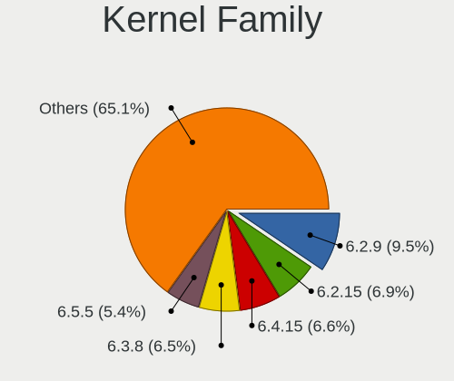

| Version | Desktops | Percent |
|---------|----------|---------|
| 6.2.15  | 74       | 10.45%  |
| 6.3.8   | 72       | 10.17%  |
| 6.2.9   | 70       | 9.89%   |
| 6.2.14  | 46       | 6.5%    |
| 6.3.12  | 40       | 5.65%   |
| 6.4.11  | 36       | 5.08%   |
| 6.2.11  | 33       | 4.66%   |
| 6.3.11  | 32       | 4.52%   |
| 6.4.6   | 29       | 4.1%    |
| 6.3.5   | 24       | 3.39%   |
| 6.4.12  | 23       | 3.25%   |
| 6.3.4   | 22       | 3.11%   |
| 6.2.12  | 22       | 3.11%   |
| 6.4.7   | 21       | 2.97%   |
| 6.4.4   | 19       | 2.68%   |
| 6.4.13  | 19       | 2.68%   |
| 6.3.7   | 19       | 2.68%   |
| 6.4.10  | 17       | 2.4%    |
| 6.2.13  | 17       | 2.4%    |
| 6.3.6   | 13       | 1.84%   |
| 6.4.9   | 12       | 1.69%   |
| 6.4.8   | 5        | 0.71%   |
| 6.2.6   | 5        | 0.71%   |
| 6.2.8   | 4        | 0.56%   |
| 6.3.3   | 3        | 0.42%   |
| 6.2.7   | 3        | 0.42%   |
| 6.2.2   | 3        | 0.42%   |
| 6.2.0   | 3        | 0.42%   |
| 6.5.0   | 2        | 0.28%   |
| 6.4.0   | 2        | 0.28%   |
| 6.3.10  | 2        | 0.28%   |
| 6.2.10  | 2        | 0.28%   |
| 6.4.2   | 1        | 0.14%   |
| 6.3.1   | 1        | 0.14%   |
| 6.2.5   | 1        | 0.14%   |
| 6.2.3   | 1        | 0.14%   |
| 6.2.1   | 1        | 0.14%   |
| 6.1.38  | 1        | 0.14%   |
| 6.1.31  | 1        | 0.14%   |
| 6.1.26  | 1        | 0.14%   |

Kernel Major Ver.
-----------------

Linux kernel major version

| Version | Desktops | Percent |
|---------|----------|---------|
| 6.2     | 269      | 39.73%  |
| 6.3     | 218      | 32.2%   |
| 6.4     | 179      | 26.44%  |
| 6.1     | 5        | 0.74%   |
| 6.5     | 2        | 0.3%    |
| 6.0     | 2        | 0.3%    |
| 5.19    | 1        | 0.15%   |
| 5.15    | 1        | 0.15%   |

Arch
----

OS architecture (x86_64, i586, etc.)

| Name    | Desktops | Percent |
|---------|----------|---------|
| x86_64  | 615      | 99.84%  |
| ppc64le | 1        | 0.16%   |

DE
--

Desktop Environment

| Name          | Desktops | Percent |
|---------------|----------|---------|
| GNOME         | 458      | 73.52%  |
| KDE5          | 105      | 16.85%  |
| Unknown       | 14       | 2.25%   |
| Cinnamon      | 13       | 2.09%   |
| XFCE          | 9        | 1.44%   |
| X-Cinnamon    | 6        | 0.96%   |
| GNOME Classic | 5        | 0.8%    |
| sway          | 4        | 0.64%   |
| MATE          | 2        | 0.32%   |
| Hyprland      | 2        | 0.32%   |
| LXQt          | 1        | 0.16%   |
| LXDE          | 1        | 0.16%   |
| KDE           | 1        | 0.16%   |
| Deepin        | 1        | 0.16%   |
| Budgie        | 1        | 0.16%   |

Display Server
--------------

X11 or Wayland

| Name    | Desktops | Percent |
|---------|----------|---------|
| Wayland | 460      | 73.72%  |
| X11     | 129      | 20.67%  |
| Tty     | 31       | 4.97%   |
| Unknown | 4        | 0.64%   |

Display Manager
---------------

SDDM, LightDM, etc.

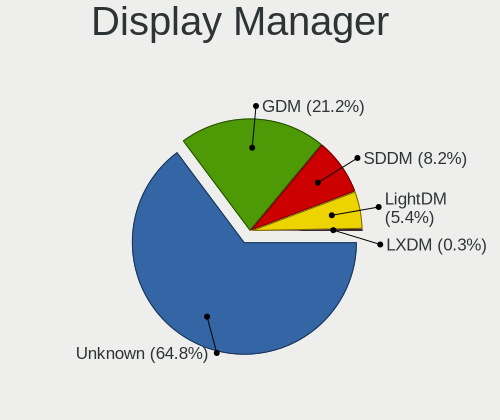

| Name    | Desktops | Percent |
|---------|----------|---------|
| Unknown | 412      | 66.34%  |
| GDM     | 129      | 20.77%  |
| SDDM    | 51       | 8.21%   |
| LightDM | 28       | 4.51%   |
| LXDM    | 1        | 0.16%   |

OS Lang
-------

Language

| Lang  | Desktops | Percent |
|-------|----------|---------|
| en_US | 295      | 47.58%  |
| ru_RU | 36       | 5.81%   |
| en_AU | 36       | 5.81%   |
| en_GB | 33       | 5.32%   |
| en_CA | 29       | 4.68%   |
| de_DE | 29       | 4.68%   |
| pt_BR | 28       | 4.52%   |
| fr_FR | 15       | 2.42%   |
| it_IT | 14       | 2.26%   |
| es_ES | 11       | 1.77%   |
| pl_PL | 8        | 1.29%   |
| es_MX | 8        | 1.29%   |
| es_AR | 6        | 0.97%   |
| es_CO | 5        | 0.81%   |
| tr_TR | 4        | 0.65%   |
| en_IN | 4        | 0.65%   |
| fi_FI | 3        | 0.48%   |
| en_DK | 3        | 0.48%   |
| de_AT | 3        | 0.48%   |
| zh_TW | 2        | 0.32%   |
| zh_CN | 2        | 0.32%   |
| sv_SE | 2        | 0.32%   |
| pt_PT | 2        | 0.32%   |
| nl_NL | 2        | 0.32%   |
| hu_HU | 2        | 0.32%   |
| hr_HR | 2        | 0.32%   |
| fr_CA | 2        | 0.32%   |
| en_PH | 2        | 0.32%   |
| en_NZ | 2        | 0.32%   |
| en_IE | 2        | 0.32%   |
| en_BW | 2        | 0.32%   |
| de_CH | 2        | 0.32%   |
| da_DK | 2        | 0.32%   |
| cs_CZ | 2        | 0.32%   |
| zh_SG | 1        | 0.16%   |
| sr_RS | 1        | 0.16%   |
| pa_IN | 1        | 0.16%   |
| nl_BE | 1        | 0.16%   |
| ja_JP | 1        | 0.16%   |
| id_ID | 1        | 0.16%   |

Boot Mode
---------

EFI or BIOS

| Mode | Desktops | Percent |
|------|----------|---------|
| EFI  | 445      | 72.01%  |
| BIOS | 173      | 27.99%  |

Filesystem
----------

Type of filesystem

| Type    | Desktops | Percent |
|---------|----------|---------|
| Btrfs   | 493      | 79.52%  |
| Ext4    | 102      | 16.45%  |
| Xfs     | 20       | 3.23%   |
| Overlay | 2        | 0.32%   |
| Zfs     | 1        | 0.16%   |
| F2fs    | 1        | 0.16%   |
| Ext3    | 1        | 0.16%   |

Part. scheme
------------

Scheme of partitioning

| Type    | Desktops | Percent |
|---------|----------|---------|
| Unknown | 398      | 64.19%  |
| GPT     | 198      | 31.94%  |
| MBR     | 24       | 3.87%   |

Dual Boot with Linux/BSD
------------------------

Hosting more than one Linux/BSD

| Dual boot | Desktops | Percent |
|-----------|----------|---------|
| No        | 552      | 88.46%  |
| Yes       | 72       | 11.54%  |

Dual Boot (Win)
---------------

Hosting Linux and Windows

| Dual boot | Desktops | Percent |
|-----------|----------|---------|
| No        | 520      | 84.14%  |
| Yes       | 98       | 15.86%  |

Board
-----

Vendor
------

Motherboard manufacturer

| Name                                 | Desktops | Percent |
|--------------------------------------|----------|---------|
| ASUSTek Computer                     | 160      | 25.97%  |
| Gigabyte Technology                  | 118      | 19.16%  |
| MSI                                  | 113      | 18.34%  |
| ASRock                               | 53       | 8.6%    |
| Dell                                 | 41       | 6.66%   |
| Hewlett-Packard                      | 39       | 6.33%   |
| Lenovo                               | 19       | 3.08%   |
| Unknown                              | 9        | 1.46%   |
| Pegatron                             | 7        | 1.14%   |
| AZW                                  | 6        | 0.97%   |
| Intel                                | 5        | 0.81%   |
| Fujitsu                              | 5        | 0.81%   |
| Acer                                 | 5        | 0.81%   |
| Itautec                              | 4        | 0.65%   |
| Huanan                               | 4        | 0.65%   |
| Shenzhen Meigao Electronic Equipment | 3        | 0.49%   |
| HPE                                  | 2        | 0.32%   |
| Biostar                              | 2        | 0.32%   |
| Techvision                           | 1        | 0.16%   |
| PCWare                               | 1        | 0.16%   |
| Packard Bell                         | 1        | 0.16%   |
| NZXT                                 | 1        | 0.16%   |
| Medion                               | 1        | 0.16%   |
| MACHINIST                            | 1        | 0.16%   |
| LattePanda                           | 1        | 0.16%   |
| Kupi deshego edition                 | 1        | 0.16%   |
| Kllisre                              | 1        | 0.16%   |
| iRU                                  | 1        | 0.16%   |
| Gateway                              | 1        | 0.16%   |
| GALAX                                | 1        | 0.16%   |
| Fujitsu Siemens                      | 1        | 0.16%   |
| Foxconn                              | 1        | 0.16%   |
| Fill By OEM                          | 1        | 0.16%   |
| ECS                                  | 1        | 0.16%   |
| Colorful Technology                  | 1        | 0.16%   |
| AOpen                                | 1        | 0.16%   |
| AMI                                  | 1        | 0.16%   |
| Alienware                            | 1        | 0.16%   |
| Acidanthera                          | 1        | 0.16%   |

Model
-----

Motherboard model

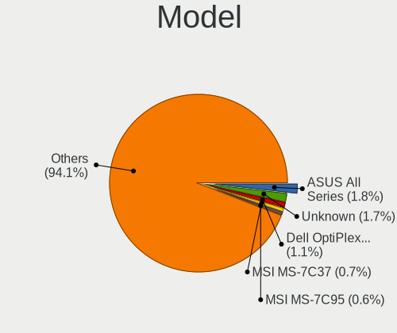

| Name                                       | Desktops | Percent |
|--------------------------------------------|----------|---------|
| ASUS All Series                            | 11       | 1.79%   |
| Unknown                                    | 9        | 1.46%   |
| MSI MS-7C37                                | 6        | 0.97%   |
| Dell OptiPlex 7010                         | 6        | 0.97%   |
| Gigabyte B550 GAMING X V2                  | 5        | 0.81%   |
| MSI MS-7C02                                | 4        | 0.65%   |
| MSI MS-7B89                                | 4        | 0.65%   |
| MSI MS-7A38                                | 4        | 0.65%   |
| ASUS ROG STRIX B550-I GAMING               | 4        | 0.65%   |
| MSI MS-7D43                                | 3        | 0.49%   |
| MSI MS-7C95                                | 3        | 0.49%   |
| MSI MS-7C94                                | 3        | 0.49%   |
| MSI MS-7B79                                | 3        | 0.49%   |
| MSI MS-7B17                                | 3        | 0.49%   |
| Itautec Infoway ST-4265                    | 3        | 0.49%   |
| HP Z800 Workstation                        | 3        | 0.49%   |
| HP Compaq 6005 Pro SFF PC                  | 3        | 0.49%   |
| Gigabyte X570 I AORUS PRO WIFI             | 3        | 0.49%   |
| Gigabyte GA-880GM-UD2H                     | 3        | 0.49%   |
| Gigabyte B550M DS3H                        | 3        | 0.49%   |
| Gigabyte B450M DS3H                        | 3        | 0.49%   |
| Gigabyte B450 I AORUS PRO WIFI             | 3        | 0.49%   |
| Gigabyte B450 AORUS ELITE                  | 3        | 0.49%   |
| Dell OptiPlex 3020                         | 3        | 0.49%   |
| ASUS TUF Gaming X570-PRO                   | 3        | 0.49%   |
| ASUS TUF Gaming X570-PLUS                  | 3        | 0.49%   |
| ASUS ROG STRIX X670E-I GAMING WIFI         | 3        | 0.49%   |
| ASUS PRIME B550M-A                         | 3        | 0.49%   |
| ASRock B450M Pro4                          | 3        | 0.49%   |
| Shenzhen Meigao Electronic Equipment UM690 | 2        | 0.32%   |
| MSI MS-7D54                                | 2        | 0.32%   |
| MSI MS-7D53                                | 2        | 0.32%   |
| MSI MS-7D25                                | 2        | 0.32%   |
| MSI MS-7D22                                | 2        | 0.32%   |
| MSI MS-7C96                                | 2        | 0.32%   |
| MSI MS-7C84                                | 2        | 0.32%   |
| MSI MS-7C56                                | 2        | 0.32%   |
| MSI MS-7C52                                | 2        | 0.32%   |
| MSI MS-7B85                                | 2        | 0.32%   |
| MSI MS-7B78                                | 2        | 0.32%   |

Model Family
------------

Motherboard model prefix

| Name                   | Desktops | Percent |
|------------------------|----------|---------|
| ASUS PRIME             | 42       | 6.82%   |
| ASUS ROG               | 36       | 5.84%   |
| Dell OptiPlex          | 29       | 4.71%   |
| ASUS TUF               | 28       | 4.55%   |
| Lenovo ThinkCentre     | 11       | 1.79%   |
| HP Compaq              | 11       | 1.79%   |
| ASUS All               | 11       | 1.79%   |
| Unknown                | 9        | 1.46%   |
| Gigabyte B550          | 8        | 1.3%    |
| HP EliteDesk           | 7        | 1.14%   |
| Gigabyte X570          | 7        | 1.14%   |
| Gigabyte B550M         | 7        | 1.14%   |
| MSI MS-7C37            | 6        | 0.97%   |
| Gigabyte B450M         | 6        | 0.97%   |
| Gigabyte B450          | 6        | 0.97%   |
| HP ProDesk             | 5        | 0.81%   |
| Dell Precision         | 5        | 0.81%   |
| ASRock B450M           | 5        | 0.81%   |
| MSI MS-7C02            | 4        | 0.65%   |
| MSI MS-7B89            | 4        | 0.65%   |
| MSI MS-7A38            | 4        | 0.65%   |
| Lenovo ThinkStation    | 4        | 0.65%   |
| Gigabyte AB350-Gaming  | 4        | 0.65%   |
| MSI MS-7D43            | 3        | 0.49%   |
| MSI MS-7C95            | 3        | 0.49%   |
| MSI MS-7C94            | 3        | 0.49%   |
| MSI MS-7B79            | 3        | 0.49%   |
| MSI MS-7B17            | 3        | 0.49%   |
| Lenovo IdeaCentre      | 3        | 0.49%   |
| Itautec Infoway        | 3        | 0.49%   |
| HP Z800                | 3        | 0.49%   |
| HP OMEN                | 3        | 0.49%   |
| Gigabyte H310M         | 3        | 0.49%   |
| Gigabyte GA-880GM-UD2H | 3        | 0.49%   |
| Gigabyte GA-78LMT-USB3 | 3        | 0.49%   |
| Gigabyte B560M         | 3        | 0.49%   |
| Gigabyte B365M         | 3        | 0.49%   |
| Dell Inspiron          | 3        | 0.49%   |
| ASUS ProArt            | 3        | 0.49%   |
| ASRock X570            | 3        | 0.49%   |

MFG Year
--------

Motherboard manufacture year

| Year    | Desktops | Percent |
|---------|----------|---------|
| 2018    | 89       | 14.45%  |
| 2020    | 76       | 12.34%  |
| 2021    | 69       | 11.2%   |
| 2022    | 61       | 9.9%    |
| 2019    | 54       | 8.77%   |
| 2017    | 40       | 6.49%   |
| 2013    | 39       | 6.33%   |
| 2012    | 36       | 5.84%   |
| 2016    | 23       | 3.73%   |
| 2015    | 23       | 3.73%   |
| 2010    | 22       | 3.57%   |
| 2014    | 21       | 3.41%   |
| 2011    | 20       | 3.25%   |
| 2023    | 19       | 3.08%   |
| 2009    | 8        | 1.3%    |
| 2008    | 8        | 1.3%    |
| 2007    | 3        | 0.49%   |
| 2006    | 3        | 0.49%   |
| 2005    | 1        | 0.16%   |
| Unknown | 1        | 0.16%   |

Form Factor
-----------

Physical design of the computer

| Name    | Desktops | Percent |
|---------|----------|---------|
| Desktop | 616      | 100%    |

Secure Boot
-----------

Enabled or disabled

| State    | Desktops | Percent |
|----------|----------|---------|
| Disabled | 539      | 86.94%  |
| Enabled  | 81       | 13.06%  |

Coreboot
--------

Have coreboot on board

| Used | Desktops | Percent |
|------|----------|---------|
| No   | 616      | 100%    |

RAM Size
--------

Total RAM memory

| Size in GB      | Desktops | Percent |
|-----------------|----------|---------|
| 16.01-24.0      | 197      | 31.42%  |
| 32.01-64.0      | 149      | 23.76%  |
| 8.01-16.0       | 75       | 11.96%  |
| 4.01-8.0        | 69       | 11%     |
| 64.01-256.0     | 69       | 11%     |
| 24.01-32.0      | 35       | 5.58%   |
| 3.01-4.0        | 27       | 4.31%   |
| 1.01-2.0        | 3        | 0.48%   |
| 2.01-3.0        | 2        | 0.32%   |
| More than 256.0 | 1        | 0.16%   |

RAM Used
--------

Used RAM memory

| Used GB     | Desktops | Percent |
|-------------|----------|---------|
| 4.01-8.0    | 203      | 30.62%  |
| 2.01-3.0    | 166      | 25.04%  |
| 3.01-4.0    | 144      | 21.72%  |
| 1.01-2.0    | 61       | 9.2%    |
| 8.01-16.0   | 59       | 8.9%    |
| 0.51-1.0    | 13       | 1.96%   |
| 16.01-24.0  | 12       | 1.81%   |
| 32.01-64.0  | 4        | 0.6%    |
| 64.01-256.0 | 1        | 0.15%   |

Total Drives
------------

Number of drives on board

| Drives | Desktops | Percent |
|--------|----------|---------|
| 2      | 215      | 33.75%  |
| 1      | 187      | 29.36%  |
| 3      | 119      | 18.68%  |
| 4      | 67       | 10.52%  |
| 5      | 26       | 4.08%   |
| 6      | 14       | 2.2%    |
| 7      | 4        | 0.63%   |
| 8      | 2        | 0.31%   |
| 11     | 1        | 0.16%   |
| 10     | 1        | 0.16%   |
| 0      | 1        | 0.16%   |

Has CD-ROM
----------

Has CD-ROM on board

| Presented | Desktops | Percent |
|-----------|----------|---------|
| No        | 444      | 71.61%  |
| Yes       | 176      | 28.39%  |

Has Ethernet
------------

Has Ethernet on board

| Presented | Desktops | Percent |
|-----------|----------|---------|
| Yes       | 612      | 99.19%  |
| No        | 5        | 0.81%   |

Has WiFi
--------

Has WiFi module

| Presented | Desktops | Percent |
|-----------|----------|---------|
| Yes       | 341      | 54.91%  |
| No        | 280      | 45.09%  |

Has Bluetooth
-------------

Has Bluetooth module

| Presented | Desktops | Percent |
|-----------|----------|---------|
| No        | 323      | 52.18%  |
| Yes       | 296      | 47.82%  |

Location
--------

Country
-------

Geographic location (country)

| Country     | Desktops | Percent |
|-------------|----------|---------|
| USA         | 124      | 20.1%   |
| Brazil      | 52       | 8.43%   |
| Australia   | 38       | 6.16%   |
| Russia      | 37       | 6%      |
| Germany     | 36       | 5.83%   |
| Canada      | 33       | 5.35%   |
| Italy       | 22       | 3.57%   |
| UK          | 18       | 2.92%   |
| France      | 17       | 2.76%   |
| Netherlands | 16       | 2.59%   |
| Poland      | 15       | 2.43%   |
| Mexico      | 14       | 2.27%   |
| Spain       | 13       | 2.11%   |
| Sweden      | 10       | 1.62%   |
| Colombia    | 9        | 1.46%   |
| Austria     | 8        | 1.3%    |
| Argentina   | 8        | 1.3%    |
| Norway      | 7        | 1.13%   |
| India       | 7        | 1.13%   |
| Hungary     | 7        | 1.13%   |
| Belgium     | 7        | 1.13%   |
| Thailand    | 6        | 0.97%   |
| Belarus     | 6        | 0.97%   |
| Turkey      | 5        | 0.81%   |
| Switzerland | 5        | 0.81%   |
| Serbia      | 5        | 0.81%   |
| Ukraine     | 4        | 0.65%   |
| Portugal    | 4        | 0.65%   |
| New Zealand | 4        | 0.65%   |
| Indonesia   | 4        | 0.65%   |
| Denmark     | 4        | 0.65%   |
| Czechia     | 4        | 0.65%   |
| Taiwan      | 3        | 0.49%   |
| Singapore   | 3        | 0.49%   |
| Philippines | 3        | 0.49%   |
| Ireland     | 3        | 0.49%   |
| Greece      | 3        | 0.49%   |
| Finland     | 3        | 0.49%   |
| Croatia     | 3        | 0.49%   |
| China       | 3        | 0.49%   |

City
----

Geographic location (city)

| City           | Desktops | Percent |
|----------------|----------|---------|
| Sydney         | 22       | 3.51%   |
| Palmas         | 8        | 1.28%   |
| Moscow         | 8        | 1.28%   |
| Vienna         | 7        | 1.12%   |
| Sao Paulo      | 7        | 1.12%   |
| Minsk          | 6        | 0.96%   |
| Warsaw         | 5        | 0.8%    |
| St Petersburg  | 5        | 0.8%    |
| Seattle        | 5        | 0.8%    |
| Brussels       | 5        | 0.8%    |
| Rio de Janeiro | 4        | 0.64%   |
| Ottawa         | 4        | 0.64%   |
| Mexico City    | 4        | 0.64%   |
| Melbourne      | 4        | 0.64%   |
| Los Angeles    | 4        | 0.64%   |
| Budapest       | 4        | 0.64%   |
| Brisbane       | 4        | 0.64%   |
| Braslia      | 4        | 0.64%   |
| Belgrade       | 4        | 0.64%   |
| Amsterdam      | 4        | 0.64%   |
| Winnipeg       | 3        | 0.48%   |
| Toronto        | 3        | 0.48%   |
| Singapore      | 3        | 0.48%   |
| Santiago       | 3        | 0.48%   |
| Rochester      | 3        | 0.48%   |
| Prague         | 3        | 0.48%   |
| Porto Alegre   | 3        | 0.48%   |
| Milan          | 3        | 0.48%   |
| Istanbul       | 3        | 0.48%   |
| Helsinki       | 3        | 0.48%   |
| Bogot        | 3        | 0.48%   |
| Bangkok        | 3        | 0.48%   |
| Athens         | 3        | 0.48%   |
| Alliston       | 3        | 0.48%   |
| Adelaide       | 3        | 0.48%   |
| Woodstock      | 2        | 0.32%   |
| White Rock     | 2        | 0.32%   |
| Victoria       | 2        | 0.32%   |
| Verona         | 2        | 0.32%   |
| The Hague      | 2        | 0.32%   |

Drives
------

Drive Vendor
------------

Hard drive vendors

| Vendor                      | Desktops | Drives | Percent |
|-----------------------------|----------|--------|---------|
| Samsung Electronics         | 223      | 388    | 18.38%  |
| Seagate                     | 173      | 243    | 14.26%  |
| WDC                         | 161      | 247    | 13.27%  |
| Sandisk                     | 85       | 111    | 7.01%   |
| Kingston                    | 74       | 87     | 6.1%    |
| Crucial                     | 65       | 90     | 5.36%   |
| Toshiba                     | 62       | 75     | 5.11%   |
| Intel                       | 28       | 46     | 2.31%   |
| Phison Electronics          | 27       | 42     | 2.23%   |
| Hitachi                     | 25       | 35     | 2.06%   |
| A-DATA Technology           | 21       | 24     | 1.73%   |
| Micron/Crucial Technology   | 19       | 20     | 1.57%   |
| Silicon Motion              | 17       | 21     | 1.4%    |
| Patriot                     | 13       | 17     | 1.07%   |
| Kingston Technology Company | 13       | 15     | 1.07%   |
| China                       | 13       | 19     | 1.07%   |
| SK hynix                    | 10       | 13     | 0.82%   |
| SPCC                        | 9        | 11     | 0.74%   |
| HGST                        | 8        | 8      | 0.66%   |
| ADATA Technology            | 8        | 8      | 0.66%   |
| Unknown                     | 7        | 10     | 0.58%   |
| Realtek Semiconductor       | 7        | 11     | 0.58%   |
| PNY                         | 7        | 10     | 0.58%   |
| Netac                       | 7        | 7      | 0.58%   |
| Micron Technology           | 7        | 7      | 0.58%   |
| MAXIO Technology (Hangzhou) | 7        | 9      | 0.58%   |
| Transcend                   | 5        | 6      | 0.41%   |
| KingSpec                    | 5        | 5      | 0.41%   |
| Intenso                     | 5        | 6      | 0.41%   |
| Seagate Technology          | 4        | 5      | 0.33%   |
| OCZ                         | 4        | 7      | 0.33%   |
| Lexar                       | 4        | 4      | 0.33%   |
| JMicron Technology          | 4        | 4      | 0.33%   |
| AMD                         | 4        | 4      | 0.33%   |
| Team                        | 3        | 3      | 0.25%   |
| Maxtor                      | 3        | 3      | 0.25%   |
| LITEONIT                    | 3        | 3      | 0.25%   |
| HS-SSD-C100                 | 3        | 3      | 0.25%   |
| GOODRAM                     | 3        | 4      | 0.25%   |
| ASMT                        | 3        | 4      | 0.25%   |

Drive Model
-----------

Hard drive models

| Model                                                 | Desktops | Percent |
|-------------------------------------------------------|----------|---------|
| Samsung NVMe SSD Controller SM981/PM981/PM983 500GB   | 55       | 3.94%   |
| Samsung NVMe SSD Controller PM9A1/PM9A3/980PRO 1024GB | 39       | 2.79%   |
| Crucial CT500MX500SSD1 500GB                          | 19       | 1.36%   |
| Samsung SSD 860 EVO 500GB                             | 14       | 1%      |
| Samsung SSD 850 EVO 250GB                             | 14       | 1%      |
| Samsung NVMe SSD Controller SM961/PM961/SM963 1024GB  | 14       | 1%      |
| Silicon Motion SM2263EN/SM2263XT SSD Controller 256GB | 13       | 0.93%   |
| Seagate ST2000DM008-2FR102 2TB                        | 13       | 0.93%   |
| Seagate ST1000DM010-2EP102 1TB                        | 13       | 0.93%   |
| Samsung SSD 860 EVO 1TB                               | 13       | 0.93%   |
| Phison E12 NVMe Controller 256GB                      | 13       | 0.93%   |
| Seagate ST2000DM006-2DM164 2TB                        | 12       | 0.86%   |
| Kingston SA400S37120G 120GB SSD                       | 12       | 0.86%   |
| Toshiba DT01ACA100 1TB                                | 11       | 0.79%   |
| Seagate ST500DM002-1BD142 500GB                       | 11       | 0.79%   |
| Micron/Crucial P2 NVMe PCIe SSD 1TB                   | 11       | 0.79%   |
| WDC WDS500G2B0A-00SM50 500GB SSD                      | 10       | 0.72%   |
| WDC WD10EZEX-08WN4A0 1TB                              | 10       | 0.72%   |
| Samsung SSD 980 1TB                                   | 10       | 0.72%   |
| Kingston SA400S37480G 480GB SSD                       | 10       | 0.72%   |
| Kingston SA400S37240G 240GB SSD                       | 10       | 0.72%   |
| Seagate ST1000DM003-1CH162 1TB                        | 9        | 0.64%   |
| Samsung SSD 870 EVO 1TB                               | 9        | 0.64%   |
| Sandisk WD Blue SN550 NVMe SSD 250GB                  | 8        | 0.57%   |
| Samsung SSD 850 EVO 500GB                             | 8        | 0.57%   |
| Phison E16 PCIe4 NVMe Controller 1TB                  | 8        | 0.57%   |
| Crucial CT240BX500SSD1 240GB                          | 8        | 0.57%   |
| Crucial CT1000MX500SSD1 1TB                           | 8        | 0.57%   |
| Seagate ST31000524AS 1TB                              | 7        | 0.5%    |
| Seagate ST2000DM001-1ER164 2TB                        | 7        | 0.5%    |
| MAXIO (Hangzhou) NVMe SSD Controller MAP1202 1024GB   | 7        | 0.5%    |
| WDC WDS240G2G0A-00JH30 240GB SSD                      | 6        | 0.43%   |
| Toshiba MQ01ABD100 1TB                                | 6        | 0.43%   |
| Seagate ST4000DM004-2CV104 4TB                        | 6        | 0.43%   |
| Seagate ST1000DM003-1ER162 1TB                        | 6        | 0.43%   |
| Sandisk WD Black SN850 256GB                          | 6        | 0.43%   |
| Samsung SSD 860 EVO 250GB                             | 6        | 0.43%   |
| Kingston SV300S37A120G 120GB SSD                      | 6        | 0.43%   |
| Crucial CT2000MX500SSD1 2TB                           | 6        | 0.43%   |
| Toshiba DT01ACA050 500GB                              | 5        | 0.36%   |

HDD Vendor
----------

Hard disk drive vendors

| Vendor              | Desktops | Drives | Percent |
|---------------------|----------|--------|---------|
| Seagate             | 166      | 229    | 40.19%  |
| WDC                 | 134      | 199    | 32.45%  |
| Toshiba             | 52       | 59     | 12.59%  |
| Hitachi             | 25       | 35     | 6.05%   |
| Samsung Electronics | 15       | 17     | 3.63%   |
| HGST                | 8        | 8      | 1.94%   |
| Unknown             | 4        | 4      | 0.97%   |
| SABRENT             | 2        | 2      | 0.48%   |
| QNAP                | 2        | 2      | 0.48%   |
| Maxtor              | 2        | 2      | 0.48%   |
| USB                 | 1        | 1      | 0.24%   |
| JMicron Technology  | 1        | 1      | 0.24%   |
| ASMT                | 1        | 2      | 0.24%   |

SSD Vendor
----------

Solid state drive vendors

| Vendor              | Desktops | Drives | Percent |
|---------------------|----------|--------|---------|
| Samsung Electronics | 116      | 182    | 24.37%  |
| Crucial             | 64       | 87     | 13.45%  |
| Kingston            | 54       | 63     | 11.34%  |
| WDC                 | 37       | 46     | 7.77%   |
| SanDisk             | 32       | 42     | 6.72%   |
| A-DATA Technology   | 21       | 24     | 4.41%   |
| Intel               | 17       | 31     | 3.57%   |
| Patriot             | 13       | 17     | 2.73%   |
| China               | 13       | 19     | 2.73%   |
| SPCC                | 9        | 11     | 1.89%   |
| PNY                 | 7        | 10     | 1.47%   |
| Transcend           | 5        | 6      | 1.05%   |
| Toshiba             | 5        | 10     | 1.05%   |
| Micron Technology   | 5        | 5      | 1.05%   |
| KingSpec            | 5        | 5      | 1.05%   |
| OCZ                 | 4        | 7      | 0.84%   |
| Lexar               | 4        | 4      | 0.84%   |
| AMD                 | 4        | 4      | 0.84%   |
| Team                | 3        | 3      | 0.63%   |
| Netac               | 3        | 3      | 0.63%   |
| LITEONIT            | 3        | 3      | 0.63%   |
| Intenso             | 3        | 3      | 0.63%   |
| GOODRAM             | 3        | 4      | 0.63%   |
| TO Exter            | 2        | 2      | 0.42%   |
| SK hynix            | 2        | 2      | 0.42%   |
| NGFF                | 2        | 2      | 0.42%   |
| Mushkin             | 2        | 2      | 0.42%   |
| Gigabyte Technology | 2        | 3      | 0.42%   |
| Fanxiang            | 2        | 2      | 0.42%   |
| Acer                | 2        | 5      | 0.42%   |
| Unknown             | 2        | 4      | 0.42%   |
| ZOTAC               | 1        | 1      | 0.21%   |
| XrayDisk            | 1        | 1      | 0.21%   |
| Vaseky              | 1        | 1      | 0.21%   |
| TAMMUZ              | 1        | 1      | 0.21%   |
| Supersonic          | 1        | 2      | 0.21%   |
| Seagate             | 1        | 1      | 0.21%   |
| S3+                 | 1        | 1      | 0.21%   |
| Ramaxel Technology  | 1        | 1      | 0.21%   |
| Quaroni             | 1        | 1      | 0.21%   |

Drive Kind
----------

HDD or SSD

| Kind    | Desktops | Drives | Percent |
|---------|----------|--------|---------|
| SSD     | 386      | 645    | 36.52%  |
| HDD     | 334      | 561    | 31.6%   |
| NVMe    | 313      | 475    | 29.61%  |
| Unknown | 23       | 27     | 2.18%   |
| MMC     | 1        | 2      | 0.09%   |

Drive Connector
---------------

SATA, SAS, NVMe, etc.

| Type | Desktops | Drives | Percent |
|------|----------|--------|---------|
| SATA | 515      | 1179   | 58.99%  |
| NVMe | 313      | 475    | 35.85%  |
| SAS  | 44       | 54     | 5.04%   |
| MMC  | 1        | 2      | 0.11%   |

Drive Size
----------

Size of hard drive

| Size in TB | Desktops | Drives | Percent |
|------------|----------|--------|---------|
| 0.01-0.5   | 349      | 609    | 45.56%  |
| 0.51-1.0   | 238      | 347    | 31.07%  |
| 1.01-2.0   | 106      | 139    | 13.84%  |
| 3.01-4.0   | 37       | 46     | 4.83%   |
| 4.01-10.0  | 22       | 47     | 2.87%   |
| 2.01-3.0   | 11       | 11     | 1.44%   |
| 10.01-20.0 | 3        | 7      | 0.39%   |

Space Total
-----------

Amount of disk space available on the file system

| Size in GB     | Desktops | Percent |
|----------------|----------|---------|
| 1001-2000      | 134      | 20.94%  |
| 501-1000       | 126      | 19.69%  |
| More than 3000 | 87       | 13.59%  |
| 251-500        | 87       | 13.59%  |
| 101-250        | 72       | 11.25%  |
| 2001-3000      | 55       | 8.59%   |
| 1-20           | 26       | 4.06%   |
| Unknown        | 23       | 3.59%   |
| 51-100         | 18       | 2.81%   |
| 21-50          | 11       | 1.72%   |
| 0              | 1        | 0.16%   |

Space Used
----------

Amount of used disk space

| Used GB        | Desktops | Percent |
|----------------|----------|---------|
| 1-20           | 145      | 22.14%  |
| 21-50          | 105      | 16.03%  |
| 101-250        | 77       | 11.76%  |
| 251-500        | 75       | 11.45%  |
| 501-1000       | 75       | 11.45%  |
| 51-100         | 66       | 10.08%  |
| 1001-2000      | 47       | 7.18%   |
| Unknown        | 23       | 3.51%   |
| More than 3000 | 21       | 3.21%   |
| 2001-3000      | 20       | 3.05%   |
| 0              | 1        | 0.15%   |

Malfunc. Drives
---------------

Drive models with a malfunction

| Model                                                             | Desktops | Drives | Percent |
|-------------------------------------------------------------------|----------|--------|---------|
| Seagate ST500DM002-1BD142 500GB                                   | 3        | 3      | 4.76%   |
| Intel SSDSC2CT120A3 120GB                                         | 3        | 7      | 4.76%   |
| Toshiba MQ01ABD100 1TB                                            | 2        | 2      | 3.17%   |
| Seagate ST31000524AS 1TB                                          | 2        | 2      | 3.17%   |
| Crucial CT120M500SSD1 120GB                                       | 2        | 6      | 3.17%   |
| WDC WDS240G2G0A-00JH30 240GB SSD                                  | 1        | 1      | 1.59%   |
| WDC WDS100T2G0A-00JH30 1TB SSD                                    | 1        | 1      | 1.59%   |
| WDC WD5000AVCS-632DY1 500GB                                       | 1        | 1      | 1.59%   |
| WDC WD5000AAKX-603CA0 500GB                                       | 1        | 1      | 1.59%   |
| WDC WD5000AADS-00S9B0 500GB                                       | 1        | 1      | 1.59%   |
| WDC WD40PURX-64GVNY0 4TB                                          | 1        | 1      | 1.59%   |
| WDC WD2500BEVT-80A23T0 250GB                                      | 1        | 1      | 1.59%   |
| WDC WD20EZRX-00D8PB0 2TB                                          | 1        | 1      | 1.59%   |
| WDC WD10JPVT-60A1YT0 1TB                                          | 1        | 1      | 1.59%   |
| WDC WD10EZRZ-00HTKB0 1TB                                          | 1        | 1      | 1.59%   |
| WDC WD10EZEX-08WN4A0 1TB                                          | 1        | 1      | 1.59%   |
| WDC WD1002FAEX-00Y9A0 1TB                                         | 1        | 1      | 1.59%   |
| Toshiba MQ02ABD100H 1TB                                           | 1        | 1      | 1.59%   |
| SPCC Solid State Disk 128GB                                       | 1        | 1      | 1.59%   |
| Seagate ST9250827AS 250GB                                         | 1        | 1      | 1.59%   |
| Seagate ST9160412AS 160GB                                         | 1        | 1      | 1.59%   |
| Seagate ST3750528AS 752GB                                         | 1        | 1      | 1.59%   |
| Seagate ST3500630NS 500GB                                         | 1        | 1      | 1.59%   |
| Seagate ST3500418AS 500GB                                         | 1        | 2      | 1.59%   |
| Seagate ST3320613AS 320GB                                         | 1        | 1      | 1.59%   |
| Seagate ST2000VX000-1CU164 2TB                                    | 1        | 1      | 1.59%   |
| Seagate ST2000DM008-2FR102 2TB                                    | 1        | 1      | 1.59%   |
| Seagate ST1000LX015-1U7172 1TB                                    | 1        | 1      | 1.59%   |
| Seagate ST1000DX002-2DV162 1TB                                    | 1        | 1      | 1.59%   |
| Seagate ST1000DM003-1ER162 1TB                                    | 1        | 1      | 1.59%   |
| SanDisk SSD PLUS 480GB                                            | 1        | 1      | 1.59%   |
| SanDisk SSD PLUS 120 GB                                           | 1        | 1      | 1.59%   |
| SanDisk SD8SBAT256G1122 256GB SSD                                 | 1        | 1      | 1.59%   |
| Samsung Electronics SSD 870 EVO 2TB                               | 1        | 1      | 1.59%   |
| Samsung Electronics SSD 870 EVO 250GB                             | 1        | 1      | 1.59%   |
| Samsung Electronics SSD 870 EVO 1TB                               | 1        | 1      | 1.59%   |
| Samsung Electronics SSD 850 EVO 250GB                             | 1        | 2      | 1.59%   |
| Samsung Electronics SSD 840 EVO 250GB                             | 1        | 1      | 1.59%   |
| Samsung Electronics NVMe SSD Controller PM9A1/PM9A3/980PRO 1024GB | 1        | 1      | 1.59%   |
| Samsung Electronics HD322GJ 320GB                                 | 1        | 2      | 1.59%   |

Malfunc. Drive Vendor
---------------------

Vendors of faulty drives

| Vendor                      | Desktops | Drives | Percent |
|-----------------------------|----------|--------|---------|
| Seagate                     | 15       | 17     | 25%     |
| WDC                         | 10       | 12     | 16.67%  |
| Samsung Electronics         | 8        | 10     | 13.33%  |
| Intel                       | 5        | 9      | 8.33%   |
| Toshiba                     | 3        | 3      | 5%      |
| SanDisk                     | 3        | 3      | 5%      |
| Kingston                    | 3        | 4      | 5%      |
| Hitachi                     | 2        | 2      | 3.33%   |
| Crucial                     | 2        | 6      | 3.33%   |
| A-DATA Technology           | 2        | 2      | 3.33%   |
| SPCC                        | 1        | 1      | 1.67%   |
| Micron Technology           | 1        | 1      | 1.67%   |
| Maxtor                      | 1        | 1      | 1.67%   |
| MAXIO Technology (Hangzhou) | 1        | 1      | 1.67%   |
| LITEONIT                    | 1        | 1      | 1.67%   |
| Intenso                     | 1        | 1      | 1.67%   |
| HPE                         | 1        | 1      | 1.67%   |

Malfunc. HDD Vendor
-------------------

Vendors of faulty HDD drives

| Vendor              | Desktops | Drives | Percent |
|---------------------|----------|--------|---------|
| Seagate             | 15       | 17     | 46.88%  |
| WDC                 | 9        | 10     | 28.13%  |
| Toshiba             | 3        | 3      | 9.38%   |
| Samsung Electronics | 2        | 3      | 6.25%   |
| Hitachi             | 2        | 2      | 6.25%   |
| Maxtor              | 1        | 1      | 3.13%   |

Malfunc. Drive Kind
-------------------

Kinds of faulty drives

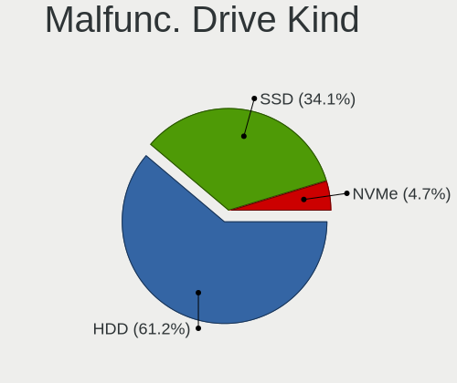

| Kind | Desktops | Drives | Percent |
|------|----------|--------|---------|
| HDD  | 31       | 36     | 53.45%  |
| SSD  | 25       | 37     | 43.1%   |
| NVMe | 2        | 2      | 3.45%   |

Failed Drives
-------------

Failed drive models

Zero info for selected period =(

Failed Drive Vendor
-------------------

Failed drive vendors

Zero info for selected period =(

Drive Status
------------

Number of failed and malfunc. drives

| Status   | Desktops | Drives | Percent |
|----------|----------|--------|---------|
| Detected | 419      | 1098   | 61.71%  |
| Works    | 206      | 537    | 30.34%  |
| Malfunc  | 54       | 75     | 7.95%   |

Storage controller
------------------

Storage Vendor
--------------

Storage controller vendors

| Vendor                           | Desktops | Percent |
|----------------------------------|----------|---------|
| Intel                            | 340      | 33.14%  |
| AMD                              | 268      | 26.12%  |
| Samsung Electronics              | 132      | 12.87%  |
| SanDisk                          | 58       | 5.65%   |
| Kingston Technology Company      | 35       | 3.41%   |
| ASMedia Technology               | 34       | 3.31%   |
| Phison Electronics               | 28       | 2.73%   |
| Micron/Crucial Technology        | 20       | 1.95%   |
| Silicon Motion                   | 17       | 1.66%   |
| Marvell Technology Group         | 17       | 1.66%   |
| Seagate Technology               | 8        | 0.78%   |
| JMicron Technology               | 8        | 0.78%   |
| ADATA Technology                 | 8        | 0.78%   |
| SK hynix                         | 7        | 0.68%   |
| Realtek Semiconductor            | 7        | 0.68%   |
| MAXIO Technology (Hangzhou)      | 7        | 0.68%   |
| Toshiba America Info Systems     | 5        | 0.49%   |
| Netac Technology                 | 4        | 0.39%   |
| LSI Logic / Symbios Logic        | 3        | 0.29%   |
| VIA Technologies                 | 2        | 0.19%   |
| Silicon Image                    | 2        | 0.19%   |
| Shenzhen Longsys Electronics     | 2        | 0.19%   |
| Micron Technology                | 2        | 0.19%   |
| KIOXIA                           | 2        | 0.19%   |
| Adaptec                          | 2        | 0.19%   |
| Union Memory (Shenzhen)          | 1        | 0.1%    |
| ULi Electronics                  | 1        | 0.1%    |
| Silicon Integrated Systems [SiS] | 1        | 0.1%    |
| PMC-Sierra                       | 1        | 0.1%    |
| Nvidia                           | 1        | 0.1%    |
| INNOGRIT                         | 1        | 0.1%    |
| Broadcom / LSI                   | 1        | 0.1%    |
| Biwin Storage Technology         | 1        | 0.1%    |

Storage Model
-------------

Storage controller models

| Model                                                                          | Desktops | Percent |
|--------------------------------------------------------------------------------|----------|---------|
| AMD FCH SATA Controller [AHCI mode]                                            | 149      | 12.67%  |
| Samsung NVMe SSD Controller SM981/PM981/PM983                                  | 60       | 5.1%    |
| AMD 500 Series Chipset SATA Controller                                         | 59       | 5.02%   |
| AMD 400 Series Chipset SATA Controller                                         | 56       | 4.76%   |
| Samsung NVMe SSD Controller PM9A1/PM9A3/980PRO                                 | 43       | 3.66%   |
| Intel 200 Series PCH SATA controller [AHCI mode]                               | 37       | 3.15%   |
| Intel Q170/Q150/B150/H170/H110/Z170/CM236 Chipset SATA Controller [AHCI Mode]  | 35       | 2.98%   |
| Intel 8 Series/C220 Series Chipset Family 6-port SATA Controller 1 [AHCI mode] | 33       | 2.81%   |
| Intel Alder Lake-S PCH SATA Controller [AHCI Mode]                             | 32       | 2.72%   |
| ASMedia ASM1062 Serial ATA Controller                                          | 32       | 2.72%   |
| Intel Cannon Lake PCH SATA AHCI Controller                                     | 31       | 2.64%   |
| Intel 7 Series/C210 Series Chipset Family 6-port SATA Controller [AHCI mode]   | 29       | 2.47%   |
| Intel 500 Series Chipset Family SATA AHCI Controller                           | 20       | 1.7%    |
| AMD SB7x0/SB8x0/SB9x0 IDE Controller                                           | 19       | 1.62%   |
| Intel SATA Controller [RAID mode]                                              | 18       | 1.53%   |
| AMD SB7x0/SB8x0/SB9x0 SATA Controller [AHCI mode]                              | 18       | 1.53%   |
| Samsung NVMe SSD Controller 980                                                | 17       | 1.45%   |
| Intel Volume Management Device NVMe RAID Controller                            | 15       | 1.28%   |
| Samsung NVMe SSD Controller SM961/PM961/SM963                                  | 14       | 1.19%   |
| Intel 6 Series/C200 Series Chipset Family 6 port Desktop SATA AHCI Controller  | 14       | 1.19%   |
| AMD FCH SATA Controller D                                                      | 14       | 1.19%   |
| AMD 300 Series Chipset SATA Controller                                         | 14       | 1.19%   |
| Silicon Motion SM2263EN/SM2263XT (DRAM-less) NVMe SSD Controllers              | 13       | 1.11%   |
| Phison E12 NVMe Controller                                                     | 13       | 1.11%   |
| Micron/Crucial P2 [Nick P2] / P3 / P3 Plus NVMe PCIe SSD (DRAM-less)           | 12       | 1.02%   |
| Kingston Company Company Non-Volatile memory controller                        | 10       | 0.85%   |
| Kingston Company KC3000/Renegade NVMe SSD                                      | 10       | 0.85%   |
| AMD SB7x0/SB8x0/SB9x0 SATA Controller [IDE mode]                               | 10       | 0.85%   |
| Phison E16 PCIe4 NVMe Controller                                               | 9        | 0.77%   |
| SanDisk WD Blue SN550 NVMe SSD                                                 | 8        | 0.68%   |
| Marvell Group 88SE9172 SATA 6Gb/s Controller                                   | 8        | 0.68%   |
| Sandisk Western Digital WD Black SN850X NVMe SSD                               | 7        | 0.6%    |
| SanDisk WD PC SN810 / Black SN850 NVMe SSD                                     | 7        | 0.6%    |
| SanDisk WD Black SN770 / PC SN740 256GB / PC SN560 (DRAM-less) NVMe SSD        | 7        | 0.6%    |
| MAXIO (Hangzhou) NVMe SSD Controller MAP1202                                   | 7        | 0.6%    |
| Intel C610/X99 series chipset 6-Port SATA Controller [AHCI mode]               | 7        | 0.6%    |
| SanDisk WD Green SN350 NVMe SSD 240GB (DRAM-less)                              | 6        | 0.51%   |
| Samsung NVMe SSD Controller S4LV008[Pascal]                                    | 6        | 0.51%   |
| Kingston Company NVMe Controller                                               | 6        | 0.51%   |
| SanDisk WD Blue SN570 NVMe SSD 1TB                                             | 5        | 0.43%   |

Storage Kind
------------

Kind of storage controller (IDE, SATA, NVMe, SAS, ...)

| Kind | Desktops | Percent |
|------|----------|---------|
| SATA | 563      | 57.57%  |
| NVMe | 313      | 32%     |
| RAID | 48       | 4.91%   |
| IDE  | 47       | 4.81%   |
| SCSI | 4        | 0.41%   |
| SAS  | 3        | 0.31%   |

Processor
---------

CPU Vendor
----------

Processor vendors

| Vendor                   | Desktops | Percent |
|--------------------------|----------|---------|
| Intel                    | 340      | 55.19%  |
| AMD                      | 275      | 44.64%  |
| PowerNV C1P9S01 REV 1.01 | 1        | 0.16%   |

CPU Model
---------

Processor models

| Model                                       | Desktops | Percent |
|---------------------------------------------|----------|---------|
| AMD Ryzen 5 5600X 6-Core Processor          | 21       | 3.41%   |
| AMD Ryzen 5 3600 6-Core Processor           | 17       | 2.76%   |
| AMD Ryzen 5 5600G with Radeon Graphics      | 13       | 2.11%   |
| AMD Ryzen 7 5800X 8-Core Processor          | 12       | 1.95%   |
| AMD Ryzen 5 2600 Six-Core Processor         | 12       | 1.95%   |
| Intel Core i7-3770 CPU @ 3.40GHz            | 11       | 1.79%   |
| AMD Ryzen 9 7950X 16-Core Processor         | 11       | 1.79%   |
| AMD Ryzen 9 5950X 16-Core Processor         | 10       | 1.62%   |
| AMD Ryzen 7 3700X 8-Core Processor          | 10       | 1.62%   |
| AMD Ryzen 5 3400G with Radeon Vega Graphics | 9        | 1.46%   |
| AMD Ryzen 9 5900X 12-Core Processor         | 8        | 1.3%    |
| AMD Ryzen 7 5700G with Radeon Graphics      | 8        | 1.3%    |
| Intel Core i7-8700K CPU @ 3.70GHz           | 7        | 1.14%   |
| Intel Core i7-4790 CPU @ 3.60GHz            | 7        | 1.14%   |
| Intel Core i5-9400F CPU @ 2.90GHz           | 7        | 1.14%   |
| Intel Core i5-6500 CPU @ 3.20GHz            | 7        | 1.14%   |
| Intel Core i5-3470 CPU @ 3.20GHz            | 7        | 1.14%   |
| AMD Ryzen 7 5800X3D 8-Core Processor        | 7        | 1.14%   |
| Intel 12th Gen Core i5-12400                | 6        | 0.97%   |
| AMD Ryzen 9 3900X 12-Core Processor         | 6        | 0.97%   |
| AMD Ryzen 7 2700X Eight-Core Processor      | 6        | 0.97%   |
| Intel Core i9-9900K CPU @ 3.60GHz           | 5        | 0.81%   |
| Intel Core i7-9700 CPU @ 3.00GHz            | 5        | 0.81%   |
| Intel Core i7-6700 CPU @ 3.40GHz            | 5        | 0.81%   |
| Intel Core i5-7500 CPU @ 3.40GHz            | 5        | 0.81%   |
| Intel Core i5-6500T CPU @ 2.50GHz           | 5        | 0.81%   |
| Intel Core i5-3570 CPU @ 3.40GHz            | 5        | 0.81%   |
| Intel Core i3-9100F CPU @ 3.60GHz           | 5        | 0.81%   |
| Intel 12th Gen Core i5-12600K               | 5        | 0.81%   |
| Intel 12th Gen Core i5-12400F               | 5        | 0.81%   |
| AMD Ryzen 9 7900 12-Core Processor          | 5        | 0.81%   |
| AMD Ryzen 7 7700X 8-Core Processor          | 5        | 0.81%   |
| AMD Ryzen 7 5700X 8-Core Processor          | 5        | 0.81%   |
| AMD Ryzen 5 1600 Six-Core Processor         | 5        | 0.81%   |
| Intel Core i7-8700 CPU @ 3.20GHz            | 4        | 0.65%   |
| Intel Core i7-7700K CPU @ 4.20GHz           | 4        | 0.65%   |
| Intel Core i7-7700 CPU @ 3.60GHz            | 4        | 0.65%   |
| Intel Core i7-6700K CPU @ 4.00GHz           | 4        | 0.65%   |
| Intel Core i7-4790K CPU @ 4.00GHz           | 4        | 0.65%   |
| Intel Core i7-2600 CPU @ 3.40GHz            | 4        | 0.65%   |

CPU Model Family
----------------

Processor model prefix

| Model                   | Desktops | Percent |
|-------------------------|----------|---------|
| Intel Core i5           | 98       | 15.91%  |
| AMD Ryzen 5             | 96       | 15.58%  |
| Intel Core i7           | 86       | 13.96%  |
| AMD Ryzen 7             | 63       | 10.23%  |
| AMD Ryzen 9             | 54       | 8.77%   |
| Other                   | 49       | 7.95%   |
| Intel Xeon              | 33       | 5.36%   |
| Intel Core i3           | 26       | 4.22%   |
| AMD FX                  | 16       | 2.6%    |
| Intel Celeron           | 13       | 2.11%   |
| Intel Core i9           | 11       | 1.79%   |
| AMD Phenom II X4        | 9        | 1.46%   |
| Intel Core 2 Quad       | 8        | 1.3%    |
| AMD Ryzen 3             | 7        | 1.14%   |
| AMD Ryzen Threadripper  | 6        | 0.97%   |
| Intel Pentium           | 4        | 0.65%   |
| Intel Core 2 Duo        | 4        | 0.65%   |
| Intel Atom              | 3        | 0.49%   |
| AMD Athlon              | 3        | 0.49%   |
| AMD A8                  | 3        | 0.49%   |
| AMD A10                 | 3        | 0.49%   |
| Intel Pentium Gold      | 2        | 0.32%   |
| Intel Pentium Dual      | 2        | 0.32%   |
| AMD Ryzen 5 PRO         | 2        | 0.32%   |
| AMD Phenom II X2        | 2        | 0.32%   |
| AMD A4                  | 2        | 0.32%   |
| Intel Pentium Silver    | 1        | 0.16%   |
| Intel Pentium Dual-Core | 1        | 0.16%   |
| Intel Genuine           | 1        | 0.16%   |
| AMD Turion 64 X2 Mobile | 1        | 0.16%   |
| AMD Sempron             | 1        | 0.16%   |
| AMD Phenom II X6        | 1        | 0.16%   |
| AMD Opteron             | 1        | 0.16%   |
| AMD E2                  | 1        | 0.16%   |
| AMD Athlon II X2        | 1        | 0.16%   |
| AMD Athlon 64 X2        | 1        | 0.16%   |
| AMD A6                  | 1        | 0.16%   |

CPU Cores
---------

Number of processor cores

| Number | Desktops | Percent |
|--------|----------|---------|
| 4      | 213      | 34.58%  |
| 6      | 153      | 24.84%  |
| 8      | 94       | 15.26%  |
| 2      | 60       | 9.74%   |
| 12     | 37       | 6.01%   |
| 16     | 32       | 5.19%   |
| 10     | 13       | 2.11%   |
| 3      | 5        | 0.81%   |
| 14     | 3        | 0.49%   |
| 24     | 2        | 0.32%   |
| 1      | 2        | 0.32%   |
| 32     | 1        | 0.16%   |
| 18     | 1        | 0.16%   |

CPU Sockets
-----------

Number of sockets

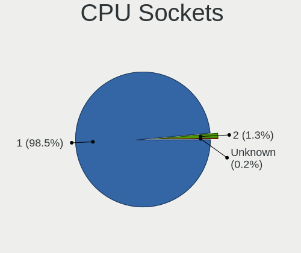

| Number | Desktops | Percent |
|--------|----------|---------|
| 1      | 610      | 99.03%  |
| 2      | 6        | 0.97%   |

CPU Threads
-----------

Threads per core (Hyper-Threading)

| Number | Desktops | Percent |
|--------|----------|---------|
| 2      | 438      | 71.1%   |
| 1      | 177      | 28.73%  |
| 4      | 1        | 0.16%   |

CPU Op-Modes
------------

CPU Operation Modes (32-bit, 64-bit)

| Op mode        | Desktops | Percent |
|----------------|----------|---------|
| 32-bit, 64-bit | 615      | 99.84%  |
| Unknown        | 1        | 0.16%   |

CPU Microcode
-------------

Microcode number

| Number     | Desktops | Percent |
|------------|----------|---------|
| Unknown    | 354      | 57.19%  |
| 0x0a20120a | 30       | 4.85%   |
| 0x0a601203 | 28       | 4.52%   |
| 0x08701021 | 28       | 4.52%   |
| 0x0800820d | 19       | 3.07%   |
| 0x0a201016 | 14       | 2.26%   |
| 0x08108109 | 14       | 2.26%   |
| 0x0a50000d | 13       | 2.1%    |
| 0x08701030 | 12       | 1.94%   |
| 0x0a50000c | 10       | 1.62%   |
| 0x06000822 | 8        | 1.29%   |
| 0x0a201025 | 6        | 0.97%   |
| 0x010000c8 | 6        | 0.97%   |
| 0x08701013 | 5        | 0.81%   |
| 0x08600106 | 5        | 0.81%   |
| 0x08001138 | 5        | 0.81%   |
| 0x010000b6 | 5        | 0.81%   |
| 0x0a404102 | 4        | 0.65%   |
| 0x0a201009 | 4        | 0.65%   |
| 0x0a201205 | 3        | 0.48%   |
| 0x0a201204 | 3        | 0.48%   |
| 0x0800820c | 3        | 0.48%   |
| 0x08001137 | 3        | 0.48%   |
| 0x0600611a | 3        | 0.48%   |
| 0x0a601201 | 2        | 0.32%   |
| 0x08101016 | 2        | 0.32%   |
| 0x06001119 | 2        | 0.32%   |
| 0x06000852 | 2        | 0.32%   |
| 0x0600081c | 2        | 0.32%   |
| 0x06000629 | 2        | 0.32%   |
| 0x010000bf | 2        | 0.32%   |
| 0x00000000 | 2        | 0.32%   |
| 0x906ea    | 1        | 0.16%   |
| 0x706a1    | 1        | 0.16%   |
| 0x0a201005 | 1        | 0.16%   |
| 0x0a008204 | 1        | 0.16%   |
| 0x0a008203 | 1        | 0.16%   |
| 0x08600104 | 1        | 0.16%   |
| 0x08108102 | 1        | 0.16%   |
| 0x08001129 | 1        | 0.16%   |

CPU Microarch
-------------

Microarchitecture

| Name             | Desktops | Percent |
|------------------|----------|---------|
| Zen 3            | 90       | 14.61%  |
| KabyLake         | 78       | 12.66%  |
| Zen 2            | 52       | 8.44%   |
| Haswell          | 48       | 7.79%   |
| Zen+             | 39       | 6.33%   |
| Unknown          | 39       | 6.33%   |
| IvyBridge        | 38       | 6.17%   |
| Alderlake Hybrid | 35       | 5.68%   |
| Skylake          | 34       | 5.52%   |
| CometLake        | 24       | 3.9%    |
| SandyBridge      | 19       | 3.08%   |
| Piledriver       | 16       | 2.6%    |
| Zen              | 13       | 2.11%   |
| K10              | 13       | 2.11%   |
| Westmere         | 12       | 1.95%   |
| Penryn           | 11       | 1.79%   |
| Icelake          | 11       | 1.79%   |
| Broadwell        | 6        | 0.97%   |
| Core             | 5        | 0.81%   |
| Tremont          | 4        | 0.65%   |
| Bulldozer        | 4        | 0.65%   |
| Bonnell          | 4        | 0.65%   |
| Silvermont       | 3        | 0.49%   |
| K8 Hammer        | 3        | 0.49%   |
| Excavator        | 3        | 0.49%   |
| Nehalem          | 2        | 0.32%   |
| K10 Llano        | 2        | 0.32%   |
| Jaguar           | 2        | 0.32%   |
| Gracemont        | 2        | 0.32%   |
| Goldmont plus    | 2        | 0.32%   |
| TigerLake        | 1        | 0.16%   |
| Steamroller      | 1        | 0.16%   |

Graphics
--------

GPU Vendor
----------

Vendors of graphics cards

| Vendor                           | Desktops | Percent |
|----------------------------------|----------|---------|
| AMD                              | 266      | 39.58%  |
| Nvidia                           | 244      | 36.31%  |
| Intel                            | 157      | 23.36%  |
| Matrox Electronics Systems       | 2        | 0.3%    |
| VIA Technologies                 | 1        | 0.15%   |
| Silicon Integrated Systems [SiS] | 1        | 0.15%   |
| ASPEED Technology                | 1        | 0.15%   |

GPU Model
---------

Graphics card models

| Model                                                                       | Desktops | Percent |
|-----------------------------------------------------------------------------|----------|---------|
| AMD Ellesmere [Radeon RX 470/480/570/570X/580/580X/590]                     | 40       | 5.68%   |
| AMD Navi 23 [Radeon RX 6600/6600 XT/6600M]                                  | 28       | 3.98%   |
| AMD Raphael                                                                 | 24       | 3.41%   |
| Intel Xeon E3-1200 v3/4th Gen Core Processor Integrated Graphics Controller | 22       | 3.13%   |
| AMD Cezanne [Radeon Vega Series / Radeon Vega Mobile Series]                | 21       | 2.98%   |
| Nvidia GP107 [GeForce GTX 1050 Ti]                                          | 19       | 2.7%    |
| Intel HD Graphics 530                                                       | 19       | 2.7%    |
| Intel CoffeeLake-S GT2 [UHD Graphics 630]                                   | 19       | 2.7%    |
| AMD Navi 22 [Radeon RX 6700/6700 XT/6750 XT / 6800M/6850M XT]               | 18       | 2.56%   |
| AMD Navi 21 [Radeon RX 6800/6800 XT / 6900 XT]                              | 16       | 2.27%   |
| AMD Navi 10 [Radeon RX 5600 OEM/5600 XT / 5700/5700 XT]                     | 15       | 2.13%   |
| AMD Picasso/Raven 2 [Radeon Vega Series / Radeon Vega Mobile Series]        | 14       | 1.99%   |
| AMD Navi 31 [Radeon RX 7900 XT/7900 XTX]                                    | 14       | 1.99%   |
| Nvidia GA106 [GeForce RTX 3060 Lite Hash Rate]                              | 12       | 1.7%    |
| Intel Xeon E3-1200 v2/3rd Gen Core processor Graphics Controller            | 11       | 1.56%   |
| Nvidia GP104 [GeForce GTX 1070]                                             | 10       | 1.42%   |
| Nvidia GA104 [GeForce RTX 3060 Ti Lite Hash Rate]                           | 10       | 1.42%   |
| Nvidia GT218 [GeForce 210]                                                  | 9        | 1.28%   |
| Nvidia GP108 [GeForce GT 1030]                                              | 9        | 1.28%   |
| Intel HD Graphics 630                                                       | 8        | 1.14%   |
| Nvidia GP104 [GeForce GTX 1080]                                             | 7        | 0.99%   |
| Nvidia GK208B [GeForce GT 730]                                              | 7        | 0.99%   |
| Nvidia GK208B [GeForce GT 710]                                              | 7        | 0.99%   |
| Intel CometLake-S GT2 [UHD Graphics 630]                                    | 7        | 0.99%   |
| Intel Alder Lake-S GT1 [UHD Graphics 730]                                   | 7        | 0.99%   |
| Nvidia TU117 [GeForce GTX 1650]                                             | 6        | 0.85%   |
| Nvidia GP106 [GeForce GTX 1060 6GB]                                         | 6        | 0.85%   |
| Intel AlderLake-S GT1                                                       | 6        | 0.85%   |
| Intel 2nd Generation Core Processor Family Integrated Graphics Controller   | 6        | 0.85%   |
| AMD Lexa PRO [Radeon 540/540X/550/550X / RX 540X/550/550X]                  | 6        | 0.85%   |
| AMD Baffin [Radeon RX 550 640SP / RX 560/560X]                              | 6        | 0.85%   |
| Nvidia TU116 [GeForce GTX 1660 SUPER]                                       | 5        | 0.71%   |
| Nvidia TU116 [GeForce GTX 1650 SUPER]                                       | 5        | 0.71%   |
| Nvidia GP106 [GeForce GTX 1060 3GB]                                         | 5        | 0.71%   |
| Nvidia GM206 [GeForce GTX 960]                                              | 5        | 0.71%   |
| Intel JasperLake [UHD Graphics]                                             | 5        | 0.71%   |
| Intel 4th Generation Core Processor Family Integrated Graphics Controller   | 5        | 0.71%   |
| AMD Cedar [Radeon HD 5000/6000/7350/8350 Series]                            | 5        | 0.71%   |
| AMD Caicos [Radeon HD 6450/7450/8450 / R5 230 OEM]                          | 5        | 0.71%   |
| Nvidia TU106 [GeForce RTX 2060 Rev. A]                                      | 4        | 0.57%   |

GPU Combo
---------

Combinations of graphics cards

| Name            | Desktops | Percent |
|-----------------|----------|---------|
| 1 x AMD         | 221      | 35.65%  |
| 1 x Nvidia      | 207      | 33.39%  |
| 1 x Intel       | 115      | 18.55%  |
| 2 x AMD         | 24       | 3.87%   |
| Intel + Nvidia  | 18       | 2.9%    |
| AMD + Nvidia    | 12       | 1.94%   |
| Intel + AMD     | 10       | 1.61%   |
| 2 x Nvidia      | 6        | 0.97%   |
| 2 x Intel       | 2        | 0.32%   |
| 1 x VIA         | 1        | 0.16%   |
| 1 x SiS         | 1        | 0.16%   |
| Nvidia + Matrox | 1        | 0.16%   |
| 1 x Matrox      | 1        | 0.16%   |
| 1 x ASPEED      | 1        | 0.16%   |

GPU Driver
----------

Free vs proprietary

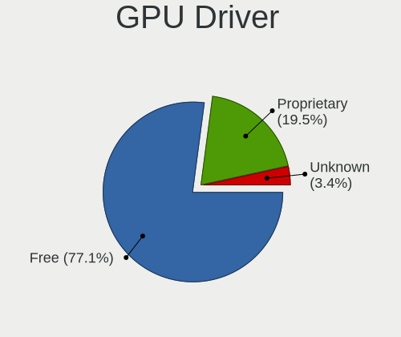

| Driver      | Desktops | Percent |
|-------------|----------|---------|
| Free        | 480      | 77.17%  |
| Proprietary | 121      | 19.45%  |
| Unknown     | 21       | 3.38%   |

GPU Memory
----------

Total video memory

| Size in GB | Desktops | Percent |
|------------|----------|---------|
| Unknown    | 205      | 32.75%  |
| 7.01-8.0   | 120      | 19.17%  |
| 3.01-4.0   | 65       | 10.38%  |
| 1.01-2.0   | 61       | 9.74%   |
| 8.01-16.0  | 53       | 8.47%   |
| 0.01-0.5   | 42       | 6.71%   |
| 0.51-1.0   | 41       | 6.55%   |
| 5.01-6.0   | 15       | 2.4%    |
| 16.01-24.0 | 14       | 2.24%   |
| 2.01-3.0   | 9        | 1.44%   |
| 4.01-5.0   | 1        | 0.16%   |

Monitor
-------

Monitor Vendor
--------------

Monitor vendors

| Vendor               | Desktops | Percent |
|----------------------|----------|---------|
| Samsung Electronics  | 117      | 16.39%  |
| Goldstar             | 110      | 15.41%  |
| Dell                 | 99       | 13.87%  |
| Hewlett-Packard      | 45       | 6.3%    |
| Acer                 | 42       | 5.88%   |
| Philips              | 31       | 4.34%   |
| AOC                  | 29       | 4.06%   |
| BenQ                 | 26       | 3.64%   |
| Ancor Communications | 23       | 3.22%   |
| ASUSTek Computer     | 20       | 2.8%    |
| Lenovo               | 18       | 2.52%   |
| ViewSonic            | 12       | 1.68%   |
| Sceptre Tech         | 10       | 1.4%    |
| MSI                  | 9        | 1.26%   |
| Iiyama               | 9        | 1.26%   |
| Gigabyte Technology  | 9        | 1.26%   |
| Unknown              | 8        | 1.12%   |
| Sony                 | 7        | 0.98%   |
| Mi                   | 7        | 0.98%   |
| Fujitsu Siemens      | 4        | 0.56%   |
| Eizo                 | 4        | 0.56%   |
| Toshiba              | 3        | 0.42%   |
| Belinea              | 3        | 0.42%   |
| ___                  | 2        | 0.28%   |
| Vestel Elektronik    | 2        | 0.28%   |
| Unknown (XXX)        | 2        | 0.28%   |
| TCT                  | 2        | 0.28%   |
| STD                  | 2        | 0.28%   |
| SGT                  | 2        | 0.28%   |
| LG Electronics       | 2        | 0.28%   |
| HUAWEI               | 2        | 0.28%   |
| Hitachi              | 2        | 0.28%   |
| GDH                  | 2        | 0.28%   |
| Denver               | 2        | 0.28%   |
| Yamaha               | 1        | 0.14%   |
| Wacom                | 1        | 0.14%   |
| Vizio                | 1        | 0.14%   |
| Valve                | 1        | 0.14%   |
| UGD                  | 1        | 0.14%   |
| SANYO                | 1        | 0.14%   |

Monitor Model
-------------

Monitor models

| Model                                                                  | Desktops | Percent |
|------------------------------------------------------------------------|----------|---------|
| Goldstar FULL HD GSM5B55 1920x1080 480x270mm 21.7-inch                 | 7        | 0.92%   |
| Goldstar 27GL850 GSM5B7F 2560x1440 597x336mm 27.0-inch                 | 7        | 0.92%   |
| Unknown LCD Monitor FFFF 2288x1287 2550x2550mm 142.0-inch              | 5        | 0.66%   |
| Goldstar ULTRAWIDE GSM59F1 2560x1080 673x284mm 28.8-inch               | 5        | 0.66%   |
| Goldstar HDR 4K GSM7707 3840x2160 600x340mm 27.2-inch                  | 5        | 0.66%   |
| Dell S3220DGF DELD0F4 2560x1440 697x392mm 31.5-inch                    | 5        | 0.66%   |
| Samsung Electronics LC32G7xT SAM7058 2560x1440 698x393mm 31.5-inch     | 4        | 0.53%   |
| Goldstar ULTRAGEAR GSM5BD3 2560x1440 697x392mm 31.5-inch               | 4        | 0.53%   |
| Goldstar Ultra HD GSM5B09 3840x2160 600x340mm 27.2-inch                | 4        | 0.53%   |
| Goldstar HDR 4K GSM7706 3840x2160 600x340mm 27.2-inch                  | 4        | 0.53%   |
| AOC 27G2WG3 AOC2702 1920x1080 598x336mm 27.0-inch                      | 4        | 0.53%   |
| Samsung Electronics LC27G5xT SAM7079 2560x1440 597x336mm 27.0-inch     | 3        | 0.4%    |
| Samsung Electronics C27F390 SAM0D32 1920x1080 598x336mm 27.0-inch      | 3        | 0.4%    |
| Goldstar IPS FULLHD GSM5AB8 1920x1080 480x270mm 21.7-inch              | 3        | 0.4%    |
| Goldstar FULL HD GSM5BDE 1920x1080 480x270mm 21.7-inch                 | 3        | 0.4%    |
| Goldstar 2D HD LG TV GSM59CA 1366x768 510x290mm 23.1-inch              | 3        | 0.4%    |
| Gigabyte Technology M27Q GBT270D 2560x1440 596x335mm 26.9-inch         | 3        | 0.4%    |
| Dell U2412M DELA07B 1920x1200 518x324mm 24.1-inch                      | 3        | 0.4%    |
| Dell S2716DG DELA0D1 2560x1440 598x336mm 27.0-inch                     | 3        | 0.4%    |
| Dell S2522HG DELA1C2 1920x1080 544x303mm 24.5-inch                     | 3        | 0.4%    |
| AOC G2460 AOC0001 1920x1080 531x299mm 24.0-inch                        | 3        | 0.4%    |
| Ancor Communications VX279 ACI27E4 1920x1080 598x336mm 27.0-inch       | 3        | 0.4%    |
| ___ LCDTV16 ___9000 1360x768                                           | 2        | 0.26%   |
| Vestel Elektronik 40W_LCD_TV VES3700 1920x540                          | 2        | 0.26%   |
| Unknown LCDTV16 9000 1360x768 1600x900mm 72.3-inch                     | 2        | 0.26%   |
| TCT DP1080P60 TCT0270 2560x1600 480x270mm 21.7-inch                    | 2        | 0.26%   |
| STD LCD STD2022 1440x900 420x240mm 19.0-inch                           | 2        | 0.26%   |
| Sceptre Tech U65 SPT19A1 3840x2160 575x323mm 26.0-inch                 | 2        | 0.26%   |
| Samsung Electronics U32J59x SAM0F35 3840x2160 697x392mm 31.5-inch      | 2        | 0.26%   |
| Samsung Electronics T22B300 SAM092D 1920x1080 477x268mm 21.5-inch      | 2        | 0.26%   |
| Samsung Electronics SE790C SAM0BFD 3440x1440 797x333mm 34.0-inch       | 2        | 0.26%   |
| Samsung Electronics S27R35A SAM7126 1920x1080 598x336mm 27.0-inch      | 2        | 0.26%   |
| Samsung Electronics S24F350 SAM0D20 1920x1080 521x293mm 23.5-inch      | 2        | 0.26%   |
| Samsung Electronics S24D332 SAM0F5E 1920x1080 531x299mm 24.0-inch      | 2        | 0.26%   |
| Samsung Electronics S24D300 SAM0B43 1920x1080 531x299mm 24.0-inch      | 2        | 0.26%   |
| Samsung Electronics S22F350 SAM0D1A 1920x1080 477x268mm 21.5-inch      | 2        | 0.26%   |
| Samsung Electronics LCD Monitor SAM0A7A 1920x1080 1060x626mm 48.5-inch | 2        | 0.26%   |
| Samsung Electronics C49RG9x SAM0F9C 3840x1080 1193x336mm 48.8-inch     | 2        | 0.26%   |
| Philips PHL 288P6L PHL08F2 3840x2160 621x341mm 27.9-inch               | 2        | 0.26%   |
| Philips PHL 276E8V PHLC18F 3840x2160 600x340mm 27.2-inch               | 2        | 0.26%   |

Monitor Resolution
------------------

Monitor screen resolution

| Resolution         | Desktops | Percent |
|--------------------|----------|---------|
| 1920x1080 (FHD)    | 282      | 40.99%  |
| 2560x1440 (QHD)    | 103      | 14.97%  |
| 3840x2160 (4K)     | 96       | 13.95%  |
| 3440x1440          | 33       | 4.8%    |
| 1680x1050 (WSXGA+) | 27       | 3.92%   |
| 1280x1024 (SXGA)   | 21       | 3.05%   |
| 1600x900 (HD+)     | 19       | 2.76%   |
| 1366x768 (WXGA)    | 18       | 2.62%   |
| 1920x1200 (WUXGA)  | 17       | 2.47%   |
| 1440x900 (WXGA+)   | 15       | 2.18%   |
| 2560x1080          | 14       | 2.03%   |
| 1360x768           | 11       | 1.6%    |
| 3840x1080          | 6        | 0.87%   |
| 2288x1287          | 5        | 0.73%   |
| Unknown            | 4        | 0.58%   |
| 1920x540           | 3        | 0.44%   |
| 1600x1200          | 3        | 0.44%   |
| 2048x1152          | 2        | 0.29%   |
| 1024x768 (XGA)     | 2        | 0.29%   |
| 3840x2560          | 1        | 0.15%   |
| 3840x1600          | 1        | 0.15%   |
| 3280x1050          | 1        | 0.15%   |
| 2200x1650          | 1        | 0.15%   |
| 14320x2640         | 1        | 0.15%   |
| 1280x960           | 1        | 0.15%   |
| 1280x720 (HD)      | 1        | 0.15%   |

Monitor Diagonal
----------------

Diagonal size in inches

| Inches  | Desktops | Percent |
|---------|----------|---------|
| 27      | 159      | 22.05%  |
| 24      | 105      | 14.56%  |
| 21      | 75       | 10.4%   |
| 23      | 69       | 9.57%   |
| 31      | 56       | 7.77%   |
| 34      | 42       | 5.83%   |
| 20      | 26       | 3.61%   |
| 19      | 26       | 3.61%   |
| 22      | 21       | 2.91%   |
| Unknown | 18       | 2.5%    |
| 18      | 16       | 2.22%   |
| 32      | 10       | 1.39%   |
| 84      | 9        | 1.25%   |
| 72      | 9        | 1.25%   |
| 26      | 8        | 1.11%   |
| 17      | 7        | 0.97%   |
| 15      | 7        | 0.97%   |
| 48      | 6        | 0.83%   |
| 40      | 6        | 0.83%   |
| 35      | 6        | 0.83%   |
| 28      | 6        | 0.83%   |
| 142     | 5        | 0.69%   |
| 54      | 5        | 0.69%   |
| 25      | 4        | 0.55%   |
| 52      | 3        | 0.42%   |
| 65      | 2        | 0.28%   |
| 49      | 2        | 0.28%   |
| 42      | 2        | 0.28%   |
| 13      | 2        | 0.28%   |
| 63      | 1        | 0.14%   |
| 57      | 1        | 0.14%   |
| 43      | 1        | 0.14%   |
| 39      | 1        | 0.14%   |
| 38      | 1        | 0.14%   |
| 37      | 1        | 0.14%   |
| 36      | 1        | 0.14%   |
| 29      | 1        | 0.14%   |
| 14      | 1        | 0.14%   |

Monitor Width
-------------

Physical width

| Width in mm    | Desktops | Percent |
|----------------|----------|---------|
| 501-600        | 296      | 42.96%  |
| 401-500        | 145      | 21.04%  |
| 601-700        | 86       | 12.48%  |
| 701-800        | 53       | 7.69%   |
| 1001-1500      | 19       | 2.76%   |
| 1501-2000      | 18       | 2.61%   |
| Unknown        | 18       | 2.61%   |
| 801-900        | 16       | 2.32%   |
| 351-400        | 15       | 2.18%   |
| 301-350        | 13       | 1.89%   |
| More than 2000 | 5        | 0.73%   |
| 901-1000       | 3        | 0.44%   |
| 201-300        | 2        | 0.29%   |

Aspect Ratio
------------

Proportional relationship between the width and the height

| Ratio   | Desktops | Percent |
|---------|----------|---------|
| 16/9    | 468      | 73.7%   |
| 16/10   | 69       | 10.87%  |
| 21/9    | 48       | 7.56%   |
| 5/4     | 19       | 2.99%   |
| Unknown | 7        | 1.1%    |
| 4/3     | 6        | 0.94%   |
| 32/9    | 6        | 0.94%   |
| 1.00    | 6        | 0.94%   |
| 6/5     | 3        | 0.47%   |
| 3/2     | 1        | 0.16%   |
| 2.12    | 1        | 0.16%   |
| 0.56    | 1        | 0.16%   |

Monitor Area
------------

Area in inch

| Area in inch | Desktops | Percent |
|----------------|----------|---------|
| 201-250        | 197      | 27.94%  |
| 301-350        | 161      | 22.84%  |
| 351-500        | 119      | 16.88%  |
| 151-200        | 82       | 11.63%  |
| 251-300        | 43       | 6.1%    |
| More than 1000 | 38       | 5.39%   |
| 141-150        | 19       | 2.7%    |
| 501-1000       | 18       | 2.55%   |
| Unknown        | 18       | 2.55%   |
| 101-110        | 8        | 1.13%   |
| 81-90          | 1        | 0.14%   |
| 71-80          | 1        | 0.14%   |

Pixel Density
-------------

Pixels per inch

| Density       | Desktops | Percent |
|---------------|----------|---------|
| 51-100        | 372      | 55.94%  |
| 101-120       | 171      | 25.71%  |
| 121-160       | 42       | 6.32%   |
| 1-50          | 36       | 5.41%   |
| 161-240       | 24       | 3.61%   |
| Unknown       | 18       | 2.71%   |
| More than 240 | 2        | 0.3%    |

Multiple Monitors
-----------------

Total monitors connected

| Total | Desktops | Percent |
|-------|----------|---------|
| 1     | 440      | 70.29%  |
| 2     | 144      | 23%     |
| 0     | 25       | 3.99%   |
| 3     | 14       | 2.24%   |
| 4     | 3        | 0.48%   |

Network
-------

Net Controller Vendor
---------------------

Controller vendors

| Vendor                                 | Desktops | Percent |
|----------------------------------------|----------|---------|
| Realtek Semiconductor                  | 377      | 40.89%  |
| Intel                                  | 306      | 33.19%  |
| Qualcomm Atheros                       | 47       | 5.1%    |
| MediaTek                               | 35       | 3.8%    |
| Broadcom                               | 28       | 3.04%   |
| TP-Link                                | 21       | 2.28%   |
| Ralink                                 | 12       | 1.3%    |
| Aquantia                               | 12       | 1.3%    |
| Ralink Technology                      | 11       | 1.19%   |
| Microsoft                              | 11       | 1.19%   |
| NetGear                                | 6        | 0.65%   |
| Qualcomm Atheros Communications        | 5        | 0.54%   |
| Samsung Electronics                    | 4        | 0.43%   |
| Mellanox Technologies                  | 4        | 0.43%   |
| Marvell Technology Group               | 3        | 0.33%   |
| Google                                 | 3        | 0.33%   |
| ASUSTek Computer                       | 3        | 0.33%   |
| ASIX Electronics                       | 3        | 0.33%   |
| Xiaomi                                 | 2        | 0.22%   |
| Wilocity                               | 2        | 0.22%   |
| STMicroelectronics                     | 2        | 0.22%   |
| ICS Advent                             | 2        | 0.22%   |
| D-Link                                 | 2        | 0.22%   |
| ZyDAS                                  | 1        | 0.11%   |
| VIA Technologies                       | 1        | 0.11%   |
| Sony Ericsson Mobile Communications AB | 1        | 0.11%   |
| Qualcomm                               | 1        | 0.11%   |
| OPPO Electronics                       | 1        | 0.11%   |
| Nvidia                                 | 1        | 0.11%   |
| Motorola PCS                           | 1        | 0.11%   |
| Microchip Technology                   | 1        | 0.11%   |
| Mercucys                               | 1        | 0.11%   |
| MCS                                    | 1        | 0.11%   |
| Hyperkin                               | 1        | 0.11%   |
| Huawei Technologies                    | 1        | 0.11%   |
| HMD Global                             | 1        | 0.11%   |
| Fitbit                                 | 1        | 0.11%   |
| DisplayLink                            | 1        | 0.11%   |
| Broadcom Limited                       | 1        | 0.11%   |
| Belkin Components                      | 1        | 0.11%   |

Net Controller Model
--------------------

Controller models

| Model                                                               | Desktops | Percent |
|---------------------------------------------------------------------|----------|---------|
| Realtek RTL8111/8168/8411 PCI Express Gigabit Ethernet Controller   | 290      | 27.13%  |
| Intel Wi-Fi 6 AX200                                                 | 64       | 5.99%   |
| Realtek RTL8125 2.5GbE Controller                                   | 57       | 5.33%   |
| Intel Ethernet Controller I225-V                                    | 51       | 4.77%   |
| Intel I211 Gigabit Network Connection                               | 41       | 3.84%   |
| Intel Wi-Fi 6 AX210/AX211/AX411 160MHz                              | 21       | 1.96%   |
| Intel 82579LM Gigabit Network Connection (Lewisville)               | 20       | 1.87%   |
| Intel Dual Band Wireless-AC 3168NGW [Stone Peak]                    | 18       | 1.68%   |
| MediaTek MT7922 802.11ax PCI Express Wireless Network Adapter       | 17       | 1.59%   |
| Intel Ethernet Connection (2) I219-V                                | 16       | 1.5%    |
| Intel Alder Lake-S PCH CNVi WiFi                                    | 15       | 1.4%    |
| MediaTek MT7921K (RZ608) Wi-Fi 6E 80MHz                             | 12       | 1.12%   |
| Intel Ethernet Connection (7) I219-V                                | 12       | 1.12%   |
| Intel Ethernet Connection I217-LM                                   | 11       | 1.03%   |
| Intel Ethernet Connection (2) I219-LM                               | 10       | 0.94%   |
| Realtek RTL8153 Gigabit Ethernet Adapter                            | 9        | 0.84%   |
| Intel Ethernet Connection (2) I218-V                                | 9        | 0.84%   |
| Realtek 802.11ac NIC                                                | 8        | 0.75%   |
| Intel Wireless-AC 9260                                              | 8        | 0.75%   |
| Broadcom BCM4360 802.11ac Wireless Network Adapter                  | 8        | 0.75%   |
| Intel Ethernet Connection (14) I219-V                               | 7        | 0.65%   |
| Qualcomm Atheros AR93xx Wireless Network Adapter                    | 6        | 0.56%   |
| Microsoft Xbox Wireless Adapter for Windows                         | 6        | 0.56%   |
| Intel Cannon Lake PCH CNVi WiFi                                     | 6        | 0.56%   |
| Aquantia AQC113CS NBase-T/IEEE 802.3bz Ethernet Controller [AQtion] | 6        | 0.56%   |
| Ralink MT7601U Wireless Adapter                                     | 5        | 0.47%   |
| Ralink RT2800 802.11n PCI                                           | 5        | 0.47%   |
| Qualcomm Atheros QCA9565 / AR9565 Wireless Network Adapter          | 5        | 0.47%   |
| MediaTek MT7921 802.11ax PCI Express Wireless Network Adapter       | 5        | 0.47%   |
| Intel Wireless 7265                                                 | 5        | 0.47%   |
| Intel Wireless 3165                                                 | 5        | 0.47%   |
| Intel Ethernet Connection I217-V                                    | 5        | 0.47%   |
| Intel Ethernet Connection (7) I219-LM                               | 5        | 0.47%   |
| Intel 82579V Gigabit Network Connection                             | 5        | 0.47%   |
| Intel 82574L Gigabit Network Connection                             | 5        | 0.47%   |
| Broadcom NetXtreme BCM5761 Gigabit Ethernet PCIe                    | 5        | 0.47%   |
| Aquantia AQC107 NBase-T/IEEE 802.3bz Ethernet Controller [AQtion]   | 5        | 0.47%   |
| TP-Link Archer T4U ver.3                                            | 4        | 0.37%   |
| Realtek RTL8821CE 802.11ac PCIe Wireless Network Adapter            | 4        | 0.37%   |
| Realtek RTL8188FTV 802.11b/g/n 1T1R 2.4G WLAN Adapter               | 4        | 0.37%   |

Wireless Vendor
---------------

Wireless vendors

| Vendor                          | Desktops | Percent |
|---------------------------------|----------|---------|
| Intel                           | 163      | 44.9%   |
| Realtek Semiconductor           | 49       | 13.5%   |
| MediaTek                        | 35       | 9.64%   |
| Qualcomm Atheros                | 28       | 7.71%   |
| TP-Link                         | 21       | 5.79%   |
| Ralink                          | 12       | 3.31%   |
| Broadcom                        | 12       | 3.31%   |
| Ralink Technology               | 11       | 3.03%   |
| Microsoft                       | 11       | 3.03%   |
| NetGear                         | 6        | 1.65%   |
| Qualcomm Atheros Communications | 5        | 1.38%   |
| ASUSTek Computer                | 3        | 0.83%   |
| Wilocity                        | 2        | 0.55%   |
| ZyDAS                           | 1        | 0.28%   |
| Mercucys                        | 1        | 0.28%   |
| Broadcom Limited                | 1        | 0.28%   |
| Belkin Components               | 1        | 0.28%   |
| AVM                             | 1        | 0.28%   |

Wireless Model
--------------

Wireless models

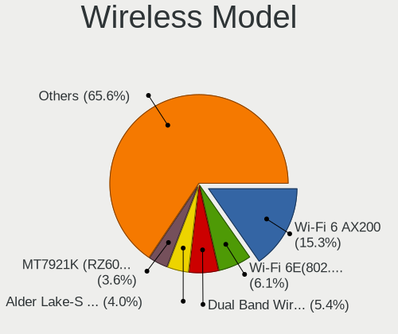

| Model                                                          | Desktops | Percent |
|----------------------------------------------------------------|----------|---------|
| Intel Wi-Fi 6 AX200                                            | 64       | 17.53%  |
| Intel Wi-Fi 6 AX210/AX211/AX411 160MHz                         | 21       | 5.75%   |
| Intel Dual Band Wireless-AC 3168NGW [Stone Peak]               | 18       | 4.93%   |
| MediaTek MT7922 802.11ax PCI Express Wireless Network Adapter  | 17       | 4.66%   |
| Intel Alder Lake-S PCH CNVi WiFi                               | 15       | 4.11%   |
| MediaTek MT7921K (RZ608) Wi-Fi 6E 80MHz                        | 12       | 3.29%   |
| Realtek 802.11ac NIC                                           | 8        | 2.19%   |
| Intel Wireless-AC 9260                                         | 8        | 2.19%   |
| Broadcom BCM4360 802.11ac Wireless Network Adapter             | 8        | 2.19%   |
| Qualcomm Atheros AR93xx Wireless Network Adapter               | 6        | 1.64%   |
| Microsoft Xbox Wireless Adapter for Windows                    | 6        | 1.64%   |
| Intel Cannon Lake PCH CNVi WiFi                                | 6        | 1.64%   |
| Ralink MT7601U Wireless Adapter                                | 5        | 1.37%   |
| Ralink RT2800 802.11n PCI                                      | 5        | 1.37%   |
| Qualcomm Atheros QCA9565 / AR9565 Wireless Network Adapter     | 5        | 1.37%   |
| MediaTek MT7921 802.11ax PCI Express Wireless Network Adapter  | 5        | 1.37%   |
| Intel Wireless 7265                                            | 5        | 1.37%   |
| Intel Wireless 3165                                            | 5        | 1.37%   |
| TP-Link Archer T4U ver.3                                       | 4        | 1.1%    |
| Realtek RTL8821CE 802.11ac PCIe Wireless Network Adapter       | 4        | 1.1%    |
| Realtek RTL8188FTV 802.11b/g/n 1T1R 2.4G WLAN Adapter          | 4        | 1.1%    |
| Ralink RT2790 Wireless 802.11n 1T/2R PCIe                      | 4        | 1.1%    |
| Qualcomm Atheros QCA6174 802.11ac Wireless Network Adapter     | 4        | 1.1%    |
| Microsoft Wireless XBox Controller Dongle                      | 4        | 1.1%    |
| TP-Link TL-WN823N v2/v3 [Realtek RTL8192EU]                    | 3        | 0.82%   |
| TP-Link Archer T2U PLUS [RTL8821AU]                            | 3        | 0.82%   |
| Realtek RTL88x2bu [AC1200 Techkey]                             | 3        | 0.82%   |
| Realtek RTL8822CE 802.11ac PCIe Wireless Network Adapter       | 3        | 0.82%   |
| Realtek RTL8812AE 802.11ac PCIe Wireless Network Adapter       | 3        | 0.82%   |
| Realtek RTL8192EU 802.11b/g/n WLAN Adapter                     | 3        | 0.82%   |
| Realtek RTL8188EUS 802.11n Wireless Network Adapter            | 3        | 0.82%   |
| Ralink RT5372 Wireless Adapter                                 | 3        | 0.82%   |
| Qualcomm Atheros QCA9377 802.11ac Wireless Network Adapter     | 3        | 0.82%   |
| Qualcomm Atheros AR9285 Wireless Network Adapter (PCI-Express) | 3        | 0.82%   |
| Intel Wireless 8265 / 8275                                     | 3        | 0.82%   |
| Intel Centrino Wireless-N 2230                                 | 3        | 0.82%   |
| Wilocity Wil6200 802.11ad Wireless Network Adapter             | 2        | 0.55%   |
| TP-Link Archer T9UH v1 [Realtek RTL8814AU]                     | 2        | 0.55%   |
| TP-Link 802.11ac NIC                                           | 2        | 0.55%   |
| Realtek RTL8852BE PCIe 802.11ax Wireless Network Controller    | 2        | 0.55%   |

Ethernet Vendor
---------------

Ethernet vendors

| Vendor                                 | Desktops | Percent |
|----------------------------------------|----------|---------|
| Realtek Semiconductor                  | 361      | 53.8%   |
| Intel                                  | 228      | 33.98%  |
| Qualcomm Atheros                       | 22       | 3.28%   |
| Broadcom                               | 16       | 2.38%   |
| Aquantia                               | 12       | 1.79%   |
| Samsung Electronics                    | 4        | 0.6%    |
| Mellanox Technologies                  | 3        | 0.45%   |
| Marvell Technology Group               | 3        | 0.45%   |
| Google                                 | 3        | 0.45%   |
| ASIX Electronics                       | 3        | 0.45%   |
| Xiaomi                                 | 2        | 0.3%    |
| ICS Advent                             | 2        | 0.3%    |
| D-Link                                 | 2        | 0.3%    |
| VIA Technologies                       | 1        | 0.15%   |
| Sony Ericsson Mobile Communications AB | 1        | 0.15%   |
| Qualcomm                               | 1        | 0.15%   |
| OPPO Electronics                       | 1        | 0.15%   |
| Nvidia                                 | 1        | 0.15%   |
| Motorola PCS                           | 1        | 0.15%   |
| Huawei Technologies                    | 1        | 0.15%   |
| HMD Global                             | 1        | 0.15%   |
| DisplayLink                            | 1        | 0.15%   |
| 3Com                                   | 1        | 0.15%   |

Ethernet Model
--------------

Ethernet models

| Model                                                               | Desktops | Percent |
|---------------------------------------------------------------------|----------|---------|
| Realtek RTL8111/8168/8411 PCI Express Gigabit Ethernet Controller   | 290      | 41.73%  |
| Realtek RTL8125 2.5GbE Controller                                   | 57       | 8.2%    |
| Intel Ethernet Controller I225-V                                    | 51       | 7.34%   |
| Intel I211 Gigabit Network Connection                               | 41       | 5.9%    |
| Intel 82579LM Gigabit Network Connection (Lewisville)               | 20       | 2.88%   |
| Intel Ethernet Connection (2) I219-V                                | 16       | 2.3%    |
| Intel Ethernet Connection (7) I219-V                                | 12       | 1.73%   |
| Intel Ethernet Connection I217-LM                                   | 11       | 1.58%   |
| Intel Ethernet Connection (2) I219-LM                               | 10       | 1.44%   |
| Realtek RTL8153 Gigabit Ethernet Adapter                            | 9        | 1.29%   |
| Intel Ethernet Connection (2) I218-V                                | 9        | 1.29%   |
| Intel Ethernet Connection (14) I219-V                               | 7        | 1.01%   |
| Aquantia AQC113CS NBase-T/IEEE 802.3bz Ethernet Controller [AQtion] | 6        | 0.86%   |
| Intel Ethernet Connection I217-V                                    | 5        | 0.72%   |
| Intel Ethernet Connection (7) I219-LM                               | 5        | 0.72%   |
| Intel 82579V Gigabit Network Connection                             | 5        | 0.72%   |
| Intel 82574L Gigabit Network Connection                             | 5        | 0.72%   |
| Broadcom NetXtreme BCM5761 Gigabit Ethernet PCIe                    | 5        | 0.72%   |
| Aquantia AQC107 NBase-T/IEEE 802.3bz Ethernet Controller [AQtion]   | 5        | 0.72%   |
| Realtek RTL-8100/8101L/8139 PCI Fast Ethernet Adapter               | 4        | 0.58%   |
| Realtek Killer E3000 2.5GbE Controller                              | 4        | 0.58%   |
| Qualcomm Atheros Killer E2400 Gigabit Ethernet Controller           | 4        | 0.58%   |
| Qualcomm Atheros Killer E220x Gigabit Ethernet Controller           | 4        | 0.58%   |
| Qualcomm Atheros AR8151 v2.0 Gigabit Ethernet                       | 4        | 0.58%   |
| Intel Ethernet Connection (17) I219-V                               | 4        | 0.58%   |
| Intel 82567LM-3 Gigabit Network Connection                          | 4        | 0.58%   |
| Broadcom NetXtreme BCM5764M Gigabit Ethernet PCIe                   | 4        | 0.58%   |
| Samsung Galaxy series, misc. (tethering mode)                       | 3        | 0.43%   |
| Realtek RTL8169 PCI Gigabit Ethernet Controller                     | 3        | 0.43%   |
| Qualcomm Atheros Killer E2500 Gigabit Ethernet Controller           | 3        | 0.43%   |
| Qualcomm Atheros AR8161 Gigabit Ethernet                            | 3        | 0.43%   |
| Intel I210 Gigabit Network Connection                               | 3        | 0.43%   |
| Intel 82575EB Gigabit Network Connection                            | 3        | 0.43%   |
| Intel 82546GB Gigabit Ethernet Controller                           | 3        | 0.43%   |
| ASIX AX88179 Gigabit Ethernet                                       | 3        | 0.43%   |
| Realtek RTL8152 Fast Ethernet Adapter                               | 2        | 0.29%   |
| Qualcomm Atheros AR8121/AR8113/AR8114 Gigabit or Fast Ethernet      | 2        | 0.29%   |
| Marvell Group 88E8001 Gigabit Ethernet Controller                   | 2        | 0.29%   |
| Intel Ethernet Connection (2) I218-LM                               | 2        | 0.29%   |
| Intel Ethernet Connection (11) I219-V                               | 2        | 0.29%   |

Net Controller Kind
-------------------

Ethernet, WiFi or modem

| Kind     | Desktops | Percent |
|----------|----------|---------|
| Ethernet | 611      | 63.51%  |
| WiFi     | 342      | 35.55%  |
| Modem    | 7        | 0.73%   |
| Unknown  | 2        | 0.21%   |

Used Controller
---------------

Currently used network controller

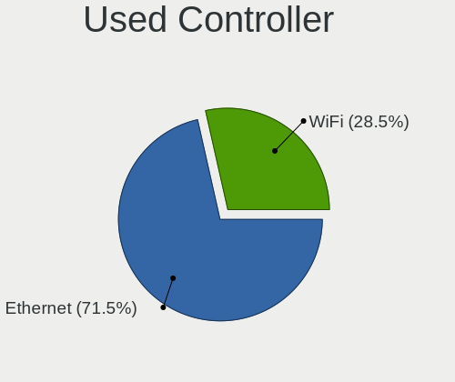

| Kind     | Desktops | Percent |
|----------|----------|---------|
| Ethernet | 465      | 70.99%  |
| WiFi     | 190      | 29.01%  |

NICs
----

Total network controllers on board

| Total | Desktops | Percent |
|-------|----------|---------|
| 1     | 314      | 50.4%   |
| 2     | 262      | 42.05%  |
| 3     | 32       | 5.14%   |
| 4     | 9        | 1.44%   |
| 0     | 4        | 0.64%   |
| 6     | 1        | 0.16%   |
| 5     | 1        | 0.16%   |

IPv6
----

IPv6 vs IPv4

| Used | Desktops | Percent |
|------|----------|---------|
| No   | 442      | 70.49%  |
| Yes  | 185      | 29.51%  |

Bluetooth
---------

Bluetooth Vendor
----------------

Controller vendors

| Vendor                          | Desktops | Percent |
|---------------------------------|----------|---------|
| Intel                           | 156      | 50.65%  |
| Cambridge Silicon Radio         | 45       | 14.61%  |
| Realtek Semiconductor           | 24       | 7.79%   |
| MediaTek                        | 20       | 6.49%   |
| ASUSTek Computer                | 13       | 4.22%   |
| Broadcom                        | 12       | 3.9%    |
| IMC Networks                    | 8        | 2.6%    |
| TP-Link                         | 7        | 2.27%   |
| Qualcomm Atheros Communications | 7        | 2.27%   |
| Foxconn / Hon Hai               | 6        | 1.95%   |
| Lite-On Technology              | 3        | 0.97%   |
| Unknown                         | 2        | 0.65%   |
| Hewlett-Packard                 | 1        | 0.32%   |
| Foxconn International           | 1        | 0.32%   |
| Edimax Technology               | 1        | 0.32%   |
| D-Link                          | 1        | 0.32%   |
| Apple                           | 1        | 0.32%   |

Bluetooth Model
---------------

Controller models

| Model                                                 | Desktops | Percent |
|-------------------------------------------------------|----------|---------|
| Intel AX200 Bluetooth                                 | 61       | 19.81%  |
| Cambridge Silicon Radio Bluetooth Dongle (HCI mode)   | 45       | 14.61%  |
| Intel Bluetooth Device                                | 23       | 7.47%   |
| Realtek Bluetooth Radio                               | 22       | 7.14%   |
| Intel AX210 Bluetooth                                 | 21       | 6.82%   |
| MediaTek Wireless_Device                              | 20       | 6.49%   |
| Intel Bluetooth wireless interface                    | 17       | 5.52%   |
| Intel AX201 Bluetooth                                 | 15       | 4.87%   |
| Intel Wireless-AC 9260 Bluetooth Adapter              | 8        | 2.6%    |
| Intel Bluetooth 9460/9560 Jefferson Peak (JfP)        | 8        | 2.6%    |
| TP-Link UB5A Adapter                                  | 7        | 2.27%   |
| Broadcom BCM20702A0 Bluetooth 4.0                     | 7        | 2.27%   |
| Foxconn / Hon Hai Wireless_Device                     | 6        | 1.95%   |
| IMC Networks Wireless_Device                          | 5        | 1.62%   |
| Qualcomm Atheros  Bluetooth Device                    | 4        | 1.3%    |
| ASUS ASUS USB-BT500                                   | 4        | 1.3%    |
| Intel Centrino Bluetooth Wireless Transceiver         | 3        | 0.97%   |
| ASUS Broadcom BCM20702 Single-Chip Bluetooth 4.0 + LE | 3        | 0.97%   |
| Realtek  Bluetooth 4.2 Adapter                        | 2        | 0.65%   |
| Qualcomm Atheros AR9462 Bluetooth                     | 2        | 0.65%   |
| IMC Networks Bluetooth Device                         | 2        | 0.65%   |
| Broadcom Bluetooth 3.0 USB Dongle                     | 2        | 0.65%   |
| ASUS Bluetooth Radio                                  | 2        | 0.65%   |
| ASUS Bluetooth Device                                 | 2        | 0.65%   |
| Unknown                                               | 2        | 0.65%   |
| Qualcomm Atheros QCA61x4 Bluetooth 4.0                | 1        | 0.32%   |
| Lite-On Bluetooth Radio                               | 1        | 0.32%   |
| Lite-On Bluetooth Device                              | 1        | 0.32%   |
| Lite-On Atheros AR3012 Bluetooth                      | 1        | 0.32%   |
| IMC Networks Bluetooth Radio                          | 1        | 0.32%   |
| HP Bluetooth 2.0 Interface [Broadcom BCM2045]         | 1        | 0.32%   |
| Foxconn International BCM43142A0 Bluetooth module     | 1        | 0.32%   |
| Edimax Bluetooth Adapter                              | 1        | 0.32%   |
| D-Link DBT-122 Bluetooth adapter                      | 1        | 0.32%   |
| Broadcom BCM2070B0                                    | 1        | 0.32%   |
| Broadcom BCM20702A0                                   | 1        | 0.32%   |
| Broadcom BCM2045 Bluetooth                            | 1        | 0.32%   |
| ASUS Bluetooth Adapter                                | 1        | 0.32%   |
| ASUS BCM20702A0                                       | 1        | 0.32%   |
| Apple Bluetooth Host Controller                       | 1        | 0.32%   |

Sound
-----

Sound Vendor
------------

Sound card vendors

| Vendor                                          | Desktops | Percent |
|-------------------------------------------------|----------|---------|
| AMD                                             | 334      | 28.92%  |
| Intel                                           | 324      | 28.05%  |
| Nvidia                                          | 234      | 20.26%  |
| C-Media Electronics                             | 42       | 3.64%   |
| Logitech                                        | 17       | 1.47%   |
| ASUSTek Computer                                | 16       | 1.39%   |
| SteelSeries ApS                                 | 11       | 0.95%   |
| Razer USA                                       | 11       | 0.95%   |
| Generalplus Technology                          | 11       | 0.95%   |
| Micro Star International                        | 10       | 0.87%   |
| Kingston Technology                             | 10       | 0.87%   |
| JMTek                                           | 10       | 0.87%   |
| Creative Labs                                   | 10       | 0.87%   |
| Focusrite-Novation                              | 7        | 0.61%   |
| Corsair                                         | 6        | 0.52%   |
| Texas Instruments                               | 5        | 0.43%   |
| Realtek Semiconductor                           | 5        | 0.43%   |
| Creative Technology                             | 5        | 0.43%   |
| Sony                                            | 4        | 0.35%   |
| RODE Microphones                                | 4        | 0.35%   |
| KTMicro                                         | 4        | 0.35%   |
| Hewlett-Packard                                 | 4        | 0.35%   |
| GN Netcom                                       | 4        | 0.35%   |
| Schiit Audio                                    | 3        | 0.26%   |
| FIFINE Microphones                              | 3        | 0.26%   |
| Dell                                            | 3        | 0.26%   |
| Audio-Technica                                  | 3        | 0.26%   |
| Zoran Co. Personal Media Division (Nogatech)    | 2        | 0.17%   |
| Yamaha                                          | 2        | 0.17%   |
| VIA Technologies                                | 2        | 0.17%   |
| Unknown                                         | 2        | 0.17%   |
| Samson Technologies                             | 2        | 0.17%   |
| Licensed by Sony Computer Entertainment America | 2        | 0.17%   |
| JBL                                             | 2        | 0.17%   |
| BEHRINGER International                         | 2        | 0.17%   |
| XMOS                                            | 1        | 0.09%   |
| Weltrend Semiconductor                          | 1        | 0.09%   |
| Vitana                                          | 1        | 0.09%   |
| Valve Software                                  | 1        | 0.09%   |
| Universal Audio                                 | 1        | 0.09%   |

Sound Model
-----------

Sound card models

| Model                                                                      | Desktops | Percent |
|----------------------------------------------------------------------------|----------|---------|
| AMD Starship/Matisse HD Audio Controller                                   | 109      | 7.82%   |
| AMD Navi 21/23 HDMI/DP Audio Controller                                    | 73       | 5.24%   |
| AMD Family 17h/19h HD Audio Controller                                     | 70       | 5.02%   |
| AMD Ellesmere HDMI Audio [Radeon RX 470/480 / 570/580/590]                 | 43       | 3.08%   |
| Intel 200 Series PCH HD Audio                                              | 39       | 2.8%    |
| Intel 8 Series/C220 Series Chipset High Definition Audio Controller        | 36       | 2.58%   |
| Intel 100 Series/C230 Series Chipset Family HD Audio Controller            | 36       | 2.58%   |
| Intel 7 Series/C216 Chipset Family High Definition Audio Controller        | 35       | 2.51%   |
| AMD Family 17h (Models 00h-0fh) HD Audio Controller                        | 33       | 2.37%   |
| Intel Cannon Lake PCH cAVS                                                 | 31       | 2.22%   |
| Intel Alder Lake-S HD Audio Controller                                     | 30       | 2.15%   |
| AMD Renoir Radeon High Definition Audio Controller                         | 29       | 2.08%   |
| AMD SBx00 Azalia (Intel HDA)                                               | 28       | 2.01%   |
| AMD Rembrandt Radeon High Definition Audio Controller                      | 28       | 2.01%   |
| Nvidia GP107GL High Definition Audio Controller                            | 25       | 1.79%   |
| Intel Xeon E3-1200 v3/4th Gen Core Processor HD Audio Controller           | 25       | 1.79%   |
| Nvidia GA104 High Definition Audio Controller                              | 24       | 1.72%   |
| Nvidia GP104 High Definition Audio Controller                              | 22       | 1.58%   |
| Nvidia GA106 High Definition Audio Controller                              | 18       | 1.29%   |
| AMD Navi 10 HDMI Audio                                                     | 18       | 1.29%   |
| Nvidia TU116 High Definition Audio Controller                              | 17       | 1.22%   |
| AMD Navi 31 HDMI/DP Audio                                                  | 17       | 1.22%   |
| AMD Baffin HDMI/DP Audio [Radeon RX 550 640SP / RX 560/560X]               | 17       | 1.22%   |
| Intel 6 Series/C200 Series Chipset Family High Definition Audio Controller | 16       | 1.15%   |
| AMD Raven/Raven2/Fenghuang HDMI/DP Audio Controller                        | 16       | 1.15%   |
| Nvidia GK208 HDMI/DP Audio Controller                                      | 15       | 1.08%   |
| ASUSTek Computer USB Audio                                                 | 14       | 1%      |
| Nvidia GP106 High Definition Audio Controller                              | 12       | 0.86%   |
| Intel Smart Sound Technology (SST) Audio Controller                        | 12       | 0.86%   |
| Nvidia High Definition Audio Controller                                    | 11       | 0.79%   |
| Generalplus Technology USB Audio Device                                    | 11       | 0.79%   |
| Intel C610/X99 series chipset HD Audio Controller                          | 10       | 0.72%   |
| Nvidia GP108 High Definition Audio Controller                              | 9        | 0.65%   |
| Nvidia GA102 High Definition Audio Controller                              | 9        | 0.65%   |
| Micro Star International USB Audio                                         | 9        | 0.65%   |
| Intel 82801JI (ICH10 Family) HD Audio Controller                           | 9        | 0.65%   |
| AMD FCH Azalia Controller                                                  | 9        | 0.65%   |
| Nvidia GK107 HDMI Audio Controller                                         | 8        | 0.57%   |
| Kingston Technology HyperX 7.1 Audio                                       | 8        | 0.57%   |
| Intel Tiger Lake-H HD Audio Controller                                     | 8        | 0.57%   |

Memory
------

Memory Vendor
-------------

Memory module vendors

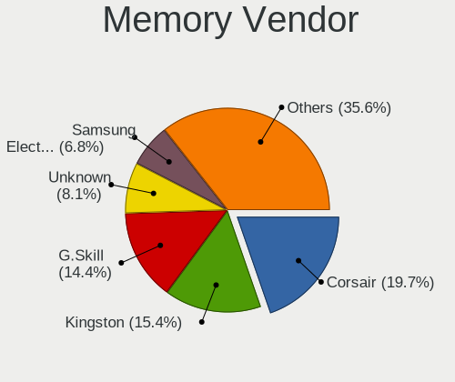

| Vendor                       | Desktops | Percent |
|------------------------------|----------|---------|
| Kingston                     | 44       | 17.25%  |
| Corsair                      | 43       | 16.86%  |
| G.Skill                      | 33       | 12.94%  |
| Unknown                      | 22       | 8.63%   |
| Samsung Electronics          | 19       | 7.45%   |
| Crucial                      | 18       | 7.06%   |
| A-DATA Technology            | 13       | 5.1%    |
| SK hynix                     | 10       | 3.92%   |
| Micron Technology            | 10       | 3.92%   |
| Smart                        | 7        | 2.75%   |
| Team                         | 6        | 2.35%   |
| Unknown                      | 6        | 2.35%   |
| Apacer                       | 3        | 1.18%   |
| PNY                          | 2        | 0.78%   |
| GOODRAM                      | 2        | 0.78%   |
| Unknown (0x5846)             | 1        | 0.39%   |
| Unknown (0x0E9D)             | 1        | 0.39%   |
| Timetec                      | 1        | 0.39%   |
| Silicon Power                | 1        | 0.39%   |
| Sesame                       | 1        | 0.39%   |
| Ramaxel Technology           | 1        | 0.39%   |
| Qumo                         | 1        | 0.39%   |
| Patriot Memory (PDP Systems) | 1        | 0.39%   |
| Nanya Technology             | 1        | 0.39%   |
| Mushkin                      | 1        | 0.39%   |
| Lexar                        | 1        | 0.39%   |
| GIGA-BYTE                    | 1        | 0.39%   |
| EVGA                         | 1        | 0.39%   |
| CSX                          | 1        | 0.39%   |
| Atermiter                    | 1        | 0.39%   |
| AMD                          | 1        | 0.39%   |
| 89450000830B                 | 1        | 0.39%   |

Memory Model
------------

Memory module models

| Model                                                     | Desktops | Percent |
|-----------------------------------------------------------|----------|---------|
| Unknown                                                   | 6        | 2.2%    |
| Corsair RAM CMK16GX4M2B3200C16 8GB DIMM DDR4 3600MT/s     | 5        | 1.83%   |
| Smart RAM SH564128FH8N0TNSDR 4GB DIMM DDR3 1600MT/s       | 4        | 1.47%   |
| Kingston RAM KHX3200C16D4/8GX 8192MB DIMM DDR4 3600MT/s   | 4        | 1.47%   |
| Corsair RAM CMK32GX4M2E3200C16 16GB DIMM DDR4 3534MT/s    | 4        | 1.47%   |
| Kingston RAM KF3200C16D4/8GX 8192MB DIMM DDR4 3600MT/s    | 3        | 1.1%    |
| A-DATA RAM DDR4 3200 8GB DIMM DDR4 3600MT/s               | 3        | 1.1%    |
| Unknown RAM Module 4GB DIMM DDR3 1333MT/s                 | 2        | 0.73%   |
| Smart RAM SH564568FH8N0QHSC 2GB DIMM DDR3 1333MT/s        | 2        | 0.73%   |
| SK hynix RAM HMT112U6TFR8C-H9 1GB DIMM DDR3 1333MT/s      | 2        | 0.73%   |
| Samsung RAM M378B5273DH0-CH9 4GB DIMM DDR3 2133MT/s       | 2        | 0.73%   |
| Samsung RAM M378B5173DB0-CK0 4GB DIMM DDR3 1600MT/s       | 2        | 0.73%   |
| Kingston RAM KHX2400C15/16G 16GB DIMM DDR4 3334MT/s       | 2        | 0.73%   |
| Kingston RAM KF556C36-16 16GB DIMM DDR5 6400MT/s          | 2        | 0.73%   |
| Kingston RAM KF3600C17D4/8GX 8GB DIMM DDR4 3600MT/s       | 2        | 0.73%   |
| Kingston RAM 99U5471-001.A01LF 2GB DIMM DDR3 1333MT/s     | 2        | 0.73%   |
| G.Skill RAM F5-6000J3238G32G 32GB DIMM DDR5 4800MT/s      | 2        | 0.73%   |
| Corsair RAM CMW32GX4M2C3200C16 16GB DIMM DDR4 3200MT/s    | 2        | 0.73%   |
| Corsair RAM CMK8GX4M1A2400C16 8GB DIMM DDR4 2800MT/s      | 2        | 0.73%   |
| Corsair RAM CMK32GX4M2B3200C16 16GB DIMM DDR4 3400MT/s    | 2        | 0.73%   |
| A-DATA RAM DDR4 3600 8GB DIMM DDR4 3800MT/s               | 2        | 0.73%   |
| Unknown RAM Module 8GB DIMM DDR3 1333MT/s                 | 1        | 0.37%   |
| Unknown RAM Module 8GB DIMM 667MT/s                       | 1        | 0.37%   |
| Unknown RAM Module 8GB DIMM 1600MT/s                      | 1        | 0.37%   |
| Unknown RAM Module 8GB DIMM                               | 1        | 0.37%   |
| Unknown RAM Module 4GB DIMM 400MT/s                       | 1        | 0.37%   |
| Unknown RAM Module 4GB DIMM 1333MT/s                      | 1        | 0.37%   |
| Unknown RAM Module 2GB SODIMM DDR2 800MT/s                | 1        | 0.37%   |
| Unknown RAM Module 2GB DIMM SDRAM                         | 1        | 0.37%   |
| Unknown RAM Module 2GB DIMM DDR3 1067MT/s                 | 1        | 0.37%   |
| Unknown RAM Module 2GB DIMM DDR2 667MT/s                  | 1        | 0.37%   |
| Unknown RAM Module 2GB DIMM DDR2 1067MT/s                 | 1        | 0.37%   |
| Unknown RAM Module 2GB DIMM 800MT/s                       | 1        | 0.37%   |
| Unknown RAM Module 2GB DIMM 667MT/s                       | 1        | 0.37%   |
| Unknown RAM Module 2GB DIMM 533MT/s                       | 1        | 0.37%   |
| Unknown RAM Module 2GB DIMM 400MT/s                       | 1        | 0.37%   |
| Unknown RAM Module 2GB DIMM                               | 1        | 0.37%   |
| Unknown RAM Module 1GB DIMM DDR2                          | 1        | 0.37%   |
| Unknown RAM Module 1GB DIMM DDR 333MT/s                   | 1        | 0.37%   |
| Unknown RAM CL18-22-22 D4-3600 16384MB DIMM DDR4 3600MT/s | 1        | 0.37%   |

Memory Kind
-----------

Memory module kinds

| Kind    | Desktops | Percent |
|---------|----------|---------|
| DDR4    | 140      | 61.4%   |
| DDR3    | 43       | 18.86%  |
| DDR5    | 21       | 9.21%   |
| Unknown | 10       | 4.39%   |
| DDR2    | 7        | 3.07%   |
| SDRAM   | 5        | 2.19%   |
| DRAM    | 1        | 0.44%   |
| DDR     | 1        | 0.44%   |

Memory Form Factor
------------------

Physical design of the memory module

| Name   | Desktops | Percent |
|--------|----------|---------|
| DIMM   | 204      | 90.67%  |
| SODIMM | 20       | 8.89%   |
| RIMM   | 1        | 0.44%   |

Memory Size
-----------

Memory module size

| Size  | Desktops | Percent |
|-------|----------|---------|
| 8192  | 99       | 40.24%  |
| 16384 | 57       | 23.17%  |
| 4096  | 31       | 12.6%   |
| 32768 | 30       | 12.2%   |
| 2048  | 22       | 8.94%   |
| 1024  | 7        | 2.85%   |

Memory Speed
------------

Memory module speed

| Speed   | Desktops | Percent |
|---------|----------|---------|
| 3200    | 46       | 18.18%  |
| 3600    | 31       | 12.25%  |
| 1600    | 26       | 10.28%  |
| 2667    | 17       | 6.72%   |
| 2400    | 14       | 5.53%   |
| 1333    | 13       | 5.14%   |
| 2133    | 10       | 3.95%   |
| 4800    | 9        | 3.56%   |
| 3400    | 6        | 2.37%   |
| 3800    | 5        | 1.98%   |
| 667     | 5        | 1.98%   |
| 3534    | 4        | 1.58%   |
| 1867    | 4        | 1.58%   |
| 1866    | 4        | 1.58%   |
| 800     | 4        | 1.58%   |
| Unknown | 4        | 1.58%   |
| 6400    | 3        | 1.19%   |
| 6000    | 3        | 1.19%   |
| 3000    | 3        | 1.19%   |
| 2933    | 3        | 1.19%   |
| 2800    | 3        | 1.19%   |
| 2666    | 3        | 1.19%   |
| 1067    | 3        | 1.19%   |
| 5600    | 2        | 0.79%   |
| 5200    | 2        | 0.79%   |
| 3733    | 2        | 0.79%   |
| 3334    | 2        | 0.79%   |
| 3266    | 2        | 0.79%   |
| 2448    | 2        | 0.79%   |
| 1800    | 2        | 0.79%   |
| 1639    | 2        | 0.79%   |
| 1400    | 2        | 0.79%   |
| 400     | 2        | 0.79%   |
| 12800   | 1        | 0.4%    |
| 5800    | 1        | 0.4%    |
| 3933    | 1        | 0.4%    |
| 3866    | 1        | 0.4%    |
| 3666    | 1        | 0.4%    |
| 3466    | 1        | 0.4%    |
| 3007    | 1        | 0.4%    |

Printers & scanners
-------------------

Printer Vendor
--------------

Printer device vendors

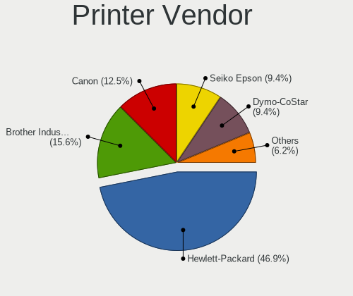

| Vendor              | Desktops | Percent |
|---------------------|----------|---------|
| Hewlett-Packard     | 8        | 44.44%  |
| Seiko Epson         | 2        | 11.11%  |
| Dymo-CoStar         | 2        | 11.11%  |
| Canon               | 2        | 11.11%  |
| Brother Industries  | 2        | 11.11%  |
| Samsung Electronics | 1        | 5.56%   |
| Pantum              | 1        | 5.56%   |

Printer Model
-------------

Printer device models

| Model                                  | Desktops | Percent |
|----------------------------------------|----------|---------|
| Seiko Epson WF-2860 Series             | 1        | 5.56%   |
| Seiko Epson L120 Series                | 1        | 5.56%   |
| Samsung M2070 Series                   | 1        | 5.56%   |
| Pantum M6500W-series                   | 1        | 5.56%   |
| HP LaserJet Professional P1102w        | 1        | 5.56%   |
| HP LaserJet 1020                       | 1        | 5.56%   |
| HP LaserJet 1010                       | 1        | 5.56%   |
| HP ENVY Photo 7800 series              | 1        | 5.56%   |
| HP ENVY Inspire 7200 series            | 1        | 5.56%   |
| HP ENVY 5000 series                    | 1        | 5.56%   |
| HP DeskJet 3700 series                 | 1        | 5.56%   |
| HP Deskjet 2050 J510                   | 1        | 5.56%   |
| Dymo-CoStar LabelWriter 400            | 1        | 5.56%   |
| Dymo-CoStar DYMO LabelWriter 450 Turbo | 1        | 5.56%   |
| Canon TR4500 series                    | 1        | 5.56%   |
| Canon PIXMA MP250                      | 1        | 5.56%   |
| Brother HL-2130 series                 | 1        | 5.56%   |
| Brother HL-1440 Laser Printer          | 1        | 5.56%   |

Scanner Vendor
--------------

Scanner device vendors

| Vendor      | Desktops | Percent |
|-------------|----------|---------|
| Canon       | 3        | 75%     |
| Seiko Epson | 1        | 25%     |

Scanner Model
-------------

Scanner device models

| Model                                 | Desktops | Percent |
|---------------------------------------|----------|---------|
| Canon CanoScan LiDE 210               | 2        | 50%     |
| Seiko Epson GT-X770 [Perfection V500] | 1        | 25%     |
| Canon CanoScan 4400F                  | 1        | 25%     |

Camera
------

Camera Vendor
-------------

Camera device vendors

| Vendor                                 | Desktops | Percent |
|----------------------------------------|----------|---------|
| Logitech                               | 66       | 43.71%  |
| Microdia                               | 10       | 6.62%   |
| Microsoft                              | 9        | 5.96%   |
| Apple                                  | 5        | 3.31%   |
| Sunplus Innovation Technology          | 4        | 2.65%   |
| Samsung Electronics                    | 4        | 2.65%   |
| AVerMedia Technologies                 | 4        | 2.65%   |
| Trust                                  | 3        | 1.99%   |
| Razer USA                              | 3        | 1.99%   |
| Google                                 | 3        | 1.99%   |
| Generalplus Technology                 | 3        | 1.99%   |
| Cubeternet                             | 3        | 1.99%   |
| Unknown                                | 3        | 1.99%   |
| XHT-211220-ZW                          | 2        | 1.32%   |
| Tobii Technology AB                    | 2        | 1.32%   |
| Realtek Semiconductor                  | 2        | 1.32%   |
| KYE Systems (Mouse Systems)            | 2        | 1.32%   |
| Chicony Electronics                    | 2        | 1.32%   |
| ARC International                      | 2        | 1.32%   |
| 2M UVC CAMERA                          | 2        | 1.32%   |
| Z-Star Microelectronics                | 1        | 0.66%   |
| Valve Software                         | 1        | 0.66%   |
| Sonix Technology                       | 1        | 0.66%   |
| Pixart Imaging                         | 1        | 0.66%   |
| LG Electronics                         | 1        | 0.66%   |
| Jieli Technology                       | 1        | 0.66%   |
| Insta360                               | 1        | 0.66%   |
| Hewlett-Packard                        | 1        | 0.66%   |
| ezcap                                  | 1        | 0.66%   |
| Elecom                                 | 1        | 0.66%   |
| Dell                                   | 1        | 0.66%   |
| Cheng Uei Precision Industry (Foxlink) | 1        | 0.66%   |
| Bison Electronics                      | 1        | 0.66%   |
| Aveo Technology                        | 1        | 0.66%   |
| Asuscom Network                        | 1        | 0.66%   |
| Alpha Imaging Technology               | 1        | 0.66%   |
| Alcor Micro                            | 1        | 0.66%   |

Camera Model
------------

Camera device models

| Model                                   | Desktops | Percent |
|-----------------------------------------|----------|---------|
| Logitech HD Pro Webcam C920             | 16       | 10.6%   |
| Logitech Webcam C270                    | 7        | 4.64%   |
| Logitech HD Webcam C525                 | 7        | 4.64%   |
| Logitech Webcam C170                    | 6        | 3.97%   |
| Logitech BRIO Ultra HD Webcam           | 6        | 3.97%   |
| Apple iPhone 5/5C/5S/6/SE/7/8/X         | 5        | 3.31%   |
| Samsung Galaxy series, misc. (MTP mode) | 4        | 2.65%   |
| AVerMedia Live Streamer CAM 313         | 4        | 2.65%   |
| Microdia Webcam Vitade AF               | 3        | 1.99%   |
| Microdia Integrated Camera              | 3        | 1.99%   |
| Logitech HD Webcam C615                 | 3        | 1.99%   |
| Logitech C922 Pro Stream Webcam         | 3        | 1.99%   |
| Logitech C505 HD Webcam                 | 3        | 1.99%   |
| Generalplus CAMERA - UVC                | 3        | 1.99%   |
| Unknown                                 | 3        | 1.99%   |
| XHT-211220-ZW Photry PC230A QHD Webcam  | 2        | 1.32%   |
| Trust USB Camera                        | 2        | 1.32%   |
| Tobii AB EyeChip                        | 2        | 1.32%   |
| Razer USA Gaming Webcam [Kiyo]          | 2        | 1.32%   |
| Microsoft Microsoft LifeCam Studio    | 2        | 1.32%   |
| Microsoft LifeCam HD-3000               | 2        | 1.32%   |
| Logitech Webcam C925e                   | 2        | 1.32%   |
| Logitech Webcam B500                    | 2        | 1.32%   |
| Logitech HD Webcam C910                 | 2        | 1.32%   |
| Logitech BRIO 4K Stream Edition         | 2        | 1.32%   |
| Google HD USB Camera                    | 2        | 1.32%   |
| Cubeternet GL-UPC822 UVC WebCam         | 2        | 1.32%   |
| ARC International Camera                | 2        | 1.32%   |
| 2M UVC CAMERA Web Camera                | 2        | 1.32%   |
| Z-Star Lenovo IdeaCentre Web Camera     | 1        | 0.66%   |
| Valve Software 3D Camera                | 1        | 0.66%   |
| Trust Full HD Webcam                    | 1        | 0.66%   |
| Sunplus papalook AF 925                 | 1        | 0.66%   |
| Sunplus HD 720P webcam                  | 1        | 0.66%   |
| Sunplus ezcap U3 capture-04             | 1        | 0.66%   |
| Sunplus Aukey-PC-LM1E Camera            | 1        | 0.66%   |
| Sonix HDF Webcam USB                    | 1        | 0.66%   |
| Realtek HD 720P Webcam                  | 1        | 0.66%   |
| Realtek FULL HD 1080P Webcam            | 1        | 0.66%   |
| Razer USA Razer Kiyo Pro                | 1        | 0.66%   |

Security
--------

Fingerprint Vendor
------------------

Fingerprint sensor vendors

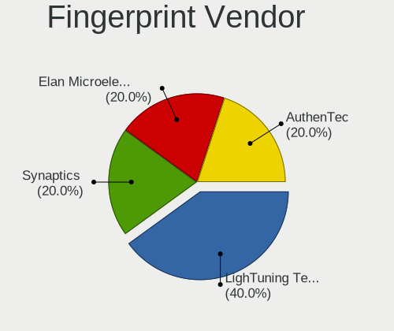

| Vendor                | Desktops | Percent |
|-----------------------|----------|---------|
| LighTuning Technology | 2        | 40%     |
| Synaptics             | 1        | 20%     |
| Elan Microelectronics | 1        | 20%     |
| AuthenTec             | 1        | 20%     |

Fingerprint Model
-----------------

Fingerprint sensor models

| Model                                        | Desktops | Percent |
|----------------------------------------------|----------|---------|
| LighTuning Fingerprint Sensor                | 2        | 40%     |
| Synaptics  WBDI Fingerprint Reader - USB 052 | 1        | 20%     |
| Elan fingerprint sensor [FeinTech FPS00200]  | 1        | 20%     |
| AuthenTec Fingerprint Sensor                 | 1        | 20%     |

Chipcard Vendor
---------------

Chipcard module vendors

| Vendor                | Desktops | Percent |
|-----------------------|----------|---------|
| Yubico.com            | 1        | 25%     |
| Gemalto (was Gemplus) | 1        | 25%     |
| Cherry                | 1        | 25%     |
| BIT4ID                | 1        | 25%     |

Chipcard Model
--------------

Chipcard module models

| Model                                             | Desktops | Percent |
|---------------------------------------------------|----------|---------|
| Yubico.com Yubikey 4/5 U2F+CCID                   | 1        | 25%     |
| Gemalto (was Gemplus) GemPC Twin SmartCard Reader | 1        | 25%     |
| Cherry Smart Terminal XX44                        | 1        | 25%     |
| BIT4ID miniLector EVO                             | 1        | 25%     |

Unsupported
-----------

Unsupported Devices
-------------------

Total unsupported devices on board

| Total | Desktops | Percent |
|-------|----------|---------|
| 0     | 522      | 83.92%  |
| 1     | 87       | 13.99%  |
| 2     | 9        | 1.45%   |
| 4     | 2        | 0.32%   |
| 3     | 2        | 0.32%   |

Unsupported Device Types
------------------------

Types of unsupported devices

| Type                     | Desktops | Percent |
|--------------------------|----------|---------|
| Graphics card            | 36       | 33.33%  |
| Net/wireless             | 29       | 26.85%  |
| Unassigned class         | 11       | 10.19%  |
| Multimedia controller    | 6        | 5.56%   |
| Camera                   | 6        | 5.56%   |
| Sound                    | 5        | 4.63%   |
| Fingerprint reader       | 5        | 4.63%   |
| Communication controller | 4        | 3.7%    |
| Net/ethernet             | 3        | 2.78%   |
| Storage/nvme             | 1        | 0.93%   |
| Card reader              | 1        | 0.93%   |
| Bluetooth                | 1        | 0.93%   |

