Fedora 38 - Tested Hardware & Statistics (Desktops)
---------------------------------------------------

A project to collect tested hardware configurations for Fedora 38.

Anyone can contribute to this report by the [hw-probe](https://github.com/linuxhw/hw-probe) tool:

    sudo -E hw-probe -all -upload

Please contribute! Especially if your hardware is rare.

Contents
--------

* [ Test Cases ](#test-cases)

* [ System ](#system)
  - [ Kernel                   ](#kernel)
  - [ Kernel Family            ](#kernel-family)
  - [ Kernel Major Ver.        ](#kernel-major-ver)
  - [ Arch                     ](#arch)
  - [ DE                       ](#de)
  - [ Display Server           ](#display-server)
  - [ Display Manager          ](#display-manager)
  - [ OS Lang                  ](#os-lang)
  - [ Boot Mode                ](#boot-mode)
  - [ Filesystem               ](#filesystem)
  - [ Part. scheme             ](#part-scheme)
  - [ Dual Boot with Linux/BSD ](#dual-boot-with-linuxbsd)
  - [ Dual Boot (Win)          ](#dual-boot-win)

* [ Board ](#board)
  - [ Vendor                   ](#vendor)
  - [ Model                    ](#model)
  - [ Model Family             ](#model-family)
  - [ MFG Year                 ](#mfg-year)
  - [ Form Factor              ](#form-factor)
  - [ Secure Boot              ](#secure-boot)
  - [ Coreboot                 ](#coreboot)
  - [ RAM Size                 ](#ram-size)
  - [ RAM Used                 ](#ram-used)
  - [ Total Drives             ](#total-drives)
  - [ Has CD-ROM               ](#has-cd-rom)
  - [ Has Ethernet             ](#has-ethernet)
  - [ Has WiFi                 ](#has-wifi)
  - [ Has Bluetooth            ](#has-bluetooth)

* [ Location ](#location)
  - [ Country                  ](#country)
  - [ City                     ](#city)

* [ Drives ](#drives)
  - [ Drive Vendor             ](#drive-vendor)
  - [ Drive Model              ](#drive-model)
  - [ HDD Vendor               ](#hdd-vendor)
  - [ SSD Vendor               ](#ssd-vendor)
  - [ Drive Kind               ](#drive-kind)
  - [ Drive Connector          ](#drive-connector)
  - [ Drive Size               ](#drive-size)
  - [ Space Total              ](#space-total)
  - [ Space Used               ](#space-used)
  - [ Malfunc. Drives          ](#malfunc-drives)
  - [ Malfunc. Drive Vendor    ](#malfunc-drive-vendor)
  - [ Malfunc. HDD Vendor      ](#malfunc-hdd-vendor)
  - [ Malfunc. Drive Kind      ](#malfunc-drive-kind)
  - [ Failed Drives            ](#failed-drives)
  - [ Failed Drive Vendor      ](#failed-drive-vendor)
  - [ Drive Status             ](#drive-status)

* [ Storage controller ](#storage-controller)
  - [ Storage Vendor           ](#storage-vendor)
  - [ Storage Model            ](#storage-model)
  - [ Storage Kind             ](#storage-kind)

* [ Processor ](#processor)
  - [ CPU Vendor               ](#cpu-vendor)
  - [ CPU Model                ](#cpu-model)
  - [ CPU Model Family         ](#cpu-model-family)
  - [ CPU Cores                ](#cpu-cores)
  - [ CPU Sockets              ](#cpu-sockets)
  - [ CPU Threads              ](#cpu-threads)
  - [ CPU Op-Modes             ](#cpu-op-modes)
  - [ CPU Microcode            ](#cpu-microcode)
  - [ CPU Microarch            ](#cpu-microarch)

* [ Graphics ](#graphics)
  - [ GPU Vendor               ](#gpu-vendor)
  - [ GPU Model                ](#gpu-model)
  - [ GPU Combo                ](#gpu-combo)
  - [ GPU Driver               ](#gpu-driver)
  - [ GPU Memory               ](#gpu-memory)

* [ Monitor ](#monitor)
  - [ Monitor Vendor           ](#monitor-vendor)
  - [ Monitor Model            ](#monitor-model)
  - [ Monitor Resolution       ](#monitor-resolution)
  - [ Monitor Diagonal         ](#monitor-diagonal)
  - [ Monitor Width            ](#monitor-width)
  - [ Aspect Ratio             ](#aspect-ratio)
  - [ Monitor Area             ](#monitor-area)
  - [ Pixel Density            ](#pixel-density)
  - [ Multiple Monitors        ](#multiple-monitors)

* [ Network ](#network)
  - [ Net Controller Vendor    ](#net-controller-vendor)
  - [ Net Controller Model     ](#net-controller-model)
  - [ Wireless Vendor          ](#wireless-vendor)
  - [ Wireless Model           ](#wireless-model)
  - [ Ethernet Vendor          ](#ethernet-vendor)
  - [ Ethernet Model           ](#ethernet-model)
  - [ Net Controller Kind      ](#net-controller-kind)
  - [ Used Controller          ](#used-controller)
  - [ NICs                     ](#nics)
  - [ IPv6                     ](#ipv6)

* [ Bluetooth ](#bluetooth)
  - [ Bluetooth Vendor         ](#bluetooth-vendor)
  - [ Bluetooth Model          ](#bluetooth-model)

* [ Sound ](#sound)
  - [ Sound Vendor             ](#sound-vendor)
  - [ Sound Model              ](#sound-model)

* [ Memory ](#memory)
  - [ Memory Vendor            ](#memory-vendor)
  - [ Memory Model             ](#memory-model)
  - [ Memory Kind              ](#memory-kind)
  - [ Memory Form Factor       ](#memory-form-factor)
  - [ Memory Size              ](#memory-size)
  - [ Memory Speed             ](#memory-speed)

* [ Printers & scanners ](#printers--scanners)
  - [ Printer Vendor           ](#printer-vendor)
  - [ Printer Model            ](#printer-model)
  - [ Scanner Vendor           ](#scanner-vendor)
  - [ Scanner Model            ](#scanner-model)

* [ Camera ](#camera)
  - [ Camera Vendor            ](#camera-vendor)
  - [ Camera Model             ](#camera-model)

* [ Security ](#security)
  - [ Fingerprint Vendor       ](#fingerprint-vendor)
  - [ Fingerprint Model        ](#fingerprint-model)
  - [ Chipcard Vendor          ](#chipcard-vendor)
  - [ Chipcard Model           ](#chipcard-model)

* [ Unsupported ](#unsupported)
  - [ Unsupported Devices      ](#unsupported-devices)
  - [ Unsupported Device Types ](#unsupported-device-types)

Test Cases
----------

Total: 118

| Vendor     | Model                       | Probe                                                      | Date         |
|------------|-----------------------------|------------------------------------------------------------|--------------|
| ASUSTek    | PRIME B550M-A               | [9146d12231](https://linux-hardware.org/?probe=9146d12231) | May 01, 2023 |
| MSI        | MPG X570 GAMING EDGE WIF... | [2fcc250a35](https://linux-hardware.org/?probe=2fcc250a35) | May 01, 2023 |
| ASRock     | A520M-ITX/ac                | [5a9f58bcc0](https://linux-hardware.org/?probe=5a9f58bcc0) | Apr 30, 2023 |
| Gigabyte   | 970A-DS3P                   | [c1fe7a5f87](https://linux-hardware.org/?probe=c1fe7a5f87) | Apr 30, 2023 |
| Gigabyte   | AB350-Gaming 3-CF           | [01311e320c](https://linux-hardware.org/?probe=01311e320c) | Apr 30, 2023 |
| MSI        | MPG B650I EDGE WIFI         | [eda4874295](https://linux-hardware.org/?probe=eda4874295) | Apr 30, 2023 |
| ASUSTek    | X99-A                       | [6505e46b86](https://linux-hardware.org/?probe=6505e46b86) | Apr 29, 2023 |
| ASUSTek    | P5B-Deluxe                  | [d0d3458299](https://linux-hardware.org/?probe=d0d3458299) | Apr 29, 2023 |
| Gigabyte   | X570 I AORUS PRO WIFI       | [4b47a4606b](https://linux-hardware.org/?probe=4b47a4606b) | Apr 29, 2023 |
| MSI        | B450 TOMAHAWK               | [1404923301](https://linux-hardware.org/?probe=1404923301) | Apr 28, 2023 |
| Gigabyte   | X570 AORUS ELITE WIFI       | [e65094a8f6](https://linux-hardware.org/?probe=e65094a8f6) | Apr 28, 2023 |
| ASUSTek    | ROG CROSSHAIR X670E GENE    | [c416a3f44a](https://linux-hardware.org/?probe=c416a3f44a) | Apr 28, 2023 |
| Dell       | 0VHWTR A01                  | [1a73639c02](https://linux-hardware.org/?probe=1a73639c02) | Apr 28, 2023 |
| ASUSTek    | PRIME A520M-E               | [048fda2c60](https://linux-hardware.org/?probe=048fda2c60) | Apr 28, 2023 |
| Unknown    | HX90                        | [8454daed68](https://linux-hardware.org/?probe=8454daed68) | Apr 28, 2023 |
| Dell       | 0VHWTR A01                  | [6f56840307](https://linux-hardware.org/?probe=6f56840307) | Apr 28, 2023 |
| HP         | 83E9                        | [ac8ad5d3d5](https://linux-hardware.org/?probe=ac8ad5d3d5) | Apr 28, 2023 |
| HP         | 8062                        | [61c4685659](https://linux-hardware.org/?probe=61c4685659) | Apr 27, 2023 |
| ASUSTek    | PRIME A320M-K               | [155ce08a00](https://linux-hardware.org/?probe=155ce08a00) | Apr 27, 2023 |
| MSI        | X570-A PRO                  | [15b900cf50](https://linux-hardware.org/?probe=15b900cf50) | Apr 27, 2023 |
| MSI        | X570-A PRO                  | [d5b1ec921a](https://linux-hardware.org/?probe=d5b1ec921a) | Apr 27, 2023 |
| ASUSTek    | PRIME Z490-A                | [9088ae517a](https://linux-hardware.org/?probe=9088ae517a) | Apr 27, 2023 |
| Lenovo     | SHARKBAY NOK                | [e694779b17](https://linux-hardware.org/?probe=e694779b17) | Apr 26, 2023 |
| Lenovo     | SHARKBAY NOK                | [1e07e42dd3](https://linux-hardware.org/?probe=1e07e42dd3) | Apr 26, 2023 |
| MSI        | X470 GAMING PLUS            | [a5d42a7b78](https://linux-hardware.org/?probe=a5d42a7b78) | Apr 26, 2023 |
| MSI        | MPG B550I GAMING EDGE WI... | [474c43577f](https://linux-hardware.org/?probe=474c43577f) | Apr 26, 2023 |
| ASUSTek    | ROG STRIX B550-I GAMING     | [e14205d01a](https://linux-hardware.org/?probe=e14205d01a) | Apr 26, 2023 |
| ASUSTek    | ROG STRIX X670E-F GAMING... | [f1f2ad2731](https://linux-hardware.org/?probe=f1f2ad2731) | Apr 26, 2023 |
| Gigabyte   | B450 I AORUS PRO WIFI-CF    | [5ce448176d](https://linux-hardware.org/?probe=5ce448176d) | Apr 26, 2023 |
| ASUSTek    | PRIME H610M-A D4            | [a7e77375d4](https://linux-hardware.org/?probe=a7e77375d4) | Apr 26, 2023 |
| ASUSTek    | PRIME B550M-A               | [ba83f4a4f7](https://linux-hardware.org/?probe=ba83f4a4f7) | Apr 26, 2023 |
| ASUSTek    | P8H61-M LE                  | [a7a9d5069c](https://linux-hardware.org/?probe=a7a9d5069c) | Apr 26, 2023 |
| ASUSTek    | P8H61-M LE                  | [cd60dbbd6a](https://linux-hardware.org/?probe=cd60dbbd6a) | Apr 26, 2023 |
| Huanan     | X79 INTEL (INTEL Xeon E5... | [8c9b08bcab](https://linux-hardware.org/?probe=8c9b08bcab) | Apr 26, 2023 |
| Huanan     | X79 INTEL (INTEL Xeon E5... | [6007547b60](https://linux-hardware.org/?probe=6007547b60) | Apr 25, 2023 |
| ASRock     | X300M-STX                   | [4a8d662bee](https://linux-hardware.org/?probe=4a8d662bee) | Apr 25, 2023 |
| Dell       | 040DDP A00                  | [8595139862](https://linux-hardware.org/?probe=8595139862) | Apr 25, 2023 |
| Dell       | 0YXT71 A03                  | [abc091f5c0](https://linux-hardware.org/?probe=abc091f5c0) | Apr 25, 2023 |
| Intel      | DQ67OW AAG12528-307         | [28245ea080](https://linux-hardware.org/?probe=28245ea080) | Apr 25, 2023 |
| ASUSTek    | ProArt X670E-CREATOR WIF... | [f878b7d23a](https://linux-hardware.org/?probe=f878b7d23a) | Apr 25, 2023 |
| ASRock     | H310M-STX                   | [9988bc063a](https://linux-hardware.org/?probe=9988bc063a) | Apr 25, 2023 |
| ASUSTek    | PRIME B550M-A               | [8fbbad22fa](https://linux-hardware.org/?probe=8fbbad22fa) | Apr 25, 2023 |
| ASUSTek    | TUF Gaming B550M-PLUS       | [98ffa037d9](https://linux-hardware.org/?probe=98ffa037d9) | Apr 24, 2023 |
| Dell       | 08WXMX A02                  | [5f68c6a285](https://linux-hardware.org/?probe=5f68c6a285) | Apr 24, 2023 |
| HP         | 18E7                        | [c5bc4d9c7f](https://linux-hardware.org/?probe=c5bc4d9c7f) | Apr 23, 2023 |
| ASUSTek    | ROG STRIX X470-F GAMING     | [88036a75ec](https://linux-hardware.org/?probe=88036a75ec) | Apr 23, 2023 |
| MSI        | MAG X570 TOMAHAWK WIFI      | [b9496d6431](https://linux-hardware.org/?probe=b9496d6431) | Apr 23, 2023 |
| HP         | 8062                        | [37cde2dc48](https://linux-hardware.org/?probe=37cde2dc48) | Apr 23, 2023 |
| Dell       | 0HD5W2 A00                  | [336c1b5da9](https://linux-hardware.org/?probe=336c1b5da9) | Apr 23, 2023 |
| ASUSTek    | Pro WS WRX80E-SAGE SE WI... | [a82d805ad2](https://linux-hardware.org/?probe=a82d805ad2) | Apr 22, 2023 |
| Pegatron   | Benicia                     | [362a3ff341](https://linux-hardware.org/?probe=362a3ff341) | Apr 22, 2023 |
| Gigabyte   | B550M DS3H                  | [1950979b24](https://linux-hardware.org/?probe=1950979b24) | Apr 22, 2023 |
| MSI        | B450M MORTAR MAX            | [7560923404](https://linux-hardware.org/?probe=7560923404) | Apr 22, 2023 |
| Dell       | 0CRH6C A00                  | [cbb78e1785](https://linux-hardware.org/?probe=cbb78e1785) | Apr 22, 2023 |
| Gigabyte   | E3000N                      | [a6d7a7356a](https://linux-hardware.org/?probe=a6d7a7356a) | Apr 22, 2023 |
| AZW        | GTR V02                     | [104badc0d7](https://linux-hardware.org/?probe=104badc0d7) | Apr 22, 2023 |
| Gigabyte   | B450 I AORUS PRO WIFI-CF    | [079c071335](https://linux-hardware.org/?probe=079c071335) | Apr 22, 2023 |
| Techvision | TVI7309X B0                 | [26e981dab3](https://linux-hardware.org/?probe=26e981dab3) | Apr 22, 2023 |
| ASUSTek    | PRIME A320M-K               | [fb1f9f0d16](https://linux-hardware.org/?probe=fb1f9f0d16) | Apr 21, 2023 |
| MSI        | MPG X570 GAMING PLUS        | [a898476ffa](https://linux-hardware.org/?probe=a898476ffa) | Apr 21, 2023 |
| ASRock     | AD2700-ITX                  | [e688e656cd](https://linux-hardware.org/?probe=e688e656cd) | Apr 21, 2023 |
| HP         | 843F                        | [0060103f89](https://linux-hardware.org/?probe=0060103f89) | Apr 21, 2023 |
| Lenovo     | 3753 SDK0T76461 WIN 3422... | [65c9942c32](https://linux-hardware.org/?probe=65c9942c32) | Apr 21, 2023 |
| Lenovo     | 3753 SDK0T76461 WIN 3422... | [607dbbf4d8](https://linux-hardware.org/?probe=607dbbf4d8) | Apr 21, 2023 |
| MSI        | MAG X570S TOMAHAWK MAX W... | [8e7095e453](https://linux-hardware.org/?probe=8e7095e453) | Apr 20, 2023 |
| ASUSTek    | TUF Gaming Z690-PLUS WIF... | [f7ca0a552d](https://linux-hardware.org/?probe=f7ca0a552d) | Apr 20, 2023 |
| ASUSTek    | CG8270                      | [3f390ff38e](https://linux-hardware.org/?probe=3f390ff38e) | Apr 20, 2023 |
| ASUSTek    | CG8270                      | [a4f54ca55b](https://linux-hardware.org/?probe=a4f54ca55b) | Apr 20, 2023 |
| Gigabyte   | A320M-S2H-CF                | [063b4867ba](https://linux-hardware.org/?probe=063b4867ba) | Apr 20, 2023 |
| ASUSTek    | PRIME B360-PLUS             | [00b1045cf9](https://linux-hardware.org/?probe=00b1045cf9) | Apr 20, 2023 |
| Gigabyte   | B85-HD3                     | [07ecc38bef](https://linux-hardware.org/?probe=07ecc38bef) | Apr 20, 2023 |
| HP         | 89D8 SMVB                   | [c4c1d8086c](https://linux-hardware.org/?probe=c4c1d8086c) | Apr 20, 2023 |
| Dell       | 08NPPY A00                  | [6780931a5d](https://linux-hardware.org/?probe=6780931a5d) | Apr 19, 2023 |
| Gigabyte   | GA-MA785GM-US2H             | [96f6b41a5c](https://linux-hardware.org/?probe=96f6b41a5c) | Apr 19, 2023 |
| AMI        | Intel                       | [3f1890d683](https://linux-hardware.org/?probe=3f1890d683) | Apr 19, 2023 |
| Gigabyte   | B85M-D3V-A                  | [84dbb8ae74](https://linux-hardware.org/?probe=84dbb8ae74) | Apr 19, 2023 |
| Dell       | 0GXM1W A00                  | [3060afd7f7](https://linux-hardware.org/?probe=3060afd7f7) | Apr 19, 2023 |
| ASUSTek    | ROG STRIX X570-F GAMING     | [cb1db50c6c](https://linux-hardware.org/?probe=cb1db50c6c) | Apr 18, 2023 |
| Gigabyte   | 970A-DS3P                   | [e2f136f068](https://linux-hardware.org/?probe=e2f136f068) | Apr 14, 2023 |
| MSI        | MS-7388                     | [4efa2b04da](https://linux-hardware.org/?probe=4efa2b04da) | Apr 14, 2023 |
| Gigabyte   | X79-UD3                     | [d2fbfe344c](https://linux-hardware.org/?probe=d2fbfe344c) | Apr 12, 2023 |
| ASUSTek    | E3M-ET V5 SERIES            | [7e0735056c](https://linux-hardware.org/?probe=7e0735056c) | Apr 12, 2023 |
| ASUSTek    | ROG STRIX B650E-F GAMING... | [fb8ef4b4af](https://linux-hardware.org/?probe=fb8ef4b4af) | Apr 06, 2023 |
| MSI        | B450I GAMING PLUS AC        | [adda27b48e](https://linux-hardware.org/?probe=adda27b48e) | Apr 06, 2023 |
| Gigabyte   | H610M S2H DDR4              | [b34f7e7ea6](https://linux-hardware.org/?probe=b34f7e7ea6) | Apr 05, 2023 |
| Gigabyte   | X570 I AORUS PRO WIFI       | [53fc9d8c25](https://linux-hardware.org/?probe=53fc9d8c25) | Apr 04, 2023 |
| Pegatron   | 2ACB                        | [f35bc7fec6](https://linux-hardware.org/?probe=f35bc7fec6) | Apr 04, 2023 |
| Unknown    | Unknown                     | [02a35c15b7](https://linux-hardware.org/?probe=02a35c15b7) | Apr 03, 2023 |
| Gigabyte   | B85M-D3V-A                  | [1789a17694](https://linux-hardware.org/?probe=1789a17694) | Apr 03, 2023 |
| ASUSTek    | TUF Gaming X570-PRO         | [36f91bbb2d](https://linux-hardware.org/?probe=36f91bbb2d) | Apr 02, 2023 |
| ASUSTek    | PRIME B250M-A               | [575a0650aa](https://linux-hardware.org/?probe=575a0650aa) | Apr 01, 2023 |
| ASUSTek    | PRIME B250M-A               | [dc5fce2825](https://linux-hardware.org/?probe=dc5fce2825) | Apr 01, 2023 |
| HP         | 18E7                        | [6b64a1639b](https://linux-hardware.org/?probe=6b64a1639b) | Mar 30, 2023 |
| Gigabyte   | B85M-D3V-A                  | [06ad8e8099](https://linux-hardware.org/?probe=06ad8e8099) | Mar 29, 2023 |
| ASUSTek    | PRIME B550M-K               | [81dc7d8f53](https://linux-hardware.org/?probe=81dc7d8f53) | Mar 27, 2023 |
| Acer       | Aspire M3910                | [8cc87c48d1](https://linux-hardware.org/?probe=8cc87c48d1) | Mar 27, 2023 |
| PCWare     | IPMH310G                    | [3cc2e91e56](https://linux-hardware.org/?probe=3cc2e91e56) | Mar 24, 2023 |
| MSI        | Z370-A PRO                  | [87bce00c67](https://linux-hardware.org/?probe=87bce00c67) | Mar 21, 2023 |
| ASUSTek    | ROG Maximus X HERO          | [e7ff5cdaae](https://linux-hardware.org/?probe=e7ff5cdaae) | Mar 21, 2023 |
| ASUSTek    | TUF Gaming X570-PRO         | [fc2a6e486c](https://linux-hardware.org/?probe=fc2a6e486c) | Mar 17, 2023 |
| Gigabyte   | H81M-H                      | [0ac96925cd](https://linux-hardware.org/?probe=0ac96925cd) | Mar 16, 2023 |
| Pegatron   | 2ACB                        | [d36124f8d9](https://linux-hardware.org/?probe=d36124f8d9) | Mar 16, 2023 |
| ASRock     | H310M-STX                   | [ea6af9ac0b](https://linux-hardware.org/?probe=ea6af9ac0b) | Mar 16, 2023 |
| ASRock     | H310M-STX                   | [56c7261b06](https://linux-hardware.org/?probe=56c7261b06) | Mar 16, 2023 |
| Gigabyte   | Z77X-UD3H                   | [c483268c88](https://linux-hardware.org/?probe=c483268c88) | Mar 16, 2023 |
| ASUSTek    | PRIME Z270-A                | [047e561901](https://linux-hardware.org/?probe=047e561901) | Mar 14, 2023 |
| ASUSTek    | TUF Gaming B550M-PLUS       | [89e2967e3c](https://linux-hardware.org/?probe=89e2967e3c) | Mar 12, 2023 |
| ASUSTek    | TUF Gaming B660M-E D4       | [5d94a30450](https://linux-hardware.org/?probe=5d94a30450) | Mar 05, 2023 |
| ASUSTek    | PRIME B550M-K               | [91fab60d63](https://linux-hardware.org/?probe=91fab60d63) | Mar 04, 2023 |
| MSI        | MEG Z390 GODLIKE            | [b61241e05e](https://linux-hardware.org/?probe=b61241e05e) | Mar 04, 2023 |
| MSI        | MEG Z390 GODLIKE            | [871c72708d](https://linux-hardware.org/?probe=871c72708d) | Mar 04, 2023 |
| ASRock     | H81M-HG4 R4.0               | [47ed7baef0](https://linux-hardware.org/?probe=47ed7baef0) | Feb 28, 2023 |
| MSI        | MEG Z390 GODLIKE            | [5f091de01b](https://linux-hardware.org/?probe=5f091de01b) | Feb 23, 2023 |
| MSI        | MEG Z390 GODLIKE            | [974ae4135b](https://linux-hardware.org/?probe=974ae4135b) | Feb 22, 2023 |
| ASUSTek    | ROG STRIX X570-I GAMING     | [731f916db1](https://linux-hardware.org/?probe=731f916db1) | Dec 27, 2022 |
| MSI        | FM2-A55M-E33                | [1fe306ae1e](https://linux-hardware.org/?probe=1fe306ae1e) | Oct 13, 2022 |
| MSI        | FM2-A55M-E33                | [4867faffbf](https://linux-hardware.org/?probe=4867faffbf) | Sep 23, 2022 |
| Biostar    | A780L3G                     | [e53730ab48](https://linux-hardware.org/?probe=e53730ab48) | Sep 09, 2022 |

System
------

Kernel
------

Version of the Linux kernel

| Version                                           | Desktops | Percent |
|---------------------------------------------------|----------|---------|
| 6.2.11-300.fc38.x86_64                            | 31       | 31.63%  |
| 6.2.12-300.fc38.x86_64                            | 19       | 19.39%  |
| 6.2.9-300.fc38.x86_64                             | 14       | 14.29%  |
| 6.2.13-300.fc38.x86_64                            | 8        | 8.16%   |
| 6.2.8-300.fc38.x86_64                             | 4        | 4.08%   |
| 6.2.6-300.fc38.x86_64                             | 4        | 4.08%   |
| 6.2.7-300.fc38.x86_64                             | 3        | 3.06%   |
| 6.2.2-300.fc38.x86_64                             | 2        | 2.04%   |
| 6.2.10-300.fc38.x86_64                            | 2        | 2.04%   |
| 6.2.0-63.fc38.x86_64                              | 2        | 2.04%   |
| 6.2.5-300.fc38.x86_64                             | 1        | 1.02%   |
| 6.2.3-300.fc38.x86_64                             | 1        | 1.02%   |
| 6.2.2-301.fc38.x86_64                             | 1        | 1.02%   |
| 6.2.1-300.fc38.x86_64                             | 1        | 1.02%   |
| 6.2.0-0.rc1.14.fc38.x86_64+debug                  | 1        | 1.02%   |
| 6.1.18-200.fc37.x86_64                            | 1        | 1.02%   |
| 6.1.0-0.rc0.20221011git60bb8154d1d7.8.fc38.x86_64 | 1        | 1.02%   |
| 6.0.0-0.rc6.41.fc38.x86_64                        | 1        | 1.02%   |
| 5.19.7-200.fc36.x86_64                            | 1        | 1.02%   |

Kernel Family
-------------

Linux kernel without a distro release

| Version | Desktops | Percent |
|---------|----------|---------|
| 6.2.11  | 31       | 31.63%  |
| 6.2.12  | 19       | 19.39%  |
| 6.2.9   | 14       | 14.29%  |
| 6.2.13  | 8        | 8.16%   |
| 6.2.8   | 4        | 4.08%   |
| 6.2.6   | 4        | 4.08%   |
| 6.2.7   | 3        | 3.06%   |
| 6.2.2   | 3        | 3.06%   |
| 6.2.0   | 3        | 3.06%   |
| 6.2.10  | 2        | 2.04%   |
| 6.2.5   | 1        | 1.02%   |
| 6.2.3   | 1        | 1.02%   |
| 6.2.1   | 1        | 1.02%   |
| 6.1.18  | 1        | 1.02%   |
| 6.1.0   | 1        | 1.02%   |
| 6.0.0   | 1        | 1.02%   |
| 5.19.7  | 1        | 1.02%   |

Kernel Major Ver.
-----------------

Linux kernel major version

| Version | Desktops | Percent |
|---------|----------|---------|
| 6.2     | 91       | 95.79%  |
| 6.1     | 2        | 2.11%   |
| 6.0     | 1        | 1.05%   |
| 5.19    | 1        | 1.05%   |

Arch
----

OS architecture (x86_64, i586, etc.)

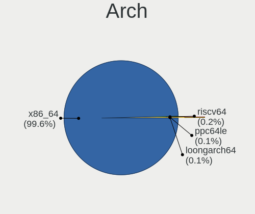

| Name   | Desktops | Percent |
|--------|----------|---------|
| x86_64 | 94       | 100%    |

DE
--

Desktop Environment

| Name     | Desktops | Percent |
|----------|----------|---------|
| GNOME    | 69       | 73.4%   |
| KDE5     | 17       | 18.09%  |
| Unknown  | 2        | 2.13%   |
| XFCE     | 1        | 1.06%   |
| MATE     | 1        | 1.06%   |
| LXDE     | 1        | 1.06%   |
| KDE      | 1        | 1.06%   |
| Deepin   | 1        | 1.06%   |
| Cinnamon | 1        | 1.06%   |

Display Server
--------------

X11 or Wayland

| Name    | Desktops | Percent |
|---------|----------|---------|
| Wayland | 71       | 74.74%  |
| X11     | 17       | 17.89%  |
| Tty     | 5        | 5.26%   |
| Unknown | 2        | 2.11%   |

Display Manager
---------------

SDDM, LightDM, etc.

| Name    | Desktops | Percent |
|---------|----------|---------|
| Unknown | 63       | 67.02%  |
| GDM     | 15       | 15.96%  |
| SDDM    | 12       | 12.77%  |
| LightDM | 3        | 3.19%   |
| LXDM    | 1        | 1.06%   |

OS Lang
-------

Language

| Lang  | Desktops | Percent |
|-------|----------|---------|
| en_US | 42       | 44.68%  |
| en_AU | 6        | 6.38%   |
| ru_RU | 5        | 5.32%   |
| pt_BR | 5        | 5.32%   |
| en_GB | 5        | 5.32%   |
| en_CA | 5        | 5.32%   |
| de_DE | 5        | 5.32%   |
| it_IT | 3        | 3.19%   |
| fr_FR | 3        | 3.19%   |
| de_CH | 2        | 2.13%   |
| zh_SG | 1        | 1.06%   |
| sv_SE | 1        | 1.06%   |
| pt_PT | 1        | 1.06%   |
| pa_IN | 1        | 1.06%   |
| hr_HR | 1        | 1.06%   |
| fr_CA | 1        | 1.06%   |
| fr_BE | 1        | 1.06%   |
| fi_FI | 1        | 1.06%   |
| es_VE | 1        | 1.06%   |
| es_MX | 1        | 1.06%   |
| es_CL | 1        | 1.06%   |
| en_PH | 1        | 1.06%   |
| en_IE | 1        | 1.06%   |

Boot Mode
---------

EFI or BIOS

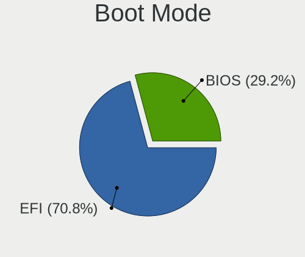

| Mode | Desktops | Percent |
|------|----------|---------|
| EFI  | 70       | 73.68%  |
| BIOS | 25       | 26.32%  |

Filesystem
----------

Type of filesystem

| Type    | Desktops | Percent |
|---------|----------|---------|
| Btrfs   | 76       | 80.85%  |
| Ext4    | 15       | 15.96%  |
| Xfs     | 1        | 1.06%   |
| Overlay | 1        | 1.06%   |
| F2fs    | 1        | 1.06%   |

Part. scheme
------------

Scheme of partitioning

| Type    | Desktops | Percent |
|---------|----------|---------|
| Unknown | 60       | 63.83%  |
| GPT     | 29       | 30.85%  |
| MBR     | 5        | 5.32%   |

Dual Boot with Linux/BSD
------------------------

Hosting more than one Linux/BSD

| Dual boot | Desktops | Percent |
|-----------|----------|---------|
| No        | 86       | 91.49%  |
| Yes       | 8        | 8.51%   |

Dual Boot (Win)
---------------

Hosting Linux and Windows

| Dual boot | Desktops | Percent |
|-----------|----------|---------|
| No        | 80       | 85.11%  |
| Yes       | 14       | 14.89%  |

Board
-----

Vendor
------

Motherboard manufacturer

| Name                | Desktops | Percent |
|---------------------|----------|---------|
| ASUSTek Computer    | 30       | 31.91%  |
| MSI                 | 15       | 15.96%  |
| Gigabyte Technology | 15       | 15.96%  |
| Dell                | 8        | 8.51%   |
| Hewlett-Packard     | 6        | 6.38%   |
| ASRock              | 6        | 6.38%   |
| Pegatron            | 2        | 2.13%   |
| Lenovo              | 2        | 2.13%   |
| Unknown             | 2        | 2.13%   |
| Techvision          | 1        | 1.06%   |
| PCWare              | 1        | 1.06%   |
| Intel               | 1        | 1.06%   |
| Huanan              | 1        | 1.06%   |
| Biostar             | 1        | 1.06%   |
| AZW                 | 1        | 1.06%   |
| AMI                 | 1        | 1.06%   |
| Acer                | 1        | 1.06%   |

Model
-----

Motherboard model

| Name                                                                  | Desktops | Percent |
|-----------------------------------------------------------------------|----------|---------|
| MSI MS-7C37                                                           | 3        | 3.19%   |
| HP ProDesk 600 G1 SFF                                                 | 2        | 2.13%   |
| Gigabyte 970A-DS3P                                                    | 2        | 2.13%   |
| Dell OptiPlex 7010                                                    | 2        | 2.13%   |
| Dell OptiPlex 3020                                                    | 2        | 2.13%   |
| ASUS TUF Gaming B550M-PLUS                                            | 2        | 2.13%   |
| ASUS PRIME B550M-A                                                    | 2        | 2.13%   |
| ASUS PRIME A320M-K                                                    | 2        | 2.13%   |
| ASRock H310M-STX                                                      | 2        | 2.13%   |
| Unknown                                                               | 2        | 2.13%   |
| Techvision TVI7309X                                                   | 1        | 1.06%   |
| Pegatron NY705AA-ABL p6204y                                           | 1        | 1.06%   |
| Pegatron 320-1030                                                     | 1        | 1.06%   |
| PCWare IPMH310G                                                       | 1        | 1.06%   |
| MSI MS-7D73                                                           | 1        | 1.06%   |
| MSI MS-7D54                                                           | 1        | 1.06%   |
| MSI MS-7C92                                                           | 1        | 1.06%   |
| MSI MS-7C84                                                           | 1        | 1.06%   |
| MSI MS-7C02                                                           | 1        | 1.06%   |
| MSI MS-7B89                                                           | 1        | 1.06%   |
| MSI MS-7B79                                                           | 1        | 1.06%   |
| MSI MS-7B48                                                           | 1        | 1.06%   |
| MSI MS-7B10                                                           | 1        | 1.06%   |
| MSI MS-7A40                                                           | 1        | 1.06%   |
| MSI MS-7721                                                           | 1        | 1.06%   |
| MSI MS-7388                                                           | 1        | 1.06%   |
| Lenovo ThinkCentre M93p 10A6A0BBFR                                    | 1        | 1.06%   |
| Lenovo Legion T5 26IAB7 90SV00EMSZ                                    | 1        | 1.06%   |
| Intel DESKTOP 310                                                     | 1        | 1.06%   |
| Huanan X79 INTEL (INTEL Xeon E5/Corei7 DMI2 - C600/C200 Cipset V2.49P | 1        | 1.06%   |
| HP Victus by 15L Gaming Desktop TG02-0xxx                             | 1        | 1.06%   |
| HP Slim Desktop 290-p0xxx                                             | 1        | 1.06%   |
| HP ProDesk 400 G3 SFF                                                 | 1        | 1.06%   |
| HP EliteDesk 705 G4 DM 35W (TAA)                                      | 1        | 1.06%   |
| Gigabyte Z77X-UD3H                                                    | 1        | 1.06%   |
| Gigabyte X79-UD3                                                      | 1        | 1.06%   |
| Gigabyte X570 I AORUS PRO WIFI                                        | 1        | 1.06%   |
| Gigabyte X570 AORUS ELITE WIFI                                        | 1        | 1.06%   |
| Gigabyte H610M S2H DDR4                                               | 1        | 1.06%   |
| Gigabyte GA-MA785GM-US2H                                              | 1        | 1.06%   |

Model Family
------------

Motherboard model prefix

| Name                     | Desktops | Percent |
|--------------------------|----------|---------|
| ASUS PRIME               | 11       | 11.7%   |
| ASUS ROG                 | 7        | 7.45%   |
| Dell OptiPlex            | 6        | 6.38%   |
| ASUS TUF                 | 4        | 4.26%   |
| MSI MS-7C37              | 3        | 3.19%   |
| HP ProDesk               | 3        | 3.19%   |
| Gigabyte X570            | 2        | 2.13%   |
| Gigabyte 970A-DS3P       | 2        | 2.13%   |
| Dell Precision           | 2        | 2.13%   |
| ASRock H310M-STX         | 2        | 2.13%   |
| Unknown                  | 2        | 2.13%   |
| Techvision TVI7309X      | 1        | 1.06%   |
| Pegatron NY705AA-ABL     | 1        | 1.06%   |
| Pegatron 320-1030        | 1        | 1.06%   |
| PCWare IPMH310G          | 1        | 1.06%   |
| MSI MS-7D73              | 1        | 1.06%   |
| MSI MS-7D54              | 1        | 1.06%   |
| MSI MS-7C92              | 1        | 1.06%   |
| MSI MS-7C84              | 1        | 1.06%   |
| MSI MS-7C02              | 1        | 1.06%   |
| MSI MS-7B89              | 1        | 1.06%   |
| MSI MS-7B79              | 1        | 1.06%   |
| MSI MS-7B48              | 1        | 1.06%   |
| MSI MS-7B10              | 1        | 1.06%   |
| MSI MS-7A40              | 1        | 1.06%   |
| MSI MS-7721              | 1        | 1.06%   |
| MSI MS-7388              | 1        | 1.06%   |
| Lenovo ThinkCentre       | 1        | 1.06%   |
| Lenovo Legion            | 1        | 1.06%   |
| Intel DESKTOP            | 1        | 1.06%   |
| Huanan X79               | 1        | 1.06%   |
| HP Victus                | 1        | 1.06%   |
| HP Slim                  | 1        | 1.06%   |
| HP EliteDesk             | 1        | 1.06%   |
| Gigabyte Z77X-UD3H       | 1        | 1.06%   |
| Gigabyte X79-UD3         | 1        | 1.06%   |
| Gigabyte H610M           | 1        | 1.06%   |
| Gigabyte GA-MA785GM-US2H | 1        | 1.06%   |
| Gigabyte E3000N          | 1        | 1.06%   |
| Gigabyte B85M-D3V-A      | 1        | 1.06%   |

MFG Year
--------

Motherboard manufacture year

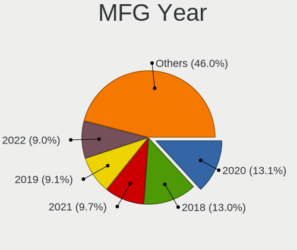

| Year | Desktops | Percent |
|------|----------|---------|
| 2020 | 14       | 14.89%  |
| 2019 | 13       | 13.83%  |
| 2018 | 10       | 10.64%  |
| 2022 | 9        | 9.57%   |
| 2013 | 8        | 8.51%   |
| 2021 | 6        | 6.38%   |
| 2017 | 6        | 6.38%   |
| 2023 | 4        | 4.26%   |
| 2016 | 4        | 4.26%   |
| 2014 | 4        | 4.26%   |
| 2012 | 4        | 4.26%   |
| 2010 | 4        | 4.26%   |
| 2011 | 3        | 3.19%   |
| 2009 | 2        | 2.13%   |
| 2015 | 1        | 1.06%   |
| 2008 | 1        | 1.06%   |
| 2006 | 1        | 1.06%   |

Form Factor
-----------

Physical design of the computer

| Name    | Desktops | Percent |
|---------|----------|---------|
| Desktop | 94       | 100%    |

Secure Boot
-----------

Enabled or disabled

| State    | Desktops | Percent |
|----------|----------|---------|
| Disabled | 85       | 90.43%  |
| Enabled  | 9        | 9.57%   |

Coreboot
--------

Have coreboot on board

| Used | Desktops | Percent |
|------|----------|---------|
| No   | 94       | 100%    |

RAM Size
--------

Total RAM memory

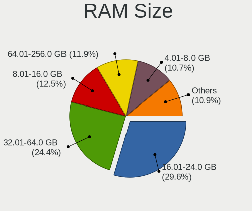

| Size in GB  | Desktops | Percent |
|-------------|----------|---------|
| 16.01-24.0  | 30       | 31.91%  |
| 32.01-64.0  | 20       | 21.28%  |
| 8.01-16.0   | 14       | 14.89%  |
| 64.01-256.0 | 11       | 11.7%   |
| 4.01-8.0    | 8        | 8.51%   |
| 24.01-32.0  | 6        | 6.38%   |
| 3.01-4.0    | 4        | 4.26%   |
| 1.01-2.0    | 1        | 1.06%   |

RAM Used
--------

Used RAM memory

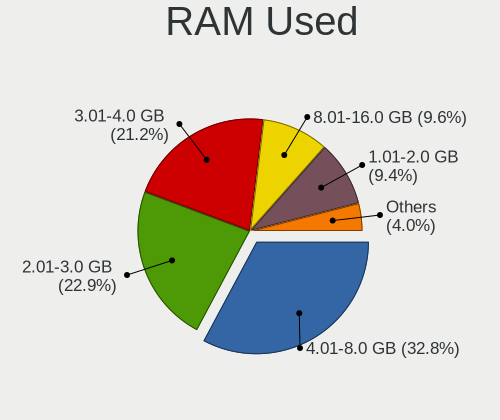

| Used GB    | Desktops | Percent |
|------------|----------|---------|
| 4.01-8.0   | 28       | 29.17%  |
| 2.01-3.0   | 28       | 29.17%  |
| 3.01-4.0   | 20       | 20.83%  |
| 1.01-2.0   | 10       | 10.42%  |
| 8.01-16.0  | 7        | 7.29%   |
| 16.01-24.0 | 2        | 2.08%   |
| 0.51-1.0   | 1        | 1.04%   |

Total Drives
------------

Number of drives on board

| Drives | Desktops | Percent |
|--------|----------|---------|
| 2      | 35       | 36.84%  |
| 1      | 32       | 33.68%  |
| 4      | 11       | 11.58%  |
| 3      | 11       | 11.58%  |
| 6      | 4        | 4.21%   |
| 11     | 1        | 1.05%   |
| 5      | 1        | 1.05%   |

Has CD-ROM
----------

Has CD-ROM on board

| Presented | Desktops | Percent |
|-----------|----------|---------|
| No        | 68       | 71.58%  |
| Yes       | 27       | 28.42%  |

Has Ethernet
------------

Has Ethernet on board

| Presented | Desktops | Percent |
|-----------|----------|---------|
| Yes       | 92       | 97.87%  |
| No        | 2        | 2.13%   |

Has WiFi
--------

Has WiFi module

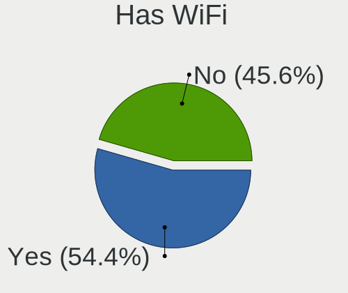

| Presented | Desktops | Percent |
|-----------|----------|---------|
| Yes       | 58       | 61.7%   |
| No        | 36       | 38.3%   |

Has Bluetooth
-------------

Has Bluetooth module

| Presented | Desktops | Percent |
|-----------|----------|---------|
| No        | 48       | 51.06%  |
| Yes       | 46       | 48.94%  |

Location
--------

Country
-------

Geographic location (country)

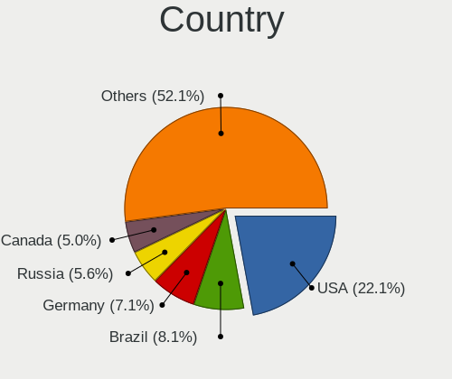

| Country     | Desktops | Percent |
|-------------|----------|---------|
| USA         | 23       | 24.47%  |
| Russia      | 7        | 7.45%   |
| Brazil      | 7        | 7.45%   |
| Canada      | 6        | 6.38%   |
| Germany     | 5        | 5.32%   |
| Australia   | 5        | 5.32%   |
| UK          | 4        | 4.26%   |
| Switzerland | 3        | 3.19%   |
| Netherlands | 3        | 3.19%   |
| Italy       | 3        | 3.19%   |
| France      | 3        | 3.19%   |
| Sweden      | 2        | 2.13%   |
| Poland      | 2        | 2.13%   |
| Hungary     | 2        | 2.13%   |
| Finland     | 2        | 2.13%   |
| Ukraine     | 1        | 1.06%   |
| Thailand    | 1        | 1.06%   |
| Taiwan      | 1        | 1.06%   |
| Singapore   | 1        | 1.06%   |
| Serbia      | 1        | 1.06%   |
| Portugal    | 1        | 1.06%   |
| Philippines | 1        | 1.06%   |
| Norway      | 1        | 1.06%   |
| Nicaragua   | 1        | 1.06%   |
| Mexico      | 1        | 1.06%   |
| Malaysia    | 1        | 1.06%   |
| Ireland     | 1        | 1.06%   |
| Chile       | 1        | 1.06%   |
| Belgium     | 1        | 1.06%   |
| Belarus     | 1        | 1.06%   |
| Austria     | 1        | 1.06%   |
| Algeria     | 1        | 1.06%   |

City
----

Geographic location (city)

| City           | Desktops | Percent |
|----------------|----------|---------|
| Sydney         | 3        | 3.19%   |
| Woodstock      | 2        | 2.13%   |
| Ober-Morlen    | 2        | 2.13%   |
| Los Alamos     | 2        | 2.13%   |
| Balashikha     | 2        | 2.13%   |
| Yekaterinburg  | 1        | 1.06%   |
| Winnipeg       | 1        | 1.06%   |
| Vise           | 1        | 1.06%   |
| Vienna         | 1        | 1.06%   |
| Uster          | 1        | 1.06%   |
| Ufa            | 1        | 1.06%   |
| Turku          | 1        | 1.06%   |
| Tsarskoye Selo | 1        | 1.06%   |
| Treillieres    | 1        | 1.06%   |
| Toronto        | 1        | 1.06%   |
| Toms River     | 1        | 1.06%   |
| Titusville     | 1        | 1.06%   |
| The Bronx      | 1        | 1.06%   |
| Teresina       | 1        | 1.06%   |
| Tainan City    | 1        | 1.06%   |
| Suwałki       | 1        | 1.06%   |
| Stavern        | 1        | 1.06%   |
| St Petersburg  | 1        | 1.06%   |
| Springfield    | 1        | 1.06%   |
| Singapore      | 1        | 1.06%   |
| Seattle        | 1        | 1.06%   |
| Scarborough    | 1        | 1.06%   |
| Santiago       | 1        | 1.06%   |
| Rochester      | 1        | 1.06%   |
| Racine         | 1        | 1.06%   |
| Queens         | 1        | 1.06%   |
| Québec        | 1        | 1.06%   |
| Pouso Alegre   | 1        | 1.06%   |
| Phenix City    | 1        | 1.06%   |
| Pawtucket      | 1        | 1.06%   |
| Pachuca        | 1        | 1.06%   |
| Ottawa         | 1        | 1.06%   |
| Nyköping      | 1        | 1.06%   |
| Novara         | 1        | 1.06%   |
| Nidau          | 1        | 1.06%   |

Drives
------

Drive Vendor
------------

Hard drive vendors

| Vendor                      | Desktops | Drives | Percent |
|-----------------------------|----------|--------|---------|
| Samsung Electronics         | 31       | 61     | 17.61%  |
| WDC                         | 22       | 25     | 12.5%   |
| Seagate                     | 17       | 21     | 9.66%   |
| Crucial                     | 15       | 20     | 8.52%   |
| Sandisk                     | 14       | 15     | 7.95%   |
| Toshiba                     | 10       | 10     | 5.68%   |
| Kingston                    | 10       | 12     | 5.68%   |
| Intel                       | 5        | 5      | 2.84%   |
| Phison Electronics          | 4        | 8      | 2.27%   |
| Silicon Motion              | 3        | 3      | 1.7%    |
| PNY                         | 3        | 4      | 1.7%    |
| Patriot                     | 3        | 3      | 1.7%    |
| Micron/Crucial Technology   | 3        | 3      | 1.7%    |
| Kingston Technology Company | 3        | 4      | 1.7%    |
| Hitachi                     | 3        | 4      | 1.7%    |
| Seagate Technology          | 2        | 3      | 1.14%   |
| Micron Technology           | 2        | 2      | 1.14%   |
| A-DATA Technology           | 2        | 2      | 1.14%   |
| Yeestor                     | 1        | 1      | 0.57%   |
| XPG                         | 1        | 1      | 0.57%   |
| USB                         | 1        | 1      | 0.57%   |
| TO Exter                    | 1        | 1      | 0.57%   |
| TAMMUZ                      | 1        | 1      | 0.57%   |
| SPCC                        | 1        | 1      | 0.57%   |
| SK hynix                    | 1        | 1      | 0.57%   |
| Realtek Semiconductor       | 1        | 4      | 0.57%   |
| OCZ                         | 1        | 1      | 0.57%   |
| Netac                       | 1        | 1      | 0.57%   |
| Mushkin                     | 1        | 1      | 0.57%   |
| Lexar                       | 1        | 1      | 0.57%   |
| KIOXIA                      | 1        | 1      | 0.57%   |
| KingSpec                    | 1        | 1      | 0.57%   |
| KingFast                    | 1        | 1      | 0.57%   |
| JMicron Technology          | 1        | 1      | 0.57%   |
| Fanxiang                    | 1        | 1      | 0.57%   |
| China                       | 1        | 1      | 0.57%   |
| ASMT                        | 1        | 2      | 0.57%   |
| ASENNO                      | 1        | 1      | 0.57%   |
| AMD                         | 1        | 1      | 0.57%   |
| Acer                        | 1        | 1      | 0.57%   |

Drive Model
-----------

Hard drive models

| Model                                                  | Desktops | Percent |
|--------------------------------------------------------|----------|---------|
| Samsung NVMe SSD Controller SM981/PM981/PM983 1TB      | 7        | 3.55%   |
| Samsung NVMe SSD Controller PM9A1/PM9A3/980PRO 2TB     | 5        | 2.54%   |
| WDC WDS500G2B0A-00SM50 500GB SSD                       | 4        | 2.03%   |
| Samsung SSD 860 EVO 1TB                                | 4        | 2.03%   |
| Crucial CT500MX500SSD1 500GB                           | 4        | 2.03%   |
| Toshiba HDWD110 1TB                                    | 3        | 1.52%   |
| Samsung SSD 860 EVO 500GB                              | 3        | 1.52%   |
| Phison E12 NVMe Controller 512GB                       | 3        | 1.52%   |
| Kingston SA400S37240G 240GB SSD                        | 3        | 1.52%   |
| Crucial CT1000MX500SSD1 1TB                            | 3        | 1.52%   |
| WDC WD6002FFWX-68TZ4N0 6TB                             | 2        | 1.02%   |
| WDC WD5000AAKX-60U6AA0 500GB                           | 2        | 1.02%   |
| Toshiba DT01ACA050 500GB                               | 2        | 1.02%   |
| Silicon Motion SM2263EN/SM2263XT SSD Controller 1024GB | 2        | 1.02%   |
| Seagate FireCuda 520 SSD 500GB                         | 2        | 1.02%   |
| Seagate ST2000DM008-2FR102 2TB                         | 2        | 1.02%   |
| Seagate ST1000LM035-1RK172 970GB                       | 2        | 1.02%   |
| Seagate ST1000DM010-2EP102 1TB                         | 2        | 1.02%   |
| Seagate ST1000DM003-1ER162 1TB                         | 2        | 1.02%   |
| Sandisk WD Blue SN550 NVMe SSD 1024GB                  | 2        | 1.02%   |
| SanDisk SSD PLUS 1000GB                                | 2        | 1.02%   |
| Samsung SSD 980 PRO 1TB                                | 2        | 1.02%   |
| PNY CS900 240GB SSD                                    | 2        | 1.02%   |
| Micron/Crucial P2 NVMe PCIe SSD 1TB                    | 2        | 1.02%   |
| Kingston SNVS500G 500GB                                | 2        | 1.02%   |
| Crucial CT120M500SSD1 120GB                            | 2        | 1.02%   |
| Yeestor 512GB                                          | 1        | 0.51%   |
| XPG NVMe SSD Drive 2TB                                 | 1        | 0.51%   |
| WDC WUH721818ALE6L4 18TB                               | 1        | 0.51%   |
| WDC WDS200T2B0C-00PXH0 2TB                             | 1        | 0.51%   |
| WDC WDS120G1G0A-00SS50 120GB SSD                       | 1        | 0.51%   |
| WDC WDBNCE0020PNC 2TB SSD                              | 1        | 0.51%   |
| WDC WD5000AADS-00S9B0 500GB                            | 1        | 0.51%   |
| WDC WD40EZRZ-00GXCB0 4TB                               | 1        | 0.51%   |
| WDC WD3200BPVT-22JJ5T0 320GB                           | 1        | 0.51%   |
| WDC WD20EZRX-00D8PB0 2TB                               | 1        | 0.51%   |
| WDC WD2002FYPS-01U1B0 2TB                              | 1        | 0.51%   |
| WDC WD10EZRZ-22HTKB0 1TB                               | 1        | 0.51%   |
| WDC WD10EZEX-60ZF5A0 1TB                               | 1        | 0.51%   |
| WDC WD10EZEX-60WN4A0 1TB                               | 1        | 0.51%   |

HDD Vendor
----------

Hard disk drive vendors

| Vendor              | Desktops | Drives | Percent |
|---------------------|----------|--------|---------|
| Seagate             | 17       | 21     | 36.96%  |
| WDC                 | 15       | 18     | 32.61%  |
| Toshiba             | 7        | 7      | 15.22%  |
| Hitachi             | 3        | 4      | 6.52%   |
| USB                 | 1        | 1      | 2.17%   |
| Samsung Electronics | 1        | 1      | 2.17%   |
| JMicron Technology  | 1        | 1      | 2.17%   |
| ASMT                | 1        | 2      | 2.17%   |

SSD Vendor
----------

Solid state drive vendors

| Vendor              | Desktops | Drives | Percent |
|---------------------|----------|--------|---------|
| Samsung Electronics | 14       | 27     | 19.44%  |
| Crucial             | 14       | 17     | 19.44%  |
| WDC                 | 6        | 6      | 8.33%   |
| SanDisk             | 6        | 6      | 8.33%   |
| Kingston            | 6        | 7      | 8.33%   |
| PNY                 | 3        | 4      | 4.17%   |
| Patriot             | 3        | 3      | 4.17%   |
| Intel               | 3        | 3      | 4.17%   |
| A-DATA Technology   | 2        | 2      | 2.78%   |
| Toshiba             | 1        | 1      | 1.39%   |
| TO Exter            | 1        | 1      | 1.39%   |
| TAMMUZ              | 1        | 1      | 1.39%   |
| SPCC                | 1        | 1      | 1.39%   |
| OCZ                 | 1        | 1      | 1.39%   |
| Mushkin             | 1        | 1      | 1.39%   |
| Micron Technology   | 1        | 1      | 1.39%   |
| Lexar               | 1        | 1      | 1.39%   |
| KingSpec            | 1        | 1      | 1.39%   |
| Fanxiang            | 1        | 1      | 1.39%   |
| China               | 1        | 1      | 1.39%   |
| ASENNO              | 1        | 1      | 1.39%   |
| AMD                 | 1        | 1      | 1.39%   |
| Acer                | 1        | 1      | 1.39%   |
| 2.5"                | 1        | 1      | 1.39%   |

Drive Kind
----------

HDD or SSD

| Kind    | Desktops | Drives | Percent |
|---------|----------|--------|---------|
| SSD     | 61       | 90     | 39.35%  |
| NVMe    | 50       | 85     | 32.26%  |
| HDD     | 41       | 55     | 26.45%  |
| Unknown | 3        | 3      | 1.94%   |

Drive Connector
---------------

SATA, SAS, NVMe, etc.

| Type | Desktops | Drives | Percent |
|------|----------|--------|---------|
| SATA | 78       | 143    | 59.09%  |
| NVMe | 50       | 85     | 37.88%  |
| SAS  | 4        | 5      | 3.03%   |

Drive Size
----------

Size of hard drive

| Size in TB | Desktops | Drives | Percent |
|------------|----------|--------|---------|
| 0.01-0.5   | 49       | 77     | 46.67%  |
| 0.51-1.0   | 38       | 45     | 36.19%  |
| 1.01-2.0   | 13       | 17     | 12.38%  |
| 3.01-4.0   | 2        | 2      | 1.9%    |
| 4.01-10.0  | 2        | 3      | 1.9%    |
| 10.01-20.0 | 1        | 1      | 0.95%   |

Space Total
-----------

Amount of disk space available on the file system

| Size in GB     | Desktops | Percent |
|----------------|----------|---------|
| 1001-2000      | 20       | 21.05%  |
| 501-1000       | 17       | 17.89%  |
| More than 3000 | 13       | 13.68%  |
| 101-250        | 12       | 12.63%  |
| 251-500        | 11       | 11.58%  |
| 2001-3000      | 9        | 9.47%   |
| Unknown        | 5        | 5.26%   |
| 1-20           | 3        | 3.16%   |
| 51-100         | 3        | 3.16%   |
| 21-50          | 2        | 2.11%   |

Space Used
----------

Amount of used disk space

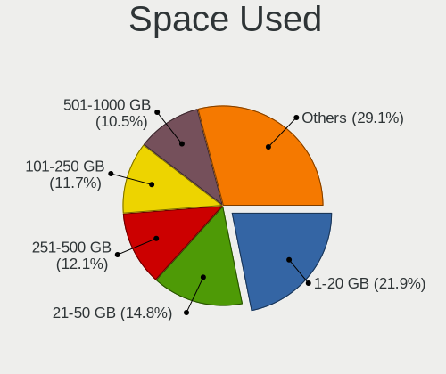

| Used GB        | Desktops | Percent |
|----------------|----------|---------|
| 1-20           | 25       | 25.77%  |
| 21-50          | 15       | 15.46%  |
| 251-500        | 14       | 14.43%  |
| 501-1000       | 11       | 11.34%  |
| 51-100         | 8        | 8.25%   |
| 1001-2000      | 7        | 7.22%   |
| 101-250        | 5        | 5.15%   |
| Unknown        | 5        | 5.15%   |
| 2001-3000      | 4        | 4.12%   |
| More than 3000 | 3        | 3.09%   |

Malfunc. Drives
---------------

Drive models with a malfunction

| Model                           | Desktops | Drives | Percent |
|---------------------------------|----------|--------|---------|
| Crucial CT120M500SSD1 120GB     | 2        | 2      | 25%     |
| WDC WD5000AADS-00S9B0 500GB     | 1        | 1      | 12.5%   |
| Seagate ST500DM002-1BD142 500GB | 1        | 1      | 12.5%   |
| Seagate ST3750528AS 752GB       | 1        | 1      | 12.5%   |
| SanDisk SSD PLUS 480GB          | 1        | 1      | 12.5%   |
| Intel SSDSC2CT120A3 120GB       | 1        | 1      | 12.5%   |
| Intel SSDSC2BF240A5L 240GB      | 1        | 1      | 12.5%   |

Malfunc. Drive Vendor
---------------------

Vendors of faulty drives

| Vendor  | Desktops | Drives | Percent |
|---------|----------|--------|---------|
| Seagate | 2        | 2      | 25%     |
| Intel   | 2        | 2      | 25%     |
| Crucial | 2        | 2      | 25%     |
| WDC     | 1        | 1      | 12.5%   |
| SanDisk | 1        | 1      | 12.5%   |

Malfunc. HDD Vendor
-------------------

Vendors of faulty HDD drives

| Vendor  | Desktops | Drives | Percent |
|---------|----------|--------|---------|
| Seagate | 2        | 2      | 66.67%  |
| WDC     | 1        | 1      | 33.33%  |

Malfunc. Drive Kind
-------------------

Kinds of faulty drives

| Kind | Desktops | Drives | Percent |
|------|----------|--------|---------|
| SSD  | 5        | 5      | 62.5%   |
| HDD  | 3        | 3      | 37.5%   |

Failed Drives
-------------

Failed drive models

Zero info for selected period =(

Failed Drive Vendor
-------------------

Failed drive vendors

Zero info for selected period =(

Drive Status
------------

Number of failed and malfunc. drives

| Status   | Desktops | Drives | Percent |
|----------|----------|--------|---------|
| Detected | 64       | 155    | 61.54%  |
| Works    | 32       | 70     | 30.77%  |
| Malfunc  | 8        | 8      | 7.69%   |

Storage controller
------------------

Storage Vendor
--------------

Storage controller vendors

| Vendor                       | Desktops | Percent |
|------------------------------|----------|---------|
| Intel                        | 47       | 28.83%  |
| AMD                          | 45       | 27.61%  |
| Samsung Electronics          | 23       | 14.11%  |
| SanDisk                      | 9        | 5.52%   |
| Kingston Technology Company  | 7        | 4.29%   |
| Phison Electronics           | 4        | 2.45%   |
| Micron/Crucial Technology    | 4        | 2.45%   |
| ASMedia Technology           | 4        | 2.45%   |
| Silicon Motion               | 3        | 1.84%   |
| JMicron Technology           | 3        | 1.84%   |
| Toshiba America Info Systems | 2        | 1.23%   |
| Seagate Technology           | 2        | 1.23%   |
| Marvell Technology Group     | 2        | 1.23%   |
| VIA Technologies             | 1        | 0.61%   |
| SK hynix                     | 1        | 0.61%   |
| Realtek Semiconductor        | 1        | 0.61%   |
| PMC-Sierra                   | 1        | 0.61%   |
| Netac Technology             | 1        | 0.61%   |
| Micron Technology            | 1        | 0.61%   |
| KIOXIA                       | 1        | 0.61%   |
| INNOGRIT                     | 1        | 0.61%   |

Storage Model
-------------

Storage controller models

| Model                                                                          | Desktops | Percent |
|--------------------------------------------------------------------------------|----------|---------|
| AMD FCH SATA Controller [AHCI mode]                                            | 26       | 14.05%  |
| Samsung NVMe SSD Controller SM981/PM981/PM983                                  | 12       | 6.49%   |
| AMD 500 Series Chipset SATA Controller                                         | 10       | 5.41%   |
| Samsung NVMe SSD Controller PM9A1/PM9A3/980PRO                                 | 8        | 4.32%   |
| Intel 8 Series/C220 Series Chipset Family 6-port SATA Controller 1 [AHCI mode] | 7        | 3.78%   |
| Intel Alder Lake-S PCH SATA Controller [AHCI Mode]                             | 6        | 3.24%   |
| AMD 400 Series Chipset SATA Controller                                         | 6        | 3.24%   |
| Intel Cannon Lake PCH SATA AHCI Controller                                     | 5        | 2.7%    |
| Intel 200 Series PCH SATA controller [AHCI mode]                               | 5        | 2.7%    |
| SanDisk Non-Volatile memory controller                                         | 4        | 2.16%   |
| Intel Volume Management Device NVMe RAID Controller                            | 4        | 2.16%   |
| ASMedia ASM1062 Serial ATA Controller                                          | 4        | 2.16%   |
| AMD SB7x0/SB8x0/SB9x0 IDE Controller                                           | 4        | 2.16%   |
| Phison E12 NVMe Controller                                                     | 3        | 1.62%   |
| Micron/Crucial P2 NVMe PCIe SSD                                                | 3        | 1.62%   |
| Kingston Company Company Non-Volatile memory controller                        | 3        | 1.62%   |
| Intel SATA Controller [RAID mode]                                              | 3        | 1.62%   |
| Intel Q170/Q150/B150/H170/H110/Z170/CM236 Chipset SATA Controller [AHCI Mode]  | 3        | 1.62%   |
| Intel 7 Series/C210 Series Chipset Family 6-port SATA Controller [AHCI mode]   | 3        | 1.62%   |
| AMD SB7x0/SB8x0/SB9x0 SATA Controller [AHCI mode]                              | 3        | 1.62%   |
| AMD FCH SATA Controller D                                                      | 3        | 1.62%   |
| Silicon Motion SM2263EN/SM2263XT SSD Controller                                | 2        | 1.08%   |
| Seagate FireCuda 520 SSD                                                       | 2        | 1.08%   |
| SanDisk WD Blue SN550 NVMe SSD                                                 | 2        | 1.08%   |
| Samsung NVMe SSD Controller 980                                                | 2        | 1.08%   |
| Micron/Crucial P5 Plus NVMe PCIe SSD                                           | 2        | 1.08%   |
| Marvell Group 88SE9172 SATA 6Gb/s Controller                                   | 2        | 1.08%   |
| Intel 6 Series/C200 Series Chipset Family 6 port Desktop SATA AHCI Controller  | 2        | 1.08%   |
| AMD 300 Series Chipset SATA Controller                                         | 2        | 1.08%   |
| VIA VT6421 IDE/SATA Controller                                                 | 1        | 0.54%   |
| Toshiba America Info Systems XG6 NVMe SSD Controller                           | 1        | 0.54%   |
| Toshiba America Info Systems NVMe Controller                                   | 1        | 0.54%   |
| SK hynix Gold P31/PC711 NVMe Solid State Drive                                 | 1        | 0.54%   |
| Silicon Motion Non-Volatile memory controller                                  | 1        | 0.54%   |
| SanDisk WD PC SN810 / Black SN850 NVMe SSD                                     | 1        | 0.54%   |
| SanDisk WD Blue SN570 NVMe SSD 2TB                                             | 1        | 0.54%   |
| SanDisk WD Black SN750 / PC SN730 NVMe SSD                                     | 1        | 0.54%   |
| Samsung Electronics Non-Volatile memory controller                             | 1        | 0.54%   |
| Realtek NVMe Controller                                                        | 1        | 0.54%   |
| PMC-Sierra PM8072 Tachyon SPCv 12G 16-port SAS/SATA controller                 | 1        | 0.54%   |

Storage Kind
------------

Kind of storage controller (IDE, SATA, NVMe, SAS, ...)

| Kind | Desktops | Percent |
|------|----------|---------|
| SATA | 84       | 54.55%  |
| NVMe | 50       | 32.47%  |
| IDE  | 10       | 6.49%   |
| RAID | 9        | 5.84%   |
| SAS  | 1        | 0.65%   |

Processor
---------

CPU Vendor
----------

Processor vendors

| Vendor | Desktops | Percent |
|--------|----------|---------|
| AMD    | 48       | 51.06%  |
| Intel  | 46       | 48.94%  |

CPU Model
---------

Processor models

| Model                                       | Desktops | Percent |
|---------------------------------------------|----------|---------|
| AMD Ryzen 5 5600X 6-Core Processor          | 5        | 5.32%   |
| AMD Ryzen 5 3600 6-Core Processor           | 4        | 4.26%   |
| AMD Ryzen 7 5800X 8-Core Processor          | 3        | 3.19%   |
| AMD Ryzen 7 5700G with Radeon Graphics      | 3        | 3.19%   |
| Intel Core i7-9700 CPU @ 3.00GHz            | 2        | 2.13%   |
| Intel Core i7-8700 CPU @ 3.20GHz            | 2        | 2.13%   |
| Intel Core i7-4770 CPU @ 3.40GHz            | 2        | 2.13%   |
| Intel Core i7-3770 CPU @ 3.40GHz            | 2        | 2.13%   |
| AMD Ryzen 9 7950X 16-Core Processor         | 2        | 2.13%   |
| AMD Ryzen 9 3950X 16-Core Processor         | 2        | 2.13%   |
| AMD Ryzen 9 3900X 12-Core Processor         | 2        | 2.13%   |
| AMD Ryzen 5 3600X 6-Core Processor          | 2        | 2.13%   |
| AMD Ryzen 5 1600 Six-Core Processor         | 2        | 2.13%   |
| Intel Xeon CPU X5675 @ 3.07GHz              | 1        | 1.06%   |
| Intel Xeon CPU E5-2690 0 @ 2.90GHz          | 1        | 1.06%   |
| Intel Xeon CPU E5-1603 v3 @ 2.80GHz         | 1        | 1.06%   |
| Intel Xeon CPU E3-1230 v5 @ 3.40GHz         | 1        | 1.06%   |
| Intel Pentium Dual-Core CPU E5400 @ 2.70GHz | 1        | 1.06%   |
| Intel Pentium CPU G630 @ 2.70GHz            | 1        | 1.06%   |
| Intel Pentium CPU G3220 @ 3.00GHz           | 1        | 1.06%   |
| Intel Core i9-9900K CPU @ 3.60GHz           | 1        | 1.06%   |
| Intel Core i9-10850K CPU @ 3.60GHz          | 1        | 1.06%   |
| Intel Core i7-8700K CPU @ 3.70GHz           | 1        | 1.06%   |
| Intel Core i7-7700K CPU @ 4.20GHz           | 1        | 1.06%   |
| Intel Core i7-6700 CPU @ 3.40GHz            | 1        | 1.06%   |
| Intel Core i7-4790K CPU @ 4.00GHz           | 1        | 1.06%   |
| Intel Core i7-3930K CPU @ 3.20GHz           | 1        | 1.06%   |
| Intel Core i7-2600 CPU @ 3.40GHz            | 1        | 1.06%   |
| Intel Core i5-8400 CPU @ 2.80GHz            | 1        | 1.06%   |
| Intel Core i5-7500 CPU @ 3.40GHz            | 1        | 1.06%   |
| Intel Core i5-7400 CPU @ 3.00GHz            | 1        | 1.06%   |
| Intel Core i5-6500 CPU @ 3.20GHz            | 1        | 1.06%   |
| Intel Core i5-4590 CPU @ 3.30GHz            | 1        | 1.06%   |
| Intel Core i5-4570 CPU @ 3.20GHz            | 1        | 1.06%   |
| Intel Core i5-4430 CPU @ 3.00GHz            | 1        | 1.06%   |
| Intel Core i5-3570 CPU @ 3.40GHz            | 1        | 1.06%   |
| Intel Core i5-3470 CPU @ 3.20GHz            | 1        | 1.06%   |
| Intel Core i3-9100F CPU @ 3.60GHz           | 1        | 1.06%   |
| Intel Core i3-4160 CPU @ 3.60GHz            | 1        | 1.06%   |
| Intel Core i3 CPU 550 @ 3.20GHz             | 1        | 1.06%   |

CPU Model Family
----------------

Processor model prefix

| Model                   | Desktops | Percent |
|-------------------------|----------|---------|
| AMD Ryzen 5             | 18       | 19.15%  |
| Intel Core i7           | 14       | 14.89%  |
| AMD Ryzen 9             | 11       | 11.7%   |
| Intel Core i5           | 9        | 9.57%   |
| AMD Ryzen 7             | 8        | 8.51%   |
| Other                   | 7        | 7.45%   |
| Intel Xeon              | 4        | 4.26%   |
| Intel Core i3           | 4        | 4.26%   |
| Intel Pentium           | 2        | 2.13%   |
| Intel Core i9           | 2        | 2.13%   |
| AMD Phenom II X4        | 2        | 2.13%   |
| AMD FX                  | 2        | 2.13%   |
| Intel Pentium Dual-Core | 1        | 1.06%   |
| Intel Core 2 Quad       | 1        | 1.06%   |
| Intel Celeron           | 1        | 1.06%   |
| Intel Atom              | 1        | 1.06%   |
| AMD Ryzen Threadripper  | 1        | 1.06%   |
| AMD Ryzen 5 PRO         | 1        | 1.06%   |
| AMD E2                  | 1        | 1.06%   |
| AMD Athlon II X2        | 1        | 1.06%   |
| AMD Athlon              | 1        | 1.06%   |
| AMD A8                  | 1        | 1.06%   |
| AMD A4                  | 1        | 1.06%   |

CPU Cores
---------

Number of processor cores

| Number | Desktops | Percent |
|--------|----------|---------|
| 4      | 28       | 29.79%  |
| 6      | 24       | 25.53%  |
| 8      | 14       | 14.89%  |
| 2      | 12       | 12.77%  |
| 16     | 7        | 7.45%   |
| 12     | 7        | 7.45%   |
| 24     | 1        | 1.06%   |
| 10     | 1        | 1.06%   |

CPU Sockets
-----------

Number of sockets

| Number | Desktops | Percent |
|--------|----------|---------|
| 1      | 93       | 98.94%  |
| 2      | 1        | 1.06%   |

CPU Threads
-----------

Threads per core (Hyper-Threading)

| Number | Desktops | Percent |
|--------|----------|---------|
| 2      | 70       | 74.47%  |
| 1      | 24       | 25.53%  |

CPU Op-Modes
------------

CPU Operation Modes (32-bit, 64-bit)

| Op mode        | Desktops | Percent |
|----------------|----------|---------|
| 32-bit, 64-bit | 94       | 100%    |

CPU Microcode
-------------

Microcode number

| Number     | Desktops | Percent |
|------------|----------|---------|
| Unknown    | 46       | 48.42%  |
| 0x08701021 | 11       | 11.58%  |
| 0x0a601203 | 5        | 5.26%   |
| 0x0a20120a | 4        | 4.21%   |
| 0x0a50000c | 3        | 3.16%   |
| 0x0800820d | 3        | 3.16%   |
| 0x0a50000d | 2        | 2.11%   |
| 0x0a201016 | 2        | 2.11%   |
| 0x08108109 | 2        | 2.11%   |
| 0x06000822 | 2        | 2.11%   |
| 0x906ea    | 1        | 1.05%   |
| 0x0a404102 | 1        | 1.05%   |
| 0x0a201205 | 1        | 1.05%   |
| 0x0a201025 | 1        | 1.05%   |
| 0x0a201009 | 1        | 1.05%   |
| 0x0a201005 | 1        | 1.05%   |
| 0x0a008203 | 1        | 1.05%   |
| 0x08101016 | 1        | 1.05%   |
| 0x08001126 | 1        | 1.05%   |
| 0x0700010b | 1        | 1.05%   |
| 0x06001119 | 1        | 1.05%   |
| 0x03000014 | 1        | 1.05%   |
| 0x010000c8 | 1        | 1.05%   |
| 0x010000bf | 1        | 1.05%   |
| 0x010000b6 | 1        | 1.05%   |

CPU Microarch
-------------

Microarchitecture

| Name             | Desktops | Percent |
|------------------|----------|---------|
| Zen 3            | 15       | 15.96%  |
| Zen 2            | 11       | 11.7%   |
| KabyLake         | 11       | 11.7%   |
| Haswell          | 9        | 9.57%   |
| Unknown          | 7        | 7.45%   |
| Alderlake Hybrid | 6        | 6.38%   |
| Zen+             | 5        | 5.32%   |
| SandyBridge      | 4        | 4.26%   |
| IvyBridge        | 4        | 4.26%   |
| Westmere         | 3        | 3.19%   |
| Skylake          | 3        | 3.19%   |
| Piledriver       | 3        | 3.19%   |
| K10              | 3        | 3.19%   |
| Zen              | 2        | 2.13%   |
| Tremont          | 1        | 1.06%   |
| TigerLake        | 1        | 1.06%   |
| Penryn           | 1        | 1.06%   |
| K10 Llano        | 1        | 1.06%   |
| Jaguar           | 1        | 1.06%   |
| Core             | 1        | 1.06%   |
| CometLake        | 1        | 1.06%   |
| Bonnell          | 1        | 1.06%   |

Graphics
--------

GPU Vendor
----------

Vendors of graphics cards

| Vendor | Desktops | Percent |
|--------|----------|---------|
| AMD    | 49       | 46.67%  |
| Intel  | 29       | 27.62%  |
| Nvidia | 27       | 25.71%  |

GPU Model
---------

Graphics card models

| Model                                                                       | Desktops | Percent |
|-----------------------------------------------------------------------------|----------|---------|
| Intel Xeon E3-1200 v3/4th Gen Core Processor Integrated Graphics Controller | 7        | 6.48%   |
| Intel CoffeeLake-S GT2 [UHD Graphics 630]                                   | 5        | 4.63%   |
| AMD Navi 23 [Radeon RX 6600/6600 XT/6600M]                                  | 5        | 4.63%   |
| AMD Navi 22 [Radeon RX 6700/6700 XT/6750 XT / 6800M/6850M XT]               | 5        | 4.63%   |
| AMD Ellesmere [Radeon RX 470/480/570/570X/580/580X/590]                     | 5        | 4.63%   |
| AMD Navi 10 [Radeon RX 5600 OEM/5600 XT / 5700/5700 XT]                     | 4        | 3.7%    |
| AMD Cezanne [Radeon Vega Series / Radeon Vega Mobile Series]                | 4        | 3.7%    |
| Nvidia GA104 [GeForce RTX 3060 Ti Lite Hash Rate]                           | 3        | 2.78%   |
| AMD Raphael                                                                 | 3        | 2.78%   |
| Nvidia GP106 [GeForce GTX 1060 6GB]                                         | 2        | 1.85%   |
| Nvidia GP104 [GeForce GTX 1070]                                             | 2        | 1.85%   |
| Nvidia GM206 [GeForce GTX 960]                                              | 2        | 1.85%   |
| Nvidia GA104 [GeForce RTX 3070 Ti]                                          | 2        | 1.85%   |
| Intel Xeon E3-1200 v2/3rd Gen Core processor Graphics Controller            | 2        | 1.85%   |
| Intel HD Graphics 530                                                       | 2        | 1.85%   |
| Intel Core Processor Integrated Graphics Controller                         | 2        | 1.85%   |
| Intel 4th Generation Core Processor Family Integrated Graphics Controller   | 2        | 1.85%   |
| AMD Picasso/Raven 2 [Radeon Vega Series / Radeon Vega Mobile Series]        | 2        | 1.85%   |
| AMD Navi 31 [Radeon RX 7900 XT/7900 XTX]                                    | 2        | 1.85%   |
| AMD Navi 21 [Radeon RX 6800/6800 XT / 6900 XT]                              | 2        | 1.85%   |
| AMD Cedar [Radeon HD 5000/6000/7350/8350 Series]                            | 2        | 1.85%   |
| AMD Baffin [Radeon RX 460/560D / Pro 450/455/460/555/555X/560/560X]         | 2        | 1.85%   |
| Nvidia TU117 [GeForce GTX 1650]                                             | 1        | 0.93%   |
| Nvidia TU116 [GeForce GTX 1660 Ti]                                          | 1        | 0.93%   |
| Nvidia TU106 [GeForce RTX 2070]                                             | 1        | 0.93%   |
| Nvidia TU106 [GeForce RTX 2060 Rev. A]                                      | 1        | 0.93%   |
| Nvidia TU104 [GeForce RTX 2080 SUPER]                                       | 1        | 0.93%   |
| Nvidia TU102 [GeForce RTX 2080 Ti Rev. A]                                   | 1        | 0.93%   |
| Nvidia GP108 [GeForce GT 1030]                                              | 1        | 0.93%   |
| Nvidia GP107 [GeForce GTX 1050 Ti]                                          | 1        | 0.93%   |
| Nvidia GP104 [GeForce GTX 1070 Ti]                                          | 1        | 0.93%   |
| Nvidia GM204 [GeForce GTX 970]                                              | 1        | 0.93%   |
| Nvidia GM200 [GeForce GTX 980 Ti]                                           | 1        | 0.93%   |
| Nvidia GF119 [GeForce GT 610]                                               | 1        | 0.93%   |
| Nvidia GF116 [GeForce GTS 450 Rev. 2]                                       | 1        | 0.93%   |
| Nvidia GF106 [GeForce GTS 450]                                              | 1        | 0.93%   |
| Nvidia GA106 [GeForce RTX 3060]                                             | 1        | 0.93%   |
| Nvidia GA104 [GeForce RTX 3070 Lite Hash Rate]                              | 1        | 0.93%   |
| Nvidia G94 [GeForce GT 140]                                                 | 1        | 0.93%   |
| Nvidia G86 [GeForce 8500 GT]                                                | 1        | 0.93%   |

GPU Combo
---------

Combinations of graphics cards

| Name           | Desktops | Percent |
|----------------|----------|---------|
| 1 x AMD        | 43       | 45.74%  |
| 1 x Nvidia     | 21       | 22.34%  |
| 1 x Intel      | 20       | 21.28%  |
| Intel + AMD    | 3        | 3.19%   |
| 2 x Nvidia     | 2        | 2.13%   |
| Intel + Nvidia | 2        | 2.13%   |
| AMD + Nvidia   | 2        | 2.13%   |
| 2 x AMD        | 1        | 1.06%   |

GPU Driver
----------

Free vs proprietary

| Driver      | Desktops | Percent |
|-------------|----------|---------|
| Free        | 78       | 82.98%  |
| Proprietary | 14       | 14.89%  |
| Unknown     | 2        | 2.13%   |

GPU Memory
----------

Total video memory

| Size in GB | Desktops | Percent |
|------------|----------|---------|
| Unknown    | 29       | 30.53%  |
| 7.01-8.0   | 19       | 20%     |
| 3.01-4.0   | 13       | 13.68%  |
| 8.01-16.0  | 8        | 8.42%   |
| 0.01-0.5   | 8        | 8.42%   |
| 0.51-1.0   | 7        | 7.37%   |
| 1.01-2.0   | 4        | 4.21%   |
| 5.01-6.0   | 3        | 3.16%   |
| 2.01-3.0   | 2        | 2.11%   |
| 16.01-24.0 | 2        | 2.11%   |

Monitor
-------

Monitor Vendor
--------------

Monitor vendors

| Vendor               | Desktops | Percent |
|----------------------|----------|---------|
| Dell                 | 20       | 19.42%  |
| Samsung Electronics  | 16       | 15.53%  |
| Goldstar             | 11       | 10.68%  |
| Philips              | 6        | 5.83%   |
| BenQ                 | 6        | 5.83%   |
| Acer                 | 6        | 5.83%   |
| Hewlett-Packard      | 5        | 4.85%   |
| ASUSTek Computer     | 5        | 4.85%   |
| Ancor Communications | 4        | 3.88%   |
| AOC                  | 3        | 2.91%   |
| ViewSonic            | 2        | 1.94%   |
| Sony                 | 2        | 1.94%   |
| Sceptre Tech         | 2        | 1.94%   |
| Mi                   | 2        | 1.94%   |
| Lenovo               | 2        | 1.94%   |
| Gigabyte Technology  | 2        | 1.94%   |
| Vestel Elektronik    | 1        | 0.97%   |
| Unknown (XXX)        | 1        | 0.97%   |
| Toshiba              | 1        | 0.97%   |
| MSI                  | 1        | 0.97%   |
| ITE                  | 1        | 0.97%   |
| HKC                  | 1        | 0.97%   |
| GDH                  | 1        | 0.97%   |
| Eizo                 | 1        | 0.97%   |
| Belinea              | 1        | 0.97%   |

Monitor Model
-------------

Monitor models

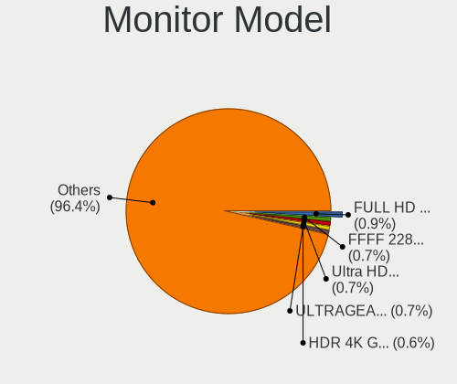

| Model                                                                  | Desktops | Percent |
|------------------------------------------------------------------------|----------|---------|
| Goldstar ULTRAWIDE GSM59F1 2560x1080 673x284mm 28.8-inch               | 3        | 2.83%   |
| Dell U3419W DELA12E 3440x1440 800x335mm 34.1-inch                      | 2        | 1.89%   |
| ViewSonic VG930m-3 VSC991E 1280x1024 376x301mm 19.0-inch               | 1        | 0.94%   |
| ViewSonic VG2448 VSC3B35 1920x1080 527x296mm 23.8-inch                 | 1        | 0.94%   |
| Vestel Elektronik 55UHD_LCD_TV VES3700 3840x2160 1872x1053mm 84.6-inch | 1        | 0.94%   |
| Unknown (XXX) Beyond TV XXX2851 3840x2160 1209x680mm 54.6-inch         | 1        | 0.94%   |
| Toshiba ScreenXpert TSB8888 1080x2160                                  | 1        | 0.94%   |
| Sony TV SNYDB01 1920x1080                                              | 1        | 0.94%   |
| Sony TV *02 SNYC603 1920x1080 952x535mm 43.0-inch                      | 1        | 0.94%   |
| Sceptre Tech Sceptre Y27 SPT6B3D 2560x1440 597x336mm 27.0-inch         | 1        | 0.94%   |
| Sceptre Tech Sceptre F22 SPT087F 1920x1080 475x267mm 21.5-inch         | 1        | 0.94%   |
| Sceptre Tech F27 SPT0ABF 1920x1080 409x230mm 18.5-inch                 | 1        | 0.94%   |
| Sceptre Tech E248W-19203S SPT099D 1920x1080 443x249mm 20.0-inch        | 1        | 0.94%   |
| Samsung Electronics U28H75x SAM0E00 3840x2160 607x345mm 27.5-inch      | 1        | 0.94%   |
| Samsung Electronics SyncMaster SAM050A 1920x1080 477x268mm 21.5-inch   | 1        | 0.94%   |
| Samsung Electronics SyncMaster SAM0499 1600x900 443x249mm 20.0-inch    | 1        | 0.94%   |
| Samsung Electronics SyncMaster SAM0473 2048x1152 510x287mm 23.0-inch   | 1        | 0.94%   |
| Samsung Electronics SyncMaster SAM03E5 1680x1050 474x296mm 22.0-inch   | 1        | 0.94%   |
| Samsung Electronics SMFX2490HD SAM0778 1920x1080 531x299mm 24.0-inch   | 1        | 0.94%   |
| Samsung Electronics SMC27A550U SAM07F5 1920x1080 604x342mm 27.3-inch   | 1        | 0.94%   |
| Samsung Electronics SE790C SAM0BFD 3440x1440 797x333mm 34.0-inch       | 1        | 0.94%   |
| Samsung Electronics S34J55x SAM0F70 3440x1440 797x333mm 34.0-inch      | 1        | 0.94%   |
| Samsung Electronics S24D332 SAM0F5E 1920x1080 531x299mm 24.0-inch      | 1        | 0.94%   |
| Samsung Electronics S24D330 SAM0D93 1920x1080 531x299mm 24.0-inch      | 1        | 0.94%   |
| Samsung Electronics S24B300 SAM08CE 1920x1080 531x299mm 24.0-inch      | 1        | 0.94%   |
| Samsung Electronics S23B370 SAM089B 1920x1080 510x287mm 23.0-inch      | 1        | 0.94%   |
| Samsung Electronics S22D300 SAM0B3F 1920x1080 477x268mm 21.5-inch      | 1        | 0.94%   |
| Samsung Electronics LCD Monitor SAM03BB 1920x1080 886x498mm 40.0-inch  | 1        | 0.94%   |
| Samsung Electronics LC27G5xT SAM7079 2560x1440 597x336mm 27.0-inch     | 1        | 0.94%   |
| Samsung Electronics C27JG5x SAM0F58 2560x1440 597x336mm 27.0-inch      | 1        | 0.94%   |
| Philips PHL 436M6VBP PHLC179 3840x2160 941x529mm 42.5-inch             | 1        | 0.94%   |
| Philips PHL 329P1 PHL0959 3840x2160 697x392mm 31.5-inch                | 1        | 0.94%   |
| Philips PHL 273V7 PHLC156 1920x1080 598x336mm 27.0-inch                | 1        | 0.94%   |
| Philips PHL 272E1GJ PHLC245 1920x1080 598x336mm 27.0-inch              | 1        | 0.94%   |
| Philips PHL 243V7 PHLC155 1920x1080 527x296mm 23.8-inch                | 1        | 0.94%   |
| Philips FTV PHL01EA 1920x1080 1440x810mm 65.0-inch                     | 1        | 0.94%   |
| MSI MPG273CQRX-QD MSI3CB9 2560x1440 597x336mm 27.0-inch                | 1        | 0.94%   |
| Mi Monitor XMI23C3 1920x1080 527x293mm 23.7-inch                       | 1        | 0.94%   |
| Mi 27 NFGL XMIB004 1920x1080 598x336mm 27.0-inch                       | 1        | 0.94%   |
| Lenovo P27h-20 LEN61E9 2560x1440 609x349mm 27.6-inch                   | 1        | 0.94%   |

Monitor Resolution
------------------

Monitor screen resolution

| Resolution         | Desktops | Percent |
|--------------------|----------|---------|
| 1920x1080 (FHD)    | 45       | 45%     |
| 2560x1440 (QHD)    | 15       | 15%     |
| 3840x2160 (4K)     | 12       | 12%     |
| 3440x1440          | 6        | 6%      |
| 1680x1050 (WSXGA+) | 4        | 4%      |
| 2560x1080          | 3        | 3%      |
| 1920x1200 (WUXGA)  | 3        | 3%      |
| 1280x1024 (SXGA)   | 3        | 3%      |
| 2048x1152          | 2        | 2%      |
| 1600x900 (HD+)     | 2        | 2%      |
| 1440x900 (WXGA+)   | 2        | 2%      |
| 3840x1080          | 1        | 1%      |
| 1600x1200          | 1        | 1%      |
| 1366x768 (WXGA)    | 1        | 1%      |

Monitor Diagonal
----------------

Diagonal size in inches

| Inches | Desktops | Percent |
|--------|----------|---------|
| 27     | 26       | 25.49%  |
| 24     | 21       | 20.59%  |
| 34     | 8        | 7.84%   |
| 23     | 7        | 6.86%   |
| 21     | 7        | 6.86%   |
| 31     | 6        | 5.88%   |
| 22     | 5        | 4.9%    |
| 20     | 3        | 2.94%   |
| 19     | 3        | 2.94%   |
| 32     | 2        | 1.96%   |
| 84     | 1        | 0.98%   |
| 72     | 1        | 0.98%   |
| 65     | 1        | 0.98%   |
| 54     | 1        | 0.98%   |
| 52     | 1        | 0.98%   |
| 49     | 1        | 0.98%   |
| 48     | 1        | 0.98%   |
| 42     | 1        | 0.98%   |
| 40     | 1        | 0.98%   |
| 35     | 1        | 0.98%   |
| 26     | 1        | 0.98%   |
| 25     | 1        | 0.98%   |
| 18     | 1        | 0.98%   |
| 17     | 1        | 0.98%   |

Monitor Width
-------------

Physical width

| Width in mm | Desktops | Percent |
|-------------|----------|---------|
| 501-600     | 48       | 48.48%  |
| 401-500     | 17       | 17.17%  |
| 601-700     | 12       | 12.12%  |
| 701-800     | 10       | 10.1%   |
| 1001-1500   | 5        | 5.05%   |
| 801-900     | 2        | 2.02%   |
| 1501-2000   | 2        | 2.02%   |
| 351-400     | 1        | 1.01%   |
| 301-350     | 1        | 1.01%   |
| 901-1000    | 1        | 1.01%   |

Aspect Ratio
------------

Proportional relationship between the width and the height

| Ratio | Desktops | Percent |
|-------|----------|---------|
| 16/9  | 67       | 72.04%  |
| 16/10 | 12       | 12.9%   |
| 21/9  | 9        | 9.68%   |
| 5/4   | 2        | 2.15%   |
| 4/3   | 2        | 2.15%   |
| 32/9  | 1        | 1.08%   |

Monitor Area
------------

Area in inch²

| Area in inch² | Desktops | Percent |
|----------------|----------|---------|
| 201-250        | 29       | 29%     |
| 301-350        | 27       | 27%     |
| 351-500        | 17       | 17%     |
| 151-200        | 10       | 10%     |
| More than 1000 | 6        | 6%      |
| 251-300        | 6        | 6%      |
| 501-1000       | 3        | 3%      |
| 141-150        | 2        | 2%      |

Pixel Density
-------------

Pixels per inch

| Density | Desktops | Percent |
|---------|----------|---------|
| 51-100  | 62       | 64.58%  |
| 101-120 | 24       | 25%     |
| 121-160 | 6        | 6.25%   |
| 1-50    | 4        | 4.17%   |

Multiple Monitors
-----------------

Total monitors connected

| Total | Desktops | Percent |
|-------|----------|---------|
| 1     | 73       | 77.66%  |
| 2     | 18       | 19.15%  |
| 0     | 2        | 2.13%   |
| 3     | 1        | 1.06%   |

Network
-------

Net Controller Vendor
---------------------

Controller vendors

| Vendor                          | Desktops | Percent |
|---------------------------------|----------|---------|
| Realtek Semiconductor           | 56       | 42.11%  |
| Intel                           | 48       | 36.09%  |
| Qualcomm Atheros                | 5        | 3.76%   |
| MediaTek                        | 4        | 3.01%   |
| TP-Link                         | 3        | 2.26%   |
| Ralink Technology               | 2        | 1.5%    |
| Ralink                          | 2        | 1.5%    |
| Qualcomm Atheros Communications | 2        | 1.5%    |
| NetGear                         | 2        | 1.5%    |
| Microsoft                       | 2        | 1.5%    |
| Broadcom                        | 2        | 1.5%    |
| Mellanox Technologies           | 1        | 0.75%   |
| Marvell Technology Group        | 1        | 0.75%   |
| HMD Global                      | 1        | 0.75%   |
| Belkin Components               | 1        | 0.75%   |
| Aquantia                        | 1        | 0.75%   |

Net Controller Model
--------------------

Controller models

| Model                                                                                         | Desktops | Percent |
|-----------------------------------------------------------------------------------------------|----------|---------|
| Realtek RTL8111/8168/8411 PCI Express Gigabit Ethernet Controller                             | 47       | 29.56%  |
| Intel Wi-Fi 6 AX200                                                                           | 17       | 10.69%  |
| Intel Ethernet Controller I225-V                                                              | 11       | 6.92%   |
| Realtek RTL8125 2.5GbE Controller                                                             | 7        | 4.4%    |
| Intel Dual Band Wireless-AC 3168NGW [Stone Peak]                                              | 5        | 3.14%   |
| Intel I211 Gigabit Network Connection                                                         | 4        | 2.52%   |
| Realtek RTL8153 Gigabit Ethernet Adapter                                                      | 3        | 1.89%   |
| MediaTek MT7922 802.11ax PCI Express Wireless Network Adapter                                 | 3        | 1.89%   |
| Intel Wi-Fi 6 AX210/AX211/AX411 160MHz                                                        | 3        | 1.89%   |
| Intel Ethernet Connection I217-LM                                                             | 3        | 1.89%   |
| Intel Alder Lake-S PCH CNVi WiFi                                                              | 3        | 1.89%   |
| Intel 82579LM Gigabit Network Connection (Lewisville)                                         | 3        | 1.89%   |
| TP-Link Archer T4U ver.3                                                                      | 2        | 1.26%   |
| NetGear A6100 AC600 DB Wireless Adapter [Realtek RTL8811AU]                                   | 2        | 1.26%   |
| Microsoft Xbox Wireless Adapter for Windows                                                   | 2        | 1.26%   |
| Intel Wireless-AC 9260                                                                        | 2        | 1.26%   |
| Intel Ethernet Connection (2) I219-V                                                          | 2        | 1.26%   |
| Intel Ethernet Connection (17) I219-V                                                         | 2        | 1.26%   |
| TP-Link 802.11ac NIC                                                                          | 1        | 0.63%   |
| Realtek USB 10/100/1G/2.5G LAN                                                                | 1        | 0.63%   |
| Realtek RTL8852BE PCIe 802.11ax Wireless Network Controller                                   | 1        | 0.63%   |
| Realtek RTL8822CE 802.11ac PCIe Wireless Network Adapter                                      | 1        | 0.63%   |
| Realtek RTL8821CE 802.11ac PCIe Wireless Network Adapter                                      | 1        | 0.63%   |
| Realtek RTL8812AE 802.11ac PCIe Wireless Network Adapter                                      | 1        | 0.63%   |
| Realtek RTL8188EUS 802.11n Wireless Network Adapter                                           | 1        | 0.63%   |
| Realtek Realtek 8812AU/8821AU 802.11ac WLAN Adapter [USB Wireless Dual-Band Adapter 2.4/5Ghz] | 1        | 0.63%   |
| Realtek 802.11ac NIC                                                                          | 1        | 0.63%   |
| Ralink RT5572 Wireless Adapter                                                                | 1        | 0.63%   |
| Ralink RT5372 Wireless Adapter                                                                | 1        | 0.63%   |
| Ralink RT5390 Wireless 802.11n 1T/1R PCIe                                                     | 1        | 0.63%   |
| Ralink RT2790 Wireless 802.11n 1T/2R PCIe                                                     | 1        | 0.63%   |
| Qualcomm Atheros QCA9377 802.11ac Wireless Network Adapter                                    | 1        | 0.63%   |
| Qualcomm Atheros Killer E2500 Gigabit Ethernet Controller                                     | 1        | 0.63%   |
| Qualcomm Atheros TP-Link TL-WN821N v3 / TL-WN822N v2 802.11n [Atheros AR7010+AR9287]          | 1        | 0.63%   |
| Qualcomm Atheros AR9271 802.11n                                                               | 1        | 0.63%   |
| Qualcomm Atheros AR9485 Wireless Network Adapter                                              | 1        | 0.63%   |
| Qualcomm Atheros AR93xx Wireless Network Adapter                                              | 1        | 0.63%   |
| Qualcomm Atheros AR8151 v2.0 Gigabit Ethernet                                                 | 1        | 0.63%   |
| Mellanox MT26448 [ConnectX EN 10GigE, PCIe 2.0 5GT/s]                                         | 1        | 0.63%   |
| MediaTek MT7921K (RZ608) Wi-Fi 6E 80MHz                                                       | 1        | 0.63%   |

Wireless Vendor
---------------

Wireless vendors

| Vendor                          | Desktops | Percent |
|---------------------------------|----------|---------|
| Intel                           | 30       | 50.85%  |
| Realtek Semiconductor           | 7        | 11.86%  |
| MediaTek                        | 4        | 6.78%   |
| TP-Link                         | 3        | 5.08%   |
| Qualcomm Atheros                | 3        | 5.08%   |
| Ralink Technology               | 2        | 3.39%   |
| Ralink                          | 2        | 3.39%   |
| Qualcomm Atheros Communications | 2        | 3.39%   |
| NetGear                         | 2        | 3.39%   |
| Microsoft                       | 2        | 3.39%   |
| Broadcom                        | 1        | 1.69%   |
| Belkin Components               | 1        | 1.69%   |

Wireless Model
--------------

Wireless models

| Model                                                                                         | Desktops | Percent |
|-----------------------------------------------------------------------------------------------|----------|---------|
| Intel Wi-Fi 6 AX200                                                                           | 17       | 28.81%  |
| Intel Dual Band Wireless-AC 3168NGW [Stone Peak]                                              | 5        | 8.47%   |
| MediaTek MT7922 802.11ax PCI Express Wireless Network Adapter                                 | 3        | 5.08%   |
| Intel Wi-Fi 6 AX210/AX211/AX411 160MHz                                                        | 3        | 5.08%   |
| Intel Alder Lake-S PCH CNVi WiFi                                                              | 3        | 5.08%   |
| TP-Link Archer T4U ver.3                                                                      | 2        | 3.39%   |
| NetGear A6100 AC600 DB Wireless Adapter [Realtek RTL8811AU]                                   | 2        | 3.39%   |
| Microsoft Xbox Wireless Adapter for Windows                                                   | 2        | 3.39%   |
| Intel Wireless-AC 9260                                                                        | 2        | 3.39%   |
| TP-Link 802.11ac NIC                                                                          | 1        | 1.69%   |
| Realtek RTL8852BE PCIe 802.11ax Wireless Network Controller                                   | 1        | 1.69%   |
| Realtek RTL8822CE 802.11ac PCIe Wireless Network Adapter                                      | 1        | 1.69%   |
| Realtek RTL8821CE 802.11ac PCIe Wireless Network Adapter                                      | 1        | 1.69%   |
| Realtek RTL8812AE 802.11ac PCIe Wireless Network Adapter                                      | 1        | 1.69%   |
| Realtek RTL8188EUS 802.11n Wireless Network Adapter                                           | 1        | 1.69%   |
| Realtek Realtek 8812AU/8821AU 802.11ac WLAN Adapter [USB Wireless Dual-Band Adapter 2.4/5Ghz] | 1        | 1.69%   |
| Realtek 802.11ac NIC                                                                          | 1        | 1.69%   |
| Ralink RT5572 Wireless Adapter                                                                | 1        | 1.69%   |
| Ralink RT5372 Wireless Adapter                                                                | 1        | 1.69%   |
| Ralink RT5390 Wireless 802.11n 1T/1R PCIe                                                     | 1        | 1.69%   |
| Ralink RT2790 Wireless 802.11n 1T/2R PCIe                                                     | 1        | 1.69%   |
| Qualcomm Atheros QCA9377 802.11ac Wireless Network Adapter                                    | 1        | 1.69%   |
| Qualcomm Atheros TP-Link TL-WN821N v3 / TL-WN822N v2 802.11n [Atheros AR7010+AR9287]          | 1        | 1.69%   |
| Qualcomm Atheros AR9271 802.11n                                                               | 1        | 1.69%   |
| Qualcomm Atheros AR9485 Wireless Network Adapter                                              | 1        | 1.69%   |
| Qualcomm Atheros AR93xx Wireless Network Adapter                                              | 1        | 1.69%   |
| MediaTek MT7921K (RZ608) Wi-Fi 6E 80MHz                                                       | 1        | 1.69%   |
| Broadcom BCM4360 802.11ac Wireless Network Adapter                                            | 1        | 1.69%   |
| Belkin Components F7D1101 v1 Basic Wireless Adapter [Realtek RTL8188SU]                       | 1        | 1.69%   |

Ethernet Vendor
---------------

Ethernet vendors

| Vendor                   | Desktops | Percent |
|--------------------------|----------|---------|
| Realtek Semiconductor    | 56       | 58.33%  |
| Intel                    | 33       | 34.38%  |
| Qualcomm Atheros         | 2        | 2.08%   |
| Mellanox Technologies    | 1        | 1.04%   |
| Marvell Technology Group | 1        | 1.04%   |
| HMD Global               | 1        | 1.04%   |
| Broadcom                 | 1        | 1.04%   |
| Aquantia                 | 1        | 1.04%   |

Ethernet Model
--------------

Ethernet models

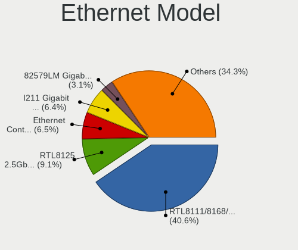

| Model                                                               | Desktops | Percent |
|---------------------------------------------------------------------|----------|---------|
| Realtek RTL8111/8168/8411 PCI Express Gigabit Ethernet Controller   | 47       | 47%     |
| Intel Ethernet Controller I225-V                                    | 11       | 11%     |
| Realtek RTL8125 2.5GbE Controller                                   | 7        | 7%      |
| Intel I211 Gigabit Network Connection                               | 4        | 4%      |
| Realtek RTL8153 Gigabit Ethernet Adapter                            | 3        | 3%      |
| Intel Ethernet Connection I217-LM                                   | 3        | 3%      |
| Intel 82579LM Gigabit Network Connection (Lewisville)               | 3        | 3%      |
| Intel Ethernet Connection (2) I219-V                                | 2        | 2%      |
| Intel Ethernet Connection (17) I219-V                               | 2        | 2%      |
| Realtek USB 10/100/1G/2.5G LAN                                      | 1        | 1%      |
| Qualcomm Atheros Killer E2500 Gigabit Ethernet Controller           | 1        | 1%      |
| Qualcomm Atheros AR8151 v2.0 Gigabit Ethernet                       | 1        | 1%      |
| Mellanox MT26448 [ConnectX EN 10GigE, PCIe 2.0 5GT/s]               | 1        | 1%      |
| Marvell Group 88E8055 PCI-E Gigabit Ethernet Controller             | 1        | 1%      |
| Marvell Group 88E8001 Gigabit Ethernet Controller                   | 1        | 1%      |
| Intel Ethernet Controller X550                                      | 1        | 1%      |
| Intel Ethernet controller                                           | 1        | 1%      |
| Intel Ethernet Connection (7) I219-V                                | 1        | 1%      |
| Intel Ethernet Connection (2) I219-LM                               | 1        | 1%      |
| Intel Ethernet Connection (2) I218-V                                | 1        | 1%      |
| Intel Ethernet Connection (17) I219-LM                              | 1        | 1%      |
| Intel 82579V Gigabit Network Connection                             | 1        | 1%      |
| Intel 82578DM Gigabit Network Connection                            | 1        | 1%      |
| Intel 82546EB Gigabit Ethernet Controller (Copper)                  | 1        | 1%      |
| HMD Global Nokia7.2                                                 | 1        | 1%      |
| Broadcom NetXtreme BCM5761 Gigabit Ethernet PCIe                    | 1        | 1%      |
| Aquantia AQC113CS NBase-T/IEEE 802.3bz Ethernet Controller [AQtion] | 1        | 1%      |

Net Controller Kind
-------------------

Ethernet, WiFi or modem

| Kind     | Desktops | Percent |
|----------|----------|---------|
| Ethernet | 92       | 61.33%  |
| WiFi     | 58       | 38.67%  |

Used Controller
---------------

Currently used network controller

| Kind     | Desktops | Percent |
|----------|----------|---------|
| Ethernet | 69       | 66.99%  |
| WiFi     | 34       | 33.01%  |

NICs
----

Total network controllers on board

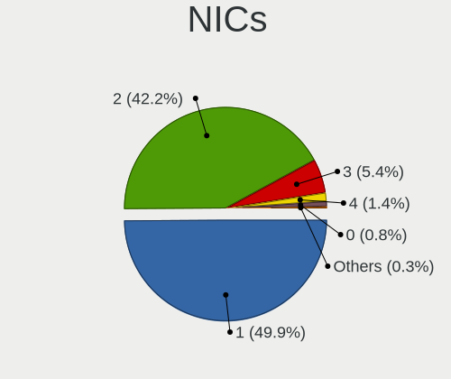

| Total | Desktops | Percent |
|-------|----------|---------|
| 1     | 45       | 47.87%  |
| 2     | 42       | 44.68%  |
| 3     | 3        | 3.19%   |
| 4     | 2        | 2.13%   |
| 0     | 2        | 2.13%   |

IPv6
----

IPv6 vs IPv4

| Used | Desktops | Percent |
|------|----------|---------|
| No   | 61       | 64.89%  |
| Yes  | 33       | 35.11%  |

Bluetooth
---------

Bluetooth Vendor
----------------

Controller vendors

| Vendor                  | Desktops | Percent |
|-------------------------|----------|---------|
| Intel                   | 28       | 60.87%  |
| Cambridge Silicon Radio | 6        | 13.04%  |
| Realtek Semiconductor   | 3        | 6.52%   |
| Broadcom                | 3        | 6.52%   |
| MediaTek                | 2        | 4.35%   |
| TP-Link                 | 1        | 2.17%   |
| IMC Networks            | 1        | 2.17%   |
| Foxconn / Hon Hai       | 1        | 2.17%   |
| D-Link                  | 1        | 2.17%   |

Bluetooth Model
---------------

Controller models

| Model                                               | Desktops | Percent |
|-----------------------------------------------------|----------|---------|
| Intel AX200 Bluetooth                               | 16       | 34.78%  |
| Cambridge Silicon Radio Bluetooth Dongle (HCI mode) | 6        | 13.04%  |
| Intel Wireless-AC 3168 Bluetooth                    | 5        | 10.87%  |
| Intel AX210 Bluetooth                               | 3        | 6.52%   |
| Realtek Bluetooth Radio                             | 2        | 4.35%   |
| MediaTek Wireless_Device                            | 2        | 4.35%   |
| Intel Wireless-AC 9260 Bluetooth Adapter            | 2        | 4.35%   |
| Intel AX201 Bluetooth                               | 2        | 4.35%   |
| Broadcom BCM20702A0 Bluetooth 4.0                   | 2        | 4.35%   |
| TP-Link UB500 Adapter                               | 1        | 2.17%   |
| Realtek  Bluetooth 4.2 Adapter                      | 1        | 2.17%   |
| IMC Networks Bluetooth Device                       | 1        | 2.17%   |
| Foxconn / Hon Hai Wireless_Device                   | 1        | 2.17%   |
| D-Link DBT-122 Bluetooth adapter                    | 1        | 2.17%   |
| Broadcom Bluetooth 3.0 Dongle                       | 1        | 2.17%   |

Sound
-----

Sound Vendor
------------

Sound card vendors

| Vendor                   | Desktops | Percent |
|--------------------------|----------|---------|
| AMD                      | 58       | 34.73%  |
| Intel                    | 45       | 26.95%  |
| Nvidia                   | 25       | 14.97%  |
| C-Media Electronics      | 6        | 3.59%   |
| RODE Microphones         | 3        | 1.8%    |
| Corsair                  | 3        | 1.8%    |
| ASUSTek Computer         | 3        | 1.8%    |
| Micro Star International | 2        | 1.2%    |
| Kingston Technology      | 2        | 1.2%    |
| Focusrite-Novation       | 2        | 1.2%    |
| Creative Technology      | 2        | 1.2%    |
| Yamaha                   | 1        | 0.6%    |
| Solid State Logic        | 1        | 0.6%    |
| Schiit Audio             | 1        | 0.6%    |
| Samson Technologies      | 1        | 0.6%    |
| Realtek Semiconductor    | 1        | 0.6%    |
| miniDSP                  | 1        | 0.6%    |
| Microsoft                | 1        | 0.6%    |
| Logitech                 | 1        | 0.6%    |
| KTMicro                  | 1        | 0.6%    |
| JMTek                    | 1        | 0.6%    |
| GN Netcom                | 1        | 0.6%    |
| Generalplus Technology   | 1        | 0.6%    |
| Cambridge Audio          | 1        | 0.6%    |
| BEHRINGER International  | 1        | 0.6%    |
| Barco Display Systems    | 1        | 0.6%    |
| Astro Gaming             | 1        | 0.6%    |

Sound Model
-----------

Sound card models

| Model                                                                      | Desktops | Percent |
|----------------------------------------------------------------------------|----------|---------|
| AMD Starship/Matisse HD Audio Controller                                   | 21       | 10%     |
| AMD Navi 21/23 HDMI/DP Audio Controller                                    | 13       | 6.19%   |
| AMD Family 17h/19h HD Audio Controller                                     | 11       | 5.24%   |
| Intel Xeon E3-1200 v3/4th Gen Core Processor HD Audio Controller           | 8        | 3.81%   |
| Intel 8 Series/C220 Series Chipset High Definition Audio Controller        | 8        | 3.81%   |
| Nvidia GA104 High Definition Audio Controller                              | 6        | 2.86%   |
| Intel 200 Series PCH HD Audio                                              | 6        | 2.86%   |
| AMD Ellesmere HDMI Audio [Radeon RX 470/480 / 570/580/590]                 | 6        | 2.86%   |
| Intel Cannon Lake PCH cAVS                                                 | 5        | 2.38%   |
| Intel Alder Lake-S HD Audio Controller                                     | 5        | 2.38%   |
| AMD SBx00 Azalia (Intel HDA)                                               | 5        | 2.38%   |
| AMD Renoir Radeon High Definition Audio Controller                         | 5        | 2.38%   |
| AMD Navi 10 HDMI Audio                                                     | 5        | 2.38%   |
| AMD Baffin HDMI/DP Audio [Radeon RX 550 640SP / RX 560/560X]               | 5        | 2.38%   |
| Intel 7 Series/C216 Chipset Family High Definition Audio Controller        | 4        | 1.9%    |
| AMD Rembrandt Radeon High Definition Audio Controller                      | 4        | 1.9%    |
| AMD Family 17h (Models 00h-0fh) HD Audio Controller                        | 4        | 1.9%    |
| Nvidia GP104 High Definition Audio Controller                              | 3        | 1.43%   |
| Intel 6 Series/C200 Series Chipset Family High Definition Audio Controller | 3        | 1.43%   |
| Intel 100 Series/C230 Series Chipset Family HD Audio Controller            | 3        | 1.43%   |
| ASUSTek Computer USB Audio                                                 | 3        | 1.43%   |
| AMD Raven/Raven2/Fenghuang HDMI/DP Audio Controller                        | 3        | 1.43%   |
| AMD FCH Azalia Controller                                                  | 3        | 1.43%   |
| Nvidia GP106 High Definition Audio Controller                              | 2        | 0.95%   |
| Nvidia GM206 High Definition Audio Controller                              | 2        | 0.95%   |
| Micro Star International USB Audio                                         | 2        | 0.95%   |
| Kingston Technology HyperX 7.1 Audio                                       | 2        | 0.95%   |
| Intel 5 Series/3400 Series Chipset High Definition Audio                   | 2        | 0.95%   |
| C-Media Electronics Audio Adapter (Unitek Y-247A)                          | 2        | 0.95%   |
| AMD Navi 31 [Radeon RX 7000 HDMI Audio]                                    | 2        | 0.95%   |
| AMD Juniper HDMI Audio [Radeon HD 5700 Series]                             | 2        | 0.95%   |
| AMD Cedar HDMI Audio [Radeon HD 5400/6300/7300 Series]                     | 2        | 0.95%   |
| Yamaha Steinberg UR22C                                                     | 1        | 0.48%   |
| Solid State Logic SSL 2+                                                   | 1        | 0.48%   |
| Schiit Audio I'm Fulla Schiit                                              | 1        | 0.48%   |
| Samson Technologies Q2U handheld mic with XLR                              | 1        | 0.48%   |
| RODE Microphones RODE VideoMic NTG                                         | 1        | 0.48%   |
| RODE Microphones RODE NT-USB Mini                                          | 1        | 0.48%   |
| RODE Microphones RODE NT-USB                                               | 1        | 0.48%   |
| Realtek Semiconductor UACDemoV1.0                                          | 1        | 0.48%   |

Memory
------

Memory Vendor
-------------

Memory module vendors

| Vendor              | Desktops | Percent |
|---------------------|----------|---------|
| Corsair             | 8        | 18.6%   |
| Unknown             | 5        | 11.63%  |
| G.Skill             | 5        | 11.63%  |
| Crucial             | 5        | 11.63%  |
| Kingston            | 4        | 9.3%    |
| Samsung Electronics | 3        | 6.98%   |
| A-DATA Technology   | 3        | 6.98%   |
| Team                | 1        | 2.33%   |
| Smart               | 1        | 2.33%   |
| SK hynix            | 1        | 2.33%   |
| Silicon Power       | 1        | 2.33%   |
| Ramaxel Technology  | 1        | 2.33%   |
| Qumo                | 1        | 2.33%   |
| PNY                 | 1        | 2.33%   |
| Micron Technology   | 1        | 2.33%   |
| GOODRAM             | 1        | 2.33%   |
| CSX                 | 1        | 2.33%   |

Memory Model
------------

Memory module models

| Model                                                     | Desktops | Percent |
|-----------------------------------------------------------|----------|---------|
| Unknown RAM Module 2GB DIMM SDRAM                         | 1        | 2.13%   |
| Unknown RAM Module 2GB DIMM DDR3 1067MT/s                 | 1        | 2.13%   |
| Unknown RAM Module 2GB DIMM DDR2 667MT/s                  | 1        | 2.13%   |
| Unknown RAM Module 2GB DIMM 533MT/s                       | 1        | 2.13%   |
| Unknown RAM 3600 C20 Series 32GB DIMM DDR4 3666MT/s       | 1        | 2.13%   |
| Team RAM TEAMGROUP-UD4-3200 8GB DIMM DDR4 3800MT/s        | 1        | 2.13%   |
| Smart RAM SH564128FH8N6TNSQG 4GB DIMM DDR3 1600MT/s       | 1        | 2.13%   |
| SK hynix RAM HMCG88MEBSA095N 32GB SODIMM DDR5 4800MT/s    | 1        | 2.13%   |
| Silicon Power RAM Module 8GB DIMM DDR4 3200MT/s           | 1        | 2.13%   |
| Samsung RAM M393B5773CH0-CH9 2GB DIMM DDR3 1333MT/s       | 1        | 2.13%   |
| Samsung RAM M393B5170GB0-CH9 4GB DIMM DDR3 1333MT/s       | 1        | 2.13%   |
| Samsung RAM M378B5173DB0-CK0 4GB DIMM DDR3 1600MT/s       | 1        | 2.13%   |
| Samsung RAM M3 78T5663QZ3-CF7 2GB DIMM DDR2 800MT/s       | 1        | 2.13%   |
| Ramaxel RAM RMR5030EF68F9W1600 4GB DIMM DDR3 1600MT/s     | 1        | 2.13%   |
| Qumo RAM Module 4GB DIMM DDR3 1067MT/s                    | 1        | 2.13%   |
| PNY RAM 8GBF1X08QFHH38-135-K 8GB DIMM DDR4 3600MT/s       | 1        | 2.13%   |
| Micron RAM 16KTF1G64AZ-1G9P1 8GB DIMM DDR3 1866MT/s       | 1        | 2.13%   |
| Kingston RAM KHX2400C15/16G 16GB DIMM DDR4 3334MT/s       | 1        | 2.13%   |
| Kingston RAM KHX1600C10D3/8G 8GB DIMM DDR3 1600MT/s       | 1        | 2.13%   |
| Kingston RAM KHX1600C10D3/4G 4GB DIMM DDR3 1866MT/s       | 1        | 2.13%   |
| Kingston RAM KF560C36-16 16GB DIMM DDR5 6000MT/s          | 1        | 2.13%   |
| Kingston RAM 9905474-025.A00LF 2GB DIMM DDR3 1333MT/s     | 1        | 2.13%   |
| GOODRAM RAM GR1600D364L11S/4G 8GB DIMM DDR3 1600MT/s      | 1        | 2.13%   |
| G.Skill RAM F5-5600J2834F16G 16GB DIMM DDR5 4800MT/s      | 1        | 2.13%   |
| G.Skill RAM F4-3600C18-32GVK 32GB DIMM DDR4 3600MT/s      | 1        | 2.13%   |
| G.Skill RAM F4-3200C16-32GTZN 32GB DIMM DDR4 3200MT/s     | 1        | 2.13%   |
| G.Skill RAM F4-2800C15-4GVRB 4GB DIMM DDR4 2667MT/s       | 1        | 2.13%   |
| G.Skill RAM F4-2400C15-4GVR 4GB DIMM DDR4 2134MT/s        | 1        | 2.13%   |
| G.Skill RAM F3-12800CL9-4 4GB DIMM DDR3 1866MT/s          | 1        | 2.13%   |
| CSX RAM V01L3LF8GB52852816 8GB DIMM DDR3 1600MT/s         | 1        | 2.13%   |
| Crucial RAM CT8G4DFS8213.C8FBD1 8GB DIMM DDR4 2133MT/s    | 1        | 2.13%   |
| Crucial RAM CT51264BD160B.C16F 4GB DIMM DDR3 1600MT/s     | 1        | 2.13%   |
| Crucial RAM CT51264BA160BJ.M8F 4GB DIMM DDR3 1600MT/s     | 1        | 2.13%   |
| Crucial RAM CT32G4SFD8266.C16FB 32GB SODIMM DDR4 2667MT/s | 1        | 2.13%   |
| Crucial RAM BLS8G4D26BFSEK.8FBD 8GB DIMM DDR4 2666MT/s    | 1        | 2.13%   |
| Corsair RAM CMZ8GX3M2A160 4GB DIMM DDR3 1333MT/s          | 1        | 2.13%   |
| Corsair RAM CMK64GX5M2B5200Z40 32GB DIMM DDR5 4800MT/s    | 1        | 2.13%   |
| Corsair RAM CMK32GX5M2B5600C36 16GB DIMM DDR5 5800MT/s    | 1        | 2.13%   |
| Corsair RAM CMK32GX4M2E3200C16 16GB DIMM DDR4 3534MT/s    | 1        | 2.13%   |
| Corsair RAM CMK32GX4M2B3200C16 16GB DIMM DDR4 3400MT/s    | 1        | 2.13%   |

Memory Kind
-----------

Memory module kinds

| Kind    | Desktops | Percent |
|---------|----------|---------|
| DDR4    | 19       | 51.35%  |
| DDR3    | 9        | 24.32%  |
| DDR5    | 5        | 13.51%  |
| SDRAM   | 2        | 5.41%   |
| DDR2    | 1        | 2.7%    |
| Unknown | 1        | 2.7%    |

Memory Form Factor
------------------

Physical design of the memory module

| Name   | Desktops | Percent |
|--------|----------|---------|
| DIMM   | 33       | 89.19%  |
| SODIMM | 4        | 10.81%  |

Memory Size
-----------

Memory module size

| Size  | Desktops | Percent |
|-------|----------|---------|
| 8192  | 12       | 27.91%  |
| 4096  | 9        | 20.93%  |
| 32768 | 8        | 18.6%   |
| 16384 | 7        | 16.28%  |
| 2048  | 7        | 16.28%  |

Memory Speed
------------

Memory module speed

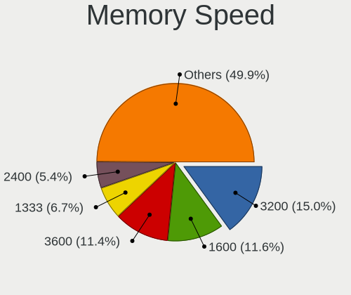

| Speed   | Desktops | Percent |
|---------|----------|---------|
| 3200    | 5        | 11.9%   |
| 1600    | 4        | 9.52%   |
| 4800    | 3        | 7.14%   |
| 3600    | 3        | 7.14%   |
| 1866    | 3        | 7.14%   |
| 1333    | 3        | 7.14%   |
| 3800    | 2        | 4.76%   |
| 3400    | 2        | 4.76%   |
| 2667    | 2        | 4.76%   |
| 6000    | 1        | 2.38%   |
| 5800    | 1        | 2.38%   |
| 3666    | 1        | 2.38%   |
| 3534    | 1        | 2.38%   |
| 3334    | 1        | 2.38%   |
| 3000    | 1        | 2.38%   |
| 2666    | 1        | 2.38%   |
| 2400    | 1        | 2.38%   |
| 2133    | 1        | 2.38%   |
| 1867    | 1        | 2.38%   |
| 1639    | 1        | 2.38%   |
| 1067    | 1        | 2.38%   |
| 667     | 1        | 2.38%   |
| 533     | 1        | 2.38%   |
| Unknown | 1        | 2.38%   |

Printers & scanners
-------------------

Printer Vendor
--------------

Printer device vendors

| Vendor      | Desktops | Percent |
|-------------|----------|---------|
| Seiko Epson | 1        | 100%    |

Printer Model
-------------

Printer device models

| Model                      | Desktops | Percent |
|----------------------------|----------|---------|
| Seiko Epson WF-2860 Series | 1        | 100%    |

Scanner Vendor
--------------

Scanner device vendors

| Vendor      | Desktops | Percent |
|-------------|----------|---------|
| Seiko Epson | 1        | 100%    |

Scanner Model
-------------

Scanner device models

| Model                                 | Desktops | Percent |
|---------------------------------------|----------|---------|
| Seiko Epson GT-X770 [Perfection V500] | 1        | 100%    |

Camera
------

Camera Vendor
-------------

Camera device vendors

| Vendor                      | Desktops | Percent |
|-----------------------------|----------|---------|
| Logitech                    | 18       | 58.06%  |
| Microsoft                   | 3        | 9.68%   |
| Samsung Electronics         | 1        | 3.23%   |
| Razer USA                   | 1        | 3.23%   |
| Pixart Imaging              | 1        | 3.23%   |
| Microdia                    | 1        | 3.23%   |
| KYE Systems (Mouse Systems) | 1        | 3.23%   |
| Google                      | 1        | 3.23%   |
| Cubeternet                  | 1        | 3.23%   |
| Chicony Electronics         | 1        | 3.23%   |
| AVerMedia Technologies      | 1        | 3.23%   |
| ARC International           | 1        | 3.23%   |

Camera Model
------------

Camera device models

| Model                                   | Desktops | Percent |
|-----------------------------------------|----------|---------|
| Logitech HD Pro Webcam C920             | 3        | 9.68%   |
| Logitech Webcam C925e                   | 2        | 6.45%   |
| Logitech HD Webcam C615                 | 2        | 6.45%   |
| Logitech BRIO Ultra HD Webcam           | 2        | 6.45%   |
| Samsung Galaxy series, misc. (MTP mode) | 1        | 3.23%   |
| Razer USA Gaming Webcam [Kiyo]          | 1        | 3.23%   |
| Pixart Imaging GE 1.3 MP MiniCam Pro    | 1        | 3.23%   |
| Microsoft Microsoft LifeCam Studio    | 1        | 3.23%   |
| Microsoft LifeCam VX-2000               | 1        | 3.23%   |
| Microsoft LifeCam HD-3000               | 1        | 3.23%   |
| Microdia HoverCam Solo Spark Audio      | 1        | 3.23%   |
| Logitech Webcam C270                    | 1        | 3.23%   |
| Logitech Webcam B500                    | 1        | 3.23%   |
| Logitech StreamCam                      | 1        | 3.23%   |
| Logitech QuickCam Communicate MP/S5500  | 1        | 3.23%   |
| Logitech HD Webcam C910                 | 1        | 3.23%   |
| Logitech HD Webcam C525                 | 1        | 3.23%   |
| Logitech C922 Pro Stream Webcam         | 1        | 3.23%   |
| Logitech C505 HD Webcam                 | 1        | 3.23%   |
| Logitech BRIO 4K Stream Edition         | 1        | 3.23%   |
| KYE Systems (Mouse Systems) Eye 320     | 1        | 3.23%   |
| Google Nexus/Pixel Device (PTP + debug) | 1        | 3.23%   |
| Cubeternet GL-UPC822 UVC WebCam         | 1        | 3.23%   |
| Chicony HP High Definition 1MP Webcam   | 1        | 3.23%   |
| AVerMedia Live Streamer CAM 313         | 1        | 3.23%   |
| ARC International Camera                | 1        | 3.23%   |

Security
--------

Fingerprint Vendor
------------------

Fingerprint sensor vendors

| Vendor                | Desktops | Percent |
|-----------------------|----------|---------|
| LighTuning Technology | 1        | 50%     |
| AuthenTec             | 1        | 50%     |

Fingerprint Model
-----------------

Fingerprint sensor models

| Model                         | Desktops | Percent |
|-------------------------------|----------|---------|
| LighTuning Fingerprint Sensor | 1        | 50%     |
| AuthenTec Fingerprint Sensor  | 1        | 50%     |

Chipcard Vendor
---------------

Chipcard module vendors

| Vendor | Desktops | Percent |
|--------|----------|---------|
| Bit4id | 1        | 100%    |

Chipcard Model
--------------

Chipcard module models

| Model                 | Desktops | Percent |
|-----------------------|----------|---------|
| Bit4id miniLector EVO | 1        | 100%    |

Unsupported
-----------

Unsupported Devices
-------------------

Total unsupported devices on board

| Total | Desktops | Percent |
|-------|----------|---------|
| 0     | 79       | 84.04%  |
| 1     | 15       | 15.96%  |

Unsupported Device Types
------------------------

Types of unsupported devices

| Type                     | Desktops | Percent |
|--------------------------|----------|---------|
| Net/wireless             | 5        | 33.33%  |
| Graphics card            | 3        | 20%     |
| Fingerprint reader       | 2        | 13.33%  |
| Communication controller | 2        | 13.33%  |
| Unassigned class         | 1        | 6.67%   |
| Sound                    | 1        | 6.67%   |
| Camera                   | 1        | 6.67%   |

