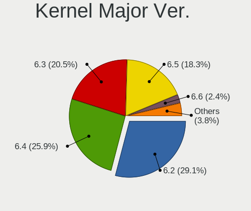
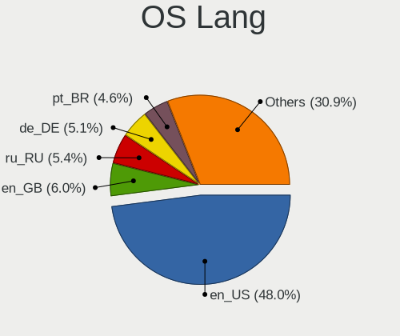
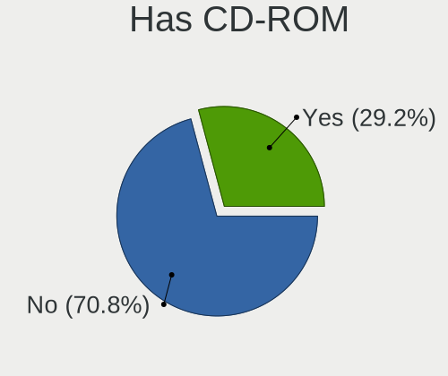
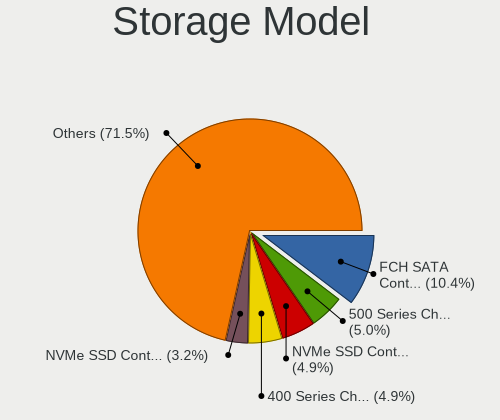
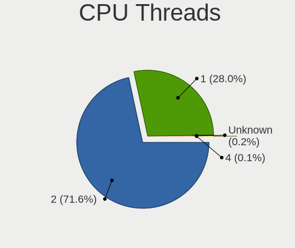
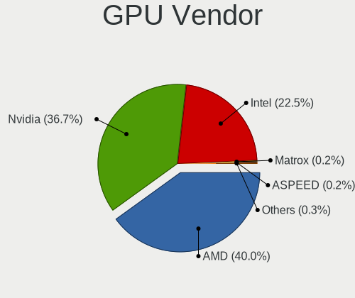
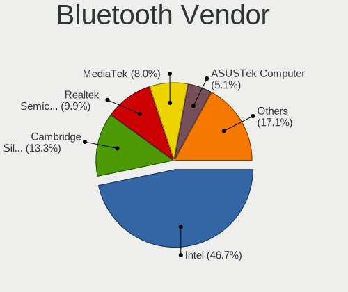
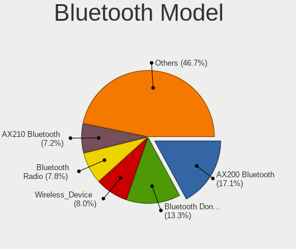
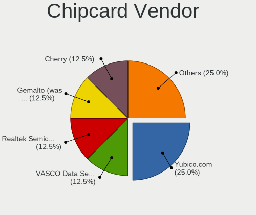

Fedora 38 - Tested Hardware & Statistics (Desktops)
---------------------------------------------------

A project to collect tested hardware configurations for Fedora 38.

Anyone can contribute to this report by the [hw-probe](https://github.com/linuxhw/hw-probe) tool:

    sudo -E hw-probe -all -upload

Please contribute! Especially if your hardware is rare.

Contents
--------

* [ Test Cases ](#test-cases)

* [ System ](#system)
  - [ Kernel                   ](#kernel)
  - [ Kernel Family            ](#kernel-family)
  - [ Kernel Major Ver.        ](#kernel-major-ver)
  - [ Arch                     ](#arch)
  - [ DE                       ](#de)
  - [ Display Server           ](#display-server)
  - [ Display Manager          ](#display-manager)
  - [ OS Lang                  ](#os-lang)
  - [ Boot Mode                ](#boot-mode)
  - [ Filesystem               ](#filesystem)
  - [ Part. scheme             ](#part-scheme)
  - [ Dual Boot with Linux/BSD ](#dual-boot-with-linuxbsd)
  - [ Dual Boot (Win)          ](#dual-boot-win)

* [ Board ](#board)
  - [ Vendor                   ](#vendor)
  - [ Model                    ](#model)
  - [ Model Family             ](#model-family)
  - [ MFG Year                 ](#mfg-year)
  - [ Form Factor              ](#form-factor)
  - [ Secure Boot              ](#secure-boot)
  - [ Coreboot                 ](#coreboot)
  - [ RAM Size                 ](#ram-size)
  - [ RAM Used                 ](#ram-used)
  - [ Total Drives             ](#total-drives)
  - [ Has CD-ROM               ](#has-cd-rom)
  - [ Has Ethernet             ](#has-ethernet)
  - [ Has WiFi                 ](#has-wifi)
  - [ Has Bluetooth            ](#has-bluetooth)

* [ Location ](#location)
  - [ Country                  ](#country)
  - [ City                     ](#city)

* [ Drives ](#drives)
  - [ Drive Vendor             ](#drive-vendor)
  - [ Drive Model              ](#drive-model)
  - [ HDD Vendor               ](#hdd-vendor)
  - [ SSD Vendor               ](#ssd-vendor)
  - [ Drive Kind               ](#drive-kind)
  - [ Drive Connector          ](#drive-connector)
  - [ Drive Size               ](#drive-size)
  - [ Space Total              ](#space-total)
  - [ Space Used               ](#space-used)
  - [ Malfunc. Drives          ](#malfunc-drives)
  - [ Malfunc. Drive Vendor    ](#malfunc-drive-vendor)
  - [ Malfunc. HDD Vendor      ](#malfunc-hdd-vendor)
  - [ Malfunc. Drive Kind      ](#malfunc-drive-kind)
  - [ Failed Drives            ](#failed-drives)
  - [ Failed Drive Vendor      ](#failed-drive-vendor)
  - [ Drive Status             ](#drive-status)

* [ Storage controller ](#storage-controller)
  - [ Storage Vendor           ](#storage-vendor)
  - [ Storage Model            ](#storage-model)
  - [ Storage Kind             ](#storage-kind)

* [ Processor ](#processor)
  - [ CPU Vendor               ](#cpu-vendor)
  - [ CPU Model                ](#cpu-model)
  - [ CPU Model Family         ](#cpu-model-family)
  - [ CPU Cores                ](#cpu-cores)
  - [ CPU Sockets              ](#cpu-sockets)
  - [ CPU Threads              ](#cpu-threads)
  - [ CPU Op-Modes             ](#cpu-op-modes)
  - [ CPU Microcode            ](#cpu-microcode)
  - [ CPU Microarch            ](#cpu-microarch)

* [ Graphics ](#graphics)
  - [ GPU Vendor               ](#gpu-vendor)
  - [ GPU Model                ](#gpu-model)
  - [ GPU Combo                ](#gpu-combo)
  - [ GPU Driver               ](#gpu-driver)
  - [ GPU Memory               ](#gpu-memory)

* [ Monitor ](#monitor)
  - [ Monitor Vendor           ](#monitor-vendor)
  - [ Monitor Model            ](#monitor-model)
  - [ Monitor Resolution       ](#monitor-resolution)
  - [ Monitor Diagonal         ](#monitor-diagonal)
  - [ Monitor Width            ](#monitor-width)
  - [ Aspect Ratio             ](#aspect-ratio)
  - [ Monitor Area             ](#monitor-area)
  - [ Pixel Density            ](#pixel-density)
  - [ Multiple Monitors        ](#multiple-monitors)

* [ Network ](#network)
  - [ Net Controller Vendor    ](#net-controller-vendor)
  - [ Net Controller Model     ](#net-controller-model)
  - [ Wireless Vendor          ](#wireless-vendor)
  - [ Wireless Model           ](#wireless-model)
  - [ Ethernet Vendor          ](#ethernet-vendor)
  - [ Ethernet Model           ](#ethernet-model)
  - [ Net Controller Kind      ](#net-controller-kind)
  - [ Used Controller          ](#used-controller)
  - [ NICs                     ](#nics)
  - [ IPv6                     ](#ipv6)

* [ Bluetooth ](#bluetooth)
  - [ Bluetooth Vendor         ](#bluetooth-vendor)
  - [ Bluetooth Model          ](#bluetooth-model)

* [ Sound ](#sound)
  - [ Sound Vendor             ](#sound-vendor)
  - [ Sound Model              ](#sound-model)

* [ Memory ](#memory)
  - [ Memory Vendor            ](#memory-vendor)
  - [ Memory Model             ](#memory-model)
  - [ Memory Kind              ](#memory-kind)
  - [ Memory Form Factor       ](#memory-form-factor)
  - [ Memory Size              ](#memory-size)
  - [ Memory Speed             ](#memory-speed)

* [ Printers & scanners ](#printers--scanners)
  - [ Printer Vendor           ](#printer-vendor)
  - [ Printer Model            ](#printer-model)
  - [ Scanner Vendor           ](#scanner-vendor)
  - [ Scanner Model            ](#scanner-model)

* [ Camera ](#camera)
  - [ Camera Vendor            ](#camera-vendor)
  - [ Camera Model             ](#camera-model)

* [ Security ](#security)
  - [ Fingerprint Vendor       ](#fingerprint-vendor)
  - [ Fingerprint Model        ](#fingerprint-model)
  - [ Chipcard Vendor          ](#chipcard-vendor)
  - [ Chipcard Model           ](#chipcard-model)

* [ Unsupported ](#unsupported)
  - [ Unsupported Devices      ](#unsupported-devices)
  - [ Unsupported Device Types ](#unsupported-device-types)

Test Cases
----------

Total: 1286

| Vendor        | Model                       | Probe                                                      | Date         |
|---------------|-----------------------------|------------------------------------------------------------|--------------|
| ASUSTek       | M4A785TD-V EVO              | [d57d789e77](https://linux-hardware.org/?probe=d57d789e77) | Nov 06, 2023 |
| MSI           | X99A RAIDER                 | [3a2a72df26](https://linux-hardware.org/?probe=3a2a72df26) | Nov 06, 2023 |
| ASRock        | X570 Phantom Gaming 4       | [05a8c22a35](https://linux-hardware.org/?probe=05a8c22a35) | Nov 05, 2023 |
| ASUSTek       | ROG STRIX Z390-E GAMING     | [e1d50d8743](https://linux-hardware.org/?probe=e1d50d8743) | Nov 05, 2023 |
| Dell          | 0VNP2H A00                  | [98439489ad](https://linux-hardware.org/?probe=98439489ad) | Nov 05, 2023 |
| HP            | 1494                        | [93e0e0302f](https://linux-hardware.org/?probe=93e0e0302f) | Nov 05, 2023 |
| ASUSTek       | PRIME B550M-A               | [4998a82a6b](https://linux-hardware.org/?probe=4998a82a6b) | Nov 05, 2023 |
| ASUSTek       | PRIME B450M-A II            | [539d8551fc](https://linux-hardware.org/?probe=539d8551fc) | Nov 05, 2023 |
| ASUSTek       | ROG Maximus Z790 HERO       | [a9ad2b542a](https://linux-hardware.org/?probe=a9ad2b542a) | Nov 05, 2023 |
| Pegatron      | 2AD5                        | [f8860a91a3](https://linux-hardware.org/?probe=f8860a91a3) | Nov 05, 2023 |
| Gigabyte      | B550M S2H                   | [7fb9150b16](https://linux-hardware.org/?probe=7fb9150b16) | Nov 04, 2023 |
| MSI           | B650 GAMING PLUS WIFI       | [8edaffcccb](https://linux-hardware.org/?probe=8edaffcccb) | Nov 04, 2023 |
| Unknown       | Unknown                     | [50949c6e51](https://linux-hardware.org/?probe=50949c6e51) | Nov 04, 2023 |
| ASRock        | B450 Steel Legend           | [2ab63a2fb6](https://linux-hardware.org/?probe=2ab63a2fb6) | Nov 04, 2023 |
| ASUSTek       | H81M-C                      | [cfb51ce306](https://linux-hardware.org/?probe=cfb51ce306) | Nov 03, 2023 |
| HP            | 859C                        | [7928158950](https://linux-hardware.org/?probe=7928158950) | Nov 03, 2023 |
| Gigabyte      | G41MT-D3                    | [3a4be91563](https://linux-hardware.org/?probe=3a4be91563) | Nov 03, 2023 |
| MSI           | B450M-A PRO MAX             | [3618f2a4b5](https://linux-hardware.org/?probe=3618f2a4b5) | Nov 03, 2023 |
| MSI           | MPG B550 GAMING PLUS        | [b58b97e74a](https://linux-hardware.org/?probe=b58b97e74a) | Nov 02, 2023 |
| MSI           | MAG B550 TOMAHAWK           | [bbe345cd5d](https://linux-hardware.org/?probe=bbe345cd5d) | Nov 02, 2023 |
| ASRock        | B760M PG SONIC WiFi         | [71e1e69f30](https://linux-hardware.org/?probe=71e1e69f30) | Nov 02, 2023 |
| MSI           | IONA                        | [579757d1cf](https://linux-hardware.org/?probe=579757d1cf) | Nov 02, 2023 |
| ASUSTek       | M52AD_M12AD                 | [a75715ee4a](https://linux-hardware.org/?probe=a75715ee4a) | Nov 01, 2023 |
| ASRock        | H97M Anniversary            | [6c66e3862d](https://linux-hardware.org/?probe=6c66e3862d) | Nov 01, 2023 |
| ASUSTek       | TUF Gaming X570-PRO         | [bb9a00e5b5](https://linux-hardware.org/?probe=bb9a00e5b5) | Nov 01, 2023 |
| Gigabyte      | GA-MA780G-UD3H              | [168597b33e](https://linux-hardware.org/?probe=168597b33e) | Nov 01, 2023 |
| HP            | 8767 A                      | [618323a058](https://linux-hardware.org/?probe=618323a058) | Nov 01, 2023 |
| Gigabyte      | P67A-D3-B3                  | [0c51ffc039](https://linux-hardware.org/?probe=0c51ffc039) | Nov 01, 2023 |
| MSI           | B450M PRO-M2 V2             | [7296b22122](https://linux-hardware.org/?probe=7296b22122) | Oct 31, 2023 |
| MSI           | MPG B550 GAMING EDGE WIF... | [3b79851103](https://linux-hardware.org/?probe=3b79851103) | Oct 31, 2023 |
| Gigabyte      | F2A55M-DS2                  | [069872b404](https://linux-hardware.org/?probe=069872b404) | Oct 31, 2023 |
| ASUSTek       | ROG STRIX X370-F GAMING     | [3179102373](https://linux-hardware.org/?probe=3179102373) | Oct 31, 2023 |
| ASUSTek       | PRIME B660-PLUS D4          | [53e53337bb](https://linux-hardware.org/?probe=53e53337bb) | Oct 30, 2023 |
| MSI           | H310M PRO-VDH PLUS          | [624a99186e](https://linux-hardware.org/?probe=624a99186e) | Oct 30, 2023 |
| Gigabyte      | B650 AORUS ELITE AX         | [949a1ab2bb](https://linux-hardware.org/?probe=949a1ab2bb) | Oct 30, 2023 |
| ASRock        | 890GM Pro3                  | [cfeea44315](https://linux-hardware.org/?probe=cfeea44315) | Oct 30, 2023 |
| Gigabyte      | B550 AORUS PRO AC           | [e41780f56a](https://linux-hardware.org/?probe=e41780f56a) | Oct 29, 2023 |
| Gigabyte      | B550I AORUS PRO AX          | [7d0eb8f922](https://linux-hardware.org/?probe=7d0eb8f922) | Oct 29, 2023 |
| Pegatron      | IPM41-D3                    | [ff941d75c9](https://linux-hardware.org/?probe=ff941d75c9) | Oct 29, 2023 |
| Pegatron      | IPM41-D3                    | [307134fa91](https://linux-hardware.org/?probe=307134fa91) | Oct 29, 2023 |
| ASUSTek       | PRIME B550M-A               | [deef4da5dc](https://linux-hardware.org/?probe=deef4da5dc) | Oct 29, 2023 |
| MSI           | PRO B650M-P                 | [521367f574](https://linux-hardware.org/?probe=521367f574) | Oct 29, 2023 |
| ASRock        | X399 Taichi                 | [78ab56301b](https://linux-hardware.org/?probe=78ab56301b) | Oct 29, 2023 |
| MSI           | MPG B550 GAMING PLUS        | [dee4ef8a3b](https://linux-hardware.org/?probe=dee4ef8a3b) | Oct 29, 2023 |
| ASRock        | Z370 Professional Gaming... | [f589e0c914](https://linux-hardware.org/?probe=f589e0c914) | Oct 28, 2023 |
| HP            | 8053                        | [352cc1bad8](https://linux-hardware.org/?probe=352cc1bad8) | Oct 28, 2023 |
| HP            | 8053                        | [25f2c6e830](https://linux-hardware.org/?probe=25f2c6e830) | Oct 28, 2023 |
| ASUSTek       | Z10PE-D8 WS                 | [4562f80268](https://linux-hardware.org/?probe=4562f80268) | Oct 28, 2023 |
| Gigabyte      | Z77-D3H                     | [77541125c0](https://linux-hardware.org/?probe=77541125c0) | Oct 28, 2023 |
| Gigabyte      | D525TUD                     | [944bb2ecb2](https://linux-hardware.org/?probe=944bb2ecb2) | Oct 28, 2023 |
| Gigabyte      | B550 VISION D-P             | [d78b4f6222](https://linux-hardware.org/?probe=d78b4f6222) | Oct 28, 2023 |
| MSI           | H310M PRO-VDH PLUS          | [b18bbae606](https://linux-hardware.org/?probe=b18bbae606) | Oct 27, 2023 |
| HP            | 843F                        | [c39418a5fe](https://linux-hardware.org/?probe=c39418a5fe) | Oct 27, 2023 |
| ASUSTek       | ROG STRIX X670E-I GAMING... | [4eacfc5dd8](https://linux-hardware.org/?probe=4eacfc5dd8) | Oct 27, 2023 |
| ASUSTek       | TUF Gaming B550M-PLUS       | [1cb73bada5](https://linux-hardware.org/?probe=1cb73bada5) | Oct 27, 2023 |
| ASUSTek       | TUF Gaming B760M-PLUS       | [a576bfd0b1](https://linux-hardware.org/?probe=a576bfd0b1) | Oct 26, 2023 |
| Gigabyte      | B450M DS3H V2               | [3279dc82a1](https://linux-hardware.org/?probe=3279dc82a1) | Oct 26, 2023 |
| Gigabyte      | X670 AORUS ELITE AX         | [fff464540a](https://linux-hardware.org/?probe=fff464540a) | Oct 26, 2023 |
| Dell          | 0KJCC5 A00                  | [f4f5605117](https://linux-hardware.org/?probe=f4f5605117) | Oct 26, 2023 |
| ASUSTek       | ROG STRIX X570-F GAMING     | [ca40b148a0](https://linux-hardware.org/?probe=ca40b148a0) | Oct 26, 2023 |
| ASRock        | 890GM Pro3                  | [ca2fb95579](https://linux-hardware.org/?probe=ca2fb95579) | Oct 25, 2023 |
| ASUSTek       | ROG STRIX B760-I GAMING ... | [d5afb1c9da](https://linux-hardware.org/?probe=d5afb1c9da) | Oct 25, 2023 |
| Gigabyte      | EP45-DS3L                   | [a3a2c0b74b](https://linux-hardware.org/?probe=a3a2c0b74b) | Oct 25, 2023 |
| HP            | 8433 11                     | [902343e220](https://linux-hardware.org/?probe=902343e220) | Oct 25, 2023 |
| ASUSTek       | ROG CROSSHAIR X670E HERO    | [9207de9b44](https://linux-hardware.org/?probe=9207de9b44) | Oct 25, 2023 |
| Dell          | 0C27VV A02                  | [7a88945a88](https://linux-hardware.org/?probe=7a88945a88) | Oct 25, 2023 |
| Supermicro    | X8SAX                       | [5d90e1af8c](https://linux-hardware.org/?probe=5d90e1af8c) | Oct 25, 2023 |
| ASRock        | FM2A88X+ Killer             | [c9b5ffd5b8](https://linux-hardware.org/?probe=c9b5ffd5b8) | Oct 24, 2023 |
| ASRock        | B450 Pro4                   | [d4a28890a5](https://linux-hardware.org/?probe=d4a28890a5) | Oct 24, 2023 |
| MSI           | B550-A PRO                  | [ed696b1c52](https://linux-hardware.org/?probe=ed696b1c52) | Oct 24, 2023 |
| ASUSTek       | P5Q3                        | [660547e520](https://linux-hardware.org/?probe=660547e520) | Oct 24, 2023 |
| MSI           | A320M PRO-VH PLUS           | [92dbf8615b](https://linux-hardware.org/?probe=92dbf8615b) | Oct 24, 2023 |
| Gigabyte      | B550M AORUS ELITE           | [4e13c711c7](https://linux-hardware.org/?probe=4e13c711c7) | Oct 24, 2023 |
| Acer          | Aspire X1900                | [6454f71562](https://linux-hardware.org/?probe=6454f71562) | Oct 23, 2023 |
| MSI           | Z170A GAMING PRO CARBON     | [4440cac740](https://linux-hardware.org/?probe=4440cac740) | Oct 23, 2023 |
| MSI           | X370 SLI PLUS               | [2ac0a2ecc8](https://linux-hardware.org/?probe=2ac0a2ecc8) | Oct 23, 2023 |
| Gigabyte      | GA-MA785G-UD3H              | [7c86d9f1e5](https://linux-hardware.org/?probe=7c86d9f1e5) | Oct 23, 2023 |
| ASRock        | D1800M                      | [d31fadd4a5](https://linux-hardware.org/?probe=d31fadd4a5) | Oct 23, 2023 |
| Gigabyte      | B450M DS3H-CF               | [eb9bba4f5c](https://linux-hardware.org/?probe=eb9bba4f5c) | Oct 23, 2023 |
| Gigabyte      | Z77MX-D3H                   | [1f16388df7](https://linux-hardware.org/?probe=1f16388df7) | Oct 23, 2023 |
| MSI           | IONA                        | [e444708510](https://linux-hardware.org/?probe=e444708510) | Oct 22, 2023 |
| AZW           | SER V1                      | [4262bad6c4](https://linux-hardware.org/?probe=4262bad6c4) | Oct 22, 2023 |
| MSI           | X99A RAIDER                 | [3ba4cde45a](https://linux-hardware.org/?probe=3ba4cde45a) | Oct 22, 2023 |
| HP            | 83E9                        | [c324d1ee0a](https://linux-hardware.org/?probe=c324d1ee0a) | Oct 22, 2023 |
| HP            | 83E9                        | [8102d00cdc](https://linux-hardware.org/?probe=8102d00cdc) | Oct 22, 2023 |
| ASUSTek       | PRIME Z690-P WIFI D4        | [7c383004b6](https://linux-hardware.org/?probe=7c383004b6) | Oct 21, 2023 |
| Gigabyte      | F2A55M-DS2                  | [422e70640a](https://linux-hardware.org/?probe=422e70640a) | Oct 21, 2023 |
| Shenzhen M... | F6BFC                       | [64148c88c0](https://linux-hardware.org/?probe=64148c88c0) | Oct 21, 2023 |
| MSI           | B450M MORTAR MAX            | [c1ad18b5c9](https://linux-hardware.org/?probe=c1ad18b5c9) | Oct 21, 2023 |
| ASRock        | H610M-HVS/M.2 R2.0          | [74df5e1893](https://linux-hardware.org/?probe=74df5e1893) | Oct 21, 2023 |
| MSI           | X99A RAIDER                 | [edefe667a4](https://linux-hardware.org/?probe=edefe667a4) | Oct 21, 2023 |
| Packard Be... | IMEDIA S3840                | [3cc1398528](https://linux-hardware.org/?probe=3cc1398528) | Oct 21, 2023 |
| ASUSTek       | ROG STRIX Z690-E GAMING ... | [8290e4c160](https://linux-hardware.org/?probe=8290e4c160) | Oct 20, 2023 |
| ANGXUN        | X99-DM3 V3.0                | [86fca6aaf4](https://linux-hardware.org/?probe=86fca6aaf4) | Oct 20, 2023 |
| Gigabyte      | GA-MA780G-UD3H              | [984eba244a](https://linux-hardware.org/?probe=984eba244a) | Oct 20, 2023 |
| MSI           | B550M PRO-VDH WIFI          | [6bb9b08c6e](https://linux-hardware.org/?probe=6bb9b08c6e) | Oct 20, 2023 |
| MSI           | B450-A PRO MAX              | [17b8a78644](https://linux-hardware.org/?probe=17b8a78644) | Oct 20, 2023 |
| MSI           | B550M PRO-VDH WIFI          | [3b1da376dc](https://linux-hardware.org/?probe=3b1da376dc) | Oct 19, 2023 |
| Gigabyte      | B75M-D3V                    | [b02f1b04e3](https://linux-hardware.org/?probe=b02f1b04e3) | Oct 19, 2023 |
| MACHINIST     | X99 G7 V1.0                 | [caca14cc52](https://linux-hardware.org/?probe=caca14cc52) | Oct 19, 2023 |
| MSI           | B550-A PRO                  | [77cf0c3af6](https://linux-hardware.org/?probe=77cf0c3af6) | Oct 18, 2023 |
| ASUSTek       | PRIME B550M-A               | [064dc574bb](https://linux-hardware.org/?probe=064dc574bb) | Oct 18, 2023 |
| Lenovo        | 30D9 SDK0J40705 WIN 3425... | [305b104f83](https://linux-hardware.org/?probe=305b104f83) | Oct 18, 2023 |
| MSI           | MPG X570S CARBON MAX WIF... | [0566ab2287](https://linux-hardware.org/?probe=0566ab2287) | Oct 18, 2023 |
| HP            | 2B52                        | [b14a00a196](https://linux-hardware.org/?probe=b14a00a196) | Oct 18, 2023 |
| ASUSTek       | PRIME B350-PLUS             | [d7ddb794ec](https://linux-hardware.org/?probe=d7ddb794ec) | Oct 18, 2023 |
| MSI           | MPG X570S CARBON MAX WIF... | [bb941b90f8](https://linux-hardware.org/?probe=bb941b90f8) | Oct 18, 2023 |
| Gigabyte      | H77N-WIFI                   | [0c16d31374](https://linux-hardware.org/?probe=0c16d31374) | Oct 18, 2023 |
| ASUSTek       | ROG STRIX X670E-E GAMING... | [d531813a7a](https://linux-hardware.org/?probe=d531813a7a) | Oct 18, 2023 |
| ASUSTek       | TUF Gaming B550M-PLUS WI... | [2530967a90](https://linux-hardware.org/?probe=2530967a90) | Oct 17, 2023 |
| HP            | 1589                        | [9fca3eb994](https://linux-hardware.org/?probe=9fca3eb994) | Oct 17, 2023 |
| AZW           | SER V1                      | [fa5f054ba7](https://linux-hardware.org/?probe=fa5f054ba7) | Oct 17, 2023 |
| AZW           | SER V1                      | [e5c570b755](https://linux-hardware.org/?probe=e5c570b755) | Oct 17, 2023 |
| ASUSTek       | TUF Gaming X570-PRO         | [8422037a50](https://linux-hardware.org/?probe=8422037a50) | Oct 17, 2023 |
| ASUSTek       | PRIME B450M-A II            | [b552badf93](https://linux-hardware.org/?probe=b552badf93) | Oct 17, 2023 |
| ASUSTek       | K30BF_M32BF_A_F_K31BF_6     | [6f8e6d4251](https://linux-hardware.org/?probe=6f8e6d4251) | Oct 17, 2023 |
| MSI           | MS-1T31                     | [2ca507b92f](https://linux-hardware.org/?probe=2ca507b92f) | Oct 17, 2023 |
| ASUSTek       | PRIME H510M-E               | [375e62bbf4](https://linux-hardware.org/?probe=375e62bbf4) | Oct 17, 2023 |
| HP            | 8AB6 SMVB                   | [e88f9153df](https://linux-hardware.org/?probe=e88f9153df) | Oct 17, 2023 |
| ASRock        | X570 Phantom Gaming 4       | [3f87e6216a](https://linux-hardware.org/?probe=3f87e6216a) | Oct 16, 2023 |
| MSI           | PRO B650-P WIFI             | [55d07d6ee2](https://linux-hardware.org/?probe=55d07d6ee2) | Oct 16, 2023 |
| ASUSTek       | P8H61-M                     | [66c28b84cf](https://linux-hardware.org/?probe=66c28b84cf) | Oct 16, 2023 |
| ASUSTek       | P8H61-M                     | [982543f4bc](https://linux-hardware.org/?probe=982543f4bc) | Oct 16, 2023 |
| Gigabyte      | Z170-D3H-CF                 | [70c2d315e0](https://linux-hardware.org/?probe=70c2d315e0) | Oct 16, 2023 |
| Gigabyte      | X570 I AORUS PRO WIFI       | [453546268b](https://linux-hardware.org/?probe=453546268b) | Oct 16, 2023 |
| ASRock        | B550 Phantom Gaming-ITX/... | [d294330c51](https://linux-hardware.org/?probe=d294330c51) | Oct 16, 2023 |
| ASRock        | A320M-HDV R4.0              | [bfbd0b0a49](https://linux-hardware.org/?probe=bfbd0b0a49) | Oct 15, 2023 |
| Gigabyte      | 970A-DS3P                   | [37983381b0](https://linux-hardware.org/?probe=37983381b0) | Oct 15, 2023 |
| ASUSTek       | STRIX Z270H GAMING          | [6082a5c0de](https://linux-hardware.org/?probe=6082a5c0de) | Oct 15, 2023 |
| MSI           | MPG B550 GAMING EDGE WIF... | [5330b349cb](https://linux-hardware.org/?probe=5330b349cb) | Oct 15, 2023 |
| Gigabyte      | 970A-DS3P                   | [8bbdd141fe](https://linux-hardware.org/?probe=8bbdd141fe) | Oct 15, 2023 |
| HP            | 1589                        | [88e5bbcc5a](https://linux-hardware.org/?probe=88e5bbcc5a) | Oct 15, 2023 |
| MSI           | PRO B660M-P DDR4            | [364fd8849a](https://linux-hardware.org/?probe=364fd8849a) | Oct 15, 2023 |
| Gigabyte      | J1900M-D2P                  | [27881eaaac](https://linux-hardware.org/?probe=27881eaaac) | Oct 15, 2023 |
| Dell          | 0TY915                      | [8ebe2fefc1](https://linux-hardware.org/?probe=8ebe2fefc1) | Oct 15, 2023 |
| Dell          | 0TY915                      | [736f520474](https://linux-hardware.org/?probe=736f520474) | Oct 15, 2023 |
| ASRock        | A320M-DGS                   | [a9599537b8](https://linux-hardware.org/?probe=a9599537b8) | Oct 15, 2023 |
| MSI           | MPG Z690 FORCE WIFI         | [7e4e4b6a5d](https://linux-hardware.org/?probe=7e4e4b6a5d) | Oct 15, 2023 |
| Intel         | DP55WB AAE64798-204         | [b5d7147862](https://linux-hardware.org/?probe=b5d7147862) | Oct 15, 2023 |
| Intel         | DP55WB AAE64798-204         | [642ecadbd2](https://linux-hardware.org/?probe=642ecadbd2) | Oct 15, 2023 |
| Dell          | 0Y2K8N A01                  | [32a0d75e98](https://linux-hardware.org/?probe=32a0d75e98) | Oct 14, 2023 |
| Acer          | Aspire TC-895 V:1.0         | [70b85fc17d](https://linux-hardware.org/?probe=70b85fc17d) | Oct 14, 2023 |
| ASUSTek       | TUF H310M-PLUS GAMING/BR    | [0a86fd4e1d](https://linux-hardware.org/?probe=0a86fd4e1d) | Oct 14, 2023 |
| MSI           | X470 GAMING PRO CARBON      | [039e898b5d](https://linux-hardware.org/?probe=039e898b5d) | Oct 13, 2023 |
| Lenovo        | SHARKBAY 0B98401 WIN        | [2edd75be93](https://linux-hardware.org/?probe=2edd75be93) | Oct 13, 2023 |
| ASRock        | B450M Pro4                  | [01e717042e](https://linux-hardware.org/?probe=01e717042e) | Oct 13, 2023 |
| ASRock        | H87 Performance             | [5d1713de03](https://linux-hardware.org/?probe=5d1713de03) | Oct 13, 2023 |
| Lenovo        | SHARKBAY 0B98401 WIN        | [f24ebc31a5](https://linux-hardware.org/?probe=f24ebc31a5) | Oct 13, 2023 |
| Dell          | 0WR7PY A03                  | [f59286c03f](https://linux-hardware.org/?probe=f59286c03f) | Oct 13, 2023 |
| MSI           | A68HM-E33                   | [71c8888ea4](https://linux-hardware.org/?probe=71c8888ea4) | Oct 12, 2023 |
| Gigabyte      | X570S UD                    | [c7b68dbfe1](https://linux-hardware.org/?probe=c7b68dbfe1) | Oct 12, 2023 |
| ASUSTek       | TUF Gaming B660M-PLUS D4    | [b71efdb817](https://linux-hardware.org/?probe=b71efdb817) | Oct 11, 2023 |
| HP            | 843B                        | [652027900b](https://linux-hardware.org/?probe=652027900b) | Oct 11, 2023 |
| ASUSTek       | Z97-DELUXE                  | [2e77fb6729](https://linux-hardware.org/?probe=2e77fb6729) | Oct 11, 2023 |
| ASUSTek       | Z97-DELUXE                  | [fa0785421a](https://linux-hardware.org/?probe=fa0785421a) | Oct 11, 2023 |
| Gigabyte      | B450 AORUS PRO WIFI-CF      | [3ceccfff97](https://linux-hardware.org/?probe=3ceccfff97) | Oct 11, 2023 |
| Gigabyte      | X570 AORUS ELITE            | [9b5d4b21a7](https://linux-hardware.org/?probe=9b5d4b21a7) | Oct 11, 2023 |
| Gigabyte      | X570 I AORUS PRO WIFI       | [a8028e0998](https://linux-hardware.org/?probe=a8028e0998) | Oct 11, 2023 |
| ASUSTek       | TUF Gaming X570-PLUS_BR     | [5566e985cf](https://linux-hardware.org/?probe=5566e985cf) | Oct 11, 2023 |
| ASUSTek       | TUF Gaming Z590-PLUS WIF... | [69f9b41478](https://linux-hardware.org/?probe=69f9b41478) | Oct 11, 2023 |
| MSI           | B450I GAMING PLUS AC        | [b1ff58e369](https://linux-hardware.org/?probe=b1ff58e369) | Oct 10, 2023 |
| Gigabyte      | J1900M-D2P                  | [8091bb0ceb](https://linux-hardware.org/?probe=8091bb0ceb) | Oct 10, 2023 |
| ASUSTek       | ProArt X670E-CREATOR WIF... | [19f6294d43](https://linux-hardware.org/?probe=19f6294d43) | Oct 10, 2023 |
| HP            | 89B5 A                      | [746fef0fc7](https://linux-hardware.org/?probe=746fef0fc7) | Oct 10, 2023 |
| ASRock        | B365M IB-R                  | [c1ac8c374a](https://linux-hardware.org/?probe=c1ac8c374a) | Oct 10, 2023 |
| Techvision    | TVI7309X B0                 | [5954b70bb9](https://linux-hardware.org/?probe=5954b70bb9) | Oct 10, 2023 |
| MSI           | A320M-A PRO                 | [4a1888b421](https://linux-hardware.org/?probe=4a1888b421) | Oct 09, 2023 |
| Dell          | 0478VN A00                  | [8881cc216c](https://linux-hardware.org/?probe=8881cc216c) | Oct 09, 2023 |
| Dell          | 0DF42J A00                  | [830730801b](https://linux-hardware.org/?probe=830730801b) | Oct 09, 2023 |
| Lenovo        | 3102 SDK0J40697 WIN 3305... | [7aa0b01da6](https://linux-hardware.org/?probe=7aa0b01da6) | Oct 09, 2023 |
| ASRock        | B550 Phantom Gaming 4/ac    | [b249985c20](https://linux-hardware.org/?probe=b249985c20) | Oct 09, 2023 |
| ASRock        | B550 Phantom Gaming 4/ac    | [90b88ff378](https://linux-hardware.org/?probe=90b88ff378) | Oct 09, 2023 |
| Gigabyte      | B550M DS3H                  | [7070641150](https://linux-hardware.org/?probe=7070641150) | Oct 08, 2023 |
| Gigabyte      | F2A55M-DS2                  | [dd44b0dc9e](https://linux-hardware.org/?probe=dd44b0dc9e) | Oct 08, 2023 |
| MSI           | MPG B550I GAMING EDGE WI... | [26708ac497](https://linux-hardware.org/?probe=26708ac497) | Oct 08, 2023 |
| Gigabyte      | H310M S2H x.x               | [fd3c1d1196](https://linux-hardware.org/?probe=fd3c1d1196) | Oct 08, 2023 |
| MSI           | B450 TOMAHAWK MAX           | [b04266e656](https://linux-hardware.org/?probe=b04266e656) | Oct 08, 2023 |
| Gigabyte      | B550 VISION D-P             | [b0a2980430](https://linux-hardware.org/?probe=b0a2980430) | Oct 08, 2023 |
| ASUSTek       | PRIME B550M-A               | [d43dc626c0](https://linux-hardware.org/?probe=d43dc626c0) | Oct 08, 2023 |
| ASUSTek       | ROG STRIX B660-I GAMING ... | [998f01f73b](https://linux-hardware.org/?probe=998f01f73b) | Oct 08, 2023 |
| HP            | 158A                        | [a1c0d51b9d](https://linux-hardware.org/?probe=a1c0d51b9d) | Oct 08, 2023 |
| Lenovo        | 32E9 SDK0T76461 WIN 3422... | [86f56798dc](https://linux-hardware.org/?probe=86f56798dc) | Oct 07, 2023 |
| Acer          | Aspire TC-895 V:1.0         | [0d980c4a61](https://linux-hardware.org/?probe=0d980c4a61) | Oct 07, 2023 |
| Acer          | Aspire X1900                | [38b7e52e6b](https://linux-hardware.org/?probe=38b7e52e6b) | Oct 06, 2023 |
| Gigabyte      | H81M-D2V                    | [a41f086304](https://linux-hardware.org/?probe=a41f086304) | Oct 06, 2023 |
| ASUSTek       | ROG STRIX X670E-E GAMING... | [6bf5869cab](https://linux-hardware.org/?probe=6bf5869cab) | Oct 06, 2023 |
| Dell          | 0N4YC8 A00                  | [76c6fdfad6](https://linux-hardware.org/?probe=76c6fdfad6) | Oct 06, 2023 |
| MSI           | B450M MORTAR MAX            | [a2fb75cc3e](https://linux-hardware.org/?probe=a2fb75cc3e) | Oct 06, 2023 |
| Medion        | MS-7707                     | [42bc6357f7](https://linux-hardware.org/?probe=42bc6357f7) | Oct 05, 2023 |
| HP            | 8906 SMVB                   | [010c54ccaf](https://linux-hardware.org/?probe=010c54ccaf) | Oct 05, 2023 |
| Dell          | 0478VN A00                  | [511df57852](https://linux-hardware.org/?probe=511df57852) | Oct 05, 2023 |
| ASUSTek       | P8H67                       | [68e28eea76](https://linux-hardware.org/?probe=68e28eea76) | Oct 05, 2023 |
| ASUSTek       | ROG STRIX X670E-I GAMING... | [9948b7ed73](https://linux-hardware.org/?probe=9948b7ed73) | Oct 05, 2023 |
| Dell          | 0N4YC8 A00                  | [fd4fb61bac](https://linux-hardware.org/?probe=fd4fb61bac) | Oct 05, 2023 |
| MSI           | PRO X670-P WIFI             | [d8f9e7b32a](https://linux-hardware.org/?probe=d8f9e7b32a) | Oct 05, 2023 |
| MSI           | PRO X670-P WIFI             | [ae798c007e](https://linux-hardware.org/?probe=ae798c007e) | Oct 05, 2023 |
| MSI           | B550M PRO-VDH WIFI          | [0aa9a5ddc3](https://linux-hardware.org/?probe=0aa9a5ddc3) | Oct 05, 2023 |
| ASRock        | AD2700-ITX                  | [3aea9e7d2f](https://linux-hardware.org/?probe=3aea9e7d2f) | Oct 05, 2023 |
| Shenzhen M... | HX90G                       | [135859015c](https://linux-hardware.org/?probe=135859015c) | Oct 04, 2023 |
| Gigabyte      | GA-MA780G-UD3H              | [ca79f8ce4c](https://linux-hardware.org/?probe=ca79f8ce4c) | Oct 04, 2023 |
| ASUSTek       | A8R32-MVP Deluxe            | [08f5cef7f3](https://linux-hardware.org/?probe=08f5cef7f3) | Oct 04, 2023 |
| ASRock        | B365 Pro4                   | [8e9fff1e35](https://linux-hardware.org/?probe=8e9fff1e35) | Oct 04, 2023 |
| Dell          | 0DF42J A00                  | [a98397577c](https://linux-hardware.org/?probe=a98397577c) | Oct 03, 2023 |
| ASUSTek       | ROG STRIX B650E-F GAMING... | [400e01b1bf](https://linux-hardware.org/?probe=400e01b1bf) | Oct 03, 2023 |
| ASUSTek       | PRIME X470-PRO              | [b225569c1d](https://linux-hardware.org/?probe=b225569c1d) | Oct 02, 2023 |
| Dell          | 0YJPT1 A00                  | [59f53b1488](https://linux-hardware.org/?probe=59f53b1488) | Oct 02, 2023 |
| Dell          | 07PR60 A01                  | [020c2fbbf8](https://linux-hardware.org/?probe=020c2fbbf8) | Oct 02, 2023 |
| Unknown       | Unknown                     | [1f2e2a6b13](https://linux-hardware.org/?probe=1f2e2a6b13) | Oct 02, 2023 |
| ASUSTek       | ROG CROSSHAIR X670E HERO    | [76c5466daa](https://linux-hardware.org/?probe=76c5466daa) | Oct 02, 2023 |
| Intel         | H110                        | [eaf6f0f81c](https://linux-hardware.org/?probe=eaf6f0f81c) | Oct 02, 2023 |
| Acer          | Aspire X1900                | [5d958ae7d1](https://linux-hardware.org/?probe=5d958ae7d1) | Oct 02, 2023 |
| ASRock        | H370M-ITX/ac                | [cf9e8e26c2](https://linux-hardware.org/?probe=cf9e8e26c2) | Oct 02, 2023 |
| MSI           | X99A RAIDER                 | [5442de3655](https://linux-hardware.org/?probe=5442de3655) | Oct 02, 2023 |
| ASUSTek       | ROG STRIX X670E-I GAMING... | [b27cfa6ad6](https://linux-hardware.org/?probe=b27cfa6ad6) | Oct 02, 2023 |
| ASUSTek       | TUF Gaming X570-PLUS        | [45b94d86b5](https://linux-hardware.org/?probe=45b94d86b5) | Oct 02, 2023 |
| ASRock        | B650E PG-ITX WiFi           | [10e1561364](https://linux-hardware.org/?probe=10e1561364) | Oct 01, 2023 |
| MSI           | X470 GAMING PLUS            | [113ab4dbc3](https://linux-hardware.org/?probe=113ab4dbc3) | Oct 01, 2023 |
| ASUSTek       | PRIME B450M-A               | [1e825c5574](https://linux-hardware.org/?probe=1e825c5574) | Oct 01, 2023 |
| MSI           | X99A RAIDER                 | [3e13770075](https://linux-hardware.org/?probe=3e13770075) | Oct 01, 2023 |
| Gigabyte      | D525TUD                     | [913e98318d](https://linux-hardware.org/?probe=913e98318d) | Oct 01, 2023 |
| Gigabyte      | D525TUD                     | [f48a538837](https://linux-hardware.org/?probe=f48a538837) | Oct 01, 2023 |
| ASUSTek       | Z170-DELUXE                 | [9e04efc2d9](https://linux-hardware.org/?probe=9e04efc2d9) | Oct 01, 2023 |
| ASUSTek       | TUF Gaming B660M-PLUS D4    | [f3d279f91b](https://linux-hardware.org/?probe=f3d279f91b) | Sep 30, 2023 |
| ASUSTek       | Z170-A                      | [bee067d5dd](https://linux-hardware.org/?probe=bee067d5dd) | Sep 30, 2023 |
| ASUSTek       | TUF Gaming B660M-PLUS D4    | [02af70281a](https://linux-hardware.org/?probe=02af70281a) | Sep 30, 2023 |
| Dell          | 0V8WGR A02                  | [9c9ded765b](https://linux-hardware.org/?probe=9c9ded765b) | Sep 30, 2023 |
| Gigabyte      | Z790 AORUS ELITE AX         | [9a749a1c41](https://linux-hardware.org/?probe=9a749a1c41) | Sep 30, 2023 |
| Gigabyte      | Z790 AORUS ELITE AX         | [452cd2622a](https://linux-hardware.org/?probe=452cd2622a) | Sep 30, 2023 |
| Gigabyte      | GA-870A-UD3                 | [5a507ec4da](https://linux-hardware.org/?probe=5a507ec4da) | Sep 30, 2023 |
| MSI           | X99A RAIDER                 | [a36938e994](https://linux-hardware.org/?probe=a36938e994) | Sep 30, 2023 |
| HP            | 8055                        | [3ddf31c78e](https://linux-hardware.org/?probe=3ddf31c78e) | Sep 30, 2023 |
| ASUSTek       | TUF Gaming B550-PLUS        | [3bec9011bd](https://linux-hardware.org/?probe=3bec9011bd) | Sep 30, 2023 |
| Gigabyte      | B550M AORUS ELITE           | [74bed86ee5](https://linux-hardware.org/?probe=74bed86ee5) | Sep 30, 2023 |
| ASUSTek       | PRIME B450M-A               | [3c9f4d4aef](https://linux-hardware.org/?probe=3c9f4d4aef) | Sep 29, 2023 |
| Intel         | H61                         | [f6a417439c](https://linux-hardware.org/?probe=f6a417439c) | Sep 29, 2023 |
| ASRock        | B450M Pro4 R2.0             | [8e039e23f3](https://linux-hardware.org/?probe=8e039e23f3) | Sep 29, 2023 |
| Intel         | H61                         | [e7dac2f9ed](https://linux-hardware.org/?probe=e7dac2f9ed) | Sep 29, 2023 |
| MSI           | PRO B660M-A DDR4            | [4b5a46a1e2](https://linux-hardware.org/?probe=4b5a46a1e2) | Sep 29, 2023 |
| ANGXUN        | X99-DM3 V3.0                | [1a7ed0ba7d](https://linux-hardware.org/?probe=1a7ed0ba7d) | Sep 29, 2023 |
| Lenovo        | SHARKBAY SDK0E50510 WIN     | [60c04875f1](https://linux-hardware.org/?probe=60c04875f1) | Sep 29, 2023 |
| Dell          | 0YJPT1 A00                  | [a0a41d401e](https://linux-hardware.org/?probe=a0a41d401e) | Sep 28, 2023 |
| MSI           | H310M PRO-VD                | [67e14c1b2d](https://linux-hardware.org/?probe=67e14c1b2d) | Sep 28, 2023 |
| ASUSTek       | Z97-A-USB31                 | [b7e5fb069c](https://linux-hardware.org/?probe=b7e5fb069c) | Sep 28, 2023 |
| Dell          | 0XC7MM A01                  | [9fdfc5a13f](https://linux-hardware.org/?probe=9fdfc5a13f) | Sep 28, 2023 |
| ASUSTek       | ROG STRIX X570-F GAMING     | [5dbe8e1541](https://linux-hardware.org/?probe=5dbe8e1541) | Sep 28, 2023 |
| Gigabyte      | B560M AORUS PRO AX          | [2e3d19e919](https://linux-hardware.org/?probe=2e3d19e919) | Sep 28, 2023 |
| MSI           | MPG Z490M GAMING EDGE WI... | [23150c5bd3](https://linux-hardware.org/?probe=23150c5bd3) | Sep 27, 2023 |
| ASUSTek       | PRIME B350-PLUS             | [546df5b57f](https://linux-hardware.org/?probe=546df5b57f) | Sep 27, 2023 |
| ASUSTek       | PRIME B350-PLUS             | [503570ad7a](https://linux-hardware.org/?probe=503570ad7a) | Sep 27, 2023 |
| ASUSTek       | ROG CROSSHAIR X670E HERO    | [41f0f8666c](https://linux-hardware.org/?probe=41f0f8666c) | Sep 27, 2023 |
| Gigabyte      | GA-MA785G-UD3H              | [4f0651ccc2](https://linux-hardware.org/?probe=4f0651ccc2) | Sep 27, 2023 |
| Gigabyte      | B650M K                     | [73da1b7ade](https://linux-hardware.org/?probe=73da1b7ade) | Sep 27, 2023 |
| ASRock        | B450M Steel Legend          | [b4de4fe266](https://linux-hardware.org/?probe=b4de4fe266) | Sep 27, 2023 |
| Gigabyte      | B550M S2H                   | [f61801ddb3](https://linux-hardware.org/?probe=f61801ddb3) | Sep 26, 2023 |
| Gigabyte      | B550M DS3H                  | [3bb1109d44](https://linux-hardware.org/?probe=3bb1109d44) | Sep 26, 2023 |
| ASUSTek       | ROG CROSSHAIR VIII HERO     | [85c6c01e63](https://linux-hardware.org/?probe=85c6c01e63) | Sep 26, 2023 |
| ASUSTek       | TUF B450-PLUS GAMING        | [8da87a8c78](https://linux-hardware.org/?probe=8da87a8c78) | Sep 26, 2023 |
| MSI           | MPG B650 CARBON WIFI        | [4b0aff27e8](https://linux-hardware.org/?probe=4b0aff27e8) | Sep 26, 2023 |
| MSI           | B450 GAMING PRO CARBON A... | [b49d28bbd4](https://linux-hardware.org/?probe=b49d28bbd4) | Sep 26, 2023 |
| ASRock        | B450M Steel Legend          | [ccb7f736f6](https://linux-hardware.org/?probe=ccb7f736f6) | Sep 26, 2023 |
| Huanan        | X99-8M-F V1.2               | [4ddba514a1](https://linux-hardware.org/?probe=4ddba514a1) | Sep 26, 2023 |
| MSI           | X99A RAIDER                 | [b69e9b97ec](https://linux-hardware.org/?probe=b69e9b97ec) | Sep 26, 2023 |
| ASUSTek       | M4A88TD-V EVO/USB3          | [4375a551e1](https://linux-hardware.org/?probe=4375a551e1) | Sep 25, 2023 |
| ASUSTek       | P9D WS                      | [fd2133400d](https://linux-hardware.org/?probe=fd2133400d) | Sep 25, 2023 |
| MSI           | MPG Z490M GAMING EDGE WI... | [a6ef2b5028](https://linux-hardware.org/?probe=a6ef2b5028) | Sep 25, 2023 |
| ASUSTek       | TUF B450-PLUS GAMING        | [b7dae6ef48](https://linux-hardware.org/?probe=b7dae6ef48) | Sep 25, 2023 |
| ASUSTek       | Z170I PRO GAMING            | [f4d45948eb](https://linux-hardware.org/?probe=f4d45948eb) | Sep 25, 2023 |
| MSI           | X99A RAIDER                 | [c6dc860de5](https://linux-hardware.org/?probe=c6dc860de5) | Sep 25, 2023 |
| ASRock        | B550M Pro4                  | [1b8b856469](https://linux-hardware.org/?probe=1b8b856469) | Sep 25, 2023 |
| MSI           | MAG B550 TOMAHAWK MAX WI... | [23d9e87224](https://linux-hardware.org/?probe=23d9e87224) | Sep 24, 2023 |
| Gigabyte      | X570S UD                    | [88653e2f06](https://linux-hardware.org/?probe=88653e2f06) | Sep 24, 2023 |
| Gigabyte      | EP45-DS3L                   | [57d5f67adf](https://linux-hardware.org/?probe=57d5f67adf) | Sep 24, 2023 |
| ASUSTek       | PRIME B660M-A AC D4         | [7c0eb47c16](https://linux-hardware.org/?probe=7c0eb47c16) | Sep 24, 2023 |
| Gigabyte      | X470 AORUS ULTRA GAMING-... | [5ed3f9381a](https://linux-hardware.org/?probe=5ed3f9381a) | Sep 23, 2023 |
| MSI           | B450M MORTAR MAX            | [fa3021d826](https://linux-hardware.org/?probe=fa3021d826) | Sep 23, 2023 |
| ASRock        | N68C-S UCC                  | [844c35381f](https://linux-hardware.org/?probe=844c35381f) | Sep 23, 2023 |
| MSI           | MPG X570 GAMING EDGE WIF... | [f59df7021c](https://linux-hardware.org/?probe=f59df7021c) | Sep 23, 2023 |
| Gigabyte      | MZGLKBP-00                  | [678c17756d](https://linux-hardware.org/?probe=678c17756d) | Sep 23, 2023 |
| ASRock        | H61M/U3S3                   | [1d397abb90](https://linux-hardware.org/?probe=1d397abb90) | Sep 23, 2023 |
| Gigabyte      | B85-HD3                     | [5da83e8683](https://linux-hardware.org/?probe=5da83e8683) | Sep 23, 2023 |
| ASUSTek       | PRIME B360-PLUS             | [5629e161ab](https://linux-hardware.org/?probe=5629e161ab) | Sep 23, 2023 |
| MSI           | MS-7388                     | [f5ee235af0](https://linux-hardware.org/?probe=f5ee235af0) | Sep 23, 2023 |
| ASUSTek       | PRIME B660M-A AC D4         | [1a81f24fbb](https://linux-hardware.org/?probe=1a81f24fbb) | Sep 23, 2023 |
| Dell          | 0KWVT8 A03                  | [c6f224508a](https://linux-hardware.org/?probe=c6f224508a) | Sep 23, 2023 |
| MSI           | B450M MORTAR MAX            | [3b9bbcebb0](https://linux-hardware.org/?probe=3b9bbcebb0) | Sep 23, 2023 |
| MSI           | H110M PRO-D                 | [40380b4dce](https://linux-hardware.org/?probe=40380b4dce) | Sep 22, 2023 |
| HP            | 834F                        | [b69b667f2c](https://linux-hardware.org/?probe=b69b667f2c) | Sep 22, 2023 |
| Gigabyte      | H61M-S2PV                   | [fd5d5651ce](https://linux-hardware.org/?probe=fd5d5651ce) | Sep 22, 2023 |
| ASUSTek       | PRIME X570-P                | [21b73523cf](https://linux-hardware.org/?probe=21b73523cf) | Sep 22, 2023 |
| Gigabyte      | Z170-D3H-CF                 | [2e715ca7b2](https://linux-hardware.org/?probe=2e715ca7b2) | Sep 22, 2023 |
| Lenovo        | 1036 SDK0Q40104 WIN 3305... | [80c7b750ea](https://linux-hardware.org/?probe=80c7b750ea) | Sep 21, 2023 |
| ASUSTek       | M5A78L-M/USB3               | [609a91b51f](https://linux-hardware.org/?probe=609a91b51f) | Sep 21, 2023 |
| ANGXUN        | X99-DM3 V3.0                | [20e0572ade](https://linux-hardware.org/?probe=20e0572ade) | Sep 21, 2023 |
| Intel         | B75                         | [37b59e6605](https://linux-hardware.org/?probe=37b59e6605) | Sep 21, 2023 |
| HP            | 1495                        | [ad97ea883d](https://linux-hardware.org/?probe=ad97ea883d) | Sep 21, 2023 |
| HP            | 3047h                       | [cb19fdc589](https://linux-hardware.org/?probe=cb19fdc589) | Sep 21, 2023 |
| Apple         | Mac-27AD2F918AE68F61 Mac... | [ff9bab7040](https://linux-hardware.org/?probe=ff9bab7040) | Sep 21, 2023 |
| Gigabyte      | B360M D3H-CF                | [875f4f3f2a](https://linux-hardware.org/?probe=875f4f3f2a) | Sep 21, 2023 |
| ASUSTek       | V230IC                      | [aea46e7fc6](https://linux-hardware.org/?probe=aea46e7fc6) | Sep 21, 2023 |
| MSI           | Z270M MORTAR                | [ec0adfb60f](https://linux-hardware.org/?probe=ec0adfb60f) | Sep 21, 2023 |
| ASUSTek       | PRIME A320M-K/BR            | [5e05853c00](https://linux-hardware.org/?probe=5e05853c00) | Sep 20, 2023 |
| HP            | 3397                        | [f202c90e23](https://linux-hardware.org/?probe=f202c90e23) | Sep 20, 2023 |
| Dell          | 0WN7Y6 A01                  | [f4d4f80645](https://linux-hardware.org/?probe=f4d4f80645) | Sep 20, 2023 |
| Gigabyte      | Z77MX-D3H                   | [624ebbd6c1](https://linux-hardware.org/?probe=624ebbd6c1) | Sep 20, 2023 |
| ASUSTek       | Z170I PRO GAMING            | [238224ef08](https://linux-hardware.org/?probe=238224ef08) | Sep 20, 2023 |
| Gigabyte      | H110M-DS2-CF                | [b2519e8577](https://linux-hardware.org/?probe=b2519e8577) | Sep 20, 2023 |
| Dell          | 06HR05 A00                  | [a01d6b8630](https://linux-hardware.org/?probe=a01d6b8630) | Sep 20, 2023 |
| MSI           | A320M-A PRO MAX             | [411b34f287](https://linux-hardware.org/?probe=411b34f287) | Sep 19, 2023 |
| ASUSTek       | PRIME B550M-A               | [56d2a67030](https://linux-hardware.org/?probe=56d2a67030) | Sep 19, 2023 |
| Gigabyte      | J1900M-D2P                  | [1bd6653d3e](https://linux-hardware.org/?probe=1bd6653d3e) | Sep 19, 2023 |
| Positivo      | POS-EIH610EX 11187943       | [10fbe8fd9b](https://linux-hardware.org/?probe=10fbe8fd9b) | Sep 18, 2023 |
| Lenovo        | ThinkCentre M58p 7220A72    | [39d6e8a728](https://linux-hardware.org/?probe=39d6e8a728) | Sep 18, 2023 |
| Gigabyte      | GA-880GM-UD2H               | [7e05f3299f](https://linux-hardware.org/?probe=7e05f3299f) | Sep 18, 2023 |
| Gigabyte      | B550I AORUS PRO AX          | [517795acfd](https://linux-hardware.org/?probe=517795acfd) | Sep 18, 2023 |
| Kllisre       | X99-B5 V1.1                 | [5597daf348](https://linux-hardware.org/?probe=5597daf348) | Sep 18, 2023 |
| Gigabyte      | 970A-DS3P                   | [b0de1885b9](https://linux-hardware.org/?probe=b0de1885b9) | Sep 18, 2023 |
| MSI           | B550M PRO-VDH WIFI          | [8566235f94](https://linux-hardware.org/?probe=8566235f94) | Sep 17, 2023 |
| Dell          | 0MGK50 A02                  | [ec87c19874](https://linux-hardware.org/?probe=ec87c19874) | Sep 17, 2023 |
| ASRock        | B450 Pro4                   | [2e8cd612d8](https://linux-hardware.org/?probe=2e8cd612d8) | Sep 17, 2023 |
| ASUSTek       | PRIME H270-PRO              | [394d932643](https://linux-hardware.org/?probe=394d932643) | Sep 16, 2023 |
| ASUSTek       | TUF Gaming X570-PLUS        | [83c2fb6018](https://linux-hardware.org/?probe=83c2fb6018) | Sep 16, 2023 |
| Intel         | DQ45CB AAE30148-207         | [2c74d735db](https://linux-hardware.org/?probe=2c74d735db) | Sep 16, 2023 |
| Gigabyte      | GA-H81M-DS2-CF              | [3ebcf35cf2](https://linux-hardware.org/?probe=3ebcf35cf2) | Sep 15, 2023 |
| Gigabyte      | GA-H81M-DS2-CF              | [8e5f637ac0](https://linux-hardware.org/?probe=8e5f637ac0) | Sep 15, 2023 |
| HP            | 3397                        | [3cf175e939](https://linux-hardware.org/?probe=3cf175e939) | Sep 14, 2023 |
| MSI           | 2A9C                        | [378490ed0b](https://linux-hardware.org/?probe=378490ed0b) | Sep 14, 2023 |
| ASRock        | B450M-HDV R4.0              | [305679af22](https://linux-hardware.org/?probe=305679af22) | Sep 14, 2023 |
| HP            | 8459                        | [e7cbc6d34d](https://linux-hardware.org/?probe=e7cbc6d34d) | Sep 14, 2023 |
| Dell          | 0YXT71 A02                  | [f462fe5985](https://linux-hardware.org/?probe=f462fe5985) | Sep 14, 2023 |
| Intel         | DH87MC AAG74242-401         | [6c37cc0b51](https://linux-hardware.org/?probe=6c37cc0b51) | Sep 14, 2023 |
| HP            | 843B                        | [08ce9ca0eb](https://linux-hardware.org/?probe=08ce9ca0eb) | Sep 14, 2023 |
| MSI           | MPG Z690 EDGE WIFI          | [2ad1c71fce](https://linux-hardware.org/?probe=2ad1c71fce) | Sep 13, 2023 |
| Gigabyte      | Z170-D3H-CF                 | [418eee8ea7](https://linux-hardware.org/?probe=418eee8ea7) | Sep 13, 2023 |
| ASUSTek       | PRIME X570-PRO              | [746f94b75d](https://linux-hardware.org/?probe=746f94b75d) | Sep 13, 2023 |
| Gigabyte      | X570 I AORUS PRO WIFI       | [035fb7f099](https://linux-hardware.org/?probe=035fb7f099) | Sep 13, 2023 |
| MSI           | MAG B460M MORTAR            | [c0980eee03](https://linux-hardware.org/?probe=c0980eee03) | Sep 13, 2023 |
| Gigabyte      | GA-870A-UD3                 | [20ec05f55b](https://linux-hardware.org/?probe=20ec05f55b) | Sep 13, 2023 |
| ASUSTek       | TUF Gaming X570-PRO         | [a7e93922ce](https://linux-hardware.org/?probe=a7e93922ce) | Sep 13, 2023 |
| Acer          | F690GVM                     | [a9a370c528](https://linux-hardware.org/?probe=a9a370c528) | Sep 13, 2023 |
| Pegatron      | IPMSB-VH1/HDMI/ODM          | [fd4e189b56](https://linux-hardware.org/?probe=fd4e189b56) | Sep 12, 2023 |
| Gigabyte      | B450M S2H                   | [9099ebc0a7](https://linux-hardware.org/?probe=9099ebc0a7) | Sep 12, 2023 |
| ASUSTek       | Maximus VI EXTREME          | [e1eea73611](https://linux-hardware.org/?probe=e1eea73611) | Sep 12, 2023 |
| HP            | 3397                        | [ed9caadb58](https://linux-hardware.org/?probe=ed9caadb58) | Sep 12, 2023 |
| MSI           | MPG Z490 GAMING PLUS        | [f5b3cd74bc](https://linux-hardware.org/?probe=f5b3cd74bc) | Sep 11, 2023 |
| Lenovo        | 3741 SDK0T76463 WIN 3422... | [baeb174dc3](https://linux-hardware.org/?probe=baeb174dc3) | Sep 10, 2023 |
| ASRock        | B550M Pro4                  | [92eb1e3aa7](https://linux-hardware.org/?probe=92eb1e3aa7) | Sep 10, 2023 |
| ASUSTek       | TUF H310M-PLUS GAMING/BR    | [6dc842bbb4](https://linux-hardware.org/?probe=6dc842bbb4) | Sep 10, 2023 |
| Dell          | 042P49 A01                  | [fc47b9c2f4](https://linux-hardware.org/?probe=fc47b9c2f4) | Sep 10, 2023 |
| Acer          | Veriton M2631 V:1.0         | [ec947814d1](https://linux-hardware.org/?probe=ec947814d1) | Sep 10, 2023 |
| ASRock        | H570M Pro4                  | [4124ca4b35](https://linux-hardware.org/?probe=4124ca4b35) | Sep 10, 2023 |
| Dell          | 084J0R A00                  | [25d0f0d7ef](https://linux-hardware.org/?probe=25d0f0d7ef) | Sep 10, 2023 |
| MSI           | MAG Z390 TOMAHAWK           | [7b441b9b50](https://linux-hardware.org/?probe=7b441b9b50) | Sep 10, 2023 |
| MSI           | MPG Z790I EDGE WIFI         | [1225463e4a](https://linux-hardware.org/?probe=1225463e4a) | Sep 09, 2023 |
| ASUSTek       | PRIME B550M-A               | [7d3f7effe2](https://linux-hardware.org/?probe=7d3f7effe2) | Sep 09, 2023 |
| Unknown       | Unknown                     | [aa67f256bc](https://linux-hardware.org/?probe=aa67f256bc) | Sep 09, 2023 |
| Gigabyte      | B450M DS3H-CF               | [c8e3d0d7f9](https://linux-hardware.org/?probe=c8e3d0d7f9) | Sep 09, 2023 |
| Lenovo        | 30D0 SDK0J40697 WIN 3305... | [b15cd2d6e5](https://linux-hardware.org/?probe=b15cd2d6e5) | Sep 09, 2023 |
| Lenovo        | 30D0 SDK0J40697 WIN 3305... | [d6302862b1](https://linux-hardware.org/?probe=d6302862b1) | Sep 09, 2023 |
| Dell          | 00V62H A00                  | [fc7937d763](https://linux-hardware.org/?probe=fc7937d763) | Sep 09, 2023 |
| ASRock        | B450M Pro4                  | [a47195331c](https://linux-hardware.org/?probe=a47195331c) | Sep 08, 2023 |
| ASUSTek       | P8Z77-I DELUXE              | [b5081191af](https://linux-hardware.org/?probe=b5081191af) | Sep 08, 2023 |
| ASUSTek       | ROG CROSSHAIR VIII HERO     | [6e57fc6cf2](https://linux-hardware.org/?probe=6e57fc6cf2) | Sep 08, 2023 |
| Gigabyte      | B650I AORUS ULTRA           | [03a233a395](https://linux-hardware.org/?probe=03a233a395) | Sep 08, 2023 |
| HP            | ProLiant ML110 G7           | [5f806b31b4](https://linux-hardware.org/?probe=5f806b31b4) | Sep 08, 2023 |
| Gigabyte      | G41MT-D3                    | [0940dc7ebd](https://linux-hardware.org/?probe=0940dc7ebd) | Sep 08, 2023 |
| Gigabyte      | X470 AORUS ULTRA GAMING-... | [860985ecc0](https://linux-hardware.org/?probe=860985ecc0) | Sep 08, 2023 |
| MSI           | X99A RAIDER                 | [362b2dadfc](https://linux-hardware.org/?probe=362b2dadfc) | Sep 08, 2023 |
| HP            | 1497                        | [1729554f58](https://linux-hardware.org/?probe=1729554f58) | Sep 07, 2023 |
| Dell          | 0J37VM A01                  | [7781be38be](https://linux-hardware.org/?probe=7781be38be) | Sep 07, 2023 |
| ASUSTek       | TUF Gaming Z690-PLUS D4     | [d98f5a5a06](https://linux-hardware.org/?probe=d98f5a5a06) | Sep 07, 2023 |
| ASUSTek       | TUF Gaming Z690-PLUS D4     | [35b6b3a9dd](https://linux-hardware.org/?probe=35b6b3a9dd) | Sep 07, 2023 |
| Dell          | 0NDYHG A01                  | [250bc7b8ea](https://linux-hardware.org/?probe=250bc7b8ea) | Sep 07, 2023 |
| NZXT          | N7 Z370                     | [34a23bdc5f](https://linux-hardware.org/?probe=34a23bdc5f) | Sep 07, 2023 |
| Dell          | 088DT1 A01                  | [e7d12d040e](https://linux-hardware.org/?probe=e7d12d040e) | Sep 07, 2023 |
| MSI           | X99A RAIDER                 | [0434d08b59](https://linux-hardware.org/?probe=0434d08b59) | Sep 07, 2023 |
| Gigabyte      | G41MT-D3                    | [f0c3188082](https://linux-hardware.org/?probe=f0c3188082) | Sep 07, 2023 |
| ASUSTek       | PRIME B550M-A               | [b17a5edce5](https://linux-hardware.org/?probe=b17a5edce5) | Sep 06, 2023 |
| Pegatron      | 2AB6                        | [40b17904fa](https://linux-hardware.org/?probe=40b17904fa) | Sep 06, 2023 |
| HP            | 3047h                       | [9b6ecf8471](https://linux-hardware.org/?probe=9b6ecf8471) | Sep 06, 2023 |
| HP            | 3047h                       | [51ba95dc5a](https://linux-hardware.org/?probe=51ba95dc5a) | Sep 06, 2023 |
| ASRock        | B650E PG-ITX WiFi           | [9dd5c2a861](https://linux-hardware.org/?probe=9dd5c2a861) | Sep 06, 2023 |
| Dell          | 02YYK5 A01                  | [ce6860153d](https://linux-hardware.org/?probe=ce6860153d) | Sep 06, 2023 |
| Pegatron      | TRUCKEE                     | [145414b8e3](https://linux-hardware.org/?probe=145414b8e3) | Sep 06, 2023 |
| ASUSTek       | PRIME B550M-A               | [7b99e058ff](https://linux-hardware.org/?probe=7b99e058ff) | Sep 06, 2023 |
| Gigabyte      | Z68MA-D2H-B3                | [7db6779b5c](https://linux-hardware.org/?probe=7db6779b5c) | Sep 06, 2023 |
| MSI           | A320M PRO-VH PLUS           | [9614656d9b](https://linux-hardware.org/?probe=9614656d9b) | Sep 05, 2023 |
| HP            | 82E0                        | [a86ac881df](https://linux-hardware.org/?probe=a86ac881df) | Sep 05, 2023 |
| ASRock        | AD525PV3                    | [0fa982f7ad](https://linux-hardware.org/?probe=0fa982f7ad) | Sep 05, 2023 |
| ASRock        | AD525PV3                    | [9ab25d4913](https://linux-hardware.org/?probe=9ab25d4913) | Sep 05, 2023 |
| MSI           | A320M PRO-VH PLUS           | [3e2b7d52c5](https://linux-hardware.org/?probe=3e2b7d52c5) | Sep 05, 2023 |
| MSI           | X99A RAIDER                 | [c06fdd0648](https://linux-hardware.org/?probe=c06fdd0648) | Sep 05, 2023 |
| ASUSTek       | A8R32-MVP Deluxe            | [d20cf2e835](https://linux-hardware.org/?probe=d20cf2e835) | Sep 05, 2023 |
| ASRock        | H310M-STX                   | [5585353638](https://linux-hardware.org/?probe=5585353638) | Sep 04, 2023 |
| ASUSTek       | X99-M WS                    | [f324b3dd33](https://linux-hardware.org/?probe=f324b3dd33) | Sep 04, 2023 |
| ASUSTek       | PRIME B550M-A               | [d99ec42689](https://linux-hardware.org/?probe=d99ec42689) | Sep 04, 2023 |
| MSI           | MPG X570S EDGE MAX WIFI     | [59b20fdfab](https://linux-hardware.org/?probe=59b20fdfab) | Sep 04, 2023 |
| ASUSTek       | ROG STRIX X670E-A GAMING... | [80a94d69c2](https://linux-hardware.org/?probe=80a94d69c2) | Sep 04, 2023 |
| MSI           | X99A RAIDER                 | [6bf9db20f8](https://linux-hardware.org/?probe=6bf9db20f8) | Sep 04, 2023 |
| Dell          | 042P49 A01                  | [29e55d4d72](https://linux-hardware.org/?probe=29e55d4d72) | Sep 04, 2023 |
| MSI           | B450M PRO-VDH PLUS          | [7e0c89dfdb](https://linux-hardware.org/?probe=7e0c89dfdb) | Sep 04, 2023 |
| ASUSTek       | PRIME B550M-A               | [2252b35243](https://linux-hardware.org/?probe=2252b35243) | Sep 03, 2023 |
| MSI           | MAG B460M MORTAR            | [dd19cc0d48](https://linux-hardware.org/?probe=dd19cc0d48) | Sep 03, 2023 |
| MSI           | MAG B460M MORTAR            | [fc0731667e](https://linux-hardware.org/?probe=fc0731667e) | Sep 03, 2023 |
| MSI           | MAG B460M MORTAR            | [5e3f2f01d4](https://linux-hardware.org/?probe=5e3f2f01d4) | Sep 03, 2023 |
| ASUSTek       | ROG STRIX B450-F GAMING     | [926751fb6e](https://linux-hardware.org/?probe=926751fb6e) | Sep 03, 2023 |
| Gigabyte      | X79-UP4                     | [3593994f4e](https://linux-hardware.org/?probe=3593994f4e) | Sep 03, 2023 |
| Dell          | 0HHV7N A00                  | [9ae746229d](https://linux-hardware.org/?probe=9ae746229d) | Sep 02, 2023 |
| Lenovo        | 3129 SDK0J40700 WIN 3258... | [c4c911d725](https://linux-hardware.org/?probe=c4c911d725) | Sep 02, 2023 |
| Lenovo        | 3129 SDK0J40700 WIN 3258... | [bc7e99e576](https://linux-hardware.org/?probe=bc7e99e576) | Sep 02, 2023 |
| Gigabyte      | MZGLKBP-00                  | [e6c5ae208f](https://linux-hardware.org/?probe=e6c5ae208f) | Sep 02, 2023 |
| Dell          | 0GY6Y8 A01                  | [f592e65a04](https://linux-hardware.org/?probe=f592e65a04) | Sep 02, 2023 |
| Fujitsu       | D3430-A1 S26361-D3430-A1    | [d7fcde026e](https://linux-hardware.org/?probe=d7fcde026e) | Sep 02, 2023 |
| ASUSTek       | PRIME Z370-P                | [f6a5d73879](https://linux-hardware.org/?probe=f6a5d73879) | Sep 01, 2023 |
| HP            | 89B5 A                      | [3b6a46c308](https://linux-hardware.org/?probe=3b6a46c308) | Sep 01, 2023 |
| ASUSTek       | M5A78L-M/USB3               | [90be513b41](https://linux-hardware.org/?probe=90be513b41) | Sep 01, 2023 |
| ASUSTek       | E3M-ET V5 SERIES            | [62d1008e3a](https://linux-hardware.org/?probe=62d1008e3a) | Sep 01, 2023 |
| ASUSTek       | ROG STRIX B450-F GAMING     | [81e9e055de](https://linux-hardware.org/?probe=81e9e055de) | Sep 01, 2023 |
| Lenovo        | 310B SDK0J40697 WIN 3305... | [a4ee14b9ac](https://linux-hardware.org/?probe=a4ee14b9ac) | Sep 01, 2023 |
| Unknown       | H110M2                      | [bff031410a](https://linux-hardware.org/?probe=bff031410a) | Aug 31, 2023 |
| MSI           | MAG B550M MORTAR WIFI       | [57ecd81ed7](https://linux-hardware.org/?probe=57ecd81ed7) | Aug 31, 2023 |
| ASUSTek       | Crosshair V Formula         | [85cb771ac1](https://linux-hardware.org/?probe=85cb771ac1) | Aug 31, 2023 |
| MSI           | MAG B550M MORTAR WIFI       | [ffa39e6acd](https://linux-hardware.org/?probe=ffa39e6acd) | Aug 31, 2023 |
| Gigabyte      | Z270X-Gaming K5             | [189647b3df](https://linux-hardware.org/?probe=189647b3df) | Aug 31, 2023 |
| ASUSTek       | EX-H110M-V3                 | [c38af5d04d](https://linux-hardware.org/?probe=c38af5d04d) | Aug 31, 2023 |
| Gigabyte      | H77N-WIFI                   | [84ed05802d](https://linux-hardware.org/?probe=84ed05802d) | Aug 31, 2023 |
| Gigabyte      | D525TUD                     | [9a459d2372](https://linux-hardware.org/?probe=9a459d2372) | Aug 31, 2023 |
| Gigabyte      | Z77MX-D3H                   | [ffb1e72844](https://linux-hardware.org/?probe=ffb1e72844) | Aug 31, 2023 |
| ASUSTek       | EX-H110M-V3                 | [e2b97e4436](https://linux-hardware.org/?probe=e2b97e4436) | Aug 31, 2023 |
| MSI           | 970 GAMING                  | [f5aaee7de3](https://linux-hardware.org/?probe=f5aaee7de3) | Aug 31, 2023 |
| ASUSTek       | PHOENIX                     | [5fa96dfd97](https://linux-hardware.org/?probe=5fa96dfd97) | Aug 31, 2023 |
| Gigabyte      | MZGLKBP-00                  | [2ed0efb0a0](https://linux-hardware.org/?probe=2ed0efb0a0) | Aug 31, 2023 |
| LattePanda    | 3 Delta LP-BS-7-S70JR120... | [04d647ae08](https://linux-hardware.org/?probe=04d647ae08) | Aug 30, 2023 |
| Dell          | 0J2J3Y A00                  | [57ac609885](https://linux-hardware.org/?probe=57ac609885) | Aug 30, 2023 |
| Gigabyte      | Z270X-Gaming K5             | [193a50f761](https://linux-hardware.org/?probe=193a50f761) | Aug 30, 2023 |
| MSI           | H110M PRO-VD PLUS           | [a75e60a457](https://linux-hardware.org/?probe=a75e60a457) | Aug 30, 2023 |
| ASUSTek       | PRIME Z490-A                | [3cfa79235e](https://linux-hardware.org/?probe=3cfa79235e) | Aug 30, 2023 |
| MSI           | Z270M MORTAR                | [416723b60c](https://linux-hardware.org/?probe=416723b60c) | Aug 30, 2023 |
| Gigabyte      | G41MT-D3                    | [a2f594cf56](https://linux-hardware.org/?probe=a2f594cf56) | Aug 29, 2023 |
| Gigabyte      | AB350-Gaming 3-CF           | [1fd98a124f](https://linux-hardware.org/?probe=1fd98a124f) | Aug 29, 2023 |
| ASRock        | X570 Phantom Gaming 4       | [7674d12aa5](https://linux-hardware.org/?probe=7674d12aa5) | Aug 28, 2023 |
| Fujitsu       | D3817-A1 S26361-D3817-A1... | [50e64dbfa2](https://linux-hardware.org/?probe=50e64dbfa2) | Aug 28, 2023 |
| Acidanther... | Mac-27AD2F918AE68F61 Mac... | [b68e4634b7](https://linux-hardware.org/?probe=b68e4634b7) | Aug 28, 2023 |
| Gigabyte      | EP45-DS3L                   | [c326205a9b](https://linux-hardware.org/?probe=c326205a9b) | Aug 27, 2023 |
| Fujitsu       | D3417-B1 S26361-D3417-B1    | [492a021411](https://linux-hardware.org/?probe=492a021411) | Aug 27, 2023 |
| Acer          | Veriton X2631G V:1.0        | [47b9d876af](https://linux-hardware.org/?probe=47b9d876af) | Aug 27, 2023 |
| Fujitsu       | D3417-B1 S26361-D3417-B1    | [c1bea53459](https://linux-hardware.org/?probe=c1bea53459) | Aug 27, 2023 |
| Gigabyte      | H77N-WIFI                   | [d80e4744e9](https://linux-hardware.org/?probe=d80e4744e9) | Aug 27, 2023 |
| MSI           | MS-7388                     | [42530086f2](https://linux-hardware.org/?probe=42530086f2) | Aug 27, 2023 |
| Dell          | 04Y8V0 A02                  | [629b07f8bc](https://linux-hardware.org/?probe=629b07f8bc) | Aug 27, 2023 |
| Gigabyte      | B560M AORUS ELITE           | [f71c3553e6](https://linux-hardware.org/?probe=f71c3553e6) | Aug 27, 2023 |
| Gigabyte      | GA-880GM-UD2H               | [08748d2c86](https://linux-hardware.org/?probe=08748d2c86) | Aug 27, 2023 |
| ASUSTek       | Z170-P                      | [9e90f8b308](https://linux-hardware.org/?probe=9e90f8b308) | Aug 26, 2023 |
| AZW           | U59                         | [ea7bf087cc](https://linux-hardware.org/?probe=ea7bf087cc) | Aug 26, 2023 |
| AZW           | U59                         | [d35717e2e4](https://linux-hardware.org/?probe=d35717e2e4) | Aug 26, 2023 |
| ASRock        | B560 Steel Legend           | [b2e8cd4ed2](https://linux-hardware.org/?probe=b2e8cd4ed2) | Aug 26, 2023 |
| ASUSTek       | TUF Gaming X570-PRO         | [771adfa310](https://linux-hardware.org/?probe=771adfa310) | Aug 25, 2023 |
| MSI           | MS-7388                     | [5c1e4b0c2b](https://linux-hardware.org/?probe=5c1e4b0c2b) | Aug 25, 2023 |
| Acer          | Veriton N4640G              | [914ba9937f](https://linux-hardware.org/?probe=914ba9937f) | Aug 25, 2023 |
| HP            | 3047h                       | [5c415723ef](https://linux-hardware.org/?probe=5c415723ef) | Aug 24, 2023 |
| Dell          | 088DT1 A01                  | [0d9ddb7de2](https://linux-hardware.org/?probe=0d9ddb7de2) | Aug 24, 2023 |
| Packard Be... | GA-T671MG                   | [ba401056e8](https://linux-hardware.org/?probe=ba401056e8) | Aug 24, 2023 |
| Packard Be... | GA-T671MG                   | [d51fb378a1](https://linux-hardware.org/?probe=d51fb378a1) | Aug 24, 2023 |
| MSI           | A320M-A PRO                 | [25dc707bff](https://linux-hardware.org/?probe=25dc707bff) | Aug 24, 2023 |
| ASRock        | B560M-ITX/ac                | [1330f2ac2a](https://linux-hardware.org/?probe=1330f2ac2a) | Aug 24, 2023 |
| Gigabyte      | H310M M.2                   | [9b1205f50a](https://linux-hardware.org/?probe=9b1205f50a) | Aug 24, 2023 |
| ASUSTek       | B85M-E                      | [a06cf8de37](https://linux-hardware.org/?probe=a06cf8de37) | Aug 24, 2023 |
| ASUSTek       | B85M-E                      | [b6591e9fd9](https://linux-hardware.org/?probe=b6591e9fd9) | Aug 24, 2023 |
| AZW           | GTR V02                     | [6c91212b1a](https://linux-hardware.org/?probe=6c91212b1a) | Aug 24, 2023 |
| ASRock        | FP6D4-P1                    | [722789f2ac](https://linux-hardware.org/?probe=722789f2ac) | Aug 23, 2023 |
| ASUSTek       | TUF Gaming B660M-PLUS D4    | [fd9fa02e66](https://linux-hardware.org/?probe=fd9fa02e66) | Aug 23, 2023 |
| MSI           | B550-A PRO                  | [f2f57d0e61](https://linux-hardware.org/?probe=f2f57d0e61) | Aug 23, 2023 |
| Gigabyte      | B85M-D3V-A                  | [e11053f833](https://linux-hardware.org/?probe=e11053f833) | Aug 23, 2023 |
| Gigabyte      | GA-A55M-S2V                 | [e9b32aa827](https://linux-hardware.org/?probe=e9b32aa827) | Aug 23, 2023 |
| MSI           | Z370-OC PRO                 | [4ee0bb1c63](https://linux-hardware.org/?probe=4ee0bb1c63) | Aug 23, 2023 |
| MSI           | PRO B660M-A WIFI DDR4       | [64f3da359d](https://linux-hardware.org/?probe=64f3da359d) | Aug 22, 2023 |
| Gigabyte      | B450 AORUS ELITE            | [73a003bf4b](https://linux-hardware.org/?probe=73a003bf4b) | Aug 22, 2023 |
| MSI           | Z370-OC PRO                 | [bbd85c94d6](https://linux-hardware.org/?probe=bbd85c94d6) | Aug 22, 2023 |
| ASUSTek       | B460M-N                     | [382640772b](https://linux-hardware.org/?probe=382640772b) | Aug 22, 2023 |
| Gigabyte      | X570 GAMING X               | [6a3c737df2](https://linux-hardware.org/?probe=6a3c737df2) | Aug 22, 2023 |
| ASUSTek       | ROG STRIX X670E-I GAMING... | [05c761f480](https://linux-hardware.org/?probe=05c761f480) | Aug 22, 2023 |
| Intel         | DH77EB AAG39073-304         | [70399bc4c6](https://linux-hardware.org/?probe=70399bc4c6) | Aug 21, 2023 |
| Gigabyte      | B550 AORUS ELITE AX V2      | [fdfc3b92f9](https://linux-hardware.org/?probe=fdfc3b92f9) | Aug 21, 2023 |
| ASUSTek       | P8Z77-I DELUXE              | [09d57c6701](https://linux-hardware.org/?probe=09d57c6701) | Aug 21, 2023 |
| HP            | 3048h                       | [959637abde](https://linux-hardware.org/?probe=959637abde) | Aug 21, 2023 |
| ASUSTek       | TUF Gaming B650-PLUS WIF... | [735e03f0f9](https://linux-hardware.org/?probe=735e03f0f9) | Aug 21, 2023 |
| MSI           | PRO B650M-A WIFI            | [da3f4808a1](https://linux-hardware.org/?probe=da3f4808a1) | Aug 20, 2023 |
| ASRock        | A520M-HDV                   | [cb333c6fae](https://linux-hardware.org/?probe=cb333c6fae) | Aug 20, 2023 |
| Pegatron      | TRUCKEE                     | [c3a8668cee](https://linux-hardware.org/?probe=c3a8668cee) | Aug 20, 2023 |
| Pegatron      | TRUCKEE                     | [7da89c9360](https://linux-hardware.org/?probe=7da89c9360) | Aug 20, 2023 |
| MSI           | H310M PRO-VDH               | [c6f278a589](https://linux-hardware.org/?probe=c6f278a589) | Aug 20, 2023 |
| HP            | 3032h                       | [f3292df409](https://linux-hardware.org/?probe=f3292df409) | Aug 20, 2023 |
| ASUSTek       | Rampage V EXTREME           | [1b7a1416fc](https://linux-hardware.org/?probe=1b7a1416fc) | Aug 20, 2023 |
| Dell          | 04Y8V0 A02                  | [645bd9ed6b](https://linux-hardware.org/?probe=645bd9ed6b) | Aug 20, 2023 |
| Gigabyte      | B450M DS3H-CF               | [978af80f5a](https://linux-hardware.org/?probe=978af80f5a) | Aug 20, 2023 |
| Gigabyte      | B450M DS3H-CF               | [06daace50c](https://linux-hardware.org/?probe=06daace50c) | Aug 20, 2023 |
| Gigabyte      | B650 AORUS ELITE AX         | [a15e796833](https://linux-hardware.org/?probe=a15e796833) | Aug 19, 2023 |
| ASUSTek       | M4A77                       | [89bb5a2821](https://linux-hardware.org/?probe=89bb5a2821) | Aug 19, 2023 |
| ASUSTek       | TUF Gaming Z490-PLUS        | [c99b76f9fe](https://linux-hardware.org/?probe=c99b76f9fe) | Aug 19, 2023 |
| Gigabyte      | B450M H                     | [722707e986](https://linux-hardware.org/?probe=722707e986) | Aug 18, 2023 |
| Dell          | 0YJMC0 A02                  | [f4818214d5](https://linux-hardware.org/?probe=f4818214d5) | Aug 18, 2023 |
| Dell          | 06D7TR A00                  | [f719885fe3](https://linux-hardware.org/?probe=f719885fe3) | Aug 18, 2023 |
| MSI           | X470 GAMING M7 AC           | [92f8391f8f](https://linux-hardware.org/?probe=92f8391f8f) | Aug 18, 2023 |
| ASUSTek       | Z97-PRO                     | [607356bb8f](https://linux-hardware.org/?probe=607356bb8f) | Aug 17, 2023 |
| ASUSTek       | PRIME B550-PLUS             | [8958908392](https://linux-hardware.org/?probe=8958908392) | Aug 17, 2023 |
| ASUSTek       | TUF Gaming B660-PLUS WIF... | [4b8894823c](https://linux-hardware.org/?probe=4b8894823c) | Aug 17, 2023 |
| ASUSTek       | Pro B550M-C                 | [0af0e7a958](https://linux-hardware.org/?probe=0af0e7a958) | Aug 17, 2023 |
| MSI           | A320M PRO-VH PLUS           | [65a1f155c0](https://linux-hardware.org/?probe=65a1f155c0) | Aug 17, 2023 |
| ASUSTek       | ROG STRIX B650E-E GAMING... | [ae88c56896](https://linux-hardware.org/?probe=ae88c56896) | Aug 17, 2023 |
| ASRock        | A320M-HD R4.0               | [f67dd298b1](https://linux-hardware.org/?probe=f67dd298b1) | Aug 16, 2023 |
| Dell          | 0VRWRC A00                  | [b27f36262e](https://linux-hardware.org/?probe=b27f36262e) | Aug 16, 2023 |
| ASUSTek       | M5A78L-M/USB3               | [725cdd1013](https://linux-hardware.org/?probe=725cdd1013) | Aug 16, 2023 |
| MSI           | Z170A GAMING M9 ACK         | [1ff9bff198](https://linux-hardware.org/?probe=1ff9bff198) | Aug 15, 2023 |
| HP            | 3047h                       | [b136128b47](https://linux-hardware.org/?probe=b136128b47) | Aug 15, 2023 |
| Lenovo        | 1036 SDK0Q40104 WIN 3305... | [4ac83eed41](https://linux-hardware.org/?probe=4ac83eed41) | Aug 15, 2023 |
| ASUSTek       | TUF Gaming B450M-PRO II     | [6e7b731daa](https://linux-hardware.org/?probe=6e7b731daa) | Aug 15, 2023 |
| Medion        | MS-7800                     | [afab92f1e4](https://linux-hardware.org/?probe=afab92f1e4) | Aug 14, 2023 |
| MSI           | H510M PRO                   | [df350cd466](https://linux-hardware.org/?probe=df350cd466) | Aug 14, 2023 |
| Lenovo        | 1046 SBB1C50531 WIN 3556... | [f24668bfd7](https://linux-hardware.org/?probe=f24668bfd7) | Aug 14, 2023 |
| ASUSTek       | ROG STRIX B660-F GAMING ... | [d2ccdc066b](https://linux-hardware.org/?probe=d2ccdc066b) | Aug 14, 2023 |
| Gigabyte      | Z77M-D3H-MVP                | [c939a92f1d](https://linux-hardware.org/?probe=c939a92f1d) | Aug 14, 2023 |
| Gigabyte      | Z77M-D3H-MVP                | [56efab026f](https://linux-hardware.org/?probe=56efab026f) | Aug 14, 2023 |
| ASUSTek       | ROG STRIX X670E-E GAMING... | [cc343d2dce](https://linux-hardware.org/?probe=cc343d2dce) | Aug 14, 2023 |
| ASUSTek       | PRIME B550M-A               | [361ad7057c](https://linux-hardware.org/?probe=361ad7057c) | Aug 13, 2023 |
| MSI           | X99A RAIDER                 | [88056b62e3](https://linux-hardware.org/?probe=88056b62e3) | Aug 13, 2023 |
| Lenovo        | SHARKBAY 0B98401 WIN        | [45cb1198bb](https://linux-hardware.org/?probe=45cb1198bb) | Aug 13, 2023 |
| HP            | 0B4Ch D                     | [b718d1c1f8](https://linux-hardware.org/?probe=b718d1c1f8) | Aug 13, 2023 |
| ASUSTek       | Z97-PRO GAMER               | [25a3921b74](https://linux-hardware.org/?probe=25a3921b74) | Aug 13, 2023 |
| ASRock        | H55M-LE                     | [3751d5807e](https://linux-hardware.org/?probe=3751d5807e) | Aug 12, 2023 |
| Gigabyte      | X670E AORUS MASTER          | [57a63573fc](https://linux-hardware.org/?probe=57a63573fc) | Aug 12, 2023 |
| MSI           | MPG X570 GAMING PLUS        | [22690b9d65](https://linux-hardware.org/?probe=22690b9d65) | Aug 12, 2023 |
| MSI           | X99A RAIDER                 | [90816726b0](https://linux-hardware.org/?probe=90816726b0) | Aug 12, 2023 |
| MSI           | PRO Z790-P WIFI             | [5b9aef438f](https://linux-hardware.org/?probe=5b9aef438f) | Aug 12, 2023 |
| MSI           | PRO Z790-P WIFI             | [1f3f8a869b](https://linux-hardware.org/?probe=1f3f8a869b) | Aug 12, 2023 |
| Gigabyte      | Z170-HD3P-CF                | [7ef87af541](https://linux-hardware.org/?probe=7ef87af541) | Aug 12, 2023 |
| ASUSTek       | PRIME A520M-E               | [92f4e14369](https://linux-hardware.org/?probe=92f4e14369) | Aug 11, 2023 |
| MSI           | MAG B650M MORTAR WIFI       | [d4b93affe2](https://linux-hardware.org/?probe=d4b93affe2) | Aug 11, 2023 |
| MSI           | MAG B650M MORTAR WIFI       | [7a8e32eb89](https://linux-hardware.org/?probe=7a8e32eb89) | Aug 11, 2023 |
| Unknown       | Unknown                     | [4b174f07d2](https://linux-hardware.org/?probe=4b174f07d2) | Aug 11, 2023 |
| Lenovo        | IdeaCentre B320             | [175fb6f041](https://linux-hardware.org/?probe=175fb6f041) | Aug 11, 2023 |
| Gigabyte      | Z170N-WIFI-CF               | [2ee88f0ec0](https://linux-hardware.org/?probe=2ee88f0ec0) | Aug 11, 2023 |
| MSI           | X99A RAIDER                 | [ee1a7cb0aa](https://linux-hardware.org/?probe=ee1a7cb0aa) | Aug 11, 2023 |
| ASUSTek       | P8Z68-V LE                  | [a88d7e81e5](https://linux-hardware.org/?probe=a88d7e81e5) | Aug 11, 2023 |
| ASUSTek       | PRIME B550M-A               | [7da6954bc5](https://linux-hardware.org/?probe=7da6954bc5) | Aug 10, 2023 |
| Dell          | 0MGK50 A01                  | [ac0ed4109e](https://linux-hardware.org/?probe=ac0ed4109e) | Aug 10, 2023 |
| ASUSTek       | ROG STRIX B660-F GAMING ... | [c5491b8e9f](https://linux-hardware.org/?probe=c5491b8e9f) | Aug 10, 2023 |
| Unknown       | Unknown                     | [09037ac346](https://linux-hardware.org/?probe=09037ac346) | Aug 09, 2023 |
| Gigabyte      | AB350-Gaming-CF             | [466419add0](https://linux-hardware.org/?probe=466419add0) | Aug 09, 2023 |
| Huanan        | X99-TF-Q GAMING V1.2        | [da612198cc](https://linux-hardware.org/?probe=da612198cc) | Aug 09, 2023 |
| Unknown       | HX90                        | [7a14bb927e](https://linux-hardware.org/?probe=7a14bb927e) | Aug 09, 2023 |
| ASRock        | AB350 Pro4                  | [1aa926149a](https://linux-hardware.org/?probe=1aa926149a) | Aug 09, 2023 |
| Dell          | 06CJMN A00                  | [cead9bd601](https://linux-hardware.org/?probe=cead9bd601) | Aug 09, 2023 |
| MSI           | MPG B550I GAMING EDGE WI... | [ee7bcf8fe1](https://linux-hardware.org/?probe=ee7bcf8fe1) | Aug 08, 2023 |
| MSI           | B450 GAMING PLUS            | [c8553cabce](https://linux-hardware.org/?probe=c8553cabce) | Aug 08, 2023 |
| Gigabyte      | H510M S2H                   | [72eb04ca17](https://linux-hardware.org/?probe=72eb04ca17) | Aug 08, 2023 |
| MSI           | Z170A GAMING M9 ACK         | [8839aa58c4](https://linux-hardware.org/?probe=8839aa58c4) | Aug 08, 2023 |
| HP            | 3397                        | [d7edc80c00](https://linux-hardware.org/?probe=d7edc80c00) | Aug 08, 2023 |
| ASUSTek       | PHOENIX                     | [388bcf4158](https://linux-hardware.org/?probe=388bcf4158) | Aug 08, 2023 |
| ASUSTek       | TUF Gaming B660-PLUS WIF... | [ee8f18e185](https://linux-hardware.org/?probe=ee8f18e185) | Aug 07, 2023 |
| ASUSTek       | TUF Gaming B550-PLUS WIF... | [04e63e59bd](https://linux-hardware.org/?probe=04e63e59bd) | Aug 07, 2023 |
| ASUSTek       | M5A78L-M/USB3               | [3d4073bb1d](https://linux-hardware.org/?probe=3d4073bb1d) | Aug 07, 2023 |
| Gigabyte      | AB350-Gaming-CF             | [c3df1aaae9](https://linux-hardware.org/?probe=c3df1aaae9) | Aug 06, 2023 |
| Lenovo        | 3111 SDK0J40697 WIN 3305... | [c003e20331](https://linux-hardware.org/?probe=c003e20331) | Aug 06, 2023 |
| ASRock        | X470 Taichi                 | [f9d29dca0d](https://linux-hardware.org/?probe=f9d29dca0d) | Aug 06, 2023 |
| Gigabyte      | AB350-Gaming-CF             | [932391bfea](https://linux-hardware.org/?probe=932391bfea) | Aug 06, 2023 |
| Gateway       | SX2185                      | [a6df16b355](https://linux-hardware.org/?probe=a6df16b355) | Aug 05, 2023 |
| ASUSTek       | Z97-K                       | [4c1ef04fe9](https://linux-hardware.org/?probe=4c1ef04fe9) | Aug 05, 2023 |
| ASUSTek       | ROG STRIX X670E-I GAMING... | [40bc2f506a](https://linux-hardware.org/?probe=40bc2f506a) | Aug 05, 2023 |
| MSI           | X99A RAIDER                 | [87fc943eb1](https://linux-hardware.org/?probe=87fc943eb1) | Aug 05, 2023 |
| ASUSTek       | PRIME B450M-A               | [d2d45c853b](https://linux-hardware.org/?probe=d2d45c853b) | Aug 05, 2023 |
| ASUSTek       | PRIME B450M-A               | [f18b2ff744](https://linux-hardware.org/?probe=f18b2ff744) | Aug 05, 2023 |
| ASUSTek       | PRIME B550M-A               | [364b15d850](https://linux-hardware.org/?probe=364b15d850) | Aug 05, 2023 |
| Intel         | B75                         | [9411dd987c](https://linux-hardware.org/?probe=9411dd987c) | Aug 05, 2023 |
| ASUSTek       | PHOENIX                     | [193262b7ea](https://linux-hardware.org/?probe=193262b7ea) | Aug 05, 2023 |
| Fujitsu       | D3430-U1 S26361-D3430-U1    | [5dc4c594ea](https://linux-hardware.org/?probe=5dc4c594ea) | Aug 05, 2023 |
| MSI           | PRO H610M-G WIFI DDR4       | [d8b172537e](https://linux-hardware.org/?probe=d8b172537e) | Aug 04, 2023 |
| AZW           | GTR V02                     | [b2afc2c53e](https://linux-hardware.org/?probe=b2afc2c53e) | Aug 04, 2023 |
| Gigabyte      | GA-MA785G-UD3H              | [a02f0405a3](https://linux-hardware.org/?probe=a02f0405a3) | Aug 04, 2023 |
| Dell          | 05XGC8 A01                  | [de1c7d119e](https://linux-hardware.org/?probe=de1c7d119e) | Aug 04, 2023 |
| MSI           | X99A RAIDER                 | [4077d11575](https://linux-hardware.org/?probe=4077d11575) | Aug 04, 2023 |
| ASUSTek       | TUF Gaming B450M-PRO S      | [a260479012](https://linux-hardware.org/?probe=a260479012) | Aug 04, 2023 |
| ASUSTek       | TUF Gaming X570-PLUS        | [3c3d90d709](https://linux-hardware.org/?probe=3c3d90d709) | Aug 04, 2023 |
| ASUSTek       | PRIME B550M-A               | [c0a4bb6c7e](https://linux-hardware.org/?probe=c0a4bb6c7e) | Aug 03, 2023 |
| Gigabyte      | Z68P-DS3                    | [aa6b646b24](https://linux-hardware.org/?probe=aa6b646b24) | Aug 03, 2023 |
| HP            | 1791                        | [61285d3724](https://linux-hardware.org/?probe=61285d3724) | Aug 03, 2023 |
| MSI           | MPG Z390 GAMING PRO CARB... | [2d10ecdff1](https://linux-hardware.org/?probe=2d10ecdff1) | Aug 03, 2023 |
| ASUSTek       | PRIME Z270-P                | [219278bb56](https://linux-hardware.org/?probe=219278bb56) | Aug 03, 2023 |
| Gigabyte      | X570 AORUS ULTRA            | [a449d60316](https://linux-hardware.org/?probe=a449d60316) | Aug 03, 2023 |
| ASUSTek       | ROG STRIX Z390-E GAMING     | [3f5df1b569](https://linux-hardware.org/?probe=3f5df1b569) | Aug 03, 2023 |
| ASRock        | Z170 Gaming K4              | [2c10cb0378](https://linux-hardware.org/?probe=2c10cb0378) | Aug 02, 2023 |
| Gigabyte      | B450M DS3H-CF               | [c66b1ed22c](https://linux-hardware.org/?probe=c66b1ed22c) | Aug 02, 2023 |
| MSI           | B560M PRO-E                 | [b10154befd](https://linux-hardware.org/?probe=b10154befd) | Aug 02, 2023 |
| Gigabyte      | B450 I AORUS PRO WIFI-CF    | [883a115efd](https://linux-hardware.org/?probe=883a115efd) | Aug 02, 2023 |
| Gigabyte      | H410M H V3                  | [2d1e78ec7e](https://linux-hardware.org/?probe=2d1e78ec7e) | Aug 02, 2023 |
| ASRock        | B450M Pro4 R2.0             | [5bbfe225b6](https://linux-hardware.org/?probe=5bbfe225b6) | Aug 02, 2023 |
| ASRock        | A320M-HDV R4.0              | [2ff30156cf](https://linux-hardware.org/?probe=2ff30156cf) | Aug 02, 2023 |
| ASRock        | B450M Pro4 R2.0             | [8c9bca1e79](https://linux-hardware.org/?probe=8c9bca1e79) | Aug 02, 2023 |
| MSI           | B450M BAZOOKA V2            | [f37f2f707b](https://linux-hardware.org/?probe=f37f2f707b) | Aug 02, 2023 |
| Gigabyte      | B550 GAMING X V2            | [8353d48977](https://linux-hardware.org/?probe=8353d48977) | Aug 01, 2023 |
| Gigabyte      | B550 AORUS PRO V2           | [abe7173905](https://linux-hardware.org/?probe=abe7173905) | Aug 01, 2023 |
| Gigabyte      | Z370 AORUS Gaming 5-CF      | [13d25503d7](https://linux-hardware.org/?probe=13d25503d7) | Aug 01, 2023 |
| ASRock        | H61M/U3S3                   | [33c887e577](https://linux-hardware.org/?probe=33c887e577) | Aug 01, 2023 |
| Unknown       | Unknown                     | [7a5ef06c39](https://linux-hardware.org/?probe=7a5ef06c39) | Aug 01, 2023 |
| ASUSTek       | TUF Gaming Z490-PLUS        | [afbf5d75c1](https://linux-hardware.org/?probe=afbf5d75c1) | Jul 31, 2023 |
| ASRock        | H110M-HG4                   | [7584e2db20](https://linux-hardware.org/?probe=7584e2db20) | Jul 31, 2023 |
| MSI           | B450M PRO-VDH MAX           | [a7cf8e8ef1](https://linux-hardware.org/?probe=a7cf8e8ef1) | Jul 31, 2023 |
| MSI           | MPG X570 GAMING EDGE WIF... | [a3bbf1ecd0](https://linux-hardware.org/?probe=a3bbf1ecd0) | Jul 31, 2023 |
| Gigabyte      | GA-880GM-UD2H               | [bb88f3afdc](https://linux-hardware.org/?probe=bb88f3afdc) | Jul 31, 2023 |
| ASUSTek       | TUF Gaming Z590-PLUS        | [7890c76098](https://linux-hardware.org/?probe=7890c76098) | Jul 31, 2023 |
| HP            | 8056                        | [3a98a11778](https://linux-hardware.org/?probe=3a98a11778) | Jul 30, 2023 |
| HP            | 0AECh D                     | [50c84d005e](https://linux-hardware.org/?probe=50c84d005e) | Jul 30, 2023 |
| Huanan        | X99-F8 GAMING V2.0          | [6bf2e91f31](https://linux-hardware.org/?probe=6bf2e91f31) | Jul 30, 2023 |
| Huanan        | X99-F8 GAMING V2.0          | [0f9accc3e8](https://linux-hardware.org/?probe=0f9accc3e8) | Jul 30, 2023 |
| HP            | 8617                        | [0c3ee28cd8](https://linux-hardware.org/?probe=0c3ee28cd8) | Jul 30, 2023 |
| MSI           | Z87-G45 GAMING              | [6c5528a787](https://linux-hardware.org/?probe=6c5528a787) | Jul 30, 2023 |
| Gigabyte      | H77N-WIFI                   | [4fb6a46f65](https://linux-hardware.org/?probe=4fb6a46f65) | Jul 30, 2023 |
| ASRock        | X570 Phantom Gaming X       | [df34eb4472](https://linux-hardware.org/?probe=df34eb4472) | Jul 30, 2023 |
| MSI           | A320M PRO-VH PLUS           | [f5cc7a2d00](https://linux-hardware.org/?probe=f5cc7a2d00) | Jul 30, 2023 |
| ASRock        | X570 Phantom Gaming X       | [0449350f3d](https://linux-hardware.org/?probe=0449350f3d) | Jul 30, 2023 |
| MSI           | MPG X570S EDGE MAX WIFI     | [9469c1037c](https://linux-hardware.org/?probe=9469c1037c) | Jul 29, 2023 |
| HP            | 3397                        | [98e4e362d9](https://linux-hardware.org/?probe=98e4e362d9) | Jul 29, 2023 |
| ASUSTek       | H110M-D                     | [9669adfa57](https://linux-hardware.org/?probe=9669adfa57) | Jul 29, 2023 |
| MSI           | MPG Z390 GAMING PRO CARB... | [580c4fb755](https://linux-hardware.org/?probe=580c4fb755) | Jul 29, 2023 |
| MSI           | A520M-A PRO                 | [733695ae93](https://linux-hardware.org/?probe=733695ae93) | Jul 29, 2023 |
| MSI           | A320M PRO-VH                | [0728a96775](https://linux-hardware.org/?probe=0728a96775) | Jul 29, 2023 |
| ASRock        | H110M-HG4                   | [205f3a047f](https://linux-hardware.org/?probe=205f3a047f) | Jul 28, 2023 |
| Gigabyte      | B550 GAMING X V2            | [dcd24dfdc7](https://linux-hardware.org/?probe=dcd24dfdc7) | Jul 28, 2023 |
| ASUSTek       | WS C246 PRO                 | [cfffc2ba92](https://linux-hardware.org/?probe=cfffc2ba92) | Jul 28, 2023 |
| Gigabyte      | B550M DS3H AC               | [2e0e88694a](https://linux-hardware.org/?probe=2e0e88694a) | Jul 28, 2023 |
| Gigabyte      | J1900M-D2P                  | [7864dbf54c](https://linux-hardware.org/?probe=7864dbf54c) | Jul 28, 2023 |
| Gigabyte      | B550M DS3H AC               | [f7c6565b62](https://linux-hardware.org/?probe=f7c6565b62) | Jul 28, 2023 |
| ASUSTek       | TUF Gaming Z490-PLUS        | [49daa98623](https://linux-hardware.org/?probe=49daa98623) | Jul 28, 2023 |
| MSI           | Z270 GAMING PLUS            | [cc489fad92](https://linux-hardware.org/?probe=cc489fad92) | Jul 28, 2023 |
| ASUSTek       | ROG STRIX B550-F GAMING     | [e46fa3639e](https://linux-hardware.org/?probe=e46fa3639e) | Jul 27, 2023 |
| Gigabyte      | H77N-WIFI                   | [abf0e5979c](https://linux-hardware.org/?probe=abf0e5979c) | Jul 27, 2023 |
| ASUSTek       | PHOENIX                     | [aad7b03818](https://linux-hardware.org/?probe=aad7b03818) | Jul 27, 2023 |
| ASUSTek       | PRIME B550M-A               | [02cf19407b](https://linux-hardware.org/?probe=02cf19407b) | Jul 26, 2023 |
| ASUSTek       | ROG STRIX X570-F GAMING     | [aed4f431ec](https://linux-hardware.org/?probe=aed4f431ec) | Jul 26, 2023 |
| Lenovo        | SDK0E50510 WIN              | [f375185ce4](https://linux-hardware.org/?probe=f375185ce4) | Jul 26, 2023 |
| MSI           | X99A RAIDER                 | [9b1ae569c1](https://linux-hardware.org/?probe=9b1ae569c1) | Jul 26, 2023 |
| MSI           | A520M-A PRO                 | [b731684f10](https://linux-hardware.org/?probe=b731684f10) | Jul 25, 2023 |
| Gigabyte      | B365M H                     | [12902831a7](https://linux-hardware.org/?probe=12902831a7) | Jul 25, 2023 |
| Gigabyte      | J1900M-D2P                  | [31b7924358](https://linux-hardware.org/?probe=31b7924358) | Jul 25, 2023 |
| ASUSTek       | PRIME B550M-A               | [0ecaae8a05](https://linux-hardware.org/?probe=0ecaae8a05) | Jul 25, 2023 |
| MSI           | X99A RAIDER                 | [7ee6422d01](https://linux-hardware.org/?probe=7ee6422d01) | Jul 25, 2023 |
| Unknown       | Unknown                     | [a7d120e20a](https://linux-hardware.org/?probe=a7d120e20a) | Jul 24, 2023 |
| ASUSTek       | PHOENIX                     | [66ab03991c](https://linux-hardware.org/?probe=66ab03991c) | Jul 24, 2023 |
| Gigabyte      | B75M-D2V                    | [60b9e2fbc9](https://linux-hardware.org/?probe=60b9e2fbc9) | Jul 24, 2023 |
| ASUSTek       | PRIME B550M-A               | [b892c011a8](https://linux-hardware.org/?probe=b892c011a8) | Jul 24, 2023 |
| Acidanther... | Mac-27AD2F918AE68F61 Mac... | [2afa2c2afe](https://linux-hardware.org/?probe=2afa2c2afe) | Jul 23, 2023 |
| Gigabyte      | H510M S2H V2                | [95290b34e3](https://linux-hardware.org/?probe=95290b34e3) | Jul 23, 2023 |
| Gigabyte      | B650 AORUS ELITE AX         | [e1f3c75353](https://linux-hardware.org/?probe=e1f3c75353) | Jul 23, 2023 |
| MSI           | Z170A SLI PLUS              | [a3ccd7aece](https://linux-hardware.org/?probe=a3ccd7aece) | Jul 23, 2023 |
| Gigabyte      | B550M DS3H                  | [04982390e0](https://linux-hardware.org/?probe=04982390e0) | Jul 23, 2023 |
| Gigabyte      | B550M DS3H                  | [b13bb2310f](https://linux-hardware.org/?probe=b13bb2310f) | Jul 23, 2023 |
| ASUSTek       | PRIME Z370-A                | [9a2136d9ef](https://linux-hardware.org/?probe=9a2136d9ef) | Jul 23, 2023 |
| Gigabyte      | B360M D2V                   | [eef08e2598](https://linux-hardware.org/?probe=eef08e2598) | Jul 22, 2023 |
| Dell          | 06D7TR A00                  | [b957598d8e](https://linux-hardware.org/?probe=b957598d8e) | Jul 22, 2023 |
| ASUSTek       | M5A78L-M/USB3               | [51ca7593a6](https://linux-hardware.org/?probe=51ca7593a6) | Jul 22, 2023 |
| Kllisre       | X99-B5 V1.1                 | [b132b3f39c](https://linux-hardware.org/?probe=b132b3f39c) | Jul 21, 2023 |
| Gigabyte      | X670 AORUS ELITE AX         | [8c79a454ff](https://linux-hardware.org/?probe=8c79a454ff) | Jul 21, 2023 |
| MACHINIST     | E5-D8-MAX V1.1              | [ea68d9762b](https://linux-hardware.org/?probe=ea68d9762b) | Jul 21, 2023 |
| Shenzhen M... | HX90G                       | [355ac636c1](https://linux-hardware.org/?probe=355ac636c1) | Jul 21, 2023 |
| Fujitsu       | D3430-U1 S26361-D3430-U1    | [e8249dc6d6](https://linux-hardware.org/?probe=e8249dc6d6) | Jul 21, 2023 |
| Fujitsu       | D3430-U1 S26361-D3430-U1    | [37132be6bd](https://linux-hardware.org/?probe=37132be6bd) | Jul 21, 2023 |
| MSI           | A320M PRO-VH PLUS           | [689b191bae](https://linux-hardware.org/?probe=689b191bae) | Jul 21, 2023 |
| MSI           | PRO B550-VC                 | [5439295c30](https://linux-hardware.org/?probe=5439295c30) | Jul 20, 2023 |
| ASUSTek       | PRIME Z270-P                | [e9c650988e](https://linux-hardware.org/?probe=e9c650988e) | Jul 20, 2023 |
| ASRock        | B450M Pro4 R2.0             | [b3a1dbc5d0](https://linux-hardware.org/?probe=b3a1dbc5d0) | Jul 19, 2023 |
| MSI           | B450M MORTAR MAX            | [22bbaa5937](https://linux-hardware.org/?probe=22bbaa5937) | Jul 19, 2023 |
| ASUSTek       | TUF B360-PLUS GAMING        | [173929b667](https://linux-hardware.org/?probe=173929b667) | Jul 19, 2023 |
| Dell          | 0MN1TX A01                  | [696072cf7c](https://linux-hardware.org/?probe=696072cf7c) | Jul 18, 2023 |
| LattePanda    | 3 Delta LP-BS-7-S70JR120... | [0296e5fd5c](https://linux-hardware.org/?probe=0296e5fd5c) | Jul 18, 2023 |
| Gigabyte      | Z270XP-SLI-CF               | [14478a9226](https://linux-hardware.org/?probe=14478a9226) | Jul 18, 2023 |
| ASUSTek       | ROG STRIX B550-I GAMING     | [3618885533](https://linux-hardware.org/?probe=3618885533) | Jul 18, 2023 |
| Gigabyte      | B450M GAMING                | [d0fff20fb0](https://linux-hardware.org/?probe=d0fff20fb0) | Jul 18, 2023 |
| MSI           | B450 GAMING PRO CARBON A... | [d2c6c9bcba](https://linux-hardware.org/?probe=d2c6c9bcba) | Jul 18, 2023 |
| ASUSTek       | M11AD                       | [4019d4eb57](https://linux-hardware.org/?probe=4019d4eb57) | Jul 18, 2023 |
| MSI           | IONA                        | [7b8b6c38e1](https://linux-hardware.org/?probe=7b8b6c38e1) | Jul 18, 2023 |
| ASRock        | X570M Pro4                  | [bb84df2364](https://linux-hardware.org/?probe=bb84df2364) | Jul 18, 2023 |
| ASRock        | X570M Pro4                  | [b8caf7c9a3](https://linux-hardware.org/?probe=b8caf7c9a3) | Jul 18, 2023 |
| HP            | 3048h                       | [ad7b0d8c8d](https://linux-hardware.org/?probe=ad7b0d8c8d) | Jul 17, 2023 |
| Gigabyte      | B550 GAMING X V2            | [60d7a077dc](https://linux-hardware.org/?probe=60d7a077dc) | Jul 17, 2023 |
| ASUSTek       | PRIME B660M-A WIFI D4       | [62238aaf82](https://linux-hardware.org/?probe=62238aaf82) | Jul 17, 2023 |
| ASRock        | H510M-HDV/M.2               | [4c07b0b74c](https://linux-hardware.org/?probe=4c07b0b74c) | Jul 17, 2023 |
| ASUSTek       | Maximus VIII HERO           | [49e298a314](https://linux-hardware.org/?probe=49e298a314) | Jul 17, 2023 |
| ASUSTek       | Maximus VIII HERO           | [d8595efd58](https://linux-hardware.org/?probe=d8595efd58) | Jul 17, 2023 |
| ASRock        | B450M Pro4 R2.0             | [6039e0f3c4](https://linux-hardware.org/?probe=6039e0f3c4) | Jul 17, 2023 |
| Dell          | 0WMJ54 A01                  | [07161141b4](https://linux-hardware.org/?probe=07161141b4) | Jul 16, 2023 |
| MSI           | PRO B650-P WIFI             | [65afe9f74b](https://linux-hardware.org/?probe=65afe9f74b) | Jul 16, 2023 |
| MSI           | 2A9C                        | [eaaf1d2a5a](https://linux-hardware.org/?probe=eaaf1d2a5a) | Jul 16, 2023 |
| HP            | ProLiant ML110 G7           | [2278b34727](https://linux-hardware.org/?probe=2278b34727) | Jul 16, 2023 |
| MSI           | MPG Z390 GAMING PRO CARB... | [5bf40815d5](https://linux-hardware.org/?probe=5bf40815d5) | Jul 16, 2023 |
| ASUSTek       | ROG STRIX B350-F GAMING     | [b7992c5de7](https://linux-hardware.org/?probe=b7992c5de7) | Jul 16, 2023 |
| Acidanther... | Mac-27AD2F918AE68F61 Mac... | [3becbb23af](https://linux-hardware.org/?probe=3becbb23af) | Jul 15, 2023 |
| MSI           | B450 TOMAHAWK MAX           | [14bae4d3e7](https://linux-hardware.org/?probe=14bae4d3e7) | Jul 15, 2023 |
| Gateway       | SX2185                      | [1fe932f485](https://linux-hardware.org/?probe=1fe932f485) | Jul 15, 2023 |
| Gateway       | SX2185                      | [00e7bb0f9f](https://linux-hardware.org/?probe=00e7bb0f9f) | Jul 15, 2023 |
| ASRock        | X670E Steel Legend          | [f25464fb37](https://linux-hardware.org/?probe=f25464fb37) | Jul 15, 2023 |
| ASUSTek       | A88XM-A                     | [c58d69659f](https://linux-hardware.org/?probe=c58d69659f) | Jul 14, 2023 |
| ASUSTek       | ProArt X670E-CREATOR WIF... | [4e78c933e4](https://linux-hardware.org/?probe=4e78c933e4) | Jul 14, 2023 |
| ASUSTek       | A88XM-A                     | [e34b3f4c71](https://linux-hardware.org/?probe=e34b3f4c71) | Jul 14, 2023 |
| ASUSTek       | PRIME B365M-A               | [62099e9da7](https://linux-hardware.org/?probe=62099e9da7) | Jul 14, 2023 |
| ASRock        | B450 Gaming-ITX/ac          | [065aed3358](https://linux-hardware.org/?probe=065aed3358) | Jul 14, 2023 |
| ASUSTek       | PRIME B550M-A AC            | [ed49c9c5e0](https://linux-hardware.org/?probe=ed49c9c5e0) | Jul 14, 2023 |
| ASUSTek       | X99-DELUXE II               | [d132761a85](https://linux-hardware.org/?probe=d132761a85) | Jul 14, 2023 |
| ASUSTek       | X99-DELUXE II               | [70345fff08](https://linux-hardware.org/?probe=70345fff08) | Jul 14, 2023 |
| MSI           | MPG Z690 EDGE WIFI DDR4     | [96921926b1](https://linux-hardware.org/?probe=96921926b1) | Jul 14, 2023 |
| Gigabyte      | H77N-WIFI                   | [8ee665fb8f](https://linux-hardware.org/?probe=8ee665fb8f) | Jul 14, 2023 |
| GALAX         | A320M G10g                  | [730e46d4f0](https://linux-hardware.org/?probe=730e46d4f0) | Jul 14, 2023 |
| Gigabyte      | P75-D3P                     | [0a7c65caae](https://linux-hardware.org/?probe=0a7c65caae) | Jul 13, 2023 |
| ASUSTek       | PRIME X570-P                | [ab0a96405e](https://linux-hardware.org/?probe=ab0a96405e) | Jul 13, 2023 |
| Gigabyte      | GA-A55M-S2V                 | [fadd5eeba6](https://linux-hardware.org/?probe=fadd5eeba6) | Jul 13, 2023 |
| Dell          | 0GY6Y8 A01                  | [144711a0e0](https://linux-hardware.org/?probe=144711a0e0) | Jul 13, 2023 |
| ASUSTek       | PRIME B450-PLUS             | [cd3de89b97](https://linux-hardware.org/?probe=cd3de89b97) | Jul 12, 2023 |
| MSI           | MAG B550M BAZOOKA           | [4271ad9e9b](https://linux-hardware.org/?probe=4271ad9e9b) | Jul 12, 2023 |
| MSI           | 970A-G46                    | [09496b3221](https://linux-hardware.org/?probe=09496b3221) | Jul 12, 2023 |
| MSI           | A320M PRO-VH PLUS           | [e99992afd5](https://linux-hardware.org/?probe=e99992afd5) | Jul 12, 2023 |
| ASRock        | B550M Pro4                  | [18a8fc202c](https://linux-hardware.org/?probe=18a8fc202c) | Jul 12, 2023 |
| ASUSTek       | TUF Gaming X570-PLUS        | [30d6b8bfde](https://linux-hardware.org/?probe=30d6b8bfde) | Jul 11, 2023 |
| MSI           | B350M MORTAR                | [069cf3a06d](https://linux-hardware.org/?probe=069cf3a06d) | Jul 11, 2023 |
| ASUSTek       | TUF Gaming X670E-PLUS WI... | [5c12592f23](https://linux-hardware.org/?probe=5c12592f23) | Jul 11, 2023 |
| Gigabyte      | GA-78LMT-USB3 R2 sex        | [2b544082c2](https://linux-hardware.org/?probe=2b544082c2) | Jul 11, 2023 |
| Gigabyte      | J1900M-D2P                  | [a9e19d3887](https://linux-hardware.org/?probe=a9e19d3887) | Jul 11, 2023 |
| Pegatron      | IPMH61P1                    | [9aa934f232](https://linux-hardware.org/?probe=9aa934f232) | Jul 11, 2023 |
| ASUSTek       | PRIME B250M-D               | [304630d909](https://linux-hardware.org/?probe=304630d909) | Jul 11, 2023 |
| Gigabyte      | B75M-D2V                    | [2749c7cf78](https://linux-hardware.org/?probe=2749c7cf78) | Jul 11, 2023 |
| Pegatron      | 2AD5                        | [04c6c9ba2b](https://linux-hardware.org/?probe=04c6c9ba2b) | Jul 10, 2023 |
| ASUSTek       | PRIME X470-PRO              | [eca6eabcb2](https://linux-hardware.org/?probe=eca6eabcb2) | Jul 10, 2023 |
| Gigabyte      | Z77MX-D3H                   | [ac8df9628d](https://linux-hardware.org/?probe=ac8df9628d) | Jul 10, 2023 |
| MSI           | MEG Z390 GODLIKE            | [b904121800](https://linux-hardware.org/?probe=b904121800) | Jul 10, 2023 |
| MSI           | MPG B650I EDGE WIFI         | [dcf418007d](https://linux-hardware.org/?probe=dcf418007d) | Jul 10, 2023 |
| MSI           | MPG B650I EDGE WIFI         | [b515a2980e](https://linux-hardware.org/?probe=b515a2980e) | Jul 10, 2023 |
| ASUSTek       | ROG CROSSHAIR VIII IMPAC... | [a2f3950062](https://linux-hardware.org/?probe=a2f3950062) | Jul 10, 2023 |
| GALAX         | A320M G10g                  | [8ab8387585](https://linux-hardware.org/?probe=8ab8387585) | Jul 10, 2023 |
| MSI           | B450M-A PRO MAX             | [ceccedafbd](https://linux-hardware.org/?probe=ceccedafbd) | Jul 10, 2023 |
| ASUSTek       | PHOENIX                     | [88c02f40e7](https://linux-hardware.org/?probe=88c02f40e7) | Jul 09, 2023 |
| Gigabyte      | B365M DS3H WIFI             | [150b2a2675](https://linux-hardware.org/?probe=150b2a2675) | Jul 09, 2023 |
| Gigabyte      | B365M DS3H WIFI             | [a887a01dd7](https://linux-hardware.org/?probe=a887a01dd7) | Jul 09, 2023 |
| ASUSTek       | PRIME H310M-K               | [e7c0c87a14](https://linux-hardware.org/?probe=e7c0c87a14) | Jul 09, 2023 |
| Lenovo        | SHARKBAY NOK                | [fbeae7b57e](https://linux-hardware.org/?probe=fbeae7b57e) | Jul 09, 2023 |
| ASUSTek       | M5A78L-M/USB3               | [d9880a123f](https://linux-hardware.org/?probe=d9880a123f) | Jul 09, 2023 |
| MSI           | PRO B650-P WIFI             | [7d98a62bcc](https://linux-hardware.org/?probe=7d98a62bcc) | Jul 09, 2023 |
| MSI           | B250M PRO-VD                | [f9c2ea463a](https://linux-hardware.org/?probe=f9c2ea463a) | Jul 09, 2023 |
| Dell          | 00F82W A00                  | [603d370b5c](https://linux-hardware.org/?probe=603d370b5c) | Jul 09, 2023 |
| MSI           | Z97 GUARD-PRO               | [298da90a40](https://linux-hardware.org/?probe=298da90a40) | Jul 09, 2023 |
| MSI           | PRO Z690-A DDR4             | [f8aa10b5cb](https://linux-hardware.org/?probe=f8aa10b5cb) | Jul 08, 2023 |
| MSI           | PRO Z690-A DDR4             | [1027217195](https://linux-hardware.org/?probe=1027217195) | Jul 08, 2023 |
| ECS           | P43T-AD3                    | [bdbd07c719](https://linux-hardware.org/?probe=bdbd07c719) | Jul 08, 2023 |
| GALAX         | A320M G10g                  | [21dab37c75](https://linux-hardware.org/?probe=21dab37c75) | Jul 08, 2023 |
| HP            | 0AECh D                     | [c3d2867e48](https://linux-hardware.org/?probe=c3d2867e48) | Jul 08, 2023 |
| ASRock        | X670E Pro RS                | [d41838c540](https://linux-hardware.org/?probe=d41838c540) | Jul 08, 2023 |
| Gigabyte      | GA-A55M-S2V                 | [6cac69cac1](https://linux-hardware.org/?probe=6cac69cac1) | Jul 08, 2023 |
| ASUSTek       | ROG CROSSHAIR X670E HERO    | [4bcab5adb1](https://linux-hardware.org/?probe=4bcab5adb1) | Jul 08, 2023 |
| MSI           | MPG B650I EDGE WIFI         | [bdaa09e52c](https://linux-hardware.org/?probe=bdaa09e52c) | Jul 08, 2023 |
| ASUSTek       | PRIME B550M-A               | [09c80a40ac](https://linux-hardware.org/?probe=09c80a40ac) | Jul 07, 2023 |
| ASUSTek       | PHOENIX                     | [f12b531ae3](https://linux-hardware.org/?probe=f12b531ae3) | Jul 07, 2023 |
| Gigabyte      | H170-HD3-CF                 | [f2203ae88e](https://linux-hardware.org/?probe=f2203ae88e) | Jul 07, 2023 |
| Gigabyte      | H170-HD3-CF                 | [e2adf09ecf](https://linux-hardware.org/?probe=e2adf09ecf) | Jul 07, 2023 |
| ASUSTek       | PHOENIX                     | [cc54a5a0bf](https://linux-hardware.org/?probe=cc54a5a0bf) | Jul 07, 2023 |
| HP            | 3397                        | [45bc734b0b](https://linux-hardware.org/?probe=45bc734b0b) | Jul 07, 2023 |
| Fujitsu       | D2628-C1 S26361-D2628-C1    | [bdf5ce2163](https://linux-hardware.org/?probe=bdf5ce2163) | Jul 07, 2023 |
| ASRock        | Z370 Professional Gaming... | [9101223f5e](https://linux-hardware.org/?probe=9101223f5e) | Jul 07, 2023 |
| MSI           | B450 GAMING PRO CARBON A... | [2eb6b1bb05](https://linux-hardware.org/?probe=2eb6b1bb05) | Jul 07, 2023 |
| MSI           | X470 GAMING PRO CARBON      | [4068c56cd3](https://linux-hardware.org/?probe=4068c56cd3) | Jul 07, 2023 |
| Gigabyte      | X570 AORUS PRO              | [2802b7951e](https://linux-hardware.org/?probe=2802b7951e) | Jul 06, 2023 |
| MSI           | MS-7142                     | [3247a2f71c](https://linux-hardware.org/?probe=3247a2f71c) | Jul 06, 2023 |
| MSI           | H510M PRO-E                 | [598f789eb0](https://linux-hardware.org/?probe=598f789eb0) | Jul 06, 2023 |
| Gigabyte      | X399 AORUS PRO-CF           | [4122f6e73c](https://linux-hardware.org/?probe=4122f6e73c) | Jul 06, 2023 |
| HP            | 82FE 11                     | [fcac934bde](https://linux-hardware.org/?probe=fcac934bde) | Jul 06, 2023 |
| AZW           | U59                         | [0b59408438](https://linux-hardware.org/?probe=0b59408438) | Jul 06, 2023 |
| MSI           | B150 GAMING M3              | [a8018be55a](https://linux-hardware.org/?probe=a8018be55a) | Jul 06, 2023 |
| Dell          | 06D7TR A00                  | [27f1fe9389](https://linux-hardware.org/?probe=27f1fe9389) | Jul 06, 2023 |
| ASUSTek       | A8R32-MVP Deluxe            | [3af1e33a01](https://linux-hardware.org/?probe=3af1e33a01) | Jul 06, 2023 |
| Gigabyte      | Z87X-UD5H-CF                | [ed520a330d](https://linux-hardware.org/?probe=ed520a330d) | Jul 06, 2023 |
| ASUSTek       | PRIME H310M-E R2.0          | [a98b1d131d](https://linux-hardware.org/?probe=a98b1d131d) | Jul 06, 2023 |
| ASUSTek       | PRIME H310M-E R2.0          | [eb913300f2](https://linux-hardware.org/?probe=eb913300f2) | Jul 06, 2023 |
| ASUSTek       | M5A78L-M/USB3               | [dd020d65e5](https://linux-hardware.org/?probe=dd020d65e5) | Jul 05, 2023 |
| Gigabyte      | B660M DS3H DDR4             | [c997aced4e](https://linux-hardware.org/?probe=c997aced4e) | Jul 05, 2023 |
| ASUSTek       | TUF Gaming Z490-PLUS        | [06b0f38502](https://linux-hardware.org/?probe=06b0f38502) | Jul 05, 2023 |
| ASUSTek       | PRIME H310M-K               | [65cc87f2f0](https://linux-hardware.org/?probe=65cc87f2f0) | Jul 05, 2023 |
| Shenzhen M... | F7BFC                       | [bb708e03aa](https://linux-hardware.org/?probe=bb708e03aa) | Jul 05, 2023 |
| ASUSTek       | CROSSBLADE RANGER           | [d816bd723e](https://linux-hardware.org/?probe=d816bd723e) | Jul 05, 2023 |
| Lenovo        | 30D0 SDK0J40700 WIN 3258... | [2bb5ca7ea2](https://linux-hardware.org/?probe=2bb5ca7ea2) | Jul 05, 2023 |
| Gigabyte      | P85-D3                      | [6b4a40a1db](https://linux-hardware.org/?probe=6b4a40a1db) | Jul 04, 2023 |
| MSI           | B450 TOMAHAWK MAX           | [fea629b2e8](https://linux-hardware.org/?probe=fea629b2e8) | Jul 04, 2023 |
| HP            | 212B                        | [5c022be621](https://linux-hardware.org/?probe=5c022be621) | Jul 04, 2023 |
| Gigabyte      | G41MT-D3                    | [da0ca66579](https://linux-hardware.org/?probe=da0ca66579) | Jul 04, 2023 |
| ASUSTek       | H110M-E/M.2                 | [234c36d2ba](https://linux-hardware.org/?probe=234c36d2ba) | Jul 04, 2023 |
| MSI           | PRO Z690-A DDR4             | [d36574de10](https://linux-hardware.org/?probe=d36574de10) | Jul 03, 2023 |
| Kupi deshe... | X99Z-V102 Date 27052020     | [0cdbbfe5b3](https://linux-hardware.org/?probe=0cdbbfe5b3) | Jul 03, 2023 |
| MSI           | X470 GAMING PLUS MAX        | [293008463e](https://linux-hardware.org/?probe=293008463e) | Jul 03, 2023 |
| HP            | 861A                        | [0531675f82](https://linux-hardware.org/?probe=0531675f82) | Jul 03, 2023 |
| ASUSTek       | PRIME B550M-A               | [dc77810d67](https://linux-hardware.org/?probe=dc77810d67) | Jul 03, 2023 |
| MSI           | A320M PRO-VH PLUS           | [a7c8848746](https://linux-hardware.org/?probe=a7c8848746) | Jul 03, 2023 |
| ASUSTek       | M5A78L-M/USB3               | [bdbf0fa0c3](https://linux-hardware.org/?probe=bdbf0fa0c3) | Jul 03, 2023 |
| MSI           | MPG X570 GAMING PLUS        | [590efa4873](https://linux-hardware.org/?probe=590efa4873) | Jul 02, 2023 |
| ASUSTek       | ROG CROSSHAIR VIII IMPAC... | [a6ceaae01b](https://linux-hardware.org/?probe=a6ceaae01b) | Jul 02, 2023 |
| ASUSTek       | TUF Gaming X670E-PLUS WI... | [69c34bf001](https://linux-hardware.org/?probe=69c34bf001) | Jul 02, 2023 |
| ASUSTek       | X99-M WS                    | [4f9ad96681](https://linux-hardware.org/?probe=4f9ad96681) | Jul 02, 2023 |
| AZW           | MINI S                      | [fb96f8d7bf](https://linux-hardware.org/?probe=fb96f8d7bf) | Jul 02, 2023 |
| ASUSTek       | PRIME B550M-A               | [740a0dad30](https://linux-hardware.org/?probe=740a0dad30) | Jul 02, 2023 |
| Gigabyte      | X570 AORUS PRO              | [0a9e5c0979](https://linux-hardware.org/?probe=0a9e5c0979) | Jul 02, 2023 |
| Gigabyte      | A320M-S2H-CF                | [d0ab54293f](https://linux-hardware.org/?probe=d0ab54293f) | Jul 02, 2023 |
| ASRock        | B560M-ITX/ac                | [4c5f8f3d95](https://linux-hardware.org/?probe=4c5f8f3d95) | Jul 01, 2023 |
| ASRock        | A620M Pro RS WiFi           | [f771aedc9c](https://linux-hardware.org/?probe=f771aedc9c) | Jul 01, 2023 |
| HP            | 8061                        | [429534fab2](https://linux-hardware.org/?probe=429534fab2) | Jul 01, 2023 |
| HP            | 8054                        | [30c45def21](https://linux-hardware.org/?probe=30c45def21) | Jul 01, 2023 |
| HP            | 8054                        | [edf94b1f66](https://linux-hardware.org/?probe=edf94b1f66) | Jul 01, 2023 |
| Lenovo        | SHARKBAY SDK0E50510 PRO     | [6c1829f43d](https://linux-hardware.org/?probe=6c1829f43d) | Jul 01, 2023 |
| ASUSTek       | PRIME B550M-A               | [246d688f1c](https://linux-hardware.org/?probe=246d688f1c) | Jul 01, 2023 |
| MSI           | MPG Z390M GAMING EDGE AC    | [cfdff3114c](https://linux-hardware.org/?probe=cfdff3114c) | Jul 01, 2023 |
| Gigabyte      | H410M S2H V3                | [e539937c27](https://linux-hardware.org/?probe=e539937c27) | Jun 30, 2023 |
| Acer          | Predator PO5-640            | [416b01c954](https://linux-hardware.org/?probe=416b01c954) | Jun 30, 2023 |
| Gigabyte      | Z87X-UD5H-CF                | [3749bda51b](https://linux-hardware.org/?probe=3749bda51b) | Jun 30, 2023 |
| ASUSTek       | TUF Gaming B550-PLUS WIF... | [3c3556dd33](https://linux-hardware.org/?probe=3c3556dd33) | Jun 30, 2023 |
| Gigabyte      | Z87X-UD5H-CF                | [6ee8476c0e](https://linux-hardware.org/?probe=6ee8476c0e) | Jun 30, 2023 |
| AZW           | MINI S 10                   | [84eec8c276](https://linux-hardware.org/?probe=84eec8c276) | Jun 29, 2023 |
| AZW           | MINI S 10                   | [d1795fbf64](https://linux-hardware.org/?probe=d1795fbf64) | Jun 29, 2023 |
| Gigabyte      | H310M H                     | [0ad496c06d](https://linux-hardware.org/?probe=0ad496c06d) | Jun 29, 2023 |
| Gigabyte      | H410M H V3                  | [5496b9130e](https://linux-hardware.org/?probe=5496b9130e) | Jun 29, 2023 |
| ASUSTek       | ROG STRIX X670E-E GAMING... | [95fb20193a](https://linux-hardware.org/?probe=95fb20193a) | Jun 29, 2023 |
| ASUSTek       | PRIME B550M-A               | [5bb4af3f8b](https://linux-hardware.org/?probe=5bb4af3f8b) | Jun 29, 2023 |
| ASUSTek       | PRIME H310M-K R2.0          | [3f9d0da410](https://linux-hardware.org/?probe=3f9d0da410) | Jun 28, 2023 |
| Gigabyte      | B560M DS3H V2               | [aa24aa071b](https://linux-hardware.org/?probe=aa24aa071b) | Jun 28, 2023 |
| MSI           | 880GM-E41                   | [91a2474332](https://linux-hardware.org/?probe=91a2474332) | Jun 28, 2023 |
| Fill By OE... | Q7700                       | [93c7c01ecb](https://linux-hardware.org/?probe=93c7c01ecb) | Jun 28, 2023 |
| ASRock        | H510M-HVS                   | [b90f532588](https://linux-hardware.org/?probe=b90f532588) | Jun 28, 2023 |
| HP            | 802F                        | [585f9bf338](https://linux-hardware.org/?probe=585f9bf338) | Jun 27, 2023 |
| HP            | 802F                        | [efceba0028](https://linux-hardware.org/?probe=efceba0028) | Jun 27, 2023 |
| Intel         | LADPNVMO AAE76523-300       | [76cc7bbb86](https://linux-hardware.org/?probe=76cc7bbb86) | Jun 27, 2023 |
| Fill By OE... | Q7700                       | [32ac9cb839](https://linux-hardware.org/?probe=32ac9cb839) | Jun 27, 2023 |
| Dell          | 0R6PCT A01                  | [2fd7aa28db](https://linux-hardware.org/?probe=2fd7aa28db) | Jun 27, 2023 |
| Gigabyte      | B450M DS3H-CF               | [b21d5b2e0a](https://linux-hardware.org/?probe=b21d5b2e0a) | Jun 26, 2023 |
| Gigabyte      | MZBAYAB-00                  | [a44397603c](https://linux-hardware.org/?probe=a44397603c) | Jun 26, 2023 |
| Gigabyte      | Z390 AORUS PRO WIFI-CF      | [3486e43434](https://linux-hardware.org/?probe=3486e43434) | Jun 25, 2023 |
| Gigabyte      | H110M-H-CF                  | [7baa53c127](https://linux-hardware.org/?probe=7baa53c127) | Jun 25, 2023 |
| ASUSTek       | P9X79 PRO                   | [3d1eeda7fa](https://linux-hardware.org/?probe=3d1eeda7fa) | Jun 24, 2023 |
| Dell          | 088DT1 A01                  | [755d1f8c03](https://linux-hardware.org/?probe=755d1f8c03) | Jun 24, 2023 |
| ASUSTek       | M5A78L-M/USB3               | [1c0d2d86f3](https://linux-hardware.org/?probe=1c0d2d86f3) | Jun 24, 2023 |
| ASUSTek       | P8Z77-V LK                  | [bcfc1fe2de](https://linux-hardware.org/?probe=bcfc1fe2de) | Jun 23, 2023 |
| ASRock        | B450 Pro4                   | [a5f281a10e](https://linux-hardware.org/?probe=a5f281a10e) | Jun 23, 2023 |
| ASUSTek       | M4A77                       | [67e6b51c63](https://linux-hardware.org/?probe=67e6b51c63) | Jun 23, 2023 |
| MSI           | B450M PRO-M2 V2             | [af46eedb6f](https://linux-hardware.org/?probe=af46eedb6f) | Jun 23, 2023 |
| ASUSTek       | PRIME B350M-A               | [efb0264470](https://linux-hardware.org/?probe=efb0264470) | Jun 23, 2023 |
| ASUSTek       | Maximus VIII RANGER Modi... | [d24120bc4e](https://linux-hardware.org/?probe=d24120bc4e) | Jun 22, 2023 |
| MSI           | PRO B550M-VC WIFI           | [c9f86c15b7](https://linux-hardware.org/?probe=c9f86c15b7) | Jun 22, 2023 |
| MSI           | MAG X570S TOMAHAWK MAX W... | [52bcb712ec](https://linux-hardware.org/?probe=52bcb712ec) | Jun 22, 2023 |
| Lenovo        | SHARKBAY NOK                | [c0f250b2f9](https://linux-hardware.org/?probe=c0f250b2f9) | Jun 22, 2023 |
| Unknown       | Unknown                     | [172c84a53d](https://linux-hardware.org/?probe=172c84a53d) | Jun 22, 2023 |
| Dell          | 09KPNV A01                  | [eaa3017d03](https://linux-hardware.org/?probe=eaa3017d03) | Jun 21, 2023 |
| ASUSTek       | ProArt Z690-CREATOR WIFI    | [30f85c0f2e](https://linux-hardware.org/?probe=30f85c0f2e) | Jun 21, 2023 |
| ASUSTek       | TUF Gaming X570-PLUS        | [fd367d0725](https://linux-hardware.org/?probe=fd367d0725) | Jun 21, 2023 |
| ASUSTek       | PRIME B550M-A               | [a5e833c54e](https://linux-hardware.org/?probe=a5e833c54e) | Jun 21, 2023 |
| ASUSTek       | Z87-A                       | [ca84827c75](https://linux-hardware.org/?probe=ca84827c75) | Jun 21, 2023 |
| ASUSTek       | Z87-A                       | [a30c01fab8](https://linux-hardware.org/?probe=a30c01fab8) | Jun 21, 2023 |
| ASUSTek       | TUF B360-PRO GAMING WIFI    | [52e2d1b77a](https://linux-hardware.org/?probe=52e2d1b77a) | Jun 21, 2023 |
| Pegatron      | IPMIP-H55-INSPUR            | [176a1c3e01](https://linux-hardware.org/?probe=176a1c3e01) | Jun 21, 2023 |
| Gigabyte      | Z370 AORUS Gaming 5-CF      | [a1e0b61e89](https://linux-hardware.org/?probe=a1e0b61e89) | Jun 20, 2023 |
| MSI           | X570-A PRO                  | [b968cb073e](https://linux-hardware.org/?probe=b968cb073e) | Jun 20, 2023 |
| ASUSTek       | Rampage V EXTREME           | [e7bb42d6d4](https://linux-hardware.org/?probe=e7bb42d6d4) | Jun 20, 2023 |
| ASUSTek       | Rampage V EXTREME           | [2fe4bf8ad2](https://linux-hardware.org/?probe=2fe4bf8ad2) | Jun 20, 2023 |
| Gigabyte      | B450 I AORUS PRO WIFI-CF    | [b154e92f35](https://linux-hardware.org/?probe=b154e92f35) | Jun 20, 2023 |
| MSI           | B75MA-P45                   | [2d8b92b0e6](https://linux-hardware.org/?probe=2d8b92b0e6) | Jun 20, 2023 |
| Gigabyte      | B450 I AORUS PRO WIFI-CF    | [ee8a4e18c4](https://linux-hardware.org/?probe=ee8a4e18c4) | Jun 20, 2023 |
| Itautec       | ST 4265 ST-4265 Padrao 0... | [689b10e4be](https://linux-hardware.org/?probe=689b10e4be) | Jun 19, 2023 |
| Gigabyte      | B365M D2V                   | [e16cbf315f](https://linux-hardware.org/?probe=e16cbf315f) | Jun 19, 2023 |
| ASUSTek       | ROG CROSSHAIR VIII IMPAC... | [b3e34f06a4](https://linux-hardware.org/?probe=b3e34f06a4) | Jun 19, 2023 |
| Gigabyte      | GA-MA785G-UD3H              | [e5740353af](https://linux-hardware.org/?probe=e5740353af) | Jun 19, 2023 |
| Dell          | 0C2XKD A01                  | [15331b91ed](https://linux-hardware.org/?probe=15331b91ed) | Jun 18, 2023 |
| ASUSTek       | PRIME H310M-E R2.0          | [5ff46d41fd](https://linux-hardware.org/?probe=5ff46d41fd) | Jun 18, 2023 |
| ASUSTek       | PRIME Z690-P WIFI D4        | [924b6e8d54](https://linux-hardware.org/?probe=924b6e8d54) | Jun 18, 2023 |
| Lenovo        | SHARKBAY NOK                | [73a438e6b8](https://linux-hardware.org/?probe=73a438e6b8) | Jun 18, 2023 |
| MSI           | X470 GAMING PLUS            | [17c61c0aee](https://linux-hardware.org/?probe=17c61c0aee) | Jun 18, 2023 |
| Gigabyte      | GA-880GM-UD2H               | [fdbe50b1d6](https://linux-hardware.org/?probe=fdbe50b1d6) | Jun 18, 2023 |
| ASUSTek       | ROG STRIX X670E-E GAMING... | [231a3aeb2e](https://linux-hardware.org/?probe=231a3aeb2e) | Jun 18, 2023 |
| ASUSTek       | ROG STRIX B550-I GAMING     | [cd87a6b19f](https://linux-hardware.org/?probe=cd87a6b19f) | Jun 17, 2023 |
| ASUSTek       | ROG STRIX B550-I GAMING     | [ae4661e26f](https://linux-hardware.org/?probe=ae4661e26f) | Jun 17, 2023 |
| ASUSTek       | ROG CROSSHAIR X670E EXTR... | [c555238190](https://linux-hardware.org/?probe=c555238190) | Jun 17, 2023 |
| ASUSTek       | PRIME B550M-A               | [7e135be518](https://linux-hardware.org/?probe=7e135be518) | Jun 17, 2023 |
| ASUSTek       | ROG ZENITH EXTREME          | [5dc49896e5](https://linux-hardware.org/?probe=5dc49896e5) | Jun 16, 2023 |
| MSI           | B85-G43 GAMING              | [93da970965](https://linux-hardware.org/?probe=93da970965) | Jun 16, 2023 |
| MSI           | B450 GAMING PLUS            | [8a480175f8](https://linux-hardware.org/?probe=8a480175f8) | Jun 16, 2023 |
| ASUSTek       | ROG STRIX B550-XE GAMING... | [84b103464e](https://linux-hardware.org/?probe=84b103464e) | Jun 16, 2023 |
| MSI           | B450M MORTAR TITANIUM       | [3b83e2ea48](https://linux-hardware.org/?probe=3b83e2ea48) | Jun 16, 2023 |
| MSI           | B450 GAMING PLUS            | [8a3d74a5fa](https://linux-hardware.org/?probe=8a3d74a5fa) | Jun 16, 2023 |
| ASRock        | X399 Phantom Gaming 6       | [aad3ead710](https://linux-hardware.org/?probe=aad3ead710) | Jun 16, 2023 |
| Gigabyte      | Z370 AORUS Ultra Gaming-... | [9c3bb21706](https://linux-hardware.org/?probe=9c3bb21706) | Jun 16, 2023 |
| ASUSTek       | A8R32-MVP Deluxe            | [29ff056f4a](https://linux-hardware.org/?probe=29ff056f4a) | Jun 16, 2023 |
| MSI           | Z170A GAMING M5             | [a0d460b4a3](https://linux-hardware.org/?probe=a0d460b4a3) | Jun 16, 2023 |
| Gigabyte      | H97-HD3                     | [24a487274f](https://linux-hardware.org/?probe=24a487274f) | Jun 16, 2023 |
| MSI           | MAG B550M MORTAR            | [9604c6211e](https://linux-hardware.org/?probe=9604c6211e) | Jun 15, 2023 |
| Itautec       | ST 4265 ST-4265 Padrao 0... | [ecc8c7d2d0](https://linux-hardware.org/?probe=ecc8c7d2d0) | Jun 15, 2023 |
| Itautec       | ST 4265 ST-4265 Padrao 0... | [4cad282848](https://linux-hardware.org/?probe=4cad282848) | Jun 15, 2023 |
| ASUSTek       | ROG STRIX Z690-E GAMING ... | [5a1e944af2](https://linux-hardware.org/?probe=5a1e944af2) | Jun 15, 2023 |
| MSI           | PRO B550M-VC WIFI           | [64e0ce279b](https://linux-hardware.org/?probe=64e0ce279b) | Jun 15, 2023 |
| Gigabyte      | B85M-D3V-A                  | [bbcb31d079](https://linux-hardware.org/?probe=bbcb31d079) | Jun 14, 2023 |
| ASUSTek       | P5G41C-M LX                 | [7ae654d4e2](https://linux-hardware.org/?probe=7ae654d4e2) | Jun 14, 2023 |
| Kllisre       | X99-B5 V1.1                 | [5e22a31b3e](https://linux-hardware.org/?probe=5e22a31b3e) | Jun 14, 2023 |
| Gigabyte      | D525TUD                     | [2d854be38a](https://linux-hardware.org/?probe=2d854be38a) | Jun 14, 2023 |
| ASUSTek       | TUF B450M-PLUS GAMING       | [ddb9fc5a43](https://linux-hardware.org/?probe=ddb9fc5a43) | Jun 14, 2023 |
| ASUSTek       | ROG STRIX B550-E GAMING     | [4fac659113](https://linux-hardware.org/?probe=4fac659113) | Jun 13, 2023 |
| MSI           | H510M PRO                   | [08e44766fe](https://linux-hardware.org/?probe=08e44766fe) | Jun 13, 2023 |
| MSI           | IONA                        | [86535af79b](https://linux-hardware.org/?probe=86535af79b) | Jun 13, 2023 |
| MSI           | Z77A-G45                    | [db1a941e2c](https://linux-hardware.org/?probe=db1a941e2c) | Jun 13, 2023 |
| Gigabyte      | A520M DS3H                  | [0f5b161a60](https://linux-hardware.org/?probe=0f5b161a60) | Jun 13, 2023 |
| ASUSTek       | P5G41C-M LX                 | [1361d3551c](https://linux-hardware.org/?probe=1361d3551c) | Jun 12, 2023 |
| Gigabyte      | B560M DS3H V2               | [1b8ad811e0](https://linux-hardware.org/?probe=1b8ad811e0) | Jun 12, 2023 |
| ASRock        | Z390 Pro4                   | [067d0e5da5](https://linux-hardware.org/?probe=067d0e5da5) | Jun 12, 2023 |
| Shenzhen M... | F7BFD                       | [8f43ad0e76](https://linux-hardware.org/?probe=8f43ad0e76) | Jun 12, 2023 |
| ASUSTek       | PRIME H310M-K               | [f1614bb08f](https://linux-hardware.org/?probe=f1614bb08f) | Jun 11, 2023 |
| ASUSTek       | PRIME Z270-P                | [57fcd66521](https://linux-hardware.org/?probe=57fcd66521) | Jun 11, 2023 |
| MSI           | PRO Z790-A WIFI DDR4        | [0e3bbb5b14](https://linux-hardware.org/?probe=0e3bbb5b14) | Jun 11, 2023 |
| MSI           | PRO B660M-A DDR4            | [e3311e26b6](https://linux-hardware.org/?probe=e3311e26b6) | Jun 11, 2023 |
| Gigabyte      | Z87X-UD4H-CF                | [abd31d2f92](https://linux-hardware.org/?probe=abd31d2f92) | Jun 10, 2023 |
| Lenovo        | 32E9 SDK0T76465 WIN 3422... | [2ac8db1b4c](https://linux-hardware.org/?probe=2ac8db1b4c) | Jun 10, 2023 |
| Dell          | 0N4YC8 A00                  | [bc832400b4](https://linux-hardware.org/?probe=bc832400b4) | Jun 10, 2023 |
| MSI           | MS-7388                     | [6d3a406400](https://linux-hardware.org/?probe=6d3a406400) | Jun 10, 2023 |
| HP            | 339B                        | [bc6de07e07](https://linux-hardware.org/?probe=bc6de07e07) | Jun 09, 2023 |
| ASUSTek       | A8R32-MVP Deluxe            | [f02bc23dd0](https://linux-hardware.org/?probe=f02bc23dd0) | Jun 09, 2023 |
| ASRock        | AB350M Pro4                 | [8f0087d741](https://linux-hardware.org/?probe=8f0087d741) | Jun 09, 2023 |
| MSI           | 760GM-P23                   | [abc3a3d8a1](https://linux-hardware.org/?probe=abc3a3d8a1) | Jun 09, 2023 |
| MSI           | 760GM-P23                   | [fc826b3cb1](https://linux-hardware.org/?probe=fc826b3cb1) | Jun 09, 2023 |
| ASUSTek       | STRIX B250F GAMING          | [c0fd33b9cc](https://linux-hardware.org/?probe=c0fd33b9cc) | Jun 09, 2023 |
| ASUSTek       | STRIX B250F GAMING          | [76c3e6625b](https://linux-hardware.org/?probe=76c3e6625b) | Jun 09, 2023 |
| Dell          | 0FDY5C A00                  | [1caf029f79](https://linux-hardware.org/?probe=1caf029f79) | Jun 09, 2023 |
| ASRock        | A320M-HD                    | [9e88454384](https://linux-hardware.org/?probe=9e88454384) | Jun 09, 2023 |
| ASUSTek       | Z97M-PLUS                   | [24f6f6e727](https://linux-hardware.org/?probe=24f6f6e727) | Jun 08, 2023 |
| ASUSTek       | Z97M-PLUS                   | [8d4e2bedde](https://linux-hardware.org/?probe=8d4e2bedde) | Jun 08, 2023 |
| Colorful T... | A520M-K PRO V14             | [48c4aa3d8c](https://linux-hardware.org/?probe=48c4aa3d8c) | Jun 08, 2023 |
| ASUSTek       | TUF Gaming X570-PRO         | [b9e1c5e320](https://linux-hardware.org/?probe=b9e1c5e320) | Jun 08, 2023 |
| Gigabyte      | X570 I AORUS PRO WIFI       | [bf2fc7d3b7](https://linux-hardware.org/?probe=bf2fc7d3b7) | Jun 08, 2023 |
| MSI           | B450M PRO-VDH MAX           | [c96be9f4cd](https://linux-hardware.org/?probe=c96be9f4cd) | Jun 08, 2023 |
| Gigabyte      | B75M-D3H                    | [65e06561cf](https://linux-hardware.org/?probe=65e06561cf) | Jun 08, 2023 |
| Gigabyte      | Z77MX-D3H                   | [e1fdfde650](https://linux-hardware.org/?probe=e1fdfde650) | Jun 08, 2023 |
| HPE           | ProLiant MicroServer Gen... | [e95900bc0c](https://linux-hardware.org/?probe=e95900bc0c) | Jun 08, 2023 |
| Gigabyte      | Z370 AORUS Gaming 5-CF      | [74f55613b5](https://linux-hardware.org/?probe=74f55613b5) | Jun 08, 2023 |
| Gigabyte      | Z390 GAMING SLI-CF          | [5f0e8ab63a](https://linux-hardware.org/?probe=5f0e8ab63a) | Jun 07, 2023 |
| Gigabyte      | Z87X-UD5H-CF                | [fd156e669f](https://linux-hardware.org/?probe=fd156e669f) | Jun 07, 2023 |
| Lenovo        | SHARKBAY NOK                | [cf560e91e7](https://linux-hardware.org/?probe=cf560e91e7) | Jun 07, 2023 |
| HP            | 339B                        | [a1739aa36b](https://linux-hardware.org/?probe=a1739aa36b) | Jun 07, 2023 |
| Gigabyte      | H77N-WIFI                   | [1c8078b748](https://linux-hardware.org/?probe=1c8078b748) | Jun 07, 2023 |
| Gigabyte      | B550 VISION D               | [94cf7f5675](https://linux-hardware.org/?probe=94cf7f5675) | Jun 07, 2023 |
| MSI           | B350M GAMING PRO            | [eb3fbddd2c](https://linux-hardware.org/?probe=eb3fbddd2c) | Jun 06, 2023 |
| Gigabyte      | B250-FinTech-CF             | [022138ad16](https://linux-hardware.org/?probe=022138ad16) | Jun 06, 2023 |
| Dell          | 0427JK A00                  | [addb15771e](https://linux-hardware.org/?probe=addb15771e) | Jun 06, 2023 |
| Dell          | 0NW6H5 A00                  | [631e6bba84](https://linux-hardware.org/?probe=631e6bba84) | Jun 06, 2023 |
| Dell          | 06X1TJ A00                  | [c3f02841f4](https://linux-hardware.org/?probe=c3f02841f4) | Jun 06, 2023 |
| Dell          | 06X1TJ A00                  | [4cec4f0517](https://linux-hardware.org/?probe=4cec4f0517) | Jun 06, 2023 |
| HP            | 83E1                        | [227e410c6f](https://linux-hardware.org/?probe=227e410c6f) | Jun 06, 2023 |
| Lenovo        | 30D0 NOK                    | [045b011b7a](https://linux-hardware.org/?probe=045b011b7a) | Jun 06, 2023 |
| HP            | 8918                        | [917b8c425f](https://linux-hardware.org/?probe=917b8c425f) | Jun 06, 2023 |
| Gigabyte      | X570 I AORUS PRO WIFI       | [91ee57c108](https://linux-hardware.org/?probe=91ee57c108) | Jun 05, 2023 |
| Gigabyte      | B250-FinTech-CF             | [e22c496628](https://linux-hardware.org/?probe=e22c496628) | Jun 05, 2023 |
| Unknown       | Unknown                     | [292269611c](https://linux-hardware.org/?probe=292269611c) | Jun 05, 2023 |
| MSI           | B360M PRO-VH                | [8e4ad66edc](https://linux-hardware.org/?probe=8e4ad66edc) | Jun 05, 2023 |
| ASUSTek       | PRIME B350M-A               | [3a0576b177](https://linux-hardware.org/?probe=3a0576b177) | Jun 05, 2023 |
| ASUSTek       | PRIME B550M-A               | [d6befa925e](https://linux-hardware.org/?probe=d6befa925e) | Jun 04, 2023 |
| Dell          | 09D7F7 A00                  | [9b80703b01](https://linux-hardware.org/?probe=9b80703b01) | Jun 04, 2023 |
| ASUSTek       | ROG STRIX B550-A GAMING     | [5b35735d26](https://linux-hardware.org/?probe=5b35735d26) | Jun 04, 2023 |
| MSI           | X470 GAMING PLUS            | [7af9263ba9](https://linux-hardware.org/?probe=7af9263ba9) | Jun 04, 2023 |
| MSI           | X470 GAMING PLUS            | [ae24cbf98d](https://linux-hardware.org/?probe=ae24cbf98d) | Jun 04, 2023 |
| Lenovo        | 32E9 SDK0T76465 WIN 3422... | [fa41f1f3c2](https://linux-hardware.org/?probe=fa41f1f3c2) | Jun 04, 2023 |
| Dell          | 0KRC95 A02                  | [3fb87e5a0e](https://linux-hardware.org/?probe=3fb87e5a0e) | Jun 03, 2023 |
| MSI           | A320M PRO-VH PLUS           | [8ba76b1e88](https://linux-hardware.org/?probe=8ba76b1e88) | Jun 03, 2023 |
| MSI           | MAG B550M MORTAR            | [3d911ac9c9](https://linux-hardware.org/?probe=3d911ac9c9) | Jun 03, 2023 |
| Gigabyte      | B650M GAMING X AX           | [610ba5871f](https://linux-hardware.org/?probe=610ba5871f) | Jun 03, 2023 |
| Gigabyte      | Z590 UD AC                  | [da5b2056e4](https://linux-hardware.org/?probe=da5b2056e4) | Jun 02, 2023 |
| ASUSTek       | P8Z77-V LK                  | [d50ca19dc3](https://linux-hardware.org/?probe=d50ca19dc3) | Jun 02, 2023 |
| Gigabyte      | B85-HD3                     | [9931f8e663](https://linux-hardware.org/?probe=9931f8e663) | Jun 02, 2023 |
| ASUSTek       | ROG STRIX X670E-E GAMING... | [5562bc75b8](https://linux-hardware.org/?probe=5562bc75b8) | Jun 02, 2023 |
| MSI           | PRO X670-P WIFI             | [714ed7283d](https://linux-hardware.org/?probe=714ed7283d) | Jun 02, 2023 |
| MSI           | PRO X670-P WIFI             | [bb2776b990](https://linux-hardware.org/?probe=bb2776b990) | Jun 02, 2023 |
| MSI           | MS-7388                     | [fc12ac6b90](https://linux-hardware.org/?probe=fc12ac6b90) | Jun 02, 2023 |
| Alienware     | 0N43JM A00                  | [047bfb6e8e](https://linux-hardware.org/?probe=047bfb6e8e) | Jun 02, 2023 |
| Dell          | 04Y8V0 A02                  | [ce749a8df5](https://linux-hardware.org/?probe=ce749a8df5) | Jun 02, 2023 |
| Gigabyte      | GA-78LMT-USB3               | [def2c6020b](https://linux-hardware.org/?probe=def2c6020b) | Jun 01, 2023 |
| ASUSTek       | PRIME X570-P                | [cde4aaef3e](https://linux-hardware.org/?probe=cde4aaef3e) | Jun 01, 2023 |
| Itautec       | ST 4265 ST-4265 Padrao 0... | [7ac5ec7c05](https://linux-hardware.org/?probe=7ac5ec7c05) | Jun 01, 2023 |
| ASRock        | H310M-HDV                   | [3dc5138ecd](https://linux-hardware.org/?probe=3dc5138ecd) | Jun 01, 2023 |
| HP            | 845A                        | [b68054952b](https://linux-hardware.org/?probe=b68054952b) | Jun 01, 2023 |
| Lenovo        | SHARKBAY NOK                | [108cb2ce17](https://linux-hardware.org/?probe=108cb2ce17) | Jun 01, 2023 |
| HP            | 339A                        | [24ab8463bb](https://linux-hardware.org/?probe=24ab8463bb) | Jun 01, 2023 |
| ASUSTek       | TUF Gaming B550M-PLUS WI... | [9afffc17a1](https://linux-hardware.org/?probe=9afffc17a1) | Jun 01, 2023 |
| ASUSTek       | PRIME B550M-A               | [8799da8513](https://linux-hardware.org/?probe=8799da8513) | Jun 01, 2023 |
| Gigabyte      | J1900M-D2P                  | [0e89db7255](https://linux-hardware.org/?probe=0e89db7255) | Jun 01, 2023 |
| ASUSTek       | PRIME H510M-K               | [f6f91b620c](https://linux-hardware.org/?probe=f6f91b620c) | May 31, 2023 |
| ASUSTek       | ROG STRIX X670E-I GAMING... | [3718997542](https://linux-hardware.org/?probe=3718997542) | May 31, 2023 |
| Gigabyte      | B450 I AORUS PRO WIFI-CF    | [ad79be40f5](https://linux-hardware.org/?probe=ad79be40f5) | May 31, 2023 |
| Gigabyte      | B250-FinTech-CF             | [1903d991a3](https://linux-hardware.org/?probe=1903d991a3) | May 30, 2023 |
| Shenzhen M... | F7BFC                       | [c496e8a74f](https://linux-hardware.org/?probe=c496e8a74f) | May 30, 2023 |
| ASUSTek       | PRIME B550M-A               | [349eb108ab](https://linux-hardware.org/?probe=349eb108ab) | May 30, 2023 |
| ASRock        | B450M Steel Legend          | [87c3dbc5df](https://linux-hardware.org/?probe=87c3dbc5df) | May 30, 2023 |
| ASRock        | A320M-DVS R4.0              | [611b47056d](https://linux-hardware.org/?probe=611b47056d) | May 30, 2023 |
| HP            | 8307                        | [c8d0506eda](https://linux-hardware.org/?probe=c8d0506eda) | May 30, 2023 |
| ASRock        | B560M-ITX/ac                | [e643aa0f5d](https://linux-hardware.org/?probe=e643aa0f5d) | May 30, 2023 |
| Itautec       | ST 4265                     | [8814373cb4](https://linux-hardware.org/?probe=8814373cb4) | May 29, 2023 |
| Lenovo        | SHARKBAY NOK                | [a199dc360d](https://linux-hardware.org/?probe=a199dc360d) | May 29, 2023 |
| MSI           | X370 XPOWER GAMING TITAN... | [3ecf79af69](https://linux-hardware.org/?probe=3ecf79af69) | May 29, 2023 |
| Itautec       | ST 4265                     | [b89c45a31d](https://linux-hardware.org/?probe=b89c45a31d) | May 29, 2023 |
| Gigabyte      | B550M DS3H AC               | [6dca0624e2](https://linux-hardware.org/?probe=6dca0624e2) | May 29, 2023 |
| HP            | 2820h                       | [d326b49f48](https://linux-hardware.org/?probe=d326b49f48) | May 29, 2023 |

...

See full list of test cases in the file [Test_Cases.md](</Dist/Fedora_38/Desktop/Test_Cases.md>).

System
------

Kernel
------

Version of the Linux kernel

| Version                                                | Desktops | Percent |
|--------------------------------------------------------|----------|---------|
| 6.2.9-300.fc38.x86_64                                  | 97       | 9.6%    |
| 6.4.15-200.fc38.x86_64                                 | 73       | 7.23%   |
| 6.2.15-300.fc38.x86_64                                 | 72       | 7.13%   |
| 6.3.8-200.fc38.x86_64                                  | 71       | 7.03%   |
| 6.5.5-200.fc38.x86_64                                  | 58       | 5.74%   |
| 6.2.14-300.fc38.x86_64                                 | 48       | 4.75%   |
| 6.5.6-200.fc38.x86_64                                  | 40       | 3.96%   |
| 6.3.12-200.fc38.x86_64                                 | 40       | 3.96%   |
| 6.4.11-200.fc38.x86_64                                 | 37       | 3.66%   |
| 6.5.7-200.fc38.x86_64                                  | 36       | 3.56%   |
| 6.2.11-300.fc38.x86_64                                 | 33       | 3.27%   |
| 6.3.11-200.fc38.x86_64                                 | 32       | 3.17%   |
| 6.5.8-200.fc38.x86_64                                  | 30       | 2.97%   |
| 6.4.6-200.fc38.x86_64                                  | 29       | 2.87%   |
| 6.4.12-200.fc38.x86_64                                 | 26       | 2.57%   |
| 6.4.13-200.fc38.x86_64                                 | 24       | 2.38%   |
| 6.3.5-200.fc38.x86_64                                  | 24       | 2.38%   |
| 6.3.4-201.fc38.x86_64                                  | 22       | 2.18%   |
| 6.2.12-300.fc38.x86_64                                 | 22       | 2.18%   |
| 6.4.7-200.fc38.x86_64                                  | 21       | 2.08%   |
| 6.4.14-200.fc38.x86_64                                 | 19       | 1.88%   |
| 6.3.7-200.fc38.x86_64                                  | 19       | 1.88%   |
| 6.4.4-200.fc38.x86_64                                  | 18       | 1.78%   |
| 6.4.10-200.fc38.x86_64                                 | 17       | 1.68%   |
| 6.2.13-300.fc38.x86_64                                 | 17       | 1.68%   |
| 6.3.6-200.fc38.x86_64                                  | 13       | 1.29%   |
| 6.4.9-200.fc38.x86_64                                  | 12       | 1.19%   |
| 6.4.8-200.fc38.x86_64                                  | 5        | 0.5%    |
| 6.2.6-300.fc38.x86_64                                  | 5        | 0.5%    |
| 6.2.8-300.fc38.x86_64                                  | 4        | 0.4%    |
| 6.2.15-703.inttf.fc38.x86_64                           | 4        | 0.4%    |
| 6.5.9-200.fc38.x86_64                                  | 3        | 0.3%    |
| 6.3.3-200.fc38.x86_64                                  | 3        | 0.3%    |
| 6.2.7-300.fc38.x86_64                                  | 3        | 0.3%    |
| 6.3.10-200.fc38.x86_64                                 | 2        | 0.2%    |
| 6.2.2-300.fc38.x86_64                                  | 2        | 0.2%    |
| 6.2.10-300.fc38.x86_64                                 | 2        | 0.2%    |
| 6.2.0-63.fc38.x86_64                                   | 2        | 0.2%    |
| 6.5.0-0.rc7.20230820gt706a7415.249.vanilla.fc38.x86_64 | 1        | 0.1%    |
| 6.5.0-0.rc2.20230721gitf7e3a1bafdea.20.fc39.x86_64     | 1        | 0.1%    |

Kernel Family
-------------

Linux kernel without a distro release

| Version | Desktops | Percent |
|---------|----------|---------|
| 6.2.9   | 97       | 9.6%    |
| 6.2.15  | 76       | 7.52%   |
| 6.4.15  | 73       | 7.23%   |
| 6.3.8   | 72       | 7.13%   |
| 6.5.5   | 58       | 5.74%   |
| 6.2.14  | 48       | 4.75%   |
| 6.5.6   | 40       | 3.96%   |
| 6.3.12  | 40       | 3.96%   |
| 6.4.11  | 37       | 3.66%   |
| 6.5.7   | 36       | 3.56%   |
| 6.2.11  | 33       | 3.27%   |
| 6.3.11  | 32       | 3.17%   |
| 6.5.8   | 30       | 2.97%   |
| 6.4.6   | 29       | 2.87%   |
| 6.4.12  | 26       | 2.57%   |
| 6.4.13  | 24       | 2.38%   |
| 6.3.5   | 24       | 2.38%   |
| 6.3.4   | 22       | 2.18%   |
| 6.2.12  | 22       | 2.18%   |
| 6.4.7   | 21       | 2.08%   |
| 6.4.4   | 19       | 1.88%   |
| 6.4.14  | 19       | 1.88%   |
| 6.3.7   | 19       | 1.88%   |
| 6.4.10  | 17       | 1.68%   |
| 6.2.13  | 17       | 1.68%   |
| 6.3.6   | 13       | 1.29%   |
| 6.4.9   | 12       | 1.19%   |
| 6.4.8   | 5        | 0.5%    |
| 6.2.6   | 5        | 0.5%    |
| 6.2.8   | 4        | 0.4%    |
| 6.5.9   | 3        | 0.3%    |
| 6.3.3   | 3        | 0.3%    |
| 6.2.7   | 3        | 0.3%    |
| 6.2.2   | 3        | 0.3%    |
| 6.2.0   | 3        | 0.3%    |
| 6.5.0   | 2        | 0.2%    |
| 6.4.0   | 2        | 0.2%    |
| 6.3.10  | 2        | 0.2%    |
| 6.2.10  | 2        | 0.2%    |
| 6.4.2   | 1        | 0.1%    |

Kernel Major Ver.
-----------------

Linux kernel major version

| Version | Desktops | Percent |
|---------|----------|---------|
| 6.2     | 300      | 30.96%  |
| 6.4     | 275      | 28.38%  |
| 6.3     | 218      | 22.5%   |
| 6.5     | 165      | 17.03%  |
| 6.1     | 6        | 0.62%   |
| 6.0     | 3        | 0.31%   |
| 5.19    | 1        | 0.1%    |
| 5.15    | 1        | 0.1%    |

Arch
----

OS architecture (x86_64, i586, etc.)

| Name    | Desktops | Percent |
|---------|----------|---------|
| x86_64  | 870      | 99.89%  |
| ppc64le | 1        | 0.11%   |

DE
--

Desktop Environment

| Name          | Desktops | Percent |
|---------------|----------|---------|
| GNOME         | 649      | 73.75%  |
| KDE5          | 145      | 16.48%  |
| Cinnamon      | 17       | 1.93%   |
| Unknown       | 17       | 1.93%   |
| XFCE          | 11       | 1.25%   |
| GNOME Classic | 10       | 1.14%   |
| X-Cinnamon    | 9        | 1.02%   |
| sway          | 5        | 0.57%   |
| MATE          | 4        | 0.45%   |
| Hyprland      | 3        | 0.34%   |
| Budgie        | 3        | 0.34%   |
| openbox       | 1        | 0.11%   |
| LXQt          | 1        | 0.11%   |
| LXDE          | 1        | 0.11%   |
| KDE           | 1        | 0.11%   |
| i3            | 1        | 0.11%   |
| e16-session   | 1        | 0.11%   |
| Deepin        | 1        | 0.11%   |

Display Server
--------------

X11 or Wayland

| Name    | Desktops | Percent |
|---------|----------|---------|
| Wayland | 652      | 73.67%  |
| X11     | 188      | 21.24%  |
| Tty     | 39       | 4.41%   |
| Unknown | 6        | 0.68%   |

Display Manager
---------------

SDDM, LightDM, etc.

| Name    | Desktops | Percent |
|---------|----------|---------|
| Unknown | 584      | 66.59%  |
| GDM     | 178      | 20.3%   |
| SDDM    | 69       | 7.87%   |
| LightDM | 45       | 5.13%   |
| LXDM    | 1        | 0.11%   |

OS Lang
-------

Language

| Lang    | Desktops | Percent |
|---------|----------|---------|
| en_US   | 419      | 47.89%  |
| en_GB   | 52       | 5.94%   |
| ru_RU   | 48       | 5.49%   |
| de_DE   | 44       | 5.03%   |
| en_AU   | 42       | 4.8%    |
| pt_BR   | 41       | 4.69%   |
| en_CA   | 37       | 4.23%   |
| es_ES   | 22       | 2.51%   |
| it_IT   | 21       | 2.4%    |
| fr_FR   | 21       | 2.4%    |
| pl_PL   | 10       | 1.14%   |
| es_MX   | 10       | 1.14%   |
| es_AR   | 10       | 1.14%   |
| tr_TR   | 5        | 0.57%   |
| es_CO   | 5        | 0.57%   |
| zh_TW   | 4        | 0.46%   |
| nl_NL   | 4        | 0.46%   |
| en_IN   | 4        | 0.46%   |
| en_DK   | 4        | 0.46%   |
| de_AT   | 4        | 0.46%   |
| zh_CN   | 3        | 0.34%   |
| pt_PT   | 3        | 0.34%   |
| nl_BE   | 3        | 0.34%   |
| hr_HR   | 3        | 0.34%   |
| fi_FI   | 3        | 0.34%   |
| en_NZ   | 3        | 0.34%   |
| en_IE   | 3        | 0.34%   |
| de_CH   | 3        | 0.34%   |
| cs_CZ   | 3        | 0.34%   |
| Unknown | 3        | 0.34%   |
| sv_SE   | 2        | 0.23%   |
| hu_HU   | 2        | 0.23%   |
| fr_CA   | 2        | 0.23%   |
| fr_BE   | 2        | 0.23%   |
| es_CL   | 2        | 0.23%   |
| en_PH   | 2        | 0.23%   |
| en_BW   | 2        | 0.23%   |
| da_DK   | 2        | 0.23%   |
| zh_SG   | 1        | 0.11%   |
| sr_RS   | 1        | 0.11%   |

Boot Mode
---------

EFI or BIOS

| Mode | Desktops | Percent |
|------|----------|---------|
| EFI  | 635      | 72.65%  |
| BIOS | 239      | 27.35%  |

Filesystem
----------

Type of filesystem

| Type    | Desktops | Percent |
|---------|----------|---------|
| Btrfs   | 699      | 79.89%  |
| Ext4    | 139      | 15.89%  |
| Xfs     | 31       | 3.54%   |
| Zfs     | 2        | 0.23%   |
| Overlay | 2        | 0.23%   |
| F2fs    | 1        | 0.11%   |
| Ext3    | 1        | 0.11%   |

Part. scheme
------------

Scheme of partitioning

| Type    | Desktops | Percent |
|---------|----------|---------|
| Unknown | 568      | 64.84%  |
| GPT     | 276      | 31.51%  |
| MBR     | 32       | 3.65%   |

Dual Boot with Linux/BSD
------------------------

Hosting more than one Linux/BSD

| Dual boot | Desktops | Percent |
|-----------|----------|---------|
| No        | 783      | 88.88%  |
| Yes       | 98       | 11.12%  |

Dual Boot (Win)
---------------

Hosting Linux and Windows

| Dual boot | Desktops | Percent |
|-----------|----------|---------|
| No        | 729      | 83.41%  |
| Yes       | 145      | 16.59%  |

Board
-----

Vendor
------

Motherboard manufacturer

| Name                                 | Desktops | Percent |
|--------------------------------------|----------|---------|
| ASUSTek Computer                     | 217      | 24.91%  |
| Gigabyte Technology                  | 161      | 18.48%  |
| MSI                                  | 157      | 18.03%  |
| ASRock                               | 83       | 9.53%   |
| Dell                                 | 64       | 7.35%   |
| Hewlett-Packard                      | 61       | 7%      |
| Lenovo                               | 27       | 3.1%    |
| Unknown                              | 12       | 1.38%   |
| Intel                                | 11       | 1.26%   |
| Pegatron                             | 10       | 1.15%   |
| Acer                                 | 9        | 1.03%   |
| AZW                                  | 7        | 0.8%    |
| Shenzhen Meigao Electronic Equipment | 5        | 0.57%   |
| Huanan                               | 5        | 0.57%   |
| Fujitsu                              | 5        | 0.57%   |
| Itautec                              | 4        | 0.46%   |
| Techvision                           | 2        | 0.23%   |
| Packard Bell                         | 2        | 0.23%   |
| Medion                               | 2        | 0.23%   |
| MACHINIST                            | 2        | 0.23%   |
| HPE                                  | 2        | 0.23%   |
| Biostar                              | 2        | 0.23%   |
| Supermicro                           | 1        | 0.11%   |
| Positivo                             | 1        | 0.11%   |
| PCWare                               | 1        | 0.11%   |
| NZXT                                 | 1        | 0.11%   |
| LattePanda                           | 1        | 0.11%   |
| Kupi deshego edition                 | 1        | 0.11%   |
| Kllisre                              | 1        | 0.11%   |
| iRU                                  | 1        | 0.11%   |
| Gateway                              | 1        | 0.11%   |
| GALAX                                | 1        | 0.11%   |
| Fujitsu Siemens                      | 1        | 0.11%   |
| Foxconn                              | 1        | 0.11%   |
| Fill By OEM                          | 1        | 0.11%   |
| ECS                                  | 1        | 0.11%   |
| Colorful Technology                  | 1        | 0.11%   |
| Apple                                | 1        | 0.11%   |
| AOpen                                | 1        | 0.11%   |
| ANGXUN                               | 1        | 0.11%   |

Model
-----

Motherboard model

| Name                                      | Desktops | Percent |
|-------------------------------------------|----------|---------|
| ASUS All Series                           | 16       | 1.84%   |
| Unknown                                   | 12       | 1.38%   |
| Dell OptiPlex 7010                        | 9        | 1.03%   |
| MSI MS-7C37                               | 7        | 0.8%    |
| MSI MS-7C95                               | 6        | 0.69%   |
| MSI MS-7C56                               | 6        | 0.69%   |
| MSI MS-7B89                               | 6        | 0.69%   |
| Gigabyte X570 I AORUS PRO WIFI            | 6        | 0.69%   |
| MSI MS-7C91                               | 5        | 0.57%   |
| MSI MS-7C02                               | 5        | 0.57%   |
| Gigabyte B550 GAMING X V2                 | 5        | 0.57%   |
| Dell OptiPlex 9020                        | 5        | 0.57%   |
| ASUS TUF Gaming X570-PLUS                 | 5        | 0.57%   |
| ASUS ROG STRIX X670E-I GAMING WIFI        | 5        | 0.57%   |
| ASRock B450M Pro4                         | 5        | 0.57%   |
| MSI MS-7C52                               | 4        | 0.46%   |
| MSI MS-7B79                               | 4        | 0.46%   |
| MSI MS-7A38                               | 4        | 0.46%   |
| Gigabyte B550M DS3H                       | 4        | 0.46%   |
| Gigabyte B450M DS3H                       | 4        | 0.46%   |
| Gigabyte 970A-DS3P                        | 4        | 0.46%   |
| ASUS TUF Gaming X570-PRO                  | 4        | 0.46%   |
| ASUS ROG STRIX X570-F GAMING              | 4        | 0.46%   |
| ASUS ROG STRIX B550-I GAMING              | 4        | 0.46%   |
| MSI MS-7D43                               | 3        | 0.34%   |
| MSI MS-7C94                               | 3        | 0.34%   |
| MSI MS-7B85                               | 3        | 0.34%   |
| MSI MS-7B78                               | 3        | 0.34%   |
| MSI MS-7B17                               | 3        | 0.34%   |
| Itautec Infoway ST-4265                   | 3        | 0.34%   |
| HP Z800 Workstation                       | 3        | 0.34%   |
| HP Z420 Workstation                       | 3        | 0.34%   |
| HP Victus by 15L Gaming Desktop TG02-0xxx | 3        | 0.34%   |
| HP Compaq Elite 8300 SFF                  | 3        | 0.34%   |
| HP Compaq 6005 Pro SFF PC                 | 3        | 0.34%   |
| Gigabyte GA-880GM-UD2H                    | 3        | 0.34%   |
| Gigabyte B650 AORUS ELITE AX              | 3        | 0.34%   |
| Gigabyte B550M AORUS ELITE                | 3        | 0.34%   |
| Gigabyte B450 I AORUS PRO WIFI            | 3        | 0.34%   |
| Gigabyte B450 AORUS ELITE                 | 3        | 0.34%   |

Model Family
------------

Motherboard model prefix

| Name                  | Desktops | Percent |
|-----------------------|----------|---------|
| ASUS PRIME            | 55       | 6.31%   |
| ASUS ROG              | 49       | 5.63%   |
| Dell OptiPlex         | 42       | 4.82%   |
| ASUS TUF              | 39       | 4.48%   |
| Lenovo ThinkCentre    | 16       | 1.84%   |
| HP Compaq             | 16       | 1.84%   |
| ASUS All              | 16       | 1.84%   |
| Unknown               | 12       | 1.38%   |
| Gigabyte X570         | 11       | 1.26%   |
| Gigabyte B550M        | 11       | 1.26%   |
| HP EliteDesk          | 10       | 1.15%   |
| Gigabyte B550         | 10       | 1.15%   |
| ASRock B450M          | 10       | 1.15%   |
| Gigabyte B450M        | 9        | 1.03%   |
| Dell Precision        | 9        | 1.03%   |
| MSI MS-7C37           | 7        | 0.8%    |
| Gigabyte B450         | 7        | 0.8%    |
| MSI MS-7C95           | 6        | 0.69%   |
| MSI MS-7C56           | 6        | 0.69%   |
| MSI MS-7B89           | 6        | 0.69%   |
| HP ProDesk            | 6        | 0.69%   |
| MSI MS-7C91           | 5        | 0.57%   |
| MSI MS-7C02           | 5        | 0.57%   |
| Lenovo ThinkStation   | 5        | 0.57%   |
| Lenovo IdeaCentre     | 5        | 0.57%   |
| HP Pavilion           | 5        | 0.57%   |
| Dell XPS              | 5        | 0.57%   |
| Dell Inspiron         | 5        | 0.57%   |
| ASRock X570           | 5        | 0.57%   |
| ASRock B450           | 5        | 0.57%   |
| Acer Aspire           | 5        | 0.57%   |
| MSI MS-7C52           | 4        | 0.46%   |
| MSI MS-7B79           | 4        | 0.46%   |
| MSI MS-7A38           | 4        | 0.46%   |
| Gigabyte X570S        | 4        | 0.46%   |
| Gigabyte H310M        | 4        | 0.46%   |
| Gigabyte B560M        | 4        | 0.46%   |
| Gigabyte AB350-Gaming | 4        | 0.46%   |
| Gigabyte 970A-DS3P    | 4        | 0.46%   |
| ASUS ProArt           | 4        | 0.46%   |

MFG Year
--------

Motherboard manufacture year

| Year    | Desktops | Percent |
|---------|----------|---------|
| 2018    | 124      | 14.24%  |
| 2020    | 111      | 12.74%  |
| 2022    | 86       | 9.87%   |
| 2021    | 86       | 9.87%   |
| 2019    | 80       | 9.18%   |
| 2013    | 54       | 6.2%    |
| 2017    | 51       | 5.86%   |
| 2012    | 50       | 5.74%   |
| 2014    | 36       | 4.13%   |
| 2023    | 35       | 4.02%   |
| 2015    | 34       | 3.9%    |
| 2016    | 31       | 3.56%   |
| 2010    | 30       | 3.44%   |
| 2011    | 28       | 3.21%   |
| 2009    | 15       | 1.72%   |
| 2008    | 10       | 1.15%   |
| 2007    | 5        | 0.57%   |
| 2006    | 3        | 0.34%   |
| 2005    | 1        | 0.11%   |
| Unknown | 1        | 0.11%   |

Form Factor
-----------

Physical design of the computer

| Name    | Desktops | Percent |
|---------|----------|---------|
| Desktop | 871      | 100%    |

Secure Boot
-----------

Enabled or disabled

| State    | Desktops | Percent |
|----------|----------|---------|
| Disabled | 766      | 87.44%  |
| Enabled  | 110      | 12.56%  |

Coreboot
--------

Have coreboot on board

| Used | Desktops | Percent |
|------|----------|---------|
| No   | 871      | 100%    |

RAM Size
--------

Total RAM memory

| Size in GB      | Desktops | Percent |
|-----------------|----------|---------|
| 16.01-24.0      | 265      | 30.05%  |
| 32.01-64.0      | 213      | 24.15%  |
| 8.01-16.0       | 109      | 12.36%  |
| 64.01-256.0     | 104      | 11.79%  |
| 4.01-8.0        | 94       | 10.66%  |
| 24.01-32.0      | 46       | 5.22%   |
| 3.01-4.0        | 44       | 4.99%   |
| 2.01-3.0        | 3        | 0.34%   |
| 1.01-2.0        | 3        | 0.34%   |
| More than 256.0 | 1        | 0.11%   |

RAM Used
--------

Used RAM memory

| Used GB     | Desktops | Percent |
|-------------|----------|---------|
| 4.01-8.0    | 305      | 32.62%  |
| 2.01-3.0    | 218      | 23.32%  |
| 3.01-4.0    | 202      | 21.6%   |
| 8.01-16.0   | 88       | 9.41%   |
| 1.01-2.0    | 86       | 9.2%    |
| 16.01-24.0  | 15       | 1.6%    |
| 0.51-1.0    | 14       | 1.5%    |
| 32.01-64.0  | 5        | 0.53%   |
| 24.01-32.0  | 1        | 0.11%   |
| 64.01-256.0 | 1        | 0.11%   |

Total Drives
------------

Number of drives on board

| Drives | Desktops | Percent |
|--------|----------|---------|
| 2      | 298      | 33.15%  |
| 1      | 268      | 29.81%  |
| 3      | 171      | 19.02%  |
| 4      | 87       | 9.68%   |
| 5      | 39       | 4.34%   |
| 6      | 23       | 2.56%   |
| 7      | 6        | 0.67%   |
| 8      | 3        | 0.33%   |
| 11     | 1        | 0.11%   |
| 10     | 1        | 0.11%   |
| 9      | 1        | 0.11%   |
| 0      | 1        | 0.11%   |

Has CD-ROM
----------

Has CD-ROM on board

| Presented | Desktops | Percent |
|-----------|----------|---------|
| No        | 630      | 71.92%  |
| Yes       | 246      | 28.08%  |

Has Ethernet
------------

Has Ethernet on board

| Presented | Desktops | Percent |
|-----------|----------|---------|
| Yes       | 864      | 99.08%  |
| No        | 8        | 0.92%   |

Has WiFi
--------

Has WiFi module

| Presented | Desktops | Percent |
|-----------|----------|---------|
| Yes       | 496      | 56.49%  |
| No        | 382      | 43.51%  |

Has Bluetooth
-------------

Has Bluetooth module

| Presented | Desktops | Percent |
|-----------|----------|---------|
| No        | 454      | 51.89%  |
| Yes       | 421      | 48.11%  |

Location
--------

Country
-------

Geographic location (country)

| Country     | Desktops | Percent |
|-------------|----------|---------|
| USA         | 187      | 21.44%  |
| Brazil      | 72       | 8.26%   |
| Germany     | 61       | 7%      |
| Russia      | 47       | 5.39%   |
| Canada      | 44       | 5.05%   |
| Australia   | 44       | 5.05%   |
| Italy       | 34       | 3.9%    |
| Spain       | 26       | 2.98%   |
| UK          | 25       | 2.87%   |
| Netherlands | 22       | 2.52%   |
| France      | 22       | 2.52%   |
| Poland      | 19       | 2.18%   |
| Mexico      | 19       | 2.18%   |
| Sweden      | 14       | 1.61%   |
| Argentina   | 14       | 1.61%   |
| India       | 10       | 1.15%   |
| Colombia    | 10       | 1.15%   |
| Belgium     | 10       | 1.15%   |
| Austria     | 10       | 1.15%   |
| Belarus     | 9        | 1.03%   |
| Thailand    | 8        | 0.92%   |
| Norway      | 7        | 0.8%    |
| Hungary     | 7        | 0.8%    |
| Turkey      | 6        | 0.69%   |
| Switzerland | 6        | 0.69%   |
| Portugal    | 6        | 0.69%   |
| Denmark     | 6        | 0.69%   |
| Czechia     | 6        | 0.69%   |
| Bulgaria    | 6        | 0.69%   |
| Serbia      | 5        | 0.57%   |
| New Zealand | 5        | 0.57%   |
| Indonesia   | 5        | 0.57%   |
| Ukraine     | 4        | 0.46%   |
| Taiwan      | 4        | 0.46%   |
| Singapore   | 4        | 0.46%   |
| Ireland     | 4        | 0.46%   |
| Finland     | 4        | 0.46%   |
| Croatia     | 4        | 0.46%   |
| China       | 4        | 0.46%   |
| Chile       | 4        | 0.46%   |

City
----

Geographic location (city)

| City           | Desktops | Percent |
|----------------|----------|---------|
| Sydney         | 24       | 2.71%   |
| Moscow         | 10       | 1.13%   |
| Sao Paulo      | 9        | 1.02%   |
| Palmas         | 9        | 1.02%   |
| Minsk          | 9        | 1.02%   |
| Vienna         | 8        | 0.9%    |
| Seattle        | 6        | 0.68%   |
| Milan          | 6        | 0.68%   |
| Los Angeles    | 6        | 0.68%   |
| Warsaw         | 5        | 0.56%   |
| St Petersburg  | 5        | 0.56%   |
| Mexico City    | 5        | 0.56%   |
| Melbourne      | 5        | 0.56%   |
| Brussels       | 5        | 0.56%   |
| Brisbane       | 5        | 0.56%   |
| Winnipeg       | 4        | 0.45%   |
| Toronto        | 4        | 0.45%   |
| Singapore      | 4        | 0.45%   |
| Rostov-on-Don  | 4        | 0.45%   |
| Rio de Janeiro | 4        | 0.45%   |
| Porto Alegre   | 4        | 0.45%   |
| Ottawa         | 4        | 0.45%   |
| Montreal       | 4        | 0.45%   |
| Madrid         | 4        | 0.45%   |
| Budapest       | 4        | 0.45%   |
| Braslia      | 4        | 0.45%   |
| Berlin         | 4        | 0.45%   |
| Belgrade       | 4        | 0.45%   |
| Bangkok        | 4        | 0.45%   |
| Amsterdam      | 4        | 0.45%   |
| The Hague      | 3        | 0.34%   |
| Somerville     | 3        | 0.34%   |
| Sofia          | 3        | 0.34%   |
| Santiago       | 3        | 0.34%   |
| San Jos      | 3        | 0.34%   |
| Rome           | 3        | 0.34%   |
| Rochester      | 3        | 0.34%   |
| Riga           | 3        | 0.34%   |
| Prague         | 3        | 0.34%   |
| Lisbon         | 3        | 0.34%   |

Drives
------

Drive Vendor
------------

Hard drive vendors

| Vendor                       | Desktops | Drives | Percent |
|------------------------------|----------|--------|---------|
| Samsung Electronics          | 307      | 530    | 17.83%  |
| Seagate                      | 235      | 343    | 13.65%  |
| WDC                          | 232      | 373    | 13.47%  |
| Sandisk                      | 116      | 152    | 6.74%   |
| Kingston                     | 107      | 130    | 6.21%   |
| Crucial                      | 94       | 127    | 5.46%   |
| Toshiba                      | 82       | 101    | 4.76%   |
| Intel                        | 39       | 63     | 2.26%   |
| Phison Electronics           | 38       | 55     | 2.21%   |
| Hitachi                      | 36       | 52     | 2.09%   |
| Micron/Crucial Technology    | 34       | 40     | 1.97%   |
| A-DATA Technology            | 27       | 31     | 1.57%   |
| Silicon Motion               | 24       | 28     | 1.39%   |
| Kingston Technology Company  | 22       | 28     | 1.28%   |
| HGST                         | 18       | 19     | 1.05%   |
| Patriot                      | 16       | 22     | 0.93%   |
| China                        | 15       | 21     | 0.87%   |
| ADATA Technology             | 15       | 18     | 0.87%   |
| Micron Technology            | 14       | 14     | 0.81%   |
| SK hynix                     | 12       | 15     | 0.7%    |
| Realtek Semiconductor        | 12       | 16     | 0.7%    |
| PNY                          | 12       | 16     | 0.7%    |
| SPCC                         | 11       | 13     | 0.64%   |
| Unknown                      | 10       | 13     | 0.58%   |
| Netac                        | 9        | 9      | 0.52%   |
| MAXIO Technology (Hangzhou)  | 8        | 11     | 0.46%   |
| Intenso                      | 8        | 9      | 0.46%   |
| KingSpec                     | 7        | 7      | 0.41%   |
| Team                         | 6        | 8      | 0.35%   |
| OCZ                          | 6        | 10     | 0.35%   |
| AMD                          | 6        | 10     | 0.35%   |
| Transcend                    | 5        | 6      | 0.29%   |
| ASMT                         | 5        | 6      | 0.29%   |
| Shenzhen Longsys Electronics | 4        | 4      | 0.23%   |
| Seagate Technology           | 4        | 5      | 0.23%   |
| SABRENT                      | 4        | 4      | 0.23%   |
| Mushkin                      | 4        | 4      | 0.23%   |
| Maxtor                       | 4        | 4      | 0.23%   |
| LITEONIT                     | 4        | 4      | 0.23%   |
| Lexar                        | 4        | 4      | 0.23%   |

Drive Model
-----------

Hard drive models

| Model                                                             | Desktops | Percent |
|-------------------------------------------------------------------|----------|---------|
| Samsung NVMe SSD Controller SM981/PM981/PM983 1TB                 | 82       | 4.18%   |
| Samsung NVMe SSD Controller PM9A1/PM9A3/980PRO 1TB                | 50       | 2.55%   |
| Crucial CT500MX500SSD1 500GB                                      | 25       | 1.27%   |
| Micron/Crucial P2 NVMe PCIe SSD 500GB                             | 23       | 1.17%   |
| Seagate ST2000DM008-2FR102 2TB                                    | 22       | 1.12%   |
| Kingston SA400S37480G 480GB SSD                                   | 20       | 1.02%   |
| Silicon Motion SM2263EN/SM2263XT SSD Controller 256GB             | 19       | 0.97%   |
| Seagate ST500DM002-1BD142 500GB                                   | 18       | 0.92%   |
| Samsung SSD 860 EVO 1TB                                           | 18       | 0.92%   |
| Samsung SSD 850 EVO 250GB                                         | 18       | 0.92%   |
| Phison E12 NVMe Controller 1TB                                    | 18       | 0.92%   |
| Kingston SA400S37240G 240GB SSD                                   | 18       | 0.92%   |
| Seagate ST1000DM010-2EP102 1TB                                    | 17       | 0.87%   |
| Toshiba DT01ACA100 1TB                                            | 16       | 0.82%   |
| Seagate ST2000DM006-2DM164 2TB                                    | 16       | 0.82%   |
| Samsung NVMe SSD Controller SM961/PM961/SM963 121GB               | 16       | 0.82%   |
| Samsung SSD 870 EVO 1TB                                           | 15       | 0.76%   |
| Samsung SSD 860 EVO 500GB                                         | 15       | 0.76%   |
| Sandisk WD Blue SN550 NVMe SSD 1TB                                | 13       | 0.66%   |
| Samsung SSD 980 1TB                                               | 13       | 0.66%   |
| Kingston SA400S37120G 120GB SSD                                   | 13       | 0.66%   |
| WDC WD10EZEX-08WN4A0 1TB                                          | 12       | 0.61%   |
| Seagate ST1000DM003-1CH162 1TB                                    | 12       | 0.61%   |
| Crucial CT1000MX500SSD1 1TB                                       | 12       | 0.61%   |
| WDC WDS500G2B0A-00SM50 500GB SSD                                  | 11       | 0.56%   |
| Samsung SSD 850 EVO 500GB                                         | 10       | 0.51%   |
| ADATA XPG SX8200 Pro PCIe Gen3x4 M.2 2280 Solid State Drive 512GB | 10       | 0.51%   |
| Seagate ST1000DM003-1SB102 1TB                                    | 9        | 0.46%   |
| Seagate ST1000DM003-1ER162 1TB                                    | 9        | 0.46%   |
| Phison E16 PCIe4 NVMe Controller 500GB                            | 9        | 0.46%   |
| Seagate ST2000DM001-1ER164 2TB                                    | 8        | 0.41%   |
| Sandisk WD Black SN850 1TB                                        | 8        | 0.41%   |
| Sandisk WD Black SN750 / PC SN730 NVMe SSD 1024GB                 | 8        | 0.41%   |
| Kingston SV300S37A120G 120GB SSD                                  | 8        | 0.41%   |
| Crucial CT240BX500SSD1 240GB                                      | 8        | 0.41%   |
| Crucial CT2000MX500SSD1 2TB                                       | 8        | 0.41%   |
| WDC WDS240G2G0A-00JH30 240GB SSD                                  | 7        | 0.36%   |
| Unknown SD/MMC/MS PRO 16GB                                        | 7        | 0.36%   |
| Toshiba DT01ACA050 500GB                                          | 7        | 0.36%   |
| Seagate ST31000524AS 1TB                                          | 7        | 0.36%   |

HDD Vendor
----------

Hard disk drive vendors

| Vendor              | Desktops | Drives | Percent |
|---------------------|----------|--------|---------|
| Seagate             | 226      | 325    | 38.83%  |
| WDC                 | 196      | 309    | 33.68%  |
| Toshiba             | 65       | 78     | 11.17%  |
| Hitachi             | 36       | 52     | 6.19%   |
| Samsung Electronics | 23       | 32     | 3.95%   |
| HGST                | 18       | 19     | 3.09%   |
| Unknown             | 7        | 7      | 1.2%    |
| Maxtor              | 3        | 3      | 0.52%   |
| QNAP                | 2        | 2      | 0.34%   |
| USB                 | 1        | 1      | 0.17%   |
| Maxone              | 1        | 1      | 0.17%   |
| JMicron Technology  | 1        | 1      | 0.17%   |
| Intenso             | 1        | 1      | 0.17%   |
| ASMT                | 1        | 2      | 0.17%   |
| Apple               | 1        | 1      | 0.17%   |

SSD Vendor
----------

Solid state drive vendors

| Vendor              | Desktops | Drives | Percent |
|---------------------|----------|--------|---------|
| Samsung Electronics | 151      | 235    | 22.74%  |
| Crucial             | 92       | 122    | 13.86%  |
| Kingston            | 81       | 98     | 12.2%   |
| SanDisk             | 47       | 59     | 7.08%   |
| WDC                 | 46       | 62     | 6.93%   |
| A-DATA Technology   | 27       | 31     | 4.07%   |
| Intel               | 24       | 42     | 3.61%   |
| Patriot             | 16       | 22     | 2.41%   |
| China               | 15       | 21     | 2.26%   |
| PNY                 | 12       | 16     | 1.81%   |
| SPCC                | 11       | 13     | 1.66%   |
| Toshiba             | 10       | 15     | 1.51%   |
| Micron Technology   | 7        | 7      | 1.05%   |
| KingSpec            | 7        | 7      | 1.05%   |
| Team                | 6        | 8      | 0.9%    |
| OCZ                 | 6        | 10     | 0.9%    |
| Transcend           | 5        | 6      | 0.75%   |
| Netac               | 5        | 5      | 0.75%   |
| Intenso             | 5        | 5      | 0.75%   |
| SABRENT             | 4        | 4      | 0.6%    |
| Mushkin             | 4        | 4      | 0.6%    |
| LITEONIT            | 4        | 4      | 0.6%    |
| Lexar               | 4        | 4      | 0.6%    |
| GOODRAM             | 4        | 6      | 0.6%    |
| Emtec               | 4        | 5      | 0.6%    |
| AMD                 | 4        | 4      | 0.6%    |
| Hewlett-Packard     | 3        | 3      | 0.45%   |
| Gigabyte Technology | 3        | 4      | 0.45%   |
| Apacer              | 3        | 4      | 0.45%   |
| Unknown             | 3        | 5      | 0.45%   |
| XrayDisk            | 2        | 2      | 0.3%    |
| TO Exter            | 2        | 2      | 0.3%    |
| SK hynix            | 2        | 2      | 0.3%    |
| NGFF                | 2        | 2      | 0.3%    |
| LITEON              | 2        | 2      | 0.3%    |
| Fanxiang            | 2        | 2      | 0.3%    |
| Corsair             | 2        | 2      | 0.3%    |
| Colorful            | 2        | 2      | 0.3%    |
| ASMT                | 2        | 2      | 0.3%    |
| Acer                | 2        | 5      | 0.3%    |

Drive Kind
----------

HDD or SSD

| Kind    | Desktops | Drives | Percent |
|---------|----------|--------|---------|
| SSD     | 534      | 893    | 35.7%   |
| HDD     | 479      | 834    | 32.02%  |
| NVMe    | 450      | 685    | 30.08%  |
| Unknown | 32       | 36     | 2.14%   |
| MMC     | 1        | 2      | 0.07%   |

Drive Connector
---------------

SATA, SAS, NVMe, etc.

| Type | Desktops | Drives | Percent |
|------|----------|--------|---------|
| SATA | 717      | 1695   | 58.48%  |
| NVMe | 448      | 680    | 36.54%  |
| SAS  | 60       | 73     | 4.89%   |
| MMC  | 1        | 2      | 0.08%   |

Drive Size
----------

Size of hard drive

| Size in TB | Desktops | Drives | Percent |
|------------|----------|--------|---------|
| 0.01-0.5   | 487      | 862    | 45.6%   |
| 0.51-1.0   | 324      | 485    | 30.34%  |
| 1.01-2.0   | 148      | 204    | 13.86%  |
| 3.01-4.0   | 56       | 81     | 5.24%   |
| 4.01-10.0  | 28       | 60     | 2.62%   |
| 2.01-3.0   | 20       | 23     | 1.87%   |
| 10.01-20.0 | 5        | 12     | 0.47%   |

Space Total
-----------

Amount of disk space available on the file system

| Size in GB     | Desktops | Percent |
|----------------|----------|---------|
| 501-1000       | 189      | 20.91%  |
| 1001-2000      | 182      | 20.13%  |
| More than 3000 | 133      | 14.71%  |
| 251-500        | 122      | 13.5%   |
| 101-250        | 104      | 11.5%   |
| 2001-3000      | 74       | 8.19%   |
| 1-20           | 36       | 3.98%   |
| Unknown        | 32       | 3.54%   |
| 51-100         | 19       | 2.1%    |
| 21-50          | 12       | 1.33%   |
| 0              | 1        | 0.11%   |

Space Used
----------

Amount of used disk space

| Used GB        | Desktops | Percent |
|----------------|----------|---------|
| 1-20           | 208      | 22.56%  |
| 21-50          | 141      | 15.29%  |
| 101-250        | 109      | 11.82%  |
| 251-500        | 105      | 11.39%  |
| 501-1000       | 95       | 10.3%   |
| 51-100         | 94       | 10.2%   |
| 1001-2000      | 73       | 7.92%   |
| More than 3000 | 32       | 3.47%   |
| 2001-3000      | 32       | 3.47%   |
| Unknown        | 32       | 3.47%   |
| 0              | 1        | 0.11%   |

Malfunc. Drives
---------------

Drive models with a malfunction

| Model                             | Desktops | Drives | Percent |
|-----------------------------------|----------|--------|---------|
| Seagate ST500DM002-1BD142 500GB   | 4        | 4      | 4.76%   |
| Intel SSDSC2CT120A3 120GB         | 3        | 9      | 3.57%   |
| WDC WD20EZRX-00D8PB0 2TB          | 2        | 2      | 2.38%   |
| Toshiba MQ01ABD100 1TB            | 2        | 2      | 2.38%   |
| Seagate ST31000524AS 1TB          | 2        | 2      | 2.38%   |
| Crucial CT120M500SSD1 120GB       | 2        | 7      | 2.38%   |
| WDC WDS240G2G0A-00JH30 240GB SSD  | 1        | 1      | 1.19%   |
| WDC WDS100T2G0A-00JH30 1TB SSD    | 1        | 1      | 1.19%   |
| WDC WD5000AVCS-632DY1 500GB       | 1        | 3      | 1.19%   |
| WDC WD5000AAKX-603CA0 500GB       | 1        | 1      | 1.19%   |
| WDC WD5000AAKS-00UU3A0 500GB      | 1        | 1      | 1.19%   |
| WDC WD5000AADS-00S9B0 500GB       | 1        | 1      | 1.19%   |
| WDC WD40PURX-64GVNY0 4TB          | 1        | 1      | 1.19%   |
| WDC WD30EZRX-00SPEB0 3TB          | 1        | 1      | 1.19%   |
| WDC WD30EFRX-68AX9N0 3TB          | 1        | 1      | 1.19%   |
| WDC WD2500BEVT-80A23T0 250GB      | 1        | 1      | 1.19%   |
| WDC WD20EZRZ-22Z5HB0 2TB          | 1        | 1      | 1.19%   |
| WDC WD20EARS-00J2GB0 2TB          | 1        | 1      | 1.19%   |
| WDC WD10JPVT-60A1YT0 1TB          | 1        | 1      | 1.19%   |
| WDC WD10EZRZ-00HTKB0 1TB          | 1        | 1      | 1.19%   |
| WDC WD10EZEX-08WN4A0 1TB          | 1        | 1      | 1.19%   |
| WDC WD1002FAEX-00Y9A0 1TB         | 1        | 1      | 1.19%   |
| Toshiba MQ02ABD100H 1TB           | 1        | 1      | 1.19%   |
| SPCC Solid State Disk 128GB       | 1        | 1      | 1.19%   |
| Seagate ST9250827AS 250GB         | 1        | 1      | 1.19%   |
| Seagate ST9160412AS 160GB         | 1        | 1      | 1.19%   |
| Seagate ST3750528AS 752GB         | 1        | 1      | 1.19%   |
| Seagate ST3500630NS 500GB         | 1        | 1      | 1.19%   |
| Seagate ST3500418AS 500GB         | 1        | 3      | 1.19%   |
| Seagate ST3320613AS 320GB         | 1        | 1      | 1.19%   |
| Seagate ST2000VX000-1CU164 2TB    | 1        | 1      | 1.19%   |
| Seagate ST2000DM008-2FR102 2TB    | 1        | 1      | 1.19%   |
| Seagate ST2000DM001-1CH164 2TB    | 1        | 1      | 1.19%   |
| Seagate ST1000LX015-1U7172 1TB    | 1        | 1      | 1.19%   |
| Seagate ST1000DX002-2DV162 1TB    | 1        | 1      | 1.19%   |
| Seagate ST1000DX001-1NS162 1TB    | 1        | 1      | 1.19%   |
| Seagate ST1000DM003-1ER162 1TB    | 1        | 1      | 1.19%   |
| SanDisk SSD PLUS 480GB            | 1        | 1      | 1.19%   |
| SanDisk SSD PLUS 120 GB           | 1        | 1      | 1.19%   |
| SanDisk SD8SBAT256G1122 256GB SSD | 1        | 1      | 1.19%   |

Malfunc. Drive Vendor
---------------------

Vendors of faulty drives

| Vendor                      | Desktops | Drives | Percent |
|-----------------------------|----------|--------|---------|
| Seagate                     | 18       | 21     | 22.5%   |
| WDC                         | 15       | 20     | 18.75%  |
| Samsung Electronics         | 11       | 17     | 13.75%  |
| Intel                       | 6        | 12     | 7.5%    |
| Hitachi                     | 6        | 6      | 7.5%    |
| Toshiba                     | 3        | 3      | 3.75%   |
| SanDisk                     | 3        | 3      | 3.75%   |
| Kingston                    | 3        | 4      | 3.75%   |
| Crucial                     | 3        | 8      | 3.75%   |
| Maxtor                      | 2        | 2      | 2.5%    |
| A-DATA Technology           | 2        | 2      | 2.5%    |
| SPCC                        | 1        | 1      | 1.25%   |
| Micron Technology           | 1        | 1      | 1.25%   |
| MAXIO Technology (Hangzhou) | 1        | 1      | 1.25%   |
| LITEONIT                    | 1        | 1      | 1.25%   |
| Intenso                     | 1        | 1      | 1.25%   |
| HPE                         | 1        | 1      | 1.25%   |
| HGST                        | 1        | 1      | 1.25%   |
| China                       | 1        | 1      | 1.25%   |

Malfunc. HDD Vendor
-------------------

Vendors of faulty HDD drives

| Vendor              | Desktops | Drives | Percent |
|---------------------|----------|--------|---------|
| Seagate             | 18       | 21     | 37.5%   |
| WDC                 | 14       | 18     | 29.17%  |
| Hitachi             | 6        | 6      | 12.5%   |
| Samsung Electronics | 4        | 9      | 8.33%   |
| Toshiba             | 3        | 3      | 6.25%   |
| Maxtor              | 2        | 2      | 4.17%   |
| HGST                | 1        | 1      | 2.08%   |

Malfunc. Drive Kind
-------------------

Kinds of faulty drives

| Kind | Desktops | Drives | Percent |
|------|----------|--------|---------|
| HDD  | 44       | 60     | 58.67%  |
| SSD  | 28       | 43     | 37.33%  |
| NVMe | 3        | 3      | 4%      |

Failed Drives
-------------

Failed drive models

Zero info for selected period =(

Failed Drive Vendor
-------------------

Failed drive vendors

Zero info for selected period =(

Drive Status
------------

Number of failed and malfunc. drives

| Status   | Desktops | Drives | Percent |
|----------|----------|--------|---------|
| Detected | 596      | 1569   | 62.54%  |
| Works    | 286      | 775    | 30.01%  |
| Malfunc  | 71       | 106    | 7.45%   |

Storage controller
------------------

Storage Vendor
--------------

Storage controller vendors

| Vendor                           | Desktops | Percent |
|----------------------------------|----------|---------|
| Intel                            | 468      | 32.25%  |
| AMD                              | 392      | 27.02%  |
| Samsung Electronics              | 183      | 12.61%  |
| SanDisk                          | 75       | 5.17%   |
| ASMedia Technology               | 53       | 3.65%   |
| Kingston Technology Company      | 51       | 3.51%   |
| Phison Electronics               | 39       | 2.69%   |
| Micron/Crucial Technology        | 36       | 2.48%   |
| Silicon Motion                   | 24       | 1.65%   |
| Marvell Technology Group         | 18       | 1.24%   |
| ADATA Technology                 | 15       | 1.03%   |
| Realtek Semiconductor            | 12       | 0.83%   |
| Seagate Technology               | 10       | 0.69%   |
| SK hynix                         | 9        | 0.62%   |
| JMicron Technology               | 9        | 0.62%   |
| MAXIO Technology (Hangzhou)      | 8        | 0.55%   |
| Toshiba America Info Systems     | 7        | 0.48%   |
| Micron Technology                | 7        | 0.48%   |
| VIA Technologies                 | 4        | 0.28%   |
| Shenzhen Longsys Electronics     | 4        | 0.28%   |
| Netac Technology                 | 4        | 0.28%   |
| LSI Logic / Symbios Logic        | 3        | 0.21%   |
| KIOXIA                           | 3        | 0.21%   |
| Broadcom / LSI                   | 3        | 0.21%   |
| Silicon Image                    | 2        | 0.14%   |
| Nvidia                           | 2        | 0.14%   |
| Adaptec                          | 2        | 0.14%   |
| Union Memory (Shenzhen)          | 1        | 0.07%   |
| ULi Electronics                  | 1        | 0.07%   |
| Solid State Storage Technology   | 1        | 0.07%   |
| Silicon Integrated Systems [SiS] | 1        | 0.07%   |
| PMC-Sierra                       | 1        | 0.07%   |
| INNOGRIT                         | 1        | 0.07%   |
| Hosin Global Electronics         | 1        | 0.07%   |
| Biwin Storage Technology         | 1        | 0.07%   |

Storage Model
-------------

Storage controller models

| Model                                                                          | Desktops | Percent |
|--------------------------------------------------------------------------------|----------|---------|
| AMD FCH SATA Controller [AHCI mode]                                            | 223      | 13.27%  |
| Samsung NVMe SSD Controller SM981/PM981/PM983                                  | 86       | 5.12%   |
| AMD 400 Series Chipset SATA Controller                                         | 86       | 5.12%   |
| AMD 500 Series Chipset SATA Controller                                         | 84       | 5%      |
| Samsung NVMe SSD Controller PM9A1/PM9A3/980PRO                                 | 54       | 3.21%   |
| Intel Q170/Q150/B150/H170/H110/Z170/CM236 Chipset SATA Controller [AHCI Mode]  | 50       | 2.97%   |
| Intel 8 Series/C220 Series Chipset Family 6-port SATA Controller 1 [AHCI mode] | 49       | 2.91%   |
| ASMedia ASM1062 Serial ATA Controller                                          | 49       | 2.91%   |
| Intel 200 Series PCH SATA controller [AHCI mode]                               | 47       | 2.8%    |
| Intel Alder Lake-S PCH SATA Controller [AHCI Mode]                             | 44       | 2.62%   |
| Intel 7 Series/C210 Series Chipset Family 6-port SATA Controller [AHCI mode]   | 40       | 2.38%   |
| Intel Cannon Lake PCH SATA AHCI Controller                                     | 39       | 2.32%   |
| Micron/Crucial P2 [Nick P2] / P3 / P3 Plus NVMe PCIe SSD (DRAM-less)           | 25       | 1.49%   |
| Intel SATA Controller [RAID mode]                                              | 25       | 1.49%   |
| Samsung NVMe SSD Controller 980 (DRAM-less)                                    | 24       | 1.43%   |
| AMD SB7x0/SB8x0/SB9x0 SATA Controller [AHCI mode]                              | 24       | 1.43%   |
| AMD SB7x0/SB8x0/SB9x0 IDE Controller                                           | 24       | 1.43%   |
| Intel 500 Series Chipset Family SATA AHCI Controller                           | 23       | 1.37%   |
| Intel 6 Series/C200 Series Chipset Family 6 port Desktop SATA AHCI Controller  | 21       | 1.25%   |
| Intel Volume Management Device NVMe RAID Controller                            | 20       | 1.19%   |
| Silicon Motion SM2263EN/SM2263XT (DRAM-less) NVMe SSD Controllers              | 19       | 1.13%   |
| AMD FCH SATA Controller D                                                      | 19       | 1.13%   |
| Phison E12 NVMe Controller                                                     | 18       | 1.07%   |
| AMD 300 Series Chipset SATA Controller                                         | 17       | 1.01%   |
| Samsung NVMe SSD Controller SM961/PM961/SM963                                  | 16       | 0.95%   |
| Kingston Company KC3000/FURY Renegade NVMe SSD E18                             | 15       | 0.89%   |
| Kingston Company NV2 NVMe SSD SM2267XT                                         | 14       | 0.83%   |
| SanDisk Ultra 3D / WD Blue SN550 NVMe SSD                                      | 13       | 0.77%   |
| Samsung NVMe SSD Controller S4LV008[Pascal]                                    | 13       | 0.77%   |
| AMD SB7x0/SB8x0/SB9x0 SATA Controller [IDE mode]                               | 13       | 0.77%   |
| Sandisk WD Black SN850X NVMe SSD                                               | 11       | 0.65%   |
| SanDisk WD Black SN770 / PC SN740 256GB / PC SN560 (DRAM-less) NVMe SSD        | 11       | 0.65%   |
| Phison E16 PCIe4 NVMe Controller                                               | 10       | 0.59%   |
| Intel C600/X79 series chipset SATA RAID Controller                             | 10       | 0.59%   |
| ADATA XPG SX8200 Pro PCIe Gen3x4 M.2 2280 Solid State Drive                    | 10       | 0.59%   |
| SanDisk WD PC SN810 / Black SN850 NVMe SSD                                     | 9        | 0.54%   |
| Intel 700 Series Chipset Family SATA AHCI Controller                           | 9        | 0.54%   |
| SanDisk Extreme Pro / WD Black SN750 / PC SN730 / Red SN700 NVMe SSD           | 8        | 0.48%   |
| Marvell Group 88SE9172 SATA 6Gb/s Controller                                   | 8        | 0.48%   |
| Intel Comet Lake SATA AHCI Controller                                          | 8        | 0.48%   |

Storage Kind
------------

Kind of storage controller (IDE, SATA, NVMe, SAS, ...)

| Kind | Desktops | Percent |
|------|----------|---------|
| SATA | 791      | 56.78%  |
| NVMe | 447      | 32.09%  |
| IDE  | 75       | 5.38%   |
| RAID | 68       | 4.88%   |
| SAS  | 6        | 0.43%   |
| SCSI | 6        | 0.43%   |

Processor
---------

CPU Vendor
----------

Processor vendors

| Vendor                   | Desktops | Percent |
|--------------------------|----------|---------|
| Intel                    | 469      | 53.85%  |
| AMD                      | 401      | 46.04%  |
| PowerNV C1P9S01 REV 1.01 | 1        | 0.11%   |

CPU Model
---------

Processor models

| Model                                       | Desktops | Percent |
|---------------------------------------------|----------|---------|
| AMD Ryzen 5 5600X 6-Core Processor          | 25       | 2.87%   |
| AMD Ryzen 5 3600 6-Core Processor           | 24       | 2.75%   |
| AMD Ryzen 7 5800X 8-Core Processor          | 17       | 1.95%   |
| AMD Ryzen 5 5600G with Radeon Graphics      | 17       | 1.95%   |
| AMD Ryzen 9 7950X 16-Core Processor         | 15       | 1.72%   |
| AMD Ryzen 7 3700X 8-Core Processor          | 15       | 1.72%   |
| AMD Ryzen 5 2600 Six-Core Processor         | 15       | 1.72%   |
| Intel Core i7-3770 CPU @ 3.40GHz            | 13       | 1.49%   |
| AMD Ryzen 9 5950X 16-Core Processor         | 13       | 1.49%   |
| AMD Ryzen 7 5800X3D 8-Core Processor        | 13       | 1.49%   |
| AMD Ryzen 7 5700G with Radeon Graphics      | 13       | 1.49%   |
| Intel Core i5-3470 CPU @ 3.20GHz            | 12       | 1.38%   |
| AMD Ryzen 5 3400G with Radeon Vega Graphics | 12       | 1.38%   |
| Intel Core i7-4790 CPU @ 3.60GHz            | 11       | 1.26%   |
| AMD Ryzen 7 2700X Eight-Core Processor      | 11       | 1.26%   |
| Intel Core i5-9400F CPU @ 2.90GHz           | 10       | 1.15%   |
| AMD Ryzen 9 5900X 12-Core Processor         | 10       | 1.15%   |
| AMD Ryzen 9 3900X 12-Core Processor         | 10       | 1.15%   |
| AMD Ryzen 7 5700X 8-Core Processor          | 10       | 1.15%   |
| Intel Core i5-6500 CPU @ 3.20GHz            | 9        | 1.03%   |
| Intel Core i7-8700K CPU @ 3.70GHz           | 7        | 0.8%    |
| Intel Core i7-6700 CPU @ 3.40GHz            | 7        | 0.8%    |
| Intel Core i5-8400 CPU @ 2.80GHz            | 7        | 0.8%    |
| Intel 12th Gen Core i5-12400F               | 7        | 0.8%    |
| AMD Ryzen 9 7950X3D 16-Core Processor       | 7        | 0.8%    |
| AMD Ryzen 7 7700X 8-Core Processor          | 7        | 0.8%    |
| Intel Core i7-8700 CPU @ 3.20GHz            | 6        | 0.69%   |
| Intel Core i7-7700K CPU @ 4.20GHz           | 6        | 0.69%   |
| Intel Core i5-7500 CPU @ 3.40GHz            | 6        | 0.69%   |
| Intel Core i5-6500T CPU @ 2.50GHz           | 6        | 0.69%   |
| Intel Core i5-3570 CPU @ 3.40GHz            | 6        | 0.69%   |
| Intel Core i5-2400 CPU @ 3.10GHz            | 6        | 0.69%   |
| Intel Core i5-10400F CPU @ 2.90GHz          | 6        | 0.69%   |
| Intel 12th Gen Core i5-12600K               | 6        | 0.69%   |
| Intel 12th Gen Core i5-12400                | 6        | 0.69%   |
| AMD Ryzen 5 5600 6-Core Processor           | 6        | 0.69%   |
| Intel Core i9-9900K CPU @ 3.60GHz           | 5        | 0.57%   |
| Intel Core i7-9700 CPU @ 3.00GHz            | 5        | 0.57%   |
| Intel Core i7-7700 CPU @ 3.60GHz            | 5        | 0.57%   |
| Intel Core i7-6700K CPU @ 4.00GHz           | 5        | 0.57%   |

CPU Model Family
----------------

Processor model prefix

| Model                   | Desktops | Percent |
|-------------------------|----------|---------|
| Intel Core i5           | 143      | 16.42%  |
| AMD Ryzen 5             | 133      | 15.27%  |
| Intel Core i7           | 107      | 12.28%  |
| AMD Ryzen 7             | 105      | 12.06%  |
| AMD Ryzen 9             | 73       | 8.38%   |
| Other                   | 71       | 8.15%   |
| Intel Xeon              | 45       | 5.17%   |
| Intel Core i3           | 41       | 4.71%   |
| Intel Celeron           | 18       | 2.07%   |
| AMD FX                  | 18       | 2.07%   |
| AMD Phenom II X4        | 13       | 1.49%   |
| Intel Core i9           | 12       | 1.38%   |
| Intel Core 2 Quad       | 10       | 1.15%   |
| AMD Ryzen 3             | 10       | 1.15%   |
| AMD Ryzen Threadripper  | 7        | 0.8%    |
| AMD A10                 | 7        | 0.8%    |
| Intel Pentium Gold      | 5        | 0.57%   |
| Intel Core 2 Duo        | 5        | 0.57%   |
| Intel Pentium           | 4        | 0.46%   |
| AMD Ryzen 5 PRO         | 4        | 0.46%   |
| AMD Athlon              | 4        | 0.46%   |
| AMD A4                  | 4        | 0.46%   |
| Intel Atom              | 3        | 0.34%   |
| AMD Ryzen 7 PRO         | 3        | 0.34%   |
| AMD Phenom II X6        | 3        | 0.34%   |
| AMD Phenom II X2        | 3        | 0.34%   |
| AMD A8                  | 3        | 0.34%   |
| Intel Pentium Dual-Core | 2        | 0.23%   |
| Intel Pentium Dual      | 2        | 0.23%   |
| AMD Athlon II X2        | 2        | 0.23%   |
| AMD Athlon 64 X2        | 2        | 0.23%   |
| AMD A6                  | 2        | 0.23%   |
| Intel Pentium Silver    | 1        | 0.11%   |
| Intel Genuine           | 1        | 0.11%   |
| Intel Core 2            | 1        | 0.11%   |
| AMD Turion 64 X2 Mobile | 1        | 0.11%   |
| AMD Sempron             | 1        | 0.11%   |
| AMD Opteron             | 1        | 0.11%   |
| AMD E2                  | 1        | 0.11%   |

CPU Cores
---------

Number of processor cores

| Number | Desktops | Percent |
|--------|----------|---------|
| 4      | 287      | 32.95%  |
| 6      | 211      | 24.23%  |
| 8      | 143      | 16.42%  |
| 2      | 91       | 10.45%  |
| 12     | 50       | 5.74%   |
| 16     | 49       | 5.63%   |
| 10     | 16       | 1.84%   |
| 3      | 6        | 0.69%   |
| 24     | 5        | 0.57%   |
| 14     | 5        | 0.57%   |
| 1      | 5        | 0.57%   |
| 36     | 1        | 0.11%   |
| 32     | 1        | 0.11%   |
| 18     | 1        | 0.11%   |

CPU Sockets
-----------

Number of sockets

| Number | Desktops | Percent |
|--------|----------|---------|
| 1      | 860      | 98.74%  |
| 2      | 11       | 1.26%   |

CPU Threads
-----------

Threads per core (Hyper-Threading)

| Number | Desktops | Percent |
|--------|----------|---------|
| 2      | 627      | 71.99%  |
| 1      | 243      | 27.9%   |
| 4      | 1        | 0.11%   |

CPU Op-Modes
------------

CPU Operation Modes (32-bit, 64-bit)

| Op mode        | Desktops | Percent |
|----------------|----------|---------|
| 32-bit, 64-bit | 870      | 99.89%  |
| Unknown        | 1        | 0.11%   |

CPU Microcode
-------------

Microcode number

| Number     | Desktops | Percent |
|------------|----------|---------|
| Unknown    | 496      | 56.62%  |
| 0x0a20120a | 44       | 5.02%   |
| 0x0a601203 | 41       | 4.68%   |
| 0x08701021 | 38       | 4.34%   |
| 0x0800820d | 31       | 3.54%   |
| 0x0a50000d | 24       | 2.74%   |
| 0x0a201016 | 19       | 2.17%   |
| 0x08108109 | 18       | 2.05%   |
| 0x08701030 | 16       | 1.83%   |
| 0x0a50000c | 11       | 1.26%   |
| 0x010000c8 | 10       | 1.14%   |
| 0x08701013 | 8        | 0.91%   |
| 0x06000822 | 8        | 0.91%   |
| 0x0a201025 | 7        | 0.8%    |
| 0x08600106 | 6        | 0.68%   |
| 0x0a201205 | 5        | 0.57%   |
| 0x0a201009 | 5        | 0.57%   |
| 0x08001138 | 5        | 0.57%   |
| 0x08001137 | 5        | 0.57%   |
| 0x06001119 | 5        | 0.57%   |
| 0x010000b6 | 5        | 0.57%   |
| 0x0a404102 | 4        | 0.46%   |
| 0x0a201204 | 4        | 0.46%   |
| 0x06000852 | 4        | 0.46%   |
| 0x0a601201 | 3        | 0.34%   |
| 0x08101016 | 3        | 0.34%   |
| 0x0800820c | 3        | 0.34%   |
| 0x0600611a | 3        | 0.34%   |
| 0x06003106 | 3        | 0.34%   |
| 0x010000bf | 3        | 0.34%   |
| 0x00000000 | 3        | 0.34%   |
| 0x08600109 | 2        | 0.23%   |
| 0x08001129 | 2        | 0.23%   |
| 0x0600081c | 2        | 0.23%   |
| 0x06000629 | 2        | 0.23%   |
| 0x906ea    | 1        | 0.11%   |
| 0x706a1    | 1        | 0.11%   |
| 0x20652    | 1        | 0.11%   |
| 0x0a704101 | 1        | 0.11%   |
| 0x0a601206 | 1        | 0.11%   |

CPU Microarch
-------------

Microarchitecture

| Name             | Desktops | Percent |
|------------------|----------|---------|
| Zen 3            | 134      | 15.37%  |
| KabyLake         | 100      | 11.47%  |
| Zen 2            | 76       | 8.72%   |
| Haswell          | 71       | 8.14%   |
| Unknown          | 56       | 6.42%   |
| Zen+             | 55       | 6.31%   |
| IvyBridge        | 55       | 6.31%   |
| Alderlake Hybrid | 53       | 6.08%   |
| Skylake          | 49       | 5.62%   |
| SandyBridge      | 31       | 3.56%   |
| CometLake        | 30       | 3.44%   |
| Piledriver       | 21       | 2.41%   |
| K10              | 21       | 2.41%   |
| Zen              | 20       | 2.29%   |
| Westmere         | 15       | 1.72%   |
| Penryn           | 15       | 1.72%   |
| Icelake          | 14       | 1.61%   |
| Core             | 7        | 0.8%    |
| Broadwell        | 6        | 0.69%   |
| Tremont          | 5        | 0.57%   |
| Steamroller      | 4        | 0.46%   |
| Silvermont       | 4        | 0.46%   |
| K8 Hammer        | 4        | 0.46%   |
| Excavator        | 4        | 0.46%   |
| Bulldozer        | 4        | 0.46%   |
| Bonnell          | 4        | 0.46%   |
| Nehalem          | 3        | 0.34%   |
| Gracemont        | 3        | 0.34%   |
| Goldmont plus    | 3        | 0.34%   |
| K10 Llano        | 2        | 0.23%   |
| Jaguar           | 2        | 0.23%   |
| TigerLake        | 1        | 0.11%   |

Graphics
--------

GPU Vendor
----------

Vendors of graphics cards

| Vendor                           | Desktops | Percent |
|----------------------------------|----------|---------|
| AMD                              | 379      | 40.28%  |
| Nvidia                           | 340      | 36.13%  |
| Intel                            | 217      | 23.06%  |
| Matrox Electronics Systems       | 2        | 0.21%   |
| VIA Technologies                 | 1        | 0.11%   |
| Silicon Integrated Systems [SiS] | 1        | 0.11%   |
| ASPEED Technology                | 1        | 0.11%   |

GPU Model
---------

Graphics card models

| Model                                                                       | Desktops | Percent |
|-----------------------------------------------------------------------------|----------|---------|
| AMD Ellesmere [Radeon RX 470/480/570/570X/580/580X/590]                     | 49       | 4.97%   |
| AMD Navi 23 [Radeon RX 6600/6600 XT/6600M]                                  | 36       | 3.65%   |
| AMD Raphael                                                                 | 35       | 3.55%   |
| AMD Cezanne [Radeon Vega Series / Radeon Vega Mobile Series]                | 33       | 3.35%   |
| Intel Xeon E3-1200 v3/4th Gen Core Processor Integrated Graphics Controller | 29       | 2.94%   |
| Nvidia GP107 [GeForce GTX 1050 Ti]                                          | 27       | 2.74%   |
| Intel HD Graphics 530                                                       | 27       | 2.74%   |
| AMD Navi 22 [Radeon RX 6700/6700 XT/6750 XT / 6800M/6850M XT]               | 27       | 2.74%   |
| Intel CoffeeLake-S GT2 [UHD Graphics 630]                                   | 25       | 2.54%   |
| AMD Navi 21 [Radeon RX 6800/6800 XT / 6900 XT]                              | 25       | 2.54%   |
| Intel Xeon E3-1200 v2/3rd Gen Core processor Graphics Controller            | 18       | 1.83%   |
| AMD Navi 31 [Radeon RX 7900 XT/7900 XTX]                                    | 18       | 1.83%   |
| AMD Navi 10 [Radeon RX 5600 OEM/5600 XT / 5700/5700 XT]                     | 18       | 1.83%   |
| AMD Picasso/Raven 2 [Radeon Vega Series / Radeon Vega Mobile Series]        | 17       | 1.72%   |
| Nvidia GA106 [GeForce RTX 3060 Lite Hash Rate]                              | 14       | 1.42%   |
| Nvidia GA104 [GeForce RTX 3060 Ti Lite Hash Rate]                           | 13       | 1.32%   |
| Nvidia GT218 [GeForce 210]                                                  | 12       | 1.22%   |
| Nvidia GP104 [GeForce GTX 1070]                                             | 12       | 1.22%   |
| Intel CometLake-S GT2 [UHD Graphics 630]                                    | 11       | 1.12%   |
| Nvidia GK208B [GeForce GT 710]                                              | 10       | 1.01%   |
| Intel HD Graphics 630                                                       | 10       | 1.01%   |
| Intel 2nd Generation Core Processor Family Integrated Graphics Controller   | 10       | 1.01%   |
| Nvidia TU117 [GeForce GTX 1650]                                             | 9        | 0.91%   |
| Nvidia GP108 [GeForce GT 1030]                                              | 9        | 0.91%   |
| Nvidia GM206 [GeForce GTX 960]                                              | 9        | 0.91%   |
| Intel AlderLake-S GT1                                                       | 9        | 0.91%   |
| Intel Alder Lake-S GT1 [UHD Graphics 730]                                   | 9        | 0.91%   |
| AMD Lexa PRO [Radeon 540/540X/550/550X / RX 540X/550/550X]                  | 9        | 0.91%   |
| Nvidia GP106 [GeForce GTX 1060 6GB]                                         | 8        | 0.81%   |
| Nvidia GP104 [GeForce GTX 1080]                                             | 8        | 0.81%   |
| Intel 4th Generation Core Processor Family Integrated Graphics Controller   | 8        | 0.81%   |
| Nvidia GP106 [GeForce GTX 1060 3GB]                                         | 7        | 0.71%   |
| Nvidia GK208B [GeForce GT 730]                                              | 7        | 0.71%   |
| Nvidia GA104 [GeForce RTX 3070]                                             | 7        | 0.71%   |
| AMD Navi 24 [Radeon RX 6400/6500 XT/6500M]                                  | 7        | 0.71%   |
| Nvidia TU116 [GeForce GTX 1660]                                             | 6        | 0.61%   |
| Nvidia TU116 [GeForce GTX 1660 SUPER]                                       | 6        | 0.61%   |
| Nvidia GP102 [GeForce GTX 1080 Ti]                                          | 6        | 0.61%   |
| Nvidia GF108 [GeForce GT 730]                                               | 6        | 0.61%   |
| Intel Raptor Lake-S GT1 [UHD Graphics 770]                                  | 6        | 0.61%   |

GPU Combo
---------

Combinations of graphics cards

| Name            | Desktops | Percent |
|-----------------|----------|---------|
| 1 x AMD         | 319      | 36.37%  |
| 1 x Nvidia      | 293      | 33.41%  |
| 1 x Intel       | 165      | 18.81%  |
| 2 x AMD         | 34       | 3.88%   |
| Intel + Nvidia  | 25       | 2.85%   |
| AMD + Nvidia    | 15       | 1.71%   |
| Intel + AMD     | 12       | 1.37%   |
| 2 x Nvidia      | 6        | 0.68%   |
| 2 x Intel       | 2        | 0.23%   |
| 1 x VIA         | 1        | 0.11%   |
| 1 x SiS         | 1        | 0.11%   |
| Nvidia + Matrox | 1        | 0.11%   |
| 1 x Matrox      | 1        | 0.11%   |
| Intel + 2 x AMD | 1        | 0.11%   |
| 1 x ASPEED      | 1        | 0.11%   |

GPU Driver
----------

Free vs proprietary

| Driver      | Desktops | Percent |
|-------------|----------|---------|
| Free        | 681      | 77.47%  |
| Proprietary | 169      | 19.23%  |
| Unknown     | 29       | 3.3%    |

GPU Memory
----------

Total video memory

| Size in GB | Desktops | Percent |
|------------|----------|---------|
| Unknown    | 290      | 32.73%  |
| 7.01-8.0   | 160      | 18.06%  |
| 3.01-4.0   | 89       | 10.05%  |
| 1.01-2.0   | 89       | 10.05%  |
| 8.01-16.0  | 79       | 8.92%   |
| 0.01-0.5   | 64       | 7.22%   |
| 0.51-1.0   | 63       | 7.11%   |
| 5.01-6.0   | 20       | 2.26%   |
| 16.01-24.0 | 20       | 2.26%   |
| 2.01-3.0   | 11       | 1.24%   |
| 4.01-5.0   | 1        | 0.11%   |

Monitor
-------

Monitor Vendor
--------------

Monitor vendors

| Vendor               | Desktops | Percent |
|----------------------|----------|---------|
| Samsung Electronics  | 164      | 16.21%  |
| Goldstar             | 161      | 15.91%  |
| Dell                 | 128      | 12.65%  |
| Hewlett-Packard      | 71       | 7.02%   |
| Acer                 | 63       | 6.23%   |
| AOC                  | 44       | 4.35%   |
| Philips              | 43       | 4.25%   |
| BenQ                 | 37       | 3.66%   |
| Ancor Communications | 34       | 3.36%   |
| Lenovo               | 29       | 2.87%   |
| ASUSTek Computer     | 28       | 2.77%   |
| ViewSonic            | 18       | 1.78%   |
| Iiyama               | 15       | 1.48%   |
| Sceptre Tech         | 14       | 1.38%   |
| MSI                  | 12       | 1.19%   |
| Gigabyte Technology  | 12       | 1.19%   |
| Unknown              | 10       | 0.99%   |
| Sony                 | 8        | 0.79%   |
| Mi                   | 7        | 0.69%   |
| Fujitsu Siemens      | 5        | 0.49%   |
| Eizo                 | 5        | 0.49%   |
| Belinea              | 5        | 0.49%   |
| HUAWEI               | 4        | 0.4%    |
| Vestel Elektronik    | 3        | 0.3%    |
| Toshiba              | 3        | 0.3%    |
| Panasonic            | 3        | 0.3%    |
| LG Electronics       | 3        | 0.3%    |
| GreenWood            | 3        | 0.3%    |
| ___                  | 2        | 0.2%    |
| Vizio                | 2        | 0.2%    |
| Unknown (XXX)        | 2        | 0.2%    |
| TCT                  | 2        | 0.2%    |
| STD                  | 2        | 0.2%    |
| SGT                  | 2        | 0.2%    |
| RTK                  | 2        | 0.2%    |
| JVC                  | 2        | 0.2%    |
| Huion                | 2        | 0.2%    |
| HKC                  | 2        | 0.2%    |
| Hitachi              | 2        | 0.2%    |
| HannStar             | 2        | 0.2%    |

Monitor Model
-------------

Monitor models

| Model                                                                 | Desktops | Percent |
|-----------------------------------------------------------------------|----------|---------|
| Goldstar FULL HD GSM5B55 1920x1080 480x270mm 21.7-inch                | 9        | 0.84%   |
| Goldstar ULTRAGEAR GSM5B7F 2560x1440 597x336mm 27.0-inch              | 8        | 0.75%   |
| Goldstar Ultra HD GSM5B09 3840x2160 600x340mm 27.2-inch               | 8        | 0.75%   |
| Unknown LCD Monitor FFFF 2288x1287 2550x2550mm 142.0-inch             | 7        | 0.65%   |
| Goldstar LG ULTRAWIDE GSM59F1 2560x1080 800x340mm 34.2-inch           | 6        | 0.56%   |
| Goldstar HDR 4K GSM7707 3840x2160 600x340mm 27.2-inch                 | 6        | 0.56%   |
| AOC Q27P2W AOC2702 2560x1440 597x336mm 27.0-inch                      | 6        | 0.56%   |
| Goldstar ULTRAGEAR GSM5BD3 2560x1440 697x392mm 31.5-inch              | 5        | 0.47%   |
| Goldstar LG IPS FULLHD GSM5AB8 1920x1080 480x270mm 21.7-inch          | 5        | 0.47%   |
| Goldstar HDR WFHD GSM7714 2560x1080 798x334mm 34.1-inch               | 5        | 0.47%   |
| Dell U2412M DELA07B 1920x1200 518x324mm 24.1-inch                     | 5        | 0.47%   |
| Dell S3220DGF DELD0F4 2560x1440 697x392mm 31.5-inch                   | 5        | 0.47%   |
| Samsung Electronics S24F350 SAM0D20 1920x1080 521x293mm 23.5-inch     | 4        | 0.37%   |
| Samsung Electronics LC32G7xT SAM7058 2560x1440 698x393mm 31.5-inch    | 4        | 0.37%   |
| Samsung Electronics C24F390 SAM0D2C 1920x1080 521x293mm 23.5-inch     | 4        | 0.37%   |
| Goldstar HDR 4K GSM7750 3840x2160 697x392mm 31.5-inch                 | 4        | 0.37%   |
| Goldstar HDR 4K GSM7706 3840x2160 600x340mm 27.2-inch                 | 4        | 0.37%   |
| Gigabyte Technology M27Q GBT270D 2560x1440 596x335mm 26.9-inch        | 4        | 0.37%   |
| Dell S2721DGF DEL41D9 2560x1440 597x336mm 27.0-inch                   | 4        | 0.37%   |
| AOC 24B2W1G5 AOC2402 1920x1080 527x296mm 23.8-inch                    | 4        | 0.37%   |
| Acer XB271HU ACR0490 2560x1440 598x336mm 27.0-inch                    | 4        | 0.37%   |
| Vestel Elektronik 42 FHD_LCD-TV VES3700 1920x540                      | 3        | 0.28%   |
| Samsung Electronics S24D300 SAM0B43 1920x1080 531x299mm 24.0-inch     | 3        | 0.28%   |
| Samsung Electronics S22F350 SAM0D1A 1920x1080 477x268mm 21.5-inch     | 3        | 0.28%   |
| Samsung Electronics LCD Monitor SAM0A7A 1920x1080 410x230mm 18.5-inch | 3        | 0.28%   |
| Samsung Electronics LC49G95T SAM7053 3840x1080 1193x336mm 48.8-inch   | 3        | 0.28%   |
| Samsung Electronics LC27G5xT SAM7079 2560x1440 597x336mm 27.0-inch    | 3        | 0.28%   |
| Samsung Electronics C27F390 SAM0D32 1920x1080 598x336mm 27.0-inch     | 3        | 0.28%   |
| Philips PHL 223V5 PHLC0CF 1920x1080 477x268mm 21.5-inch               | 3        | 0.28%   |
| Lenovo LEN L1711pC LEN13B7 1280x1024 338x270mm 17.0-inch              | 3        | 0.28%   |
| Hewlett-Packard 24f HPN3545 1920x1080 527x296mm 23.8-inch             | 3        | 0.28%   |
| GreenWood ARZOPA GWD1580 1920x1080 350x200mm 15.9-inch                | 3        | 0.28%   |
| Goldstar ULTRAFINE GSM5BC2 3840x2160 600x340mm 27.2-inch              | 3        | 0.28%   |
| Goldstar LG TV SSCR2 GSMC0C8 3840x2160                                | 3        | 0.28%   |
| Goldstar FULL HD GSM5BDE 1920x1080 480x270mm 21.7-inch                | 3        | 0.28%   |
| Goldstar 2D HD TV GSM59CA 1366x768 509x286mm 23.0-inch                | 3        | 0.28%   |
| Dell S2716DG DELA0D1 2560x1440 598x336mm 27.0-inch                    | 3        | 0.28%   |
| Dell S2522HG DELA1C2 1920x1080 544x303mm 24.5-inch                    | 3        | 0.28%   |
| Dell S2421HN DEL41F1 1920x1080 527x296mm 23.8-inch                    | 3        | 0.28%   |
| BenQ GW2765 BNQ78D6 2560x1440 600x340mm 27.2-inch                     | 3        | 0.28%   |

Monitor Resolution
------------------

Monitor screen resolution

| Resolution         | Desktops | Percent |
|--------------------|----------|---------|
| 1920x1080 (FHD)    | 426      | 43.56%  |
| 2560x1440 (QHD)    | 139      | 14.21%  |
| 3840x2160 (4K)     | 137      | 14.01%  |
| 3440x1440          | 42       | 4.29%   |
| 1280x1024 (SXGA)   | 34       | 3.48%   |
| 1680x1050 (WSXGA+) | 33       | 3.37%   |
| 1600x900 (HD+)     | 29       | 2.97%   |
| 1366x768 (WXGA)    | 23       | 2.35%   |
| 1920x1200 (WUXGA)  | 21       | 2.15%   |
| 2560x1080          | 20       | 2.04%   |
| 1440x900 (WXGA+)   | 17       | 1.74%   |
| 1360x768           | 14       | 1.43%   |
| 3840x1080          | 9        | 0.92%   |
| 2288x1287          | 7        | 0.72%   |
| 1920x540           | 4        | 0.41%   |
| Unknown            | 4        | 0.41%   |
| 2048x1152          | 3        | 0.31%   |
| 1600x1200          | 3        | 0.31%   |
| 3840x2560          | 2        | 0.2%    |
| 1024x768 (XGA)     | 2        | 0.2%    |
| 3840x1600          | 1        | 0.1%    |
| 3280x1050          | 1        | 0.1%    |
| 2560x1600          | 1        | 0.1%    |
| 2200x1650          | 1        | 0.1%    |
| 1920x1440          | 1        | 0.1%    |
| 14320x2640         | 1        | 0.1%    |
| 1280x960           | 1        | 0.1%    |
| 1280x768           | 1        | 0.1%    |
| 1280x720 (HD)      | 1        | 0.1%    |

Monitor Diagonal
----------------

Diagonal size in inches

| Inches  | Desktops | Percent |
|---------|----------|---------|
| 27      | 226      | 22.14%  |
| 24      | 148      | 14.5%   |
| 23      | 116      | 11.36%  |
| 21      | 105      | 10.28%  |
| 31      | 74       | 7.25%   |
| 34      | 58       | 5.68%   |
| 19      | 38       | 3.72%   |
| 20      | 34       | 3.33%   |
| 22      | 26       | 2.55%   |
| 18      | 25       | 2.45%   |
| Unknown | 22       | 2.15%   |
| 84      | 15       | 1.47%   |
| 72      | 13       | 1.27%   |
| 32      | 12       | 1.18%   |
| 17      | 11       | 1.08%   |
| 48      | 10       | 0.98%   |
| 15      | 10       | 0.98%   |
| 54      | 8        | 0.78%   |
| 26      | 8        | 0.78%   |
| 142     | 7        | 0.69%   |
| 40      | 7        | 0.69%   |
| 28      | 7        | 0.69%   |
| 25      | 6        | 0.59%   |
| 49      | 4        | 0.39%   |
| 35      | 4        | 0.39%   |
| 65      | 3        | 0.29%   |
| 52      | 3        | 0.29%   |
| 42      | 3        | 0.29%   |
| 29      | 2        | 0.2%    |
| 13      | 2        | 0.2%    |
| 86      | 1        | 0.1%    |
| 69      | 1        | 0.1%    |
| 63      | 1        | 0.1%    |
| 57      | 1        | 0.1%    |
| 47      | 1        | 0.1%    |
| 43      | 1        | 0.1%    |
| 39      | 1        | 0.1%    |
| 38      | 1        | 0.1%    |
| 37      | 1        | 0.1%    |
| 36      | 1        | 0.1%    |

Monitor Width
-------------

Physical width

| Width in mm    | Desktops | Percent |
|----------------|----------|---------|
| 501-600        | 435      | 44.8%   |
| 401-500        | 198      | 20.39%  |
| 601-700        | 111      | 11.43%  |
| 701-800        | 72       | 7.42%   |
| 1001-1500      | 30       | 3.09%   |
| 1501-2000      | 29       | 2.99%   |
| 351-400        | 26       | 2.68%   |
| Unknown        | 22       | 2.27%   |
| 301-350        | 20       | 2.06%   |
| 801-900        | 15       | 1.54%   |
| More than 2000 | 7        | 0.72%   |
| 901-1000       | 4        | 0.41%   |
| 201-300        | 2        | 0.21%   |

Aspect Ratio
------------

Proportional relationship between the width and the height

| Ratio   | Desktops | Percent |
|---------|----------|---------|
| 16/9    | 674      | 74.72%  |
| 16/10   | 90       | 9.98%   |
| 21/9    | 63       | 6.98%   |
| 5/4     | 29       | 3.22%   |
| 32/9    | 11       | 1.22%   |
| Unknown | 9        | 1%      |
| 1.00    | 8        | 0.89%   |
| 4/3     | 7        | 0.78%   |
| 6/5     | 6        | 0.67%   |
| 3/2     | 2        | 0.22%   |
| 0.56    | 2        | 0.22%   |
| 2.12    | 1        | 0.11%   |

Monitor Area
------------

Area in inch

| Area in inch | Desktops | Percent |
|----------------|----------|---------|
| 201-250        | 299      | 29.99%  |
| 301-350        | 229      | 22.97%  |
| 351-500        | 155      | 15.55%  |
| 151-200        | 112      | 11.23%  |
| More than 1000 | 57       | 5.72%   |
| 251-300        | 54       | 5.42%   |
| 141-150        | 29       | 2.91%   |
| 501-1000       | 26       | 2.61%   |
| Unknown        | 22       | 2.21%   |
| 101-110        | 10       | 1%      |
| 81-90          | 1        | 0.1%    |
| 71-80          | 1        | 0.1%    |
| 121-130        | 1        | 0.1%    |
| 91-100         | 1        | 0.1%    |

Pixel Density
-------------

Pixels per inch

| Density       | Desktops | Percent |
|---------------|----------|---------|
| 51-100        | 542      | 57.78%  |
| 101-120       | 236      | 25.16%  |
| 121-160       | 60       | 6.4%    |
| 1-50          | 46       | 4.9%    |
| 161-240       | 30       | 3.2%    |
| Unknown       | 22       | 2.35%   |
| More than 240 | 2        | 0.21%   |

Multiple Monitors
-----------------

Total monitors connected

| Total | Desktops | Percent |
|-------|----------|---------|
| 1     | 632      | 71.41%  |
| 2     | 199      | 22.49%  |
| 0     | 31       | 3.5%    |
| 3     | 18       | 2.03%   |
| 4     | 4        | 0.45%   |
| 5     | 1        | 0.11%   |

Network
-------

Net Controller Vendor
---------------------

Controller vendors

| Vendor                                 | Desktops | Percent |
|----------------------------------------|----------|---------|
| Realtek Semiconductor                  | 539      | 41.27%  |
| Intel                                  | 429      | 32.85%  |
| Qualcomm Atheros                       | 61       | 4.67%   |
| MediaTek                               | 53       | 4.06%   |
| Broadcom                               | 42       | 3.22%   |
| TP-Link                                | 33       | 2.53%   |
| Microsoft                              | 18       | 1.38%   |
| Ralink                                 | 15       | 1.15%   |
| Ralink Technology                      | 14       | 1.07%   |
| Aquantia                               | 14       | 1.07%   |
| Samsung Electronics                    | 7        | 0.54%   |
| NetGear                                | 6        | 0.46%   |
| Qualcomm Atheros Communications        | 5        | 0.38%   |
| Google                                 | 5        | 0.38%   |
| Mellanox Technologies                  | 4        | 0.31%   |
| Marvell Technology Group               | 4        | 0.31%   |
| D-Link                                 | 4        | 0.31%   |
| ASUSTek Computer                       | 4        | 0.31%   |
| Xiaomi                                 | 3        | 0.23%   |
| DisplayLink                            | 3        | 0.23%   |
| ASIX Electronics                       | 3        | 0.23%   |
| Wilocity                               | 2        | 0.15%   |
| VIA Technologies                       | 2        | 0.15%   |
| STMicroelectronics                     | 2        | 0.15%   |
| Nvidia                                 | 2        | 0.15%   |
| Motorola PCS                           | 2        | 0.15%   |
| ICS Advent                             | 2        | 0.15%   |
| D-Link System                          | 2        | 0.15%   |
| Broadcom Limited                       | 2        | 0.15%   |
| 3Com                                   | 2        | 0.15%   |
| ZyDAS                                  | 1        | 0.08%   |
| Wacom                                  | 1        | 0.08%   |
| Tehuti Networks                        | 1        | 0.08%   |
| Sony Ericsson Mobile Communications AB | 1        | 0.08%   |
| Qualcomm                               | 1        | 0.08%   |
| OPPO Electronics                       | 1        | 0.08%   |
| Microchip Technology                   | 1        | 0.08%   |
| Mercucys                               | 1        | 0.08%   |
| MCS                                    | 1        | 0.08%   |
| Linksys                                | 1        | 0.08%   |

Net Controller Model
--------------------

Controller models

| Model                                                               | Desktops | Percent |
|---------------------------------------------------------------------|----------|---------|
| Realtek RTL8111/8168/8411 PCI Express Gigabit Ethernet Controller   | 405      | 26.61%  |
| Realtek RTL8125 2.5GbE Controller                                   | 90       | 5.91%   |
| Intel Wi-Fi 6 AX200                                                 | 81       | 5.32%   |
| Intel Ethernet Controller I225-V                                    | 67       | 4.4%    |
| Intel I211 Gigabit Network Connection                               | 64       | 4.2%    |
| Intel 82579LM Gigabit Network Connection (Lewisville)               | 32       | 2.1%    |
| Intel Wi-Fi 6 AX210/AX211/AX411 160MHz                              | 30       | 1.97%   |
| Intel Dual Band Wireless-AC 3168NGW [Stone Peak]                    | 27       | 1.77%   |
| MediaTek MT7922 802.11ax PCI Express Wireless Network Adapter       | 26       | 1.71%   |
| Intel Ethernet Connection (2) I219-V                                | 25       | 1.64%   |
| Intel Alder Lake-S PCH CNVi WiFi                                    | 21       | 1.38%   |
| MediaTek MT7921K (RZ608) Wi-Fi 6E 80MHz                             | 20       | 1.31%   |
| Intel Ethernet Connection (7) I219-V                                | 18       | 1.18%   |
| Intel Ethernet Connection I217-LM                                   | 17       | 1.12%   |
| Intel Ethernet Connection (2) I219-LM                               | 14       | 0.92%   |
| Realtek RTL8821CE 802.11ac PCIe Wireless Network Adapter            | 12       | 0.79%   |
| Broadcom BCM4360 802.11ac Dual Band Wireless Network Adapter        | 12       | 0.79%   |
| Realtek RTL8153 Gigabit Ethernet Adapter                            | 11       | 0.72%   |
| Realtek 802.11ac NIC                                                | 11       | 0.72%   |
| Intel Wireless-AC 9260                                              | 11       | 0.72%   |
| Intel Ethernet Connection (2) I218-V                                | 11       | 0.72%   |
| Microsoft Xbox Wireless Adapter for Windows                         | 9        | 0.59%   |
| Intel Ethernet Connection I217-V                                    | 9        | 0.59%   |
| Intel Ethernet Connection (14) I219-V                               | 9        | 0.59%   |
| Realtek RTL8188EUS 802.11n Wireless Network Adapter                 | 8        | 0.53%   |
| Qualcomm Atheros QCA6174 802.11ac Wireless Network Adapter          | 8        | 0.53%   |
| Intel 82579V Gigabit Network Connection                             | 8        | 0.53%   |
| Intel 82574L Gigabit Network Connection                             | 8        | 0.53%   |
| Realtek RTL88x2bu [AC1200 Techkey]                                  | 7        | 0.46%   |
| Ralink MT7601U Wireless Adapter                                     | 7        | 0.46%   |
| Qualcomm Atheros AR93xx Wireless Network Adapter                    | 7        | 0.46%   |
| Intel Cannon Lake PCH CNVi WiFi                                     | 7        | 0.46%   |
| Intel 700 Series Chipset Family Wi-Fi                               | 7        | 0.46%   |
| Aquantia AQC113CS NBase-T/IEEE 802.3bz Ethernet Controller [AQtion] | 7        | 0.46%   |
| Samsung Galaxy series, misc. (tethering mode)                       | 6        | 0.39%   |
| Realtek RTL8188FTV 802.11b/g/n 1T1R 2.4G WLAN Adapter               | 6        | 0.39%   |
| Qualcomm Atheros AR9485 Wireless Network Adapter                    | 6        | 0.39%   |
| Qualcomm Atheros AR8151 v2.0 Gigabit Ethernet                       | 6        | 0.39%   |
| Microsoft Wireless XBox Controller Dongle                           | 6        | 0.39%   |
| MediaTek MT7921 802.11ax PCI Express Wireless Network Adapter       | 6        | 0.39%   |

Wireless Vendor
---------------

Wireless vendors

| Vendor                                | Desktops | Percent |
|---------------------------------------|----------|---------|
| Intel                                 | 218      | 41.52%  |
| Realtek Semiconductor                 | 84       | 16%     |
| MediaTek                              | 53       | 10.1%   |
| Qualcomm Atheros                      | 38       | 7.24%   |
| TP-Link                               | 33       | 6.29%   |
| Broadcom                              | 23       | 4.38%   |
| Microsoft                             | 17       | 3.24%   |
| Ralink                                | 15       | 2.86%   |
| Ralink Technology                     | 14       | 2.67%   |
| NetGear                               | 6        | 1.14%   |
| Qualcomm Atheros Communications       | 5        | 0.95%   |
| ASUSTek Computer                      | 4        | 0.76%   |
| Wilocity                              | 2        | 0.38%   |
| D-Link                                | 2        | 0.38%   |
| ZyDAS                                 | 1        | 0.19%   |
| Wacom                                 | 1        | 0.19%   |
| Mercucys                              | 1        | 0.19%   |
| Linksys                               | 1        | 0.19%   |
| IMC Networks                          | 1        | 0.19%   |
| Edimax Technology                     | 1        | 0.19%   |
| D-Link System                         | 1        | 0.19%   |
| Broadcom Limited                      | 1        | 0.19%   |
| Belkin Components                     | 1        | 0.19%   |
| AVM                                   | 1        | 0.19%   |
| 802.11g Adapter [Linksys WUSB54GC v3] | 1        | 0.19%   |

Wireless Model
--------------

Wireless models

| Model                                                         | Desktops | Percent |
|---------------------------------------------------------------|----------|---------|
| Intel Wi-Fi 6 AX200                                           | 81       | 15.31%  |
| Intel Wi-Fi 6 AX210/AX211/AX411 160MHz                        | 30       | 5.67%   |
| Intel Dual Band Wireless-AC 3168NGW [Stone Peak]              | 27       | 5.1%    |
| MediaTek MT7922 802.11ax PCI Express Wireless Network Adapter | 26       | 4.91%   |
| Intel Alder Lake-S PCH CNVi WiFi                              | 21       | 3.97%   |
| MediaTek MT7921K (RZ608) Wi-Fi 6E 80MHz                       | 20       | 3.78%   |
| Realtek RTL8821CE 802.11ac PCIe Wireless Network Adapter      | 12       | 2.27%   |
| Broadcom BCM4360 802.11ac Dual Band Wireless Network Adapter  | 12       | 2.27%   |
| Realtek 802.11ac NIC                                          | 11       | 2.08%   |
| Intel Wireless-AC 9260                                        | 11       | 2.08%   |
| Microsoft Xbox Wireless Adapter for Windows                   | 9        | 1.7%    |
| Realtek RTL8188EUS 802.11n Wireless Network Adapter           | 8        | 1.51%   |
| Qualcomm Atheros QCA6174 802.11ac Wireless Network Adapter    | 8        | 1.51%   |
| Realtek RTL88x2bu [AC1200 Techkey]                            | 7        | 1.32%   |
| Ralink MT7601U Wireless Adapter                               | 7        | 1.32%   |
| Qualcomm Atheros AR93xx Wireless Network Adapter              | 7        | 1.32%   |
| Intel Cannon Lake PCH CNVi WiFi                               | 7        | 1.32%   |
| Intel 700 Series Chipset Family Wi-Fi                         | 7        | 1.32%   |
| Realtek RTL8188FTV 802.11b/g/n 1T1R 2.4G WLAN Adapter         | 6        | 1.13%   |
| Qualcomm Atheros AR9485 Wireless Network Adapter              | 6        | 1.13%   |
| Microsoft Wireless XBox Controller Dongle                     | 6        | 1.13%   |
| MediaTek MT7921 802.11ax PCI Express Wireless Network Adapter | 6        | 1.13%   |
| TP-Link Archer T4U ver.3                                      | 5        | 0.95%   |
| TP-Link Archer T2U PLUS [RTL8821AU]                           | 5        | 0.95%   |
| Ralink RT2800 802.11n PCI                                     | 5        | 0.95%   |
| Qualcomm Atheros QCA9565 / AR9565 Wireless Network Adapter    | 5        | 0.95%   |
| Intel Wireless 7265                                           | 5        | 0.95%   |
| Intel Wireless 3165                                           | 5        | 0.95%   |
| TP-Link TL-WN722N v2/v3 [Realtek RTL8188EUS]                  | 4        | 0.76%   |
| TP-Link 802.11ac WLAN Adapter                                 | 4        | 0.76%   |
| Realtek RTL8822CE 802.11ac PCIe Wireless Network Adapter      | 4        | 0.76%   |
| Realtek RTL8192CU 802.11n WLAN Adapter                        | 4        | 0.76%   |
| Ralink RT2790 Wireless 802.11n 1T/2R PCIe                     | 4        | 0.76%   |
| Intel Comet Lake PCH CNVi WiFi                                | 4        | 0.76%   |
| Broadcom BCM4352 802.11ac Dual Band Wireless Network Adapter  | 4        | 0.76%   |
| TP-Link TL-WN823N v2/v3 [Realtek RTL8192EU]                   | 3        | 0.57%   |
| TP-Link 802.11ac NIC                                          | 3        | 0.57%   |
| Realtek RTL8852BE PCIe 802.11ax Wireless Network Controller   | 3        | 0.57%   |
| Realtek RTL8821AE 802.11ac PCIe Wireless Network Adapter      | 3        | 0.57%   |
| Realtek RTL8812AE 802.11ac PCIe Wireless Network Adapter      | 3        | 0.57%   |

Ethernet Vendor
---------------

Ethernet vendors

| Vendor                                 | Desktops | Percent |
|----------------------------------------|----------|---------|
| Realtek Semiconductor                  | 511      | 53.9%   |
| Intel                                  | 328      | 34.6%   |
| Qualcomm Atheros                       | 28       | 2.95%   |
| Broadcom                               | 18       | 1.9%    |
| Aquantia                               | 14       | 1.48%   |
| Samsung Electronics                    | 7        | 0.74%   |
| Google                                 | 5        | 0.53%   |
| Marvell Technology Group               | 4        | 0.42%   |
| Xiaomi                                 | 3        | 0.32%   |
| Mellanox Technologies                  | 3        | 0.32%   |
| DisplayLink                            | 3        | 0.32%   |
| ASIX Electronics                       | 3        | 0.32%   |
| VIA Technologies                       | 2        | 0.21%   |
| Nvidia                                 | 2        | 0.21%   |
| ICS Advent                             | 2        | 0.21%   |
| D-Link                                 | 2        | 0.21%   |
| 3Com                                   | 2        | 0.21%   |
| Tehuti Networks                        | 1        | 0.11%   |
| Sony Ericsson Mobile Communications AB | 1        | 0.11%   |
| Qualcomm                               | 1        | 0.11%   |
| OPPO Electronics                       | 1        | 0.11%   |
| Motorola PCS                           | 1        | 0.11%   |
| Microsoft                              | 1        | 0.11%   |
| Huawei Technologies                    | 1        | 0.11%   |
| HMD Global                             | 1        | 0.11%   |
| Hewlett-Packard                        | 1        | 0.11%   |
| D-Link System                          | 1        | 0.11%   |
| Broadcom Limited                       | 1        | 0.11%   |

Ethernet Model
--------------

Ethernet models

| Model                                                               | Desktops | Percent |
|---------------------------------------------------------------------|----------|---------|
| Realtek RTL8111/8168/8411 PCI Express Gigabit Ethernet Controller   | 405      | 41.24%  |
| Realtek RTL8125 2.5GbE Controller                                   | 90       | 9.16%   |
| Intel Ethernet Controller I225-V                                    | 67       | 6.82%   |
| Intel I211 Gigabit Network Connection                               | 64       | 6.52%   |
| Intel 82579LM Gigabit Network Connection (Lewisville)               | 32       | 3.26%   |
| Intel Ethernet Connection (2) I219-V                                | 25       | 2.55%   |
| Intel Ethernet Connection (7) I219-V                                | 18       | 1.83%   |
| Intel Ethernet Connection I217-LM                                   | 17       | 1.73%   |
| Intel Ethernet Connection (2) I219-LM                               | 14       | 1.43%   |
| Realtek RTL8153 Gigabit Ethernet Adapter                            | 11       | 1.12%   |
| Intel Ethernet Connection (2) I218-V                                | 11       | 1.12%   |
| Intel Ethernet Connection I217-V                                    | 9        | 0.92%   |
| Intel Ethernet Connection (14) I219-V                               | 9        | 0.92%   |
| Intel 82579V Gigabit Network Connection                             | 8        | 0.81%   |
| Intel 82574L Gigabit Network Connection                             | 8        | 0.81%   |
| Aquantia AQC113CS NBase-T/IEEE 802.3bz Ethernet Controller [AQtion] | 7        | 0.71%   |
| Samsung Galaxy series, misc. (tethering mode)                       | 6        | 0.61%   |
| Qualcomm Atheros AR8151 v2.0 Gigabit Ethernet                       | 6        | 0.61%   |
| Intel I210 Gigabit Network Connection                               | 6        | 0.61%   |
| Intel Ethernet Connection (7) I219-LM                               | 6        | 0.61%   |
| Intel 82567LM-3 Gigabit Network Connection                          | 6        | 0.61%   |
| Broadcom NetXtreme BCM5761 Gigabit Ethernet PCIe                    | 6        | 0.61%   |
| Aquantia AQC107 NBase-T/IEEE 802.3bz Ethernet Controller [AQtion]   | 6        | 0.61%   |
| Realtek Killer E3000 2.5GbE Controller                              | 5        | 0.51%   |
| Qualcomm Atheros Killer E2400 Gigabit Ethernet Controller           | 5        | 0.51%   |
| Qualcomm Atheros Killer E220x Gigabit Ethernet Controller           | 5        | 0.51%   |
| Intel Ethernet Connection (17) I219-V                               | 5        | 0.51%   |
| Realtek RTL8169 PCI Gigabit Ethernet Controller                     | 4        | 0.41%   |
| Realtek RTL-8100/8101L/8139 PCI Fast Ethernet Adapter               | 4        | 0.41%   |
| Qualcomm Atheros Killer E2500 Gigabit Ethernet Controller           | 4        | 0.41%   |
| Qualcomm Atheros AR8161 Gigabit Ethernet                            | 4        | 0.41%   |
| Intel Ethernet Controller I226-V                                    | 4        | 0.41%   |
| Google Pixel 8 Pro                                                  | 4        | 0.41%   |
| Broadcom NetXtreme BCM5764M Gigabit Ethernet PCIe                   | 4        | 0.41%   |
| Intel Ethernet Connection (11) I219-LM                              | 3        | 0.31%   |
| Intel 82575EB Gigabit Network Connection                            | 3        | 0.31%   |
| Intel 82546GB Gigabit Ethernet Controller                           | 3        | 0.31%   |
| ASIX AX88179 Gigabit Ethernet                                       | 3        | 0.31%   |
| Xiaomi Mi/Redmi series (RNDIS + ADB)                                | 2        | 0.2%    |
| Realtek RTL8152 Fast Ethernet Adapter                               | 2        | 0.2%    |

Net Controller Kind
-------------------

Ethernet, WiFi or modem

| Kind     | Desktops | Percent |
|----------|----------|---------|
| Ethernet | 864      | 63.07%  |
| WiFi     | 495      | 36.13%  |
| Modem    | 8        | 0.58%   |
| Unknown  | 3        | 0.22%   |

Used Controller
---------------

Currently used network controller

| Kind     | Desktops | Percent |
|----------|----------|---------|
| Ethernet | 660      | 70.66%  |
| WiFi     | 274      | 29.34%  |

NICs
----

Total network controllers on board

| Total | Desktops | Percent |
|-------|----------|---------|
| 1     | 438      | 49.89%  |
| 2     | 370      | 42.14%  |
| 3     | 49       | 5.58%   |
| 4     | 12       | 1.37%   |
| 0     | 7        | 0.8%    |
| 6     | 1        | 0.11%   |
| 5     | 1        | 0.11%   |

IPv6
----

IPv6 vs IPv4

| Used | Desktops | Percent |
|------|----------|---------|
| No   | 603      | 67.75%  |
| Yes  | 287      | 32.25%  |

Bluetooth
---------

Bluetooth Vendor
----------------

Controller vendors

| Vendor                          | Desktops | Percent |
|---------------------------------|----------|---------|
| Intel                           | 210      | 47.95%  |
| Cambridge Silicon Radio         | 57       | 13.01%  |
| Realtek Semiconductor           | 43       | 9.82%   |
| MediaTek                        | 36       | 8.22%   |
| ASUSTek Computer                | 19       | 4.34%   |
| Qualcomm Atheros Communications | 13       | 2.97%   |
| Broadcom                        | 13       | 2.97%   |
| TP-Link                         | 11       | 2.51%   |
| IMC Networks                    | 11       | 2.51%   |
| Foxconn / Hon Hai               | 9        | 2.05%   |
| Lite-On Technology              | 3        | 0.68%   |
| Apple                           | 3        | 0.68%   |
| Realtek                         | 2        | 0.46%   |
| Unknown                         | 2        | 0.46%   |
| Mobile Action Technology        | 1        | 0.23%   |
| Hewlett-Packard                 | 1        | 0.23%   |
| Foxconn International           | 1        | 0.23%   |
| Edimax Technology               | 1        | 0.23%   |
| D-Link                          | 1        | 0.23%   |
| Actions                         | 1        | 0.23%   |

Bluetooth Model
---------------

Controller models

| Model                                                 | Desktops | Percent |
|-------------------------------------------------------|----------|---------|
| Intel AX200 Bluetooth                                 | 78       | 17.81%  |
| Cambridge Silicon Radio Bluetooth Dongle (HCI mode)   | 57       | 13.01%  |
| Realtek Bluetooth Radio                               | 36       | 8.22%   |
| MediaTek Wireless_Device                              | 36       | 8.22%   |
| Intel AX210 Bluetooth                                 | 30       | 6.85%   |
| Intel Wireless-AC 3168 Bluetooth                      | 27       | 6.16%   |
| Intel AX201 Bluetooth                                 | 21       | 4.79%   |
| Intel Bluetooth wireless interface                    | 18       | 4.11%   |
| Intel Bluetooth Device                                | 12       | 2.74%   |
| TP-Link UB500 Adapter                                 | 11       | 2.51%   |
| Intel Wireless-AC 9260 Bluetooth Adapter              | 11       | 2.51%   |
| Intel Bluetooth 9460/9560 Jefferson Peak (JfP)        | 10       | 2.28%   |
| Foxconn / Hon Hai Wireless_Device                     | 9        | 2.05%   |
| Broadcom BCM20702A0 Bluetooth 4.0                     | 8        | 1.83%   |
| Realtek  Bluetooth 4.2 Adapter                        | 7        | 1.6%    |
| Qualcomm Atheros  Bluetooth Device                    | 6        | 1.37%   |
| IMC Networks Wireless_Device                          | 6        | 1.37%   |
| ASUS ASUS USB-BT500                                   | 6        | 1.37%   |
| ASUS BCM20702A0                                       | 4        | 0.91%   |
| Intel Centrino Bluetooth Wireless Transceiver         | 3        | 0.68%   |
| IMC Networks Bluetooth Radio                          | 3        | 0.68%   |
| ASUS Broadcom BCM20702 Single-Chip Bluetooth 4.0 + LE | 3        | 0.68%   |
| Realtek Bluetooth Radio                               | 2        | 0.46%   |
| Qualcomm Atheros QCA61x4 Bluetooth 4.0                | 2        | 0.46%   |
| Qualcomm Atheros Bluetooth USB Host Controller        | 2        | 0.46%   |
| Qualcomm Atheros AR9462 Bluetooth                     | 2        | 0.46%   |
| IMC Networks Bluetooth Device                         | 2        | 0.46%   |
| Broadcom Bluetooth 3.0 USB Dongle                     | 2        | 0.46%   |
| ASUS Bluetooth Radio                                  | 2        | 0.46%   |
| ASUS Bluetooth Device                                 | 2        | 0.46%   |
| Apple Bluetooth Host Controller                       | 2        | 0.46%   |
| Unknown                                               | 2        | 0.46%   |
| Qualcomm Atheros AR3011 Bluetooth                     | 1        | 0.23%   |
| Mobile Action MA-730/MA-730G Bluetooth Adapter        | 1        | 0.23%   |
| Lite-On Bluetooth Radio                               | 1        | 0.23%   |
| Lite-On Bluetooth Device                              | 1        | 0.23%   |
| Lite-On Atheros AR3012 Bluetooth                      | 1        | 0.23%   |
| HP Bluetooth 2.0 Interface [Broadcom BCM2045]         | 1        | 0.23%   |
| Foxconn International BCM43142A0 Bluetooth module     | 1        | 0.23%   |
| Edimax Bluetooth Adapter                              | 1        | 0.23%   |

Sound
-----

Sound Vendor
------------

Sound card vendors

| Vendor                                          | Desktops | Percent |
|-------------------------------------------------|----------|---------|
| AMD                                             | 480      | 29.39%  |
| Intel                                           | 451      | 27.62%  |
| Nvidia                                          | 329      | 20.15%  |
| C-Media Electronics                             | 57       | 3.49%   |
| Logitech                                        | 29       | 1.78%   |
| ASUSTek Computer                                | 21       | 1.29%   |
| SteelSeries ApS                                 | 16       | 0.98%   |
| Micro Star International                        | 16       | 0.98%   |
| Kingston Technology                             | 16       | 0.98%   |
| JMTek                                           | 14       | 0.86%   |
| Creative Labs                                   | 14       | 0.86%   |
| Razer USA                                       | 13       | 0.8%    |
| Generalplus Technology                          | 12       | 0.73%   |
| Focusrite-Novation                              | 11       | 0.67%   |
| Texas Instruments                               | 7        | 0.43%   |
| RODE Microphones                                | 6        | 0.37%   |
| Plantronics                                     | 6        | 0.37%   |
| GN Netcom                                       | 6        | 0.37%   |
| Creative Technology                             | 6        | 0.37%   |
| Corsair                                         | 6        | 0.37%   |
| Sony                                            | 5        | 0.31%   |
| Realtek Semiconductor                           | 5        | 0.31%   |
| Hewlett-Packard                                 | 5        | 0.31%   |
| Zoran Co. Personal Media Division (Nogatech)    | 4        | 0.24%   |
| KTMicro                                         | 4        | 0.24%   |
| Audio-Technica                                  | 4        | 0.24%   |
| Schiit Audio                                    | 3        | 0.18%   |
| Samson Technologies                             | 3        | 0.18%   |
| Microsoft                                       | 3        | 0.18%   |
| JBL                                             | 3        | 0.18%   |
| FIFINE Microphones                              | 3        | 0.18%   |
| Dell                                            | 3        | 0.18%   |
| BEHRINGER International                         | 3        | 0.18%   |
| Yamaha                                          | 2        | 0.12%   |
| XMOS                                            | 2        | 0.12%   |
| VIA Technologies                                | 2        | 0.12%   |
| Unknown                                         | 2        | 0.12%   |
| SAVITECH                                        | 2        | 0.12%   |
| Licensed by Sony Computer Entertainment America | 2        | 0.12%   |
| Jieli Technology                                | 2        | 0.12%   |

Sound Model
-----------

Sound card models

| Model                                                                      | Desktops | Percent |
|----------------------------------------------------------------------------|----------|---------|
| AMD Starship/Matisse HD Audio Controller                                   | 156      | 7.87%   |
| AMD Family 17h/19h HD Audio Controller                                     | 110      | 5.55%   |
| AMD Navi 21/23 HDMI/DP Audio Controller                                    | 104      | 5.24%   |
| AMD Ellesmere HDMI Audio [Radeon RX 470/480 / 570/580/590]                 | 55       | 2.77%   |
| Intel 8 Series/C220 Series Chipset High Definition Audio Controller        | 54       | 2.72%   |
| Intel 100 Series/C230 Series Chipset Family HD Audio Controller            | 50       | 2.52%   |
| AMD Renoir Radeon High Definition Audio Controller                         | 50       | 2.52%   |
| Intel 200 Series PCH HD Audio                                              | 49       | 2.47%   |
| AMD Family 17h (Models 00h-0fh) HD Audio Controller                        | 48       | 2.42%   |
| Intel 7 Series/C216 Chipset Family High Definition Audio Controller        | 47       | 2.37%   |
| Intel Cannon Lake PCH cAVS                                                 | 42       | 2.12%   |
| Intel Alder Lake-S HD Audio Controller                                     | 42       | 2.12%   |
| AMD Rembrandt Radeon High Definition Audio Controller                      | 40       | 2.02%   |
| AMD SBx00 Azalia (Intel HDA)                                               | 38       | 1.92%   |
| Nvidia GA104 High Definition Audio Controller                              | 37       | 1.87%   |
| Nvidia GP107GL High Definition Audio Controller                            | 34       | 1.71%   |
| Intel Xeon E3-1200 v3/4th Gen Core Processor HD Audio Controller           | 34       | 1.71%   |
| Intel 6 Series/C200 Series Chipset Family High Definition Audio Controller | 29       | 1.46%   |
| AMD Navi 31 HDMI/DP Audio                                                  | 27       | 1.36%   |
| Nvidia GP104 High Definition Audio Controller                              | 26       | 1.31%   |
| Nvidia GA106 High Definition Audio Controller                              | 25       | 1.26%   |
| AMD Raven/Raven2/Fenghuang HDMI/DP Audio Controller                        | 22       | 1.11%   |
| AMD Navi 10 HDMI Audio                                                     | 22       | 1.11%   |
| Nvidia TU116 High Definition Audio Controller                              | 21       | 1.06%   |
| AMD Baffin HDMI/DP Audio [Radeon RX 550 640SP / RX 560/560X]               | 21       | 1.06%   |
| Nvidia GK208 HDMI/DP Audio Controller                                      | 18       | 0.91%   |
| ASUSTek Computer USB Audio                                                 | 18       | 0.91%   |
| Nvidia GP106 High Definition Audio Controller                              | 16       | 0.81%   |
| Nvidia High Definition Audio Controller                                    | 15       | 0.76%   |
| Micro Star International USB Audio                                         | 15       | 0.76%   |
| AMD FCH Azalia Controller                                                  | 15       | 0.76%   |
| C-Media Electronics Audio Adapter (Unitek Y-247A)                          | 14       | 0.71%   |
| Nvidia TU107 GeForce GTX 1650 High Definition Audio Controller             | 12       | 0.61%   |
| Intel Smart Sound Technology (SST) Audio Controller                        | 12       | 0.61%   |
| Intel Comet Lake PCH cAVS                                                  | 12       | 0.61%   |
| Intel C610/X99 series chipset HD Audio Controller                          | 12       | 0.61%   |
| Intel 82801JI (ICH10 Family) HD Audio Controller                           | 12       | 0.61%   |
| Generalplus Technology USB Audio Device                                    | 12       | 0.61%   |
| Nvidia GA102 High Definition Audio Controller                              | 11       | 0.55%   |
| Intel Tiger Lake-H HD Audio Controller                                     | 11       | 0.55%   |

Memory
------

Memory Vendor
-------------

Memory module vendors

| Vendor                       | Desktops | Percent |
|------------------------------|----------|---------|
| Corsair                      | 66       | 18.54%  |
| Kingston                     | 57       | 16.01%  |
| G.Skill                      | 50       | 14.04%  |
| Unknown                      | 28       | 7.87%   |
| Samsung Electronics          | 25       | 7.02%   |
| Crucial                      | 25       | 7.02%   |
| A-DATA Technology            | 18       | 5.06%   |
| SK hynix                     | 16       | 4.49%   |
| Micron Technology            | 16       | 4.49%   |
| Unknown                      | 9        | 2.53%   |
| Smart                        | 7        | 1.97%   |
| Team                         | 6        | 1.69%   |
| Apacer                       | 4        | 1.12%   |
| Patriot                      | 3        | 0.84%   |
| Silicon Power                | 2        | 0.56%   |
| Ramaxel Technology           | 2        | 0.56%   |
| PNY                          | 2        | 0.56%   |
| Nanya Technology             | 2        | 0.56%   |
| GOODRAM                      | 2        | 0.56%   |
| Unknown (ABCD)               | 1        | 0.28%   |
| Unknown (8A02)               | 1        | 0.28%   |
| Unknown (0x5846)             | 1        | 0.28%   |
| Unknown (0x0E9D)             | 1        | 0.28%   |
| Timetec                      | 1        | 0.28%   |
| Sesame                       | 1        | 0.28%   |
| Qumo                         | 1        | 0.28%   |
| Patriot Memory (PDP Systems) | 1        | 0.28%   |
| Mushkin                      | 1        | 0.28%   |
| Lexar                        | 1        | 0.28%   |
| GIGA-BYTE                    | 1        | 0.28%   |
| EVGA                         | 1        | 0.28%   |
| CSX                          | 1        | 0.28%   |
| Atermiter                    | 1        | 0.28%   |
| AMD                          | 1        | 0.28%   |
| 89450000830B                 | 1        | 0.28%   |

Memory Model
------------

Memory module models

| Model                                                  | Desktops | Percent |
|--------------------------------------------------------|----------|---------|
| Unknown                                                | 9        | 2.36%   |
| Corsair RAM CMK16GX4M2B3200C16 8GB DIMM DDR4 3600MT/s  | 8        | 2.1%    |
| Kingston RAM KHX3200C16D4/8GX 8GB DIMM DDR4 3733MT/s   | 6        | 1.57%   |
| Corsair RAM CMK32GX4M2E3200C16 16GB DIMM DDR4 3534MT/s | 6        | 1.57%   |
| A-DATA RAM DDR4 3200 8GB DIMM DDR4 3600MT/s            | 5        | 1.31%   |
| Smart RAM SH564128FH8N0TNSDR 4GB DIMM DDR3 1600MT/s    | 4        | 1.05%   |
| SK hynix RAM HMT112U6TFR8C-H9 1GB DIMM DDR3 1333MT/s   | 3        | 0.79%   |
| Samsung RAM M378B5173DB0-CK0 4GB DIMM DDR3 1600MT/s    | 3        | 0.79%   |
| Kingston RAM KF3200C16D4/8GX 8GB DIMM DDR4 3600MT/s    | 3        | 0.79%   |
| G.Skill RAM F5-6000J3636F16G 16GB DIMM DDR5 6400MT/s   | 3        | 0.79%   |
| G.Skill RAM F4-3200C16-16GVK 16GB DIMM DDR4 3600MT/s   | 3        | 0.79%   |
| G.Skill RAM F4-3000C16-8GISB 8GB DIMM DDR4 3200MT/s    | 3        | 0.79%   |
| Corsair RAM CMW32GX4M2C3200C16 16GB DIMM DDR4 3200MT/s | 3        | 0.79%   |
| Corsair RAM CMK32GX4M2B3200C16 16GB DIMM DDR4 3400MT/s | 3        | 0.79%   |
| Unknown RAM Module 4GB DIMM DDR3 1333MT/s              | 2        | 0.52%   |
| Unknown RAM Module 4GB DIMM 1333MT/s                   | 2        | 0.52%   |
| Unknown RAM Module 2GB DIMM 667MT/s                    | 2        | 0.52%   |
| Smart RAM SH564568FH8N0QHSC 2GB DIMM DDR3 1333MT/s     | 2        | 0.52%   |
| SK hynix RAM HMT451U6AFR8C-PB 4GB DIMM DDR3 1600MT/s   | 2        | 0.52%   |
| SK hynix RAM HMT351U6CFR8C-PB 4GB DIMM DDR3 1800MT/s   | 2        | 0.52%   |
| Samsung RAM M378B5273DH0-CH9 4096MB DIMM DDR3 2133MT/s | 2        | 0.52%   |
| Micron RAM 16JTF1G64AZ-1G6E1 8GB DIMM DDR3 1600MT/s    | 2        | 0.52%   |
| Kingston RAM KHX2400C15/16G 16GB DIMM DDR4 3334MT/s    | 2        | 0.52%   |
| Kingston RAM KF556C36-16 16GB DIMM DDR5 6400MT/s       | 2        | 0.52%   |
| Kingston RAM KF548C38-32 32GB DIMM DDR5 4800MT/s       | 2        | 0.52%   |
| Kingston RAM KF3600C17D4/8GX 8GB DIMM DDR4 3600MT/s    | 2        | 0.52%   |
| Kingston RAM KF3200C16D4/16GX 16GB DIMM DDR4 3200MT/s  | 2        | 0.52%   |
| Kingston RAM 99U5471-001.A01LF 2GB DIMM DDR3 1333MT/s  | 2        | 0.52%   |
| G.Skill RAM F5-6000J3238G32G 32GB DIMM DDR5 4800MT/s   | 2        | 0.52%   |
| G.Skill RAM F5-6000J3040G32G 32GB DIMM DDR5 6000MT/s   | 2        | 0.52%   |
| G.Skill RAM F4-3600C18-16GTZN 16GB DIMM DDR4 3666MT/s  | 2        | 0.52%   |
| G.Skill RAM F4-3600C16-16GVKC 16GB DIMM DDR4 3866MT/s  | 2        | 0.52%   |
| G.Skill RAM F4-3200C16-8GVKB 8GB DIMM DDR4 3866MT/s    | 2        | 0.52%   |
| Crucial RAM BLS8G3D1609DS1S00. 8GB DIMM DDR3 1800MT/s  | 2        | 0.52%   |
| Corsair RAM CMV8GX4M1A2133C15 8GB DIMM DDR4 2733MT/s   | 2        | 0.52%   |
| Corsair RAM CMK8GX4M1A2400C16 8GB DIMM DDR4 2800MT/s   | 2        | 0.52%   |
| Corsair RAM CMK8GX4M1A2400C14 8GB DIMM DDR4 2800MT/s   | 2        | 0.52%   |
| Corsair RAM CMK32GX5M2B5600C36 16GB DIMM DDR5 5800MT/s | 2        | 0.52%   |
| Corsair RAM CMK16GX4M2E3200C16 8GB DIMM DDR4 3200MT/s  | 2        | 0.52%   |
| Corsair RAM CMK16GX4M2D3000C16 8GB DIMM DDR4 3200MT/s  | 2        | 0.52%   |

Memory Kind
-----------

Memory module kinds

| Kind    | Desktops | Percent |
|---------|----------|---------|
| DDR4    | 189      | 60%     |
| DDR3    | 61       | 19.37%  |
| DDR5    | 33       | 10.48%  |
| Unknown | 13       | 4.13%   |
| DDR2    | 8        | 2.54%   |
| SDRAM   | 7        | 2.22%   |
| DDR     | 2        | 0.63%   |
| LPDDR4  | 1        | 0.32%   |
| DRAM    | 1        | 0.32%   |

Memory Form Factor
------------------

Physical design of the memory module

| Name   | Desktops | Percent |
|--------|----------|---------|
| DIMM   | 284      | 91.61%  |
| SODIMM | 25       | 8.06%   |
| RIMM   | 1        | 0.32%   |

Memory Size
-----------

Memory module size

| Size  | Desktops | Percent |
|-------|----------|---------|
| 8192  | 127      | 37.69%  |
| 16384 | 90       | 26.71%  |
| 4096  | 42       | 12.46%  |
| 32768 | 41       | 12.17%  |
| 2048  | 27       | 8.01%   |
| 1024  | 9        | 2.67%   |
| 49152 | 1        | 0.3%    |

Memory Speed
------------

Memory module speed

| Speed   | Desktops | Percent |
|---------|----------|---------|
| 3200    | 62       | 17.77%  |
| 3600    | 38       | 10.89%  |
| 1600    | 37       | 10.6%   |
| 1333    | 21       | 6.02%   |
| 2400    | 18       | 5.16%   |
| 2667    | 17       | 4.87%   |
| 4800    | 14       | 4.01%   |
| 2133    | 11       | 3.15%   |
| 3733    | 9        | 2.58%   |
| 3400    | 7        | 2.01%   |
| 6400    | 6        | 1.72%   |
| 3534    | 6        | 1.72%   |
| 3000    | 6        | 1.72%   |
| 1800    | 6        | 1.72%   |
| 667     | 6        | 1.72%   |
| 6000    | 5        | 1.43%   |
| 3800    | 5        | 1.43%   |
| 1866    | 5        | 1.43%   |
| 800     | 5        | 1.43%   |
| Unknown | 5        | 1.43%   |
| 3866    | 4        | 1.15%   |
| 3666    | 4        | 1.15%   |
| 2800    | 4        | 1.15%   |
| 2666    | 4        | 1.15%   |
| 1867    | 4        | 1.15%   |
| 5600    | 3        | 0.86%   |
| 3266    | 3        | 0.86%   |
| 2933    | 3        | 0.86%   |
| 2733    | 3        | 0.86%   |
| 1067    | 3        | 0.86%   |
| 5800    | 2        | 0.57%   |
| 5200    | 2        | 0.57%   |
| 3466    | 2        | 0.57%   |
| 3334    | 2        | 0.57%   |
| 2448    | 2        | 0.57%   |
| 1639    | 2        | 0.57%   |
| 1400    | 2        | 0.57%   |
| 400     | 2        | 0.57%   |
| 12800   | 1        | 0.29%   |
| 4000    | 1        | 0.29%   |

Printers & scanners
-------------------

Printer Vendor
--------------

Printer device vendors

| Vendor              | Desktops | Percent |
|---------------------|----------|---------|
| Hewlett-Packard     | 13       | 46.43%  |
| Brother Industries  | 4        | 14.29%  |
| Seiko Epson         | 3        | 10.71%  |
| Dymo-CoStar         | 3        | 10.71%  |
| Canon               | 3        | 10.71%  |
| Samsung Electronics | 1        | 3.57%   |
| Pantum              | 1        | 3.57%   |

Printer Model
-------------

Printer device models

| Model                                  | Desktops | Percent |
|----------------------------------------|----------|---------|
| Dymo-CoStar DYMO LabelWriter 450 Turbo | 2        | 7.14%   |
| Seiko Epson WF-2860 Series             | 1        | 3.57%   |
| Seiko Epson L120 Series                | 1        | 3.57%   |
| Seiko Epson AL-M310DN                  | 1        | 3.57%   |
| Samsung M2070 Series                   | 1        | 3.57%   |
| Pantum M6500W-series                   | 1        | 3.57%   |
| HP LaserJet Professional P1102w        | 1        | 3.57%   |
| HP LaserJet Pro M148-M149              | 1        | 3.57%   |
| HP LaserJet P1102                      | 1        | 3.57%   |
| HP LaserJet 1020                       | 1        | 3.57%   |
| HP LaserJet 1010                       | 1        | 3.57%   |
| HP ENVY Photo 7800 series              | 1        | 3.57%   |
| HP ENVY Inspire 7200 series            | 1        | 3.57%   |
| HP ENVY 5000 series                    | 1        | 3.57%   |
| HP DeskJet 5650c                       | 1        | 3.57%   |
| HP DeskJet 3700 series                 | 1        | 3.57%   |
| HP DeskJet 35xx                        | 1        | 3.57%   |
| HP DeskJet 2700 series                 | 1        | 3.57%   |
| HP Deskjet 2050 J510                   | 1        | 3.57%   |
| Dymo-CoStar LabelWriter 400            | 1        | 3.57%   |
| Canon TR4500 series                    | 1        | 3.57%   |
| Canon PIXMA MP250                      | 1        | 3.57%   |
| Canon MF3010                           | 1        | 3.57%   |
| Brother HL-L2390DW                     | 1        | 3.57%   |
| Brother HL-2130 series                 | 1        | 3.57%   |
| Brother HL-1440 Laser Printer          | 1        | 3.57%   |
| Brother DCP-L3550CDW                   | 1        | 3.57%   |

Scanner Vendor
--------------

Scanner device vendors

| Vendor      | Desktops | Percent |
|-------------|----------|---------|
| Canon       | 7        | 77.78%  |
| Seiko Epson | 2        | 22.22%  |

Scanner Model
-------------

Scanner device models

| Model                                         | Desktops | Percent |
|-----------------------------------------------|----------|---------|
| Canon CanoScan LiDE 210                       | 3        | 33.33%  |
| Seiko Epson GT-X770 [Perfection V500]         | 1        | 11.11%  |
| Seiko Epson GT-8300UF [Perfection 1660 PHOTO] | 1        | 11.11%  |
| Canon CanoScan LiDE 700F                      | 1        | 11.11%  |
| Canon CanoScan LiDE 220                       | 1        | 11.11%  |
| Canon CanoScan LiDE 110                       | 1        | 11.11%  |
| Canon CanoScan 4400F                          | 1        | 11.11%  |

Camera
------

Camera Vendor
-------------

Camera device vendors

| Vendor                                 | Desktops | Percent |
|----------------------------------------|----------|---------|
| Logitech                               | 92       | 44.02%  |
| Microdia                               | 14       | 6.7%    |
| Microsoft                              | 13       | 6.22%   |
| Sunplus Innovation Technology          | 7        | 3.35%   |
| Apple                                  | 7        | 3.35%   |
| Samsung Electronics                    | 6        | 2.87%   |
| Trust                                  | 4        | 1.91%   |
| Realtek Semiconductor                  | 4        | 1.91%   |
| Razer USA                              | 4        | 1.91%   |
| HD 2MP WEBCAM                          | 4        | 1.91%   |
| Generalplus Technology                 | 4        | 1.91%   |
| Chicony Electronics                    | 4        | 1.91%   |
| AVerMedia Technologies                 | 4        | 1.91%   |
| Jieli Technology                       | 3        | 1.44%   |
| Google                                 | 3        | 1.44%   |
| Cubeternet                             | 3        | 1.44%   |
| ARC International                      | 3        | 1.44%   |
| Unknown                                | 3        | 1.44%   |
| Z-Star Microelectronics                | 2        | 0.96%   |
| XHT-211220-ZW                          | 2        | 0.96%   |
| Tobii Technology AB                    | 2        | 0.96%   |
| MacroSilicon                           | 2        | 0.96%   |
| KYE Systems (Mouse Systems)            | 2        | 0.96%   |
| Valve Software                         | 1        | 0.48%   |
| Sunplus IT                             | 1        | 0.48%   |
| Sonix Technology                       | 1        | 0.48%   |
| Ruision                                | 1        | 0.48%   |
| Pyle                                   | 1        | 0.48%   |
| Pixart Imaging                         | 1        | 0.48%   |
| LG Electronics                         | 1        | 0.48%   |
| Insta360                               | 1        | 0.48%   |
| Hewlett-Packard                        | 1        | 0.48%   |
| Elecom                                 | 1        | 0.48%   |
| Dell                                   | 1        | 0.48%   |
| Cheng Uei Precision Industry (Foxlink) | 1        | 0.48%   |
| Bison Electronics                      | 1        | 0.48%   |
| Aveo Technology                        | 1        | 0.48%   |
| Asuscom Network                        | 1        | 0.48%   |
| Alpha Imaging Technology               | 1        | 0.48%   |
| Alcor Micro                            | 1        | 0.48%   |

Camera Model
------------

Camera device models

| Model                                   | Desktops | Percent |
|-----------------------------------------|----------|---------|
| Logitech Webcam C270                    | 14       | 6.7%    |
| Logitech HD Pro Webcam C920             | 12       | 5.74%   |
| Logitech HD Webcam C525                 | 8        | 3.83%   |
| Logitech Webcam C170                    | 7        | 3.35%   |
| Logitech C922 Pro Stream Webcam         | 7        | 3.35%   |
| Logitech C920 PRO HD Webcam             | 7        | 3.35%   |
| Apple iPhone 5/5C/5S/6/SE/7/8/X         | 7        | 3.35%   |
| Samsung Galaxy series, misc. (MTP mode) | 6        | 2.87%   |
| Logitech BRIO Ultra HD Webcam           | 6        | 2.87%   |
| Microsoft LifeCam HD-3000               | 5        | 2.39%   |
| Logitech C505 HD Webcam                 | 5        | 2.39%   |
| Microdia Webcam Vitade AF               | 4        | 1.91%   |
| Logitech HD Webcam C615                 | 4        | 1.91%   |
| HD 2MP WEBCAM HD 2MP WEBCAM             | 4        | 1.91%   |
| Generalplus GENERAL WEBCAM              | 4        | 1.91%   |
| AVerMedia Live Streamer CAM 313         | 4        | 1.91%   |
| Trust Trust USB Camera                  | 3        | 1.44%   |
| Sunplus Full HD webcam                  | 3        | 1.44%   |
| Microdia USB 2.0 Camera                 | 3        | 1.44%   |
| Microdia Integrated Camera              | 3        | 1.44%   |
| Logitech StreamCam                      | 3        | 1.44%   |
| Logitech HD Webcam C910                 | 3        | 1.44%   |
| Jieli USB PHY 2.0                       | 3        | 1.44%   |
| ARC International Camera                | 3        | 1.44%   |
| Unknown                                 | 3        | 1.44%   |
| XHT-211220-ZW Photry PC230A QHD Webcam  | 2        | 0.96%   |
| Tobii AB EyeChip                        | 2        | 0.96%   |
| Realtek Full HD webcam                  | 2        | 0.96%   |
| Razer USA Gaming Webcam [Kiyo]          | 2        | 0.96%   |
| Microsoft Microsoft LifeCam Studio    | 2        | 0.96%   |
| Microsoft LifeCam VX-2000               | 2        | 0.96%   |
| Logitech Webcam C925e                   | 2        | 0.96%   |
| Logitech Webcam C310                    | 2        | 0.96%   |
| Logitech Webcam B500                    | 2        | 0.96%   |
| Logitech BRIO 4K Stream Edition         | 2        | 0.96%   |
| Google HD USB Camera                    | 2        | 0.96%   |
| Cubeternet GL-UPC822 UVC WebCam         | 2        | 0.96%   |
| Z-Star Vega USB 2.0 Camera              | 1        | 0.48%   |
| Z-Star Lenovo IdeaCentre Web Camera     | 1        | 0.48%   |
| Valve Software 3D Camera                | 1        | 0.48%   |

Security
--------

Fingerprint Vendor
------------------

Fingerprint sensor vendors

| Vendor                | Desktops | Percent |
|-----------------------|----------|---------|
| LighTuning Technology | 2        | 40%     |
| Synaptics             | 1        | 20%     |
| Elan Microelectronics | 1        | 20%     |
| AuthenTec             | 1        | 20%     |

Fingerprint Model
-----------------

Fingerprint sensor models

| Model                                        | Desktops | Percent |
|----------------------------------------------|----------|---------|
| LighTuning Fingerprint Sensor                | 2        | 40%     |
| Synaptics  WBDI Fingerprint Reader - USB 052 | 1        | 20%     |
| Elan fingerprint sensor [FeinTech FPS00200]  | 1        | 20%     |
| AuthenTec Fingerprint Sensor                 | 1        | 20%     |

Chipcard Vendor
---------------

Chipcard module vendors

| Vendor                            | Desktops | Percent |
|-----------------------------------|----------|---------|
| Yubico.com                        | 1        | 16.67%  |
| VASCO Data Security International | 1        | 16.67%  |
| Gemalto (was Gemplus)             | 1        | 16.67%  |
| Cherry                            | 1        | 16.67%  |
| Bit4id                            | 1        | 16.67%  |
| Aladdin Knowledge Systems         | 1        | 16.67%  |

Chipcard Model
--------------

Chipcard module models

| Model                                                           | Desktops | Percent |
|-----------------------------------------------------------------|----------|---------|
| Yubico.com Yubikey 4/5 U2F+CCID                                 | 1        | 16.67%  |
| VASCO Data Security International Digipass 905 SmartCard Reader | 1        | 16.67%  |
| Gemalto (was Gemplus) GemPC Twin SmartCard Reader               | 1        | 16.67%  |
| Cherry Smart Terminal XX44                                      | 1        | 16.67%  |
| Bit4id miniLector EVO                                           | 1        | 16.67%  |
| Aladdin Knowledge Systems Token JC                              | 1        | 16.67%  |

Unsupported
-----------

Unsupported Devices
-------------------

Total unsupported devices on board

| Total | Desktops | Percent |
|-------|----------|---------|
| 0     | 744      | 84.45%  |
| 1     | 119      | 13.51%  |
| 2     | 12       | 1.36%   |
| 3     | 3        | 0.34%   |
| 4     | 2        | 0.23%   |
| 6     | 1        | 0.11%   |

Unsupported Device Types
------------------------

Types of unsupported devices

| Type                     | Desktops | Percent |
|--------------------------|----------|---------|
| Graphics card            | 50       | 32.89%  |
| Net/wireless             | 44       | 28.95%  |
| Unassigned class         | 13       | 8.55%   |
| Multimedia controller    | 8        | 5.26%   |
| Camera                   | 8        | 5.26%   |
| Sound                    | 6        | 3.95%   |
| Communication controller | 6        | 3.95%   |
| Net/ethernet             | 5        | 3.29%   |
| Fingerprint reader       | 5        | 3.29%   |
| Firewire controller      | 2        | 1.32%   |
| Card reader              | 2        | 1.32%   |
| Storage/raid             | 1        | 0.66%   |
| Storage/nvme             | 1        | 0.66%   |
| Bluetooth                | 1        | 0.66%   |

