Fedora 38 - Tested Hardware & Statistics (Desktops)
---------------------------------------------------

A project to collect tested hardware configurations for Fedora 38.

Anyone can contribute to this report by the [hw-probe](https://github.com/linuxhw/hw-probe) tool:

    sudo -E hw-probe -all -upload

Please contribute! Especially if your hardware is rare.

Contents
--------

* [ Test Cases ](#test-cases)

* [ System ](#system)
  - [ Kernel                   ](#kernel)
  - [ Kernel Family            ](#kernel-family)
  - [ Kernel Major Ver.        ](#kernel-major-ver)
  - [ Arch                     ](#arch)
  - [ DE                       ](#de)
  - [ Display Server           ](#display-server)
  - [ Display Manager          ](#display-manager)
  - [ OS Lang                  ](#os-lang)
  - [ Boot Mode                ](#boot-mode)
  - [ Filesystem               ](#filesystem)
  - [ Part. scheme             ](#part-scheme)
  - [ Dual Boot with Linux/BSD ](#dual-boot-with-linuxbsd)
  - [ Dual Boot (Win)          ](#dual-boot-win)

* [ Board ](#board)
  - [ Vendor                   ](#vendor)
  - [ Model                    ](#model)
  - [ Model Family             ](#model-family)
  - [ MFG Year                 ](#mfg-year)
  - [ Form Factor              ](#form-factor)
  - [ Secure Boot              ](#secure-boot)
  - [ Coreboot                 ](#coreboot)
  - [ RAM Size                 ](#ram-size)
  - [ RAM Used                 ](#ram-used)
  - [ Total Drives             ](#total-drives)
  - [ Has CD-ROM               ](#has-cd-rom)
  - [ Has Ethernet             ](#has-ethernet)
  - [ Has WiFi                 ](#has-wifi)
  - [ Has Bluetooth            ](#has-bluetooth)

* [ Location ](#location)
  - [ Country                  ](#country)
  - [ City                     ](#city)

* [ Drives ](#drives)
  - [ Drive Vendor             ](#drive-vendor)
  - [ Drive Model              ](#drive-model)
  - [ HDD Vendor               ](#hdd-vendor)
  - [ SSD Vendor               ](#ssd-vendor)
  - [ Drive Kind               ](#drive-kind)
  - [ Drive Connector          ](#drive-connector)
  - [ Drive Size               ](#drive-size)
  - [ Space Total              ](#space-total)
  - [ Space Used               ](#space-used)
  - [ Malfunc. Drives          ](#malfunc-drives)
  - [ Malfunc. Drive Vendor    ](#malfunc-drive-vendor)
  - [ Malfunc. HDD Vendor      ](#malfunc-hdd-vendor)
  - [ Malfunc. Drive Kind      ](#malfunc-drive-kind)
  - [ Failed Drives            ](#failed-drives)
  - [ Failed Drive Vendor      ](#failed-drive-vendor)
  - [ Drive Status             ](#drive-status)

* [ Storage controller ](#storage-controller)
  - [ Storage Vendor           ](#storage-vendor)
  - [ Storage Model            ](#storage-model)
  - [ Storage Kind             ](#storage-kind)

* [ Processor ](#processor)
  - [ CPU Vendor               ](#cpu-vendor)
  - [ CPU Model                ](#cpu-model)
  - [ CPU Model Family         ](#cpu-model-family)
  - [ CPU Cores                ](#cpu-cores)
  - [ CPU Sockets              ](#cpu-sockets)
  - [ CPU Threads              ](#cpu-threads)
  - [ CPU Op-Modes             ](#cpu-op-modes)
  - [ CPU Microcode            ](#cpu-microcode)
  - [ CPU Microarch            ](#cpu-microarch)

* [ Graphics ](#graphics)
  - [ GPU Vendor               ](#gpu-vendor)
  - [ GPU Model                ](#gpu-model)
  - [ GPU Combo                ](#gpu-combo)
  - [ GPU Driver               ](#gpu-driver)
  - [ GPU Memory               ](#gpu-memory)

* [ Monitor ](#monitor)
  - [ Monitor Vendor           ](#monitor-vendor)
  - [ Monitor Model            ](#monitor-model)
  - [ Monitor Resolution       ](#monitor-resolution)
  - [ Monitor Diagonal         ](#monitor-diagonal)
  - [ Monitor Width            ](#monitor-width)
  - [ Aspect Ratio             ](#aspect-ratio)
  - [ Monitor Area             ](#monitor-area)
  - [ Pixel Density            ](#pixel-density)
  - [ Multiple Monitors        ](#multiple-monitors)

* [ Network ](#network)
  - [ Net Controller Vendor    ](#net-controller-vendor)
  - [ Net Controller Model     ](#net-controller-model)
  - [ Wireless Vendor          ](#wireless-vendor)
  - [ Wireless Model           ](#wireless-model)
  - [ Ethernet Vendor          ](#ethernet-vendor)
  - [ Ethernet Model           ](#ethernet-model)
  - [ Net Controller Kind      ](#net-controller-kind)
  - [ Used Controller          ](#used-controller)
  - [ NICs                     ](#nics)
  - [ IPv6                     ](#ipv6)

* [ Bluetooth ](#bluetooth)
  - [ Bluetooth Vendor         ](#bluetooth-vendor)
  - [ Bluetooth Model          ](#bluetooth-model)

* [ Sound ](#sound)
  - [ Sound Vendor             ](#sound-vendor)
  - [ Sound Model              ](#sound-model)

* [ Memory ](#memory)
  - [ Memory Vendor            ](#memory-vendor)
  - [ Memory Model             ](#memory-model)
  - [ Memory Kind              ](#memory-kind)
  - [ Memory Form Factor       ](#memory-form-factor)
  - [ Memory Size              ](#memory-size)
  - [ Memory Speed             ](#memory-speed)

* [ Printers & scanners ](#printers--scanners)
  - [ Printer Vendor           ](#printer-vendor)
  - [ Printer Model            ](#printer-model)
  - [ Scanner Vendor           ](#scanner-vendor)
  - [ Scanner Model            ](#scanner-model)

* [ Camera ](#camera)
  - [ Camera Vendor            ](#camera-vendor)
  - [ Camera Model             ](#camera-model)

* [ Security ](#security)
  - [ Fingerprint Vendor       ](#fingerprint-vendor)
  - [ Fingerprint Model        ](#fingerprint-model)
  - [ Chipcard Vendor          ](#chipcard-vendor)
  - [ Chipcard Model           ](#chipcard-model)

* [ Unsupported ](#unsupported)
  - [ Unsupported Devices      ](#unsupported-devices)
  - [ Unsupported Device Types ](#unsupported-device-types)

Test Cases
----------

Total: 373

| Vendor        | Model                       | Probe                                                      | Date         |
|---------------|-----------------------------|------------------------------------------------------------|--------------|
| Gigabyte      | Z87X-UD4H-CF                | [abd31d2f92](https://linux-hardware.org/?probe=abd31d2f92) | Jun 10, 2023 |
| Lenovo        | 32E9 SDK0T76465 WIN 3422... | [2ac8db1b4c](https://linux-hardware.org/?probe=2ac8db1b4c) | Jun 10, 2023 |
| Dell          | 0N4YC8 A00                  | [bc832400b4](https://linux-hardware.org/?probe=bc832400b4) | Jun 10, 2023 |
| MSI           | MS-7388                     | [6d3a406400](https://linux-hardware.org/?probe=6d3a406400) | Jun 10, 2023 |
| HP            | 339B                        | [bc6de07e07](https://linux-hardware.org/?probe=bc6de07e07) | Jun 09, 2023 |
| ASUSTek       | A8R32-MVP Deluxe            | [f02bc23dd0](https://linux-hardware.org/?probe=f02bc23dd0) | Jun 09, 2023 |
| ASRock        | AB350M Pro4                 | [8f0087d741](https://linux-hardware.org/?probe=8f0087d741) | Jun 09, 2023 |
| MSI           | 760GM-P23                   | [abc3a3d8a1](https://linux-hardware.org/?probe=abc3a3d8a1) | Jun 09, 2023 |
| MSI           | 760GM-P23                   | [fc826b3cb1](https://linux-hardware.org/?probe=fc826b3cb1) | Jun 09, 2023 |
| ASUSTek       | STRIX B250F GAMING          | [c0fd33b9cc](https://linux-hardware.org/?probe=c0fd33b9cc) | Jun 09, 2023 |
| ASUSTek       | STRIX B250F GAMING          | [76c3e6625b](https://linux-hardware.org/?probe=76c3e6625b) | Jun 09, 2023 |
| Dell          | 0FDY5C A00                  | [1caf029f79](https://linux-hardware.org/?probe=1caf029f79) | Jun 09, 2023 |
| ASRock        | A320M-HD                    | [9e88454384](https://linux-hardware.org/?probe=9e88454384) | Jun 09, 2023 |
| ASUSTek       | Z97M-PLUS                   | [24f6f6e727](https://linux-hardware.org/?probe=24f6f6e727) | Jun 08, 2023 |
| ASUSTek       | Z97M-PLUS                   | [8d4e2bedde](https://linux-hardware.org/?probe=8d4e2bedde) | Jun 08, 2023 |
| Colorful T... | A520M-K PRO V14             | [48c4aa3d8c](https://linux-hardware.org/?probe=48c4aa3d8c) | Jun 08, 2023 |
| ASUSTek       | TUF Gaming X570-PRO         | [b9e1c5e320](https://linux-hardware.org/?probe=b9e1c5e320) | Jun 08, 2023 |
| Gigabyte      | X570 I AORUS PRO WIFI       | [bf2fc7d3b7](https://linux-hardware.org/?probe=bf2fc7d3b7) | Jun 08, 2023 |
| MSI           | B450M PRO-VDH MAX           | [c96be9f4cd](https://linux-hardware.org/?probe=c96be9f4cd) | Jun 08, 2023 |
| Gigabyte      | B75M-D3H                    | [65e06561cf](https://linux-hardware.org/?probe=65e06561cf) | Jun 08, 2023 |
| Gigabyte      | Z77MX-D3H                   | [e1fdfde650](https://linux-hardware.org/?probe=e1fdfde650) | Jun 08, 2023 |
| HPE           | ProLiant MicroServer Gen... | [e95900bc0c](https://linux-hardware.org/?probe=e95900bc0c) | Jun 08, 2023 |
| Gigabyte      | Z370 AORUS Gaming 5-CF      | [74f55613b5](https://linux-hardware.org/?probe=74f55613b5) | Jun 08, 2023 |
| Gigabyte      | Z390 GAMING SLI-CF          | [5f0e8ab63a](https://linux-hardware.org/?probe=5f0e8ab63a) | Jun 07, 2023 |
| Gigabyte      | Z87X-UD5H-CF                | [fd156e669f](https://linux-hardware.org/?probe=fd156e669f) | Jun 07, 2023 |
| Lenovo        | SHARKBAY NOK                | [cf560e91e7](https://linux-hardware.org/?probe=cf560e91e7) | Jun 07, 2023 |
| HP            | 339B                        | [a1739aa36b](https://linux-hardware.org/?probe=a1739aa36b) | Jun 07, 2023 |
| Gigabyte      | H77N-WIFI                   | [1c8078b748](https://linux-hardware.org/?probe=1c8078b748) | Jun 07, 2023 |
| Gigabyte      | B550 VISION D               | [94cf7f5675](https://linux-hardware.org/?probe=94cf7f5675) | Jun 07, 2023 |
| MSI           | B350M GAMING PRO            | [eb3fbddd2c](https://linux-hardware.org/?probe=eb3fbddd2c) | Jun 06, 2023 |
| Gigabyte      | B250-FinTech-CF             | [022138ad16](https://linux-hardware.org/?probe=022138ad16) | Jun 06, 2023 |
| Dell          | 0427JK A00                  | [addb15771e](https://linux-hardware.org/?probe=addb15771e) | Jun 06, 2023 |
| Dell          | 0NW6H5 A00                  | [631e6bba84](https://linux-hardware.org/?probe=631e6bba84) | Jun 06, 2023 |
| Dell          | 06X1TJ A00                  | [c3f02841f4](https://linux-hardware.org/?probe=c3f02841f4) | Jun 06, 2023 |
| Dell          | 06X1TJ A00                  | [4cec4f0517](https://linux-hardware.org/?probe=4cec4f0517) | Jun 06, 2023 |
| HP            | 83E1                        | [227e410c6f](https://linux-hardware.org/?probe=227e410c6f) | Jun 06, 2023 |
| Lenovo        | 30D0 NOK                    | [045b011b7a](https://linux-hardware.org/?probe=045b011b7a) | Jun 06, 2023 |
| HP            | 8918                        | [917b8c425f](https://linux-hardware.org/?probe=917b8c425f) | Jun 06, 2023 |
| Gigabyte      | X570 I AORUS PRO WIFI       | [91ee57c108](https://linux-hardware.org/?probe=91ee57c108) | Jun 05, 2023 |
| Gigabyte      | B250-FinTech-CF             | [e22c496628](https://linux-hardware.org/?probe=e22c496628) | Jun 05, 2023 |
| Unknown       | Unknown                     | [292269611c](https://linux-hardware.org/?probe=292269611c) | Jun 05, 2023 |
| MSI           | B360M PRO-VH                | [8e4ad66edc](https://linux-hardware.org/?probe=8e4ad66edc) | Jun 05, 2023 |
| ASUSTek       | PRIME B350M-A               | [3a0576b177](https://linux-hardware.org/?probe=3a0576b177) | Jun 05, 2023 |
| ASUSTek       | PRIME B550M-A               | [d6befa925e](https://linux-hardware.org/?probe=d6befa925e) | Jun 04, 2023 |
| Dell          | 09D7F7 A00                  | [9b80703b01](https://linux-hardware.org/?probe=9b80703b01) | Jun 04, 2023 |
| ASUSTek       | ROG STRIX B550-A GAMING     | [5b35735d26](https://linux-hardware.org/?probe=5b35735d26) | Jun 04, 2023 |
| MSI           | X470 GAMING PLUS            | [7af9263ba9](https://linux-hardware.org/?probe=7af9263ba9) | Jun 04, 2023 |
| MSI           | X470 GAMING PLUS            | [ae24cbf98d](https://linux-hardware.org/?probe=ae24cbf98d) | Jun 04, 2023 |
| Lenovo        | 32E9 SDK0T76465 WIN 3422... | [fa41f1f3c2](https://linux-hardware.org/?probe=fa41f1f3c2) | Jun 04, 2023 |
| Dell          | 0KRC95 A02                  | [3fb87e5a0e](https://linux-hardware.org/?probe=3fb87e5a0e) | Jun 03, 2023 |
| MSI           | A320M PRO-VH PLUS           | [8ba76b1e88](https://linux-hardware.org/?probe=8ba76b1e88) | Jun 03, 2023 |
| MSI           | MAG B550M MORTAR            | [3d911ac9c9](https://linux-hardware.org/?probe=3d911ac9c9) | Jun 03, 2023 |
| Gigabyte      | B650M GAMING X AX           | [610ba5871f](https://linux-hardware.org/?probe=610ba5871f) | Jun 03, 2023 |
| Gigabyte      | Z590 UD AC                  | [da5b2056e4](https://linux-hardware.org/?probe=da5b2056e4) | Jun 02, 2023 |
| ASUSTek       | P8Z77-V LK                  | [d50ca19dc3](https://linux-hardware.org/?probe=d50ca19dc3) | Jun 02, 2023 |
| Gigabyte      | B85-HD3                     | [9931f8e663](https://linux-hardware.org/?probe=9931f8e663) | Jun 02, 2023 |
| ASUSTek       | ROG STRIX X670E-E GAMING... | [5562bc75b8](https://linux-hardware.org/?probe=5562bc75b8) | Jun 02, 2023 |
| MSI           | PRO X670-P WIFI             | [714ed7283d](https://linux-hardware.org/?probe=714ed7283d) | Jun 02, 2023 |
| MSI           | PRO X670-P WIFI             | [bb2776b990](https://linux-hardware.org/?probe=bb2776b990) | Jun 02, 2023 |
| MSI           | MS-7388                     | [fc12ac6b90](https://linux-hardware.org/?probe=fc12ac6b90) | Jun 02, 2023 |
| Alienware     | 0N43JM A00                  | [047bfb6e8e](https://linux-hardware.org/?probe=047bfb6e8e) | Jun 02, 2023 |
| Dell          | 04Y8V0 A02                  | [ce749a8df5](https://linux-hardware.org/?probe=ce749a8df5) | Jun 02, 2023 |
| Gigabyte      | GA-78LMT-USB3               | [def2c6020b](https://linux-hardware.org/?probe=def2c6020b) | Jun 01, 2023 |
| ASUSTek       | PRIME X570-P                | [cde4aaef3e](https://linux-hardware.org/?probe=cde4aaef3e) | Jun 01, 2023 |
| Itautec       | ST 4265 ST-4265 Padrao 0... | [7ac5ec7c05](https://linux-hardware.org/?probe=7ac5ec7c05) | Jun 01, 2023 |
| ASRock        | H310M-HDV                   | [3dc5138ecd](https://linux-hardware.org/?probe=3dc5138ecd) | Jun 01, 2023 |
| HP            | 845A                        | [b68054952b](https://linux-hardware.org/?probe=b68054952b) | Jun 01, 2023 |
| Lenovo        | SHARKBAY NOK                | [108cb2ce17](https://linux-hardware.org/?probe=108cb2ce17) | Jun 01, 2023 |
| HP            | 339A                        | [24ab8463bb](https://linux-hardware.org/?probe=24ab8463bb) | Jun 01, 2023 |
| ASUSTek       | TUF Gaming B550M-PLUS WI... | [9afffc17a1](https://linux-hardware.org/?probe=9afffc17a1) | Jun 01, 2023 |
| ASUSTek       | PRIME B550M-A               | [8799da8513](https://linux-hardware.org/?probe=8799da8513) | Jun 01, 2023 |
| Gigabyte      | J1900M-D2P                  | [0e89db7255](https://linux-hardware.org/?probe=0e89db7255) | Jun 01, 2023 |
| ASUSTek       | PRIME H510M-K               | [f6f91b620c](https://linux-hardware.org/?probe=f6f91b620c) | May 31, 2023 |
| ASUSTek       | ROG STRIX X670E-I GAMING... | [3718997542](https://linux-hardware.org/?probe=3718997542) | May 31, 2023 |
| Gigabyte      | B450 I AORUS PRO WIFI-CF    | [ad79be40f5](https://linux-hardware.org/?probe=ad79be40f5) | May 31, 2023 |
| Gigabyte      | B250-FinTech-CF             | [1903d991a3](https://linux-hardware.org/?probe=1903d991a3) | May 30, 2023 |
| Shenzhen M... | F7BFC                       | [c496e8a74f](https://linux-hardware.org/?probe=c496e8a74f) | May 30, 2023 |
| ASUSTek       | PRIME B550M-A               | [349eb108ab](https://linux-hardware.org/?probe=349eb108ab) | May 30, 2023 |
| ASRock        | B450M Steel Legend          | [87c3dbc5df](https://linux-hardware.org/?probe=87c3dbc5df) | May 30, 2023 |
| ASRock        | A320M-DVS R4.0              | [611b47056d](https://linux-hardware.org/?probe=611b47056d) | May 30, 2023 |
| HP            | 8307                        | [c8d0506eda](https://linux-hardware.org/?probe=c8d0506eda) | May 30, 2023 |
| ASRock        | B560M-ITX/ac                | [e643aa0f5d](https://linux-hardware.org/?probe=e643aa0f5d) | May 30, 2023 |
| Itautec       | ST 4265                     | [8814373cb4](https://linux-hardware.org/?probe=8814373cb4) | May 29, 2023 |
| Lenovo        | SHARKBAY NOK                | [a199dc360d](https://linux-hardware.org/?probe=a199dc360d) | May 29, 2023 |
| MSI           | X370 XPOWER GAMING TITAN... | [3ecf79af69](https://linux-hardware.org/?probe=3ecf79af69) | May 29, 2023 |
| Itautec       | ST 4265                     | [b89c45a31d](https://linux-hardware.org/?probe=b89c45a31d) | May 29, 2023 |
| Gigabyte      | B550M DS3H AC               | [6dca0624e2](https://linux-hardware.org/?probe=6dca0624e2) | May 29, 2023 |
| HP            | 2820h                       | [d326b49f48](https://linux-hardware.org/?probe=d326b49f48) | May 29, 2023 |
| MSI           | B350M GAMING PRO            | [52517395ca](https://linux-hardware.org/?probe=52517395ca) | May 29, 2023 |
| ASUSTek       | PRIME H510M-K               | [0c7bfc7977](https://linux-hardware.org/?probe=0c7bfc7977) | May 28, 2023 |
| ASRock        | B550M Phantom Gaming 4      | [773f0d5242](https://linux-hardware.org/?probe=773f0d5242) | May 28, 2023 |
| Dell          | 0W2F8G A00                  | [f5a76aaf01](https://linux-hardware.org/?probe=f5a76aaf01) | May 28, 2023 |
| ASUSTek       | ROG STRIX X670E-E GAMING... | [4e1ad3c652](https://linux-hardware.org/?probe=4e1ad3c652) | May 28, 2023 |
| Dell          | 0W2F8G A00                  | [419c0c7359](https://linux-hardware.org/?probe=419c0c7359) | May 28, 2023 |
| MSI           | X470 GAMING PRO CARBON      | [db3d362e28](https://linux-hardware.org/?probe=db3d362e28) | May 28, 2023 |
| MSI           | X470 GAMING PRO CARBON      | [94fe283791](https://linux-hardware.org/?probe=94fe283791) | May 28, 2023 |
| Intel         | X99                         | [6826d78921](https://linux-hardware.org/?probe=6826d78921) | May 28, 2023 |
| ASUSTek       | ROG STRIX B660-I GAMING ... | [906e585809](https://linux-hardware.org/?probe=906e585809) | May 27, 2023 |
| Huanan        | X79 249PC V2.2              | [0723379042](https://linux-hardware.org/?probe=0723379042) | May 27, 2023 |
| Huanan        | X79 249PC V2.2              | [ef1a056412](https://linux-hardware.org/?probe=ef1a056412) | May 27, 2023 |
| MSI           | X370 GAMING PRO CARBON A... | [ffbc308836](https://linux-hardware.org/?probe=ffbc308836) | May 27, 2023 |
| HP            | 8307                        | [94cad3911e](https://linux-hardware.org/?probe=94cad3911e) | May 27, 2023 |
| MSI           | MAG B550 TOMAHAWK           | [9a3691f3f2](https://linux-hardware.org/?probe=9a3691f3f2) | May 27, 2023 |
| Gigabyte      | P75-D3P                     | [c341cbff1b](https://linux-hardware.org/?probe=c341cbff1b) | May 26, 2023 |
| MSI           | B450 TOMAHAWK MAX II        | [ecf6ecb00d](https://linux-hardware.org/?probe=ecf6ecb00d) | May 26, 2023 |
| ASUSTek       | PRIME B550M-A               | [424078f376](https://linux-hardware.org/?probe=424078f376) | May 26, 2023 |
| ASUSTek       | TUF Gaming B550-PLUS        | [16d7a61394](https://linux-hardware.org/?probe=16d7a61394) | May 26, 2023 |
| HP            | 0AECh D                     | [30868178ea](https://linux-hardware.org/?probe=30868178ea) | May 26, 2023 |
| Gigabyte      | J1900M-D2P                  | [f0c2fede02](https://linux-hardware.org/?probe=f0c2fede02) | May 25, 2023 |
| Gigabyte      | B560M AORUS ELITE           | [c2d85ba655](https://linux-hardware.org/?probe=c2d85ba655) | May 25, 2023 |
| Gigabyte      | J1900M-D2P                  | [a167562cba](https://linux-hardware.org/?probe=a167562cba) | May 25, 2023 |
| Foxconn       | 2ABF                        | [8472aba19b](https://linux-hardware.org/?probe=8472aba19b) | May 25, 2023 |
| ASUSTek       | PRIME Z390-P                | [909becff79](https://linux-hardware.org/?probe=909becff79) | May 24, 2023 |
| ASUSTek       | ROG STRIX X670E-E GAMING... | [d6ec4cc9bc](https://linux-hardware.org/?probe=d6ec4cc9bc) | May 24, 2023 |
| MSI           | 2A9C                        | [acaff65dda](https://linux-hardware.org/?probe=acaff65dda) | May 24, 2023 |
| ASUSTek       | SABERTOOTH 990FX R2.0       | [bcb5af2775](https://linux-hardware.org/?probe=bcb5af2775) | May 24, 2023 |
| HP            | 8307                        | [6797c02e08](https://linux-hardware.org/?probe=6797c02e08) | May 24, 2023 |
| ASUSTek       | ROG ZENITH EXTREME          | [402231776b](https://linux-hardware.org/?probe=402231776b) | May 23, 2023 |
| Gigabyte      | B250-FinTech-CF             | [d8d33293ef](https://linux-hardware.org/?probe=d8d33293ef) | May 23, 2023 |
| MSI           | B460M PRO                   | [94ce62125f](https://linux-hardware.org/?probe=94ce62125f) | May 23, 2023 |
| HP            | 3647h                       | [fc8cf5c799](https://linux-hardware.org/?probe=fc8cf5c799) | May 23, 2023 |
| ASRock        | B450M Pro4                  | [2d42a4443c](https://linux-hardware.org/?probe=2d42a4443c) | May 23, 2023 |
| ASUSTek       | PRIME B550M-A               | [de335816aa](https://linux-hardware.org/?probe=de335816aa) | May 22, 2023 |
| ASRock        | B550 Taichi                 | [175272b7e0](https://linux-hardware.org/?probe=175272b7e0) | May 22, 2023 |
| Gigabyte      | GA-880GM-UD2H               | [e110548f6e](https://linux-hardware.org/?probe=e110548f6e) | May 22, 2023 |
| MSI           | X370 GAMING PRO CARBON A... | [71730fa381](https://linux-hardware.org/?probe=71730fa381) | May 22, 2023 |
| Lenovo        | ThinkCentre M58p 7220A72    | [c2965aff69](https://linux-hardware.org/?probe=c2965aff69) | May 22, 2023 |
| ASUSTek       | PRIME B550M-A               | [63b100e342](https://linux-hardware.org/?probe=63b100e342) | May 22, 2023 |
| HP            | 1589                        | [a7d56849a5](https://linux-hardware.org/?probe=a7d56849a5) | May 22, 2023 |
| Unknown       | Unknown                     | [9cc7b8d0a8](https://linux-hardware.org/?probe=9cc7b8d0a8) | May 22, 2023 |
| ASUSTek       | ROG STRIX B660-F GAMING ... | [94c7ddea69](https://linux-hardware.org/?probe=94c7ddea69) | May 21, 2023 |
| Fujitsu Si... | D2831-S1 S26361-D2831-S1    | [0d2426a070](https://linux-hardware.org/?probe=0d2426a070) | May 21, 2023 |
| Gigabyte      | B550M AORUS ELITE           | [2ae04bd0d4](https://linux-hardware.org/?probe=2ae04bd0d4) | May 21, 2023 |
| Gigabyte      | X570S AORUS ELITE AX        | [2adc02040e](https://linux-hardware.org/?probe=2adc02040e) | May 21, 2023 |
| ASRock        | B550M-ITX/ac                | [b03cb56dfa](https://linux-hardware.org/?probe=b03cb56dfa) | May 21, 2023 |
| ASUSTek       | G10DK                       | [b19380fb21](https://linux-hardware.org/?probe=b19380fb21) | May 21, 2023 |
| Acer          | Aspire XC-705               | [bdd393edd7](https://linux-hardware.org/?probe=bdd393edd7) | May 21, 2023 |
| ASRock        | H310CM-HG4                  | [6f698f47d8](https://linux-hardware.org/?probe=6f698f47d8) | May 21, 2023 |
| ASUSTek       | PRIME Z370-P                | [b3564ca1cf](https://linux-hardware.org/?probe=b3564ca1cf) | May 20, 2023 |
| ASUSTek       | P5B                         | [3effc437bb](https://linux-hardware.org/?probe=3effc437bb) | May 20, 2023 |
| ASRock        | A320M-HD                    | [1a05e80ee5](https://linux-hardware.org/?probe=1a05e80ee5) | May 20, 2023 |
| Gigabyte      | B550M S2H                   | [04dac52364](https://linux-hardware.org/?probe=04dac52364) | May 19, 2023 |
| MSI           | 2A9C                        | [78d54a3ebf](https://linux-hardware.org/?probe=78d54a3ebf) | May 19, 2023 |
| ASRock        | X470 Taichi                 | [a6755db2c4](https://linux-hardware.org/?probe=a6755db2c4) | May 19, 2023 |
| ASUSTek       | TUF Gaming Z490-PLUS        | [52bfbb69ee](https://linux-hardware.org/?probe=52bfbb69ee) | May 19, 2023 |
| ASUSTek       | TUF Gaming Z490-PLUS        | [6d04bdb08d](https://linux-hardware.org/?probe=6d04bdb08d) | May 19, 2023 |
| Lenovo        | 314F SDK0J40697 WIN 3305... | [ebe436d0b5](https://linux-hardware.org/?probe=ebe436d0b5) | May 18, 2023 |
| ASRock        | B85M-HDS                    | [411344a862](https://linux-hardware.org/?probe=411344a862) | May 18, 2023 |
| ASRock        | B85M-HDS                    | [868d98e4f4](https://linux-hardware.org/?probe=868d98e4f4) | May 18, 2023 |
| Gigabyte      | X99-UD4-CF                  | [0eec4b5bbe](https://linux-hardware.org/?probe=0eec4b5bbe) | May 18, 2023 |
| MSI           | MPG B650I EDGE WIFI         | [c15ff8f4c4](https://linux-hardware.org/?probe=c15ff8f4c4) | May 18, 2023 |
| ASUSTek       | ROG STRIX X670E-E GAMING... | [4c72848255](https://linux-hardware.org/?probe=4c72848255) | May 18, 2023 |
| Lenovo        | MAHOBAY NOK                 | [a33efd912c](https://linux-hardware.org/?probe=a33efd912c) | May 18, 2023 |
| Gigabyte      | Z790 GAMING X AX            | [09f9f2e231](https://linux-hardware.org/?probe=09f9f2e231) | May 17, 2023 |
| HP            | 3048h                       | [9e65995057](https://linux-hardware.org/?probe=9e65995057) | May 17, 2023 |
| ASUSTek       | M5A97 R2.0                  | [5d77e9825a](https://linux-hardware.org/?probe=5d77e9825a) | May 17, 2023 |
| Dell          | 0D6H9T A00                  | [e4787e9b05](https://linux-hardware.org/?probe=e4787e9b05) | May 17, 2023 |
| ASUSTek       | PRIME Z490-A                | [c3f3d961bb](https://linux-hardware.org/?probe=c3f3d961bb) | May 17, 2023 |
| ASUSTek       | PRIME Z370-A                | [cf08703fd3](https://linux-hardware.org/?probe=cf08703fd3) | May 17, 2023 |
| ASUSTek       | D700SC                      | [eab212a67d](https://linux-hardware.org/?probe=eab212a67d) | May 17, 2023 |
| HP            | 8055                        | [0efb5c8b5d](https://linux-hardware.org/?probe=0efb5c8b5d) | May 17, 2023 |
| ASUSTek       | PRIME B550M-A               | [d4b209ad20](https://linux-hardware.org/?probe=d4b209ad20) | May 17, 2023 |
| HP            | 8055                        | [d660088965](https://linux-hardware.org/?probe=d660088965) | May 17, 2023 |
| ASRock        | B450M Pro4                  | [c05d5e127e](https://linux-hardware.org/?probe=c05d5e127e) | May 16, 2023 |
| ASUSTek       | TUF Gaming X570-PRO WIFI... | [9b29aafd95](https://linux-hardware.org/?probe=9b29aafd95) | May 16, 2023 |
| MSI           | MAG B560M MORTAR            | [2323128fd2](https://linux-hardware.org/?probe=2323128fd2) | May 16, 2023 |
| iRU           | A231                        | [0b35bba039](https://linux-hardware.org/?probe=0b35bba039) | May 16, 2023 |
| Gigabyte      | GA-990FX-GAMING             | [d7503c22b2](https://linux-hardware.org/?probe=d7503c22b2) | May 16, 2023 |
| Dell          | 09KPNV A01                  | [15b4320ae1](https://linux-hardware.org/?probe=15b4320ae1) | May 16, 2023 |
| ASUSTek       | ROG STRIX B650E-F GAMING... | [294fe7853f](https://linux-hardware.org/?probe=294fe7853f) | May 15, 2023 |
| Gigabyte      | GA-990FX-GAMING             | [cc42c4e227](https://linux-hardware.org/?probe=cc42c4e227) | May 15, 2023 |
| Gigabyte      | B450 AORUS ELITE            | [4529ae76bb](https://linux-hardware.org/?probe=4529ae76bb) | May 15, 2023 |
| Gigabyte      | H310M S2H x.x               | [8f36de95ee](https://linux-hardware.org/?probe=8f36de95ee) | May 15, 2023 |
| Gigabyte      | H310M S2H x.x               | [975de0cf0d](https://linux-hardware.org/?probe=975de0cf0d) | May 15, 2023 |
| Gigabyte      | B450M S2H                   | [5a28a0c505](https://linux-hardware.org/?probe=5a28a0c505) | May 15, 2023 |
| ASUSTek       | ROG STRIX X670E-E GAMING... | [14a0c32722](https://linux-hardware.org/?probe=14a0c32722) | May 15, 2023 |
| ASUSTek       | M5A78L-M LX/BR              | [58f493d242](https://linux-hardware.org/?probe=58f493d242) | May 15, 2023 |
| AMI           | Intel                       | [05850f17d5](https://linux-hardware.org/?probe=05850f17d5) | May 14, 2023 |
| iRU           | A231                        | [8c941b1457](https://linux-hardware.org/?probe=8c941b1457) | May 14, 2023 |
| Lenovo        | SHARKBAY 0B98401 PRO        | [71acd5de88](https://linux-hardware.org/?probe=71acd5de88) | May 14, 2023 |
| ASRock        | B450M Pro4                  | [1f657b2f59](https://linux-hardware.org/?probe=1f657b2f59) | May 14, 2023 |
| Gigabyte      | A320M-S2H-CF                | [f5fa402f37](https://linux-hardware.org/?probe=f5fa402f37) | May 14, 2023 |
| ASRock        | AD2700-ITX                  | [fe80771d2e](https://linux-hardware.org/?probe=fe80771d2e) | May 14, 2023 |
| ASUSTek       | PRIME B450M-A               | [784de41090](https://linux-hardware.org/?probe=784de41090) | May 14, 2023 |
| ASUSTek       | PRIME B450M-A               | [e3dedcbd6a](https://linux-hardware.org/?probe=e3dedcbd6a) | May 14, 2023 |
| MSI           | 990XA-GD55                  | [98693ec64b](https://linux-hardware.org/?probe=98693ec64b) | May 14, 2023 |
| Gigabyte      | B550M DS3H                  | [f2d7d4ba58](https://linux-hardware.org/?probe=f2d7d4ba58) | May 14, 2023 |
| ASUSTek       | PRIME H310M-K               | [12b97cd9b6](https://linux-hardware.org/?probe=12b97cd9b6) | May 13, 2023 |
| Gigabyte      | A320M-S2H-CF                | [fd2bd3be00](https://linux-hardware.org/?probe=fd2bd3be00) | May 13, 2023 |
| ASRock        | H55M-LE                     | [e31e211aa2](https://linux-hardware.org/?probe=e31e211aa2) | May 13, 2023 |
| ASRock        | H55M-LE                     | [8f2f79fb45](https://linux-hardware.org/?probe=8f2f79fb45) | May 13, 2023 |
| Gigabyte      | B550 GAMING X V2            | [68573d1b85](https://linux-hardware.org/?probe=68573d1b85) | May 13, 2023 |
| ASUSTek       | PRIME Z690-P WIFI D4        | [efab80e399](https://linux-hardware.org/?probe=efab80e399) | May 13, 2023 |
| ASUSTek       | P5Q-E                       | [9efa5d994b](https://linux-hardware.org/?probe=9efa5d994b) | May 12, 2023 |
| Gigabyte      | Z87X-OC-CF                  | [068ef24174](https://linux-hardware.org/?probe=068ef24174) | May 12, 2023 |
| ASUSTek       | TUF Gaming X670E-PLUS       | [b9a3dfd029](https://linux-hardware.org/?probe=b9a3dfd029) | May 12, 2023 |
| Biostar       | A320MH                      | [d30baf9379](https://linux-hardware.org/?probe=d30baf9379) | May 12, 2023 |
| Huanan        | B75 V10.1 376               | [3c8b5aefd8](https://linux-hardware.org/?probe=3c8b5aefd8) | May 11, 2023 |
| ASUSTek       | Z170-P                      | [17d57b61d7](https://linux-hardware.org/?probe=17d57b61d7) | May 11, 2023 |
| Gigabyte      | G41MT-D3                    | [393b2da4bc](https://linux-hardware.org/?probe=393b2da4bc) | May 11, 2023 |
| ASUSTek       | PRIME B550M-A               | [d03175163f](https://linux-hardware.org/?probe=d03175163f) | May 11, 2023 |
| MSI           | PRO H610M-E DDR4            | [ceff5a622d](https://linux-hardware.org/?probe=ceff5a622d) | May 11, 2023 |
| ASUSTek       | PRIME Z270-P                | [e826ca7941](https://linux-hardware.org/?probe=e826ca7941) | May 11, 2023 |
| Gigabyte      | GA-78LMT-USB3 x.x           | [cb4250603d](https://linux-hardware.org/?probe=cb4250603d) | May 10, 2023 |
| ASUSTek       | M5A99X EVO R2.0             | [d9f5e85b9b](https://linux-hardware.org/?probe=d9f5e85b9b) | May 10, 2023 |
| AOpen         | aA70Mx-VW R1.01 55DE8100... | [400b616f1c](https://linux-hardware.org/?probe=400b616f1c) | May 10, 2023 |
| ASUSTek       | PRIME B550M-A               | [ea1c5040a8](https://linux-hardware.org/?probe=ea1c5040a8) | May 10, 2023 |
| ASUSTek       | E3M-ET V5 SERIES            | [64f08f10f3](https://linux-hardware.org/?probe=64f08f10f3) | May 10, 2023 |
| Dell          | 04Y8V0 A02                  | [d21ef87b63](https://linux-hardware.org/?probe=d21ef87b63) | May 10, 2023 |
| Dell          | 0VXN67 A01                  | [0985b52dee](https://linux-hardware.org/?probe=0985b52dee) | May 09, 2023 |
| Dell          | 0VXN67 A01                  | [b7fd2a3e2f](https://linux-hardware.org/?probe=b7fd2a3e2f) | May 09, 2023 |
| ASUSTek       | B85M-GAMER                  | [2f0a5430a3](https://linux-hardware.org/?probe=2f0a5430a3) | May 09, 2023 |
| Dell          | 08NPPY A00                  | [6c55bc2118](https://linux-hardware.org/?probe=6c55bc2118) | May 09, 2023 |
| ASUSTek       | PRIME X570-PRO              | [249e9efecb](https://linux-hardware.org/?probe=249e9efecb) | May 08, 2023 |
| Gigabyte      | GA-78LMT-S2                 | [631317f909](https://linux-hardware.org/?probe=631317f909) | May 08, 2023 |
| ASRock        | Z87 Pro4                    | [e3971068b6](https://linux-hardware.org/?probe=e3971068b6) | May 08, 2023 |
| Gigabyte      | B450 AORUS ELITE            | [e6ead6e953](https://linux-hardware.org/?probe=e6ead6e953) | May 08, 2023 |
| ASUSTek       | PRIME B550M-A               | [e7f4395ed8](https://linux-hardware.org/?probe=e7f4395ed8) | May 08, 2023 |
| MSI           | B550M PRO-VDH WIFI          | [76748da9cd](https://linux-hardware.org/?probe=76748da9cd) | May 08, 2023 |
| Lenovo        | SHARKBAY NOK                | [e35b234e43](https://linux-hardware.org/?probe=e35b234e43) | May 07, 2023 |
| HPE           | ProLiant ML30 Gen10 Plus    | [3a75fa5c03](https://linux-hardware.org/?probe=3a75fa5c03) | May 07, 2023 |
| Dell          | 042P49 A02                  | [de394c8663](https://linux-hardware.org/?probe=de394c8663) | May 07, 2023 |
| MSI           | PRO B660M-A DDR4            | [13e08da76d](https://linux-hardware.org/?probe=13e08da76d) | May 07, 2023 |
| ASRock        | X570 Phantom Gaming X       | [4681975f9d](https://linux-hardware.org/?probe=4681975f9d) | May 07, 2023 |
| ASRock        | B360M IB-R1                 | [ac982522ab](https://linux-hardware.org/?probe=ac982522ab) | May 07, 2023 |
| Gigabyte      | X570S AORUS ELITE AX        | [bdafbe06aa](https://linux-hardware.org/?probe=bdafbe06aa) | May 07, 2023 |
| ASUSTek       | TUF Gaming X670E-PLUS WI... | [98008481eb](https://linux-hardware.org/?probe=98008481eb) | May 07, 2023 |
| ASUSTek       | P5Q SE/R                    | [4d78dbbdc6](https://linux-hardware.org/?probe=4d78dbbdc6) | May 06, 2023 |
| MSI           | H310M PRO-VDH PLUS          | [e5488a0dc9](https://linux-hardware.org/?probe=e5488a0dc9) | May 06, 2023 |
| ASUSTek       | ROG STRIX X470-I GAMING     | [d9a3afa732](https://linux-hardware.org/?probe=d9a3afa732) | May 06, 2023 |
| Gigabyte      | J1900M-D2P                  | [f743e9293e](https://linux-hardware.org/?probe=f743e9293e) | May 06, 2023 |
| Gigabyte      | Z370 AORUS Gaming 5-CF      | [421f2de1c3](https://linux-hardware.org/?probe=421f2de1c3) | May 05, 2023 |
| ASUSTek       | PRIME B350M-A               | [c5a8cec4f6](https://linux-hardware.org/?probe=c5a8cec4f6) | May 05, 2023 |
| Dell          | 0YXT71 A01                  | [bbe145a1a2](https://linux-hardware.org/?probe=bbe145a1a2) | May 05, 2023 |
| ASUSTek       | ROG CROSSHAIR VIII DARK ... | [c15634ffe4](https://linux-hardware.org/?probe=c15634ffe4) | May 05, 2023 |
| ASRock        | H81M-HG4 R4.0               | [cc6641b5d9](https://linux-hardware.org/?probe=cc6641b5d9) | May 04, 2023 |
| Lenovo        | SHARKBAY NOK                | [2ebe14f5d0](https://linux-hardware.org/?probe=2ebe14f5d0) | May 04, 2023 |
| MSI           | MAG B660M MORTAR MAX WIF... | [826499629c](https://linux-hardware.org/?probe=826499629c) | May 04, 2023 |
| ASUSTek       | ROG CROSSHAIR VIII IMPAC... | [c490e68d59](https://linux-hardware.org/?probe=c490e68d59) | May 03, 2023 |
| Gigabyte      | B85-HD3                     | [1e7a8a2576](https://linux-hardware.org/?probe=1e7a8a2576) | May 03, 2023 |
| MSI           | B450M MORTAR MAX            | [91f2551511](https://linux-hardware.org/?probe=91f2551511) | May 03, 2023 |
| MSI           | MPG X570 GAMING PRO CARB... | [f8d80b7cf0](https://linux-hardware.org/?probe=f8d80b7cf0) | May 03, 2023 |
| MSI           | MS-7388                     | [948e1d2358](https://linux-hardware.org/?probe=948e1d2358) | May 03, 2023 |
| Lenovo        | SHARKBAY NOK                | [71bf54960f](https://linux-hardware.org/?probe=71bf54960f) | May 02, 2023 |
| MSI           | MAG X570 TOMAHAWK WIFI      | [3a39bf574b](https://linux-hardware.org/?probe=3a39bf574b) | May 02, 2023 |
| MSI           | A520M PRO                   | [c87539eaec](https://linux-hardware.org/?probe=c87539eaec) | May 02, 2023 |
| Gigabyte      | GA-880GM-UD2H               | [a23cace014](https://linux-hardware.org/?probe=a23cace014) | May 02, 2023 |
| ASUSTek       | PRIME B550M-A               | [fb9d21e345](https://linux-hardware.org/?probe=fb9d21e345) | May 02, 2023 |
| ASRock        | H61M-VS                     | [4946cab965](https://linux-hardware.org/?probe=4946cab965) | May 01, 2023 |
| ASUSTek       | PRIME A320M-K               | [c2b7a8dbe1](https://linux-hardware.org/?probe=c2b7a8dbe1) | May 01, 2023 |
| Gigabyte      | B550 GAMING X V2            | [15c40bae27](https://linux-hardware.org/?probe=15c40bae27) | May 01, 2023 |
| ASRock        | B550 Taichi                 | [826fd3bad0](https://linux-hardware.org/?probe=826fd3bad0) | May 01, 2023 |
| MSI           | MS-7388                     | [ec819aca80](https://linux-hardware.org/?probe=ec819aca80) | May 01, 2023 |
| ASUSTek       | ROG STRIX X670E-A GAMING... | [a1b8584d65](https://linux-hardware.org/?probe=a1b8584d65) | May 01, 2023 |
| MSI           | MPG X570 GAMING PRO CARB... | [d02d21f47a](https://linux-hardware.org/?probe=d02d21f47a) | May 01, 2023 |
| ASUSTek       | PRIME B550M-A               | [9146d12231](https://linux-hardware.org/?probe=9146d12231) | May 01, 2023 |
| MSI           | MPG X570 GAMING EDGE WIF... | [2fcc250a35](https://linux-hardware.org/?probe=2fcc250a35) | May 01, 2023 |
| ASRock        | A520M-ITX/ac                | [5a9f58bcc0](https://linux-hardware.org/?probe=5a9f58bcc0) | Apr 30, 2023 |
| Gigabyte      | 970A-DS3P                   | [c1fe7a5f87](https://linux-hardware.org/?probe=c1fe7a5f87) | Apr 30, 2023 |
| Gigabyte      | AB350-Gaming 3-CF           | [01311e320c](https://linux-hardware.org/?probe=01311e320c) | Apr 30, 2023 |
| MSI           | MPG B650I EDGE WIFI         | [eda4874295](https://linux-hardware.org/?probe=eda4874295) | Apr 30, 2023 |
| ASUSTek       | X99-A                       | [6505e46b86](https://linux-hardware.org/?probe=6505e46b86) | Apr 29, 2023 |
| ASUSTek       | P5B-Deluxe                  | [d0d3458299](https://linux-hardware.org/?probe=d0d3458299) | Apr 29, 2023 |
| Gigabyte      | X570 I AORUS PRO WIFI       | [4b47a4606b](https://linux-hardware.org/?probe=4b47a4606b) | Apr 29, 2023 |
| MSI           | B450 TOMAHAWK               | [1404923301](https://linux-hardware.org/?probe=1404923301) | Apr 28, 2023 |
| Gigabyte      | X570 AORUS ELITE WIFI       | [e65094a8f6](https://linux-hardware.org/?probe=e65094a8f6) | Apr 28, 2023 |
| ASUSTek       | ROG CROSSHAIR X670E GENE    | [c416a3f44a](https://linux-hardware.org/?probe=c416a3f44a) | Apr 28, 2023 |
| Dell          | 0VHWTR A01                  | [1a73639c02](https://linux-hardware.org/?probe=1a73639c02) | Apr 28, 2023 |
| ASUSTek       | PRIME A520M-E               | [048fda2c60](https://linux-hardware.org/?probe=048fda2c60) | Apr 28, 2023 |
| Unknown       | HX90                        | [8454daed68](https://linux-hardware.org/?probe=8454daed68) | Apr 28, 2023 |
| Dell          | 0VHWTR A01                  | [6f56840307](https://linux-hardware.org/?probe=6f56840307) | Apr 28, 2023 |
| HP            | 83E9                        | [ac8ad5d3d5](https://linux-hardware.org/?probe=ac8ad5d3d5) | Apr 28, 2023 |
| HP            | 8062                        | [61c4685659](https://linux-hardware.org/?probe=61c4685659) | Apr 27, 2023 |
| ASUSTek       | PRIME A320M-K               | [155ce08a00](https://linux-hardware.org/?probe=155ce08a00) | Apr 27, 2023 |
| MSI           | X570-A PRO                  | [15b900cf50](https://linux-hardware.org/?probe=15b900cf50) | Apr 27, 2023 |
| MSI           | X570-A PRO                  | [d5b1ec921a](https://linux-hardware.org/?probe=d5b1ec921a) | Apr 27, 2023 |
| ASUSTek       | PRIME Z490-A                | [9088ae517a](https://linux-hardware.org/?probe=9088ae517a) | Apr 27, 2023 |
| Lenovo        | SHARKBAY NOK                | [e694779b17](https://linux-hardware.org/?probe=e694779b17) | Apr 26, 2023 |
| Lenovo        | SHARKBAY NOK                | [1e07e42dd3](https://linux-hardware.org/?probe=1e07e42dd3) | Apr 26, 2023 |
| MSI           | X470 GAMING PLUS            | [a5d42a7b78](https://linux-hardware.org/?probe=a5d42a7b78) | Apr 26, 2023 |
| MSI           | MPG B550I GAMING EDGE WI... | [474c43577f](https://linux-hardware.org/?probe=474c43577f) | Apr 26, 2023 |
| ASUSTek       | ROG STRIX B550-I GAMING     | [e14205d01a](https://linux-hardware.org/?probe=e14205d01a) | Apr 26, 2023 |
| ASUSTek       | ROG STRIX X670E-F GAMING... | [f1f2ad2731](https://linux-hardware.org/?probe=f1f2ad2731) | Apr 26, 2023 |
| Gigabyte      | B450 I AORUS PRO WIFI-CF    | [5ce448176d](https://linux-hardware.org/?probe=5ce448176d) | Apr 26, 2023 |
| ASUSTek       | PRIME H610M-A D4            | [a7e77375d4](https://linux-hardware.org/?probe=a7e77375d4) | Apr 26, 2023 |
| ASUSTek       | PRIME B550M-A               | [ba83f4a4f7](https://linux-hardware.org/?probe=ba83f4a4f7) | Apr 26, 2023 |
| ASUSTek       | P8H61-M LE                  | [a7a9d5069c](https://linux-hardware.org/?probe=a7a9d5069c) | Apr 26, 2023 |
| ASUSTek       | P8H61-M LE                  | [cd60dbbd6a](https://linux-hardware.org/?probe=cd60dbbd6a) | Apr 26, 2023 |
| Huanan        | X79 INTEL (INTEL Xeon E5... | [8c9b08bcab](https://linux-hardware.org/?probe=8c9b08bcab) | Apr 26, 2023 |
| Huanan        | X79 INTEL (INTEL Xeon E5... | [6007547b60](https://linux-hardware.org/?probe=6007547b60) | Apr 25, 2023 |
| ASRock        | X300M-STX                   | [4a8d662bee](https://linux-hardware.org/?probe=4a8d662bee) | Apr 25, 2023 |
| Dell          | 040DDP A00                  | [8595139862](https://linux-hardware.org/?probe=8595139862) | Apr 25, 2023 |
| Dell          | 0YXT71 A03                  | [abc091f5c0](https://linux-hardware.org/?probe=abc091f5c0) | Apr 25, 2023 |
| Intel         | DQ67OW AAG12528-307         | [28245ea080](https://linux-hardware.org/?probe=28245ea080) | Apr 25, 2023 |
| ASUSTek       | ProArt X670E-CREATOR WIF... | [f878b7d23a](https://linux-hardware.org/?probe=f878b7d23a) | Apr 25, 2023 |
| ASRock        | H310M-STX                   | [9988bc063a](https://linux-hardware.org/?probe=9988bc063a) | Apr 25, 2023 |
| ASUSTek       | PRIME B550M-A               | [8fbbad22fa](https://linux-hardware.org/?probe=8fbbad22fa) | Apr 25, 2023 |
| ASUSTek       | TUF Gaming B550M-PLUS       | [98ffa037d9](https://linux-hardware.org/?probe=98ffa037d9) | Apr 24, 2023 |
| Dell          | 08WXMX A02                  | [5f68c6a285](https://linux-hardware.org/?probe=5f68c6a285) | Apr 24, 2023 |
| HP            | 18E7                        | [c5bc4d9c7f](https://linux-hardware.org/?probe=c5bc4d9c7f) | Apr 23, 2023 |
| ASUSTek       | ROG STRIX X470-F GAMING     | [88036a75ec](https://linux-hardware.org/?probe=88036a75ec) | Apr 23, 2023 |
| MSI           | MAG X570 TOMAHAWK WIFI      | [b9496d6431](https://linux-hardware.org/?probe=b9496d6431) | Apr 23, 2023 |
| HP            | 8062                        | [37cde2dc48](https://linux-hardware.org/?probe=37cde2dc48) | Apr 23, 2023 |
| Dell          | 0HD5W2 A00                  | [336c1b5da9](https://linux-hardware.org/?probe=336c1b5da9) | Apr 23, 2023 |
| ASUSTek       | Pro WS WRX80E-SAGE SE WI... | [a82d805ad2](https://linux-hardware.org/?probe=a82d805ad2) | Apr 22, 2023 |
| Pegatron      | Benicia                     | [362a3ff341](https://linux-hardware.org/?probe=362a3ff341) | Apr 22, 2023 |
| Gigabyte      | B550M DS3H                  | [1950979b24](https://linux-hardware.org/?probe=1950979b24) | Apr 22, 2023 |
| MSI           | B450M MORTAR MAX            | [7560923404](https://linux-hardware.org/?probe=7560923404) | Apr 22, 2023 |
| Dell          | 0CRH6C A00                  | [cbb78e1785](https://linux-hardware.org/?probe=cbb78e1785) | Apr 22, 2023 |
| Gigabyte      | E3000N                      | [a6d7a7356a](https://linux-hardware.org/?probe=a6d7a7356a) | Apr 22, 2023 |
| AZW           | GTR V02                     | [104badc0d7](https://linux-hardware.org/?probe=104badc0d7) | Apr 22, 2023 |
| Gigabyte      | B450 I AORUS PRO WIFI-CF    | [079c071335](https://linux-hardware.org/?probe=079c071335) | Apr 22, 2023 |
| Techvision    | TVI7309X B0                 | [26e981dab3](https://linux-hardware.org/?probe=26e981dab3) | Apr 22, 2023 |
| ASUSTek       | PRIME A320M-K               | [fb1f9f0d16](https://linux-hardware.org/?probe=fb1f9f0d16) | Apr 21, 2023 |
| MSI           | MPG X570 GAMING PLUS        | [a898476ffa](https://linux-hardware.org/?probe=a898476ffa) | Apr 21, 2023 |
| ASRock        | AD2700-ITX                  | [e688e656cd](https://linux-hardware.org/?probe=e688e656cd) | Apr 21, 2023 |
| HP            | 843F                        | [0060103f89](https://linux-hardware.org/?probe=0060103f89) | Apr 21, 2023 |
| Lenovo        | 3753 SDK0T76461 WIN 3422... | [65c9942c32](https://linux-hardware.org/?probe=65c9942c32) | Apr 21, 2023 |
| Lenovo        | 3753 SDK0T76461 WIN 3422... | [607dbbf4d8](https://linux-hardware.org/?probe=607dbbf4d8) | Apr 21, 2023 |
| MSI           | MAG X570S TOMAHAWK MAX W... | [8e7095e453](https://linux-hardware.org/?probe=8e7095e453) | Apr 20, 2023 |
| ASUSTek       | TUF Gaming Z690-PLUS WIF... | [f7ca0a552d](https://linux-hardware.org/?probe=f7ca0a552d) | Apr 20, 2023 |
| ASUSTek       | CG8270                      | [3f390ff38e](https://linux-hardware.org/?probe=3f390ff38e) | Apr 20, 2023 |
| ASUSTek       | CG8270                      | [a4f54ca55b](https://linux-hardware.org/?probe=a4f54ca55b) | Apr 20, 2023 |
| Gigabyte      | A320M-S2H-CF                | [063b4867ba](https://linux-hardware.org/?probe=063b4867ba) | Apr 20, 2023 |
| ASUSTek       | PRIME B360-PLUS             | [00b1045cf9](https://linux-hardware.org/?probe=00b1045cf9) | Apr 20, 2023 |
| Gigabyte      | B85-HD3                     | [07ecc38bef](https://linux-hardware.org/?probe=07ecc38bef) | Apr 20, 2023 |
| HP            | 89D8 SMVB                   | [c4c1d8086c](https://linux-hardware.org/?probe=c4c1d8086c) | Apr 20, 2023 |
| Dell          | 08NPPY A00                  | [6780931a5d](https://linux-hardware.org/?probe=6780931a5d) | Apr 19, 2023 |
| Gigabyte      | GA-MA785GM-US2H             | [96f6b41a5c](https://linux-hardware.org/?probe=96f6b41a5c) | Apr 19, 2023 |
| AMI           | Intel                       | [3f1890d683](https://linux-hardware.org/?probe=3f1890d683) | Apr 19, 2023 |
| Gigabyte      | B85M-D3V-A                  | [84dbb8ae74](https://linux-hardware.org/?probe=84dbb8ae74) | Apr 19, 2023 |
| Dell          | 0GXM1W A00                  | [3060afd7f7](https://linux-hardware.org/?probe=3060afd7f7) | Apr 19, 2023 |
| ASUSTek       | ROG STRIX X570-F GAMING     | [cb1db50c6c](https://linux-hardware.org/?probe=cb1db50c6c) | Apr 18, 2023 |
| Gigabyte      | 970A-DS3P                   | [e2f136f068](https://linux-hardware.org/?probe=e2f136f068) | Apr 14, 2023 |
| MSI           | MS-7388                     | [4efa2b04da](https://linux-hardware.org/?probe=4efa2b04da) | Apr 14, 2023 |
| Gigabyte      | X79-UD3                     | [d2fbfe344c](https://linux-hardware.org/?probe=d2fbfe344c) | Apr 12, 2023 |
| ASUSTek       | E3M-ET V5 SERIES            | [7e0735056c](https://linux-hardware.org/?probe=7e0735056c) | Apr 12, 2023 |
| ASUSTek       | ROG STRIX B650E-F GAMING... | [fb8ef4b4af](https://linux-hardware.org/?probe=fb8ef4b4af) | Apr 06, 2023 |
| MSI           | B450I GAMING PLUS AC        | [adda27b48e](https://linux-hardware.org/?probe=adda27b48e) | Apr 06, 2023 |
| Gigabyte      | H610M S2H DDR4              | [b34f7e7ea6](https://linux-hardware.org/?probe=b34f7e7ea6) | Apr 05, 2023 |
| Gigabyte      | X570 I AORUS PRO WIFI       | [53fc9d8c25](https://linux-hardware.org/?probe=53fc9d8c25) | Apr 04, 2023 |
| Pegatron      | 2ACB                        | [f35bc7fec6](https://linux-hardware.org/?probe=f35bc7fec6) | Apr 04, 2023 |
| Unknown       | Unknown                     | [02a35c15b7](https://linux-hardware.org/?probe=02a35c15b7) | Apr 03, 2023 |
| Gigabyte      | B85M-D3V-A                  | [1789a17694](https://linux-hardware.org/?probe=1789a17694) | Apr 03, 2023 |
| ASUSTek       | TUF Gaming X570-PRO         | [36f91bbb2d](https://linux-hardware.org/?probe=36f91bbb2d) | Apr 02, 2023 |
| ASUSTek       | PRIME B250M-A               | [575a0650aa](https://linux-hardware.org/?probe=575a0650aa) | Apr 01, 2023 |
| ASUSTek       | PRIME B250M-A               | [dc5fce2825](https://linux-hardware.org/?probe=dc5fce2825) | Apr 01, 2023 |
| HP            | 18E7                        | [6b64a1639b](https://linux-hardware.org/?probe=6b64a1639b) | Mar 30, 2023 |
| Gigabyte      | B85M-D3V-A                  | [06ad8e8099](https://linux-hardware.org/?probe=06ad8e8099) | Mar 29, 2023 |
| ASUSTek       | PRIME B550M-K               | [81dc7d8f53](https://linux-hardware.org/?probe=81dc7d8f53) | Mar 27, 2023 |
| Acer          | Aspire M3910                | [8cc87c48d1](https://linux-hardware.org/?probe=8cc87c48d1) | Mar 27, 2023 |
| PCWare        | IPMH310G                    | [3cc2e91e56](https://linux-hardware.org/?probe=3cc2e91e56) | Mar 24, 2023 |
| MSI           | Z370-A PRO                  | [87bce00c67](https://linux-hardware.org/?probe=87bce00c67) | Mar 21, 2023 |
| ASUSTek       | ROG Maximus X HERO          | [e7ff5cdaae](https://linux-hardware.org/?probe=e7ff5cdaae) | Mar 21, 2023 |
| ASUSTek       | TUF Gaming X570-PRO         | [fc2a6e486c](https://linux-hardware.org/?probe=fc2a6e486c) | Mar 17, 2023 |
| Gigabyte      | H81M-H                      | [0ac96925cd](https://linux-hardware.org/?probe=0ac96925cd) | Mar 16, 2023 |
| Pegatron      | 2ACB                        | [d36124f8d9](https://linux-hardware.org/?probe=d36124f8d9) | Mar 16, 2023 |
| ASRock        | H310M-STX                   | [ea6af9ac0b](https://linux-hardware.org/?probe=ea6af9ac0b) | Mar 16, 2023 |
| ASRock        | H310M-STX                   | [56c7261b06](https://linux-hardware.org/?probe=56c7261b06) | Mar 16, 2023 |
| Gigabyte      | Z77X-UD3H                   | [c483268c88](https://linux-hardware.org/?probe=c483268c88) | Mar 16, 2023 |
| ASUSTek       | PRIME Z270-A                | [047e561901](https://linux-hardware.org/?probe=047e561901) | Mar 14, 2023 |
| ASUSTek       | TUF Gaming B550M-PLUS       | [89e2967e3c](https://linux-hardware.org/?probe=89e2967e3c) | Mar 12, 2023 |
| ASUSTek       | TUF Gaming B660M-E D4       | [5d94a30450](https://linux-hardware.org/?probe=5d94a30450) | Mar 05, 2023 |
| ASUSTek       | PRIME B550M-K               | [91fab60d63](https://linux-hardware.org/?probe=91fab60d63) | Mar 04, 2023 |
| MSI           | MEG Z390 GODLIKE            | [b61241e05e](https://linux-hardware.org/?probe=b61241e05e) | Mar 04, 2023 |
| MSI           | MEG Z390 GODLIKE            | [871c72708d](https://linux-hardware.org/?probe=871c72708d) | Mar 04, 2023 |
| ASRock        | H81M-HG4 R4.0               | [47ed7baef0](https://linux-hardware.org/?probe=47ed7baef0) | Feb 28, 2023 |
| MSI           | MEG Z390 GODLIKE            | [5f091de01b](https://linux-hardware.org/?probe=5f091de01b) | Feb 23, 2023 |
| MSI           | MEG Z390 GODLIKE            | [974ae4135b](https://linux-hardware.org/?probe=974ae4135b) | Feb 22, 2023 |
| ASUSTek       | ROG STRIX X570-I GAMING     | [731f916db1](https://linux-hardware.org/?probe=731f916db1) | Dec 27, 2022 |
| MSI           | FM2-A55M-E33                | [1fe306ae1e](https://linux-hardware.org/?probe=1fe306ae1e) | Oct 13, 2022 |
| MSI           | FM2-A55M-E33                | [4867faffbf](https://linux-hardware.org/?probe=4867faffbf) | Sep 23, 2022 |
| Biostar       | A780L3G                     | [e53730ab48](https://linux-hardware.org/?probe=e53730ab48) | Sep 09, 2022 |

System
------

Kernel
------

Version of the Linux kernel

| Version                                                | Desktops | Percent |
|--------------------------------------------------------|----------|---------|
| 6.2.15-300.fc38.x86_64                                 | 64       | 21.69%  |
| 6.2.14-300.fc38.x86_64                                 | 46       | 15.59%  |
| 6.2.9-300.fc38.x86_64                                  | 36       | 12.2%   |
| 6.2.11-300.fc38.x86_64                                 | 32       | 10.85%  |
| 6.3.4-201.fc38.x86_64                                  | 22       | 7.46%   |
| 6.2.12-300.fc38.x86_64                                 | 22       | 7.46%   |
| 6.3.5-200.fc38.x86_64                                  | 19       | 6.44%   |
| 6.2.13-300.fc38.x86_64                                 | 17       | 5.76%   |
| 6.2.8-300.fc38.x86_64                                  | 4        | 1.36%   |
| 6.2.6-300.fc38.x86_64                                  | 4        | 1.36%   |
| 6.3.6-200.fc38.x86_64                                  | 3        | 1.02%   |
| 6.2.7-300.fc38.x86_64                                  | 3        | 1.02%   |
| 6.3.3-200.fc38.x86_64                                  | 2        | 0.68%   |
| 6.2.2-300.fc38.x86_64                                  | 2        | 0.68%   |
| 6.2.10-300.fc38.x86_64                                 | 2        | 0.68%   |
| 6.2.0-63.fc38.x86_64                                   | 2        | 0.68%   |
| 6.4.0-0.rc5.20230607gta4d7d701.342.vanilla.fc38.x86_64 | 1        | 0.34%   |
| 6.4.0-0.rc2.23.fc39.ppc64le                            | 1        | 0.34%   |
| 6.3.1-200.fc38.x86_64                                  | 1        | 0.34%   |
| 6.2.5-300.fc38.x86_64                                  | 1        | 0.34%   |
| 6.2.3-300.fc38.x86_64                                  | 1        | 0.34%   |
| 6.2.2-301.fc38.x86_64                                  | 1        | 0.34%   |
| 6.2.15-703.inttf.fc38.x86_64                           | 1        | 0.34%   |
| 6.2.1-300.fc38.x86_64                                  | 1        | 0.34%   |
| 6.2.0-0.rc1.14.fc38.x86_64+debug                       | 1        | 0.34%   |
| 6.1.31-200.fc38.x86_64                                 | 1        | 0.34%   |
| 6.1.26-200.fc38.x86_64                                 | 1        | 0.34%   |
| 6.1.18-200.fc37.x86_64                                 | 1        | 0.34%   |
| 6.1.0-0.rc0.20221011git60bb8154d1d7.8.fc38.x86_64      | 1        | 0.34%   |
| 6.0.0-0.rc6.41.fc38.x86_64                             | 1        | 0.34%   |
| 5.19.7-200.fc36.x86_64                                 | 1        | 0.34%   |

Kernel Family
-------------

Linux kernel without a distro release

| Version | Desktops | Percent |
|---------|----------|---------|
| 6.2.15  | 65       | 22.03%  |
| 6.2.14  | 46       | 15.59%  |
| 6.2.9   | 36       | 12.2%   |
| 6.2.11  | 32       | 10.85%  |
| 6.3.4   | 22       | 7.46%   |
| 6.2.12  | 22       | 7.46%   |
| 6.3.5   | 19       | 6.44%   |
| 6.2.13  | 17       | 5.76%   |
| 6.2.8   | 4        | 1.36%   |
| 6.2.6   | 4        | 1.36%   |
| 6.3.6   | 3        | 1.02%   |
| 6.2.7   | 3        | 1.02%   |
| 6.2.2   | 3        | 1.02%   |
| 6.2.0   | 3        | 1.02%   |
| 6.4.0   | 2        | 0.68%   |
| 6.3.3   | 2        | 0.68%   |
| 6.2.10  | 2        | 0.68%   |
| 6.3.1   | 1        | 0.34%   |
| 6.2.5   | 1        | 0.34%   |
| 6.2.3   | 1        | 0.34%   |
| 6.2.1   | 1        | 0.34%   |
| 6.1.31  | 1        | 0.34%   |
| 6.1.26  | 1        | 0.34%   |
| 6.1.18  | 1        | 0.34%   |
| 6.1.0   | 1        | 0.34%   |
| 6.0.0   | 1        | 0.34%   |
| 5.19.7  | 1        | 0.34%   |

Kernel Major Ver.
-----------------

Linux kernel major version

| Version | Desktops | Percent |
|---------|----------|---------|
| 6.2     | 226      | 80.43%  |
| 6.3     | 47       | 16.73%  |
| 6.1     | 4        | 1.42%   |
| 6.4     | 2        | 0.71%   |
| 6.0     | 1        | 0.36%   |
| 5.19    | 1        | 0.36%   |

Arch
----

OS architecture (x86_64, i586, etc.)

| Name    | Desktops | Percent |
|---------|----------|---------|
| x86_64  | 273      | 99.64%  |
| ppc64le | 1        | 0.36%   |

DE
--

Desktop Environment

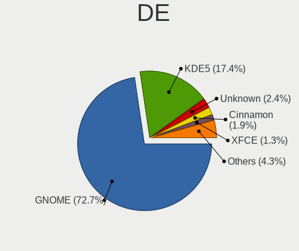

| Name       | Desktops | Percent |
|------------|----------|---------|
| GNOME      | 207      | 75.27%  |
| KDE5       | 43       | 15.64%  |
| Cinnamon   | 9        | 3.27%   |
| Unknown    | 8        | 2.91%   |
| XFCE       | 2        | 0.73%   |
| X-Cinnamon | 2        | 0.73%   |
| MATE       | 1        | 0.36%   |
| LXDE       | 1        | 0.36%   |
| KDE        | 1        | 0.36%   |
| Deepin     | 1        | 0.36%   |

Display Server
--------------

X11 or Wayland

| Name    | Desktops | Percent |
|---------|----------|---------|
| Wayland | 205      | 74.01%  |
| X11     | 53       | 19.13%  |
| Tty     | 16       | 5.78%   |
| Unknown | 3        | 1.08%   |

Display Manager
---------------

SDDM, LightDM, etc.

| Name    | Desktops | Percent |
|---------|----------|---------|
| Unknown | 183      | 66.79%  |
| GDM     | 52       | 18.98%  |
| SDDM    | 23       | 8.39%   |
| LightDM | 15       | 5.47%   |
| LXDM    | 1        | 0.36%   |

OS Lang
-------

Language

| Lang    | Desktops | Percent |
|---------|----------|---------|
| en_US   | 129      | 46.57%  |
| ru_RU   | 17       | 6.14%   |
| en_AU   | 17       | 6.14%   |
| pt_BR   | 14       | 5.05%   |
| en_CA   | 14       | 5.05%   |
| de_DE   | 13       | 4.69%   |
| en_GB   | 11       | 3.97%   |
| fr_FR   | 8        | 2.89%   |
| it_IT   | 7        | 2.53%   |
| es_AR   | 5        | 1.81%   |
| pl_PL   | 4        | 1.44%   |
| es_ES   | 4        | 1.44%   |
| es_MX   | 3        | 1.08%   |
| pt_PT   | 2        | 0.72%   |
| hr_HR   | 2        | 0.72%   |
| fr_CA   | 2        | 0.72%   |
| fi_FI   | 2        | 0.72%   |
| en_NZ   | 2        | 0.72%   |
| de_CH   | 2        | 0.72%   |
| zh_TW   | 1        | 0.36%   |
| zh_SG   | 1        | 0.36%   |
| tr_TR   | 1        | 0.36%   |
| sv_SE   | 1        | 0.36%   |
| pa_IN   | 1        | 0.36%   |
| nl_NL   | 1        | 0.36%   |
| ja_JP   | 1        | 0.36%   |
| hu_HU   | 1        | 0.36%   |
| fr_BE   | 1        | 0.36%   |
| es_VE   | 1        | 0.36%   |
| es_CO   | 1        | 0.36%   |
| es_CL   | 1        | 0.36%   |
| en_PH   | 1        | 0.36%   |
| en_IL   | 1        | 0.36%   |
| en_IE   | 1        | 0.36%   |
| en_BW   | 1        | 0.36%   |
| de_AT   | 1        | 0.36%   |
| C       | 1        | 0.36%   |
| Unknown | 1        | 0.36%   |

Boot Mode
---------

EFI or BIOS

| Mode | Desktops | Percent |
|------|----------|---------|
| EFI  | 194      | 70.55%  |
| BIOS | 81       | 29.45%  |

Filesystem
----------

Type of filesystem

| Type    | Desktops | Percent |
|---------|----------|---------|
| Btrfs   | 221      | 80.66%  |
| Ext4    | 40       | 14.6%   |
| Xfs     | 10       | 3.65%   |
| Zfs     | 1        | 0.36%   |
| Overlay | 1        | 0.36%   |
| F2fs    | 1        | 0.36%   |

Part. scheme
------------

Scheme of partitioning

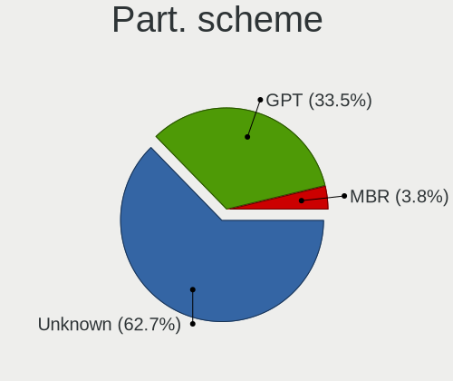

| Type    | Desktops | Percent |
|---------|----------|---------|
| Unknown | 175      | 63.87%  |
| GPT     | 83       | 30.29%  |
| MBR     | 16       | 5.84%   |

Dual Boot with Linux/BSD
------------------------

Hosting more than one Linux/BSD

| Dual boot | Desktops | Percent |
|-----------|----------|---------|
| No        | 244      | 88.73%  |
| Yes       | 31       | 11.27%  |

Dual Boot (Win)
---------------

Hosting Linux and Windows

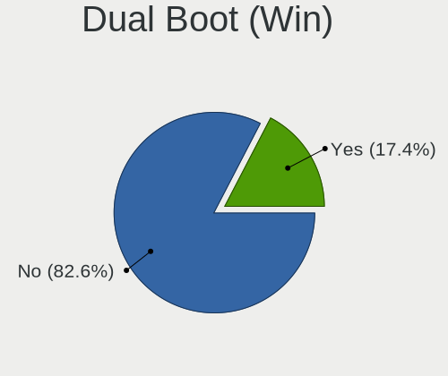

| Dual boot | Desktops | Percent |
|-----------|----------|---------|
| No        | 227      | 82.85%  |
| Yes       | 47       | 17.15%  |

Board
-----

Vendor
------

Motherboard manufacturer

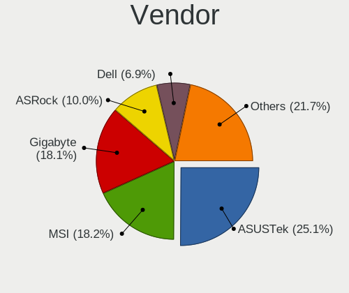

| Name                                 | Desktops | Percent |
|--------------------------------------|----------|---------|
| ASUSTek Computer                     | 75       | 27.37%  |
| Gigabyte Technology                  | 53       | 19.34%  |
| MSI                                  | 41       | 14.96%  |
| ASRock                               | 27       | 9.85%   |
| Dell                                 | 22       | 8.03%   |
| Hewlett-Packard                      | 18       | 6.57%   |
| Lenovo                               | 9        | 3.28%   |
| Unknown                              | 4        | 1.46%   |
| Pegatron                             | 2        | 0.73%   |
| Itautec                              | 2        | 0.73%   |
| Intel                                | 2        | 0.73%   |
| Huanan                               | 2        | 0.73%   |
| HPE                                  | 2        | 0.73%   |
| Biostar                              | 2        | 0.73%   |
| Acer                                 | 2        | 0.73%   |
| Techvision                           | 1        | 0.36%   |
| Shenzhen Meigao Electronic Equipment | 1        | 0.36%   |
| PCWare                               | 1        | 0.36%   |
| iRU                                  | 1        | 0.36%   |
| Fujitsu Siemens                      | 1        | 0.36%   |
| Foxconn                              | 1        | 0.36%   |
| Colorful Technology                  | 1        | 0.36%   |
| AZW                                  | 1        | 0.36%   |
| AOpen                                | 1        | 0.36%   |
| AMI                                  | 1        | 0.36%   |
| Alienware                            | 1        | 0.36%   |

Model
-----

Motherboard model

| Name                                       | Desktops | Percent |
|--------------------------------------------|----------|---------|
| Dell OptiPlex 7010                         | 4        | 1.46%   |
| Unknown                                    | 4        | 1.46%   |
| MSI MS-7C37                                | 3        | 1.09%   |
| Gigabyte X570 I AORUS PRO WIFI             | 3        | 1.09%   |
| ASUS All Series                            | 3        | 1.09%   |
| ASRock B450M Pro4                          | 3        | 1.09%   |
| MSI MS-7C84                                | 2        | 0.73%   |
| MSI MS-7C02                                | 2        | 0.73%   |
| MSI MS-7B89                                | 2        | 0.73%   |
| MSI MS-7B79                                | 2        | 0.73%   |
| MSI MS-7A39                                | 2        | 0.73%   |
| HP ProDesk 600 G1 SFF                      | 2        | 0.73%   |
| Gigabyte X570S AORUS ELITE AX              | 2        | 0.73%   |
| Gigabyte GA-78LMT-USB3 6.0                 | 2        | 0.73%   |
| Gigabyte B550M DS3H                        | 2        | 0.73%   |
| Gigabyte B550 GAMING X V2                  | 2        | 0.73%   |
| Gigabyte B450 I AORUS PRO WIFI             | 2        | 0.73%   |
| Gigabyte B450 AORUS ELITE                  | 2        | 0.73%   |
| Gigabyte 970A-DS3P                         | 2        | 0.73%   |
| Dell OptiPlex 9020                         | 2        | 0.73%   |
| Dell OptiPlex 3020                         | 2        | 0.73%   |
| ASUS TUF Gaming X570-PRO                   | 2        | 0.73%   |
| ASUS TUF Gaming B550M-PLUS                 | 2        | 0.73%   |
| ASUS PRIME Z490-A                          | 2        | 0.73%   |
| ASUS PRIME H510M-K                         | 2        | 0.73%   |
| ASUS PRIME B550M-A                         | 2        | 0.73%   |
| ASUS PRIME B350M-A                         | 2        | 0.73%   |
| ASUS PRIME A320M-K                         | 2        | 0.73%   |
| ASRock H310M-STX                           | 2        | 0.73%   |
| ASRock A320M-HD                            | 2        | 0.73%   |
| Techvision TVI7309X                        | 1        | 0.36%   |
| Shenzhen Meigao Electronic Equipment UM690 | 1        | 0.36%   |
| Pegatron NY705AA-ABL p6204y                | 1        | 0.36%   |
| Pegatron 320-1030                          | 1        | 0.36%   |
| PCWare IPMH310G                            | 1        | 0.36%   |
| MSI MS-7D97                                | 1        | 0.36%   |
| MSI MS-7D73                                | 1        | 0.36%   |
| MSI MS-7D67                                | 1        | 0.36%   |
| MSI MS-7D54                                | 1        | 0.36%   |
| MSI MS-7D48                                | 1        | 0.36%   |

Model Family
------------

Motherboard model prefix

| Name                                       | Desktops | Percent |
|--------------------------------------------|----------|---------|
| ASUS PRIME                                 | 25       | 9.12%   |
| Dell OptiPlex                              | 17       | 6.2%    |
| ASUS ROG                                   | 17       | 6.2%    |
| ASUS TUF                                   | 10       | 3.65%   |
| Lenovo ThinkCentre                         | 6        | 2.19%   |
| HP Compaq                                  | 5        | 1.82%   |
| Gigabyte B550M                             | 5        | 1.82%   |
| HP EliteDesk                               | 4        | 1.46%   |
| Gigabyte X570                              | 4        | 1.46%   |
| Gigabyte B450                              | 4        | 1.46%   |
| ASRock B450M                               | 4        | 1.46%   |
| Unknown                                    | 4        | 1.46%   |
| MSI MS-7C37                                | 3        | 1.09%   |
| HP ProDesk                                 | 3        | 1.09%   |
| Gigabyte B550                              | 3        | 1.09%   |
| Dell Precision                             | 3        | 1.09%   |
| ASUS All                                   | 3        | 1.09%   |
| MSI MS-7C84                                | 2        | 0.73%   |
| MSI MS-7C02                                | 2        | 0.73%   |
| MSI MS-7B89                                | 2        | 0.73%   |
| MSI MS-7B79                                | 2        | 0.73%   |
| MSI MS-7A39                                | 2        | 0.73%   |
| Huanan X79                                 | 2        | 0.73%   |
| HPE ProLiant                               | 2        | 0.73%   |
| HP OMEN                                    | 2        | 0.73%   |
| Gigabyte X570S                             | 2        | 0.73%   |
| Gigabyte GA-78LMT-USB3                     | 2        | 0.73%   |
| Gigabyte 970A-DS3P                         | 2        | 0.73%   |
| ASRock H310M-STX                           | 2        | 0.73%   |
| ASRock A320M-HD                            | 2        | 0.73%   |
| Acer Aspire                                | 2        | 0.73%   |
| Techvision TVI7309X                        | 1        | 0.36%   |
| Shenzhen Meigao Electronic Equipment UM690 | 1        | 0.36%   |
| Pegatron NY705AA-ABL                       | 1        | 0.36%   |
| Pegatron 320-1030                          | 1        | 0.36%   |
| PCWare IPMH310G                            | 1        | 0.36%   |
| MSI MS-7D97                                | 1        | 0.36%   |
| MSI MS-7D73                                | 1        | 0.36%   |
| MSI MS-7D67                                | 1        | 0.36%   |
| MSI MS-7D54                                | 1        | 0.36%   |

MFG Year
--------

Motherboard manufacture year

| Year    | Desktops | Percent |
|---------|----------|---------|
| 2018    | 42       | 15.33%  |
| 2020    | 37       | 13.5%   |
| 2022    | 27       | 9.85%   |
| 2021    | 26       | 9.49%   |
| 2019    | 24       | 8.76%   |
| 2013    | 21       | 7.66%   |
| 2012    | 18       | 6.57%   |
| 2017    | 17       | 6.2%    |
| 2014    | 12       | 4.38%   |
| 2010    | 9        | 3.28%   |
| 2023    | 8        | 2.92%   |
| 2011    | 8        | 2.92%   |
| 2016    | 6        | 2.19%   |
| 2015    | 6        | 2.19%   |
| 2008    | 5        | 1.82%   |
| 2009    | 4        | 1.46%   |
| 2006    | 3        | 1.09%   |
| Unknown | 1        | 0.36%   |

Form Factor
-----------

Physical design of the computer

| Name    | Desktops | Percent |
|---------|----------|---------|
| Desktop | 274      | 100%    |

Secure Boot
-----------

Enabled or disabled

| State    | Desktops | Percent |
|----------|----------|---------|
| Disabled | 242      | 87.68%  |
| Enabled  | 34       | 12.32%  |

Coreboot
--------

Have coreboot on board

| Used | Desktops | Percent |
|------|----------|---------|
| No   | 274      | 100%    |

RAM Size
--------

Total RAM memory

| Size in GB  | Desktops | Percent |
|-------------|----------|---------|
| 16.01-24.0  | 88       | 31.65%  |
| 32.01-64.0  | 68       | 24.46%  |
| 8.01-16.0   | 36       | 12.95%  |
| 4.01-8.0    | 33       | 11.87%  |
| 64.01-256.0 | 27       | 9.71%   |
| 24.01-32.0  | 13       | 4.68%   |
| 3.01-4.0    | 12       | 4.32%   |
| 1.01-2.0    | 1        | 0.36%   |

RAM Used
--------

Used RAM memory

| Used GB    | Desktops | Percent |
|------------|----------|---------|
| 4.01-8.0   | 84       | 29.37%  |
| 2.01-3.0   | 84       | 29.37%  |
| 3.01-4.0   | 65       | 22.73%  |
| 1.01-2.0   | 25       | 8.74%   |
| 8.01-16.0  | 16       | 5.59%   |
| 0.51-1.0   | 6        | 2.1%    |
| 16.01-24.0 | 4        | 1.4%    |
| 32.01-64.0 | 2        | 0.7%    |

Total Drives
------------

Number of drives on board

| Drives | Desktops | Percent |
|--------|----------|---------|
| 2      | 98       | 35.13%  |
| 1      | 88       | 31.54%  |
| 3      | 44       | 15.77%  |
| 4      | 25       | 8.96%   |
| 5      | 13       | 4.66%   |
| 6      | 7        | 2.51%   |
| 11     | 1        | 0.36%   |
| 10     | 1        | 0.36%   |
| 7      | 1        | 0.36%   |
| 0      | 1        | 0.36%   |

Has CD-ROM
----------

Has CD-ROM on board

| Presented | Desktops | Percent |
|-----------|----------|---------|
| No        | 195      | 70.65%  |
| Yes       | 81       | 29.35%  |

Has Ethernet
------------

Has Ethernet on board

| Presented | Desktops | Percent |
|-----------|----------|---------|
| Yes       | 271      | 98.91%  |
| No        | 3        | 1.09%   |

Has WiFi
--------

Has WiFi module

| Presented | Desktops | Percent |
|-----------|----------|---------|
| Yes       | 153      | 55.64%  |
| No        | 122      | 44.36%  |

Has Bluetooth
-------------

Has Bluetooth module

| Presented | Desktops | Percent |
|-----------|----------|---------|
| No        | 148      | 54.01%  |
| Yes       | 126      | 45.99%  |

Location
--------

Country
-------

Geographic location (country)

| Country     | Desktops | Percent |
|-------------|----------|---------|
| USA         | 59       | 21.53%  |
| Brazil      | 24       | 8.76%   |
| Russia      | 19       | 6.93%   |
| Australia   | 17       | 6.2%    |
| Canada      | 16       | 5.84%   |
| Germany     | 12       | 4.38%   |
| Italy       | 10       | 3.65%   |
| France      | 10       | 3.65%   |
| Poland      | 8        | 2.92%   |
| Netherlands | 7        | 2.55%   |
| UK          | 6        | 2.19%   |
| Hungary     | 6        | 2.19%   |
| Thailand    | 5        | 1.82%   |
| Mexico      | 5        | 1.82%   |
| Argentina   | 5        | 1.82%   |
| Spain       | 4        | 1.46%   |
| Belarus     | 4        | 1.46%   |
| Switzerland | 3        | 1.09%   |
| Sweden      | 3        | 1.09%   |
| Serbia      | 3        | 1.09%   |
| Portugal    | 3        | 1.09%   |
| Norway      | 3        | 1.09%   |
| New Zealand | 3        | 1.09%   |
| Finland     | 3        | 1.09%   |
| Belgium     | 3        | 1.09%   |
| Austria     | 3        | 1.09%   |
| Taiwan      | 2        | 0.73%   |
| Singapore   | 2        | 0.73%   |
| Ireland     | 2        | 0.73%   |
| Greece      | 2        | 0.73%   |
| Colombia    | 2        | 0.73%   |
| Vietnam     | 1        | 0.36%   |
| Ukraine     | 1        | 0.36%   |
| Turkey      | 1        | 0.36%   |
| Romania     | 1        | 0.36%   |
| Puerto Rico | 1        | 0.36%   |
| Philippines | 1        | 0.36%   |
| Pakistan    | 1        | 0.36%   |
| Nicaragua   | 1        | 0.36%   |
| Malaysia    | 1        | 0.36%   |

City
----

Geographic location (city)

| City           | Desktops | Percent |
|----------------|----------|---------|
| Sydney         | 11       | 3.97%   |
| Moscow         | 4        | 1.44%   |
| Minsk          | 4        | 1.44%   |
| Warsaw         | 3        | 1.08%   |
| Vienna         | 3        | 1.08%   |
| Seattle        | 3        | 1.08%   |
| Sao Paulo      | 3        | 1.08%   |
| Palmas         | 3        | 1.08%   |
| Los Angeles    | 3        | 1.08%   |
| Helsinki       | 3        | 1.08%   |
| Budapest       | 3        | 1.08%   |
| Brisbane       | 3        | 1.08%   |
| Bangkok        | 3        | 1.08%   |
| Alliston       | 3        | 1.08%   |
| Woodstock      | 2        | 0.72%   |
| Winnipeg       | 2        | 0.72%   |
| White Rock     | 2        | 0.72%   |
| St Petersburg  | 2        | 0.72%   |
| Singapore      | 2        | 0.72%   |
| Rochester      | 2        | 0.72%   |
| Rio de Janeiro | 2        | 0.72%   |
| Qubec        | 2        | 0.72%   |
| Odessa         | 2        | 0.72%   |
| Ober-Morlen    | 2        | 0.72%   |
| Kingston       | 2        | 0.72%   |
| Irkutsk        | 2        | 0.72%   |
| Flushing       | 2        | 0.72%   |
| Brussels       | 2        | 0.72%   |
| Braslia      | 2        | 0.72%   |
| Belgrade       | 2        | 0.72%   |
| Balashikha     | 2        | 0.72%   |
| Athens         | 2        | 0.72%   |
| Amsterdam      | 2        | 0.72%   |
| Almere Stad    | 2        | 0.72%   |
| Zanesville     | 1        | 0.36%   |
| Yekaterinburg  | 1        | 0.36%   |
| Wellington     | 1        | 0.36%   |
| Volgograd      | 1        | 0.36%   |
| Vitria       | 1        | 0.36%   |
| Vise           | 1        | 0.36%   |

Drives
------

Drive Vendor
------------

Hard drive vendors

| Vendor                       | Desktops | Drives | Percent |
|------------------------------|----------|--------|---------|
| Samsung Electronics          | 101      | 165    | 19.24%  |
| WDC                          | 70       | 96     | 13.33%  |
| Seagate                      | 60       | 79     | 11.43%  |
| SanDisk                      | 39       | 42     | 7.43%   |
| Kingston                     | 36       | 38     | 6.86%   |
| Toshiba                      | 31       | 34     | 5.9%    |
| Crucial                      | 30       | 40     | 5.71%   |
| Phison Electronics           | 14       | 24     | 2.67%   |
| Intel                        | 12       | 13     | 2.29%   |
| Hitachi                      | 10       | 14     | 1.9%    |
| A-DATA Technology            | 8        | 11     | 1.52%   |
| Patriot                      | 7        | 9      | 1.33%   |
| Silicon Motion               | 6        | 6      | 1.14%   |
| PNY                          | 6        | 8      | 1.14%   |
| Micron/Crucial Technology    | 6        | 7      | 1.14%   |
| China                        | 6        | 7      | 1.14%   |
| SPCC                         | 5        | 5      | 0.95%   |
| SK hynix                     | 5        | 7      | 0.95%   |
| Netac                        | 5        | 5      | 0.95%   |
| Micron Technology            | 4        | 4      | 0.76%   |
| Unknown                      | 3        | 4      | 0.57%   |
| Realtek Semiconductor        | 3        | 6      | 0.57%   |
| Kingston Technology Company  | 3        | 4      | 0.57%   |
| HGST                         | 3        | 3      | 0.57%   |
| ADATA Technology             | 3        | 3      | 0.57%   |
| TO Exter                     | 2        | 2      | 0.38%   |
| Seagate Technology           | 2        | 3      | 0.38%   |
| QNAP                         | 2        | 2      | 0.38%   |
| KingSpec                     | 2        | 2      | 0.38%   |
| ASMT                         | 2        | 3      | 0.38%   |
| AMD                          | 2        | 2      | 0.38%   |
| Acer                         | 2        | 4      | 0.38%   |
| Unknown                      | 2        | 2      | 0.38%   |
| Yeestor                      | 1        | 1      | 0.19%   |
| XPG                          | 1        | 1      | 0.19%   |
| USB                          | 1        | 1      | 0.19%   |
| Union Memory (Shenzhen)      | 1        | 1      | 0.19%   |
| Transcend                    | 1        | 1      | 0.19%   |
| TAMMUZ                       | 1        | 1      | 0.19%   |
| Shenzhen Longsys Electronics | 1        | 1      | 0.19%   |

Drive Model
-----------

Hard drive models

| Model                                               | Desktops | Percent |
|-----------------------------------------------------|----------|---------|
| Samsung NVMe SSD Controller SM981/PM981/PM983 256GB | 20       | 3.36%   |
| Samsung NVMe SSD Controller PM9A1/PM9A3/980PRO 1TB  | 17       | 2.86%   |
| Crucial CT500MX500SSD1 500GB                        | 10       | 1.68%   |
| Samsung SSD 860 EVO 1TB                             | 9        | 1.51%   |
| Toshiba DT01ACA100 1TB                              | 7        | 1.18%   |
| Phison E12 NVMe Controller 256GB                    | 7        | 1.18%   |
| Kingston SA400S37240G 240GB SSD                     | 7        | 1.18%   |
| Kingston SA400S37120G 120GB SSD                     | 7        | 1.18%   |
| WDC WDS500G2B0A-00SM50 500GB SSD                    | 6        | 1.01%   |
| Sandisk WD Blue SN550 NVMe SSD 512GB                | 6        | 1.01%   |
| Samsung NVMe SSD Controller SM961/PM961/SM963 256GB | 6        | 1.01%   |
| Silicon Motion SM2263EN/SM2263XT SSD Controller 1TB | 5        | 0.84%   |
| Seagate ST2000DM008-2FR102 2TB                      | 5        | 0.84%   |
| Seagate ST2000DM006-2DM164 2TB                      | 5        | 0.84%   |
| Seagate ST1000DM010-2EP102 1TB                      | 5        | 0.84%   |
| Samsung SSD 870 EVO 1TB                             | 5        | 0.84%   |
| Samsung SSD 860 EVO 250GB                           | 5        | 0.84%   |
| Toshiba DT01ACA050 500GB                            | 4        | 0.67%   |
| Seagate ST3500418AS 500GB                           | 4        | 0.67%   |
| Samsung SSD 980 1TB                                 | 4        | 0.67%   |
| Samsung SSD 860 EVO 500GB                           | 4        | 0.67%   |
| Samsung SSD 850 EVO 250GB                           | 4        | 0.67%   |
| Phison E16 PCIe4 NVMe Controller 1TB                | 4        | 0.67%   |
| Micron/Crucial P2 NVMe PCIe SSD 1TB                 | 4        | 0.67%   |
| Kingston SA400S37480G 480GB SSD                     | 4        | 0.67%   |
| WDC WDS240G2G0A-00JH30 240GB SSD                    | 3        | 0.5%    |
| WDC WD10EZEX-60WN4A0 1TB                            | 3        | 0.5%    |
| Toshiba HDWD110 1TB                                 | 3        | 0.5%    |
| Toshiba DT01ACA200 2TB                              | 3        | 0.5%    |
| Seagate ST500DM002-1BD142 500GB                     | 3        | 0.5%    |
| Seagate ST1000DM003-1ER162 1TB                      | 3        | 0.5%    |
| Seagate ST1000DM003-1CH162 1TB                      | 3        | 0.5%    |
| Sandisk WD Black SN750 / PC SN730 NVMe SSD 256GB    | 3        | 0.5%    |
| SanDisk SSD PLUS 1000GB                             | 3        | 0.5%    |
| Samsung SSD 980 PRO 1TB                             | 3        | 0.5%    |
| Samsung SSD 860 QVO 1TB                             | 3        | 0.5%    |
| Samsung SSD 850 EVO 500GB                           | 3        | 0.5%    |
| Samsung SSD 840 Series 250GB                        | 3        | 0.5%    |
| PNY CS900 240GB SSD                                 | 3        | 0.5%    |
| Patriot P210 512GB SSD                              | 3        | 0.5%    |

HDD Vendor
----------

Hard disk drive vendors

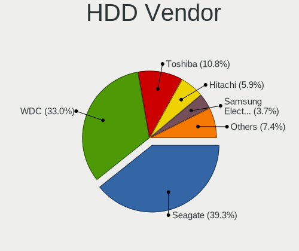

| Vendor              | Desktops | Drives | Percent |
|---------------------|----------|--------|---------|
| Seagate             | 57       | 72     | 34.55%  |
| WDC                 | 54       | 76     | 32.73%  |
| Toshiba             | 27       | 28     | 16.36%  |
| Hitachi             | 10       | 14     | 6.06%   |
| Samsung Electronics | 8        | 8      | 4.85%   |
| HGST                | 3        | 3      | 1.82%   |
| Unknown             | 2        | 2      | 1.21%   |
| QNAP                | 2        | 2      | 1.21%   |
| USB                 | 1        | 1      | 0.61%   |
| ASMT                | 1        | 2      | 0.61%   |

SSD Vendor
----------

Solid state drive vendors

| Vendor              | Desktops | Drives | Percent |
|---------------------|----------|--------|---------|
| Samsung Electronics | 53       | 73     | 23.87%  |
| Crucial             | 29       | 37     | 13.06%  |
| Kingston            | 26       | 27     | 11.71%  |
| SanDisk             | 19       | 19     | 8.56%   |
| WDC                 | 18       | 18     | 8.11%   |
| Intel               | 8        | 9      | 3.6%    |
| A-DATA Technology   | 8        | 11     | 3.6%    |
| Patriot             | 7        | 9      | 3.15%   |
| PNY                 | 6        | 8      | 2.7%    |
| China               | 6        | 7      | 2.7%    |
| SPCC                | 5        | 5      | 2.25%   |
| Micron Technology   | 3        | 3      | 1.35%   |
| TO Exter            | 2        | 2      | 0.9%    |
| Netac               | 2        | 2      | 0.9%    |
| KingSpec            | 2        | 2      | 0.9%    |
| AMD                 | 2        | 2      | 0.9%    |
| Acer                | 2        | 4      | 0.9%    |
| Transcend           | 1        | 1      | 0.45%   |
| Toshiba             | 1        | 2      | 0.45%   |
| TAMMUZ              | 1        | 1      | 0.45%   |
| SK hynix            | 1        | 1      | 0.45%   |
| SABRENT             | 1        | 1      | 0.45%   |
| Phison              | 1        | 1      | 0.45%   |
| OCZ                 | 1        | 3      | 0.45%   |
| Mushkin             | 1        | 1      | 0.45%   |
| Maxtor              | 1        | 1      | 0.45%   |
| LITEON              | 1        | 1      | 0.45%   |
| Lexar               | 1        | 1      | 0.45%   |
| KUIJIA              | 1        | 1      | 0.45%   |
| Kimtigo             | 1        | 1      | 0.45%   |
| JMicron Technology  | 1        | 1      | 0.45%   |
| Intenso             | 1        | 1      | 0.45%   |
| GOODRAM             | 1        | 2      | 0.45%   |
| Gigabyte Technology | 1        | 2      | 0.45%   |
| Fanxiang            | 1        | 1      | 0.45%   |
| Dogfish             | 1        | 1      | 0.45%   |
| Colorful            | 1        | 1      | 0.45%   |
| ASMT                | 1        | 1      | 0.45%   |
| ASENNO              | 1        | 1      | 0.45%   |
| 2.5"                | 1        | 1      | 0.45%   |

Drive Kind
----------

HDD or SSD

| Kind    | Desktops | Drives | Percent |
|---------|----------|--------|---------|
| SSD     | 178      | 267    | 38.7%   |
| HDD     | 138      | 208    | 30%     |
| NVMe    | 137      | 208    | 29.78%  |
| Unknown | 7        | 9      | 1.52%   |

Drive Connector
---------------

SATA, SAS, NVMe, etc.

| Type | Desktops | Drives | Percent |
|------|----------|--------|---------|
| SATA | 230      | 461    | 59.74%  |
| NVMe | 137      | 208    | 35.58%  |
| SAS  | 18       | 23     | 4.68%   |

Drive Size
----------

Size of hard drive

| Size in TB | Desktops | Drives | Percent |
|------------|----------|--------|---------|
| 0.01-0.5   | 155      | 239    | 46.41%  |
| 0.51-1.0   | 111      | 148    | 33.23%  |
| 1.01-2.0   | 41       | 53     | 12.28%  |
| 3.01-4.0   | 11       | 13     | 3.29%   |
| 4.01-10.0  | 8        | 14     | 2.4%    |
| 2.01-3.0   | 6        | 6      | 1.8%    |
| 10.01-20.0 | 2        | 2      | 0.6%    |

Space Total
-----------

Amount of disk space available on the file system

| Size in GB     | Desktops | Percent |
|----------------|----------|---------|
| 1001-2000      | 57       | 20.58%  |
| 501-1000       | 51       | 18.41%  |
| 251-500        | 39       | 14.08%  |
| More than 3000 | 37       | 13.36%  |
| 101-250        | 36       | 13%     |
| 2001-3000      | 20       | 7.22%   |
| 1-20           | 13       | 4.69%   |
| Unknown        | 12       | 4.33%   |
| 51-100         | 8        | 2.89%   |
| 21-50          | 4        | 1.44%   |

Space Used
----------

Amount of used disk space

| Used GB        | Desktops | Percent |
|----------------|----------|---------|
| 1-20           | 72       | 25.62%  |
| 21-50          | 55       | 19.57%  |
| 251-500        | 32       | 11.39%  |
| 501-1000       | 30       | 10.68%  |
| 51-100         | 26       | 9.25%   |
| 101-250        | 22       | 7.83%   |
| 1001-2000      | 19       | 6.76%   |
| Unknown        | 12       | 4.27%   |
| More than 3000 | 7        | 2.49%   |
| 2001-3000      | 6        | 2.14%   |

Malfunc. Drives
---------------

Drive models with a malfunction

| Model                                         | Desktops | Drives | Percent |
|-----------------------------------------------|----------|--------|---------|
| Seagate ST500DM002-1BD142 500GB               | 2        | 2      | 7.14%   |
| Intel SSDSC2CT120A3 120GB                     | 2        | 3      | 7.14%   |
| Crucial CT120M500SSD1 120GB                   | 2        | 5      | 7.14%   |
| WDC WDS240G2G0A-00JH30 240GB SSD              | 1        | 1      | 3.57%   |
| WDC WDS100T2G0A-00JH30 1TB SSD                | 1        | 1      | 3.57%   |
| WDC WD5000AADS-00S9B0 500GB                   | 1        | 1      | 3.57%   |
| WDC WD20EZRX-00D8PB0 2TB                      | 1        | 1      | 3.57%   |
| WDC WD10JPVT-60A1YT0 1TB                      | 1        | 1      | 3.57%   |
| WDC WD1002FAEX-00Y9A0 1TB                     | 1        | 1      | 3.57%   |
| Toshiba MQ02ABD100H 1TB                       | 1        | 1      | 3.57%   |
| Toshiba MQ01ABD100 1TB                        | 1        | 1      | 3.57%   |
| Seagate ST9160412AS 160GB                     | 1        | 1      | 3.57%   |
| Seagate ST3750528AS 752GB                     | 1        | 1      | 3.57%   |
| Seagate ST3500630NS 500GB                     | 1        | 1      | 3.57%   |
| Seagate ST3500418AS 500GB                     | 1        | 1      | 3.57%   |
| Seagate ST2000DM008-2FR102 2TB                | 1        | 1      | 3.57%   |
| SanDisk SSD PLUS 480GB                        | 1        | 1      | 3.57%   |
| SanDisk SD8SBAT256G1122 256GB SSD             | 1        | 1      | 3.57%   |
| Samsung Electronics SSD 840 EVO 250GB         | 1        | 1      | 3.57%   |
| Samsung Electronics HD322GJ 320GB             | 1        | 1      | 3.57%   |
| Micron Technology MTFDDAK128MAM-1J1 128GB SSD | 1        | 1      | 3.57%   |
| Kingston SA400S37120G 120GB SSD               | 1        | 1      | 3.57%   |
| Intenso SSD 240GB                             | 1        | 1      | 3.57%   |
| Intel SSDSC2KG019T7R 2TB                      | 1        | 1      | 3.57%   |
| Intel SSDSC2BF240A5L 240GB                    | 1        | 1      | 3.57%   |

Malfunc. Drive Vendor
---------------------

Vendors of faulty drives

| Vendor              | Desktops | Drives | Percent |
|---------------------|----------|--------|---------|
| Seagate             | 7        | 7      | 26.92%  |
| WDC                 | 4        | 6      | 15.38%  |
| Intel               | 4        | 5      | 15.38%  |
| Toshiba             | 2        | 2      | 7.69%   |
| SanDisk             | 2        | 2      | 7.69%   |
| Samsung Electronics | 2        | 2      | 7.69%   |
| Crucial             | 2        | 5      | 7.69%   |
| Micron Technology   | 1        | 1      | 3.85%   |
| Kingston            | 1        | 1      | 3.85%   |
| Intenso             | 1        | 1      | 3.85%   |

Malfunc. HDD Vendor
-------------------

Vendors of faulty HDD drives

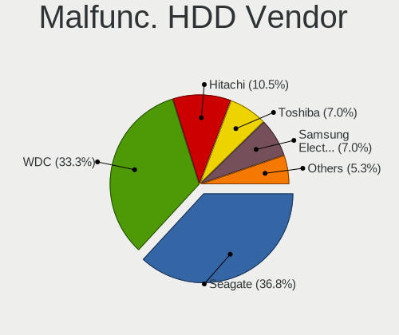

| Vendor              | Desktops | Drives | Percent |
|---------------------|----------|--------|---------|
| Seagate             | 7        | 7      | 53.85%  |
| WDC                 | 3        | 4      | 23.08%  |
| Toshiba             | 2        | 2      | 15.38%  |
| Samsung Electronics | 1        | 1      | 7.69%   |

Malfunc. Drive Kind
-------------------

Kinds of faulty drives

| Kind | Desktops | Drives | Percent |
|------|----------|--------|---------|
| SSD  | 13       | 18     | 50%     |
| HDD  | 13       | 14     | 50%     |

Failed Drives
-------------

Failed drive models

Zero info for selected period =(

Failed Drive Vendor
-------------------

Failed drive vendors

Zero info for selected period =(

Drive Status
------------

Number of failed and malfunc. drives

| Status   | Desktops | Drives | Percent |
|----------|----------|--------|---------|
| Detected | 187      | 453    | 62.33%  |
| Works    | 89       | 207    | 29.67%  |
| Malfunc  | 24       | 32     | 8%      |

Storage controller
------------------

Storage Vendor
--------------

Storage controller vendors

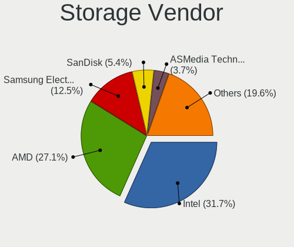

| Vendor                       | Desktops | Percent |
|------------------------------|----------|---------|
| Intel                        | 144      | 31.51%  |
| AMD                          | 126      | 27.57%  |
| Samsung Electronics          | 61       | 13.35%  |
| SanDisk                      | 24       | 5.25%   |
| Phison Electronics           | 15       | 3.28%   |
| Kingston Technology Company  | 13       | 2.84%   |
| ASMedia Technology           | 12       | 2.63%   |
| Marvell Technology Group     | 11       | 2.41%   |
| Micron/Crucial Technology    | 7        | 1.53%   |
| Silicon Motion               | 6        | 1.31%   |
| Seagate Technology           | 5        | 1.09%   |
| SK hynix                     | 4        | 0.88%   |
| JMicron Technology           | 4        | 0.88%   |
| Toshiba America Info Systems | 3        | 0.66%   |
| Realtek Semiconductor        | 3        | 0.66%   |
| Netac Technology             | 3        | 0.66%   |
| ADATA Technology             | 3        | 0.66%   |
| VIA Technologies             | 1        | 0.22%   |
| Union Memory (Shenzhen)      | 1        | 0.22%   |
| ULi Electronics              | 1        | 0.22%   |
| Silicon Image                | 1        | 0.22%   |
| Shenzhen Longsys Electronics | 1        | 0.22%   |
| PMC-Sierra                   | 1        | 0.22%   |
| Micron Technology            | 1        | 0.22%   |
| MAXIO Technology (Hangzhou)  | 1        | 0.22%   |
| LSI Logic / Symbios Logic    | 1        | 0.22%   |
| KIOXIA                       | 1        | 0.22%   |
| INNOGRIT                     | 1        | 0.22%   |
| Broadcom / LSI               | 1        | 0.22%   |
| Adaptec                      | 1        | 0.22%   |

Storage Model
-------------

Storage controller models

| Model                                                                          | Desktops | Percent |
|--------------------------------------------------------------------------------|----------|---------|
| AMD FCH SATA Controller [AHCI mode]                                            | 68       | 13.03%  |
| AMD 500 Series Chipset SATA Controller                                         | 28       | 5.36%   |
| Samsung NVMe SSD Controller SM981/PM981/PM983                                  | 26       | 4.98%   |
| Samsung NVMe SSD Controller PM9A1/PM9A3/980PRO                                 | 21       | 4.02%   |
| AMD 400 Series Chipset SATA Controller                                         | 21       | 4.02%   |
| Intel 8 Series/C220 Series Chipset Family 6-port SATA Controller 1 [AHCI mode] | 18       | 3.45%   |
| Intel Cannon Lake PCH SATA AHCI Controller                                     | 15       | 2.87%   |
| Intel 7 Series/C210 Series Chipset Family 6-port SATA Controller [AHCI mode]   | 15       | 2.87%   |
| Intel 200 Series PCH SATA controller [AHCI mode]                               | 15       | 2.87%   |
| Intel Alder Lake-S PCH SATA Controller [AHCI Mode]                             | 14       | 2.68%   |
| ASMedia ASM1062 Serial ATA Controller                                          | 12       | 2.3%    |
| AMD SB7x0/SB8x0/SB9x0 IDE Controller                                           | 11       | 2.11%   |
| AMD SB7x0/SB8x0/SB9x0 SATA Controller [AHCI mode]                              | 10       | 1.92%   |
| Intel SATA Controller [RAID mode]                                              | 9        | 1.72%   |
| Samsung NVMe SSD Controller 980                                                | 8        | 1.53%   |
| Kingston Company Company Non-Volatile memory controller                        | 8        | 1.53%   |
| AMD FCH SATA Controller D                                                      | 8        | 1.53%   |
| SanDisk Non-Volatile memory controller                                         | 7        | 1.34%   |
| Phison E12 NVMe Controller                                                     | 7        | 1.34%   |
| Intel Volume Management Device NVMe RAID Controller                            | 7        | 1.34%   |
| AMD 300 Series Chipset SATA Controller                                         | 7        | 1.34%   |
| SanDisk WD Blue SN550 NVMe SSD                                                 | 6        | 1.15%   |
| Samsung NVMe SSD Controller SM961/PM961/SM963                                  | 6        | 1.15%   |
| Intel Q170/Q150/B150/H170/H110/Z170/CM236 Chipset SATA Controller [AHCI Mode]  | 6        | 1.15%   |
| Intel 500 Series Chipset Family SATA AHCI Controller                           | 6        | 1.15%   |
| Silicon Motion SM2263EN/SM2263XT SSD Controller                                | 5        | 0.96%   |
| Phison E16 PCIe4 NVMe Controller                                               | 5        | 0.96%   |
| Micron/Crucial P2 NVMe PCIe SSD                                                | 5        | 0.96%   |
| Marvell Group 88SE9172 SATA 6Gb/s Controller                                   | 5        | 0.96%   |
| Intel Comet Lake PCH-H RAID                                                    | 5        | 0.96%   |
| Intel 6 Series/C200 Series Chipset Family 6 port Desktop SATA AHCI Controller  | 5        | 0.96%   |
| AMD SB7x0/SB8x0/SB9x0 SATA Controller [IDE mode]                               | 5        | 0.96%   |
| Intel 82801JD/DO (ICH10 Family) SATA AHCI Controller                           | 4        | 0.77%   |
| SK hynix Gold P31/PC711 NVMe Solid State Drive                                 | 3        | 0.57%   |
| SanDisk WD Black SN750 / PC SN730 NVMe SSD                                     | 3        | 0.57%   |
| Netac Non-Volatile memory controller                                           | 3        | 0.57%   |
| Micron/Crucial P5 Plus NVMe PCIe SSD                                           | 3        | 0.57%   |
| Intel C610/X99 series chipset 6-Port SATA Controller [AHCI mode]               | 3        | 0.57%   |
| Intel 82801JI (ICH10 Family) SATA AHCI Controller                              | 3        | 0.57%   |
| Seagate FireCuda 530 SSD                                                       | 2        | 0.38%   |

Storage Kind
------------

Kind of storage controller (IDE, SATA, NVMe, SAS, ...)

| Kind | Desktops | Percent |
|------|----------|---------|
| SATA | 245      | 55.94%  |
| NVMe | 137      | 31.28%  |
| IDE  | 27       | 6.16%   |
| RAID | 25       | 5.71%   |
| SAS  | 3        | 0.68%   |
| SCSI | 1        | 0.23%   |

Processor
---------

CPU Vendor
----------

Processor vendors

| Vendor                   | Desktops | Percent |
|--------------------------|----------|---------|
| Intel                    | 143      | 52.19%  |
| AMD                      | 130      | 47.45%  |
| PowerNV C1P9S01 REV 1.01 | 1        | 0.36%   |

CPU Model
---------

Processor models

| Model                                       | Desktops | Percent |
|---------------------------------------------|----------|---------|
| AMD Ryzen 5 5600X 6-Core Processor          | 13       | 4.74%   |
| AMD Ryzen 5 3600 6-Core Processor           | 8        | 2.92%   |
| Intel Core i7-3770 CPU @ 3.40GHz            | 6        | 2.19%   |
| AMD Ryzen 7 5800X 8-Core Processor          | 6        | 2.19%   |
| AMD Ryzen 7 3700X 8-Core Processor          | 6        | 2.19%   |
| AMD Ryzen 9 7950X 16-Core Processor         | 5        | 1.82%   |
| AMD Ryzen 9 5900X 12-Core Processor         | 5        | 1.82%   |
| AMD Ryzen 7 5700G with Radeon Graphics      | 5        | 1.82%   |
| AMD Ryzen 5 2600 Six-Core Processor         | 5        | 1.82%   |
| Intel Core i7-8700K CPU @ 3.70GHz           | 4        | 1.46%   |
| Intel Core i5-3470 CPU @ 3.20GHz            | 4        | 1.46%   |
| AMD Ryzen 9 3900X 12-Core Processor         | 4        | 1.46%   |
| AMD Ryzen 5 1600 Six-Core Processor         | 4        | 1.46%   |
| Intel Core i7-9700 CPU @ 3.00GHz            | 3        | 1.09%   |
| Intel Core i7-8700 CPU @ 3.20GHz            | 3        | 1.09%   |
| Intel Core i7-4790 CPU @ 3.60GHz            | 3        | 1.09%   |
| Intel Core i7-4770 CPU @ 3.40GHz            | 3        | 1.09%   |
| Intel Core i5-8500 CPU @ 3.00GHz            | 3        | 1.09%   |
| Intel Core i3 CPU 540 @ 3.07GHz             | 3        | 1.09%   |
| Intel 12th Gen Core i5-12400F               | 3        | 1.09%   |
| AMD Ryzen 9 5950X 16-Core Processor         | 3        | 1.09%   |
| AMD Ryzen 7 2700X Eight-Core Processor      | 3        | 1.09%   |
| AMD Ryzen 5 3600X 6-Core Processor          | 3        | 1.09%   |
| AMD Ryzen 5 3400G with Radeon Vega Graphics | 3        | 1.09%   |
| AMD FX-6300 Six-Core Processor              | 3        | 1.09%   |
| Intel Core i9-9900K CPU @ 3.60GHz           | 2        | 0.73%   |
| Intel Core i7-7700K CPU @ 4.20GHz           | 2        | 0.73%   |
| Intel Core i7-4790K CPU @ 4.00GHz           | 2        | 0.73%   |
| Intel Core i7-2600 CPU @ 3.40GHz            | 2        | 0.73%   |
| Intel Core i7-10700K CPU @ 3.80GHz          | 2        | 0.73%   |
| Intel Core i5-8400 CPU @ 2.80GHz            | 2        | 0.73%   |
| Intel Core i5-7600K CPU @ 3.80GHz           | 2        | 0.73%   |
| Intel Core i5-7500 CPU @ 3.40GHz            | 2        | 0.73%   |
| Intel Core i5-7400 CPU @ 3.00GHz            | 2        | 0.73%   |
| Intel Core i5-4570 CPU @ 3.20GHz            | 2        | 0.73%   |
| Intel Core i5-3570 CPU @ 3.40GHz            | 2        | 0.73%   |
| Intel Core i5-3330 CPU @ 3.00GHz            | 2        | 0.73%   |
| Intel Core i3-9100F CPU @ 3.60GHz           | 2        | 0.73%   |
| Intel Core i3-3220 CPU @ 3.30GHz            | 2        | 0.73%   |
| Intel Core 2 Quad CPU Q6600 @ 2.40GHz       | 2        | 0.73%   |

CPU Model Family
----------------

Processor model prefix

| Model                   | Desktops | Percent |
|-------------------------|----------|---------|
| AMD Ryzen 5             | 44       | 16.06%  |
| Intel Core i5           | 37       | 13.5%   |
| Intel Core i7           | 36       | 13.14%  |
| AMD Ryzen 7             | 30       | 10.95%  |
| AMD Ryzen 9             | 25       | 9.12%   |
| Other                   | 24       | 8.76%   |
| Intel Xeon              | 13       | 4.74%   |
| Intel Core i3           | 12       | 4.38%   |
| AMD FX                  | 10       | 3.65%   |
| Intel Core 2 Quad       | 5        | 1.82%   |
| Intel Celeron           | 5        | 1.82%   |
| Intel Core i9           | 4        | 1.46%   |
| AMD Phenom II X4        | 4        | 1.46%   |
| Intel Core 2 Duo        | 3        | 1.09%   |
| AMD Ryzen 3             | 3        | 1.09%   |
| Intel Pentium           | 2        | 0.73%   |
| AMD Ryzen Threadripper  | 2        | 0.73%   |
| AMD Athlon              | 2        | 0.73%   |
| AMD A8                  | 2        | 0.73%   |
| Intel Pentium Gold      | 1        | 0.36%   |
| Intel Pentium Dual-Core | 1        | 0.36%   |
| Intel Pentium Dual      | 1        | 0.36%   |
| Intel Atom              | 1        | 0.36%   |
| AMD Ryzen 5 PRO         | 1        | 0.36%   |
| AMD Phenom II X2        | 1        | 0.36%   |
| AMD Opteron             | 1        | 0.36%   |
| AMD E2                  | 1        | 0.36%   |
| AMD Athlon II X2        | 1        | 0.36%   |
| AMD Athlon 64 X2        | 1        | 0.36%   |
| AMD A4                  | 1        | 0.36%   |

CPU Cores
---------

Number of processor cores

| Number | Desktops | Percent |
|--------|----------|---------|
| 4      | 89       | 32.48%  |
| 6      | 66       | 24.09%  |
| 8      | 44       | 16.06%  |
| 2      | 33       | 12.04%  |
| 12     | 17       | 6.2%    |
| 16     | 12       | 4.38%   |
| 10     | 5        | 1.82%   |
| 3      | 4        | 1.46%   |
| 24     | 2        | 0.73%   |
| 18     | 1        | 0.36%   |
| 14     | 1        | 0.36%   |

CPU Sockets
-----------

Number of sockets

| Number | Desktops | Percent |
|--------|----------|---------|
| 1      | 272      | 99.27%  |
| 2      | 2        | 0.73%   |

CPU Threads
-----------

Threads per core (Hyper-Threading)

| Number | Desktops | Percent |
|--------|----------|---------|
| 2      | 195      | 71.17%  |
| 1      | 78       | 28.47%  |
| 4      | 1        | 0.36%   |

CPU Op-Modes
------------

CPU Operation Modes (32-bit, 64-bit)

| Op mode        | Desktops | Percent |
|----------------|----------|---------|
| 32-bit, 64-bit | 273      | 99.64%  |
| Unknown        | 1        | 0.36%   |

CPU Microcode
-------------

Microcode number

| Number     | Desktops | Percent |
|------------|----------|---------|
| Unknown    | 148      | 53.82%  |
| 0x08701021 | 18       | 6.55%   |
| 0x0a20120a | 13       | 4.73%   |
| 0x0a601203 | 11       | 4%      |
| 0x0800820d | 9        | 3.27%   |
| 0x0a201016 | 8        | 2.91%   |
| 0x06000822 | 6        | 2.18%   |
| 0x0a50000c | 5        | 1.82%   |
| 0x08701030 | 5        | 1.82%   |
| 0x08108109 | 5        | 1.82%   |
| 0x0a201025 | 4        | 1.45%   |
| 0x0a50000d | 3        | 1.09%   |
| 0x0800820c | 3        | 1.09%   |
| 0x010000c8 | 3        | 1.09%   |
| 0x0a404102 | 2        | 0.73%   |
| 0x0a201205 | 2        | 0.73%   |
| 0x0a201204 | 2        | 0.73%   |
| 0x08101016 | 2        | 0.73%   |
| 0x08001138 | 2        | 0.73%   |
| 0x0600611a | 2        | 0.73%   |
| 0x06000629 | 2        | 0.73%   |
| 0x010000b6 | 2        | 0.73%   |
| 0x906ea    | 1        | 0.36%   |
| 0x0a601201 | 1        | 0.36%   |
| 0x0a201009 | 1        | 0.36%   |
| 0x0a201005 | 1        | 0.36%   |
| 0x0a008203 | 1        | 0.36%   |
| 0x08701013 | 1        | 0.36%   |
| 0x08600106 | 1        | 0.36%   |
| 0x08108102 | 1        | 0.36%   |
| 0x08001137 | 1        | 0.36%   |
| 0x08001126 | 1        | 0.36%   |
| 0x0700010b | 1        | 0.36%   |
| 0x06001119 | 1        | 0.36%   |
| 0x0600110f | 1        | 0.36%   |
| 0x0600081f | 1        | 0.36%   |
| 0x0600063d | 1        | 0.36%   |
| 0x03000014 | 1        | 0.36%   |
| 0x010000bf | 1        | 0.36%   |
| 0x00000000 | 1        | 0.36%   |

CPU Microarch
-------------

Microarchitecture

| Name             | Desktops | Percent |
|------------------|----------|---------|
| Zen 3            | 41       | 14.96%  |
| KabyLake         | 34       | 12.41%  |
| Zen 2            | 26       | 9.49%   |
| Haswell          | 23       | 8.39%   |
| IvyBridge        | 19       | 6.93%   |
| Zen+             | 18       | 6.57%   |
| Unknown          | 16       | 5.84%   |
| Alderlake Hybrid | 15       | 5.47%   |
| Piledriver       | 9        | 3.28%   |
| SandyBridge      | 8        | 2.92%   |
| CometLake        | 8        | 2.92%   |
| Zen              | 7        | 2.55%   |
| Penryn           | 7        | 2.55%   |
| Icelake          | 7        | 2.55%   |
| Westmere         | 6        | 2.19%   |
| Skylake          | 6        | 2.19%   |
| K10              | 6        | 2.19%   |
| Core             | 4        | 1.46%   |
| Bulldozer        | 3        | 1.09%   |
| Excavator        | 2        | 0.73%   |
| Tremont          | 1        | 0.36%   |
| TigerLake        | 1        | 0.36%   |
| Silvermont       | 1        | 0.36%   |
| Nehalem          | 1        | 0.36%   |
| K8 Hammer        | 1        | 0.36%   |
| K10 Llano        | 1        | 0.36%   |
| Jaguar           | 1        | 0.36%   |
| Gracemont        | 1        | 0.36%   |
| Bonnell          | 1        | 0.36%   |

Graphics
--------

GPU Vendor
----------

Vendors of graphics cards

| Vendor                     | Desktops | Percent |
|----------------------------|----------|---------|
| AMD                        | 120      | 39.74%  |
| Nvidia                     | 109      | 36.09%  |
| Intel                      | 71       | 23.51%  |
| Matrox Electronics Systems | 1        | 0.33%   |
| ASPEED Technology          | 1        | 0.33%   |

GPU Model
---------

Graphics card models

| Model                                                                       | Desktops | Percent |
|-----------------------------------------------------------------------------|----------|---------|
| AMD Ellesmere [Radeon RX 470/480/570/570X/580/580X/590]                     | 21       | 6.65%   |
| Intel Xeon E3-1200 v3/4th Gen Core Processor Integrated Graphics Controller | 13       | 4.11%   |
| AMD Navi 23 [Radeon RX 6600/6600 XT/6600M]                                  | 13       | 4.11%   |
| Intel CoffeeLake-S GT2 [UHD Graphics 630]                                   | 12       | 3.8%    |
| AMD Raphael                                                                 | 9        | 2.85%   |
| Nvidia GP107 [GeForce GTX 1050 Ti]                                          | 8        | 2.53%   |
| AMD Navi 21 [Radeon RX 6800/6800 XT / 6900 XT]                              | 8        | 2.53%   |
| AMD Navi 10 [Radeon RX 5600 OEM/5600 XT / 5700/5700 XT]                     | 8        | 2.53%   |
| Nvidia GP108 [GeForce GT 1030]                                              | 7        | 2.22%   |
| AMD Navi 22 [Radeon RX 6700/6700 XT/6750 XT / 6800M/6850M XT]               | 7        | 2.22%   |
| Nvidia GA104 [GeForce RTX 3060 Ti Lite Hash Rate]                           | 6        | 1.9%    |
| AMD Picasso/Raven 2 [Radeon Vega Series / Radeon Vega Mobile Series]        | 6        | 1.9%    |
| AMD Navi 31 [Radeon RX 7900 XT/7900 XTX]                                    | 6        | 1.9%    |
| Nvidia GT218 [GeForce 210]                                                  | 5        | 1.58%   |
| Nvidia GP106 [GeForce GTX 1060 6GB]                                         | 5        | 1.58%   |
| Intel Xeon E3-1200 v2/3rd Gen Core processor Graphics Controller            | 5        | 1.58%   |
| Intel HD Graphics 630                                                       | 5        | 1.58%   |
| AMD Cezanne [Radeon Vega Series / Radeon Vega Mobile Series]                | 5        | 1.58%   |
| Nvidia TU116 [GeForce GTX 1650 SUPER]                                       | 4        | 1.27%   |
| Nvidia GA106 [GeForce RTX 3060 Lite Hash Rate]                              | 4        | 1.27%   |
| Intel HD Graphics 530                                                       | 4        | 1.27%   |
| Nvidia TU117 [GeForce GTX 1650]                                             | 3        | 0.95%   |
| Nvidia GP107 [GeForce GTX 1050]                                             | 3        | 0.95%   |
| Nvidia GP104 [GeForce GTX 1070]                                             | 3        | 0.95%   |
| Nvidia GP102 [GeForce GTX 1080 Ti]                                          | 3        | 0.95%   |
| Nvidia GM206 [GeForce GTX 960]                                              | 3        | 0.95%   |
| Nvidia GM200 [GeForce GTX 980 Ti]                                           | 3        | 0.95%   |
| Nvidia GK208B [GeForce GT 730]                                              | 3        | 0.95%   |
| Nvidia GA104 [GeForce RTX 3070 Lite Hash Rate]                              | 3        | 0.95%   |
| Intel Core Processor Integrated Graphics Controller                         | 3        | 0.95%   |
| Intel CometLake-S GT2 [UHD Graphics 630]                                    | 3        | 0.95%   |
| Intel 4th Generation Core Processor Family Integrated Graphics Controller   | 3        | 0.95%   |
| Intel 4 Series Chipset Integrated Graphics Controller                       | 3        | 0.95%   |
| AMD Navi 24 [Radeon RX 6400/6500 XT/6500M]                                  | 3        | 0.95%   |
| AMD Caicos [Radeon HD 6450/7450/8450 / R5 230 OEM]                          | 3        | 0.95%   |
| AMD Baffin [Radeon RX 460/560D / Pro 450/455/460/555/555X/560/560X]         | 3        | 0.95%   |
| Nvidia TU106 [GeForce RTX 2060 Rev. A]                                      | 2        | 0.63%   |
| Nvidia TU104 [GeForce RTX 2080 SUPER]                                       | 2        | 0.63%   |
| Nvidia GP106 [GeForce GTX 1060 3GB]                                         | 2        | 0.63%   |
| Nvidia GK208B [GeForce GT 710]                                              | 2        | 0.63%   |

GPU Combo
---------

Combinations of graphics cards

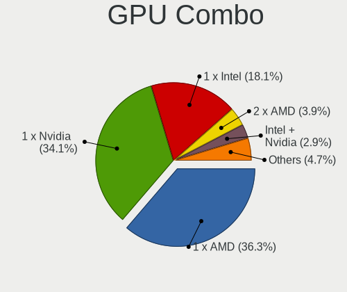

| Name           | Desktops | Percent |
|----------------|----------|---------|
| 1 x AMD        | 102      | 37.09%  |
| 1 x Nvidia     | 89       | 32.36%  |
| 1 x Intel      | 48       | 17.45%  |
| Intel + Nvidia | 10       | 3.64%   |
| 2 x AMD        | 7        | 2.55%   |
| AMD + Nvidia   | 6        | 2.18%   |
| Intel + AMD    | 5        | 1.82%   |
| 2 x Nvidia     | 4        | 1.45%   |
| 2 x Intel      | 2        | 0.73%   |
| 1 x Matrox     | 1        | 0.36%   |
| 1 x ASPEED     | 1        | 0.36%   |

GPU Driver
----------

Free vs proprietary

| Driver      | Desktops | Percent |
|-------------|----------|---------|
| Free        | 219      | 79.64%  |
| Proprietary | 49       | 17.82%  |
| Unknown     | 7        | 2.55%   |

GPU Memory
----------

Total video memory

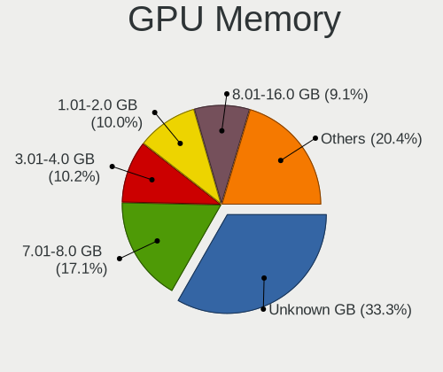

| Size in GB | Desktops | Percent |
|------------|----------|---------|
| Unknown    | 86       | 30.82%  |
| 7.01-8.0   | 55       | 19.71%  |
| 3.01-4.0   | 29       | 10.39%  |
| 1.01-2.0   | 29       | 10.39%  |
| 8.01-16.0  | 23       | 8.24%   |
| 0.51-1.0   | 20       | 7.17%   |
| 0.01-0.5   | 19       | 6.81%   |
| 5.01-6.0   | 9        | 3.23%   |
| 16.01-24.0 | 6        | 2.15%   |
| 2.01-3.0   | 3        | 1.08%   |

Monitor
-------

Monitor Vendor
--------------

Monitor vendors

| Vendor               | Desktops | Percent |
|----------------------|----------|---------|
| Goldstar             | 50       | 16.13%  |
| Dell                 | 48       | 15.48%  |
| Samsung Electronics  | 45       | 14.52%  |
| Acer                 | 17       | 5.48%   |
| Hewlett-Packard      | 16       | 5.16%   |
| ASUSTek Computer     | 13       | 4.19%   |
| Philips              | 12       | 3.87%   |
| AOC                  | 12       | 3.87%   |
| Ancor Communications | 11       | 3.55%   |
| BenQ                 | 10       | 3.23%   |
| ViewSonic            | 6        | 1.94%   |
| Mi                   | 6        | 1.94%   |
| Lenovo               | 6        | 1.94%   |
| Iiyama               | 5        | 1.61%   |
| MSI                  | 4        | 1.29%   |
| Gigabyte Technology  | 4        | 1.29%   |
| Sony                 | 3        | 0.97%   |
| Sceptre Tech         | 3        | 0.97%   |
| Fujitsu Siemens      | 3        | 0.97%   |
| Belinea              | 3        | 0.97%   |
| Vestel Elektronik    | 2        | 0.65%   |
| Unknown              | 2        | 0.65%   |
| TCT                  | 2        | 0.65%   |
| GDH                  | 2        | 0.65%   |
| Eizo                 | 2        | 0.65%   |
| Wacom                | 1        | 0.32%   |
| Vizio                | 1        | 0.32%   |
| Unknown (XXX)        | 1        | 0.32%   |
| Toshiba              | 1        | 0.32%   |
| SGT                  | 1        | 0.32%   |
| SANYO                | 1        | 0.32%   |
| SAC                  | 1        | 0.32%   |
| PZG                  | 1        | 0.32%   |
| Panasonic            | 1        | 0.32%   |
| MYS                  | 1        | 0.32%   |
| LYC                  | 1        | 0.32%   |
| JVC                  | 1        | 0.32%   |
| ITE                  | 1        | 0.32%   |
| HKC                  | 1        | 0.32%   |
| HannStar             | 1        | 0.32%   |

Monitor Model
-------------

Monitor models

| Model                                                                  | Desktops | Percent |
|------------------------------------------------------------------------|----------|---------|
| Goldstar FULL HD GSM5B55 1920x1080 480x270mm 21.7-inch                 | 4        | 1.22%   |
| Samsung Electronics LC27G5xT SAM7079 2560x1440 597x336mm 27.0-inch     | 3        | 0.91%   |
| Goldstar ULTRAWIDE GSM59F1 2560x1080 673x284mm 28.8-inch               | 3        | 0.91%   |
| Vestel Elektronik 43UHD_LCD_TV VES3700 3840x2160 950x540mm 43.0-inch   | 2        | 0.61%   |
| TCT DP1080P60 TCT0270 2560x1600 480x270mm 21.7-inch                    | 2        | 0.61%   |
| Samsung Electronics SE790C SAM0BFD 3440x1440 797x333mm 34.0-inch       | 2        | 0.61%   |
| Samsung Electronics S24D300 SAM0B43 1920x1080 531x299mm 24.0-inch      | 2        | 0.61%   |
| Samsung Electronics LCD Monitor SAM0A7A 1920x1080 1060x626mm 48.5-inch | 2        | 0.61%   |
| Samsung Electronics LC32G7xT SAM7058 2560x1440 698x393mm 31.5-inch     | 2        | 0.61%   |
| Mi Monitor XMI2701 2560x1440 597x335mm 27.0-inch                       | 2        | 0.61%   |
| Lenovo LEN L28u-30 LEN65FA 3840x2160 621x341mm 27.9-inch               | 2        | 0.61%   |
| Iiyama PL2530H IVM6133 1920x1080 544x303mm 24.5-inch                   | 2        | 0.61%   |
| Hewlett-Packard Z24n HWP320E 1920x1200 518x324mm 24.1-inch             | 2        | 0.61%   |
| Goldstar ULTRAGEAR GSM5BD3 2560x1440 697x392mm 31.5-inch               | 2        | 0.61%   |
| Goldstar Ultra HD GSM5B09 3840x2160 600x340mm 27.2-inch                | 2        | 0.61%   |
| Goldstar IPS FULLHD GSM5AB8 1920x1080 480x270mm 21.7-inch              | 2        | 0.61%   |
| Goldstar HDR QHD GSM5B96 2560x1440 698x392mm 31.5-inch                 | 2        | 0.61%   |
| Goldstar E2011 GSM4ED4 1600x900 443x249mm 20.0-inch                    | 2        | 0.61%   |
| Goldstar 2D HD TV GSM59CA 1366x768 509x286mm 23.0-inch                 | 2        | 0.61%   |
| Goldstar 27GL850 GSM5B7F 2560x1440 597x336mm 27.0-inch                 | 2        | 0.61%   |
| Gigabyte Technology M27Q GBT270D 2560x1440 596x335mm 26.9-inch         | 2        | 0.61%   |
| Dell U3419W DELA12E 3440x1440 800x335mm 34.1-inch                      | 2        | 0.61%   |
| Dell S2721DGF DEL41D9 2560x1440 597x336mm 27.0-inch                    | 2        | 0.61%   |
| Dell S2522HG DELA1C2 1920x1080 544x303mm 24.5-inch                     | 2        | 0.61%   |
| Dell P1917S DELD091 1280x1024 375x300mm 18.9-inch                      | 2        | 0.61%   |
| Dell E2011H DEL406B 1600x900 443x249mm 20.0-inch                       | 2        | 0.61%   |
| AOC 27P2DG5 AOC2702 1920x1080 598x336mm 27.0-inch                      | 2        | 0.61%   |
| Ancor Communications ASUS VX279 ACI27E4 1920x1080 600x340mm 27.2-inch  | 2        | 0.61%   |
| Wacom Cintiq 16 WAC1071 1920x1080 344x193mm 15.5-inch                  | 1        | 0.3%    |
| Vizio E320i-A0 VIZ1002 1366x768 698x392mm 31.5-inch                    | 1        | 0.3%    |
| ViewSonic XG270QC VSCC438 2560x1440 597x336mm 27.0-inch                | 1        | 0.3%    |
| ViewSonic VX2233wm-1 VSC1D22 1920x1080 477x268mm 21.5-inch             | 1        | 0.3%    |
| ViewSonic VG930m-3 VSC991E 1280x1024 376x301mm 19.0-inch               | 1        | 0.3%    |
| ViewSonic VG2448 VSC3B35 1920x1080 527x296mm 23.8-inch                 | 1        | 0.3%    |
| ViewSonic VA2719-2K VSC6B34 2560x1440 597x336mm 27.0-inch              | 1        | 0.3%    |
| ViewSonic VA2213wm VSC3422 1920x1080 477x268mm 21.5-inch               | 1        | 0.3%    |
| Unknown MS306 0030 1920x1080 708x398mm 32.0-inch                       | 1        | 0.3%    |
| Unknown LCD Monitor FFFF 2288x1287 2550x2550mm 142.0-inch              | 1        | 0.3%    |
| Unknown (XXX) Beyond TV XXX2851 3840x2160 1209x680mm 54.6-inch         | 1        | 0.3%    |
| Toshiba ScreenXpert TSB8888 1080x2160                                  | 1        | 0.3%    |

Monitor Resolution
------------------

Monitor screen resolution

| Resolution         | Desktops | Percent |
|--------------------|----------|---------|
| 1920x1080 (FHD)    | 125      | 40.98%  |
| 2560x1440 (QHD)    | 56       | 18.36%  |
| 3840x2160 (4K)     | 33       | 10.82%  |
| 1680x1050 (WSXGA+) | 15       | 4.92%   |
| 3440x1440          | 14       | 4.59%   |
| 1280x1024 (SXGA)   | 14       | 4.59%   |
| 1600x900 (HD+)     | 10       | 3.28%   |
| 1440x900 (WXGA+)   | 7        | 2.3%    |
| 1366x768 (WXGA)    | 7        | 2.3%    |
| 2560x1080          | 6        | 1.97%   |
| 1920x1200 (WUXGA)  | 6        | 1.97%   |
| 2048x1152          | 2        | 0.66%   |
| 1600x1200          | 2        | 0.66%   |
| 1360x768           | 2        | 0.66%   |
| 3840x1600          | 1        | 0.33%   |
| 3840x1080          | 1        | 0.33%   |
| 2288x1287          | 1        | 0.33%   |
| 1920x540           | 1        | 0.33%   |
| 1280x960           | 1        | 0.33%   |
| 1024x768 (XGA)     | 1        | 0.33%   |

Monitor Diagonal
----------------

Diagonal size in inches

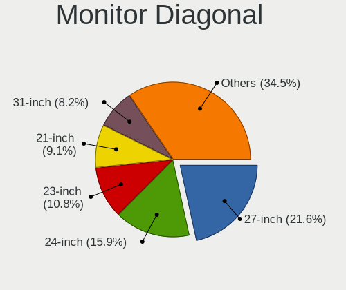

| Inches  | Desktops | Percent |
|---------|----------|---------|
| 27      | 73       | 23.17%  |
| 24      | 50       | 15.87%  |
| 21      | 30       | 9.52%   |
| 23      | 29       | 9.21%   |
| 31      | 23       | 7.3%    |
| 34      | 18       | 5.71%   |
| 19      | 17       | 5.4%    |
| 22      | 13       | 4.13%   |
| 20      | 13       | 4.13%   |
| 32      | 5        | 1.59%   |
| 17      | 5        | 1.59%   |
| 18      | 4        | 1.27%   |
| 84      | 3        | 0.95%   |
| 72      | 3        | 0.95%   |
| 48      | 3        | 0.95%   |
| 25      | 3        | 0.95%   |
| Unknown | 3        | 0.95%   |
| 54      | 2        | 0.63%   |
| 40      | 2        | 0.63%   |
| 35      | 2        | 0.63%   |
| 28      | 2        | 0.63%   |
| 26      | 2        | 0.63%   |
| 15      | 2        | 0.63%   |
| 142     | 1        | 0.32%   |
| 65      | 1        | 0.32%   |
| 63      | 1        | 0.32%   |
| 52      | 1        | 0.32%   |
| 49      | 1        | 0.32%   |
| 42      | 1        | 0.32%   |
| 38      | 1        | 0.32%   |
| 37      | 1        | 0.32%   |

Monitor Width
-------------

Physical width

| Width in mm    | Desktops | Percent |
|----------------|----------|---------|
| 501-600        | 132      | 44%     |
| 401-500        | 65       | 21.67%  |
| 601-700        | 38       | 12.67%  |
| 701-800        | 23       | 7.67%   |
| 351-400        | 10       | 3.33%   |
| 1001-1500      | 9        | 3%      |
| 801-900        | 6        | 2%      |
| 301-350        | 6        | 2%      |
| 1501-2000      | 6        | 2%      |
| Unknown        | 3        | 1%      |
| More than 2000 | 1        | 0.33%   |
| 901-1000       | 1        | 0.33%   |

Aspect Ratio
------------

Proportional relationship between the width and the height

| Ratio | Desktops | Percent |
|-------|----------|---------|
| 16/9  | 207      | 73.93%  |
| 16/10 | 32       | 11.43%  |
| 21/9  | 20       | 7.14%   |
| 5/4   | 14       | 5%      |
| 4/3   | 4        | 1.43%   |
| 6/5   | 1        | 0.36%   |
| 32/9  | 1        | 0.36%   |
| 1.00  | 1        | 0.36%   |

Monitor Area
------------

Area in inch

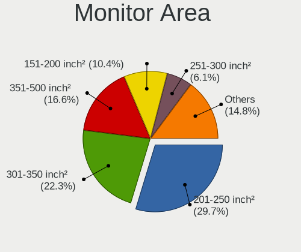

| Area in inch | Desktops | Percent |
|----------------|----------|---------|
| 201-250        | 92       | 29.58%  |
| 301-350        | 74       | 23.79%  |
| 351-500        | 50       | 16.08%  |
| 151-200        | 41       | 13.18%  |
| 251-300        | 19       | 6.11%   |
| More than 1000 | 15       | 4.82%   |
| 141-150        | 9        | 2.89%   |
| 501-1000       | 6        | 1.93%   |
| Unknown        | 3        | 0.96%   |
| 101-110        | 2        | 0.64%   |

Pixel Density
-------------

Pixels per inch

| Density | Desktops | Percent |
|---------|----------|---------|
| 51-100  | 171      | 60%     |
| 101-120 | 77       | 27.02%  |
| 121-160 | 19       | 6.67%   |
| 1-50    | 13       | 4.56%   |
| Unknown | 3        | 1.05%   |
| 161-240 | 2        | 0.7%    |

Multiple Monitors
-----------------

Total monitors connected

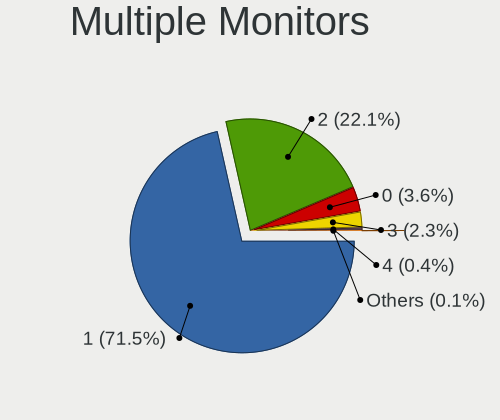

| Total | Desktops | Percent |
|-------|----------|---------|
| 1     | 201      | 73.36%  |
| 2     | 59       | 21.53%  |
| 0     | 7        | 2.55%   |
| 3     | 6        | 2.19%   |
| 4     | 1        | 0.36%   |

Network
-------

Net Controller Vendor
---------------------

Controller vendors

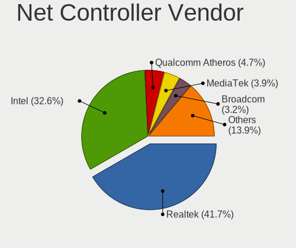

| Vendor                                 | Desktops | Percent |
|----------------------------------------|----------|---------|
| Realtek Semiconductor                  | 171      | 41.91%  |
| Intel                                  | 136      | 33.33%  |
| Qualcomm Atheros                       | 19       | 4.66%   |
| MediaTek                               | 15       | 3.68%   |
| Broadcom                               | 11       | 2.7%    |
| TP-Link                                | 9        | 2.21%   |
| Microsoft                              | 6        | 1.47%   |
| Aquantia                               | 6        | 1.47%   |
| Ralink                                 | 5        | 1.23%   |
| Ralink Technology                      | 4        | 0.98%   |
| Qualcomm Atheros Communications        | 4        | 0.98%   |
| Marvell Technology Group               | 3        | 0.74%   |
| Samsung Electronics                    | 2        | 0.49%   |
| NetGear                                | 2        | 0.49%   |
| Mellanox Technologies                  | 2        | 0.49%   |
| ASUSTek Computer                       | 2        | 0.49%   |
| Xiaomi                                 | 1        | 0.25%   |
| Wilocity                               | 1        | 0.25%   |
| Sony Ericsson Mobile Communications AB | 1        | 0.25%   |
| Microchip Technology                   | 1        | 0.25%   |
| MCS                                    | 1        | 0.25%   |
| ICS Advent                             | 1        | 0.25%   |
| HMD Global                             | 1        | 0.25%   |
| DisplayLink                            | 1        | 0.25%   |
| D-Link                                 | 1        | 0.25%   |
| Belkin Components                      | 1        | 0.25%   |
| AVM                                    | 1        | 0.25%   |

Net Controller Model
--------------------

Controller models

| Model                                                               | Desktops | Percent |
|---------------------------------------------------------------------|----------|---------|
| Realtek RTL8111/8168/8411 PCI Express Gigabit Ethernet Controller   | 130      | 27.48%  |
| Intel Wi-Fi 6 AX200                                                 | 31       | 6.55%   |
| Realtek RTL8125 2.5GbE Controller                                   | 27       | 5.71%   |
| Intel Ethernet Controller I225-V                                    | 21       | 4.44%   |
| Intel I211 Gigabit Network Connection                               | 17       | 3.59%   |
| Intel 82579LM Gigabit Network Connection (Lewisville)               | 11       | 2.33%   |
| Intel Dual Band Wireless-AC 3168NGW [Stone Peak]                    | 10       | 2.11%   |
| Intel Alder Lake-S PCH CNVi WiFi                                    | 9        | 1.9%    |
| MediaTek MT7921K (RZ608) Wi-Fi 6E 80MHz                             | 7        | 1.48%   |
| Intel Wi-Fi 6 AX210/AX211/AX411 160MHz                              | 7        | 1.48%   |
| MediaTek MT7922 802.11ax PCI Express Wireless Network Adapter       | 6        | 1.27%   |
| Intel Ethernet Connection I217-LM                                   | 6        | 1.27%   |
| Realtek RTL8153 Gigabit Ethernet Adapter                            | 5        | 1.06%   |
| Intel Ethernet Connection I217-V                                    | 5        | 1.06%   |
| Intel Ethernet Connection (2) I219-V                                | 5        | 1.06%   |
| Microsoft XBOX ACC                                                  | 4        | 0.85%   |
| Intel Ethernet Connection (2) I218-V                                | 4        | 0.85%   |
| Intel Ethernet Connection (14) I219-V                               | 4        | 0.85%   |
| Realtek 802.11ac NIC                                                | 3        | 0.63%   |
| Qualcomm Atheros QCA9377 802.11ac Wireless Network Adapter          | 3        | 0.63%   |
| Intel Wireless-AC 9260                                              | 3        | 0.63%   |
| Intel Ethernet Connection (7) I219-V                                | 3        | 0.63%   |
| Intel Ethernet Connection (7) I219-LM                               | 3        | 0.63%   |
| Intel Ethernet Connection (2) I219-LM                               | 3        | 0.63%   |
| Intel Centrino Wireless-N 2230                                      | 3        | 0.63%   |
| Intel 82567LM-3 Gigabit Network Connection                          | 3        | 0.63%   |
| Broadcom BCM4360 802.11ac Wireless Network Adapter                  | 3        | 0.63%   |
| Aquantia AQC113CS NBase-T/IEEE 802.3bz Ethernet Controller [AQtion] | 3        | 0.63%   |
| TP-Link Archer T4U ver.3                                            | 2        | 0.42%   |
| TP-Link Archer T2U PLUS [RTL8821AU]                                 | 2        | 0.42%   |
| Samsung Galaxy series, misc. (tethering mode)                       | 2        | 0.42%   |
| Realtek RTL88x2bu [AC1200 Techkey]                                  | 2        | 0.42%   |
| Realtek RTL8822CE 802.11ac PCIe Wireless Network Adapter            | 2        | 0.42%   |
| Realtek RTL8821CE 802.11ac PCIe Wireless Network Adapter            | 2        | 0.42%   |
| Realtek RTL8812AE 802.11ac PCIe Wireless Network Adapter            | 2        | 0.42%   |
| Realtek RTL8188FTV 802.11b/g/n 1T1R 2.4G WLAN Adapter               | 2        | 0.42%   |
| Realtek RTL8188EUS 802.11n Wireless Network Adapter                 | 2        | 0.42%   |
| Ralink MT7601U Wireless Adapter                                     | 2        | 0.42%   |
| Ralink RT5390 Wireless 802.11n 1T/1R PCIe                           | 2        | 0.42%   |
| Ralink RT2800 802.11n PCI                                           | 2        | 0.42%   |

Wireless Vendor
---------------

Wireless vendors

| Vendor                          | Desktops | Percent |
|---------------------------------|----------|---------|
| Intel                           | 73       | 45.06%  |
| Realtek Semiconductor           | 25       | 15.43%  |
| MediaTek                        | 15       | 9.26%   |
| Qualcomm Atheros                | 13       | 8.02%   |
| TP-Link                         | 7        | 4.32%   |
| Microsoft                       | 6        | 3.7%    |
| Ralink                          | 5        | 3.09%   |
| Ralink Technology               | 4        | 2.47%   |
| Qualcomm Atheros Communications | 4        | 2.47%   |
| Broadcom                        | 3        | 1.85%   |
| NetGear                         | 2        | 1.23%   |
| ASUSTek Computer                | 2        | 1.23%   |
| Wilocity                        | 1        | 0.62%   |
| Belkin Components               | 1        | 0.62%   |
| AVM                             | 1        | 0.62%   |

Wireless Model
--------------

Wireless models

| Model                                                                                | Desktops | Percent |
|--------------------------------------------------------------------------------------|----------|---------|
| Intel Wi-Fi 6 AX200                                                                  | 31       | 19.02%  |
| Intel Dual Band Wireless-AC 3168NGW [Stone Peak]                                     | 10       | 6.13%   |
| Intel Alder Lake-S PCH CNVi WiFi                                                     | 9        | 5.52%   |
| MediaTek MT7921K (RZ608) Wi-Fi 6E 80MHz                                              | 7        | 4.29%   |
| Intel Wi-Fi 6 AX210/AX211/AX411 160MHz                                               | 7        | 4.29%   |
| MediaTek MT7922 802.11ax PCI Express Wireless Network Adapter                        | 6        | 3.68%   |
| Microsoft XBOX ACC                                                                   | 4        | 2.45%   |
| Realtek 802.11ac NIC                                                                 | 3        | 1.84%   |
| Qualcomm Atheros QCA9377 802.11ac Wireless Network Adapter                           | 3        | 1.84%   |
| Intel Wireless-AC 9260                                                               | 3        | 1.84%   |
| Intel Centrino Wireless-N 2230                                                       | 3        | 1.84%   |
| Broadcom BCM4360 802.11ac Wireless Network Adapter                                   | 3        | 1.84%   |
| TP-Link Archer T4U ver.3                                                             | 2        | 1.23%   |
| Realtek RTL88x2bu [AC1200 Techkey]                                                   | 2        | 1.23%   |
| Realtek RTL8822CE 802.11ac PCIe Wireless Network Adapter                             | 2        | 1.23%   |
| Realtek RTL8821CE 802.11ac PCIe Wireless Network Adapter                             | 2        | 1.23%   |
| Realtek RTL8812AE 802.11ac PCIe Wireless Network Adapter                             | 2        | 1.23%   |
| Realtek RTL8188FTV 802.11b/g/n 1T1R 2.4G WLAN Adapter                                | 2        | 1.23%   |
| Realtek RTL8188EUS 802.11n Wireless Network Adapter                                  | 2        | 1.23%   |
| Ralink MT7601U Wireless Adapter                                                      | 2        | 1.23%   |
| Ralink RT5390 Wireless 802.11n 1T/1R PCIe                                            | 2        | 1.23%   |
| Ralink RT2800 802.11n PCI                                                            | 2        | 1.23%   |
| Qualcomm Atheros QCA9565 / AR9565 Wireless Network Adapter                           | 2        | 1.23%   |
| Qualcomm Atheros QCA6174 802.11ac Wireless Network Adapter                           | 2        | 1.23%   |
| Qualcomm Atheros TP-Link TL-WN821N v3 / TL-WN822N v2 802.11n [Atheros AR7010+AR9287] | 2        | 1.23%   |
| Qualcomm Atheros AR93xx Wireless Network Adapter                                     | 2        | 1.23%   |
| NetGear A6100 AC600 DB Wireless Adapter [Realtek RTL8811AU]                          | 2        | 1.23%   |
| Microsoft Wireless XBox Controller Dongle                                            | 2        | 1.23%   |
| MediaTek MT7921 802.11ax PCI Express Wireless Network Adapter                        | 2        | 1.23%   |
| Intel Wireless 3165                                                                  | 2        | 1.23%   |
| Intel Tiger Lake PCH CNVi WiFi                                                       | 2        | 1.23%   |
| Intel Cannon Lake PCH CNVi WiFi                                                      | 2        | 1.23%   |
| Wilocity Wil6200 802.11ad Wireless Network Adapter                                   | 1        | 0.61%   |
| TP-Link TL-WN822N Version 4 RTL8192EU                                                | 1        | 0.61%   |
| TP-Link TL-WN821N Version 5 RTL8192EU                                                | 1        | 0.61%   |
| TP-Link 802.11n NIC                                                                  | 1        | 0.61%   |
| TP-Link 802.11ac WLAN Adapter                                                        | 1        | 0.61%   |
| TP-Link 802.11ac NIC                                                                 | 1        | 0.61%   |
| Realtek RTL8852BE PCIe 802.11ax Wireless Network Controller                          | 1        | 0.61%   |
| Realtek RTL8822BE 802.11a/b/g/n/ac WiFi adapter                                      | 1        | 0.61%   |

Ethernet Vendor
---------------

Ethernet vendors

| Vendor                                 | Desktops | Percent |
|----------------------------------------|----------|---------|
| Realtek Semiconductor                  | 163      | 54.52%  |
| Intel                                  | 101      | 33.78%  |
| Broadcom                               | 8        | 2.68%   |
| Qualcomm Atheros                       | 6        | 2.01%   |
| Aquantia                               | 6        | 2.01%   |
| Marvell Technology Group               | 3        | 1%      |
| TP-Link                                | 2        | 0.67%   |
| Samsung Electronics                    | 2        | 0.67%   |
| Mellanox Technologies                  | 2        | 0.67%   |
| Xiaomi                                 | 1        | 0.33%   |
| Sony Ericsson Mobile Communications AB | 1        | 0.33%   |
| ICS Advent                             | 1        | 0.33%   |
| HMD Global                             | 1        | 0.33%   |
| DisplayLink                            | 1        | 0.33%   |
| D-Link                                 | 1        | 0.33%   |

Ethernet Model
--------------

Ethernet models

| Model                                                               | Desktops | Percent |
|---------------------------------------------------------------------|----------|---------|
| Realtek RTL8111/8168/8411 PCI Express Gigabit Ethernet Controller   | 130      | 42.21%  |
| Realtek RTL8125 2.5GbE Controller                                   | 27       | 8.77%   |
| Intel Ethernet Controller I225-V                                    | 21       | 6.82%   |
| Intel I211 Gigabit Network Connection                               | 17       | 5.52%   |
| Intel 82579LM Gigabit Network Connection (Lewisville)               | 11       | 3.57%   |
| Intel Ethernet Connection I217-LM                                   | 6        | 1.95%   |
| Realtek RTL8153 Gigabit Ethernet Adapter                            | 5        | 1.62%   |
| Intel Ethernet Connection I217-V                                    | 5        | 1.62%   |
| Intel Ethernet Connection (2) I219-V                                | 5        | 1.62%   |
| Intel Ethernet Connection (2) I218-V                                | 4        | 1.3%    |
| Intel Ethernet Connection (14) I219-V                               | 4        | 1.3%    |
| Intel Ethernet Connection (7) I219-V                                | 3        | 0.97%   |
| Intel Ethernet Connection (7) I219-LM                               | 3        | 0.97%   |
| Intel Ethernet Connection (2) I219-LM                               | 3        | 0.97%   |
| Intel 82567LM-3 Gigabit Network Connection                          | 3        | 0.97%   |
| Aquantia AQC113CS NBase-T/IEEE 802.3bz Ethernet Controller [AQtion] | 3        | 0.97%   |
| TP-Link Archer T2U PLUS [RTL8821AU]                                 | 2        | 0.65%   |
| Samsung Galaxy series, misc. (tethering mode)                       | 2        | 0.65%   |
| Qualcomm Atheros AR8151 v2.0 Gigabit Ethernet                       | 2        | 0.65%   |
| Marvell Group 88E8001 Gigabit Ethernet Controller                   | 2        | 0.65%   |
| Intel Ethernet Connection (17) I219-V                               | 2        | 0.65%   |
| Intel 82575EB Gigabit Network Connection                            | 2        | 0.65%   |
| Intel 82546GB Gigabit Ethernet Controller                           | 2        | 0.65%   |
| Broadcom NetXtreme BCM5761 Gigabit Ethernet PCIe                    | 2        | 0.65%   |
| Broadcom NetXtreme BCM5720 Gigabit Ethernet PCIe                    | 2        | 0.65%   |
| Broadcom NetXtreme BCM5719 Gigabit Ethernet PCIe                    | 2        | 0.65%   |
| Aquantia AQC107 NBase-T/IEEE 802.3bz Ethernet Controller [AQtion]   | 2        | 0.65%   |
| Xiaomi Mi/Redmi series (RNDIS)                                      | 1        | 0.32%   |
| Sony Ericsson Mobile AB G3311                                       | 1        | 0.32%   |
| Realtek USB 10/100/1G/2.5G LAN                                      | 1        | 0.32%   |
| Realtek RTL8169 PCI Gigabit Ethernet Controller                     | 1        | 0.32%   |
| Realtek RTL-8100/8101L/8139 PCI Fast Ethernet Adapter               | 1        | 0.32%   |
| Realtek Killer E3000 2.5GbE Controller                              | 1        | 0.32%   |
| Realtek Killer E2600 Gigabit Ethernet Controller                    | 1        | 0.32%   |
| Qualcomm Atheros Killer E2500 Gigabit Ethernet Controller           | 1        | 0.32%   |
| Qualcomm Atheros Killer E220x Gigabit Ethernet Controller           | 1        | 0.32%   |
| Qualcomm Atheros AR8152 v2.0 Fast Ethernet                          | 1        | 0.32%   |
| Qualcomm Atheros AR8121/AR8113/AR8114 Gigabit or Fast Ethernet      | 1        | 0.32%   |
| Mellanox MT27520 Family [ConnectX-3 Pro]                            | 1        | 0.32%   |
| Mellanox MT26448 [ConnectX EN 10GigE, PCIe 2.0 5GT/s]               | 1        | 0.32%   |

Net Controller Kind
-------------------

Ethernet, WiFi or modem

| Kind     | Desktops | Percent |
|----------|----------|---------|
| Ethernet | 269      | 63.29%  |
| WiFi     | 154      | 36.24%  |
| Modem    | 2        | 0.47%   |

Used Controller
---------------

Currently used network controller

| Kind     | Desktops | Percent |
|----------|----------|---------|
| Ethernet | 202      | 68.71%  |
| WiFi     | 92       | 31.29%  |

NICs
----

Total network controllers on board

| Total | Desktops | Percent |
|-------|----------|---------|
| 1     | 137      | 49.82%  |
| 2     | 112      | 40.73%  |
| 3     | 16       | 5.82%   |
| 4     | 6        | 2.18%   |
| 0     | 2        | 0.73%   |
| 6     | 1        | 0.36%   |
| 5     | 1        | 0.36%   |

IPv6
----

IPv6 vs IPv4

| Used | Desktops | Percent |
|------|----------|---------|
| No   | 184      | 66.91%  |
| Yes  | 91       | 33.09%  |

Bluetooth
---------

Bluetooth Vendor
----------------

Controller vendors

| Vendor                          | Desktops | Percent |
|---------------------------------|----------|---------|
| Intel                           | 69       | 53.08%  |
| Cambridge Silicon Radio         | 18       | 13.85%  |
| Realtek Semiconductor           | 11       | 8.46%   |
| MediaTek                        | 9        | 6.92%   |
| Broadcom                        | 6        | 4.62%   |
| IMC Networks                    | 4        | 3.08%   |
| Qualcomm Atheros Communications | 3        | 2.31%   |
| Foxconn / Hon Hai               | 3        | 2.31%   |
| Lite-On Technology              | 2        | 1.54%   |
| ASUSTek Computer                | 2        | 1.54%   |
| TP-Link                         | 1        | 0.77%   |
| D-Link                          | 1        | 0.77%   |
| Unknown                         | 1        | 0.77%   |

Bluetooth Model
---------------

Controller models

| Model                                               | Desktops | Percent |
|-----------------------------------------------------|----------|---------|
| Intel AX200 Bluetooth                               | 30       | 23.08%  |
| Cambridge Silicon Radio Bluetooth Dongle (HCI mode) | 18       | 13.85%  |
| Intel Wireless-AC 3168 Bluetooth                    | 10       | 7.69%   |
| Realtek Bluetooth Radio                             | 9        | 6.92%   |
| MediaTek Wireless_Device                            | 9        | 6.92%   |
| Intel AX201 Bluetooth                               | 8        | 6.15%   |
| Intel AX210 Bluetooth                               | 7        | 5.38%   |
| Intel Bluetooth 9460/9560 Jefferson Peak (JfP)      | 4        | 3.08%   |
| Broadcom BCM20702A0 Bluetooth 4.0                   | 4        | 3.08%   |
| Qualcomm Atheros  Bluetooth Device                  | 3        | 2.31%   |
| Intel Wireless-AC 9260 Bluetooth Adapter            | 3        | 2.31%   |
| Intel Centrino Bluetooth Wireless Transceiver       | 3        | 2.31%   |
| Intel Bluetooth wireless interface                  | 3        | 2.31%   |
| Foxconn / Hon Hai Wireless_Device                   | 3        | 2.31%   |
| Realtek  Bluetooth 4.2 Adapter                      | 2        | 1.54%   |
| IMC Networks Wireless_Device                        | 2        | 1.54%   |
| IMC Networks Bluetooth Device                       | 2        | 1.54%   |
| TP-Link UB500 Adapter                               | 1        | 0.77%   |
| Lite-On Bluetooth Radio                             | 1        | 0.77%   |
| Lite-On Atheros AR3012 Bluetooth                    | 1        | 0.77%   |
| Intel Bluetooth Device                              | 1        | 0.77%   |
| D-Link DBT-122 Bluetooth adapter                    | 1        | 0.77%   |
| Broadcom Bluetooth 3.0 Dongle                       | 1        | 0.77%   |
| Broadcom BCM2070B0                                  | 1        | 0.77%   |
| ASUS Bluetooth Radio                                | 1        | 0.77%   |
| ASUS Bluetooth Device                               | 1        | 0.77%   |
| Unknown                                             | 1        | 0.77%   |

Sound
-----

Sound Vendor
------------

Sound card vendors

| Vendor                                          | Desktops | Percent |
|-------------------------------------------------|----------|---------|
| AMD                                             | 158      | 30.92%  |
| Intel                                           | 135      | 26.42%  |
| Nvidia                                          | 104      | 20.35%  |
| C-Media Electronics                             | 19       | 3.72%   |
| ASUSTek Computer                                | 7        | 1.37%   |
| Logitech                                        | 6        | 1.17%   |
| Kingston Technology                             | 6        | 1.17%   |
| Generalplus Technology                          | 6        | 1.17%   |
| Focusrite-Novation                              | 6        | 1.17%   |
| JMTek                                           | 5        | 0.98%   |
| SteelSeries ApS                                 | 4        | 0.78%   |
| Creative Technology                             | 4        | 0.78%   |
| RODE Microphones                                | 3        | 0.59%   |
| Realtek Semiconductor                           | 3        | 0.59%   |
| Razer USA                                       | 3        | 0.59%   |
| Micro Star International                        | 3        | 0.59%   |
| Creative Labs                                   | 3        | 0.59%   |
| Corsair                                         | 3        | 0.59%   |
| Texas Instruments                               | 2        | 0.39%   |
| Hewlett-Packard                                 | 2        | 0.39%   |
| Zoran Co. Personal Media Division (Nogatech)    | 1        | 0.2%    |
| Yamaha                                          | 1        | 0.2%    |
| Weltrend Semiconductor                          | 1        | 0.2%    |
| Unknown                                         | 1        | 0.2%    |
| Universal Audio                                 | 1        | 0.2%    |
| ULi Electronics                                 | 1        | 0.2%    |
| Trust                                           | 1        | 0.2%    |
| Tenx Technology                                 | 1        | 0.2%    |
| Solid State Logic                               | 1        | 0.2%    |
| Schiit Audio                                    | 1        | 0.2%    |
| Samson Technologies                             | 1        | 0.2%    |
| Plantronics                                     | 1        | 0.2%    |
| miniDSP                                         | 1        | 0.2%    |
| Microsoft                                       | 1        | 0.2%    |
| Licensed by Sony Computer Entertainment America | 1        | 0.2%    |
| KTMicro                                         | 1        | 0.2%    |
| JBL                                             | 1        | 0.2%    |
| Harman International                            | 1        | 0.2%    |
| Guangzhou FiiO Electronics                      | 1        | 0.2%    |
| GN Netcom                                       | 1        | 0.2%    |

Sound Model
-----------

Sound card models

| Model                                                                      | Desktops | Percent |
|----------------------------------------------------------------------------|----------|---------|
| AMD Starship/Matisse HD Audio Controller                                   | 57       | 9.21%   |
| AMD Navi 21/23 HDMI/DP Audio Controller                                    | 32       | 5.17%   |
| AMD Family 17h/19h HD Audio Controller                                     | 26       | 4.2%    |
| AMD Ellesmere HDMI Audio [Radeon RX 470/480 / 570/580/590]                 | 22       | 3.55%   |
| Intel 8 Series/C220 Series Chipset High Definition Audio Controller        | 19       | 3.07%   |
| Intel 7 Series/C216 Chipset Family High Definition Audio Controller        | 17       | 2.75%   |
| Intel 200 Series PCH HD Audio                                              | 17       | 2.75%   |
| AMD SBx00 Azalia (Intel HDA)                                               | 16       | 2.58%   |
| AMD Family 17h (Models 00h-0fh) HD Audio Controller                        | 16       | 2.58%   |
| Nvidia GA104 High Definition Audio Controller                              | 15       | 2.42%   |
| Intel Cannon Lake PCH cAVS                                                 | 15       | 2.42%   |
| Intel Xeon E3-1200 v3/4th Gen Core Processor HD Audio Controller           | 14       | 2.26%   |
| Nvidia GP107GL High Definition Audio Controller                            | 12       | 1.94%   |
| Intel Alder Lake-S HD Audio Controller                                     | 12       | 1.94%   |
| AMD Rembrandt Radeon High Definition Audio Controller                      | 11       | 1.78%   |
| AMD Renoir Radeon High Definition Audio Controller                         | 9        | 1.45%   |
| AMD Navi 10 HDMI Audio                                                     | 9        | 1.45%   |
| Nvidia GA106 High Definition Audio Controller                              | 8        | 1.29%   |
| AMD Raven/Raven2/Fenghuang HDMI/DP Audio Controller                        | 8        | 1.29%   |
| AMD Baffin HDMI/DP Audio [Radeon RX 550 640SP / RX 560/560X]               | 8        | 1.29%   |
| Nvidia GP108 High Definition Audio Controller                              | 7        | 1.13%   |
| Nvidia GP106 High Definition Audio Controller                              | 7        | 1.13%   |
| Intel 6 Series/C200 Series Chipset Family High Definition Audio Controller | 7        | 1.13%   |
| ASUSTek Computer USB Audio                                                 | 7        | 1.13%   |
| Nvidia TU116 High Definition Audio Controller                              | 6        | 0.97%   |
| Nvidia High Definition Audio Controller                                    | 6        | 0.97%   |
| Nvidia GK208 HDMI/DP Audio Controller                                      | 6        | 0.97%   |
| Generalplus Technology USB Audio Device                                    | 6        | 0.97%   |
| C-Media Electronics USB Audio Device                                       | 6        | 0.97%   |
| AMD Navi 31 [Radeon RX 7000 HDMI Audio]                                    | 6        | 0.97%   |
| Kingston Technology HyperX 7.1 Audio                                       | 5        | 0.81%   |
| Intel Tiger Lake-H HD Audio Controller                                     | 5        | 0.81%   |
| Intel Comet Lake PCH cAVS                                                  | 5        | 0.81%   |
| Intel 100 Series/C230 Series Chipset Family HD Audio Controller            | 5        | 0.81%   |
| Nvidia TU104 HD Audio Controller                                           | 4        | 0.65%   |
| Nvidia GP104 High Definition Audio Controller                              | 4        | 0.65%   |
| Intel 82801JI (ICH10 Family) HD Audio Controller                           | 4        | 0.65%   |
| Intel 82801JD/DO (ICH10 Family) HD Audio Controller                        | 4        | 0.65%   |
| Intel 5 Series/3400 Series Chipset High Definition Audio                   | 4        | 0.65%   |
| AMD FCH Azalia Controller                                                  | 4        | 0.65%   |

Memory
------

Memory Vendor
-------------

Memory module vendors

| Vendor              | Desktops | Percent |
|---------------------|----------|---------|
| Corsair             | 21       | 18.1%   |
| Kingston            | 17       | 14.66%  |
| G.Skill             | 14       | 12.07%  |
| Unknown             | 10       | 8.62%   |
| Crucial             | 10       | 8.62%   |
| Samsung Electronics | 9        | 7.76%   |
| A-DATA Technology   | 7        | 6.03%   |
| SK hynix            | 6        | 5.17%   |
| Micron Technology   | 4        | 3.45%   |
| Smart               | 3        | 2.59%   |
| Team                | 2        | 1.72%   |
| Apacer              | 2        | 1.72%   |
| Unknown (0x0E9D)    | 1        | 0.86%   |
| Timetec             | 1        | 0.86%   |
| Silicon Power       | 1        | 0.86%   |
| Ramaxel Technology  | 1        | 0.86%   |
| Qumo                | 1        | 0.86%   |
| PNY                 | 1        | 0.86%   |
| Lexar               | 1        | 0.86%   |
| GOODRAM             | 1        | 0.86%   |
| CSX                 | 1        | 0.86%   |
| AMD                 | 1        | 0.86%   |
| 89450000830B        | 1        | 0.86%   |

Memory Model
------------

Memory module models

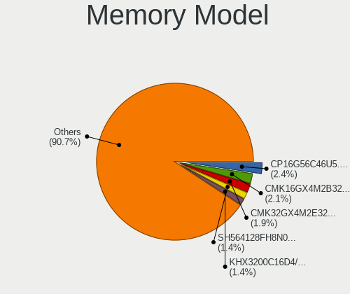

| Model                                                            | Desktops | Percent |
|------------------------------------------------------------------|----------|---------|
| Corsair RAM CMK16GX4M2B3200C16 8GB DIMM DDR4 3600MT/s            | 3        | 2.29%   |
| Smart RAM SH564128FH8N0TNSDR 4GB DIMM DDR3 1600MT/s              | 2        | 1.53%   |
| SK hynix RAM HMT112U6TFR8C-H9 1GB DIMM DDR3 1333MT/s             | 2        | 1.53%   |
| Samsung RAM M378B5173DB0-CK0 4GB DIMM DDR3 1600MT/s              | 2        | 1.53%   |
| Kingston RAM 99U5471-001.A01LF 2GB DIMM DDR3 1333MT/s            | 2        | 1.53%   |
| Corsair RAM CMK32GX4M2E3200C16 16GB DIMM DDR4 3534MT/s           | 2        | 1.53%   |
| Corsair RAM CMK32GX4M2B3200C16 16GB DIMM DDR4 3400MT/s           | 2        | 1.53%   |
| A-DATA RAM DDR4 3600 16GB DIMM DDR4 3800MT/s                     | 2        | 1.53%   |
| Unknown RAM Module 8GB DIMM 1600MT/s                             | 1        | 0.76%   |
| Unknown RAM Module 4GB DIMM DDR3 1333MT/s                        | 1        | 0.76%   |
| Unknown RAM Module 4GB DIMM 400MT/s                              | 1        | 0.76%   |
| Unknown RAM Module 2GB DIMM SDRAM                                | 1        | 0.76%   |
| Unknown RAM Module 2GB DIMM DDR3 1067MT/s                        | 1        | 0.76%   |
| Unknown RAM Module 2GB DIMM DDR2 667MT/s                         | 1        | 0.76%   |
| Unknown RAM Module 2GB DIMM DDR2 1067MT/s                        | 1        | 0.76%   |
| Unknown RAM Module 2GB DIMM 533MT/s                              | 1        | 0.76%   |
| Unknown RAM Module 1GB DIMM DDR 333MT/s                          | 1        | 0.76%   |
| Unknown RAM 3600 C20 Series 32GB DIMM DDR4 3666MT/s              | 1        | 0.76%   |
| Unknown (0x0E9D) RAM KINSOTIN8GB2666MHZ 8GB SODIMM DDR4 2667MT/s | 1        | 0.76%   |
| Timetec RAM SD3-1600 8GB SODIMM DDR3 1600MT/s                    | 1        | 0.76%   |
| Team RAM UD5-5600 16GB DIMM DDR5 12800MT/s                       | 1        | 0.76%   |
| Team RAM TEAMGROUP-UD4-3200 16GB DIMM DDR4 3800MT/s              | 1        | 0.76%   |
| Smart RAM SH564128FH8N6TNSQG 4GB DIMM DDR3 1600MT/s              | 1        | 0.76%   |
| SK hynix RAM Module 8GB SODIMM DDR4 2133MT/s                     | 1        | 0.76%   |
| SK hynix RAM Module 16GB SODIMM DDR4 2667MT/s                    | 1        | 0.76%   |
| SK hynix RAM HMT125U6TFR8C-H9 2GB DIMM DDR3 1333MT/s             | 1        | 0.76%   |
| SK hynix RAM HMCG88MEBSA095N 32GB SODIMM DDR5 4800MT/s           | 1        | 0.76%   |
| SK hynix RAM HMA81GU6DJR8N-XN 8GB DIMM DDR4 3200MT/s             | 1        | 0.76%   |
| SK hynix RAM 9905471-006.A00LF 4GB DIMM DDR3 1333MT/s            | 1        | 0.76%   |
| Silicon Power RAM Module 8GB DIMM DDR4 3200MT/s                  | 1        | 0.76%   |
| Samsung RAM M393B5773CH0-CH9 2GB DIMM DDR3 1333MT/s              | 1        | 0.76%   |
| Samsung RAM M393B5170GB0-CH9 4GB DIMM DDR3 1333MT/s              | 1        | 0.76%   |
| Samsung RAM M393B1K70DH0 8GB DIMM DDR3 1333MT/s                  | 1        | 0.76%   |
| Samsung RAM M378B5273DH0-CH9 4GB DIMM DDR3 2133MT/s              | 1        | 0.76%   |
| Samsung RAM M378B5173EB0-YK0 4096MB DIMM DDR3 1600MT/s           | 1        | 0.76%   |
| Samsung RAM M378B2873GB0-CH9 1GB DIMM DDR3 1400MT/s              | 1        | 0.76%   |
| Samsung RAM M378A2K43DB1-CTD 16GB DIMM DDR4 2667MT/s             | 1        | 0.76%   |
| Samsung RAM M378A1K43EB2-CWE 8GB DIMM DDR4 3200MT/s              | 1        | 0.76%   |
| Samsung RAM M3 78T5663QZ3-CF7 2048MB DIMM DDR2 800MT/s           | 1        | 0.76%   |
| Ramaxel RAM RMR5030EF68F9W1600 4GB DIMM DDR3 1600MT/s            | 1        | 0.76%   |

Memory Kind
-----------

Memory module kinds

| Kind    | Desktops | Percent |
|---------|----------|---------|
| DDR4    | 57       | 55.34%  |
| DDR3    | 26       | 25.24%  |
| DDR5    | 8        | 7.77%   |
| SDRAM   | 4        | 3.88%   |
| DDR2    | 4        | 3.88%   |
| Unknown | 3        | 2.91%   |
| DDR     | 1        | 0.97%   |

Memory Form Factor
------------------

Physical design of the memory module

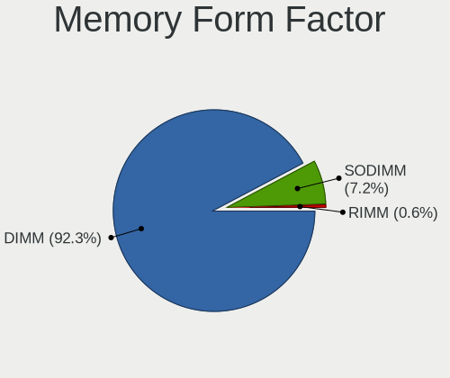

| Name   | Desktops | Percent |
|--------|----------|---------|
| DIMM   | 92       | 91.09%  |
| SODIMM | 9        | 8.91%   |

Memory Size
-----------

Memory module size

| Size  | Desktops | Percent |
|-------|----------|---------|
| 8192  | 39       | 34.51%  |
| 16384 | 24       | 21.24%  |
| 4096  | 18       | 15.93%  |
| 32768 | 13       | 11.5%   |
| 2048  | 13       | 11.5%   |
| 1024  | 6        | 5.31%   |

Memory Speed
------------

Memory module speed

| Speed   | Desktops | Percent |
|---------|----------|---------|
| 3200    | 21       | 18.1%   |
| 1600    | 17       | 14.66%  |
| 3600    | 11       | 9.48%   |
| 1333    | 8        | 6.9%    |
| 2667    | 7        | 6.03%   |
| 3800    | 5        | 4.31%   |
| 2400    | 4        | 3.45%   |
| 2133    | 4        | 3.45%   |
| 1866    | 4        | 3.45%   |
| 4800    | 3        | 2.59%   |
| 3400    | 3        | 2.59%   |
| 667     | 3        | 2.59%   |
| 5200    | 2        | 1.72%   |
| 3534    | 2        | 1.72%   |
| 3000    | 2        | 1.72%   |
| 1867    | 2        | 1.72%   |
| 1639    | 2        | 1.72%   |
| 1067    | 2        | 1.72%   |
| 12800   | 1        | 0.86%   |
| 6000    | 1        | 0.86%   |
| 5800    | 1        | 0.86%   |
| 3933    | 1        | 0.86%   |
| 3666    | 1        | 0.86%   |
| 3334    | 1        | 0.86%   |
| 2800    | 1        | 0.86%   |
| 2666    | 1        | 0.86%   |
| 1400    | 1        | 0.86%   |
| 800     | 1        | 0.86%   |
| 533     | 1        | 0.86%   |
| 400     | 1        | 0.86%   |
| 333     | 1        | 0.86%   |
| Unknown | 1        | 0.86%   |

Printers & scanners
-------------------

Printer Vendor
--------------

Printer device vendors

| Vendor             | Desktops | Percent |
|--------------------|----------|---------|
| Hewlett-Packard    | 6        | 54.55%  |
| Seiko Epson        | 2        | 18.18%  |
| Brother Industries | 2        | 18.18%  |
| Dymo-CoStar        | 1        | 9.09%   |

Printer Model
-------------

Printer device models

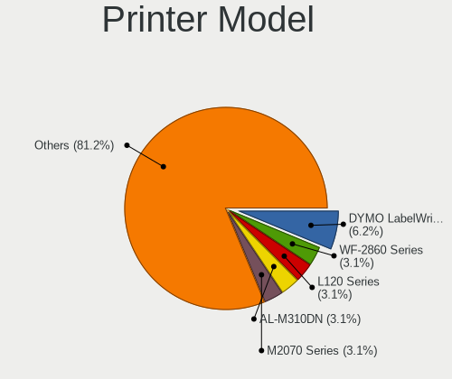

| Model                                  | Desktops | Percent |
|----------------------------------------|----------|---------|
| Seiko Epson WF-2860 Series             | 1        | 9.09%   |
| Seiko Epson L120 Series                | 1        | 9.09%   |
| HP LaserJet Professional P1102w        | 1        | 9.09%   |
| HP LaserJet 1020                       | 1        | 9.09%   |
| HP LaserJet 1010                       | 1        | 9.09%   |
| HP ENVY Inspire 7200 series            | 1        | 9.09%   |
| HP ENVY 5000 series                    | 1        | 9.09%   |
| HP Deskjet 2050 J510                   | 1        | 9.09%   |
| Dymo-CoStar DYMO LabelWriter 450 Turbo | 1        | 9.09%   |
| Brother HL-2130 series                 | 1        | 9.09%   |
| Brother HL-1440 Laser Printer          | 1        | 9.09%   |

Scanner Vendor
--------------

Scanner device vendors

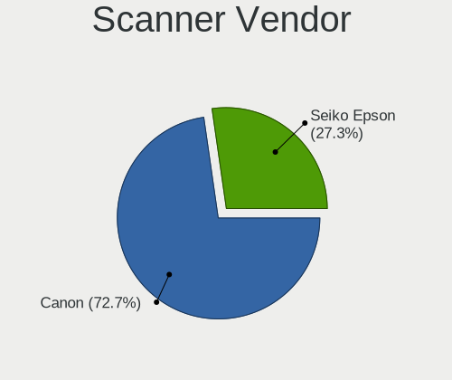

| Vendor      | Desktops | Percent |
|-------------|----------|---------|
| Canon       | 2        | 66.67%  |
| Seiko Epson | 1        | 33.33%  |

Scanner Model
-------------

Scanner device models

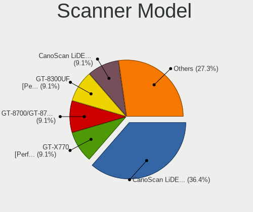

| Model                                 | Desktops | Percent |
|---------------------------------------|----------|---------|
| Seiko Epson GT-X770 [Perfection V500] | 1        | 33.33%  |
| Canon CanoScan LiDE 210               | 1        | 33.33%  |
| Canon CanoScan 4400F                  | 1        | 33.33%  |

Camera
------

Camera Vendor
-------------

Camera device vendors

| Vendor                                 | Desktops | Percent |
|----------------------------------------|----------|---------|
| Logitech                               | 33       | 44.59%  |
| Microsoft                              | 7        | 9.46%   |
| Microdia                               | 4        | 5.41%   |
| Trust                                  | 2        | 2.7%    |
| Sunplus Innovation Technology          | 2        | 2.7%    |
| Google                                 | 2        | 2.7%    |
| Chicony Electronics                    | 2        | 2.7%    |
| AVerMedia Technologies                 | 2        | 2.7%    |
| ARC International                      | 2        | 2.7%    |
| Apple                                  | 2        | 2.7%    |
| XHT-211220-ZW                          | 1        | 1.35%   |
| webcam                                 | 1        | 1.35%   |
| Tobii Technology AB                    | 1        | 1.35%   |
| Samsung Electronics                    | 1        | 1.35%   |
| Realtek Semiconductor                  | 1        | 1.35%   |
| Razer USA                              | 1        | 1.35%   |
| Pixart Imaging                         | 1        | 1.35%   |
| KYE Systems (Mouse Systems)            | 1        | 1.35%   |
| Generalplus Technology                 | 1        | 1.35%   |
| ezcap                                  | 1        | 1.35%   |
| Elecom                                 | 1        | 1.35%   |
| Cubeternet                             | 1        | 1.35%   |
| Cheng Uei Precision Industry (Foxlink) | 1        | 1.35%   |
| Aveo Technology                        | 1        | 1.35%   |
| Alpha Imaging Technology               | 1        | 1.35%   |
| Alcor Micro                            | 1        | 1.35%   |

Camera Model
------------

Camera device models

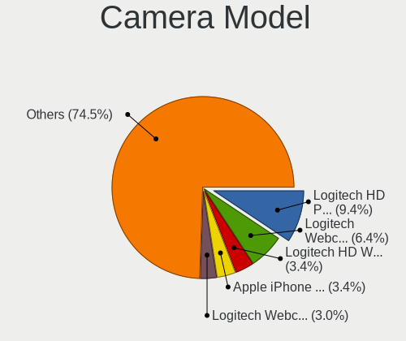

| Model                                   | Desktops | Percent |
|-----------------------------------------|----------|---------|
| Logitech HD Pro Webcam C920             | 7        | 9.46%   |
| Logitech HD Webcam C525                 | 5        | 6.76%   |
| Logitech Webcam C270                    | 3        | 4.05%   |
| Logitech HD Webcam C615                 | 3        | 4.05%   |
| Microsoft Microsoft LifeCam Studio    | 2        | 2.7%    |
| Microsoft LifeCam HD-3000               | 2        | 2.7%    |
| Logitech Webcam C925e                   | 2        | 2.7%    |
| Logitech Webcam B500                    | 2        | 2.7%    |
| Logitech C922 Pro Stream Webcam         | 2        | 2.7%    |
| Logitech BRIO Ultra HD Webcam           | 2        | 2.7%    |
| AVerMedia Live Streamer CAM 313         | 2        | 2.7%    |
| ARC International Camera                | 2        | 2.7%    |
| Apple iPhone 5/5C/5S/6/SE/7/8/X         | 2        | 2.7%    |
| XHT-211220-ZW Photry PC230A QHD Webcam  | 1        | 1.35%   |
| webcam webcam                           | 1        | 1.35%   |
| Trust USB Camera                        | 1        | 1.35%   |
| Trust Full HD Webcam                    | 1        | 1.35%   |
| Tobii AB EyeChip                        | 1        | 1.35%   |
| Sunplus Full HD webcam                  | 1        | 1.35%   |
| Sunplus ezcap U3 capture-04             | 1        | 1.35%   |
| Samsung Galaxy series, misc. (MTP mode) | 1        | 1.35%   |
| Realtek HD 720P Webcam                  | 1        | 1.35%   |
| Razer USA Gaming Webcam [Kiyo]          | 1        | 1.35%   |
| Pixart Imaging GE 1.3 MP MiniCam Pro    | 1        | 1.35%   |
| Microsoft Microsoft LifeCam Cinema    | 1        | 1.35%   |
| Microsoft LifeCam VX-800                | 1        | 1.35%   |
| Microsoft LifeCam VX-2000               | 1        | 1.35%   |
| Microdia Webcam Vitade AF               | 1        | 1.35%   |
| Microdia Integrated Camera              | 1        | 1.35%   |
| Microdia HoverCam Solo Spark Audio      | 1        | 1.35%   |
| Microdia CameraA                        | 1        | 1.35%   |
| Logitech Webcam C170                    | 1        | 1.35%   |
| Logitech StreamCam                      | 1        | 1.35%   |
| Logitech QuickCam Communicate MP/S5500  | 1        | 1.35%   |
| Logitech HD Webcam C910                 | 1        | 1.35%   |
| Logitech HD Webcam B910                 | 1        | 1.35%   |
| Logitech C505 HD Webcam                 | 1        | 1.35%   |
| Logitech BRIO 4K Stream Edition         | 1        | 1.35%   |
| KYE Systems (Mouse Systems) Eye 320     | 1        | 1.35%   |
| Google Nexus/Pixel Device (PTP + debug) | 1        | 1.35%   |

Security
--------

Fingerprint Vendor
------------------

Fingerprint sensor vendors

| Vendor                | Desktops | Percent |
|-----------------------|----------|---------|
| LighTuning Technology | 1        | 50%     |
| AuthenTec             | 1        | 50%     |

Fingerprint Model
-----------------

Fingerprint sensor models

| Model                         | Desktops | Percent |
|-------------------------------|----------|---------|
| LighTuning Fingerprint Sensor | 1        | 50%     |
| AuthenTec Fingerprint Sensor  | 1        | 50%     |

Chipcard Vendor
---------------

Chipcard module vendors

| Vendor | Desktops | Percent |
|--------|----------|---------|
| BIT4ID | 1        | 100%    |

Chipcard Model
--------------

Chipcard module models

| Model                 | Desktops | Percent |
|-----------------------|----------|---------|
| BIT4ID miniLector EVO | 1        | 100%    |

Unsupported
-----------

Unsupported Devices
-------------------

Total unsupported devices on board

| Total | Desktops | Percent |
|-------|----------|---------|
| 0     | 233      | 84.73%  |
| 1     | 38       | 13.82%  |
| 2     | 3        | 1.09%   |
| 4     | 1        | 0.36%   |

Unsupported Device Types
------------------------

Types of unsupported devices

| Type                     | Desktops | Percent |
|--------------------------|----------|---------|
| Net/wireless             | 14       | 31.82%  |
| Graphics card            | 13       | 29.55%  |
| Unassigned class         | 3        | 6.82%   |
| Sound                    | 3        | 6.82%   |
| Communication controller | 3        | 6.82%   |
| Camera                   | 3        | 6.82%   |
| Net/ethernet             | 2        | 4.55%   |
| Fingerprint reader       | 2        | 4.55%   |
| Multimedia controller    | 1        | 2.27%   |

