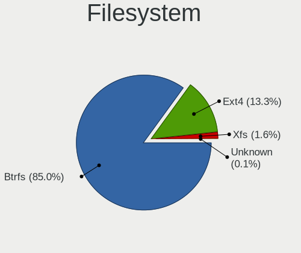
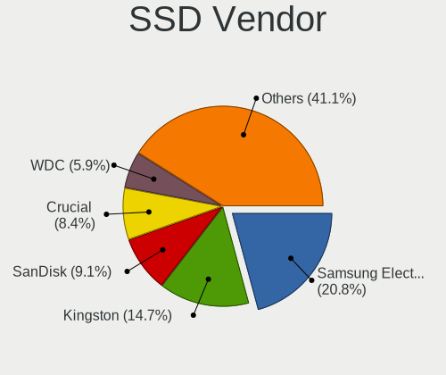
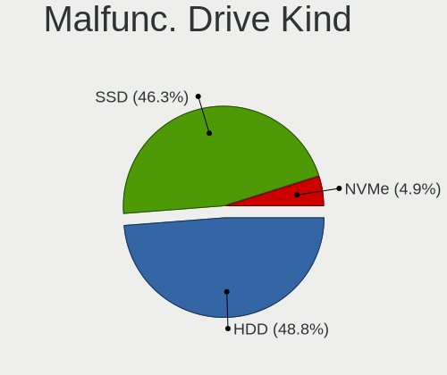
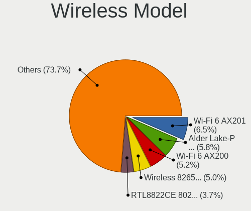
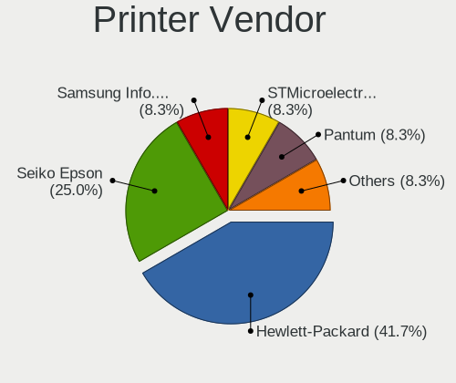

Fedora 38 - Tested Hardware & Statistics (Notebooks)
----------------------------------------------------

A project to collect tested hardware configurations for Fedora 38.

Anyone can contribute to this report by the [hw-probe](https://github.com/linuxhw/hw-probe) tool:

    sudo -E hw-probe -all -upload

Please contribute! Especially if your hardware is rare.

Contents
--------

* [ Test Cases ](#test-cases)

* [ System ](#system)
  - [ Kernel                   ](#kernel)
  - [ Kernel Family            ](#kernel-family)
  - [ Kernel Major Ver.        ](#kernel-major-ver)
  - [ Arch                     ](#arch)
  - [ DE                       ](#de)
  - [ Display Server           ](#display-server)
  - [ Display Manager          ](#display-manager)
  - [ OS Lang                  ](#os-lang)
  - [ Boot Mode                ](#boot-mode)
  - [ Filesystem               ](#filesystem)
  - [ Part. scheme             ](#part-scheme)
  - [ Dual Boot with Linux/BSD ](#dual-boot-with-linuxbsd)
  - [ Dual Boot (Win)          ](#dual-boot-win)

* [ Board ](#board)
  - [ Vendor                   ](#vendor)
  - [ Model                    ](#model)
  - [ Model Family             ](#model-family)
  - [ MFG Year                 ](#mfg-year)
  - [ Form Factor              ](#form-factor)
  - [ Secure Boot              ](#secure-boot)
  - [ Coreboot                 ](#coreboot)
  - [ RAM Size                 ](#ram-size)
  - [ RAM Used                 ](#ram-used)
  - [ Total Drives             ](#total-drives)
  - [ Has CD-ROM               ](#has-cd-rom)
  - [ Has Ethernet             ](#has-ethernet)
  - [ Has WiFi                 ](#has-wifi)
  - [ Has Bluetooth            ](#has-bluetooth)

* [ Location ](#location)
  - [ Country                  ](#country)
  - [ City                     ](#city)

* [ Drives ](#drives)
  - [ Drive Vendor             ](#drive-vendor)
  - [ Drive Model              ](#drive-model)
  - [ HDD Vendor               ](#hdd-vendor)
  - [ SSD Vendor               ](#ssd-vendor)
  - [ Drive Kind               ](#drive-kind)
  - [ Drive Connector          ](#drive-connector)
  - [ Drive Size               ](#drive-size)
  - [ Space Total              ](#space-total)
  - [ Space Used               ](#space-used)
  - [ Malfunc. Drives          ](#malfunc-drives)
  - [ Malfunc. Drive Vendor    ](#malfunc-drive-vendor)
  - [ Malfunc. HDD Vendor      ](#malfunc-hdd-vendor)
  - [ Malfunc. Drive Kind      ](#malfunc-drive-kind)
  - [ Failed Drives            ](#failed-drives)
  - [ Failed Drive Vendor      ](#failed-drive-vendor)
  - [ Drive Status             ](#drive-status)

* [ Storage controller ](#storage-controller)
  - [ Storage Vendor           ](#storage-vendor)
  - [ Storage Model            ](#storage-model)
  - [ Storage Kind             ](#storage-kind)

* [ Processor ](#processor)
  - [ CPU Vendor               ](#cpu-vendor)
  - [ CPU Model                ](#cpu-model)
  - [ CPU Model Family         ](#cpu-model-family)
  - [ CPU Cores                ](#cpu-cores)
  - [ CPU Sockets              ](#cpu-sockets)
  - [ CPU Threads              ](#cpu-threads)
  - [ CPU Op-Modes             ](#cpu-op-modes)
  - [ CPU Microcode            ](#cpu-microcode)
  - [ CPU Microarch            ](#cpu-microarch)

* [ Graphics ](#graphics)
  - [ GPU Vendor               ](#gpu-vendor)
  - [ GPU Model                ](#gpu-model)
  - [ GPU Combo                ](#gpu-combo)
  - [ GPU Driver               ](#gpu-driver)
  - [ GPU Memory               ](#gpu-memory)

* [ Monitor ](#monitor)
  - [ Monitor Vendor           ](#monitor-vendor)
  - [ Monitor Model            ](#monitor-model)
  - [ Monitor Resolution       ](#monitor-resolution)
  - [ Monitor Diagonal         ](#monitor-diagonal)
  - [ Monitor Width            ](#monitor-width)
  - [ Aspect Ratio             ](#aspect-ratio)
  - [ Monitor Area             ](#monitor-area)
  - [ Pixel Density            ](#pixel-density)
  - [ Multiple Monitors        ](#multiple-monitors)

* [ Network ](#network)
  - [ Net Controller Vendor    ](#net-controller-vendor)
  - [ Net Controller Model     ](#net-controller-model)
  - [ Wireless Vendor          ](#wireless-vendor)
  - [ Wireless Model           ](#wireless-model)
  - [ Ethernet Vendor          ](#ethernet-vendor)
  - [ Ethernet Model           ](#ethernet-model)
  - [ Net Controller Kind      ](#net-controller-kind)
  - [ Used Controller          ](#used-controller)
  - [ NICs                     ](#nics)
  - [ IPv6                     ](#ipv6)

* [ Bluetooth ](#bluetooth)
  - [ Bluetooth Vendor         ](#bluetooth-vendor)
  - [ Bluetooth Model          ](#bluetooth-model)

* [ Sound ](#sound)
  - [ Sound Vendor             ](#sound-vendor)
  - [ Sound Model              ](#sound-model)

* [ Memory ](#memory)
  - [ Memory Vendor            ](#memory-vendor)
  - [ Memory Model             ](#memory-model)
  - [ Memory Kind              ](#memory-kind)
  - [ Memory Form Factor       ](#memory-form-factor)
  - [ Memory Size              ](#memory-size)
  - [ Memory Speed             ](#memory-speed)

* [ Printers & scanners ](#printers--scanners)
  - [ Printer Vendor           ](#printer-vendor)
  - [ Printer Model            ](#printer-model)
  - [ Scanner Vendor           ](#scanner-vendor)
  - [ Scanner Model            ](#scanner-model)

* [ Camera ](#camera)
  - [ Camera Vendor            ](#camera-vendor)
  - [ Camera Model             ](#camera-model)

* [ Security ](#security)
  - [ Fingerprint Vendor       ](#fingerprint-vendor)
  - [ Fingerprint Model        ](#fingerprint-model)
  - [ Chipcard Vendor          ](#chipcard-vendor)
  - [ Chipcard Model           ](#chipcard-model)

* [ Unsupported ](#unsupported)
  - [ Unsupported Devices      ](#unsupported-devices)
  - [ Unsupported Device Types ](#unsupported-device-types)

Test Cases
----------

Total: 908

| Vendor        | Model                       | Probe                                                      | Date         |
|---------------|-----------------------------|------------------------------------------------------------|--------------|
| Fujitsu       | LIFEBOOK E780               | [12c5cd0309](https://linux-hardware.org/?probe=12c5cd0309) | Jul 01, 2023 |
| Acer          | Aspire A315-23              | [434ba90999](https://linux-hardware.org/?probe=434ba90999) | Jun 30, 2023 |
| HP            | ENVY m6                     | [b4f8d19895](https://linux-hardware.org/?probe=b4f8d19895) | Jun 30, 2023 |
| Dell          | Inspiron N5010              | [eab5331f66](https://linux-hardware.org/?probe=eab5331f66) | Jun 30, 2023 |
| ASUSTek       | VivoBook_ASUSLaptop M560... | [5dd37cbc97](https://linux-hardware.org/?probe=5dd37cbc97) | Jun 30, 2023 |
| Google        | Eldrid                      | [4e08107dd6](https://linux-hardware.org/?probe=4e08107dd6) | Jun 30, 2023 |
| Apple         | MacBookPro12,1              | [997b1fe1f8](https://linux-hardware.org/?probe=997b1fe1f8) | Jun 30, 2023 |
| HP            | Pavilion 11 x360 PC         | [cfbc8c8a97](https://linux-hardware.org/?probe=cfbc8c8a97) | Jun 29, 2023 |
| MSI           | PS63 Modern 8SC             | [dcbb8108cf](https://linux-hardware.org/?probe=dcbb8108cf) | Jun 29, 2023 |
| Dell          | Latitude 5521               | [3a8f3794aa](https://linux-hardware.org/?probe=3a8f3794aa) | Jun 29, 2023 |
| Lenovo        | ThinkPad X1 Carbon 2nd 2... | [df0ca94515](https://linux-hardware.org/?probe=df0ca94515) | Jun 29, 2023 |
| Lenovo        | ThinkBook 14p Gen 3 21EJ    | [0086cae258](https://linux-hardware.org/?probe=0086cae258) | Jun 29, 2023 |
| Google        | Nami                        | [6ffc403580](https://linux-hardware.org/?probe=6ffc403580) | Jun 29, 2023 |
| Acer          | Aspire 5745G                | [c3394b9eb0](https://linux-hardware.org/?probe=c3394b9eb0) | Jun 28, 2023 |
| Apple         | MacBookAir7,2               | [92a71d25d7](https://linux-hardware.org/?probe=92a71d25d7) | Jun 28, 2023 |
| ASUSTek       | ROG Zephyrus G15 GA502IV... | [76e11b36e9](https://linux-hardware.org/?probe=76e11b36e9) | Jun 28, 2023 |
| Acer          | Aspire A315-23              | [36f9eb51e6](https://linux-hardware.org/?probe=36f9eb51e6) | Jun 28, 2023 |
| Dell          | Precision M6500             | [1db851fd5d](https://linux-hardware.org/?probe=1db851fd5d) | Jun 28, 2023 |
| Dell          | XPS 15 9510                 | [0294ef5e1f](https://linux-hardware.org/?probe=0294ef5e1f) | Jun 28, 2023 |
| Lenovo        | G500s 20245                 | [1aa332e26f](https://linux-hardware.org/?probe=1aa332e26f) | Jun 27, 2023 |
| HP            | EliteBook 8440p             | [3d2a2196ae](https://linux-hardware.org/?probe=3d2a2196ae) | Jun 27, 2023 |
| HP            | Pavilion g6                 | [ec6a70b7d4](https://linux-hardware.org/?probe=ec6a70b7d4) | Jun 27, 2023 |
| Dell          | Inspiron 3543               | [4baea798b1](https://linux-hardware.org/?probe=4baea798b1) | Jun 27, 2023 |
| Intel Clie... | LAPRC710                    | [5aabe7850a](https://linux-hardware.org/?probe=5aabe7850a) | Jun 27, 2023 |
| Lenovo        | Legion 5 15ACH6H 82JU       | [c05a780b64](https://linux-hardware.org/?probe=c05a780b64) | Jun 27, 2023 |
| Lenovo        | IdeaPad Gaming 3 15ACH6 ... | [24d66c058b](https://linux-hardware.org/?probe=24d66c058b) | Jun 27, 2023 |
| ASUSTek       | TUF Gaming FX505DT_FX505... | [39ec9cf6c4](https://linux-hardware.org/?probe=39ec9cf6c4) | Jun 27, 2023 |
| Lenovo        | Yoga Slim 7 Carbon 13ITL... | [78b698279a](https://linux-hardware.org/?probe=78b698279a) | Jun 27, 2023 |
| HP            | ENVY Laptop 17-ch2xxx       | [41e22753cc](https://linux-hardware.org/?probe=41e22753cc) | Jun 27, 2023 |
| Lenovo        | ThinkPad Z13 Gen 1 21D20... | [7487f61ff1](https://linux-hardware.org/?probe=7487f61ff1) | Jun 26, 2023 |
| HP            | EliteBook 850 G8 Noteboo... | [e16689358e](https://linux-hardware.org/?probe=e16689358e) | Jun 26, 2023 |
| Lenovo        | ThinkPad X1 Carbon 6th 2... | [253fb546a2](https://linux-hardware.org/?probe=253fb546a2) | Jun 26, 2023 |
| Acer          | Nitro AN515-55              | [e5b49b2807](https://linux-hardware.org/?probe=e5b49b2807) | Jun 26, 2023 |
| Acer          | Nitro AN515-55              | [49c7e22c1e](https://linux-hardware.org/?probe=49c7e22c1e) | Jun 26, 2023 |
| Toshiba       | TECRA R950                  | [f02bb9a43a](https://linux-hardware.org/?probe=f02bb9a43a) | Jun 26, 2023 |
| ASUSTek       | X510UAR                     | [22372b435f](https://linux-hardware.org/?probe=22372b435f) | Jun 26, 2023 |
| Acer          | Aspire A515-51              | [ee5172b420](https://linux-hardware.org/?probe=ee5172b420) | Jun 26, 2023 |
| Lenovo        | IdeaPad L340-15API 81LW     | [03153f31b2](https://linux-hardware.org/?probe=03153f31b2) | Jun 26, 2023 |
| Lenovo        | ThinkPad T430 2349UA9       | [68117675ab](https://linux-hardware.org/?probe=68117675ab) | Jun 25, 2023 |
| HP            | Pavilion Laptop 14-bk0xx    | [e6184368a0](https://linux-hardware.org/?probe=e6184368a0) | Jun 25, 2023 |
| Lenovo        | Yoga Slim 7 13ACN5 82CY     | [bfa03ecd27](https://linux-hardware.org/?probe=bfa03ecd27) | Jun 25, 2023 |
| Lenovo        | ThinkPad X230 2324H58       | [bcf8a71bb4](https://linux-hardware.org/?probe=bcf8a71bb4) | Jun 25, 2023 |
| Lenovo        | Yoga Slim 7 13ACN5 82CY     | [58d1b3da16](https://linux-hardware.org/?probe=58d1b3da16) | Jun 25, 2023 |
| HP            | 255 G5 Notebook PC          | [cad891675f](https://linux-hardware.org/?probe=cad891675f) | Jun 25, 2023 |
| ASUSTek       | X540NA                      | [6a01ca36af](https://linux-hardware.org/?probe=6a01ca36af) | Jun 25, 2023 |
| ASUSTek       | X540NA                      | [b5996a0d85](https://linux-hardware.org/?probe=b5996a0d85) | Jun 25, 2023 |
| Lenovo        | ThinkPad X1 Carbon 6th 2... | [29203c5ffe](https://linux-hardware.org/?probe=29203c5ffe) | Jun 25, 2023 |
| HP            | OMEN by Laptop 16-c0xxx     | [3fbef5ec38](https://linux-hardware.org/?probe=3fbef5ec38) | Jun 25, 2023 |
| ASUSTek       | VivoBook_ASUSLaptop K650... | [8a833d8c52](https://linux-hardware.org/?probe=8a833d8c52) | Jun 25, 2023 |
| Acer          | Nitro AN515-55              | [2153f80362](https://linux-hardware.org/?probe=2153f80362) | Jun 25, 2023 |
| Google        | Nami                        | [f9f785f70d](https://linux-hardware.org/?probe=f9f785f70d) | Jun 25, 2023 |
| Dell          | Precision 5510              | [38d61a4475](https://linux-hardware.org/?probe=38d61a4475) | Jun 24, 2023 |
| HP            | Pavilion Notebook           | [e80fd49ba9](https://linux-hardware.org/?probe=e80fd49ba9) | Jun 24, 2023 |
| Dell          | Vostro 2520                 | [9279842ec3](https://linux-hardware.org/?probe=9279842ec3) | Jun 24, 2023 |
| MSI           | Modern 14 A10M              | [fcc6786de6](https://linux-hardware.org/?probe=fcc6786de6) | Jun 24, 2023 |
| HP            | EliteBook 840 G5            | [4ad837baa7](https://linux-hardware.org/?probe=4ad837baa7) | Jun 24, 2023 |
| Dell          | Inspiron 15 3515            | [77473ea84c](https://linux-hardware.org/?probe=77473ea84c) | Jun 24, 2023 |
| Lenovo        | IdeaPad 5 14ABA7 82SE       | [99efa1a1c5](https://linux-hardware.org/?probe=99efa1a1c5) | Jun 24, 2023 |
| Lenovo        | Yoga Pro 7 14IRH8 82Y7      | [a74b5c2880](https://linux-hardware.org/?probe=a74b5c2880) | Jun 24, 2023 |
| HP            | Laptop 15s-eq2xxx           | [b4c9b0d1f7](https://linux-hardware.org/?probe=b4c9b0d1f7) | Jun 24, 2023 |
| Xplore        | iX104C6                     | [23bb4c656b](https://linux-hardware.org/?probe=23bb4c656b) | Jun 24, 2023 |
| Lenovo        | ThinkPad X1 Nano Gen 2 2... | [f51aeb6252](https://linux-hardware.org/?probe=f51aeb6252) | Jun 23, 2023 |
| Lenovo        | ThinkPad X1 Carbon 5th 2... | [7b187eac86](https://linux-hardware.org/?probe=7b187eac86) | Jun 23, 2023 |
| Lenovo        | IdeaPad L340-15IRH Gamin... | [ae40c874ae](https://linux-hardware.org/?probe=ae40c874ae) | Jun 23, 2023 |
| Lenovo        | IdeaPad L340-15IRH Gamin... | [505b340648](https://linux-hardware.org/?probe=505b340648) | Jun 23, 2023 |
| Lenovo        | ThinkPad T460s 20FAS0NF0... | [f2e368a70d](https://linux-hardware.org/?probe=f2e368a70d) | Jun 23, 2023 |
| Lenovo        | ThinkPad X1 Carbon 5th 2... | [06977283b8](https://linux-hardware.org/?probe=06977283b8) | Jun 22, 2023 |
| HP            | Compaq 6710b (GF940AT#AB... | [75199aaf80](https://linux-hardware.org/?probe=75199aaf80) | Jun 22, 2023 |
| HONOR         | NBR-WAX9                    | [dfeaf221e6](https://linux-hardware.org/?probe=dfeaf221e6) | Jun 22, 2023 |
| Positivo B... | VJFE43F11X-XXXXXX           | [e03310c8e8](https://linux-hardware.org/?probe=e03310c8e8) | Jun 22, 2023 |
| Lenovo        | G500s 20245                 | [17db397c48](https://linux-hardware.org/?probe=17db397c48) | Jun 22, 2023 |
| Lenovo        | ThinkPad E14 Gen 3 20Y70... | [aa0f45d3f1](https://linux-hardware.org/?probe=aa0f45d3f1) | Jun 22, 2023 |
| ASUSTek       | ROG Zephyrus G15 GA503RS... | [7782ddf809](https://linux-hardware.org/?probe=7782ddf809) | Jun 22, 2023 |
| Framework     | Laptop                      | [eb51a9a662](https://linux-hardware.org/?probe=eb51a9a662) | Jun 22, 2023 |
| TUXEDO        | Pulse 15 Gen2               | [8158959dbd](https://linux-hardware.org/?probe=8158959dbd) | Jun 22, 2023 |
| Lenovo        | ThinkPad L480 20LS002YMX    | [9c9702483c](https://linux-hardware.org/?probe=9c9702483c) | Jun 22, 2023 |
| ASUSTek       | ROG Zephyrus M15 GU502LU... | [a2e5b66940](https://linux-hardware.org/?probe=a2e5b66940) | Jun 22, 2023 |
| HP            | EliteBook 850 G6            | [a68e387274](https://linux-hardware.org/?probe=a68e387274) | Jun 21, 2023 |
| HUAWEI        | BOHK-WAX9X                  | [510604914c](https://linux-hardware.org/?probe=510604914c) | Jun 21, 2023 |
| HUAWEI        | BOHK-WAX9X                  | [ab169bfbfd](https://linux-hardware.org/?probe=ab169bfbfd) | Jun 21, 2023 |
| ASUSTek       | ZenBook UX425IA_UM425IA     | [61ba243843](https://linux-hardware.org/?probe=61ba243843) | Jun 21, 2023 |
| Lenovo        | ThinkPad T440p 20AWS02V0... | [bed60c3010](https://linux-hardware.org/?probe=bed60c3010) | Jun 21, 2023 |
| HUAWEI        | NBD-WXX9                    | [4e7d62b30a](https://linux-hardware.org/?probe=4e7d62b30a) | Jun 21, 2023 |
| HP            | ProBook 450 G2              | [60babdeb16](https://linux-hardware.org/?probe=60babdeb16) | Jun 21, 2023 |
| Lenovo        | IdeaPad 5 Pro 14ACN6 82L... | [e26b3e6d58](https://linux-hardware.org/?probe=e26b3e6d58) | Jun 21, 2023 |
| Lenovo        | IdeaPad 5 Pro 14ACN6 82L... | [0b6bb0a043](https://linux-hardware.org/?probe=0b6bb0a043) | Jun 21, 2023 |
| Notebook      | NV4xPZ                      | [873c70b184](https://linux-hardware.org/?probe=873c70b184) | Jun 21, 2023 |
| Lenovo        | Yoga Slim 7 Carbon 13ITL... | [73306c60af](https://linux-hardware.org/?probe=73306c60af) | Jun 21, 2023 |
| Dell          | Latitude E6410              | [0d9054df1e](https://linux-hardware.org/?probe=0d9054df1e) | Jun 21, 2023 |
| HP            | EliteBook 840 G6            | [8d35565fd3](https://linux-hardware.org/?probe=8d35565fd3) | Jun 20, 2023 |
| Dell          | XPS 13 9350                 | [3aa5f3f213](https://linux-hardware.org/?probe=3aa5f3f213) | Jun 20, 2023 |
| Lenovo        | ThinkBook 15 G4 IAP 21DJ    | [8550e224ec](https://linux-hardware.org/?probe=8550e224ec) | Jun 20, 2023 |
| Dell          | Latitude 5289               | [cb492423ed](https://linux-hardware.org/?probe=cb492423ed) | Jun 20, 2023 |
| MSI           | Modern 14 B4MW              | [11edb8696f](https://linux-hardware.org/?probe=11edb8696f) | Jun 20, 2023 |
| MSI           | Modern 14 B4MW              | [2df6a58651](https://linux-hardware.org/?probe=2df6a58651) | Jun 20, 2023 |
| Lenovo        | ThinkPad X1 Carbon 6th 2... | [1595a5adbd](https://linux-hardware.org/?probe=1595a5adbd) | Jun 20, 2023 |
| Lenovo        | Legion Y540-17IRH 81Q4      | [530f6272c9](https://linux-hardware.org/?probe=530f6272c9) | Jun 20, 2023 |
| ASUSTek       | VivoBook_ASUSLaptop K660... | [3e3987b43f](https://linux-hardware.org/?probe=3e3987b43f) | Jun 20, 2023 |
| Lenovo        | IdeaPad S340-15IIL 81VW     | [82927c0cb7](https://linux-hardware.org/?probe=82927c0cb7) | Jun 20, 2023 |
| HP            | Pavilion Laptop 14-bk0xx    | [063ce55dd5](https://linux-hardware.org/?probe=063ce55dd5) | Jun 20, 2023 |
| ASUSTek       | ROG Zephyrus G14 GA401IV... | [e5db90d1b4](https://linux-hardware.org/?probe=e5db90d1b4) | Jun 20, 2023 |
| HP            | EliteBook 840 G6            | [058b2ea405](https://linux-hardware.org/?probe=058b2ea405) | Jun 20, 2023 |
| Lenovo        | Legion 5 15ACH6A 82NW       | [f38684c33d](https://linux-hardware.org/?probe=f38684c33d) | Jun 19, 2023 |
| Dell          | Latitude E7470              | [645538d81e](https://linux-hardware.org/?probe=645538d81e) | Jun 19, 2023 |
| Dell          | XPS 15 9510                 | [27bfb2de7d](https://linux-hardware.org/?probe=27bfb2de7d) | Jun 19, 2023 |
| Toshiba       | Satellite A300              | [f37d67a18d](https://linux-hardware.org/?probe=f37d67a18d) | Jun 19, 2023 |
| Acer          | Aspire A515-46              | [e40e63fa5f](https://linux-hardware.org/?probe=e40e63fa5f) | Jun 19, 2023 |
| Lenovo        | Legion R7000P2021 82JW      | [df59b5e8b7](https://linux-hardware.org/?probe=df59b5e8b7) | Jun 19, 2023 |
| Lenovo        | ThinkPad P53 20QN0011IV     | [65385cc189](https://linux-hardware.org/?probe=65385cc189) | Jun 19, 2023 |
| HP            | ENVY 15                     | [101fb8810b](https://linux-hardware.org/?probe=101fb8810b) | Jun 19, 2023 |
| Lenovo        | Yoga 3 Pro-1370 80HE        | [125b4fefa5](https://linux-hardware.org/?probe=125b4fefa5) | Jun 19, 2023 |
| Razer         | Blade 15 Advanced Model ... | [7dd15a9fa4](https://linux-hardware.org/?probe=7dd15a9fa4) | Jun 19, 2023 |
| HP            | Pavilion Laptop 15-eg2xx... | [8a88cbb916](https://linux-hardware.org/?probe=8a88cbb916) | Jun 19, 2023 |
| Lenovo        | ThinkPad E14 Gen 3 20Y70... | [0806a6be0a](https://linux-hardware.org/?probe=0806a6be0a) | Jun 19, 2023 |
| HP            | Pavilion Notebook           | [ce3c5bc056](https://linux-hardware.org/?probe=ce3c5bc056) | Jun 18, 2023 |
| Dell          | Inspiron 5559               | [7dc6f3af4b](https://linux-hardware.org/?probe=7dc6f3af4b) | Jun 18, 2023 |
| HP            | Pavilion Laptop 15-cc6xx    | [ecf90f8368](https://linux-hardware.org/?probe=ecf90f8368) | Jun 18, 2023 |
| Dell          | Precision 7540              | [8b9ddcc1d8](https://linux-hardware.org/?probe=8b9ddcc1d8) | Jun 18, 2023 |
| Lenovo        | IdeaPad 5 Pro 14ACN6 82L... | [50626f77d7](https://linux-hardware.org/?probe=50626f77d7) | Jun 18, 2023 |
| MSI           | PS63 Modern 8RC             | [f540e88555](https://linux-hardware.org/?probe=f540e88555) | Jun 18, 2023 |
| Google        | Kefka                       | [86421e3d29](https://linux-hardware.org/?probe=86421e3d29) | Jun 18, 2023 |
| Lenovo        | IdeaPad 3 15ITL6 82H8       | [d5c387d28e](https://linux-hardware.org/?probe=d5c387d28e) | Jun 18, 2023 |
| Acer          | Aspire E5-574               | [ca656065e5](https://linux-hardware.org/?probe=ca656065e5) | Jun 17, 2023 |
| Dell          | XPS 13 9370                 | [f008a78339](https://linux-hardware.org/?probe=f008a78339) | Jun 17, 2023 |
| Dell          | Inspiron 5567               | [92ace6e5ab](https://linux-hardware.org/?probe=92ace6e5ab) | Jun 17, 2023 |
| Sony          | SVF15213CBW                 | [4fcc62d3ac](https://linux-hardware.org/?probe=4fcc62d3ac) | Jun 17, 2023 |
| HP            | Pavilion Gaming Laptop      | [2d5c5b2c80](https://linux-hardware.org/?probe=2d5c5b2c80) | Jun 17, 2023 |
| Framework     | Laptop                      | [3df2b82bc3](https://linux-hardware.org/?probe=3df2b82bc3) | Jun 17, 2023 |
| HP            | Pavilion Gaming Laptop 1... | [d7e9625e19](https://linux-hardware.org/?probe=d7e9625e19) | Jun 17, 2023 |
| Dell          | Inspiron 3593               | [46ad2c78f7](https://linux-hardware.org/?probe=46ad2c78f7) | Jun 17, 2023 |
| Google        | Cave                        | [31c31973e1](https://linux-hardware.org/?probe=31c31973e1) | Jun 17, 2023 |
| Apple         | MacBook6,1                  | [913d8d26b9](https://linux-hardware.org/?probe=913d8d26b9) | Jun 17, 2023 |
| ASUSTek       | VivoBook_ASUSLaptop K340... | [edd82d072b](https://linux-hardware.org/?probe=edd82d072b) | Jun 16, 2023 |
| Lenovo        | Legion 5 15ACH6A 82NW       | [268b733c44](https://linux-hardware.org/?probe=268b733c44) | Jun 16, 2023 |
| HP            | EliteBook 820 G1            | [4c6361a099](https://linux-hardware.org/?probe=4c6361a099) | Jun 16, 2023 |
| HP            | Laptop 15-bw0xx             | [1b97aa6745](https://linux-hardware.org/?probe=1b97aa6745) | Jun 16, 2023 |
| Lenovo        | ThinkBook 14-IIL 20SL       | [04329cdc14](https://linux-hardware.org/?probe=04329cdc14) | Jun 16, 2023 |
| Lenovo        | Legion 5 Pro 16ACH6H 82J... | [dc892cf2b0](https://linux-hardware.org/?probe=dc892cf2b0) | Jun 16, 2023 |
| Dell          | Latitude 3420               | [a0074970bf](https://linux-hardware.org/?probe=a0074970bf) | Jun 16, 2023 |
| HP            | Pavilion Plus Laptop 14-... | [eb9232a196](https://linux-hardware.org/?probe=eb9232a196) | Jun 16, 2023 |
| MSI           | Prestige 15 A10SC           | [a2426b801a](https://linux-hardware.org/?probe=a2426b801a) | Jun 16, 2023 |
| ASUSTek       | ROG Strix G512LW_G512LW     | [a6a2463b97](https://linux-hardware.org/?probe=a6a2463b97) | Jun 16, 2023 |
| HP            | OMEN by Laptop 15-ce0xx     | [89ac5ef04b](https://linux-hardware.org/?probe=89ac5ef04b) | Jun 15, 2023 |
| Acer          | Swift SF114-34              | [32eb9f5dea](https://linux-hardware.org/?probe=32eb9f5dea) | Jun 15, 2023 |
| Acer          | Swift SF114-34              | [9f9ffda2e3](https://linux-hardware.org/?probe=9f9ffda2e3) | Jun 15, 2023 |
| Lenovo        | IdeaPad 5 Pro 16ARH7 82S... | [2346d706e3](https://linux-hardware.org/?probe=2346d706e3) | Jun 15, 2023 |
| MSI           | Modern 14 B10MW             | [c488929cdc](https://linux-hardware.org/?probe=c488929cdc) | Jun 15, 2023 |
| HP            | Laptop 15s-fq0xxx           | [ff98efdef7](https://linux-hardware.org/?probe=ff98efdef7) | Jun 15, 2023 |
| Lenovo        | IdeaPad 5 Pro 14IAP7 82S... | [dd5aaca858](https://linux-hardware.org/?probe=dd5aaca858) | Jun 15, 2023 |
| Lenovo        | G500s 20245                 | [8a04ec65f7](https://linux-hardware.org/?probe=8a04ec65f7) | Jun 15, 2023 |
| Dell          | Latitude E7470              | [c4bd47b182](https://linux-hardware.org/?probe=c4bd47b182) | Jun 15, 2023 |
| ASUSTek       | ROG Strix G512LW_G512LW     | [b9d120642c](https://linux-hardware.org/?probe=b9d120642c) | Jun 14, 2023 |
| Dell          | Latitude 7430               | [6cf1c68c1d](https://linux-hardware.org/?probe=6cf1c68c1d) | Jun 14, 2023 |
| Dell          | Inspiron M5010              | [33541731e3](https://linux-hardware.org/?probe=33541731e3) | Jun 14, 2023 |
| Lenovo        | ThinkBook 14-IIL 20SL       | [6f4c06d514](https://linux-hardware.org/?probe=6f4c06d514) | Jun 14, 2023 |
| Lenovo        | IdeaPad 330-15IKB 81DE      | [e676294e36](https://linux-hardware.org/?probe=e676294e36) | Jun 13, 2023 |
| Acer          | Aspire 5733                 | [6291133649](https://linux-hardware.org/?probe=6291133649) | Jun 13, 2023 |
| HP            | Pavilion Laptop 15-cs2xx... | [58b9a1f862](https://linux-hardware.org/?probe=58b9a1f862) | Jun 13, 2023 |
| HP            | Notebook                    | [64232e0a08](https://linux-hardware.org/?probe=64232e0a08) | Jun 13, 2023 |
| Google        | Blooglet                    | [3dedc16acb](https://linux-hardware.org/?probe=3dedc16acb) | Jun 13, 2023 |
| Dell          | XPS 17 9710                 | [9ab7a065c4](https://linux-hardware.org/?probe=9ab7a065c4) | Jun 13, 2023 |
| Lenovo        | IdeaPad Gaming 3 15ARH05... | [dc3b9443ef](https://linux-hardware.org/?probe=dc3b9443ef) | Jun 13, 2023 |
| Lenovo        | ThinkPad E14 Gen 2 20TA0... | [ee5c72c283](https://linux-hardware.org/?probe=ee5c72c283) | Jun 13, 2023 |
| Lenovo        | ThinkPad E14 Gen 2 20TA0... | [db48a7b38d](https://linux-hardware.org/?probe=db48a7b38d) | Jun 13, 2023 |
| Lenovo        | Yoga Slim 7 Carbon 13ITL... | [5eb605a720](https://linux-hardware.org/?probe=5eb605a720) | Jun 13, 2023 |
| Dell          | Latitude 7430               | [6a01453dfa](https://linux-hardware.org/?probe=6a01453dfa) | Jun 12, 2023 |
| Acer          | Aspire ES1-572              | [e6713db4c3](https://linux-hardware.org/?probe=e6713db4c3) | Jun 12, 2023 |
| Lenovo        | ThinkPad W541 20EGS15J0N    | [ba935e9d5c](https://linux-hardware.org/?probe=ba935e9d5c) | Jun 12, 2023 |
| Lenovo        | V14-ARE 82DQ                | [318f1f4d2a](https://linux-hardware.org/?probe=318f1f4d2a) | Jun 12, 2023 |
| Lenovo        | ThinkPad X1 Nano Gen 2 2... | [edf817eef9](https://linux-hardware.org/?probe=edf817eef9) | Jun 12, 2023 |
| Lenovo        | ThinkPad X1 Nano Gen 2 2... | [5c98700539](https://linux-hardware.org/?probe=5c98700539) | Jun 12, 2023 |
| Lenovo        | ThinkPad P15 Gen 2i 20YQ... | [d183d47822](https://linux-hardware.org/?probe=d183d47822) | Jun 12, 2023 |
| HP            | Pavilion dm4                | [6eb4c3d87a](https://linux-hardware.org/?probe=6eb4c3d87a) | Jun 12, 2023 |
| HP            | Pavilion Gaming Laptop 1... | [eb6dc5143e](https://linux-hardware.org/?probe=eb6dc5143e) | Jun 12, 2023 |
| Timi          | RedmiBook Pro 14            | [7b2e093b24](https://linux-hardware.org/?probe=7b2e093b24) | Jun 12, 2023 |
| Google        | Blorb                       | [0083999b8a](https://linux-hardware.org/?probe=0083999b8a) | Jun 12, 2023 |
| Google        | Blorb                       | [516c0548dc](https://linux-hardware.org/?probe=516c0548dc) | Jun 12, 2023 |
| Acer          | Aspire E5-575G              | [90bcfaba60](https://linux-hardware.org/?probe=90bcfaba60) | Jun 12, 2023 |
| Apple         | MacBookPro8,1               | [ec6af41f13](https://linux-hardware.org/?probe=ec6af41f13) | Jun 11, 2023 |
| ASUSTek       | VivoBook_ASUSLaptop X513... | [0d07b35562](https://linux-hardware.org/?probe=0d07b35562) | Jun 11, 2023 |
| Dell          | G3 3579                     | [c04bf46d3e](https://linux-hardware.org/?probe=c04bf46d3e) | Jun 11, 2023 |
| Lenovo        | ThinkPad E560 20EVCTO1WW    | [777f28f9e8](https://linux-hardware.org/?probe=777f28f9e8) | Jun 11, 2023 |
| HP            | Pavilion Laptop 14-ec1xx... | [66aa96212a](https://linux-hardware.org/?probe=66aa96212a) | Jun 11, 2023 |
| Dell          | Inspiron 3583               | [f3a04ea109](https://linux-hardware.org/?probe=f3a04ea109) | Jun 11, 2023 |
| Dell          | Inspiron 3583               | [d9ad875572](https://linux-hardware.org/?probe=d9ad875572) | Jun 11, 2023 |
| Apple         | MacBookPro12,1              | [7e6a1fa5ff](https://linux-hardware.org/?probe=7e6a1fa5ff) | Jun 11, 2023 |
| MSI           | Modern 14 A10M              | [7d5fc6a209](https://linux-hardware.org/?probe=7d5fc6a209) | Jun 11, 2023 |
| Lenovo        | Legion Slim 7 16IRH8 82Y... | [e9e79a1c3b](https://linux-hardware.org/?probe=e9e79a1c3b) | Jun 11, 2023 |
| Lenovo        | ThinkPad P1 20MD001VUS      | [c74425abce](https://linux-hardware.org/?probe=c74425abce) | Jun 11, 2023 |
| Acer          | Aspire A515-47              | [2838a84809](https://linux-hardware.org/?probe=2838a84809) | Jun 11, 2023 |
| Dell          | Latitude 3420               | [07061e9d7d](https://linux-hardware.org/?probe=07061e9d7d) | Jun 10, 2023 |
| ASUSTek       | X541UVK                     | [22a8a9d964](https://linux-hardware.org/?probe=22a8a9d964) | Jun 10, 2023 |
| Apple         | MacBookAir5,2               | [18e80281cc](https://linux-hardware.org/?probe=18e80281cc) | Jun 10, 2023 |
| Samsung       | 730QCJ/730QCR               | [96b21d42f1](https://linux-hardware.org/?probe=96b21d42f1) | Jun 10, 2023 |
| Apple         | MacBookAir5,2               | [f7bd03dbb9](https://linux-hardware.org/?probe=f7bd03dbb9) | Jun 10, 2023 |
| Lenovo        | G580 ChiefRiver Platform    | [ac48eeb92c](https://linux-hardware.org/?probe=ac48eeb92c) | Jun 10, 2023 |
| Lenovo        | G580 ChiefRiver Platform    | [ade15528d8](https://linux-hardware.org/?probe=ade15528d8) | Jun 10, 2023 |
| HP            | Pavilion Laptop 14-ec1xx... | [1eeb12a5ca](https://linux-hardware.org/?probe=1eeb12a5ca) | Jun 10, 2023 |
| HP            | Pavilion Laptop 14-ec1xx... | [e46f2fe66e](https://linux-hardware.org/?probe=e46f2fe66e) | Jun 10, 2023 |
| HP            | ENVY Laptop 13-ad1xx        | [1de48a4515](https://linux-hardware.org/?probe=1de48a4515) | Jun 10, 2023 |
| HP            | ZBook 15 G2                 | [68c941fe5d](https://linux-hardware.org/?probe=68c941fe5d) | Jun 10, 2023 |
| Toshiba       | PORTEGE Z10t-A              | [4a0712b322](https://linux-hardware.org/?probe=4a0712b322) | Jun 10, 2023 |
| Apple         | MacBookPro13,2              | [929c318674](https://linux-hardware.org/?probe=929c318674) | Jun 10, 2023 |
| Lenovo        | IdeaPad 3 15ITL6 82H8       | [1a36e2fa98](https://linux-hardware.org/?probe=1a36e2fa98) | Jun 10, 2023 |
| Dell          | Inspiron 5515               | [36016c0c6b](https://linux-hardware.org/?probe=36016c0c6b) | Jun 10, 2023 |
| HUAWEI        | BOD-WXX9                    | [c4063bcf07](https://linux-hardware.org/?probe=c4063bcf07) | Jun 09, 2023 |
| HUAWEI        | BOD-WXX9                    | [9016ad81ae](https://linux-hardware.org/?probe=9016ad81ae) | Jun 09, 2023 |
| HP            | Laptop 15-db0xxx            | [881d5dc409](https://linux-hardware.org/?probe=881d5dc409) | Jun 09, 2023 |
| HP            | ZBook 15 G2                 | [2851b41659](https://linux-hardware.org/?probe=2851b41659) | Jun 09, 2023 |
| Lenovo        | IdeaPad L340-15API 81LW     | [1794287cf0](https://linux-hardware.org/?probe=1794287cf0) | Jun 09, 2023 |
| Lenovo        | ThinkPad P1 20MD001VUS      | [9765261d02](https://linux-hardware.org/?probe=9765261d02) | Jun 09, 2023 |
| Lenovo        | ThinkPad T460 20FN002JUS    | [8cc29c049e](https://linux-hardware.org/?probe=8cc29c049e) | Jun 09, 2023 |
| Lenovo        | ThinkPad P53 20QN0011IV     | [9e3dfb25be](https://linux-hardware.org/?probe=9e3dfb25be) | Jun 09, 2023 |
| Dell          | XPS 13 9370                 | [c605e51eca](https://linux-hardware.org/?probe=c605e51eca) | Jun 09, 2023 |
| HP            | Laptop 15-db0xxx            | [5dd8c1fed8](https://linux-hardware.org/?probe=5dd8c1fed8) | Jun 09, 2023 |
| Lenovo        | IdeaPad 5 14ARE05 81YM      | [e246e70bb6](https://linux-hardware.org/?probe=e246e70bb6) | Jun 09, 2023 |
| Lenovo        | Yoga Slim 7 Carbon 13ITL... | [27c0e57cb3](https://linux-hardware.org/?probe=27c0e57cb3) | Jun 09, 2023 |
| Dell          | Inspiron 3493               | [ffcd21fc3b](https://linux-hardware.org/?probe=ffcd21fc3b) | Jun 09, 2023 |
| Dell          | Precision 7540              | [41fe2f93ff](https://linux-hardware.org/?probe=41fe2f93ff) | Jun 09, 2023 |
| Apple         | MacBookPro9,2               | [c22081b097](https://linux-hardware.org/?probe=c22081b097) | Jun 09, 2023 |
| Apple         | MacBookPro8,1               | [70fea7478a](https://linux-hardware.org/?probe=70fea7478a) | Jun 08, 2023 |
| Dell          | Latitude 5175               | [63d6fcf641](https://linux-hardware.org/?probe=63d6fcf641) | Jun 08, 2023 |
| Lenovo        | ThinkPad E14 20RA0016GE     | [4c8d8758b7](https://linux-hardware.org/?probe=4c8d8758b7) | Jun 08, 2023 |
| ASUSTek       | VivoBook_ASUSLaptop M350... | [59ff5486a9](https://linux-hardware.org/?probe=59ff5486a9) | Jun 08, 2023 |
| HP            | 240 G6 Notebook PC          | [eda13b898c](https://linux-hardware.org/?probe=eda13b898c) | Jun 08, 2023 |
| ASUSTek       | ROG Strix G713PI_G713PI     | [13b0e73872](https://linux-hardware.org/?probe=13b0e73872) | Jun 08, 2023 |
| TUXEDO        | Stellaris Intel Gen4        | [e6cb646bd4](https://linux-hardware.org/?probe=e6cb646bd4) | Jun 08, 2023 |
| HP            | OMEN by Laptop 16-c0xxx     | [6de4ea13fe](https://linux-hardware.org/?probe=6de4ea13fe) | Jun 08, 2023 |
| Lenovo        | Legion S7 15ACH6 82K8       | [8f160a999a](https://linux-hardware.org/?probe=8f160a999a) | Jun 08, 2023 |
| Lenovo        | Legion 5 15ACH6A 82NW       | [0aea375d78](https://linux-hardware.org/?probe=0aea375d78) | Jun 08, 2023 |
| Dell          | Precision 3551              | [0e484bd6a5](https://linux-hardware.org/?probe=0e484bd6a5) | Jun 08, 2023 |
| HP            | Pavilion g6                 | [12b1174ce8](https://linux-hardware.org/?probe=12b1174ce8) | Jun 08, 2023 |
| Lenovo        | ThinkPad P14s Gen 2a 21A... | [7543a0bbc1](https://linux-hardware.org/?probe=7543a0bbc1) | Jun 08, 2023 |
| Dell          | Precision 5510              | [24317d94ff](https://linux-hardware.org/?probe=24317d94ff) | Jun 08, 2023 |
| Lenovo        | ThinkPad T580 20L90047US    | [bee34052a3](https://linux-hardware.org/?probe=bee34052a3) | Jun 08, 2023 |
| HP            | Pavilion Aero Laptop 13-... | [9c9fb1b1a6](https://linux-hardware.org/?probe=9c9fb1b1a6) | Jun 08, 2023 |
| Lenovo        | IdeaPad 3 15ITL6 82H8       | [82d0019a0b](https://linux-hardware.org/?probe=82d0019a0b) | Jun 08, 2023 |
| Dell          | Inspiron 5505               | [05973f7d9b](https://linux-hardware.org/?probe=05973f7d9b) | Jun 08, 2023 |
| Unknown       | Unknown                     | [829839a3b3](https://linux-hardware.org/?probe=829839a3b3) | Jun 07, 2023 |
| Dell          | Inspiron 15 5510            | [98d7cb7ea7](https://linux-hardware.org/?probe=98d7cb7ea7) | Jun 07, 2023 |
| Dell          | Inspiron 5565               | [91fc26029a](https://linux-hardware.org/?probe=91fc26029a) | Jun 07, 2023 |
| Lenovo        | ThinkPad E15 Gen 4 21EES... | [06608c68d7](https://linux-hardware.org/?probe=06608c68d7) | Jun 07, 2023 |
| Fujitsu       | CELSIUS H730                | [a1e397f4a7](https://linux-hardware.org/?probe=a1e397f4a7) | Jun 07, 2023 |
| HP            | Pavilion dv7                | [75a37cd4c8](https://linux-hardware.org/?probe=75a37cd4c8) | Jun 07, 2023 |
| Apple         | MacBookPro9,2               | [2a0add5b7e](https://linux-hardware.org/?probe=2a0add5b7e) | Jun 07, 2023 |
| HP            | Pavilion Laptop 15-eg3xx... | [e103817b2d](https://linux-hardware.org/?probe=e103817b2d) | Jun 07, 2023 |
| Lenovo        | Yoga Pro 9 14IRP8 83BU      | [7d33fb0564](https://linux-hardware.org/?probe=7d33fb0564) | Jun 07, 2023 |
| Lenovo        | Yoga Slim 7 Carbon 13ITL... | [b6bb7bad1d](https://linux-hardware.org/?probe=b6bb7bad1d) | Jun 07, 2023 |
| Apple         | MacBookPro9,2               | [8d70c1dd42](https://linux-hardware.org/?probe=8d70c1dd42) | Jun 07, 2023 |
| Acer          | Aspire E5-411G              | [9a69b50d97](https://linux-hardware.org/?probe=9a69b50d97) | Jun 07, 2023 |
| Lenovo        | ThinkPad T14 Gen 1 20S1S... | [f9b3588ff3](https://linux-hardware.org/?probe=f9b3588ff3) | Jun 07, 2023 |
| Lenovo        | ThinkPad T495 20NKS10K00    | [f205c52b8f](https://linux-hardware.org/?probe=f205c52b8f) | Jun 07, 2023 |
| MSI           | GT72 2QE                    | [211494a051](https://linux-hardware.org/?probe=211494a051) | Jun 07, 2023 |
| Lenovo        | ThinkPad P1 20MD001VUS      | [8c505b5d84](https://linux-hardware.org/?probe=8c505b5d84) | Jun 06, 2023 |
| Lenovo        | ThinkPad X270 W10DG 20K5... | [9afe34cdd8](https://linux-hardware.org/?probe=9afe34cdd8) | Jun 06, 2023 |
| ASUSTek       | VivoBook_ASUSLaptop X512... | [b7ab29fbb5](https://linux-hardware.org/?probe=b7ab29fbb5) | Jun 06, 2023 |
| ASUSTek       | ZenBook UX325JA_UX325JA     | [721ff5908a](https://linux-hardware.org/?probe=721ff5908a) | Jun 06, 2023 |
| Toshiba       | Satellite L40               | [16c5f74991](https://linux-hardware.org/?probe=16c5f74991) | Jun 06, 2023 |
| Apple         | MacBookPro14,1              | [16aa33fdfe](https://linux-hardware.org/?probe=16aa33fdfe) | Jun 06, 2023 |
| Lenovo        | ThinkPad W520 4282AB9       | [790550e99f](https://linux-hardware.org/?probe=790550e99f) | Jun 06, 2023 |
| Lenovo        | ThinkPad T460 20FMS2292K    | [380ffe6574](https://linux-hardware.org/?probe=380ffe6574) | Jun 06, 2023 |
| Dell          | XPS 15 9560                 | [0d326774c9](https://linux-hardware.org/?probe=0d326774c9) | Jun 06, 2023 |
| HP            | Pavilion Laptop 15-eg3xx... | [2a612dc748](https://linux-hardware.org/?probe=2a612dc748) | Jun 06, 2023 |
| System76      | Oryx Pro                    | [4f39b2d690](https://linux-hardware.org/?probe=4f39b2d690) | Jun 06, 2023 |
| realme        | CloudProXXXX                | [22cced9066](https://linux-hardware.org/?probe=22cced9066) | Jun 05, 2023 |
| Acer          | Nitro AN515-44              | [d7a2c59432](https://linux-hardware.org/?probe=d7a2c59432) | Jun 05, 2023 |
| Dell          | Latitude E7450              | [e19dbd1a84](https://linux-hardware.org/?probe=e19dbd1a84) | Jun 05, 2023 |
| Dell          | XPS 13 9305                 | [78459738e9](https://linux-hardware.org/?probe=78459738e9) | Jun 05, 2023 |
| Lenovo        | ThinkPad S1 Yoga 20CD003... | [9a1c9022af](https://linux-hardware.org/?probe=9a1c9022af) | Jun 05, 2023 |
| Lenovo        | ThinkPad P53 20QN0011IV     | [bb29d15c61](https://linux-hardware.org/?probe=bb29d15c61) | Jun 05, 2023 |
| Acer          | Predator PT515-51           | [5c3daec3c7](https://linux-hardware.org/?probe=5c3daec3c7) | Jun 05, 2023 |
| GPU Compan... | GWTC116-2                   | [de8a3d6dab](https://linux-hardware.org/?probe=de8a3d6dab) | Jun 05, 2023 |
| Samsung       | 950XEE                      | [cc47fd0df0](https://linux-hardware.org/?probe=cc47fd0df0) | Jun 05, 2023 |
| Lenovo        | ThinkPad E450 20DC003WUS    | [6abecb1cd3](https://linux-hardware.org/?probe=6abecb1cd3) | Jun 05, 2023 |
| Dell          | Precision 7540              | [a10ecca056](https://linux-hardware.org/?probe=a10ecca056) | Jun 04, 2023 |
| Sony          | VPCSC1AFM                   | [2cf80cf628](https://linux-hardware.org/?probe=2cf80cf628) | Jun 04, 2023 |
| Apple         | MacBookPro8,1               | [e3f89d1faa](https://linux-hardware.org/?probe=e3f89d1faa) | Jun 04, 2023 |
| MECHREVO      | Code01 Ver2.0               | [d311022361](https://linux-hardware.org/?probe=d311022361) | Jun 04, 2023 |
| ASUSTek       | VivoBook_ASUSLaptop X571... | [dfb8881ffe](https://linux-hardware.org/?probe=dfb8881ffe) | Jun 04, 2023 |
| HP            | Laptop 17-cp0xxx            | [253c561829](https://linux-hardware.org/?probe=253c561829) | Jun 04, 2023 |
| AMI           | Intel                       | [cd2beb79d2](https://linux-hardware.org/?probe=cd2beb79d2) | Jun 04, 2023 |
| UNOWHY        | Y13G002S4EI                 | [f1b932f397](https://linux-hardware.org/?probe=f1b932f397) | Jun 04, 2023 |
| Lenovo        | B570 HuronRiver Platform    | [43cffb0d0f](https://linux-hardware.org/?probe=43cffb0d0f) | Jun 04, 2023 |
| Lenovo        | B570 HuronRiver Platform    | [cef2bf28c9](https://linux-hardware.org/?probe=cef2bf28c9) | Jun 04, 2023 |
| Dell          | Latitude D620               | [0e1b7f4320](https://linux-hardware.org/?probe=0e1b7f4320) | Jun 03, 2023 |
| HP            | ZBook 15 G2                 | [19ed8e22e6](https://linux-hardware.org/?probe=19ed8e22e6) | Jun 03, 2023 |
| Apple         | MacBookPro8,1               | [7bdff81d7d](https://linux-hardware.org/?probe=7bdff81d7d) | Jun 03, 2023 |
| Lenovo        | Yoga Slim 7 Carbon 13ITL... | [f241c0cf38](https://linux-hardware.org/?probe=f241c0cf38) | Jun 03, 2023 |
| Lenovo        | Yoga Slim 7 Carbon 13ITL... | [aea1babfb7](https://linux-hardware.org/?probe=aea1babfb7) | Jun 03, 2023 |
| Dell          | Latitude E6420              | [4d1ad8d52a](https://linux-hardware.org/?probe=4d1ad8d52a) | Jun 03, 2023 |
| Apple         | MacBookAir6,1               | [20a14caf03](https://linux-hardware.org/?probe=20a14caf03) | Jun 03, 2023 |
| Lenovo        | ThinkPad X220 4291WSH       | [f95d5c3046](https://linux-hardware.org/?probe=f95d5c3046) | Jun 03, 2023 |
| HONOR         | BBR-WAX9                    | [fe03659a55](https://linux-hardware.org/?probe=fe03659a55) | Jun 02, 2023 |
| Sony          | SVF1521A1EW                 | [4e3fe0308e](https://linux-hardware.org/?probe=4e3fe0308e) | Jun 02, 2023 |
| Lenovo        | IdeaPad 5 14ALC05 82LM      | [d856669333](https://linux-hardware.org/?probe=d856669333) | Jun 02, 2023 |
| Gigabyte      | G5 GE                       | [558ee7e63f](https://linux-hardware.org/?probe=558ee7e63f) | Jun 02, 2023 |
| ASUSTek       | VivoBook_ASUSLaptop X571... | [3a51aa06b9](https://linux-hardware.org/?probe=3a51aa06b9) | Jun 02, 2023 |
| Lenovo        | ThinkPad T460 20FMS0WN00    | [f576f54ff2](https://linux-hardware.org/?probe=f576f54ff2) | Jun 02, 2023 |
| ASUSTek       | ROG Zephyrus G14 GA402XI... | [e920b77fbb](https://linux-hardware.org/?probe=e920b77fbb) | Jun 02, 2023 |
| HP            | Unknown                     | [626075d6f2](https://linux-hardware.org/?probe=626075d6f2) | Jun 02, 2023 |
| HP            | Unknown                     | [2289bb8d24](https://linux-hardware.org/?probe=2289bb8d24) | Jun 02, 2023 |
| Lenovo        | ThinkPad P16s Gen 1 21CK... | [0a6e1e6be8](https://linux-hardware.org/?probe=0a6e1e6be8) | Jun 02, 2023 |
| Lenovo        | ThinkPad E14 Gen 2 20TAS... | [13adb1e221](https://linux-hardware.org/?probe=13adb1e221) | Jun 02, 2023 |
| Acer          | Nitro AN515-51              | [2dc3c08466](https://linux-hardware.org/?probe=2dc3c08466) | Jun 02, 2023 |
| Lenovo        | ThinkPad T430 2350BG7       | [29d6e72544](https://linux-hardware.org/?probe=29d6e72544) | Jun 02, 2023 |
| Lenovo        | ThinkPad X220 42911H8       | [e28e041a5c](https://linux-hardware.org/?probe=e28e041a5c) | Jun 02, 2023 |
| Lenovo        | ThinkPad X220 42911H8       | [dcba8dc683](https://linux-hardware.org/?probe=dcba8dc683) | Jun 02, 2023 |
| Dell          | Latitude 7400               | [ef9ef10e4e](https://linux-hardware.org/?probe=ef9ef10e4e) | Jun 02, 2023 |
| Lenovo        | IdeaPad L340-17IRH Gamin... | [ca904474bf](https://linux-hardware.org/?probe=ca904474bf) | Jun 02, 2023 |
| Positivo B... | VJFE43F11X-XXXXXX           | [ea337d3d2a](https://linux-hardware.org/?probe=ea337d3d2a) | Jun 02, 2023 |
| HP            | EliteBook 8470p             | [bc606409ff](https://linux-hardware.org/?probe=bc606409ff) | Jun 01, 2023 |
| HONOR         | BBR-WAX9                    | [0a536c1198](https://linux-hardware.org/?probe=0a536c1198) | Jun 01, 2023 |
| UNOWHY        | Y13G002S4EI                 | [0bb0a8be66](https://linux-hardware.org/?probe=0bb0a8be66) | Jun 01, 2023 |
| HP            | ZBook 15 G3                 | [28eec89b69](https://linux-hardware.org/?probe=28eec89b69) | Jun 01, 2023 |
| Dell          | Precision 7540              | [de2fc5bc92](https://linux-hardware.org/?probe=de2fc5bc92) | Jun 01, 2023 |
| Timi          | A35S                        | [c9ce47a446](https://linux-hardware.org/?probe=c9ce47a446) | Jun 01, 2023 |
| Dell          | Latitude 5490               | [34dde30b90](https://linux-hardware.org/?probe=34dde30b90) | Jun 01, 2023 |
| Lenovo        | ThinkPad L15 Gen 1 20U7C... | [8c16cec2e8](https://linux-hardware.org/?probe=8c16cec2e8) | Jun 01, 2023 |
| Dell          | Latitude 5531               | [5dc2ae0939](https://linux-hardware.org/?probe=5dc2ae0939) | Jun 01, 2023 |
| Timi          | TM1801                      | [aa1db210df](https://linux-hardware.org/?probe=aa1db210df) | Jun 01, 2023 |
| ASUSTek       | ROG Flow X13 GV301QH_GV3... | [0b0c375bb8](https://linux-hardware.org/?probe=0b0c375bb8) | May 31, 2023 |
| Lenovo        | IdeaPad 3 14ALC6 82KT       | [65b03710b2](https://linux-hardware.org/?probe=65b03710b2) | May 31, 2023 |
| Lenovo        | ThinkPad T430 2350BG7       | [a09171afde](https://linux-hardware.org/?probe=a09171afde) | May 31, 2023 |
| Lenovo        | ThinkPad Z13 Gen 1 21D20... | [f1e9073b3d](https://linux-hardware.org/?probe=f1e9073b3d) | May 31, 2023 |
| Dell          | Inspiron 15 5510            | [bd2319fd67](https://linux-hardware.org/?probe=bd2319fd67) | May 31, 2023 |
| Intel Clie... | LAPRC710                    | [ef0d589f75](https://linux-hardware.org/?probe=ef0d589f75) | May 31, 2023 |
| HP            | Unknown                     | [3eb658702b](https://linux-hardware.org/?probe=3eb658702b) | May 31, 2023 |
| Apple         | MacBookPro9,1               | [0b958e0c5c](https://linux-hardware.org/?probe=0b958e0c5c) | May 31, 2023 |
| ASUSTek       | VivoBook_ASUSLaptop X571... | [93ac1fb021](https://linux-hardware.org/?probe=93ac1fb021) | May 31, 2023 |
| Lenovo        | ZhaoYangN4620Z 20A0Z037K... | [7e07cca977](https://linux-hardware.org/?probe=7e07cca977) | May 31, 2023 |
| Acer          | Nitro AN515-42              | [75f612c4db](https://linux-hardware.org/?probe=75f612c4db) | May 31, 2023 |
| ASUSTek       | VivoBook_ASUSLaptop X515... | [32ba69494b](https://linux-hardware.org/?probe=32ba69494b) | May 31, 2023 |
| Lenovo        | ThinkPad Z13 Gen 1 21D20... | [2f61fcf47d](https://linux-hardware.org/?probe=2f61fcf47d) | May 31, 2023 |
| Lenovo        | ThinkBook 15 G2 ITL 20VE    | [6d6d7c65a8](https://linux-hardware.org/?probe=6d6d7c65a8) | May 31, 2023 |
| ASUSTek       | ROG Strix G712LW_G712LW     | [5e96e1c54e](https://linux-hardware.org/?probe=5e96e1c54e) | May 31, 2023 |
| Lenovo        | ThinkPad X270 20HMS1RM02    | [8f39bcbb17](https://linux-hardware.org/?probe=8f39bcbb17) | May 30, 2023 |
| Acer          | Nitro AN515-51              | [d3ee3757e0](https://linux-hardware.org/?probe=d3ee3757e0) | May 30, 2023 |
| Lenovo        | IdeaPad C340-14API 81N6     | [29ec12f64d](https://linux-hardware.org/?probe=29ec12f64d) | May 30, 2023 |
| ASUSTek       | ZenBook UX333FA_UX333FA     | [5881fb6ae2](https://linux-hardware.org/?probe=5881fb6ae2) | May 30, 2023 |
| Notebook      | P15SM-A/SM1-A               | [e71d8e3bc0](https://linux-hardware.org/?probe=e71d8e3bc0) | May 30, 2023 |
| Lenovo        | ThinkPad T480 20L6S09E00    | [894bac5d62](https://linux-hardware.org/?probe=894bac5d62) | May 30, 2023 |
| HP            | ENVY Laptop 16-h0xxx        | [59e9fd9749](https://linux-hardware.org/?probe=59e9fd9749) | May 30, 2023 |
| HP            | Unknown                     | [2007104aeb](https://linux-hardware.org/?probe=2007104aeb) | May 30, 2023 |
| Dell          | XPS 13 9310                 | [a3e4ffb4fd](https://linux-hardware.org/?probe=a3e4ffb4fd) | May 30, 2023 |
| ASUSTek       | ROG Zephyrus G15 GA503RW... | [74447476fe](https://linux-hardware.org/?probe=74447476fe) | May 30, 2023 |
| Dell          | Precision 5540              | [2f3cdafe90](https://linux-hardware.org/?probe=2f3cdafe90) | May 30, 2023 |
| VPU Compan... | VWNC51518                   | [16329bde51](https://linux-hardware.org/?probe=16329bde51) | May 30, 2023 |
| ASUSTek       | VivoBook_ASUSLaptop X571... | [5839982a52](https://linux-hardware.org/?probe=5839982a52) | May 29, 2023 |
| ASUSTek       | ZenBook UX431DA_UM431DA     | [048a3a0f30](https://linux-hardware.org/?probe=048a3a0f30) | May 29, 2023 |
| Lenovo        | ThinkPad E14 Gen 3 20Y70... | [3933dfe4f0](https://linux-hardware.org/?probe=3933dfe4f0) | May 29, 2023 |
| Sony          | VPCSA25GB                   | [981a09e39a](https://linux-hardware.org/?probe=981a09e39a) | May 29, 2023 |
| Sony          | VPCSA25GB                   | [e36e944a92](https://linux-hardware.org/?probe=e36e944a92) | May 29, 2023 |
| Lenovo        | IdeaPad L340-15API 81LW     | [8e09d71949](https://linux-hardware.org/?probe=8e09d71949) | May 29, 2023 |
| Acer          | Aspire A315-51              | [d6f1c2bdbd](https://linux-hardware.org/?probe=d6f1c2bdbd) | May 29, 2023 |
| ASUSTek       | ASUS TUF Gaming F15 FX50... | [230a02bfda](https://linux-hardware.org/?probe=230a02bfda) | May 29, 2023 |
| Lenovo        | ThinkPad T440p 20AWS19P0... | [8d25da413c](https://linux-hardware.org/?probe=8d25da413c) | May 29, 2023 |
| ASUSTek       | VivoBook S13 X330FN         | [e94b6fbf06](https://linux-hardware.org/?probe=e94b6fbf06) | May 29, 2023 |
| Apple         | MacBookAir7,2               | [2f44574d7c](https://linux-hardware.org/?probe=2f44574d7c) | May 29, 2023 |
| HP            | Laptop 15-dw0xxx            | [a430b5287c](https://linux-hardware.org/?probe=a430b5287c) | May 29, 2023 |
| HP            | Pavilion g4                 | [12bef484db](https://linux-hardware.org/?probe=12bef484db) | May 29, 2023 |
| Lenovo        | IdeaPad 320-15IKB 80YH      | [14e5763b6f](https://linux-hardware.org/?probe=14e5763b6f) | May 29, 2023 |
| Lenovo        | ThinkPad Edge 0301DCU       | [5b7394bc19](https://linux-hardware.org/?probe=5b7394bc19) | May 28, 2023 |
| Apple         | MacBookAir7,2               | [5e146ef326](https://linux-hardware.org/?probe=5e146ef326) | May 28, 2023 |
| HP            | Pavilion Laptop 14-ce3xx... | [01d3e0d237](https://linux-hardware.org/?probe=01d3e0d237) | May 28, 2023 |
| Lenovo        | IdeaPad 320-15IKB 80YH      | [1b4eb11af8](https://linux-hardware.org/?probe=1b4eb11af8) | May 28, 2023 |
| Acer          | Aspire A315-41              | [8bdf6722e2](https://linux-hardware.org/?probe=8bdf6722e2) | May 28, 2023 |
| Dell          | Inspiron 3542               | [423fe90cad](https://linux-hardware.org/?probe=423fe90cad) | May 28, 2023 |
| Razer         | Blade 15 Advanced Model ... | [92b96250d1](https://linux-hardware.org/?probe=92b96250d1) | May 28, 2023 |
| Toshiba       | Satellite C850-C5K          | [481789fa1e](https://linux-hardware.org/?probe=481789fa1e) | May 28, 2023 |
| Positivo      | N1250                       | [f014b93eba](https://linux-hardware.org/?probe=f014b93eba) | May 28, 2023 |
| Lenovo        | ThinkPad X240 20AMS1UB1H    | [4147fc8cb7](https://linux-hardware.org/?probe=4147fc8cb7) | May 27, 2023 |
| Dell          | Latitude E6330              | [dd302db25c](https://linux-hardware.org/?probe=dd302db25c) | May 27, 2023 |
| Lenovo        | ThinkPad X240 20AMS1UB1H    | [d9295f37bc](https://linux-hardware.org/?probe=d9295f37bc) | May 27, 2023 |
| Lenovo        | ThinkPad T470 20HES0FA03    | [c8c8087ee8](https://linux-hardware.org/?probe=c8c8087ee8) | May 27, 2023 |
| HP            | Laptop 14s-dk0xxx           | [902b837f1a](https://linux-hardware.org/?probe=902b837f1a) | May 27, 2023 |
| ASUSTek       | ASUS TUF Gaming F15 FX50... | [767c697ac8](https://linux-hardware.org/?probe=767c697ac8) | May 27, 2023 |
| Dell          | Latitude E6330              | [f93b318d71](https://linux-hardware.org/?probe=f93b318d71) | May 27, 2023 |
| Lenovo        | IdeaPad Gaming 3 15IMH05... | [82cad47c63](https://linux-hardware.org/?probe=82cad47c63) | May 27, 2023 |
| Lenovo        | IdeaPad Gaming 3 15IMH05... | [09cc59aa19](https://linux-hardware.org/?probe=09cc59aa19) | May 27, 2023 |
| HP            | Laptop 14s-dk0xxx           | [5cf35078b0](https://linux-hardware.org/?probe=5cf35078b0) | May 26, 2023 |
| Acer          | Aspire F5-573G              | [f8ec1083ad](https://linux-hardware.org/?probe=f8ec1083ad) | May 26, 2023 |
| Acer          | Aspire F5-573G              | [eb636c0b30](https://linux-hardware.org/?probe=eb636c0b30) | May 26, 2023 |
| Lenovo        | ThinkPad T460s 20F90058G... | [71a2e90192](https://linux-hardware.org/?probe=71a2e90192) | May 26, 2023 |
| Dell          | XPS 13 9310                 | [689eec8b51](https://linux-hardware.org/?probe=689eec8b51) | May 26, 2023 |
| Notebook      | NV4xPZ                      | [750cb90d83](https://linux-hardware.org/?probe=750cb90d83) | May 26, 2023 |
| Acer          | Aspire V3-551               | [9d609ccd4a](https://linux-hardware.org/?probe=9d609ccd4a) | May 26, 2023 |
| Dell          | Inspiron 15-3567            | [0f79b43742](https://linux-hardware.org/?probe=0f79b43742) | May 26, 2023 |
| Dell          | G15 5525                    | [b2c8f44d8b](https://linux-hardware.org/?probe=b2c8f44d8b) | May 26, 2023 |
| Samsung       | 550XDA                      | [6cc9f3cbe4](https://linux-hardware.org/?probe=6cc9f3cbe4) | May 26, 2023 |
| ASUSTek       | X705UVR                     | [bedbf77e16](https://linux-hardware.org/?probe=bedbf77e16) | May 25, 2023 |
| Lenovo        | ThinkPad T490 20N3S5DQ02    | [bb00a96df8](https://linux-hardware.org/?probe=bb00a96df8) | May 25, 2023 |
| Dell          | Precision 7540              | [99c7b41c6b](https://linux-hardware.org/?probe=99c7b41c6b) | May 25, 2023 |
| Unknown       | Unknown                     | [cfaffcaa0a](https://linux-hardware.org/?probe=cfaffcaa0a) | May 25, 2023 |
| Lenovo        | IdeaPad 3 15ALC6 82KU       | [913f21a49c](https://linux-hardware.org/?probe=913f21a49c) | May 25, 2023 |
| Lenovo        | IdeaPad 330-15IGM 81FN      | [3304e68c39](https://linux-hardware.org/?probe=3304e68c39) | May 25, 2023 |
| ASUSTek       | GL553VD                     | [51dbf3c463](https://linux-hardware.org/?probe=51dbf3c463) | May 25, 2023 |
| Dell          | Vostro 3480                 | [490c47960a](https://linux-hardware.org/?probe=490c47960a) | May 25, 2023 |
| Lenovo        | ThinkPad T440p 20AW0045M... | [355e03f684](https://linux-hardware.org/?probe=355e03f684) | May 25, 2023 |
| Lenovo        | ThinkPad X1 Carbon 5th 2... | [9294d16ea5](https://linux-hardware.org/?probe=9294d16ea5) | May 25, 2023 |
| Google        | Voxel                       | [9dae4b7464](https://linux-hardware.org/?probe=9dae4b7464) | May 25, 2023 |
| HP            | Victus by Laptop 16-d1xx... | [d03d942df4](https://linux-hardware.org/?probe=d03d942df4) | May 24, 2023 |
| Dell          | Precision 7540              | [65605ee5e8](https://linux-hardware.org/?probe=65605ee5e8) | May 24, 2023 |
| Dell          | Vostro 3480                 | [ae4f8dba2c](https://linux-hardware.org/?probe=ae4f8dba2c) | May 24, 2023 |
| Lenovo        | G500s 20245                 | [dd15a8197e](https://linux-hardware.org/?probe=dd15a8197e) | May 24, 2023 |
| Lenovo        | ThinkPad T530 24297XG       | [520e3d90a6](https://linux-hardware.org/?probe=520e3d90a6) | May 24, 2023 |
| ASUSTek       | UL30A                       | [d7ab3b0ed3](https://linux-hardware.org/?probe=d7ab3b0ed3) | May 24, 2023 |
| ASUSTek       | X542UN                      | [29547f8e99](https://linux-hardware.org/?probe=29547f8e99) | May 24, 2023 |
| HP            | Pavilion Aero Laptop 13-... | [ba72bf9d52](https://linux-hardware.org/?probe=ba72bf9d52) | May 24, 2023 |
| Lenovo        | ThinkPad X1 Carbon 7th 2... | [64ceddcdd4](https://linux-hardware.org/?probe=64ceddcdd4) | May 24, 2023 |
| ASUSTek       | ASUS TUF Dash F15 FX517Z... | [d99af6bab2](https://linux-hardware.org/?probe=d99af6bab2) | May 24, 2023 |
| ASUSTek       | ASUS TUF Gaming F15 FX50... | [fff0e981f2](https://linux-hardware.org/?probe=fff0e981f2) | May 23, 2023 |
| Lenovo        | Yoga Slim 7 14ARE05 82A2    | [0dfd1ede62](https://linux-hardware.org/?probe=0dfd1ede62) | May 23, 2023 |
| Dell          | Inspiron 3593               | [715800f05d](https://linux-hardware.org/?probe=715800f05d) | May 23, 2023 |
| ASUSTek       | VivoBook_ASUSLaptop M340... | [691b17e221](https://linux-hardware.org/?probe=691b17e221) | May 23, 2023 |
| HUAWEI        | BOHK-WAX9X                  | [eaa5b878d3](https://linux-hardware.org/?probe=eaa5b878d3) | May 23, 2023 |
| Lenovo        | ThinkPad E14 Gen 4 21EB0... | [90235c6d2e](https://linux-hardware.org/?probe=90235c6d2e) | May 23, 2023 |
| MSI           | GF65 Thin 9SE               | [c485674a13](https://linux-hardware.org/?probe=c485674a13) | May 23, 2023 |
| ASUSTek       | N75SF                       | [a385375f4d](https://linux-hardware.org/?probe=a385375f4d) | May 23, 2023 |
| Dell          | G5 5587                     | [18faf1497f](https://linux-hardware.org/?probe=18faf1497f) | May 23, 2023 |
| Apple         | MacBookPro8,1               | [fadd25f4c5](https://linux-hardware.org/?probe=fadd25f4c5) | May 23, 2023 |
| Lenovo        | ThinkPad E495 20NE001GMX    | [cc966f1ede](https://linux-hardware.org/?probe=cc966f1ede) | May 23, 2023 |
| Lenovo        | Legion Y7000P IAH7 82RC     | [c4040a0905](https://linux-hardware.org/?probe=c4040a0905) | May 23, 2023 |
| Lenovo        | ThinkPad T420 4180Q3U       | [56042328ac](https://linux-hardware.org/?probe=56042328ac) | May 23, 2023 |
| Lenovo        | ThinkPad T420 4180Q3U       | [0d63b518e4](https://linux-hardware.org/?probe=0d63b518e4) | May 23, 2023 |
| ASUSTek       | ET2321I                     | [829fe9b078](https://linux-hardware.org/?probe=829fe9b078) | May 23, 2023 |
| Dell          | Precision 7540              | [95bbab11f1](https://linux-hardware.org/?probe=95bbab11f1) | May 23, 2023 |
| UNOWHY        | Y13G011S4EI                 | [3642f34cd6](https://linux-hardware.org/?probe=3642f34cd6) | May 23, 2023 |
| Lenovo        | ThinkPad L480 20LTA01LLM    | [ed45fc495a](https://linux-hardware.org/?probe=ed45fc495a) | May 22, 2023 |
| HP            | EliteBook 840 G5            | [74a0ea4304](https://linux-hardware.org/?probe=74a0ea4304) | May 22, 2023 |
| Lenovo        | ThinkPad T490s 20NYS7K91... | [7d81e00b27](https://linux-hardware.org/?probe=7d81e00b27) | May 22, 2023 |
| Framework     | Laptop                      | [7715f5f056](https://linux-hardware.org/?probe=7715f5f056) | May 22, 2023 |
| Apple         | MacBookPro5,5               | [a4b0d5fd13](https://linux-hardware.org/?probe=a4b0d5fd13) | May 22, 2023 |
| Lenovo        | ThinkPad E14 Gen 4 21EB0... | [c492073bac](https://linux-hardware.org/?probe=c492073bac) | May 22, 2023 |
| Dell          | Precision 5560              | [1fc79f4cc0](https://linux-hardware.org/?probe=1fc79f4cc0) | May 22, 2023 |
| MSI           | Modern 14 B11MOL            | [7bc8f5e875](https://linux-hardware.org/?probe=7bc8f5e875) | May 21, 2023 |
| Micro Elec... | MG-VCP17I-3070              | [8c8c77d9a3](https://linux-hardware.org/?probe=8c8c77d9a3) | May 21, 2023 |
| HP            | Laptop 15-dy5xxx            | [3ab3a101e8](https://linux-hardware.org/?probe=3ab3a101e8) | May 21, 2023 |
| Lenovo        | ThinkPad T460s 20FAS0W90... | [0b3265b088](https://linux-hardware.org/?probe=0b3265b088) | May 21, 2023 |
| ASUSTek       | ZenBook UX425JA_UX425JA     | [916d381f2f](https://linux-hardware.org/?probe=916d381f2f) | May 21, 2023 |
| Dell          | XPS 13 9310                 | [19be933f8a](https://linux-hardware.org/?probe=19be933f8a) | May 21, 2023 |
| Lenovo        | ThinkBook 14 G5+ ARP 21H... | [5a30bf445a](https://linux-hardware.org/?probe=5a30bf445a) | May 21, 2023 |
| Lenovo        | ThinkPad Helix 36986DG      | [a6b4b230da](https://linux-hardware.org/?probe=a6b4b230da) | May 21, 2023 |
| MSI           | Summit E13FlipEvo A11MT     | [ef2b821a84](https://linux-hardware.org/?probe=ef2b821a84) | May 21, 2023 |
| ASUSTek       | G75VW                       | [7063bb70eb](https://linux-hardware.org/?probe=7063bb70eb) | May 21, 2023 |
| ASUSTek       | ASUS TUF Gaming A17 FA70... | [fc75b5ebda](https://linux-hardware.org/?probe=fc75b5ebda) | May 20, 2023 |
| Lenovo        | ThinkPad E14 Gen 4 21EB0... | [4fff2c9c8a](https://linux-hardware.org/?probe=4fff2c9c8a) | May 20, 2023 |
| HP            | 255 G8 Notebook PC          | [157b535164](https://linux-hardware.org/?probe=157b535164) | May 20, 2023 |
| Lenovo        | ThinkPad E14 Gen 3 20Y70... | [b695d18b13](https://linux-hardware.org/?probe=b695d18b13) | May 20, 2023 |
| HP            | ZBook 17 G2                 | [50b19fc413](https://linux-hardware.org/?probe=50b19fc413) | May 20, 2023 |
| Lenovo        | G500s 20245                 | [fc125408b5](https://linux-hardware.org/?probe=fc125408b5) | May 20, 2023 |
| Lenovo        | IdeaPad U430 Touch 20270    | [36d4349090](https://linux-hardware.org/?probe=36d4349090) | May 20, 2023 |
| Google        | Akemi                       | [595f8b1a24](https://linux-hardware.org/?probe=595f8b1a24) | May 20, 2023 |
| Dell          | Vostro 15-3568              | [5c6dbc1b8a](https://linux-hardware.org/?probe=5c6dbc1b8a) | May 20, 2023 |
| Lenovo        | ThinkPad W530 24382LU       | [908f53f58b](https://linux-hardware.org/?probe=908f53f58b) | May 20, 2023 |
| HP            | Victus by Laptop 16-e0xx... | [e464ddd1b6](https://linux-hardware.org/?probe=e464ddd1b6) | May 20, 2023 |
| HP            | Laptop 17-by0061st          | [68e551f58a](https://linux-hardware.org/?probe=68e551f58a) | May 20, 2023 |
| Apple         | MacBookPro12,1              | [c25d920f3d](https://linux-hardware.org/?probe=c25d920f3d) | May 20, 2023 |
| HP            | Pavilion dv3                | [34c6a2c14a](https://linux-hardware.org/?probe=34c6a2c14a) | May 20, 2023 |
| Acer          | Nitro AN515-54              | [4f27fb9c64](https://linux-hardware.org/?probe=4f27fb9c64) | May 20, 2023 |
| Apple         | MacBookPro9,2               | [ac3d3ea87c](https://linux-hardware.org/?probe=ac3d3ea87c) | May 19, 2023 |
| HP            | Laptop 15-dw2xxx            | [7d7bdf142c](https://linux-hardware.org/?probe=7d7bdf142c) | May 19, 2023 |
| HP            | Laptop 15-dw2xxx            | [e0a1fa9223](https://linux-hardware.org/?probe=e0a1fa9223) | May 19, 2023 |
| Lenovo        | G500s 20245                 | [8c6b9dc52f](https://linux-hardware.org/?probe=8c6b9dc52f) | May 19, 2023 |
| Acer          | Aspire A515-57              | [3272ba5e49](https://linux-hardware.org/?probe=3272ba5e49) | May 19, 2023 |
| Dell          | Precision 5470              | [e600af2d5a](https://linux-hardware.org/?probe=e600af2d5a) | May 19, 2023 |
| Lenovo        | ThinkPad T61 6463B45        | [a2445821f3](https://linux-hardware.org/?probe=a2445821f3) | May 19, 2023 |
| Google        | Candy                       | [2ed0555d82](https://linux-hardware.org/?probe=2ed0555d82) | May 19, 2023 |
| Lenovo        | ThinkPad P52 20MAS88000     | [f9a256566b](https://linux-hardware.org/?probe=f9a256566b) | May 19, 2023 |
| Lenovo        | ThinkBook 15-IIL 20SM       | [7f2ca00e36](https://linux-hardware.org/?probe=7f2ca00e36) | May 18, 2023 |
| Dell          | Precision 3560              | [f83f42ab2f](https://linux-hardware.org/?probe=f83f42ab2f) | May 18, 2023 |
| MSI           | GE72 7RE                    | [15a31e188f](https://linux-hardware.org/?probe=15a31e188f) | May 18, 2023 |
| Dell          | XPS 13 9305                 | [3eb1bee421](https://linux-hardware.org/?probe=3eb1bee421) | May 18, 2023 |
| MSI           | GS70 2PC Stealth            | [254f42a469](https://linux-hardware.org/?probe=254f42a469) | May 18, 2023 |
| HP            | Victus by Laptop 16-e0xx... | [d4fc64a451](https://linux-hardware.org/?probe=d4fc64a451) | May 18, 2023 |
| HP            | 630                         | [bd7bdf5942](https://linux-hardware.org/?probe=bd7bdf5942) | May 18, 2023 |
| Dell          | Precision 7540              | [98727430ff](https://linux-hardware.org/?probe=98727430ff) | May 18, 2023 |
| Lenovo        | IdeaPad Z470                | [158feeb98d](https://linux-hardware.org/?probe=158feeb98d) | May 18, 2023 |
| Lenovo        | ThinkPad Edge E430 3254T... | [681fd36c12](https://linux-hardware.org/?probe=681fd36c12) | May 18, 2023 |
| Dell          | Precision 5520              | [6e4c751579](https://linux-hardware.org/?probe=6e4c751579) | May 18, 2023 |
| Dell          | Inspiron 15 3511            | [255961cb74](https://linux-hardware.org/?probe=255961cb74) | May 18, 2023 |
| Dell          | Latitude 7490               | [392cde1432](https://linux-hardware.org/?probe=392cde1432) | May 17, 2023 |
| ASUSTek       | ROG Strix G513QY_G513QY     | [b22bdcc636](https://linux-hardware.org/?probe=b22bdcc636) | May 17, 2023 |
| Dell          | XPS 13 9305                 | [6adf226281](https://linux-hardware.org/?probe=6adf226281) | May 17, 2023 |
| HP            | ProBook 4540s               | [2a2712560e](https://linux-hardware.org/?probe=2a2712560e) | May 17, 2023 |
| Acer          | Aspire E5-576G              | [6cba75fa36](https://linux-hardware.org/?probe=6cba75fa36) | May 17, 2023 |
| HP            | OMEN by Laptop 15-ce0xx     | [7d818512b8](https://linux-hardware.org/?probe=7d818512b8) | May 17, 2023 |
| HP            | Pavilion Aero Laptop 13-... | [f31be9149e](https://linux-hardware.org/?probe=f31be9149e) | May 17, 2023 |
| Dell          | XPS 13 7390                 | [51ff9a820a](https://linux-hardware.org/?probe=51ff9a820a) | May 16, 2023 |
| Dell          | XPS 13 7390                 | [e98b404c17](https://linux-hardware.org/?probe=e98b404c17) | May 16, 2023 |
| HP            | EliteBook 8540p             | [4f5efbc9fe](https://linux-hardware.org/?probe=4f5efbc9fe) | May 16, 2023 |
| ASUSTek       | G73Sw                       | [ec9817e3d1](https://linux-hardware.org/?probe=ec9817e3d1) | May 16, 2023 |
| HP            | EliteBook 8540p             | [8041b17525](https://linux-hardware.org/?probe=8041b17525) | May 16, 2023 |
| Dell          | Latitude 7420               | [4e1680877b](https://linux-hardware.org/?probe=4e1680877b) | May 16, 2023 |
| Samsung       | 550XDA                      | [75bc1cdfb3](https://linux-hardware.org/?probe=75bc1cdfb3) | May 16, 2023 |
| HP            | 630                         | [3527caae6f](https://linux-hardware.org/?probe=3527caae6f) | May 16, 2023 |
| HP            | 630                         | [f34f960671](https://linux-hardware.org/?probe=f34f960671) | May 16, 2023 |
| Dell          | Latitude 7430               | [d137c2d73b](https://linux-hardware.org/?probe=d137c2d73b) | May 16, 2023 |
| Lenovo        | IdeaPad Gaming 3 15IMH05... | [055aae99b8](https://linux-hardware.org/?probe=055aae99b8) | May 16, 2023 |
| HP            | ProBook 450 G2              | [a399b17822](https://linux-hardware.org/?probe=a399b17822) | May 16, 2023 |
| Acer          | Aspire A515-45              | [2375fac142](https://linux-hardware.org/?probe=2375fac142) | May 15, 2023 |
| HP            | Pavilion Gaming Laptop 1... | [2ffc331e90](https://linux-hardware.org/?probe=2ffc331e90) | May 15, 2023 |
| MSI           | Summit E14FlipEvo A13MT     | [60e19220b9](https://linux-hardware.org/?probe=60e19220b9) | May 15, 2023 |
| Lenovo        | IdeaPad 3 14ITL6 82H7       | [38482c1a10](https://linux-hardware.org/?probe=38482c1a10) | May 15, 2023 |
| Lenovo        | IdeaPad U430 Touch 20270    | [1e7e92e7e8](https://linux-hardware.org/?probe=1e7e92e7e8) | May 15, 2023 |
| Dell          | Latitude E6520              | [e4d8abe098](https://linux-hardware.org/?probe=e4d8abe098) | May 15, 2023 |
| Dell          | Latitude 5490               | [0a6ee8c111](https://linux-hardware.org/?probe=0a6ee8c111) | May 14, 2023 |
| HUAWEI        | BOHK-WAX9X                  | [e9ce1757ae](https://linux-hardware.org/?probe=e9ce1757ae) | May 14, 2023 |
| Unknown       | Apple MacBook Pro (14-in... | [66e7dc292e](https://linux-hardware.org/?probe=66e7dc292e) | May 14, 2023 |
| Lenovo        | ThinkPad T480 20L6A0XKUK    | [8921a6d64e](https://linux-hardware.org/?probe=8921a6d64e) | May 14, 2023 |
| HP            | ProBook 450 G2              | [2ab0709f22](https://linux-hardware.org/?probe=2ab0709f22) | May 14, 2023 |
| Lenovo        | IdeaPad Gaming 3 15IMH05... | [0060b3cb1c](https://linux-hardware.org/?probe=0060b3cb1c) | May 14, 2023 |
| Lenovo        | ThinkBook Plus G2 ITG 20... | [2881ffcb77](https://linux-hardware.org/?probe=2881ffcb77) | May 14, 2023 |
| Dell          | Latitude E6520              | [78aaf99b7b](https://linux-hardware.org/?probe=78aaf99b7b) | May 14, 2023 |
| ASUSTek       | VivoBook_ASUSLaptop M650... | [72eaf980ad](https://linux-hardware.org/?probe=72eaf980ad) | May 14, 2023 |
| Lenovo        | G50-45 80E3                 | [9298a8529a](https://linux-hardware.org/?probe=9298a8529a) | May 14, 2023 |
| HP            | 630                         | [40e895a75a](https://linux-hardware.org/?probe=40e895a75a) | May 14, 2023 |
| Dell          | XPS 15 9560                 | [d0a6a8e29e](https://linux-hardware.org/?probe=d0a6a8e29e) | May 14, 2023 |
| ASUSTek       | X510UQR                     | [2062004d5f](https://linux-hardware.org/?probe=2062004d5f) | May 14, 2023 |
| HP            | Compaq Presario CQ40        | [22d379cd2f](https://linux-hardware.org/?probe=22d379cd2f) | May 13, 2023 |
| Lenovo        | ThinkPad Z13 Gen 1 21D20... | [0f3a2fae1b](https://linux-hardware.org/?probe=0f3a2fae1b) | May 13, 2023 |
| Lenovo        | ThinkPad E14 Gen 2 20TAS... | [4a322b398b](https://linux-hardware.org/?probe=4a322b398b) | May 13, 2023 |
| Lenovo        | ThinkPad E14 Gen 2 20TAS... | [d251ccd249](https://linux-hardware.org/?probe=d251ccd249) | May 13, 2023 |
| ASUSTek       | GL502VMK                    | [0b7232826d](https://linux-hardware.org/?probe=0b7232826d) | May 13, 2023 |
| Lenovo        | Legion Y530-15ICH 81FV      | [1e5caac049](https://linux-hardware.org/?probe=1e5caac049) | May 13, 2023 |
| Dell          | Latitude 7490               | [16cfe08da3](https://linux-hardware.org/?probe=16cfe08da3) | May 13, 2023 |
| ASUSTek       | ASUS TUF Gaming F15 FX50... | [804de32208](https://linux-hardware.org/?probe=804de32208) | May 13, 2023 |
| GPU Compan... | GWTN156-11                  | [afb2844cb4](https://linux-hardware.org/?probe=afb2844cb4) | May 13, 2023 |
| ASUSTek       | K53SV                       | [60d7b5acf8](https://linux-hardware.org/?probe=60d7b5acf8) | May 13, 2023 |
| ASUSTek       | VivoBook_ASUSLaptop M650... | [a7e9891909](https://linux-hardware.org/?probe=a7e9891909) | May 12, 2023 |
| ASUSTek       | VivoBook_ASUSLaptop X513... | [5a39aa9b41](https://linux-hardware.org/?probe=5a39aa9b41) | May 12, 2023 |
| Dell          | Latitude E7450              | [cb96fcfaff](https://linux-hardware.org/?probe=cb96fcfaff) | May 12, 2023 |
| Dell          | XPS 13 9350                 | [e3c61280ed](https://linux-hardware.org/?probe=e3c61280ed) | May 12, 2023 |
| Lenovo        | IdeaPad 330-15IKB 81DE      | [1713b94d26](https://linux-hardware.org/?probe=1713b94d26) | May 12, 2023 |
| Positivo      | J14GL11                     | [bfdf0df9b8](https://linux-hardware.org/?probe=bfdf0df9b8) | May 12, 2023 |
| HP            | ENVY Laptop 14-eb0xxx       | [64353c7d87](https://linux-hardware.org/?probe=64353c7d87) | May 12, 2023 |
| Lenovo        | ThinkPad X1 Carbon 5th 2... | [c590339049](https://linux-hardware.org/?probe=c590339049) | May 12, 2023 |
| Lenovo        | ThinkPad X13 Gen 2a 20XH... | [b01a016489](https://linux-hardware.org/?probe=b01a016489) | May 12, 2023 |
| Toshiba       | Satellite L40               | [9945f20a3a](https://linux-hardware.org/?probe=9945f20a3a) | May 11, 2023 |
| Lenovo        | ThinkPad X13 Gen 2a 20XH... | [637d09143c](https://linux-hardware.org/?probe=637d09143c) | May 11, 2023 |
| ASUSTek       | ASUS TUF Gaming F15 FX50... | [a1cb5cae49](https://linux-hardware.org/?probe=a1cb5cae49) | May 11, 2023 |
| HP            | Laptop 15s-eq2xxx           | [32b3c782ff](https://linux-hardware.org/?probe=32b3c782ff) | May 11, 2023 |
| Acer          | Aspire A515-57G             | [a00d7ec568](https://linux-hardware.org/?probe=a00d7ec568) | May 11, 2023 |
| Lenovo        | IdeaPad 320-15AST 80XV      | [9ff409cce8](https://linux-hardware.org/?probe=9ff409cce8) | May 11, 2023 |
| Positivo      | J14GL11                     | [9594837399](https://linux-hardware.org/?probe=9594837399) | May 11, 2023 |
| Unknown       | M-140BI3                    | [eb6507c151](https://linux-hardware.org/?probe=eb6507c151) | May 11, 2023 |
| ASUSTek       | ROG Zephyrus Duo 16 GX65... | [d30d7d859b](https://linux-hardware.org/?probe=d30d7d859b) | May 11, 2023 |
| HP            | Victus by Gaming Laptop ... | [6b9e3d06b1](https://linux-hardware.org/?probe=6b9e3d06b1) | May 11, 2023 |
| HP            | Laptop 14-dq1xxx            | [76f23f434d](https://linux-hardware.org/?probe=76f23f434d) | May 10, 2023 |
| Dell          | Latitude 5510               | [2c279a470e](https://linux-hardware.org/?probe=2c279a470e) | May 10, 2023 |
| Lenovo        | ThinkPad T550 20CJS0AP00    | [f628b12917](https://linux-hardware.org/?probe=f628b12917) | May 10, 2023 |
| HP            | 250 G6 Notebook PC          | [a7cc3561af](https://linux-hardware.org/?probe=a7cc3561af) | May 10, 2023 |
| Lenovo        | ThinkPad X220 42911H8       | [d6933984d7](https://linux-hardware.org/?probe=d6933984d7) | May 10, 2023 |
| Lenovo        | ThinkPad X220 42911H8       | [6beb57f72d](https://linux-hardware.org/?probe=6beb57f72d) | May 10, 2023 |
| Lenovo        | ThinkPad T480 20L50018US    | [b98dfd1940](https://linux-hardware.org/?probe=b98dfd1940) | May 10, 2023 |
| Lenovo        | ThinkPad T450 20BUS3E800    | [c419e60853](https://linux-hardware.org/?probe=c419e60853) | May 09, 2023 |
| Acer          | Swift SF114-34              | [deab607d5b](https://linux-hardware.org/?probe=deab607d5b) | May 09, 2023 |
| Apple         | MacBookPro11,3              | [9bd04974e8](https://linux-hardware.org/?probe=9bd04974e8) | May 09, 2023 |
| Dell          | Inspiron 5555               | [378acd7874](https://linux-hardware.org/?probe=378acd7874) | May 09, 2023 |
| Dell          | Inspiron 5555               | [534af3636c](https://linux-hardware.org/?probe=534af3636c) | May 09, 2023 |
| Lenovo        | IdeaPad 5 15ARE05 81YQ      | [96d3be3118](https://linux-hardware.org/?probe=96d3be3118) | May 09, 2023 |
| ASUSTek       | VivoBook_ASUSLaptop E410... | [dfe5f362e2](https://linux-hardware.org/?probe=dfe5f362e2) | May 09, 2023 |
| Toshiba       | Satellite C55-C             | [1f5654331d](https://linux-hardware.org/?probe=1f5654331d) | May 09, 2023 |
| HUAWEI        | BOM-WXX9                    | [8f910a1997](https://linux-hardware.org/?probe=8f910a1997) | May 09, 2023 |
| HP            | 630                         | [69a6753dab](https://linux-hardware.org/?probe=69a6753dab) | May 09, 2023 |
| HP            | 630                         | [d729f66fa2](https://linux-hardware.org/?probe=d729f66fa2) | May 09, 2023 |
| Dell          | Inspiron N5010              | [5dd91a589b](https://linux-hardware.org/?probe=5dd91a589b) | May 09, 2023 |
| Lenovo        | ThinkPad P1 Gen 3 20THCT... | [bae6aba4fb](https://linux-hardware.org/?probe=bae6aba4fb) | May 09, 2023 |
| Lenovo        | IdeaPad S540-14API 81NH     | [ce04ace3b3](https://linux-hardware.org/?probe=ce04ace3b3) | May 09, 2023 |
| Dell          | Inspiron 3442               | [e858474ff0](https://linux-hardware.org/?probe=e858474ff0) | May 09, 2023 |
| HP            | EliteBook 840 14 inch G9... | [a3e5adab46](https://linux-hardware.org/?probe=a3e5adab46) | May 08, 2023 |
| Lenovo        | IdeaPad 3 15ALC6 82MF       | [205b8a8ca7](https://linux-hardware.org/?probe=205b8a8ca7) | May 08, 2023 |
| HP            | EliteBook 8740w             | [29d129229b](https://linux-hardware.org/?probe=29d129229b) | May 08, 2023 |
| Lenovo        | IdeaPad L340-15API 81LW     | [8bbe8f0a3f](https://linux-hardware.org/?probe=8bbe8f0a3f) | May 08, 2023 |
| Avell High... | A65 MOB                     | [d6c6781535](https://linux-hardware.org/?probe=d6c6781535) | May 08, 2023 |
| Dell          | Latitude E7450              | [0eff8f87c6](https://linux-hardware.org/?probe=0eff8f87c6) | May 08, 2023 |
| ASUSTek       | VivoBook_ASUS Laptop E41... | [75fe05267b](https://linux-hardware.org/?probe=75fe05267b) | May 08, 2023 |
| HP            | Laptop 15-ef2xxx            | [96c2411d79](https://linux-hardware.org/?probe=96c2411d79) | May 08, 2023 |
| Lenovo        | Legion Y540-15IRH 81SX      | [00df9b6bda](https://linux-hardware.org/?probe=00df9b6bda) | May 08, 2023 |
| ASUSTek       | G75VW                       | [273bbe68d5](https://linux-hardware.org/?probe=273bbe68d5) | May 07, 2023 |
| HP            | Pavilion Laptop 13-an0xx... | [ce611516ec](https://linux-hardware.org/?probe=ce611516ec) | May 07, 2023 |
| Dell          | Precision 5510              | [9a4ba61d41](https://linux-hardware.org/?probe=9a4ba61d41) | May 07, 2023 |
| HP            | Pavilion Aero Laptop 13-... | [69dfa20c09](https://linux-hardware.org/?probe=69dfa20c09) | May 07, 2023 |
| HP            | Pavilion g6                 | [d6e340501e](https://linux-hardware.org/?probe=d6e340501e) | May 07, 2023 |
| Lenovo        | IdeaPad 5 Pro 14IAP7 82S... | [02fb267cbc](https://linux-hardware.org/?probe=02fb267cbc) | May 07, 2023 |
| PC Special... | NP5x_NP6x_NP7xPNP           | [72d9dac16b](https://linux-hardware.org/?probe=72d9dac16b) | May 07, 2023 |
| Lenovo        | B590 20208                  | [e505ff2542](https://linux-hardware.org/?probe=e505ff2542) | May 07, 2023 |
| ASUSTek       | ASUS TUF Gaming F15 FX50... | [741b9f90e1](https://linux-hardware.org/?probe=741b9f90e1) | May 07, 2023 |
| Dell          | Inspiron N5010              | [2a418b4e97](https://linux-hardware.org/?probe=2a418b4e97) | May 07, 2023 |
| HT            | C20C WSTKA001               | [a7ffbb2fe3](https://linux-hardware.org/?probe=a7ffbb2fe3) | May 07, 2023 |
| HUAWEI        | CREM-WXX9                   | [93aaae065b](https://linux-hardware.org/?probe=93aaae065b) | May 07, 2023 |
| Alienware     | 18                          | [4c6abf91cd](https://linux-hardware.org/?probe=4c6abf91cd) | May 07, 2023 |
| Lenovo        | ThinkPad T470 20HD0001MX    | [66b49186cb](https://linux-hardware.org/?probe=66b49186cb) | May 06, 2023 |
| ASUSTek       | VivoBook_ASUSLaptop X512... | [85648a82df](https://linux-hardware.org/?probe=85648a82df) | May 06, 2023 |
| Lenovo        | ThinkPad E15 Gen 2 20TDS... | [2a8bbbef3d](https://linux-hardware.org/?probe=2a8bbbef3d) | May 06, 2023 |
| Lenovo        | IdeaPad S145-15IIL 82DJ     | [696525cf17](https://linux-hardware.org/?probe=696525cf17) | May 06, 2023 |
| Monster       | ABRA A5 V16.4               | [a5507638d0](https://linux-hardware.org/?probe=a5507638d0) | May 06, 2023 |
| Lenovo        | V14-IIL 82C4                | [3ff6a3dac0](https://linux-hardware.org/?probe=3ff6a3dac0) | May 06, 2023 |
| HP            | ProBook 445 G7              | [c78f20f332](https://linux-hardware.org/?probe=c78f20f332) | May 06, 2023 |
| HP            | Pavilion Laptop 15t-cs20... | [177e6fefb1](https://linux-hardware.org/?probe=177e6fefb1) | May 06, 2023 |
| Lenovo        | Yoga 3 Pro-1370 80HE        | [b577b4aa25](https://linux-hardware.org/?probe=b577b4aa25) | May 06, 2023 |
| Dell          | XPS 15 9560                 | [644110c9b9](https://linux-hardware.org/?probe=644110c9b9) | May 06, 2023 |
| HP            | ProBook 6570b               | [d240b443c4](https://linux-hardware.org/?probe=d240b443c4) | May 06, 2023 |
| ASUSTek       | Strix GL504GS_GL504GS       | [cdb842cc09](https://linux-hardware.org/?probe=cdb842cc09) | May 06, 2023 |
| Acer          | NC-V3-772G-747A8G1TMAKK     | [58f420d816](https://linux-hardware.org/?probe=58f420d816) | May 06, 2023 |
| HP            | Laptop 15s-eq2xxx           | [fe4b074a5c](https://linux-hardware.org/?probe=fe4b074a5c) | May 06, 2023 |
| HP            | Pavilion g6                 | [6c8f0f4521](https://linux-hardware.org/?probe=6c8f0f4521) | May 06, 2023 |
| Lenovo        | ThinkPad T460p 20FXS0BB0... | [881068ac47](https://linux-hardware.org/?probe=881068ac47) | May 06, 2023 |
| Lenovo        | ThinkPad T580 20L9CTO1WW    | [620d5955bb](https://linux-hardware.org/?probe=620d5955bb) | May 06, 2023 |
| Timi          | Redmi Book Pro 14 2022      | [384cc356fc](https://linux-hardware.org/?probe=384cc356fc) | May 06, 2023 |
| Lenovo        | IdeaPad 110-15IBR 80T7      | [c3ef7b4de9](https://linux-hardware.org/?probe=c3ef7b4de9) | May 06, 2023 |
| Avell High... | A70 HYB                     | [0d871806d1](https://linux-hardware.org/?probe=0d871806d1) | May 05, 2023 |
| Avell High... | A70 HYB                     | [9519eef96f](https://linux-hardware.org/?probe=9519eef96f) | May 05, 2023 |
| HP            | 630                         | [20d6860e43](https://linux-hardware.org/?probe=20d6860e43) | May 05, 2023 |
| HP            | 630                         | [57d5ffbec9](https://linux-hardware.org/?probe=57d5ffbec9) | May 05, 2023 |
| Apple         | MacBook10,1                 | [b951048d8f](https://linux-hardware.org/?probe=b951048d8f) | May 05, 2023 |
| Apple         | MacBook10,1                 | [6796aa4cf0](https://linux-hardware.org/?probe=6796aa4cf0) | May 05, 2023 |
| Lenovo        | IdeaPad 5 14ALC05 82LM      | [65ddedbd24](https://linux-hardware.org/?probe=65ddedbd24) | May 05, 2023 |
| Acer          | TravelMate P214-53          | [8e78c8d139](https://linux-hardware.org/?probe=8e78c8d139) | May 05, 2023 |
| Dell          | Inspiron 7520               | [2ae295d2a0](https://linux-hardware.org/?probe=2ae295d2a0) | May 05, 2023 |
| Dell          | Inspiron 5490               | [a6c9c8b3b5](https://linux-hardware.org/?probe=a6c9c8b3b5) | May 05, 2023 |
| Lenovo        | ThinkPad Edge E530 62723... | [61e998f782](https://linux-hardware.org/?probe=61e998f782) | May 05, 2023 |
| HP            | 255 G8 Notebook PC          | [49152448eb](https://linux-hardware.org/?probe=49152448eb) | May 05, 2023 |
| Acer          | Nitro AN515-55              | [6264cfc1e6](https://linux-hardware.org/?probe=6264cfc1e6) | May 04, 2023 |
| Samsung       | 300E4A/300E5A/300E7A/343... | [3b1960bc9d](https://linux-hardware.org/?probe=3b1960bc9d) | May 04, 2023 |
| Dell          | XPS 13 9310                 | [0cd2974406](https://linux-hardware.org/?probe=0cd2974406) | May 04, 2023 |
| Apple         | MacBookAir7,2               | [d681957d5b](https://linux-hardware.org/?probe=d681957d5b) | May 04, 2023 |
| HUAWEI        | BDZ-WXX9                    | [6f864fb399](https://linux-hardware.org/?probe=6f864fb399) | May 04, 2023 |
| Gigabyte      | G5 KD                       | [15f1eb707f](https://linux-hardware.org/?probe=15f1eb707f) | May 04, 2023 |
| MSI           | Stealth 15M B12UE           | [9e3dbb15ed](https://linux-hardware.org/?probe=9e3dbb15ed) | May 04, 2023 |
| Lenovo        | ThinkPad T15 Gen 2i 20W4... | [c83ed0c49b](https://linux-hardware.org/?probe=c83ed0c49b) | May 04, 2023 |
| ASUSTek       | ASUS TUF Gaming F15 FX50... | [b8933c29ce](https://linux-hardware.org/?probe=b8933c29ce) | May 04, 2023 |
| HUAWEI        | RLEF-XX                     | [f4964352ac](https://linux-hardware.org/?probe=f4964352ac) | May 04, 2023 |
| HUAWEI        | BOHK-WAX9X                  | [fbc24a91e6](https://linux-hardware.org/?probe=fbc24a91e6) | May 04, 2023 |
| Lenovo        | IdeaPad 3 14ITL6 82H7       | [6fc095ce39](https://linux-hardware.org/?probe=6fc095ce39) | May 04, 2023 |
| Google        | Samus                       | [a7dfa29233](https://linux-hardware.org/?probe=a7dfa29233) | May 04, 2023 |
| Lenovo        | ThinkPad T540p 20BFS0MQ0... | [fc03f40473](https://linux-hardware.org/?probe=fc03f40473) | May 04, 2023 |
| Lenovo        | ThinkPad T540p 20BFS0MQ0... | [b5a88798e7](https://linux-hardware.org/?probe=b5a88798e7) | May 04, 2023 |
| Lenovo        | IdeaPad Yoga 11S 20246      | [fde0845fa4](https://linux-hardware.org/?probe=fde0845fa4) | May 04, 2023 |
| HP            | Pavilion Laptop 15-eg0xx... | [a00f293aa7](https://linux-hardware.org/?probe=a00f293aa7) | May 04, 2023 |
| Apple         | MacBookPro8,1               | [e3dd9f70f6](https://linux-hardware.org/?probe=e3dd9f70f6) | May 04, 2023 |
| Lenovo        | IdeaPad Yoga 11S 20246      | [1a15177f0a](https://linux-hardware.org/?probe=1a15177f0a) | May 04, 2023 |
| Dell          | Latitude 3470               | [532cd0124e](https://linux-hardware.org/?probe=532cd0124e) | May 04, 2023 |
| HP            | Laptop 15-ef2xxx            | [d29dae3c91](https://linux-hardware.org/?probe=d29dae3c91) | May 04, 2023 |
| Lenovo        | ThinkPad X230 23252CG       | [00ff147a9a](https://linux-hardware.org/?probe=00ff147a9a) | May 03, 2023 |
| HP            | Unknown                     | [b99510884b](https://linux-hardware.org/?probe=b99510884b) | May 03, 2023 |
| Dell          | Latitude 5490               | [20c5ad2ee2](https://linux-hardware.org/?probe=20c5ad2ee2) | May 03, 2023 |
| ASUSTek       | VivoBook_ASUSLaptop X510... | [4280750d03](https://linux-hardware.org/?probe=4280750d03) | May 03, 2023 |
| ASUSTek       | VivoBook_ASUSLaptop X571... | [1515ab9d19](https://linux-hardware.org/?probe=1515ab9d19) | May 03, 2023 |
| Dell          | Latitude 7420               | [7986f6779d](https://linux-hardware.org/?probe=7986f6779d) | May 03, 2023 |
| Samsung       | 300E4A/300E5A/300E7A/343... | [cefcc36d0e](https://linux-hardware.org/?probe=cefcc36d0e) | May 03, 2023 |
| Lenovo        | IdeaPad S540-14API 81NH     | [29f68ce8d7](https://linux-hardware.org/?probe=29f68ce8d7) | May 03, 2023 |
| Dell          | Inspiron 5391               | [5edc4b5738](https://linux-hardware.org/?probe=5edc4b5738) | May 03, 2023 |
| ASUSTek       | ASUS TUF Gaming F15 FX50... | [3b04b16c3e](https://linux-hardware.org/?probe=3b04b16c3e) | May 03, 2023 |
| ASUSTek       | ASUS TUF Gaming F15 FX50... | [1234a4cf5a](https://linux-hardware.org/?probe=1234a4cf5a) | May 03, 2023 |
| ASUSTek       | VivoBook_ASUSLaptop X571... | [61faf68b9f](https://linux-hardware.org/?probe=61faf68b9f) | May 03, 2023 |
| Adreamer      | PN1308P                     | [8ae75bc5a0](https://linux-hardware.org/?probe=8ae75bc5a0) | May 02, 2023 |
| Lenovo        | Legion 5 15ACH6H 82JU       | [f2c18c96df](https://linux-hardware.org/?probe=f2c18c96df) | May 02, 2023 |
| HP            | Laptop 15s-eq3xxx           | [5375a4f57c](https://linux-hardware.org/?probe=5375a4f57c) | May 02, 2023 |
| Samsung       | 730QCJ/730QCR               | [4541d2e721](https://linux-hardware.org/?probe=4541d2e721) | May 02, 2023 |
| Lenovo        | IdeaPad 3 14ITL6 82H7       | [c4841e9b59](https://linux-hardware.org/?probe=c4841e9b59) | May 02, 2023 |
| HP            | Dragonfly Pro               | [365260c678](https://linux-hardware.org/?probe=365260c678) | May 01, 2023 |
| HP            | Dragonfly Pro               | [89a652fc25](https://linux-hardware.org/?probe=89a652fc25) | May 01, 2023 |
| HP            | 255 G4                      | [b06ddec94b](https://linux-hardware.org/?probe=b06ddec94b) | May 01, 2023 |
| ASUSTek       | VivoBook_ASUSLaptop X512... | [ed2a323b49](https://linux-hardware.org/?probe=ed2a323b49) | May 01, 2023 |
| ASUSTek       | X401A1                      | [2a7d35cc4e](https://linux-hardware.org/?probe=2a7d35cc4e) | May 01, 2023 |
| HUAWEI        | BOHK-WAX9X                  | [c604e4ce30](https://linux-hardware.org/?probe=c604e4ce30) | May 01, 2023 |
| HUAWEI        | HVY-WXX9                    | [c5c9bbda3d](https://linux-hardware.org/?probe=c5c9bbda3d) | May 01, 2023 |
| Notebook      | NS5x_NS7xPU                 | [ee97e0f5f0](https://linux-hardware.org/?probe=ee97e0f5f0) | May 01, 2023 |
| HP            | Compaq 6910p                | [a697e756f5](https://linux-hardware.org/?probe=a697e756f5) | May 01, 2023 |
| Dell          | Inspiron 14 5420            | [cc65b3de6f](https://linux-hardware.org/?probe=cc65b3de6f) | May 01, 2023 |
| Valve         | Jupiter                     | [07ef050535](https://linux-hardware.org/?probe=07ef050535) | May 01, 2023 |
| HP            | Laptop 15z-fc000            | [7b57cc42a0](https://linux-hardware.org/?probe=7b57cc42a0) | May 01, 2023 |
| HP            | ElitePad 1000 G2            | [8ae27e00f6](https://linux-hardware.org/?probe=8ae27e00f6) | May 01, 2023 |
| HUAWEI        | CREM-WXX9                   | [ba99960d5f](https://linux-hardware.org/?probe=ba99960d5f) | May 01, 2023 |
| Lenovo        | IdeaPad 310-15ISK 80UH      | [a7d6d782b2](https://linux-hardware.org/?probe=a7d6d782b2) | May 01, 2023 |
| Lenovo        | IdeaPad S340-15IWLTouch ... | [6857a16a6c](https://linux-hardware.org/?probe=6857a16a6c) | Apr 30, 2023 |
| Lenovo        | IdeaPad 320-15AST 80XV      | [0784fc9b1c](https://linux-hardware.org/?probe=0784fc9b1c) | Apr 30, 2023 |
| HP            | Notebook                    | [fd6aa4aeb6](https://linux-hardware.org/?probe=fd6aa4aeb6) | Apr 30, 2023 |
| VIOS          | LTH17                       | [4d1a86ee61](https://linux-hardware.org/?probe=4d1a86ee61) | Apr 30, 2023 |
| Lenovo        | IdeaPad 320-15AST 80XV      | [9c07454907](https://linux-hardware.org/?probe=9c07454907) | Apr 30, 2023 |
| HP            | Pavilion Gaming Laptop 1... | [43a167afad](https://linux-hardware.org/?probe=43a167afad) | Apr 30, 2023 |
| HP            | Pavilion Gaming Laptop 1... | [0ae3fb5506](https://linux-hardware.org/?probe=0ae3fb5506) | Apr 30, 2023 |
| Lenovo        | ThinkPad T490s 20NX002SG... | [874f19f26e](https://linux-hardware.org/?probe=874f19f26e) | Apr 30, 2023 |
| Acer          | Nitro AN515-45              | [9b28e69254](https://linux-hardware.org/?probe=9b28e69254) | Apr 30, 2023 |
| Framework     | Laptop                      | [84b3b9547b](https://linux-hardware.org/?probe=84b3b9547b) | Apr 29, 2023 |
| Dell          | XPS 13 7390                 | [b976cc9656](https://linux-hardware.org/?probe=b976cc9656) | Apr 29, 2023 |
| ASUSTek       | TUF Gaming FX505DD_FX505... | [6f6a016997](https://linux-hardware.org/?probe=6f6a016997) | Apr 29, 2023 |
| Lenovo        | ThinkPad T550 20CKA00ECD    | [2545d9dd31](https://linux-hardware.org/?probe=2545d9dd31) | Apr 29, 2023 |
| HUAWEI        | CREM-WXX9                   | [c17b468722](https://linux-hardware.org/?probe=c17b468722) | Apr 29, 2023 |
| Chuwi         | HeroBook Air                | [123f6df9f8](https://linux-hardware.org/?probe=123f6df9f8) | Apr 29, 2023 |
| Insyde        | CherryTrail                 | [a9f658c8af](https://linux-hardware.org/?probe=a9f658c8af) | Apr 29, 2023 |
| Lenovo        | ThinkPad X1 Extreme Gen ... | [cd266d7680](https://linux-hardware.org/?probe=cd266d7680) | Apr 29, 2023 |
| Acer          | Nitro AN515-58              | [2c335c5bfb](https://linux-hardware.org/?probe=2c335c5bfb) | Apr 29, 2023 |
| Google        | Banon                       | [c21a57806c](https://linux-hardware.org/?probe=c21a57806c) | Apr 29, 2023 |
| Lenovo        | IdeaPad 530S-14ARR 81H1     | [e70d66b3ba](https://linux-hardware.org/?probe=e70d66b3ba) | Apr 29, 2023 |
| Lenovo        | IdeaPad 1 14IGL7 82V6       | [2aa69de3ca](https://linux-hardware.org/?probe=2aa69de3ca) | Apr 29, 2023 |
| HUAWEI        | BOHK-WAX9X                  | [4de963cbc6](https://linux-hardware.org/?probe=4de963cbc6) | Apr 28, 2023 |
| Lenovo        | ThinkPad P53 20QN0011IV     | [d8af950fd8](https://linux-hardware.org/?probe=d8af950fd8) | Apr 28, 2023 |
| Acer          | Aspire E5-571               | [1d36dafa86](https://linux-hardware.org/?probe=1d36dafa86) | Apr 28, 2023 |
| Dell          | Precision 3551              | [99ff11c325](https://linux-hardware.org/?probe=99ff11c325) | Apr 28, 2023 |
| Lenovo        | ThinkPad T470p 20J60018M... | [a8deb2307c](https://linux-hardware.org/?probe=a8deb2307c) | Apr 28, 2023 |
| Dell          | Precision 3551              | [93a38e7384](https://linux-hardware.org/?probe=93a38e7384) | Apr 28, 2023 |
| Lenovo        | ThinkPad X260 20F5S56G00    | [8da21e9a17](https://linux-hardware.org/?probe=8da21e9a17) | Apr 28, 2023 |
| ASUSTek       | Zenbook UM5302TA_UM5302T... | [5cb9fe1ae9](https://linux-hardware.org/?probe=5cb9fe1ae9) | Apr 28, 2023 |
| ASUSTek       | Zenbook UM5302TA_UM5302T... | [3669ef1de9](https://linux-hardware.org/?probe=3669ef1de9) | Apr 28, 2023 |
| Lenovo        | ThinkPad P14s Gen 2a 21A... | [b5a953a984](https://linux-hardware.org/?probe=b5a953a984) | Apr 28, 2023 |
| HP            | ProBook 455 15.6 inch G9... | [1cfc210ce1](https://linux-hardware.org/?probe=1cfc210ce1) | Apr 28, 2023 |
| Acer          | Nitro AN515-54              | [000022b2dd](https://linux-hardware.org/?probe=000022b2dd) | Apr 28, 2023 |
| Sony          | VPCEG23EL                   | [c28e3338ce](https://linux-hardware.org/?probe=c28e3338ce) | Apr 28, 2023 |
| Lenovo        | Legion 7-16-ITHg6 82K6      | [2baf2cbc85](https://linux-hardware.org/?probe=2baf2cbc85) | Apr 27, 2023 |
| ASUSTek       | Zephyrus M GU502GW_GU502... | [94d9250bc1](https://linux-hardware.org/?probe=94d9250bc1) | Apr 27, 2023 |
| Lenovo        | ThinkPad P53 20QN0011IV     | [854cf327d8](https://linux-hardware.org/?probe=854cf327d8) | Apr 27, 2023 |
| HUAWEI        | HVY-WXX9                    | [dd5391c20d](https://linux-hardware.org/?probe=dd5391c20d) | Apr 27, 2023 |
| HP            | Laptop 17-ak0xx             | [6eed1fda15](https://linux-hardware.org/?probe=6eed1fda15) | Apr 27, 2023 |
| HP            | Pavilion Laptop 15-cs0xx... | [4cd1484039](https://linux-hardware.org/?probe=4cd1484039) | Apr 27, 2023 |
| HP            | Pavilion Laptop 15-cs0xx... | [0796e35c73](https://linux-hardware.org/?probe=0796e35c73) | Apr 27, 2023 |
| Dell          | XPS 15 9500                 | [a7cc631b80](https://linux-hardware.org/?probe=a7cc631b80) | Apr 27, 2023 |
| Timi          | Redmi Book Pro 14 2022      | [dcc8c22535](https://linux-hardware.org/?probe=dcc8c22535) | Apr 27, 2023 |
| Dell          | Vostro 15 3515              | [f58ab8b9c4](https://linux-hardware.org/?probe=f58ab8b9c4) | Apr 27, 2023 |
| Lenovo        | ThinkPad X270 20HN001HUS    | [3f6586f0d1](https://linux-hardware.org/?probe=3f6586f0d1) | Apr 27, 2023 |
| Lenovo        | ThinkPad T480s 20L8S45W0... | [0e8490c41f](https://linux-hardware.org/?probe=0e8490c41f) | Apr 27, 2023 |
| ASUSTek       | Zephyrus M GU502GW_GU502... | [67c865f449](https://linux-hardware.org/?probe=67c865f449) | Apr 27, 2023 |
| Acer          | Aspire A315-54              | [8137aa9008](https://linux-hardware.org/?probe=8137aa9008) | Apr 27, 2023 |
| HP            | EliteBook 630 13 inch G9... | [96bd4f8398](https://linux-hardware.org/?probe=96bd4f8398) | Apr 27, 2023 |
| Apple         | MacBookAir6,1               | [c0f967c0bc](https://linux-hardware.org/?probe=c0f967c0bc) | Apr 27, 2023 |
| ASUSTek       | VivoBook_ASUS Laptop X50... | [c443269a81](https://linux-hardware.org/?probe=c443269a81) | Apr 26, 2023 |
| ASUSTek       | ROG Strix G512LW_G512LW     | [a950f656f7](https://linux-hardware.org/?probe=a950f656f7) | Apr 26, 2023 |
| Timi          | TM1703                      | [7e6b948ea9](https://linux-hardware.org/?probe=7e6b948ea9) | Apr 26, 2023 |
| ASUSTek       | ROG Zephyrus G14 GA401IV... | [96006a1098](https://linux-hardware.org/?probe=96006a1098) | Apr 26, 2023 |
| HUAWEI        | KLVL-WXXW                   | [de95ac0857](https://linux-hardware.org/?probe=de95ac0857) | Apr 26, 2023 |
| HUAWEI        | KLVL-WXXW                   | [07906a30e3](https://linux-hardware.org/?probe=07906a30e3) | Apr 26, 2023 |
| Dell          | Latitude 5520               | [7ee153b691](https://linux-hardware.org/?probe=7ee153b691) | Apr 26, 2023 |
| Lenovo        | ThinkBook 14 G3 ACL 21A2    | [86ba8ccc07](https://linux-hardware.org/?probe=86ba8ccc07) | Apr 26, 2023 |
| Lenovo        | ThinkPad T480s 20L8002WM... | [82bd4b0d20](https://linux-hardware.org/?probe=82bd4b0d20) | Apr 26, 2023 |
| Dell          | Latitude 5520               | [3071d4a9d8](https://linux-hardware.org/?probe=3071d4a9d8) | Apr 26, 2023 |
| Dell          | Latitude 5520               | [23fe32affd](https://linux-hardware.org/?probe=23fe32affd) | Apr 26, 2023 |
| Acer          | Swift SF114-32              | [13d7dc019c](https://linux-hardware.org/?probe=13d7dc019c) | Apr 26, 2023 |
| ASUSTek       | ROG Zephyrus G14 GA401IV... | [a3df65a55c](https://linux-hardware.org/?probe=a3df65a55c) | Apr 26, 2023 |
| Razer         | Blade                       | [b170226896](https://linux-hardware.org/?probe=b170226896) | Apr 25, 2023 |
| Dell          | Inspiron 5748               | [dd4d50839d](https://linux-hardware.org/?probe=dd4d50839d) | Apr 25, 2023 |
| Dell          | Precision 7550              | [987df8038c](https://linux-hardware.org/?probe=987df8038c) | Apr 25, 2023 |
| Dell          | G15 5515                    | [a0dd3f2003](https://linux-hardware.org/?probe=a0dd3f2003) | Apr 25, 2023 |
| Dell          | Vostro 3550                 | [653c3c4650](https://linux-hardware.org/?probe=653c3c4650) | Apr 25, 2023 |
| Lenovo        | ThinkPad E14 20RAS1DB00     | [8e09a153f5](https://linux-hardware.org/?probe=8e09a153f5) | Apr 25, 2023 |
| HP            | Dragonfly Pro               | [9bc83e741f](https://linux-hardware.org/?probe=9bc83e741f) | Apr 25, 2023 |
| HP            | Dragonfly Pro               | [b47e30ac80](https://linux-hardware.org/?probe=b47e30ac80) | Apr 25, 2023 |
| Lenovo        | ThinkPad L15 Gen 3 21C8S... | [765b52074c](https://linux-hardware.org/?probe=765b52074c) | Apr 25, 2023 |
| Lenovo        | ThinkPad L15 Gen 3 21C8S... | [9cd6c064cc](https://linux-hardware.org/?probe=9cd6c064cc) | Apr 25, 2023 |
| Lenovo        | ThinkPad X1 Carbon Gen 9... | [5236dde38f](https://linux-hardware.org/?probe=5236dde38f) | Apr 25, 2023 |
| Apple         | MacBookPro11,1              | [7309ce024f](https://linux-hardware.org/?probe=7309ce024f) | Apr 25, 2023 |
| LDLC          | SPC-I                       | [899fb46a02](https://linux-hardware.org/?probe=899fb46a02) | Apr 25, 2023 |
| Chuwi         | GemiBook Pro                | [1287b17594](https://linux-hardware.org/?probe=1287b17594) | Apr 25, 2023 |
| Dell          | G3 3500                     | [46996524d0](https://linux-hardware.org/?probe=46996524d0) | Apr 25, 2023 |
| Dell          | XPS 13 9380                 | [290a99fee9](https://linux-hardware.org/?probe=290a99fee9) | Apr 25, 2023 |
| Lenovo        | Legion 5 17IMH05 82B3       | [2e542c241d](https://linux-hardware.org/?probe=2e542c241d) | Apr 25, 2023 |
| TUXEDO        | Pulse 15 Gen1               | [0db2c54b2a](https://linux-hardware.org/?probe=0db2c54b2a) | Apr 24, 2023 |
| Dell          | Latitude 5580               | [a153ad5277](https://linux-hardware.org/?probe=a153ad5277) | Apr 24, 2023 |
| HP            | ProBook 445 G8 Notebook ... | [de3ad583ab](https://linux-hardware.org/?probe=de3ad583ab) | Apr 24, 2023 |
| HP            | Laptop 15s-eq2xxx           | [699adff825](https://linux-hardware.org/?probe=699adff825) | Apr 24, 2023 |
| Lenovo        | IdeaPad L3 15IML05 81Y3     | [e028b13685](https://linux-hardware.org/?probe=e028b13685) | Apr 24, 2023 |
| Dell          | Vostro 5402                 | [b6cb9c9140](https://linux-hardware.org/?probe=b6cb9c9140) | Apr 24, 2023 |
| Lenovo        | ThinkPad P53 20QN0011IV     | [d805c85a12](https://linux-hardware.org/?probe=d805c85a12) | Apr 24, 2023 |
| HP            | Laptop 14-cm0xxx            | [4591d1bf9d](https://linux-hardware.org/?probe=4591d1bf9d) | Apr 24, 2023 |
| Dell          | Latitude 9520               | [0ab9a83db6](https://linux-hardware.org/?probe=0ab9a83db6) | Apr 23, 2023 |
| ASUSTek       | ROG Strix G513QY_G513QY     | [696ee85cc9](https://linux-hardware.org/?probe=696ee85cc9) | Apr 23, 2023 |
| ASUSTek       | ASUS TUF Gaming F15 FX50... | [43aae4850b](https://linux-hardware.org/?probe=43aae4850b) | Apr 23, 2023 |
| Dynabook      | PORTEGE X30L-K              | [da178b8987](https://linux-hardware.org/?probe=da178b8987) | Apr 23, 2023 |
| HP            | Laptop 15-bs2xx             | [c40dac306c](https://linux-hardware.org/?probe=c40dac306c) | Apr 23, 2023 |
| ASUSTek       | X510UAR                     | [3321ccb912](https://linux-hardware.org/?probe=3321ccb912) | Apr 23, 2023 |
| Lenovo        | ThinkPad T14 Gen 2i 20W0... | [9a6f040039](https://linux-hardware.org/?probe=9a6f040039) | Apr 23, 2023 |
| Lenovo        | ThinkPad T495 20NJ000XGE    | [155072c012](https://linux-hardware.org/?probe=155072c012) | Apr 23, 2023 |
| Dell          | Latitude E6520              | [a8b5c5c3ad](https://linux-hardware.org/?probe=a8b5c5c3ad) | Apr 23, 2023 |
| Acer          | Aspire A514-55              | [d98f78cc01](https://linux-hardware.org/?probe=d98f78cc01) | Apr 23, 2023 |
| ASUSTek       | VivoBook_ASUSLaptop X515... | [9a92345b08](https://linux-hardware.org/?probe=9a92345b08) | Apr 23, 2023 |
| Lenovo        | ThinkPad X220 4291WSH       | [5a626f5754](https://linux-hardware.org/?probe=5a626f5754) | Apr 23, 2023 |
| Dell          | Latitude E6430              | [e844bce31c](https://linux-hardware.org/?probe=e844bce31c) | Apr 23, 2023 |
| Dell          | Latitude E6420              | [ef822feab1](https://linux-hardware.org/?probe=ef822feab1) | Apr 22, 2023 |
| HUAWEI        | MRGF-XX                     | [25233eb8d1](https://linux-hardware.org/?probe=25233eb8d1) | Apr 22, 2023 |
| MSI           | Prestige 15 A10SC           | [f64336848a](https://linux-hardware.org/?probe=f64336848a) | Apr 22, 2023 |
| HP            | ENVY Laptop 13-ad1xx        | [bb1a40d839](https://linux-hardware.org/?probe=bb1a40d839) | Apr 22, 2023 |
| Dell          | Latitude D620               | [7b0c5ec6f2](https://linux-hardware.org/?probe=7b0c5ec6f2) | Apr 22, 2023 |
| Lenovo        | Legion 5 Pro 16ACH6H 82J... | [e682d7b9dd](https://linux-hardware.org/?probe=e682d7b9dd) | Apr 22, 2023 |
| Lenovo        | Legion Y530-15ICH 81FV      | [510237facd](https://linux-hardware.org/?probe=510237facd) | Apr 22, 2023 |
| HP            | Notebook                    | [1d975dfc4f](https://linux-hardware.org/?probe=1d975dfc4f) | Apr 22, 2023 |
| HUAWEI        | BOHB-WAX9                   | [5cceab0ac3](https://linux-hardware.org/?probe=5cceab0ac3) | Apr 22, 2023 |
| ASUSTek       | ASUS TUF Dash F15 FX516P... | [c1139db413](https://linux-hardware.org/?probe=c1139db413) | Apr 22, 2023 |
| Dell          | XPS 15 9550                 | [2defeff264](https://linux-hardware.org/?probe=2defeff264) | Apr 22, 2023 |
| Dell          | Precision 5510              | [94b5586a2c](https://linux-hardware.org/?probe=94b5586a2c) | Apr 22, 2023 |
| Acer          | Nitro AN515-58              | [d342e4d24c](https://linux-hardware.org/?probe=d342e4d24c) | Apr 22, 2023 |
| Acer          | TP-SW3-013-181M             | [d231dc8846](https://linux-hardware.org/?probe=d231dc8846) | Apr 22, 2023 |
| Lenovo        | Yoga Slim 7 14ARE05 82A2    | [a7359e872e](https://linux-hardware.org/?probe=a7359e872e) | Apr 22, 2023 |
| Acer          | Nitro AN515-54              | [452177f9a5](https://linux-hardware.org/?probe=452177f9a5) | Apr 21, 2023 |
| Dell          | XPS 13 9310                 | [5c9b8fef2e](https://linux-hardware.org/?probe=5c9b8fef2e) | Apr 21, 2023 |
| ASUSTek       | ASUS TUF Gaming F15 FX50... | [dae63185d5](https://linux-hardware.org/?probe=dae63185d5) | Apr 21, 2023 |
| Lenovo        | ThinkPad E15 Gen 2 20TD0... | [517662dd54](https://linux-hardware.org/?probe=517662dd54) | Apr 21, 2023 |
| Dynabook      | PORTEGE X30L-K              | [b52552ec7f](https://linux-hardware.org/?probe=b52552ec7f) | Apr 21, 2023 |
| Lenovo        | Yoga Slim 7 Pro 14ACH5 8... | [db069c8b89](https://linux-hardware.org/?probe=db069c8b89) | Apr 21, 2023 |
| HP            | Laptop 15s-eq2xxx           | [94bd5fe556](https://linux-hardware.org/?probe=94bd5fe556) | Apr 21, 2023 |
| Lenovo        | ThinkPad P14s Gen 1 20Y1... | [c46312dc86](https://linux-hardware.org/?probe=c46312dc86) | Apr 21, 2023 |
| Timi          | Redmi Book Pro 15 2022      | [3fd583ee9b](https://linux-hardware.org/?probe=3fd583ee9b) | Apr 21, 2023 |
| Digibras      | NH4CU53                     | [d6571e3d78](https://linux-hardware.org/?probe=d6571e3d78) | Apr 21, 2023 |
| ASUSTek       | ROG Zephyrus G14 GA401IV... | [f2f6b7ab4e](https://linux-hardware.org/?probe=f2f6b7ab4e) | Apr 21, 2023 |
| Positivo      | N6440                       | [b0a1fe417d](https://linux-hardware.org/?probe=b0a1fe417d) | Apr 21, 2023 |
| Lenovo        | IdeaPad S540-15IWL          | [8578f44f47](https://linux-hardware.org/?probe=8578f44f47) | Apr 21, 2023 |
| Apple         | MacBookPro11,3              | [09a203e882](https://linux-hardware.org/?probe=09a203e882) | Apr 21, 2023 |
| Lenovo        | ThinkBook 15 G3 ACL 21A4    | [8b18bb529f](https://linux-hardware.org/?probe=8b18bb529f) | Apr 21, 2023 |
| Framework     | Laptop                      | [226765247b](https://linux-hardware.org/?probe=226765247b) | Apr 20, 2023 |
| ASUSTek       | VivoBook_ASUSLaptop X540... | [91999697ba](https://linux-hardware.org/?probe=91999697ba) | Apr 20, 2023 |
| ASUSTek       | VivoBook_ASUSLaptop X415... | [901b3d11dc](https://linux-hardware.org/?probe=901b3d11dc) | Apr 20, 2023 |
| Acer          | Swift SF314-511             | [96fd44e94a](https://linux-hardware.org/?probe=96fd44e94a) | Apr 20, 2023 |
| HP            | ProBook 450 15.6 inch G9... | [3219512811](https://linux-hardware.org/?probe=3219512811) | Apr 20, 2023 |
| Dell          | XPS 13 9310                 | [55685c168f](https://linux-hardware.org/?probe=55685c168f) | Apr 20, 2023 |
| Lenovo        | ThinkPad P52 20MAS5KM00     | [06ab19cc37](https://linux-hardware.org/?probe=06ab19cc37) | Apr 20, 2023 |
| Getac         | B300G5                      | [307cc71aa3](https://linux-hardware.org/?probe=307cc71aa3) | Apr 20, 2023 |
| Lenovo        | ThinkPad T410 2522PT3       | [8daf9af9b5](https://linux-hardware.org/?probe=8daf9af9b5) | Apr 20, 2023 |
| Lenovo        | ThinkPad T430 2349S4D       | [4b57440851](https://linux-hardware.org/?probe=4b57440851) | Apr 20, 2023 |
| MECHREVO      | Code10-7CC6U                | [0964cd2b26](https://linux-hardware.org/?probe=0964cd2b26) | Apr 20, 2023 |
| MECHREVO      | Code10-7CC6U                | [5ddc83a95c](https://linux-hardware.org/?probe=5ddc83a95c) | Apr 20, 2023 |
| Samsung       | 550P5C/550P7C               | [3648dd39f8](https://linux-hardware.org/?probe=3648dd39f8) | Apr 20, 2023 |
| Lenovo        | G40-30 80FY                 | [923b3fd46b](https://linux-hardware.org/?probe=923b3fd46b) | Apr 19, 2023 |
| HP            | Laptop 15s-eq2xxx           | [9f5fa03bfd](https://linux-hardware.org/?probe=9f5fa03bfd) | Apr 19, 2023 |
| Lenovo        | G50-30 80G0                 | [42cb984b27](https://linux-hardware.org/?probe=42cb984b27) | Apr 19, 2023 |
| Dell          | Inspiron 7460               | [bbfe51bf3c](https://linux-hardware.org/?probe=bbfe51bf3c) | Apr 19, 2023 |
| Lenovo        | IdeaPad 520-15IKB 81BF      | [b1c04430cc](https://linux-hardware.org/?probe=b1c04430cc) | Apr 19, 2023 |
| Lenovo        | IdeaPad 520-15IKB 81BF      | [b2873d15a0](https://linux-hardware.org/?probe=b2873d15a0) | Apr 19, 2023 |
| Lenovo        | ThinkPad T14 Gen 1 20UDS... | [258a5bb354](https://linux-hardware.org/?probe=258a5bb354) | Apr 19, 2023 |
| HP            | Pavilion x2 Detachable      | [1c7cd2fe1d](https://linux-hardware.org/?probe=1c7cd2fe1d) | Apr 19, 2023 |
| Dell          | XPS 13 7390                 | [357c45c81c](https://linux-hardware.org/?probe=357c45c81c) | Apr 19, 2023 |
| Apple         | MacBookAir6,1               | [5a600ce01b](https://linux-hardware.org/?probe=5a600ce01b) | Apr 19, 2023 |
| HUAWEI        | NBD-WXX9                    | [a55a03e648](https://linux-hardware.org/?probe=a55a03e648) | Apr 19, 2023 |
| PC Special... | PCx0Dx                      | [0f82987a84](https://linux-hardware.org/?probe=0f82987a84) | Apr 18, 2023 |
| Toshiba       | Kronos 10CUG                | [228e28e6a8](https://linux-hardware.org/?probe=228e28e6a8) | Apr 18, 2023 |
| Dell          | G5 5590                     | [c7334114be](https://linux-hardware.org/?probe=c7334114be) | Apr 18, 2023 |
| Lenovo        | Yoga Pro 7 14ARP8 83AU      | [3b3f4afdd8](https://linux-hardware.org/?probe=3b3f4afdd8) | Apr 18, 2023 |
| Lenovo        | ThinkPad E15 Gen 4 21ED0... | [0ec2388253](https://linux-hardware.org/?probe=0ec2388253) | Apr 18, 2023 |
| HUAWEI        | RLEF-XX                     | [b425e2afaf](https://linux-hardware.org/?probe=b425e2afaf) | Apr 18, 2023 |
| ASUSTek       | GL502VML                    | [7c65476ce9](https://linux-hardware.org/?probe=7c65476ce9) | Apr 18, 2023 |
| HP            | Pavilion x2 Detachable      | [5d56d95ea5](https://linux-hardware.org/?probe=5d56d95ea5) | Apr 18, 2023 |
| Lenovo        | ThinkPad E15 Gen 4 21ED0... | [a196246f09](https://linux-hardware.org/?probe=a196246f09) | Apr 17, 2023 |
| Dell          | XPS 15 9500                 | [1a55ffc593](https://linux-hardware.org/?probe=1a55ffc593) | Apr 17, 2023 |
| Lenovo        | ThinkBook 13s G2 ITL 20V... | [5e265fd8e1](https://linux-hardware.org/?probe=5e265fd8e1) | Apr 16, 2023 |
| ASUSTek       | ASUS TUF Gaming A15 FA50... | [3ea28c33c9](https://linux-hardware.org/?probe=3ea28c33c9) | Apr 16, 2023 |
| Lenovo        | IdeaPad Gaming 3 15IAH7 ... | [391b43ba8c](https://linux-hardware.org/?probe=391b43ba8c) | Apr 16, 2023 |
| Apple         | MacBookAir7,2               | [ed6f18d5ab](https://linux-hardware.org/?probe=ed6f18d5ab) | Apr 16, 2023 |
| Apple         | MacBookAir7,2               | [82509b267d](https://linux-hardware.org/?probe=82509b267d) | Apr 16, 2023 |
| ASUSTek       | TUF Gaming FX505DU_TUF50... | [91d7747b6f](https://linux-hardware.org/?probe=91d7747b6f) | Apr 14, 2023 |
| ASUSTek       | TUF Gaming FX505DU_TUF50... | [59b4139974](https://linux-hardware.org/?probe=59b4139974) | Apr 14, 2023 |
| Dell          | Latitude 7400               | [0f917420a1](https://linux-hardware.org/?probe=0f917420a1) | Apr 14, 2023 |
| Lenovo        | ThinkBook 15 G3 ACL 21A4    | [cc0b87e611](https://linux-hardware.org/?probe=cc0b87e611) | Apr 13, 2023 |
| HUAWEI        | KLVL-WXX9                   | [3166746b52](https://linux-hardware.org/?probe=3166746b52) | Apr 12, 2023 |
| Lenovo        | ThinkPad X220 42911H8       | [7eee4a859e](https://linux-hardware.org/?probe=7eee4a859e) | Apr 12, 2023 |
| Lenovo        | ThinkPad X220 42911H8       | [874513db8d](https://linux-hardware.org/?probe=874513db8d) | Apr 12, 2023 |
| ASUSTek       | ROG Strix G713QR_G713QR     | [65bb44978f](https://linux-hardware.org/?probe=65bb44978f) | Apr 12, 2023 |
| MSI           | Prestige 14Evo B13M         | [f1cafa77dd](https://linux-hardware.org/?probe=f1cafa77dd) | Apr 12, 2023 |
| HUAWEI        | KLVL-WXX9                   | [52e50e17de](https://linux-hardware.org/?probe=52e50e17de) | Apr 11, 2023 |
| ASUSTek       | ROG Zephyrus Duo 16 GX65... | [69f8d7dfdf](https://linux-hardware.org/?probe=69f8d7dfdf) | Apr 11, 2023 |
| ASUSTek       | GL552VW                     | [396850fd22](https://linux-hardware.org/?probe=396850fd22) | Apr 09, 2023 |
| Google        | Bluebird                    | [6ab22238ac](https://linux-hardware.org/?probe=6ab22238ac) | Apr 07, 2023 |
| HP            | Sona                        | [64fa63647b](https://linux-hardware.org/?probe=64fa63647b) | Apr 06, 2023 |
| ASUSTek       | VivoBook_ASUSLaptop M650... | [0af2f7cc7f](https://linux-hardware.org/?probe=0af2f7cc7f) | Apr 05, 2023 |
| Lenovo        | ThinkPad X1 Nano Gen 2 2... | [36338ecf6e](https://linux-hardware.org/?probe=36338ecf6e) | Apr 05, 2023 |
| Lenovo        | Legion 7 16ACHg6 82N6       | [8982660d51](https://linux-hardware.org/?probe=8982660d51) | Apr 05, 2023 |
| Apple         | MacBookPro9,2               | [f4343acc49](https://linux-hardware.org/?probe=f4343acc49) | Apr 03, 2023 |
| Apple         | MacBookPro9,2               | [3e558165a4](https://linux-hardware.org/?probe=3e558165a4) | Apr 02, 2023 |
| Lenovo        | ThinkPad E495 20NE001RTX    | [804bf25c27](https://linux-hardware.org/?probe=804bf25c27) | Apr 02, 2023 |
| Lenovo        | ThinkPad X1 Carbon Gen 1... | [95c5f574c9](https://linux-hardware.org/?probe=95c5f574c9) | Apr 01, 2023 |
| Dell          | Latitude E5450              | [89701abaa1](https://linux-hardware.org/?probe=89701abaa1) | Apr 01, 2023 |
| Acer          | Swift SF113-31              | [fc0539603c](https://linux-hardware.org/?probe=fc0539603c) | Mar 31, 2023 |
| Exo           | Smart XL4                   | [6421142cb6](https://linux-hardware.org/?probe=6421142cb6) | Mar 31, 2023 |
| Dell          | Inspiron 15 5510            | [162132b606](https://linux-hardware.org/?probe=162132b606) | Mar 30, 2023 |
| Toshiba       | Satellite C850-C5K          | [8fc7451def](https://linux-hardware.org/?probe=8fc7451def) | Mar 30, 2023 |
| HP            | EliteBook 850 G8 Noteboo... | [c73c5374a4](https://linux-hardware.org/?probe=c73c5374a4) | Mar 30, 2023 |
| Lenovo        | ThinkPad T470s 20HGS07D0... | [7a8b075b23](https://linux-hardware.org/?probe=7a8b075b23) | Mar 29, 2023 |
| ASUSTek       | ASUS TUF Gaming A15 FA50... | [d74490158e](https://linux-hardware.org/?probe=d74490158e) | Mar 29, 2023 |
| HP            | Pavilion Gaming Laptop 1... | [19efb75aa1](https://linux-hardware.org/?probe=19efb75aa1) | Mar 23, 2023 |
| HP            | Pavilion Gaming Laptop 1... | [85accc79b1](https://linux-hardware.org/?probe=85accc79b1) | Mar 23, 2023 |
| HUAWEI        | KPL-W0X                     | [80e6d9af10](https://linux-hardware.org/?probe=80e6d9af10) | Mar 22, 2023 |
| ASUSTek       | ROG Zephyrus G14 GA401QH... | [883d4de906](https://linux-hardware.org/?probe=883d4de906) | Mar 21, 2023 |
| Acer          | Aspire 5935                 | [0634ed91ba](https://linux-hardware.org/?probe=0634ed91ba) | Mar 19, 2023 |
| HIPER         | WORKBOOK                    | [ed14fd6e80](https://linux-hardware.org/?probe=ed14fd6e80) | Mar 17, 2023 |
| Dell          | Latitude E6430              | [e48fceb5f2](https://linux-hardware.org/?probe=e48fceb5f2) | Mar 16, 2023 |
| MSI           | Modern 14 B11MOL            | [33bbc272c0](https://linux-hardware.org/?probe=33bbc272c0) | Mar 15, 2023 |
| Toshiba       | Satellite P870              | [113fcf770d](https://linux-hardware.org/?probe=113fcf770d) | Mar 15, 2023 |
| ASUSTek       | TUF Gaming FX504GE_FX80G... | [59d7fa9a34](https://linux-hardware.org/?probe=59d7fa9a34) | Mar 15, 2023 |
| HIPER         | WORKBOOK                    | [3d1c928bcb](https://linux-hardware.org/?probe=3d1c928bcb) | Mar 15, 2023 |
| Lenovo        | ThinkPad 11e 3rd Gen 20G... | [1e037723cc](https://linux-hardware.org/?probe=1e037723cc) | Mar 12, 2023 |
| Lenovo        | ThinkPad T14 Gen 1 20S0S... | [2e864ba25e](https://linux-hardware.org/?probe=2e864ba25e) | Mar 08, 2023 |
| Clevo         | W25xHNx                     | [5227127f81](https://linux-hardware.org/?probe=5227127f81) | Mar 03, 2023 |
| HP            | EliteBook 840 G6            | [ea6777bf2d](https://linux-hardware.org/?probe=ea6777bf2d) | Feb 23, 2023 |
| Apple         | MacBookPro11,3              | [b0ffb00d43](https://linux-hardware.org/?probe=b0ffb00d43) | Feb 10, 2023 |
| MACHENIKE     | MACHCREATOR-16              | [4608209d2d](https://linux-hardware.org/?probe=4608209d2d) | Feb 03, 2023 |
| MACHENIKE     | MACHCREATOR-16              | [81e773eade](https://linux-hardware.org/?probe=81e773eade) | Feb 02, 2023 |
| MACHENIKE     | MACHCREATOR-16              | [c44c077d1e](https://linux-hardware.org/?probe=c44c077d1e) | Jan 30, 2023 |
| MACHENIKE     | MACHCREATOR-16              | [e3d7c03a2e](https://linux-hardware.org/?probe=e3d7c03a2e) | Jan 29, 2023 |
| HUAWEI        | MACH-WX9                    | [5b00f79b72](https://linux-hardware.org/?probe=5b00f79b72) | Jan 28, 2023 |
| MACHENIKE     | MACHCREATOR-16              | [7b3107564a](https://linux-hardware.org/?probe=7b3107564a) | Jan 23, 2023 |
| MACHENIKE     | MACHCREATOR-16              | [6b370a283e](https://linux-hardware.org/?probe=6b370a283e) | Jan 23, 2023 |
| Lenovo        | IdeaPad Slim 1-14AST-05 ... | [aa6ca0d358](https://linux-hardware.org/?probe=aa6ca0d358) | Jan 17, 2023 |
| HP            | ZBook Fury 15 G7 Mobile ... | [2b8c216e1a](https://linux-hardware.org/?probe=2b8c216e1a) | Jan 08, 2023 |
| ASUSTek       | ROG Strix G513QY_G513QY     | [cedce58f23](https://linux-hardware.org/?probe=cedce58f23) | Dec 27, 2022 |
| ASUSTek       | ROG Strix G513QY_G513QY     | [0e063e5fd5](https://linux-hardware.org/?probe=0e063e5fd5) | Dec 27, 2022 |
| Dell          | XPS 15 9570                 | [ce6ac8ec7f](https://linux-hardware.org/?probe=ce6ac8ec7f) | Dec 16, 2022 |
| Lenovo        | ThinkPad P14s Gen 2a 21A... | [091e12e551](https://linux-hardware.org/?probe=091e12e551) | Dec 08, 2022 |
| Acer          | Aspire V3-571               | [ab9e6cc193](https://linux-hardware.org/?probe=ab9e6cc193) | Nov 27, 2022 |
| Acer          | Aspire V3-571               | [a4d6ce5fa1](https://linux-hardware.org/?probe=a4d6ce5fa1) | Nov 27, 2022 |
| Acer          | Aspire V3-571               | [7aa6773734](https://linux-hardware.org/?probe=7aa6773734) | Nov 16, 2022 |
| Acer          | Aspire V3-571               | [d5c4a2f02e](https://linux-hardware.org/?probe=d5c4a2f02e) | Nov 16, 2022 |
| Unknown       | Unknown                     | [1e27521b13](https://linux-hardware.org/?probe=1e27521b13) | Sep 17, 2022 |

...

See full list of test cases in the file [Test_Cases.md](</Dist/Fedora_38/Notebook/Test_Cases.md>).

System
------

Kernel
------

Version of the Linux kernel

| Version                                                          | Notebooks | Percent |
|------------------------------------------------------------------|-----------|---------|
| 6.2.15-300.fc38.x86_64                                           | 137       | 18.69%  |
| 6.2.14-300.fc38.x86_64                                           | 90        | 12.28%  |
| 6.2.11-300.fc38.x86_64                                           | 87        | 11.87%  |
| 6.2.9-300.fc38.x86_64                                            | 74        | 10.1%   |
| 6.3.8-200.fc38.x86_64                                            | 68        | 9.28%   |
| 6.2.13-300.fc38.x86_64                                           | 46        | 6.28%   |
| 6.3.5-200.fc38.x86_64                                            | 45        | 6.14%   |
| 6.3.6-200.fc38.x86_64                                            | 42        | 5.73%   |
| 6.2.12-300.fc38.x86_64                                           | 33        | 4.5%    |
| 6.3.4-201.fc38.x86_64                                            | 24        | 3.27%   |
| 6.3.7-200.fc38.x86_64                                            | 21        | 2.86%   |
| 6.2.8-300.fc38.x86_64                                            | 9         | 1.23%   |
| 6.2.10-300.fc38.x86_64                                           | 7         | 0.95%   |
| 6.2.6-300.fc38.x86_64                                            | 6         | 0.82%   |
| 6.2.7-300.fc38.x86_64                                            | 3         | 0.41%   |
| 6.4.0-0.rc4.334.vanilla.fc38.x86_64                              | 2         | 0.27%   |
| 6.2.2-301.fc38.x86_64                                            | 2         | 0.27%   |
| 6.2.15-703.inttf.fc38.x86_64                                     | 2         | 0.27%   |
| 6.2.11-703.inttf.fc38.x86_64                                     | 2         | 0.27%   |
| 6.2.0-63.fc38.x86_64                                             | 2         | 0.27%   |
| 6.3.9-200.fc38.x86_64                                            | 1         | 0.14%   |
| 6.3.8-206.rog.fc38.x86_64                                        | 1         | 0.14%   |
| 6.3.6-cb1.0.fc38.x86_64                                          | 1         | 0.14%   |
| 6.3.3-cb1.0.fc38.x86_64                                          | 1         | 0.14%   |
| 6.3.3-200.fc38.x86_64                                            | 1         | 0.14%   |
| 6.3.2-cbl1.0.fc38.x86_64                                         | 1         | 0.14%   |
| 6.3.1-eupnea                                                     | 1         | 0.14%   |
| 6.3.1-cb3.0.fc38.x86_64                                          | 1         | 0.14%   |
| 6.3.1-350.vanilla.fc38.x86_64                                    | 1         | 0.14%   |
| 6.3.0+                                                           | 1         | 0.14%   |
| 6.2.5-300.fc38.x86_64                                            | 1         | 0.14%   |
| 6.2.2-300.fc38.x86_64                                            | 1         | 0.14%   |
| 6.2.15-200.fc37.x86_64                                           | 1         | 0.14%   |
| 6.2.14-703.inttf.fc38.x86_64                                     | 1         | 0.14%   |
| 6.2.14-450.asahi.fc38.aarch64                                    | 1         | 0.14%   |
| 6.2.10-300.rog.fc38.x86_64                                       | 1         | 0.14%   |
| 6.2.0-rc1-1b929c02afd37871d5afb9d498426f83432e71c2-btrfs-debug4+ | 1         | 0.14%   |
| 6.2.0-0.rc7.20230208git0983f6bf2bfc.52.fc38.x86_64               | 1         | 0.14%   |
| 6.2.0-0.rc5.20230126git7c46948a6e9c.41.fc38.x86_64               | 1         | 0.14%   |
| 6.2.0-0.rc4.20230120gitd368967cb103.35.fc38.x86_64               | 1         | 0.14%   |

Kernel Family
-------------

Linux kernel without a distro release

| Version  | Notebooks | Percent |
|----------|-----------|---------|
| 6.2.15   | 140       | 19.1%   |
| 6.2.14   | 92        | 12.55%  |
| 6.2.11   | 89        | 12.14%  |
| 6.2.9    | 74        | 10.1%   |
| 6.3.8    | 69        | 9.41%   |
| 6.2.13   | 46        | 6.28%   |
| 6.3.5    | 45        | 6.14%   |
| 6.3.6    | 43        | 5.87%   |
| 6.2.12   | 33        | 4.5%    |
| 6.3.4    | 24        | 3.27%   |
| 6.3.7    | 21        | 2.86%   |
| 6.2.8    | 9         | 1.23%   |
| 6.2.10   | 8         | 1.09%   |
| 6.2.0    | 8         | 1.09%   |
| 6.2.6    | 6         | 0.82%   |
| 6.3.1    | 3         | 0.41%   |
| 6.2.7    | 3         | 0.41%   |
| 6.2.2    | 3         | 0.41%   |
| 6.4.0    | 2         | 0.27%   |
| 6.3.3    | 2         | 0.27%   |
| 6.1.0    | 2         | 0.27%   |
| 6.3.9    | 1         | 0.14%   |
| 6.3.2    | 1         | 0.14%   |
| 6.3.0    | 1         | 0.14%   |
| 6.2.5    | 1         | 0.14%   |
| 6.1.26   | 1         | 0.14%   |
| 6.0.8    | 1         | 0.14%   |
| 6.0.17   | 1         | 0.14%   |
| 6.0.11   | 1         | 0.14%   |
| 6.0.0    | 1         | 0.14%   |
| 5.15.55  | 1         | 0.14%   |
| 5.10.178 | 1         | 0.14%   |

Kernel Major Ver.
-----------------

Linux kernel major version

| Version | Notebooks | Percent |
|---------|-----------|---------|
| 6.2     | 493       | 69.05%  |
| 6.3     | 210       | 29.41%  |
| 6.0     | 4         | 0.56%   |
| 6.1     | 3         | 0.42%   |
| 6.4     | 2         | 0.28%   |
| 5.15    | 1         | 0.14%   |
| 5.10    | 1         | 0.14%   |

Arch
----

OS architecture (x86_64, i586, etc.)

| Name    | Notebooks | Percent |
|---------|-----------|---------|
| x86_64  | 690       | 99.86%  |
| aarch64 | 1         | 0.14%   |

DE
--

Desktop Environment

| Name          | Notebooks | Percent |
|---------------|-----------|---------|
| GNOME         | 553       | 79.91%  |
| KDE5          | 93        | 13.44%  |
| Unknown       | 12        | 1.73%   |
| XFCE          | 9         | 1.3%    |
| Cinnamon      | 6         | 0.87%   |
| X-Cinnamon    | 5         | 0.72%   |
| MATE          | 4         | 0.58%   |
| LXDE          | 2         | 0.29%   |
| i3            | 2         | 0.29%   |
| Budgie        | 2         | 0.29%   |
| sway          | 1         | 0.14%   |
| LXQt          | 1         | 0.14%   |
| Hyprland      | 1         | 0.14%   |
| GNOME Classic | 1         | 0.14%   |

Display Server
--------------

X11 or Wayland

| Name    | Notebooks | Percent |
|---------|-----------|---------|
| Wayland | 570       | 82.13%  |
| X11     | 111       | 15.99%  |
| Unknown | 11        | 1.59%   |
| Xcb     | 1         | 0.14%   |
| Tty     | 1         | 0.14%   |

Display Manager
---------------

SDDM, LightDM, etc.

| Name    | Notebooks | Percent |
|---------|-----------|---------|
| Unknown | 436       | 62.82%  |
| GDM     | 188       | 27.09%  |
| SDDM    | 41        | 5.91%   |
| LightDM | 26        | 3.75%   |
| LXDM    | 2         | 0.29%   |
| SLiM    | 1         | 0.14%   |

OS Lang
-------

Language

| Lang    | Notebooks | Percent |
|---------|-----------|---------|
| en_US   | 367       | 53.03%  |
| en_GB   | 46        | 6.65%   |
| pt_BR   | 42        | 6.07%   |
| ru_RU   | 31        | 4.48%   |
| de_DE   | 30        | 4.34%   |
| fr_FR   | 27        | 3.9%    |
| it_IT   | 12        | 1.73%   |
| pl_PL   | 11        | 1.59%   |
| en_CA   | 11        | 1.59%   |
| es_MX   | 10        | 1.45%   |
| es_CL   | 9         | 1.3%    |
| en_IN   | 9         | 1.3%    |
| es_ES   | 8         | 1.16%   |
| hu_HU   | 6         | 0.87%   |
| zh_CN   | 5         | 0.72%   |
| en_AU   | 5         | 0.72%   |
| tr_TR   | 4         | 0.58%   |
| pt_PT   | 4         | 0.58%   |
| es_PE   | 4         | 0.58%   |
| es_AR   | 4         | 0.58%   |
| de_AT   | 4         | 0.58%   |
| sk_SK   | 3         | 0.43%   |
| ru_UA   | 3         | 0.43%   |
| fr_CA   | 3         | 0.43%   |
| es_CO   | 3         | 0.43%   |
| en_DK   | 3         | 0.43%   |
| cs_CZ   | 3         | 0.43%   |
| nl_NL   | 2         | 0.29%   |
| nl_BE   | 2         | 0.29%   |
| id_ID   | 2         | 0.29%   |
| es_EC   | 2         | 0.29%   |
| Unknown | 2         | 0.29%   |
| zh_TW   | 1         | 0.14%   |
| uk_UA   | 1         | 0.14%   |
| sv_SE   | 1         | 0.14%   |
| nb_NO   | 1         | 0.14%   |
| ga_IE   | 1         | 0.14%   |
| fr_CH   | 1         | 0.14%   |
| es_VE   | 1         | 0.14%   |
| es_UY   | 1         | 0.14%   |

Boot Mode
---------

EFI or BIOS

| Mode | Notebooks | Percent |
|------|-----------|---------|
| EFI  | 586       | 84.44%  |
| BIOS | 108       | 15.56%  |

Filesystem
----------

Type of filesystem

| Type    | Notebooks | Percent |
|---------|-----------|---------|
| Btrfs   | 586       | 84.8%   |
| Ext4    | 93        | 13.46%  |
| Xfs     | 10        | 1.45%   |
| Overlay | 1         | 0.14%   |
| Unknown | 1         | 0.14%   |

Part. scheme
------------

Scheme of partitioning

| Type    | Notebooks | Percent |
|---------|-----------|---------|
| Unknown | 427       | 61.53%  |
| GPT     | 256       | 36.89%  |
| MBR     | 11        | 1.59%   |

Dual Boot with Linux/BSD
------------------------

Hosting more than one Linux/BSD

| Dual boot | Notebooks | Percent |
|-----------|-----------|---------|
| No        | 645       | 93.34%  |
| Yes       | 46        | 6.66%   |

Dual Boot (Win)
---------------

Hosting Linux and Windows

| Dual boot | Notebooks | Percent |
|-----------|-----------|---------|
| No        | 599       | 86.56%  |
| Yes       | 93        | 13.44%  |

Board
-----

Vendor
------

Motherboard manufacturer

| Name                   | Notebooks | Percent |
|------------------------|-----------|---------|
| Lenovo                 | 195       | 28.22%  |
| Hewlett-Packard        | 107       | 15.48%  |
| Dell                   | 107       | 15.48%  |
| ASUSTek Computer       | 81        | 11.72%  |
| Acer                   | 42        | 6.08%   |
| Apple                  | 26        | 3.76%   |
| HUAWEI                 | 18        | 2.6%    |
| MSI                    | 15        | 2.17%   |
| Google                 | 10        | 1.45%   |
| Toshiba                | 7         | 1.01%   |
| Timi                   | 7         | 1.01%   |
| Samsung Electronics    | 7         | 1.01%   |
| Sony                   | 5         | 0.72%   |
| Unknown                | 5         | 0.72%   |
| Notebook               | 4         | 0.58%   |
| TUXEDO                 | 3         | 0.43%   |
| Razer                  | 3         | 0.43%   |
| Positivo               | 3         | 0.43%   |
| Framework              | 3         | 0.43%   |
| UNOWHY                 | 2         | 0.29%   |
| Positivo Bahia - VAIO  | 2         | 0.29%   |
| PC Specialist          | 2         | 0.29%   |
| MECHREVO               | 2         | 0.29%   |
| Intel Client Systems   | 2         | 0.29%   |
| HONOR                  | 2         | 0.29%   |
| GPU Company            | 2         | 0.29%   |
| Gigabyte Technology    | 2         | 0.29%   |
| Fujitsu                | 2         | 0.29%   |
| Chuwi                  | 2         | 0.29%   |
| Avell High Performance | 2         | 0.29%   |
| Xplore                 | 1         | 0.14%   |
| VPU Company            | 1         | 0.14%   |
| VIOS                   | 1         | 0.14%   |
| Valve                  | 1         | 0.14%   |
| System76               | 1         | 0.14%   |
| realme                 | 1         | 0.14%   |
| Monster                | 1         | 0.14%   |
| Micro Electronics      | 1         | 0.14%   |
| MACHENIKE              | 1         | 0.14%   |
| LDLC                   | 1         | 0.14%   |

Model
-----

Motherboard model

| Name                                    | Notebooks | Percent |
|-----------------------------------------|-----------|---------|
| Unknown                                 | 7         | 1.01%   |
| Apple MacBookPro8,1                     | 5         | 0.72%   |
| HP Pavilion Aero Laptop 13-be0xxx       | 4         | 0.58%   |
| Dell XPS 13 9310                        | 4         | 0.58%   |
| Apple MacBookPro9,2                     | 4         | 0.58%   |
| Lenovo IdeaPad L340-15API 81LW          | 3         | 0.43%   |
| Lenovo IdeaPad 3 15ITL6 82H8            | 3         | 0.43%   |
| HP Notebook                             | 3         | 0.43%   |
| Framework Laptop                        | 3         | 0.43%   |
| Dell XPS 13 9305                        | 3         | 0.43%   |
| Dell XPS 13 7390                        | 3         | 0.43%   |
| Dell Precision 7540                     | 3         | 0.43%   |
| Dell Latitude E7450                     | 3         | 0.43%   |
| Dell Latitude 5490                      | 3         | 0.43%   |
| Dell Inspiron 15 5510                   | 3         | 0.43%   |
| ASUS ROG Strix G513QY_G513QY            | 3         | 0.43%   |
| Apple MacBookPro12,1                    | 3         | 0.43%   |
| Apple MacBookAir7,2                     | 3         | 0.43%   |
| Acer Nitro AN515-55                     | 3         | 0.43%   |
| Acer Nitro AN515-54                     | 3         | 0.43%   |
| Timi Redmi Book Pro 14 2022             | 2         | 0.29%   |
| Samsung 730QCJ/730QCR                   | 2         | 0.29%   |
| Samsung 550XDA                          | 2         | 0.29%   |
| Positivo Bahia - VAIO VJFE43F11X-XXXXXX | 2         | 0.29%   |
| Notebook NV4xPZ                         | 2         | 0.29%   |
| MSI Prestige 15 A10SC                   | 2         | 0.29%   |
| MSI Modern 14 B11MOL                    | 2         | 0.29%   |
| Lenovo Yoga Slim 7 14ARE05 82A2         | 2         | 0.29%   |
| Lenovo Yoga 3 Pro-1370 80HE             | 2         | 0.29%   |
| Lenovo ThinkPad X220 42911H8            | 2         | 0.29%   |
| Lenovo Legion Y530-15ICH 81FV           | 2         | 0.29%   |
| Lenovo Legion 5 Pro 16ACH6H 82JQ        | 2         | 0.29%   |
| Lenovo Legion 5 15ACH6A 82NW            | 2         | 0.29%   |
| Lenovo IdeaPad Gaming 3 15IMH05 82CG    | 2         | 0.29%   |
| Lenovo IdeaPad 5 Pro 14ACN6 82L7        | 2         | 0.29%   |
| Lenovo IdeaPad 5 14ALC05 82LM           | 2         | 0.29%   |
| Intel Client Systems LAPRC710           | 2         | 0.29%   |
| HUAWEI RLEF-XX                          | 2         | 0.29%   |
| HUAWEI NBD-WXX9                         | 2         | 0.29%   |
| HUAWEI CREM-WXX9                        | 2         | 0.29%   |

Model Family
------------

Motherboard model prefix

| Name               | Notebooks | Percent |
|--------------------|-----------|---------|
| Lenovo ThinkPad    | 105       | 15.2%   |
| Lenovo IdeaPad     | 44        | 6.37%   |
| Dell Latitude      | 34        | 4.92%   |
| HP Pavilion        | 31        | 4.49%   |
| Dell Inspiron      | 27        | 3.91%   |
| ASUS VivoBook      | 24        | 3.47%   |
| Dell XPS           | 23        | 3.33%   |
| Acer Aspire        | 23        | 3.33%   |
| HP Laptop          | 18        | 2.6%    |
| ASUS ROG           | 17        | 2.46%   |
| Lenovo Legion      | 16        | 2.32%   |
| HP EliteBook       | 14        | 2.03%   |
| Dell Precision     | 11        | 1.59%   |
| Acer Nitro         | 11        | 1.59%   |
| Lenovo Yoga        | 10        | 1.45%   |
| Lenovo ThinkBook   | 10        | 1.45%   |
| ASUS ASUS          | 10        | 1.45%   |
| HP ProBook         | 7         | 1.01%   |
| Unknown            | 7         | 1.01%   |
| HP ENVY            | 6         | 0.87%   |
| Dell Vostro        | 6         | 0.87%   |
| ASUS Zenbook       | 6         | 0.87%   |
| Toshiba Satellite  | 5         | 0.72%   |
| MSI Modern         | 5         | 0.72%   |
| HP ZBook           | 5         | 0.72%   |
| Apple MacBookPro9  | 5         | 0.72%   |
| Apple MacBookPro8  | 5         | 0.72%   |
| Acer Swift         | 5         | 0.72%   |
| HP OMEN            | 4         | 0.58%   |
| HP 255             | 4         | 0.58%   |
| ASUS TUF           | 4         | 0.58%   |
| Timi Redmi         | 3         | 0.43%   |
| Razer Blade        | 3         | 0.43%   |
| HP Victus          | 3         | 0.43%   |
| HP Notebook        | 3         | 0.43%   |
| HP Compaq          | 3         | 0.43%   |
| Framework Laptop   | 3         | 0.43%   |
| Apple MacBookPro12 | 3         | 0.43%   |
| Apple MacBookPro11 | 3         | 0.43%   |
| Apple MacBookAir7  | 3         | 0.43%   |

MFG Year
--------

Motherboard manufacture year

| Year    | Notebooks | Percent |
|---------|-----------|---------|
| 2021    | 124       | 17.95%  |
| 2022    | 90        | 13.02%  |
| 2020    | 85        | 12.3%   |
| 2019    | 85        | 12.3%   |
| 2018    | 51        | 7.38%   |
| 2017    | 43        | 6.22%   |
| 2012    | 33        | 4.78%   |
| 2011    | 30        | 4.34%   |
| 2014    | 29        | 4.2%    |
| 2015    | 26        | 3.76%   |
| 2023    | 25        | 3.62%   |
| 2016    | 24        | 3.47%   |
| 2013    | 19        | 2.75%   |
| 2010    | 12        | 1.74%   |
| 2009    | 7         | 1.01%   |
| 2007    | 4         | 0.58%   |
| 2008    | 2         | 0.29%   |
| 2006    | 1         | 0.14%   |
| Unknown | 1         | 0.14%   |

Form Factor
-----------

Physical design of the computer

| Name     | Notebooks | Percent |
|----------|-----------|---------|
| Notebook | 691       | 100%    |

Secure Boot
-----------

Enabled or disabled

| State    | Notebooks | Percent |
|----------|-----------|---------|
| Disabled | 519       | 74.78%  |
| Enabled  | 175       | 25.22%  |

Coreboot
--------

Have coreboot on board

| Used | Notebooks | Percent |
|------|-----------|---------|
| No   | 678       | 98.12%  |
| Yes  | 13        | 1.88%   |

RAM Size
--------

Total RAM memory

| Size in GB  | Notebooks | Percent |
|-------------|-----------|---------|
| 4.01-8.0    | 207       | 29.96%  |
| 16.01-24.0  | 167       | 24.17%  |
| 8.01-16.0   | 146       | 21.13%  |
| 32.01-64.0  | 68        | 9.84%   |
| 3.01-4.0    | 60        | 8.68%   |
| 24.01-32.0  | 21        | 3.04%   |
| 64.01-256.0 | 14        | 2.03%   |
| 1.01-2.0    | 7         | 1.01%   |
| 2.01-3.0    | 1         | 0.14%   |

RAM Used
--------

Used RAM memory

| Used GB    | Notebooks | Percent |
|------------|-----------|---------|
| 4.01-8.0   | 216       | 30.21%  |
| 3.01-4.0   | 196       | 27.41%  |
| 2.01-3.0   | 184       | 25.73%  |
| 1.01-2.0   | 72        | 10.07%  |
| 8.01-16.0  | 42        | 5.87%   |
| 0.51-1.0   | 4         | 0.56%   |
| 16.01-24.0 | 1         | 0.14%   |

Total Drives
------------

Number of drives on board

| Drives | Notebooks | Percent |
|--------|-----------|---------|
| 1      | 514       | 74.17%  |
| 2      | 157       | 22.66%  |
| 3      | 15        | 2.16%   |
| 4      | 3         | 0.43%   |
| 8      | 1         | 0.14%   |
| 6      | 1         | 0.14%   |
| 5      | 1         | 0.14%   |
| 0      | 1         | 0.14%   |

Has CD-ROM
----------

Has CD-ROM on board

| Presented | Notebooks | Percent |
|-----------|-----------|---------|
| No        | 579       | 83.67%  |
| Yes       | 113       | 16.33%  |

Has Ethernet
------------

Has Ethernet on board

| Presented | Notebooks | Percent |
|-----------|-----------|---------|
| Yes       | 480       | 69.36%  |
| No        | 212       | 30.64%  |

Has WiFi
--------

Has WiFi module

| Presented | Notebooks | Percent |
|-----------|-----------|---------|
| Yes       | 682       | 98.7%   |
| No        | 9         | 1.3%    |

Has Bluetooth
-------------

Has Bluetooth module

| Presented | Notebooks | Percent |
|-----------|-----------|---------|
| Yes       | 609       | 87.63%  |
| No        | 86        | 12.37%  |

Location
--------

Country
-------

Geographic location (country)

| Country     | Notebooks | Percent |
|-------------|-----------|---------|
| USA         | 105       | 15.13%  |
| Brazil      | 55        | 7.93%   |
| Germany     | 54        | 7.78%   |
| Russia      | 34        | 4.9%    |
| India       | 29        | 4.18%   |
| France      | 28        | 4.03%   |
| Canada      | 24        | 3.46%   |
| Poland      | 23        | 3.31%   |
| Italy       | 23        | 3.31%   |
| Netherlands | 21        | 3.03%   |
| Mexico      | 18        | 2.59%   |
| UK          | 17        | 2.45%   |
| Turkey      | 16        | 2.31%   |
| Chile       | 13        | 1.87%   |
| Spain       | 11        | 1.59%   |
| Hungary     | 11        | 1.59%   |
| Czechia     | 11        | 1.59%   |
| Romania     | 8         | 1.15%   |
| Portugal    | 8         | 1.15%   |
| Belgium     | 8         | 1.15%   |
| Austria     | 8         | 1.15%   |
| Switzerland | 7         | 1.01%   |
| Australia   | 7         | 1.01%   |
| Norway      | 6         | 0.86%   |
| Israel      | 6         | 0.86%   |
| Finland     | 6         | 0.86%   |
| Denmark     | 6         | 0.86%   |
| Belarus     | 6         | 0.86%   |
| Sweden      | 5         | 0.72%   |
| South Korea | 5         | 0.72%   |
| Peru        | 5         | 0.72%   |
| Indonesia   | 5         | 0.72%   |
| Croatia     | 5         | 0.72%   |
| Colombia    | 5         | 0.72%   |
| Argentina   | 5         | 0.72%   |
| Singapore   | 4         | 0.58%   |
| Egypt       | 4         | 0.58%   |
| Ukraine     | 3         | 0.43%   |
| Thailand    | 3         | 0.43%   |
| Taiwan      | 3         | 0.43%   |

City
----

Geographic location (city)

| City              | Notebooks | Percent |
|-------------------|-----------|---------|
| Sao Paulo         | 9         | 1.28%   |
| Moscow            | 9         | 1.28%   |
| Berlin            | 8         | 1.14%   |
| Santiago          | 7         | 1%      |
| Mexico City       | 6         | 0.86%   |
| Prague            | 5         | 0.71%   |
| Istanbul          | 5         | 0.71%   |
| Helsinki          | 5         | 0.71%   |
| Delhi             | 5         | 0.71%   |
| Bengaluru         | 5         | 0.71%   |
| Singapore         | 4         | 0.57%   |
| San Jos         | 4         | 0.57%   |
| Rio de Janeiro    | 4         | 0.57%   |
| Poznan            | 4         | 0.57%   |
| Paris             | 4         | 0.57%   |
| New York          | 4         | 0.57%   |
| Munich            | 4         | 0.57%   |
| Minsk             | 4         | 0.57%   |
| Frankfurt am Main | 4         | 0.57%   |
| Fortaleza         | 4         | 0.57%   |
| Budapest          | 4         | 0.57%   |
| Atlanta           | 4         | 0.57%   |
| Amsterdam         | 4         | 0.57%   |
| Zurich            | 3         | 0.43%   |
| Zagreb            | 3         | 0.43%   |
| Warsaw            | 3         | 0.43%   |
| Vienna            | 3         | 0.43%   |
| Toronto           | 3         | 0.43%   |
| Sydney            | 3         | 0.43%   |
| St Petersburg     | 3         | 0.43%   |
| Sofia             | 3         | 0.43%   |
| Santa Maria       | 3         | 0.43%   |
| Pune              | 3         | 0.43%   |
| Plymouth          | 3         | 0.43%   |
| Montreal          | 3         | 0.43%   |
| Milan             | 3         | 0.43%   |
| Miami             | 3         | 0.43%   |
| Madrid            | 3         | 0.43%   |
| Liverpool         | 3         | 0.43%   |
| Lisbon            | 3         | 0.43%   |

Drives
------

Drive Vendor
------------

Hard drive vendors

| Vendor                         | Notebooks | Drives | Percent |
|--------------------------------|-----------|--------|---------|
| Samsung Electronics            | 171       | 205    | 19.63%  |
| Sandisk                        | 94        | 99     | 10.79%  |
| Kingston                       | 53        | 58     | 6.08%   |
| SK hynix                       | 50        | 51     | 5.74%   |
| WDC                            | 48        | 51     | 5.51%   |
| Toshiba                        | 48        | 52     | 5.51%   |
| Unknown                        | 46        | 52     | 5.28%   |
| Seagate                        | 41        | 45     | 4.71%   |
| Micron Technology              | 41        | 43     | 4.71%   |
| Intel                          | 37        | 44     | 4.25%   |
| Crucial                        | 21        | 23     | 2.41%   |
| KIOXIA                         | 18        | 21     | 2.07%   |
| China                          | 16        | 17     | 1.84%   |
| Apple                          | 14        | 22     | 1.61%   |
| Micron/Crucial Technology      | 12        | 12     | 1.38%   |
| HGST                           | 11        | 11     | 1.26%   |
| A-DATA Technology              | 11        | 11     | 1.26%   |
| Kingston Technology Company    | 10        | 11     | 1.15%   |
| Silicon Motion                 | 9         | 9      | 1.03%   |
| Phison Electronics             | 9         | 9      | 1.03%   |
| ADATA Technology               | 7         | 7      | 0.8%    |
| Phison                         | 6         | 7      | 0.69%   |
| SPCC                           | 5         | 5      | 0.57%   |
| Solid State Storage Technology | 5         | 5      | 0.57%   |
| Netac                          | 5         | 6      | 0.57%   |
| JMicron Technology             | 5         | 6      | 0.57%   |
| Union Memory (Shenzhen)        | 4         | 5      | 0.46%   |
| Solid State Storage            | 4         | 4      | 0.46%   |
| Hitachi                        | 4         | 4      | 0.46%   |
| Gigabyte Technology            | 4         | 5      | 0.46%   |
| Union Memory                   | 3         | 3      | 0.34%   |
| SABRENT                        | 3         | 3      | 0.34%   |
| LITEON                         | 3         | 3      | 0.34%   |
| Lexar                          | 3         | 3      | 0.34%   |
| Apacer                         | 3         | 4      | 0.34%   |
| Transcend                      | 2         | 2      | 0.23%   |
| Team                           | 2         | 2      | 0.23%   |
| SSSTC                          | 2         | 2      | 0.23%   |
| Ramsta                         | 2         | 2      | 0.23%   |
| PNY                            | 2         | 2      | 0.23%   |

Drive Model
-----------

Hard drive models

| Model                                                 | Notebooks | Percent |
|-------------------------------------------------------|-----------|---------|
| Samsung NVMe SSD Controller SM981/PM981/PM983 250GB   | 40        | 4.45%   |
| Samsung NVMe SSD Controller PM9A1/PM9A3/980PRO 2TB    | 21        | 2.34%   |
| Sandisk WD Blue SN550 NVMe SSD 1TB                    | 16        | 1.78%   |
| Intel SSD 660P Series 512GB                           | 15        | 1.67%   |
| Unknown MMC Card  64GB                                | 14        | 1.56%   |
| Kingston SA400S37480G 480GB SSD                       | 13        | 1.45%   |
| Seagate ST1000LM035-1RK172 1TB                        | 11        | 1.22%   |
| Kingston SA400S37240G 240GB SSD                       | 11        | 1.22%   |
| Samsung SSD 980 1TB                                   | 10        | 1.11%   |
| Micron/Crucial P2 NVMe PCIe SSD 4TB                   | 9         | 1%      |
| Unknown MMC Card  32GB                                | 7         | 0.78%   |
| Unknown MMC Card  128GB                               | 7         | 0.78%   |
| Toshiba XG6 NVMe SSD Controller 2TB                   | 7         | 0.78%   |
| Toshiba MQ04ABF100 1TB                                | 7         | 0.78%   |
| Sandisk WD Blue SN500 / PC SN520 NVMe SSD 500GB       | 7         | 0.78%   |
| Sandisk WD Black SN750 / PC SN730 NVMe SSD 500GB      | 7         | 0.78%   |
| SK hynix BC511 256GB                                  | 6         | 0.67%   |
| Micron 2450_MTFDKBA512TFK 512GB                       | 6         | 0.67%   |
| Toshiba MQ01ABD100 1TB                                | 5         | 0.56%   |
| SK hynix PC401 NVMe Solid State Drive 256GB           | 5         | 0.56%   |
| SK hynix BC711 HFM512GD3JX013N 512GB                  | 5         | 0.56%   |
| SK hynix BC501 NVMe Solid State Drive 512GB           | 5         | 0.56%   |
| Silicon Motion SM2263EN/SM2263XT SSD Controller 256GB | 5         | 0.56%   |
| Sandisk WD Black SN850 1TB                            | 5         | 0.56%   |
| Samsung SSD 870 EVO 1TB                               | 5         | 0.56%   |
| Samsung NVMe SSD Controller SM961/PM961/SM963 256GB   | 5         | 0.56%   |
| JMicron Generic 240GB                                 | 5         | 0.56%   |
| HGST HTS721010A9E630 1TB                              | 5         | 0.56%   |
| WDC WD10SPZX-60Z10T0 1TB                              | 4         | 0.44%   |
| Toshiba MQ01ABF050 500GB                              | 4         | 0.44%   |
| SK hynix HFM512GD3JX013N 512GB                        | 4         | 0.44%   |
| Seagate ST1000LM049-2GH172 1TB                        | 4         | 0.44%   |
| Sandisk WD Blue SN570 1TB                             | 4         | 0.44%   |
| Samsung SSD 870 EVO 500GB                             | 4         | 0.44%   |
| Samsung SSD 860 EVO 500GB                             | 4         | 0.44%   |
| Samsung MZVLQ512HBLU-00BH1 512GB                      | 4         | 0.44%   |
| Phison E16 PCIe4 NVMe Controller 1TB                  | 4         | 0.44%   |
| KIOXIA KBG40ZNV512G 512GB                             | 4         | 0.44%   |
| Kingston SA400S37960G 960GB SSD                       | 4         | 0.44%   |
| Kingston OM8PCP3512F-AI1 512GB                        | 4         | 0.44%   |

HDD Vendor
----------

Hard disk drive vendors

| Vendor              | Notebooks | Drives | Percent |
|---------------------|-----------|--------|---------|
| Seagate             | 38        | 41     | 33.63%  |
| WDC                 | 30        | 33     | 26.55%  |
| Toshiba             | 25        | 27     | 22.12%  |
| HGST                | 11        | 11     | 9.73%   |
| Hitachi             | 4         | 4      | 3.54%   |
| Apple               | 2         | 2      | 1.77%   |
| Samsung Electronics | 1         | 1      | 0.88%   |
| SAGE                | 1         | 1      | 0.88%   |
| LaCie               | 1         | 1      | 0.88%   |

SSD Vendor
----------

Solid state drive vendors

| Vendor              | Notebooks | Drives | Percent |
|---------------------|-----------|--------|---------|
| Samsung Electronics | 49        | 58     | 21.03%  |
| Kingston            | 40        | 44     | 17.17%  |
| SanDisk             | 20        | 21     | 8.58%   |
| Crucial             | 20        | 22     | 8.58%   |
| China               | 16        | 17     | 6.87%   |
| WDC                 | 10        | 10     | 4.29%   |
| Toshiba             | 9         | 9      | 3.86%   |
| Apple               | 8         | 9      | 3.43%   |
| A-DATA Technology   | 6         | 6      | 2.58%   |
| SPCC                | 5         | 5      | 2.15%   |
| Micron Technology   | 5         | 5      | 2.15%   |
| Intel               | 5         | 6      | 2.15%   |
| Netac               | 3         | 3      | 1.29%   |
| LITEON              | 3         | 3      | 1.29%   |
| Lexar               | 3         | 3      | 1.29%   |
| Gigabyte Technology | 3         | 4      | 1.29%   |
| Ramsta              | 2         | 2      | 0.86%   |
| PNY                 | 2         | 2      | 0.86%   |
| Hewlett-Packard     | 2         | 2      | 0.86%   |
| GOODRAM             | 2         | 4      | 0.86%   |
| Apacer              | 2         | 3      | 0.86%   |
| Advantech           | 2         | 2      | 0.86%   |
| XrayDisk            | 1         | 1      | 0.43%   |
| Union Memory        | 1         | 1      | 0.43%   |
| Transcend           | 1         | 1      | 0.43%   |
| Team                | 1         | 1      | 0.43%   |
| SSSTC               | 1         | 1      | 0.43%   |
| Smartbuy            | 1         | 1      | 0.43%   |
| Smart               | 1         | 1      | 0.43%   |
| Pichau              | 1         | 1      | 0.43%   |
| OEM                 | 1         | 1      | 0.43%   |
| MidasForce          | 1         | 1      | 0.43%   |
| LITEONIT            | 1         | 1      | 0.43%   |
| KingSpec            | 1         | 1      | 0.43%   |
| KingDian            | 1         | 1      | 0.43%   |
| Kimtigo             | 1         | 1      | 0.43%   |
| HS-SSD-E100         | 1         | 1      | 0.43%   |
| Emtec               | 1         | 1      | 0.43%   |

Drive Kind
----------

HDD or SSD

| Kind    | Notebooks | Drives | Percent |
|---------|-----------|--------|---------|
| NVMe    | 424       | 523    | 52.35%  |
| SSD     | 218       | 256    | 26.91%  |
| HDD     | 110       | 121    | 13.58%  |
| MMC     | 48        | 54     | 5.93%   |
| Unknown | 10        | 11     | 1.23%   |

Drive Connector
---------------

SATA, SAS, NVMe, etc.

| Type | Notebooks | Drives | Percent |
|------|-----------|--------|---------|
| NVMe | 422       | 513    | 53.62%  |
| SATA | 293       | 364    | 37.23%  |
| MMC  | 48        | 54     | 6.1%    |
| SAS  | 24        | 34     | 3.05%   |

Drive Size
----------

Size of hard drive

| Size in TB | Notebooks | Drives | Percent |
|------------|-----------|--------|---------|
| 0.01-0.5   | 208       | 254    | 65%     |
| 0.51-1.0   | 104       | 115    | 32.5%   |
| 1.01-2.0   | 8         | 8      | 2.5%    |

Space Total
-----------

Amount of disk space available on the file system

| Size in GB     | Notebooks | Percent |
|----------------|-----------|---------|
| 501-1000       | 157       | 22.56%  |
| 251-500        | 150       | 21.55%  |
| 1001-2000      | 98        | 14.08%  |
| 101-250        | 94        | 13.51%  |
| 1-20           | 64        | 9.2%    |
| Unknown        | 63        | 9.05%   |
| 51-100         | 24        | 3.45%   |
| More than 3000 | 22        | 3.16%   |
| 2001-3000      | 14        | 2.01%   |
| 21-50          | 10        | 1.44%   |

Space Used
----------

Amount of used disk space

| Used GB        | Notebooks | Percent |
|----------------|-----------|---------|
| 1-20           | 255       | 36.27%  |
| 21-50          | 116       | 16.5%   |
| 101-250        | 85        | 12.09%  |
| 51-100         | 82        | 11.66%  |
| Unknown        | 63        | 8.96%   |
| 251-500        | 56        | 7.97%   |
| 501-1000       | 30        | 4.27%   |
| 1001-2000      | 11        | 1.56%   |
| More than 3000 | 4         | 0.57%   |
| 2001-3000      | 1         | 0.14%   |

Malfunc. Drives
---------------

Drive models with a malfunction

| Model                                        | Notebooks | Drives | Percent |
|----------------------------------------------|-----------|--------|---------|
| WDC WDS240G2G0A-00JH30 240GB SSD             | 1         | 1      | 14.29%  |
| WDC WD5000BPVT-75HXZT1 500GB                 | 1         | 1      | 14.29%  |
| Toshiba MQ01ABF050 500GB                     | 1         | 1      | 14.29%  |
| SSSTC CVB-8D128-HP 128GB SSD                 | 1         | 1      | 14.29%  |
| Samsung Electronics SSD 840 PRO Series 256GB | 1         | 1      | 14.29%  |
| Hitachi HTS545025B9SA02 250GB                | 1         | 1      | 14.29%  |
| HGST HTS541010A9E680 1TB                     | 1         | 1      | 14.29%  |

Malfunc. Drive Vendor
---------------------

Vendors of faulty drives

| Vendor              | Notebooks | Drives | Percent |
|---------------------|-----------|--------|---------|
| WDC                 | 2         | 2      | 28.57%  |
| Toshiba             | 1         | 1      | 14.29%  |
| SSSTC               | 1         | 1      | 14.29%  |
| Samsung Electronics | 1         | 1      | 14.29%  |
| Hitachi             | 1         | 1      | 14.29%  |
| HGST                | 1         | 1      | 14.29%  |

Malfunc. HDD Vendor
-------------------

Vendors of faulty HDD drives

| Vendor  | Notebooks | Drives | Percent |
|---------|-----------|--------|---------|
| WDC     | 1         | 1      | 25%     |
| Toshiba | 1         | 1      | 25%     |
| Hitachi | 1         | 1      | 25%     |
| HGST    | 1         | 1      | 25%     |

Malfunc. Drive Kind
-------------------

Kinds of faulty drives

| Kind | Notebooks | Drives | Percent |
|------|-----------|--------|---------|
| HDD  | 4         | 4      | 57.14%  |
| SSD  | 3         | 3      | 42.86%  |

Failed Drives
-------------

Failed drive models

Zero info for selected period =(

Failed Drive Vendor
-------------------

Failed drive vendors

Zero info for selected period =(

Drive Status
------------

Number of failed and malfunc. drives

| Status   | Notebooks | Drives | Percent |
|----------|-----------|--------|---------|
| Detected | 476       | 661    | 66.48%  |
| Works    | 233       | 297    | 32.54%  |
| Malfunc  | 7         | 7      | 0.98%   |

Storage controller
------------------

Storage Vendor
--------------

Storage controller vendors

| Vendor                                  | Notebooks | Percent |
|-----------------------------------------|-----------|---------|
| Intel                                   | 376       | 42.39%  |
| Samsung Electronics                     | 128       | 14.43%  |
| AMD                                     | 80        | 9.02%   |
| SanDisk                                 | 77        | 8.68%   |
| SK hynix                                | 50        | 5.64%   |
| Micron Technology                       | 36        | 4.06%   |
| Kingston Technology Company             | 24        | 2.71%   |
| Toshiba America Info Systems            | 18        | 2.03%   |
| KIOXIA                                  | 15        | 1.69%   |
| Phison Electronics                      | 13        | 1.47%   |
| Micron/Crucial Technology               | 12        | 1.35%   |
| ADATA Technology                        | 12        | 1.35%   |
| Silicon Motion                          | 11        | 1.24%   |
| Solid State Storage Technology          | 10        | 1.13%   |
| Union Memory (Shenzhen)                 | 6         | 0.68%   |
| Apple                                   | 3         | 0.34%   |
| Yangtze Memory Technologies             | 2         | 0.23%   |
| Solidigm                                | 2         | 0.23%   |
| Seagate Technology                      | 2         | 0.23%   |
| Nvidia                                  | 2         | 0.23%   |
| Netac Technology                        | 2         | 0.23%   |
| MAXIO Technology (Hangzhou)             | 2         | 0.23%   |
| Shenzhen Unionmemory Information System | 1         | 0.11%   |
| Shenzhen Longsys Electronics            | 1         | 0.11%   |
| Realtek Semiconductor                   | 1         | 0.11%   |
| Lenovo                                  | 1         | 0.11%   |

Storage Model
-------------

Storage controller models

| Model                                                                          | Notebooks | Percent |
|--------------------------------------------------------------------------------|-----------|---------|
| AMD FCH SATA Controller [AHCI mode]                                            | 79        | 8.47%   |
| Intel Sunrise Point-LP SATA Controller [AHCI mode]                             | 49        | 5.25%   |
| Samsung NVMe SSD Controller SM981/PM981/PM983                                  | 47        | 5.04%   |
| Samsung NVMe SSD Controller 980                                                | 44        | 4.72%   |
| Intel Volume Management Device NVMe RAID Controller                            | 42        | 4.5%    |
| Intel 82801 Mobile SATA Controller [RAID mode]                                 | 31        | 3.32%   |
| Intel 7 Series Chipset Family 6-port SATA Controller [AHCI mode]               | 31        | 3.32%   |
| Samsung NVMe SSD Controller PM9A1/PM9A3/980PRO                                 | 23        | 2.47%   |
| SK hynix Gold P31/BC711/PC711 NVMe Solid State Drive                           | 22        | 2.36%   |
| Intel 6 Series/C200 Series Chipset Family 6 port Mobile SATA AHCI Controller   | 21        | 2.25%   |
| Intel Cannon Lake Mobile PCH SATA AHCI Controller                              | 20        | 2.14%   |
| Micron NVMe Storage Controller                                                 | 18        | 1.93%   |
| SanDisk WD Blue SN550 NVMe SSD                                                 | 17        | 1.82%   |
| Intel Celeron/Pentium Silver Processor SATA Controller                         | 16        | 1.71%   |
| Intel Tiger Lake-LP SATA Controller                                            | 15        | 1.61%   |
| Intel SSD 660P Series                                                          | 15        | 1.61%   |
| Intel HM170/QM170 Chipset SATA Controller [AHCI Mode]                          | 15        | 1.61%   |
| Intel 8 Series SATA Controller 1 [AHCI mode]                                   | 15        | 1.61%   |
| Micron 2450 NVMe SSD (DRAM-less)                                               | 13        | 1.39%   |
| Intel 8 Series/C220 Series Chipset Family 6-port SATA Controller 1 [AHCI mode] | 12        | 1.29%   |
| Intel 400 Series Chipset Family SATA AHCI Controller                           | 12        | 1.29%   |
| Kingston Company Company Non-Volatile memory controller                        | 11        | 1.18%   |
| Intel Wildcat Point-LP SATA Controller [AHCI Mode]                             | 11        | 1.18%   |
| Intel Ice Lake-LP SATA Controller [AHCI mode]                                  | 11        | 1.18%   |
| Intel Comet Lake SATA AHCI Controller                                          | 11        | 1.18%   |
| Toshiba America Info Systems XG6 NVMe SSD Controller                           | 10        | 1.07%   |
| SanDisk Non-Volatile memory controller                                         | 10        | 1.07%   |
| SanDisk WD Black SN750 / PC SN730 NVMe SSD                                     | 9         | 0.96%   |
| Micron/Crucial P2 NVMe PCIe SSD                                                | 9         | 0.96%   |
| Intel Non-Volatile memory controller                                           | 9         | 0.96%   |
| SK hynix BC511 NVMe SSD                                                        | 8         | 0.86%   |
| SanDisk WD Black SN770 NVMe SSD                                                | 8         | 0.86%   |
| Samsung NVMe SSD Controller SM961/PM961/SM963                                  | 8         | 0.86%   |
| KIOXIA NVMe SSD Controller BG4                                                 | 8         | 0.86%   |
| Intel Cannon Point-LP SATA Controller [AHCI Mode]                              | 8         | 0.86%   |
| Solid State Storage CL1-3D256-Q11 NVMe SSD M.2                                 | 7         | 0.75%   |
| SK hynix BC501 NVMe Solid State Drive                                          | 7         | 0.75%   |
| SanDisk WD Blue SN500 / PC SN520 NVMe SSD                                      | 7         | 0.75%   |
| KIOXIA Non-Volatile memory controller                                          | 7         | 0.75%   |
| Intel 5 Series/3400 Series Chipset 6 port SATA AHCI Controller                 | 7         | 0.75%   |

Storage Kind
------------

Kind of storage controller (IDE, SATA, NVMe, SAS, ...)

| Kind | Notebooks | Percent |
|------|-----------|---------|
| NVMe | 418       | 47.23%  |
| SATA | 383       | 43.28%  |
| RAID | 74        | 8.36%   |
| IDE  | 10        | 1.13%   |

Processor
---------

CPU Vendor
----------

Processor vendors

| Vendor       | Notebooks | Percent |
|--------------|-----------|---------|
| Intel        | 523       | 75.69%  |
| AMD          | 166       | 24.02%  |
| CentaurHauls | 1         | 0.14%   |
| Unknown      | 1         | 0.14%   |

CPU Model
---------

Processor models

| Model                                         | Notebooks | Percent |
|-----------------------------------------------|-----------|---------|
| Intel 11th Gen Core i5-1135G7 @ 2.40GHz       | 29        | 4.2%    |
| AMD Ryzen 7 5800H with Radeon Graphics        | 14        | 2.03%   |
| AMD Ryzen 5 3500U with Radeon Vega Mobile Gfx | 13        | 1.88%   |
| AMD Ryzen 5 5500U with Radeon Graphics        | 12        | 1.74%   |
| Intel Core i5-10210U CPU @ 1.60GHz            | 11        | 1.59%   |
| Intel Core i7-8550U CPU @ 1.80GHz             | 10        | 1.45%   |
| Intel 11th Gen Core i7-1165G7 @ 2.80GHz       | 10        | 1.45%   |
| Intel Core i7-8750H CPU @ 2.20GHz             | 9         | 1.3%    |
| Intel Core i7-10750H CPU @ 2.60GHz            | 9         | 1.3%    |
| Intel Core i5-3210M CPU @ 2.50GHz             | 9         | 1.3%    |
| Intel Core i7-8565U CPU @ 1.80GHz             | 8         | 1.16%   |
| Intel Core i7-7700HQ CPU @ 2.80GHz            | 8         | 1.16%   |
| Intel Core i5-7200U CPU @ 2.50GHz             | 8         | 1.16%   |
| Intel Core i5-1035G1 CPU @ 1.00GHz            | 8         | 1.16%   |
| Intel 12th Gen Core i7-12700H                 | 8         | 1.16%   |
| Intel 11th Gen Core i7-1185G7 @ 3.00GHz       | 8         | 1.16%   |
| Intel Core i7-9750H CPU @ 2.60GHz             | 7         | 1.01%   |
| Intel Core i5-8350U CPU @ 1.70GHz             | 7         | 1.01%   |
| Intel Core i5-8250U CPU @ 1.60GHz             | 7         | 1.01%   |
| Intel Core i5-10300H CPU @ 2.50GHz            | 7         | 1.01%   |
| Intel Celeron N4020 CPU @ 1.10GHz             | 7         | 1.01%   |
| Intel 12th Gen Core i7-1255U                  | 7         | 1.01%   |
| AMD Ryzen 7 6800H with Radeon Graphics        | 7         | 1.01%   |
| AMD Ryzen 5 5600H with Radeon Graphics        | 7         | 1.01%   |
| Intel Core i7-7500U CPU @ 2.70GHz             | 6         | 0.87%   |
| Intel Core i7-4810MQ CPU @ 2.80GHz            | 6         | 0.87%   |
| Intel Core i5-6200U CPU @ 2.30GHz             | 6         | 0.87%   |
| Intel 12th Gen Core i7-1260P                  | 6         | 0.87%   |
| Intel 12th Gen Core i5-12500H                 | 6         | 0.87%   |
| Intel 11th Gen Core i7-11800H @ 2.30GHz       | 6         | 0.87%   |
| AMD Ryzen 5 5600U with Radeon Graphics        | 6         | 0.87%   |
| Intel Core i5-9300H CPU @ 2.40GHz             | 5         | 0.72%   |
| Intel Core i5-8265U CPU @ 1.60GHz             | 5         | 0.72%   |
| Intel Core i5-6300U CPU @ 2.40GHz             | 5         | 0.72%   |
| Intel Core i5-5300U CPU @ 2.30GHz             | 5         | 0.72%   |
| Intel Core i5-3320M CPU @ 2.60GHz             | 5         | 0.72%   |
| Intel 12th Gen Core i5-1240P                  | 5         | 0.72%   |
| AMD Ryzen 7 5825U with Radeon Graphics        | 5         | 0.72%   |
| AMD Ryzen 7 5700U with Radeon Graphics        | 5         | 0.72%   |
| AMD Ryzen 7 4800H with Radeon Graphics        | 5         | 0.72%   |

CPU Model Family
----------------

Processor model prefix

| Model                   | Notebooks | Percent |
|-------------------------|-----------|---------|
| Intel Core i5           | 148       | 21.42%  |
| Intel Core i7           | 141       | 20.41%  |
| Other                   | 135       | 19.54%  |
| AMD Ryzen 5             | 62        | 8.97%   |
| AMD Ryzen 7             | 51        | 7.38%   |
| Intel Core i3           | 37        | 5.35%   |
| Intel Celeron           | 26        | 3.76%   |
| AMD Ryzen 9             | 13        | 1.88%   |
| AMD Ryzen 3             | 9         | 1.3%    |
| Intel Pentium Silver    | 8         | 1.16%   |
| Intel Pentium           | 8         | 1.16%   |
| Intel Core 2 Duo        | 8         | 1.16%   |
| AMD Ryzen 7 PRO         | 7         | 1.01%   |
| Intel Atom              | 6         | 0.87%   |
| AMD Ryzen 5 PRO         | 6         | 0.87%   |
| AMD A6                  | 5         | 0.72%   |
| AMD A10                 | 4         | 0.58%   |
| Intel Core i9           | 3         | 0.43%   |
| Intel Core m5           | 2         | 0.29%   |
| AMD A8                  | 2         | 0.29%   |
| Intel Xeon              | 1         | 0.14%   |
| Intel Pentium Dual-Core | 1         | 0.14%   |
| Intel Pentium Dual      | 1         | 0.14%   |
| Intel Genuine           | 1         | 0.14%   |
| Intel Core m3           | 1         | 0.14%   |
| Intel Core M            | 1         | 0.14%   |
| Intel Core 2            | 1         | 0.14%   |
| AMD E1                  | 1         | 0.14%   |
| AMD Athlon II           | 1         | 0.14%   |
| AMD A12                 | 1         | 0.14%   |

CPU Cores
---------

Number of processor cores

| Number | Notebooks | Percent |
|--------|-----------|---------|
| 4      | 249       | 36.03%  |
| 2      | 220       | 31.84%  |
| 8      | 87        | 12.59%  |
| 6      | 82        | 11.87%  |
| 12     | 19        | 2.75%   |
| 14     | 18        | 2.6%    |
| 10     | 13        | 1.88%   |
| 16     | 2         | 0.29%   |
| 24     | 1         | 0.14%   |

CPU Sockets
-----------

Number of sockets

| Number | Notebooks | Percent |
|--------|-----------|---------|
| 1      | 691       | 100%    |

CPU Threads
-----------

Threads per core (Hyper-Threading)

| Number | Notebooks | Percent |
|--------|-----------|---------|
| 2      | 605       | 87.55%  |
| 1      | 86        | 12.45%  |

CPU Op-Modes
------------

CPU Operation Modes (32-bit, 64-bit)

| Op mode        | Notebooks | Percent |
|----------------|-----------|---------|
| 32-bit, 64-bit | 690       | 99.86%  |
| 64-bit         | 1         | 0.14%   |

CPU Microcode
-------------

Microcode number

| Number     | Notebooks | Percent |
|------------|-----------|---------|
| Unknown    | 527       | 76.27%  |
| 0x0a50000c | 31        | 4.49%   |
| 0x0a50000d | 16        | 2.32%   |
| 0x08108109 | 16        | 2.32%   |
| 0x08608103 | 14        | 2.03%   |
| 0x0a404102 | 12        | 1.74%   |
| 0x08108102 | 10        | 1.45%   |
| 0x08600106 | 9         | 1.3%    |
| 0x08600104 | 7         | 1.01%   |
| 0x0a404101 | 6         | 0.87%   |
| 0x06006705 | 5         | 0.72%   |
| 0x0a601203 | 3         | 0.43%   |
| 0x08608102 | 3         | 0.43%   |
| 0x08600103 | 3         | 0.43%   |
| 0x06001116 | 3         | 0.43%   |
| 0x0a50000b | 2         | 0.29%   |
| 0x08608104 | 2         | 0.29%   |
| 0x0810100b | 2         | 0.29%   |
| 0x08101007 | 2         | 0.29%   |
| 0x906ea    | 1         | 0.14%   |
| 0x806e9    | 1         | 0.14%   |
| 0x806c1    | 1         | 0.14%   |
| 0x506c9    | 1         | 0.14%   |
| 0x406e3    | 1         | 0.14%   |
| 0x306a9    | 1         | 0.14%   |
| 0x10676    | 1         | 0.14%   |
| 0x08900201 | 1         | 0.14%   |
| 0x08600109 | 1         | 0.14%   |
| 0x07030106 | 1         | 0.14%   |
| 0x07030105 | 1         | 0.14%   |
| 0x07030104 | 1         | 0.14%   |
| 0x0700010f | 1         | 0.14%   |
| 0x06006704 | 1         | 0.14%   |
| 0x0600611a | 1         | 0.14%   |
| 0x06006110 | 1         | 0.14%   |
| 0x06001119 | 1         | 0.14%   |
| 0x010000c8 | 1         | 0.14%   |

CPU Microarch
-------------

Microarchitecture

| Name             | Notebooks | Percent |
|------------------|-----------|---------|
| KabyLake         | 138       | 19.97%  |
| TigerLake        | 61        | 8.83%   |
| Alderlake Hybrid | 53        | 7.67%   |
| Zen 3            | 52        | 7.53%   |
| Unknown          | 49        | 7.09%   |
| IvyBridge        | 35        | 5.07%   |
| Haswell          | 34        | 4.92%   |
| Skylake          | 31        | 4.49%   |
| SandyBridge      | 28        | 4.05%   |
| Icelake          | 28        | 4.05%   |
| Zen+             | 26        | 3.76%   |
| CometLake        | 26        | 3.76%   |
| Zen 2            | 21        | 3.04%   |
| Broadwell        | 20        | 2.89%   |
| Goldmont plus    | 19        | 2.75%   |
| Westmere         | 14        | 2.03%   |
| Silvermont       | 13        | 1.88%   |
| Penryn           | 8         | 1.16%   |
| Excavator        | 8         | 1.16%   |
| Zen              | 5         | 0.72%   |
| Goldmont         | 5         | 0.72%   |
| Piledriver       | 4         | 0.58%   |
| Core             | 4         | 0.58%   |
| Tremont          | 3         | 0.43%   |
| Puma             | 3         | 0.43%   |
| Nehalem          | 1         | 0.14%   |
| K10              | 1         | 0.14%   |
| Jaguar           | 1         | 0.14%   |

Graphics
--------

GPU Vendor
----------

Vendors of graphics cards

| Vendor  | Notebooks | Percent |
|---------|-----------|---------|
| Intel   | 492       | 55.59%  |
| Nvidia  | 212       | 23.95%  |
| AMD     | 180       | 20.34%  |
| Zhaoxin | 1         | 0.11%   |

GPU Model
---------

Graphics card models

| Model                                                                                    | Notebooks | Percent |
|------------------------------------------------------------------------------------------|-----------|---------|
| Intel TigerLake-LP GT2 [Iris Xe Graphics]                                                | 56        | 6.23%   |
| AMD Cezanne [Radeon Vega Series / Radeon Vega Mobile Series]                             | 36        | 4%      |
| Intel Alder Lake-P Integrated Graphics Controller                                        | 31        | 3.45%   |
| Intel 3rd Gen Core processor Graphics Controller                                         | 30        | 3.34%   |
| Intel UHD Graphics 620                                                                   | 29        | 3.23%   |
| Intel CoffeeLake-H GT2 [UHD Graphics 630]                                                | 28        | 3.11%   |
| Intel 2nd Generation Core Processor Family Integrated Graphics Controller                | 27        | 3%      |
| AMD Picasso/Raven 2 [Radeon Vega Series / Radeon Vega Mobile Series]                     | 26        | 2.89%   |
| Intel HD Graphics 620                                                                    | 22        | 2.45%   |
| Intel CometLake-H GT2 [UHD Graphics]                                                     | 22        | 2.45%   |
| Intel CometLake-U GT2 [UHD Graphics]                                                     | 21        | 2.34%   |
| AMD Renoir                                                                               | 21        | 2.34%   |
| AMD Lucienne                                                                             | 21        | 2.34%   |
| Intel WhiskeyLake-U GT2 [UHD Graphics 620]                                               | 20        | 2.22%   |
| Intel Skylake GT2 [HD Graphics 520]                                                      | 20        | 2.22%   |
| AMD Rembrandt [Radeon 680M]                                                              | 19        | 2.11%   |
| Intel Haswell-ULT Integrated Graphics Controller                                         | 16        | 1.78%   |
| Nvidia TU117M [GeForce GTX 1650 Mobile / Max-Q]                                          | 14        | 1.56%   |
| Nvidia GA106M [GeForce RTX 3060 Mobile / Max-Q]                                          | 14        | 1.56%   |
| Intel GeminiLake [UHD Graphics 600]                                                      | 14        | 1.56%   |
| Intel TigerLake-H GT1 [UHD Graphics]                                                     | 12        | 1.33%   |
| Intel HD Graphics 5500                                                                   | 12        | 1.33%   |
| AMD Barcelo                                                                              | 12        | 1.33%   |
| Nvidia TU117M [GeForce GTX 1650 Ti Mobile]                                               | 11        | 1.22%   |
| Intel Iris Plus Graphics G1 (Ice Lake)                                                   | 11        | 1.22%   |
| Intel Alder Lake-UP3 GT2 [Iris Xe Graphics]                                              | 11        | 1.22%   |
| Intel 4th Gen Core Processor Integrated Graphics Controller                              | 11        | 1.22%   |
| Nvidia GA107M [GeForce RTX 3050 Mobile]                                                  | 10        | 1.11%   |
| Intel HD Graphics 630                                                                    | 10        | 1.11%   |
| Nvidia GP107M [GeForce GTX 1050 Ti Mobile]                                               | 9         | 1%      |
| Intel Core Processor Integrated Graphics Controller                                      | 9         | 1%      |
| Nvidia GP108M [GeForce MX150]                                                            | 7         | 0.78%   |
| Nvidia GP107M [GeForce GTX 1050 Mobile]                                                  | 7         | 0.78%   |
| Intel Atom Processor Z36xxx/Z37xxx Series Graphics & Display                             | 7         | 0.78%   |
| Intel Atom/Celeron/Pentium Processor x5-E8000/J3xxx/N3xxx Integrated Graphics Controller | 6         | 0.67%   |
| AMD Stoney [Radeon R2/R3/R4/R5 Graphics]                                                 | 6         | 0.67%   |
| Nvidia TU116M [GeForce GTX 1660 Ti Mobile]                                               | 5         | 0.56%   |
| Nvidia GM108M [GeForce 940MX]                                                            | 5         | 0.56%   |
| Nvidia GF117M [GeForce 610M/710M/810M/820M / GT 620M/625M/630M/720M]                     | 5         | 0.56%   |
| Nvidia GA104M [GeForce RTX 3070 Mobile / Max-Q]                                          | 5         | 0.56%   |

GPU Combo
---------

Combinations of graphics cards

| Name           | Notebooks | Percent |
|----------------|-----------|---------|
| 1 x Intel      | 329       | 47.41%  |
| Intel + Nvidia | 149       | 21.47%  |
| 1 x AMD        | 127       | 18.3%   |
| 1 x Nvidia     | 32        | 4.61%   |
| AMD + Nvidia   | 32        | 4.61%   |
| Intel + AMD    | 13        | 1.87%   |
| 2 x AMD        | 8         | 1.15%   |
| Other          | 2         | 0.29%   |
| 2 x Intel      | 1         | 0.14%   |
| 1 x Zhaoxin    | 1         | 0.14%   |

GPU Driver
----------

Free vs proprietary

| Driver      | Notebooks | Percent |
|-------------|-----------|---------|
| Free        | 591       | 85.04%  |
| Proprietary | 85        | 12.23%  |
| Unknown     | 19        | 2.73%   |

GPU Memory
----------

Total video memory

| Size in GB | Notebooks | Percent |
|------------|-----------|---------|
| Unknown    | 427       | 61.44%  |
| 0.01-0.5   | 83        | 11.94%  |
| 1.01-2.0   | 69        | 9.93%   |
| 3.01-4.0   | 52        | 7.48%   |
| 0.51-1.0   | 33        | 4.75%   |
| 5.01-6.0   | 16        | 2.3%    |
| 7.01-8.0   | 8         | 1.15%   |
| 8.01-16.0  | 5         | 0.72%   |
| 2.01-3.0   | 2         | 0.29%   |

Monitor
-------

Monitor Vendor
--------------

Monitor vendors

| Vendor                  | Notebooks | Percent |
|-------------------------|-----------|---------|
| BOE                     | 154       | 18.97%  |
| AU Optronics            | 132       | 16.26%  |
| Chimei Innolux          | 117       | 14.41%  |
| LG Display              | 87        | 10.71%  |
| Samsung Electronics     | 57        | 7.02%   |
| Sharp                   | 31        | 3.82%   |
| Dell                    | 27        | 3.33%   |
| Apple                   | 27        | 3.33%   |
| Goldstar                | 21        | 2.59%   |
| PANDA                   | 20        | 2.46%   |
| CSO                     | 19        | 2.34%   |
| Lenovo                  | 16        | 1.97%   |
| Chi Mei Optoelectronics | 10        | 1.23%   |
| Philips                 | 8         | 0.99%   |
| Hewlett-Packard         | 8         | 0.99%   |
| InfoVision              | 7         | 0.86%   |
| ASUSTek Computer        | 7         | 0.86%   |
| LG Philips              | 6         | 0.74%   |
| AOC                     | 6         | 0.74%   |
| Ancor Communications    | 5         | 0.62%   |
| Acer                    | 5         | 0.62%   |
| BenQ                    | 4         | 0.49%   |
| Iiyama                  | 3         | 0.37%   |
| Gigabyte Technology     | 3         | 0.37%   |
| TMX                     | 2         | 0.25%   |
| Pixio                   | 2         | 0.25%   |
| KDC                     | 2         | 0.25%   |
| Fujitsu Siemens         | 2         | 0.25%   |
| WST                     | 1         | 0.12%   |
| WaveShare               | 1         | 0.12%   |
| Vizio                   | 1         | 0.12%   |
| ViewSonic               | 1         | 0.12%   |
| Vestel Elektronik       | 1         | 0.12%   |
| Valve                   | 1         | 0.12%   |
| Unknown (XXX)           | 1         | 0.12%   |
| SKY                     | 1         | 0.12%   |
| SANYO                   | 1         | 0.12%   |
| RTK                     | 1         | 0.12%   |
| NEC Computers           | 1         | 0.12%   |
| MSI                     | 1         | 0.12%   |

Monitor Model
-------------

Monitor models

| Model                                                            | Notebooks | Percent |
|------------------------------------------------------------------|-----------|---------|
| AU Optronics LCD Monitor AUO21ED 1920x1080 344x194mm 15.5-inch   | 7         | 0.85%   |
| Chimei Innolux LCD Monitor CMN15E7 1920x1080 344x193mm 15.5-inch | 6         | 0.73%   |
| Chimei Innolux LCD Monitor CMN1521 1920x1080 344x193mm 15.5-inch | 6         | 0.73%   |
| BOE LCD Monitor BOE0872 1920x1080 344x194mm 15.5-inch            | 6         | 0.73%   |
| Chimei Innolux LCD Monitor CMN15E8 1920x1080 344x193mm 15.5-inch | 5         | 0.61%   |
| Chimei Innolux LCD Monitor CMN14D4 1920x1080 309x173mm 13.9-inch | 5         | 0.61%   |
| BOE LCD Monitor BOE08D7 1920x1080 309x174mm 14.0-inch            | 5         | 0.61%   |
| BOE LCD Monitor BOE07F6 1920x1080 309x174mm 14.0-inch            | 5         | 0.61%   |
| AU Optronics LCD Monitor AUO38ED 1920x1080 344x193mm 15.5-inch   | 5         | 0.61%   |
| PANDA LCD Monitor NCP004D 1920x1080 344x194mm 15.5-inch          | 4         | 0.49%   |
| LG Display LCD Monitor LGD046D 1920x1080 309x174mm 14.0-inch     | 4         | 0.49%   |
| Chimei Innolux LCD Monitor CMN15DB 1366x768 344x193mm 15.5-inch  | 4         | 0.49%   |
| Chimei Innolux LCD Monitor CMN151E 1920x1080 344x193mm 15.5-inch | 4         | 0.49%   |
| Chimei Innolux LCD Monitor CMN14E5 1920x1080 309x173mm 13.9-inch | 4         | 0.49%   |
| Chimei Innolux LCD Monitor CMN14D5 1920x1080 309x173mm 13.9-inch | 4         | 0.49%   |
| Chimei Innolux LCD Monitor CMN1482 1600x900 309x174mm 14.0-inch  | 4         | 0.49%   |
| Chimei Innolux LCD Monitor CMN140A 1920x1080 309x173mm 13.9-inch | 4         | 0.49%   |
| BOE LCD Monitor BOE09DE 1920x1080 309x174mm 14.0-inch            | 4         | 0.49%   |
| BOE LCD Monitor BOE095F 2256x1504 285x190mm 13.5-inch            | 4         | 0.49%   |
| BOE LCD Monitor BOE0757 1366x768 344x194mm 15.5-inch             | 4         | 0.49%   |
| AU Optronics LCD Monitor AUO403D 1920x1080 309x174mm 14.0-inch   | 4         | 0.49%   |
| Apple LCD Monitor APP9CC5 1280x800 286x179mm 13.3-inch           | 4         | 0.49%   |
| Sharp LCD Monitor SHP14F9 1920x1200 288x180mm 13.4-inch          | 3         | 0.37%   |
| Sharp LCD Monitor SHP1453 1920x1080 346x194mm 15.6-inch          | 3         | 0.37%   |
| PANDA LCD Monitor NCP0036 1920x1080 344x194mm 15.5-inch          | 3         | 0.37%   |
| LG Display LCD Monitor LGD06B3 1920x1200 336x210mm 15.6-inch     | 3         | 0.37%   |
| LG Display LCD Monitor LGD06A5 1920x1080 344x194mm 15.5-inch     | 3         | 0.37%   |
| LG Display LCD Monitor LGD05F2 1920x1080 344x194mm 15.5-inch     | 3         | 0.37%   |
| LG Display LCD Monitor LGD02E9 1366x768 309x174mm 14.0-inch      | 3         | 0.37%   |
| Lenovo LCD Monitor LEN40BA 1920x1080 344x194mm 15.5-inch         | 3         | 0.37%   |
| Lenovo LCD Monitor LEN40B2 1920x1080 344x193mm 15.5-inch         | 3         | 0.37%   |
| InfoVision LCD Monitor IVO057D 1920x1080 309x174mm 14.0-inch     | 3         | 0.37%   |
| Goldstar LG IPS FULLHD GSM5AB8 1920x1080 480x270mm 21.7-inch     | 3         | 0.37%   |
| Dell E1914H DELD03A 1366x768 410x230mm 18.5-inch                 | 3         | 0.37%   |
| Chimei Innolux LCD Monitor CMN15E6 1366x768 344x193mm 15.5-inch  | 3         | 0.37%   |
| Chimei Innolux LCD Monitor CMN15DC 1366x768 344x193mm 15.5-inch  | 3         | 0.37%   |
| Chimei Innolux LCD Monitor CMN15C3 1920x1080 344x193mm 15.5-inch | 3         | 0.37%   |
| Chimei Innolux LCD Monitor CMN153C 1920x1080 344x193mm 15.5-inch | 3         | 0.37%   |
| BOE LCD Monitor BOE0974 2560x1440 344x194mm 15.5-inch            | 3         | 0.37%   |
| BOE LCD Monitor BOE0928 1920x1080 344x194mm 15.5-inch            | 3         | 0.37%   |

Monitor Resolution
------------------

Monitor screen resolution

| Resolution         | Notebooks | Percent |
|--------------------|-----------|---------|
| 1920x1080 (FHD)    | 389       | 51.87%  |
| 1366x768 (WXGA)    | 120       | 16%     |
| 3840x2160 (4K)     | 36        | 4.8%    |
| 2560x1440 (QHD)    | 33        | 4.4%    |
| 2560x1600          | 29        | 3.87%   |
| 1920x1200 (WUXGA)  | 23        | 3.07%   |
| 1600x900 (HD+)     | 18        | 2.4%    |
| 1280x800 (WXGA)    | 17        | 2.27%   |
| 2880x1800          | 13        | 1.73%   |
| 1440x900 (WXGA+)   | 11        | 1.47%   |
| 1680x1050 (WSXGA+) | 8         | 1.07%   |
| 3440x1440          | 6         | 0.8%    |
| 2256x1504          | 6         | 0.8%    |
| 2160x1440          | 5         | 0.67%   |
| 2560x1080          | 4         | 0.53%   |
| 3840x2400          | 3         | 0.4%    |
| 2160x1350          | 3         | 0.4%    |
| 1280x1024 (SXGA)   | 3         | 0.4%    |
| 3840x1600          | 2         | 0.27%   |
| 3840x1100          | 2         | 0.27%   |
| 3456x2160          | 2         | 0.27%   |
| 3200x2000          | 2         | 0.27%   |
| 3200x1800 (QHD+)   | 2         | 0.27%   |
| 2880x1620          | 2         | 0.27%   |
| 2520x1680          | 2         | 0.27%   |
| 2240x1400          | 2         | 0.27%   |
| 800x1280           | 1         | 0.13%   |
| 3840x1080          | 1         | 0.13%   |
| 3120x2080          | 1         | 0.13%   |
| 3072x1920          | 1         | 0.13%   |
| 3000x2000          | 1         | 0.13%   |
| 2304x1440          | 1         | 0.13%   |
| 1024x768 (XGA)     | 1         | 0.13%   |

Monitor Diagonal
----------------

Diagonal size in inches

| Inches  | Notebooks | Percent |
|---------|-----------|---------|
| 15      | 313       | 38.64%  |
| 13      | 138       | 17.04%  |
| 14      | 133       | 16.42%  |
| 27      | 28        | 3.46%   |
| 17      | 27        | 3.33%   |
| 24      | 23        | 2.84%   |
| 16      | 22        | 2.72%   |
| 23      | 21        | 2.59%   |
| 12      | 16        | 1.98%   |
| 21      | 15        | 1.85%   |
| 31      | 12        | 1.48%   |
| 34      | 11        | 1.36%   |
| 11      | 9         | 1.11%   |
| 18      | 6         | 0.74%   |
| 22      | 5         | 0.62%   |
| 84      | 4         | 0.49%   |
| 19      | 4         | 0.49%   |
| 40      | 3         | 0.37%   |
| 28      | 3         | 0.37%   |
| 10      | 3         | 0.37%   |
| 37      | 2         | 0.25%   |
| 20      | 2         | 0.25%   |
| 72      | 1         | 0.12%   |
| 65      | 1         | 0.12%   |
| 63      | 1         | 0.12%   |
| 54      | 1         | 0.12%   |
| 52      | 1         | 0.12%   |
| 48      | 1         | 0.12%   |
| 42      | 1         | 0.12%   |
| 32      | 1         | 0.12%   |
| 7       | 1         | 0.12%   |
| Unknown | 1         | 0.12%   |

Monitor Width
-------------

Physical width

| Width in mm | Notebooks | Percent |
|-------------|-----------|---------|
| 301-350     | 514       | 64.09%  |
| 201-300     | 111       | 13.84%  |
| 501-600     | 67        | 8.35%   |
| 351-400     | 34        | 4.24%   |
| 401-500     | 30        | 3.74%   |
| 601-700     | 16        | 2%      |
| 701-800     | 12        | 1.5%    |
| 801-900     | 5         | 0.62%   |
| 1501-2000   | 5         | 0.62%   |
| 1001-1500   | 5         | 0.62%   |
| 901-1000    | 1         | 0.12%   |
| 1-100       | 1         | 0.12%   |
| Unknown     | 1         | 0.12%   |

Aspect Ratio
------------

Proportional relationship between the width and the height

| Ratio | Notebooks | Percent |
|-------|-----------|---------|
| 16/9  | 557       | 78.78%  |
| 16/10 | 116       | 16.41%  |
| 3/2   | 14        | 1.98%   |
| 21/9  | 12        | 1.7%    |
| 5/4   | 3         | 0.42%   |
| 3.40  | 2         | 0.28%   |
| 4/3   | 1         | 0.14%   |
| 32/9  | 1         | 0.14%   |
| 0.67  | 1         | 0.14%   |

Monitor Area
------------

Area in inch

| Area in inch | Notebooks | Percent |
|----------------|-----------|---------|
| 101-110        | 316       | 39.11%  |
| 81-90          | 211       | 26.11%  |
| 201-250        | 57        | 7.05%   |
| 71-80          | 52        | 6.44%   |
| 301-350        | 30        | 3.71%   |
| 351-500        | 25        | 3.09%   |
| 121-130        | 24        | 2.97%   |
| 111-120        | 19        | 2.35%   |
| 61-70          | 16        | 1.98%   |
| 51-60          | 11        | 1.36%   |
| More than 1000 | 9         | 1.11%   |
| 151-200        | 9         | 1.11%   |
| 141-150        | 7         | 0.87%   |
| 501-1000       | 7         | 0.87%   |
| 91-100         | 5         | 0.62%   |
| 41-50          | 3         | 0.37%   |
| 251-300        | 3         | 0.37%   |
| 131-140        | 2         | 0.25%   |
| 1-40           | 1         | 0.12%   |
| Unknown        | 1         | 0.12%   |

Pixel Density
-------------

Pixels per inch

| Density       | Notebooks | Percent |
|---------------|-----------|---------|
| 121-160       | 392       | 49.31%  |
| 101-120       | 150       | 18.87%  |
| 161-240       | 114       | 14.34%  |
| 51-100        | 98        | 12.33%  |
| More than 240 | 36        | 4.53%   |
| 1-50          | 4         | 0.5%    |
| Unknown       | 1         | 0.13%   |

Multiple Monitors
-----------------

Total monitors connected

| Total | Notebooks | Percent |
|-------|-----------|---------|
| 1     | 540       | 77.47%  |
| 2     | 117       | 16.79%  |
| 0     | 21        | 3.01%   |
| 3     | 18        | 2.58%   |
| 4     | 1         | 0.14%   |

Network
-------

Net Controller Vendor
---------------------

Controller vendors

| Vendor                                | Notebooks | Percent |
|---------------------------------------|-----------|---------|
| Intel                                 | 406       | 39.53%  |
| Realtek Semiconductor                 | 352       | 34.27%  |
| Qualcomm Atheros                      | 67        | 6.52%   |
| Broadcom                              | 63        | 6.13%   |
| MediaTek                              | 45        | 4.38%   |
| Lenovo                                | 10        | 0.97%   |
| Broadcom Limited                      | 9         | 0.88%   |
| ASIX Electronics                      | 9         | 0.88%   |
| TP-Link                               | 7         | 0.68%   |
| Sierra Wireless                       | 6         | 0.58%   |
| DisplayLink                           | 6         | 0.58%   |
| Samsung Electronics                   | 5         | 0.49%   |
| Qualcomm                              | 5         | 0.49%   |
| Ralink Technology                     | 3         | 0.29%   |
| Ralink                                | 3         | 0.29%   |
| Qualcomm Atheros Communications       | 3         | 0.29%   |
| OPPO Electronics                      | 3         | 0.29%   |
| Microsoft                             | 3         | 0.29%   |
| Dell                                  | 3         | 0.29%   |
| Xiaomi                                | 2         | 0.19%   |
| Nvidia                                | 2         | 0.19%   |
| Ericsson Business Mobile Networks     | 2         | 0.19%   |
| WEMOS.CC                              | 1         | 0.1%    |
| Sitecom Europe                        | 1         | 0.1%    |
| Quectel Wireless Solutions            | 1         | 0.1%    |
| Qualcomm Technologies                 | 1         | 0.1%    |
| OnePlus Technology (Shenzhen)         | 1         | 0.1%    |
| NetGear                               | 1         | 0.1%    |
| JMicron Technology                    | 1         | 0.1%    |
| Hewlett-Packard                       | 1         | 0.1%    |
| Google                                | 1         | 0.1%    |
| D-Link                                | 1         | 0.1%    |
| Bose                                  | 1         | 0.1%    |
| Apple                                 | 1         | 0.1%    |
| 802.11g Adapter [Linksys WUSB54GC v3] | 1         | 0.1%    |

Net Controller Model
--------------------

Controller models

| Model                                                             | Notebooks | Percent |
|-------------------------------------------------------------------|-----------|---------|
| Realtek RTL8111/8168/8411 PCI Express Gigabit Ethernet Controller | 213       | 17.23%  |
| Intel Wi-Fi 6 AX201                                               | 52        | 4.21%   |
| Intel Wi-Fi 6 AX200                                               | 44        | 3.56%   |
| Intel Alder Lake-P PCH CNVi WiFi                                  | 40        | 3.24%   |
| Realtek RTL8153 Gigabit Ethernet Adapter                          | 35        | 2.83%   |
| Intel Wireless 8265 / 8275                                        | 34        | 2.75%   |
| Realtek RTL810xE PCI Express Fast Ethernet controller             | 33        | 2.67%   |
| MediaTek MT7921 802.11ax PCI Express Wireless Network Adapter     | 29        | 2.35%   |
| Realtek RTL8822CE 802.11ac PCIe Wireless Network Adapter          | 27        | 2.18%   |
| Qualcomm Atheros QCA9377 802.11ac Wireless Network Adapter        | 25        | 2.02%   |
| Realtek RTL8821CE 802.11ac PCIe Wireless Network Adapter          | 23        | 1.86%   |
| Intel Comet Lake PCH CNVi WiFi                                    | 22        | 1.78%   |
| Intel Wireless 7265                                               | 20        | 1.62%   |
| Intel 82579LM Gigabit Network Connection (Lewisville)             | 20        | 1.62%   |
| Intel Wireless 7260                                               | 19        | 1.54%   |
| Intel Comet Lake PCH-LP CNVi WiFi                                 | 19        | 1.54%   |
| Intel Cannon Lake PCH CNVi WiFi                                   | 17        | 1.38%   |
| Realtek RTL8852AE 802.11ax PCIe Wireless Network Adapter          | 16        | 1.29%   |
| Realtek RTL8852BE PCIe 802.11ax Wireless Network Controller       | 15        | 1.21%   |
| Intel Ethernet Connection (4) I219-LM                             | 14        | 1.13%   |
| Intel Cannon Point-LP CNVi [Wireless-AC]                          | 14        | 1.13%   |
| MediaTek MT7922 802.11ax PCI Express Wireless Network Adapter     | 13        | 1.05%   |
| Intel Wireless 8260                                               | 13        | 1.05%   |
| Intel Wi-Fi 6 AX210/AX211/AX411 160MHz                            | 13        | 1.05%   |
| Intel Centrino Advanced-N 6205 [Taylor Peak]                      | 13        | 1.05%   |
| Broadcom BCM43142 802.11b/g/n                                     | 13        | 1.05%   |
| Realtek RTL8125 2.5GbE Controller                                 | 10        | 0.81%   |
| Qualcomm Atheros QCA6174 802.11ac Wireless Network Adapter        | 10        | 0.81%   |
| Intel Tiger Lake PCH CNVi WiFi                                    | 10        | 0.81%   |
| Intel Ethernet Connection I217-LM                                 | 10        | 0.81%   |
| Broadcom NetXtreme BCM57765 Gigabit Ethernet PCIe                 | 10        | 0.81%   |
| Broadcom BCM4331 802.11a/b/g/n                                    | 10        | 0.81%   |
| Qualcomm Atheros AR9285 Wireless Network Adapter (PCI-Express)    | 9         | 0.73%   |
| Intel Ethernet Connection (4) I219-V                              | 9         | 0.73%   |
| Intel Wireless 3165                                               | 8         | 0.65%   |
| Intel Ethernet Connection I219-LM                                 | 8         | 0.65%   |
| ASIX AX88179 Gigabit Ethernet                                     | 8         | 0.65%   |
| Qualcomm Atheros QCA9565 / AR9565 Wireless Network Adapter        | 7         | 0.57%   |
| Intel Ice Lake-LP PCH CNVi WiFi                                   | 7         | 0.57%   |
| Intel Dual Band Wireless-AC 3168NGW [Stone Peak]                  | 7         | 0.57%   |

Wireless Vendor
---------------

Wireless vendors

| Vendor                                | Notebooks | Percent |
|---------------------------------------|-----------|---------|
| Intel                                 | 397       | 55.84%  |
| Realtek Semiconductor                 | 115       | 16.17%  |
| Qualcomm Atheros                      | 58        | 8.16%   |
| Broadcom                              | 58        | 8.16%   |
| MediaTek                              | 44        | 6.19%   |
| Broadcom Limited                      | 7         | 0.98%   |
| Sierra Wireless                       | 6         | 0.84%   |
| TP-Link                               | 5         | 0.7%    |
| Ralink Technology                     | 3         | 0.42%   |
| Ralink                                | 3         | 0.42%   |
| Qualcomm Atheros Communications       | 3         | 0.42%   |
| Qualcomm                              | 3         | 0.42%   |
| Dell                                  | 2         | 0.28%   |
| Sitecom Europe                        | 1         | 0.14%   |
| Quectel Wireless Solutions            | 1         | 0.14%   |
| Qualcomm Technologies                 | 1         | 0.14%   |
| NetGear                               | 1         | 0.14%   |
| Microsoft                             | 1         | 0.14%   |
| D-Link                                | 1         | 0.14%   |
| 802.11g Adapter [Linksys WUSB54GC v3] | 1         | 0.14%   |

Wireless Model
--------------

Wireless models

| Model                                                          | Notebooks | Percent |
|----------------------------------------------------------------|-----------|---------|
| Intel Wi-Fi 6 AX201                                            | 52        | 7.29%   |
| Intel Wi-Fi 6 AX200                                            | 44        | 6.17%   |
| Intel Alder Lake-P PCH CNVi WiFi                               | 40        | 5.61%   |
| Intel Wireless 8265 / 8275                                     | 34        | 4.77%   |
| MediaTek MT7921 802.11ax PCI Express Wireless Network Adapter  | 29        | 4.07%   |
| Realtek RTL8822CE 802.11ac PCIe Wireless Network Adapter       | 27        | 3.79%   |
| Qualcomm Atheros QCA9377 802.11ac Wireless Network Adapter     | 25        | 3.51%   |
| Realtek RTL8821CE 802.11ac PCIe Wireless Network Adapter       | 23        | 3.23%   |
| Intel Comet Lake PCH CNVi WiFi                                 | 22        | 3.09%   |
| Intel Wireless 7265                                            | 20        | 2.81%   |
| Intel Wireless 7260                                            | 19        | 2.66%   |
| Intel Comet Lake PCH-LP CNVi WiFi                              | 19        | 2.66%   |
| Intel Cannon Lake PCH CNVi WiFi                                | 17        | 2.38%   |
| Realtek RTL8852AE 802.11ax PCIe Wireless Network Adapter       | 16        | 2.24%   |
| Realtek RTL8852BE PCIe 802.11ax Wireless Network Controller    | 15        | 2.1%    |
| Intel Cannon Point-LP CNVi [Wireless-AC]                       | 14        | 1.96%   |
| MediaTek MT7922 802.11ax PCI Express Wireless Network Adapter  | 13        | 1.82%   |
| Intel Wireless 8260                                            | 13        | 1.82%   |
| Intel Wi-Fi 6 AX210/AX211/AX411 160MHz                         | 13        | 1.82%   |
| Intel Centrino Advanced-N 6205 [Taylor Peak]                   | 13        | 1.82%   |
| Broadcom BCM43142 802.11b/g/n                                  | 13        | 1.82%   |
| Qualcomm Atheros QCA6174 802.11ac Wireless Network Adapter     | 10        | 1.4%    |
| Intel Tiger Lake PCH CNVi WiFi                                 | 10        | 1.4%    |
| Broadcom BCM4331 802.11a/b/g/n                                 | 10        | 1.4%    |
| Qualcomm Atheros AR9285 Wireless Network Adapter (PCI-Express) | 9         | 1.26%   |
| Intel Wireless 3165                                            | 8         | 1.12%   |
| Qualcomm Atheros QCA9565 / AR9565 Wireless Network Adapter     | 7         | 0.98%   |
| Intel Ice Lake-LP PCH CNVi WiFi                                | 7         | 0.98%   |
| Intel Dual Band Wireless-AC 3168NGW [Stone Peak]               | 7         | 0.98%   |
| Broadcom BCM4313 802.11bgn Wireless Network Adapter            | 6         | 0.84%   |
| Sierra Wireless EM7455                                         | 5         | 0.7%    |
| Intel Centrino Advanced-N 6200                                 | 5         | 0.7%    |
| Broadcom Limited BCM4360 802.11ac Wireless Network Adapter     | 5         | 0.7%    |
| Broadcom BCM43602 802.11ac Wireless LAN SoC                    | 5         | 0.7%    |
| Broadcom BCM4350 802.11ac Wireless Network Adapter             | 5         | 0.7%    |
| Broadcom BCM43228 802.11a/b/g/n                                | 5         | 0.7%    |
| Realtek RTL8723DE Wireless Network Adapter                     | 4         | 0.56%   |
| Realtek RTL8723BU 802.11b/g/n WLAN Adapter                     | 4         | 0.56%   |
| Realtek RTL8723BE PCIe Wireless Network Adapter                | 4         | 0.56%   |
| Qualcomm Atheros AR9485 Wireless Network Adapter               | 4         | 0.56%   |

Ethernet Vendor
---------------

Ethernet vendors

| Vendor                        | Notebooks | Percent |
|-------------------------------|-----------|---------|
| Realtek Semiconductor         | 292       | 57.82%  |
| Intel                         | 131       | 25.94%  |
| Broadcom                      | 17        | 3.37%   |
| Qualcomm Atheros              | 15        | 2.97%   |
| Lenovo                        | 10        | 1.98%   |
| ASIX Electronics              | 9         | 1.78%   |
| DisplayLink                   | 6         | 1.19%   |
| Samsung Electronics           | 5         | 0.99%   |
| OPPO Electronics              | 3         | 0.59%   |
| Xiaomi                        | 2         | 0.4%    |
| TP-Link                       | 2         | 0.4%    |
| Qualcomm                      | 2         | 0.4%    |
| Nvidia                        | 2         | 0.4%    |
| Microsoft                     | 2         | 0.4%    |
| Broadcom Limited              | 2         | 0.4%    |
| OnePlus Technology (Shenzhen) | 1         | 0.2%    |
| MediaTek                      | 1         | 0.2%    |
| JMicron Technology            | 1         | 0.2%    |
| Google                        | 1         | 0.2%    |
| Apple                         | 1         | 0.2%    |

Ethernet Model
--------------

Ethernet models

| Model                                                             | Notebooks | Percent |
|-------------------------------------------------------------------|-----------|---------|
| Realtek RTL8111/8168/8411 PCI Express Gigabit Ethernet Controller | 213       | 41.28%  |
| Realtek RTL8153 Gigabit Ethernet Adapter                          | 35        | 6.78%   |
| Realtek RTL810xE PCI Express Fast Ethernet controller             | 33        | 6.4%    |
| Intel 82579LM Gigabit Network Connection (Lewisville)             | 20        | 3.88%   |
| Intel Ethernet Connection (4) I219-LM                             | 14        | 2.71%   |
| Realtek RTL8125 2.5GbE Controller                                 | 10        | 1.94%   |
| Intel Ethernet Connection I217-LM                                 | 10        | 1.94%   |
| Broadcom NetXtreme BCM57765 Gigabit Ethernet PCIe                 | 10        | 1.94%   |
| Intel Ethernet Connection (4) I219-V                              | 9         | 1.74%   |
| Intel Ethernet Connection I219-LM                                 | 8         | 1.55%   |
| ASIX AX88179 Gigabit Ethernet                                     | 8         | 1.55%   |
| Realtek Killer E2600 Gigabit Ethernet Controller                  | 6         | 1.16%   |
| Intel 82577LM Gigabit Network Connection                          | 6         | 1.16%   |
| Samsung Galaxy series, misc. (tethering mode)                     | 5         | 0.97%   |
| Intel Ethernet Connection (3) I218-LM                             | 5         | 0.97%   |
| Intel Ethernet Connection (16) I219-V                             | 5         | 0.97%   |
| Intel Ethernet Connection (16) I219-LM                            | 5         | 0.97%   |
| Qualcomm Atheros AR8151 v2.0 Gigabit Ethernet                     | 4         | 0.78%   |
| Lenovo ThinkPad TBT 3 Dock                                        | 4         | 0.78%   |
| Intel Ethernet Connection I218-LM                                 | 4         | 0.78%   |
| Intel Ethernet Connection (7) I219-LM                             | 4         | 0.78%   |
| Intel Ethernet Connection (6) I219-V                              | 4         | 0.78%   |
| Realtek RTL8152 Fast Ethernet Adapter                             | 3         | 0.58%   |
| Qualcomm Atheros Killer E220x Gigabit Ethernet Controller         | 3         | 0.58%   |
| Intel Ethernet Connection I219-V                                  | 3         | 0.58%   |
| Intel Ethernet Connection (7) I219-V                              | 3         | 0.58%   |
| Intel Ethernet Connection (6) I219-LM                             | 3         | 0.58%   |
| Intel Ethernet Connection (13) I219-LM                            | 3         | 0.58%   |
| Intel Ethernet Connection (10) I219-LM                            | 3         | 0.58%   |
| DisplayLink Dell Universal Dock D6000                             | 3         | 0.58%   |
| Broadcom NetXtreme BCM57762 Gigabit Ethernet PCIe                 | 3         | 0.58%   |
| TP-Link UE300 10/100/1000 LAN (ethernet mode) [Realtek RTL8153]   | 2         | 0.39%   |
| Qualcomm Nokia G400 5G                                            | 2         | 0.39%   |
| Qualcomm Atheros Killer E2500 Gigabit Ethernet Controller         | 2         | 0.39%   |
| OPPO CPH2411                                                      | 2         | 0.39%   |
| Nvidia MCP79 Ethernet                                             | 2         | 0.39%   |
| Lenovo ThinkPad Lan                                               | 2         | 0.39%   |
| Intel WiMAX Connection 2400m                                      | 2         | 0.39%   |
| Intel Ethernet Controller I225-V                                  | 2         | 0.39%   |
| Intel Ethernet Connection I218-V                                  | 2         | 0.39%   |

Net Controller Kind
-------------------

Ethernet, WiFi or modem

| Kind     | Notebooks | Percent |
|----------|-----------|---------|
| WiFi     | 682       | 58.44%  |
| Ethernet | 478       | 40.96%  |
| Modem    | 6         | 0.51%   |
| Unknown  | 1         | 0.09%   |

Used Controller
---------------

Currently used network controller

| Kind     | Notebooks | Percent |
|----------|-----------|---------|
| WiFi     | 582       | 79.95%  |
| Ethernet | 146       | 20.05%  |

NICs
----

Total network controllers on board

| Total | Notebooks | Percent |
|-------|-----------|---------|
| 2     | 415       | 60.06%  |
| 1     | 255       | 36.9%   |
| 0     | 14        | 2.03%   |
| 3     | 7         | 1.01%   |

IPv6
----

IPv6 vs IPv4

| Used | Notebooks | Percent |
|------|-----------|---------|
| No   | 490       | 70.61%  |
| Yes  | 204       | 29.39%  |

Bluetooth
---------

Bluetooth Vendor
----------------

Controller vendors

| Vendor                          | Notebooks | Percent |
|---------------------------------|-----------|---------|
| Intel                           | 342       | 55.61%  |
| Realtek Semiconductor           | 70        | 11.38%  |
| Foxconn / Hon Hai               | 37        | 6.02%   |
| Qualcomm Atheros Communications | 35        | 5.69%   |
| IMC Networks                    | 33        | 5.37%   |
| Broadcom                        | 28        | 4.55%   |
| Apple                           | 23        | 3.74%   |
| Lite-On Technology              | 12        | 1.95%   |
| Dell                            | 6         | 0.98%   |
| Realtek                         | 5         | 0.81%   |
| USI                             | 4         | 0.65%   |
| Hewlett-Packard                 | 4         | 0.65%   |
| Toshiba                         | 3         | 0.49%   |
| Opticis                         | 3         | 0.49%   |
| Cambridge Silicon Radio         | 3         | 0.49%   |
| Foxconn International           | 2         | 0.33%   |
| Smart Modular Technologies      | 1         | 0.16%   |
| Ralink                          | 1         | 0.16%   |
| MediaTek                        | 1         | 0.16%   |
| Fujitsu                         | 1         | 0.16%   |
| Askey Computer                  | 1         | 0.16%   |

Bluetooth Model
---------------

Controller models

| Model                                                                               | Notebooks | Percent |
|-------------------------------------------------------------------------------------|-----------|---------|
| Intel AX201 Bluetooth                                                               | 103       | 16.75%  |
| Intel Bluetooth wireless interface                                                  | 84        | 13.66%  |
| Realtek Bluetooth Radio                                                             | 57        | 9.27%   |
| Intel Bluetooth 9460/9560 Jefferson Peak (JfP)                                      | 54        | 8.78%   |
| Intel AX200 Bluetooth                                                               | 44        | 7.15%   |
| Intel Bluetooth Device                                                              | 27        | 4.39%   |
| Qualcomm Atheros  Bluetooth Device                                                  | 23        | 3.74%   |
| IMC Networks Wireless_Device                                                        | 15        | 2.44%   |
| Intel AX210 Bluetooth                                                               | 13        | 2.11%   |
| IMC Networks Bluetooth Radio                                                        | 13        | 2.11%   |
| Apple Bluetooth Host Controller                                                     | 13        | 2.11%   |
| Foxconn / Hon Hai MediaTek Bluetooth Adapter                                        | 12        | 1.95%   |
| Foxconn / Hon Hai Wireless_Device                                                   | 11        | 1.79%   |
| Realtek  Bluetooth 4.2 Adapter                                                      | 10        | 1.63%   |
| Apple Bluetooth USB Host Controller                                                 | 9         | 1.46%   |
| Lite-On Qualcomm Atheros QCA9377 Bluetooth                                          | 6         | 0.98%   |
| Intel Centrino Bluetooth Wireless Transceiver                                       | 6         | 0.98%   |
| Realtek Bluetooth Radio                                                             | 5         | 0.81%   |
| Qualcomm Atheros AR3011 Bluetooth                                                   | 5         | 0.81%   |
| Intel Wireless-AC 9260 Bluetooth Adapter                                            | 5         | 0.81%   |
| Intel Wireless-AC 3168 Bluetooth                                                    | 5         | 0.81%   |
| Broadcom BCM20702 Bluetooth 4.0 [ThinkPad]                                          | 5         | 0.81%   |
| USI Bluetooth Device                                                                | 4         | 0.65%   |
| Qualcomm Atheros QCA61x4 Bluetooth 4.0                                              | 4         | 0.65%   |
| Lite-On Wireless_Device                                                             | 4         | 0.65%   |
| IMC Networks Bluetooth Device                                                       | 4         | 0.65%   |
| HP Broadcom 2070 Bluetooth Combo                                                    | 4         | 0.65%   |
| Broadcom BCM43142 Bluetooth 4.0                                                     | 4         | 0.65%   |
| Broadcom BCM2045B (BDC-2.1)                                                         | 4         | 0.65%   |
| Opticis Bluetooth Radio                                                             | 3         | 0.49%   |
| Foxconn / Hon Hai Bluetooth Device                                                  | 3         | 0.49%   |
| Dell DW375 Bluetooth Module                                                         | 3         | 0.49%   |
| Cambridge Silicon Radio Bluetooth Dongle (HCI mode)                                 | 3         | 0.49%   |
| Broadcom BCM2045A0                                                                  | 3         | 0.49%   |
| Qualcomm Atheros AR3012 Bluetooth 4.0                                               | 2         | 0.33%   |
| Foxconn International BCM43142A0 Bluetooth module                                   | 2         | 0.33%   |
| Foxconn / Hon Hai Foxconn T77H114 BCM2070 [Single-Chip Bluetooth 2.1 + EDR Adapter] | 2         | 0.33%   |
| Foxconn / Hon Hai Broadcom Bluetooth 2.1 Device                                     | 2         | 0.33%   |
| Foxconn / Hon Hai BCM43142A0                                                        | 2         | 0.33%   |
| Foxconn / Hon Hai BCM20702A0                                                        | 2         | 0.33%   |

Sound
-----

Sound Vendor
------------

Sound card vendors

| Vendor                  | Notebooks | Percent |
|-------------------------|-----------|---------|
| Intel                   | 515       | 56.84%  |
| AMD                     | 172       | 18.98%  |
| Nvidia                  | 140       | 15.45%  |
| Lenovo                  | 12        | 1.32%   |
| Logitech                | 9         | 0.99%   |
| Realtek Semiconductor   | 8         | 0.88%   |
| C-Media Electronics     | 7         | 0.77%   |
| JMTek                   | 5         | 0.55%   |
| GN Netcom               | 4         | 0.44%   |
| ASUSTek Computer        | 4         | 0.44%   |
| Texas Instruments       | 2         | 0.22%   |
| Scarlett                | 2         | 0.22%   |
| Razer USA               | 2         | 0.22%   |
| Microsoft               | 2         | 0.22%   |
| Kingston Technology     | 2         | 0.22%   |
| Hewlett-Packard         | 2         | 0.22%   |
| Zhaoxin                 | 1         | 0.11%   |
| Synaptics               | 1         | 0.11%   |
| SteelSeries ApS         | 1         | 0.11%   |
| Sony                    | 1         | 0.11%   |
| Silicon Motion          | 1         | 0.11%   |
| Samson Technologies     | 1         | 0.11%   |
| Plantronics             | 1         | 0.11%   |
| OPPO Electronics        | 1         | 0.11%   |
| Harman                  | 1         | 0.11%   |
| FIFINE Microphones      | 1         | 0.11%   |
| DSEA A/S                | 1         | 0.11%   |
| Dell                    | 1         | 0.11%   |
| DCMT Technology         | 1         | 0.11%   |
| Creative Technology     | 1         | 0.11%   |
| Conexant Systems        | 1         | 0.11%   |
| Blue Microphones        | 1         | 0.11%   |
| BEHRINGER International | 1         | 0.11%   |
| Audio-Technica          | 1         | 0.11%   |

Sound Model
-----------

Sound card models

| Model                                                                      | Notebooks | Percent |
|----------------------------------------------------------------------------|-----------|---------|
| AMD Family 17h/19h HD Audio Controller                                     | 144       | 13.07%  |
| AMD Renoir Radeon High Definition Audio Controller                         | 81        | 7.35%   |
| Intel Sunrise Point-LP HD Audio                                            | 77        | 6.99%   |
| Intel Tiger Lake-LP Smart Sound Technology Audio Controller                | 61        | 5.54%   |
| Intel Alder Lake PCH-P High Definition Audio Controller                    | 48        | 4.36%   |
| Intel 7 Series/C216 Chipset Family High Definition Audio Controller        | 38        | 3.45%   |
| Intel Cannon Lake PCH cAVS                                                 | 31        | 2.81%   |
| Nvidia TU107 GeForce GTX 1650 High Definition Audio Controller             | 26        | 2.36%   |
| AMD Raven/Raven2/Fenghuang HDMI/DP Audio Controller                        | 26        | 2.36%   |
| Intel 6 Series/C200 Series Chipset Family High Definition Audio Controller | 25        | 2.27%   |
| Intel Comet Lake PCH-LP cAVS                                               | 24        | 2.18%   |
| Intel Comet Lake PCH cAVS                                                  | 23        | 2.09%   |
| AMD Rembrandt Radeon High Definition Audio Controller                      | 23        | 2.09%   |
| Nvidia Audio device                                                        | 21        | 1.91%   |
| Intel Cannon Point-LP High Definition Audio Controller                     | 21        | 1.91%   |
| Intel Broadwell-U Audio Controller                                         | 20        | 1.81%   |
| Intel Wildcat Point-LP High Definition Audio Controller                    | 19        | 1.72%   |
| Intel Celeron/Pentium Silver Processor High Definition Audio               | 19        | 1.72%   |
| Intel Haswell-ULT HD Audio Controller                                      | 17        | 1.54%   |
| Intel 8 Series/C220 Series Chipset High Definition Audio Controller        | 17        | 1.54%   |
| Intel 8 Series HD Audio Controller                                         | 17        | 1.54%   |
| Intel Ice Lake-LP Smart Sound Technology Audio Controller                  | 15        | 1.36%   |
| Intel 5 Series/3400 Series Chipset High Definition Audio                   | 15        | 1.36%   |
| Nvidia GP107GL High Definition Audio Controller                            | 13        | 1.18%   |
| Nvidia GA106 High Definition Audio Controller                              | 13        | 1.18%   |
| Intel Tiger Lake-H HD Audio Controller                                     | 13        | 1.18%   |
| Intel CM238 HD Audio Controller                                            | 12        | 1.09%   |
| Nvidia GF108 High Definition Audio Controller                              | 10        | 0.91%   |
| Nvidia GA104 High Definition Audio Controller                              | 10        | 0.91%   |
| Intel Xeon E3-1200 v3/4th Gen Core Processor HD Audio Controller           | 10        | 0.91%   |
| Nvidia TU106 High Definition Audio Controller                              | 9         | 0.82%   |
| Realtek Semiconductor USB Audio                                            | 8         | 0.73%   |
| AMD FCH Azalia Controller                                                  | 8         | 0.73%   |
| AMD Family 15h (Models 60h-6fh) Audio Controller                           | 8         | 0.73%   |
| Nvidia GK107 HDMI Audio Controller                                         | 7         | 0.64%   |
| Intel 100 Series/C230 Series Chipset Family HD Audio Controller            | 7         | 0.64%   |
| Nvidia GP106 High Definition Audio Controller                              | 6         | 0.54%   |
| Intel Alder Lake-U cAVS (Audio, Voice, Speech)                             | 6         | 0.54%   |
| AMD Navi 21/23 HDMI/DP Audio Controller                                    | 6         | 0.54%   |
| AMD Kabini HDMI/DP Audio                                                   | 6         | 0.54%   |

Memory
------

Memory Vendor
-------------

Memory module vendors

| Vendor              | Notebooks | Percent |
|---------------------|-----------|---------|
| Samsung Electronics | 100       | 30.58%  |
| SK hynix            | 69        | 21.1%   |
| Micron Technology   | 58        | 17.74%  |
| Kingston            | 20        | 6.12%   |
| Crucial             | 19        | 5.81%   |
| Unknown             | 11        | 3.36%   |
| Ramaxel Technology  | 10        | 3.06%   |
| Teikon              | 6         | 1.83%   |
| A-DATA Technology   | 6         | 1.83%   |
| Unknown (ABCD)      | 4         | 1.22%   |
| Elpida              | 3         | 0.92%   |
| Unknown             | 3         | 0.92%   |
| Smart               | 2         | 0.61%   |
| Nanya Technology    | 2         | 0.61%   |
| Corsair             | 2         | 0.61%   |
| 4ea5                | 2         | 0.61%   |
| V-GeN               | 1         | 0.31%   |
| Team                | 1         | 0.31%   |
| Qumo                | 1         | 0.31%   |
| PUSKILL             | 1         | 0.31%   |
| Patriot             | 1         | 0.31%   |
| Neo Forza           | 1         | 0.31%   |
| G.Skill             | 1         | 0.31%   |
| ff                  | 1         | 0.31%   |
| Avant               | 1         | 0.31%   |
| AMD                 | 1         | 0.31%   |

Memory Model
------------

Memory module models

| Model                                                            | Notebooks | Percent |
|------------------------------------------------------------------|-----------|---------|
| SK hynix RAM HMA81GS6AFR8N-UH 8GB SODIMM DDR4 2667MT/s           | 7         | 2.08%   |
| Samsung RAM M471A1G44AB0-CWE 8GB SODIMM DDR4 3200MT/s            | 7         | 2.08%   |
| Samsung RAM M471A1K43EB1-CWE 8GB SODIMM DDR4 3200MT/s            | 6         | 1.78%   |
| Samsung RAM M471A1K43BB1-CRC 8GB SODIMM DDR4 2667MT/s            | 6         | 1.78%   |
| SK hynix RAM HMA82GS6AFR8N-UH 16GB SODIMM DDR4 2667MT/s          | 5         | 1.48%   |
| Unknown (ABCD) RAM 123456789012345678 3GB SODIMM LPDDR4 2400MT/s | 4         | 1.19%   |
| SK hynix RAM HMAA1GS6CJR6N-XN 8GB SODIMM DDR4 3200MT/s           | 4         | 1.19%   |
| Samsung RAM M471A5244CB0-CWE 4GB SODIMM DDR4 3200MT/s            | 4         | 1.19%   |
| Samsung RAM M471A5244CB0-CTD 4GB SODIMM DDR4 3266MT/s            | 4         | 1.19%   |
| Samsung RAM M471A1K43DB1-CWE 8GB SODIMM DDR4 3200MT/s            | 4         | 1.19%   |
| Samsung RAM M471A1K43CB1-CTD 8GB SODIMM DDR4 2667MT/s            | 4         | 1.19%   |
| Samsung RAM M471A1K43CB1-CRC 8GB SODIMM DDR4 2667MT/s            | 4         | 1.19%   |
| Micron RAM 4ATF1G64HZ-3G2E1 8GB SODIMM DDR4 3200MT/s             | 4         | 1.19%   |
| Unknown RAM Module 2GB Row Of Chips LPDDR4 4267MT/s              | 3         | 0.89%   |
| Teikon RAM TMA81GS6AFR8N-UHSC 8GB SODIMM DDR4 2400MT/s           | 3         | 0.89%   |
| SK hynix RAM H9CCNNNCLGALAR-NVD 8GB Row Of Chips LPDDR3 2133MT/s | 3         | 0.89%   |
| Samsung RAM M471B5273DH0-CH9 4GB SODIMM DDR3 1334MT/s            | 3         | 0.89%   |
| Samsung RAM M471A2G44AM0-CWE 16GB SODIMM DDR4 3200MT/s           | 3         | 0.89%   |
| Samsung RAM M471A1K43DB1-CTD 8GB SODIMM DDR4 2667MT/s            | 3         | 0.89%   |
| Samsung RAM M471A1G44BB0-CWE 8GB SODIMM DDR4 3200MT/s            | 3         | 0.89%   |
| Micron RAM Module 2GB Row Of Chips LPDDR5 6400MT/s               | 3         | 0.89%   |
| Micron RAM 8ATF1G64HZ-3G2R1 8GB SODIMM DDR4 3200MT/s             | 3         | 0.89%   |
| Micron RAM 4ATS2G64HZ-3G2B1 16GB SODIMM DDR4 3200MT/s            | 3         | 0.89%   |
| Micron RAM 4ATF1G64HZ-3G2F1 8GB SODIMM DDR4 3200MT/s             | 3         | 0.89%   |
| Unknown                                                          | 3         | 0.89%   |
| SK hynix RAM Module 4GB SODIMM DDR3 1600MT/s                     | 2         | 0.59%   |
| SK hynix RAM Module 2GB SODIMM DDR3 1600MT/s                     | 2         | 0.59%   |
| SK hynix RAM HMT451S6BFR8A-PB 4GB SODIMM DDR3 1600MT/s           | 2         | 0.59%   |
| SK hynix RAM HMT41GS6BFR8A-PB 8GB SODIMM DDR3 1600MT/s           | 2         | 0.59%   |
| SK hynix RAM HMT351S6BFR8C-H9 4GB SODIMM DDR3 1333MT/s           | 2         | 0.59%   |
| SK hynix RAM HMAA2GS6CJR8N-XN 16GB SODIMM DDR4 3200MT/s          | 2         | 0.59%   |
| SK hynix RAM HMAA1GS6CJR6N-XN 8GB Row Of Chips DDR4 3200MT/s     | 2         | 0.59%   |
| SK hynix RAM HMA851S6CJR6N-VK 4GB Row Of Chips DDR4 2667MT/s     | 2         | 0.59%   |
| SK hynix RAM HMA82GS6CJR8N-VK 16GB SODIMM DDR4 2667MT/s          | 2         | 0.59%   |
| SK hynix RAM HMA81GS6JJR8N-VK 8GB SODIMM DDR4 2667MT/s           | 2         | 0.59%   |
| SK hynix RAM HMA81GS6DJR8N-XN 8GB SODIMM DDR4 3200MT/s           | 2         | 0.59%   |
| Samsung RAM M471B1G73EB0-YK0 8GB SODIMM DDR3 1600MT/s            | 2         | 0.59%   |
| Samsung RAM M471A5244CB0-CTD 4GB Row Of Chips DDR4 2667MT/s      | 2         | 0.59%   |
| Samsung RAM M471A5244CB0-CTD 4GB DDR4 2667MT/s                   | 2         | 0.59%   |
| Samsung RAM M471A2G43AB2-CWE 16GB SODIMM DDR4 3200MT/s           | 2         | 0.59%   |

Memory Kind
-----------

Memory module kinds

| Kind   | Notebooks | Percent |
|--------|-----------|---------|
| DDR4   | 161       | 58.76%  |
| DDR3   | 47        | 17.15%  |
| LPDDR4 | 23        | 8.39%   |
| LPDDR3 | 16        | 5.84%   |
| LPDDR5 | 14        | 5.11%   |
| DDR5   | 11        | 4.01%   |
| DDR2   | 2         | 0.73%   |

Memory Form Factor
------------------

Physical design of the memory module

| Name         | Notebooks | Percent |
|--------------|-----------|---------|
| SODIMM       | 218       | 77.86%  |
| Row Of Chips | 54        | 19.29%  |
| Unknown      | 5         | 1.79%   |
| Chip         | 3         | 1.07%   |

Memory Size
-----------

Memory module size

| Size  | Notebooks | Percent |
|-------|-----------|---------|
| 8192  | 132       | 44.9%   |
| 4096  | 71        | 24.15%  |
| 16384 | 58        | 19.73%  |
| 2048  | 21        | 7.14%   |
| 32768 | 10        | 3.4%    |
| 1024  | 2         | 0.68%   |

Memory Speed
------------

Memory module speed

| Speed   | Notebooks | Percent |
|---------|-----------|---------|
| 3200    | 93        | 31.96%  |
| 2667    | 54        | 18.56%  |
| 1600    | 36        | 12.37%  |
| 2400    | 21        | 7.22%   |
| 6400    | 14        | 4.81%   |
| 2133    | 14        | 4.81%   |
| 4267    | 13        | 4.47%   |
| 4800    | 10        | 3.44%   |
| 1334    | 8         | 2.75%   |
| 1867    | 7         | 2.41%   |
| 3266    | 4         | 1.37%   |
| 1333    | 4         | 1.37%   |
| 4266    | 3         | 1.03%   |
| 1067    | 2         | 0.69%   |
| 1066    | 2         | 0.69%   |
| 800     | 2         | 0.69%   |
| 8400    | 1         | 0.34%   |
| 5600    | 1         | 0.34%   |
| 667     | 1         | 0.34%   |
| Unknown | 1         | 0.34%   |

Printers & scanners
-------------------

Printer Vendor
--------------

Printer device vendors

| Vendor      | Notebooks | Percent |
|-------------|-----------|---------|
| Seiko Epson | 1         | 100%    |

Printer Model
-------------

Printer device models

| Model                                                                 | Notebooks | Percent |
|-----------------------------------------------------------------------|-----------|---------|
| Seiko Epson ME OFFICE 620F Series/Stylus Office BX305F/BX305FW/TX320F | 1         | 100%    |

Scanner Vendor
--------------

Scanner device vendors

Zero info for selected period =(

Scanner Model
-------------

Scanner device models

Zero info for selected period =(

Camera
------

Camera Vendor
-------------

Camera device vendors

| Vendor                                 | Notebooks | Percent |
|----------------------------------------|-----------|---------|
| Chicony Electronics                    | 112       | 17.72%  |
| IMC Networks                           | 83        | 13.13%  |
| Microdia                               | 59        | 9.34%   |
| Quanta                                 | 55        | 8.7%    |
| Realtek Semiconductor                  | 41        | 6.49%   |
| Bison Electronics                      | 38        | 6.01%   |
| Acer                                   | 34        | 5.38%   |
| Sunplus Innovation Technology          | 31        | 4.91%   |
| Cheng Uei Precision Industry (Foxlink) | 21        | 3.32%   |
| Apple                                  | 21        | 3.32%   |
| Luxvisions Innotech Limited            | 20        | 3.16%   |
| Syntek                                 | 19        | 3.01%   |
| Sonix Technology                       | 19        | 3.01%   |
| Logitech                               | 15        | 2.37%   |
| Lite-On Technology                     | 12        | 1.9%    |
| Suyin                                  | 9         | 1.42%   |
| SunplusIT                              | 8         | 1.27%   |
| Silicon Motion                         | 3         | 0.47%   |
| Alcor Micro                            | 3         | 0.47%   |
| USB Camera                             | 2         | 0.32%   |
| ShineTech                              | 2         | 0.32%   |
| Shenzhen Kingcome Optoelectronic       | 2         | 0.32%   |
| Samsung Electronics                    | 2         | 0.32%   |
| Ricoh                                  | 2         | 0.32%   |
| Primax Electronics                     | 2         | 0.32%   |
| Lenovo                                 | 2         | 0.32%   |
| Unknown                                | 2         | 0.32%   |
| ZOOM                                   | 1         | 0.16%   |
| Unknown (3730304231385631394831)       | 1         | 0.16%   |
| Remo Tech                              | 1         | 0.16%   |
| Razer USA                              | 1         | 0.16%   |
| Microsoft                              | 1         | 0.16%   |
| MacroSilicon                           | 1         | 0.16%   |
| LG Electronics                         | 1         | 0.16%   |
| Intel                                  | 1         | 0.16%   |
| Importek                               | 1         | 0.16%   |
| Dell                                   | 1         | 0.16%   |
| BRS 2Mp Camera                         | 1         | 0.16%   |
| ALi                                    | 1         | 0.16%   |
| A4Tech                                 | 1         | 0.16%   |

Camera Model
------------

Camera device models

| Model                                                                      | Notebooks | Percent |
|----------------------------------------------------------------------------|-----------|---------|
| Chicony Integrated Camera                                                  | 40        | 6.31%   |
| Microdia Integrated_Webcam_HD                                              | 39        | 6.15%   |
| IMC Networks Integrated Camera                                             | 29        | 4.57%   |
| IMC Networks USB2.0 HD UVC WebCam                                          | 27        | 4.26%   |
| Acer Integrated Camera                                                     | 19        | 3%      |
| Realtek Integrated_Webcam_HD                                               | 18        | 2.84%   |
| Syntek Integrated Camera                                                   | 14        | 2.21%   |
| Quanta HD User Facing                                                      | 13        | 2.05%   |
| Sonix USB2.0 FHD UVC WebCam                                                | 10        | 1.58%   |
| Apple FaceTime HD Camera                                                   | 10        | 1.58%   |
| Quanta HP Wide Vision HD Camera                                            | 9         | 1.42%   |
| Bison Integrated Camera                                                    | 9         | 1.42%   |
| Sonix USB2.0 HD UVC WebCam                                                 | 8         | 1.26%   |
| Chicony Integrated Camera (1280x720@30)                                    | 8         | 1.26%   |
| Chicony HD WebCam                                                          | 8         | 1.26%   |
| Sunplus Integrated_Webcam_HD                                               | 7         | 1.1%    |
| Luxvisions Innotech Limited Integrated Camera                              | 7         | 1.1%    |
| Lite-On Integrated Camera                                                  | 7         | 1.1%    |
| Bison Integrated RGB Camera                                                | 7         | 1.1%    |
| Apple iPhone 5/5C/5S/6/SE/7/8/X                                            | 7         | 1.1%    |
| Acer HD Webcam                                                             | 7         | 1.1%    |
| Chicony HP TrueVision HD Camera                                            | 6         | 0.95%   |
| Quanta HP TrueVision HD Camera                                             | 5         | 0.79%   |
| Quanta HP HD Camera                                                        | 5         | 0.79%   |
| Quanta ACER HD User Facing                                                 | 5         | 0.79%   |
| Luxvisions Innotech Limited HP Wide Vision HD Camera                       | 5         | 0.79%   |
| IMC Networks USB2.0 VGA UVC WebCam                                         | 5         | 0.79%   |
| Chicony HP Wide Vision HD Camera                                           | 5         | 0.79%   |
| Chicony HD User Facing                                                     | 5         | 0.79%   |
| Bison SunplusIT Integrated Camera                                          | 5         | 0.79%   |
| Quanta VGA WebCam                                                          | 4         | 0.63%   |
| Microdia Integrated_Webcam_FHD                                             | 4         | 0.63%   |
| Luxvisions Innotech Limited HP TrueVision HD Camera                        | 4         | 0.63%   |
| Logitech HD Pro Webcam C920                                                | 4         | 0.63%   |
| IMC Networks VGA UVC WebCam                                                | 4         | 0.63%   |
| IMC Networks ov9734_azurewave_camera                                       | 4         | 0.63%   |
| Chicony Integrated IR Camera                                               | 4         | 0.63%   |
| Cheng Uei Precision Industry (Foxlink) HP Wide Vision HD Integrated Webcam | 4         | 0.63%   |
| Cheng Uei Precision Industry (Foxlink) HP Wide Vision HD Camera            | 4         | 0.63%   |
| Bison BisonCam,NB Pro                                                      | 4         | 0.63%   |

Security
--------

Fingerprint Vendor
------------------

Fingerprint sensor vendors

| Vendor                             | Notebooks | Percent |
|------------------------------------|-----------|---------|
| Synaptics                          | 43        | 26.54%  |
| Shenzhen Goodix Technology         | 40        | 24.69%  |
| Validity Sensors                   | 36        | 22.22%  |
| Elan Microelectronics              | 17        | 10.49%  |
| Upek                               | 8         | 4.94%   |
| Realtek USB2.0 Finger Print Bridge | 6         | 3.7%    |
| LighTuning Technology              | 6         | 3.7%    |
| AuthenTec                          | 3         | 1.85%   |
| Samsung Electronics                | 2         | 1.23%   |
| STMicroelectronics                 | 1         | 0.62%   |

Fingerprint Model
-----------------

Fingerprint sensor models

| Model                                                                      | Notebooks | Percent |
|----------------------------------------------------------------------------|-----------|---------|
| Shenzhen Goodix  FingerPrint Device                                        | 30        | 18.52%  |
| Synaptics Prometheus MIS Touch Fingerprint Reader                          | 19        | 11.73%  |
| Elan ELAN:ARM-M4                                                           | 13        | 8.02%   |
| Synaptics Metallica MIS Touch Fingerprint Reader                           | 10        | 6.17%   |
| Validity Sensors Synaptics WBDI                                            | 9         | 5.56%   |
| Validity Sensors VFS 5011 fingerprint sensor                               | 8         | 4.94%   |
| Upek Biometric Touchchip/Touchstrip Fingerprint Sensor                     | 7         | 4.32%   |
| Realtek USB2.0 Finger Print Bridge FocalTech Fingerprint Device            | 6         | 3.7%    |
| Shenzhen Goodix Fingerprint Reader                                         | 5         | 3.09%   |
| Shenzhen Goodix FingerPrint                                                | 5         | 3.09%   |
| Synaptics WBDI Fingerprint Reader USB 086                                  | 4         | 2.47%   |
| LighTuning ES603 Swipe Fingerprint Sensor                                  | 4         | 2.47%   |
| Validity Sensors VFS7500 Touch Fingerprint Sensor                          | 3         | 1.85%   |
| Validity Sensors VFS495 Fingerprint Reader                                 | 3         | 1.85%   |
| Validity Sensors VFS491                                                    | 3         | 1.85%   |
| Synaptics  VFS7552 Touch Fingerprint Sensor with PurePrint                 | 3         | 1.85%   |
| Elan ELAN:Fingerprint                                                      | 3         | 1.85%   |
| Validity Sensors VFS451 Fingerprint Reader                                 | 2         | 1.23%   |
| Validity Sensors VFS301 Fingerprint Reader                                 | 2         | 1.23%   |
| Validity Sensors Synaptics VFS7552 Touch Fingerprint Sensor with PurePrint | 2         | 1.23%   |
| Synaptics UWP WBDI Device                                                  | 2         | 1.23%   |
| Synaptics  FS7604 Touch Fingerprint Sensor with PurePrint                  | 2         | 1.23%   |
| Synaptics FS7604 Touch Fingerprint Sensor with PurePrint                   | 2         | 1.23%   |
| Samsung Fingerprint Sensor Device - 730B                                   | 2         | 1.23%   |
| LighTuning EgisTec Touch Fingerprint Sensor                                | 2         | 1.23%   |
| AuthenTec AES2501 Fingerprint Sensor                                       | 2         | 1.23%   |
| Validity Sensors VFS7552 Touch Fingerprint Sensor                          | 1         | 0.62%   |
| Validity Sensors VFS5011 Fingerprint Reader                                | 1         | 0.62%   |
| Validity Sensors Swipe Fingerprint Sensor                                  | 1         | 0.62%   |
| Validity Sensors Fingerprint scanner                                       | 1         | 0.62%   |
| Upek TCS5B Fingerprint sensor                                              | 1         | 0.62%   |
| Synaptics UWP WBDI                                                         | 1         | 0.62%   |
| STMicroelectronics Fingerprint Reader                                      | 1         | 0.62%   |
| Elan fingerprint sensor [FeinTech FPS00200]                                | 1         | 0.62%   |
| AuthenTec AES1660 Fingerprint Sensor                                       | 1         | 0.62%   |

Chipcard Vendor
---------------

Chipcard module vendors

| Vendor                | Notebooks | Percent |
|-----------------------|-----------|---------|
| Broadcom              | 29        | 51.79%  |
| Alcor Micro           | 15        | 26.79%  |
| Lenovo                | 4         | 7.14%   |
| Upek                  | 3         | 5.36%   |
| O2 Micro              | 2         | 3.57%   |
| Gemalto (was Gemplus) | 2         | 3.57%   |
| Yubico.com            | 1         | 1.79%   |

Chipcard Model
--------------

Chipcard module models

| Model                                                                        | Notebooks | Percent |
|------------------------------------------------------------------------------|-----------|---------|
| Alcor Micro AU9540 Smartcard Reader                                          | 15        | 26.79%  |
| Broadcom 58200                                                               | 14        | 25%     |
| Broadcom BCM5880 Secure Applications Processor with fingerprint swipe sensor | 7         | 12.5%   |
| Broadcom 5880                                                                | 5         | 8.93%   |
| Lenovo Integrated Smart Card Reader                                          | 4         | 7.14%   |
| Upek TouchChip Fingerprint Coprocessor (WBF advanced mode)                   | 3         | 5.36%   |
| Broadcom BCM5880 Secure Applications Processor                               | 3         | 5.36%   |
| Gemalto (was Gemplus) Compact Smart Card Reader Writer                       | 2         | 3.57%   |
| Yubico.com Yubikey 4/5 U2F+CCID                                              | 1         | 1.79%   |
| O2 Micro Oz776 SmartCard Reader                                              | 1         | 1.79%   |
| O2 Micro OZ776 CCID Smartcard Reader                                         | 1         | 1.79%   |

Unsupported
-----------

Unsupported Devices
-------------------

Total unsupported devices on board

| Total | Notebooks | Percent |
|-------|-----------|---------|
| 0     | 395       | 56.43%  |
| 1     | 246       | 35.14%  |
| 2     | 53        | 7.57%   |
| 3     | 3         | 0.43%   |
| 8     | 1         | 0.14%   |
| 6     | 1         | 0.14%   |
| 5     | 1         | 0.14%   |

Unsupported Device Types
------------------------

Types of unsupported devices

| Type                  | Notebooks | Percent |
|-----------------------|-----------|---------|
| Fingerprint reader    | 159       | 42.86%  |
| Graphics card         | 99        | 26.68%  |
| Multimedia controller | 49        | 13.21%  |
| Net/wireless          | 26        | 7.01%   |
| Chipcard              | 11        | 2.96%   |
| Camera                | 10        | 2.7%    |
| Card reader           | 5         | 1.35%   |
| Storage               | 4         | 1.08%   |
| Sound                 | 4         | 1.08%   |
| Bluetooth             | 4         | 1.08%   |

