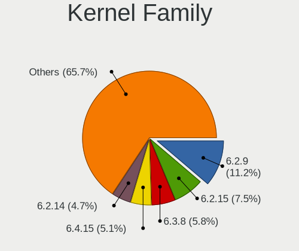
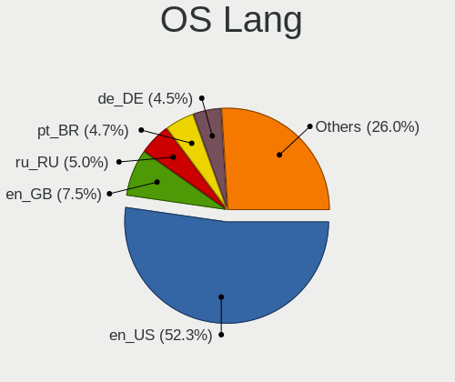
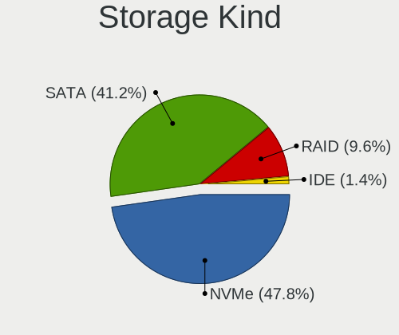
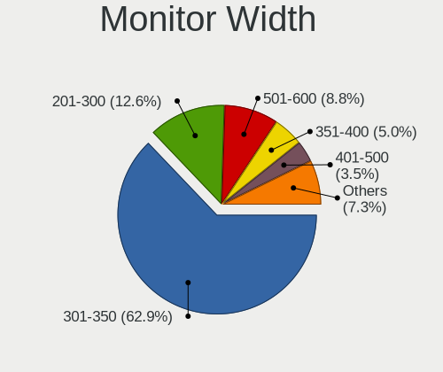
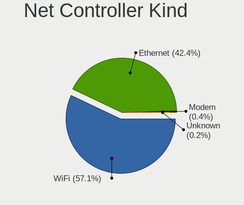
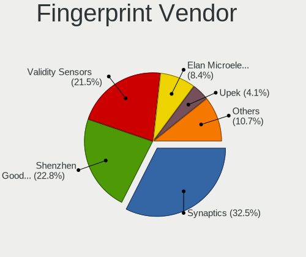

Fedora 38 - Tested Hardware & Statistics (Notebooks)
----------------------------------------------------

A project to collect tested hardware configurations for Fedora 38.

Anyone can contribute to this report by the [hw-probe](https://github.com/linuxhw/hw-probe) tool:

    sudo -E hw-probe -all -upload

Please contribute! Especially if your hardware is rare.

Contents
--------

* [ Test Cases ](#test-cases)

* [ System ](#system)
  - [ Kernel                   ](#kernel)
  - [ Kernel Family            ](#kernel-family)
  - [ Kernel Major Ver.        ](#kernel-major-ver)
  - [ Arch                     ](#arch)
  - [ DE                       ](#de)
  - [ Display Server           ](#display-server)
  - [ Display Manager          ](#display-manager)
  - [ OS Lang                  ](#os-lang)
  - [ Boot Mode                ](#boot-mode)
  - [ Filesystem               ](#filesystem)
  - [ Part. scheme             ](#part-scheme)
  - [ Dual Boot with Linux/BSD ](#dual-boot-with-linuxbsd)
  - [ Dual Boot (Win)          ](#dual-boot-win)

* [ Board ](#board)
  - [ Vendor                   ](#vendor)
  - [ Model                    ](#model)
  - [ Model Family             ](#model-family)
  - [ MFG Year                 ](#mfg-year)
  - [ Form Factor              ](#form-factor)
  - [ Secure Boot              ](#secure-boot)
  - [ Coreboot                 ](#coreboot)
  - [ RAM Size                 ](#ram-size)
  - [ RAM Used                 ](#ram-used)
  - [ Total Drives             ](#total-drives)
  - [ Has CD-ROM               ](#has-cd-rom)
  - [ Has Ethernet             ](#has-ethernet)
  - [ Has WiFi                 ](#has-wifi)
  - [ Has Bluetooth            ](#has-bluetooth)

* [ Location ](#location)
  - [ Country                  ](#country)
  - [ City                     ](#city)

* [ Drives ](#drives)
  - [ Drive Vendor             ](#drive-vendor)
  - [ Drive Model              ](#drive-model)
  - [ HDD Vendor               ](#hdd-vendor)
  - [ SSD Vendor               ](#ssd-vendor)
  - [ Drive Kind               ](#drive-kind)
  - [ Drive Connector          ](#drive-connector)
  - [ Drive Size               ](#drive-size)
  - [ Space Total              ](#space-total)
  - [ Space Used               ](#space-used)
  - [ Malfunc. Drives          ](#malfunc-drives)
  - [ Malfunc. Drive Vendor    ](#malfunc-drive-vendor)
  - [ Malfunc. HDD Vendor      ](#malfunc-hdd-vendor)
  - [ Malfunc. Drive Kind      ](#malfunc-drive-kind)
  - [ Failed Drives            ](#failed-drives)
  - [ Failed Drive Vendor      ](#failed-drive-vendor)
  - [ Drive Status             ](#drive-status)

* [ Storage controller ](#storage-controller)
  - [ Storage Vendor           ](#storage-vendor)
  - [ Storage Model            ](#storage-model)
  - [ Storage Kind             ](#storage-kind)

* [ Processor ](#processor)
  - [ CPU Vendor               ](#cpu-vendor)
  - [ CPU Model                ](#cpu-model)
  - [ CPU Model Family         ](#cpu-model-family)
  - [ CPU Cores                ](#cpu-cores)
  - [ CPU Sockets              ](#cpu-sockets)
  - [ CPU Threads              ](#cpu-threads)
  - [ CPU Op-Modes             ](#cpu-op-modes)
  - [ CPU Microcode            ](#cpu-microcode)
  - [ CPU Microarch            ](#cpu-microarch)

* [ Graphics ](#graphics)
  - [ GPU Vendor               ](#gpu-vendor)
  - [ GPU Model                ](#gpu-model)
  - [ GPU Combo                ](#gpu-combo)
  - [ GPU Driver               ](#gpu-driver)
  - [ GPU Memory               ](#gpu-memory)

* [ Monitor ](#monitor)
  - [ Monitor Vendor           ](#monitor-vendor)
  - [ Monitor Model            ](#monitor-model)
  - [ Monitor Resolution       ](#monitor-resolution)
  - [ Monitor Diagonal         ](#monitor-diagonal)
  - [ Monitor Width            ](#monitor-width)
  - [ Aspect Ratio             ](#aspect-ratio)
  - [ Monitor Area             ](#monitor-area)
  - [ Pixel Density            ](#pixel-density)
  - [ Multiple Monitors        ](#multiple-monitors)

* [ Network ](#network)
  - [ Net Controller Vendor    ](#net-controller-vendor)
  - [ Net Controller Model     ](#net-controller-model)
  - [ Wireless Vendor          ](#wireless-vendor)
  - [ Wireless Model           ](#wireless-model)
  - [ Ethernet Vendor          ](#ethernet-vendor)
  - [ Ethernet Model           ](#ethernet-model)
  - [ Net Controller Kind      ](#net-controller-kind)
  - [ Used Controller          ](#used-controller)
  - [ NICs                     ](#nics)
  - [ IPv6                     ](#ipv6)

* [ Bluetooth ](#bluetooth)
  - [ Bluetooth Vendor         ](#bluetooth-vendor)
  - [ Bluetooth Model          ](#bluetooth-model)

* [ Sound ](#sound)
  - [ Sound Vendor             ](#sound-vendor)
  - [ Sound Model              ](#sound-model)

* [ Memory ](#memory)
  - [ Memory Vendor            ](#memory-vendor)
  - [ Memory Model             ](#memory-model)
  - [ Memory Kind              ](#memory-kind)
  - [ Memory Form Factor       ](#memory-form-factor)
  - [ Memory Size              ](#memory-size)
  - [ Memory Speed             ](#memory-speed)

* [ Printers & scanners ](#printers--scanners)
  - [ Printer Vendor           ](#printer-vendor)
  - [ Printer Model            ](#printer-model)
  - [ Scanner Vendor           ](#scanner-vendor)
  - [ Scanner Model            ](#scanner-model)

* [ Camera ](#camera)
  - [ Camera Vendor            ](#camera-vendor)
  - [ Camera Model             ](#camera-model)

* [ Security ](#security)
  - [ Fingerprint Vendor       ](#fingerprint-vendor)
  - [ Fingerprint Model        ](#fingerprint-model)
  - [ Chipcard Vendor          ](#chipcard-vendor)
  - [ Chipcard Model           ](#chipcard-model)

* [ Unsupported ](#unsupported)
  - [ Unsupported Devices      ](#unsupported-devices)
  - [ Unsupported Device Types ](#unsupported-device-types)

Test Cases
----------

Total: 238

| Vendor        | Model                       | Probe                                                      | Date         |
|---------------|-----------------------------|------------------------------------------------------------|--------------|
| Valve         | Jupiter                     | [07ef050535](https://linux-hardware.org/?probe=07ef050535) | May 01, 2023 |
| HP            | Laptop 15z-fc000            | [7b57cc42a0](https://linux-hardware.org/?probe=7b57cc42a0) | May 01, 2023 |
| HP            | ElitePad 1000 G2            | [8ae27e00f6](https://linux-hardware.org/?probe=8ae27e00f6) | May 01, 2023 |
| HUAWEI        | CREM-WXX9                   | [ba99960d5f](https://linux-hardware.org/?probe=ba99960d5f) | May 01, 2023 |
| Lenovo        | IdeaPad 310-15ISK 80UH      | [a7d6d782b2](https://linux-hardware.org/?probe=a7d6d782b2) | May 01, 2023 |
| Lenovo        | IdeaPad S340-15IWLTouch ... | [6857a16a6c](https://linux-hardware.org/?probe=6857a16a6c) | Apr 30, 2023 |
| Lenovo        | IdeaPad 320-15AST 80XV      | [0784fc9b1c](https://linux-hardware.org/?probe=0784fc9b1c) | Apr 30, 2023 |
| HP            | Notebook                    | [fd6aa4aeb6](https://linux-hardware.org/?probe=fd6aa4aeb6) | Apr 30, 2023 |
| VIOS          | LTH17                       | [4d1a86ee61](https://linux-hardware.org/?probe=4d1a86ee61) | Apr 30, 2023 |
| Lenovo        | IdeaPad 320-15AST 80XV      | [9c07454907](https://linux-hardware.org/?probe=9c07454907) | Apr 30, 2023 |
| HP            | Pavilion Gaming Laptop 1... | [43a167afad](https://linux-hardware.org/?probe=43a167afad) | Apr 30, 2023 |
| HP            | Pavilion Gaming Laptop 1... | [0ae3fb5506](https://linux-hardware.org/?probe=0ae3fb5506) | Apr 30, 2023 |
| Lenovo        | ThinkPad T490s 20NX002SG... | [874f19f26e](https://linux-hardware.org/?probe=874f19f26e) | Apr 30, 2023 |
| Acer          | Nitro AN515-45              | [9b28e69254](https://linux-hardware.org/?probe=9b28e69254) | Apr 30, 2023 |
| Framework     | Laptop                      | [84b3b9547b](https://linux-hardware.org/?probe=84b3b9547b) | Apr 29, 2023 |
| Dell          | XPS 13 7390                 | [b976cc9656](https://linux-hardware.org/?probe=b976cc9656) | Apr 29, 2023 |
| ASUSTek       | TUF Gaming FX505DD_FX505... | [6f6a016997](https://linux-hardware.org/?probe=6f6a016997) | Apr 29, 2023 |
| Lenovo        | ThinkPad T550 20CKA00ECD    | [2545d9dd31](https://linux-hardware.org/?probe=2545d9dd31) | Apr 29, 2023 |
| HUAWEI        | CREM-WXX9                   | [c17b468722](https://linux-hardware.org/?probe=c17b468722) | Apr 29, 2023 |
| Chuwi         | HeroBook Air                | [123f6df9f8](https://linux-hardware.org/?probe=123f6df9f8) | Apr 29, 2023 |
| Insyde        | CherryTrail                 | [a9f658c8af](https://linux-hardware.org/?probe=a9f658c8af) | Apr 29, 2023 |
| Lenovo        | ThinkPad X1 Extreme Gen ... | [cd266d7680](https://linux-hardware.org/?probe=cd266d7680) | Apr 29, 2023 |
| Acer          | Nitro AN515-58              | [2c335c5bfb](https://linux-hardware.org/?probe=2c335c5bfb) | Apr 29, 2023 |
| Google        | Banon                       | [c21a57806c](https://linux-hardware.org/?probe=c21a57806c) | Apr 29, 2023 |
| Lenovo        | IdeaPad 530S-14ARR 81H1     | [e70d66b3ba](https://linux-hardware.org/?probe=e70d66b3ba) | Apr 29, 2023 |
| Lenovo        | IdeaPad 1 14IGL7 82V6       | [2aa69de3ca](https://linux-hardware.org/?probe=2aa69de3ca) | Apr 29, 2023 |
| HUAWEI        | BOHK-WAX9X                  | [4de963cbc6](https://linux-hardware.org/?probe=4de963cbc6) | Apr 28, 2023 |
| Lenovo        | ThinkPad P53 20QN0011IV     | [d8af950fd8](https://linux-hardware.org/?probe=d8af950fd8) | Apr 28, 2023 |
| Acer          | Aspire E5-571               | [1d36dafa86](https://linux-hardware.org/?probe=1d36dafa86) | Apr 28, 2023 |
| Dell          | Precision 3551              | [99ff11c325](https://linux-hardware.org/?probe=99ff11c325) | Apr 28, 2023 |
| Lenovo        | ThinkPad T470p 20J60018M... | [a8deb2307c](https://linux-hardware.org/?probe=a8deb2307c) | Apr 28, 2023 |
| Dell          | Precision 3551              | [93a38e7384](https://linux-hardware.org/?probe=93a38e7384) | Apr 28, 2023 |
| Lenovo        | ThinkPad X260 20F5S56G00    | [8da21e9a17](https://linux-hardware.org/?probe=8da21e9a17) | Apr 28, 2023 |
| ASUSTek       | Zenbook UM5302TA_UM5302T... | [5cb9fe1ae9](https://linux-hardware.org/?probe=5cb9fe1ae9) | Apr 28, 2023 |
| ASUSTek       | Zenbook UM5302TA_UM5302T... | [3669ef1de9](https://linux-hardware.org/?probe=3669ef1de9) | Apr 28, 2023 |
| Lenovo        | ThinkPad P14s Gen 2a 21A... | [b5a953a984](https://linux-hardware.org/?probe=b5a953a984) | Apr 28, 2023 |
| HP            | ProBook 455 15.6 inch G9... | [1cfc210ce1](https://linux-hardware.org/?probe=1cfc210ce1) | Apr 28, 2023 |
| Acer          | Nitro AN515-54              | [000022b2dd](https://linux-hardware.org/?probe=000022b2dd) | Apr 28, 2023 |
| Sony          | VPCEG23EL                   | [c28e3338ce](https://linux-hardware.org/?probe=c28e3338ce) | Apr 28, 2023 |
| Lenovo        | Legion 7-16-ITHg6 82K6      | [2baf2cbc85](https://linux-hardware.org/?probe=2baf2cbc85) | Apr 27, 2023 |
| ASUSTek       | Zephyrus M GU502GW_GU502... | [94d9250bc1](https://linux-hardware.org/?probe=94d9250bc1) | Apr 27, 2023 |
| Lenovo        | ThinkPad P53 20QN0011IV     | [854cf327d8](https://linux-hardware.org/?probe=854cf327d8) | Apr 27, 2023 |
| HUAWEI        | HVY-WXX9                    | [dd5391c20d](https://linux-hardware.org/?probe=dd5391c20d) | Apr 27, 2023 |
| HP            | Laptop 17-ak0xx             | [6eed1fda15](https://linux-hardware.org/?probe=6eed1fda15) | Apr 27, 2023 |
| HP            | Pavilion Laptop 15-cs0xx... | [4cd1484039](https://linux-hardware.org/?probe=4cd1484039) | Apr 27, 2023 |
| HP            | Pavilion Laptop 15-cs0xx... | [0796e35c73](https://linux-hardware.org/?probe=0796e35c73) | Apr 27, 2023 |
| Dell          | XPS 15 9500                 | [a7cc631b80](https://linux-hardware.org/?probe=a7cc631b80) | Apr 27, 2023 |
| Timi          | Redmi Book Pro 14 2022      | [dcc8c22535](https://linux-hardware.org/?probe=dcc8c22535) | Apr 27, 2023 |
| Dell          | Vostro 15 3515              | [f58ab8b9c4](https://linux-hardware.org/?probe=f58ab8b9c4) | Apr 27, 2023 |
| Lenovo        | ThinkPad X270 20HN001HUS    | [3f6586f0d1](https://linux-hardware.org/?probe=3f6586f0d1) | Apr 27, 2023 |
| Lenovo        | ThinkPad T480s 20L8S45W0... | [0e8490c41f](https://linux-hardware.org/?probe=0e8490c41f) | Apr 27, 2023 |
| ASUSTek       | Zephyrus M GU502GW_GU502... | [67c865f449](https://linux-hardware.org/?probe=67c865f449) | Apr 27, 2023 |
| Acer          | Aspire A315-54              | [8137aa9008](https://linux-hardware.org/?probe=8137aa9008) | Apr 27, 2023 |
| HP            | EliteBook 630 13 inch G9... | [96bd4f8398](https://linux-hardware.org/?probe=96bd4f8398) | Apr 27, 2023 |
| Apple         | MacBookAir6,1               | [c0f967c0bc](https://linux-hardware.org/?probe=c0f967c0bc) | Apr 27, 2023 |
| ASUSTek       | VivoBook_ASUS Laptop X50... | [c443269a81](https://linux-hardware.org/?probe=c443269a81) | Apr 26, 2023 |
| ASUSTek       | ROG Strix G512LW_G512LW     | [a950f656f7](https://linux-hardware.org/?probe=a950f656f7) | Apr 26, 2023 |
| Timi          | TM1703                      | [7e6b948ea9](https://linux-hardware.org/?probe=7e6b948ea9) | Apr 26, 2023 |
| ASUSTek       | ROG Zephyrus G14 GA401IV... | [96006a1098](https://linux-hardware.org/?probe=96006a1098) | Apr 26, 2023 |
| HUAWEI        | KLVL-WXXW                   | [de95ac0857](https://linux-hardware.org/?probe=de95ac0857) | Apr 26, 2023 |
| HUAWEI        | KLVL-WXXW                   | [07906a30e3](https://linux-hardware.org/?probe=07906a30e3) | Apr 26, 2023 |
| Dell          | Latitude 5520               | [7ee153b691](https://linux-hardware.org/?probe=7ee153b691) | Apr 26, 2023 |
| Lenovo        | ThinkBook 14 G3 ACL 21A2    | [86ba8ccc07](https://linux-hardware.org/?probe=86ba8ccc07) | Apr 26, 2023 |
| Lenovo        | ThinkPad T480s 20L8002WM... | [82bd4b0d20](https://linux-hardware.org/?probe=82bd4b0d20) | Apr 26, 2023 |
| Dell          | Latitude 5520               | [3071d4a9d8](https://linux-hardware.org/?probe=3071d4a9d8) | Apr 26, 2023 |
| Dell          | Latitude 5520               | [23fe32affd](https://linux-hardware.org/?probe=23fe32affd) | Apr 26, 2023 |
| Acer          | Swift SF114-32              | [13d7dc019c](https://linux-hardware.org/?probe=13d7dc019c) | Apr 26, 2023 |
| ASUSTek       | ROG Zephyrus G14 GA401IV... | [a3df65a55c](https://linux-hardware.org/?probe=a3df65a55c) | Apr 26, 2023 |
| Razer         | Blade                       | [b170226896](https://linux-hardware.org/?probe=b170226896) | Apr 25, 2023 |
| Dell          | Inspiron 5748               | [dd4d50839d](https://linux-hardware.org/?probe=dd4d50839d) | Apr 25, 2023 |
| Dell          | Precision 7550              | [987df8038c](https://linux-hardware.org/?probe=987df8038c) | Apr 25, 2023 |
| Dell          | G15 5515                    | [a0dd3f2003](https://linux-hardware.org/?probe=a0dd3f2003) | Apr 25, 2023 |
| Dell          | Vostro 3550                 | [653c3c4650](https://linux-hardware.org/?probe=653c3c4650) | Apr 25, 2023 |
| Lenovo        | ThinkPad E14 20RAS1DB00     | [8e09a153f5](https://linux-hardware.org/?probe=8e09a153f5) | Apr 25, 2023 |
| HP            | Dragonfly Pro               | [9bc83e741f](https://linux-hardware.org/?probe=9bc83e741f) | Apr 25, 2023 |
| HP            | Dragonfly Pro               | [b47e30ac80](https://linux-hardware.org/?probe=b47e30ac80) | Apr 25, 2023 |
| Lenovo        | ThinkPad L15 Gen 3 21C8S... | [765b52074c](https://linux-hardware.org/?probe=765b52074c) | Apr 25, 2023 |
| Lenovo        | ThinkPad L15 Gen 3 21C8S... | [9cd6c064cc](https://linux-hardware.org/?probe=9cd6c064cc) | Apr 25, 2023 |
| Lenovo        | ThinkPad X1 Carbon Gen 9... | [5236dde38f](https://linux-hardware.org/?probe=5236dde38f) | Apr 25, 2023 |
| Apple         | MacBookPro11,1              | [7309ce024f](https://linux-hardware.org/?probe=7309ce024f) | Apr 25, 2023 |
| LDLC          | SPC-I                       | [899fb46a02](https://linux-hardware.org/?probe=899fb46a02) | Apr 25, 2023 |
| Chuwi         | GemiBook Pro                | [1287b17594](https://linux-hardware.org/?probe=1287b17594) | Apr 25, 2023 |
| Dell          | G3 3500                     | [46996524d0](https://linux-hardware.org/?probe=46996524d0) | Apr 25, 2023 |
| Dell          | XPS 13 9380                 | [290a99fee9](https://linux-hardware.org/?probe=290a99fee9) | Apr 25, 2023 |
| Lenovo        | Legion 5 17IMH05 82B3       | [2e542c241d](https://linux-hardware.org/?probe=2e542c241d) | Apr 25, 2023 |
| TUXEDO        | Pulse 15 Gen1               | [0db2c54b2a](https://linux-hardware.org/?probe=0db2c54b2a) | Apr 24, 2023 |
| Dell          | Latitude 5580               | [a153ad5277](https://linux-hardware.org/?probe=a153ad5277) | Apr 24, 2023 |
| HP            | ProBook 445 G8 Notebook ... | [de3ad583ab](https://linux-hardware.org/?probe=de3ad583ab) | Apr 24, 2023 |
| HP            | Laptop 15s-eq2xxx           | [699adff825](https://linux-hardware.org/?probe=699adff825) | Apr 24, 2023 |
| Lenovo        | IdeaPad L3 15IML05 81Y3     | [e028b13685](https://linux-hardware.org/?probe=e028b13685) | Apr 24, 2023 |
| Dell          | Vostro 5402                 | [b6cb9c9140](https://linux-hardware.org/?probe=b6cb9c9140) | Apr 24, 2023 |
| Lenovo        | ThinkPad P53 20QN0011IV     | [d805c85a12](https://linux-hardware.org/?probe=d805c85a12) | Apr 24, 2023 |
| HP            | Laptop 14-cm0xxx            | [4591d1bf9d](https://linux-hardware.org/?probe=4591d1bf9d) | Apr 24, 2023 |
| Dell          | Latitude 9520               | [0ab9a83db6](https://linux-hardware.org/?probe=0ab9a83db6) | Apr 23, 2023 |
| ASUSTek       | ROG Strix G513QY_G513QY     | [696ee85cc9](https://linux-hardware.org/?probe=696ee85cc9) | Apr 23, 2023 |
| ASUSTek       | ASUS TUF Gaming F15 FX50... | [43aae4850b](https://linux-hardware.org/?probe=43aae4850b) | Apr 23, 2023 |
| Dynabook      | PORTEGE X30L-K              | [da178b8987](https://linux-hardware.org/?probe=da178b8987) | Apr 23, 2023 |
| HP            | Laptop 15-bs2xx             | [c40dac306c](https://linux-hardware.org/?probe=c40dac306c) | Apr 23, 2023 |
| ASUSTek       | X510UAR                     | [3321ccb912](https://linux-hardware.org/?probe=3321ccb912) | Apr 23, 2023 |
| Lenovo        | ThinkPad T14 Gen 2i 20W0... | [9a6f040039](https://linux-hardware.org/?probe=9a6f040039) | Apr 23, 2023 |
| Lenovo        | ThinkPad T495 20NJ000XGE    | [155072c012](https://linux-hardware.org/?probe=155072c012) | Apr 23, 2023 |
| Dell          | Latitude E6520              | [a8b5c5c3ad](https://linux-hardware.org/?probe=a8b5c5c3ad) | Apr 23, 2023 |
| Acer          | Aspire A514-55              | [d98f78cc01](https://linux-hardware.org/?probe=d98f78cc01) | Apr 23, 2023 |
| ASUSTek       | VivoBook_ASUSLaptop X515... | [9a92345b08](https://linux-hardware.org/?probe=9a92345b08) | Apr 23, 2023 |
| Lenovo        | ThinkPad X220 4291WSH       | [5a626f5754](https://linux-hardware.org/?probe=5a626f5754) | Apr 23, 2023 |
| Dell          | Latitude E6430              | [e844bce31c](https://linux-hardware.org/?probe=e844bce31c) | Apr 23, 2023 |
| Dell          | Latitude E6420              | [ef822feab1](https://linux-hardware.org/?probe=ef822feab1) | Apr 22, 2023 |
| HUAWEI        | MRGF-XX                     | [25233eb8d1](https://linux-hardware.org/?probe=25233eb8d1) | Apr 22, 2023 |
| MSI           | Prestige 15 A10SC           | [f64336848a](https://linux-hardware.org/?probe=f64336848a) | Apr 22, 2023 |
| HP            | ENVY Laptop 13-ad1xx        | [bb1a40d839](https://linux-hardware.org/?probe=bb1a40d839) | Apr 22, 2023 |
| Dell          | Latitude D620               | [7b0c5ec6f2](https://linux-hardware.org/?probe=7b0c5ec6f2) | Apr 22, 2023 |
| Lenovo        | Legion 5 Pro 16ACH6H 82J... | [e682d7b9dd](https://linux-hardware.org/?probe=e682d7b9dd) | Apr 22, 2023 |
| Lenovo        | Legion Y530-15ICH 81FV      | [510237facd](https://linux-hardware.org/?probe=510237facd) | Apr 22, 2023 |
| HP            | Notebook                    | [1d975dfc4f](https://linux-hardware.org/?probe=1d975dfc4f) | Apr 22, 2023 |
| HUAWEI        | BOHB-WAX9                   | [5cceab0ac3](https://linux-hardware.org/?probe=5cceab0ac3) | Apr 22, 2023 |
| ASUSTek       | ASUS TUF Dash F15 FX516P... | [c1139db413](https://linux-hardware.org/?probe=c1139db413) | Apr 22, 2023 |
| Dell          | XPS 15 9550                 | [2defeff264](https://linux-hardware.org/?probe=2defeff264) | Apr 22, 2023 |
| Dell          | Precision 5510              | [94b5586a2c](https://linux-hardware.org/?probe=94b5586a2c) | Apr 22, 2023 |
| Acer          | Nitro AN515-58              | [d342e4d24c](https://linux-hardware.org/?probe=d342e4d24c) | Apr 22, 2023 |
| Acer          | TP-SW3-013-181M             | [d231dc8846](https://linux-hardware.org/?probe=d231dc8846) | Apr 22, 2023 |
| Lenovo        | Yoga Slim 7 14ARE05 82A2    | [a7359e872e](https://linux-hardware.org/?probe=a7359e872e) | Apr 22, 2023 |
| Acer          | Nitro AN515-54              | [452177f9a5](https://linux-hardware.org/?probe=452177f9a5) | Apr 21, 2023 |
| Dell          | XPS 13 9310                 | [5c9b8fef2e](https://linux-hardware.org/?probe=5c9b8fef2e) | Apr 21, 2023 |
| ASUSTek       | ASUS TUF Gaming F15 FX50... | [dae63185d5](https://linux-hardware.org/?probe=dae63185d5) | Apr 21, 2023 |
| Lenovo        | ThinkPad E15 Gen 2 20TD0... | [517662dd54](https://linux-hardware.org/?probe=517662dd54) | Apr 21, 2023 |
| Dynabook      | PORTEGE X30L-K              | [b52552ec7f](https://linux-hardware.org/?probe=b52552ec7f) | Apr 21, 2023 |
| Lenovo        | Yoga Slim 7 Pro 14ACH5 8... | [db069c8b89](https://linux-hardware.org/?probe=db069c8b89) | Apr 21, 2023 |
| HP            | Laptop 15s-eq2xxx           | [94bd5fe556](https://linux-hardware.org/?probe=94bd5fe556) | Apr 21, 2023 |
| Lenovo        | ThinkPad P14s Gen 1 20Y1... | [c46312dc86](https://linux-hardware.org/?probe=c46312dc86) | Apr 21, 2023 |
| Timi          | Redmi Book Pro 15 2022      | [3fd583ee9b](https://linux-hardware.org/?probe=3fd583ee9b) | Apr 21, 2023 |
| Digibras      | NH4CU53                     | [d6571e3d78](https://linux-hardware.org/?probe=d6571e3d78) | Apr 21, 2023 |
| ASUSTek       | ROG Zephyrus G14 GA401IV... | [f2f6b7ab4e](https://linux-hardware.org/?probe=f2f6b7ab4e) | Apr 21, 2023 |
| Positivo      | N6440                       | [b0a1fe417d](https://linux-hardware.org/?probe=b0a1fe417d) | Apr 21, 2023 |
| Lenovo        | IdeaPad S540-15IWL          | [8578f44f47](https://linux-hardware.org/?probe=8578f44f47) | Apr 21, 2023 |
| Apple         | MacBookPro11,3              | [09a203e882](https://linux-hardware.org/?probe=09a203e882) | Apr 21, 2023 |
| Lenovo        | ThinkBook 15 G3 ACL 21A4    | [8b18bb529f](https://linux-hardware.org/?probe=8b18bb529f) | Apr 21, 2023 |
| Framework     | Laptop                      | [226765247b](https://linux-hardware.org/?probe=226765247b) | Apr 20, 2023 |
| ASUSTek       | VivoBook_ASUSLaptop X540... | [91999697ba](https://linux-hardware.org/?probe=91999697ba) | Apr 20, 2023 |
| ASUSTek       | VivoBook_ASUSLaptop X415... | [901b3d11dc](https://linux-hardware.org/?probe=901b3d11dc) | Apr 20, 2023 |
| Acer          | Swift SF314-511             | [96fd44e94a](https://linux-hardware.org/?probe=96fd44e94a) | Apr 20, 2023 |
| HP            | ProBook 450 15.6 inch G9... | [3219512811](https://linux-hardware.org/?probe=3219512811) | Apr 20, 2023 |
| Dell          | XPS 13 9310                 | [55685c168f](https://linux-hardware.org/?probe=55685c168f) | Apr 20, 2023 |
| Lenovo        | ThinkPad P52 20MAS5KM00     | [06ab19cc37](https://linux-hardware.org/?probe=06ab19cc37) | Apr 20, 2023 |
| Getac         | B300G5                      | [307cc71aa3](https://linux-hardware.org/?probe=307cc71aa3) | Apr 20, 2023 |
| Lenovo        | ThinkPad T410 2522PT3       | [8daf9af9b5](https://linux-hardware.org/?probe=8daf9af9b5) | Apr 20, 2023 |
| Lenovo        | ThinkPad T430 2349S4D       | [4b57440851](https://linux-hardware.org/?probe=4b57440851) | Apr 20, 2023 |
| MECHREVO      | Code10-7CC6U                | [0964cd2b26](https://linux-hardware.org/?probe=0964cd2b26) | Apr 20, 2023 |
| MECHREVO      | Code10-7CC6U                | [5ddc83a95c](https://linux-hardware.org/?probe=5ddc83a95c) | Apr 20, 2023 |
| Samsung       | 550P5C/550P7C               | [3648dd39f8](https://linux-hardware.org/?probe=3648dd39f8) | Apr 20, 2023 |
| Lenovo        | G40-30 80FY                 | [923b3fd46b](https://linux-hardware.org/?probe=923b3fd46b) | Apr 19, 2023 |
| HP            | Laptop 15s-eq2xxx           | [9f5fa03bfd](https://linux-hardware.org/?probe=9f5fa03bfd) | Apr 19, 2023 |
| Lenovo        | G50-30 80G0                 | [42cb984b27](https://linux-hardware.org/?probe=42cb984b27) | Apr 19, 2023 |
| Dell          | Inspiron 7460               | [bbfe51bf3c](https://linux-hardware.org/?probe=bbfe51bf3c) | Apr 19, 2023 |
| Lenovo        | IdeaPad 520-15IKB 81BF      | [b1c04430cc](https://linux-hardware.org/?probe=b1c04430cc) | Apr 19, 2023 |
| Lenovo        | IdeaPad 520-15IKB 81BF      | [b2873d15a0](https://linux-hardware.org/?probe=b2873d15a0) | Apr 19, 2023 |
| Lenovo        | ThinkPad T14 Gen 1 20UDS... | [258a5bb354](https://linux-hardware.org/?probe=258a5bb354) | Apr 19, 2023 |
| HP            | Pavilion x2 Detachable      | [1c7cd2fe1d](https://linux-hardware.org/?probe=1c7cd2fe1d) | Apr 19, 2023 |
| Dell          | XPS 13 7390                 | [357c45c81c](https://linux-hardware.org/?probe=357c45c81c) | Apr 19, 2023 |
| Apple         | MacBookAir6,1               | [5a600ce01b](https://linux-hardware.org/?probe=5a600ce01b) | Apr 19, 2023 |
| HUAWEI        | NBD-WXX9                    | [a55a03e648](https://linux-hardware.org/?probe=a55a03e648) | Apr 19, 2023 |
| PC Special... | PCx0Dx                      | [0f82987a84](https://linux-hardware.org/?probe=0f82987a84) | Apr 18, 2023 |
| Toshiba       | Kronos 10CUG                | [228e28e6a8](https://linux-hardware.org/?probe=228e28e6a8) | Apr 18, 2023 |
| Dell          | G5 5590                     | [c7334114be](https://linux-hardware.org/?probe=c7334114be) | Apr 18, 2023 |
| Lenovo        | Yoga Pro 7 14ARP8 83AU      | [3b3f4afdd8](https://linux-hardware.org/?probe=3b3f4afdd8) | Apr 18, 2023 |
| Lenovo        | ThinkPad E15 Gen 4 21ED0... | [0ec2388253](https://linux-hardware.org/?probe=0ec2388253) | Apr 18, 2023 |
| HUAWEI        | RLEF-XX                     | [b425e2afaf](https://linux-hardware.org/?probe=b425e2afaf) | Apr 18, 2023 |
| ASUSTek       | GL502VML                    | [7c65476ce9](https://linux-hardware.org/?probe=7c65476ce9) | Apr 18, 2023 |
| HP            | Pavilion x2 Detachable      | [5d56d95ea5](https://linux-hardware.org/?probe=5d56d95ea5) | Apr 18, 2023 |
| Lenovo        | ThinkPad E15 Gen 4 21ED0... | [a196246f09](https://linux-hardware.org/?probe=a196246f09) | Apr 17, 2023 |
| Dell          | XPS 15 9500                 | [1a55ffc593](https://linux-hardware.org/?probe=1a55ffc593) | Apr 17, 2023 |
| Lenovo        | ThinkBook 13s G2 ITL 20V... | [5e265fd8e1](https://linux-hardware.org/?probe=5e265fd8e1) | Apr 16, 2023 |
| ASUSTek       | ASUS TUF Gaming A15 FA50... | [3ea28c33c9](https://linux-hardware.org/?probe=3ea28c33c9) | Apr 16, 2023 |
| Lenovo        | IdeaPad Gaming 3 15IAH7 ... | [391b43ba8c](https://linux-hardware.org/?probe=391b43ba8c) | Apr 16, 2023 |
| Apple         | MacBookAir7,2               | [ed6f18d5ab](https://linux-hardware.org/?probe=ed6f18d5ab) | Apr 16, 2023 |
| Apple         | MacBookAir7,2               | [82509b267d](https://linux-hardware.org/?probe=82509b267d) | Apr 16, 2023 |
| ASUSTek       | TUF Gaming FX505DU_TUF50... | [91d7747b6f](https://linux-hardware.org/?probe=91d7747b6f) | Apr 14, 2023 |
| ASUSTek       | TUF Gaming FX505DU_TUF50... | [59b4139974](https://linux-hardware.org/?probe=59b4139974) | Apr 14, 2023 |
| Dell          | Latitude 7400               | [0f917420a1](https://linux-hardware.org/?probe=0f917420a1) | Apr 14, 2023 |
| Lenovo        | ThinkBook 15 G3 ACL 21A4    | [cc0b87e611](https://linux-hardware.org/?probe=cc0b87e611) | Apr 13, 2023 |
| HUAWEI        | KLVL-WXX9                   | [3166746b52](https://linux-hardware.org/?probe=3166746b52) | Apr 12, 2023 |
| Lenovo        | ThinkPad X220 42911H8       | [7eee4a859e](https://linux-hardware.org/?probe=7eee4a859e) | Apr 12, 2023 |
| Lenovo        | ThinkPad X220 42911H8       | [874513db8d](https://linux-hardware.org/?probe=874513db8d) | Apr 12, 2023 |
| ASUSTek       | ROG Strix G713QR_G713QR     | [65bb44978f](https://linux-hardware.org/?probe=65bb44978f) | Apr 12, 2023 |
| MSI           | Prestige 14Evo B13M         | [f1cafa77dd](https://linux-hardware.org/?probe=f1cafa77dd) | Apr 12, 2023 |
| HUAWEI        | KLVL-WXX9                   | [52e50e17de](https://linux-hardware.org/?probe=52e50e17de) | Apr 11, 2023 |
| ASUSTek       | ROG Zephyrus Duo 16 GX65... | [69f8d7dfdf](https://linux-hardware.org/?probe=69f8d7dfdf) | Apr 11, 2023 |
| ASUSTek       | GL552VW                     | [396850fd22](https://linux-hardware.org/?probe=396850fd22) | Apr 09, 2023 |
| Google        | Bluebird                    | [6ab22238ac](https://linux-hardware.org/?probe=6ab22238ac) | Apr 07, 2023 |
| HP            | Sona                        | [64fa63647b](https://linux-hardware.org/?probe=64fa63647b) | Apr 06, 2023 |
| ASUSTek       | VivoBook_ASUSLaptop M650... | [0af2f7cc7f](https://linux-hardware.org/?probe=0af2f7cc7f) | Apr 05, 2023 |
| Lenovo        | ThinkPad X1 Nano Gen 2 2... | [36338ecf6e](https://linux-hardware.org/?probe=36338ecf6e) | Apr 05, 2023 |
| Lenovo        | Legion 7 16ACHg6 82N6       | [8982660d51](https://linux-hardware.org/?probe=8982660d51) | Apr 05, 2023 |
| Apple         | MacBookPro9,2               | [f4343acc49](https://linux-hardware.org/?probe=f4343acc49) | Apr 03, 2023 |
| Apple         | MacBookPro9,2               | [3e558165a4](https://linux-hardware.org/?probe=3e558165a4) | Apr 02, 2023 |
| Lenovo        | ThinkPad E495 20NE001RTX    | [804bf25c27](https://linux-hardware.org/?probe=804bf25c27) | Apr 02, 2023 |
| Lenovo        | ThinkPad X1 Carbon Gen 1... | [95c5f574c9](https://linux-hardware.org/?probe=95c5f574c9) | Apr 01, 2023 |
| Dell          | Latitude E5450              | [89701abaa1](https://linux-hardware.org/?probe=89701abaa1) | Apr 01, 2023 |
| Acer          | Swift SF113-31              | [fc0539603c](https://linux-hardware.org/?probe=fc0539603c) | Mar 31, 2023 |
| Exo           | Smart XL4                   | [6421142cb6](https://linux-hardware.org/?probe=6421142cb6) | Mar 31, 2023 |
| Dell          | Inspiron 15 5510            | [162132b606](https://linux-hardware.org/?probe=162132b606) | Mar 30, 2023 |
| Toshiba       | Satellite C850-C5K          | [8fc7451def](https://linux-hardware.org/?probe=8fc7451def) | Mar 30, 2023 |
| HP            | EliteBook 850 G8 Noteboo... | [c73c5374a4](https://linux-hardware.org/?probe=c73c5374a4) | Mar 30, 2023 |
| Lenovo        | ThinkPad T470s 20HGS07D0... | [7a8b075b23](https://linux-hardware.org/?probe=7a8b075b23) | Mar 29, 2023 |
| ASUSTek       | ASUS TUF Gaming A15 FA50... | [d74490158e](https://linux-hardware.org/?probe=d74490158e) | Mar 29, 2023 |
| HP            | Pavilion Gaming Laptop 1... | [19efb75aa1](https://linux-hardware.org/?probe=19efb75aa1) | Mar 23, 2023 |
| HP            | Pavilion Gaming Laptop 1... | [85accc79b1](https://linux-hardware.org/?probe=85accc79b1) | Mar 23, 2023 |
| HUAWEI        | KPL-W0X                     | [80e6d9af10](https://linux-hardware.org/?probe=80e6d9af10) | Mar 22, 2023 |
| ASUSTek       | ROG Zephyrus G14 GA401QH... | [883d4de906](https://linux-hardware.org/?probe=883d4de906) | Mar 21, 2023 |
| Acer          | Aspire 5935                 | [0634ed91ba](https://linux-hardware.org/?probe=0634ed91ba) | Mar 19, 2023 |
| HIPER         | WORKBOOK                    | [ed14fd6e80](https://linux-hardware.org/?probe=ed14fd6e80) | Mar 17, 2023 |
| Dell          | Latitude E6430              | [e48fceb5f2](https://linux-hardware.org/?probe=e48fceb5f2) | Mar 16, 2023 |
| MSI           | Modern 14 B11MOL            | [33bbc272c0](https://linux-hardware.org/?probe=33bbc272c0) | Mar 15, 2023 |
| Toshiba       | Satellite P870              | [113fcf770d](https://linux-hardware.org/?probe=113fcf770d) | Mar 15, 2023 |
| ASUSTek       | TUF Gaming FX504GE_FX80G... | [59d7fa9a34](https://linux-hardware.org/?probe=59d7fa9a34) | Mar 15, 2023 |
| HIPER         | WORKBOOK                    | [3d1c928bcb](https://linux-hardware.org/?probe=3d1c928bcb) | Mar 15, 2023 |
| Lenovo        | ThinkPad 11e 3rd Gen 20G... | [1e037723cc](https://linux-hardware.org/?probe=1e037723cc) | Mar 12, 2023 |
| Lenovo        | ThinkPad T14 Gen 1 20S0S... | [2e864ba25e](https://linux-hardware.org/?probe=2e864ba25e) | Mar 08, 2023 |
| Clevo         | W25xHNx                     | [5227127f81](https://linux-hardware.org/?probe=5227127f81) | Mar 03, 2023 |
| HP            | EliteBook 840 G6            | [ea6777bf2d](https://linux-hardware.org/?probe=ea6777bf2d) | Feb 23, 2023 |
| Apple         | MacBookPro11,3              | [b0ffb00d43](https://linux-hardware.org/?probe=b0ffb00d43) | Feb 10, 2023 |
| MACHENIKE     | MACHCREATOR-16              | [4608209d2d](https://linux-hardware.org/?probe=4608209d2d) | Feb 03, 2023 |
| MACHENIKE     | MACHCREATOR-16              | [81e773eade](https://linux-hardware.org/?probe=81e773eade) | Feb 02, 2023 |
| MACHENIKE     | MACHCREATOR-16              | [c44c077d1e](https://linux-hardware.org/?probe=c44c077d1e) | Jan 30, 2023 |
| MACHENIKE     | MACHCREATOR-16              | [e3d7c03a2e](https://linux-hardware.org/?probe=e3d7c03a2e) | Jan 29, 2023 |
| HUAWEI        | MACH-WX9                    | [5b00f79b72](https://linux-hardware.org/?probe=5b00f79b72) | Jan 28, 2023 |
| MACHENIKE     | MACHCREATOR-16              | [7b3107564a](https://linux-hardware.org/?probe=7b3107564a) | Jan 23, 2023 |
| MACHENIKE     | MACHCREATOR-16              | [6b370a283e](https://linux-hardware.org/?probe=6b370a283e) | Jan 23, 2023 |
| Lenovo        | IdeaPad Slim 1-14AST-05 ... | [aa6ca0d358](https://linux-hardware.org/?probe=aa6ca0d358) | Jan 17, 2023 |
| HP            | ZBook Fury 15 G7 Mobile ... | [2b8c216e1a](https://linux-hardware.org/?probe=2b8c216e1a) | Jan 08, 2023 |
| ASUSTek       | ROG Strix G513QY_G513QY     | [cedce58f23](https://linux-hardware.org/?probe=cedce58f23) | Dec 27, 2022 |
| ASUSTek       | ROG Strix G513QY_G513QY     | [0e063e5fd5](https://linux-hardware.org/?probe=0e063e5fd5) | Dec 27, 2022 |
| Dell          | XPS 15 9570                 | [ce6ac8ec7f](https://linux-hardware.org/?probe=ce6ac8ec7f) | Dec 16, 2022 |
| Lenovo        | ThinkPad P14s Gen 2a 21A... | [091e12e551](https://linux-hardware.org/?probe=091e12e551) | Dec 08, 2022 |
| Acer          | Aspire V3-571               | [ab9e6cc193](https://linux-hardware.org/?probe=ab9e6cc193) | Nov 27, 2022 |
| Acer          | Aspire V3-571               | [a4d6ce5fa1](https://linux-hardware.org/?probe=a4d6ce5fa1) | Nov 27, 2022 |
| Acer          | Aspire V3-571               | [7aa6773734](https://linux-hardware.org/?probe=7aa6773734) | Nov 16, 2022 |
| Acer          | Aspire V3-571               | [d5c4a2f02e](https://linux-hardware.org/?probe=d5c4a2f02e) | Nov 16, 2022 |
| Unknown       | Unknown                     | [1e27521b13](https://linux-hardware.org/?probe=1e27521b13) | Sep 17, 2022 |

System
------

Kernel
------

Version of the Linux kernel

| Version                                                          | Notebooks | Percent |
|------------------------------------------------------------------|-----------|---------|
| 6.2.11-300.fc38.x86_64                                           | 81        | 41.54%  |
| 6.2.12-300.fc38.x86_64                                           | 31        | 15.9%   |
| 6.2.9-300.fc38.x86_64                                            | 21        | 10.77%  |
| 6.2.13-300.fc38.x86_64                                           | 17        | 8.72%   |
| 6.2.8-300.fc38.x86_64                                            | 9         | 4.62%   |
| 6.2.10-300.fc38.x86_64                                           | 7         | 3.59%   |
| 6.2.6-300.fc38.x86_64                                            | 6         | 3.08%   |
| 6.2.7-300.fc38.x86_64                                            | 3         | 1.54%   |
| 6.2.2-301.fc38.x86_64                                            | 2         | 1.03%   |
| 6.2.11-703.inttf.fc38.x86_64                                     | 2         | 1.03%   |
| 6.2.0-63.fc38.x86_64                                             | 2         | 1.03%   |
| 6.3.0+                                                           | 1         | 0.51%   |
| 6.2.5-300.fc38.x86_64                                            | 1         | 0.51%   |
| 6.2.2-300.fc38.x86_64                                            | 1         | 0.51%   |
| 6.2.10-300.rog.fc38.x86_64                                       | 1         | 0.51%   |
| 6.2.0-rc1-1b929c02afd37871d5afb9d498426f83432e71c2-btrfs-debug4+ | 1         | 0.51%   |
| 6.2.0-0.rc7.20230208git0983f6bf2bfc.52.fc38.x86_64               | 1         | 0.51%   |
| 6.2.0-0.rc5.20230126git7c46948a6e9c.41.fc38.x86_64               | 1         | 0.51%   |
| 6.2.0-0.rc4.20230120gitd368967cb103.35.fc38.x86_64               | 1         | 0.51%   |
| 6.2.0-0.rc3.20230113gitd9fc1511728c.28.fc38.x86_64               | 1         | 0.51%   |
| 6.2.0-0.rc2.20230105git41c03ba9beea.20.fc38.x86_64               | 1         | 0.51%   |
| 6.1.0-65.fc38.x86_64                                             | 1         | 0.51%   |
| 6.1.0-0.rc5.39.fc38.x86_64                                       | 1         | 0.51%   |
| 6.0.11-250.vanilla.1.fc36.x86_64                                 | 1         | 0.51%   |
| 6.0.0-0.rc5.20220914git3245cb65fd91.39.fc38.x86_64               | 1         | 0.51%   |

Kernel Family
-------------

Linux kernel without a distro release

| Version | Notebooks | Percent |
|---------|-----------|---------|
| 6.2.11  | 83        | 42.56%  |
| 6.2.12  | 31        | 15.9%   |
| 6.2.9   | 21        | 10.77%  |
| 6.2.13  | 17        | 8.72%   |
| 6.2.8   | 9         | 4.62%   |
| 6.2.10  | 8         | 4.1%    |
| 6.2.0   | 8         | 4.1%    |
| 6.2.6   | 6         | 3.08%   |
| 6.2.7   | 3         | 1.54%   |
| 6.2.2   | 3         | 1.54%   |
| 6.1.0   | 2         | 1.03%   |
| 6.3.0   | 1         | 0.51%   |
| 6.2.5   | 1         | 0.51%   |
| 6.0.11  | 1         | 0.51%   |
| 6.0.0   | 1         | 0.51%   |

Kernel Major Ver.
-----------------

Linux kernel major version

| Version | Notebooks | Percent |
|---------|-----------|---------|
| 6.2     | 189       | 97.42%  |
| 6.1     | 2         | 1.03%   |
| 6.0     | 2         | 1.03%   |
| 6.3     | 1         | 0.52%   |

Arch
----

OS architecture (x86_64, i586, etc.)

| Name   | Notebooks | Percent |
|--------|-----------|---------|
| x86_64 | 194       | 100%    |

DE
--

Desktop Environment

| Name       | Notebooks | Percent |
|------------|-----------|---------|
| GNOME      | 159       | 81.54%  |
| KDE5       | 24        | 12.31%  |
| Unknown    | 5         | 2.56%   |
| MATE       | 2         | 1.03%   |
| XFCE       | 1         | 0.51%   |
| X-Cinnamon | 1         | 0.51%   |
| LXQt       | 1         | 0.51%   |
| Cinnamon   | 1         | 0.51%   |
| Budgie     | 1         | 0.51%   |

Display Server
--------------

X11 or Wayland

| Name    | Notebooks | Percent |
|---------|-----------|---------|
| Wayland | 154       | 78.97%  |
| X11     | 37        | 18.97%  |
| Unknown | 3         | 1.54%   |
| Tty     | 1         | 0.51%   |

Display Manager
---------------

SDDM, LightDM, etc.

| Name    | Notebooks | Percent |
|---------|-----------|---------|
| Unknown | 111       | 56.63%  |
| GDM     | 67        | 34.18%  |
| SDDM    | 11        | 5.61%   |
| LightDM | 7         | 3.57%   |

OS Lang
-------

Language

| Lang  | Notebooks | Percent |
|-------|-----------|---------|
| en_US | 112       | 57.73%  |
| en_GB | 13        | 6.7%    |
| ru_RU | 10        | 5.15%   |
| pt_BR | 10        | 5.15%   |
| de_DE | 8         | 4.12%   |
| fr_FR | 6         | 3.09%   |
| pl_PL | 3         | 1.55%   |
| it_IT | 3         | 1.55%   |
| es_ES | 3         | 1.55%   |
| de_AT | 3         | 1.55%   |
| ru_UA | 2         | 1.03%   |
| zh_TW | 1         | 0.52%   |
| zh_CN | 1         | 0.52%   |
| uk_UA | 1         | 0.52%   |
| tr_TR | 1         | 0.52%   |
| nl_NL | 1         | 0.52%   |
| id_ID | 1         | 0.52%   |
| hu_HU | 1         | 0.52%   |
| fr_CH | 1         | 0.52%   |
| fr_CA | 1         | 0.52%   |
| es_VE | 1         | 0.52%   |
| es_MX | 1         | 0.52%   |
| es_EC | 1         | 0.52%   |
| es_CO | 1         | 0.52%   |
| es_CL | 1         | 0.52%   |
| es_AR | 1         | 0.52%   |
| en_IN | 1         | 0.52%   |
| en_IL | 1         | 0.52%   |
| en_CA | 1         | 0.52%   |
| en_AU | 1         | 0.52%   |
| el_GR | 1         | 0.52%   |
| cs_CZ | 1         | 0.52%   |

Boot Mode
---------

EFI or BIOS

| Mode | Notebooks | Percent |
|------|-----------|---------|
| EFI  | 172       | 88.66%  |
| BIOS | 22        | 11.34%  |

Filesystem
----------

Type of filesystem

| Type    | Notebooks | Percent |
|---------|-----------|---------|
| Btrfs   | 171       | 88.14%  |
| Ext4    | 18        | 9.28%   |
| Xfs     | 4         | 2.06%   |
| Overlay | 1         | 0.52%   |

Part. scheme
------------

Scheme of partitioning

| Type    | Notebooks | Percent |
|---------|-----------|---------|
| Unknown | 109       | 55.61%  |
| GPT     | 85        | 43.37%  |
| MBR     | 2         | 1.02%   |

Dual Boot with Linux/BSD
------------------------

Hosting more than one Linux/BSD

| Dual boot | Notebooks | Percent |
|-----------|-----------|---------|
| No        | 184       | 94.85%  |
| Yes       | 10        | 5.15%   |

Dual Boot (Win)
---------------

Hosting Linux and Windows

| Dual boot | Notebooks | Percent |
|-----------|-----------|---------|
| No        | 172       | 88.66%  |
| Yes       | 22        | 11.34%  |

Board
-----

Vendor
------

Motherboard manufacturer

| Name                | Notebooks | Percent |
|---------------------|-----------|---------|
| Lenovo              | 54        | 27.84%  |
| Dell                | 31        | 15.98%  |
| ASUSTek Computer    | 24        | 12.37%  |
| Hewlett-Packard     | 23        | 11.86%  |
| Acer                | 13        | 6.7%    |
| HUAWEI              | 11        | 5.67%   |
| Apple               | 5         | 2.58%   |
| Toshiba             | 3         | 1.55%   |
| Timi                | 3         | 1.55%   |
| MSI                 | 2         | 1.03%   |
| Google              | 2         | 1.03%   |
| Framework           | 2         | 1.03%   |
| Chuwi               | 2         | 1.03%   |
| VIOS                | 1         | 0.52%   |
| Valve               | 1         | 0.52%   |
| TUXEDO              | 1         | 0.52%   |
| Sony                | 1         | 0.52%   |
| Samsung Electronics | 1         | 0.52%   |
| Razer               | 1         | 0.52%   |
| Positivo            | 1         | 0.52%   |
| PC Specialist       | 1         | 0.52%   |
| MECHREVO            | 1         | 0.52%   |
| MACHENIKE           | 1         | 0.52%   |
| LDLC                | 1         | 0.52%   |
| Insyde              | 1         | 0.52%   |
| HIPER               | 1         | 0.52%   |
| Getac               | 1         | 0.52%   |
| Exo                 | 1         | 0.52%   |
| Dynabook            | 1         | 0.52%   |
| Digibras            | 1         | 0.52%   |
| Clevo               | 1         | 0.52%   |
| Unknown             | 1         | 0.52%   |

Model
-----

Motherboard model

| Name                                        | Notebooks | Percent |
|---------------------------------------------|-----------|---------|
| Lenovo ThinkPad X220 42911H8                | 2         | 1.03%   |
| HP Notebook                                 | 2         | 1.03%   |
| HP Laptop 15s-eq2xxx                        | 2         | 1.03%   |
| Framework Laptop                            | 2         | 1.03%   |
| Dell XPS 15 9500                            | 2         | 1.03%   |
| Dell XPS 13 9310                            | 2         | 1.03%   |
| Dell XPS 13 7390                            | 2         | 1.03%   |
| Dell Latitude E6430                         | 2         | 1.03%   |
| ASUS ROG Strix G513QY_G513QY                | 2         | 1.03%   |
| Acer Nitro AN515-54                         | 2         | 1.03%   |
| VIOS LTH17                                  | 1         | 0.52%   |
| Valve Jupiter                               | 1         | 0.52%   |
| TUXEDO Pulse 15 Gen1                        | 1         | 0.52%   |
| Toshiba Satellite P870                      | 1         | 0.52%   |
| Toshiba Satellite C850-C5K                  | 1         | 0.52%   |
| Toshiba Kronos 10CUG                        | 1         | 0.52%   |
| Timi TM1703                                 | 1         | 0.52%   |
| Timi Redmi Book Pro 15 2022                 | 1         | 0.52%   |
| Timi Redmi Book Pro 14 2022                 | 1         | 0.52%   |
| Sony VPCEG23EL                              | 1         | 0.52%   |
| Samsung 550P5C/550P7C                       | 1         | 0.52%   |
| Razer Blade                                 | 1         | 0.52%   |
| Positivo N6440                              | 1         | 0.52%   |
| PC Specialist PCx0Dx                        | 1         | 0.52%   |
| MSI Prestige 15 A10SC                       | 1         | 0.52%   |
| MSI Modern 14 B11MOL                        | 1         | 0.52%   |
| MECHREVO Code10-7CC6U                       | 1         | 0.52%   |
| MACHENIKE MACHCREATOR-16                    | 1         | 0.52%   |
| Lenovo Yoga Slim 7 Pro 14ACH5 82MS          | 1         | 0.52%   |
| Lenovo Yoga Slim 7 14ARE05 82A2             | 1         | 0.52%   |
| Lenovo Yoga Pro 7 14ARP8 83AU               | 1         | 0.52%   |
| Lenovo ThinkPad X270 20HN001HUS             | 1         | 0.52%   |
| Lenovo ThinkPad X260 20F5S56G00             | 1         | 0.52%   |
| Lenovo ThinkPad X220 4291WSH                | 1         | 0.52%   |
| Lenovo ThinkPad X1 Nano Gen 2 21E8A000CD    | 1         | 0.52%   |
| Lenovo ThinkPad X1 Extreme Gen 3 20TK0047US | 1         | 0.52%   |
| Lenovo ThinkPad X1 Carbon Gen 9 20XWCTO1WW  | 1         | 0.52%   |
| Lenovo ThinkPad T550 20CKA00ECD             | 1         | 0.52%   |
| Lenovo ThinkPad T495 20NJ000XGE             | 1         | 0.52%   |
| Lenovo ThinkPad T490s 20NX002SGE            | 1         | 0.52%   |

Model Family
------------

Motherboard model prefix

| Name                     | Notebooks | Percent |
|--------------------------|-----------|---------|
| Lenovo ThinkPad          | 31        | 15.98%  |
| Lenovo IdeaPad           | 10        | 5.15%   |
| Dell Latitude            | 10        | 5.15%   |
| Dell XPS                 | 9         | 4.64%   |
| ASUS ROG                 | 7         | 3.61%   |
| HP Laptop                | 6         | 3.09%   |
| Lenovo Legion            | 5         | 2.58%   |
| ASUS VivoBook            | 5         | 2.58%   |
| Acer Aspire              | 5         | 2.58%   |
| HP Pavilion              | 4         | 2.06%   |
| ASUS ASUS                | 4         | 2.06%   |
| Acer Nitro               | 4         | 2.06%   |
| Lenovo Yoga              | 3         | 1.55%   |
| Lenovo ThinkBook         | 3         | 1.55%   |
| HP ProBook               | 3         | 1.55%   |
| HP EliteBook             | 3         | 1.55%   |
| Dell Vostro              | 3         | 1.55%   |
| Dell Precision           | 3         | 1.55%   |
| Dell Inspiron            | 3         | 1.55%   |
| ASUS TUF                 | 3         | 1.55%   |
| Acer Swift               | 3         | 1.55%   |
| Toshiba Satellite        | 2         | 1.03%   |
| Timi Redmi               | 2         | 1.03%   |
| HP Notebook              | 2         | 1.03%   |
| Framework Laptop         | 2         | 1.03%   |
| Apple MacBookPro11       | 2         | 1.03%   |
| VIOS LTH17               | 1         | 0.52%   |
| Valve Jupiter            | 1         | 0.52%   |
| TUXEDO Pulse             | 1         | 0.52%   |
| Toshiba Kronos           | 1         | 0.52%   |
| Timi TM1703              | 1         | 0.52%   |
| Sony VPCEG23EL           | 1         | 0.52%   |
| Samsung 550P5C           | 1         | 0.52%   |
| Razer Blade              | 1         | 0.52%   |
| Positivo N6440           | 1         | 0.52%   |
| PC Specialist PCx0Dx     | 1         | 0.52%   |
| MSI Prestige             | 1         | 0.52%   |
| MSI Modern               | 1         | 0.52%   |
| MECHREVO Code10-7CC6U    | 1         | 0.52%   |
| MACHENIKE MACHCREATOR-16 | 1         | 0.52%   |

MFG Year
--------

Motherboard manufacture year

| Year | Notebooks | Percent |
|------|-----------|---------|
| 2020 | 34        | 17.53%  |
| 2021 | 33        | 17.01%  |
| 2022 | 25        | 12.89%  |
| 2019 | 24        | 12.37%  |
| 2018 | 17        | 8.76%   |
| 2017 | 14        | 7.22%   |
| 2011 | 8         | 4.12%   |
| 2023 | 7         | 3.61%   |
| 2012 | 7         | 3.61%   |
| 2015 | 6         | 3.09%   |
| 2014 | 6         | 3.09%   |
| 2016 | 5         | 2.58%   |
| 2013 | 5         | 2.58%   |
| 2009 | 2         | 1.03%   |
| 2006 | 1         | 0.52%   |

Form Factor
-----------

Physical design of the computer

| Name     | Notebooks | Percent |
|----------|-----------|---------|
| Notebook | 194       | 100%    |

Secure Boot
-----------

Enabled or disabled

| State    | Notebooks | Percent |
|----------|-----------|---------|
| Disabled | 143       | 73.33%  |
| Enabled  | 52        | 26.67%  |

Coreboot
--------

Have coreboot on board

| Used | Notebooks | Percent |
|------|-----------|---------|
| No   | 191       | 98.45%  |
| Yes  | 3         | 1.55%   |

RAM Size
--------

Total RAM memory

| Size in GB  | Notebooks | Percent |
|-------------|-----------|---------|
| 16.01-24.0  | 47        | 24.23%  |
| 8.01-16.0   | 47        | 24.23%  |
| 4.01-8.0    | 44        | 22.68%  |
| 32.01-64.0  | 17        | 8.76%   |
| 3.01-4.0    | 17        | 8.76%   |
| 24.01-32.0  | 11        | 5.67%   |
| 64.01-256.0 | 6         | 3.09%   |
| 1.01-2.0    | 5         | 2.58%   |

RAM Used
--------

Used RAM memory

| Used GB    | Notebooks | Percent |
|------------|-----------|---------|
| 2.01-3.0   | 59        | 30.26%  |
| 3.01-4.0   | 55        | 28.21%  |
| 4.01-8.0   | 48        | 24.62%  |
| 1.01-2.0   | 20        | 10.26%  |
| 8.01-16.0  | 9         | 4.62%   |
| 0.51-1.0   | 3         | 1.54%   |
| 16.01-24.0 | 1         | 0.51%   |

Total Drives
------------

Number of drives on board

| Drives | Notebooks | Percent |
|--------|-----------|---------|
| 1      | 134       | 69.07%  |
| 2      | 56        | 28.87%  |
| 3      | 3         | 1.55%   |
| 5      | 1         | 0.52%   |

Has CD-ROM
----------

Has CD-ROM on board

| Presented | Notebooks | Percent |
|-----------|-----------|---------|
| No        | 171       | 87.69%  |
| Yes       | 24        | 12.31%  |

Has Ethernet
------------

Has Ethernet on board

| Presented | Notebooks | Percent |
|-----------|-----------|---------|
| Yes       | 124       | 63.92%  |
| No        | 70        | 36.08%  |

Has WiFi
--------

Has WiFi module

| Presented | Notebooks | Percent |
|-----------|-----------|---------|
| Yes       | 191       | 98.45%  |
| No        | 3         | 1.55%   |

Has Bluetooth
-------------

Has Bluetooth module

| Presented | Notebooks | Percent |
|-----------|-----------|---------|
| Yes       | 170       | 87.63%  |
| No        | 24        | 12.37%  |

Location
--------

Country
-------

Geographic location (country)

| Country      | Notebooks | Percent |
|--------------|-----------|---------|
| USA          | 35        | 18.04%  |
| Germany      | 15        | 7.73%   |
| Brazil       | 15        | 7.73%   |
| Russia       | 11        | 5.67%   |
| Poland       | 8         | 4.12%   |
| France       | 8         | 4.12%   |
| Netherlands  | 7         | 3.61%   |
| UK           | 6         | 3.09%   |
| Turkey       | 6         | 3.09%   |
| Italy        | 6         | 3.09%   |
| India        | 6         | 3.09%   |
| Spain        | 4         | 2.06%   |
| Canada       | 4         | 2.06%   |
| Belgium      | 4         | 2.06%   |
| Sweden       | 3         | 1.55%   |
| Singapore    | 3         | 1.55%   |
| Hungary      | 3         | 1.55%   |
| Belarus      | 3         | 1.55%   |
| Austria      | 3         | 1.55%   |
| Thailand     | 2         | 1.03%   |
| Taiwan       | 2         | 1.03%   |
| South Korea  | 2         | 1.03%   |
| Norway       | 2         | 1.03%   |
| Lithuania    | 2         | 1.03%   |
| Indonesia    | 2         | 1.03%   |
| Egypt        | 2         | 1.03%   |
| Denmark      | 2         | 1.03%   |
| Czechia      | 2         | 1.03%   |
| Croatia      | 2         | 1.03%   |
| Colombia     | 2         | 1.03%   |
| Venezuela    | 1         | 0.52%   |
| Ukraine      | 1         | 0.52%   |
| Switzerland  | 1         | 0.52%   |
| South Africa | 1         | 0.52%   |
| Slovenia     | 1         | 0.52%   |
| Serbia       | 1         | 0.52%   |
| Romania      | 1         | 0.52%   |
| Portugal     | 1         | 0.52%   |
| Paraguay     | 1         | 0.52%   |
| Pakistan     | 1         | 0.52%   |

City
----

Geographic location (city)

| City              | Notebooks | Percent |
|-------------------|-----------|---------|
| Singapore         | 3         | 1.54%   |
| Sao Paulo         | 3         | 1.54%   |
| Paris             | 3         | 1.54%   |
| New York          | 3         | 1.54%   |
| Frankfurt am Main | 3         | 1.54%   |
| Ufa               | 2         | 1.03%   |
| Turin             | 2         | 1.03%   |
| Riverside         | 2         | 1.03%   |
| Rio de Janeiro    | 2         | 1.03%   |
| Pune              | 2         | 1.03%   |
| Porto Alegre      | 2         | 1.03%   |
| Opole             | 2         | 1.03%   |
| Munich            | 2         | 1.03%   |
| Minsk             | 2         | 1.03%   |
| Istanbul          | 2         | 1.03%   |
| Halstead          | 2         | 1.03%   |
| Delft             | 2         | 1.03%   |
| Berlin            | 2         | 1.03%   |
| Zurich            | 1         | 0.51%   |
| Zrenjanin         | 1         | 0.51%   |
| Zaprei        | 1         | 0.51%   |
| Zagreb            | 1         | 0.51%   |
| Zagazig           | 1         | 0.51%   |
| Worms             | 1         | 0.51%   |
| Wloszczowa        | 1         | 0.51%   |
| Washington        | 1         | 0.51%   |
| Warsaw            | 1         | 0.51%   |
| Wah               | 1         | 0.51%   |
| Voronezh          | 1         | 0.51%   |
| Volos             | 1         | 0.51%   |
| Voiron            | 1         | 0.51%   |
| Vladikavkaz       | 1         | 0.51%   |
| Vilnius           | 1         | 0.51%   |
| Vila Nova de Gaia | 1         | 0.51%   |
| Vantaa            | 1         | 0.51%   |
| Union             | 1         | 0.51%   |
| Umuarama          | 1         | 0.51%   |
| UEllo             | 1         | 0.51%   |
| Tucson            | 1         | 0.51%   |
| Toulouse          | 1         | 0.51%   |

Drives
------

Drive Vendor
------------

Hard drive vendors

| Vendor                         | Notebooks | Drives | Percent |
|--------------------------------|-----------|--------|---------|
| Samsung Electronics            | 50        | 57     | 19.46%  |
| Sandisk                        | 23        | 24     | 8.95%   |
| WDC                            | 18        | 18     | 7%      |
| Unknown                        | 17        | 18     | 6.61%   |
| Micron Technology              | 17        | 18     | 6.61%   |
| Toshiba                        | 16        | 16     | 6.23%   |
| SK hynix                       | 16        | 17     | 6.23%   |
| Seagate                        | 13        | 14     | 5.06%   |
| Kingston                       | 13        | 13     | 5.06%   |
| Intel                          | 8         | 9      | 3.11%   |
| China                          | 7         | 7      | 2.72%   |
| KIOXIA                         | 6         | 6      | 2.33%   |
| Crucial                        | 5         | 5      | 1.95%   |
| Phison Electronics             | 4         | 4      | 1.56%   |
| Phison                         | 4         | 4      | 1.56%   |
| SABRENT                        | 3         | 3      | 1.17%   |
| Micron/Crucial Technology      | 3         | 3      | 1.17%   |
| A-DATA Technology              | 3         | 3      | 1.17%   |
| SPCC                           | 2         | 2      | 0.78%   |
| Solid State Storage Technology | 2         | 2      | 0.78%   |
| Netac                          | 2         | 2      | 0.78%   |
| JMicron Technology             | 2         | 2      | 0.78%   |
| GOODRAM                        | 2         | 2      | 0.78%   |
| Apple                          | 2         | 2      | 0.78%   |
| ADATA Technology               | 2         | 2      | 0.78%   |
| Unknown                        | 2         | 2      | 0.78%   |
| UMIS                           | 1         | 1      | 0.39%   |
| Transcend                      | 1         | 1      | 0.39%   |
| Team                           | 1         | 1      | 0.39%   |
| SSSTC                          | 1         | 1      | 0.39%   |
| Silicon Motion                 | 1         | 1      | 0.39%   |
| Shenzhen Longsys Electronics   | 1         | 1      | 0.39%   |
| Reeinno                        | 1         | 1      | 0.39%   |
| Realtek Semiconductor          | 1         | 1      | 0.39%   |
| PNY                            | 1         | 1      | 0.39%   |
| Neo                            | 1         | 1      | 0.39%   |
| MidasForce                     | 1         | 1      | 0.39%   |
| MAXIO Technology (Hangzhou)    | 1         | 1      | 0.39%   |
| Lexar                          | 1         | 1      | 0.39%   |
| Kingston Technology Company    | 1         | 1      | 0.39%   |

Drive Model
-----------

Hard drive models

| Model                                              | Notebooks | Percent |
|----------------------------------------------------|-----------|---------|
| Samsung NVMe SSD Controller SM981/PM981/PM983 1TB  | 11        | 4.17%   |
| Seagate ST1000LM035-1RK172 970GB                   | 6         | 2.27%   |
| Samsung NVMe SSD Controller PM9A1/PM9A3/980PRO 2TB | 6         | 2.27%   |
| Kingston SA400S37480G 480GB SSD                    | 5         | 1.89%   |
| Toshiba MQ04ABF100 1TB                             | 4         | 1.52%   |
| Unknown MMC Card  64GB                             | 3         | 1.14%   |
| Unknown MMC Card  32GB                             | 3         | 1.14%   |
| SK hynix BC511 512GB                               | 3         | 1.14%   |
| SABRENT Disk 1TB                                   | 3         | 1.14%   |
| WDC WD10SPZX-08Z10 1TB                             | 2         | 0.76%   |
| Toshiba MQ01ABF050 500GB                           | 2         | 0.76%   |
| Toshiba MQ01ABD100 1TB                             | 2         | 0.76%   |
| Seagate ST500LT012-1DG142 500GB                    | 2         | 0.76%   |
| Sandisk WD Blue SN550 NVMe SSD 1024GB              | 2         | 0.76%   |
| Sandisk WD Blue SN500 / PC SN520 NVMe SSD 512GB    | 2         | 0.76%   |
| Sandisk WD Black SN750 / PC SN730 NVMe SSD 512GB   | 2         | 0.76%   |
| SanDisk NVMe SSD Drive 512GB                       | 2         | 0.76%   |
| SanDisk NVMe SSD Drive 256GB                       | 2         | 0.76%   |
| Samsung SSD 980 500GB                              | 2         | 0.76%   |
| Samsung SSD 980 1TB                                | 2         | 0.76%   |
| Samsung SSD 850 EVO 500GB                          | 2         | 0.76%   |
| Phison PS5013 E13 NVMe Controller 500GB            | 2         | 0.76%   |
| Phison E12 NVMe Controller 512GB                   | 2         | 0.76%   |
| Micron/Crucial P2 NVMe PCIe SSD 1TB                | 2         | 0.76%   |
| Micron CT1000P5SSD8 1TB                            | 2         | 0.76%   |
| Micron 2300 NVMe 512GB                             | 2         | 0.76%   |
| KIOXIA KBG40ZNV512G 512GB                          | 2         | 0.76%   |
| Kingston OM8PCP3512F-AI1 512GB                     | 2         | 0.76%   |
| JMicron Generic 1TB                                | 2         | 0.76%   |
| Crucial CT240BX500SSD1 240GB                       | 2         | 0.76%   |
| China SSD 128GB                                    | 2         | 0.76%   |
| Unknown                                            | 2         | 0.76%   |
| WDC WDS960G2G0C-00AJM0 960GB                       | 1         | 0.38%   |
| WDC WDS100T2B0B-00YS70 1TB SSD                     | 1         | 0.38%   |
| WDC WD5000LPCX-24C6HT0 500GB                       | 1         | 0.38%   |
| WDC WD5000BEVT-22ZAT0 500GB                        | 1         | 0.38%   |
| WDC WD16 00BEVT-60ZCT 160GB                        | 1         | 0.38%   |
| WDC WD10SPZX-75Z10T1 1TB                           | 1         | 0.38%   |
| WDC WD10SPZX-60Z10T0 1TB                           | 1         | 0.38%   |
| WDC WD10SPZX-21Z10T0 1TB                           | 1         | 0.38%   |

HDD Vendor
----------

Hard disk drive vendors

| Vendor             | Notebooks | Drives | Percent |
|--------------------|-----------|--------|---------|
| Seagate            | 11        | 11     | 31.43%  |
| WDC                | 10        | 10     | 28.57%  |
| Toshiba            | 10        | 10     | 28.57%  |
| JMicron Technology | 2         | 2      | 5.71%   |
| HGST               | 1         | 1      | 2.86%   |
| Apple              | 1         | 1      | 2.86%   |

SSD Vendor
----------

Solid state drive vendors

| Vendor              | Notebooks | Drives | Percent |
|---------------------|-----------|--------|---------|
| Samsung Electronics | 13        | 14     | 23.64%  |
| Kingston            | 8         | 8      | 14.55%  |
| China               | 7         | 7      | 12.73%  |
| SanDisk             | 5         | 5      | 9.09%   |
| Crucial             | 4         | 4      | 7.27%   |
| WDC                 | 2         | 2      | 3.64%   |
| SPCC                | 2         | 2      | 3.64%   |
| Netac               | 2         | 2      | 3.64%   |
| Micron Technology   | 2         | 2      | 3.64%   |
| GOODRAM             | 2         | 2      | 3.64%   |
| A-DATA Technology   | 2         | 2      | 3.64%   |
| Toshiba             | 1         | 1      | 1.82%   |
| PNY                 | 1         | 1      | 1.82%   |
| MidasForce          | 1         | 1      | 1.82%   |
| Lexar               | 1         | 1      | 1.82%   |
| Intel               | 1         | 1      | 1.82%   |
| Apple               | 1         | 1      | 1.82%   |

Drive Kind
----------

HDD or SSD

| Kind    | Notebooks | Drives | Percent |
|---------|-----------|--------|---------|
| NVMe    | 127       | 153    | 53.59%  |
| SSD     | 52        | 56     | 21.94%  |
| HDD     | 34        | 35     | 14.35%  |
| MMC     | 20        | 21     | 8.44%   |
| Unknown | 4         | 5      | 1.69%   |

Drive Connector
---------------

SATA, SAS, NVMe, etc.

| Type | Notebooks | Drives | Percent |
|------|-----------|--------|---------|
| NVMe | 127       | 150    | 55.46%  |
| SATA | 73        | 88     | 31.88%  |
| MMC  | 20        | 21     | 8.73%   |
| SAS  | 9         | 11     | 3.93%   |

Drive Size
----------

Size of hard drive

| Size in TB | Notebooks | Drives | Percent |
|------------|-----------|--------|---------|
| 0.01-0.5   | 51        | 59     | 61.45%  |
| 0.51-1.0   | 30        | 30     | 36.14%  |
| 1.01-2.0   | 2         | 2      | 2.41%   |

Space Total
-----------

Amount of disk space available on the file system

| Size in GB     | Notebooks | Percent |
|----------------|-----------|---------|
| 501-1000       | 40        | 20.41%  |
| 1001-2000      | 35        | 17.86%  |
| 251-500        | 28        | 14.29%  |
| 101-250        | 28        | 14.29%  |
| 1-20           | 22        | 11.22%  |
| Unknown        | 22        | 11.22%  |
| 51-100         | 8         | 4.08%   |
| More than 3000 | 6         | 3.06%   |
| 21-50          | 4         | 2.04%   |
| 2001-3000      | 3         | 1.53%   |

Space Used
----------

Amount of used disk space

| Used GB        | Notebooks | Percent |
|----------------|-----------|---------|
| 1-20           | 66        | 33.85%  |
| 21-50          | 36        | 18.46%  |
| 51-100         | 25        | 12.82%  |
| Unknown        | 22        | 11.28%  |
| 251-500        | 15        | 7.69%   |
| 101-250        | 15        | 7.69%   |
| 501-1000       | 8         | 4.1%    |
| 1001-2000      | 6         | 3.08%   |
| More than 3000 | 2         | 1.03%   |

Malfunc. Drives
---------------

Drive models with a malfunction

| Model                      | Notebooks | Drives | Percent |
|----------------------------|-----------|--------|---------|
| Toshiba MQ01ABF050 500GB   | 1         | 1      | 50%     |
| HGST HTS545050A7E680 500GB | 1         | 1      | 50%     |

Malfunc. Drive Vendor
---------------------

Vendors of faulty drives

| Vendor  | Notebooks | Drives | Percent |
|---------|-----------|--------|---------|
| Toshiba | 1         | 1      | 50%     |
| HGST    | 1         | 1      | 50%     |

Malfunc. HDD Vendor
-------------------

Vendors of faulty HDD drives

| Vendor  | Notebooks | Drives | Percent |
|---------|-----------|--------|---------|
| Toshiba | 1         | 1      | 50%     |
| HGST    | 1         | 1      | 50%     |

Malfunc. Drive Kind
-------------------

Kinds of faulty drives

| Kind | Notebooks | Drives | Percent |
|------|-----------|--------|---------|
| HDD  | 2         | 2      | 100%    |

Failed Drives
-------------

Failed drive models

Zero info for selected period =(

Failed Drive Vendor
-------------------

Failed drive vendors

Zero info for selected period =(

Drive Status
------------

Number of failed and malfunc. drives

| Status   | Notebooks | Drives | Percent |
|----------|-----------|--------|---------|
| Detected | 133       | 179    | 63.94%  |
| Works    | 73        | 89     | 35.1%   |
| Malfunc  | 2         | 2      | 0.96%   |

Storage controller
------------------

Storage Vendor
--------------

Storage controller vendors

| Vendor                         | Notebooks | Percent |
|--------------------------------|-----------|---------|
| Intel                          | 92        | 37.55%  |
| Samsung Electronics            | 36        | 14.69%  |
| AMD                            | 23        | 9.39%   |
| SanDisk                        | 20        | 8.16%   |
| SK hynix                       | 16        | 6.53%   |
| Micron Technology              | 15        | 6.12%   |
| Toshiba America Info Systems   | 8         | 3.27%   |
| Phison Electronics             | 7         | 2.86%   |
| Kingston Technology Company    | 6         | 2.45%   |
| KIOXIA                         | 4         | 1.63%   |
| Solid State Storage Technology | 3         | 1.22%   |
| Silicon Motion                 | 3         | 1.22%   |
| Micron/Crucial Technology      | 3         | 1.22%   |
| ADATA Technology               | 3         | 1.22%   |
| Union Memory (Shenzhen)        | 1         | 0.41%   |
| Solidigm                       | 1         | 0.41%   |
| Shenzhen Longsys Electronics   | 1         | 0.41%   |
| Seagate Technology             | 1         | 0.41%   |
| Realtek Semiconductor          | 1         | 0.41%   |
| MAXIO Technology (Hangzhou)    | 1         | 0.41%   |

Storage Model
-------------

Storage controller models

| Model                                                                         | Notebooks | Percent |
|-------------------------------------------------------------------------------|-----------|---------|
| AMD FCH SATA Controller [AHCI mode]                                           | 23        | 9.27%   |
| Samsung NVMe SSD Controller SM981/PM981/PM983                                 | 17        | 6.85%   |
| Micron NVMe Storage Controller                                                | 15        | 6.05%   |
| Samsung NVMe SSD Controller 980                                               | 9         | 3.63%   |
| Intel Volume Management Device NVMe RAID Controller                           | 9         | 3.63%   |
| Intel Sunrise Point-LP SATA Controller [AHCI mode]                            | 9         | 3.63%   |
| Samsung NVMe SSD Controller PM9A1/PM9A3/980PRO                                | 8         | 3.23%   |
| Intel 82801 Mobile SATA Controller [RAID mode]                                | 8         | 3.23%   |
| SK hynix Gold P31/PC711 NVMe Solid State Drive                                | 7         | 2.82%   |
| Intel 7 Series Chipset Family 6-port SATA Controller [AHCI mode]              | 7         | 2.82%   |
| Intel 6 Series/C200 Series Chipset Family 6 port Mobile SATA AHCI Controller  | 7         | 2.82%   |
| Intel Celeron/Pentium Silver Processor SATA Controller                        | 6         | 2.42%   |
| SanDisk Non-Volatile memory controller                                        | 5         | 2.02%   |
| Intel HM170/QM170 Chipset SATA Controller [AHCI Mode]                         | 5         | 2.02%   |
| Intel Cannon Lake Mobile PCH SATA AHCI Controller                             | 5         | 2.02%   |
| Intel 400 Series Chipset Family SATA AHCI Controller                          | 5         | 2.02%   |
| Toshiba America Info Systems XG6 NVMe SSD Controller                          | 4         | 1.61%   |
| SK hynix BC511                                                                | 4         | 1.61%   |
| SanDisk WD Black SN750 / PC SN730 NVMe SSD                                    | 4         | 1.61%   |
| Intel Wildcat Point-LP SATA Controller [AHCI Mode]                            | 4         | 1.61%   |
| Intel SSD Pro 7600p/760p/E 6100p Series                                       | 4         | 1.61%   |
| Intel Comet Lake SATA AHCI Controller                                         | 4         | 1.61%   |
| Solid State Storage Non-Volatile memory controller                            | 3         | 1.21%   |
| SanDisk WD Black SN770 NVMe SSD                                               | 3         | 1.21%   |
| Phison E12 NVMe Controller                                                    | 3         | 1.21%   |
| KIOXIA NVMe SSD Controller BG4                                                | 3         | 1.21%   |
| Kingston Company Company Non-Volatile memory controller                       | 3         | 1.21%   |
| Toshiba America Info Systems XG5 NVMe SSD Controller                          | 2         | 0.81%   |
| SK hynix Platinum P41 NVMe Solid State Drive 2TB                              | 2         | 0.81%   |
| SK hynix BC501 NVMe Solid State Drive                                         | 2         | 0.81%   |
| SanDisk WD PC SN810 / Black SN850 NVMe SSD                                    | 2         | 0.81%   |
| SanDisk WD Blue SN550 NVMe SSD                                                | 2         | 0.81%   |
| SanDisk WD Blue SN500 / PC SN520 NVMe SSD                                     | 2         | 0.81%   |
| SanDisk PC SN520 NVMe SSD                                                     | 2         | 0.81%   |
| Samsung NVMe SSD Controller SM961/PM961/SM963                                 | 2         | 0.81%   |
| Phison PS5013 E13 NVMe Controller                                             | 2         | 0.81%   |
| Micron/Crucial P2 NVMe PCIe SSD                                               | 2         | 0.81%   |
| Intel Q170/Q150/B150/H170/H110/Z170/CM236 Chipset SATA Controller [AHCI Mode] | 2         | 0.81%   |
| Intel Non-Volatile memory controller                                          | 2         | 0.81%   |
| Intel Celeron N3350/Pentium N4200/Atom E3900 Series SATA AHCI Controller      | 2         | 0.81%   |

Storage Kind
------------

Kind of storage controller (IDE, SATA, NVMe, SAS, ...)

| Kind | Notebooks | Percent |
|------|-----------|---------|
| NVMe | 125       | 52.74%  |
| SATA | 94        | 39.66%  |
| RAID | 17        | 7.17%   |
| IDE  | 1         | 0.42%   |

Processor
---------

CPU Vendor
----------

Processor vendors

| Vendor | Notebooks | Percent |
|--------|-----------|---------|
| Intel  | 139       | 71.65%  |
| AMD    | 55        | 28.35%  |

CPU Model
---------

Processor models

| Model                                         | Notebooks | Percent |
|-----------------------------------------------|-----------|---------|
| Intel Core i7-10750H CPU @ 2.60GHz            | 7         | 3.61%   |
| Intel 11th Gen Core i5-1135G7 @ 2.40GHz       | 7         | 3.61%   |
| Intel Core i7-8550U CPU @ 1.80GHz             | 6         | 3.09%   |
| Intel 11th Gen Core i7-1185G7 @ 3.00GHz       | 5         | 2.58%   |
| Intel Core i5-10210U CPU @ 1.60GHz            | 4         | 2.06%   |
| AMD Ryzen 7 5800H with Radeon Graphics        | 4         | 2.06%   |
| AMD Ryzen 5 5500U with Radeon Graphics        | 4         | 2.06%   |
| AMD Ryzen 5 3500U with Radeon Vega Mobile Gfx | 4         | 2.06%   |
| Intel Core i7-8750H CPU @ 2.20GHz             | 3         | 1.55%   |
| Intel Core i5-2520M CPU @ 2.50GHz             | 3         | 1.55%   |
| Intel 12th Gen Core i7-1260P                  | 3         | 1.55%   |
| Intel 12th Gen Core i7-1255U                  | 3         | 1.55%   |
| AMD Ryzen 9 5900HX with Radeon Graphics       | 3         | 1.55%   |
| AMD Ryzen 5 2500U with Radeon Vega Mobile Gfx | 3         | 1.55%   |
| Intel Pentium Silver N5030 CPU @ 1.10GHz      | 2         | 1.03%   |
| Intel Core i7-9750H CPU @ 2.60GHz             | 2         | 1.03%   |
| Intel Core i7-7500U CPU @ 2.70GHz             | 2         | 1.03%   |
| Intel Core i7-6700HQ CPU @ 2.60GHz            | 2         | 1.03%   |
| Intel Core i7-10870H CPU @ 2.20GHz            | 2         | 1.03%   |
| Intel Core i7-10850H CPU @ 2.70GHz            | 2         | 1.03%   |
| Intel Core i7-10710U CPU @ 1.10GHz            | 2         | 1.03%   |
| Intel Core i7-10510U CPU @ 1.80GHz            | 2         | 1.03%   |
| Intel Core i5-8300H CPU @ 2.30GHz             | 2         | 1.03%   |
| Intel Core i5-8265U CPU @ 1.60GHz             | 2         | 1.03%   |
| Intel Core i5-6300HQ CPU @ 2.30GHz            | 2         | 1.03%   |
| Intel Core i5-5200U CPU @ 2.20GHz             | 2         | 1.03%   |
| Intel Core i5-3210M CPU @ 2.50GHz             | 2         | 1.03%   |
| Intel Core i3-4030U CPU @ 1.90GHz             | 2         | 1.03%   |
| Intel Celeron N4020 CPU @ 1.10GHz             | 2         | 1.03%   |
| Intel Atom x5-Z8350 CPU @ 1.44GHz             | 2         | 1.03%   |
| Intel 12th Gen Core i5-12450H                 | 2         | 1.03%   |
| Intel 11th Gen Core i7-11370H @ 3.30GHz       | 2         | 1.03%   |
| Intel 11th Gen Core i3-1115G4 @ 3.00GHz       | 2         | 1.03%   |
| AMD Ryzen 7 PRO 5850U with Radeon Graphics    | 2         | 1.03%   |
| AMD Ryzen 7 6800H with Radeon Graphics        | 2         | 1.03%   |
| AMD Ryzen 7 4800H with Radeon Graphics        | 2         | 1.03%   |
| AMD Ryzen 5 4600H with Radeon Graphics        | 2         | 1.03%   |
| AMD Ryzen 5 3550H with Radeon Vega Mobile Gfx | 2         | 1.03%   |
| AMD A6-9220 RADEON R4, 5 COMPUTE CORES 2C+3G  | 2         | 1.03%   |
| Intel Pentium Silver N5000 CPU @ 1.10GHz      | 1         | 0.52%   |

CPU Model Family
----------------

Processor model prefix

| Model                | Notebooks | Percent |
|----------------------|-----------|---------|
| Intel Core i7        | 45        | 23.2%   |
| Other                | 34        | 17.53%  |
| Intel Core i5        | 30        | 15.46%  |
| AMD Ryzen 5          | 20        | 10.31%  |
| AMD Ryzen 7          | 15        | 7.73%   |
| Intel Core i3        | 9         | 4.64%   |
| Intel Celeron        | 8         | 4.12%   |
| AMD Ryzen 9          | 7         | 3.61%   |
| Intel Atom           | 5         | 2.58%   |
| Intel Pentium        | 4         | 2.06%   |
| Intel Pentium Silver | 3         | 1.55%   |
| AMD Ryzen 7 PRO      | 3         | 1.55%   |
| AMD Ryzen 5 PRO      | 3         | 1.55%   |
| AMD A6               | 3         | 1.55%   |
| Intel Core i9        | 1         | 0.52%   |
| Intel Core 2 Duo     | 1         | 0.52%   |
| Intel Core 2         | 1         | 0.52%   |
| AMD Ryzen 3          | 1         | 0.52%   |
| AMD A8               | 1         | 0.52%   |

CPU Cores
---------

Number of processor cores

| Number | Notebooks | Percent |
|--------|-----------|---------|
| 4      | 78        | 40.21%  |
| 2      | 47        | 24.23%  |
| 8      | 29        | 14.95%  |
| 6      | 29        | 14.95%  |
| 12     | 4         | 2.06%   |
| 10     | 4         | 2.06%   |
| 14     | 2         | 1.03%   |
| 16     | 1         | 0.52%   |

CPU Sockets
-----------

Number of sockets

| Number | Notebooks | Percent |
|--------|-----------|---------|
| 1      | 194       | 100%    |

CPU Threads
-----------

Threads per core (Hyper-Threading)

| Number | Notebooks | Percent |
|--------|-----------|---------|
| 2      | 166       | 85.57%  |
| 1      | 28        | 14.43%  |

CPU Op-Modes
------------

CPU Operation Modes (32-bit, 64-bit)

| Op mode        | Notebooks | Percent |
|----------------|-----------|---------|
| 32-bit, 64-bit | 194       | 100%    |

CPU Microcode
-------------

Microcode number

| Number     | Notebooks | Percent |
|------------|-----------|---------|
| Unknown    | 139       | 71.65%  |
| 0x0a50000c | 8         | 4.12%   |
| 0x08108109 | 6         | 3.09%   |
| 0x0a50000d | 5         | 2.58%   |
| 0x08600106 | 4         | 2.06%   |
| 0x06006705 | 4         | 2.06%   |
| 0x0a404102 | 3         | 1.55%   |
| 0x0a404101 | 3         | 1.55%   |
| 0x08108102 | 3         | 1.55%   |
| 0x0a50000b | 2         | 1.03%   |
| 0x08608104 | 2         | 1.03%   |
| 0x08608103 | 2         | 1.03%   |
| 0x08600104 | 2         | 1.03%   |
| 0x08101007 | 2         | 1.03%   |
| 0x906ea    | 1         | 0.52%   |
| 0x506c9    | 1         | 0.52%   |
| 0x306a9    | 1         | 0.52%   |
| 0x0a601203 | 1         | 0.52%   |
| 0x08900201 | 1         | 0.52%   |
| 0x08608102 | 1         | 0.52%   |
| 0x08600103 | 1         | 0.52%   |
| 0x0810100b | 1         | 0.52%   |
| 0x07030106 | 1         | 0.52%   |

CPU Microarch
-------------

Microarchitecture

| Name             | Notebooks | Percent |
|------------------|-----------|---------|
| KabyLake         | 36        | 18.56%  |
| TigerLake        | 18        | 9.28%   |
| Zen 3            | 17        | 8.76%   |
| CometLake        | 14        | 7.22%   |
| Unknown          | 13        | 6.7%    |
| Alderlake Hybrid | 12        | 6.19%   |
| Zen+             | 9         | 4.64%   |
| SandyBridge      | 9         | 4.64%   |
| Zen 2            | 8         | 4.12%   |
| Skylake          | 8         | 4.12%   |
| Silvermont       | 8         | 4.12%   |
| IvyBridge        | 8         | 4.12%   |
| Goldmont plus    | 7         | 3.61%   |
| Haswell          | 6         | 3.09%   |
| Broadwell        | 6         | 3.09%   |
| Excavator        | 4         | 2.06%   |
| Zen              | 3         | 1.55%   |
| Icelake          | 2         | 1.03%   |
| Goldmont         | 2         | 1.03%   |
| Westmere         | 1         | 0.52%   |
| Puma             | 1         | 0.52%   |
| Penryn           | 1         | 0.52%   |
| Core             | 1         | 0.52%   |

Graphics
--------

GPU Vendor
----------

Vendors of graphics cards

| Vendor | Notebooks | Percent |
|--------|-----------|---------|
| Intel  | 132       | 51.97%  |
| Nvidia | 69        | 27.17%  |
| AMD    | 53        | 20.87%  |

GPU Model
---------

Graphics card models

| Model                                                                                    | Notebooks | Percent |
|------------------------------------------------------------------------------------------|-----------|---------|
| Intel TigerLake-LP GT2 [Iris Xe Graphics]                                                | 16        | 6.23%   |
| Intel CometLake-H GT2 [UHD Graphics]                                                     | 11        | 4.28%   |
| AMD Cezanne [Radeon Vega Series / Radeon Vega Mobile Series]                             | 11        | 4.28%   |
| Intel UHD Graphics 620                                                                   | 9         | 3.5%    |
| Intel CoffeeLake-H GT2 [UHD Graphics 630]                                                | 9         | 3.5%    |
| Intel 2nd Generation Core Processor Family Integrated Graphics Controller                | 9         | 3.5%    |
| AMD Picasso/Raven 2 [Radeon Vega Series / Radeon Vega Mobile Series]                     | 9         | 3.5%    |
| AMD Renoir                                                                               | 8         | 3.11%   |
| Intel CometLake-U GT2 [UHD Graphics]                                                     | 7         | 2.72%   |
| Intel WhiskeyLake-U GT2 [UHD Graphics 620]                                               | 6         | 2.33%   |
| Intel Alder Lake-P Integrated Graphics Controller                                        | 6         | 2.33%   |
| AMD Rembrandt [Radeon 680M]                                                              | 6         | 2.33%   |
| Nvidia TU117M [GeForce GTX 1650 Ti Mobile]                                               | 5         | 1.95%   |
| Nvidia GP108M [GeForce MX150]                                                            | 5         | 1.95%   |
| Intel HD Graphics 5500                                                                   | 5         | 1.95%   |
| Intel 3rd Gen Core processor Graphics Controller                                         | 5         | 1.95%   |
| AMD Lucienne                                                                             | 5         | 1.95%   |
| Nvidia TU117M [GeForce GTX 1650 Mobile / Max-Q]                                          | 4         | 1.56%   |
| Nvidia GP107M [GeForce GTX 1050 Ti Mobile]                                               | 4         | 1.56%   |
| Nvidia GA106M [GeForce RTX 3060 Mobile / Max-Q]                                          | 4         | 1.56%   |
| Intel HD Graphics 530                                                                    | 4         | 1.56%   |
| Intel Haswell-ULT Integrated Graphics Controller                                         | 4         | 1.56%   |
| Intel GeminiLake [UHD Graphics 600]                                                      | 4         | 1.56%   |
| Intel Atom/Celeron/Pentium Processor x5-E8000/J3xxx/N3xxx Integrated Graphics Controller | 4         | 1.56%   |
| Intel Atom Processor Z36xxx/Z37xxx Series Graphics & Display                             | 4         | 1.56%   |
| AMD Stoney [Radeon R2/R3/R4/R5 Graphics]                                                 | 4         | 1.56%   |
| AMD Barcelo                                                                              | 4         | 1.56%   |
| Nvidia TU116M [GeForce GTX 1660 Ti Mobile]                                               | 3         | 1.17%   |
| Nvidia GA107M [GeForce RTX 3050 Mobile]                                                  | 3         | 1.17%   |
| Intel HD Graphics 620                                                                    | 3         | 1.17%   |
| Intel GeminiLake [UHD Graphics 605]                                                      | 3         | 1.17%   |
| AMD Raven Ridge [Radeon Vega Series / Radeon Vega Mobile Series]                         | 3         | 1.17%   |
| Nvidia TU117GLM [Quadro T1000 Mobile]                                                    | 2         | 0.78%   |
| Nvidia GP106M [GeForce GTX 1060 Mobile]                                                  | 2         | 0.78%   |
| Nvidia GM108M [GeForce 940MX]                                                            | 2         | 0.78%   |
| Nvidia GM107M [GeForce GTX 960M]                                                         | 2         | 0.78%   |
| Nvidia GF119M [NVS 4200M]                                                                | 2         | 0.78%   |
| Nvidia GF108M [GeForce GT 620M/630M/635M/640M LE]                                        | 2         | 0.78%   |
| Nvidia GF108GLM [NVS 5200M]                                                              | 2         | 0.78%   |
| Nvidia GA104M [GeForce RTX 3080 Mobile / Max-Q 8GB/16GB]                                 | 2         | 0.78%   |

GPU Combo
---------

Combinations of graphics cards

| Name           | Notebooks | Percent |
|----------------|-----------|---------|
| 1 x Intel      | 83        | 42.78%  |
| Intel + Nvidia | 49        | 25.26%  |
| 1 x AMD        | 40        | 20.62%  |
| AMD + Nvidia   | 11        | 5.67%   |
| 1 x Nvidia     | 9         | 4.64%   |
| 2 x AMD        | 2         | 1.03%   |

GPU Driver
----------

Free vs proprietary

| Driver      | Notebooks | Percent |
|-------------|-----------|---------|
| Free        | 163       | 83.59%  |
| Proprietary | 28        | 14.36%  |
| Unknown     | 4         | 2.05%   |

GPU Memory
----------

Total video memory

| Size in GB | Notebooks | Percent |
|------------|-----------|---------|
| Unknown    | 117       | 60%     |
| 0.01-0.5   | 23        | 11.79%  |
| 1.01-2.0   | 21        | 10.77%  |
| 3.01-4.0   | 15        | 7.69%   |
| 0.51-1.0   | 7         | 3.59%   |
| 5.01-6.0   | 5         | 2.56%   |
| 8.01-16.0  | 5         | 2.56%   |
| 7.01-8.0   | 1         | 0.51%   |
| 2.01-3.0   | 1         | 0.51%   |

Monitor
-------

Monitor Vendor
--------------

Monitor vendors

| Vendor                  | Notebooks | Percent |
|-------------------------|-----------|---------|
| BOE                     | 45        | 20%     |
| AU Optronics            | 39        | 17.33%  |
| Chimei Innolux          | 24        | 10.67%  |
| LG Display              | 20        | 8.89%   |
| Samsung Electronics     | 14        | 6.22%   |
| Sharp                   | 13        | 5.78%   |
| CSO                     | 9         | 4%      |
| PANDA                   | 7         | 3.11%   |
| Dell                    | 6         | 2.67%   |
| Philips                 | 5         | 2.22%   |
| Lenovo                  | 5         | 2.22%   |
| Goldstar                | 5         | 2.22%   |
| Apple                   | 5         | 2.22%   |
| Hewlett-Packard         | 4         | 1.78%   |
| InfoVision              | 2         | 0.89%   |
| Chi Mei Optoelectronics | 2         | 0.89%   |
| BenQ                    | 2         | 0.89%   |
| Ancor Communications    | 2         | 0.89%   |
| ViewSonic               | 1         | 0.44%   |
| Vestel Elektronik       | 1         | 0.44%   |
| Valve                   | 1         | 0.44%   |
| TMX                     | 1         | 0.44%   |
| SANYO                   | 1         | 0.44%   |
| LG Philips              | 1         | 0.44%   |
| KDB                     | 1         | 0.44%   |
| JDI                     | 1         | 0.44%   |
| HUAWEI                  | 1         | 0.44%   |
| Gigabyte Technology     | 1         | 0.44%   |
| GDH                     | 1         | 0.44%   |
| Gateway                 | 1         | 0.44%   |
| Fujitsu Siemens         | 1         | 0.44%   |
| DZX                     | 1         | 0.44%   |
| ASUSTek Computer        | 1         | 0.44%   |
| AOC                     | 1         | 0.44%   |

Monitor Model
-------------

Monitor models

| Model                                                                  | Notebooks | Percent |
|------------------------------------------------------------------------|-----------|---------|
| AU Optronics LCD Monitor AUO21ED 1920x1080 344x193mm 15.5-inch         | 5         | 2.21%   |
| Chimei Innolux LCD Monitor CMN1521 1920x1080 344x193mm 15.5-inch       | 3         | 1.33%   |
| Sharp LCD Monitor SHP14AD 3840x2160 294x165mm 13.3-inch                | 2         | 0.88%   |
| Sharp LCD Monitor SHP1453 1920x1080 346x194mm 15.6-inch                | 2         | 0.88%   |
| Samsung Electronics LCD Monitor SDC4E51 1366x768 344x194mm 15.5-inch   | 2         | 0.88%   |
| LG Display LCD Monitor LGD046D 1920x1080 309x174mm 14.0-inch           | 2         | 0.88%   |
| Chimei Innolux LCD Monitor CMN15E8 1920x1080 344x193mm 15.5-inch       | 2         | 0.88%   |
| Chimei Innolux LCD Monitor CMN1540 2560x1440 344x193mm 15.5-inch       | 2         | 0.88%   |
| Chimei Innolux LCD Monitor CMN14D4 1920x1080 309x173mm 13.9-inch       | 2         | 0.88%   |
| BOE LCD Monitor BOE09DE 1920x1080 309x174mm 14.0-inch                  | 2         | 0.88%   |
| BOE LCD Monitor BOE095F 2256x1504 285x190mm 13.5-inch                  | 2         | 0.88%   |
| BOE LCD Monitor BOE0893 2160x1440 296x197mm 14.0-inch                  | 2         | 0.88%   |
| BOE LCD Monitor BOE0872 1920x1080 344x194mm 15.5-inch                  | 2         | 0.88%   |
| BOE LCD Monitor BOE07F6 1920x1080 309x174mm 14.0-inch                  | 2         | 0.88%   |
| BOE LCD Monitor BOE06FB 1920x1080 344x194mm 15.5-inch                  | 2         | 0.88%   |
| AU Optronics LCD Monitor AUO61ED 1920x1080 344x193mm 15.5-inch         | 2         | 0.88%   |
| AU Optronics LCD Monitor AUO403D 1920x1080 309x174mm 14.0-inch         | 2         | 0.88%   |
| AU Optronics LCD Monitor AUO38ED 1920x1080 344x193mm 15.5-inch         | 2         | 0.88%   |
| ViewSonic Q22wb VSCDB1F 1680x1050 474x296mm 22.0-inch                  | 1         | 0.44%   |
| Vestel Elektronik 55UHD_LCD_TV VES3700 3840x2160 1872x1053mm 84.6-inch | 1         | 0.44%   |
| Valve ANX7530 U VLV3001 800x1280 100x150mm 7.1-inch                    | 1         | 0.44%   |
| TMX TL156MDMP11-0 TMX1560 3200x2000 336x210mm 15.6-inch                | 1         | 0.44%   |
| Sharp LQ156M1JW09 SHP14D3 1920x1080 344x194mm 15.5-inch                | 1         | 0.44%   |
| Sharp LQ156M1JW03 SHP14C5 1920x1080 344x194mm 15.5-inch                | 1         | 0.44%   |
| Sharp LQ156M1JW01 SHP14C3 1920x1080 344x194mm 15.5-inch                | 1         | 0.44%   |
| Sharp LCD Monitor SHP14F9 1920x1200 288x180mm 13.4-inch                | 1         | 0.44%   |
| Sharp LCD Monitor SHP14D1 1920x1200 336x210mm 15.6-inch                | 1         | 0.44%   |
| Sharp LCD Monitor SHP14D0 3840x2400 336x210mm 15.6-inch                | 1         | 0.44%   |
| Sharp LCD Monitor SHP14B8 1920x1080 294x165mm 13.3-inch                | 1         | 0.44%   |
| Sharp LCD Monitor SHP149A 1920x1080 344x194mm 15.5-inch                | 1         | 0.44%   |
| Sharp LCD Monitor SHP1447 1920x1080 294x165mm 13.3-inch                | 1         | 0.44%   |
| SANYO LCD Monitor SAN0348 1024x768                                     | 1         | 0.44%   |
| Samsung Electronics S27E330 SAM0D90 1920x1080 598x336mm 27.0-inch      | 1         | 0.44%   |
| Samsung Electronics S24C650 SAM09E8 1920x1080 521x293mm 23.5-inch      | 1         | 0.44%   |
| Samsung Electronics LCD Monitor SEC544B 1600x900 310x174mm 14.0-inch   | 1         | 0.44%   |
| Samsung Electronics LCD Monitor SEC5441 1366x768 344x194mm 15.5-inch   | 1         | 0.44%   |
| Samsung Electronics LCD Monitor SEC504B 1600x900 382x215mm 17.3-inch   | 1         | 0.44%   |
| Samsung Electronics LCD Monitor SEC3542 2160x1440 254x169mm 12.0-inch  | 1         | 0.44%   |
| Samsung Electronics LCD Monitor SEC3047 1366x768 277x156mm 12.5-inch   | 1         | 0.44%   |
| Samsung Electronics LCD Monitor SDC4241 1920x1080 309x174mm 14.0-inch  | 1         | 0.44%   |

Monitor Resolution
------------------

Monitor screen resolution

| Resolution         | Notebooks | Percent |
|--------------------|-----------|---------|
| 1920x1080 (FHD)    | 109       | 51.42%  |
| 1366x768 (WXGA)    | 29        | 13.68%  |
| 2560x1600          | 10        | 4.72%   |
| 2560x1440 (QHD)    | 10        | 4.72%   |
| 3840x2160 (4K)     | 9         | 4.25%   |
| 1600x900 (HD+)     | 6         | 2.83%   |
| 1920x1200 (WUXGA)  | 5         | 2.36%   |
| 1440x900 (WXGA+)   | 5         | 2.36%   |
| 2160x1440          | 4         | 1.89%   |
| 3440x1440          | 3         | 1.42%   |
| 1680x1050 (WSXGA+) | 3         | 1.42%   |
| 3840x2400          | 2         | 0.94%   |
| 2880x1800          | 2         | 0.94%   |
| 2256x1504          | 2         | 0.94%   |
| 1280x800 (WXGA)    | 2         | 0.94%   |
| 800x1280           | 1         | 0.47%   |
| 3840x1100          | 1         | 0.47%   |
| 3456x2160          | 1         | 0.47%   |
| 3200x2000          | 1         | 0.47%   |
| 3120x2080          | 1         | 0.47%   |
| 3000x2000          | 1         | 0.47%   |
| 2880x1620          | 1         | 0.47%   |
| 2560x1080          | 1         | 0.47%   |
| 2520x1680          | 1         | 0.47%   |
| 2160x1350          | 1         | 0.47%   |
| 1024x768 (XGA)     | 1         | 0.47%   |

Monitor Diagonal
----------------

Diagonal size in inches

| Inches  | Notebooks | Percent |
|---------|-----------|---------|
| 15      | 84        | 37.17%  |
| 14      | 42        | 18.58%  |
| 13      | 33        | 14.6%   |
| 27      | 10        | 4.42%   |
| 16      | 9         | 3.98%   |
| 24      | 6         | 2.65%   |
| 17      | 6         | 2.65%   |
| 34      | 5         | 2.21%   |
| 12      | 5         | 2.21%   |
| 21      | 4         | 1.77%   |
| 11      | 4         | 1.77%   |
| 23      | 3         | 1.33%   |
| 22      | 3         | 1.33%   |
| 84      | 2         | 0.88%   |
| 19      | 2         | 0.88%   |
| 10      | 2         | 0.88%   |
| 65      | 1         | 0.44%   |
| 52      | 1         | 0.44%   |
| 31      | 1         | 0.44%   |
| 18      | 1         | 0.44%   |
| 7       | 1         | 0.44%   |
| Unknown | 1         | 0.44%   |

Monitor Width
-------------

Physical width

| Width in mm | Notebooks | Percent |
|-------------|-----------|---------|
| 301-350     | 142       | 63.39%  |
| 201-300     | 34        | 15.18%  |
| 501-600     | 18        | 8.04%   |
| 401-500     | 9         | 4.02%   |
| 351-400     | 8         | 3.57%   |
| 701-800     | 5         | 2.23%   |
| 601-700     | 2         | 0.89%   |
| 1501-2000   | 2         | 0.89%   |
| 1001-1500   | 2         | 0.89%   |
| 1-100       | 1         | 0.45%   |
| Unknown     | 1         | 0.45%   |

Aspect Ratio
------------

Proportional relationship between the width and the height

| Ratio | Notebooks | Percent |
|-------|-----------|---------|
| 16/9  | 154       | 75.86%  |
| 16/10 | 33        | 16.26%  |
| 3/2   | 8         | 3.94%   |
| 21/9  | 5         | 2.46%   |
| 4/3   | 1         | 0.49%   |
| 3.40  | 1         | 0.49%   |
| 0.67  | 1         | 0.49%   |

Monitor Area
------------

Area in inch

| Area in inch | Notebooks | Percent |
|----------------|-----------|---------|
| 101-110        | 85        | 37.78%  |
| 81-90          | 58        | 25.78%  |
| 71-80          | 13        | 5.78%   |
| 201-250        | 13        | 5.78%   |
| 301-350        | 10        | 4.44%   |
| 111-120        | 8         | 3.56%   |
| 351-500        | 6         | 2.67%   |
| 121-130        | 6         | 2.67%   |
| 61-70          | 5         | 2.22%   |
| 51-60          | 5         | 2.22%   |
| More than 1000 | 4         | 1.78%   |
| 151-200        | 3         | 1.33%   |
| 91-100         | 3         | 1.33%   |
| 41-50          | 2         | 0.89%   |
| 1-40           | 1         | 0.44%   |
| 251-300        | 1         | 0.44%   |
| 141-150        | 1         | 0.44%   |
| Unknown        | 1         | 0.44%   |

Pixel Density
-------------

Pixels per inch

| Density       | Notebooks | Percent |
|---------------|-----------|---------|
| 121-160       | 117       | 52.23%  |
| 101-120       | 36        | 16.07%  |
| 161-240       | 33        | 14.73%  |
| 51-100        | 24        | 10.71%  |
| More than 240 | 11        | 4.91%   |
| 1-50          | 2         | 0.89%   |
| Unknown       | 1         | 0.45%   |

Multiple Monitors
-----------------

Total monitors connected

| Total | Notebooks | Percent |
|-------|-----------|---------|
| 1     | 151       | 77.84%  |
| 2     | 34        | 17.53%  |
| 0     | 6         | 3.09%   |
| 3     | 3         | 1.55%   |

Network
-------

Net Controller Vendor
---------------------

Controller vendors

| Vendor                                | Notebooks | Percent |
|---------------------------------------|-----------|---------|
| Intel                                 | 116       | 41.88%  |
| Realtek Semiconductor                 | 95        | 34.3%   |
| Qualcomm Atheros                      | 16        | 5.78%   |
| MediaTek                              | 13        | 4.69%   |
| Broadcom                              | 11        | 3.97%   |
| Lenovo                                | 4         | 1.44%   |
| Broadcom Limited                      | 3         | 1.08%   |
| ASIX Electronics                      | 3         | 1.08%   |
| TP-Link                               | 2         | 0.72%   |
| Ralink Technology                     | 2         | 0.72%   |
| DisplayLink                           | 2         | 0.72%   |
| Sierra Wireless                       | 1         | 0.36%   |
| Samsung Electronics                   | 1         | 0.36%   |
| Quectel Wireless Solutions            | 1         | 0.36%   |
| Qualcomm Technologies                 | 1         | 0.36%   |
| Qualcomm Atheros Communications       | 1         | 0.36%   |
| Qualcomm                              | 1         | 0.36%   |
| OnePlus Technology (Shenzhen)         | 1         | 0.36%   |
| JMicron Technology                    | 1         | 0.36%   |
| Google                                | 1         | 0.36%   |
| 802.11g Adapter [Linksys WUSB54GC v3] | 1         | 0.36%   |

Net Controller Model
--------------------

Controller models

| Model                                                             | Notebooks | Percent |
|-------------------------------------------------------------------|-----------|---------|
| Realtek RTL8111/8168/8411 PCI Express Gigabit Ethernet Controller | 60        | 17.96%  |
| Intel Wi-Fi 6 AX201                                               | 15        | 4.49%   |
| Intel Wi-Fi 6 AX200                                               | 14        | 4.19%   |
| Realtek RTL8153 Gigabit Ethernet Adapter                          | 12        | 3.59%   |
| Intel Wireless 8265 / 8275                                        | 11        | 3.29%   |
| Intel Comet Lake PCH CNVi WiFi                                    | 11        | 3.29%   |
| Realtek RTL8822CE 802.11ac PCIe Wireless Network Adapter          | 10        | 2.99%   |
| Intel Alder Lake-P PCH CNVi WiFi                                  | 10        | 2.99%   |
| Intel Wireless 7265                                               | 8         | 2.4%    |
| Intel 82579LM Gigabit Network Connection (Lewisville)             | 8         | 2.4%    |
| Qualcomm Atheros QCA9377 802.11ac Wireless Network Adapter        | 7         | 2.1%    |
| MediaTek MT7921 802.11ax PCI Express Wireless Network Adapter     | 7         | 2.1%    |
| Realtek RTL8852BE PCIe 802.11ax Wireless Network Controller       | 6         | 1.8%    |
| Realtek RTL8821CE 802.11ac PCIe Wireless Network Adapter          | 6         | 1.8%    |
| Realtek RTL810xE PCI Express Fast Ethernet controller             | 5         | 1.5%    |
| MediaTek MT7922 802.11ax PCI Express Wireless Network Adapter     | 5         | 1.5%    |
| Intel Wi-Fi 6 AX210/AX211/AX411 160MHz                            | 5         | 1.5%    |
| Intel Comet Lake PCH-LP CNVi WiFi                                 | 5         | 1.5%    |
| Intel Cannon Point-LP CNVi [Wireless-AC]                          | 5         | 1.5%    |
| Intel Cannon Lake PCH CNVi WiFi                                   | 5         | 1.5%    |
| Qualcomm Atheros QCA6174 802.11ac Wireless Network Adapter        | 4         | 1.2%    |
| Intel Centrino Advanced-N 6205 [Taylor Peak]                      | 4         | 1.2%    |
| Realtek RTL8852AE 802.11ax PCIe Wireless Network Adapter          | 3         | 0.9%    |
| Realtek RTL8723BE PCIe Wireless Network Adapter                   | 3         | 0.9%    |
| Intel Wireless 3165                                               | 3         | 0.9%    |
| Intel Gemini Lake PCH CNVi WiFi                                   | 3         | 0.9%    |
| Intel Ethernet Connection (16) I219-V                             | 3         | 0.9%    |
| Broadcom Limited BCM4360 802.11ac Wireless Network Adapter        | 3         | 0.9%    |
| ASIX AX88179 Gigabit Ethernet                                     | 3         | 0.9%    |
| TP-Link 802.11ac WLAN Adapter                                     | 2         | 0.6%    |
| Realtek RTL8723DE Wireless Network Adapter                        | 2         | 0.6%    |
| Realtek RTL8723BU 802.11b/g/n WLAN Adapter                        | 2         | 0.6%    |
| Realtek RTL8188CE 802.11b/g/n WiFi Adapter                        | 2         | 0.6%    |
| Realtek RTL8125 2.5GbE Controller                                 | 2         | 0.6%    |
| Realtek Killer E2600 Gigabit Ethernet Controller                  | 2         | 0.6%    |
| Qualcomm Atheros AR9285 Wireless Network Adapter (PCI-Express)    | 2         | 0.6%    |
| Lenovo ThinkPad TBT 3 Dock                                        | 2         | 0.6%    |
| Intel Wireless-AC 9260                                            | 2         | 0.6%    |
| Intel Tiger Lake PCH CNVi WiFi                                    | 2         | 0.6%    |
| Intel Ethernet Connection (4) I219-V                              | 2         | 0.6%    |

Wireless Vendor
---------------

Wireless vendors

| Vendor                                | Notebooks | Percent |
|---------------------------------------|-----------|---------|
| Intel                                 | 112       | 56.85%  |
| Realtek Semiconductor                 | 37        | 18.78%  |
| Qualcomm Atheros                      | 14        | 7.11%   |
| MediaTek                              | 13        | 6.6%    |
| Broadcom                              | 9         | 4.57%   |
| Broadcom Limited                      | 3         | 1.52%   |
| TP-Link                               | 2         | 1.02%   |
| Ralink Technology                     | 2         | 1.02%   |
| Sierra Wireless                       | 1         | 0.51%   |
| Quectel Wireless Solutions            | 1         | 0.51%   |
| Qualcomm Technologies                 | 1         | 0.51%   |
| Qualcomm Atheros Communications       | 1         | 0.51%   |
| 802.11g Adapter [Linksys WUSB54GC v3] | 1         | 0.51%   |

Wireless Model
--------------

Wireless models

| Model                                                          | Notebooks | Percent |
|----------------------------------------------------------------|-----------|---------|
| Intel Wi-Fi 6 AX201                                            | 15        | 7.61%   |
| Intel Wi-Fi 6 AX200                                            | 14        | 7.11%   |
| Intel Wireless 8265 / 8275                                     | 11        | 5.58%   |
| Intel Comet Lake PCH CNVi WiFi                                 | 11        | 5.58%   |
| Realtek RTL8822CE 802.11ac PCIe Wireless Network Adapter       | 10        | 5.08%   |
| Intel Alder Lake-P PCH CNVi WiFi                               | 10        | 5.08%   |
| Intel Wireless 7265                                            | 8         | 4.06%   |
| Qualcomm Atheros QCA9377 802.11ac Wireless Network Adapter     | 7         | 3.55%   |
| MediaTek MT7921 802.11ax PCI Express Wireless Network Adapter  | 7         | 3.55%   |
| Realtek RTL8852BE PCIe 802.11ax Wireless Network Controller    | 6         | 3.05%   |
| Realtek RTL8821CE 802.11ac PCIe Wireless Network Adapter       | 6         | 3.05%   |
| MediaTek MT7922 802.11ax PCI Express Wireless Network Adapter  | 5         | 2.54%   |
| Intel Wi-Fi 6 AX210/AX211/AX411 160MHz                         | 5         | 2.54%   |
| Intel Comet Lake PCH-LP CNVi WiFi                              | 5         | 2.54%   |
| Intel Cannon Point-LP CNVi [Wireless-AC]                       | 5         | 2.54%   |
| Intel Cannon Lake PCH CNVi WiFi                                | 5         | 2.54%   |
| Qualcomm Atheros QCA6174 802.11ac Wireless Network Adapter     | 4         | 2.03%   |
| Intel Centrino Advanced-N 6205 [Taylor Peak]                   | 4         | 2.03%   |
| Realtek RTL8852AE 802.11ax PCIe Wireless Network Adapter       | 3         | 1.52%   |
| Realtek RTL8723BE PCIe Wireless Network Adapter                | 3         | 1.52%   |
| Intel Wireless 3165                                            | 3         | 1.52%   |
| Intel Gemini Lake PCH CNVi WiFi                                | 3         | 1.52%   |
| Broadcom Limited BCM4360 802.11ac Wireless Network Adapter     | 3         | 1.52%   |
| TP-Link 802.11ac WLAN Adapter                                  | 2         | 1.02%   |
| Realtek RTL8723DE Wireless Network Adapter                     | 2         | 1.02%   |
| Realtek RTL8723BU 802.11b/g/n WLAN Adapter                     | 2         | 1.02%   |
| Realtek RTL8188CE 802.11b/g/n WiFi Adapter                     | 2         | 1.02%   |
| Qualcomm Atheros AR9285 Wireless Network Adapter (PCI-Express) | 2         | 1.02%   |
| Intel Wireless-AC 9260                                         | 2         | 1.02%   |
| Intel Tiger Lake PCH CNVi WiFi                                 | 2         | 1.02%   |
| Intel Centrino Ultimate-N 6300                                 | 2         | 1.02%   |
| Broadcom BCM43228 802.11a/b/g/n                                | 2         | 1.02%   |
| Broadcom BCM43142 802.11b/g/n                                  | 2         | 1.02%   |
| Sierra Wireless EM7455                                         | 1         | 0.51%   |
| Realtek RTL8723AE PCIe Wireless Network Adapter                | 1         | 0.51%   |
| Realtek RTL8188ETV Wireless LAN 802.11n Network Adapter        | 1         | 0.51%   |
| Realtek 802.11ac NIC                                           | 1         | 0.51%   |
| Ralink RT2870/RT3070 Wireless Adapter                          | 1         | 0.51%   |
| Ralink MT7601U Wireless Adapter                                | 1         | 0.51%   |
| Quectel Wireless Solutions Quectel EM05-CE                     | 1         | 0.51%   |

Ethernet Vendor
---------------

Ethernet vendors

| Vendor                        | Notebooks | Percent |
|-------------------------------|-----------|---------|
| Realtek Semiconductor         | 77        | 57.89%  |
| Intel                         | 35        | 26.32%  |
| Lenovo                        | 4         | 3.01%   |
| Broadcom                      | 4         | 3.01%   |
| Qualcomm Atheros              | 3         | 2.26%   |
| ASIX Electronics              | 3         | 2.26%   |
| DisplayLink                   | 2         | 1.5%    |
| Samsung Electronics           | 1         | 0.75%   |
| Qualcomm                      | 1         | 0.75%   |
| OnePlus Technology (Shenzhen) | 1         | 0.75%   |
| JMicron Technology            | 1         | 0.75%   |
| Google                        | 1         | 0.75%   |

Ethernet Model
--------------

Ethernet models

| Model                                                             | Notebooks | Percent |
|-------------------------------------------------------------------|-----------|---------|
| Realtek RTL8111/8168/8411 PCI Express Gigabit Ethernet Controller | 60        | 43.8%   |
| Realtek RTL8153 Gigabit Ethernet Adapter                          | 12        | 8.76%   |
| Intel 82579LM Gigabit Network Connection (Lewisville)             | 8         | 5.84%   |
| Realtek RTL810xE PCI Express Fast Ethernet controller             | 5         | 3.65%   |
| Intel Ethernet Connection (16) I219-V                             | 3         | 2.19%   |
| ASIX AX88179 Gigabit Ethernet                                     | 3         | 2.19%   |
| Realtek RTL8125 2.5GbE Controller                                 | 2         | 1.46%   |
| Realtek Killer E2600 Gigabit Ethernet Controller                  | 2         | 1.46%   |
| Lenovo ThinkPad TBT 3 Dock                                        | 2         | 1.46%   |
| Intel Ethernet Connection (4) I219-V                              | 2         | 1.46%   |
| Intel Ethernet Connection (4) I219-LM                             | 2         | 1.46%   |
| Intel Ethernet Connection (13) I219-LM                            | 2         | 1.46%   |
| Intel Ethernet Connection (11) I219-LM                            | 2         | 1.46%   |
| DisplayLink Dell Universal Dock D6000                             | 2         | 1.46%   |
| Samsung Galaxy series, misc. (tethering mode)                     | 1         | 0.73%   |
| Qualcomm Nokia XR20                                               | 1         | 0.73%   |
| Qualcomm Atheros Killer E2500 Gigabit Ethernet Controller         | 1         | 0.73%   |
| Qualcomm Atheros AR8161 Gigabit Ethernet                          | 1         | 0.73%   |
| Qualcomm Atheros AR8151 v2.0 Gigabit Ethernet                     | 1         | 0.73%   |
| OnePlus (Shenzhen) OnePlus                                        | 1         | 0.73%   |
| Lenovo ThinkPad TBT3 LAN                                          | 1         | 0.73%   |
| Lenovo ThinkPad Lan                                               | 1         | 0.73%   |
| JMicron JMC250 PCI Express Gigabit Ethernet Controller            | 1         | 0.73%   |
| Intel Ethernet Controller I225-V                                  | 1         | 0.73%   |
| Intel Ethernet Connection I219-V                                  | 1         | 0.73%   |
| Intel Ethernet Connection I217-LM                                 | 1         | 0.73%   |
| Intel Ethernet Connection (7) I219-V                              | 1         | 0.73%   |
| Intel Ethernet Connection (7) I219-LM                             | 1         | 0.73%   |
| Intel Ethernet Connection (6) I219-V                              | 1         | 0.73%   |
| Intel Ethernet Connection (6) I219-LM                             | 1         | 0.73%   |
| Intel Ethernet Connection (5) I219-V                              | 1         | 0.73%   |
| Intel Ethernet Connection (5) I219-LM                             | 1         | 0.73%   |
| Intel Ethernet Connection (3) I218-V                              | 1         | 0.73%   |
| Intel Ethernet Connection (3) I218-LM                             | 1         | 0.73%   |
| Intel Ethernet Connection (16) I219-LM                            | 1         | 0.73%   |
| Intel Ethernet Connection (13) I219-V                             | 1         | 0.73%   |
| Intel Ethernet Connection (10) I219-V                             | 1         | 0.73%   |
| Intel Ethernet Connection (10) I219-LM                            | 1         | 0.73%   |
| Intel 82577LM Gigabit Network Connection                          | 1         | 0.73%   |
| Google Pixel 7                                                    | 1         | 0.73%   |

Net Controller Kind
-------------------

Ethernet, WiFi or modem

| Kind     | Notebooks | Percent |
|----------|-----------|---------|
| WiFi     | 191       | 60.63%  |
| Ethernet | 124       | 39.37%  |

Used Controller
---------------

Currently used network controller

| Kind     | Notebooks | Percent |
|----------|-----------|---------|
| WiFi     | 168       | 84.85%  |
| Ethernet | 30        | 15.15%  |

NICs
----

Total network controllers on board

| Total | Notebooks | Percent |
|-------|-----------|---------|
| 2     | 104       | 53.61%  |
| 1     | 81        | 41.75%  |
| 0     | 5         | 2.58%   |
| 3     | 4         | 2.06%   |

IPv6
----

IPv6 vs IPv4

| Used | Notebooks | Percent |
|------|-----------|---------|
| No   | 130       | 66.67%  |
| Yes  | 65        | 33.33%  |

Bluetooth
---------

Bluetooth Vendor
----------------

Controller vendors

| Vendor                          | Notebooks | Percent |
|---------------------------------|-----------|---------|
| Intel                           | 98        | 57.31%  |
| Realtek Semiconductor           | 17        | 9.94%   |
| Qualcomm Atheros Communications | 11        | 6.43%   |
| IMC Networks                    | 9         | 5.26%   |
| Foxconn / Hon Hai               | 9         | 5.26%   |
| Broadcom                        | 6         | 3.51%   |
| Apple                           | 5         | 2.92%   |
| Lite-On Technology              | 4         | 2.34%   |
| Dell                            | 4         | 2.34%   |
| Realtek                         | 3         | 1.75%   |
| Opticis                         | 2         | 1.17%   |
| USI                             | 1         | 0.58%   |
| Foxconn International           | 1         | 0.58%   |
| Cambridge Silicon Radio         | 1         | 0.58%   |

Bluetooth Model
---------------

Controller models

| Model                                               | Notebooks | Percent |
|-----------------------------------------------------|-----------|---------|
| Intel AX201 Bluetooth                               | 31        | 18.13%  |
| Intel Bluetooth wireless interface                  | 22        | 12.87%  |
| Intel Bluetooth 9460/9560 Jefferson Peak (JfP)      | 17        | 9.94%   |
| Realtek Bluetooth Radio                             | 14        | 8.19%   |
| Intel AX200 Bluetooth                               | 14        | 8.19%   |
| Qualcomm Atheros  Bluetooth Device                  | 9         | 5.26%   |
| Foxconn / Hon Hai Wireless_Device                   | 8         | 4.68%   |
| IMC Networks Bluetooth Radio                        | 6         | 3.51%   |
| Intel Bluetooth Device                              | 5         | 2.92%   |
| Intel AX210 Bluetooth                               | 5         | 2.92%   |
| Realtek 802.11ac WLAN Adapter                       | 3         | 1.75%   |
| IMC Networks Wireless_Device                        | 3         | 1.75%   |
| Apple Bluetooth USB Host Controller                 | 3         | 1.75%   |
| Realtek  Bluetooth 4.2 Adapter                      | 2         | 1.17%   |
| Qualcomm Atheros AR3011 Bluetooth                   | 2         | 1.17%   |
| Opticis Bluetooth Radio                             | 2         | 1.17%   |
| Lite-On Wireless_Device                             | 2         | 1.17%   |
| Intel Wireless-AC 9260 Bluetooth Adapter            | 2         | 1.17%   |
| Intel Centrino Bluetooth Wireless Transceiver       | 2         | 1.17%   |
| Dell BCM20702A0 Bluetooth Module                    | 2         | 1.17%   |
| Broadcom BCM2045B (BDC-2.1)                         | 2         | 1.17%   |
| Apple Bluetooth Host Controller                     | 2         | 1.17%   |
| USI Bluetooth Device                                | 1         | 0.58%   |
| Realtek RTL8723B Bluetooth                          | 1         | 0.58%   |
| Lite-On Qualcomm Atheros QCA9377 Bluetooth          | 1         | 0.58%   |
| Lite-On Atheros AR3012 Bluetooth                    | 1         | 0.58%   |
| Foxconn International BCM43142A0 Bluetooth module   | 1         | 0.58%   |
| Foxconn / Hon Hai Bluetooth Device                  | 1         | 0.58%   |
| Dell Wireless 350 Bluetooth                         | 1         | 0.58%   |
| Dell DW375 Bluetooth Module                         | 1         | 0.58%   |
| Cambridge Silicon Radio Bluetooth Dongle (HCI mode) | 1         | 0.58%   |
| Broadcom BCM43142 Bluetooth 4.0                     | 1         | 0.58%   |
| Broadcom BCM20703A1 Bluetooth 4.1 + LE              | 1         | 0.58%   |
| Broadcom BCM20702A0 Bluetooth 4.0                   | 1         | 0.58%   |
| Broadcom BCM2045 Bluetooth                          | 1         | 0.58%   |

Sound
-----

Sound Vendor
------------

Sound card vendors

| Vendor                | Notebooks | Percent |
|-----------------------|-----------|---------|
| Intel                 | 134       | 53.17%  |
| AMD                   | 55        | 21.83%  |
| Nvidia                | 45        | 17.86%  |
| Lenovo                | 4         | 1.59%   |
| Realtek Semiconductor | 3         | 1.19%   |
| SteelSeries ApS       | 1         | 0.4%    |
| OPPO Electronics      | 1         | 0.4%    |
| Microsoft             | 1         | 0.4%    |
| Logitech              | 1         | 0.4%    |
| Kingston Technology   | 1         | 0.4%    |
| JMTek                 | 1         | 0.4%    |
| Hewlett-Packard       | 1         | 0.4%    |
| DCMT Technology       | 1         | 0.4%    |
| Creative Technology   | 1         | 0.4%    |
| C-Media Electronics   | 1         | 0.4%    |
| ASUSTek Computer      | 1         | 0.4%    |

Sound Model
-----------

Sound card models

| Model                                                                      | Notebooks | Percent |
|----------------------------------------------------------------------------|-----------|---------|
| AMD Family 17h/19h HD Audio Controller                                     | 46        | 14.89%  |
| AMD Renoir Radeon High Definition Audio Controller                         | 27        | 8.74%   |
| Intel Tiger Lake-LP Smart Sound Technology Audio Controller                | 18        | 5.83%   |
| Intel Sunrise Point-LP HD Audio                                            | 15        | 4.85%   |
| Intel Comet Lake PCH cAVS                                                  | 12        | 3.88%   |
| Intel Alder Lake PCH-P High Definition Audio Controller                    | 12        | 3.88%   |
| Nvidia TU107 GeForce GTX 1650 High Definition Audio Controller             | 9         | 2.91%   |
| Intel Comet Lake PCH-LP cAVS                                               | 9         | 2.91%   |
| Intel Cannon Lake PCH cAVS                                                 | 9         | 2.91%   |
| Intel 7 Series/C216 Chipset Family High Definition Audio Controller        | 9         | 2.91%   |
| AMD Raven/Raven2/Fenghuang HDMI/DP Audio Controller                        | 9         | 2.91%   |
| Intel 6 Series/C200 Series Chipset Family High Definition Audio Controller | 8         | 2.59%   |
| AMD Rembrandt Radeon High Definition Audio Controller                      | 8         | 2.59%   |
| Intel Celeron/Pentium Silver Processor High Definition Audio               | 7         | 2.27%   |
| Nvidia GF108 High Definition Audio Controller                              | 6         | 1.94%   |
| Intel Cannon Point-LP High Definition Audio Controller                     | 6         | 1.94%   |
| Intel Broadwell-U Audio Controller                                         | 6         | 1.94%   |
| Nvidia Audio device                                                        | 5         | 1.62%   |
| Intel Wildcat Point-LP High Definition Audio Controller                    | 5         | 1.62%   |
| Intel 100 Series/C230 Series Chipset Family HD Audio Controller            | 5         | 1.62%   |
| Nvidia TU106 High Definition Audio Controller                              | 4         | 1.29%   |
| Nvidia GP107GL High Definition Audio Controller                            | 4         | 1.29%   |
| Nvidia GA104 High Definition Audio Controller                              | 4         | 1.29%   |
| Intel Haswell-ULT HD Audio Controller                                      | 4         | 1.29%   |
| Intel 8 Series HD Audio Controller                                         | 4         | 1.29%   |
| AMD High Definition Audio Controller                                       | 4         | 1.29%   |
| AMD Family 15h (Models 60h-6fh) Audio Controller                           | 4         | 1.29%   |
| Realtek Semiconductor USB Audio                                            | 3         | 0.97%   |
| Nvidia TU116 High Definition Audio Controller                              | 3         | 0.97%   |
| Nvidia GA106 High Definition Audio Controller                              | 3         | 0.97%   |
| Nvidia GP106 High Definition Audio Controller                              | 2         | 0.65%   |
| Nvidia GF119 HDMI Audio Controller                                         | 2         | 0.65%   |
| Intel Tiger Lake-H HD Audio Controller                                     | 2         | 0.65%   |
| Intel CM238 HD Audio Controller                                            | 2         | 0.65%   |
| Intel Celeron N3350/Pentium N4200/Atom E3900 Series Audio Cluster          | 2         | 0.65%   |
| Intel Atom Processor Z36xxx/Z37xxx Series High Definition Audio Controller | 2         | 0.65%   |
| Intel 8 Series/C220 Series Chipset High Definition Audio Controller        | 2         | 0.65%   |
| AMD Navi 21/23 HDMI/DP Audio Controller                                    | 2         | 0.65%   |
| SteelSeries ApS SteelSeries Arctis 7                                       | 1         | 0.32%   |
| OPPO Electronics DN2103                                                    | 1         | 0.32%   |

Memory
------

Memory Vendor
-------------

Memory module vendors

| Vendor              | Notebooks | Percent |
|---------------------|-----------|---------|
| Samsung Electronics | 34        | 30.91%  |
| SK hynix            | 32        | 29.09%  |
| Micron Technology   | 15        | 13.64%  |
| Crucial             | 7         | 6.36%   |
| Kingston            | 6         | 5.45%   |
| Ramaxel Technology  | 4         | 3.64%   |
| Unknown             | 3         | 2.73%   |
| Teikon              | 2         | 1.82%   |
| Smart               | 2         | 1.82%   |
| Unknown (ABCD)      | 1         | 0.91%   |
| G.Skill             | 1         | 0.91%   |
| Elpida              | 1         | 0.91%   |
| A-DATA Technology   | 1         | 0.91%   |
| 4ea5                | 1         | 0.91%   |

Memory Model
------------

Memory module models

| Model                                                            | Notebooks | Percent |
|------------------------------------------------------------------|-----------|---------|
| SK hynix RAM HMA81GS6AFR8N-UH 8GB SODIMM DDR4 2667MT/s           | 5         | 4.27%   |
| Samsung RAM M471A5244CB0-CTD 4GB SODIMM DDR4 3266MT/s            | 4         | 3.42%   |
| Samsung RAM M471A1K43BB1-CRC 8GB SODIMM DDR4 2667MT/s            | 4         | 3.42%   |
| SK hynix RAM HMA82GS6AFR8N-UH 16GB SODIMM DDR4 2667MT/s          | 3         | 2.56%   |
| SK hynix RAM H9CCNNNCLGALAR-NVD 8GB Row Of Chips LPDDR3 2133MT/s | 3         | 2.56%   |
| Samsung RAM M471A1G44AB0-CWE 8GB SODIMM DDR4 3200MT/s            | 3         | 2.56%   |
| Unknown RAM Module 2GB Row Of Chips LPDDR4 4267MT/s              | 2         | 1.71%   |
| SK hynix RAM Module 2GB SODIMM DDR3 1600MT/s                     | 2         | 1.71%   |
| SK hynix RAM HMAA1GS6CJR6N-XN 8GB SODIMM DDR4 3200MT/s           | 2         | 1.71%   |
| Samsung RAM M471B5273DH0-CH9 4GB SODIMM DDR3 1334MT/s            | 2         | 1.71%   |
| Samsung RAM M471A5244BB0-CPB 4GB SODIMM DDR4 2400MT/s            | 2         | 1.71%   |
| Samsung RAM M471A2G44AM0-CWE 16GB SODIMM DDR4 3200MT/s           | 2         | 1.71%   |
| Samsung RAM M471A1G44AB0-CWE 8GB Row Of Chips DDR4 3200MT/s      | 2         | 1.71%   |
| Micron RAM 8ATF2G64HZ-3G2E2 16GB SODIMM DDR4 3200MT/s            | 2         | 1.71%   |
| Micron RAM 4ATF1G64HZ-3G2E1 8GB SODIMM DDR4 3200MT/s             | 2         | 1.71%   |
| Micron RAM 4ATF1G64HZ-3G2E1 8GB Row Of Chips DDR4 3200MT/s       | 2         | 1.71%   |
| Unknown RAM Module 2GB SODIMM DDR3 1600MT/s                      | 1         | 0.85%   |
| Unknown (ABCD) RAM 123456789012345678 3GB SODIMM LPDDR4 2400MT/s | 1         | 0.85%   |
| Teikon RAM TMT451S6AFR8A-PBHJ 4GB SODIMM DDR3 1600MT/s           | 1         | 0.85%   |
| Teikon RAM TMA81GS6AFR8N-UHSC 8GB SODIMM DDR4 2400MT/s           | 1         | 0.85%   |
| Smart RAM SH564568FH8NZPHSCG 2GB SODIMM DDR3 1333MT/s            | 1         | 0.85%   |
| Smart RAM SF4642G8CK8IEHLSBG 16GB SODIMM DDR4 2667MT/s           | 1         | 0.85%   |
| SK hynix RAM Module 4GB SODIMM DDR3 1600MT/s                     | 1         | 0.85%   |
| SK hynix RAM Module 4GB SODIMM DDR3 1066MT/s                     | 1         | 0.85%   |
| SK hynix RAM Module 32GB SODIMM DDR4 2667MT/s                    | 1         | 0.85%   |
| SK hynix RAM Module 2GB SODIMM DDR3 1066MT/s                     | 1         | 0.85%   |
| SK hynix RAM HMT41GS6MFR8C-PB 8GB SODIMM DDR3 1600MT/s           | 1         | 0.85%   |
| SK hynix RAM HMT41GS6BFR8A-PB 8GB SODIMM DDR3 1600MT/s           | 1         | 0.85%   |
| SK hynix RAM HMT351S6EFR8A-PB 4GB SODIMM DDR3 1600MT/s           | 1         | 0.85%   |
| SK hynix RAM HMT351S6BFR8C-PB 4GB SODIMM DDR3 1600MT/s           | 1         | 0.85%   |
| SK hynix RAM HMCG88MEBSA095N 32GB SODIMM DDR5 4800MT/s           | 1         | 0.85%   |
| SK hynix RAM HMCG66MEBSA092N 8GB SODIMM DDR5 4800MT/s            | 1         | 0.85%   |
| SK hynix RAM HMAA1GS6CJR6N-XN 8GB Row Of Chips DDR4 3200MT/s     | 1         | 0.85%   |
| SK hynix RAM HMA851S6AFR6N-UH 4GB SODIMM DDR4 2667MT/s           | 1         | 0.85%   |
| SK hynix RAM HMA81GS6JJR8N-VK 8GB SODIMM DDR4 2667MT/s           | 1         | 0.85%   |
| SK hynix RAM HMA81GS6DJR8N-VK 8GB SODIMM DDR4 2667MT/s           | 1         | 0.85%   |
| SK hynix RAM HCNNNCPMBLHR-NEE 2GB Row Of Chips LPDDR4 4267MT/s   | 1         | 0.85%   |
| SK hynix RAM H9JCNNNCP3MLYR-N6E 4GB SODIMM LPDDR5 6400MT/s       | 1         | 0.85%   |
| SK hynix RAM H9JCNNNCP3MLYR-N6E 4GB Row Of Chips LPDDR5 6400MT/s | 1         | 0.85%   |
| SK hynix RAM H9CCNNNBJTALAR-NUD 4GB Row Of Chips LPDDR3 1867MT/s | 1         | 0.85%   |

Memory Kind
-----------

Memory module kinds

| Kind   | Notebooks | Percent |
|--------|-----------|---------|
| DDR4   | 57        | 62.64%  |
| DDR3   | 15        | 16.48%  |
| LPDDR4 | 7         | 7.69%   |
| LPDDR5 | 5         | 5.49%   |
| LPDDR3 | 5         | 5.49%   |
| DDR5   | 2         | 2.2%    |

Memory Form Factor
------------------

Physical design of the memory module

| Name         | Notebooks | Percent |
|--------------|-----------|---------|
| SODIMM       | 74        | 80.43%  |
| Row Of Chips | 16        | 17.39%  |
| Unknown      | 2         | 2.17%   |

Memory Size
-----------

Memory module size

| Size  | Notebooks | Percent |
|-------|-----------|---------|
| 8192  | 46        | 46%     |
| 16384 | 20        | 20%     |
| 4096  | 19        | 19%     |
| 2048  | 9         | 9%      |
| 32768 | 6         | 6%      |

Memory Speed
------------

Memory module speed

| Speed | Notebooks | Percent |
|-------|-----------|---------|
| 3200  | 30        | 30.3%   |
| 2667  | 21        | 21.21%  |
| 1600  | 12        | 12.12%  |
| 2400  | 8         | 8.08%   |
| 2133  | 6         | 6.06%   |
| 6400  | 5         | 5.05%   |
| 4267  | 4         | 4.04%   |
| 3266  | 4         | 4.04%   |
| 4800  | 2         | 2.02%   |
| 1334  | 2         | 2.02%   |
| 1066  | 2         | 2.02%   |
| 1867  | 1         | 1.01%   |
| 1333  | 1         | 1.01%   |
| 1067  | 1         | 1.01%   |

Printers & scanners
-------------------

Printer Vendor
--------------

Printer device vendors

Zero info for selected period =(

Printer Model
-------------

Printer device models

Zero info for selected period =(

Scanner Vendor
--------------

Scanner device vendors

Zero info for selected period =(

Scanner Model
-------------

Scanner device models

Zero info for selected period =(

Camera
------

Camera Vendor
-------------

Camera device vendors

| Vendor                                 | Notebooks | Percent |
|----------------------------------------|-----------|---------|
| Chicony Electronics                    | 29        | 17.37%  |
| IMC Networks                           | 26        | 15.57%  |
| Quanta                                 | 17        | 10.18%  |
| Microdia                               | 17        | 10.18%  |
| Realtek Semiconductor                  | 12        | 7.19%   |
| Bison Electronics                      | 11        | 6.59%   |
| Sunplus Innovation Technology          | 8         | 4.79%   |
| Sonix Technology                       | 7         | 4.19%   |
| Syntek                                 | 6         | 3.59%   |
| Cheng Uei Precision Industry (Foxlink) | 6         | 3.59%   |
| Luxvisions Innotech Limited            | 4         | 2.4%    |
| Logitech                               | 4         | 2.4%    |
| Lite-On Technology                     | 3         | 1.8%    |
| Acer                                   | 3         | 1.8%    |
| SunplusIT                              | 2         | 1.2%    |
| Apple                                  | 2         | 1.2%    |
| Suyin                                  | 1         | 0.6%    |
| Silicon Motion                         | 1         | 0.6%    |
| ShineTech                              | 1         | 0.6%    |
| Qtech                                  | 1         | 0.6%    |
| LG Electronics                         | 1         | 0.6%    |
| Lenovo                                 | 1         | 0.6%    |
| icSpring                               | 1         | 0.6%    |
| BRS 2Mp Camera                         | 1         | 0.6%    |
| Alcor Micro                            | 1         | 0.6%    |
| Unknown                                | 1         | 0.6%    |

Camera Model
------------

Camera device models

| Model                                            | Notebooks | Percent |
|--------------------------------------------------|-----------|---------|
| Microdia Integrated_Webcam_HD                    | 13        | 7.74%   |
| IMC Networks Integrated Camera                   | 13        | 7.74%   |
| Chicony Integrated Camera                        | 8         | 4.76%   |
| Realtek Integrated_Webcam_HD                     | 6         | 3.57%   |
| Syntek Integrated Camera                         | 5         | 2.98%   |
| IMC Networks USB2.0 HD UVC WebCam                | 4         | 2.38%   |
| Chicony HD WebCam                                | 4         | 2.38%   |
| Sonix USB2.0 HD UVC WebCam                       | 3         | 1.79%   |
| Sonix USB2.0 FHD UVC WebCam                      | 3         | 1.79%   |
| Quanta HP HD Camera                              | 3         | 1.79%   |
| Luxvisions Innotech Limited HP HD Camera         | 3         | 1.79%   |
| Chicony Integrated Camera (1280x720@30)          | 3         | 1.79%   |
| Cheng Uei Precision Industry (Foxlink) HD Camera | 3         | 1.79%   |
| Bison Integrated Camera                          | 3         | 1.79%   |
| Acer Integrated Camera                           | 3         | 1.79%   |
| SunplusIT XiaoMi USB 2.0 Webcam                  | 2         | 1.19%   |
| Sunplus Laptop_Integrated_Webcam_FHD             | 2         | 1.19%   |
| Sunplus Integrated_Webcam_HD                     | 2         | 1.19%   |
| Quanta USB2.0 VGA UVC WebCam                     | 2         | 1.19%   |
| Quanta HP Wide Vision HD Camera                  | 2         | 1.19%   |
| Quanta HP TrueVision HD Camera                   | 2         | 1.19%   |
| Quanta ACER HD User Facing                       | 2         | 1.19%   |
| Lite-On Integrated Camera                        | 2         | 1.19%   |
| IMC Networks XHC Camera                          | 2         | 1.19%   |
| IMC Networks ov9734_azurewave_camera             | 2         | 1.19%   |
| Chicony Lenovo Integrated Camera (0.3MP)         | 2         | 1.19%   |
| Chicony HD User Facing                           | 2         | 1.19%   |
| Bison Integrated RGB Camera                      | 2         | 1.19%   |
| Bison HD Webcam                                  | 2         | 1.19%   |
| Bison EasyCamera                                 | 2         | 1.19%   |
| Syntek Integrated RGB Camera                     | 1         | 0.6%    |
| Suyin HD Video WebCam                            | 1         | 0.6%    |
| Sunplus Laptop Integrated Webcam HD              | 1         | 0.6%    |
| Sunplus HP X Camera                              | 1         | 0.6%    |
| Sunplus FHD Camera Microphone                    | 1         | 0.6%    |
| Sunplus Camera                                   | 1         | 0.6%    |
| Sonix Integrated Webcam_FHD                      | 1         | 0.6%    |
| Silicon Motion WebCam SC-13HDL11939N             | 1         | 0.6%    |
| ShineTech HD Camera                              | 1         | 0.6%    |
| Realtek USB Camera                               | 1         | 0.6%    |

Security
--------

Fingerprint Vendor
------------------

Fingerprint sensor vendors

| Vendor                             | Notebooks | Percent |
|------------------------------------|-----------|---------|
| Synaptics                          | 18        | 38.3%   |
| Shenzhen Goodix Technology         | 14        | 29.79%  |
| Validity Sensors                   | 4         | 8.51%   |
| Upek                               | 4         | 8.51%   |
| LighTuning Technology              | 3         | 6.38%   |
| Elan Microelectronics              | 3         | 6.38%   |
| Realtek USB2.0 Finger Print Bridge | 1         | 2.13%   |

Fingerprint Model
-----------------

Fingerprint sensor models

| Model                                                           | Notebooks | Percent |
|-----------------------------------------------------------------|-----------|---------|
| Synaptics Prometheus MIS Touch Fingerprint Reader               | 10        | 21.28%  |
| Shenzhen Goodix  Fingerprint Device                             | 7         | 14.89%  |
| Upek Biometric Touchchip/Touchstrip Fingerprint Sensor          | 4         | 8.51%   |
| Shenzhen Goodix FingerPrint                                     | 4         | 8.51%   |
| Validity Sensors Synaptics WBDI                                 | 3         | 6.38%   |
| Shenzhen Goodix Fingerprint Reader                              | 3         | 6.38%   |
| Synaptics  FS7604 Touch Fingerprint Sensor with PurePrint       | 2         | 4.26%   |
| Synaptics Metallica MIS Touch Fingerprint Reader                | 2         | 4.26%   |
| LighTuning EgisTec Touch Fingerprint Sensor                     | 2         | 4.26%   |
| Elan ELAN:Fingerprint                                           | 2         | 4.26%   |
| Validity Sensors VFS 5011 fingerprint sensor                    | 1         | 2.13%   |
| Synaptics WBDI Fingerprint Reader USB 086                       | 1         | 2.13%   |
| Synaptics UWP WBDI Device                                       | 1         | 2.13%   |
| Synaptics UWP WBDI                                              | 1         | 2.13%   |
| Synaptics  VFS7552 Touch Fingerprint Sensor with PurePrint      | 1         | 2.13%   |
| Realtek USB2.0 Finger Print Bridge FocalTech Fingerprint Device | 1         | 2.13%   |
| LighTuning ES603 Swipe Fingerprint Sensor                       | 1         | 2.13%   |
| Elan ELAN:ARM-M4                                                | 1         | 2.13%   |

Chipcard Vendor
---------------

Chipcard module vendors

| Vendor                | Notebooks | Percent |
|-----------------------|-----------|---------|
| Alcor Micro           | 9         | 42.86%  |
| Broadcom              | 8         | 38.1%   |
| Upek                  | 1         | 4.76%   |
| O2 Micro              | 1         | 4.76%   |
| Lenovo                | 1         | 4.76%   |
| Gemalto (was Gemplus) | 1         | 4.76%   |

Chipcard Model
--------------

Chipcard module models

| Model                                                                        | Notebooks | Percent |
|------------------------------------------------------------------------------|-----------|---------|
| Alcor Micro AU9540 Smartcard Reader                                          | 9         | 42.86%  |
| Broadcom 58200                                                               | 3         | 14.29%  |
| Broadcom BCM5880 Secure Applications Processor with fingerprint swipe sensor | 2         | 9.52%   |
| Broadcom BCM5880 Secure Applications Processor                               | 2         | 9.52%   |
| Upek TouchChip Fingerprint Coprocessor (WBF advanced mode)                   | 1         | 4.76%   |
| O2 Micro Oz776 SmartCard Reader                                              | 1         | 4.76%   |
| Lenovo Integrated Smart Card Reader                                          | 1         | 4.76%   |
| Gemalto (was Gemplus) Compact Smart Card Reader Writer                       | 1         | 4.76%   |
| Broadcom 5880                                                                | 1         | 4.76%   |

Unsupported
-----------

Unsupported Devices
-------------------

Total unsupported devices on board

| Total | Notebooks | Percent |
|-------|-----------|---------|
| 0     | 109       | 56.19%  |
| 1     | 66        | 34.02%  |
| 2     | 16        | 8.25%   |
| 3     | 2         | 1.03%   |
| 8     | 1         | 0.52%   |

Unsupported Device Types
------------------------

Types of unsupported devices

| Type                  | Notebooks | Percent |
|-----------------------|-----------|---------|
| Fingerprint reader    | 47        | 42.73%  |
| Graphics card         | 28        | 25.45%  |
| Multimedia controller | 18        | 16.36%  |
| Net/wireless          | 6         | 5.45%   |
| Chipcard              | 3         | 2.73%   |
| Camera                | 3         | 2.73%   |
| Storage               | 2         | 1.82%   |
| Sound                 | 1         | 0.91%   |
| Card reader           | 1         | 0.91%   |
| Bluetooth             | 1         | 0.91%   |

