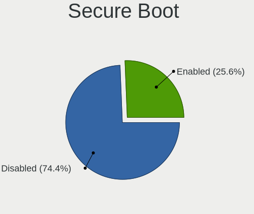
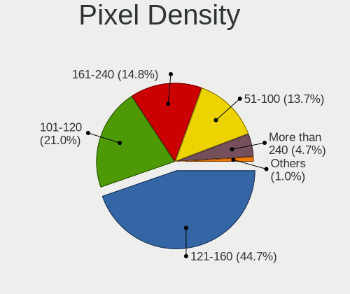

Fedora 38 - Tested Hardware & Statistics (Notebooks)
----------------------------------------------------

A project to collect tested hardware configurations for Fedora 38.

Anyone can contribute to this report by the [hw-probe](https://github.com/linuxhw/hw-probe) tool:

    sudo -E hw-probe -all -upload

Please contribute! Especially if your hardware is rare.

Contents
--------

* [ Test Cases ](#test-cases)

* [ System ](#system)
  - [ Kernel                   ](#kernel)
  - [ Kernel Family            ](#kernel-family)
  - [ Kernel Major Ver.        ](#kernel-major-ver)
  - [ Arch                     ](#arch)
  - [ DE                       ](#de)
  - [ Display Server           ](#display-server)
  - [ Display Manager          ](#display-manager)
  - [ OS Lang                  ](#os-lang)
  - [ Boot Mode                ](#boot-mode)
  - [ Filesystem               ](#filesystem)
  - [ Part. scheme             ](#part-scheme)
  - [ Dual Boot with Linux/BSD ](#dual-boot-with-linuxbsd)
  - [ Dual Boot (Win)          ](#dual-boot-win)

* [ Board ](#board)
  - [ Vendor                   ](#vendor)
  - [ Model                    ](#model)
  - [ Model Family             ](#model-family)
  - [ MFG Year                 ](#mfg-year)
  - [ Form Factor              ](#form-factor)
  - [ Secure Boot              ](#secure-boot)
  - [ Coreboot                 ](#coreboot)
  - [ RAM Size                 ](#ram-size)
  - [ RAM Used                 ](#ram-used)
  - [ Total Drives             ](#total-drives)
  - [ Has CD-ROM               ](#has-cd-rom)
  - [ Has Ethernet             ](#has-ethernet)
  - [ Has WiFi                 ](#has-wifi)
  - [ Has Bluetooth            ](#has-bluetooth)

* [ Location ](#location)
  - [ Country                  ](#country)
  - [ City                     ](#city)

* [ Drives ](#drives)
  - [ Drive Vendor             ](#drive-vendor)
  - [ Drive Model              ](#drive-model)
  - [ HDD Vendor               ](#hdd-vendor)
  - [ SSD Vendor               ](#ssd-vendor)
  - [ Drive Kind               ](#drive-kind)
  - [ Drive Connector          ](#drive-connector)
  - [ Drive Size               ](#drive-size)
  - [ Space Total              ](#space-total)
  - [ Space Used               ](#space-used)
  - [ Malfunc. Drives          ](#malfunc-drives)
  - [ Malfunc. Drive Vendor    ](#malfunc-drive-vendor)
  - [ Malfunc. HDD Vendor      ](#malfunc-hdd-vendor)
  - [ Malfunc. Drive Kind      ](#malfunc-drive-kind)
  - [ Failed Drives            ](#failed-drives)
  - [ Failed Drive Vendor      ](#failed-drive-vendor)
  - [ Drive Status             ](#drive-status)

* [ Storage controller ](#storage-controller)
  - [ Storage Vendor           ](#storage-vendor)
  - [ Storage Model            ](#storage-model)
  - [ Storage Kind             ](#storage-kind)

* [ Processor ](#processor)
  - [ CPU Vendor               ](#cpu-vendor)
  - [ CPU Model                ](#cpu-model)
  - [ CPU Model Family         ](#cpu-model-family)
  - [ CPU Cores                ](#cpu-cores)
  - [ CPU Sockets              ](#cpu-sockets)
  - [ CPU Threads              ](#cpu-threads)
  - [ CPU Op-Modes             ](#cpu-op-modes)
  - [ CPU Microcode            ](#cpu-microcode)
  - [ CPU Microarch            ](#cpu-microarch)

* [ Graphics ](#graphics)
  - [ GPU Vendor               ](#gpu-vendor)
  - [ GPU Model                ](#gpu-model)
  - [ GPU Combo                ](#gpu-combo)
  - [ GPU Driver               ](#gpu-driver)
  - [ GPU Memory               ](#gpu-memory)

* [ Monitor ](#monitor)
  - [ Monitor Vendor           ](#monitor-vendor)
  - [ Monitor Model            ](#monitor-model)
  - [ Monitor Resolution       ](#monitor-resolution)
  - [ Monitor Diagonal         ](#monitor-diagonal)
  - [ Monitor Width            ](#monitor-width)
  - [ Aspect Ratio             ](#aspect-ratio)
  - [ Monitor Area             ](#monitor-area)
  - [ Pixel Density            ](#pixel-density)
  - [ Multiple Monitors        ](#multiple-monitors)

* [ Network ](#network)
  - [ Net Controller Vendor    ](#net-controller-vendor)
  - [ Net Controller Model     ](#net-controller-model)
  - [ Wireless Vendor          ](#wireless-vendor)
  - [ Wireless Model           ](#wireless-model)
  - [ Ethernet Vendor          ](#ethernet-vendor)
  - [ Ethernet Model           ](#ethernet-model)
  - [ Net Controller Kind      ](#net-controller-kind)
  - [ Used Controller          ](#used-controller)
  - [ NICs                     ](#nics)
  - [ IPv6                     ](#ipv6)

* [ Bluetooth ](#bluetooth)
  - [ Bluetooth Vendor         ](#bluetooth-vendor)
  - [ Bluetooth Model          ](#bluetooth-model)

* [ Sound ](#sound)
  - [ Sound Vendor             ](#sound-vendor)
  - [ Sound Model              ](#sound-model)

* [ Memory ](#memory)
  - [ Memory Vendor            ](#memory-vendor)
  - [ Memory Model             ](#memory-model)
  - [ Memory Kind              ](#memory-kind)
  - [ Memory Form Factor       ](#memory-form-factor)
  - [ Memory Size              ](#memory-size)
  - [ Memory Speed             ](#memory-speed)

* [ Printers & scanners ](#printers--scanners)
  - [ Printer Vendor           ](#printer-vendor)
  - [ Printer Model            ](#printer-model)
  - [ Scanner Vendor           ](#scanner-vendor)
  - [ Scanner Model            ](#scanner-model)

* [ Camera ](#camera)
  - [ Camera Vendor            ](#camera-vendor)
  - [ Camera Model             ](#camera-model)

* [ Security ](#security)
  - [ Fingerprint Vendor       ](#fingerprint-vendor)
  - [ Fingerprint Model        ](#fingerprint-model)
  - [ Chipcard Vendor          ](#chipcard-vendor)
  - [ Chipcard Model           ](#chipcard-model)

* [ Unsupported ](#unsupported)
  - [ Unsupported Devices      ](#unsupported-devices)
  - [ Unsupported Device Types ](#unsupported-device-types)

Test Cases
----------

Total: 1643

| Vendor        | Model                       | Probe                                                      | Date         |
|---------------|-----------------------------|------------------------------------------------------------|--------------|
| Acer          | Aspire V5-531               | [e39cb4e3e6](https://linux-hardware.org/?probe=e39cb4e3e6) | Sep 07, 2023 |
| Lenovo        | ThinkPad P15v Gen 2i 21A... | [69fc5aab82](https://linux-hardware.org/?probe=69fc5aab82) | Sep 07, 2023 |
| Lenovo        | V580c 20160                 | [87f8bad27d](https://linux-hardware.org/?probe=87f8bad27d) | Sep 07, 2023 |
| Lenovo        | ThinkPad P15v Gen 2i 21A... | [384d2074ad](https://linux-hardware.org/?probe=384d2074ad) | Sep 07, 2023 |
| Lenovo        | IdeaPad S145-15API 81UT     | [8a05090057](https://linux-hardware.org/?probe=8a05090057) | Sep 07, 2023 |
| Lenovo        | ThinkBook 15 G4 IAP 21DJ    | [a2fab791b4](https://linux-hardware.org/?probe=a2fab791b4) | Sep 07, 2023 |
| Timi          | Redmi Book Pro 14S          | [b2776d8282](https://linux-hardware.org/?probe=b2776d8282) | Sep 07, 2023 |
| Lenovo        | IdeaPad S145-14AST 81ST     | [24eca3030c](https://linux-hardware.org/?probe=24eca3030c) | Sep 07, 2023 |
| Lenovo        | ThinkPad T410 2522PT3       | [da7303433d](https://linux-hardware.org/?probe=da7303433d) | Sep 07, 2023 |
| HUAWEI        | NBLK-WAX9X                  | [9911fc5254](https://linux-hardware.org/?probe=9911fc5254) | Sep 07, 2023 |
| MSI           | Bravo 17 A4DDR              | [2592f883ef](https://linux-hardware.org/?probe=2592f883ef) | Sep 07, 2023 |
| ASUSTek       | ASUS TUF Gaming F15 FX50... | [b982251e82](https://linux-hardware.org/?probe=b982251e82) | Sep 07, 2023 |
| Dell          | Latitude E6500              | [b4b035c4f7](https://linux-hardware.org/?probe=b4b035c4f7) | Sep 07, 2023 |
| ASUSTek       | ASUS TUF Dash F15 FX516P... | [3c6e29c3c3](https://linux-hardware.org/?probe=3c6e29c3c3) | Sep 06, 2023 |
| GPU Compan... | GWNR71517                   | [b6a521128f](https://linux-hardware.org/?probe=b6a521128f) | Sep 06, 2023 |
| Samsung       | 550P5C/550P7C               | [f59dbec9af](https://linux-hardware.org/?probe=f59dbec9af) | Sep 06, 2023 |
| Samsung       | 550P5C/550P7C               | [83c77f6733](https://linux-hardware.org/?probe=83c77f6733) | Sep 06, 2023 |
| Lenovo        | IdeaPad 3 15ALC6 82KU       | [c8ee0a00a5](https://linux-hardware.org/?probe=c8ee0a00a5) | Sep 06, 2023 |
| Dell          | XPS 13 9310                 | [7e81f7531b](https://linux-hardware.org/?probe=7e81f7531b) | Sep 06, 2023 |
| Lenovo        | ThinkPad P1 Gen 6 21FV00... | [c9a07c44d5](https://linux-hardware.org/?probe=c9a07c44d5) | Sep 06, 2023 |
| Dell          | Inspiron 3542               | [1756563167](https://linux-hardware.org/?probe=1756563167) | Sep 06, 2023 |
| Lenovo        | Legion Pro 7 16IRX8 82WR    | [f946665a24](https://linux-hardware.org/?probe=f946665a24) | Sep 06, 2023 |
| Lenovo        | ThinkPad X1C 5th W10DG 2... | [b5f142ae13](https://linux-hardware.org/?probe=b5f142ae13) | Sep 06, 2023 |
| Apple         | MacBookPro13,1              | [d6b6455af2](https://linux-hardware.org/?probe=d6b6455af2) | Sep 06, 2023 |
| Lenovo        | Yoga S740-15IRH 81NX        | [c31e15f2ba](https://linux-hardware.org/?probe=c31e15f2ba) | Sep 05, 2023 |
| HP            | EliteBook 845 14 inch G9... | [25ec8e4a16](https://linux-hardware.org/?probe=25ec8e4a16) | Sep 05, 2023 |
| Dell          | Latitude 7400               | [e1ea4eb614](https://linux-hardware.org/?probe=e1ea4eb614) | Sep 05, 2023 |
| Lenovo        | V15 G4 AMN 82YU             | [bb7f6aed1a](https://linux-hardware.org/?probe=bb7f6aed1a) | Sep 05, 2023 |
| ASUSTek       | E402SA                      | [efad2958a0](https://linux-hardware.org/?probe=efad2958a0) | Sep 05, 2023 |
| Lenovo        | IdeaPad 5 15ITL05 82FG      | [3c55d4d55b](https://linux-hardware.org/?probe=3c55d4d55b) | Sep 05, 2023 |
| ASUSTek       | ROG Strix G713RM_G713RM     | [0309bcca29](https://linux-hardware.org/?probe=0309bcca29) | Sep 05, 2023 |
| Dell          | Latitude 7490               | [c03e42edee](https://linux-hardware.org/?probe=c03e42edee) | Sep 05, 2023 |
| Unknown       | Unknown                     | [9b4d95cf35](https://linux-hardware.org/?probe=9b4d95cf35) | Sep 05, 2023 |
| HP            | ProBook 450 G8 Notebook ... | [5dbf7515d1](https://linux-hardware.org/?probe=5dbf7515d1) | Sep 05, 2023 |
| ASUSTek       | ROG Flow X13 GV301QH_GV3... | [7619d8e5e8](https://linux-hardware.org/?probe=7619d8e5e8) | Sep 05, 2023 |
| Lenovo        | ThinkPad T480s 20L8S1R50... | [ea1d0861a1](https://linux-hardware.org/?probe=ea1d0861a1) | Sep 05, 2023 |
| Lenovo        | ThinkBook 15 G3 ACL 21A4    | [229ca6e8cb](https://linux-hardware.org/?probe=229ca6e8cb) | Sep 05, 2023 |
| Lenovo        | IdeaPad 5 15ITL05 82FG      | [ab9c556dc7](https://linux-hardware.org/?probe=ab9c556dc7) | Sep 05, 2023 |
| Acer          | Aspire 4738Z                | [88b34596c0](https://linux-hardware.org/?probe=88b34596c0) | Sep 05, 2023 |
| Dell          | XPS 13 7390                 | [5154be8883](https://linux-hardware.org/?probe=5154be8883) | Sep 05, 2023 |
| Dell          | G15 5530                    | [91dcc569ee](https://linux-hardware.org/?probe=91dcc569ee) | Sep 05, 2023 |
| HUAWEI        | KLVL-WXX9                   | [d3cde5f4c5](https://linux-hardware.org/?probe=d3cde5f4c5) | Sep 04, 2023 |
| HP            | EliteBook 840 G8 Noteboo... | [2a53f8dc55](https://linux-hardware.org/?probe=2a53f8dc55) | Sep 04, 2023 |
| Dell          | Inspiron 3576               | [5139d104cc](https://linux-hardware.org/?probe=5139d104cc) | Sep 04, 2023 |
| Acer          | Aspire E1-571               | [032fca9d1d](https://linux-hardware.org/?probe=032fca9d1d) | Sep 04, 2023 |
| HP            | Laptop 14s-dq2xxx           | [3a5b200954](https://linux-hardware.org/?probe=3a5b200954) | Sep 04, 2023 |
| ASUSTek       | ROG Zephyrus G14 GA401QE... | [da42098f81](https://linux-hardware.org/?probe=da42098f81) | Sep 04, 2023 |
| Dell          | XPS 13 9380                 | [94e7b43fe2](https://linux-hardware.org/?probe=94e7b43fe2) | Sep 04, 2023 |
| HP            | Laptop 15-dw2xxx            | [fff758a5d9](https://linux-hardware.org/?probe=fff758a5d9) | Sep 04, 2023 |
| Chuwi         | GemiBook                    | [cfdc48e9f6](https://linux-hardware.org/?probe=cfdc48e9f6) | Sep 04, 2023 |
| ASUSTek       | VivoBook 15_ASUS Laptop ... | [1d6a4b4279](https://linux-hardware.org/?probe=1d6a4b4279) | Sep 04, 2023 |
| Dell          | Latitude 5285               | [9ddc47c6a9](https://linux-hardware.org/?probe=9ddc47c6a9) | Sep 04, 2023 |
| Maibenben     | MaiBook M                   | [7189994067](https://linux-hardware.org/?probe=7189994067) | Sep 04, 2023 |
| Lenovo        | IdeaPad S340-15API 81NC     | [18d1abc9ca](https://linux-hardware.org/?probe=18d1abc9ca) | Sep 04, 2023 |
| HUAWEI        | KLVL-WXX9                   | [c3e4035d47](https://linux-hardware.org/?probe=c3e4035d47) | Sep 03, 2023 |
| ASUSTek       | ASUS TUF Gaming F15 FX50... | [1211fca3e2](https://linux-hardware.org/?probe=1211fca3e2) | Sep 03, 2023 |
| Notebook      | PCx0Dx                      | [89d5a9b606](https://linux-hardware.org/?probe=89d5a9b606) | Sep 03, 2023 |
| Lenovo        | ThinkPad T550 20CKA00ECD    | [20be702d65](https://linux-hardware.org/?probe=20be702d65) | Sep 03, 2023 |
| HP            | OMEN by Laptop 15-ce0xx     | [2973871c04](https://linux-hardware.org/?probe=2973871c04) | Sep 03, 2023 |
| HP            | Pavilion Gaming Laptop      | [733f5cb987](https://linux-hardware.org/?probe=733f5cb987) | Sep 03, 2023 |
| Framework     | Laptop                      | [d153316fdd](https://linux-hardware.org/?probe=d153316fdd) | Sep 03, 2023 |
| Dell          | Latitude 3540               | [e7d1d4f160](https://linux-hardware.org/?probe=e7d1d4f160) | Sep 03, 2023 |
| ASUSTek       | VivoBook_ASUSLaptop X515... | [e0f8242693](https://linux-hardware.org/?probe=e0f8242693) | Sep 02, 2023 |
| Lenovo        | Legion Slim 5 16IRH8 82Y... | [8f29742c47](https://linux-hardware.org/?probe=8f29742c47) | Sep 02, 2023 |
| ASUSTek       | X540NA                      | [69ccd7d6f2](https://linux-hardware.org/?probe=69ccd7d6f2) | Sep 02, 2023 |
| Dell          | Latitude 5400               | [aac8791780](https://linux-hardware.org/?probe=aac8791780) | Sep 02, 2023 |
| Lenovo        | 14w Gen 2 82N9              | [87c8a118b5](https://linux-hardware.org/?probe=87c8a118b5) | Sep 02, 2023 |
| Prestigio     | Multipad Visconte V         | [3c60fe1d14](https://linux-hardware.org/?probe=3c60fe1d14) | Sep 01, 2023 |
| ASUSTek       | ROG Strix G513IC_G513IC     | [3080550241](https://linux-hardware.org/?probe=3080550241) | Sep 01, 2023 |
| Fujitsu       | LIFEBOOK S760               | [b7439f4404](https://linux-hardware.org/?probe=b7439f4404) | Sep 01, 2023 |
| Timi          | Mi NoteBook Pro             | [7d3823ff94](https://linux-hardware.org/?probe=7d3823ff94) | Sep 01, 2023 |
| Acer          | Aspire E5-551G              | [864a10779f](https://linux-hardware.org/?probe=864a10779f) | Sep 01, 2023 |
| HP            | EliteBook 820 G3            | [24d0eafc15](https://linux-hardware.org/?probe=24d0eafc15) | Sep 01, 2023 |
| Apple         | MacBookAir5,2               | [bda3b1837c](https://linux-hardware.org/?probe=bda3b1837c) | Sep 01, 2023 |
| ASUSTek       | ZenBook UX535LI_UX535LI     | [edd00c35fd](https://linux-hardware.org/?probe=edd00c35fd) | Sep 01, 2023 |
| Apple         | MacBookAir4,1               | [61da3436a8](https://linux-hardware.org/?probe=61da3436a8) | Sep 01, 2023 |
| Lenovo        | Legion Pro 7 16IRX8 82WR    | [239b46961f](https://linux-hardware.org/?probe=239b46961f) | Sep 01, 2023 |
| Lenovo        | ThinkPad X270 20HMS6AT00    | [e111bad271](https://linux-hardware.org/?probe=e111bad271) | Sep 01, 2023 |
| HP            | EliteBook 860 16 inch G9... | [5e0da96bdd](https://linux-hardware.org/?probe=5e0da96bdd) | Sep 01, 2023 |
| Dell          | Latitude 5290 2-in-1        | [3a4c0e0930](https://linux-hardware.org/?probe=3a4c0e0930) | Aug 31, 2023 |
| Apple         | MacBook9,1                  | [b6a28c1e1a](https://linux-hardware.org/?probe=b6a28c1e1a) | Aug 31, 2023 |
| Dell          | Latitude 5290 2-in-1        | [5b632410e7](https://linux-hardware.org/?probe=5b632410e7) | Aug 31, 2023 |
| ASUSTek       | ASUS EXPERTBOOK L2402CYA... | [9881dd3268](https://linux-hardware.org/?probe=9881dd3268) | Aug 31, 2023 |
| Lenovo        | ThinkPad L470 20J40010GE    | [53adc42d66](https://linux-hardware.org/?probe=53adc42d66) | Aug 31, 2023 |
| Dell          | Latitude 5590               | [59d99ec581](https://linux-hardware.org/?probe=59d99ec581) | Aug 31, 2023 |
| HP            | Pavilion Laptop 15-eg3xx... | [c3d8f5daca](https://linux-hardware.org/?probe=c3d8f5daca) | Aug 31, 2023 |
| Lenovo        | ThinkPad L450 20DSS0LR00    | [a85743e60e](https://linux-hardware.org/?probe=a85743e60e) | Aug 31, 2023 |
| HP            | Pavilion Laptop 15-eg3xx... | [f94ed7f5d1](https://linux-hardware.org/?probe=f94ed7f5d1) | Aug 31, 2023 |
| System76      | Lemur Pro                   | [c04af9751f](https://linux-hardware.org/?probe=c04af9751f) | Aug 31, 2023 |
| Apple         | MacBookPro15,2              | [a93751de6d](https://linux-hardware.org/?probe=a93751de6d) | Aug 30, 2023 |
| HP            | EliteBook 845 14 inch G9... | [4c595a576a](https://linux-hardware.org/?probe=4c595a576a) | Aug 30, 2023 |
| ASUSTek       | ROG Flow X13 GV301QH_GV3... | [78e163bc13](https://linux-hardware.org/?probe=78e163bc13) | Aug 30, 2023 |
| Timi          | Redmi Book Pro 14 2022      | [0842215d23](https://linux-hardware.org/?probe=0842215d23) | Aug 30, 2023 |
| Acer          | TravelMate P259-MG          | [dc9b122d90](https://linux-hardware.org/?probe=dc9b122d90) | Aug 30, 2023 |
| Dell          | Latitude 5430               | [477898be1f](https://linux-hardware.org/?probe=477898be1f) | Aug 30, 2023 |
| Dell          | Latitude 5480               | [88c6621b31](https://linux-hardware.org/?probe=88c6621b31) | Aug 29, 2023 |
| Dell          | Precision 5480              | [5fd5bf187d](https://linux-hardware.org/?probe=5fd5bf187d) | Aug 29, 2023 |
| Lenovo        | ThinkBook 14 G4+ IAP 21C... | [0eeb1276f0](https://linux-hardware.org/?probe=0eeb1276f0) | Aug 29, 2023 |
| Lenovo        | ThinkPad X1 Carbon 7th 2... | [d036282290](https://linux-hardware.org/?probe=d036282290) | Aug 29, 2023 |
| Lenovo        | Yoga Slim 7 Pro 14IAH7 8... | [7e48b59643](https://linux-hardware.org/?probe=7e48b59643) | Aug 29, 2023 |
| Timi          | A34S                        | [eb6a3c2430](https://linux-hardware.org/?probe=eb6a3c2430) | Aug 29, 2023 |
| Acer          | Aspire E1-571               | [3208c59e9c](https://linux-hardware.org/?probe=3208c59e9c) | Aug 29, 2023 |
| ASUSTek       | VivoBook_ASUSLaptop X515... | [d627b8c625](https://linux-hardware.org/?probe=d627b8c625) | Aug 28, 2023 |
| Dell          | XPS 15 9510                 | [4b78bfab47](https://linux-hardware.org/?probe=4b78bfab47) | Aug 28, 2023 |
| Dell          | Latitude E6400              | [2af0a423ef](https://linux-hardware.org/?probe=2af0a423ef) | Aug 28, 2023 |
| Dell          | XPS 15 9560                 | [8288d35dff](https://linux-hardware.org/?probe=8288d35dff) | Aug 28, 2023 |
| ASUSTek       | VivoBook_ASUSLaptop X412... | [5fddb9cc18](https://linux-hardware.org/?probe=5fddb9cc18) | Aug 28, 2023 |
| HP            | Victus by Laptop 16-e0xx... | [a762e96941](https://linux-hardware.org/?probe=a762e96941) | Aug 28, 2023 |
| Lenovo        | ThinkPad E480 20KQ000EBR    | [40c64b6ec2](https://linux-hardware.org/?probe=40c64b6ec2) | Aug 28, 2023 |
| Acer          | Nitro AN515-57              | [7608fab281](https://linux-hardware.org/?probe=7608fab281) | Aug 28, 2023 |
| Lenovo        | IdeaPad 1 14IAU7 82QC       | [90e0cad295](https://linux-hardware.org/?probe=90e0cad295) | Aug 28, 2023 |
| ASUSTek       | VivoBook_ASUSLaptop X150... | [da73419cb5](https://linux-hardware.org/?probe=da73419cb5) | Aug 27, 2023 |
| Framework     | Laptop                      | [b3e9d2d48d](https://linux-hardware.org/?probe=b3e9d2d48d) | Aug 27, 2023 |
| Corsair       | Voyager a1600               | [405bce7897](https://linux-hardware.org/?probe=405bce7897) | Aug 27, 2023 |
| Lenovo        | IdeaPad 3 15ALC6 82KU       | [8acc158836](https://linux-hardware.org/?probe=8acc158836) | Aug 27, 2023 |
| HP            | Laptop 15s-eq2xxx           | [864a9d9f37](https://linux-hardware.org/?probe=864a9d9f37) | Aug 27, 2023 |
| ASUSTek       | T100TA                      | [69d14b429e](https://linux-hardware.org/?probe=69d14b429e) | Aug 27, 2023 |
| Dell          | Latitude E6400              | [fdcbc50452](https://linux-hardware.org/?probe=fdcbc50452) | Aug 27, 2023 |
| ASUSTek       | GL753VD                     | [3903bc9e14](https://linux-hardware.org/?probe=3903bc9e14) | Aug 27, 2023 |
| Lenovo        | ThinkPad E14 Gen 3 20YDC... | [fe02fb8d64](https://linux-hardware.org/?probe=fe02fb8d64) | Aug 27, 2023 |
| Timi          | TM1701                      | [2a6a4225a0](https://linux-hardware.org/?probe=2a6a4225a0) | Aug 27, 2023 |
| Timi          | TM1701                      | [8ea7c21e18](https://linux-hardware.org/?probe=8ea7c21e18) | Aug 27, 2023 |
| HP            | Pavilion 15                 | [1731ba4ae5](https://linux-hardware.org/?probe=1731ba4ae5) | Aug 27, 2023 |
| Lenovo        | ThinkPad P15 Gen 2i 20YQ... | [5d220003c1](https://linux-hardware.org/?probe=5d220003c1) | Aug 27, 2023 |
| HP            | Pavilion 15                 | [0f51268684](https://linux-hardware.org/?probe=0f51268684) | Aug 27, 2023 |
| Lenovo        | ThinkPad X1 Carbon Gen 1... | [a8600db157](https://linux-hardware.org/?probe=a8600db157) | Aug 27, 2023 |
| ASUSTek       | K55VD                       | [7bdfc94045](https://linux-hardware.org/?probe=7bdfc94045) | Aug 27, 2023 |
| Lenovo        | IdeaPad Z570 1024DCU        | [8a11757d37](https://linux-hardware.org/?probe=8a11757d37) | Aug 26, 2023 |
| Corsair       | Voyager a1600               | [97a1c576f7](https://linux-hardware.org/?probe=97a1c576f7) | Aug 26, 2023 |
| Lenovo        | ThinkBook 14 G4 IAP 21DH    | [4e5f7a05c6](https://linux-hardware.org/?probe=4e5f7a05c6) | Aug 26, 2023 |
| ASUSTek       | Strix 17 GL703GE            | [b2ad72336f](https://linux-hardware.org/?probe=b2ad72336f) | Aug 26, 2023 |
| HP            | OMEN by Laptop              | [df71a92503](https://linux-hardware.org/?probe=df71a92503) | Aug 26, 2023 |
| Acer          | Aspire A715-72G             | [cbbaecabb1](https://linux-hardware.org/?probe=cbbaecabb1) | Aug 26, 2023 |
| ASUSTek       | X542BP                      | [58cc535a58](https://linux-hardware.org/?probe=58cc535a58) | Aug 26, 2023 |
| Chuwi         | CoreBook X                  | [95548b426e](https://linux-hardware.org/?probe=95548b426e) | Aug 26, 2023 |
| Chuwi         | CoreBook X                  | [6bd0ecde29](https://linux-hardware.org/?probe=6bd0ecde29) | Aug 26, 2023 |
| Acer          | Predator PH16-71            | [ef267bc627](https://linux-hardware.org/?probe=ef267bc627) | Aug 26, 2023 |
| Apple         | MacBookPro13,2              | [b910d52198](https://linux-hardware.org/?probe=b910d52198) | Aug 26, 2023 |
| Acer          | Nitro AN515-44              | [b14dfb0798](https://linux-hardware.org/?probe=b14dfb0798) | Aug 25, 2023 |
| Acer          | Aspire ES1-512              | [22187e6de0](https://linux-hardware.org/?probe=22187e6de0) | Aug 25, 2023 |
| Lenovo        | IdeaPad 5 15ITL05 82FG      | [810ccd6f4f](https://linux-hardware.org/?probe=810ccd6f4f) | Aug 25, 2023 |
| Dell          | Latitude 3490               | [05705b1834](https://linux-hardware.org/?probe=05705b1834) | Aug 25, 2023 |
| ASUSTek       | T100TA                      | [ef7b263d48](https://linux-hardware.org/?probe=ef7b263d48) | Aug 25, 2023 |
| Toshiba       | Satellite C70-B             | [2647e2edd8](https://linux-hardware.org/?probe=2647e2edd8) | Aug 24, 2023 |
| Dell          | G15 5510                    | [f9e857e751](https://linux-hardware.org/?probe=f9e857e751) | Aug 24, 2023 |
| HP            | Victus by Laptop 16-e0xx... | [7e6a7de337](https://linux-hardware.org/?probe=7e6a7de337) | Aug 24, 2023 |
| Sony          | SVF15A1M2ES                 | [b352453232](https://linux-hardware.org/?probe=b352453232) | Aug 24, 2023 |
| Dell          | Inspiron 5759               | [bf7413fc5f](https://linux-hardware.org/?probe=bf7413fc5f) | Aug 24, 2023 |
| ASUSTek       | VivoBook_ASUSLaptop X409... | [1a9c135840](https://linux-hardware.org/?probe=1a9c135840) | Aug 24, 2023 |
| LDLC          | SPC-I                       | [bb114215e6](https://linux-hardware.org/?probe=bb114215e6) | Aug 24, 2023 |
| Lenovo        | ThinkPad T560 20FJS18V00    | [5f18850003](https://linux-hardware.org/?probe=5f18850003) | Aug 24, 2023 |
| Lenovo        | ThinkPad T560 20FJS18V00    | [de37c3c7eb](https://linux-hardware.org/?probe=de37c3c7eb) | Aug 24, 2023 |
| Lenovo        | ThinkPad E14 Gen 3 20Y70... | [ce5f964a0c](https://linux-hardware.org/?probe=ce5f964a0c) | Aug 24, 2023 |
| Dell          | Latitude 3490               | [148d4806cb](https://linux-hardware.org/?probe=148d4806cb) | Aug 24, 2023 |
| HP            | 255 G8 Notebook PC          | [68c01672c3](https://linux-hardware.org/?probe=68c01672c3) | Aug 24, 2023 |
| Xplore        | iX104C6                     | [5d8ea1a454](https://linux-hardware.org/?probe=5d8ea1a454) | Aug 24, 2023 |
| Lenovo        | Yoga710-14ISK 80TY          | [17525a9aef](https://linux-hardware.org/?probe=17525a9aef) | Aug 24, 2023 |
| Positivo B... | VJFE59F11X-B0411H           | [5e5059f835](https://linux-hardware.org/?probe=5e5059f835) | Aug 23, 2023 |
| Lenovo        | ThinkPad X200 74591P0       | [adda6295fb](https://linux-hardware.org/?probe=adda6295fb) | Aug 23, 2023 |
| Acer          | Predator PT715-51           | [e187e199c9](https://linux-hardware.org/?probe=e187e199c9) | Aug 23, 2023 |
| Dell          | XPS 15 7590                 | [66b46e04d3](https://linux-hardware.org/?probe=66b46e04d3) | Aug 23, 2023 |
| Google        | Nami                        | [db2c6bfb0a](https://linux-hardware.org/?probe=db2c6bfb0a) | Aug 23, 2023 |
| HUAWEI        | BOM-WXX9                    | [08801db21d](https://linux-hardware.org/?probe=08801db21d) | Aug 23, 2023 |
| HUAWEI        | BOM-WXX9                    | [9b3cf2a525](https://linux-hardware.org/?probe=9b3cf2a525) | Aug 23, 2023 |
| Lenovo        | Legion Y9000P IAH7H 82RF    | [f429d18938](https://linux-hardware.org/?probe=f429d18938) | Aug 23, 2023 |
| Dell          | Inspiron 5559               | [310e1f561c](https://linux-hardware.org/?probe=310e1f561c) | Aug 22, 2023 |
| HUAWEI        | BOHB-WAX9                   | [f7580a556b](https://linux-hardware.org/?probe=f7580a556b) | Aug 22, 2023 |
| ASUSTek       | VivoBook_ASUSLaptop N760... | [68d28831a5](https://linux-hardware.org/?probe=68d28831a5) | Aug 22, 2023 |
| ASUSTek       | ASUS TUF Gaming A17 FA70... | [25d163ad9e](https://linux-hardware.org/?probe=25d163ad9e) | Aug 22, 2023 |
| Google        | Nami                        | [69d8c7bfb8](https://linux-hardware.org/?probe=69d8c7bfb8) | Aug 22, 2023 |
| Lenovo        | ThinkPad P15 Gen 2i 20YR... | [9ad109a4df](https://linux-hardware.org/?probe=9ad109a4df) | Aug 22, 2023 |
| HP            | Pavilion 11 x360 PC         | [bf401f98a7](https://linux-hardware.org/?probe=bf401f98a7) | Aug 22, 2023 |
| HP            | EliteBook 8440p             | [f35c644052](https://linux-hardware.org/?probe=f35c644052) | Aug 22, 2023 |
| HP            | EliteBook 8440p             | [4f4bed768e](https://linux-hardware.org/?probe=4f4bed768e) | Aug 22, 2023 |
| Dell          | Latitude 7430               | [1ccbb8329f](https://linux-hardware.org/?probe=1ccbb8329f) | Aug 22, 2023 |
| HP            | ProBook 655 G1              | [39dbb86112](https://linux-hardware.org/?probe=39dbb86112) | Aug 22, 2023 |
| HP            | ProBook 655 G1              | [2d616412f1](https://linux-hardware.org/?probe=2d616412f1) | Aug 22, 2023 |
| Dell          | Inspiron 5567               | [76c16d7ffe](https://linux-hardware.org/?probe=76c16d7ffe) | Aug 22, 2023 |
| HUAWEI        | HVY-WXX9                    | [55e95b21f1](https://linux-hardware.org/?probe=55e95b21f1) | Aug 22, 2023 |
| HP            | Laptop 15-fc0xxx            | [d2378787ac](https://linux-hardware.org/?probe=d2378787ac) | Aug 21, 2023 |
| Dell          | Latitude 3301               | [69389fff09](https://linux-hardware.org/?probe=69389fff09) | Aug 21, 2023 |
| Apple         | MacBookPro9,2               | [63b37fd7f7](https://linux-hardware.org/?probe=63b37fd7f7) | Aug 21, 2023 |
| Lenovo        | ThinkPad T430 2347C32       | [6956f76011](https://linux-hardware.org/?probe=6956f76011) | Aug 21, 2023 |
| Dell          | Inspiron 5547               | [b5b7a6d8f8](https://linux-hardware.org/?probe=b5b7a6d8f8) | Aug 21, 2023 |
| MSI           | GE63 Raider RGB 8RF         | [dd12e382c8](https://linux-hardware.org/?probe=dd12e382c8) | Aug 21, 2023 |
| ASUSTek       | ROG Strix G713IE_G713IE     | [22443858cb](https://linux-hardware.org/?probe=22443858cb) | Aug 21, 2023 |
| Apple         | MacBookPro9,2               | [a8a1e5df49](https://linux-hardware.org/?probe=a8a1e5df49) | Aug 21, 2023 |
| Lenovo        | IdeaPad 5 Pro 14ACN6 82L... | [359cd5a655](https://linux-hardware.org/?probe=359cd5a655) | Aug 21, 2023 |
| Dell          | Latitude 7490               | [90685f1b4d](https://linux-hardware.org/?probe=90685f1b4d) | Aug 21, 2023 |
| Lenovo        | Legion 5 82B5               | [6047cef31c](https://linux-hardware.org/?probe=6047cef31c) | Aug 21, 2023 |
| Lenovo        | Legion 5 82B5               | [986599dc77](https://linux-hardware.org/?probe=986599dc77) | Aug 21, 2023 |
| Lenovo        | ThinkPad L14 Gen 1 20U50... | [c1a5eb75bf](https://linux-hardware.org/?probe=c1a5eb75bf) | Aug 21, 2023 |
| ASUSTek       | X510URR                     | [d1ee285db9](https://linux-hardware.org/?probe=d1ee285db9) | Aug 21, 2023 |
| HP            | ProBook 640 G1              | [f38ba797d9](https://linux-hardware.org/?probe=f38ba797d9) | Aug 21, 2023 |
| Toshiba       | Satellite C70-B             | [d4f90e5eff](https://linux-hardware.org/?probe=d4f90e5eff) | Aug 21, 2023 |
| Lenovo        | Legion 5 15IAH7 82RC        | [5fa4b8ae13](https://linux-hardware.org/?probe=5fa4b8ae13) | Aug 20, 2023 |
| HP            | ProBook 430 G1              | [24a2760d65](https://linux-hardware.org/?probe=24a2760d65) | Aug 20, 2023 |
| ASUSTek       | ASUS BR1100CKA BR1100CKA... | [448603376e](https://linux-hardware.org/?probe=448603376e) | Aug 20, 2023 |
| HP            | EliteBook 850 G8 Noteboo... | [8e91f085b4](https://linux-hardware.org/?probe=8e91f085b4) | Aug 20, 2023 |
| Acer          | Aspire A315-53              | [03bd8885a0](https://linux-hardware.org/?probe=03bd8885a0) | Aug 20, 2023 |
| PC Special... | Ionico 16                   | [96fb68dc70](https://linux-hardware.org/?probe=96fb68dc70) | Aug 20, 2023 |
| Sony          | SVF1521USTW                 | [ce7fbec260](https://linux-hardware.org/?probe=ce7fbec260) | Aug 20, 2023 |
| Sony          | SVF1521USTW                 | [e92fad444f](https://linux-hardware.org/?probe=e92fad444f) | Aug 19, 2023 |
| Packard Be... | EasyNote ENTF71BM           | [36417c2601](https://linux-hardware.org/?probe=36417c2601) | Aug 19, 2023 |
| Lenovo        | ThinkPad SL510 28477MG      | [ed572b9b04](https://linux-hardware.org/?probe=ed572b9b04) | Aug 19, 2023 |
| Packard Be... | EasyNote ENTF71BM           | [81dd9b9a7a](https://linux-hardware.org/?probe=81dd9b9a7a) | Aug 19, 2023 |
| HP            | Victus by Laptop 16-e0xx... | [651f263a9d](https://linux-hardware.org/?probe=651f263a9d) | Aug 19, 2023 |
| HUAWEI        | NBM-WXX9                    | [ac85dd7bb4](https://linux-hardware.org/?probe=ac85dd7bb4) | Aug 19, 2023 |
| Acer          | Swift SF114-32              | [c6f3f044c9](https://linux-hardware.org/?probe=c6f3f044c9) | Aug 19, 2023 |
| Acer          | Swift SF114-32              | [9734816ff1](https://linux-hardware.org/?probe=9734816ff1) | Aug 19, 2023 |
| ASUSTek       | VivoBook_ASUSLaptop K650... | [80b304814d](https://linux-hardware.org/?probe=80b304814d) | Aug 19, 2023 |
| HP            | Pavilion dv4                | [5f1e0c4484](https://linux-hardware.org/?probe=5f1e0c4484) | Aug 19, 2023 |
| Acer          | Aspire A514-55              | [98ebe4bf9a](https://linux-hardware.org/?probe=98ebe4bf9a) | Aug 19, 2023 |
| Dell          | Inspiron 7520               | [3cdfdae368](https://linux-hardware.org/?probe=3cdfdae368) | Aug 19, 2023 |
| Lenovo        | IdeaPad Gaming 3 15ACH6 ... | [dee14abe77](https://linux-hardware.org/?probe=dee14abe77) | Aug 18, 2023 |
| Acer          | Aspire A514-55              | [cace7d6efb](https://linux-hardware.org/?probe=cace7d6efb) | Aug 18, 2023 |
| Lenovo        | IdeaPad Slim 3 15ABR8 82... | [12c6ae9006](https://linux-hardware.org/?probe=12c6ae9006) | Aug 18, 2023 |
| Lenovo        | IdeaPad Pro 5 14APH8 83A... | [f7d0bbc3d9](https://linux-hardware.org/?probe=f7d0bbc3d9) | Aug 18, 2023 |
| Lenovo        | IdeaPad 320-17ISK 80XJ      | [c9e9e56ddd](https://linux-hardware.org/?probe=c9e9e56ddd) | Aug 18, 2023 |
| Dell          | Latitude 7320               | [a51289d9dd](https://linux-hardware.org/?probe=a51289d9dd) | Aug 18, 2023 |
| System76      | Pangolin                    | [5191e3a345](https://linux-hardware.org/?probe=5191e3a345) | Aug 18, 2023 |
| Schenker      | MEDIA (M22)                 | [463903cc03](https://linux-hardware.org/?probe=463903cc03) | Aug 18, 2023 |
| PC Special... | Ionico 16                   | [da33e8f1c1](https://linux-hardware.org/?probe=da33e8f1c1) | Aug 18, 2023 |
| MSI           | MS-1057                     | [081ae63942](https://linux-hardware.org/?probe=081ae63942) | Aug 18, 2023 |
| MSI           | MS-1057                     | [615f03f3b8](https://linux-hardware.org/?probe=615f03f3b8) | Aug 18, 2023 |
| Acer          | Aspire E5-575               | [cfbf5747b3](https://linux-hardware.org/?probe=cfbf5747b3) | Aug 18, 2023 |
| Lenovo        | Yoga Slim 7 ProX 14IAH7 ... | [b8e5fd59d3](https://linux-hardware.org/?probe=b8e5fd59d3) | Aug 18, 2023 |
| Lenovo        | ThinkPad L480 20LTS6S904    | [32ded049ec](https://linux-hardware.org/?probe=32ded049ec) | Aug 17, 2023 |
| Lenovo        | IdeaPad Pro 5 14APH8 83A... | [df194863d1](https://linux-hardware.org/?probe=df194863d1) | Aug 17, 2023 |
| Lenovo        | IdeaPad Pro 5 14APH8 83A... | [87a6bd39ae](https://linux-hardware.org/?probe=87a6bd39ae) | Aug 17, 2023 |
| HP            | ProBook 640 G1              | [e688e27904](https://linux-hardware.org/?probe=e688e27904) | Aug 17, 2023 |
| Dell          | Latitude 7440               | [e56c46e8fe](https://linux-hardware.org/?probe=e56c46e8fe) | Aug 17, 2023 |
| Dell          | Latitude 7440               | [aef57d5421](https://linux-hardware.org/?probe=aef57d5421) | Aug 17, 2023 |
| ASUSTek       | VivoBook_ASUSLaptop X412... | [d0d3c76bb8](https://linux-hardware.org/?probe=d0d3c76bb8) | Aug 17, 2023 |
| ASUSTek       | ZenBook UX482EG_UX482EG     | [c753cfdb08](https://linux-hardware.org/?probe=c753cfdb08) | Aug 17, 2023 |
| Lenovo        | Legion 5 15IAH7 82RC        | [75556aed08](https://linux-hardware.org/?probe=75556aed08) | Aug 16, 2023 |
| Lenovo        | Legion 5 15ACH6H 82JU       | [82c579f8a7](https://linux-hardware.org/?probe=82c579f8a7) | Aug 16, 2023 |
| Lenovo        | ThinkPad T480s 20L7001VG... | [b0b2f8a7e1](https://linux-hardware.org/?probe=b0b2f8a7e1) | Aug 16, 2023 |
| Lenovo        | ThinkPad T480s 20L7001VG... | [07b5827382](https://linux-hardware.org/?probe=07b5827382) | Aug 16, 2023 |
| HP            | EliteBook 845 G8 Noteboo... | [f3c603341d](https://linux-hardware.org/?probe=f3c603341d) | Aug 16, 2023 |
| Lenovo        | ThinkPad P14s Gen 4 21HF... | [af217ce6dc](https://linux-hardware.org/?probe=af217ce6dc) | Aug 16, 2023 |
| Lenovo        | ThinkPad P14s Gen 4 21HF... | [feeb3d8bbe](https://linux-hardware.org/?probe=feeb3d8bbe) | Aug 16, 2023 |
| ASUSTek       | X541NA                      | [8e3f72e46d](https://linux-hardware.org/?probe=8e3f72e46d) | Aug 16, 2023 |
| HP            | Laptop 17-ca0xxx            | [bbf606d6e8](https://linux-hardware.org/?probe=bbf606d6e8) | Aug 16, 2023 |
| Dell          | Latitude E5400              | [7d861c3812](https://linux-hardware.org/?probe=7d861c3812) | Aug 16, 2023 |
| Dell          | Latitude 5420               | [12d46be852](https://linux-hardware.org/?probe=12d46be852) | Aug 16, 2023 |
| Lenovo        | ThinkPad X1 Carbon Gen 1... | [b326fccb63](https://linux-hardware.org/?probe=b326fccb63) | Aug 16, 2023 |
| HUAWEI        | CREM-WXX9                   | [24cd5deaa3](https://linux-hardware.org/?probe=24cd5deaa3) | Aug 16, 2023 |
| Dell          | Latitude 7490               | [efb4abea09](https://linux-hardware.org/?probe=efb4abea09) | Aug 16, 2023 |
| Lenovo        | ThinkPad E14 Gen 4 21E3S... | [ff958dc821](https://linux-hardware.org/?probe=ff958dc821) | Aug 16, 2023 |
| HUAWEI        | CREM-WXX9                   | [b42d5dec8e](https://linux-hardware.org/?probe=b42d5dec8e) | Aug 16, 2023 |
| ASUSTek       | ROG Zephyrus G14 GA402XI... | [da5582d4bf](https://linux-hardware.org/?probe=da5582d4bf) | Aug 16, 2023 |
| ASUSTek       | ROG Zephyrus G14 GA402XI... | [63f2bc3a80](https://linux-hardware.org/?probe=63f2bc3a80) | Aug 16, 2023 |
| Apple         | MacBookPro5,5               | [ee72caa76d](https://linux-hardware.org/?probe=ee72caa76d) | Aug 16, 2023 |
| Lenovo        | IdeaPad Gaming 3 15IHU6 ... | [8733f22b33](https://linux-hardware.org/?probe=8733f22b33) | Aug 16, 2023 |
| Lenovo        | ThinkPad T440p 20AWS03V0... | [f50a83684f](https://linux-hardware.org/?probe=f50a83684f) | Aug 16, 2023 |
| Lenovo        | ThinkPad T550 20CJS1JT00    | [78cd2292c2](https://linux-hardware.org/?probe=78cd2292c2) | Aug 16, 2023 |
| Dell          | Latitude 3301               | [8cbe049a08](https://linux-hardware.org/?probe=8cbe049a08) | Aug 15, 2023 |
| Samsung       | 550XDA                      | [5e5606074a](https://linux-hardware.org/?probe=5e5606074a) | Aug 15, 2023 |
| ASUSTek       | ZenBook UX434IQ_Q407IQ      | [cfa082df13](https://linux-hardware.org/?probe=cfa082df13) | Aug 15, 2023 |
| Lenovo        | ThinkPad E15 Gen 4 21E60... | [30e2a20d37](https://linux-hardware.org/?probe=30e2a20d37) | Aug 15, 2023 |
| Lenovo        | ThinkBook 14-IIL 20SL       | [6c933602ca](https://linux-hardware.org/?probe=6c933602ca) | Aug 15, 2023 |
| Topstar       | Cantiga & ICH9M Chipset     | [5102056c71](https://linux-hardware.org/?probe=5102056c71) | Aug 15, 2023 |
| Lenovo        | ThinkBook 14-IIL 20SL       | [618b4d5598](https://linux-hardware.org/?probe=618b4d5598) | Aug 15, 2023 |
| Dell          | Latitude E6530              | [9cbe752127](https://linux-hardware.org/?probe=9cbe752127) | Aug 15, 2023 |
| Toshiba       | Satellite C55D-A            | [5a86eae963](https://linux-hardware.org/?probe=5a86eae963) | Aug 15, 2023 |
| Google        | Bobba360                    | [e2ae1afdcc](https://linux-hardware.org/?probe=e2ae1afdcc) | Aug 14, 2023 |
| Lenovo        | ThinkPad T14 Gen 2a 20XK... | [52bd9574d8](https://linux-hardware.org/?probe=52bd9574d8) | Aug 14, 2023 |
| MSI           | GE60 2OC\2OD\2OE            | [f99741ec7f](https://linux-hardware.org/?probe=f99741ec7f) | Aug 14, 2023 |
| Google        | Bobba360                    | [f211501fde](https://linux-hardware.org/?probe=f211501fde) | Aug 14, 2023 |
| HP            | Notebook                    | [f32b596c87](https://linux-hardware.org/?probe=f32b596c87) | Aug 14, 2023 |
| Lenovo        | ThinkPad S1 Yoga 20C0A0C... | [c192c37af2](https://linux-hardware.org/?probe=c192c37af2) | Aug 14, 2023 |
| Apple         | MacBookPro11,1              | [11b8c16b30](https://linux-hardware.org/?probe=11b8c16b30) | Aug 14, 2023 |
| Lenovo        | ThinkPad T14 Gen 2a 20XK... | [74eb1759e1](https://linux-hardware.org/?probe=74eb1759e1) | Aug 14, 2023 |
| ASUSTek       | VivoBook_ASUSLaptop M540... | [24b85b3417](https://linux-hardware.org/?probe=24b85b3417) | Aug 14, 2023 |
| Dell          | Latitude E7470              | [99518b81f7](https://linux-hardware.org/?probe=99518b81f7) | Aug 13, 2023 |
| Google        | Blorb                       | [d1abf19439](https://linux-hardware.org/?probe=d1abf19439) | Aug 13, 2023 |
| Dell          | Latitude 5290 2-in-1        | [400e17fe60](https://linux-hardware.org/?probe=400e17fe60) | Aug 13, 2023 |
| HP            | ProBook 6450b               | [8862a40143](https://linux-hardware.org/?probe=8862a40143) | Aug 13, 2023 |
| Acer          | Aspire E5-721               | [9a7018c6cb](https://linux-hardware.org/?probe=9a7018c6cb) | Aug 13, 2023 |
| HP            | EliteBook 845 14 inch G9... | [0650746552](https://linux-hardware.org/?probe=0650746552) | Aug 13, 2023 |
| Lenovo        | ThinkPad P15 Gen 2i 20YQ... | [8ef1bbdcec](https://linux-hardware.org/?probe=8ef1bbdcec) | Aug 13, 2023 |
| Lenovo        | ThinkPad X250 20CLS3320C    | [51f9e0c482](https://linux-hardware.org/?probe=51f9e0c482) | Aug 13, 2023 |
| HP            | Pavilion Laptop 15z-eh00... | [6f54d654ac](https://linux-hardware.org/?probe=6f54d654ac) | Aug 13, 2023 |
| Toshiba       | Satellite C55D-A            | [136ac6835c](https://linux-hardware.org/?probe=136ac6835c) | Aug 13, 2023 |
| Dell          | Inspiron M5010              | [dd2538ba1a](https://linux-hardware.org/?probe=dd2538ba1a) | Aug 13, 2023 |
| MSI           | GT62VR 7RE                  | [105839bee0](https://linux-hardware.org/?probe=105839bee0) | Aug 13, 2023 |
| Framework     | Laptop                      | [8ac155813e](https://linux-hardware.org/?probe=8ac155813e) | Aug 13, 2023 |
| Apple         | MacBookPro14,3              | [05a4c5e1ec](https://linux-hardware.org/?probe=05a4c5e1ec) | Aug 13, 2023 |
| Dell          | XPS 13 9300                 | [ed549bc47c](https://linux-hardware.org/?probe=ed549bc47c) | Aug 12, 2023 |
| HONOR         | NMH-WCX9                    | [788c2c9e31](https://linux-hardware.org/?probe=788c2c9e31) | Aug 12, 2023 |
| HP            | ENVY Laptop 13-ad1xx        | [def5f9423e](https://linux-hardware.org/?probe=def5f9423e) | Aug 12, 2023 |
| HP            | Laptop 14s-dq2xxx           | [f2f4f8a844](https://linux-hardware.org/?probe=f2f4f8a844) | Aug 12, 2023 |
| HP            | Laptop 15-db0xxx            | [3d875407fc](https://linux-hardware.org/?probe=3d875407fc) | Aug 12, 2023 |
| Apple         | MacBookPro13,3              | [b43e2738d9](https://linux-hardware.org/?probe=b43e2738d9) | Aug 12, 2023 |
| Dell          | G15 5510                    | [3cfac2d234](https://linux-hardware.org/?probe=3cfac2d234) | Aug 12, 2023 |
| Lenovo        | ThinkPad T460p 20FXS1C30... | [08542d994e](https://linux-hardware.org/?probe=08542d994e) | Aug 12, 2023 |
| ASUSTek       | K55VD                       | [05024005e4](https://linux-hardware.org/?probe=05024005e4) | Aug 12, 2023 |
| Lenovo        | ThinkPad E15 20RD0011UK     | [411b9f412c](https://linux-hardware.org/?probe=411b9f412c) | Aug 12, 2023 |
| Lenovo        | ThinkPad P53 20QN0011IV     | [d25ab08211](https://linux-hardware.org/?probe=d25ab08211) | Aug 12, 2023 |
| Toshiba       | Satellite C55-A             | [d1bf5ba3c3](https://linux-hardware.org/?probe=d1bf5ba3c3) | Aug 12, 2023 |
| Dell          | Latitude E7270              | [63fd1b0d6b](https://linux-hardware.org/?probe=63fd1b0d6b) | Aug 12, 2023 |
| HP            | Victus by Laptop 16-e0xx... | [377a0e25aa](https://linux-hardware.org/?probe=377a0e25aa) | Aug 11, 2023 |
| HP            | Laptop 14s-dq2xxx           | [7574e6b53a](https://linux-hardware.org/?probe=7574e6b53a) | Aug 11, 2023 |
| Lenovo        | ThinkPad E490 20N8CTO1WW    | [c336f9aa8c](https://linux-hardware.org/?probe=c336f9aa8c) | Aug 11, 2023 |
| HP            | Laptop 14s-dq2xxx           | [c352abad93](https://linux-hardware.org/?probe=c352abad93) | Aug 11, 2023 |
| Acer          | Aspire E5-721               | [f4abfc94d4](https://linux-hardware.org/?probe=f4abfc94d4) | Aug 11, 2023 |
| HP            | ProBook 450 15.6 inch G9... | [8c449cd820](https://linux-hardware.org/?probe=8c449cd820) | Aug 11, 2023 |
| ASUSTek       | ZenBook UX535LI_UX535LI     | [29065a56ee](https://linux-hardware.org/?probe=29065a56ee) | Aug 11, 2023 |
| ASUSTek       | VivoBook_ASUSLaptop X409... | [22fc28c382](https://linux-hardware.org/?probe=22fc28c382) | Aug 11, 2023 |
| Dell          | XPS 15 9560                 | [471e3c5077](https://linux-hardware.org/?probe=471e3c5077) | Aug 11, 2023 |
| Acer          | Nitro AN515-52              | [df9e6a8d98](https://linux-hardware.org/?probe=df9e6a8d98) | Aug 10, 2023 |
| Dell          | Latitude 5300               | [661051063f](https://linux-hardware.org/?probe=661051063f) | Aug 10, 2023 |
| Lenovo        | ThinkPad X220 4291SEN       | [b62026890a](https://linux-hardware.org/?probe=b62026890a) | Aug 10, 2023 |
| HP            | 250 G3                      | [512fd5d81f](https://linux-hardware.org/?probe=512fd5d81f) | Aug 10, 2023 |
| HP            | ProBook 430 G2              | [426901227d](https://linux-hardware.org/?probe=426901227d) | Aug 10, 2023 |
| Acer          | Aspire E5-721               | [6743c7ca9d](https://linux-hardware.org/?probe=6743c7ca9d) | Aug 10, 2023 |
| Gigabyte      | AERO 15-WA                  | [bd9f5d0f39](https://linux-hardware.org/?probe=bd9f5d0f39) | Aug 10, 2023 |
| Apple         | MacBookPro5,1               | [23fc9401d3](https://linux-hardware.org/?probe=23fc9401d3) | Aug 10, 2023 |
| Lenovo        | IdeaPad U430 Touch 20270    | [4446f503d5](https://linux-hardware.org/?probe=4446f503d5) | Aug 10, 2023 |
| HP            | 14                          | [8692626574](https://linux-hardware.org/?probe=8692626574) | Aug 09, 2023 |
| HP            | Laptop 14s-dq2xxx           | [bb40aa6fd9](https://linux-hardware.org/?probe=bb40aa6fd9) | Aug 09, 2023 |
| Lenovo        | Legion 5 Pro 16ACH6H 82J... | [0f34656484](https://linux-hardware.org/?probe=0f34656484) | Aug 09, 2023 |
| ASUSTek       | ROG Zephyrus G14 GA401QC... | [afa02e4c02](https://linux-hardware.org/?probe=afa02e4c02) | Aug 09, 2023 |
| Lenovo        | ThinkPad S1 Yoga 20C0A0C... | [6de592988e](https://linux-hardware.org/?probe=6de592988e) | Aug 09, 2023 |
| Acer          | Aspire A317-33              | [6dd8126a05](https://linux-hardware.org/?probe=6dd8126a05) | Aug 09, 2023 |
| HP            | Notebook                    | [bac7155006](https://linux-hardware.org/?probe=bac7155006) | Aug 09, 2023 |
| Dell          | Inspiron M5010              | [be4ad618b4](https://linux-hardware.org/?probe=be4ad618b4) | Aug 09, 2023 |
| HP            | 240 G5 Notebook PC          | [c801f4bbd0](https://linux-hardware.org/?probe=c801f4bbd0) | Aug 09, 2023 |
| ASUSTek       | ROG Strix G614JV_G614JV     | [a8fc44190a](https://linux-hardware.org/?probe=a8fc44190a) | Aug 09, 2023 |
| ASUSTek       | ROG Strix G614JV_G614JV     | [766e35e920](https://linux-hardware.org/?probe=766e35e920) | Aug 09, 2023 |
| Apple         | MacBookPro15,2              | [68e26bb5d3](https://linux-hardware.org/?probe=68e26bb5d3) | Aug 09, 2023 |
| Dell          | Latitude 7320               | [6db1867722](https://linux-hardware.org/?probe=6db1867722) | Aug 09, 2023 |
| Acer          | Aspire E5-721               | [82a8a2346a](https://linux-hardware.org/?probe=82a8a2346a) | Aug 08, 2023 |
| Dell          | Inspiron 15 3515            | [7ce5fc846b](https://linux-hardware.org/?probe=7ce5fc846b) | Aug 08, 2023 |
| Lenovo        | ThinkPad T14 Gen 1 20S0C... | [2e4e848552](https://linux-hardware.org/?probe=2e4e848552) | Aug 08, 2023 |
| Acer          | Aspire A515-51G             | [1105c8c2ea](https://linux-hardware.org/?probe=1105c8c2ea) | Aug 08, 2023 |
| Lenovo        | ThinkPad T470 20HES0FW00    | [914ff5745c](https://linux-hardware.org/?probe=914ff5745c) | Aug 08, 2023 |
| Lenovo        | Y720-15IKB 80VR             | [7a088aea04](https://linux-hardware.org/?probe=7a088aea04) | Aug 08, 2023 |
| HUAWEI        | KLVL-WXXW                   | [1a3b5297dd](https://linux-hardware.org/?probe=1a3b5297dd) | Aug 08, 2023 |
| HUAWEI        | KLVL-WXXW                   | [18208500ee](https://linux-hardware.org/?probe=18208500ee) | Aug 08, 2023 |
| Acer          | Aspire 4752                 | [1c68b4d24a](https://linux-hardware.org/?probe=1c68b4d24a) | Aug 08, 2023 |
| HP            | Elite x2 1012 G1            | [0ee8428f91](https://linux-hardware.org/?probe=0ee8428f91) | Aug 07, 2023 |
| Dell          | Inspiron 3505               | [e07624ae41](https://linux-hardware.org/?probe=e07624ae41) | Aug 07, 2023 |
| ASUSTek       | VivoBook_ASUSLaptop M650... | [36b0caba9e](https://linux-hardware.org/?probe=36b0caba9e) | Aug 07, 2023 |
| Lenovo        | IdeaPad S340-15API 81NC     | [d989868a6b](https://linux-hardware.org/?probe=d989868a6b) | Aug 07, 2023 |
| Lenovo        | ThinkPad T460 20FN002JUS    | [8b5e74e190](https://linux-hardware.org/?probe=8b5e74e190) | Aug 07, 2023 |
| Apple         | MacBookPro11,1              | [0a1b8d0627](https://linux-hardware.org/?probe=0a1b8d0627) | Aug 07, 2023 |
| Timi          | A7S                         | [34a354df5a](https://linux-hardware.org/?probe=34a354df5a) | Aug 07, 2023 |
| Lenovo        | ThinkPad X1 Extreme Gen ... | [b4b049b997](https://linux-hardware.org/?probe=b4b049b997) | Aug 07, 2023 |
| Lenovo        | ThinkPad X1 Extreme Gen ... | [8633bc5aa5](https://linux-hardware.org/?probe=8633bc5aa5) | Aug 07, 2023 |
| HP            | EliteBook 850 G8 Noteboo... | [aabc0a8aee](https://linux-hardware.org/?probe=aabc0a8aee) | Aug 07, 2023 |
| HUAWEI        | WRTD-WXX9                   | [dc02eefe63](https://linux-hardware.org/?probe=dc02eefe63) | Aug 06, 2023 |
| Dell          | XPS 13 9310                 | [1134279f41](https://linux-hardware.org/?probe=1134279f41) | Aug 06, 2023 |
| Dell          | Inspiron 3520               | [eed6ad702b](https://linux-hardware.org/?probe=eed6ad702b) | Aug 06, 2023 |
| Dell          | Inspiron 3520               | [8a3ba73fae](https://linux-hardware.org/?probe=8a3ba73fae) | Aug 06, 2023 |
| Lenovo        | ThinkPad T460 20FN002JUS    | [e71ac5ca78](https://linux-hardware.org/?probe=e71ac5ca78) | Aug 06, 2023 |
| Lenovo        | ThinkPad T560 20FJS18V00    | [27d1d39b58](https://linux-hardware.org/?probe=27d1d39b58) | Aug 06, 2023 |
| Lenovo        | Yoga Slim 7 Pro 14IAH7 8... | [f77c465da0](https://linux-hardware.org/?probe=f77c465da0) | Aug 06, 2023 |
| HUAWEI        | BOHK-WAX9X                  | [56c7715a6d](https://linux-hardware.org/?probe=56c7715a6d) | Aug 06, 2023 |
| HUAWEI        | BOHK-WAX9X                  | [6a9e7cc3e2](https://linux-hardware.org/?probe=6a9e7cc3e2) | Aug 06, 2023 |
| RCA           | 038-WT9S10WM02              | [61c1a104d2](https://linux-hardware.org/?probe=61c1a104d2) | Aug 06, 2023 |
| RCA           | 038-WT9S10WM02              | [fe15934abe](https://linux-hardware.org/?probe=fe15934abe) | Aug 06, 2023 |
| Dell          | Inspiron 15-3567            | [2e8d48f9bc](https://linux-hardware.org/?probe=2e8d48f9bc) | Aug 06, 2023 |
| ASUSTek       | VivoBook_ASUSLaptop X409... | [1b9794e2e3](https://linux-hardware.org/?probe=1b9794e2e3) | Aug 06, 2023 |
| COMPUMAX C... | MOBIL                       | [60293c1ac3](https://linux-hardware.org/?probe=60293c1ac3) | Aug 06, 2023 |
| Acer          | Aspire A715-72G             | [4afe306798](https://linux-hardware.org/?probe=4afe306798) | Aug 05, 2023 |
| Dell          | Venue 8 Pro 5855            | [146fa40942](https://linux-hardware.org/?probe=146fa40942) | Aug 05, 2023 |
| Dell          | Inspiron 3542               | [6af70944d8](https://linux-hardware.org/?probe=6af70944d8) | Aug 05, 2023 |
| Dell          | Inspiron 3542               | [1790fa9d72](https://linux-hardware.org/?probe=1790fa9d72) | Aug 05, 2023 |
| ASUSTek       | ROG Strix G731GU_GL731GU    | [b3c77ee42f](https://linux-hardware.org/?probe=b3c77ee42f) | Aug 05, 2023 |
| Dell          | Latitude E6230              | [cc78868322](https://linux-hardware.org/?probe=cc78868322) | Aug 05, 2023 |
| Multilaser    | PC13X                       | [2f79cffddd](https://linux-hardware.org/?probe=2f79cffddd) | Aug 05, 2023 |
| Dell          | Latitude E6220              | [636392b4bf](https://linux-hardware.org/?probe=636392b4bf) | Aug 05, 2023 |
| HP            | ProBook 440 G3              | [abb19010d2](https://linux-hardware.org/?probe=abb19010d2) | Aug 05, 2023 |
| System76      | Darter Pro                  | [55a328cd9a](https://linux-hardware.org/?probe=55a328cd9a) | Aug 05, 2023 |
| Corsair       | Voyager a1600               | [6dea5f2c0c](https://linux-hardware.org/?probe=6dea5f2c0c) | Aug 04, 2023 |
| Apple         | MacBookPro5,5               | [ccbf514dc7](https://linux-hardware.org/?probe=ccbf514dc7) | Aug 04, 2023 |
| HP            | Laptop 15s-eq1xxx           | [e6e6cc7b2e](https://linux-hardware.org/?probe=e6e6cc7b2e) | Aug 04, 2023 |
| HUAWEI        | BOHB-WAX9                   | [7bc7a7e01c](https://linux-hardware.org/?probe=7bc7a7e01c) | Aug 04, 2023 |
| Lenovo        | ThinkPad X1 Carbon 4th 2... | [fcc05278d6](https://linux-hardware.org/?probe=fcc05278d6) | Aug 04, 2023 |
| HUAWEI        | BOHB-WAX9                   | [b8fa3962ed](https://linux-hardware.org/?probe=b8fa3962ed) | Aug 04, 2023 |
| Acer          | Swift SF114-34              | [2af2b0aecb](https://linux-hardware.org/?probe=2af2b0aecb) | Aug 04, 2023 |
| Dell          | Latitude 7400               | [48e2858e56](https://linux-hardware.org/?probe=48e2858e56) | Aug 04, 2023 |
| Dell          | Latitude 3420               | [cdecb64c4a](https://linux-hardware.org/?probe=cdecb64c4a) | Aug 04, 2023 |
| Dell          | Latitude 7440               | [195716ccf3](https://linux-hardware.org/?probe=195716ccf3) | Aug 04, 2023 |
| Dell          | Latitude 5480               | [b682f988e8](https://linux-hardware.org/?probe=b682f988e8) | Aug 04, 2023 |
| Dell          | Latitude 7440               | [5a9a057759](https://linux-hardware.org/?probe=5a9a057759) | Aug 04, 2023 |
| Dell          | Latitude 7440               | [367f14eae6](https://linux-hardware.org/?probe=367f14eae6) | Aug 04, 2023 |
| HP            | ENVY Notebook               | [90325282da](https://linux-hardware.org/?probe=90325282da) | Aug 04, 2023 |
| HP            | ENVY Laptop 16-h0xxx        | [082f92da07](https://linux-hardware.org/?probe=082f92da07) | Aug 04, 2023 |
| HP            | ENVY Laptop 16-h0xxx        | [1078db460a](https://linux-hardware.org/?probe=1078db460a) | Aug 04, 2023 |
| HP            | Laptop 15-fd0xxx            | [8f3b8dea26](https://linux-hardware.org/?probe=8f3b8dea26) | Aug 04, 2023 |
| ASUSTek       | UX490UAR                    | [6a305978e3](https://linux-hardware.org/?probe=6a305978e3) | Aug 03, 2023 |
| Dell          | Latitude E6510              | [b32213c71d](https://linux-hardware.org/?probe=b32213c71d) | Aug 03, 2023 |
| ASUSTek       | ROG Strix G713PV_G713PV     | [620397fdc9](https://linux-hardware.org/?probe=620397fdc9) | Aug 03, 2023 |
| Gigabyte      | B550M AORUS ELITE           | [882d963e19](https://linux-hardware.org/?probe=882d963e19) | Aug 03, 2023 |
| Lenovo        | ThinkPad E14 Gen 4 21E3S... | [0cf8e99478](https://linux-hardware.org/?probe=0cf8e99478) | Aug 03, 2023 |
| Gigabyte      | B550M AORUS ELITE           | [38d0bcf5d1](https://linux-hardware.org/?probe=38d0bcf5d1) | Aug 03, 2023 |
| Lenovo        | IdeaPad 5 Pro 16ACH6 82L... | [7d96f87e00](https://linux-hardware.org/?probe=7d96f87e00) | Aug 03, 2023 |
| Lenovo        | Z50-70 20354                | [c741db51a0](https://linux-hardware.org/?probe=c741db51a0) | Aug 03, 2023 |
| Lenovo        | ThinkPad X1 Carbon 6th 2... | [7df997ee08](https://linux-hardware.org/?probe=7df997ee08) | Aug 03, 2023 |
| ASUSTek       | K55VD                       | [6478fd4e76](https://linux-hardware.org/?probe=6478fd4e76) | Aug 03, 2023 |
| Acer          | Nitro AN515-44              | [25dcc9a7c5](https://linux-hardware.org/?probe=25dcc9a7c5) | Aug 03, 2023 |
| Dell          | Latitude E7470              | [7c8c07214a](https://linux-hardware.org/?probe=7c8c07214a) | Aug 03, 2023 |
| Toshiba       | Satellite C70-B             | [877d855f27](https://linux-hardware.org/?probe=877d855f27) | Aug 02, 2023 |
| Dell          | Inspiron 1525               | [fa53c99b17](https://linux-hardware.org/?probe=fa53c99b17) | Aug 02, 2023 |
| Dell          | Latitude E7470              | [b672c65f9b](https://linux-hardware.org/?probe=b672c65f9b) | Aug 02, 2023 |
| Acer          | Aspire A715-72G             | [d0bad7993f](https://linux-hardware.org/?probe=d0bad7993f) | Aug 02, 2023 |
| Dell          | System XPS L322X            | [dbe168d1a1](https://linux-hardware.org/?probe=dbe168d1a1) | Aug 02, 2023 |
| ASUSTek       | X750JN                      | [6f7dc2198b](https://linux-hardware.org/?probe=6f7dc2198b) | Aug 02, 2023 |
| Lenovo        | Yoga Slim 7 Pro 14IHU5 O... | [491aec1ea1](https://linux-hardware.org/?probe=491aec1ea1) | Aug 02, 2023 |
| Lenovo        | ThinkPad T14 Gen 1 20S1S... | [517b498a25](https://linux-hardware.org/?probe=517b498a25) | Aug 02, 2023 |
| HUAWEI        | WRTD-WXX9                   | [18396303b8](https://linux-hardware.org/?probe=18396303b8) | Aug 02, 2023 |
| Dell          | XPS 9320                    | [3abc4aaf82](https://linux-hardware.org/?probe=3abc4aaf82) | Aug 02, 2023 |
| HP            | Dragonfly Pro               | [630670f052](https://linux-hardware.org/?probe=630670f052) | Aug 01, 2023 |
| Dell          | Precision 7550              | [ab0d21bb4e](https://linux-hardware.org/?probe=ab0d21bb4e) | Aug 01, 2023 |
| HP            | Laptop 15-db0xxx            | [2d7cbca56b](https://linux-hardware.org/?probe=2d7cbca56b) | Aug 01, 2023 |
| Dell          | Inspiron 15-3573            | [e29b3656ee](https://linux-hardware.org/?probe=e29b3656ee) | Aug 01, 2023 |
| HP            | ProBook 6475b               | [c3cfc235fe](https://linux-hardware.org/?probe=c3cfc235fe) | Aug 01, 2023 |
| HP            | EliteBook Folio 1040 G2     | [752821ae1a](https://linux-hardware.org/?probe=752821ae1a) | Aug 01, 2023 |
| HP            | EliteBook Folio 1040 G2     | [b847ac4535](https://linux-hardware.org/?probe=b847ac4535) | Aug 01, 2023 |
| Lenovo        | IdeaPad C340-14API 81N6     | [1dfc12fc6c](https://linux-hardware.org/?probe=1dfc12fc6c) | Jul 31, 2023 |
| Acer          | Aspire V3-571               | [9b9830aedf](https://linux-hardware.org/?probe=9b9830aedf) | Jul 31, 2023 |
| HP            | 255 G8 Notebook PC          | [b42946849e](https://linux-hardware.org/?probe=b42946849e) | Jul 31, 2023 |
| MSI           | Katana GF66 12UC            | [49a431c092](https://linux-hardware.org/?probe=49a431c092) | Jul 31, 2023 |
| HP            | Laptop 15-dw0xxx            | [08e20bb994](https://linux-hardware.org/?probe=08e20bb994) | Jul 31, 2023 |
| Lenovo        | ThinkPad P50 20EQS20D00     | [4ef8aa09c6](https://linux-hardware.org/?probe=4ef8aa09c6) | Jul 31, 2023 |
| HP            | ProBook 440 G3              | [beea8be008](https://linux-hardware.org/?probe=beea8be008) | Jul 30, 2023 |
| Apple         | MacBookAir3,1               | [9a3416654f](https://linux-hardware.org/?probe=9a3416654f) | Jul 30, 2023 |
| ASUSTek       | VivoBook_ASUSLaptop X513... | [5bf8462b77](https://linux-hardware.org/?probe=5bf8462b77) | Jul 30, 2023 |
| ASUSTek       | ZenBook UX425IA_UM425IA     | [5ce91f2c11](https://linux-hardware.org/?probe=5ce91f2c11) | Jul 30, 2023 |
| HP            | Pavilion 15                 | [7dcc58cdf2](https://linux-hardware.org/?probe=7dcc58cdf2) | Jul 30, 2023 |
| Lenovo        | V15 G3 IAP 82TT             | [f641b9c622](https://linux-hardware.org/?probe=f641b9c622) | Jul 30, 2023 |
| Lenovo        | WEI6 15 ITL 82F2            | [d30f44ebbb](https://linux-hardware.org/?probe=d30f44ebbb) | Jul 30, 2023 |
| ASUSTek       | P552LA                      | [d84e6d9683](https://linux-hardware.org/?probe=d84e6d9683) | Jul 30, 2023 |
| MSI           | Bravo 15 B5DD               | [d9d3f5bce4](https://linux-hardware.org/?probe=d9d3f5bce4) | Jul 30, 2023 |
| Sony          | SVE14A2V2RS                 | [adc151e590](https://linux-hardware.org/?probe=adc151e590) | Jul 30, 2023 |
| Dell          | Inspiron M5010              | [8608f29a0f](https://linux-hardware.org/?probe=8608f29a0f) | Jul 30, 2023 |
| Dell          | XPS 13 9370                 | [529bf65ac4](https://linux-hardware.org/?probe=529bf65ac4) | Jul 30, 2023 |
| HP            | ENVY Laptop 17-cg1xxx       | [16545b3964](https://linux-hardware.org/?probe=16545b3964) | Jul 30, 2023 |
| Lenovo        | ThinkPad T490 20N3S5XF01    | [942cb3149b](https://linux-hardware.org/?probe=942cb3149b) | Jul 29, 2023 |
| Lenovo        | ThinkPad E14 Gen 2 20TA0... | [cd073a7899](https://linux-hardware.org/?probe=cd073a7899) | Jul 29, 2023 |
| Dell          | Inspiron 5577               | [10b634ac99](https://linux-hardware.org/?probe=10b634ac99) | Jul 29, 2023 |
| HP            | Beats 15                    | [933bd63249](https://linux-hardware.org/?probe=933bd63249) | Jul 29, 2023 |
| HP            | Beats 15                    | [acea7d6786](https://linux-hardware.org/?probe=acea7d6786) | Jul 29, 2023 |
| HP            | 470 17 inch G9 Notebook ... | [dbcda8f4d0](https://linux-hardware.org/?probe=dbcda8f4d0) | Jul 29, 2023 |
| Lenovo        | Unknown                     | [a1dac68b95](https://linux-hardware.org/?probe=a1dac68b95) | Jul 29, 2023 |
| HP            | 255 15.6 inch G9 Noteboo... | [32ad81bc5d](https://linux-hardware.org/?probe=32ad81bc5d) | Jul 29, 2023 |
| Lenovo        | ThinkPad T470 W10DG 20JN... | [95e189ee7a](https://linux-hardware.org/?probe=95e189ee7a) | Jul 29, 2023 |
| HP            | ProBook 4530s               | [884d64edd7](https://linux-hardware.org/?probe=884d64edd7) | Jul 29, 2023 |
| Samsung       | 550XDA                      | [c140c9176e](https://linux-hardware.org/?probe=c140c9176e) | Jul 29, 2023 |
| Apple         | MacBookAir6,2               | [dd2b310ecf](https://linux-hardware.org/?probe=dd2b310ecf) | Jul 29, 2023 |
| Apple         | MacBookAir6,2               | [b8e059a47d](https://linux-hardware.org/?probe=b8e059a47d) | Jul 29, 2023 |
| GPD           | G1621-02                    | [1710e0f480](https://linux-hardware.org/?probe=1710e0f480) | Jul 29, 2023 |
| Dell          | XPS 9320                    | [4000df5584](https://linux-hardware.org/?probe=4000df5584) | Jul 29, 2023 |
| Dell          | Latitude 5400               | [9416ce803c](https://linux-hardware.org/?probe=9416ce803c) | Jul 28, 2023 |
| Gigabyte      | B460M DS3H AC V2-Y1         | [75e93aaa88](https://linux-hardware.org/?probe=75e93aaa88) | Jul 28, 2023 |
| Lenovo        | ThinkBook 13s G2 ITL 20V... | [ea4fee91b6](https://linux-hardware.org/?probe=ea4fee91b6) | Jul 28, 2023 |
| Gigabyte      | B460M DS3H AC V2-Y1         | [730caebd96](https://linux-hardware.org/?probe=730caebd96) | Jul 28, 2023 |
| HUAWEI        | HVY-WXX9                    | [1c3edafdf4](https://linux-hardware.org/?probe=1c3edafdf4) | Jul 28, 2023 |
| HP            | ProBook 445 G8 Notebook ... | [ba7c69f7e0](https://linux-hardware.org/?probe=ba7c69f7e0) | Jul 28, 2023 |
| Apple         | MacBookPro9,2               | [2e6ab71954](https://linux-hardware.org/?probe=2e6ab71954) | Jul 28, 2023 |
| Lenovo        | ThinkPad Z16 Gen 1 21D4C... | [4439f26a90](https://linux-hardware.org/?probe=4439f26a90) | Jul 28, 2023 |
| Lenovo        | ThinkPad E14 Gen 3 20Y70... | [f5497a92cf](https://linux-hardware.org/?probe=f5497a92cf) | Jul 28, 2023 |
| Apple         | MacBookPro9,2               | [058f75de84](https://linux-hardware.org/?probe=058f75de84) | Jul 28, 2023 |
| Apple         | MacBookPro9,2               | [c26daef72c](https://linux-hardware.org/?probe=c26daef72c) | Jul 28, 2023 |
| Dell          | XPS 13 9380                 | [b784cbe3ab](https://linux-hardware.org/?probe=b784cbe3ab) | Jul 28, 2023 |
| ASUSTek       | VivoBook_ASUSLaptop X570... | [4bd819d37b](https://linux-hardware.org/?probe=4bd819d37b) | Jul 28, 2023 |
| Acer          | Aspire A515-45              | [6287e66ff2](https://linux-hardware.org/?probe=6287e66ff2) | Jul 27, 2023 |
| Apple         | MacBookAir5,1               | [da2904da80](https://linux-hardware.org/?probe=da2904da80) | Jul 27, 2023 |
| Lenovo        | ThinkPad E490 20N80029RT    | [69cf27eaae](https://linux-hardware.org/?probe=69cf27eaae) | Jul 27, 2023 |
| ASUSTek       | VivoBook_ASUSLaptop K650... | [1b3e699a2a](https://linux-hardware.org/?probe=1b3e699a2a) | Jul 27, 2023 |
| HUAWEI        | BOHK-WAX9X                  | [2c2dfaa670](https://linux-hardware.org/?probe=2c2dfaa670) | Jul 27, 2023 |
| HONOR         | BMH-WCX9                    | [865315bd06](https://linux-hardware.org/?probe=865315bd06) | Jul 27, 2023 |
| Dell          | Latitude 5530               | [165d2cd3b1](https://linux-hardware.org/?probe=165d2cd3b1) | Jul 27, 2023 |
| Toshiba       | Satellite C70-B             | [56489a32b2](https://linux-hardware.org/?probe=56489a32b2) | Jul 27, 2023 |
| Lenovo        | ThinkBook 15 G2 ITL 20VE    | [32b57e4adb](https://linux-hardware.org/?probe=32b57e4adb) | Jul 26, 2023 |
| Dell          | Latitude E6400              | [a9333607eb](https://linux-hardware.org/?probe=a9333607eb) | Jul 26, 2023 |
| Lenovo        | ThinkPad X1 Carbon Gen 1... | [b8b95820c1](https://linux-hardware.org/?probe=b8b95820c1) | Jul 26, 2023 |
| HP            | Pavilion 11 x360 PC         | [8daa291377](https://linux-hardware.org/?probe=8daa291377) | Jul 26, 2023 |
| Dell          | Vostro 15 5510              | [2e810b1c93](https://linux-hardware.org/?probe=2e810b1c93) | Jul 26, 2023 |
| Dell          | Vostro 15 5510              | [4171fc8925](https://linux-hardware.org/?probe=4171fc8925) | Jul 26, 2023 |
| Dell          | Latitude E7440              | [9b8234d640](https://linux-hardware.org/?probe=9b8234d640) | Jul 26, 2023 |
| Dell          | Inspiron 13 5310            | [5f44d0b1d8](https://linux-hardware.org/?probe=5f44d0b1d8) | Jul 26, 2023 |
| HUAWEI        | NBM-WXX9                    | [30cb22d368](https://linux-hardware.org/?probe=30cb22d368) | Jul 26, 2023 |
| ASUSTek       | VivoBook_ASUSLaptop S540... | [f321614376](https://linux-hardware.org/?probe=f321614376) | Jul 25, 2023 |
| HUAWEI        | NBM-WXX9                    | [b28bc4ba91](https://linux-hardware.org/?probe=b28bc4ba91) | Jul 25, 2023 |
| Dell          | Inspiron 3501               | [62bcc903fd](https://linux-hardware.org/?probe=62bcc903fd) | Jul 25, 2023 |
| Lenovo        | IdeaPad S340-15IIL 81VW     | [0059745bdf](https://linux-hardware.org/?probe=0059745bdf) | Jul 25, 2023 |
| Lenovo        | IdeaPad S340-15IIL 81VW     | [90beff8e65](https://linux-hardware.org/?probe=90beff8e65) | Jul 25, 2023 |
| ASUSTek       | ASUS TUF Gaming A17 FA70... | [bd31324aeb](https://linux-hardware.org/?probe=bd31324aeb) | Jul 25, 2023 |
| Lenovo        | ThinkPad P53 20QN0011IV     | [da046587dc](https://linux-hardware.org/?probe=da046587dc) | Jul 25, 2023 |
| Dell          | XPS 13 9370                 | [8cf3728f9b](https://linux-hardware.org/?probe=8cf3728f9b) | Jul 25, 2023 |
| HP            | ENVY Laptop 13-ad1xx        | [c49c2e7a5a](https://linux-hardware.org/?probe=c49c2e7a5a) | Jul 24, 2023 |
| ASUSTek       | ROG Strix G513IM_G513IM     | [53de15710b](https://linux-hardware.org/?probe=53de15710b) | Jul 24, 2023 |
| Fujitsu       | CELSIUS H700                | [8a23e1d76a](https://linux-hardware.org/?probe=8a23e1d76a) | Jul 24, 2023 |
| Timi          | Mi NoteBook Ultra           | [61646d77f1](https://linux-hardware.org/?probe=61646d77f1) | Jul 24, 2023 |
| MSI           | Summit E16Flip A12UCT       | [daf09efe6e](https://linux-hardware.org/?probe=daf09efe6e) | Jul 24, 2023 |
| Lenovo        | G500s 20245                 | [fbfa8af465](https://linux-hardware.org/?probe=fbfa8af465) | Jul 24, 2023 |
| Acer          | Aspire A315-59              | [8ecb2eb1fc](https://linux-hardware.org/?probe=8ecb2eb1fc) | Jul 24, 2023 |
| Dell          | XPS 15 9510                 | [84c7ea08c6](https://linux-hardware.org/?probe=84c7ea08c6) | Jul 24, 2023 |
| ASUSTek       | ROG Strix G513IM_G513IM     | [4f06d87bd5](https://linux-hardware.org/?probe=4f06d87bd5) | Jul 24, 2023 |
| HP            | EliteBook 845 14 inch G9... | [82a4cfcd9f](https://linux-hardware.org/?probe=82a4cfcd9f) | Jul 23, 2023 |
| ASUSTek       | H170M-PLUS                  | [f17fd3bbe1](https://linux-hardware.org/?probe=f17fd3bbe1) | Jul 23, 2023 |
| HP            | 250 G1                      | [deab96c404](https://linux-hardware.org/?probe=deab96c404) | Jul 23, 2023 |
| Lenovo        | ThinkPad E15 20RD0011UK     | [ff5e295a5d](https://linux-hardware.org/?probe=ff5e295a5d) | Jul 23, 2023 |
| ASUSTek       | VivoBook_ASUSLaptop X150... | [28340d4ad4](https://linux-hardware.org/?probe=28340d4ad4) | Jul 23, 2023 |
| Dell          | Inspiron 5566               | [6323d6b43c](https://linux-hardware.org/?probe=6323d6b43c) | Jul 23, 2023 |
| ASUSTek       | VivoBook_ASUSLaptop X513... | [49cc99fa7e](https://linux-hardware.org/?probe=49cc99fa7e) | Jul 23, 2023 |
| Lenovo        | IdeaPad 3 15ARE05 81W4      | [994ae7ffec](https://linux-hardware.org/?probe=994ae7ffec) | Jul 23, 2023 |
| Lenovo        | IdeaPad 3 15ARE05 81W4      | [9c92b34677](https://linux-hardware.org/?probe=9c92b34677) | Jul 23, 2023 |
| Lenovo        | Legion 5 15IMH6 82NL        | [f12c3b23e5](https://linux-hardware.org/?probe=f12c3b23e5) | Jul 22, 2023 |
| Lenovo        | IdeaPad 530S-14ARR 81H1     | [ea078c7fb9](https://linux-hardware.org/?probe=ea078c7fb9) | Jul 22, 2023 |
| Dell          | Precision M4700             | [0a5346a25d](https://linux-hardware.org/?probe=0a5346a25d) | Jul 22, 2023 |
| Lenovo        | IdeaPad 3 15ITL6 82H8       | [ba42ca5ace](https://linux-hardware.org/?probe=ba42ca5ace) | Jul 22, 2023 |
| HP            | 240 G6 Notebook PC          | [ec2be7713c](https://linux-hardware.org/?probe=ec2be7713c) | Jul 22, 2023 |
| HP            | Notebook                    | [fde29b5a32](https://linux-hardware.org/?probe=fde29b5a32) | Jul 22, 2023 |
| Notebook      | PE60RNE_RND_RNC             | [5f2993b629](https://linux-hardware.org/?probe=5f2993b629) | Jul 22, 2023 |
| HUAWEI        | NBLB-WAX9N                  | [c1e386e9cc](https://linux-hardware.org/?probe=c1e386e9cc) | Jul 22, 2023 |
| Lenovo        | ThinkPad P14s Gen 3 21J6... | [27b5dabe8d](https://linux-hardware.org/?probe=27b5dabe8d) | Jul 21, 2023 |
| Lenovo        | ThinkPad X1 Carbon 3rd 2... | [d16a211675](https://linux-hardware.org/?probe=d16a211675) | Jul 21, 2023 |
| Lenovo        | IdeaPad S540-14API 81NH     | [32ec9929c9](https://linux-hardware.org/?probe=32ec9929c9) | Jul 21, 2023 |
| HP            | OMEN Laptop 15-en0xxx       | [fa4def4ece](https://linux-hardware.org/?probe=fa4def4ece) | Jul 21, 2023 |
| Avell High... | B.ON                        | [8269a683ef](https://linux-hardware.org/?probe=8269a683ef) | Jul 21, 2023 |
| HUAWEI        | NBLB-WAX9N                  | [d163198c13](https://linux-hardware.org/?probe=d163198c13) | Jul 21, 2023 |
| Lenovo        | ThinkPad X1 Nano Gen 1 2... | [b541d17031](https://linux-hardware.org/?probe=b541d17031) | Jul 21, 2023 |
| Toshiba       | Satellite C70-B             | [cf2d22469b](https://linux-hardware.org/?probe=cf2d22469b) | Jul 20, 2023 |
| Lenovo        | Legion 5 15ACH6H 82JU       | [5224cc55eb](https://linux-hardware.org/?probe=5224cc55eb) | Jul 20, 2023 |
| Dell          | Inspiron 15 5510            | [df2bfbf3e1](https://linux-hardware.org/?probe=df2bfbf3e1) | Jul 20, 2023 |
| Lenovo        | ThinkBook 16 G4+ IAP 21C... | [6bc352838a](https://linux-hardware.org/?probe=6bc352838a) | Jul 20, 2023 |
| Apple         | MacBookAir6,1               | [dd441dfa0d](https://linux-hardware.org/?probe=dd441dfa0d) | Jul 20, 2023 |
| Acer          | Nitro AN515-58              | [18a6e9f055](https://linux-hardware.org/?probe=18a6e9f055) | Jul 20, 2023 |
| Lenovo        | Legion 5 15ACH6 82QJ        | [c7e1f17f9e](https://linux-hardware.org/?probe=c7e1f17f9e) | Jul 20, 2023 |
| Apple         | MacBookPro5,5               | [af457a5412](https://linux-hardware.org/?probe=af457a5412) | Jul 20, 2023 |
| HP            | ProBook 450 15.6 inch G9... | [e99bf7a4be](https://linux-hardware.org/?probe=e99bf7a4be) | Jul 20, 2023 |
| Dell          | Latitude 5420               | [ea97d72c47](https://linux-hardware.org/?probe=ea97d72c47) | Jul 20, 2023 |
| Lenovo        | Z50-70 20354                | [f92f9065bc](https://linux-hardware.org/?probe=f92f9065bc) | Jul 19, 2023 |
| HUAWEI        | BOM-WXX9                    | [fc26baabc9](https://linux-hardware.org/?probe=fc26baabc9) | Jul 19, 2023 |
| MSI           | Sword 17 A11UD              | [fd2864f7e1](https://linux-hardware.org/?probe=fd2864f7e1) | Jul 19, 2023 |
| Lenovo        | ThinkPad 11e 20DAS0C800     | [b894a6d96b](https://linux-hardware.org/?probe=b894a6d96b) | Jul 19, 2023 |
| HP            | Pavilion Laptop 15-eg3xx... | [38c5f4d547](https://linux-hardware.org/?probe=38c5f4d547) | Jul 19, 2023 |
| Lenovo        | IdeaPad 3 17ALC6 82KV       | [e2cf7ed35f](https://linux-hardware.org/?probe=e2cf7ed35f) | Jul 19, 2023 |
| Lenovo        | ThinkPad E14 Gen 3 20Y70... | [360ee7202f](https://linux-hardware.org/?probe=360ee7202f) | Jul 18, 2023 |
| HP            | Laptop 15-dw0xxx            | [ba24f3bb61](https://linux-hardware.org/?probe=ba24f3bb61) | Jul 18, 2023 |
| Lenovo        | IdeaPad 130-14IKB 81H6      | [3649d91857](https://linux-hardware.org/?probe=3649d91857) | Jul 18, 2023 |
| Lenovo        | IdeaPad 5 Pro 16ACH6 82L... | [5d3e13fc77](https://linux-hardware.org/?probe=5d3e13fc77) | Jul 18, 2023 |
| ASUSTek       | ROG Zephyrus G14 GA402RK... | [96585144ab](https://linux-hardware.org/?probe=96585144ab) | Jul 18, 2023 |
| Dell          | XPS 13 9370                 | [ea47e53a45](https://linux-hardware.org/?probe=ea47e53a45) | Jul 18, 2023 |
| HP            | OMEN by Laptop 15-dc0xxx    | [c4ab55ea69](https://linux-hardware.org/?probe=c4ab55ea69) | Jul 18, 2023 |
| Lenovo        | ThinkPad T14s Gen 3 21CQ... | [fe1ab04658](https://linux-hardware.org/?probe=fe1ab04658) | Jul 18, 2023 |
| ASUSTek       | ROG Zephyrus G15 GA503QS... | [14defb538e](https://linux-hardware.org/?probe=14defb538e) | Jul 17, 2023 |
| Samsung       | 950XCJ/951XCJ/950XCR        | [3a7fbf07fa](https://linux-hardware.org/?probe=3a7fbf07fa) | Jul 17, 2023 |
| Unknown       | Unknown                     | [2bda9f913a](https://linux-hardware.org/?probe=2bda9f913a) | Jul 17, 2023 |
| Lenovo        | ThinkPad T480s 20L8S1R50... | [3de307450d](https://linux-hardware.org/?probe=3de307450d) | Jul 17, 2023 |
| Lenovo        | ThinkPad T480s 20L8S1R50... | [5633b6ed54](https://linux-hardware.org/?probe=5633b6ed54) | Jul 17, 2023 |
| HP            | Laptop 14-cf2xxx            | [04dce054f4](https://linux-hardware.org/?probe=04dce054f4) | Jul 17, 2023 |
| Lenovo        | ThinkPad T430 23426QU       | [9c1cb1fd39](https://linux-hardware.org/?probe=9c1cb1fd39) | Jul 16, 2023 |
| Gigabyte      | AORUS 17 YE5                | [9c17ae5e55](https://linux-hardware.org/?probe=9c17ae5e55) | Jul 16, 2023 |
| Lenovo        | ThinkPad X201 3249CTO       | [ec4db25eb9](https://linux-hardware.org/?probe=ec4db25eb9) | Jul 16, 2023 |
| Lenovo        | ThinkPad L380 20M50013UK    | [99b59160a1](https://linux-hardware.org/?probe=99b59160a1) | Jul 16, 2023 |
| Apple         | MacBookPro5,4               | [999de9eeb2](https://linux-hardware.org/?probe=999de9eeb2) | Jul 16, 2023 |
| Lenovo        | G50-70 20351                | [46a3598028](https://linux-hardware.org/?probe=46a3598028) | Jul 16, 2023 |
| Lenovo        | ThinkPad X13s Gen 1 21BY... | [1a0f8c842b](https://linux-hardware.org/?probe=1a0f8c842b) | Jul 16, 2023 |
| Fujitsu Si... | LIFEBOOK E8310              | [0093aba5fd](https://linux-hardware.org/?probe=0093aba5fd) | Jul 16, 2023 |
| Lenovo        | ThinkPad X1 Carbon Gen 1... | [6b4e2c6a3e](https://linux-hardware.org/?probe=6b4e2c6a3e) | Jul 16, 2023 |
| Compaq        | 420                         | [e5b8695df7](https://linux-hardware.org/?probe=e5b8695df7) | Jul 16, 2023 |
| MSI           | GE72MVR 7RG                 | [c1834b63c2](https://linux-hardware.org/?probe=c1834b63c2) | Jul 16, 2023 |
| Lenovo        | ThinkPad X1 Carbon 7th 2... | [8c3486fa69](https://linux-hardware.org/?probe=8c3486fa69) | Jul 16, 2023 |
| Lenovo        | ThinkPad E14 Gen 4 21EBC... | [069bfd995c](https://linux-hardware.org/?probe=069bfd995c) | Jul 15, 2023 |
| Apple         | MacBookAir7,2               | [f4bcea4686](https://linux-hardware.org/?probe=f4bcea4686) | Jul 15, 2023 |
| HP            | ZBook Power 15.6 inch G1... | [c2042a2e0e](https://linux-hardware.org/?probe=c2042a2e0e) | Jul 15, 2023 |
| Apple         | MacBookAir7,2               | [d2b32f5512](https://linux-hardware.org/?probe=d2b32f5512) | Jul 15, 2023 |
| HP            | ProBook 640 G1              | [d7512ceea8](https://linux-hardware.org/?probe=d7512ceea8) | Jul 15, 2023 |
| HP            | EliteBook 850 G8 Noteboo... | [7872b8a730](https://linux-hardware.org/?probe=7872b8a730) | Jul 15, 2023 |
| Dell          | Inspiron 16 5625            | [fab0c2fb26](https://linux-hardware.org/?probe=fab0c2fb26) | Jul 15, 2023 |
| Timi          | Mi NoteBook Ultra           | [94f963ff8c](https://linux-hardware.org/?probe=94f963ff8c) | Jul 15, 2023 |
| Dell          | G5 5505                     | [ba144013b3](https://linux-hardware.org/?probe=ba144013b3) | Jul 15, 2023 |
| Lenovo        | IdeaPad 3 15ALC6 82MF       | [c9cc25539e](https://linux-hardware.org/?probe=c9cc25539e) | Jul 15, 2023 |
| Acer          | Aspire V5-571G              | [e49b457f5b](https://linux-hardware.org/?probe=e49b457f5b) | Jul 15, 2023 |
| HP            | Pavilion Laptop 15-cc6xx    | [d39c88d40a](https://linux-hardware.org/?probe=d39c88d40a) | Jul 15, 2023 |
| Lenovo        | IdeaPad 3 15ALC6 82MF       | [5fe3ea6d25](https://linux-hardware.org/?probe=5fe3ea6d25) | Jul 15, 2023 |
| Toshiba       | Satellite C70-B             | [9727ab2451](https://linux-hardware.org/?probe=9727ab2451) | Jul 14, 2023 |
| Lenovo        | ThinkPad E560 20EV002FUS    | [62a4efa95d](https://linux-hardware.org/?probe=62a4efa95d) | Jul 14, 2023 |
| HP            | ENVY Laptop 13-ad1xx        | [14b5fe64fa](https://linux-hardware.org/?probe=14b5fe64fa) | Jul 14, 2023 |
| ASUSTek       | VivoBook_ASUSLaptop M650... | [d3c3cdb439](https://linux-hardware.org/?probe=d3c3cdb439) | Jul 14, 2023 |
| Acer          | Aspire V5-571G              | [e606ef8f63](https://linux-hardware.org/?probe=e606ef8f63) | Jul 14, 2023 |
| Dell          | Precision 7540              | [c862752535](https://linux-hardware.org/?probe=c862752535) | Jul 14, 2023 |
| Dell          | Inspiron 15 3520            | [163766c886](https://linux-hardware.org/?probe=163766c886) | Jul 14, 2023 |
| Lenovo        | IdeaPad Gaming 3 15IHU6 ... | [1e2b959156](https://linux-hardware.org/?probe=1e2b959156) | Jul 14, 2023 |
| Lenovo        | Legion R9000K2021H 82N6     | [4c8fc2482e](https://linux-hardware.org/?probe=4c8fc2482e) | Jul 14, 2023 |
| Dell          | Latitude 7490               | [3ea6ad0e30](https://linux-hardware.org/?probe=3ea6ad0e30) | Jul 14, 2023 |
| Google        | Droid                       | [9b77a9ba04](https://linux-hardware.org/?probe=9b77a9ba04) | Jul 14, 2023 |
| Apple         | MacBookPro8,1               | [d2d9d84e27](https://linux-hardware.org/?probe=d2d9d84e27) | Jul 13, 2023 |
| Alienware     | x15 R1                      | [a72051a57e](https://linux-hardware.org/?probe=a72051a57e) | Jul 13, 2023 |
| Aava Mobil... | INARI10-WLAN-1              | [46d98ecf9a](https://linux-hardware.org/?probe=46d98ecf9a) | Jul 13, 2023 |
| Lenovo        | ThinkPad X1 Carbon 6th 2... | [cf9bdab1ee](https://linux-hardware.org/?probe=cf9bdab1ee) | Jul 13, 2023 |
| Apple         | MacBookPro10,1              | [adad96c487](https://linux-hardware.org/?probe=adad96c487) | Jul 13, 2023 |
| Aava Mobil... | INARI10-WLAN-1              | [d605371dc3](https://linux-hardware.org/?probe=d605371dc3) | Jul 13, 2023 |
| Lenovo        | ThinkPad T460 20FMS50T0Q    | [0d5f86f700](https://linux-hardware.org/?probe=0d5f86f700) | Jul 13, 2023 |
| MSI           | Katana GF66 11UC            | [d22ab22240](https://linux-hardware.org/?probe=d22ab22240) | Jul 13, 2023 |
| Lenovo        | ThinkPad L13 Gen 2a 21AB... | [63f31c01af](https://linux-hardware.org/?probe=63f31c01af) | Jul 12, 2023 |
| Lenovo        | ThinkPad X240 20AMS1FW00    | [15067533b3](https://linux-hardware.org/?probe=15067533b3) | Jul 12, 2023 |
| Lenovo        | ThinkPad L13 Gen 2a 21AB... | [e84be6ee7e](https://linux-hardware.org/?probe=e84be6ee7e) | Jul 12, 2023 |
| HP            | Laptop 15t-dy200            | [ef2fb33b01](https://linux-hardware.org/?probe=ef2fb33b01) | Jul 12, 2023 |
| ASUSTek       | ROG Strix G713PI_G713PI     | [ad18a95d12](https://linux-hardware.org/?probe=ad18a95d12) | Jul 12, 2023 |
| MSI           | Alpha 15 A4DEK              | [cbae5fed49](https://linux-hardware.org/?probe=cbae5fed49) | Jul 12, 2023 |
| HP            | ProBook 445 G8 Notebook ... | [779f922cbb](https://linux-hardware.org/?probe=779f922cbb) | Jul 12, 2023 |
| Dell          | Inspiron 5590               | [f3c9995017](https://linux-hardware.org/?probe=f3c9995017) | Jul 12, 2023 |
| MSI           | GF63 Thin 9SCSR             | [835e924f6d](https://linux-hardware.org/?probe=835e924f6d) | Jul 12, 2023 |
| MSI           | GF63 Thin 9SCSR             | [7bf81133fc](https://linux-hardware.org/?probe=7bf81133fc) | Jul 12, 2023 |
| MSI           | GF65 Thin 10UE              | [414c5bc2c0](https://linux-hardware.org/?probe=414c5bc2c0) | Jul 12, 2023 |
| Dell          | XPS 13 9305                 | [27df8fc0e5](https://linux-hardware.org/?probe=27df8fc0e5) | Jul 11, 2023 |
| Lenovo        | IdeaPad Gaming 3 15ACH6 ... | [eccd385af4](https://linux-hardware.org/?probe=eccd385af4) | Jul 11, 2023 |
| Lenovo        | V15 G4 AMN 82YU             | [8267a42a4f](https://linux-hardware.org/?probe=8267a42a4f) | Jul 11, 2023 |
| ASUSTek       | VivoBook_ASUSLaptop M340... | [aea754f076](https://linux-hardware.org/?probe=aea754f076) | Jul 11, 2023 |
| MSI           | Katana GF66 12UC            | [aac3e629d3](https://linux-hardware.org/?probe=aac3e629d3) | Jul 11, 2023 |
| Dell          | Precision 5680              | [e1363522ee](https://linux-hardware.org/?probe=e1363522ee) | Jul 11, 2023 |
| Acer          | Nitro AN515-58              | [76d89b3b3b](https://linux-hardware.org/?probe=76d89b3b3b) | Jul 11, 2023 |
| Dell          | Latitude E5540              | [cdad6cb751](https://linux-hardware.org/?probe=cdad6cb751) | Jul 11, 2023 |
| Lenovo        | IdeaPad Gaming 3 15ACH6 ... | [9cc59dffca](https://linux-hardware.org/?probe=9cc59dffca) | Jul 11, 2023 |
| ASUSTek       | X555LAB                     | [464293fd0e](https://linux-hardware.org/?probe=464293fd0e) | Jul 11, 2023 |
| Lenovo        | ThinkPad Edge 0578P6G       | [e79fbdad2d](https://linux-hardware.org/?probe=e79fbdad2d) | Jul 10, 2023 |
| MSI           | GE66 Raider 10SFS           | [de2112a82f](https://linux-hardware.org/?probe=de2112a82f) | Jul 10, 2023 |
| ASUSTek       | N61Vn                       | [6bbb5b2105](https://linux-hardware.org/?probe=6bbb5b2105) | Jul 10, 2023 |
| ASUSTek       | N61Vn                       | [dd1a0f1acf](https://linux-hardware.org/?probe=dd1a0f1acf) | Jul 10, 2023 |
| ASUSTek       | VivoBook_ASUSLaptop X170... | [4e02ec47c0](https://linux-hardware.org/?probe=4e02ec47c0) | Jul 10, 2023 |
| MSI           | GF65 Thin 10UE              | [d73ac20739](https://linux-hardware.org/?probe=d73ac20739) | Jul 10, 2023 |
| HUAWEI        | HLYL-WXX9                   | [480ee8d732](https://linux-hardware.org/?probe=480ee8d732) | Jul 10, 2023 |
| MSI           | GF65 Thin 10UE              | [beef3128c2](https://linux-hardware.org/?probe=beef3128c2) | Jul 10, 2023 |
| HP            | EliteBook 840 G6            | [52fafabf05](https://linux-hardware.org/?probe=52fafabf05) | Jul 10, 2023 |
| Acer          | Aspire V3-571               | [cf25605b3a](https://linux-hardware.org/?probe=cf25605b3a) | Jul 10, 2023 |
| Acer          | Aspire V3-571               | [3c3c2ac038](https://linux-hardware.org/?probe=3c3c2ac038) | Jul 10, 2023 |
| Apple         | MacBookPro9,2               | [55896d87cf](https://linux-hardware.org/?probe=55896d87cf) | Jul 10, 2023 |
| Dell          | Inspiron 5515               | [0060a91b79](https://linux-hardware.org/?probe=0060a91b79) | Jul 10, 2023 |
| Dell          | Precision M4800             | [ef29f43a6f](https://linux-hardware.org/?probe=ef29f43a6f) | Jul 09, 2023 |
| Samsung       | 950XDB/951XDB/950XDY        | [5e41313f45](https://linux-hardware.org/?probe=5e41313f45) | Jul 09, 2023 |
| ASUSTek       | VivoBook_ASUSLaptop M340... | [3a1baa8f6c](https://linux-hardware.org/?probe=3a1baa8f6c) | Jul 09, 2023 |
| Lenovo        | ThinkPad P53 20QN0011IV     | [f79821f2eb](https://linux-hardware.org/?probe=f79821f2eb) | Jul 09, 2023 |
| Dell          | Latitude E6230              | [dd453671f3](https://linux-hardware.org/?probe=dd453671f3) | Jul 09, 2023 |
| Dell          | Latitude 5400               | [e8b701bf4e](https://linux-hardware.org/?probe=e8b701bf4e) | Jul 09, 2023 |
| Dell          | Latitude 5320               | [55d5b4447a](https://linux-hardware.org/?probe=55d5b4447a) | Jul 09, 2023 |
| MSI           | Stealth 16Studio A13VG      | [e16527e244](https://linux-hardware.org/?probe=e16527e244) | Jul 09, 2023 |
| Dell          | Latitude 7490               | [2a7f6b974b](https://linux-hardware.org/?probe=2a7f6b974b) | Jul 09, 2023 |
| Lenovo        | ThinkPad E14 Gen 4 21EBC... | [50f23f3476](https://linux-hardware.org/?probe=50f23f3476) | Jul 09, 2023 |
| HP            | G42                         | [e215b464bf](https://linux-hardware.org/?probe=e215b464bf) | Jul 09, 2023 |
| Dell          | Latitude 3500               | [38a0d6b099](https://linux-hardware.org/?probe=38a0d6b099) | Jul 08, 2023 |
| ASUSTek       | VivoBook_ASUSLaptop X421... | [9b8e16f852](https://linux-hardware.org/?probe=9b8e16f852) | Jul 08, 2023 |
| ASUSTek       | VivoBook_ASUSLaptop X415... | [06b52888f8](https://linux-hardware.org/?probe=06b52888f8) | Jul 08, 2023 |
| ASUSTek       | VivoBook_ASUSLaptop X415... | [0048149cd5](https://linux-hardware.org/?probe=0048149cd5) | Jul 08, 2023 |
| Apple         | MacBookPro14,3              | [ffde5244e6](https://linux-hardware.org/?probe=ffde5244e6) | Jul 08, 2023 |
| Dell          | Inspiron 5493               | [3b68a8661e](https://linux-hardware.org/?probe=3b68a8661e) | Jul 08, 2023 |
| Lenovo        | G50-70 20351                | [2349cf550c](https://linux-hardware.org/?probe=2349cf550c) | Jul 08, 2023 |
| Apple         | MacBookPro14,3              | [2e2541c7a6](https://linux-hardware.org/?probe=2e2541c7a6) | Jul 08, 2023 |
| Lenovo        | G50-70 20351                | [a5267b5818](https://linux-hardware.org/?probe=a5267b5818) | Jul 08, 2023 |
| Dell          | Inspiron 3521               | [052c072bc4](https://linux-hardware.org/?probe=052c072bc4) | Jul 08, 2023 |
| Acer          | Aspire E1-570G              | [f1d3e3070e](https://linux-hardware.org/?probe=f1d3e3070e) | Jul 07, 2023 |
| HP            | Pavilion Laptop 15-eh2xx... | [e4bb31a52c](https://linux-hardware.org/?probe=e4bb31a52c) | Jul 07, 2023 |
| Lenovo        | ThinkPad X1 Carbon 6th 2... | [aa8cfd7d60](https://linux-hardware.org/?probe=aa8cfd7d60) | Jul 07, 2023 |
| Schenker      | VIA 15 Pro                  | [bec6fac79a](https://linux-hardware.org/?probe=bec6fac79a) | Jul 07, 2023 |
| HP            | Pavilion Laptop 15-eg3xx... | [629f165835](https://linux-hardware.org/?probe=629f165835) | Jul 07, 2023 |
| ASUSTek       | ROG Zephyrus M16 GU604VI... | [2ddfbf8bb9](https://linux-hardware.org/?probe=2ddfbf8bb9) | Jul 07, 2023 |
| Dell          | Inspiron 3543               | [b7459d1653](https://linux-hardware.org/?probe=b7459d1653) | Jul 07, 2023 |
| Lenovo        | ThinkBook 16 G4+ IAP 21C... | [dcf48c7be4](https://linux-hardware.org/?probe=dcf48c7be4) | Jul 07, 2023 |
| Lenovo        | XiaoXinPro 14ITL 2021 82... | [c060069870](https://linux-hardware.org/?probe=c060069870) | Jul 07, 2023 |
| Acer          | Aspire E1-570G              | [276cdeb14d](https://linux-hardware.org/?probe=276cdeb14d) | Jul 07, 2023 |
| HP            | Pavilion Laptop 15-eh1xx... | [f687a3ac28](https://linux-hardware.org/?probe=f687a3ac28) | Jul 07, 2023 |
| Lenovo        | ThinkPad T14s Gen 2i 20W... | [d09af80a65](https://linux-hardware.org/?probe=d09af80a65) | Jul 07, 2023 |
| ASUSTek       | ROG Flow X13 GV301QH_GV3... | [e134f78b10](https://linux-hardware.org/?probe=e134f78b10) | Jul 07, 2023 |
| Lenovo        | ThinkPad T530 2392ASU       | [60c3515504](https://linux-hardware.org/?probe=60c3515504) | Jul 06, 2023 |
| ASUSTek       | VivoBook_ASUSLaptop X513... | [097260a10f](https://linux-hardware.org/?probe=097260a10f) | Jul 06, 2023 |
| ASUSTek       | VivoBook_ASUSLaptop M760... | [03f454349c](https://linux-hardware.org/?probe=03f454349c) | Jul 06, 2023 |
| HP            | Laptop 15-bs0xx             | [0a18dd76c6](https://linux-hardware.org/?probe=0a18dd76c6) | Jul 06, 2023 |
| ASUSTek       | ROG Zephyrus M16 GU604VI... | [0311778091](https://linux-hardware.org/?probe=0311778091) | Jul 06, 2023 |
| Apple         | MacBookPro8,3               | [c93db722a7](https://linux-hardware.org/?probe=c93db722a7) | Jul 06, 2023 |
| Acer          | Aspire E1-571               | [d0258b4ca5](https://linux-hardware.org/?probe=d0258b4ca5) | Jul 06, 2023 |
| HP            | ENVY m6 Notebook            | [602c50a904](https://linux-hardware.org/?probe=602c50a904) | Jul 06, 2023 |
| Lenovo        | Yoga Slim 7 ProX 14ARH7 ... | [382fff8a04](https://linux-hardware.org/?probe=382fff8a04) | Jul 06, 2023 |
| Lenovo        | G50-70 20351                | [26145eba2e](https://linux-hardware.org/?probe=26145eba2e) | Jul 05, 2023 |
| HP            | Notebook                    | [19d38aa402](https://linux-hardware.org/?probe=19d38aa402) | Jul 05, 2023 |
| HP            | Notebook                    | [ac7ccc907b](https://linux-hardware.org/?probe=ac7ccc907b) | Jul 05, 2023 |
| HP            | EliteBook 840 G6            | [2fa3986e67](https://linux-hardware.org/?probe=2fa3986e67) | Jul 05, 2023 |
| ASUSTek       | TUF Gaming FX505DT_FX505... | [3e5dc0c313](https://linux-hardware.org/?probe=3e5dc0c313) | Jul 05, 2023 |
| Lenovo        | ThinkPad P73 20QRCTO1WW     | [60dad73833](https://linux-hardware.org/?probe=60dad73833) | Jul 05, 2023 |
| Lenovo        | IdeaPad 3 15ALC6 82KU       | [a3a67ab04c](https://linux-hardware.org/?probe=a3a67ab04c) | Jul 05, 2023 |
| Samsung       | R580                        | [5205794d78](https://linux-hardware.org/?probe=5205794d78) | Jul 05, 2023 |
| Lenovo        | ThinkPad T14 Gen 3 21AH0... | [5e18a2d43c](https://linux-hardware.org/?probe=5e18a2d43c) | Jul 05, 2023 |
| ASUSTek       | ROG Strix G533ZM_G533ZM     | [e141746297](https://linux-hardware.org/?probe=e141746297) | Jul 05, 2023 |
| Lenovo        | Yoga Slim 7 Carbon 13ITL... | [b8f9aa3c52](https://linux-hardware.org/?probe=b8f9aa3c52) | Jul 05, 2023 |
| MSI           | Modern 14 B4MW              | [210a7aea7f](https://linux-hardware.org/?probe=210a7aea7f) | Jul 05, 2023 |
| Dell          | Inspiron 5593               | [a40b38a093](https://linux-hardware.org/?probe=a40b38a093) | Jul 05, 2023 |
| HP            | 245 14 inch G9 Notebook ... | [53bd77d836](https://linux-hardware.org/?probe=53bd77d836) | Jul 05, 2023 |
| Lenovo        | G500s 20245                 | [1a32b23618](https://linux-hardware.org/?probe=1a32b23618) | Jul 04, 2023 |
| MSI           | Summit E13FlipEvo A13MT     | [ec1d2fbdad](https://linux-hardware.org/?probe=ec1d2fbdad) | Jul 04, 2023 |
| HP            | Pavilion dv5                | [8064b5c083](https://linux-hardware.org/?probe=8064b5c083) | Jul 04, 2023 |
| Lenovo        | Legion R9000K2021H 82N6     | [a968f4b15c](https://linux-hardware.org/?probe=a968f4b15c) | Jul 04, 2023 |
| HP            | EliteBook 820 G1            | [5b1b409a2f](https://linux-hardware.org/?probe=5b1b409a2f) | Jul 04, 2023 |
| Apple         | MacBook8,1                  | [06ac15dcca](https://linux-hardware.org/?probe=06ac15dcca) | Jul 04, 2023 |
| ASUSTek       | ROG Zephyrus G14 GA401QM... | [c3098317a7](https://linux-hardware.org/?probe=c3098317a7) | Jul 04, 2023 |
| Lenovo        | IdeaPad Gaming 3 15ARH05... | [8553179448](https://linux-hardware.org/?probe=8553179448) | Jul 04, 2023 |
| Lenovo        | ThinkPad P50 20EQS48H00     | [7f64164b64](https://linux-hardware.org/?probe=7f64164b64) | Jul 04, 2023 |
| Timi          | Redmi G 2022                | [a6c12e95a6](https://linux-hardware.org/?probe=a6c12e95a6) | Jul 04, 2023 |
| Dell          | Inspiron 1545               | [f5aa631644](https://linux-hardware.org/?probe=f5aa631644) | Jul 04, 2023 |
| Lenovo        | ThinkPad P1 Gen 4i 20Y4S... | [5d2bd9c3ce](https://linux-hardware.org/?probe=5d2bd9c3ce) | Jul 04, 2023 |
| Acer          | Aspire A315-23              | [1714400cb9](https://linux-hardware.org/?probe=1714400cb9) | Jul 04, 2023 |
| Notebook      | P377SM-A                    | [acc35485db](https://linux-hardware.org/?probe=acc35485db) | Jul 04, 2023 |
| Notebook      | P377SM-A                    | [f37ed7f8db](https://linux-hardware.org/?probe=f37ed7f8db) | Jul 04, 2023 |
| Dell          | Inspiron 1545               | [3fb951a266](https://linux-hardware.org/?probe=3fb951a266) | Jul 03, 2023 |
| Dell          | Precision 3581              | [1d4db3cec3](https://linux-hardware.org/?probe=1d4db3cec3) | Jul 03, 2023 |
| Lenovo        | ThinkPad X1 Nano Gen 2 2... | [67c131f536](https://linux-hardware.org/?probe=67c131f536) | Jul 03, 2023 |
| HUAWEI        | NBLB-WAX9N                  | [1af3478d1a](https://linux-hardware.org/?probe=1af3478d1a) | Jul 03, 2023 |
| HUAWEI        | HVY-WXX9                    | [2585d66bd1](https://linux-hardware.org/?probe=2585d66bd1) | Jul 03, 2023 |
| Dell          | XPS 15 7590                 | [de620c05a9](https://linux-hardware.org/?probe=de620c05a9) | Jul 03, 2023 |
| ASUSTek       | VivoBook_ASUSLaptop M560... | [6ca874df22](https://linux-hardware.org/?probe=6ca874df22) | Jul 03, 2023 |
| MSI           | Katana GF66 12UC            | [b241427d10](https://linux-hardware.org/?probe=b241427d10) | Jul 03, 2023 |
| Lenovo        | ThinkPad P53 20QN0011IV     | [7aed7e46ad](https://linux-hardware.org/?probe=7aed7e46ad) | Jul 03, 2023 |
| HP            | EliteBook 840 G8 Noteboo... | [5f2c613312](https://linux-hardware.org/?probe=5f2c613312) | Jul 03, 2023 |
| Dell          | Inspiron 5577               | [f957ad317f](https://linux-hardware.org/?probe=f957ad317f) | Jul 03, 2023 |
| HP            | EliteBook 8440p             | [9c8f32ac20](https://linux-hardware.org/?probe=9c8f32ac20) | Jul 02, 2023 |
| HP            | EliteBook 8440p             | [6c32038385](https://linux-hardware.org/?probe=6c32038385) | Jul 02, 2023 |
| ASUSTek       | VivoBook_ASUSLaptop M340... | [835f3a390f](https://linux-hardware.org/?probe=835f3a390f) | Jul 02, 2023 |
| Lenovo        | Yoga Slim 7 Carbon 13ITL... | [638d99b4f8](https://linux-hardware.org/?probe=638d99b4f8) | Jul 02, 2023 |
| HP            | Compaq 6910p                | [d72eacd7ea](https://linux-hardware.org/?probe=d72eacd7ea) | Jul 02, 2023 |
| Lenovo        | ThinkPad E14 Gen 3 20Y70... | [05394ee8a5](https://linux-hardware.org/?probe=05394ee8a5) | Jul 02, 2023 |
| Dell          | Latitude E6420              | [aae88e9000](https://linux-hardware.org/?probe=aae88e9000) | Jul 01, 2023 |
| Dell          | Latitude 7280               | [8ffe276705](https://linux-hardware.org/?probe=8ffe276705) | Jul 01, 2023 |
| Dell          | Inspiron N5110              | [354dd05c7f](https://linux-hardware.org/?probe=354dd05c7f) | Jul 01, 2023 |
| HUAWEI        | HKD-WXX                     | [18b69ee7ff](https://linux-hardware.org/?probe=18b69ee7ff) | Jul 01, 2023 |
| Lenovo        | Yoga S740-15IRH 81NX        | [46508a63f2](https://linux-hardware.org/?probe=46508a63f2) | Jul 01, 2023 |
| Lenovo        | IdeaPad 130-15AST 81H5      | [0c4c59cf86](https://linux-hardware.org/?probe=0c4c59cf86) | Jul 01, 2023 |
| Acer          | Aspire A515-56G             | [4c212e25ee](https://linux-hardware.org/?probe=4c212e25ee) | Jul 01, 2023 |
| Lenovo        | B40-70 20392                | [02a31c9704](https://linux-hardware.org/?probe=02a31c9704) | Jul 01, 2023 |
| Lenovo        | B40-70 20392                | [45739a208c](https://linux-hardware.org/?probe=45739a208c) | Jul 01, 2023 |
| Google        | Eldrid                      | [407bde63f9](https://linux-hardware.org/?probe=407bde63f9) | Jul 01, 2023 |
| Samsung       | RV411/RV511/E3511/S3511/... | [8f38634e0e](https://linux-hardware.org/?probe=8f38634e0e) | Jul 01, 2023 |
| Fujitsu       | LIFEBOOK E780               | [12c5cd0309](https://linux-hardware.org/?probe=12c5cd0309) | Jul 01, 2023 |
| Acer          | Aspire A315-23              | [434ba90999](https://linux-hardware.org/?probe=434ba90999) | Jun 30, 2023 |
| HP            | ENVY m6                     | [b4f8d19895](https://linux-hardware.org/?probe=b4f8d19895) | Jun 30, 2023 |
| Dell          | Inspiron N5010              | [eab5331f66](https://linux-hardware.org/?probe=eab5331f66) | Jun 30, 2023 |
| ASUSTek       | VivoBook_ASUSLaptop M560... | [5dd37cbc97](https://linux-hardware.org/?probe=5dd37cbc97) | Jun 30, 2023 |
| Google        | Eldrid                      | [4e08107dd6](https://linux-hardware.org/?probe=4e08107dd6) | Jun 30, 2023 |
| Apple         | MacBookPro12,1              | [997b1fe1f8](https://linux-hardware.org/?probe=997b1fe1f8) | Jun 30, 2023 |
| HP            | Pavilion 11 x360 PC         | [cfbc8c8a97](https://linux-hardware.org/?probe=cfbc8c8a97) | Jun 29, 2023 |
| MSI           | PS63 Modern 8SC             | [dcbb8108cf](https://linux-hardware.org/?probe=dcbb8108cf) | Jun 29, 2023 |
| Dell          | Latitude 5521               | [3a8f3794aa](https://linux-hardware.org/?probe=3a8f3794aa) | Jun 29, 2023 |
| Lenovo        | ThinkPad X1 Carbon 2nd 2... | [df0ca94515](https://linux-hardware.org/?probe=df0ca94515) | Jun 29, 2023 |
| Lenovo        | ThinkBook 14p Gen 3 21EJ    | [0086cae258](https://linux-hardware.org/?probe=0086cae258) | Jun 29, 2023 |
| Google        | Nami                        | [6ffc403580](https://linux-hardware.org/?probe=6ffc403580) | Jun 29, 2023 |
| Acer          | Aspire 5745G                | [c3394b9eb0](https://linux-hardware.org/?probe=c3394b9eb0) | Jun 28, 2023 |
| Apple         | MacBookAir7,2               | [92a71d25d7](https://linux-hardware.org/?probe=92a71d25d7) | Jun 28, 2023 |
| ASUSTek       | ROG Zephyrus G15 GA502IV... | [76e11b36e9](https://linux-hardware.org/?probe=76e11b36e9) | Jun 28, 2023 |
| Acer          | Aspire A315-23              | [36f9eb51e6](https://linux-hardware.org/?probe=36f9eb51e6) | Jun 28, 2023 |
| Dell          | Precision M6500             | [1db851fd5d](https://linux-hardware.org/?probe=1db851fd5d) | Jun 28, 2023 |
| Dell          | XPS 15 9510                 | [0294ef5e1f](https://linux-hardware.org/?probe=0294ef5e1f) | Jun 28, 2023 |
| Lenovo        | G500s 20245                 | [1aa332e26f](https://linux-hardware.org/?probe=1aa332e26f) | Jun 27, 2023 |
| HP            | EliteBook 8440p             | [3d2a2196ae](https://linux-hardware.org/?probe=3d2a2196ae) | Jun 27, 2023 |
| HP            | Pavilion g6                 | [ec6a70b7d4](https://linux-hardware.org/?probe=ec6a70b7d4) | Jun 27, 2023 |
| Dell          | Inspiron 3543               | [4baea798b1](https://linux-hardware.org/?probe=4baea798b1) | Jun 27, 2023 |
| Intel Clie... | LAPRC710                    | [5aabe7850a](https://linux-hardware.org/?probe=5aabe7850a) | Jun 27, 2023 |
| Lenovo        | Legion 5 15ACH6H 82JU       | [c05a780b64](https://linux-hardware.org/?probe=c05a780b64) | Jun 27, 2023 |
| Lenovo        | IdeaPad Gaming 3 15ACH6 ... | [24d66c058b](https://linux-hardware.org/?probe=24d66c058b) | Jun 27, 2023 |
| ASUSTek       | TUF Gaming FX505DT_FX505... | [39ec9cf6c4](https://linux-hardware.org/?probe=39ec9cf6c4) | Jun 27, 2023 |
| Lenovo        | Yoga Slim 7 Carbon 13ITL... | [78b698279a](https://linux-hardware.org/?probe=78b698279a) | Jun 27, 2023 |
| HP            | ENVY Laptop 17-ch2xxx       | [41e22753cc](https://linux-hardware.org/?probe=41e22753cc) | Jun 27, 2023 |
| Lenovo        | ThinkPad Z13 Gen 1 21D20... | [7487f61ff1](https://linux-hardware.org/?probe=7487f61ff1) | Jun 26, 2023 |
| HP            | EliteBook 850 G8 Noteboo... | [e16689358e](https://linux-hardware.org/?probe=e16689358e) | Jun 26, 2023 |
| Lenovo        | ThinkPad X1 Carbon 6th 2... | [253fb546a2](https://linux-hardware.org/?probe=253fb546a2) | Jun 26, 2023 |
| Acer          | Nitro AN515-55              | [e5b49b2807](https://linux-hardware.org/?probe=e5b49b2807) | Jun 26, 2023 |
| Acer          | Nitro AN515-55              | [49c7e22c1e](https://linux-hardware.org/?probe=49c7e22c1e) | Jun 26, 2023 |
| Toshiba       | TECRA R950                  | [f02bb9a43a](https://linux-hardware.org/?probe=f02bb9a43a) | Jun 26, 2023 |
| ASUSTek       | X510UAR                     | [22372b435f](https://linux-hardware.org/?probe=22372b435f) | Jun 26, 2023 |
| Acer          | Aspire A515-51              | [ee5172b420](https://linux-hardware.org/?probe=ee5172b420) | Jun 26, 2023 |
| Lenovo        | IdeaPad L340-15API 81LW     | [03153f31b2](https://linux-hardware.org/?probe=03153f31b2) | Jun 26, 2023 |
| Lenovo        | ThinkPad T430 2349UA9       | [68117675ab](https://linux-hardware.org/?probe=68117675ab) | Jun 25, 2023 |
| HP            | Pavilion Laptop 14-bk0xx    | [e6184368a0](https://linux-hardware.org/?probe=e6184368a0) | Jun 25, 2023 |
| Lenovo        | Yoga Slim 7 13ACN5 82CY     | [bfa03ecd27](https://linux-hardware.org/?probe=bfa03ecd27) | Jun 25, 2023 |
| Lenovo        | ThinkPad X230 2324H58       | [bcf8a71bb4](https://linux-hardware.org/?probe=bcf8a71bb4) | Jun 25, 2023 |
| Lenovo        | Yoga Slim 7 13ACN5 82CY     | [58d1b3da16](https://linux-hardware.org/?probe=58d1b3da16) | Jun 25, 2023 |
| HP            | 255 G5 Notebook PC          | [cad891675f](https://linux-hardware.org/?probe=cad891675f) | Jun 25, 2023 |
| ASUSTek       | X540NA                      | [6a01ca36af](https://linux-hardware.org/?probe=6a01ca36af) | Jun 25, 2023 |
| ASUSTek       | X540NA                      | [b5996a0d85](https://linux-hardware.org/?probe=b5996a0d85) | Jun 25, 2023 |
| Lenovo        | ThinkPad X1 Carbon 6th 2... | [29203c5ffe](https://linux-hardware.org/?probe=29203c5ffe) | Jun 25, 2023 |
| HP            | OMEN by Laptop 16-c0xxx     | [3fbef5ec38](https://linux-hardware.org/?probe=3fbef5ec38) | Jun 25, 2023 |
| ASUSTek       | VivoBook_ASUSLaptop K650... | [8a833d8c52](https://linux-hardware.org/?probe=8a833d8c52) | Jun 25, 2023 |
| Acer          | Nitro AN515-55              | [2153f80362](https://linux-hardware.org/?probe=2153f80362) | Jun 25, 2023 |
| Google        | Nami                        | [f9f785f70d](https://linux-hardware.org/?probe=f9f785f70d) | Jun 25, 2023 |
| Dell          | Precision 5510              | [38d61a4475](https://linux-hardware.org/?probe=38d61a4475) | Jun 24, 2023 |
| HP            | Pavilion Notebook           | [e80fd49ba9](https://linux-hardware.org/?probe=e80fd49ba9) | Jun 24, 2023 |
| Dell          | Vostro 2520                 | [9279842ec3](https://linux-hardware.org/?probe=9279842ec3) | Jun 24, 2023 |
| MSI           | Modern 14 A10M              | [fcc6786de6](https://linux-hardware.org/?probe=fcc6786de6) | Jun 24, 2023 |
| HP            | EliteBook 840 G5            | [4ad837baa7](https://linux-hardware.org/?probe=4ad837baa7) | Jun 24, 2023 |
| Dell          | Inspiron 15 3515            | [77473ea84c](https://linux-hardware.org/?probe=77473ea84c) | Jun 24, 2023 |
| Lenovo        | IdeaPad 5 14ABA7 82SE       | [99efa1a1c5](https://linux-hardware.org/?probe=99efa1a1c5) | Jun 24, 2023 |
| Lenovo        | Yoga Pro 7 14IRH8 82Y7      | [a74b5c2880](https://linux-hardware.org/?probe=a74b5c2880) | Jun 24, 2023 |
| HP            | Laptop 15s-eq2xxx           | [b4c9b0d1f7](https://linux-hardware.org/?probe=b4c9b0d1f7) | Jun 24, 2023 |
| Xplore        | iX104C6                     | [23bb4c656b](https://linux-hardware.org/?probe=23bb4c656b) | Jun 24, 2023 |
| Lenovo        | ThinkPad X1 Nano Gen 2 2... | [f51aeb6252](https://linux-hardware.org/?probe=f51aeb6252) | Jun 23, 2023 |
| Lenovo        | ThinkPad X1 Carbon 5th 2... | [7b187eac86](https://linux-hardware.org/?probe=7b187eac86) | Jun 23, 2023 |
| Lenovo        | IdeaPad L340-15IRH Gamin... | [ae40c874ae](https://linux-hardware.org/?probe=ae40c874ae) | Jun 23, 2023 |
| Lenovo        | IdeaPad L340-15IRH Gamin... | [505b340648](https://linux-hardware.org/?probe=505b340648) | Jun 23, 2023 |
| Lenovo        | ThinkPad T460s 20FAS0NF0... | [f2e368a70d](https://linux-hardware.org/?probe=f2e368a70d) | Jun 23, 2023 |
| Lenovo        | ThinkPad X1 Carbon 5th 2... | [06977283b8](https://linux-hardware.org/?probe=06977283b8) | Jun 22, 2023 |
| HP            | Compaq 6710b (GF940AT#AB... | [75199aaf80](https://linux-hardware.org/?probe=75199aaf80) | Jun 22, 2023 |
| HONOR         | NBR-WAX9                    | [dfeaf221e6](https://linux-hardware.org/?probe=dfeaf221e6) | Jun 22, 2023 |
| Positivo B... | VJFE43F11X-XXXXXX           | [e03310c8e8](https://linux-hardware.org/?probe=e03310c8e8) | Jun 22, 2023 |
| Lenovo        | G500s 20245                 | [17db397c48](https://linux-hardware.org/?probe=17db397c48) | Jun 22, 2023 |
| Lenovo        | ThinkPad E14 Gen 3 20Y70... | [aa0f45d3f1](https://linux-hardware.org/?probe=aa0f45d3f1) | Jun 22, 2023 |
| ASUSTek       | ROG Zephyrus G15 GA503RS... | [7782ddf809](https://linux-hardware.org/?probe=7782ddf809) | Jun 22, 2023 |
| Framework     | Laptop                      | [eb51a9a662](https://linux-hardware.org/?probe=eb51a9a662) | Jun 22, 2023 |
| TUXEDO        | Pulse 15 Gen2               | [8158959dbd](https://linux-hardware.org/?probe=8158959dbd) | Jun 22, 2023 |
| Lenovo        | ThinkPad L480 20LS002YMX    | [9c9702483c](https://linux-hardware.org/?probe=9c9702483c) | Jun 22, 2023 |
| ASUSTek       | ROG Zephyrus M15 GU502LU... | [a2e5b66940](https://linux-hardware.org/?probe=a2e5b66940) | Jun 22, 2023 |
| HP            | EliteBook 850 G6            | [a68e387274](https://linux-hardware.org/?probe=a68e387274) | Jun 21, 2023 |
| HUAWEI        | BOHK-WAX9X                  | [510604914c](https://linux-hardware.org/?probe=510604914c) | Jun 21, 2023 |
| HUAWEI        | BOHK-WAX9X                  | [ab169bfbfd](https://linux-hardware.org/?probe=ab169bfbfd) | Jun 21, 2023 |
| ASUSTek       | ZenBook UX425IA_UM425IA     | [61ba243843](https://linux-hardware.org/?probe=61ba243843) | Jun 21, 2023 |
| Lenovo        | ThinkPad T440p 20AWS02V0... | [bed60c3010](https://linux-hardware.org/?probe=bed60c3010) | Jun 21, 2023 |
| HUAWEI        | NBD-WXX9                    | [4e7d62b30a](https://linux-hardware.org/?probe=4e7d62b30a) | Jun 21, 2023 |
| HP            | ProBook 450 G2              | [60babdeb16](https://linux-hardware.org/?probe=60babdeb16) | Jun 21, 2023 |
| Lenovo        | IdeaPad 5 Pro 14ACN6 82L... | [e26b3e6d58](https://linux-hardware.org/?probe=e26b3e6d58) | Jun 21, 2023 |
| Lenovo        | IdeaPad 5 Pro 14ACN6 82L... | [0b6bb0a043](https://linux-hardware.org/?probe=0b6bb0a043) | Jun 21, 2023 |
| Notebook      | NV4xPZ                      | [873c70b184](https://linux-hardware.org/?probe=873c70b184) | Jun 21, 2023 |
| Lenovo        | Yoga Slim 7 Carbon 13ITL... | [73306c60af](https://linux-hardware.org/?probe=73306c60af) | Jun 21, 2023 |
| Dell          | Latitude E6410              | [0d9054df1e](https://linux-hardware.org/?probe=0d9054df1e) | Jun 21, 2023 |
| HP            | EliteBook 840 G6            | [8d35565fd3](https://linux-hardware.org/?probe=8d35565fd3) | Jun 20, 2023 |
| Dell          | XPS 13 9350                 | [3aa5f3f213](https://linux-hardware.org/?probe=3aa5f3f213) | Jun 20, 2023 |
| Lenovo        | ThinkBook 15 G4 IAP 21DJ    | [8550e224ec](https://linux-hardware.org/?probe=8550e224ec) | Jun 20, 2023 |
| Dell          | Latitude 5289               | [cb492423ed](https://linux-hardware.org/?probe=cb492423ed) | Jun 20, 2023 |
| MSI           | Modern 14 B4MW              | [11edb8696f](https://linux-hardware.org/?probe=11edb8696f) | Jun 20, 2023 |
| MSI           | Modern 14 B4MW              | [2df6a58651](https://linux-hardware.org/?probe=2df6a58651) | Jun 20, 2023 |
| Lenovo        | ThinkPad X1 Carbon 6th 2... | [1595a5adbd](https://linux-hardware.org/?probe=1595a5adbd) | Jun 20, 2023 |
| Lenovo        | Legion Y540-17IRH 81Q4      | [530f6272c9](https://linux-hardware.org/?probe=530f6272c9) | Jun 20, 2023 |
| ASUSTek       | VivoBook_ASUSLaptop K660... | [3e3987b43f](https://linux-hardware.org/?probe=3e3987b43f) | Jun 20, 2023 |
| Lenovo        | IdeaPad S340-15IIL 81VW     | [82927c0cb7](https://linux-hardware.org/?probe=82927c0cb7) | Jun 20, 2023 |
| HP            | Pavilion Laptop 14-bk0xx    | [063ce55dd5](https://linux-hardware.org/?probe=063ce55dd5) | Jun 20, 2023 |
| ASUSTek       | ROG Zephyrus G14 GA401IV... | [e5db90d1b4](https://linux-hardware.org/?probe=e5db90d1b4) | Jun 20, 2023 |
| HP            | EliteBook 840 G6            | [058b2ea405](https://linux-hardware.org/?probe=058b2ea405) | Jun 20, 2023 |
| Lenovo        | Legion 5 15ACH6A 82NW       | [f38684c33d](https://linux-hardware.org/?probe=f38684c33d) | Jun 19, 2023 |
| Dell          | Latitude E7470              | [645538d81e](https://linux-hardware.org/?probe=645538d81e) | Jun 19, 2023 |
| Dell          | XPS 15 9510                 | [27bfb2de7d](https://linux-hardware.org/?probe=27bfb2de7d) | Jun 19, 2023 |
| Toshiba       | Satellite A300              | [f37d67a18d](https://linux-hardware.org/?probe=f37d67a18d) | Jun 19, 2023 |
| Acer          | Aspire A515-46              | [e40e63fa5f](https://linux-hardware.org/?probe=e40e63fa5f) | Jun 19, 2023 |
| Lenovo        | Legion R7000P2021 82JW      | [df59b5e8b7](https://linux-hardware.org/?probe=df59b5e8b7) | Jun 19, 2023 |
| Lenovo        | ThinkPad P53 20QN0011IV     | [65385cc189](https://linux-hardware.org/?probe=65385cc189) | Jun 19, 2023 |
| HP            | ENVY 15                     | [101fb8810b](https://linux-hardware.org/?probe=101fb8810b) | Jun 19, 2023 |
| Lenovo        | Yoga 3 Pro-1370 80HE        | [125b4fefa5](https://linux-hardware.org/?probe=125b4fefa5) | Jun 19, 2023 |
| Razer         | Blade 15 Advanced Model ... | [7dd15a9fa4](https://linux-hardware.org/?probe=7dd15a9fa4) | Jun 19, 2023 |
| HP            | Pavilion Laptop 15-eg2xx... | [8a88cbb916](https://linux-hardware.org/?probe=8a88cbb916) | Jun 19, 2023 |
| Lenovo        | ThinkPad E14 Gen 3 20Y70... | [0806a6be0a](https://linux-hardware.org/?probe=0806a6be0a) | Jun 19, 2023 |
| HP            | Pavilion Notebook           | [ce3c5bc056](https://linux-hardware.org/?probe=ce3c5bc056) | Jun 18, 2023 |
| Dell          | Inspiron 5559               | [7dc6f3af4b](https://linux-hardware.org/?probe=7dc6f3af4b) | Jun 18, 2023 |
| HP            | Pavilion Laptop 15-cc6xx    | [ecf90f8368](https://linux-hardware.org/?probe=ecf90f8368) | Jun 18, 2023 |
| Dell          | Precision 7540              | [8b9ddcc1d8](https://linux-hardware.org/?probe=8b9ddcc1d8) | Jun 18, 2023 |
| Lenovo        | IdeaPad 5 Pro 14ACN6 82L... | [50626f77d7](https://linux-hardware.org/?probe=50626f77d7) | Jun 18, 2023 |
| MSI           | PS63 Modern 8RC             | [f540e88555](https://linux-hardware.org/?probe=f540e88555) | Jun 18, 2023 |
| Google        | Kefka                       | [86421e3d29](https://linux-hardware.org/?probe=86421e3d29) | Jun 18, 2023 |
| Lenovo        | IdeaPad 3 15ITL6 82H8       | [d5c387d28e](https://linux-hardware.org/?probe=d5c387d28e) | Jun 18, 2023 |
| Acer          | Aspire E5-574               | [ca656065e5](https://linux-hardware.org/?probe=ca656065e5) | Jun 17, 2023 |
| Dell          | XPS 13 9370                 | [f008a78339](https://linux-hardware.org/?probe=f008a78339) | Jun 17, 2023 |
| Dell          | Inspiron 5567               | [92ace6e5ab](https://linux-hardware.org/?probe=92ace6e5ab) | Jun 17, 2023 |
| Sony          | SVF15213CBW                 | [4fcc62d3ac](https://linux-hardware.org/?probe=4fcc62d3ac) | Jun 17, 2023 |
| HP            | Pavilion Gaming Laptop      | [2d5c5b2c80](https://linux-hardware.org/?probe=2d5c5b2c80) | Jun 17, 2023 |
| Framework     | Laptop                      | [3df2b82bc3](https://linux-hardware.org/?probe=3df2b82bc3) | Jun 17, 2023 |
| HP            | Pavilion Gaming Laptop 1... | [d7e9625e19](https://linux-hardware.org/?probe=d7e9625e19) | Jun 17, 2023 |
| Dell          | Inspiron 3593               | [46ad2c78f7](https://linux-hardware.org/?probe=46ad2c78f7) | Jun 17, 2023 |
| Google        | Cave                        | [31c31973e1](https://linux-hardware.org/?probe=31c31973e1) | Jun 17, 2023 |
| Apple         | MacBook6,1                  | [913d8d26b9](https://linux-hardware.org/?probe=913d8d26b9) | Jun 17, 2023 |
| ASUSTek       | VivoBook_ASUSLaptop K340... | [edd82d072b](https://linux-hardware.org/?probe=edd82d072b) | Jun 16, 2023 |
| Lenovo        | Legion 5 15ACH6A 82NW       | [268b733c44](https://linux-hardware.org/?probe=268b733c44) | Jun 16, 2023 |
| HP            | EliteBook 820 G1            | [4c6361a099](https://linux-hardware.org/?probe=4c6361a099) | Jun 16, 2023 |
| HP            | Laptop 15-bw0xx             | [1b97aa6745](https://linux-hardware.org/?probe=1b97aa6745) | Jun 16, 2023 |
| Lenovo        | ThinkBook 14-IIL 20SL       | [04329cdc14](https://linux-hardware.org/?probe=04329cdc14) | Jun 16, 2023 |
| Lenovo        | Legion 5 Pro 16ACH6H 82J... | [dc892cf2b0](https://linux-hardware.org/?probe=dc892cf2b0) | Jun 16, 2023 |
| Dell          | Latitude 3420               | [a0074970bf](https://linux-hardware.org/?probe=a0074970bf) | Jun 16, 2023 |
| HP            | Pavilion Plus Laptop 14-... | [eb9232a196](https://linux-hardware.org/?probe=eb9232a196) | Jun 16, 2023 |
| MSI           | Prestige 15 A10SC           | [a2426b801a](https://linux-hardware.org/?probe=a2426b801a) | Jun 16, 2023 |
| ASUSTek       | ROG Strix G512LW_G512LW     | [a6a2463b97](https://linux-hardware.org/?probe=a6a2463b97) | Jun 16, 2023 |
| HP            | OMEN by Laptop 15-ce0xx     | [89ac5ef04b](https://linux-hardware.org/?probe=89ac5ef04b) | Jun 15, 2023 |
| Acer          | Swift SF114-34              | [32eb9f5dea](https://linux-hardware.org/?probe=32eb9f5dea) | Jun 15, 2023 |
| Acer          | Swift SF114-34              | [9f9ffda2e3](https://linux-hardware.org/?probe=9f9ffda2e3) | Jun 15, 2023 |
| Lenovo        | IdeaPad 5 Pro 16ARH7 82S... | [2346d706e3](https://linux-hardware.org/?probe=2346d706e3) | Jun 15, 2023 |
| MSI           | Modern 14 B10MW             | [c488929cdc](https://linux-hardware.org/?probe=c488929cdc) | Jun 15, 2023 |
| HP            | Laptop 15s-fq0xxx           | [ff98efdef7](https://linux-hardware.org/?probe=ff98efdef7) | Jun 15, 2023 |
| Lenovo        | IdeaPad 5 Pro 14IAP7 82S... | [dd5aaca858](https://linux-hardware.org/?probe=dd5aaca858) | Jun 15, 2023 |
| Lenovo        | G500s 20245                 | [8a04ec65f7](https://linux-hardware.org/?probe=8a04ec65f7) | Jun 15, 2023 |
| Dell          | Latitude E7470              | [c4bd47b182](https://linux-hardware.org/?probe=c4bd47b182) | Jun 15, 2023 |
| ASUSTek       | ROG Strix G512LW_G512LW     | [b9d120642c](https://linux-hardware.org/?probe=b9d120642c) | Jun 14, 2023 |
| Dell          | Latitude 7430               | [6cf1c68c1d](https://linux-hardware.org/?probe=6cf1c68c1d) | Jun 14, 2023 |
| Dell          | Inspiron M5010              | [33541731e3](https://linux-hardware.org/?probe=33541731e3) | Jun 14, 2023 |
| Lenovo        | ThinkBook 14-IIL 20SL       | [6f4c06d514](https://linux-hardware.org/?probe=6f4c06d514) | Jun 14, 2023 |
| Lenovo        | IdeaPad 330-15IKB 81DE      | [e676294e36](https://linux-hardware.org/?probe=e676294e36) | Jun 13, 2023 |
| Acer          | Aspire 5733                 | [6291133649](https://linux-hardware.org/?probe=6291133649) | Jun 13, 2023 |
| HP            | Pavilion Laptop 15-cs2xx... | [58b9a1f862](https://linux-hardware.org/?probe=58b9a1f862) | Jun 13, 2023 |
| HP            | Notebook                    | [64232e0a08](https://linux-hardware.org/?probe=64232e0a08) | Jun 13, 2023 |
| Google        | Blooglet                    | [3dedc16acb](https://linux-hardware.org/?probe=3dedc16acb) | Jun 13, 2023 |
| Dell          | XPS 17 9710                 | [9ab7a065c4](https://linux-hardware.org/?probe=9ab7a065c4) | Jun 13, 2023 |
| Lenovo        | IdeaPad Gaming 3 15ARH05... | [dc3b9443ef](https://linux-hardware.org/?probe=dc3b9443ef) | Jun 13, 2023 |
| Lenovo        | ThinkPad E14 Gen 2 20TA0... | [ee5c72c283](https://linux-hardware.org/?probe=ee5c72c283) | Jun 13, 2023 |
| Lenovo        | ThinkPad E14 Gen 2 20TA0... | [db48a7b38d](https://linux-hardware.org/?probe=db48a7b38d) | Jun 13, 2023 |
| Lenovo        | Yoga Slim 7 Carbon 13ITL... | [5eb605a720](https://linux-hardware.org/?probe=5eb605a720) | Jun 13, 2023 |
| Dell          | Latitude 7430               | [6a01453dfa](https://linux-hardware.org/?probe=6a01453dfa) | Jun 12, 2023 |
| Acer          | Aspire ES1-572              | [e6713db4c3](https://linux-hardware.org/?probe=e6713db4c3) | Jun 12, 2023 |
| Lenovo        | ThinkPad W541 20EGS15J0N    | [ba935e9d5c](https://linux-hardware.org/?probe=ba935e9d5c) | Jun 12, 2023 |
| Lenovo        | V14-ARE 82DQ                | [318f1f4d2a](https://linux-hardware.org/?probe=318f1f4d2a) | Jun 12, 2023 |
| Lenovo        | ThinkPad X1 Nano Gen 2 2... | [edf817eef9](https://linux-hardware.org/?probe=edf817eef9) | Jun 12, 2023 |
| Lenovo        | ThinkPad X1 Nano Gen 2 2... | [5c98700539](https://linux-hardware.org/?probe=5c98700539) | Jun 12, 2023 |
| Lenovo        | ThinkPad P15 Gen 2i 20YQ... | [d183d47822](https://linux-hardware.org/?probe=d183d47822) | Jun 12, 2023 |
| HP            | Pavilion dm4                | [6eb4c3d87a](https://linux-hardware.org/?probe=6eb4c3d87a) | Jun 12, 2023 |
| HP            | Pavilion Gaming Laptop 1... | [eb6dc5143e](https://linux-hardware.org/?probe=eb6dc5143e) | Jun 12, 2023 |
| Timi          | RedmiBook Pro 14            | [7b2e093b24](https://linux-hardware.org/?probe=7b2e093b24) | Jun 12, 2023 |
| Google        | Blorb                       | [0083999b8a](https://linux-hardware.org/?probe=0083999b8a) | Jun 12, 2023 |
| Google        | Blorb                       | [516c0548dc](https://linux-hardware.org/?probe=516c0548dc) | Jun 12, 2023 |
| Acer          | Aspire E5-575G              | [90bcfaba60](https://linux-hardware.org/?probe=90bcfaba60) | Jun 12, 2023 |
| Apple         | MacBookPro8,1               | [ec6af41f13](https://linux-hardware.org/?probe=ec6af41f13) | Jun 11, 2023 |
| ASUSTek       | VivoBook_ASUSLaptop X513... | [0d07b35562](https://linux-hardware.org/?probe=0d07b35562) | Jun 11, 2023 |
| Dell          | G3 3579                     | [c04bf46d3e](https://linux-hardware.org/?probe=c04bf46d3e) | Jun 11, 2023 |
| Lenovo        | ThinkPad E560 20EVCTO1WW    | [777f28f9e8](https://linux-hardware.org/?probe=777f28f9e8) | Jun 11, 2023 |
| HP            | Pavilion Laptop 14-ec1xx... | [66aa96212a](https://linux-hardware.org/?probe=66aa96212a) | Jun 11, 2023 |
| Dell          | Inspiron 3583               | [f3a04ea109](https://linux-hardware.org/?probe=f3a04ea109) | Jun 11, 2023 |
| Dell          | Inspiron 3583               | [d9ad875572](https://linux-hardware.org/?probe=d9ad875572) | Jun 11, 2023 |
| Apple         | MacBookPro12,1              | [7e6a1fa5ff](https://linux-hardware.org/?probe=7e6a1fa5ff) | Jun 11, 2023 |
| MSI           | Modern 14 A10M              | [7d5fc6a209](https://linux-hardware.org/?probe=7d5fc6a209) | Jun 11, 2023 |
| Lenovo        | Legion Slim 7 16IRH8 82Y... | [e9e79a1c3b](https://linux-hardware.org/?probe=e9e79a1c3b) | Jun 11, 2023 |
| Lenovo        | ThinkPad P1 20MD001VUS      | [c74425abce](https://linux-hardware.org/?probe=c74425abce) | Jun 11, 2023 |
| Acer          | Aspire A515-47              | [2838a84809](https://linux-hardware.org/?probe=2838a84809) | Jun 11, 2023 |
| Dell          | Latitude 3420               | [07061e9d7d](https://linux-hardware.org/?probe=07061e9d7d) | Jun 10, 2023 |
| ASUSTek       | X541UVK                     | [22a8a9d964](https://linux-hardware.org/?probe=22a8a9d964) | Jun 10, 2023 |
| Apple         | MacBookAir5,2               | [18e80281cc](https://linux-hardware.org/?probe=18e80281cc) | Jun 10, 2023 |
| Samsung       | 730QCJ/730QCR               | [96b21d42f1](https://linux-hardware.org/?probe=96b21d42f1) | Jun 10, 2023 |
| Apple         | MacBookAir5,2               | [f7bd03dbb9](https://linux-hardware.org/?probe=f7bd03dbb9) | Jun 10, 2023 |
| Lenovo        | G580 ChiefRiver Platform    | [ac48eeb92c](https://linux-hardware.org/?probe=ac48eeb92c) | Jun 10, 2023 |
| Lenovo        | G580 ChiefRiver Platform    | [ade15528d8](https://linux-hardware.org/?probe=ade15528d8) | Jun 10, 2023 |
| HP            | Pavilion Laptop 14-ec1xx... | [1eeb12a5ca](https://linux-hardware.org/?probe=1eeb12a5ca) | Jun 10, 2023 |
| HP            | Pavilion Laptop 14-ec1xx... | [e46f2fe66e](https://linux-hardware.org/?probe=e46f2fe66e) | Jun 10, 2023 |
| HP            | ENVY Laptop 13-ad1xx        | [1de48a4515](https://linux-hardware.org/?probe=1de48a4515) | Jun 10, 2023 |
| HP            | ZBook 15 G2                 | [68c941fe5d](https://linux-hardware.org/?probe=68c941fe5d) | Jun 10, 2023 |
| Toshiba       | PORTEGE Z10t-A              | [4a0712b322](https://linux-hardware.org/?probe=4a0712b322) | Jun 10, 2023 |
| Apple         | MacBookPro13,2              | [929c318674](https://linux-hardware.org/?probe=929c318674) | Jun 10, 2023 |
| Lenovo        | IdeaPad 3 15ITL6 82H8       | [1a36e2fa98](https://linux-hardware.org/?probe=1a36e2fa98) | Jun 10, 2023 |
| Dell          | Inspiron 5515               | [36016c0c6b](https://linux-hardware.org/?probe=36016c0c6b) | Jun 10, 2023 |
| HUAWEI        | BOD-WXX9                    | [c4063bcf07](https://linux-hardware.org/?probe=c4063bcf07) | Jun 09, 2023 |
| HUAWEI        | BOD-WXX9                    | [9016ad81ae](https://linux-hardware.org/?probe=9016ad81ae) | Jun 09, 2023 |
| HP            | Laptop 15-db0xxx            | [881d5dc409](https://linux-hardware.org/?probe=881d5dc409) | Jun 09, 2023 |
| HP            | ZBook 15 G2                 | [2851b41659](https://linux-hardware.org/?probe=2851b41659) | Jun 09, 2023 |
| Lenovo        | IdeaPad L340-15API 81LW     | [1794287cf0](https://linux-hardware.org/?probe=1794287cf0) | Jun 09, 2023 |
| Lenovo        | ThinkPad P1 20MD001VUS      | [9765261d02](https://linux-hardware.org/?probe=9765261d02) | Jun 09, 2023 |
| Lenovo        | ThinkPad T460 20FN002JUS    | [8cc29c049e](https://linux-hardware.org/?probe=8cc29c049e) | Jun 09, 2023 |
| Lenovo        | ThinkPad P53 20QN0011IV     | [9e3dfb25be](https://linux-hardware.org/?probe=9e3dfb25be) | Jun 09, 2023 |
| Dell          | XPS 13 9370                 | [c605e51eca](https://linux-hardware.org/?probe=c605e51eca) | Jun 09, 2023 |
| HP            | Laptop 15-db0xxx            | [5dd8c1fed8](https://linux-hardware.org/?probe=5dd8c1fed8) | Jun 09, 2023 |
| Lenovo        | IdeaPad 5 14ARE05 81YM      | [e246e70bb6](https://linux-hardware.org/?probe=e246e70bb6) | Jun 09, 2023 |
| Lenovo        | Yoga Slim 7 Carbon 13ITL... | [27c0e57cb3](https://linux-hardware.org/?probe=27c0e57cb3) | Jun 09, 2023 |
| Dell          | Inspiron 3493               | [ffcd21fc3b](https://linux-hardware.org/?probe=ffcd21fc3b) | Jun 09, 2023 |
| Dell          | Precision 7540              | [41fe2f93ff](https://linux-hardware.org/?probe=41fe2f93ff) | Jun 09, 2023 |
| Apple         | MacBookPro9,2               | [c22081b097](https://linux-hardware.org/?probe=c22081b097) | Jun 09, 2023 |
| Apple         | MacBookPro8,1               | [70fea7478a](https://linux-hardware.org/?probe=70fea7478a) | Jun 08, 2023 |
| Dell          | Latitude 5175               | [63d6fcf641](https://linux-hardware.org/?probe=63d6fcf641) | Jun 08, 2023 |
| Lenovo        | ThinkPad E14 20RA0016GE     | [4c8d8758b7](https://linux-hardware.org/?probe=4c8d8758b7) | Jun 08, 2023 |
| ASUSTek       | VivoBook_ASUSLaptop M350... | [59ff5486a9](https://linux-hardware.org/?probe=59ff5486a9) | Jun 08, 2023 |
| HP            | 240 G6 Notebook PC          | [eda13b898c](https://linux-hardware.org/?probe=eda13b898c) | Jun 08, 2023 |
| ASUSTek       | ROG Strix G713PI_G713PI     | [13b0e73872](https://linux-hardware.org/?probe=13b0e73872) | Jun 08, 2023 |
| TUXEDO        | Stellaris Intel Gen4        | [e6cb646bd4](https://linux-hardware.org/?probe=e6cb646bd4) | Jun 08, 2023 |
| HP            | OMEN by Laptop 16-c0xxx     | [6de4ea13fe](https://linux-hardware.org/?probe=6de4ea13fe) | Jun 08, 2023 |
| Lenovo        | Legion S7 15ACH6 82K8       | [8f160a999a](https://linux-hardware.org/?probe=8f160a999a) | Jun 08, 2023 |
| Lenovo        | Legion 5 15ACH6A 82NW       | [0aea375d78](https://linux-hardware.org/?probe=0aea375d78) | Jun 08, 2023 |
| Dell          | Precision 3551              | [0e484bd6a5](https://linux-hardware.org/?probe=0e484bd6a5) | Jun 08, 2023 |
| HP            | Pavilion g6                 | [12b1174ce8](https://linux-hardware.org/?probe=12b1174ce8) | Jun 08, 2023 |
| Lenovo        | ThinkPad P14s Gen 2a 21A... | [7543a0bbc1](https://linux-hardware.org/?probe=7543a0bbc1) | Jun 08, 2023 |
| Dell          | Precision 5510              | [24317d94ff](https://linux-hardware.org/?probe=24317d94ff) | Jun 08, 2023 |
| Lenovo        | ThinkPad T580 20L90047US    | [bee34052a3](https://linux-hardware.org/?probe=bee34052a3) | Jun 08, 2023 |
| HP            | Pavilion Aero Laptop 13-... | [9c9fb1b1a6](https://linux-hardware.org/?probe=9c9fb1b1a6) | Jun 08, 2023 |
| Lenovo        | IdeaPad 3 15ITL6 82H8       | [82d0019a0b](https://linux-hardware.org/?probe=82d0019a0b) | Jun 08, 2023 |
| Dell          | Inspiron 5505               | [05973f7d9b](https://linux-hardware.org/?probe=05973f7d9b) | Jun 08, 2023 |
| Unknown       | Unknown                     | [829839a3b3](https://linux-hardware.org/?probe=829839a3b3) | Jun 07, 2023 |
| Dell          | Inspiron 15 5510            | [98d7cb7ea7](https://linux-hardware.org/?probe=98d7cb7ea7) | Jun 07, 2023 |
| Dell          | Inspiron 5565               | [91fc26029a](https://linux-hardware.org/?probe=91fc26029a) | Jun 07, 2023 |
| Lenovo        | ThinkPad E15 Gen 4 21EES... | [06608c68d7](https://linux-hardware.org/?probe=06608c68d7) | Jun 07, 2023 |
| Fujitsu       | CELSIUS H730                | [a1e397f4a7](https://linux-hardware.org/?probe=a1e397f4a7) | Jun 07, 2023 |
| HP            | Pavilion dv7                | [75a37cd4c8](https://linux-hardware.org/?probe=75a37cd4c8) | Jun 07, 2023 |
| Apple         | MacBookPro9,2               | [2a0add5b7e](https://linux-hardware.org/?probe=2a0add5b7e) | Jun 07, 2023 |
| HP            | Pavilion Laptop 15-eg3xx... | [e103817b2d](https://linux-hardware.org/?probe=e103817b2d) | Jun 07, 2023 |
| Lenovo        | Yoga Pro 9 14IRP8 83BU      | [7d33fb0564](https://linux-hardware.org/?probe=7d33fb0564) | Jun 07, 2023 |
| Lenovo        | Yoga Slim 7 Carbon 13ITL... | [b6bb7bad1d](https://linux-hardware.org/?probe=b6bb7bad1d) | Jun 07, 2023 |
| Apple         | MacBookPro9,2               | [8d70c1dd42](https://linux-hardware.org/?probe=8d70c1dd42) | Jun 07, 2023 |
| Acer          | Aspire E5-411G              | [9a69b50d97](https://linux-hardware.org/?probe=9a69b50d97) | Jun 07, 2023 |
| Lenovo        | ThinkPad T14 Gen 1 20S1S... | [f9b3588ff3](https://linux-hardware.org/?probe=f9b3588ff3) | Jun 07, 2023 |
| Lenovo        | ThinkPad T495 20NKS10K00    | [f205c52b8f](https://linux-hardware.org/?probe=f205c52b8f) | Jun 07, 2023 |
| MSI           | GT72 2QE                    | [211494a051](https://linux-hardware.org/?probe=211494a051) | Jun 07, 2023 |
| Lenovo        | ThinkPad P1 20MD001VUS      | [8c505b5d84](https://linux-hardware.org/?probe=8c505b5d84) | Jun 06, 2023 |
| Lenovo        | ThinkPad X270 W10DG 20K5... | [9afe34cdd8](https://linux-hardware.org/?probe=9afe34cdd8) | Jun 06, 2023 |
| ASUSTek       | VivoBook_ASUSLaptop X512... | [b7ab29fbb5](https://linux-hardware.org/?probe=b7ab29fbb5) | Jun 06, 2023 |
| ASUSTek       | ZenBook UX325JA_UX325JA     | [721ff5908a](https://linux-hardware.org/?probe=721ff5908a) | Jun 06, 2023 |
| Toshiba       | Satellite L40               | [16c5f74991](https://linux-hardware.org/?probe=16c5f74991) | Jun 06, 2023 |
| Apple         | MacBookPro14,1              | [16aa33fdfe](https://linux-hardware.org/?probe=16aa33fdfe) | Jun 06, 2023 |
| Lenovo        | ThinkPad W520 4282AB9       | [790550e99f](https://linux-hardware.org/?probe=790550e99f) | Jun 06, 2023 |
| Lenovo        | ThinkPad T460 20FMS2292K    | [380ffe6574](https://linux-hardware.org/?probe=380ffe6574) | Jun 06, 2023 |
| Dell          | XPS 15 9560                 | [0d326774c9](https://linux-hardware.org/?probe=0d326774c9) | Jun 06, 2023 |
| HP            | Pavilion Laptop 15-eg3xx... | [2a612dc748](https://linux-hardware.org/?probe=2a612dc748) | Jun 06, 2023 |
| System76      | Oryx Pro                    | [4f39b2d690](https://linux-hardware.org/?probe=4f39b2d690) | Jun 06, 2023 |
| realme        | CloudProXXXX                | [22cced9066](https://linux-hardware.org/?probe=22cced9066) | Jun 05, 2023 |
| Acer          | Nitro AN515-44              | [d7a2c59432](https://linux-hardware.org/?probe=d7a2c59432) | Jun 05, 2023 |

...

See full list of test cases in the file [Test_Cases.md](</Dist/Fedora_38/Notebook/Test_Cases.md>).

System
------

Kernel
------

Version of the Linux kernel

| Version                             | Notebooks | Percent |
|-------------------------------------|-----------|---------|
| 6.2.9-300.fc38.x86_64               | 140       | 10.7%   |
| 6.2.15-300.fc38.x86_64              | 140       | 10.7%   |
| 6.3.8-200.fc38.x86_64               | 114       | 8.71%   |
| 6.2.14-300.fc38.x86_64              | 90        | 6.88%   |
| 6.2.11-300.fc38.x86_64              | 87        | 6.65%   |
| 6.3.12-200.fc38.x86_64              | 66        | 5.04%   |
| 6.4.6-200.fc38.x86_64               | 54        | 4.13%   |
| 6.3.11-200.fc38.x86_64              | 50        | 3.82%   |
| 6.4.7-200.fc38.x86_64               | 46        | 3.51%   |
| 6.3.5-200.fc38.x86_64               | 46        | 3.51%   |
| 6.2.13-300.fc38.x86_64              | 46        | 3.51%   |
| 6.4.11-200.fc38.x86_64              | 44        | 3.36%   |
| 6.3.6-200.fc38.x86_64               | 43        | 3.28%   |
| 6.4.10-200.fc38.x86_64              | 42        | 3.21%   |
| 6.4.13-200.fc38.x86_64              | 40        | 3.06%   |
| 6.4.12-200.fc38.x86_64              | 38        | 2.9%    |
| 6.2.12-300.fc38.x86_64              | 33        | 2.52%   |
| 6.4.4-200.fc38.x86_64               | 28        | 2.14%   |
| 6.4.9-200.fc38.x86_64               | 26        | 1.99%   |
| 6.3.4-201.fc38.x86_64               | 24        | 1.83%   |
| 6.3.7-200.fc38.x86_64               | 22        | 1.68%   |
| 6.2.8-300.fc38.x86_64               | 9         | 0.69%   |
| 6.2.10-300.fc38.x86_64              | 7         | 0.53%   |
| 6.4.8-200.fc38.x86_64               | 6         | 0.46%   |
| 6.2.6-300.fc38.x86_64               | 6         | 0.46%   |
| 6.2.7-300.fc38.x86_64               | 3         | 0.23%   |
| 6.2.2-301.fc38.x86_64               | 3         | 0.23%   |
| 6.4.14-200.fc38.x86_64              | 2         | 0.15%   |
| 6.4.0-0.rc4.334.vanilla.fc38.x86_64 | 2         | 0.15%   |
| 6.2.15-703.inttf.fc38.x86_64        | 2         | 0.15%   |
| 6.2.11-703.inttf.fc38.x86_64        | 2         | 0.15%   |
| 6.2.0-63.fc38.x86_64                | 2         | 0.15%   |
| 6.5.0-61.rog.fc38.x86_64            | 1         | 0.08%   |
| 6.5.0-257.vanilla.fc38.x86_64       | 1         | 0.08%   |
| 6.5.0-0.rc2.17.fc39.x86_64          | 1         | 0.08%   |
| 6.5.0-0.rc1.200.x13s.fc38.aarch64   | 1         | 0.08%   |
| 6.4.7-200.t2.fc38.x86_64            | 1         | 0.08%   |
| 6.4.12-cb1.0.fc38.x86_64            | 1         | 0.08%   |
| 6.4.10-cb2.0.fc38.x86_64            | 1         | 0.08%   |
| 6.4.10-cb1.0.fc38.x86_64            | 1         | 0.08%   |

Kernel Family
-------------

Linux kernel without a distro release

| Version | Notebooks | Percent |
|---------|-----------|---------|
| 6.2.15  | 143       | 10.92%  |
| 6.2.9   | 140       | 10.7%   |
| 6.3.8   | 115       | 8.79%   |
| 6.2.14  | 92        | 7.03%   |
| 6.2.11  | 89        | 6.8%    |
| 6.3.12  | 66        | 5.04%   |
| 6.4.6   | 54        | 4.13%   |
| 6.3.11  | 50        | 3.82%   |
| 6.4.7   | 47        | 3.59%   |
| 6.3.5   | 46        | 3.51%   |
| 6.2.13  | 46        | 3.51%   |
| 6.4.11  | 44        | 3.36%   |
| 6.4.10  | 44        | 3.36%   |
| 6.3.6   | 44        | 3.36%   |
| 6.4.13  | 40        | 3.06%   |
| 6.4.12  | 39        | 2.98%   |
| 6.2.12  | 33        | 2.52%   |
| 6.4.4   | 28        | 2.14%   |
| 6.4.9   | 26        | 1.99%   |
| 6.3.4   | 24        | 1.83%   |
| 6.3.7   | 22        | 1.68%   |
| 6.2.8   | 9         | 0.69%   |
| 6.2.10  | 8         | 0.61%   |
| 6.2.0   | 8         | 0.61%   |
| 6.4.8   | 6         | 0.46%   |
| 6.2.6   | 6         | 0.46%   |
| 6.5.0   | 4         | 0.31%   |
| 6.4.0   | 4         | 0.31%   |
| 6.3.1   | 4         | 0.31%   |
| 6.2.2   | 4         | 0.31%   |
| 6.2.7   | 3         | 0.23%   |
| 6.0.8   | 3         | 0.23%   |
| 6.4.14  | 2         | 0.15%   |
| 6.3.3   | 2         | 0.15%   |
| 6.1.0   | 2         | 0.15%   |
| 6.3.9   | 1         | 0.08%   |
| 6.3.2   | 1         | 0.08%   |
| 6.3.10  | 1         | 0.08%   |
| 6.3.0   | 1         | 0.08%   |
| 6.2.5   | 1         | 0.08%   |

Kernel Major Ver.
-----------------

Linux kernel major version

| Version | Notebooks | Percent |
|---------|-----------|---------|
| 6.2     | 562       | 44.08%  |
| 6.3     | 370       | 29.02%  |
| 6.4     | 327       | 25.65%  |
| 6.0     | 6         | 0.47%   |
| 6.5     | 4         | 0.31%   |
| 6.1     | 3         | 0.24%   |
| 5.19    | 1         | 0.08%   |
| 5.15    | 1         | 0.08%   |
| 5.10    | 1         | 0.08%   |

Arch
----

OS architecture (x86_64, i586, etc.)

| Name    | Notebooks | Percent |
|---------|-----------|---------|
| x86_64  | 1218      | 99.84%  |
| aarch64 | 2         | 0.16%   |

DE
--

Desktop Environment

| Name          | Notebooks | Percent |
|---------------|-----------|---------|
| GNOME         | 968       | 79.02%  |
| KDE5          | 170       | 13.88%  |
| Unknown       | 18        | 1.47%   |
| XFCE          | 16        | 1.31%   |
| X-Cinnamon    | 16        | 1.31%   |
| Cinnamon      | 9         | 0.73%   |
| MATE          | 5         | 0.41%   |
| GNOME Classic | 4         | 0.33%   |
| Budgie        | 4         | 0.33%   |
| sway          | 3         | 0.24%   |
| LXDE          | 3         | 0.24%   |
| i3            | 3         | 0.24%   |
| Hyprland      | 3         | 0.24%   |
| Pantheon      | 1         | 0.08%   |
| LXQt          | 1         | 0.08%   |
| KDE4          | 1         | 0.08%   |

Display Server
--------------

X11 or Wayland

| Name    | Notebooks | Percent |
|---------|-----------|---------|
| Wayland | 1003      | 81.48%  |
| X11     | 205       | 16.65%  |
| Unknown | 15        | 1.22%   |
| Tty     | 7         | 0.57%   |
| Xcb     | 1         | 0.08%   |

Display Manager
---------------

SDDM, LightDM, etc.

| Name    | Notebooks | Percent |
|---------|-----------|---------|
| Unknown | 781       | 63.6%   |
| GDM     | 317       | 25.81%  |
| SDDM    | 78        | 6.35%   |
| LightDM | 48        | 3.91%   |
| LXDM    | 3         | 0.24%   |
| SLiM    | 1         | 0.08%   |

OS Lang
-------

Language

| Lang    | Notebooks | Percent |
|---------|-----------|---------|
| en_US   | 633       | 51.67%  |
| en_GB   | 92        | 7.51%   |
| ru_RU   | 66        | 5.39%   |
| pt_BR   | 65        | 5.31%   |
| de_DE   | 57        | 4.65%   |
| fr_FR   | 37        | 3.02%   |
| es_ES   | 22        | 1.8%    |
| it_IT   | 21        | 1.71%   |
| pl_PL   | 19        | 1.55%   |
| en_IN   | 17        | 1.39%   |
| en_CA   | 17        | 1.39%   |
| en_AU   | 17        | 1.39%   |
| es_MX   | 16        | 1.31%   |
| es_CL   | 14        | 1.14%   |
| pt_PT   | 9         | 0.73%   |
| en_DK   | 9         | 0.73%   |
| zh_CN   | 8         | 0.65%   |
| hu_HU   | 8         | 0.65%   |
| es_CO   | 8         | 0.65%   |
| tr_TR   | 5         | 0.41%   |
| ru_UA   | 5         | 0.41%   |
| es_PE   | 5         | 0.41%   |
| es_AR   | 5         | 0.41%   |
| de_AT   | 5         | 0.41%   |
| cs_CZ   | 5         | 0.41%   |
| Unknown | 5         | 0.41%   |
| sk_SK   | 4         | 0.33%   |
| fr_CA   | 4         | 0.33%   |
| es_UY   | 3         | 0.24%   |
| es_EC   | 3         | 0.24%   |
| en_ZA   | 3         | 0.24%   |
| en_PH   | 3         | 0.24%   |
| en_NZ   | 3         | 0.24%   |
| en_IE   | 3         | 0.24%   |
| uk_UA   | 2         | 0.16%   |
| nl_NL   | 2         | 0.16%   |
| nl_BE   | 2         | 0.16%   |
| ja_JP   | 2         | 0.16%   |
| id_ID   | 2         | 0.16%   |
| da_DK   | 2         | 0.16%   |

Boot Mode
---------

EFI or BIOS

| Mode | Notebooks | Percent |
|------|-----------|---------|
| EFI  | 1033      | 84.19%  |
| BIOS | 194       | 15.81%  |

Filesystem
----------

Type of filesystem

| Type    | Notebooks | Percent |
|---------|-----------|---------|
| Btrfs   | 1033      | 84.6%   |
| Ext4    | 167       | 13.68%  |
| Xfs     | 19        | 1.56%   |
| Overlay | 1         | 0.08%   |
| Unknown | 1         | 0.08%   |

Part. scheme
------------

Scheme of partitioning

| Type    | Notebooks | Percent |
|---------|-----------|---------|
| Unknown | 767       | 62.51%  |
| GPT     | 443       | 36.1%   |
| MBR     | 17        | 1.39%   |

Dual Boot with Linux/BSD
------------------------

Hosting more than one Linux/BSD

| Dual boot | Notebooks | Percent |
|-----------|-----------|---------|
| No        | 1146      | 93.93%  |
| Yes       | 74        | 6.07%   |

Dual Boot (Win)
---------------

Hosting Linux and Windows

| Dual boot | Notebooks | Percent |
|-----------|-----------|---------|
| No        | 1059      | 86.66%  |
| Yes       | 163       | 13.34%  |

Board
-----

Vendor
------

Motherboard manufacturer

| Name                   | Notebooks | Percent |
|------------------------|-----------|---------|
| Lenovo                 | 335       | 27.46%  |
| Dell                   | 200       | 16.39%  |
| Hewlett-Packard        | 184       | 15.08%  |
| ASUSTek Computer       | 148       | 12.13%  |
| Acer                   | 69        | 5.66%   |
| Apple                  | 52        | 4.26%   |
| HUAWEI                 | 37        | 3.03%   |
| MSI                    | 31        | 2.54%   |
| Timi                   | 15        | 1.23%   |
| Samsung Electronics    | 14        | 1.15%   |
| Google                 | 13        | 1.07%   |
| Toshiba                | 10        | 0.82%   |
| Sony                   | 8         | 0.66%   |
| Notebook               | 7         | 0.57%   |
| Unknown                | 7         | 0.57%   |
| Gigabyte Technology    | 6         | 0.49%   |
| Framework              | 6         | 0.49%   |
| System76               | 4         | 0.33%   |
| Fujitsu                | 4         | 0.33%   |
| Chuwi                  | 4         | 0.33%   |
| TUXEDO                 | 3         | 0.25%   |
| Razer                  | 3         | 0.25%   |
| Positivo Bahia - VAIO  | 3         | 0.25%   |
| Positivo               | 3         | 0.25%   |
| PC Specialist          | 3         | 0.25%   |
| HONOR                  | 3         | 0.25%   |
| GPU Company            | 3         | 0.25%   |
| Avell High Performance | 3         | 0.25%   |
| UNOWHY                 | 2         | 0.16%   |
| Schenker               | 2         | 0.16%   |
| MECHREVO               | 2         | 0.16%   |
| LDLC                   | 2         | 0.16%   |
| Intel Client Systems   | 2         | 0.16%   |
| Corsair                | 2         | 0.16%   |
| Alienware              | 2         | 0.16%   |
| Xplore                 | 1         | 0.08%   |
| VPU Company            | 1         | 0.08%   |
| VIOS                   | 1         | 0.08%   |
| Valve                  | 1         | 0.08%   |
| Topstar                | 1         | 0.08%   |

Model
-----

Motherboard model

| Name                                    | Notebooks | Percent |
|-----------------------------------------|-----------|---------|
| Unknown                                 | 10        | 0.82%   |
| Apple MacBookPro9,2                     | 9         | 0.74%   |
| HP Notebook                             | 6         | 0.49%   |
| Framework Laptop                        | 6         | 0.49%   |
| Dell XPS 13 9310                        | 6         | 0.49%   |
| Apple MacBookPro8,1                     | 6         | 0.49%   |
| Samsung 550XDA                          | 4         | 0.33%   |
| Lenovo IdeaPad 3 15ITL6 82H8            | 4         | 0.33%   |
| HP Victus by Laptop 16-e0xxx            | 4         | 0.33%   |
| HP Pavilion Aero Laptop 13-be0xxx       | 4         | 0.33%   |
| HP 255 G8 Notebook PC                   | 4         | 0.33%   |
| Dell XPS 15 9560                        | 4         | 0.33%   |
| Dell XPS 13 9305                        | 4         | 0.33%   |
| Dell Latitude E7470                     | 4         | 0.33%   |
| Dell Inspiron 15 5510                   | 4         | 0.33%   |
| Apple MacBookPro5,5                     | 4         | 0.33%   |
| Apple MacBookAir7,2                     | 4         | 0.33%   |
| Timi Redmi Book Pro 14 2022             | 3         | 0.25%   |
| Lenovo Legion 5 Pro 16ACH6H 82JQ        | 3         | 0.25%   |
| Lenovo Legion 5 15ACH6H 82JU            | 3         | 0.25%   |
| Lenovo IdeaPad L340-15API 81LW          | 3         | 0.25%   |
| Lenovo IdeaPad Gaming 3 15ACH6 82K2     | 3         | 0.25%   |
| Lenovo IdeaPad 5 Pro 14ACN6 82L7        | 3         | 0.25%   |
| HUAWEI NBLB-WAX9N                       | 3         | 0.25%   |
| HUAWEI HVY-WXX9                         | 3         | 0.25%   |
| HUAWEI CREM-WXX9                        | 3         | 0.25%   |
| HUAWEI BOM-WXX9                         | 3         | 0.25%   |
| HUAWEI BOHK-WAX9X                       | 3         | 0.25%   |
| HUAWEI BOHB-WAX9                        | 3         | 0.25%   |
| HP ProBook 450 15.6 inch G9 Notebook PC | 3         | 0.25%   |
| HP ProBook 445 G8 Notebook PC           | 3         | 0.25%   |
| HP Pavilion 11 x360 PC                  | 3         | 0.25%   |
| HP OMEN by Laptop 15-ce0xx              | 3         | 0.25%   |
| HP Laptop 15-dw0xxx                     | 3         | 0.25%   |
| HP EliteBook 850 G8 Notebook PC         | 3         | 0.25%   |
| HP EliteBook 845 14 inch G9 Notebook PC | 3         | 0.25%   |
| HP EliteBook 840 G6                     | 3         | 0.25%   |
| Dell XPS 15 9510                        | 3         | 0.25%   |
| Dell XPS 13 9380                        | 3         | 0.25%   |
| Dell XPS 13 9370                        | 3         | 0.25%   |

Model Family
------------

Motherboard model prefix

| Name               | Notebooks | Percent |
|--------------------|-----------|---------|
| Lenovo ThinkPad    | 175       | 14.34%  |
| Lenovo IdeaPad     | 76        | 6.23%   |
| Dell Latitude      | 75        | 6.15%   |
| Dell Inspiron      | 52        | 4.26%   |
| ASUS VivoBook      | 48        | 3.93%   |
| Acer Aspire        | 43        | 3.52%   |
| HP Pavilion        | 41        | 3.36%   |
| Dell XPS           | 38        | 3.11%   |
| ASUS ROG           | 33        | 2.7%    |
| HP Laptop          | 29        | 2.38%   |
| Lenovo Legion      | 27        | 2.21%   |
| HP EliteBook       | 26        | 2.13%   |
| HP ProBook         | 22        | 1.8%    |
| Lenovo ThinkBook   | 17        | 1.39%   |
| ASUS ASUS          | 17        | 1.39%   |
| Dell Precision     | 16        | 1.31%   |
| Lenovo Yoga        | 15        | 1.23%   |
| Acer Nitro         | 15        | 1.23%   |
| HP ENVY            | 10        | 0.82%   |
| Apple MacBookPro9  | 10        | 0.82%   |
| Unknown            | 10        | 0.82%   |
| ASUS Zenbook       | 9         | 0.74%   |
| Toshiba Satellite  | 8         | 0.66%   |
| HP OMEN            | 8         | 0.66%   |
| HP 255             | 7         | 0.57%   |
| Dell Vostro        | 7         | 0.57%   |
| Apple MacBookPro8  | 7         | 0.57%   |
| MSI Modern         | 6         | 0.49%   |
| HP ZBook           | 6         | 0.49%   |
| HP Victus          | 6         | 0.49%   |
| HP Notebook        | 6         | 0.49%   |
| Framework Laptop   | 6         | 0.49%   |
| Apple MacBookPro5  | 6         | 0.49%   |
| Timi Redmi         | 5         | 0.41%   |
| Dell G15           | 5         | 0.41%   |
| ASUS TUF           | 5         | 0.41%   |
| Apple MacBookPro11 | 5         | 0.41%   |
| Acer Swift         | 5         | 0.41%   |
| Samsung 550XDA     | 4         | 0.33%   |
| MSI Summit         | 4         | 0.33%   |

MFG Year
--------

Motherboard manufacture year

| Year    | Notebooks | Percent |
|---------|-----------|---------|
| 2021    | 222       | 18.2%   |
| 2022    | 166       | 13.61%  |
| 2020    | 145       | 11.89%  |
| 2019    | 120       | 9.84%   |
| 2018    | 91        | 7.46%   |
| 2017    | 73        | 5.98%   |
| 2012    | 64        | 5.25%   |
| 2023    | 55        | 4.51%   |
| 2014    | 55        | 4.51%   |
| 2015    | 51        | 4.18%   |
| 2013    | 44        | 3.61%   |
| 2016    | 40        | 3.28%   |
| 2011    | 39        | 3.2%    |
| 2010    | 20        | 1.64%   |
| 2009    | 15        | 1.23%   |
| 2008    | 12        | 0.98%   |
| 2007    | 6         | 0.49%   |
| 2006    | 1         | 0.08%   |
| Unknown | 1         | 0.08%   |

Form Factor
-----------

Physical design of the computer

| Name     | Notebooks | Percent |
|----------|-----------|---------|
| Notebook | 1220      | 100%    |

Secure Boot
-----------

Enabled or disabled

| State    | Notebooks | Percent |
|----------|-----------|---------|
| Disabled | 908       | 73.82%  |
| Enabled  | 322       | 26.18%  |

Coreboot
--------

Have coreboot on board

| Used | Notebooks | Percent |
|------|-----------|---------|
| No   | 1202      | 98.52%  |
| Yes  | 18        | 1.48%   |

RAM Size
--------

Total RAM memory

| Size in GB  | Notebooks | Percent |
|-------------|-----------|---------|
| 4.01-8.0    | 353       | 28.89%  |
| 16.01-24.0  | 286       | 23.4%   |
| 8.01-16.0   | 250       | 20.46%  |
| 32.01-64.0  | 141       | 11.54%  |
| 3.01-4.0    | 114       | 9.33%   |
| 24.01-32.0  | 32        | 2.62%   |
| 64.01-256.0 | 25        | 2.05%   |
| 1.01-2.0    | 18        | 1.47%   |
| 2.01-3.0    | 3         | 0.25%   |

RAM Used
--------

Used RAM memory

| Used GB    | Notebooks | Percent |
|------------|-----------|---------|
| 4.01-8.0   | 370       | 29%     |
| 3.01-4.0   | 343       | 26.88%  |
| 2.01-3.0   | 334       | 26.18%  |
| 1.01-2.0   | 128       | 10.03%  |
| 8.01-16.0  | 90        | 7.05%   |
| 0.51-1.0   | 6         | 0.47%   |
| 16.01-24.0 | 3         | 0.24%   |
| 24.01-32.0 | 2         | 0.16%   |

Total Drives
------------

Number of drives on board

| Drives | Notebooks | Percent |
|--------|-----------|---------|
| 1      | 911       | 74.31%  |
| 2      | 275       | 22.43%  |
| 3      | 25        | 2.04%   |
| 4      | 6         | 0.49%   |
| 5      | 4         | 0.33%   |
| 0      | 3         | 0.24%   |
| 8      | 1         | 0.08%   |
| 6      | 1         | 0.08%   |

Has CD-ROM
----------

Has CD-ROM on board

| Presented | Notebooks | Percent |
|-----------|-----------|---------|
| No        | 1014      | 83.05%  |
| Yes       | 207       | 16.95%  |

Has Ethernet
------------

Has Ethernet on board

| Presented | Notebooks | Percent |
|-----------|-----------|---------|
| Yes       | 860       | 70.26%  |
| No        | 364       | 29.74%  |

Has WiFi
--------

Has WiFi module

| Presented | Notebooks | Percent |
|-----------|-----------|---------|
| Yes       | 1203      | 98.53%  |
| No        | 18        | 1.47%   |

Has Bluetooth
-------------

Has Bluetooth module

| Presented | Notebooks | Percent |
|-----------|-----------|---------|
| Yes       | 1069      | 87.27%  |
| No        | 156       | 12.73%  |

Location
--------

Country
-------

Geographic location (country)

| Country     | Notebooks | Percent |
|-------------|-----------|---------|
| USA         | 191       | 15.59%  |
| Germany     | 102       | 8.33%   |
| Brazil      | 91        | 7.43%   |
| Russia      | 75        | 6.12%   |
| India       | 54        | 4.41%   |
| France      | 44        | 3.59%   |
| UK          | 43        | 3.51%   |
| Italy       | 41        | 3.35%   |
| Canada      | 37        | 3.02%   |
| Poland      | 36        | 2.94%   |
| Mexico      | 33        | 2.69%   |
| Netherlands | 30        | 2.45%   |
| Spain       | 27        | 2.2%    |
| Turkey      | 26        | 2.12%   |
| Czechia     | 19        | 1.55%   |
| Chile       | 19        | 1.55%   |
| Australia   | 19        | 1.55%   |
| Portugal    | 15        | 1.22%   |
| Hungary     | 14        | 1.14%   |
| Colombia    | 13        | 1.06%   |
| Belgium     | 13        | 1.06%   |
| Austria     | 12        | 0.98%   |
| Indonesia   | 11        | 0.9%    |
| Denmark     | 10        | 0.82%   |
| Bulgaria    | 10        | 0.82%   |
| Belarus     | 10        | 0.82%   |
| Switzerland | 9         | 0.73%   |
| Romania     | 9         | 0.73%   |
| Philippines | 9         | 0.73%   |
| Norway      | 9         | 0.73%   |
| Israel      | 9         | 0.73%   |
| China       | 8         | 0.65%   |
| Sweden      | 7         | 0.57%   |
| Finland     | 7         | 0.57%   |
| Argentina   | 7         | 0.57%   |
| South Korea | 6         | 0.49%   |
| Singapore   | 6         | 0.49%   |
| Peru        | 6         | 0.49%   |
| Ireland     | 6         | 0.49%   |
| Egypt       | 6         | 0.49%   |

City
----

Geographic location (city)

| City              | Notebooks | Percent |
|-------------------|-----------|---------|
| Moscow            | 20        | 1.62%   |
| Berlin            | 13        | 1.05%   |
| Sao Paulo         | 12        | 0.97%   |
| Delhi             | 12        | 0.97%   |
| Santiago          | 10        | 0.81%   |
| Mexico City       | 9         | 0.73%   |
| St Petersburg     | 8         | 0.65%   |
| Sofia             | 8         | 0.65%   |
| Paris             | 8         | 0.65%   |
| Prague            | 7         | 0.57%   |
| Munich            | 7         | 0.57%   |
| Minsk             | 7         | 0.57%   |
| Istanbul          | 7         | 0.57%   |
| Bengaluru         | 7         | 0.57%   |
| Warsaw            | 6         | 0.49%   |
| Vienna            | 6         | 0.49%   |
| Sydney            | 6         | 0.49%   |
| Singapore         | 6         | 0.49%   |
| Rio de Janeiro    | 6         | 0.49%   |
| Montreal          | 6         | 0.49%   |
| Lisbon            | 6         | 0.49%   |
| Helsinki          | 6         | 0.49%   |
| Budapest          | 6         | 0.49%   |
| Atlanta           | 6         | 0.49%   |
| Amsterdam         | 6         | 0.49%   |
| San Jos         | 5         | 0.4%    |
| New York          | 5         | 0.4%    |
| Melbourne         | 5         | 0.4%    |
| Madrid            | 5         | 0.4%    |
| Hamburg           | 5         | 0.4%    |
| Frankfurt am Main | 5         | 0.4%    |
| Fortaleza         | 5         | 0.4%    |
| Dublin            | 5         | 0.4%    |
| Cologne           | 5         | 0.4%    |
| Pune              | 4         | 0.32%   |
| Poznan            | 4         | 0.32%   |
| Milan             | 4         | 0.32%   |
| Miami             | 4         | 0.32%   |
| Krakow            | 4         | 0.32%   |
| Izmir             | 4         | 0.32%   |

Drives
------

Drive Vendor
------------

Hard drive vendors

| Vendor                         | Notebooks | Drives | Percent |
|--------------------------------|-----------|--------|---------|
| Samsung Electronics            | 317       | 382    | 20.73%  |
| Sandisk                        | 170       | 189    | 11.12%  |
| SK hynix                       | 86        | 90     | 5.62%   |
| WDC                            | 83        | 87     | 5.43%   |
| Kingston                       | 83        | 92     | 5.43%   |
| Toshiba                        | 78        | 85     | 5.1%    |
| Micron Technology              | 78        | 82     | 5.1%    |
| Seagate                        | 76        | 82     | 4.97%   |
| Unknown                        | 72        | 84     | 4.71%   |
| Intel                          | 62        | 73     | 4.05%   |
| Crucial                        | 33        | 39     | 2.16%   |
| KIOXIA                         | 29        | 35     | 1.9%    |
| Apple                          | 25        | 36     | 1.64%   |
| Phison Electronics             | 24        | 24     | 1.57%   |
| Micron/Crucial Technology      | 21        | 21     | 1.37%   |
| Silicon Motion                 | 19        | 19     | 1.24%   |
| HGST                           | 19        | 19     | 1.24%   |
| China                          | 19        | 23     | 1.24%   |
| A-DATA Technology              | 16        | 16     | 1.05%   |
| Kingston Technology Company    | 14        | 15     | 0.92%   |
| ADATA Technology               | 13        | 13     | 0.85%   |
| JMicron Technology             | 11        | 14     | 0.72%   |
| Solid State Storage Technology | 8         | 8      | 0.52%   |
| Hitachi                        | 8         | 8      | 0.52%   |
| Phison                         | 7         | 9      | 0.46%   |
| Netac                          | 7         | 8      | 0.46%   |
| Union Memory (Shenzhen)        | 6         | 8      | 0.39%   |
| SPCC                           | 6         | 6      | 0.39%   |
| Solid State Storage            | 5         | 5      | 0.33%   |
| Shenzhen Longsys Electronics   | 5         | 5      | 0.33%   |
| SABRENT                        | 5         | 5      | 0.33%   |
| MAXIO Technology (Hangzhou)    | 5         | 5      | 0.33%   |
| Lenovo                         | 5         | 5      | 0.33%   |
| Hewlett-Packard                | 5         | 5      | 0.33%   |
| Apacer                         | 5         | 6      | 0.33%   |
| Unknown                        | 5         | 5      | 0.33%   |
| Union Memory                   | 4         | 4      | 0.26%   |
| LITEON                         | 4         | 4      | 0.26%   |
| Gigabyte Technology            | 4         | 5      | 0.26%   |
| Yangtze Memory Technologies    | 3         | 3      | 0.2%    |

Drive Model
-----------

Hard drive models

| Model                                                 | Notebooks | Percent |
|-------------------------------------------------------|-----------|---------|
| Samsung NVMe SSD Controller SM981/PM981/PM983 500GB   | 74        | 4.7%    |
| Samsung NVMe SSD Controller PM9A1/PM9A3/980PRO 1024GB | 39        | 2.48%   |
| Sandisk WD Blue SN550 NVMe SSD 250GB                  | 28        | 1.78%   |
| Unknown MMC Card  64GB                                | 23        | 1.46%   |
| Kingston SA400S37240G 240GB SSD                       | 21        | 1.33%   |
| Intel SSD 660P Series 512GB                           | 20        | 1.27%   |
| Seagate ST1000LM035-1RK172 1TB                        | 19        | 1.21%   |
| Samsung SSD 980 1TB                                   | 17        | 1.08%   |
| Kingston SA400S37480G 480GB SSD                       | 17        | 1.08%   |
| Toshiba XG6 NVMe SSD Controller 1024GB                | 15        | 0.95%   |
| Sandisk WD Black SN750 / PC SN730 NVMe SSD 1024GB     | 15        | 0.95%   |
| Samsung NVMe SSD Controller SM961/PM961/SM963 1024GB  | 15        | 0.95%   |
| Micron/Crucial P2 NVMe PCIe SSD 1TB                   | 15        | 0.95%   |
| Intel SSDPEKNU512GZ 512GB                             | 12        | 0.76%   |
| Unknown MMC Card  128GB                               | 11        | 0.7%    |
| Silicon Motion SM2263EN/SM2263XT SSD Controller 256GB | 11        | 0.7%    |
| Toshiba MQ04ABF100 1TB                                | 10        | 0.63%   |
| Sandisk WD Blue SN500 / PC SN520 NVMe SSD 512GB       | 10        | 0.63%   |
| Sandisk WD Black SN850 256GB                          | 10        | 0.63%   |
| Phison E12 NVMe Controller 256GB                      | 10        | 0.63%   |
| JMicron Generic 1TB                                   | 10        | 0.63%   |
| HGST HTS721010A9E630 1TB                              | 10        | 0.63%   |
| Unknown MMC Card  32GB                                | 9         | 0.57%   |
| SK hynix BC501 NVMe Solid State Drive 512GB           | 9         | 0.57%   |
| Phison PS5013 E13 NVMe Controller 512GB               | 9         | 0.57%   |
| Micron 2450_MTFDKBA512TFK 512GB                       | 9         | 0.57%   |
| SK hynix BC711 HFM512GD3JX013N 512GB                  | 8         | 0.51%   |
| Samsung SSD 870 EVO 1TB                               | 8         | 0.51%   |
| Intel SSDPEKNW512GZL 512GB                            | 8         | 0.51%   |
| Toshiba MQ01ABF050 500GB                              | 7         | 0.44%   |
| Toshiba MQ01ABD100 1TB                                | 7         | 0.44%   |
| SK hynix PC401 NVMe Solid State Drive 256GB           | 7         | 0.44%   |
| SK hynix HFM512GD3JX013N 512GB                        | 7         | 0.44%   |
| SK hynix BC511 512GB                                  | 7         | 0.44%   |
| Sandisk WD Blue SN570 1TB                             | 7         | 0.44%   |
| Samsung MZVLQ512HBLU-00BH1 512GB                      | 7         | 0.44%   |
| China SSD 256GB                                       | 7         | 0.44%   |
| SanDisk SSD PLUS 480GB                                | 6         | 0.38%   |
| Samsung SSD 870 EVO 500GB                             | 6         | 0.38%   |
| Samsung SSD 850 EVO 500GB                             | 6         | 0.38%   |

HDD Vendor
----------

Hard disk drive vendors

| Vendor              | Notebooks | Drives | Percent |
|---------------------|-----------|--------|---------|
| Seagate             | 70        | 75     | 31.96%  |
| WDC                 | 57        | 61     | 26.03%  |
| Toshiba             | 43        | 46     | 19.63%  |
| HGST                | 19        | 19     | 8.68%   |
| Hitachi             | 8         | 8      | 3.65%   |
| SABRENT             | 5         | 5      | 2.28%   |
| Apple               | 4         | 4      | 1.83%   |
| Unknown             | 3         | 5      | 1.37%   |
| Samsung Electronics | 3         | 3      | 1.37%   |
| Fujitsu             | 2         | 2      | 0.91%   |
| SAGE                | 1         | 1      | 0.46%   |
| QNAP                | 1         | 4      | 0.46%   |
| LaCie               | 1         | 1      | 0.46%   |
| IB                  | 1         | 2      | 0.46%   |
| ACASIS              | 1         | 1      | 0.46%   |

SSD Vendor
----------

Solid state drive vendors

| Vendor              | Notebooks | Drives | Percent |
|---------------------|-----------|--------|---------|
| Samsung Electronics | 80        | 95     | 20.51%  |
| Kingston            | 61        | 67     | 15.64%  |
| SanDisk             | 39        | 41     | 10%     |
| Crucial             | 32        | 38     | 8.21%   |
| China               | 19        | 23     | 4.87%   |
| WDC                 | 18        | 18     | 4.62%   |
| Apple               | 15        | 16     | 3.85%   |
| Micron Technology   | 12        | 13     | 3.08%   |
| Toshiba             | 10        | 10     | 2.56%   |
| JMicron Technology  | 10        | 12     | 2.56%   |
| Intel               | 10        | 12     | 2.56%   |
| A-DATA Technology   | 8         | 8      | 2.05%   |
| SPCC                | 6         | 6      | 1.54%   |
| Netac               | 5         | 5      | 1.28%   |
| LITEON              | 4         | 4      | 1.03%   |
| Hewlett-Packard     | 4         | 4      | 1.03%   |
| Apacer              | 4         | 5      | 1.03%   |
| PNY                 | 3         | 3      | 0.77%   |
| LITEONIT            | 3         | 3      | 0.77%   |
| Lexar               | 3         | 3      | 0.77%   |
| GOODRAM             | 3         | 5      | 0.77%   |
| Gigabyte Technology | 3         | 4      | 0.77%   |
| Team                | 2         | 2      | 0.51%   |
| Smartbuy            | 2         | 2      | 0.51%   |
| Ramsta              | 2         | 2      | 0.51%   |
| MidasForce          | 2         | 2      | 0.51%   |
| Advantech           | 2         | 2      | 0.51%   |
| YS                  | 1         | 1      | 0.26%   |
| XrayDisk            | 1         | 1      | 0.26%   |
| Wibtek              | 1         | 1      | 0.26%   |
| V-GeN               | 1         | 1      | 0.26%   |
| Union Memory        | 1         | 1      | 0.26%   |
| Transcend           | 1         | 1      | 0.26%   |
| SSSTC               | 1         | 1      | 0.26%   |
| Smart               | 1         | 1      | 0.26%   |
| SK hynix            | 1         | 1      | 0.26%   |
| Plextor             | 1         | 2      | 0.26%   |
| Pichau              | 1         | 1      | 0.26%   |
| Patriot             | 1         | 1      | 0.26%   |
| OEM                 | 1         | 1      | 0.26%   |

Drive Kind
----------

HDD or SSD

| Kind    | Notebooks | Drives | Percent |
|---------|-----------|--------|---------|
| NVMe    | 758       | 934    | 52.86%  |
| SSD     | 365       | 434    | 25.45%  |
| HDD     | 211       | 237    | 14.71%  |
| MMC     | 71        | 80     | 4.95%   |
| Unknown | 29        | 31     | 2.02%   |

Drive Connector
---------------

SATA, SAS, NVMe, etc.

| Type | Notebooks | Drives | Percent |
|------|-----------|--------|---------|
| NVMe | 758       | 932    | 54.53%  |
| SATA | 510       | 636    | 36.69%  |
| MMC  | 71        | 80     | 5.11%   |
| SAS  | 51        | 68     | 3.67%   |

Drive Size
----------

Size of hard drive

| Size in TB | Notebooks | Drives | Percent |
|------------|-----------|--------|---------|
| 0.01-0.5   | 361       | 436    | 63.11%  |
| 0.51-1.0   | 190       | 214    | 33.22%  |
| 1.01-2.0   | 20        | 20     | 3.5%    |
| 3.01-4.0   | 1         | 1      | 0.17%   |

Space Total
-----------

Amount of disk space available on the file system

| Size in GB     | Notebooks | Percent |
|----------------|-----------|---------|
| 501-1000       | 298       | 24.21%  |
| 251-500        | 275       | 22.34%  |
| 1001-2000      | 179       | 14.54%  |
| 101-250        | 145       | 11.78%  |
| Unknown        | 111       | 9.02%   |
| 1-20           | 110       | 8.94%   |
| 51-100         | 41        | 3.33%   |
| More than 3000 | 34        | 2.76%   |
| 2001-3000      | 25        | 2.03%   |
| 21-50          | 13        | 1.06%   |

Space Used
----------

Amount of used disk space

| Used GB        | Notebooks | Percent |
|----------------|-----------|---------|
| 1-20           | 426       | 34.05%  |
| 21-50          | 225       | 17.99%  |
| 101-250        | 168       | 13.43%  |
| 51-100         | 128       | 10.23%  |
| Unknown        | 111       | 8.87%   |
| 251-500        | 106       | 8.47%   |
| 501-1000       | 56        | 4.48%   |
| 1001-2000      | 21        | 1.68%   |
| More than 3000 | 5         | 0.4%    |
| 2001-3000      | 5         | 0.4%    |

Malfunc. Drives
---------------

Drive models with a malfunction

| Model                                                           | Notebooks | Drives | Percent |
|-----------------------------------------------------------------|-----------|--------|---------|
| WDC WDS240G2G0A-00JH30 240GB SSD                                | 2         | 2      | 8.33%   |
| Toshiba MQ01ABF050 500GB                                        | 2         | 2      | 8.33%   |
| HGST HTS721010A9E630 1TB                                        | 2         | 2      | 8.33%   |
| YS SSD 240GB                                                    | 1         | 1      | 4.17%   |
| Wibtek W800S 512GB SSD                                          | 1         | 1      | 4.17%   |
| WDC WD5000BPVT-75HXZT1 500GB                                    | 1         | 1      | 4.17%   |
| SSSTC CVB-8D128-HP 128GB                                        | 1         | 1      | 4.17%   |
| Seagate ST1000LM049-2GH172 1TB                                  | 1         | 1      | 4.17%   |
| SanDisk SD8SBAT256G1122 256GB SSD                               | 1         | 1      | 4.17%   |
| Samsung Electronics SSD 840 PRO Series 256GB                    | 1         | 1      | 4.17%   |
| Samsung Electronics NVMe SSD Controller SM981/PM981/PM983 500GB | 1         | 1      | 4.17%   |
| Samsung Electronics HD154UI 1TB                                 | 1         | 1      | 4.17%   |
| Micron Technology 1100 SATA 256GB SSD                           | 1         | 1      | 4.17%   |
| LITEONIT LCT-128M3S 128GB SSD                                   | 1         | 1      | 4.17%   |
| Kingston RBU-SNS8350DES3128GP 128GB SSD                         | 1         | 2      | 4.17%   |
| Intel SSDSC2KF256H6 SATA 256GB                                  | 1         | 1      | 4.17%   |
| Intel SSDSC2BF180A5H SED 180GB                                  | 1         | 1      | 4.17%   |
| Hitachi HTS545025B9SA02 250GB                                   | 1         | 1      | 4.17%   |
| HGST HTS541010A9E680 1TB                                        | 1         | 1      | 4.17%   |
| Crucial CT1050MX300SSD1 1TB                                     | 1         | 1      | 4.17%   |
| China SSD 256GB                                                 | 1         | 1      | 4.17%   |

Malfunc. Drive Vendor
---------------------

Vendors of faulty drives

| Vendor              | Notebooks | Drives | Percent |
|---------------------|-----------|--------|---------|
| WDC                 | 3         | 3      | 12.5%   |
| Samsung Electronics | 3         | 3      | 12.5%   |
| HGST                | 3         | 3      | 12.5%   |
| Toshiba             | 2         | 2      | 8.33%   |
| Intel               | 2         | 2      | 8.33%   |
| YS                  | 1         | 1      | 4.17%   |
| Wibtek              | 1         | 1      | 4.17%   |
| SSSTC               | 1         | 1      | 4.17%   |
| Seagate             | 1         | 1      | 4.17%   |
| SanDisk             | 1         | 1      | 4.17%   |
| Micron Technology   | 1         | 1      | 4.17%   |
| LITEONIT            | 1         | 1      | 4.17%   |
| Kingston            | 1         | 2      | 4.17%   |
| Hitachi             | 1         | 1      | 4.17%   |
| Crucial             | 1         | 1      | 4.17%   |
| China               | 1         | 1      | 4.17%   |

Malfunc. HDD Vendor
-------------------

Vendors of faulty HDD drives

| Vendor              | Notebooks | Drives | Percent |
|---------------------|-----------|--------|---------|
| HGST                | 3         | 3      | 33.33%  |
| Toshiba             | 2         | 2      | 22.22%  |
| WDC                 | 1         | 1      | 11.11%  |
| Seagate             | 1         | 1      | 11.11%  |
| Samsung Electronics | 1         | 1      | 11.11%  |
| Hitachi             | 1         | 1      | 11.11%  |

Malfunc. Drive Kind
-------------------

Kinds of faulty drives

| Kind | Notebooks | Drives | Percent |
|------|-----------|--------|---------|
| SSD  | 14        | 15     | 58.33%  |
| HDD  | 9         | 9      | 37.5%   |
| NVMe | 1         | 1      | 4.17%   |

Failed Drives
-------------

Failed drive models

Zero info for selected period =(

Failed Drive Vendor
-------------------

Failed drive vendors

Zero info for selected period =(

Drive Status
------------

Number of failed and malfunc. drives

| Status   | Notebooks | Drives | Percent |
|----------|-----------|--------|---------|
| Detected | 837       | 1157   | 65.91%  |
| Works    | 410       | 534    | 32.28%  |
| Malfunc  | 23        | 25     | 1.81%   |

Storage controller
------------------

Storage Vendor
--------------

Storage controller vendors

| Vendor                                  | Notebooks | Percent |
|-----------------------------------------|-----------|---------|
| Intel                                   | 651       | 41.46%  |
| Samsung Electronics                     | 243       | 15.48%  |
| SanDisk                                 | 135       | 8.6%    |
| AMD                                     | 135       | 8.6%    |
| SK hynix                                | 85        | 5.41%   |
| Micron Technology                       | 66        | 4.2%    |
| Kingston Technology Company             | 37        | 2.36%   |
| Toshiba America Info Systems            | 29        | 1.85%   |
| Phison Electronics                      | 29        | 1.85%   |
| KIOXIA                                  | 26        | 1.66%   |
| Silicon Motion                          | 21        | 1.34%   |
| Micron/Crucial Technology               | 21        | 1.34%   |
| ADATA Technology                        | 20        | 1.27%   |
| Solid State Storage Technology          | 14        | 0.89%   |
| Union Memory (Shenzhen)                 | 9         | 0.57%   |
| Nvidia                                  | 8         | 0.51%   |
| MAXIO Technology (Hangzhou)             | 6         | 0.38%   |
| Shenzhen Longsys Electronics            | 5         | 0.32%   |
| Apple                                   | 5         | 0.32%   |
| Yangtze Memory Technologies             | 4         | 0.25%   |
| Lenovo                                  | 4         | 0.25%   |
| Solidigm                                | 3         | 0.19%   |
| Realtek Semiconductor                   | 3         | 0.19%   |
| Seagate Technology                      | 2         | 0.13%   |
| Netac Technology                        | 2         | 0.13%   |
| Marvell Technology Group                | 2         | 0.13%   |
| Shenzhen Unionmemory Information System | 1         | 0.06%   |
| Lite-On Technology                      | 1         | 0.06%   |
| INNOGRIT                                | 1         | 0.06%   |
| Biwin Storage Technology                | 1         | 0.06%   |
| ASMedia Technology                      | 1         | 0.06%   |

Storage Model
-------------

Storage controller models

| Model                                                                          | Notebooks | Percent |
|--------------------------------------------------------------------------------|-----------|---------|
| AMD FCH SATA Controller [AHCI mode]                                            | 132       | 7.99%   |
| Samsung NVMe SSD Controller SM981/PM981/PM983                                  | 82        | 4.96%   |
| Samsung NVMe SSD Controller 980                                                | 81        | 4.9%    |
| Intel Volume Management Device NVMe RAID Controller                            | 80        | 4.84%   |
| Intel Sunrise Point-LP SATA Controller [AHCI mode]                             | 80        | 4.84%   |
| Intel 7 Series Chipset Family 6-port SATA Controller [AHCI mode]               | 63        | 3.81%   |
| Intel 82801 Mobile SATA Controller [RAID mode]                                 | 54        | 3.27%   |
| SK hynix Gold P31/BC711/PC711 NVMe Solid State Drive                           | 40        | 2.42%   |
| Samsung NVMe SSD Controller PM9A1/PM9A3/980PRO                                 | 40        | 2.42%   |
| Intel Tiger Lake-LP SATA Controller                                            | 30        | 1.82%   |
| SanDisk WD Blue SN550 NVMe SSD                                                 | 29        | 1.76%   |
| Intel 6 Series/C200 Series Chipset Family 6 port Mobile SATA AHCI Controller   | 29        | 1.76%   |
| Intel 8 Series SATA Controller 1 [AHCI mode]                                   | 28        | 1.69%   |
| Intel Cannon Lake Mobile PCH SATA AHCI Controller                              | 27        | 1.63%   |
| Intel HM170/QM170 Chipset SATA Controller [AHCI Mode]                          | 25        | 1.51%   |
| Micron 2450 NVMe SSD [HendrixV] (DRAM-less)                                    | 24        | 1.45%   |
| Intel SSD 670p Series [Keystone Harbor]                                        | 24        | 1.45%   |
| Intel Wildcat Point-LP SATA Controller [AHCI Mode]                             | 21        | 1.27%   |
| Intel Comet Lake SATA AHCI Controller                                          | 21        | 1.27%   |
| Intel SSD 660P Series                                                          | 20        | 1.21%   |
| Intel Celeron/Pentium Silver Processor SATA Controller                         | 20        | 1.21%   |
| Toshiba America Info Systems XG6 NVMe SSD Controller                           | 18        | 1.09%   |
| Intel 8 Series/C220 Series Chipset Family 6-port SATA Controller 1 [AHCI mode] | 18        | 1.09%   |
| SanDisk WD Black SN750 / PC SN730 NVMe SSD                                     | 17        | 1.03%   |
| Samsung NVMe SSD Controller SM961/PM961/SM963                                  | 17        | 1.03%   |
| KIOXIA NVMe SSD Controller BG4 (DRAM-less)                                     | 17        | 1.03%   |
| Intel Ice Lake-LP SATA Controller [AHCI mode]                                  | 17        | 1.03%   |
| Intel 400 Series Chipset Family SATA AHCI Controller                           | 17        | 1.03%   |
| SanDisk WD Black SN770 / PC SN740 256GB / PC SN560 (DRAM-less) NVMe SSD        | 16        | 0.97%   |
| Intel Alder Lake-P SATA AHCI Controller                                        | 16        | 0.97%   |
| Micron/Crucial P2 [Nick P2] / P3 / P3 Plus NVMe PCIe SSD (DRAM-less)           | 15        | 0.91%   |
| Samsung NVMe SSD Controller PM9B1                                              | 14        | 0.85%   |
| Micron 2300 NVMe SSD [Santana]                                                 | 14        | 0.85%   |
| Silicon Motion SM2263EN/SM2263XT (DRAM-less) NVMe SSD Controllers              | 12        | 0.73%   |
| SK hynix BC501 NVMe Solid State Drive                                          | 11        | 0.67%   |
| SanDisk WD PC SN810 / Black SN850 NVMe SSD                                     | 11        | 0.67%   |
| Phison E12 NVMe Controller                                                     | 11        | 0.67%   |
| Intel Cannon Point-LP SATA Controller [AHCI Mode]                              | 11        | 0.67%   |
| Intel 82801IBM/IEM (ICH9M/ICH9M-E) 4 port SATA Controller [AHCI mode]          | 11        | 0.67%   |
| Intel 5 Series/3400 Series Chipset 6 port SATA AHCI Controller                 | 11        | 0.67%   |

Storage Kind
------------

Kind of storage controller (IDE, SATA, NVMe, SAS, ...)

| Kind | Notebooks | Percent |
|------|-----------|---------|
| NVMe | 751       | 47.93%  |
| SATA | 652       | 41.61%  |
| RAID | 143       | 9.13%   |
| IDE  | 21        | 1.34%   |

Processor
---------

CPU Vendor
----------

Processor vendors

| Vendor       | Notebooks | Percent |
|--------------|-----------|---------|
| Intel        | 917       | 75.16%  |
| AMD          | 300       | 24.59%  |
| CentaurHauls | 1         | 0.08%   |
| ARM          | 1         | 0.08%   |
| Unknown      | 1         | 0.08%   |

CPU Model
---------

Processor models

| Model                                         | Notebooks | Percent |
|-----------------------------------------------|-----------|---------|
| Intel 11th Gen Core i5-1135G7 @ 2.40GHz       | 44        | 3.6%    |
| AMD Ryzen 7 5800H with Radeon Graphics        | 27        | 2.21%   |
| AMD Ryzen 5 5500U with Radeon Graphics        | 24        | 1.97%   |
| Intel 11th Gen Core i7-1165G7 @ 2.80GHz       | 22        | 1.8%    |
| Intel Core i7-7700HQ CPU @ 2.80GHz            | 18        | 1.47%   |
| Intel Core i5-8250U CPU @ 1.60GHz             | 18        | 1.47%   |
| Intel Core i5-10210U CPU @ 1.60GHz            | 18        | 1.47%   |
| AMD Ryzen 5 3500U with Radeon Vega Mobile Gfx | 18        | 1.47%   |
| Intel 12th Gen Core i7-12700H                 | 17        | 1.39%   |
| AMD Ryzen 7 4800H with Radeon Graphics        | 16        | 1.31%   |
| Intel Core i7-8550U CPU @ 1.80GHz             | 15        | 1.23%   |
| Intel Core i5-3210M CPU @ 2.50GHz             | 15        | 1.23%   |
| Intel Core i7-8565U CPU @ 1.80GHz             | 14        | 1.15%   |
| Intel 11th Gen Core i7-1185G7 @ 3.00GHz       | 14        | 1.15%   |
| Intel Core i5-6300U CPU @ 2.40GHz             | 13        | 1.06%   |
| Intel 12th Gen Core i7-1255U                  | 13        | 1.06%   |
| Intel Core i7-8750H CPU @ 2.20GHz             | 12        | 0.98%   |
| Intel Core i7-10750H CPU @ 2.60GHz            | 12        | 0.98%   |
| Intel Core i5-1035G1 CPU @ 1.00GHz            | 12        | 0.98%   |
| Intel 12th Gen Core i5-12500H                 | 12        | 0.98%   |
| Intel 12th Gen Core i5-1235U                  | 12        | 0.98%   |
| AMD Ryzen 7 6800H with Radeon Graphics        | 12        | 0.98%   |
| AMD Ryzen 5 5600H with Radeon Graphics        | 12        | 0.98%   |
| Intel Core i7-9750H CPU @ 2.60GHz             | 11        | 0.9%    |
| Intel Core i5-7200U CPU @ 2.50GHz             | 11        | 0.9%    |
| Intel Core i5-6200U CPU @ 2.30GHz             | 11        | 0.9%    |
| Intel 11th Gen Core i7-11800H @ 2.30GHz       | 11        | 0.9%    |
| AMD Ryzen 7 5700U with Radeon Graphics        | 11        | 0.9%    |
| Intel Core i7-7500U CPU @ 2.70GHz             | 10        | 0.82%   |
| Intel Celeron N4020 CPU @ 1.10GHz             | 10        | 0.82%   |
| AMD Ryzen 7 5825U with Radeon Graphics        | 10        | 0.82%   |
| Intel Core i5-8350U CPU @ 1.70GHz             | 9         | 0.74%   |
| Intel 12th Gen Core i7-1260P                  | 9         | 0.74%   |
| AMD Ryzen 5 5600U with Radeon Graphics        | 9         | 0.74%   |
| Intel Core i5-8265U CPU @ 1.60GHz             | 8         | 0.66%   |
| Intel Core i5-5300U CPU @ 2.30GHz             | 8         | 0.66%   |
| Intel Core i5-10300H CPU @ 2.50GHz            | 8         | 0.66%   |
| Intel Core i3-10110U CPU @ 2.10GHz            | 8         | 0.66%   |
| AMD Ryzen 5 4500U with Radeon Graphics        | 8         | 0.66%   |
| Intel Core i7-6600U CPU @ 2.60GHz             | 7         | 0.57%   |

CPU Model Family
----------------

Processor model prefix

| Model                   | Notebooks | Percent |
|-------------------------|-----------|---------|
| Other                   | 257       | 21.05%  |
| Intel Core i5           | 251       | 20.56%  |
| Intel Core i7           | 231       | 18.92%  |
| AMD Ryzen 7             | 108       | 8.85%   |
| AMD Ryzen 5             | 101       | 8.27%   |
| Intel Core i3           | 63        | 5.16%   |
| Intel Celeron           | 46        | 3.77%   |
| Intel Core 2 Duo        | 24        | 1.97%   |
| AMD Ryzen 9             | 22        | 1.8%    |
| AMD Ryzen 3             | 14        | 1.15%   |
| AMD Ryzen 7 PRO         | 13        | 1.06%   |
| Intel Pentium           | 12        | 0.98%   |
| Intel Pentium Silver    | 11        | 0.9%    |
| Intel Atom              | 11        | 0.9%    |
| AMD Ryzen 5 PRO         | 8         | 0.66%   |
| AMD A6                  | 8         | 0.66%   |
| AMD A8                  | 5         | 0.41%   |
| AMD A10                 | 5         | 0.41%   |
| Intel Core i9           | 4         | 0.33%   |
| Intel Pentium Dual      | 3         | 0.25%   |
| Intel Core m5           | 3         | 0.25%   |
| Intel Xeon              | 2         | 0.16%   |
| Intel Genuine           | 2         | 0.16%   |
| Intel Core m3           | 2         | 0.16%   |
| Intel Core 2            | 2         | 0.16%   |
| AMD E1                  | 2         | 0.16%   |
| AMD A4                  | 2         | 0.16%   |
| Intel Pentium Dual-Core | 1         | 0.08%   |
| Intel Core M            | 1         | 0.08%   |
| Intel Core 2 Quad       | 1         | 0.08%   |
| AMD Turion II Dual-Core | 1         | 0.08%   |
| AMD FX                  | 1         | 0.08%   |
| AMD E2                  | 1         | 0.08%   |
| AMD Athlon II           | 1         | 0.08%   |
| AMD Athlon              | 1         | 0.08%   |
| AMD A12                 | 1         | 0.08%   |

CPU Cores
---------

Number of processor cores

| Number | Notebooks | Percent |
|--------|-----------|---------|
| 4      | 419       | 34.34%  |
| 2      | 392       | 32.13%  |
| 8      | 168       | 13.77%  |
| 6      | 128       | 10.49%  |
| 14     | 39        | 3.2%    |
| 12     | 34        | 2.79%   |
| 10     | 33        | 2.7%    |
| 24     | 4         | 0.33%   |
| 16     | 2         | 0.16%   |
| 1      | 1         | 0.08%   |

CPU Sockets
-----------

Number of sockets

| Number | Notebooks | Percent |
|--------|-----------|---------|
| 1      | 1220      | 100%    |

CPU Threads
-----------

Threads per core (Hyper-Threading)

| Number | Notebooks | Percent |
|--------|-----------|---------|
| 2      | 1065      | 87.3%   |
| 1      | 155       | 12.7%   |

CPU Op-Modes
------------

CPU Operation Modes (32-bit, 64-bit)

| Op mode        | Notebooks | Percent |
|----------------|-----------|---------|
| 32-bit, 64-bit | 1218      | 99.84%  |
| 64-bit         | 2         | 0.16%   |

CPU Microcode
-------------

Microcode number

| Number     | Notebooks | Percent |
|------------|-----------|---------|
| Unknown    | 928       | 75.88%  |
| 0x0a50000c | 57        | 4.66%   |
| 0x08608103 | 28        | 2.29%   |
| 0x0a50000d | 27        | 2.21%   |
| 0x0a404102 | 23        | 1.88%   |
| 0x08108109 | 23        | 1.88%   |
| 0x08600106 | 22        | 1.8%    |
| 0x08108102 | 14        | 1.14%   |
| 0x0a404101 | 11        | 0.9%    |
| 0x08600104 | 11        | 0.9%    |
| 0x06006705 | 9         | 0.74%   |
| 0x08600103 | 6         | 0.49%   |
| 0x08608102 | 5         | 0.41%   |
| 0x0a601203 | 4         | 0.33%   |
| 0x08608104 | 4         | 0.33%   |
| 0x0810100b | 4         | 0.33%   |
| 0x06001119 | 4         | 0.33%   |
| 0x08101007 | 3         | 0.25%   |
| 0x06001116 | 3         | 0.25%   |
| 0x0a704103 | 2         | 0.16%   |
| 0x0a704101 | 2         | 0.16%   |
| 0x0a50000b | 2         | 0.16%   |
| 0x08a00008 | 2         | 0.16%   |
| 0x08600109 | 2         | 0.16%   |
| 0x07030104 | 2         | 0.16%   |
| 0x0700010f | 2         | 0.16%   |
| 0x06006110 | 2         | 0.16%   |
| 0x906ea    | 1         | 0.08%   |
| 0x806e9    | 1         | 0.08%   |
| 0x806c1    | 1         | 0.08%   |
| 0x506c9    | 1         | 0.08%   |
| 0x406e3    | 1         | 0.08%   |
| 0x40651    | 1         | 0.08%   |
| 0x306a9    | 1         | 0.08%   |
| 0x10676    | 1         | 0.08%   |
| 0x08a00006 | 1         | 0.08%   |
| 0x08900201 | 1         | 0.08%   |
| 0x08600102 | 1         | 0.08%   |
| 0x08200103 | 1         | 0.08%   |
| 0x08001138 | 1         | 0.08%   |

CPU Microarch
-------------

Microarchitecture

| Name             | Notebooks | Percent |
|------------------|-----------|---------|
| KabyLake         | 231       | 18.93%  |
| Alderlake Hybrid | 111       | 9.1%    |
| TigerLake        | 110       | 9.02%   |
| Unknown          | 96        | 7.87%   |
| Zen 3            | 90        | 7.38%   |
| IvyBridge        | 64        | 5.25%   |
| Haswell          | 60        | 4.92%   |
| Skylake          | 58        | 4.75%   |
| SandyBridge      | 44        | 3.61%   |
| IceLake          | 44        | 3.61%   |
| Zen 2            | 43        | 3.52%   |
| Zen+             | 39        | 3.2%    |
| CometLake        | 36        | 2.95%   |
| Broadwell        | 31        | 2.54%   |
| Silvermont       | 27        | 2.21%   |
| Goldmont plus    | 26        | 2.13%   |
| Westmere         | 23        | 1.89%   |
| Penryn           | 23        | 1.89%   |
| Excavator        | 13        | 1.07%   |
| Zen              | 10        | 0.82%   |
| Core             | 9         | 0.74%   |
| Piledriver       | 8         | 0.66%   |
| Goldmont         | 7         | 0.57%   |
| Tremont          | 5         | 0.41%   |
| Puma             | 4         | 0.33%   |
| Nehalem          | 2         | 0.16%   |
| K10              | 2         | 0.16%   |
| Jaguar           | 2         | 0.16%   |
| Steamroller      | 1         | 0.08%   |
| Bobcat           | 1         | 0.08%   |

Graphics
--------

GPU Vendor
----------

Vendors of graphics cards

| Vendor  | Notebooks | Percent |
|---------|-----------|---------|
| Intel   | 865       | 55.24%  |
| Nvidia  | 372       | 23.75%  |
| AMD     | 328       | 20.95%  |
| Zhaoxin | 1         | 0.06%   |

GPU Model
---------

Graphics card models

| Model                                                                                    | Notebooks | Percent |
|------------------------------------------------------------------------------------------|-----------|---------|
| Intel TigerLake-LP GT2 [Iris Xe Graphics]                                                | 102       | 6.39%   |
| AMD Cezanne [Radeon Vega Series / Radeon Vega Mobile Series]                             | 65        | 4.07%   |
| Intel 3rd Gen Core processor Graphics Controller                                         | 59        | 3.69%   |
| Intel Alder Lake-P Integrated Graphics Controller                                        | 56        | 3.51%   |
| Intel UHD Graphics 620                                                                   | 53        | 3.32%   |
| Intel 2nd Generation Core Processor Family Integrated Graphics Controller                | 43        | 2.69%   |
| AMD Renoir                                                                               | 43        | 2.69%   |
| Intel CoffeeLake-H GT2 [UHD Graphics 630]                                                | 41        | 2.57%   |
| Intel Skylake GT2 [HD Graphics 520]                                                      | 40        | 2.5%    |
| AMD Picasso/Raven 2 [Radeon Vega Series / Radeon Vega Mobile Series]                     | 40        | 2.5%    |
| AMD Lucienne                                                                             | 39        | 2.44%   |
| Intel CometLake-U GT2 [UHD Graphics]                                                     | 36        | 2.25%   |
| Intel HD Graphics 620                                                                    | 35        | 2.19%   |
| Intel Haswell-ULT Integrated Graphics Controller                                         | 35        | 2.19%   |
| AMD Rembrandt [Radeon 680M]                                                              | 35        | 2.19%   |
| Intel WhiskeyLake-U GT2 [UHD Graphics 620]                                               | 34        | 2.13%   |
| Intel CometLake-H GT2 [UHD Graphics]                                                     | 31        | 1.94%   |
| Nvidia GA107M [GeForce RTX 3050 Mobile]                                                  | 26        | 1.63%   |
| Nvidia GA106M [GeForce RTX 3060 Mobile / Max-Q]                                          | 26        | 1.63%   |
| Nvidia TU117M [GeForce GTX 1650 Mobile / Max-Q]                                          | 23        | 1.44%   |
| Intel HD Graphics 5500                                                                   | 22        | 1.38%   |
| Intel TigerLake-H GT1 [UHD Graphics]                                                     | 20        | 1.25%   |
| Intel Alder Lake-UP3 GT2 [Iris Xe Graphics]                                              | 20        | 1.25%   |
| AMD Barcelo                                                                              | 19        | 1.19%   |
| Intel HD Graphics 630                                                                    | 18        | 1.13%   |
| Intel GeminiLake [UHD Graphics 600]                                                      | 18        | 1.13%   |
| Intel Raptor Lake-P [Iris Xe Graphics]                                                   | 17        | 1.06%   |
| Nvidia GP107M [GeForce GTX 1050 Mobile]                                                  | 16        | 1%      |
| Intel Iris Plus Graphics G1 (Ice Lake)                                                   | 16        | 1%      |
| Intel Core Processor Integrated Graphics Controller                                      | 16        | 1%      |
| Intel 4th Gen Core Processor Integrated Graphics Controller                              | 16        | 1%      |
| Nvidia TU117M [GeForce GTX 1650 Ti Mobile]                                               | 15        | 0.94%   |
| Intel Atom Processor Z36xxx/Z37xxx Series Graphics & Display                             | 15        | 0.94%   |
| Nvidia GA107M [GeForce RTX 3050 Ti Mobile]                                               | 13        | 0.81%   |
| Intel Atom/Celeron/Pentium Processor x5-E8000/J3xxx/N3xxx Integrated Graphics Controller | 12        | 0.75%   |
| Nvidia TU117M [GeForce MX450]                                                            | 10        | 0.63%   |
| Nvidia GP107M [GeForce GTX 1050 Ti Mobile]                                               | 10        | 0.63%   |
| AMD Stoney [Radeon R2/R3/R4/R5 Graphics]                                                 | 10        | 0.63%   |
| Nvidia GM108M [GeForce 940MX]                                                            | 9         | 0.56%   |
| Nvidia AD106M [GeForce RTX 4070 Max-Q / Mobile]                                          | 9         | 0.56%   |

GPU Combo
---------

Combinations of graphics cards

| Name           | Notebooks | Percent |
|----------------|-----------|---------|
| 1 x Intel      | 575       | 46.98%  |
| Intel + Nvidia | 256       | 20.92%  |
| 1 x AMD        | 219       | 17.89%  |
| AMD + Nvidia   | 63        | 5.15%   |
| 1 x Nvidia     | 54        | 4.41%   |
| Intel + AMD    | 26        | 2.12%   |
| 2 x AMD        | 19        | 1.55%   |
| Other          | 5         | 0.41%   |
| 2 x Intel      | 5         | 0.41%   |
| 2 x Nvidia     | 1         | 0.08%   |
| 1 x Zhaoxin    | 1         | 0.08%   |

GPU Driver
----------

Free vs proprietary

| Driver      | Notebooks | Percent |
|-------------|-----------|---------|
| Free        | 1027      | 83.63%  |
| Proprietary | 168       | 13.68%  |
| Unknown     | 33        | 2.69%   |

GPU Memory
----------

Total video memory

| Size in GB | Notebooks | Percent |
|------------|-----------|---------|
| Unknown    | 751       | 61.11%  |
| 0.01-0.5   | 157       | 12.77%  |
| 1.01-2.0   | 110       | 8.95%   |
| 3.01-4.0   | 96        | 7.81%   |
| 0.51-1.0   | 61        | 4.96%   |
| 5.01-6.0   | 25        | 2.03%   |
| 7.01-8.0   | 19        | 1.55%   |
| 8.01-16.0  | 8         | 0.65%   |
| 2.01-3.0   | 2         | 0.16%   |

Monitor
-------

Monitor Vendor
--------------

Monitor vendors

| Vendor                  | Notebooks | Percent |
|-------------------------|-----------|---------|
| BOE                     | 278       | 19.11%  |
| AU Optronics            | 229       | 15.74%  |
| Chimei Innolux          | 204       | 14.02%  |
| LG Display              | 142       | 9.76%   |
| Samsung Electronics     | 107       | 7.35%   |
| Dell                    | 56        | 3.85%   |
| Apple                   | 53        | 3.64%   |
| Sharp                   | 49        | 3.37%   |
| Goldstar                | 47        | 3.23%   |
| Lenovo                  | 30        | 2.06%   |
| PANDA                   | 29        | 1.99%   |
| CSO                     | 29        | 1.99%   |
| InfoVision              | 18        | 1.24%   |
| Hewlett-Packard         | 17        | 1.17%   |
| Chi Mei Optoelectronics | 15        | 1.03%   |
| TMX                     | 12        | 0.82%   |
| Philips                 | 12        | 0.82%   |
| Acer                    | 11        | 0.76%   |
| ASUSTek Computer        | 10        | 0.69%   |
| AOC                     | 10        | 0.69%   |
| BenQ                    | 8         | 0.55%   |
| LG Philips              | 7         | 0.48%   |
| Iiyama                  | 7         | 0.48%   |
| Ancor Communications    | 7         | 0.48%   |
| Gigabyte Technology     | 6         | 0.41%   |
| ViewSonic               | 5         | 0.34%   |
| MSI                     | 4         | 0.27%   |
| Unknown                 | 3         | 0.21%   |
| Toshiba                 | 3         | 0.21%   |
| NEC Computers           | 3         | 0.21%   |
| HKC                     | 3         | 0.21%   |
| Vizio                   | 2         | 0.14%   |
| SKY                     | 2         | 0.14%   |
| Pixio                   | 2         | 0.14%   |
| Panasonic               | 2         | 0.14%   |
| KDC                     | 2         | 0.14%   |
| GDH                     | 2         | 0.14%   |
| Fujitsu Siemens         | 2         | 0.14%   |
| ___                     | 1         | 0.07%   |
| WST                     | 1         | 0.07%   |

Monitor Model
-------------

Monitor models

| Model                                                                | Notebooks | Percent |
|----------------------------------------------------------------------|-----------|---------|
| Chimei Innolux LCD Monitor CMN15E7 1920x1080 344x193mm 15.5-inch     | 11        | 0.75%   |
| Chimei Innolux LCD Monitor CMN14D4 1920x1080 309x173mm 13.9-inch     | 11        | 0.75%   |
| Chimei Innolux LCD Monitor CMN15DB 1366x768 344x193mm 15.5-inch      | 10        | 0.68%   |
| BOE LCD Monitor BOE0872 1920x1080 344x194mm 15.5-inch                | 10        | 0.68%   |
| Chimei Innolux LCD Monitor CMN1521 1920x1080 344x193mm 15.5-inch     | 9         | 0.61%   |
| AU Optronics LCD Monitor AUO21ED 1920x1080 344x193mm 15.5-inch       | 9         | 0.61%   |
| BOE LCD Monitor BOE08D7 1920x1080 309x174mm 14.0-inch                | 8         | 0.54%   |
| BOE LCD Monitor BOE0812 1920x1080 344x194mm 15.5-inch                | 8         | 0.54%   |
| PANDA LCD Monitor NCP004D 1920x1080 344x194mm 15.5-inch              | 7         | 0.47%   |
| BOE LCD Monitor BOE095F 2256x1504 285x190mm 13.5-inch                | 7         | 0.47%   |
| AU Optronics LCD Monitor AUOAF90 1920x1080 344x193mm 15.5-inch       | 7         | 0.47%   |
| Samsung Electronics LCD Monitor SEC5441 1280x800 331x207mm 15.4-inch | 6         | 0.41%   |
| Chimei Innolux LCD Monitor CMN1482 1600x900 309x174mm 14.0-inch      | 6         | 0.41%   |
| BOE LCD Monitor BOE07F6 1920x1080 309x174mm 14.0-inch                | 6         | 0.41%   |
| AU Optronics LCD Monitor AUO61ED 1920x1080 344x194mm 15.5-inch       | 6         | 0.41%   |
| AU Optronics LCD Monitor AUO403D 1920x1080 309x173mm 13.9-inch       | 6         | 0.41%   |
| AU Optronics LCD Monitor AUO38ED 1920x1080 344x193mm 15.5-inch       | 6         | 0.41%   |
| Chimei Innolux LCD Monitor CMN15F5 1920x1080 344x193mm 15.5-inch     | 5         | 0.34%   |
| Chimei Innolux LCD Monitor CMN15E8 1920x1080 344x193mm 15.5-inch     | 5         | 0.34%   |
| Chimei Innolux LCD Monitor CMN15E6 1366x768 344x193mm 15.5-inch      | 5         | 0.34%   |
| Chimei Innolux LCD Monitor CMN14E5 1920x1080 309x173mm 13.9-inch     | 5         | 0.34%   |
| Chimei Innolux LCD Monitor CMN14D6 1366x768 309x173mm 13.9-inch      | 5         | 0.34%   |
| Chimei Innolux LCD Monitor CMN14D5 1920x1080 309x173mm 13.9-inch     | 5         | 0.34%   |
| BOE LCD Monitor BOE0893 2160x1440 296x197mm 14.0-inch                | 5         | 0.34%   |
| BOE LCD Monitor BOE0877 1920x1080 309x173mm 13.9-inch                | 5         | 0.34%   |
| BOE LCD Monitor BOE0757 1366x768 344x194mm 15.5-inch                 | 5         | 0.34%   |
| AU Optronics LCD Monitor AUOD1ED 1920x1080 344x193mm 15.5-inch       | 5         | 0.34%   |
| AU Optronics LCD Monitor AUO106C 1366x768 276x155mm 12.5-inch        | 5         | 0.34%   |
| Apple LCD Monitor APP9CC5 1280x800 286x179mm 13.3-inch               | 5         | 0.34%   |
| Apple LCD Monitor APP9CC3 1280x800 286x179mm 13.3-inch               | 5         | 0.34%   |
| Sharp LCD Monitor SHP14F9 1920x1200 288x180mm 13.4-inch              | 4         | 0.27%   |
| Sharp LCD Monitor SHP14AD 3840x2160 294x165mm 13.3-inch              | 4         | 0.27%   |
| Sharp LCD Monitor SHP1453 1920x1080 346x194mm 15.6-inch              | 4         | 0.27%   |
| PANDA LCD Monitor NCP002D 1920x1080 344x194mm 15.5-inch              | 4         | 0.27%   |
| LG Display LCD Monitor LGD071D 1920x1080 344x194mm 15.5-inch         | 4         | 0.27%   |
| LG Display LCD Monitor LGD06B3 1920x1200 336x210mm 15.6-inch         | 4         | 0.27%   |
| LG Display LCD Monitor LGD046D 1920x1080 309x174mm 14.0-inch         | 4         | 0.27%   |
| LG Display LCD Monitor LGD0456 1366x768 344x194mm 15.5-inch          | 4         | 0.27%   |
| Lenovo LCD Monitor LEN40BA 1920x1080 344x194mm 15.5-inch             | 4         | 0.27%   |
| Lenovo LCD Monitor LEN40B2 1920x1080 344x193mm 15.5-inch             | 4         | 0.27%   |

Monitor Resolution
------------------

Monitor screen resolution

| Resolution         | Notebooks | Percent |
|--------------------|-----------|---------|
| 1920x1080 (FHD)    | 659       | 48.6%   |
| 1366x768 (WXGA)    | 233       | 17.18%  |
| 3840x2160 (4K)     | 70        | 5.16%   |
| 2560x1600          | 61        | 4.5%    |
| 2560x1440 (QHD)    | 60        | 4.42%   |
| 1920x1200 (WUXGA)  | 47        | 3.47%   |
| 1280x800 (WXGA)    | 34        | 2.51%   |
| 1600x900 (HD+)     | 30        | 2.21%   |
| 2880x1800          | 26        | 1.92%   |
| 1440x900 (WXGA+)   | 18        | 1.33%   |
| 3440x1440          | 15        | 1.11%   |
| 2560x1080          | 12        | 0.88%   |
| 2160x1440          | 10        | 0.74%   |
| 3840x2400          | 9         | 0.66%   |
| 2256x1504          | 9         | 0.66%   |
| 1680x1050 (WSXGA+) | 8         | 0.59%   |
| 2240x1400          | 5         | 0.37%   |
| 1280x1024 (SXGA)   | 5         | 0.37%   |
| 3840x1600          | 4         | 0.29%   |
| 3456x2160          | 4         | 0.29%   |
| 3200x2000          | 4         | 0.29%   |
| 2520x1680          | 4         | 0.29%   |
| 2160x1350          | 4         | 0.29%   |
| 1920x1280          | 4         | 0.29%   |
| 3072x1920          | 3         | 0.22%   |
| 2880x1620          | 3         | 0.22%   |
| 3840x1100          | 2         | 0.15%   |
| 3840x1080          | 2         | 0.15%   |
| 3200x1800 (QHD+)   | 2         | 0.15%   |
| 2304x1440          | 2         | 0.15%   |
| 800x1280           | 1         | 0.07%   |
| 3120x2080          | 1         | 0.07%   |
| 3000x2000          | 1         | 0.07%   |
| 2288x1287          | 1         | 0.07%   |
| 1920x540           | 1         | 0.07%   |
| 1360x768           | 1         | 0.07%   |
| 1024x768 (XGA)     | 1         | 0.07%   |

Monitor Diagonal
----------------

Diagonal size in inches

| Inches  | Notebooks | Percent |
|---------|-----------|---------|
| 15      | 529       | 36.33%  |
| 14      | 234       | 16.07%  |
| 13      | 231       | 15.87%  |
| 27      | 60        | 4.12%   |
| 16      | 59        | 4.05%   |
| 17      | 56        | 3.85%   |
| 24      | 52        | 3.57%   |
| 23      | 40        | 2.75%   |
| 12      | 35        | 2.4%    |
| 21      | 29        | 1.99%   |
| 34      | 23        | 1.58%   |
| 31      | 17        | 1.17%   |
| 11      | 17        | 1.17%   |
| 18      | 7         | 0.48%   |
| 84      | 6         | 0.41%   |
| 28      | 6         | 0.41%   |
| 19      | 6         | 0.41%   |
| 22      | 5         | 0.34%   |
| 72      | 4         | 0.27%   |
| 37      | 4         | 0.27%   |
| 32      | 4         | 0.27%   |
| 54      | 3         | 0.21%   |
| 40      | 3         | 0.21%   |
| 35      | 3         | 0.21%   |
| 20      | 3         | 0.21%   |
| 10      | 3         | 0.21%   |
| Unknown | 3         | 0.21%   |
| 52      | 2         | 0.14%   |
| 142     | 1         | 0.07%   |
| 95      | 1         | 0.07%   |
| 65      | 1         | 0.07%   |
| 63      | 1         | 0.07%   |
| 49      | 1         | 0.07%   |
| 48      | 1         | 0.07%   |
| 42      | 1         | 0.07%   |
| 38      | 1         | 0.07%   |
| 33      | 1         | 0.07%   |
| 26      | 1         | 0.07%   |
| 25      | 1         | 0.07%   |
| 7       | 1         | 0.07%   |

Monitor Width
-------------

Physical width

| Width in mm    | Notebooks | Percent |
|----------------|-----------|---------|
| 301-350        | 901       | 62.53%  |
| 201-300        | 186       | 12.91%  |
| 501-600        | 135       | 9.37%   |
| 351-400        | 75        | 5.2%    |
| 401-500        | 47        | 3.26%   |
| 601-700        | 32        | 2.22%   |
| 701-800        | 28        | 1.94%   |
| 801-900        | 11        | 0.76%   |
| 1501-2000      | 11        | 0.76%   |
| 1001-1500      | 9         | 0.62%   |
| Unknown        | 3         | 0.21%   |
| More than 2000 | 1         | 0.07%   |
| 901-1000       | 1         | 0.07%   |
| 1-100          | 1         | 0.07%   |

Aspect Ratio
------------

Proportional relationship between the width and the height

| Ratio   | Notebooks | Percent |
|---------|-----------|---------|
| 16/9    | 970       | 76.14%  |
| 16/10   | 227       | 17.82%  |
| 21/9    | 32        | 2.51%   |
| 3/2     | 30        | 2.35%   |
| 5/4     | 5         | 0.39%   |
| 4/3     | 3         | 0.24%   |
| 32/9    | 2         | 0.16%   |
| 3.40    | 2         | 0.16%   |
| 1.00    | 1         | 0.08%   |
| 0.67    | 1         | 0.08%   |
| Unknown | 1         | 0.08%   |

Monitor Area
------------

Area in inch

| Area in inch | Notebooks | Percent |
|----------------|-----------|---------|
| 101-110        | 537       | 36.93%  |
| 81-90          | 371       | 25.52%  |
| 201-250        | 100       | 6.88%   |
| 71-80          | 81        | 5.57%   |
| 301-350        | 63        | 4.33%   |
| 121-130        | 51        | 3.51%   |
| 111-120        | 51        | 3.51%   |
| 351-500        | 50        | 3.44%   |
| 61-70          | 35        | 2.41%   |
| 251-300        | 24        | 1.65%   |
| More than 1000 | 19        | 1.31%   |
| 51-60          | 19        | 1.31%   |
| 151-200        | 13        | 0.89%   |
| 501-1000       | 11        | 0.76%   |
| 91-100         | 10        | 0.69%   |
| 141-150        | 9         | 0.62%   |
| 41-50          | 3         | 0.21%   |
| 131-140        | 3         | 0.21%   |
| Unknown        | 3         | 0.21%   |
| 1-40           | 1         | 0.07%   |

Pixel Density
-------------

Pixels per inch

| Density       | Notebooks | Percent |
|---------------|-----------|---------|
| 121-160       | 658       | 46.18%  |
| 101-120       | 294       | 20.63%  |
| 161-240       | 206       | 14.46%  |
| 51-100        | 188       | 13.19%  |
| More than 240 | 66        | 4.63%   |
| 1-50          | 10        | 0.7%    |
| Unknown       | 3         | 0.21%   |

Multiple Monitors
-----------------

Total monitors connected

| Total | Notebooks | Percent |
|-------|-----------|---------|
| 1     | 930       | 75.49%  |
| 2     | 228       | 18.51%  |
| 0     | 39        | 3.17%   |
| 3     | 33        | 2.68%   |
| 4     | 2         | 0.16%   |

Network
-------

Net Controller Vendor
---------------------

Controller vendors

| Vendor                            | Notebooks | Percent |
|-----------------------------------|-----------|---------|
| Intel                             | 694       | 37.94%  |
| Realtek Semiconductor             | 634       | 34.66%  |
| Qualcomm Atheros                  | 128       | 7%      |
| Broadcom                          | 113       | 6.18%   |
| MediaTek                          | 80        | 4.37%   |
| Broadcom Limited                  | 20        | 1.09%   |
| ASIX Electronics                  | 17        | 0.93%   |
| Qualcomm                          | 16        | 0.87%   |
| Lenovo                            | 16        | 0.87%   |
| TP-Link                           | 14        | 0.77%   |
| Ralink Technology                 | 9         | 0.49%   |
| Sierra Wireless                   | 8         | 0.44%   |
| Samsung Electronics               | 8         | 0.44%   |
| Ralink                            | 7         | 0.38%   |
| Nvidia                            | 7         | 0.38%   |
| DisplayLink                       | 7         | 0.38%   |
| Xiaomi                            | 6         | 0.33%   |
| Dell                              | 6         | 0.33%   |
| OPPO Electronics                  | 4         | 0.22%   |
| Qualcomm Atheros Communications   | 3         | 0.16%   |
| Microsoft                         | 3         | 0.16%   |
| Marvell Technology Group          | 3         | 0.16%   |
| Hewlett-Packard                   | 3         | 0.16%   |
| Google                            | 2         | 0.11%   |
| Ericsson Business Mobile Networks | 2         | 0.11%   |
| ASUSTek Computer                  | 2         | 0.11%   |
| Apple                             | 2         | 0.11%   |
| ZyDAS                             | 1         | 0.05%   |
| WEMOS.CC                          | 1         | 0.05%   |
| Sitecom Europe                    | 1         | 0.05%   |
| Shenzhen Goodix Technology        | 1         | 0.05%   |
| Quectel Wireless Solutions        | 1         | 0.05%   |
| Qualcomm Technologies             | 1         | 0.05%   |
| OnePlus Technology (Shenzhen)     | 1         | 0.05%   |
| NetGear                           | 1         | 0.05%   |
| JMicron Technology                | 1         | 0.05%   |
| Huawei Technologies               | 1         | 0.05%   |
| Edimax Technology                 | 1         | 0.05%   |
| D-Link                            | 1         | 0.05%   |
| Bose                              | 1         | 0.05%   |

Net Controller Model
--------------------

Controller models

| Model                                                             | Notebooks | Percent |
|-------------------------------------------------------------------|-----------|---------|
| Realtek RTL8111/8168/8411 PCI Express Gigabit Ethernet Controller | 380       | 17.33%  |
| Intel Wi-Fi 6 AX201                                               | 90        | 4.1%    |
| Intel Alder Lake-P PCH CNVi WiFi                                  | 72        | 3.28%   |
| Intel Wi-Fi 6 AX200                                               | 70        | 3.19%   |
| Realtek RTL8153 Gigabit Ethernet Adapter                          | 69        | 3.15%   |
| Realtek RTL810xE PCI Express Fast Ethernet controller             | 67        | 3.06%   |
| Intel Wireless 8265 / 8275                                        | 58        | 2.64%   |
| MediaTek MT7921 802.11ax PCI Express Wireless Network Adapter     | 50        | 2.28%   |
| Realtek RTL8822CE 802.11ac PCIe Wireless Network Adapter          | 47        | 2.14%   |
| Qualcomm Atheros QCA9377 802.11ac Wireless Network Adapter        | 44        | 2.01%   |
| Realtek RTL8821CE 802.11ac PCIe Wireless Network Adapter          | 38        | 1.73%   |
| Intel Comet Lake PCH-LP CNVi WiFi                                 | 32        | 1.46%   |
| Intel Wireless 7265                                               | 31        | 1.41%   |
| Intel Comet Lake PCH CNVi WiFi                                    | 30        | 1.37%   |
| Intel 82579LM Gigabit Network Connection (Lewisville)             | 30        | 1.37%   |
| Realtek RTL8852BE PCIe 802.11ax Wireless Network Controller       | 29        | 1.32%   |
| Intel Wi-Fi 6 AX210/AX211/AX411 160MHz                            | 29        | 1.32%   |
| Realtek RTL8852AE 802.11ax PCIe Wireless Network Adapter          | 28        | 1.28%   |
| Intel Wireless 7260                                               | 28        | 1.28%   |
| Intel Wireless 8260                                               | 27        | 1.23%   |
| Intel Cannon Lake PCH CNVi WiFi                                   | 25        | 1.14%   |
| Qualcomm Atheros QCA6174 802.11ac Wireless Network Adapter        | 23        | 1.05%   |
| MediaTek MT7922 802.11ax PCI Express Wireless Network Adapter     | 23        | 1.05%   |
| Intel Ethernet Connection (4) I219-LM                             | 23        | 1.05%   |
| Intel Cannon Point-LP CNVi [Wireless-AC]                          | 22        | 1%      |
| Broadcom BCM43142 802.11b/g/n                                     | 21        | 0.96%   |
| Qualcomm Atheros QCA9565 / AR9565 Wireless Network Adapter        | 20        | 0.91%   |
| Realtek RTL8125 2.5GbE Controller                                 | 17        | 0.78%   |
| Intel Ethernet Connection I219-LM                                 | 17        | 0.78%   |
| Intel Centrino Advanced-N 6205 [Taylor Peak]                      | 17        | 0.78%   |
| Broadcom NetXtreme BCM57765 Gigabit Ethernet PCIe                 | 17        | 0.78%   |
| Broadcom BCM4331 802.11a/b/g/n                                    | 17        | 0.78%   |
| Intel Raptor Lake PCH CNVi WiFi                                   | 16        | 0.73%   |
| Intel Ethernet Connection (4) I219-V                              | 16        | 0.73%   |
| ASIX AX88179 Gigabit Ethernet                                     | 16        | 0.73%   |
| Intel Wireless 3165                                               | 15        | 0.68%   |
| Intel Tiger Lake PCH CNVi WiFi                                    | 15        | 0.68%   |
| Intel Ethernet Connection I217-LM                                 | 13        | 0.59%   |
| Intel Ethernet Connection (16) I219-V                             | 12        | 0.55%   |
| Realtek Killer E2600 Gigabit Ethernet Controller                  | 11        | 0.5%    |

Wireless Vendor
---------------

Wireless vendors

| Vendor                                | Notebooks | Percent |
|---------------------------------------|-----------|---------|
| Intel                                 | 674       | 53.62%  |
| Realtek Semiconductor                 | 201       | 15.99%  |
| Qualcomm Atheros                      | 116       | 9.23%   |
| Broadcom                              | 102       | 8.11%   |
| MediaTek                              | 79        | 6.28%   |
| Broadcom Limited                      | 17        | 1.35%   |
| TP-Link                               | 12        | 0.95%   |
| Qualcomm                              | 12        | 0.95%   |
| Ralink Technology                     | 9         | 0.72%   |
| Sierra Wireless                       | 8         | 0.64%   |
| Ralink                                | 7         | 0.56%   |
| Dell                                  | 4         | 0.32%   |
| Qualcomm Atheros Communications       | 3         | 0.24%   |
| ASUSTek Computer                      | 2         | 0.16%   |
| ZyDAS                                 | 1         | 0.08%   |
| Sitecom Europe                        | 1         | 0.08%   |
| Quectel Wireless Solutions            | 1         | 0.08%   |
| Qualcomm Technologies                 | 1         | 0.08%   |
| NetGear                               | 1         | 0.08%   |
| Microsoft                             | 1         | 0.08%   |
| Hewlett-Packard                       | 1         | 0.08%   |
| Edimax Technology                     | 1         | 0.08%   |
| D-Link                                | 1         | 0.08%   |
| AVM                                   | 1         | 0.08%   |
| 802.11g Adapter [Linksys WUSB54GC v3] | 1         | 0.08%   |

Wireless Model
--------------

Wireless models

| Model                                                          | Notebooks | Percent |
|----------------------------------------------------------------|-----------|---------|
| Intel Wi-Fi 6 AX201                                            | 90        | 7.12%   |
| Intel Alder Lake-P PCH CNVi WiFi                               | 72        | 5.7%    |
| Intel Wi-Fi 6 AX200                                            | 70        | 5.54%   |
| Intel Wireless 8265 / 8275                                     | 58        | 4.59%   |
| MediaTek MT7921 802.11ax PCI Express Wireless Network Adapter  | 50        | 3.96%   |
| Realtek RTL8822CE 802.11ac PCIe Wireless Network Adapter       | 47        | 3.72%   |
| Qualcomm Atheros QCA9377 802.11ac Wireless Network Adapter     | 44        | 3.48%   |
| Realtek RTL8821CE 802.11ac PCIe Wireless Network Adapter       | 38        | 3.01%   |
| Intel Comet Lake PCH-LP CNVi WiFi                              | 32        | 2.53%   |
| Intel Wireless 7265                                            | 31        | 2.45%   |
| Intel Comet Lake PCH CNVi WiFi                                 | 30        | 2.37%   |
| Realtek RTL8852BE PCIe 802.11ax Wireless Network Controller    | 29        | 2.29%   |
| Intel Wi-Fi 6 AX210/AX211/AX411 160MHz                         | 29        | 2.29%   |
| Realtek RTL8852AE 802.11ax PCIe Wireless Network Adapter       | 28        | 2.22%   |
| Intel Wireless 7260                                            | 28        | 2.22%   |
| Intel Wireless 8260                                            | 27        | 2.14%   |
| Intel Cannon Lake PCH CNVi WiFi                                | 25        | 1.98%   |
| Qualcomm Atheros QCA6174 802.11ac Wireless Network Adapter     | 23        | 1.82%   |
| MediaTek MT7922 802.11ax PCI Express Wireless Network Adapter  | 23        | 1.82%   |
| Intel Cannon Point-LP CNVi [Wireless-AC]                       | 22        | 1.74%   |
| Broadcom BCM43142 802.11b/g/n                                  | 21        | 1.66%   |
| Qualcomm Atheros QCA9565 / AR9565 Wireless Network Adapter     | 20        | 1.58%   |
| Intel Centrino Advanced-N 6205 [Taylor Peak]                   | 17        | 1.34%   |
| Broadcom BCM4331 802.11a/b/g/n                                 | 17        | 1.34%   |
| Intel Raptor Lake PCH CNVi WiFi                                | 16        | 1.27%   |
| Intel Wireless 3165                                            | 15        | 1.19%   |
| Intel Tiger Lake PCH CNVi WiFi                                 | 15        | 1.19%   |
| Qualcomm Atheros AR9285 Wireless Network Adapter (PCI-Express) | 11        | 0.87%   |
| Intel Ice Lake-LP PCH CNVi WiFi                                | 11        | 0.87%   |
| Broadcom BCM4313 802.11bgn Wireless Network Adapter            | 11        | 0.87%   |
| Qualcomm QCNFA765 Wireless Network Adapter                     | 10        | 0.79%   |
| Qualcomm Atheros AR9485 Wireless Network Adapter               | 10        | 0.79%   |
| Broadcom Limited BCM4360 802.11ac Wireless Network Adapter     | 10        | 0.79%   |
| Broadcom BCM43228 802.11a/b/g/n                                | 10        | 0.79%   |
| Realtek RTL8723BE PCIe Wireless Network Adapter                | 9         | 0.71%   |
| Intel Dual Band Wireless-AC 3168NGW [Stone Peak]               | 9         | 0.71%   |
| Intel Wireless-AC 9260                                         | 8         | 0.63%   |
| Intel Gemini Lake PCH CNVi WiFi                                | 8         | 0.63%   |
| Intel Centrino Wireless-N 1000 [Condor Peak]                   | 8         | 0.63%   |
| Intel Centrino Advanced-N 6200                                 | 8         | 0.63%   |

Ethernet Vendor
---------------

Ethernet vendors

| Vendor                        | Notebooks | Percent |
|-------------------------------|-----------|---------|
| Realtek Semiconductor         | 538       | 59.51%  |
| Intel                         | 225       | 24.89%  |
| Broadcom                      | 31        | 3.43%   |
| Qualcomm Atheros              | 22        | 2.43%   |
| ASIX Electronics              | 17        | 1.88%   |
| Lenovo                        | 16        | 1.77%   |
| Samsung Electronics           | 8         | 0.88%   |
| Nvidia                        | 7         | 0.77%   |
| DisplayLink                   | 7         | 0.77%   |
| Xiaomi                        | 6         | 0.66%   |
| Qualcomm                      | 4         | 0.44%   |
| OPPO Electronics              | 4         | 0.44%   |
| Marvell Technology Group      | 3         | 0.33%   |
| Broadcom Limited              | 3         | 0.33%   |
| TP-Link                       | 2         | 0.22%   |
| Microsoft                     | 2         | 0.22%   |
| Google                        | 2         | 0.22%   |
| Apple                         | 2         | 0.22%   |
| OnePlus Technology (Shenzhen) | 1         | 0.11%   |
| MediaTek                      | 1         | 0.11%   |
| JMicron Technology            | 1         | 0.11%   |
| Huawei Technologies           | 1         | 0.11%   |
| Hewlett-Packard               | 1         | 0.11%   |

Ethernet Model
--------------

Ethernet models

| Model                                                             | Notebooks | Percent |
|-------------------------------------------------------------------|-----------|---------|
| Realtek RTL8111/8168/8411 PCI Express Gigabit Ethernet Controller | 380       | 41.3%   |
| Realtek RTL8153 Gigabit Ethernet Adapter                          | 69        | 7.5%    |
| Realtek RTL810xE PCI Express Fast Ethernet controller             | 67        | 7.28%   |
| Intel 82579LM Gigabit Network Connection (Lewisville)             | 30        | 3.26%   |
| Intel Ethernet Connection (4) I219-LM                             | 23        | 2.5%    |
| Realtek RTL8125 2.5GbE Controller                                 | 17        | 1.85%   |
| Intel Ethernet Connection I219-LM                                 | 17        | 1.85%   |
| Broadcom NetXtreme BCM57765 Gigabit Ethernet PCIe                 | 17        | 1.85%   |
| Intel Ethernet Connection (4) I219-V                              | 16        | 1.74%   |
| ASIX AX88179 Gigabit Ethernet                                     | 16        | 1.74%   |
| Intel Ethernet Connection I217-LM                                 | 13        | 1.41%   |
| Intel Ethernet Connection (16) I219-V                             | 12        | 1.3%    |
| Realtek Killer E2600 Gigabit Ethernet Controller                  | 11        | 1.2%    |
| Intel Ethernet Connection (3) I218-LM                             | 10        | 1.09%   |
| Intel 82577LM Gigabit Network Connection                          | 10        | 1.09%   |
| Intel Ethernet Connection (16) I219-LM                            | 9         | 0.98%   |
| Samsung Galaxy series, misc. (tethering mode)                     | 8         | 0.87%   |
| Intel Ethernet Connection I218-LM                                 | 8         | 0.87%   |
| Nvidia MCP79 Ethernet                                             | 7         | 0.76%   |
| Intel Ethernet Connection (6) I219-LM                             | 7         | 0.76%   |
| Realtek RTL8152 Fast Ethernet Adapter                             | 6         | 0.65%   |
| Qualcomm Atheros Killer E2500 Gigabit Ethernet Controller         | 6         | 0.65%   |
| Lenovo ThinkPad TBT 3 Dock                                        | 6         | 0.65%   |
| Intel Ethernet Connection (6) I219-V                              | 6         | 0.65%   |
| Xiaomi Mi/Redmi series (RNDIS)                                    | 5         | 0.54%   |
| Intel Ethernet Connection (7) I219-LM                             | 5         | 0.54%   |
| Intel Ethernet Connection (2) I219-LM                             | 5         | 0.54%   |
| Intel Ethernet Connection (13) I219-LM                            | 5         | 0.54%   |
| Broadcom NetLink BCM57785 Gigabit Ethernet PCIe                   | 5         | 0.54%   |
| Qualcomm Atheros Killer E220x Gigabit Ethernet Controller         | 4         | 0.43%   |
| Qualcomm Atheros AR8151 v2.0 Gigabit Ethernet                     | 4         | 0.43%   |
| Intel Ethernet Connection I219-V                                  | 4         | 0.43%   |
| Intel Ethernet Connection (13) I219-V                             | 4         | 0.43%   |
| Intel Ethernet Connection (10) I219-LM                            | 4         | 0.43%   |
| Intel 82567LM Gigabit Network Connection                          | 4         | 0.43%   |
| DisplayLink Dell Universal Dock D6000                             | 4         | 0.43%   |
| Qualcomm Redmi Note 8                                             | 3         | 0.33%   |
| OPPO OnePlus Nord                                                 | 3         | 0.33%   |
| Lenovo USB-C Dock Ethernet                                        | 3         | 0.33%   |
| Intel Ethernet Connection (7) I219-V                              | 3         | 0.33%   |

Net Controller Kind
-------------------

Ethernet, WiFi or modem

| Kind     | Notebooks | Percent |
|----------|-----------|---------|
| WiFi     | 1203      | 58.12%  |
| Ethernet | 858       | 41.45%  |
| Modem    | 7         | 0.34%   |
| Unknown  | 2         | 0.1%    |

Used Controller
---------------

Currently used network controller

| Kind     | Notebooks | Percent |
|----------|-----------|---------|
| WiFi     | 1029      | 80.33%  |
| Ethernet | 252       | 19.67%  |

NICs
----

Total network controllers on board

| Total | Notebooks | Percent |
|-------|-----------|---------|
| 2     | 741       | 60.74%  |
| 1     | 448       | 36.72%  |
| 0     | 20        | 1.64%   |
| 3     | 11        | 0.9%    |

IPv6
----

IPv6 vs IPv4

| Used | Notebooks | Percent |
|------|-----------|---------|
| No   | 841       | 68.6%   |
| Yes  | 385       | 31.4%   |

Bluetooth
---------

Bluetooth Vendor
----------------

Controller vendors

| Vendor                          | Notebooks | Percent |
|---------------------------------|-----------|---------|
| Intel                           | 575       | 53.29%  |
| Realtek Semiconductor           | 126       | 11.68%  |
| Qualcomm Atheros Communications | 67        | 6.21%   |
| Foxconn / Hon Hai               | 65        | 6.02%   |
| IMC Networks                    | 57        | 5.28%   |
| Apple                           | 46        | 4.26%   |
| Broadcom                        | 42        | 3.89%   |
| Lite-On Technology              | 26        | 2.41%   |
| Realtek                         | 15        | 1.39%   |
| Dell                            | 10        | 0.93%   |
| USI                             | 7         | 0.65%   |
| Hewlett-Packard                 | 7         | 0.65%   |
| Opticis                         | 6         | 0.56%   |
| Cambridge Silicon Radio         | 6         | 0.56%   |
| Ralink                          | 5         | 0.46%   |
| Toshiba                         | 4         | 0.37%   |
| MediaTek                        | 3         | 0.28%   |
| Foxconn International           | 3         | 0.28%   |
| ASUSTek Computer                | 2         | 0.19%   |
| Askey Computer                  | 2         | 0.19%   |
| TP-Link                         | 1         | 0.09%   |
| Taiyo Yuden                     | 1         | 0.09%   |
| Syntek                          | 1         | 0.09%   |
| Smart Modular Technologies      | 1         | 0.09%   |
| Fujitsu                         | 1         | 0.09%   |

Bluetooth Model
---------------

Controller models

| Model                                               | Notebooks | Percent |
|-----------------------------------------------------|-----------|---------|
| Intel AX201 Bluetooth                               | 167       | 15.46%  |
| Intel Bluetooth wireless interface                  | 142       | 13.15%  |
| Realtek Bluetooth Radio                             | 105       | 9.72%   |
| Intel Bluetooth 9460/9560 Jefferson Peak (JfP)      | 84        | 7.78%   |
| Intel Bluetooth Device                              | 69        | 6.39%   |
| Intel AX200 Bluetooth                               | 68        | 6.3%    |
| Qualcomm Atheros  Bluetooth Device                  | 42        | 3.89%   |
| IMC Networks Wireless_Device                        | 30        | 2.78%   |
| Intel AX210 Bluetooth                               | 29        | 2.69%   |
| Apple Bluetooth Host Controller                     | 23        | 2.13%   |
| Foxconn / Hon Hai MediaTek Bluetooth Adapter        | 20        | 1.85%   |
| Apple Bluetooth USB Host Controller                 | 19        | 1.76%   |
| Realtek  Bluetooth 4.2 Adapter                      | 17        | 1.57%   |
| IMC Networks Bluetooth Radio                        | 17        | 1.57%   |
| Foxconn / Hon Hai Wireless_Device                   | 17        | 1.57%   |
| Realtek 802.11ac WLAN Adapter                       | 14        | 1.3%    |
| Foxconn / Hon Hai Bluetooth Device                  | 13        | 1.2%    |
| Lite-On Qualcomm Atheros QCA9377 Bluetooth          | 10        | 0.93%   |
| Qualcomm Atheros QCA61x4 Bluetooth 4.0              | 9         | 0.83%   |
| Intel Wireless-AC 9260 Bluetooth Adapter            | 8         | 0.74%   |
| IMC Networks Bluetooth Device                       | 8         | 0.74%   |
| USI Bluetooth Device                                | 7         | 0.65%   |
| Lite-On Wireless_Device                             | 7         | 0.65%   |
| Intel Centrino Bluetooth Wireless Transceiver       | 7         | 0.65%   |
| Qualcomm Atheros AR3012 Bluetooth 4.0               | 6         | 0.56%   |
| Qualcomm Atheros AR3011 Bluetooth                   | 6         | 0.56%   |
| Opticis Bluetooth Radio                             | 6         | 0.56%   |
| HP Broadcom 2070 Bluetooth Combo                    | 6         | 0.56%   |
| Cambridge Silicon Radio Bluetooth Dongle (HCI mode) | 6         | 0.56%   |
| Broadcom BCM43142 Bluetooth 4.0                     | 6         | 0.56%   |
| Broadcom BCM20702 Bluetooth 4.0 [ThinkPad]          | 6         | 0.56%   |
| Broadcom BCM2045B (BDC-2.1)                         | 6         | 0.56%   |
| Ralink RT3290 Bluetooth                             | 5         | 0.46%   |
| Lite-On Atheros AR3012 Bluetooth                    | 4         | 0.37%   |
| Foxconn / Hon Hai BCM43142A0                        | 4         | 0.37%   |
| Dell BCM20702A0 Bluetooth Module                    | 4         | 0.37%   |
| Broadcom HP Portable Bumble Bee                     | 4         | 0.37%   |
| Broadcom BCM43142A0 Bluetooth 4.0                   | 4         | 0.37%   |
| Apple Built-in Bluetooth 2.0+EDR HCI                | 4         | 0.37%   |
| Qualcomm Atheros Bluetooth USB Host Controller      | 3         | 0.28%   |

Sound
-----

Sound Vendor
------------

Sound card vendors

| Vendor                      | Notebooks | Percent |
|-----------------------------|-----------|---------|
| Intel                       | 898       | 56.8%   |
| AMD                         | 309       | 19.54%  |
| Nvidia                      | 232       | 14.67%  |
| Lenovo                      | 20        | 1.27%   |
| Realtek Semiconductor       | 13        | 0.82%   |
| Logitech                    | 13        | 0.82%   |
| C-Media Electronics         | 13        | 0.82%   |
| GN Netcom                   | 10        | 0.63%   |
| JMTek                       | 7         | 0.44%   |
| ASUSTek Computer            | 7         | 0.44%   |
| Kingston Technology         | 5         | 0.32%   |
| Sony                        | 4         | 0.25%   |
| Razer USA                   | 4         | 0.25%   |
| Hewlett-Packard             | 4         | 0.25%   |
| Plantronics                 | 3         | 0.19%   |
| Focusrite-Novation          | 3         | 0.19%   |
| Creative Technology         | 3         | 0.19%   |
| Texas Instruments           | 2         | 0.13%   |
| SteelSeries ApS             | 2         | 0.13%   |
| Microsoft                   | 2         | 0.13%   |
| Dell                        | 2         | 0.13%   |
| Zhaoxin                     | 1         | 0.06%   |
| Yamaha                      | 1         | 0.06%   |
| Synaptics                   | 1         | 0.06%   |
| Silicon Motion              | 1         | 0.06%   |
| shw                         | 1         | 0.06%   |
| Samson Technologies         | 1         | 0.06%   |
| ROCCAT                      | 1         | 0.06%   |
| Plugable                    | 1         | 0.06%   |
| OPPO Electronics            | 1         | 0.06%   |
| No brand                    | 1         | 0.06%   |
| Micro Star International    | 1         | 0.06%   |
| HiBy                        | 1         | 0.06%   |
| Harman                      | 1         | 0.06%   |
| FiiO Electronics Technology | 1         | 0.06%   |
| FIFINE Microphones          | 1         | 0.06%   |
| DSEA A/S                    | 1         | 0.06%   |
| DCMT Technology             | 1         | 0.06%   |
| Corsair                     | 1         | 0.06%   |
| Conexant Systems            | 1         | 0.06%   |

Sound Model
-----------

Sound card models

| Model                                                                      | Notebooks | Percent |
|----------------------------------------------------------------------------|-----------|---------|
| AMD Family 17h/19h HD Audio Controller                                     | 254       | 13.15%  |
| AMD Renoir Radeon High Definition Audio Controller                         | 148       | 7.66%   |
| Intel Sunrise Point-LP HD Audio                                            | 137       | 7.09%   |
| Intel Tiger Lake-LP Smart Sound Technology Audio Controller                | 110       | 5.7%    |
| Intel Alder Lake PCH-P High Definition Audio Controller                    | 92        | 4.76%   |
| Intel 7 Series/C216 Chipset Family High Definition Audio Controller        | 74        | 3.83%   |
| Nvidia Audio device                                                        | 52        | 2.69%   |
| Intel Cannon Lake PCH cAVS                                                 | 44        | 2.28%   |
| AMD Rembrandt Radeon High Definition Audio Controller                      | 43        | 2.23%   |
| AMD Raven/Raven2/Fenghuang HDMI/DP Audio Controller                        | 42        | 2.18%   |
| Intel Comet Lake PCH-LP cAVS                                               | 39        | 2.02%   |
| Intel Haswell-ULT HD Audio Controller                                      | 36        | 1.86%   |
| Intel Cannon Point-LP High Definition Audio Controller                     | 36        | 1.86%   |
| Intel 8 Series HD Audio Controller                                         | 36        | 1.86%   |
| Nvidia TU107 GeForce GTX 1650 High Definition Audio Controller             | 35        | 1.81%   |
| Intel 6 Series/C200 Series Chipset Family High Definition Audio Controller | 34        | 1.76%   |
| Intel Comet Lake PCH cAVS                                                  | 32        | 1.66%   |
| Intel Broadwell-U Audio Controller                                         | 31        | 1.61%   |
| Intel Wildcat Point-LP High Definition Audio Controller                    | 30        | 1.55%   |
| Nvidia GA106 High Definition Audio Controller                              | 26        | 1.35%   |
| Intel Celeron/Pentium Silver Processor High Definition Audio               | 26        | 1.35%   |
| Intel 5 Series/3400 Series Chipset High Definition Audio                   | 25        | 1.29%   |
| Intel 8 Series/C220 Series Chipset High Definition Audio Controller        | 24        | 1.24%   |
| Intel Ice Lake-LP Smart Sound Technology Audio Controller                  | 23        | 1.19%   |
| Intel CM238 HD Audio Controller                                            | 22        | 1.14%   |
| Intel Tiger Lake-H HD Audio Controller                                     | 21        | 1.09%   |
| Intel Raptor Lake-P/U/H cAVS                                               | 19        | 0.98%   |
| Nvidia GP107GL High Definition Audio Controller                            | 16        | 0.83%   |
| Intel Xeon E3-1200 v3/4th Gen Core Processor HD Audio Controller           | 16        | 0.83%   |
| AMD FCH Azalia Controller                                                  | 16        | 0.83%   |
| Nvidia GA104 High Definition Audio Controller                              | 15        | 0.78%   |
| Intel 82801I (ICH9 Family) HD Audio Controller                             | 15        | 0.78%   |
| Intel 100 Series/C230 Series Chipset Family HD Audio Controller            | 14        | 0.73%   |
| Realtek Semiconductor USB Audio                                            | 13        | 0.67%   |
| Nvidia GF108 High Definition Audio Controller                              | 13        | 0.67%   |
| AMD Family 15h (Models 60h-6fh) Audio Controller                           | 13        | 0.67%   |
| Nvidia TU106 High Definition Audio Controller                              | 10        | 0.52%   |
| Intel Atom Processor Z36xxx/Z37xxx Series High Definition Audio Controller | 10        | 0.52%   |
| AMD High Definition Audio Controller                                       | 10        | 0.52%   |
| Nvidia GK107 HDMI Audio Controller                                         | 9         | 0.47%   |

Memory
------

Memory Vendor
-------------

Memory module vendors

| Vendor              | Notebooks | Percent |
|---------------------|-----------|---------|
| Samsung Electronics | 173       | 30.67%  |
| SK hynix            | 120       | 21.28%  |
| Micron Technology   | 91        | 16.13%  |
| Kingston            | 35        | 6.21%   |
| Crucial             | 35        | 6.21%   |
| Unknown             | 20        | 3.55%   |
| Ramaxel Technology  | 14        | 2.48%   |
| Unknown             | 12        | 2.13%   |
| A-DATA Technology   | 10        | 1.77%   |
| Corsair             | 8         | 1.42%   |
| Teikon              | 6         | 1.06%   |
| Unknown (ABCD)      | 4         | 0.71%   |
| Elpida              | 4         | 0.71%   |
| V-GeN               | 3         | 0.53%   |
| Smart               | 3         | 0.53%   |
| Nanya Technology    | 3         | 0.53%   |
| 4ea5                | 3         | 0.53%   |
| Timetec             | 2         | 0.35%   |
| Patriot             | 2         | 0.35%   |
| G.Skill             | 2         | 0.35%   |
| ff                  | 2         | 0.35%   |
| Unknown (0x0B5E)    | 1         | 0.18%   |
| Team                | 1         | 0.18%   |
| Qumo                | 1         | 0.18%   |
| PUSKILL             | 1         | 0.18%   |
| Neo Forza           | 1         | 0.18%   |
| GOODRAM             | 1         | 0.18%   |
| Goldkey             | 1         | 0.18%   |
| Gold Key            | 1         | 0.18%   |
| CSX                 | 1         | 0.18%   |
| ChangXin Memory     | 1         | 0.18%   |
| Avant               | 1         | 0.18%   |
| AMD                 | 1         | 0.18%   |

Memory Model
------------

Memory module models

| Model                                                            | Notebooks | Percent |
|------------------------------------------------------------------|-----------|---------|
| Unknown                                                          | 12        | 2.07%   |
| Samsung RAM M471A1K43EB1-CWE 8GB SODIMM DDR4 3200MT/s            | 11        | 1.9%    |
| Samsung RAM M471A1G44AB0-CWE 8GB SODIMM DDR4 3200MT/s            | 11        | 1.9%    |
| Samsung RAM M471A1K43DB1-CWE 8GB SODIMM DDR4 3200MT/s            | 9         | 1.55%   |
| Samsung RAM M471A1K43BB1-CRC 8GB SODIMM DDR4 2667MT/s            | 9         | 1.55%   |
| SK hynix RAM HMA81GS6AFR8N-UH 8GB SODIMM DDR4 2667MT/s           | 8         | 1.38%   |
| SK hynix RAM HMAA1GS6CJR6N-XN 8GB SODIMM DDR4 3200MT/s           | 7         | 1.21%   |
| Samsung RAM M471A2G44AM0-CWE 16GB SODIMM DDR4 3200MT/s           | 7         | 1.21%   |
| Samsung RAM M471A1K43CB1-CRC 8GB SODIMM DDR4 2667MT/s            | 6         | 1.04%   |
| Samsung RAM M471A1G44BB0-CWE 8GB SODIMM DDR4 3200MT/s            | 6         | 1.04%   |
| SK hynix RAM HMAA2GS6CJR8N-XN 16GB SODIMM DDR4 3200MT/s          | 5         | 0.86%   |
| SK hynix RAM HMA82GS6AFR8N-UH 16GB SODIMM DDR4 2667MT/s          | 5         | 0.86%   |
| SK hynix RAM H9CCNNNCLGALAR-NVD 8GB Row Of Chips LPDDR3 2133MT/s | 5         | 0.86%   |
| Samsung RAM M471A5244CB0-CTD 4GB SODIMM DDR4 3266MT/s            | 5         | 0.86%   |
| Samsung RAM M471A1K43CB1-CTD 8GB SODIMM DDR4 2667MT/s            | 5         | 0.86%   |
| Samsung RAM M471A1G44AB0-CWE 8GB Row Of Chips DDR4 3200MT/s      | 5         | 0.86%   |
| Micron RAM 4ATF51264HZ-3G2J1 4GB Row Of Chips DDR4 3200MT/s      | 5         | 0.86%   |
| Micron RAM 4ATF1G64HZ-3G2F1 8GB SODIMM DDR4 3200MT/s             | 5         | 0.86%   |
| Micron RAM 4ATF1G64HZ-3G2E1 8GB SODIMM DDR4 3200MT/s             | 5         | 0.86%   |
| Unknown (ABCD) RAM 123456789012345678 4GB SODIMM LPDDR4 2400MT/s | 4         | 0.69%   |
| SK hynix RAM HMT451S6BFR8A-PB 4GB SODIMM DDR3 1600MT/s           | 4         | 0.69%   |
| Samsung RAM M471B5273DH0-CH9 4GB SODIMM DDR3 1334MT/s            | 4         | 0.69%   |
| Samsung RAM M471A5244CB0-CWE 4GB SODIMM DDR4 3200MT/s            | 4         | 0.69%   |
| Samsung RAM M471A1K43DB1-CTD 8GB SODIMM DDR4 2667MT/s            | 4         | 0.69%   |
| Micron RAM Module 2GB Row Of Chips LPDDR5 6400MT/s               | 4         | 0.69%   |
| Micron RAM 8ATF1G64HZ-3G2R1 8GB SODIMM DDR4 3200MT/s             | 4         | 0.69%   |
| Micron RAM 4ATF1G64HZ-3G2E1 8GB Row Of Chips DDR4 3200MT/s       | 4         | 0.69%   |
| Unknown RAM Module 2GB Row Of Chips LPDDR4 4267MT/s              | 3         | 0.52%   |
| Teikon RAM TMA81GS6AFR8N-UHSC 8GB SODIMM DDR4 2400MT/s           | 3         | 0.52%   |
| SK hynix RAM Module 4GB SODIMM DDR3 1600MT/s                     | 3         | 0.52%   |
| SK hynix RAM Module 2GB SODIMM DDR3 1600MT/s                     | 3         | 0.52%   |
| SK hynix RAM HMT351S6CFR8C-PB 4GB SODIMM DDR3 1600MT/s           | 3         | 0.52%   |
| SK hynix RAM HMT351S6BFR8C-H9 4GB SODIMM DDR3 1333MT/s           | 3         | 0.52%   |
| SK hynix RAM HMA851S6CJR6N-VK 4GB SODIMM DDR4 2667MT/s           | 3         | 0.52%   |
| SK hynix RAM HMA851S6CJR6N-VK 4GB Row Of Chips DDR4 2667MT/s     | 3         | 0.52%   |
| SK hynix RAM HMA82GS6CJR8N-VK 16GB SODIMM DDR4 2667MT/s          | 3         | 0.52%   |
| SK hynix RAM HMA81GS6JJR8N-VK 8GB SODIMM DDR4 2667MT/s           | 3         | 0.52%   |
| Samsung RAM Module 16GB SODIMM DDR4 3200MT/s                     | 3         | 0.52%   |
| Samsung RAM M471B5173QH0-YK0 4GB SODIMM DDR3 1600MT/s            | 3         | 0.52%   |
| Samsung RAM M471B5173EB0-YK0 4GB SODIMM DDR3 1600MT/s            | 3         | 0.52%   |

Memory Kind
-----------

Memory module kinds

| Kind    | Notebooks | Percent |
|---------|-----------|---------|
| DDR4    | 267       | 56.21%  |
| DDR3    | 85        | 17.89%  |
| LPDDR4  | 32        | 6.74%   |
| DDR5    | 31        | 6.53%   |
| LPDDR5  | 28        | 5.89%   |
| LPDDR3  | 26        | 5.47%   |
| DDR2    | 4         | 0.84%   |
| SDRAM   | 1         | 0.21%   |
| Unknown | 1         | 0.21%   |

Memory Form Factor
------------------

Physical design of the memory module

| Name         | Notebooks | Percent |
|--------------|-----------|---------|
| SODIMM       | 376       | 77.85%  |
| Row Of Chips | 95        | 19.67%  |
| Unknown      | 8         | 1.66%   |
| Chip         | 3         | 0.62%   |
| DIMM         | 1         | 0.21%   |

Memory Size
-----------

Memory module size

| Size  | Notebooks | Percent |
|-------|-----------|---------|
| 8192  | 228       | 44.97%  |
| 4096  | 121       | 23.87%  |
| 16384 | 101       | 19.92%  |
| 2048  | 32        | 6.31%   |
| 32768 | 19        | 3.75%   |
| 1024  | 6         | 1.18%   |

Memory Speed
------------

Memory module speed

| Speed   | Notebooks | Percent |
|---------|-----------|---------|
| 3200    | 163       | 32.41%  |
| 2667    | 86        | 17.1%   |
| 1600    | 59        | 11.73%  |
| 2400    | 29        | 5.77%   |
| 6400    | 28        | 5.57%   |
| 4800    | 26        | 5.17%   |
| 2133    | 24        | 4.77%   |
| 4267    | 18        | 3.58%   |
| 1867    | 14        | 2.78%   |
| 1334    | 14        | 2.78%   |
| 1333    | 7         | 1.39%   |
| 1067    | 7         | 1.39%   |
| 5600    | 5         | 0.99%   |
| 3266    | 5         | 0.99%   |
| 4266    | 4         | 0.8%    |
| 1066    | 2         | 0.4%    |
| 800     | 2         | 0.4%    |
| 667     | 2         | 0.4%    |
| 8400    | 1         | 0.2%    |
| 5500    | 1         | 0.2%    |
| 3733    | 1         | 0.2%    |
| 3600    | 1         | 0.2%    |
| 2048    | 1         | 0.2%    |
| 1777    | 1         | 0.2%    |
| 975     | 1         | 0.2%    |
| Unknown | 1         | 0.2%    |

Printers & scanners
-------------------

Printer Vendor
--------------

Printer device vendors

| Vendor             | Notebooks | Percent |
|--------------------|-----------|---------|
| Hewlett-Packard    | 5         | 62.5%   |
| Seiko Epson        | 2         | 25%     |
| STMicroelectronics | 1         | 12.5%   |

Printer Model
-------------

Printer device models

| Model                                                                 | Notebooks | Percent |
|-----------------------------------------------------------------------|-----------|---------|
| Seiko Epson ME OFFICE 620F Series/Stylus Office BX305F/BX305FW/TX320F | 2         | 25%     |
| HP LaserJet P1102                                                     | 2         | 25%     |
| STMicroelectronics USB Printing Support                               | 1         | 12.5%   |
| HP LaserJet 1010                                                      | 1         | 12.5%   |
| HP Ink Tank 310 series                                                | 1         | 12.5%   |
| HP DeskJet 2600 series                                                | 1         | 12.5%   |

Scanner Vendor
--------------

Scanner device vendors

Zero info for selected period =(

Scanner Model
-------------

Scanner device models

Zero info for selected period =(

Camera
------

Camera Vendor
-------------

Camera device vendors

| Vendor                                 | Notebooks | Percent |
|----------------------------------------|-----------|---------|
| Chicony Electronics                    | 208       | 18.76%  |
| IMC Networks                           | 147       | 13.26%  |
| Bison Electronics                      | 98        | 8.84%   |
| Microdia                               | 96        | 8.66%   |
| Quanta                                 | 88        | 7.94%   |
| Realtek Semiconductor                  | 75        | 6.76%   |
| Sunplus Innovation Technology          | 55        | 4.96%   |
| Apple                                  | 46        | 4.15%   |
| Cheng Uei Precision Industry (Foxlink) | 40        | 3.61%   |
| Luxvisions Innotech Limited            | 39        | 3.52%   |
| Sonix Technology                       | 33        | 2.98%   |
| Syntek                                 | 29        | 2.61%   |
| Logitech                               | 25        | 2.25%   |
| Lite-On Technology                     | 21        | 1.89%   |
| Suyin                                  | 17        | 1.53%   |
| Acer                                   | 17        | 1.53%   |
| SunplusIT                              | 8         | 0.72%   |
| Silicon Motion                         | 6         | 0.54%   |
| Lenovo                                 | 6         | 0.54%   |
| Alcor Micro                            | 6         | 0.54%   |
| Shenzhen Kingcome Optoelectronic       | 4         | 0.36%   |
| Ricoh                                  | 4         | 0.36%   |
| Importek                               | 4         | 0.36%   |
| Samsung Electronics                    | 3         | 0.27%   |
| Unknown                                | 3         | 0.27%   |
| Unknown (3730304231385031345945)       | 2         | 0.18%   |
| ShineTech                              | 2         | 0.18%   |
| Razer USA                              | 2         | 0.18%   |
| Primax Electronics                     | 2         | 0.18%   |
| MacroSilicon                           | 2         | 0.18%   |
| icSpring                               | 2         | 0.18%   |
| ZOOM                                   | 1         | 0.09%   |
| Z-Star Microelectronics                | 1         | 0.09%   |
| WaveRider Communications               | 1         | 0.09%   |
| Shine-optics                           | 1         | 0.09%   |
| Remo Tech                              | 1         | 0.09%   |
| Microsoft                              | 1         | 0.09%   |
| LG Electronics                         | 1         | 0.09%   |
| Intel                                  | 1         | 0.09%   |
| HRY                                    | 1         | 0.09%   |

Camera Model
------------

Camera device models

| Model                                                | Notebooks | Percent |
|------------------------------------------------------|-----------|---------|
| Chicony Integrated Camera                            | 74        | 6.64%   |
| Microdia Integrated_Webcam_HD                        | 64        | 5.75%   |
| IMC Networks Integrated Camera                       | 51        | 4.58%   |
| IMC Networks USB2.0 HD UVC WebCam                    | 46        | 4.13%   |
| Realtek Integrated_Webcam_HD                         | 38        | 3.41%   |
| Bison Integrated Camera                              | 38        | 3.41%   |
| Syntek Integrated Camera                             | 23        | 2.06%   |
| Sunplus Integrated_Webcam_HD                         | 19        | 1.71%   |
| Sonix USB2.0 FHD UVC WebCam                          | 17        | 1.53%   |
| Apple FaceTime HD Camera                             | 17        | 1.53%   |
| Quanta HD User Facing                                | 16        | 1.44%   |
| Sonix USB2.0 HD UVC WebCam                           | 15        | 1.35%   |
| Chicony HD WebCam                                    | 15        | 1.35%   |
| Quanta HP Wide Vision HD Camera                      | 14        | 1.26%   |
| IMC Networks USB2.0 VGA UVC WebCam                   | 14        | 1.26%   |
| Bison HD Webcam                                      | 13        | 1.17%   |
| Lite-On Integrated Camera                            | 12        | 1.08%   |
| Bison Integrated RGB Camera                          | 12        | 1.08%   |
| Apple iPhone 5/5C/5S/6/SE/7/8/X                      | 12        | 1.08%   |
| Luxvisions Innotech Limited Integrated Camera        | 11        | 0.99%   |
| Chicony Integrated Camera (1280x720@30)              | 11        | 0.99%   |
| IMC Networks HD Camera                               | 10        | 0.9%    |
| Chicony HP TrueVision HD Camera                      | 10        | 0.9%    |
| Quanta HD Camera                                     | 9         | 0.81%   |
| Luxvisions Innotech Limited HP TrueVision HD Camera  | 9         | 0.81%   |
| Quanta HP HD Camera                                  | 8         | 0.72%   |
| Quanta ACER HD User Facing                           | 8         | 0.72%   |
| Chicony HD User Facing                               | 8         | 0.72%   |
| Bison SunplusIT Integrated Camera                    | 8         | 0.72%   |
| Quanta HD Webcam                                     | 7         | 0.63%   |
| Microdia Integrated_Webcam_FHD                       | 7         | 0.63%   |
| Luxvisions Innotech Limited HP Wide Vision HD Camera | 7         | 0.63%   |
| Luxvisions Innotech Limited HP HD Camera             | 7         | 0.63%   |
| Logitech HD Pro Webcam C920                          | 7         | 0.63%   |
| Chicony USB2.0 Camera                                | 7         | 0.63%   |
| Chicony HP Wide Vision HD Camera                     | 7         | 0.63%   |
| Apple Built-in iSight                                | 7         | 0.63%   |
| Sunplus XiaoMi USB 2.0 Webcam                        | 6         | 0.54%   |
| Quanta HP TrueVision HD Camera                       | 6         | 0.54%   |
| Chicony HP Truevision HD                             | 6         | 0.54%   |

Security
--------

Fingerprint Vendor
------------------

Fingerprint sensor vendors

| Vendor                             | Notebooks | Percent |
|------------------------------------|-----------|---------|
| Synaptics                          | 76        | 28.79%  |
| Shenzhen Goodix Technology         | 66        | 25%     |
| Validity Sensors                   | 53        | 20.08%  |
| Elan Microelectronics              | 27        | 10.23%  |
| Upek                               | 12        | 4.55%   |
| Realtek USB2.0 Finger Print Bridge | 11        | 4.17%   |
| LighTuning Technology              | 7         | 2.65%   |
| AuthenTec                          | 7         | 2.65%   |
| Samsung Electronics                | 3         | 1.14%   |
| STMicroelectronics                 | 1         | 0.38%   |
| Focal-systems.Corp                 | 1         | 0.38%   |

Fingerprint Model
-----------------

Fingerprint sensor models

| Model                                                                      | Notebooks | Percent |
|----------------------------------------------------------------------------|-----------|---------|
| Shenzhen Goodix  Fingerprint Device                                        | 50        | 18.94%  |
| Synaptics Prometheus MIS Touch Fingerprint Reader                          | 26        | 9.85%   |
| Elan ELAN:ARM-M4                                                           | 18        | 6.82%   |
| Synaptics Metallica MIS Touch Fingerprint Reader                           | 17        | 6.44%   |
| Validity Sensors VFS 5011 fingerprint sensor                               | 12        | 4.55%   |
| Realtek USB2.0 Finger Print Bridge FocalTech Fingerprint Device            | 11        | 4.17%   |
| Validity Sensors VFS495 Fingerprint Reader                                 | 10        | 3.79%   |
| Validity Sensors Synaptics WBDI                                            | 10        | 3.79%   |
| Upek Biometric Touchchip/Touchstrip Fingerprint Sensor                     | 10        | 3.79%   |
| Synaptics UWP WBDI Device                                                  | 8         | 3.03%   |
| Shenzhen Goodix Fingerprint Reader                                         | 8         | 3.03%   |
| Shenzhen Goodix FingerPrint                                                | 8         | 3.03%   |
| Synaptics FS7604 Touch Fingerprint Sensor with PurePrint                   | 7         | 2.65%   |
| Elan ELAN:Fingerprint                                                      | 7         | 2.65%   |
| Validity Sensors VFS7500 Touch Fingerprint Sensor                          | 6         | 2.27%   |
| LighTuning ES603 Swipe Fingerprint Sensor                                  | 5         | 1.89%   |
| Synaptics WBDI Fingerprint Reader USB 086                                  | 4         | 1.52%   |
| Synaptics Metallica MOH Touch Fingerprint Reader                           | 4         | 1.52%   |
| Synaptics Fingerprint reader [HP G6]                                       | 4         | 1.52%   |
| Validity Sensors VFS5011 Fingerprint Reader                                | 3         | 1.14%   |
| Validity Sensors VFS491                                                    | 3         | 1.14%   |
| Synaptics  FS7604 Touch Fingerprint Sensor with PurePrint                  | 3         | 1.14%   |
| Samsung Fingerprint Sensor Device - 730B                                   | 3         | 1.14%   |
| AuthenTec AES2501 Fingerprint Sensor                                       | 3         | 1.14%   |
| Validity Sensors VFS451 Fingerprint Reader                                 | 2         | 0.76%   |
| Validity Sensors VFS301 Fingerprint Reader                                 | 2         | 0.76%   |
| Validity Sensors Synaptics VFS7552 Touch Fingerprint Sensor with PurePrint | 2         | 0.76%   |
| Upek TCS5B Fingerprint sensor                                              | 2         | 0.76%   |
| Synaptics UWP WBDI                                                         | 2         | 0.76%   |
| LighTuning EgisTec Touch Fingerprint Sensor                                | 2         | 0.76%   |
| AuthenTec AES2550 Fingerprint Sensor                                       | 2         | 0.76%   |
| Validity Sensors VFS7552 Touch Fingerprint Sensor                          | 1         | 0.38%   |
| Validity Sensors Swipe Fingerprint Sensor                                  | 1         | 0.38%   |
| Validity Sensors Fingerprint scanner                                       | 1         | 0.38%   |
| Synaptics WBDI                                                             | 1         | 0.38%   |
| STMicroelectronics Fingerprint Reader                                      | 1         | 0.38%   |
| Focal-systems.Corp FT9201Fingerprint.                                      | 1         | 0.38%   |
| Elan WBF Fingerprint Sensor                                                | 1         | 0.38%   |
| Elan fingerprint sensor [FeinTech FPS00200]                                | 1         | 0.38%   |
| AuthenTec AES2810                                                          | 1         | 0.38%   |

Chipcard Vendor
---------------

Chipcard module vendors

| Vendor                | Notebooks | Percent |
|-----------------------|-----------|---------|
| Broadcom              | 55        | 59.78%  |
| Alcor Micro           | 22        | 23.91%  |
| Upek                  | 5         | 5.43%   |
| Lenovo                | 4         | 4.35%   |
| O2 Micro              | 2         | 2.17%   |
| Gemalto (was Gemplus) | 2         | 2.17%   |
| Yubico.com            | 1         | 1.09%   |
| Realtek Semiconductor | 1         | 1.09%   |

Chipcard Model
--------------

Chipcard module models

| Model                                                                        | Notebooks | Percent |
|------------------------------------------------------------------------------|-----------|---------|
| Broadcom 58200                                                               | 25        | 27.17%  |
| Alcor Micro AU9540 Smartcard Reader                                          | 22        | 23.91%  |
| Broadcom 5880                                                                | 12        | 13.04%  |
| Broadcom BCM5880 Secure Applications Processor with fingerprint swipe sensor | 9         | 9.78%   |
| Broadcom BCM5880 Secure Applications Processor                               | 9         | 9.78%   |
| Upek TouchChip Fingerprint Coprocessor (WBF advanced mode)                   | 5         | 5.43%   |
| Lenovo Integrated Smart Card Reader                                          | 4         | 4.35%   |
| Gemalto (was Gemplus) Compact Smart Card Reader Writer                       | 2         | 2.17%   |
| Yubico.com Yubikey 4/5 U2F+CCID                                              | 1         | 1.09%   |
| Realtek Semiconductor Smart Card Reader Interface                            | 1         | 1.09%   |
| O2 Micro Oz776 SmartCard Reader                                              | 1         | 1.09%   |
| O2 Micro OZ776 CCID Smartcard Reader                                         | 1         | 1.09%   |

Unsupported
-----------

Unsupported Devices
-------------------

Total unsupported devices on board

| Total | Notebooks | Percent |
|-------|-----------|---------|
| 0     | 694       | 56.24%  |
| 1     | 435       | 35.25%  |
| 2     | 90        | 7.29%   |
| 3     | 11        | 0.89%   |
| 6     | 2         | 0.16%   |
| 8     | 1         | 0.08%   |
| 5     | 1         | 0.08%   |

Unsupported Device Types
------------------------

Types of unsupported devices

| Type                     | Notebooks | Percent |
|--------------------------|-----------|---------|
| Fingerprint reader       | 259       | 39.91%  |
| Graphics card            | 165       | 25.42%  |
| Multimedia controller    | 96        | 14.79%  |
| Net/wireless             | 53        | 8.17%   |
| Chipcard                 | 18        | 2.77%   |
| Camera                   | 15        | 2.31%   |
| Bluetooth                | 15        | 2.31%   |
| Storage                  | 9         | 1.39%   |
| Card reader              | 7         | 1.08%   |
| Sound                    | 6         | 0.92%   |
| Network                  | 2         | 0.31%   |
| Net/ethernet             | 2         | 0.31%   |
| Modem                    | 1         | 0.15%   |
| Communication controller | 1         | 0.15%   |

