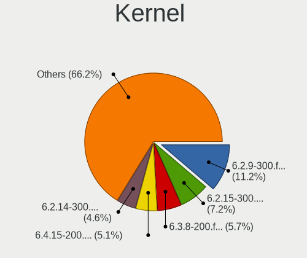
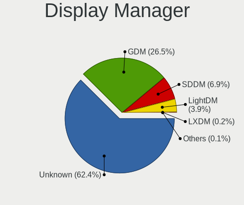
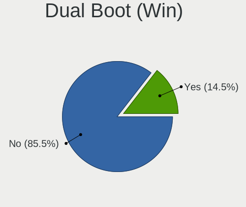
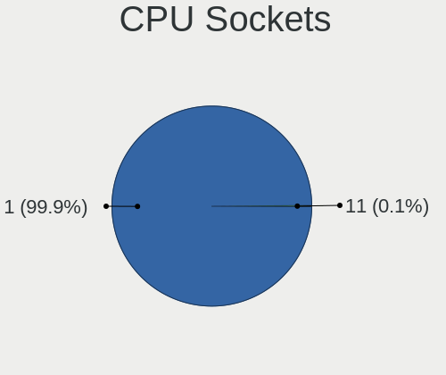
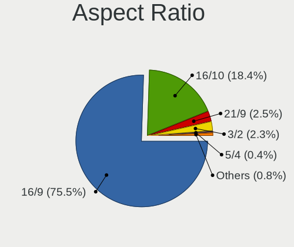
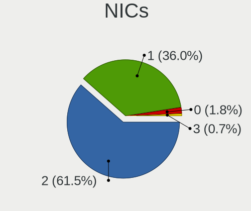
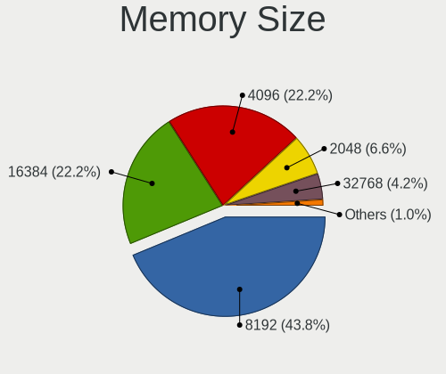

Fedora 38 - Tested Hardware & Statistics (Notebooks)
----------------------------------------------------

A project to collect tested hardware configurations for Fedora 38.

Anyone can contribute to this report by the [hw-probe](https://github.com/linuxhw/hw-probe) tool:

    sudo -E hw-probe -all -upload

Please contribute! Especially if your hardware is rare.

Contents
--------

* [ Test Cases ](#test-cases)

* [ System ](#system)
  - [ Kernel                   ](#kernel)
  - [ Kernel Family            ](#kernel-family)
  - [ Kernel Major Ver.        ](#kernel-major-ver)
  - [ Arch                     ](#arch)
  - [ DE                       ](#de)
  - [ Display Server           ](#display-server)
  - [ Display Manager          ](#display-manager)
  - [ OS Lang                  ](#os-lang)
  - [ Boot Mode                ](#boot-mode)
  - [ Filesystem               ](#filesystem)
  - [ Part. scheme             ](#part-scheme)
  - [ Dual Boot with Linux/BSD ](#dual-boot-with-linuxbsd)
  - [ Dual Boot (Win)          ](#dual-boot-win)

* [ Board ](#board)
  - [ Vendor                   ](#vendor)
  - [ Model                    ](#model)
  - [ Model Family             ](#model-family)
  - [ MFG Year                 ](#mfg-year)
  - [ Form Factor              ](#form-factor)
  - [ Secure Boot              ](#secure-boot)
  - [ Coreboot                 ](#coreboot)
  - [ RAM Size                 ](#ram-size)
  - [ RAM Used                 ](#ram-used)
  - [ Total Drives             ](#total-drives)
  - [ Has CD-ROM               ](#has-cd-rom)
  - [ Has Ethernet             ](#has-ethernet)
  - [ Has WiFi                 ](#has-wifi)
  - [ Has Bluetooth            ](#has-bluetooth)

* [ Location ](#location)
  - [ Country                  ](#country)
  - [ City                     ](#city)

* [ Drives ](#drives)
  - [ Drive Vendor             ](#drive-vendor)
  - [ Drive Model              ](#drive-model)
  - [ HDD Vendor               ](#hdd-vendor)
  - [ SSD Vendor               ](#ssd-vendor)
  - [ Drive Kind               ](#drive-kind)
  - [ Drive Connector          ](#drive-connector)
  - [ Drive Size               ](#drive-size)
  - [ Space Total              ](#space-total)
  - [ Space Used               ](#space-used)
  - [ Malfunc. Drives          ](#malfunc-drives)
  - [ Malfunc. Drive Vendor    ](#malfunc-drive-vendor)
  - [ Malfunc. HDD Vendor      ](#malfunc-hdd-vendor)
  - [ Malfunc. Drive Kind      ](#malfunc-drive-kind)
  - [ Failed Drives            ](#failed-drives)
  - [ Failed Drive Vendor      ](#failed-drive-vendor)
  - [ Drive Status             ](#drive-status)

* [ Storage controller ](#storage-controller)
  - [ Storage Vendor           ](#storage-vendor)
  - [ Storage Model            ](#storage-model)
  - [ Storage Kind             ](#storage-kind)

* [ Processor ](#processor)
  - [ CPU Vendor               ](#cpu-vendor)
  - [ CPU Model                ](#cpu-model)
  - [ CPU Model Family         ](#cpu-model-family)
  - [ CPU Cores                ](#cpu-cores)
  - [ CPU Sockets              ](#cpu-sockets)
  - [ CPU Threads              ](#cpu-threads)
  - [ CPU Op-Modes             ](#cpu-op-modes)
  - [ CPU Microcode            ](#cpu-microcode)
  - [ CPU Microarch            ](#cpu-microarch)

* [ Graphics ](#graphics)
  - [ GPU Vendor               ](#gpu-vendor)
  - [ GPU Model                ](#gpu-model)
  - [ GPU Combo                ](#gpu-combo)
  - [ GPU Driver               ](#gpu-driver)
  - [ GPU Memory               ](#gpu-memory)

* [ Monitor ](#monitor)
  - [ Monitor Vendor           ](#monitor-vendor)
  - [ Monitor Model            ](#monitor-model)
  - [ Monitor Resolution       ](#monitor-resolution)
  - [ Monitor Diagonal         ](#monitor-diagonal)
  - [ Monitor Width            ](#monitor-width)
  - [ Aspect Ratio             ](#aspect-ratio)
  - [ Monitor Area             ](#monitor-area)
  - [ Pixel Density            ](#pixel-density)
  - [ Multiple Monitors        ](#multiple-monitors)

* [ Network ](#network)
  - [ Net Controller Vendor    ](#net-controller-vendor)
  - [ Net Controller Model     ](#net-controller-model)
  - [ Wireless Vendor          ](#wireless-vendor)
  - [ Wireless Model           ](#wireless-model)
  - [ Ethernet Vendor          ](#ethernet-vendor)
  - [ Ethernet Model           ](#ethernet-model)
  - [ Net Controller Kind      ](#net-controller-kind)
  - [ Used Controller          ](#used-controller)
  - [ NICs                     ](#nics)
  - [ IPv6                     ](#ipv6)

* [ Bluetooth ](#bluetooth)
  - [ Bluetooth Vendor         ](#bluetooth-vendor)
  - [ Bluetooth Model          ](#bluetooth-model)

* [ Sound ](#sound)
  - [ Sound Vendor             ](#sound-vendor)
  - [ Sound Model              ](#sound-model)

* [ Memory ](#memory)
  - [ Memory Vendor            ](#memory-vendor)
  - [ Memory Model             ](#memory-model)
  - [ Memory Kind              ](#memory-kind)
  - [ Memory Form Factor       ](#memory-form-factor)
  - [ Memory Size              ](#memory-size)
  - [ Memory Speed             ](#memory-speed)

* [ Printers & scanners ](#printers--scanners)
  - [ Printer Vendor           ](#printer-vendor)
  - [ Printer Model            ](#printer-model)
  - [ Scanner Vendor           ](#scanner-vendor)
  - [ Scanner Model            ](#scanner-model)

* [ Camera ](#camera)
  - [ Camera Vendor            ](#camera-vendor)
  - [ Camera Model             ](#camera-model)

* [ Security ](#security)
  - [ Fingerprint Vendor       ](#fingerprint-vendor)
  - [ Fingerprint Model        ](#fingerprint-model)
  - [ Chipcard Vendor          ](#chipcard-vendor)
  - [ Chipcard Model           ](#chipcard-model)

* [ Unsupported ](#unsupported)
  - [ Unsupported Devices      ](#unsupported-devices)
  - [ Unsupported Device Types ](#unsupported-device-types)

Test Cases
----------

Total: 1931

| Vendor        | Model                       | Probe                                                      | Date         |
|---------------|-----------------------------|------------------------------------------------------------|--------------|
| Dell          | XPS 15 9500                 | [a8f95ea32d](https://linux-hardware.org/?probe=a8f95ea32d) | Oct 01, 2023 |
| ASUSTek       | ASUS TUF Gaming F15 FX50... | [34b8e1853b](https://linux-hardware.org/?probe=34b8e1853b) | Oct 01, 2023 |
| Toshiba       | Satellite L735              | [c969a72669](https://linux-hardware.org/?probe=c969a72669) | Oct 01, 2023 |
| Acer          | Predator PH16-71            | [a07278dc43](https://linux-hardware.org/?probe=a07278dc43) | Oct 01, 2023 |
| Dell          | Latitude 5520               | [024af71640](https://linux-hardware.org/?probe=024af71640) | Oct 01, 2023 |
| Apple         | MacBookPro9,2               | [124425b8b3](https://linux-hardware.org/?probe=124425b8b3) | Oct 01, 2023 |
| Dell          | Latitude E6420              | [55c45fb7cb](https://linux-hardware.org/?probe=55c45fb7cb) | Oct 01, 2023 |
| HP            | EliteBook 840 G8 Noteboo... | [30bf4415dc](https://linux-hardware.org/?probe=30bf4415dc) | Sep 30, 2023 |
| HUAWEI        | VLT-WX0                     | [a312a57d16](https://linux-hardware.org/?probe=a312a57d16) | Sep 30, 2023 |
| MSI           | Prestige 14H B12UCX         | [b3a006adc7](https://linux-hardware.org/?probe=b3a006adc7) | Sep 30, 2023 |
| MSI           | Prestige 14H B12UCX         | [1c1f35d1c8](https://linux-hardware.org/?probe=1c1f35d1c8) | Sep 30, 2023 |
| Dell          | Latitude 7280               | [dbe9d3e4be](https://linux-hardware.org/?probe=dbe9d3e4be) | Sep 30, 2023 |
| Toshiba       | PORTEGE R30-D               | [04ef694f1d](https://linux-hardware.org/?probe=04ef694f1d) | Sep 30, 2023 |
| ASUSTek       | ASUS EXPERTBOOK B1402CBA... | [91873a529a](https://linux-hardware.org/?probe=91873a529a) | Sep 30, 2023 |
| Lenovo        | ThinkPad T420 4180BV1       | [e81749053b](https://linux-hardware.org/?probe=e81749053b) | Sep 30, 2023 |
| Acer          | Aspire A514-53              | [6d8a5b1a13](https://linux-hardware.org/?probe=6d8a5b1a13) | Sep 30, 2023 |
| Lenovo        | IdeaPad 5 14ALC05 82LM      | [c1a605af33](https://linux-hardware.org/?probe=c1a605af33) | Sep 29, 2023 |
| ASUSTek       | ROG Strix G713QM_G713QM     | [ec1384a424](https://linux-hardware.org/?probe=ec1384a424) | Sep 29, 2023 |
| Razer         | Blade 15 Base Model (Lat... | [95dc405a73](https://linux-hardware.org/?probe=95dc405a73) | Sep 29, 2023 |
| HP            | Laptop 17-cn1xxx            | [051a233121](https://linux-hardware.org/?probe=051a233121) | Sep 29, 2023 |
| Lenovo        | ThinkPad L15 Gen 1 20U70... | [e51fd2a8e9](https://linux-hardware.org/?probe=e51fd2a8e9) | Sep 29, 2023 |
| ASUSTek       | ROG Strix G713QM_G713QM     | [d958b4e16a](https://linux-hardware.org/?probe=d958b4e16a) | Sep 29, 2023 |
| HP            | EliteBook 745 G5            | [b734ec49e2](https://linux-hardware.org/?probe=b734ec49e2) | Sep 29, 2023 |
| HP            | EliteBook 840 G6            | [e57cdefe7a](https://linux-hardware.org/?probe=e57cdefe7a) | Sep 29, 2023 |
| HUAWEI        | HVY-WXX9                    | [713d59f3d0](https://linux-hardware.org/?probe=713d59f3d0) | Sep 29, 2023 |
| HUAWEI        | HVY-WXX9                    | [c434f30a15](https://linux-hardware.org/?probe=c434f30a15) | Sep 29, 2023 |
| Lenovo        | IdeaPad 3 14IML05 81WA      | [d95e370c54](https://linux-hardware.org/?probe=d95e370c54) | Sep 29, 2023 |
| ASUSTek       | ASUS TUF Dash F15 FX516P... | [4cef8be854](https://linux-hardware.org/?probe=4cef8be854) | Sep 28, 2023 |
| HP            | EliteBook 840 G2            | [bec979fcd0](https://linux-hardware.org/?probe=bec979fcd0) | Sep 28, 2023 |
| Lenovo        | ThinkPad E14 Gen 4 21E3S... | [356b5f053d](https://linux-hardware.org/?probe=356b5f053d) | Sep 28, 2023 |
| HP            | EliteBook 840 G6            | [5b87382fce](https://linux-hardware.org/?probe=5b87382fce) | Sep 28, 2023 |
| Lenovo        | ThinkPad P51 20HHCTO1WW     | [64a85b8eb3](https://linux-hardware.org/?probe=64a85b8eb3) | Sep 28, 2023 |
| Lenovo        | ThinkPad T495 20NJ000XGE    | [737b3910bb](https://linux-hardware.org/?probe=737b3910bb) | Sep 28, 2023 |
| Lenovo        | ThinkPad T495 20NJ000XGE    | [b064b5b9ca](https://linux-hardware.org/?probe=b064b5b9ca) | Sep 28, 2023 |
| HP            | Notebook                    | [b13debd2fa](https://linux-hardware.org/?probe=b13debd2fa) | Sep 27, 2023 |
| Dell          | Latitude 7490               | [6f5e4547fa](https://linux-hardware.org/?probe=6f5e4547fa) | Sep 27, 2023 |
| Lenovo        | ThinkPad X1 Carbon 7th 2... | [a95feaee78](https://linux-hardware.org/?probe=a95feaee78) | Sep 27, 2023 |
| Framework     | Laptop                      | [2a65b0dff2](https://linux-hardware.org/?probe=2a65b0dff2) | Sep 27, 2023 |
| Acer          | Predator G3-571             | [f301a514ad](https://linux-hardware.org/?probe=f301a514ad) | Sep 27, 2023 |
| Samsung       | 550XDA                      | [ab1fabfe9b](https://linux-hardware.org/?probe=ab1fabfe9b) | Sep 27, 2023 |
| Chuwi         | CoreBook X                  | [0c31a47880](https://linux-hardware.org/?probe=0c31a47880) | Sep 27, 2023 |
| Notebook      | PCx0Dx                      | [53dd8cbd0d](https://linux-hardware.org/?probe=53dd8cbd0d) | Sep 27, 2023 |
| Lenovo        | ThinkPad T410 2522PT3       | [fed9f17a22](https://linux-hardware.org/?probe=fed9f17a22) | Sep 27, 2023 |
| Acer          | Predator G3-571             | [06b0300670](https://linux-hardware.org/?probe=06b0300670) | Sep 27, 2023 |
| Lenovo        | ThinkPad T410 2522PT3       | [0dd1b47aa0](https://linux-hardware.org/?probe=0dd1b47aa0) | Sep 27, 2023 |
| Dell          | Latitude E7450              | [afa1cce666](https://linux-hardware.org/?probe=afa1cce666) | Sep 27, 2023 |
| Dell          | Latitude 5420               | [4f890f283a](https://linux-hardware.org/?probe=4f890f283a) | Sep 26, 2023 |
| Dell          | Latitude 7490               | [8bb2e054ec](https://linux-hardware.org/?probe=8bb2e054ec) | Sep 26, 2023 |
| Dell          | G15 5520                    | [64cfeba3ee](https://linux-hardware.org/?probe=64cfeba3ee) | Sep 26, 2023 |
| Dell          | Latitude 5420               | [3a22857022](https://linux-hardware.org/?probe=3a22857022) | Sep 26, 2023 |
| HP            | Laptop 14s-dq2xxx           | [424e7e3d87](https://linux-hardware.org/?probe=424e7e3d87) | Sep 26, 2023 |
| Lenovo        | IdeaPad 3 15ITL6 82H8       | [dd48e0075b](https://linux-hardware.org/?probe=dd48e0075b) | Sep 26, 2023 |
| Lenovo        | ThinkPad T14 Gen 4 21HD0... | [35e9d35a69](https://linux-hardware.org/?probe=35e9d35a69) | Sep 26, 2023 |
| Lenovo        | ThinkPad P15 Gen 2i 20YQ... | [dc762f9ae6](https://linux-hardware.org/?probe=dc762f9ae6) | Sep 26, 2023 |
| Lenovo        | ThinkPad T490s 20NX003NR... | [0a38f1e9a4](https://linux-hardware.org/?probe=0a38f1e9a4) | Sep 26, 2023 |
| ASUSTek       | VivoBook_ASUSLaptop K350... | [14766bbd15](https://linux-hardware.org/?probe=14766bbd15) | Sep 26, 2023 |
| ASUSTek       | ASUS TUF Gaming F15 FX50... | [7c547aa37a](https://linux-hardware.org/?probe=7c547aa37a) | Sep 26, 2023 |
| Lenovo        | IdeaPad Slim 5 16IRL8 82... | [b22a584cea](https://linux-hardware.org/?probe=b22a584cea) | Sep 26, 2023 |
| Lenovo        | IdeaPad 5 14ALC05 82LM      | [73d2dae51c](https://linux-hardware.org/?probe=73d2dae51c) | Sep 26, 2023 |
| Lenovo        | Z50-70 20354                | [ccdfae441b](https://linux-hardware.org/?probe=ccdfae441b) | Sep 26, 2023 |
| Lenovo        | ThinkBook 15 G2 ARE 20VG    | [37fdb062e1](https://linux-hardware.org/?probe=37fdb062e1) | Sep 26, 2023 |
| Apple         | MacBookPro10,1              | [1c1268d4e0](https://linux-hardware.org/?probe=1c1268d4e0) | Sep 25, 2023 |
| Apple         | MacBookPro10,1              | [4fbb517b71](https://linux-hardware.org/?probe=4fbb517b71) | Sep 25, 2023 |
| HP            | EliteBook 840 G3            | [4e0f83e1fe](https://linux-hardware.org/?probe=4e0f83e1fe) | Sep 25, 2023 |
| HP            | EliteBook 840 G3            | [60ff167d14](https://linux-hardware.org/?probe=60ff167d14) | Sep 25, 2023 |
| System76      | Pangolin                    | [3c56c50463](https://linux-hardware.org/?probe=3c56c50463) | Sep 25, 2023 |
| Acer          | Aspire V3-571G              | [6b5dcea023](https://linux-hardware.org/?probe=6b5dcea023) | Sep 25, 2023 |
| Dell          | Latitude E7270              | [98dd5eefb6](https://linux-hardware.org/?probe=98dd5eefb6) | Sep 25, 2023 |
| HP            | 255 G8 Notebook PC          | [91c3333a18](https://linux-hardware.org/?probe=91c3333a18) | Sep 25, 2023 |
| Lenovo        | ThinkPad P14s Gen 2a 21A... | [9a24a19f6e](https://linux-hardware.org/?probe=9a24a19f6e) | Sep 25, 2023 |
| HP            | ProBook 6570b               | [a67981aa91](https://linux-hardware.org/?probe=a67981aa91) | Sep 25, 2023 |
| Lenovo        | ThinkPad E14 Gen 4 21EB0... | [88385cbacc](https://linux-hardware.org/?probe=88385cbacc) | Sep 25, 2023 |
| Dell          | XPS 13 9310                 | [4233a2e5e3](https://linux-hardware.org/?probe=4233a2e5e3) | Sep 25, 2023 |
| Dell          | XPS 13 9380                 | [705c3fdeff](https://linux-hardware.org/?probe=705c3fdeff) | Sep 25, 2023 |
| MSI           | GL65 Leopard 10SER          | [e97a8fa2c7](https://linux-hardware.org/?probe=e97a8fa2c7) | Sep 25, 2023 |
| HP            | 250 G6 Notebook PC          | [88ce9be8a1](https://linux-hardware.org/?probe=88ce9be8a1) | Sep 24, 2023 |
| MSI           | GL65 Leopard 10SER          | [fac92f385c](https://linux-hardware.org/?probe=fac92f385c) | Sep 24, 2023 |
| Lenovo        | IdeaPad 5 14ALC05 82LM      | [0531db8cb8](https://linux-hardware.org/?probe=0531db8cb8) | Sep 24, 2023 |
| Acer          | TravelMate P259-MG          | [26ca7317b2](https://linux-hardware.org/?probe=26ca7317b2) | Sep 24, 2023 |
| Lenovo        | ThinkPad P15v Gen 3 21D8... | [408377c3fd](https://linux-hardware.org/?probe=408377c3fd) | Sep 24, 2023 |
| Apple         | MacBookPro8,2               | [cba55a15ec](https://linux-hardware.org/?probe=cba55a15ec) | Sep 24, 2023 |
| Dell          | Latitude 7400               | [f537b79d15](https://linux-hardware.org/?probe=f537b79d15) | Sep 24, 2023 |
| Lenovo        | V14-ARE 82DQ                | [31a635bff8](https://linux-hardware.org/?probe=31a635bff8) | Sep 24, 2023 |
| HP            | Laptop 15s-eq2xxx           | [72940bf53e](https://linux-hardware.org/?probe=72940bf53e) | Sep 24, 2023 |
| HP            | 350 G2                      | [8440938e22](https://linux-hardware.org/?probe=8440938e22) | Sep 24, 2023 |
| Lenovo        | IdeaPad 5 14ALC05 82LM      | [01b1c1acdb](https://linux-hardware.org/?probe=01b1c1acdb) | Sep 24, 2023 |
| ASUSTek       | VivoBook_ASUSLaptop X513... | [fc14083064](https://linux-hardware.org/?probe=fc14083064) | Sep 24, 2023 |
| ASUSTek       | VivoBook_ASUSLaptop X513... | [acba7de2ec](https://linux-hardware.org/?probe=acba7de2ec) | Sep 24, 2023 |
| HP            | 255 15.6 inch G10           | [9f02426c5d](https://linux-hardware.org/?probe=9f02426c5d) | Sep 23, 2023 |
| Apple         | MacBookPro10,1              | [18b2a7026b](https://linux-hardware.org/?probe=18b2a7026b) | Sep 23, 2023 |
| Apple         | MacBookPro10,1              | [60f81eeb50](https://linux-hardware.org/?probe=60f81eeb50) | Sep 23, 2023 |
| Lenovo        | ThinkPad T550 20CK0002MZ    | [a34763914d](https://linux-hardware.org/?probe=a34763914d) | Sep 23, 2023 |
| HP            | Pavilion dv6                | [bd8ae0385b](https://linux-hardware.org/?probe=bd8ae0385b) | Sep 23, 2023 |
| Dell          | Latitude 7280               | [1d032535e1](https://linux-hardware.org/?probe=1d032535e1) | Sep 23, 2023 |
| HP            | Pavilion Gaming Laptop 1... | [a6ff891fa1](https://linux-hardware.org/?probe=a6ff891fa1) | Sep 23, 2023 |
| Casper        | NIRVANA NB F500             | [1f66f22544](https://linux-hardware.org/?probe=1f66f22544) | Sep 23, 2023 |
| Lenovo        | ThinkPad E15 20RD0011UK     | [d464d79df3](https://linux-hardware.org/?probe=d464d79df3) | Sep 23, 2023 |
| HP            | ENVY Laptop 13-ad1xx        | [11ce4105e1](https://linux-hardware.org/?probe=11ce4105e1) | Sep 23, 2023 |
| Lenovo        | ThinkPad L570 W10DG 20JR... | [b96887841e](https://linux-hardware.org/?probe=b96887841e) | Sep 23, 2023 |
| Toshiba       | Satellite C70-B             | [904a43b77e](https://linux-hardware.org/?probe=904a43b77e) | Sep 23, 2023 |
| Lenovo        | ThinkPad P15 Gen 2i 20YR... | [6a6fde2ca9](https://linux-hardware.org/?probe=6a6fde2ca9) | Sep 23, 2023 |
| Toshiba       | Satellite C70-B             | [eedf248084](https://linux-hardware.org/?probe=eedf248084) | Sep 23, 2023 |
| Acer          | Aspire ES1-520              | [22ce921c1e](https://linux-hardware.org/?probe=22ce921c1e) | Sep 22, 2023 |
| Lenovo        | ThinkPad L570 W10DG 20JR... | [535d4769c8](https://linux-hardware.org/?probe=535d4769c8) | Sep 22, 2023 |
| Acer          | Aspire A715-51G             | [674c086aa5](https://linux-hardware.org/?probe=674c086aa5) | Sep 22, 2023 |
| Apple         | MacBookPro11,1              | [169fe58269](https://linux-hardware.org/?probe=169fe58269) | Sep 22, 2023 |
| Apple         | MacBookPro14,1              | [8b1188ba33](https://linux-hardware.org/?probe=8b1188ba33) | Sep 22, 2023 |
| HUAWEI        | BOD-WXX9                    | [909efbf81b](https://linux-hardware.org/?probe=909efbf81b) | Sep 22, 2023 |
| Dell          | Latitude 5420               | [d9c1c1537f](https://linux-hardware.org/?probe=d9c1c1537f) | Sep 22, 2023 |
| Lenovo        | IdeaPad 3 15ITL6 82H8       | [7b093ed910](https://linux-hardware.org/?probe=7b093ed910) | Sep 22, 2023 |
| HP            | EliteBook 840 G5 NOTEBOO... | [0e85445e8e](https://linux-hardware.org/?probe=0e85445e8e) | Sep 21, 2023 |
| HP            | EliteBook 840 G5 NOTEBOO... | [3a372bed63](https://linux-hardware.org/?probe=3a372bed63) | Sep 21, 2023 |
| Lenovo        | Slim 7 14IRP8 83A4          | [b1ccf59045](https://linux-hardware.org/?probe=b1ccf59045) | Sep 21, 2023 |
| HP            | Pavilion dv6                | [270b0c0878](https://linux-hardware.org/?probe=270b0c0878) | Sep 21, 2023 |
| ASUSTek       | Vivobook Go E1504FA_E150... | [3cd9b7841a](https://linux-hardware.org/?probe=3cd9b7841a) | Sep 21, 2023 |
| Lenovo        | Mullins-LarneML             | [56157a1cff](https://linux-hardware.org/?probe=56157a1cff) | Sep 21, 2023 |
| Samsung       | R530/R730/R540              | [658ca13022](https://linux-hardware.org/?probe=658ca13022) | Sep 21, 2023 |
| Samsung       | 550XBE/350XBE               | [522d50a437](https://linux-hardware.org/?probe=522d50a437) | Sep 21, 2023 |
| HP            | Pavilion g6                 | [11c60c8645](https://linux-hardware.org/?probe=11c60c8645) | Sep 21, 2023 |
| Dell          | Vostro 1310                 | [bc0c23c23c](https://linux-hardware.org/?probe=bc0c23c23c) | Sep 21, 2023 |
| Dell          | XPS 15 9520                 | [2bb7ed1454](https://linux-hardware.org/?probe=2bb7ed1454) | Sep 21, 2023 |
| HP            | 250 G7 Notebook PC          | [a2a2bc81e9](https://linux-hardware.org/?probe=a2a2bc81e9) | Sep 20, 2023 |
| HP            | ProBook 450 15.6 inch G9... | [b4f1770e14](https://linux-hardware.org/?probe=b4f1770e14) | Sep 20, 2023 |
| Lenovo        | IdeaPad 130-15IKB 81H7      | [ddf1d6a712](https://linux-hardware.org/?probe=ddf1d6a712) | Sep 20, 2023 |
| MSI           | Prestige 14 A10SC           | [6f81167a6c](https://linux-hardware.org/?probe=6f81167a6c) | Sep 20, 2023 |
| ASUSTek       | ZenBook UX333FA_UX333FA     | [7377101d6d](https://linux-hardware.org/?probe=7377101d6d) | Sep 20, 2023 |
| HP            | ProBook 450 15.6 inch G9... | [79111191a0](https://linux-hardware.org/?probe=79111191a0) | Sep 20, 2023 |
| MSI           | Prestige 14 A10SC           | [e0ee68b1a7](https://linux-hardware.org/?probe=e0ee68b1a7) | Sep 20, 2023 |
| TUXEDO        | P65_P67RGRERA               | [97bae35595](https://linux-hardware.org/?probe=97bae35595) | Sep 20, 2023 |
| TUXEDO        | P65_P67RGRERA               | [0aefa5e3c6](https://linux-hardware.org/?probe=0aefa5e3c6) | Sep 20, 2023 |
| Apple         | MacBook4,1                  | [3434dd8b54](https://linux-hardware.org/?probe=3434dd8b54) | Sep 20, 2023 |
| Samsung       | NC210/NC110                 | [1e194a2568](https://linux-hardware.org/?probe=1e194a2568) | Sep 20, 2023 |
| ASUSTek       | Zenbook 15 UM3504DA_UM35... | [27002ca3a9](https://linux-hardware.org/?probe=27002ca3a9) | Sep 20, 2023 |
| Timi          | Xiaomi Book Pro 16 2022     | [94e8c710d5](https://linux-hardware.org/?probe=94e8c710d5) | Sep 20, 2023 |
| Acer          | Aspire A515-56              | [bb52b1ddc5](https://linux-hardware.org/?probe=bb52b1ddc5) | Sep 20, 2023 |
| Samsung       | 960XFH                      | [c25c858bd4](https://linux-hardware.org/?probe=c25c858bd4) | Sep 19, 2023 |
| Maibenben     | MaiBook M Series            | [dc2eb7a7d7](https://linux-hardware.org/?probe=dc2eb7a7d7) | Sep 19, 2023 |
| Apple         | MacBookAir7,2               | [6edec4d045](https://linux-hardware.org/?probe=6edec4d045) | Sep 19, 2023 |
| Lenovo        | IdeaPad Gaming 3 15IAH7 ... | [ca0ad87f0b](https://linux-hardware.org/?probe=ca0ad87f0b) | Sep 19, 2023 |
| HP            | Pavilion Laptop 15-eg3xx... | [aeffbe0fe5](https://linux-hardware.org/?probe=aeffbe0fe5) | Sep 19, 2023 |
| Lenovo        | ThinkPad W540 20BG0014US    | [2d1c5101ea](https://linux-hardware.org/?probe=2d1c5101ea) | Sep 19, 2023 |
| HP            | ProBook 6475b               | [43c4870e11](https://linux-hardware.org/?probe=43c4870e11) | Sep 19, 2023 |
| ASUSTek       | Zenbook UM3402YA_UM3402Y... | [f9e5656f54](https://linux-hardware.org/?probe=f9e5656f54) | Sep 19, 2023 |
| Lenovo        | ThinkPad X240 20AMS1WN0A    | [858aed6617](https://linux-hardware.org/?probe=858aed6617) | Sep 19, 2023 |
| Dell          | Precision 3581              | [e1c8eb2810](https://linux-hardware.org/?probe=e1c8eb2810) | Sep 18, 2023 |
| Dell          | Inspiron 5480               | [51aca22643](https://linux-hardware.org/?probe=51aca22643) | Sep 18, 2023 |
| HP            | ProBook 445 G8 Notebook ... | [4d986c5384](https://linux-hardware.org/?probe=4d986c5384) | Sep 18, 2023 |
| Dell          | Latitude 5490               | [94eb709dfc](https://linux-hardware.org/?probe=94eb709dfc) | Sep 18, 2023 |
| MSI           | Katana GF76 11UD            | [f797b137a3](https://linux-hardware.org/?probe=f797b137a3) | Sep 18, 2023 |
| Acer          | Aspire 5755G                | [f58cf1f72d](https://linux-hardware.org/?probe=f58cf1f72d) | Sep 18, 2023 |
| Acer          | Aspire 5755G                | [68cef2242a](https://linux-hardware.org/?probe=68cef2242a) | Sep 18, 2023 |
| HUAWEI        | KLVDZ-WXX9                  | [a4964c1b7a](https://linux-hardware.org/?probe=a4964c1b7a) | Sep 18, 2023 |
| HP            | EliteBook 745 G2            | [7e5ee5a990](https://linux-hardware.org/?probe=7e5ee5a990) | Sep 18, 2023 |
| Lenovo        | ThinkPad T480 20L6SCYF0P    | [c406bf7b56](https://linux-hardware.org/?probe=c406bf7b56) | Sep 18, 2023 |
| Lenovo        | G50-30 80G0                 | [fa9bd484cd](https://linux-hardware.org/?probe=fa9bd484cd) | Sep 17, 2023 |
| Lenovo        | G400 20235                  | [bd7a7a6f22](https://linux-hardware.org/?probe=bd7a7a6f22) | Sep 17, 2023 |
| Lenovo        | G400 20235                  | [c8ecd1e0c9](https://linux-hardware.org/?probe=c8ecd1e0c9) | Sep 17, 2023 |
| Timi          | Xiaomi Book Pro 16 2022     | [290f6c66d1](https://linux-hardware.org/?probe=290f6c66d1) | Sep 17, 2023 |
| Dell          | XPS 15 9520                 | [2b66c2969e](https://linux-hardware.org/?probe=2b66c2969e) | Sep 17, 2023 |
| HP            | Pavilion g6                 | [dd1ade8736](https://linux-hardware.org/?probe=dd1ade8736) | Sep 17, 2023 |
| ASUSTek       | ROG Zephyrus G14 GA402XY... | [93d01648a0](https://linux-hardware.org/?probe=93d01648a0) | Sep 17, 2023 |
| Dell          | Inspiron 1464               | [9830a0345b](https://linux-hardware.org/?probe=9830a0345b) | Sep 17, 2023 |
| Lenovo        | ThinkPad T460 20FN002JUS    | [21b0d9faff](https://linux-hardware.org/?probe=21b0d9faff) | Sep 17, 2023 |
| MSI           | Modern 14 B4MW              | [83a224edea](https://linux-hardware.org/?probe=83a224edea) | Sep 17, 2023 |
| Dell          | Inspiron 5566               | [56f2d4d1eb](https://linux-hardware.org/?probe=56f2d4d1eb) | Sep 17, 2023 |
| ASUSTek       | VivoBook_ASUSLaptop M350... | [3bb8e84b6b](https://linux-hardware.org/?probe=3bb8e84b6b) | Sep 17, 2023 |
| Lenovo        | Legion 5 15ARH05H 82B1      | [a53b964a47](https://linux-hardware.org/?probe=a53b964a47) | Sep 17, 2023 |
| Lenovo        | Legion 5 15ARH05H 82B1      | [648af5d937](https://linux-hardware.org/?probe=648af5d937) | Sep 17, 2023 |
| ASUSTek       | Zenbook 15 UM3504DA_UM35... | [77a72808f7](https://linux-hardware.org/?probe=77a72808f7) | Sep 17, 2023 |
| HP            | 250 G1                      | [0e052c1de2](https://linux-hardware.org/?probe=0e052c1de2) | Sep 17, 2023 |
| Lenovo        | IdeaPad Gaming 3 15IAH7 ... | [bf532ab6ec](https://linux-hardware.org/?probe=bf532ab6ec) | Sep 16, 2023 |
| HP            | EliteBook 820 G4            | [a16a2ef714](https://linux-hardware.org/?probe=a16a2ef714) | Sep 16, 2023 |
| MSI           | Modern 14 B4MW              | [06e45359c0](https://linux-hardware.org/?probe=06e45359c0) | Sep 16, 2023 |
| Lenovo        | Legion 5-15IMH05H 81Y6      | [1b2e11b609](https://linux-hardware.org/?probe=1b2e11b609) | Sep 16, 2023 |
| Lenovo        | IdeaPad Z500 5931           | [0986123aac](https://linux-hardware.org/?probe=0986123aac) | Sep 16, 2023 |
| Lenovo        | ThinkPad T14s Gen 4 21F7... | [2c90700f4f](https://linux-hardware.org/?probe=2c90700f4f) | Sep 16, 2023 |
| HP            | Laptop 14s-dq2xxx           | [12456f4694](https://linux-hardware.org/?probe=12456f4694) | Sep 16, 2023 |
| Dell          | XPS 9320                    | [99fce2103f](https://linux-hardware.org/?probe=99fce2103f) | Sep 16, 2023 |
| ASUSTek       | TUF Gaming B550-PLUS        | [a5c073ca7a](https://linux-hardware.org/?probe=a5c073ca7a) | Sep 16, 2023 |
| ASUSTek       | ROG Strix G513RM_G513RM     | [2085bafc62](https://linux-hardware.org/?probe=2085bafc62) | Sep 16, 2023 |
| Acer          | TravelMate 5335             | [d440c12063](https://linux-hardware.org/?probe=d440c12063) | Sep 16, 2023 |
| Dell          | XPS L501X                   | [13d0075027](https://linux-hardware.org/?probe=13d0075027) | Sep 16, 2023 |
| Dell          | Inspiron M5010              | [c78ab23cc7](https://linux-hardware.org/?probe=c78ab23cc7) | Sep 16, 2023 |
| Framework     | Laptop (12th Gen Intel C... | [ec3d359099](https://linux-hardware.org/?probe=ec3d359099) | Sep 15, 2023 |
| ASUSTek       | Zenbook 15 UM3504DA_UM35... | [fa207e873a](https://linux-hardware.org/?probe=fa207e873a) | Sep 15, 2023 |
| Lenovo        | G550 20023                  | [054463900e](https://linux-hardware.org/?probe=054463900e) | Sep 15, 2023 |
| Lenovo        | V15 G2 ALC 82KD             | [b76ae8f9db](https://linux-hardware.org/?probe=b76ae8f9db) | Sep 15, 2023 |
| Lenovo        | G550 20023                  | [cdc9163353](https://linux-hardware.org/?probe=cdc9163353) | Sep 15, 2023 |
| Timi          | Mi NoteBook Ultra           | [1c5a009557](https://linux-hardware.org/?probe=1c5a009557) | Sep 15, 2023 |
| Lenovo        | Legion Pro 7 16IRX8 82WR    | [951dc3d5b0](https://linux-hardware.org/?probe=951dc3d5b0) | Sep 15, 2023 |
| HP            | EliteBook Folio 9470m       | [4a598eb0b3](https://linux-hardware.org/?probe=4a598eb0b3) | Sep 15, 2023 |
| Acer          | Swift SF314-43              | [ae2f1fa903](https://linux-hardware.org/?probe=ae2f1fa903) | Sep 15, 2023 |
| Lenovo        | ThinkPad X1 Carbon 6th 2... | [982f29b6cc](https://linux-hardware.org/?probe=982f29b6cc) | Sep 14, 2023 |
| Fujitsu       | LIFEBOOK A357               | [a02233b901](https://linux-hardware.org/?probe=a02233b901) | Sep 14, 2023 |
| Lenovo        | ThinkPad P1 Gen 3 20TJS5... | [934dc9c297](https://linux-hardware.org/?probe=934dc9c297) | Sep 14, 2023 |
| Apple         | MacBookPro9,2               | [37e1d06001](https://linux-hardware.org/?probe=37e1d06001) | Sep 14, 2023 |
| Acer          | Swift SF314-42              | [d907642716](https://linux-hardware.org/?probe=d907642716) | Sep 14, 2023 |
| Samsung       | 300E4A/300E5A/300E7A/343... | [426914b6e5](https://linux-hardware.org/?probe=426914b6e5) | Sep 14, 2023 |
| ASUSTek       | Zenbook 15 UM3504DA_UM35... | [756eff685a](https://linux-hardware.org/?probe=756eff685a) | Sep 14, 2023 |
| System76      | Darter Pro                  | [78c45153a3](https://linux-hardware.org/?probe=78c45153a3) | Sep 14, 2023 |
| Samsung       | 300E4A/300E5A/300E7A/343... | [820a13876a](https://linux-hardware.org/?probe=820a13876a) | Sep 14, 2023 |
| Dell          | Latitude 7390               | [4d8e0cb72b](https://linux-hardware.org/?probe=4d8e0cb72b) | Sep 14, 2023 |
| HP            | Pavilion 13 x360 PC         | [58de71a548](https://linux-hardware.org/?probe=58de71a548) | Sep 14, 2023 |
| Toshiba       | PORTEGE M750                | [1c3442d87f](https://linux-hardware.org/?probe=1c3442d87f) | Sep 14, 2023 |
| ASUSTek       | VivoBook_ASUSLaptop X712... | [9ace0dfae8](https://linux-hardware.org/?probe=9ace0dfae8) | Sep 14, 2023 |
| ASUSTek       | ROG Strix G713PI_G713PI     | [d61823257e](https://linux-hardware.org/?probe=d61823257e) | Sep 13, 2023 |
| Dell          | Latitude 5421               | [6942c0131d](https://linux-hardware.org/?probe=6942c0131d) | Sep 13, 2023 |
| ASUSTek       | ASUS EXPERTBOOK B9400CEA... | [cb29d8cb77](https://linux-hardware.org/?probe=cb29d8cb77) | Sep 13, 2023 |
| Dell          | Latitude 7390               | [2afdbd653c](https://linux-hardware.org/?probe=2afdbd653c) | Sep 13, 2023 |
| Fujitsu       | LIFEBOOK UH554              | [92f2e6135e](https://linux-hardware.org/?probe=92f2e6135e) | Sep 13, 2023 |
| Dell          | Inspiron 5566               | [6c9eaad10e](https://linux-hardware.org/?probe=6c9eaad10e) | Sep 13, 2023 |
| Dell          | Inspiron 5558               | [046d28d32d](https://linux-hardware.org/?probe=046d28d32d) | Sep 13, 2023 |
| Lenovo        | ThinkPad X1 Carbon Gen 1... | [0918609cf3](https://linux-hardware.org/?probe=0918609cf3) | Sep 13, 2023 |
| Apple         | MacBookPro9,2               | [e8b1e251a3](https://linux-hardware.org/?probe=e8b1e251a3) | Sep 13, 2023 |
| ASUSTek       | ZenBook UX325EA_UX325EA     | [0317b3bcf6](https://linux-hardware.org/?probe=0317b3bcf6) | Sep 13, 2023 |
| ASUSTek       | ZenBook UX325EA_UX325EA     | [37f8406bab](https://linux-hardware.org/?probe=37f8406bab) | Sep 13, 2023 |
| Lenovo        | IdeaPad Slim 3 15AMN8 82... | [fcac50bfba](https://linux-hardware.org/?probe=fcac50bfba) | Sep 13, 2023 |
| Lenovo        | IdeaPad 5 Pro 14ARH7 82S... | [52a1dc1e19](https://linux-hardware.org/?probe=52a1dc1e19) | Sep 12, 2023 |
| ASUSTek       | K53SK                       | [5dcbdaa6d7](https://linux-hardware.org/?probe=5dcbdaa6d7) | Sep 12, 2023 |
| ASUSTek       | X550JK                      | [0965a776b0](https://linux-hardware.org/?probe=0965a776b0) | Sep 12, 2023 |
| ASUSTek       | TUF Gaming FX505GD_FX505... | [d1d5edf95c](https://linux-hardware.org/?probe=d1d5edf95c) | Sep 12, 2023 |
| Lenovo        | ThinkPad E15 Gen 4 21EES... | [b11bc1c28f](https://linux-hardware.org/?probe=b11bc1c28f) | Sep 12, 2023 |
| ASUSTek       | X550JK                      | [00a34c8719](https://linux-hardware.org/?probe=00a34c8719) | Sep 12, 2023 |
| Lenovo        | ThinkPad E15 Gen 2 20TD0... | [3ef24a5b48](https://linux-hardware.org/?probe=3ef24a5b48) | Sep 12, 2023 |
| Lenovo        | ThinkPad P1 Gen 3 20TJS2... | [4715a2425e](https://linux-hardware.org/?probe=4715a2425e) | Sep 12, 2023 |
| Apple         | MacBookPro9,2               | [77db8877eb](https://linux-hardware.org/?probe=77db8877eb) | Sep 12, 2023 |
| ASUSTek       | VivoBook_ASUSLaptop X571... | [564a2ea72e](https://linux-hardware.org/?probe=564a2ea72e) | Sep 12, 2023 |
| ASUSTek       | VivoBook_ASUSLaptop X150... | [58b852c7cb](https://linux-hardware.org/?probe=58b852c7cb) | Sep 12, 2023 |
| ASUSTek       | VivoBook_ASUSLaptop X150... | [10ff64dcf5](https://linux-hardware.org/?probe=10ff64dcf5) | Sep 12, 2023 |
| HP            | Laptop 15-dy5xxx            | [20ff9ece53](https://linux-hardware.org/?probe=20ff9ece53) | Sep 12, 2023 |
| Lenovo        | G770 20089                  | [39c8088b09](https://linux-hardware.org/?probe=39c8088b09) | Sep 12, 2023 |
| Apple         | MacBookAir6,2               | [e71b5644ea](https://linux-hardware.org/?probe=e71b5644ea) | Sep 12, 2023 |
| Dell          | XPS L521X                   | [d9e9a65142](https://linux-hardware.org/?probe=d9e9a65142) | Sep 12, 2023 |
| Positivo      | S14CT01                     | [57ed555d4b](https://linux-hardware.org/?probe=57ed555d4b) | Sep 11, 2023 |
| Lenovo        | Legion 5 Pro 16ACH6H 82J... | [84f6190c40](https://linux-hardware.org/?probe=84f6190c40) | Sep 11, 2023 |
| HUAWEI        | MACHC-WAX9                  | [3cafef18bf](https://linux-hardware.org/?probe=3cafef18bf) | Sep 11, 2023 |
| Dell          | XPS L322X                   | [77135f7967](https://linux-hardware.org/?probe=77135f7967) | Sep 11, 2023 |
| Dell          | Inspiron M5010              | [70147b0015](https://linux-hardware.org/?probe=70147b0015) | Sep 11, 2023 |
| ASUSTek       | VivoBook_ASUSLaptop X340... | [d4178bc91c](https://linux-hardware.org/?probe=d4178bc91c) | Sep 11, 2023 |
| HP            | ProBook 645 G1              | [ced1631b20](https://linux-hardware.org/?probe=ced1631b20) | Sep 11, 2023 |
| ASUSTek       | X505BA                      | [cbb45a815f](https://linux-hardware.org/?probe=cbb45a815f) | Sep 11, 2023 |
| Dell          | XPS L322X                   | [fdf4ba47e1](https://linux-hardware.org/?probe=fdf4ba47e1) | Sep 11, 2023 |
| HP            | EliteBook 2570p             | [6259de24be](https://linux-hardware.org/?probe=6259de24be) | Sep 11, 2023 |
| Samsung       | 530XBB                      | [f6039477c2](https://linux-hardware.org/?probe=f6039477c2) | Sep 11, 2023 |
| Dell          | Inspiron 7548               | [0259762efc](https://linux-hardware.org/?probe=0259762efc) | Sep 11, 2023 |
| HP            | OMEN by Laptop 15-dc0xxx    | [38a80416eb](https://linux-hardware.org/?probe=38a80416eb) | Sep 10, 2023 |
| HP            | ProBook 645 G1              | [e78c297114](https://linux-hardware.org/?probe=e78c297114) | Sep 10, 2023 |
| Lenovo        | ThinkPad T480s 20L8S6RF0... | [6c62d111db](https://linux-hardware.org/?probe=6c62d111db) | Sep 10, 2023 |
| Acer          | Aspire 5742G                | [8dc4477486](https://linux-hardware.org/?probe=8dc4477486) | Sep 10, 2023 |
| Acer          | Aspire 5742G                | [e737851117](https://linux-hardware.org/?probe=e737851117) | Sep 10, 2023 |
| Apple         | MacBookPro8,1               | [d3b821a061](https://linux-hardware.org/?probe=d3b821a061) | Sep 10, 2023 |
| MSI           | Modern 14 A10M              | [c78162f5fd](https://linux-hardware.org/?probe=c78162f5fd) | Sep 10, 2023 |
| ASUSTek       | ASUS TUF Dash F15 FX516P... | [30fd7bf070](https://linux-hardware.org/?probe=30fd7bf070) | Sep 10, 2023 |
| Dell          | Latitude E6400              | [b0943a149a](https://linux-hardware.org/?probe=b0943a149a) | Sep 10, 2023 |
| Packard Be... | EasyNote TK85               | [45261be082](https://linux-hardware.org/?probe=45261be082) | Sep 10, 2023 |
| ASUSTek       | ASUS TUF Gaming F15 FX50... | [8b6b039242](https://linux-hardware.org/?probe=8b6b039242) | Sep 10, 2023 |
| Apple         | MacBookPro13,3              | [225a9ae1c5](https://linux-hardware.org/?probe=225a9ae1c5) | Sep 10, 2023 |
| HP            | Laptop 14-ck0xxx            | [8c5abbf5a2](https://linux-hardware.org/?probe=8c5abbf5a2) | Sep 10, 2023 |
| Packard Be... | EasyNote TK85               | [4dfd50fada](https://linux-hardware.org/?probe=4dfd50fada) | Sep 10, 2023 |
| Apple         | MacBookPro8,1               | [69a1a556e0](https://linux-hardware.org/?probe=69a1a556e0) | Sep 09, 2023 |
| HUAWEI        | BOHK-WAX9X                  | [64ea9bc56d](https://linux-hardware.org/?probe=64ea9bc56d) | Sep 09, 2023 |
| Dell          | XPS 13 9310                 | [f898a390e2](https://linux-hardware.org/?probe=f898a390e2) | Sep 09, 2023 |
| Acer          | Aspire 5745G                | [0528523e15](https://linux-hardware.org/?probe=0528523e15) | Sep 09, 2023 |
| Acer          | Aspire A715-51G             | [25649c8a92](https://linux-hardware.org/?probe=25649c8a92) | Sep 09, 2023 |
| Dell          | Inspiron 15-3552            | [eaf6dbaf3e](https://linux-hardware.org/?probe=eaf6dbaf3e) | Sep 09, 2023 |
| Acer          | Predator PH16-71            | [f0b0cc7736](https://linux-hardware.org/?probe=f0b0cc7736) | Sep 09, 2023 |
| Apple         | MacBookPro11,1              | [bc1887667f](https://linux-hardware.org/?probe=bc1887667f) | Sep 09, 2023 |
| Apple         | MacBookPro11,1              | [2da701e211](https://linux-hardware.org/?probe=2da701e211) | Sep 09, 2023 |
| Dell          | Inspiron 1545               | [95d13f26f0](https://linux-hardware.org/?probe=95d13f26f0) | Sep 09, 2023 |
| Lenovo        | ThinkPad P16s Gen 1 21CK... | [ec08aee6ff](https://linux-hardware.org/?probe=ec08aee6ff) | Sep 09, 2023 |
| Lenovo        | Legion Pro 7 16IRX8 82WR    | [aa6e5c75fc](https://linux-hardware.org/?probe=aa6e5c75fc) | Sep 09, 2023 |
| Lenovo        | Flex 2-14 20404             | [139a93ab8b](https://linux-hardware.org/?probe=139a93ab8b) | Sep 09, 2023 |
| HUAWEI        | KLVL-WXX9                   | [ff8e50a7ea](https://linux-hardware.org/?probe=ff8e50a7ea) | Sep 08, 2023 |
| Lenovo        | IdeaPad Y510P 20217         | [a7026388f3](https://linux-hardware.org/?probe=a7026388f3) | Sep 08, 2023 |
| ASUSTek       | VivoBook_ASUSLaptop X571... | [7c5a19bc69](https://linux-hardware.org/?probe=7c5a19bc69) | Sep 08, 2023 |
| Lenovo        | IdeaPad Y510P 20217         | [6ea0b6ed9f](https://linux-hardware.org/?probe=6ea0b6ed9f) | Sep 08, 2023 |
| HP            | 630                         | [11393e1391](https://linux-hardware.org/?probe=11393e1391) | Sep 08, 2023 |
| Lenovo        | ThinkPad E14 20RA001BUK     | [6bd319be4e](https://linux-hardware.org/?probe=6bd319be4e) | Sep 08, 2023 |
| Dell          | Inspiron 3543               | [74e5f6b8a5](https://linux-hardware.org/?probe=74e5f6b8a5) | Sep 08, 2023 |
| Dell          | Inspiron 3543               | [d4df00af33](https://linux-hardware.org/?probe=d4df00af33) | Sep 08, 2023 |
| Unknown       | W1415A                      | [67fc8d5ea8](https://linux-hardware.org/?probe=67fc8d5ea8) | Sep 08, 2023 |
| Acer          | Predator PH315-51           | [89e33145c3](https://linux-hardware.org/?probe=89e33145c3) | Sep 08, 2023 |
| Sony          | SVE14A25CLW                 | [9646f55c7d](https://linux-hardware.org/?probe=9646f55c7d) | Sep 08, 2023 |
| Sony          | SVE14A25CLW                 | [3f8a5dcaaf](https://linux-hardware.org/?probe=3f8a5dcaaf) | Sep 08, 2023 |
| ASUSTek       | VivoBook_ASUSLaptop K660... | [0de4c341fa](https://linux-hardware.org/?probe=0de4c341fa) | Sep 07, 2023 |
| Lenovo        | IdeaPad 3 15ALC6 82MF       | [89772ef854](https://linux-hardware.org/?probe=89772ef854) | Sep 07, 2023 |
| Lenovo        | IdeaPad 3 15ALC6 82MF       | [c9ea6ff204](https://linux-hardware.org/?probe=c9ea6ff204) | Sep 07, 2023 |
| Acer          | Aspire V5-531               | [f2df6b2c70](https://linux-hardware.org/?probe=f2df6b2c70) | Sep 07, 2023 |
| Acer          | Aspire V5-531               | [e39cb4e3e6](https://linux-hardware.org/?probe=e39cb4e3e6) | Sep 07, 2023 |
| Lenovo        | ThinkPad P15v Gen 2i 21A... | [69fc5aab82](https://linux-hardware.org/?probe=69fc5aab82) | Sep 07, 2023 |
| Lenovo        | V580c 20160                 | [87f8bad27d](https://linux-hardware.org/?probe=87f8bad27d) | Sep 07, 2023 |
| Lenovo        | ThinkPad P15v Gen 2i 21A... | [384d2074ad](https://linux-hardware.org/?probe=384d2074ad) | Sep 07, 2023 |
| Lenovo        | IdeaPad S145-15API 81UT     | [8a05090057](https://linux-hardware.org/?probe=8a05090057) | Sep 07, 2023 |
| Lenovo        | ThinkBook 15 G4 IAP 21DJ    | [a2fab791b4](https://linux-hardware.org/?probe=a2fab791b4) | Sep 07, 2023 |
| Timi          | Redmi Book Pro 14S          | [b2776d8282](https://linux-hardware.org/?probe=b2776d8282) | Sep 07, 2023 |
| Lenovo        | IdeaPad S145-14AST 81ST     | [24eca3030c](https://linux-hardware.org/?probe=24eca3030c) | Sep 07, 2023 |
| Lenovo        | ThinkPad T410 2522PT3       | [da7303433d](https://linux-hardware.org/?probe=da7303433d) | Sep 07, 2023 |
| HUAWEI        | NBLK-WAX9X                  | [9911fc5254](https://linux-hardware.org/?probe=9911fc5254) | Sep 07, 2023 |
| MSI           | Bravo 17 A4DDR              | [2592f883ef](https://linux-hardware.org/?probe=2592f883ef) | Sep 07, 2023 |
| ASUSTek       | ASUS TUF Gaming F15 FX50... | [b982251e82](https://linux-hardware.org/?probe=b982251e82) | Sep 07, 2023 |
| Dell          | Latitude E6500              | [b4b035c4f7](https://linux-hardware.org/?probe=b4b035c4f7) | Sep 07, 2023 |
| ASUSTek       | ASUS TUF Dash F15 FX516P... | [3c6e29c3c3](https://linux-hardware.org/?probe=3c6e29c3c3) | Sep 06, 2023 |
| GPU Compan... | GWNR71517                   | [b6a521128f](https://linux-hardware.org/?probe=b6a521128f) | Sep 06, 2023 |
| Samsung       | 550P5C/550P7C               | [f59dbec9af](https://linux-hardware.org/?probe=f59dbec9af) | Sep 06, 2023 |
| Samsung       | 550P5C/550P7C               | [83c77f6733](https://linux-hardware.org/?probe=83c77f6733) | Sep 06, 2023 |
| Lenovo        | IdeaPad 3 15ALC6 82KU       | [c8ee0a00a5](https://linux-hardware.org/?probe=c8ee0a00a5) | Sep 06, 2023 |
| Dell          | XPS 13 9310                 | [7e81f7531b](https://linux-hardware.org/?probe=7e81f7531b) | Sep 06, 2023 |
| Lenovo        | ThinkPad P1 Gen 6 21FV00... | [c9a07c44d5](https://linux-hardware.org/?probe=c9a07c44d5) | Sep 06, 2023 |
| Dell          | Inspiron 3542               | [1756563167](https://linux-hardware.org/?probe=1756563167) | Sep 06, 2023 |
| Lenovo        | Legion Pro 7 16IRX8 82WR    | [f946665a24](https://linux-hardware.org/?probe=f946665a24) | Sep 06, 2023 |
| Lenovo        | ThinkPad X1C 5th W10DG 2... | [b5f142ae13](https://linux-hardware.org/?probe=b5f142ae13) | Sep 06, 2023 |
| Apple         | MacBookPro13,1              | [d6b6455af2](https://linux-hardware.org/?probe=d6b6455af2) | Sep 06, 2023 |
| Lenovo        | Yoga S740-15IRH 81NX        | [c31e15f2ba](https://linux-hardware.org/?probe=c31e15f2ba) | Sep 05, 2023 |
| HP            | EliteBook 845 14 inch G9... | [25ec8e4a16](https://linux-hardware.org/?probe=25ec8e4a16) | Sep 05, 2023 |
| Dell          | Latitude 7400               | [e1ea4eb614](https://linux-hardware.org/?probe=e1ea4eb614) | Sep 05, 2023 |
| Lenovo        | V15 G4 AMN 82YU             | [bb7f6aed1a](https://linux-hardware.org/?probe=bb7f6aed1a) | Sep 05, 2023 |
| ASUSTek       | E402SA                      | [efad2958a0](https://linux-hardware.org/?probe=efad2958a0) | Sep 05, 2023 |
| Lenovo        | IdeaPad 5 15ITL05 82FG      | [3c55d4d55b](https://linux-hardware.org/?probe=3c55d4d55b) | Sep 05, 2023 |
| ASUSTek       | ROG Strix G713RM_G713RM     | [0309bcca29](https://linux-hardware.org/?probe=0309bcca29) | Sep 05, 2023 |
| Dell          | Latitude 7490               | [c03e42edee](https://linux-hardware.org/?probe=c03e42edee) | Sep 05, 2023 |
| Unknown       | Unknown                     | [9b4d95cf35](https://linux-hardware.org/?probe=9b4d95cf35) | Sep 05, 2023 |
| HP            | ProBook 450 G8 Notebook ... | [5dbf7515d1](https://linux-hardware.org/?probe=5dbf7515d1) | Sep 05, 2023 |
| ASUSTek       | ROG Flow X13 GV301QH_GV3... | [7619d8e5e8](https://linux-hardware.org/?probe=7619d8e5e8) | Sep 05, 2023 |
| Lenovo        | ThinkPad T480s 20L8S1R50... | [ea1d0861a1](https://linux-hardware.org/?probe=ea1d0861a1) | Sep 05, 2023 |
| Lenovo        | ThinkBook 15 G3 ACL 21A4    | [229ca6e8cb](https://linux-hardware.org/?probe=229ca6e8cb) | Sep 05, 2023 |
| Lenovo        | IdeaPad 5 15ITL05 82FG      | [ab9c556dc7](https://linux-hardware.org/?probe=ab9c556dc7) | Sep 05, 2023 |
| Acer          | Aspire 4738Z                | [88b34596c0](https://linux-hardware.org/?probe=88b34596c0) | Sep 05, 2023 |
| Dell          | XPS 13 7390                 | [5154be8883](https://linux-hardware.org/?probe=5154be8883) | Sep 05, 2023 |
| Dell          | G15 5530                    | [91dcc569ee](https://linux-hardware.org/?probe=91dcc569ee) | Sep 05, 2023 |
| HUAWEI        | KLVL-WXX9                   | [d3cde5f4c5](https://linux-hardware.org/?probe=d3cde5f4c5) | Sep 04, 2023 |
| HP            | EliteBook 840 G8 Noteboo... | [2a53f8dc55](https://linux-hardware.org/?probe=2a53f8dc55) | Sep 04, 2023 |
| Dell          | Inspiron 3576               | [5139d104cc](https://linux-hardware.org/?probe=5139d104cc) | Sep 04, 2023 |
| Acer          | Aspire E1-571               | [032fca9d1d](https://linux-hardware.org/?probe=032fca9d1d) | Sep 04, 2023 |
| HP            | Laptop 14s-dq2xxx           | [3a5b200954](https://linux-hardware.org/?probe=3a5b200954) | Sep 04, 2023 |
| ASUSTek       | ROG Zephyrus G14 GA401QE... | [da42098f81](https://linux-hardware.org/?probe=da42098f81) | Sep 04, 2023 |
| Dell          | XPS 13 9380                 | [94e7b43fe2](https://linux-hardware.org/?probe=94e7b43fe2) | Sep 04, 2023 |
| HP            | Laptop 15-dw2xxx            | [fff758a5d9](https://linux-hardware.org/?probe=fff758a5d9) | Sep 04, 2023 |
| Chuwi         | GemiBook                    | [cfdc48e9f6](https://linux-hardware.org/?probe=cfdc48e9f6) | Sep 04, 2023 |
| ASUSTek       | VivoBook 15_ASUS Laptop ... | [1d6a4b4279](https://linux-hardware.org/?probe=1d6a4b4279) | Sep 04, 2023 |
| Dell          | Latitude 5285               | [9ddc47c6a9](https://linux-hardware.org/?probe=9ddc47c6a9) | Sep 04, 2023 |
| Maibenben     | MaiBook M                   | [7189994067](https://linux-hardware.org/?probe=7189994067) | Sep 04, 2023 |
| Lenovo        | IdeaPad S340-15API 81NC     | [18d1abc9ca](https://linux-hardware.org/?probe=18d1abc9ca) | Sep 04, 2023 |
| HUAWEI        | KLVL-WXX9                   | [c3e4035d47](https://linux-hardware.org/?probe=c3e4035d47) | Sep 03, 2023 |
| ASUSTek       | ASUS TUF Gaming F15 FX50... | [1211fca3e2](https://linux-hardware.org/?probe=1211fca3e2) | Sep 03, 2023 |
| Notebook      | PCx0Dx                      | [89d5a9b606](https://linux-hardware.org/?probe=89d5a9b606) | Sep 03, 2023 |
| Lenovo        | ThinkPad T550 20CKA00ECD    | [20be702d65](https://linux-hardware.org/?probe=20be702d65) | Sep 03, 2023 |
| HP            | OMEN by Laptop 15-ce0xx     | [2973871c04](https://linux-hardware.org/?probe=2973871c04) | Sep 03, 2023 |
| HP            | Pavilion Gaming Laptop      | [733f5cb987](https://linux-hardware.org/?probe=733f5cb987) | Sep 03, 2023 |
| Framework     | Laptop                      | [d153316fdd](https://linux-hardware.org/?probe=d153316fdd) | Sep 03, 2023 |
| Dell          | Latitude 3540               | [e7d1d4f160](https://linux-hardware.org/?probe=e7d1d4f160) | Sep 03, 2023 |
| ASUSTek       | VivoBook_ASUSLaptop X515... | [e0f8242693](https://linux-hardware.org/?probe=e0f8242693) | Sep 02, 2023 |
| Lenovo        | Legion Slim 5 16IRH8 82Y... | [8f29742c47](https://linux-hardware.org/?probe=8f29742c47) | Sep 02, 2023 |
| ASUSTek       | X540NA                      | [69ccd7d6f2](https://linux-hardware.org/?probe=69ccd7d6f2) | Sep 02, 2023 |
| Dell          | Latitude 5400               | [aac8791780](https://linux-hardware.org/?probe=aac8791780) | Sep 02, 2023 |
| Lenovo        | 14w Gen 2 82N9              | [87c8a118b5](https://linux-hardware.org/?probe=87c8a118b5) | Sep 02, 2023 |
| Prestigio     | Multipad Visconte V         | [3c60fe1d14](https://linux-hardware.org/?probe=3c60fe1d14) | Sep 01, 2023 |
| ASUSTek       | ROG Strix G513IC_G513IC     | [3080550241](https://linux-hardware.org/?probe=3080550241) | Sep 01, 2023 |
| Fujitsu       | LIFEBOOK S760               | [b7439f4404](https://linux-hardware.org/?probe=b7439f4404) | Sep 01, 2023 |
| Timi          | Mi NoteBook Pro             | [7d3823ff94](https://linux-hardware.org/?probe=7d3823ff94) | Sep 01, 2023 |
| Acer          | Aspire E5-551G              | [864a10779f](https://linux-hardware.org/?probe=864a10779f) | Sep 01, 2023 |
| HP            | EliteBook 820 G3            | [24d0eafc15](https://linux-hardware.org/?probe=24d0eafc15) | Sep 01, 2023 |
| Apple         | MacBookAir5,2               | [bda3b1837c](https://linux-hardware.org/?probe=bda3b1837c) | Sep 01, 2023 |
| ASUSTek       | ZenBook UX535LI_UX535LI     | [edd00c35fd](https://linux-hardware.org/?probe=edd00c35fd) | Sep 01, 2023 |
| Apple         | MacBookAir4,1               | [61da3436a8](https://linux-hardware.org/?probe=61da3436a8) | Sep 01, 2023 |
| Lenovo        | Legion Pro 7 16IRX8 82WR    | [239b46961f](https://linux-hardware.org/?probe=239b46961f) | Sep 01, 2023 |
| Lenovo        | ThinkPad X270 20HMS6AT00    | [e111bad271](https://linux-hardware.org/?probe=e111bad271) | Sep 01, 2023 |
| HP            | EliteBook 860 16 inch G9... | [5e0da96bdd](https://linux-hardware.org/?probe=5e0da96bdd) | Sep 01, 2023 |
| Dell          | Latitude 5290 2-in-1        | [3a4c0e0930](https://linux-hardware.org/?probe=3a4c0e0930) | Aug 31, 2023 |
| Apple         | MacBook9,1                  | [b6a28c1e1a](https://linux-hardware.org/?probe=b6a28c1e1a) | Aug 31, 2023 |
| Dell          | Latitude 5290 2-in-1        | [5b632410e7](https://linux-hardware.org/?probe=5b632410e7) | Aug 31, 2023 |
| ASUSTek       | ASUS EXPERTBOOK L2402CYA... | [9881dd3268](https://linux-hardware.org/?probe=9881dd3268) | Aug 31, 2023 |
| Lenovo        | ThinkPad L470 20J40010GE    | [53adc42d66](https://linux-hardware.org/?probe=53adc42d66) | Aug 31, 2023 |
| Dell          | Latitude 5590               | [59d99ec581](https://linux-hardware.org/?probe=59d99ec581) | Aug 31, 2023 |
| HP            | Pavilion Laptop 15-eg3xx... | [c3d8f5daca](https://linux-hardware.org/?probe=c3d8f5daca) | Aug 31, 2023 |
| Lenovo        | ThinkPad L450 20DSS0LR00    | [a85743e60e](https://linux-hardware.org/?probe=a85743e60e) | Aug 31, 2023 |
| HP            | Pavilion Laptop 15-eg3xx... | [f94ed7f5d1](https://linux-hardware.org/?probe=f94ed7f5d1) | Aug 31, 2023 |
| System76      | Lemur Pro                   | [c04af9751f](https://linux-hardware.org/?probe=c04af9751f) | Aug 31, 2023 |
| Apple         | MacBookPro15,2              | [a93751de6d](https://linux-hardware.org/?probe=a93751de6d) | Aug 30, 2023 |
| HP            | EliteBook 845 14 inch G9... | [4c595a576a](https://linux-hardware.org/?probe=4c595a576a) | Aug 30, 2023 |
| ASUSTek       | ROG Flow X13 GV301QH_GV3... | [78e163bc13](https://linux-hardware.org/?probe=78e163bc13) | Aug 30, 2023 |
| Timi          | Redmi Book Pro 14 2022      | [0842215d23](https://linux-hardware.org/?probe=0842215d23) | Aug 30, 2023 |
| Acer          | TravelMate P259-MG          | [dc9b122d90](https://linux-hardware.org/?probe=dc9b122d90) | Aug 30, 2023 |
| Dell          | Latitude 5430               | [477898be1f](https://linux-hardware.org/?probe=477898be1f) | Aug 30, 2023 |
| Dell          | Latitude 5480               | [88c6621b31](https://linux-hardware.org/?probe=88c6621b31) | Aug 29, 2023 |
| Dell          | Precision 5480              | [5fd5bf187d](https://linux-hardware.org/?probe=5fd5bf187d) | Aug 29, 2023 |
| Lenovo        | ThinkBook 14 G4+ IAP 21C... | [0eeb1276f0](https://linux-hardware.org/?probe=0eeb1276f0) | Aug 29, 2023 |
| Lenovo        | ThinkPad X1 Carbon 7th 2... | [d036282290](https://linux-hardware.org/?probe=d036282290) | Aug 29, 2023 |
| Lenovo        | Yoga Slim 7 Pro 14IAH7 8... | [7e48b59643](https://linux-hardware.org/?probe=7e48b59643) | Aug 29, 2023 |
| Timi          | A34S                        | [eb6a3c2430](https://linux-hardware.org/?probe=eb6a3c2430) | Aug 29, 2023 |
| Acer          | Aspire E1-571               | [3208c59e9c](https://linux-hardware.org/?probe=3208c59e9c) | Aug 29, 2023 |
| ASUSTek       | VivoBook_ASUSLaptop X515... | [d627b8c625](https://linux-hardware.org/?probe=d627b8c625) | Aug 28, 2023 |
| Dell          | XPS 15 9510                 | [4b78bfab47](https://linux-hardware.org/?probe=4b78bfab47) | Aug 28, 2023 |
| Dell          | Latitude E6400              | [2af0a423ef](https://linux-hardware.org/?probe=2af0a423ef) | Aug 28, 2023 |
| Dell          | XPS 15 9560                 | [8288d35dff](https://linux-hardware.org/?probe=8288d35dff) | Aug 28, 2023 |
| ASUSTek       | VivoBook_ASUSLaptop X412... | [5fddb9cc18](https://linux-hardware.org/?probe=5fddb9cc18) | Aug 28, 2023 |
| HP            | Victus by Laptop 16-e0xx... | [a762e96941](https://linux-hardware.org/?probe=a762e96941) | Aug 28, 2023 |
| Lenovo        | ThinkPad E480 20KQ000EBR    | [40c64b6ec2](https://linux-hardware.org/?probe=40c64b6ec2) | Aug 28, 2023 |
| Acer          | Nitro AN515-57              | [7608fab281](https://linux-hardware.org/?probe=7608fab281) | Aug 28, 2023 |
| Lenovo        | IdeaPad 1 14IAU7 82QC       | [90e0cad295](https://linux-hardware.org/?probe=90e0cad295) | Aug 28, 2023 |
| ASUSTek       | VivoBook_ASUSLaptop X150... | [da73419cb5](https://linux-hardware.org/?probe=da73419cb5) | Aug 27, 2023 |
| Framework     | Laptop                      | [b3e9d2d48d](https://linux-hardware.org/?probe=b3e9d2d48d) | Aug 27, 2023 |
| Corsair       | Voyager a1600               | [405bce7897](https://linux-hardware.org/?probe=405bce7897) | Aug 27, 2023 |
| Lenovo        | IdeaPad 3 15ALC6 82KU       | [8acc158836](https://linux-hardware.org/?probe=8acc158836) | Aug 27, 2023 |
| HP            | Laptop 15s-eq2xxx           | [864a9d9f37](https://linux-hardware.org/?probe=864a9d9f37) | Aug 27, 2023 |
| ASUSTek       | T100TA                      | [69d14b429e](https://linux-hardware.org/?probe=69d14b429e) | Aug 27, 2023 |
| Dell          | Latitude E6400              | [fdcbc50452](https://linux-hardware.org/?probe=fdcbc50452) | Aug 27, 2023 |
| ASUSTek       | GL753VD                     | [3903bc9e14](https://linux-hardware.org/?probe=3903bc9e14) | Aug 27, 2023 |
| Lenovo        | ThinkPad E14 Gen 3 20YDC... | [fe02fb8d64](https://linux-hardware.org/?probe=fe02fb8d64) | Aug 27, 2023 |
| Timi          | TM1701                      | [2a6a4225a0](https://linux-hardware.org/?probe=2a6a4225a0) | Aug 27, 2023 |
| Timi          | TM1701                      | [8ea7c21e18](https://linux-hardware.org/?probe=8ea7c21e18) | Aug 27, 2023 |
| HP            | Pavilion 15                 | [1731ba4ae5](https://linux-hardware.org/?probe=1731ba4ae5) | Aug 27, 2023 |
| Lenovo        | ThinkPad P15 Gen 2i 20YQ... | [5d220003c1](https://linux-hardware.org/?probe=5d220003c1) | Aug 27, 2023 |
| HP            | Pavilion 15                 | [0f51268684](https://linux-hardware.org/?probe=0f51268684) | Aug 27, 2023 |
| Lenovo        | ThinkPad X1 Carbon Gen 1... | [a8600db157](https://linux-hardware.org/?probe=a8600db157) | Aug 27, 2023 |
| ASUSTek       | K55VD                       | [7bdfc94045](https://linux-hardware.org/?probe=7bdfc94045) | Aug 27, 2023 |
| Lenovo        | IdeaPad Z570 1024DCU        | [8a11757d37](https://linux-hardware.org/?probe=8a11757d37) | Aug 26, 2023 |
| Corsair       | Voyager a1600               | [97a1c576f7](https://linux-hardware.org/?probe=97a1c576f7) | Aug 26, 2023 |
| Lenovo        | ThinkBook 14 G4 IAP 21DH    | [4e5f7a05c6](https://linux-hardware.org/?probe=4e5f7a05c6) | Aug 26, 2023 |
| ASUSTek       | Strix 17 GL703GE            | [b2ad72336f](https://linux-hardware.org/?probe=b2ad72336f) | Aug 26, 2023 |
| HP            | OMEN by Laptop              | [df71a92503](https://linux-hardware.org/?probe=df71a92503) | Aug 26, 2023 |
| Acer          | Aspire A715-72G             | [cbbaecabb1](https://linux-hardware.org/?probe=cbbaecabb1) | Aug 26, 2023 |
| ASUSTek       | X542BP                      | [58cc535a58](https://linux-hardware.org/?probe=58cc535a58) | Aug 26, 2023 |
| Chuwi         | CoreBook X                  | [95548b426e](https://linux-hardware.org/?probe=95548b426e) | Aug 26, 2023 |
| Chuwi         | CoreBook X                  | [6bd0ecde29](https://linux-hardware.org/?probe=6bd0ecde29) | Aug 26, 2023 |
| Acer          | Predator PH16-71            | [ef267bc627](https://linux-hardware.org/?probe=ef267bc627) | Aug 26, 2023 |
| Apple         | MacBookPro13,2              | [b910d52198](https://linux-hardware.org/?probe=b910d52198) | Aug 26, 2023 |
| Acer          | Nitro AN515-44              | [b14dfb0798](https://linux-hardware.org/?probe=b14dfb0798) | Aug 25, 2023 |
| Acer          | Aspire ES1-512              | [22187e6de0](https://linux-hardware.org/?probe=22187e6de0) | Aug 25, 2023 |
| Lenovo        | IdeaPad 5 15ITL05 82FG      | [810ccd6f4f](https://linux-hardware.org/?probe=810ccd6f4f) | Aug 25, 2023 |
| Dell          | Latitude 3490               | [05705b1834](https://linux-hardware.org/?probe=05705b1834) | Aug 25, 2023 |
| ASUSTek       | T100TA                      | [ef7b263d48](https://linux-hardware.org/?probe=ef7b263d48) | Aug 25, 2023 |
| Toshiba       | Satellite C70-B             | [2647e2edd8](https://linux-hardware.org/?probe=2647e2edd8) | Aug 24, 2023 |
| Dell          | G15 5510                    | [f9e857e751](https://linux-hardware.org/?probe=f9e857e751) | Aug 24, 2023 |
| HP            | Victus by Laptop 16-e0xx... | [7e6a7de337](https://linux-hardware.org/?probe=7e6a7de337) | Aug 24, 2023 |
| Sony          | SVF15A1M2ES                 | [b352453232](https://linux-hardware.org/?probe=b352453232) | Aug 24, 2023 |
| Dell          | Inspiron 5759               | [bf7413fc5f](https://linux-hardware.org/?probe=bf7413fc5f) | Aug 24, 2023 |
| ASUSTek       | VivoBook_ASUSLaptop X409... | [1a9c135840](https://linux-hardware.org/?probe=1a9c135840) | Aug 24, 2023 |
| LDLC          | SPC-I                       | [bb114215e6](https://linux-hardware.org/?probe=bb114215e6) | Aug 24, 2023 |
| Lenovo        | ThinkPad T560 20FJS18V00    | [5f18850003](https://linux-hardware.org/?probe=5f18850003) | Aug 24, 2023 |
| Lenovo        | ThinkPad T560 20FJS18V00    | [de37c3c7eb](https://linux-hardware.org/?probe=de37c3c7eb) | Aug 24, 2023 |
| Lenovo        | ThinkPad E14 Gen 3 20Y70... | [ce5f964a0c](https://linux-hardware.org/?probe=ce5f964a0c) | Aug 24, 2023 |
| Dell          | Latitude 3490               | [148d4806cb](https://linux-hardware.org/?probe=148d4806cb) | Aug 24, 2023 |
| HP            | 255 G8 Notebook PC          | [68c01672c3](https://linux-hardware.org/?probe=68c01672c3) | Aug 24, 2023 |
| Xplore        | iX104C6                     | [5d8ea1a454](https://linux-hardware.org/?probe=5d8ea1a454) | Aug 24, 2023 |
| Lenovo        | Yoga710-14ISK 80TY          | [17525a9aef](https://linux-hardware.org/?probe=17525a9aef) | Aug 24, 2023 |
| Positivo B... | VJFE59F11X-B0411H           | [5e5059f835](https://linux-hardware.org/?probe=5e5059f835) | Aug 23, 2023 |
| Lenovo        | ThinkPad X200 74591P0       | [adda6295fb](https://linux-hardware.org/?probe=adda6295fb) | Aug 23, 2023 |
| Acer          | Predator PT715-51           | [e187e199c9](https://linux-hardware.org/?probe=e187e199c9) | Aug 23, 2023 |
| Dell          | XPS 15 7590                 | [66b46e04d3](https://linux-hardware.org/?probe=66b46e04d3) | Aug 23, 2023 |
| Google        | Nami                        | [db2c6bfb0a](https://linux-hardware.org/?probe=db2c6bfb0a) | Aug 23, 2023 |
| HUAWEI        | BOM-WXX9                    | [08801db21d](https://linux-hardware.org/?probe=08801db21d) | Aug 23, 2023 |
| HUAWEI        | BOM-WXX9                    | [9b3cf2a525](https://linux-hardware.org/?probe=9b3cf2a525) | Aug 23, 2023 |
| Lenovo        | Legion Y9000P IAH7H 82RF    | [f429d18938](https://linux-hardware.org/?probe=f429d18938) | Aug 23, 2023 |
| Dell          | Inspiron 5559               | [310e1f561c](https://linux-hardware.org/?probe=310e1f561c) | Aug 22, 2023 |
| HUAWEI        | BOHB-WAX9                   | [f7580a556b](https://linux-hardware.org/?probe=f7580a556b) | Aug 22, 2023 |
| ASUSTek       | VivoBook_ASUSLaptop N760... | [68d28831a5](https://linux-hardware.org/?probe=68d28831a5) | Aug 22, 2023 |
| ASUSTek       | ASUS TUF Gaming A17 FA70... | [25d163ad9e](https://linux-hardware.org/?probe=25d163ad9e) | Aug 22, 2023 |
| Google        | Nami                        | [69d8c7bfb8](https://linux-hardware.org/?probe=69d8c7bfb8) | Aug 22, 2023 |
| Lenovo        | ThinkPad P15 Gen 2i 20YR... | [9ad109a4df](https://linux-hardware.org/?probe=9ad109a4df) | Aug 22, 2023 |
| HP            | Pavilion 11 x360 PC         | [bf401f98a7](https://linux-hardware.org/?probe=bf401f98a7) | Aug 22, 2023 |
| HP            | EliteBook 8440p             | [f35c644052](https://linux-hardware.org/?probe=f35c644052) | Aug 22, 2023 |
| HP            | EliteBook 8440p             | [4f4bed768e](https://linux-hardware.org/?probe=4f4bed768e) | Aug 22, 2023 |
| Dell          | Latitude 7430               | [1ccbb8329f](https://linux-hardware.org/?probe=1ccbb8329f) | Aug 22, 2023 |
| HP            | ProBook 655 G1              | [39dbb86112](https://linux-hardware.org/?probe=39dbb86112) | Aug 22, 2023 |
| HP            | ProBook 655 G1              | [2d616412f1](https://linux-hardware.org/?probe=2d616412f1) | Aug 22, 2023 |
| Dell          | Inspiron 5567               | [76c16d7ffe](https://linux-hardware.org/?probe=76c16d7ffe) | Aug 22, 2023 |
| HUAWEI        | HVY-WXX9                    | [55e95b21f1](https://linux-hardware.org/?probe=55e95b21f1) | Aug 22, 2023 |
| HP            | Laptop 15-fc0xxx            | [d2378787ac](https://linux-hardware.org/?probe=d2378787ac) | Aug 21, 2023 |
| Dell          | Latitude 3301               | [69389fff09](https://linux-hardware.org/?probe=69389fff09) | Aug 21, 2023 |
| Apple         | MacBookPro9,2               | [63b37fd7f7](https://linux-hardware.org/?probe=63b37fd7f7) | Aug 21, 2023 |
| Lenovo        | ThinkPad T430 2347C32       | [6956f76011](https://linux-hardware.org/?probe=6956f76011) | Aug 21, 2023 |
| Dell          | Inspiron 5547               | [b5b7a6d8f8](https://linux-hardware.org/?probe=b5b7a6d8f8) | Aug 21, 2023 |
| MSI           | GE63 Raider RGB 8RF         | [dd12e382c8](https://linux-hardware.org/?probe=dd12e382c8) | Aug 21, 2023 |
| ASUSTek       | ROG Strix G713IE_G713IE     | [22443858cb](https://linux-hardware.org/?probe=22443858cb) | Aug 21, 2023 |
| Apple         | MacBookPro9,2               | [a8a1e5df49](https://linux-hardware.org/?probe=a8a1e5df49) | Aug 21, 2023 |
| Lenovo        | IdeaPad 5 Pro 14ACN6 82L... | [359cd5a655](https://linux-hardware.org/?probe=359cd5a655) | Aug 21, 2023 |
| Dell          | Latitude 7490               | [90685f1b4d](https://linux-hardware.org/?probe=90685f1b4d) | Aug 21, 2023 |
| Lenovo        | Legion 5 82B5               | [6047cef31c](https://linux-hardware.org/?probe=6047cef31c) | Aug 21, 2023 |
| Lenovo        | Legion 5 82B5               | [986599dc77](https://linux-hardware.org/?probe=986599dc77) | Aug 21, 2023 |
| Lenovo        | ThinkPad L14 Gen 1 20U50... | [c1a5eb75bf](https://linux-hardware.org/?probe=c1a5eb75bf) | Aug 21, 2023 |
| ASUSTek       | X510URR                     | [d1ee285db9](https://linux-hardware.org/?probe=d1ee285db9) | Aug 21, 2023 |
| HP            | ProBook 640 G1              | [f38ba797d9](https://linux-hardware.org/?probe=f38ba797d9) | Aug 21, 2023 |
| Toshiba       | Satellite C70-B             | [d4f90e5eff](https://linux-hardware.org/?probe=d4f90e5eff) | Aug 21, 2023 |
| Lenovo        | Legion 5 15IAH7 82RC        | [5fa4b8ae13](https://linux-hardware.org/?probe=5fa4b8ae13) | Aug 20, 2023 |
| HP            | ProBook 430 G1              | [24a2760d65](https://linux-hardware.org/?probe=24a2760d65) | Aug 20, 2023 |
| ASUSTek       | ASUS BR1100CKA BR1100CKA... | [448603376e](https://linux-hardware.org/?probe=448603376e) | Aug 20, 2023 |
| HP            | EliteBook 850 G8 Noteboo... | [8e91f085b4](https://linux-hardware.org/?probe=8e91f085b4) | Aug 20, 2023 |
| Acer          | Aspire A315-53              | [03bd8885a0](https://linux-hardware.org/?probe=03bd8885a0) | Aug 20, 2023 |
| PC Special... | Ionico 16                   | [96fb68dc70](https://linux-hardware.org/?probe=96fb68dc70) | Aug 20, 2023 |
| Sony          | SVF1521USTW                 | [ce7fbec260](https://linux-hardware.org/?probe=ce7fbec260) | Aug 20, 2023 |
| Sony          | SVF1521USTW                 | [e92fad444f](https://linux-hardware.org/?probe=e92fad444f) | Aug 19, 2023 |
| Packard Be... | EasyNote ENTF71BM           | [36417c2601](https://linux-hardware.org/?probe=36417c2601) | Aug 19, 2023 |
| Lenovo        | ThinkPad SL510 28477MG      | [ed572b9b04](https://linux-hardware.org/?probe=ed572b9b04) | Aug 19, 2023 |
| Packard Be... | EasyNote ENTF71BM           | [81dd9b9a7a](https://linux-hardware.org/?probe=81dd9b9a7a) | Aug 19, 2023 |
| HP            | Victus by Laptop 16-e0xx... | [651f263a9d](https://linux-hardware.org/?probe=651f263a9d) | Aug 19, 2023 |
| HUAWEI        | NBM-WXX9                    | [ac85dd7bb4](https://linux-hardware.org/?probe=ac85dd7bb4) | Aug 19, 2023 |
| Acer          | Swift SF114-32              | [c6f3f044c9](https://linux-hardware.org/?probe=c6f3f044c9) | Aug 19, 2023 |
| Acer          | Swift SF114-32              | [9734816ff1](https://linux-hardware.org/?probe=9734816ff1) | Aug 19, 2023 |
| ASUSTek       | VivoBook_ASUSLaptop K650... | [80b304814d](https://linux-hardware.org/?probe=80b304814d) | Aug 19, 2023 |
| HP            | Pavilion dv4                | [5f1e0c4484](https://linux-hardware.org/?probe=5f1e0c4484) | Aug 19, 2023 |
| Acer          | Aspire A514-55              | [98ebe4bf9a](https://linux-hardware.org/?probe=98ebe4bf9a) | Aug 19, 2023 |
| Dell          | Inspiron 7520               | [3cdfdae368](https://linux-hardware.org/?probe=3cdfdae368) | Aug 19, 2023 |
| Lenovo        | IdeaPad Gaming 3 15ACH6 ... | [dee14abe77](https://linux-hardware.org/?probe=dee14abe77) | Aug 18, 2023 |
| Acer          | Aspire A514-55              | [cace7d6efb](https://linux-hardware.org/?probe=cace7d6efb) | Aug 18, 2023 |
| Lenovo        | IdeaPad Slim 3 15ABR8 82... | [12c6ae9006](https://linux-hardware.org/?probe=12c6ae9006) | Aug 18, 2023 |
| Lenovo        | IdeaPad Pro 5 14APH8 83A... | [f7d0bbc3d9](https://linux-hardware.org/?probe=f7d0bbc3d9) | Aug 18, 2023 |
| Lenovo        | IdeaPad 320-17ISK 80XJ      | [c9e9e56ddd](https://linux-hardware.org/?probe=c9e9e56ddd) | Aug 18, 2023 |
| Dell          | Latitude 7320               | [a51289d9dd](https://linux-hardware.org/?probe=a51289d9dd) | Aug 18, 2023 |
| System76      | Pangolin                    | [5191e3a345](https://linux-hardware.org/?probe=5191e3a345) | Aug 18, 2023 |
| Schenker      | MEDIA (M22)                 | [463903cc03](https://linux-hardware.org/?probe=463903cc03) | Aug 18, 2023 |
| PC Special... | Ionico 16                   | [da33e8f1c1](https://linux-hardware.org/?probe=da33e8f1c1) | Aug 18, 2023 |
| MSI           | MS-1057                     | [081ae63942](https://linux-hardware.org/?probe=081ae63942) | Aug 18, 2023 |
| MSI           | MS-1057                     | [615f03f3b8](https://linux-hardware.org/?probe=615f03f3b8) | Aug 18, 2023 |
| Acer          | Aspire E5-575               | [cfbf5747b3](https://linux-hardware.org/?probe=cfbf5747b3) | Aug 18, 2023 |
| Lenovo        | Yoga Slim 7 ProX 14IAH7 ... | [b8e5fd59d3](https://linux-hardware.org/?probe=b8e5fd59d3) | Aug 18, 2023 |
| Lenovo        | ThinkPad L480 20LTS6S904    | [32ded049ec](https://linux-hardware.org/?probe=32ded049ec) | Aug 17, 2023 |
| Lenovo        | IdeaPad Pro 5 14APH8 83A... | [df194863d1](https://linux-hardware.org/?probe=df194863d1) | Aug 17, 2023 |
| Lenovo        | IdeaPad Pro 5 14APH8 83A... | [87a6bd39ae](https://linux-hardware.org/?probe=87a6bd39ae) | Aug 17, 2023 |
| HP            | ProBook 640 G1              | [e688e27904](https://linux-hardware.org/?probe=e688e27904) | Aug 17, 2023 |
| Dell          | Latitude 7440               | [e56c46e8fe](https://linux-hardware.org/?probe=e56c46e8fe) | Aug 17, 2023 |
| Dell          | Latitude 7440               | [aef57d5421](https://linux-hardware.org/?probe=aef57d5421) | Aug 17, 2023 |
| ASUSTek       | VivoBook_ASUSLaptop X412... | [d0d3c76bb8](https://linux-hardware.org/?probe=d0d3c76bb8) | Aug 17, 2023 |
| ASUSTek       | ZenBook UX482EG_UX482EG     | [c753cfdb08](https://linux-hardware.org/?probe=c753cfdb08) | Aug 17, 2023 |
| Lenovo        | Legion 5 15IAH7 82RC        | [75556aed08](https://linux-hardware.org/?probe=75556aed08) | Aug 16, 2023 |
| Lenovo        | Legion 5 15ACH6H 82JU       | [82c579f8a7](https://linux-hardware.org/?probe=82c579f8a7) | Aug 16, 2023 |
| Lenovo        | ThinkPad T480s 20L7001VG... | [b0b2f8a7e1](https://linux-hardware.org/?probe=b0b2f8a7e1) | Aug 16, 2023 |
| Lenovo        | ThinkPad T480s 20L7001VG... | [07b5827382](https://linux-hardware.org/?probe=07b5827382) | Aug 16, 2023 |
| HP            | EliteBook 845 G8 Noteboo... | [f3c603341d](https://linux-hardware.org/?probe=f3c603341d) | Aug 16, 2023 |
| Lenovo        | ThinkPad P14s Gen 4 21HF... | [af217ce6dc](https://linux-hardware.org/?probe=af217ce6dc) | Aug 16, 2023 |
| Lenovo        | ThinkPad P14s Gen 4 21HF... | [feeb3d8bbe](https://linux-hardware.org/?probe=feeb3d8bbe) | Aug 16, 2023 |
| ASUSTek       | X541NA                      | [8e3f72e46d](https://linux-hardware.org/?probe=8e3f72e46d) | Aug 16, 2023 |
| HP            | Laptop 17-ca0xxx            | [bbf606d6e8](https://linux-hardware.org/?probe=bbf606d6e8) | Aug 16, 2023 |
| Dell          | Latitude E5400              | [7d861c3812](https://linux-hardware.org/?probe=7d861c3812) | Aug 16, 2023 |
| Dell          | Latitude 5420               | [12d46be852](https://linux-hardware.org/?probe=12d46be852) | Aug 16, 2023 |
| Lenovo        | ThinkPad X1 Carbon Gen 1... | [b326fccb63](https://linux-hardware.org/?probe=b326fccb63) | Aug 16, 2023 |
| HUAWEI        | CREM-WXX9                   | [24cd5deaa3](https://linux-hardware.org/?probe=24cd5deaa3) | Aug 16, 2023 |
| Dell          | Latitude 7490               | [efb4abea09](https://linux-hardware.org/?probe=efb4abea09) | Aug 16, 2023 |
| Lenovo        | ThinkPad E14 Gen 4 21E3S... | [ff958dc821](https://linux-hardware.org/?probe=ff958dc821) | Aug 16, 2023 |
| HUAWEI        | CREM-WXX9                   | [b42d5dec8e](https://linux-hardware.org/?probe=b42d5dec8e) | Aug 16, 2023 |
| ASUSTek       | ROG Zephyrus G14 GA402XI... | [da5582d4bf](https://linux-hardware.org/?probe=da5582d4bf) | Aug 16, 2023 |
| ASUSTek       | ROG Zephyrus G14 GA402XI... | [63f2bc3a80](https://linux-hardware.org/?probe=63f2bc3a80) | Aug 16, 2023 |
| Apple         | MacBookPro5,5               | [ee72caa76d](https://linux-hardware.org/?probe=ee72caa76d) | Aug 16, 2023 |
| Lenovo        | IdeaPad Gaming 3 15IHU6 ... | [8733f22b33](https://linux-hardware.org/?probe=8733f22b33) | Aug 16, 2023 |
| Lenovo        | ThinkPad T440p 20AWS03V0... | [f50a83684f](https://linux-hardware.org/?probe=f50a83684f) | Aug 16, 2023 |
| Lenovo        | ThinkPad T550 20CJS1JT00    | [78cd2292c2](https://linux-hardware.org/?probe=78cd2292c2) | Aug 16, 2023 |
| Dell          | Latitude 3301               | [8cbe049a08](https://linux-hardware.org/?probe=8cbe049a08) | Aug 15, 2023 |
| Samsung       | 550XDA                      | [5e5606074a](https://linux-hardware.org/?probe=5e5606074a) | Aug 15, 2023 |
| ASUSTek       | ZenBook UX434IQ_Q407IQ      | [cfa082df13](https://linux-hardware.org/?probe=cfa082df13) | Aug 15, 2023 |
| Lenovo        | ThinkPad E15 Gen 4 21E60... | [30e2a20d37](https://linux-hardware.org/?probe=30e2a20d37) | Aug 15, 2023 |
| Lenovo        | ThinkBook 14-IIL 20SL       | [6c933602ca](https://linux-hardware.org/?probe=6c933602ca) | Aug 15, 2023 |
| Topstar       | Cantiga & ICH9M Chipset     | [5102056c71](https://linux-hardware.org/?probe=5102056c71) | Aug 15, 2023 |
| Lenovo        | ThinkBook 14-IIL 20SL       | [618b4d5598](https://linux-hardware.org/?probe=618b4d5598) | Aug 15, 2023 |
| Dell          | Latitude E6530              | [9cbe752127](https://linux-hardware.org/?probe=9cbe752127) | Aug 15, 2023 |
| Toshiba       | Satellite C55D-A            | [5a86eae963](https://linux-hardware.org/?probe=5a86eae963) | Aug 15, 2023 |
| Google        | Bobba360                    | [e2ae1afdcc](https://linux-hardware.org/?probe=e2ae1afdcc) | Aug 14, 2023 |
| Lenovo        | ThinkPad T14 Gen 2a 20XK... | [52bd9574d8](https://linux-hardware.org/?probe=52bd9574d8) | Aug 14, 2023 |
| MSI           | GE60 2OC\2OD\2OE            | [f99741ec7f](https://linux-hardware.org/?probe=f99741ec7f) | Aug 14, 2023 |
| Google        | Bobba360                    | [f211501fde](https://linux-hardware.org/?probe=f211501fde) | Aug 14, 2023 |
| HP            | Notebook                    | [f32b596c87](https://linux-hardware.org/?probe=f32b596c87) | Aug 14, 2023 |
| Lenovo        | ThinkPad S1 Yoga 20C0A0C... | [c192c37af2](https://linux-hardware.org/?probe=c192c37af2) | Aug 14, 2023 |
| Apple         | MacBookPro11,1              | [11b8c16b30](https://linux-hardware.org/?probe=11b8c16b30) | Aug 14, 2023 |
| Lenovo        | ThinkPad T14 Gen 2a 20XK... | [74eb1759e1](https://linux-hardware.org/?probe=74eb1759e1) | Aug 14, 2023 |
| ASUSTek       | VivoBook_ASUSLaptop M540... | [24b85b3417](https://linux-hardware.org/?probe=24b85b3417) | Aug 14, 2023 |
| Dell          | Latitude E7470              | [99518b81f7](https://linux-hardware.org/?probe=99518b81f7) | Aug 13, 2023 |
| Google        | Blorb                       | [d1abf19439](https://linux-hardware.org/?probe=d1abf19439) | Aug 13, 2023 |
| Dell          | Latitude 5290 2-in-1        | [400e17fe60](https://linux-hardware.org/?probe=400e17fe60) | Aug 13, 2023 |
| HP            | ProBook 6450b               | [8862a40143](https://linux-hardware.org/?probe=8862a40143) | Aug 13, 2023 |
| Acer          | Aspire E5-721               | [9a7018c6cb](https://linux-hardware.org/?probe=9a7018c6cb) | Aug 13, 2023 |
| HP            | EliteBook 845 14 inch G9... | [0650746552](https://linux-hardware.org/?probe=0650746552) | Aug 13, 2023 |
| Lenovo        | ThinkPad P15 Gen 2i 20YQ... | [8ef1bbdcec](https://linux-hardware.org/?probe=8ef1bbdcec) | Aug 13, 2023 |
| Lenovo        | ThinkPad X250 20CLS3320C    | [51f9e0c482](https://linux-hardware.org/?probe=51f9e0c482) | Aug 13, 2023 |
| HP            | Pavilion Laptop 15z-eh00... | [6f54d654ac](https://linux-hardware.org/?probe=6f54d654ac) | Aug 13, 2023 |
| Toshiba       | Satellite C55D-A            | [136ac6835c](https://linux-hardware.org/?probe=136ac6835c) | Aug 13, 2023 |
| Dell          | Inspiron M5010              | [dd2538ba1a](https://linux-hardware.org/?probe=dd2538ba1a) | Aug 13, 2023 |
| MSI           | GT62VR 7RE                  | [105839bee0](https://linux-hardware.org/?probe=105839bee0) | Aug 13, 2023 |
| Framework     | Laptop                      | [8ac155813e](https://linux-hardware.org/?probe=8ac155813e) | Aug 13, 2023 |
| Apple         | MacBookPro14,3              | [05a4c5e1ec](https://linux-hardware.org/?probe=05a4c5e1ec) | Aug 13, 2023 |
| Dell          | XPS 13 9300                 | [ed549bc47c](https://linux-hardware.org/?probe=ed549bc47c) | Aug 12, 2023 |
| HONOR         | NMH-WCX9                    | [788c2c9e31](https://linux-hardware.org/?probe=788c2c9e31) | Aug 12, 2023 |
| HP            | ENVY Laptop 13-ad1xx        | [def5f9423e](https://linux-hardware.org/?probe=def5f9423e) | Aug 12, 2023 |
| HP            | Laptop 14s-dq2xxx           | [f2f4f8a844](https://linux-hardware.org/?probe=f2f4f8a844) | Aug 12, 2023 |
| HP            | Laptop 15-db0xxx            | [3d875407fc](https://linux-hardware.org/?probe=3d875407fc) | Aug 12, 2023 |
| Apple         | MacBookPro13,3              | [b43e2738d9](https://linux-hardware.org/?probe=b43e2738d9) | Aug 12, 2023 |
| Dell          | G15 5510                    | [3cfac2d234](https://linux-hardware.org/?probe=3cfac2d234) | Aug 12, 2023 |
| Lenovo        | ThinkPad T460p 20FXS1C30... | [08542d994e](https://linux-hardware.org/?probe=08542d994e) | Aug 12, 2023 |
| ASUSTek       | K55VD                       | [05024005e4](https://linux-hardware.org/?probe=05024005e4) | Aug 12, 2023 |
| Lenovo        | ThinkPad E15 20RD0011UK     | [411b9f412c](https://linux-hardware.org/?probe=411b9f412c) | Aug 12, 2023 |
| Lenovo        | ThinkPad P53 20QN0011IV     | [d25ab08211](https://linux-hardware.org/?probe=d25ab08211) | Aug 12, 2023 |
| Toshiba       | Satellite C55-A             | [d1bf5ba3c3](https://linux-hardware.org/?probe=d1bf5ba3c3) | Aug 12, 2023 |
| Dell          | Latitude E7270              | [63fd1b0d6b](https://linux-hardware.org/?probe=63fd1b0d6b) | Aug 12, 2023 |
| HP            | Victus by Laptop 16-e0xx... | [377a0e25aa](https://linux-hardware.org/?probe=377a0e25aa) | Aug 11, 2023 |
| HP            | Laptop 14s-dq2xxx           | [7574e6b53a](https://linux-hardware.org/?probe=7574e6b53a) | Aug 11, 2023 |
| Lenovo        | ThinkPad E490 20N8CTO1WW    | [c336f9aa8c](https://linux-hardware.org/?probe=c336f9aa8c) | Aug 11, 2023 |
| HP            | Laptop 14s-dq2xxx           | [c352abad93](https://linux-hardware.org/?probe=c352abad93) | Aug 11, 2023 |
| Acer          | Aspire E5-721               | [f4abfc94d4](https://linux-hardware.org/?probe=f4abfc94d4) | Aug 11, 2023 |
| HP            | ProBook 450 15.6 inch G9... | [8c449cd820](https://linux-hardware.org/?probe=8c449cd820) | Aug 11, 2023 |
| ASUSTek       | ZenBook UX535LI_UX535LI     | [29065a56ee](https://linux-hardware.org/?probe=29065a56ee) | Aug 11, 2023 |
| ASUSTek       | VivoBook_ASUSLaptop X409... | [22fc28c382](https://linux-hardware.org/?probe=22fc28c382) | Aug 11, 2023 |
| Dell          | XPS 15 9560                 | [471e3c5077](https://linux-hardware.org/?probe=471e3c5077) | Aug 11, 2023 |
| Acer          | Nitro AN515-52              | [df9e6a8d98](https://linux-hardware.org/?probe=df9e6a8d98) | Aug 10, 2023 |
| Dell          | Latitude 5300               | [661051063f](https://linux-hardware.org/?probe=661051063f) | Aug 10, 2023 |
| Lenovo        | ThinkPad X220 4291SEN       | [b62026890a](https://linux-hardware.org/?probe=b62026890a) | Aug 10, 2023 |
| HP            | 250 G3                      | [512fd5d81f](https://linux-hardware.org/?probe=512fd5d81f) | Aug 10, 2023 |
| HP            | ProBook 430 G2              | [426901227d](https://linux-hardware.org/?probe=426901227d) | Aug 10, 2023 |
| Acer          | Aspire E5-721               | [6743c7ca9d](https://linux-hardware.org/?probe=6743c7ca9d) | Aug 10, 2023 |
| Gigabyte      | AERO 15-WA                  | [bd9f5d0f39](https://linux-hardware.org/?probe=bd9f5d0f39) | Aug 10, 2023 |
| Apple         | MacBookPro5,1               | [23fc9401d3](https://linux-hardware.org/?probe=23fc9401d3) | Aug 10, 2023 |
| Lenovo        | IdeaPad U430 Touch 20270    | [4446f503d5](https://linux-hardware.org/?probe=4446f503d5) | Aug 10, 2023 |
| HP            | 14                          | [8692626574](https://linux-hardware.org/?probe=8692626574) | Aug 09, 2023 |
| HP            | Laptop 14s-dq2xxx           | [bb40aa6fd9](https://linux-hardware.org/?probe=bb40aa6fd9) | Aug 09, 2023 |
| Lenovo        | Legion 5 Pro 16ACH6H 82J... | [0f34656484](https://linux-hardware.org/?probe=0f34656484) | Aug 09, 2023 |
| ASUSTek       | ROG Zephyrus G14 GA401QC... | [afa02e4c02](https://linux-hardware.org/?probe=afa02e4c02) | Aug 09, 2023 |
| Lenovo        | ThinkPad S1 Yoga 20C0A0C... | [6de592988e](https://linux-hardware.org/?probe=6de592988e) | Aug 09, 2023 |
| Acer          | Aspire A317-33              | [6dd8126a05](https://linux-hardware.org/?probe=6dd8126a05) | Aug 09, 2023 |
| HP            | Notebook                    | [bac7155006](https://linux-hardware.org/?probe=bac7155006) | Aug 09, 2023 |
| Dell          | Inspiron M5010              | [be4ad618b4](https://linux-hardware.org/?probe=be4ad618b4) | Aug 09, 2023 |
| HP            | 240 G5 Notebook PC          | [c801f4bbd0](https://linux-hardware.org/?probe=c801f4bbd0) | Aug 09, 2023 |
| ASUSTek       | ROG Strix G614JV_G614JV     | [a8fc44190a](https://linux-hardware.org/?probe=a8fc44190a) | Aug 09, 2023 |
| ASUSTek       | ROG Strix G614JV_G614JV     | [766e35e920](https://linux-hardware.org/?probe=766e35e920) | Aug 09, 2023 |
| Apple         | MacBookPro15,2              | [68e26bb5d3](https://linux-hardware.org/?probe=68e26bb5d3) | Aug 09, 2023 |
| Dell          | Latitude 7320               | [6db1867722](https://linux-hardware.org/?probe=6db1867722) | Aug 09, 2023 |
| Acer          | Aspire E5-721               | [82a8a2346a](https://linux-hardware.org/?probe=82a8a2346a) | Aug 08, 2023 |
| Dell          | Inspiron 15 3515            | [7ce5fc846b](https://linux-hardware.org/?probe=7ce5fc846b) | Aug 08, 2023 |
| Lenovo        | ThinkPad T14 Gen 1 20S0C... | [2e4e848552](https://linux-hardware.org/?probe=2e4e848552) | Aug 08, 2023 |
| Acer          | Aspire A515-51G             | [1105c8c2ea](https://linux-hardware.org/?probe=1105c8c2ea) | Aug 08, 2023 |
| Lenovo        | ThinkPad T470 20HES0FW00    | [914ff5745c](https://linux-hardware.org/?probe=914ff5745c) | Aug 08, 2023 |
| Lenovo        | Y720-15IKB 80VR             | [7a088aea04](https://linux-hardware.org/?probe=7a088aea04) | Aug 08, 2023 |
| HUAWEI        | KLVL-WXXW                   | [1a3b5297dd](https://linux-hardware.org/?probe=1a3b5297dd) | Aug 08, 2023 |
| HUAWEI        | KLVL-WXXW                   | [18208500ee](https://linux-hardware.org/?probe=18208500ee) | Aug 08, 2023 |
| Acer          | Aspire 4752                 | [1c68b4d24a](https://linux-hardware.org/?probe=1c68b4d24a) | Aug 08, 2023 |
| HP            | Elite x2 1012 G1            | [0ee8428f91](https://linux-hardware.org/?probe=0ee8428f91) | Aug 07, 2023 |
| Dell          | Inspiron 3505               | [e07624ae41](https://linux-hardware.org/?probe=e07624ae41) | Aug 07, 2023 |
| ASUSTek       | VivoBook_ASUSLaptop M650... | [36b0caba9e](https://linux-hardware.org/?probe=36b0caba9e) | Aug 07, 2023 |
| Lenovo        | IdeaPad S340-15API 81NC     | [d989868a6b](https://linux-hardware.org/?probe=d989868a6b) | Aug 07, 2023 |
| Lenovo        | ThinkPad T460 20FN002JUS    | [8b5e74e190](https://linux-hardware.org/?probe=8b5e74e190) | Aug 07, 2023 |
| Apple         | MacBookPro11,1              | [0a1b8d0627](https://linux-hardware.org/?probe=0a1b8d0627) | Aug 07, 2023 |
| Timi          | A7S                         | [34a354df5a](https://linux-hardware.org/?probe=34a354df5a) | Aug 07, 2023 |
| Lenovo        | ThinkPad X1 Extreme Gen ... | [b4b049b997](https://linux-hardware.org/?probe=b4b049b997) | Aug 07, 2023 |
| Lenovo        | ThinkPad X1 Extreme Gen ... | [8633bc5aa5](https://linux-hardware.org/?probe=8633bc5aa5) | Aug 07, 2023 |
| HP            | EliteBook 850 G8 Noteboo... | [aabc0a8aee](https://linux-hardware.org/?probe=aabc0a8aee) | Aug 07, 2023 |
| HUAWEI        | WRTD-WXX9                   | [dc02eefe63](https://linux-hardware.org/?probe=dc02eefe63) | Aug 06, 2023 |
| Dell          | XPS 13 9310                 | [1134279f41](https://linux-hardware.org/?probe=1134279f41) | Aug 06, 2023 |
| Dell          | Inspiron 3520               | [eed6ad702b](https://linux-hardware.org/?probe=eed6ad702b) | Aug 06, 2023 |
| Dell          | Inspiron 3520               | [8a3ba73fae](https://linux-hardware.org/?probe=8a3ba73fae) | Aug 06, 2023 |
| Lenovo        | ThinkPad T460 20FN002JUS    | [e71ac5ca78](https://linux-hardware.org/?probe=e71ac5ca78) | Aug 06, 2023 |
| Lenovo        | ThinkPad T560 20FJS18V00    | [27d1d39b58](https://linux-hardware.org/?probe=27d1d39b58) | Aug 06, 2023 |
| Lenovo        | Yoga Slim 7 Pro 14IAH7 8... | [f77c465da0](https://linux-hardware.org/?probe=f77c465da0) | Aug 06, 2023 |
| HUAWEI        | BOHK-WAX9X                  | [56c7715a6d](https://linux-hardware.org/?probe=56c7715a6d) | Aug 06, 2023 |
| HUAWEI        | BOHK-WAX9X                  | [6a9e7cc3e2](https://linux-hardware.org/?probe=6a9e7cc3e2) | Aug 06, 2023 |
| RCA           | 038-WT9S10WM02              | [61c1a104d2](https://linux-hardware.org/?probe=61c1a104d2) | Aug 06, 2023 |
| RCA           | 038-WT9S10WM02              | [fe15934abe](https://linux-hardware.org/?probe=fe15934abe) | Aug 06, 2023 |
| Dell          | Inspiron 15-3567            | [2e8d48f9bc](https://linux-hardware.org/?probe=2e8d48f9bc) | Aug 06, 2023 |
| ASUSTek       | VivoBook_ASUSLaptop X409... | [1b9794e2e3](https://linux-hardware.org/?probe=1b9794e2e3) | Aug 06, 2023 |
| COMPUMAX C... | MOBIL                       | [60293c1ac3](https://linux-hardware.org/?probe=60293c1ac3) | Aug 06, 2023 |
| Acer          | Aspire A715-72G             | [4afe306798](https://linux-hardware.org/?probe=4afe306798) | Aug 05, 2023 |
| Dell          | Venue 8 Pro 5855            | [146fa40942](https://linux-hardware.org/?probe=146fa40942) | Aug 05, 2023 |
| Dell          | Inspiron 3542               | [6af70944d8](https://linux-hardware.org/?probe=6af70944d8) | Aug 05, 2023 |
| Dell          | Inspiron 3542               | [1790fa9d72](https://linux-hardware.org/?probe=1790fa9d72) | Aug 05, 2023 |
| ASUSTek       | ROG Strix G731GU_GL731GU    | [b3c77ee42f](https://linux-hardware.org/?probe=b3c77ee42f) | Aug 05, 2023 |
| Dell          | Latitude E6230              | [cc78868322](https://linux-hardware.org/?probe=cc78868322) | Aug 05, 2023 |
| Multilaser    | PC13X                       | [2f79cffddd](https://linux-hardware.org/?probe=2f79cffddd) | Aug 05, 2023 |
| Dell          | Latitude E6220              | [636392b4bf](https://linux-hardware.org/?probe=636392b4bf) | Aug 05, 2023 |
| HP            | ProBook 440 G3              | [abb19010d2](https://linux-hardware.org/?probe=abb19010d2) | Aug 05, 2023 |
| System76      | Darter Pro                  | [55a328cd9a](https://linux-hardware.org/?probe=55a328cd9a) | Aug 05, 2023 |
| Corsair       | Voyager a1600               | [6dea5f2c0c](https://linux-hardware.org/?probe=6dea5f2c0c) | Aug 04, 2023 |
| Apple         | MacBookPro5,5               | [ccbf514dc7](https://linux-hardware.org/?probe=ccbf514dc7) | Aug 04, 2023 |
| HP            | Laptop 15s-eq1xxx           | [e6e6cc7b2e](https://linux-hardware.org/?probe=e6e6cc7b2e) | Aug 04, 2023 |
| HUAWEI        | BOHB-WAX9                   | [7bc7a7e01c](https://linux-hardware.org/?probe=7bc7a7e01c) | Aug 04, 2023 |
| Lenovo        | ThinkPad X1 Carbon 4th 2... | [fcc05278d6](https://linux-hardware.org/?probe=fcc05278d6) | Aug 04, 2023 |
| HUAWEI        | BOHB-WAX9                   | [b8fa3962ed](https://linux-hardware.org/?probe=b8fa3962ed) | Aug 04, 2023 |
| Acer          | Swift SF114-34              | [2af2b0aecb](https://linux-hardware.org/?probe=2af2b0aecb) | Aug 04, 2023 |
| Dell          | Latitude 7400               | [48e2858e56](https://linux-hardware.org/?probe=48e2858e56) | Aug 04, 2023 |
| Dell          | Latitude 3420               | [cdecb64c4a](https://linux-hardware.org/?probe=cdecb64c4a) | Aug 04, 2023 |
| Dell          | Latitude 7440               | [195716ccf3](https://linux-hardware.org/?probe=195716ccf3) | Aug 04, 2023 |
| Dell          | Latitude 5480               | [b682f988e8](https://linux-hardware.org/?probe=b682f988e8) | Aug 04, 2023 |
| Dell          | Latitude 7440               | [5a9a057759](https://linux-hardware.org/?probe=5a9a057759) | Aug 04, 2023 |
| Dell          | Latitude 7440               | [367f14eae6](https://linux-hardware.org/?probe=367f14eae6) | Aug 04, 2023 |
| HP            | ENVY Notebook               | [90325282da](https://linux-hardware.org/?probe=90325282da) | Aug 04, 2023 |
| HP            | ENVY Laptop 16-h0xxx        | [082f92da07](https://linux-hardware.org/?probe=082f92da07) | Aug 04, 2023 |
| HP            | ENVY Laptop 16-h0xxx        | [1078db460a](https://linux-hardware.org/?probe=1078db460a) | Aug 04, 2023 |
| HP            | Laptop 15-fd0xxx            | [8f3b8dea26](https://linux-hardware.org/?probe=8f3b8dea26) | Aug 04, 2023 |
| ASUSTek       | UX490UAR                    | [6a305978e3](https://linux-hardware.org/?probe=6a305978e3) | Aug 03, 2023 |
| Dell          | Latitude E6510              | [b32213c71d](https://linux-hardware.org/?probe=b32213c71d) | Aug 03, 2023 |
| ASUSTek       | ROG Strix G713PV_G713PV     | [620397fdc9](https://linux-hardware.org/?probe=620397fdc9) | Aug 03, 2023 |
| Gigabyte      | B550M AORUS ELITE           | [882d963e19](https://linux-hardware.org/?probe=882d963e19) | Aug 03, 2023 |
| Lenovo        | ThinkPad E14 Gen 4 21E3S... | [0cf8e99478](https://linux-hardware.org/?probe=0cf8e99478) | Aug 03, 2023 |
| Gigabyte      | B550M AORUS ELITE           | [38d0bcf5d1](https://linux-hardware.org/?probe=38d0bcf5d1) | Aug 03, 2023 |
| Lenovo        | IdeaPad 5 Pro 16ACH6 82L... | [7d96f87e00](https://linux-hardware.org/?probe=7d96f87e00) | Aug 03, 2023 |
| Lenovo        | Z50-70 20354                | [c741db51a0](https://linux-hardware.org/?probe=c741db51a0) | Aug 03, 2023 |
| Lenovo        | ThinkPad X1 Carbon 6th 2... | [7df997ee08](https://linux-hardware.org/?probe=7df997ee08) | Aug 03, 2023 |
| ASUSTek       | K55VD                       | [6478fd4e76](https://linux-hardware.org/?probe=6478fd4e76) | Aug 03, 2023 |
| Acer          | Nitro AN515-44              | [25dcc9a7c5](https://linux-hardware.org/?probe=25dcc9a7c5) | Aug 03, 2023 |
| Dell          | Latitude E7470              | [7c8c07214a](https://linux-hardware.org/?probe=7c8c07214a) | Aug 03, 2023 |
| Toshiba       | Satellite C70-B             | [877d855f27](https://linux-hardware.org/?probe=877d855f27) | Aug 02, 2023 |
| Dell          | Inspiron 1525               | [fa53c99b17](https://linux-hardware.org/?probe=fa53c99b17) | Aug 02, 2023 |
| Dell          | Latitude E7470              | [b672c65f9b](https://linux-hardware.org/?probe=b672c65f9b) | Aug 02, 2023 |
| Acer          | Aspire A715-72G             | [d0bad7993f](https://linux-hardware.org/?probe=d0bad7993f) | Aug 02, 2023 |
| Dell          | System XPS L322X            | [dbe168d1a1](https://linux-hardware.org/?probe=dbe168d1a1) | Aug 02, 2023 |
| ASUSTek       | X750JN                      | [6f7dc2198b](https://linux-hardware.org/?probe=6f7dc2198b) | Aug 02, 2023 |
| Lenovo        | Yoga Slim 7 Pro 14IHU5 O... | [491aec1ea1](https://linux-hardware.org/?probe=491aec1ea1) | Aug 02, 2023 |
| Lenovo        | ThinkPad T14 Gen 1 20S1S... | [517b498a25](https://linux-hardware.org/?probe=517b498a25) | Aug 02, 2023 |
| HUAWEI        | WRTD-WXX9                   | [18396303b8](https://linux-hardware.org/?probe=18396303b8) | Aug 02, 2023 |
| Dell          | XPS 9320                    | [3abc4aaf82](https://linux-hardware.org/?probe=3abc4aaf82) | Aug 02, 2023 |
| HP            | Dragonfly Pro               | [630670f052](https://linux-hardware.org/?probe=630670f052) | Aug 01, 2023 |
| Dell          | Precision 7550              | [ab0d21bb4e](https://linux-hardware.org/?probe=ab0d21bb4e) | Aug 01, 2023 |
| HP            | Laptop 15-db0xxx            | [2d7cbca56b](https://linux-hardware.org/?probe=2d7cbca56b) | Aug 01, 2023 |
| Dell          | Inspiron 15-3573            | [e29b3656ee](https://linux-hardware.org/?probe=e29b3656ee) | Aug 01, 2023 |
| HP            | ProBook 6475b               | [c3cfc235fe](https://linux-hardware.org/?probe=c3cfc235fe) | Aug 01, 2023 |
| HP            | EliteBook Folio 1040 G2     | [752821ae1a](https://linux-hardware.org/?probe=752821ae1a) | Aug 01, 2023 |
| HP            | EliteBook Folio 1040 G2     | [b847ac4535](https://linux-hardware.org/?probe=b847ac4535) | Aug 01, 2023 |
| Lenovo        | IdeaPad C340-14API 81N6     | [1dfc12fc6c](https://linux-hardware.org/?probe=1dfc12fc6c) | Jul 31, 2023 |
| Acer          | Aspire V3-571               | [9b9830aedf](https://linux-hardware.org/?probe=9b9830aedf) | Jul 31, 2023 |
| HP            | 255 G8 Notebook PC          | [b42946849e](https://linux-hardware.org/?probe=b42946849e) | Jul 31, 2023 |
| MSI           | Katana GF66 12UC            | [49a431c092](https://linux-hardware.org/?probe=49a431c092) | Jul 31, 2023 |
| HP            | Laptop 15-dw0xxx            | [08e20bb994](https://linux-hardware.org/?probe=08e20bb994) | Jul 31, 2023 |
| Lenovo        | ThinkPad P50 20EQS20D00     | [4ef8aa09c6](https://linux-hardware.org/?probe=4ef8aa09c6) | Jul 31, 2023 |
| HP            | ProBook 440 G3              | [beea8be008](https://linux-hardware.org/?probe=beea8be008) | Jul 30, 2023 |
| Apple         | MacBookAir3,1               | [9a3416654f](https://linux-hardware.org/?probe=9a3416654f) | Jul 30, 2023 |
| ASUSTek       | VivoBook_ASUSLaptop X513... | [5bf8462b77](https://linux-hardware.org/?probe=5bf8462b77) | Jul 30, 2023 |
| ASUSTek       | ZenBook UX425IA_UM425IA     | [5ce91f2c11](https://linux-hardware.org/?probe=5ce91f2c11) | Jul 30, 2023 |
| HP            | Pavilion 15                 | [7dcc58cdf2](https://linux-hardware.org/?probe=7dcc58cdf2) | Jul 30, 2023 |
| Lenovo        | V15 G3 IAP 82TT             | [f641b9c622](https://linux-hardware.org/?probe=f641b9c622) | Jul 30, 2023 |
| Lenovo        | WEI6 15 ITL 82F2            | [d30f44ebbb](https://linux-hardware.org/?probe=d30f44ebbb) | Jul 30, 2023 |
| ASUSTek       | P552LA                      | [d84e6d9683](https://linux-hardware.org/?probe=d84e6d9683) | Jul 30, 2023 |
| MSI           | Bravo 15 B5DD               | [d9d3f5bce4](https://linux-hardware.org/?probe=d9d3f5bce4) | Jul 30, 2023 |
| Sony          | SVE14A2V2RS                 | [adc151e590](https://linux-hardware.org/?probe=adc151e590) | Jul 30, 2023 |
| Dell          | Inspiron M5010              | [8608f29a0f](https://linux-hardware.org/?probe=8608f29a0f) | Jul 30, 2023 |
| Dell          | XPS 13 9370                 | [529bf65ac4](https://linux-hardware.org/?probe=529bf65ac4) | Jul 30, 2023 |
| HP            | ENVY Laptop 17-cg1xxx       | [16545b3964](https://linux-hardware.org/?probe=16545b3964) | Jul 30, 2023 |
| Lenovo        | ThinkPad T490 20N3S5XF01    | [942cb3149b](https://linux-hardware.org/?probe=942cb3149b) | Jul 29, 2023 |
| Lenovo        | ThinkPad E14 Gen 2 20TA0... | [cd073a7899](https://linux-hardware.org/?probe=cd073a7899) | Jul 29, 2023 |
| Dell          | Inspiron 5577               | [10b634ac99](https://linux-hardware.org/?probe=10b634ac99) | Jul 29, 2023 |
| HP            | Beats 15                    | [933bd63249](https://linux-hardware.org/?probe=933bd63249) | Jul 29, 2023 |
| HP            | Beats 15                    | [acea7d6786](https://linux-hardware.org/?probe=acea7d6786) | Jul 29, 2023 |
| HP            | 470 17 inch G9 Notebook ... | [dbcda8f4d0](https://linux-hardware.org/?probe=dbcda8f4d0) | Jul 29, 2023 |
| Lenovo        | Unknown                     | [a1dac68b95](https://linux-hardware.org/?probe=a1dac68b95) | Jul 29, 2023 |
| HP            | 255 15.6 inch G9 Noteboo... | [32ad81bc5d](https://linux-hardware.org/?probe=32ad81bc5d) | Jul 29, 2023 |
| Lenovo        | ThinkPad T470 W10DG 20JN... | [95e189ee7a](https://linux-hardware.org/?probe=95e189ee7a) | Jul 29, 2023 |
| HP            | ProBook 4530s               | [884d64edd7](https://linux-hardware.org/?probe=884d64edd7) | Jul 29, 2023 |
| Samsung       | 550XDA                      | [c140c9176e](https://linux-hardware.org/?probe=c140c9176e) | Jul 29, 2023 |
| Apple         | MacBookAir6,2               | [dd2b310ecf](https://linux-hardware.org/?probe=dd2b310ecf) | Jul 29, 2023 |
| Apple         | MacBookAir6,2               | [b8e059a47d](https://linux-hardware.org/?probe=b8e059a47d) | Jul 29, 2023 |
| GPD           | G1621-02                    | [1710e0f480](https://linux-hardware.org/?probe=1710e0f480) | Jul 29, 2023 |
| Dell          | XPS 9320                    | [4000df5584](https://linux-hardware.org/?probe=4000df5584) | Jul 29, 2023 |
| Dell          | Latitude 5400               | [9416ce803c](https://linux-hardware.org/?probe=9416ce803c) | Jul 28, 2023 |
| Gigabyte      | B460M DS3H AC V2-Y1         | [75e93aaa88](https://linux-hardware.org/?probe=75e93aaa88) | Jul 28, 2023 |
| Lenovo        | ThinkBook 13s G2 ITL 20V... | [ea4fee91b6](https://linux-hardware.org/?probe=ea4fee91b6) | Jul 28, 2023 |
| Gigabyte      | B460M DS3H AC V2-Y1         | [730caebd96](https://linux-hardware.org/?probe=730caebd96) | Jul 28, 2023 |
| HUAWEI        | HVY-WXX9                    | [1c3edafdf4](https://linux-hardware.org/?probe=1c3edafdf4) | Jul 28, 2023 |
| HP            | ProBook 445 G8 Notebook ... | [ba7c69f7e0](https://linux-hardware.org/?probe=ba7c69f7e0) | Jul 28, 2023 |
| Apple         | MacBookPro9,2               | [2e6ab71954](https://linux-hardware.org/?probe=2e6ab71954) | Jul 28, 2023 |
| Lenovo        | ThinkPad Z16 Gen 1 21D4C... | [4439f26a90](https://linux-hardware.org/?probe=4439f26a90) | Jul 28, 2023 |
| Lenovo        | ThinkPad E14 Gen 3 20Y70... | [f5497a92cf](https://linux-hardware.org/?probe=f5497a92cf) | Jul 28, 2023 |
| Apple         | MacBookPro9,2               | [058f75de84](https://linux-hardware.org/?probe=058f75de84) | Jul 28, 2023 |
| Apple         | MacBookPro9,2               | [c26daef72c](https://linux-hardware.org/?probe=c26daef72c) | Jul 28, 2023 |
| Dell          | XPS 13 9380                 | [b784cbe3ab](https://linux-hardware.org/?probe=b784cbe3ab) | Jul 28, 2023 |
| ASUSTek       | VivoBook_ASUSLaptop X570... | [4bd819d37b](https://linux-hardware.org/?probe=4bd819d37b) | Jul 28, 2023 |
| Acer          | Aspire A515-45              | [6287e66ff2](https://linux-hardware.org/?probe=6287e66ff2) | Jul 27, 2023 |
| Apple         | MacBookAir5,1               | [da2904da80](https://linux-hardware.org/?probe=da2904da80) | Jul 27, 2023 |
| Lenovo        | ThinkPad E490 20N80029RT    | [69cf27eaae](https://linux-hardware.org/?probe=69cf27eaae) | Jul 27, 2023 |
| ASUSTek       | VivoBook_ASUSLaptop K650... | [1b3e699a2a](https://linux-hardware.org/?probe=1b3e699a2a) | Jul 27, 2023 |
| HUAWEI        | BOHK-WAX9X                  | [2c2dfaa670](https://linux-hardware.org/?probe=2c2dfaa670) | Jul 27, 2023 |
| HONOR         | BMH-WCX9                    | [865315bd06](https://linux-hardware.org/?probe=865315bd06) | Jul 27, 2023 |
| Dell          | Latitude 5530               | [165d2cd3b1](https://linux-hardware.org/?probe=165d2cd3b1) | Jul 27, 2023 |
| Toshiba       | Satellite C70-B             | [56489a32b2](https://linux-hardware.org/?probe=56489a32b2) | Jul 27, 2023 |
| Lenovo        | ThinkBook 15 G2 ITL 20VE    | [32b57e4adb](https://linux-hardware.org/?probe=32b57e4adb) | Jul 26, 2023 |
| Dell          | Latitude E6400              | [a9333607eb](https://linux-hardware.org/?probe=a9333607eb) | Jul 26, 2023 |
| Lenovo        | ThinkPad X1 Carbon Gen 1... | [b8b95820c1](https://linux-hardware.org/?probe=b8b95820c1) | Jul 26, 2023 |
| HP            | Pavilion 11 x360 PC         | [8daa291377](https://linux-hardware.org/?probe=8daa291377) | Jul 26, 2023 |
| Dell          | Vostro 15 5510              | [2e810b1c93](https://linux-hardware.org/?probe=2e810b1c93) | Jul 26, 2023 |
| Dell          | Vostro 15 5510              | [4171fc8925](https://linux-hardware.org/?probe=4171fc8925) | Jul 26, 2023 |
| Dell          | Latitude E7440              | [9b8234d640](https://linux-hardware.org/?probe=9b8234d640) | Jul 26, 2023 |
| Dell          | Inspiron 13 5310            | [5f44d0b1d8](https://linux-hardware.org/?probe=5f44d0b1d8) | Jul 26, 2023 |
| HUAWEI        | NBM-WXX9                    | [30cb22d368](https://linux-hardware.org/?probe=30cb22d368) | Jul 26, 2023 |
| ASUSTek       | VivoBook_ASUSLaptop S540... | [f321614376](https://linux-hardware.org/?probe=f321614376) | Jul 25, 2023 |
| HUAWEI        | NBM-WXX9                    | [b28bc4ba91](https://linux-hardware.org/?probe=b28bc4ba91) | Jul 25, 2023 |
| Dell          | Inspiron 3501               | [62bcc903fd](https://linux-hardware.org/?probe=62bcc903fd) | Jul 25, 2023 |
| Lenovo        | IdeaPad S340-15IIL 81VW     | [0059745bdf](https://linux-hardware.org/?probe=0059745bdf) | Jul 25, 2023 |
| Lenovo        | IdeaPad S340-15IIL 81VW     | [90beff8e65](https://linux-hardware.org/?probe=90beff8e65) | Jul 25, 2023 |
| ASUSTek       | ASUS TUF Gaming A17 FA70... | [bd31324aeb](https://linux-hardware.org/?probe=bd31324aeb) | Jul 25, 2023 |
| Lenovo        | ThinkPad P53 20QN0011IV     | [da046587dc](https://linux-hardware.org/?probe=da046587dc) | Jul 25, 2023 |
| Dell          | XPS 13 9370                 | [8cf3728f9b](https://linux-hardware.org/?probe=8cf3728f9b) | Jul 25, 2023 |
| HP            | ENVY Laptop 13-ad1xx        | [c49c2e7a5a](https://linux-hardware.org/?probe=c49c2e7a5a) | Jul 24, 2023 |
| ASUSTek       | ROG Strix G513IM_G513IM     | [53de15710b](https://linux-hardware.org/?probe=53de15710b) | Jul 24, 2023 |
| Fujitsu       | CELSIUS H700                | [8a23e1d76a](https://linux-hardware.org/?probe=8a23e1d76a) | Jul 24, 2023 |
| Timi          | Mi NoteBook Ultra           | [61646d77f1](https://linux-hardware.org/?probe=61646d77f1) | Jul 24, 2023 |
| MSI           | Summit E16Flip A12UCT       | [daf09efe6e](https://linux-hardware.org/?probe=daf09efe6e) | Jul 24, 2023 |
| Lenovo        | G500s 20245                 | [fbfa8af465](https://linux-hardware.org/?probe=fbfa8af465) | Jul 24, 2023 |
| Acer          | Aspire A315-59              | [8ecb2eb1fc](https://linux-hardware.org/?probe=8ecb2eb1fc) | Jul 24, 2023 |
| Dell          | XPS 15 9510                 | [84c7ea08c6](https://linux-hardware.org/?probe=84c7ea08c6) | Jul 24, 2023 |
| ASUSTek       | ROG Strix G513IM_G513IM     | [4f06d87bd5](https://linux-hardware.org/?probe=4f06d87bd5) | Jul 24, 2023 |
| HP            | EliteBook 845 14 inch G9... | [82a4cfcd9f](https://linux-hardware.org/?probe=82a4cfcd9f) | Jul 23, 2023 |
| ASUSTek       | H170M-PLUS                  | [f17fd3bbe1](https://linux-hardware.org/?probe=f17fd3bbe1) | Jul 23, 2023 |
| HP            | 250 G1                      | [deab96c404](https://linux-hardware.org/?probe=deab96c404) | Jul 23, 2023 |
| Lenovo        | ThinkPad E15 20RD0011UK     | [ff5e295a5d](https://linux-hardware.org/?probe=ff5e295a5d) | Jul 23, 2023 |
| ASUSTek       | VivoBook_ASUSLaptop X150... | [28340d4ad4](https://linux-hardware.org/?probe=28340d4ad4) | Jul 23, 2023 |
| Dell          | Inspiron 5566               | [6323d6b43c](https://linux-hardware.org/?probe=6323d6b43c) | Jul 23, 2023 |
| ASUSTek       | VivoBook_ASUSLaptop X513... | [49cc99fa7e](https://linux-hardware.org/?probe=49cc99fa7e) | Jul 23, 2023 |
| Lenovo        | IdeaPad 3 15ARE05 81W4      | [994ae7ffec](https://linux-hardware.org/?probe=994ae7ffec) | Jul 23, 2023 |
| Lenovo        | IdeaPad 3 15ARE05 81W4      | [9c92b34677](https://linux-hardware.org/?probe=9c92b34677) | Jul 23, 2023 |
| Lenovo        | Legion 5 15IMH6 82NL        | [f12c3b23e5](https://linux-hardware.org/?probe=f12c3b23e5) | Jul 22, 2023 |
| Lenovo        | IdeaPad 530S-14ARR 81H1     | [ea078c7fb9](https://linux-hardware.org/?probe=ea078c7fb9) | Jul 22, 2023 |
| Dell          | Precision M4700             | [0a5346a25d](https://linux-hardware.org/?probe=0a5346a25d) | Jul 22, 2023 |
| Lenovo        | IdeaPad 3 15ITL6 82H8       | [ba42ca5ace](https://linux-hardware.org/?probe=ba42ca5ace) | Jul 22, 2023 |
| HP            | 240 G6 Notebook PC          | [ec2be7713c](https://linux-hardware.org/?probe=ec2be7713c) | Jul 22, 2023 |
| HP            | Notebook                    | [fde29b5a32](https://linux-hardware.org/?probe=fde29b5a32) | Jul 22, 2023 |
| Notebook      | PE60RNE_RND_RNC             | [5f2993b629](https://linux-hardware.org/?probe=5f2993b629) | Jul 22, 2023 |
| HUAWEI        | NBLB-WAX9N                  | [c1e386e9cc](https://linux-hardware.org/?probe=c1e386e9cc) | Jul 22, 2023 |
| Lenovo        | ThinkPad P14s Gen 3 21J6... | [27b5dabe8d](https://linux-hardware.org/?probe=27b5dabe8d) | Jul 21, 2023 |
| Lenovo        | ThinkPad X1 Carbon 3rd 2... | [d16a211675](https://linux-hardware.org/?probe=d16a211675) | Jul 21, 2023 |
| Lenovo        | IdeaPad S540-14API 81NH     | [32ec9929c9](https://linux-hardware.org/?probe=32ec9929c9) | Jul 21, 2023 |
| HP            | OMEN Laptop 15-en0xxx       | [fa4def4ece](https://linux-hardware.org/?probe=fa4def4ece) | Jul 21, 2023 |
| Avell High... | B.ON                        | [8269a683ef](https://linux-hardware.org/?probe=8269a683ef) | Jul 21, 2023 |
| HUAWEI        | NBLB-WAX9N                  | [d163198c13](https://linux-hardware.org/?probe=d163198c13) | Jul 21, 2023 |
| Lenovo        | ThinkPad X1 Nano Gen 1 2... | [b541d17031](https://linux-hardware.org/?probe=b541d17031) | Jul 21, 2023 |
| Toshiba       | Satellite C70-B             | [cf2d22469b](https://linux-hardware.org/?probe=cf2d22469b) | Jul 20, 2023 |
| Lenovo        | Legion 5 15ACH6H 82JU       | [5224cc55eb](https://linux-hardware.org/?probe=5224cc55eb) | Jul 20, 2023 |
| Dell          | Inspiron 15 5510            | [df2bfbf3e1](https://linux-hardware.org/?probe=df2bfbf3e1) | Jul 20, 2023 |
| Lenovo        | ThinkBook 16 G4+ IAP 21C... | [6bc352838a](https://linux-hardware.org/?probe=6bc352838a) | Jul 20, 2023 |
| Apple         | MacBookAir6,1               | [dd441dfa0d](https://linux-hardware.org/?probe=dd441dfa0d) | Jul 20, 2023 |
| Acer          | Nitro AN515-58              | [18a6e9f055](https://linux-hardware.org/?probe=18a6e9f055) | Jul 20, 2023 |
| Lenovo        | Legion 5 15ACH6 82QJ        | [c7e1f17f9e](https://linux-hardware.org/?probe=c7e1f17f9e) | Jul 20, 2023 |
| Apple         | MacBookPro5,5               | [af457a5412](https://linux-hardware.org/?probe=af457a5412) | Jul 20, 2023 |
| HP            | ProBook 450 15.6 inch G9... | [e99bf7a4be](https://linux-hardware.org/?probe=e99bf7a4be) | Jul 20, 2023 |
| Dell          | Latitude 5420               | [ea97d72c47](https://linux-hardware.org/?probe=ea97d72c47) | Jul 20, 2023 |
| Lenovo        | Z50-70 20354                | [f92f9065bc](https://linux-hardware.org/?probe=f92f9065bc) | Jul 19, 2023 |
| HUAWEI        | BOM-WXX9                    | [fc26baabc9](https://linux-hardware.org/?probe=fc26baabc9) | Jul 19, 2023 |
| MSI           | Sword 17 A11UD              | [fd2864f7e1](https://linux-hardware.org/?probe=fd2864f7e1) | Jul 19, 2023 |
| Lenovo        | ThinkPad 11e 20DAS0C800     | [b894a6d96b](https://linux-hardware.org/?probe=b894a6d96b) | Jul 19, 2023 |
| HP            | Pavilion Laptop 15-eg3xx... | [38c5f4d547](https://linux-hardware.org/?probe=38c5f4d547) | Jul 19, 2023 |
| Lenovo        | IdeaPad 3 17ALC6 82KV       | [e2cf7ed35f](https://linux-hardware.org/?probe=e2cf7ed35f) | Jul 19, 2023 |
| Lenovo        | ThinkPad E14 Gen 3 20Y70... | [360ee7202f](https://linux-hardware.org/?probe=360ee7202f) | Jul 18, 2023 |
| HP            | Laptop 15-dw0xxx            | [ba24f3bb61](https://linux-hardware.org/?probe=ba24f3bb61) | Jul 18, 2023 |
| Lenovo        | IdeaPad 130-14IKB 81H6      | [3649d91857](https://linux-hardware.org/?probe=3649d91857) | Jul 18, 2023 |
| Lenovo        | IdeaPad 5 Pro 16ACH6 82L... | [5d3e13fc77](https://linux-hardware.org/?probe=5d3e13fc77) | Jul 18, 2023 |
| ASUSTek       | ROG Zephyrus G14 GA402RK... | [96585144ab](https://linux-hardware.org/?probe=96585144ab) | Jul 18, 2023 |
| Dell          | XPS 13 9370                 | [ea47e53a45](https://linux-hardware.org/?probe=ea47e53a45) | Jul 18, 2023 |
| HP            | OMEN by Laptop 15-dc0xxx    | [c4ab55ea69](https://linux-hardware.org/?probe=c4ab55ea69) | Jul 18, 2023 |
| Lenovo        | ThinkPad T14s Gen 3 21CQ... | [fe1ab04658](https://linux-hardware.org/?probe=fe1ab04658) | Jul 18, 2023 |
| ASUSTek       | ROG Zephyrus G15 GA503QS... | [14defb538e](https://linux-hardware.org/?probe=14defb538e) | Jul 17, 2023 |
| Samsung       | 950XCJ/951XCJ/950XCR        | [3a7fbf07fa](https://linux-hardware.org/?probe=3a7fbf07fa) | Jul 17, 2023 |
| Unknown       | Unknown                     | [2bda9f913a](https://linux-hardware.org/?probe=2bda9f913a) | Jul 17, 2023 |
| Lenovo        | ThinkPad T480s 20L8S1R50... | [3de307450d](https://linux-hardware.org/?probe=3de307450d) | Jul 17, 2023 |
| Lenovo        | ThinkPad T480s 20L8S1R50... | [5633b6ed54](https://linux-hardware.org/?probe=5633b6ed54) | Jul 17, 2023 |
| HP            | Laptop 14-cf2xxx            | [04dce054f4](https://linux-hardware.org/?probe=04dce054f4) | Jul 17, 2023 |
| Lenovo        | ThinkPad T430 23426QU       | [9c1cb1fd39](https://linux-hardware.org/?probe=9c1cb1fd39) | Jul 16, 2023 |
| Gigabyte      | AORUS 17 YE5                | [9c17ae5e55](https://linux-hardware.org/?probe=9c17ae5e55) | Jul 16, 2023 |
| Lenovo        | ThinkPad X201 3249CTO       | [ec4db25eb9](https://linux-hardware.org/?probe=ec4db25eb9) | Jul 16, 2023 |
| Lenovo        | ThinkPad L380 20M50013UK    | [99b59160a1](https://linux-hardware.org/?probe=99b59160a1) | Jul 16, 2023 |
| Apple         | MacBookPro5,4               | [999de9eeb2](https://linux-hardware.org/?probe=999de9eeb2) | Jul 16, 2023 |
| Lenovo        | G50-70 20351                | [46a3598028](https://linux-hardware.org/?probe=46a3598028) | Jul 16, 2023 |
| Lenovo        | ThinkPad X13s Gen 1 21BY... | [1a0f8c842b](https://linux-hardware.org/?probe=1a0f8c842b) | Jul 16, 2023 |
| Fujitsu Si... | LIFEBOOK E8310              | [0093aba5fd](https://linux-hardware.org/?probe=0093aba5fd) | Jul 16, 2023 |
| Lenovo        | ThinkPad X1 Carbon Gen 1... | [6b4e2c6a3e](https://linux-hardware.org/?probe=6b4e2c6a3e) | Jul 16, 2023 |
| Compaq        | 420                         | [e5b8695df7](https://linux-hardware.org/?probe=e5b8695df7) | Jul 16, 2023 |
| MSI           | GE72MVR 7RG                 | [c1834b63c2](https://linux-hardware.org/?probe=c1834b63c2) | Jul 16, 2023 |
| Lenovo        | ThinkPad X1 Carbon 7th 2... | [8c3486fa69](https://linux-hardware.org/?probe=8c3486fa69) | Jul 16, 2023 |
| Lenovo        | ThinkPad E14 Gen 4 21EBC... | [069bfd995c](https://linux-hardware.org/?probe=069bfd995c) | Jul 15, 2023 |
| Apple         | MacBookAir7,2               | [f4bcea4686](https://linux-hardware.org/?probe=f4bcea4686) | Jul 15, 2023 |
| HP            | ZBook Power 15.6 inch G1... | [c2042a2e0e](https://linux-hardware.org/?probe=c2042a2e0e) | Jul 15, 2023 |
| Apple         | MacBookAir7,2               | [d2b32f5512](https://linux-hardware.org/?probe=d2b32f5512) | Jul 15, 2023 |
| HP            | ProBook 640 G1              | [d7512ceea8](https://linux-hardware.org/?probe=d7512ceea8) | Jul 15, 2023 |
| HP            | EliteBook 850 G8 Noteboo... | [7872b8a730](https://linux-hardware.org/?probe=7872b8a730) | Jul 15, 2023 |
| Dell          | Inspiron 16 5625            | [fab0c2fb26](https://linux-hardware.org/?probe=fab0c2fb26) | Jul 15, 2023 |
| Timi          | Mi NoteBook Ultra           | [94f963ff8c](https://linux-hardware.org/?probe=94f963ff8c) | Jul 15, 2023 |
| Dell          | G5 5505                     | [ba144013b3](https://linux-hardware.org/?probe=ba144013b3) | Jul 15, 2023 |
| Lenovo        | IdeaPad 3 15ALC6 82MF       | [c9cc25539e](https://linux-hardware.org/?probe=c9cc25539e) | Jul 15, 2023 |
| Acer          | Aspire V5-571G              | [e49b457f5b](https://linux-hardware.org/?probe=e49b457f5b) | Jul 15, 2023 |
| HP            | Pavilion Laptop 15-cc6xx    | [d39c88d40a](https://linux-hardware.org/?probe=d39c88d40a) | Jul 15, 2023 |
| Lenovo        | IdeaPad 3 15ALC6 82MF       | [5fe3ea6d25](https://linux-hardware.org/?probe=5fe3ea6d25) | Jul 15, 2023 |
| Toshiba       | Satellite C70-B             | [9727ab2451](https://linux-hardware.org/?probe=9727ab2451) | Jul 14, 2023 |
| Lenovo        | ThinkPad E560 20EV002FUS    | [62a4efa95d](https://linux-hardware.org/?probe=62a4efa95d) | Jul 14, 2023 |
| HP            | ENVY Laptop 13-ad1xx        | [14b5fe64fa](https://linux-hardware.org/?probe=14b5fe64fa) | Jul 14, 2023 |
| ASUSTek       | VivoBook_ASUSLaptop M650... | [d3c3cdb439](https://linux-hardware.org/?probe=d3c3cdb439) | Jul 14, 2023 |
| Acer          | Aspire V5-571G              | [e606ef8f63](https://linux-hardware.org/?probe=e606ef8f63) | Jul 14, 2023 |
| Dell          | Precision 7540              | [c862752535](https://linux-hardware.org/?probe=c862752535) | Jul 14, 2023 |
| Dell          | Inspiron 15 3520            | [163766c886](https://linux-hardware.org/?probe=163766c886) | Jul 14, 2023 |
| Lenovo        | IdeaPad Gaming 3 15IHU6 ... | [1e2b959156](https://linux-hardware.org/?probe=1e2b959156) | Jul 14, 2023 |
| Lenovo        | Legion R9000K2021H 82N6     | [4c8fc2482e](https://linux-hardware.org/?probe=4c8fc2482e) | Jul 14, 2023 |
| Dell          | Latitude 7490               | [3ea6ad0e30](https://linux-hardware.org/?probe=3ea6ad0e30) | Jul 14, 2023 |
| Google        | Droid                       | [9b77a9ba04](https://linux-hardware.org/?probe=9b77a9ba04) | Jul 14, 2023 |
| Apple         | MacBookPro8,1               | [d2d9d84e27](https://linux-hardware.org/?probe=d2d9d84e27) | Jul 13, 2023 |
| Alienware     | x15 R1                      | [a72051a57e](https://linux-hardware.org/?probe=a72051a57e) | Jul 13, 2023 |
| Aava Mobil... | INARI10-WLAN-1              | [46d98ecf9a](https://linux-hardware.org/?probe=46d98ecf9a) | Jul 13, 2023 |
| Lenovo        | ThinkPad X1 Carbon 6th 2... | [cf9bdab1ee](https://linux-hardware.org/?probe=cf9bdab1ee) | Jul 13, 2023 |
| Apple         | MacBookPro10,1              | [adad96c487](https://linux-hardware.org/?probe=adad96c487) | Jul 13, 2023 |
| Aava Mobil... | INARI10-WLAN-1              | [d605371dc3](https://linux-hardware.org/?probe=d605371dc3) | Jul 13, 2023 |
| Lenovo        | ThinkPad T460 20FMS50T0Q    | [0d5f86f700](https://linux-hardware.org/?probe=0d5f86f700) | Jul 13, 2023 |
| MSI           | Katana GF66 11UC            | [d22ab22240](https://linux-hardware.org/?probe=d22ab22240) | Jul 13, 2023 |
| Lenovo        | ThinkPad L13 Gen 2a 21AB... | [63f31c01af](https://linux-hardware.org/?probe=63f31c01af) | Jul 12, 2023 |
| Lenovo        | ThinkPad X240 20AMS1FW00    | [15067533b3](https://linux-hardware.org/?probe=15067533b3) | Jul 12, 2023 |
| Lenovo        | ThinkPad L13 Gen 2a 21AB... | [e84be6ee7e](https://linux-hardware.org/?probe=e84be6ee7e) | Jul 12, 2023 |
| HP            | Laptop 15t-dy200            | [ef2fb33b01](https://linux-hardware.org/?probe=ef2fb33b01) | Jul 12, 2023 |
| ASUSTek       | ROG Strix G713PI_G713PI     | [ad18a95d12](https://linux-hardware.org/?probe=ad18a95d12) | Jul 12, 2023 |
| MSI           | Alpha 15 A4DEK              | [cbae5fed49](https://linux-hardware.org/?probe=cbae5fed49) | Jul 12, 2023 |
| HP            | ProBook 445 G8 Notebook ... | [779f922cbb](https://linux-hardware.org/?probe=779f922cbb) | Jul 12, 2023 |
| Dell          | Inspiron 5590               | [f3c9995017](https://linux-hardware.org/?probe=f3c9995017) | Jul 12, 2023 |
| MSI           | GF63 Thin 9SCSR             | [835e924f6d](https://linux-hardware.org/?probe=835e924f6d) | Jul 12, 2023 |
| MSI           | GF63 Thin 9SCSR             | [7bf81133fc](https://linux-hardware.org/?probe=7bf81133fc) | Jul 12, 2023 |
| MSI           | GF65 Thin 10UE              | [414c5bc2c0](https://linux-hardware.org/?probe=414c5bc2c0) | Jul 12, 2023 |
| Dell          | XPS 13 9305                 | [27df8fc0e5](https://linux-hardware.org/?probe=27df8fc0e5) | Jul 11, 2023 |
| Lenovo        | IdeaPad Gaming 3 15ACH6 ... | [eccd385af4](https://linux-hardware.org/?probe=eccd385af4) | Jul 11, 2023 |
| Lenovo        | V15 G4 AMN 82YU             | [8267a42a4f](https://linux-hardware.org/?probe=8267a42a4f) | Jul 11, 2023 |
| ASUSTek       | VivoBook_ASUSLaptop M340... | [aea754f076](https://linux-hardware.org/?probe=aea754f076) | Jul 11, 2023 |
| MSI           | Katana GF66 12UC            | [aac3e629d3](https://linux-hardware.org/?probe=aac3e629d3) | Jul 11, 2023 |
| Dell          | Precision 5680              | [e1363522ee](https://linux-hardware.org/?probe=e1363522ee) | Jul 11, 2023 |
| Acer          | Nitro AN515-58              | [76d89b3b3b](https://linux-hardware.org/?probe=76d89b3b3b) | Jul 11, 2023 |
| Dell          | Latitude E5540              | [cdad6cb751](https://linux-hardware.org/?probe=cdad6cb751) | Jul 11, 2023 |
| Lenovo        | IdeaPad Gaming 3 15ACH6 ... | [9cc59dffca](https://linux-hardware.org/?probe=9cc59dffca) | Jul 11, 2023 |
| ASUSTek       | X555LAB                     | [464293fd0e](https://linux-hardware.org/?probe=464293fd0e) | Jul 11, 2023 |
| Lenovo        | ThinkPad Edge 0578P6G       | [e79fbdad2d](https://linux-hardware.org/?probe=e79fbdad2d) | Jul 10, 2023 |
| MSI           | GE66 Raider 10SFS           | [de2112a82f](https://linux-hardware.org/?probe=de2112a82f) | Jul 10, 2023 |
| ASUSTek       | N61Vn                       | [6bbb5b2105](https://linux-hardware.org/?probe=6bbb5b2105) | Jul 10, 2023 |
| ASUSTek       | N61Vn                       | [dd1a0f1acf](https://linux-hardware.org/?probe=dd1a0f1acf) | Jul 10, 2023 |
| ASUSTek       | VivoBook_ASUSLaptop X170... | [4e02ec47c0](https://linux-hardware.org/?probe=4e02ec47c0) | Jul 10, 2023 |
| MSI           | GF65 Thin 10UE              | [d73ac20739](https://linux-hardware.org/?probe=d73ac20739) | Jul 10, 2023 |
| HUAWEI        | HLYL-WXX9                   | [480ee8d732](https://linux-hardware.org/?probe=480ee8d732) | Jul 10, 2023 |
| MSI           | GF65 Thin 10UE              | [beef3128c2](https://linux-hardware.org/?probe=beef3128c2) | Jul 10, 2023 |
| HP            | EliteBook 840 G6            | [52fafabf05](https://linux-hardware.org/?probe=52fafabf05) | Jul 10, 2023 |
| Acer          | Aspire V3-571               | [cf25605b3a](https://linux-hardware.org/?probe=cf25605b3a) | Jul 10, 2023 |
| Acer          | Aspire V3-571               | [3c3c2ac038](https://linux-hardware.org/?probe=3c3c2ac038) | Jul 10, 2023 |
| Apple         | MacBookPro9,2               | [55896d87cf](https://linux-hardware.org/?probe=55896d87cf) | Jul 10, 2023 |
| Dell          | Inspiron 5515               | [0060a91b79](https://linux-hardware.org/?probe=0060a91b79) | Jul 10, 2023 |
| Dell          | Precision M4800             | [ef29f43a6f](https://linux-hardware.org/?probe=ef29f43a6f) | Jul 09, 2023 |
| Samsung       | 950XDB/951XDB/950XDY        | [5e41313f45](https://linux-hardware.org/?probe=5e41313f45) | Jul 09, 2023 |
| ASUSTek       | VivoBook_ASUSLaptop M340... | [3a1baa8f6c](https://linux-hardware.org/?probe=3a1baa8f6c) | Jul 09, 2023 |
| Lenovo        | ThinkPad P53 20QN0011IV     | [f79821f2eb](https://linux-hardware.org/?probe=f79821f2eb) | Jul 09, 2023 |
| Dell          | Latitude E6230              | [dd453671f3](https://linux-hardware.org/?probe=dd453671f3) | Jul 09, 2023 |
| Dell          | Latitude 5400               | [e8b701bf4e](https://linux-hardware.org/?probe=e8b701bf4e) | Jul 09, 2023 |
| Dell          | Latitude 5320               | [55d5b4447a](https://linux-hardware.org/?probe=55d5b4447a) | Jul 09, 2023 |
| MSI           | Stealth 16Studio A13VG      | [e16527e244](https://linux-hardware.org/?probe=e16527e244) | Jul 09, 2023 |
| Dell          | Latitude 7490               | [2a7f6b974b](https://linux-hardware.org/?probe=2a7f6b974b) | Jul 09, 2023 |
| Lenovo        | ThinkPad E14 Gen 4 21EBC... | [50f23f3476](https://linux-hardware.org/?probe=50f23f3476) | Jul 09, 2023 |
| HP            | G42                         | [e215b464bf](https://linux-hardware.org/?probe=e215b464bf) | Jul 09, 2023 |
| Dell          | Latitude 3500               | [38a0d6b099](https://linux-hardware.org/?probe=38a0d6b099) | Jul 08, 2023 |
| ASUSTek       | VivoBook_ASUSLaptop X421... | [9b8e16f852](https://linux-hardware.org/?probe=9b8e16f852) | Jul 08, 2023 |
| ASUSTek       | VivoBook_ASUSLaptop X415... | [06b52888f8](https://linux-hardware.org/?probe=06b52888f8) | Jul 08, 2023 |
| ASUSTek       | VivoBook_ASUSLaptop X415... | [0048149cd5](https://linux-hardware.org/?probe=0048149cd5) | Jul 08, 2023 |
| Apple         | MacBookPro14,3              | [ffde5244e6](https://linux-hardware.org/?probe=ffde5244e6) | Jul 08, 2023 |
| Dell          | Inspiron 5493               | [3b68a8661e](https://linux-hardware.org/?probe=3b68a8661e) | Jul 08, 2023 |
| Lenovo        | G50-70 20351                | [2349cf550c](https://linux-hardware.org/?probe=2349cf550c) | Jul 08, 2023 |
| Apple         | MacBookPro14,3              | [2e2541c7a6](https://linux-hardware.org/?probe=2e2541c7a6) | Jul 08, 2023 |
| Lenovo        | G50-70 20351                | [a5267b5818](https://linux-hardware.org/?probe=a5267b5818) | Jul 08, 2023 |
| Dell          | Inspiron 3521               | [052c072bc4](https://linux-hardware.org/?probe=052c072bc4) | Jul 08, 2023 |
| Acer          | Aspire E1-570G              | [f1d3e3070e](https://linux-hardware.org/?probe=f1d3e3070e) | Jul 07, 2023 |
| HP            | Pavilion Laptop 15-eh2xx... | [e4bb31a52c](https://linux-hardware.org/?probe=e4bb31a52c) | Jul 07, 2023 |
| Lenovo        | ThinkPad X1 Carbon 6th 2... | [aa8cfd7d60](https://linux-hardware.org/?probe=aa8cfd7d60) | Jul 07, 2023 |
| Schenker      | VIA 15 Pro                  | [bec6fac79a](https://linux-hardware.org/?probe=bec6fac79a) | Jul 07, 2023 |
| HP            | Pavilion Laptop 15-eg3xx... | [629f165835](https://linux-hardware.org/?probe=629f165835) | Jul 07, 2023 |
| ASUSTek       | ROG Zephyrus M16 GU604VI... | [2ddfbf8bb9](https://linux-hardware.org/?probe=2ddfbf8bb9) | Jul 07, 2023 |
| Dell          | Inspiron 3543               | [b7459d1653](https://linux-hardware.org/?probe=b7459d1653) | Jul 07, 2023 |
| Lenovo        | ThinkBook 16 G4+ IAP 21C... | [dcf48c7be4](https://linux-hardware.org/?probe=dcf48c7be4) | Jul 07, 2023 |
| Lenovo        | XiaoXinPro 14ITL 2021 82... | [c060069870](https://linux-hardware.org/?probe=c060069870) | Jul 07, 2023 |
| Acer          | Aspire E1-570G              | [276cdeb14d](https://linux-hardware.org/?probe=276cdeb14d) | Jul 07, 2023 |
| HP            | Pavilion Laptop 15-eh1xx... | [f687a3ac28](https://linux-hardware.org/?probe=f687a3ac28) | Jul 07, 2023 |
| Lenovo        | ThinkPad T14s Gen 2i 20W... | [d09af80a65](https://linux-hardware.org/?probe=d09af80a65) | Jul 07, 2023 |
| ASUSTek       | ROG Flow X13 GV301QH_GV3... | [e134f78b10](https://linux-hardware.org/?probe=e134f78b10) | Jul 07, 2023 |
| Lenovo        | ThinkPad T530 2392ASU       | [60c3515504](https://linux-hardware.org/?probe=60c3515504) | Jul 06, 2023 |
| ASUSTek       | VivoBook_ASUSLaptop X513... | [097260a10f](https://linux-hardware.org/?probe=097260a10f) | Jul 06, 2023 |
| ASUSTek       | VivoBook_ASUSLaptop M760... | [03f454349c](https://linux-hardware.org/?probe=03f454349c) | Jul 06, 2023 |
| HP            | Laptop 15-bs0xx             | [0a18dd76c6](https://linux-hardware.org/?probe=0a18dd76c6) | Jul 06, 2023 |
| ASUSTek       | ROG Zephyrus M16 GU604VI... | [0311778091](https://linux-hardware.org/?probe=0311778091) | Jul 06, 2023 |
| Apple         | MacBookPro8,3               | [c93db722a7](https://linux-hardware.org/?probe=c93db722a7) | Jul 06, 2023 |
| Acer          | Aspire E1-571               | [d0258b4ca5](https://linux-hardware.org/?probe=d0258b4ca5) | Jul 06, 2023 |
| HP            | ENVY m6 Notebook            | [602c50a904](https://linux-hardware.org/?probe=602c50a904) | Jul 06, 2023 |
| Lenovo        | Yoga Slim 7 ProX 14ARH7 ... | [382fff8a04](https://linux-hardware.org/?probe=382fff8a04) | Jul 06, 2023 |
| Lenovo        | G50-70 20351                | [26145eba2e](https://linux-hardware.org/?probe=26145eba2e) | Jul 05, 2023 |
| HP            | Notebook                    | [19d38aa402](https://linux-hardware.org/?probe=19d38aa402) | Jul 05, 2023 |
| HP            | Notebook                    | [ac7ccc907b](https://linux-hardware.org/?probe=ac7ccc907b) | Jul 05, 2023 |
| HP            | EliteBook 840 G6            | [2fa3986e67](https://linux-hardware.org/?probe=2fa3986e67) | Jul 05, 2023 |
| ASUSTek       | TUF Gaming FX505DT_FX505... | [3e5dc0c313](https://linux-hardware.org/?probe=3e5dc0c313) | Jul 05, 2023 |
| Lenovo        | ThinkPad P73 20QRCTO1WW     | [60dad73833](https://linux-hardware.org/?probe=60dad73833) | Jul 05, 2023 |
| Lenovo        | IdeaPad 3 15ALC6 82KU       | [a3a67ab04c](https://linux-hardware.org/?probe=a3a67ab04c) | Jul 05, 2023 |
| Samsung       | R580                        | [5205794d78](https://linux-hardware.org/?probe=5205794d78) | Jul 05, 2023 |
| Lenovo        | ThinkPad T14 Gen 3 21AH0... | [5e18a2d43c](https://linux-hardware.org/?probe=5e18a2d43c) | Jul 05, 2023 |
| ASUSTek       | ROG Strix G533ZM_G533ZM     | [e141746297](https://linux-hardware.org/?probe=e141746297) | Jul 05, 2023 |
| Lenovo        | Yoga Slim 7 Carbon 13ITL... | [b8f9aa3c52](https://linux-hardware.org/?probe=b8f9aa3c52) | Jul 05, 2023 |
| MSI           | Modern 14 B4MW              | [210a7aea7f](https://linux-hardware.org/?probe=210a7aea7f) | Jul 05, 2023 |
| Dell          | Inspiron 5593               | [a40b38a093](https://linux-hardware.org/?probe=a40b38a093) | Jul 05, 2023 |
| HP            | 245 14 inch G9 Notebook ... | [53bd77d836](https://linux-hardware.org/?probe=53bd77d836) | Jul 05, 2023 |
| Lenovo        | G500s 20245                 | [1a32b23618](https://linux-hardware.org/?probe=1a32b23618) | Jul 04, 2023 |
| MSI           | Summit E13FlipEvo A13MT     | [ec1d2fbdad](https://linux-hardware.org/?probe=ec1d2fbdad) | Jul 04, 2023 |
| HP            | Pavilion dv5                | [8064b5c083](https://linux-hardware.org/?probe=8064b5c083) | Jul 04, 2023 |
| Lenovo        | Legion R9000K2021H 82N6     | [a968f4b15c](https://linux-hardware.org/?probe=a968f4b15c) | Jul 04, 2023 |
| HP            | EliteBook 820 G1            | [5b1b409a2f](https://linux-hardware.org/?probe=5b1b409a2f) | Jul 04, 2023 |
| Apple         | MacBook8,1                  | [06ac15dcca](https://linux-hardware.org/?probe=06ac15dcca) | Jul 04, 2023 |
| ASUSTek       | ROG Zephyrus G14 GA401QM... | [c3098317a7](https://linux-hardware.org/?probe=c3098317a7) | Jul 04, 2023 |
| Lenovo        | IdeaPad Gaming 3 15ARH05... | [8553179448](https://linux-hardware.org/?probe=8553179448) | Jul 04, 2023 |
| Lenovo        | ThinkPad P50 20EQS48H00     | [7f64164b64](https://linux-hardware.org/?probe=7f64164b64) | Jul 04, 2023 |
| Timi          | Redmi G 2022                | [a6c12e95a6](https://linux-hardware.org/?probe=a6c12e95a6) | Jul 04, 2023 |
| Dell          | Inspiron 1545               | [f5aa631644](https://linux-hardware.org/?probe=f5aa631644) | Jul 04, 2023 |
| Lenovo        | ThinkPad P1 Gen 4i 20Y4S... | [5d2bd9c3ce](https://linux-hardware.org/?probe=5d2bd9c3ce) | Jul 04, 2023 |
| Acer          | Aspire A315-23              | [1714400cb9](https://linux-hardware.org/?probe=1714400cb9) | Jul 04, 2023 |
| Notebook      | P377SM-A                    | [acc35485db](https://linux-hardware.org/?probe=acc35485db) | Jul 04, 2023 |
| Notebook      | P377SM-A                    | [f37ed7f8db](https://linux-hardware.org/?probe=f37ed7f8db) | Jul 04, 2023 |
| Dell          | Inspiron 1545               | [3fb951a266](https://linux-hardware.org/?probe=3fb951a266) | Jul 03, 2023 |
| Dell          | Precision 3581              | [1d4db3cec3](https://linux-hardware.org/?probe=1d4db3cec3) | Jul 03, 2023 |
| Lenovo        | ThinkPad X1 Nano Gen 2 2... | [67c131f536](https://linux-hardware.org/?probe=67c131f536) | Jul 03, 2023 |
| HUAWEI        | NBLB-WAX9N                  | [1af3478d1a](https://linux-hardware.org/?probe=1af3478d1a) | Jul 03, 2023 |
| HUAWEI        | HVY-WXX9                    | [2585d66bd1](https://linux-hardware.org/?probe=2585d66bd1) | Jul 03, 2023 |
| Dell          | XPS 15 7590                 | [de620c05a9](https://linux-hardware.org/?probe=de620c05a9) | Jul 03, 2023 |

...

See full list of test cases in the file [Test_Cases.md](</Dist/Fedora_38/Notebook/Test_Cases.md>).

System
------

Kernel
------

Version of the Linux kernel

| Version                                                | Notebooks | Percent |
|--------------------------------------------------------|-----------|---------|
| 6.2.9-300.fc38.x86_64                                  | 178       | 11.63%  |
| 6.2.15-300.fc38.x86_64                                 | 141       | 9.21%   |
| 6.3.8-200.fc38.x86_64                                  | 114       | 7.45%   |
| 6.4.15-200.fc38.x86_64                                 | 96        | 6.27%   |
| 6.2.14-300.fc38.x86_64                                 | 90        | 5.88%   |
| 6.2.11-300.fc38.x86_64                                 | 87        | 5.68%   |
| 6.3.12-200.fc38.x86_64                                 | 66        | 4.31%   |
| 6.4.6-200.fc38.x86_64                                  | 55        | 3.59%   |
| 6.4.14-200.fc38.x86_64                                 | 50        | 3.27%   |
| 6.3.11-200.fc38.x86_64                                 | 50        | 3.27%   |
| 6.4.7-200.fc38.x86_64                                  | 46        | 3%      |
| 6.3.5-200.fc38.x86_64                                  | 46        | 3%      |
| 6.2.13-300.fc38.x86_64                                 | 46        | 3%      |
| 6.4.11-200.fc38.x86_64                                 | 45        | 2.94%   |
| 6.4.13-200.fc38.x86_64                                 | 44        | 2.87%   |
| 6.3.6-200.fc38.x86_64                                  | 43        | 2.81%   |
| 6.4.10-200.fc38.x86_64                                 | 42        | 2.74%   |
| 6.4.12-200.fc38.x86_64                                 | 41        | 2.68%   |
| 6.2.12-300.fc38.x86_64                                 | 33        | 2.16%   |
| 6.4.4-200.fc38.x86_64                                  | 28        | 1.83%   |
| 6.4.9-200.fc38.x86_64                                  | 26        | 1.7%    |
| 6.3.4-201.fc38.x86_64                                  | 24        | 1.57%   |
| 6.3.7-200.fc38.x86_64                                  | 22        | 1.44%   |
| 6.5.5-200.fc38.x86_64                                  | 20        | 1.31%   |
| 6.2.8-300.fc38.x86_64                                  | 9         | 0.59%   |
| 6.2.10-300.fc38.x86_64                                 | 7         | 0.46%   |
| 6.4.8-200.fc38.x86_64                                  | 6         | 0.39%   |
| 6.2.6-300.fc38.x86_64                                  | 6         | 0.39%   |
| 6.2.7-300.fc38.x86_64                                  | 3         | 0.2%    |
| 6.2.2-301.fc38.x86_64                                  | 3         | 0.2%    |
| 6.4.0-0.rc4.334.vanilla.fc38.x86_64                    | 2         | 0.13%   |
| 6.2.15-703.inttf.fc38.x86_64                           | 2         | 0.13%   |
| 6.2.11-703.inttf.fc38.x86_64                           | 2         | 0.13%   |
| 6.2.0-63.fc38.x86_64                                   | 2         | 0.13%   |
| 6.6.0-0.rc2.219.vanilla.fc38.x86_64                    | 1         | 0.07%   |
| 6.6.0-0.rc1.20230913gt3669558b.214.vanilla.fc38.x86_64 | 1         | 0.07%   |
| 6.5.5-cbe1.0.fc38.x86_64                               | 1         | 0.07%   |
| 6.5.4-200.fc38.x86_64                                  | 1         | 0.07%   |
| 6.5.3-cbe5.0.fc38.x86_64                               | 1         | 0.07%   |
| 6.5.2-cbe1.0.fc38.x86_64                               | 1         | 0.07%   |

Kernel Family
-------------

Linux kernel without a distro release

| Version | Notebooks | Percent |
|---------|-----------|---------|
| 6.2.9   | 178       | 11.63%  |
| 6.2.15  | 145       | 9.47%   |
| 6.3.8   | 115       | 7.51%   |
| 6.4.15  | 96        | 6.27%   |
| 6.2.14  | 92        | 6.01%   |
| 6.2.11  | 89        | 5.81%   |
| 6.3.12  | 66        | 4.31%   |
| 6.4.6   | 55        | 3.59%   |
| 6.4.14  | 50        | 3.27%   |
| 6.3.11  | 50        | 3.27%   |
| 6.4.7   | 47        | 3.07%   |
| 6.3.5   | 46        | 3%      |
| 6.2.13  | 46        | 3%      |
| 6.4.13  | 45        | 2.94%   |
| 6.4.11  | 45        | 2.94%   |
| 6.4.10  | 44        | 2.87%   |
| 6.3.6   | 44        | 2.87%   |
| 6.4.12  | 42        | 2.74%   |
| 6.2.12  | 33        | 2.16%   |
| 6.4.4   | 28        | 1.83%   |
| 6.4.9   | 26        | 1.7%    |
| 6.3.4   | 24        | 1.57%   |
| 6.3.7   | 22        | 1.44%   |
| 6.5.5   | 21        | 1.37%   |
| 6.2.8   | 9         | 0.59%   |
| 6.2.10  | 8         | 0.52%   |
| 6.2.0   | 8         | 0.52%   |
| 6.4.8   | 6         | 0.39%   |
| 6.2.6   | 6         | 0.39%   |
| 6.5.0   | 4         | 0.26%   |
| 6.4.0   | 4         | 0.26%   |
| 6.3.1   | 4         | 0.26%   |
| 6.2.2   | 4         | 0.26%   |
| 6.2.7   | 3         | 0.2%    |
| 6.0.8   | 3         | 0.2%    |
| 6.6.0   | 2         | 0.13%   |
| 6.5.2   | 2         | 0.13%   |
| 6.3.3   | 2         | 0.13%   |
| 6.1.0   | 2         | 0.13%   |
| 6.5.4   | 1         | 0.07%   |

Kernel Major Ver.
-----------------

Linux kernel major version

| Version | Notebooks | Percent |
|---------|-----------|---------|
| 6.2     | 602       | 40.51%  |
| 6.4     | 472       | 31.76%  |
| 6.3     | 370       | 24.9%   |
| 6.5     | 28        | 1.88%   |
| 6.0     | 6         | 0.4%    |
| 6.1     | 3         | 0.2%    |
| 6.6     | 2         | 0.13%   |
| 5.19    | 1         | 0.07%   |
| 5.15    | 1         | 0.07%   |
| 5.10    | 1         | 0.07%   |

Arch
----

OS architecture (x86_64, i586, etc.)

| Name    | Notebooks | Percent |
|---------|-----------|---------|
| x86_64  | 1416      | 99.86%  |
| aarch64 | 2         | 0.14%   |

DE
--

Desktop Environment

| Name          | Notebooks | Percent |
|---------------|-----------|---------|
| GNOME         | 1124      | 78.77%  |
| KDE5          | 198       | 13.88%  |
| Unknown       | 23        | 1.61%   |
| XFCE          | 22        | 1.54%   |
| X-Cinnamon    | 19        | 1.33%   |
| Cinnamon      | 10        | 0.7%    |
| GNOME Classic | 6         | 0.42%   |
| MATE          | 5         | 0.35%   |
| Budgie        | 4         | 0.28%   |
| sway          | 3         | 0.21%   |
| LXDE          | 3         | 0.21%   |
| i3            | 3         | 0.21%   |
| Hyprland      | 3         | 0.21%   |
| Unity         | 1         | 0.07%   |
| Pantheon      | 1         | 0.07%   |
| LXQt          | 1         | 0.07%   |
| KDE4          | 1         | 0.07%   |

Display Server
--------------

X11 or Wayland

| Name    | Notebooks | Percent |
|---------|-----------|---------|
| Wayland | 1175      | 82.17%  |
| X11     | 230       | 16.08%  |
| Unknown | 16        | 1.12%   |
| Tty     | 8         | 0.56%   |
| Xcb     | 1         | 0.07%   |

Display Manager
---------------

SDDM, LightDM, etc.

| Name    | Notebooks | Percent |
|---------|-----------|---------|
| Unknown | 915       | 64.08%  |
| GDM     | 363       | 25.42%  |
| SDDM    | 88        | 6.16%   |
| LightDM | 58        | 4.06%   |
| LXDM    | 3         | 0.21%   |
| SLiM    | 1         | 0.07%   |

OS Lang
-------

Language

| Lang    | Notebooks | Percent |
|---------|-----------|---------|
| en_US   | 735       | 51.58%  |
| en_GB   | 107       | 7.51%   |
| ru_RU   | 78        | 5.47%   |
| pt_BR   | 73        | 5.12%   |
| de_DE   | 65        | 4.56%   |
| fr_FR   | 43        | 3.02%   |
| it_IT   | 28        | 1.96%   |
| es_ES   | 25        | 1.75%   |
| pl_PL   | 21        | 1.47%   |
| es_MX   | 21        | 1.47%   |
| en_AU   | 21        | 1.47%   |
| en_CA   | 19        | 1.33%   |
| en_IN   | 18        | 1.26%   |
| es_CL   | 17        | 1.19%   |
| es_CO   | 13        | 0.91%   |
| pt_PT   | 10        | 0.7%    |
| zh_CN   | 9         | 0.63%   |
| en_DK   | 9         | 0.63%   |
| hu_HU   | 8         | 0.56%   |
| cs_CZ   | 7         | 0.49%   |
| ru_UA   | 6         | 0.42%   |
| es_PE   | 6         | 0.42%   |
| es_AR   | 6         | 0.42%   |
| de_AT   | 6         | 0.42%   |
| tr_TR   | 5         | 0.35%   |
| sk_SK   | 5         | 0.35%   |
| fr_CA   | 5         | 0.35%   |
| Unknown | 5         | 0.35%   |
| en_IE   | 4         | 0.28%   |
| nl_BE   | 3         | 0.21%   |
| id_ID   | 3         | 0.21%   |
| es_UY   | 3         | 0.21%   |
| es_EC   | 3         | 0.21%   |
| en_ZA   | 3         | 0.21%   |
| en_PH   | 3         | 0.21%   |
| en_NZ   | 3         | 0.21%   |
| uk_UA   | 2         | 0.14%   |
| sv_SE   | 2         | 0.14%   |
| nl_NL   | 2         | 0.14%   |
| ja_JP   | 2         | 0.14%   |

Boot Mode
---------

EFI or BIOS

| Mode | Notebooks | Percent |
|------|-----------|---------|
| EFI  | 1197      | 83.94%  |
| BIOS | 229       | 16.06%  |

Filesystem
----------

Type of filesystem

| Type    | Notebooks | Percent |
|---------|-----------|---------|
| Btrfs   | 1211      | 85.28%  |
| Ext4    | 184       | 12.96%  |
| Xfs     | 23        | 1.62%   |
| Overlay | 1         | 0.07%   |
| Unknown | 1         | 0.07%   |

Part. scheme
------------

Scheme of partitioning

| Type    | Notebooks | Percent |
|---------|-----------|---------|
| Unknown | 898       | 62.93%  |
| GPT     | 510       | 35.74%  |
| MBR     | 19        | 1.33%   |

Dual Boot with Linux/BSD
------------------------

Hosting more than one Linux/BSD

| Dual boot | Notebooks | Percent |
|-----------|-----------|---------|
| No        | 1333      | 93.94%  |
| Yes       | 86        | 6.06%   |

Dual Boot (Win)
---------------

Hosting Linux and Windows

| Dual boot | Notebooks | Percent |
|-----------|-----------|---------|
| No        | 1226      | 86.28%  |
| Yes       | 195       | 13.72%  |

Board
-----

Vendor
------

Motherboard manufacturer

| Name                   | Notebooks | Percent |
|------------------------|-----------|---------|
| Lenovo                 | 380       | 26.8%   |
| Dell                   | 232       | 16.36%  |
| Hewlett-Packard        | 212       | 14.95%  |
| ASUSTek Computer       | 175       | 12.34%  |
| Acer                   | 84        | 5.92%   |
| Apple                  | 66        | 4.65%   |
| HUAWEI                 | 42        | 2.96%   |
| MSI                    | 36        | 2.54%   |
| Samsung Electronics    | 21        | 1.48%   |
| Timi                   | 17        | 1.2%    |
| Toshiba                | 13        | 0.92%   |
| Google                 | 13        | 0.92%   |
| Sony                   | 9         | 0.63%   |
| Framework              | 8         | 0.56%   |
| Unknown                | 8         | 0.56%   |
| Notebook               | 7         | 0.49%   |
| System76               | 6         | 0.42%   |
| Gigabyte Technology    | 6         | 0.42%   |
| Fujitsu                | 6         | 0.42%   |
| Chuwi                  | 5         | 0.35%   |
| TUXEDO                 | 4         | 0.28%   |
| Razer                  | 4         | 0.28%   |
| Positivo               | 4         | 0.28%   |
| Positivo Bahia - VAIO  | 3         | 0.21%   |
| PC Specialist          | 3         | 0.21%   |
| HONOR                  | 3         | 0.21%   |
| GPU Company            | 3         | 0.21%   |
| Avell High Performance | 3         | 0.21%   |
| UNOWHY                 | 2         | 0.14%   |
| Schenker               | 2         | 0.14%   |
| Packard Bell           | 2         | 0.14%   |
| MECHREVO               | 2         | 0.14%   |
| Maibenben              | 2         | 0.14%   |
| LDLC                   | 2         | 0.14%   |
| Intel Client Systems   | 2         | 0.14%   |
| Corsair                | 2         | 0.14%   |
| Alienware              | 2         | 0.14%   |
| Xplore                 | 1         | 0.07%   |
| VPU Company            | 1         | 0.07%   |
| VIOS                   | 1         | 0.07%   |

Model
-----

Motherboard model

| Name                                    | Notebooks | Percent |
|-----------------------------------------|-----------|---------|
| Apple MacBookPro9,2                     | 12        | 0.85%   |
| Unknown                                 | 11        | 0.78%   |
| Apple MacBookPro8,1                     | 8         | 0.56%   |
| HP Notebook                             | 7         | 0.49%   |
| Framework Laptop                        | 7         | 0.49%   |
| Dell XPS 13 9310                        | 7         | 0.49%   |
| Samsung 550XDA                          | 5         | 0.35%   |
| Lenovo IdeaPad 3 15ITL6 82H8            | 5         | 0.35%   |
| HP EliteBook 840 G6                     | 5         | 0.35%   |
| Apple MacBookPro11,1                    | 5         | 0.35%   |
| Apple MacBookAir7,2                     | 5         | 0.35%   |
| Lenovo Legion 5 Pro 16ACH6H 82JQ        | 4         | 0.28%   |
| HUAWEI HVY-WXX9                         | 4         | 0.28%   |
| HP Victus by Laptop 16-e0xxx            | 4         | 0.28%   |
| HP ProBook 450 15.6 inch G9 Notebook PC | 4         | 0.28%   |
| HP ProBook 445 G8 Notebook PC           | 4         | 0.28%   |
| HP Pavilion Aero Laptop 13-be0xxx       | 4         | 0.28%   |
| HP 255 G8 Notebook PC                   | 4         | 0.28%   |
| Dell XPS 15 9560                        | 4         | 0.28%   |
| Dell XPS 13 9380                        | 4         | 0.28%   |
| Dell XPS 13 9305                        | 4         | 0.28%   |
| Dell Latitude E7470                     | 4         | 0.28%   |
| Dell Latitude E7450                     | 4         | 0.28%   |
| Dell Latitude 7490                      | 4         | 0.28%   |
| Dell Latitude 5420                      | 4         | 0.28%   |
| Dell Inspiron 15 5510                   | 4         | 0.28%   |
| Apple MacBookPro5,5                     | 4         | 0.28%   |
| Timi Redmi Book Pro 14 2022             | 3         | 0.21%   |
| Timi Mi NoteBook Ultra                  | 3         | 0.21%   |
| MSI Modern 14 B4MW                      | 3         | 0.21%   |
| Lenovo Z50-70 20354                     | 3         | 0.21%   |
| Lenovo Legion 5 15ACH6H 82JU            | 3         | 0.21%   |
| Lenovo IdeaPad L340-15API 81LW          | 3         | 0.21%   |
| Lenovo IdeaPad Gaming 3 15ACH6 82K2     | 3         | 0.21%   |
| Lenovo IdeaPad 5 Pro 14ACN6 82L7        | 3         | 0.21%   |
| Lenovo IdeaPad 5 14ALC05 82LM           | 3         | 0.21%   |
| Lenovo IdeaPad 3 15ALC6 82MF            | 3         | 0.21%   |
| HUAWEI NBLB-WAX9N                       | 3         | 0.21%   |
| HUAWEI CREM-WXX9                        | 3         | 0.21%   |
| HUAWEI BOM-WXX9                         | 3         | 0.21%   |

Model Family
------------

Motherboard model prefix

| Name               | Notebooks | Percent |
|--------------------|-----------|---------|
| Lenovo ThinkPad    | 198       | 13.96%  |
| Dell Latitude      | 86        | 6.06%   |
| Lenovo IdeaPad     | 85        | 5.99%   |
| Dell Inspiron      | 61        | 4.3%    |
| ASUS VivoBook      | 57        | 4.02%   |
| Acer Aspire        | 52        | 3.67%   |
| Dell XPS           | 47        | 3.31%   |
| HP Pavilion        | 45        | 3.17%   |
| HP EliteBook       | 37        | 2.61%   |
| ASUS ROG           | 37        | 2.61%   |
| HP Laptop          | 32        | 2.26%   |
| Lenovo Legion      | 30        | 2.12%   |
| HP ProBook         | 27        | 1.9%    |
| ASUS ASUS          | 22        | 1.55%   |
| Lenovo ThinkBook   | 18        | 1.27%   |
| Dell Precision     | 17        | 1.2%    |
| Lenovo Yoga        | 15        | 1.06%   |
| Acer Nitro         | 15        | 1.06%   |
| ASUS Zenbook       | 13        | 0.92%   |
| Apple MacBookPro9  | 13        | 0.92%   |
| Unknown            | 11        | 0.78%   |
| HP ENVY            | 10        | 0.71%   |
| Apple MacBookPro8  | 10        | 0.71%   |
| Toshiba Satellite  | 9         | 0.63%   |
| HP OMEN            | 9         | 0.63%   |
| HP 255             | 8         | 0.56%   |
| Framework Laptop   | 8         | 0.56%   |
| Dell Vostro        | 8         | 0.56%   |
| MSI Modern         | 7         | 0.49%   |
| HP Notebook        | 7         | 0.49%   |
| ASUS TUF           | 7         | 0.49%   |
| Apple MacBookPro11 | 7         | 0.49%   |
| Acer Swift         | 7         | 0.49%   |
| HP ZBook           | 6         | 0.42%   |
| HP Victus          | 6         | 0.42%   |
| Dell G15           | 6         | 0.42%   |
| Apple MacBookPro5  | 6         | 0.42%   |
| Timi Redmi         | 5         | 0.35%   |
| Samsung 550XDA     | 5         | 0.35%   |
| Apple MacBookAir7  | 5         | 0.35%   |

MFG Year
--------

Motherboard manufacture year

| Year    | Notebooks | Percent |
|---------|-----------|---------|
| 2021    | 248       | 17.49%  |
| 2022    | 190       | 13.4%   |
| 2020    | 168       | 11.85%  |
| 2019    | 131       | 9.24%   |
| 2018    | 106       | 7.48%   |
| 2017    | 80        | 5.64%   |
| 2012    | 77        | 5.43%   |
| 2023    | 75        | 5.29%   |
| 2014    | 69        | 4.87%   |
| 2015    | 60        | 4.23%   |
| 2011    | 50        | 3.53%   |
| 2013    | 49        | 3.46%   |
| 2016    | 46        | 3.24%   |
| 2010    | 27        | 1.9%    |
| 2009    | 17        | 1.2%    |
| 2008    | 17        | 1.2%    |
| 2007    | 6         | 0.42%   |
| 2006    | 1         | 0.07%   |
| Unknown | 1         | 0.07%   |

Form Factor
-----------

Physical design of the computer

| Name     | Notebooks | Percent |
|----------|-----------|---------|
| Notebook | 1418      | 100%    |

Secure Boot
-----------

Enabled or disabled

| State    | Notebooks | Percent |
|----------|-----------|---------|
| Disabled | 1048      | 73.34%  |
| Enabled  | 381       | 26.66%  |

Coreboot
--------

Have coreboot on board

| Used | Notebooks | Percent |
|------|-----------|---------|
| No   | 1399      | 98.66%  |
| Yes  | 19        | 1.34%   |

RAM Size
--------

Total RAM memory

| Size in GB  | Notebooks | Percent |
|-------------|-----------|---------|
| 4.01-8.0    | 403       | 28.36%  |
| 16.01-24.0  | 330       | 23.22%  |
| 8.01-16.0   | 287       | 20.2%   |
| 32.01-64.0  | 169       | 11.89%  |
| 3.01-4.0    | 140       | 9.85%   |
| 24.01-32.0  | 37        | 2.6%    |
| 64.01-256.0 | 30        | 2.11%   |
| 1.01-2.0    | 21        | 1.48%   |
| 2.01-3.0    | 4         | 0.28%   |

RAM Used
--------

Used RAM memory

| Used GB    | Notebooks | Percent |
|------------|-----------|---------|
| 4.01-8.0   | 437       | 29.35%  |
| 2.01-3.0   | 397       | 26.66%  |
| 3.01-4.0   | 388       | 26.06%  |
| 1.01-2.0   | 145       | 9.74%   |
| 8.01-16.0  | 108       | 7.25%   |
| 0.51-1.0   | 7         | 0.47%   |
| 16.01-24.0 | 4         | 0.27%   |
| 24.01-32.0 | 2         | 0.13%   |
| 0.01-0.5   | 1         | 0.07%   |

Total Drives
------------

Number of drives on board

| Drives | Notebooks | Percent |
|--------|-----------|---------|
| 1      | 1060      | 74.33%  |
| 2      | 319       | 22.37%  |
| 3      | 32        | 2.24%   |
| 4      | 6         | 0.42%   |
| 5      | 4         | 0.28%   |
| 0      | 3         | 0.21%   |
| 8      | 1         | 0.07%   |
| 6      | 1         | 0.07%   |

Has CD-ROM
----------

Has CD-ROM on board

| Presented | Notebooks | Percent |
|-----------|-----------|---------|
| No        | 1171      | 82.46%  |
| Yes       | 249       | 17.54%  |

Has Ethernet
------------

Has Ethernet on board

| Presented | Notebooks | Percent |
|-----------|-----------|---------|
| Yes       | 1016      | 71.35%  |
| No        | 408       | 28.65%  |

Has WiFi
--------

Has WiFi module

| Presented | Notebooks | Percent |
|-----------|-----------|---------|
| Yes       | 1395      | 98.31%  |
| No        | 24        | 1.69%   |

Has Bluetooth
-------------

Has Bluetooth module

| Presented | Notebooks | Percent |
|-----------|-----------|---------|
| Yes       | 1242      | 87.1%   |
| No        | 184       | 12.9%   |

Location
--------

Country
-------

Geographic location (country)

| Country     | Notebooks | Percent |
|-------------|-----------|---------|
| USA         | 219       | 15.37%  |
| Germany     | 111       | 7.79%   |
| Brazil      | 103       | 7.23%   |
| Russia      | 91        | 6.39%   |
| India       | 62        | 4.35%   |
| UK          | 51        | 3.58%   |
| Italy       | 51        | 3.58%   |
| France      | 50        | 3.51%   |
| Canada      | 45        | 3.16%   |
| Mexico      | 40        | 2.81%   |
| Poland      | 39        | 2.74%   |
| Spain       | 34        | 2.39%   |
| Turkey      | 31        | 2.18%   |
| Netherlands | 31        | 2.18%   |
| Czechia     | 22        | 1.54%   |
| Chile       | 22        | 1.54%   |
| Australia   | 22        | 1.54%   |
| Colombia    | 21        | 1.47%   |
| Portugal    | 17        | 1.19%   |
| Hungary     | 16        | 1.12%   |
| Indonesia   | 14        | 0.98%   |
| Belgium     | 14        | 0.98%   |
| Austria     | 14        | 0.98%   |
| Switzerland | 13        | 0.91%   |
| Sweden      | 11        | 0.77%   |
| Philippines | 11        | 0.77%   |
| Norway      | 10        | 0.7%    |
| Israel      | 10        | 0.7%    |
| Denmark     | 10        | 0.7%    |
| Bulgaria    | 10        | 0.7%    |
| Belarus     | 10        | 0.7%    |
| Romania     | 9         | 0.63%   |
| Finland     | 9         | 0.63%   |
| China       | 9         | 0.63%   |
| Egypt       | 8         | 0.56%   |
| Argentina   | 8         | 0.56%   |
| Peru        | 7         | 0.49%   |
| Ireland     | 7         | 0.49%   |
| Ukraine     | 6         | 0.42%   |
| Thailand    | 6         | 0.42%   |

City
----

Geographic location (city)

| City              | Notebooks | Percent |
|-------------------|-----------|---------|
| Moscow            | 22        | 1.52%   |
| Berlin            | 14        | 0.97%   |
| Sao Paulo         | 13        | 0.9%    |
| Mexico City       | 13        | 0.9%    |
| Santiago          | 12        | 0.83%   |
| Delhi             | 12        | 0.83%   |
| St Petersburg     | 10        | 0.69%   |
| Paris             | 9         | 0.62%   |
| Vienna            | 8         | 0.55%   |
| Sofia             | 8         | 0.55%   |
| Prague            | 8         | 0.55%   |
| Munich            | 8         | 0.55%   |
| Madrid            | 8         | 0.55%   |
| Lisbon            | 8         | 0.55%   |
| Istanbul          | 8         | 0.55%   |
| Budapest          | 8         | 0.55%   |
| Bengaluru         | 8         | 0.55%   |
| Warsaw            | 7         | 0.48%   |
| Sydney            | 7         | 0.48%   |
| Montreal          | 7         | 0.48%   |
| Minsk             | 7         | 0.48%   |
| Singapore         | 6         | 0.42%   |
| Rio de Janeiro    | 6         | 0.42%   |
| Milan             | 6         | 0.42%   |
| Melbourne         | 6         | 0.42%   |
| Helsinki          | 6         | 0.42%   |
| Hamburg           | 6         | 0.42%   |
| Dublin            | 6         | 0.42%   |
| Braslia         | 6         | 0.42%   |
| Bogot           | 6         | 0.42%   |
| Atlanta           | 6         | 0.42%   |
| Amsterdam         | 6         | 0.42%   |
| Zurich            | 5         | 0.35%   |
| Yekaterinburg     | 5         | 0.35%   |
| San Jos         | 5         | 0.35%   |
| Pune              | 5         | 0.35%   |
| Poznan            | 5         | 0.35%   |
| New York          | 5         | 0.35%   |
| Frankfurt am Main | 5         | 0.35%   |
| Fortaleza         | 5         | 0.35%   |

Drives
------

Drive Vendor
------------

Hard drive vendors

| Vendor                         | Notebooks | Drives | Percent |
|--------------------------------|-----------|--------|---------|
| Samsung Electronics            | 365       | 442    | 20.63%  |
| Sandisk                        | 188       | 212    | 10.63%  |
| WDC                            | 102       | 106    | 5.77%   |
| SK hynix                       | 97        | 102    | 5.48%   |
| Micron Technology              | 94        | 99     | 5.31%   |
| Kingston                       | 94        | 106    | 5.31%   |
| Seagate                        | 91        | 99     | 5.14%   |
| Toshiba                        | 87        | 97     | 4.92%   |
| Unknown                        | 82        | 94     | 4.64%   |
| Intel                          | 74        | 87     | 4.18%   |
| Crucial                        | 39        | 46     | 2.2%    |
| KIOXIA                         | 34        | 41     | 1.92%   |
| Apple                          | 32        | 44     | 1.81%   |
| Phison Electronics             | 25        | 25     | 1.41%   |
| Micron/Crucial Technology      | 24        | 24     | 1.36%   |
| HGST                           | 23        | 23     | 1.3%    |
| Silicon Motion                 | 22        | 22     | 1.24%   |
| China                          | 21        | 26     | 1.19%   |
| Kingston Technology Company    | 20        | 21     | 1.13%   |
| A-DATA Technology              | 19        | 19     | 1.07%   |
| ADATA Technology               | 15        | 15     | 0.85%   |
| Hitachi                        | 12        | 12     | 0.68%   |
| JMicron Technology             | 11        | 14     | 0.62%   |
| Netac                          | 10        | 11     | 0.57%   |
| Solid State Storage Technology | 8         | 8      | 0.45%   |
| Phison                         | 8         | 10     | 0.45%   |
| Union Memory (Shenzhen)        | 7         | 11     | 0.4%    |
| SPCC                           | 7         | 7      | 0.4%    |
| Solid State Storage            | 6         | 6      | 0.34%   |
| MAXIO Technology (Hangzhou)    | 6         | 6      | 0.34%   |
| Lenovo                         | 6         | 6      | 0.34%   |
| Shenzhen Longsys Electronics   | 5         | 5      | 0.28%   |
| SABRENT                        | 5         | 5      | 0.28%   |
| LITEONIT                       | 5         | 5      | 0.28%   |
| LITEON                         | 5         | 5      | 0.28%   |
| Hewlett-Packard                | 5         | 5      | 0.28%   |
| Gigabyte Technology            | 5         | 6      | 0.28%   |
| Apacer                         | 5         | 6      | 0.28%   |
| Unknown                        | 5         | 5      | 0.28%   |
| Yangtze Memory Technologies    | 4         | 4      | 0.23%   |

Drive Model
-----------

Hard drive models

| Model                                                 | Notebooks | Percent |
|-------------------------------------------------------|-----------|---------|
| Samsung NVMe SSD Controller SM981/PM981/PM983 256GB   | 85        | 4.67%   |
| Samsung NVMe SSD Controller PM9A1/PM9A3/980PRO 1TB    | 51        | 2.8%    |
| Sandisk WD Blue SN550 NVMe SSD 512GB                  | 31        | 1.7%    |
| Unknown MMC Card  64GB                                | 23        | 1.26%   |
| Seagate ST1000LM035-1RK172 1TB                        | 22        | 1.21%   |
| Kingston SA400S37480G 480GB SSD                       | 21        | 1.15%   |
| Kingston SA400S37240G 240GB SSD                       | 21        | 1.15%   |
| Intel SSD 660P Series 1024GB                          | 20        | 1.1%    |
| Toshiba XG6 NVMe SSD Controller 512GB                 | 18        | 0.99%   |
| Sandisk WD Black SN750 / PC SN730 NVMe SSD 512GB      | 18        | 0.99%   |
| Samsung SSD 980 1TB                                   | 18        | 0.99%   |
| Micron/Crucial P2 NVMe PCIe SSD 1TB                   | 18        | 0.99%   |
| Intel SSDPEKNU512GZ 512GB                             | 18        | 0.99%   |
| Samsung NVMe SSD Controller SM961/PM961/SM963 500GB   | 15        | 0.82%   |
| Silicon Motion SM2263EN/SM2263XT SSD Controller 512GB | 13        | 0.71%   |
| Unknown MMC Card  128GB                               | 12        | 0.66%   |
| Sandisk WD Blue SN500 / PC SN520 NVMe SSD 256GB       | 12        | 0.66%   |
| Unknown MMC Card  32GB                                | 11        | 0.6%    |
| SK hynix BC501 NVMe Solid State Drive 512GB           | 11        | 0.6%    |
| Sandisk WD Black SN850 1TB                            | 11        | 0.6%    |
| Phison E12 NVMe Controller 2TB                        | 11        | 0.6%    |
| Micron 2450_MTFDKBA512TFK 512GB                       | 11        | 0.6%    |
| HGST HTS721010A9E630 1TB                              | 11        | 0.6%    |
| Toshiba MQ04ABF100 1TB                                | 10        | 0.55%   |
| JMicron Generic 240GB                                 | 10        | 0.55%   |
| Seagate ST500LT012-1DG142 500GB                       | 9         | 0.49%   |
| Sandisk WD Blue SN570 1TB                             | 9         | 0.49%   |
| Phison PS5013 E13 NVMe Controller 512GB               | 9         | 0.49%   |
| Intel SSDPEKNW512GZL 512GB                            | 9         | 0.49%   |
| Toshiba MQ01ABF050 500GB                              | 8         | 0.44%   |
| Toshiba MQ01ABD100 1TB                                | 8         | 0.44%   |
| SK hynix BC711 HFM512GD3JX013N 512GB                  | 8         | 0.44%   |
| SK hynix BC511 512GB                                  | 8         | 0.44%   |
| Seagate ST1000LM024 HN-M101MBB 1TB                    | 8         | 0.44%   |
| Samsung SSD 870 EVO 1TB                               | 8         | 0.44%   |
| SK hynix PC401 NVMe Solid State Drive 256GB           | 7         | 0.38%   |
| SK hynix HFM512GD3JX013N 512GB                        | 7         | 0.38%   |
| Samsung SSD 870 EVO 500GB                             | 7         | 0.38%   |
| Samsung MZVLQ512HBLU-00BH1 512GB                      | 7         | 0.38%   |
| Crucial CT1000MX500SSD1 1TB                           | 7         | 0.38%   |

HDD Vendor
----------

Hard disk drive vendors

| Vendor              | Notebooks | Drives | Percent |
|---------------------|-----------|--------|---------|
| Seagate             | 85        | 92     | 32.82%  |
| WDC                 | 66        | 70     | 25.48%  |
| Toshiba             | 48        | 52     | 18.53%  |
| HGST                | 23        | 23     | 8.88%   |
| Hitachi             | 12        | 12     | 4.63%   |
| SABRENT             | 5         | 5      | 1.93%   |
| Apple               | 5         | 5      | 1.93%   |
| Unknown             | 4         | 6      | 1.54%   |
| Samsung Electronics | 4         | 4      | 1.54%   |
| Fujitsu             | 2         | 2      | 0.77%   |
| SAGE                | 1         | 1      | 0.39%   |
| QNAP                | 1         | 4      | 0.39%   |
| LaCie               | 1         | 1      | 0.39%   |
| IB                  | 1         | 2      | 0.39%   |
| ACASIS              | 1         | 1      | 0.39%   |

SSD Vendor
----------

Solid state drive vendors

| Vendor              | Notebooks | Drives | Percent |
|---------------------|-----------|--------|---------|
| Samsung Electronics | 96        | 115    | 20.92%  |
| Kingston            | 69        | 77     | 15.03%  |
| SanDisk             | 41        | 44     | 8.93%   |
| Crucial             | 38        | 45     | 8.28%   |
| WDC                 | 27        | 27     | 5.88%   |
| China               | 21        | 26     | 4.58%   |
| Apple               | 20        | 21     | 4.36%   |
| Micron Technology   | 14        | 15     | 3.05%   |
| Intel               | 12        | 15     | 2.61%   |
| Toshiba             | 11        | 11     | 2.4%    |
| JMicron Technology  | 10        | 12     | 2.18%   |
| A-DATA Technology   | 10        | 10     | 2.18%   |
| SPCC                | 7         | 7      | 1.53%   |
| Netac               | 6         | 6      | 1.31%   |
| LITEONIT            | 5         | 5      | 1.09%   |
| LITEON              | 5         | 5      | 1.09%   |
| PNY                 | 4         | 4      | 0.87%   |
| Hewlett-Packard     | 4         | 4      | 0.87%   |
| Gigabyte Technology | 4         | 5      | 0.87%   |
| Apacer              | 4         | 5      | 0.87%   |
| MidasForce          | 3         | 3      | 0.65%   |
| Lexar               | 3         | 3      | 0.65%   |
| GOODRAM             | 3         | 5      | 0.65%   |
| Team                | 2         | 2      | 0.44%   |
| Smartbuy            | 2         | 2      | 0.44%   |
| SK hynix            | 2         | 2      | 0.44%   |
| Ramsta              | 2         | 2      | 0.44%   |
| Intenso             | 2         | 2      | 0.44%   |
| Advantech           | 2         | 2      | 0.44%   |
| YS                  | 1         | 1      | 0.22%   |
| XrayDisk            | 1         | 1      | 0.22%   |
| Wibtek              | 1         | 1      | 0.22%   |
| V-GeN               | 1         | 1      | 0.22%   |
| Union Memory        | 1         | 1      | 0.22%   |
| Transcend           | 1         | 1      | 0.22%   |
| SSSTC               | 1         | 1      | 0.22%   |
| Smart               | 1         | 1      | 0.22%   |
| S3+                 | 1         | 1      | 0.22%   |
| Plextor             | 1         | 3      | 0.22%   |
| Pichau              | 1         | 1      | 0.22%   |

Drive Kind
----------

HDD or SSD

| Kind    | Notebooks | Drives | Percent |
|---------|-----------|--------|---------|
| NVMe    | 870       | 1075   | 52.35%  |
| SSD     | 430       | 514    | 25.87%  |
| HDD     | 250       | 280    | 15.04%  |
| MMC     | 79        | 88     | 4.75%   |
| Unknown | 33        | 35     | 1.99%   |

Drive Connector
---------------

SATA, SAS, NVMe, etc.

| Type | Notebooks | Drives | Percent |
|------|-----------|--------|---------|
| NVMe | 870       | 1073   | 53.9%   |
| SATA | 606       | 755    | 37.55%  |
| MMC  | 79        | 88     | 4.89%   |
| SAS  | 59        | 76     | 3.66%   |

Drive Size
----------

Size of hard drive

| Size in TB | Notebooks | Drives | Percent |
|------------|-----------|--------|---------|
| 0.01-0.5   | 439       | 529    | 64.65%  |
| 0.51-1.0   | 220       | 245    | 32.4%   |
| 1.01-2.0   | 18        | 18     | 2.65%   |
| 3.01-4.0   | 2         | 2      | 0.29%   |

Space Total
-----------

Amount of disk space available on the file system

| Size in GB     | Notebooks | Percent |
|----------------|-----------|---------|
| 501-1000       | 356       | 24.83%  |
| 251-500        | 309       | 21.55%  |
| 1001-2000      | 213       | 14.85%  |
| 101-250        | 164       | 11.44%  |
| Unknown        | 132       | 9.21%   |
| 1-20           | 131       | 9.14%   |
| 51-100         | 46        | 3.21%   |
| More than 3000 | 37        | 2.58%   |
| 2001-3000      | 28        | 1.95%   |
| 21-50          | 18        | 1.26%   |

Space Used
----------

Amount of used disk space

| Used GB        | Notebooks | Percent |
|----------------|-----------|---------|
| 1-20           | 509       | 34.82%  |
| 21-50          | 253       | 17.31%  |
| 101-250        | 191       | 13.06%  |
| 51-100         | 155       | 10.6%   |
| Unknown        | 132       | 9.03%   |
| 251-500        | 121       | 8.28%   |
| 501-1000       | 64        | 4.38%   |
| 1001-2000      | 24        | 1.64%   |
| More than 3000 | 7         | 0.48%   |
| 2001-3000      | 6         | 0.41%   |

Malfunc. Drives
---------------

Drive models with a malfunction

| Model                                                           | Notebooks | Drives | Percent |
|-----------------------------------------------------------------|-----------|--------|---------|
| WDC WDS240G2G0A-00JH30 240GB SSD                                | 2         | 2      | 6.9%    |
| Toshiba MQ01ABF050 500GB                                        | 2         | 2      | 6.9%    |
| HGST HTS721010A9E630 1TB                                        | 2         | 2      | 6.9%    |
| YS SSD 240GB                                                    | 1         | 1      | 3.45%   |
| Wibtek W800S 512GB SSD                                          | 1         | 1      | 3.45%   |
| WDC WD5000BPVT-75HXZT1 500GB                                    | 1         | 1      | 3.45%   |
| SSSTC CVB-8D128-HP 128GB                                        | 1         | 1      | 3.45%   |
| Seagate ST9750420AS 752GB                                       | 1         | 1      | 3.45%   |
| Seagate ST500LT012-1DG142 500GB                                 | 1         | 1      | 3.45%   |
| Seagate ST1000LM049-2GH172 1TB                                  | 1         | 1      | 3.45%   |
| SanDisk SD8SBAT256G1122 256GB SSD                               | 1         | 1      | 3.45%   |
| Samsung Electronics SSD 840 PRO Series 256GB                    | 1         | 1      | 3.45%   |
| Samsung Electronics NVMe SSD Controller SM981/PM981/PM983 256GB | 1         | 1      | 3.45%   |
| Samsung Electronics HD154UI 1TB                                 | 1         | 1      | 3.45%   |
| Netac NVMe SSD 2TB                                              | 1         | 1      | 3.45%   |
| Micron Technology 1100 SATA 256GB SSD                           | 1         | 1      | 3.45%   |
| LITEONIT LCT-128M3S 128GB SSD                                   | 1         | 1      | 3.45%   |
| Kingston SA400S37480G 480GB SSD                                 | 1         | 1      | 3.45%   |
| Kingston RBU-SNS8350DES3128GP 128GB SSD                         | 1         | 3      | 3.45%   |
| Intel SSDSC2KF256H6 SATA 256GB                                  | 1         | 1      | 3.45%   |
| Intel SSDSC2BF180A5H SED 180GB                                  | 1         | 1      | 3.45%   |
| Hitachi HTS545025B9SA02 250GB                                   | 1         | 1      | 3.45%   |
| HGST HTS541010A9E680 1TB                                        | 1         | 1      | 3.45%   |
| Crucial CT1050MX300SSD1 1TB                                     | 1         | 1      | 3.45%   |
| China SSD 256GB                                                 | 1         | 1      | 3.45%   |
| Apple HDD HTS545050A7E362 500GB                                 | 1         | 1      | 3.45%   |

Malfunc. Drive Vendor
---------------------

Vendors of faulty drives

| Vendor              | Notebooks | Drives | Percent |
|---------------------|-----------|--------|---------|
| WDC                 | 3         | 3      | 10.34%  |
| Seagate             | 3         | 3      | 10.34%  |
| Samsung Electronics | 3         | 3      | 10.34%  |
| HGST                | 3         | 3      | 10.34%  |
| Toshiba             | 2         | 2      | 6.9%    |
| Kingston            | 2         | 4      | 6.9%    |
| Intel               | 2         | 2      | 6.9%    |
| YS                  | 1         | 1      | 3.45%   |
| Wibtek              | 1         | 1      | 3.45%   |
| SSSTC               | 1         | 1      | 3.45%   |
| SanDisk             | 1         | 1      | 3.45%   |
| Netac               | 1         | 1      | 3.45%   |
| Micron Technology   | 1         | 1      | 3.45%   |
| LITEONIT            | 1         | 1      | 3.45%   |
| Hitachi             | 1         | 1      | 3.45%   |
| Crucial             | 1         | 1      | 3.45%   |
| China               | 1         | 1      | 3.45%   |
| Apple               | 1         | 1      | 3.45%   |

Malfunc. HDD Vendor
-------------------

Vendors of faulty HDD drives

| Vendor              | Notebooks | Drives | Percent |
|---------------------|-----------|--------|---------|
| Seagate             | 3         | 3      | 25%     |
| HGST                | 3         | 3      | 25%     |
| Toshiba             | 2         | 2      | 16.67%  |
| WDC                 | 1         | 1      | 8.33%   |
| Samsung Electronics | 1         | 1      | 8.33%   |
| Hitachi             | 1         | 1      | 8.33%   |
| Apple               | 1         | 1      | 8.33%   |

Malfunc. Drive Kind
-------------------

Kinds of faulty drives

| Kind | Notebooks | Drives | Percent |
|------|-----------|--------|---------|
| SSD  | 15        | 17     | 51.72%  |
| HDD  | 12        | 12     | 41.38%  |
| NVMe | 2         | 2      | 6.9%    |

Failed Drives
-------------

Failed drive models

Zero info for selected period =(

Failed Drive Vendor
-------------------

Failed drive vendors

Zero info for selected period =(

Drive Status
------------

Number of failed and malfunc. drives

| Status   | Notebooks | Drives | Percent |
|----------|-----------|--------|---------|
| Detected | 974       | 1342   | 65.94%  |
| Works    | 475       | 619    | 32.16%  |
| Malfunc  | 28        | 31     | 1.9%    |

Storage controller
------------------

Storage Vendor
--------------

Storage controller vendors

| Vendor                                  | Notebooks | Percent |
|-----------------------------------------|-----------|---------|
| Intel                                   | 764       | 41.98%  |
| Samsung Electronics                     | 278       | 15.27%  |
| AMD                                     | 155       | 8.52%   |
| SanDisk                                 | 151       | 8.3%    |
| SK hynix                                | 95        | 5.22%   |
| Micron Technology                       | 80        | 4.4%    |
| Kingston Technology Company             | 46        | 2.53%   |
| Toshiba America Info Systems            | 32        | 1.76%   |
| Phison Electronics                      | 31        | 1.7%    |
| KIOXIA                                  | 31        | 1.7%    |
| Silicon Motion                          | 24        | 1.32%   |
| Micron/Crucial Technology               | 24        | 1.32%   |
| ADATA Technology                        | 23        | 1.26%   |
| Solid State Storage Technology          | 15        | 0.82%   |
| Union Memory (Shenzhen)                 | 10        | 0.55%   |
| Nvidia                                  | 8         | 0.44%   |
| MAXIO Technology (Hangzhou)             | 7         | 0.38%   |
| Apple                                   | 6         | 0.33%   |
| Yangtze Memory Technologies             | 5         | 0.27%   |
| Shenzhen Longsys Electronics            | 5         | 0.27%   |
| Netac Technology                        | 5         | 0.27%   |
| Marvell Technology Group                | 5         | 0.27%   |
| Lenovo                                  | 5         | 0.27%   |
| Realtek Semiconductor                   | 4         | 0.22%   |
| Solidigm                                | 3         | 0.16%   |
| Shenzhen Unionmemory Information System | 2         | 0.11%   |
| Seagate Technology                      | 2         | 0.11%   |
| Lite-On Technology                      | 1         | 0.05%   |
| INNOGRIT                                | 1         | 0.05%   |
| Biwin Storage Technology                | 1         | 0.05%   |
| ASMedia Technology                      | 1         | 0.05%   |

Storage Model
-------------

Storage controller models

| Model                                                                          | Notebooks | Percent |
|--------------------------------------------------------------------------------|-----------|---------|
| AMD FCH SATA Controller [AHCI mode]                                            | 151       | 7.89%   |
| Intel Volume Management Device NVMe RAID Controller                            | 99        | 5.17%   |
| Samsung NVMe SSD Controller SM981/PM981/PM983                                  | 93        | 4.86%   |
| Intel Sunrise Point-LP SATA Controller [AHCI mode]                             | 92        | 4.8%    |
| Samsung NVMe SSD Controller 980                                                | 89        | 4.65%   |
| Intel 7 Series Chipset Family 6-port SATA Controller [AHCI mode]               | 75        | 3.92%   |
| Intel 82801 Mobile SATA Controller [RAID mode]                                 | 59        | 3.08%   |
| Samsung NVMe SSD Controller PM9A1/PM9A3/980PRO                                 | 52        | 2.72%   |
| SK hynix Gold P31/BC711/PC711 NVMe Solid State Drive                           | 44        | 2.3%    |
| Intel 6 Series/C200 Series Chipset Family 6 port Mobile SATA AHCI Controller   | 38        | 1.98%   |
| Intel Tiger Lake-LP SATA Controller                                            | 35        | 1.83%   |
| Intel 8 Series SATA Controller 1 [AHCI mode]                                   | 33        | 1.72%   |
| SanDisk WD Blue SN550 NVMe SSD                                                 | 32        | 1.67%   |
| Intel SSD 670p Series [Keystone Harbor]                                        | 31        | 1.62%   |
| Intel Cannon Lake Mobile PCH SATA AHCI Controller                              | 29        | 1.51%   |
| Micron 2450 NVMe SSD [HendrixV] (DRAM-less)                                    | 28        | 1.46%   |
| Intel Wildcat Point-LP SATA Controller [AHCI Mode]                             | 27        | 1.41%   |
| Intel HM170/QM170 Chipset SATA Controller [AHCI Mode]                          | 27        | 1.41%   |
| Intel Comet Lake SATA AHCI Controller                                          | 23        | 1.2%    |
| Intel Celeron/Pentium Silver Processor SATA Controller                         | 23        | 1.2%    |
| Toshiba America Info Systems XG6 NVMe SSD Controller                           | 21        | 1.1%    |
| Intel 8 Series/C220 Series Chipset Family 6-port SATA Controller 1 [AHCI mode] | 21        | 1.1%    |
| SanDisk WD Black SN750 / PC SN730 NVMe SSD                                     | 20        | 1.04%   |
| Intel SSD 660P Series                                                          | 20        | 1.04%   |
| Intel 400 Series Chipset Family SATA AHCI Controller                           | 20        | 1.04%   |
| Samsung NVMe SSD Controller SM961/PM961/SM963                                  | 18        | 0.94%   |
| Micron/Crucial P2 [Nick P2] / P3 / P3 Plus NVMe PCIe SSD (DRAM-less)           | 18        | 0.94%   |
| KIOXIA NVMe SSD Controller BG4 (DRAM-less)                                     | 18        | 0.94%   |
| Intel Ice Lake-LP SATA Controller [AHCI mode]                                  | 18        | 0.94%   |
| SanDisk WD Black SN770 / PC SN740 256GB / PC SN560 (DRAM-less) NVMe SSD        | 17        | 0.89%   |
| Samsung NVMe SSD Controller PM9B1                                              | 16        | 0.84%   |
| Intel Alder Lake-P SATA AHCI Controller                                        | 16        | 0.84%   |
| Intel 82801IBM/IEM (ICH9M/ICH9M-E) 4 port SATA Controller [AHCI mode]          | 15        | 0.78%   |
| Intel 5 Series/3400 Series Chipset 4 port SATA AHCI Controller                 | 15        | 0.78%   |
| Silicon Motion SM2263EN/SM2263XT (DRAM-less) NVMe SSD Controllers              | 14        | 0.73%   |
| Micron 2300 NVMe SSD [Santana]                                                 | 14        | 0.73%   |
| SK hynix BC501 NVMe Solid State Drive                                          | 13        | 0.68%   |
| Micron 2210 NVMe SSD [Cobain]                                                  | 13        | 0.68%   |
| Intel Cannon Point-LP SATA Controller [AHCI Mode]                              | 13        | 0.68%   |
| Intel 5 Series/3400 Series Chipset 6 port SATA AHCI Controller                 | 13        | 0.68%   |

Storage Kind
------------

Kind of storage controller (IDE, SATA, NVMe, SAS, ...)

| Kind | Notebooks | Percent |
|------|-----------|---------|
| NVMe | 864       | 47.52%  |
| SATA | 760       | 41.8%   |
| RAID | 169       | 9.3%    |
| IDE  | 25        | 1.38%   |

Processor
---------

CPU Vendor
----------

Processor vendors

| Vendor       | Notebooks | Percent |
|--------------|-----------|---------|
| Intel        | 1077      | 75.95%  |
| AMD          | 338       | 23.84%  |
| CentaurHauls | 1         | 0.07%   |
| ARM          | 1         | 0.07%   |
| Unknown      | 1         | 0.07%   |

CPU Model
---------

Processor models

| Model                                         | Notebooks | Percent |
|-----------------------------------------------|-----------|---------|
| Intel 11th Gen Core i5-1135G7 @ 2.40GHz       | 51        | 3.59%   |
| AMD Ryzen 7 5800H with Radeon Graphics        | 29        | 2.04%   |
| Intel 11th Gen Core i7-1165G7 @ 2.80GHz       | 28        | 1.97%   |
| AMD Ryzen 5 5500U with Radeon Graphics        | 27        | 1.9%    |
| Intel Core i5-8250U CPU @ 1.60GHz             | 20        | 1.41%   |
| Intel Core i5-3210M CPU @ 2.50GHz             | 20        | 1.41%   |
| Intel Core i7-7700HQ CPU @ 2.80GHz            | 19        | 1.34%   |
| Intel Core i5-10210U CPU @ 1.60GHz            | 19        | 1.34%   |
| Intel 12th Gen Core i7-12700H                 | 18        | 1.27%   |
| AMD Ryzen 7 4800H with Radeon Graphics        | 18        | 1.27%   |
| AMD Ryzen 5 3500U with Radeon Vega Mobile Gfx | 18        | 1.27%   |
| Intel Core i7-8565U CPU @ 1.80GHz             | 17        | 1.2%    |
| Intel Core i5-6300U CPU @ 2.40GHz             | 16        | 1.13%   |
| Intel 12th Gen Core i5-12500H                 | 16        | 1.13%   |
| Intel 11th Gen Core i7-1185G7 @ 3.00GHz       | 16        | 1.13%   |
| Intel Core i7-8550U CPU @ 1.80GHz             | 15        | 1.06%   |
| Intel Core i7-10750H CPU @ 2.60GHz            | 15        | 1.06%   |
| Intel 12th Gen Core i7-1255U                  | 15        | 1.06%   |
| Intel Core i7-8750H CPU @ 2.20GHz             | 14        | 0.99%   |
| Intel Core i5-7200U CPU @ 2.50GHz             | 14        | 0.99%   |
| Intel Core i7-7500U CPU @ 2.70GHz             | 13        | 0.92%   |
| Intel 12th Gen Core i5-1235U                  | 13        | 0.92%   |
| AMD Ryzen 7 6800H with Radeon Graphics        | 13        | 0.92%   |
| Intel Core i5-8350U CPU @ 1.70GHz             | 12        | 0.85%   |
| Intel Core i5-6200U CPU @ 2.30GHz             | 12        | 0.85%   |
| Intel Core i5-1035G1 CPU @ 1.00GHz            | 12        | 0.85%   |
| Intel 11th Gen Core i7-11800H @ 2.30GHz       | 12        | 0.85%   |
| AMD Ryzen 7 5700U with Radeon Graphics        | 12        | 0.85%   |
| AMD Ryzen 5 5600H with Radeon Graphics        | 12        | 0.85%   |
| Intel Core i7-9750H CPU @ 2.60GHz             | 11        | 0.78%   |
| Intel Celeron N4020 CPU @ 1.10GHz             | 11        | 0.78%   |
| AMD Ryzen 7 5825U with Radeon Graphics        | 11        | 0.78%   |
| Intel Core i5-8265U CPU @ 1.60GHz             | 10        | 0.7%    |
| Intel Core i5-5300U CPU @ 2.30GHz             | 10        | 0.7%    |
| Intel 12th Gen Core i7-1260P                  | 10        | 0.7%    |
| Intel 12th Gen Core i5-1240P                  | 10        | 0.7%    |
| AMD Ryzen 5 4500U with Radeon Graphics        | 10        | 0.7%    |
| Intel Core i5-10300H CPU @ 2.50GHz            | 9         | 0.63%   |
| Intel Core i3-10110U CPU @ 2.10GHz            | 9         | 0.63%   |
| AMD Ryzen 5 5600U with Radeon Graphics        | 9         | 0.63%   |

CPU Model Family
----------------

Processor model prefix

| Model                   | Notebooks | Percent |
|-------------------------|-----------|---------|
| Other                   | 308       | 21.71%  |
| Intel Core i5           | 298       | 21%     |
| Intel Core i7           | 267       | 18.82%  |
| AMD Ryzen 7             | 122       | 8.6%    |
| AMD Ryzen 5             | 110       | 7.75%   |
| Intel Core i3           | 73        | 5.14%   |
| Intel Celeron           | 51        | 3.59%   |
| Intel Core 2 Duo        | 29        | 2.04%   |
| AMD Ryzen 9             | 25        | 1.76%   |
| AMD Ryzen 7 PRO         | 15        | 1.06%   |
| AMD Ryzen 3             | 15        | 1.06%   |
| Intel Pentium           | 13        | 0.92%   |
| Intel Atom              | 13        | 0.92%   |
| Intel Pentium Silver    | 11        | 0.78%   |
| AMD A6                  | 10        | 0.7%    |
| AMD Ryzen 5 PRO         | 9         | 0.63%   |
| AMD A10                 | 7         | 0.49%   |
| AMD A8                  | 6         | 0.42%   |
| Intel Core i9           | 5         | 0.35%   |
| Intel Pentium Dual      | 3         | 0.21%   |
| Intel Core m5           | 3         | 0.21%   |
| AMD E1                  | 3         | 0.21%   |
| Intel Xeon              | 2         | 0.14%   |
| Intel Genuine           | 2         | 0.14%   |
| Intel Core m3           | 2         | 0.14%   |
| Intel Core 2            | 2         | 0.14%   |
| Intel Celeron Dual-Core | 2         | 0.14%   |
| AMD E2                  | 2         | 0.14%   |
| AMD A4                  | 2         | 0.14%   |
| Intel Pentium Dual-Core | 1         | 0.07%   |
| Intel Core M            | 1         | 0.07%   |
| Intel Core 2 Quad       | 1         | 0.07%   |
| AMD Turion II Dual-Core | 1         | 0.07%   |
| AMD Ryzen 3 PRO         | 1         | 0.07%   |
| AMD FX                  | 1         | 0.07%   |
| AMD Athlon II           | 1         | 0.07%   |
| AMD Athlon              | 1         | 0.07%   |
| AMD A12                 | 1         | 0.07%   |

CPU Cores
---------

Number of processor cores

| Number | Notebooks | Percent |
|--------|-----------|---------|
| 4      | 474       | 33.43%  |
| 2      | 466       | 32.86%  |
| 8      | 191       | 13.47%  |
| 6      | 148       | 10.44%  |
| 12     | 46        | 3.24%   |
| 14     | 44        | 3.1%    |
| 10     | 40        | 2.82%   |
| 24     | 4         | 0.28%   |
| 1      | 3         | 0.21%   |
| 16     | 2         | 0.14%   |

CPU Sockets
-----------

Number of sockets

| Number | Notebooks | Percent |
|--------|-----------|---------|
| 1      | 1418      | 100%    |

CPU Threads
-----------

Threads per core (Hyper-Threading)

| Number | Notebooks | Percent |
|--------|-----------|---------|
| 2      | 1239      | 87.38%  |
| 1      | 179       | 12.62%  |

CPU Op-Modes
------------

CPU Operation Modes (32-bit, 64-bit)

| Op mode        | Notebooks | Percent |
|----------------|-----------|---------|
| 32-bit, 64-bit | 1416      | 99.86%  |
| 64-bit         | 2         | 0.14%   |

CPU Microcode
-------------

Microcode number

| Number     | Notebooks | Percent |
|------------|-----------|---------|
| Unknown    | 1092      | 76.79%  |
| 0x0a50000c | 61        | 4.29%   |
| 0x08608103 | 31        | 2.18%   |
| 0x0a50000d | 30        | 2.11%   |
| 0x0a404102 | 28        | 1.97%   |
| 0x08600106 | 24        | 1.69%   |
| 0x08108109 | 23        | 1.62%   |
| 0x08600104 | 15        | 1.05%   |
| 0x08108102 | 14        | 0.98%   |
| 0x0a404101 | 11        | 0.77%   |
| 0x06006705 | 10        | 0.7%    |
| 0x08608102 | 6         | 0.42%   |
| 0x08600103 | 6         | 0.42%   |
| 0x0a601203 | 5         | 0.35%   |
| 0x08608104 | 5         | 0.35%   |
| 0x06001119 | 5         | 0.35%   |
| 0x0810100b | 4         | 0.28%   |
| 0x0a704103 | 3         | 0.21%   |
| 0x0a50000b | 3         | 0.21%   |
| 0x08a00008 | 3         | 0.21%   |
| 0x08101007 | 3         | 0.21%   |
| 0x0700010f | 3         | 0.21%   |
| 0x06001116 | 3         | 0.21%   |
| 0x0a704101 | 2         | 0.14%   |
| 0x08600109 | 2         | 0.14%   |
| 0x07030104 | 2         | 0.14%   |
| 0x0600611a | 2         | 0.14%   |
| 0x06006110 | 2         | 0.14%   |
| 0x0600111f | 2         | 0.14%   |
| 0x906ea    | 1         | 0.07%   |
| 0x806e9    | 1         | 0.07%   |
| 0x806c1    | 1         | 0.07%   |
| 0x506c9    | 1         | 0.07%   |
| 0x406e3    | 1         | 0.07%   |
| 0x40651    | 1         | 0.07%   |
| 0x306a9    | 1         | 0.07%   |
| 0x10676    | 1         | 0.07%   |
| 0x0a201016 | 1         | 0.07%   |
| 0x08a00006 | 1         | 0.07%   |
| 0x08900201 | 1         | 0.07%   |

CPU Microarch
-------------

Microarchitecture

| Name             | Notebooks | Percent |
|------------------|-----------|---------|
| KabyLake         | 262       | 18.48%  |
| Alderlake Hybrid | 135       | 9.52%   |
| TigerLake        | 131       | 9.24%   |
| Unknown          | 112       | 7.9%    |
| Zen 3            | 99        | 6.98%   |
| IvyBridge        | 76        | 5.36%   |
| Haswell          | 71        | 5.01%   |
| Skylake          | 64        | 4.51%   |
| SandyBridge      | 55        | 3.88%   |
| Zen 2            | 50        | 3.53%   |
| IceLake          | 49        | 3.46%   |
| CometLake        | 44        | 3.1%    |
| Zen+             | 39        | 2.75%   |
| Broadwell        | 39        | 2.75%   |
| Westmere         | 30        | 2.12%   |
| Silvermont       | 30        | 2.12%   |
| Penryn           | 29        | 2.05%   |
| Goldmont plus    | 29        | 2.05%   |
| Excavator        | 15        | 1.06%   |
| Zen              | 11        | 0.78%   |
| Piledriver       | 10        | 0.71%   |
| Core             | 10        | 0.71%   |
| Goldmont         | 7         | 0.49%   |
| Tremont          | 5         | 0.35%   |
| Puma             | 5         | 0.35%   |
| Jaguar           | 3         | 0.21%   |
| Steamroller      | 2         | 0.14%   |
| Nehalem          | 2         | 0.14%   |
| K10              | 2         | 0.14%   |
| Bonnell          | 1         | 0.07%   |
| Bobcat           | 1         | 0.07%   |

Graphics
--------

GPU Vendor
----------

Vendors of graphics cards

| Vendor  | Notebooks | Percent |
|---------|-----------|---------|
| Intel   | 1021      | 56.16%  |
| Nvidia  | 424       | 23.32%  |
| AMD     | 372       | 20.46%  |
| Zhaoxin | 1         | 0.06%   |

GPU Model
---------

Graphics card models

| Model                                                                                    | Notebooks | Percent |
|------------------------------------------------------------------------------------------|-----------|---------|
| Intel TigerLake-LP GT2 [Iris Xe Graphics]                                                | 123       | 6.64%   |
| Intel 3rd Gen Core processor Graphics Controller                                         | 70        | 3.78%   |
| AMD Cezanne [Radeon Vega Series / Radeon Vega Mobile Series]                             | 69        | 3.72%   |
| Intel Alder Lake-P Integrated Graphics Controller                                        | 66        | 3.56%   |
| Intel UHD Graphics 620                                                                   | 60        | 3.24%   |
| Intel 2nd Generation Core Processor Family Integrated Graphics Controller                | 54        | 2.91%   |
| AMD Renoir                                                                               | 50        | 2.7%    |
| Intel CoffeeLake-H GT2 [UHD Graphics 630]                                                | 45        | 2.43%   |
| Intel Skylake GT2 [HD Graphics 520]                                                      | 44        | 2.37%   |
| AMD Lucienne                                                                             | 44        | 2.37%   |
| Intel Haswell-ULT Integrated Graphics Controller                                         | 43        | 2.32%   |
| Intel HD Graphics 620                                                                    | 42        | 2.27%   |
| Intel WhiskeyLake-U GT2 [UHD Graphics 620]                                               | 41        | 2.21%   |
| AMD Rembrandt [Radeon 680M]                                                              | 41        | 2.21%   |
| AMD Picasso/Raven 2 [Radeon Vega Series / Radeon Vega Mobile Series]                     | 40        | 2.16%   |
| Intel CometLake-U GT2 [UHD Graphics]                                                     | 39        | 2.1%    |
| Intel CometLake-H GT2 [UHD Graphics]                                                     | 38        | 2.05%   |
| Intel HD Graphics 5500                                                                   | 29        | 1.57%   |
| Nvidia GA107M [GeForce RTX 3050 Mobile]                                                  | 28        | 1.51%   |
| Nvidia GA106M [GeForce RTX 3060 Mobile / Max-Q]                                          | 28        | 1.51%   |
| Nvidia TU117M [GeForce GTX 1650 Mobile / Max-Q]                                          | 26        | 1.4%    |
| Intel Raptor Lake-P [Iris Xe Graphics]                                                   | 26        | 1.4%    |
| Intel TigerLake-H GT1 [UHD Graphics]                                                     | 25        | 1.35%   |
| Intel Core Processor Integrated Graphics Controller                                      | 22        | 1.19%   |
| Intel Alder Lake-UP3 GT2 [Iris Xe Graphics]                                              | 22        | 1.19%   |
| AMD Barcelo                                                                              | 22        | 1.19%   |
| Intel GeminiLake [UHD Graphics 600]                                                      | 21        | 1.13%   |
| Intel HD Graphics 630                                                                    | 20        | 1.08%   |
| Nvidia GP107M [GeForce GTX 1050 Mobile]                                                  | 18        | 0.97%   |
| Intel 4th Gen Core Processor Integrated Graphics Controller                              | 18        | 0.97%   |
| Nvidia GA107M [GeForce RTX 3050 Ti Mobile]                                               | 17        | 0.92%   |
| Intel Iris Plus Graphics G1 (Ice Lake)                                                   | 17        | 0.92%   |
| Nvidia TU117M [GeForce GTX 1650 Ti Mobile]                                               | 16        | 0.86%   |
| Intel Atom Processor Z36xxx/Z37xxx Series Graphics & Display                             | 16        | 0.86%   |
| Intel Mobile 4 Series Chipset Integrated Graphics Controller                             | 14        | 0.76%   |
| Intel Atom/Celeron/Pentium Processor x5-E8000/J3xxx/N3xxx Integrated Graphics Controller | 14        | 0.76%   |
| AMD Stoney [Radeon R2/R3/R4/R5 Graphics]                                                 | 11        | 0.59%   |
| Nvidia TU117M [GeForce MX450]                                                            | 10        | 0.54%   |
| Nvidia GP107M [GeForce GTX 1050 Ti Mobile]                                               | 10        | 0.54%   |
| Nvidia GM108M [GeForce 940MX]                                                            | 10        | 0.54%   |

GPU Combo
---------

Combinations of graphics cards

| Name           | Notebooks | Percent |
|----------------|-----------|---------|
| 1 x Intel      | 679       | 47.72%  |
| Intel + Nvidia | 299       | 21.01%  |
| 1 x AMD        | 250       | 17.57%  |
| AMD + Nvidia   | 69        | 4.85%   |
| 1 x Nvidia     | 57        | 4.01%   |
| Intel + AMD    | 32        | 2.25%   |
| 2 x AMD        | 21        | 1.48%   |
| 2 x Intel      | 9         | 0.63%   |
| Other          | 5         | 0.35%   |
| 2 x Nvidia     | 1         | 0.07%   |
| 1 x Zhaoxin    | 1         | 0.07%   |

GPU Driver
----------

Free vs proprietary

| Driver      | Notebooks | Percent |
|-------------|-----------|---------|
| Free        | 1198      | 83.95%  |
| Proprietary | 192       | 13.45%  |
| Unknown     | 37        | 2.59%   |

GPU Memory
----------

Total video memory

| Size in GB | Notebooks | Percent |
|------------|-----------|---------|
| Unknown    | 885       | 61.89%  |
| 0.01-0.5   | 176       | 12.31%  |
| 1.01-2.0   | 124       | 8.67%   |
| 3.01-4.0   | 111       | 7.76%   |
| 0.51-1.0   | 74        | 5.17%   |
| 5.01-6.0   | 29        | 2.03%   |
| 7.01-8.0   | 21        | 1.47%   |
| 8.01-16.0  | 8         | 0.56%   |
| 2.01-3.0   | 2         | 0.14%   |

Monitor
-------

Monitor Vendor
--------------

Monitor vendors

| Vendor                  | Notebooks | Percent |
|-------------------------|-----------|---------|
| BOE                     | 318       | 18.76%  |
| AU Optronics            | 262       | 15.46%  |
| Chimei Innolux          | 239       | 14.1%   |
| LG Display              | 173       | 10.21%  |
| Samsung Electronics     | 138       | 8.14%   |
| Dell                    | 66        | 3.89%   |
| Apple                   | 66        | 3.89%   |
| Sharp                   | 54        | 3.19%   |
| Goldstar                | 52        | 3.07%   |
| Lenovo                  | 32        | 1.89%   |
| PANDA                   | 31        | 1.83%   |
| CSO                     | 30        | 1.77%   |
| Hewlett-Packard         | 21        | 1.24%   |
| InfoVision              | 20        | 1.18%   |
| Chi Mei Optoelectronics | 16        | 0.94%   |
| Philips                 | 14        | 0.83%   |
| TMX                     | 13        | 0.77%   |
| AOC                     | 13        | 0.77%   |
| Acer                    | 12        | 0.71%   |
| ASUSTek Computer        | 11        | 0.65%   |
| BenQ                    | 10        | 0.59%   |
| LG Philips              | 8         | 0.47%   |
| Iiyama                  | 8         | 0.47%   |
| Ancor Communications    | 8         | 0.47%   |
| Gigabyte Technology     | 6         | 0.35%   |
| ViewSonic               | 5         | 0.29%   |
| MSI                     | 5         | 0.29%   |
| Unknown                 | 4         | 0.24%   |
| HKC                     | 4         | 0.24%   |
| Toshiba                 | 3         | 0.18%   |
| NEC Computers           | 3         | 0.18%   |
| ___                     | 2         | 0.12%   |
| Vizio                   | 2         | 0.12%   |
| SKY                     | 2         | 0.12%   |
| Pixio                   | 2         | 0.12%   |
| Panasonic               | 2         | 0.12%   |
| KDC                     | 2         | 0.12%   |
| GDH                     | 2         | 0.12%   |
| Fujitsu Siemens         | 2         | 0.12%   |
| Denver                  | 2         | 0.12%   |

Monitor Model
-------------

Monitor models

| Model                                                                 | Notebooks | Percent |
|-----------------------------------------------------------------------|-----------|---------|
| Chimei Innolux LCD Monitor CMN15E7 1920x1080 344x193mm 15.5-inch      | 16        | 0.93%   |
| Chimei Innolux LCD Monitor CMN14D4 1920x1080 309x173mm 13.9-inch      | 14        | 0.81%   |
| Chimei Innolux LCD Monitor CMN1521 1920x1080 344x193mm 15.5-inch      | 12        | 0.7%    |
| Chimei Innolux LCD Monitor CMN15DB 1366x768 344x193mm 15.5-inch       | 11        | 0.64%   |
| BOE LCD Monitor BOE0872 1920x1080 344x194mm 15.5-inch                 | 10        | 0.58%   |
| BOE LCD Monitor BOE095F 2256x1504 285x190mm 13.5-inch                 | 9         | 0.52%   |
| BOE LCD Monitor BOE08D7 1920x1080 309x174mm 14.0-inch                 | 9         | 0.52%   |
| BOE LCD Monitor BOE0812 1920x1080 344x194mm 15.5-inch                 | 9         | 0.52%   |
| AU Optronics LCD Monitor AUO21ED 1920x1080 344x194mm 15.5-inch        | 9         | 0.52%   |
| PANDA LCD Monitor NCP004D 1920x1080 344x194mm 15.5-inch               | 8         | 0.47%   |
| AU Optronics LCD Monitor AUOAF90 1920x1080 344x193mm 15.5-inch        | 8         | 0.47%   |
| AU Optronics LCD Monitor AUO403D 1920x1080 309x173mm 13.9-inch        | 8         | 0.47%   |
| Chimei Innolux LCD Monitor CMN15F5 1920x1080 344x193mm 15.5-inch      | 7         | 0.41%   |
| BOE LCD Monitor BOE0893 2160x1440 296x197mm 14.0-inch                 | 7         | 0.41%   |
| Apple Color LCD APP9CC7 1280x800 286x179mm 13.3-inch                  | 7         | 0.41%   |
| Samsung Electronics LCD Monitor SEC5441 1366x768 344x194mm 15.5-inch  | 6         | 0.35%   |
| Chimei Innolux LCD Monitor CMN14E5 1920x1080 309x173mm 13.9-inch      | 6         | 0.35%   |
| Chimei Innolux LCD Monitor CMN14D6 1366x768 309x173mm 13.9-inch       | 6         | 0.35%   |
| Chimei Innolux LCD Monitor CMN14D5 1920x1080 309x173mm 13.9-inch      | 6         | 0.35%   |
| Chimei Innolux LCD Monitor CMN1482 1600x900 309x174mm 14.0-inch       | 6         | 0.35%   |
| BOE LCD Monitor BOE07F6 1920x1080 309x174mm 14.0-inch                 | 6         | 0.35%   |
| AU Optronics LCD Monitor AUO61ED 1920x1080 340x190mm 15.3-inch        | 6         | 0.35%   |
| AU Optronics LCD Monitor AUO38ED 1920x1080 344x193mm 15.5-inch        | 6         | 0.35%   |
| Apple LCD Monitor APP9CC3 1280x800 286x179mm 13.3-inch                | 6         | 0.35%   |
| Samsung Electronics LCD Monitor SDC4161 1920x1080 344x194mm 15.5-inch | 5         | 0.29%   |
| LG Display LCD Monitor LGD071D 1920x1080 344x194mm 15.5-inch          | 5         | 0.29%   |
| LG Display LCD Monitor LGD06B3 1920x1200 336x210mm 15.6-inch          | 5         | 0.29%   |
| Goldstar HDR WFHD GSM7714 2560x1080 798x334mm 34.1-inch               | 5         | 0.29%   |
| Chimei Innolux LCD Monitor CMN15E8 1920x1080 344x193mm 15.5-inch      | 5         | 0.29%   |
| Chimei Innolux LCD Monitor CMN15E6 1366x768 344x193mm 15.5-inch       | 5         | 0.29%   |
| BOE LCD Monitor BOE0877 1920x1080 309x173mm 13.9-inch                 | 5         | 0.29%   |
| BOE LCD Monitor BOE0757 1366x768 344x194mm 15.5-inch                  | 5         | 0.29%   |
| AU Optronics LCD Monitor AUOD1ED 1920x1080 344x193mm 15.5-inch        | 5         | 0.29%   |
| AU Optronics LCD Monitor AUO5B2D 1920x1080 293x162mm 13.2-inch        | 5         | 0.29%   |
| AU Optronics LCD Monitor AUO369F 1920x1080 344x194mm 15.5-inch        | 5         | 0.29%   |
| AU Optronics LCD Monitor AUO22EC 1366x768 344x193mm 15.5-inch         | 5         | 0.29%   |
| AU Optronics LCD Monitor AUO106C 1366x768 277x156mm 12.5-inch         | 5         | 0.29%   |
| Apple LCD Monitor APP9CC5 1280x800 286x179mm 13.3-inch                | 5         | 0.29%   |
| TMX TL156MDMP01-0 TMX1560 3200x2000 336x210mm 15.6-inch               | 4         | 0.23%   |
| Sharp LCD Monitor SHP14F9 1920x1200 288x180mm 13.4-inch               | 4         | 0.23%   |

Monitor Resolution
------------------

Monitor screen resolution

| Resolution         | Notebooks | Percent |
|--------------------|-----------|---------|
| 1920x1080 (FHD)    | 756       | 47.79%  |
| 1366x768 (WXGA)    | 286       | 18.08%  |
| 3840x2160 (4K)     | 76        | 4.8%    |
| 2560x1440 (QHD)    | 70        | 4.42%   |
| 2560x1600          | 65        | 4.11%   |
| 1920x1200 (WUXGA)  | 57        | 3.6%    |
| 1280x800 (WXGA)    | 40        | 2.53%   |
| 1600x900 (HD+)     | 34        | 2.15%   |
| 2880x1800          | 32        | 2.02%   |
| 1440x900 (WXGA+)   | 23        | 1.45%   |
| 3440x1440          | 17        | 1.07%   |
| 2560x1080          | 15        | 0.95%   |
| 3840x2400          | 13        | 0.82%   |
| 2160x1440          | 12        | 0.76%   |
| 2256x1504          | 11        | 0.7%    |
| 1680x1050 (WSXGA+) | 9         | 0.57%   |
| 3200x2000          | 6         | 0.38%   |
| 2880x1620          | 6         | 0.38%   |
| 2240x1400          | 6         | 0.38%   |
| 1280x1024 (SXGA)   | 6         | 0.38%   |
| 2160x1350          | 5         | 0.32%   |
| 3840x1600          | 4         | 0.25%   |
| 3456x2160          | 4         | 0.25%   |
| 2520x1680          | 4         | 0.25%   |
| 1920x1280          | 4         | 0.25%   |
| 3072x1920          | 3         | 0.19%   |
| 3840x1100          | 2         | 0.13%   |
| 3840x1080          | 2         | 0.13%   |
| 3200x1800 (QHD+)   | 2         | 0.13%   |
| 3000x2000          | 2         | 0.13%   |
| 2304x1440          | 2         | 0.13%   |
| 1360x768           | 2         | 0.13%   |
| 1024x768 (XGA)     | 2         | 0.13%   |
| 800x1280           | 1         | 0.06%   |
| 3120x2080          | 1         | 0.06%   |
| 2288x1287          | 1         | 0.06%   |
| 1920x540           | 1         | 0.06%   |

Monitor Diagonal
----------------

Diagonal size in inches

| Inches  | Notebooks | Percent |
|---------|-----------|---------|
| 15      | 618       | 36.42%  |
| 13      | 276       | 16.26%  |
| 14      | 273       | 16.09%  |
| 27      | 72        | 4.24%   |
| 16      | 66        | 3.89%   |
| 17      | 62        | 3.65%   |
| 24      | 60        | 3.54%   |
| 23      | 44        | 2.59%   |
| 12      | 39        | 2.3%    |
| 21      | 36        | 2.12%   |
| 34      | 28        | 1.65%   |
| 31      | 19        | 1.12%   |
| 11      | 17        | 1%      |
| 18      | 11        | 0.65%   |
| 19      | 7         | 0.41%   |
| 84      | 6         | 0.35%   |
| 28      | 6         | 0.35%   |
| 72      | 5         | 0.29%   |
| 40      | 5         | 0.29%   |
| 32      | 5         | 0.29%   |
| 22      | 5         | 0.29%   |
| 37      | 4         | 0.24%   |
| 20      | 4         | 0.24%   |
| Unknown | 4         | 0.24%   |
| 54      | 3         | 0.18%   |
| 35      | 3         | 0.18%   |
| 25      | 3         | 0.18%   |
| 10      | 3         | 0.18%   |
| 52      | 2         | 0.12%   |
| 142     | 1         | 0.06%   |
| 95      | 1         | 0.06%   |
| 86      | 1         | 0.06%   |
| 65      | 1         | 0.06%   |
| 63      | 1         | 0.06%   |
| 49      | 1         | 0.06%   |
| 48      | 1         | 0.06%   |
| 42      | 1         | 0.06%   |
| 38      | 1         | 0.06%   |
| 33      | 1         | 0.06%   |
| 7       | 1         | 0.06%   |

Monitor Width
-------------

Physical width

| Width in mm    | Notebooks | Percent |
|----------------|-----------|---------|
| 301-350        | 1053      | 62.72%  |
| 201-300        | 217       | 12.92%  |
| 501-600        | 156       | 9.29%   |
| 351-400        | 83        | 4.94%   |
| 401-500        | 59        | 3.51%   |
| 601-700        | 35        | 2.08%   |
| 701-800        | 34        | 2.03%   |
| 801-900        | 13        | 0.77%   |
| 1501-2000      | 12        | 0.71%   |
| 1001-1500      | 10        | 0.6%    |
| Unknown        | 4         | 0.24%   |
| More than 2000 | 1         | 0.06%   |
| 901-1000       | 1         | 0.06%   |
| 1-100          | 1         | 0.06%   |

Aspect Ratio
------------

Proportional relationship between the width and the height

| Ratio   | Notebooks | Percent |
|---------|-----------|---------|
| 16/9    | 1126      | 76.03%  |
| 16/10   | 266       | 17.96%  |
| 21/9    | 37        | 2.5%    |
| 3/2     | 35        | 2.36%   |
| 5/4     | 6         | 0.41%   |
| 4/3     | 3         | 0.2%    |
| 32/9    | 2         | 0.14%   |
| 3.40    | 2         | 0.14%   |
| 1.00    | 1         | 0.07%   |
| 0.67    | 1         | 0.07%   |
| 0.56    | 1         | 0.07%   |
| Unknown | 1         | 0.07%   |

Monitor Area
------------

Area in inch

| Area in inch | Notebooks | Percent |
|----------------|-----------|---------|
| 101-110        | 626       | 36.93%  |
| 81-90          | 440       | 25.96%  |
| 201-250        | 112       | 6.61%   |
| 71-80          | 96        | 5.66%   |
| 301-350        | 74        | 4.37%   |
| 351-500        | 58        | 3.42%   |
| 111-120        | 58        | 3.42%   |
| 121-130        | 57        | 3.36%   |
| 61-70          | 39        | 2.3%    |
| 251-300        | 30        | 1.77%   |
| More than 1000 | 21        | 1.24%   |
| 51-60          | 19        | 1.12%   |
| 151-200        | 18        | 1.06%   |
| 141-150        | 13        | 0.77%   |
| 501-1000       | 13        | 0.77%   |
| 91-100         | 10        | 0.59%   |
| Unknown        | 4         | 0.24%   |
| 41-50          | 3         | 0.18%   |
| 131-140        | 3         | 0.18%   |
| 1-40           | 1         | 0.06%   |

Pixel Density
-------------

Pixels per inch

| Density       | Notebooks | Percent |
|---------------|-----------|---------|
| 121-160       | 748       | 45.01%  |
| 101-120       | 363       | 21.84%  |
| 161-240       | 235       | 14.14%  |
| 51-100        | 221       | 13.3%   |
| More than 240 | 79        | 4.75%   |
| 1-50          | 12        | 0.72%   |
| Unknown       | 4         | 0.24%   |

Multiple Monitors
-----------------

Total monitors connected

| Total | Notebooks | Percent |
|-------|-----------|---------|
| 1     | 1078      | 75.28%  |
| 2     | 268       | 18.72%  |
| 0     | 44        | 3.07%   |
| 3     | 40        | 2.79%   |
| 4     | 2         | 0.14%   |

Network
-------

Net Controller Vendor
---------------------

Controller vendors

| Vendor                            | Notebooks | Percent |
|-----------------------------------|-----------|---------|
| Intel                             | 810       | 37.92%  |
| Realtek Semiconductor             | 730       | 34.18%  |
| Qualcomm Atheros                  | 150       | 7.02%   |
| Broadcom                          | 139       | 6.51%   |
| MediaTek                          | 93        | 4.35%   |
| Broadcom Limited                  | 30        | 1.4%    |
| ASIX Electronics                  | 21        | 0.98%   |
| Qualcomm                          | 18        | 0.84%   |
| Lenovo                            | 17        | 0.8%    |
| TP-Link                           | 14        | 0.66%   |
| Ralink Technology                 | 11        | 0.51%   |
| Sierra Wireless                   | 10        | 0.47%   |
| Samsung Electronics               | 10        | 0.47%   |
| DisplayLink                       | 8         | 0.37%   |
| Xiaomi                            | 7         | 0.33%   |
| Ralink                            | 7         | 0.33%   |
| Nvidia                            | 7         | 0.33%   |
| Marvell Technology Group          | 6         | 0.28%   |
| Dell                              | 6         | 0.28%   |
| OPPO Electronics                  | 4         | 0.19%   |
| Google                            | 4         | 0.19%   |
| Qualcomm Atheros Communications   | 3         | 0.14%   |
| Microsoft                         | 3         | 0.14%   |
| Hewlett-Packard                   | 3         | 0.14%   |
| NetGear                           | 2         | 0.09%   |
| Huawei Technologies               | 2         | 0.09%   |
| Ericsson Business Mobile Networks | 2         | 0.09%   |
| ASUSTek Computer                  | 2         | 0.09%   |
| Apple                             | 2         | 0.09%   |
| ZyDAS                             | 1         | 0.05%   |
| WEMOS.CC                          | 1         | 0.05%   |
| Sitecom Europe                    | 1         | 0.05%   |
| Shenzhen Goodix Technology        | 1         | 0.05%   |
| Quectel Wireless Solutions        | 1         | 0.05%   |
| Qualcomm Technologies             | 1         | 0.05%   |
| OnePlus Technology (Shenzhen)     | 1         | 0.05%   |
| JMicron Technology                | 1         | 0.05%   |
| INGENICO                          | 1         | 0.05%   |
| Foxconn / Hon Hai                 | 1         | 0.05%   |
| Edimax Technology                 | 1         | 0.05%   |

Net Controller Model
--------------------

Controller models

| Model                                                             | Notebooks | Percent |
|-------------------------------------------------------------------|-----------|---------|
| Realtek RTL8111/8168/8411 PCI Express Gigabit Ethernet Controller | 440       | 17.17%  |
| Intel Wi-Fi 6 AX201                                               | 108       | 4.21%   |
| Realtek RTL8153 Gigabit Ethernet Adapter                          | 86        | 3.36%   |
| Intel Alder Lake-P PCH CNVi WiFi                                  | 83        | 3.24%   |
| Realtek RTL810xE PCI Express Fast Ethernet controller             | 79        | 3.08%   |
| Intel Wi-Fi 6 AX200                                               | 76        | 2.97%   |
| Intel Wireless 8265 / 8275                                        | 71        | 2.77%   |
| MediaTek MT7921 802.11ax PCI Express Wireless Network Adapter     | 56        | 2.18%   |
| Realtek RTL8822CE 802.11ac PCIe Wireless Network Adapter          | 52        | 2.03%   |
| Qualcomm Atheros QCA9377 802.11ac Wireless Network Adapter        | 45        | 1.76%   |
| Realtek RTL8821CE 802.11ac PCIe Wireless Network Adapter          | 41        | 1.6%    |
| Intel Wireless 7265                                               | 36        | 1.4%    |
| Intel Wi-Fi 6 AX210/AX211/AX411 160MHz                            | 36        | 1.4%    |
| Intel Comet Lake PCH-LP CNVi WiFi                                 | 36        | 1.4%    |
| Intel Comet Lake PCH CNVi WiFi                                    | 36        | 1.4%    |
| Realtek RTL8852BE PCIe 802.11ax Wireless Network Controller       | 34        | 1.33%   |
| Intel 82579LM Gigabit Network Connection (Lewisville)             | 34        | 1.33%   |
| Intel Wireless 7260                                               | 32        | 1.25%   |
| Realtek RTL8852AE 802.11ax PCIe Wireless Network Adapter          | 30        | 1.17%   |
| Intel Wireless 8260                                               | 30        | 1.17%   |
| Intel Ethernet Connection (4) I219-LM                             | 29        | 1.13%   |
| Intel Cannon Lake PCH CNVi WiFi                                   | 29        | 1.13%   |
| MediaTek MT7922 802.11ax PCI Express Wireless Network Adapter     | 28        | 1.09%   |
| Qualcomm Atheros QCA9565 / AR9565 Wireless Network Adapter        | 26        | 1.01%   |
| Qualcomm Atheros QCA6174 802.11ac Wireless Network Adapter        | 26        | 1.01%   |
| Intel Cannon Point-LP CNVi [Wireless-AC]                          | 25        | 0.98%   |
| Intel Raptor Lake PCH CNVi WiFi                                   | 24        | 0.94%   |
| Broadcom BCM43142 802.11b/g/n                                     | 24        | 0.94%   |
| Broadcom NetXtreme BCM57765 Gigabit Ethernet PCIe                 | 23        | 0.9%    |
| Broadcom BCM4331 802.11a/b/g/n                                    | 23        | 0.9%    |
| Realtek RTL8125 2.5GbE Controller                                 | 19        | 0.74%   |
| Intel Wireless 3165                                               | 19        | 0.74%   |
| Intel Ethernet Connection I219-LM                                 | 19        | 0.74%   |
| ASIX AX88179 Gigabit Ethernet                                     | 19        | 0.74%   |
| Intel Ethernet Connection (4) I219-V                              | 18        | 0.7%    |
| Intel Centrino Advanced-N 6205 [Taylor Peak]                      | 18        | 0.7%    |
| Intel Tiger Lake PCH CNVi WiFi                                    | 17        | 0.66%   |
| Broadcom BCM43228 802.11a/b/g/n                                   | 15        | 0.59%   |
| Intel Ethernet Connection I217-LM                                 | 14        | 0.55%   |
| Intel Ethernet Connection (16) I219-V                             | 14        | 0.55%   |

Wireless Vendor
---------------

Wireless vendors

| Vendor                                | Notebooks | Percent |
|---------------------------------------|-----------|---------|
| Intel                                 | 784       | 53.81%  |
| Realtek Semiconductor                 | 222       | 15.24%  |
| Qualcomm Atheros                      | 134       | 9.2%    |
| Broadcom                              | 124       | 8.51%   |
| MediaTek                              | 92        | 6.31%   |
| Broadcom Limited                      | 26        | 1.78%   |
| Qualcomm                              | 14        | 0.96%   |
| TP-Link                               | 12        | 0.82%   |
| Ralink Technology                     | 11        | 0.75%   |
| Sierra Wireless                       | 10        | 0.69%   |
| Ralink                                | 7         | 0.48%   |
| Dell                                  | 4         | 0.27%   |
| Qualcomm Atheros Communications       | 3         | 0.21%   |
| NetGear                               | 2         | 0.14%   |
| ASUSTek Computer                      | 2         | 0.14%   |
| ZyDAS                                 | 1         | 0.07%   |
| Sitecom Europe                        | 1         | 0.07%   |
| Quectel Wireless Solutions            | 1         | 0.07%   |
| Qualcomm Technologies                 | 1         | 0.07%   |
| Microsoft                             | 1         | 0.07%   |
| Hewlett-Packard                       | 1         | 0.07%   |
| Edimax Technology                     | 1         | 0.07%   |
| D-Link                                | 1         | 0.07%   |
| AVM                                   | 1         | 0.07%   |
| 802.11g Adapter [Linksys WUSB54GC v3] | 1         | 0.07%   |

Wireless Model
--------------

Wireless models

| Model                                                          | Notebooks | Percent |
|----------------------------------------------------------------|-----------|---------|
| Intel Wi-Fi 6 AX201                                            | 108       | 7.38%   |
| Intel Alder Lake-P PCH CNVi WiFi                               | 82        | 5.6%    |
| Intel Wi-Fi 6 AX200                                            | 76        | 5.19%   |
| Intel Wireless 8265 / 8275                                     | 71        | 4.85%   |
| MediaTek MT7921 802.11ax PCI Express Wireless Network Adapter  | 56        | 3.83%   |
| Realtek RTL8822CE 802.11ac PCIe Wireless Network Adapter       | 52        | 3.55%   |
| Qualcomm Atheros QCA9377 802.11ac Wireless Network Adapter     | 45        | 3.07%   |
| Realtek RTL8821CE 802.11ac PCIe Wireless Network Adapter       | 41        | 2.8%    |
| Intel Wireless 7265                                            | 36        | 2.46%   |
| Intel Wi-Fi 6 AX210/AX211/AX411 160MHz                         | 36        | 2.46%   |
| Intel Comet Lake PCH-LP CNVi WiFi                              | 36        | 2.46%   |
| Intel Comet Lake PCH CNVi WiFi                                 | 36        | 2.46%   |
| Realtek RTL8852BE PCIe 802.11ax Wireless Network Controller    | 34        | 2.32%   |
| Intel Wireless 7260                                            | 32        | 2.19%   |
| Realtek RTL8852AE 802.11ax PCIe Wireless Network Adapter       | 30        | 2.05%   |
| Intel Wireless 8260                                            | 30        | 2.05%   |
| Intel Cannon Lake PCH CNVi WiFi                                | 29        | 1.98%   |
| MediaTek MT7922 802.11ax PCI Express Wireless Network Adapter  | 28        | 1.91%   |
| Qualcomm Atheros QCA9565 / AR9565 Wireless Network Adapter     | 26        | 1.78%   |
| Qualcomm Atheros QCA6174 802.11ac Wireless Network Adapter     | 26        | 1.78%   |
| Intel Cannon Point-LP CNVi [Wireless-AC]                       | 25        | 1.71%   |
| Broadcom BCM43142 802.11b/g/n                                  | 24        | 1.64%   |
| Intel Raptor Lake PCH CNVi WiFi                                | 23        | 1.57%   |
| Broadcom BCM4331 802.11a/b/g/n                                 | 23        | 1.57%   |
| Intel Wireless 3165                                            | 19        | 1.3%    |
| Intel Centrino Advanced-N 6205 [Taylor Peak]                   | 18        | 1.23%   |
| Intel Tiger Lake PCH CNVi WiFi                                 | 17        | 1.16%   |
| Broadcom BCM43228 802.11a/b/g/n                                | 15        | 1.02%   |
| Broadcom Limited BCM4360 802.11ac Wireless Network Adapter     | 14        | 0.96%   |
| Qualcomm Atheros AR9285 Wireless Network Adapter (PCI-Express) | 13        | 0.89%   |
| Qualcomm Atheros AR9485 Wireless Network Adapter               | 12        | 0.82%   |
| Qualcomm QCNFA765 Wireless Network Adapter                     | 11        | 0.75%   |
| Intel Ice Lake-LP PCH CNVi WiFi                                | 11        | 0.75%   |
| Broadcom BCM4313 802.11bgn Wireless Network Adapter            | 11        | 0.75%   |
| Realtek RTL8723BE PCIe Wireless Network Adapter                | 9         | 0.61%   |
| Intel Wireless-AC 9260                                         | 9         | 0.61%   |
| Intel Gemini Lake PCH CNVi WiFi                                | 9         | 0.61%   |
| Intel Dual Band Wireless-AC 3168NGW [Stone Peak]               | 9         | 0.61%   |
| Intel Centrino Advanced-N 6200                                 | 9         | 0.61%   |
| Broadcom BCM43602 802.11ac Wireless LAN SoC                    | 9         | 0.61%   |

Ethernet Vendor
---------------

Ethernet vendors

| Vendor                        | Notebooks | Percent |
|-------------------------------|-----------|---------|
| Realtek Semiconductor         | 626       | 58.61%  |
| Intel                         | 266       | 24.91%  |
| Broadcom                      | 44        | 4.12%   |
| Qualcomm Atheros              | 27        | 2.53%   |
| ASIX Electronics              | 21        | 1.97%   |
| Lenovo                        | 17        | 1.59%   |
| Samsung Electronics           | 10        | 0.94%   |
| DisplayLink                   | 8         | 0.75%   |
| Xiaomi                        | 7         | 0.66%   |
| Nvidia                        | 7         | 0.66%   |
| Marvell Technology Group      | 6         | 0.56%   |
| Qualcomm                      | 4         | 0.37%   |
| OPPO Electronics              | 4         | 0.37%   |
| Google                        | 4         | 0.37%   |
| Broadcom Limited              | 4         | 0.37%   |
| TP-Link                       | 2         | 0.19%   |
| Microsoft                     | 2         | 0.19%   |
| Huawei Technologies           | 2         | 0.19%   |
| Apple                         | 2         | 0.19%   |
| OnePlus Technology (Shenzhen) | 1         | 0.09%   |
| MediaTek                      | 1         | 0.09%   |
| JMicron Technology            | 1         | 0.09%   |
| Hewlett-Packard               | 1         | 0.09%   |
| Foxconn / Hon Hai             | 1         | 0.09%   |

Ethernet Model
--------------

Ethernet models

| Model                                                             | Notebooks | Percent |
|-------------------------------------------------------------------|-----------|---------|
| Realtek RTL8111/8168/8411 PCI Express Gigabit Ethernet Controller | 440       | 40.4%   |
| Realtek RTL8153 Gigabit Ethernet Adapter                          | 86        | 7.9%    |
| Realtek RTL810xE PCI Express Fast Ethernet controller             | 79        | 7.25%   |
| Intel 82579LM Gigabit Network Connection (Lewisville)             | 34        | 3.12%   |
| Intel Ethernet Connection (4) I219-LM                             | 29        | 2.66%   |
| Broadcom NetXtreme BCM57765 Gigabit Ethernet PCIe                 | 23        | 2.11%   |
| Realtek RTL8125 2.5GbE Controller                                 | 19        | 1.74%   |
| Intel Ethernet Connection I219-LM                                 | 19        | 1.74%   |
| ASIX AX88179 Gigabit Ethernet                                     | 19        | 1.74%   |
| Intel Ethernet Connection (4) I219-V                              | 18        | 1.65%   |
| Intel Ethernet Connection I217-LM                                 | 14        | 1.29%   |
| Intel Ethernet Connection (16) I219-V                             | 14        | 1.29%   |
| Intel Ethernet Connection (3) I218-LM                             | 13        | 1.19%   |
| Realtek Killer E2600 Gigabit Ethernet Controller                  | 11        | 1.01%   |
| Intel 82577LM Gigabit Network Connection                          | 10        | 0.92%   |
| Samsung Galaxy series, misc. (tethering mode)                     | 9         | 0.83%   |
| Intel Ethernet Connection I218-LM                                 | 9         | 0.83%   |
| Intel Ethernet Connection (6) I219-LM                             | 9         | 0.83%   |
| Intel Ethernet Connection (16) I219-LM                            | 9         | 0.83%   |
| Intel Ethernet Connection (6) I219-V                              | 8         | 0.73%   |
| Realtek RTL8152 Fast Ethernet Adapter                             | 7         | 0.64%   |
| Nvidia MCP79 Ethernet                                             | 7         | 0.64%   |
| Lenovo ThinkPad TBT 3 Dock                                        | 7         | 0.64%   |
| Intel Ethernet Connection (13) I219-LM                            | 7         | 0.64%   |
| Broadcom NetLink BCM57785 Gigabit Ethernet PCIe                   | 7         | 0.64%   |
| Xiaomi Mi/Redmi series (RNDIS)                                    | 6         | 0.55%   |
| Qualcomm Atheros Killer E2500 Gigabit Ethernet Controller         | 6         | 0.55%   |
| Intel 82567LM Gigabit Network Connection                          | 6         | 0.55%   |
| Intel Ethernet Connection I219-V                                  | 5         | 0.46%   |
| Intel Ethernet Connection (7) I219-LM                             | 5         | 0.46%   |
| Intel Ethernet Connection (2) I219-LM                             | 5         | 0.46%   |
| Intel Ethernet Connection (13) I219-V                             | 5         | 0.46%   |
| DisplayLink Dell Universal Dock D6000                             | 5         | 0.46%   |
| Qualcomm Atheros Killer E220x Gigabit Ethernet Controller         | 4         | 0.37%   |
| Qualcomm Atheros AR8151 v2.0 Gigabit Ethernet                     | 4         | 0.37%   |
| Marvell Group 88E8040 PCI-E Fast Ethernet Controller              | 4         | 0.37%   |
| Intel Ethernet Connection (10) I219-LM                            | 4         | 0.37%   |
| Broadcom NetXtreme BCM57762 Gigabit Ethernet PCIe                 | 4         | 0.37%   |
| Broadcom NetLink BCM57780 Gigabit Ethernet PCIe                   | 4         | 0.37%   |
| Qualcomm Redmi Note 8                                             | 3         | 0.28%   |

Net Controller Kind
-------------------

Ethernet, WiFi or modem

| Kind     | Notebooks | Percent |
|----------|-----------|---------|
| WiFi     | 1394      | 57.7%   |
| Ethernet | 1012      | 41.89%  |
| Modem    | 8         | 0.33%   |
| Unknown  | 2         | 0.08%   |

Used Controller
---------------

Currently used network controller

| Kind     | Notebooks | Percent |
|----------|-----------|---------|
| WiFi     | 1182      | 79.65%  |
| Ethernet | 302       | 20.35%  |

NICs
----

Total network controllers on board

| Total | Notebooks | Percent |
|-------|-----------|---------|
| 2     | 874       | 61.64%  |
| 1     | 509       | 35.9%   |
| 0     | 23        | 1.62%   |
| 3     | 12        | 0.85%   |

IPv6
----

IPv6 vs IPv4

| Used | Notebooks | Percent |
|------|-----------|---------|
| No   | 976       | 68.35%  |
| Yes  | 452       | 31.65%  |

Bluetooth
---------

Bluetooth Vendor
----------------

Controller vendors

| Vendor                          | Notebooks | Percent |
|---------------------------------|-----------|---------|
| Intel                           | 678       | 54.11%  |
| Realtek Semiconductor           | 144       | 11.49%  |
| Qualcomm Atheros Communications | 76        | 6.07%   |
| Foxconn / Hon Hai               | 73        | 5.83%   |
| IMC Networks                    | 62        | 4.95%   |
| Apple                           | 58        | 4.63%   |
| Broadcom                        | 49        | 3.91%   |
| Lite-On Technology              | 32        | 2.55%   |
| Realtek                         | 15        | 1.2%    |
| Dell                            | 10        | 0.8%    |
| USI                             | 8         | 0.64%   |
| Hewlett-Packard                 | 7         | 0.56%   |
| Toshiba                         | 6         | 0.48%   |
| Opticis                         | 6         | 0.48%   |
| Cambridge Silicon Radio         | 6         | 0.48%   |
| Ralink                          | 5         | 0.4%    |
| MediaTek                        | 4         | 0.32%   |
| Foxconn International           | 4         | 0.32%   |
| ASUSTek Computer                | 3         | 0.24%   |
| Askey Computer                  | 2         | 0.16%   |
| TP-Link                         | 1         | 0.08%   |
| Taiyo Yuden                     | 1         | 0.08%   |
| Syntek                          | 1         | 0.08%   |
| Smart Modular Technologies      | 1         | 0.08%   |
| Fujitsu                         | 1         | 0.08%   |

Bluetooth Model
---------------

Controller models

| Model                                               | Notebooks | Percent |
|-----------------------------------------------------|-----------|---------|
| Intel AX201 Bluetooth                               | 199       | 15.86%  |
| Intel Bluetooth wireless interface                  | 168       | 13.39%  |
| Realtek Bluetooth Radio                             | 120       | 9.56%   |
| Intel Bluetooth 9460/9560 Jefferson Peak (JfP)      | 97        | 7.73%   |
| Intel Bluetooth Device                              | 76        | 6.06%   |
| Intel AX200 Bluetooth                               | 74        | 5.9%    |
| Qualcomm Atheros  Bluetooth Device                  | 46        | 3.67%   |
| IMC Networks Wireless_Device                        | 35        | 2.79%   |
| Intel AX210 Bluetooth                               | 34        | 2.71%   |
| Apple Bluetooth Host Controller                     | 29        | 2.31%   |
| Apple Bluetooth USB Host Controller                 | 24        | 1.91%   |
| Foxconn / Hon Hai Wireless_Device                   | 21        | 1.67%   |
| Foxconn / Hon Hai MediaTek Bluetooth Adapter        | 21        | 1.67%   |
| Realtek  Bluetooth 4.2 Adapter                      | 19        | 1.51%   |
| IMC Networks Bluetooth Radio                        | 17        | 1.35%   |
| Realtek Bluetooth Radio                             | 15        | 1.2%    |
| Foxconn / Hon Hai Bluetooth Device                  | 14        | 1.12%   |
| Intel Centrino Bluetooth Wireless Transceiver       | 11        | 0.88%   |
| Lite-On Qualcomm Atheros QCA9377 Bluetooth          | 10        | 0.8%    |
| Qualcomm Atheros QCA61x4 Bluetooth 4.0              | 9         | 0.72%   |
| Qualcomm Atheros AR3012 Bluetooth 4.0               | 9         | 0.72%   |
| Lite-On Wireless_Device                             | 9         | 0.72%   |
| Intel Wireless-AC 9260 Bluetooth Adapter            | 9         | 0.72%   |
| USI Bluetooth Device                                | 8         | 0.64%   |
| Qualcomm Atheros AR3011 Bluetooth                   | 8         | 0.64%   |
| IMC Networks Bluetooth Device                       | 8         | 0.64%   |
| Intel Wireless-AC 3168 Bluetooth                    | 7         | 0.56%   |
| Broadcom BCM43142 Bluetooth 4.0                     | 7         | 0.56%   |
| Opticis Bluetooth Radio                             | 6         | 0.48%   |
| HP Broadcom 2070 Bluetooth Combo                    | 6         | 0.48%   |
| Cambridge Silicon Radio Bluetooth Dongle (HCI mode) | 6         | 0.48%   |
| Broadcom BCM20702 Bluetooth 4.0 [ThinkPad]          | 6         | 0.48%   |
| Broadcom BCM2045B (BDC-2.1)                         | 6         | 0.48%   |
| Ralink RT3290 Bluetooth                             | 5         | 0.4%    |
| Lite-On Atheros AR3012 Bluetooth                    | 5         | 0.4%    |
| Intel Centrino Advanced-N 6230 Bluetooth adapter    | 5         | 0.4%    |
| Broadcom HP Portable SoftSailing                    | 5         | 0.4%    |
| Broadcom HP Portable Bumble Bee                     | 5         | 0.4%    |
| MediaTek Wireless_Device                            | 4         | 0.32%   |
| Foxconn International BCM43142A0 Bluetooth module   | 4         | 0.32%   |

Sound
-----

Sound Vendor
------------

Sound card vendors

| Vendor                      | Notebooks | Percent |
|-----------------------------|-----------|---------|
| Intel                       | 1058      | 57.25%  |
| AMD                         | 350       | 18.94%  |
| Nvidia                      | 265       | 14.34%  |
| Lenovo                      | 27        | 1.46%   |
| Logitech                    | 17        | 0.92%   |
| C-Media Electronics         | 17        | 0.92%   |
| Realtek Semiconductor       | 15        | 0.81%   |
| GN Netcom                   | 11        | 0.6%    |
| JMTek                       | 9         | 0.49%   |
| ASUSTek Computer            | 7         | 0.38%   |
| Kingston Technology         | 6         | 0.32%   |
| Sony                        | 5         | 0.27%   |
| Razer USA                   | 4         | 0.22%   |
| Plantronics                 | 4         | 0.22%   |
| Hewlett-Packard             | 4         | 0.22%   |
| Dell                        | 4         | 0.22%   |
| Microsoft                   | 3         | 0.16%   |
| Focusrite-Novation          | 3         | 0.16%   |
| Creative Technology         | 3         | 0.16%   |
| Texas Instruments           | 2         | 0.11%   |
| SteelSeries ApS             | 2         | 0.11%   |
| Blue Microphones            | 2         | 0.11%   |
| Audio-Technica              | 2         | 0.11%   |
| Zhaoxin                     | 1         | 0.05%   |
| Yamaha                      | 1         | 0.05%   |
| Trust                       | 1         | 0.05%   |
| Synaptics                   | 1         | 0.05%   |
| Silicon Motion              | 1         | 0.05%   |
| shw                         | 1         | 0.05%   |
| Samsung Electronics         | 1         | 0.05%   |
| Samson Technologies         | 1         | 0.05%   |
| ROCCAT                      | 1         | 0.05%   |
| Plugable                    | 1         | 0.05%   |
| OPPO Electronics            | 1         | 0.05%   |
| No brand                    | 1         | 0.05%   |
| Micro Star International    | 1         | 0.05%   |
| HiBy                        | 1         | 0.05%   |
| Harman                      | 1         | 0.05%   |
| GYROCOM C&C                 | 1         | 0.05%   |
| FiiO Electronics Technology | 1         | 0.05%   |

Sound Model
-----------

Sound card models

| Model                                                                      | Notebooks | Percent |
|----------------------------------------------------------------------------|-----------|---------|
| AMD Family 17h/19h HD Audio Controller                                     | 283       | 12.59%  |
| AMD Renoir Radeon High Definition Audio Controller                         | 165       | 7.34%   |
| Intel Sunrise Point-LP HD Audio                                            | 156       | 6.94%   |
| Intel Tiger Lake-LP Smart Sound Technology Audio Controller                | 131       | 5.83%   |
| Intel Alder Lake PCH-P High Definition Audio Controller                    | 108       | 4.8%    |
| Intel 7 Series/C216 Chipset Family High Definition Audio Controller        | 86        | 3.83%   |
| Nvidia Audio device                                                        | 60        | 2.67%   |
| AMD Rembrandt Radeon High Definition Audio Controller                      | 50        | 2.22%   |
| Intel Cannon Lake PCH cAVS                                                 | 48        | 2.14%   |
| Intel 6 Series/C200 Series Chipset Family High Definition Audio Controller | 45        | 2%      |
| Intel Haswell-ULT HD Audio Controller                                      | 44        | 1.96%   |
| Intel 8 Series HD Audio Controller                                         | 44        | 1.96%   |
| Intel Comet Lake PCH-LP cAVS                                               | 43        | 1.91%   |
| Intel Cannon Point-LP High Definition Audio Controller                     | 43        | 1.91%   |
| AMD Raven/Raven2/Fenghuang HDMI/DP Audio Controller                        | 43        | 1.91%   |
| Intel Comet Lake PCH cAVS                                                  | 39        | 1.73%   |
| Intel Broadwell-U Audio Controller                                         | 39        | 1.73%   |
| Intel Wildcat Point-LP High Definition Audio Controller                    | 38        | 1.69%   |
| Nvidia TU107 GeForce GTX 1650 High Definition Audio Controller             | 36        | 1.6%    |
| Intel 5 Series/3400 Series Chipset High Definition Audio                   | 32        | 1.42%   |
| Intel Celeron/Pentium Silver Processor High Definition Audio               | 29        | 1.29%   |
| Nvidia GA106 High Definition Audio Controller                              | 28        | 1.25%   |
| Intel Raptor Lake-P/U/H cAVS                                               | 28        | 1.25%   |
| Intel 8 Series/C220 Series Chipset High Definition Audio Controller        | 27        | 1.2%    |
| Intel Tiger Lake-H HD Audio Controller                                     | 26        | 1.16%   |
| Intel Ice Lake-LP Smart Sound Technology Audio Controller                  | 24        | 1.07%   |
| Intel CM238 HD Audio Controller                                            | 24        | 1.07%   |
| AMD FCH Azalia Controller                                                  | 21        | 0.93%   |
| Intel 82801I (ICH9 Family) HD Audio Controller                             | 20        | 0.89%   |
| Nvidia GP107GL High Definition Audio Controller                            | 18        | 0.8%    |
| Intel Xeon E3-1200 v3/4th Gen Core Processor HD Audio Controller           | 18        | 0.8%    |
| Nvidia GA104 High Definition Audio Controller                              | 16        | 0.71%   |
| Intel 100 Series/C230 Series Chipset Family HD Audio Controller            | 16        | 0.71%   |
| Realtek Semiconductor USB Audio                                            | 15        | 0.67%   |
| Nvidia GF108 High Definition Audio Controller                              | 15        | 0.67%   |
| AMD Family 15h (Models 60h-6fh) Audio Controller                           | 15        | 0.67%   |
| Nvidia TU106 High Definition Audio Controller                              | 13        | 0.58%   |
| Nvidia GK107 HDMI Audio Controller                                         | 13        | 0.58%   |
| AMD Kabini HDMI/DP Audio                                                   | 12        | 0.53%   |
| Intel Atom Processor Z36xxx/Z37xxx Series High Definition Audio Controller | 11        | 0.49%   |

Memory
------

Memory Vendor
-------------

Memory module vendors

| Vendor              | Notebooks | Percent |
|---------------------|-----------|---------|
| Samsung Electronics | 192       | 29.49%  |
| SK hynix            | 139       | 21.35%  |
| Micron Technology   | 109       | 16.74%  |
| Kingston            | 47        | 7.22%   |
| Crucial             | 39        | 5.99%   |
| Unknown             | 21        | 3.23%   |
| Ramaxel Technology  | 15        | 2.3%    |
| Unknown             | 14        | 2.15%   |
| A-DATA Technology   | 10        | 1.54%   |
| Corsair             | 8         | 1.23%   |
| Elpida              | 7         | 1.08%   |
| Teikon              | 6         | 0.92%   |
| Unknown (ABCD)      | 4         | 0.61%   |
| V-GeN               | 3         | 0.46%   |
| Smart               | 3         | 0.46%   |
| Nanya Technology    | 3         | 0.46%   |
| G.Skill             | 3         | 0.46%   |
| 4ea5                | 3         | 0.46%   |
| Timetec             | 2         | 0.31%   |
| Team                | 2         | 0.31%   |
| Patriot             | 2         | 0.31%   |
| ff                  | 2         | 0.31%   |
| Unknown (0x0CDC)    | 1         | 0.15%   |
| Unknown (0x0B5E)    | 1         | 0.15%   |
| Transcend           | 1         | 0.15%   |
| Smart Brazil        | 1         | 0.15%   |
| Qumo                | 1         | 0.15%   |
| PUSKILL             | 1         | 0.15%   |
| Neo Forza           | 1         | 0.15%   |
| Lexar               | 1         | 0.15%   |
| HANA                | 1         | 0.15%   |
| GOODRAM             | 1         | 0.15%   |
| Goldkey             | 1         | 0.15%   |
| Gold Key            | 1         | 0.15%   |
| CSX                 | 1         | 0.15%   |
| ChangXin Memory     | 1         | 0.15%   |
| Avant               | 1         | 0.15%   |
| AMD                 | 1         | 0.15%   |
| 48spaces            | 1         | 0.15%   |

Memory Model
------------

Memory module models

| Model                                                            | Notebooks | Percent |
|------------------------------------------------------------------|-----------|---------|
| Unknown                                                          | 14        | 2.09%   |
| Samsung RAM M471A1K43EB1-CWE 8GB SODIMM DDR4 3200MT/s            | 13        | 1.94%   |
| Samsung RAM M471A1G44AB0-CWE 8GB SODIMM DDR4 3200MT/s            | 11        | 1.64%   |
| SK hynix RAM HMA81GS6AFR8N-UH 8GB SODIMM DDR4 2667MT/s           | 9         | 1.34%   |
| Samsung RAM M471A1K43DB1-CWE 8GB SODIMM DDR4 3200MT/s            | 9         | 1.34%   |
| Samsung RAM M471A1K43BB1-CRC 8GB SODIMM DDR4 2667MT/s            | 9         | 1.34%   |
| SK hynix RAM HMAA1GS6CJR6N-XN 8GB SODIMM DDR4 3200MT/s           | 8         | 1.19%   |
| Samsung RAM M471A2G44AM0-CWE 16GB SODIMM DDR4 3200MT/s           | 8         | 1.19%   |
| Samsung RAM M471A1G44BB0-CWE 8GB SODIMM DDR4 3200MT/s            | 7         | 1.04%   |
| SK hynix RAM H9CCNNNCLGALAR-NVD 8GB Row Of Chips LPDDR3 2133MT/s | 6         | 0.9%    |
| Samsung RAM M471A1K43CB1-CTD 8GB SODIMM DDR4 2667MT/s            | 6         | 0.9%    |
| Samsung RAM M471A1K43CB1-CRC 8GB SODIMM DDR4 2667MT/s            | 6         | 0.9%    |
| Micron RAM 4ATF1G64HZ-3G2F1 8GB SODIMM DDR4 3200MT/s             | 6         | 0.9%    |
| SK hynix RAM HMAA2GS6CJR8N-XN 16GB SODIMM DDR4 3200MT/s          | 5         | 0.75%   |
| SK hynix RAM HMA82GS6AFR8N-UH 16GB SODIMM DDR4 2667MT/s          | 5         | 0.75%   |
| Samsung RAM M471A5244CB0-CTD 4GB SODIMM DDR4 3266MT/s            | 5         | 0.75%   |
| Samsung RAM M471A1G44AB0-CWE 8GB Row Of Chips DDR4 3200MT/s      | 5         | 0.75%   |
| Micron RAM 8ATF1G64HZ-3G2R1 8GB SODIMM DDR4 3200MT/s             | 5         | 0.75%   |
| Micron RAM 4ATF51264HZ-3G2J1 4GB Row Of Chips DDR4 3200MT/s      | 5         | 0.75%   |
| Micron RAM 4ATF1G64HZ-3G2E1 8GB SODIMM DDR4 3200MT/s             | 5         | 0.75%   |
| Micron RAM 4ATF1G64HZ-3G2E1 8GB Row Of Chips DDR4 3200MT/s       | 5         | 0.75%   |
| Unknown (ABCD) RAM 123456789012345678 1GB SODIMM LPDDR4 2400MT/s | 4         | 0.6%    |
| SK hynix RAM Module 4GB SODIMM DDR3 1600MT/s                     | 4         | 0.6%    |
| SK hynix RAM HMT451S6BFR8A-PB 4GB SODIMM DDR3 1600MT/s           | 4         | 0.6%    |
| SK hynix RAM HMT351S6BFR8C-H9 4GB SODIMM DDR3 1333MT/s           | 4         | 0.6%    |
| Samsung RAM M471B5273DH0-CH9 4GB SODIMM DDR3 1334MT/s            | 4         | 0.6%    |
| Samsung RAM M471A5244CB0-CWE 4GB SODIMM DDR4 3200MT/s            | 4         | 0.6%    |
| Samsung RAM M471A2G43AB2-CWE 16GB SODIMM DDR4 3200MT/s           | 4         | 0.6%    |
| Samsung RAM M471A1K43DB1-CTD 8GB SODIMM DDR4 2667MT/s            | 4         | 0.6%    |
| Samsung RAM M425R1GB4BB0-CQKOL 8GB SODIMM DDR5 4800MT/s          | 4         | 0.6%    |
| Micron RAM Module 2GB Row Of Chips LPDDR5 6400MT/s               | 4         | 0.6%    |
| Kingston RAM KF3200C20S4/16G 16GB SODIMM DDR4 3200MT/s           | 4         | 0.6%    |
| Crucial RAM CT16G48C40S5.M8A1 16GB SODIMM DDR5 4800MT/s          | 4         | 0.6%    |
| Unknown RAM Module 2GB Row Of Chips LPDDR4 4267MT/s              | 3         | 0.45%   |
| Teikon RAM TMA81GS6AFR8N-UHSC 8GB SODIMM DDR4 2400MT/s           | 3         | 0.45%   |
| SK hynix RAM Module 2GB SODIMM DDR3 1600MT/s                     | 3         | 0.45%   |
| SK hynix RAM HMT351S6CFR8C-PB 4GB SODIMM DDR3 1600MT/s           | 3         | 0.45%   |
| SK hynix RAM HMA851S6CJR6N-VK 4GB Row Of Chips DDR4 2667MT/s     | 3         | 0.45%   |
| SK hynix RAM HMA851S6CJR6N-VK 4096MB SODIMM DDR4 2667MT/s        | 3         | 0.45%   |
| SK hynix RAM HMA82GS6CJR8N-VK 16GB SODIMM DDR4 2667MT/s          | 3         | 0.45%   |

Memory Kind
-----------

Memory module kinds

| Kind    | Notebooks | Percent |
|---------|-----------|---------|
| DDR4    | 300       | 54.84%  |
| DDR3    | 101       | 18.46%  |
| DDR5    | 39        | 7.13%   |
| LPDDR5  | 36        | 6.58%   |
| LPDDR4  | 35        | 6.4%    |
| LPDDR3  | 28        | 5.12%   |
| DDR2    | 5         | 0.91%   |
| SDRAM   | 2         | 0.37%   |
| Unknown | 1         | 0.18%   |

Memory Form Factor
------------------

Physical design of the memory module

| Name         | Notebooks | Percent |
|--------------|-----------|---------|
| SODIMM       | 437       | 78.46%  |
| Row Of Chips | 108       | 19.39%  |
| Unknown      | 8         | 1.44%   |
| Chip         | 3         | 0.54%   |
| DIMM         | 1         | 0.18%   |

Memory Size
-----------

Memory module size

| Size  | Notebooks | Percent |
|-------|-----------|---------|
| 8192  | 258       | 44.03%  |
| 4096  | 139       | 23.72%  |
| 16384 | 118       | 20.14%  |
| 2048  | 39        | 6.66%   |
| 32768 | 26        | 4.44%   |
| 1024  | 6         | 1.02%   |

Memory Speed
------------

Memory module speed

| Speed   | Notebooks | Percent |
|---------|-----------|---------|
| 3200    | 184       | 31.78%  |
| 2667    | 95        | 16.41%  |
| 1600    | 69        | 11.92%  |
| 6400    | 36        | 6.22%   |
| 4800    | 33        | 5.7%    |
| 2400    | 31        | 5.35%   |
| 2133    | 28        | 4.84%   |
| 4267    | 18        | 3.11%   |
| 1334    | 17        | 2.94%   |
| 1867    | 14        | 2.42%   |
| 1333    | 9         | 1.55%   |
| 1067    | 9         | 1.55%   |
| 5600    | 7         | 1.21%   |
| 4266    | 6         | 1.04%   |
| 3266    | 5         | 0.86%   |
| 800     | 3         | 0.52%   |
| 667     | 3         | 0.52%   |
| 3733    | 2         | 0.35%   |
| 2048    | 2         | 0.35%   |
| 1066    | 2         | 0.35%   |
| 8400    | 1         | 0.17%   |
| 5500    | 1         | 0.17%   |
| 3600    | 1         | 0.17%   |
| 1777    | 1         | 0.17%   |
| 975     | 1         | 0.17%   |
| Unknown | 1         | 0.17%   |

Printers & scanners
-------------------

Printer Vendor
--------------

Printer device vendors

| Vendor             | Notebooks | Percent |
|--------------------|-----------|---------|
| Hewlett-Packard    | 5         | 55.56%  |
| Seiko Epson        | 2         | 22.22%  |
| STMicroelectronics | 1         | 11.11%  |
| Brother Industries | 1         | 11.11%  |

Printer Model
-------------

Printer device models

| Model                                                                 | Notebooks | Percent |
|-----------------------------------------------------------------------|-----------|---------|
| Seiko Epson ME OFFICE 620F Series/Stylus Office BX305F/BX305FW/TX320F | 2         | 22.22%  |
| HP LaserJet P1102                                                     | 2         | 22.22%  |
| STMicroelectronics USB Printing Support                               | 1         | 11.11%  |
| HP LaserJet 1010                                                      | 1         | 11.11%  |
| HP Ink Tank 310 series                                                | 1         | 11.11%  |
| HP DeskJet 2600 series                                                | 1         | 11.11%  |
| Brother DCP-1600                                                      | 1         | 11.11%  |

Scanner Vendor
--------------

Scanner device vendors

Zero info for selected period =(

Scanner Model
-------------

Scanner device models

Zero info for selected period =(

Camera
------

Camera Vendor
-------------

Camera device vendors

| Vendor                                 | Notebooks | Percent |
|----------------------------------------|-----------|---------|
| Chicony Electronics                    | 242       | 18.73%  |
| IMC Networks                           | 171       | 13.24%  |
| Microdia                               | 110       | 8.51%   |
| Quanta                                 | 103       | 7.97%   |
| Bison Electronics                      | 97        | 7.51%   |
| Realtek Semiconductor                  | 87        | 6.73%   |
| Sunplus Innovation Technology          | 65        | 5.03%   |
| Apple                                  | 57        | 4.41%   |
| Cheng Uei Precision Industry (Foxlink) | 52        | 4.02%   |
| Luxvisions Innotech Limited            | 41        | 3.17%   |
| Sonix Technology                       | 36        | 2.79%   |
| Syntek                                 | 34        | 2.63%   |
| Logitech                               | 29        | 2.24%   |
| Acer                                   | 29        | 2.24%   |
| Lite-On Technology                     | 23        | 1.78%   |
| Suyin                                  | 20        | 1.55%   |
| Silicon Motion                         | 11        | 0.85%   |
| Alcor Micro                            | 9         | 0.7%    |
| SunplusIT                              | 8         | 0.62%   |
| Lenovo                                 | 6         | 0.46%   |
| Shinetech                              | 5         | 0.39%   |
| Ricoh                                  | 5         | 0.39%   |
| Shenzhen Kingcome Optoelectronic       | 4         | 0.31%   |
| Samsung Electronics                    | 4         | 0.31%   |
| Importek                               | 4         | 0.31%   |
| Primax Electronics                     | 3         | 0.23%   |
| ALi                                    | 3         | 0.23%   |
| Unknown                                | 3         | 0.23%   |
| Unknown (3730304231385031345945)       | 2         | 0.15%   |
| Razer USA                              | 2         | 0.15%   |
| MacroSilicon                           | 2         | 0.15%   |
| icSpring                               | 2         | 0.15%   |
| Foxconn / Hon Hai                      | 2         | 0.15%   |
| Creative Technology                    | 2         | 0.15%   |
| ZOOM                                   | 1         | 0.08%   |
| Z-Star Microelectronics                | 1         | 0.08%   |
| WaveRider Communications               | 1         | 0.08%   |
| Shine-optics                           | 1         | 0.08%   |
| Remo Tech                              | 1         | 0.08%   |
| Microsoft                              | 1         | 0.08%   |

Camera Model
------------

Camera device models

| Model                                                | Notebooks | Percent |
|------------------------------------------------------|-----------|---------|
| Chicony Integrated Camera                            | 86        | 6.63%   |
| Microdia Integrated_Webcam_HD                        | 72        | 5.55%   |
| IMC Networks USB2.0 HD UVC WebCam                    | 58        | 4.47%   |
| IMC Networks Integrated Camera                       | 58        | 4.47%   |
| Realtek Integrated_Webcam_HD                         | 46        | 3.55%   |
| Bison Integrated Camera                              | 36        | 2.78%   |
| Syntek Integrated Camera                             | 27        | 2.08%   |
| Sunplus Integrated_Webcam_HD                         | 26        | 2%      |
| Apple FaceTime HD Camera                             | 23        | 1.77%   |
| Sonix USB2.0 FHD UVC WebCam                          | 19        | 1.46%   |
| Quanta HD User Facing                                | 19        | 1.46%   |
| Chicony HD Webcam                                    | 18        | 1.39%   |
| Sonix USB2.0 HD UVC WebCam                           | 16        | 1.23%   |
| Quanta HP Wide Vision HD Camera                      | 15        | 1.16%   |
| IMC Networks USB2.0 VGA UVC WebCam                   | 15        | 1.16%   |
| Bison HD Webcam                                      | 15        | 1.16%   |
| Apple iPhone 5/5C/5S/6/SE/7/8/X/XR                   | 15        | 1.16%   |
| Lite-On Integrated Camera                            | 13        | 1%      |
| Acer Integrated Camera                               | 13        | 1%      |
| Luxvisions Innotech Limited Integrated Camera        | 12        | 0.93%   |
| Chicony Integrated Camera (1280x720@30)              | 12        | 0.93%   |
| Chicony HP TrueVision HD Camera                      | 12        | 0.93%   |
| Bison Integrated RGB Camera                          | 12        | 0.93%   |
| Quanta HP HD Camera                                  | 11        | 0.85%   |
| Quanta HD Camera                                     | 10        | 0.77%   |
| Quanta ACER HD User Facing                           | 10        | 0.77%   |
| Luxvisions Innotech Limited HP TrueVision HD Camera  | 10        | 0.77%   |
| Quanta HD Webcam                                     | 9         | 0.69%   |
| IMC Networks HD Camera                               | 9         | 0.69%   |
| Chicony HP HD Camera                                 | 9         | 0.69%   |
| Chicony HD User Facing                               | 9         | 0.69%   |
| Bison SunplusIT Integrated Camera                    | 9         | 0.69%   |
| Logitech HD Pro Webcam C920                          | 8         | 0.62%   |
| IMC Networks ov9734_azurewave_camera                 | 8         | 0.62%   |
| Chicony USB2.0 Camera                                | 8         | 0.62%   |
| Quanta HP TrueVision HD Camera                       | 7         | 0.54%   |
| Microdia Integrated_Webcam_FHD                       | 7         | 0.54%   |
| Luxvisions Innotech Limited HP Wide Vision HD Camera | 7         | 0.54%   |
| Luxvisions Innotech Limited HP HD Camera             | 7         | 0.54%   |
| Chicony HP Wide Vision HD Camera                     | 7         | 0.54%   |

Security
--------

Fingerprint Vendor
------------------

Fingerprint sensor vendors

| Vendor                             | Notebooks | Percent |
|------------------------------------|-----------|---------|
| Synaptics                          | 88        | 29.63%  |
| Shenzhen Goodix Technology         | 76        | 25.59%  |
| Validity Sensors                   | 59        | 19.87%  |
| Elan Microelectronics              | 27        | 9.09%   |
| Realtek USB2.0 Finger Print Bridge | 13        | 4.38%   |
| Upek                               | 12        | 4.04%   |
| LighTuning Technology              | 8         | 2.69%   |
| AuthenTec                          | 8         | 2.69%   |
| Samsung Electronics                | 4         | 1.35%   |
| STMicroelectronics                 | 1         | 0.34%   |
| Focal-systems.Corp                 | 1         | 0.34%   |

Fingerprint Model
-----------------

Fingerprint sensor models

| Model                                                                      | Notebooks | Percent |
|----------------------------------------------------------------------------|-----------|---------|
| Shenzhen Goodix  Fingerprint Device                                        | 56        | 18.86%  |
| Synaptics Prometheus MIS Touch Fingerprint Reader                          | 34        | 11.45%  |
| Elan ELAN:ARM-M4                                                           | 18        | 6.06%   |
| Synaptics Metallica MIS Touch Fingerprint Reader                           | 17        | 5.72%   |
| Validity Sensors VFS 5011 fingerprint sensor                               | 14        | 4.71%   |
| Realtek USB2.0 Finger Print Bridge FocalTech Fingerprint Device            | 13        | 4.38%   |
| Validity Sensors VFS495 Fingerprint Reader                                 | 11        | 3.7%    |
| Validity Sensors Synaptics WBDI                                            | 11        | 3.7%    |
| Shenzhen Goodix FingerPrint                                                | 11        | 3.7%    |
| Upek Biometric Touchchip/Touchstrip Fingerprint Sensor                     | 10        | 3.37%   |
| Synaptics UWP WBDI Device                                                  | 10        | 3.37%   |
| Shenzhen Goodix Fingerprint Reader                                         | 9         | 3.03%   |
| Synaptics FS7604 Touch Fingerprint Sensor with PurePrint                   | 7         | 2.36%   |
| Elan ELAN:Fingerprint                                                      | 7         | 2.36%   |
| Validity Sensors VFS7500 Touch Fingerprint Sensor                          | 6         | 2.02%   |
| LighTuning ES603 Swipe Fingerprint Sensor                                  | 6         | 2.02%   |
| Validity Sensors VFS491                                                    | 5         | 1.68%   |
| Synaptics WBDI Fingerprint Reader USB 086                                  | 5         | 1.68%   |
| Synaptics Fingerprint reader [HP G6]                                       | 5         | 1.68%   |
| Synaptics Metallica MOH Touch Fingerprint Reader                           | 4         | 1.35%   |
| Validity Sensors VFS5011 Fingerprint Reader                                | 3         | 1.01%   |
| Synaptics  FS7604 Touch Fingerprint Sensor with PurePrint                  | 3         | 1.01%   |
| Samsung Fingerprint Sensor Device - 730B                                   | 3         | 1.01%   |
| AuthenTec AES2501 Fingerprint Sensor                                       | 3         | 1.01%   |
| Validity Sensors VFS451 Fingerprint Reader                                 | 2         | 0.67%   |
| Validity Sensors VFS301 Fingerprint Reader                                 | 2         | 0.67%   |
| Validity Sensors Synaptics VFS7552 Touch Fingerprint Sensor with PurePrint | 2         | 0.67%   |
| Upek TCS5B Fingerprint sensor                                              | 2         | 0.67%   |
| Synaptics UWP WBDI                                                         | 2         | 0.67%   |
| LighTuning EgisTec Touch Fingerprint Sensor                                | 2         | 0.67%   |
| AuthenTec AES2550 Fingerprint Sensor                                       | 2         | 0.67%   |
| Validity Sensors VFS7552 Touch Fingerprint Sensor                          | 1         | 0.34%   |
| Validity Sensors Swipe Fingerprint Sensor                                  | 1         | 0.34%   |
| Validity Sensors Fingerprint scanner                                       | 1         | 0.34%   |
| Synaptics WBDI                                                             | 1         | 0.34%   |
| STMicroelectronics Fingerprint Reader                                      | 1         | 0.34%   |
| Samsung Fingerprint Device                                                 | 1         | 0.34%   |
| Focal-systems.Corp FT9201Fingerprint.                                      | 1         | 0.34%   |
| Elan WBF Fingerprint Sensor                                                | 1         | 0.34%   |
| Elan fingerprint sensor [FeinTech FPS00200]                                | 1         | 0.34%   |

Chipcard Vendor
---------------

Chipcard module vendors

| Vendor                | Notebooks | Percent |
|-----------------------|-----------|---------|
| Broadcom              | 62        | 57.94%  |
| Alcor Micro           | 29        | 27.1%   |
| Upek                  | 5         | 4.67%   |
| Lenovo                | 4         | 3.74%   |
| O2 Micro              | 3         | 2.8%    |
| Gemalto (was Gemplus) | 2         | 1.87%   |
| Yubico.com            | 1         | 0.93%   |
| Realtek Semiconductor | 1         | 0.93%   |

Chipcard Model
--------------

Chipcard module models

| Model                                                                        | Notebooks | Percent |
|------------------------------------------------------------------------------|-----------|---------|
| Alcor Micro AU9540 Smartcard Reader                                          | 29        | 27.1%   |
| Broadcom 58200                                                               | 28        | 26.17%  |
| Broadcom 5880                                                                | 14        | 13.08%  |
| Broadcom BCM5880 Secure Applications Processor                               | 11        | 10.28%  |
| Broadcom BCM5880 Secure Applications Processor with fingerprint swipe sensor | 9         | 8.41%   |
| Upek TouchChip Fingerprint Coprocessor (WBF advanced mode)                   | 5         | 4.67%   |
| Lenovo Integrated Smart Card Reader                                          | 4         | 3.74%   |
| O2 Micro OZ776 CCID Smartcard Reader                                         | 2         | 1.87%   |
| Gemalto (was Gemplus) Compact Smart Card Reader Writer                       | 2         | 1.87%   |
| Yubico.com Yubikey 4/5 U2F+CCID                                              | 1         | 0.93%   |
| Realtek Semiconductor Smart Card Reader Interface                            | 1         | 0.93%   |
| O2 Micro Oz776 SmartCard Reader                                              | 1         | 0.93%   |

Unsupported
-----------

Unsupported Devices
-------------------

Total unsupported devices on board

| Total | Notebooks | Percent |
|-------|-----------|---------|
| 0     | 805       | 56.1%   |
| 1     | 506       | 35.26%  |
| 2     | 107       | 7.46%   |
| 3     | 13        | 0.91%   |
| 6     | 2         | 0.14%   |
| 8     | 1         | 0.07%   |
| 5     | 1         | 0.07%   |

Unsupported Device Types
------------------------

Types of unsupported devices

| Type                     | Notebooks | Percent |
|--------------------------|-----------|---------|
| Fingerprint reader       | 291       | 38.39%  |
| Graphics card            | 199       | 26.25%  |
| Multimedia controller    | 113       | 14.91%  |
| Net/wireless             | 64        | 8.44%   |
| Chipcard                 | 20        | 2.64%   |
| Camera                   | 20        | 2.64%   |
| Bluetooth                | 17        | 2.24%   |
| Storage                  | 11        | 1.45%   |
| Card reader              | 9         | 1.19%   |
| Sound                    | 6         | 0.79%   |
| Net/ethernet             | 4         | 0.53%   |
| Network                  | 2         | 0.26%   |
| Modem                    | 1         | 0.13%   |
| Communication controller | 1         | 0.13%   |

