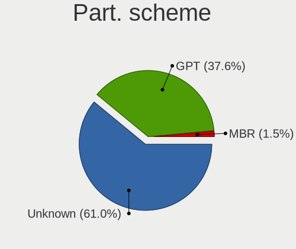
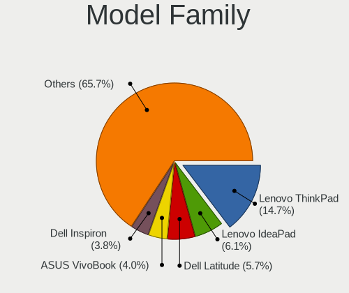
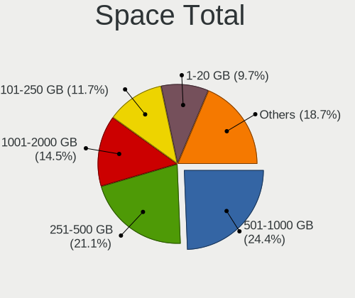
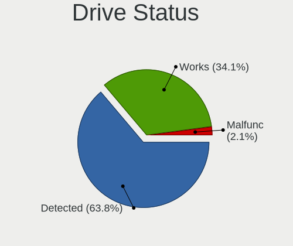
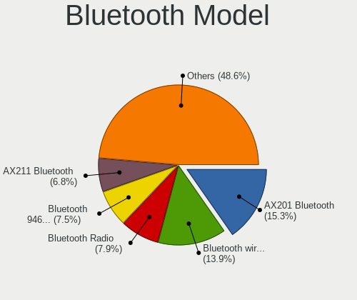
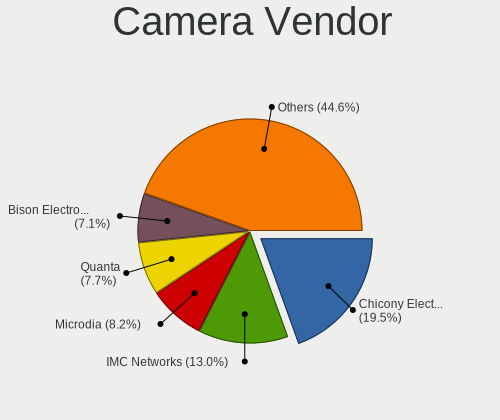

Fedora 38 - Tested Hardware & Statistics (Notebooks)
----------------------------------------------------

A project to collect tested hardware configurations for Fedora 38.

Anyone can contribute to this report by the [hw-probe](https://github.com/linuxhw/hw-probe) tool:

    sudo -E hw-probe -all -upload

Please contribute! Especially if your hardware is rare.

Contents
--------

* [ Test Cases ](#test-cases)

* [ System ](#system)
  - [ Kernel                   ](#kernel)
  - [ Kernel Family            ](#kernel-family)
  - [ Kernel Major Ver.        ](#kernel-major-ver)
  - [ Arch                     ](#arch)
  - [ DE                       ](#de)
  - [ Display Server           ](#display-server)
  - [ Display Manager          ](#display-manager)
  - [ OS Lang                  ](#os-lang)
  - [ Boot Mode                ](#boot-mode)
  - [ Filesystem               ](#filesystem)
  - [ Part. scheme             ](#part-scheme)
  - [ Dual Boot with Linux/BSD ](#dual-boot-with-linuxbsd)
  - [ Dual Boot (Win)          ](#dual-boot-win)

* [ Board ](#board)
  - [ Vendor                   ](#vendor)
  - [ Model                    ](#model)
  - [ Model Family             ](#model-family)
  - [ MFG Year                 ](#mfg-year)
  - [ Form Factor              ](#form-factor)
  - [ Secure Boot              ](#secure-boot)
  - [ Coreboot                 ](#coreboot)
  - [ RAM Size                 ](#ram-size)
  - [ RAM Used                 ](#ram-used)
  - [ Total Drives             ](#total-drives)
  - [ Has CD-ROM               ](#has-cd-rom)
  - [ Has Ethernet             ](#has-ethernet)
  - [ Has WiFi                 ](#has-wifi)
  - [ Has Bluetooth            ](#has-bluetooth)

* [ Location ](#location)
  - [ Country                  ](#country)
  - [ City                     ](#city)

* [ Drives ](#drives)
  - [ Drive Vendor             ](#drive-vendor)
  - [ Drive Model              ](#drive-model)
  - [ HDD Vendor               ](#hdd-vendor)
  - [ SSD Vendor               ](#ssd-vendor)
  - [ Drive Kind               ](#drive-kind)
  - [ Drive Connector          ](#drive-connector)
  - [ Drive Size               ](#drive-size)
  - [ Space Total              ](#space-total)
  - [ Space Used               ](#space-used)
  - [ Malfunc. Drives          ](#malfunc-drives)
  - [ Malfunc. Drive Vendor    ](#malfunc-drive-vendor)
  - [ Malfunc. HDD Vendor      ](#malfunc-hdd-vendor)
  - [ Malfunc. Drive Kind      ](#malfunc-drive-kind)
  - [ Failed Drives            ](#failed-drives)
  - [ Failed Drive Vendor      ](#failed-drive-vendor)
  - [ Drive Status             ](#drive-status)

* [ Storage controller ](#storage-controller)
  - [ Storage Vendor           ](#storage-vendor)
  - [ Storage Model            ](#storage-model)
  - [ Storage Kind             ](#storage-kind)

* [ Processor ](#processor)
  - [ CPU Vendor               ](#cpu-vendor)
  - [ CPU Model                ](#cpu-model)
  - [ CPU Model Family         ](#cpu-model-family)
  - [ CPU Cores                ](#cpu-cores)
  - [ CPU Sockets              ](#cpu-sockets)
  - [ CPU Threads              ](#cpu-threads)
  - [ CPU Op-Modes             ](#cpu-op-modes)
  - [ CPU Microcode            ](#cpu-microcode)
  - [ CPU Microarch            ](#cpu-microarch)

* [ Graphics ](#graphics)
  - [ GPU Vendor               ](#gpu-vendor)
  - [ GPU Model                ](#gpu-model)
  - [ GPU Combo                ](#gpu-combo)
  - [ GPU Driver               ](#gpu-driver)
  - [ GPU Memory               ](#gpu-memory)

* [ Monitor ](#monitor)
  - [ Monitor Vendor           ](#monitor-vendor)
  - [ Monitor Model            ](#monitor-model)
  - [ Monitor Resolution       ](#monitor-resolution)
  - [ Monitor Diagonal         ](#monitor-diagonal)
  - [ Monitor Width            ](#monitor-width)
  - [ Aspect Ratio             ](#aspect-ratio)
  - [ Monitor Area             ](#monitor-area)
  - [ Pixel Density            ](#pixel-density)
  - [ Multiple Monitors        ](#multiple-monitors)

* [ Network ](#network)
  - [ Net Controller Vendor    ](#net-controller-vendor)
  - [ Net Controller Model     ](#net-controller-model)
  - [ Wireless Vendor          ](#wireless-vendor)
  - [ Wireless Model           ](#wireless-model)
  - [ Ethernet Vendor          ](#ethernet-vendor)
  - [ Ethernet Model           ](#ethernet-model)
  - [ Net Controller Kind      ](#net-controller-kind)
  - [ Used Controller          ](#used-controller)
  - [ NICs                     ](#nics)
  - [ IPv6                     ](#ipv6)

* [ Bluetooth ](#bluetooth)
  - [ Bluetooth Vendor         ](#bluetooth-vendor)
  - [ Bluetooth Model          ](#bluetooth-model)

* [ Sound ](#sound)
  - [ Sound Vendor             ](#sound-vendor)
  - [ Sound Model              ](#sound-model)

* [ Memory ](#memory)
  - [ Memory Vendor            ](#memory-vendor)
  - [ Memory Model             ](#memory-model)
  - [ Memory Kind              ](#memory-kind)
  - [ Memory Form Factor       ](#memory-form-factor)
  - [ Memory Size              ](#memory-size)
  - [ Memory Speed             ](#memory-speed)

* [ Printers & scanners ](#printers--scanners)
  - [ Printer Vendor           ](#printer-vendor)
  - [ Printer Model            ](#printer-model)
  - [ Scanner Vendor           ](#scanner-vendor)
  - [ Scanner Model            ](#scanner-model)

* [ Camera ](#camera)
  - [ Camera Vendor            ](#camera-vendor)
  - [ Camera Model             ](#camera-model)

* [ Security ](#security)
  - [ Fingerprint Vendor       ](#fingerprint-vendor)
  - [ Fingerprint Model        ](#fingerprint-model)
  - [ Chipcard Vendor          ](#chipcard-vendor)
  - [ Chipcard Model           ](#chipcard-model)

* [ Unsupported ](#unsupported)
  - [ Unsupported Devices      ](#unsupported-devices)
  - [ Unsupported Device Types ](#unsupported-device-types)

Test Cases
----------

Total: 1348

| Vendor        | Model                       | Probe                                                      | Date         |
|---------------|-----------------------------|------------------------------------------------------------|--------------|
| Dell          | G15 5510                    | [3cfac2d234](https://linux-hardware.org/?probe=3cfac2d234) | Aug 12, 2023 |
| Lenovo        | ThinkPad T460p 20FXS1C30... | [08542d994e](https://linux-hardware.org/?probe=08542d994e) | Aug 12, 2023 |
| ASUSTek       | K55VD                       | [05024005e4](https://linux-hardware.org/?probe=05024005e4) | Aug 12, 2023 |
| Lenovo        | ThinkPad E15 20RD0011UK     | [411b9f412c](https://linux-hardware.org/?probe=411b9f412c) | Aug 12, 2023 |
| Lenovo        | ThinkPad P53 20QN0011IV     | [d25ab08211](https://linux-hardware.org/?probe=d25ab08211) | Aug 12, 2023 |
| Toshiba       | Satellite C55-A             | [d1bf5ba3c3](https://linux-hardware.org/?probe=d1bf5ba3c3) | Aug 12, 2023 |
| Dell          | Latitude E7270              | [63fd1b0d6b](https://linux-hardware.org/?probe=63fd1b0d6b) | Aug 12, 2023 |
| HP            | Victus by Laptop 16-e0xx... | [377a0e25aa](https://linux-hardware.org/?probe=377a0e25aa) | Aug 11, 2023 |
| HP            | Laptop 14s-dq2xxx           | [7574e6b53a](https://linux-hardware.org/?probe=7574e6b53a) | Aug 11, 2023 |
| Lenovo        | ThinkPad E490 20N8CTO1WW    | [c336f9aa8c](https://linux-hardware.org/?probe=c336f9aa8c) | Aug 11, 2023 |
| HP            | Laptop 14s-dq2xxx           | [c352abad93](https://linux-hardware.org/?probe=c352abad93) | Aug 11, 2023 |
| Acer          | Aspire E5-721               | [f4abfc94d4](https://linux-hardware.org/?probe=f4abfc94d4) | Aug 11, 2023 |
| HP            | ProBook 450 15.6 inch G9... | [8c449cd820](https://linux-hardware.org/?probe=8c449cd820) | Aug 11, 2023 |
| ASUSTek       | ZenBook UX535LI_UX535LI     | [29065a56ee](https://linux-hardware.org/?probe=29065a56ee) | Aug 11, 2023 |
| ASUSTek       | VivoBook_ASUSLaptop X409... | [22fc28c382](https://linux-hardware.org/?probe=22fc28c382) | Aug 11, 2023 |
| Dell          | XPS 15 9560                 | [471e3c5077](https://linux-hardware.org/?probe=471e3c5077) | Aug 11, 2023 |
| Acer          | Nitro AN515-52              | [df9e6a8d98](https://linux-hardware.org/?probe=df9e6a8d98) | Aug 10, 2023 |
| Dell          | Latitude 5300               | [661051063f](https://linux-hardware.org/?probe=661051063f) | Aug 10, 2023 |
| Lenovo        | ThinkPad X220 4291SEN       | [b62026890a](https://linux-hardware.org/?probe=b62026890a) | Aug 10, 2023 |
| HP            | 250 G3                      | [512fd5d81f](https://linux-hardware.org/?probe=512fd5d81f) | Aug 10, 2023 |
| HP            | ProBook 430 G2              | [426901227d](https://linux-hardware.org/?probe=426901227d) | Aug 10, 2023 |
| Acer          | Aspire E5-721               | [6743c7ca9d](https://linux-hardware.org/?probe=6743c7ca9d) | Aug 10, 2023 |
| Gigabyte      | AERO 15-WA                  | [bd9f5d0f39](https://linux-hardware.org/?probe=bd9f5d0f39) | Aug 10, 2023 |
| Apple         | MacBookPro5,1               | [23fc9401d3](https://linux-hardware.org/?probe=23fc9401d3) | Aug 10, 2023 |
| Lenovo        | IdeaPad U430 Touch 20270    | [4446f503d5](https://linux-hardware.org/?probe=4446f503d5) | Aug 10, 2023 |
| HP            | 14                          | [8692626574](https://linux-hardware.org/?probe=8692626574) | Aug 09, 2023 |
| HP            | Laptop 14s-dq2xxx           | [bb40aa6fd9](https://linux-hardware.org/?probe=bb40aa6fd9) | Aug 09, 2023 |
| Lenovo        | Legion 5 Pro 16ACH6H 82J... | [0f34656484](https://linux-hardware.org/?probe=0f34656484) | Aug 09, 2023 |
| ASUSTek       | ROG Zephyrus G14 GA401QC... | [afa02e4c02](https://linux-hardware.org/?probe=afa02e4c02) | Aug 09, 2023 |
| Lenovo        | ThinkPad S1 Yoga 20C0A0C... | [6de592988e](https://linux-hardware.org/?probe=6de592988e) | Aug 09, 2023 |
| Acer          | Aspire A317-33              | [6dd8126a05](https://linux-hardware.org/?probe=6dd8126a05) | Aug 09, 2023 |
| HP            | Notebook                    | [bac7155006](https://linux-hardware.org/?probe=bac7155006) | Aug 09, 2023 |
| Dell          | Inspiron M5010              | [be4ad618b4](https://linux-hardware.org/?probe=be4ad618b4) | Aug 09, 2023 |
| HP            | 240 G5 Notebook PC          | [c801f4bbd0](https://linux-hardware.org/?probe=c801f4bbd0) | Aug 09, 2023 |
| ASUSTek       | ROG Strix G614JV_G614JV     | [a8fc44190a](https://linux-hardware.org/?probe=a8fc44190a) | Aug 09, 2023 |
| ASUSTek       | ROG Strix G614JV_G614JV     | [766e35e920](https://linux-hardware.org/?probe=766e35e920) | Aug 09, 2023 |
| Apple         | MacBookPro15,2              | [68e26bb5d3](https://linux-hardware.org/?probe=68e26bb5d3) | Aug 09, 2023 |
| Dell          | Latitude 7320               | [6db1867722](https://linux-hardware.org/?probe=6db1867722) | Aug 09, 2023 |
| Acer          | Aspire E5-721               | [82a8a2346a](https://linux-hardware.org/?probe=82a8a2346a) | Aug 08, 2023 |
| Dell          | Inspiron 15 3515            | [7ce5fc846b](https://linux-hardware.org/?probe=7ce5fc846b) | Aug 08, 2023 |
| Lenovo        | ThinkPad T14 Gen 1 20S0C... | [2e4e848552](https://linux-hardware.org/?probe=2e4e848552) | Aug 08, 2023 |
| Acer          | Aspire A515-51G             | [1105c8c2ea](https://linux-hardware.org/?probe=1105c8c2ea) | Aug 08, 2023 |
| Lenovo        | ThinkPad T470 20HES0FW00    | [914ff5745c](https://linux-hardware.org/?probe=914ff5745c) | Aug 08, 2023 |
| Lenovo        | Y720-15IKB 80VR             | [7a088aea04](https://linux-hardware.org/?probe=7a088aea04) | Aug 08, 2023 |
| HUAWEI        | KLVL-WXXW                   | [1a3b5297dd](https://linux-hardware.org/?probe=1a3b5297dd) | Aug 08, 2023 |
| HUAWEI        | KLVL-WXXW                   | [18208500ee](https://linux-hardware.org/?probe=18208500ee) | Aug 08, 2023 |
| Acer          | Aspire 4752                 | [1c68b4d24a](https://linux-hardware.org/?probe=1c68b4d24a) | Aug 08, 2023 |
| HP            | Elite x2 1012 G1            | [0ee8428f91](https://linux-hardware.org/?probe=0ee8428f91) | Aug 07, 2023 |
| Dell          | Inspiron 3505               | [e07624ae41](https://linux-hardware.org/?probe=e07624ae41) | Aug 07, 2023 |
| ASUSTek       | VivoBook_ASUSLaptop M650... | [36b0caba9e](https://linux-hardware.org/?probe=36b0caba9e) | Aug 07, 2023 |
| Lenovo        | IdeaPad S340-15API 81NC     | [d989868a6b](https://linux-hardware.org/?probe=d989868a6b) | Aug 07, 2023 |
| Lenovo        | ThinkPad T460 20FN002JUS    | [8b5e74e190](https://linux-hardware.org/?probe=8b5e74e190) | Aug 07, 2023 |
| Apple         | MacBookPro11,1              | [0a1b8d0627](https://linux-hardware.org/?probe=0a1b8d0627) | Aug 07, 2023 |
| Timi          | A7S                         | [34a354df5a](https://linux-hardware.org/?probe=34a354df5a) | Aug 07, 2023 |
| Lenovo        | ThinkPad X1 Extreme Gen ... | [b4b049b997](https://linux-hardware.org/?probe=b4b049b997) | Aug 07, 2023 |
| Lenovo        | ThinkPad X1 Extreme Gen ... | [8633bc5aa5](https://linux-hardware.org/?probe=8633bc5aa5) | Aug 07, 2023 |
| HP            | EliteBook 850 G8 Noteboo... | [aabc0a8aee](https://linux-hardware.org/?probe=aabc0a8aee) | Aug 07, 2023 |
| HUAWEI        | WRTD-WXX9                   | [dc02eefe63](https://linux-hardware.org/?probe=dc02eefe63) | Aug 06, 2023 |
| Dell          | XPS 13 9310                 | [1134279f41](https://linux-hardware.org/?probe=1134279f41) | Aug 06, 2023 |
| Dell          | Inspiron 3520               | [eed6ad702b](https://linux-hardware.org/?probe=eed6ad702b) | Aug 06, 2023 |
| Dell          | Inspiron 3520               | [8a3ba73fae](https://linux-hardware.org/?probe=8a3ba73fae) | Aug 06, 2023 |
| Lenovo        | ThinkPad T460 20FN002JUS    | [e71ac5ca78](https://linux-hardware.org/?probe=e71ac5ca78) | Aug 06, 2023 |
| Lenovo        | ThinkPad T560 20FJS18V00    | [27d1d39b58](https://linux-hardware.org/?probe=27d1d39b58) | Aug 06, 2023 |
| Lenovo        | Yoga Slim 7 Pro 14IAH7 8... | [f77c465da0](https://linux-hardware.org/?probe=f77c465da0) | Aug 06, 2023 |
| HUAWEI        | BOHK-WAX9X                  | [56c7715a6d](https://linux-hardware.org/?probe=56c7715a6d) | Aug 06, 2023 |
| HUAWEI        | BOHK-WAX9X                  | [6a9e7cc3e2](https://linux-hardware.org/?probe=6a9e7cc3e2) | Aug 06, 2023 |
| RCA           | 038-WT9S10WM02              | [61c1a104d2](https://linux-hardware.org/?probe=61c1a104d2) | Aug 06, 2023 |
| RCA           | 038-WT9S10WM02              | [fe15934abe](https://linux-hardware.org/?probe=fe15934abe) | Aug 06, 2023 |
| Dell          | Inspiron 15-3567            | [2e8d48f9bc](https://linux-hardware.org/?probe=2e8d48f9bc) | Aug 06, 2023 |
| ASUSTek       | VivoBook_ASUSLaptop X409... | [1b9794e2e3](https://linux-hardware.org/?probe=1b9794e2e3) | Aug 06, 2023 |
| COMPUMAX C... | MOBIL                       | [60293c1ac3](https://linux-hardware.org/?probe=60293c1ac3) | Aug 06, 2023 |
| Acer          | Aspire A715-72G             | [4afe306798](https://linux-hardware.org/?probe=4afe306798) | Aug 05, 2023 |
| Dell          | Venue 8 Pro 5855            | [146fa40942](https://linux-hardware.org/?probe=146fa40942) | Aug 05, 2023 |
| Dell          | Inspiron 3542               | [6af70944d8](https://linux-hardware.org/?probe=6af70944d8) | Aug 05, 2023 |
| Dell          | Inspiron 3542               | [1790fa9d72](https://linux-hardware.org/?probe=1790fa9d72) | Aug 05, 2023 |
| ASUSTek       | ROG Strix G731GU_GL731GU    | [b3c77ee42f](https://linux-hardware.org/?probe=b3c77ee42f) | Aug 05, 2023 |
| Dell          | Latitude E6230              | [cc78868322](https://linux-hardware.org/?probe=cc78868322) | Aug 05, 2023 |
| Multilaser    | PC13X                       | [2f79cffddd](https://linux-hardware.org/?probe=2f79cffddd) | Aug 05, 2023 |
| Dell          | Latitude E6220              | [636392b4bf](https://linux-hardware.org/?probe=636392b4bf) | Aug 05, 2023 |
| HP            | ProBook 440 G3              | [abb19010d2](https://linux-hardware.org/?probe=abb19010d2) | Aug 05, 2023 |
| System76      | Darter Pro                  | [55a328cd9a](https://linux-hardware.org/?probe=55a328cd9a) | Aug 05, 2023 |
| Corsair       | Voyager a1600               | [6dea5f2c0c](https://linux-hardware.org/?probe=6dea5f2c0c) | Aug 04, 2023 |
| Apple         | MacBookPro5,5               | [ccbf514dc7](https://linux-hardware.org/?probe=ccbf514dc7) | Aug 04, 2023 |
| HP            | Laptop 15s-eq1xxx           | [e6e6cc7b2e](https://linux-hardware.org/?probe=e6e6cc7b2e) | Aug 04, 2023 |
| HUAWEI        | BOHB-WAX9                   | [7bc7a7e01c](https://linux-hardware.org/?probe=7bc7a7e01c) | Aug 04, 2023 |
| Lenovo        | ThinkPad X1 Carbon 4th 2... | [fcc05278d6](https://linux-hardware.org/?probe=fcc05278d6) | Aug 04, 2023 |
| HUAWEI        | BOHB-WAX9                   | [b8fa3962ed](https://linux-hardware.org/?probe=b8fa3962ed) | Aug 04, 2023 |
| Acer          | Swift SF114-34              | [2af2b0aecb](https://linux-hardware.org/?probe=2af2b0aecb) | Aug 04, 2023 |
| Dell          | Latitude 7400               | [48e2858e56](https://linux-hardware.org/?probe=48e2858e56) | Aug 04, 2023 |
| Dell          | Latitude 3420               | [cdecb64c4a](https://linux-hardware.org/?probe=cdecb64c4a) | Aug 04, 2023 |
| Dell          | Latitude 7440               | [195716ccf3](https://linux-hardware.org/?probe=195716ccf3) | Aug 04, 2023 |
| Dell          | Latitude 5480               | [b682f988e8](https://linux-hardware.org/?probe=b682f988e8) | Aug 04, 2023 |
| Dell          | Latitude 7440               | [5a9a057759](https://linux-hardware.org/?probe=5a9a057759) | Aug 04, 2023 |
| Dell          | Latitude 7440               | [367f14eae6](https://linux-hardware.org/?probe=367f14eae6) | Aug 04, 2023 |
| HP            | ENVY Notebook               | [90325282da](https://linux-hardware.org/?probe=90325282da) | Aug 04, 2023 |
| HP            | ENVY Laptop 16-h0xxx        | [082f92da07](https://linux-hardware.org/?probe=082f92da07) | Aug 04, 2023 |
| HP            | ENVY Laptop 16-h0xxx        | [1078db460a](https://linux-hardware.org/?probe=1078db460a) | Aug 04, 2023 |
| HP            | Laptop 15-fd0xxx            | [8f3b8dea26](https://linux-hardware.org/?probe=8f3b8dea26) | Aug 04, 2023 |
| ASUSTek       | UX490UAR                    | [6a305978e3](https://linux-hardware.org/?probe=6a305978e3) | Aug 03, 2023 |
| Dell          | Latitude E6510              | [b32213c71d](https://linux-hardware.org/?probe=b32213c71d) | Aug 03, 2023 |
| ASUSTek       | ROG Strix G713PV_G713PV     | [620397fdc9](https://linux-hardware.org/?probe=620397fdc9) | Aug 03, 2023 |
| Gigabyte      | B550M AORUS ELITE           | [882d963e19](https://linux-hardware.org/?probe=882d963e19) | Aug 03, 2023 |
| Lenovo        | ThinkPad E14 Gen 4 21E3S... | [0cf8e99478](https://linux-hardware.org/?probe=0cf8e99478) | Aug 03, 2023 |
| Gigabyte      | B550M AORUS ELITE           | [38d0bcf5d1](https://linux-hardware.org/?probe=38d0bcf5d1) | Aug 03, 2023 |
| Lenovo        | IdeaPad 5 Pro 16ACH6 82L... | [7d96f87e00](https://linux-hardware.org/?probe=7d96f87e00) | Aug 03, 2023 |
| Lenovo        | Z50-70 20354                | [c741db51a0](https://linux-hardware.org/?probe=c741db51a0) | Aug 03, 2023 |
| Lenovo        | ThinkPad X1 Carbon 6th 2... | [7df997ee08](https://linux-hardware.org/?probe=7df997ee08) | Aug 03, 2023 |
| ASUSTek       | K55VD                       | [6478fd4e76](https://linux-hardware.org/?probe=6478fd4e76) | Aug 03, 2023 |
| Acer          | Nitro AN515-44              | [25dcc9a7c5](https://linux-hardware.org/?probe=25dcc9a7c5) | Aug 03, 2023 |
| Dell          | Latitude E7470              | [7c8c07214a](https://linux-hardware.org/?probe=7c8c07214a) | Aug 03, 2023 |
| Toshiba       | Satellite C70-B             | [877d855f27](https://linux-hardware.org/?probe=877d855f27) | Aug 02, 2023 |
| Dell          | Inspiron 1525               | [fa53c99b17](https://linux-hardware.org/?probe=fa53c99b17) | Aug 02, 2023 |
| Dell          | Latitude E7470              | [b672c65f9b](https://linux-hardware.org/?probe=b672c65f9b) | Aug 02, 2023 |
| Acer          | Aspire A715-72G             | [d0bad7993f](https://linux-hardware.org/?probe=d0bad7993f) | Aug 02, 2023 |
| Dell          | System XPS L322X            | [dbe168d1a1](https://linux-hardware.org/?probe=dbe168d1a1) | Aug 02, 2023 |
| ASUSTek       | X750JN                      | [6f7dc2198b](https://linux-hardware.org/?probe=6f7dc2198b) | Aug 02, 2023 |
| Lenovo        | Yoga Slim 7 Pro 14IHU5 O... | [491aec1ea1](https://linux-hardware.org/?probe=491aec1ea1) | Aug 02, 2023 |
| Lenovo        | ThinkPad T14 Gen 1 20S1S... | [517b498a25](https://linux-hardware.org/?probe=517b498a25) | Aug 02, 2023 |
| HUAWEI        | WRTD-WXX9                   | [18396303b8](https://linux-hardware.org/?probe=18396303b8) | Aug 02, 2023 |
| Dell          | XPS 9320                    | [3abc4aaf82](https://linux-hardware.org/?probe=3abc4aaf82) | Aug 02, 2023 |
| HP            | Dragonfly Pro               | [630670f052](https://linux-hardware.org/?probe=630670f052) | Aug 01, 2023 |
| Dell          | Precision 7550              | [ab0d21bb4e](https://linux-hardware.org/?probe=ab0d21bb4e) | Aug 01, 2023 |
| HP            | Laptop 15-db0xxx            | [2d7cbca56b](https://linux-hardware.org/?probe=2d7cbca56b) | Aug 01, 2023 |
| Dell          | Inspiron 15-3573            | [e29b3656ee](https://linux-hardware.org/?probe=e29b3656ee) | Aug 01, 2023 |
| HP            | ProBook 6475b               | [c3cfc235fe](https://linux-hardware.org/?probe=c3cfc235fe) | Aug 01, 2023 |
| HP            | EliteBook Folio 1040 G2     | [752821ae1a](https://linux-hardware.org/?probe=752821ae1a) | Aug 01, 2023 |
| HP            | EliteBook Folio 1040 G2     | [b847ac4535](https://linux-hardware.org/?probe=b847ac4535) | Aug 01, 2023 |
| Lenovo        | IdeaPad C340-14API 81N6     | [1dfc12fc6c](https://linux-hardware.org/?probe=1dfc12fc6c) | Jul 31, 2023 |
| Acer          | Aspire V3-571               | [9b9830aedf](https://linux-hardware.org/?probe=9b9830aedf) | Jul 31, 2023 |
| HP            | 255 G8 Notebook PC          | [b42946849e](https://linux-hardware.org/?probe=b42946849e) | Jul 31, 2023 |
| MSI           | Katana GF66 12UC            | [49a431c092](https://linux-hardware.org/?probe=49a431c092) | Jul 31, 2023 |
| HP            | Laptop 15-dw0xxx            | [08e20bb994](https://linux-hardware.org/?probe=08e20bb994) | Jul 31, 2023 |
| Lenovo        | ThinkPad P50 20EQS20D00     | [4ef8aa09c6](https://linux-hardware.org/?probe=4ef8aa09c6) | Jul 31, 2023 |
| HP            | ProBook 440 G3              | [beea8be008](https://linux-hardware.org/?probe=beea8be008) | Jul 30, 2023 |
| Apple         | MacBookAir3,1               | [9a3416654f](https://linux-hardware.org/?probe=9a3416654f) | Jul 30, 2023 |
| ASUSTek       | VivoBook_ASUSLaptop X513... | [5bf8462b77](https://linux-hardware.org/?probe=5bf8462b77) | Jul 30, 2023 |
| ASUSTek       | ZenBook UX425IA_UM425IA     | [5ce91f2c11](https://linux-hardware.org/?probe=5ce91f2c11) | Jul 30, 2023 |
| HP            | Pavilion 15                 | [7dcc58cdf2](https://linux-hardware.org/?probe=7dcc58cdf2) | Jul 30, 2023 |
| Lenovo        | V15 G3 IAP 82TT             | [f641b9c622](https://linux-hardware.org/?probe=f641b9c622) | Jul 30, 2023 |
| Lenovo        | WEI6 15 ITL 82F2            | [d30f44ebbb](https://linux-hardware.org/?probe=d30f44ebbb) | Jul 30, 2023 |
| ASUSTek       | P552LA                      | [d84e6d9683](https://linux-hardware.org/?probe=d84e6d9683) | Jul 30, 2023 |
| MSI           | Bravo 15 B5DD               | [d9d3f5bce4](https://linux-hardware.org/?probe=d9d3f5bce4) | Jul 30, 2023 |
| Sony          | SVE14A2V2RS                 | [adc151e590](https://linux-hardware.org/?probe=adc151e590) | Jul 30, 2023 |
| Dell          | Inspiron M5010              | [8608f29a0f](https://linux-hardware.org/?probe=8608f29a0f) | Jul 30, 2023 |
| Dell          | XPS 13 9370                 | [529bf65ac4](https://linux-hardware.org/?probe=529bf65ac4) | Jul 30, 2023 |
| HP            | ENVY Laptop 17-cg1xxx       | [16545b3964](https://linux-hardware.org/?probe=16545b3964) | Jul 30, 2023 |
| Lenovo        | ThinkPad T490 20N3S5XF01    | [942cb3149b](https://linux-hardware.org/?probe=942cb3149b) | Jul 29, 2023 |
| Lenovo        | ThinkPad E14 Gen 2 20TA0... | [cd073a7899](https://linux-hardware.org/?probe=cd073a7899) | Jul 29, 2023 |
| Dell          | Inspiron 5577               | [10b634ac99](https://linux-hardware.org/?probe=10b634ac99) | Jul 29, 2023 |
| HP            | Beats 15                    | [933bd63249](https://linux-hardware.org/?probe=933bd63249) | Jul 29, 2023 |
| HP            | Beats 15                    | [acea7d6786](https://linux-hardware.org/?probe=acea7d6786) | Jul 29, 2023 |
| HP            | 470 17 inch G9 Notebook ... | [dbcda8f4d0](https://linux-hardware.org/?probe=dbcda8f4d0) | Jul 29, 2023 |
| Lenovo        | Unknown                     | [a1dac68b95](https://linux-hardware.org/?probe=a1dac68b95) | Jul 29, 2023 |
| HP            | 255 15.6 inch G9 Noteboo... | [32ad81bc5d](https://linux-hardware.org/?probe=32ad81bc5d) | Jul 29, 2023 |
| Lenovo        | ThinkPad T470 W10DG 20JN... | [95e189ee7a](https://linux-hardware.org/?probe=95e189ee7a) | Jul 29, 2023 |
| HP            | ProBook 4530s               | [884d64edd7](https://linux-hardware.org/?probe=884d64edd7) | Jul 29, 2023 |
| Samsung       | 550XDA                      | [c140c9176e](https://linux-hardware.org/?probe=c140c9176e) | Jul 29, 2023 |
| Apple         | MacBookAir6,2               | [dd2b310ecf](https://linux-hardware.org/?probe=dd2b310ecf) | Jul 29, 2023 |
| Apple         | MacBookAir6,2               | [b8e059a47d](https://linux-hardware.org/?probe=b8e059a47d) | Jul 29, 2023 |
| GPD           | G1621-02                    | [1710e0f480](https://linux-hardware.org/?probe=1710e0f480) | Jul 29, 2023 |
| Dell          | XPS 9320                    | [4000df5584](https://linux-hardware.org/?probe=4000df5584) | Jul 29, 2023 |
| Dell          | Latitude 5400               | [9416ce803c](https://linux-hardware.org/?probe=9416ce803c) | Jul 28, 2023 |
| Gigabyte      | B460M DS3H AC V2-Y1         | [75e93aaa88](https://linux-hardware.org/?probe=75e93aaa88) | Jul 28, 2023 |
| Lenovo        | ThinkBook 13s G2 ITL 20V... | [ea4fee91b6](https://linux-hardware.org/?probe=ea4fee91b6) | Jul 28, 2023 |
| Gigabyte      | B460M DS3H AC V2-Y1         | [730caebd96](https://linux-hardware.org/?probe=730caebd96) | Jul 28, 2023 |
| HUAWEI        | HVY-WXX9                    | [1c3edafdf4](https://linux-hardware.org/?probe=1c3edafdf4) | Jul 28, 2023 |
| HP            | ProBook 445 G8 Notebook ... | [ba7c69f7e0](https://linux-hardware.org/?probe=ba7c69f7e0) | Jul 28, 2023 |
| Apple         | MacBookPro9,2               | [2e6ab71954](https://linux-hardware.org/?probe=2e6ab71954) | Jul 28, 2023 |
| Lenovo        | ThinkPad Z16 Gen 1 21D4C... | [4439f26a90](https://linux-hardware.org/?probe=4439f26a90) | Jul 28, 2023 |
| Lenovo        | ThinkPad E14 Gen 3 20Y70... | [f5497a92cf](https://linux-hardware.org/?probe=f5497a92cf) | Jul 28, 2023 |
| Apple         | MacBookPro9,2               | [058f75de84](https://linux-hardware.org/?probe=058f75de84) | Jul 28, 2023 |
| Apple         | MacBookPro9,2               | [c26daef72c](https://linux-hardware.org/?probe=c26daef72c) | Jul 28, 2023 |
| Dell          | XPS 13 9380                 | [b784cbe3ab](https://linux-hardware.org/?probe=b784cbe3ab) | Jul 28, 2023 |
| ASUSTek       | VivoBook_ASUSLaptop X570... | [4bd819d37b](https://linux-hardware.org/?probe=4bd819d37b) | Jul 28, 2023 |
| Acer          | Aspire A515-45              | [6287e66ff2](https://linux-hardware.org/?probe=6287e66ff2) | Jul 27, 2023 |
| Apple         | MacBookAir5,1               | [da2904da80](https://linux-hardware.org/?probe=da2904da80) | Jul 27, 2023 |
| Lenovo        | ThinkPad E490 20N80029RT    | [69cf27eaae](https://linux-hardware.org/?probe=69cf27eaae) | Jul 27, 2023 |
| ASUSTek       | VivoBook_ASUSLaptop K650... | [1b3e699a2a](https://linux-hardware.org/?probe=1b3e699a2a) | Jul 27, 2023 |
| HUAWEI        | BOHK-WAX9X                  | [2c2dfaa670](https://linux-hardware.org/?probe=2c2dfaa670) | Jul 27, 2023 |
| HONOR         | BMH-WCX9                    | [865315bd06](https://linux-hardware.org/?probe=865315bd06) | Jul 27, 2023 |
| Dell          | Latitude 5530               | [165d2cd3b1](https://linux-hardware.org/?probe=165d2cd3b1) | Jul 27, 2023 |
| Toshiba       | Satellite C70-B             | [56489a32b2](https://linux-hardware.org/?probe=56489a32b2) | Jul 27, 2023 |
| Lenovo        | ThinkBook 15 G2 ITL 20VE    | [32b57e4adb](https://linux-hardware.org/?probe=32b57e4adb) | Jul 26, 2023 |
| Dell          | Latitude E6400              | [a9333607eb](https://linux-hardware.org/?probe=a9333607eb) | Jul 26, 2023 |
| Lenovo        | ThinkPad X1 Carbon Gen 1... | [b8b95820c1](https://linux-hardware.org/?probe=b8b95820c1) | Jul 26, 2023 |
| HP            | Pavilion 11 x360 PC         | [8daa291377](https://linux-hardware.org/?probe=8daa291377) | Jul 26, 2023 |
| Dell          | Vostro 15 5510              | [2e810b1c93](https://linux-hardware.org/?probe=2e810b1c93) | Jul 26, 2023 |
| Dell          | Vostro 15 5510              | [4171fc8925](https://linux-hardware.org/?probe=4171fc8925) | Jul 26, 2023 |
| Dell          | Latitude E7440              | [9b8234d640](https://linux-hardware.org/?probe=9b8234d640) | Jul 26, 2023 |
| Dell          | Inspiron 13 5310            | [5f44d0b1d8](https://linux-hardware.org/?probe=5f44d0b1d8) | Jul 26, 2023 |
| HUAWEI        | NBM-WXX9                    | [30cb22d368](https://linux-hardware.org/?probe=30cb22d368) | Jul 26, 2023 |
| ASUSTek       | VivoBook_ASUSLaptop S540... | [f321614376](https://linux-hardware.org/?probe=f321614376) | Jul 25, 2023 |
| HUAWEI        | NBM-WXX9                    | [b28bc4ba91](https://linux-hardware.org/?probe=b28bc4ba91) | Jul 25, 2023 |
| Dell          | Inspiron 3501               | [62bcc903fd](https://linux-hardware.org/?probe=62bcc903fd) | Jul 25, 2023 |
| Lenovo        | IdeaPad S340-15IIL 81VW     | [0059745bdf](https://linux-hardware.org/?probe=0059745bdf) | Jul 25, 2023 |
| Lenovo        | IdeaPad S340-15IIL 81VW     | [90beff8e65](https://linux-hardware.org/?probe=90beff8e65) | Jul 25, 2023 |
| ASUSTek       | ASUS TUF Gaming A17 FA70... | [bd31324aeb](https://linux-hardware.org/?probe=bd31324aeb) | Jul 25, 2023 |
| Lenovo        | ThinkPad P53 20QN0011IV     | [da046587dc](https://linux-hardware.org/?probe=da046587dc) | Jul 25, 2023 |
| Dell          | XPS 13 9370                 | [8cf3728f9b](https://linux-hardware.org/?probe=8cf3728f9b) | Jul 25, 2023 |
| HP            | ENVY Laptop 13-ad1xx        | [c49c2e7a5a](https://linux-hardware.org/?probe=c49c2e7a5a) | Jul 24, 2023 |
| ASUSTek       | ROG Strix G513IM_G513IM     | [53de15710b](https://linux-hardware.org/?probe=53de15710b) | Jul 24, 2023 |
| Fujitsu       | CELSIUS H700                | [8a23e1d76a](https://linux-hardware.org/?probe=8a23e1d76a) | Jul 24, 2023 |
| Timi          | Mi NoteBook Ultra           | [61646d77f1](https://linux-hardware.org/?probe=61646d77f1) | Jul 24, 2023 |
| MSI           | Summit E16Flip A12UCT       | [daf09efe6e](https://linux-hardware.org/?probe=daf09efe6e) | Jul 24, 2023 |
| Lenovo        | G500s 20245                 | [fbfa8af465](https://linux-hardware.org/?probe=fbfa8af465) | Jul 24, 2023 |
| Acer          | Aspire A315-59              | [8ecb2eb1fc](https://linux-hardware.org/?probe=8ecb2eb1fc) | Jul 24, 2023 |
| Dell          | XPS 15 9510                 | [84c7ea08c6](https://linux-hardware.org/?probe=84c7ea08c6) | Jul 24, 2023 |
| ASUSTek       | ROG Strix G513IM_G513IM     | [4f06d87bd5](https://linux-hardware.org/?probe=4f06d87bd5) | Jul 24, 2023 |
| HP            | EliteBook 845 14 inch G9... | [82a4cfcd9f](https://linux-hardware.org/?probe=82a4cfcd9f) | Jul 23, 2023 |
| ASUSTek       | H170M-PLUS                  | [f17fd3bbe1](https://linux-hardware.org/?probe=f17fd3bbe1) | Jul 23, 2023 |
| HP            | 250 G1                      | [deab96c404](https://linux-hardware.org/?probe=deab96c404) | Jul 23, 2023 |
| Lenovo        | ThinkPad E15 20RD0011UK     | [ff5e295a5d](https://linux-hardware.org/?probe=ff5e295a5d) | Jul 23, 2023 |
| ASUSTek       | VivoBook_ASUSLaptop X150... | [28340d4ad4](https://linux-hardware.org/?probe=28340d4ad4) | Jul 23, 2023 |
| Dell          | Inspiron 5566               | [6323d6b43c](https://linux-hardware.org/?probe=6323d6b43c) | Jul 23, 2023 |
| ASUSTek       | VivoBook_ASUSLaptop X513... | [49cc99fa7e](https://linux-hardware.org/?probe=49cc99fa7e) | Jul 23, 2023 |
| Lenovo        | IdeaPad 3 15ARE05 81W4      | [994ae7ffec](https://linux-hardware.org/?probe=994ae7ffec) | Jul 23, 2023 |
| Lenovo        | IdeaPad 3 15ARE05 81W4      | [9c92b34677](https://linux-hardware.org/?probe=9c92b34677) | Jul 23, 2023 |
| Lenovo        | Legion 5 15IMH6 82NL        | [f12c3b23e5](https://linux-hardware.org/?probe=f12c3b23e5) | Jul 22, 2023 |
| Lenovo        | IdeaPad 530S-14ARR 81H1     | [ea078c7fb9](https://linux-hardware.org/?probe=ea078c7fb9) | Jul 22, 2023 |
| Dell          | Precision M4700             | [0a5346a25d](https://linux-hardware.org/?probe=0a5346a25d) | Jul 22, 2023 |
| Lenovo        | IdeaPad 3 15ITL6 82H8       | [ba42ca5ace](https://linux-hardware.org/?probe=ba42ca5ace) | Jul 22, 2023 |
| HP            | 240 G6 Notebook PC          | [ec2be7713c](https://linux-hardware.org/?probe=ec2be7713c) | Jul 22, 2023 |
| HP            | Notebook                    | [fde29b5a32](https://linux-hardware.org/?probe=fde29b5a32) | Jul 22, 2023 |
| Notebook      | PE60RNE_RND_RNC             | [5f2993b629](https://linux-hardware.org/?probe=5f2993b629) | Jul 22, 2023 |
| HUAWEI        | NBLB-WAX9N                  | [c1e386e9cc](https://linux-hardware.org/?probe=c1e386e9cc) | Jul 22, 2023 |
| Lenovo        | ThinkPad P14s Gen 3 21J6... | [27b5dabe8d](https://linux-hardware.org/?probe=27b5dabe8d) | Jul 21, 2023 |
| Lenovo        | ThinkPad X1 Carbon 3rd 2... | [d16a211675](https://linux-hardware.org/?probe=d16a211675) | Jul 21, 2023 |
| Lenovo        | IdeaPad S540-14API 81NH     | [32ec9929c9](https://linux-hardware.org/?probe=32ec9929c9) | Jul 21, 2023 |
| HP            | OMEN Laptop 15-en0xxx       | [fa4def4ece](https://linux-hardware.org/?probe=fa4def4ece) | Jul 21, 2023 |
| Avell High... | B.ON                        | [8269a683ef](https://linux-hardware.org/?probe=8269a683ef) | Jul 21, 2023 |
| HUAWEI        | NBLB-WAX9N                  | [d163198c13](https://linux-hardware.org/?probe=d163198c13) | Jul 21, 2023 |
| Lenovo        | ThinkPad X1 Nano Gen 1 2... | [b541d17031](https://linux-hardware.org/?probe=b541d17031) | Jul 21, 2023 |
| Toshiba       | Satellite C70-B             | [cf2d22469b](https://linux-hardware.org/?probe=cf2d22469b) | Jul 20, 2023 |
| Lenovo        | Legion 5 15ACH6H 82JU       | [5224cc55eb](https://linux-hardware.org/?probe=5224cc55eb) | Jul 20, 2023 |
| Dell          | Inspiron 15 5510            | [df2bfbf3e1](https://linux-hardware.org/?probe=df2bfbf3e1) | Jul 20, 2023 |
| Lenovo        | ThinkBook 16 G4+ IAP 21C... | [6bc352838a](https://linux-hardware.org/?probe=6bc352838a) | Jul 20, 2023 |
| Apple         | MacBookAir6,1               | [dd441dfa0d](https://linux-hardware.org/?probe=dd441dfa0d) | Jul 20, 2023 |
| Acer          | Nitro AN515-58              | [18a6e9f055](https://linux-hardware.org/?probe=18a6e9f055) | Jul 20, 2023 |
| Lenovo        | Legion 5 15ACH6 82QJ        | [c7e1f17f9e](https://linux-hardware.org/?probe=c7e1f17f9e) | Jul 20, 2023 |
| Apple         | MacBookPro5,5               | [af457a5412](https://linux-hardware.org/?probe=af457a5412) | Jul 20, 2023 |
| HP            | ProBook 450 15.6 inch G9... | [e99bf7a4be](https://linux-hardware.org/?probe=e99bf7a4be) | Jul 20, 2023 |
| Dell          | Latitude 5420               | [ea97d72c47](https://linux-hardware.org/?probe=ea97d72c47) | Jul 20, 2023 |
| Lenovo        | Z50-70 20354                | [f92f9065bc](https://linux-hardware.org/?probe=f92f9065bc) | Jul 19, 2023 |
| HUAWEI        | BOM-WXX9                    | [fc26baabc9](https://linux-hardware.org/?probe=fc26baabc9) | Jul 19, 2023 |
| MSI           | Sword 17 A11UD              | [fd2864f7e1](https://linux-hardware.org/?probe=fd2864f7e1) | Jul 19, 2023 |
| Lenovo        | ThinkPad 11e 20DAS0C800     | [b894a6d96b](https://linux-hardware.org/?probe=b894a6d96b) | Jul 19, 2023 |
| HP            | Pavilion Laptop 15-eg3xx... | [38c5f4d547](https://linux-hardware.org/?probe=38c5f4d547) | Jul 19, 2023 |
| Lenovo        | IdeaPad 3 17ALC6 82KV       | [e2cf7ed35f](https://linux-hardware.org/?probe=e2cf7ed35f) | Jul 19, 2023 |
| Lenovo        | ThinkPad E14 Gen 3 20Y70... | [360ee7202f](https://linux-hardware.org/?probe=360ee7202f) | Jul 18, 2023 |
| HP            | Laptop 15-dw0xxx            | [ba24f3bb61](https://linux-hardware.org/?probe=ba24f3bb61) | Jul 18, 2023 |
| Lenovo        | IdeaPad 130-14IKB 81H6      | [3649d91857](https://linux-hardware.org/?probe=3649d91857) | Jul 18, 2023 |
| Lenovo        | IdeaPad 5 Pro 16ACH6 82L... | [5d3e13fc77](https://linux-hardware.org/?probe=5d3e13fc77) | Jul 18, 2023 |
| ASUSTek       | ROG Zephyrus G14 GA402RK... | [96585144ab](https://linux-hardware.org/?probe=96585144ab) | Jul 18, 2023 |
| Dell          | XPS 13 9370                 | [ea47e53a45](https://linux-hardware.org/?probe=ea47e53a45) | Jul 18, 2023 |
| HP            | OMEN by Laptop 15-dc0xxx    | [c4ab55ea69](https://linux-hardware.org/?probe=c4ab55ea69) | Jul 18, 2023 |
| Lenovo        | ThinkPad T14s Gen 3 21CQ... | [fe1ab04658](https://linux-hardware.org/?probe=fe1ab04658) | Jul 18, 2023 |
| ASUSTek       | ROG Zephyrus G15 GA503QS... | [14defb538e](https://linux-hardware.org/?probe=14defb538e) | Jul 17, 2023 |
| Samsung       | 950XCJ/951XCJ/950XCR        | [3a7fbf07fa](https://linux-hardware.org/?probe=3a7fbf07fa) | Jul 17, 2023 |
| Unknown       | Unknown                     | [2bda9f913a](https://linux-hardware.org/?probe=2bda9f913a) | Jul 17, 2023 |
| Lenovo        | ThinkPad T480s 20L8S1R50... | [3de307450d](https://linux-hardware.org/?probe=3de307450d) | Jul 17, 2023 |
| Lenovo        | ThinkPad T480s 20L8S1R50... | [5633b6ed54](https://linux-hardware.org/?probe=5633b6ed54) | Jul 17, 2023 |
| HP            | Laptop 14-cf2xxx            | [04dce054f4](https://linux-hardware.org/?probe=04dce054f4) | Jul 17, 2023 |
| Lenovo        | ThinkPad T430 23426QU       | [9c1cb1fd39](https://linux-hardware.org/?probe=9c1cb1fd39) | Jul 16, 2023 |
| Gigabyte      | AORUS 17 YE5                | [9c17ae5e55](https://linux-hardware.org/?probe=9c17ae5e55) | Jul 16, 2023 |
| Lenovo        | ThinkPad X201 3249CTO       | [ec4db25eb9](https://linux-hardware.org/?probe=ec4db25eb9) | Jul 16, 2023 |
| Lenovo        | ThinkPad L380 20M50013UK    | [99b59160a1](https://linux-hardware.org/?probe=99b59160a1) | Jul 16, 2023 |
| Apple         | MacBookPro5,4               | [999de9eeb2](https://linux-hardware.org/?probe=999de9eeb2) | Jul 16, 2023 |
| Lenovo        | G50-70 20351                | [46a3598028](https://linux-hardware.org/?probe=46a3598028) | Jul 16, 2023 |
| Lenovo        | ThinkPad X13s Gen 1 21BY... | [1a0f8c842b](https://linux-hardware.org/?probe=1a0f8c842b) | Jul 16, 2023 |
| Fujitsu Si... | LIFEBOOK E8310              | [0093aba5fd](https://linux-hardware.org/?probe=0093aba5fd) | Jul 16, 2023 |
| Lenovo        | ThinkPad X1 Carbon Gen 1... | [6b4e2c6a3e](https://linux-hardware.org/?probe=6b4e2c6a3e) | Jul 16, 2023 |
| Compaq        | 420                         | [e5b8695df7](https://linux-hardware.org/?probe=e5b8695df7) | Jul 16, 2023 |
| MSI           | GE72MVR 7RG                 | [c1834b63c2](https://linux-hardware.org/?probe=c1834b63c2) | Jul 16, 2023 |
| Lenovo        | ThinkPad X1 Carbon 7th 2... | [8c3486fa69](https://linux-hardware.org/?probe=8c3486fa69) | Jul 16, 2023 |
| Lenovo        | ThinkPad E14 Gen 4 21EBC... | [069bfd995c](https://linux-hardware.org/?probe=069bfd995c) | Jul 15, 2023 |
| Apple         | MacBookAir7,2               | [f4bcea4686](https://linux-hardware.org/?probe=f4bcea4686) | Jul 15, 2023 |
| HP            | ZBook Power 15.6 inch G1... | [c2042a2e0e](https://linux-hardware.org/?probe=c2042a2e0e) | Jul 15, 2023 |
| Apple         | MacBookAir7,2               | [d2b32f5512](https://linux-hardware.org/?probe=d2b32f5512) | Jul 15, 2023 |
| HP            | ProBook 640 G1              | [d7512ceea8](https://linux-hardware.org/?probe=d7512ceea8) | Jul 15, 2023 |
| HP            | EliteBook 850 G8 Noteboo... | [7872b8a730](https://linux-hardware.org/?probe=7872b8a730) | Jul 15, 2023 |
| Dell          | Inspiron 16 5625            | [fab0c2fb26](https://linux-hardware.org/?probe=fab0c2fb26) | Jul 15, 2023 |
| Timi          | Mi NoteBook Ultra           | [94f963ff8c](https://linux-hardware.org/?probe=94f963ff8c) | Jul 15, 2023 |
| Dell          | G5 5505                     | [ba144013b3](https://linux-hardware.org/?probe=ba144013b3) | Jul 15, 2023 |
| Lenovo        | IdeaPad 3 15ALC6 82MF       | [c9cc25539e](https://linux-hardware.org/?probe=c9cc25539e) | Jul 15, 2023 |
| Acer          | Aspire V5-571G              | [e49b457f5b](https://linux-hardware.org/?probe=e49b457f5b) | Jul 15, 2023 |
| HP            | Pavilion Laptop 15-cc6xx    | [d39c88d40a](https://linux-hardware.org/?probe=d39c88d40a) | Jul 15, 2023 |
| Lenovo        | IdeaPad 3 15ALC6 82MF       | [5fe3ea6d25](https://linux-hardware.org/?probe=5fe3ea6d25) | Jul 15, 2023 |
| Toshiba       | Satellite C70-B             | [9727ab2451](https://linux-hardware.org/?probe=9727ab2451) | Jul 14, 2023 |
| Lenovo        | ThinkPad E560 20EV002FUS    | [62a4efa95d](https://linux-hardware.org/?probe=62a4efa95d) | Jul 14, 2023 |
| HP            | ENVY Laptop 13-ad1xx        | [14b5fe64fa](https://linux-hardware.org/?probe=14b5fe64fa) | Jul 14, 2023 |
| ASUSTek       | VivoBook_ASUSLaptop M650... | [d3c3cdb439](https://linux-hardware.org/?probe=d3c3cdb439) | Jul 14, 2023 |
| Acer          | Aspire V5-571G              | [e606ef8f63](https://linux-hardware.org/?probe=e606ef8f63) | Jul 14, 2023 |
| Dell          | Precision 7540              | [c862752535](https://linux-hardware.org/?probe=c862752535) | Jul 14, 2023 |
| Dell          | Inspiron 15 3520            | [163766c886](https://linux-hardware.org/?probe=163766c886) | Jul 14, 2023 |
| Lenovo        | IdeaPad Gaming 3 15IHU6 ... | [1e2b959156](https://linux-hardware.org/?probe=1e2b959156) | Jul 14, 2023 |
| Lenovo        | Legion R9000K2021H 82N6     | [4c8fc2482e](https://linux-hardware.org/?probe=4c8fc2482e) | Jul 14, 2023 |
| Dell          | Latitude 7490               | [3ea6ad0e30](https://linux-hardware.org/?probe=3ea6ad0e30) | Jul 14, 2023 |
| Google        | Droid                       | [9b77a9ba04](https://linux-hardware.org/?probe=9b77a9ba04) | Jul 14, 2023 |
| Apple         | MacBookPro8,1               | [d2d9d84e27](https://linux-hardware.org/?probe=d2d9d84e27) | Jul 13, 2023 |
| Alienware     | x15 R1                      | [a72051a57e](https://linux-hardware.org/?probe=a72051a57e) | Jul 13, 2023 |
| Aava Mobil... | INARI10-WLAN-1              | [46d98ecf9a](https://linux-hardware.org/?probe=46d98ecf9a) | Jul 13, 2023 |
| Lenovo        | ThinkPad X1 Carbon 6th 2... | [cf9bdab1ee](https://linux-hardware.org/?probe=cf9bdab1ee) | Jul 13, 2023 |
| Apple         | MacBookPro10,1              | [adad96c487](https://linux-hardware.org/?probe=adad96c487) | Jul 13, 2023 |
| Aava Mobil... | INARI10-WLAN-1              | [d605371dc3](https://linux-hardware.org/?probe=d605371dc3) | Jul 13, 2023 |
| Lenovo        | ThinkPad T460 20FMS50T0Q    | [0d5f86f700](https://linux-hardware.org/?probe=0d5f86f700) | Jul 13, 2023 |
| MSI           | Katana GF66 11UC            | [d22ab22240](https://linux-hardware.org/?probe=d22ab22240) | Jul 13, 2023 |
| Lenovo        | ThinkPad L13 Gen 2a 21AB... | [63f31c01af](https://linux-hardware.org/?probe=63f31c01af) | Jul 12, 2023 |
| Lenovo        | ThinkPad X240 20AMS1FW00    | [15067533b3](https://linux-hardware.org/?probe=15067533b3) | Jul 12, 2023 |
| Lenovo        | ThinkPad L13 Gen 2a 21AB... | [e84be6ee7e](https://linux-hardware.org/?probe=e84be6ee7e) | Jul 12, 2023 |
| HP            | Laptop 15t-dy200            | [ef2fb33b01](https://linux-hardware.org/?probe=ef2fb33b01) | Jul 12, 2023 |
| ASUSTek       | ROG Strix G713PI_G713PI     | [ad18a95d12](https://linux-hardware.org/?probe=ad18a95d12) | Jul 12, 2023 |
| MSI           | Alpha 15 A4DEK              | [cbae5fed49](https://linux-hardware.org/?probe=cbae5fed49) | Jul 12, 2023 |
| HP            | ProBook 445 G8 Notebook ... | [779f922cbb](https://linux-hardware.org/?probe=779f922cbb) | Jul 12, 2023 |
| Dell          | Inspiron 5590               | [f3c9995017](https://linux-hardware.org/?probe=f3c9995017) | Jul 12, 2023 |
| MSI           | GF63 Thin 9SCSR             | [835e924f6d](https://linux-hardware.org/?probe=835e924f6d) | Jul 12, 2023 |
| MSI           | GF63 Thin 9SCSR             | [7bf81133fc](https://linux-hardware.org/?probe=7bf81133fc) | Jul 12, 2023 |
| MSI           | GF65 Thin 10UE              | [414c5bc2c0](https://linux-hardware.org/?probe=414c5bc2c0) | Jul 12, 2023 |
| Dell          | XPS 13 9305                 | [27df8fc0e5](https://linux-hardware.org/?probe=27df8fc0e5) | Jul 11, 2023 |
| Lenovo        | IdeaPad Gaming 3 15ACH6 ... | [eccd385af4](https://linux-hardware.org/?probe=eccd385af4) | Jul 11, 2023 |
| Lenovo        | V15 G4 AMN 82YU             | [8267a42a4f](https://linux-hardware.org/?probe=8267a42a4f) | Jul 11, 2023 |
| ASUSTek       | VivoBook_ASUSLaptop M340... | [aea754f076](https://linux-hardware.org/?probe=aea754f076) | Jul 11, 2023 |
| MSI           | Katana GF66 12UC            | [aac3e629d3](https://linux-hardware.org/?probe=aac3e629d3) | Jul 11, 2023 |
| Dell          | Precision 5680              | [e1363522ee](https://linux-hardware.org/?probe=e1363522ee) | Jul 11, 2023 |
| Acer          | Nitro AN515-58              | [76d89b3b3b](https://linux-hardware.org/?probe=76d89b3b3b) | Jul 11, 2023 |
| Dell          | Latitude E5540              | [cdad6cb751](https://linux-hardware.org/?probe=cdad6cb751) | Jul 11, 2023 |
| Lenovo        | IdeaPad Gaming 3 15ACH6 ... | [9cc59dffca](https://linux-hardware.org/?probe=9cc59dffca) | Jul 11, 2023 |
| ASUSTek       | X555LAB                     | [464293fd0e](https://linux-hardware.org/?probe=464293fd0e) | Jul 11, 2023 |
| Lenovo        | ThinkPad Edge 0578P6G       | [e79fbdad2d](https://linux-hardware.org/?probe=e79fbdad2d) | Jul 10, 2023 |
| MSI           | GE66 Raider 10SFS           | [de2112a82f](https://linux-hardware.org/?probe=de2112a82f) | Jul 10, 2023 |
| ASUSTek       | N61Vn                       | [6bbb5b2105](https://linux-hardware.org/?probe=6bbb5b2105) | Jul 10, 2023 |
| ASUSTek       | N61Vn                       | [dd1a0f1acf](https://linux-hardware.org/?probe=dd1a0f1acf) | Jul 10, 2023 |
| ASUSTek       | VivoBook_ASUSLaptop X170... | [4e02ec47c0](https://linux-hardware.org/?probe=4e02ec47c0) | Jul 10, 2023 |
| MSI           | GF65 Thin 10UE              | [d73ac20739](https://linux-hardware.org/?probe=d73ac20739) | Jul 10, 2023 |
| HUAWEI        | HLYL-WXX9                   | [480ee8d732](https://linux-hardware.org/?probe=480ee8d732) | Jul 10, 2023 |
| MSI           | GF65 Thin 10UE              | [beef3128c2](https://linux-hardware.org/?probe=beef3128c2) | Jul 10, 2023 |
| HP            | EliteBook 840 G6            | [52fafabf05](https://linux-hardware.org/?probe=52fafabf05) | Jul 10, 2023 |
| Acer          | Aspire V3-571               | [cf25605b3a](https://linux-hardware.org/?probe=cf25605b3a) | Jul 10, 2023 |
| Acer          | Aspire V3-571               | [3c3c2ac038](https://linux-hardware.org/?probe=3c3c2ac038) | Jul 10, 2023 |
| Apple         | MacBookPro9,2               | [55896d87cf](https://linux-hardware.org/?probe=55896d87cf) | Jul 10, 2023 |
| Dell          | Inspiron 5515               | [0060a91b79](https://linux-hardware.org/?probe=0060a91b79) | Jul 10, 2023 |
| Dell          | Precision M4800             | [ef29f43a6f](https://linux-hardware.org/?probe=ef29f43a6f) | Jul 09, 2023 |
| Samsung       | 950XDB/951XDB/950XDY        | [5e41313f45](https://linux-hardware.org/?probe=5e41313f45) | Jul 09, 2023 |
| ASUSTek       | VivoBook_ASUSLaptop M340... | [3a1baa8f6c](https://linux-hardware.org/?probe=3a1baa8f6c) | Jul 09, 2023 |
| Lenovo        | ThinkPad P53 20QN0011IV     | [f79821f2eb](https://linux-hardware.org/?probe=f79821f2eb) | Jul 09, 2023 |
| Dell          | Latitude E6230              | [dd453671f3](https://linux-hardware.org/?probe=dd453671f3) | Jul 09, 2023 |
| Dell          | Latitude 5400               | [e8b701bf4e](https://linux-hardware.org/?probe=e8b701bf4e) | Jul 09, 2023 |
| Dell          | Latitude 5320               | [55d5b4447a](https://linux-hardware.org/?probe=55d5b4447a) | Jul 09, 2023 |
| MSI           | Stealth 16Studio A13VG      | [e16527e244](https://linux-hardware.org/?probe=e16527e244) | Jul 09, 2023 |
| Dell          | Latitude 7490               | [2a7f6b974b](https://linux-hardware.org/?probe=2a7f6b974b) | Jul 09, 2023 |
| Lenovo        | ThinkPad E14 Gen 4 21EBC... | [50f23f3476](https://linux-hardware.org/?probe=50f23f3476) | Jul 09, 2023 |
| HP            | G42                         | [e215b464bf](https://linux-hardware.org/?probe=e215b464bf) | Jul 09, 2023 |
| Dell          | Latitude 3500               | [38a0d6b099](https://linux-hardware.org/?probe=38a0d6b099) | Jul 08, 2023 |
| ASUSTek       | VivoBook_ASUSLaptop X421... | [9b8e16f852](https://linux-hardware.org/?probe=9b8e16f852) | Jul 08, 2023 |
| ASUSTek       | VivoBook_ASUSLaptop X415... | [06b52888f8](https://linux-hardware.org/?probe=06b52888f8) | Jul 08, 2023 |
| ASUSTek       | VivoBook_ASUSLaptop X415... | [0048149cd5](https://linux-hardware.org/?probe=0048149cd5) | Jul 08, 2023 |
| Apple         | MacBookPro14,3              | [ffde5244e6](https://linux-hardware.org/?probe=ffde5244e6) | Jul 08, 2023 |
| Dell          | Inspiron 5493               | [3b68a8661e](https://linux-hardware.org/?probe=3b68a8661e) | Jul 08, 2023 |
| Lenovo        | G50-70 20351                | [2349cf550c](https://linux-hardware.org/?probe=2349cf550c) | Jul 08, 2023 |
| Apple         | MacBookPro14,3              | [2e2541c7a6](https://linux-hardware.org/?probe=2e2541c7a6) | Jul 08, 2023 |
| Lenovo        | G50-70 20351                | [a5267b5818](https://linux-hardware.org/?probe=a5267b5818) | Jul 08, 2023 |
| Dell          | Inspiron 3521               | [052c072bc4](https://linux-hardware.org/?probe=052c072bc4) | Jul 08, 2023 |
| Acer          | Aspire E1-570G              | [f1d3e3070e](https://linux-hardware.org/?probe=f1d3e3070e) | Jul 07, 2023 |
| HP            | Pavilion Laptop 15-eh2xx... | [e4bb31a52c](https://linux-hardware.org/?probe=e4bb31a52c) | Jul 07, 2023 |
| Lenovo        | ThinkPad X1 Carbon 6th 2... | [aa8cfd7d60](https://linux-hardware.org/?probe=aa8cfd7d60) | Jul 07, 2023 |
| Schenker      | VIA 15 Pro                  | [bec6fac79a](https://linux-hardware.org/?probe=bec6fac79a) | Jul 07, 2023 |
| HP            | Pavilion Laptop 15-eg3xx... | [629f165835](https://linux-hardware.org/?probe=629f165835) | Jul 07, 2023 |
| ASUSTek       | ROG Zephyrus M16 GU604VI... | [2ddfbf8bb9](https://linux-hardware.org/?probe=2ddfbf8bb9) | Jul 07, 2023 |
| Dell          | Inspiron 3543               | [b7459d1653](https://linux-hardware.org/?probe=b7459d1653) | Jul 07, 2023 |
| Lenovo        | ThinkBook 16 G4+ IAP 21C... | [dcf48c7be4](https://linux-hardware.org/?probe=dcf48c7be4) | Jul 07, 2023 |
| Lenovo        | XiaoXinPro 14ITL 2021 82... | [c060069870](https://linux-hardware.org/?probe=c060069870) | Jul 07, 2023 |
| Acer          | Aspire E1-570G              | [276cdeb14d](https://linux-hardware.org/?probe=276cdeb14d) | Jul 07, 2023 |
| HP            | Pavilion Laptop 15-eh1xx... | [f687a3ac28](https://linux-hardware.org/?probe=f687a3ac28) | Jul 07, 2023 |
| Lenovo        | ThinkPad T14s Gen 2i 20W... | [d09af80a65](https://linux-hardware.org/?probe=d09af80a65) | Jul 07, 2023 |
| ASUSTek       | ROG Flow X13 GV301QH_GV3... | [e134f78b10](https://linux-hardware.org/?probe=e134f78b10) | Jul 07, 2023 |
| Lenovo        | ThinkPad T530 2392ASU       | [60c3515504](https://linux-hardware.org/?probe=60c3515504) | Jul 06, 2023 |
| ASUSTek       | VivoBook_ASUSLaptop X513... | [097260a10f](https://linux-hardware.org/?probe=097260a10f) | Jul 06, 2023 |
| ASUSTek       | VivoBook_ASUSLaptop M760... | [03f454349c](https://linux-hardware.org/?probe=03f454349c) | Jul 06, 2023 |
| HP            | Laptop 15-bs0xx             | [0a18dd76c6](https://linux-hardware.org/?probe=0a18dd76c6) | Jul 06, 2023 |
| ASUSTek       | ROG Zephyrus M16 GU604VI... | [0311778091](https://linux-hardware.org/?probe=0311778091) | Jul 06, 2023 |
| Apple         | MacBookPro8,3               | [c93db722a7](https://linux-hardware.org/?probe=c93db722a7) | Jul 06, 2023 |
| Acer          | Aspire E1-571               | [d0258b4ca5](https://linux-hardware.org/?probe=d0258b4ca5) | Jul 06, 2023 |
| HP            | ENVY m6 Notebook            | [602c50a904](https://linux-hardware.org/?probe=602c50a904) | Jul 06, 2023 |
| Lenovo        | Yoga Slim 7 ProX 14ARH7 ... | [382fff8a04](https://linux-hardware.org/?probe=382fff8a04) | Jul 06, 2023 |
| Lenovo        | G50-70 20351                | [26145eba2e](https://linux-hardware.org/?probe=26145eba2e) | Jul 05, 2023 |
| HP            | Notebook                    | [19d38aa402](https://linux-hardware.org/?probe=19d38aa402) | Jul 05, 2023 |
| HP            | Notebook                    | [ac7ccc907b](https://linux-hardware.org/?probe=ac7ccc907b) | Jul 05, 2023 |
| HP            | EliteBook 840 G6            | [2fa3986e67](https://linux-hardware.org/?probe=2fa3986e67) | Jul 05, 2023 |
| ASUSTek       | TUF Gaming FX505DT_FX505... | [3e5dc0c313](https://linux-hardware.org/?probe=3e5dc0c313) | Jul 05, 2023 |
| Lenovo        | ThinkPad P73 20QRCTO1WW     | [60dad73833](https://linux-hardware.org/?probe=60dad73833) | Jul 05, 2023 |
| Lenovo        | IdeaPad 3 15ALC6 82KU       | [a3a67ab04c](https://linux-hardware.org/?probe=a3a67ab04c) | Jul 05, 2023 |
| Samsung       | R580                        | [5205794d78](https://linux-hardware.org/?probe=5205794d78) | Jul 05, 2023 |
| Lenovo        | ThinkPad T14 Gen 3 21AH0... | [5e18a2d43c](https://linux-hardware.org/?probe=5e18a2d43c) | Jul 05, 2023 |
| ASUSTek       | ROG Strix G533ZM_G533ZM     | [e141746297](https://linux-hardware.org/?probe=e141746297) | Jul 05, 2023 |
| Lenovo        | Yoga Slim 7 Carbon 13ITL... | [b8f9aa3c52](https://linux-hardware.org/?probe=b8f9aa3c52) | Jul 05, 2023 |
| MSI           | Modern 14 B4MW              | [210a7aea7f](https://linux-hardware.org/?probe=210a7aea7f) | Jul 05, 2023 |
| Dell          | Inspiron 5593               | [a40b38a093](https://linux-hardware.org/?probe=a40b38a093) | Jul 05, 2023 |
| HP            | 245 14 inch G9 Notebook ... | [53bd77d836](https://linux-hardware.org/?probe=53bd77d836) | Jul 05, 2023 |
| Lenovo        | G500s 20245                 | [1a32b23618](https://linux-hardware.org/?probe=1a32b23618) | Jul 04, 2023 |
| MSI           | Summit E13FlipEvo A13MT     | [ec1d2fbdad](https://linux-hardware.org/?probe=ec1d2fbdad) | Jul 04, 2023 |
| HP            | Pavilion dv5                | [8064b5c083](https://linux-hardware.org/?probe=8064b5c083) | Jul 04, 2023 |
| Lenovo        | Legion R9000K2021H 82N6     | [a968f4b15c](https://linux-hardware.org/?probe=a968f4b15c) | Jul 04, 2023 |
| HP            | EliteBook 820 G1            | [5b1b409a2f](https://linux-hardware.org/?probe=5b1b409a2f) | Jul 04, 2023 |
| Apple         | MacBook8,1                  | [06ac15dcca](https://linux-hardware.org/?probe=06ac15dcca) | Jul 04, 2023 |
| ASUSTek       | ROG Zephyrus G14 GA401QM... | [c3098317a7](https://linux-hardware.org/?probe=c3098317a7) | Jul 04, 2023 |
| Lenovo        | IdeaPad Gaming 3 15ARH05... | [8553179448](https://linux-hardware.org/?probe=8553179448) | Jul 04, 2023 |
| Lenovo        | ThinkPad P50 20EQS48H00     | [7f64164b64](https://linux-hardware.org/?probe=7f64164b64) | Jul 04, 2023 |
| Timi          | Redmi G 2022                | [a6c12e95a6](https://linux-hardware.org/?probe=a6c12e95a6) | Jul 04, 2023 |
| Dell          | Inspiron 1545               | [f5aa631644](https://linux-hardware.org/?probe=f5aa631644) | Jul 04, 2023 |
| Lenovo        | ThinkPad P1 Gen 4i 20Y4S... | [5d2bd9c3ce](https://linux-hardware.org/?probe=5d2bd9c3ce) | Jul 04, 2023 |
| Acer          | Aspire A315-23              | [1714400cb9](https://linux-hardware.org/?probe=1714400cb9) | Jul 04, 2023 |
| Notebook      | P377SM-A                    | [acc35485db](https://linux-hardware.org/?probe=acc35485db) | Jul 04, 2023 |
| Notebook      | P377SM-A                    | [f37ed7f8db](https://linux-hardware.org/?probe=f37ed7f8db) | Jul 04, 2023 |
| Dell          | Inspiron 1545               | [3fb951a266](https://linux-hardware.org/?probe=3fb951a266) | Jul 03, 2023 |
| Dell          | Precision 3581              | [1d4db3cec3](https://linux-hardware.org/?probe=1d4db3cec3) | Jul 03, 2023 |
| Lenovo        | ThinkPad X1 Nano Gen 2 2... | [67c131f536](https://linux-hardware.org/?probe=67c131f536) | Jul 03, 2023 |
| HUAWEI        | NBLB-WAX9N                  | [1af3478d1a](https://linux-hardware.org/?probe=1af3478d1a) | Jul 03, 2023 |
| HUAWEI        | HVY-WXX9                    | [2585d66bd1](https://linux-hardware.org/?probe=2585d66bd1) | Jul 03, 2023 |
| Dell          | XPS 15 7590                 | [de620c05a9](https://linux-hardware.org/?probe=de620c05a9) | Jul 03, 2023 |
| ASUSTek       | VivoBook_ASUSLaptop M560... | [6ca874df22](https://linux-hardware.org/?probe=6ca874df22) | Jul 03, 2023 |
| MSI           | Katana GF66 12UC            | [b241427d10](https://linux-hardware.org/?probe=b241427d10) | Jul 03, 2023 |
| Lenovo        | ThinkPad P53 20QN0011IV     | [7aed7e46ad](https://linux-hardware.org/?probe=7aed7e46ad) | Jul 03, 2023 |
| HP            | EliteBook 840 G8 Noteboo... | [5f2c613312](https://linux-hardware.org/?probe=5f2c613312) | Jul 03, 2023 |
| Dell          | Inspiron 5577               | [f957ad317f](https://linux-hardware.org/?probe=f957ad317f) | Jul 03, 2023 |
| HP            | EliteBook 8440p             | [9c8f32ac20](https://linux-hardware.org/?probe=9c8f32ac20) | Jul 02, 2023 |
| HP            | EliteBook 8440p             | [6c32038385](https://linux-hardware.org/?probe=6c32038385) | Jul 02, 2023 |
| ASUSTek       | VivoBook_ASUSLaptop M340... | [835f3a390f](https://linux-hardware.org/?probe=835f3a390f) | Jul 02, 2023 |
| Lenovo        | Yoga Slim 7 Carbon 13ITL... | [638d99b4f8](https://linux-hardware.org/?probe=638d99b4f8) | Jul 02, 2023 |
| HP            | Compaq 6910p                | [d72eacd7ea](https://linux-hardware.org/?probe=d72eacd7ea) | Jul 02, 2023 |
| Lenovo        | ThinkPad E14 Gen 3 20Y70... | [05394ee8a5](https://linux-hardware.org/?probe=05394ee8a5) | Jul 02, 2023 |
| Dell          | Latitude E6420              | [aae88e9000](https://linux-hardware.org/?probe=aae88e9000) | Jul 01, 2023 |
| Dell          | Latitude 7280               | [8ffe276705](https://linux-hardware.org/?probe=8ffe276705) | Jul 01, 2023 |
| Dell          | Inspiron N5110              | [354dd05c7f](https://linux-hardware.org/?probe=354dd05c7f) | Jul 01, 2023 |
| HUAWEI        | HKD-WXX                     | [18b69ee7ff](https://linux-hardware.org/?probe=18b69ee7ff) | Jul 01, 2023 |
| Lenovo        | Yoga S740-15IRH 81NX        | [46508a63f2](https://linux-hardware.org/?probe=46508a63f2) | Jul 01, 2023 |
| Lenovo        | IdeaPad 130-15AST 81H5      | [0c4c59cf86](https://linux-hardware.org/?probe=0c4c59cf86) | Jul 01, 2023 |
| Acer          | Aspire A515-56G             | [4c212e25ee](https://linux-hardware.org/?probe=4c212e25ee) | Jul 01, 2023 |
| Lenovo        | B40-70 20392                | [02a31c9704](https://linux-hardware.org/?probe=02a31c9704) | Jul 01, 2023 |
| Lenovo        | B40-70 20392                | [45739a208c](https://linux-hardware.org/?probe=45739a208c) | Jul 01, 2023 |
| Google        | Eldrid                      | [407bde63f9](https://linux-hardware.org/?probe=407bde63f9) | Jul 01, 2023 |
| Samsung       | RV411/RV511/E3511/S3511/... | [8f38634e0e](https://linux-hardware.org/?probe=8f38634e0e) | Jul 01, 2023 |
| Fujitsu       | LIFEBOOK E780               | [12c5cd0309](https://linux-hardware.org/?probe=12c5cd0309) | Jul 01, 2023 |
| Acer          | Aspire A315-23              | [434ba90999](https://linux-hardware.org/?probe=434ba90999) | Jun 30, 2023 |
| HP            | ENVY m6                     | [b4f8d19895](https://linux-hardware.org/?probe=b4f8d19895) | Jun 30, 2023 |
| Dell          | Inspiron N5010              | [eab5331f66](https://linux-hardware.org/?probe=eab5331f66) | Jun 30, 2023 |
| ASUSTek       | VivoBook_ASUSLaptop M560... | [5dd37cbc97](https://linux-hardware.org/?probe=5dd37cbc97) | Jun 30, 2023 |
| Google        | Eldrid                      | [4e08107dd6](https://linux-hardware.org/?probe=4e08107dd6) | Jun 30, 2023 |
| Apple         | MacBookPro12,1              | [997b1fe1f8](https://linux-hardware.org/?probe=997b1fe1f8) | Jun 30, 2023 |
| HP            | Pavilion 11 x360 PC         | [cfbc8c8a97](https://linux-hardware.org/?probe=cfbc8c8a97) | Jun 29, 2023 |
| MSI           | PS63 Modern 8SC             | [dcbb8108cf](https://linux-hardware.org/?probe=dcbb8108cf) | Jun 29, 2023 |
| Dell          | Latitude 5521               | [3a8f3794aa](https://linux-hardware.org/?probe=3a8f3794aa) | Jun 29, 2023 |
| Lenovo        | ThinkPad X1 Carbon 2nd 2... | [df0ca94515](https://linux-hardware.org/?probe=df0ca94515) | Jun 29, 2023 |
| Lenovo        | ThinkBook 14p Gen 3 21EJ    | [0086cae258](https://linux-hardware.org/?probe=0086cae258) | Jun 29, 2023 |
| Google        | Nami                        | [6ffc403580](https://linux-hardware.org/?probe=6ffc403580) | Jun 29, 2023 |
| Acer          | Aspire 5745G                | [c3394b9eb0](https://linux-hardware.org/?probe=c3394b9eb0) | Jun 28, 2023 |
| Apple         | MacBookAir7,2               | [92a71d25d7](https://linux-hardware.org/?probe=92a71d25d7) | Jun 28, 2023 |
| ASUSTek       | ROG Zephyrus G15 GA502IV... | [76e11b36e9](https://linux-hardware.org/?probe=76e11b36e9) | Jun 28, 2023 |
| Acer          | Aspire A315-23              | [36f9eb51e6](https://linux-hardware.org/?probe=36f9eb51e6) | Jun 28, 2023 |
| Dell          | Precision M6500             | [1db851fd5d](https://linux-hardware.org/?probe=1db851fd5d) | Jun 28, 2023 |
| Dell          | XPS 15 9510                 | [0294ef5e1f](https://linux-hardware.org/?probe=0294ef5e1f) | Jun 28, 2023 |
| Lenovo        | G500s 20245                 | [1aa332e26f](https://linux-hardware.org/?probe=1aa332e26f) | Jun 27, 2023 |
| HP            | EliteBook 8440p             | [3d2a2196ae](https://linux-hardware.org/?probe=3d2a2196ae) | Jun 27, 2023 |
| HP            | Pavilion g6                 | [ec6a70b7d4](https://linux-hardware.org/?probe=ec6a70b7d4) | Jun 27, 2023 |
| Dell          | Inspiron 3543               | [4baea798b1](https://linux-hardware.org/?probe=4baea798b1) | Jun 27, 2023 |
| Intel Clie... | LAPRC710                    | [5aabe7850a](https://linux-hardware.org/?probe=5aabe7850a) | Jun 27, 2023 |
| Lenovo        | Legion 5 15ACH6H 82JU       | [c05a780b64](https://linux-hardware.org/?probe=c05a780b64) | Jun 27, 2023 |
| Lenovo        | IdeaPad Gaming 3 15ACH6 ... | [24d66c058b](https://linux-hardware.org/?probe=24d66c058b) | Jun 27, 2023 |
| ASUSTek       | TUF Gaming FX505DT_FX505... | [39ec9cf6c4](https://linux-hardware.org/?probe=39ec9cf6c4) | Jun 27, 2023 |
| Lenovo        | Yoga Slim 7 Carbon 13ITL... | [78b698279a](https://linux-hardware.org/?probe=78b698279a) | Jun 27, 2023 |
| HP            | ENVY Laptop 17-ch2xxx       | [41e22753cc](https://linux-hardware.org/?probe=41e22753cc) | Jun 27, 2023 |
| Lenovo        | ThinkPad Z13 Gen 1 21D20... | [7487f61ff1](https://linux-hardware.org/?probe=7487f61ff1) | Jun 26, 2023 |
| HP            | EliteBook 850 G8 Noteboo... | [e16689358e](https://linux-hardware.org/?probe=e16689358e) | Jun 26, 2023 |
| Lenovo        | ThinkPad X1 Carbon 6th 2... | [253fb546a2](https://linux-hardware.org/?probe=253fb546a2) | Jun 26, 2023 |
| Acer          | Nitro AN515-55              | [e5b49b2807](https://linux-hardware.org/?probe=e5b49b2807) | Jun 26, 2023 |
| Acer          | Nitro AN515-55              | [49c7e22c1e](https://linux-hardware.org/?probe=49c7e22c1e) | Jun 26, 2023 |
| Toshiba       | TECRA R950                  | [f02bb9a43a](https://linux-hardware.org/?probe=f02bb9a43a) | Jun 26, 2023 |
| ASUSTek       | X510UAR                     | [22372b435f](https://linux-hardware.org/?probe=22372b435f) | Jun 26, 2023 |
| Acer          | Aspire A515-51              | [ee5172b420](https://linux-hardware.org/?probe=ee5172b420) | Jun 26, 2023 |
| Lenovo        | IdeaPad L340-15API 81LW     | [03153f31b2](https://linux-hardware.org/?probe=03153f31b2) | Jun 26, 2023 |
| Lenovo        | ThinkPad T430 2349UA9       | [68117675ab](https://linux-hardware.org/?probe=68117675ab) | Jun 25, 2023 |
| HP            | Pavilion Laptop 14-bk0xx    | [e6184368a0](https://linux-hardware.org/?probe=e6184368a0) | Jun 25, 2023 |
| Lenovo        | Yoga Slim 7 13ACN5 82CY     | [bfa03ecd27](https://linux-hardware.org/?probe=bfa03ecd27) | Jun 25, 2023 |
| Lenovo        | ThinkPad X230 2324H58       | [bcf8a71bb4](https://linux-hardware.org/?probe=bcf8a71bb4) | Jun 25, 2023 |
| Lenovo        | Yoga Slim 7 13ACN5 82CY     | [58d1b3da16](https://linux-hardware.org/?probe=58d1b3da16) | Jun 25, 2023 |
| HP            | 255 G5 Notebook PC          | [cad891675f](https://linux-hardware.org/?probe=cad891675f) | Jun 25, 2023 |
| ASUSTek       | X540NA                      | [6a01ca36af](https://linux-hardware.org/?probe=6a01ca36af) | Jun 25, 2023 |
| ASUSTek       | X540NA                      | [b5996a0d85](https://linux-hardware.org/?probe=b5996a0d85) | Jun 25, 2023 |
| Lenovo        | ThinkPad X1 Carbon 6th 2... | [29203c5ffe](https://linux-hardware.org/?probe=29203c5ffe) | Jun 25, 2023 |
| HP            | OMEN by Laptop 16-c0xxx     | [3fbef5ec38](https://linux-hardware.org/?probe=3fbef5ec38) | Jun 25, 2023 |
| ASUSTek       | VivoBook_ASUSLaptop K650... | [8a833d8c52](https://linux-hardware.org/?probe=8a833d8c52) | Jun 25, 2023 |
| Acer          | Nitro AN515-55              | [2153f80362](https://linux-hardware.org/?probe=2153f80362) | Jun 25, 2023 |
| Google        | Nami                        | [f9f785f70d](https://linux-hardware.org/?probe=f9f785f70d) | Jun 25, 2023 |
| Dell          | Precision 5510              | [38d61a4475](https://linux-hardware.org/?probe=38d61a4475) | Jun 24, 2023 |
| HP            | Pavilion Notebook           | [e80fd49ba9](https://linux-hardware.org/?probe=e80fd49ba9) | Jun 24, 2023 |
| Dell          | Vostro 2520                 | [9279842ec3](https://linux-hardware.org/?probe=9279842ec3) | Jun 24, 2023 |
| MSI           | Modern 14 A10M              | [fcc6786de6](https://linux-hardware.org/?probe=fcc6786de6) | Jun 24, 2023 |
| HP            | EliteBook 840 G5            | [4ad837baa7](https://linux-hardware.org/?probe=4ad837baa7) | Jun 24, 2023 |
| Dell          | Inspiron 15 3515            | [77473ea84c](https://linux-hardware.org/?probe=77473ea84c) | Jun 24, 2023 |
| Lenovo        | IdeaPad 5 14ABA7 82SE       | [99efa1a1c5](https://linux-hardware.org/?probe=99efa1a1c5) | Jun 24, 2023 |
| Lenovo        | Yoga Pro 7 14IRH8 82Y7      | [a74b5c2880](https://linux-hardware.org/?probe=a74b5c2880) | Jun 24, 2023 |
| HP            | Laptop 15s-eq2xxx           | [b4c9b0d1f7](https://linux-hardware.org/?probe=b4c9b0d1f7) | Jun 24, 2023 |
| Xplore        | iX104C6                     | [23bb4c656b](https://linux-hardware.org/?probe=23bb4c656b) | Jun 24, 2023 |
| Lenovo        | ThinkPad X1 Nano Gen 2 2... | [f51aeb6252](https://linux-hardware.org/?probe=f51aeb6252) | Jun 23, 2023 |
| Lenovo        | ThinkPad X1 Carbon 5th 2... | [7b187eac86](https://linux-hardware.org/?probe=7b187eac86) | Jun 23, 2023 |
| Lenovo        | IdeaPad L340-15IRH Gamin... | [ae40c874ae](https://linux-hardware.org/?probe=ae40c874ae) | Jun 23, 2023 |
| Lenovo        | IdeaPad L340-15IRH Gamin... | [505b340648](https://linux-hardware.org/?probe=505b340648) | Jun 23, 2023 |
| Lenovo        | ThinkPad T460s 20FAS0NF0... | [f2e368a70d](https://linux-hardware.org/?probe=f2e368a70d) | Jun 23, 2023 |
| Lenovo        | ThinkPad X1 Carbon 5th 2... | [06977283b8](https://linux-hardware.org/?probe=06977283b8) | Jun 22, 2023 |
| HP            | Compaq 6710b (GF940AT#AB... | [75199aaf80](https://linux-hardware.org/?probe=75199aaf80) | Jun 22, 2023 |
| HONOR         | NBR-WAX9                    | [dfeaf221e6](https://linux-hardware.org/?probe=dfeaf221e6) | Jun 22, 2023 |
| Positivo B... | VJFE43F11X-XXXXXX           | [e03310c8e8](https://linux-hardware.org/?probe=e03310c8e8) | Jun 22, 2023 |
| Lenovo        | G500s 20245                 | [17db397c48](https://linux-hardware.org/?probe=17db397c48) | Jun 22, 2023 |
| Lenovo        | ThinkPad E14 Gen 3 20Y70... | [aa0f45d3f1](https://linux-hardware.org/?probe=aa0f45d3f1) | Jun 22, 2023 |
| ASUSTek       | ROG Zephyrus G15 GA503RS... | [7782ddf809](https://linux-hardware.org/?probe=7782ddf809) | Jun 22, 2023 |
| Framework     | Laptop                      | [eb51a9a662](https://linux-hardware.org/?probe=eb51a9a662) | Jun 22, 2023 |
| TUXEDO        | Pulse 15 Gen2               | [8158959dbd](https://linux-hardware.org/?probe=8158959dbd) | Jun 22, 2023 |
| Lenovo        | ThinkPad L480 20LS002YMX    | [9c9702483c](https://linux-hardware.org/?probe=9c9702483c) | Jun 22, 2023 |
| ASUSTek       | ROG Zephyrus M15 GU502LU... | [a2e5b66940](https://linux-hardware.org/?probe=a2e5b66940) | Jun 22, 2023 |
| HP            | EliteBook 850 G6            | [a68e387274](https://linux-hardware.org/?probe=a68e387274) | Jun 21, 2023 |
| HUAWEI        | BOHK-WAX9X                  | [510604914c](https://linux-hardware.org/?probe=510604914c) | Jun 21, 2023 |
| HUAWEI        | BOHK-WAX9X                  | [ab169bfbfd](https://linux-hardware.org/?probe=ab169bfbfd) | Jun 21, 2023 |
| ASUSTek       | ZenBook UX425IA_UM425IA     | [61ba243843](https://linux-hardware.org/?probe=61ba243843) | Jun 21, 2023 |
| Lenovo        | ThinkPad T440p 20AWS02V0... | [bed60c3010](https://linux-hardware.org/?probe=bed60c3010) | Jun 21, 2023 |
| HUAWEI        | NBD-WXX9                    | [4e7d62b30a](https://linux-hardware.org/?probe=4e7d62b30a) | Jun 21, 2023 |
| HP            | ProBook 450 G2              | [60babdeb16](https://linux-hardware.org/?probe=60babdeb16) | Jun 21, 2023 |
| Lenovo        | IdeaPad 5 Pro 14ACN6 82L... | [e26b3e6d58](https://linux-hardware.org/?probe=e26b3e6d58) | Jun 21, 2023 |
| Lenovo        | IdeaPad 5 Pro 14ACN6 82L... | [0b6bb0a043](https://linux-hardware.org/?probe=0b6bb0a043) | Jun 21, 2023 |
| Notebook      | NV4xPZ                      | [873c70b184](https://linux-hardware.org/?probe=873c70b184) | Jun 21, 2023 |
| Lenovo        | Yoga Slim 7 Carbon 13ITL... | [73306c60af](https://linux-hardware.org/?probe=73306c60af) | Jun 21, 2023 |
| Dell          | Latitude E6410              | [0d9054df1e](https://linux-hardware.org/?probe=0d9054df1e) | Jun 21, 2023 |
| HP            | EliteBook 840 G6            | [8d35565fd3](https://linux-hardware.org/?probe=8d35565fd3) | Jun 20, 2023 |
| Dell          | XPS 13 9350                 | [3aa5f3f213](https://linux-hardware.org/?probe=3aa5f3f213) | Jun 20, 2023 |
| Lenovo        | ThinkBook 15 G4 IAP 21DJ    | [8550e224ec](https://linux-hardware.org/?probe=8550e224ec) | Jun 20, 2023 |
| Dell          | Latitude 5289               | [cb492423ed](https://linux-hardware.org/?probe=cb492423ed) | Jun 20, 2023 |
| MSI           | Modern 14 B4MW              | [11edb8696f](https://linux-hardware.org/?probe=11edb8696f) | Jun 20, 2023 |
| MSI           | Modern 14 B4MW              | [2df6a58651](https://linux-hardware.org/?probe=2df6a58651) | Jun 20, 2023 |
| Lenovo        | ThinkPad X1 Carbon 6th 2... | [1595a5adbd](https://linux-hardware.org/?probe=1595a5adbd) | Jun 20, 2023 |
| Lenovo        | Legion Y540-17IRH 81Q4      | [530f6272c9](https://linux-hardware.org/?probe=530f6272c9) | Jun 20, 2023 |
| ASUSTek       | VivoBook_ASUSLaptop K660... | [3e3987b43f](https://linux-hardware.org/?probe=3e3987b43f) | Jun 20, 2023 |
| Lenovo        | IdeaPad S340-15IIL 81VW     | [82927c0cb7](https://linux-hardware.org/?probe=82927c0cb7) | Jun 20, 2023 |
| HP            | Pavilion Laptop 14-bk0xx    | [063ce55dd5](https://linux-hardware.org/?probe=063ce55dd5) | Jun 20, 2023 |
| ASUSTek       | ROG Zephyrus G14 GA401IV... | [e5db90d1b4](https://linux-hardware.org/?probe=e5db90d1b4) | Jun 20, 2023 |
| HP            | EliteBook 840 G6            | [058b2ea405](https://linux-hardware.org/?probe=058b2ea405) | Jun 20, 2023 |
| Lenovo        | Legion 5 15ACH6A 82NW       | [f38684c33d](https://linux-hardware.org/?probe=f38684c33d) | Jun 19, 2023 |
| Dell          | Latitude E7470              | [645538d81e](https://linux-hardware.org/?probe=645538d81e) | Jun 19, 2023 |
| Dell          | XPS 15 9510                 | [27bfb2de7d](https://linux-hardware.org/?probe=27bfb2de7d) | Jun 19, 2023 |
| Toshiba       | Satellite A300              | [f37d67a18d](https://linux-hardware.org/?probe=f37d67a18d) | Jun 19, 2023 |
| Acer          | Aspire A515-46              | [e40e63fa5f](https://linux-hardware.org/?probe=e40e63fa5f) | Jun 19, 2023 |
| Lenovo        | Legion R7000P2021 82JW      | [df59b5e8b7](https://linux-hardware.org/?probe=df59b5e8b7) | Jun 19, 2023 |
| Lenovo        | ThinkPad P53 20QN0011IV     | [65385cc189](https://linux-hardware.org/?probe=65385cc189) | Jun 19, 2023 |
| HP            | ENVY 15                     | [101fb8810b](https://linux-hardware.org/?probe=101fb8810b) | Jun 19, 2023 |
| Lenovo        | Yoga 3 Pro-1370 80HE        | [125b4fefa5](https://linux-hardware.org/?probe=125b4fefa5) | Jun 19, 2023 |
| Razer         | Blade 15 Advanced Model ... | [7dd15a9fa4](https://linux-hardware.org/?probe=7dd15a9fa4) | Jun 19, 2023 |
| HP            | Pavilion Laptop 15-eg2xx... | [8a88cbb916](https://linux-hardware.org/?probe=8a88cbb916) | Jun 19, 2023 |
| Lenovo        | ThinkPad E14 Gen 3 20Y70... | [0806a6be0a](https://linux-hardware.org/?probe=0806a6be0a) | Jun 19, 2023 |
| HP            | Pavilion Notebook           | [ce3c5bc056](https://linux-hardware.org/?probe=ce3c5bc056) | Jun 18, 2023 |
| Dell          | Inspiron 5559               | [7dc6f3af4b](https://linux-hardware.org/?probe=7dc6f3af4b) | Jun 18, 2023 |
| HP            | Pavilion Laptop 15-cc6xx    | [ecf90f8368](https://linux-hardware.org/?probe=ecf90f8368) | Jun 18, 2023 |
| Dell          | Precision 7540              | [8b9ddcc1d8](https://linux-hardware.org/?probe=8b9ddcc1d8) | Jun 18, 2023 |
| Lenovo        | IdeaPad 5 Pro 14ACN6 82L... | [50626f77d7](https://linux-hardware.org/?probe=50626f77d7) | Jun 18, 2023 |
| MSI           | PS63 Modern 8RC             | [f540e88555](https://linux-hardware.org/?probe=f540e88555) | Jun 18, 2023 |
| Google        | Kefka                       | [86421e3d29](https://linux-hardware.org/?probe=86421e3d29) | Jun 18, 2023 |
| Lenovo        | IdeaPad 3 15ITL6 82H8       | [d5c387d28e](https://linux-hardware.org/?probe=d5c387d28e) | Jun 18, 2023 |
| Acer          | Aspire E5-574               | [ca656065e5](https://linux-hardware.org/?probe=ca656065e5) | Jun 17, 2023 |
| Dell          | XPS 13 9370                 | [f008a78339](https://linux-hardware.org/?probe=f008a78339) | Jun 17, 2023 |
| Dell          | Inspiron 5567               | [92ace6e5ab](https://linux-hardware.org/?probe=92ace6e5ab) | Jun 17, 2023 |
| Sony          | SVF15213CBW                 | [4fcc62d3ac](https://linux-hardware.org/?probe=4fcc62d3ac) | Jun 17, 2023 |
| HP            | Pavilion Gaming Laptop      | [2d5c5b2c80](https://linux-hardware.org/?probe=2d5c5b2c80) | Jun 17, 2023 |
| Framework     | Laptop                      | [3df2b82bc3](https://linux-hardware.org/?probe=3df2b82bc3) | Jun 17, 2023 |
| HP            | Pavilion Gaming Laptop 1... | [d7e9625e19](https://linux-hardware.org/?probe=d7e9625e19) | Jun 17, 2023 |
| Dell          | Inspiron 3593               | [46ad2c78f7](https://linux-hardware.org/?probe=46ad2c78f7) | Jun 17, 2023 |
| Google        | Cave                        | [31c31973e1](https://linux-hardware.org/?probe=31c31973e1) | Jun 17, 2023 |
| Apple         | MacBook6,1                  | [913d8d26b9](https://linux-hardware.org/?probe=913d8d26b9) | Jun 17, 2023 |
| ASUSTek       | VivoBook_ASUSLaptop K340... | [edd82d072b](https://linux-hardware.org/?probe=edd82d072b) | Jun 16, 2023 |
| Lenovo        | Legion 5 15ACH6A 82NW       | [268b733c44](https://linux-hardware.org/?probe=268b733c44) | Jun 16, 2023 |
| HP            | EliteBook 820 G1            | [4c6361a099](https://linux-hardware.org/?probe=4c6361a099) | Jun 16, 2023 |
| HP            | Laptop 15-bw0xx             | [1b97aa6745](https://linux-hardware.org/?probe=1b97aa6745) | Jun 16, 2023 |
| Lenovo        | ThinkBook 14-IIL 20SL       | [04329cdc14](https://linux-hardware.org/?probe=04329cdc14) | Jun 16, 2023 |
| Lenovo        | Legion 5 Pro 16ACH6H 82J... | [dc892cf2b0](https://linux-hardware.org/?probe=dc892cf2b0) | Jun 16, 2023 |
| Dell          | Latitude 3420               | [a0074970bf](https://linux-hardware.org/?probe=a0074970bf) | Jun 16, 2023 |
| HP            | Pavilion Plus Laptop 14-... | [eb9232a196](https://linux-hardware.org/?probe=eb9232a196) | Jun 16, 2023 |
| MSI           | Prestige 15 A10SC           | [a2426b801a](https://linux-hardware.org/?probe=a2426b801a) | Jun 16, 2023 |
| ASUSTek       | ROG Strix G512LW_G512LW     | [a6a2463b97](https://linux-hardware.org/?probe=a6a2463b97) | Jun 16, 2023 |
| HP            | OMEN by Laptop 15-ce0xx     | [89ac5ef04b](https://linux-hardware.org/?probe=89ac5ef04b) | Jun 15, 2023 |
| Acer          | Swift SF114-34              | [32eb9f5dea](https://linux-hardware.org/?probe=32eb9f5dea) | Jun 15, 2023 |
| Acer          | Swift SF114-34              | [9f9ffda2e3](https://linux-hardware.org/?probe=9f9ffda2e3) | Jun 15, 2023 |
| Lenovo        | IdeaPad 5 Pro 16ARH7 82S... | [2346d706e3](https://linux-hardware.org/?probe=2346d706e3) | Jun 15, 2023 |
| MSI           | Modern 14 B10MW             | [c488929cdc](https://linux-hardware.org/?probe=c488929cdc) | Jun 15, 2023 |
| HP            | Laptop 15s-fq0xxx           | [ff98efdef7](https://linux-hardware.org/?probe=ff98efdef7) | Jun 15, 2023 |
| Lenovo        | IdeaPad 5 Pro 14IAP7 82S... | [dd5aaca858](https://linux-hardware.org/?probe=dd5aaca858) | Jun 15, 2023 |
| Lenovo        | G500s 20245                 | [8a04ec65f7](https://linux-hardware.org/?probe=8a04ec65f7) | Jun 15, 2023 |
| Dell          | Latitude E7470              | [c4bd47b182](https://linux-hardware.org/?probe=c4bd47b182) | Jun 15, 2023 |
| ASUSTek       | ROG Strix G512LW_G512LW     | [b9d120642c](https://linux-hardware.org/?probe=b9d120642c) | Jun 14, 2023 |
| Dell          | Latitude 7430               | [6cf1c68c1d](https://linux-hardware.org/?probe=6cf1c68c1d) | Jun 14, 2023 |
| Dell          | Inspiron M5010              | [33541731e3](https://linux-hardware.org/?probe=33541731e3) | Jun 14, 2023 |
| Lenovo        | ThinkBook 14-IIL 20SL       | [6f4c06d514](https://linux-hardware.org/?probe=6f4c06d514) | Jun 14, 2023 |
| Lenovo        | IdeaPad 330-15IKB 81DE      | [e676294e36](https://linux-hardware.org/?probe=e676294e36) | Jun 13, 2023 |
| Acer          | Aspire 5733                 | [6291133649](https://linux-hardware.org/?probe=6291133649) | Jun 13, 2023 |
| HP            | Pavilion Laptop 15-cs2xx... | [58b9a1f862](https://linux-hardware.org/?probe=58b9a1f862) | Jun 13, 2023 |
| HP            | Notebook                    | [64232e0a08](https://linux-hardware.org/?probe=64232e0a08) | Jun 13, 2023 |
| Google        | Blooglet                    | [3dedc16acb](https://linux-hardware.org/?probe=3dedc16acb) | Jun 13, 2023 |
| Dell          | XPS 17 9710                 | [9ab7a065c4](https://linux-hardware.org/?probe=9ab7a065c4) | Jun 13, 2023 |
| Lenovo        | IdeaPad Gaming 3 15ARH05... | [dc3b9443ef](https://linux-hardware.org/?probe=dc3b9443ef) | Jun 13, 2023 |
| Lenovo        | ThinkPad E14 Gen 2 20TA0... | [ee5c72c283](https://linux-hardware.org/?probe=ee5c72c283) | Jun 13, 2023 |
| Lenovo        | ThinkPad E14 Gen 2 20TA0... | [db48a7b38d](https://linux-hardware.org/?probe=db48a7b38d) | Jun 13, 2023 |
| Lenovo        | Yoga Slim 7 Carbon 13ITL... | [5eb605a720](https://linux-hardware.org/?probe=5eb605a720) | Jun 13, 2023 |
| Dell          | Latitude 7430               | [6a01453dfa](https://linux-hardware.org/?probe=6a01453dfa) | Jun 12, 2023 |
| Acer          | Aspire ES1-572              | [e6713db4c3](https://linux-hardware.org/?probe=e6713db4c3) | Jun 12, 2023 |
| Lenovo        | ThinkPad W541 20EGS15J0N    | [ba935e9d5c](https://linux-hardware.org/?probe=ba935e9d5c) | Jun 12, 2023 |
| Lenovo        | V14-ARE 82DQ                | [318f1f4d2a](https://linux-hardware.org/?probe=318f1f4d2a) | Jun 12, 2023 |
| Lenovo        | ThinkPad X1 Nano Gen 2 2... | [edf817eef9](https://linux-hardware.org/?probe=edf817eef9) | Jun 12, 2023 |
| Lenovo        | ThinkPad X1 Nano Gen 2 2... | [5c98700539](https://linux-hardware.org/?probe=5c98700539) | Jun 12, 2023 |
| Lenovo        | ThinkPad P15 Gen 2i 20YQ... | [d183d47822](https://linux-hardware.org/?probe=d183d47822) | Jun 12, 2023 |
| HP            | Pavilion dm4                | [6eb4c3d87a](https://linux-hardware.org/?probe=6eb4c3d87a) | Jun 12, 2023 |
| HP            | Pavilion Gaming Laptop 1... | [eb6dc5143e](https://linux-hardware.org/?probe=eb6dc5143e) | Jun 12, 2023 |
| Timi          | RedmiBook Pro 14            | [7b2e093b24](https://linux-hardware.org/?probe=7b2e093b24) | Jun 12, 2023 |
| Google        | Blorb                       | [0083999b8a](https://linux-hardware.org/?probe=0083999b8a) | Jun 12, 2023 |
| Google        | Blorb                       | [516c0548dc](https://linux-hardware.org/?probe=516c0548dc) | Jun 12, 2023 |
| Acer          | Aspire E5-575G              | [90bcfaba60](https://linux-hardware.org/?probe=90bcfaba60) | Jun 12, 2023 |
| Apple         | MacBookPro8,1               | [ec6af41f13](https://linux-hardware.org/?probe=ec6af41f13) | Jun 11, 2023 |
| ASUSTek       | VivoBook_ASUSLaptop X513... | [0d07b35562](https://linux-hardware.org/?probe=0d07b35562) | Jun 11, 2023 |
| Dell          | G3 3579                     | [c04bf46d3e](https://linux-hardware.org/?probe=c04bf46d3e) | Jun 11, 2023 |
| Lenovo        | ThinkPad E560 20EVCTO1WW    | [777f28f9e8](https://linux-hardware.org/?probe=777f28f9e8) | Jun 11, 2023 |
| HP            | Pavilion Laptop 14-ec1xx... | [66aa96212a](https://linux-hardware.org/?probe=66aa96212a) | Jun 11, 2023 |
| Dell          | Inspiron 3583               | [f3a04ea109](https://linux-hardware.org/?probe=f3a04ea109) | Jun 11, 2023 |
| Dell          | Inspiron 3583               | [d9ad875572](https://linux-hardware.org/?probe=d9ad875572) | Jun 11, 2023 |
| Apple         | MacBookPro12,1              | [7e6a1fa5ff](https://linux-hardware.org/?probe=7e6a1fa5ff) | Jun 11, 2023 |
| MSI           | Modern 14 A10M              | [7d5fc6a209](https://linux-hardware.org/?probe=7d5fc6a209) | Jun 11, 2023 |
| Lenovo        | Legion Slim 7 16IRH8 82Y... | [e9e79a1c3b](https://linux-hardware.org/?probe=e9e79a1c3b) | Jun 11, 2023 |
| Lenovo        | ThinkPad P1 20MD001VUS      | [c74425abce](https://linux-hardware.org/?probe=c74425abce) | Jun 11, 2023 |
| Acer          | Aspire A515-47              | [2838a84809](https://linux-hardware.org/?probe=2838a84809) | Jun 11, 2023 |
| Dell          | Latitude 3420               | [07061e9d7d](https://linux-hardware.org/?probe=07061e9d7d) | Jun 10, 2023 |
| ASUSTek       | X541UVK                     | [22a8a9d964](https://linux-hardware.org/?probe=22a8a9d964) | Jun 10, 2023 |
| Apple         | MacBookAir5,2               | [18e80281cc](https://linux-hardware.org/?probe=18e80281cc) | Jun 10, 2023 |
| Samsung       | 730QCJ/730QCR               | [96b21d42f1](https://linux-hardware.org/?probe=96b21d42f1) | Jun 10, 2023 |
| Apple         | MacBookAir5,2               | [f7bd03dbb9](https://linux-hardware.org/?probe=f7bd03dbb9) | Jun 10, 2023 |
| Lenovo        | G580 ChiefRiver Platform    | [ac48eeb92c](https://linux-hardware.org/?probe=ac48eeb92c) | Jun 10, 2023 |
| Lenovo        | G580 ChiefRiver Platform    | [ade15528d8](https://linux-hardware.org/?probe=ade15528d8) | Jun 10, 2023 |
| HP            | Pavilion Laptop 14-ec1xx... | [1eeb12a5ca](https://linux-hardware.org/?probe=1eeb12a5ca) | Jun 10, 2023 |
| HP            | Pavilion Laptop 14-ec1xx... | [e46f2fe66e](https://linux-hardware.org/?probe=e46f2fe66e) | Jun 10, 2023 |
| HP            | ENVY Laptop 13-ad1xx        | [1de48a4515](https://linux-hardware.org/?probe=1de48a4515) | Jun 10, 2023 |
| HP            | ZBook 15 G2                 | [68c941fe5d](https://linux-hardware.org/?probe=68c941fe5d) | Jun 10, 2023 |
| Toshiba       | PORTEGE Z10t-A              | [4a0712b322](https://linux-hardware.org/?probe=4a0712b322) | Jun 10, 2023 |
| Apple         | MacBookPro13,2              | [929c318674](https://linux-hardware.org/?probe=929c318674) | Jun 10, 2023 |
| Lenovo        | IdeaPad 3 15ITL6 82H8       | [1a36e2fa98](https://linux-hardware.org/?probe=1a36e2fa98) | Jun 10, 2023 |
| Dell          | Inspiron 5515               | [36016c0c6b](https://linux-hardware.org/?probe=36016c0c6b) | Jun 10, 2023 |
| HUAWEI        | BOD-WXX9                    | [c4063bcf07](https://linux-hardware.org/?probe=c4063bcf07) | Jun 09, 2023 |
| HUAWEI        | BOD-WXX9                    | [9016ad81ae](https://linux-hardware.org/?probe=9016ad81ae) | Jun 09, 2023 |
| HP            | Laptop 15-db0xxx            | [881d5dc409](https://linux-hardware.org/?probe=881d5dc409) | Jun 09, 2023 |
| HP            | ZBook 15 G2                 | [2851b41659](https://linux-hardware.org/?probe=2851b41659) | Jun 09, 2023 |
| Lenovo        | IdeaPad L340-15API 81LW     | [1794287cf0](https://linux-hardware.org/?probe=1794287cf0) | Jun 09, 2023 |
| Lenovo        | ThinkPad P1 20MD001VUS      | [9765261d02](https://linux-hardware.org/?probe=9765261d02) | Jun 09, 2023 |
| Lenovo        | ThinkPad T460 20FN002JUS    | [8cc29c049e](https://linux-hardware.org/?probe=8cc29c049e) | Jun 09, 2023 |
| Lenovo        | ThinkPad P53 20QN0011IV     | [9e3dfb25be](https://linux-hardware.org/?probe=9e3dfb25be) | Jun 09, 2023 |
| Dell          | XPS 13 9370                 | [c605e51eca](https://linux-hardware.org/?probe=c605e51eca) | Jun 09, 2023 |
| HP            | Laptop 15-db0xxx            | [5dd8c1fed8](https://linux-hardware.org/?probe=5dd8c1fed8) | Jun 09, 2023 |
| Lenovo        | IdeaPad 5 14ARE05 81YM      | [e246e70bb6](https://linux-hardware.org/?probe=e246e70bb6) | Jun 09, 2023 |
| Lenovo        | Yoga Slim 7 Carbon 13ITL... | [27c0e57cb3](https://linux-hardware.org/?probe=27c0e57cb3) | Jun 09, 2023 |
| Dell          | Inspiron 3493               | [ffcd21fc3b](https://linux-hardware.org/?probe=ffcd21fc3b) | Jun 09, 2023 |
| Dell          | Precision 7540              | [41fe2f93ff](https://linux-hardware.org/?probe=41fe2f93ff) | Jun 09, 2023 |
| Apple         | MacBookPro9,2               | [c22081b097](https://linux-hardware.org/?probe=c22081b097) | Jun 09, 2023 |
| Apple         | MacBookPro8,1               | [70fea7478a](https://linux-hardware.org/?probe=70fea7478a) | Jun 08, 2023 |
| Dell          | Latitude 5175               | [63d6fcf641](https://linux-hardware.org/?probe=63d6fcf641) | Jun 08, 2023 |
| Lenovo        | ThinkPad E14 20RA0016GE     | [4c8d8758b7](https://linux-hardware.org/?probe=4c8d8758b7) | Jun 08, 2023 |
| ASUSTek       | VivoBook_ASUSLaptop M350... | [59ff5486a9](https://linux-hardware.org/?probe=59ff5486a9) | Jun 08, 2023 |
| HP            | 240 G6 Notebook PC          | [eda13b898c](https://linux-hardware.org/?probe=eda13b898c) | Jun 08, 2023 |
| ASUSTek       | ROG Strix G713PI_G713PI     | [13b0e73872](https://linux-hardware.org/?probe=13b0e73872) | Jun 08, 2023 |
| TUXEDO        | Stellaris Intel Gen4        | [e6cb646bd4](https://linux-hardware.org/?probe=e6cb646bd4) | Jun 08, 2023 |
| HP            | OMEN by Laptop 16-c0xxx     | [6de4ea13fe](https://linux-hardware.org/?probe=6de4ea13fe) | Jun 08, 2023 |
| Lenovo        | Legion S7 15ACH6 82K8       | [8f160a999a](https://linux-hardware.org/?probe=8f160a999a) | Jun 08, 2023 |
| Lenovo        | Legion 5 15ACH6A 82NW       | [0aea375d78](https://linux-hardware.org/?probe=0aea375d78) | Jun 08, 2023 |
| Dell          | Precision 3551              | [0e484bd6a5](https://linux-hardware.org/?probe=0e484bd6a5) | Jun 08, 2023 |
| HP            | Pavilion g6                 | [12b1174ce8](https://linux-hardware.org/?probe=12b1174ce8) | Jun 08, 2023 |
| Lenovo        | ThinkPad P14s Gen 2a 21A... | [7543a0bbc1](https://linux-hardware.org/?probe=7543a0bbc1) | Jun 08, 2023 |
| Dell          | Precision 5510              | [24317d94ff](https://linux-hardware.org/?probe=24317d94ff) | Jun 08, 2023 |
| Lenovo        | ThinkPad T580 20L90047US    | [bee34052a3](https://linux-hardware.org/?probe=bee34052a3) | Jun 08, 2023 |
| HP            | Pavilion Aero Laptop 13-... | [9c9fb1b1a6](https://linux-hardware.org/?probe=9c9fb1b1a6) | Jun 08, 2023 |
| Lenovo        | IdeaPad 3 15ITL6 82H8       | [82d0019a0b](https://linux-hardware.org/?probe=82d0019a0b) | Jun 08, 2023 |
| Dell          | Inspiron 5505               | [05973f7d9b](https://linux-hardware.org/?probe=05973f7d9b) | Jun 08, 2023 |
| Unknown       | Unknown                     | [829839a3b3](https://linux-hardware.org/?probe=829839a3b3) | Jun 07, 2023 |
| Dell          | Inspiron 15 5510            | [98d7cb7ea7](https://linux-hardware.org/?probe=98d7cb7ea7) | Jun 07, 2023 |
| Dell          | Inspiron 5565               | [91fc26029a](https://linux-hardware.org/?probe=91fc26029a) | Jun 07, 2023 |
| Lenovo        | ThinkPad E15 Gen 4 21EES... | [06608c68d7](https://linux-hardware.org/?probe=06608c68d7) | Jun 07, 2023 |
| Fujitsu       | CELSIUS H730                | [a1e397f4a7](https://linux-hardware.org/?probe=a1e397f4a7) | Jun 07, 2023 |
| HP            | Pavilion dv7                | [75a37cd4c8](https://linux-hardware.org/?probe=75a37cd4c8) | Jun 07, 2023 |
| Apple         | MacBookPro9,2               | [2a0add5b7e](https://linux-hardware.org/?probe=2a0add5b7e) | Jun 07, 2023 |
| HP            | Pavilion Laptop 15-eg3xx... | [e103817b2d](https://linux-hardware.org/?probe=e103817b2d) | Jun 07, 2023 |
| Lenovo        | Yoga Pro 9 14IRP8 83BU      | [7d33fb0564](https://linux-hardware.org/?probe=7d33fb0564) | Jun 07, 2023 |
| Lenovo        | Yoga Slim 7 Carbon 13ITL... | [b6bb7bad1d](https://linux-hardware.org/?probe=b6bb7bad1d) | Jun 07, 2023 |
| Apple         | MacBookPro9,2               | [8d70c1dd42](https://linux-hardware.org/?probe=8d70c1dd42) | Jun 07, 2023 |
| Acer          | Aspire E5-411G              | [9a69b50d97](https://linux-hardware.org/?probe=9a69b50d97) | Jun 07, 2023 |
| Lenovo        | ThinkPad T14 Gen 1 20S1S... | [f9b3588ff3](https://linux-hardware.org/?probe=f9b3588ff3) | Jun 07, 2023 |
| Lenovo        | ThinkPad T495 20NKS10K00    | [f205c52b8f](https://linux-hardware.org/?probe=f205c52b8f) | Jun 07, 2023 |
| MSI           | GT72 2QE                    | [211494a051](https://linux-hardware.org/?probe=211494a051) | Jun 07, 2023 |
| Lenovo        | ThinkPad P1 20MD001VUS      | [8c505b5d84](https://linux-hardware.org/?probe=8c505b5d84) | Jun 06, 2023 |
| Lenovo        | ThinkPad X270 W10DG 20K5... | [9afe34cdd8](https://linux-hardware.org/?probe=9afe34cdd8) | Jun 06, 2023 |
| ASUSTek       | VivoBook_ASUSLaptop X512... | [b7ab29fbb5](https://linux-hardware.org/?probe=b7ab29fbb5) | Jun 06, 2023 |
| ASUSTek       | ZenBook UX325JA_UX325JA     | [721ff5908a](https://linux-hardware.org/?probe=721ff5908a) | Jun 06, 2023 |
| Toshiba       | Satellite L40               | [16c5f74991](https://linux-hardware.org/?probe=16c5f74991) | Jun 06, 2023 |
| Apple         | MacBookPro14,1              | [16aa33fdfe](https://linux-hardware.org/?probe=16aa33fdfe) | Jun 06, 2023 |
| Lenovo        | ThinkPad W520 4282AB9       | [790550e99f](https://linux-hardware.org/?probe=790550e99f) | Jun 06, 2023 |
| Lenovo        | ThinkPad T460 20FMS2292K    | [380ffe6574](https://linux-hardware.org/?probe=380ffe6574) | Jun 06, 2023 |
| Dell          | XPS 15 9560                 | [0d326774c9](https://linux-hardware.org/?probe=0d326774c9) | Jun 06, 2023 |
| HP            | Pavilion Laptop 15-eg3xx... | [2a612dc748](https://linux-hardware.org/?probe=2a612dc748) | Jun 06, 2023 |
| System76      | Oryx Pro                    | [4f39b2d690](https://linux-hardware.org/?probe=4f39b2d690) | Jun 06, 2023 |
| realme        | CloudProXXXX                | [22cced9066](https://linux-hardware.org/?probe=22cced9066) | Jun 05, 2023 |
| Acer          | Nitro AN515-44              | [d7a2c59432](https://linux-hardware.org/?probe=d7a2c59432) | Jun 05, 2023 |
| Dell          | Latitude E7450              | [e19dbd1a84](https://linux-hardware.org/?probe=e19dbd1a84) | Jun 05, 2023 |
| Dell          | XPS 13 9305                 | [78459738e9](https://linux-hardware.org/?probe=78459738e9) | Jun 05, 2023 |
| Lenovo        | ThinkPad S1 Yoga 20CD003... | [9a1c9022af](https://linux-hardware.org/?probe=9a1c9022af) | Jun 05, 2023 |
| Lenovo        | ThinkPad P53 20QN0011IV     | [bb29d15c61](https://linux-hardware.org/?probe=bb29d15c61) | Jun 05, 2023 |
| Acer          | Predator PT515-51           | [5c3daec3c7](https://linux-hardware.org/?probe=5c3daec3c7) | Jun 05, 2023 |
| GPU Compan... | GWTC116-2                   | [de8a3d6dab](https://linux-hardware.org/?probe=de8a3d6dab) | Jun 05, 2023 |
| Samsung       | 950XEE                      | [cc47fd0df0](https://linux-hardware.org/?probe=cc47fd0df0) | Jun 05, 2023 |
| Lenovo        | ThinkPad E450 20DC003WUS    | [6abecb1cd3](https://linux-hardware.org/?probe=6abecb1cd3) | Jun 05, 2023 |
| Dell          | Precision 7540              | [a10ecca056](https://linux-hardware.org/?probe=a10ecca056) | Jun 04, 2023 |
| Sony          | VPCSC1AFM                   | [2cf80cf628](https://linux-hardware.org/?probe=2cf80cf628) | Jun 04, 2023 |
| Apple         | MacBookPro8,1               | [e3f89d1faa](https://linux-hardware.org/?probe=e3f89d1faa) | Jun 04, 2023 |
| MECHREVO      | Code01 Ver2.0               | [d311022361](https://linux-hardware.org/?probe=d311022361) | Jun 04, 2023 |
| ASUSTek       | VivoBook_ASUSLaptop X571... | [dfb8881ffe](https://linux-hardware.org/?probe=dfb8881ffe) | Jun 04, 2023 |
| HP            | Laptop 17-cp0xxx            | [253c561829](https://linux-hardware.org/?probe=253c561829) | Jun 04, 2023 |
| AMI           | Intel                       | [cd2beb79d2](https://linux-hardware.org/?probe=cd2beb79d2) | Jun 04, 2023 |
| UNOWHY        | Y13G002S4EI                 | [f1b932f397](https://linux-hardware.org/?probe=f1b932f397) | Jun 04, 2023 |
| Lenovo        | B570 HuronRiver Platform    | [43cffb0d0f](https://linux-hardware.org/?probe=43cffb0d0f) | Jun 04, 2023 |
| Lenovo        | B570 HuronRiver Platform    | [cef2bf28c9](https://linux-hardware.org/?probe=cef2bf28c9) | Jun 04, 2023 |
| Dell          | Latitude D620               | [0e1b7f4320](https://linux-hardware.org/?probe=0e1b7f4320) | Jun 03, 2023 |
| HP            | ZBook 15 G2                 | [19ed8e22e6](https://linux-hardware.org/?probe=19ed8e22e6) | Jun 03, 2023 |
| Apple         | MacBookPro8,1               | [7bdff81d7d](https://linux-hardware.org/?probe=7bdff81d7d) | Jun 03, 2023 |
| Lenovo        | Yoga Slim 7 Carbon 13ITL... | [f241c0cf38](https://linux-hardware.org/?probe=f241c0cf38) | Jun 03, 2023 |
| Lenovo        | Yoga Slim 7 Carbon 13ITL... | [aea1babfb7](https://linux-hardware.org/?probe=aea1babfb7) | Jun 03, 2023 |
| Dell          | Latitude E6420              | [4d1ad8d52a](https://linux-hardware.org/?probe=4d1ad8d52a) | Jun 03, 2023 |
| Apple         | MacBookAir6,1               | [20a14caf03](https://linux-hardware.org/?probe=20a14caf03) | Jun 03, 2023 |
| Lenovo        | ThinkPad X220 4291WSH       | [f95d5c3046](https://linux-hardware.org/?probe=f95d5c3046) | Jun 03, 2023 |
| HONOR         | BBR-WAX9                    | [fe03659a55](https://linux-hardware.org/?probe=fe03659a55) | Jun 02, 2023 |
| Sony          | SVF1521A1EW                 | [4e3fe0308e](https://linux-hardware.org/?probe=4e3fe0308e) | Jun 02, 2023 |
| Lenovo        | IdeaPad 5 14ALC05 82LM      | [d856669333](https://linux-hardware.org/?probe=d856669333) | Jun 02, 2023 |
| Gigabyte      | G5 GE                       | [558ee7e63f](https://linux-hardware.org/?probe=558ee7e63f) | Jun 02, 2023 |
| ASUSTek       | VivoBook_ASUSLaptop X571... | [3a51aa06b9](https://linux-hardware.org/?probe=3a51aa06b9) | Jun 02, 2023 |
| Lenovo        | ThinkPad T460 20FMS0WN00    | [f576f54ff2](https://linux-hardware.org/?probe=f576f54ff2) | Jun 02, 2023 |
| ASUSTek       | ROG Zephyrus G14 GA402XI... | [e920b77fbb](https://linux-hardware.org/?probe=e920b77fbb) | Jun 02, 2023 |
| HP            | Unknown                     | [626075d6f2](https://linux-hardware.org/?probe=626075d6f2) | Jun 02, 2023 |
| HP            | Unknown                     | [2289bb8d24](https://linux-hardware.org/?probe=2289bb8d24) | Jun 02, 2023 |
| Lenovo        | ThinkPad P16s Gen 1 21CK... | [0a6e1e6be8](https://linux-hardware.org/?probe=0a6e1e6be8) | Jun 02, 2023 |
| Lenovo        | ThinkPad E14 Gen 2 20TAS... | [13adb1e221](https://linux-hardware.org/?probe=13adb1e221) | Jun 02, 2023 |
| Acer          | Nitro AN515-51              | [2dc3c08466](https://linux-hardware.org/?probe=2dc3c08466) | Jun 02, 2023 |
| Lenovo        | ThinkPad T430 2350BG7       | [29d6e72544](https://linux-hardware.org/?probe=29d6e72544) | Jun 02, 2023 |
| Lenovo        | ThinkPad X220 42911H8       | [e28e041a5c](https://linux-hardware.org/?probe=e28e041a5c) | Jun 02, 2023 |
| Lenovo        | ThinkPad X220 42911H8       | [dcba8dc683](https://linux-hardware.org/?probe=dcba8dc683) | Jun 02, 2023 |
| Dell          | Latitude 7400               | [ef9ef10e4e](https://linux-hardware.org/?probe=ef9ef10e4e) | Jun 02, 2023 |
| Lenovo        | IdeaPad L340-17IRH Gamin... | [ca904474bf](https://linux-hardware.org/?probe=ca904474bf) | Jun 02, 2023 |
| Positivo B... | VJFE43F11X-XXXXXX           | [ea337d3d2a](https://linux-hardware.org/?probe=ea337d3d2a) | Jun 02, 2023 |
| HP            | EliteBook 8470p             | [bc606409ff](https://linux-hardware.org/?probe=bc606409ff) | Jun 01, 2023 |
| HONOR         | BBR-WAX9                    | [0a536c1198](https://linux-hardware.org/?probe=0a536c1198) | Jun 01, 2023 |
| UNOWHY        | Y13G002S4EI                 | [0bb0a8be66](https://linux-hardware.org/?probe=0bb0a8be66) | Jun 01, 2023 |
| HP            | ZBook 15 G3                 | [28eec89b69](https://linux-hardware.org/?probe=28eec89b69) | Jun 01, 2023 |
| Dell          | Precision 7540              | [de2fc5bc92](https://linux-hardware.org/?probe=de2fc5bc92) | Jun 01, 2023 |
| Timi          | A35S                        | [c9ce47a446](https://linux-hardware.org/?probe=c9ce47a446) | Jun 01, 2023 |
| Dell          | Latitude 5490               | [34dde30b90](https://linux-hardware.org/?probe=34dde30b90) | Jun 01, 2023 |
| Lenovo        | ThinkPad L15 Gen 1 20U7C... | [8c16cec2e8](https://linux-hardware.org/?probe=8c16cec2e8) | Jun 01, 2023 |
| Dell          | Latitude 5531               | [5dc2ae0939](https://linux-hardware.org/?probe=5dc2ae0939) | Jun 01, 2023 |
| Timi          | TM1801                      | [aa1db210df](https://linux-hardware.org/?probe=aa1db210df) | Jun 01, 2023 |
| ASUSTek       | ROG Flow X13 GV301QH_GV3... | [0b0c375bb8](https://linux-hardware.org/?probe=0b0c375bb8) | May 31, 2023 |
| Lenovo        | IdeaPad 3 14ALC6 82KT       | [65b03710b2](https://linux-hardware.org/?probe=65b03710b2) | May 31, 2023 |
| Lenovo        | ThinkPad T430 2350BG7       | [a09171afde](https://linux-hardware.org/?probe=a09171afde) | May 31, 2023 |
| Lenovo        | ThinkPad Z13 Gen 1 21D20... | [f1e9073b3d](https://linux-hardware.org/?probe=f1e9073b3d) | May 31, 2023 |
| Dell          | Inspiron 15 5510            | [bd2319fd67](https://linux-hardware.org/?probe=bd2319fd67) | May 31, 2023 |
| Intel Clie... | LAPRC710                    | [ef0d589f75](https://linux-hardware.org/?probe=ef0d589f75) | May 31, 2023 |
| HP            | Unknown                     | [3eb658702b](https://linux-hardware.org/?probe=3eb658702b) | May 31, 2023 |
| Apple         | MacBookPro9,1               | [0b958e0c5c](https://linux-hardware.org/?probe=0b958e0c5c) | May 31, 2023 |
| ASUSTek       | VivoBook_ASUSLaptop X571... | [93ac1fb021](https://linux-hardware.org/?probe=93ac1fb021) | May 31, 2023 |
| Lenovo        | ZhaoYangN4620Z 20A0Z037K... | [7e07cca977](https://linux-hardware.org/?probe=7e07cca977) | May 31, 2023 |
| Acer          | Nitro AN515-42              | [75f612c4db](https://linux-hardware.org/?probe=75f612c4db) | May 31, 2023 |
| ASUSTek       | VivoBook_ASUSLaptop X515... | [32ba69494b](https://linux-hardware.org/?probe=32ba69494b) | May 31, 2023 |
| Lenovo        | ThinkPad Z13 Gen 1 21D20... | [2f61fcf47d](https://linux-hardware.org/?probe=2f61fcf47d) | May 31, 2023 |
| Lenovo        | ThinkBook 15 G2 ITL 20VE    | [6d6d7c65a8](https://linux-hardware.org/?probe=6d6d7c65a8) | May 31, 2023 |
| ASUSTek       | ROG Strix G712LW_G712LW     | [5e96e1c54e](https://linux-hardware.org/?probe=5e96e1c54e) | May 31, 2023 |
| Lenovo        | ThinkPad X270 20HMS1RM02    | [8f39bcbb17](https://linux-hardware.org/?probe=8f39bcbb17) | May 30, 2023 |
| Acer          | Nitro AN515-51              | [d3ee3757e0](https://linux-hardware.org/?probe=d3ee3757e0) | May 30, 2023 |
| Lenovo        | IdeaPad C340-14API 81N6     | [29ec12f64d](https://linux-hardware.org/?probe=29ec12f64d) | May 30, 2023 |
| ASUSTek       | ZenBook UX333FA_UX333FA     | [5881fb6ae2](https://linux-hardware.org/?probe=5881fb6ae2) | May 30, 2023 |
| Notebook      | P15SM-A/SM1-A               | [e71d8e3bc0](https://linux-hardware.org/?probe=e71d8e3bc0) | May 30, 2023 |
| Lenovo        | ThinkPad T480 20L6S09E00    | [894bac5d62](https://linux-hardware.org/?probe=894bac5d62) | May 30, 2023 |
| HP            | ENVY Laptop 16-h0xxx        | [59e9fd9749](https://linux-hardware.org/?probe=59e9fd9749) | May 30, 2023 |
| HP            | Unknown                     | [2007104aeb](https://linux-hardware.org/?probe=2007104aeb) | May 30, 2023 |
| Dell          | XPS 13 9310                 | [a3e4ffb4fd](https://linux-hardware.org/?probe=a3e4ffb4fd) | May 30, 2023 |
| ASUSTek       | ROG Zephyrus G15 GA503RW... | [74447476fe](https://linux-hardware.org/?probe=74447476fe) | May 30, 2023 |
| Dell          | Precision 5540              | [2f3cdafe90](https://linux-hardware.org/?probe=2f3cdafe90) | May 30, 2023 |
| VPU Compan... | VWNC51518                   | [16329bde51](https://linux-hardware.org/?probe=16329bde51) | May 30, 2023 |
| ASUSTek       | VivoBook_ASUSLaptop X571... | [5839982a52](https://linux-hardware.org/?probe=5839982a52) | May 29, 2023 |
| ASUSTek       | ZenBook UX431DA_UM431DA     | [048a3a0f30](https://linux-hardware.org/?probe=048a3a0f30) | May 29, 2023 |
| Lenovo        | ThinkPad E14 Gen 3 20Y70... | [3933dfe4f0](https://linux-hardware.org/?probe=3933dfe4f0) | May 29, 2023 |
| Sony          | VPCSA25GB                   | [981a09e39a](https://linux-hardware.org/?probe=981a09e39a) | May 29, 2023 |
| Sony          | VPCSA25GB                   | [e36e944a92](https://linux-hardware.org/?probe=e36e944a92) | May 29, 2023 |
| Lenovo        | IdeaPad L340-15API 81LW     | [8e09d71949](https://linux-hardware.org/?probe=8e09d71949) | May 29, 2023 |
| Acer          | Aspire A315-51              | [d6f1c2bdbd](https://linux-hardware.org/?probe=d6f1c2bdbd) | May 29, 2023 |
| ASUSTek       | ASUS TUF Gaming F15 FX50... | [230a02bfda](https://linux-hardware.org/?probe=230a02bfda) | May 29, 2023 |
| Lenovo        | ThinkPad T440p 20AWS19P0... | [8d25da413c](https://linux-hardware.org/?probe=8d25da413c) | May 29, 2023 |
| ASUSTek       | VivoBook S13 X330FN         | [e94b6fbf06](https://linux-hardware.org/?probe=e94b6fbf06) | May 29, 2023 |
| Apple         | MacBookAir7,2               | [2f44574d7c](https://linux-hardware.org/?probe=2f44574d7c) | May 29, 2023 |
| HP            | Laptop 15-dw0xxx            | [a430b5287c](https://linux-hardware.org/?probe=a430b5287c) | May 29, 2023 |
| HP            | Pavilion g4                 | [12bef484db](https://linux-hardware.org/?probe=12bef484db) | May 29, 2023 |
| Lenovo        | IdeaPad 320-15IKB 80YH      | [14e5763b6f](https://linux-hardware.org/?probe=14e5763b6f) | May 29, 2023 |
| Lenovo        | ThinkPad Edge 0301DCU       | [5b7394bc19](https://linux-hardware.org/?probe=5b7394bc19) | May 28, 2023 |
| Apple         | MacBookAir7,2               | [5e146ef326](https://linux-hardware.org/?probe=5e146ef326) | May 28, 2023 |
| HP            | Pavilion Laptop 14-ce3xx... | [01d3e0d237](https://linux-hardware.org/?probe=01d3e0d237) | May 28, 2023 |
| Lenovo        | IdeaPad 320-15IKB 80YH      | [1b4eb11af8](https://linux-hardware.org/?probe=1b4eb11af8) | May 28, 2023 |
| Acer          | Aspire A315-41              | [8bdf6722e2](https://linux-hardware.org/?probe=8bdf6722e2) | May 28, 2023 |
| Dell          | Inspiron 3542               | [423fe90cad](https://linux-hardware.org/?probe=423fe90cad) | May 28, 2023 |
| Razer         | Blade 15 Advanced Model ... | [92b96250d1](https://linux-hardware.org/?probe=92b96250d1) | May 28, 2023 |
| Toshiba       | Satellite C850-C5K          | [481789fa1e](https://linux-hardware.org/?probe=481789fa1e) | May 28, 2023 |
| Positivo      | N1250                       | [f014b93eba](https://linux-hardware.org/?probe=f014b93eba) | May 28, 2023 |
| Lenovo        | ThinkPad X240 20AMS1UB1H    | [4147fc8cb7](https://linux-hardware.org/?probe=4147fc8cb7) | May 27, 2023 |
| Dell          | Latitude E6330              | [dd302db25c](https://linux-hardware.org/?probe=dd302db25c) | May 27, 2023 |
| Lenovo        | ThinkPad X240 20AMS1UB1H    | [d9295f37bc](https://linux-hardware.org/?probe=d9295f37bc) | May 27, 2023 |
| Lenovo        | ThinkPad T470 20HES0FA03    | [c8c8087ee8](https://linux-hardware.org/?probe=c8c8087ee8) | May 27, 2023 |
| HP            | Laptop 14s-dk0xxx           | [902b837f1a](https://linux-hardware.org/?probe=902b837f1a) | May 27, 2023 |
| ASUSTek       | ASUS TUF Gaming F15 FX50... | [767c697ac8](https://linux-hardware.org/?probe=767c697ac8) | May 27, 2023 |
| Dell          | Latitude E6330              | [f93b318d71](https://linux-hardware.org/?probe=f93b318d71) | May 27, 2023 |
| Lenovo        | IdeaPad Gaming 3 15IMH05... | [82cad47c63](https://linux-hardware.org/?probe=82cad47c63) | May 27, 2023 |
| Lenovo        | IdeaPad Gaming 3 15IMH05... | [09cc59aa19](https://linux-hardware.org/?probe=09cc59aa19) | May 27, 2023 |
| HP            | Laptop 14s-dk0xxx           | [5cf35078b0](https://linux-hardware.org/?probe=5cf35078b0) | May 26, 2023 |
| Acer          | Aspire F5-573G              | [f8ec1083ad](https://linux-hardware.org/?probe=f8ec1083ad) | May 26, 2023 |
| Acer          | Aspire F5-573G              | [eb636c0b30](https://linux-hardware.org/?probe=eb636c0b30) | May 26, 2023 |
| Lenovo        | ThinkPad T460s 20F90058G... | [71a2e90192](https://linux-hardware.org/?probe=71a2e90192) | May 26, 2023 |
| Dell          | XPS 13 9310                 | [689eec8b51](https://linux-hardware.org/?probe=689eec8b51) | May 26, 2023 |
| Notebook      | NV4xPZ                      | [750cb90d83](https://linux-hardware.org/?probe=750cb90d83) | May 26, 2023 |
| Acer          | Aspire V3-551               | [9d609ccd4a](https://linux-hardware.org/?probe=9d609ccd4a) | May 26, 2023 |
| Dell          | Inspiron 15-3567            | [0f79b43742](https://linux-hardware.org/?probe=0f79b43742) | May 26, 2023 |
| Dell          | G15 5525                    | [b2c8f44d8b](https://linux-hardware.org/?probe=b2c8f44d8b) | May 26, 2023 |
| Samsung       | 550XDA                      | [6cc9f3cbe4](https://linux-hardware.org/?probe=6cc9f3cbe4) | May 26, 2023 |
| ASUSTek       | X705UVR                     | [bedbf77e16](https://linux-hardware.org/?probe=bedbf77e16) | May 25, 2023 |
| Lenovo        | ThinkPad T490 20N3S5DQ02    | [bb00a96df8](https://linux-hardware.org/?probe=bb00a96df8) | May 25, 2023 |
| Dell          | Precision 7540              | [99c7b41c6b](https://linux-hardware.org/?probe=99c7b41c6b) | May 25, 2023 |
| Unknown       | Unknown                     | [cfaffcaa0a](https://linux-hardware.org/?probe=cfaffcaa0a) | May 25, 2023 |
| Lenovo        | IdeaPad 3 15ALC6 82KU       | [913f21a49c](https://linux-hardware.org/?probe=913f21a49c) | May 25, 2023 |
| Lenovo        | IdeaPad 330-15IGM 81FN      | [3304e68c39](https://linux-hardware.org/?probe=3304e68c39) | May 25, 2023 |
| ASUSTek       | GL553VD                     | [51dbf3c463](https://linux-hardware.org/?probe=51dbf3c463) | May 25, 2023 |
| Dell          | Vostro 3480                 | [490c47960a](https://linux-hardware.org/?probe=490c47960a) | May 25, 2023 |
| Lenovo        | ThinkPad T440p 20AW0045M... | [355e03f684](https://linux-hardware.org/?probe=355e03f684) | May 25, 2023 |
| Lenovo        | ThinkPad X1 Carbon 5th 2... | [9294d16ea5](https://linux-hardware.org/?probe=9294d16ea5) | May 25, 2023 |
| Google        | Voxel                       | [9dae4b7464](https://linux-hardware.org/?probe=9dae4b7464) | May 25, 2023 |
| HP            | Victus by Laptop 16-d1xx... | [d03d942df4](https://linux-hardware.org/?probe=d03d942df4) | May 24, 2023 |
| Dell          | Precision 7540              | [65605ee5e8](https://linux-hardware.org/?probe=65605ee5e8) | May 24, 2023 |
| Dell          | Vostro 3480                 | [ae4f8dba2c](https://linux-hardware.org/?probe=ae4f8dba2c) | May 24, 2023 |
| Lenovo        | G500s 20245                 | [dd15a8197e](https://linux-hardware.org/?probe=dd15a8197e) | May 24, 2023 |
| Lenovo        | ThinkPad T530 24297XG       | [520e3d90a6](https://linux-hardware.org/?probe=520e3d90a6) | May 24, 2023 |
| ASUSTek       | UL30A                       | [d7ab3b0ed3](https://linux-hardware.org/?probe=d7ab3b0ed3) | May 24, 2023 |
| ASUSTek       | X542UN                      | [29547f8e99](https://linux-hardware.org/?probe=29547f8e99) | May 24, 2023 |
| HP            | Pavilion Aero Laptop 13-... | [ba72bf9d52](https://linux-hardware.org/?probe=ba72bf9d52) | May 24, 2023 |
| Lenovo        | ThinkPad X1 Carbon 7th 2... | [64ceddcdd4](https://linux-hardware.org/?probe=64ceddcdd4) | May 24, 2023 |
| ASUSTek       | ASUS TUF Dash F15 FX517Z... | [d99af6bab2](https://linux-hardware.org/?probe=d99af6bab2) | May 24, 2023 |
| ASUSTek       | ASUS TUF Gaming F15 FX50... | [fff0e981f2](https://linux-hardware.org/?probe=fff0e981f2) | May 23, 2023 |
| Lenovo        | Yoga Slim 7 14ARE05 82A2    | [0dfd1ede62](https://linux-hardware.org/?probe=0dfd1ede62) | May 23, 2023 |
| Dell          | Inspiron 3593               | [715800f05d](https://linux-hardware.org/?probe=715800f05d) | May 23, 2023 |
| ASUSTek       | VivoBook_ASUSLaptop M340... | [691b17e221](https://linux-hardware.org/?probe=691b17e221) | May 23, 2023 |
| HUAWEI        | BOHK-WAX9X                  | [eaa5b878d3](https://linux-hardware.org/?probe=eaa5b878d3) | May 23, 2023 |
| Lenovo        | ThinkPad E14 Gen 4 21EB0... | [90235c6d2e](https://linux-hardware.org/?probe=90235c6d2e) | May 23, 2023 |
| MSI           | GF65 Thin 9SE               | [c485674a13](https://linux-hardware.org/?probe=c485674a13) | May 23, 2023 |
| ASUSTek       | N75SF                       | [a385375f4d](https://linux-hardware.org/?probe=a385375f4d) | May 23, 2023 |
| Dell          | G5 5587                     | [18faf1497f](https://linux-hardware.org/?probe=18faf1497f) | May 23, 2023 |
| Apple         | MacBookPro8,1               | [fadd25f4c5](https://linux-hardware.org/?probe=fadd25f4c5) | May 23, 2023 |
| Lenovo        | ThinkPad E495 20NE001GMX    | [cc966f1ede](https://linux-hardware.org/?probe=cc966f1ede) | May 23, 2023 |
| Lenovo        | Legion Y7000P IAH7 82RC     | [c4040a0905](https://linux-hardware.org/?probe=c4040a0905) | May 23, 2023 |
| Lenovo        | ThinkPad T420 4180Q3U       | [56042328ac](https://linux-hardware.org/?probe=56042328ac) | May 23, 2023 |
| Lenovo        | ThinkPad T420 4180Q3U       | [0d63b518e4](https://linux-hardware.org/?probe=0d63b518e4) | May 23, 2023 |
| ASUSTek       | ET2321I                     | [829fe9b078](https://linux-hardware.org/?probe=829fe9b078) | May 23, 2023 |
| Dell          | Precision 7540              | [95bbab11f1](https://linux-hardware.org/?probe=95bbab11f1) | May 23, 2023 |
| UNOWHY        | Y13G011S4EI                 | [3642f34cd6](https://linux-hardware.org/?probe=3642f34cd6) | May 23, 2023 |
| Lenovo        | ThinkPad L480 20LTA01LLM    | [ed45fc495a](https://linux-hardware.org/?probe=ed45fc495a) | May 22, 2023 |
| HP            | EliteBook 840 G5            | [74a0ea4304](https://linux-hardware.org/?probe=74a0ea4304) | May 22, 2023 |
| Lenovo        | ThinkPad T490s 20NYS7K91... | [7d81e00b27](https://linux-hardware.org/?probe=7d81e00b27) | May 22, 2023 |
| Framework     | Laptop                      | [7715f5f056](https://linux-hardware.org/?probe=7715f5f056) | May 22, 2023 |
| Apple         | MacBookPro5,5               | [a4b0d5fd13](https://linux-hardware.org/?probe=a4b0d5fd13) | May 22, 2023 |
| Lenovo        | ThinkPad E14 Gen 4 21EB0... | [c492073bac](https://linux-hardware.org/?probe=c492073bac) | May 22, 2023 |
| Dell          | Precision 5560              | [1fc79f4cc0](https://linux-hardware.org/?probe=1fc79f4cc0) | May 22, 2023 |
| MSI           | Modern 14 B11MOL            | [7bc8f5e875](https://linux-hardware.org/?probe=7bc8f5e875) | May 21, 2023 |
| Micro Elec... | MG-VCP17I-3070              | [8c8c77d9a3](https://linux-hardware.org/?probe=8c8c77d9a3) | May 21, 2023 |
| HP            | Laptop 15-dy5xxx            | [3ab3a101e8](https://linux-hardware.org/?probe=3ab3a101e8) | May 21, 2023 |
| Lenovo        | ThinkPad T460s 20FAS0W90... | [0b3265b088](https://linux-hardware.org/?probe=0b3265b088) | May 21, 2023 |
| ASUSTek       | ZenBook UX425JA_UX425JA     | [916d381f2f](https://linux-hardware.org/?probe=916d381f2f) | May 21, 2023 |
| Dell          | XPS 13 9310                 | [19be933f8a](https://linux-hardware.org/?probe=19be933f8a) | May 21, 2023 |
| Lenovo        | ThinkBook 14 G5+ ARP 21H... | [5a30bf445a](https://linux-hardware.org/?probe=5a30bf445a) | May 21, 2023 |
| Lenovo        | ThinkPad Helix 36986DG      | [a6b4b230da](https://linux-hardware.org/?probe=a6b4b230da) | May 21, 2023 |
| MSI           | Summit E13FlipEvo A11MT     | [ef2b821a84](https://linux-hardware.org/?probe=ef2b821a84) | May 21, 2023 |
| ASUSTek       | G75VW                       | [7063bb70eb](https://linux-hardware.org/?probe=7063bb70eb) | May 21, 2023 |
| ASUSTek       | ASUS TUF Gaming A17 FA70... | [fc75b5ebda](https://linux-hardware.org/?probe=fc75b5ebda) | May 20, 2023 |
| Lenovo        | ThinkPad E14 Gen 4 21EB0... | [4fff2c9c8a](https://linux-hardware.org/?probe=4fff2c9c8a) | May 20, 2023 |
| HP            | 255 G8 Notebook PC          | [157b535164](https://linux-hardware.org/?probe=157b535164) | May 20, 2023 |
| Lenovo        | ThinkPad E14 Gen 3 20Y70... | [b695d18b13](https://linux-hardware.org/?probe=b695d18b13) | May 20, 2023 |
| HP            | ZBook 17 G2                 | [50b19fc413](https://linux-hardware.org/?probe=50b19fc413) | May 20, 2023 |
| Lenovo        | G500s 20245                 | [fc125408b5](https://linux-hardware.org/?probe=fc125408b5) | May 20, 2023 |
| Lenovo        | IdeaPad U430 Touch 20270    | [36d4349090](https://linux-hardware.org/?probe=36d4349090) | May 20, 2023 |
| Google        | Akemi                       | [595f8b1a24](https://linux-hardware.org/?probe=595f8b1a24) | May 20, 2023 |
| Dell          | Vostro 15-3568              | [5c6dbc1b8a](https://linux-hardware.org/?probe=5c6dbc1b8a) | May 20, 2023 |
| Lenovo        | ThinkPad W530 24382LU       | [908f53f58b](https://linux-hardware.org/?probe=908f53f58b) | May 20, 2023 |
| HP            | Victus by Laptop 16-e0xx... | [e464ddd1b6](https://linux-hardware.org/?probe=e464ddd1b6) | May 20, 2023 |
| HP            | Laptop 17-by0061st          | [68e551f58a](https://linux-hardware.org/?probe=68e551f58a) | May 20, 2023 |
| Apple         | MacBookPro12,1              | [c25d920f3d](https://linux-hardware.org/?probe=c25d920f3d) | May 20, 2023 |
| HP            | Pavilion dv3                | [34c6a2c14a](https://linux-hardware.org/?probe=34c6a2c14a) | May 20, 2023 |
| Acer          | Nitro AN515-54              | [4f27fb9c64](https://linux-hardware.org/?probe=4f27fb9c64) | May 20, 2023 |
| Apple         | MacBookPro9,2               | [ac3d3ea87c](https://linux-hardware.org/?probe=ac3d3ea87c) | May 19, 2023 |
| HP            | Laptop 15-dw2xxx            | [7d7bdf142c](https://linux-hardware.org/?probe=7d7bdf142c) | May 19, 2023 |
| HP            | Laptop 15-dw2xxx            | [e0a1fa9223](https://linux-hardware.org/?probe=e0a1fa9223) | May 19, 2023 |
| Lenovo        | G500s 20245                 | [8c6b9dc52f](https://linux-hardware.org/?probe=8c6b9dc52f) | May 19, 2023 |
| Acer          | Aspire A515-57              | [3272ba5e49](https://linux-hardware.org/?probe=3272ba5e49) | May 19, 2023 |
| Dell          | Precision 5470              | [e600af2d5a](https://linux-hardware.org/?probe=e600af2d5a) | May 19, 2023 |
| Lenovo        | ThinkPad T61 6463B45        | [a2445821f3](https://linux-hardware.org/?probe=a2445821f3) | May 19, 2023 |
| Google        | Candy                       | [2ed0555d82](https://linux-hardware.org/?probe=2ed0555d82) | May 19, 2023 |
| Lenovo        | ThinkPad P52 20MAS88000     | [f9a256566b](https://linux-hardware.org/?probe=f9a256566b) | May 19, 2023 |
| Lenovo        | ThinkBook 15-IIL 20SM       | [7f2ca00e36](https://linux-hardware.org/?probe=7f2ca00e36) | May 18, 2023 |
| Dell          | Precision 3560              | [f83f42ab2f](https://linux-hardware.org/?probe=f83f42ab2f) | May 18, 2023 |
| MSI           | GE72 7RE                    | [15a31e188f](https://linux-hardware.org/?probe=15a31e188f) | May 18, 2023 |
| Dell          | XPS 13 9305                 | [3eb1bee421](https://linux-hardware.org/?probe=3eb1bee421) | May 18, 2023 |
| MSI           | GS70 2PC Stealth            | [254f42a469](https://linux-hardware.org/?probe=254f42a469) | May 18, 2023 |
| HP            | Victus by Laptop 16-e0xx... | [d4fc64a451](https://linux-hardware.org/?probe=d4fc64a451) | May 18, 2023 |
| HP            | 630                         | [bd7bdf5942](https://linux-hardware.org/?probe=bd7bdf5942) | May 18, 2023 |
| Dell          | Precision 7540              | [98727430ff](https://linux-hardware.org/?probe=98727430ff) | May 18, 2023 |
| Lenovo        | IdeaPad Z470                | [158feeb98d](https://linux-hardware.org/?probe=158feeb98d) | May 18, 2023 |
| Lenovo        | ThinkPad Edge E430 3254T... | [681fd36c12](https://linux-hardware.org/?probe=681fd36c12) | May 18, 2023 |
| Dell          | Precision 5520              | [6e4c751579](https://linux-hardware.org/?probe=6e4c751579) | May 18, 2023 |
| Dell          | Inspiron 15 3511            | [255961cb74](https://linux-hardware.org/?probe=255961cb74) | May 18, 2023 |
| Dell          | Latitude 7490               | [392cde1432](https://linux-hardware.org/?probe=392cde1432) | May 17, 2023 |
| ASUSTek       | ROG Strix G513QY_G513QY     | [b22bdcc636](https://linux-hardware.org/?probe=b22bdcc636) | May 17, 2023 |
| Dell          | XPS 13 9305                 | [6adf226281](https://linux-hardware.org/?probe=6adf226281) | May 17, 2023 |
| HP            | ProBook 4540s               | [2a2712560e](https://linux-hardware.org/?probe=2a2712560e) | May 17, 2023 |
| Acer          | Aspire E5-576G              | [6cba75fa36](https://linux-hardware.org/?probe=6cba75fa36) | May 17, 2023 |
| HP            | OMEN by Laptop 15-ce0xx     | [7d818512b8](https://linux-hardware.org/?probe=7d818512b8) | May 17, 2023 |
| HP            | Pavilion Aero Laptop 13-... | [f31be9149e](https://linux-hardware.org/?probe=f31be9149e) | May 17, 2023 |
| Dell          | XPS 13 7390                 | [51ff9a820a](https://linux-hardware.org/?probe=51ff9a820a) | May 16, 2023 |
| Dell          | XPS 13 7390                 | [e98b404c17](https://linux-hardware.org/?probe=e98b404c17) | May 16, 2023 |
| HP            | EliteBook 8540p             | [4f5efbc9fe](https://linux-hardware.org/?probe=4f5efbc9fe) | May 16, 2023 |
| ASUSTek       | G73Sw                       | [ec9817e3d1](https://linux-hardware.org/?probe=ec9817e3d1) | May 16, 2023 |
| HP            | EliteBook 8540p             | [8041b17525](https://linux-hardware.org/?probe=8041b17525) | May 16, 2023 |
| Dell          | Latitude 7420               | [4e1680877b](https://linux-hardware.org/?probe=4e1680877b) | May 16, 2023 |
| Samsung       | 550XDA                      | [75bc1cdfb3](https://linux-hardware.org/?probe=75bc1cdfb3) | May 16, 2023 |
| HP            | 630                         | [3527caae6f](https://linux-hardware.org/?probe=3527caae6f) | May 16, 2023 |
| HP            | 630                         | [f34f960671](https://linux-hardware.org/?probe=f34f960671) | May 16, 2023 |
| Dell          | Latitude 7430               | [d137c2d73b](https://linux-hardware.org/?probe=d137c2d73b) | May 16, 2023 |
| Lenovo        | IdeaPad Gaming 3 15IMH05... | [055aae99b8](https://linux-hardware.org/?probe=055aae99b8) | May 16, 2023 |
| HP            | ProBook 450 G2              | [a399b17822](https://linux-hardware.org/?probe=a399b17822) | May 16, 2023 |
| Acer          | Aspire A515-45              | [2375fac142](https://linux-hardware.org/?probe=2375fac142) | May 15, 2023 |
| HP            | Pavilion Gaming Laptop 1... | [2ffc331e90](https://linux-hardware.org/?probe=2ffc331e90) | May 15, 2023 |
| MSI           | Summit E14FlipEvo A13MT     | [60e19220b9](https://linux-hardware.org/?probe=60e19220b9) | May 15, 2023 |
| Lenovo        | IdeaPad 3 14ITL6 82H7       | [38482c1a10](https://linux-hardware.org/?probe=38482c1a10) | May 15, 2023 |
| Lenovo        | IdeaPad U430 Touch 20270    | [1e7e92e7e8](https://linux-hardware.org/?probe=1e7e92e7e8) | May 15, 2023 |
| Dell          | Latitude E6520              | [e4d8abe098](https://linux-hardware.org/?probe=e4d8abe098) | May 15, 2023 |
| Dell          | Latitude 5490               | [0a6ee8c111](https://linux-hardware.org/?probe=0a6ee8c111) | May 14, 2023 |
| HUAWEI        | BOHK-WAX9X                  | [e9ce1757ae](https://linux-hardware.org/?probe=e9ce1757ae) | May 14, 2023 |
| Unknown       | Apple MacBook Pro (14-in... | [66e7dc292e](https://linux-hardware.org/?probe=66e7dc292e) | May 14, 2023 |
| Lenovo        | ThinkPad T480 20L6A0XKUK    | [8921a6d64e](https://linux-hardware.org/?probe=8921a6d64e) | May 14, 2023 |
| HP            | ProBook 450 G2              | [2ab0709f22](https://linux-hardware.org/?probe=2ab0709f22) | May 14, 2023 |
| Lenovo        | IdeaPad Gaming 3 15IMH05... | [0060b3cb1c](https://linux-hardware.org/?probe=0060b3cb1c) | May 14, 2023 |
| Lenovo        | ThinkBook Plus G2 ITG 20... | [2881ffcb77](https://linux-hardware.org/?probe=2881ffcb77) | May 14, 2023 |
| Dell          | Latitude E6520              | [78aaf99b7b](https://linux-hardware.org/?probe=78aaf99b7b) | May 14, 2023 |
| ASUSTek       | VivoBook_ASUSLaptop M650... | [72eaf980ad](https://linux-hardware.org/?probe=72eaf980ad) | May 14, 2023 |
| Lenovo        | G50-45 80E3                 | [9298a8529a](https://linux-hardware.org/?probe=9298a8529a) | May 14, 2023 |
| HP            | 630                         | [40e895a75a](https://linux-hardware.org/?probe=40e895a75a) | May 14, 2023 |
| Dell          | XPS 15 9560                 | [d0a6a8e29e](https://linux-hardware.org/?probe=d0a6a8e29e) | May 14, 2023 |
| ASUSTek       | X510UQR                     | [2062004d5f](https://linux-hardware.org/?probe=2062004d5f) | May 14, 2023 |
| HP            | Compaq Presario CQ40        | [22d379cd2f](https://linux-hardware.org/?probe=22d379cd2f) | May 13, 2023 |
| Lenovo        | ThinkPad Z13 Gen 1 21D20... | [0f3a2fae1b](https://linux-hardware.org/?probe=0f3a2fae1b) | May 13, 2023 |
| Lenovo        | ThinkPad E14 Gen 2 20TAS... | [4a322b398b](https://linux-hardware.org/?probe=4a322b398b) | May 13, 2023 |
| Lenovo        | ThinkPad E14 Gen 2 20TAS... | [d251ccd249](https://linux-hardware.org/?probe=d251ccd249) | May 13, 2023 |
| ASUSTek       | GL502VMK                    | [0b7232826d](https://linux-hardware.org/?probe=0b7232826d) | May 13, 2023 |
| Lenovo        | Legion Y530-15ICH 81FV      | [1e5caac049](https://linux-hardware.org/?probe=1e5caac049) | May 13, 2023 |
| Dell          | Latitude 7490               | [16cfe08da3](https://linux-hardware.org/?probe=16cfe08da3) | May 13, 2023 |
| ASUSTek       | ASUS TUF Gaming F15 FX50... | [804de32208](https://linux-hardware.org/?probe=804de32208) | May 13, 2023 |
| GPU Compan... | GWTN156-11                  | [afb2844cb4](https://linux-hardware.org/?probe=afb2844cb4) | May 13, 2023 |
| ASUSTek       | K53SV                       | [60d7b5acf8](https://linux-hardware.org/?probe=60d7b5acf8) | May 13, 2023 |
| ASUSTek       | VivoBook_ASUSLaptop M650... | [a7e9891909](https://linux-hardware.org/?probe=a7e9891909) | May 12, 2023 |
| ASUSTek       | VivoBook_ASUSLaptop X513... | [5a39aa9b41](https://linux-hardware.org/?probe=5a39aa9b41) | May 12, 2023 |
| Dell          | Latitude E7450              | [cb96fcfaff](https://linux-hardware.org/?probe=cb96fcfaff) | May 12, 2023 |
| Dell          | XPS 13 9350                 | [e3c61280ed](https://linux-hardware.org/?probe=e3c61280ed) | May 12, 2023 |
| Lenovo        | IdeaPad 330-15IKB 81DE      | [1713b94d26](https://linux-hardware.org/?probe=1713b94d26) | May 12, 2023 |
| Positivo      | J14GL11                     | [bfdf0df9b8](https://linux-hardware.org/?probe=bfdf0df9b8) | May 12, 2023 |
| HP            | ENVY Laptop 14-eb0xxx       | [64353c7d87](https://linux-hardware.org/?probe=64353c7d87) | May 12, 2023 |
| Lenovo        | ThinkPad X1 Carbon 5th 2... | [c590339049](https://linux-hardware.org/?probe=c590339049) | May 12, 2023 |
| Lenovo        | ThinkPad X13 Gen 2a 20XH... | [b01a016489](https://linux-hardware.org/?probe=b01a016489) | May 12, 2023 |
| Toshiba       | Satellite L40               | [9945f20a3a](https://linux-hardware.org/?probe=9945f20a3a) | May 11, 2023 |
| Lenovo        | ThinkPad X13 Gen 2a 20XH... | [637d09143c](https://linux-hardware.org/?probe=637d09143c) | May 11, 2023 |
| ASUSTek       | ASUS TUF Gaming F15 FX50... | [a1cb5cae49](https://linux-hardware.org/?probe=a1cb5cae49) | May 11, 2023 |
| HP            | Laptop 15s-eq2xxx           | [32b3c782ff](https://linux-hardware.org/?probe=32b3c782ff) | May 11, 2023 |
| Acer          | Aspire A515-57G             | [a00d7ec568](https://linux-hardware.org/?probe=a00d7ec568) | May 11, 2023 |
| Lenovo        | IdeaPad 320-15AST 80XV      | [9ff409cce8](https://linux-hardware.org/?probe=9ff409cce8) | May 11, 2023 |
| Positivo      | J14GL11                     | [9594837399](https://linux-hardware.org/?probe=9594837399) | May 11, 2023 |
| Unknown       | M-140BI3                    | [eb6507c151](https://linux-hardware.org/?probe=eb6507c151) | May 11, 2023 |
| ASUSTek       | ROG Zephyrus Duo 16 GX65... | [d30d7d859b](https://linux-hardware.org/?probe=d30d7d859b) | May 11, 2023 |
| HP            | Victus by Gaming Laptop ... | [6b9e3d06b1](https://linux-hardware.org/?probe=6b9e3d06b1) | May 11, 2023 |
| HP            | Laptop 14-dq1xxx            | [76f23f434d](https://linux-hardware.org/?probe=76f23f434d) | May 10, 2023 |
| Dell          | Latitude 5510               | [2c279a470e](https://linux-hardware.org/?probe=2c279a470e) | May 10, 2023 |
| Lenovo        | ThinkPad T550 20CJS0AP00    | [f628b12917](https://linux-hardware.org/?probe=f628b12917) | May 10, 2023 |
| HP            | 250 G6 Notebook PC          | [a7cc3561af](https://linux-hardware.org/?probe=a7cc3561af) | May 10, 2023 |
| Lenovo        | ThinkPad X220 42911H8       | [d6933984d7](https://linux-hardware.org/?probe=d6933984d7) | May 10, 2023 |
| Lenovo        | ThinkPad X220 42911H8       | [6beb57f72d](https://linux-hardware.org/?probe=6beb57f72d) | May 10, 2023 |
| Lenovo        | ThinkPad T480 20L50018US    | [b98dfd1940](https://linux-hardware.org/?probe=b98dfd1940) | May 10, 2023 |
| Lenovo        | ThinkPad T450 20BUS3E800    | [c419e60853](https://linux-hardware.org/?probe=c419e60853) | May 09, 2023 |
| Acer          | Swift SF114-34              | [deab607d5b](https://linux-hardware.org/?probe=deab607d5b) | May 09, 2023 |
| Apple         | MacBookPro11,3              | [9bd04974e8](https://linux-hardware.org/?probe=9bd04974e8) | May 09, 2023 |
| Dell          | Inspiron 5555               | [378acd7874](https://linux-hardware.org/?probe=378acd7874) | May 09, 2023 |
| Dell          | Inspiron 5555               | [534af3636c](https://linux-hardware.org/?probe=534af3636c) | May 09, 2023 |
| Lenovo        | IdeaPad 5 15ARE05 81YQ      | [96d3be3118](https://linux-hardware.org/?probe=96d3be3118) | May 09, 2023 |
| ASUSTek       | VivoBook_ASUSLaptop E410... | [dfe5f362e2](https://linux-hardware.org/?probe=dfe5f362e2) | May 09, 2023 |

...

See full list of test cases in the file [Test_Cases.md](</Dist/Fedora_38/Notebook/Test_Cases.md>).

System
------

Kernel
------

Version of the Linux kernel

| Version                             | Notebooks | Percent |
|-------------------------------------|-----------|---------|
| 6.2.15-300.fc38.x86_64              | 140       | 12.94%  |
| 6.3.8-200.fc38.x86_64               | 114       | 10.54%  |
| 6.2.9-300.fc38.x86_64               | 108       | 9.98%   |
| 6.2.14-300.fc38.x86_64              | 90        | 8.32%   |
| 6.2.11-300.fc38.x86_64              | 87        | 8.04%   |
| 6.3.12-200.fc38.x86_64              | 62        | 5.73%   |
| 6.4.6-200.fc38.x86_64               | 51        | 4.71%   |
| 6.3.11-200.fc38.x86_64              | 50        | 4.62%   |
| 6.4.7-200.fc38.x86_64               | 47        | 4.34%   |
| 6.2.13-300.fc38.x86_64              | 46        | 4.25%   |
| 6.3.5-200.fc38.x86_64               | 45        | 4.16%   |
| 6.3.6-200.fc38.x86_64               | 43        | 3.97%   |
| 6.2.12-300.fc38.x86_64              | 33        | 3.05%   |
| 6.4.4-200.fc38.x86_64               | 28        | 2.59%   |
| 6.3.4-201.fc38.x86_64               | 24        | 2.22%   |
| 6.3.7-200.fc38.x86_64               | 22        | 2.03%   |
| 6.4.9-200.fc38.x86_64               | 12        | 1.11%   |
| 6.2.8-300.fc38.x86_64               | 9         | 0.83%   |
| 6.2.10-300.fc38.x86_64              | 7         | 0.65%   |
| 6.2.6-300.fc38.x86_64               | 6         | 0.55%   |
| 6.4.8-200.fc38.x86_64               | 4         | 0.37%   |
| 6.2.7-300.fc38.x86_64               | 3         | 0.28%   |
| 6.2.2-301.fc38.x86_64               | 3         | 0.28%   |
| 6.4.0-0.rc4.334.vanilla.fc38.x86_64 | 2         | 0.18%   |
| 6.2.15-703.inttf.fc38.x86_64        | 2         | 0.18%   |
| 6.2.11-703.inttf.fc38.x86_64        | 2         | 0.18%   |
| 6.2.0-63.fc38.x86_64                | 2         | 0.18%   |
| 6.5.0-0.rc2.17.fc39.x86_64          | 1         | 0.09%   |
| 6.5.0-0.rc1.200.x13s.fc38.aarch64   | 1         | 0.09%   |
| 6.4.7-200.t2.fc38.x86_64            | 1         | 0.09%   |
| 6.4.0-cb2.0.fc38.x86_64             | 1         | 0.09%   |
| 6.4.0-66.rog.fc38.x86_64            | 1         | 0.09%   |
| 6.3.9-200.fc38.x86_64               | 1         | 0.09%   |
| 6.3.8-206.rog.fc38.x86_64           | 1         | 0.09%   |
| 6.3.6-cb1.0.fc38.x86_64             | 1         | 0.09%   |
| 6.3.3-cb1.0.fc38.x86_64             | 1         | 0.09%   |
| 6.3.3-200.fc38.x86_64               | 1         | 0.09%   |
| 6.3.2-cbl1.0.fc38.x86_64            | 1         | 0.09%   |
| 6.3.10-200.fc38.x86_64              | 1         | 0.09%   |
| 6.3.1-eupnea                        | 1         | 0.09%   |

Kernel Family
-------------

Linux kernel without a distro release

| Version | Notebooks | Percent |
|---------|-----------|---------|
| 6.2.15  | 143       | 13.22%  |
| 6.3.8   | 115       | 10.63%  |
| 6.2.9   | 108       | 9.98%   |
| 6.2.14  | 92        | 8.5%    |
| 6.2.11  | 89        | 8.23%   |
| 6.3.12  | 62        | 5.73%   |
| 6.4.6   | 51        | 4.71%   |
| 6.3.11  | 50        | 4.62%   |
| 6.4.7   | 48        | 4.44%   |
| 6.2.13  | 46        | 4.25%   |
| 6.3.5   | 45        | 4.16%   |
| 6.3.6   | 44        | 4.07%   |
| 6.2.12  | 33        | 3.05%   |
| 6.4.4   | 28        | 2.59%   |
| 6.3.4   | 24        | 2.22%   |
| 6.3.7   | 22        | 2.03%   |
| 6.4.9   | 12        | 1.11%   |
| 6.2.8   | 9         | 0.83%   |
| 6.2.10  | 8         | 0.74%   |
| 6.2.0   | 8         | 0.74%   |
| 6.2.6   | 6         | 0.55%   |
| 6.4.8   | 4         | 0.37%   |
| 6.4.0   | 4         | 0.37%   |
| 6.3.1   | 4         | 0.37%   |
| 6.2.2   | 4         | 0.37%   |
| 6.2.7   | 3         | 0.28%   |
| 6.5.0   | 2         | 0.18%   |
| 6.3.3   | 2         | 0.18%   |
| 6.1.0   | 2         | 0.18%   |
| 6.0.8   | 2         | 0.18%   |
| 6.3.9   | 1         | 0.09%   |
| 6.3.2   | 1         | 0.09%   |
| 6.3.10  | 1         | 0.09%   |
| 6.3.0   | 1         | 0.09%   |
| 6.2.5   | 1         | 0.09%   |
| 6.1.26  | 1         | 0.09%   |
| 6.0.17  | 1         | 0.09%   |
| 6.0.11  | 1         | 0.09%   |
| 6.0.0   | 1         | 0.09%   |
| 5.19.8  | 1         | 0.09%   |

Kernel Major Ver.
-----------------

Linux kernel major version

| Version | Notebooks | Percent |
|---------|-----------|---------|
| 6.2     | 530       | 50.28%  |
| 6.3     | 365       | 34.63%  |
| 6.4     | 146       | 13.85%  |
| 6.0     | 5         | 0.47%   |
| 6.1     | 3         | 0.28%   |
| 6.5     | 2         | 0.19%   |
| 5.19    | 1         | 0.09%   |
| 5.15    | 1         | 0.09%   |
| 5.10    | 1         | 0.09%   |

Arch
----

OS architecture (x86_64, i586, etc.)

| Name    | Notebooks | Percent |
|---------|-----------|---------|
| x86_64  | 1015      | 99.8%   |
| aarch64 | 2         | 0.2%    |

DE
--

Desktop Environment

| Name          | Notebooks | Percent |
|---------------|-----------|---------|
| GNOME         | 809       | 79.39%  |
| KDE5          | 139       | 13.64%  |
| Unknown       | 15        | 1.47%   |
| XFCE          | 14        | 1.37%   |
| X-Cinnamon    | 10        | 0.98%   |
| Cinnamon      | 8         | 0.79%   |
| MATE          | 5         | 0.49%   |
| Budgie        | 4         | 0.39%   |
| i3            | 3         | 0.29%   |
| GNOME Classic | 3         | 0.29%   |
| sway          | 2         | 0.2%    |
| LXDE          | 2         | 0.2%    |
| Hyprland      | 2         | 0.2%    |
| Pantheon      | 1         | 0.1%    |
| LXQt          | 1         | 0.1%    |
| KDE4          | 1         | 0.1%    |

Display Server
--------------

X11 or Wayland

| Name    | Notebooks | Percent |
|---------|-----------|---------|
| Wayland | 837       | 81.58%  |
| X11     | 170       | 16.57%  |
| Unknown | 13        | 1.27%   |
| Tty     | 5         | 0.49%   |
| Xcb     | 1         | 0.1%    |

Display Manager
---------------

SDDM, LightDM, etc.

| Name    | Notebooks | Percent |
|---------|-----------|---------|
| Unknown | 650       | 63.6%   |
| GDM     | 265       | 25.93%  |
| SDDM    | 62        | 6.07%   |
| LightDM | 42        | 4.11%   |
| LXDM    | 2         | 0.2%    |
| SLiM    | 1         | 0.1%    |

OS Lang
-------

Language

| Lang    | Notebooks | Percent |
|---------|-----------|---------|
| en_US   | 532       | 52.16%  |
| en_GB   | 78        | 7.65%   |
| pt_BR   | 58        | 5.69%   |
| de_DE   | 46        | 4.51%   |
| ru_RU   | 44        | 4.31%   |
| fr_FR   | 32        | 3.14%   |
| it_IT   | 19        | 1.86%   |
| es_ES   | 17        | 1.67%   |
| pl_PL   | 16        | 1.57%   |
| en_CA   | 15        | 1.47%   |
| es_MX   | 14        | 1.37%   |
| es_CL   | 13        | 1.27%   |
| en_AU   | 13        | 1.27%   |
| en_IN   | 12        | 1.18%   |
| hu_HU   | 8         | 0.78%   |
| zh_CN   | 7         | 0.69%   |
| pt_PT   | 7         | 0.69%   |
| es_CO   | 6         | 0.59%   |
| en_DK   | 6         | 0.59%   |
| es_PE   | 5         | 0.49%   |
| es_AR   | 5         | 0.49%   |
| de_AT   | 5         | 0.49%   |
| tr_TR   | 4         | 0.39%   |
| sk_SK   | 4         | 0.39%   |
| ru_UA   | 4         | 0.39%   |
| fr_CA   | 4         | 0.39%   |
| es_UY   | 3         | 0.29%   |
| en_PH   | 3         | 0.29%   |
| en_IE   | 3         | 0.29%   |
| cs_CZ   | 3         | 0.29%   |
| Unknown | 3         | 0.29%   |
| nl_NL   | 2         | 0.2%    |
| nl_BE   | 2         | 0.2%    |
| ja_JP   | 2         | 0.2%    |
| id_ID   | 2         | 0.2%    |
| es_EC   | 2         | 0.2%    |
| en_NZ   | 2         | 0.2%    |
| da_DK   | 2         | 0.2%    |
| ca_ES   | 2         | 0.2%    |
| zh_TW   | 1         | 0.1%    |

Boot Mode
---------

EFI or BIOS

| Mode | Notebooks | Percent |
|------|-----------|---------|
| EFI  | 865       | 84.64%  |
| BIOS | 157       | 15.36%  |

Filesystem
----------

Type of filesystem

| Type    | Notebooks | Percent |
|---------|-----------|---------|
| Btrfs   | 860       | 84.56%  |
| Ext4    | 139       | 13.67%  |
| Xfs     | 16        | 1.57%   |
| Overlay | 1         | 0.1%    |
| Unknown | 1         | 0.1%    |

Part. scheme
------------

Scheme of partitioning

| Type    | Notebooks | Percent |
|---------|-----------|---------|
| Unknown | 639       | 62.52%  |
| GPT     | 366       | 35.81%  |
| MBR     | 17        | 1.66%   |

Dual Boot with Linux/BSD
------------------------

Hosting more than one Linux/BSD

| Dual boot | Notebooks | Percent |
|-----------|-----------|---------|
| No        | 954       | 93.81%  |
| Yes       | 63        | 6.19%   |

Dual Boot (Win)
---------------

Hosting Linux and Windows

| Dual boot | Notebooks | Percent |
|-----------|-----------|---------|
| No        | 883       | 86.74%  |
| Yes       | 135       | 13.26%  |

Board
-----

Vendor
------

Motherboard manufacturer

| Name                   | Notebooks | Percent |
|------------------------|-----------|---------|
| Lenovo                 | 282       | 27.73%  |
| Dell                   | 168       | 16.52%  |
| Hewlett-Packard        | 160       | 15.73%  |
| ASUSTek Computer       | 117       | 11.5%   |
| Acer                   | 58        | 5.7%    |
| Apple                  | 44        | 4.33%   |
| HUAWEI                 | 30        | 2.95%   |
| MSI                    | 26        | 2.56%   |
| Samsung Electronics    | 12        | 1.18%   |
| Google                 | 11        | 1.08%   |
| Timi                   | 10        | 0.98%   |
| Toshiba                | 9         | 0.88%   |
| Sony                   | 6         | 0.59%   |
| Notebook               | 6         | 0.59%   |
| Gigabyte Technology    | 6         | 0.59%   |
| Unknown                | 6         | 0.59%   |
| TUXEDO                 | 3         | 0.29%   |
| Razer                  | 3         | 0.29%   |
| Positivo               | 3         | 0.29%   |
| Fujitsu                | 3         | 0.29%   |
| Framework              | 3         | 0.29%   |
| Avell High Performance | 3         | 0.29%   |
| UNOWHY                 | 2         | 0.2%    |
| System76               | 2         | 0.2%    |
| Positivo Bahia - VAIO  | 2         | 0.2%    |
| PC Specialist          | 2         | 0.2%    |
| MECHREVO               | 2         | 0.2%    |
| Intel Client Systems   | 2         | 0.2%    |
| HONOR                  | 2         | 0.2%    |
| GPU Company            | 2         | 0.2%    |
| Chuwi                  | 2         | 0.2%    |
| Alienware              | 2         | 0.2%    |
| Xplore                 | 1         | 0.1%    |
| VPU Company            | 1         | 0.1%    |
| VIOS                   | 1         | 0.1%    |
| Valve                  | 1         | 0.1%    |
| Schenker               | 1         | 0.1%    |
| realme                 | 1         | 0.1%    |
| RCA                    | 1         | 0.1%    |
| Multilaser             | 1         | 0.1%    |

Model
-----

Motherboard model

| Name                                    | Notebooks | Percent |
|-----------------------------------------|-----------|---------|
| Unknown                                 | 9         | 0.88%   |
| Apple MacBookPro9,2                     | 7         | 0.69%   |
| Apple MacBookPro8,1                     | 6         | 0.59%   |
| HP Notebook                             | 5         | 0.49%   |
| Dell XPS 13 9310                        | 5         | 0.49%   |
| Lenovo IdeaPad 3 15ITL6 82H8            | 4         | 0.39%   |
| HP Pavilion Aero Laptop 13-be0xxx       | 4         | 0.39%   |
| Dell XPS 13 9305                        | 4         | 0.39%   |
| Dell Inspiron 15 5510                   | 4         | 0.39%   |
| Apple MacBookAir7,2                     | 4         | 0.39%   |
| Samsung 550XDA                          | 3         | 0.29%   |
| Lenovo Legion 5 Pro 16ACH6H 82JQ        | 3         | 0.29%   |
| Lenovo IdeaPad L340-15API 81LW          | 3         | 0.29%   |
| HUAWEI NBLB-WAX9N                       | 3         | 0.29%   |
| HUAWEI BOHK-WAX9X                       | 3         | 0.29%   |
| HP ProBook 450 15.6 inch G9 Notebook PC | 3         | 0.29%   |
| HP ProBook 445 G8 Notebook PC           | 3         | 0.29%   |
| HP Laptop 15-dw0xxx                     | 3         | 0.29%   |
| HP EliteBook 850 G8 Notebook PC         | 3         | 0.29%   |
| HP EliteBook 840 G6                     | 3         | 0.29%   |
| HP 255 G8 Notebook PC                   | 3         | 0.29%   |
| Framework Laptop                        | 3         | 0.29%   |
| Dell XPS 15 9560                        | 3         | 0.29%   |
| Dell XPS 15 9510                        | 3         | 0.29%   |
| Dell XPS 13 9370                        | 3         | 0.29%   |
| Dell XPS 13 7390                        | 3         | 0.29%   |
| Dell Precision 7540                     | 3         | 0.29%   |
| Dell Latitude E7470                     | 3         | 0.29%   |
| Dell Latitude E7450                     | 3         | 0.29%   |
| Dell Latitude 5490                      | 3         | 0.29%   |
| Dell Latitude 3420                      | 3         | 0.29%   |
| ASUS ROG Strix G513QY_G513QY            | 3         | 0.29%   |
| Apple MacBookPro5,5                     | 3         | 0.29%   |
| Apple MacBookPro12,1                    | 3         | 0.29%   |
| Acer Nitro AN515-55                     | 3         | 0.29%   |
| Acer Nitro AN515-54                     | 3         | 0.29%   |
| Timi Redmi Book Pro 14 2022             | 2         | 0.2%    |
| Timi Mi NoteBook Ultra                  | 2         | 0.2%    |
| Samsung 730QCJ/730QCR                   | 2         | 0.2%    |
| Positivo Bahia - VAIO VJFE43F11X-XXXXXX | 2         | 0.2%    |

Model Family
------------

Motherboard model prefix

| Name               | Notebooks | Percent |
|--------------------|-----------|---------|
| Lenovo ThinkPad    | 151       | 14.85%  |
| Lenovo IdeaPad     | 62        | 6.1%    |
| Dell Latitude      | 57        | 5.6%    |
| Dell Inspiron      | 46        | 4.52%   |
| ASUS VivoBook      | 39        | 3.83%   |
| HP Pavilion        | 36        | 3.54%   |
| Acer Aspire        | 36        | 3.54%   |
| Dell XPS           | 33        | 3.24%   |
| HP Laptop          | 27        | 2.65%   |
| ASUS ROG           | 27        | 2.65%   |
| Lenovo Legion      | 21        | 2.06%   |
| HP EliteBook       | 20        | 1.97%   |
| HP ProBook         | 17        | 1.67%   |
| Dell Precision     | 15        | 1.47%   |
| Lenovo Yoga        | 14        | 1.38%   |
| Acer Nitro         | 14        | 1.38%   |
| Lenovo ThinkBook   | 13        | 1.28%   |
| ASUS ASUS          | 11        | 1.08%   |
| HP ENVY            | 10        | 0.98%   |
| Unknown            | 9         | 0.88%   |
| Apple MacBookPro9  | 8         | 0.79%   |
| Toshiba Satellite  | 7         | 0.69%   |
| Dell Vostro        | 7         | 0.69%   |
| ASUS Zenbook       | 7         | 0.69%   |
| Apple MacBookPro8  | 7         | 0.69%   |
| MSI Modern         | 6         | 0.59%   |
| HP ZBook           | 6         | 0.59%   |
| HP OMEN            | 6         | 0.59%   |
| HP 255             | 6         | 0.59%   |
| HP Notebook        | 5         | 0.49%   |
| ASUS TUF           | 5         | 0.49%   |
| Apple MacBookPro5  | 5         | 0.49%   |
| Acer Swift         | 5         | 0.49%   |
| MSI Summit         | 4         | 0.39%   |
| HP Victus          | 4         | 0.39%   |
| HP Compaq          | 4         | 0.39%   |
| Apple MacBookPro11 | 4         | 0.39%   |
| Apple MacBookAir7  | 4         | 0.39%   |
| Timi Redmi         | 3         | 0.29%   |
| Samsung 550XDA     | 3         | 0.29%   |

MFG Year
--------

Motherboard manufacture year

| Year    | Notebooks | Percent |
|---------|-----------|---------|
| 2021    | 186       | 18.29%  |
| 2022    | 134       | 13.18%  |
| 2020    | 126       | 12.39%  |
| 2019    | 110       | 10.82%  |
| 2018    | 74        | 7.28%   |
| 2017    | 57        | 5.6%    |
| 2012    | 53        | 5.21%   |
| 2014    | 47        | 4.62%   |
| 2015    | 42        | 4.13%   |
| 2023    | 38        | 3.74%   |
| 2011    | 38        | 3.74%   |
| 2016    | 35        | 3.44%   |
| 2013    | 34        | 3.34%   |
| 2010    | 17        | 1.67%   |
| 2009    | 12        | 1.18%   |
| 2008    | 7         | 0.69%   |
| 2007    | 5         | 0.49%   |
| 2006    | 1         | 0.1%    |
| Unknown | 1         | 0.1%    |

Form Factor
-----------

Physical design of the computer

| Name     | Notebooks | Percent |
|----------|-----------|---------|
| Notebook | 1017      | 100%    |

Secure Boot
-----------

Enabled or disabled

| State    | Notebooks | Percent |
|----------|-----------|---------|
| Disabled | 758       | 74.02%  |
| Enabled  | 266       | 25.98%  |

Coreboot
--------

Have coreboot on board

| Used | Notebooks | Percent |
|------|-----------|---------|
| No   | 1002      | 98.53%  |
| Yes  | 15        | 1.47%   |

RAM Size
--------

Total RAM memory

| Size in GB  | Notebooks | Percent |
|-------------|-----------|---------|
| 4.01-8.0    | 297       | 29.2%   |
| 16.01-24.0  | 247       | 24.29%  |
| 8.01-16.0   | 207       | 20.35%  |
| 32.01-64.0  | 112       | 11.01%  |
| 3.01-4.0    | 92        | 9.05%   |
| 24.01-32.0  | 26        | 2.56%   |
| 64.01-256.0 | 22        | 2.16%   |
| 1.01-2.0    | 13        | 1.28%   |
| 2.01-3.0    | 1         | 0.1%    |

RAM Used
--------

Used RAM memory

| Used GB    | Notebooks | Percent |
|------------|-----------|---------|
| 4.01-8.0   | 311       | 29.45%  |
| 2.01-3.0   | 284       | 26.89%  |
| 3.01-4.0   | 279       | 26.42%  |
| 1.01-2.0   | 104       | 9.85%   |
| 8.01-16.0  | 70        | 6.63%   |
| 0.51-1.0   | 5         | 0.47%   |
| 16.01-24.0 | 2         | 0.19%   |
| 24.01-32.0 | 1         | 0.09%   |

Total Drives
------------

Number of drives on board

| Drives | Notebooks | Percent |
|--------|-----------|---------|
| 1      | 761       | 74.53%  |
| 2      | 229       | 22.43%  |
| 3      | 19        | 1.86%   |
| 4      | 6         | 0.59%   |
| 5      | 3         | 0.29%   |
| 8      | 1         | 0.1%    |
| 6      | 1         | 0.1%    |
| 0      | 1         | 0.1%    |

Has CD-ROM
----------

Has CD-ROM on board

| Presented | Notebooks | Percent |
|-----------|-----------|---------|
| No        | 846       | 83.1%   |
| Yes       | 172       | 16.9%   |

Has Ethernet
------------

Has Ethernet on board

| Presented | Notebooks | Percent |
|-----------|-----------|---------|
| Yes       | 721       | 70.69%  |
| No        | 299       | 29.31%  |

Has WiFi
--------

Has WiFi module

| Presented | Notebooks | Percent |
|-----------|-----------|---------|
| Yes       | 1002      | 98.43%  |
| No        | 16        | 1.57%   |

Has Bluetooth
-------------

Has Bluetooth module

| Presented | Notebooks | Percent |
|-----------|-----------|---------|
| Yes       | 891       | 87.18%  |
| No        | 131       | 12.82%  |

Location
--------

Country
-------

Geographic location (country)

| Country     | Notebooks | Percent |
|-------------|-----------|---------|
| USA         | 159       | 15.59%  |
| Germany     | 86        | 8.43%   |
| Brazil      | 79        | 7.75%   |
| Russia      | 51        | 5%      |
| India       | 44        | 4.31%   |
| Italy       | 38        | 3.73%   |
| UK          | 36        | 3.53%   |
| France      | 34        | 3.33%   |
| Canada      | 34        | 3.33%   |
| Poland      | 29        | 2.84%   |
| Mexico      | 28        | 2.75%   |
| Netherlands | 27        | 2.65%   |
| Spain       | 21        | 2.06%   |
| Turkey      | 20        | 1.96%   |
| Chile       | 18        | 1.76%   |
| Czechia     | 16        | 1.57%   |
| Hungary     | 14        | 1.37%   |
| Australia   | 14        | 1.37%   |
| Portugal    | 12        | 1.18%   |
| Belgium     | 12        | 1.18%   |
| Colombia    | 11        | 1.08%   |
| Indonesia   | 10        | 0.98%   |
| Austria     | 10        | 0.98%   |
| Switzerland | 9         | 0.88%   |
| Romania     | 9         | 0.88%   |
| Denmark     | 9         | 0.88%   |
| Bulgaria    | 9         | 0.88%   |
| Sweden      | 7         | 0.69%   |
| Norway      | 7         | 0.69%   |
| Israel      | 7         | 0.69%   |
| Argentina   | 7         | 0.69%   |
| Philippines | 6         | 0.59%   |
| Peru        | 6         | 0.59%   |
| Ireland     | 6         | 0.59%   |
| Finland     | 6         | 0.59%   |
| Egypt       | 6         | 0.59%   |
| Belarus     | 6         | 0.59%   |
| Thailand    | 5         | 0.49%   |
| South Korea | 5         | 0.49%   |
| Singapore   | 5         | 0.49%   |

City
----

Geographic location (city)

| City              | Notebooks | Percent |
|-------------------|-----------|---------|
| Moscow            | 14        | 1.36%   |
| Berlin            | 11        | 1.07%   |
| Sao Paulo         | 10        | 0.97%   |
| Santiago          | 9         | 0.87%   |
| Delhi             | 9         | 0.87%   |
| Sofia             | 7         | 0.68%   |
| Mexico City       | 7         | 0.68%   |
| Rio de Janeiro    | 6         | 0.58%   |
| Prague            | 6         | 0.58%   |
| Paris             | 6         | 0.58%   |
| Budapest          | 6         | 0.58%   |
| Bengaluru         | 6         | 0.58%   |
| Atlanta           | 6         | 0.58%   |
| Amsterdam         | 6         | 0.58%   |
| Singapore         | 5         | 0.49%   |
| New York          | 5         | 0.49%   |
| Montreal          | 5         | 0.49%   |
| Lisbon            | 5         | 0.49%   |
| Istanbul          | 5         | 0.49%   |
| Helsinki          | 5         | 0.49%   |
| Fortaleza         | 5         | 0.49%   |
| Dublin            | 5         | 0.49%   |
| Cologne           | 5         | 0.49%   |
| Warsaw            | 4         | 0.39%   |
| Vienna            | 4         | 0.39%   |
| Sydney            | 4         | 0.39%   |
| St Petersburg     | 4         | 0.39%   |
| San Jos         | 4         | 0.39%   |
| Pune              | 4         | 0.39%   |
| Poznan            | 4         | 0.39%   |
| Porto Alegre      | 4         | 0.39%   |
| Munich            | 4         | 0.39%   |
| Minsk             | 4         | 0.39%   |
| Milan             | 4         | 0.39%   |
| Madrid            | 4         | 0.39%   |
| Izmir             | 4         | 0.39%   |
| Hamburg           | 4         | 0.39%   |
| Frankfurt am Main | 4         | 0.39%   |
| Bangkok           | 4         | 0.39%   |
| Zurich            | 3         | 0.29%   |

Drives
------

Drive Vendor
------------

Hard drive vendors

| Vendor                         | Notebooks | Drives | Percent |
|--------------------------------|-----------|--------|---------|
| Samsung Electronics            | 267       | 319    | 20.96%  |
| Sandisk                        | 144       | 154    | 11.3%   |
| WDC                            | 73        | 77     | 5.73%   |
| SK hynix                       | 71        | 73     | 5.57%   |
| Kingston                       | 71        | 79     | 5.57%   |
| Toshiba                        | 67        | 73     | 5.26%   |
| Micron Technology              | 65        | 67     | 5.1%    |
| Unknown                        | 60        | 69     | 4.71%   |
| Seagate                        | 60        | 66     | 4.71%   |
| Intel                          | 49        | 58     | 3.85%   |
| Crucial                        | 29        | 34     | 2.28%   |
| KIOXIA                         | 24        | 29     | 1.88%   |
| Apple                          | 22        | 30     | 1.73%   |
| Phison Electronics             | 19        | 19     | 1.49%   |
| China                          | 18        | 22     | 1.41%   |
| Micron/Crucial Technology      | 17        | 17     | 1.33%   |
| HGST                           | 16        | 16     | 1.26%   |
| A-DATA Technology              | 16        | 16     | 1.26%   |
| Silicon Motion                 | 15        | 15     | 1.18%   |
| Kingston Technology Company    | 13        | 14     | 1.02%   |
| JMicron Technology             | 9         | 11     | 0.71%   |
| ADATA Technology               | 9         | 9      | 0.71%   |
| SPCC                           | 6         | 6      | 0.47%   |
| Phison                         | 6         | 8      | 0.47%   |
| Hitachi                        | 6         | 6      | 0.47%   |
| Union Memory (Shenzhen)        | 5         | 7      | 0.39%   |
| Solid State Storage Technology | 5         | 5      | 0.39%   |
| Solid State Storage            | 5         | 5      | 0.39%   |
| Netac                          | 5         | 6      | 0.39%   |
| SABRENT                        | 4         | 4      | 0.31%   |
| Lenovo                         | 4         | 4      | 0.31%   |
| Hewlett-Packard                | 4         | 4      | 0.31%   |
| Gigabyte Technology            | 4         | 5      | 0.31%   |
| Unknown                        | 4         | 4      | 0.31%   |
| Union Memory                   | 3         | 3      | 0.24%   |
| Realtek Semiconductor          | 3         | 3      | 0.24%   |
| PNY                            | 3         | 3      | 0.24%   |
| LITEON                         | 3         | 3      | 0.24%   |
| Lexar                          | 3         | 3      | 0.24%   |
| Intenso                        | 3         | 3      | 0.24%   |

Drive Model
-----------

Hard drive models

| Model                                                 | Notebooks | Percent |
|-------------------------------------------------------|-----------|---------|
| Samsung NVMe SSD Controller SM981/PM981/PM983 500GB   | 64        | 4.88%   |
| Samsung NVMe SSD Controller PM9A1/PM9A3/980PRO 1TB    | 32        | 2.44%   |
| Sandisk WD Blue SN550 NVMe SSD 250GB                  | 27        | 2.06%   |
| Unknown MMC Card  64GB                                | 19        | 1.45%   |
| Intel SSD 660P Series 1024GB                          | 19        | 1.45%   |
| Seagate ST1000LM035-1RK172 1TB                        | 17        | 1.3%    |
| Kingston SA400S37240G 240GB SSD                       | 16        | 1.22%   |
| Kingston SA400S37480G 480GB SSD                       | 15        | 1.14%   |
| Samsung SSD 980 1TB                                   | 14        | 1.07%   |
| Micron/Crucial P2 NVMe PCIe SSD 1TB                   | 14        | 1.07%   |
| Toshiba XG6 NVMe SSD Controller 512GB                 | 13        | 0.99%   |
| Sandisk WD Black SN750 / PC SN730 NVMe SSD 1024GB     | 13        | 0.99%   |
| Samsung NVMe SSD Controller SM961/PM961/SM963 256GB   | 11        | 0.84%   |
| Sandisk WD Blue SN500 / PC SN520 NVMe SSD 512GB       | 10        | 0.76%   |
| Toshiba MQ04ABF100 1TB                                | 9         | 0.69%   |
| Silicon Motion SM2263EN/SM2263XT SSD Controller 500GB | 9         | 0.69%   |
| Micron 2450_MTFDKBA512TFK 512GB                       | 9         | 0.69%   |
| Unknown MMC Card  32GB                                | 8         | 0.61%   |
| Unknown MMC Card  128GB                               | 8         | 0.61%   |
| Sandisk WD Black SN850 1TB                            | 8         | 0.61%   |
| Samsung SSD 870 EVO 1TB                               | 8         | 0.61%   |
| JMicron Generic 512GB                                 | 8         | 0.61%   |
| HGST HTS721010A9E630 1TB                              | 8         | 0.61%   |
| Toshiba MQ01ABD100 1TB                                | 7         | 0.53%   |
| SK hynix BC711 HFM512GD3JX013N 512GB                  | 7         | 0.53%   |
| SK hynix BC511 512GB                                  | 7         | 0.53%   |
| Phison PS5013 E13 NVMe Controller 256GB               | 7         | 0.53%   |
| Phison E12 NVMe Controller 2TB                        | 7         | 0.53%   |
| SK hynix BC501 NVMe Solid State Drive 512GB           | 6         | 0.46%   |
| Sandisk WD Blue SN570 1TB                             | 6         | 0.46%   |
| Samsung MZVLQ512HBLU-00BH1 512GB                      | 6         | 0.46%   |
| Intel SSDPEKNW512GZL 512GB                            | 6         | 0.46%   |
| Intel SSDPEKNU512GZ 512GB                             | 6         | 0.46%   |
| Crucial CT1000MX500SSD1 1TB                           | 6         | 0.46%   |
| China SSD 256GB                                       | 6         | 0.46%   |
| WDC WD10SPZX-60Z10T0 1TB                              | 5         | 0.38%   |
| WDC WD10SPZX-21Z10T0 1TB                              | 5         | 0.38%   |
| Toshiba MQ01ABF050 500GB                              | 5         | 0.38%   |
| SK hynix PC401 NVMe Solid State Drive 256GB           | 5         | 0.38%   |
| SK hynix HFM512GD3JX013N 512GB                        | 5         | 0.38%   |

HDD Vendor
----------

Hard disk drive vendors

| Vendor              | Notebooks | Drives | Percent |
|---------------------|-----------|--------|---------|
| Seagate             | 56        | 61     | 30.6%   |
| WDC                 | 50        | 54     | 27.32%  |
| Toshiba             | 35        | 38     | 19.13%  |
| HGST                | 16        | 16     | 8.74%   |
| JMicron Technology  | 8         | 9      | 4.37%   |
| Hitachi             | 6         | 6      | 3.28%   |
| Unknown             | 3         | 5      | 1.64%   |
| Samsung Electronics | 3         | 3      | 1.64%   |
| Apple               | 3         | 3      | 1.64%   |
| QNAP                | 1         | 4      | 0.55%   |
| LaCie               | 1         | 1      | 0.55%   |
| IB                  | 1         | 2      | 0.55%   |

SSD Vendor
----------

Solid state drive vendors

| Vendor              | Notebooks | Drives | Percent |
|---------------------|-----------|--------|---------|
| Samsung Electronics | 70        | 84     | 21.47%  |
| Kingston            | 51        | 56     | 15.64%  |
| SanDisk             | 31        | 32     | 9.51%   |
| Crucial             | 28        | 33     | 8.59%   |
| China               | 18        | 22     | 5.52%   |
| WDC                 | 15        | 15     | 4.6%    |
| Apple               | 14        | 15     | 4.29%   |
| Toshiba             | 10        | 10     | 3.07%   |
| Micron Technology   | 9         | 9      | 2.76%   |
| A-DATA Technology   | 8         | 8      | 2.45%   |
| SPCC                | 6         | 6      | 1.84%   |
| Intel               | 6         | 7      | 1.84%   |
| Hewlett-Packard     | 4         | 4      | 1.23%   |
| PNY                 | 3         | 3      | 0.92%   |
| Netac               | 3         | 3      | 0.92%   |
| LITEON              | 3         | 3      | 0.92%   |
| Lexar               | 3         | 3      | 0.92%   |
| GOODRAM             | 3         | 5      | 0.92%   |
| Gigabyte Technology | 3         | 4      | 0.92%   |
| Smartbuy            | 2         | 2      | 0.61%   |
| Ramsta              | 2         | 2      | 0.61%   |
| MidasForce          | 2         | 2      | 0.61%   |
| LITEONIT            | 2         | 2      | 0.61%   |
| Apacer              | 2         | 3      | 0.61%   |
| Advantech           | 2         | 2      | 0.61%   |
| YS                  | 1         | 1      | 0.31%   |
| XrayDisk            | 1         | 1      | 0.31%   |
| V-GeN               | 1         | 1      | 0.31%   |
| Union Memory        | 1         | 1      | 0.31%   |
| Transcend           | 1         | 1      | 0.31%   |
| Team                | 1         | 1      | 0.31%   |
| SSSTC               | 1         | 1      | 0.31%   |
| Smart               | 1         | 1      | 0.31%   |
| SK hynix            | 1         | 1      | 0.31%   |
| SAGE                | 1         | 1      | 0.31%   |
| Plextor             | 1         | 2      | 0.31%   |
| Pichau              | 1         | 1      | 0.31%   |
| Patriot             | 1         | 1      | 0.31%   |
| OEM                 | 1         | 1      | 0.31%   |
| OCZ                 | 1         | 1      | 0.31%   |

Drive Kind
----------

HDD or SSD

| Kind    | Notebooks | Drives | Percent |
|---------|-----------|--------|---------|
| NVMe    | 632       | 770    | 53.06%  |
| SSD     | 305       | 362    | 25.61%  |
| HDD     | 175       | 202    | 14.69%  |
| MMC     | 59        | 66     | 4.95%   |
| Unknown | 20        | 22     | 1.68%   |

Drive Connector
---------------

SATA, SAS, NVMe, etc.

| Type | Notebooks | Drives | Percent |
|------|-----------|--------|---------|
| NVMe | 631       | 765    | 54.54%  |
| SATA | 428       | 537    | 36.99%  |
| MMC  | 59        | 66     | 5.1%    |
| SAS  | 39        | 54     | 3.37%   |

Drive Size
----------

Size of hard drive

| Size in TB | Notebooks | Drives | Percent |
|------------|-----------|--------|---------|
| 0.01-0.5   | 294       | 361    | 61.89%  |
| 0.51-1.0   | 165       | 186    | 34.74%  |
| 1.01-2.0   | 15        | 16     | 3.16%   |
| 3.01-4.0   | 1         | 1      | 0.21%   |

Space Total
-----------

Amount of disk space available on the file system

| Size in GB     | Notebooks | Percent |
|----------------|-----------|---------|
| 251-500        | 235       | 22.97%  |
| 501-1000       | 231       | 22.58%  |
| 1001-2000      | 153       | 14.96%  |
| 101-250        | 125       | 12.22%  |
| 1-20           | 92        | 8.99%   |
| Unknown        | 92        | 8.99%   |
| 51-100         | 32        | 3.13%   |
| More than 3000 | 30        | 2.93%   |
| 2001-3000      | 21        | 2.05%   |
| 21-50          | 12        | 1.17%   |

Space Used
----------

Amount of used disk space

| Used GB        | Notebooks | Percent |
|----------------|-----------|---------|
| 1-20           | 362       | 34.91%  |
| 21-50          | 173       | 16.68%  |
| 101-250        | 137       | 13.21%  |
| 51-100         | 114       | 10.99%  |
| Unknown        | 92        | 8.87%   |
| 251-500        | 88        | 8.49%   |
| 501-1000       | 46        | 4.44%   |
| 1001-2000      | 18        | 1.74%   |
| More than 3000 | 4         | 0.39%   |
| 2001-3000      | 3         | 0.29%   |

Malfunc. Drives
---------------

Drive models with a malfunction

| Model                                        | Notebooks | Drives | Percent |
|----------------------------------------------|-----------|--------|---------|
| WDC WDS240G2G0A-00JH30 240GB SSD             | 2         | 2      | 11.76%  |
| Toshiba MQ01ABF050 500GB                     | 2         | 2      | 11.76%  |
| YS SSD 240GB                                 | 1         | 1      | 5.88%   |
| WDC WD5000BPVT-75HXZT1 500GB                 | 1         | 1      | 5.88%   |
| SSSTC CVB-8D128-HP 128GB SSD                 | 1         | 1      | 5.88%   |
| Samsung Electronics SSD 840 PRO Series 256GB | 1         | 1      | 5.88%   |
| Samsung Electronics HD154UI 1TB              | 1         | 1      | 5.88%   |
| Micron Technology 1100 SATA 256GB SSD        | 1         | 1      | 5.88%   |
| Kingston RBU-SNS8350DES3128GP 128GB SSD      | 1         | 2      | 5.88%   |
| Intel SSDSC2BF180A5H SED 180GB               | 1         | 1      | 5.88%   |
| Hitachi HTS545025B9SA02 250GB                | 1         | 1      | 5.88%   |
| HGST HTS721010A9E630 1TB                     | 1         | 1      | 5.88%   |
| HGST HTS541010A9E680 1TB                     | 1         | 1      | 5.88%   |
| Crucial CT1050MX300SSD1 1050GB               | 1         | 1      | 5.88%   |
| China SSD 256GB                              | 1         | 1      | 5.88%   |

Malfunc. Drive Vendor
---------------------

Vendors of faulty drives

| Vendor              | Notebooks | Drives | Percent |
|---------------------|-----------|--------|---------|
| WDC                 | 3         | 3      | 17.65%  |
| Toshiba             | 2         | 2      | 11.76%  |
| Samsung Electronics | 2         | 2      | 11.76%  |
| HGST                | 2         | 2      | 11.76%  |
| YS                  | 1         | 1      | 5.88%   |
| SSSTC               | 1         | 1      | 5.88%   |
| Micron Technology   | 1         | 1      | 5.88%   |
| Kingston            | 1         | 2      | 5.88%   |
| Intel               | 1         | 1      | 5.88%   |
| Hitachi             | 1         | 1      | 5.88%   |
| Crucial             | 1         | 1      | 5.88%   |
| China               | 1         | 1      | 5.88%   |

Malfunc. HDD Vendor
-------------------

Vendors of faulty HDD drives

| Vendor              | Notebooks | Drives | Percent |
|---------------------|-----------|--------|---------|
| Toshiba             | 2         | 2      | 28.57%  |
| HGST                | 2         | 2      | 28.57%  |
| WDC                 | 1         | 1      | 14.29%  |
| Samsung Electronics | 1         | 1      | 14.29%  |
| Hitachi             | 1         | 1      | 14.29%  |

Malfunc. Drive Kind
-------------------

Kinds of faulty drives

| Kind | Notebooks | Drives | Percent |
|------|-----------|--------|---------|
| SSD  | 10        | 11     | 58.82%  |
| HDD  | 7         | 7      | 41.18%  |

Failed Drives
-------------

Failed drive models

Zero info for selected period =(

Failed Drive Vendor
-------------------

Failed drive vendors

Zero info for selected period =(

Drive Status
------------

Number of failed and malfunc. drives

| Status   | Notebooks | Drives | Percent |
|----------|-----------|--------|---------|
| Detected | 694       | 957    | 65.66%  |
| Works    | 347       | 447    | 32.83%  |
| Malfunc  | 16        | 18     | 1.51%   |

Storage controller
------------------

Storage Vendor
--------------

Storage controller vendors

| Vendor                                  | Notebooks | Percent |
|-----------------------------------------|-----------|---------|
| Intel                                   | 551       | 41.81%  |
| Samsung Electronics                     | 203       | 15.4%   |
| SanDisk                                 | 116       | 8.8%    |
| AMD                                     | 116       | 8.8%    |
| SK hynix                                | 70        | 5.31%   |
| Micron Technology                       | 56        | 4.25%   |
| Kingston Technology Company             | 34        | 2.58%   |
| Toshiba America Info Systems            | 26        | 1.97%   |
| Phison Electronics                      | 23        | 1.75%   |
| KIOXIA                                  | 21        | 1.59%   |
| Silicon Motion                          | 17        | 1.29%   |
| Micron/Crucial Technology               | 17        | 1.29%   |
| ADATA Technology                        | 16        | 1.21%   |
| Solid State Storage Technology          | 11        | 0.83%   |
| Union Memory (Shenzhen)                 | 7         | 0.53%   |
| Nvidia                                  | 7         | 0.53%   |
| Apple                                   | 4         | 0.3%    |
| Yangtze Memory Technologies             | 3         | 0.23%   |
| Realtek Semiconductor                   | 3         | 0.23%   |
| MAXIO Technology (Hangzhou)             | 3         | 0.23%   |
| Lenovo                                  | 3         | 0.23%   |
| Solidigm                                | 2         | 0.15%   |
| Seagate Technology                      | 2         | 0.15%   |
| Netac Technology                        | 2         | 0.15%   |
| Shenzhen Unionmemory Information System | 1         | 0.08%   |
| Shenzhen Longsys Electronics            | 1         | 0.08%   |
| Marvell Technology Group                | 1         | 0.08%   |
| Lite-On Technology                      | 1         | 0.08%   |
| Biwin Storage Technology                | 1         | 0.08%   |

Storage Model
-------------

Storage controller models

| Model                                                                          | Notebooks | Percent |
|--------------------------------------------------------------------------------|-----------|---------|
| AMD FCH SATA Controller [AHCI mode]                                            | 115       | 8.3%    |
| Samsung NVMe SSD Controller SM981/PM981/PM983                                  | 71        | 5.13%   |
| Samsung NVMe SSD Controller 980                                                | 66        | 4.77%   |
| Intel Volume Management Device NVMe RAID Controller                            | 66        | 4.77%   |
| Intel Sunrise Point-LP SATA Controller [AHCI mode]                             | 65        | 4.69%   |
| Intel 7 Series Chipset Family 6-port SATA Controller [AHCI mode]               | 53        | 3.83%   |
| Intel 82801 Mobile SATA Controller [RAID mode]                                 | 45        | 3.25%   |
| SK hynix Gold P31/BC711/PC711 NVMe Solid State Drive                           | 36        | 2.6%    |
| Samsung NVMe SSD Controller PM9A1/PM9A3/980PRO                                 | 34        | 2.45%   |
| SanDisk WD Blue SN550 NVMe SSD                                                 | 28        | 2.02%   |
| Intel 6 Series/C200 Series Chipset Family 6 port Mobile SATA AHCI Controller   | 27        | 1.95%   |
| Intel 8 Series SATA Controller 1 [AHCI mode]                                   | 26        | 1.88%   |
| Intel Tiger Lake-LP SATA Controller                                            | 25        | 1.81%   |
| Intel Cannon Lake Mobile PCH SATA AHCI Controller                              | 24        | 1.73%   |
| Micron 2450 NVMe SSD [HendrixV] (DRAM-less)                                    | 21        | 1.52%   |
| Intel HM170/QM170 Chipset SATA Controller [AHCI Mode]                          | 20        | 1.44%   |
| Intel SSD 660P Series                                                          | 19        | 1.37%   |
| Intel Comet Lake SATA AHCI Controller                                          | 18        | 1.3%    |
| Intel Celeron/Pentium Silver Processor SATA Controller                         | 18        | 1.3%    |
| Intel Wildcat Point-LP SATA Controller [AHCI Mode]                             | 17        | 1.23%   |
| Toshiba America Info Systems XG6 NVMe SSD Controller                           | 16        | 1.16%   |
| Intel SSD 670p Series [Keystone Harbor]                                        | 16        | 1.16%   |
| Intel Ice Lake-LP SATA Controller [AHCI mode]                                  | 16        | 1.16%   |
| SanDisk WD Black SN750 / PC SN730 NVMe SSD                                     | 15        | 1.08%   |
| Intel 8 Series/C220 Series Chipset Family 6-port SATA Controller 1 [AHCI mode] | 15        | 1.08%   |
| Intel 400 Series Chipset Family SATA AHCI Controller                           | 15        | 1.08%   |
| Samsung NVMe SSD Controller SM961/PM961/SM963                                  | 14        | 1.01%   |
| Micron/Crucial P2 [Nick P2] / P3 / P3 Plus NVMe PCIe SSD (DRAM-less)           | 14        | 1.01%   |
| KIOXIA NVMe SSD Controller BG4 (DRAM-less)                                     | 13        | 0.94%   |
| Intel Alder Lake-P SATA AHCI Controller                                        | 13        | 0.94%   |
| Micron 2300 NVMe SSD [Santana]                                                 | 12        | 0.87%   |
| Samsung NVMe SSD Controller PM9B1                                              | 11        | 0.79%   |
| Intel 5 Series/3400 Series Chipset 4 port SATA AHCI Controller                 | 11        | 0.79%   |
| SK hynix BC511 NVMe SSD                                                        | 10        | 0.72%   |
| Silicon Motion SM2263EN/SM2263XT (DRAM-less) NVMe SSD Controllers              | 10        | 0.72%   |
| SanDisk WD Blue SN500 / PC SN520 NVMe SSD                                      | 10        | 0.72%   |
| SanDisk WD Black SN770 / PC SN740 256GB / PC SN560 (DRAM-less) NVMe SSD        | 10        | 0.72%   |
| Intel Cannon Point-LP SATA Controller [AHCI Mode]                              | 10        | 0.72%   |
| Intel 5 Series/3400 Series Chipset 6 port SATA AHCI Controller                 | 10        | 0.72%   |
| SanDisk WD PC SN810 / Black SN850 NVMe SSD                                     | 9         | 0.65%   |

Storage Kind
------------

Kind of storage controller (IDE, SATA, NVMe, SAS, ...)

| Kind | Notebooks | Percent |
|------|-----------|---------|
| NVMe | 625       | 47.38%  |
| SATA | 560       | 42.46%  |
| RAID | 118       | 8.95%   |
| IDE  | 16        | 1.21%   |

Processor
---------

CPU Vendor
----------

Processor vendors

| Vendor       | Notebooks | Percent |
|--------------|-----------|---------|
| Intel        | 772       | 75.91%  |
| AMD          | 242       | 23.8%   |
| CentaurHauls | 1         | 0.1%    |
| ARM          | 1         | 0.1%    |
| Unknown      | 1         | 0.1%    |

CPU Model
---------

Processor models

| Model                                         | Notebooks | Percent |
|-----------------------------------------------|-----------|---------|
| Intel 11th Gen Core i5-1135G7 @ 2.40GHz       | 38        | 3.74%   |
| AMD Ryzen 7 5800H with Radeon Graphics        | 22        | 2.16%   |
| AMD Ryzen 5 5500U with Radeon Graphics        | 20        | 1.97%   |
| Intel 11th Gen Core i7-1165G7 @ 2.80GHz       | 19        | 1.87%   |
| Intel Core i5-10210U CPU @ 1.60GHz            | 17        | 1.67%   |
| AMD Ryzen 5 3500U with Radeon Vega Mobile Gfx | 16        | 1.57%   |
| Intel Core i7-8550U CPU @ 1.80GHz             | 14        | 1.38%   |
| Intel Core i7-7700HQ CPU @ 2.80GHz            | 13        | 1.28%   |
| Intel Core i5-3210M CPU @ 2.50GHz             | 13        | 1.28%   |
| Intel 12th Gen Core i7-12700H                 | 13        | 1.28%   |
| Intel Core i7-8565U CPU @ 1.80GHz             | 12        | 1.18%   |
| Intel Core i7-10750H CPU @ 2.60GHz            | 12        | 1.18%   |
| Intel 12th Gen Core i7-1255U                  | 12        | 1.18%   |
| Intel 11th Gen Core i7-1185G7 @ 3.00GHz       | 12        | 1.18%   |
| Intel Core i5-8250U CPU @ 1.60GHz             | 11        | 1.08%   |
| Intel Core i5-1035G1 CPU @ 1.00GHz            | 11        | 1.08%   |
| Intel 12th Gen Core i5-12500H                 | 11        | 1.08%   |
| AMD Ryzen 7 4800H with Radeon Graphics        | 11        | 1.08%   |
| AMD Ryzen 5 5600H with Radeon Graphics        | 11        | 1.08%   |
| Intel Core i7-8750H CPU @ 2.20GHz             | 10        | 0.98%   |
| Intel Core i5-7200U CPU @ 2.50GHz             | 10        | 0.98%   |
| Intel Core i5-6300U CPU @ 2.40GHz             | 10        | 0.98%   |
| Intel Core i7-9750H CPU @ 2.60GHz             | 9         | 0.88%   |
| Intel Core i7-7500U CPU @ 2.70GHz             | 9         | 0.88%   |
| Intel 12th Gen Core i7-1260P                  | 9         | 0.88%   |
| Intel 11th Gen Core i7-11800H @ 2.30GHz       | 9         | 0.88%   |
| AMD Ryzen 7 5825U with Radeon Graphics        | 9         | 0.88%   |
| Intel Core i5-8265U CPU @ 1.60GHz             | 8         | 0.79%   |
| Intel Core i5-6200U CPU @ 2.30GHz             | 8         | 0.79%   |
| AMD Ryzen 7 6800H with Radeon Graphics        | 8         | 0.79%   |
| AMD Ryzen 7 5700U with Radeon Graphics        | 8         | 0.79%   |
| AMD Ryzen 5 5600U with Radeon Graphics        | 8         | 0.79%   |
| Intel Core i7-10510U CPU @ 1.80GHz            | 7         | 0.69%   |
| Intel Core i5-9300H CPU @ 2.40GHz             | 7         | 0.69%   |
| Intel Core i5-8350U CPU @ 1.70GHz             | 7         | 0.69%   |
| Intel Core i5-10300H CPU @ 2.50GHz            | 7         | 0.69%   |
| Intel Celeron N4020 CPU @ 1.10GHz             | 7         | 0.69%   |
| Intel 12th Gen Core i5-1235U                  | 7         | 0.69%   |
| AMD Ryzen 5 4500U with Radeon Graphics        | 7         | 0.69%   |
| AMD Ryzen 5 2500U with Radeon Vega Mobile Gfx | 7         | 0.69%   |

CPU Model Family
----------------

Processor model prefix

| Model                   | Notebooks | Percent |
|-------------------------|-----------|---------|
| Intel Core i5           | 218       | 21.44%  |
| Other                   | 209       | 20.55%  |
| Intel Core i7           | 196       | 19.27%  |
| AMD Ryzen 5             | 88        | 8.65%   |
| AMD Ryzen 7             | 82        | 8.06%   |
| Intel Core i3           | 56        | 5.51%   |
| Intel Celeron           | 32        | 3.15%   |
| AMD Ryzen 9             | 19        | 1.87%   |
| Intel Core 2 Duo        | 17        | 1.67%   |
| Intel Pentium Silver    | 12        | 1.18%   |
| AMD Ryzen 7 PRO         | 11        | 1.08%   |
| AMD Ryzen 3             | 11        | 1.08%   |
| Intel Pentium           | 10        | 0.98%   |
| Intel Atom              | 10        | 0.98%   |
| AMD A6                  | 7         | 0.69%   |
| AMD Ryzen 5 PRO         | 6         | 0.59%   |
| Intel Core i9           | 4         | 0.39%   |
| AMD A8                  | 4         | 0.39%   |
| AMD A10                 | 4         | 0.39%   |
| Intel Pentium Dual      | 3         | 0.29%   |
| Intel Core m5           | 3         | 0.29%   |
| Intel Xeon              | 2         | 0.2%    |
| Intel Genuine           | 2         | 0.2%    |
| Intel Pentium Dual-Core | 1         | 0.1%    |
| Intel Core m3           | 1         | 0.1%    |
| Intel Core M            | 1         | 0.1%    |
| Intel Core 2 Quad       | 1         | 0.1%    |
| Intel Core 2            | 1         | 0.1%    |
| AMD FX                  | 1         | 0.1%    |
| AMD E1                  | 1         | 0.1%    |
| AMD Athlon II           | 1         | 0.1%    |
| AMD Athlon              | 1         | 0.1%    |
| AMD A4                  | 1         | 0.1%    |
| AMD A12                 | 1         | 0.1%    |

CPU Cores
---------

Number of processor cores

| Number | Notebooks | Percent |
|--------|-----------|---------|
| 4      | 364       | 35.79%  |
| 2      | 322       | 31.66%  |
| 8      | 133       | 13.08%  |
| 6      | 111       | 10.91%  |
| 12     | 31        | 3.05%   |
| 14     | 28        | 2.75%   |
| 10     | 23        | 2.26%   |
| 24     | 2         | 0.2%    |
| 16     | 2         | 0.2%    |
| 1      | 1         | 0.1%    |

CPU Sockets
-----------

Number of sockets

| Number | Notebooks | Percent |
|--------|-----------|---------|
| 1      | 1017      | 100%    |

CPU Threads
-----------

Threads per core (Hyper-Threading)

| Number | Notebooks | Percent |
|--------|-----------|---------|
| 2      | 895       | 88%     |
| 1      | 122       | 12%     |

CPU Op-Modes
------------

CPU Operation Modes (32-bit, 64-bit)

| Op mode        | Notebooks | Percent |
|----------------|-----------|---------|
| 32-bit, 64-bit | 1015      | 99.8%   |
| 64-bit         | 2         | 0.2%    |

CPU Microcode
-------------

Microcode number

| Number     | Notebooks | Percent |
|------------|-----------|---------|
| Unknown    | 782       | 76.82%  |
| 0x0a50000c | 48        | 4.72%   |
| 0x0a50000d | 22        | 2.16%   |
| 0x08608103 | 21        | 2.06%   |
| 0x08108109 | 20        | 1.96%   |
| 0x0a404102 | 18        | 1.77%   |
| 0x08600106 | 16        | 1.57%   |
| 0x08108102 | 12        | 1.18%   |
| 0x08600104 | 10        | 0.98%   |
| 0x0a404101 | 8         | 0.79%   |
| 0x06006705 | 6         | 0.59%   |
| 0x08608102 | 5         | 0.49%   |
| 0x08600103 | 5         | 0.49%   |
| 0x0a601203 | 4         | 0.39%   |
| 0x0810100b | 4         | 0.39%   |
| 0x06001119 | 4         | 0.39%   |
| 0x08608104 | 3         | 0.29%   |
| 0x08101007 | 3         | 0.29%   |
| 0x06001116 | 3         | 0.29%   |
| 0x0a50000b | 2         | 0.2%    |
| 0x07030104 | 2         | 0.2%    |
| 0x06006110 | 2         | 0.2%    |
| 0x906ea    | 1         | 0.1%    |
| 0x806e9    | 1         | 0.1%    |
| 0x806c1    | 1         | 0.1%    |
| 0x506c9    | 1         | 0.1%    |
| 0x406e3    | 1         | 0.1%    |
| 0x306a9    | 1         | 0.1%    |
| 0x10676    | 1         | 0.1%    |
| 0x0a704103 | 1         | 0.1%    |
| 0x08a00006 | 1         | 0.1%    |
| 0x08900201 | 1         | 0.1%    |
| 0x08600109 | 1         | 0.1%    |
| 0x08001138 | 1         | 0.1%    |
| 0x07030106 | 1         | 0.1%    |
| 0x07030105 | 1         | 0.1%    |
| 0x0700010f | 1         | 0.1%    |
| 0x06006704 | 1         | 0.1%    |
| 0x0600611a | 1         | 0.1%    |
| 0x010000c8 | 1         | 0.1%    |

CPU Microarch
-------------

Microarchitecture

| Name             | Notebooks | Percent |
|------------------|-----------|---------|
| KabyLake         | 197       | 19.37%  |
| TigerLake        | 95        | 9.34%   |
| Alderlake Hybrid | 85        | 8.36%   |
| Zen 3            | 76        | 7.47%   |
| Unknown          | 74        | 7.28%   |
| IvyBridge        | 54        | 5.31%   |
| Haswell          | 54        | 5.31%   |
| Skylake          | 46        | 4.52%   |
| SandyBridge      | 40        | 3.93%   |
| Icelake          | 38        | 3.74%   |
| Zen+             | 34        | 3.34%   |
| Zen 2            | 33        | 3.24%   |
| CometLake        | 33        | 3.24%   |
| Broadwell        | 27        | 2.65%   |
| Silvermont       | 22        | 2.16%   |
| Goldmont plus    | 22        | 2.16%   |
| Westmere         | 20        | 1.97%   |
| Penryn           | 16        | 1.57%   |
| Excavator        | 10        | 0.98%   |
| Zen              | 9         | 0.88%   |
| Core             | 8         | 0.79%   |
| Piledriver       | 7         | 0.69%   |
| Goldmont         | 5         | 0.49%   |
| Tremont          | 4         | 0.39%   |
| Puma             | 4         | 0.39%   |
| Nehalem          | 2         | 0.2%    |
| K10              | 1         | 0.1%    |
| Jaguar           | 1         | 0.1%    |

Graphics
--------

GPU Vendor
----------

Vendors of graphics cards

| Vendor  | Notebooks | Percent |
|---------|-----------|---------|
| Intel   | 727       | 55.84%  |
| Nvidia  | 312       | 23.96%  |
| AMD     | 262       | 20.12%  |
| Zhaoxin | 1         | 0.08%   |

GPU Model
---------

Graphics card models

| Model                                                                                    | Notebooks | Percent |
|------------------------------------------------------------------------------------------|-----------|---------|
| Intel TigerLake-LP GT2 [Iris Xe Graphics]                                                | 88        | 6.63%   |
| AMD Cezanne [Radeon Vega Series / Radeon Vega Mobile Series]                             | 54        | 4.07%   |
| Intel 3rd Gen Core processor Graphics Controller                                         | 49        | 3.69%   |
| Intel Alder Lake-P Integrated Graphics Controller                                        | 47        | 3.54%   |
| Intel UHD Graphics 620                                                                   | 40        | 3.01%   |
| Intel 2nd Generation Core Processor Family Integrated Graphics Controller                | 39        | 2.94%   |
| Intel CoffeeLake-H GT2 [UHD Graphics 630]                                                | 37        | 2.79%   |
| AMD Picasso/Raven 2 [Radeon Vega Series / Radeon Vega Mobile Series]                     | 34        | 2.56%   |
| AMD Renoir                                                                               | 33        | 2.49%   |
| Intel Haswell-ULT Integrated Graphics Controller                                         | 32        | 2.41%   |
| Intel CometLake-U GT2 [UHD Graphics]                                                     | 32        | 2.41%   |
| AMD Lucienne                                                                             | 32        | 2.41%   |
| Intel WhiskeyLake-U GT2 [UHD Graphics 620]                                               | 31        | 2.34%   |
| Intel Skylake GT2 [HD Graphics 520]                                                      | 31        | 2.34%   |
| Intel HD Graphics 620                                                                    | 31        | 2.34%   |
| Intel CometLake-H GT2 [UHD Graphics]                                                     | 28        | 2.11%   |
| AMD Rembrandt [Radeon 680M]                                                              | 27        | 2.03%   |
| Nvidia GA106M [GeForce RTX 3060 Mobile / Max-Q]                                          | 21        | 1.58%   |
| Nvidia GA107M [GeForce RTX 3050 Mobile]                                                  | 20        | 1.51%   |
| Nvidia TU117M [GeForce GTX 1650 Mobile / Max-Q]                                          | 19        | 1.43%   |
| Intel HD Graphics 5500                                                                   | 18        | 1.36%   |
| Intel TigerLake-H GT1 [UHD Graphics]                                                     | 17        | 1.28%   |
| Intel Alder Lake-UP3 GT2 [Iris Xe Graphics]                                              | 16        | 1.21%   |
| AMD Barcelo                                                                              | 16        | 1.21%   |
| Intel Iris Plus Graphics G1 (Ice Lake)                                                   | 15        | 1.13%   |
| Intel HD Graphics 630                                                                    | 15        | 1.13%   |
| Nvidia TU117M [GeForce GTX 1650 Ti Mobile]                                               | 14        | 1.06%   |
| Intel GeminiLake [UHD Graphics 600]                                                      | 14        | 1.06%   |
| Intel 4th Gen Core Processor Integrated Graphics Controller                              | 14        | 1.06%   |
| Nvidia GP107M [GeForce GTX 1050 Mobile]                                                  | 13        | 0.98%   |
| Intel Core Processor Integrated Graphics Controller                                      | 13        | 0.98%   |
| Intel Raptor Lake-P [Iris Xe Graphics]                                                   | 12        | 0.9%    |
| Intel Atom/Celeron/Pentium Processor x5-E8000/J3xxx/N3xxx Integrated Graphics Controller | 12        | 0.9%    |
| Intel Atom Processor Z36xxx/Z37xxx Series Graphics & Display                             | 10        | 0.75%   |
| Nvidia GP107M [GeForce GTX 1050 Ti Mobile]                                               | 9         | 0.68%   |
| Nvidia GA107M [GeForce RTX 3050 Ti Mobile]                                               | 9         | 0.68%   |
| Nvidia TU117M [GeForce MX450]                                                            | 8         | 0.6%    |
| Nvidia GF117M [GeForce 610M/710M/810M/820M / GT 620M/625M/630M/720M]                     | 8         | 0.6%    |
| Intel GeminiLake [UHD Graphics 605]                                                      | 8         | 0.6%    |
| AMD Raven Ridge [Radeon Vega Series / Radeon Vega Mobile Series]                         | 8         | 0.6%    |

GPU Combo
---------

Combinations of graphics cards

| Name           | Notebooks | Percent |
|----------------|-----------|---------|
| 1 x Intel      | 489       | 47.89%  |
| Intel + Nvidia | 214       | 20.96%  |
| 1 x AMD        | 177       | 17.34%  |
| AMD + Nvidia   | 51        | 5%      |
| 1 x Nvidia     | 48        | 4.7%    |
| Intel + AMD    | 20        | 1.96%   |
| 2 x AMD        | 14        | 1.37%   |
| Other          | 4         | 0.39%   |
| 2 x Intel      | 2         | 0.2%    |
| 2 x Nvidia     | 1         | 0.1%    |
| 1 x Zhaoxin    | 1         | 0.1%    |

GPU Driver
----------

Free vs proprietary

| Driver      | Notebooks | Percent |
|-------------|-----------|---------|
| Free        | 859       | 84.05%  |
| Proprietary | 133       | 13.01%  |
| Unknown     | 30        | 2.94%   |

GPU Memory
----------

Total video memory

| Size in GB | Notebooks | Percent |
|------------|-----------|---------|
| Unknown    | 634       | 62.04%  |
| 0.01-0.5   | 124       | 12.13%  |
| 1.01-2.0   | 92        | 9%      |
| 3.01-4.0   | 76        | 7.44%   |
| 0.51-1.0   | 51        | 4.99%   |
| 5.01-6.0   | 22        | 2.15%   |
| 7.01-8.0   | 13        | 1.27%   |
| 8.01-16.0  | 8         | 0.78%   |
| 2.01-3.0   | 2         | 0.2%    |

Monitor
-------

Monitor Vendor
--------------

Monitor vendors

| Vendor                  | Notebooks | Percent |
|-------------------------|-----------|---------|
| BOE                     | 220       | 18.33%  |
| AU Optronics            | 191       | 15.92%  |
| Chimei Innolux          | 171       | 14.25%  |
| LG Display              | 127       | 10.58%  |
| Samsung Electronics     | 94        | 7.83%   |
| Dell                    | 48        | 4%      |
| Apple                   | 44        | 3.67%   |
| Sharp                   | 40        | 3.33%   |
| Goldstar                | 34        | 2.83%   |
| PANDA                   | 24        | 2%      |
| CSO                     | 24        | 2%      |
| Lenovo                  | 23        | 1.92%   |
| InfoVision              | 14        | 1.17%   |
| Hewlett-Packard         | 14        | 1.17%   |
| Chi Mei Optoelectronics | 13        | 1.08%   |
| TMX                     | 10        | 0.83%   |
| Philips                 | 9         | 0.75%   |
| ASUSTek Computer        | 9         | 0.75%   |
| AOC                     | 9         | 0.75%   |
| BenQ                    | 7         | 0.58%   |
| Ancor Communications    | 7         | 0.58%   |
| Acer                    | 7         | 0.58%   |
| LG Philips              | 6         | 0.5%    |
| Iiyama                  | 6         | 0.5%    |
| ViewSonic               | 4         | 0.33%   |
| Gigabyte Technology     | 3         | 0.25%   |
| Unknown                 | 2         | 0.17%   |
| Pixio                   | 2         | 0.17%   |
| NEC Computers           | 2         | 0.17%   |
| MSI                     | 2         | 0.17%   |
| KDC                     | 2         | 0.17%   |
| Fujitsu Siemens         | 2         | 0.17%   |
| WST                     | 1         | 0.08%   |
| WaveShare               | 1         | 0.08%   |
| Vizio                   | 1         | 0.08%   |
| Vestel Elektronik       | 1         | 0.08%   |
| Valve                   | 1         | 0.08%   |
| UTV                     | 1         | 0.08%   |
| Unknown (XXX)           | 1         | 0.08%   |
| Toshiba                 | 1         | 0.08%   |

Monitor Model
-------------

Monitor models

| Model                                                                | Notebooks | Percent |
|----------------------------------------------------------------------|-----------|---------|
| Chimei Innolux LCD Monitor CMN15E7 1920x1080 344x193mm 15.5-inch     | 11        | 0.9%    |
| Chimei Innolux LCD Monitor CMN14D4 1920x1080 309x173mm 13.9-inch     | 10        | 0.82%   |
| BOE LCD Monitor BOE0872 1920x1080 344x194mm 15.5-inch                | 8         | 0.66%   |
| AU Optronics LCD Monitor AUO21ED 1920x1080 344x194mm 15.5-inch       | 8         | 0.66%   |
| BOE LCD Monitor BOE08D7 1920x1080 309x174mm 14.0-inch                | 7         | 0.58%   |
| AU Optronics LCD Monitor AUOAF90 1920x1080 344x193mm 15.5-inch       | 7         | 0.58%   |
| Chimei Innolux LCD Monitor CMN15DB 1366x768 344x193mm 15.5-inch      | 6         | 0.49%   |
| Chimei Innolux LCD Monitor CMN1521 1920x1080 344x193mm 15.5-inch     | 6         | 0.49%   |
| Chimei Innolux LCD Monitor CMN1482 1600x900 309x174mm 14.0-inch      | 6         | 0.49%   |
| AU Optronics LCD Monitor AUO61ED 1920x1080 344x193mm 15.5-inch       | 6         | 0.49%   |
| AU Optronics LCD Monitor AUO38ED 1920x1080 344x193mm 15.5-inch       | 6         | 0.49%   |
| PANDA LCD Monitor NCP004D 1920x1080 344x194mm 15.5-inch              | 5         | 0.41%   |
| Chimei Innolux LCD Monitor CMN15E8 1920x1080 344x193mm 15.5-inch     | 5         | 0.41%   |
| Chimei Innolux LCD Monitor CMN14E5 1920x1080 309x173mm 13.9-inch     | 5         | 0.41%   |
| BOE LCD Monitor BOE0877 1920x1080 309x173mm 13.9-inch                | 5         | 0.41%   |
| BOE LCD Monitor BOE0812 1920x1080 344x194mm 15.5-inch                | 5         | 0.41%   |
| BOE LCD Monitor BOE07F6 1920x1080 309x174mm 14.0-inch                | 5         | 0.41%   |
| BOE LCD Monitor BOE0757 1366x768 344x194mm 15.5-inch                 | 5         | 0.41%   |
| AU Optronics LCD Monitor AUO403D 1920x1080 309x174mm 14.0-inch       | 5         | 0.41%   |
| AU Optronics LCD Monitor AUO106C 1366x768 277x156mm 12.5-inch        | 5         | 0.41%   |
| Apple LCD Monitor APP9CC5 1280x800 286x179mm 13.3-inch               | 5         | 0.41%   |
| Samsung Electronics LCD Monitor SEC5441 1366x768 344x194mm 15.5-inch | 4         | 0.33%   |
| LG Display LCD Monitor LGD06B3 1920x1200 336x210mm 15.6-inch         | 4         | 0.33%   |
| LG Display LCD Monitor LGD046D 1920x1080 309x174mm 14.0-inch         | 4         | 0.33%   |
| Lenovo LCD Monitor LEN40BA 1920x1080 344x194mm 15.5-inch             | 4         | 0.33%   |
| InfoVision LCD Monitor IVO057D 1920x1080 309x174mm 14.0-inch         | 4         | 0.33%   |
| Chimei Innolux LCD Monitor CMN15E6 1366x768 344x193mm 15.5-inch      | 4         | 0.33%   |
| Chimei Innolux LCD Monitor CMN153C 1920x1080 344x193mm 15.5-inch     | 4         | 0.33%   |
| Chimei Innolux LCD Monitor CMN151E 1920x1080 344x193mm 15.5-inch     | 4         | 0.33%   |
| Chimei Innolux LCD Monitor CMN14D6 1366x768 309x173mm 13.9-inch      | 4         | 0.33%   |
| Chimei Innolux LCD Monitor CMN14D5 1920x1080 309x173mm 13.9-inch     | 4         | 0.33%   |
| Chimei Innolux LCD Monitor CMN140A 1920x1080 309x173mm 13.9-inch     | 4         | 0.33%   |
| BOE LCD Monitor BOE09DE 1920x1080 309x174mm 14.0-inch                | 4         | 0.33%   |
| BOE LCD Monitor BOE095F 2256x1504 285x190mm 13.5-inch                | 4         | 0.33%   |
| BOE LCD Monitor BOE0928 1920x1080 344x194mm 15.5-inch                | 4         | 0.33%   |
| BOE LCD Monitor BOE0819 1920x1080 344x194mm 15.5-inch                | 4         | 0.33%   |
| AU Optronics LCD Monitor AUOD1ED 1920x1080 344x193mm 15.5-inch       | 4         | 0.33%   |
| AU Optronics LCD Monitor AUO5B2D 1920x1080 293x162mm 13.2-inch       | 4         | 0.33%   |
| AU Optronics LCD Monitor AUO408D 1920x1080 309x174mm 14.0-inch       | 4         | 0.33%   |
| AU Optronics LCD Monitor AUO103D 1920x1080 309x173mm 13.9-inch       | 4         | 0.33%   |

Monitor Resolution
------------------

Monitor screen resolution

| Resolution         | Notebooks | Percent |
|--------------------|-----------|---------|
| 1920x1080 (FHD)    | 551       | 49.55%  |
| 1366x768 (WXGA)    | 191       | 17.18%  |
| 3840x2160 (4K)     | 57        | 5.13%   |
| 2560x1440 (QHD)    | 48        | 4.32%   |
| 2560x1600          | 46        | 4.14%   |
| 1920x1200 (WUXGA)  | 38        | 3.42%   |
| 1600x900 (HD+)     | 27        | 2.43%   |
| 1280x800 (WXGA)    | 27        | 2.43%   |
| 2880x1800          | 20        | 1.8%    |
| 1440x900 (WXGA+)   | 15        | 1.35%   |
| 3440x1440          | 12        | 1.08%   |
| 2560x1080          | 8         | 0.72%   |
| 1680x1050 (WSXGA+) | 8         | 0.72%   |
| 3840x2400          | 7         | 0.63%   |
| 2160x1440          | 7         | 0.63%   |
| 2256x1504          | 6         | 0.54%   |
| 1280x1024 (SXGA)   | 5         | 0.45%   |
| 3456x2160          | 4         | 0.36%   |
| 3200x2000          | 4         | 0.36%   |
| 2160x1350          | 4         | 0.36%   |
| 3840x1600          | 3         | 0.27%   |
| 2880x1620          | 3         | 0.27%   |
| 2520x1680          | 3         | 0.27%   |
| 2240x1400          | 3         | 0.27%   |
| 3840x1100          | 2         | 0.18%   |
| 3840x1080          | 2         | 0.18%   |
| 3200x1800 (QHD+)   | 2         | 0.18%   |
| 3072x1920          | 2         | 0.18%   |
| 800x1280           | 1         | 0.09%   |
| 3120x2080          | 1         | 0.09%   |
| 3000x2000          | 1         | 0.09%   |
| 2304x1440          | 1         | 0.09%   |
| 2288x1287          | 1         | 0.09%   |
| 1920x1280          | 1         | 0.09%   |
| 1024x768 (XGA)     | 1         | 0.09%   |

Monitor Diagonal
----------------

Diagonal size in inches

| Inches  | Notebooks | Percent |
|---------|-----------|---------|
| 15      | 448       | 37.24%  |
| 13      | 198       | 16.46%  |
| 14      | 188       | 15.63%  |
| 17      | 45        | 3.74%   |
| 16      | 45        | 3.74%   |
| 27      | 44        | 3.66%   |
| 24      | 44        | 3.66%   |
| 23      | 33        | 2.74%   |
| 12      | 27        | 2.24%   |
| 21      | 23        | 1.91%   |
| 34      | 18        | 1.5%    |
| 31      | 15        | 1.25%   |
| 11      | 13        | 1.08%   |
| 18      | 7         | 0.58%   |
| 84      | 6         | 0.5%    |
| 28      | 5         | 0.42%   |
| 22      | 5         | 0.42%   |
| 19      | 5         | 0.42%   |
| 54      | 3         | 0.25%   |
| 40      | 3         | 0.25%   |
| 37      | 3         | 0.25%   |
| 20      | 3         | 0.25%   |
| 10      | 3         | 0.25%   |
| 72      | 2         | 0.17%   |
| 35      | 2         | 0.17%   |
| 32      | 2         | 0.17%   |
| Unknown | 2         | 0.17%   |
| 142     | 1         | 0.08%   |
| 65      | 1         | 0.08%   |
| 63      | 1         | 0.08%   |
| 52      | 1         | 0.08%   |
| 49      | 1         | 0.08%   |
| 48      | 1         | 0.08%   |
| 42      | 1         | 0.08%   |
| 33      | 1         | 0.08%   |
| 26      | 1         | 0.08%   |
| 25      | 1         | 0.08%   |
| 7       | 1         | 0.08%   |

Monitor Width
-------------

Physical width

| Width in mm    | Notebooks | Percent |
|----------------|-----------|---------|
| 301-350        | 750       | 63.03%  |
| 201-300        | 156       | 13.11%  |
| 501-600        | 110       | 9.24%   |
| 351-400        | 60        | 5.04%   |
| 401-500        | 40        | 3.36%   |
| 601-700        | 24        | 2.02%   |
| 701-800        | 21        | 1.76%   |
| 801-900        | 8         | 0.67%   |
| 1501-2000      | 8         | 0.67%   |
| 1001-1500      | 8         | 0.67%   |
| Unknown        | 2         | 0.17%   |
| More than 2000 | 1         | 0.08%   |
| 901-1000       | 1         | 0.08%   |
| 1-100          | 1         | 0.08%   |

Aspect Ratio
------------

Proportional relationship between the width and the height

| Ratio   | Notebooks | Percent |
|---------|-----------|---------|
| 16/9    | 814       | 77.45%  |
| 16/10   | 180       | 17.13%  |
| 21/9    | 24        | 2.28%   |
| 3/2     | 20        | 1.9%    |
| 5/4     | 4         | 0.38%   |
| 4/3     | 2         | 0.19%   |
| 32/9    | 2         | 0.19%   |
| 3.40    | 2         | 0.19%   |
| 1.00    | 1         | 0.1%    |
| 0.67    | 1         | 0.1%    |
| Unknown | 1         | 0.1%    |

Monitor Area
------------

Area in inch

| Area in inch | Notebooks | Percent |
|----------------|-----------|---------|
| 101-110        | 453       | 37.72%  |
| 81-90          | 305       | 25.4%   |
| 201-250        | 84        | 6.99%   |
| 71-80          | 70        | 5.83%   |
| 301-350        | 47        | 3.91%   |
| 121-130        | 41        | 3.41%   |
| 351-500        | 40        | 3.33%   |
| 111-120        | 40        | 3.33%   |
| 61-70          | 27        | 2.25%   |
| 251-300        | 18        | 1.5%    |
| More than 1000 | 15        | 1.25%   |
| 51-60          | 15        | 1.25%   |
| 151-200        | 12        | 1%      |
| 501-1000       | 9         | 0.75%   |
| 141-150        | 8         | 0.67%   |
| 91-100         | 8         | 0.67%   |
| 41-50          | 3         | 0.25%   |
| 131-140        | 3         | 0.25%   |
| Unknown        | 2         | 0.17%   |
| 1-40           | 1         | 0.08%   |

Pixel Density
-------------

Pixels per inch

| Density       | Notebooks | Percent |
|---------------|-----------|---------|
| 121-160       | 557       | 47.24%  |
| 101-120       | 240       | 20.36%  |
| 161-240       | 163       | 13.83%  |
| 51-100        | 155       | 13.15%  |
| More than 240 | 56        | 4.75%   |
| 1-50          | 6         | 0.51%   |
| Unknown       | 2         | 0.17%   |

Multiple Monitors
-----------------

Total monitors connected

| Total | Notebooks | Percent |
|-------|-----------|---------|
| 1     | 777       | 75.73%  |
| 2     | 187       | 18.23%  |
| 0     | 36        | 3.51%   |
| 3     | 24        | 2.34%   |
| 4     | 2         | 0.19%   |

Network
-------

Net Controller Vendor
---------------------

Controller vendors

| Vendor                            | Notebooks | Percent |
|-----------------------------------|-----------|---------|
| Intel                             | 580       | 38.08%  |
| Realtek Semiconductor             | 525       | 34.47%  |
| Qualcomm Atheros                  | 105       | 6.89%   |
| Broadcom                          | 96        | 6.3%    |
| MediaTek                          | 63        | 4.14%   |
| Broadcom Limited                  | 18        | 1.18%   |
| ASIX Electronics                  | 15        | 0.98%   |
| Lenovo                            | 14        | 0.92%   |
| Qualcomm                          | 13        | 0.85%   |
| TP-Link                           | 10        | 0.66%   |
| Sierra Wireless                   | 7         | 0.46%   |
| DisplayLink                       | 7         | 0.46%   |
| Samsung Electronics               | 6         | 0.39%   |
| Ralink Technology                 | 6         | 0.39%   |
| Ralink                            | 6         | 0.39%   |
| Nvidia                            | 6         | 0.39%   |
| Dell                              | 5         | 0.33%   |
| Xiaomi                            | 4         | 0.26%   |
| OPPO Electronics                  | 4         | 0.26%   |
| Qualcomm Atheros Communications   | 3         | 0.2%    |
| Microsoft                         | 3         | 0.2%    |
| Marvell Technology Group          | 3         | 0.2%    |
| Hewlett-Packard                   | 3         | 0.2%    |
| Ericsson Business Mobile Networks | 2         | 0.13%   |
| Apple                             | 2         | 0.13%   |
| ZyDAS                             | 1         | 0.07%   |
| WEMOS.CC                          | 1         | 0.07%   |
| Sitecom Europe                    | 1         | 0.07%   |
| Shenzhen Goodix Technology        | 1         | 0.07%   |
| Quectel Wireless Solutions        | 1         | 0.07%   |
| Qualcomm Technologies             | 1         | 0.07%   |
| OnePlus Technology (Shenzhen)     | 1         | 0.07%   |
| NetGear                           | 1         | 0.07%   |
| JMicron Technology                | 1         | 0.07%   |
| Huawei Technologies               | 1         | 0.07%   |
| Google                            | 1         | 0.07%   |
| Edimax Technology                 | 1         | 0.07%   |
| D-Link                            | 1         | 0.07%   |
| Bose                              | 1         | 0.07%   |
| AVM                               | 1         | 0.07%   |

Net Controller Model
--------------------

Controller models

| Model                                                             | Notebooks | Percent |
|-------------------------------------------------------------------|-----------|---------|
| Realtek RTL8111/8168/8411 PCI Express Gigabit Ethernet Controller | 318       | 17.35%  |
| Intel Wi-Fi 6 AX201                                               | 80        | 4.36%   |
| Intel Wi-Fi 6 AX200                                               | 60        | 3.27%   |
| Realtek RTL8153 Gigabit Ethernet Adapter                          | 59        | 3.22%   |
| Intel Alder Lake-P PCH CNVi WiFi                                  | 58        | 3.16%   |
| Realtek RTL810xE PCI Express Fast Ethernet controller             | 53        | 2.89%   |
| Intel Wireless 8265 / 8275                                        | 45        | 2.45%   |
| MediaTek MT7921 802.11ax PCI Express Wireless Network Adapter     | 42        | 2.29%   |
| Realtek RTL8822CE 802.11ac PCIe Wireless Network Adapter          | 39        | 2.13%   |
| Qualcomm Atheros QCA9377 802.11ac Wireless Network Adapter        | 37        | 2.02%   |
| Realtek RTL8821CE 802.11ac PCIe Wireless Network Adapter          | 36        | 1.96%   |
| Intel Comet Lake PCH-LP CNVi WiFi                                 | 29        | 1.58%   |
| Intel Comet Lake PCH CNVi WiFi                                    | 28        | 1.53%   |
| Intel 82579LM Gigabit Network Connection (Lewisville)             | 28        | 1.53%   |
| Intel Wireless 7260                                               | 27        | 1.47%   |
| Intel Wireless 8260                                               | 24        | 1.31%   |
| Intel Wi-Fi 6 AX210/AX211/AX411 160MHz                            | 24        | 1.31%   |
| Realtek RTL8852BE PCIe 802.11ax Wireless Network Controller       | 23        | 1.25%   |
| Realtek RTL8852AE 802.11ax PCIe Wireless Network Adapter          | 23        | 1.25%   |
| Intel Wireless 7265                                               | 23        | 1.25%   |
| Intel Cannon Lake PCH CNVi WiFi                                   | 22        | 1.2%    |
| Intel Cannon Point-LP CNVi [Wireless-AC]                          | 20        | 1.09%   |
| Intel Ethernet Connection (4) I219-LM                             | 19        | 1.04%   |
| Broadcom BCM43142 802.11b/g/n                                     | 19        | 1.04%   |
| Qualcomm Atheros QCA6174 802.11ac Wireless Network Adapter        | 17        | 0.93%   |
| MediaTek MT7922 802.11ax PCI Express Wireless Network Adapter     | 16        | 0.87%   |
| Qualcomm Atheros QCA9565 / AR9565 Wireless Network Adapter        | 15        | 0.82%   |
| Intel Centrino Advanced-N 6205 [Taylor Peak]                      | 15        | 0.82%   |
| Broadcom NetXtreme BCM57765 Gigabit Ethernet PCIe                 | 15        | 0.82%   |
| Broadcom BCM4331 802.11a/b/g/n                                    | 15        | 0.82%   |
| Realtek RTL8125 2.5GbE Controller                                 | 14        | 0.76%   |
| Intel Ethernet Connection I219-LM                                 | 14        | 0.76%   |
| ASIX AX88179 Gigabit Ethernet                                     | 14        | 0.76%   |
| Intel Tiger Lake PCH CNVi WiFi                                    | 13        | 0.71%   |
| Intel Ethernet Connection (4) I219-V                              | 13        | 0.71%   |
| Intel Ethernet Connection I217-LM                                 | 12        | 0.65%   |
| Intel Wireless 3165                                               | 11        | 0.6%    |
| Qualcomm Atheros AR9285 Wireless Network Adapter (PCI-Express)    | 10        | 0.55%   |
| Realtek Killer E2600 Gigabit Ethernet Controller                  | 9         | 0.49%   |
| Qualcomm QCNFA765 Wireless Network Adapter                        | 9         | 0.49%   |

Wireless Vendor
---------------

Wireless vendors

| Vendor                                | Notebooks | Percent |
|---------------------------------------|-----------|---------|
| Intel                                 | 565       | 54.02%  |
| Realtek Semiconductor                 | 168       | 16.06%  |
| Qualcomm Atheros                      | 94        | 8.99%   |
| Broadcom                              | 86        | 8.22%   |
| MediaTek                              | 62        | 5.93%   |
| Broadcom Limited                      | 16        | 1.53%   |
| Qualcomm                              | 10        | 0.96%   |
| TP-Link                               | 8         | 0.76%   |
| Sierra Wireless                       | 7         | 0.67%   |
| Ralink Technology                     | 6         | 0.57%   |
| Ralink                                | 6         | 0.57%   |
| Qualcomm Atheros Communications       | 3         | 0.29%   |
| Dell                                  | 3         | 0.29%   |
| ZyDAS                                 | 1         | 0.1%    |
| Sitecom Europe                        | 1         | 0.1%    |
| Quectel Wireless Solutions            | 1         | 0.1%    |
| Qualcomm Technologies                 | 1         | 0.1%    |
| NetGear                               | 1         | 0.1%    |
| Microsoft                             | 1         | 0.1%    |
| Hewlett-Packard                       | 1         | 0.1%    |
| Edimax Technology                     | 1         | 0.1%    |
| D-Link                                | 1         | 0.1%    |
| AVM                                   | 1         | 0.1%    |
| ASUSTek Computer                      | 1         | 0.1%    |
| 802.11g Adapter [Linksys WUSB54GC v3] | 1         | 0.1%    |

Wireless Model
--------------

Wireless models

| Model                                                          | Notebooks | Percent |
|----------------------------------------------------------------|-----------|---------|
| Intel Wi-Fi 6 AX201                                            | 80        | 7.6%    |
| Intel Wi-Fi 6 AX200                                            | 60        | 5.7%    |
| Intel Alder Lake-P PCH CNVi WiFi                               | 58        | 5.51%   |
| Intel Wireless 8265 / 8275                                     | 45        | 4.28%   |
| MediaTek MT7921 802.11ax PCI Express Wireless Network Adapter  | 42        | 3.99%   |
| Realtek RTL8822CE 802.11ac PCIe Wireless Network Adapter       | 39        | 3.71%   |
| Qualcomm Atheros QCA9377 802.11ac Wireless Network Adapter     | 37        | 3.52%   |
| Realtek RTL8821CE 802.11ac PCIe Wireless Network Adapter       | 36        | 3.42%   |
| Intel Comet Lake PCH-LP CNVi WiFi                              | 29        | 2.76%   |
| Intel Comet Lake PCH CNVi WiFi                                 | 28        | 2.66%   |
| Intel Wireless 7260                                            | 27        | 2.57%   |
| Intel Wireless 8260                                            | 24        | 2.28%   |
| Intel Wi-Fi 6 AX210/AX211/AX411 160MHz                         | 24        | 2.28%   |
| Realtek RTL8852BE PCIe 802.11ax Wireless Network Controller    | 23        | 2.19%   |
| Realtek RTL8852AE 802.11ax PCIe Wireless Network Adapter       | 23        | 2.19%   |
| Intel Wireless 7265                                            | 23        | 2.19%   |
| Intel Cannon Lake PCH CNVi WiFi                                | 22        | 2.09%   |
| Intel Cannon Point-LP CNVi [Wireless-AC]                       | 20        | 1.9%    |
| Broadcom BCM43142 802.11b/g/n                                  | 19        | 1.81%   |
| Qualcomm Atheros QCA6174 802.11ac Wireless Network Adapter     | 17        | 1.62%   |
| MediaTek MT7922 802.11ax PCI Express Wireless Network Adapter  | 16        | 1.52%   |
| Qualcomm Atheros QCA9565 / AR9565 Wireless Network Adapter     | 15        | 1.43%   |
| Intel Centrino Advanced-N 6205 [Taylor Peak]                   | 15        | 1.43%   |
| Broadcom BCM4331 802.11a/b/g/n                                 | 15        | 1.43%   |
| Intel Tiger Lake PCH CNVi WiFi                                 | 13        | 1.24%   |
| Intel Wireless 3165                                            | 11        | 1.05%   |
| Qualcomm Atheros AR9285 Wireless Network Adapter (PCI-Express) | 10        | 0.95%   |
| Qualcomm QCNFA765 Wireless Network Adapter                     | 9         | 0.86%   |
| Qualcomm Atheros AR9485 Wireless Network Adapter               | 9         | 0.86%   |
| Intel Raptor Lake PCH CNVi WiFi                                | 9         | 0.86%   |
| Intel Ice Lake-LP PCH CNVi WiFi                                | 9         | 0.86%   |
| Broadcom Limited BCM4360 802.11ac Wireless Network Adapter     | 9         | 0.86%   |
| Broadcom BCM4313 802.11bgn Wireless Network Adapter            | 9         | 0.86%   |
| Intel Dual Band Wireless-AC 3168NGW [Stone Peak]               | 8         | 0.76%   |
| Intel Centrino Advanced-N 6200                                 | 8         | 0.76%   |
| Intel Centrino Ultimate-N 6300                                 | 7         | 0.67%   |
| Broadcom BCM43602 802.11ac Wireless LAN SoC                    | 7         | 0.67%   |
| Broadcom BCM43228 802.11a/b/g/n                                | 7         | 0.67%   |
| Broadcom BCM4322 802.11a/b/g/n Wireless LAN Controller         | 7         | 0.67%   |
| Sierra Wireless EM7455                                         | 6         | 0.57%   |

Ethernet Vendor
---------------

Ethernet vendors

| Vendor                        | Notebooks | Percent |
|-------------------------------|-----------|---------|
| Realtek Semiconductor         | 445       | 58.86%  |
| Intel                         | 190       | 25.13%  |
| Broadcom                      | 27        | 3.57%   |
| Qualcomm Atheros              | 18        | 2.38%   |
| ASIX Electronics              | 15        | 1.98%   |
| Lenovo                        | 14        | 1.85%   |
| DisplayLink                   | 7         | 0.93%   |
| Samsung Electronics           | 6         | 0.79%   |
| Nvidia                        | 6         | 0.79%   |
| Xiaomi                        | 4         | 0.53%   |
| OPPO Electronics              | 4         | 0.53%   |
| Qualcomm                      | 3         | 0.4%    |
| Marvell Technology Group      | 3         | 0.4%    |
| TP-Link                       | 2         | 0.26%   |
| Microsoft                     | 2         | 0.26%   |
| Broadcom Limited              | 2         | 0.26%   |
| Apple                         | 2         | 0.26%   |
| OnePlus Technology (Shenzhen) | 1         | 0.13%   |
| MediaTek                      | 1         | 0.13%   |
| JMicron Technology            | 1         | 0.13%   |
| Huawei Technologies           | 1         | 0.13%   |
| Hewlett-Packard               | 1         | 0.13%   |
| Google                        | 1         | 0.13%   |

Ethernet Model
--------------

Ethernet models

| Model                                                             | Notebooks | Percent |
|-------------------------------------------------------------------|-----------|---------|
| Realtek RTL8111/8168/8411 PCI Express Gigabit Ethernet Controller | 318       | 41.19%  |
| Realtek RTL8153 Gigabit Ethernet Adapter                          | 59        | 7.64%   |
| Realtek RTL810xE PCI Express Fast Ethernet controller             | 53        | 6.87%   |
| Intel 82579LM Gigabit Network Connection (Lewisville)             | 28        | 3.63%   |
| Intel Ethernet Connection (4) I219-LM                             | 19        | 2.46%   |
| Broadcom NetXtreme BCM57765 Gigabit Ethernet PCIe                 | 15        | 1.94%   |
| Realtek RTL8125 2.5GbE Controller                                 | 14        | 1.81%   |
| Intel Ethernet Connection I219-LM                                 | 14        | 1.81%   |
| ASIX AX88179 Gigabit Ethernet                                     | 14        | 1.81%   |
| Intel Ethernet Connection (4) I219-V                              | 13        | 1.68%   |
| Intel Ethernet Connection I217-LM                                 | 12        | 1.55%   |
| Realtek Killer E2600 Gigabit Ethernet Controller                  | 9         | 1.17%   |
| Intel Ethernet Connection (16) I219-V                             | 9         | 1.17%   |
| Intel 82577LM Gigabit Network Connection                          | 9         | 1.17%   |
| Intel Ethernet Connection I218-LM                                 | 8         | 1.04%   |
| Intel Ethernet Connection (3) I218-LM                             | 7         | 0.91%   |
| Samsung Galaxy series, misc. (tethering mode)                     | 6         | 0.78%   |
| Nvidia MCP79 Ethernet                                             | 6         | 0.78%   |
| Lenovo ThinkPad TBT 3 Dock                                        | 6         | 0.78%   |
| Intel Ethernet Connection (6) I219-V                              | 6         | 0.78%   |
| Intel Ethernet Connection (6) I219-LM                             | 6         | 0.78%   |
| Intel Ethernet Connection (16) I219-LM                            | 6         | 0.78%   |
| Realtek RTL8152 Fast Ethernet Adapter                             | 5         | 0.65%   |
| Intel Ethernet Connection (7) I219-LM                             | 5         | 0.65%   |
| Intel Ethernet Connection (2) I219-LM                             | 5         | 0.65%   |
| Qualcomm Atheros AR8151 v2.0 Gigabit Ethernet                     | 4         | 0.52%   |
| Intel Ethernet Connection I219-V                                  | 4         | 0.52%   |
| Intel Ethernet Connection (13) I219-LM                            | 4         | 0.52%   |
| Intel Ethernet Connection (10) I219-LM                            | 4         | 0.52%   |
| DisplayLink Dell Universal Dock D6000                             | 4         | 0.52%   |
| Broadcom NetLink BCM57785 Gigabit Ethernet PCIe                   | 4         | 0.52%   |
| Xiaomi Mi/Redmi series (RNDIS)                                    | 3         | 0.39%   |
| Qualcomm Redmi Note 8                                             | 3         | 0.39%   |
| Qualcomm Atheros Killer E2500 Gigabit Ethernet Controller         | 3         | 0.39%   |
| Qualcomm Atheros Killer E220x Gigabit Ethernet Controller         | 3         | 0.39%   |
| OPPO SM6375-QRD _SN:F4A23F05                                      | 3         | 0.39%   |
| Intel Ethernet Connection (7) I219-V                              | 3         | 0.39%   |
| Intel Ethernet Connection (13) I219-V                             | 3         | 0.39%   |
| Intel Ethernet Connection (11) I219-LM                            | 3         | 0.39%   |
| Intel Ethernet Connection (10) I219-V                             | 3         | 0.39%   |

Net Controller Kind
-------------------

Ethernet, WiFi or modem

| Kind     | Notebooks | Percent |
|----------|-----------|---------|
| WiFi     | 1002      | 57.95%  |
| Ethernet | 718       | 41.53%  |
| Modem    | 7         | 0.4%    |
| Unknown  | 2         | 0.12%   |

Used Controller
---------------

Currently used network controller

| Kind     | Notebooks | Percent |
|----------|-----------|---------|
| WiFi     | 854       | 79.89%  |
| Ethernet | 215       | 20.11%  |

NICs
----

Total network controllers on board

| Total | Notebooks | Percent |
|-------|-----------|---------|
| 2     | 620       | 60.96%  |
| 1     | 369       | 36.28%  |
| 0     | 18        | 1.77%   |
| 3     | 10        | 0.98%   |

IPv6
----

IPv6 vs IPv4

| Used | Notebooks | Percent |
|------|-----------|---------|
| No   | 702       | 68.62%  |
| Yes  | 321       | 31.38%  |

Bluetooth
---------

Bluetooth Vendor
----------------

Controller vendors

| Vendor                          | Notebooks | Percent |
|---------------------------------|-----------|---------|
| Intel                           | 481       | 53.56%  |
| Realtek Semiconductor           | 109       | 12.14%  |
| Qualcomm Atheros Communications | 55        | 6.12%   |
| Foxconn / Hon Hai               | 51        | 5.68%   |
| IMC Networks                    | 47        | 5.23%   |
| Apple                           | 40        | 4.45%   |
| Broadcom                        | 38        | 4.23%   |
| Lite-On Technology              | 20        | 2.23%   |
| Realtek                         | 10        | 1.11%   |
| Dell                            | 10        | 1.11%   |
| USI                             | 7         | 0.78%   |
| Hewlett-Packard                 | 5         | 0.56%   |
| Toshiba                         | 4         | 0.45%   |
| Ralink                          | 4         | 0.45%   |
| Opticis                         | 3         | 0.33%   |
| Foxconn International           | 3         | 0.33%   |
| Cambridge Silicon Radio         | 3         | 0.33%   |
| MediaTek                        | 2         | 0.22%   |
| TP-Link                         | 1         | 0.11%   |
| Taiyo Yuden                     | 1         | 0.11%   |
| Smart Modular Technologies      | 1         | 0.11%   |
| Fujitsu                         | 1         | 0.11%   |
| ASUSTek Computer                | 1         | 0.11%   |
| Askey Computer                  | 1         | 0.11%   |

Bluetooth Model
---------------

Controller models

| Model                                               | Notebooks | Percent |
|-----------------------------------------------------|-----------|---------|
| Intel AX201 Bluetooth                               | 146       | 16.24%  |
| Intel Bluetooth wireless interface                  | 116       | 12.9%   |
| Realtek Bluetooth Radio                             | 90        | 10.01%  |
| Intel Bluetooth 9460/9560 Jefferson Peak (JfP)      | 73        | 8.12%   |
| Intel AX200 Bluetooth                               | 58        | 6.45%   |
| Intel Bluetooth Device                              | 45        | 5.01%   |
| Qualcomm Atheros  Bluetooth Device                  | 35        | 3.89%   |
| Intel AX210 Bluetooth                               | 24        | 2.67%   |
| IMC Networks Wireless_Device                        | 23        | 2.56%   |
| Apple Bluetooth Host Controller                     | 21        | 2.34%   |
| Foxconn / Hon Hai MediaTek Bluetooth Adapter        | 17        | 1.89%   |
| Apple Bluetooth USB Host Controller                 | 17        | 1.89%   |
| Realtek  Bluetooth 4.2 Adapter                      | 16        | 1.78%   |
| IMC Networks Bluetooth Radio                        | 16        | 1.78%   |
| Foxconn / Hon Hai Wireless_Device                   | 12        | 1.33%   |
| Foxconn / Hon Hai Bluetooth Device                  | 10        | 1.11%   |
| Realtek 802.11ac WLAN Adapter                       | 9         | 1%      |
| Lite-On Qualcomm Atheros QCA9377 Bluetooth          | 8         | 0.89%   |
| USI Bluetooth Device                                | 7         | 0.78%   |
| Qualcomm Atheros QCA61x4 Bluetooth 4.0              | 6         | 0.67%   |
| Qualcomm Atheros AR3012 Bluetooth 4.0               | 6         | 0.67%   |
| Qualcomm Atheros AR3011 Bluetooth                   | 6         | 0.67%   |
| Lite-On Wireless_Device                             | 6         | 0.67%   |
| Intel Wireless-AC 9260 Bluetooth Adapter            | 6         | 0.67%   |
| Intel Wireless-AC 3168 Bluetooth                    | 6         | 0.67%   |
| Intel Centrino Bluetooth Wireless Transceiver       | 6         | 0.67%   |
| IMC Networks Bluetooth Device                       | 6         | 0.67%   |
| Broadcom BCM43142 Bluetooth 4.0                     | 6         | 0.67%   |
| Broadcom BCM20702 Bluetooth 4.0 [ThinkPad]          | 6         | 0.67%   |
| Broadcom BCM2045B (BDC-2.1)                         | 6         | 0.67%   |
| Ralink RT3290 Bluetooth                             | 4         | 0.44%   |
| HP Broadcom 2070 Bluetooth Combo                    | 4         | 0.44%   |
| Dell BCM20702A0 Bluetooth Module                    | 4         | 0.44%   |
| Broadcom BCM43142A0 Bluetooth 4.0                   | 4         | 0.44%   |
| Opticis Bluetooth Radio                             | 3         | 0.33%   |
| Foxconn International BCM43142A0 Bluetooth module   | 3         | 0.33%   |
| Dell DW375 Bluetooth Module                         | 3         | 0.33%   |
| Cambridge Silicon Radio Bluetooth Dongle (HCI mode) | 3         | 0.33%   |
| Broadcom HP Portable SoftSailing                    | 3         | 0.33%   |
| Broadcom BCM20702A0                                 | 3         | 0.33%   |

Sound
-----

Sound Vendor
------------

Sound card vendors

| Vendor                   | Notebooks | Percent |
|--------------------------|-----------|---------|
| Intel                    | 755       | 57.02%  |
| AMD                      | 251       | 18.96%  |
| Nvidia                   | 197       | 14.88%  |
| Lenovo                   | 18        | 1.36%   |
| Logitech                 | 13        | 0.98%   |
| Realtek Semiconductor    | 11        | 0.83%   |
| GN Netcom                | 9         | 0.68%   |
| C-Media Electronics      | 9         | 0.68%   |
| JMTek                    | 6         | 0.45%   |
| ASUSTek Computer         | 5         | 0.38%   |
| Sony                     | 4         | 0.3%    |
| Razer USA                | 4         | 0.3%    |
| Kingston Technology      | 4         | 0.3%    |
| Hewlett-Packard          | 3         | 0.23%   |
| Texas Instruments        | 2         | 0.15%   |
| SteelSeries ApS          | 2         | 0.15%   |
| Scarlett                 | 2         | 0.15%   |
| Plantronics              | 2         | 0.15%   |
| Microsoft                | 2         | 0.15%   |
| Dell                     | 2         | 0.15%   |
| Creative Technology      | 2         | 0.15%   |
| Zhaoxin                  | 1         | 0.08%   |
| Synaptics                | 1         | 0.08%   |
| Silicon Motion           | 1         | 0.08%   |
| Samson Technologies      | 1         | 0.08%   |
| OPPO Electronics         | 1         | 0.08%   |
| No brand                 | 1         | 0.08%   |
| Micro Star International | 1         | 0.08%   |
| HiBy                     | 1         | 0.08%   |
| Harman                   | 1         | 0.08%   |
| FUXIN                    | 1         | 0.08%   |
| Focusrite-Novation       | 1         | 0.08%   |
| FIFINE Microphones       | 1         | 0.08%   |
| DSEA A/S                 | 1         | 0.08%   |
| Corsair                  | 1         | 0.08%   |
| Conexant Systems         | 1         | 0.08%   |
| Blue Microphones         | 1         | 0.08%   |
| BEHRINGER International  | 1         | 0.08%   |
| Audio-Technica           | 1         | 0.08%   |
| Audient                  | 1         | 0.08%   |

Sound Model
-----------

Sound card models

| Model                                                                      | Notebooks | Percent |
|----------------------------------------------------------------------------|-----------|---------|
| AMD Family 17h/19h HD Audio Controller                                     | 209       | 12.97%  |
| AMD Renoir Radeon High Definition Audio Controller                         | 120       | 7.44%   |
| Intel Sunrise Point-LP HD Audio                                            | 109       | 6.76%   |
| Intel Tiger Lake-LP Smart Sound Technology Audio Controller                | 95        | 5.89%   |
| Intel Alder Lake PCH-P High Definition Audio Controller                    | 74        | 4.59%   |
| Intel 7 Series/C216 Chipset Family High Definition Audio Controller        | 62        | 3.85%   |
| Intel Cannon Lake PCH cAVS                                                 | 40        | 2.48%   |
| AMD Raven/Raven2/Fenghuang HDMI/DP Audio Controller                        | 36        | 2.23%   |
| Nvidia Audio device                                                        | 35        | 2.17%   |
| Intel Comet Lake PCH-LP cAVS                                               | 35        | 2.17%   |
| Intel Haswell-ULT HD Audio Controller                                      | 33        | 2.05%   |
| Intel Cannon Point-LP High Definition Audio Controller                     | 33        | 2.05%   |
| Intel 8 Series HD Audio Controller                                         | 33        | 2.05%   |
| Nvidia TU107 GeForce GTX 1650 High Definition Audio Controller             | 32        | 1.99%   |
| Intel 6 Series/C200 Series Chipset Family High Definition Audio Controller | 32        | 1.99%   |
| AMD Rembrandt Radeon High Definition Audio Controller                      | 32        | 1.99%   |
| Intel Comet Lake PCH cAVS                                                  | 29        | 1.8%    |
| Intel Broadwell-U Audio Controller                                         | 27        | 1.67%   |
| Intel Wildcat Point-LP High Definition Audio Controller                    | 26        | 1.61%   |
| Intel Celeron/Pentium Silver Processor High Definition Audio               | 22        | 1.36%   |
| Intel 5 Series/3400 Series Chipset High Definition Audio                   | 22        | 1.36%   |
| Nvidia GA106 High Definition Audio Controller                              | 21        | 1.3%    |
| Intel 8 Series/C220 Series Chipset High Definition Audio Controller        | 21        | 1.3%    |
| Intel Ice Lake-LP Smart Sound Technology Audio Controller                  | 20        | 1.24%   |
| Intel Tiger Lake-H HD Audio Controller                                     | 18        | 1.12%   |
| Intel CM238 HD Audio Controller                                            | 17        | 1.05%   |
| Nvidia GP107GL High Definition Audio Controller                            | 15        | 0.93%   |
| Nvidia GA104 High Definition Audio Controller                              | 13        | 0.81%   |
| Intel Xeon E3-1200 v3/4th Gen Core Processor HD Audio Controller           | 13        | 0.81%   |
| Intel Raptor Lake-P/U/H cAVS                                               | 12        | 0.74%   |
| Intel 100 Series/C230 Series Chipset Family HD Audio Controller            | 12        | 0.74%   |
| AMD FCH Azalia Controller                                                  | 12        | 0.74%   |
| Realtek Semiconductor USB Audio                                            | 11        | 0.68%   |
| Nvidia GF108 High Definition Audio Controller                              | 11        | 0.68%   |
| Nvidia TU106 High Definition Audio Controller                              | 10        | 0.62%   |
| AMD Family 15h (Models 60h-6fh) Audio Controller                           | 10        | 0.62%   |
| Nvidia GK107 HDMI Audio Controller                                         | 9         | 0.56%   |
| Intel 82801I (ICH9 Family) HD Audio Controller                             | 9         | 0.56%   |
| Nvidia GP106 High Definition Audio Controller                              | 8         | 0.5%    |
| AMD Navi 21/23 HDMI/DP Audio Controller                                    | 8         | 0.5%    |

Memory
------

Memory Vendor
-------------

Memory module vendors

| Vendor              | Notebooks | Percent |
|---------------------|-----------|---------|
| Samsung Electronics | 141       | 29.5%   |
| SK hynix            | 104       | 21.76%  |
| Micron Technology   | 78        | 16.32%  |
| Kingston            | 34        | 7.11%   |
| Crucial             | 30        | 6.28%   |
| Unknown             | 15        | 3.14%   |
| Ramaxel Technology  | 13        | 2.72%   |
| A-DATA Technology   | 9         | 1.88%   |
| Unknown             | 9         | 1.88%   |
| Teikon              | 6         | 1.26%   |
| Corsair             | 6         | 1.26%   |
| Unknown (ABCD)      | 4         | 0.84%   |
| Elpida              | 4         | 0.84%   |
| Nanya Technology    | 3         | 0.63%   |
| V-GeN               | 2         | 0.42%   |
| Timetec             | 2         | 0.42%   |
| Smart               | 2         | 0.42%   |
| G.Skill             | 2         | 0.42%   |
| 4ea5                | 2         | 0.42%   |
| Team                | 1         | 0.21%   |
| Qumo                | 1         | 0.21%   |
| PUSKILL             | 1         | 0.21%   |
| Patriot             | 1         | 0.21%   |
| Neo Forza           | 1         | 0.21%   |
| GOODRAM             | 1         | 0.21%   |
| Gold Key            | 1         | 0.21%   |
| ff                  | 1         | 0.21%   |
| CSX                 | 1         | 0.21%   |
| ChangXin Memory     | 1         | 0.21%   |
| Avant               | 1         | 0.21%   |
| AMD                 | 1         | 0.21%   |

Memory Model
------------

Memory module models

| Model                                                            | Notebooks | Percent |
|------------------------------------------------------------------|-----------|---------|
| Samsung RAM M471A1G44AB0-CWE 8GB SODIMM DDR4 3200MT/s            | 11        | 2.24%   |
| Samsung RAM M471A1K43EB1-CWE 8GB SODIMM DDR4 3200MT/s            | 10        | 2.04%   |
| Unknown                                                          | 9         | 1.83%   |
| SK hynix RAM HMA81GS6AFR8N-UH 8GB SODIMM DDR4 2667MT/s           | 8         | 1.63%   |
| SK hynix RAM HMAA1GS6CJR6N-XN 8GB SODIMM DDR4 3200MT/s           | 7         | 1.43%   |
| Samsung RAM M471A2G44AM0-CWE 16GB SODIMM DDR4 3200MT/s           | 7         | 1.43%   |
| Samsung RAM M471A1K43DB1-CWE 8192MB SODIMM DDR4 3200MT/s         | 7         | 1.43%   |
| Samsung RAM M471A1K43BB1-CRC 8GB SODIMM DDR4 2667MT/s            | 7         | 1.43%   |
| Samsung RAM M471A1G44BB0-CWE 8GB SODIMM DDR4 3200MT/s            | 6         | 1.22%   |
| SK hynix RAM HMA82GS6AFR8N-UH 16GB SODIMM DDR4 2667MT/s          | 5         | 1.02%   |
| SK hynix RAM H9CCNNNCLGALAR-NVD 8GB Row Of Chips LPDDR3 2133MT/s | 5         | 1.02%   |
| Samsung RAM M471A5244CB0-CTD 4GB SODIMM DDR4 3266MT/s            | 5         | 1.02%   |
| Samsung RAM M471A1K43CB1-CTD 8GB SODIMM DDR4 2667MT/s            | 5         | 1.02%   |
| Samsung RAM M471A1K43CB1-CRC 8GB SODIMM DDR4 2667MT/s            | 5         | 1.02%   |
| Micron RAM 4ATF1G64HZ-3G2F1 8GB SODIMM DDR4 3200MT/s             | 5         | 1.02%   |
| Unknown (ABCD) RAM 123456789012345678 2GB SODIMM LPDDR4 2400MT/s | 4         | 0.81%   |
| SK hynix RAM HMT451S6BFR8A-PB 4GB SODIMM DDR3 1600MT/s           | 4         | 0.81%   |
| Samsung RAM M471B5273DH0-CH9 4GB SODIMM DDR3 1334MT/s            | 4         | 0.81%   |
| Samsung RAM M471A5244CB0-CWE 4GB SODIMM DDR4 3200MT/s            | 4         | 0.81%   |
| Micron RAM 8ATF1G64HZ-3G2R1 8GB SODIMM DDR4 3200MT/s             | 4         | 0.81%   |
| Micron RAM 4ATF51264HZ-3G2J1 4GB Row Of Chips DDR4 3200MT/s      | 4         | 0.81%   |
| Micron RAM 4ATF1G64HZ-3G2E1 8GB SODIMM DDR4 3200MT/s             | 4         | 0.81%   |
| Unknown RAM Module 2GB Row Of Chips LPDDR4 4267MT/s              | 3         | 0.61%   |
| Teikon RAM TMA81GS6AFR8N-UHSC 8GB SODIMM DDR4 2400MT/s           | 3         | 0.61%   |
| SK hynix RAM Module 4GB SODIMM DDR3 1600MT/s                     | 3         | 0.61%   |
| SK hynix RAM Module 2GB SODIMM DDR3 1600MT/s                     | 3         | 0.61%   |
| SK hynix RAM HMT351S6CFR8C-PB 4GB SODIMM DDR3 1600MT/s           | 3         | 0.61%   |
| SK hynix RAM HMT351S6BFR8C-H9 4GB SODIMM DDR3 1333MT/s           | 3         | 0.61%   |
| SK hynix RAM HMAA2GS6CJR8N-XN 16GB SODIMM DDR4 3200MT/s          | 3         | 0.61%   |
| SK hynix RAM HMA82GS6CJR8N-VK 16GB SODIMM DDR4 2667MT/s          | 3         | 0.61%   |
| Samsung RAM M471A2G43AB2-CWE 16GB SODIMM DDR4 3200MT/s           | 3         | 0.61%   |
| Samsung RAM M471A1K43DB1-CTD 8GB SODIMM DDR4 2667MT/s            | 3         | 0.61%   |
| Samsung RAM M471A1G44AB0-CWE 8GB Row Of Chips DDR4 3200MT/s      | 3         | 0.61%   |
| Micron RAM Module 2GB Row Of Chips LPDDR5 6400MT/s               | 3         | 0.61%   |
| Micron RAM 4ATS2G64HZ-3G2B1 16GB SODIMM DDR4 3200MT/s            | 3         | 0.61%   |
| Kingston RAM KF3200C20S4/16G 16GB SODIMM DDR4 3200MT/s           | 3         | 0.61%   |
| Crucial RAM CT32G48C40S5.M16A1 32GB SODIMM 4800MT/s              | 3         | 0.61%   |
| Unknown RAM Module 8GB SODIMM DDR3 1600MT/s                      | 2         | 0.41%   |
| SK hynix RAM HMT41GS6BFR8A-PB 8GB SODIMM DDR3 1600MT/s           | 2         | 0.41%   |
| SK hynix RAM HMAA1GS6CJR6N-XN 8GB Row Of Chips DDR4 3200MT/s     | 2         | 0.41%   |

Memory Kind
-----------

Memory module kinds

| Kind    | Notebooks | Percent |
|---------|-----------|---------|
| DDR4    | 229       | 57.25%  |
| DDR3    | 77        | 19.25%  |
| LPDDR4  | 29        | 7.25%   |
| LPDDR5  | 21        | 5.25%   |
| LPDDR3  | 21        | 5.25%   |
| DDR5    | 19        | 4.75%   |
| DDR2    | 2         | 0.5%    |
| SDRAM   | 1         | 0.25%   |
| Unknown | 1         | 0.25%   |

Memory Form Factor
------------------

Physical design of the memory module

| Name         | Notebooks | Percent |
|--------------|-----------|---------|
| SODIMM       | 321       | 78.68%  |
| Row Of Chips | 77        | 18.87%  |
| Unknown      | 6         | 1.47%   |
| Chip         | 3         | 0.74%   |
| DIMM         | 1         | 0.25%   |

Memory Size
-----------

Memory module size

| Size  | Notebooks | Percent |
|-------|-----------|---------|
| 8192  | 194       | 45.65%  |
| 4096  | 100       | 23.53%  |
| 16384 | 83        | 19.53%  |
| 2048  | 27        | 6.35%   |
| 32768 | 16        | 3.76%   |
| 1024  | 5         | 1.18%   |

Memory Speed
------------

Memory module speed

| Speed   | Notebooks | Percent |
|---------|-----------|---------|
| 3200    | 140       | 32.79%  |
| 2667    | 74        | 17.33%  |
| 1600    | 54        | 12.65%  |
| 2400    | 25        | 5.85%   |
| 6400    | 21        | 4.92%   |
| 2133    | 20        | 4.68%   |
| 4267    | 18        | 4.22%   |
| 4800    | 17        | 3.98%   |
| 1334    | 14        | 3.28%   |
| 1867    | 10        | 2.34%   |
| 1333    | 6         | 1.41%   |
| 1067    | 6         | 1.41%   |
| 3266    | 5         | 1.17%   |
| 5600    | 3         | 0.7%    |
| 4266    | 3         | 0.7%    |
| 1066    | 2         | 0.47%   |
| 800     | 2         | 0.47%   |
| 8400    | 1         | 0.23%   |
| 3733    | 1         | 0.23%   |
| 3600    | 1         | 0.23%   |
| 2048    | 1         | 0.23%   |
| 1777    | 1         | 0.23%   |
| 667     | 1         | 0.23%   |
| Unknown | 1         | 0.23%   |

Printers & scanners
-------------------

Printer Vendor
--------------

Printer device vendors

| Vendor             | Notebooks | Percent |
|--------------------|-----------|---------|
| STMicroelectronics | 1         | 50%     |
| Seiko Epson        | 1         | 50%     |

Printer Model
-------------

Printer device models

| Model                                                                 | Notebooks | Percent |
|-----------------------------------------------------------------------|-----------|---------|
| STMicroelectronics USB Printing Support                               | 1         | 50%     |
| Seiko Epson ME OFFICE 620F Series/Stylus Office BX305F/BX305FW/TX320F | 1         | 50%     |

Scanner Vendor
--------------

Scanner device vendors

Zero info for selected period =(

Scanner Model
-------------

Scanner device models

Zero info for selected period =(

Camera
------

Camera Vendor
-------------

Camera device vendors

| Vendor                                 | Notebooks | Percent |
|----------------------------------------|-----------|---------|
| Chicony Electronics                    | 171       | 18.39%  |
| IMC Networks                           | 120       | 12.9%   |
| Microdia                               | 87        | 9.35%   |
| Quanta                                 | 78        | 8.39%   |
| Bison Electronics                      | 64        | 6.88%   |
| Realtek Semiconductor                  | 58        | 6.24%   |
| Sunplus Innovation Technology          | 44        | 4.73%   |
| Apple                                  | 38        | 4.09%   |
| Acer                                   | 36        | 3.87%   |
| Cheng Uei Precision Industry (Foxlink) | 32        | 3.44%   |
| Luxvisions Innotech Limited            | 30        | 3.23%   |
| Syntek                                 | 26        | 2.8%    |
| Sonix Technology                       | 24        | 2.58%   |
| Logitech                               | 24        | 2.58%   |
| Lite-On Technology                     | 17        | 1.83%   |
| Suyin                                  | 15        | 1.61%   |
| SunplusIT                              | 8         | 0.86%   |
| Alcor Micro                            | 6         | 0.65%   |
| Silicon Motion                         | 5         | 0.54%   |
| Shenzhen Kingcome Optoelectronic       | 4         | 0.43%   |
| Ricoh                                  | 4         | 0.43%   |
| Lenovo                                 | 4         | 0.43%   |
| Samsung Electronics                    | 3         | 0.32%   |
| Importek                               | 3         | 0.32%   |
| Unknown (3730304231385031345945)       | 2         | 0.22%   |
| ShineTech                              | 2         | 0.22%   |
| Razer USA                              | 2         | 0.22%   |
| Primax Electronics                     | 2         | 0.22%   |
| MacroSilicon                           | 2         | 0.22%   |
| icSpring                               | 2         | 0.22%   |
| Unknown                                | 2         | 0.22%   |
| ZOOM                                   | 1         | 0.11%   |
| Z-Star Microelectronics                | 1         | 0.11%   |
| WaveRider Communications               | 1         | 0.11%   |
| Shine-optics                           | 1         | 0.11%   |
| Remo Tech                              | 1         | 0.11%   |
| Microsoft                              | 1         | 0.11%   |
| LG Electronics                         | 1         | 0.11%   |
| Intel                                  | 1         | 0.11%   |
| Goodong                                | 1         | 0.11%   |

Camera Model
------------

Camera device models

| Model                                                | Notebooks | Percent |
|------------------------------------------------------|-----------|---------|
| Chicony Integrated Camera                            | 63        | 6.75%   |
| Microdia Integrated_Webcam_HD                        | 59        | 6.32%   |
| IMC Networks Integrated Camera                       | 42        | 4.5%    |
| IMC Networks USB2.0 HD UVC WebCam                    | 38        | 4.07%   |
| Realtek Integrated_Webcam_HD                         | 30        | 3.21%   |
| Bison Integrated Camera                              | 23        | 2.46%   |
| Syntek Integrated Camera                             | 21        | 2.25%   |
| Quanta HD User Facing                                | 15        | 1.61%   |
| Apple FaceTime HD Camera                             | 15        | 1.61%   |
| Sunplus Integrated_Webcam_HD                         | 14        | 1.5%    |
| Sonix USB2.0 FHD UVC WebCam                          | 14        | 1.5%    |
| Acer Integrated Camera                               | 14        | 1.5%    |
| Quanta HP Wide Vision HD Camera                      | 12        | 1.28%   |
| Chicony HD WebCam                                    | 11        | 1.18%   |
| Chicony Integrated Camera (1280x720@30)              | 10        | 1.07%   |
| Chicony HP TrueVision HD Camera                      | 10        | 1.07%   |
| Apple iPhone 5/5C/5S/6/SE/7/8/X                      | 10        | 1.07%   |
| Sonix USB2.0 HD UVC WebCam                           | 9         | 0.96%   |
| Lite-On Integrated Camera                            | 9         | 0.96%   |
| IMC Networks USB2.0 VGA UVC WebCam                   | 9         | 0.96%   |
| IMC Networks HD Camera                               | 9         | 0.96%   |
| Quanta HP HD Camera                                  | 8         | 0.86%   |
| Luxvisions Innotech Limited Integrated Camera        | 8         | 0.86%   |
| Luxvisions Innotech Limited HP TrueVision HD Camera  | 8         | 0.86%   |
| Realtek USB Camera                                   | 7         | 0.75%   |
| Quanta HD Webcam                                     | 7         | 0.75%   |
| Quanta ACER HD User Facing                           | 7         | 0.75%   |
| Chicony HP Wide Vision HD Camera                     | 7         | 0.75%   |
| Chicony HD User Facing                               | 7         | 0.75%   |
| Bison SunplusIT Integrated Camera                    | 7         | 0.75%   |
| Bison HD Webcam                                      | 7         | 0.75%   |
| Quanta HP TrueVision HD Camera                       | 6         | 0.64%   |
| Quanta HD Camera                                     | 6         | 0.64%   |
| Luxvisions Innotech Limited HP Wide Vision HD Camera | 6         | 0.64%   |
| Bison Lenovo EasyCamera                              | 6         | 0.64%   |
| Apple Built-in iSight                                | 6         | 0.64%   |
| Acer Integrated RGB Camera                           | 6         | 0.64%   |
| Microdia Integrated_Webcam_FHD                       | 5         | 0.54%   |
| Luxvisions Innotech Limited HP HD Camera             | 5         | 0.54%   |
| Logitech Webcam C270                                 | 5         | 0.54%   |

Security
--------

Fingerprint Vendor
------------------

Fingerprint sensor vendors

| Vendor                             | Notebooks | Percent |
|------------------------------------|-----------|---------|
| Synaptics                          | 64        | 28.44%  |
| Shenzhen Goodix Technology         | 53        | 23.56%  |
| Validity Sensors                   | 47        | 20.89%  |
| Elan Microelectronics              | 25        | 11.11%  |
| Upek                               | 11        | 4.89%   |
| Realtek USB2.0 Finger Print Bridge | 9         | 4%      |
| LighTuning Technology              | 7         | 3.11%   |
| AuthenTec                          | 5         | 2.22%   |
| Samsung Electronics                | 3         | 1.33%   |
| STMicroelectronics                 | 1         | 0.44%   |

Fingerprint Model
-----------------

Fingerprint sensor models

| Model                                                                      | Notebooks | Percent |
|----------------------------------------------------------------------------|-----------|---------|
| Shenzhen Goodix  Fingerprint Device                                        | 40        | 17.78%  |
| Synaptics Prometheus MIS Touch Fingerprint Reader                          | 23        | 10.22%  |
| Elan ELAN:ARM-M4                                                           | 17        | 7.56%   |
| Synaptics Metallica MIS Touch Fingerprint Reader                           | 15        | 6.67%   |
| Validity Sensors VFS 5011 fingerprint sensor                               | 10        | 4.44%   |
| Validity Sensors Synaptics WBDI                                            | 9         | 4%      |
| Upek Biometric Touchchip/Touchstrip Fingerprint Sensor                     | 9         | 4%      |
| Realtek USB2.0 Finger Print Bridge FocalTech Fingerprint Device            | 9         | 4%      |
| Validity Sensors VFS495 Fingerprint Reader                                 | 8         | 3.56%   |
| Synaptics UWP WBDI Device                                                  | 7         | 3.11%   |
| Shenzhen Goodix Fingerprint Reader                                         | 7         | 3.11%   |
| Elan ELAN:Fingerprint                                                      | 7         | 3.11%   |
| Validity Sensors VFS7500 Touch Fingerprint Sensor                          | 6         | 2.67%   |
| Shenzhen Goodix FingerPrint                                                | 6         | 2.67%   |
| LighTuning ES603 Swipe Fingerprint Sensor                                  | 5         | 2.22%   |
| Synaptics WBDI Fingerprint Reader USB 086                                  | 4         | 1.78%   |
| Synaptics Fingerprint reader [HP G6]                                       | 4         | 1.78%   |
| Validity Sensors VFS491                                                    | 3         | 1.33%   |
| Synaptics  FS7604 Touch Fingerprint Sensor with PurePrint                  | 3         | 1.33%   |
| Synaptics Metallica MOH Touch Fingerprint Reader                           | 3         | 1.33%   |
| Synaptics FS7604 Touch Fingerprint Sensor with PurePrint                   | 3         | 1.33%   |
| Samsung Fingerprint Sensor Device - 730B                                   | 3         | 1.33%   |
| AuthenTec AES2501 Fingerprint Sensor                                       | 3         | 1.33%   |
| Validity Sensors VFS5011 Fingerprint Reader                                | 2         | 0.89%   |
| Validity Sensors VFS451 Fingerprint Reader                                 | 2         | 0.89%   |
| Validity Sensors VFS301 Fingerprint Reader                                 | 2         | 0.89%   |
| Validity Sensors Synaptics VFS7552 Touch Fingerprint Sensor with PurePrint | 2         | 0.89%   |
| Upek TCS5B Fingerprint sensor                                              | 2         | 0.89%   |
| LighTuning EgisTec Touch Fingerprint Sensor                                | 2         | 0.89%   |
| Validity Sensors VFS7552 Touch Fingerprint Sensor                          | 1         | 0.44%   |
| Validity Sensors Swipe Fingerprint Sensor                                  | 1         | 0.44%   |
| Validity Sensors Fingerprint scanner                                       | 1         | 0.44%   |
| Synaptics WBDI                                                             | 1         | 0.44%   |
| Synaptics UWP WBDI                                                         | 1         | 0.44%   |
| STMicroelectronics Fingerprint Reader                                      | 1         | 0.44%   |
| Elan fingerprint sensor [FeinTech FPS00200]                                | 1         | 0.44%   |
| AuthenTec AES2550 Fingerprint Sensor                                       | 1         | 0.44%   |
| AuthenTec AES1660 Fingerprint Sensor                                       | 1         | 0.44%   |

Chipcard Vendor
---------------

Chipcard module vendors

| Vendor                | Notebooks | Percent |
|-----------------------|-----------|---------|
| Broadcom              | 45        | 59.21%  |
| Alcor Micro           | 17        | 22.37%  |
| Upek                  | 4         | 5.26%   |
| Lenovo                | 4         | 5.26%   |
| O2 Micro              | 2         | 2.63%   |
| Gemalto (was Gemplus) | 2         | 2.63%   |
| Yubico.com            | 1         | 1.32%   |
| Realtek Semiconductor | 1         | 1.32%   |

Chipcard Model
--------------

Chipcard module models

| Model                                                                        | Notebooks | Percent |
|------------------------------------------------------------------------------|-----------|---------|
| Broadcom 58200                                                               | 21        | 27.63%  |
| Alcor Micro AU9540 Smartcard Reader                                          | 17        | 22.37%  |
| Broadcom BCM5880 Secure Applications Processor with fingerprint swipe sensor | 9         | 11.84%  |
| Broadcom 5880                                                                | 8         | 10.53%  |
| Broadcom BCM5880 Secure Applications Processor                               | 7         | 9.21%   |
| Upek TouchChip Fingerprint Coprocessor (WBF advanced mode)                   | 4         | 5.26%   |
| Lenovo Integrated Smart Card Reader                                          | 4         | 5.26%   |
| Gemalto (was Gemplus) Compact Smart Card Reader Writer                       | 2         | 2.63%   |
| Yubico.com Yubikey 4/5 U2F+CCID                                              | 1         | 1.32%   |
| Realtek Semiconductor Smart Card Reader Interface                            | 1         | 1.32%   |
| O2 Micro Oz776 SmartCard Reader                                              | 1         | 1.32%   |
| O2 Micro OZ776 CCID Smartcard Reader                                         | 1         | 1.32%   |

Unsupported
-----------

Unsupported Devices
-------------------

Total unsupported devices on board

| Total | Notebooks | Percent |
|-------|-----------|---------|
| 0     | 571       | 55.6%   |
| 1     | 368       | 35.83%  |
| 2     | 75        | 7.3%    |
| 3     | 9         | 0.88%   |
| 6     | 2         | 0.19%   |
| 8     | 1         | 0.1%    |
| 5     | 1         | 0.1%    |

Unsupported Device Types
------------------------

Types of unsupported devices

| Type                  | Notebooks | Percent |
|-----------------------|-----------|---------|
| Fingerprint reader    | 220       | 39.86%  |
| Graphics card         | 144       | 26.09%  |
| Multimedia controller | 82        | 14.86%  |
| Net/wireless          | 42        | 7.61%   |
| Chipcard              | 14        | 2.54%   |
| Camera                | 13        | 2.36%   |
| Bluetooth             | 13        | 2.36%   |
| Storage               | 8         | 1.45%   |
| Sound                 | 6         | 1.09%   |
| Card reader           | 6         | 1.09%   |
| Network               | 2         | 0.36%   |
| Net/ethernet          | 1         | 0.18%   |
| Modem                 | 1         | 0.18%   |

