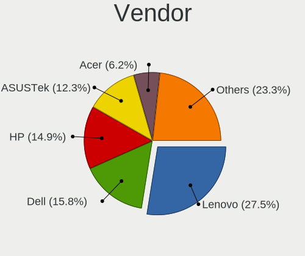
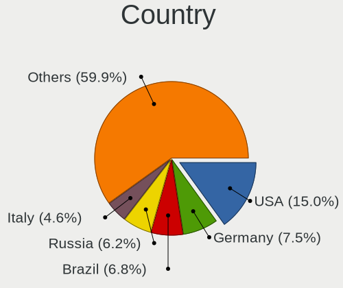
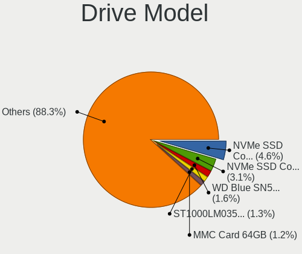
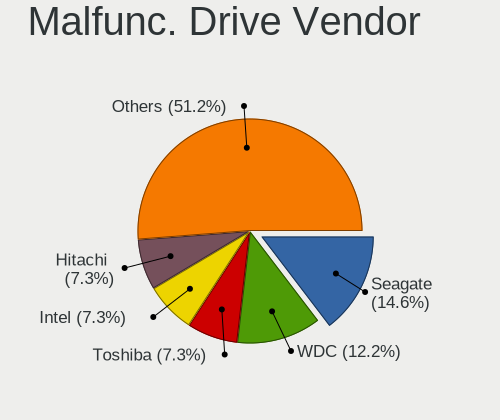
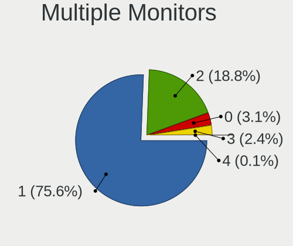
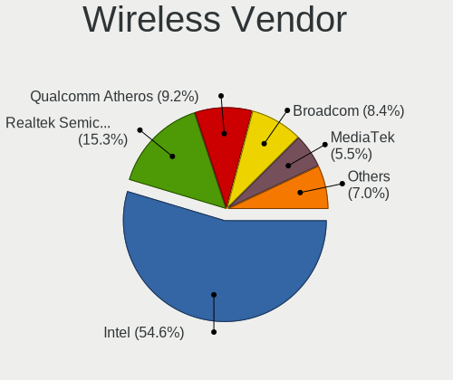
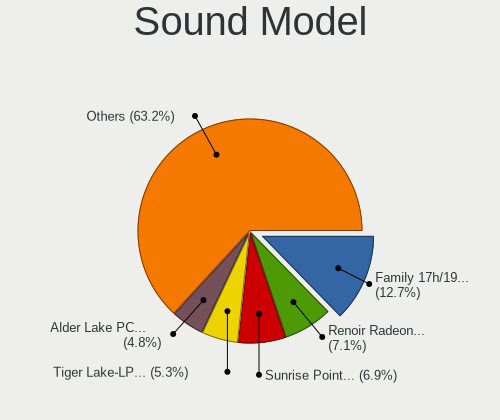
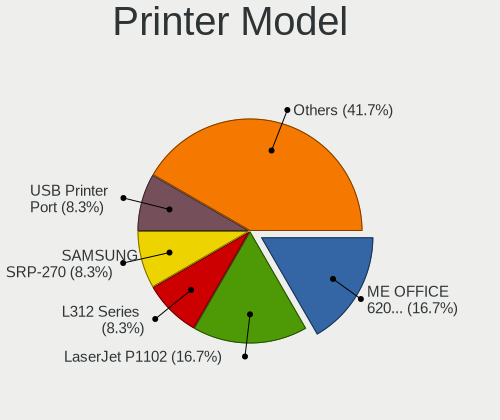
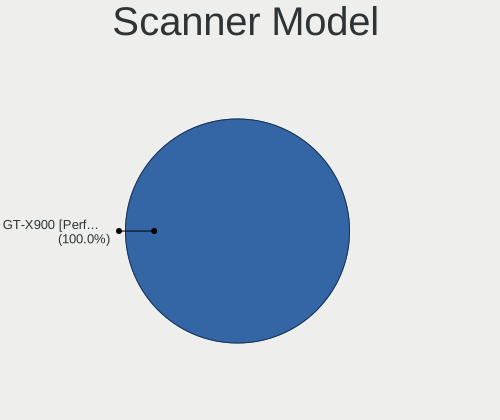

Fedora 38 - Tested Hardware & Statistics (Notebooks)
----------------------------------------------------

A project to collect tested hardware configurations for Fedora 38.

Anyone can contribute to this report by the [hw-probe](https://github.com/linuxhw/hw-probe) tool:

    sudo -E hw-probe -all -upload

Please contribute! Especially if your hardware is rare.

Contents
--------

* [ Test Cases ](#test-cases)

* [ System ](#system)
  - [ Kernel                   ](#kernel)
  - [ Kernel Family            ](#kernel-family)
  - [ Kernel Major Ver.        ](#kernel-major-ver)
  - [ Arch                     ](#arch)
  - [ DE                       ](#de)
  - [ Display Server           ](#display-server)
  - [ Display Manager          ](#display-manager)
  - [ OS Lang                  ](#os-lang)
  - [ Boot Mode                ](#boot-mode)
  - [ Filesystem               ](#filesystem)
  - [ Part. scheme             ](#part-scheme)
  - [ Dual Boot with Linux/BSD ](#dual-boot-with-linuxbsd)
  - [ Dual Boot (Win)          ](#dual-boot-win)

* [ Board ](#board)
  - [ Vendor                   ](#vendor)
  - [ Model                    ](#model)
  - [ Model Family             ](#model-family)
  - [ MFG Year                 ](#mfg-year)
  - [ Form Factor              ](#form-factor)
  - [ Secure Boot              ](#secure-boot)
  - [ Coreboot                 ](#coreboot)
  - [ RAM Size                 ](#ram-size)
  - [ RAM Used                 ](#ram-used)
  - [ Total Drives             ](#total-drives)
  - [ Has CD-ROM               ](#has-cd-rom)
  - [ Has Ethernet             ](#has-ethernet)
  - [ Has WiFi                 ](#has-wifi)
  - [ Has Bluetooth            ](#has-bluetooth)

* [ Location ](#location)
  - [ Country                  ](#country)
  - [ City                     ](#city)

* [ Drives ](#drives)
  - [ Drive Vendor             ](#drive-vendor)
  - [ Drive Model              ](#drive-model)
  - [ HDD Vendor               ](#hdd-vendor)
  - [ SSD Vendor               ](#ssd-vendor)
  - [ Drive Kind               ](#drive-kind)
  - [ Drive Connector          ](#drive-connector)
  - [ Drive Size               ](#drive-size)
  - [ Space Total              ](#space-total)
  - [ Space Used               ](#space-used)
  - [ Malfunc. Drives          ](#malfunc-drives)
  - [ Malfunc. Drive Vendor    ](#malfunc-drive-vendor)
  - [ Malfunc. HDD Vendor      ](#malfunc-hdd-vendor)
  - [ Malfunc. Drive Kind      ](#malfunc-drive-kind)
  - [ Failed Drives            ](#failed-drives)
  - [ Failed Drive Vendor      ](#failed-drive-vendor)
  - [ Drive Status             ](#drive-status)

* [ Storage controller ](#storage-controller)
  - [ Storage Vendor           ](#storage-vendor)
  - [ Storage Model            ](#storage-model)
  - [ Storage Kind             ](#storage-kind)

* [ Processor ](#processor)
  - [ CPU Vendor               ](#cpu-vendor)
  - [ CPU Model                ](#cpu-model)
  - [ CPU Model Family         ](#cpu-model-family)
  - [ CPU Cores                ](#cpu-cores)
  - [ CPU Sockets              ](#cpu-sockets)
  - [ CPU Threads              ](#cpu-threads)
  - [ CPU Op-Modes             ](#cpu-op-modes)
  - [ CPU Microcode            ](#cpu-microcode)
  - [ CPU Microarch            ](#cpu-microarch)

* [ Graphics ](#graphics)
  - [ GPU Vendor               ](#gpu-vendor)
  - [ GPU Model                ](#gpu-model)
  - [ GPU Combo                ](#gpu-combo)
  - [ GPU Driver               ](#gpu-driver)
  - [ GPU Memory               ](#gpu-memory)

* [ Monitor ](#monitor)
  - [ Monitor Vendor           ](#monitor-vendor)
  - [ Monitor Model            ](#monitor-model)
  - [ Monitor Resolution       ](#monitor-resolution)
  - [ Monitor Diagonal         ](#monitor-diagonal)
  - [ Monitor Width            ](#monitor-width)
  - [ Aspect Ratio             ](#aspect-ratio)
  - [ Monitor Area             ](#monitor-area)
  - [ Pixel Density            ](#pixel-density)
  - [ Multiple Monitors        ](#multiple-monitors)

* [ Network ](#network)
  - [ Net Controller Vendor    ](#net-controller-vendor)
  - [ Net Controller Model     ](#net-controller-model)
  - [ Wireless Vendor          ](#wireless-vendor)
  - [ Wireless Model           ](#wireless-model)
  - [ Ethernet Vendor          ](#ethernet-vendor)
  - [ Ethernet Model           ](#ethernet-model)
  - [ Net Controller Kind      ](#net-controller-kind)
  - [ Used Controller          ](#used-controller)
  - [ NICs                     ](#nics)
  - [ IPv6                     ](#ipv6)

* [ Bluetooth ](#bluetooth)
  - [ Bluetooth Vendor         ](#bluetooth-vendor)
  - [ Bluetooth Model          ](#bluetooth-model)

* [ Sound ](#sound)
  - [ Sound Vendor             ](#sound-vendor)
  - [ Sound Model              ](#sound-model)

* [ Memory ](#memory)
  - [ Memory Vendor            ](#memory-vendor)
  - [ Memory Model             ](#memory-model)
  - [ Memory Kind              ](#memory-kind)
  - [ Memory Form Factor       ](#memory-form-factor)
  - [ Memory Size              ](#memory-size)
  - [ Memory Speed             ](#memory-speed)

* [ Printers & scanners ](#printers--scanners)
  - [ Printer Vendor           ](#printer-vendor)
  - [ Printer Model            ](#printer-model)
  - [ Scanner Vendor           ](#scanner-vendor)
  - [ Scanner Model            ](#scanner-model)

* [ Camera ](#camera)
  - [ Camera Vendor            ](#camera-vendor)
  - [ Camera Model             ](#camera-model)

* [ Security ](#security)
  - [ Fingerprint Vendor       ](#fingerprint-vendor)
  - [ Fingerprint Model        ](#fingerprint-model)
  - [ Chipcard Vendor          ](#chipcard-vendor)
  - [ Chipcard Model           ](#chipcard-model)

* [ Unsupported ](#unsupported)
  - [ Unsupported Devices      ](#unsupported-devices)
  - [ Unsupported Device Types ](#unsupported-device-types)

Test Cases
----------

Total: 2488

| Vendor        | Model                       | Probe                                                      | Date         |
|---------------|-----------------------------|------------------------------------------------------------|--------------|
| Dell          | Latitude 5290 2-in-1        | [0b277582ac](https://linux-hardware.org/?probe=0b277582ac) | Jan 03, 2025 |
| Toshiba       | PORTEGE R700                | [71c89a13ef](https://linux-hardware.org/?probe=71c89a13ef) | Dec 18, 2024 |
| Lenovo        | ThinkPad X1 Carbon 2nd 2... | [e494fd0d75](https://linux-hardware.org/?probe=e494fd0d75) | Dec 04, 2024 |
| Lenovo        | ThinkPad X1 Carbon 2nd 2... | [5b90e94be7](https://linux-hardware.org/?probe=5b90e94be7) | Nov 08, 2024 |
| Siragon       | MN-50                       | [31e300c3fb](https://linux-hardware.org/?probe=31e300c3fb) | Oct 28, 2024 |
| ASUSTek       | VivoBook_ASUSLaptop M350... | [97936e2c62](https://linux-hardware.org/?probe=97936e2c62) | Oct 21, 2024 |
| Lenovo        | ThinkPad X240 20AL00BRUK    | [98d613e99d](https://linux-hardware.org/?probe=98d613e99d) | Sep 09, 2024 |
| Acer          | Nitro AN515-58              | [5e4d6ee2a9](https://linux-hardware.org/?probe=5e4d6ee2a9) | Sep 02, 2024 |
| HP            | 650                         | [aee05e4142](https://linux-hardware.org/?probe=aee05e4142) | Aug 11, 2024 |
| Acer          | Aspire E5-721               | [717fbb1b25](https://linux-hardware.org/?probe=717fbb1b25) | Jul 27, 2024 |
| Acer          | Aspire E5-721               | [84fbbf51e9](https://linux-hardware.org/?probe=84fbbf51e9) | Jul 26, 2024 |
| Dell          | Vostro 1400                 | [f6c68ed76d](https://linux-hardware.org/?probe=f6c68ed76d) | Jul 03, 2024 |
| Matsushita... | CF-30FTS29AM                | [28a6faa26b](https://linux-hardware.org/?probe=28a6faa26b) | Jun 21, 2024 |
| Medion        | ME Series                   | [287dad84a7](https://linux-hardware.org/?probe=287dad84a7) | Jun 16, 2024 |
| Lenovo        | ThinkPad T14 Gen 1 20S1S... | [c7a3b88679](https://linux-hardware.org/?probe=c7a3b88679) | Jun 11, 2024 |
| Lenovo        | ThinkPad T14 Gen 1 20S1S... | [3f5fa783fc](https://linux-hardware.org/?probe=3f5fa783fc) | Jun 11, 2024 |
| Dell          | Latitude 5511               | [61d73d0947](https://linux-hardware.org/?probe=61d73d0947) | Jun 09, 2024 |
| Acer          | Aspire A315-56              | [1dc0d08f6d](https://linux-hardware.org/?probe=1dc0d08f6d) | Jun 07, 2024 |
| Lenovo        | ThinkPad X1 Carbon 3rd 2... | [26130bdac3](https://linux-hardware.org/?probe=26130bdac3) | May 28, 2024 |
| HP            | G61                         | [2aca794d48](https://linux-hardware.org/?probe=2aca794d48) | May 23, 2024 |
| Acer          | Predator PH517-61           | [73fa0da6ff](https://linux-hardware.org/?probe=73fa0da6ff) | May 19, 2024 |
| Lenovo        | ThinkPad Z16 Gen 1 21D4C... | [97cc11c8c4](https://linux-hardware.org/?probe=97cc11c8c4) | May 18, 2024 |
| Lenovo        | ThinkPad T14s Gen 1 20T1... | [8eafbd5d04](https://linux-hardware.org/?probe=8eafbd5d04) | May 09, 2024 |
| Sony          | SVE1512Z1EB                 | [18a1eb8f10](https://linux-hardware.org/?probe=18a1eb8f10) | Apr 30, 2024 |
| HP            | ZBook Firefly 14 inch G9... | [22dcf39db0](https://linux-hardware.org/?probe=22dcf39db0) | Apr 29, 2024 |
| Lenovo        | ThinkPad T520 42424WU       | [f54ef8bc01](https://linux-hardware.org/?probe=f54ef8bc01) | Apr 27, 2024 |
| Dell          | Inspiron 15 3520            | [3c7367dc40](https://linux-hardware.org/?probe=3c7367dc40) | Apr 25, 2024 |
| Unknown       | W1415A                      | [50907a4878](https://linux-hardware.org/?probe=50907a4878) | Apr 25, 2024 |
| Dell          | Latitude E5420              | [29150a7b19](https://linux-hardware.org/?probe=29150a7b19) | Apr 17, 2024 |
| Dell          | G15 5525                    | [74c6d6a8f8](https://linux-hardware.org/?probe=74c6d6a8f8) | Apr 15, 2024 |
| Dell          | G15 5525                    | [7842ec2d68](https://linux-hardware.org/?probe=7842ec2d68) | Apr 12, 2024 |
| Acer          | Nitro AN515-52              | [e08da0d2dd](https://linux-hardware.org/?probe=e08da0d2dd) | Apr 11, 2024 |
| HUAWEI        | CREM-WXX9                   | [2abd83a846](https://linux-hardware.org/?probe=2abd83a846) | Apr 09, 2024 |
| HUAWEI        | CREM-WXX9                   | [622d81532a](https://linux-hardware.org/?probe=622d81532a) | Apr 08, 2024 |
| Lenovo        | ThinkPad X1 Carbon 6th 2... | [a93a4109d7](https://linux-hardware.org/?probe=a93a4109d7) | Apr 07, 2024 |
| Lenovo        | ThinkPad X1 Carbon 6th 2... | [b51e077a23](https://linux-hardware.org/?probe=b51e077a23) | Apr 07, 2024 |
| Dell          | G15 5525                    | [761f9399bc](https://linux-hardware.org/?probe=761f9399bc) | Apr 02, 2024 |
| Lenovo        | Legion Y9000P IAH7H 82RF    | [bc908f87b5](https://linux-hardware.org/?probe=bc908f87b5) | Mar 27, 2024 |
| Dell          | Studio 1537                 | [eaec8e4b11](https://linux-hardware.org/?probe=eaec8e4b11) | Mar 24, 2024 |
| Dell          | Studio 1537                 | [80777d58fb](https://linux-hardware.org/?probe=80777d58fb) | Mar 24, 2024 |
| Lenovo        | IdeaPad L340-15IRH Gamin... | [8041a52ffe](https://linux-hardware.org/?probe=8041a52ffe) | Mar 21, 2024 |
| Lenovo        | IdeaPad Pro 5 16ARP8 83A... | [a72ccae833](https://linux-hardware.org/?probe=a72ccae833) | Mar 19, 2024 |
| Dell          | Inspiron 5567               | [3828683188](https://linux-hardware.org/?probe=3828683188) | Mar 17, 2024 |
| ASUSTek       | VivoBook_ASUSLaptop X421... | [076b0dcbc4](https://linux-hardware.org/?probe=076b0dcbc4) | Mar 16, 2024 |
| Lenovo        | Legion 5 15ARH05 82B5       | [71d3373343](https://linux-hardware.org/?probe=71d3373343) | Mar 13, 2024 |
| Lenovo        | Legion 5 15ARH05 82B5       | [24bd77109e](https://linux-hardware.org/?probe=24bd77109e) | Mar 13, 2024 |
| Lenovo        | ThinkPad P16s Gen 2 21K9... | [fbc1335ccc](https://linux-hardware.org/?probe=fbc1335ccc) | Mar 12, 2024 |
| Lenovo        | ThinkPad T15p Gen 3 21DA... | [2417a59037](https://linux-hardware.org/?probe=2417a59037) | Mar 12, 2024 |
| Lenovo        | ThinkPad T430 2349SA2       | [ff165c1172](https://linux-hardware.org/?probe=ff165c1172) | Mar 09, 2024 |
| Lenovo        | ThinkPad T430 2349SA2       | [36f2425c6d](https://linux-hardware.org/?probe=36f2425c6d) | Mar 05, 2024 |
| Medion        | ME Series                   | [ace6388b48](https://linux-hardware.org/?probe=ace6388b48) | Mar 04, 2024 |
| HP            | ENVY 15                     | [86b5b9b7d7](https://linux-hardware.org/?probe=86b5b9b7d7) | Mar 04, 2024 |
| HP            | ENVY 15                     | [f8fc004a9c](https://linux-hardware.org/?probe=f8fc004a9c) | Mar 03, 2024 |
| Lenovo        | ThinkPad T430 2349SA2       | [2a2fc2e55c](https://linux-hardware.org/?probe=2a2fc2e55c) | Mar 03, 2024 |
| MSI           | GL65 Leopard 10SCXR         | [c7a95a6968](https://linux-hardware.org/?probe=c7a95a6968) | Feb 29, 2024 |
| Acer          | Aspire A315-24P             | [fc38526fc2](https://linux-hardware.org/?probe=fc38526fc2) | Feb 26, 2024 |
| ASUSTek       | VivoBook 15_ASUS Laptop ... | [3f760d848e](https://linux-hardware.org/?probe=3f760d848e) | Feb 26, 2024 |
| HP            | ZBook 17 G5                 | [6be338eb09](https://linux-hardware.org/?probe=6be338eb09) | Feb 25, 2024 |
| Lenovo        | G500 20236                  | [414d89413c](https://linux-hardware.org/?probe=414d89413c) | Feb 24, 2024 |
| ASUSTek       | K53SC                       | [35b1dda2a4](https://linux-hardware.org/?probe=35b1dda2a4) | Feb 24, 2024 |
| HP            | Pavilion 17                 | [689fe676e5](https://linux-hardware.org/?probe=689fe676e5) | Feb 21, 2024 |
| ASUSTek       | ROG Strix G713QM_G713QM     | [e3eb549631](https://linux-hardware.org/?probe=e3eb549631) | Feb 21, 2024 |
| Acer          | Nitro AN515-52              | [d87447cdf2](https://linux-hardware.org/?probe=d87447cdf2) | Feb 16, 2024 |
| Acer          | Aspire A715-75G             | [0c08871a46](https://linux-hardware.org/?probe=0c08871a46) | Feb 11, 2024 |
| HP            | Pavilion Notebook           | [7da16fe9d7](https://linux-hardware.org/?probe=7da16fe9d7) | Feb 09, 2024 |
| Dell          | Latitude 5510               | [e0d5fe1c62](https://linux-hardware.org/?probe=e0d5fe1c62) | Feb 07, 2024 |
| HP            | EliteBook 840 G2            | [4a3954a4c1](https://linux-hardware.org/?probe=4a3954a4c1) | Feb 02, 2024 |
| Acer          | Aspire VN7-591G             | [c0f024d3e0](https://linux-hardware.org/?probe=c0f024d3e0) | Feb 02, 2024 |
| Lenovo        | ThinkPad P52 20M9001MMX     | [0270f75e12](https://linux-hardware.org/?probe=0270f75e12) | Jan 29, 2024 |
| Dell          | Latitude 5420               | [459fbb3448](https://linux-hardware.org/?probe=459fbb3448) | Jan 28, 2024 |
| Lenovo        | ThinkPad T430 2349SA2       | [8c4e929f6f](https://linux-hardware.org/?probe=8c4e929f6f) | Jan 27, 2024 |
| Apple         | MacBookAir7,2               | [0aeced0805](https://linux-hardware.org/?probe=0aeced0805) | Jan 26, 2024 |
| Lenovo        | IdeaPad Gaming 3 15ACH6 ... | [8cafa419c5](https://linux-hardware.org/?probe=8cafa419c5) | Jan 26, 2024 |
| Apple         | MacBookPro16,1              | [62447a80b3](https://linux-hardware.org/?probe=62447a80b3) | Jan 22, 2024 |
| Apple         | MacBookPro16,1              | [f9faae4b87](https://linux-hardware.org/?probe=f9faae4b87) | Jan 22, 2024 |
| Lenovo        | ThinkPad X220 429044U       | [d5fd867450](https://linux-hardware.org/?probe=d5fd867450) | Jan 21, 2024 |
| Nuvision      | L1W6_I1101_G Hampoo Rese... | [fb82a79de2](https://linux-hardware.org/?probe=fb82a79de2) | Jan 19, 2024 |
| ASUSTek       | Zenbook UM3402YAR_UM3402... | [c699d403f6](https://linux-hardware.org/?probe=c699d403f6) | Jan 14, 2024 |
| Apple         | MacBookPro11,2              | [c9f084fd2a](https://linux-hardware.org/?probe=c9f084fd2a) | Jan 13, 2024 |
| ASUSTek       | X580VD                      | [25e38b0f43](https://linux-hardware.org/?probe=25e38b0f43) | Jan 12, 2024 |
| ASUSTek       | G53SX                       | [01ccd618c5](https://linux-hardware.org/?probe=01ccd618c5) | Jan 11, 2024 |
| Lenovo        | ThinkPad X230 2325Y3G       | [f2c9141668](https://linux-hardware.org/?probe=f2c9141668) | Jan 08, 2024 |
| ASUSTek       | ASUS TUF Gaming A15 FA50... | [81d7f1e405](https://linux-hardware.org/?probe=81d7f1e405) | Jan 08, 2024 |
| ASUSTek       | ASUS TUF Gaming A15 FA50... | [1673e31468](https://linux-hardware.org/?probe=1673e31468) | Jan 08, 2024 |
| Lenovo        | Legion 5 Pro 16IAH7 82S0    | [94a6c6bf63](https://linux-hardware.org/?probe=94a6c6bf63) | Jan 07, 2024 |
| HP            | ProBook 445 G7              | [758fdda6d6](https://linux-hardware.org/?probe=758fdda6d6) | Jan 05, 2024 |
| Framework     | Laptop (13th Gen Intel C... | [183851c797](https://linux-hardware.org/?probe=183851c797) | Jan 04, 2024 |
| Apple         | MacBookPro11,2              | [65c5154739](https://linux-hardware.org/?probe=65c5154739) | Jan 04, 2024 |
| HUAWEI        | NBM-WXX9                    | [f1a366a5a9](https://linux-hardware.org/?probe=f1a366a5a9) | Jan 03, 2024 |
| HP            | ProBook 6570b               | [98ccfce078](https://linux-hardware.org/?probe=98ccfce078) | Jan 02, 2024 |
| ASUSTek       | VivoBook_ASUSLaptop E210... | [689f8869db](https://linux-hardware.org/?probe=689f8869db) | Jan 01, 2024 |
| Apple         | MacBookPro11,2              | [4a37a9b35c](https://linux-hardware.org/?probe=4a37a9b35c) | Jan 01, 2024 |
| Lenovo        | ThinkPad T460 20FMS2291P    | [1a86f2a3d4](https://linux-hardware.org/?probe=1a86f2a3d4) | Jan 01, 2024 |
| Dell          | Inspiron 5748               | [20017233b9](https://linux-hardware.org/?probe=20017233b9) | Dec 30, 2023 |
| Lenovo        | ThinkBook 13s-IWL 20R9      | [53fc03e451](https://linux-hardware.org/?probe=53fc03e451) | Dec 29, 2023 |
| ASUSTek       | ROG Strix G713QM_G713QM     | [6c5599855c](https://linux-hardware.org/?probe=6c5599855c) | Dec 29, 2023 |
| ASUSTek       | ROG Strix G713QM_G713QM     | [0be6e9ce52](https://linux-hardware.org/?probe=0be6e9ce52) | Dec 29, 2023 |
| HP            | EliteBook 2570p             | [935d08358c](https://linux-hardware.org/?probe=935d08358c) | Dec 29, 2023 |
| HP            | EliteBook 840 G2            | [bbce6fb229](https://linux-hardware.org/?probe=bbce6fb229) | Dec 28, 2023 |
| HP            | EliteBook 840 G2            | [6ba5504a6f](https://linux-hardware.org/?probe=6ba5504a6f) | Dec 28, 2023 |
| Chuwi         | MiniBook X                  | [6249e8f644](https://linux-hardware.org/?probe=6249e8f644) | Dec 27, 2023 |
| Lenovo        | ThinkPad T460p 20FWCTO1W... | [00e7af074b](https://linux-hardware.org/?probe=00e7af074b) | Dec 25, 2023 |
| Apple         | MacBookPro9,2               | [5206fdfe7e](https://linux-hardware.org/?probe=5206fdfe7e) | Dec 24, 2023 |
| Apple         | MacBookPro9,2               | [976944381c](https://linux-hardware.org/?probe=976944381c) | Dec 24, 2023 |
| HP            | Elite x2 1012 G1            | [c93fffc388](https://linux-hardware.org/?probe=c93fffc388) | Dec 23, 2023 |
| ASUSTek       | ASUS TUF Gaming A15 FA50... | [5c4d1c7d64](https://linux-hardware.org/?probe=5c4d1c7d64) | Dec 23, 2023 |
| ASUSTek       | T100TA                      | [9ad17d2d3c](https://linux-hardware.org/?probe=9ad17d2d3c) | Dec 23, 2023 |
| Dell          | Latitude 5420               | [9858586a84](https://linux-hardware.org/?probe=9858586a84) | Dec 22, 2023 |
| Dell          | Precision M4800             | [ce7a9239f4](https://linux-hardware.org/?probe=ce7a9239f4) | Dec 22, 2023 |
| Lenovo        | ThinkPad E14 20RB000UBR     | [d65cca0578](https://linux-hardware.org/?probe=d65cca0578) | Dec 22, 2023 |
| Lenovo        | ThinkBook 13s-IWL 20R9      | [e864a3cd22](https://linux-hardware.org/?probe=e864a3cd22) | Dec 21, 2023 |
| HP            | ProBook 445 G7              | [4153ae7cc6](https://linux-hardware.org/?probe=4153ae7cc6) | Dec 21, 2023 |
| Lenovo        | ThinkPad X1 Carbon Gen 1... | [eef5dcab57](https://linux-hardware.org/?probe=eef5dcab57) | Dec 20, 2023 |
| ASUSTek       | VivoBook_ASUSLaptop X509... | [19fe61d807](https://linux-hardware.org/?probe=19fe61d807) | Dec 18, 2023 |
| Samsung       | 550P5C/550P7C               | [b06e8fbef4](https://linux-hardware.org/?probe=b06e8fbef4) | Dec 18, 2023 |
| HP            | ZBook 17 G5                 | [288e976604](https://linux-hardware.org/?probe=288e976604) | Dec 17, 2023 |
| Lenovo        | Legion 7 16ARHA7 82UH       | [845e586dba](https://linux-hardware.org/?probe=845e586dba) | Dec 17, 2023 |
| ASUSTek       | ROG Zephyrus G14 GA402RJ... | [f4c923a84a](https://linux-hardware.org/?probe=f4c923a84a) | Dec 16, 2023 |
| HP            | ZBook 15u G6                | [4467debb1c](https://linux-hardware.org/?probe=4467debb1c) | Dec 15, 2023 |
| Dell          | Inspiron 3793               | [90804693a6](https://linux-hardware.org/?probe=90804693a6) | Dec 14, 2023 |
| Apple         | MacBookAir9,1               | [6cadf8d04e](https://linux-hardware.org/?probe=6cadf8d04e) | Dec 14, 2023 |
| Dell          | XPS 15 9530                 | [33d1f683ba](https://linux-hardware.org/?probe=33d1f683ba) | Dec 13, 2023 |
| Acer          | V5-171                      | [79abc82869](https://linux-hardware.org/?probe=79abc82869) | Dec 11, 2023 |
| Lenovo        | ThinkPad T440p 20ANCTO1W... | [070ba5c3c1](https://linux-hardware.org/?probe=070ba5c3c1) | Dec 10, 2023 |
| Dell          | Latitude E6430              | [dee39185ec](https://linux-hardware.org/?probe=dee39185ec) | Dec 08, 2023 |
| Dell          | Precision M4700             | [54abe2ce35](https://linux-hardware.org/?probe=54abe2ce35) | Dec 08, 2023 |
| Lenovo        | ThinkPad X1 Carbon Gen 1... | [cf832dba27](https://linux-hardware.org/?probe=cf832dba27) | Dec 08, 2023 |
| HONOR         | HGF-WX6                     | [0ba74f97d0](https://linux-hardware.org/?probe=0ba74f97d0) | Dec 07, 2023 |
| Dell          | System Inspiron N4110       | [72874bcc85](https://linux-hardware.org/?probe=72874bcc85) | Dec 07, 2023 |
| Lenovo        | ThinkBook 15 G2 ARE 20VG    | [de12499622](https://linux-hardware.org/?probe=de12499622) | Dec 05, 2023 |
| Lenovo        | Legion 5 15ITH6H 82JH       | [fe13325e26](https://linux-hardware.org/?probe=fe13325e26) | Dec 05, 2023 |
| Dell          | Latitude 5420               | [b3ebc9b0fc](https://linux-hardware.org/?probe=b3ebc9b0fc) | Dec 04, 2023 |
| ASUSTek       | VivoBook_ASUSLaptop X571... | [da6b435afa](https://linux-hardware.org/?probe=da6b435afa) | Dec 02, 2023 |
| Lenovo        | IdeaPad 3 15ADA05 81W1      | [6189dc268f](https://linux-hardware.org/?probe=6189dc268f) | Dec 02, 2023 |
| Lenovo        | ThinkPad T460s 20FAS09H0... | [94274c6313](https://linux-hardware.org/?probe=94274c6313) | Dec 02, 2023 |
| Dell          | Inspiron 7720               | [974a2661e2](https://linux-hardware.org/?probe=974a2661e2) | Dec 01, 2023 |
| HP            | OMEN Laptop 15-en0xxx       | [f2dc650bdf](https://linux-hardware.org/?probe=f2dc650bdf) | Nov 30, 2023 |
| Lenovo        | IdeaPad S145-15API 81V7     | [d9b203868f](https://linux-hardware.org/?probe=d9b203868f) | Nov 29, 2023 |
| Lenovo        | IdeaPad S145-15API 81V7     | [7db0c2781b](https://linux-hardware.org/?probe=7db0c2781b) | Nov 29, 2023 |
| Lenovo        | Yoga Slim 7 ProX 14ARH7 ... | [4fb92d7fe0](https://linux-hardware.org/?probe=4fb92d7fe0) | Nov 29, 2023 |
| Dell          | Precision M3800             | [a01e02361f](https://linux-hardware.org/?probe=a01e02361f) | Nov 26, 2023 |
| Lenovo        | IdeaPad 110-15IBR 80T7      | [ce1806eec5](https://linux-hardware.org/?probe=ce1806eec5) | Nov 26, 2023 |
| HP            | 250 15.6 inch G9 Noteboo... | [ce68d047a6](https://linux-hardware.org/?probe=ce68d047a6) | Nov 26, 2023 |
| ASUSTek       | Zenbook UM3402YA_UM3402Y... | [78b8e2f560](https://linux-hardware.org/?probe=78b8e2f560) | Nov 26, 2023 |
| MSI           | PS63 Modern 8RC             | [d647ccba36](https://linux-hardware.org/?probe=d647ccba36) | Nov 26, 2023 |
| HP            | Stream Laptop 11-ah1XX      | [1e704edcd6](https://linux-hardware.org/?probe=1e704edcd6) | Nov 26, 2023 |
| Lenovo        | G510 20238                  | [75a5b58cb8](https://linux-hardware.org/?probe=75a5b58cb8) | Nov 25, 2023 |
| Lenovo        | ThinkPad X1 Extreme 20MF... | [2852a62f61](https://linux-hardware.org/?probe=2852a62f61) | Nov 24, 2023 |
| Dell          | Latitude E5450              | [fad9a32575](https://linux-hardware.org/?probe=fad9a32575) | Nov 23, 2023 |
| Lenovo        | Legion 5 15ACH6H 82JU       | [bf30102553](https://linux-hardware.org/?probe=bf30102553) | Nov 23, 2023 |
| Gigabyte      | AX370-Gaming-CF se1         | [541752a388](https://linux-hardware.org/?probe=541752a388) | Nov 21, 2023 |
| Lenovo        | B580 20144                  | [634e12256a](https://linux-hardware.org/?probe=634e12256a) | Nov 21, 2023 |
| Lenovo        | IdeaPad 3 14ADA05 81W0      | [26ebeb2504](https://linux-hardware.org/?probe=26ebeb2504) | Nov 20, 2023 |
| BTO           | 17X1183                     | [6cd57738ff](https://linux-hardware.org/?probe=6cd57738ff) | Nov 20, 2023 |
| Dell          | Inspiron 7375               | [b72b8abe13](https://linux-hardware.org/?probe=b72b8abe13) | Nov 19, 2023 |
| Lenovo        | ThinkPad X1 Carbon 3rd 2... | [94962a7ceb](https://linux-hardware.org/?probe=94962a7ceb) | Nov 19, 2023 |
| HP            | OMEN by Laptop 16-c0xxx     | [d957a1a8c5](https://linux-hardware.org/?probe=d957a1a8c5) | Nov 19, 2023 |
| Timi          | TM1701                      | [f14bab873b](https://linux-hardware.org/?probe=f14bab873b) | Nov 18, 2023 |
| Acer          | Aspire A315-53G             | [7f9669bf0b](https://linux-hardware.org/?probe=7f9669bf0b) | Nov 18, 2023 |
| Google        | Kano                        | [3a0f7846c4](https://linux-hardware.org/?probe=3a0f7846c4) | Nov 17, 2023 |
| Google        | Kano                        | [0c5e699794](https://linux-hardware.org/?probe=0c5e699794) | Nov 17, 2023 |
| Acer          | Aspire A515-45              | [d1800f3356](https://linux-hardware.org/?probe=d1800f3356) | Nov 16, 2023 |
| Lenovo        | IdeaPad 3 15ALC6 82MF       | [f1ba9de4ad](https://linux-hardware.org/?probe=f1ba9de4ad) | Nov 16, 2023 |
| Lenovo        | ThinkPad Z16 Gen 1 21D40... | [ffc320e32c](https://linux-hardware.org/?probe=ffc320e32c) | Nov 15, 2023 |
| Acer          | Predator PH315-53           | [f2a6eea13e](https://linux-hardware.org/?probe=f2a6eea13e) | Nov 14, 2023 |
| HP            | EliteBook 840 G2            | [64cfcced5b](https://linux-hardware.org/?probe=64cfcced5b) | Nov 14, 2023 |
| MSI           | Prestige 14 A10SC           | [59ad7e7e27](https://linux-hardware.org/?probe=59ad7e7e27) | Nov 14, 2023 |
| MSI           | Prestige 14 A10SC           | [6b1a5452f8](https://linux-hardware.org/?probe=6b1a5452f8) | Nov 14, 2023 |
| Dell          | Latitude 7390 2-in-1        | [f92b2d58ec](https://linux-hardware.org/?probe=f92b2d58ec) | Nov 14, 2023 |
| HP            | EliteBook 840 G2            | [4b522b316d](https://linux-hardware.org/?probe=4b522b316d) | Nov 14, 2023 |
| Acer          | Aspire A515-57              | [bb0f5fe1e2](https://linux-hardware.org/?probe=bb0f5fe1e2) | Nov 14, 2023 |
| ASUSTek       | TUF Gaming FA506II_FA506... | [2e60a77926](https://linux-hardware.org/?probe=2e60a77926) | Nov 14, 2023 |
| HP            | EliteBook 840 G2            | [74c6e6efae](https://linux-hardware.org/?probe=74c6e6efae) | Nov 13, 2023 |
| ASUSTek       | F3Sv                        | [7cc246f28e](https://linux-hardware.org/?probe=7cc246f28e) | Nov 13, 2023 |
| Apple         | MacBookPro5,5               | [87e3c4fa90](https://linux-hardware.org/?probe=87e3c4fa90) | Nov 12, 2023 |
| HP            | EliteBook 840 G4            | [2651393e60](https://linux-hardware.org/?probe=2651393e60) | Nov 12, 2023 |
| HP            | ZBook Firefly 14 inch G8... | [4fd542edf2](https://linux-hardware.org/?probe=4fd542edf2) | Nov 11, 2023 |
| Lenovo        | ThinkPad P1 Gen 3 20TJS2... | [7d86488ec6](https://linux-hardware.org/?probe=7d86488ec6) | Nov 11, 2023 |
| Lenovo        | Yoga Pro 9 16IRP8 83BY      | [cfc1427577](https://linux-hardware.org/?probe=cfc1427577) | Nov 10, 2023 |
| Lenovo        | ThinkPad E15 Gen 2 20TD0... | [60d38c4fae](https://linux-hardware.org/?probe=60d38c4fae) | Nov 09, 2023 |
| Lenovo        | ThinkPad X250 20CLAOMLIN    | [88967f98bd](https://linux-hardware.org/?probe=88967f98bd) | Nov 09, 2023 |
| Lenovo        | ThinkPad E14 Gen 2 20TA0... | [80431017dc](https://linux-hardware.org/?probe=80431017dc) | Nov 09, 2023 |
| Valve         | Jupiter                     | [2e7ed7b6c8](https://linux-hardware.org/?probe=2e7ed7b6c8) | Nov 09, 2023 |
| Notebook      | NJ50_70CU                   | [f48a185656](https://linux-hardware.org/?probe=f48a185656) | Nov 08, 2023 |
| ASUSTek       | ROG Zephyrus G15 GA503RW... | [63e0b9fc88](https://linux-hardware.org/?probe=63e0b9fc88) | Nov 08, 2023 |
| Sony          | SVF15N17CXB                 | [e8497bf6f6](https://linux-hardware.org/?probe=e8497bf6f6) | Nov 08, 2023 |
| HP            | Laptop 15-rb0xx             | [3d2ec07a57](https://linux-hardware.org/?probe=3d2ec07a57) | Nov 08, 2023 |
| HP            | Laptop 15-rb0xx             | [eb27db3944](https://linux-hardware.org/?probe=eb27db3944) | Nov 08, 2023 |
| HP            | ZBook Studio G7 Mobile W... | [5cfd80c832](https://linux-hardware.org/?probe=5cfd80c832) | Nov 08, 2023 |
| HP            | ZBook Studio G7 Mobile W... | [675571ef30](https://linux-hardware.org/?probe=675571ef30) | Nov 08, 2023 |
| Lenovo        | ThinkPad T14 Gen 2i 20W1... | [da7463eff8](https://linux-hardware.org/?probe=da7463eff8) | Nov 07, 2023 |
| HP            | Laptop 15-ef2xxx            | [b0d207b140](https://linux-hardware.org/?probe=b0d207b140) | Nov 07, 2023 |
| Apple         | MacBookPro13,1              | [e5ae7e8a94](https://linux-hardware.org/?probe=e5ae7e8a94) | Nov 07, 2023 |
| Dell          | Vostro 3500                 | [c85bdae7e5](https://linux-hardware.org/?probe=c85bdae7e5) | Nov 07, 2023 |
| Lenovo        | V15 G2 ITL 82KB             | [e874ddf25c](https://linux-hardware.org/?probe=e874ddf25c) | Nov 07, 2023 |
| Dell          | Latitude E5470              | [19fc06d0b2](https://linux-hardware.org/?probe=19fc06d0b2) | Nov 07, 2023 |
| ASUSTek       | VivoBook_ASUSLaptop K360... | [ce00056643](https://linux-hardware.org/?probe=ce00056643) | Nov 07, 2023 |
| Lenovo        | IdeaPad Gaming 3 15IMH05... | [0cc84d3b82](https://linux-hardware.org/?probe=0cc84d3b82) | Nov 07, 2023 |
| Samsung       | 550P5C/550P7C               | [c7d84926af](https://linux-hardware.org/?probe=c7d84926af) | Nov 07, 2023 |
| Acer          | Aspire A315-41              | [e275461ffe](https://linux-hardware.org/?probe=e275461ffe) | Nov 07, 2023 |
| ASUSTek       | X55A                        | [705bc0e6a5](https://linux-hardware.org/?probe=705bc0e6a5) | Nov 07, 2023 |
| Dell          | Precision M4600             | [0aabbcfa0b](https://linux-hardware.org/?probe=0aabbcfa0b) | Nov 06, 2023 |
| Lenovo        | ThinkPad T480s 20L7002HU... | [53fd99e067](https://linux-hardware.org/?probe=53fd99e067) | Nov 06, 2023 |
| Lenovo        | ThinkPad T480s 20L7002HU... | [d8adc9ee0d](https://linux-hardware.org/?probe=d8adc9ee0d) | Nov 06, 2023 |
| Dell          | XPS 15 9500                 | [e07422acdd](https://linux-hardware.org/?probe=e07422acdd) | Nov 06, 2023 |
| HP            | EliteBook 850 G3            | [dadc34f1bb](https://linux-hardware.org/?probe=dadc34f1bb) | Nov 06, 2023 |
| HP            | EliteBook 850 G3            | [b5b4c26e1e](https://linux-hardware.org/?probe=b5b4c26e1e) | Nov 06, 2023 |
| Lenovo        | Legion 7 16ITHg6 82K6       | [a7c5843f17](https://linux-hardware.org/?probe=a7c5843f17) | Nov 06, 2023 |
| Timi          | Mi NoteBook Pro             | [a8a46eb495](https://linux-hardware.org/?probe=a8a46eb495) | Nov 06, 2023 |
| Lenovo        | ThinkPad E15 20RD0011IX     | [88cc97d0be](https://linux-hardware.org/?probe=88cc97d0be) | Nov 06, 2023 |
| Lenovo        | ThinkPad T480s 20L7002HU... | [f09ace6b9d](https://linux-hardware.org/?probe=f09ace6b9d) | Nov 06, 2023 |
| HP            | G61                         | [65f7664fe3](https://linux-hardware.org/?probe=65f7664fe3) | Nov 06, 2023 |
| Samsung       | 550P5C/550P7C               | [f87e3a97c4](https://linux-hardware.org/?probe=f87e3a97c4) | Nov 06, 2023 |
| Acer          | Aspire A315-53              | [3daa9909b3](https://linux-hardware.org/?probe=3daa9909b3) | Nov 06, 2023 |
| Dell          | Venue 11 Pro 5130           | [d643312744](https://linux-hardware.org/?probe=d643312744) | Nov 06, 2023 |
| Lenovo        | ThinkPad T14s Gen 1 20UJ... | [d61e270082](https://linux-hardware.org/?probe=d61e270082) | Nov 06, 2023 |
| ASUSTek       | X550WA                      | [8c15da796b](https://linux-hardware.org/?probe=8c15da796b) | Nov 05, 2023 |
| Lenovo        | ThinkPad T480s 20L7002HU... | [92ef56cc92](https://linux-hardware.org/?probe=92ef56cc92) | Nov 05, 2023 |
| Acer          | Predator PT516-52s          | [30b7a47643](https://linux-hardware.org/?probe=30b7a47643) | Nov 05, 2023 |
| Dell          | Inspiron 7559               | [da97d12548](https://linux-hardware.org/?probe=da97d12548) | Nov 05, 2023 |
| Toshiba       | Satellite L845              | [4dc7e8931e](https://linux-hardware.org/?probe=4dc7e8931e) | Nov 05, 2023 |
| Dell          | Latitude E7440              | [5a151e929f](https://linux-hardware.org/?probe=5a151e929f) | Nov 05, 2023 |
| Lenovo        | S145-15IWL 81MV             | [d38fdaf0eb](https://linux-hardware.org/?probe=d38fdaf0eb) | Nov 04, 2023 |
| Lenovo        | ThinkPad W550s 20E2000PM... | [1294d54c1a](https://linux-hardware.org/?probe=1294d54c1a) | Nov 04, 2023 |
| MSI           | Modern 15 B7M               | [b4a588e60e](https://linux-hardware.org/?probe=b4a588e60e) | Nov 04, 2023 |
| HP            | ProBook 430 G8 Notebook ... | [5d8cae0407](https://linux-hardware.org/?probe=5d8cae0407) | Nov 04, 2023 |
| Lenovo        | IdeaPad L340-15IRH Gamin... | [b390f8cd05](https://linux-hardware.org/?probe=b390f8cd05) | Nov 04, 2023 |
| Apple         | MacBook5,2                  | [1d8dad6600](https://linux-hardware.org/?probe=1d8dad6600) | Nov 04, 2023 |
| HP            | EliteBook 850 G5            | [a7f0f43604](https://linux-hardware.org/?probe=a7f0f43604) | Nov 04, 2023 |
| Sony          | VPCEH3J1E                   | [e0ae745034](https://linux-hardware.org/?probe=e0ae745034) | Nov 04, 2023 |
| Lenovo        | ThinkPad P16v Gen 1 21FE... | [d0d84fed9a](https://linux-hardware.org/?probe=d0d84fed9a) | Nov 04, 2023 |
| Lenovo        | V15 G2 ITL 82KB             | [85e528f1bf](https://linux-hardware.org/?probe=85e528f1bf) | Nov 04, 2023 |
| Dell          | Inspiron 15 3511            | [8c23fbf7d1](https://linux-hardware.org/?probe=8c23fbf7d1) | Nov 04, 2023 |
| POV           | I102A                       | [955f97d47e](https://linux-hardware.org/?probe=955f97d47e) | Nov 04, 2023 |
| Irbis         | NB211                       | [694ca0f127](https://linux-hardware.org/?probe=694ca0f127) | Nov 03, 2023 |
| HUAWEI        | KLVL-WXX9                   | [61342b31ea](https://linux-hardware.org/?probe=61342b31ea) | Nov 03, 2023 |
| HP            | Laptop 15-dy2xxx            | [f4bae2d5b5](https://linux-hardware.org/?probe=f4bae2d5b5) | Nov 03, 2023 |
| ASUSTek       | ASUS TUF Gaming A15 FA50... | [ff0d013246](https://linux-hardware.org/?probe=ff0d013246) | Nov 03, 2023 |
| Lenovo        | IdeaPad 3 15IML05 81WB      | [f9bdbf6371](https://linux-hardware.org/?probe=f9bdbf6371) | Nov 03, 2023 |
| Lenovo        | IdeaPad 3 15ALC6 82KU       | [bcea72b22f](https://linux-hardware.org/?probe=bcea72b22f) | Nov 03, 2023 |
| Lenovo        | ThinkPad T470s 20HF0047U... | [00a8b74f46](https://linux-hardware.org/?probe=00a8b74f46) | Nov 03, 2023 |
| Lenovo        | ThinkPad Z13 Gen 1 21D3S... | [6a2591b5e9](https://linux-hardware.org/?probe=6a2591b5e9) | Nov 03, 2023 |
| HP            | Laptop 15-dy2xxx            | [28990f206a](https://linux-hardware.org/?probe=28990f206a) | Nov 03, 2023 |
| Irbis         | NB211                       | [3ebca4338a](https://linux-hardware.org/?probe=3ebca4338a) | Nov 03, 2023 |
| HP            | Pavilion Notebook           | [f23e44229f](https://linux-hardware.org/?probe=f23e44229f) | Nov 03, 2023 |
| HP            | Stream Laptop 11-ah1XX      | [94cdd979b2](https://linux-hardware.org/?probe=94cdd979b2) | Nov 03, 2023 |
| Fujitsu       | LIFEBOOK A3510              | [0929326be0](https://linux-hardware.org/?probe=0929326be0) | Nov 03, 2023 |
| HP            | Stream Laptop 11-ah1XX      | [5149df3a58](https://linux-hardware.org/?probe=5149df3a58) | Nov 03, 2023 |
| Lenovo        | Legion 5 Pro 16ARH7H 82R... | [26bc5f025c](https://linux-hardware.org/?probe=26bc5f025c) | Nov 02, 2023 |
| Lenovo        | IdeaPad S340-15API 81NC     | [741bcd1343](https://linux-hardware.org/?probe=741bcd1343) | Nov 02, 2023 |
| Lenovo        | ThinkPad T400 2768BB1       | [56bbf7c0bb](https://linux-hardware.org/?probe=56bbf7c0bb) | Nov 02, 2023 |
| ASUSTek       | VivoBook_ASUSLaptop K350... | [bb1da2575d](https://linux-hardware.org/?probe=bb1da2575d) | Nov 02, 2023 |
| Lenovo        | ThinkBook Plus G3 IAP 21... | [c6634f090f](https://linux-hardware.org/?probe=c6634f090f) | Nov 02, 2023 |
| Acer          | Aspire A715-41G             | [664191098d](https://linux-hardware.org/?probe=664191098d) | Nov 02, 2023 |
| HUAWEI        | BOM-WXX9                    | [97ca7a0bfd](https://linux-hardware.org/?probe=97ca7a0bfd) | Nov 02, 2023 |
| HP            | ProBook 650 G1              | [60c6e3a5d2](https://linux-hardware.org/?probe=60c6e3a5d2) | Nov 01, 2023 |
| Dell          | G3 3579                     | [0b33f63284](https://linux-hardware.org/?probe=0b33f63284) | Nov 01, 2023 |
| Acer          | TravelMate P259-MG          | [ba3faece8c](https://linux-hardware.org/?probe=ba3faece8c) | Nov 01, 2023 |
| HP            | Laptop 15s-eq2xxx           | [685b1b18eb](https://linux-hardware.org/?probe=685b1b18eb) | Nov 01, 2023 |
| Acer          | Nitro AN515-52              | [829c16d044](https://linux-hardware.org/?probe=829c16d044) | Nov 01, 2023 |
| Apple         | MacBookPro16,2              | [37b53d54e8](https://linux-hardware.org/?probe=37b53d54e8) | Nov 01, 2023 |
| Lenovo        | ThinkPad T480s 20L8S1R50... | [bbf2002cea](https://linux-hardware.org/?probe=bbf2002cea) | Nov 01, 2023 |
| Lenovo        | ThinkPad X1 Carbon Gen 1... | [7dd972fb0d](https://linux-hardware.org/?probe=7dd972fb0d) | Nov 01, 2023 |
| Acer          | Aspire A715-41G             | [63fa5e90b2](https://linux-hardware.org/?probe=63fa5e90b2) | Nov 01, 2023 |
| Apple         | MacBookPro15,2              | [b724e20965](https://linux-hardware.org/?probe=b724e20965) | Nov 01, 2023 |
| HP            | Laptop 15-fc0xxx            | [d0be3aec4e](https://linux-hardware.org/?probe=d0be3aec4e) | Nov 01, 2023 |
| ASUSTek       | X555QG                      | [f047c1d264](https://linux-hardware.org/?probe=f047c1d264) | Nov 01, 2023 |
| Lenovo        | ThinkPad T14 Gen 4 21HDC... | [0d9316dbcf](https://linux-hardware.org/?probe=0d9316dbcf) | Oct 31, 2023 |
| Lenovo        | IdeaPad 5 15ARE05 81YQ      | [aef3dccca0](https://linux-hardware.org/?probe=aef3dccca0) | Oct 31, 2023 |
| Alienware     | 14                          | [e88b7c0ac6](https://linux-hardware.org/?probe=e88b7c0ac6) | Oct 31, 2023 |
| ASUSTek       | ROG Zephyrus G15 GA503RS... | [af854a07c5](https://linux-hardware.org/?probe=af854a07c5) | Oct 31, 2023 |
| ASUSTek       | ROG Zephyrus G15 GA503RS... | [fadc897ee2](https://linux-hardware.org/?probe=fadc897ee2) | Oct 31, 2023 |
| Lenovo        | ThinkPad E14 Gen 4 21E3S... | [ebec8d6fd1](https://linux-hardware.org/?probe=ebec8d6fd1) | Oct 31, 2023 |
| Apple         | MacBookPro8,1               | [0ea1a71a53](https://linux-hardware.org/?probe=0ea1a71a53) | Oct 31, 2023 |
| Lenovo        | ThinkPad T490 20N2S0QE00    | [9785ae64c0](https://linux-hardware.org/?probe=9785ae64c0) | Oct 31, 2023 |
| Lenovo        | ThinkPad E470 20H1006KIX    | [d84959fadc](https://linux-hardware.org/?probe=d84959fadc) | Oct 31, 2023 |
| HP            | ProBook 645 G1              | [b637cedab4](https://linux-hardware.org/?probe=b637cedab4) | Oct 31, 2023 |
| ASUSTek       | ASUS TUF Gaming A15 FA50... | [54a64f0a7e](https://linux-hardware.org/?probe=54a64f0a7e) | Oct 31, 2023 |
| Dell          | Latitude 5414               | [fd7b086e1b](https://linux-hardware.org/?probe=fd7b086e1b) | Oct 31, 2023 |
| Lenovo        | ThinkPad X13 Gen 1 20T3S... | [487222ef3e](https://linux-hardware.org/?probe=487222ef3e) | Oct 31, 2023 |
| Lenovo        | IdeaPad 5 14ARE05 81YM      | [055e34b095](https://linux-hardware.org/?probe=055e34b095) | Oct 30, 2023 |
| Acer          | Aspire A515-45              | [25431e9c91](https://linux-hardware.org/?probe=25431e9c91) | Oct 30, 2023 |
| ASUSTek       | X555UJ                      | [de6e2775a4](https://linux-hardware.org/?probe=de6e2775a4) | Oct 30, 2023 |
| Lenovo        | ThinkPad T440 20B7S03Q00    | [de24032ac7](https://linux-hardware.org/?probe=de24032ac7) | Oct 30, 2023 |
| Lenovo        | ThinkBook 14 G4 ABA 21DK    | [0b129d4a95](https://linux-hardware.org/?probe=0b129d4a95) | Oct 30, 2023 |
| Dell          | Vostro 3525                 | [ad34d5b54f](https://linux-hardware.org/?probe=ad34d5b54f) | Oct 30, 2023 |
| Dell          | Latitude 5490               | [63f4fce332](https://linux-hardware.org/?probe=63f4fce332) | Oct 30, 2023 |
| Lenovo        | ThinkPad T400 2768BB1       | [249ea48334](https://linux-hardware.org/?probe=249ea48334) | Oct 30, 2023 |
| ASUSTek       | VivoBook_ASUSLaptop E210... | [6cbfd91e78](https://linux-hardware.org/?probe=6cbfd91e78) | Oct 30, 2023 |
| Lenovo        | ThinkPad Z13 Gen 1 21D3S... | [8730c3de9d](https://linux-hardware.org/?probe=8730c3de9d) | Oct 30, 2023 |
| Dell          | Precision 3551              | [4f054a63ef](https://linux-hardware.org/?probe=4f054a63ef) | Oct 30, 2023 |
| ASUSTek       | F3Sv                        | [3da2894228](https://linux-hardware.org/?probe=3da2894228) | Oct 30, 2023 |
| Framework     | Laptop (12th Gen Intel C... | [b1adeb2f86](https://linux-hardware.org/?probe=b1adeb2f86) | Oct 30, 2023 |
| HP            | Pavilion Gaming Laptop 1... | [fe7dbb2385](https://linux-hardware.org/?probe=fe7dbb2385) | Oct 29, 2023 |
| Apple         | MacBookPro15,4              | [09ee918b60](https://linux-hardware.org/?probe=09ee918b60) | Oct 29, 2023 |
| HP            | Notebook                    | [79843ed7c3](https://linux-hardware.org/?probe=79843ed7c3) | Oct 29, 2023 |
| Dell          | Precision 5480              | [5df408828c](https://linux-hardware.org/?probe=5df408828c) | Oct 29, 2023 |
| Dell          | Precision M6800             | [a5e2100522](https://linux-hardware.org/?probe=a5e2100522) | Oct 29, 2023 |
| Lenovo        | ThinkPad E14 20RA0020AU     | [1d1a7bd472](https://linux-hardware.org/?probe=1d1a7bd472) | Oct 28, 2023 |
| Thomson       | N14C4WH64                   | [8dd9b1dbde](https://linux-hardware.org/?probe=8dd9b1dbde) | Oct 28, 2023 |
| HP            | Pavilion Laptop 15-cc6xx    | [da25874b12](https://linux-hardware.org/?probe=da25874b12) | Oct 28, 2023 |
| Apple         | MacBookPro8,1               | [762e9a6d4d](https://linux-hardware.org/?probe=762e9a6d4d) | Oct 28, 2023 |
| Apple         | MacBookPro8,1               | [b4645667a4](https://linux-hardware.org/?probe=b4645667a4) | Oct 28, 2023 |
| HP            | Notebook                    | [791dfef3cc](https://linux-hardware.org/?probe=791dfef3cc) | Oct 28, 2023 |
| HUAWEI        | CREM-WXX9                   | [217aaa00da](https://linux-hardware.org/?probe=217aaa00da) | Oct 28, 2023 |
| Lenovo        | Legion 5 15IAH7 82RC        | [f78fcbc612](https://linux-hardware.org/?probe=f78fcbc612) | Oct 28, 2023 |
| HP            | EliteBook 840 G7 Noteboo... | [5591930fc0](https://linux-hardware.org/?probe=5591930fc0) | Oct 27, 2023 |
| Lenovo        | YogaAir 14s APU8 83AA       | [4f120347b7](https://linux-hardware.org/?probe=4f120347b7) | Oct 27, 2023 |
| Dell          | Precision 5530              | [e707fe59cc](https://linux-hardware.org/?probe=e707fe59cc) | Oct 27, 2023 |
| Acer          | Aspire V5-572P              | [18938afb70](https://linux-hardware.org/?probe=18938afb70) | Oct 27, 2023 |
| HP            | ZBook Firefly 14 inch G8... | [bd82dd57be](https://linux-hardware.org/?probe=bd82dd57be) | Oct 27, 2023 |
| Lenovo        | ThinkPad T480 20L6S69X08    | [61da163866](https://linux-hardware.org/?probe=61da163866) | Oct 27, 2023 |
| Apple         | MacBookPro14,2              | [346fad17ff](https://linux-hardware.org/?probe=346fad17ff) | Oct 27, 2023 |
| Apple         | MacBookPro14,2              | [481d6c83fb](https://linux-hardware.org/?probe=481d6c83fb) | Oct 27, 2023 |
| Lenovo        | ThinkPad T480s 20L8S1R50... | [057e350f82](https://linux-hardware.org/?probe=057e350f82) | Oct 27, 2023 |
| Lenovo        | IdeaPad 1 15IAU7 82QD       | [a20c6e2c77](https://linux-hardware.org/?probe=a20c6e2c77) | Oct 26, 2023 |
| ASUSTek       | ROG Zephyrus G14 GA402RJ... | [9650e62539](https://linux-hardware.org/?probe=9650e62539) | Oct 26, 2023 |
| Lenovo        | ThinkPad X1 Carbon 6th 2... | [82ba56a70d](https://linux-hardware.org/?probe=82ba56a70d) | Oct 26, 2023 |
| Dell          | Latitude 5440               | [e7d56ee207](https://linux-hardware.org/?probe=e7d56ee207) | Oct 26, 2023 |
| Dell          | Latitude 7490               | [58324a8dfd](https://linux-hardware.org/?probe=58324a8dfd) | Oct 26, 2023 |
| ASUSTek       | Zephyrus G GU502DU_GA502... | [3aa43f0bf7](https://linux-hardware.org/?probe=3aa43f0bf7) | Oct 26, 2023 |
| Maibenben     | MaiBook M                   | [ccee3b60c7](https://linux-hardware.org/?probe=ccee3b60c7) | Oct 26, 2023 |
| HP            | EliteBook 845 G8 Noteboo... | [4506629e6a](https://linux-hardware.org/?probe=4506629e6a) | Oct 26, 2023 |
| Toshiba       | Satellite L75D-A            | [82efb2dd44](https://linux-hardware.org/?probe=82efb2dd44) | Oct 26, 2023 |
| Apple         | MacBookPro15,4              | [751e98cb04](https://linux-hardware.org/?probe=751e98cb04) | Oct 26, 2023 |
| Schenker      | VISION (M23)                | [64cead24ba](https://linux-hardware.org/?probe=64cead24ba) | Oct 26, 2023 |
| Lenovo        | ThinkPad X1 Carbon Gen 1... | [a17a8b4360](https://linux-hardware.org/?probe=a17a8b4360) | Oct 25, 2023 |
| Acer          | Aspire 7750G                | [673c675bc6](https://linux-hardware.org/?probe=673c675bc6) | Oct 25, 2023 |
| Timi          | TM1701                      | [13801c83a2](https://linux-hardware.org/?probe=13801c83a2) | Oct 25, 2023 |
| Lenovo        | IdeaPadFlex 15 20309        | [7476940ad0](https://linux-hardware.org/?probe=7476940ad0) | Oct 25, 2023 |
| ASUSTek       | TUF Gaming FX505DT_FX505... | [3eee01cd16](https://linux-hardware.org/?probe=3eee01cd16) | Oct 24, 2023 |
| Lenovo        | ThinkPad T410 2537NT8       | [52b5addead](https://linux-hardware.org/?probe=52b5addead) | Oct 24, 2023 |
| Dell          | XPS 9315                    | [9246bb9a28](https://linux-hardware.org/?probe=9246bb9a28) | Oct 24, 2023 |
| Apple         | MacBookPro15,1              | [41fd350f12](https://linux-hardware.org/?probe=41fd350f12) | Oct 24, 2023 |
| Apple         | MacBookPro5,5               | [ed7e1a1932](https://linux-hardware.org/?probe=ed7e1a1932) | Oct 24, 2023 |
| Lenovo        | ThinkPad T430 2349UA9       | [84883d560d](https://linux-hardware.org/?probe=84883d560d) | Oct 24, 2023 |
| GPD           | G1621-02                    | [ea3897be17](https://linux-hardware.org/?probe=ea3897be17) | Oct 24, 2023 |
| Apple         | MacBookPro5,5               | [37be8caf53](https://linux-hardware.org/?probe=37be8caf53) | Oct 23, 2023 |
| Dell          | Latitude 5320               | [520c2effa3](https://linux-hardware.org/?probe=520c2effa3) | Oct 23, 2023 |
| Schenker      | XMG NEO (TGL/M21)           | [6d63f6c5ba](https://linux-hardware.org/?probe=6d63f6c5ba) | Oct 23, 2023 |
| TUXEDO        | Unknown                     | [0994b60ab4](https://linux-hardware.org/?probe=0994b60ab4) | Oct 23, 2023 |
| Dell          | G15 5515                    | [16754901cb](https://linux-hardware.org/?probe=16754901cb) | Oct 23, 2023 |
| HP            | ProBook 4530s               | [104df79d8e](https://linux-hardware.org/?probe=104df79d8e) | Oct 23, 2023 |
| Lenovo        | ThinkPad T480s 20L8S2SS0... | [9877bb17c1](https://linux-hardware.org/?probe=9877bb17c1) | Oct 23, 2023 |
| Lenovo        | ThinkPad T470 W10DG 20JN... | [2e4786bb32](https://linux-hardware.org/?probe=2e4786bb32) | Oct 23, 2023 |
| ASUSTek       | Vivobook Go E1504FA_E150... | [7981b12a61](https://linux-hardware.org/?probe=7981b12a61) | Oct 22, 2023 |
| Lenovo        | V15 G4 AMN 82YU             | [705aaea029](https://linux-hardware.org/?probe=705aaea029) | Oct 22, 2023 |
| Dell          | XPS 13 9300                 | [ccf935ca37](https://linux-hardware.org/?probe=ccf935ca37) | Oct 22, 2023 |
| HP            | ENVY Laptop 13-ba0xxx       | [38823c0a55](https://linux-hardware.org/?probe=38823c0a55) | Oct 22, 2023 |
| Lenovo        | ThinkPad L13 20R30005RT     | [23a9651432](https://linux-hardware.org/?probe=23a9651432) | Oct 22, 2023 |
| Lenovo        | IdeaPad S540-14IWL 81ND     | [c725f222a3](https://linux-hardware.org/?probe=c725f222a3) | Oct 22, 2023 |
| ASUSTek       | ROG Zephyrus Duo 16 GX65... | [92d3be3fff](https://linux-hardware.org/?probe=92d3be3fff) | Oct 22, 2023 |
| Dell          | Venue 11 Pro 5130           | [7105618a0a](https://linux-hardware.org/?probe=7105618a0a) | Oct 22, 2023 |
| Dell          | Venue 11 Pro 5130           | [0b91bab038](https://linux-hardware.org/?probe=0b91bab038) | Oct 22, 2023 |
| HP            | ProBook 450 G8 Notebook ... | [1eed0a53b6](https://linux-hardware.org/?probe=1eed0a53b6) | Oct 22, 2023 |
| Apple         | MacBookPro12,1              | [5d9310d00e](https://linux-hardware.org/?probe=5d9310d00e) | Oct 21, 2023 |
| ASUSTek       | N551JK                      | [863f309154](https://linux-hardware.org/?probe=863f309154) | Oct 21, 2023 |
| HP            | ENVY Laptop 13-ad1xx        | [1f4b7f796f](https://linux-hardware.org/?probe=1f4b7f796f) | Oct 21, 2023 |
| Apple         | MacBookAir4,2               | [dcef0a70af](https://linux-hardware.org/?probe=dcef0a70af) | Oct 21, 2023 |
| Dell          | Latitude E6320              | [c6965e07e3](https://linux-hardware.org/?probe=c6965e07e3) | Oct 21, 2023 |
| HP            | Pavilion Notebook           | [ffeaa7da2f](https://linux-hardware.org/?probe=ffeaa7da2f) | Oct 21, 2023 |
| Lenovo        | ThinkPad E15 Gen 4 21EES... | [f1b2f555ef](https://linux-hardware.org/?probe=f1b2f555ef) | Oct 21, 2023 |
| Schenker      | XMG NEO (TGL/M21)           | [3afdd1b0da](https://linux-hardware.org/?probe=3afdd1b0da) | Oct 21, 2023 |
| Lenovo        | ThinkPad T540p 20BE0086M... | [a149fbf417](https://linux-hardware.org/?probe=a149fbf417) | Oct 21, 2023 |
| ASUSTek       | X442UAR                     | [454f454638](https://linux-hardware.org/?probe=454f454638) | Oct 21, 2023 |
| Dell          | Latitude 7440               | [e0997ac78c](https://linux-hardware.org/?probe=e0997ac78c) | Oct 20, 2023 |
| Lenovo        | ThinkPad T540p 20BE0086M... | [f4f7d19069](https://linux-hardware.org/?probe=f4f7d19069) | Oct 20, 2023 |
| BANGHO        | M7x0K                       | [1f72eb6b91](https://linux-hardware.org/?probe=1f72eb6b91) | Oct 20, 2023 |
| Dell          | Vostro 14 5410              | [4cb4e5aab9](https://linux-hardware.org/?probe=4cb4e5aab9) | Oct 20, 2023 |
| Dell          | Latitude 7280               | [ec9e688b4e](https://linux-hardware.org/?probe=ec9e688b4e) | Oct 20, 2023 |
| HP            | Pavilion Notebook           | [9d49844572](https://linux-hardware.org/?probe=9d49844572) | Oct 20, 2023 |
| Lenovo        | ThinkPad E15 Gen 4 21E60... | [aa76e46b18](https://linux-hardware.org/?probe=aa76e46b18) | Oct 20, 2023 |
| ASUSTek       | Zenbook UM3402YAR_UM3402... | [32d375b029](https://linux-hardware.org/?probe=32d375b029) | Oct 20, 2023 |
| Lenovo        | G500 20236                  | [6e5d214cb8](https://linux-hardware.org/?probe=6e5d214cb8) | Oct 20, 2023 |
| ASUSTek       | Zephyrus M GU502GW_GU502... | [c96f9ccef3](https://linux-hardware.org/?probe=c96f9ccef3) | Oct 19, 2023 |
| Toshiba       | Satellite A500              | [15b78585e0](https://linux-hardware.org/?probe=15b78585e0) | Oct 19, 2023 |
| HP            | ProBook 445 G7              | [10fab445ad](https://linux-hardware.org/?probe=10fab445ad) | Oct 19, 2023 |
| Toshiba       | Satellite A500              | [0d2e2856a9](https://linux-hardware.org/?probe=0d2e2856a9) | Oct 19, 2023 |
| Acer          | Aspire A315-57G             | [7e39a647e3](https://linux-hardware.org/?probe=7e39a647e3) | Oct 19, 2023 |
| ASUSTek       | X555QG                      | [e2e11a852f](https://linux-hardware.org/?probe=e2e11a852f) | Oct 19, 2023 |
| HP            | OMEN by Laptop 16-c0xxx     | [8d38f6e16d](https://linux-hardware.org/?probe=8d38f6e16d) | Oct 19, 2023 |
| Lenovo        | Legion 5 15ARH05H 82B1      | [fbb4ce606d](https://linux-hardware.org/?probe=fbb4ce606d) | Oct 19, 2023 |
| Lenovo        | G50-80 80E5                 | [1f244ed949](https://linux-hardware.org/?probe=1f244ed949) | Oct 19, 2023 |
| Lenovo        | IdeaPad 320-15IKB 80YH      | [e94e48868c](https://linux-hardware.org/?probe=e94e48868c) | Oct 19, 2023 |
| Lenovo        | G450 2949                   | [abafeadb35](https://linux-hardware.org/?probe=abafeadb35) | Oct 19, 2023 |
| Lenovo        | G450 2949                   | [ab3c18427d](https://linux-hardware.org/?probe=ab3c18427d) | Oct 19, 2023 |
| ASUSTek       | Vivobook Go E1504FA_E150... | [a25bc084fc](https://linux-hardware.org/?probe=a25bc084fc) | Oct 19, 2023 |
| ASUSTek       | Zenbook UX3402ZA_UX3402Z... | [4d4e3d82fd](https://linux-hardware.org/?probe=4d4e3d82fd) | Oct 18, 2023 |
| Timi          | Redmi Book Pro 14 2022      | [1984a8305d](https://linux-hardware.org/?probe=1984a8305d) | Oct 18, 2023 |
| HP            | EliteBook 860 16 inch G1... | [bde071302f](https://linux-hardware.org/?probe=bde071302f) | Oct 18, 2023 |
| ASUSTek       | VivoBook_ASUSLaptop K650... | [48b90d30be](https://linux-hardware.org/?probe=48b90d30be) | Oct 18, 2023 |
| Dell          | Precision 7680              | [70f6453d4c](https://linux-hardware.org/?probe=70f6453d4c) | Oct 18, 2023 |
| Dell          | XPS 13 9360                 | [dbbedd9f06](https://linux-hardware.org/?probe=dbbedd9f06) | Oct 18, 2023 |
| Samsung       | 670Z5E                      | [65ee0747bc](https://linux-hardware.org/?probe=65ee0747bc) | Oct 18, 2023 |
| ASUSTek       | VivoBook_ASUSLaptop X509... | [04885ecaa3](https://linux-hardware.org/?probe=04885ecaa3) | Oct 18, 2023 |
| Lenovo        | ThinkPad T480s 20L8002AM... | [b8d09ca2f5](https://linux-hardware.org/?probe=b8d09ca2f5) | Oct 18, 2023 |
| Dell          | Latitude 5440               | [2097e4ed5e](https://linux-hardware.org/?probe=2097e4ed5e) | Oct 18, 2023 |
| ASUSTek       | X556UJ                      | [010c7b3e14](https://linux-hardware.org/?probe=010c7b3e14) | Oct 17, 2023 |
| Lenovo        | Yoga Slim 7 Pro 16ARH7 8... | [6193aa3ed1](https://linux-hardware.org/?probe=6193aa3ed1) | Oct 17, 2023 |
| ASUSTek       | X556UJ                      | [e9065ad0d2](https://linux-hardware.org/?probe=e9065ad0d2) | Oct 17, 2023 |
| ASUSTek       | Zenbook UX3402VA_UX3402V... | [4d69a046ff](https://linux-hardware.org/?probe=4d69a046ff) | Oct 17, 2023 |
| HP            | OMEN by Laptop 16-c0xxx     | [660d60e1a8](https://linux-hardware.org/?probe=660d60e1a8) | Oct 17, 2023 |
| HUAWEI        | MACH-WX9                    | [8cb8d0943c](https://linux-hardware.org/?probe=8cb8d0943c) | Oct 17, 2023 |
| Lenovo        | ThinkPad X1 Carbon Gen 1... | [0b4065c185](https://linux-hardware.org/?probe=0b4065c185) | Oct 17, 2023 |
| ASUSTek       | Zenbook 15 UM3504DA_UM35... | [6f1f662d3a](https://linux-hardware.org/?probe=6f1f662d3a) | Oct 17, 2023 |
| Lenovo        | IdeaPad 320-15ABR 80XS      | [8b92e44d64](https://linux-hardware.org/?probe=8b92e44d64) | Oct 17, 2023 |
| Lenovo        | ThinkPad T480 20L6S69X08    | [efc4ad7803](https://linux-hardware.org/?probe=efc4ad7803) | Oct 17, 2023 |
| Lenovo        | E41-50 82HW                 | [f31f632ea0](https://linux-hardware.org/?probe=f31f632ea0) | Oct 17, 2023 |
| MSI           | Prestige 14H B12UCX         | [81dac6f109](https://linux-hardware.org/?probe=81dac6f109) | Oct 17, 2023 |
| Positivo B... | VJFE42F11X-XXXXXX           | [d271c61b92](https://linux-hardware.org/?probe=d271c61b92) | Oct 16, 2023 |
| Lenovo        | IdeaPad Gaming 3 15IMH05... | [d14e5830b2](https://linux-hardware.org/?probe=d14e5830b2) | Oct 16, 2023 |
| Dell          | Vostro 14 5410              | [219d504a89](https://linux-hardware.org/?probe=219d504a89) | Oct 16, 2023 |
| HP            | Pavilion Laptop 14-dv1xx... | [73e2838408](https://linux-hardware.org/?probe=73e2838408) | Oct 16, 2023 |
| Lenovo        | ThinkBook 15 G2 ARE 20VG    | [5651db5e36](https://linux-hardware.org/?probe=5651db5e36) | Oct 16, 2023 |
| HP            | Notebook                    | [44730825fa](https://linux-hardware.org/?probe=44730825fa) | Oct 16, 2023 |
| GLM           | 14-Z8350-C                  | [2db6571799](https://linux-hardware.org/?probe=2db6571799) | Oct 15, 2023 |
| HUAWEI        | MACH-WX9                    | [19ec3283fc](https://linux-hardware.org/?probe=19ec3283fc) | Oct 15, 2023 |
| ASUSTek       | VivoBook_ASUSLaptop X150... | [8c4e60d5ca](https://linux-hardware.org/?probe=8c4e60d5ca) | Oct 15, 2023 |
| Lenovo        | ThinkPad T430s 2352CTO      | [1a38144f94](https://linux-hardware.org/?probe=1a38144f94) | Oct 15, 2023 |
| Dell          | Latitude 5591               | [ef0287bbad](https://linux-hardware.org/?probe=ef0287bbad) | Oct 15, 2023 |
| Gigabyte      | G7 GD                       | [667243780c](https://linux-hardware.org/?probe=667243780c) | Oct 15, 2023 |
| HP            | Pavilion Aero Laptop 13-... | [85e073cb44](https://linux-hardware.org/?probe=85e073cb44) | Oct 15, 2023 |
| Acer          | Aspire VN7-592G             | [13b64fc9bd](https://linux-hardware.org/?probe=13b64fc9bd) | Oct 15, 2023 |
| HP            | Laptop 15-dy2xxx            | [5079c96f33](https://linux-hardware.org/?probe=5079c96f33) | Oct 15, 2023 |
| Toshiba       | Satellite CL10-C-102        | [cdaab4e230](https://linux-hardware.org/?probe=cdaab4e230) | Oct 15, 2023 |
| MSI           | Prestige 14H B12UCX         | [ddc0082c22](https://linux-hardware.org/?probe=ddc0082c22) | Oct 14, 2023 |
| ASUSTek       | Zenbook UM3402YAR_UM3402... | [4b4d5899fa](https://linux-hardware.org/?probe=4b4d5899fa) | Oct 14, 2023 |
| Lenovo        | IdeaPad 320-15IKB 81BG      | [d68359ee50](https://linux-hardware.org/?probe=d68359ee50) | Oct 14, 2023 |
| ASUSTek       | ASUS TUF Gaming F15 FX50... | [11d91a0246](https://linux-hardware.org/?probe=11d91a0246) | Oct 14, 2023 |
| Dell          | XPS 9320                    | [21de4b869f](https://linux-hardware.org/?probe=21de4b869f) | Oct 14, 2023 |
| Lenovo        | Yoga 3 Pro-1370 80HE        | [1215db6b88](https://linux-hardware.org/?probe=1215db6b88) | Oct 13, 2023 |
| Google        | Morphius                    | [fd4be61654](https://linux-hardware.org/?probe=fd4be61654) | Oct 13, 2023 |
| ASUSTek       | VivoBook_ASUSLaptop X160... | [3a6c620560](https://linux-hardware.org/?probe=3a6c620560) | Oct 13, 2023 |
| Dell          | Precision 7520              | [e9cb628c83](https://linux-hardware.org/?probe=e9cb628c83) | Oct 13, 2023 |
| Framework     | Laptop                      | [760f431061](https://linux-hardware.org/?probe=760f431061) | Oct 13, 2023 |
| Dell          | Precision 3580              | [f2a080ed43](https://linux-hardware.org/?probe=f2a080ed43) | Oct 13, 2023 |
| Apple         | MacBookPro11,3              | [1c1d7152a3](https://linux-hardware.org/?probe=1c1d7152a3) | Oct 13, 2023 |
| Lenovo        | ThinkPad P53 20QN20VZZC     | [4485ad6d0b](https://linux-hardware.org/?probe=4485ad6d0b) | Oct 13, 2023 |
| ASUSTek       | ROG Zephyrus G14 GA402RJ... | [a4dfa6f17f](https://linux-hardware.org/?probe=a4dfa6f17f) | Oct 13, 2023 |
| MSI           | Prestige 14H B12UCX         | [63a132c897](https://linux-hardware.org/?probe=63a132c897) | Oct 13, 2023 |
| Lenovo        | ThinkPad P15 Gen 2i 20YQ... | [d268453669](https://linux-hardware.org/?probe=d268453669) | Oct 13, 2023 |
| HP            | EliteBook 845 G8 Noteboo... | [17b0ef31ee](https://linux-hardware.org/?probe=17b0ef31ee) | Oct 13, 2023 |
| HP            | G61                         | [34e955886e](https://linux-hardware.org/?probe=34e955886e) | Oct 13, 2023 |
| Dell          | Precision M4700             | [1c10565d3f](https://linux-hardware.org/?probe=1c10565d3f) | Oct 13, 2023 |
| Dell          | Precision 7520              | [de5b9c8fa1](https://linux-hardware.org/?probe=de5b9c8fa1) | Oct 13, 2023 |
| Acer          | Nitro AN515-44              | [1f1524c080](https://linux-hardware.org/?probe=1f1524c080) | Oct 13, 2023 |
| Dell          | Latitude 7430               | [fb8c320433](https://linux-hardware.org/?probe=fb8c320433) | Oct 13, 2023 |
| Dell          | Inspiron N5110              | [92726caa44](https://linux-hardware.org/?probe=92726caa44) | Oct 12, 2023 |
| Dell          | Latitude 3490               | [1c5aa8fca4](https://linux-hardware.org/?probe=1c5aa8fca4) | Oct 12, 2023 |
| Infinix       | ZERO BOOK 13                | [c20c04a240](https://linux-hardware.org/?probe=c20c04a240) | Oct 12, 2023 |
| MSI           | Modern 15 A11M              | [33272a00fb](https://linux-hardware.org/?probe=33272a00fb) | Oct 12, 2023 |
| Dell          | XPS 9320                    | [33d6205766](https://linux-hardware.org/?probe=33d6205766) | Oct 12, 2023 |
| Lenovo        | ThinkPad T14 Gen 1 20UDS... | [6396467c6d](https://linux-hardware.org/?probe=6396467c6d) | Oct 12, 2023 |
| Lenovo        | ThinkPad T470s 20HGS29Y0... | [18b3c9fef8](https://linux-hardware.org/?probe=18b3c9fef8) | Oct 12, 2023 |
| Lenovo        | ThinkBook 16 G4+ IAP 21C... | [87e16d607b](https://linux-hardware.org/?probe=87e16d607b) | Oct 12, 2023 |
| Lenovo        | ThinkPad T470s 20HGS29Y0... | [7c843b4c27](https://linux-hardware.org/?probe=7c843b4c27) | Oct 12, 2023 |
| Lenovo        | IdeaPad 5 14ALC05 82LM      | [cc8062e568](https://linux-hardware.org/?probe=cc8062e568) | Oct 12, 2023 |
| HP            | EliteBook 840 G6 HC         | [e1b3f5dbeb](https://linux-hardware.org/?probe=e1b3f5dbeb) | Oct 11, 2023 |
| Lenovo        | LOQ 15IRH8 82XV             | [3fe12fb88e](https://linux-hardware.org/?probe=3fe12fb88e) | Oct 11, 2023 |
| MSI           | PS42 Modern 8MO             | [be9a0659d4](https://linux-hardware.org/?probe=be9a0659d4) | Oct 11, 2023 |
| Lenovo        | ThinkPad P53 20QN20VZZC     | [2659f02d19](https://linux-hardware.org/?probe=2659f02d19) | Oct 11, 2023 |
| Lenovo        | ThinkBook 13s G4 ARB 21A... | [d7d6c74d55](https://linux-hardware.org/?probe=d7d6c74d55) | Oct 11, 2023 |
| Lenovo        | ThinkPad E15 Gen 4 21E60... | [ea3f6440b2](https://linux-hardware.org/?probe=ea3f6440b2) | Oct 11, 2023 |
| Lenovo        | IdeaPad 5 14ARE05 81YM      | [7aeb935c28](https://linux-hardware.org/?probe=7aeb935c28) | Oct 11, 2023 |
| Lenovo        | ThinkPad T410 2522PT3       | [3d389cfbfa](https://linux-hardware.org/?probe=3d389cfbfa) | Oct 11, 2023 |
| Avell High... | B.ON                        | [3a419fbd20](https://linux-hardware.org/?probe=3a419fbd20) | Oct 11, 2023 |
| Lenovo        | IdeaPad Flex-14API 81SS     | [e06a4e6c13](https://linux-hardware.org/?probe=e06a4e6c13) | Oct 11, 2023 |
| Dell          | Precision 3571              | [ac3735cea4](https://linux-hardware.org/?probe=ac3735cea4) | Oct 11, 2023 |
| HP            | 240 G5 Notebook PC          | [22f4ada2e9](https://linux-hardware.org/?probe=22f4ada2e9) | Oct 10, 2023 |
| Lenovo        | IdeaPad 5 14ARE05 81YM      | [50682769d9](https://linux-hardware.org/?probe=50682769d9) | Oct 10, 2023 |
| Apple         | MacBookPro12,1              | [9de05646a3](https://linux-hardware.org/?probe=9de05646a3) | Oct 10, 2023 |
| Lenovo        | Yoga Slim 7 13ACN5 82CY     | [162889c4a3](https://linux-hardware.org/?probe=162889c4a3) | Oct 10, 2023 |
| Samsung       | 950XCJ/951XCJ/950XCR        | [47ba0bddd0](https://linux-hardware.org/?probe=47ba0bddd0) | Oct 10, 2023 |
| Lenovo        | IdeaPad 3 15ITL6 82H8       | [28a78b32e5](https://linux-hardware.org/?probe=28a78b32e5) | Oct 10, 2023 |
| ASUSTek       | VivoBook_ASUS Laptop X50... | [7d759c245f](https://linux-hardware.org/?probe=7d759c245f) | Oct 10, 2023 |
| Teclast       | F7S                         | [92c51af32a](https://linux-hardware.org/?probe=92c51af32a) | Oct 10, 2023 |
| Notebook      | PCx0Dx                      | [9e8bfb1d9e](https://linux-hardware.org/?probe=9e8bfb1d9e) | Oct 09, 2023 |
| Lenovo        | ThinkPad T490 20N3S8HL00    | [e75ca9bf06](https://linux-hardware.org/?probe=e75ca9bf06) | Oct 09, 2023 |
| Dell          | Vostro 3700                 | [5776334e3a](https://linux-hardware.org/?probe=5776334e3a) | Oct 09, 2023 |
| ASUSTek       | ROG Zephyrus G14 GA401QM... | [749e1a7e28](https://linux-hardware.org/?probe=749e1a7e28) | Oct 09, 2023 |
| Acer          | Predator PH315-51           | [265a8e5346](https://linux-hardware.org/?probe=265a8e5346) | Oct 09, 2023 |
| ASUSTek       | ASUS TUF Dash F15 FX517Z... | [f269e7a6ee](https://linux-hardware.org/?probe=f269e7a6ee) | Oct 09, 2023 |
| MSI           | Summit E16Flip A12UCT       | [882d0daf54](https://linux-hardware.org/?probe=882d0daf54) | Oct 09, 2023 |
| Google        | Lindar                      | [75852e1ad7](https://linux-hardware.org/?probe=75852e1ad7) | Oct 08, 2023 |
| HP            | ENVY Laptop 13-ad1xx        | [d400853f78](https://linux-hardware.org/?probe=d400853f78) | Oct 08, 2023 |
| HP            | 240 G5 Notebook PC          | [db5dd15d83](https://linux-hardware.org/?probe=db5dd15d83) | Oct 08, 2023 |
| Dell          | Inspiron 14 5410            | [5f69a24978](https://linux-hardware.org/?probe=5f69a24978) | Oct 08, 2023 |
| Acer          | Nitro AN515-58              | [907f3a4cf1](https://linux-hardware.org/?probe=907f3a4cf1) | Oct 08, 2023 |
| Acer          | Nitro AN515-58              | [d003fa7343](https://linux-hardware.org/?probe=d003fa7343) | Oct 08, 2023 |
| HP            | Pavilion Gaming Laptop 1... | [173accc37f](https://linux-hardware.org/?probe=173accc37f) | Oct 08, 2023 |
| Dell          | Inspiron 16 Plus 7630       | [51571d43df](https://linux-hardware.org/?probe=51571d43df) | Oct 07, 2023 |
| XIAOMI        | Redmi Book Pro 15 2023      | [bad231ff7d](https://linux-hardware.org/?probe=bad231ff7d) | Oct 07, 2023 |
| Samsung       | 960XFH                      | [0d8aca1f6e](https://linux-hardware.org/?probe=0d8aca1f6e) | Oct 07, 2023 |
| XIAOMI        | Redmi Book Pro 15 2023      | [eac5ec9d19](https://linux-hardware.org/?probe=eac5ec9d19) | Oct 07, 2023 |
| Samsung       | 960XFH                      | [a2138fa3f8](https://linux-hardware.org/?probe=a2138fa3f8) | Oct 07, 2023 |
| HP            | ProBook 455 15.6 inch G9... | [3c93fdc206](https://linux-hardware.org/?probe=3c93fdc206) | Oct 07, 2023 |
| Framework     | Laptop                      | [92ced4e3c6](https://linux-hardware.org/?probe=92ced4e3c6) | Oct 07, 2023 |
| Lenovo        | IdeaPad 320-14IKB 80XK      | [2adab9deb5](https://linux-hardware.org/?probe=2adab9deb5) | Oct 07, 2023 |
| Dell          | Latitude 3490               | [723d6797ae](https://linux-hardware.org/?probe=723d6797ae) | Oct 07, 2023 |
| VANT          | MOOVE14_2023                | [d9379b5405](https://linux-hardware.org/?probe=d9379b5405) | Oct 06, 2023 |
| Lenovo        | G400 20235                  | [4f9d192833](https://linux-hardware.org/?probe=4f9d192833) | Oct 06, 2023 |
| Lenovo        | Legion Y540-17IRH-PG0 81... | [c5c7ad01ed](https://linux-hardware.org/?probe=c5c7ad01ed) | Oct 06, 2023 |
| Lenovo        | Mullins-LarneML             | [73b6f496a3](https://linux-hardware.org/?probe=73b6f496a3) | Oct 06, 2023 |
| HP            | Notebook                    | [be54658252](https://linux-hardware.org/?probe=be54658252) | Oct 06, 2023 |
| HP            | Notebook                    | [02dae8739a](https://linux-hardware.org/?probe=02dae8739a) | Oct 06, 2023 |
| HP            | EliteBook 840 G6            | [e8ae378997](https://linux-hardware.org/?probe=e8ae378997) | Oct 06, 2023 |
| HP            | EliteBook 735 G5            | [108728a0b6](https://linux-hardware.org/?probe=108728a0b6) | Oct 06, 2023 |
| HP            | Laptop 17-bs0xx             | [0b9d1772cd](https://linux-hardware.org/?probe=0b9d1772cd) | Oct 06, 2023 |
| Lenovo        | ThinkPad T14 Gen 3 21AH0... | [676106fbb7](https://linux-hardware.org/?probe=676106fbb7) | Oct 06, 2023 |
| Razer         | Blade 15 Base Model (Lat... | [8ae84cb1dc](https://linux-hardware.org/?probe=8ae84cb1dc) | Oct 05, 2023 |
| Dell          | Precision 5480              | [3a87c7a065](https://linux-hardware.org/?probe=3a87c7a065) | Oct 05, 2023 |
| ASUSTek       | Vivobook Go E1504FA_E150... | [bfe115219f](https://linux-hardware.org/?probe=bfe115219f) | Oct 05, 2023 |
| Acer          | Aspire A314-23P             | [2ed7997cfe](https://linux-hardware.org/?probe=2ed7997cfe) | Oct 05, 2023 |
| Lenovo        | ThinkPad E14 Gen 4 21EBC... | [01f88bafa7](https://linux-hardware.org/?probe=01f88bafa7) | Oct 05, 2023 |
| Google        | Magpie                      | [91fa583b13](https://linux-hardware.org/?probe=91fa583b13) | Oct 05, 2023 |
| HP            | EliteBook 655 15.6 inch ... | [7b888eeb58](https://linux-hardware.org/?probe=7b888eeb58) | Oct 05, 2023 |
| Direkt-Tek    | DTLAPY116-1                 | [09c308ed3d](https://linux-hardware.org/?probe=09c308ed3d) | Oct 05, 2023 |
| HP            | EliteBook 8460p             | [6be4af5bb3](https://linux-hardware.org/?probe=6be4af5bb3) | Oct 05, 2023 |
| Lenovo        | ThinkPad X1 Carbon 6th 2... | [7700b3d342](https://linux-hardware.org/?probe=7700b3d342) | Oct 04, 2023 |
| Samsung       | 940Z5L                      | [120b5dac7e](https://linux-hardware.org/?probe=120b5dac7e) | Oct 04, 2023 |
| HP            | EliteBook 745 G6            | [77cfc34723](https://linux-hardware.org/?probe=77cfc34723) | Oct 04, 2023 |
| Lenovo        | ThinkPad L13 20R30009RT     | [8bc32c8cb6](https://linux-hardware.org/?probe=8bc32c8cb6) | Oct 04, 2023 |
| Dell          | Latitude 7340               | [713640e574](https://linux-hardware.org/?probe=713640e574) | Oct 04, 2023 |
| Lenovo        | ThinkPad L570 W10DG 20JR... | [b2f26d1c00](https://linux-hardware.org/?probe=b2f26d1c00) | Oct 04, 2023 |
| MSI           | PR600                       | [09fe9eb818](https://linux-hardware.org/?probe=09fe9eb818) | Oct 04, 2023 |
| Lenovo        | IdeaPad S145-15API 81V7     | [7bb81b99a0](https://linux-hardware.org/?probe=7bb81b99a0) | Oct 04, 2023 |
| Direkt-Tek    | DTLAPY116-1                 | [eb797a8074](https://linux-hardware.org/?probe=eb797a8074) | Oct 03, 2023 |
| ASUSTek       | K52JT                       | [30a087cc37](https://linux-hardware.org/?probe=30a087cc37) | Oct 03, 2023 |
| HP            | Laptop 14-cf2xxx            | [4c6c3c41b3](https://linux-hardware.org/?probe=4c6c3c41b3) | Oct 03, 2023 |
| Lenovo        | ThinkPad T14 Gen 3 21AH0... | [452537ff56](https://linux-hardware.org/?probe=452537ff56) | Oct 03, 2023 |
| Lenovo        | ThinkPad T14 Gen 3 21AH0... | [0085d7a6ca](https://linux-hardware.org/?probe=0085d7a6ca) | Oct 03, 2023 |
| Lenovo        | IdeaPad 330-15IKB 81FD      | [5813f8d107](https://linux-hardware.org/?probe=5813f8d107) | Oct 03, 2023 |
| Samsung       | 940XGK                      | [63aededb0c](https://linux-hardware.org/?probe=63aededb0c) | Oct 03, 2023 |
| Samsung       | 940XGK                      | [805cef3023](https://linux-hardware.org/?probe=805cef3023) | Oct 03, 2023 |
| HUAWEI        | KLVL-WXXW                   | [a55f97899c](https://linux-hardware.org/?probe=a55f97899c) | Oct 03, 2023 |
| Lenovo        | ThinkPad T420 4236BR4       | [002422b029](https://linux-hardware.org/?probe=002422b029) | Oct 03, 2023 |
| ASUSTek       | Zenbook UX7602ZM_UX7602Z... | [cc7ba8c1ea](https://linux-hardware.org/?probe=cc7ba8c1ea) | Oct 03, 2023 |
| Acer          | Aspire A715-51G             | [6bc4edfef5](https://linux-hardware.org/?probe=6bc4edfef5) | Oct 02, 2023 |
| MSI           | VR630                       | [a9ce96c1ff](https://linux-hardware.org/?probe=a9ce96c1ff) | Oct 02, 2023 |
| HP            | Pavilion 17                 | [d78757ca20](https://linux-hardware.org/?probe=d78757ca20) | Oct 02, 2023 |
| HP            | 15                          | [254f7000e9](https://linux-hardware.org/?probe=254f7000e9) | Oct 02, 2023 |
| Acer          | Aspire A715-51G             | [a9b3098036](https://linux-hardware.org/?probe=a9b3098036) | Oct 02, 2023 |
| Acer          | Swift SF515-51T             | [2452e6e54f](https://linux-hardware.org/?probe=2452e6e54f) | Oct 02, 2023 |
| Apple         | MacBookPro16,3              | [9ca487f2cf](https://linux-hardware.org/?probe=9ca487f2cf) | Oct 02, 2023 |
| HP            | Laptop 14s-dq2xxx           | [4c5eef8118](https://linux-hardware.org/?probe=4c5eef8118) | Oct 02, 2023 |
| HP            | 15                          | [a5814d048c](https://linux-hardware.org/?probe=a5814d048c) | Oct 02, 2023 |
| MSI           | Vector GP68HX 12VH          | [e582127237](https://linux-hardware.org/?probe=e582127237) | Oct 02, 2023 |
| Fujitsu       | LIFEBOOK A357               | [6f11536a5f](https://linux-hardware.org/?probe=6f11536a5f) | Oct 02, 2023 |
| Lenovo        | IdeaPad L3 15ITL6 82HL      | [ae0c9bf33a](https://linux-hardware.org/?probe=ae0c9bf33a) | Oct 02, 2023 |
| ASUSTek       | VivoBook_ASUSLaptop M160... | [4462bfcb6d](https://linux-hardware.org/?probe=4462bfcb6d) | Oct 02, 2023 |
| Acer          | Aspire A515-45              | [9e09848439](https://linux-hardware.org/?probe=9e09848439) | Oct 02, 2023 |
| Google        | Magpie                      | [32a7bba307](https://linux-hardware.org/?probe=32a7bba307) | Oct 01, 2023 |
| Lenovo        | G500 20236                  | [96ce4b8060](https://linux-hardware.org/?probe=96ce4b8060) | Oct 01, 2023 |
| Dell          | Inspiron 15 3515            | [44bfa52d57](https://linux-hardware.org/?probe=44bfa52d57) | Oct 01, 2023 |
| HP            | ProBook 640 G1              | [e1945fe82f](https://linux-hardware.org/?probe=e1945fe82f) | Oct 01, 2023 |
| Acer          | Nitro AN515-55              | [9dd550337d](https://linux-hardware.org/?probe=9dd550337d) | Oct 01, 2023 |
| HP            | ENVY Laptop 13-ad1xx        | [16354c8d94](https://linux-hardware.org/?probe=16354c8d94) | Oct 01, 2023 |
| Dell          | XPS 15 9500                 | [a8f95ea32d](https://linux-hardware.org/?probe=a8f95ea32d) | Oct 01, 2023 |
| ASUSTek       | ASUS TUF Gaming F15 FX50... | [34b8e1853b](https://linux-hardware.org/?probe=34b8e1853b) | Oct 01, 2023 |
| Toshiba       | Satellite L735              | [c969a72669](https://linux-hardware.org/?probe=c969a72669) | Oct 01, 2023 |
| Acer          | Predator PH16-71            | [a07278dc43](https://linux-hardware.org/?probe=a07278dc43) | Oct 01, 2023 |
| Dell          | Latitude 5520               | [024af71640](https://linux-hardware.org/?probe=024af71640) | Oct 01, 2023 |
| Apple         | MacBookPro9,2               | [124425b8b3](https://linux-hardware.org/?probe=124425b8b3) | Oct 01, 2023 |
| Dell          | Latitude E6420              | [55c45fb7cb](https://linux-hardware.org/?probe=55c45fb7cb) | Oct 01, 2023 |
| HP            | EliteBook 840 G8 Noteboo... | [30bf4415dc](https://linux-hardware.org/?probe=30bf4415dc) | Sep 30, 2023 |
| HUAWEI        | VLT-WX0                     | [a312a57d16](https://linux-hardware.org/?probe=a312a57d16) | Sep 30, 2023 |
| MSI           | Prestige 14H B12UCX         | [b3a006adc7](https://linux-hardware.org/?probe=b3a006adc7) | Sep 30, 2023 |
| MSI           | Prestige 14H B12UCX         | [1c1f35d1c8](https://linux-hardware.org/?probe=1c1f35d1c8) | Sep 30, 2023 |
| Dell          | Latitude 7280               | [dbe9d3e4be](https://linux-hardware.org/?probe=dbe9d3e4be) | Sep 30, 2023 |
| Toshiba       | PORTEGE R30-D               | [04ef694f1d](https://linux-hardware.org/?probe=04ef694f1d) | Sep 30, 2023 |
| ASUSTek       | ASUS EXPERTBOOK B1402CBA... | [91873a529a](https://linux-hardware.org/?probe=91873a529a) | Sep 30, 2023 |
| Lenovo        | ThinkPad T420 4180BV1       | [e81749053b](https://linux-hardware.org/?probe=e81749053b) | Sep 30, 2023 |
| Acer          | Aspire A514-53              | [6d8a5b1a13](https://linux-hardware.org/?probe=6d8a5b1a13) | Sep 30, 2023 |
| Lenovo        | IdeaPad 5 14ALC05 82LM      | [c1a605af33](https://linux-hardware.org/?probe=c1a605af33) | Sep 29, 2023 |
| ASUSTek       | ROG Strix G713QM_G713QM     | [ec1384a424](https://linux-hardware.org/?probe=ec1384a424) | Sep 29, 2023 |
| Razer         | Blade 15 Base Model (Lat... | [95dc405a73](https://linux-hardware.org/?probe=95dc405a73) | Sep 29, 2023 |
| HP            | Laptop 17-cn1xxx            | [051a233121](https://linux-hardware.org/?probe=051a233121) | Sep 29, 2023 |
| Lenovo        | ThinkPad L15 Gen 1 20U70... | [e51fd2a8e9](https://linux-hardware.org/?probe=e51fd2a8e9) | Sep 29, 2023 |
| ASUSTek       | ROG Strix G713QM_G713QM     | [d958b4e16a](https://linux-hardware.org/?probe=d958b4e16a) | Sep 29, 2023 |
| HP            | EliteBook 745 G5            | [b734ec49e2](https://linux-hardware.org/?probe=b734ec49e2) | Sep 29, 2023 |
| HP            | EliteBook 840 G6            | [e57cdefe7a](https://linux-hardware.org/?probe=e57cdefe7a) | Sep 29, 2023 |
| HUAWEI        | HVY-WXX9                    | [713d59f3d0](https://linux-hardware.org/?probe=713d59f3d0) | Sep 29, 2023 |
| HUAWEI        | HVY-WXX9                    | [c434f30a15](https://linux-hardware.org/?probe=c434f30a15) | Sep 29, 2023 |
| Lenovo        | IdeaPad 3 14IML05 81WA      | [d95e370c54](https://linux-hardware.org/?probe=d95e370c54) | Sep 29, 2023 |
| ASUSTek       | ASUS TUF Dash F15 FX516P... | [4cef8be854](https://linux-hardware.org/?probe=4cef8be854) | Sep 28, 2023 |
| HP            | EliteBook 840 G2            | [bec979fcd0](https://linux-hardware.org/?probe=bec979fcd0) | Sep 28, 2023 |
| Lenovo        | ThinkPad E14 Gen 4 21E3S... | [356b5f053d](https://linux-hardware.org/?probe=356b5f053d) | Sep 28, 2023 |
| HP            | EliteBook 840 G6            | [5b87382fce](https://linux-hardware.org/?probe=5b87382fce) | Sep 28, 2023 |
| Lenovo        | ThinkPad P51 20HHCTO1WW     | [64a85b8eb3](https://linux-hardware.org/?probe=64a85b8eb3) | Sep 28, 2023 |
| Lenovo        | ThinkPad T495 20NJ000XGE    | [737b3910bb](https://linux-hardware.org/?probe=737b3910bb) | Sep 28, 2023 |
| Lenovo        | ThinkPad T495 20NJ000XGE    | [b064b5b9ca](https://linux-hardware.org/?probe=b064b5b9ca) | Sep 28, 2023 |
| HP            | Notebook                    | [b13debd2fa](https://linux-hardware.org/?probe=b13debd2fa) | Sep 27, 2023 |
| Dell          | Latitude 7490               | [6f5e4547fa](https://linux-hardware.org/?probe=6f5e4547fa) | Sep 27, 2023 |
| Lenovo        | ThinkPad X1 Carbon 7th 2... | [a95feaee78](https://linux-hardware.org/?probe=a95feaee78) | Sep 27, 2023 |
| Framework     | Laptop                      | [2a65b0dff2](https://linux-hardware.org/?probe=2a65b0dff2) | Sep 27, 2023 |
| Acer          | Predator G3-571             | [f301a514ad](https://linux-hardware.org/?probe=f301a514ad) | Sep 27, 2023 |
| Samsung       | 550XDA                      | [ab1fabfe9b](https://linux-hardware.org/?probe=ab1fabfe9b) | Sep 27, 2023 |
| Chuwi         | CoreBook X                  | [0c31a47880](https://linux-hardware.org/?probe=0c31a47880) | Sep 27, 2023 |
| Notebook      | PCx0Dx                      | [53dd8cbd0d](https://linux-hardware.org/?probe=53dd8cbd0d) | Sep 27, 2023 |
| Lenovo        | ThinkPad T410 2522PT3       | [fed9f17a22](https://linux-hardware.org/?probe=fed9f17a22) | Sep 27, 2023 |
| Acer          | Predator G3-571             | [06b0300670](https://linux-hardware.org/?probe=06b0300670) | Sep 27, 2023 |
| Lenovo        | ThinkPad T410 2522PT3       | [0dd1b47aa0](https://linux-hardware.org/?probe=0dd1b47aa0) | Sep 27, 2023 |
| Dell          | Latitude E7450              | [afa1cce666](https://linux-hardware.org/?probe=afa1cce666) | Sep 27, 2023 |
| Dell          | Latitude 5420               | [4f890f283a](https://linux-hardware.org/?probe=4f890f283a) | Sep 26, 2023 |
| Dell          | Latitude 7490               | [8bb2e054ec](https://linux-hardware.org/?probe=8bb2e054ec) | Sep 26, 2023 |
| Dell          | G15 5520                    | [64cfeba3ee](https://linux-hardware.org/?probe=64cfeba3ee) | Sep 26, 2023 |
| Dell          | Latitude 5420               | [3a22857022](https://linux-hardware.org/?probe=3a22857022) | Sep 26, 2023 |
| HP            | Laptop 14s-dq2xxx           | [424e7e3d87](https://linux-hardware.org/?probe=424e7e3d87) | Sep 26, 2023 |
| Lenovo        | IdeaPad 3 15ITL6 82H8       | [dd48e0075b](https://linux-hardware.org/?probe=dd48e0075b) | Sep 26, 2023 |
| Lenovo        | ThinkPad T14 Gen 4 21HD0... | [35e9d35a69](https://linux-hardware.org/?probe=35e9d35a69) | Sep 26, 2023 |
| Lenovo        | ThinkPad P15 Gen 2i 20YQ... | [dc762f9ae6](https://linux-hardware.org/?probe=dc762f9ae6) | Sep 26, 2023 |
| Lenovo        | ThinkPad T490s 20NX003NR... | [0a38f1e9a4](https://linux-hardware.org/?probe=0a38f1e9a4) | Sep 26, 2023 |
| ASUSTek       | VivoBook_ASUSLaptop K350... | [14766bbd15](https://linux-hardware.org/?probe=14766bbd15) | Sep 26, 2023 |
| ASUSTek       | ASUS TUF Gaming F15 FX50... | [7c547aa37a](https://linux-hardware.org/?probe=7c547aa37a) | Sep 26, 2023 |
| Lenovo        | IdeaPad Slim 5 16IRL8 82... | [b22a584cea](https://linux-hardware.org/?probe=b22a584cea) | Sep 26, 2023 |
| Lenovo        | IdeaPad 5 14ALC05 82LM      | [73d2dae51c](https://linux-hardware.org/?probe=73d2dae51c) | Sep 26, 2023 |
| Lenovo        | Z50-70 20354                | [ccdfae441b](https://linux-hardware.org/?probe=ccdfae441b) | Sep 26, 2023 |
| Lenovo        | ThinkBook 15 G2 ARE 20VG    | [37fdb062e1](https://linux-hardware.org/?probe=37fdb062e1) | Sep 26, 2023 |
| Apple         | MacBookPro10,1              | [1c1268d4e0](https://linux-hardware.org/?probe=1c1268d4e0) | Sep 25, 2023 |
| Apple         | MacBookPro10,1              | [4fbb517b71](https://linux-hardware.org/?probe=4fbb517b71) | Sep 25, 2023 |
| HP            | EliteBook 840 G3            | [4e0f83e1fe](https://linux-hardware.org/?probe=4e0f83e1fe) | Sep 25, 2023 |
| HP            | EliteBook 840 G3            | [60ff167d14](https://linux-hardware.org/?probe=60ff167d14) | Sep 25, 2023 |
| System76      | Pangolin                    | [3c56c50463](https://linux-hardware.org/?probe=3c56c50463) | Sep 25, 2023 |
| Acer          | Aspire V3-571G              | [6b5dcea023](https://linux-hardware.org/?probe=6b5dcea023) | Sep 25, 2023 |
| Dell          | Latitude E7270              | [98dd5eefb6](https://linux-hardware.org/?probe=98dd5eefb6) | Sep 25, 2023 |
| HP            | 255 G8 Notebook PC          | [91c3333a18](https://linux-hardware.org/?probe=91c3333a18) | Sep 25, 2023 |
| Lenovo        | ThinkPad P14s Gen 2a 21A... | [9a24a19f6e](https://linux-hardware.org/?probe=9a24a19f6e) | Sep 25, 2023 |
| HP            | ProBook 6570b               | [a67981aa91](https://linux-hardware.org/?probe=a67981aa91) | Sep 25, 2023 |
| Lenovo        | ThinkPad E14 Gen 4 21EB0... | [88385cbacc](https://linux-hardware.org/?probe=88385cbacc) | Sep 25, 2023 |
| Dell          | XPS 13 9310                 | [4233a2e5e3](https://linux-hardware.org/?probe=4233a2e5e3) | Sep 25, 2023 |
| Dell          | XPS 13 9380                 | [705c3fdeff](https://linux-hardware.org/?probe=705c3fdeff) | Sep 25, 2023 |
| MSI           | GL65 Leopard 10SER          | [e97a8fa2c7](https://linux-hardware.org/?probe=e97a8fa2c7) | Sep 25, 2023 |
| HP            | 250 G6 Notebook PC          | [88ce9be8a1](https://linux-hardware.org/?probe=88ce9be8a1) | Sep 24, 2023 |
| MSI           | GL65 Leopard 10SER          | [fac92f385c](https://linux-hardware.org/?probe=fac92f385c) | Sep 24, 2023 |
| Lenovo        | IdeaPad 5 14ALC05 82LM      | [0531db8cb8](https://linux-hardware.org/?probe=0531db8cb8) | Sep 24, 2023 |
| Acer          | TravelMate P259-MG          | [26ca7317b2](https://linux-hardware.org/?probe=26ca7317b2) | Sep 24, 2023 |
| Lenovo        | ThinkPad P15v Gen 3 21D8... | [408377c3fd](https://linux-hardware.org/?probe=408377c3fd) | Sep 24, 2023 |
| Apple         | MacBookPro8,2               | [cba55a15ec](https://linux-hardware.org/?probe=cba55a15ec) | Sep 24, 2023 |
| Dell          | Latitude 7400               | [f537b79d15](https://linux-hardware.org/?probe=f537b79d15) | Sep 24, 2023 |
| Lenovo        | V14-ARE 82DQ                | [31a635bff8](https://linux-hardware.org/?probe=31a635bff8) | Sep 24, 2023 |
| HP            | Laptop 15s-eq2xxx           | [72940bf53e](https://linux-hardware.org/?probe=72940bf53e) | Sep 24, 2023 |
| HP            | 350 G2                      | [8440938e22](https://linux-hardware.org/?probe=8440938e22) | Sep 24, 2023 |
| Lenovo        | IdeaPad 5 14ALC05 82LM      | [01b1c1acdb](https://linux-hardware.org/?probe=01b1c1acdb) | Sep 24, 2023 |
| ASUSTek       | VivoBook_ASUSLaptop X513... | [fc14083064](https://linux-hardware.org/?probe=fc14083064) | Sep 24, 2023 |
| ASUSTek       | VivoBook_ASUSLaptop X513... | [acba7de2ec](https://linux-hardware.org/?probe=acba7de2ec) | Sep 24, 2023 |
| HP            | 255 15.6 inch G10           | [9f02426c5d](https://linux-hardware.org/?probe=9f02426c5d) | Sep 23, 2023 |
| Apple         | MacBookPro10,1              | [18b2a7026b](https://linux-hardware.org/?probe=18b2a7026b) | Sep 23, 2023 |
| Apple         | MacBookPro10,1              | [60f81eeb50](https://linux-hardware.org/?probe=60f81eeb50) | Sep 23, 2023 |
| Lenovo        | ThinkPad T550 20CK0002MZ    | [a34763914d](https://linux-hardware.org/?probe=a34763914d) | Sep 23, 2023 |
| HP            | Pavilion dv6                | [bd8ae0385b](https://linux-hardware.org/?probe=bd8ae0385b) | Sep 23, 2023 |
| Dell          | Latitude 7280               | [1d032535e1](https://linux-hardware.org/?probe=1d032535e1) | Sep 23, 2023 |
| HP            | Pavilion Gaming Laptop 1... | [a6ff891fa1](https://linux-hardware.org/?probe=a6ff891fa1) | Sep 23, 2023 |
| Casper        | NIRVANA NB F500             | [1f66f22544](https://linux-hardware.org/?probe=1f66f22544) | Sep 23, 2023 |
| Lenovo        | ThinkPad E15 20RD0011UK     | [d464d79df3](https://linux-hardware.org/?probe=d464d79df3) | Sep 23, 2023 |
| HP            | ENVY Laptop 13-ad1xx        | [11ce4105e1](https://linux-hardware.org/?probe=11ce4105e1) | Sep 23, 2023 |
| Lenovo        | ThinkPad L570 W10DG 20JR... | [b96887841e](https://linux-hardware.org/?probe=b96887841e) | Sep 23, 2023 |
| Toshiba       | Satellite C70-B             | [904a43b77e](https://linux-hardware.org/?probe=904a43b77e) | Sep 23, 2023 |
| Lenovo        | ThinkPad P15 Gen 2i 20YR... | [6a6fde2ca9](https://linux-hardware.org/?probe=6a6fde2ca9) | Sep 23, 2023 |
| Toshiba       | Satellite C70-B             | [eedf248084](https://linux-hardware.org/?probe=eedf248084) | Sep 23, 2023 |
| Acer          | Aspire ES1-520              | [22ce921c1e](https://linux-hardware.org/?probe=22ce921c1e) | Sep 22, 2023 |
| Lenovo        | ThinkPad L570 W10DG 20JR... | [535d4769c8](https://linux-hardware.org/?probe=535d4769c8) | Sep 22, 2023 |
| Acer          | Aspire A715-51G             | [674c086aa5](https://linux-hardware.org/?probe=674c086aa5) | Sep 22, 2023 |
| Apple         | MacBookPro11,1              | [169fe58269](https://linux-hardware.org/?probe=169fe58269) | Sep 22, 2023 |
| Apple         | MacBookPro14,1              | [8b1188ba33](https://linux-hardware.org/?probe=8b1188ba33) | Sep 22, 2023 |
| HUAWEI        | BOD-WXX9                    | [909efbf81b](https://linux-hardware.org/?probe=909efbf81b) | Sep 22, 2023 |
| Dell          | Latitude 5420               | [d9c1c1537f](https://linux-hardware.org/?probe=d9c1c1537f) | Sep 22, 2023 |
| Lenovo        | IdeaPad 3 15ITL6 82H8       | [7b093ed910](https://linux-hardware.org/?probe=7b093ed910) | Sep 22, 2023 |
| HP            | EliteBook 840 G5 NOTEBOO... | [0e85445e8e](https://linux-hardware.org/?probe=0e85445e8e) | Sep 21, 2023 |
| HP            | EliteBook 840 G5 NOTEBOO... | [3a372bed63](https://linux-hardware.org/?probe=3a372bed63) | Sep 21, 2023 |
| Lenovo        | Slim 7 14IRP8 83A4          | [b1ccf59045](https://linux-hardware.org/?probe=b1ccf59045) | Sep 21, 2023 |
| HP            | Pavilion dv6                | [270b0c0878](https://linux-hardware.org/?probe=270b0c0878) | Sep 21, 2023 |
| ASUSTek       | Vivobook Go E1504FA_E150... | [3cd9b7841a](https://linux-hardware.org/?probe=3cd9b7841a) | Sep 21, 2023 |
| Lenovo        | Mullins-LarneML             | [56157a1cff](https://linux-hardware.org/?probe=56157a1cff) | Sep 21, 2023 |
| Samsung       | R530/R730/R540              | [658ca13022](https://linux-hardware.org/?probe=658ca13022) | Sep 21, 2023 |
| Samsung       | 550XBE/350XBE               | [522d50a437](https://linux-hardware.org/?probe=522d50a437) | Sep 21, 2023 |
| HP            | Pavilion g6                 | [11c60c8645](https://linux-hardware.org/?probe=11c60c8645) | Sep 21, 2023 |
| Dell          | Vostro 1310                 | [bc0c23c23c](https://linux-hardware.org/?probe=bc0c23c23c) | Sep 21, 2023 |
| Dell          | XPS 15 9520                 | [2bb7ed1454](https://linux-hardware.org/?probe=2bb7ed1454) | Sep 21, 2023 |
| HP            | 250 G7 Notebook PC          | [a2a2bc81e9](https://linux-hardware.org/?probe=a2a2bc81e9) | Sep 20, 2023 |
| HP            | ProBook 450 15.6 inch G9... | [b4f1770e14](https://linux-hardware.org/?probe=b4f1770e14) | Sep 20, 2023 |
| Lenovo        | IdeaPad 130-15IKB 81H7      | [ddf1d6a712](https://linux-hardware.org/?probe=ddf1d6a712) | Sep 20, 2023 |
| MSI           | Prestige 14 A10SC           | [6f81167a6c](https://linux-hardware.org/?probe=6f81167a6c) | Sep 20, 2023 |
| ASUSTek       | ZenBook UX333FA_UX333FA     | [7377101d6d](https://linux-hardware.org/?probe=7377101d6d) | Sep 20, 2023 |
| HP            | ProBook 450 15.6 inch G9... | [79111191a0](https://linux-hardware.org/?probe=79111191a0) | Sep 20, 2023 |
| MSI           | Prestige 14 A10SC           | [e0ee68b1a7](https://linux-hardware.org/?probe=e0ee68b1a7) | Sep 20, 2023 |
| TUXEDO        | P65_P67RGRERA               | [97bae35595](https://linux-hardware.org/?probe=97bae35595) | Sep 20, 2023 |
| TUXEDO        | P65_P67RGRERA               | [0aefa5e3c6](https://linux-hardware.org/?probe=0aefa5e3c6) | Sep 20, 2023 |
| Apple         | MacBook4,1                  | [3434dd8b54](https://linux-hardware.org/?probe=3434dd8b54) | Sep 20, 2023 |
| Samsung       | NC210/NC110                 | [1e194a2568](https://linux-hardware.org/?probe=1e194a2568) | Sep 20, 2023 |
| ASUSTek       | Zenbook 15 UM3504DA_UM35... | [27002ca3a9](https://linux-hardware.org/?probe=27002ca3a9) | Sep 20, 2023 |
| Timi          | Xiaomi Book Pro 16 2022     | [94e8c710d5](https://linux-hardware.org/?probe=94e8c710d5) | Sep 20, 2023 |
| Acer          | Aspire A515-56              | [bb52b1ddc5](https://linux-hardware.org/?probe=bb52b1ddc5) | Sep 20, 2023 |
| Samsung       | 960XFH                      | [c25c858bd4](https://linux-hardware.org/?probe=c25c858bd4) | Sep 19, 2023 |
| Maibenben     | MaiBook M Series            | [dc2eb7a7d7](https://linux-hardware.org/?probe=dc2eb7a7d7) | Sep 19, 2023 |
| Apple         | MacBookAir7,2               | [6edec4d045](https://linux-hardware.org/?probe=6edec4d045) | Sep 19, 2023 |
| Lenovo        | IdeaPad Gaming 3 15IAH7 ... | [ca0ad87f0b](https://linux-hardware.org/?probe=ca0ad87f0b) | Sep 19, 2023 |
| HP            | Pavilion Laptop 15-eg3xx... | [aeffbe0fe5](https://linux-hardware.org/?probe=aeffbe0fe5) | Sep 19, 2023 |
| Lenovo        | ThinkPad W540 20BG0014US    | [2d1c5101ea](https://linux-hardware.org/?probe=2d1c5101ea) | Sep 19, 2023 |
| HP            | ProBook 6475b               | [43c4870e11](https://linux-hardware.org/?probe=43c4870e11) | Sep 19, 2023 |
| ASUSTek       | Zenbook UM3402YA_UM3402Y... | [f9e5656f54](https://linux-hardware.org/?probe=f9e5656f54) | Sep 19, 2023 |
| Lenovo        | ThinkPad X240 20AMS1WN0A    | [858aed6617](https://linux-hardware.org/?probe=858aed6617) | Sep 19, 2023 |
| Dell          | Precision 3581              | [e1c8eb2810](https://linux-hardware.org/?probe=e1c8eb2810) | Sep 18, 2023 |
| Dell          | Inspiron 5480               | [51aca22643](https://linux-hardware.org/?probe=51aca22643) | Sep 18, 2023 |
| HP            | ProBook 445 G8 Notebook ... | [4d986c5384](https://linux-hardware.org/?probe=4d986c5384) | Sep 18, 2023 |
| Dell          | Latitude 5490               | [94eb709dfc](https://linux-hardware.org/?probe=94eb709dfc) | Sep 18, 2023 |
| MSI           | Katana GF76 11UD            | [f797b137a3](https://linux-hardware.org/?probe=f797b137a3) | Sep 18, 2023 |
| Acer          | Aspire 5755G                | [f58cf1f72d](https://linux-hardware.org/?probe=f58cf1f72d) | Sep 18, 2023 |
| Acer          | Aspire 5755G                | [68cef2242a](https://linux-hardware.org/?probe=68cef2242a) | Sep 18, 2023 |
| HUAWEI        | KLVDZ-WXX9                  | [a4964c1b7a](https://linux-hardware.org/?probe=a4964c1b7a) | Sep 18, 2023 |
| HP            | EliteBook 745 G2            | [7e5ee5a990](https://linux-hardware.org/?probe=7e5ee5a990) | Sep 18, 2023 |
| Lenovo        | ThinkPad T480 20L6SCYF0P    | [c406bf7b56](https://linux-hardware.org/?probe=c406bf7b56) | Sep 18, 2023 |
| Lenovo        | G50-30 80G0                 | [fa9bd484cd](https://linux-hardware.org/?probe=fa9bd484cd) | Sep 17, 2023 |
| Lenovo        | G400 20235                  | [bd7a7a6f22](https://linux-hardware.org/?probe=bd7a7a6f22) | Sep 17, 2023 |
| Lenovo        | G400 20235                  | [c8ecd1e0c9](https://linux-hardware.org/?probe=c8ecd1e0c9) | Sep 17, 2023 |
| Timi          | Xiaomi Book Pro 16 2022     | [290f6c66d1](https://linux-hardware.org/?probe=290f6c66d1) | Sep 17, 2023 |
| Dell          | XPS 15 9520                 | [2b66c2969e](https://linux-hardware.org/?probe=2b66c2969e) | Sep 17, 2023 |
| HP            | Pavilion g6                 | [dd1ade8736](https://linux-hardware.org/?probe=dd1ade8736) | Sep 17, 2023 |
| ASUSTek       | ROG Zephyrus G14 GA402XY... | [93d01648a0](https://linux-hardware.org/?probe=93d01648a0) | Sep 17, 2023 |
| Dell          | Inspiron 1464               | [9830a0345b](https://linux-hardware.org/?probe=9830a0345b) | Sep 17, 2023 |
| Lenovo        | ThinkPad T460 20FN002JUS    | [21b0d9faff](https://linux-hardware.org/?probe=21b0d9faff) | Sep 17, 2023 |
| MSI           | Modern 14 B4MW              | [83a224edea](https://linux-hardware.org/?probe=83a224edea) | Sep 17, 2023 |
| Dell          | Inspiron 5566               | [56f2d4d1eb](https://linux-hardware.org/?probe=56f2d4d1eb) | Sep 17, 2023 |
| ASUSTek       | VivoBook_ASUSLaptop M350... | [3bb8e84b6b](https://linux-hardware.org/?probe=3bb8e84b6b) | Sep 17, 2023 |
| Lenovo        | Legion 5 15ARH05H 82B1      | [a53b964a47](https://linux-hardware.org/?probe=a53b964a47) | Sep 17, 2023 |
| Lenovo        | Legion 5 15ARH05H 82B1      | [648af5d937](https://linux-hardware.org/?probe=648af5d937) | Sep 17, 2023 |
| ASUSTek       | Zenbook 15 UM3504DA_UM35... | [77a72808f7](https://linux-hardware.org/?probe=77a72808f7) | Sep 17, 2023 |
| HP            | 250 G1                      | [0e052c1de2](https://linux-hardware.org/?probe=0e052c1de2) | Sep 17, 2023 |
| Lenovo        | IdeaPad Gaming 3 15IAH7 ... | [bf532ab6ec](https://linux-hardware.org/?probe=bf532ab6ec) | Sep 16, 2023 |
| HP            | EliteBook 820 G4            | [a16a2ef714](https://linux-hardware.org/?probe=a16a2ef714) | Sep 16, 2023 |
| MSI           | Modern 14 B4MW              | [06e45359c0](https://linux-hardware.org/?probe=06e45359c0) | Sep 16, 2023 |
| Lenovo        | Legion 5-15IMH05H 81Y6      | [1b2e11b609](https://linux-hardware.org/?probe=1b2e11b609) | Sep 16, 2023 |
| Lenovo        | IdeaPad Z500 5931           | [0986123aac](https://linux-hardware.org/?probe=0986123aac) | Sep 16, 2023 |
| Lenovo        | ThinkPad T14s Gen 4 21F7... | [2c90700f4f](https://linux-hardware.org/?probe=2c90700f4f) | Sep 16, 2023 |
| HP            | Laptop 14s-dq2xxx           | [12456f4694](https://linux-hardware.org/?probe=12456f4694) | Sep 16, 2023 |
| Dell          | XPS 9320                    | [99fce2103f](https://linux-hardware.org/?probe=99fce2103f) | Sep 16, 2023 |
| ASUSTek       | TUF Gaming B550-PLUS        | [a5c073ca7a](https://linux-hardware.org/?probe=a5c073ca7a) | Sep 16, 2023 |
| ASUSTek       | ROG Strix G513RM_G513RM     | [2085bafc62](https://linux-hardware.org/?probe=2085bafc62) | Sep 16, 2023 |
| Acer          | TravelMate 5335             | [d440c12063](https://linux-hardware.org/?probe=d440c12063) | Sep 16, 2023 |
| Dell          | XPS L501X                   | [13d0075027](https://linux-hardware.org/?probe=13d0075027) | Sep 16, 2023 |
| Dell          | Inspiron M5010              | [c78ab23cc7](https://linux-hardware.org/?probe=c78ab23cc7) | Sep 16, 2023 |
| Framework     | Laptop (12th Gen Intel C... | [ec3d359099](https://linux-hardware.org/?probe=ec3d359099) | Sep 15, 2023 |
| ASUSTek       | Zenbook 15 UM3504DA_UM35... | [fa207e873a](https://linux-hardware.org/?probe=fa207e873a) | Sep 15, 2023 |
| Lenovo        | G550 20023                  | [054463900e](https://linux-hardware.org/?probe=054463900e) | Sep 15, 2023 |
| Lenovo        | V15 G2 ALC 82KD             | [b76ae8f9db](https://linux-hardware.org/?probe=b76ae8f9db) | Sep 15, 2023 |
| Lenovo        | G550 20023                  | [cdc9163353](https://linux-hardware.org/?probe=cdc9163353) | Sep 15, 2023 |
| Timi          | Mi NoteBook Ultra           | [1c5a009557](https://linux-hardware.org/?probe=1c5a009557) | Sep 15, 2023 |
| Lenovo        | Legion Pro 7 16IRX8 82WR    | [951dc3d5b0](https://linux-hardware.org/?probe=951dc3d5b0) | Sep 15, 2023 |
| HP            | EliteBook Folio 9470m       | [4a598eb0b3](https://linux-hardware.org/?probe=4a598eb0b3) | Sep 15, 2023 |
| Acer          | Swift SF314-43              | [ae2f1fa903](https://linux-hardware.org/?probe=ae2f1fa903) | Sep 15, 2023 |
| Lenovo        | ThinkPad X1 Carbon 6th 2... | [982f29b6cc](https://linux-hardware.org/?probe=982f29b6cc) | Sep 14, 2023 |
| Fujitsu       | LIFEBOOK A357               | [a02233b901](https://linux-hardware.org/?probe=a02233b901) | Sep 14, 2023 |
| Lenovo        | ThinkPad P1 Gen 3 20TJS5... | [934dc9c297](https://linux-hardware.org/?probe=934dc9c297) | Sep 14, 2023 |
| Apple         | MacBookPro9,2               | [37e1d06001](https://linux-hardware.org/?probe=37e1d06001) | Sep 14, 2023 |
| Acer          | Swift SF314-42              | [d907642716](https://linux-hardware.org/?probe=d907642716) | Sep 14, 2023 |
| Samsung       | 300E4A/300E5A/300E7A/343... | [426914b6e5](https://linux-hardware.org/?probe=426914b6e5) | Sep 14, 2023 |
| ASUSTek       | Zenbook 15 UM3504DA_UM35... | [756eff685a](https://linux-hardware.org/?probe=756eff685a) | Sep 14, 2023 |
| System76      | Darter Pro                  | [78c45153a3](https://linux-hardware.org/?probe=78c45153a3) | Sep 14, 2023 |
| Samsung       | 300E4A/300E5A/300E7A/343... | [820a13876a](https://linux-hardware.org/?probe=820a13876a) | Sep 14, 2023 |
| Dell          | Latitude 7390               | [4d8e0cb72b](https://linux-hardware.org/?probe=4d8e0cb72b) | Sep 14, 2023 |
| HP            | Pavilion 13 x360 PC         | [58de71a548](https://linux-hardware.org/?probe=58de71a548) | Sep 14, 2023 |
| Toshiba       | PORTEGE M750                | [1c3442d87f](https://linux-hardware.org/?probe=1c3442d87f) | Sep 14, 2023 |
| ASUSTek       | VivoBook_ASUSLaptop X712... | [9ace0dfae8](https://linux-hardware.org/?probe=9ace0dfae8) | Sep 14, 2023 |
| ASUSTek       | ROG Strix G713PI_G713PI     | [d61823257e](https://linux-hardware.org/?probe=d61823257e) | Sep 13, 2023 |
| Dell          | Latitude 5421               | [6942c0131d](https://linux-hardware.org/?probe=6942c0131d) | Sep 13, 2023 |
| ASUSTek       | ASUS EXPERTBOOK B9400CEA... | [cb29d8cb77](https://linux-hardware.org/?probe=cb29d8cb77) | Sep 13, 2023 |
| Dell          | Latitude 7390               | [2afdbd653c](https://linux-hardware.org/?probe=2afdbd653c) | Sep 13, 2023 |
| Fujitsu       | LIFEBOOK UH554              | [92f2e6135e](https://linux-hardware.org/?probe=92f2e6135e) | Sep 13, 2023 |
| Dell          | Inspiron 5566               | [6c9eaad10e](https://linux-hardware.org/?probe=6c9eaad10e) | Sep 13, 2023 |
| Dell          | Inspiron 5558               | [046d28d32d](https://linux-hardware.org/?probe=046d28d32d) | Sep 13, 2023 |
| Lenovo        | ThinkPad X1 Carbon Gen 1... | [0918609cf3](https://linux-hardware.org/?probe=0918609cf3) | Sep 13, 2023 |
| Apple         | MacBookPro9,2               | [e8b1e251a3](https://linux-hardware.org/?probe=e8b1e251a3) | Sep 13, 2023 |
| ASUSTek       | ZenBook UX325EA_UX325EA     | [0317b3bcf6](https://linux-hardware.org/?probe=0317b3bcf6) | Sep 13, 2023 |
| ASUSTek       | ZenBook UX325EA_UX325EA     | [37f8406bab](https://linux-hardware.org/?probe=37f8406bab) | Sep 13, 2023 |
| Lenovo        | IdeaPad Slim 3 15AMN8 82... | [fcac50bfba](https://linux-hardware.org/?probe=fcac50bfba) | Sep 13, 2023 |
| Lenovo        | IdeaPad 5 Pro 14ARH7 82S... | [52a1dc1e19](https://linux-hardware.org/?probe=52a1dc1e19) | Sep 12, 2023 |
| ASUSTek       | K53SK                       | [5dcbdaa6d7](https://linux-hardware.org/?probe=5dcbdaa6d7) | Sep 12, 2023 |
| ASUSTek       | X550JK                      | [0965a776b0](https://linux-hardware.org/?probe=0965a776b0) | Sep 12, 2023 |
| ASUSTek       | TUF Gaming FX505GD_FX505... | [d1d5edf95c](https://linux-hardware.org/?probe=d1d5edf95c) | Sep 12, 2023 |
| Lenovo        | ThinkPad E15 Gen 4 21EES... | [b11bc1c28f](https://linux-hardware.org/?probe=b11bc1c28f) | Sep 12, 2023 |
| ASUSTek       | X550JK                      | [00a34c8719](https://linux-hardware.org/?probe=00a34c8719) | Sep 12, 2023 |
| Lenovo        | ThinkPad E15 Gen 2 20TD0... | [3ef24a5b48](https://linux-hardware.org/?probe=3ef24a5b48) | Sep 12, 2023 |
| Lenovo        | ThinkPad P1 Gen 3 20TJS2... | [4715a2425e](https://linux-hardware.org/?probe=4715a2425e) | Sep 12, 2023 |
| Apple         | MacBookPro9,2               | [77db8877eb](https://linux-hardware.org/?probe=77db8877eb) | Sep 12, 2023 |
| ASUSTek       | VivoBook_ASUSLaptop X571... | [564a2ea72e](https://linux-hardware.org/?probe=564a2ea72e) | Sep 12, 2023 |
| ASUSTek       | VivoBook_ASUSLaptop X150... | [58b852c7cb](https://linux-hardware.org/?probe=58b852c7cb) | Sep 12, 2023 |
| ASUSTek       | VivoBook_ASUSLaptop X150... | [10ff64dcf5](https://linux-hardware.org/?probe=10ff64dcf5) | Sep 12, 2023 |
| HP            | Laptop 15-dy5xxx            | [20ff9ece53](https://linux-hardware.org/?probe=20ff9ece53) | Sep 12, 2023 |
| Lenovo        | G770 20089                  | [39c8088b09](https://linux-hardware.org/?probe=39c8088b09) | Sep 12, 2023 |
| Apple         | MacBookAir6,2               | [e71b5644ea](https://linux-hardware.org/?probe=e71b5644ea) | Sep 12, 2023 |
| Dell          | XPS L521X                   | [d9e9a65142](https://linux-hardware.org/?probe=d9e9a65142) | Sep 12, 2023 |
| Positivo      | S14CT01                     | [57ed555d4b](https://linux-hardware.org/?probe=57ed555d4b) | Sep 11, 2023 |
| Lenovo        | Legion 5 Pro 16ACH6H 82J... | [84f6190c40](https://linux-hardware.org/?probe=84f6190c40) | Sep 11, 2023 |
| HUAWEI        | MACHC-WAX9                  | [3cafef18bf](https://linux-hardware.org/?probe=3cafef18bf) | Sep 11, 2023 |
| Dell          | XPS L322X                   | [77135f7967](https://linux-hardware.org/?probe=77135f7967) | Sep 11, 2023 |
| Dell          | Inspiron M5010              | [70147b0015](https://linux-hardware.org/?probe=70147b0015) | Sep 11, 2023 |
| ASUSTek       | VivoBook_ASUSLaptop X340... | [d4178bc91c](https://linux-hardware.org/?probe=d4178bc91c) | Sep 11, 2023 |
| HP            | ProBook 645 G1              | [ced1631b20](https://linux-hardware.org/?probe=ced1631b20) | Sep 11, 2023 |
| ASUSTek       | X505BA                      | [cbb45a815f](https://linux-hardware.org/?probe=cbb45a815f) | Sep 11, 2023 |
| Dell          | XPS L322X                   | [fdf4ba47e1](https://linux-hardware.org/?probe=fdf4ba47e1) | Sep 11, 2023 |
| HP            | EliteBook 2570p             | [6259de24be](https://linux-hardware.org/?probe=6259de24be) | Sep 11, 2023 |
| Samsung       | 530XBB                      | [f6039477c2](https://linux-hardware.org/?probe=f6039477c2) | Sep 11, 2023 |
| Dell          | Inspiron 7548               | [0259762efc](https://linux-hardware.org/?probe=0259762efc) | Sep 11, 2023 |
| HP            | OMEN by Laptop 15-dc0xxx    | [38a80416eb](https://linux-hardware.org/?probe=38a80416eb) | Sep 10, 2023 |
| HP            | ProBook 645 G1              | [e78c297114](https://linux-hardware.org/?probe=e78c297114) | Sep 10, 2023 |
| Lenovo        | ThinkPad T480s 20L8S6RF0... | [6c62d111db](https://linux-hardware.org/?probe=6c62d111db) | Sep 10, 2023 |
| Acer          | Aspire 5742G                | [8dc4477486](https://linux-hardware.org/?probe=8dc4477486) | Sep 10, 2023 |
| Acer          | Aspire 5742G                | [e737851117](https://linux-hardware.org/?probe=e737851117) | Sep 10, 2023 |
| Apple         | MacBookPro8,1               | [d3b821a061](https://linux-hardware.org/?probe=d3b821a061) | Sep 10, 2023 |
| MSI           | Modern 14 A10M              | [c78162f5fd](https://linux-hardware.org/?probe=c78162f5fd) | Sep 10, 2023 |
| ASUSTek       | ASUS TUF Dash F15 FX516P... | [30fd7bf070](https://linux-hardware.org/?probe=30fd7bf070) | Sep 10, 2023 |
| Dell          | Latitude E6400              | [b0943a149a](https://linux-hardware.org/?probe=b0943a149a) | Sep 10, 2023 |
| Packard Be... | EasyNote TK85               | [45261be082](https://linux-hardware.org/?probe=45261be082) | Sep 10, 2023 |
| ASUSTek       | ASUS TUF Gaming F15 FX50... | [8b6b039242](https://linux-hardware.org/?probe=8b6b039242) | Sep 10, 2023 |
| Apple         | MacBookPro13,3              | [225a9ae1c5](https://linux-hardware.org/?probe=225a9ae1c5) | Sep 10, 2023 |
| HP            | Laptop 14-ck0xxx            | [8c5abbf5a2](https://linux-hardware.org/?probe=8c5abbf5a2) | Sep 10, 2023 |
| Packard Be... | EasyNote TK85               | [4dfd50fada](https://linux-hardware.org/?probe=4dfd50fada) | Sep 10, 2023 |
| Apple         | MacBookPro8,1               | [69a1a556e0](https://linux-hardware.org/?probe=69a1a556e0) | Sep 09, 2023 |
| HUAWEI        | BOHK-WAX9X                  | [64ea9bc56d](https://linux-hardware.org/?probe=64ea9bc56d) | Sep 09, 2023 |
| Dell          | XPS 13 9310                 | [f898a390e2](https://linux-hardware.org/?probe=f898a390e2) | Sep 09, 2023 |
| Acer          | Aspire 5745G                | [0528523e15](https://linux-hardware.org/?probe=0528523e15) | Sep 09, 2023 |
| Acer          | Aspire A715-51G             | [25649c8a92](https://linux-hardware.org/?probe=25649c8a92) | Sep 09, 2023 |
| Dell          | Inspiron 15-3552            | [eaf6dbaf3e](https://linux-hardware.org/?probe=eaf6dbaf3e) | Sep 09, 2023 |
| Acer          | Predator PH16-71            | [f0b0cc7736](https://linux-hardware.org/?probe=f0b0cc7736) | Sep 09, 2023 |
| Apple         | MacBookPro11,1              | [bc1887667f](https://linux-hardware.org/?probe=bc1887667f) | Sep 09, 2023 |
| Apple         | MacBookPro11,1              | [2da701e211](https://linux-hardware.org/?probe=2da701e211) | Sep 09, 2023 |
| Dell          | Inspiron 1545               | [95d13f26f0](https://linux-hardware.org/?probe=95d13f26f0) | Sep 09, 2023 |
| Lenovo        | ThinkPad P16s Gen 1 21CK... | [ec08aee6ff](https://linux-hardware.org/?probe=ec08aee6ff) | Sep 09, 2023 |
| Lenovo        | Legion Pro 7 16IRX8 82WR    | [aa6e5c75fc](https://linux-hardware.org/?probe=aa6e5c75fc) | Sep 09, 2023 |
| Lenovo        | Flex 2-14 20404             | [139a93ab8b](https://linux-hardware.org/?probe=139a93ab8b) | Sep 09, 2023 |
| HUAWEI        | KLVL-WXX9                   | [ff8e50a7ea](https://linux-hardware.org/?probe=ff8e50a7ea) | Sep 08, 2023 |
| Lenovo        | IdeaPad Y510P 20217         | [a7026388f3](https://linux-hardware.org/?probe=a7026388f3) | Sep 08, 2023 |
| ASUSTek       | VivoBook_ASUSLaptop X571... | [7c5a19bc69](https://linux-hardware.org/?probe=7c5a19bc69) | Sep 08, 2023 |
| Lenovo        | IdeaPad Y510P 20217         | [6ea0b6ed9f](https://linux-hardware.org/?probe=6ea0b6ed9f) | Sep 08, 2023 |
| HP            | 630                         | [11393e1391](https://linux-hardware.org/?probe=11393e1391) | Sep 08, 2023 |
| Lenovo        | ThinkPad E14 20RA001BUK     | [6bd319be4e](https://linux-hardware.org/?probe=6bd319be4e) | Sep 08, 2023 |
| Dell          | Inspiron 3543               | [74e5f6b8a5](https://linux-hardware.org/?probe=74e5f6b8a5) | Sep 08, 2023 |
| Dell          | Inspiron 3543               | [d4df00af33](https://linux-hardware.org/?probe=d4df00af33) | Sep 08, 2023 |
| Unknown       | W1415A                      | [67fc8d5ea8](https://linux-hardware.org/?probe=67fc8d5ea8) | Sep 08, 2023 |
| Acer          | Predator PH315-51           | [89e33145c3](https://linux-hardware.org/?probe=89e33145c3) | Sep 08, 2023 |
| Sony          | SVE14A25CLW                 | [9646f55c7d](https://linux-hardware.org/?probe=9646f55c7d) | Sep 08, 2023 |
| Sony          | SVE14A25CLW                 | [3f8a5dcaaf](https://linux-hardware.org/?probe=3f8a5dcaaf) | Sep 08, 2023 |
| ASUSTek       | VivoBook_ASUSLaptop K660... | [0de4c341fa](https://linux-hardware.org/?probe=0de4c341fa) | Sep 07, 2023 |
| Lenovo        | IdeaPad 3 15ALC6 82MF       | [89772ef854](https://linux-hardware.org/?probe=89772ef854) | Sep 07, 2023 |
| Lenovo        | IdeaPad 3 15ALC6 82MF       | [c9ea6ff204](https://linux-hardware.org/?probe=c9ea6ff204) | Sep 07, 2023 |
| Acer          | Aspire V5-531               | [f2df6b2c70](https://linux-hardware.org/?probe=f2df6b2c70) | Sep 07, 2023 |
| Acer          | Aspire V5-531               | [e39cb4e3e6](https://linux-hardware.org/?probe=e39cb4e3e6) | Sep 07, 2023 |
| Lenovo        | ThinkPad P15v Gen 2i 21A... | [69fc5aab82](https://linux-hardware.org/?probe=69fc5aab82) | Sep 07, 2023 |
| Lenovo        | V580c 20160                 | [87f8bad27d](https://linux-hardware.org/?probe=87f8bad27d) | Sep 07, 2023 |
| Lenovo        | ThinkPad P15v Gen 2i 21A... | [384d2074ad](https://linux-hardware.org/?probe=384d2074ad) | Sep 07, 2023 |
| Lenovo        | IdeaPad S145-15API 81UT     | [8a05090057](https://linux-hardware.org/?probe=8a05090057) | Sep 07, 2023 |
| Lenovo        | ThinkBook 15 G4 IAP 21DJ    | [a2fab791b4](https://linux-hardware.org/?probe=a2fab791b4) | Sep 07, 2023 |
| Timi          | Redmi Book Pro 14S          | [b2776d8282](https://linux-hardware.org/?probe=b2776d8282) | Sep 07, 2023 |
| Lenovo        | IdeaPad S145-14AST 81ST     | [24eca3030c](https://linux-hardware.org/?probe=24eca3030c) | Sep 07, 2023 |
| Lenovo        | ThinkPad T410 2522PT3       | [da7303433d](https://linux-hardware.org/?probe=da7303433d) | Sep 07, 2023 |
| HUAWEI        | NBLK-WAX9X                  | [9911fc5254](https://linux-hardware.org/?probe=9911fc5254) | Sep 07, 2023 |
| MSI           | Bravo 17 A4DDR              | [2592f883ef](https://linux-hardware.org/?probe=2592f883ef) | Sep 07, 2023 |
| ASUSTek       | ASUS TUF Gaming F15 FX50... | [b982251e82](https://linux-hardware.org/?probe=b982251e82) | Sep 07, 2023 |
| Dell          | Latitude E6500              | [b4b035c4f7](https://linux-hardware.org/?probe=b4b035c4f7) | Sep 07, 2023 |
| ASUSTek       | ASUS TUF Dash F15 FX516P... | [3c6e29c3c3](https://linux-hardware.org/?probe=3c6e29c3c3) | Sep 06, 2023 |
| GPU Compan... | GWNR71517                   | [b6a521128f](https://linux-hardware.org/?probe=b6a521128f) | Sep 06, 2023 |
| Samsung       | 550P5C/550P7C               | [f59dbec9af](https://linux-hardware.org/?probe=f59dbec9af) | Sep 06, 2023 |
| Samsung       | 550P5C/550P7C               | [83c77f6733](https://linux-hardware.org/?probe=83c77f6733) | Sep 06, 2023 |
| Lenovo        | IdeaPad 3 15ALC6 82KU       | [c8ee0a00a5](https://linux-hardware.org/?probe=c8ee0a00a5) | Sep 06, 2023 |
| Dell          | XPS 13 9310                 | [7e81f7531b](https://linux-hardware.org/?probe=7e81f7531b) | Sep 06, 2023 |
| Lenovo        | ThinkPad P1 Gen 6 21FV00... | [c9a07c44d5](https://linux-hardware.org/?probe=c9a07c44d5) | Sep 06, 2023 |
| Dell          | Inspiron 3542               | [1756563167](https://linux-hardware.org/?probe=1756563167) | Sep 06, 2023 |
| Lenovo        | Legion Pro 7 16IRX8 82WR    | [f946665a24](https://linux-hardware.org/?probe=f946665a24) | Sep 06, 2023 |
| Lenovo        | ThinkPad X1C 5th W10DG 2... | [b5f142ae13](https://linux-hardware.org/?probe=b5f142ae13) | Sep 06, 2023 |
| Apple         | MacBookPro13,1              | [d6b6455af2](https://linux-hardware.org/?probe=d6b6455af2) | Sep 06, 2023 |
| Lenovo        | Yoga S740-15IRH 81NX        | [c31e15f2ba](https://linux-hardware.org/?probe=c31e15f2ba) | Sep 05, 2023 |
| HP            | EliteBook 845 14 inch G9... | [25ec8e4a16](https://linux-hardware.org/?probe=25ec8e4a16) | Sep 05, 2023 |
| Dell          | Latitude 7400               | [e1ea4eb614](https://linux-hardware.org/?probe=e1ea4eb614) | Sep 05, 2023 |
| Lenovo        | V15 G4 AMN 82YU             | [bb7f6aed1a](https://linux-hardware.org/?probe=bb7f6aed1a) | Sep 05, 2023 |
| ASUSTek       | E402SA                      | [efad2958a0](https://linux-hardware.org/?probe=efad2958a0) | Sep 05, 2023 |
| Lenovo        | IdeaPad 5 15ITL05 82FG      | [3c55d4d55b](https://linux-hardware.org/?probe=3c55d4d55b) | Sep 05, 2023 |
| ASUSTek       | ROG Strix G713RM_G713RM     | [0309bcca29](https://linux-hardware.org/?probe=0309bcca29) | Sep 05, 2023 |
| Dell          | Latitude 7490               | [c03e42edee](https://linux-hardware.org/?probe=c03e42edee) | Sep 05, 2023 |
| Unknown       | Unknown                     | [9b4d95cf35](https://linux-hardware.org/?probe=9b4d95cf35) | Sep 05, 2023 |
| HP            | ProBook 450 G8 Notebook ... | [5dbf7515d1](https://linux-hardware.org/?probe=5dbf7515d1) | Sep 05, 2023 |
| ASUSTek       | ROG Flow X13 GV301QH_GV3... | [7619d8e5e8](https://linux-hardware.org/?probe=7619d8e5e8) | Sep 05, 2023 |
| Lenovo        | ThinkPad T480s 20L8S1R50... | [ea1d0861a1](https://linux-hardware.org/?probe=ea1d0861a1) | Sep 05, 2023 |
| Lenovo        | ThinkBook 15 G3 ACL 21A4    | [229ca6e8cb](https://linux-hardware.org/?probe=229ca6e8cb) | Sep 05, 2023 |
| Lenovo        | IdeaPad 5 15ITL05 82FG      | [ab9c556dc7](https://linux-hardware.org/?probe=ab9c556dc7) | Sep 05, 2023 |
| Acer          | Aspire 4738Z                | [88b34596c0](https://linux-hardware.org/?probe=88b34596c0) | Sep 05, 2023 |
| Dell          | XPS 13 7390                 | [5154be8883](https://linux-hardware.org/?probe=5154be8883) | Sep 05, 2023 |
| Dell          | G15 5530                    | [91dcc569ee](https://linux-hardware.org/?probe=91dcc569ee) | Sep 05, 2023 |
| HUAWEI        | KLVL-WXX9                   | [d3cde5f4c5](https://linux-hardware.org/?probe=d3cde5f4c5) | Sep 04, 2023 |
| HP            | EliteBook 840 G8 Noteboo... | [2a53f8dc55](https://linux-hardware.org/?probe=2a53f8dc55) | Sep 04, 2023 |
| Dell          | Inspiron 3576               | [5139d104cc](https://linux-hardware.org/?probe=5139d104cc) | Sep 04, 2023 |
| Acer          | Aspire E1-571               | [032fca9d1d](https://linux-hardware.org/?probe=032fca9d1d) | Sep 04, 2023 |
| HP            | Laptop 14s-dq2xxx           | [3a5b200954](https://linux-hardware.org/?probe=3a5b200954) | Sep 04, 2023 |
| ASUSTek       | ROG Zephyrus G14 GA401QE... | [da42098f81](https://linux-hardware.org/?probe=da42098f81) | Sep 04, 2023 |
| Dell          | XPS 13 9380                 | [94e7b43fe2](https://linux-hardware.org/?probe=94e7b43fe2) | Sep 04, 2023 |
| HP            | Laptop 15-dw2xxx            | [fff758a5d9](https://linux-hardware.org/?probe=fff758a5d9) | Sep 04, 2023 |
| Chuwi         | GemiBook                    | [cfdc48e9f6](https://linux-hardware.org/?probe=cfdc48e9f6) | Sep 04, 2023 |
| ASUSTek       | VivoBook 15_ASUS Laptop ... | [1d6a4b4279](https://linux-hardware.org/?probe=1d6a4b4279) | Sep 04, 2023 |
| Dell          | Latitude 5285               | [9ddc47c6a9](https://linux-hardware.org/?probe=9ddc47c6a9) | Sep 04, 2023 |
| Maibenben     | MaiBook M                   | [7189994067](https://linux-hardware.org/?probe=7189994067) | Sep 04, 2023 |
| Lenovo        | IdeaPad S340-15API 81NC     | [18d1abc9ca](https://linux-hardware.org/?probe=18d1abc9ca) | Sep 04, 2023 |
| HUAWEI        | KLVL-WXX9                   | [c3e4035d47](https://linux-hardware.org/?probe=c3e4035d47) | Sep 03, 2023 |
| ASUSTek       | ASUS TUF Gaming F15 FX50... | [1211fca3e2](https://linux-hardware.org/?probe=1211fca3e2) | Sep 03, 2023 |
| Notebook      | PCx0Dx                      | [89d5a9b606](https://linux-hardware.org/?probe=89d5a9b606) | Sep 03, 2023 |
| Lenovo        | ThinkPad T550 20CKA00ECD    | [20be702d65](https://linux-hardware.org/?probe=20be702d65) | Sep 03, 2023 |
| HP            | OMEN by Laptop 15-ce0xx     | [2973871c04](https://linux-hardware.org/?probe=2973871c04) | Sep 03, 2023 |
| HP            | Pavilion Gaming Laptop      | [733f5cb987](https://linux-hardware.org/?probe=733f5cb987) | Sep 03, 2023 |
| Framework     | Laptop                      | [d153316fdd](https://linux-hardware.org/?probe=d153316fdd) | Sep 03, 2023 |
| Dell          | Latitude 3540               | [e7d1d4f160](https://linux-hardware.org/?probe=e7d1d4f160) | Sep 03, 2023 |
| ASUSTek       | VivoBook_ASUSLaptop X515... | [e0f8242693](https://linux-hardware.org/?probe=e0f8242693) | Sep 02, 2023 |
| Lenovo        | Legion Slim 5 16IRH8 82Y... | [8f29742c47](https://linux-hardware.org/?probe=8f29742c47) | Sep 02, 2023 |
| ASUSTek       | X540NA                      | [69ccd7d6f2](https://linux-hardware.org/?probe=69ccd7d6f2) | Sep 02, 2023 |
| Dell          | Latitude 5400               | [aac8791780](https://linux-hardware.org/?probe=aac8791780) | Sep 02, 2023 |
| Lenovo        | 14w Gen 2 82N9              | [87c8a118b5](https://linux-hardware.org/?probe=87c8a118b5) | Sep 02, 2023 |
| Prestigio     | Multipad Visconte V         | [3c60fe1d14](https://linux-hardware.org/?probe=3c60fe1d14) | Sep 01, 2023 |
| ASUSTek       | ROG Strix G513IC_G513IC     | [3080550241](https://linux-hardware.org/?probe=3080550241) | Sep 01, 2023 |
| Fujitsu       | LIFEBOOK S760               | [b7439f4404](https://linux-hardware.org/?probe=b7439f4404) | Sep 01, 2023 |
| Timi          | Mi NoteBook Pro             | [7d3823ff94](https://linux-hardware.org/?probe=7d3823ff94) | Sep 01, 2023 |
| Acer          | Aspire E5-551G              | [864a10779f](https://linux-hardware.org/?probe=864a10779f) | Sep 01, 2023 |
| HP            | EliteBook 820 G3            | [24d0eafc15](https://linux-hardware.org/?probe=24d0eafc15) | Sep 01, 2023 |
| Apple         | MacBookAir5,2               | [bda3b1837c](https://linux-hardware.org/?probe=bda3b1837c) | Sep 01, 2023 |
| ASUSTek       | ZenBook UX535LI_UX535LI     | [edd00c35fd](https://linux-hardware.org/?probe=edd00c35fd) | Sep 01, 2023 |
| Apple         | MacBookAir4,1               | [61da3436a8](https://linux-hardware.org/?probe=61da3436a8) | Sep 01, 2023 |
| Lenovo        | Legion Pro 7 16IRX8 82WR    | [239b46961f](https://linux-hardware.org/?probe=239b46961f) | Sep 01, 2023 |
| Lenovo        | ThinkPad X270 20HMS6AT00    | [e111bad271](https://linux-hardware.org/?probe=e111bad271) | Sep 01, 2023 |
| HP            | EliteBook 860 16 inch G9... | [5e0da96bdd](https://linux-hardware.org/?probe=5e0da96bdd) | Sep 01, 2023 |
| Dell          | Latitude 5290 2-in-1        | [3a4c0e0930](https://linux-hardware.org/?probe=3a4c0e0930) | Aug 31, 2023 |
| Apple         | MacBook9,1                  | [b6a28c1e1a](https://linux-hardware.org/?probe=b6a28c1e1a) | Aug 31, 2023 |
| Dell          | Latitude 5290 2-in-1        | [5b632410e7](https://linux-hardware.org/?probe=5b632410e7) | Aug 31, 2023 |
| ASUSTek       | ASUS EXPERTBOOK L2402CYA... | [9881dd3268](https://linux-hardware.org/?probe=9881dd3268) | Aug 31, 2023 |
| Lenovo        | ThinkPad L470 20J40010GE    | [53adc42d66](https://linux-hardware.org/?probe=53adc42d66) | Aug 31, 2023 |
| Dell          | Latitude 5590               | [59d99ec581](https://linux-hardware.org/?probe=59d99ec581) | Aug 31, 2023 |
| HP            | Pavilion Laptop 15-eg3xx... | [c3d8f5daca](https://linux-hardware.org/?probe=c3d8f5daca) | Aug 31, 2023 |
| Lenovo        | ThinkPad L450 20DSS0LR00    | [a85743e60e](https://linux-hardware.org/?probe=a85743e60e) | Aug 31, 2023 |
| HP            | Pavilion Laptop 15-eg3xx... | [f94ed7f5d1](https://linux-hardware.org/?probe=f94ed7f5d1) | Aug 31, 2023 |
| System76      | Lemur Pro                   | [c04af9751f](https://linux-hardware.org/?probe=c04af9751f) | Aug 31, 2023 |
| Apple         | MacBookPro15,2              | [a93751de6d](https://linux-hardware.org/?probe=a93751de6d) | Aug 30, 2023 |
| HP            | EliteBook 845 14 inch G9... | [4c595a576a](https://linux-hardware.org/?probe=4c595a576a) | Aug 30, 2023 |
| ASUSTek       | ROG Flow X13 GV301QH_GV3... | [78e163bc13](https://linux-hardware.org/?probe=78e163bc13) | Aug 30, 2023 |
| Timi          | Redmi Book Pro 14 2022      | [0842215d23](https://linux-hardware.org/?probe=0842215d23) | Aug 30, 2023 |
| Acer          | TravelMate P259-MG          | [dc9b122d90](https://linux-hardware.org/?probe=dc9b122d90) | Aug 30, 2023 |
| Dell          | Latitude 5430               | [477898be1f](https://linux-hardware.org/?probe=477898be1f) | Aug 30, 2023 |
| Dell          | Latitude 5480               | [88c6621b31](https://linux-hardware.org/?probe=88c6621b31) | Aug 29, 2023 |
| Dell          | Precision 5480              | [5fd5bf187d](https://linux-hardware.org/?probe=5fd5bf187d) | Aug 29, 2023 |
| Lenovo        | ThinkBook 14 G4+ IAP 21C... | [0eeb1276f0](https://linux-hardware.org/?probe=0eeb1276f0) | Aug 29, 2023 |
| Lenovo        | ThinkPad X1 Carbon 7th 2... | [d036282290](https://linux-hardware.org/?probe=d036282290) | Aug 29, 2023 |
| Lenovo        | Yoga Slim 7 Pro 14IAH7 8... | [7e48b59643](https://linux-hardware.org/?probe=7e48b59643) | Aug 29, 2023 |
| Timi          | A34S                        | [eb6a3c2430](https://linux-hardware.org/?probe=eb6a3c2430) | Aug 29, 2023 |
| Acer          | Aspire E1-571               | [3208c59e9c](https://linux-hardware.org/?probe=3208c59e9c) | Aug 29, 2023 |
| ASUSTek       | VivoBook_ASUSLaptop X515... | [d627b8c625](https://linux-hardware.org/?probe=d627b8c625) | Aug 28, 2023 |
| Dell          | XPS 15 9510                 | [4b78bfab47](https://linux-hardware.org/?probe=4b78bfab47) | Aug 28, 2023 |
| Dell          | Latitude E6400              | [2af0a423ef](https://linux-hardware.org/?probe=2af0a423ef) | Aug 28, 2023 |
| Dell          | XPS 15 9560                 | [8288d35dff](https://linux-hardware.org/?probe=8288d35dff) | Aug 28, 2023 |
| ASUSTek       | VivoBook_ASUSLaptop X412... | [5fddb9cc18](https://linux-hardware.org/?probe=5fddb9cc18) | Aug 28, 2023 |
| HP            | Victus by Laptop 16-e0xx... | [a762e96941](https://linux-hardware.org/?probe=a762e96941) | Aug 28, 2023 |
| Lenovo        | ThinkPad E480 20KQ000EBR    | [40c64b6ec2](https://linux-hardware.org/?probe=40c64b6ec2) | Aug 28, 2023 |
| Acer          | Nitro AN515-57              | [7608fab281](https://linux-hardware.org/?probe=7608fab281) | Aug 28, 2023 |
| Lenovo        | IdeaPad 1 14IAU7 82QC       | [90e0cad295](https://linux-hardware.org/?probe=90e0cad295) | Aug 28, 2023 |
| ASUSTek       | VivoBook_ASUSLaptop X150... | [da73419cb5](https://linux-hardware.org/?probe=da73419cb5) | Aug 27, 2023 |
| Framework     | Laptop                      | [b3e9d2d48d](https://linux-hardware.org/?probe=b3e9d2d48d) | Aug 27, 2023 |
| Corsair       | Voyager a1600               | [405bce7897](https://linux-hardware.org/?probe=405bce7897) | Aug 27, 2023 |
| Lenovo        | IdeaPad 3 15ALC6 82KU       | [8acc158836](https://linux-hardware.org/?probe=8acc158836) | Aug 27, 2023 |
| HP            | Laptop 15s-eq2xxx           | [864a9d9f37](https://linux-hardware.org/?probe=864a9d9f37) | Aug 27, 2023 |
| ASUSTek       | T100TA                      | [69d14b429e](https://linux-hardware.org/?probe=69d14b429e) | Aug 27, 2023 |
| Dell          | Latitude E6400              | [fdcbc50452](https://linux-hardware.org/?probe=fdcbc50452) | Aug 27, 2023 |
| ASUSTek       | GL753VD                     | [3903bc9e14](https://linux-hardware.org/?probe=3903bc9e14) | Aug 27, 2023 |
| Lenovo        | ThinkPad E14 Gen 3 20YDC... | [fe02fb8d64](https://linux-hardware.org/?probe=fe02fb8d64) | Aug 27, 2023 |
| Timi          | TM1701                      | [2a6a4225a0](https://linux-hardware.org/?probe=2a6a4225a0) | Aug 27, 2023 |
| Timi          | TM1701                      | [8ea7c21e18](https://linux-hardware.org/?probe=8ea7c21e18) | Aug 27, 2023 |
| HP            | Pavilion 15                 | [1731ba4ae5](https://linux-hardware.org/?probe=1731ba4ae5) | Aug 27, 2023 |
| Lenovo        | ThinkPad P15 Gen 2i 20YQ... | [5d220003c1](https://linux-hardware.org/?probe=5d220003c1) | Aug 27, 2023 |
| HP            | Pavilion 15                 | [0f51268684](https://linux-hardware.org/?probe=0f51268684) | Aug 27, 2023 |
| Lenovo        | ThinkPad X1 Carbon Gen 1... | [a8600db157](https://linux-hardware.org/?probe=a8600db157) | Aug 27, 2023 |
| ASUSTek       | K55VD                       | [7bdfc94045](https://linux-hardware.org/?probe=7bdfc94045) | Aug 27, 2023 |
| Lenovo        | IdeaPad Z570 1024DCU        | [8a11757d37](https://linux-hardware.org/?probe=8a11757d37) | Aug 26, 2023 |
| Corsair       | Voyager a1600               | [97a1c576f7](https://linux-hardware.org/?probe=97a1c576f7) | Aug 26, 2023 |
| Lenovo        | ThinkBook 14 G4 IAP 21DH    | [4e5f7a05c6](https://linux-hardware.org/?probe=4e5f7a05c6) | Aug 26, 2023 |
| ASUSTek       | Strix 17 GL703GE            | [b2ad72336f](https://linux-hardware.org/?probe=b2ad72336f) | Aug 26, 2023 |
| HP            | OMEN by Laptop              | [df71a92503](https://linux-hardware.org/?probe=df71a92503) | Aug 26, 2023 |
| Acer          | Aspire A715-72G             | [cbbaecabb1](https://linux-hardware.org/?probe=cbbaecabb1) | Aug 26, 2023 |
| ASUSTek       | X542BP                      | [58cc535a58](https://linux-hardware.org/?probe=58cc535a58) | Aug 26, 2023 |
| Chuwi         | CoreBook X                  | [95548b426e](https://linux-hardware.org/?probe=95548b426e) | Aug 26, 2023 |
| Chuwi         | CoreBook X                  | [6bd0ecde29](https://linux-hardware.org/?probe=6bd0ecde29) | Aug 26, 2023 |
| Acer          | Predator PH16-71            | [ef267bc627](https://linux-hardware.org/?probe=ef267bc627) | Aug 26, 2023 |
| Apple         | MacBookPro13,2              | [b910d52198](https://linux-hardware.org/?probe=b910d52198) | Aug 26, 2023 |
| Acer          | Nitro AN515-44              | [b14dfb0798](https://linux-hardware.org/?probe=b14dfb0798) | Aug 25, 2023 |
| Acer          | Aspire ES1-512              | [22187e6de0](https://linux-hardware.org/?probe=22187e6de0) | Aug 25, 2023 |
| Lenovo        | IdeaPad 5 15ITL05 82FG      | [810ccd6f4f](https://linux-hardware.org/?probe=810ccd6f4f) | Aug 25, 2023 |
| Dell          | Latitude 3490               | [05705b1834](https://linux-hardware.org/?probe=05705b1834) | Aug 25, 2023 |
| ASUSTek       | T100TA                      | [ef7b263d48](https://linux-hardware.org/?probe=ef7b263d48) | Aug 25, 2023 |
| Toshiba       | Satellite C70-B             | [2647e2edd8](https://linux-hardware.org/?probe=2647e2edd8) | Aug 24, 2023 |
| Dell          | G15 5510                    | [f9e857e751](https://linux-hardware.org/?probe=f9e857e751) | Aug 24, 2023 |
| HP            | Victus by Laptop 16-e0xx... | [7e6a7de337](https://linux-hardware.org/?probe=7e6a7de337) | Aug 24, 2023 |
| Sony          | SVF15A1M2ES                 | [b352453232](https://linux-hardware.org/?probe=b352453232) | Aug 24, 2023 |
| Dell          | Inspiron 5759               | [bf7413fc5f](https://linux-hardware.org/?probe=bf7413fc5f) | Aug 24, 2023 |
| ASUSTek       | VivoBook_ASUSLaptop X409... | [1a9c135840](https://linux-hardware.org/?probe=1a9c135840) | Aug 24, 2023 |
| LDLC          | SPC-I                       | [bb114215e6](https://linux-hardware.org/?probe=bb114215e6) | Aug 24, 2023 |
| Lenovo        | ThinkPad T560 20FJS18V00    | [5f18850003](https://linux-hardware.org/?probe=5f18850003) | Aug 24, 2023 |
| Lenovo        | ThinkPad T560 20FJS18V00    | [de37c3c7eb](https://linux-hardware.org/?probe=de37c3c7eb) | Aug 24, 2023 |
| Lenovo        | ThinkPad E14 Gen 3 20Y70... | [ce5f964a0c](https://linux-hardware.org/?probe=ce5f964a0c) | Aug 24, 2023 |
| Dell          | Latitude 3490               | [148d4806cb](https://linux-hardware.org/?probe=148d4806cb) | Aug 24, 2023 |
| HP            | 255 G8 Notebook PC          | [68c01672c3](https://linux-hardware.org/?probe=68c01672c3) | Aug 24, 2023 |
| Xplore        | iX104C6                     | [5d8ea1a454](https://linux-hardware.org/?probe=5d8ea1a454) | Aug 24, 2023 |

...

See full list of test cases in the file [Test_Cases.md](</Dist/Fedora_38/Notebook/Test_Cases.md>).

System
------

Kernel
------

Version of the Linux kernel

| Version                | Notebooks | Percent |
|------------------------|-----------|---------|
| 6.2.9-300.fc38.x86_64  | 223       | 11.23%  |
| 6.2.15-300.fc38.x86_64 | 142       | 7.15%   |
| 6.3.8-200.fc38.x86_64  | 114       | 5.74%   |
| 6.4.15-200.fc38.x86_64 | 101       | 5.09%   |
| 6.2.14-300.fc38.x86_64 | 91        | 4.58%   |
| 6.5.5-200.fc38.x86_64  | 90        | 4.53%   |
| 6.2.11-300.fc38.x86_64 | 87        | 4.38%   |
| 6.5.8-200.fc38.x86_64  | 67        | 3.37%   |
| 6.3.12-200.fc38.x86_64 | 67        | 3.37%   |
| 6.4.6-200.fc38.x86_64  | 57        | 2.87%   |
| 6.5.6-200.fc38.x86_64  | 52        | 2.62%   |
| 6.3.11-200.fc38.x86_64 | 52        | 2.62%   |
| 6.4.14-200.fc38.x86_64 | 51        | 2.57%   |
| 6.5.7-200.fc38.x86_64  | 49        | 2.47%   |
| 6.3.5-200.fc38.x86_64  | 48        | 2.42%   |
| 6.4.7-200.fc38.x86_64  | 47        | 2.37%   |
| 6.4.11-200.fc38.x86_64 | 47        | 2.37%   |
| 6.2.13-300.fc38.x86_64 | 45        | 2.27%   |
| 6.4.13-200.fc38.x86_64 | 44        | 2.22%   |
| 6.4.12-200.fc38.x86_64 | 43        | 2.17%   |
| 6.4.10-200.fc38.x86_64 | 43        | 2.17%   |
| 6.3.6-200.fc38.x86_64  | 43        | 2.17%   |
| 6.2.12-300.fc38.x86_64 | 34        | 1.71%   |
| 6.5.9-200.fc38.x86_64  | 30        | 1.51%   |
| 6.4.4-200.fc38.x86_64  | 27        | 1.36%   |
| 6.4.9-200.fc38.x86_64  | 25        | 1.26%   |
| 6.3.4-201.fc38.x86_64  | 25        | 1.26%   |
| 6.5.10-200.fc38.x86_64 | 22        | 1.11%   |
| 6.3.7-200.fc38.x86_64  | 22        | 1.11%   |
| 6.6.6-100.fc38.x86_64  | 10        | 0.5%    |
| 6.8.9-100.fc38.x86_64  | 9         | 0.45%   |
| 6.2.8-300.fc38.x86_64  | 9         | 0.45%   |
| 6.6.8-100.fc38.x86_64  | 8         | 0.4%    |
| 6.4.8-200.fc38.x86_64  | 7         | 0.35%   |
| 6.2.10-300.fc38.x86_64 | 7         | 0.35%   |
| 6.2.6-300.fc38.x86_64  | 6         | 0.3%    |
| 6.8.7-100.fc38.x86_64  | 5         | 0.25%   |
| 6.7.7-100.fc38.x86_64  | 5         | 0.25%   |
| 6.6.7-100.fc38.x86_64  | 5         | 0.25%   |
| 6.6.4-100.fc38.x86_64  | 5         | 0.25%   |

Kernel Family
-------------

Linux kernel without a distro release

| Version | Notebooks | Percent |
|---------|-----------|---------|
| 6.2.9   | 223       | 11.23%  |
| 6.2.15  | 149       | 7.5%    |
| 6.3.8   | 115       | 5.79%   |
| 6.4.15  | 101       | 5.09%   |
| 6.2.14  | 93        | 4.68%   |
| 6.5.5   | 92        | 4.63%   |
| 6.2.11  | 89        | 4.48%   |
| 6.5.8   | 67        | 3.37%   |
| 6.3.12  | 67        | 3.37%   |
| 6.4.6   | 57        | 2.87%   |
| 6.5.6   | 52        | 2.62%   |
| 6.3.11  | 52        | 2.62%   |
| 6.4.14  | 51        | 2.57%   |
| 6.5.7   | 49        | 2.47%   |
| 6.4.7   | 48        | 2.42%   |
| 6.3.5   | 48        | 2.42%   |
| 6.4.11  | 47        | 2.37%   |
| 6.4.13  | 45        | 2.27%   |
| 6.4.10  | 45        | 2.27%   |
| 6.2.13  | 45        | 2.27%   |
| 6.4.12  | 44        | 2.22%   |
| 6.3.6   | 44        | 2.22%   |
| 6.2.12  | 34        | 1.71%   |
| 6.5.9   | 30        | 1.51%   |
| 6.4.4   | 27        | 1.36%   |
| 6.4.9   | 25        | 1.26%   |
| 6.3.4   | 25        | 1.26%   |
| 6.5.10  | 22        | 1.11%   |
| 6.3.7   | 22        | 1.11%   |
| 6.6.6   | 10        | 0.5%    |
| 6.8.9   | 9         | 0.45%   |
| 6.2.8   | 9         | 0.45%   |
| 6.2.0   | 9         | 0.45%   |
| 6.6.8   | 8         | 0.4%    |
| 6.2.10  | 8         | 0.4%    |
| 6.4.8   | 7         | 0.35%   |
| 6.2.6   | 6         | 0.3%    |
| 6.8.7   | 5         | 0.25%   |
| 6.7.7   | 5         | 0.25%   |
| 6.6.7   | 5         | 0.25%   |

Kernel Major Ver.
-----------------

Linux kernel major version

| Version | Notebooks | Percent |
|---------|-----------|---------|
| 6.2     | 653       | 33.75%  |
| 6.4     | 484       | 25.01%  |
| 6.3     | 376       | 19.43%  |
| 6.5     | 321       | 16.59%  |
| 6.6     | 48        | 2.48%   |
| 6.7     | 21        | 1.09%   |
| 6.8     | 19        | 0.98%   |
| 6.0     | 6         | 0.31%   |
| 6.1     | 3         | 0.16%   |
| 5.4     | 1         | 0.05%   |
| 5.19    | 1         | 0.05%   |
| 5.15    | 1         | 0.05%   |
| 5.10    | 1         | 0.05%   |

Arch
----

OS architecture (x86_64, i586, etc.)

| Name    | Notebooks | Percent |
|---------|-----------|---------|
| x86_64  | 1811      | 99.89%  |
| aarch64 | 2         | 0.11%   |

DE
--

Desktop Environment

| Name          | Notebooks | Percent |
|---------------|-----------|---------|
| GNOME         | 1436      | 78.56%  |
| KDE5          | 259       | 14.17%  |
| Unknown       | 31        | 1.7%    |
| XFCE          | 26        | 1.42%   |
| X-Cinnamon    | 23        | 1.26%   |
| Cinnamon      | 11        | 0.6%    |
| GNOME Classic | 8         | 0.44%   |
| MATE          | 7         | 0.38%   |
| sway          | 6         | 0.33%   |
| Budgie        | 5         | 0.27%   |
| LXDE          | 4         | 0.22%   |
| i3            | 4         | 0.22%   |
| Hyprland      | 3         | 0.16%   |
| LXQt          | 2         | 0.11%   |
| Unity         | 1         | 0.05%   |
| Pantheon      | 1         | 0.05%   |
| KDE4          | 1         | 0.05%   |

Display Server
--------------

X11 or Wayland

| Name    | Notebooks | Percent |
|---------|-----------|---------|
| Wayland | 1492      | 81.49%  |
| X11     | 306       | 16.71%  |
| Unknown | 18        | 0.98%   |
| Tty     | 14        | 0.76%   |
| Xcb     | 1         | 0.05%   |

Display Manager
---------------

SDDM, LightDM, etc.

| Name    | Notebooks | Percent |
|---------|-----------|---------|
| Unknown | 1142      | 62.44%  |
| GDM     | 485       | 26.52%  |
| SDDM    | 127       | 6.94%   |
| LightDM | 71        | 3.88%   |
| LXDM    | 3         | 0.16%   |
| SLiM    | 1         | 0.05%   |

OS Lang
-------

Language

| Lang    | Notebooks | Percent |
|---------|-----------|---------|
| en_US   | 954       | 52.27%  |
| en_GB   | 137       | 7.51%   |
| ru_RU   | 92        | 5.04%   |
| pt_BR   | 86        | 4.71%   |
| de_DE   | 82        | 4.49%   |
| fr_FR   | 53        | 2.9%    |
| it_IT   | 44        | 2.41%   |
| es_ES   | 33        | 1.81%   |
| es_MX   | 29        | 1.59%   |
| en_CA   | 27        | 1.48%   |
| en_IN   | 24        | 1.32%   |
| en_AU   | 24        | 1.32%   |
| pl_PL   | 23        | 1.26%   |
| es_CL   | 21        | 1.15%   |
| es_CO   | 14        | 0.77%   |
| en_DK   | 14        | 0.77%   |
| pt_PT   | 12        | 0.66%   |
| zh_CN   | 9         | 0.49%   |
| cs_CZ   | 9         | 0.49%   |
| tr_TR   | 8         | 0.44%   |
| hu_HU   | 8         | 0.44%   |
| Unknown | 8         | 0.44%   |
| es_PE   | 7         | 0.38%   |
| es_AR   | 7         | 0.38%   |
| de_AT   | 7         | 0.38%   |
| ru_UA   | 6         | 0.33%   |
| fr_CA   | 6         | 0.33%   |
| sk_SK   | 5         | 0.27%   |
| en_IE   | 5         | 0.27%   |
| nl_NL   | 4         | 0.22%   |
| id_ID   | 4         | 0.22%   |
| en_ZA   | 4         | 0.22%   |
| en_PH   | 4         | 0.22%   |
| nl_BE   | 3         | 0.16%   |
| ja_JP   | 3         | 0.16%   |
| es_UY   | 3         | 0.16%   |
| es_EC   | 3         | 0.16%   |
| en_NZ   | 3         | 0.16%   |
| da_DK   | 3         | 0.16%   |
| uk_UA   | 2         | 0.11%   |

Boot Mode
---------

EFI or BIOS

| Mode | Notebooks | Percent |
|------|-----------|---------|
| EFI  | 1525      | 83.29%  |
| BIOS | 306       | 16.71%  |

Filesystem
----------

Type of filesystem

| Type    | Notebooks | Percent |
|---------|-----------|---------|
| Btrfs   | 1543      | 85.01%  |
| Ext4    | 241       | 13.28%  |
| Xfs     | 29        | 1.6%    |
| Overlay | 1         | 0.06%   |
| Unknown | 1         | 0.06%   |

Part. scheme
------------

Scheme of partitioning

| Type    | Notebooks | Percent |
|---------|-----------|---------|
| Unknown | 1113      | 60.95%  |
| GPT     | 686       | 37.57%  |
| MBR     | 27        | 1.48%   |

Dual Boot with Linux/BSD
------------------------

Hosting more than one Linux/BSD

| Dual boot | Notebooks | Percent |
|-----------|-----------|---------|
| No        | 1685      | 92.79%  |
| Yes       | 131       | 7.21%   |

Dual Boot (Win)
---------------

Hosting Linux and Windows

| Dual boot | Notebooks | Percent |
|-----------|-----------|---------|
| No        | 1553      | 85.52%  |
| Yes       | 263       | 14.48%  |

Board
-----

Vendor
------

Motherboard manufacturer

| Name                   | Notebooks | Percent |
|------------------------|-----------|---------|
| Lenovo                 | 499       | 27.52%  |
| Dell                   | 287       | 15.83%  |
| Hewlett-Packard        | 270       | 14.89%  |
| ASUSTek Computer       | 223       | 12.3%   |
| Acer                   | 112       | 6.18%   |
| Apple                  | 84        | 4.63%   |
| HUAWEI                 | 49        | 2.7%    |
| MSI                    | 46        | 2.54%   |
| Samsung Electronics    | 27        | 1.49%   |
| Timi                   | 20        | 1.1%    |
| Toshiba                | 18        | 0.99%   |
| Google                 | 17        | 0.94%   |
| Sony                   | 12        | 0.66%   |
| Framework              | 11        | 0.61%   |
| Unknown                | 9         | 0.5%    |
| Notebook               | 8         | 0.44%   |
| Gigabyte Technology    | 8         | 0.44%   |
| Fujitsu                | 7         | 0.39%   |
| System76               | 6         | 0.33%   |
| Chuwi                  | 6         | 0.33%   |
| TUXEDO                 | 5         | 0.28%   |
| Schenker               | 4         | 0.22%   |
| Razer                  | 4         | 0.22%   |
| Positivo Bahia - VAIO  | 4         | 0.22%   |
| Positivo               | 4         | 0.22%   |
| HONOR                  | 4         | 0.22%   |
| PC Specialist          | 3         | 0.17%   |
| Maibenben              | 3         | 0.17%   |
| GPU Company            | 3         | 0.17%   |
| Avell High Performance | 3         | 0.17%   |
| Alienware              | 3         | 0.17%   |
| Valve                  | 2         | 0.11%   |
| UNOWHY                 | 2         | 0.11%   |
| Packard Bell           | 2         | 0.11%   |
| MECHREVO               | 2         | 0.11%   |
| LDLC                   | 2         | 0.11%   |
| Intel Client Systems   | 2         | 0.11%   |
| Corsair                | 2         | 0.11%   |
| Xplore                 | 1         | 0.06%   |
| XIAOMI                 | 1         | 0.06%   |

Model
-----

Motherboard model

| Name                                    | Notebooks | Percent |
|-----------------------------------------|-----------|---------|
| Unknown                                 | 13        | 0.72%   |
| Apple MacBookPro9,2                     | 12        | 0.66%   |
| HP Notebook                             | 10        | 0.55%   |
| Apple MacBookPro8,1                     | 10        | 0.55%   |
| Framework Laptop                        | 8         | 0.44%   |
| Dell XPS 13 9310                        | 7         | 0.39%   |
| Lenovo IdeaPad 3 15ITL6 82H8            | 6         | 0.33%   |
| Dell Latitude 5420                      | 6         | 0.33%   |
| Apple MacBookAir7,2                     | 6         | 0.33%   |
| Samsung 550XDA                          | 5         | 0.28%   |
| HUAWEI CREM-WXX9                        | 5         | 0.28%   |
| HP EliteBook 840 G6                     | 5         | 0.28%   |
| HP EliteBook 840 G2                     | 5         | 0.28%   |
| Dell Latitude 7490                      | 5         | 0.28%   |
| Apple MacBookPro12,1                    | 5         | 0.28%   |
| Apple MacBookPro11,1                    | 5         | 0.28%   |
| Timi Redmi Book Pro 14 2022             | 4         | 0.22%   |
| Lenovo Legion 5 Pro 16ACH6H 82JQ        | 4         | 0.22%   |
| Lenovo IdeaPad 3 15ALC6 82MF            | 4         | 0.22%   |
| HUAWEI HVY-WXX9                         | 4         | 0.22%   |
| HUAWEI BOM-WXX9                         | 4         | 0.22%   |
| HP Victus by Laptop 16-e0xxx            | 4         | 0.22%   |
| HP ProBook 450 15.6 inch G9 Notebook PC | 4         | 0.22%   |
| HP ProBook 445 G8 Notebook PC           | 4         | 0.22%   |
| HP Pavilion Notebook                    | 4         | 0.22%   |
| HP Pavilion Aero Laptop 13-be0xxx       | 4         | 0.22%   |
| HP 255 G8 Notebook PC                   | 4         | 0.22%   |
| Dell XPS 9320                           | 4         | 0.22%   |
| Dell XPS 15 9560                        | 4         | 0.22%   |
| Dell XPS 15 9500                        | 4         | 0.22%   |
| Dell XPS 13 9380                        | 4         | 0.22%   |
| Dell XPS 13 9305                        | 4         | 0.22%   |
| Dell Latitude E7470                     | 4         | 0.22%   |
| Dell Latitude E7450                     | 4         | 0.22%   |
| Dell Latitude 5490                      | 4         | 0.22%   |
| Dell Inspiron 15 5510                   | 4         | 0.22%   |
| ASUS Vivobook Go E1504FA_E1504FA        | 4         | 0.22%   |
| Apple MacBookPro5,5                     | 4         | 0.22%   |
| Acer Nitro AN515-58                     | 4         | 0.22%   |
| Acer Nitro AN515-55                     | 4         | 0.22%   |

Model Family
------------

Motherboard model prefix

| Name               | Notebooks | Percent |
|--------------------|-----------|---------|
| Lenovo ThinkPad    | 266       | 14.67%  |
| Lenovo IdeaPad     | 110       | 6.07%   |
| Dell Latitude      | 104       | 5.74%   |
| ASUS VivoBook      | 72        | 3.97%   |
| Dell Inspiron      | 69        | 3.81%   |
| Acer Aspire        | 67        | 3.7%    |
| HP Pavilion        | 54        | 2.98%   |
| HP EliteBook       | 54        | 2.98%   |
| Dell XPS           | 53        | 2.92%   |
| ASUS ROG           | 44        | 2.43%   |
| Lenovo Legion      | 38        | 2.1%    |
| HP Laptop          | 38        | 2.1%    |
| HP ProBook         | 35        | 1.93%   |
| Dell Precision     | 28        | 1.54%   |
| ASUS ASUS          | 27        | 1.49%   |
| Acer Nitro         | 21        | 1.16%   |
| Lenovo ThinkBook   | 20        | 1.1%    |
| Lenovo Yoga        | 19        | 1.05%   |
| ASUS Zenbook       | 19        | 1.05%   |
| Toshiba Satellite  | 13        | 0.72%   |
| Dell Vostro        | 13        | 0.72%   |
| Apple MacBookPro9  | 13        | 0.72%   |
| Unknown            | 13        | 0.72%   |
| HP ENVY            | 12        | 0.66%   |
| Apple MacBookPro8  | 12        | 0.66%   |
| HP ZBook           | 11        | 0.61%   |
| HP OMEN            | 11        | 0.61%   |
| Framework Laptop   | 11        | 0.61%   |
| HP Notebook        | 10        | 0.55%   |
| MSI Modern         | 9         | 0.5%    |
| Apple MacBookPro11 | 9         | 0.5%    |
| HP 255             | 8         | 0.44%   |
| Dell G15           | 8         | 0.44%   |
| ASUS TUF           | 8         | 0.44%   |
| Acer Swift         | 8         | 0.44%   |
| Acer Predator      | 8         | 0.44%   |
| Timi Redmi         | 6         | 0.33%   |
| MSI Prestige       | 6         | 0.33%   |
| HP Victus          | 6         | 0.33%   |
| Apple MacBookPro5  | 6         | 0.33%   |

MFG Year
--------

Motherboard manufacture year

| Year    | Notebooks | Percent |
|---------|-----------|---------|
| 2021    | 285       | 15.72%  |
| 2022    | 248       | 13.68%  |
| 2020    | 223       | 12.3%   |
| 2019    | 149       | 8.22%   |
| 2018    | 142       | 7.83%   |
| 2023    | 112       | 6.18%   |
| 2017    | 102       | 5.63%   |
| 2012    | 100       | 5.52%   |
| 2014    | 81        | 4.47%   |
| 2013    | 75        | 4.14%   |
| 2015    | 71        | 3.92%   |
| 2011    | 66        | 3.64%   |
| 2016    | 61        | 3.36%   |
| 2010    | 32        | 1.77%   |
| 2009    | 24        | 1.32%   |
| 2008    | 24        | 1.32%   |
| 2007    | 16        | 0.88%   |
| 2006    | 1         | 0.06%   |
| Unknown | 1         | 0.06%   |

Form Factor
-----------

Physical design of the computer

| Name     | Notebooks | Percent |
|----------|-----------|---------|
| Notebook | 1813      | 100%    |

Secure Boot
-----------

Enabled or disabled

| State    | Notebooks | Percent |
|----------|-----------|---------|
| Disabled | 1360      | 74.36%  |
| Enabled  | 469       | 25.64%  |

Coreboot
--------

Have coreboot on board

| Used | Notebooks | Percent |
|------|-----------|---------|
| No   | 1790      | 98.73%  |
| Yes  | 23        | 1.27%   |

RAM Size
--------

Total RAM memory

| Size in GB  | Notebooks | Percent |
|-------------|-----------|---------|
| 4.01-8.0    | 510       | 28.02%  |
| 16.01-24.0  | 401       | 22.03%  |
| 8.01-16.0   | 376       | 20.66%  |
| 32.01-64.0  | 235       | 12.91%  |
| 3.01-4.0    | 179       | 9.84%   |
| 24.01-32.0  | 49        | 2.69%   |
| 64.01-256.0 | 34        | 1.87%   |
| 1.01-2.0    | 27        | 1.48%   |
| 2.01-3.0    | 9         | 0.49%   |

RAM Used
--------

Used RAM memory

| Used GB    | Notebooks | Percent |
|------------|-----------|---------|
| 4.01-8.0   | 588       | 30.5%   |
| 2.01-3.0   | 504       | 26.14%  |
| 3.01-4.0   | 469       | 24.33%  |
| 1.01-2.0   | 203       | 10.53%  |
| 8.01-16.0  | 145       | 7.52%   |
| 0.51-1.0   | 9         | 0.47%   |
| 16.01-24.0 | 7         | 0.36%   |
| 24.01-32.0 | 2         | 0.1%    |
| 0.01-0.5   | 1         | 0.05%   |

Total Drives
------------

Number of drives on board

| Drives | Notebooks | Percent |
|--------|-----------|---------|
| 1      | 1368      | 75%     |
| 2      | 403       | 22.09%  |
| 3      | 35        | 1.92%   |
| 4      | 8         | 0.44%   |
| 5      | 4         | 0.22%   |
| 0      | 3         | 0.16%   |
| 6      | 2         | 0.11%   |
| 8      | 1         | 0.05%   |

Has CD-ROM
----------

Has CD-ROM on board

| Presented | Notebooks | Percent |
|-----------|-----------|---------|
| No        | 1494      | 82.31%  |
| Yes       | 321       | 17.69%  |

Has Ethernet
------------

Has Ethernet on board

| Presented | Notebooks | Percent |
|-----------|-----------|---------|
| Yes       | 1311      | 71.95%  |
| No        | 511       | 28.05%  |

Has WiFi
--------

Has WiFi module

| Presented | Notebooks | Percent |
|-----------|-----------|---------|
| Yes       | 1761      | 97.08%  |
| No        | 53        | 2.92%   |

Has Bluetooth
-------------

Has Bluetooth module

| Presented | Notebooks | Percent |
|-----------|-----------|---------|
| Yes       | 1574      | 86.29%  |
| No        | 250       | 13.71%  |

Location
--------

Country
-------

Geographic location (country)

| Country     | Notebooks | Percent |
|-------------|-----------|---------|
| USA         | 274       | 15.05%  |
| Germany     | 137       | 7.52%   |
| Brazil      | 123       | 6.75%   |
| Russia      | 112       | 6.15%   |
| Italy       | 84        | 4.61%   |
| India       | 78        | 4.28%   |
| UK          | 69        | 3.79%   |
| France      | 67        | 3.68%   |
| Canada      | 56        | 3.08%   |
| Mexico      | 53        | 2.91%   |
| Spain       | 51        | 2.8%    |
| Poland      | 47        | 2.58%   |
| Netherlands | 46        | 2.53%   |
| Turkey      | 35        | 1.92%   |
| Czechia     | 28        | 1.54%   |
| Chile       | 27        | 1.48%   |
| Australia   | 27        | 1.48%   |
| Colombia    | 23        | 1.26%   |
| Portugal    | 21        | 1.15%   |
| Indonesia   | 18        | 0.99%   |
| Denmark     | 18        | 0.99%   |
| Switzerland | 17        | 0.93%   |
| Hungary     | 17        | 0.93%   |
| Belgium     | 17        | 0.93%   |
| Austria     | 16        | 0.88%   |
| Bulgaria    | 15        | 0.82%   |
| Sweden      | 14        | 0.77%   |
| Romania     | 14        | 0.77%   |
| Argentina   | 13        | 0.71%   |
| Philippines | 12        | 0.66%   |
| Finland     | 12        | 0.66%   |
| Norway      | 11        | 0.6%    |
| Israel      | 11        | 0.6%    |
| Belarus     | 11        | 0.6%    |
| Egypt       | 10        | 0.55%   |
| China       | 10        | 0.55%   |
| Peru        | 8         | 0.44%   |
| Ireland     | 8         | 0.44%   |
| Iran        | 8         | 0.44%   |
| Vietnam     | 7         | 0.38%   |

City
----

Geographic location (city)

| City             | Notebooks | Percent |
|------------------|-----------|---------|
| Moscow           | 27        | 1.45%   |
| Berlin           | 20        | 1.08%   |
| Santiago         | 16        | 0.86%   |
| Mexico City      | 15        | 0.81%   |
| St Petersburg    | 13        | 0.7%    |
| Sao Paulo        | 13        | 0.7%    |
| Delhi            | 12        | 0.65%   |
| Sofia            | 11        | 0.59%   |
| Madrid           | 11        | 0.59%   |
| Vienna           | 10        | 0.54%   |
| Prague           | 10        | 0.54%   |
| Paris            | 10        | 0.54%   |
| Milan            | 10        | 0.54%   |
| Warsaw           | 9         | 0.48%   |
| Munich           | 9         | 0.48%   |
| Istanbul         | 9         | 0.48%   |
| Budapest         | 9         | 0.48%   |
| Amsterdam        | 9         | 0.48%   |
| Sydney           | 8         | 0.43%   |
| Lisbon           | 8         | 0.43%   |
| Helsinki         | 8         | 0.43%   |
| Hamburg          | 8         | 0.43%   |
| Bengaluru        | 8         | 0.43%   |
| Rio de Janeiro   | 7         | 0.38%   |
| Montreal         | 7         | 0.38%   |
| Minsk            | 7         | 0.38%   |
| Dublin           | 7         | 0.38%   |
| Bogot          | 7         | 0.38%   |
| Barcelona        | 7         | 0.38%   |
| Zurich           | 6         | 0.32%   |
| Toronto          | 6         | 0.32%   |
| Singapore        | 6         | 0.32%   |
| San Jose         | 6         | 0.32%   |
| Pune             | 6         | 0.32%   |
| Nizhniy Novgorod | 6         | 0.32%   |
| Naaldwijk        | 6         | 0.32%   |
| Mumbai           | 6         | 0.32%   |
| Melbourne        | 6         | 0.32%   |
| Cologne          | 6         | 0.32%   |
| Braslia        | 6         | 0.32%   |

Drives
------

Drive Vendor
------------

Hard drive vendors

| Vendor                         | Notebooks | Drives | Percent |
|--------------------------------|-----------|--------|---------|
| Samsung Electronics            | 461       | 563    | 20.48%  |
| SanDisk                        | 240       | 270    | 10.66%  |
| WDC                            | 130       | 137    | 5.78%   |
| SK hynix                       | 128       | 138    | 5.69%   |
| Seagate                        | 126       | 143    | 5.6%    |
| Micron Technology              | 126       | 138    | 5.6%    |
| Kingston                       | 113       | 130    | 5.02%   |
| Toshiba                        | 111       | 127    | 4.93%   |
| Unknown                        | 106       | 123    | 4.71%   |
| Intel                          | 97        | 116    | 4.31%   |
| Crucial                        | 49        | 58     | 2.18%   |
| Apple                          | 45        | 59     | 2%      |
| KIOXIA                         | 39        | 48     | 1.73%   |
| Phison Electronics             | 34        | 35     | 1.51%   |
| Micron/Crucial Technology      | 30        | 31     | 1.33%   |
| HGST                           | 27        | 27     | 1.2%    |
| Kingston Technology Company    | 25        | 28     | 1.11%   |
| A-DATA Technology              | 24        | 26     | 1.07%   |
| Silicon Motion                 | 23        | 23     | 1.02%   |
| China                          | 23        | 29     | 1.02%   |
| ADATA Technology               | 17        | 19     | 0.76%   |
| Hitachi                        | 14        | 15     | 0.62%   |
| JMicron Technology             | 13        | 16     | 0.58%   |
| Solid State Storage            | 10        | 11     | 0.44%   |
| Netac                          | 10        | 11     | 0.44%   |
| SPCC                           | 9         | 9      | 0.4%    |
| MAXIO Technology (Hangzhou)    | 9         | 9      | 0.4%    |
| Solid State Storage Technology | 8         | 8      | 0.36%   |
| PNY                            | 8         | 8      | 0.36%   |
| Phison                         | 8         | 10     | 0.36%   |
| LITEON                         | 8         | 9      | 0.36%   |
| Union Memory (Shenzhen)        | 7         | 13     | 0.31%   |
| Lenovo                         | 7         | 7      | 0.31%   |
| Shenzhen Longsys Electronics   | 6         | 8      | 0.27%   |
| LITEONIT                       | 6         | 6      | 0.27%   |
| Unknown                        | 6         | 6      | 0.27%   |
| Yangtze Memory Technologies    | 5         | 5      | 0.22%   |
| Union Memory                   | 5         | 5      | 0.22%   |
| Team                           | 5         | 5      | 0.22%   |
| SABRENT                        | 5         | 5      | 0.22%   |

Drive Model
-----------

Hard drive models

| Model                                                 | Notebooks | Percent |
|-------------------------------------------------------|-----------|---------|
| Samsung NVMe SSD Controller SM981/PM981/PM983 512GB   | 106       | 4.58%   |
| Samsung NVMe SSD Controller PM9A1/PM9A3/980PRO 512GB  | 71        | 3.07%   |
| Sandisk WD Blue SN550 NVMe SSD 256GB                  | 37        | 1.6%    |
| Seagate ST1000LM035-1RK172 1TB                        | 30        | 1.3%    |
| Unknown MMC Card  64GB                                | 28        | 1.21%   |
| Sandisk WD Black SN750 / PC SN730 NVMe SSD 512GB      | 24        | 1.04%   |
| Micron/Crucial P2 NVMe PCIe SSD 500GB                 | 24        | 1.04%   |
| Kingston SA400S37480G 480GB SSD                       | 24        | 1.04%   |
| Intel SSD 660P Series 1024GB                          | 24        | 1.04%   |
| Toshiba XG6 NVMe SSD Controller 1024GB                | 23        | 0.99%   |
| Kingston SA400S37240G 240GB SSD                       | 23        | 0.99%   |
| Intel SSDPEKNU512GZ 512GB                             | 23        | 0.99%   |
| Samsung SSD 980 1TB                                   | 21        | 0.91%   |
| Unknown MMC Card  128GB                               | 19        | 0.82%   |
| Samsung NVMe SSD Controller SM961/PM961/SM963 256GB   | 19        | 0.82%   |
| Unknown MMC Card  32GB                                | 18        | 0.78%   |
| Sandisk WD Black SN850 2TB                            | 17        | 0.73%   |
| Toshiba MQ04ABF100 1TB                                | 16        | 0.69%   |
| SK hynix BC501 NVMe Solid State Drive 512GB           | 14        | 0.6%    |
| Silicon Motion SM2263EN/SM2263XT SSD Controller 256GB | 14        | 0.6%    |
| Sandisk WD Blue SN500 / PC SN520 NVMe SSD 256GB       | 14        | 0.6%    |
| Phison PS5013 E13 NVMe Controller 512GB               | 14        | 0.6%    |
| Phison E12 NVMe Controller 480GB                      | 13        | 0.56%   |
| Micron 2450_MTFDKBA512TFK 512GB                       | 13        | 0.56%   |
| HGST HTS721010A9E630 1TB                              | 12        | 0.52%   |
| Toshiba MQ01ABF050 500GB                              | 11        | 0.47%   |
| Seagate ST500LT012-1DG142 500GB                       | 11        | 0.47%   |
| JMicron Generic 500GB                                 | 11        | 0.47%   |
| Intel SSDPEKNW512GZL 512GB                            | 11        | 0.47%   |
| Samsung MZVLQ512HBLU-00BH1 512GB                      | 10        | 0.43%   |
| SK hynix BC711 HFM512GD3JX013N 512GB                  | 9         | 0.39%   |
| SK hynix BC511 512GB                                  | 9         | 0.39%   |
| Seagate ST1000LM024 HN-M101MBB 1TB                    | 9         | 0.39%   |
| Sandisk WD_BLACK SN770 1TB                            | 9         | 0.39%   |
| Sandisk WD Blue SN570 1TB                             | 9         | 0.39%   |
| Samsung MZALQ512HALU-000L2 512GB                      | 9         | 0.39%   |
| Micron 2450_MTFDKBA1T0TFK 1TB                         | 9         | 0.39%   |
| Micron 2210_MTFDHBA512QFD 512GB                       | 9         | 0.39%   |
| Kingston SA400S37960G 960GB SSD                       | 9         | 0.39%   |
| Intel SSD Pro 7600p/760p/E 6100p Series 512GB         | 9         | 0.39%   |

HDD Vendor
----------

Hard disk drive vendors

| Vendor              | Notebooks | Drives | Percent |
|---------------------|-----------|--------|---------|
| Seagate             | 118       | 133    | 34.01%  |
| WDC                 | 88        | 93     | 25.36%  |
| Toshiba             | 60        | 67     | 17.29%  |
| HGST                | 27        | 27     | 7.78%   |
| Hitachi             | 14        | 15     | 4.03%   |
| JMicron Technology  | 11        | 13     | 3.17%   |
| SABRENT             | 5         | 5      | 1.44%   |
| Apple               | 5         | 6      | 1.44%   |
| Unknown             | 4         | 6      | 1.15%   |
| Samsung Electronics | 4         | 4      | 1.15%   |
| Fujitsu             | 3         | 3      | 0.86%   |
| XrayDisk            | 1         | 1      | 0.29%   |
| SAGE                | 1         | 1      | 0.29%   |
| QNAP                | 1         | 4      | 0.29%   |
| LIO-ORG             | 1         | 4      | 0.29%   |
| LaCie               | 1         | 1      | 0.29%   |
| IB                  | 1         | 2      | 0.29%   |
| ASMT                | 1         | 1      | 0.29%   |
| ACASIS              | 1         | 1      | 0.29%   |

SSD Vendor
----------

Solid state drive vendors

| Vendor              | Notebooks | Drives | Percent |
|---------------------|-----------|--------|---------|
| Samsung Electronics | 119       | 142    | 20.8%   |
| Kingston            | 84        | 95     | 14.69%  |
| SanDisk             | 52        | 55     | 9.09%   |
| Crucial             | 48        | 57     | 8.39%   |
| WDC                 | 34        | 35     | 5.94%   |
| Apple               | 25        | 26     | 4.37%   |
| China               | 23        | 29     | 4.02%   |
| Micron Technology   | 17        | 18     | 2.97%   |
| Toshiba             | 15        | 15     | 2.62%   |
| Intel               | 15        | 21     | 2.62%   |
| A-DATA Technology   | 13        | 13     | 2.27%   |
| SPCC                | 9         | 9      | 1.57%   |
| PNY                 | 8         | 8      | 1.4%    |
| LITEON              | 8         | 9      | 1.4%    |
| SK hynix            | 6         | 8      | 1.05%   |
| Netac               | 6         | 6      | 1.05%   |
| LITEONIT            | 6         | 6      | 1.05%   |
| Lexar               | 5         | 5      | 0.87%   |
| Team                | 4         | 4      | 0.7%    |
| Hewlett-Packard     | 4         | 4      | 0.7%    |
| GOODRAM             | 4         | 6      | 0.7%    |
| Gigabyte Technology | 4         | 5      | 0.7%    |
| Apacer              | 4         | 5      | 0.7%    |
| Transcend           | 3         | 3      | 0.52%   |
| Mushkin             | 3         | 3      | 0.52%   |
| MidasForce          | 3         | 3      | 0.52%   |
| KingSpec            | 3         | 4      | 0.52%   |
| Aura                | 3         | 3      | 0.52%   |
| V-GeN               | 2         | 2      | 0.35%   |
| Smartbuy            | 2         | 2      | 0.35%   |
| Ramsta              | 2         | 2      | 0.35%   |
| Patriot             | 2         | 2      | 0.35%   |
| Lenovo              | 2         | 2      | 0.35%   |
| Intenso             | 2         | 2      | 0.35%   |
| Advantech           | 2         | 2      | 0.35%   |
| YS                  | 1         | 1      | 0.17%   |
| XrayDisk            | 1         | 1      | 0.17%   |
| Wibtek              | 1         | 1      | 0.17%   |
| Union Memory        | 1         | 1      | 0.17%   |
| Teclast             | 1         | 1      | 0.17%   |

Drive Kind
----------

HDD or SSD

| Kind    | Notebooks | Drives | Percent |
|---------|-----------|--------|---------|
| NVMe    | 1114      | 1394   | 52.47%  |
| SSD     | 538       | 645    | 25.34%  |
| HDD     | 334       | 387    | 15.73%  |
| MMC     | 102       | 116    | 4.8%    |
| Unknown | 35        | 37     | 1.65%   |

Drive Connector
---------------

SATA, SAS, NVMe, etc.

| Type | Notebooks | Drives | Percent |
|------|-----------|--------|---------|
| NVMe | 1114      | 1388   | 54.03%  |
| SATA | 771       | 981    | 37.39%  |
| MMC  | 102       | 116    | 4.95%   |
| SAS  | 75        | 94     | 3.64%   |

Drive Size
----------

Size of hard drive

| Size in TB | Notebooks | Drives | Percent |
|------------|-----------|--------|---------|
| 0.01-0.5   | 550       | 679    | 63.36%  |
| 0.51-1.0   | 280       | 313    | 32.26%  |
| 1.01-2.0   | 33        | 35     | 3.8%    |
| 3.01-4.0   | 2         | 2      | 0.23%   |
| 4.01-10.0  | 2         | 2      | 0.23%   |
| 10.01-20.0 | 1         | 1      | 0.12%   |

Space Total
-----------

Amount of disk space available on the file system

| Size in GB     | Notebooks | Percent |
|----------------|-----------|---------|
| 501-1000       | 448       | 24.36%  |
| 251-500        | 388       | 21.1%   |
| 1001-2000      | 266       | 14.46%  |
| 101-250        | 216       | 11.75%  |
| 1-20           | 178       | 9.68%   |
| Unknown        | 174       | 9.46%   |
| 51-100         | 60        | 3.26%   |
| More than 3000 | 51        | 2.77%   |
| 2001-3000      | 38        | 2.07%   |
| 21-50          | 20        | 1.09%   |

Space Used
----------

Amount of used disk space

| Used GB        | Notebooks | Percent |
|----------------|-----------|---------|
| 1-20           | 641       | 33.97%  |
| 21-50          | 306       | 16.22%  |
| 101-250        | 247       | 13.09%  |
| 51-100         | 205       | 10.86%  |
| Unknown        | 174       | 9.22%   |
| 251-500        | 171       | 9.06%   |
| 501-1000       | 94        | 4.98%   |
| 1001-2000      | 34        | 1.8%    |
| More than 3000 | 9         | 0.48%   |
| 2001-3000      | 6         | 0.32%   |

Malfunc. Drives
---------------

Drive models with a malfunction

| Model                                        | Notebooks | Drives | Percent |
|----------------------------------------------|-----------|--------|---------|
| Toshiba MQ01ABF050 500GB                     | 3         | 3      | 7.32%   |
| WDC WDS240G2G0A-00JH30 240GB SSD             | 2         | 2      | 4.88%   |
| Seagate ST500LT012-1DG142 500GB              | 2         | 2      | 4.88%   |
| HGST HTS721010A9E630 1TB                     | 2         | 2      | 4.88%   |
| YS SSD 240GB                                 | 1         | 1      | 2.44%   |
| Wibtek W800S 512GB SSD                       | 1         | 1      | 2.44%   |
| WDC WD5000LPCX-60VHAT0 500GB                 | 1         | 1      | 2.44%   |
| WDC WD5000BPVT-75HXZT1 500GB                 | 1         | 1      | 2.44%   |
| WDC WD3200BPVT-75ZEST0 320GB                 | 1         | 1      | 2.44%   |
| SSSTC CVB-8D128-HP 128GB SSD                 | 1         | 1      | 2.44%   |
| SK hynix HFS128G39TND-N210A 128GB SSD        | 1         | 1      | 2.44%   |
| Seagate ST9750420AS 752GB                    | 1         | 1      | 2.44%   |
| Seagate ST9500420AS 500GB                    | 1         | 1      | 2.44%   |
| Seagate ST9160827AS 160GB                    | 1         | 1      | 2.44%   |
| Seagate ST1000LM049-2GH172 1TB               | 1         | 1      | 2.44%   |
| SanDisk SSD PLUS 480GB                       | 1         | 1      | 2.44%   |
| SanDisk SD8SBAT256G1122 256GB SSD            | 1         | 1      | 2.44%   |
| Samsung Electronics SSD 840 PRO Series 256GB | 1         | 1      | 2.44%   |
| Samsung Electronics HD154UI 1TB              | 1         | 1      | 2.44%   |
| Netac NVMe SSD 2TB                           | 1         | 1      | 2.44%   |
| Mushkin MKNSSDCR240GB                        | 1         | 1      | 2.44%   |
| Micron Technology 1100 SATA 256GB SSD        | 1         | 1      | 2.44%   |
| LITEONIT LCT-128M3S 128GB SSD                | 1         | 1      | 2.44%   |
| LITEONIT LAT-256M2S 256GB SSD                | 1         | 1      | 2.44%   |
| Kingston SA400S37480G 480GB SSD              | 1         | 1      | 2.44%   |
| Kingston RBU-SNS8350DES3128GP 128GB SSD      | 1         | 3      | 2.44%   |
| Intel SSDSC2KF256H6 SATA 256GB               | 1         | 2      | 2.44%   |
| Intel SSDSC2BF180A5H SED 180GB               | 1         | 1      | 2.44%   |
| Intel HBRPEKNX0202AHO 32GB                   | 1         | 1      | 2.44%   |
| Hitachi HTS547575A9E384 752GB                | 1         | 1      | 2.44%   |
| Hitachi HTS545050B9A300 500GB                | 1         | 1      | 2.44%   |
| Hitachi HTS545025B9SA02 250GB                | 1         | 1      | 2.44%   |
| HGST HTS541010A9E680 1TB                     | 1         | 1      | 2.44%   |
| Crucial CT1050MX300SSD1 1050GB               | 1         | 1      | 2.44%   |
| China SSD 256GB                              | 1         | 1      | 2.44%   |
| Apple HDD HTS545050A7E362 500GB              | 1         | 1      | 2.44%   |

Malfunc. Drive Vendor
---------------------

Vendors of faulty drives

| Vendor              | Notebooks | Drives | Percent |
|---------------------|-----------|--------|---------|
| Seagate             | 6         | 6      | 14.63%  |
| WDC                 | 5         | 5      | 12.2%   |
| Toshiba             | 3         | 3      | 7.32%   |
| Intel               | 3         | 4      | 7.32%   |
| Hitachi             | 3         | 3      | 7.32%   |
| HGST                | 3         | 3      | 7.32%   |
| SanDisk             | 2         | 2      | 4.88%   |
| Samsung Electronics | 2         | 2      | 4.88%   |
| LITEONIT            | 2         | 2      | 4.88%   |
| Kingston            | 2         | 4      | 4.88%   |
| YS                  | 1         | 1      | 2.44%   |
| Wibtek              | 1         | 1      | 2.44%   |
| SSSTC               | 1         | 1      | 2.44%   |
| SK hynix            | 1         | 1      | 2.44%   |
| Netac               | 1         | 1      | 2.44%   |
| Mushkin             | 1         | 1      | 2.44%   |
| Micron Technology   | 1         | 1      | 2.44%   |
| Crucial             | 1         | 1      | 2.44%   |
| China               | 1         | 1      | 2.44%   |
| Apple               | 1         | 1      | 2.44%   |

Malfunc. HDD Vendor
-------------------

Vendors of faulty HDD drives

| Vendor              | Notebooks | Drives | Percent |
|---------------------|-----------|--------|---------|
| Seagate             | 6         | 6      | 30%     |
| WDC                 | 3         | 3      | 15%     |
| Toshiba             | 3         | 3      | 15%     |
| Hitachi             | 3         | 3      | 15%     |
| HGST                | 3         | 3      | 15%     |
| Samsung Electronics | 1         | 1      | 5%      |
| Apple               | 1         | 1      | 5%      |

Malfunc. Drive Kind
-------------------

Kinds of faulty drives

| Kind | Notebooks | Drives | Percent |
|------|-----------|--------|---------|
| HDD  | 20        | 20     | 48.78%  |
| SSD  | 19        | 22     | 46.34%  |
| NVMe | 2         | 2      | 4.88%   |

Failed Drives
-------------

Failed drive models

Zero info for selected period =(

Failed Drive Vendor
-------------------

Failed drive vendors

Zero info for selected period =(

Drive Status
------------

Number of failed and malfunc. drives

| Status   | Notebooks | Drives | Percent |
|----------|-----------|--------|---------|
| Detected | 1207      | 1701   | 63.83%  |
| Works    | 644       | 834    | 34.06%  |
| Malfunc  | 40        | 44     | 2.12%   |

Storage controller
------------------

Storage Vendor
--------------

Storage controller vendors

| Vendor                                  | Notebooks | Percent |
|-----------------------------------------|-----------|---------|
| Intel                                   | 976       | 42.2%   |
| Samsung Electronics                     | 355       | 15.35%  |
| AMD                                     | 195       | 8.43%   |
| Sandisk                                 | 193       | 8.34%   |
| SK hynix                                | 122       | 5.27%   |
| Micron Technology                       | 109       | 4.71%   |
| Kingston Technology Company             | 56        | 2.42%   |
| Toshiba America Info Systems            | 40        | 1.73%   |
| Phison Electronics                      | 40        | 1.73%   |
| KIOXIA                                  | 37        | 1.6%    |
| Micron/Crucial Technology               | 30        | 1.3%    |
| ADATA Technology                        | 27        | 1.17%   |
| Silicon Motion                          | 25        | 1.08%   |
| Solid State Storage Technology          | 19        | 0.82%   |
| Apple                                   | 14        | 0.61%   |
| Union Memory (Shenzhen)                 | 11        | 0.48%   |
| Nvidia                                  | 10        | 0.43%   |
| MAXIO Technology (Hangzhou)             | 10        | 0.43%   |
| Shenzhen Longsys Electronics            | 6         | 0.26%   |
| Yangtze Memory Technologies             | 5         | 0.22%   |
| Realtek Semiconductor                   | 5         | 0.22%   |
| Netac Technology                        | 5         | 0.22%   |
| Marvell Technology Group                | 5         | 0.22%   |
| Lenovo                                  | 5         | 0.22%   |
| Solidigm                                | 4         | 0.17%   |
| Shenzhen Unionmemory Information System | 2         | 0.09%   |
| Seagate Technology                      | 2         | 0.09%   |
| Lite-On Technology                      | 2         | 0.09%   |
| INNOGRIT                                | 1         | 0.04%   |
| Biwin Storage Technology                | 1         | 0.04%   |
| ASMedia Technology                      | 1         | 0.04%   |

Storage Model
-------------

Storage controller models

| Model                                                                          | Notebooks | Percent |
|--------------------------------------------------------------------------------|-----------|---------|
| AMD FCH SATA Controller [AHCI mode]                                            | 189       | 7.77%   |
| Intel Volume Management Device NVMe RAID Controller                            | 123       | 5.06%   |
| Samsung NVMe SSD Controller SM981/PM981/PM983                                  | 114       | 4.69%   |
| Intel Sunrise Point-LP SATA Controller [AHCI mode]                             | 114       | 4.69%   |
| Samsung NVMe SSD Controller 980 (DRAM-less)                                    | 113       | 4.65%   |
| Intel 7 Series Chipset Family 6-port SATA Controller [AHCI mode]               | 90        | 3.7%    |
| Intel 82801 Mobile SATA Controller [RAID mode]                                 | 78        | 3.21%   |
| Samsung NVMe SSD Controller PM9A1/PM9A3/980PRO                                 | 71        | 2.92%   |
| SK hynix Gold P31/BC711/PC711 NVMe Solid State Drive                           | 56        | 2.3%    |
| Intel 6 Series/C200 Series Chipset Family 6 port Mobile SATA AHCI Controller   | 53        | 2.18%   |
| Intel SSD 670p Series [Keystone Harbor]                                        | 42        | 1.73%   |
| Intel Tiger Lake-LP SATA Controller                                            | 41        | 1.69%   |
| Intel 8 Series SATA Controller 1 [AHCI mode]                                   | 39        | 1.6%    |
| SanDisk Ultra 3D / WD PC SN530, IX SN530, Blue SN550 NVMe SSD (DRAM-less)      | 38        | 1.56%   |
| Micron 2450 NVMe SSD [HendrixV] (DRAM-less)                                    | 38        | 1.56%   |
| Intel Wildcat Point-LP SATA Controller [AHCI Mode]                             | 37        | 1.52%   |
| Intel Cannon Lake Mobile PCH SATA AHCI Controller                              | 37        | 1.52%   |
| Intel HM170/QM170 Chipset SATA Controller [AHCI Mode]                          | 30        | 1.23%   |
| Intel Comet Lake SATA AHCI Controller                                          | 28        | 1.15%   |
| Intel 8 Series/C220 Series Chipset Family 6-port SATA Controller 1 [AHCI mode] | 28        | 1.15%   |
| Intel 400 Series Chipset Family SATA AHCI Controller                           | 27        | 1.11%   |
| Toshiba America Info Systems XG6 NVMe SSD Controller                           | 26        | 1.07%   |
| SanDisk Extreme Pro / WD Black SN750 / PC SN730 / Red SN700 NVMe SSD           | 26        | 1.07%   |
| Intel Celeron/Pentium Silver Processor SATA Controller                         | 26        | 1.07%   |
| Intel Alder Lake-P SATA AHCI Controller                                        | 25        | 1.03%   |
| SanDisk WD Black SN770 / PC SN740 256GB / PC SN560 (DRAM-less) NVMe SSD        | 24        | 0.99%   |
| Micron/Crucial P2 [Nick P2] / P3 / P3 Plus NVMe PCIe SSD (DRAM-less)           | 24        | 0.99%   |
| Intel SSD 660P Series                                                          | 24        | 0.99%   |
| Samsung NVMe SSD Controller SM961/PM961/SM963                                  | 22        | 0.9%    |
| Intel Ice Lake-LP SATA Controller [AHCI mode]                                  | 22        | 0.9%    |
| Samsung NVMe SSD Controller PM9B1 (DRAM-less)                                  | 21        | 0.86%   |
| KIOXIA NVMe SSD Controller BG4 (DRAM-less)                                     | 21        | 0.86%   |
| Intel Volume Management Device NVMe RAID Controller Intel Corporation          | 21        | 0.86%   |
| Intel 82801IBM/IEM (ICH9M/ICH9M-E) 4 port SATA Controller [AHCI mode]          | 20        | 0.82%   |
| Micron 2210 NVMe SSD [Cobain]                                                  | 19        | 0.78%   |
| SanDisk WD PC SN810 / Black SN850 NVMe SSD                                     | 18        | 0.74%   |
| SK hynix Platinum P41/PC801 NVMe Solid State Drive                             | 17        | 0.7%    |
| SK hynix BC501 NVMe Solid State Drive                                          | 16        | 0.66%   |
| Micron 2300 NVMe SSD [Santana]                                                 | 16        | 0.66%   |
| Intel Cannon Point-LP SATA Controller [AHCI Mode]                              | 16        | 0.66%   |

Storage Kind
------------

Kind of storage controller (IDE, SATA, NVMe, SAS, ...)

| Kind | Notebooks | Percent |
|------|-----------|---------|
| NVMe | 1106      | 47.75%  |
| SATA | 955       | 41.23%  |
| RAID | 222       | 9.59%   |
| IDE  | 33        | 1.42%   |

Processor
---------

CPU Vendor
----------

Processor vendors

| Vendor       | Notebooks | Percent |
|--------------|-----------|---------|
| Intel        | 1368      | 75.46%  |
| AMD          | 442       | 24.38%  |
| CentaurHauls | 1         | 0.06%   |
| ARM          | 1         | 0.06%   |
| Unknown      | 1         | 0.06%   |

CPU Model
---------

Processor models

| Model                                         | Notebooks | Percent |
|-----------------------------------------------|-----------|---------|
| Intel 11th Gen Core i5-1135G7 @ 2.40GHz       | 58        | 3.2%    |
| AMD Ryzen 7 5800H with Radeon Graphics        | 34        | 1.87%   |
| Intel 11th Gen Core i7-1165G7 @ 2.80GHz       | 33        | 1.82%   |
| AMD Ryzen 5 5500U with Radeon Graphics        | 32        | 1.76%   |
| Intel Core i5-8250U CPU @ 1.60GHz             | 27        | 1.49%   |
| Intel Core i5-10210U CPU @ 1.60GHz            | 25        | 1.38%   |
| Intel Core i7-8565U CPU @ 1.80GHz             | 23        | 1.27%   |
| AMD Ryzen 7 4800H with Radeon Graphics        | 23        | 1.27%   |
| Intel 12th Gen Core i7-12700H                 | 22        | 1.21%   |
| AMD Ryzen 5 3500U with Radeon Vega Mobile Gfx | 22        | 1.21%   |
| Intel Core i5-7200U CPU @ 2.50GHz             | 21        | 1.16%   |
| Intel Core i5-3210M CPU @ 2.50GHz             | 21        | 1.16%   |
| Intel Core i7-7700HQ CPU @ 2.80GHz            | 20        | 1.1%    |
| Intel Core i7-10750H CPU @ 2.60GHz            | 19        | 1.05%   |
| Intel Core i5-6300U CPU @ 2.40GHz             | 19        | 1.05%   |
| Intel 12th Gen Core i7-1255U                  | 19        | 1.05%   |
| Intel Core i5-8350U CPU @ 1.70GHz             | 18        | 0.99%   |
| Intel Core i5-6200U CPU @ 2.30GHz             | 18        | 0.99%   |
| Intel 12th Gen Core i5-12500H                 | 18        | 0.99%   |
| Intel 12th Gen Core i5-1235U                  | 18        | 0.99%   |
| Intel 11th Gen Core i7-1185G7 @ 3.00GHz       | 18        | 0.99%   |
| Intel Core i7-8750H CPU @ 2.20GHz             | 17        | 0.94%   |
| Intel Core i7-8550U CPU @ 1.80GHz             | 16        | 0.88%   |
| Intel Core i7-7500U CPU @ 2.70GHz             | 16        | 0.88%   |
| AMD Ryzen 7 6800H with Radeon Graphics        | 16        | 0.88%   |
| Intel Core i5-1035G1 CPU @ 1.00GHz            | 15        | 0.83%   |
| Intel 12th Gen Core i7-1260P                  | 15        | 0.83%   |
| Intel 11th Gen Core i7-11800H @ 2.30GHz       | 15        | 0.83%   |
| AMD Ryzen 7 5700U with Radeon Graphics        | 15        | 0.83%   |
| AMD Ryzen 7 5825U with Radeon Graphics        | 14        | 0.77%   |
| Intel Celeron N4020 CPU @ 1.10GHz             | 13        | 0.72%   |
| AMD Ryzen 5 5600H with Radeon Graphics        | 13        | 0.72%   |
| Intel Core i7-9750H CPU @ 2.60GHz             | 12        | 0.66%   |
| Intel Core i7-10510U CPU @ 1.80GHz            | 12        | 0.66%   |
| Intel Core i5-8300H CPU @ 2.30GHz             | 12        | 0.66%   |
| Intel Core i5-8265U CPU @ 1.60GHz             | 12        | 0.66%   |
| Intel Core i5-5300U CPU @ 2.30GHz             | 12        | 0.66%   |
| Intel Core i5-3320M CPU @ 2.60GHz             | 12        | 0.66%   |
| AMD Ryzen 5 4500U with Radeon Graphics        | 12        | 0.66%   |
| Intel 12th Gen Core i5-1240P                  | 11        | 0.61%   |

CPU Model Family
----------------

Processor model prefix

| Model                   | Notebooks | Percent |
|-------------------------|-----------|---------|
| Intel Core i5           | 396       | 21.83%  |
| Other                   | 390       | 21.5%   |
| Intel Core i7           | 334       | 18.41%  |
| AMD Ryzen 7             | 158       | 8.71%   |
| AMD Ryzen 5             | 139       | 7.66%   |
| Intel Core i3           | 87        | 4.8%    |
| Intel Celeron           | 62        | 3.42%   |
| Intel Core 2 Duo        | 37        | 2.04%   |
| AMD Ryzen 9             | 36        | 1.98%   |
| AMD Ryzen 7 PRO         | 22        | 1.21%   |
| AMD Ryzen 3             | 20        | 1.1%    |
| Intel Atom              | 17        | 0.94%   |
| Intel Pentium           | 14        | 0.77%   |
| Intel Pentium Silver    | 12        | 0.66%   |
| AMD Ryzen 5 PRO         | 11        | 0.61%   |
| AMD A6                  | 11        | 0.61%   |
| AMD A10                 | 9         | 0.5%    |
| AMD A8                  | 8         | 0.44%   |
| Intel Core i9           | 7         | 0.39%   |
| AMD E2                  | 4         | 0.22%   |
| Intel Pentium Dual-Core | 3         | 0.17%   |
| Intel Pentium Dual      | 3         | 0.17%   |
| Intel Genuine           | 3         | 0.17%   |
| Intel Core m5           | 3         | 0.17%   |
| AMD E1                  | 3         | 0.17%   |
| AMD Athlon              | 3         | 0.17%   |
| AMD A4                  | 3         | 0.17%   |
| Intel Xeon              | 2         | 0.11%   |
| Intel Core m3           | 2         | 0.11%   |
| Intel Core M            | 2         | 0.11%   |
| Intel Core 2            | 2         | 0.11%   |
| Intel Celeron Dual-Core | 2         | 0.11%   |
| AMD A12                 | 2         | 0.11%   |
| Intel Core 2 Quad       | 1         | 0.06%   |
| AMD Turion II Dual-Core | 1         | 0.06%   |
| AMD Ryzen 3 PRO         | 1         | 0.06%   |
| AMD FX                  | 1         | 0.06%   |
| AMD Athlon X2           | 1         | 0.06%   |
| AMD Athlon II Dual-Core | 1         | 0.06%   |
| AMD Athlon II           | 1         | 0.06%   |

CPU Cores
---------

Number of processor cores

| Number | Notebooks | Percent |
|--------|-----------|---------|
| 4      | 596       | 32.87%  |
| 2      | 592       | 32.65%  |
| 8      | 251       | 13.84%  |
| 6      | 183       | 10.09%  |
| 12     | 60        | 3.31%   |
| 14     | 59        | 3.25%   |
| 10     | 58        | 3.2%    |
| 1      | 5         | 0.28%   |
| 24     | 4         | 0.22%   |
| 16     | 3         | 0.17%   |
| 20     | 1         | 0.06%   |
| 11     | 1         | 0.06%   |

CPU Sockets
-----------

Number of sockets

| Number | Notebooks | Percent |
|--------|-----------|---------|
| 1      | 1812      | 99.94%  |
| 11     | 1         | 0.06%   |

CPU Threads
-----------

Threads per core (Hyper-Threading)

| Number | Notebooks | Percent |
|--------|-----------|---------|
| 2      | 1593      | 87.82%  |
| 1      | 221       | 12.18%  |

CPU Op-Modes
------------

CPU Operation Modes (32-bit, 64-bit)

| Op mode        | Notebooks | Percent |
|----------------|-----------|---------|
| 32-bit, 64-bit | 1811      | 99.89%  |
| 64-bit         | 2         | 0.11%   |

CPU Microcode
-------------

Microcode number

| Number     | Notebooks | Percent |
|------------|-----------|---------|
| Unknown    | 1399      | 76.87%  |
| 0x0a50000c | 71        | 3.9%    |
| 0x0a50000d | 39        | 2.14%   |
| 0x0a404102 | 38        | 2.09%   |
| 0x08608103 | 35        | 1.92%   |
| 0x08600106 | 33        | 1.81%   |
| 0x08108109 | 30        | 1.65%   |
| 0x08600104 | 18        | 0.99%   |
| 0x08108102 | 17        | 0.93%   |
| 0x0a404101 | 13        | 0.71%   |
| 0x06006705 | 11        | 0.6%    |
| 0x08a00008 | 9         | 0.49%   |
| 0x08608102 | 9         | 0.49%   |
| 0x08600103 | 7         | 0.38%   |
| 0x08608104 | 6         | 0.33%   |
| 0x06001119 | 6         | 0.33%   |
| 0x0a704103 | 5         | 0.27%   |
| 0x0a601203 | 5         | 0.27%   |
| 0x08600109 | 5         | 0.27%   |
| 0x0810100b | 5         | 0.27%   |
| 0x08101007 | 5         | 0.27%   |
| 0x0a50000b | 4         | 0.22%   |
| 0x0700010f | 4         | 0.22%   |
| 0x0a704101 | 3         | 0.16%   |
| 0x07030105 | 3         | 0.16%   |
| 0x06006118 | 3         | 0.16%   |
| 0x0600111f | 3         | 0.16%   |
| 0x06001116 | 3         | 0.16%   |
| 0x08900201 | 2         | 0.11%   |
| 0x08101016 | 2         | 0.11%   |
| 0x07030104 | 2         | 0.11%   |
| 0x0600611a | 2         | 0.11%   |
| 0x06006110 | 2         | 0.11%   |
| 0x906ea    | 1         | 0.05%   |
| 0x806e9    | 1         | 0.05%   |
| 0x806c1    | 1         | 0.05%   |
| 0x506c9    | 1         | 0.05%   |
| 0x406e3    | 1         | 0.05%   |
| 0x40651    | 1         | 0.05%   |
| 0x306a9    | 1         | 0.05%   |

CPU Microarch
-------------

Microarchitecture

| Name             | Notebooks | Percent |
|------------------|-----------|---------|
| KabyLake         | 333       | 18.36%  |
| Alderlake Hybrid | 185       | 10.2%   |
| Unknown          | 156       | 8.6%    |
| TigerLake        | 153       | 8.43%   |
| Zen 3            | 120       | 6.62%   |
| Haswell          | 91        | 5.02%   |
| IvyBridge        | 90        | 4.96%   |
| Skylake          | 84        | 4.63%   |
| SandyBridge      | 76        | 4.19%   |
| Zen 2            | 67        | 3.69%   |
| IceLake          | 61        | 3.36%   |
| CometLake        | 55        | 3.03%   |
| Broadwell        | 53        | 2.92%   |
| Zen+             | 50        | 2.76%   |
| Silvermont       | 36        | 1.98%   |
| Penryn           | 35        | 1.93%   |
| Westmere         | 34        | 1.87%   |
| Goldmont plus    | 33        | 1.82%   |
| Excavator        | 19        | 1.05%   |
| Zen              | 16        | 0.88%   |
| Core             | 14        | 0.77%   |
| Piledriver       | 12        | 0.66%   |
| Goldmont         | 12        | 0.66%   |
| Puma             | 7         | 0.39%   |
| Tremont          | 6         | 0.33%   |
| Jaguar           | 4         | 0.22%   |
| K10              | 3         | 0.17%   |
| Steamroller      | 2         | 0.11%   |
| Nehalem          | 2         | 0.11%   |
| K8 Hammer        | 1         | 0.06%   |
| K8 & K10 hybrid  | 1         | 0.06%   |
| Gracemont        | 1         | 0.06%   |
| Bonnell          | 1         | 0.06%   |
| Bobcat           | 1         | 0.06%   |

Graphics
--------

GPU Vendor
----------

Vendors of graphics cards

| Vendor  | Notebooks | Percent |
|---------|-----------|---------|
| Intel   | 1295      | 55.7%   |
| Nvidia  | 541       | 23.27%  |
| AMD     | 488       | 20.99%  |
| Zhaoxin | 1         | 0.04%   |

GPU Model
---------

Graphics card models

| Model                                                                                    | Notebooks | Percent |
|------------------------------------------------------------------------------------------|-----------|---------|
| Intel TigerLake-LP GT2 [Iris Xe Graphics]                                                | 141       | 5.94%   |
| Intel 3rd Gen Core processor Graphics Controller                                         | 83        | 3.5%    |
| AMD Cezanne [Radeon Vega Series / Radeon Vega Mobile Series]                             | 81        | 3.41%   |
| Intel UHD Graphics 620                                                                   | 76        | 3.2%    |
| Intel Alder Lake-P GT2 [Iris Xe Graphics]                                                | 73        | 3.08%   |
| Intel 2nd Generation Core Processor Family Integrated Graphics Controller                | 73        | 3.08%   |
| AMD Renoir [Radeon Vega Series / Radeon Vega Mobile Series]                              | 67        | 2.82%   |
| AMD Rembrandt [Radeon 680M]                                                              | 58        | 2.45%   |
| Intel Skylake GT2 [HD Graphics 520]                                                      | 57        | 2.4%    |
| Intel CoffeeLake-H GT2 [UHD Graphics 630]                                                | 57        | 2.4%    |
| Intel HD Graphics 620                                                                    | 53        | 2.23%   |
| Intel CometLake-U GT2 [UHD Graphics]                                                     | 52        | 2.19%   |
| AMD Lucienne                                                                             | 52        | 2.19%   |
| Intel WhiskeyLake-U GT2 [UHD Graphics 620]                                               | 51        | 2.15%   |
| Intel Haswell-ULT Integrated Graphics Controller                                         | 51        | 2.15%   |
| AMD Picasso/Raven 2 [Radeon Vega Series / Radeon Vega Mobile Series]                     | 50        | 2.11%   |
| Intel CometLake-H GT2 [UHD Graphics]                                                     | 49        | 2.07%   |
| Intel Raptor Lake-P [Iris Xe Graphics]                                                   | 41        | 1.73%   |
| Nvidia TU117M [GeForce GTX 1650 Mobile / Max-Q]                                          | 39        | 1.64%   |
| Intel HD Graphics 5500                                                                   | 39        | 1.64%   |
| Nvidia GA107M [GeForce RTX 3050 Mobile]                                                  | 36        | 1.52%   |
| Nvidia GA106M [GeForce RTX 3060 Mobile / Max-Q]                                          | 35        | 1.48%   |
| AMD Barcelo                                                                              | 32        | 1.35%   |
| Intel Alder Lake-UP3 GT2 [Iris Xe Graphics]                                              | 29        | 1.22%   |
| Intel TigerLake-H GT1 [UHD Graphics]                                                     | 28        | 1.18%   |
| Intel 4th Gen Core Processor Integrated Graphics Controller                              | 27        | 1.14%   |
| Nvidia TU117M [GeForce GTX 1650 Ti Mobile]                                               | 24        | 1.01%   |
| Intel GeminiLake [UHD Graphics 600]                                                      | 24        | 1.01%   |
| Intel Core Processor Integrated Graphics Controller                                      | 24        | 1.01%   |
| Nvidia GP107M [GeForce GTX 1050 Mobile]                                                  | 23        | 0.97%   |
| Intel Iris Plus Graphics G1 (Ice Lake)                                                   | 21        | 0.89%   |
| Intel HD Graphics 630                                                                    | 21        | 0.89%   |
| Intel Atom Processor Z36xxx/Z37xxx Series Graphics & Display                             | 20        | 0.84%   |
| Nvidia GA107M [GeForce RTX 3050 Ti Mobile]                                               | 18        | 0.76%   |
| Intel Mobile 4 Series Chipset Integrated Graphics Controller                             | 18        | 0.76%   |
| Intel Atom/Celeron/Pentium Processor x5-E8000/J3xxx/N3xxx Integrated Graphics Controller | 16        | 0.67%   |
| Nvidia GP108M [GeForce MX150]                                                            | 13        | 0.55%   |
| Nvidia GP107M [GeForce GTX 1050 Ti Mobile]                                               | 13        | 0.55%   |
| Intel HD Graphics 530                                                                    | 13        | 0.55%   |
| AMD Raven Ridge [Radeon Vega Series / Radeon Vega Mobile Series]                         | 13        | 0.55%   |

GPU Combo
---------

Combinations of graphics cards

| Name           | Notebooks | Percent |
|----------------|-----------|---------|
| 1 x Intel      | 861       | 47.31%  |
| Intel + Nvidia | 382       | 20.99%  |
| 1 x AMD        | 329       | 18.08%  |
| AMD + Nvidia   | 90        | 4.95%   |
| 1 x Nvidia     | 71        | 3.9%    |
| Intel + AMD    | 40        | 2.2%    |
| 2 x AMD        | 30        | 1.65%   |
| 2 x Intel      | 10        | 0.55%   |
| Other          | 5         | 0.27%   |
| 2 x Nvidia     | 1         | 0.05%   |
| 1 x Zhaoxin    | 1         | 0.05%   |

GPU Driver
----------

Free vs proprietary

| Driver      | Notebooks | Percent |
|-------------|-----------|---------|
| Free        | 1538      | 84.27%  |
| Proprietary | 241       | 13.21%  |
| Unknown     | 46        | 2.52%   |

GPU Memory
----------

Total video memory

| Size in GB | Notebooks | Percent |
|------------|-----------|---------|
| Unknown    | 1132      | 61.69%  |
| 0.01-0.5   | 238       | 12.97%  |
| 1.01-2.0   | 164       | 8.94%   |
| 3.01-4.0   | 132       | 7.19%   |
| 0.51-1.0   | 95        | 5.18%   |
| 5.01-6.0   | 33        | 1.8%    |
| 7.01-8.0   | 28        | 1.53%   |
| 8.01-16.0  | 10        | 0.54%   |
| 2.01-3.0   | 3         | 0.16%   |

Monitor
-------

Monitor Vendor
--------------

Monitor vendors

| Vendor                  | Notebooks | Percent |
|-------------------------|-----------|---------|
| BOE                     | 410       | 19.03%  |
| AU Optronics            | 339       | 15.74%  |
| Chimei Innolux          | 306       | 14.21%  |
| LG Display              | 206       | 9.56%   |
| Samsung Electronics     | 190       | 8.82%   |
| Apple                   | 82        | 3.81%   |
| Dell                    | 81        | 3.76%   |
| Goldstar                | 67        | 3.11%   |
| Sharp                   | 65        | 3.02%   |
| Lenovo                  | 40        | 1.86%   |
| PANDA                   | 39        | 1.81%   |
| CSO                     | 37        | 1.72%   |
| InfoVision              | 27        | 1.25%   |
| Hewlett-Packard         | 26        | 1.21%   |
| Chi Mei Optoelectronics | 22        | 1.02%   |
| AOC                     | 21        | 0.97%   |
| TMX                     | 16        | 0.74%   |
| Philips                 | 16        | 0.74%   |
| Acer                    | 15        | 0.7%    |
| BenQ                    | 12        | 0.56%   |
| ASUSTek Computer        | 12        | 0.56%   |
| Ancor Communications    | 9         | 0.42%   |
| MSI                     | 8         | 0.37%   |
| LG Philips              | 8         | 0.37%   |
| Iiyama                  | 8         | 0.37%   |
| Gigabyte Technology     | 6         | 0.28%   |
| ViewSonic               | 5         | 0.23%   |
| Unknown                 | 4         | 0.19%   |
| Panasonic               | 4         | 0.19%   |
| HKC                     | 4         | 0.19%   |
| Toshiba                 | 3         | 0.14%   |
| Sony                    | 3         | 0.14%   |
| NEC Computers           | 3         | 0.14%   |
| Eizo                    | 3         | 0.14%   |
| ___                     | 2         | 0.09%   |
| Vizio                   | 2         | 0.09%   |
| Valve                   | 2         | 0.09%   |
| Unknown (XXX)           | 2         | 0.09%   |
| Tianma XM               | 2         | 0.09%   |
| SLD                     | 2         | 0.09%   |

Monitor Model
-------------

Monitor models

| Model                                                                 | Notebooks | Percent |
|-----------------------------------------------------------------------|-----------|---------|
| Chimei Innolux LCD Monitor CMN15E7 1920x1080 344x193mm 15.5-inch      | 21        | 0.96%   |
| Chimei Innolux LCD Monitor CMN14D4 1920x1080 309x173mm 13.9-inch      | 16        | 0.73%   |
| Chimei Innolux LCD Monitor CMN1521 1920x1080 344x193mm 15.5-inch      | 15        | 0.69%   |
| Chimei Innolux LCD Monitor CMN15DB 1366x768 344x193mm 15.5-inch       | 13        | 0.6%    |
| PANDA LCD Monitor NCP004D 1920x1080 344x194mm 15.5-inch               | 12        | 0.55%   |
| Chimei Innolux LCD Monitor CMN15F5 1920x1080 344x193mm 15.5-inch      | 12        | 0.55%   |
| AU Optronics LCD Monitor AUO403D 1920x1080 309x174mm 14.0-inch        | 12        | 0.55%   |
| BOE LCD Monitor BOE095F 2256x1504 285x190mm 13.5-inch                 | 11        | 0.5%    |
| BOE LCD Monitor BOE0872 1920x1080 344x194mm 15.5-inch                 | 11        | 0.5%    |
| AU Optronics LCD Monitor AUO21ED 1920x1080 344x193mm 15.5-inch        | 11        | 0.5%    |
| AU Optronics LCD Monitor AUOAF90 1920x1080 344x193mm 15.5-inch        | 10        | 0.46%   |
| BOE LCD Monitor BOE08D7 1920x1080 309x174mm 14.0-inch                 | 9         | 0.41%   |
| BOE LCD Monitor BOE0893 2160x1440 296x197mm 14.0-inch                 | 9         | 0.41%   |
| BOE LCD Monitor BOE0812 1920x1080 344x194mm 15.5-inch                 | 9         | 0.41%   |
| Samsung Electronics LCD Monitor SEC5441 1280x800 286x179mm 13.3-inch  | 8         | 0.37%   |
| Samsung Electronics LCD Monitor SDC4171 2880x1800 302x189mm 14.0-inch | 8         | 0.37%   |
| Samsung Electronics LCD Monitor SDC4161 1920x1080 344x194mm 15.5-inch | 8         | 0.37%   |
| Chimei Innolux LCD Monitor CMN15E8 1920x1080 344x193mm 15.5-inch      | 8         | 0.37%   |
| Chimei Innolux LCD Monitor CMN14D5 1920x1080 309x173mm 13.9-inch      | 8         | 0.37%   |
| Apple Color LCD APP9CC7 1280x800 286x179mm 13.3-inch                  | 8         | 0.37%   |
| Chimei Innolux LCD Monitor CMN14E5 1920x1080 309x173mm 13.9-inch      | 7         | 0.32%   |
| Chimei Innolux LCD Monitor CMN14D6 1366x768 309x173mm 13.9-inch       | 7         | 0.32%   |
| BOE LCD Monitor BOE07F6 1920x1080 309x174mm 14.0-inch                 | 7         | 0.32%   |
| BOE LCD Monitor BOE0700 1920x1080 344x194mm 15.5-inch                 | 7         | 0.32%   |
| AU Optronics LCD Monitor AUOD1ED 1920x1080 344x193mm 15.5-inch        | 7         | 0.32%   |
| AU Optronics LCD Monitor AUO61ED 1920x1080 344x194mm 15.5-inch        | 7         | 0.32%   |
| AU Optronics LCD Monitor AUO408D 1920x1080 309x174mm 14.0-inch        | 7         | 0.32%   |
| AU Optronics LCD Monitor AUO38ED 1920x1080 344x193mm 15.5-inch        | 7         | 0.32%   |
| LG Display LCD Monitor LGD06B3 1920x1200 336x210mm 15.6-inch          | 6         | 0.28%   |
| Goldstar HDR WFHD GSM7714 2560x1080 798x334mm 34.1-inch               | 6         | 0.28%   |
| Chimei Innolux LCD Monitor CMN1482 1600x900 309x174mm 14.0-inch       | 6         | 0.28%   |
| Chimei Innolux LCD Monitor CMN140A 1920x1080 309x173mm 13.9-inch      | 6         | 0.28%   |
| BOE LCD Monitor BOE08E2 1920x1080 344x194mm 15.5-inch                 | 6         | 0.28%   |
| BOE LCD Monitor BOE08D5 1920x1080 344x194mm 15.5-inch                 | 6         | 0.28%   |
| BOE LCD Monitor BOE0757 1366x768 344x194mm 15.5-inch                  | 6         | 0.28%   |
| AU Optronics LCD Monitor AUO71EC 1366x768 344x193mm 15.5-inch         | 6         | 0.28%   |
| AU Optronics LCD Monitor AUO369F 1920x1080 344x194mm 15.5-inch        | 6         | 0.28%   |
| AU Optronics LCD Monitor AUO22EC 1366x768 344x193mm 15.5-inch         | 6         | 0.28%   |
| AU Optronics LCD Monitor AUO106C 1366x768 277x156mm 12.5-inch         | 6         | 0.28%   |
| Apple LCD Monitor APP9CC3 1280x800 286x179mm 13.3-inch                | 6         | 0.28%   |

Monitor Resolution
------------------

Monitor screen resolution

| Resolution         | Notebooks | Percent |
|--------------------|-----------|---------|
| 1920x1080 (FHD)    | 960       | 47.64%  |
| 1366x768 (WXGA)    | 350       | 17.37%  |
| 3840x2160 (4K)     | 99        | 4.91%   |
| 2560x1600          | 91        | 4.52%   |
| 2560x1440 (QHD)    | 82        | 4.07%   |
| 1920x1200 (WUXGA)  | 80        | 3.97%   |
| 1600x900 (HD+)     | 53        | 2.63%   |
| 1280x800 (WXGA)    | 45        | 2.23%   |
| 2880x1800          | 44        | 2.18%   |
| 1440x900 (WXGA+)   | 28        | 1.39%   |
| 2560x1080          | 22        | 1.09%   |
| 3440x1440          | 21        | 1.04%   |
| 3840x2400          | 20        | 0.99%   |
| 2256x1504          | 14        | 0.69%   |
| 2160x1440          | 14        | 0.69%   |
| 1680x1050 (WSXGA+) | 11        | 0.55%   |
| 1280x1024 (SXGA)   | 8         | 0.4%    |
| 3200x2000          | 7         | 0.35%   |
| 2880x1620          | 7         | 0.35%   |
| 2520x1680          | 7         | 0.35%   |
| 2240x1400          | 6         | 0.3%    |
| 3200x1800 (QHD+)   | 5         | 0.25%   |
| 2160x1350          | 5         | 0.25%   |
| 3840x1600          | 4         | 0.2%    |
| 3456x2160          | 4         | 0.2%    |
| 3072x1920          | 4         | 0.2%    |
| 1920x1280          | 4         | 0.2%    |
| 3000x2000          | 3         | 0.15%   |
| 1360x768           | 3         | 0.15%   |
| 800x1280           | 2         | 0.1%    |
| 3840x1100          | 2         | 0.1%    |
| 3840x1080          | 2         | 0.1%    |
| 2304x1440          | 2         | 0.1%    |
| 1024x768 (XGA)     | 2         | 0.1%    |
| 3120x2080          | 1         | 0.05%   |
| 2944x1840          | 1         | 0.05%   |
| 2288x1287          | 1         | 0.05%   |
| 1920x540           | 1         | 0.05%   |

Monitor Diagonal
----------------

Diagonal size in inches

| Inches  | Notebooks | Percent |
|---------|-----------|---------|
| 15      | 780       | 36.18%  |
| 14      | 353       | 16.37%  |
| 13      | 346       | 16.05%  |
| 16      | 91        | 4.22%   |
| 27      | 90        | 4.17%   |
| 17      | 79        | 3.66%   |
| 24      | 70        | 3.25%   |
| 23      | 49        | 2.27%   |
| 21      | 46        | 2.13%   |
| 12      | 46        | 2.13%   |
| 34      | 38        | 1.76%   |
| 31      | 35        | 1.62%   |
| 11      | 21        | 0.97%   |
| 18      | 11        | 0.51%   |
| 19      | 9         | 0.42%   |
| 28      | 8         | 0.37%   |
| 84      | 7         | 0.32%   |
| 32      | 7         | 0.32%   |
| 22      | 7         | 0.32%   |
| 72      | 6         | 0.28%   |
| 20      | 6         | 0.28%   |
| 54      | 5         | 0.23%   |
| 10      | 5         | 0.23%   |
| 40      | 4         | 0.19%   |
| 37      | 4         | 0.19%   |
| Unknown | 4         | 0.19%   |
| 25      | 3         | 0.14%   |
| 64      | 2         | 0.09%   |
| 52      | 2         | 0.09%   |
| 49      | 2         | 0.09%   |
| 35      | 2         | 0.09%   |
| 26      | 2         | 0.09%   |
| 7       | 2         | 0.09%   |
| 142     | 1         | 0.05%   |
| 95      | 1         | 0.05%   |
| 86      | 1         | 0.05%   |
| 65      | 1         | 0.05%   |
| 63      | 1         | 0.05%   |
| 55      | 1         | 0.05%   |
| 48      | 1         | 0.05%   |

Monitor Width
-------------

Physical width

| Width in mm    | Notebooks | Percent |
|----------------|-----------|---------|
| 301-350        | 1343      | 62.87%  |
| 201-300        | 270       | 12.64%  |
| 501-600        | 188       | 8.8%    |
| 351-400        | 106       | 4.96%   |
| 401-500        | 74        | 3.46%   |
| 601-700        | 57        | 2.67%   |
| 701-800        | 47        | 2.2%    |
| 1001-1500      | 17        | 0.8%    |
| 1501-2000      | 14        | 0.66%   |
| 801-900        | 11        | 0.51%   |
| Unknown        | 4         | 0.19%   |
| 901-1000       | 2         | 0.09%   |
| 1-100          | 2         | 0.09%   |
| More than 2000 | 1         | 0.05%   |

Aspect Ratio
------------

Proportional relationship between the width and the height

| Ratio   | Notebooks | Percent |
|---------|-----------|---------|
| 16/9    | 1425      | 75.52%  |
| 16/10   | 347       | 18.39%  |
| 21/9    | 48        | 2.54%   |
| 3/2     | 44        | 2.33%   |
| 5/4     | 8         | 0.42%   |
| 4/3     | 5         | 0.26%   |
| 32/9    | 3         | 0.16%   |
| 3.40    | 2         | 0.11%   |
| 0.67    | 2         | 0.11%   |
| 1.00    | 1         | 0.05%   |
| 0.56    | 1         | 0.05%   |
| Unknown | 1         | 0.05%   |

Monitor Area
------------

Area in inch

| Area in inch | Notebooks | Percent |
|----------------|-----------|---------|
| 101-110        | 789       | 36.63%  |
| 81-90          | 566       | 26.28%  |
| 201-250        | 137       | 6.36%   |
| 71-80          | 119       | 5.52%   |
| 301-350        | 92        | 4.27%   |
| 351-500        | 89        | 4.13%   |
| 111-120        | 80        | 3.71%   |
| 121-130        | 75        | 3.48%   |
| 61-70          | 44        | 2.04%   |
| 251-300        | 32        | 1.49%   |
| More than 1000 | 28        | 1.3%    |
| 51-60          | 23        | 1.07%   |
| 151-200        | 23        | 1.07%   |
| 501-1000       | 16        | 0.74%   |
| 141-150        | 14        | 0.65%   |
| 91-100         | 13        | 0.6%    |
| 41-50          | 5         | 0.23%   |
| Unknown        | 4         | 0.19%   |
| 131-140        | 3         | 0.14%   |
| 1-40           | 2         | 0.09%   |

Pixel Density
-------------

Pixels per inch

| Density       | Notebooks | Percent |
|---------------|-----------|---------|
| 121-160       | 944       | 44.7%   |
| 101-120       | 444       | 21.02%  |
| 161-240       | 313       | 14.82%  |
| 51-100        | 289       | 13.68%  |
| More than 240 | 100       | 4.73%   |
| 1-50          | 18        | 0.85%   |
| Unknown       | 4         | 0.19%   |

Multiple Monitors
-----------------

Total monitors connected

| Total | Notebooks | Percent |
|-------|-----------|---------|
| 1     | 1392      | 75.61%  |
| 2     | 346       | 18.79%  |
| 0     | 57        | 3.1%    |
| 3     | 44        | 2.39%   |
| 4     | 2         | 0.11%   |

Network
-------

Net Controller Vendor
---------------------

Controller vendors

| Vendor                            | Notebooks | Percent |
|-----------------------------------|-----------|---------|
| Intel                             | 1037      | 37.76%  |
| Realtek Semiconductor             | 927       | 33.76%  |
| Qualcomm Atheros                  | 193       | 7.03%   |
| Broadcom                          | 171       | 6.23%   |
| MediaTek                          | 122       | 4.44%   |
| Broadcom Limited                  | 34        | 1.24%   |
| ASIX Electronics                  | 31        | 1.13%   |
| Qualcomm                          | 26        | 0.95%   |
| Lenovo                            | 23        | 0.84%   |
| TP-Link                           | 19        | 0.69%   |
| Samsung Electronics               | 18        | 0.66%   |
| Ralink Technology                 | 16        | 0.58%   |
| Xiaomi                            | 13        | 0.47%   |
| Sierra Wireless                   | 11        | 0.4%    |
| DisplayLink                       | 11        | 0.4%    |
| Google                            | 10        | 0.36%   |
| Ralink                            | 9         | 0.33%   |
| Nvidia                            | 8         | 0.29%   |
| Marvell Technology Group          | 8         | 0.29%   |
| Dell                              | 8         | 0.29%   |
| Hewlett-Packard                   | 5         | 0.18%   |
| OPPO Electronics                  | 4         | 0.15%   |
| Qualcomm Atheros Communications   | 3         | 0.11%   |
| Microsoft                         | 3         | 0.11%   |
| JMicron Technology                | 3         | 0.11%   |
| Huawei Technologies               | 3         | 0.11%   |
| ASUSTek Computer                  | 3         | 0.11%   |
| Apple                             | 3         | 0.11%   |
| NetGear                           | 2         | 0.07%   |
| Ericsson Business Mobile Networks | 2         | 0.07%   |
| D-Link                            | 2         | 0.07%   |
| ZyDAS                             | 1         | 0.04%   |
| WEMOS.CC                          | 1         | 0.04%   |
| U-Blox                            | 1         | 0.04%   |
| Spreadtrum Communications         | 1         | 0.04%   |
| Sitecom Europe                    | 1         | 0.04%   |
| Shenzhen Goodix Technology        | 1         | 0.04%   |
| Quectel Wireless Solutions        | 1         | 0.04%   |
| Qualcomm Technologies             | 1         | 0.04%   |
| OnePlus Technology (Shenzhen)     | 1         | 0.04%   |

Net Controller Model
--------------------

Controller models

| Model                                                                  | Notebooks | Percent |
|------------------------------------------------------------------------|-----------|---------|
| Realtek RTL8111/8168/8211/8411 PCI Express Gigabit Ethernet Controller | 549       | 16.66%  |
| Intel Wi-Fi 6 AX201                                                    | 121       | 3.67%   |
| Realtek RTL8153 Gigabit Ethernet Adapter                               | 110       | 3.34%   |
| Intel Alder Lake-P PCH CNVi WiFi                                       | 109       | 3.31%   |
| Intel Wi-Fi 6 AX200                                                    | 97        | 2.94%   |
| Realtek RTL810xE PCI Express Fast Ethernet controller                  | 93        | 2.82%   |
| Intel Wireless 8265 / 8275                                             | 93        | 2.82%   |
| Realtek RTL8822CE 802.11ac PCIe Wireless Network Adapter               | 68        | 2.06%   |
| MediaTek MT7921 802.11ax PCI Express Wireless Network Adapter          | 65        | 1.97%   |
| Qualcomm Atheros QCA9377 802.11ac Wireless Network Adapter             | 56        | 1.7%    |
| Realtek RTL8821CE 802.11ac PCIe Wireless Network Adapter               | 55        | 1.67%   |
| Intel Comet Lake PCH-LP CNVi WiFi                                      | 49        | 1.49%   |
| Intel Comet Lake PCH CNVi WiFi                                         | 45        | 1.37%   |
| Intel 82579LM Gigabit Network Connection (Lewisville)                  | 45        | 1.37%   |
| Intel Wireless 7265                                                    | 44        | 1.34%   |
| Intel Wi-Fi 6E(802.11ax) AX210/AX1675* 2x2 [Typhoon Peak]              | 44        | 1.34%   |
| Intel Wireless 7260                                                    | 43        | 1.31%   |
| Realtek RTL8852BE PCIe 802.11ax Wireless Network Controller            | 41        | 1.24%   |
| MediaTek MT7922 802.11ax PCI Express Wireless Network Adapter          | 40        | 1.21%   |
| Intel Raptor Lake PCH CNVi WiFi                                        | 40        | 1.21%   |
| Intel Cannon Lake PCH CNVi WiFi                                        | 38        | 1.15%   |
| Intel Wireless 8260                                                    | 37        | 1.12%   |
| Intel Ethernet Connection (4) I219-LM                                  | 36        | 1.09%   |
| Qualcomm Atheros QCA6174 802.11ac Wireless Network Adapter             | 33        | 1%      |
| Realtek RTL8852AE 802.11ax PCIe Wireless Network Adapter               | 32        | 0.97%   |
| Intel Cannon Point-LP CNVi [Wireless-AC]                               | 31        | 0.94%   |
| Broadcom BCM43142 802.11b/g/n                                          | 30        | 0.91%   |
| Qualcomm Atheros QCA9565 / AR9565 Wireless Network Adapter             | 28        | 0.85%   |
| ASIX AX88179 Gigabit Ethernet                                          | 28        | 0.85%   |
| Realtek RTL8125 2.5GbE Controller                                      | 27        | 0.82%   |
| Intel Centrino Advanced-N 6205 [Taylor Peak]                           | 27        | 0.82%   |
| Intel Ethernet Connection (4) I219-V                                   | 25        | 0.76%   |
| Broadcom NetXtreme BCM57765 Gigabit Ethernet PCIe                      | 25        | 0.76%   |
| Broadcom BCM4331 802.11a/b/g/n                                         | 25        | 0.76%   |
| Intel Wireless 3165                                                    | 23        | 0.7%    |
| Intel Ethernet Connection I219-LM                                      | 23        | 0.7%    |
| Intel Tiger Lake PCH CNVi WiFi                                         | 22        | 0.67%   |
| Qualcomm Atheros AR9285 Wireless Network Adapter (PCI-Express)         | 20        | 0.61%   |
| Intel Ethernet Connection (3) I218-LM                                  | 20        | 0.61%   |
| Intel Ethernet Connection (16) I219-V                                  | 19        | 0.58%   |

Wireless Vendor
---------------

Wireless vendors

| Vendor                                | Notebooks | Percent |
|---------------------------------------|-----------|---------|
| Intel                                 | 1007      | 54.64%  |
| Realtek Semiconductor                 | 282       | 15.3%   |
| Qualcomm Atheros                      | 169       | 9.17%   |
| Broadcom                              | 155       | 8.41%   |
| MediaTek                              | 101       | 5.48%   |
| Broadcom Limited                      | 28        | 1.52%   |
| Qualcomm                              | 20        | 1.09%   |
| TP-Link                               | 17        | 0.92%   |
| Ralink Technology                     | 16        | 0.87%   |
| Sierra Wireless                       | 11        | 0.6%    |
| Ralink                                | 9         | 0.49%   |
| Dell                                  | 6         | 0.33%   |
| Qualcomm Atheros Communications       | 3         | 0.16%   |
| ASUSTek Computer                      | 3         | 0.16%   |
| NetGear                               | 2         | 0.11%   |
| Hewlett-Packard                       | 2         | 0.11%   |
| D-Link                                | 2         | 0.11%   |
| ZyDAS                                 | 1         | 0.05%   |
| Sitecom Europe                        | 1         | 0.05%   |
| Quectel Wireless Solutions            | 1         | 0.05%   |
| Qualcomm Technologies                 | 1         | 0.05%   |
| Microsoft                             | 1         | 0.05%   |
| Edimax Technology                     | 1         | 0.05%   |
| D-Link System                         | 1         | 0.05%   |
| Belkin Components                     | 1         | 0.05%   |
| AVM                                   | 1         | 0.05%   |
| 802.11g Adapter [Linksys WUSB54GC v3] | 1         | 0.05%   |

Wireless Model
--------------

Wireless models

| Model                                                                | Notebooks | Percent |
|----------------------------------------------------------------------|-----------|---------|
| Intel Wi-Fi 6 AX201                                                  | 121       | 6.53%   |
| Intel Alder Lake-P PCH CNVi WiFi                                     | 108       | 5.83%   |
| Intel Wi-Fi 6 AX200                                                  | 97        | 5.24%   |
| Intel Wireless 8265 / 8275                                           | 93        | 5.02%   |
| Realtek RTL8822CE 802.11ac PCIe Wireless Network Adapter             | 68        | 3.67%   |
| MediaTek MT7921 802.11ax PCI Express Wireless Network Adapter        | 65        | 3.51%   |
| Qualcomm Atheros QCA9377 802.11ac Wireless Network Adapter           | 56        | 3.02%   |
| Realtek RTL8821CE 802.11ac PCIe Wireless Network Adapter             | 55        | 2.97%   |
| Intel Comet Lake PCH-LP CNVi WiFi                                    | 49        | 2.65%   |
| Intel Comet Lake PCH CNVi WiFi                                       | 45        | 2.43%   |
| Intel Wireless 7265                                                  | 44        | 2.38%   |
| Intel Wi-Fi 6E(802.11ax) AX210/AX1675* 2x2 [Typhoon Peak]            | 44        | 2.38%   |
| Intel Wireless 7260                                                  | 43        | 2.32%   |
| Intel Raptor Lake PCH CNVi WiFi                                      | 40        | 2.16%   |
| Realtek RTL8852BE PCIe 802.11ax Wireless Network Controller          | 39        | 2.11%   |
| Intel Cannon Lake PCH CNVi WiFi                                      | 38        | 2.05%   |
| Intel Wireless 8260                                                  | 37        | 2%      |
| Qualcomm Atheros QCA6174 802.11ac Wireless Network Adapter           | 33        | 1.78%   |
| Realtek RTL8852AE 802.11ax PCIe Wireless Network Adapter             | 32        | 1.73%   |
| Intel Cannon Point-LP CNVi [Wireless-AC]                             | 31        | 1.67%   |
| Broadcom BCM43142 802.11b/g/n                                        | 30        | 1.62%   |
| Qualcomm Atheros QCA9565 / AR9565 Wireless Network Adapter           | 28        | 1.51%   |
| Intel Centrino Advanced-N 6205 [Taylor Peak]                         | 27        | 1.46%   |
| Broadcom BCM4331 802.11a/b/g/n                                       | 25        | 1.35%   |
| Intel Wireless 3165                                                  | 23        | 1.24%   |
| Intel Tiger Lake PCH CNVi WiFi                                       | 22        | 1.19%   |
| MediaTek MT7922 802.11ax PCI Express Wireless Network Adapter        | 21        | 1.13%   |
| Qualcomm Atheros AR9285 Wireless Network Adapter (PCI-Express)       | 20        | 1.08%   |
| Broadcom BCM43228 802.11a/b/g/n                                      | 19        | 1.03%   |
| Qualcomm QCNFA765 Wireless Network Adapter                           | 16        | 0.86%   |
| Intel Ice Lake-LP PCH CNVi WiFi                                      | 15        | 0.81%   |
| Broadcom Limited BCM4360 802.11ac Dual Band Wireless Network Adapter | 15        | 0.81%   |
| Realtek RTL8723BE PCIe Wireless Network Adapter                      | 13        | 0.7%    |
| Qualcomm Atheros AR9485 Wireless Network Adapter                     | 13        | 0.7%    |
| Intel Wi-Fi 5(802.11ac) Wireless-AC 9x6x [Thunder Peak]              | 13        | 0.7%    |
| Intel Dual Band Wireless-AC 3168NGW [Stone Peak]                     | 12        | 0.65%   |
| Broadcom BCM43602 802.11ac Wireless LAN SoC                          | 12        | 0.65%   |
| Broadcom BCM4313 802.11bgn Wireless Network Adapter                  | 12        | 0.65%   |
| Intel Centrino Ultimate-N 6300                                       | 11        | 0.59%   |
| Broadcom BCM4322 802.11a/b/g/n Wireless LAN Controller               | 11        | 0.59%   |

Ethernet Vendor
---------------

Ethernet vendors

| Vendor                        | Notebooks | Percent |
|-------------------------------|-----------|---------|
| Realtek Semiconductor         | 786       | 56.26%  |
| Intel                         | 348       | 24.91%  |
| Broadcom                      | 50        | 3.58%   |
| Qualcomm Atheros              | 38        | 2.72%   |
| ASIX Electronics              | 31        | 2.22%   |
| Lenovo                        | 22        | 1.57%   |
| MediaTek                      | 21        | 1.5%    |
| Samsung Electronics           | 16        | 1.15%   |
| Xiaomi                        | 13        | 0.93%   |
| DisplayLink                   | 11        | 0.79%   |
| Google                        | 10        | 0.72%   |
| Nvidia                        | 8         | 0.57%   |
| Marvell Technology Group      | 8         | 0.57%   |
| Qualcomm                      | 6         | 0.43%   |
| Broadcom Limited              | 6         | 0.43%   |
| OPPO Electronics              | 4         | 0.29%   |
| JMicron Technology            | 3         | 0.21%   |
| Huawei Technologies           | 3         | 0.21%   |
| Apple                         | 3         | 0.21%   |
| TP-Link                       | 2         | 0.14%   |
| Microsoft                     | 2         | 0.14%   |
| Hewlett-Packard               | 2         | 0.14%   |
| Spreadtrum Communications     | 1         | 0.07%   |
| OnePlus Technology (Shenzhen) | 1         | 0.07%   |
| Foxconn / Hon Hai             | 1         | 0.07%   |
| Unknown                       | 1         | 0.07%   |

Ethernet Model
--------------

Ethernet models

| Model                                                                  | Notebooks | Percent |
|------------------------------------------------------------------------|-----------|---------|
| Realtek RTL8111/8168/8211/8411 PCI Express Gigabit Ethernet Controller | 549       | 38.5%   |
| Realtek RTL8153 Gigabit Ethernet Adapter                               | 110       | 7.71%   |
| Realtek RTL810xE PCI Express Fast Ethernet controller                  | 93        | 6.52%   |
| Intel 82579LM Gigabit Network Connection (Lewisville)                  | 45        | 3.16%   |
| Intel Ethernet Connection (4) I219-LM                                  | 36        | 2.52%   |
| ASIX AX88179 Gigabit Ethernet                                          | 28        | 1.96%   |
| Realtek RTL8125 2.5GbE Controller                                      | 27        | 1.89%   |
| Intel Ethernet Connection (4) I219-V                                   | 25        | 1.75%   |
| Broadcom NetXtreme BCM57765 Gigabit Ethernet PCIe                      | 25        | 1.75%   |
| Intel Ethernet Connection I219-LM                                      | 23        | 1.61%   |
| Intel Ethernet Connection (3) I218-LM                                  | 20        | 1.4%    |
| MediaTek MT7922 802.11ax PCI Express Wireless Network Adapter          | 19        | 1.33%   |
| Intel Ethernet Connection (16) I219-V                                  | 19        | 1.33%   |
| Intel Ethernet Connection I217-LM                                      | 18        | 1.26%   |
| Samsung Galaxy series, misc. (tethering mode)                          | 16        | 1.12%   |
| Realtek Killer E2600 GbE Controller                                    | 16        | 1.12%   |
| Intel Ethernet Connection I218-LM                                      | 13        | 0.91%   |
| Intel Ethernet Connection (16) I219-LM                                 | 12        | 0.84%   |
| Intel 82577LM Gigabit Network Connection                               | 12        | 0.84%   |
| Xiaomi Mi/Redmi series (RNDIS)                                         | 11        | 0.77%   |
| Intel Ethernet Connection (6) I219-V                                   | 11        | 0.77%   |
| Intel Ethernet Connection (6) I219-LM                                  | 10        | 0.7%    |
| Lenovo ThinkPad TBT 3 Dock                                             | 9         | 0.63%   |
| Realtek RTL8152 Fast Ethernet Adapter                                  | 8         | 0.56%   |
| Nvidia MCP79 Ethernet                                                  | 8         | 0.56%   |
| Intel Ethernet Connection (7) I219-LM                                  | 8         | 0.56%   |
| Intel Ethernet Connection (13) I219-LM                                 | 8         | 0.56%   |
| Qualcomm Atheros Killer E2500 Gigabit Ethernet Controller              | 7         | 0.49%   |
| Intel Ethernet Connection I219-V                                       | 7         | 0.49%   |
| Intel 82567LM Gigabit Network Connection                               | 7         | 0.49%   |
| Broadcom NetLink BCM57785 Gigabit Ethernet PCIe                        | 7         | 0.49%   |
| Qualcomm Atheros AR8151 v2.0 Gigabit Ethernet                          | 6         | 0.42%   |
| Qualcomm Airtel 4G                                                     | 6         | 0.42%   |
| Intel Ethernet Connection (2) I219-LM                                  | 6         | 0.42%   |
| Intel Ethernet Connection (10) I219-V                                  | 6         | 0.42%   |
| Intel Ethernet Connection (10) I219-LM                                 | 6         | 0.42%   |
| Google Pixel 6a                                                        | 6         | 0.42%   |
| Qualcomm Atheros QCA8172 Fast Ethernet                                 | 5         | 0.35%   |
| Qualcomm Atheros Killer E220x Gigabit Ethernet Controller              | 5         | 0.35%   |
| Lenovo USB-C Dock Ethernet                                             | 5         | 0.35%   |

Net Controller Kind
-------------------

Ethernet, WiFi or modem

| Kind     | Notebooks | Percent |
|----------|-----------|---------|
| WiFi     | 1759      | 57.05%  |
| Ethernet | 1307      | 42.39%  |
| Modem    | 12        | 0.39%   |
| Unknown  | 5         | 0.16%   |

Used Controller
---------------

Currently used network controller

| Kind     | Notebooks | Percent |
|----------|-----------|---------|
| WiFi     | 1494      | 78.8%   |
| Ethernet | 402       | 21.2%   |

NICs
----

Total network controllers on board

| Total | Notebooks | Percent |
|-------|-----------|---------|
| 2     | 1115      | 61.5%   |
| 1     | 653       | 36.02%  |
| 0     | 32        | 1.77%   |
| 3     | 13        | 0.72%   |

IPv6
----

IPv6 vs IPv4

| Used | Notebooks | Percent |
|------|-----------|---------|
| No   | 1257      | 68.54%  |
| Yes  | 577       | 31.46%  |

Bluetooth
---------

Bluetooth Vendor
----------------

Controller vendors

| Vendor                          | Notebooks | Percent |
|---------------------------------|-----------|---------|
| Intel                           | 866       | 54.6%   |
| Realtek Semiconductor           | 177       | 11.16%  |
| Qualcomm Atheros Communications | 95        | 5.99%   |
| Foxconn / Hon Hai               | 87        | 5.49%   |
| IMC Networks                    | 85        | 5.36%   |
| Apple                           | 67        | 4.22%   |
| Broadcom                        | 62        | 3.91%   |
| Lite-On Technology              | 43        | 2.71%   |
| Realtek                         | 21        | 1.32%   |
| USI                             | 13        | 0.82%   |
| Dell                            | 12        | 0.76%   |
| Toshiba                         | 9         | 0.57%   |
| Ralink                          | 7         | 0.44%   |
| Hewlett-Packard                 | 7         | 0.44%   |
| Opticis                         | 6         | 0.38%   |
| MediaTek                        | 6         | 0.38%   |
| Cambridge Silicon Radio         | 6         | 0.38%   |
| Foxconn International           | 4         | 0.25%   |
| ASUSTek Computer                | 4         | 0.25%   |
| Askey Computer                  | 2         | 0.13%   |
| TP-Link                         | 1         | 0.06%   |
| Taiyo Yuden                     | 1         | 0.06%   |
| Syntek                          | 1         | 0.06%   |
| Smart Modular Technologies      | 1         | 0.06%   |
| Fujitsu                         | 1         | 0.06%   |
| Dynex                           | 1         | 0.06%   |
| Alps Electric                   | 1         | 0.06%   |

Bluetooth Model
---------------

Controller models

| Model                                               | Notebooks | Percent |
|-----------------------------------------------------|-----------|---------|
| Intel AX201 Bluetooth                               | 243       | 15.3%   |
| Intel Bluetooth wireless interface                  | 220       | 13.85%  |
| Realtek Bluetooth Radio                             | 126       | 7.93%   |
| Intel Bluetooth 9460/9560 Jefferson Peak (JfP)      | 119       | 7.49%   |
| Intel AX211 Bluetooth                               | 108       | 6.8%    |
| Intel AX200 Bluetooth                               | 94        | 5.92%   |
| Qualcomm Atheros  Bluetooth Device                  | 56        | 3.53%   |
| IMC Networks Wireless_Device                        | 48        | 3.02%   |
| Intel AX210 Bluetooth                               | 41        | 2.58%   |
| Apple Bluetooth Host Controller                     | 35        | 2.2%    |
| Foxconn / Hon Hai Wireless_Device                   | 28        | 1.76%   |
| IMC Networks Bluetooth Radio                        | 26        | 1.64%   |
| Apple Bluetooth USB Host Controller                 | 25        | 1.57%   |
| Foxconn / Hon Hai MediaTek Bluetooth Adapter        | 23        | 1.45%   |
| Realtek  Bluetooth 4.2 Adapter                      | 22        | 1.39%   |
| Realtek 802.11ac WLAN Adapter                       | 21        | 1.32%   |
| Realtek Bluetooth Radio                             | 21        | 1.32%   |
| Intel Centrino Bluetooth Wireless Transceiver       | 15        | 0.94%   |
| Foxconn / Hon Hai Bluetooth Device                  | 15        | 0.94%   |
| USI Bluetooth Device                                | 13        | 0.82%   |
| Qualcomm Atheros QCA61x4 Bluetooth 4.0              | 13        | 0.82%   |
| Lite-On Qualcomm Atheros QCA9377 Bluetooth          | 13        | 0.82%   |
| Qualcomm Atheros AR3011 Bluetooth                   | 12        | 0.76%   |
| Lite-On Wireless_Device                             | 12        | 0.76%   |
| Intel Wireless-AC 9260 Bluetooth Adapter            | 12        | 0.76%   |
| Qualcomm Atheros AR3012 Bluetooth 4.0               | 10        | 0.63%   |
| Intel Wireless-AC 3168 Bluetooth                    | 10        | 0.63%   |
| IMC Networks Bluetooth Device                       | 9         | 0.57%   |
| Broadcom BCM2045B (BDC-2.1)                         | 9         | 0.57%   |
| Broadcom BCM20702 Bluetooth 4.0 [ThinkPad]          | 8         | 0.5%    |
| Ralink RT3290 Bluetooth                             | 7         | 0.44%   |
| Broadcom HP Portable Bumble Bee                     | 7         | 0.44%   |
| Broadcom BCM43142 Bluetooth 4.0                     | 7         | 0.44%   |
| Opticis Bluetooth Radio                             | 6         | 0.38%   |
| MediaTek Wireless_Device                            | 6         | 0.38%   |
| Intel Centrino Advanced-N 6230 Bluetooth adapter    | 6         | 0.38%   |
| HP Broadcom 2070 Bluetooth Combo                    | 6         | 0.38%   |
| Cambridge Silicon Radio Bluetooth Dongle (HCI mode) | 6         | 0.38%   |
| Broadcom BCM43142A0 Bluetooth 4.0                   | 6         | 0.38%   |
| Apple Built-in Bluetooth 2.0+EDR HCI                | 6         | 0.38%   |

Sound
-----

Sound Vendor
------------

Sound card vendors

| Vendor                               | Notebooks | Percent |
|--------------------------------------|-----------|---------|
| Intel                                | 1342      | 56.84%  |
| AMD                                  | 458       | 19.4%   |
| Nvidia                               | 332       | 14.06%  |
| Lenovo                               | 33        | 1.4%    |
| Logitech                             | 25        | 1.06%   |
| C-Media Electronics                  | 22        | 0.93%   |
| Realtek Semiconductor                | 16        | 0.68%   |
| GN Netcom                            | 14        | 0.59%   |
| JMTek                                | 11        | 0.47%   |
| ASUSTek Computer                     | 8         | 0.34%   |
| Apple                                | 8         | 0.34%   |
| Kingston Technology                  | 7         | 0.3%    |
| Hewlett-Packard                      | 7         | 0.3%    |
| Sony                                 | 6         | 0.25%   |
| Razer USA                            | 5         | 0.21%   |
| Plantronics                          | 5         | 0.21%   |
| Microsoft                            | 4         | 0.17%   |
| Focusrite-Novation                   | 4         | 0.17%   |
| Dell                                 | 4         | 0.17%   |
| Creative Technology                  | 4         | 0.17%   |
| Texas Instruments                    | 2         | 0.08%   |
| SteelSeries ApS                      | 2         | 0.08%   |
| Generalplus Technology               | 2         | 0.08%   |
| FiiO Electronics Technology          | 2         | 0.08%   |
| Blue Microphones                     | 2         | 0.08%   |
| Audio-Technica                       | 2         | 0.08%   |
| Zhaoxin                              | 1         | 0.04%   |
| Yamaha                               | 1         | 0.04%   |
| XMOS                                 | 1         | 0.04%   |
| Trust                                | 1         | 0.04%   |
| Thesycon Systemsoftware & Consulting | 1         | 0.04%   |
| Tenx Technology                      | 1         | 0.04%   |
| Synaptics                            | 1         | 0.04%   |
| Silicon Motion                       | 1         | 0.04%   |
| shw                                  | 1         | 0.04%   |
| Sennheiser Communications            | 1         | 0.04%   |
| Samsung Electronics                  | 1         | 0.04%   |
| Samson Technologies                  | 1         | 0.04%   |
| RODE Microphones                     | 1         | 0.04%   |
| ROCCAT                               | 1         | 0.04%   |

Sound Model
-----------

Sound card models

| Model                                                                      | Notebooks | Percent |
|----------------------------------------------------------------------------|-----------|---------|
| AMD Family 17h/19h/1ah HD Audio Controller                                 | 367       | 12.7%   |
| AMD Renoir Radeon High Definition Audio Controller                         | 206       | 7.13%   |
| Intel Sunrise Point-LP HD Audio                                            | 199       | 6.89%   |
| Intel Tiger Lake-LP Smart Sound Technology Audio Controller                | 153       | 5.3%    |
| Intel Alder Lake PCH-P High Definition Audio Controller                    | 139       | 4.81%   |
| Intel 7 Series/C216 Chipset Family High Definition Audio Controller        | 104       | 3.6%    |
| AMD Rembrandt Radeon High Definition Audio Controller                      | 79        | 2.73%   |
| Intel Cannon Lake PCH cAVS                                                 | 62        | 2.15%   |
| Intel 6 Series/C200 Series Chipset Family High Definition Audio Controller | 62        | 2.15%   |
| AMD Raven/Raven2/Fenghuang HDMI/DP Audio Controller                        | 57        | 1.97%   |
| Intel Comet Lake PCH-LP cAVS                                               | 56        | 1.94%   |
| Intel Cannon Point-LP High Definition Audio Controller                     | 56        | 1.94%   |
| Intel Broadwell-U Audio Controller                                         | 53        | 1.83%   |
| Intel Wildcat Point-LP High Definition Audio Controller                    | 52        | 1.8%    |
| Intel Haswell-ULT HD Audio Controller                                      | 52        | 1.8%    |
| Intel 8 Series HD Audio Controller                                         | 52        | 1.8%    |
| Intel Comet Lake PCH cAVS                                                  | 50        | 1.73%   |
| Nvidia TU107 GeForce GTX 1650 High Definition Audio Controller             | 48        | 1.66%   |
| Intel Raptor Lake-P/U/H cAVS                                               | 47        | 1.63%   |
| Nvidia GA107 High Definition Audio Controller                              | 45        | 1.56%   |
| Intel 8 Series/C220 Series Chipset High Definition Audio Controller        | 39        | 1.35%   |
| Nvidia GA106 High Definition Audio Controller                              | 36        | 1.25%   |
| Intel 5 Series/3400 Series Chipset High Definition Audio                   | 36        | 1.25%   |
| Intel Celeron/Pentium Silver Processor High Definition Audio               | 33        | 1.14%   |
| Intel Ice Lake-LP Smart Sound Technology Audio Controller                  | 32        | 1.11%   |
| Intel Tiger Lake-H HD Audio Controller                                     | 31        | 1.07%   |
| Intel Xeon E3-1200 v3/4th Gen Core Processor HD Audio Controller           | 27        | 0.93%   |
| Intel CM238 HD Audio Controller                                            | 26        | 0.9%    |
| AMD FCH Azalia Controller                                                  | 26        | 0.9%    |
| Nvidia GP107GL High Definition Audio Controller                            | 25        | 0.87%   |
| Intel 82801I (ICH9 Family) HD Audio Controller                             | 25        | 0.87%   |
| Nvidia GA104 High Definition Audio Controller                              | 21        | 0.73%   |
| Intel 100 Series/C230 Series Chipset Family HD Audio Controller            | 20        | 0.69%   |
| AMD Family 15h (Models 60h-6fh) Audio Controller                           | 19        | 0.66%   |
| Nvidia GF108 High Definition Audio Controller                              | 18        | 0.62%   |
| AMD Kabini HDMI/DP Audio                                                   | 18        | 0.62%   |
| Realtek Semiconductor USB Audio                                            | 16        | 0.55%   |
| AMD Navi 21/23 HDMI/DP Audio Controller                                    | 16        | 0.55%   |
| Nvidia TU106 High Definition Audio Controller                              | 15        | 0.52%   |
| Nvidia GK107 HDMI Audio Controller                                         | 14        | 0.48%   |

Memory
------

Memory Vendor
-------------

Memory module vendors

| Vendor              | Notebooks | Percent |
|---------------------|-----------|---------|
| Samsung Electronics | 280       | 32.41%  |
| SK hynix            | 179       | 20.72%  |
| Micron Technology   | 135       | 15.63%  |
| Kingston            | 61        | 7.06%   |
| Crucial             | 54        | 6.25%   |
| Unknown             | 29        | 3.36%   |
| Ramaxel Technology  | 18        | 2.08%   |
| Unknown             | 18        | 2.08%   |
| A-DATA Technology   | 11        | 1.27%   |
| Corsair             | 9         | 1.04%   |
| Elpida              | 8         | 0.93%   |
| Unknown (ABCD)      | 6         | 0.69%   |
| Teikon              | 6         | 0.69%   |
| Smart               | 5         | 0.58%   |
| G.Skill             | 4         | 0.46%   |
| V-GeN               | 3         | 0.35%   |
| Timetec             | 3         | 0.35%   |
| Team                | 3         | 0.35%   |
| Nanya Technology    | 3         | 0.35%   |
| 4ea5                | 3         | 0.35%   |
| Transcend           | 2         | 0.23%   |
| Patriot             | 2         | 0.23%   |
| ff                  | 2         | 0.23%   |
| Unknown (0x0CDC)    | 1         | 0.12%   |
| Unknown (0x0B5E)    | 1         | 0.12%   |
| Smart Brazil        | 1         | 0.12%   |
| Qumo                | 1         | 0.12%   |
| PUSKILL             | 1         | 0.12%   |
| Neo Forza           | 1         | 0.12%   |
| Lexar               | 1         | 0.12%   |
| Kllisre             | 1         | 0.12%   |
| Hikvision           | 1         | 0.12%   |
| HANA                | 1         | 0.12%   |
| GOODRAM             | 1         | 0.12%   |
| Goldkey             | 1         | 0.12%   |
| Gold Key            | 1         | 0.12%   |
| CSX                 | 1         | 0.12%   |
| ChangXin Memory     | 1         | 0.12%   |
| Avant               | 1         | 0.12%   |
| Apacer              | 1         | 0.12%   |

Memory Model
------------

Memory module models

| Model                                                               | Notebooks | Percent |
|---------------------------------------------------------------------|-----------|---------|
| Samsung RAM M471A1K43EB1-CWE 8GB SODIMM DDR4 3200MT/s               | 18        | 2.02%   |
| Unknown                                                             | 18        | 2.02%   |
| Samsung RAM M471A1G44AB0-CWE 8GB SODIMM DDR4 3200MT/s               | 14        | 1.57%   |
| Samsung RAM M471A1G44BB0-CWE 8GB SODIMM DDR4 3200MT/s               | 12        | 1.35%   |
| SK hynix RAM HMAA1GS6CJR6N-XN 8GB SODIMM DDR4 3200MT/s              | 11        | 1.23%   |
| SK hynix RAM HMA81GS6AFR8N-UH 8GB SODIMM DDR4 2667MT/s              | 11        | 1.23%   |
| Samsung RAM M471A1K43BB1-CRC 8GB SODIMM DDR4 2667MT/s               | 11        | 1.23%   |
| Samsung RAM M471A2G44AM0-CWE 16GB SODIMM DDR4 3200MT/s              | 10        | 1.12%   |
| Samsung RAM M471A1K43DB1-CWE 8GB SODIMM DDR4 3200MT/s               | 10        | 1.12%   |
| SK hynix RAM HMAA2GS6CJR8N-XN 16GB SODIMM DDR4 3200MT/s             | 8         | 0.9%    |
| Samsung RAM M471A1K43CB1-CRC 8GB SODIMM DDR4 2667MT/s               | 8         | 0.9%    |
| Samsung RAM M471A1G44AB0-CWE 8GB Row Of Chips DDR4 3200MT/s         | 7         | 0.78%   |
| Micron RAM 4ATF1G64HZ-3G2F1 8GB SODIMM DDR4 3200MT/s                | 7         | 0.78%   |
| Micron RAM 4ATF1G64HZ-3G2E1 8GB Row Of Chips DDR4 3200MT/s          | 7         | 0.78%   |
| Unknown (ABCD) RAM 123456789012345678 2GB SODIMM LPDDR3 2400MT/s    | 6         | 0.67%   |
| SK hynix RAM HMA82GS6AFR8N-UH 16GB SODIMM DDR4 2667MT/s             | 6         | 0.67%   |
| SK hynix RAM H9CCNNNCLGALAR-NVD 8192MB Row Of Chips LPDDR3 2133MT/s | 6         | 0.67%   |
| Samsung RAM M471A5244CB0-CWE 4096MB SODIMM DDR4 3200MT/s            | 6         | 0.67%   |
| Samsung RAM M471A5244CB0-CTD 4GB SODIMM DDR4 3266MT/s               | 6         | 0.67%   |
| Samsung RAM M471A1K43DB1-CTD 8GB SODIMM DDR4 2667MT/s               | 6         | 0.67%   |
| Samsung RAM M471A1K43CB1-CTD 8GB SODIMM DDR4 2667MT/s               | 6         | 0.67%   |
| Samsung RAM M425R1GB4BB0-CQKOL 8GB SODIMM DDR5 4800MT/s             | 6         | 0.67%   |
| Micron RAM 4ATF1G64HZ-3G2E1 8GB SODIMM DDR4 3200MT/s                | 6         | 0.67%   |
| SK hynix RAM HMT451S6BFR8A-PB 4GB SODIMM DDR3 1600MT/s              | 5         | 0.56%   |
| SK hynix RAM HMT351S6BFR8C-H9 4GB SODIMM DDR3 1333MT/s              | 5         | 0.56%   |
| Samsung RAM Module 16GB SODIMM DDR4 3200MT/s                        | 5         | 0.56%   |
| Samsung RAM M471B5273DH0-CH9 4GB SODIMM DDR3 1334MT/s               | 5         | 0.56%   |
| Samsung RAM M471B5173QH0-YK0 4GB SODIMM DDR3 1600MT/s               | 5         | 0.56%   |
| Samsung RAM M471B1G73DB0-YK0 8GB SODIMM DDR3 1600MT/s               | 5         | 0.56%   |
| Samsung RAM M471A2K43EB1-CWE 16GB SODIMM DDR4 3200MT/s              | 5         | 0.56%   |
| Samsung RAM M471A2G43AB2-CWE 16GB SODIMM DDR4 3200MT/s              | 5         | 0.56%   |
| Micron RAM Module 2GB Row Of Chips LPDDR5 6400MT/s                  | 5         | 0.56%   |
| Micron RAM 8ATF1G64HZ-3G2R1 8GB SODIMM DDR4 3200MT/s                | 5         | 0.56%   |
| Micron RAM 4ATF51264HZ-3G2J1 4GB Row Of Chips DDR4 3200MT/s         | 5         | 0.56%   |
| Crucial RAM CT16G48C40S5.M8A1 16GB SODIMM DDR5 4800MT/s             | 5         | 0.56%   |
| SK hynix RAM Module 4GB SODIMM DDR3 1600MT/s                        | 4         | 0.45%   |
| SK hynix RAM HMCG78AEBSA095N 16GB SODIMM DDR5 4800MT/s              | 4         | 0.45%   |
| SK hynix RAM HMA851S6CJR6N-VK 4GB SODIMM DDR4 2667MT/s              | 4         | 0.45%   |
| SK hynix RAM HMA82GS6CJR8N-VK 16GB SODIMM DDR4 2667MT/s             | 4         | 0.45%   |
| SK hynix RAM H9JCNNNCP3MLYR-N6E 2GB Row Of Chips LPDDR5 6400MT/s    | 4         | 0.45%   |

Memory Kind
-----------

Memory module kinds

| Kind    | Notebooks | Percent |
|---------|-----------|---------|
| DDR4    | 386       | 52.73%  |
| DDR3    | 139       | 18.99%  |
| LPDDR5  | 66        | 9.02%   |
| DDR5    | 54        | 7.38%   |
| LPDDR4  | 44        | 6.01%   |
| LPDDR3  | 34        | 4.64%   |
| DDR2    | 6         | 0.82%   |
| SDRAM   | 2         | 0.27%   |
| Unknown | 1         | 0.14%   |

Memory Form Factor
------------------

Physical design of the memory module

| Name         | Notebooks | Percent |
|--------------|-----------|---------|
| SODIMM       | 580       | 78.17%  |
| Row Of Chips | 145       | 19.54%  |
| Unknown      | 10        | 1.35%   |
| Chip         | 5         | 0.67%   |
| DIMM         | 2         | 0.27%   |

Memory Size
-----------

Memory module size

| Size  | Notebooks | Percent |
|-------|-----------|---------|
| 8192  | 343       | 43.75%  |
| 16384 | 174       | 22.19%  |
| 4096  | 174       | 22.19%  |
| 2048  | 52        | 6.63%   |
| 32768 | 33        | 4.21%   |
| 1024  | 7         | 0.89%   |
| 3072  | 1         | 0.13%   |

Memory Speed
------------

Memory module speed

| Speed   | Notebooks | Percent |
|---------|-----------|---------|
| 3200    | 231       | 29.96%  |
| 2667    | 127       | 16.47%  |
| 1600    | 97        | 12.58%  |
| 6400    | 56        | 7.26%   |
| 4800    | 45        | 5.84%   |
| 2400    | 42        | 5.45%   |
| 2133    | 36        | 4.67%   |
| 4267    | 20        | 2.59%   |
| 1334    | 20        | 2.59%   |
| 1867    | 17        | 2.2%    |
| 1333    | 11        | 1.43%   |
| 5600    | 10        | 1.3%    |
| 1067    | 10        | 1.3%    |
| 7500    | 9         | 1.17%   |
| 4266    | 8         | 1.04%   |
| 3266    | 6         | 0.78%   |
| 8400    | 4         | 0.52%   |
| 667     | 4         | 0.52%   |
| Unknown | 4         | 0.52%   |
| 800     | 3         | 0.39%   |
| 5500    | 2         | 0.26%   |
| 3733    | 2         | 0.26%   |
| 2048    | 2         | 0.26%   |
| 1066    | 2         | 0.26%   |
| 3600    | 1         | 0.13%   |
| 2933    | 1         | 0.13%   |
| 975     | 1         | 0.13%   |

Printers & scanners
-------------------

Printer Vendor
--------------

Printer device vendors

| Vendor                        | Notebooks | Percent |
|-------------------------------|-----------|---------|
| Hewlett-Packard               | 5         | 41.67%  |
| Seiko Epson                   | 3         | 25%     |
| STMicroelectronics            | 1         | 8.33%   |
| Samsung Info. Systems America | 1         | 8.33%   |
| Pantum                        | 1         | 8.33%   |
| Brother Industries            | 1         | 8.33%   |

Printer Model
-------------

Printer device models

| Model                                                                 | Notebooks | Percent |
|-----------------------------------------------------------------------|-----------|---------|
| Seiko Epson ME OFFICE 620F Series/Stylus Office BX305F/BX305FW/TX320F | 2         | 16.67%  |
| HP LaserJet P1102                                                     | 2         | 16.67%  |
| STMicroelectronics USB Printer Port                                   | 1         | 8.33%   |
| Seiko Epson L312 Series                                               | 1         | 8.33%   |
| Samsung Info. Systems America SAMSUNG SRP-270                         | 1         | 8.33%   |
| Pantum P2500W series                                                  | 1         | 8.33%   |
| HP LaserJet 1010                                                      | 1         | 8.33%   |
| HP Ink Tank 310 series                                                | 1         | 8.33%   |
| HP DeskJet 2620 All-in-One Printer                                    | 1         | 8.33%   |
| Brother DCP-1600                                                      | 1         | 8.33%   |

Scanner Vendor
--------------

Scanner device vendors

| Vendor      | Notebooks | Percent |
|-------------|-----------|---------|
| Seiko Epson | 1         | 100%    |

Scanner Model
-------------

Scanner device models

| Model                                            | Notebooks | Percent |
|--------------------------------------------------|-----------|---------|
| Seiko Epson GT-X900 [Perfection V700/V750 Photo] | 1         | 100%    |

Camera
------

Camera Vendor
-------------

Camera device vendors

| Vendor                                 | Notebooks | Percent |
|----------------------------------------|-----------|---------|
| Chicony Electronics                    | 322       | 19.49%  |
| IMC Networks                           | 215       | 13.01%  |
| Microdia                               | 135       | 8.17%   |
| Quanta                                 | 127       | 7.69%   |
| Bison Electronics                      | 117       | 7.08%   |
| Realtek Semiconductor                  | 115       | 6.96%   |
| Sunplus Innovation Technology          | 87        | 5.27%   |
| Apple                                  | 66        | 4%      |
| Cheng Uei Precision Industry (Foxlink) | 64        | 3.87%   |
| Syntek                                 | 51        | 3.09%   |
| Luxvisions Innotech Limited            | 51        | 3.09%   |
| Sonix Technology                       | 45        | 2.72%   |
| Acer                                   | 38        | 2.3%    |
| Logitech                               | 37        | 2.24%   |
| Lite-On Technology                     | 35        | 2.12%   |
| Suyin                                  | 25        | 1.51%   |
| Silicon Motion                         | 15        | 0.91%   |
| Alcor Micro                            | 12        | 0.73%   |
| SunplusIT                              | 10        | 0.61%   |
| ShineTech                              | 10        | 0.61%   |
| Samsung Electronics                    | 8         | 0.48%   |
| Lenovo                                 | 7         | 0.42%   |
| Ricoh                                  | 6         | 0.36%   |
| Shenzhen Kingcome Optoelectronic       | 5         | 0.3%    |
| Importek                               | 4         | 0.24%   |
| Primax Electronics                     | 3         | 0.18%   |
| Creative Technology                    | 3         | 0.18%   |
| ALi                                    | 3         | 0.18%   |
| Unknown                                | 3         | 0.18%   |
| Razer USA                              | 2         | 0.12%   |
| Qtech                                  | 2         | 0.12%   |
| Microsoft                              | 2         | 0.12%   |
| MacroSilicon                           | 2         | 0.12%   |
| icSpring                               | 2         | 0.12%   |
| Foxconn / Hon Hai                      | 2         | 0.12%   |
| ZOOM                                   | 1         | 0.06%   |
| Z-Star Microelectronics                | 1         | 0.06%   |
| WaveRider Communications               | 1         | 0.06%   |
| Trust                                  | 1         | 0.06%   |
| Shine-optics                           | 1         | 0.06%   |

Camera Model
------------

Camera device models

| Model                                                | Notebooks | Percent |
|------------------------------------------------------|-----------|---------|
| Chicony Integrated Camera                            | 114       | 6.86%   |
| Microdia Integrated_Webcam_HD                        | 83        | 4.99%   |
| IMC Networks Integrated Camera                       | 77        | 4.63%   |
| IMC Networks USB2.0 HD UVC WebCam                    | 70        | 4.21%   |
| Realtek Integrated_Webcam_HD                         | 54        | 3.25%   |
| Bison Integrated Camera                              | 46        | 2.77%   |
| Syntek Integrated Camera                             | 41        | 2.47%   |
| Sunplus Integrated_Webcam_HD                         | 29        | 1.74%   |
| Apple FaceTime HD Camera                             | 25        | 1.5%    |
| Quanta HD User Facing                                | 24        | 1.44%   |
| Sonix USB2.0 HD UVC WebCam                           | 21        | 1.26%   |
| Lite-On Integrated Camera                            | 20        | 1.2%    |
| Chicony HD WebCam                                    | 20        | 1.2%    |
| Apple iPhone 5/5C/5S/6/SE/7/8/X/XR                   | 19        | 1.14%   |
| IMC Networks USB2.0 VGA UVC WebCam                   | 18        | 1.08%   |
| IMC Networks HD Camera                               | 18        | 1.08%   |
| Sonix USB2.0 FHD UVC WebCam                          | 17        | 1.02%   |
| Quanta HP Wide Vision HD Camera                      | 17        | 1.02%   |
| Bison HD Webcam                                      | 17        | 1.02%   |
| Quanta HP HD Camera                                  | 15        | 0.9%    |
| Chicony Integrated Camera (1280x720@30)              | 15        | 0.9%    |
| Chicony HP Truevision HD camera                      | 15        | 0.9%    |
| Acer Integrated Camera                               | 14        | 0.84%   |
| Quanta ACER HD User Facing                           | 13        | 0.78%   |
| Luxvisions Innotech Limited Integrated Camera        | 13        | 0.78%   |
| Chicony HP HD Camera                                 | 13        | 0.78%   |
| Chicony HD User Facing                               | 12        | 0.72%   |
| Quanta HD Webcam                                     | 11        | 0.66%   |
| Microdia Integrated_Webcam_FHD                       | 11        | 0.66%   |
| Luxvisions Innotech Limited HP TrueVision HD Camera  | 11        | 0.66%   |
| Chicony HP Truevision HD                             | 11        | 0.66%   |
| Bison SunplusIT Integrated Camera                    | 11        | 0.66%   |
| Quanta HD Camera                                     | 10        | 0.6%    |
| Logitech HD Pro Webcam C920                          | 10        | 0.6%    |
| Chicony Integrated IR Camera                         | 10        | 0.6%    |
| Acer Integrated RGB Camera                           | 10        | 0.6%    |
| Quanta HP TrueVision HD Camera                       | 9         | 0.54%   |
| Luxvisions Innotech Limited Integrated RGB Camera    | 9         | 0.54%   |
| Luxvisions Innotech Limited HP Wide Vision HD Camera | 9         | 0.54%   |
| Logitech Webcam C270                                 | 9         | 0.54%   |

Security
--------

Fingerprint Vendor
------------------

Fingerprint sensor vendors

| Vendor                             | Notebooks | Percent |
|------------------------------------|-----------|---------|
| Synaptics                          | 127       | 32.48%  |
| Shenzhen Goodix Technology         | 89        | 22.76%  |
| Validity Sensors                   | 84        | 21.48%  |
| Elan Microelectronics              | 33        | 8.44%   |
| Upek                               | 16        | 4.09%   |
| Realtek USB2.0 Finger Print Bridge | 15        | 3.84%   |
| AuthenTec                          | 11        | 2.81%   |
| LighTuning Technology              | 9         | 2.3%    |
| Samsung Electronics                | 5         | 1.28%   |
| STMicroelectronics                 | 1         | 0.26%   |
| Focal-systems.Corp                 | 1         | 0.26%   |

Fingerprint Model
-----------------

Fingerprint sensor models

| Model                                                                      | Notebooks | Percent |
|----------------------------------------------------------------------------|-----------|---------|
| Shenzhen Goodix  Fingerprint Device                                        | 66        | 16.88%  |
| Synaptics Prometheus MIS Touch Fingerprint Reader                          | 41        | 10.49%  |
| Synaptics Metallica MIS Touch Fingerprint Reader                           | 26        | 6.65%   |
| Validity Sensors VFS 5011 fingerprint sensor                               | 21        | 5.37%   |
| Elan ELAN:ARM-M4                                                           | 21        | 5.37%   |
| Validity Sensors VFS495 Fingerprint Reader                                 | 17        | 4.35%   |
| Realtek USB2.0 Finger Print Bridge FocalTech Fingerprint Device            | 15        | 3.84%   |
| Upek Biometric Touchchip/Touchstrip Fingerprint Sensor                     | 14        | 3.58%   |
| Validity Sensors Synaptics WBDI                                            | 13        | 3.32%   |
| Shenzhen Goodix FingerPrint                                                | 13        | 3.32%   |
| Synaptics UWP WBDI Device                                                  | 10        | 2.56%   |
| Synaptics FS7604 Touch Fingerprint Sensor with PurePrint                   | 10        | 2.56%   |
| Shenzhen Goodix Fingerprint Reader                                         | 10        | 2.56%   |
| Elan ELAN:Fingerprint                                                      | 10        | 2.56%   |
| Synaptics Prometheus Fingerprint Reader                                    | 9         | 2.3%    |
| Validity Sensors VFS7500 Touch Fingerprint Sensor                          | 8         | 2.05%   |
| Synaptics WBDI Fingerprint Reader USB 086                                  | 7         | 1.79%   |
| Synaptics Fingerprint reader [HP G6]                                       | 7         | 1.79%   |
| LighTuning ES603 Swipe Fingerprint Sensor                                  | 6         | 1.53%   |
| Validity Sensors VFS491                                                    | 5         | 1.28%   |
| Synaptics WBDI                                                             | 5         | 1.28%   |
| Validity Sensors VFS5011 Fingerprint Reader                                | 4         | 1.02%   |
| Validity Sensors Synaptics VFS7552 Touch Fingerprint Sensor with PurePrint | 4         | 1.02%   |
| Synaptics  FS7604 Touch Fingerprint Sensor with PurePrint                  | 4         | 1.02%   |
| Synaptics Metallica MOH Touch Fingerprint Reader                           | 4         | 1.02%   |
| Samsung Fingerprint Sensor Device - 730B                                   | 4         | 1.02%   |
| Synaptics TouchPad                                                         | 3         | 0.77%   |
| LighTuning EgisTec Touch Fingerprint Sensor                                | 3         | 0.77%   |
| AuthenTec AES2501 Fingerprint Sensor                                       | 3         | 0.77%   |
| Validity Sensors VFS7552 Touch Fingerprint Sensor                          | 2         | 0.51%   |
| Validity Sensors VFS471 Fingerprint Reader                                 | 2         | 0.51%   |
| Validity Sensors VFS451 Fingerprint Reader                                 | 2         | 0.51%   |
| Validity Sensors VFS301 Fingerprint Reader                                 | 2         | 0.51%   |
| Validity Sensors Swipe Fingerprint Sensor                                  | 2         | 0.51%   |
| Upek TCS5B Fingerprint sensor                                              | 2         | 0.51%   |
| AuthenTec AES2810                                                          | 2         | 0.51%   |
| AuthenTec AES2550 Fingerprint Sensor                                       | 2         | 0.51%   |
| AuthenTec AES1600                                                          | 2         | 0.51%   |
| Validity Sensors VFS300 Fingerprint Reader                                 | 1         | 0.26%   |
| Validity Sensors Fingerprint scanner                                       | 1         | 0.26%   |

Chipcard Vendor
---------------

Chipcard module vendors

| Vendor                    | Notebooks | Percent |
|---------------------------|-----------|---------|
| Broadcom                  | 78        | 54.55%  |
| Alcor Micro               | 41        | 28.67%  |
| Upek                      | 7         | 4.9%    |
| Lenovo                    | 5         | 3.5%    |
| O2 Micro                  | 3         | 2.1%    |
| Gemalto (was Gemplus)     | 3         | 2.1%    |
| Yubico.com                | 1         | 0.7%    |
| Reiner SCT Kartensysteme  | 1         | 0.7%    |
| Realtek Semiconductor     | 1         | 0.7%    |
| Bit4id                    | 1         | 0.7%    |
| Aladdin Knowledge Systems | 1         | 0.7%    |
| Advanced Card Systems     | 1         | 0.7%    |

Chipcard Model
--------------

Chipcard module models

| Model                                                                        | Notebooks | Percent |
|------------------------------------------------------------------------------|-----------|---------|
| Alcor Micro AU9540 Smartcard Reader                                          | 41        | 28.67%  |
| Broadcom 58200                                                               | 34        | 23.78%  |
| Broadcom 5880                                                                | 19        | 13.29%  |
| Broadcom BCM5880 Secure Applications Processor                               | 14        | 9.79%   |
| Broadcom BCM5880 Secure Applications Processor with fingerprint swipe sensor | 11        | 7.69%   |
| Upek TouchChip Fingerprint Coprocessor (WBF advanced mode)                   | 7         | 4.9%    |
| Lenovo Integrated Smart Card Reader                                          | 5         | 3.5%    |
| O2 Micro OZ776 CCID Smartcard Reader                                         | 2         | 1.4%    |
| Gemalto (was Gemplus) Compact Smart Card Reader Writer                       | 2         | 1.4%    |
| Yubico.com Yubikey 4/5 U2F+CCID                                              | 1         | 0.7%    |
| Reiner SCT Kartensysteme cyberJack RFID basis contactless smartcard reader   | 1         | 0.7%    |
| Realtek Semiconductor Smart Card Reader Interface                            | 1         | 0.7%    |
| O2 Micro Oz776 SmartCard Reader                                              | 1         | 0.7%    |
| Gemalto (was Gemplus) GemPC Twin SmartCard Reader                            | 1         | 0.7%    |
| Bit4id miniLector EVO                                                        | 1         | 0.7%    |
| Aladdin Knowledge Systems Token JC                                           | 1         | 0.7%    |
| Advanced Card Systems ACR39U                                                 | 1         | 0.7%    |

Unsupported
-----------

Unsupported Devices
-------------------

Total unsupported devices on board

| Total | Notebooks | Percent |
|-------|-----------|---------|
| 0     | 1013      | 55.08%  |
| 1     | 667       | 36.27%  |
| 2     | 136       | 7.4%    |
| 3     | 17        | 0.92%   |
| 6     | 2         | 0.11%   |
| 5     | 2         | 0.11%   |
| 8     | 1         | 0.05%   |
| 4     | 1         | 0.05%   |

Unsupported Device Types
------------------------

Types of unsupported devices

| Type                     | Notebooks | Percent |
|--------------------------|-----------|---------|
| Fingerprint reader       | 384       | 38.63%  |
| Graphics card            | 260       | 26.16%  |
| Multimedia controller    | 145       | 14.59%  |
| Net/wireless             | 83        | 8.35%   |
| Chipcard                 | 27        | 2.72%   |
| Camera                   | 25        | 2.52%   |
| Bluetooth                | 19        | 1.91%   |
| Storage                  | 14        | 1.41%   |
| Sound                    | 14        | 1.41%   |
| Card reader              | 10        | 1.01%   |
| Network                  | 4         | 0.4%    |
| Net/ethernet             | 4         | 0.4%    |
| Communication controller | 3         | 0.3%    |
| Modem                    | 2         | 0.2%    |

