Fedora 38 - Tested Hardware & Statistics
----------------------------------------

A project to collect tested hardware configurations for Fedora 38.

Anyone can contribute to this report by the [hw-probe](https://github.com/linuxhw/hw-probe) tool:

    sudo -E hw-probe -all -upload

Please contribute! Especially if your hardware is rare.

This is a report for all computer types. See also reports for [desktops](/Dist/Fedora_38/Desktop/README.md) and [notebooks](/Dist/Fedora_38/Notebook/README.md).

Contents
--------

* [ Test Cases ](#test-cases)

* [ System ](#system)
  - [ Kernel                   ](#kernel)
  - [ Kernel Family            ](#kernel-family)
  - [ Kernel Major Ver.        ](#kernel-major-ver)
  - [ Arch                     ](#arch)
  - [ DE                       ](#de)
  - [ Display Server           ](#display-server)
  - [ Display Manager          ](#display-manager)
  - [ OS Lang                  ](#os-lang)
  - [ Boot Mode                ](#boot-mode)
  - [ Filesystem               ](#filesystem)
  - [ Part. scheme             ](#part-scheme)
  - [ Dual Boot with Linux/BSD ](#dual-boot-with-linuxbsd)
  - [ Dual Boot (Win)          ](#dual-boot-win)

* [ Board ](#board)
  - [ Vendor                   ](#vendor)
  - [ Model                    ](#model)
  - [ Model Family             ](#model-family)
  - [ MFG Year                 ](#mfg-year)
  - [ Form Factor              ](#form-factor)
  - [ Secure Boot              ](#secure-boot)
  - [ Coreboot                 ](#coreboot)
  - [ RAM Size                 ](#ram-size)
  - [ RAM Used                 ](#ram-used)
  - [ Total Drives             ](#total-drives)
  - [ Has CD-ROM               ](#has-cd-rom)
  - [ Has Ethernet             ](#has-ethernet)
  - [ Has WiFi                 ](#has-wifi)
  - [ Has Bluetooth            ](#has-bluetooth)

* [ Location ](#location)
  - [ Country                  ](#country)
  - [ City                     ](#city)

* [ Drives ](#drives)
  - [ Drive Vendor             ](#drive-vendor)
  - [ Drive Model              ](#drive-model)
  - [ HDD Vendor               ](#hdd-vendor)
  - [ SSD Vendor               ](#ssd-vendor)
  - [ Drive Kind               ](#drive-kind)
  - [ Drive Connector          ](#drive-connector)
  - [ Drive Size               ](#drive-size)
  - [ Space Total              ](#space-total)
  - [ Space Used               ](#space-used)
  - [ Malfunc. Drives          ](#malfunc-drives)
  - [ Malfunc. Drive Vendor    ](#malfunc-drive-vendor)
  - [ Malfunc. HDD Vendor      ](#malfunc-hdd-vendor)
  - [ Malfunc. Drive Kind      ](#malfunc-drive-kind)
  - [ Failed Drives            ](#failed-drives)
  - [ Failed Drive Vendor      ](#failed-drive-vendor)
  - [ Drive Status             ](#drive-status)

* [ Storage controller ](#storage-controller)
  - [ Storage Vendor           ](#storage-vendor)
  - [ Storage Model            ](#storage-model)
  - [ Storage Kind             ](#storage-kind)

* [ Processor ](#processor)
  - [ CPU Vendor               ](#cpu-vendor)
  - [ CPU Model                ](#cpu-model)
  - [ CPU Model Family         ](#cpu-model-family)
  - [ CPU Cores                ](#cpu-cores)
  - [ CPU Sockets              ](#cpu-sockets)
  - [ CPU Threads              ](#cpu-threads)
  - [ CPU Op-Modes             ](#cpu-op-modes)
  - [ CPU Microcode            ](#cpu-microcode)
  - [ CPU Microarch            ](#cpu-microarch)

* [ Graphics ](#graphics)
  - [ GPU Vendor               ](#gpu-vendor)
  - [ GPU Model                ](#gpu-model)
  - [ GPU Combo                ](#gpu-combo)
  - [ GPU Driver               ](#gpu-driver)
  - [ GPU Memory               ](#gpu-memory)

* [ Monitor ](#monitor)
  - [ Monitor Vendor           ](#monitor-vendor)
  - [ Monitor Model            ](#monitor-model)
  - [ Monitor Resolution       ](#monitor-resolution)
  - [ Monitor Diagonal         ](#monitor-diagonal)
  - [ Monitor Width            ](#monitor-width)
  - [ Aspect Ratio             ](#aspect-ratio)
  - [ Monitor Area             ](#monitor-area)
  - [ Pixel Density            ](#pixel-density)
  - [ Multiple Monitors        ](#multiple-monitors)

* [ Network ](#network)
  - [ Net Controller Vendor    ](#net-controller-vendor)
  - [ Net Controller Model     ](#net-controller-model)
  - [ Wireless Vendor          ](#wireless-vendor)
  - [ Wireless Model           ](#wireless-model)
  - [ Ethernet Vendor          ](#ethernet-vendor)
  - [ Ethernet Model           ](#ethernet-model)
  - [ Net Controller Kind      ](#net-controller-kind)
  - [ Used Controller          ](#used-controller)
  - [ NICs                     ](#nics)
  - [ IPv6                     ](#ipv6)

* [ Bluetooth ](#bluetooth)
  - [ Bluetooth Vendor         ](#bluetooth-vendor)
  - [ Bluetooth Model          ](#bluetooth-model)

* [ Sound ](#sound)
  - [ Sound Vendor             ](#sound-vendor)
  - [ Sound Model              ](#sound-model)

* [ Memory ](#memory)
  - [ Memory Vendor            ](#memory-vendor)
  - [ Memory Model             ](#memory-model)
  - [ Memory Kind              ](#memory-kind)
  - [ Memory Form Factor       ](#memory-form-factor)
  - [ Memory Size              ](#memory-size)
  - [ Memory Speed             ](#memory-speed)

* [ Printers & scanners ](#printers--scanners)
  - [ Printer Vendor           ](#printer-vendor)
  - [ Printer Model            ](#printer-model)
  - [ Scanner Vendor           ](#scanner-vendor)
  - [ Scanner Model            ](#scanner-model)

* [ Camera ](#camera)
  - [ Camera Vendor            ](#camera-vendor)
  - [ Camera Model             ](#camera-model)

* [ Security ](#security)
  - [ Fingerprint Vendor       ](#fingerprint-vendor)
  - [ Fingerprint Model        ](#fingerprint-model)
  - [ Chipcard Vendor          ](#chipcard-vendor)
  - [ Chipcard Model           ](#chipcard-model)

* [ Unsupported ](#unsupported)
  - [ Unsupported Devices      ](#unsupported-devices)
  - [ Unsupported Device Types ](#unsupported-device-types)

Test Cases
----------

Total: 2339

| Vendor        | Model                       | Form-Factor | Probe                                                      | Date         |
|---------------|-----------------------------|-------------|------------------------------------------------------------|--------------|
| Dell          | G15 5510                    | Notebook    | [3cfac2d234](https://linux-hardware.org/?probe=3cfac2d234) | Aug 12, 2023 |
| Lenovo        | ThinkPad T460p 20FXS1C30... | Notebook    | [08542d994e](https://linux-hardware.org/?probe=08542d994e) | Aug 12, 2023 |
| ASUSTek       | K55VD                       | Notebook    | [05024005e4](https://linux-hardware.org/?probe=05024005e4) | Aug 12, 2023 |
| Lenovo        | ThinkPad E15 20RD0011UK     | Notebook    | [411b9f412c](https://linux-hardware.org/?probe=411b9f412c) | Aug 12, 2023 |
| Lenovo        | ThinkPad P53 20QN0011IV     | Notebook    | [d25ab08211](https://linux-hardware.org/?probe=d25ab08211) | Aug 12, 2023 |
| MSI           | X99A RAIDER                 | Desktop     | [90816726b0](https://linux-hardware.org/?probe=90816726b0) | Aug 12, 2023 |
| Toshiba       | Satellite C55-A             | Notebook    | [d1bf5ba3c3](https://linux-hardware.org/?probe=d1bf5ba3c3) | Aug 12, 2023 |
| Mini PC       | Rev JSL5 DDR4               | Mini pc     | [783651bb7d](https://linux-hardware.org/?probe=783651bb7d) | Aug 12, 2023 |
| MSI           | PRO Z790-P WIFI             | Desktop     | [5b9aef438f](https://linux-hardware.org/?probe=5b9aef438f) | Aug 12, 2023 |
| MSI           | PRO Z790-P WIFI             | Desktop     | [1f3f8a869b](https://linux-hardware.org/?probe=1f3f8a869b) | Aug 12, 2023 |
| Dell          | Latitude E7270              | Notebook    | [63fd1b0d6b](https://linux-hardware.org/?probe=63fd1b0d6b) | Aug 12, 2023 |
| Gigabyte      | Z170-HD3P-CF                | Desktop     | [7ef87af541](https://linux-hardware.org/?probe=7ef87af541) | Aug 12, 2023 |
| ASUSTek       | PRIME A520M-E               | Desktop     | [92f4e14369](https://linux-hardware.org/?probe=92f4e14369) | Aug 11, 2023 |
| HP            | Victus by Laptop 16-e0xx... | Notebook    | [377a0e25aa](https://linux-hardware.org/?probe=377a0e25aa) | Aug 11, 2023 |
| HP            | Laptop 14s-dq2xxx           | Notebook    | [7574e6b53a](https://linux-hardware.org/?probe=7574e6b53a) | Aug 11, 2023 |
| MSI           | MAG B650M MORTAR WIFI       | Desktop     | [d4b93affe2](https://linux-hardware.org/?probe=d4b93affe2) | Aug 11, 2023 |
| MSI           | MAG B650M MORTAR WIFI       | Desktop     | [7a8e32eb89](https://linux-hardware.org/?probe=7a8e32eb89) | Aug 11, 2023 |
| Lenovo        | ThinkPad E490 20N8CTO1WW    | Notebook    | [c336f9aa8c](https://linux-hardware.org/?probe=c336f9aa8c) | Aug 11, 2023 |
| HP            | Laptop 14s-dq2xxx           | Notebook    | [c352abad93](https://linux-hardware.org/?probe=c352abad93) | Aug 11, 2023 |
| Unknown       | Unknown                     | Desktop     | [4b174f07d2](https://linux-hardware.org/?probe=4b174f07d2) | Aug 11, 2023 |
| Acer          | Aspire E5-721               | Notebook    | [f4abfc94d4](https://linux-hardware.org/?probe=f4abfc94d4) | Aug 11, 2023 |
| Dell          | 0CRWCR A01                  | All in one  | [74283f31aa](https://linux-hardware.org/?probe=74283f31aa) | Aug 11, 2023 |
| HP            | ProBook 450 15.6 inch G9... | Notebook    | [8c449cd820](https://linux-hardware.org/?probe=8c449cd820) | Aug 11, 2023 |
| ASUSTek       | ZenBook UX535LI_UX535LI     | Notebook    | [29065a56ee](https://linux-hardware.org/?probe=29065a56ee) | Aug 11, 2023 |
| ASUSTek       | VivoBook_ASUSLaptop X409... | Notebook    | [22fc28c382](https://linux-hardware.org/?probe=22fc28c382) | Aug 11, 2023 |
| Lenovo        | IdeaCentre B320             | Desktop     | [175fb6f041](https://linux-hardware.org/?probe=175fb6f041) | Aug 11, 2023 |
| Dell          | XPS 15 9560                 | Notebook    | [471e3c5077](https://linux-hardware.org/?probe=471e3c5077) | Aug 11, 2023 |
| Gigabyte      | Z170N-WIFI-CF               | Desktop     | [2ee88f0ec0](https://linux-hardware.org/?probe=2ee88f0ec0) | Aug 11, 2023 |
| MSI           | X99A RAIDER                 | Desktop     | [ee1a7cb0aa](https://linux-hardware.org/?probe=ee1a7cb0aa) | Aug 11, 2023 |
| ASUSTek       | P8Z68-V LE                  | Desktop     | [a88d7e81e5](https://linux-hardware.org/?probe=a88d7e81e5) | Aug 11, 2023 |
| Acer          | Nitro AN515-52              | Notebook    | [df9e6a8d98](https://linux-hardware.org/?probe=df9e6a8d98) | Aug 10, 2023 |
| ASUSTek       | PRIME B550M-A               | Desktop     | [7da6954bc5](https://linux-hardware.org/?probe=7da6954bc5) | Aug 10, 2023 |
| Dell          | Latitude 5300               | Notebook    | [661051063f](https://linux-hardware.org/?probe=661051063f) | Aug 10, 2023 |
| Lenovo        | ThinkPad X220 4291SEN       | Notebook    | [b62026890a](https://linux-hardware.org/?probe=b62026890a) | Aug 10, 2023 |
| HP            | 250 G3                      | Notebook    | [512fd5d81f](https://linux-hardware.org/?probe=512fd5d81f) | Aug 10, 2023 |
| HP            | ProBook 430 G2              | Notebook    | [426901227d](https://linux-hardware.org/?probe=426901227d) | Aug 10, 2023 |
| Acer          | Aspire E5-721               | Notebook    | [6743c7ca9d](https://linux-hardware.org/?probe=6743c7ca9d) | Aug 10, 2023 |
| Gigabyte      | AERO 15-WA                  | Notebook    | [bd9f5d0f39](https://linux-hardware.org/?probe=bd9f5d0f39) | Aug 10, 2023 |
| Apple         | MacBookPro5,1               | Notebook    | [23fc9401d3](https://linux-hardware.org/?probe=23fc9401d3) | Aug 10, 2023 |
| Dell          | 0MGK50 A01                  | Desktop     | [ac0ed4109e](https://linux-hardware.org/?probe=ac0ed4109e) | Aug 10, 2023 |
| Lenovo        | IdeaPad U430 Touch 20270    | Notebook    | [4446f503d5](https://linux-hardware.org/?probe=4446f503d5) | Aug 10, 2023 |
| Dell          | Latitude 7400 2-in-1        | Convertible | [13edff3291](https://linux-hardware.org/?probe=13edff3291) | Aug 10, 2023 |
| ASUSTek       | ROG STRIX B660-F GAMING ... | Desktop     | [c5491b8e9f](https://linux-hardware.org/?probe=c5491b8e9f) | Aug 10, 2023 |
| HP            | 14                          | Notebook    | [8692626574](https://linux-hardware.org/?probe=8692626574) | Aug 09, 2023 |
| HP            | Laptop 14s-dq2xxx           | Notebook    | [bb40aa6fd9](https://linux-hardware.org/?probe=bb40aa6fd9) | Aug 09, 2023 |
| Lenovo        | Legion 5 Pro 16ACH6H 82J... | Notebook    | [0f34656484](https://linux-hardware.org/?probe=0f34656484) | Aug 09, 2023 |
| Unknown       | Unknown                     | Desktop     | [09037ac346](https://linux-hardware.org/?probe=09037ac346) | Aug 09, 2023 |
| Gigabyte      | AB350-Gaming-CF             | Desktop     | [466419add0](https://linux-hardware.org/?probe=466419add0) | Aug 09, 2023 |
| ASUSTek       | ROG Zephyrus G14 GA401QC... | Notebook    | [afa02e4c02](https://linux-hardware.org/?probe=afa02e4c02) | Aug 09, 2023 |
| Huanan        | X99-TF-Q GAMING V1.2        | Desktop     | [da612198cc](https://linux-hardware.org/?probe=da612198cc) | Aug 09, 2023 |
| Unknown       | HX90                        | Desktop     | [7a14bb927e](https://linux-hardware.org/?probe=7a14bb927e) | Aug 09, 2023 |
| Dell          | 0CRWCR A01                  | All in one  | [8f3bc0a06a](https://linux-hardware.org/?probe=8f3bc0a06a) | Aug 09, 2023 |
| Lenovo        | ThinkPad S1 Yoga 20C0A0C... | Notebook    | [6de592988e](https://linux-hardware.org/?probe=6de592988e) | Aug 09, 2023 |
| ASRock        | AB350 Pro4                  | Desktop     | [1aa926149a](https://linux-hardware.org/?probe=1aa926149a) | Aug 09, 2023 |
| Dell          | 06CJMN A00                  | Desktop     | [cead9bd601](https://linux-hardware.org/?probe=cead9bd601) | Aug 09, 2023 |
| Acer          | Aspire A317-33              | Notebook    | [6dd8126a05](https://linux-hardware.org/?probe=6dd8126a05) | Aug 09, 2023 |
| HP            | Notebook                    | Notebook    | [bac7155006](https://linux-hardware.org/?probe=bac7155006) | Aug 09, 2023 |
| Dell          | Inspiron M5010              | Notebook    | [be4ad618b4](https://linux-hardware.org/?probe=be4ad618b4) | Aug 09, 2023 |
| HP            | 240 G5 Notebook PC          | Notebook    | [c801f4bbd0](https://linux-hardware.org/?probe=c801f4bbd0) | Aug 09, 2023 |
| ASUSTek       | ROG Strix G614JV_G614JV     | Notebook    | [a8fc44190a](https://linux-hardware.org/?probe=a8fc44190a) | Aug 09, 2023 |
| ASUSTek       | ROG Strix G614JV_G614JV     | Notebook    | [766e35e920](https://linux-hardware.org/?probe=766e35e920) | Aug 09, 2023 |
| Apple         | MacBookPro15,2              | Notebook    | [68e26bb5d3](https://linux-hardware.org/?probe=68e26bb5d3) | Aug 09, 2023 |
| Dell          | Latitude 7320               | Notebook    | [6db1867722](https://linux-hardware.org/?probe=6db1867722) | Aug 09, 2023 |
| Acer          | Aspire E5-721               | Notebook    | [82a8a2346a](https://linux-hardware.org/?probe=82a8a2346a) | Aug 08, 2023 |
| Dell          | Inspiron 15 3515            | Notebook    | [7ce5fc846b](https://linux-hardware.org/?probe=7ce5fc846b) | Aug 08, 2023 |
| MSI           | MPG B550I GAMING EDGE WI... | Desktop     | [ee7bcf8fe1](https://linux-hardware.org/?probe=ee7bcf8fe1) | Aug 08, 2023 |
| Lenovo        | ThinkPad T14 Gen 1 20S0C... | Notebook    | [2e4e848552](https://linux-hardware.org/?probe=2e4e848552) | Aug 08, 2023 |
| Acer          | Aspire A515-51G             | Notebook    | [1105c8c2ea](https://linux-hardware.org/?probe=1105c8c2ea) | Aug 08, 2023 |
| MSI           | B450 GAMING PLUS            | Desktop     | [c8553cabce](https://linux-hardware.org/?probe=c8553cabce) | Aug 08, 2023 |
| Gigabyte      | H510M S2H                   | Desktop     | [72eb04ca17](https://linux-hardware.org/?probe=72eb04ca17) | Aug 08, 2023 |
| Lenovo        | ThinkPad T470 20HES0FW00    | Notebook    | [914ff5745c](https://linux-hardware.org/?probe=914ff5745c) | Aug 08, 2023 |
| MSI           | Z170A GAMING M9 ACK         | Desktop     | [8839aa58c4](https://linux-hardware.org/?probe=8839aa58c4) | Aug 08, 2023 |
| HP            | 3397                        | Desktop     | [d7edc80c00](https://linux-hardware.org/?probe=d7edc80c00) | Aug 08, 2023 |
| Lenovo        | Y720-15IKB 80VR             | Notebook    | [7a088aea04](https://linux-hardware.org/?probe=7a088aea04) | Aug 08, 2023 |
| HUAWEI        | KLVL-WXXW                   | Notebook    | [1a3b5297dd](https://linux-hardware.org/?probe=1a3b5297dd) | Aug 08, 2023 |
| HUAWEI        | KLVL-WXXW                   | Notebook    | [18208500ee](https://linux-hardware.org/?probe=18208500ee) | Aug 08, 2023 |
| Acer          | Aspire 4752                 | Notebook    | [1c68b4d24a](https://linux-hardware.org/?probe=1c68b4d24a) | Aug 08, 2023 |
| ASUSTek       | PHOENIX                     | Desktop     | [388bcf4158](https://linux-hardware.org/?probe=388bcf4158) | Aug 08, 2023 |
| HP            | ENVY x360 Convertible 15... | Convertible | [5dfaa2b1c0](https://linux-hardware.org/?probe=5dfaa2b1c0) | Aug 08, 2023 |
| HP            | Elite x2 1012 G1            | Notebook    | [0ee8428f91](https://linux-hardware.org/?probe=0ee8428f91) | Aug 07, 2023 |
| Dell          | Inspiron 3505               | Notebook    | [e07624ae41](https://linux-hardware.org/?probe=e07624ae41) | Aug 07, 2023 |
| ASUSTek       | VivoBook_ASUSLaptop M650... | Notebook    | [36b0caba9e](https://linux-hardware.org/?probe=36b0caba9e) | Aug 07, 2023 |
| Lenovo        | IdeaPad S340-15API 81NC     | Notebook    | [d989868a6b](https://linux-hardware.org/?probe=d989868a6b) | Aug 07, 2023 |
| ASUSTek       | TUF Gaming B660-PLUS WIF... | Desktop     | [ee8f18e185](https://linux-hardware.org/?probe=ee8f18e185) | Aug 07, 2023 |
| Lenovo        | ThinkPad T460 20FN002JUS    | Notebook    | [8b5e74e190](https://linux-hardware.org/?probe=8b5e74e190) | Aug 07, 2023 |
| Apple         | MacBookPro11,1              | Notebook    | [0a1b8d0627](https://linux-hardware.org/?probe=0a1b8d0627) | Aug 07, 2023 |
| Timi          | A7S                         | Notebook    | [34a354df5a](https://linux-hardware.org/?probe=34a354df5a) | Aug 07, 2023 |
| ASUSTek       | TUF Gaming B550-PLUS WIF... | Desktop     | [04e63e59bd](https://linux-hardware.org/?probe=04e63e59bd) | Aug 07, 2023 |
| Lenovo        | ThinkPad X1 Extreme Gen ... | Notebook    | [b4b049b997](https://linux-hardware.org/?probe=b4b049b997) | Aug 07, 2023 |
| Lenovo        | ThinkPad X1 Extreme Gen ... | Notebook    | [8633bc5aa5](https://linux-hardware.org/?probe=8633bc5aa5) | Aug 07, 2023 |
| HP            | EliteBook 850 G8 Noteboo... | Notebook    | [aabc0a8aee](https://linux-hardware.org/?probe=aabc0a8aee) | Aug 07, 2023 |
| ASUSTek       | M5A78L-M/USB3               | Desktop     | [3d4073bb1d](https://linux-hardware.org/?probe=3d4073bb1d) | Aug 07, 2023 |
| HUAWEI        | WRTD-WXX9                   | Notebook    | [dc02eefe63](https://linux-hardware.org/?probe=dc02eefe63) | Aug 06, 2023 |
| Dell          | XPS 13 9310                 | Notebook    | [1134279f41](https://linux-hardware.org/?probe=1134279f41) | Aug 06, 2023 |
| HP            | ENVY x360 2-in-1 Laptop ... | Convertible | [c19229d536](https://linux-hardware.org/?probe=c19229d536) | Aug 06, 2023 |
| Dell          | Inspiron 3520               | Notebook    | [eed6ad702b](https://linux-hardware.org/?probe=eed6ad702b) | Aug 06, 2023 |
| Dell          | Inspiron 3520               | Notebook    | [8a3ba73fae](https://linux-hardware.org/?probe=8a3ba73fae) | Aug 06, 2023 |
| Gigabyte      | AB350-Gaming-CF             | Desktop     | [c3df1aaae9](https://linux-hardware.org/?probe=c3df1aaae9) | Aug 06, 2023 |
| Lenovo        | Yoga 730-15IKB 81CU         | Convertible | [572f537532](https://linux-hardware.org/?probe=572f537532) | Aug 06, 2023 |
| Lenovo        | 3111 SDK0J40697 WIN 3305... | Desktop     | [c003e20331](https://linux-hardware.org/?probe=c003e20331) | Aug 06, 2023 |
| Lenovo        | ThinkPad T460 20FN002JUS    | Notebook    | [e71ac5ca78](https://linux-hardware.org/?probe=e71ac5ca78) | Aug 06, 2023 |
| Lenovo        | ThinkPad T560 20FJS18V00    | Notebook    | [27d1d39b58](https://linux-hardware.org/?probe=27d1d39b58) | Aug 06, 2023 |
| ASRock        | X470 Taichi                 | Desktop     | [f9d29dca0d](https://linux-hardware.org/?probe=f9d29dca0d) | Aug 06, 2023 |
| HP            | EliteBook x360 1030 G2      | Convertible | [9fe9cf4748](https://linux-hardware.org/?probe=9fe9cf4748) | Aug 06, 2023 |
| Lenovo        | Yoga Slim 7 Pro 14IAH7 8... | Notebook    | [f77c465da0](https://linux-hardware.org/?probe=f77c465da0) | Aug 06, 2023 |
| HUAWEI        | BOHK-WAX9X                  | Notebook    | [56c7715a6d](https://linux-hardware.org/?probe=56c7715a6d) | Aug 06, 2023 |
| HUAWEI        | BOHK-WAX9X                  | Notebook    | [6a9e7cc3e2](https://linux-hardware.org/?probe=6a9e7cc3e2) | Aug 06, 2023 |
| RCA           | 038-WT9S10WM02              | Notebook    | [61c1a104d2](https://linux-hardware.org/?probe=61c1a104d2) | Aug 06, 2023 |
| Gigabyte      | AB350-Gaming-CF             | Desktop     | [932391bfea](https://linux-hardware.org/?probe=932391bfea) | Aug 06, 2023 |
| RCA           | 038-WT9S10WM02              | Notebook    | [fe15934abe](https://linux-hardware.org/?probe=fe15934abe) | Aug 06, 2023 |
| Dell          | Inspiron 15-3567            | Notebook    | [2e8d48f9bc](https://linux-hardware.org/?probe=2e8d48f9bc) | Aug 06, 2023 |
| ASUSTek       | VivoBook_ASUSLaptop X409... | Notebook    | [1b9794e2e3](https://linux-hardware.org/?probe=1b9794e2e3) | Aug 06, 2023 |
| HP            | ENVY x360 2-in-1 Laptop ... | Convertible | [b47eca38dc](https://linux-hardware.org/?probe=b47eca38dc) | Aug 06, 2023 |
| COMPUMAX C... | MOBIL                       | Notebook    | [60293c1ac3](https://linux-hardware.org/?probe=60293c1ac3) | Aug 06, 2023 |
| Acer          | Aspire A715-72G             | Notebook    | [4afe306798](https://linux-hardware.org/?probe=4afe306798) | Aug 05, 2023 |
| Dell          | Venue 8 Pro 5855            | Notebook    | [146fa40942](https://linux-hardware.org/?probe=146fa40942) | Aug 05, 2023 |
| Dell          | Inspiron 3542               | Notebook    | [6af70944d8](https://linux-hardware.org/?probe=6af70944d8) | Aug 05, 2023 |
| Gateway       | SX2185                      | Desktop     | [a6df16b355](https://linux-hardware.org/?probe=a6df16b355) | Aug 05, 2023 |
| Dell          | Inspiron 3542               | Notebook    | [1790fa9d72](https://linux-hardware.org/?probe=1790fa9d72) | Aug 05, 2023 |
| ASUSTek       | ROG Strix G731GU_GL731GU    | Notebook    | [b3c77ee42f](https://linux-hardware.org/?probe=b3c77ee42f) | Aug 05, 2023 |
| Dell          | Latitude E6230              | Notebook    | [cc78868322](https://linux-hardware.org/?probe=cc78868322) | Aug 05, 2023 |
| ASUSTek       | Z97-K                       | Desktop     | [4c1ef04fe9](https://linux-hardware.org/?probe=4c1ef04fe9) | Aug 05, 2023 |
| Multilaser    | PC13X                       | Notebook    | [2f79cffddd](https://linux-hardware.org/?probe=2f79cffddd) | Aug 05, 2023 |
| Apple         | Mac-031AEE4D24BFF0B1 Mac... | Mini pc     | [ea70e92c9a](https://linux-hardware.org/?probe=ea70e92c9a) | Aug 05, 2023 |
| ASUSTek       | ROG STRIX X670E-I GAMING... | Desktop     | [40bc2f506a](https://linux-hardware.org/?probe=40bc2f506a) | Aug 05, 2023 |
| Dell          | Latitude E6220              | Notebook    | [636392b4bf](https://linux-hardware.org/?probe=636392b4bf) | Aug 05, 2023 |
| HP            | ProBook 440 G3              | Notebook    | [abb19010d2](https://linux-hardware.org/?probe=abb19010d2) | Aug 05, 2023 |
| MSI           | X99A RAIDER                 | Desktop     | [87fc943eb1](https://linux-hardware.org/?probe=87fc943eb1) | Aug 05, 2023 |
| ASUSTek       | PRIME B450M-A               | Desktop     | [d2d45c853b](https://linux-hardware.org/?probe=d2d45c853b) | Aug 05, 2023 |
| ASUSTek       | PRIME B450M-A               | Desktop     | [f18b2ff744](https://linux-hardware.org/?probe=f18b2ff744) | Aug 05, 2023 |
| ASUSTek       | PRIME B550M-A               | Desktop     | [364b15d850](https://linux-hardware.org/?probe=364b15d850) | Aug 05, 2023 |
| System76      | Darter Pro                  | Notebook    | [55a328cd9a](https://linux-hardware.org/?probe=55a328cd9a) | Aug 05, 2023 |
| Intel         | B75                         | Desktop     | [9411dd987c](https://linux-hardware.org/?probe=9411dd987c) | Aug 05, 2023 |
| ASUSTek       | PHOENIX                     | Desktop     | [193262b7ea](https://linux-hardware.org/?probe=193262b7ea) | Aug 05, 2023 |
| Fujitsu       | D3430-U1 S26361-D3430-U1    | Desktop     | [5dc4c594ea](https://linux-hardware.org/?probe=5dc4c594ea) | Aug 05, 2023 |
| Corsair       | Voyager a1600               | Notebook    | [6dea5f2c0c](https://linux-hardware.org/?probe=6dea5f2c0c) | Aug 04, 2023 |
| Apple         | MacBookPro5,5               | Notebook    | [ccbf514dc7](https://linux-hardware.org/?probe=ccbf514dc7) | Aug 04, 2023 |
| HP            | Laptop 15s-eq1xxx           | Notebook    | [e6e6cc7b2e](https://linux-hardware.org/?probe=e6e6cc7b2e) | Aug 04, 2023 |
| HUAWEI        | BOHB-WAX9                   | Notebook    | [7bc7a7e01c](https://linux-hardware.org/?probe=7bc7a7e01c) | Aug 04, 2023 |
| MSI           | PRO H610M-G WIFI DDR4       | Desktop     | [d8b172537e](https://linux-hardware.org/?probe=d8b172537e) | Aug 04, 2023 |
| Lenovo        | ThinkPad X1 Carbon 4th 2... | Notebook    | [fcc05278d6](https://linux-hardware.org/?probe=fcc05278d6) | Aug 04, 2023 |
| HUAWEI        | BOHB-WAX9                   | Notebook    | [b8fa3962ed](https://linux-hardware.org/?probe=b8fa3962ed) | Aug 04, 2023 |
| Acer          | Swift SF114-34              | Notebook    | [2af2b0aecb](https://linux-hardware.org/?probe=2af2b0aecb) | Aug 04, 2023 |
| Dell          | Latitude 7400               | Notebook    | [48e2858e56](https://linux-hardware.org/?probe=48e2858e56) | Aug 04, 2023 |
| Lenovo        | 32DD SDK0J40697 WIN 3305... | Mini pc     | [a894ae9bfc](https://linux-hardware.org/?probe=a894ae9bfc) | Aug 04, 2023 |
| Dell          | Latitude 3420               | Notebook    | [cdecb64c4a](https://linux-hardware.org/?probe=cdecb64c4a) | Aug 04, 2023 |
| AZW           | GTR V02                     | Desktop     | [b2afc2c53e](https://linux-hardware.org/?probe=b2afc2c53e) | Aug 04, 2023 |
| Dell          | 0CRWCR A01                  | All in one  | [16511212ba](https://linux-hardware.org/?probe=16511212ba) | Aug 04, 2023 |
| Gigabyte      | GA-MA785G-UD3H              | Desktop     | [a02f0405a3](https://linux-hardware.org/?probe=a02f0405a3) | Aug 04, 2023 |
| Dell          | Latitude 7440               | Notebook    | [195716ccf3](https://linux-hardware.org/?probe=195716ccf3) | Aug 04, 2023 |
| Dell          | 05XGC8 A01                  | Desktop     | [de1c7d119e](https://linux-hardware.org/?probe=de1c7d119e) | Aug 04, 2023 |
| Dell          | Latitude 5480               | Notebook    | [b682f988e8](https://linux-hardware.org/?probe=b682f988e8) | Aug 04, 2023 |
| Dell          | Latitude 7440               | Notebook    | [5a9a057759](https://linux-hardware.org/?probe=5a9a057759) | Aug 04, 2023 |
| Dell          | Latitude 7440               | Notebook    | [367f14eae6](https://linux-hardware.org/?probe=367f14eae6) | Aug 04, 2023 |
| HP            | ENVY Notebook               | Notebook    | [90325282da](https://linux-hardware.org/?probe=90325282da) | Aug 04, 2023 |
| HP            | ENVY Laptop 16-h0xxx        | Notebook    | [082f92da07](https://linux-hardware.org/?probe=082f92da07) | Aug 04, 2023 |
| HP            | ENVY Laptop 16-h0xxx        | Notebook    | [1078db460a](https://linux-hardware.org/?probe=1078db460a) | Aug 04, 2023 |
| MSI           | X99A RAIDER                 | Desktop     | [4077d11575](https://linux-hardware.org/?probe=4077d11575) | Aug 04, 2023 |
| ASUSTek       | TUF Gaming B450M-PRO S      | Desktop     | [a260479012](https://linux-hardware.org/?probe=a260479012) | Aug 04, 2023 |
| ASUSTek       | TUF Gaming X570-PLUS        | Desktop     | [3c3d90d709](https://linux-hardware.org/?probe=3c3d90d709) | Aug 04, 2023 |
| HP            | Laptop 15-fd0xxx            | Notebook    | [8f3b8dea26](https://linux-hardware.org/?probe=8f3b8dea26) | Aug 04, 2023 |
| ASUSTek       | UX490UAR                    | Notebook    | [6a305978e3](https://linux-hardware.org/?probe=6a305978e3) | Aug 03, 2023 |
| Dell          | Latitude E6510              | Notebook    | [b32213c71d](https://linux-hardware.org/?probe=b32213c71d) | Aug 03, 2023 |
| ASUSTek       | PRIME B550M-A               | Desktop     | [c0a4bb6c7e](https://linux-hardware.org/?probe=c0a4bb6c7e) | Aug 03, 2023 |
| Gigabyte      | Z68P-DS3                    | Desktop     | [aa6b646b24](https://linux-hardware.org/?probe=aa6b646b24) | Aug 03, 2023 |
| ASUSTek       | ROG Strix G713PV_G713PV     | Notebook    | [620397fdc9](https://linux-hardware.org/?probe=620397fdc9) | Aug 03, 2023 |
| HP            | 1791                        | Desktop     | [61285d3724](https://linux-hardware.org/?probe=61285d3724) | Aug 03, 2023 |
| Gigabyte      | B550M AORUS ELITE           | Notebook    | [882d963e19](https://linux-hardware.org/?probe=882d963e19) | Aug 03, 2023 |
| Lenovo        | ThinkPad E14 Gen 4 21E3S... | Notebook    | [0cf8e99478](https://linux-hardware.org/?probe=0cf8e99478) | Aug 03, 2023 |
| MSI           | MPG Z390 GAMING PRO CARB... | Desktop     | [2d10ecdff1](https://linux-hardware.org/?probe=2d10ecdff1) | Aug 03, 2023 |
| Apple         | Mac-942B5BF58194151B        | All in one  | [80498caa0d](https://linux-hardware.org/?probe=80498caa0d) | Aug 03, 2023 |
| Microsoft     | Surface Pro 7+              | Tablet      | [1a39b68c7f](https://linux-hardware.org/?probe=1a39b68c7f) | Aug 03, 2023 |
| Gigabyte      | B550M AORUS ELITE           | Notebook    | [38d0bcf5d1](https://linux-hardware.org/?probe=38d0bcf5d1) | Aug 03, 2023 |
| Apple         | Mac-031B6874CF7F642A iMa... | All in one  | [e066712070](https://linux-hardware.org/?probe=e066712070) | Aug 03, 2023 |
| Lenovo        | IdeaPad 5 Pro 16ACH6 82L... | Notebook    | [7d96f87e00](https://linux-hardware.org/?probe=7d96f87e00) | Aug 03, 2023 |
| HP            | Elite x2 1012 G2            | Tablet      | [a956adcb38](https://linux-hardware.org/?probe=a956adcb38) | Aug 03, 2023 |
| ASUSTek       | PRIME Z270-P                | Desktop     | [219278bb56](https://linux-hardware.org/?probe=219278bb56) | Aug 03, 2023 |
| Lenovo        | Z50-70 20354                | Notebook    | [c741db51a0](https://linux-hardware.org/?probe=c741db51a0) | Aug 03, 2023 |
| Lenovo        | ThinkPad X1 Carbon 6th 2... | Notebook    | [7df997ee08](https://linux-hardware.org/?probe=7df997ee08) | Aug 03, 2023 |
| ASUSTek       | K55VD                       | Notebook    | [6478fd4e76](https://linux-hardware.org/?probe=6478fd4e76) | Aug 03, 2023 |
| Gigabyte      | X570 AORUS ULTRA            | Desktop     | [a449d60316](https://linux-hardware.org/?probe=a449d60316) | Aug 03, 2023 |
| Acer          | Nitro AN515-44              | Notebook    | [25dcc9a7c5](https://linux-hardware.org/?probe=25dcc9a7c5) | Aug 03, 2023 |
| ASUSTek       | ROG STRIX Z390-E GAMING     | Desktop     | [3f5df1b569](https://linux-hardware.org/?probe=3f5df1b569) | Aug 03, 2023 |
| Dell          | Latitude E7470              | Notebook    | [7c8c07214a](https://linux-hardware.org/?probe=7c8c07214a) | Aug 03, 2023 |
| Toshiba       | Satellite C70-B             | Notebook    | [877d855f27](https://linux-hardware.org/?probe=877d855f27) | Aug 02, 2023 |
| Dell          | Inspiron 1525               | Notebook    | [fa53c99b17](https://linux-hardware.org/?probe=fa53c99b17) | Aug 02, 2023 |
| Dell          | Latitude E7470              | Notebook    | [b672c65f9b](https://linux-hardware.org/?probe=b672c65f9b) | Aug 02, 2023 |
| Acer          | Aspire A715-72G             | Notebook    | [d0bad7993f](https://linux-hardware.org/?probe=d0bad7993f) | Aug 02, 2023 |
| ASRock        | Z170 Gaming K4              | Desktop     | [2c10cb0378](https://linux-hardware.org/?probe=2c10cb0378) | Aug 02, 2023 |
| Gigabyte      | B450M DS3H-CF               | Desktop     | [c66b1ed22c](https://linux-hardware.org/?probe=c66b1ed22c) | Aug 02, 2023 |
| Apple         | Mac-F65AE981FFA204ED Mac... | Mini pc     | [0e3cacbea1](https://linux-hardware.org/?probe=0e3cacbea1) | Aug 02, 2023 |
| MSI           | B560M PRO-E                 | Desktop     | [b10154befd](https://linux-hardware.org/?probe=b10154befd) | Aug 02, 2023 |
| Gigabyte      | B450 I AORUS PRO WIFI-CF    | Desktop     | [883a115efd](https://linux-hardware.org/?probe=883a115efd) | Aug 02, 2023 |
| Dell          | System XPS L322X            | Notebook    | [dbe168d1a1](https://linux-hardware.org/?probe=dbe168d1a1) | Aug 02, 2023 |
| Gigabyte      | H410M H V3                  | Desktop     | [2d1e78ec7e](https://linux-hardware.org/?probe=2d1e78ec7e) | Aug 02, 2023 |
| ASUSTek       | X750JN                      | Notebook    | [6f7dc2198b](https://linux-hardware.org/?probe=6f7dc2198b) | Aug 02, 2023 |
| Lenovo        | Yoga Slim 7 Pro 14IHU5 O... | Notebook    | [491aec1ea1](https://linux-hardware.org/?probe=491aec1ea1) | Aug 02, 2023 |
| Lenovo        | ThinkPad T14 Gen 1 20S1S... | Notebook    | [517b498a25](https://linux-hardware.org/?probe=517b498a25) | Aug 02, 2023 |
| HUAWEI        | WRTD-WXX9                   | Notebook    | [18396303b8](https://linux-hardware.org/?probe=18396303b8) | Aug 02, 2023 |
| ASRock        | B450M Pro4 R2.0             | Desktop     | [5bbfe225b6](https://linux-hardware.org/?probe=5bbfe225b6) | Aug 02, 2023 |
| ASRock        | A320M-HDV R4.0              | Desktop     | [2ff30156cf](https://linux-hardware.org/?probe=2ff30156cf) | Aug 02, 2023 |
| ASRock        | B450M Pro4 R2.0             | Desktop     | [8c9bca1e79](https://linux-hardware.org/?probe=8c9bca1e79) | Aug 02, 2023 |
| Dell          | XPS 9320                    | Notebook    | [3abc4aaf82](https://linux-hardware.org/?probe=3abc4aaf82) | Aug 02, 2023 |
| MSI           | B450M BAZOOKA V2            | Desktop     | [f37f2f707b](https://linux-hardware.org/?probe=f37f2f707b) | Aug 02, 2023 |
| HP            | Dragonfly Pro               | Notebook    | [630670f052](https://linux-hardware.org/?probe=630670f052) | Aug 01, 2023 |
| Dell          | Precision 7550              | Notebook    | [ab0d21bb4e](https://linux-hardware.org/?probe=ab0d21bb4e) | Aug 01, 2023 |
| HP            | Laptop 15-db0xxx            | Notebook    | [2d7cbca56b](https://linux-hardware.org/?probe=2d7cbca56b) | Aug 01, 2023 |
| Gigabyte      | B550 GAMING X V2            | Desktop     | [8353d48977](https://linux-hardware.org/?probe=8353d48977) | Aug 01, 2023 |
| Gigabyte      | B550 AORUS PRO V2           | Desktop     | [abe7173905](https://linux-hardware.org/?probe=abe7173905) | Aug 01, 2023 |
| Gigabyte      | Z370 AORUS Gaming 5-CF      | Desktop     | [13d25503d7](https://linux-hardware.org/?probe=13d25503d7) | Aug 01, 2023 |
| Dell          | Inspiron 15-3573            | Notebook    | [e29b3656ee](https://linux-hardware.org/?probe=e29b3656ee) | Aug 01, 2023 |
| HP            | ProBook 6475b               | Notebook    | [c3cfc235fe](https://linux-hardware.org/?probe=c3cfc235fe) | Aug 01, 2023 |
| ASRock        | H61M/U3S3                   | Desktop     | [33c887e577](https://linux-hardware.org/?probe=33c887e577) | Aug 01, 2023 |
| HP            | EliteBook Folio 1040 G2     | Notebook    | [752821ae1a](https://linux-hardware.org/?probe=752821ae1a) | Aug 01, 2023 |
| Unknown       | Unknown                     | Desktop     | [7a5ef06c39](https://linux-hardware.org/?probe=7a5ef06c39) | Aug 01, 2023 |
| Lenovo        | Yoga 720-13IKB 81C3         | Convertible | [287ea63732](https://linux-hardware.org/?probe=287ea63732) | Aug 01, 2023 |
| HP            | EliteBook Folio 1040 G2     | Notebook    | [b847ac4535](https://linux-hardware.org/?probe=b847ac4535) | Aug 01, 2023 |
| Apple         | Mac-031AEE4D24BFF0B1 Mac... | Mini pc     | [70b94de26b](https://linux-hardware.org/?probe=70b94de26b) | Jul 31, 2023 |
| ASUSTek       | TUF Gaming Z490-PLUS        | Desktop     | [afbf5d75c1](https://linux-hardware.org/?probe=afbf5d75c1) | Jul 31, 2023 |
| Lenovo        | IdeaPad C340-14API 81N6     | Notebook    | [1dfc12fc6c](https://linux-hardware.org/?probe=1dfc12fc6c) | Jul 31, 2023 |
| ASRock        | H110M-HG4                   | Desktop     | [7584e2db20](https://linux-hardware.org/?probe=7584e2db20) | Jul 31, 2023 |
| Microsoft     | Surface Pro 7               | Tablet      | [df2a633f24](https://linux-hardware.org/?probe=df2a633f24) | Jul 31, 2023 |
| MSI           | B450M PRO-VDH MAX           | Desktop     | [a7cf8e8ef1](https://linux-hardware.org/?probe=a7cf8e8ef1) | Jul 31, 2023 |
| Acer          | Aspire V3-571               | Notebook    | [9b9830aedf](https://linux-hardware.org/?probe=9b9830aedf) | Jul 31, 2023 |
| HP            | 255 G8 Notebook PC          | Notebook    | [b42946849e](https://linux-hardware.org/?probe=b42946849e) | Jul 31, 2023 |
| MSI           | Katana GF66 12UC            | Notebook    | [49a431c092](https://linux-hardware.org/?probe=49a431c092) | Jul 31, 2023 |
| MSI           | MPG X570 GAMING EDGE WIF... | Desktop     | [a3bbf1ecd0](https://linux-hardware.org/?probe=a3bbf1ecd0) | Jul 31, 2023 |
| HP            | Laptop 15-dw0xxx            | Notebook    | [08e20bb994](https://linux-hardware.org/?probe=08e20bb994) | Jul 31, 2023 |
| Gigabyte      | GA-880GM-UD2H               | Desktop     | [bb88f3afdc](https://linux-hardware.org/?probe=bb88f3afdc) | Jul 31, 2023 |
| ASUSTek       | TUF Gaming Z590-PLUS        | Desktop     | [7890c76098](https://linux-hardware.org/?probe=7890c76098) | Jul 31, 2023 |
| Lenovo        | ThinkPad P50 20EQS20D00     | Notebook    | [4ef8aa09c6](https://linux-hardware.org/?probe=4ef8aa09c6) | Jul 31, 2023 |
| HP            | ProBook 440 G3              | Notebook    | [beea8be008](https://linux-hardware.org/?probe=beea8be008) | Jul 30, 2023 |
| Apple         | MacBookAir3,1               | Notebook    | [9a3416654f](https://linux-hardware.org/?probe=9a3416654f) | Jul 30, 2023 |
| HP            | 8056                        | Desktop     | [3a98a11778](https://linux-hardware.org/?probe=3a98a11778) | Jul 30, 2023 |
| ASUSTek       | VivoBook_ASUSLaptop X513... | Notebook    | [5bf8462b77](https://linux-hardware.org/?probe=5bf8462b77) | Jul 30, 2023 |
| ASUSTek       | ZenBook UX425IA_UM425IA     | Notebook    | [5ce91f2c11](https://linux-hardware.org/?probe=5ce91f2c11) | Jul 30, 2023 |
| HP            | 0AECh D                     | Desktop     | [50c84d005e](https://linux-hardware.org/?probe=50c84d005e) | Jul 30, 2023 |
| Huanan        | X99-F8 GAMING V2.0          | Desktop     | [6bf2e91f31](https://linux-hardware.org/?probe=6bf2e91f31) | Jul 30, 2023 |
| HP            | Pavilion 15                 | Notebook    | [7dcc58cdf2](https://linux-hardware.org/?probe=7dcc58cdf2) | Jul 30, 2023 |
| Huanan        | X99-F8 GAMING V2.0          | Desktop     | [0f9accc3e8](https://linux-hardware.org/?probe=0f9accc3e8) | Jul 30, 2023 |
| Lenovo        | V15 G3 IAP 82TT             | Notebook    | [f641b9c622](https://linux-hardware.org/?probe=f641b9c622) | Jul 30, 2023 |
| Apple         | Mac-F65AE981FFA204ED Mac... | Mini pc     | [63b8471789](https://linux-hardware.org/?probe=63b8471789) | Jul 30, 2023 |
| Lenovo        | WEI6 15 ITL 82F2            | Notebook    | [d30f44ebbb](https://linux-hardware.org/?probe=d30f44ebbb) | Jul 30, 2023 |
| ASUSTek       | P552LA                      | Notebook    | [d84e6d9683](https://linux-hardware.org/?probe=d84e6d9683) | Jul 30, 2023 |
| MSI           | Bravo 15 B5DD               | Notebook    | [d9d3f5bce4](https://linux-hardware.org/?probe=d9d3f5bce4) | Jul 30, 2023 |
| Sony          | SVE14A2V2RS                 | Notebook    | [adc151e590](https://linux-hardware.org/?probe=adc151e590) | Jul 30, 2023 |
| Intel         | NUC13ANBi5 M89647-202       | Mini pc     | [8e59554b8d](https://linux-hardware.org/?probe=8e59554b8d) | Jul 30, 2023 |
| Dell          | Inspiron M5010              | Notebook    | [8608f29a0f](https://linux-hardware.org/?probe=8608f29a0f) | Jul 30, 2023 |
| HP            | 8617                        | Desktop     | [0c3ee28cd8](https://linux-hardware.org/?probe=0c3ee28cd8) | Jul 30, 2023 |
| MSI           | Z87-G45 GAMING              | Desktop     | [6c5528a787](https://linux-hardware.org/?probe=6c5528a787) | Jul 30, 2023 |
| Gigabyte      | H77N-WIFI                   | Desktop     | [4fb6a46f65](https://linux-hardware.org/?probe=4fb6a46f65) | Jul 30, 2023 |
| Dell          | XPS 13 9370                 | Notebook    | [529bf65ac4](https://linux-hardware.org/?probe=529bf65ac4) | Jul 30, 2023 |
| ASRock        | X570 Phantom Gaming X       | Desktop     | [df34eb4472](https://linux-hardware.org/?probe=df34eb4472) | Jul 30, 2023 |
| MSI           | A320M PRO-VH PLUS           | Desktop     | [f5cc7a2d00](https://linux-hardware.org/?probe=f5cc7a2d00) | Jul 30, 2023 |
| ASRock        | X570 Phantom Gaming X       | Desktop     | [0449350f3d](https://linux-hardware.org/?probe=0449350f3d) | Jul 30, 2023 |
| HP            | ENVY Laptop 17-cg1xxx       | Notebook    | [16545b3964](https://linux-hardware.org/?probe=16545b3964) | Jul 30, 2023 |
| Lenovo        | ThinkPad T490 20N3S5XF01    | Notebook    | [942cb3149b](https://linux-hardware.org/?probe=942cb3149b) | Jul 29, 2023 |
| MSI           | MPG X570S EDGE MAX WIFI     | Desktop     | [9469c1037c](https://linux-hardware.org/?probe=9469c1037c) | Jul 29, 2023 |
| Lenovo        | ThinkPad E14 Gen 2 20TA0... | Notebook    | [cd073a7899](https://linux-hardware.org/?probe=cd073a7899) | Jul 29, 2023 |
| Dell          | Inspiron 5577               | Notebook    | [10b634ac99](https://linux-hardware.org/?probe=10b634ac99) | Jul 29, 2023 |
| HP            | Beats 15                    | Notebook    | [933bd63249](https://linux-hardware.org/?probe=933bd63249) | Jul 29, 2023 |
| HP            | Beats 15                    | Notebook    | [acea7d6786](https://linux-hardware.org/?probe=acea7d6786) | Jul 29, 2023 |
| HP            | 3397                        | Desktop     | [98e4e362d9](https://linux-hardware.org/?probe=98e4e362d9) | Jul 29, 2023 |
| HP            | 470 17 inch G9 Notebook ... | Notebook    | [dbcda8f4d0](https://linux-hardware.org/?probe=dbcda8f4d0) | Jul 29, 2023 |
| Lenovo        | Unknown                     | Notebook    | [a1dac68b95](https://linux-hardware.org/?probe=a1dac68b95) | Jul 29, 2023 |
| HP            | 255 15.6 inch G9 Noteboo... | Notebook    | [32ad81bc5d](https://linux-hardware.org/?probe=32ad81bc5d) | Jul 29, 2023 |
| Lenovo        | Yoga 7 14ARP8 82YM          | Convertible | [4baa3fe63b](https://linux-hardware.org/?probe=4baa3fe63b) | Jul 29, 2023 |
| Lenovo        | Yoga 7 14ARP8 82YM          | Convertible | [254354d9aa](https://linux-hardware.org/?probe=254354d9aa) | Jul 29, 2023 |
| Lenovo        | ThinkPad T470 W10DG 20JN... | Notebook    | [95e189ee7a](https://linux-hardware.org/?probe=95e189ee7a) | Jul 29, 2023 |
| ASUSTek       | H110M-D                     | Desktop     | [9669adfa57](https://linux-hardware.org/?probe=9669adfa57) | Jul 29, 2023 |
| HP            | ProBook 4530s               | Notebook    | [884d64edd7](https://linux-hardware.org/?probe=884d64edd7) | Jul 29, 2023 |
| MSI           | MPG Z390 GAMING PRO CARB... | Desktop     | [580c4fb755](https://linux-hardware.org/?probe=580c4fb755) | Jul 29, 2023 |
| MSI           | A520M-A PRO                 | Desktop     | [733695ae93](https://linux-hardware.org/?probe=733695ae93) | Jul 29, 2023 |
| Samsung       | 550XDA                      | Notebook    | [c140c9176e](https://linux-hardware.org/?probe=c140c9176e) | Jul 29, 2023 |
| MSI           | A320M PRO-VH                | Desktop     | [0728a96775](https://linux-hardware.org/?probe=0728a96775) | Jul 29, 2023 |
| Apple         | MacBookAir6,2               | Notebook    | [dd2b310ecf](https://linux-hardware.org/?probe=dd2b310ecf) | Jul 29, 2023 |
| Apple         | MacBookAir6,2               | Notebook    | [b8e059a47d](https://linux-hardware.org/?probe=b8e059a47d) | Jul 29, 2023 |
| GPD           | G1621-02                    | Notebook    | [1710e0f480](https://linux-hardware.org/?probe=1710e0f480) | Jul 29, 2023 |
| Dell          | XPS 9320                    | Notebook    | [4000df5584](https://linux-hardware.org/?probe=4000df5584) | Jul 29, 2023 |
| Dell          | Latitude 5400               | Notebook    | [9416ce803c](https://linux-hardware.org/?probe=9416ce803c) | Jul 28, 2023 |
| Microsoft     | Surface Pro 8               | Tablet      | [21aa433472](https://linux-hardware.org/?probe=21aa433472) | Jul 28, 2023 |
| Gigabyte      | B460M DS3H AC V2-Y1         | Notebook    | [75e93aaa88](https://linux-hardware.org/?probe=75e93aaa88) | Jul 28, 2023 |
| ASRock        | H110M-HG4                   | Desktop     | [205f3a047f](https://linux-hardware.org/?probe=205f3a047f) | Jul 28, 2023 |
| Gigabyte      | B550 GAMING X V2            | Desktop     | [dcd24dfdc7](https://linux-hardware.org/?probe=dcd24dfdc7) | Jul 28, 2023 |
| Lenovo        | ThinkBook 13s G2 ITL 20V... | Notebook    | [ea4fee91b6](https://linux-hardware.org/?probe=ea4fee91b6) | Jul 28, 2023 |
| Gigabyte      | B460M DS3H AC V2-Y1         | Notebook    | [730caebd96](https://linux-hardware.org/?probe=730caebd96) | Jul 28, 2023 |
| HUAWEI        | HVY-WXX9                    | Notebook    | [1c3edafdf4](https://linux-hardware.org/?probe=1c3edafdf4) | Jul 28, 2023 |
| HP            | ProBook 445 G8 Notebook ... | Notebook    | [ba7c69f7e0](https://linux-hardware.org/?probe=ba7c69f7e0) | Jul 28, 2023 |
| Apple         | MacBookPro9,2               | Notebook    | [2e6ab71954](https://linux-hardware.org/?probe=2e6ab71954) | Jul 28, 2023 |
| ASUSTek       | WS C246 PRO                 | Desktop     | [cfffc2ba92](https://linux-hardware.org/?probe=cfffc2ba92) | Jul 28, 2023 |
| Lenovo        | ThinkPad Z16 Gen 1 21D4C... | Notebook    | [4439f26a90](https://linux-hardware.org/?probe=4439f26a90) | Jul 28, 2023 |
| Gigabyte      | B550M DS3H AC               | Desktop     | [2e0e88694a](https://linux-hardware.org/?probe=2e0e88694a) | Jul 28, 2023 |
| Lenovo        | ThinkPad E14 Gen 3 20Y70... | Notebook    | [f5497a92cf](https://linux-hardware.org/?probe=f5497a92cf) | Jul 28, 2023 |
| Gigabyte      | J1900M-D2P                  | Desktop     | [7864dbf54c](https://linux-hardware.org/?probe=7864dbf54c) | Jul 28, 2023 |
| Gigabyte      | B550M DS3H AC               | Desktop     | [f7c6565b62](https://linux-hardware.org/?probe=f7c6565b62) | Jul 28, 2023 |
| ASUSTek       | TUF Gaming Z490-PLUS        | Desktop     | [49daa98623](https://linux-hardware.org/?probe=49daa98623) | Jul 28, 2023 |
| Apple         | MacBookPro9,2               | Notebook    | [058f75de84](https://linux-hardware.org/?probe=058f75de84) | Jul 28, 2023 |
| Apple         | MacBookPro9,2               | Notebook    | [c26daef72c](https://linux-hardware.org/?probe=c26daef72c) | Jul 28, 2023 |
| MSI           | Z270 GAMING PLUS            | Desktop     | [cc489fad92](https://linux-hardware.org/?probe=cc489fad92) | Jul 28, 2023 |
| ASUSTek       | P9D-I Series                | Server      | [b8af713f2c](https://linux-hardware.org/?probe=b8af713f2c) | Jul 28, 2023 |
| Dell          | XPS 13 9380                 | Notebook    | [b784cbe3ab](https://linux-hardware.org/?probe=b784cbe3ab) | Jul 28, 2023 |
| ASUSTek       | VivoBook_ASUSLaptop X570... | Notebook    | [4bd819d37b](https://linux-hardware.org/?probe=4bd819d37b) | Jul 28, 2023 |
| ASUSTek       | ROG STRIX B550-F GAMING     | Desktop     | [e46fa3639e](https://linux-hardware.org/?probe=e46fa3639e) | Jul 27, 2023 |
| Acer          | Aspire A515-45              | Notebook    | [6287e66ff2](https://linux-hardware.org/?probe=6287e66ff2) | Jul 27, 2023 |
| Apple         | MacBookAir5,1               | Notebook    | [da2904da80](https://linux-hardware.org/?probe=da2904da80) | Jul 27, 2023 |
| Lenovo        | ThinkPad E490 20N80029RT    | Notebook    | [69cf27eaae](https://linux-hardware.org/?probe=69cf27eaae) | Jul 27, 2023 |
| Gigabyte      | H77N-WIFI                   | Desktop     | [abf0e5979c](https://linux-hardware.org/?probe=abf0e5979c) | Jul 27, 2023 |
| ASUSTek       | VivoBook_ASUSLaptop K650... | Notebook    | [1b3e699a2a](https://linux-hardware.org/?probe=1b3e699a2a) | Jul 27, 2023 |
| HUAWEI        | BOHK-WAX9X                  | Notebook    | [2c2dfaa670](https://linux-hardware.org/?probe=2c2dfaa670) | Jul 27, 2023 |
| HONOR         | BMH-WCX9                    | Notebook    | [865315bd06](https://linux-hardware.org/?probe=865315bd06) | Jul 27, 2023 |
| Dell          | Latitude 5530               | Notebook    | [165d2cd3b1](https://linux-hardware.org/?probe=165d2cd3b1) | Jul 27, 2023 |
| Toshiba       | Satellite C70-B             | Notebook    | [56489a32b2](https://linux-hardware.org/?probe=56489a32b2) | Jul 27, 2023 |
| ASUSTek       | PHOENIX                     | Desktop     | [aad7b03818](https://linux-hardware.org/?probe=aad7b03818) | Jul 27, 2023 |
| ASUSTek       | PRIME B550M-A               | Desktop     | [02cf19407b](https://linux-hardware.org/?probe=02cf19407b) | Jul 26, 2023 |
| HP            | 829A                        | Mini pc     | [c78cd4ea03](https://linux-hardware.org/?probe=c78cd4ea03) | Jul 26, 2023 |
| Lenovo        | ThinkBook 15 G2 ITL 20VE    | Notebook    | [32b57e4adb](https://linux-hardware.org/?probe=32b57e4adb) | Jul 26, 2023 |
| Dell          | Latitude E6400              | Notebook    | [a9333607eb](https://linux-hardware.org/?probe=a9333607eb) | Jul 26, 2023 |
| Lenovo        | ThinkPad X1 Carbon Gen 1... | Notebook    | [b8b95820c1](https://linux-hardware.org/?probe=b8b95820c1) | Jul 26, 2023 |
| ASUSTek       | ROG STRIX X570-F GAMING     | Desktop     | [aed4f431ec](https://linux-hardware.org/?probe=aed4f431ec) | Jul 26, 2023 |
| HP            | Pavilion 11 x360 PC         | Notebook    | [8daa291377](https://linux-hardware.org/?probe=8daa291377) | Jul 26, 2023 |
| Dell          | Vostro 15 5510              | Notebook    | [2e810b1c93](https://linux-hardware.org/?probe=2e810b1c93) | Jul 26, 2023 |
| Dell          | Vostro 15 5510              | Notebook    | [4171fc8925](https://linux-hardware.org/?probe=4171fc8925) | Jul 26, 2023 |
| Lenovo        | SDK0E50510 WIN              | Desktop     | [f375185ce4](https://linux-hardware.org/?probe=f375185ce4) | Jul 26, 2023 |
| Dell          | Latitude E7440              | Notebook    | [9b8234d640](https://linux-hardware.org/?probe=9b8234d640) | Jul 26, 2023 |
| MSI           | X99A RAIDER                 | Desktop     | [9b1ae569c1](https://linux-hardware.org/?probe=9b1ae569c1) | Jul 26, 2023 |
| Dell          | Inspiron 13 5310            | Notebook    | [5f44d0b1d8](https://linux-hardware.org/?probe=5f44d0b1d8) | Jul 26, 2023 |
| HUAWEI        | NBM-WXX9                    | Notebook    | [30cb22d368](https://linux-hardware.org/?probe=30cb22d368) | Jul 26, 2023 |
| ASUSTek       | VivoBook_ASUSLaptop S540... | Notebook    | [f321614376](https://linux-hardware.org/?probe=f321614376) | Jul 25, 2023 |
| MSI           | A520M-A PRO                 | Desktop     | [b731684f10](https://linux-hardware.org/?probe=b731684f10) | Jul 25, 2023 |
| HUAWEI        | NBM-WXX9                    | Notebook    | [b28bc4ba91](https://linux-hardware.org/?probe=b28bc4ba91) | Jul 25, 2023 |
| Microsoft     | Surface Pro 4               | Tablet      | [067a1b82b7](https://linux-hardware.org/?probe=067a1b82b7) | Jul 25, 2023 |
| Dell          | Inspiron 3501               | Notebook    | [62bcc903fd](https://linux-hardware.org/?probe=62bcc903fd) | Jul 25, 2023 |
| Intel         | NUC5i5MYBE H47797-206       | Mini pc     | [393855b913](https://linux-hardware.org/?probe=393855b913) | Jul 25, 2023 |
| Lenovo        | IdeaPad S340-15IIL 81VW     | Notebook    | [0059745bdf](https://linux-hardware.org/?probe=0059745bdf) | Jul 25, 2023 |
| Lenovo        | IdeaPad S340-15IIL 81VW     | Notebook    | [90beff8e65](https://linux-hardware.org/?probe=90beff8e65) | Jul 25, 2023 |
| ASUSTek       | ASUS TUF Gaming A17 FA70... | Notebook    | [bd31324aeb](https://linux-hardware.org/?probe=bd31324aeb) | Jul 25, 2023 |
| Gigabyte      | B365M H                     | Desktop     | [12902831a7](https://linux-hardware.org/?probe=12902831a7) | Jul 25, 2023 |
| Gigabyte      | J1900M-D2P                  | Desktop     | [31b7924358](https://linux-hardware.org/?probe=31b7924358) | Jul 25, 2023 |
| Lenovo        | ThinkPad P53 20QN0011IV     | Notebook    | [da046587dc](https://linux-hardware.org/?probe=da046587dc) | Jul 25, 2023 |
| Dell          | XPS 13 9370                 | Notebook    | [8cf3728f9b](https://linux-hardware.org/?probe=8cf3728f9b) | Jul 25, 2023 |
| Lenovo        | ThinkPad X1 Yoga 3rd 20L... | Convertible | [a4e9cddcdb](https://linux-hardware.org/?probe=a4e9cddcdb) | Jul 25, 2023 |
| ASUSTek       | PRIME B550M-A               | Desktop     | [0ecaae8a05](https://linux-hardware.org/?probe=0ecaae8a05) | Jul 25, 2023 |
| MSI           | X99A RAIDER                 | Desktop     | [7ee6422d01](https://linux-hardware.org/?probe=7ee6422d01) | Jul 25, 2023 |
| Unknown       | Unknown                     | Desktop     | [a7d120e20a](https://linux-hardware.org/?probe=a7d120e20a) | Jul 24, 2023 |
| HP            | ENVY Laptop 13-ad1xx        | Notebook    | [c49c2e7a5a](https://linux-hardware.org/?probe=c49c2e7a5a) | Jul 24, 2023 |
| ASUSTek       | PHOENIX                     | Desktop     | [66ab03991c](https://linux-hardware.org/?probe=66ab03991c) | Jul 24, 2023 |
| ASUSTek       | ROG Strix G513IM_G513IM     | Notebook    | [53de15710b](https://linux-hardware.org/?probe=53de15710b) | Jul 24, 2023 |
| Fujitsu       | CELSIUS H700                | Notebook    | [8a23e1d76a](https://linux-hardware.org/?probe=8a23e1d76a) | Jul 24, 2023 |
| Timi          | Mi NoteBook Ultra           | Notebook    | [61646d77f1](https://linux-hardware.org/?probe=61646d77f1) | Jul 24, 2023 |
| MSI           | Summit E16Flip A12UCT       | Notebook    | [daf09efe6e](https://linux-hardware.org/?probe=daf09efe6e) | Jul 24, 2023 |
| ASUSTek       | ROG Flow X16 GV601RM_GV6... | Convertible | [3086b1ce57](https://linux-hardware.org/?probe=3086b1ce57) | Jul 24, 2023 |
| Lenovo        | G500s 20245                 | Notebook    | [fbfa8af465](https://linux-hardware.org/?probe=fbfa8af465) | Jul 24, 2023 |
| Acer          | Aspire A315-59              | Notebook    | [8ecb2eb1fc](https://linux-hardware.org/?probe=8ecb2eb1fc) | Jul 24, 2023 |
| Dell          | XPS 15 9510                 | Notebook    | [84c7ea08c6](https://linux-hardware.org/?probe=84c7ea08c6) | Jul 24, 2023 |
| Gigabyte      | B75M-D2V                    | Desktop     | [60b9e2fbc9](https://linux-hardware.org/?probe=60b9e2fbc9) | Jul 24, 2023 |
| ASUSTek       | PRIME B550M-A               | Desktop     | [b892c011a8](https://linux-hardware.org/?probe=b892c011a8) | Jul 24, 2023 |
| ASUSTek       | ROG Strix G513IM_G513IM     | Notebook    | [4f06d87bd5](https://linux-hardware.org/?probe=4f06d87bd5) | Jul 24, 2023 |
| ASRock        | Z690 Pro RS                 | Desktop     | [2afa2c2afe](https://linux-hardware.org/?probe=2afa2c2afe) | Jul 23, 2023 |
| Gigabyte      | H510M S2H V2                | Desktop     | [95290b34e3](https://linux-hardware.org/?probe=95290b34e3) | Jul 23, 2023 |
| Gigabyte      | B650 AORUS ELITE AX         | Desktop     | [e1f3c75353](https://linux-hardware.org/?probe=e1f3c75353) | Jul 23, 2023 |
| Dell          | 0YGR09 A00                  | All in one  | [256d182fcd](https://linux-hardware.org/?probe=256d182fcd) | Jul 23, 2023 |
| MSI           | Z170A SLI PLUS              | Desktop     | [a3ccd7aece](https://linux-hardware.org/?probe=a3ccd7aece) | Jul 23, 2023 |
| Gigabyte      | B550M DS3H                  | Desktop     | [04982390e0](https://linux-hardware.org/?probe=04982390e0) | Jul 23, 2023 |
| Gigabyte      | B550M DS3H                  | Desktop     | [b13bb2310f](https://linux-hardware.org/?probe=b13bb2310f) | Jul 23, 2023 |
| HP            | EliteBook 845 14 inch G9... | Notebook    | [82a4cfcd9f](https://linux-hardware.org/?probe=82a4cfcd9f) | Jul 23, 2023 |
| ASUSTek       | H170M-PLUS                  | Notebook    | [f17fd3bbe1](https://linux-hardware.org/?probe=f17fd3bbe1) | Jul 23, 2023 |
| HP            | 250 G1                      | Notebook    | [deab96c404](https://linux-hardware.org/?probe=deab96c404) | Jul 23, 2023 |
| Lenovo        | ThinkPad E15 20RD0011UK     | Notebook    | [ff5e295a5d](https://linux-hardware.org/?probe=ff5e295a5d) | Jul 23, 2023 |
| Lenovo        | Yoga C930-13IKB 81C4        | Convertible | [09b55ea163](https://linux-hardware.org/?probe=09b55ea163) | Jul 23, 2023 |
| Lenovo        | Yoga C930-13IKB 81C4        | Convertible | [95b700531a](https://linux-hardware.org/?probe=95b700531a) | Jul 23, 2023 |
| ASUSTek       | PRIME Z370-A                | Desktop     | [9a2136d9ef](https://linux-hardware.org/?probe=9a2136d9ef) | Jul 23, 2023 |
| ASUSTek       | VivoBook_ASUSLaptop X150... | Notebook    | [28340d4ad4](https://linux-hardware.org/?probe=28340d4ad4) | Jul 23, 2023 |
| Dell          | Inspiron 5566               | Notebook    | [6323d6b43c](https://linux-hardware.org/?probe=6323d6b43c) | Jul 23, 2023 |
| ASUSTek       | VivoBook_ASUSLaptop X513... | Notebook    | [49cc99fa7e](https://linux-hardware.org/?probe=49cc99fa7e) | Jul 23, 2023 |
| Lenovo        | IdeaPad 3 15ARE05 81W4      | Notebook    | [994ae7ffec](https://linux-hardware.org/?probe=994ae7ffec) | Jul 23, 2023 |
| Lenovo        | IdeaPad 3 15ARE05 81W4      | Notebook    | [9c92b34677](https://linux-hardware.org/?probe=9c92b34677) | Jul 23, 2023 |
| Gigabyte      | B360M D2V                   | Desktop     | [eef08e2598](https://linux-hardware.org/?probe=eef08e2598) | Jul 22, 2023 |
| Lenovo        | Legion 5 15IMH6 82NL        | Notebook    | [f12c3b23e5](https://linux-hardware.org/?probe=f12c3b23e5) | Jul 22, 2023 |
| HP            | Pavilion x2 Detachable      | Tablet      | [3ed87bb81b](https://linux-hardware.org/?probe=3ed87bb81b) | Jul 22, 2023 |
| Dell          | 06D7TR A00                  | Desktop     | [b957598d8e](https://linux-hardware.org/?probe=b957598d8e) | Jul 22, 2023 |
| Lenovo        | IdeaPad 530S-14ARR 81H1     | Notebook    | [ea078c7fb9](https://linux-hardware.org/?probe=ea078c7fb9) | Jul 22, 2023 |
| ZOTAC         | ZBOX-ID88/ID89/ID90         | Mini pc     | [8c75932124](https://linux-hardware.org/?probe=8c75932124) | Jul 22, 2023 |
| ASUSTek       | M5A78L-M/USB3               | Desktop     | [51ca7593a6](https://linux-hardware.org/?probe=51ca7593a6) | Jul 22, 2023 |
| Apple         | Mac-27ADBB7B4CEE8E61 iMa... | All in one  | [931df813b1](https://linux-hardware.org/?probe=931df813b1) | Jul 22, 2023 |
| Dell          | Precision M4700             | Notebook    | [0a5346a25d](https://linux-hardware.org/?probe=0a5346a25d) | Jul 22, 2023 |
| Lenovo        | IdeaPad 3 15ITL6 82H8       | Notebook    | [ba42ca5ace](https://linux-hardware.org/?probe=ba42ca5ace) | Jul 22, 2023 |
| HP            | 240 G6 Notebook PC          | Notebook    | [ec2be7713c](https://linux-hardware.org/?probe=ec2be7713c) | Jul 22, 2023 |
| HP            | Notebook                    | Notebook    | [fde29b5a32](https://linux-hardware.org/?probe=fde29b5a32) | Jul 22, 2023 |
| Notebook      | PE60RNE_RND_RNC             | Notebook    | [5f2993b629](https://linux-hardware.org/?probe=5f2993b629) | Jul 22, 2023 |
| HUAWEI        | NBLB-WAX9N                  | Notebook    | [c1e386e9cc](https://linux-hardware.org/?probe=c1e386e9cc) | Jul 22, 2023 |
| Kllisre       | X99-B5 V1.1                 | Desktop     | [b132b3f39c](https://linux-hardware.org/?probe=b132b3f39c) | Jul 21, 2023 |
| Gigabyte      | X670 AORUS ELITE AX         | Desktop     | [8c79a454ff](https://linux-hardware.org/?probe=8c79a454ff) | Jul 21, 2023 |
| Lenovo        | ThinkPad P14s Gen 3 21J6... | Notebook    | [27b5dabe8d](https://linux-hardware.org/?probe=27b5dabe8d) | Jul 21, 2023 |
| Lenovo        | ThinkPad X1 Carbon 3rd 2... | Notebook    | [d16a211675](https://linux-hardware.org/?probe=d16a211675) | Jul 21, 2023 |
| Raspberry ... | Raspberry Pi 4 Model B      | Soc         | [e222d263f6](https://linux-hardware.org/?probe=e222d263f6) | Jul 21, 2023 |
| MACHINIST     | E5-D8-MAX V1.1              | Desktop     | [ea68d9762b](https://linux-hardware.org/?probe=ea68d9762b) | Jul 21, 2023 |
| Raspberry ... | Raspberry Pi 4 Model B      | Soc         | [fbd6b6197b](https://linux-hardware.org/?probe=fbd6b6197b) | Jul 21, 2023 |
| Shenzhen M... | HX90G                       | Desktop     | [355ac636c1](https://linux-hardware.org/?probe=355ac636c1) | Jul 21, 2023 |
| Intel         | NUC8BEB J72688-308          | Mini pc     | [0026c9edf0](https://linux-hardware.org/?probe=0026c9edf0) | Jul 21, 2023 |
| Lenovo        | IdeaPad S540-14API 81NH     | Notebook    | [32ec9929c9](https://linux-hardware.org/?probe=32ec9929c9) | Jul 21, 2023 |
| Fujitsu       | D3430-U1 S26361-D3430-U1    | Desktop     | [e8249dc6d6](https://linux-hardware.org/?probe=e8249dc6d6) | Jul 21, 2023 |
| Fujitsu       | D3430-U1 S26361-D3430-U1    | Desktop     | [37132be6bd](https://linux-hardware.org/?probe=37132be6bd) | Jul 21, 2023 |
| HP            | OMEN Laptop 15-en0xxx       | Notebook    | [fa4def4ece](https://linux-hardware.org/?probe=fa4def4ece) | Jul 21, 2023 |
| Avell High... | B.ON                        | Notebook    | [8269a683ef](https://linux-hardware.org/?probe=8269a683ef) | Jul 21, 2023 |
| MSI           | A320M PRO-VH PLUS           | Desktop     | [689b191bae](https://linux-hardware.org/?probe=689b191bae) | Jul 21, 2023 |
| HUAWEI        | NBLB-WAX9N                  | Notebook    | [d163198c13](https://linux-hardware.org/?probe=d163198c13) | Jul 21, 2023 |
| Lenovo        | ThinkPad X1 Nano Gen 1 2... | Notebook    | [b541d17031](https://linux-hardware.org/?probe=b541d17031) | Jul 21, 2023 |
| Toshiba       | Satellite C70-B             | Notebook    | [cf2d22469b](https://linux-hardware.org/?probe=cf2d22469b) | Jul 20, 2023 |
| Lenovo        | Legion 5 15ACH6H 82JU       | Notebook    | [5224cc55eb](https://linux-hardware.org/?probe=5224cc55eb) | Jul 20, 2023 |
| Dell          | Inspiron 15 5510            | Notebook    | [df2bfbf3e1](https://linux-hardware.org/?probe=df2bfbf3e1) | Jul 20, 2023 |
| Lenovo        | 3111 SDK0J40697 WIN 3305... | Mini pc     | [de8a458cb8](https://linux-hardware.org/?probe=de8a458cb8) | Jul 20, 2023 |
| MSI           | PRO B550-VC                 | Desktop     | [5439295c30](https://linux-hardware.org/?probe=5439295c30) | Jul 20, 2023 |
| Lenovo        | ThinkBook 16 G4+ IAP 21C... | Notebook    | [6bc352838a](https://linux-hardware.org/?probe=6bc352838a) | Jul 20, 2023 |
| Apple         | MacBookAir6,1               | Notebook    | [dd441dfa0d](https://linux-hardware.org/?probe=dd441dfa0d) | Jul 20, 2023 |
| ASUSTek       | PRIME Z270-P                | Desktop     | [e9c650988e](https://linux-hardware.org/?probe=e9c650988e) | Jul 20, 2023 |
| Acer          | Nitro AN515-58              | Notebook    | [18a6e9f055](https://linux-hardware.org/?probe=18a6e9f055) | Jul 20, 2023 |
| ASUSTek       | Zenbook UN5401RA UN5401R... | Convertible | [cfbad825dc](https://linux-hardware.org/?probe=cfbad825dc) | Jul 20, 2023 |
| Lenovo        | Legion 5 15ACH6 82QJ        | Notebook    | [c7e1f17f9e](https://linux-hardware.org/?probe=c7e1f17f9e) | Jul 20, 2023 |
| Apple         | MacBookPro5,5               | Notebook    | [af457a5412](https://linux-hardware.org/?probe=af457a5412) | Jul 20, 2023 |
| HP            | ProBook 450 15.6 inch G9... | Notebook    | [e99bf7a4be](https://linux-hardware.org/?probe=e99bf7a4be) | Jul 20, 2023 |
| Dell          | Latitude 5420               | Notebook    | [ea97d72c47](https://linux-hardware.org/?probe=ea97d72c47) | Jul 20, 2023 |
| Lenovo        | Z50-70 20354                | Notebook    | [f92f9065bc](https://linux-hardware.org/?probe=f92f9065bc) | Jul 19, 2023 |
| HUAWEI        | BOM-WXX9                    | Notebook    | [fc26baabc9](https://linux-hardware.org/?probe=fc26baabc9) | Jul 19, 2023 |
| ASRock        | B450M Pro4 R2.0             | Desktop     | [b3a1dbc5d0](https://linux-hardware.org/?probe=b3a1dbc5d0) | Jul 19, 2023 |
| MSI           | Sword 17 A11UD              | Notebook    | [fd2864f7e1](https://linux-hardware.org/?probe=fd2864f7e1) | Jul 19, 2023 |
| Chuwi         | Hi10 X                      | Tablet      | [a2f35813e6](https://linux-hardware.org/?probe=a2f35813e6) | Jul 19, 2023 |
| Lenovo        | ThinkPad 11e 20DAS0C800     | Notebook    | [b894a6d96b](https://linux-hardware.org/?probe=b894a6d96b) | Jul 19, 2023 |
| HP            | Pavilion Laptop 15-eg3xx... | Notebook    | [38c5f4d547](https://linux-hardware.org/?probe=38c5f4d547) | Jul 19, 2023 |
| Lenovo        | IdeaPad 3 17ALC6 82KV       | Notebook    | [e2cf7ed35f](https://linux-hardware.org/?probe=e2cf7ed35f) | Jul 19, 2023 |
| MSI           | B450M MORTAR MAX            | Desktop     | [22bbaa5937](https://linux-hardware.org/?probe=22bbaa5937) | Jul 19, 2023 |
| ASUSTek       | TUF B360-PLUS GAMING        | Desktop     | [173929b667](https://linux-hardware.org/?probe=173929b667) | Jul 19, 2023 |
| Lenovo        | ThinkPad E14 Gen 3 20Y70... | Notebook    | [360ee7202f](https://linux-hardware.org/?probe=360ee7202f) | Jul 18, 2023 |
| HP            | Laptop 15-dw0xxx            | Notebook    | [ba24f3bb61](https://linux-hardware.org/?probe=ba24f3bb61) | Jul 18, 2023 |
| Dell          | 0MN1TX A01                  | Desktop     | [696072cf7c](https://linux-hardware.org/?probe=696072cf7c) | Jul 18, 2023 |
| Lenovo        | IdeaPad 130-14IKB 81H6      | Notebook    | [3649d91857](https://linux-hardware.org/?probe=3649d91857) | Jul 18, 2023 |
| LattePanda    | 3 Delta LP-BS-7-S70JR120... | Desktop     | [0296e5fd5c](https://linux-hardware.org/?probe=0296e5fd5c) | Jul 18, 2023 |
| Lenovo        | IdeaPad 5 Pro 16ACH6 82L... | Notebook    | [5d3e13fc77](https://linux-hardware.org/?probe=5d3e13fc77) | Jul 18, 2023 |
| ASUSTek       | ROG Zephyrus G14 GA402RK... | Notebook    | [96585144ab](https://linux-hardware.org/?probe=96585144ab) | Jul 18, 2023 |
| Dell          | XPS 13 9370                 | Notebook    | [ea47e53a45](https://linux-hardware.org/?probe=ea47e53a45) | Jul 18, 2023 |
| Gigabyte      | Z270XP-SLI-CF               | Desktop     | [14478a9226](https://linux-hardware.org/?probe=14478a9226) | Jul 18, 2023 |
| ASUSTek       | ROG STRIX B550-I GAMING     | Desktop     | [3618885533](https://linux-hardware.org/?probe=3618885533) | Jul 18, 2023 |
| Gigabyte      | B450M GAMING                | Desktop     | [d0fff20fb0](https://linux-hardware.org/?probe=d0fff20fb0) | Jul 18, 2023 |
| MSI           | B450 GAMING PRO CARBON A... | Desktop     | [d2c6c9bcba](https://linux-hardware.org/?probe=d2c6c9bcba) | Jul 18, 2023 |
| HP            | OMEN by Laptop 15-dc0xxx    | Notebook    | [c4ab55ea69](https://linux-hardware.org/?probe=c4ab55ea69) | Jul 18, 2023 |
| ASUSTek       | M11AD                       | Desktop     | [4019d4eb57](https://linux-hardware.org/?probe=4019d4eb57) | Jul 18, 2023 |
| MSI           | IONA                        | Desktop     | [7b8b6c38e1](https://linux-hardware.org/?probe=7b8b6c38e1) | Jul 18, 2023 |
| ASRock        | X570M Pro4                  | Desktop     | [bb84df2364](https://linux-hardware.org/?probe=bb84df2364) | Jul 18, 2023 |
| ASRock        | X570M Pro4                  | Desktop     | [b8caf7c9a3](https://linux-hardware.org/?probe=b8caf7c9a3) | Jul 18, 2023 |
| Lenovo        | ThinkPad T14s Gen 3 21CQ... | Notebook    | [fe1ab04658](https://linux-hardware.org/?probe=fe1ab04658) | Jul 18, 2023 |
| Dell          | 0HFG24 A01                  | Server      | [e0303e4012](https://linux-hardware.org/?probe=e0303e4012) | Jul 17, 2023 |
| HP            | 3048h                       | Desktop     | [ad7b0d8c8d](https://linux-hardware.org/?probe=ad7b0d8c8d) | Jul 17, 2023 |
| Lenovo        | 3111 SDK0J40697 WIN 3305... | Mini pc     | [44ac31ab5e](https://linux-hardware.org/?probe=44ac31ab5e) | Jul 17, 2023 |
| Gigabyte      | B550 GAMING X V2            | Desktop     | [60d7a077dc](https://linux-hardware.org/?probe=60d7a077dc) | Jul 17, 2023 |
| ASUSTek       | ROG Zephyrus G15 GA503QS... | Notebook    | [14defb538e](https://linux-hardware.org/?probe=14defb538e) | Jul 17, 2023 |
| Samsung       | 950XCJ/951XCJ/950XCR        | Notebook    | [3a7fbf07fa](https://linux-hardware.org/?probe=3a7fbf07fa) | Jul 17, 2023 |
| Unknown       | Unknown                     | Notebook    | [2bda9f913a](https://linux-hardware.org/?probe=2bda9f913a) | Jul 17, 2023 |
| Lenovo        | ThinkPad T480s 20L8S1R50... | Notebook    | [3de307450d](https://linux-hardware.org/?probe=3de307450d) | Jul 17, 2023 |
| HP            | ENVY x360 Convertible 15... | Convertible | [9d835f25a7](https://linux-hardware.org/?probe=9d835f25a7) | Jul 17, 2023 |
| Lenovo        | ThinkPad T480s 20L8S1R50... | Notebook    | [5633b6ed54](https://linux-hardware.org/?probe=5633b6ed54) | Jul 17, 2023 |
| ASUSTek       | PRIME B660M-A WIFI D4       | Desktop     | [62238aaf82](https://linux-hardware.org/?probe=62238aaf82) | Jul 17, 2023 |
| AZW           | SER V1.0                    | Mini pc     | [7284e87529](https://linux-hardware.org/?probe=7284e87529) | Jul 17, 2023 |
| ASRock        | H510M-HDV/M.2               | Desktop     | [4c07b0b74c](https://linux-hardware.org/?probe=4c07b0b74c) | Jul 17, 2023 |
| ASUSTek       | Maximus VIII HERO           | Desktop     | [49e298a314](https://linux-hardware.org/?probe=49e298a314) | Jul 17, 2023 |
| ASUSTek       | Maximus VIII HERO           | Desktop     | [d8595efd58](https://linux-hardware.org/?probe=d8595efd58) | Jul 17, 2023 |
| ASRock        | B450M Pro4 R2.0             | Desktop     | [6039e0f3c4](https://linux-hardware.org/?probe=6039e0f3c4) | Jul 17, 2023 |
| HP            | Laptop 14-cf2xxx            | Notebook    | [04dce054f4](https://linux-hardware.org/?probe=04dce054f4) | Jul 17, 2023 |
| Apple         | Mac-AA95B1DDAB278B95 iMa... | All in one  | [a097322114](https://linux-hardware.org/?probe=a097322114) | Jul 17, 2023 |
| Lenovo        | ThinkPad T430 23426QU       | Notebook    | [9c1cb1fd39](https://linux-hardware.org/?probe=9c1cb1fd39) | Jul 16, 2023 |
| Gigabyte      | AORUS 17 YE5                | Notebook    | [9c17ae5e55](https://linux-hardware.org/?probe=9c17ae5e55) | Jul 16, 2023 |
| Dell          | 0WMJ54 A01                  | Desktop     | [07161141b4](https://linux-hardware.org/?probe=07161141b4) | Jul 16, 2023 |
| Lenovo        | ThinkPad X201 3249CTO       | Notebook    | [ec4db25eb9](https://linux-hardware.org/?probe=ec4db25eb9) | Jul 16, 2023 |
| Lenovo        | ThinkPad L380 20M50013UK    | Notebook    | [99b59160a1](https://linux-hardware.org/?probe=99b59160a1) | Jul 16, 2023 |
| Apple         | MacBookPro5,4               | Notebook    | [999de9eeb2](https://linux-hardware.org/?probe=999de9eeb2) | Jul 16, 2023 |
| MSI           | PRO B650-P WIFI             | Desktop     | [65afe9f74b](https://linux-hardware.org/?probe=65afe9f74b) | Jul 16, 2023 |
| Lenovo        | G50-70 20351                | Notebook    | [46a3598028](https://linux-hardware.org/?probe=46a3598028) | Jul 16, 2023 |
| Lenovo        | ThinkPad X13s Gen 1 21BY... | Notebook    | [1a0f8c842b](https://linux-hardware.org/?probe=1a0f8c842b) | Jul 16, 2023 |
| Fujitsu Si... | LIFEBOOK E8310              | Notebook    | [0093aba5fd](https://linux-hardware.org/?probe=0093aba5fd) | Jul 16, 2023 |
| Lenovo        | ThinkPad X1 Carbon Gen 1... | Notebook    | [6b4e2c6a3e](https://linux-hardware.org/?probe=6b4e2c6a3e) | Jul 16, 2023 |
| MSI           | 2A9C                        | Desktop     | [eaaf1d2a5a](https://linux-hardware.org/?probe=eaaf1d2a5a) | Jul 16, 2023 |
| Compaq        | 420                         | Notebook    | [e5b8695df7](https://linux-hardware.org/?probe=e5b8695df7) | Jul 16, 2023 |
| HP            | ProLiant ML110 G7           | Desktop     | [2278b34727](https://linux-hardware.org/?probe=2278b34727) | Jul 16, 2023 |
| MSI           | GE72MVR 7RG                 | Notebook    | [c1834b63c2](https://linux-hardware.org/?probe=c1834b63c2) | Jul 16, 2023 |
| MSI           | MPG Z390 GAMING PRO CARB... | Desktop     | [5bf40815d5](https://linux-hardware.org/?probe=5bf40815d5) | Jul 16, 2023 |
| Lenovo        | ThinkPad X1 Carbon 7th 2... | Notebook    | [8c3486fa69](https://linux-hardware.org/?probe=8c3486fa69) | Jul 16, 2023 |
| ASUSTek       | ROG STRIX B350-F GAMING     | Desktop     | [b7992c5de7](https://linux-hardware.org/?probe=b7992c5de7) | Jul 16, 2023 |
| Lenovo        | ThinkPad E14 Gen 4 21EBC... | Notebook    | [069bfd995c](https://linux-hardware.org/?probe=069bfd995c) | Jul 15, 2023 |
| Apple         | MacBookAir7,2               | Notebook    | [f4bcea4686](https://linux-hardware.org/?probe=f4bcea4686) | Jul 15, 2023 |
| HP            | ZBook Power 15.6 inch G1... | Notebook    | [c2042a2e0e](https://linux-hardware.org/?probe=c2042a2e0e) | Jul 15, 2023 |
| Lenovo        | ThinkPad X1 Yoga 3rd 20L... | Convertible | [ba3be987e8](https://linux-hardware.org/?probe=ba3be987e8) | Jul 15, 2023 |
| Apple         | MacBookAir7,2               | Notebook    | [d2b32f5512](https://linux-hardware.org/?probe=d2b32f5512) | Jul 15, 2023 |
| Lenovo        | ThinkPad X1 Yoga 3rd 20L... | Convertible | [3577bb1c8f](https://linux-hardware.org/?probe=3577bb1c8f) | Jul 15, 2023 |
| ASRock        | Z690 Pro RS                 | Desktop     | [3becbb23af](https://linux-hardware.org/?probe=3becbb23af) | Jul 15, 2023 |
| HP            | ProBook 640 G1              | Notebook    | [d7512ceea8](https://linux-hardware.org/?probe=d7512ceea8) | Jul 15, 2023 |
| MSI           | B450 TOMAHAWK MAX           | Desktop     | [14bae4d3e7](https://linux-hardware.org/?probe=14bae4d3e7) | Jul 15, 2023 |
| HP            | EliteBook 850 G8 Noteboo... | Notebook    | [7872b8a730](https://linux-hardware.org/?probe=7872b8a730) | Jul 15, 2023 |
| Gateway       | SX2185                      | Desktop     | [1fe932f485](https://linux-hardware.org/?probe=1fe932f485) | Jul 15, 2023 |
| Gateway       | SX2185                      | Desktop     | [00e7bb0f9f](https://linux-hardware.org/?probe=00e7bb0f9f) | Jul 15, 2023 |
| Dell          | Inspiron 16 5625            | Notebook    | [fab0c2fb26](https://linux-hardware.org/?probe=fab0c2fb26) | Jul 15, 2023 |
| Timi          | Mi NoteBook Ultra           | Notebook    | [94f963ff8c](https://linux-hardware.org/?probe=94f963ff8c) | Jul 15, 2023 |
| ASRock        | X670E Steel Legend          | Desktop     | [f25464fb37](https://linux-hardware.org/?probe=f25464fb37) | Jul 15, 2023 |
| Dell          | G5 5505                     | Notebook    | [ba144013b3](https://linux-hardware.org/?probe=ba144013b3) | Jul 15, 2023 |
| Lenovo        | IdeaPad 3 15ALC6 82MF       | Notebook    | [c9cc25539e](https://linux-hardware.org/?probe=c9cc25539e) | Jul 15, 2023 |
| Acer          | Aspire V5-571G              | Notebook    | [e49b457f5b](https://linux-hardware.org/?probe=e49b457f5b) | Jul 15, 2023 |
| HP            | Pavilion Laptop 15-cc6xx    | Notebook    | [d39c88d40a](https://linux-hardware.org/?probe=d39c88d40a) | Jul 15, 2023 |
| Lenovo        | IdeaPad 3 15ALC6 82MF       | Notebook    | [5fe3ea6d25](https://linux-hardware.org/?probe=5fe3ea6d25) | Jul 15, 2023 |
| Toshiba       | Satellite C70-B             | Notebook    | [9727ab2451](https://linux-hardware.org/?probe=9727ab2451) | Jul 14, 2023 |
| Lenovo        | ThinkPad E560 20EV002FUS    | Notebook    | [62a4efa95d](https://linux-hardware.org/?probe=62a4efa95d) | Jul 14, 2023 |
| ASUSTek       | A88XM-A                     | Desktop     | [c58d69659f](https://linux-hardware.org/?probe=c58d69659f) | Jul 14, 2023 |
| ASUSTek       | ProArt X670E-CREATOR WIF... | Desktop     | [4e78c933e4](https://linux-hardware.org/?probe=4e78c933e4) | Jul 14, 2023 |
| HP            | ENVY Laptop 13-ad1xx        | Notebook    | [14b5fe64fa](https://linux-hardware.org/?probe=14b5fe64fa) | Jul 14, 2023 |
| ASUSTek       | A88XM-A                     | Desktop     | [e34b3f4c71](https://linux-hardware.org/?probe=e34b3f4c71) | Jul 14, 2023 |
| ASUSTek       | VivoBook_ASUSLaptop M650... | Notebook    | [d3c3cdb439](https://linux-hardware.org/?probe=d3c3cdb439) | Jul 14, 2023 |
| Acer          | Aspire V5-571G              | Notebook    | [e606ef8f63](https://linux-hardware.org/?probe=e606ef8f63) | Jul 14, 2023 |
| Dell          | Precision 7540              | Notebook    | [c862752535](https://linux-hardware.org/?probe=c862752535) | Jul 14, 2023 |
| Dell          | Inspiron 15 3520            | Notebook    | [163766c886](https://linux-hardware.org/?probe=163766c886) | Jul 14, 2023 |
| Lenovo        | IdeaPad Gaming 3 15IHU6 ... | Notebook    | [1e2b959156](https://linux-hardware.org/?probe=1e2b959156) | Jul 14, 2023 |
| Lenovo        | Legion R9000K2021H 82N6     | Notebook    | [4c8fc2482e](https://linux-hardware.org/?probe=4c8fc2482e) | Jul 14, 2023 |
| ASUSTek       | PRIME B365M-A               | Desktop     | [62099e9da7](https://linux-hardware.org/?probe=62099e9da7) | Jul 14, 2023 |
| ASRock        | B450 Gaming-ITX/ac          | Desktop     | [065aed3358](https://linux-hardware.org/?probe=065aed3358) | Jul 14, 2023 |
| ASUSTek       | PRIME B550M-A AC            | Desktop     | [ed49c9c5e0](https://linux-hardware.org/?probe=ed49c9c5e0) | Jul 14, 2023 |
| Dell          | Latitude 7490               | Notebook    | [3ea6ad0e30](https://linux-hardware.org/?probe=3ea6ad0e30) | Jul 14, 2023 |
| ASUSTek       | X99-DELUXE II               | Desktop     | [d132761a85](https://linux-hardware.org/?probe=d132761a85) | Jul 14, 2023 |
| ASUSTek       | X99-DELUXE II               | Desktop     | [70345fff08](https://linux-hardware.org/?probe=70345fff08) | Jul 14, 2023 |
| MSI           | MPG Z690 EDGE WIFI DDR4     | Desktop     | [96921926b1](https://linux-hardware.org/?probe=96921926b1) | Jul 14, 2023 |
| Gigabyte      | H77N-WIFI                   | Desktop     | [8ee665fb8f](https://linux-hardware.org/?probe=8ee665fb8f) | Jul 14, 2023 |
| Samsung       | 950QED                      | Convertible | [f2faf62d79](https://linux-hardware.org/?probe=f2faf62d79) | Jul 14, 2023 |
| Lenovo        | ThinkPad X1 Yoga 3rd 20L... | Convertible | [133cc41dd0](https://linux-hardware.org/?probe=133cc41dd0) | Jul 14, 2023 |
| GALAX         | A320M G10g                  | Desktop     | [730e46d4f0](https://linux-hardware.org/?probe=730e46d4f0) | Jul 14, 2023 |
| Google        | Droid                       | Notebook    | [9b77a9ba04](https://linux-hardware.org/?probe=9b77a9ba04) | Jul 14, 2023 |
| Dell          | 0HFG24 A01                  | Server      | [e7898eacb6](https://linux-hardware.org/?probe=e7898eacb6) | Jul 13, 2023 |
| Apple         | MacBookPro8,1               | Notebook    | [d2d9d84e27](https://linux-hardware.org/?probe=d2d9d84e27) | Jul 13, 2023 |
| Alienware     | x15 R1                      | Notebook    | [a72051a57e](https://linux-hardware.org/?probe=a72051a57e) | Jul 13, 2023 |
| Aava Mobil... | INARI10-WLAN-1              | Notebook    | [46d98ecf9a](https://linux-hardware.org/?probe=46d98ecf9a) | Jul 13, 2023 |
| Gigabyte      | P75-D3P                     | Desktop     | [0a7c65caae](https://linux-hardware.org/?probe=0a7c65caae) | Jul 13, 2023 |
| Lenovo        | ThinkPad X1 Carbon 6th 2... | Notebook    | [cf9bdab1ee](https://linux-hardware.org/?probe=cf9bdab1ee) | Jul 13, 2023 |
| ASUSTek       | PRIME X570-P                | Desktop     | [ab0a96405e](https://linux-hardware.org/?probe=ab0a96405e) | Jul 13, 2023 |
| Apple         | Mac-F2238BAE iMac11,3       | All in one  | [965ca81d78](https://linux-hardware.org/?probe=965ca81d78) | Jul 13, 2023 |
| Gigabyte      | GA-A55M-S2V                 | Desktop     | [fadd5eeba6](https://linux-hardware.org/?probe=fadd5eeba6) | Jul 13, 2023 |
| Apple         | MacBookPro10,1              | Notebook    | [adad96c487](https://linux-hardware.org/?probe=adad96c487) | Jul 13, 2023 |
| Aava Mobil... | INARI10-WLAN-1              | Notebook    | [d605371dc3](https://linux-hardware.org/?probe=d605371dc3) | Jul 13, 2023 |
| Lenovo        | ThinkPad T460 20FMS50T0Q    | Notebook    | [0d5f86f700](https://linux-hardware.org/?probe=0d5f86f700) | Jul 13, 2023 |
| Dell          | 0GY6Y8 A01                  | Desktop     | [144711a0e0](https://linux-hardware.org/?probe=144711a0e0) | Jul 13, 2023 |
| MSI           | Katana GF66 11UC            | Notebook    | [d22ab22240](https://linux-hardware.org/?probe=d22ab22240) | Jul 13, 2023 |
| ASUSTek       | PRIME B450-PLUS             | Desktop     | [cd3de89b97](https://linux-hardware.org/?probe=cd3de89b97) | Jul 12, 2023 |
| MSI           | MAG B550M BAZOOKA           | Desktop     | [4271ad9e9b](https://linux-hardware.org/?probe=4271ad9e9b) | Jul 12, 2023 |
| MSI           | 970A-G46                    | Desktop     | [09496b3221](https://linux-hardware.org/?probe=09496b3221) | Jul 12, 2023 |
| Lenovo        | ThinkPad L13 Gen 2a 21AB... | Notebook    | [63f31c01af](https://linux-hardware.org/?probe=63f31c01af) | Jul 12, 2023 |
| MSI           | A320M PRO-VH PLUS           | Desktop     | [e99992afd5](https://linux-hardware.org/?probe=e99992afd5) | Jul 12, 2023 |
| Lenovo        | ThinkPad X240 20AMS1FW00    | Notebook    | [15067533b3](https://linux-hardware.org/?probe=15067533b3) | Jul 12, 2023 |
| Lenovo        | ThinkPad L13 Gen 2a 21AB... | Notebook    | [e84be6ee7e](https://linux-hardware.org/?probe=e84be6ee7e) | Jul 12, 2023 |
| HP            | Laptop 15t-dy200            | Notebook    | [ef2fb33b01](https://linux-hardware.org/?probe=ef2fb33b01) | Jul 12, 2023 |
| ASUSTek       | ROG Strix G713PI_G713PI     | Notebook    | [ad18a95d12](https://linux-hardware.org/?probe=ad18a95d12) | Jul 12, 2023 |
| MSI           | Alpha 15 A4DEK              | Notebook    | [cbae5fed49](https://linux-hardware.org/?probe=cbae5fed49) | Jul 12, 2023 |
| HP            | ProBook 445 G8 Notebook ... | Notebook    | [779f922cbb](https://linux-hardware.org/?probe=779f922cbb) | Jul 12, 2023 |
| Dell          | Inspiron 5590               | Notebook    | [f3c9995017](https://linux-hardware.org/?probe=f3c9995017) | Jul 12, 2023 |
| MSI           | GF63 Thin 9SCSR             | Notebook    | [835e924f6d](https://linux-hardware.org/?probe=835e924f6d) | Jul 12, 2023 |
| MSI           | GF63 Thin 9SCSR             | Notebook    | [7bf81133fc](https://linux-hardware.org/?probe=7bf81133fc) | Jul 12, 2023 |
| MSI           | GF65 Thin 10UE              | Notebook    | [414c5bc2c0](https://linux-hardware.org/?probe=414c5bc2c0) | Jul 12, 2023 |
| ASRock        | B550M Pro4                  | Desktop     | [18a8fc202c](https://linux-hardware.org/?probe=18a8fc202c) | Jul 12, 2023 |
| Dell          | XPS 13 9305                 | Notebook    | [27df8fc0e5](https://linux-hardware.org/?probe=27df8fc0e5) | Jul 11, 2023 |
| Lenovo        | IdeaPad Gaming 3 15ACH6 ... | Notebook    | [eccd385af4](https://linux-hardware.org/?probe=eccd385af4) | Jul 11, 2023 |
| Lenovo        | V15 G4 AMN 82YU             | Notebook    | [8267a42a4f](https://linux-hardware.org/?probe=8267a42a4f) | Jul 11, 2023 |
| ASUSTek       | TUF Gaming X570-PLUS        | Desktop     | [30d6b8bfde](https://linux-hardware.org/?probe=30d6b8bfde) | Jul 11, 2023 |
| raspberryp... | Raspberry Pi 4 Model B R... | Soc         | [a00ed74767](https://linux-hardware.org/?probe=a00ed74767) | Jul 11, 2023 |
| MSI           | B350M MORTAR                | Desktop     | [069cf3a06d](https://linux-hardware.org/?probe=069cf3a06d) | Jul 11, 2023 |
| ASUSTek       | VivoBook_ASUSLaptop M340... | Notebook    | [aea754f076](https://linux-hardware.org/?probe=aea754f076) | Jul 11, 2023 |
| ASUSTek       | TUF Gaming X670E-PLUS WI... | Desktop     | [5c12592f23](https://linux-hardware.org/?probe=5c12592f23) | Jul 11, 2023 |
| MSI           | Katana GF66 12UC            | Notebook    | [aac3e629d3](https://linux-hardware.org/?probe=aac3e629d3) | Jul 11, 2023 |
| Gigabyte      | GA-78LMT-USB3 R2 sex        | Desktop     | [2b544082c2](https://linux-hardware.org/?probe=2b544082c2) | Jul 11, 2023 |
| Dell          | Precision 5680              | Notebook    | [e1363522ee](https://linux-hardware.org/?probe=e1363522ee) | Jul 11, 2023 |
| Gigabyte      | J1900M-D2P                  | Desktop     | [a9e19d3887](https://linux-hardware.org/?probe=a9e19d3887) | Jul 11, 2023 |
| Acer          | Nitro AN515-58              | Notebook    | [76d89b3b3b](https://linux-hardware.org/?probe=76d89b3b3b) | Jul 11, 2023 |
| HP            | Tablet 11m-be0xxx           | Tablet      | [f825e83db2](https://linux-hardware.org/?probe=f825e83db2) | Jul 11, 2023 |
| Dell          | Latitude E5540              | Notebook    | [cdad6cb751](https://linux-hardware.org/?probe=cdad6cb751) | Jul 11, 2023 |
| Pegatron      | IPMH61P1                    | Desktop     | [9aa934f232](https://linux-hardware.org/?probe=9aa934f232) | Jul 11, 2023 |
| HP            | Tablet 11m-be0xxx           | Tablet      | [f0833b1df6](https://linux-hardware.org/?probe=f0833b1df6) | Jul 11, 2023 |
| ASUSTek       | PRIME B250M-D               | Desktop     | [304630d909](https://linux-hardware.org/?probe=304630d909) | Jul 11, 2023 |
| Gigabyte      | B75M-D2V                    | Desktop     | [2749c7cf78](https://linux-hardware.org/?probe=2749c7cf78) | Jul 11, 2023 |
| Lenovo        | IdeaPad Gaming 3 15ACH6 ... | Notebook    | [9cc59dffca](https://linux-hardware.org/?probe=9cc59dffca) | Jul 11, 2023 |
| ASUSTek       | X555LAB                     | Notebook    | [464293fd0e](https://linux-hardware.org/?probe=464293fd0e) | Jul 11, 2023 |
| Pegatron      | 2AD5                        | Desktop     | [04c6c9ba2b](https://linux-hardware.org/?probe=04c6c9ba2b) | Jul 10, 2023 |
| Apple         | Mac-031AEE4D24BFF0B1 Mac... | Mini pc     | [35f03cf89f](https://linux-hardware.org/?probe=35f03cf89f) | Jul 10, 2023 |
| Lenovo        | ThinkPad Edge 0578P6G       | Notebook    | [e79fbdad2d](https://linux-hardware.org/?probe=e79fbdad2d) | Jul 10, 2023 |
| Lenovo        | 3136 SDK0J40697 WIN 3305... | Mini pc     | [6d191bde49](https://linux-hardware.org/?probe=6d191bde49) | Jul 10, 2023 |
| MSI           | GE66 Raider 10SFS           | Notebook    | [de2112a82f](https://linux-hardware.org/?probe=de2112a82f) | Jul 10, 2023 |
| ASUSTek       | PRIME X470-PRO              | Desktop     | [eca6eabcb2](https://linux-hardware.org/?probe=eca6eabcb2) | Jul 10, 2023 |
| ASUSTek       | N61Vn                       | Notebook    | [6bbb5b2105](https://linux-hardware.org/?probe=6bbb5b2105) | Jul 10, 2023 |
| ASUSTek       | N61Vn                       | Notebook    | [dd1a0f1acf](https://linux-hardware.org/?probe=dd1a0f1acf) | Jul 10, 2023 |
| ASUSTek       | VivoBook_ASUSLaptop X170... | Notebook    | [4e02ec47c0](https://linux-hardware.org/?probe=4e02ec47c0) | Jul 10, 2023 |
| MSI           | GF65 Thin 10UE              | Notebook    | [d73ac20739](https://linux-hardware.org/?probe=d73ac20739) | Jul 10, 2023 |
| HUAWEI        | HLYL-WXX9                   | Notebook    | [480ee8d732](https://linux-hardware.org/?probe=480ee8d732) | Jul 10, 2023 |
| MSI           | GF65 Thin 10UE              | Notebook    | [beef3128c2](https://linux-hardware.org/?probe=beef3128c2) | Jul 10, 2023 |
| Gigabyte      | Z77MX-D3H                   | Desktop     | [ac8df9628d](https://linux-hardware.org/?probe=ac8df9628d) | Jul 10, 2023 |
| HP            | EliteBook 840 G6            | Notebook    | [52fafabf05](https://linux-hardware.org/?probe=52fafabf05) | Jul 10, 2023 |
| MSI           | MEG Z390 GODLIKE            | Desktop     | [b904121800](https://linux-hardware.org/?probe=b904121800) | Jul 10, 2023 |
| MSI           | MPG B650I EDGE WIFI         | Desktop     | [dcf418007d](https://linux-hardware.org/?probe=dcf418007d) | Jul 10, 2023 |
| MSI           | MPG B650I EDGE WIFI         | Desktop     | [b515a2980e](https://linux-hardware.org/?probe=b515a2980e) | Jul 10, 2023 |
| ASUSTek       | ROG CROSSHAIR VIII IMPAC... | Desktop     | [a2f3950062](https://linux-hardware.org/?probe=a2f3950062) | Jul 10, 2023 |
| Acer          | Aspire V3-571               | Notebook    | [cf25605b3a](https://linux-hardware.org/?probe=cf25605b3a) | Jul 10, 2023 |
| Acer          | Aspire V3-571               | Notebook    | [3c3c2ac038](https://linux-hardware.org/?probe=3c3c2ac038) | Jul 10, 2023 |
| Apple         | MacBookPro9,2               | Notebook    | [55896d87cf](https://linux-hardware.org/?probe=55896d87cf) | Jul 10, 2023 |
| Dell          | Inspiron 5515               | Notebook    | [0060a91b79](https://linux-hardware.org/?probe=0060a91b79) | Jul 10, 2023 |
| GALAX         | A320M G10g                  | Desktop     | [8ab8387585](https://linux-hardware.org/?probe=8ab8387585) | Jul 10, 2023 |
| MSI           | B450M-A PRO MAX             | Desktop     | [ceccedafbd](https://linux-hardware.org/?probe=ceccedafbd) | Jul 10, 2023 |
| ASUSTek       | PHOENIX                     | Desktop     | [88c02f40e7](https://linux-hardware.org/?probe=88c02f40e7) | Jul 09, 2023 |
| Dell          | Precision M4800             | Notebook    | [ef29f43a6f](https://linux-hardware.org/?probe=ef29f43a6f) | Jul 09, 2023 |
| Gigabyte      | B365M DS3H WIFI             | Desktop     | [150b2a2675](https://linux-hardware.org/?probe=150b2a2675) | Jul 09, 2023 |
| Gigabyte      | B365M DS3H WIFI             | Desktop     | [a887a01dd7](https://linux-hardware.org/?probe=a887a01dd7) | Jul 09, 2023 |
| Samsung       | 950XDB/951XDB/950XDY        | Notebook    | [5e41313f45](https://linux-hardware.org/?probe=5e41313f45) | Jul 09, 2023 |
| ASUSTek       | PRIME H310M-K               | Desktop     | [e7c0c87a14](https://linux-hardware.org/?probe=e7c0c87a14) | Jul 09, 2023 |
| Lenovo        | SHARKBAY NOK                | Desktop     | [fbeae7b57e](https://linux-hardware.org/?probe=fbeae7b57e) | Jul 09, 2023 |
| ASUSTek       | M5A78L-M/USB3               | Desktop     | [d9880a123f](https://linux-hardware.org/?probe=d9880a123f) | Jul 09, 2023 |
| ASUSTek       | VivoBook_ASUSLaptop M340... | Notebook    | [3a1baa8f6c](https://linux-hardware.org/?probe=3a1baa8f6c) | Jul 09, 2023 |
| Lenovo        | ThinkPad P53 20QN0011IV     | Notebook    | [f79821f2eb](https://linux-hardware.org/?probe=f79821f2eb) | Jul 09, 2023 |
| Dell          | Latitude E6230              | Notebook    | [dd453671f3](https://linux-hardware.org/?probe=dd453671f3) | Jul 09, 2023 |
| Dell          | Latitude 5400               | Notebook    | [e8b701bf4e](https://linux-hardware.org/?probe=e8b701bf4e) | Jul 09, 2023 |
| Dell          | Latitude 5320               | Notebook    | [55d5b4447a](https://linux-hardware.org/?probe=55d5b4447a) | Jul 09, 2023 |
| MSI           | PRO B650-P WIFI             | Desktop     | [7d98a62bcc](https://linux-hardware.org/?probe=7d98a62bcc) | Jul 09, 2023 |
| MSI           | B250M PRO-VD                | Desktop     | [f9c2ea463a](https://linux-hardware.org/?probe=f9c2ea463a) | Jul 09, 2023 |
| Microsoft     | Surface Pro 7               | Tablet      | [2dc2abef17](https://linux-hardware.org/?probe=2dc2abef17) | Jul 09, 2023 |
| Microsoft     | Surface Pro 7               | Tablet      | [5593c83f71](https://linux-hardware.org/?probe=5593c83f71) | Jul 09, 2023 |
| Dell          | 00F82W A00                  | Desktop     | [603d370b5c](https://linux-hardware.org/?probe=603d370b5c) | Jul 09, 2023 |
| MSI           | Z97 GUARD-PRO               | Desktop     | [298da90a40](https://linux-hardware.org/?probe=298da90a40) | Jul 09, 2023 |
| AZW           | SER V2.0                    | Mini pc     | [b05e0bc4e2](https://linux-hardware.org/?probe=b05e0bc4e2) | Jul 09, 2023 |
| MSI           | Stealth 16Studio A13VG      | Notebook    | [e16527e244](https://linux-hardware.org/?probe=e16527e244) | Jul 09, 2023 |
| Dell          | Latitude 7490               | Notebook    | [2a7f6b974b](https://linux-hardware.org/?probe=2a7f6b974b) | Jul 09, 2023 |
| Lenovo        | ThinkPad E14 Gen 4 21EBC... | Notebook    | [50f23f3476](https://linux-hardware.org/?probe=50f23f3476) | Jul 09, 2023 |
| HP            | G42                         | Notebook    | [e215b464bf](https://linux-hardware.org/?probe=e215b464bf) | Jul 09, 2023 |
| MSI           | PRO Z690-A DDR4             | Desktop     | [f8aa10b5cb](https://linux-hardware.org/?probe=f8aa10b5cb) | Jul 08, 2023 |
| MSI           | PRO Z690-A DDR4             | Desktop     | [1027217195](https://linux-hardware.org/?probe=1027217195) | Jul 08, 2023 |
| ECS           | P43T-AD3                    | Desktop     | [bdbd07c719](https://linux-hardware.org/?probe=bdbd07c719) | Jul 08, 2023 |
| AZW           | SER V2.0                    | Mini pc     | [215fbed3ff](https://linux-hardware.org/?probe=215fbed3ff) | Jul 08, 2023 |
| GALAX         | A320M G10g                  | Desktop     | [21dab37c75](https://linux-hardware.org/?probe=21dab37c75) | Jul 08, 2023 |
| Dell          | Latitude 3500               | Notebook    | [38a0d6b099](https://linux-hardware.org/?probe=38a0d6b099) | Jul 08, 2023 |
| ASUSTek       | VivoBook_ASUSLaptop X421... | Notebook    | [9b8e16f852](https://linux-hardware.org/?probe=9b8e16f852) | Jul 08, 2023 |
| ASUSTek       | VivoBook_ASUSLaptop X415... | Notebook    | [06b52888f8](https://linux-hardware.org/?probe=06b52888f8) | Jul 08, 2023 |
| ASUSTek       | VivoBook_ASUSLaptop X415... | Notebook    | [0048149cd5](https://linux-hardware.org/?probe=0048149cd5) | Jul 08, 2023 |
| Apple         | MacBookPro14,3              | Notebook    | [ffde5244e6](https://linux-hardware.org/?probe=ffde5244e6) | Jul 08, 2023 |
| Dell          | Inspiron 5493               | Notebook    | [3b68a8661e](https://linux-hardware.org/?probe=3b68a8661e) | Jul 08, 2023 |
| Lenovo        | G50-70 20351                | Notebook    | [2349cf550c](https://linux-hardware.org/?probe=2349cf550c) | Jul 08, 2023 |
| Apple         | MacBookPro14,3              | Notebook    | [2e2541c7a6](https://linux-hardware.org/?probe=2e2541c7a6) | Jul 08, 2023 |
| Lenovo        | G50-70 20351                | Notebook    | [a5267b5818](https://linux-hardware.org/?probe=a5267b5818) | Jul 08, 2023 |
| HP            | 0AECh D                     | Desktop     | [c3d2867e48](https://linux-hardware.org/?probe=c3d2867e48) | Jul 08, 2023 |
| ASRock        | X670E Pro RS                | Desktop     | [d41838c540](https://linux-hardware.org/?probe=d41838c540) | Jul 08, 2023 |
| Gigabyte      | GA-A55M-S2V                 | Desktop     | [6cac69cac1](https://linux-hardware.org/?probe=6cac69cac1) | Jul 08, 2023 |
| ASUSTek       | ROG CROSSHAIR X670E HERO    | Desktop     | [4bcab5adb1](https://linux-hardware.org/?probe=4bcab5adb1) | Jul 08, 2023 |
| MSI           | MPG B650I EDGE WIFI         | Desktop     | [bdaa09e52c](https://linux-hardware.org/?probe=bdaa09e52c) | Jul 08, 2023 |
| Dell          | Inspiron 3521               | Notebook    | [052c072bc4](https://linux-hardware.org/?probe=052c072bc4) | Jul 08, 2023 |
| ASUSTek       | PRIME B550M-A               | Desktop     | [09c80a40ac](https://linux-hardware.org/?probe=09c80a40ac) | Jul 07, 2023 |
| ASUSTek       | PHOENIX                     | Desktop     | [f12b531ae3](https://linux-hardware.org/?probe=f12b531ae3) | Jul 07, 2023 |
| Acer          | Aspire E1-570G              | Notebook    | [f1d3e3070e](https://linux-hardware.org/?probe=f1d3e3070e) | Jul 07, 2023 |
| Gigabyte      | H170-HD3-CF                 | Desktop     | [f2203ae88e](https://linux-hardware.org/?probe=f2203ae88e) | Jul 07, 2023 |
| Gigabyte      | H170-HD3-CF                 | Desktop     | [e2adf09ecf](https://linux-hardware.org/?probe=e2adf09ecf) | Jul 07, 2023 |
| ASUSTek       | PHOENIX                     | Desktop     | [cc54a5a0bf](https://linux-hardware.org/?probe=cc54a5a0bf) | Jul 07, 2023 |
| HP            | 3397                        | Desktop     | [45bc734b0b](https://linux-hardware.org/?probe=45bc734b0b) | Jul 07, 2023 |
| HP            | Pavilion Laptop 15-eh2xx... | Notebook    | [e4bb31a52c](https://linux-hardware.org/?probe=e4bb31a52c) | Jul 07, 2023 |
| Fujitsu       | D2628-C1 S26361-D2628-C1    | Desktop     | [bdf5ce2163](https://linux-hardware.org/?probe=bdf5ce2163) | Jul 07, 2023 |
| Lenovo        | ThinkPad X1 Carbon 6th 2... | Notebook    | [aa8cfd7d60](https://linux-hardware.org/?probe=aa8cfd7d60) | Jul 07, 2023 |
| Schenker      | VIA 15 Pro                  | Notebook    | [bec6fac79a](https://linux-hardware.org/?probe=bec6fac79a) | Jul 07, 2023 |
| HP            | Pavilion Laptop 15-eg3xx... | Notebook    | [629f165835](https://linux-hardware.org/?probe=629f165835) | Jul 07, 2023 |
| ASUSTek       | ROG Zephyrus M16 GU604VI... | Notebook    | [2ddfbf8bb9](https://linux-hardware.org/?probe=2ddfbf8bb9) | Jul 07, 2023 |
| Dell          | Inspiron 3543               | Notebook    | [b7459d1653](https://linux-hardware.org/?probe=b7459d1653) | Jul 07, 2023 |
| Lenovo        | ThinkBook 16 G4+ IAP 21C... | Notebook    | [dcf48c7be4](https://linux-hardware.org/?probe=dcf48c7be4) | Jul 07, 2023 |
| ASRock        | Z370 Professional Gaming... | Desktop     | [9101223f5e](https://linux-hardware.org/?probe=9101223f5e) | Jul 07, 2023 |
| HP            | ENVY x360 Convertible 15... | Convertible | [1a318303e0](https://linux-hardware.org/?probe=1a318303e0) | Jul 07, 2023 |
| MSI           | B450 GAMING PRO CARBON A... | Desktop     | [2eb6b1bb05](https://linux-hardware.org/?probe=2eb6b1bb05) | Jul 07, 2023 |
| MSI           | X470 GAMING PRO CARBON      | Desktop     | [4068c56cd3](https://linux-hardware.org/?probe=4068c56cd3) | Jul 07, 2023 |
| Lenovo        | XiaoXinPro 14ITL 2021 82... | Notebook    | [c060069870](https://linux-hardware.org/?probe=c060069870) | Jul 07, 2023 |
| Acer          | Aspire E1-570G              | Notebook    | [276cdeb14d](https://linux-hardware.org/?probe=276cdeb14d) | Jul 07, 2023 |
| Dell          | Inspiron 7506 2n1           | Convertible | [62b52c6053](https://linux-hardware.org/?probe=62b52c6053) | Jul 07, 2023 |
| HP            | Pavilion Laptop 15-eh1xx... | Notebook    | [f687a3ac28](https://linux-hardware.org/?probe=f687a3ac28) | Jul 07, 2023 |
| Lenovo        | ThinkPad T14s Gen 2i 20W... | Notebook    | [d09af80a65](https://linux-hardware.org/?probe=d09af80a65) | Jul 07, 2023 |
| Lenovo        | Yoga C940-14IIL 81Q9        | Convertible | [8da6cc6879](https://linux-hardware.org/?probe=8da6cc6879) | Jul 07, 2023 |
| ASUSTek       | ROG Flow X13 GV301QH_GV3... | Notebook    | [e134f78b10](https://linux-hardware.org/?probe=e134f78b10) | Jul 07, 2023 |
| HP            | 84EF 01100                  | All in one  | [d31e0669fa](https://linux-hardware.org/?probe=d31e0669fa) | Jul 06, 2023 |
| Gigabyte      | X570 AORUS PRO              | Desktop     | [2802b7951e](https://linux-hardware.org/?probe=2802b7951e) | Jul 06, 2023 |
| Lenovo        | ThinkPad T530 2392ASU       | Notebook    | [60c3515504](https://linux-hardware.org/?probe=60c3515504) | Jul 06, 2023 |
| ASUSTek       | VivoBook_ASUSLaptop X513... | Notebook    | [097260a10f](https://linux-hardware.org/?probe=097260a10f) | Jul 06, 2023 |
| AZW           | SER V2.0                    | Mini pc     | [e9d599ea2a](https://linux-hardware.org/?probe=e9d599ea2a) | Jul 06, 2023 |
| ASUSTek       | VivoBook_ASUSLaptop M760... | Notebook    | [03f454349c](https://linux-hardware.org/?probe=03f454349c) | Jul 06, 2023 |
| HP            | Laptop 15-bs0xx             | Notebook    | [0a18dd76c6](https://linux-hardware.org/?probe=0a18dd76c6) | Jul 06, 2023 |
| MSI           | MS-7142                     | Desktop     | [3247a2f71c](https://linux-hardware.org/?probe=3247a2f71c) | Jul 06, 2023 |
| MSI           | H510M PRO-E                 | Desktop     | [598f789eb0](https://linux-hardware.org/?probe=598f789eb0) | Jul 06, 2023 |
| Gigabyte      | X399 AORUS PRO-CF           | Desktop     | [4122f6e73c](https://linux-hardware.org/?probe=4122f6e73c) | Jul 06, 2023 |
| HP            | 82FE 11                     | Desktop     | [fcac934bde](https://linux-hardware.org/?probe=fcac934bde) | Jul 06, 2023 |
| ASUSTek       | ROG Zephyrus M16 GU604VI... | Notebook    | [0311778091](https://linux-hardware.org/?probe=0311778091) | Jul 06, 2023 |
| AZW           | U59                         | Desktop     | [0b59408438](https://linux-hardware.org/?probe=0b59408438) | Jul 06, 2023 |
| Apple         | MacBookPro8,3               | Notebook    | [c93db722a7](https://linux-hardware.org/?probe=c93db722a7) | Jul 06, 2023 |
| MSI           | B150 GAMING M3              | Desktop     | [a8018be55a](https://linux-hardware.org/?probe=a8018be55a) | Jul 06, 2023 |
| Dell          | 06D7TR A00                  | Desktop     | [27f1fe9389](https://linux-hardware.org/?probe=27f1fe9389) | Jul 06, 2023 |
| Intel         | NUC6i7KYB H90766-408        | Mini pc     | [3ad05bcf55](https://linux-hardware.org/?probe=3ad05bcf55) | Jul 06, 2023 |
| ASUSTek       | A8R32-MVP Deluxe            | Desktop     | [3af1e33a01](https://linux-hardware.org/?probe=3af1e33a01) | Jul 06, 2023 |
| Gigabyte      | Z87X-UD5H-CF                | Desktop     | [ed520a330d](https://linux-hardware.org/?probe=ed520a330d) | Jul 06, 2023 |
| ASUSTek       | PRIME H310M-E R2.0          | Desktop     | [a98b1d131d](https://linux-hardware.org/?probe=a98b1d131d) | Jul 06, 2023 |
| ASUSTek       | PRIME H310M-E R2.0          | Desktop     | [eb913300f2](https://linux-hardware.org/?probe=eb913300f2) | Jul 06, 2023 |
| Microsoft     | Surface Pro 9               | Tablet      | [0572bb1441](https://linux-hardware.org/?probe=0572bb1441) | Jul 06, 2023 |
| Acer          | Aspire E1-571               | Notebook    | [d0258b4ca5](https://linux-hardware.org/?probe=d0258b4ca5) | Jul 06, 2023 |
| HP            | ENVY m6 Notebook            | Notebook    | [602c50a904](https://linux-hardware.org/?probe=602c50a904) | Jul 06, 2023 |
| Lenovo        | Yoga Slim 7 ProX 14ARH7 ... | Notebook    | [382fff8a04](https://linux-hardware.org/?probe=382fff8a04) | Jul 06, 2023 |
| Lenovo        | G50-70 20351                | Notebook    | [26145eba2e](https://linux-hardware.org/?probe=26145eba2e) | Jul 05, 2023 |
| HP            | Notebook                    | Notebook    | [19d38aa402](https://linux-hardware.org/?probe=19d38aa402) | Jul 05, 2023 |
| ASUSTek       | M5A78L-M/USB3               | Desktop     | [dd020d65e5](https://linux-hardware.org/?probe=dd020d65e5) | Jul 05, 2023 |
| Gigabyte      | B660M DS3H DDR4             | Desktop     | [c997aced4e](https://linux-hardware.org/?probe=c997aced4e) | Jul 05, 2023 |
| HP            | Notebook                    | Notebook    | [ac7ccc907b](https://linux-hardware.org/?probe=ac7ccc907b) | Jul 05, 2023 |
| HP            | EliteBook 840 G6            | Notebook    | [2fa3986e67](https://linux-hardware.org/?probe=2fa3986e67) | Jul 05, 2023 |
| ASUSTek       | TUF Gaming FX505DT_FX505... | Notebook    | [3e5dc0c313](https://linux-hardware.org/?probe=3e5dc0c313) | Jul 05, 2023 |
| Lenovo        | ThinkPad P73 20QRCTO1WW     | Notebook    | [60dad73833](https://linux-hardware.org/?probe=60dad73833) | Jul 05, 2023 |
| raspberryp... | Raspberry Pi 4 Model B R... | Soc         | [08387a7b77](https://linux-hardware.org/?probe=08387a7b77) | Jul 05, 2023 |
| raspberryp... | Raspberry Pi 4 Model B R... | Soc         | [48bd923b17](https://linux-hardware.org/?probe=48bd923b17) | Jul 05, 2023 |
| Lenovo        | IdeaPad 3 15ALC6 82KU       | Notebook    | [a3a67ab04c](https://linux-hardware.org/?probe=a3a67ab04c) | Jul 05, 2023 |
| ASUSTek       | TUF Gaming Z490-PLUS        | Desktop     | [06b0f38502](https://linux-hardware.org/?probe=06b0f38502) | Jul 05, 2023 |
| Samsung       | R580                        | Notebook    | [5205794d78](https://linux-hardware.org/?probe=5205794d78) | Jul 05, 2023 |
| ASUSTek       | PRIME H310M-K               | Desktop     | [65cc87f2f0](https://linux-hardware.org/?probe=65cc87f2f0) | Jul 05, 2023 |
| Lenovo        | ThinkPad T14 Gen 3 21AH0... | Notebook    | [5e18a2d43c](https://linux-hardware.org/?probe=5e18a2d43c) | Jul 05, 2023 |
| ASUSTek       | ROG Strix G533ZM_G533ZM     | Notebook    | [e141746297](https://linux-hardware.org/?probe=e141746297) | Jul 05, 2023 |
| Shenzhen M... | F7BFC                       | Desktop     | [bb708e03aa](https://linux-hardware.org/?probe=bb708e03aa) | Jul 05, 2023 |
| Lenovo        | Yoga Slim 7 Carbon 13ITL... | Notebook    | [b8f9aa3c52](https://linux-hardware.org/?probe=b8f9aa3c52) | Jul 05, 2023 |
| MSI           | Modern 14 B4MW              | Notebook    | [210a7aea7f](https://linux-hardware.org/?probe=210a7aea7f) | Jul 05, 2023 |
| ASUSTek       | CROSSBLADE RANGER           | Desktop     | [d816bd723e](https://linux-hardware.org/?probe=d816bd723e) | Jul 05, 2023 |
| Dell          | Inspiron 5593               | Notebook    | [a40b38a093](https://linux-hardware.org/?probe=a40b38a093) | Jul 05, 2023 |
| Lenovo        | 30D0 SDK0J40700 WIN 3258... | Desktop     | [2bb5ca7ea2](https://linux-hardware.org/?probe=2bb5ca7ea2) | Jul 05, 2023 |
| HP            | 245 14 inch G9 Notebook ... | Notebook    | [53bd77d836](https://linux-hardware.org/?probe=53bd77d836) | Jul 05, 2023 |
| Lenovo        | G500s 20245                 | Notebook    | [1a32b23618](https://linux-hardware.org/?probe=1a32b23618) | Jul 04, 2023 |
| MSI           | Summit E13FlipEvo A13MT     | Notebook    | [ec1d2fbdad](https://linux-hardware.org/?probe=ec1d2fbdad) | Jul 04, 2023 |
| HP            | Pavilion dv5                | Notebook    | [8064b5c083](https://linux-hardware.org/?probe=8064b5c083) | Jul 04, 2023 |
| Lenovo        | Legion R9000K2021H 82N6     | Notebook    | [a968f4b15c](https://linux-hardware.org/?probe=a968f4b15c) | Jul 04, 2023 |
| HP            | EliteBook 820 G1            | Notebook    | [5b1b409a2f](https://linux-hardware.org/?probe=5b1b409a2f) | Jul 04, 2023 |
| Gigabyte      | P85-D3                      | Desktop     | [6b4a40a1db](https://linux-hardware.org/?probe=6b4a40a1db) | Jul 04, 2023 |
| Apple         | MacBook8,1                  | Notebook    | [06ac15dcca](https://linux-hardware.org/?probe=06ac15dcca) | Jul 04, 2023 |
| ASUSTek       | ROG Zephyrus G14 GA401QM... | Notebook    | [c3098317a7](https://linux-hardware.org/?probe=c3098317a7) | Jul 04, 2023 |
| AYANEO        | 2                           | Tablet      | [faff3af875](https://linux-hardware.org/?probe=faff3af875) | Jul 04, 2023 |
| MSI           | B450 TOMAHAWK MAX           | Desktop     | [fea629b2e8](https://linux-hardware.org/?probe=fea629b2e8) | Jul 04, 2023 |
| Lenovo        | IdeaPad Gaming 3 15ARH05... | Notebook    | [8553179448](https://linux-hardware.org/?probe=8553179448) | Jul 04, 2023 |
| HP            | 212B                        | Desktop     | [5c022be621](https://linux-hardware.org/?probe=5c022be621) | Jul 04, 2023 |
| Lenovo        | ThinkPad P50 20EQS48H00     | Notebook    | [7f64164b64](https://linux-hardware.org/?probe=7f64164b64) | Jul 04, 2023 |
| Timi          | Redmi G 2022                | Notebook    | [a6c12e95a6](https://linux-hardware.org/?probe=a6c12e95a6) | Jul 04, 2023 |
| Dell          | Inspiron 1545               | Notebook    | [f5aa631644](https://linux-hardware.org/?probe=f5aa631644) | Jul 04, 2023 |
| Lenovo        | ThinkPad P1 Gen 4i 20Y4S... | Notebook    | [5d2bd9c3ce](https://linux-hardware.org/?probe=5d2bd9c3ce) | Jul 04, 2023 |
| Gigabyte      | G41MT-D3                    | Desktop     | [da0ca66579](https://linux-hardware.org/?probe=da0ca66579) | Jul 04, 2023 |
| Acer          | Aspire A315-23              | Notebook    | [1714400cb9](https://linux-hardware.org/?probe=1714400cb9) | Jul 04, 2023 |
| ASUSTek       | H110M-E/M.2                 | Desktop     | [234c36d2ba](https://linux-hardware.org/?probe=234c36d2ba) | Jul 04, 2023 |
| Notebook      | P377SM-A                    | Notebook    | [acc35485db](https://linux-hardware.org/?probe=acc35485db) | Jul 04, 2023 |
| Notebook      | P377SM-A                    | Notebook    | [f37ed7f8db](https://linux-hardware.org/?probe=f37ed7f8db) | Jul 04, 2023 |
| Dell          | Inspiron 1545               | Notebook    | [3fb951a266](https://linux-hardware.org/?probe=3fb951a266) | Jul 03, 2023 |
| Dell          | Precision 3581              | Notebook    | [1d4db3cec3](https://linux-hardware.org/?probe=1d4db3cec3) | Jul 03, 2023 |
| MSI           | PRO Z690-A DDR4             | Desktop     | [d36574de10](https://linux-hardware.org/?probe=d36574de10) | Jul 03, 2023 |
| Kupi deshe... | X99Z-V102 Date 27052020     | Desktop     | [0cdbbfe5b3](https://linux-hardware.org/?probe=0cdbbfe5b3) | Jul 03, 2023 |
| MSI           | X470 GAMING PLUS MAX        | Desktop     | [293008463e](https://linux-hardware.org/?probe=293008463e) | Jul 03, 2023 |
| Lenovo        | ThinkPad X1 Nano Gen 2 2... | Notebook    | [67c131f536](https://linux-hardware.org/?probe=67c131f536) | Jul 03, 2023 |
| HUAWEI        | NBLB-WAX9N                  | Notebook    | [1af3478d1a](https://linux-hardware.org/?probe=1af3478d1a) | Jul 03, 2023 |
| HUAWEI        | HVY-WXX9                    | Notebook    | [2585d66bd1](https://linux-hardware.org/?probe=2585d66bd1) | Jul 03, 2023 |
| Dell          | XPS 15 7590                 | Notebook    | [de620c05a9](https://linux-hardware.org/?probe=de620c05a9) | Jul 03, 2023 |
| ASUSTek       | VivoBook_ASUSLaptop M560... | Notebook    | [6ca874df22](https://linux-hardware.org/?probe=6ca874df22) | Jul 03, 2023 |
| MSI           | Katana GF66 12UC            | Notebook    | [b241427d10](https://linux-hardware.org/?probe=b241427d10) | Jul 03, 2023 |
| Lenovo        | Yoga 7 14ARB7 82QF          | Convertible | [205dfa0056](https://linux-hardware.org/?probe=205dfa0056) | Jul 03, 2023 |
| Lenovo        | ThinkPad P53 20QN0011IV     | Notebook    | [7aed7e46ad](https://linux-hardware.org/?probe=7aed7e46ad) | Jul 03, 2023 |
| HP            | 861A                        | Desktop     | [0531675f82](https://linux-hardware.org/?probe=0531675f82) | Jul 03, 2023 |
| HP            | EliteBook 840 G8 Noteboo... | Notebook    | [5f2c613312](https://linux-hardware.org/?probe=5f2c613312) | Jul 03, 2023 |
| ASUSTek       | PRIME B550M-A               | Desktop     | [dc77810d67](https://linux-hardware.org/?probe=dc77810d67) | Jul 03, 2023 |
| Dell          | Inspiron 5577               | Notebook    | [f957ad317f](https://linux-hardware.org/?probe=f957ad317f) | Jul 03, 2023 |
| MSI           | A320M PRO-VH PLUS           | Desktop     | [a7c8848746](https://linux-hardware.org/?probe=a7c8848746) | Jul 03, 2023 |
| ASUSTek       | M5A78L-M/USB3               | Desktop     | [bdbf0fa0c3](https://linux-hardware.org/?probe=bdbf0fa0c3) | Jul 03, 2023 |
| MSI           | MPG X570 GAMING PLUS        | Desktop     | [590efa4873](https://linux-hardware.org/?probe=590efa4873) | Jul 02, 2023 |
| ASUSTek       | ROG CROSSHAIR VIII IMPAC... | Desktop     | [a6ceaae01b](https://linux-hardware.org/?probe=a6ceaae01b) | Jul 02, 2023 |
| ASUSTek       | TUF Gaming X670E-PLUS WI... | Desktop     | [69c34bf001](https://linux-hardware.org/?probe=69c34bf001) | Jul 02, 2023 |
| ASUSTek       | X99-M WS                    | Desktop     | [4f9ad96681](https://linux-hardware.org/?probe=4f9ad96681) | Jul 02, 2023 |
| AZW           | MINI S                      | Desktop     | [fb96f8d7bf](https://linux-hardware.org/?probe=fb96f8d7bf) | Jul 02, 2023 |
| ASUSTek       | PRIME B550M-A               | Desktop     | [740a0dad30](https://linux-hardware.org/?probe=740a0dad30) | Jul 02, 2023 |
| HP            | EliteBook 8440p             | Notebook    | [9c8f32ac20](https://linux-hardware.org/?probe=9c8f32ac20) | Jul 02, 2023 |
| HP            | EliteBook 8440p             | Notebook    | [6c32038385](https://linux-hardware.org/?probe=6c32038385) | Jul 02, 2023 |
| ASUSTek       | VivoBook_ASUSLaptop M340... | Notebook    | [835f3a390f](https://linux-hardware.org/?probe=835f3a390f) | Jul 02, 2023 |
| Gigabyte      | X570 AORUS PRO              | Desktop     | [0a9e5c0979](https://linux-hardware.org/?probe=0a9e5c0979) | Jul 02, 2023 |
| Lenovo        | Yoga Slim 7 Carbon 13ITL... | Notebook    | [638d99b4f8](https://linux-hardware.org/?probe=638d99b4f8) | Jul 02, 2023 |
| HP            | Compaq 6910p                | Notebook    | [d72eacd7ea](https://linux-hardware.org/?probe=d72eacd7ea) | Jul 02, 2023 |
| Gigabyte      | A320M-S2H-CF                | Desktop     | [d0ab54293f](https://linux-hardware.org/?probe=d0ab54293f) | Jul 02, 2023 |
| Samsung       | Galaxy TabPro S LTE         | Tablet      | [a53eeb72a6](https://linux-hardware.org/?probe=a53eeb72a6) | Jul 02, 2023 |
| Lenovo        | ThinkPad E14 Gen 3 20Y70... | Notebook    | [05394ee8a5](https://linux-hardware.org/?probe=05394ee8a5) | Jul 02, 2023 |
| Dell          | Latitude E6420              | Notebook    | [aae88e9000](https://linux-hardware.org/?probe=aae88e9000) | Jul 01, 2023 |
| Apple         | Mac-F2268CC8                | All in one  | [3bafd84f65](https://linux-hardware.org/?probe=3bafd84f65) | Jul 01, 2023 |
| Dell          | Latitude 7280               | Notebook    | [8ffe276705](https://linux-hardware.org/?probe=8ffe276705) | Jul 01, 2023 |
| ASRock        | B560M-ITX/ac                | Desktop     | [4c5f8f3d95](https://linux-hardware.org/?probe=4c5f8f3d95) | Jul 01, 2023 |
| Apple         | Mac-F2268CC8                | All in one  | [d2cbd5208d](https://linux-hardware.org/?probe=d2cbd5208d) | Jul 01, 2023 |
| Dell          | 09T7VV A02                  | Server      | [a63b9c6851](https://linux-hardware.org/?probe=a63b9c6851) | Jul 01, 2023 |
| Dell          | Inspiron N5110              | Notebook    | [354dd05c7f](https://linux-hardware.org/?probe=354dd05c7f) | Jul 01, 2023 |
| ASRock        | A620M Pro RS WiFi           | Desktop     | [f771aedc9c](https://linux-hardware.org/?probe=f771aedc9c) | Jul 01, 2023 |
| HP            | 8061                        | Desktop     | [429534fab2](https://linux-hardware.org/?probe=429534fab2) | Jul 01, 2023 |
| HUAWEI        | HKD-WXX                     | Notebook    | [18b69ee7ff](https://linux-hardware.org/?probe=18b69ee7ff) | Jul 01, 2023 |
| Lenovo        | Yoga S740-15IRH 81NX        | Notebook    | [46508a63f2](https://linux-hardware.org/?probe=46508a63f2) | Jul 01, 2023 |
| HP            | ENVY x360 Convertible 15... | Convertible | [be62cc78df](https://linux-hardware.org/?probe=be62cc78df) | Jul 01, 2023 |
| Lenovo        | IdeaPad 130-15AST 81H5      | Notebook    | [0c4c59cf86](https://linux-hardware.org/?probe=0c4c59cf86) | Jul 01, 2023 |
| HP            | 8054                        | Desktop     | [30c45def21](https://linux-hardware.org/?probe=30c45def21) | Jul 01, 2023 |
| HP            | 8054                        | Desktop     | [edf94b1f66](https://linux-hardware.org/?probe=edf94b1f66) | Jul 01, 2023 |
| Lenovo        | SHARKBAY SDK0E50510 PRO     | Desktop     | [6c1829f43d](https://linux-hardware.org/?probe=6c1829f43d) | Jul 01, 2023 |
| ASUSTek       | PRIME B550M-A               | Desktop     | [246d688f1c](https://linux-hardware.org/?probe=246d688f1c) | Jul 01, 2023 |
| Acer          | Aspire A515-56G             | Notebook    | [4c212e25ee](https://linux-hardware.org/?probe=4c212e25ee) | Jul 01, 2023 |
| MSI           | MPG Z390M GAMING EDGE AC    | Desktop     | [cfdff3114c](https://linux-hardware.org/?probe=cfdff3114c) | Jul 01, 2023 |
| Lenovo        | B40-70 20392                | Notebook    | [02a31c9704](https://linux-hardware.org/?probe=02a31c9704) | Jul 01, 2023 |
| Lenovo        | B40-70 20392                | Notebook    | [45739a208c](https://linux-hardware.org/?probe=45739a208c) | Jul 01, 2023 |
| Google        | Eldrid                      | Notebook    | [407bde63f9](https://linux-hardware.org/?probe=407bde63f9) | Jul 01, 2023 |
| Samsung       | RV411/RV511/E3511/S3511/... | Notebook    | [8f38634e0e](https://linux-hardware.org/?probe=8f38634e0e) | Jul 01, 2023 |
| HP            | ENVY x360 Convertible 15... | Convertible | [a1739aa401](https://linux-hardware.org/?probe=a1739aa401) | Jul 01, 2023 |
| Fujitsu       | LIFEBOOK E780               | Notebook    | [12c5cd0309](https://linux-hardware.org/?probe=12c5cd0309) | Jul 01, 2023 |
| Lenovo        | IdeaPadFlex 5 14ALC05 82... | Convertible | [d772da19a0](https://linux-hardware.org/?probe=d772da19a0) | Jun 30, 2023 |
| Gigabyte      | H410M S2H V3                | Desktop     | [e539937c27](https://linux-hardware.org/?probe=e539937c27) | Jun 30, 2023 |
| Acer          | Predator PO5-640            | Desktop     | [416b01c954](https://linux-hardware.org/?probe=416b01c954) | Jun 30, 2023 |
| Acer          | Aspire A315-23              | Notebook    | [434ba90999](https://linux-hardware.org/?probe=434ba90999) | Jun 30, 2023 |
| HP            | ENVY m6                     | Notebook    | [b4f8d19895](https://linux-hardware.org/?probe=b4f8d19895) | Jun 30, 2023 |
| Gigabyte      | Z87X-UD5H-CF                | Desktop     | [3749bda51b](https://linux-hardware.org/?probe=3749bda51b) | Jun 30, 2023 |
| ASUSTek       | TUF Gaming B550-PLUS WIF... | Desktop     | [3c3556dd33](https://linux-hardware.org/?probe=3c3556dd33) | Jun 30, 2023 |
| Gigabyte      | Z87X-UD5H-CF                | Desktop     | [6ee8476c0e](https://linux-hardware.org/?probe=6ee8476c0e) | Jun 30, 2023 |
| Dell          | Inspiron N5010              | Notebook    | [eab5331f66](https://linux-hardware.org/?probe=eab5331f66) | Jun 30, 2023 |
| ASUSTek       | VivoBook_ASUSLaptop M560... | Notebook    | [5dd37cbc97](https://linux-hardware.org/?probe=5dd37cbc97) | Jun 30, 2023 |
| Google        | Eldrid                      | Notebook    | [4e08107dd6](https://linux-hardware.org/?probe=4e08107dd6) | Jun 30, 2023 |
| Apple         | MacBookPro12,1              | Notebook    | [997b1fe1f8](https://linux-hardware.org/?probe=997b1fe1f8) | Jun 30, 2023 |
| Lenovo        | ThinkPad X1 Yoga 3rd 20L... | Convertible | [394788bdc8](https://linux-hardware.org/?probe=394788bdc8) | Jun 30, 2023 |
| AZW           | MINI S 10                   | Desktop     | [84eec8c276](https://linux-hardware.org/?probe=84eec8c276) | Jun 29, 2023 |
| AZW           | MINI S 10                   | Desktop     | [d1795fbf64](https://linux-hardware.org/?probe=d1795fbf64) | Jun 29, 2023 |
| HP            | ProBook x360 435 G8 Note... | Convertible | [a64b48a5a2](https://linux-hardware.org/?probe=a64b48a5a2) | Jun 29, 2023 |
| Apple         | Mac-BE088AF8C5EB4FA2 iMa... | All in one  | [e21f5d35bb](https://linux-hardware.org/?probe=e21f5d35bb) | Jun 29, 2023 |
| HP            | Pavilion 11 x360 PC         | Notebook    | [cfbc8c8a97](https://linux-hardware.org/?probe=cfbc8c8a97) | Jun 29, 2023 |
| MSI           | PS63 Modern 8SC             | Notebook    | [dcbb8108cf](https://linux-hardware.org/?probe=dcbb8108cf) | Jun 29, 2023 |
| Gigabyte      | H310M H                     | Desktop     | [0ad496c06d](https://linux-hardware.org/?probe=0ad496c06d) | Jun 29, 2023 |
| Dell          | Latitude 5521               | Notebook    | [3a8f3794aa](https://linux-hardware.org/?probe=3a8f3794aa) | Jun 29, 2023 |
| Gigabyte      | H410M H V3                  | Desktop     | [5496b9130e](https://linux-hardware.org/?probe=5496b9130e) | Jun 29, 2023 |
| Lenovo        | ThinkPad X1 Carbon 2nd 2... | Notebook    | [df0ca94515](https://linux-hardware.org/?probe=df0ca94515) | Jun 29, 2023 |
| ASUSTek       | ROG STRIX X670E-E GAMING... | Desktop     | [95fb20193a](https://linux-hardware.org/?probe=95fb20193a) | Jun 29, 2023 |
| ASUSTek       | PRIME B550M-A               | Desktop     | [5bb4af3f8b](https://linux-hardware.org/?probe=5bb4af3f8b) | Jun 29, 2023 |
| Lenovo        | ThinkBook 14p Gen 3 21EJ    | Notebook    | [0086cae258](https://linux-hardware.org/?probe=0086cae258) | Jun 29, 2023 |
| Google        | Nami                        | Notebook    | [6ffc403580](https://linux-hardware.org/?probe=6ffc403580) | Jun 29, 2023 |
| Lenovo        | ThinkPad X1 Yoga 3rd 20L... | Convertible | [2a5ae27f54](https://linux-hardware.org/?probe=2a5ae27f54) | Jun 29, 2023 |
| Acer          | Aspire 5745G                | Notebook    | [c3394b9eb0](https://linux-hardware.org/?probe=c3394b9eb0) | Jun 28, 2023 |
| Apple         | MacBookAir7,2               | Notebook    | [92a71d25d7](https://linux-hardware.org/?probe=92a71d25d7) | Jun 28, 2023 |
| Microsoft     | Surface Laptop 4            | Tablet      | [6e6779c5d6](https://linux-hardware.org/?probe=6e6779c5d6) | Jun 28, 2023 |
| ASUSTek       | ROG Zephyrus G15 GA502IV... | Notebook    | [76e11b36e9](https://linux-hardware.org/?probe=76e11b36e9) | Jun 28, 2023 |
| ASUSTek       | PRIME H310M-K R2.0          | Desktop     | [3f9d0da410](https://linux-hardware.org/?probe=3f9d0da410) | Jun 28, 2023 |
| Acer          | Aspire A315-23              | Notebook    | [36f9eb51e6](https://linux-hardware.org/?probe=36f9eb51e6) | Jun 28, 2023 |
| Gigabyte      | B560M DS3H V2               | Desktop     | [aa24aa071b](https://linux-hardware.org/?probe=aa24aa071b) | Jun 28, 2023 |
| Dell          | Precision M6500             | Notebook    | [1db851fd5d](https://linux-hardware.org/?probe=1db851fd5d) | Jun 28, 2023 |
| MSI           | 880GM-E41                   | Desktop     | [91a2474332](https://linux-hardware.org/?probe=91a2474332) | Jun 28, 2023 |
| Fill By OE... | Q7700                       | Desktop     | [93c7c01ecb](https://linux-hardware.org/?probe=93c7c01ecb) | Jun 28, 2023 |
| ASRock        | H510M-HVS                   | Desktop     | [b90f532588](https://linux-hardware.org/?probe=b90f532588) | Jun 28, 2023 |
| Dell          | XPS 15 9510                 | Notebook    | [0294ef5e1f](https://linux-hardware.org/?probe=0294ef5e1f) | Jun 28, 2023 |
| Lenovo        | G500s 20245                 | Notebook    | [1aa332e26f](https://linux-hardware.org/?probe=1aa332e26f) | Jun 27, 2023 |
| HP            | EliteBook 8440p             | Notebook    | [3d2a2196ae](https://linux-hardware.org/?probe=3d2a2196ae) | Jun 27, 2023 |
| HP            | 802F                        | Desktop     | [585f9bf338](https://linux-hardware.org/?probe=585f9bf338) | Jun 27, 2023 |
| HP            | 802F                        | Desktop     | [efceba0028](https://linux-hardware.org/?probe=efceba0028) | Jun 27, 2023 |
| HP            | Pavilion g6                 | Notebook    | [ec6a70b7d4](https://linux-hardware.org/?probe=ec6a70b7d4) | Jun 27, 2023 |
| AMI           | Aptio CRB                   | Mini pc     | [8c2e9b8870](https://linux-hardware.org/?probe=8c2e9b8870) | Jun 27, 2023 |
| Dell          | Inspiron 3543               | Notebook    | [4baea798b1](https://linux-hardware.org/?probe=4baea798b1) | Jun 27, 2023 |
| Intel Clie... | LAPRC710                    | Notebook    | [5aabe7850a](https://linux-hardware.org/?probe=5aabe7850a) | Jun 27, 2023 |
| Lenovo        | Legion 5 15ACH6H 82JU       | Notebook    | [c05a780b64](https://linux-hardware.org/?probe=c05a780b64) | Jun 27, 2023 |
| Lenovo        | IdeaPad Gaming 3 15ACH6 ... | Notebook    | [24d66c058b](https://linux-hardware.org/?probe=24d66c058b) | Jun 27, 2023 |
| Apple         | Mac-031AEE4D24BFF0B1 Mac... | Mini pc     | [c3ae8b2d38](https://linux-hardware.org/?probe=c3ae8b2d38) | Jun 27, 2023 |
| ASUSTek       | TUF Gaming FX505DT_FX505... | Notebook    | [39ec9cf6c4](https://linux-hardware.org/?probe=39ec9cf6c4) | Jun 27, 2023 |
| Lenovo        | Yoga Slim 7 Carbon 13ITL... | Notebook    | [78b698279a](https://linux-hardware.org/?probe=78b698279a) | Jun 27, 2023 |
| Intel         | LADPNVMO AAE76523-300       | Desktop     | [76cc7bbb86](https://linux-hardware.org/?probe=76cc7bbb86) | Jun 27, 2023 |
| Fill By OE... | Q7700                       | Desktop     | [32ac9cb839](https://linux-hardware.org/?probe=32ac9cb839) | Jun 27, 2023 |
| HP            | ENVY Laptop 17-ch2xxx       | Notebook    | [41e22753cc](https://linux-hardware.org/?probe=41e22753cc) | Jun 27, 2023 |
| Dell          | 0R6PCT A01                  | Desktop     | [2fd7aa28db](https://linux-hardware.org/?probe=2fd7aa28db) | Jun 27, 2023 |
| Lenovo        | ThinkPad Z13 Gen 1 21D20... | Notebook    | [7487f61ff1](https://linux-hardware.org/?probe=7487f61ff1) | Jun 26, 2023 |
| Gigabyte      | B450M DS3H-CF               | Desktop     | [b21d5b2e0a](https://linux-hardware.org/?probe=b21d5b2e0a) | Jun 26, 2023 |
| HP            | EliteBook 850 G8 Noteboo... | Notebook    | [e16689358e](https://linux-hardware.org/?probe=e16689358e) | Jun 26, 2023 |
| ASUSTek       | T102HA                      | Tablet      | [09acdc7c4a](https://linux-hardware.org/?probe=09acdc7c4a) | Jun 26, 2023 |
| Gigabyte      | MZBAYAB-00                  | Desktop     | [a44397603c](https://linux-hardware.org/?probe=a44397603c) | Jun 26, 2023 |
| Lenovo        | ThinkPad X1 Carbon 6th 2... | Notebook    | [253fb546a2](https://linux-hardware.org/?probe=253fb546a2) | Jun 26, 2023 |
| Acer          | Nitro AN515-55              | Notebook    | [e5b49b2807](https://linux-hardware.org/?probe=e5b49b2807) | Jun 26, 2023 |
| Acer          | Nitro AN515-55              | Notebook    | [49c7e22c1e](https://linux-hardware.org/?probe=49c7e22c1e) | Jun 26, 2023 |
| Dell          | PowerEdge R720xd            | Server      | [4570023480](https://linux-hardware.org/?probe=4570023480) | Jun 26, 2023 |
| Toshiba       | TECRA R950                  | Notebook    | [f02bb9a43a](https://linux-hardware.org/?probe=f02bb9a43a) | Jun 26, 2023 |
| ASUSTek       | X510UAR                     | Notebook    | [22372b435f](https://linux-hardware.org/?probe=22372b435f) | Jun 26, 2023 |
| Acer          | Aspire A515-51              | Notebook    | [ee5172b420](https://linux-hardware.org/?probe=ee5172b420) | Jun 26, 2023 |
| Lenovo        | IdeaPad L340-15API 81LW     | Notebook    | [03153f31b2](https://linux-hardware.org/?probe=03153f31b2) | Jun 26, 2023 |
| Lenovo        | ThinkPad T430 2349UA9       | Notebook    | [68117675ab](https://linux-hardware.org/?probe=68117675ab) | Jun 25, 2023 |
| Gigabyte      | Z390 AORUS PRO WIFI-CF      | Desktop     | [3486e43434](https://linux-hardware.org/?probe=3486e43434) | Jun 25, 2023 |
| HP            | Pavilion Laptop 14-bk0xx    | Notebook    | [e6184368a0](https://linux-hardware.org/?probe=e6184368a0) | Jun 25, 2023 |
| Lenovo        | Yoga Slim 7 13ACN5 82CY     | Notebook    | [bfa03ecd27](https://linux-hardware.org/?probe=bfa03ecd27) | Jun 25, 2023 |
| Lenovo        | ThinkPad X230 2324H58       | Notebook    | [bcf8a71bb4](https://linux-hardware.org/?probe=bcf8a71bb4) | Jun 25, 2023 |
| Lenovo        | Yoga Slim 7 13ACN5 82CY     | Notebook    | [58d1b3da16](https://linux-hardware.org/?probe=58d1b3da16) | Jun 25, 2023 |
| HP            | 255 G5 Notebook PC          | Notebook    | [cad891675f](https://linux-hardware.org/?probe=cad891675f) | Jun 25, 2023 |
| ASUSTek       | X540NA                      | Notebook    | [6a01ca36af](https://linux-hardware.org/?probe=6a01ca36af) | Jun 25, 2023 |
| ASUSTek       | X540NA                      | Notebook    | [b5996a0d85](https://linux-hardware.org/?probe=b5996a0d85) | Jun 25, 2023 |
| Lenovo        | ThinkPad X1 Carbon 6th 2... | Notebook    | [29203c5ffe](https://linux-hardware.org/?probe=29203c5ffe) | Jun 25, 2023 |
| HP            | OMEN by Laptop 16-c0xxx     | Notebook    | [3fbef5ec38](https://linux-hardware.org/?probe=3fbef5ec38) | Jun 25, 2023 |
| ASUSTek       | VivoBook_ASUSLaptop K650... | Notebook    | [8a833d8c52](https://linux-hardware.org/?probe=8a833d8c52) | Jun 25, 2023 |
| Acer          | Nitro AN515-55              | Notebook    | [2153f80362](https://linux-hardware.org/?probe=2153f80362) | Jun 25, 2023 |
| Google        | Nami                        | Notebook    | [f9f785f70d](https://linux-hardware.org/?probe=f9f785f70d) | Jun 25, 2023 |
| Gigabyte      | H110M-H-CF                  | Desktop     | [7baa53c127](https://linux-hardware.org/?probe=7baa53c127) | Jun 25, 2023 |
| ASUSTek       | P9X79 PRO                   | Desktop     | [3d1eeda7fa](https://linux-hardware.org/?probe=3d1eeda7fa) | Jun 24, 2023 |
| Dell          | 088DT1 A01                  | Desktop     | [755d1f8c03](https://linux-hardware.org/?probe=755d1f8c03) | Jun 24, 2023 |
| Dell          | Precision 5510              | Notebook    | [38d61a4475](https://linux-hardware.org/?probe=38d61a4475) | Jun 24, 2023 |
| HP            | Pavilion Notebook           | Notebook    | [e80fd49ba9](https://linux-hardware.org/?probe=e80fd49ba9) | Jun 24, 2023 |
| Dell          | Vostro 2520                 | Notebook    | [9279842ec3](https://linux-hardware.org/?probe=9279842ec3) | Jun 24, 2023 |
| MSI           | Modern 14 A10M              | Notebook    | [fcc6786de6](https://linux-hardware.org/?probe=fcc6786de6) | Jun 24, 2023 |
| HP            | EliteBook 840 G5            | Notebook    | [4ad837baa7](https://linux-hardware.org/?probe=4ad837baa7) | Jun 24, 2023 |
| Dell          | Inspiron 15 3515            | Notebook    | [77473ea84c](https://linux-hardware.org/?probe=77473ea84c) | Jun 24, 2023 |
| ASUSTek       | M5A78L-M/USB3               | Desktop     | [1c0d2d86f3](https://linux-hardware.org/?probe=1c0d2d86f3) | Jun 24, 2023 |
| Lenovo        | IdeaPad 5 14ABA7 82SE       | Notebook    | [99efa1a1c5](https://linux-hardware.org/?probe=99efa1a1c5) | Jun 24, 2023 |
| Lenovo        | Yoga Pro 7 14IRH8 82Y7      | Notebook    | [a74b5c2880](https://linux-hardware.org/?probe=a74b5c2880) | Jun 24, 2023 |
| HP            | Laptop 15s-eq2xxx           | Notebook    | [b4c9b0d1f7](https://linux-hardware.org/?probe=b4c9b0d1f7) | Jun 24, 2023 |
| Xplore        | iX104C6                     | Notebook    | [23bb4c656b](https://linux-hardware.org/?probe=23bb4c656b) | Jun 24, 2023 |
| ASUSTek       | P8Z77-V LK                  | Desktop     | [bcfc1fe2de](https://linux-hardware.org/?probe=bcfc1fe2de) | Jun 23, 2023 |
| Lenovo        | ThinkPad X1 Nano Gen 2 2... | Notebook    | [f51aeb6252](https://linux-hardware.org/?probe=f51aeb6252) | Jun 23, 2023 |
| Lenovo        | 00YJ434 SVT                 | Server      | [ba92d2c25b](https://linux-hardware.org/?probe=ba92d2c25b) | Jun 23, 2023 |
| Apple         | Mac-AA95B1DDAB278B95 iMa... | All in one  | [4c4335bcff](https://linux-hardware.org/?probe=4c4335bcff) | Jun 23, 2023 |
| Lenovo        | ThinkPad X1 Carbon 5th 2... | Notebook    | [7b187eac86](https://linux-hardware.org/?probe=7b187eac86) | Jun 23, 2023 |
| Lenovo        | IdeaPad L340-15IRH Gamin... | Notebook    | [ae40c874ae](https://linux-hardware.org/?probe=ae40c874ae) | Jun 23, 2023 |
| Lenovo        | IdeaPad L340-15IRH Gamin... | Notebook    | [505b340648](https://linux-hardware.org/?probe=505b340648) | Jun 23, 2023 |
| Oracle        | ASM,MOTHERBOARD,1U          | Server      | [cb71d1574c](https://linux-hardware.org/?probe=cb71d1574c) | Jun 23, 2023 |
| Lenovo        | ThinkPad T460s 20FAS0NF0... | Notebook    | [f2e368a70d](https://linux-hardware.org/?probe=f2e368a70d) | Jun 23, 2023 |
| ASRock        | B450 Pro4                   | Desktop     | [a5f281a10e](https://linux-hardware.org/?probe=a5f281a10e) | Jun 23, 2023 |
| ASUSTek       | M4A77                       | Desktop     | [67e6b51c63](https://linux-hardware.org/?probe=67e6b51c63) | Jun 23, 2023 |
| AZW           | SER                         | Mini pc     | [4375fcb36a](https://linux-hardware.org/?probe=4375fcb36a) | Jun 23, 2023 |
| MSI           | B450M PRO-M2 V2             | Desktop     | [af46eedb6f](https://linux-hardware.org/?probe=af46eedb6f) | Jun 23, 2023 |
| ASUSTek       | PRIME B350M-A               | Desktop     | [efb0264470](https://linux-hardware.org/?probe=efb0264470) | Jun 23, 2023 |
| Lenovo        | ThinkPad X1 Carbon 5th 2... | Notebook    | [06977283b8](https://linux-hardware.org/?probe=06977283b8) | Jun 22, 2023 |
| HP            | Compaq 6710b (GF940AT#AB... | Notebook    | [75199aaf80](https://linux-hardware.org/?probe=75199aaf80) | Jun 22, 2023 |
| HONOR         | NBR-WAX9                    | Notebook    | [dfeaf221e6](https://linux-hardware.org/?probe=dfeaf221e6) | Jun 22, 2023 |
| ASUSTek       | PN64                        | Mini pc     | [c63cf5f434](https://linux-hardware.org/?probe=c63cf5f434) | Jun 22, 2023 |
| Positivo B... | VJFE43F11X-XXXXXX           | Notebook    | [e03310c8e8](https://linux-hardware.org/?probe=e03310c8e8) | Jun 22, 2023 |
| ASUSTek       | Maximus VIII RANGER Modi... | Desktop     | [d24120bc4e](https://linux-hardware.org/?probe=d24120bc4e) | Jun 22, 2023 |
| Samsung       | 750QFG                      | Convertible | [6e0e03a83e](https://linux-hardware.org/?probe=6e0e03a83e) | Jun 22, 2023 |
| Lenovo        | G500s 20245                 | Notebook    | [17db397c48](https://linux-hardware.org/?probe=17db397c48) | Jun 22, 2023 |
| MSI           | PRO B550M-VC WIFI           | Desktop     | [c9f86c15b7](https://linux-hardware.org/?probe=c9f86c15b7) | Jun 22, 2023 |
| iRU           | J231                        | All in one  | [3002ce753a](https://linux-hardware.org/?probe=3002ce753a) | Jun 22, 2023 |
| Lenovo        | ThinkPad E14 Gen 3 20Y70... | Notebook    | [aa0f45d3f1](https://linux-hardware.org/?probe=aa0f45d3f1) | Jun 22, 2023 |
| ASUSTek       | ROG Zephyrus G15 GA503RS... | Notebook    | [7782ddf809](https://linux-hardware.org/?probe=7782ddf809) | Jun 22, 2023 |
| MSI           | MAG X570S TOMAHAWK MAX W... | Desktop     | [52bcb712ec](https://linux-hardware.org/?probe=52bcb712ec) | Jun 22, 2023 |
| Framework     | Laptop                      | Notebook    | [eb51a9a662](https://linux-hardware.org/?probe=eb51a9a662) | Jun 22, 2023 |
| TUXEDO        | Pulse 15 Gen2               | Notebook    | [8158959dbd](https://linux-hardware.org/?probe=8158959dbd) | Jun 22, 2023 |
| Lenovo        | SHARKBAY NOK                | Desktop     | [c0f250b2f9](https://linux-hardware.org/?probe=c0f250b2f9) | Jun 22, 2023 |
| Lenovo        | ThinkPad L480 20LS002YMX    | Notebook    | [9c9702483c](https://linux-hardware.org/?probe=9c9702483c) | Jun 22, 2023 |
| ASUSTek       | ROG Zephyrus M15 GU502LU... | Notebook    | [a2e5b66940](https://linux-hardware.org/?probe=a2e5b66940) | Jun 22, 2023 |
| HP            | Spectre x360 Convertible... | Convertible | [71d10fdd86](https://linux-hardware.org/?probe=71d10fdd86) | Jun 22, 2023 |
| Unknown       | Unknown                     | Desktop     | [172c84a53d](https://linux-hardware.org/?probe=172c84a53d) | Jun 22, 2023 |
| HP            | EliteBook 850 G6            | Notebook    | [a68e387274](https://linux-hardware.org/?probe=a68e387274) | Jun 21, 2023 |
| Dell          | 09KPNV A01                  | Desktop     | [eaa3017d03](https://linux-hardware.org/?probe=eaa3017d03) | Jun 21, 2023 |
| ASUSTek       | ProArt Z690-CREATOR WIFI    | Desktop     | [30f85c0f2e](https://linux-hardware.org/?probe=30f85c0f2e) | Jun 21, 2023 |
| ASUSTek       | TUF Gaming X570-PLUS        | Desktop     | [fd367d0725](https://linux-hardware.org/?probe=fd367d0725) | Jun 21, 2023 |
| HUAWEI        | BOHK-WAX9X                  | Notebook    | [510604914c](https://linux-hardware.org/?probe=510604914c) | Jun 21, 2023 |
| HUAWEI        | BOHK-WAX9X                  | Notebook    | [ab169bfbfd](https://linux-hardware.org/?probe=ab169bfbfd) | Jun 21, 2023 |
| ASUSTek       | ZenBook UX425IA_UM425IA     | Notebook    | [61ba243843](https://linux-hardware.org/?probe=61ba243843) | Jun 21, 2023 |
| Lenovo        | ThinkPad T440p 20AWS02V0... | Notebook    | [bed60c3010](https://linux-hardware.org/?probe=bed60c3010) | Jun 21, 2023 |
| HUAWEI        | NBD-WXX9                    | Notebook    | [4e7d62b30a](https://linux-hardware.org/?probe=4e7d62b30a) | Jun 21, 2023 |
| HP            | ProBook 450 G2              | Notebook    | [60babdeb16](https://linux-hardware.org/?probe=60babdeb16) | Jun 21, 2023 |
| Lenovo        | IdeaPad 5 Pro 14ACN6 82L... | Notebook    | [e26b3e6d58](https://linux-hardware.org/?probe=e26b3e6d58) | Jun 21, 2023 |
| Lenovo        | IdeaPad 5 Pro 14ACN6 82L... | Notebook    | [0b6bb0a043](https://linux-hardware.org/?probe=0b6bb0a043) | Jun 21, 2023 |
| Notebook      | NV4xPZ                      | Notebook    | [873c70b184](https://linux-hardware.org/?probe=873c70b184) | Jun 21, 2023 |
| Lenovo        | Yoga Slim 7 Carbon 13ITL... | Notebook    | [73306c60af](https://linux-hardware.org/?probe=73306c60af) | Jun 21, 2023 |
| ASUSTek       | PRIME B550M-A               | Desktop     | [a5e833c54e](https://linux-hardware.org/?probe=a5e833c54e) | Jun 21, 2023 |
| Dell          | Latitude E6410              | Notebook    | [0d9054df1e](https://linux-hardware.org/?probe=0d9054df1e) | Jun 21, 2023 |
| ASUSTek       | Z87-A                       | Desktop     | [ca84827c75](https://linux-hardware.org/?probe=ca84827c75) | Jun 21, 2023 |
| ASUSTek       | Z87-A                       | Desktop     | [a30c01fab8](https://linux-hardware.org/?probe=a30c01fab8) | Jun 21, 2023 |
| ASUSTek       | TUF B360-PRO GAMING WIFI    | Desktop     | [52e2d1b77a](https://linux-hardware.org/?probe=52e2d1b77a) | Jun 21, 2023 |
| Pegatron      | IPMIP-H55-INSPUR            | Desktop     | [176a1c3e01](https://linux-hardware.org/?probe=176a1c3e01) | Jun 21, 2023 |
| Gigabyte      | Z370 AORUS Gaming 5-CF      | Desktop     | [a1e0b61e89](https://linux-hardware.org/?probe=a1e0b61e89) | Jun 20, 2023 |
| HP            | EliteBook 840 G6            | Notebook    | [8d35565fd3](https://linux-hardware.org/?probe=8d35565fd3) | Jun 20, 2023 |
| Dell          | XPS 13 9350                 | Notebook    | [3aa5f3f213](https://linux-hardware.org/?probe=3aa5f3f213) | Jun 20, 2023 |
| Lenovo        | ThinkBook 15 G4 IAP 21DJ    | Notebook    | [8550e224ec](https://linux-hardware.org/?probe=8550e224ec) | Jun 20, 2023 |
| MSI           | X570-A PRO                  | Desktop     | [b968cb073e](https://linux-hardware.org/?probe=b968cb073e) | Jun 20, 2023 |
| Dell          | Latitude 5289               | Notebook    | [cb492423ed](https://linux-hardware.org/?probe=cb492423ed) | Jun 20, 2023 |
| ASUSTek       | Rampage V EXTREME           | Desktop     | [e7bb42d6d4](https://linux-hardware.org/?probe=e7bb42d6d4) | Jun 20, 2023 |
| MSI           | Modern 14 B4MW              | Notebook    | [11edb8696f](https://linux-hardware.org/?probe=11edb8696f) | Jun 20, 2023 |
| ASUSTek       | Rampage V EXTREME           | Desktop     | [2fe4bf8ad2](https://linux-hardware.org/?probe=2fe4bf8ad2) | Jun 20, 2023 |
| MSI           | Modern 14 B4MW              | Notebook    | [2df6a58651](https://linux-hardware.org/?probe=2df6a58651) | Jun 20, 2023 |
| Lenovo        | ThinkPad X1 Carbon 6th 2... | Notebook    | [1595a5adbd](https://linux-hardware.org/?probe=1595a5adbd) | Jun 20, 2023 |
| Lenovo        | Legion Y540-17IRH 81Q4      | Notebook    | [530f6272c9](https://linux-hardware.org/?probe=530f6272c9) | Jun 20, 2023 |
| Gigabyte      | B450 I AORUS PRO WIFI-CF    | Desktop     | [b154e92f35](https://linux-hardware.org/?probe=b154e92f35) | Jun 20, 2023 |
| MSI           | B75MA-P45                   | Desktop     | [2d8b92b0e6](https://linux-hardware.org/?probe=2d8b92b0e6) | Jun 20, 2023 |
| Gigabyte      | B450 I AORUS PRO WIFI-CF    | Desktop     | [ee8a4e18c4](https://linux-hardware.org/?probe=ee8a4e18c4) | Jun 20, 2023 |
| ASUSTek       | VivoBook_ASUSLaptop K660... | Notebook    | [3e3987b43f](https://linux-hardware.org/?probe=3e3987b43f) | Jun 20, 2023 |
| Lenovo        | ThinkPad Yoga 11e 5th Ge... | Convertible | [2a1262580e](https://linux-hardware.org/?probe=2a1262580e) | Jun 20, 2023 |
| HP            | ENVY x360 Convertible 15... | Convertible | [06a28c4a80](https://linux-hardware.org/?probe=06a28c4a80) | Jun 20, 2023 |
| Lenovo        | IdeaPad S340-15IIL 81VW     | Notebook    | [82927c0cb7](https://linux-hardware.org/?probe=82927c0cb7) | Jun 20, 2023 |
| HP            | Pavilion Laptop 14-bk0xx    | Notebook    | [063ce55dd5](https://linux-hardware.org/?probe=063ce55dd5) | Jun 20, 2023 |
| ASUSTek       | ROG Zephyrus G14 GA401IV... | Notebook    | [e5db90d1b4](https://linux-hardware.org/?probe=e5db90d1b4) | Jun 20, 2023 |
| HP            | EliteBook 840 G6            | Notebook    | [058b2ea405](https://linux-hardware.org/?probe=058b2ea405) | Jun 20, 2023 |
| Lenovo        | IdeaPadFlex 5 14ARE05 81... | Convertible | [e1c2d99faa](https://linux-hardware.org/?probe=e1c2d99faa) | Jun 19, 2023 |
| Lenovo        | IdeaPadFlex 5 14ARE05 81... | Convertible | [7fe527c4fa](https://linux-hardware.org/?probe=7fe527c4fa) | Jun 19, 2023 |
| Itautec       | ST 4265 ST-4265 Padrao 0... | Desktop     | [689b10e4be](https://linux-hardware.org/?probe=689b10e4be) | Jun 19, 2023 |
| Lenovo        | Legion 5 15ACH6A 82NW       | Notebook    | [f38684c33d](https://linux-hardware.org/?probe=f38684c33d) | Jun 19, 2023 |
| Dell          | Latitude E7470              | Notebook    | [645538d81e](https://linux-hardware.org/?probe=645538d81e) | Jun 19, 2023 |
| Dell          | XPS 15 9510                 | Notebook    | [27bfb2de7d](https://linux-hardware.org/?probe=27bfb2de7d) | Jun 19, 2023 |
| Toshiba       | Satellite A300              | Notebook    | [f37d67a18d](https://linux-hardware.org/?probe=f37d67a18d) | Jun 19, 2023 |
| Acer          | Aspire A515-46              | Notebook    | [e40e63fa5f](https://linux-hardware.org/?probe=e40e63fa5f) | Jun 19, 2023 |
| Lenovo        | Legion R7000P2021 82JW      | Notebook    | [df59b5e8b7](https://linux-hardware.org/?probe=df59b5e8b7) | Jun 19, 2023 |
| HP            | ENVY x360 Convertible 13... | Convertible | [d196994309](https://linux-hardware.org/?probe=d196994309) | Jun 19, 2023 |
| HP            | ENVY x360 Convertible 15... | Convertible | [bd1d19c56b](https://linux-hardware.org/?probe=bd1d19c56b) | Jun 19, 2023 |
| Gigabyte      | B365M D2V                   | Desktop     | [e16cbf315f](https://linux-hardware.org/?probe=e16cbf315f) | Jun 19, 2023 |
| Lenovo        | ThinkPad P53 20QN0011IV     | Notebook    | [65385cc189](https://linux-hardware.org/?probe=65385cc189) | Jun 19, 2023 |
| ASUSTek       | ROG CROSSHAIR VIII IMPAC... | Desktop     | [b3e34f06a4](https://linux-hardware.org/?probe=b3e34f06a4) | Jun 19, 2023 |
| HP            | ENVY 15                     | Notebook    | [101fb8810b](https://linux-hardware.org/?probe=101fb8810b) | Jun 19, 2023 |
| Gigabyte      | GA-MA785G-UD3H              | Desktop     | [e5740353af](https://linux-hardware.org/?probe=e5740353af) | Jun 19, 2023 |
| Lenovo        | Yoga 3 Pro-1370 80HE        | Notebook    | [125b4fefa5](https://linux-hardware.org/?probe=125b4fefa5) | Jun 19, 2023 |
| Razer         | Blade 15 Advanced Model ... | Notebook    | [7dd15a9fa4](https://linux-hardware.org/?probe=7dd15a9fa4) | Jun 19, 2023 |
| HP            | Pavilion Laptop 15-eg2xx... | Notebook    | [8a88cbb916](https://linux-hardware.org/?probe=8a88cbb916) | Jun 19, 2023 |
| Lenovo        | ThinkPad E14 Gen 3 20Y70... | Notebook    | [0806a6be0a](https://linux-hardware.org/?probe=0806a6be0a) | Jun 19, 2023 |
| HP            | Pavilion Notebook           | Notebook    | [ce3c5bc056](https://linux-hardware.org/?probe=ce3c5bc056) | Jun 18, 2023 |
| Dell          | 0C2XKD A01                  | Desktop     | [15331b91ed](https://linux-hardware.org/?probe=15331b91ed) | Jun 18, 2023 |
| ASUSTek       | PRIME H310M-E R2.0          | Desktop     | [5ff46d41fd](https://linux-hardware.org/?probe=5ff46d41fd) | Jun 18, 2023 |
| Dell          | Inspiron 5559               | Notebook    | [7dc6f3af4b](https://linux-hardware.org/?probe=7dc6f3af4b) | Jun 18, 2023 |
| ASUSTek       | PRIME Z690-P WIFI D4        | Desktop     | [924b6e8d54](https://linux-hardware.org/?probe=924b6e8d54) | Jun 18, 2023 |

...

See full list of test cases in the file [Test_Cases.md](</Dist/Fedora_38/All/Test_Cases.md>).

System
------

Kernel
------

Version of the Linux kernel

| Version                                            | Computers | Percent |
|----------------------------------------------------|-----------|---------|
| 6.2.15-300.fc38.x86_64                             | 227       | 12.28%  |
| 6.3.8-200.fc38.x86_64                              | 208       | 11.26%  |
| 6.2.9-300.fc38.x86_64                              | 186       | 10.06%  |
| 6.2.14-300.fc38.x86_64                             | 151       | 8.17%   |
| 6.2.11-300.fc38.x86_64                             | 133       | 7.2%    |
| 6.3.12-200.fc38.x86_64                             | 114       | 6.17%   |
| 6.3.11-200.fc38.x86_64                             | 87        | 4.71%   |
| 6.4.6-200.fc38.x86_64                              | 84        | 4.55%   |
| 6.4.7-200.fc38.x86_64                              | 76        | 4.11%   |
| 6.3.5-200.fc38.x86_64                              | 74        | 4%      |
| 6.2.13-300.fc38.x86_64                             | 72        | 3.9%    |
| 6.3.6-200.fc38.x86_64                              | 62        | 3.35%   |
| 6.2.12-300.fc38.x86_64                             | 57        | 3.08%   |
| 6.4.4-200.fc38.x86_64                              | 50        | 2.71%   |
| 6.3.4-201.fc38.x86_64                              | 50        | 2.71%   |
| 6.3.7-200.fc38.x86_64                              | 49        | 2.65%   |
| 6.4.9-200.fc38.x86_64                              | 15        | 0.81%   |
| 6.2.8-300.fc38.x86_64                              | 14        | 0.76%   |
| 6.2.6-300.fc38.x86_64                              | 11        | 0.6%    |
| 6.2.10-300.fc38.x86_64                             | 10        | 0.54%   |
| 6.4.8-200.fc38.x86_64                              | 7         | 0.38%   |
| 6.2.7-300.fc38.x86_64                              | 7         | 0.38%   |
| 6.2.2-301.fc38.x86_64                              | 7         | 0.38%   |
| 6.3.3-200.fc38.x86_64                              | 6         | 0.32%   |
| 6.2.15-703.inttf.fc38.x86_64                       | 6         | 0.32%   |
| 6.2.0-63.fc38.x86_64                               | 4         | 0.22%   |
| 6.3.10-200.fc38.x86_64                             | 3         | 0.16%   |
| 6.2.2-300.fc38.x86_64                              | 3         | 0.16%   |
| 6.4.0-0.rc4.334.vanilla.fc38.x86_64                | 2         | 0.11%   |
| 6.3.1-200.fc38.x86_64                              | 2         | 0.11%   |
| 6.2.9-300.fc38.aarch64                             | 2         | 0.11%   |
| 6.2.5-300.fc38.x86_64                              | 2         | 0.11%   |
| 6.2.11-703.inttf.fc38.x86_64                       | 2         | 0.11%   |
| 6.1.26-200.fc38.x86_64                             | 2         | 0.11%   |
| 6.5.0-0.rc2.20230721gitf7e3a1bafdea.20.fc39.x86_64 | 1         | 0.05%   |
| 6.5.0-0.rc2.17.fc39.x86_64                         | 1         | 0.05%   |
| 6.5.0-0.rc1.200.x13s.fc38.aarch64                  | 1         | 0.05%   |
| 6.4.7-200.t2.fc38.x86_64                           | 1         | 0.05%   |
| 6.4.6-1.surface.fc38.x86_64                        | 1         | 0.05%   |
| 6.4.4-202.fsync.fc38.x86_64                        | 1         | 0.05%   |

Kernel Family
-------------

Linux kernel without a distro release

| Version | Computers | Percent |
|---------|-----------|---------|
| 6.2.15  | 234       | 12.67%  |
| 6.3.8   | 210       | 11.37%  |
| 6.2.9   | 188       | 10.18%  |
| 6.2.14  | 153       | 8.28%   |
| 6.2.11  | 135       | 7.31%   |
| 6.3.12  | 114       | 6.17%   |
| 6.3.11  | 88        | 4.76%   |
| 6.4.6   | 85        | 4.6%    |
| 6.4.7   | 77        | 4.17%   |
| 6.3.5   | 74        | 4.01%   |
| 6.2.13  | 72        | 3.9%    |
| 6.3.6   | 63        | 3.41%   |
| 6.2.12  | 57        | 3.09%   |
| 6.4.4   | 52        | 2.82%   |
| 6.3.4   | 50        | 2.71%   |
| 6.3.7   | 49        | 2.65%   |
| 6.4.9   | 15        | 0.81%   |
| 6.2.8   | 14        | 0.76%   |
| 6.2.10  | 12        | 0.65%   |
| 6.2.0   | 12        | 0.65%   |
| 6.2.6   | 11        | 0.6%    |
| 6.2.2   | 10        | 0.54%   |
| 6.3.3   | 8         | 0.43%   |
| 6.4.8   | 7         | 0.38%   |
| 6.2.7   | 7         | 0.38%   |
| 6.4.0   | 6         | 0.32%   |
| 6.3.1   | 5         | 0.27%   |
| 6.1.0   | 5         | 0.27%   |
| 6.5.0   | 3         | 0.16%   |
| 6.3.10  | 3         | 0.16%   |
| 6.3.9   | 2         | 0.11%   |
| 6.2.5   | 2         | 0.11%   |
| 6.1.26  | 2         | 0.11%   |
| 6.0.8   | 2         | 0.11%   |
| 6.0.0   | 2         | 0.11%   |
| 6.4.2   | 1         | 0.05%   |
| 6.3.2   | 1         | 0.05%   |
| 6.3.13  | 1         | 0.05%   |
| 6.3.0   | 1         | 0.05%   |
| 6.2.3   | 1         | 0.05%   |

Kernel Major Ver.
-----------------

Linux kernel major version

| Version | Computers | Percent |
|---------|-----------|---------|
| 6.2     | 872       | 48.77%  |
| 6.3     | 648       | 36.24%  |
| 6.4     | 242       | 13.53%  |
| 6.1     | 10        | 0.56%   |
| 6.0     | 8         | 0.45%   |
| 6.5     | 3         | 0.17%   |
| 5.19    | 2         | 0.11%   |
| 5.15    | 1         | 0.06%   |
| 5.11    | 1         | 0.06%   |
| 5.10    | 1         | 0.06%   |

Arch
----

OS architecture (x86_64, i586, etc.)

| Name    | Computers | Percent |
|---------|-----------|---------|
| x86_64  | 1700      | 99.59%  |
| aarch64 | 6         | 0.35%   |
| ppc64le | 1         | 0.06%   |

DE
--

Desktop Environment

| Name          | Computers | Percent |
|---------------|-----------|---------|
| GNOME         | 1334      | 77.88%  |
| KDE5          | 241       | 14.07%  |
| Unknown       | 33        | 1.93%   |
| XFCE          | 23        | 1.34%   |
| Cinnamon      | 20        | 1.17%   |
| X-Cinnamon    | 16        | 0.93%   |
| GNOME Classic | 11        | 0.64%   |
| MATE          | 7         | 0.41%   |
| sway          | 6         | 0.35%   |
| Budgie        | 5         | 0.29%   |
| Hyprland      | 4         | 0.23%   |
| LXQt          | 3         | 0.18%   |
| LXDE          | 3         | 0.18%   |
| i3            | 3         | 0.18%   |
| Pantheon      | 1         | 0.06%   |
| KDE4          | 1         | 0.06%   |
| KDE           | 1         | 0.06%   |
| Deepin        | 1         | 0.06%   |

Display Server
--------------

X11 or Wayland

| Name    | Computers | Percent |
|---------|-----------|---------|
| Wayland | 1368      | 79.35%  |
| X11     | 300       | 17.4%   |
| Tty     | 36        | 2.09%   |
| Unknown | 19        | 1.1%    |
| Xcb     | 1         | 0.06%   |

Display Manager
---------------

SDDM, LightDM, etc.

| Name    | Computers | Percent |
|---------|-----------|---------|
| Unknown | 1114      | 64.92%  |
| GDM     | 411       | 23.95%  |
| SDDM    | 115       | 6.7%    |
| LightDM | 72        | 4.2%    |
| LXDM    | 3         | 0.17%   |
| SLiM    | 1         | 0.06%   |

OS Lang
-------

Language

| Lang    | Computers | Percent |
|---------|-----------|---------|
| en_US   | 879       | 51.25%  |
| en_GB   | 118       | 6.88%   |
| pt_BR   | 89        | 5.19%   |
| de_DE   | 85        | 4.96%   |
| ru_RU   | 81        | 4.72%   |
| en_AU   | 49        | 2.86%   |
| fr_FR   | 46        | 2.68%   |
| en_CA   | 43        | 2.51%   |
| it_IT   | 34        | 1.98%   |
| es_ES   | 28        | 1.63%   |
| pl_PL   | 24        | 1.4%    |
| es_MX   | 22        | 1.28%   |
| en_IN   | 16        | 0.93%   |
| es_CL   | 14        | 0.82%   |
| es_CO   | 10        | 0.58%   |
| es_AR   | 10        | 0.58%   |
| en_DK   | 10        | 0.58%   |
| tr_TR   | 9         | 0.52%   |
| pt_PT   | 9         | 0.52%   |
| hu_HU   | 9         | 0.52%   |
| de_AT   | 8         | 0.47%   |
| zh_CN   | 7         | 0.41%   |
| cs_CZ   | 7         | 0.41%   |
| fr_CA   | 6         | 0.35%   |
| es_PE   | 6         | 0.35%   |
| nl_NL   | 5         | 0.29%   |
| en_NZ   | 5         | 0.29%   |
| en_IE   | 5         | 0.29%   |
| de_CH   | 5         | 0.29%   |
| Unknown | 5         | 0.29%   |
| sk_SK   | 4         | 0.23%   |
| ru_UA   | 4         | 0.23%   |
| en_PH   | 4         | 0.23%   |
| da_DK   | 4         | 0.23%   |
| zh_TW   | 3         | 0.17%   |
| sv_SE   | 3         | 0.17%   |
| ja_JP   | 3         | 0.17%   |
| id_ID   | 3         | 0.17%   |
| fi_FI   | 3         | 0.17%   |
| es_UY   | 3         | 0.17%   |

Boot Mode
---------

EFI or BIOS

| Mode | Computers | Percent |
|------|-----------|---------|
| EFI  | 1403      | 81.86%  |
| BIOS | 311       | 18.14%  |

Filesystem
----------

Type of filesystem

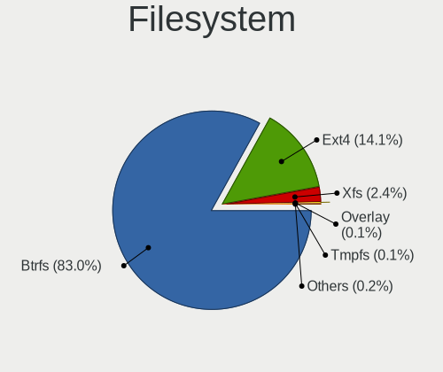

| Type    | Computers | Percent |
|---------|-----------|---------|
| Btrfs   | 1423      | 83.22%  |
| Ext4    | 242       | 14.15%  |
| Xfs     | 38        | 2.22%   |
| Overlay | 4         | 0.23%   |
| Zfs     | 1         | 0.06%   |
| F2fs    | 1         | 0.06%   |
| Unknown | 1         | 0.06%   |

Part. scheme
------------

Scheme of partitioning

| Type    | Computers | Percent |
|---------|-----------|---------|
| Unknown | 1085      | 63.23%  |
| GPT     | 591       | 34.44%  |
| MBR     | 40        | 2.33%   |

Dual Boot with Linux/BSD
------------------------

Hosting more than one Linux/BSD

| Dual boot | Computers | Percent |
|-----------|-----------|---------|
| No        | 1577      | 92.11%  |
| Yes       | 135       | 7.89%   |

Dual Boot (Win)
---------------

Hosting Linux and Windows

| Dual boot | Computers | Percent |
|-----------|-----------|---------|
| No        | 1465      | 85.67%  |
| Yes       | 245       | 14.33%  |

Board
-----

Vendor
------

Motherboard manufacturer

| Name                                 | Computers | Percent |
|--------------------------------------|-----------|---------|
| Lenovo                               | 332       | 19.45%  |
| ASUSTek Computer                     | 266       | 15.58%  |
| Hewlett-Packard                      | 226       | 13.24%  |
| Dell                                 | 214       | 12.54%  |
| MSI                                  | 124       | 7.26%   |
| Gigabyte Technology                  | 107       | 6.27%   |
| Acer                                 | 64        | 3.75%   |
| Apple                                | 61        | 3.57%   |
| ASRock                               | 47        | 2.75%   |
| HUAWEI                               | 30        | 1.76%   |
| Samsung Electronics                  | 19        | 1.11%   |
| Unknown                              | 17        | 1%      |
| Microsoft                            | 14        | 0.82%   |
| Intel                                | 14        | 0.82%   |
| Google                               | 11        | 0.64%   |
| Timi                                 | 10        | 0.59%   |
| Toshiba                              | 9         | 0.53%   |
| AZW                                  | 8         | 0.47%   |
| Sony                                 | 6         | 0.35%   |
| Notebook                             | 6         | 0.35%   |
| Pegatron                             | 5         | 0.29%   |
| Fujitsu                              | 5         | 0.29%   |
| Positivo                             | 4         | 0.23%   |
| Itautec                              | 4         | 0.23%   |
| Huanan                               | 4         | 0.23%   |
| TUXEDO                               | 3         | 0.18%   |
| Shenzhen Meigao Electronic Equipment | 3         | 0.18%   |
| Razer                                | 3         | 0.18%   |
| Framework                            | 3         | 0.18%   |
| Avell High Performance               | 3         | 0.18%   |
| AMI                                  | 3         | 0.18%   |
| Alienware                            | 3         | 0.18%   |
| ZOTAC                                | 2         | 0.12%   |
| UNOWHY                               | 2         | 0.12%   |
| System76                             | 2         | 0.12%   |
| raspberrypi,4-model-b                | 2         | 0.12%   |
| Positivo Bahia - VAIO                | 2         | 0.12%   |
| PC Specialist                        | 2         | 0.12%   |
| Medion                               | 2         | 0.12%   |
| MECHREVO                             | 2         | 0.12%   |

Model
-----

Motherboard model

| Name                                    | Computers | Percent |
|-----------------------------------------|-----------|---------|
| Unknown                                 | 20        | 1.17%   |
| ASUS All Series                         | 8         | 0.47%   |
| Apple MacBookPro9,2                     | 7         | 0.41%   |
| Dell OptiPlex 7010                      | 6         | 0.35%   |
| Apple MacBookPro8,1                     | 6         | 0.35%   |
| MSI MS-7C37                             | 5         | 0.29%   |
| HP Notebook                             | 5         | 0.29%   |
| Gigabyte B550 GAMING X V2               | 5         | 0.29%   |
| Dell XPS 13 9310                        | 5         | 0.29%   |
| MSI MS-7C02                             | 4         | 0.23%   |
| MSI MS-7B89                             | 4         | 0.23%   |
| Lenovo IdeaPad 3 15ITL6 82H8            | 4         | 0.23%   |
| HP Pavilion x2 Detachable               | 4         | 0.23%   |
| HP Pavilion Aero Laptop 13-be0xxx       | 4         | 0.23%   |
| HP ENVY x360 2-in-1 Laptop 15-ey0xxx    | 4         | 0.23%   |
| Dell XPS 13 9305                        | 4         | 0.23%   |
| Dell Inspiron 15 5510                   | 4         | 0.23%   |
| AZW SER                                 | 4         | 0.23%   |
| ASUS ROG STRIX B550-I GAMING            | 4         | 0.23%   |
| Apple MacBookAir7,2                     | 4         | 0.23%   |
| Samsung 550XDA                          | 3         | 0.18%   |
| MSI MS-7C95                             | 3         | 0.18%   |
| MSI MS-7B79                             | 3         | 0.18%   |
| MSI MS-7B17                             | 3         | 0.18%   |
| MSI MS-7A38                             | 3         | 0.18%   |
| Microsoft Surface Pro 7                 | 3         | 0.18%   |
| Lenovo Legion 5 Pro 16ACH6H 82JQ        | 3         | 0.18%   |
| Lenovo IdeaPadFlex 5 14ITL05 82HS       | 3         | 0.18%   |
| Lenovo IdeaPad L340-15API 81LW          | 3         | 0.18%   |
| Itautec Infoway ST-4265                 | 3         | 0.18%   |
| HUAWEI NBLB-WAX9N                       | 3         | 0.18%   |
| HUAWEI BOHK-WAX9X                       | 3         | 0.18%   |
| HP Z800 Workstation                     | 3         | 0.18%   |
| HP ProBook 450 15.6 inch G9 Notebook PC | 3         | 0.18%   |
| HP ProBook 445 G8 Notebook PC           | 3         | 0.18%   |
| HP Laptop 15-dw0xxx                     | 3         | 0.18%   |
| HP ENVY x360 Convertible 13-ay0xxx      | 3         | 0.18%   |
| HP EliteBook 850 G8 Notebook PC         | 3         | 0.18%   |
| HP EliteBook 840 G6                     | 3         | 0.18%   |
| HP 255 G8 Notebook PC                   | 3         | 0.18%   |

Model Family
------------

Motherboard model prefix

| Name               | Computers | Percent |
|--------------------|-----------|---------|
| Lenovo ThinkPad    | 156       | 9.14%   |
| Lenovo IdeaPad     | 64        | 3.75%   |
| ASUS ROG           | 61        | 3.57%   |
| Dell Latitude      | 60        | 3.51%   |
| Dell Inspiron      | 54        | 3.16%   |
| HP Pavilion        | 43        | 2.52%   |
| ASUS VivoBook      | 42        | 2.46%   |
| ASUS PRIME         | 39        | 2.28%   |
| Acer Aspire        | 38        | 2.23%   |
| Dell XPS           | 35        | 2.05%   |
| ASUS TUF           | 28        | 1.64%   |
| HP Laptop          | 27        | 1.58%   |
| Lenovo Yoga        | 26        | 1.52%   |
| Dell OptiPlex      | 25        | 1.46%   |
| HP EliteBook       | 24        | 1.41%   |
| HP ENVY            | 23        | 1.35%   |
| Lenovo Legion      | 22        | 1.29%   |
| Unknown            | 20        | 1.17%   |
| HP ProBook         | 19        | 1.11%   |
| Dell Precision     | 18        | 1.05%   |
| Microsoft Surface  | 14        | 0.82%   |
| Lenovo ThinkBook   | 14        | 0.82%   |
| Acer Nitro         | 14        | 0.82%   |
| Lenovo ThinkCentre | 12        | 0.7%    |
| ASUS ASUS          | 12        | 0.7%    |
| HP Compaq          | 11        | 0.64%   |
| Lenovo IdeaPadFlex | 9         | 0.53%   |
| Dell Vostro        | 9         | 0.53%   |
| ASUS ZenBook       | 9         | 0.53%   |
| HP OMEN            | 8         | 0.47%   |
| HP EliteDesk       | 8         | 0.47%   |
| Gigabyte B550M     | 8         | 0.47%   |
| ASUS All           | 8         | 0.47%   |
| Apple MacBookPro9  | 8         | 0.47%   |
| Toshiba Satellite  | 7         | 0.41%   |
| Gigabyte B550      | 7         | 0.41%   |
| Apple MacBookPro8  | 7         | 0.41%   |
| MSI Modern         | 6         | 0.35%   |
| HP ZBook           | 6         | 0.35%   |
| HP 255             | 6         | 0.35%   |

MFG Year
--------

Motherboard manufacture year

| Year    | Computers | Percent |
|---------|-----------|---------|
| 2021    | 257       | 15.06%  |
| 2022    | 220       | 12.89%  |
| 2020    | 218       | 12.77%  |
| 2019    | 175       | 10.25%  |
| 2018    | 166       | 9.72%   |
| 2017    | 105       | 6.15%   |
| 2012    | 85        | 4.98%   |
| 2015    | 75        | 4.39%   |
| 2013    | 73        | 4.28%   |
| 2014    | 64        | 3.75%   |
| 2016    | 63        | 3.69%   |
| 2023    | 62        | 3.63%   |
| 2011    | 57        | 3.34%   |
| 2010    | 39        | 2.28%   |
| 2009    | 18        | 1.05%   |
| 2008    | 15        | 0.88%   |
| 2007    | 7         | 0.41%   |
| 2006    | 4         | 0.23%   |
| Unknown | 3         | 0.18%   |
| 2005    | 1         | 0.06%   |

Form Factor
-----------

Physical design of the computer

| Name           | Computers | Percent |
|----------------|-----------|---------|
| Notebook       | 1017      | 59.58%  |
| Desktop        | 522       | 30.58%  |
| Convertible    | 77        | 4.51%   |
| Tablet         | 30        | 1.76%   |
| Mini pc        | 29        | 1.7%    |
| All in one     | 18        | 1.05%   |
| Server         | 10        | 0.59%   |
| System on chip | 4         | 0.23%   |

Secure Boot
-----------

Enabled or disabled

| State    | Computers | Percent |
|----------|-----------|---------|
| Disabled | 1330      | 77.37%  |
| Enabled  | 389       | 22.63%  |

Coreboot
--------

Have coreboot on board

| Used | Computers | Percent |
|------|-----------|---------|
| No   | 1692      | 99.12%  |
| Yes  | 15        | 0.88%   |

RAM Size
--------

Total RAM memory

| Size in GB      | Computers | Percent |
|-----------------|-----------|---------|
| 16.01-24.0      | 446       | 25.98%  |
| 4.01-8.0        | 402       | 23.41%  |
| 8.01-16.0       | 313       | 18.23%  |
| 32.01-64.0      | 255       | 14.85%  |
| 3.01-4.0        | 129       | 7.51%   |
| 64.01-256.0     | 85        | 4.95%   |
| 24.01-32.0      | 60        | 3.49%   |
| 1.01-2.0        | 24        | 1.4%    |
| 2.01-3.0        | 2         | 0.12%   |
| More than 256.0 | 1         | 0.06%   |

RAM Used
--------

Used RAM memory

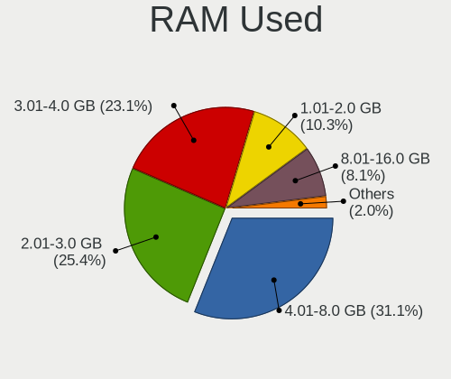

| Used GB    | Computers | Percent |
|------------|-----------|---------|
| 4.01-8.0   | 537       | 29.98%  |
| 2.01-3.0   | 479       | 26.74%  |
| 3.01-4.0   | 439       | 24.51%  |
| 1.01-2.0   | 177       | 9.88%   |
| 8.01-16.0  | 124       | 6.92%   |
| 0.51-1.0   | 19        | 1.06%   |
| 16.01-24.0 | 11        | 0.61%   |
| 32.01-64.0 | 4         | 0.22%   |
| 24.01-32.0 | 1         | 0.06%   |

Total Drives
------------

Number of drives on board

| Drives | Computers | Percent |
|--------|-----------|---------|
| 1      | 1043      | 60.43%  |
| 2      | 446       | 25.84%  |
| 3      | 120       | 6.95%   |
| 4      | 67        | 3.88%   |
| 5      | 24        | 1.39%   |
| 6      | 13        | 0.75%   |
| 0      | 4         | 0.23%   |
| 10     | 3         | 0.17%   |
| 7      | 3         | 0.17%   |
| 8      | 2         | 0.12%   |
| 11     | 1         | 0.06%   |

Has CD-ROM
----------

Has CD-ROM on board

| Presented | Computers | Percent |
|-----------|-----------|---------|
| No        | 1379      | 80.64%  |
| Yes       | 331       | 19.36%  |

Has Ethernet
------------

Has Ethernet on board

| Presented | Computers | Percent |
|-----------|-----------|---------|
| Yes       | 1320      | 77.15%  |
| No        | 391       | 22.85%  |

Has WiFi
--------

Has WiFi module

| Presented | Computers | Percent |
|-----------|-----------|---------|
| Yes       | 1434      | 83.91%  |
| No        | 275       | 16.09%  |

Has Bluetooth
-------------

Has Bluetooth module

| Presented | Computers | Percent |
|-----------|-----------|---------|
| Yes       | 1280      | 74.68%  |
| No        | 434       | 25.32%  |

Location
--------

Country
-------

Geographic location (country)

| Country     | Computers | Percent |
|-------------|-----------|---------|
| USA         | 315       | 18.41%  |
| Germany     | 133       | 7.77%   |
| Brazil      | 129       | 7.54%   |
| Russia      | 92        | 5.38%   |
| Canada      | 68        | 3.97%   |
| Italy       | 61        | 3.57%   |
| UK          | 59        | 3.45%   |
| India       | 54        | 3.16%   |
| France      | 53        | 3.1%    |
| Australia   | 53        | 3.1%    |
| Poland      | 45        | 2.63%   |
| Netherlands | 45        | 2.63%   |
| Mexico      | 41        | 2.4%    |
| Spain       | 35        | 2.05%   |
| Turkey      | 26        | 1.52%   |
| Hungary     | 21        | 1.23%   |
| Czechia     | 21        | 1.23%   |
| Chile       | 21        | 1.23%   |
| Colombia    | 20        | 1.17%   |
| Switzerland | 19        | 1.11%   |
| Austria     | 19        | 1.11%   |
| Sweden      | 18        | 1.05%   |
| Belgium     | 17        | 0.99%   |
| Portugal    | 16        | 0.94%   |
| Indonesia   | 15        | 0.88%   |
| Norway      | 14        | 0.82%   |
| Denmark     | 14        | 0.82%   |
| Argentina   | 14        | 0.82%   |
| Romania     | 12        | 0.7%    |
| Finland     | 12        | 0.7%    |
| Bulgaria    | 12        | 0.7%    |
| Belarus     | 11        | 0.64%   |
| Thailand    | 10        | 0.58%   |
| Ireland     | 9         | 0.53%   |
| Singapore   | 8         | 0.47%   |
| Serbia      | 8         | 0.47%   |
| Philippines | 8         | 0.47%   |
| Israel      | 8         | 0.47%   |
| China       | 8         | 0.47%   |
| Peru        | 7         | 0.41%   |

City
----

Geographic location (city)

| City              | Computers | Percent |
|-------------------|-----------|---------|
| Sydney            | 25        | 1.44%   |
| Moscow            | 24        | 1.38%   |
| Sao Paulo         | 14        | 0.81%   |
| Berlin            | 14        | 0.81%   |
| Vienna            | 12        | 0.69%   |
| Santiago          | 12        | 0.69%   |
| Rio de Janeiro    | 12        | 0.69%   |
| Mexico City       | 11        | 0.63%   |
| Helsinki          | 11        | 0.63%   |
| Amsterdam         | 11        | 0.63%   |
| Melbourne         | 10        | 0.58%   |
| Delhi             | 10        | 0.58%   |
| Budapest          | 10        | 0.58%   |
| St Petersburg     | 9         | 0.52%   |
| Minsk             | 9         | 0.52%   |
| Warsaw            | 8         | 0.46%   |
| Sofia             | 8         | 0.46%   |
| Singapore         | 8         | 0.46%   |
| Seattle           | 8         | 0.46%   |
| Prague            | 8         | 0.46%   |
| Paris             | 8         | 0.46%   |
| Montreal          | 8         | 0.46%   |
| Istanbul          | 8         | 0.46%   |
| Atlanta           | 8         | 0.46%   |
| Porto Alegre      | 7         | 0.4%    |
| Ottawa            | 7         | 0.4%    |
| New York          | 7         | 0.4%    |
| Milan             | 7         | 0.4%    |
| Madrid            | 7         | 0.4%    |
| Fortaleza         | 7         | 0.4%    |
| Cologne           | 7         | 0.4%    |
| Brussels          | 7         | 0.4%    |
| Brisbane          | 7         | 0.4%    |
| Bangkok           | 7         | 0.4%    |
| Toronto           | 6         | 0.35%   |
| Lisbon            | 6         | 0.35%   |
| Gdansk            | 6         | 0.35%   |
| Frankfurt am Main | 6         | 0.35%   |
| Dublin            | 6         | 0.35%   |
| Braslia         | 6         | 0.35%   |

Drives
------

Drive Vendor
------------

Hard drive vendors

| Vendor                         | Computers | Drives | Percent |
|--------------------------------|-----------|--------|---------|
| Samsung Electronics            | 504       | 703    | 20.22%  |
| SanDisk                        | 233       | 264    | 9.35%   |
| WDC                            | 211       | 284    | 8.46%   |
| Seagate                        | 209       | 270    | 8.38%   |
| Kingston                       | 142       | 162    | 5.7%    |
| Toshiba                        | 125       | 148    | 5.01%   |
| Unknown                        | 91        | 108    | 3.65%   |
| SK hynix                       | 91        | 96     | 3.65%   |
| Intel                          | 87        | 112    | 3.49%   |
| Crucial                        | 84        | 111    | 3.37%   |
| Micron Technology              | 80        | 82     | 3.21%   |
| Phison Electronics             | 43        | 57     | 1.72%   |
| A-DATA Technology              | 39        | 44     | 1.56%   |
| Micron/Crucial Technology      | 36        | 37     | 1.44%   |
| KIOXIA                         | 33        | 38     | 1.32%   |
| Silicon Motion                 | 32        | 37     | 1.28%   |
| Apple                          | 31        | 44     | 1.24%   |
| China                          | 27        | 36     | 1.08%   |
| Hitachi                        | 25        | 34     | 1%      |
| Kingston Technology Company    | 24        | 26     | 0.96%   |
| HGST                           | 22        | 22     | 0.88%   |
| ADATA Technology               | 16        | 16     | 0.64%   |
| SPCC                           | 15        | 16     | 0.6%    |
| Patriot                        | 13        | 17     | 0.52%   |
| Netac                          | 13        | 14     | 0.52%   |
| JMicron Technology             | 13        | 16     | 0.52%   |
| PNY                            | 10        | 13     | 0.4%    |
| MAXIO Technology (Hangzhou)    | 10        | 12     | 0.4%    |
| Intenso                        | 10        | 10     | 0.4%    |
| Realtek Semiconductor          | 8         | 12     | 0.32%   |
| Unknown                        | 8         | 10     | 0.32%   |
| SABRENT                        | 7         | 7      | 0.28%   |
| Phison                         | 7         | 9      | 0.28%   |
| KingSpec                       | 7         | 7      | 0.28%   |
| Union Memory (Shenzhen)        | 6         | 8      | 0.24%   |
| Transcend                      | 6         | 7      | 0.24%   |
| Lexar                          | 6         | 6      | 0.24%   |
| Union Memory                   | 5         | 5      | 0.2%    |
| Solid State Storage Technology | 5         | 5      | 0.2%    |
| Solid State Storage            | 5         | 5      | 0.2%    |

Drive Model
-----------

Hard drive models

| Model                                                 | Computers | Percent |
|-------------------------------------------------------|-----------|---------|
| Samsung NVMe SSD Controller SM981/PM981/PM983 500GB   | 117       | 4.34%   |
| Samsung NVMe SSD Controller PM9A1/PM9A3/980PRO 1TB    | 70        | 2.6%    |
| Sandisk WD Blue SN550 NVMe SSD 250GB                  | 35        | 1.3%    |
| Kingston SA400S37240G 240GB SSD                       | 27        | 1%      |
| Unknown MMC Card  64GB                                | 26        | 0.96%   |
| Samsung SSD 980 1TB                                   | 25        | 0.93%   |
| Micron/Crucial P2 NVMe PCIe SSD 1TB                   | 25        | 0.93%   |
| Samsung NVMe SSD Controller SM961/PM961/SM963 256GB   | 24        | 0.89%   |
| Silicon Motion SM2263EN/SM2263XT SSD Controller 500GB | 22        | 0.82%   |
| Intel SSD 660P Series 1024GB                          | 22        | 0.82%   |
| Seagate ST1000LM035-1RK172 1TB                        | 21        | 0.78%   |
| Kingston SA400S37480G 480GB SSD                       | 21        | 0.78%   |
| Sandisk WD Black SN750 / PC SN730 NVMe SSD 1024GB     | 20        | 0.74%   |
| Phison E12 NVMe Controller 2TB                        | 19        | 0.71%   |
| Unknown MMC Card  32GB                                | 18        | 0.67%   |
| Unknown MMC Card  128GB                               | 17        | 0.63%   |
| Samsung SSD 850 EVO 250GB                             | 17        | 0.63%   |
| Crucial CT500MX500SSD1 500GB                          | 17        | 0.63%   |
| Samsung SSD 860 EVO 500GB                             | 16        | 0.59%   |
| Toshiba XG6 NVMe SSD Controller 512GB                 | 15        | 0.56%   |
| Samsung SSD 870 EVO 1TB                               | 15        | 0.56%   |
| Samsung SSD 860 EVO 1TB                               | 14        | 0.52%   |
| Samsung SSD 850 EVO 500GB                             | 14        | 0.52%   |
| Crucial CT1000MX500SSD1 1TB                           | 14        | 0.52%   |
| Toshiba MQ01ABD100 1TB                                | 13        | 0.48%   |
| Sandisk WD Black SN850 1TB                            | 12        | 0.45%   |
| Seagate ST1000DM010-2EP102 1TB                        | 11        | 0.41%   |
| Sandisk WD Blue SN500 / PC SN520 NVMe SSD 512GB       | 11        | 0.41%   |
| Phison PS5013 E13 NVMe Controller 256GB               | 11        | 0.41%   |
| Kingston SA400S37120G 120GB SSD                       | 11        | 0.41%   |
| WDC WDS500G2B0A-00SM50 500GB SSD                      | 10        | 0.37%   |
| Toshiba MQ04ABF100 1TB                                | 10        | 0.37%   |
| Phison E16 PCIe4 NVMe Controller 1TB                  | 10        | 0.37%   |
| MAXIO (Hangzhou) NVMe SSD Controller MAP1202 256GB    | 10        | 0.37%   |
| Crucial CT240BX500SSD1 240GB                          | 10        | 0.37%   |
| WDC WDS240G2G0A-00JH30 240GB SSD                      | 9         | 0.33%   |
| Toshiba DT01ACA100 1TB                                | 9         | 0.33%   |
| SK hynix BC511 512GB                                  | 9         | 0.33%   |
| Seagate ST2000DM006-2DM164 2TB                        | 9         | 0.33%   |
| Seagate ST1000DM003-1CH162 1TB                        | 9         | 0.33%   |

HDD Vendor
----------

Hard disk drive vendors

| Vendor              | Computers | Drives | Percent |
|---------------------|-----------|--------|---------|
| Seagate             | 199       | 255    | 36.51%  |
| WDC                 | 163       | 221    | 29.91%  |
| Toshiba             | 81        | 96     | 14.86%  |
| Hitachi             | 25        | 34     | 4.59%   |
| HGST                | 22        | 22     | 4.04%   |
| Samsung Electronics | 17        | 19     | 3.12%   |
| Apple               | 11        | 13     | 2.02%   |
| JMicron Technology  | 10        | 11     | 1.83%   |
| Unknown             | 7         | 9      | 1.28%   |
| QNAP                | 3         | 6      | 0.55%   |
| Maxtor              | 2         | 2      | 0.37%   |
| USB3.0              | 1         | 1      | 0.18%   |
| USB                 | 1         | 1      | 0.18%   |
| LaCie               | 1         | 1      | 0.18%   |
| IB                  | 1         | 2      | 0.18%   |
| ASMT                | 1         | 2      | 0.18%   |

SSD Vendor
----------

Solid state drive vendors

| Vendor              | Computers | Drives | Percent |
|---------------------|-----------|--------|---------|
| Samsung Electronics | 185       | 255    | 24.03%  |
| Kingston            | 100       | 113    | 12.99%  |
| Crucial             | 82        | 107    | 10.65%  |
| SanDisk             | 59        | 67     | 7.66%   |
| WDC                 | 46        | 50     | 5.97%   |
| A-DATA Technology   | 31        | 36     | 4.03%   |
| China               | 27        | 36     | 3.51%   |
| Intel               | 24        | 33     | 3.12%   |
| Apple               | 16        | 18     | 2.08%   |
| Toshiba             | 15        | 19     | 1.95%   |
| SPCC                | 15        | 16     | 1.95%   |
| Micron Technology   | 15        | 15     | 1.95%   |
| Patriot             | 13        | 17     | 1.69%   |
| PNY                 | 10        | 13     | 1.3%    |
| Netac               | 7         | 7      | 0.91%   |
| Lexar               | 6         | 6      | 0.78%   |
| KingSpec            | 6         | 6      | 0.78%   |
| Transcend           | 5         | 6      | 0.65%   |
| OCZ                 | 5         | 7      | 0.65%   |
| LITEON              | 5         | 5      | 0.65%   |
| Intenso             | 5         | 5      | 0.65%   |
| GOODRAM             | 5         | 8      | 0.65%   |
| LITEONIT            | 4         | 4      | 0.52%   |
| Hewlett-Packard     | 4         | 4      | 0.52%   |
| Gigabyte Technology | 4         | 6      | 0.52%   |
| AMD                 | 4         | 4      | 0.52%   |
| Team                | 3         | 3      | 0.39%   |
| SK hynix            | 3         | 3      | 0.39%   |
| Mushkin             | 3         | 3      | 0.39%   |
| Advantech           | 3         | 3      | 0.39%   |
| Unknown             | 3         | 5      | 0.39%   |
| XrayDisk            | 2         | 2      | 0.26%   |
| TO Exter            | 2         | 2      | 0.26%   |
| Smartbuy            | 2         | 2      | 0.26%   |
| Ramsta              | 2         | 2      | 0.26%   |
| NGFF                | 2         | 2      | 0.26%   |
| MidasForce          | 2         | 2      | 0.26%   |
| Kimtigo             | 2         | 2      | 0.26%   |
| Fanxiang            | 2         | 2      | 0.26%   |
| Emtec               | 2         | 2      | 0.26%   |

Drive Kind
----------

HDD or SSD

| Kind    | Computers | Drives | Percent |
|---------|-----------|--------|---------|
| NVMe    | 1005      | 1298   | 44.06%  |
| SSD     | 671       | 945    | 29.42%  |
| HDD     | 475       | 695    | 20.82%  |
| MMC     | 85        | 99     | 3.73%   |
| Unknown | 45        | 50     | 1.97%   |

Drive Connector
---------------

SATA, SAS, NVMe, etc.

| Type | Computers | Drives | Percent |
|------|-----------|--------|---------|
| NVMe | 1001      | 1289   | 47.92%  |
| SATA | 917       | 1587   | 43.9%   |
| SAS  | 86        | 112    | 4.12%   |
| MMC  | 85        | 99     | 4.07%   |

Drive Size
----------

Size of hard drive

| Size in TB | Computers | Drives | Percent |
|------------|-----------|--------|---------|
| 0.01-0.5   | 621       | 901    | 52.63%  |
| 0.51-1.0   | 389       | 497    | 32.97%  |
| 1.01-2.0   | 108       | 143    | 9.15%   |
| 3.01-4.0   | 29        | 37     | 2.46%   |
| 4.01-10.0  | 20        | 39     | 1.69%   |
| 2.01-3.0   | 10        | 11     | 0.85%   |
| 10.01-20.0 | 3         | 12     | 0.25%   |

Space Total
-----------

Amount of disk space available on the file system

| Size in GB     | Computers | Percent |
|----------------|-----------|---------|
| 501-1000       | 368       | 21.25%  |
| 251-500        | 337       | 19.46%  |
| 1001-2000      | 296       | 17.09%  |
| 101-250        | 211       | 12.18%  |
| 1-20           | 130       | 7.51%   |
| Unknown        | 120       | 6.93%   |
| More than 3000 | 109       | 6.29%   |
| 2001-3000      | 73        | 4.21%   |
| 51-100         | 59        | 3.41%   |
| 21-50          | 28        | 1.62%   |
| 0              | 1         | 0.06%   |

Space Used
----------

Amount of used disk space

| Used GB        | Computers | Percent |
|----------------|-----------|---------|
| 1-20           | 550       | 31.32%  |
| 21-50          | 307       | 17.48%  |
| 101-250        | 224       | 12.76%  |
| 51-100         | 189       | 10.76%  |
| 251-500        | 160       | 9.11%   |
| Unknown        | 120       | 6.83%   |
| 501-1000       | 106       | 6.04%   |
| 1001-2000      | 59        | 3.36%   |
| More than 3000 | 21        | 1.2%    |
| 2001-3000      | 19        | 1.08%   |
| 0              | 1         | 0.06%   |

Malfunc. Drives
---------------

Drive models with a malfunction

| Model                                        | Computers | Drives | Percent |
|----------------------------------------------|-----------|--------|---------|
| WDC WDS240G2G0A-00JH30 240GB SSD             | 3         | 3      | 4%      |
| Toshiba MQ01ABF050 500GB                     | 2         | 2      | 2.67%   |
| Toshiba MQ01ABD100 1TB                       | 2         | 2      | 2.67%   |
| Seagate ST500DM002-1BD142 500GB              | 2         | 2      | 2.67%   |
| Seagate ST31000524AS 1TB                     | 2         | 2      | 2.67%   |
| Intel SSDSC2CT120A3 120GB                    | 2         | 4      | 2.67%   |
| HGST HTS721010A9E630 1TB                     | 2         | 2      | 2.67%   |
| Crucial CT120M500SSD1 120GB                  | 2         | 5      | 2.67%   |
| YS SSD 240GB                                 | 1         | 1      | 1.33%   |
| WDC WDS100T2G0A-00JH30 1TB SSD               | 1         | 1      | 1.33%   |
| WDC WD5000BPVT-75HXZT1 500GB                 | 1         | 1      | 1.33%   |
| WDC WD5000AVCS-632DY1 500GB                  | 1         | 1      | 1.33%   |
| WDC WD5000AADS-00S9B0 500GB                  | 1         | 1      | 1.33%   |
| WDC WD2500BEVT-80A23T0 250GB                 | 1         | 1      | 1.33%   |
| WDC WD20EZRX-00D8PB0 2TB                     | 1         | 1      | 1.33%   |
| WDC WD10JPVT-60A1YT0 1TB                     | 1         | 1      | 1.33%   |
| WDC WD10EZRZ-00HTKB0 1TB                     | 1         | 1      | 1.33%   |
| WDC WD1002FAEX-00Y9A0 1TB                    | 1         | 1      | 1.33%   |
| Toshiba MQ02ABD100H 1TB                      | 1         | 1      | 1.33%   |
| SSSTC CVB-8D128-HP 128GB SSD                 | 1         | 1      | 1.33%   |
| SPCC Solid State Disk 128GB                  | 1         | 1      | 1.33%   |
| SK hynix HFS128G3AMNB-2200A 128GB SSD        | 1         | 1      | 1.33%   |
| Seagate ST9250827AS 250GB                    | 1         | 1      | 1.33%   |
| Seagate ST9160412AS 160GB                    | 1         | 1      | 1.33%   |
| Seagate ST3750528AS 752GB                    | 1         | 1      | 1.33%   |
| Seagate ST3500630NS 500GB                    | 1         | 1      | 1.33%   |
| Seagate ST3500418AS 500GB                    | 1         | 2      | 1.33%   |
| Seagate ST3320613AS 320GB                    | 1         | 1      | 1.33%   |
| Seagate ST2000VX000-1CU164 2TB               | 1         | 1      | 1.33%   |
| Seagate ST2000DM008-2FR102 2TB               | 1         | 1      | 1.33%   |
| Seagate ST1000LX015-1U7172 1TB               | 1         | 1      | 1.33%   |
| Seagate ST1000DX002-2DV162 1TB               | 1         | 1      | 1.33%   |
| SanDisk SSD PLUS 480GB                       | 1         | 1      | 1.33%   |
| SanDisk SSD PLUS 120 GB                      | 1         | 1      | 1.33%   |
| SanDisk SD8SBAT256G1122 256GB SSD            | 1         | 1      | 1.33%   |
| Samsung Electronics SSD 870 EVO 250GB        | 1         | 1      | 1.33%   |
| Samsung Electronics SSD 870 EVO 1TB          | 1         | 1      | 1.33%   |
| Samsung Electronics SSD 850 EVO 250GB        | 1         | 2      | 1.33%   |
| Samsung Electronics SSD 840 PRO Series 256GB | 1         | 1      | 1.33%   |
| Samsung Electronics SSD 840 EVO 250GB        | 1         | 1      | 1.33%   |

Malfunc. Drive Vendor
---------------------

Vendors of faulty drives

| Vendor                      | Computers | Drives | Percent |
|-----------------------------|-----------|--------|---------|
| Seagate                     | 13        | 15     | 18.06%  |
| WDC                         | 10        | 12     | 13.89%  |
| Samsung Electronics         | 8         | 10     | 11.11%  |
| Toshiba                     | 5         | 5      | 6.94%   |
| Intel                       | 5         | 7      | 6.94%   |
| Kingston                    | 4         | 6      | 5.56%   |
| SanDisk                     | 3         | 3      | 4.17%   |
| HGST                        | 3         | 3      | 4.17%   |
| Crucial                     | 3         | 6      | 4.17%   |
| Micron Technology           | 2         | 2      | 2.78%   |
| Intenso                     | 2         | 2      | 2.78%   |
| Hitachi                     | 2         | 2      | 2.78%   |
| A-DATA Technology           | 2         | 2      | 2.78%   |
| YS                          | 1         | 1      | 1.39%   |
| SSSTC                       | 1         | 1      | 1.39%   |
| SPCC                        | 1         | 1      | 1.39%   |
| SK hynix                    | 1         | 1      | 1.39%   |
| Maxtor                      | 1         | 1      | 1.39%   |
| MAXIO Technology (Hangzhou) | 1         | 1      | 1.39%   |
| LITEONIT                    | 1         | 1      | 1.39%   |
| LITEON                      | 1         | 1      | 1.39%   |
| HPE                         | 1         | 1      | 1.39%   |
| China                       | 1         | 1      | 1.39%   |

Malfunc. HDD Vendor
-------------------

Vendors of faulty HDD drives

| Vendor              | Computers | Drives | Percent |
|---------------------|-----------|--------|---------|
| Seagate             | 13        | 15     | 39.39%  |
| WDC                 | 7         | 8      | 21.21%  |
| Toshiba             | 5         | 5      | 15.15%  |
| HGST                | 3         | 3      | 9.09%   |
| Samsung Electronics | 2         | 3      | 6.06%   |
| Hitachi             | 2         | 2      | 6.06%   |
| Maxtor              | 1         | 1      | 3.03%   |

Malfunc. Drive Kind
-------------------

Kinds of faulty drives

| Kind | Computers | Drives | Percent |
|------|-----------|--------|---------|
| SSD  | 36        | 46     | 50.7%   |
| HDD  | 33        | 37     | 46.48%  |
| NVMe | 2         | 2      | 2.82%   |

Failed Drives
-------------

Failed drive models

Zero info for selected period =(

Failed Drive Vendor
-------------------

Failed drive vendors

Zero info for selected period =(

Drive Status
------------

Number of failed and malfunc. drives

| Status   | Computers | Drives | Percent |
|----------|-----------|--------|---------|
| Detected | 1171      | 2038   | 64.8%   |
| Works    | 571       | 964    | 31.6%   |
| Malfunc  | 65        | 85     | 3.6%    |

Storage controller
------------------

Storage Vendor
--------------

Storage controller vendors

| Vendor                                  | Computers | Percent |
|-----------------------------------------|-----------|---------|
| Intel                                   | 913       | 38.3%   |
| AMD                                     | 359       | 15.06%  |
| Samsung Electronics                     | 350       | 14.68%  |
| SanDisk                                 | 182       | 7.63%   |
| SK hynix                                | 88        | 3.69%   |
| Kingston Technology Company             | 69        | 2.89%   |
| Micron Technology                       | 65        | 2.73%   |
| Phison Electronics                      | 48        | 2.01%   |
| Micron/Crucial Technology               | 37        | 1.55%   |
| Silicon Motion                          | 34        | 1.43%   |
| Toshiba America Info Systems            | 33        | 1.38%   |
| KIOXIA                                  | 30        | 1.26%   |
| ASMedia Technology                      | 30        | 1.26%   |
| ADATA Technology                        | 23        | 0.96%   |
| Marvell Technology Group                | 16        | 0.67%   |
| Solid State Storage Technology          | 11        | 0.46%   |
| Union Memory (Shenzhen)                 | 10        | 0.42%   |
| MAXIO Technology (Hangzhou)             | 10        | 0.42%   |
| Nvidia                                  | 9         | 0.38%   |
| Seagate Technology                      | 8         | 0.34%   |
| Realtek Semiconductor                   | 8         | 0.34%   |
| LSI Logic / Symbios Logic               | 7         | 0.29%   |
| Netac Technology                        | 6         | 0.25%   |
| JMicron Technology                      | 6         | 0.25%   |
| Apple                                   | 5         | 0.21%   |
| Shenzhen Longsys Electronics            | 4         | 0.17%   |
| Yangtze Memory Technologies             | 3         | 0.13%   |
| Solidigm                                | 3         | 0.13%   |
| Lenovo                                  | 3         | 0.13%   |
| VIA Technologies                        | 2         | 0.08%   |
| Silicon Image                           | 2         | 0.08%   |
| Broadcom / LSI                          | 2         | 0.08%   |
| Adaptec                                 | 2         | 0.08%   |
| ULi Electronics                         | 1         | 0.04%   |
| Shenzhen Unionmemory Information System | 1         | 0.04%   |
| PMC-Sierra                              | 1         | 0.04%   |
| Lite-On Technology                      | 1         | 0.04%   |
| INNOGRIT                                | 1         | 0.04%   |
| Biwin Storage Technology                | 1         | 0.04%   |

Storage Model
-------------

Storage controller models

| Model                                                                          | Computers | Percent |
|--------------------------------------------------------------------------------|-----------|---------|
| AMD FCH SATA Controller [AHCI mode]                                            | 256       | 9.88%   |
| Samsung NVMe SSD Controller SM981/PM981/PM983                                  | 130       | 5.02%   |
| Samsung NVMe SSD Controller 980                                                | 93        | 3.59%   |
| Intel Volume Management Device NVMe RAID Controller                            | 86        | 3.32%   |
| Intel Sunrise Point-LP SATA Controller [AHCI mode]                             | 78        | 3.01%   |
| Samsung NVMe SSD Controller PM9A1/PM9A3/980PRO                                 | 77        | 2.97%   |
| Intel 7 Series Chipset Family 6-port SATA Controller [AHCI mode]               | 55        | 2.12%   |
| AMD 500 Series Chipset SATA Controller                                         | 53        | 2.04%   |
| Intel 82801 Mobile SATA Controller [RAID mode]                                 | 49        | 1.89%   |
| AMD 400 Series Chipset SATA Controller                                         | 48        | 1.85%   |
| Intel 8 Series/C220 Series Chipset Family 6-port SATA Controller 1 [AHCI mode] | 47        | 1.81%   |
| SK hynix Gold P31/BC711/PC711 NVMe Solid State Drive                           | 42        | 1.62%   |
| SanDisk WD Blue SN550 NVMe SSD                                                 | 37        | 1.43%   |
| Intel Q170/Q150/B150/H170/H110/Z170/CM236 Chipset SATA Controller [AHCI Mode]  | 35        | 1.35%   |
| Intel 200 Series PCH SATA controller [AHCI mode]                               | 35        | 1.35%   |
| Intel Cannon Lake PCH SATA AHCI Controller                                     | 30        | 1.16%   |
| Intel Alder Lake-S PCH SATA Controller [AHCI Mode]                             | 30        | 1.16%   |
| Samsung NVMe SSD Controller SM961/PM961/SM963                                  | 29        | 1.12%   |
| Intel 8 Series SATA Controller 1 [AHCI mode]                                   | 29        | 1.12%   |
| Intel 7 Series/C210 Series Chipset Family 6-port SATA Controller [AHCI mode]   | 29        | 1.12%   |
| ASMedia ASM1062 Serial ATA Controller                                          | 28        | 1.08%   |
| Intel 6 Series/C200 Series Chipset Family 6 port Mobile SATA AHCI Controller   | 27        | 1.04%   |
| Micron/Crucial P2 [Nick P2] / P3 / P3 Plus NVMe PCIe SSD (DRAM-less)           | 26        | 1%      |
| Intel Tiger Lake-LP SATA Controller                                            | 26        | 1%      |
| Intel Cannon Lake Mobile PCH SATA AHCI Controller                              | 25        | 0.96%   |
| Silicon Motion SM2263EN/SM2263XT (DRAM-less) NVMe SSD Controllers              | 23        | 0.89%   |
| Micron 2450 NVMe SSD [HendrixV] (DRAM-less)                                    | 23        | 0.89%   |
| SanDisk WD Black SN750 / PC SN730 NVMe SSD                                     | 22        | 0.85%   |
| Intel SSD 660P Series                                                          | 22        | 0.85%   |
| Intel HM170/QM170 Chipset SATA Controller [AHCI Mode]                          | 22        | 0.85%   |
| Intel Comet Lake SATA AHCI Controller                                          | 21        | 0.81%   |
| Phison E12 NVMe Controller                                                     | 20        | 0.77%   |
| Intel SSD 670p Series [Keystone Harbor]                                        | 20        | 0.77%   |
| KIOXIA NVMe SSD Controller BG4 (DRAM-less)                                     | 19        | 0.73%   |
| Intel 500 Series Chipset Family SATA AHCI Controller                           | 19        | 0.73%   |
| Toshiba America Info Systems XG6 NVMe SSD Controller                           | 18        | 0.69%   |
| SanDisk WD Black SN770 / PC SN740 256GB / PC SN560 (DRAM-less) NVMe SSD        | 18        | 0.69%   |
| Intel Wildcat Point-LP SATA Controller [AHCI Mode]                             | 18        | 0.69%   |
| Intel Celeron/Pentium Silver Processor SATA Controller                         | 18        | 0.69%   |
| AMD SB7x0/SB8x0/SB9x0 IDE Controller                                           | 18        | 0.69%   |

Storage Kind
------------

Kind of storage controller (IDE, SATA, NVMe, SAS, ...)

| Kind | Computers | Percent |
|------|-----------|---------|
| SATA | 1106      | 47.16%  |
| NVMe | 994       | 42.39%  |
| RAID | 177       | 7.55%   |
| IDE  | 60        | 2.56%   |
| SAS  | 4         | 0.17%   |
| SCSI | 4         | 0.17%   |

Processor
---------

CPU Vendor
----------

Processor vendors

| Vendor                   | Computers | Percent |
|--------------------------|-----------|---------|
| Intel                    | 1188      | 69.6%   |
| AMD                      | 511       | 29.94%  |
| ARM                      | 5         | 0.29%   |
| PowerNV C1P9S01 REV 1.01 | 1         | 0.06%   |
| CentaurHauls             | 1         | 0.06%   |
| Unknown                  | 1         | 0.06%   |

CPU Model
---------

Processor models

| Model                                         | Computers | Percent |
|-----------------------------------------------|-----------|---------|
| Intel 11th Gen Core i5-1135G7 @ 2.40GHz       | 43        | 2.52%   |
| Intel 11th Gen Core i7-1165G7 @ 2.80GHz       | 27        | 1.58%   |
| AMD Ryzen 7 5800H with Radeon Graphics        | 23        | 1.35%   |
| AMD Ryzen 5 5500U with Radeon Graphics        | 23        | 1.35%   |
| AMD Ryzen 5 5600X 6-Core Processor            | 20        | 1.17%   |
| Intel Core i7-8550U CPU @ 1.80GHz             | 19        | 1.11%   |
| Intel Core i5-10210U CPU @ 1.60GHz            | 18        | 1.05%   |
| Intel Core i5-8250U CPU @ 1.60GHz             | 16        | 0.94%   |
| AMD Ryzen 5 3500U with Radeon Vega Mobile Gfx | 16        | 0.94%   |
| Intel 12th Gen Core i7-12700H                 | 15        | 0.88%   |
| Intel 11th Gen Core i7-1185G7 @ 3.00GHz       | 15        | 0.88%   |
| Intel Core i7-8565U CPU @ 1.80GHz             | 14        | 0.82%   |
| Intel Core i5-3210M CPU @ 2.50GHz             | 14        | 0.82%   |
| Intel 12th Gen Core i7-1255U                  | 14        | 0.82%   |
| Intel Core i7-7700HQ CPU @ 2.80GHz            | 13        | 0.76%   |
| Intel Core i7-10750H CPU @ 2.60GHz            | 13        | 0.76%   |
| Intel Core i5-7200U CPU @ 2.50GHz             | 13        | 0.76%   |
| Intel Core i5-6300U CPU @ 2.40GHz             | 13        | 0.76%   |
| Intel 12th Gen Core i7-1260P                  | 13        | 0.76%   |
| AMD Ryzen 7 5700U with Radeon Graphics        | 13        | 0.76%   |
| Intel Core i5-1035G1 CPU @ 1.00GHz            | 12        | 0.7%    |
| AMD Ryzen 7 5825U with Radeon Graphics        | 12        | 0.7%    |
| AMD Ryzen 5 5600G with Radeon Graphics        | 12        | 0.7%    |
| AMD Ryzen 5 3600 6-Core Processor             | 12        | 0.7%    |
| Intel 12th Gen Core i5-12500H                 | 11        | 0.64%   |
| AMD Ryzen 7 4800H with Radeon Graphics        | 11        | 0.64%   |
| AMD Ryzen 5 5600H with Radeon Graphics        | 11        | 0.64%   |
| AMD Ryzen 5 2600 Six-Core Processor           | 11        | 0.64%   |
| Intel Core i7-8750H CPU @ 2.20GHz             | 10        | 0.59%   |
| Intel Atom x5-Z8350 CPU @ 1.44GHz             | 10        | 0.59%   |
| AMD Ryzen 9 7950X 16-Core Processor           | 10        | 0.59%   |
| AMD Ryzen 7 5800X 8-Core Processor            | 10        | 0.59%   |
| AMD Ryzen 5 5600U with Radeon Graphics        | 10        | 0.59%   |
| AMD Ryzen 5 4500U with Radeon Graphics        | 10        | 0.59%   |
| Intel Core i7-9750H CPU @ 2.60GHz             | 9         | 0.53%   |
| Intel Core i7-7500U CPU @ 2.70GHz             | 9         | 0.53%   |
| Intel Core i7-3770 CPU @ 3.40GHz              | 9         | 0.53%   |
| Intel 11th Gen Core i7-11800H @ 2.30GHz       | 9         | 0.53%   |
| AMD Ryzen 9 5950X 16-Core Processor           | 9         | 0.53%   |
| AMD Ryzen 9 5900HX with Radeon Graphics       | 9         | 0.53%   |

CPU Model Family
----------------

Processor model prefix

| Model                   | Computers | Percent |
|-------------------------|-----------|---------|
| Intel Core i5           | 337       | 19.74%  |
| Other                   | 290       | 16.99%  |
| Intel Core i7           | 288       | 16.87%  |
| AMD Ryzen 5             | 180       | 10.54%  |
| AMD Ryzen 7             | 157       | 9.2%    |
| Intel Core i3           | 87        | 5.1%    |
| AMD Ryzen 9             | 66        | 3.87%   |
| Intel Celeron           | 45        | 2.64%   |
| Intel Xeon              | 40        | 2.34%   |
| Intel Atom              | 23        | 1.35%   |
| Intel Core 2 Duo        | 22        | 1.29%   |
| AMD Ryzen 3             | 18        | 1.05%   |
| Intel Pentium Silver    | 15        | 0.88%   |
| Intel Pentium           | 15        | 0.88%   |
| AMD FX                  | 14        | 0.82%   |
| Intel Core i9           | 13        | 0.76%   |
| AMD Ryzen 7 PRO         | 11        | 0.64%   |
| Intel Core 2 Quad       | 8         | 0.47%   |
| AMD Ryzen 5 PRO         | 8         | 0.47%   |
| AMD A6                  | 8         | 0.47%   |
| AMD A8                  | 7         | 0.41%   |
| AMD Phenom II X4        | 6         | 0.35%   |
| AMD A10                 | 6         | 0.35%   |
| AMD Ryzen Threadripper  | 5         | 0.29%   |
| Intel Pentium Dual      | 4         | 0.23%   |
| AMD Athlon              | 4         | 0.23%   |
| Intel Genuine           | 3         | 0.18%   |
| Intel Core m5           | 3         | 0.18%   |
| AMD A4                  | 3         | 0.18%   |
| Intel Pentium Gold      | 2         | 0.12%   |
| Intel Pentium Dual-Core | 2         | 0.12%   |
| AMD Phenom II X2        | 2         | 0.12%   |
| AMD A12                 | 2         | 0.12%   |
| Intel Core m3           | 1         | 0.06%   |
| Intel Core M            | 1         | 0.06%   |
| Intel Core 2 Extreme    | 1         | 0.06%   |
| Intel Core 2            | 1         | 0.06%   |
| AMD Turion 64 X2 Mobile | 1         | 0.06%   |
| AMD Sempron             | 1         | 0.06%   |
| AMD Phenom II X6        | 1         | 0.06%   |

CPU Cores
---------

Number of processor cores

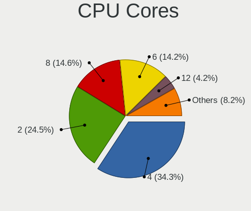

| Number  | Computers | Percent |
|---------|-----------|---------|
| 4       | 618       | 36.2%   |
| 2       | 402       | 23.55%  |
| 6       | 253       | 14.82%  |
| 8       | 240       | 14.06%  |
| 12      | 73        | 4.28%   |
| 10      | 36        | 2.11%   |
| 14      | 34        | 1.99%   |
| 16      | 32        | 1.87%   |
| 24      | 5         | 0.29%   |
| 3       | 5         | 0.29%   |
| 1       | 3         | 0.18%   |
| 32      | 2         | 0.12%   |
| Unknown | 2         | 0.12%   |
| 36      | 1         | 0.06%   |
| 18      | 1         | 0.06%   |

CPU Sockets
-----------

Number of sockets

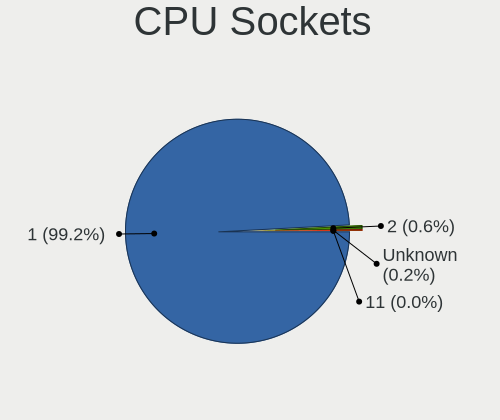

| Number  | Computers | Percent |
|---------|-----------|---------|
| 1       | 1694      | 99.24%  |
| 2       | 11        | 0.64%   |
| Unknown | 2         | 0.12%   |

CPU Threads
-----------

Threads per core (Hyper-Threading)

| Number  | Computers | Percent |
|---------|-----------|---------|
| 2       | 1390      | 81.43%  |
| 1       | 314       | 18.39%  |
| Unknown | 2         | 0.12%   |
| 4       | 1         | 0.06%   |

CPU Op-Modes
------------

CPU Operation Modes (32-bit, 64-bit)

| Op mode        | Computers | Percent |
|----------------|-----------|---------|
| 32-bit, 64-bit | 1702      | 99.71%  |
| 64-bit         | 4         | 0.23%   |
| Unknown        | 1         | 0.06%   |

CPU Microcode
-------------

Microcode number

| Number     | Computers | Percent |
|------------|-----------|---------|
| Unknown    | 1216      | 71.11%  |
| 0x0a50000c | 58        | 3.39%   |
| 0x0a50000d | 42        | 2.46%   |
| 0x08108109 | 33        | 1.93%   |
| 0x0a20120a | 29        | 1.7%    |
| 0x08608103 | 28        | 1.64%   |
| 0x0a404102 | 25        | 1.46%   |
| 0x08701021 | 25        | 1.46%   |
| 0x08600106 | 25        | 1.46%   |
| 0x0a601203 | 24        | 1.4%    |
| 0x0800820d | 18        | 1.05%   |
| 0x0a201016 | 13        | 0.76%   |
| 0x08108102 | 13        | 0.76%   |
| 0x08600104 | 11        | 0.64%   |
| 0x0a404101 | 9         | 0.53%   |
| 0x08701030 | 9         | 0.53%   |
| 0x06000822 | 8         | 0.47%   |
| 0x010000c8 | 7         | 0.41%   |
| 0x0a201025 | 6         | 0.35%   |
| 0x06006705 | 6         | 0.35%   |
| 0x06001119 | 6         | 0.35%   |
| 0x08608102 | 5         | 0.29%   |
| 0x08600103 | 5         | 0.29%   |
| 0x0600611a | 5         | 0.29%   |
| 0x08608104 | 4         | 0.23%   |
| 0x0810100b | 4         | 0.23%   |
| 0x08001138 | 4         | 0.23%   |
| 0x0a201205 | 3         | 0.18%   |
| 0x0a201009 | 3         | 0.18%   |
| 0x08701013 | 3         | 0.18%   |
| 0x08101016 | 3         | 0.18%   |
| 0x08101007 | 3         | 0.18%   |
| 0x0800820c | 3         | 0.18%   |
| 0x08001137 | 3         | 0.18%   |
| 0x06001116 | 3         | 0.18%   |
| 0x906ea    | 2         | 0.12%   |
| 0x806e9    | 2         | 0.12%   |
| 0x806c1    | 2         | 0.12%   |
| 0x0a601201 | 2         | 0.12%   |
| 0x0a50000b | 2         | 0.12%   |

CPU Microarch
-------------

Microarchitecture

| Name             | Computers | Percent |
|------------------|-----------|---------|
| KabyLake         | 304       | 17.81%  |
| Zen 3            | 169       | 9.9%    |
| Alderlake Hybrid | 132       | 7.73%   |
| Unknown          | 123       | 7.21%   |
| TigerLake        | 112       | 6.56%   |
| Haswell          | 102       | 5.98%   |
| IvyBridge        | 92        | 5.39%   |
| Zen 2            | 81        | 4.75%   |
| Skylake          | 78        | 4.57%   |
| Zen+             | 70        | 4.1%    |
| SandyBridge      | 60        | 3.51%   |
| IceLake          | 55        | 3.22%   |
| CometLake        | 53        | 3.1%    |
| Silvermont       | 37        | 2.17%   |
| Broadwell        | 36        | 2.11%   |
| Westmere         | 32        | 1.87%   |
| Penryn           | 26        | 1.52%   |
| Goldmont plus    | 24        | 1.41%   |
| Zen              | 21        | 1.23%   |
| Piledriver       | 20        | 1.17%   |
| Excavator        | 14        | 0.82%   |
| Core             | 14        | 0.82%   |
| K10              | 11        | 0.64%   |
| Tremont          | 9         | 0.53%   |
| Nehalem          | 6         | 0.35%   |
| Goldmont         | 5         | 0.29%   |
| Puma             | 4         | 0.23%   |
| K8 Hammer        | 3         | 0.18%   |
| Jaguar           | 3         | 0.18%   |
| Bulldozer        | 3         | 0.18%   |
| Bonnell          | 3         | 0.18%   |
| K10 Llano        | 2         | 0.12%   |
| Gracemont        | 2         | 0.12%   |
| Steamroller      | 1         | 0.06%   |

Graphics
--------

GPU Vendor
----------

Vendors of graphics cards

| Vendor                     | Computers | Percent |
|----------------------------|-----------|---------|
| Intel                      | 972       | 47.46%  |
| AMD                        | 541       | 26.42%  |
| Nvidia                     | 522       | 25.49%  |
| Matrox Electronics Systems | 8         | 0.39%   |
| ASPEED Technology          | 3         | 0.15%   |
| Zhaoxin                    | 1         | 0.05%   |
| VIA Technologies           | 1         | 0.05%   |

GPU Model
---------

Graphics card models

| Model                                                                                    | Computers | Percent |
|------------------------------------------------------------------------------------------|-----------|---------|
| Intel TigerLake-LP GT2 [Iris Xe Graphics]                                                | 105       | 5%      |
| AMD Cezanne [Radeon Vega Series / Radeon Vega Mobile Series]                             | 78        | 3.71%   |
| Intel Alder Lake-P Integrated Graphics Controller                                        | 54        | 2.57%   |
| Intel UHD Graphics 620                                                                   | 52        | 2.47%   |
| Intel 3rd Gen Core processor Graphics Controller                                         | 51        | 2.43%   |
| AMD Picasso/Raven 2 [Radeon Vega Series / Radeon Vega Mobile Series]                     | 47        | 2.24%   |
| Intel 2nd Generation Core Processor Family Integrated Graphics Controller                | 45        | 2.14%   |
| AMD Renoir                                                                               | 41        | 1.95%   |
| AMD Lucienne                                                                             | 40        | 1.9%    |
| Intel HD Graphics 620                                                                    | 39        | 1.86%   |
| Intel CoffeeLake-H GT2 [UHD Graphics 630]                                                | 39        | 1.86%   |
| AMD Ellesmere [Radeon RX 470/480/570/570X/580/580X/590]                                  | 39        | 1.86%   |
| AMD Rembrandt [Radeon 680M]                                                              | 37        | 1.76%   |
| Intel WhiskeyLake-U GT2 [UHD Graphics 620]                                               | 36        | 1.71%   |
| Intel Haswell-ULT Integrated Graphics Controller                                         | 35        | 1.67%   |
| Intel Skylake GT2 [HD Graphics 520]                                                      | 34        | 1.62%   |
| Intel CometLake-U GT2 [UHD Graphics]                                                     | 34        | 1.62%   |
| Intel CometLake-H GT2 [UHD Graphics]                                                     | 29        | 1.38%   |
| AMD Navi 23 [Radeon RX 6600/6600 XT/6600M]                                               | 29        | 1.38%   |
| Intel HD Graphics 630                                                                    | 27        | 1.28%   |
| Intel HD Graphics 530                                                                    | 24        | 1.14%   |
| Nvidia GA106M [GeForce RTX 3060 Mobile / Max-Q]                                          | 22        | 1.05%   |
| AMD Navi 22 [Radeon RX 6700/6700 XT/6750 XT / 6800M/6850M XT]                            | 22        | 1.05%   |
| AMD Raphael                                                                              | 21        | 1%      |
| Nvidia TU117M [GeForce GTX 1650 Mobile / Max-Q]                                          | 20        | 0.95%   |
| Nvidia GA107M [GeForce RTX 3050 Mobile]                                                  | 20        | 0.95%   |
| AMD Barcelo                                                                              | 20        | 0.95%   |
| Intel HD Graphics 5500                                                                   | 19        | 0.9%    |
| Intel Atom Processor Z36xxx/Z37xxx Series Graphics & Display                             | 19        | 0.9%    |
| Intel Alder Lake-UP3 GT2 [Iris Xe Graphics]                                              | 19        | 0.9%    |
| Intel Xeon E3-1200 v3/4th Gen Core Processor Integrated Graphics Controller              | 18        | 0.86%   |
| Intel Atom/Celeron/Pentium Processor x5-E8000/J3xxx/N3xxx Integrated Graphics Controller | 18        | 0.86%   |
| Nvidia GP107 [GeForce GTX 1050 Ti]                                                       | 17        | 0.81%   |
| Intel TigerLake-H GT1 [UHD Graphics]                                                     | 17        | 0.81%   |
| Intel Iris Plus Graphics G1 (Ice Lake)                                                   | 17        | 0.81%   |
| Intel CoffeeLake-S GT2 [UHD Graphics 630]                                                | 17        | 0.81%   |
| Intel Raptor Lake-P [Iris Xe Graphics]                                                   | 16        | 0.76%   |
| Intel Core Processor Integrated Graphics Controller                                      | 16        | 0.76%   |
| AMD Navi 10 [Radeon RX 5600 OEM/5600 XT / 5700/5700 XT]                                  | 16        | 0.76%   |
| Nvidia TU117M [GeForce GTX 1650 Ti Mobile]                                               | 15        | 0.71%   |

GPU Combo
---------

Combinations of graphics cards

| Name            | Computers | Percent |
|-----------------|-----------|---------|
| 1 x Intel       | 686       | 40.02%  |
| 1 x AMD         | 413       | 24.1%   |
| Intel + Nvidia  | 233       | 13.59%  |
| 1 x Nvidia      | 220       | 12.84%  |
| AMD + Nvidia    | 64        | 3.73%   |
| 2 x AMD         | 32        | 1.87%   |
| Intel + AMD     | 32        | 1.87%   |
| Other           | 8         | 0.47%   |
| 2 x Intel       | 7         | 0.41%   |
| 1 x Matrox      | 7         | 0.41%   |
| 2 x Nvidia      | 6         | 0.35%   |
| 1 x ASPEED      | 2         | 0.12%   |
| 1 x Zhaoxin     | 1         | 0.06%   |
| 1 x VIA         | 1         | 0.06%   |
| Nvidia + Matrox | 1         | 0.06%   |
| AMD + ASPEED    | 1         | 0.06%   |

GPU Driver
----------

Free vs proprietary

| Driver      | Computers | Percent |
|-------------|-----------|---------|
| Free        | 1430      | 83.24%  |
| Proprietary | 230       | 13.39%  |
| Unknown     | 58        | 3.38%   |

GPU Memory
----------

Total video memory

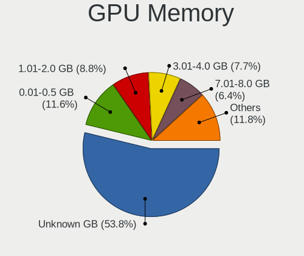

| Size in GB | Computers | Percent |
|------------|-----------|---------|
| Unknown    | 929       | 54.04%  |
| 0.01-0.5   | 187       | 10.88%  |
| 1.01-2.0   | 151       | 8.78%   |
| 3.01-4.0   | 135       | 7.85%   |
| 7.01-8.0   | 120       | 6.98%   |
| 0.51-1.0   | 89        | 5.18%   |
| 8.01-16.0  | 54        | 3.14%   |
| 5.01-6.0   | 34        | 1.98%   |
| 2.01-3.0   | 10        | 0.58%   |
| 16.01-24.0 | 10        | 0.58%   |

Monitor
-------

Monitor Vendor
--------------

Monitor vendors

| Vendor                  | Computers | Percent |
|-------------------------|-----------|---------|
| BOE                     | 235       | 12%     |
| AU Optronics            | 213       | 10.88%  |
| Samsung Electronics     | 208       | 10.62%  |
| Chimei Innolux          | 181       | 9.24%   |
| LG Display              | 146       | 7.46%   |
| Dell                    | 140       | 7.15%   |
| Goldstar                | 131       | 6.69%   |
| Apple                   | 56        | 2.86%   |
| Hewlett-Packard         | 54        | 2.76%   |
| Sharp                   | 44        | 2.25%   |
| Acer                    | 40        | 2.04%   |
| Lenovo                  | 38        | 1.94%   |
| Philips                 | 37        | 1.89%   |
| AOC                     | 37        | 1.89%   |
| BenQ                    | 31        | 1.58%   |
| ASUSTek Computer        | 29        | 1.48%   |
| Ancor Communications    | 28        | 1.43%   |
| PANDA                   | 26        | 1.33%   |
| CSO                     | 24        | 1.23%   |
| InfoVision              | 21        | 1.07%   |
| Iiyama                  | 15        | 0.77%   |
| ViewSonic               | 14        | 0.72%   |
| Gigabyte Technology     | 14        | 0.72%   |
| Chi Mei Optoelectronics | 13        | 0.66%   |
| TMX                     | 10        | 0.51%   |
| Unknown                 | 9         | 0.46%   |
| MSI                     | 9         | 0.46%   |
| Sceptre Tech            | 8         | 0.41%   |
| Sony                    | 7         | 0.36%   |
| Mi                      | 7         | 0.36%   |
| Toshiba                 | 6         | 0.31%   |
| LG Philips              | 6         | 0.31%   |
| Fujitsu Siemens         | 6         | 0.31%   |
| HUAWEI                  | 4         | 0.2%    |
| Hitachi                 | 4         | 0.2%    |
| Vizio                   | 3         | 0.15%   |
| Vestel Elektronik       | 3         | 0.15%   |
| Unknown (XXX)           | 3         | 0.15%   |
| NEC Computers           | 3         | 0.15%   |
| GDH                     | 3         | 0.15%   |

Monitor Model
-------------

Monitor models

| Model                                                                 | Computers | Percent |
|-----------------------------------------------------------------------|-----------|---------|
| Chimei Innolux LCD Monitor CMN15E7 1920x1080 344x193mm 15.5-inch      | 11        | 0.55%   |
| Chimei Innolux LCD Monitor CMN14D4 1920x1080 309x173mm 13.9-inch      | 11        | 0.55%   |
| Goldstar FULL HD GSM5B55 1920x1080 480x270mm 21.7-inch                | 10        | 0.5%    |
| AU Optronics LCD Monitor AUO21ED 1920x1080 344x194mm 15.5-inch        | 9         | 0.45%   |
| BOE LCD Monitor BOE0872 1920x1080 344x194mm 15.5-inch                 | 8         | 0.4%    |
| LG Display LCD Monitor LGD0555 2736x1824 260x173mm 12.3-inch          | 7         | 0.35%   |
| BOE LCD Monitor BOE08D7 1920x1080 309x174mm 14.0-inch                 | 7         | 0.35%   |
| AU Optronics LCD Monitor AUOAF90 1920x1080 344x193mm 15.5-inch        | 7         | 0.35%   |
| AU Optronics LCD Monitor AUO403D 1920x1080 309x174mm 14.0-inch        | 7         | 0.35%   |
| Unknown LCD Monitor FFFF 2288x1287 2550x2550mm 142.0-inch             | 6         | 0.3%    |
| Goldstar LG IPS FULLHD GSM5AB8 1920x1080 480x270mm 21.7-inch          | 6         | 0.3%    |
| Goldstar LG HDR WFHD GSM7714 2560x1080 800x340mm 34.2-inch            | 6         | 0.3%    |
| Chimei Innolux LCD Monitor CMN15DB 1366x768 344x193mm 15.5-inch       | 6         | 0.3%    |
| Chimei Innolux LCD Monitor CMN1521 1920x1080 344x193mm 15.5-inch      | 6         | 0.3%    |
| Chimei Innolux LCD Monitor CMN1482 1600x900 309x174mm 14.0-inch       | 6         | 0.3%    |
| AU Optronics LCD Monitor AUO61ED 1920x1080 344x193mm 15.5-inch        | 6         | 0.3%    |
| AU Optronics LCD Monitor AUO38ED 1920x1080 344x193mm 15.5-inch        | 6         | 0.3%    |
| Samsung Electronics LCD Monitor SDC4159 1920x1080 344x194mm 15.5-inch | 5         | 0.25%   |
| PANDA LCD Monitor NCP004D 1920x1080 344x194mm 15.5-inch               | 5         | 0.25%   |
| Goldstar ULTRAWIDE GSM76F9 2560x1080 531x298mm 24.0-inch              | 5         | 0.25%   |
| Goldstar ULTRAWIDE GSM59F1 2560x1080 673x284mm 28.8-inch              | 5         | 0.25%   |
| Goldstar HDR 4K GSM7707 3840x2160 600x340mm 27.2-inch                 | 5         | 0.25%   |
| Gigabyte Technology M27Q GBT270D 2560x1440 596x335mm 26.9-inch        | 5         | 0.25%   |
| Dell U2412M DELA07B 1920x1200 518x324mm 24.1-inch                     | 5         | 0.25%   |
| Dell S3220DGF DELD0F4 2560x1440 697x392mm 31.5-inch                   | 5         | 0.25%   |
| Chimei Innolux LCD Monitor CMN15E8 1920x1080 344x193mm 15.5-inch      | 5         | 0.25%   |
| Chimei Innolux LCD Monitor CMN14E5 1920x1080 309x173mm 13.9-inch      | 5         | 0.25%   |
| Chimei Innolux LCD Monitor CMN1406 1920x1080 309x173mm 13.9-inch      | 5         | 0.25%   |
| BOE LCD Monitor BOE08A8 1920x1080 344x194mm 15.5-inch                 | 5         | 0.25%   |
| BOE LCD Monitor BOE0877 1920x1080 309x173mm 13.9-inch                 | 5         | 0.25%   |
| BOE LCD Monitor BOE0812 1920x1080 344x194mm 15.5-inch                 | 5         | 0.25%   |
| BOE LCD Monitor BOE07F6 1920x1080 309x174mm 14.0-inch                 | 5         | 0.25%   |
| BOE LCD Monitor BOE0757 1366x768 344x194mm 15.5-inch                  | 5         | 0.25%   |
| AU Optronics LCD Monitor AUO106C 1366x768 277x156mm 12.5-inch         | 5         | 0.25%   |
| Apple LCD Monitor APP9CC5 1280x800 286x179mm 13.3-inch                | 5         | 0.25%   |
| AOC Q27G2SG4 AOC2702 2560x1440 597x336mm 27.0-inch                    | 5         | 0.25%   |
| Samsung Electronics S24F350 SAM0D20 1920x1080 521x293mm 23.5-inch     | 4         | 0.2%    |
| Samsung Electronics LCD Monitor SEC5441 1366x768 344x194mm 15.5-inch  | 4         | 0.2%    |
| LG Display LCD Monitor LGD06B3 1920x1200 336x210mm 15.6-inch          | 4         | 0.2%    |
| LG Display LCD Monitor LGD046D 1920x1080 309x174mm 14.0-inch          | 4         | 0.2%    |

Monitor Resolution
------------------

Monitor screen resolution

| Resolution         | Computers | Percent |
|--------------------|-----------|---------|
| 1920x1080 (FHD)    | 856       | 46.25%  |
| 1366x768 (WXGA)    | 208       | 11.24%  |
| 3840x2160 (4K)     | 157       | 8.48%   |
| 2560x1440 (QHD)    | 154       | 8.32%   |
| 1920x1200 (WUXGA)  | 61        | 3.3%    |
| 2560x1600          | 49        | 2.65%   |
| 1600x900 (HD+)     | 44        | 2.38%   |
| 3440x1440          | 42        | 2.27%   |
| 1680x1050 (WSXGA+) | 36        | 1.94%   |
| 1440x900 (WXGA+)   | 28        | 1.51%   |
| 1280x800 (WXGA)    | 28        | 1.51%   |
| 1280x1024 (SXGA)   | 27        | 1.46%   |
| 2560x1080          | 24        | 1.3%    |
| 2880x1800          | 22        | 1.19%   |
| 1360x768           | 10        | 0.54%   |
| 2160x1440          | 9         | 0.49%   |
| 3840x2400          | 8         | 0.43%   |
| 2736x1824          | 8         | 0.43%   |
| 2256x1504          | 7         | 0.38%   |
| 3840x1080          | 6         | 0.32%   |
| 2288x1287          | 6         | 0.32%   |
| 3840x1600          | 4         | 0.22%   |
| 3456x2160          | 4         | 0.22%   |
| 3200x2000          | 4         | 0.22%   |
| 2880x1620          | 4         | 0.22%   |
| 2160x1350          | 4         | 0.22%   |
| 1920x540           | 4         | 0.22%   |
| 2520x1680          | 3         | 0.16%   |
| 2240x1400          | 3         | 0.16%   |
| 2048x1152          | 3         | 0.16%   |
| 1920x1280          | 3         | 0.16%   |
| 1600x1200          | 3         | 0.16%   |
| 1024x768 (XGA)     | 3         | 0.16%   |
| 3840x1100          | 2         | 0.11%   |
| 3200x1800 (QHD+)   | 2         | 0.11%   |
| 3072x1920          | 2         | 0.11%   |
| 2880x1920          | 2         | 0.11%   |
| Unknown            | 2         | 0.11%   |
| 800x1280           | 1         | 0.05%   |
| 3840x2560          | 1         | 0.05%   |

Monitor Diagonal
----------------

Diagonal size in inches

| Inches  | Computers | Percent |
|---------|-----------|---------|
| 15      | 478       | 24.23%  |
| 13      | 232       | 11.76%  |
| 14      | 210       | 10.64%  |
| 27      | 190       | 9.63%   |
| 24      | 140       | 7.1%    |
| 23      | 95        | 4.82%   |
| 21      | 92        | 4.66%   |
| 31      | 71        | 3.6%    |
| 34      | 59        | 2.99%   |
| 17      | 53        | 2.69%   |
| 16      | 48        | 2.43%   |
| 12      | 37        | 1.88%   |
| 19      | 30        | 1.52%   |
| 22      | 28        | 1.42%   |
| 20      | 26        | 1.32%   |
| 18      | 21        | 1.06%   |
| 84      | 16        | 0.81%   |
| Unknown | 16        | 0.81%   |
| 11      | 15        | 0.76%   |
| 32      | 12        | 0.61%   |
| 28      | 11        | 0.56%   |
| 54      | 10        | 0.51%   |
| 72      | 9         | 0.46%   |
| 40      | 8         | 0.41%   |
| 35      | 8         | 0.41%   |
| 26      | 7         | 0.35%   |
| 142     | 6         | 0.3%    |
| 10      | 6         | 0.3%    |
| 52      | 5         | 0.25%   |
| 48      | 5         | 0.25%   |
| 65      | 4         | 0.2%    |
| 37      | 4         | 0.2%    |
| 25      | 4         | 0.2%    |
| 63      | 3         | 0.15%   |
| 49      | 3         | 0.15%   |
| 42      | 3         | 0.15%   |
| 33      | 2         | 0.1%    |
| 74      | 1         | 0.05%   |
| 45      | 1         | 0.05%   |
| 39      | 1         | 0.05%   |

Monitor Width
-------------

Physical width

| Width in mm    | Computers | Percent |
|----------------|-----------|---------|
| 301-350        | 819       | 42.44%  |
| 501-600        | 380       | 19.69%  |
| 201-300        | 197       | 10.21%  |
| 401-500        | 174       | 9.02%   |
| 601-700        | 107       | 5.54%   |
| 351-400        | 75        | 3.89%   |
| 701-800        | 71        | 3.68%   |
| 1001-1500      | 30        | 1.55%   |
| 1501-2000      | 26        | 1.35%   |
| 801-900        | 24        | 1.24%   |
| Unknown        | 16        | 0.83%   |
| More than 2000 | 6         | 0.31%   |
| 901-1000       | 4         | 0.21%   |
| 1-100          | 1         | 0.05%   |

Aspect Ratio
------------

Proportional relationship between the width and the height

| Ratio   | Computers | Percent |
|---------|-----------|---------|
| 16/9    | 1319      | 75.67%  |
| 16/10   | 257       | 14.74%  |
| 21/9    | 71        | 4.07%   |
| 3/2     | 37        | 2.12%   |
| 5/4     | 24        | 1.38%   |
| 4/3     | 9         | 0.52%   |
| 1.00    | 7         | 0.4%    |
| 32/9    | 6         | 0.34%   |
| Unknown | 5         | 0.29%   |
| 6/5     | 3         | 0.17%   |
| 3.40    | 2         | 0.11%   |
| 2.12    | 1         | 0.06%   |
| 0.67    | 1         | 0.06%   |
| 0.62    | 1         | 0.06%   |

Monitor Area
------------

Area in inch

| Area in inch | Computers | Percent |
|----------------|-----------|---------|
| 101-110        | 483       | 24.68%  |
| 81-90          | 336       | 17.17%  |
| 201-250        | 266       | 13.59%  |
| 301-350        | 196       | 10.02%  |
| 351-500        | 159       | 8.12%   |
| 71-80          | 101       | 5.16%   |
| 151-200        | 87        | 4.45%   |
| More than 1000 | 58        | 2.96%   |
| 251-300        | 57        | 2.91%   |
| 111-120        | 43        | 2.2%    |
| 121-130        | 41        | 2.1%    |
| 61-70          | 30        | 1.53%   |
| 141-150        | 26        | 1.33%   |
| 501-1000       | 22        | 1.12%   |
| 51-60          | 18        | 0.92%   |
| Unknown        | 16        | 0.82%   |
| 91-100         | 9         | 0.46%   |
| 41-50          | 5         | 0.26%   |
| 131-140        | 3         | 0.15%   |
| 1-40           | 1         | 0.05%   |

Pixel Density
-------------

Pixels per inch

| Density       | Computers | Percent |
|---------------|-----------|---------|
| 121-160       | 642       | 33.84%  |
| 51-100        | 503       | 26.52%  |
| 101-120       | 402       | 21.19%  |
| 161-240       | 220       | 11.6%   |
| More than 240 | 70        | 3.69%   |
| 1-50          | 44        | 2.32%   |
| Unknown       | 16        | 0.84%   |

Multiple Monitors
-----------------

Total monitors connected

| Total | Computers | Percent |
|-------|-----------|---------|
| 1     | 1288      | 74.71%  |
| 2     | 329       | 19.08%  |
| 0     | 68        | 3.94%   |
| 3     | 35        | 2.03%   |
| 4     | 4         | 0.23%   |

Network
-------

Net Controller Vendor
---------------------

Controller vendors

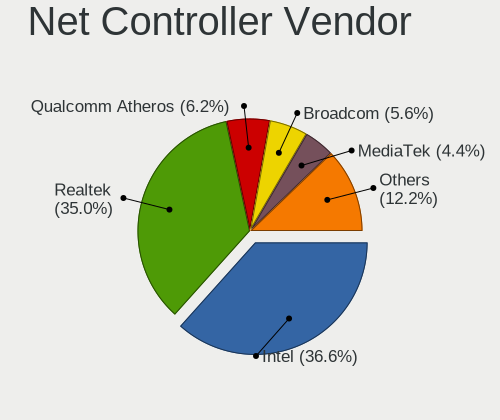

| Vendor                            | Computers | Percent |
|-----------------------------------|-----------|---------|
| Intel                             | 932       | 37.13%  |
| Realtek Semiconductor             | 883       | 35.18%  |
| Qualcomm Atheros                  | 155       | 6.18%   |
| Broadcom                          | 139       | 5.54%   |
| MediaTek                          | 102       | 4.06%   |
| TP-Link                           | 26        | 1.04%   |
| Broadcom Limited                  | 22        | 0.88%   |
| ASIX Electronics                  | 22        | 0.88%   |
| Ralink Technology                 | 18        | 0.72%   |
| Ralink                            | 15        | 0.6%    |
| Microsoft                         | 15        | 0.6%    |
| Qualcomm                          | 14        | 0.56%   |
| Lenovo                            | 14        | 0.56%   |
| Aquantia                          | 13        | 0.52%   |
| Marvell Technology Group          | 12        | 0.48%   |
| Samsung Electronics               | 11        | 0.44%   |
| Xiaomi                            | 9         | 0.36%   |
| DisplayLink                       | 9         | 0.36%   |
| Nvidia                            | 8         | 0.32%   |
| Sierra Wireless                   | 7         | 0.28%   |
| Qualcomm Atheros Communications   | 7         | 0.28%   |
| Dell                              | 6         | 0.24%   |
| OPPO Electronics                  | 5         | 0.2%    |
| Mellanox Technologies             | 5         | 0.2%    |
| Hewlett-Packard                   | 5         | 0.2%    |
| D-Link                            | 5         | 0.2%    |
| NetGear                           | 4         | 0.16%   |
| ASUSTek Computer                  | 4         | 0.16%   |
| ICS Advent                        | 3         | 0.12%   |
| Huawei Technologies               | 3         | 0.12%   |
| Google                            | 3         | 0.12%   |
| ZyDAS                             | 2         | 0.08%   |
| Wilocity                          | 2         | 0.08%   |
| STMicroelectronics                | 2         | 0.08%   |
| Motorola PCS                      | 2         | 0.08%   |
| Ericsson Business Mobile Networks | 2         | 0.08%   |
| AVM                               | 2         | 0.08%   |
| Apple                             | 2         | 0.08%   |
| WEMOS.CC                          | 1         | 0.04%   |
| VIA Technologies                  | 1         | 0.04%   |

Net Controller Model
--------------------

Controller models

| Model                                                             | Computers | Percent |
|-------------------------------------------------------------------|-----------|---------|
| Realtek RTL8111/8168/8411 PCI Express Gigabit Ethernet Controller | 577       | 19.33%  |
| Intel Wi-Fi 6 AX200                                               | 119       | 3.99%   |
| Intel Wi-Fi 6 AX201                                               | 95        | 3.18%   |
| Realtek RTL8153 Gigabit Ethernet Adapter                          | 75        | 2.51%   |
| Intel Alder Lake-P PCH CNVi WiFi                                  | 68        | 2.28%   |
| Realtek RTL8125 2.5GbE Controller                                 | 61        | 2.04%   |
| Intel Wireless 8265 / 8275                                        | 59        | 1.98%   |
| Realtek RTL810xE PCI Express Fast Ethernet controller             | 53        | 1.78%   |
| Realtek RTL8822CE 802.11ac PCIe Wireless Network Adapter          | 51        | 1.71%   |
| Intel Ethernet Controller I225-V                                  | 49        | 1.64%   |
| MediaTek MT7921 802.11ax PCI Express Wireless Network Adapter     | 48        | 1.61%   |
| Intel 82579LM Gigabit Network Connection (Lewisville)             | 48        | 1.61%   |
| Intel Wi-Fi 6 AX210/AX211/AX411 160MHz                            | 47        | 1.57%   |
| Realtek RTL8821CE 802.11ac PCIe Wireless Network Adapter          | 43        | 1.44%   |
| Qualcomm Atheros QCA9377 802.11ac Wireless Network Adapter        | 41        | 1.37%   |
| Intel I211 Gigabit Network Connection                             | 38        | 1.27%   |
| MediaTek MT7922 802.11ax PCI Express Wireless Network Adapter     | 36        | 1.21%   |
| Intel Wireless 8260                                               | 30        | 1.01%   |
| Intel Comet Lake PCH-LP CNVi WiFi                                 | 30        | 1.01%   |
| Intel Comet Lake PCH CNVi WiFi                                    | 30        | 1.01%   |
| Intel Wireless 7265                                               | 29        | 0.97%   |
| Intel Cannon Lake PCH CNVi WiFi                                   | 29        | 0.97%   |
| Intel Wireless 7260                                               | 28        | 0.94%   |
| Realtek RTL8852AE 802.11ax PCIe Wireless Network Adapter          | 27        | 0.9%    |
| Qualcomm Atheros QCA6174 802.11ac Wireless Network Adapter        | 26        | 0.87%   |
| Realtek RTL8852BE PCIe 802.11ax Wireless Network Controller       | 25        | 0.84%   |
| Intel Dual Band Wireless-AC 3168NGW [Stone Peak]                  | 25        | 0.84%   |
| Intel Cannon Point-LP CNVi [Wireless-AC]                          | 24        | 0.8%    |
| ASIX AX88179 Gigabit Ethernet                                     | 21        | 0.7%    |
| Intel Ethernet Connection I217-LM                                 | 20        | 0.67%   |
| Intel Ethernet Connection (4) I219-LM                             | 20        | 0.67%   |
| Broadcom BCM43142 802.11b/g/n                                     | 20        | 0.67%   |
| Qualcomm Atheros QCA9565 / AR9565 Wireless Network Adapter        | 19        | 0.64%   |
| Intel Wireless 3165                                               | 19        | 0.64%   |
| Intel Ethernet Connection (2) I219-V                              | 18        | 0.6%    |
| Broadcom BCM4331 802.11a/b/g/n                                    | 17        | 0.57%   |
| Intel Wireless-AC 9260                                            | 16        | 0.54%   |
| Intel Tiger Lake PCH CNVi WiFi                                    | 16        | 0.54%   |
| Intel Ethernet Connection I219-LM                                 | 16        | 0.54%   |
| Intel Centrino Advanced-N 6205 [Taylor Peak]                      | 16        | 0.54%   |

Wireless Vendor
---------------

Wireless vendors

| Vendor                                | Computers | Percent |
|---------------------------------------|-----------|---------|
| Intel                                 | 790       | 52.53%  |
| Realtek Semiconductor                 | 234       | 15.56%  |
| Qualcomm Atheros                      | 130       | 8.64%   |
| Broadcom                              | 108       | 7.18%   |
| MediaTek                              | 101       | 6.72%   |
| TP-Link                               | 23        | 1.53%   |
| Broadcom Limited                      | 19        | 1.26%   |
| Ralink Technology                     | 18        | 1.2%    |
| Ralink                                | 15        | 1%      |
| Microsoft                             | 12        | 0.8%    |
| Qualcomm                              | 10        | 0.66%   |
| Sierra Wireless                       | 7         | 0.47%   |
| Qualcomm Atheros Communications       | 7         | 0.47%   |
| NetGear                               | 4         | 0.27%   |
| Marvell Technology Group              | 4         | 0.27%   |
| ASUSTek Computer                      | 4         | 0.27%   |
| Dell                                  | 3         | 0.2%    |
| ZyDAS                                 | 2         | 0.13%   |
| Wilocity                              | 2         | 0.13%   |
| D-Link                                | 2         | 0.13%   |
| AVM                                   | 2         | 0.13%   |
| Sitecom Europe                        | 1         | 0.07%   |
| Quectel Wireless Solutions            | 1         | 0.07%   |
| Qualcomm Technologies                 | 1         | 0.07%   |
| Hewlett-Packard                       | 1         | 0.07%   |
| Edimax Technology                     | 1         | 0.07%   |
| Belkin Components                     | 1         | 0.07%   |
| 802.11g Adapter [Linksys WUSB54GC v3] | 1         | 0.07%   |

Wireless Model
--------------

Wireless models

| Model                                                          | Computers | Percent |
|----------------------------------------------------------------|-----------|---------|
| Intel Wi-Fi 6 AX200                                            | 119       | 7.87%   |
| Intel Wi-Fi 6 AX201                                            | 95        | 6.28%   |
| Intel Alder Lake-P PCH CNVi WiFi                               | 68        | 4.5%    |
| Intel Wireless 8265 / 8275                                     | 59        | 3.9%    |
| Realtek RTL8822CE 802.11ac PCIe Wireless Network Adapter       | 51        | 3.37%   |
| MediaTek MT7921 802.11ax PCI Express Wireless Network Adapter  | 48        | 3.17%   |
| Intel Wi-Fi 6 AX210/AX211/AX411 160MHz                         | 47        | 3.11%   |
| Realtek RTL8821CE 802.11ac PCIe Wireless Network Adapter       | 43        | 2.84%   |
| Qualcomm Atheros QCA9377 802.11ac Wireless Network Adapter     | 41        | 2.71%   |
| MediaTek MT7922 802.11ax PCI Express Wireless Network Adapter  | 36        | 2.38%   |
| Intel Wireless 8260                                            | 30        | 1.98%   |
| Intel Comet Lake PCH-LP CNVi WiFi                              | 30        | 1.98%   |
| Intel Comet Lake PCH CNVi WiFi                                 | 30        | 1.98%   |
| Intel Wireless 7265                                            | 29        | 1.92%   |
| Intel Cannon Lake PCH CNVi WiFi                                | 29        | 1.92%   |
| Intel Wireless 7260                                            | 28        | 1.85%   |
| Realtek RTL8852AE 802.11ax PCIe Wireless Network Adapter       | 27        | 1.79%   |
| Qualcomm Atheros QCA6174 802.11ac Wireless Network Adapter     | 26        | 1.72%   |
| Realtek RTL8852BE PCIe 802.11ax Wireless Network Controller    | 25        | 1.65%   |
| Intel Dual Band Wireless-AC 3168NGW [Stone Peak]               | 25        | 1.65%   |
| Intel Cannon Point-LP CNVi [Wireless-AC]                       | 24        | 1.59%   |
| Broadcom BCM43142 802.11b/g/n                                  | 20        | 1.32%   |
| Qualcomm Atheros QCA9565 / AR9565 Wireless Network Adapter     | 19        | 1.26%   |
| Intel Wireless 3165                                            | 19        | 1.26%   |
| Broadcom BCM4331 802.11a/b/g/n                                 | 17        | 1.12%   |
| Intel Wireless-AC 9260                                         | 16        | 1.06%   |
| Intel Tiger Lake PCH CNVi WiFi                                 | 16        | 1.06%   |
| Intel Centrino Advanced-N 6205 [Taylor Peak]                   | 16        | 1.06%   |
| Intel Alder Lake-S PCH CNVi WiFi                               | 16        | 1.06%   |
| MediaTek MT7921K (RZ608) Wi-Fi 6E 80MHz                        | 15        | 0.99%   |
| Intel Ice Lake-LP PCH CNVi WiFi                                | 15        | 0.99%   |
| Broadcom BCM4360 802.11ac Wireless Network Adapter             | 14        | 0.93%   |
| Qualcomm Atheros AR9285 Wireless Network Adapter (PCI-Express) | 13        | 0.86%   |
| Intel Raptor Lake PCH CNVi WiFi                                | 13        | 0.86%   |
| Microsoft Xbox Wireless Adapter for Windows                    | 11        | 0.73%   |
| Broadcom Limited BCM4360 802.11ac Wireless Network Adapter     | 11        | 0.73%   |
| Qualcomm Atheros AR9485 Wireless Network Adapter               | 10        | 0.66%   |
| Realtek 802.11ac NIC                                           | 9         | 0.6%    |
| Qualcomm QCNFA765 Wireless Network Adapter                     | 9         | 0.6%    |
| Broadcom BCM4313 802.11bgn Wireless Network Adapter            | 9         | 0.6%    |

Ethernet Vendor
---------------

Ethernet vendors

| Vendor                                 | Computers | Percent |
|----------------------------------------|-----------|---------|
| Realtek Semiconductor                  | 770       | 54.38%  |
| Intel                                  | 414       | 29.24%  |
| Broadcom                               | 57        | 4.03%   |
| Qualcomm Atheros                       | 35        | 2.47%   |
| ASIX Electronics                       | 22        | 1.55%   |
| Lenovo                                 | 14        | 0.99%   |
| Aquantia                               | 13        | 0.92%   |
| Xiaomi                                 | 9         | 0.64%   |
| Samsung Electronics                    | 9         | 0.64%   |
| DisplayLink                            | 9         | 0.64%   |
| Nvidia                                 | 8         | 0.56%   |
| Marvell Technology Group               | 8         | 0.56%   |
| OPPO Electronics                       | 5         | 0.35%   |
| Qualcomm                               | 4         | 0.28%   |
| Mellanox Technologies                  | 4         | 0.28%   |
| TP-Link                                | 3         | 0.21%   |
| Microsoft                              | 3         | 0.21%   |
| ICS Advent                             | 3         | 0.21%   |
| Hewlett-Packard                        | 3         | 0.21%   |
| Google                                 | 3         | 0.21%   |
| D-Link                                 | 3         | 0.21%   |
| Broadcom Limited                       | 3         | 0.21%   |
| Huawei Technologies                    | 2         | 0.14%   |
| Apple                                  | 2         | 0.14%   |
| VIA Technologies                       | 1         | 0.07%   |
| Sony Ericsson Mobile Communications AB | 1         | 0.07%   |
| OnePlus Technology (Shenzhen)          | 1         | 0.07%   |
| Motorola PCS                           | 1         | 0.07%   |
| MediaTek                               | 1         | 0.07%   |
| JMicron Technology                     | 1         | 0.07%   |
| IBM                                    | 1         | 0.07%   |
| HMD Global                             | 1         | 0.07%   |
| Dell                                   | 1         | 0.07%   |
| 3Com                                   | 1         | 0.07%   |

Ethernet Model
--------------

Ethernet models

| Model                                                               | Computers | Percent |
|---------------------------------------------------------------------|-----------|---------|
| Realtek RTL8111/8168/8411 PCI Express Gigabit Ethernet Controller   | 577       | 39.71%  |
| Realtek RTL8153 Gigabit Ethernet Adapter                            | 75        | 5.16%   |
| Realtek RTL8125 2.5GbE Controller                                   | 61        | 4.2%    |
| Realtek RTL810xE PCI Express Fast Ethernet controller               | 53        | 3.65%   |
| Intel Ethernet Controller I225-V                                    | 49        | 3.37%   |
| Intel 82579LM Gigabit Network Connection (Lewisville)               | 48        | 3.3%    |
| Intel I211 Gigabit Network Connection                               | 38        | 2.62%   |
| ASIX AX88179 Gigabit Ethernet                                       | 21        | 1.45%   |
| Intel Ethernet Connection I217-LM                                   | 20        | 1.38%   |
| Intel Ethernet Connection (4) I219-LM                               | 20        | 1.38%   |
| Intel Ethernet Connection (2) I219-V                                | 18        | 1.24%   |
| Intel Ethernet Connection I219-LM                                   | 16        | 1.1%    |
| Broadcom NetXtreme BCM57765 Gigabit Ethernet PCIe                   | 16        | 1.1%    |
| Intel Ethernet Connection (4) I219-V                                | 15        | 1.03%   |
| Intel Ethernet Connection (7) I219-V                                | 14        | 0.96%   |
| Intel Ethernet Connection (2) I219-LM                               | 14        | 0.96%   |
| Intel Ethernet Connection (7) I219-LM                               | 11        | 0.76%   |
| Broadcom NetXtreme BCM57766 Gigabit Ethernet PCIe                   | 11        | 0.76%   |
| Realtek Killer E2600 Gigabit Ethernet Controller                    | 10        | 0.69%   |
| Samsung Galaxy series, misc. (tethering mode)                       | 9         | 0.62%   |
| Intel Ethernet Connection (16) I219-V                               | 9         | 0.62%   |
| Intel 82577LM Gigabit Network Connection                            | 9         | 0.62%   |
| Intel Ethernet Connection I218-LM                                   | 8         | 0.55%   |
| Intel Ethernet Connection (6) I219-V                                | 8         | 0.55%   |
| Intel Ethernet Connection (3) I218-LM                               | 8         | 0.55%   |
| Intel Ethernet Connection (14) I219-V                               | 8         | 0.55%   |
| Xiaomi Mi/Redmi series (RNDIS)                                      | 7         | 0.48%   |
| Qualcomm Atheros AR8151 v2.0 Gigabit Ethernet                       | 7         | 0.48%   |
| Nvidia MCP79 Ethernet                                               | 7         | 0.48%   |
| Intel Ethernet Connection (2) I218-V                                | 7         | 0.48%   |
| Realtek RTL8152 Fast Ethernet Adapter                               | 6         | 0.41%   |
| Qualcomm Atheros Killer E220x Gigabit Ethernet Controller           | 6         | 0.41%   |
| Lenovo ThinkPad TBT 3 Dock                                          | 6         | 0.41%   |
| Intel I210 Gigabit Network Connection                               | 6         | 0.41%   |
| Intel Ethernet Connection (6) I219-LM                               | 6         | 0.41%   |
| Intel Ethernet Connection (16) I219-LM                              | 6         | 0.41%   |
| Broadcom NetXtreme BCM5764M Gigabit Ethernet PCIe                   | 6         | 0.41%   |
| Aquantia AQC113CS NBase-T/IEEE 802.3bz Ethernet Controller [AQtion] | 6         | 0.41%   |
| Qualcomm Atheros Killer E2400 Gigabit Ethernet Controller           | 5         | 0.34%   |
| Intel Ethernet Connection I217-V                                    | 5         | 0.34%   |

Net Controller Kind
-------------------

Ethernet, WiFi or modem

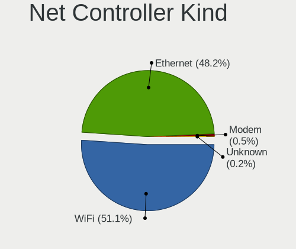

| Kind     | Computers | Percent |
|----------|-----------|---------|
| WiFi     | 1436      | 51.84%  |
| Ethernet | 1314      | 47.44%  |
| Modem    | 16        | 0.58%   |
| Unknown  | 4         | 0.14%   |

Used Controller
---------------

Currently used network controller

| Kind     | Computers | Percent |
|----------|-----------|---------|
| WiFi     | 1133      | 63.37%  |
| Ethernet | 655       | 36.63%  |

NICs
----

Total network controllers on board

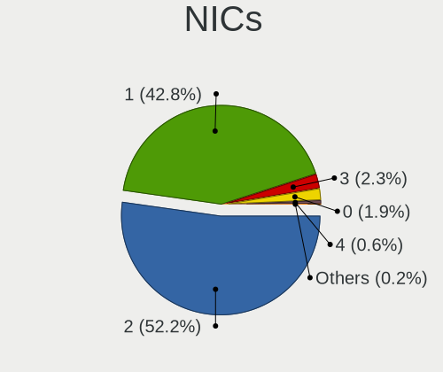

| Total | Computers | Percent |
|-------|-----------|---------|
| 2     | 884       | 51.67%  |
| 1     | 731       | 42.72%  |
| 3     | 46        | 2.69%   |
| 0     | 34        | 1.99%   |
| 4     | 12        | 0.7%    |
| 6     | 2         | 0.12%   |
| 5     | 2         | 0.12%   |

IPv6
----

IPv6 vs IPv4

| Used | Computers | Percent |
|------|-----------|---------|
| No   | 1193      | 69.36%  |
| Yes  | 527       | 30.64%  |

Bluetooth
---------

Bluetooth Vendor
----------------

Controller vendors

| Vendor                          | Computers | Percent |
|---------------------------------|-----------|---------|
| Intel                           | 699       | 53.89%  |
| Realtek Semiconductor           | 146       | 11.26%  |
| Foxconn / Hon Hai               | 64        | 4.93%   |
| Qualcomm Atheros Communications | 63        | 4.86%   |
| IMC Networks                    | 57        | 4.39%   |
| Apple                           | 55        | 4.24%   |
| Broadcom                        | 49        | 3.78%   |
| Cambridge Silicon Radio         | 42        | 3.24%   |
| Lite-On Technology              | 24        | 1.85%   |
| MediaTek                        | 21        | 1.62%   |
| ASUSTek Computer                | 12        | 0.93%   |
| Realtek                         | 10        | 0.77%   |
| Dell                            | 10        | 0.77%   |
| USI                             | 7         | 0.54%   |
| Hewlett-Packard                 | 6         | 0.46%   |
| TP-Link                         | 5         | 0.39%   |
| Toshiba                         | 4         | 0.31%   |
| Ralink                          | 4         | 0.31%   |
| Marvell Semiconductor           | 4         | 0.31%   |
| Foxconn International           | 4         | 0.31%   |
| Opticis                         | 3         | 0.23%   |
| Unknown                         | 2         | 0.15%   |
| Taiyo Yuden                     | 1         | 0.08%   |
| Smart Modular Technologies      | 1         | 0.08%   |
| Fujitsu                         | 1         | 0.08%   |
| Edimax Technology               | 1         | 0.08%   |
| D-Link                          | 1         | 0.08%   |
| Askey Computer                  | 1         | 0.08%   |

Bluetooth Model
---------------

Controller models

| Model                                               | Computers | Percent |
|-----------------------------------------------------|-----------|---------|
| Intel AX201 Bluetooth                               | 182       | 14.02%  |
| Intel Bluetooth wireless interface                  | 151       | 11.63%  |
| Realtek Bluetooth Radio                             | 120       | 9.24%   |
| Intel AX200 Bluetooth                               | 115       | 8.86%   |
| Intel Bluetooth 9460/9560 Jefferson Peak (JfP)      | 88        | 6.78%   |
| Intel Bluetooth Device                              | 66        | 5.08%   |
| Intel AX210 Bluetooth                               | 47        | 3.62%   |
| Cambridge Silicon Radio Bluetooth Dongle (HCI mode) | 42        | 3.24%   |
| Qualcomm Atheros  Bluetooth Device                  | 40        | 3.08%   |
| IMC Networks Wireless_Device                        | 28        | 2.16%   |
| Foxconn / Hon Hai Wireless_Device                   | 24        | 1.85%   |
| Apple Bluetooth USB Host Controller                 | 24        | 1.85%   |
| Intel Wireless-AC 3168 Bluetooth                    | 23        | 1.77%   |
| Apple Bluetooth Host Controller                     | 23        | 1.77%   |
| Realtek  Bluetooth 4.2 Adapter                      | 21        | 1.62%   |
| MediaTek Wireless_Device                            | 21        | 1.62%   |
| IMC Networks Bluetooth Radio                        | 18        | 1.39%   |
| Foxconn / Hon Hai MediaTek Bluetooth Adapter        | 18        | 1.39%   |
| Intel Wireless-AC 9260 Bluetooth Adapter            | 16        | 1.23%   |
| Intel Centrino Bluetooth Wireless Transceiver       | 10        | 0.77%   |
| Foxconn / Hon Hai Bluetooth Device                  | 10        | 0.77%   |
| Realtek 802.11ac WLAN Adapter                       | 9         | 0.69%   |
| IMC Networks Bluetooth Device                       | 9         | 0.69%   |
| Qualcomm Atheros QCA61x4 Bluetooth 4.0              | 8         | 0.62%   |
| Lite-On Qualcomm Atheros QCA9377 Bluetooth          | 8         | 0.62%   |
| USI Bluetooth Device                                | 7         | 0.54%   |
| Broadcom BCM20702A0 Bluetooth 4.0                   | 7         | 0.54%   |
| Qualcomm Atheros AR3012 Bluetooth 4.0               | 6         | 0.46%   |
| Qualcomm Atheros AR3011 Bluetooth                   | 6         | 0.46%   |
| Lite-On Wireless_Device                             | 6         | 0.46%   |
| Broadcom BCM43142 Bluetooth 4.0                     | 6         | 0.46%   |
| Broadcom BCM20702 Bluetooth 4.0 [ThinkPad]          | 6         | 0.46%   |
| Broadcom BCM2045B (BDC-2.1)                         | 6         | 0.46%   |
| Apple Built-in Bluetooth 2.0+EDR HCI                | 6         | 0.46%   |
| TP-Link UB500 Adapter                               | 5         | 0.39%   |
| Ralink RT3290 Bluetooth                             | 4         | 0.31%   |
| HP Broadcom 2070 Bluetooth Combo                    | 4         | 0.31%   |
| Foxconn International BCM43142A0 Bluetooth module   | 4         | 0.31%   |
| Dell BCM20702A0 Bluetooth Module                    | 4         | 0.31%   |
| Broadcom BCM43142A0 Bluetooth 4.0                   | 4         | 0.31%   |

Sound
-----

Sound Vendor
------------

Sound card vendors

| Vendor                                          | Computers | Percent |
|-------------------------------------------------|-----------|---------|
| Intel                                           | 1136      | 45.95%  |
| AMD                                             | 584       | 23.62%  |
| Nvidia                                          | 397       | 16.06%  |
| C-Media Electronics                             | 46        | 1.86%   |
| Logitech                                        | 28        | 1.13%   |
| Realtek Semiconductor                           | 19        | 0.77%   |
| Lenovo                                          | 18        | 0.73%   |
| ASUSTek Computer                                | 18        | 0.73%   |
| Kingston Technology                             | 13        | 0.53%   |
| JMTek                                           | 13        | 0.53%   |
| SteelSeries ApS                                 | 11        | 0.44%   |
| GN Netcom                                       | 11        | 0.44%   |
| Razer USA                                       | 10        | 0.4%    |
| Micro Star International                        | 10        | 0.4%    |
| Creative Labs                                   | 10        | 0.4%    |
| Generalplus Technology                          | 9         | 0.36%   |
| Sony                                            | 8         | 0.32%   |
| Corsair                                         | 8         | 0.32%   |
| Creative Technology                             | 7         | 0.28%   |
| Hewlett-Packard                                 | 6         | 0.24%   |
| Focusrite-Novation                              | 6         | 0.24%   |
| Texas Instruments                               | 5         | 0.2%    |
| Dell                                            | 5         | 0.2%    |
| Scarlett                                        | 4         | 0.16%   |
| Samson Technologies                             | 4         | 0.16%   |
| RODE Microphones                                | 4         | 0.16%   |
| FIFINE Microphones                              | 4         | 0.16%   |
| Zoran Co. Personal Media Division (Nogatech)    | 3         | 0.12%   |
| Schiit Audio                                    | 3         | 0.12%   |
| Plantronics                                     | 3         | 0.12%   |
| Microsoft                                       | 3         | 0.12%   |
| KTMicro                                         | 3         | 0.12%   |
| BEHRINGER International                         | 3         | 0.12%   |
| Audio-Technica                                  | 3         | 0.12%   |
| Yamaha                                          | 2         | 0.08%   |
| VIA Technologies                                | 2         | 0.08%   |
| Unknown                                         | 2         | 0.08%   |
| Licensed by Sony Computer Entertainment America | 2         | 0.08%   |
| JBL                                             | 2         | 0.08%   |
| FUXIN                                           | 2         | 0.08%   |

Sound Model
-----------

Sound card models

| Model                                                                      | Computers | Percent |
|----------------------------------------------------------------------------|-----------|---------|
| AMD Family 17h/19h HD Audio Controller                                     | 299       | 9.95%   |
| AMD Renoir Radeon High Definition Audio Controller                         | 168       | 5.59%   |
| Intel Sunrise Point-LP HD Audio                                            | 135       | 4.49%   |
| Intel Tiger Lake-LP Smart Sound Technology Audio Controller                | 112       | 3.73%   |
| Intel 7 Series/C216 Chipset Family High Definition Audio Controller        | 97        | 3.23%   |
| AMD Starship/Matisse HD Audio Controller                                   | 97        | 3.23%   |
| Intel Alder Lake PCH-P High Definition Audio Controller                    | 84        | 2.79%   |
| AMD Navi 21/23 HDMI/DP Audio Controller                                    | 76        | 2.53%   |
| Intel Cannon Lake PCH cAVS                                                 | 71        | 2.36%   |
| AMD Rembrandt Radeon High Definition Audio Controller                      | 59        | 1.96%   |
| Intel 8 Series/C220 Series Chipset High Definition Audio Controller        | 55        | 1.83%   |
| AMD Raven/Raven2/Fenghuang HDMI/DP Audio Controller                        | 52        | 1.73%   |
| Intel 6 Series/C200 Series Chipset Family High Definition Audio Controller | 47        | 1.56%   |
| Intel 100 Series/C230 Series Chipset Family HD Audio Controller            | 43        | 1.43%   |
| AMD Ellesmere HDMI Audio [Radeon RX 470/480 / 570/580/590]                 | 42        | 1.4%    |
| Intel Cannon Point-LP High Definition Audio Controller                     | 40        | 1.33%   |
| Nvidia TU107 GeForce GTX 1650 High Definition Audio Controller             | 39        | 1.3%    |
| Nvidia Audio device                                                        | 38        | 1.26%   |
| Intel Comet Lake PCH-LP cAVS                                               | 38        | 1.26%   |
| Nvidia GP107GL High Definition Audio Controller                            | 37        | 1.23%   |
| Nvidia GA104 High Definition Audio Controller                              | 37        | 1.23%   |
| Intel Haswell-ULT HD Audio Controller                                      | 36        | 1.2%    |
| Intel Comet Lake PCH cAVS                                                  | 36        | 1.2%    |
| Intel 8 Series HD Audio Controller                                         | 36        | 1.2%    |
| Intel 200 Series PCH HD Audio                                              | 36        | 1.2%    |
| Nvidia GA106 High Definition Audio Controller                              | 34        | 1.13%   |
| Intel Xeon E3-1200 v3/4th Gen Core Processor HD Audio Controller           | 33        | 1.1%    |
| AMD Family 17h (Models 00h-0fh) HD Audio Controller                        | 31        | 1.03%   |
| Intel 5 Series/3400 Series Chipset High Definition Audio                   | 30        | 1%      |
| Intel Alder Lake-S HD Audio Controller                                     | 29        | 0.96%   |
| Intel Broadwell-U Audio Controller                                         | 28        | 0.93%   |
| Intel Wildcat Point-LP High Definition Audio Controller                    | 27        | 0.9%    |
| Intel Tiger Lake-H HD Audio Controller                                     | 26        | 0.86%   |
| Intel Ice Lake-LP Smart Sound Technology Audio Controller                  | 26        | 0.86%   |
| Intel Celeron/Pentium Silver Processor High Definition Audio               | 24        | 0.8%    |
| AMD SBx00 Azalia (Intel HDA)                                               | 24        | 0.8%    |
| Nvidia TU116 High Definition Audio Controller                              | 21        | 0.7%    |
| AMD Navi 10 HDMI Audio                                                     | 20        | 0.67%   |
| AMD FCH Azalia Controller                                                  | 20        | 0.67%   |
| Intel CM238 HD Audio Controller                                            | 19        | 0.63%   |

Memory
------

Memory Vendor
-------------

Memory module vendors

| Vendor                       | Computers | Percent |
|------------------------------|-----------|---------|
| Samsung Electronics          | 178       | 23.24%  |
| SK hynix                     | 130       | 16.97%  |
| Micron Technology            | 97        | 12.66%  |
| Kingston                     | 79        | 10.31%  |
| Crucial                      | 54        | 7.05%   |
| Corsair                      | 45        | 5.87%   |
| Unknown                      | 35        | 4.57%   |
| G.Skill                      | 30        | 3.92%   |
| A-DATA Technology            | 20        | 2.61%   |
| Ramaxel Technology           | 15        | 1.96%   |
| Unknown                      | 14        | 1.83%   |
| Smart                        | 7         | 0.91%   |
| Teikon                       | 6         | 0.78%   |
| Team                         | 5         | 0.65%   |
| Elpida                       | 5         | 0.65%   |
| Unknown (ABCD)               | 4         | 0.52%   |
| Nanya Technology             | 4         | 0.52%   |
| Timetec                      | 3         | 0.39%   |
| GOODRAM                      | 3         | 0.39%   |
| V-GeN                        | 2         | 0.26%   |
| Qumo                         | 2         | 0.26%   |
| PNY                          | 2         | 0.26%   |
| CSX                          | 2         | 0.26%   |
| Apacer                       | 2         | 0.26%   |
| AMD                          | 2         | 0.26%   |
| 4ea5                         | 2         | 0.26%   |
| Unknown (0x0E9D)             | 1         | 0.13%   |
| Transcend                    | 1         | 0.13%   |
| Silicon Power                | 1         | 0.13%   |
| Sesame                       | 1         | 0.13%   |
| PUSKILL                      | 1         | 0.13%   |
| Patriot Memory (PDP Systems) | 1         | 0.13%   |
| Patriot                      | 1         | 0.13%   |
| Neo Forza                    | 1         | 0.13%   |
| Mushkin                      | 1         | 0.13%   |
| Lexar                        | 1         | 0.13%   |
| Gold Key                     | 1         | 0.13%   |
| GIGA-BYTE                    | 1         | 0.13%   |
| ff                           | 1         | 0.13%   |
| EVGA                         | 1         | 0.13%   |

Memory Model
------------

Memory module models

| Model                                                            | Computers | Percent |
|------------------------------------------------------------------|-----------|---------|
| Unknown                                                          | 14        | 1.76%   |
| Samsung RAM M471A1G44AB0-CWE 8GB SODIMM DDR4 3200MT/s            | 11        | 1.38%   |
| Samsung RAM M471A1K43EB1-CWE 8GB SODIMM DDR4 3200MT/s            | 10        | 1.25%   |
| SK hynix RAM HMAA1GS6CJR6N-XN 8GB SODIMM DDR4 3200MT/s           | 8         | 1%      |
| SK hynix RAM HMA81GS6AFR8N-UH 8GB SODIMM DDR4 2667MT/s           | 8         | 1%      |
| Samsung RAM M471A5244CB0-CTD 4GB SODIMM DDR4 3266MT/s            | 7         | 0.88%   |
| Samsung RAM M471A2G44AM0-CWE 16GB SODIMM DDR4 3200MT/s           | 7         | 0.88%   |
| Samsung RAM M471A1K43DB1-CWE 8192MB SODIMM DDR4 3200MT/s         | 7         | 0.88%   |
| Samsung RAM M471A1K43BB1-CRC 8GB SODIMM DDR4 2667MT/s            | 7         | 0.88%   |
| Samsung RAM M471A1K43CB1-CRC 8GB SODIMM DDR4 2667MT/s            | 6         | 0.75%   |
| Samsung RAM M471A1G44BB0-CWE 8GB SODIMM DDR4 3200MT/s            | 6         | 0.75%   |
| SK hynix RAM HMA82GS6AFR8N-UH 16GB SODIMM DDR4 2667MT/s          | 5         | 0.63%   |
| SK hynix RAM H9CCNNNCLGALAR-NVD 8GB Row Of Chips LPDDR3 2133MT/s | 5         | 0.63%   |
| Samsung RAM M471A1K43CB1-CTD 8GB SODIMM DDR4 2667MT/s            | 5         | 0.63%   |
| Micron RAM 8ATF1G64HZ-3G2R1 8GB SODIMM DDR4 3200MT/s             | 5         | 0.63%   |
| Micron RAM 4ATF1G64HZ-3G2F1 8GB SODIMM DDR4 3200MT/s             | 5         | 0.63%   |
| Micron RAM 4ATF1G64HZ-3G2E1 8GB SODIMM DDR4 3200MT/s             | 5         | 0.63%   |
| Corsair RAM CMK16GX4M2B3200C16 8GB DIMM DDR4 3600MT/s            | 5         | 0.63%   |
| Unknown (ABCD) RAM 123456789012345678 2GB SODIMM LPDDR4 2400MT/s | 4         | 0.5%    |
| Smart RAM SH564128FH8N0TNSDR 4GB DIMM DDR3 1600MT/s              | 4         | 0.5%    |
| SK hynix RAM HMT451S6BFR8A-PB 4GB SODIMM DDR3 1600MT/s           | 4         | 0.5%    |
| SK hynix RAM HMA81GS6DJR8N-XN 8GB SODIMM DDR4 3200MT/s           | 4         | 0.5%    |
| Samsung RAM UBE3D4AA-MGCR 8GB Row Of Chips LPDDR4 4267MT/s       | 4         | 0.5%    |
| Samsung RAM M471B5273DH0-CH9 4GB SODIMM DDR3 1334MT/s            | 4         | 0.5%    |
| Samsung RAM M471A5244CB0-CWE 4GB SODIMM DDR4 3200MT/s            | 4         | 0.5%    |
| Samsung RAM M471A1K43DB1-CTD 8GB SODIMM DDR4 2667MT/s            | 4         | 0.5%    |
| Samsung RAM M471A1G44AB0-CWE 8GB Row Of Chips DDR4 3200MT/s      | 4         | 0.5%    |
| Micron RAM 4ATF51264HZ-3G2J1 4GB Row Of Chips DDR4 3200MT/s      | 4         | 0.5%    |
| Kingston RAM KHX3200C16D4/8GX 8GB DIMM DDR4 3600MT/s             | 4         | 0.5%    |
| Crucial RAM CT32G48C40S5.M16A1 32GB SODIMM 4800MT/s              | 4         | 0.5%    |
| Corsair RAM CMK32GX4M2E3200C16 16GB DIMM DDR4 3534MT/s           | 4         | 0.5%    |
| Unknown RAM Module 2GB Row Of Chips LPDDR4 4267MT/s              | 3         | 0.38%   |
| Teikon RAM TMA81GS6AFR8N-UHSC 8GB SODIMM DDR4 2400MT/s           | 3         | 0.38%   |
| SK hynix RAM Module 4GB SODIMM DDR3 1600MT/s                     | 3         | 0.38%   |
| SK hynix RAM Module 2GB SODIMM DDR3 1600MT/s                     | 3         | 0.38%   |
| SK hynix RAM HMT351S6CFR8C-PB 4GB SODIMM DDR3 1600MT/s           | 3         | 0.38%   |
| SK hynix RAM HMT351S6BFR8C-H9 4GB SODIMM DDR3 1333MT/s           | 3         | 0.38%   |
| SK hynix RAM HMAA2GS6CJR8N-XN 16GB SODIMM DDR4 3200MT/s          | 3         | 0.38%   |
| SK hynix RAM HMA82GS6CJR8N-VK 16GB SODIMM DDR4 2667MT/s          | 3         | 0.38%   |
| Samsung RAM M471A2G43AB2-CWE 16GB SODIMM DDR4 3200MT/s           | 3         | 0.38%   |

Memory Kind
-----------

Memory module kinds

| Kind    | Computers | Percent |
|---------|-----------|---------|
| DDR4    | 376       | 57.58%  |
| DDR3    | 125       | 19.14%  |
| LPDDR4  | 39        | 5.97%   |
| DDR5    | 38        | 5.82%   |
| LPDDR5  | 26        | 3.98%   |
| LPDDR3  | 25        | 3.83%   |
| DDR2    | 9         | 1.38%   |
| Unknown | 8         | 1.23%   |
| SDRAM   | 6         | 0.92%   |
| DDR     | 1         | 0.15%   |

Memory Form Factor
------------------

Physical design of the memory module

| Name         | Computers | Percent |
|--------------|-----------|---------|
| SODIMM       | 370       | 56.15%  |
| DIMM         | 183       | 27.77%  |
| Row Of Chips | 94        | 14.26%  |
| Unknown      | 6         | 0.91%   |
| Chip         | 5         | 0.76%   |
| RIMM         | 1         | 0.15%   |

Memory Size
-----------

Memory module size

| Size  | Computers | Percent |
|-------|-----------|---------|
| 8192  | 311       | 44.37%  |
| 4096  | 147       | 20.97%  |
| 16384 | 137       | 19.54%  |
| 2048  | 51        | 7.28%   |
| 32768 | 42        | 5.99%   |
| 1024  | 13        | 1.85%   |

Memory Speed
------------

Memory module speed

| Speed   | Computers | Percent |
|---------|-----------|---------|
| 3200    | 190       | 26.87%  |
| 2667    | 92        | 13.01%  |
| 1600    | 85        | 12.02%  |
| 2400    | 45        | 6.36%   |
| 2133    | 37        | 5.23%   |
| 3600    | 30        | 4.24%   |
| 6400    | 28        | 3.96%   |
| 4800    | 27        | 3.82%   |
| 4267    | 26        | 3.68%   |
| 1333    | 19        | 2.69%   |
| 1867    | 15        | 2.12%   |
| 1334    | 14        | 1.98%   |
| 3266    | 9         | 1.27%   |
| 1067    | 8         | 1.13%   |
| 667     | 7         | 0.99%   |
| 3400    | 6         | 0.85%   |
| 3800    | 5         | 0.71%   |
| Unknown | 5         | 0.71%   |
| 5600    | 4         | 0.57%   |
| 3534    | 4         | 0.57%   |
| 1866    | 4         | 0.57%   |
| 800     | 4         | 0.57%   |
| 4266    | 3         | 0.42%   |
| 3000    | 3         | 0.42%   |
| 6000    | 2         | 0.28%   |
| 5200    | 2         | 0.28%   |
| 3733    | 2         | 0.28%   |
| 3334    | 2         | 0.28%   |
| 2933    | 2         | 0.28%   |
| 2800    | 2         | 0.28%   |
| 2666    | 2         | 0.28%   |
| 2448    | 2         | 0.28%   |
| 1800    | 2         | 0.28%   |
| 1639    | 2         | 0.28%   |
| 1400    | 2         | 0.28%   |
| 1066    | 2         | 0.28%   |
| 400     | 2         | 0.28%   |
| 12800   | 1         | 0.14%   |
| 8400    | 1         | 0.14%   |
| 5800    | 1         | 0.14%   |

Printers & scanners
-------------------

Printer Vendor
--------------

Printer device vendors

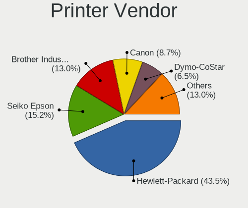

| Vendor              | Computers | Percent |
|---------------------|-----------|---------|
| Hewlett-Packard     | 8         | 44.44%  |
| Seiko Epson         | 3         | 16.67%  |
| Samsung Electronics | 2         | 11.11%  |
| Brother Industries  | 2         | 11.11%  |
| STMicroelectronics  | 1         | 5.56%   |
| Dymo-CoStar         | 1         | 5.56%   |
| Canon               | 1         | 5.56%   |

Printer Model
-------------

Printer device models

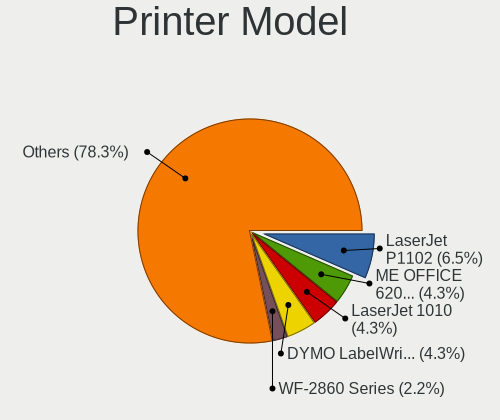

| Model                                                                 | Computers | Percent |
|-----------------------------------------------------------------------|-----------|---------|
| STMicroelectronics USB Printing Support                               | 1         | 5.56%   |
| Seiko Epson WF-2860 Series                                            | 1         | 5.56%   |
| Seiko Epson ME OFFICE 620F Series/Stylus Office BX305F/BX305FW/TX320F | 1         | 5.56%   |
| Seiko Epson L120 Series                                               | 1         | 5.56%   |
| Samsung ML-216x Series Laser Printer                                  | 1         | 5.56%   |
| Samsung M2070 Series                                                  | 1         | 5.56%   |
| HP LaserJet Professional P1102w                                       | 1         | 5.56%   |
| HP LaserJet 1020                                                      | 1         | 5.56%   |
| HP LaserJet 1010                                                      | 1         | 5.56%   |
| HP ENVY Photo 7800 series                                             | 1         | 5.56%   |
| HP ENVY Inspire 7200 series                                           | 1         | 5.56%   |
| HP ENVY 5000 series                                                   | 1         | 5.56%   |
| HP DeskJet 3700 series                                                | 1         | 5.56%   |
| HP Deskjet 2050 J510                                                  | 1         | 5.56%   |
| Dymo-CoStar DYMO LabelWriter 450 Turbo                                | 1         | 5.56%   |
| Canon TR4500 series                                                   | 1         | 5.56%   |
| Brother HL-2130 series                                                | 1         | 5.56%   |
| Brother HL-1440 Laser Printer                                         | 1         | 5.56%   |

Scanner Vendor
--------------

Scanner device vendors

| Vendor      | Computers | Percent |
|-------------|-----------|---------|
| Canon       | 2         | 66.67%  |
| Seiko Epson | 1         | 33.33%  |

Scanner Model
-------------

Scanner device models

| Model                                 | Computers | Percent |
|---------------------------------------|-----------|---------|
| Seiko Epson GT-X770 [Perfection V500] | 1         | 33.33%  |
| Canon CanoScan LiDE 210               | 1         | 33.33%  |
| Canon CanoScan 4400F                  | 1         | 33.33%  |

Camera
------

Camera Vendor
-------------

Camera device vendors

| Vendor                                 | Computers | Percent |
|----------------------------------------|-----------|---------|
| Chicony Electronics                    | 191       | 16.55%  |
| IMC Networks                           | 130       | 11.27%  |
| Microdia                               | 98        | 8.49%   |
| Logitech                               | 88        | 7.63%   |
| Quanta                                 | 84        | 7.28%   |
| Bison Electronics                      | 69        | 5.98%   |
| Realtek Semiconductor                  | 66        | 5.72%   |
| Apple                                  | 56        | 4.85%   |
| Sunplus Innovation Technology          | 49        | 4.25%   |
| Acer                                   | 44        | 3.81%   |
| Cheng Uei Precision Industry (Foxlink) | 37        | 3.21%   |
| Luxvisions Innotech Limited            | 33        | 2.86%   |
| Syntek                                 | 27        | 2.34%   |
| Sonix Technology                       | 25        | 2.17%   |
| Lite-On Technology                     | 18        | 1.56%   |
| Suyin                                  | 15        | 1.3%    |
| Microsoft                              | 12        | 1.04%   |
| SunplusIT                              | 11        | 0.95%   |
| Alcor Micro                            | 9         | 0.78%   |
| Shenzhen Kingcome Optoelectronic       | 6         | 0.52%   |
| Samsung Electronics                    | 6         | 0.52%   |
| Silicon Motion                         | 5         | 0.43%   |
| Razer USA                              | 5         | 0.43%   |
| Ricoh                                  | 4         | 0.35%   |
| Lenovo                                 | 4         | 0.35%   |
| AVerMedia Technologies                 | 4         | 0.35%   |
| Importek                               | 3         | 0.26%   |
| Google                                 | 3         | 0.26%   |
| Z-Star Microelectronics                | 2         | 0.17%   |
| Unknown (3730304231385031345945)       | 2         | 0.17%   |
| Trust                                  | 2         | 0.17%   |
| Tobii Technology AB                    | 2         | 0.17%   |
| ShineTech                              | 2         | 0.17%   |
| Primax Electronics                     | 2         | 0.17%   |
| MacroSilicon                           | 2         | 0.17%   |
| LG Electronics                         | 2         | 0.17%   |
| KYE Systems (Mouse Systems)            | 2         | 0.17%   |
| icSpring                               | 2         | 0.17%   |
| Generalplus Technology                 | 2         | 0.17%   |
| Dell                                   | 2         | 0.17%   |

Camera Model
------------

Camera device models

| Model                                               | Computers | Percent |
|-----------------------------------------------------|-----------|---------|
| Chicony Integrated Camera                           | 68        | 5.84%   |
| Microdia Integrated_Webcam_HD                       | 59        | 5.07%   |
| IMC Networks Integrated Camera                      | 49        | 4.21%   |
| IMC Networks USB2.0 HD UVC WebCam                   | 41        | 3.52%   |
| Realtek Integrated_Webcam_HD                        | 34        | 2.92%   |
| Bison Integrated Camera                             | 24        | 2.06%   |
| Syntek Integrated Camera                            | 22        | 1.89%   |
| Acer Integrated Camera                              | 21        | 1.8%    |
| Apple iPhone 5/5C/5S/6/SE/7/8/X                     | 17        | 1.46%   |
| Quanta HD User Facing                               | 15        | 1.29%   |
| Logitech HD Pro Webcam C920                         | 15        | 1.29%   |
| Apple FaceTime HD Camera                            | 15        | 1.29%   |
| Sunplus Integrated_Webcam_HD                        | 14        | 1.2%    |
| Sonix USB2.0 FHD UVC WebCam                         | 14        | 1.2%    |
| Quanta HP Wide Vision HD Camera                     | 13        | 1.12%   |
| Logitech Webcam C270                                | 13        | 1.12%   |
| Chicony HD WebCam                                   | 13        | 1.12%   |
| Chicony Integrated Camera (1280x720@30)             | 11        | 0.95%   |
| Apple FaceTime HD Camera (Built-in)                 | 11        | 0.95%   |
| Apple Built-in iSight                               | 11        | 0.95%   |
| Chicony HP TrueVision HD Camera                     | 10        | 0.86%   |
| Sonix USB2.0 HD UVC WebCam                          | 9         | 0.77%   |
| Luxvisions Innotech Limited HP TrueVision HD Camera | 9         | 0.77%   |
| Lite-On Integrated Camera                           | 9         | 0.77%   |
| IMC Networks USB2.0 VGA UVC WebCam                  | 9         | 0.77%   |
| IMC Networks HD Camera                              | 9         | 0.77%   |
| Chicony HP Wide Vision HD Camera                    | 9         | 0.77%   |
| Quanta HP HD Camera                                 | 8         | 0.69%   |
| Luxvisions Innotech Limited Integrated Camera       | 8         | 0.69%   |
| Realtek USB Camera                                  | 7         | 0.6%    |
| Quanta HD Webcam                                    | 7         | 0.6%    |
| Quanta ACER HD User Facing                          | 7         | 0.6%    |
| Logitech C920 PRO HD Webcam                         | 7         | 0.6%    |
| Logitech BRIO Ultra HD Webcam                       | 7         | 0.6%    |
| Chicony HD User Facing                              | 7         | 0.6%    |
| Bison SunplusIT Integrated Camera                   | 7         | 0.6%    |
| Bison HD Webcam                                     | 7         | 0.6%    |
| Acer Integrated RGB Camera                          | 7         | 0.6%    |
| Shenzhen Kingcome Optoelectronic 720p HD Camera     | 6         | 0.52%   |
| Samsung Galaxy series, misc. (MTP mode)             | 6         | 0.52%   |

Security
--------

Fingerprint Vendor
------------------

Fingerprint sensor vendors

| Vendor                             | Computers | Percent |
|------------------------------------|-----------|---------|
| Synaptics                          | 85        | 32.44%  |
| Shenzhen Goodix Technology         | 59        | 22.52%  |
| Validity Sensors                   | 51        | 19.47%  |
| Elan Microelectronics              | 28        | 10.69%  |
| Upek                               | 11        | 4.2%    |
| Realtek USB2.0 Finger Print Bridge | 9         | 3.44%   |
| LighTuning Technology              | 8         | 3.05%   |
| AuthenTec                          | 6         | 2.29%   |
| Samsung Electronics                | 4         | 1.53%   |
| STMicroelectronics                 | 1         | 0.38%   |

Fingerprint Model
-----------------

Fingerprint sensor models

| Model                                                                      | Computers | Percent |
|----------------------------------------------------------------------------|-----------|---------|
| Shenzhen Goodix  Fingerprint Device                                        | 40        | 15.27%  |
| Synaptics Prometheus MIS Touch Fingerprint Reader                          | 23        | 8.78%   |
| Synaptics Metallica MIS Touch Fingerprint Reader                           | 17        | 6.49%   |
| Elan ELAN:ARM-M4                                                           | 17        | 6.49%   |
| Shenzhen Goodix Fingerprint Reader                                         | 13        | 4.96%   |
| Validity Sensors VFS 5011 fingerprint sensor                               | 10        | 3.82%   |
| Validity Sensors Synaptics WBDI                                            | 9         | 3.44%   |
| Upek Biometric Touchchip/Touchstrip Fingerprint Sensor                     | 9         | 3.44%   |
| Realtek USB2.0 Finger Print Bridge FocalTech Fingerprint Device            | 9         | 3.44%   |
| Elan ELAN:Fingerprint                                                      | 9         | 3.44%   |
| Validity Sensors VFS495 Fingerprint Reader                                 | 8         | 3.05%   |
| Validity Sensors VFS7500 Touch Fingerprint Sensor                          | 7         | 2.67%   |
| Synaptics WBDI                                                             | 7         | 2.67%   |
| Synaptics UWP WBDI Device                                                  | 7         | 2.67%   |
| Shenzhen Goodix FingerPrint                                                | 6         | 2.29%   |
| Synaptics UWP WBDI                                                         | 5         | 1.91%   |
| Synaptics Fingerprint reader [HP G6]                                       | 5         | 1.91%   |
| LighTuning ES603 Swipe Fingerprint Sensor                                  | 5         | 1.91%   |
| Validity Sensors Synaptics VFS7552 Touch Fingerprint Sensor with PurePrint | 4         | 1.53%   |
| Synaptics WBDI Fingerprint Reader USB 086                                  | 4         | 1.53%   |
| Synaptics  WBDI                                                            | 4         | 1.53%   |
| Synaptics FS7604 Touch Fingerprint Sensor with PurePrint                   | 4         | 1.53%   |
| Samsung Fingerprint Sensor Device - 730B                                   | 4         | 1.53%   |
| Validity Sensors VFS491                                                    | 3         | 1.15%   |
| Synaptics  FS7604 Touch Fingerprint Sensor with PurePrint                  | 3         | 1.15%   |
| Synaptics Metallica MOH Touch Fingerprint Reader                           | 3         | 1.15%   |
| AuthenTec AES2501 Fingerprint Sensor                                       | 3         | 1.15%   |
| Validity Sensors VFS5011 Fingerprint Reader                                | 2         | 0.76%   |
| Validity Sensors VFS451 Fingerprint Reader                                 | 2         | 0.76%   |
| Validity Sensors VFS301 Fingerprint Reader                                 | 2         | 0.76%   |
| Upek TCS5B Fingerprint sensor                                              | 2         | 0.76%   |
| LighTuning EgisTec Touch Fingerprint Sensor                                | 2         | 0.76%   |
| Elan fingerprint sensor [FeinTech FPS00200]                                | 2         | 0.76%   |
| Validity Sensors VFS7552 Touch Fingerprint Sensor                          | 1         | 0.38%   |
| Validity Sensors Synaptics VFS7552 Touch Fingerprint Sensor                | 1         | 0.38%   |
| Validity Sensors Swipe Fingerprint Sensor                                  | 1         | 0.38%   |
| Validity Sensors Fingerprint scanner                                       | 1         | 0.38%   |
| Synaptics WBDI Fingerprint Reader USB 102                                  | 1         | 0.38%   |
| Synaptics  WBDI Fingerprint Reader - USB 052                               | 1         | 0.38%   |
| Synaptics Fingerprint scanner                                              | 1         | 0.38%   |

Chipcard Vendor
---------------

Chipcard module vendors

| Vendor                | Computers | Percent |
|-----------------------|-----------|---------|
| Broadcom              | 48        | 57.83%  |
| Alcor Micro           | 18        | 21.69%  |
| Upek                  | 4         | 4.82%   |
| Lenovo                | 4         | 4.82%   |
| Gemalto (was Gemplus) | 3         | 3.61%   |
| Yubico.com            | 2         | 2.41%   |
| O2 Micro              | 2         | 2.41%   |
| Realtek Semiconductor | 1         | 1.2%    |
| BIT4ID                | 1         | 1.2%    |

Chipcard Model
--------------

Chipcard module models

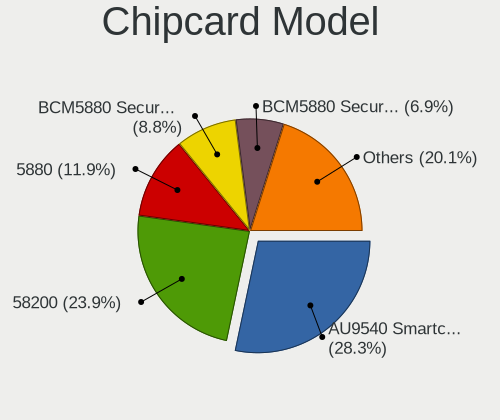

| Model                                                                        | Computers | Percent |
|------------------------------------------------------------------------------|-----------|---------|
| Broadcom 58200                                                               | 24        | 28.92%  |
| Alcor Micro AU9540 Smartcard Reader                                          | 18        | 21.69%  |
| Broadcom BCM5880 Secure Applications Processor with fingerprint swipe sensor | 9         | 10.84%  |
| Broadcom 5880                                                                | 8         | 9.64%   |
| Broadcom BCM5880 Secure Applications Processor                               | 7         | 8.43%   |
| Upek TouchChip Fingerprint Coprocessor (WBF advanced mode)                   | 4         | 4.82%   |
| Lenovo Integrated Smart Card Reader                                          | 4         | 4.82%   |
| Yubico.com Yubikey 4/5 U2F+CCID                                              | 2         | 2.41%   |
| Gemalto (was Gemplus) Compact Smart Card Reader Writer                       | 2         | 2.41%   |
| Realtek Semiconductor Smart Card Reader Interface                            | 1         | 1.2%    |
| O2 Micro Oz776 SmartCard Reader                                              | 1         | 1.2%    |
| O2 Micro OZ776 CCID Smartcard Reader                                         | 1         | 1.2%    |
| Gemalto (was Gemplus) GemPC Twin SmartCard Reader                            | 1         | 1.2%    |
| BIT4ID miniLector EVO                                                        | 1         | 1.2%    |

Unsupported
-----------

Unsupported Devices
-------------------

Total unsupported devices on board

| Total | Computers | Percent |
|-------|-----------|---------|
| 0     | 1117      | 64.75%  |
| 1     | 487       | 28.23%  |
| 2     | 102       | 5.91%   |
| 3     | 13        | 0.75%   |
| 6     | 2         | 0.12%   |
| 4     | 2         | 0.12%   |
| 8     | 1         | 0.06%   |
| 5     | 1         | 0.06%   |

Unsupported Device Types
------------------------

Types of unsupported devices

| Type                     | Computers | Percent |
|--------------------------|-----------|---------|
| Fingerprint reader       | 257       | 35.11%  |
| Graphics card            | 184       | 25.14%  |
| Multimedia controller    | 106       | 14.48%  |
| Net/wireless             | 76        | 10.38%  |
| Camera                   | 19        | 2.6%    |
| Bluetooth                | 16        | 2.19%   |
| Chipcard                 | 14        | 1.91%   |
| Unassigned class         | 13        | 1.78%   |
| Communication controller | 13        | 1.78%   |
| Sound                    | 11        | 1.5%    |
| Storage                  | 8         | 1.09%   |
| Card reader              | 7         | 0.96%   |
| Net/ethernet             | 3         | 0.41%   |
| Network                  | 2         | 0.27%   |
| Modem                    | 2         | 0.27%   |
| Storage/nvme             | 1         | 0.14%   |

