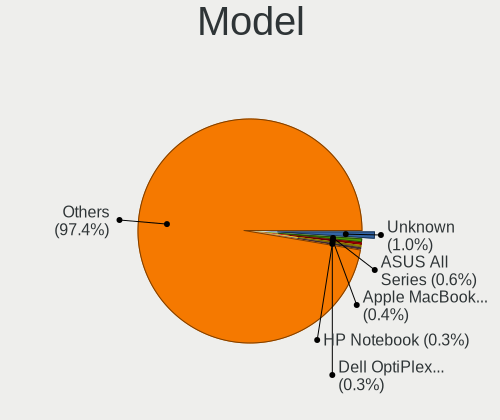
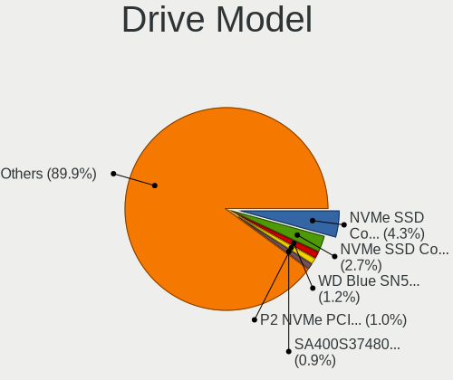
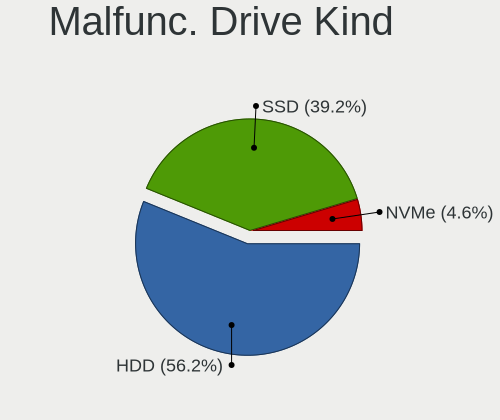
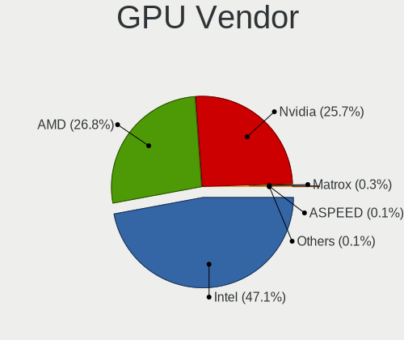
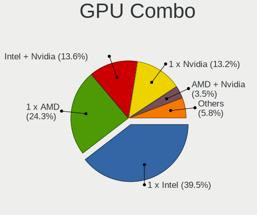
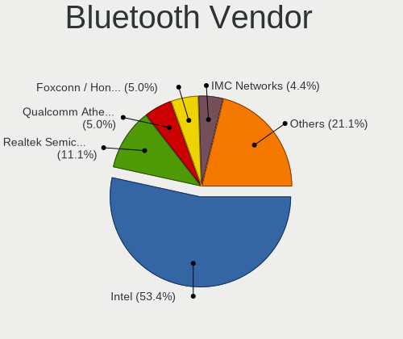
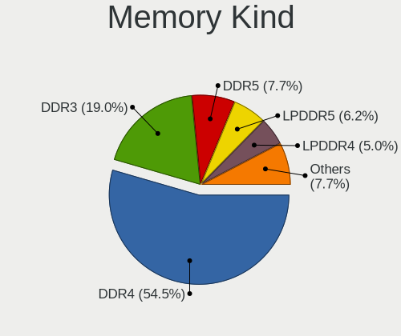

Fedora 38 - Tested Hardware & Statistics
----------------------------------------

A project to collect tested hardware configurations for Fedora 38.

Anyone can contribute to this report by the [hw-probe](https://github.com/linuxhw/hw-probe) tool:

    sudo -E hw-probe -all -upload

Please contribute! Especially if your hardware is rare.

This is a report for all computer types. See also reports for [desktops](/Dist/Fedora_38/Desktop/README.md) and [notebooks](/Dist/Fedora_38/Notebook/README.md).

Contents
--------

* [ Test Cases ](#test-cases)

* [ System ](#system)
  - [ Kernel                   ](#kernel)
  - [ Kernel Family            ](#kernel-family)
  - [ Kernel Major Ver.        ](#kernel-major-ver)
  - [ Arch                     ](#arch)
  - [ DE                       ](#de)
  - [ Display Server           ](#display-server)
  - [ Display Manager          ](#display-manager)
  - [ OS Lang                  ](#os-lang)
  - [ Boot Mode                ](#boot-mode)
  - [ Filesystem               ](#filesystem)
  - [ Part. scheme             ](#part-scheme)
  - [ Dual Boot with Linux/BSD ](#dual-boot-with-linuxbsd)
  - [ Dual Boot (Win)          ](#dual-boot-win)

* [ Board ](#board)
  - [ Vendor                   ](#vendor)
  - [ Model                    ](#model)
  - [ Model Family             ](#model-family)
  - [ MFG Year                 ](#mfg-year)
  - [ Form Factor              ](#form-factor)
  - [ Secure Boot              ](#secure-boot)
  - [ Coreboot                 ](#coreboot)
  - [ RAM Size                 ](#ram-size)
  - [ RAM Used                 ](#ram-used)
  - [ Total Drives             ](#total-drives)
  - [ Has CD-ROM               ](#has-cd-rom)
  - [ Has Ethernet             ](#has-ethernet)
  - [ Has WiFi                 ](#has-wifi)
  - [ Has Bluetooth            ](#has-bluetooth)

* [ Location ](#location)
  - [ Country                  ](#country)
  - [ City                     ](#city)

* [ Drives ](#drives)
  - [ Drive Vendor             ](#drive-vendor)
  - [ Drive Model              ](#drive-model)
  - [ HDD Vendor               ](#hdd-vendor)
  - [ SSD Vendor               ](#ssd-vendor)
  - [ Drive Kind               ](#drive-kind)
  - [ Drive Connector          ](#drive-connector)
  - [ Drive Size               ](#drive-size)
  - [ Space Total              ](#space-total)
  - [ Space Used               ](#space-used)
  - [ Malfunc. Drives          ](#malfunc-drives)
  - [ Malfunc. Drive Vendor    ](#malfunc-drive-vendor)
  - [ Malfunc. HDD Vendor      ](#malfunc-hdd-vendor)
  - [ Malfunc. Drive Kind      ](#malfunc-drive-kind)
  - [ Failed Drives            ](#failed-drives)
  - [ Failed Drive Vendor      ](#failed-drive-vendor)
  - [ Drive Status             ](#drive-status)

* [ Storage controller ](#storage-controller)
  - [ Storage Vendor           ](#storage-vendor)
  - [ Storage Model            ](#storage-model)
  - [ Storage Kind             ](#storage-kind)

* [ Processor ](#processor)
  - [ CPU Vendor               ](#cpu-vendor)
  - [ CPU Model                ](#cpu-model)
  - [ CPU Model Family         ](#cpu-model-family)
  - [ CPU Cores                ](#cpu-cores)
  - [ CPU Sockets              ](#cpu-sockets)
  - [ CPU Threads              ](#cpu-threads)
  - [ CPU Op-Modes             ](#cpu-op-modes)
  - [ CPU Microcode            ](#cpu-microcode)
  - [ CPU Microarch            ](#cpu-microarch)

* [ Graphics ](#graphics)
  - [ GPU Vendor               ](#gpu-vendor)
  - [ GPU Model                ](#gpu-model)
  - [ GPU Combo                ](#gpu-combo)
  - [ GPU Driver               ](#gpu-driver)
  - [ GPU Memory               ](#gpu-memory)

* [ Monitor ](#monitor)
  - [ Monitor Vendor           ](#monitor-vendor)
  - [ Monitor Model            ](#monitor-model)
  - [ Monitor Resolution       ](#monitor-resolution)
  - [ Monitor Diagonal         ](#monitor-diagonal)
  - [ Monitor Width            ](#monitor-width)
  - [ Aspect Ratio             ](#aspect-ratio)
  - [ Monitor Area             ](#monitor-area)
  - [ Pixel Density            ](#pixel-density)
  - [ Multiple Monitors        ](#multiple-monitors)

* [ Network ](#network)
  - [ Net Controller Vendor    ](#net-controller-vendor)
  - [ Net Controller Model     ](#net-controller-model)
  - [ Wireless Vendor          ](#wireless-vendor)
  - [ Wireless Model           ](#wireless-model)
  - [ Ethernet Vendor          ](#ethernet-vendor)
  - [ Ethernet Model           ](#ethernet-model)
  - [ Net Controller Kind      ](#net-controller-kind)
  - [ Used Controller          ](#used-controller)
  - [ NICs                     ](#nics)
  - [ IPv6                     ](#ipv6)

* [ Bluetooth ](#bluetooth)
  - [ Bluetooth Vendor         ](#bluetooth-vendor)
  - [ Bluetooth Model          ](#bluetooth-model)

* [ Sound ](#sound)
  - [ Sound Vendor             ](#sound-vendor)
  - [ Sound Model              ](#sound-model)

* [ Memory ](#memory)
  - [ Memory Vendor            ](#memory-vendor)
  - [ Memory Model             ](#memory-model)
  - [ Memory Kind              ](#memory-kind)
  - [ Memory Form Factor       ](#memory-form-factor)
  - [ Memory Size              ](#memory-size)
  - [ Memory Speed             ](#memory-speed)

* [ Printers & scanners ](#printers--scanners)
  - [ Printer Vendor           ](#printer-vendor)
  - [ Printer Model            ](#printer-model)
  - [ Scanner Vendor           ](#scanner-vendor)
  - [ Scanner Model            ](#scanner-model)

* [ Camera ](#camera)
  - [ Camera Vendor            ](#camera-vendor)
  - [ Camera Model             ](#camera-model)

* [ Security ](#security)
  - [ Fingerprint Vendor       ](#fingerprint-vendor)
  - [ Fingerprint Model        ](#fingerprint-model)
  - [ Chipcard Vendor          ](#chipcard-vendor)
  - [ Chipcard Model           ](#chipcard-model)

* [ Unsupported ](#unsupported)
  - [ Unsupported Devices      ](#unsupported-devices)
  - [ Unsupported Device Types ](#unsupported-device-types)

Test Cases
----------

Total: 401

| Vendor        | Model                       | Form-Factor | Probe                                                      | Date         |
|---------------|-----------------------------|-------------|------------------------------------------------------------|--------------|
| ASUSTek       | PRIME B550M-A               | Desktop     | [9146d12231](https://linux-hardware.org/?probe=9146d12231) | May 01, 2023 |
| Valve         | Jupiter                     | Notebook    | [07ef050535](https://linux-hardware.org/?probe=07ef050535) | May 01, 2023 |
| HP            | Laptop 15z-fc000            | Notebook    | [7b57cc42a0](https://linux-hardware.org/?probe=7b57cc42a0) | May 01, 2023 |
| HP            | ElitePad 1000 G2            | Notebook    | [8ae27e00f6](https://linux-hardware.org/?probe=8ae27e00f6) | May 01, 2023 |
| HUAWEI        | CREM-WXX9                   | Notebook    | [ba99960d5f](https://linux-hardware.org/?probe=ba99960d5f) | May 01, 2023 |
| Lenovo        | IdeaPad 310-15ISK 80UH      | Notebook    | [a7d6d782b2](https://linux-hardware.org/?probe=a7d6d782b2) | May 01, 2023 |
| MSI           | MPG X570 GAMING EDGE WIF... | Desktop     | [2fcc250a35](https://linux-hardware.org/?probe=2fcc250a35) | May 01, 2023 |
| Microsoft     | Surface Pro 7               | Tablet      | [7c8d87170f](https://linux-hardware.org/?probe=7c8d87170f) | Apr 30, 2023 |
| Lenovo        | IdeaPad S340-15IWLTouch ... | Notebook    | [6857a16a6c](https://linux-hardware.org/?probe=6857a16a6c) | Apr 30, 2023 |
| ASRock        | A520M-ITX/ac                | Desktop     | [5a9f58bcc0](https://linux-hardware.org/?probe=5a9f58bcc0) | Apr 30, 2023 |
| Lenovo        | IdeaPad 320-15AST 80XV      | Notebook    | [0784fc9b1c](https://linux-hardware.org/?probe=0784fc9b1c) | Apr 30, 2023 |
| HP            | Notebook                    | Notebook    | [fd6aa4aeb6](https://linux-hardware.org/?probe=fd6aa4aeb6) | Apr 30, 2023 |
| VIOS          | LTH17                       | Notebook    | [4d1a86ee61](https://linux-hardware.org/?probe=4d1a86ee61) | Apr 30, 2023 |
| Lenovo        | IdeaPad 320-15AST 80XV      | Notebook    | [9c07454907](https://linux-hardware.org/?probe=9c07454907) | Apr 30, 2023 |
| HP            | Pavilion Gaming Laptop 1... | Notebook    | [43a167afad](https://linux-hardware.org/?probe=43a167afad) | Apr 30, 2023 |
| HP            | Pavilion Gaming Laptop 1... | Notebook    | [0ae3fb5506](https://linux-hardware.org/?probe=0ae3fb5506) | Apr 30, 2023 |
| ZOTAC         | ZBOX-CI527/CI547            | Mini pc     | [86e1a89b72](https://linux-hardware.org/?probe=86e1a89b72) | Apr 30, 2023 |
| Gigabyte      | 970A-DS3P                   | Desktop     | [c1fe7a5f87](https://linux-hardware.org/?probe=c1fe7a5f87) | Apr 30, 2023 |
| Samsung       | 730QED                      | Convertible | [f29e3300d2](https://linux-hardware.org/?probe=f29e3300d2) | Apr 30, 2023 |
| Lenovo        | ThinkPad T490s 20NX002SG... | Notebook    | [874f19f26e](https://linux-hardware.org/?probe=874f19f26e) | Apr 30, 2023 |
| Gigabyte      | AB350-Gaming 3-CF           | Desktop     | [01311e320c](https://linux-hardware.org/?probe=01311e320c) | Apr 30, 2023 |
| Intel         | S5520HC E26045-454          | Server      | [f1db72cddb](https://linux-hardware.org/?probe=f1db72cddb) | Apr 30, 2023 |
| Acer          | Nitro AN515-45              | Notebook    | [9b28e69254](https://linux-hardware.org/?probe=9b28e69254) | Apr 30, 2023 |
| MSI           | MPG B650I EDGE WIFI         | Desktop     | [eda4874295](https://linux-hardware.org/?probe=eda4874295) | Apr 30, 2023 |
| Lenovo        | IdeaPadFlex 5 14ITL05 82... | Convertible | [2113c6457a](https://linux-hardware.org/?probe=2113c6457a) | Apr 29, 2023 |
| Framework     | Laptop                      | Notebook    | [84b3b9547b](https://linux-hardware.org/?probe=84b3b9547b) | Apr 29, 2023 |
| Dell          | XPS 13 7390                 | Notebook    | [b976cc9656](https://linux-hardware.org/?probe=b976cc9656) | Apr 29, 2023 |
| ASUSTek       | X99-A                       | Desktop     | [6505e46b86](https://linux-hardware.org/?probe=6505e46b86) | Apr 29, 2023 |
| ASUSTek       | TUF Gaming FX505DD_FX505... | Notebook    | [6f6a016997](https://linux-hardware.org/?probe=6f6a016997) | Apr 29, 2023 |
| Lenovo        | ThinkPad T550 20CKA00ECD    | Notebook    | [2545d9dd31](https://linux-hardware.org/?probe=2545d9dd31) | Apr 29, 2023 |
| HUAWEI        | CREM-WXX9                   | Notebook    | [c17b468722](https://linux-hardware.org/?probe=c17b468722) | Apr 29, 2023 |
| Chuwi         | HeroBook Air                | Notebook    | [123f6df9f8](https://linux-hardware.org/?probe=123f6df9f8) | Apr 29, 2023 |
| Insyde        | CherryTrail                 | Notebook    | [a9f658c8af](https://linux-hardware.org/?probe=a9f658c8af) | Apr 29, 2023 |
| Lenovo        | ThinkPad X1 Extreme Gen ... | Notebook    | [cd266d7680](https://linux-hardware.org/?probe=cd266d7680) | Apr 29, 2023 |
| ASUSTek       | P5B-Deluxe                  | Desktop     | [d0d3458299](https://linux-hardware.org/?probe=d0d3458299) | Apr 29, 2023 |
| Acer          | Nitro AN515-58              | Notebook    | [2c335c5bfb](https://linux-hardware.org/?probe=2c335c5bfb) | Apr 29, 2023 |
| GMKtec        | NucBox7                     | Mini pc     | [7398ad2411](https://linux-hardware.org/?probe=7398ad2411) | Apr 29, 2023 |
| Google        | Banon                       | Notebook    | [c21a57806c](https://linux-hardware.org/?probe=c21a57806c) | Apr 29, 2023 |
| Microsoft     | Surface Laptop Go           | Tablet      | [3c891a7698](https://linux-hardware.org/?probe=3c891a7698) | Apr 29, 2023 |
| Lenovo        | IdeaPad 530S-14ARR 81H1     | Notebook    | [e70d66b3ba](https://linux-hardware.org/?probe=e70d66b3ba) | Apr 29, 2023 |
| Lenovo        | IdeaPad 1 14IGL7 82V6       | Notebook    | [2aa69de3ca](https://linux-hardware.org/?probe=2aa69de3ca) | Apr 29, 2023 |
| Gigabyte      | X570 I AORUS PRO WIFI       | Desktop     | [4b47a4606b](https://linux-hardware.org/?probe=4b47a4606b) | Apr 29, 2023 |
| MSI           | B450 TOMAHAWK               | Desktop     | [1404923301](https://linux-hardware.org/?probe=1404923301) | Apr 28, 2023 |
| Gigabyte      | X570 AORUS ELITE WIFI       | Desktop     | [e65094a8f6](https://linux-hardware.org/?probe=e65094a8f6) | Apr 28, 2023 |
| HUAWEI        | BOHK-WAX9X                  | Notebook    | [4de963cbc6](https://linux-hardware.org/?probe=4de963cbc6) | Apr 28, 2023 |
| Lenovo        | ThinkPad P53 20QN0011IV     | Notebook    | [d8af950fd8](https://linux-hardware.org/?probe=d8af950fd8) | Apr 28, 2023 |
| Acer          | Aspire E5-571               | Notebook    | [1d36dafa86](https://linux-hardware.org/?probe=1d36dafa86) | Apr 28, 2023 |
| ASUSTek       | ROG CROSSHAIR X670E GENE    | Desktop     | [c416a3f44a](https://linux-hardware.org/?probe=c416a3f44a) | Apr 28, 2023 |
| Dell          | Precision 3551              | Notebook    | [99ff11c325](https://linux-hardware.org/?probe=99ff11c325) | Apr 28, 2023 |
| Lenovo        | ThinkPad T470p 20J60018M... | Notebook    | [a8deb2307c](https://linux-hardware.org/?probe=a8deb2307c) | Apr 28, 2023 |
| Dell          | Precision 3551              | Notebook    | [93a38e7384](https://linux-hardware.org/?probe=93a38e7384) | Apr 28, 2023 |
| Dell          | 0VHWTR A01                  | Desktop     | [1a73639c02](https://linux-hardware.org/?probe=1a73639c02) | Apr 28, 2023 |
| ASUSTek       | PRIME A520M-E               | Desktop     | [048fda2c60](https://linux-hardware.org/?probe=048fda2c60) | Apr 28, 2023 |
| Lenovo        | ThinkPad X260 20F5S56G00    | Notebook    | [8da21e9a17](https://linux-hardware.org/?probe=8da21e9a17) | Apr 28, 2023 |
| Lenovo        | Yoga 6 13ALC6 82ND          | Convertible | [a931ac9451](https://linux-hardware.org/?probe=a931ac9451) | Apr 28, 2023 |
| ASUSTek       | Zenbook UM5302TA_UM5302T... | Notebook    | [5cb9fe1ae9](https://linux-hardware.org/?probe=5cb9fe1ae9) | Apr 28, 2023 |
| ASUSTek       | Zenbook UM5302TA_UM5302T... | Notebook    | [3669ef1de9](https://linux-hardware.org/?probe=3669ef1de9) | Apr 28, 2023 |
| Unknown       | HX90                        | Desktop     | [8454daed68](https://linux-hardware.org/?probe=8454daed68) | Apr 28, 2023 |
| Dell          | 0VHWTR A01                  | Desktop     | [6f56840307](https://linux-hardware.org/?probe=6f56840307) | Apr 28, 2023 |
| Lenovo        | ThinkPad P14s Gen 2a 21A... | Notebook    | [b5a953a984](https://linux-hardware.org/?probe=b5a953a984) | Apr 28, 2023 |
| HP            | ProBook 455 15.6 inch G9... | Notebook    | [1cfc210ce1](https://linux-hardware.org/?probe=1cfc210ce1) | Apr 28, 2023 |
| Acer          | Nitro AN515-54              | Notebook    | [000022b2dd](https://linux-hardware.org/?probe=000022b2dd) | Apr 28, 2023 |
| Sony          | VPCEG23EL                   | Notebook    | [c28e3338ce](https://linux-hardware.org/?probe=c28e3338ce) | Apr 28, 2023 |
| HP            | 83E9                        | Desktop     | [ac8ad5d3d5](https://linux-hardware.org/?probe=ac8ad5d3d5) | Apr 28, 2023 |
| HP            | 8062                        | Desktop     | [61c4685659](https://linux-hardware.org/?probe=61c4685659) | Apr 27, 2023 |
| Lenovo        | Legion 7-16-ITHg6 82K6      | Notebook    | [2baf2cbc85](https://linux-hardware.org/?probe=2baf2cbc85) | Apr 27, 2023 |
| ASUSTek       | Zephyrus M GU502GW_GU502... | Notebook    | [94d9250bc1](https://linux-hardware.org/?probe=94d9250bc1) | Apr 27, 2023 |
| Dell          | Inspiron 5482               | Convertible | [530ed5285a](https://linux-hardware.org/?probe=530ed5285a) | Apr 27, 2023 |
| ASUSTek       | PRIME A320M-K               | Desktop     | [155ce08a00](https://linux-hardware.org/?probe=155ce08a00) | Apr 27, 2023 |
| Lenovo        | ThinkPad P53 20QN0011IV     | Notebook    | [854cf327d8](https://linux-hardware.org/?probe=854cf327d8) | Apr 27, 2023 |
| HUAWEI        | HVY-WXX9                    | Notebook    | [dd5391c20d](https://linux-hardware.org/?probe=dd5391c20d) | Apr 27, 2023 |
| HP            | Laptop 17-ak0xx             | Notebook    | [6eed1fda15](https://linux-hardware.org/?probe=6eed1fda15) | Apr 27, 2023 |
| HP            | Pavilion Laptop 15-cs0xx... | Notebook    | [4cd1484039](https://linux-hardware.org/?probe=4cd1484039) | Apr 27, 2023 |
| HP            | Pavilion Laptop 15-cs0xx... | Notebook    | [0796e35c73](https://linux-hardware.org/?probe=0796e35c73) | Apr 27, 2023 |
| Dell          | XPS 15 9500                 | Notebook    | [a7cc631b80](https://linux-hardware.org/?probe=a7cc631b80) | Apr 27, 2023 |
| Timi          | Redmi Book Pro 14 2022      | Notebook    | [dcc8c22535](https://linux-hardware.org/?probe=dcc8c22535) | Apr 27, 2023 |
| MSI           | X570-A PRO                  | Desktop     | [15b900cf50](https://linux-hardware.org/?probe=15b900cf50) | Apr 27, 2023 |
| MSI           | X570-A PRO                  | Desktop     | [d5b1ec921a](https://linux-hardware.org/?probe=d5b1ec921a) | Apr 27, 2023 |
| Dell          | Vostro 15 3515              | Notebook    | [f58ab8b9c4](https://linux-hardware.org/?probe=f58ab8b9c4) | Apr 27, 2023 |
| Lenovo        | Yoga 6 13ALC6 82ND          | Convertible | [ae51577ddc](https://linux-hardware.org/?probe=ae51577ddc) | Apr 27, 2023 |
| ASUSTek       | PRIME Z490-A                | Desktop     | [9088ae517a](https://linux-hardware.org/?probe=9088ae517a) | Apr 27, 2023 |
| Lenovo        | ThinkPad X270 20HN001HUS    | Notebook    | [3f6586f0d1](https://linux-hardware.org/?probe=3f6586f0d1) | Apr 27, 2023 |
| Lenovo        | ThinkPad T480s 20L8S45W0... | Notebook    | [0e8490c41f](https://linux-hardware.org/?probe=0e8490c41f) | Apr 27, 2023 |
| Acer          | Spin SP313-51N              | Convertible | [0b7c7f7681](https://linux-hardware.org/?probe=0b7c7f7681) | Apr 27, 2023 |
| ASUSTek       | Zephyrus M GU502GW_GU502... | Notebook    | [67c865f449](https://linux-hardware.org/?probe=67c865f449) | Apr 27, 2023 |
| Acer          | Aspire A315-54              | Notebook    | [8137aa9008](https://linux-hardware.org/?probe=8137aa9008) | Apr 27, 2023 |
| HP            | EliteBook 630 13 inch G9... | Notebook    | [96bd4f8398](https://linux-hardware.org/?probe=96bd4f8398) | Apr 27, 2023 |
| Apple         | MacBookAir6,1               | Notebook    | [c0f967c0bc](https://linux-hardware.org/?probe=c0f967c0bc) | Apr 27, 2023 |
| Lenovo        | SHARKBAY NOK                | Desktop     | [e694779b17](https://linux-hardware.org/?probe=e694779b17) | Apr 26, 2023 |
| Lenovo        | SHARKBAY NOK                | Desktop     | [1e07e42dd3](https://linux-hardware.org/?probe=1e07e42dd3) | Apr 26, 2023 |
| MSI           | X470 GAMING PLUS            | Desktop     | [a5d42a7b78](https://linux-hardware.org/?probe=a5d42a7b78) | Apr 26, 2023 |
| ASUSTek       | VivoBook_ASUS Laptop X50... | Notebook    | [c443269a81](https://linux-hardware.org/?probe=c443269a81) | Apr 26, 2023 |
| ASUSTek       | ROG Strix G512LW_G512LW     | Notebook    | [a950f656f7](https://linux-hardware.org/?probe=a950f656f7) | Apr 26, 2023 |
| MSI           | MPG B550I GAMING EDGE WI... | Desktop     | [474c43577f](https://linux-hardware.org/?probe=474c43577f) | Apr 26, 2023 |
| Timi          | TM1703                      | Notebook    | [7e6b948ea9](https://linux-hardware.org/?probe=7e6b948ea9) | Apr 26, 2023 |
| ASUSTek       | ROG STRIX B550-I GAMING     | Desktop     | [e14205d01a](https://linux-hardware.org/?probe=e14205d01a) | Apr 26, 2023 |
| ASUSTek       | ROG Zephyrus G14 GA401IV... | Notebook    | [96006a1098](https://linux-hardware.org/?probe=96006a1098) | Apr 26, 2023 |
| HUAWEI        | KLVL-WXXW                   | Notebook    | [de95ac0857](https://linux-hardware.org/?probe=de95ac0857) | Apr 26, 2023 |
| HUAWEI        | KLVL-WXXW                   | Notebook    | [07906a30e3](https://linux-hardware.org/?probe=07906a30e3) | Apr 26, 2023 |
| Dell          | Latitude 5520               | Notebook    | [7ee153b691](https://linux-hardware.org/?probe=7ee153b691) | Apr 26, 2023 |
| Lenovo        | ThinkBook 14 G3 ACL 21A2    | Notebook    | [86ba8ccc07](https://linux-hardware.org/?probe=86ba8ccc07) | Apr 26, 2023 |
| ASUSTek       | ROG STRIX X670E-F GAMING... | Desktop     | [f1f2ad2731](https://linux-hardware.org/?probe=f1f2ad2731) | Apr 26, 2023 |
| Lenovo        | ThinkPad T480s 20L8002WM... | Notebook    | [82bd4b0d20](https://linux-hardware.org/?probe=82bd4b0d20) | Apr 26, 2023 |
| Gigabyte      | B450 I AORUS PRO WIFI-CF    | Desktop     | [5ce448176d](https://linux-hardware.org/?probe=5ce448176d) | Apr 26, 2023 |
| Dell          | Latitude 5520               | Notebook    | [3071d4a9d8](https://linux-hardware.org/?probe=3071d4a9d8) | Apr 26, 2023 |
| Dell          | Latitude 5520               | Notebook    | [23fe32affd](https://linux-hardware.org/?probe=23fe32affd) | Apr 26, 2023 |
| Acer          | Swift SF114-32              | Notebook    | [13d7dc019c](https://linux-hardware.org/?probe=13d7dc019c) | Apr 26, 2023 |
| ASUSTek       | ROG Zephyrus G14 GA401IV... | Notebook    | [a3df65a55c](https://linux-hardware.org/?probe=a3df65a55c) | Apr 26, 2023 |
| ASUSTek       | PRIME H610M-A D4            | Desktop     | [a7e77375d4](https://linux-hardware.org/?probe=a7e77375d4) | Apr 26, 2023 |
| ASUSTek       | PRIME B550M-A               | Desktop     | [ba83f4a4f7](https://linux-hardware.org/?probe=ba83f4a4f7) | Apr 26, 2023 |
| HP            | 1489                        | All in one  | [1058adaefd](https://linux-hardware.org/?probe=1058adaefd) | Apr 26, 2023 |
| ASUSTek       | P8H61-M LE                  | Desktop     | [a7a9d5069c](https://linux-hardware.org/?probe=a7a9d5069c) | Apr 26, 2023 |
| ASUSTek       | P8H61-M LE                  | Desktop     | [cd60dbbd6a](https://linux-hardware.org/?probe=cd60dbbd6a) | Apr 26, 2023 |
| Huanan        | X79 INTEL (INTEL Xeon E5... | Desktop     | [8c9b08bcab](https://linux-hardware.org/?probe=8c9b08bcab) | Apr 26, 2023 |
| Razer         | Blade                       | Notebook    | [b170226896](https://linux-hardware.org/?probe=b170226896) | Apr 25, 2023 |
| Dell          | Inspiron 5748               | Notebook    | [dd4d50839d](https://linux-hardware.org/?probe=dd4d50839d) | Apr 25, 2023 |
| ASUSTek       | VivoBook_ASUSLaptop TP41... | Convertible | [f9228e78d3](https://linux-hardware.org/?probe=f9228e78d3) | Apr 25, 2023 |
| Huanan        | X79 INTEL (INTEL Xeon E5... | Desktop     | [6007547b60](https://linux-hardware.org/?probe=6007547b60) | Apr 25, 2023 |
| Dell          | Precision 7550              | Notebook    | [987df8038c](https://linux-hardware.org/?probe=987df8038c) | Apr 25, 2023 |
| Dell          | G15 5515                    | Notebook    | [a0dd3f2003](https://linux-hardware.org/?probe=a0dd3f2003) | Apr 25, 2023 |
| Dell          | Vostro 3550                 | Notebook    | [653c3c4650](https://linux-hardware.org/?probe=653c3c4650) | Apr 25, 2023 |
| ASRock        | X300M-STX                   | Desktop     | [4a8d662bee](https://linux-hardware.org/?probe=4a8d662bee) | Apr 25, 2023 |
| Lenovo        | ThinkPad E14 20RAS1DB00     | Notebook    | [8e09a153f5](https://linux-hardware.org/?probe=8e09a153f5) | Apr 25, 2023 |
| HP            | Dragonfly Pro               | Notebook    | [9bc83e741f](https://linux-hardware.org/?probe=9bc83e741f) | Apr 25, 2023 |
| HP            | Dragonfly Pro               | Notebook    | [b47e30ac80](https://linux-hardware.org/?probe=b47e30ac80) | Apr 25, 2023 |
| Lenovo        | ThinkPad L15 Gen 3 21C8S... | Notebook    | [765b52074c](https://linux-hardware.org/?probe=765b52074c) | Apr 25, 2023 |
| Lenovo        | ThinkPad L15 Gen 3 21C8S... | Notebook    | [9cd6c064cc](https://linux-hardware.org/?probe=9cd6c064cc) | Apr 25, 2023 |
| Lenovo        | ThinkPad X1 Carbon Gen 9... | Notebook    | [5236dde38f](https://linux-hardware.org/?probe=5236dde38f) | Apr 25, 2023 |
| Apple         | MacBookPro11,1              | Notebook    | [7309ce024f](https://linux-hardware.org/?probe=7309ce024f) | Apr 25, 2023 |
| Dell          | 040DDP A00                  | Desktop     | [8595139862](https://linux-hardware.org/?probe=8595139862) | Apr 25, 2023 |
| Dell          | 0YXT71 A03                  | Desktop     | [abc091f5c0](https://linux-hardware.org/?probe=abc091f5c0) | Apr 25, 2023 |
| Intel         | DQ67OW AAG12528-307         | Desktop     | [28245ea080](https://linux-hardware.org/?probe=28245ea080) | Apr 25, 2023 |
| LDLC          | SPC-I                       | Notebook    | [899fb46a02](https://linux-hardware.org/?probe=899fb46a02) | Apr 25, 2023 |
| Chuwi         | GemiBook Pro                | Notebook    | [1287b17594](https://linux-hardware.org/?probe=1287b17594) | Apr 25, 2023 |
| ASUSTek       | ProArt X670E-CREATOR WIF... | Desktop     | [f878b7d23a](https://linux-hardware.org/?probe=f878b7d23a) | Apr 25, 2023 |
| Dell          | G3 3500                     | Notebook    | [46996524d0](https://linux-hardware.org/?probe=46996524d0) | Apr 25, 2023 |
| ASRock        | H310M-STX                   | Desktop     | [9988bc063a](https://linux-hardware.org/?probe=9988bc063a) | Apr 25, 2023 |
| Dell          | XPS 13 9380                 | Notebook    | [290a99fee9](https://linux-hardware.org/?probe=290a99fee9) | Apr 25, 2023 |
| Acer          | Spin SP513-52N              | Convertible | [bdab97deeb](https://linux-hardware.org/?probe=bdab97deeb) | Apr 25, 2023 |
| ASUSTek       | PRIME B550M-A               | Desktop     | [8fbbad22fa](https://linux-hardware.org/?probe=8fbbad22fa) | Apr 25, 2023 |
| Lenovo        | Legion 5 17IMH05 82B3       | Notebook    | [2e542c241d](https://linux-hardware.org/?probe=2e542c241d) | Apr 25, 2023 |
| TUXEDO        | Pulse 15 Gen1               | Notebook    | [0db2c54b2a](https://linux-hardware.org/?probe=0db2c54b2a) | Apr 24, 2023 |
| Dell          | Latitude 5580               | Notebook    | [a153ad5277](https://linux-hardware.org/?probe=a153ad5277) | Apr 24, 2023 |
| HP            | ProBook 445 G8 Notebook ... | Notebook    | [de3ad583ab](https://linux-hardware.org/?probe=de3ad583ab) | Apr 24, 2023 |
| HP            | Laptop 15s-eq2xxx           | Notebook    | [699adff825](https://linux-hardware.org/?probe=699adff825) | Apr 24, 2023 |
| Lenovo        | IdeaPad L3 15IML05 81Y3     | Notebook    | [e028b13685](https://linux-hardware.org/?probe=e028b13685) | Apr 24, 2023 |
| HP            | ENVY x360 Convertible 13... | Convertible | [76b3daef92](https://linux-hardware.org/?probe=76b3daef92) | Apr 24, 2023 |
| HP            | Spectre x360 Convertible... | Convertible | [e36f5e17a5](https://linux-hardware.org/?probe=e36f5e17a5) | Apr 24, 2023 |
| Intel         | NUC6i7KYB H90766-408        | Mini pc     | [d7e9027e6a](https://linux-hardware.org/?probe=d7e9027e6a) | Apr 24, 2023 |
| Dell          | Vostro 5402                 | Notebook    | [b6cb9c9140](https://linux-hardware.org/?probe=b6cb9c9140) | Apr 24, 2023 |
| ASUSTek       | TUF Gaming B550M-PLUS       | Desktop     | [98ffa037d9](https://linux-hardware.org/?probe=98ffa037d9) | Apr 24, 2023 |
| Lenovo        | ThinkPad P53 20QN0011IV     | Notebook    | [d805c85a12](https://linux-hardware.org/?probe=d805c85a12) | Apr 24, 2023 |
| Dell          | 08WXMX A02                  | Desktop     | [5f68c6a285](https://linux-hardware.org/?probe=5f68c6a285) | Apr 24, 2023 |
| HP            | Laptop 14-cm0xxx            | Notebook    | [4591d1bf9d](https://linux-hardware.org/?probe=4591d1bf9d) | Apr 24, 2023 |
| Dell          | Latitude 9520               | Notebook    | [0ab9a83db6](https://linux-hardware.org/?probe=0ab9a83db6) | Apr 23, 2023 |
| ASUSTek       | ROG Strix G513QY_G513QY     | Notebook    | [696ee85cc9](https://linux-hardware.org/?probe=696ee85cc9) | Apr 23, 2023 |
| HP            | 18E7                        | Desktop     | [c5bc4d9c7f](https://linux-hardware.org/?probe=c5bc4d9c7f) | Apr 23, 2023 |
| ASUSTek       | ROG STRIX X470-F GAMING     | Desktop     | [88036a75ec](https://linux-hardware.org/?probe=88036a75ec) | Apr 23, 2023 |
| Samsung       | 730QDA                      | Convertible | [a6fef02901](https://linux-hardware.org/?probe=a6fef02901) | Apr 23, 2023 |
| ASUSTek       | ASUS TUF Gaming F15 FX50... | Notebook    | [43aae4850b](https://linux-hardware.org/?probe=43aae4850b) | Apr 23, 2023 |
| Dynabook      | PORTEGE X30L-K              | Notebook    | [da178b8987](https://linux-hardware.org/?probe=da178b8987) | Apr 23, 2023 |
| HP            | x2 Detachable 10-p0XX       | Tablet      | [815d54b61b](https://linux-hardware.org/?probe=815d54b61b) | Apr 23, 2023 |
| Linx          | LINX10V64                   | Tablet      | [84fc9aff4b](https://linux-hardware.org/?probe=84fc9aff4b) | Apr 23, 2023 |
| HP            | Laptop 15-bs2xx             | Notebook    | [c40dac306c](https://linux-hardware.org/?probe=c40dac306c) | Apr 23, 2023 |
| ASUSTek       | X510UAR                     | Notebook    | [3321ccb912](https://linux-hardware.org/?probe=3321ccb912) | Apr 23, 2023 |
| Lenovo        | ThinkPad T14 Gen 2i 20W0... | Notebook    | [9a6f040039](https://linux-hardware.org/?probe=9a6f040039) | Apr 23, 2023 |
| Lenovo        | ThinkPad T495 20NJ000XGE    | Notebook    | [155072c012](https://linux-hardware.org/?probe=155072c012) | Apr 23, 2023 |
| Dell          | Latitude E6520              | Notebook    | [a8b5c5c3ad](https://linux-hardware.org/?probe=a8b5c5c3ad) | Apr 23, 2023 |
| Acer          | Aspire A514-55              | Notebook    | [d98f78cc01](https://linux-hardware.org/?probe=d98f78cc01) | Apr 23, 2023 |
| MSI           | MAG X570 TOMAHAWK WIFI      | Desktop     | [b9496d6431](https://linux-hardware.org/?probe=b9496d6431) | Apr 23, 2023 |
| HP            | 8062                        | Desktop     | [37cde2dc48](https://linux-hardware.org/?probe=37cde2dc48) | Apr 23, 2023 |
| ASUSTek       | VivoBook_ASUSLaptop X515... | Notebook    | [9a92345b08](https://linux-hardware.org/?probe=9a92345b08) | Apr 23, 2023 |
| Lenovo        | ThinkPad X220 4291WSH       | Notebook    | [5a626f5754](https://linux-hardware.org/?probe=5a626f5754) | Apr 23, 2023 |
| Dell          | 0HD5W2 A00                  | Desktop     | [336c1b5da9](https://linux-hardware.org/?probe=336c1b5da9) | Apr 23, 2023 |
| Dell          | Latitude E6430              | Notebook    | [e844bce31c](https://linux-hardware.org/?probe=e844bce31c) | Apr 23, 2023 |
| Dell          | Latitude E6420              | Notebook    | [ef822feab1](https://linux-hardware.org/?probe=ef822feab1) | Apr 22, 2023 |
| ASUSTek       | Pro WS WRX80E-SAGE SE WI... | Desktop     | [a82d805ad2](https://linux-hardware.org/?probe=a82d805ad2) | Apr 22, 2023 |
| Pegatron      | Benicia                     | Desktop     | [362a3ff341](https://linux-hardware.org/?probe=362a3ff341) | Apr 22, 2023 |
| Gigabyte      | B550M DS3H                  | Desktop     | [1950979b24](https://linux-hardware.org/?probe=1950979b24) | Apr 22, 2023 |
| HUAWEI        | MRGF-XX                     | Notebook    | [25233eb8d1](https://linux-hardware.org/?probe=25233eb8d1) | Apr 22, 2023 |
| MSI           | B450M MORTAR MAX            | Desktop     | [7560923404](https://linux-hardware.org/?probe=7560923404) | Apr 22, 2023 |
| Dell          | 0CRH6C A00                  | Desktop     | [cbb78e1785](https://linux-hardware.org/?probe=cbb78e1785) | Apr 22, 2023 |
| MSI           | Prestige 15 A10SC           | Notebook    | [f64336848a](https://linux-hardware.org/?probe=f64336848a) | Apr 22, 2023 |
| HP            | ENVY Laptop 13-ad1xx        | Notebook    | [bb1a40d839](https://linux-hardware.org/?probe=bb1a40d839) | Apr 22, 2023 |
| Gigabyte      | E3000N                      | Desktop     | [a6d7a7356a](https://linux-hardware.org/?probe=a6d7a7356a) | Apr 22, 2023 |
| Dell          | Latitude D620               | Notebook    | [7b0c5ec6f2](https://linux-hardware.org/?probe=7b0c5ec6f2) | Apr 22, 2023 |
| ASUSTek       | Zenbook UP6502ZD_UP6502Z... | Convertible | [9cd180c75a](https://linux-hardware.org/?probe=9cd180c75a) | Apr 22, 2023 |
| Lenovo        | Legion 5 Pro 16ACH6H 82J... | Notebook    | [e682d7b9dd](https://linux-hardware.org/?probe=e682d7b9dd) | Apr 22, 2023 |
| AZW           | GTR V02                     | Desktop     | [104badc0d7](https://linux-hardware.org/?probe=104badc0d7) | Apr 22, 2023 |
| Lenovo        | Legion Y530-15ICH 81FV      | Notebook    | [510237facd](https://linux-hardware.org/?probe=510237facd) | Apr 22, 2023 |
| HP            | Notebook                    | Notebook    | [1d975dfc4f](https://linux-hardware.org/?probe=1d975dfc4f) | Apr 22, 2023 |
| HUAWEI        | BOHB-WAX9                   | Notebook    | [5cceab0ac3](https://linux-hardware.org/?probe=5cceab0ac3) | Apr 22, 2023 |
| Gigabyte      | B450 I AORUS PRO WIFI-CF    | Desktop     | [079c071335](https://linux-hardware.org/?probe=079c071335) | Apr 22, 2023 |
| ASUSTek       | ASUS TUF Dash F15 FX516P... | Notebook    | [c1139db413](https://linux-hardware.org/?probe=c1139db413) | Apr 22, 2023 |
| Dell          | XPS 15 9550                 | Notebook    | [2defeff264](https://linux-hardware.org/?probe=2defeff264) | Apr 22, 2023 |
| Dell          | Precision 5510              | Notebook    | [94b5586a2c](https://linux-hardware.org/?probe=94b5586a2c) | Apr 22, 2023 |
| Acer          | Nitro AN515-58              | Notebook    | [d342e4d24c](https://linux-hardware.org/?probe=d342e4d24c) | Apr 22, 2023 |
| Acer          | TP-SW3-013-181M             | Notebook    | [d231dc8846](https://linux-hardware.org/?probe=d231dc8846) | Apr 22, 2023 |
| Techvision    | TVI7309X B0                 | Desktop     | [26e981dab3](https://linux-hardware.org/?probe=26e981dab3) | Apr 22, 2023 |
| Lenovo        | Yoga Slim 7 14ARE05 82A2    | Notebook    | [a7359e872e](https://linux-hardware.org/?probe=a7359e872e) | Apr 22, 2023 |
| Acer          | Nitro AN515-54              | Notebook    | [452177f9a5](https://linux-hardware.org/?probe=452177f9a5) | Apr 21, 2023 |
| ASUSTek       | PRIME A320M-K               | Desktop     | [fb1f9f0d16](https://linux-hardware.org/?probe=fb1f9f0d16) | Apr 21, 2023 |
| Dell          | XPS 13 9310                 | Notebook    | [5c9b8fef2e](https://linux-hardware.org/?probe=5c9b8fef2e) | Apr 21, 2023 |
| ASUSTek       | ASUS TUF Gaming F15 FX50... | Notebook    | [dae63185d5](https://linux-hardware.org/?probe=dae63185d5) | Apr 21, 2023 |
| MSI           | MPG X570 GAMING PLUS        | Desktop     | [a898476ffa](https://linux-hardware.org/?probe=a898476ffa) | Apr 21, 2023 |
| Lenovo        | ThinkPad E15 Gen 2 20TD0... | Notebook    | [517662dd54](https://linux-hardware.org/?probe=517662dd54) | Apr 21, 2023 |
| Dynabook      | PORTEGE X30L-K              | Notebook    | [b52552ec7f](https://linux-hardware.org/?probe=b52552ec7f) | Apr 21, 2023 |
| Intel         | NUC13SBBi9 M58736-303       | Mini pc     | [406dfe2b8d](https://linux-hardware.org/?probe=406dfe2b8d) | Apr 21, 2023 |
| Lenovo        | Yoga Slim 7 Pro 14ACH5 8... | Notebook    | [db069c8b89](https://linux-hardware.org/?probe=db069c8b89) | Apr 21, 2023 |
| HP            | Laptop 15s-eq2xxx           | Notebook    | [94bd5fe556](https://linux-hardware.org/?probe=94bd5fe556) | Apr 21, 2023 |
| Lenovo        | ThinkPad P14s Gen 1 20Y1... | Notebook    | [c46312dc86](https://linux-hardware.org/?probe=c46312dc86) | Apr 21, 2023 |
| ASRock        | AD2700-ITX                  | Desktop     | [e688e656cd](https://linux-hardware.org/?probe=e688e656cd) | Apr 21, 2023 |
| Timi          | Redmi Book Pro 15 2022      | Notebook    | [3fd583ee9b](https://linux-hardware.org/?probe=3fd583ee9b) | Apr 21, 2023 |
| Digibras      | NH4CU53                     | Notebook    | [d6571e3d78](https://linux-hardware.org/?probe=d6571e3d78) | Apr 21, 2023 |
| ASUSTek       | ROG Zephyrus G14 GA401IV... | Notebook    | [f2f6b7ab4e](https://linux-hardware.org/?probe=f2f6b7ab4e) | Apr 21, 2023 |
| HP            | 843F                        | Desktop     | [0060103f89](https://linux-hardware.org/?probe=0060103f89) | Apr 21, 2023 |
| Positivo      | N6440                       | Notebook    | [b0a1fe417d](https://linux-hardware.org/?probe=b0a1fe417d) | Apr 21, 2023 |
| Lenovo        | 3753 SDK0T76461 WIN 3422... | Desktop     | [65c9942c32](https://linux-hardware.org/?probe=65c9942c32) | Apr 21, 2023 |
| Lenovo        | IdeaPad S540-15IWL          | Notebook    | [8578f44f47](https://linux-hardware.org/?probe=8578f44f47) | Apr 21, 2023 |
| Apple         | MacBookPro11,3              | Notebook    | [09a203e882](https://linux-hardware.org/?probe=09a203e882) | Apr 21, 2023 |
| Lenovo        | 3753 SDK0T76461 WIN 3422... | Desktop     | [607dbbf4d8](https://linux-hardware.org/?probe=607dbbf4d8) | Apr 21, 2023 |
| Lenovo        | ThinkBook 15 G3 ACL 21A4    | Notebook    | [8b18bb529f](https://linux-hardware.org/?probe=8b18bb529f) | Apr 21, 2023 |
| Framework     | Laptop                      | Notebook    | [226765247b](https://linux-hardware.org/?probe=226765247b) | Apr 20, 2023 |
| ASUSTek       | VivoBook_ASUSLaptop X540... | Notebook    | [91999697ba](https://linux-hardware.org/?probe=91999697ba) | Apr 20, 2023 |
| ASUSTek       | VivoBook_ASUSLaptop X415... | Notebook    | [901b3d11dc](https://linux-hardware.org/?probe=901b3d11dc) | Apr 20, 2023 |
| Microsoft     | Surface Go 3                | Tablet      | [0a26798f02](https://linux-hardware.org/?probe=0a26798f02) | Apr 20, 2023 |
| MSI           | MAG X570S TOMAHAWK MAX W... | Desktop     | [8e7095e453](https://linux-hardware.org/?probe=8e7095e453) | Apr 20, 2023 |
| Acer          | Swift SF314-511             | Notebook    | [96fd44e94a](https://linux-hardware.org/?probe=96fd44e94a) | Apr 20, 2023 |
| ASUSTek       | TUF Gaming Z690-PLUS WIF... | Desktop     | [f7ca0a552d](https://linux-hardware.org/?probe=f7ca0a552d) | Apr 20, 2023 |
| ASUSTek       | CG8270                      | Desktop     | [3f390ff38e](https://linux-hardware.org/?probe=3f390ff38e) | Apr 20, 2023 |
| ASUSTek       | CG8270                      | Desktop     | [a4f54ca55b](https://linux-hardware.org/?probe=a4f54ca55b) | Apr 20, 2023 |
| Gigabyte      | A320M-S2H-CF                | Desktop     | [063b4867ba](https://linux-hardware.org/?probe=063b4867ba) | Apr 20, 2023 |
| HP            | ProBook 450 15.6 inch G9... | Notebook    | [3219512811](https://linux-hardware.org/?probe=3219512811) | Apr 20, 2023 |
| Dell          | XPS 13 9310                 | Notebook    | [55685c168f](https://linux-hardware.org/?probe=55685c168f) | Apr 20, 2023 |
| ASUSTek       | PRIME B360-PLUS             | Desktop     | [00b1045cf9](https://linux-hardware.org/?probe=00b1045cf9) | Apr 20, 2023 |
| Gigabyte      | B85-HD3                     | Desktop     | [07ecc38bef](https://linux-hardware.org/?probe=07ecc38bef) | Apr 20, 2023 |
| Lenovo        | ThinkPad P52 20MAS5KM00     | Notebook    | [06ab19cc37](https://linux-hardware.org/?probe=06ab19cc37) | Apr 20, 2023 |
| Getac         | B300G5                      | Notebook    | [307cc71aa3](https://linux-hardware.org/?probe=307cc71aa3) | Apr 20, 2023 |
| Lenovo        | ThinkPad T410 2522PT3       | Notebook    | [8daf9af9b5](https://linux-hardware.org/?probe=8daf9af9b5) | Apr 20, 2023 |
| Lenovo        | ThinkPad T430 2349S4D       | Notebook    | [4b57440851](https://linux-hardware.org/?probe=4b57440851) | Apr 20, 2023 |
| MECHREVO      | Code10-7CC6U                | Notebook    | [0964cd2b26](https://linux-hardware.org/?probe=0964cd2b26) | Apr 20, 2023 |
| MECHREVO      | Code10-7CC6U                | Notebook    | [5ddc83a95c](https://linux-hardware.org/?probe=5ddc83a95c) | Apr 20, 2023 |
| HP            | 89D8 SMVB                   | Desktop     | [c4c1d8086c](https://linux-hardware.org/?probe=c4c1d8086c) | Apr 20, 2023 |
| HP            | ENVY x360 Convertible 15... | Convertible | [f1193f152e](https://linux-hardware.org/?probe=f1193f152e) | Apr 20, 2023 |
| Samsung       | 550P5C/550P7C               | Notebook    | [3648dd39f8](https://linux-hardware.org/?probe=3648dd39f8) | Apr 20, 2023 |
| Lenovo        | G40-30 80FY                 | Notebook    | [923b3fd46b](https://linux-hardware.org/?probe=923b3fd46b) | Apr 19, 2023 |
| HP            | Laptop 15s-eq2xxx           | Notebook    | [9f5fa03bfd](https://linux-hardware.org/?probe=9f5fa03bfd) | Apr 19, 2023 |
| Lenovo        | G50-30 80G0                 | Notebook    | [42cb984b27](https://linux-hardware.org/?probe=42cb984b27) | Apr 19, 2023 |
| Dell          | Inspiron 7460               | Notebook    | [bbfe51bf3c](https://linux-hardware.org/?probe=bbfe51bf3c) | Apr 19, 2023 |
| Lenovo        | IdeaPad 520-15IKB 81BF      | Notebook    | [b1c04430cc](https://linux-hardware.org/?probe=b1c04430cc) | Apr 19, 2023 |
| Lenovo        | IdeaPad 520-15IKB 81BF      | Notebook    | [b2873d15a0](https://linux-hardware.org/?probe=b2873d15a0) | Apr 19, 2023 |
| Lenovo        | ThinkPad T14 Gen 1 20UDS... | Notebook    | [258a5bb354](https://linux-hardware.org/?probe=258a5bb354) | Apr 19, 2023 |
| Dell          | 08NPPY A00                  | Desktop     | [6780931a5d](https://linux-hardware.org/?probe=6780931a5d) | Apr 19, 2023 |
| HP            | Pavilion x2 Detachable      | Notebook    | [1c7cd2fe1d](https://linux-hardware.org/?probe=1c7cd2fe1d) | Apr 19, 2023 |
| Gigabyte      | GA-MA785GM-US2H             | Desktop     | [96f6b41a5c](https://linux-hardware.org/?probe=96f6b41a5c) | Apr 19, 2023 |
| AMI           | Intel                       | Desktop     | [3f1890d683](https://linux-hardware.org/?probe=3f1890d683) | Apr 19, 2023 |
| Apple         | Mac-27ADBB7B4CEE8E61 iMa... | All in one  | [94468c31e6](https://linux-hardware.org/?probe=94468c31e6) | Apr 19, 2023 |
| Apple         | Mac-27ADBB7B4CEE8E61 iMa... | All in one  | [c17485e831](https://linux-hardware.org/?probe=c17485e831) | Apr 19, 2023 |
| Gigabyte      | B85M-D3V-A                  | Desktop     | [84dbb8ae74](https://linux-hardware.org/?probe=84dbb8ae74) | Apr 19, 2023 |
| Dell          | 0GXM1W A00                  | Desktop     | [3060afd7f7](https://linux-hardware.org/?probe=3060afd7f7) | Apr 19, 2023 |
| Dell          | XPS 13 7390                 | Notebook    | [357c45c81c](https://linux-hardware.org/?probe=357c45c81c) | Apr 19, 2023 |
| Apple         | MacBookAir6,1               | Notebook    | [5a600ce01b](https://linux-hardware.org/?probe=5a600ce01b) | Apr 19, 2023 |
| HUAWEI        | NBD-WXX9                    | Notebook    | [a55a03e648](https://linux-hardware.org/?probe=a55a03e648) | Apr 19, 2023 |
| PC Special... | PCx0Dx                      | Notebook    | [0f82987a84](https://linux-hardware.org/?probe=0f82987a84) | Apr 18, 2023 |
| Toshiba       | Kronos 10CUG                | Notebook    | [228e28e6a8](https://linux-hardware.org/?probe=228e28e6a8) | Apr 18, 2023 |
| Dell          | G5 5590                     | Notebook    | [c7334114be](https://linux-hardware.org/?probe=c7334114be) | Apr 18, 2023 |
| Lenovo        | Yoga Pro 7 14ARP8 83AU      | Notebook    | [3b3f4afdd8](https://linux-hardware.org/?probe=3b3f4afdd8) | Apr 18, 2023 |
| Lenovo        | ThinkPad E15 Gen 4 21ED0... | Notebook    | [0ec2388253](https://linux-hardware.org/?probe=0ec2388253) | Apr 18, 2023 |
| HUAWEI        | RLEF-XX                     | Notebook    | [b425e2afaf](https://linux-hardware.org/?probe=b425e2afaf) | Apr 18, 2023 |
| ASUSTek       | GL502VML                    | Notebook    | [7c65476ce9](https://linux-hardware.org/?probe=7c65476ce9) | Apr 18, 2023 |
| ASUSTek       | ROG STRIX X570-F GAMING     | Desktop     | [cb1db50c6c](https://linux-hardware.org/?probe=cb1db50c6c) | Apr 18, 2023 |
| HP            | Pavilion x2 Detachable      | Notebook    | [5d56d95ea5](https://linux-hardware.org/?probe=5d56d95ea5) | Apr 18, 2023 |
| Lenovo        | ThinkPad E15 Gen 4 21ED0... | Notebook    | [a196246f09](https://linux-hardware.org/?probe=a196246f09) | Apr 17, 2023 |
| Dell          | XPS 15 9500                 | Notebook    | [1a55ffc593](https://linux-hardware.org/?probe=1a55ffc593) | Apr 17, 2023 |
| Lenovo        | ThinkBook 13s G2 ITL 20V... | Notebook    | [5e265fd8e1](https://linux-hardware.org/?probe=5e265fd8e1) | Apr 16, 2023 |
| ASUSTek       | ASUS TUF Gaming A15 FA50... | Notebook    | [3ea28c33c9](https://linux-hardware.org/?probe=3ea28c33c9) | Apr 16, 2023 |
| Lenovo        | IdeaPad Gaming 3 15IAH7 ... | Notebook    | [391b43ba8c](https://linux-hardware.org/?probe=391b43ba8c) | Apr 16, 2023 |
| Apple         | MacBookAir7,2               | Notebook    | [ed6f18d5ab](https://linux-hardware.org/?probe=ed6f18d5ab) | Apr 16, 2023 |
| Apple         | MacBookAir7,2               | Notebook    | [82509b267d](https://linux-hardware.org/?probe=82509b267d) | Apr 16, 2023 |
| Gigabyte      | 970A-DS3P                   | Desktop     | [e2f136f068](https://linux-hardware.org/?probe=e2f136f068) | Apr 14, 2023 |
| MSI           | MS-7388                     | Desktop     | [4efa2b04da](https://linux-hardware.org/?probe=4efa2b04da) | Apr 14, 2023 |
| ASUSTek       | TUF Gaming FX505DU_TUF50... | Notebook    | [91d7747b6f](https://linux-hardware.org/?probe=91d7747b6f) | Apr 14, 2023 |
| ASUSTek       | TUF Gaming FX505DU_TUF50... | Notebook    | [59b4139974](https://linux-hardware.org/?probe=59b4139974) | Apr 14, 2023 |
| Dell          | Latitude 7400               | Notebook    | [0f917420a1](https://linux-hardware.org/?probe=0f917420a1) | Apr 14, 2023 |
| Lenovo        | ThinkBook 15 G3 ACL 21A4    | Notebook    | [cc0b87e611](https://linux-hardware.org/?probe=cc0b87e611) | Apr 13, 2023 |
| HUAWEI        | KLVL-WXX9                   | Notebook    | [3166746b52](https://linux-hardware.org/?probe=3166746b52) | Apr 12, 2023 |
| Gigabyte      | X79-UD3                     | Desktop     | [d2fbfe344c](https://linux-hardware.org/?probe=d2fbfe344c) | Apr 12, 2023 |
| Lenovo        | ThinkPad X220 42911H8       | Notebook    | [7eee4a859e](https://linux-hardware.org/?probe=7eee4a859e) | Apr 12, 2023 |
| Lenovo        | ThinkPad X220 42911H8       | Notebook    | [874513db8d](https://linux-hardware.org/?probe=874513db8d) | Apr 12, 2023 |
| ASUSTek       | E3M-ET V5 SERIES            | Desktop     | [7e0735056c](https://linux-hardware.org/?probe=7e0735056c) | Apr 12, 2023 |
| ASUSTek       | ROG Strix G713QR_G713QR     | Notebook    | [65bb44978f](https://linux-hardware.org/?probe=65bb44978f) | Apr 12, 2023 |
| MSI           | Prestige 14Evo B13M         | Notebook    | [f1cafa77dd](https://linux-hardware.org/?probe=f1cafa77dd) | Apr 12, 2023 |
| HUAWEI        | KLVL-WXX9                   | Notebook    | [52e50e17de](https://linux-hardware.org/?probe=52e50e17de) | Apr 11, 2023 |
| Lenovo        | IdeaPadFlex 5 14ARE05 81... | Convertible | [5db9e8f875](https://linux-hardware.org/?probe=5db9e8f875) | Apr 11, 2023 |
| ASUSTek       | ROG Zephyrus Duo 16 GX65... | Notebook    | [69f8d7dfdf](https://linux-hardware.org/?probe=69f8d7dfdf) | Apr 11, 2023 |
| ASUSTek       | GL552VW                     | Notebook    | [396850fd22](https://linux-hardware.org/?probe=396850fd22) | Apr 09, 2023 |
| Google        | Bluebird                    | Notebook    | [6ab22238ac](https://linux-hardware.org/?probe=6ab22238ac) | Apr 07, 2023 |
| HP            | Sona                        | Notebook    | [64fa63647b](https://linux-hardware.org/?probe=64fa63647b) | Apr 06, 2023 |
| ASUSTek       | ROG STRIX B650E-F GAMING... | Desktop     | [fb8ef4b4af](https://linux-hardware.org/?probe=fb8ef4b4af) | Apr 06, 2023 |
| MSI           | B450I GAMING PLUS AC        | Desktop     | [adda27b48e](https://linux-hardware.org/?probe=adda27b48e) | Apr 06, 2023 |
| ASUSTek       | VivoBook_ASUSLaptop M650... | Notebook    | [0af2f7cc7f](https://linux-hardware.org/?probe=0af2f7cc7f) | Apr 05, 2023 |
| Gigabyte      | H610M S2H DDR4              | Desktop     | [b34f7e7ea6](https://linux-hardware.org/?probe=b34f7e7ea6) | Apr 05, 2023 |
| Lenovo        | ThinkPad X1 Nano Gen 2 2... | Notebook    | [36338ecf6e](https://linux-hardware.org/?probe=36338ecf6e) | Apr 05, 2023 |
| Lenovo        | Legion 7 16ACHg6 82N6       | Notebook    | [8982660d51](https://linux-hardware.org/?probe=8982660d51) | Apr 05, 2023 |
| HP            | Pavilion x2 Detachable      | Tablet      | [ec3a161d36](https://linux-hardware.org/?probe=ec3a161d36) | Apr 04, 2023 |
| Gigabyte      | X570 I AORUS PRO WIFI       | Desktop     | [53fc9d8c25](https://linux-hardware.org/?probe=53fc9d8c25) | Apr 04, 2023 |
| Pegatron      | 2ACB                        | Desktop     | [f35bc7fec6](https://linux-hardware.org/?probe=f35bc7fec6) | Apr 04, 2023 |
| Apple         | MacBookPro9,2               | Notebook    | [f4343acc49](https://linux-hardware.org/?probe=f4343acc49) | Apr 03, 2023 |
| Unknown       | Unknown                     | Desktop     | [02a35c15b7](https://linux-hardware.org/?probe=02a35c15b7) | Apr 03, 2023 |
| Gigabyte      | B85M-D3V-A                  | Desktop     | [1789a17694](https://linux-hardware.org/?probe=1789a17694) | Apr 03, 2023 |
| Lenovo        | IdeaPadFlex 5 14IIL05 81... | Convertible | [54c83490dc](https://linux-hardware.org/?probe=54c83490dc) | Apr 03, 2023 |
| ASUSTek       | TUF Gaming X570-PRO         | Desktop     | [36f91bbb2d](https://linux-hardware.org/?probe=36f91bbb2d) | Apr 02, 2023 |
| Apple         | MacBookPro9,2               | Notebook    | [3e558165a4](https://linux-hardware.org/?probe=3e558165a4) | Apr 02, 2023 |
| Lenovo        | ThinkPad E495 20NE001RTX    | Notebook    | [804bf25c27](https://linux-hardware.org/?probe=804bf25c27) | Apr 02, 2023 |
| ASUSTek       | PRIME B250M-A               | Desktop     | [575a0650aa](https://linux-hardware.org/?probe=575a0650aa) | Apr 01, 2023 |
| Lenovo        | ThinkPad X1 Carbon Gen 1... | Notebook    | [95c5f574c9](https://linux-hardware.org/?probe=95c5f574c9) | Apr 01, 2023 |
| HP            | ENVY x360 2-in-1 Laptop ... | Convertible | [ea39081b01](https://linux-hardware.org/?probe=ea39081b01) | Apr 01, 2023 |
| Dell          | Latitude E5450              | Notebook    | [89701abaa1](https://linux-hardware.org/?probe=89701abaa1) | Apr 01, 2023 |
| ASUSTek       | PRIME B250M-A               | Desktop     | [dc5fce2825](https://linux-hardware.org/?probe=dc5fce2825) | Apr 01, 2023 |
| HP            | Pavilion x2 Detachable      | Tablet      | [ca8ae50d80](https://linux-hardware.org/?probe=ca8ae50d80) | Mar 31, 2023 |
| HP            | Pavilion x2 Detachable      | Tablet      | [e18d9530c1](https://linux-hardware.org/?probe=e18d9530c1) | Mar 31, 2023 |
| Acer          | Swift SF113-31              | Notebook    | [fc0539603c](https://linux-hardware.org/?probe=fc0539603c) | Mar 31, 2023 |
| Exo           | Smart XL4                   | Notebook    | [6421142cb6](https://linux-hardware.org/?probe=6421142cb6) | Mar 31, 2023 |
| Dell          | Inspiron 15 5510            | Notebook    | [162132b606](https://linux-hardware.org/?probe=162132b606) | Mar 30, 2023 |
| Toshiba       | Satellite C850-C5K          | Notebook    | [8fc7451def](https://linux-hardware.org/?probe=8fc7451def) | Mar 30, 2023 |
| HP            | 18E7                        | Desktop     | [6b64a1639b](https://linux-hardware.org/?probe=6b64a1639b) | Mar 30, 2023 |
| HP            | EliteBook 850 G8 Noteboo... | Notebook    | [c73c5374a4](https://linux-hardware.org/?probe=c73c5374a4) | Mar 30, 2023 |
| Lenovo        | ThinkPad T470s 20HGS07D0... | Notebook    | [7a8b075b23](https://linux-hardware.org/?probe=7a8b075b23) | Mar 29, 2023 |
| ASUSTek       | ASUS TUF Gaming A15 FA50... | Notebook    | [d74490158e](https://linux-hardware.org/?probe=d74490158e) | Mar 29, 2023 |
| Gigabyte      | B85M-D3V-A                  | Desktop     | [06ad8e8099](https://linux-hardware.org/?probe=06ad8e8099) | Mar 29, 2023 |
| ASUSTek       | PRIME B550M-K               | Desktop     | [81dc7d8f53](https://linux-hardware.org/?probe=81dc7d8f53) | Mar 27, 2023 |
| Acer          | Aspire M3910                | Desktop     | [8cc87c48d1](https://linux-hardware.org/?probe=8cc87c48d1) | Mar 27, 2023 |
| HP            | Pavilion x2 Detachable      | Tablet      | [55f0bb1013](https://linux-hardware.org/?probe=55f0bb1013) | Mar 24, 2023 |
| PCWare        | IPMH310G                    | Desktop     | [3cc2e91e56](https://linux-hardware.org/?probe=3cc2e91e56) | Mar 24, 2023 |
| HP            | Pavilion x2 Detachable      | Tablet      | [1ee3769d23](https://linux-hardware.org/?probe=1ee3769d23) | Mar 24, 2023 |
| HP            | Pavilion Gaming Laptop 1... | Notebook    | [19efb75aa1](https://linux-hardware.org/?probe=19efb75aa1) | Mar 23, 2023 |
| HP            | Pavilion Gaming Laptop 1... | Notebook    | [85accc79b1](https://linux-hardware.org/?probe=85accc79b1) | Mar 23, 2023 |
| HUAWEI        | KPL-W0X                     | Notebook    | [80e6d9af10](https://linux-hardware.org/?probe=80e6d9af10) | Mar 22, 2023 |
| ASUSTek       | ROG Zephyrus G14 GA401QH... | Notebook    | [883d4de906](https://linux-hardware.org/?probe=883d4de906) | Mar 21, 2023 |
| MSI           | Z370-A PRO                  | Desktop     | [87bce00c67](https://linux-hardware.org/?probe=87bce00c67) | Mar 21, 2023 |
| ASUSTek       | ROG Maximus X HERO          | Desktop     | [e7ff5cdaae](https://linux-hardware.org/?probe=e7ff5cdaae) | Mar 21, 2023 |
| Acer          | Aspire 5935                 | Notebook    | [0634ed91ba](https://linux-hardware.org/?probe=0634ed91ba) | Mar 19, 2023 |
| Unknown       | V00                         | Mini pc     | [6a0c74a051](https://linux-hardware.org/?probe=6a0c74a051) | Mar 18, 2023 |
| Unknown       | V00                         | Mini pc     | [d84f3134b9](https://linux-hardware.org/?probe=d84f3134b9) | Mar 18, 2023 |
| Medion        | S1219T MD99922              | Tablet      | [4e6f4d1197](https://linux-hardware.org/?probe=4e6f4d1197) | Mar 17, 2023 |
| HIPER         | WORKBOOK                    | Notebook    | [ed14fd6e80](https://linux-hardware.org/?probe=ed14fd6e80) | Mar 17, 2023 |
| ASUSTek       | TUF Gaming X570-PRO         | Desktop     | [fc2a6e486c](https://linux-hardware.org/?probe=fc2a6e486c) | Mar 17, 2023 |
| Lenovo        | ThinkBook 14s Yoga ITL 2... | Convertible | [73eb93b06f](https://linux-hardware.org/?probe=73eb93b06f) | Mar 16, 2023 |
| Gigabyte      | H81M-H                      | Desktop     | [0ac96925cd](https://linux-hardware.org/?probe=0ac96925cd) | Mar 16, 2023 |
| Pegatron      | 2ACB                        | Desktop     | [d36124f8d9](https://linux-hardware.org/?probe=d36124f8d9) | Mar 16, 2023 |
| ASRock        | H310M-STX                   | Desktop     | [ea6af9ac0b](https://linux-hardware.org/?probe=ea6af9ac0b) | Mar 16, 2023 |
| ASRock        | H310M-STX                   | Desktop     | [56c7261b06](https://linux-hardware.org/?probe=56c7261b06) | Mar 16, 2023 |
| Gigabyte      | Z77X-UD3H                   | Desktop     | [c483268c88](https://linux-hardware.org/?probe=c483268c88) | Mar 16, 2023 |
| Dell          | Latitude E6430              | Notebook    | [e48fceb5f2](https://linux-hardware.org/?probe=e48fceb5f2) | Mar 16, 2023 |
| MSI           | Modern 14 B11MOL            | Notebook    | [33bbc272c0](https://linux-hardware.org/?probe=33bbc272c0) | Mar 15, 2023 |
| Toshiba       | Satellite P870              | Notebook    | [113fcf770d](https://linux-hardware.org/?probe=113fcf770d) | Mar 15, 2023 |
| ASUSTek       | TUF Gaming FX504GE_FX80G... | Notebook    | [59d7fa9a34](https://linux-hardware.org/?probe=59d7fa9a34) | Mar 15, 2023 |
| HIPER         | WORKBOOK                    | Notebook    | [3d1c928bcb](https://linux-hardware.org/?probe=3d1c928bcb) | Mar 15, 2023 |
| ASUSTek       | PRIME Z270-A                | Desktop     | [047e561901](https://linux-hardware.org/?probe=047e561901) | Mar 14, 2023 |
| ASUSTek       | TUF Gaming B550M-PLUS       | Desktop     | [89e2967e3c](https://linux-hardware.org/?probe=89e2967e3c) | Mar 12, 2023 |
| Lenovo        | ThinkPad 11e 3rd Gen 20G... | Notebook    | [1e037723cc](https://linux-hardware.org/?probe=1e037723cc) | Mar 12, 2023 |
| Lenovo        | ThinkPad T14 Gen 1 20S0S... | Notebook    | [2e864ba25e](https://linux-hardware.org/?probe=2e864ba25e) | Mar 08, 2023 |
| ASUSTek       | TUF Gaming B660M-E D4       | Desktop     | [5d94a30450](https://linux-hardware.org/?probe=5d94a30450) | Mar 05, 2023 |
| ASUSTek       | PRIME B550M-K               | Desktop     | [91fab60d63](https://linux-hardware.org/?probe=91fab60d63) | Mar 04, 2023 |
| MSI           | MEG Z390 GODLIKE            | Desktop     | [b61241e05e](https://linux-hardware.org/?probe=b61241e05e) | Mar 04, 2023 |
| MSI           | MEG Z390 GODLIKE            | Desktop     | [871c72708d](https://linux-hardware.org/?probe=871c72708d) | Mar 04, 2023 |
| Clevo         | W25xHNx                     | Notebook    | [5227127f81](https://linux-hardware.org/?probe=5227127f81) | Mar 03, 2023 |
| ASRock        | H81M-HG4 R4.0               | Desktop     | [47ed7baef0](https://linux-hardware.org/?probe=47ed7baef0) | Feb 28, 2023 |
| MSI           | MEG Z390 GODLIKE            | Desktop     | [5f091de01b](https://linux-hardware.org/?probe=5f091de01b) | Feb 23, 2023 |
| HP            | EliteBook 840 G6            | Notebook    | [ea6777bf2d](https://linux-hardware.org/?probe=ea6777bf2d) | Feb 23, 2023 |
| MSI           | MEG Z390 GODLIKE            | Desktop     | [974ae4135b](https://linux-hardware.org/?probe=974ae4135b) | Feb 22, 2023 |
| Apple         | MacBookPro11,3              | Notebook    | [b0ffb00d43](https://linux-hardware.org/?probe=b0ffb00d43) | Feb 10, 2023 |
| MACHENIKE     | MACHCREATOR-16              | Notebook    | [4608209d2d](https://linux-hardware.org/?probe=4608209d2d) | Feb 03, 2023 |
| MACHENIKE     | MACHCREATOR-16              | Notebook    | [81e773eade](https://linux-hardware.org/?probe=81e773eade) | Feb 02, 2023 |
| MACHENIKE     | MACHCREATOR-16              | Notebook    | [c44c077d1e](https://linux-hardware.org/?probe=c44c077d1e) | Jan 30, 2023 |
| MACHENIKE     | MACHCREATOR-16              | Notebook    | [e3d7c03a2e](https://linux-hardware.org/?probe=e3d7c03a2e) | Jan 29, 2023 |
| HUAWEI        | MACH-WX9                    | Notebook    | [5b00f79b72](https://linux-hardware.org/?probe=5b00f79b72) | Jan 28, 2023 |
| Intel         | NUC7i5BNB J31144-304        | Mini pc     | [74a6b56148](https://linux-hardware.org/?probe=74a6b56148) | Jan 27, 2023 |
| MACHENIKE     | MACHCREATOR-16              | Notebook    | [7b3107564a](https://linux-hardware.org/?probe=7b3107564a) | Jan 23, 2023 |
| MACHENIKE     | MACHCREATOR-16              | Notebook    | [6b370a283e](https://linux-hardware.org/?probe=6b370a283e) | Jan 23, 2023 |
| Lenovo        | IdeaPad Slim 1-14AST-05 ... | Notebook    | [aa6ca0d358](https://linux-hardware.org/?probe=aa6ca0d358) | Jan 17, 2023 |
| HP            | ZBook Fury 15 G7 Mobile ... | Notebook    | [2b8c216e1a](https://linux-hardware.org/?probe=2b8c216e1a) | Jan 08, 2023 |
| ASUSTek       | ROG Strix G513QY_G513QY     | Notebook    | [cedce58f23](https://linux-hardware.org/?probe=cedce58f23) | Dec 27, 2022 |
| ASUSTek       | ROG Strix G513QY_G513QY     | Notebook    | [0e063e5fd5](https://linux-hardware.org/?probe=0e063e5fd5) | Dec 27, 2022 |
| ASUSTek       | ROG STRIX X570-I GAMING     | Desktop     | [731f916db1](https://linux-hardware.org/?probe=731f916db1) | Dec 27, 2022 |
| Lenovo        | MIIX 510-12IKB 80XE         | Tablet      | [d88bd74acf](https://linux-hardware.org/?probe=d88bd74acf) | Dec 24, 2022 |
| Dell          | XPS 15 9570                 | Notebook    | [ce6ac8ec7f](https://linux-hardware.org/?probe=ce6ac8ec7f) | Dec 16, 2022 |
| Lenovo        | ThinkPad P14s Gen 2a 21A... | Notebook    | [091e12e551](https://linux-hardware.org/?probe=091e12e551) | Dec 08, 2022 |
| Acer          | Aspire V3-571               | Notebook    | [ab9e6cc193](https://linux-hardware.org/?probe=ab9e6cc193) | Nov 27, 2022 |
| Acer          | Aspire V3-571               | Notebook    | [a4d6ce5fa1](https://linux-hardware.org/?probe=a4d6ce5fa1) | Nov 27, 2022 |
| Acer          | Aspire V3-571               | Notebook    | [7aa6773734](https://linux-hardware.org/?probe=7aa6773734) | Nov 16, 2022 |
| Acer          | Aspire V3-571               | Notebook    | [d5c4a2f02e](https://linux-hardware.org/?probe=d5c4a2f02e) | Nov 16, 2022 |
| HP            | ENVY x360 2-in-1 Laptop ... | Convertible | [b05570c7e0](https://linux-hardware.org/?probe=b05570c7e0) | Nov 14, 2022 |
| Lenovo        | IdeaPadFlex 5 14ITL05 82... | Convertible | [1e1f105579](https://linux-hardware.org/?probe=1e1f105579) | Oct 30, 2022 |
| Lenovo        | IdeaPadFlex 5 14ITL05 82... | Convertible | [19cddcf899](https://linux-hardware.org/?probe=19cddcf899) | Oct 30, 2022 |
| MSI           | FM2-A55M-E33                | Desktop     | [1fe306ae1e](https://linux-hardware.org/?probe=1fe306ae1e) | Oct 13, 2022 |
| Raspberry ... | Raspberry Pi 400 Rev 1.0    | Soc         | [a3f2f1dcc7](https://linux-hardware.org/?probe=a3f2f1dcc7) | Oct 13, 2022 |
| HP            | ENVY x360 2-in-1 Laptop ... | Convertible | [d6688af09b](https://linux-hardware.org/?probe=d6688af09b) | Oct 11, 2022 |
| MSI           | FM2-A55M-E33                | Desktop     | [4867faffbf](https://linux-hardware.org/?probe=4867faffbf) | Sep 23, 2022 |
| Unknown       | Unknown                     | Notebook    | [1e27521b13](https://linux-hardware.org/?probe=1e27521b13) | Sep 17, 2022 |
| Biostar       | A780L3G                     | Desktop     | [e53730ab48](https://linux-hardware.org/?probe=e53730ab48) | Sep 09, 2022 |

System
------

Kernel
------

Version of the Linux kernel

| Version                                                          | Computers | Percent |
|------------------------------------------------------------------|-----------|---------|
| 6.2.11-300.fc38.x86_64                                           | 124       | 37.69%  |
| 6.2.12-300.fc38.x86_64                                           | 52        | 15.81%  |
| 6.2.9-300.fc38.x86_64                                            | 38        | 11.55%  |
| 6.2.13-300.fc38.x86_64                                           | 31        | 9.42%   |
| 6.2.8-300.fc38.x86_64                                            | 14        | 4.26%   |
| 6.2.6-300.fc38.x86_64                                            | 11        | 3.34%   |
| 6.2.10-300.fc38.x86_64                                           | 10        | 3.04%   |
| 6.2.7-300.fc38.x86_64                                            | 7         | 2.13%   |
| 6.2.2-301.fc38.x86_64                                            | 6         | 1.82%   |
| 6.2.0-63.fc38.x86_64                                             | 4         | 1.22%   |
| 6.2.2-300.fc38.x86_64                                            | 3         | 0.91%   |
| 6.2.5-300.fc38.x86_64                                            | 2         | 0.61%   |
| 6.2.11-703.inttf.fc38.x86_64                                     | 2         | 0.61%   |
| 6.3.0+                                                           | 1         | 0.3%    |
| 6.2.3-300.fc38.x86_64                                            | 1         | 0.3%    |
| 6.2.10-300.rog.fc38.x86_64                                       | 1         | 0.3%    |
| 6.2.10-1.surface.fc38.x86_64                                     | 1         | 0.3%    |
| 6.2.1-300.fc38.x86_64                                            | 1         | 0.3%    |
| 6.2.0-rc1-1b929c02afd37871d5afb9d498426f83432e71c2-btrfs-debug4+ | 1         | 0.3%    |
| 6.2.0-0.rc7.20230208git0983f6bf2bfc.52.fc38.x86_64               | 1         | 0.3%    |
| 6.2.0-0.rc5.20230126git7c46948a6e9c.41.fc38.x86_64               | 1         | 0.3%    |
| 6.2.0-0.rc4.20230120gitd368967cb103.35.fc38.x86_64               | 1         | 0.3%    |
| 6.2.0-0.rc3.20230113gitd9fc1511728c.28.fc38.x86_64               | 1         | 0.3%    |
| 6.2.0-0.rc2.20230105git41c03ba9beea.20.fc38.x86_64               | 1         | 0.3%    |
| 6.2.0-0.rc1.14.fc38.x86_64+debug                                 | 1         | 0.3%    |
| 6.2.0-0.rc0.20221221gitb6bb9676f216.10.fc38.x86_64               | 1         | 0.3%    |
| 6.1.18-200.fc37.x86_64                                           | 1         | 0.3%    |
| 6.1.0-65.fc38.x86_64                                             | 1         | 0.3%    |
| 6.1.0-0.rc5.39.fc38.x86_64                                       | 1         | 0.3%    |
| 6.1.0-0.rc4.20221111git4bbf3422df78.39.fc38.x86_64               | 1         | 0.3%    |
| 6.1.0-0.rc2.20221028git23758867219c.24.fc38.x86_64               | 1         | 0.3%    |
| 6.1.0-0.rc0.20221011git60bb8154d1d7.8.fc38.x86_64                | 1         | 0.3%    |
| 6.1.0-0.rc0.20221007git4c86114194e6.5.fc38.x86_64                | 1         | 0.3%    |
| 6.0.12-200.fc36.x86_64                                           | 1         | 0.3%    |
| 6.0.11-250.vanilla.1.fc36.x86_64                                 | 1         | 0.3%    |
| 6.0.0-0.rc6.41.fc38.x86_64                                       | 1         | 0.3%    |
| 6.0.0-0.rc5.20220914git3245cb65fd91.39.fc38.x86_64               | 1         | 0.3%    |
| 5.19.7-200.fc36.x86_64                                           | 1         | 0.3%    |

Kernel Family
-------------

Linux kernel without a distro release

| Version | Computers | Percent |
|---------|-----------|---------|
| 6.2.11  | 126       | 38.41%  |
| 6.2.12  | 52        | 15.85%  |
| 6.2.9   | 38        | 11.59%  |
| 6.2.13  | 31        | 9.45%   |
| 6.2.8   | 14        | 4.27%   |
| 6.2.10  | 12        | 3.66%   |
| 6.2.0   | 12        | 3.66%   |
| 6.2.6   | 11        | 3.35%   |
| 6.2.2   | 9         | 2.74%   |
| 6.2.7   | 7         | 2.13%   |
| 6.1.0   | 5         | 1.52%   |
| 6.2.5   | 2         | 0.61%   |
| 6.0.0   | 2         | 0.61%   |
| 6.3.0   | 1         | 0.3%    |
| 6.2.3   | 1         | 0.3%    |
| 6.2.1   | 1         | 0.3%    |
| 6.1.18  | 1         | 0.3%    |
| 6.0.12  | 1         | 0.3%    |
| 6.0.11  | 1         | 0.3%    |
| 5.19.7  | 1         | 0.3%    |

Kernel Major Ver.
-----------------

Linux kernel major version

| Version | Computers | Percent |
|---------|-----------|---------|
| 6.2     | 312       | 96.3%   |
| 6.1     | 6         | 1.85%   |
| 6.0     | 4         | 1.23%   |
| 6.3     | 1         | 0.31%   |
| 5.19    | 1         | 0.31%   |

Arch
----

OS architecture (x86_64, i586, etc.)

| Name   | Computers | Percent |
|--------|-----------|---------|
| x86_64 | 323       | 100%    |

DE
--

Desktop Environment

| Name       | Computers | Percent |
|------------|-----------|---------|
| GNOME      | 254       | 78.4%   |
| KDE5       | 49        | 15.12%  |
| Unknown    | 7         | 2.16%   |
| MATE       | 3         | 0.93%   |
| XFCE       | 2         | 0.62%   |
| Cinnamon   | 2         | 0.62%   |
| X-Cinnamon | 1         | 0.31%   |
| LXQt       | 1         | 0.31%   |
| LXDE       | 1         | 0.31%   |
| KDE        | 1         | 0.31%   |
| Hyprland   | 1         | 0.31%   |
| Deepin     | 1         | 0.31%   |
| Budgie     | 1         | 0.31%   |

Display Server
--------------

X11 or Wayland

| Name    | Computers | Percent |
|---------|-----------|---------|
| Wayland | 257       | 79.08%  |
| X11     | 56        | 17.23%  |
| Tty     | 6         | 1.85%   |
| Unknown | 6         | 1.85%   |

Display Manager
---------------

SDDM, LightDM, etc.

| Name    | Computers | Percent |
|---------|-----------|---------|
| Unknown | 196       | 60.31%  |
| GDM     | 90        | 27.69%  |
| SDDM    | 28        | 8.62%   |
| LightDM | 10        | 3.08%   |
| LXDM    | 1         | 0.31%   |

OS Lang
-------

Language

| Lang  | Computers | Percent |
|-------|-----------|---------|
| en_US | 174       | 53.87%  |
| en_GB | 21        | 6.5%    |
| pt_BR | 17        | 5.26%   |
| ru_RU | 16        | 4.95%   |
| de_DE | 14        | 4.33%   |
| fr_FR | 9         | 2.79%   |
| en_CA | 8         | 2.48%   |
| en_AU | 7         | 2.17%   |
| it_IT | 6         | 1.86%   |
| pl_PL | 4         | 1.24%   |
| es_ES | 4         | 1.24%   |
| de_CH | 3         | 0.93%   |
| de_AT | 3         | 0.93%   |
| ru_UA | 2         | 0.62%   |
| nl_NL | 2         | 0.62%   |
| fr_CA | 2         | 0.62%   |
| es_VE | 2         | 0.62%   |
| es_MX | 2         | 0.62%   |
| es_CL | 2         | 0.62%   |
| zh_TW | 1         | 0.31%   |
| zh_SG | 1         | 0.31%   |
| zh_CN | 1         | 0.31%   |
| uk_UA | 1         | 0.31%   |
| tr_TR | 1         | 0.31%   |
| sv_SE | 1         | 0.31%   |
| pt_PT | 1         | 0.31%   |
| pa_IN | 1         | 0.31%   |
| it_CH | 1         | 0.31%   |
| id_ID | 1         | 0.31%   |
| hu_HU | 1         | 0.31%   |
| hr_HR | 1         | 0.31%   |
| fr_CH | 1         | 0.31%   |
| fr_BE | 1         | 0.31%   |
| fi_FI | 1         | 0.31%   |
| es_EC | 1         | 0.31%   |
| es_CO | 1         | 0.31%   |
| es_AR | 1         | 0.31%   |
| en_PH | 1         | 0.31%   |
| en_IN | 1         | 0.31%   |
| en_IL | 1         | 0.31%   |

Boot Mode
---------

EFI or BIOS

| Mode | Computers | Percent |
|------|-----------|---------|
| EFI  | 274       | 84.57%  |
| BIOS | 50        | 15.43%  |

Filesystem
----------

Type of filesystem

| Type    | Computers | Percent |
|---------|-----------|---------|
| Btrfs   | 275       | 85.14%  |
| Ext4    | 39        | 12.07%  |
| Xfs     | 5         | 1.55%   |
| Overlay | 3         | 0.93%   |
| F2fs    | 1         | 0.31%   |

Part. scheme
------------

Scheme of partitioning

| Type    | Computers | Percent |
|---------|-----------|---------|
| Unknown | 191       | 58.77%  |
| GPT     | 127       | 39.08%  |
| MBR     | 7         | 2.15%   |

Dual Boot with Linux/BSD
------------------------

Hosting more than one Linux/BSD

| Dual boot | Computers | Percent |
|-----------|-----------|---------|
| No        | 300       | 92.88%  |
| Yes       | 23        | 7.12%   |

Dual Boot (Win)
---------------

Hosting Linux and Windows

| Dual boot | Computers | Percent |
|-----------|-----------|---------|
| No        | 278       | 86.07%  |
| Yes       | 45        | 13.93%  |

Board
-----

Vendor
------

Motherboard manufacturer

| Name                | Computers | Percent |
|---------------------|-----------|---------|
| Lenovo              | 64        | 19.81%  |
| ASUSTek Computer    | 56        | 17.34%  |
| Dell                | 40        | 12.38%  |
| Hewlett-Packard     | 36        | 11.15%  |
| MSI                 | 17        | 5.26%   |
| Acer                | 16        | 4.95%   |
| Gigabyte Technology | 15        | 4.64%   |
| HUAWEI              | 11        | 3.41%   |
| ASRock              | 6         | 1.86%   |
| Apple               | 6         | 1.86%   |
| Intel               | 5         | 1.55%   |
| Unknown             | 4         | 1.24%   |
| Toshiba             | 3         | 0.93%   |
| Timi                | 3         | 0.93%   |
| Samsung Electronics | 3         | 0.93%   |
| Microsoft           | 3         | 0.93%   |
| Pegatron            | 2         | 0.62%   |
| Google              | 2         | 0.62%   |
| Framework           | 2         | 0.62%   |
| Chuwi               | 2         | 0.62%   |
| ZOTAC               | 1         | 0.31%   |
| VIOS                | 1         | 0.31%   |
| Valve               | 1         | 0.31%   |
| TUXEDO              | 1         | 0.31%   |
| Techvision          | 1         | 0.31%   |
| Sony                | 1         | 0.31%   |
| Razer               | 1         | 0.31%   |
| Positivo            | 1         | 0.31%   |
| PCWare              | 1         | 0.31%   |
| PC Specialist       | 1         | 0.31%   |
| Medion              | 1         | 0.31%   |
| MECHREVO            | 1         | 0.31%   |
| MACHENIKE           | 1         | 0.31%   |
| Linx                | 1         | 0.31%   |
| LDLC                | 1         | 0.31%   |
| Insyde              | 1         | 0.31%   |
| Huanan              | 1         | 0.31%   |
| HIPER               | 1         | 0.31%   |
| GMKtec              | 1         | 0.31%   |
| Getac               | 1         | 0.31%   |

Model
-----

Motherboard model

| Name                                 | Computers | Percent |
|--------------------------------------|-----------|---------|
| Unknown                              | 4         | 1.24%   |
| MSI MS-7C37                          | 3         | 0.93%   |
| Lenovo Yoga 6 13ALC6 82ND            | 2         | 0.62%   |
| Lenovo ThinkPad X220 42911H8         | 2         | 0.62%   |
| Lenovo IdeaPadFlex 5 14ITL05 82HS    | 2         | 0.62%   |
| HP ProDesk 600 G1 SFF                | 2         | 0.62%   |
| HP Pavilion x2 Detachable            | 2         | 0.62%   |
| HP Notebook                          | 2         | 0.62%   |
| HP Laptop 15s-eq2xxx                 | 2         | 0.62%   |
| HP ENVY x360 2-in-1 Laptop 15-ey0xxx | 2         | 0.62%   |
| Gigabyte 970A-DS3P                   | 2         | 0.62%   |
| Framework Laptop                     | 2         | 0.62%   |
| Dell XPS 15 9500                     | 2         | 0.62%   |
| Dell XPS 13 9310                     | 2         | 0.62%   |
| Dell XPS 13 7390                     | 2         | 0.62%   |
| Dell OptiPlex 7010                   | 2         | 0.62%   |
| Dell OptiPlex 3020                   | 2         | 0.62%   |
| Dell Latitude E6430                  | 2         | 0.62%   |
| ASUS TUF Gaming B550M-PLUS           | 2         | 0.62%   |
| ASUS ROG Strix G513QY_G513QY         | 2         | 0.62%   |
| ASUS PRIME B550M-A                   | 2         | 0.62%   |
| ASUS PRIME A320M-K                   | 2         | 0.62%   |
| ASRock H310M-STX                     | 2         | 0.62%   |
| Acer Nitro AN515-54                  | 2         | 0.62%   |
| ZOTAC ZBOX-CI527/CI547               | 1         | 0.31%   |
| VIOS LTH17                           | 1         | 0.31%   |
| Valve Jupiter                        | 1         | 0.31%   |
| TUXEDO Pulse 15 Gen1                 | 1         | 0.31%   |
| Toshiba Satellite P870               | 1         | 0.31%   |
| Toshiba Satellite C850-C5K           | 1         | 0.31%   |
| Toshiba Kronos 10CUG                 | 1         | 0.31%   |
| Timi TM1703                          | 1         | 0.31%   |
| Timi Redmi Book Pro 15 2022          | 1         | 0.31%   |
| Timi Redmi Book Pro 14 2022          | 1         | 0.31%   |
| Techvision TVI7309X                  | 1         | 0.31%   |
| Sony VPCEG23EL                       | 1         | 0.31%   |
| Samsung 730QED                       | 1         | 0.31%   |
| Samsung 730QDA                       | 1         | 0.31%   |
| Samsung 550P5C/550P7C                | 1         | 0.31%   |
| Razer Blade                          | 1         | 0.31%   |

Model Family
------------

Motherboard model prefix

| Name               | Computers | Percent |
|--------------------|-----------|---------|
| Lenovo ThinkPad    | 31        | 9.6%    |
| ASUS ROG           | 14        | 4.33%   |
| ASUS PRIME         | 11        | 3.41%   |
| Lenovo IdeaPad     | 10        | 3.1%    |
| Dell Latitude      | 10        | 3.1%    |
| Dell XPS           | 9         | 2.79%   |
| ASUS TUF           | 7         | 2.17%   |
| Lenovo Legion      | 6         | 1.86%   |
| HP Laptop          | 6         | 1.86%   |
| Dell OptiPlex      | 6         | 1.86%   |
| ASUS VivoBook      | 6         | 1.86%   |
| Acer Aspire        | 6         | 1.86%   |
| Lenovo Yoga        | 5         | 1.55%   |
| HP Pavilion        | 5         | 1.55%   |
| HP ENVY            | 5         | 1.55%   |
| Dell Precision     | 5         | 1.55%   |
| Lenovo ThinkBook   | 4         | 1.24%   |
| Lenovo IdeaPadFlex | 4         | 1.24%   |
| Dell Inspiron      | 4         | 1.24%   |
| ASUS ASUS          | 4         | 1.24%   |
| Acer Nitro         | 4         | 1.24%   |
| Unknown            | 4         | 1.24%   |
| MSI MS-7C37        | 3         | 0.93%   |
| Microsoft Surface  | 3         | 0.93%   |
| HP ProDesk         | 3         | 0.93%   |
| HP ProBook         | 3         | 0.93%   |
| HP EliteBook       | 3         | 0.93%   |
| Dell Vostro        | 3         | 0.93%   |
| Acer Swift         | 3         | 0.93%   |
| Toshiba Satellite  | 2         | 0.62%   |
| Timi Redmi         | 2         | 0.62%   |
| HP Notebook        | 2         | 0.62%   |
| Gigabyte X570      | 2         | 0.62%   |
| Gigabyte 970A-DS3P | 2         | 0.62%   |
| Framework Laptop   | 2         | 0.62%   |
| ASUS Zenbook       | 2         | 0.62%   |
| ASRock H310M-STX   | 2         | 0.62%   |
| Apple MacBookPro11 | 2         | 0.62%   |
| Acer Spin          | 2         | 0.62%   |
| ZOTAC ZBOX-CI527   | 1         | 0.31%   |

MFG Year
--------

Motherboard manufacture year

| Year | Computers | Percent |
|------|-----------|---------|
| 2020 | 56        | 17.34%  |
| 2021 | 44        | 13.62%  |
| 2022 | 42        | 13%     |
| 2019 | 39        | 12.07%  |
| 2018 | 30        | 9.29%   |
| 2017 | 23        | 7.12%   |
| 2013 | 13        | 4.02%   |
| 2016 | 12        | 3.72%   |
| 2023 | 11        | 3.41%   |
| 2012 | 11        | 3.41%   |
| 2011 | 11        | 3.41%   |
| 2014 | 10        | 3.1%    |
| 2015 | 9         | 2.79%   |
| 2010 | 5         | 1.55%   |
| 2009 | 4         | 1.24%   |
| 2006 | 2         | 0.62%   |
| 2008 | 1         | 0.31%   |

Form Factor
-----------

Physical design of the computer

| Name        | Computers | Percent |
|-------------|-----------|---------|
| Notebook    | 194       | 60.06%  |
| Desktop     | 94        | 29.1%   |
| Convertible | 19        | 5.88%   |
| Tablet      | 8         | 2.48%   |
| Mini pc     | 6         | 1.86%   |
| All in one  | 1         | 0.31%   |
| Server      | 1         | 0.31%   |

Secure Boot
-----------

Enabled or disabled

| State    | Computers | Percent |
|----------|-----------|---------|
| Disabled | 252       | 77.78%  |
| Enabled  | 72        | 22.22%  |

Coreboot
--------

Have coreboot on board

| Used | Computers | Percent |
|------|-----------|---------|
| No   | 320       | 99.07%  |
| Yes  | 3         | 0.93%   |

RAM Size
--------

Total RAM memory

| Size in GB  | Computers | Percent |
|-------------|-----------|---------|
| 16.01-24.0  | 81        | 25.08%  |
| 8.01-16.0   | 72        | 22.29%  |
| 4.01-8.0    | 63        | 19.5%   |
| 32.01-64.0  | 37        | 11.46%  |
| 3.01-4.0    | 22        | 6.81%   |
| 24.01-32.0  | 19        | 5.88%   |
| 64.01-256.0 | 19        | 5.88%   |
| 1.01-2.0    | 10        | 3.1%    |

RAM Used
--------

Used RAM memory

| Used GB    | Computers | Percent |
|------------|-----------|---------|
| 2.01-3.0   | 95        | 29.05%  |
| 4.01-8.0   | 87        | 26.61%  |
| 3.01-4.0   | 83        | 25.38%  |
| 1.01-2.0   | 38        | 11.62%  |
| 8.01-16.0  | 17        | 5.2%    |
| 0.51-1.0   | 4         | 1.22%   |
| 16.01-24.0 | 3         | 0.92%   |

Total Drives
------------

Number of drives on board

| Drives | Computers | Percent |
|--------|-----------|---------|
| 1      | 193       | 59.57%  |
| 2      | 97        | 29.94%  |
| 3      | 15        | 4.63%   |
| 4      | 12        | 3.7%    |
| 6      | 4         | 1.23%   |
| 5      | 2         | 0.62%   |
| 11     | 1         | 0.31%   |

Has CD-ROM
----------

Has CD-ROM on board

| Presented | Computers | Percent |
|-----------|-----------|---------|
| No        | 273       | 84%     |
| Yes       | 52        | 16%     |

Has Ethernet
------------

Has Ethernet on board

| Presented | Computers | Percent |
|-----------|-----------|---------|
| Yes       | 230       | 71.21%  |
| No        | 93        | 28.79%  |

Has WiFi
--------

Has WiFi module

| Presented | Computers | Percent |
|-----------|-----------|---------|
| Yes       | 280       | 86.69%  |
| No        | 43        | 13.31%  |

Has Bluetooth
-------------

Has Bluetooth module

| Presented | Computers | Percent |
|-----------|-----------|---------|
| Yes       | 247       | 76.47%  |
| No        | 76        | 23.53%  |

Location
--------

Country
-------

Geographic location (country)

| Country     | Computers | Percent |
|-------------|-----------|---------|
| USA         | 67        | 20.74%  |
| Brazil      | 25        | 7.74%   |
| Germany     | 21        | 6.5%    |
| Russia      | 20        | 6.19%   |
| UK          | 13        | 4.02%   |
| Canada      | 13        | 4.02%   |
| France      | 12        | 3.72%   |
| Poland      | 11        | 3.41%   |
| Netherlands | 11        | 3.41%   |
| Italy       | 9         | 2.79%   |
| Australia   | 7         | 2.17%   |
| Turkey      | 6         | 1.86%   |
| Switzerland | 6         | 1.86%   |
| Sweden      | 6         | 1.86%   |
| India       | 6         | 1.86%   |
| Belgium     | 6         | 1.86%   |
| Hungary     | 5         | 1.55%   |
| Austria     | 5         | 1.55%   |
| Spain       | 4         | 1.24%   |
| Singapore   | 4         | 1.24%   |
| Belarus     | 4         | 1.24%   |
| Thailand    | 3         | 0.93%   |
| Taiwan      | 3         | 0.93%   |
| Norway      | 3         | 0.93%   |
| Finland     | 3         | 0.93%   |
| Colombia    | 3         | 0.93%   |
| Ukraine     | 2         | 0.62%   |
| South Korea | 2         | 0.62%   |
| Serbia      | 2         | 0.62%   |
| Romania     | 2         | 0.62%   |
| Portugal    | 2         | 0.62%   |
| Pakistan    | 2         | 0.62%   |
| Mexico      | 2         | 0.62%   |
| Lithuania   | 2         | 0.62%   |
| Indonesia   | 2         | 0.62%   |
| Greece      | 2         | 0.62%   |
| Egypt       | 2         | 0.62%   |
| Denmark     | 2         | 0.62%   |
| Czechia     | 2         | 0.62%   |
| Croatia     | 2         | 0.62%   |

City
----

Geographic location (city)

| City              | Computers | Percent |
|-------------------|-----------|---------|
| Sydney            | 4         | 1.23%   |
| Singapore         | 4         | 1.23%   |
| Rio de Janeiro    | 4         | 1.23%   |
| Paris             | 4         | 1.23%   |
| New York          | 4         | 1.23%   |
| Ufa               | 3         | 0.92%   |
| Sao Paulo         | 3         | 0.92%   |
| Minsk             | 3         | 0.92%   |
| Halstead          | 3         | 0.92%   |
| Frankfurt am Main | 3         | 0.92%   |
| Zurich            | 2         | 0.62%   |
| Yekaterinburg     | 2         | 0.62%   |
| Woodstock         | 2         | 0.62%   |
| Vienna            | 2         | 0.62%   |
| Turin             | 2         | 0.62%   |
| Tainan City       | 2         | 0.62%   |
| St Petersburg     | 2         | 0.62%   |
| Seattle           | 2         | 0.62%   |
| Santiago de Cali  | 2         | 0.62%   |
| Santiago          | 2         | 0.62%   |
| Riverside         | 2         | 0.62%   |
| Queens            | 2         | 0.62%   |
| Pune              | 2         | 0.62%   |
| Porto Alegre      | 2         | 0.62%   |
| Opole             | 2         | 0.62%   |
| Ober-Morlen       | 2         | 0.62%   |
| Munich            | 2         | 0.62%   |
| Miami             | 2         | 0.62%   |
| Melbourne         | 2         | 0.62%   |
| Los Alamos        | 2         | 0.62%   |
| London            | 2         | 0.62%   |
| Istanbul          | 2         | 0.62%   |
| Gliwice           | 2         | 0.62%   |
| Delft             | 2         | 0.62%   |
| Braslia         | 2         | 0.62%   |
| Berlin            | 2         | 0.62%   |
| Balashikha        | 2         | 0.62%   |
| Amsterdam         | 2         | 0.62%   |
| Zrenjanin         | 1         | 0.31%   |
| Zaprei        | 1         | 0.31%   |

Drives
------

Drive Vendor
------------

Hard drive vendors

| Vendor                         | Computers | Drives | Percent |
|--------------------------------|-----------|--------|---------|
| Samsung Electronics            | 90        | 128    | 18.87%  |
| Sandisk                        | 42        | 46     | 8.81%   |
| WDC                            | 41        | 44     | 8.6%    |
| Seagate                        | 32        | 37     | 6.71%   |
| Toshiba                        | 27        | 27     | 5.66%   |
| Unknown                        | 23        | 27     | 4.82%   |
| Kingston                       | 23        | 25     | 4.82%   |
| Micron Technology              | 20        | 21     | 4.19%   |
| Crucial                        | 20        | 25     | 4.19%   |
| SK hynix                       | 18        | 19     | 3.77%   |
| Intel                          | 15        | 16     | 3.14%   |
| KIOXIA                         | 11        | 11     | 2.31%   |
| China                          | 9         | 9      | 1.89%   |
| Phison Electronics             | 8         | 12     | 1.68%   |
| A-DATA Technology              | 7         | 7      | 1.47%   |
| Micron/Crucial Technology      | 6         | 6      | 1.26%   |
| Silicon Motion                 | 4         | 4      | 0.84%   |
| PNY                            | 4         | 5      | 0.84%   |
| Phison                         | 4         | 4      | 0.84%   |
| Patriot                        | 4         | 4      | 0.84%   |
| Netac                          | 4         | 4      | 0.84%   |
| Kingston Technology Company    | 4         | 5      | 0.84%   |
| JMicron Technology             | 4         | 4      | 0.84%   |
| SPCC                           | 3         | 3      | 0.63%   |
| SABRENT                        | 3         | 3      | 0.63%   |
| Hitachi                        | 3         | 4      | 0.63%   |
| Apple                          | 3         | 3      | 0.63%   |
| Unknown                        | 3         | 3      | 0.63%   |
| Transcend                      | 2         | 2      | 0.42%   |
| Solid State Storage Technology | 2         | 2      | 0.42%   |
| Seagate Technology             | 2         | 3      | 0.42%   |
| Realtek Semiconductor          | 2         | 5      | 0.42%   |
| Lexar                          | 2         | 2      | 0.42%   |
| GOODRAM                        | 2         | 2      | 0.42%   |
| ADATA Technology               | 2         | 2      | 0.42%   |
| Yeestor                        | 1         | 1      | 0.21%   |
| XPG                            | 1         | 1      | 0.21%   |
| USB3.0                         | 1         | 1      | 0.21%   |
| USB                            | 1         | 1      | 0.21%   |
| Union Memory                   | 1         | 1      | 0.21%   |

Drive Model
-----------

Hard drive models

| Model                                                  | Computers | Percent |
|--------------------------------------------------------|-----------|---------|
| Samsung NVMe SSD Controller SM981/PM981/PM983 1TB      | 18        | 3.56%   |
| Samsung NVMe SSD Controller PM9A1/PM9A3/980PRO 2TB     | 11        | 2.17%   |
| Seagate ST1000LM035-1RK172 970GB                       | 8         | 1.58%   |
| Unknown MMC Card  32GB                                 | 7         | 1.38%   |
| Phison E12 NVMe Controller 512GB                       | 5         | 0.99%   |
| Kingston SA400S37480G 480GB SSD                        | 5         | 0.99%   |
| Crucial CT500MX500SSD1 500GB                           | 5         | 0.99%   |
| WDC WDS500G2B0A-00SM50 500GB SSD                       | 4         | 0.79%   |
| Unknown MMC Card  64GB                                 | 4         | 0.79%   |
| Toshiba MQ04ABF100 1TB                                 | 4         | 0.79%   |
| Sandisk WD Blue SN550 NVMe SSD 1024GB                  | 4         | 0.79%   |
| Sandisk WD Black SN750 / PC SN730 NVMe SSD 512GB       | 4         | 0.79%   |
| Samsung SSD 860 EVO 1TB                                | 4         | 0.79%   |
| Micron/Crucial P2 NVMe PCIe SSD 1TB                    | 4         | 0.79%   |
| Kingston SA400S37240G 240GB SSD                        | 4         | 0.79%   |
| Crucial CT1000MX500SSD1 1TB                            | 4         | 0.79%   |
| Toshiba HDWD110 1TB                                    | 3         | 0.59%   |
| SK hynix BC511 512GB                                   | 3         | 0.59%   |
| Samsung SSD 980 500GB                                  | 3         | 0.59%   |
| Samsung SSD 980 1TB                                    | 3         | 0.59%   |
| Samsung SSD 860 EVO 500GB                              | 3         | 0.59%   |
| Samsung SSD 850 EVO 500GB                              | 3         | 0.59%   |
| SABRENT Disk 1TB                                       | 3         | 0.59%   |
| JMicron Generic 1TB                                    | 3         | 0.59%   |
| Crucial CT240BX500SSD1 240GB                           | 3         | 0.59%   |
| Unknown                                                | 3         | 0.59%   |
| WDC WD6002FFWX-68TZ4N0 6TB                             | 2         | 0.4%    |
| WDC WD5000AAKX-60U6AA0 500GB                           | 2         | 0.4%    |
| WDC WD10SPZX-08Z10 1TB                                 | 2         | 0.4%    |
| Toshiba XG6 NVMe SSD Controller 1024GB                 | 2         | 0.4%    |
| Toshiba MQ01ABF050 500GB                               | 2         | 0.4%    |
| Toshiba MQ01ABD100 1TB                                 | 2         | 0.4%    |
| Toshiba KXG50ZNV512G 512GB                             | 2         | 0.4%    |
| Toshiba DT01ACA050 500GB                               | 2         | 0.4%    |
| SPCC Solid State Disk 256GB                            | 2         | 0.4%    |
| SK hynix HFM001TD3JX013N 1024GB                        | 2         | 0.4%    |
| Silicon Motion SM2263EN/SM2263XT SSD Controller 1024GB | 2         | 0.4%    |
| Seagate FireCuda 520 SSD 500GB                         | 2         | 0.4%    |
| Seagate ST500LT012-1DG142 500GB                        | 2         | 0.4%    |
| Seagate ST2000DM008-2FR102 2TB                         | 2         | 0.4%    |

HDD Vendor
----------

Hard disk drive vendors

| Vendor              | Computers | Drives | Percent |
|---------------------|-----------|--------|---------|
| Seagate             | 30        | 34     | 34.88%  |
| WDC                 | 25        | 28     | 29.07%  |
| Toshiba             | 17        | 17     | 19.77%  |
| JMicron Technology  | 3         | 3      | 3.49%   |
| Hitachi             | 3         | 4      | 3.49%   |
| Apple               | 2         | 2      | 2.33%   |
| USB3.0              | 1         | 1      | 1.16%   |
| USB                 | 1         | 1      | 1.16%   |
| Unknown             | 1         | 1      | 1.16%   |
| Samsung Electronics | 1         | 1      | 1.16%   |
| HGST                | 1         | 1      | 1.16%   |
| ASMT                | 1         | 2      | 1.16%   |

SSD Vendor
----------

Solid state drive vendors

| Vendor              | Computers | Drives | Percent |
|---------------------|-----------|--------|---------|
| Samsung Electronics | 28        | 42     | 20.9%   |
| Crucial             | 18        | 21     | 13.43%  |
| Kingston            | 14        | 15     | 10.45%  |
| SanDisk             | 11        | 11     | 8.21%   |
| China               | 9         | 9      | 6.72%   |
| WDC                 | 8         | 8      | 5.97%   |
| A-DATA Technology   | 6         | 6      | 4.48%   |
| PNY                 | 4         | 5      | 2.99%   |
| Patriot             | 4         | 4      | 2.99%   |
| Intel               | 4         | 4      | 2.99%   |
| SPCC                | 3         | 3      | 2.24%   |
| Netac               | 3         | 3      | 2.24%   |
| Micron Technology   | 3         | 3      | 2.24%   |
| Toshiba             | 2         | 2      | 1.49%   |
| Lexar               | 2         | 2      | 1.49%   |
| GOODRAM             | 2         | 2      | 1.49%   |
| Transcend           | 1         | 1      | 0.75%   |
| TO Exter            | 1         | 1      | 0.75%   |
| TAMMUZ              | 1         | 1      | 0.75%   |
| OCZ                 | 1         | 1      | 0.75%   |
| Mushkin             | 1         | 1      | 0.75%   |
| MidasForce          | 1         | 1      | 0.75%   |
| KingSpec            | 1         | 1      | 0.75%   |
| Fanxiang            | 1         | 1      | 0.75%   |
| ASENNO              | 1         | 1      | 0.75%   |
| Apple               | 1         | 1      | 0.75%   |
| AMD                 | 1         | 1      | 0.75%   |
| Acer                | 1         | 1      | 0.75%   |
| 2.5"                | 1         | 1      | 0.75%   |

Drive Kind
----------

HDD or SSD

| Kind    | Computers | Drives | Percent |
|---------|-----------|--------|---------|
| NVMe    | 200       | 265    | 46.19%  |
| SSD     | 119       | 153    | 27.48%  |
| HDD     | 79        | 95     | 18.24%  |
| MMC     | 25        | 29     | 5.77%   |
| Unknown | 10        | 11     | 2.31%   |

Drive Connector
---------------

SATA, SAS, NVMe, etc.

| Type | Computers | Drives | Percent |
|------|-----------|--------|---------|
| NVMe | 200       | 262    | 50%     |
| SATA | 159       | 241    | 39.75%  |
| MMC  | 25        | 29     | 6.25%   |
| SAS  | 16        | 21     | 4%      |

Drive Size
----------

Size of hard drive

| Size in TB | Computers | Drives | Percent |
|------------|-----------|--------|---------|
| 0.01-0.5   | 105       | 141    | 52.5%   |
| 0.51-1.0   | 72        | 79     | 36%     |
| 1.01-2.0   | 16        | 20     | 8%      |
| 4.01-10.0  | 3         | 4      | 1.5%    |
| 3.01-4.0   | 2         | 2      | 1%      |
| 2.01-3.0   | 1         | 1      | 0.5%    |
| 10.01-20.0 | 1         | 1      | 0.5%    |

Space Total
-----------

Amount of disk space available on the file system

| Size in GB     | Computers | Percent |
|----------------|-----------|---------|
| 501-1000       | 66        | 20.25%  |
| 1001-2000      | 60        | 18.4%   |
| 251-500        | 43        | 13.19%  |
| 101-250        | 43        | 13.19%  |
| Unknown        | 30        | 9.2%    |
| 1-20           | 28        | 8.59%   |
| More than 3000 | 20        | 6.13%   |
| 51-100         | 15        | 4.6%    |
| 2001-3000      | 13        | 3.99%   |
| 21-50          | 8         | 2.45%   |

Space Used
----------

Amount of used disk space

| Used GB        | Computers | Percent |
|----------------|-----------|---------|
| 1-20           | 103       | 31.5%   |
| 21-50          | 58        | 17.74%  |
| 51-100         | 37        | 11.31%  |
| 251-500        | 30        | 9.17%   |
| Unknown        | 30        | 9.17%   |
| 101-250        | 26        | 7.95%   |
| 501-1000       | 20        | 6.12%   |
| 1001-2000      | 14        | 4.28%   |
| More than 3000 | 5         | 1.53%   |
| 2001-3000      | 4         | 1.22%   |

Malfunc. Drives
---------------

Drive models with a malfunction

| Model                           | Computers | Drives | Percent |
|---------------------------------|-----------|--------|---------|
| Crucial CT120M500SSD1 120GB     | 2         | 2      | 20%     |
| WDC WD5000AADS-00S9B0 500GB     | 1         | 1      | 10%     |
| Toshiba MQ01ABF050 500GB        | 1         | 1      | 10%     |
| Seagate ST500DM002-1BD142 500GB | 1         | 1      | 10%     |
| Seagate ST3750528AS 752GB       | 1         | 1      | 10%     |
| SanDisk SSD PLUS 480GB          | 1         | 1      | 10%     |
| Intel SSDSC2CT120A3 120GB       | 1         | 1      | 10%     |
| Intel SSDSC2BF240A5L 240GB      | 1         | 1      | 10%     |
| HGST HTS545050A7E680 500GB      | 1         | 1      | 10%     |

Malfunc. Drive Vendor
---------------------

Vendors of faulty drives

| Vendor  | Computers | Drives | Percent |
|---------|-----------|--------|---------|
| Seagate | 2         | 2      | 20%     |
| Intel   | 2         | 2      | 20%     |
| Crucial | 2         | 2      | 20%     |
| WDC     | 1         | 1      | 10%     |
| Toshiba | 1         | 1      | 10%     |
| SanDisk | 1         | 1      | 10%     |
| HGST    | 1         | 1      | 10%     |

Malfunc. HDD Vendor
-------------------

Vendors of faulty HDD drives

| Vendor  | Computers | Drives | Percent |
|---------|-----------|--------|---------|
| Seagate | 2         | 2      | 40%     |
| WDC     | 1         | 1      | 20%     |
| Toshiba | 1         | 1      | 20%     |
| HGST    | 1         | 1      | 20%     |

Malfunc. Drive Kind
-------------------

Kinds of faulty drives

| Kind | Computers | Drives | Percent |
|------|-----------|--------|---------|
| SSD  | 5         | 5      | 50%     |
| HDD  | 5         | 5      | 50%     |

Failed Drives
-------------

Failed drive models

Zero info for selected period =(

Failed Drive Vendor
-------------------

Failed drive vendors

Zero info for selected period =(

Drive Status
------------

Number of failed and malfunc. drives

| Status   | Computers | Drives | Percent |
|----------|-----------|--------|---------|
| Detected | 221       | 369    | 63.32%  |
| Works    | 118       | 174    | 33.81%  |
| Malfunc  | 10        | 10     | 2.87%   |

Storage controller
------------------

Storage Vendor
--------------

Storage controller vendors

| Vendor                         | Computers | Percent |
|--------------------------------|-----------|---------|
| Intel                          | 153       | 34.08%  |
| AMD                            | 73        | 16.26%  |
| Samsung Electronics            | 67        | 14.92%  |
| SanDisk                        | 35        | 7.8%    |
| SK hynix                       | 18        | 4.01%   |
| Micron Technology              | 17        | 3.79%   |
| Kingston Technology Company    | 13        | 2.9%    |
| Toshiba America Info Systems   | 11        | 2.45%   |
| Phison Electronics             | 11        | 2.45%   |
| KIOXIA                         | 9         | 2%      |
| Micron/Crucial Technology      | 7         | 1.56%   |
| Silicon Motion                 | 6         | 1.34%   |
| ASMedia Technology             | 4         | 0.89%   |
| Solid State Storage Technology | 3         | 0.67%   |
| Seagate Technology             | 3         | 0.67%   |
| JMicron Technology             | 3         | 0.67%   |
| ADATA Technology               | 3         | 0.67%   |
| Union Memory (Shenzhen)        | 2         | 0.45%   |
| Realtek Semiconductor          | 2         | 0.45%   |
| Marvell Technology Group       | 2         | 0.45%   |
| VIA Technologies               | 1         | 0.22%   |
| Solidigm                       | 1         | 0.22%   |
| Shenzhen Longsys Electronics   | 1         | 0.22%   |
| PMC-Sierra                     | 1         | 0.22%   |
| Netac Technology               | 1         | 0.22%   |
| MAXIO Technology (Hangzhou)    | 1         | 0.22%   |
| INNOGRIT                       | 1         | 0.22%   |

Storage Model
-------------

Storage controller models

| Model                                                                          | Computers | Percent |
|--------------------------------------------------------------------------------|-----------|---------|
| AMD FCH SATA Controller [AHCI mode]                                            | 54        | 11.34%  |
| Samsung NVMe SSD Controller SM981/PM981/PM983                                  | 29        | 6.09%   |
| Micron NVMe Storage Controller                                                 | 17        | 3.57%   |
| Samsung NVMe SSD Controller PM9A1/PM9A3/980PRO                                 | 16        | 3.36%   |
| Samsung NVMe SSD Controller 980                                                | 16        | 3.36%   |
| Intel Volume Management Device NVMe RAID Controller                            | 15        | 3.15%   |
| Intel Sunrise Point-LP SATA Controller [AHCI mode]                             | 13        | 2.73%   |
| Intel 82801 Mobile SATA Controller [RAID mode]                                 | 10        | 2.1%    |
| AMD 500 Series Chipset SATA Controller                                         | 10        | 2.1%    |
| SK hynix Gold P31/PC711 NVMe Solid State Drive                                 | 9         | 1.89%   |
| SanDisk Non-Volatile memory controller                                         | 9         | 1.89%   |
| Intel 8 Series/C220 Series Chipset Family 6-port SATA Controller 1 [AHCI mode] | 9         | 1.89%   |
| Intel Alder Lake-S PCH SATA Controller [AHCI Mode]                             | 7         | 1.47%   |
| Intel 7 Series Chipset Family 6-port SATA Controller [AHCI mode]               | 7         | 1.47%   |
| Intel 6 Series/C200 Series Chipset Family 6 port Mobile SATA AHCI Controller   | 7         | 1.47%   |
| SanDisk WD Black SN750 / PC SN730 NVMe SSD                                     | 6         | 1.26%   |
| Phison E12 NVMe Controller                                                     | 6         | 1.26%   |
| KIOXIA NVMe SSD Controller BG4                                                 | 6         | 1.26%   |
| Kingston Company Company Non-Volatile memory controller                        | 6         | 1.26%   |
| Intel HM170/QM170 Chipset SATA Controller [AHCI Mode]                          | 6         | 1.26%   |
| Intel Celeron/Pentium Silver Processor SATA Controller                         | 6         | 1.26%   |
| AMD 400 Series Chipset SATA Controller                                         | 6         | 1.26%   |
| Toshiba America Info Systems XG6 NVMe SSD Controller                           | 5         | 1.05%   |
| SanDisk WD Blue SN550 NVMe SSD                                                 | 5         | 1.05%   |
| Samsung NVMe SSD Controller SM961/PM961/SM963                                  | 5         | 1.05%   |
| Micron/Crucial P2 NVMe PCIe SSD                                                | 5         | 1.05%   |
| Intel Q170/Q150/B150/H170/H110/Z170/CM236 Chipset SATA Controller [AHCI Mode]  | 5         | 1.05%   |
| Intel Cannon Lake PCH SATA AHCI Controller                                     | 5         | 1.05%   |
| Intel Cannon Lake Mobile PCH SATA AHCI Controller                              | 5         | 1.05%   |
| Intel 400 Series Chipset Family SATA AHCI Controller                           | 5         | 1.05%   |
| Intel 200 Series PCH SATA controller [AHCI mode]                               | 5         | 1.05%   |
| SK hynix BC511                                                                 | 4         | 0.84%   |
| Intel Wildcat Point-LP SATA Controller [AHCI Mode]                             | 4         | 0.84%   |
| Intel SSD Pro 7600p/760p/E 6100p Series                                        | 4         | 0.84%   |
| Intel Comet Lake SATA AHCI Controller                                          | 4         | 0.84%   |
| ASMedia ASM1062 Serial ATA Controller                                          | 4         | 0.84%   |
| AMD SB7x0/SB8x0/SB9x0 IDE Controller                                           | 4         | 0.84%   |
| Toshiba America Info Systems XG5 NVMe SSD Controller                           | 3         | 0.63%   |
| Solid State Storage Non-Volatile memory controller                             | 3         | 0.63%   |
| Silicon Motion SM2263EN/SM2263XT SSD Controller                                | 3         | 0.63%   |

Storage Kind
------------

Kind of storage controller (IDE, SATA, NVMe, SAS, ...)

| Kind | Computers | Percent |
|------|-----------|---------|
| NVMe | 198       | 45.83%  |
| SATA | 191       | 44.21%  |
| RAID | 30        | 6.94%   |
| IDE  | 12        | 2.78%   |
| SAS  | 1         | 0.23%   |

Processor
---------

CPU Vendor
----------

Processor vendors

| Vendor | Computers | Percent |
|--------|-----------|---------|
| Intel  | 212       | 65.63%  |
| AMD    | 111       | 34.37%  |

CPU Model
---------

Processor models

| Model                                         | Computers | Percent |
|-----------------------------------------------|-----------|---------|
| Intel 11th Gen Core i5-1135G7 @ 2.40GHz       | 10        | 3.1%    |
| Intel Core i7-10750H CPU @ 2.60GHz            | 7         | 2.17%   |
| Intel Core i7-8550U CPU @ 1.80GHz             | 6         | 1.86%   |
| Intel 11th Gen Core i7-1185G7 @ 3.00GHz       | 5         | 1.55%   |
| AMD Ryzen 5 5600X 6-Core Processor            | 5         | 1.55%   |
| AMD Ryzen 5 5500U with Radeon Graphics        | 5         | 1.55%   |
| Intel Core i5-10210U CPU @ 1.60GHz            | 4         | 1.24%   |
| Intel Atom x5-Z8350 CPU @ 1.44GHz             | 4         | 1.24%   |
| Intel 12th Gen Core i7-1255U                  | 4         | 1.24%   |
| AMD Ryzen 9 5900HX with Radeon Graphics       | 4         | 1.24%   |
| AMD Ryzen 7 5800H with Radeon Graphics        | 4         | 1.24%   |
| AMD Ryzen 5 3600 6-Core Processor             | 4         | 1.24%   |
| AMD Ryzen 5 3500U with Radeon Vega Mobile Gfx | 4         | 1.24%   |
| Intel Core i7-8750H CPU @ 2.20GHz             | 3         | 0.93%   |
| Intel Core i7-8565U CPU @ 1.80GHz             | 3         | 0.93%   |
| Intel Core i5-2520M CPU @ 2.50GHz             | 3         | 0.93%   |
| Intel 12th Gen Core i7-1260P                  | 3         | 0.93%   |
| Intel 11th Gen Core i7-1165G7 @ 2.80GHz       | 3         | 0.93%   |
| AMD Ryzen 7 5800X 8-Core Processor            | 3         | 0.93%   |
| AMD Ryzen 7 5700G with Radeon Graphics        | 3         | 0.93%   |
| AMD Ryzen 5 2500U with Radeon Vega Mobile Gfx | 3         | 0.93%   |
| Intel Pentium Silver N5030 CPU @ 1.10GHz      | 2         | 0.62%   |
| Intel Core i7-9750H CPU @ 2.60GHz             | 2         | 0.62%   |
| Intel Core i7-9700 CPU @ 3.00GHz              | 2         | 0.62%   |
| Intel Core i7-8700 CPU @ 3.20GHz              | 2         | 0.62%   |
| Intel Core i7-7500U CPU @ 2.70GHz             | 2         | 0.62%   |
| Intel Core i7-6700HQ CPU @ 2.60GHz            | 2         | 0.62%   |
| Intel Core i7-4770 CPU @ 3.40GHz              | 2         | 0.62%   |
| Intel Core i7-3770 CPU @ 3.40GHz              | 2         | 0.62%   |
| Intel Core i7-10870H CPU @ 2.20GHz            | 2         | 0.62%   |
| Intel Core i7-10850H CPU @ 2.70GHz            | 2         | 0.62%   |
| Intel Core i7-10710U CPU @ 1.10GHz            | 2         | 0.62%   |
| Intel Core i7-10510U CPU @ 1.80GHz            | 2         | 0.62%   |
| Intel Core i5-8300H CPU @ 2.30GHz             | 2         | 0.62%   |
| Intel Core i5-8265U CPU @ 1.60GHz             | 2         | 0.62%   |
| Intel Core i5-8250U CPU @ 1.60GHz             | 2         | 0.62%   |
| Intel Core i5-6300HQ CPU @ 2.30GHz            | 2         | 0.62%   |
| Intel Core i5-5200U CPU @ 2.20GHz             | 2         | 0.62%   |
| Intel Core i5-3210M CPU @ 2.50GHz             | 2         | 0.62%   |
| Intel Core i3-8145U CPU @ 2.10GHz             | 2         | 0.62%   |

CPU Model Family
----------------

Processor model prefix

| Model                   | Computers | Percent |
|-------------------------|-----------|---------|
| Intel Core i7           | 63        | 19.5%   |
| Other                   | 49        | 15.17%  |
| Intel Core i5           | 44        | 13.62%  |
| AMD Ryzen 5             | 42        | 13%     |
| AMD Ryzen 7             | 27        | 8.36%   |
| AMD Ryzen 9             | 18        | 5.57%   |
| Intel Core i3           | 17        | 5.26%   |
| Intel Atom              | 10        | 3.1%    |
| Intel Celeron           | 9         | 2.79%   |
| Intel Pentium           | 6         | 1.86%   |
| Intel Xeon              | 5         | 1.55%   |
| Intel Pentium Silver    | 4         | 1.24%   |
| AMD Ryzen 5 PRO         | 4         | 1.24%   |
| Intel Core i9           | 3         | 0.93%   |
| AMD Ryzen 7 PRO         | 3         | 0.93%   |
| AMD A6                  | 3         | 0.93%   |
| AMD Phenom II X4        | 2         | 0.62%   |
| AMD FX                  | 2         | 0.62%   |
| AMD A8                  | 2         | 0.62%   |
| Intel Pentium Dual-Core | 1         | 0.31%   |
| Intel Core 2 Quad       | 1         | 0.31%   |
| Intel Core 2 Duo        | 1         | 0.31%   |
| Intel Core 2            | 1         | 0.31%   |
| AMD Ryzen Threadripper  | 1         | 0.31%   |
| AMD Ryzen 3             | 1         | 0.31%   |
| AMD E2                  | 1         | 0.31%   |
| AMD Athlon II X2        | 1         | 0.31%   |
| AMD Athlon              | 1         | 0.31%   |
| AMD A4                  | 1         | 0.31%   |

CPU Cores
---------

Number of processor cores

| Number | Computers | Percent |
|--------|-----------|---------|
| 4      | 123       | 38.08%  |
| 2      | 65        | 20.12%  |
| 6      | 57        | 17.65%  |
| 8      | 48        | 14.86%  |
| 12     | 11        | 3.41%   |
| 16     | 8         | 2.48%   |
| 10     | 6         | 1.86%   |
| 14     | 3         | 0.93%   |
| 24     | 2         | 0.62%   |

CPU Sockets
-----------

Number of sockets

| Number | Computers | Percent |
|--------|-----------|---------|
| 1      | 321       | 99.38%  |
| 2      | 2         | 0.62%   |

CPU Threads
-----------

Threads per core (Hyper-Threading)

| Number | Computers | Percent |
|--------|-----------|---------|
| 2      | 262       | 81.11%  |
| 1      | 61        | 18.89%  |

CPU Op-Modes
------------

CPU Operation Modes (32-bit, 64-bit)

| Op mode        | Computers | Percent |
|----------------|-----------|---------|
| 32-bit, 64-bit | 323       | 100%    |

CPU Microcode
-------------

Microcode number

| Number     | Computers | Percent |
|------------|-----------|---------|
| Unknown    | 210       | 64.81%  |
| 0x0a50000c | 12        | 3.7%    |
| 0x08701021 | 11        | 3.4%    |
| 0x0a50000d | 9         | 2.78%   |
| 0x08108109 | 8         | 2.47%   |
| 0x0a601203 | 6         | 1.85%   |
| 0x08600106 | 6         | 1.85%   |
| 0x08608103 | 5         | 1.54%   |
| 0x0a404102 | 4         | 1.23%   |
| 0x0a20120a | 4         | 1.23%   |
| 0x06006705 | 4         | 1.23%   |
| 0x0a404101 | 3         | 0.93%   |
| 0x08108102 | 3         | 0.93%   |
| 0x0800820d | 3         | 0.93%   |
| 0x906ea    | 2         | 0.62%   |
| 0x0a50000b | 2         | 0.62%   |
| 0x0a201016 | 2         | 0.62%   |
| 0x08608104 | 2         | 0.62%   |
| 0x08600104 | 2         | 0.62%   |
| 0x08101007 | 2         | 0.62%   |
| 0x06000822 | 2         | 0.62%   |
| 0x806e9    | 1         | 0.31%   |
| 0x806c1    | 1         | 0.31%   |
| 0x506c9    | 1         | 0.31%   |
| 0x306a9    | 1         | 0.31%   |
| 0x0a201205 | 1         | 0.31%   |
| 0x0a201025 | 1         | 0.31%   |
| 0x0a201009 | 1         | 0.31%   |
| 0x0a201005 | 1         | 0.31%   |
| 0x0a008203 | 1         | 0.31%   |
| 0x08900201 | 1         | 0.31%   |
| 0x08608102 | 1         | 0.31%   |
| 0x08600103 | 1         | 0.31%   |
| 0x08101016 | 1         | 0.31%   |
| 0x0810100b | 1         | 0.31%   |
| 0x08001126 | 1         | 0.31%   |
| 0x07030106 | 1         | 0.31%   |
| 0x0700010b | 1         | 0.31%   |
| 0x06001119 | 1         | 0.31%   |
| 0x03000014 | 1         | 0.31%   |

CPU Microarch
-------------

Microarchitecture

| Name             | Computers | Percent |
|------------------|-----------|---------|
| KabyLake         | 55        | 17.03%  |
| Zen 3            | 35        | 10.84%  |
| TigerLake        | 24        | 7.43%   |
| Unknown          | 23        | 7.12%   |
| Zen 2            | 21        | 6.5%    |
| Alderlake Hybrid | 21        | 6.5%    |
| Haswell          | 16        | 4.95%   |
| CometLake        | 15        | 4.64%   |
| Zen+             | 14        | 4.33%   |
| SandyBridge      | 13        | 4.02%   |
| Skylake          | 12        | 3.72%   |
| Silvermont       | 12        | 3.72%   |
| IvyBridge        | 12        | 3.72%   |
| Goldmont plus    | 7         | 2.17%   |
| Broadwell        | 6         | 1.86%   |
| Zen              | 5         | 1.55%   |
| IceLake          | 5         | 1.55%   |
| Westmere         | 4         | 1.24%   |
| Excavator        | 4         | 1.24%   |
| Piledriver       | 3         | 0.93%   |
| K10              | 3         | 0.93%   |
| Tremont          | 2         | 0.62%   |
| Penryn           | 2         | 0.62%   |
| Goldmont         | 2         | 0.62%   |
| Core             | 2         | 0.62%   |
| Puma             | 1         | 0.31%   |
| Nehalem          | 1         | 0.31%   |
| K10 Llano        | 1         | 0.31%   |
| Jaguar           | 1         | 0.31%   |
| Bonnell          | 1         | 0.31%   |

Graphics
--------

GPU Vendor
----------

Vendors of graphics cards

| Vendor | Computers | Percent |
|--------|-----------|---------|
| Intel  | 186       | 47.09%  |
| AMD    | 111       | 28.1%   |
| Nvidia | 98        | 24.81%  |

GPU Model
---------

Graphics card models

| Model                                                                                    | Computers | Percent |
|------------------------------------------------------------------------------------------|-----------|---------|
| Intel TigerLake-LP GT2 [Iris Xe Graphics]                                                | 22        | 5.47%   |
| AMD Cezanne [Radeon Vega Series / Radeon Vega Mobile Series]                             | 16        | 3.98%   |
| Intel CometLake-H GT2 [UHD Graphics]                                                     | 11        | 2.74%   |
| AMD Picasso/Raven 2 [Radeon Vega Series / Radeon Vega Mobile Series]                     | 11        | 2.74%   |
| Intel UHD Graphics 620                                                                   | 10        | 2.49%   |
| Intel 2nd Generation Core Processor Family Integrated Graphics Controller                | 10        | 2.49%   |
| AMD Renoir                                                                               | 10        | 2.49%   |
| Intel WhiskeyLake-U GT2 [UHD Graphics 620]                                               | 9         | 2.24%   |
| Intel CoffeeLake-H GT2 [UHD Graphics 630]                                                | 9         | 2.24%   |
| AMD Lucienne                                                                             | 8         | 1.99%   |
| Intel Xeon E3-1200 v3/4th Gen Core Processor Integrated Graphics Controller              | 7         | 1.74%   |
| Intel CometLake-U GT2 [UHD Graphics]                                                     | 7         | 1.74%   |
| Intel Alder Lake-P Integrated Graphics Controller                                        | 7         | 1.74%   |
| AMD Rembrandt [Radeon 680M]                                                              | 7         | 1.74%   |
| AMD Navi 22 [Radeon RX 6700/6700 XT/6750 XT / 6800M/6850M XT]                            | 7         | 1.74%   |
| Intel HD Graphics 530                                                                    | 6         | 1.49%   |
| Intel Atom/Celeron/Pentium Processor x5-E8000/J3xxx/N3xxx Integrated Graphics Controller | 6         | 1.49%   |
| Intel Atom Processor Z36xxx/Z37xxx Series Graphics & Display                             | 6         | 1.49%   |
| AMD Ellesmere [Radeon RX 470/480/570/570X/580/580X/590]                                  | 6         | 1.49%   |
| AMD Barcelo                                                                              | 6         | 1.49%   |
| Nvidia TU117M [GeForce GTX 1650 Ti Mobile]                                               | 5         | 1.24%   |
| Nvidia GP108M [GeForce MX150]                                                            | 5         | 1.24%   |
| Intel HD Graphics 620                                                                    | 5         | 1.24%   |
| Intel HD Graphics 5500                                                                   | 5         | 1.24%   |
| Intel CoffeeLake-S GT2 [UHD Graphics 630]                                                | 5         | 1.24%   |
| Intel 3rd Gen Core processor Graphics Controller                                         | 5         | 1.24%   |
| AMD Navi 23 [Radeon RX 6600/6600 XT/6600M]                                               | 5         | 1.24%   |
| Nvidia TU117M [GeForce GTX 1650 Mobile / Max-Q]                                          | 4         | 1%      |
| Nvidia GP107M [GeForce GTX 1050 Ti Mobile]                                               | 4         | 1%      |
| Nvidia GA106M [GeForce RTX 3060 Mobile / Max-Q]                                          | 4         | 1%      |
| Intel Haswell-ULT Integrated Graphics Controller                                         | 4         | 1%      |
| Intel GeminiLake [UHD Graphics 600]                                                      | 4         | 1%      |
| AMD Stoney [Radeon R2/R3/R4/R5 Graphics]                                                 | 4         | 1%      |
| AMD Raven Ridge [Radeon Vega Series / Radeon Vega Mobile Series]                         | 4         | 1%      |
| AMD Raphael                                                                              | 4         | 1%      |
| AMD Navi 10 [Radeon RX 5600 OEM/5600 XT / 5700/5700 XT]                                  | 4         | 1%      |
| Nvidia TU116M [GeForce GTX 1660 Ti Mobile]                                               | 3         | 0.75%   |
| Nvidia GA107M [GeForce RTX 3050 Mobile]                                                  | 3         | 0.75%   |
| Nvidia GA104 [GeForce RTX 3060 Ti Lite Hash Rate]                                        | 3         | 0.75%   |
| Intel HD Graphics 630                                                                    | 3         | 0.75%   |

GPU Combo
---------

Combinations of graphics cards

| Name           | Computers | Percent |
|----------------|-----------|---------|
| 1 x Intel      | 126       | 39.01%  |
| 1 x AMD        | 92        | 28.48%  |
| Intel + Nvidia | 52        | 16.1%   |
| 1 x Nvidia     | 31        | 9.6%    |
| AMD + Nvidia   | 13        | 4.02%   |
| 2 x AMD        | 3         | 0.93%   |
| Intel + AMD    | 3         | 0.93%   |
| 2 x Nvidia     | 2         | 0.62%   |
| 2 x Intel      | 1         | 0.31%   |

GPU Driver
----------

Free vs proprietary

| Driver      | Computers | Percent |
|-------------|-----------|---------|
| Free        | 275       | 84.88%  |
| Proprietary | 43        | 13.27%  |
| Unknown     | 6         | 1.85%   |

GPU Memory
----------

Total video memory

| Size in GB | Computers | Percent |
|------------|-----------|---------|
| Unknown    | 171       | 52.62%  |
| 0.01-0.5   | 38        | 11.69%  |
| 3.01-4.0   | 28        | 8.62%   |
| 1.01-2.0   | 27        | 8.31%   |
| 7.01-8.0   | 21        | 6.46%   |
| 0.51-1.0   | 14        | 4.31%   |
| 8.01-16.0  | 13        | 4%      |
| 5.01-6.0   | 8         | 2.46%   |
| 2.01-3.0   | 3         | 0.92%   |
| 16.01-24.0 | 2         | 0.62%   |

Monitor
-------

Monitor Vendor
--------------

Monitor vendors

| Vendor                  | Computers | Percent |
|-------------------------|-----------|---------|
| BOE                     | 49        | 13.57%  |
| AU Optronics            | 47        | 13.02%  |
| Samsung Electronics     | 33        | 9.14%   |
| Chimei Innolux          | 28        | 7.76%   |
| Dell                    | 27        | 7.48%   |
| LG Display              | 22        | 6.09%   |
| Goldstar                | 18        | 4.99%   |
| Sharp                   | 13        | 3.6%    |
| Philips                 | 11        | 3.05%   |
| BenQ                    | 10        | 2.77%   |
| Hewlett-Packard         | 9         | 2.49%   |
| CSO                     | 9         | 2.49%   |
| PANDA                   | 8         | 2.22%   |
| Lenovo                  | 7         | 1.94%   |
| Ancor Communications    | 7         | 1.94%   |
| ASUSTek Computer        | 6         | 1.66%   |
| Apple                   | 6         | 1.66%   |
| Acer                    | 6         | 1.66%   |
| InfoVision              | 4         | 1.11%   |
| AOC                     | 4         | 1.11%   |
| ViewSonic               | 3         | 0.83%   |
| Sceptre Tech            | 3         | 0.83%   |
| Gigabyte Technology     | 3         | 0.83%   |
| Vestel Elektronik       | 2         | 0.55%   |
| Sony                    | 2         | 0.55%   |
| Mi                      | 2         | 0.55%   |
| GDH                     | 2         | 0.55%   |
| Chi Mei Optoelectronics | 2         | 0.55%   |
| Valve                   | 1         | 0.28%   |
| Unknown (XXX)           | 1         | 0.28%   |
| Unknown                 | 1         | 0.28%   |
| Toshiba                 | 1         | 0.28%   |
| TMX                     | 1         | 0.28%   |
| SANYO                   | 1         | 0.28%   |
| MSI                     | 1         | 0.28%   |
| LG Philips              | 1         | 0.28%   |
| KDB                     | 1         | 0.28%   |
| JDI                     | 1         | 0.28%   |
| ITE                     | 1         | 0.28%   |
| HUAWEI                  | 1         | 0.28%   |

Monitor Model
-------------

Monitor models

| Model                                                                  | Computers | Percent |
|------------------------------------------------------------------------|-----------|---------|
| AU Optronics LCD Monitor AUO21ED 1920x1080 344x193mm 15.5-inch         | 5         | 1.37%   |
| Goldstar ULTRAWIDE GSM59F1 2560x1080 673x284mm 28.8-inch               | 4         | 1.1%    |
| Chimei Innolux LCD Monitor CMN1521 1920x1080 344x193mm 15.5-inch       | 3         | 0.82%   |
| Chimei Innolux LCD Monitor CMN1406 1920x1080 309x173mm 13.9-inch       | 3         | 0.82%   |
| BOE LCD Monitor BOE08A8 1920x1080 344x194mm 15.5-inch                  | 3         | 0.82%   |
| AU Optronics LCD Monitor AUO403D 1920x1080 309x174mm 14.0-inch         | 3         | 0.82%   |
| Vestel Elektronik 55UHD_LCD_TV VES3700 3840x2160 1872x1053mm 84.6-inch | 2         | 0.55%   |
| Sharp LCD Monitor SHP14AD 3840x2160 294x165mm 13.3-inch                | 2         | 0.55%   |
| Sharp LCD Monitor SHP1453 1920x1080 346x194mm 15.6-inch                | 2         | 0.55%   |
| Samsung Electronics LCD Monitor SDC4E51 1366x768 344x194mm 15.5-inch   | 2         | 0.55%   |
| Samsung Electronics LCD Monitor SDC416E 2880x1620 344x194mm 15.5-inch  | 2         | 0.55%   |
| LG Display LCD Monitor LGD0555 2736x1824 260x173mm 12.3-inch           | 2         | 0.55%   |
| LG Display LCD Monitor LGD046D 1920x1080 309x174mm 14.0-inch           | 2         | 0.55%   |
| Lenovo LEN L28u-30 LEN65FA 3840x2160 621x341mm 27.9-inch               | 2         | 0.55%   |
| Goldstar HDR WFHD GSM7714 2560x1080 798x334mm 34.1-inch                | 2         | 0.55%   |
| GDH PHILCO GDH0030 1920x540 708x398mm 32.0-inch                        | 2         | 0.55%   |
| Dell U3419W DELA12E 3440x1440 800x335mm 34.1-inch                      | 2         | 0.55%   |
| Dell P2417H DELA0DC 1920x1080 527x296mm 23.8-inch                      | 2         | 0.55%   |
| Chimei Innolux LCD Monitor CMN15E8 1920x1080 344x193mm 15.5-inch       | 2         | 0.55%   |
| Chimei Innolux LCD Monitor CMN1540 2560x1440 344x193mm 15.5-inch       | 2         | 0.55%   |
| Chimei Innolux LCD Monitor CMN14D4 1920x1080 309x173mm 13.9-inch       | 2         | 0.55%   |
| BOE LCD Monitor BOE09DE 1920x1080 309x174mm 14.0-inch                  | 2         | 0.55%   |
| BOE LCD Monitor BOE095F 2256x1504 285x190mm 13.5-inch                  | 2         | 0.55%   |
| BOE LCD Monitor BOE0893 2160x1440 296x197mm 14.0-inch                  | 2         | 0.55%   |
| BOE LCD Monitor BOE0872 1920x1080 344x194mm 15.5-inch                  | 2         | 0.55%   |
| BOE LCD Monitor BOE07F6 1920x1080 309x174mm 14.0-inch                  | 2         | 0.55%   |
| BOE LCD Monitor BOE06FB 1920x1080 344x194mm 15.5-inch                  | 2         | 0.55%   |
| BenQ GW2760 BNQ78C6 1920x1080 598x336mm 27.0-inch                      | 2         | 0.55%   |
| AU Optronics LCD Monitor AUO61ED 1920x1080 344x193mm 15.5-inch         | 2         | 0.55%   |
| AU Optronics LCD Monitor AUO5699 1920x1080 344x194mm 15.5-inch         | 2         | 0.55%   |
| AU Optronics LCD Monitor AUO38ED 1920x1080 344x193mm 15.5-inch         | 2         | 0.55%   |
| AU Optronics LCD Monitor AUO18D4 1280x800 216x135mm 10.0-inch          | 2         | 0.55%   |
| AOC 27G2G4 AOC2702 1920x1080 598x336mm 27.0-inch                       | 2         | 0.55%   |
| Ancor Communications ASUS VS228 ACI22FD 1920x1080 476x268mm 21.5-inch  | 2         | 0.55%   |
| ViewSonic VG930m-3 VSC991E 1280x1024 376x301mm 19.0-inch               | 1         | 0.27%   |
| ViewSonic VG2448 VSC3B35 1920x1080 527x296mm 23.8-inch                 | 1         | 0.27%   |
| ViewSonic Q22wb VSCDB1F 1680x1050 474x296mm 22.0-inch                  | 1         | 0.27%   |
| Valve ANX7530 U VLV3001 800x1280 100x150mm 7.1-inch                    | 1         | 0.27%   |
| Unknown LCD Monitor FFFF 2288x1287 2550x2550mm 142.0-inch              | 1         | 0.27%   |
| Unknown (XXX) Beyond TV XXX2851 3840x2160 1209x680mm 54.6-inch         | 1         | 0.27%   |

Monitor Resolution
------------------

Monitor screen resolution

| Resolution         | Computers | Percent |
|--------------------|-----------|---------|
| 1920x1080 (FHD)    | 173       | 50.44%  |
| 1366x768 (WXGA)    | 30        | 8.75%   |
| 2560x1440 (QHD)    | 28        | 8.16%   |
| 3840x2160 (4K)     | 21        | 6.12%   |
| 2560x1600          | 11        | 3.21%   |
| 3440x1440          | 9         | 2.62%   |
| 1920x1200 (WUXGA)  | 8         | 2.33%   |
| 1600x900 (HD+)     | 8         | 2.33%   |
| 1680x1050 (WSXGA+) | 7         | 2.04%   |
| 1440x900 (WXGA+)   | 7         | 2.04%   |
| 2560x1080          | 6         | 1.75%   |
| 2160x1440          | 4         | 1.17%   |
| 1280x800 (WXGA)    | 3         | 0.87%   |
| 1280x1024 (SXGA)   | 3         | 0.87%   |
| 3840x2400          | 2         | 0.58%   |
| 2880x1800          | 2         | 0.58%   |
| 2880x1620          | 2         | 0.58%   |
| 2736x1824          | 2         | 0.58%   |
| 2256x1504          | 2         | 0.58%   |
| 2048x1152          | 2         | 0.58%   |
| 800x1280           | 1         | 0.29%   |
| 3840x1100          | 1         | 0.29%   |
| 3840x1080          | 1         | 0.29%   |
| 3456x2160          | 1         | 0.29%   |
| 3200x2000          | 1         | 0.29%   |
| 3120x2080          | 1         | 0.29%   |
| 3000x2000          | 1         | 0.29%   |
| 2520x1680          | 1         | 0.29%   |
| 2288x1287          | 1         | 0.29%   |
| 2160x1350          | 1         | 0.29%   |
| 1920x1280          | 1         | 0.29%   |
| 1600x1200          | 1         | 0.29%   |
| 1024x768 (XGA)     | 1         | 0.29%   |

Monitor Diagonal
----------------

Diagonal size in inches

| Inches  | Computers | Percent |
|---------|-----------|---------|
| 15      | 88        | 24.38%  |
| 14      | 45        | 12.47%  |
| 13      | 45        | 12.47%  |
| 27      | 40        | 11.08%  |
| 24      | 28        | 7.76%   |
| 34      | 15        | 4.16%   |
| 23      | 11        | 3.05%   |
| 21      | 11        | 3.05%   |
| 16      | 9         | 2.49%   |
| 22      | 8         | 2.22%   |
| 31      | 7         | 1.94%   |
| 17      | 7         | 1.94%   |
| 12      | 7         | 1.94%   |
| 19      | 5         | 1.39%   |
| 11      | 4         | 1.11%   |
| 10      | 4         | 1.11%   |
| 84      | 3         | 0.83%   |
| 20      | 3         | 0.83%   |
| 65      | 2         | 0.55%   |
| 54      | 2         | 0.55%   |
| 52      | 2         | 0.55%   |
| 32      | 2         | 0.55%   |
| 18      | 2         | 0.55%   |
| 142     | 1         | 0.28%   |
| 72      | 1         | 0.28%   |
| 49      | 1         | 0.28%   |
| 48      | 1         | 0.28%   |
| 42      | 1         | 0.28%   |
| 40      | 1         | 0.28%   |
| 35      | 1         | 0.28%   |
| 26      | 1         | 0.28%   |
| 25      | 1         | 0.28%   |
| 7       | 1         | 0.28%   |
| Unknown | 1         | 0.28%   |

Monitor Width
-------------

Physical width

| Width in mm    | Computers | Percent |
|----------------|-----------|---------|
| 301-350        | 154       | 43.26%  |
| 501-600        | 72        | 20.22%  |
| 201-300        | 46        | 12.92%  |
| 401-500        | 26        | 7.3%    |
| 701-800        | 17        | 4.78%   |
| 601-700        | 14        | 3.93%   |
| 351-400        | 9         | 2.53%   |
| 1001-1500      | 8         | 2.25%   |
| 1501-2000      | 4         | 1.12%   |
| 801-900        | 2         | 0.56%   |
| More than 2000 | 1         | 0.28%   |
| 901-1000       | 1         | 0.28%   |
| 1-100          | 1         | 0.28%   |
| Unknown        | 1         | 0.28%   |

Aspect Ratio
------------

Proportional relationship between the width and the height

| Ratio | Computers | Percent |
|-------|-----------|---------|
| 16/9  | 244       | 74.62%  |
| 16/10 | 47        | 14.37%  |
| 21/9  | 16        | 4.89%   |
| 3/2   | 11        | 3.36%   |
| 4/3   | 3         | 0.92%   |
| 5/4   | 2         | 0.61%   |
| 32/9  | 1         | 0.31%   |
| 3.40  | 1         | 0.31%   |
| 1.00  | 1         | 0.31%   |
| 0.67  | 1         | 0.31%   |

Monitor Area
------------

Area in inch

| Area in inch | Computers | Percent |
|----------------|-----------|---------|
| 101-110        | 89        | 24.86%  |
| 81-90          | 65        | 18.16%  |
| 201-250        | 44        | 12.29%  |
| 301-350        | 41        | 11.45%  |
| 351-500        | 25        | 6.98%   |
| 71-80          | 23        | 6.42%   |
| 151-200        | 13        | 3.63%   |
| More than 1000 | 12        | 3.35%   |
| 111-120        | 8         | 2.23%   |
| 251-300        | 7         | 1.96%   |
| 51-60          | 6         | 1.68%   |
| 121-130        | 6         | 1.68%   |
| 61-70          | 5         | 1.4%    |
| 41-50          | 3         | 0.84%   |
| 141-150        | 3         | 0.84%   |
| 501-1000       | 3         | 0.84%   |
| 91-100         | 3         | 0.84%   |
| 1-40           | 1         | 0.28%   |
| Unknown        | 1         | 0.28%   |

Pixel Density
-------------

Pixels per inch

| Density       | Computers | Percent |
|---------------|-----------|---------|
| 121-160       | 136       | 38.53%  |
| 51-100        | 91        | 25.78%  |
| 101-120       | 63        | 17.85%  |
| 161-240       | 43        | 12.18%  |
| More than 240 | 11        | 3.12%   |
| 1-50          | 8         | 2.27%   |
| Unknown       | 1         | 0.28%   |

Multiple Monitors
-----------------

Total monitors connected

| Total | Computers | Percent |
|-------|-----------|---------|
| 1     | 253       | 78.33%  |
| 2     | 55        | 17.03%  |
| 0     | 11        | 3.41%   |
| 3     | 4         | 1.24%   |

Network
-------

Net Controller Vendor
---------------------

Controller vendors

| Vendor                                | Computers | Percent |
|---------------------------------------|-----------|---------|
| Intel                                 | 186       | 41.06%  |
| Realtek Semiconductor                 | 160       | 35.32%  |
| Qualcomm Atheros                      | 22        | 4.86%   |
| MediaTek                              | 19        | 4.19%   |
| Broadcom                              | 14        | 3.09%   |
| TP-Link                               | 6         | 1.32%   |
| Ralink Technology                     | 4         | 0.88%   |
| Lenovo                                | 4         | 0.88%   |
| ASIX Electronics                      | 4         | 0.88%   |
| Qualcomm Atheros Communications       | 3         | 0.66%   |
| Broadcom Limited                      | 3         | 0.66%   |
| Samsung Electronics                   | 2         | 0.44%   |
| Ralink                                | 2         | 0.44%   |
| NetGear                               | 2         | 0.44%   |
| Microsoft                             | 2         | 0.44%   |
| Mellanox Technologies                 | 2         | 0.44%   |
| DisplayLink                           | 2         | 0.44%   |
| D-Link                                | 2         | 0.44%   |
| Aquantia                              | 2         | 0.44%   |
| Sierra Wireless                       | 1         | 0.22%   |
| Quectel Wireless Solutions            | 1         | 0.22%   |
| Qualcomm Technologies                 | 1         | 0.22%   |
| Qualcomm                              | 1         | 0.22%   |
| OPPO Electronics                      | 1         | 0.22%   |
| OnePlus Technology (Shenzhen)         | 1         | 0.22%   |
| Marvell Technology Group              | 1         | 0.22%   |
| JMicron Technology                    | 1         | 0.22%   |
| HMD Global                            | 1         | 0.22%   |
| Google                                | 1         | 0.22%   |
| Belkin Components                     | 1         | 0.22%   |
| 802.11g Adapter [Linksys WUSB54GC v3] | 1         | 0.22%   |

Net Controller Model
--------------------

Controller models

| Model                                                             | Computers | Percent |
|-------------------------------------------------------------------|-----------|---------|
| Realtek RTL8111/8168/8411 PCI Express Gigabit Ethernet Controller | 110       | 20.26%  |
| Intel Wi-Fi 6 AX200                                               | 32        | 5.89%   |
| Intel Wi-Fi 6 AX201                                               | 20        | 3.68%   |
| Realtek RTL8153 Gigabit Ethernet Adapter                          | 17        | 3.13%   |
| Realtek RTL8822CE 802.11ac PCIe Wireless Network Adapter          | 13        | 2.39%   |
| Intel Wireless 8265 / 8275                                        | 12        | 2.21%   |
| Intel Ethernet Controller I225-V                                  | 12        | 2.21%   |
| Intel Alder Lake-P PCH CNVi WiFi                                  | 12        | 2.21%   |
| Intel Comet Lake PCH CNVi WiFi                                    | 11        | 2.03%   |
| Intel 82579LM Gigabit Network Connection (Lewisville)             | 11        | 2.03%   |
| MediaTek MT7922 802.11ax PCI Express Wireless Network Adapter     | 10        | 1.84%   |
| Intel Wi-Fi 6 AX210/AX211/AX411 160MHz                            | 10        | 1.84%   |
| Realtek RTL8125 2.5GbE Controller                                 | 9         | 1.66%   |
| Qualcomm Atheros QCA9377 802.11ac Wireless Network Adapter        | 8         | 1.47%   |
| Intel Wireless 7265                                               | 8         | 1.47%   |
| Realtek RTL8852BE PCIe 802.11ax Wireless Network Controller       | 7         | 1.29%   |
| Realtek RTL8821CE 802.11ac PCIe Wireless Network Adapter          | 7         | 1.29%   |
| MediaTek MT7921 802.11ax PCI Express Wireless Network Adapter     | 7         | 1.29%   |
| Intel Cannon Point-LP CNVi [Wireless-AC]                          | 7         | 1.29%   |
| Realtek RTL8852AE 802.11ax PCIe Wireless Network Adapter          | 6         | 1.1%    |
| Realtek RTL810xE PCI Express Fast Ethernet controller             | 5         | 0.92%   |
| Qualcomm Atheros QCA6174 802.11ac Wireless Network Adapter        | 5         | 0.92%   |
| Intel Wireless 3165                                               | 5         | 0.92%   |
| Intel Dual Band Wireless-AC 3168NGW [Stone Peak]                  | 5         | 0.92%   |
| Intel Comet Lake PCH-LP CNVi WiFi                                 | 5         | 0.92%   |
| Intel Cannon Lake PCH CNVi WiFi                                   | 5         | 0.92%   |
| Intel Wireless-AC 9260                                            | 4         | 0.74%   |
| Intel I211 Gigabit Network Connection                             | 4         | 0.74%   |
| Intel Ethernet Connection I217-LM                                 | 4         | 0.74%   |
| Intel Centrino Advanced-N 6205 [Taylor Peak]                      | 4         | 0.74%   |
| Intel Alder Lake-S PCH CNVi WiFi                                  | 4         | 0.74%   |
| ASIX AX88179 Gigabit Ethernet                                     | 4         | 0.74%   |
| Realtek RTL8723BE PCIe Wireless Network Adapter                   | 3         | 0.55%   |
| Intel Ice Lake-LP PCH CNVi WiFi                                   | 3         | 0.55%   |
| Intel Gemini Lake PCH CNVi WiFi                                   | 3         | 0.55%   |
| Intel Ethernet Connection (4) I219-V                              | 3         | 0.55%   |
| Intel Ethernet Connection (16) I219-V                             | 3         | 0.55%   |
| Broadcom Limited BCM4360 802.11ac Wireless Network Adapter        | 3         | 0.55%   |
| Broadcom BCM4360 802.11ac Wireless Network Adapter                | 3         | 0.55%   |
| TP-Link Archer T4U ver.3                                          | 2         | 0.37%   |

Wireless Vendor
---------------

Wireless vendors

| Vendor                                | Computers | Percent |
|---------------------------------------|-----------|---------|
| Intel                                 | 164       | 56.94%  |
| Realtek Semiconductor                 | 49        | 17.01%  |
| MediaTek                              | 19        | 6.6%    |
| Qualcomm Atheros                      | 18        | 6.25%   |
| Broadcom                              | 11        | 3.82%   |
| TP-Link                               | 5         | 1.74%   |
| Ralink Technology                     | 4         | 1.39%   |
| Qualcomm Atheros Communications       | 3         | 1.04%   |
| Broadcom Limited                      | 3         | 1.04%   |
| Ralink                                | 2         | 0.69%   |
| NetGear                               | 2         | 0.69%   |
| Microsoft                             | 2         | 0.69%   |
| Sierra Wireless                       | 1         | 0.35%   |
| Quectel Wireless Solutions            | 1         | 0.35%   |
| Qualcomm Technologies                 | 1         | 0.35%   |
| D-Link                                | 1         | 0.35%   |
| Belkin Components                     | 1         | 0.35%   |
| 802.11g Adapter [Linksys WUSB54GC v3] | 1         | 0.35%   |

Wireless Model
--------------

Wireless models

| Model                                                          | Computers | Percent |
|----------------------------------------------------------------|-----------|---------|
| Intel Wi-Fi 6 AX200                                            | 32        | 11.11%  |
| Intel Wi-Fi 6 AX201                                            | 20        | 6.94%   |
| Realtek RTL8822CE 802.11ac PCIe Wireless Network Adapter       | 13        | 4.51%   |
| Intel Wireless 8265 / 8275                                     | 12        | 4.17%   |
| Intel Alder Lake-P PCH CNVi WiFi                               | 12        | 4.17%   |
| Intel Comet Lake PCH CNVi WiFi                                 | 11        | 3.82%   |
| MediaTek MT7922 802.11ax PCI Express Wireless Network Adapter  | 10        | 3.47%   |
| Intel Wi-Fi 6 AX210/AX211/AX411 160MHz                         | 10        | 3.47%   |
| Qualcomm Atheros QCA9377 802.11ac Wireless Network Adapter     | 8         | 2.78%   |
| Intel Wireless 7265                                            | 8         | 2.78%   |
| Realtek RTL8852BE PCIe 802.11ax Wireless Network Controller    | 7         | 2.43%   |
| Realtek RTL8821CE 802.11ac PCIe Wireless Network Adapter       | 7         | 2.43%   |
| MediaTek MT7921 802.11ax PCI Express Wireless Network Adapter  | 7         | 2.43%   |
| Intel Cannon Point-LP CNVi [Wireless-AC]                       | 7         | 2.43%   |
| Realtek RTL8852AE 802.11ax PCIe Wireless Network Adapter       | 6         | 2.08%   |
| Qualcomm Atheros QCA6174 802.11ac Wireless Network Adapter     | 5         | 1.74%   |
| Intel Wireless 3165                                            | 5         | 1.74%   |
| Intel Dual Band Wireless-AC 3168NGW [Stone Peak]               | 5         | 1.74%   |
| Intel Comet Lake PCH-LP CNVi WiFi                              | 5         | 1.74%   |
| Intel Cannon Lake PCH CNVi WiFi                                | 5         | 1.74%   |
| Intel Wireless-AC 9260                                         | 4         | 1.39%   |
| Intel Centrino Advanced-N 6205 [Taylor Peak]                   | 4         | 1.39%   |
| Intel Alder Lake-S PCH CNVi WiFi                               | 4         | 1.39%   |
| Realtek RTL8723BE PCIe Wireless Network Adapter                | 3         | 1.04%   |
| Intel Ice Lake-LP PCH CNVi WiFi                                | 3         | 1.04%   |
| Intel Gemini Lake PCH CNVi WiFi                                | 3         | 1.04%   |
| Broadcom Limited BCM4360 802.11ac Wireless Network Adapter     | 3         | 1.04%   |
| Broadcom BCM4360 802.11ac Wireless Network Adapter             | 3         | 1.04%   |
| TP-Link Archer T4U ver.3                                       | 2         | 0.69%   |
| TP-Link 802.11ac WLAN Adapter                                  | 2         | 0.69%   |
| Realtek RTL8723DE Wireless Network Adapter                     | 2         | 0.69%   |
| Realtek RTL8723BU 802.11b/g/n WLAN Adapter                     | 2         | 0.69%   |
| Realtek RTL8188CE 802.11b/g/n WiFi Adapter                     | 2         | 0.69%   |
| Realtek 802.11ac NIC                                           | 2         | 0.69%   |
| Qualcomm Atheros AR9271 802.11n                                | 2         | 0.69%   |
| Qualcomm Atheros AR9285 Wireless Network Adapter (PCI-Express) | 2         | 0.69%   |
| NetGear A6100 AC600 DB Wireless Adapter [Realtek RTL8811AU]    | 2         | 0.69%   |
| Microsoft Xbox Wireless Adapter for Windows                    | 2         | 0.69%   |
| Intel Wireless 8260                                            | 2         | 0.69%   |
| Intel Tiger Lake PCH CNVi WiFi                                 | 2         | 0.69%   |

Ethernet Vendor
---------------

Ethernet vendors

| Vendor                        | Computers | Percent |
|-------------------------------|-----------|---------|
| Realtek Semiconductor         | 138       | 55.87%  |
| Intel                         | 73        | 29.55%  |
| Broadcom                      | 6         | 2.43%   |
| Qualcomm Atheros              | 5         | 2.02%   |
| Lenovo                        | 4         | 1.62%   |
| ASIX Electronics              | 4         | 1.62%   |
| Samsung Electronics           | 2         | 0.81%   |
| Mellanox Technologies         | 2         | 0.81%   |
| DisplayLink                   | 2         | 0.81%   |
| Aquantia                      | 2         | 0.81%   |
| TP-Link                       | 1         | 0.4%    |
| Qualcomm                      | 1         | 0.4%    |
| OPPO Electronics              | 1         | 0.4%    |
| OnePlus Technology (Shenzhen) | 1         | 0.4%    |
| Marvell Technology Group      | 1         | 0.4%    |
| JMicron Technology            | 1         | 0.4%    |
| HMD Global                    | 1         | 0.4%    |
| Google                        | 1         | 0.4%    |
| D-Link                        | 1         | 0.4%    |

Ethernet Model
--------------

Ethernet models

| Model                                                             | Computers | Percent |
|-------------------------------------------------------------------|-----------|---------|
| Realtek RTL8111/8168/8411 PCI Express Gigabit Ethernet Controller | 110       | 43.14%  |
| Realtek RTL8153 Gigabit Ethernet Adapter                          | 17        | 6.67%   |
| Intel Ethernet Controller I225-V                                  | 12        | 4.71%   |
| Intel 82579LM Gigabit Network Connection (Lewisville)             | 11        | 4.31%   |
| Realtek RTL8125 2.5GbE Controller                                 | 9         | 3.53%   |
| Realtek RTL810xE PCI Express Fast Ethernet controller             | 5         | 1.96%   |
| Intel I211 Gigabit Network Connection                             | 4         | 1.57%   |
| Intel Ethernet Connection I217-LM                                 | 4         | 1.57%   |
| ASIX AX88179 Gigabit Ethernet                                     | 4         | 1.57%   |
| Intel Ethernet Connection (4) I219-V                              | 3         | 1.18%   |
| Intel Ethernet Connection (16) I219-V                             | 3         | 1.18%   |
| Samsung Galaxy series, misc. (tethering mode)                     | 2         | 0.78%   |
| Realtek Killer E2600 Gigabit Ethernet Controller                  | 2         | 0.78%   |
| Qualcomm Atheros Killer E2500 Gigabit Ethernet Controller         | 2         | 0.78%   |
| Qualcomm Atheros AR8151 v2.0 Gigabit Ethernet                     | 2         | 0.78%   |
| Lenovo ThinkPad TBT 3 Dock                                        | 2         | 0.78%   |
| Intel Ethernet Connection (7) I219-V                              | 2         | 0.78%   |
| Intel Ethernet Connection (4) I219-LM                             | 2         | 0.78%   |
| Intel Ethernet Connection (2) I219-V                              | 2         | 0.78%   |
| Intel Ethernet Connection (2) I219-LM                             | 2         | 0.78%   |
| Intel Ethernet Connection (17) I219-V                             | 2         | 0.78%   |
| Intel Ethernet Connection (13) I219-LM                            | 2         | 0.78%   |
| Intel Ethernet Connection (11) I219-LM                            | 2         | 0.78%   |
| DisplayLink Dell Universal Dock D6000                             | 2         | 0.78%   |
| TP-Link UE300 10/100/1000 LAN (ethernet mode) [Realtek RTL8153]   | 1         | 0.39%   |
| Realtek USB 10/100/1G/2.5G LAN                                    | 1         | 0.39%   |
| Qualcomm Nokia XR20                                               | 1         | 0.39%   |
| Qualcomm Atheros AR8161 Gigabit Ethernet                          | 1         | 0.39%   |
| OPPO KALAMA-MTP_CID:0437_SN:AEEEF597                              | 1         | 0.39%   |
| OnePlus (Shenzhen) OnePlus                                        | 1         | 0.39%   |
| Mellanox MT2892 Family [ConnectX-6 Dx]                            | 1         | 0.39%   |
| Mellanox MT26448 [ConnectX EN 10GigE, PCIe 2.0 5GT/s]             | 1         | 0.39%   |
| Marvell Group 88E8055 PCI-E Gigabit Ethernet Controller           | 1         | 0.39%   |
| Marvell Group 88E8001 Gigabit Ethernet Controller                 | 1         | 0.39%   |
| Lenovo ThinkPad TBT3 LAN                                          | 1         | 0.39%   |
| Lenovo ThinkPad Lan                                               | 1         | 0.39%   |
| JMicron JMC250 PCI Express Gigabit Ethernet Controller            | 1         | 0.39%   |
| Intel Ethernet Controller X550                                    | 1         | 0.39%   |
| Intel Ethernet Controller I226-V                                  | 1         | 0.39%   |
| Intel Ethernet controller                                         | 1         | 0.39%   |

Net Controller Kind
-------------------

Ethernet, WiFi or modem

| Kind     | Computers | Percent |
|----------|-----------|---------|
| WiFi     | 280       | 55.01%  |
| Ethernet | 229       | 44.99%  |

Used Controller
---------------

Currently used network controller

| Kind     | Computers | Percent |
|----------|-----------|---------|
| WiFi     | 228       | 67.86%  |
| Ethernet | 108       | 32.14%  |

NICs
----

Total network controllers on board

| Total | Computers | Percent |
|-------|-----------|---------|
| 1     | 151       | 46.75%  |
| 2     | 149       | 46.13%  |
| 3     | 10        | 3.1%    |
| 0     | 10        | 3.1%    |
| 4     | 2         | 0.62%   |
| 5     | 1         | 0.31%   |

IPv6
----

IPv6 vs IPv4

| Used | Computers | Percent |
|------|-----------|---------|
| No   | 220       | 67.9%   |
| Yes  | 104       | 32.1%   |

Bluetooth
---------

Bluetooth Vendor
----------------

Controller vendors

| Vendor                          | Computers | Percent |
|---------------------------------|-----------|---------|
| Intel                           | 147       | 59.27%  |
| Realtek Semiconductor           | 26        | 10.48%  |
| Foxconn / Hon Hai               | 12        | 4.84%   |
| Qualcomm Atheros Communications | 11        | 4.44%   |
| IMC Networks                    | 10        | 4.03%   |
| Broadcom                        | 9         | 3.63%   |
| Cambridge Silicon Radio         | 7         | 2.82%   |
| Apple                           | 6         | 2.42%   |
| Lite-On Technology              | 5         | 2.02%   |
| Dell                            | 4         | 1.61%   |
| Realtek                         | 3         | 1.21%   |
| Opticis                         | 2         | 0.81%   |
| MediaTek                        | 2         | 0.81%   |
| USI                             | 1         | 0.4%    |
| TP-Link                         | 1         | 0.4%    |
| Foxconn International           | 1         | 0.4%    |
| D-Link                          | 1         | 0.4%    |

Bluetooth Model
---------------

Controller models

| Model                                               | Computers | Percent |
|-----------------------------------------------------|-----------|---------|
| Intel AX201 Bluetooth                               | 39        | 15.73%  |
| Intel AX200 Bluetooth                               | 31        | 12.5%   |
| Intel Bluetooth wireless interface                  | 28        | 11.29%  |
| Realtek Bluetooth Radio                             | 22        | 8.87%   |
| Intel Bluetooth 9460/9560 Jefferson Peak (JfP)      | 21        | 8.47%   |
| Foxconn / Hon Hai Wireless_Device                   | 11        | 4.44%   |
| Qualcomm Atheros  Bluetooth Device                  | 9         | 3.63%   |
| Intel AX210 Bluetooth                               | 9         | 3.63%   |
| Intel Bluetooth Device                              | 8         | 3.23%   |
| Cambridge Silicon Radio Bluetooth Dongle (HCI mode) | 7         | 2.82%   |
| IMC Networks Bluetooth Radio                        | 6         | 2.42%   |
| Intel Wireless-AC 3168 Bluetooth                    | 5         | 2.02%   |
| Intel Wireless-AC 9260 Bluetooth Adapter            | 4         | 1.61%   |
| Realtek  Bluetooth 4.2 Adapter                      | 3         | 1.21%   |
| Realtek 802.11ac WLAN Adapter                       | 3         | 1.21%   |
| IMC Networks Wireless_Device                        | 3         | 1.21%   |
| Broadcom BCM20702A0 Bluetooth 4.0                   | 3         | 1.21%   |
| Apple Bluetooth USB Host Controller                 | 3         | 1.21%   |
| Apple Bluetooth Host Controller                     | 3         | 1.21%   |
| Qualcomm Atheros AR3011 Bluetooth                   | 2         | 0.81%   |
| Opticis Bluetooth Radio                             | 2         | 0.81%   |
| MediaTek Wireless_Device                            | 2         | 0.81%   |
| Lite-On Wireless_Device                             | 2         | 0.81%   |
| Intel Centrino Bluetooth Wireless Transceiver       | 2         | 0.81%   |
| Dell BCM20702A0 Bluetooth Module                    | 2         | 0.81%   |
| Broadcom BCM2045B (BDC-2.1)                         | 2         | 0.81%   |
| USI Bluetooth Device                                | 1         | 0.4%    |
| TP-Link UB500 Adapter                               | 1         | 0.4%    |
| Realtek RTL8723B Bluetooth                          | 1         | 0.4%    |
| Lite-On Qualcomm Atheros QCA9377 Bluetooth          | 1         | 0.4%    |
| Lite-On Bluetooth Device                            | 1         | 0.4%    |
| Lite-On Atheros AR3012 Bluetooth                    | 1         | 0.4%    |
| IMC Networks Bluetooth Device                       | 1         | 0.4%    |
| Foxconn International BCM43142A0 Bluetooth module   | 1         | 0.4%    |
| Foxconn / Hon Hai Bluetooth Device                  | 1         | 0.4%    |
| Dell Wireless 350 Bluetooth                         | 1         | 0.4%    |
| Dell DW375 Bluetooth Module                         | 1         | 0.4%    |
| D-Link DBT-122 Bluetooth adapter                    | 1         | 0.4%    |
| Broadcom Bluetooth 3.0 Dongle                       | 1         | 0.4%    |
| Broadcom BCM43142 Bluetooth 4.0                     | 1         | 0.4%    |

Sound
-----

Sound Vendor
------------

Sound card vendors

| Vendor                                       | Computers | Percent |
|----------------------------------------------|-----------|---------|
| Intel                                        | 201       | 44.08%  |
| AMD                                          | 122       | 26.75%  |
| Nvidia                                       | 71        | 15.57%  |
| C-Media Electronics                          | 8         | 1.75%   |
| Realtek Semiconductor                        | 5         | 1.1%    |
| Lenovo                                       | 4         | 0.88%   |
| ASUSTek Computer                             | 4         | 0.88%   |
| RODE Microphones                             | 3         | 0.66%   |
| Kingston Technology                          | 3         | 0.66%   |
| Creative Technology                          | 3         | 0.66%   |
| Corsair                                      | 3         | 0.66%   |
| Samson Technologies                          | 2         | 0.44%   |
| Microsoft                                    | 2         | 0.44%   |
| Micro Star International                     | 2         | 0.44%   |
| Logitech                                     | 2         | 0.44%   |
| JMTek                                        | 2         | 0.44%   |
| Focusrite-Novation                           | 2         | 0.44%   |
| Zoran Co. Personal Media Division (Nogatech) | 1         | 0.22%   |
| Yamaha                                       | 1         | 0.22%   |
| SteelSeries ApS                              | 1         | 0.22%   |
| Solid State Logic                            | 1         | 0.22%   |
| Schiit Audio                                 | 1         | 0.22%   |
| OPPO Electronics                             | 1         | 0.22%   |
| miniDSP                                      | 1         | 0.22%   |
| KTMicro                                      | 1         | 0.22%   |
| Hewlett-Packard                              | 1         | 0.22%   |
| HECATE G30 GAMING HEADSET                    | 1         | 0.22%   |
| GN Netcom                                    | 1         | 0.22%   |
| Generalplus Technology                       | 1         | 0.22%   |
| DCMT Technology                              | 1         | 0.22%   |
| Cambridge Audio                              | 1         | 0.22%   |
| BEHRINGER International                      | 1         | 0.22%   |
| Barco Display Systems                        | 1         | 0.22%   |
| Astro Gaming                                 | 1         | 0.22%   |

Sound Model
-----------

Sound card models

| Model                                                                      | Computers | Percent |
|----------------------------------------------------------------------------|-----------|---------|
| AMD Family 17h/19h HD Audio Controller                                     | 65        | 11.52%  |
| AMD Renoir Radeon High Definition Audio Controller                         | 40        | 7.09%   |
| Intel Tiger Lake-LP Smart Sound Technology Audio Controller                | 24        | 4.26%   |
| AMD Starship/Matisse HD Audio Controller                                   | 21        | 3.72%   |
| Intel Sunrise Point-LP HD Audio                                            | 20        | 3.55%   |
| AMD Navi 21/23 HDMI/DP Audio Controller                                    | 15        | 2.66%   |
| Intel Cannon Lake PCH cAVS                                                 | 14        | 2.48%   |
| Intel Alder Lake PCH-P High Definition Audio Controller                    | 14        | 2.48%   |
| Intel Comet Lake PCH cAVS                                                  | 13        | 2.3%    |
| Intel 7 Series/C216 Chipset Family High Definition Audio Controller        | 13        | 2.3%    |
| AMD Rembrandt Radeon High Definition Audio Controller                      | 12        | 2.13%   |
| AMD Raven/Raven2/Fenghuang HDMI/DP Audio Controller                        | 12        | 2.13%   |
| Intel 8 Series/C220 Series Chipset High Definition Audio Controller        | 11        | 1.95%   |
| Intel 6 Series/C200 Series Chipset Family High Definition Audio Controller | 11        | 1.95%   |
| Nvidia TU107 GeForce GTX 1650 High Definition Audio Controller             | 10        | 1.77%   |
| Nvidia GA104 High Definition Audio Controller                              | 10        | 1.77%   |
| Intel Xeon E3-1200 v3/4th Gen Core Processor HD Audio Controller           | 9         | 1.6%    |
| Intel Comet Lake PCH-LP cAVS                                               | 9         | 1.6%    |
| Intel Cannon Point-LP High Definition Audio Controller                     | 9         | 1.6%    |
| Intel 100 Series/C230 Series Chipset Family HD Audio Controller            | 9         | 1.6%    |
| Intel Celeron/Pentium Silver Processor High Definition Audio               | 7         | 1.24%   |
| AMD Ellesmere HDMI Audio [Radeon RX 470/480 / 570/580/590]                 | 7         | 1.24%   |
| Nvidia GF108 High Definition Audio Controller                              | 6         | 1.06%   |
| Intel Broadwell-U Audio Controller                                         | 6         | 1.06%   |
| Intel Alder Lake-S HD Audio Controller                                     | 6         | 1.06%   |
| Intel 200 Series PCH HD Audio                                              | 6         | 1.06%   |
| Nvidia TU106 High Definition Audio Controller                              | 5         | 0.89%   |
| Nvidia GP107GL High Definition Audio Controller                            | 5         | 0.89%   |
| Nvidia Audio device                                                        | 5         | 0.89%   |
| Intel Wildcat Point-LP High Definition Audio Controller                    | 5         | 0.89%   |
| AMD SBx00 Azalia (Intel HDA)                                               | 5         | 0.89%   |
| AMD Navi 10 HDMI Audio                                                     | 5         | 0.89%   |
| AMD Baffin HDMI/DP Audio [Radeon RX 550 640SP / RX 560/560X]               | 5         | 0.89%   |
| Realtek Semiconductor USB Audio                                            | 4         | 0.71%   |
| Nvidia TU116 High Definition Audio Controller                              | 4         | 0.71%   |
| Nvidia GP106 High Definition Audio Controller                              | 4         | 0.71%   |
| Nvidia GA106 High Definition Audio Controller                              | 4         | 0.71%   |
| Intel Haswell-ULT HD Audio Controller                                      | 4         | 0.71%   |
| Intel 8 Series HD Audio Controller                                         | 4         | 0.71%   |
| AMD High Definition Audio Controller                                       | 4         | 0.71%   |

Memory
------

Memory Vendor
-------------

Memory module vendors

| Vendor              | Computers | Percent |
|---------------------|-----------|---------|
| Samsung Electronics | 43        | 25.6%   |
| SK hynix            | 36        | 21.43%  |
| Micron Technology   | 19        | 11.31%  |
| Crucial             | 14        | 8.33%   |
| Kingston            | 10        | 5.95%   |
| Unknown             | 8         | 4.76%   |
| Corsair             | 8         | 4.76%   |
| Ramaxel Technology  | 6         | 3.57%   |
| G.Skill             | 6         | 3.57%   |
| A-DATA Technology   | 4         | 2.38%   |
| Smart               | 3         | 1.79%   |
| Teikon              | 2         | 1.19%   |
| Unknown (ABCD)      | 1         | 0.6%    |
| Team                | 1         | 0.6%    |
| Silicon Power       | 1         | 0.6%    |
| Qumo                | 1         | 0.6%    |
| PNY                 | 1         | 0.6%    |
| GOODRAM             | 1         | 0.6%    |
| Elpida              | 1         | 0.6%    |
| CSX                 | 1         | 0.6%    |
| 4ea5                | 1         | 0.6%    |

Memory Model
------------

Memory module models

| Model                                                            | Computers | Percent |
|------------------------------------------------------------------|-----------|---------|
| SK hynix RAM HMA81GS6AFR8N-UH 8GB SODIMM DDR4 2667MT/s           | 5         | 2.79%   |
| Samsung RAM M471A5244CB0-CTD 4GB SODIMM DDR4 3266MT/s            | 5         | 2.79%   |
| Samsung RAM M471A1K43BB1-CRC 8GB SODIMM DDR4 2667MT/s            | 4         | 2.23%   |
| SK hynix RAM HMA82GS6AFR8N-UH 16GB SODIMM DDR4 2667MT/s          | 3         | 1.68%   |
| SK hynix RAM H9CCNNNCLGALAR-NVD 8GB Row Of Chips LPDDR3 2133MT/s | 3         | 1.68%   |
| Samsung RAM M471A1G44AB0-CWE 8GB SODIMM DDR4 3200MT/s            | 3         | 1.68%   |
| Samsung RAM M471A1G44AB0-CWE 8GB Row Of Chips DDR4 3200MT/s      | 3         | 1.68%   |
| Micron RAM 4ATF1G64HZ-3G2E1 8GB SODIMM DDR4 3200MT/s             | 3         | 1.68%   |
| Unknown RAM Module 2GB Row Of Chips LPDDR4 4267MT/s              | 2         | 1.12%   |
| SK hynix RAM Module 2GB SODIMM DDR3 1600MT/s                     | 2         | 1.12%   |
| SK hynix RAM HMCG88MEBSA095N 32GB SODIMM DDR5 4800MT/s           | 2         | 1.12%   |
| SK hynix RAM HMAA1GS6CJR6N-XN 8GB SODIMM DDR4 3200MT/s           | 2         | 1.12%   |
| Samsung RAM M471B5273DH0-CH9 4GB SODIMM DDR3 1334MT/s            | 2         | 1.12%   |
| Samsung RAM M471A5244BB0-CPB 4GB SODIMM DDR4 2400MT/s            | 2         | 1.12%   |
| Samsung RAM M471A2G44AM0-CWE 16GB SODIMM DDR4 3200MT/s           | 2         | 1.12%   |
| Micron RAM 8ATF2G64HZ-3G2E2 16GB SODIMM DDR4 3200MT/s            | 2         | 1.12%   |
| Micron RAM 4ATF1G64HZ-3G2E1 8GB Row Of Chips DDR4 3200MT/s       | 2         | 1.12%   |
| Unknown RAM Module 2GB SODIMM DDR3 1600MT/s                      | 1         | 0.56%   |
| Unknown RAM Module 2GB DIMM SDRAM                                | 1         | 0.56%   |
| Unknown RAM Module 2GB DIMM DDR3 1067MT/s                        | 1         | 0.56%   |
| Unknown RAM Module 2GB DIMM DDR2 667MT/s                         | 1         | 0.56%   |
| Unknown RAM Module 2GB DIMM 533MT/s                              | 1         | 0.56%   |
| Unknown RAM 3600 C20 Series 32GB DIMM DDR4 3666MT/s              | 1         | 0.56%   |
| Unknown (ABCD) RAM 123456789012345678 3GB SODIMM LPDDR4 2400MT/s | 1         | 0.56%   |
| Teikon RAM TMT451S6AFR8A-PBHJ 4GB SODIMM DDR3 1600MT/s           | 1         | 0.56%   |
| Teikon RAM TMA81GS6AFR8N-UHSC 8GB SODIMM DDR4 2400MT/s           | 1         | 0.56%   |
| Team RAM TEAMGROUP-UD4-3200 8GB DIMM DDR4 3800MT/s               | 1         | 0.56%   |
| Smart RAM SH564568FH8NZPHSCG 2GB SODIMM DDR3 1333MT/s            | 1         | 0.56%   |
| Smart RAM SH564128FH8N6TNSQG 4GB DIMM DDR3 1600MT/s              | 1         | 0.56%   |
| Smart RAM SF4642G8CK8IEHLSBG 16GB SODIMM DDR4 2667MT/s           | 1         | 0.56%   |
| SK hynix RAM Module 4GB SODIMM DDR3 1600MT/s                     | 1         | 0.56%   |
| SK hynix RAM Module 4GB SODIMM DDR3 1066MT/s                     | 1         | 0.56%   |
| SK hynix RAM Module 32GB SODIMM DDR4 2667MT/s                    | 1         | 0.56%   |
| SK hynix RAM Module 2GB SODIMM DDR3 1066MT/s                     | 1         | 0.56%   |
| SK hynix RAM HMT41GS6MFR8C-PB 8GB SODIMM DDR3 1600MT/s           | 1         | 0.56%   |
| SK hynix RAM HMT41GS6BFR8A-PB 8GB SODIMM DDR3 1600MT/s           | 1         | 0.56%   |
| SK hynix RAM HMT351S6EFR8A-PB 4GB SODIMM DDR3 1600MT/s           | 1         | 0.56%   |
| SK hynix RAM HMT351S6BFR8C-PB 4GB SODIMM DDR3 1600MT/s           | 1         | 0.56%   |
| SK hynix RAM HMCG66MEBSA092N 8GB SODIMM DDR5 4800MT/s            | 1         | 0.56%   |
| SK hynix RAM HMAA1GS6CJR6N-XN 8GB Row Of Chips DDR4 3200MT/s     | 1         | 0.56%   |

Memory Kind
-----------

Memory module kinds

| Kind    | Computers | Percent |
|---------|-----------|---------|
| DDR4    | 83        | 58.87%  |
| DDR3    | 25        | 17.73%  |
| LPDDR4  | 10        | 7.09%   |
| DDR5    | 8         | 5.67%   |
| LPDDR5  | 6         | 4.26%   |
| LPDDR3  | 5         | 3.55%   |
| SDRAM   | 2         | 1.42%   |
| DDR2    | 1         | 0.71%   |
| Unknown | 1         | 0.71%   |

Memory Form Factor
------------------

Physical design of the memory module

| Name         | Computers | Percent |
|--------------|-----------|---------|
| SODIMM       | 86        | 60.14%  |
| DIMM         | 34        | 23.78%  |
| Row Of Chips | 21        | 14.69%  |
| Unknown      | 2         | 1.4%    |

Memory Size
-----------

Memory module size

| Size  | Computers | Percent |
|-------|-----------|---------|
| 8192  | 65        | 41.67%  |
| 4096  | 32        | 20.51%  |
| 16384 | 27        | 17.31%  |
| 2048  | 16        | 10.26%  |
| 32768 | 15        | 9.62%   |
| 1024  | 1         | 0.64%   |

Memory Speed
------------

Memory module speed

| Speed   | Computers | Percent |
|---------|-----------|---------|
| 3200    | 39        | 25.16%  |
| 2667    | 23        | 14.84%  |
| 1600    | 16        | 10.32%  |
| 2400    | 11        | 7.1%    |
| 2133    | 8         | 5.16%   |
| 4267    | 7         | 4.52%   |
| 6400    | 6         | 3.87%   |
| 4800    | 6         | 3.87%   |
| 3266    | 5         | 3.23%   |
| 1333    | 5         | 3.23%   |
| 3600    | 3         | 1.94%   |
| 1866    | 3         | 1.94%   |
| 3800    | 2         | 1.29%   |
| 3400    | 2         | 1.29%   |
| 1867    | 2         | 1.29%   |
| 1334    | 2         | 1.29%   |
| 1067    | 2         | 1.29%   |
| 1066    | 2         | 1.29%   |
| 6000    | 1         | 0.65%   |
| 5800    | 1         | 0.65%   |
| 3666    | 1         | 0.65%   |
| 3534    | 1         | 0.65%   |
| 3334    | 1         | 0.65%   |
| 3000    | 1         | 0.65%   |
| 2666    | 1         | 0.65%   |
| 1639    | 1         | 0.65%   |
| 667     | 1         | 0.65%   |
| 533     | 1         | 0.65%   |
| Unknown | 1         | 0.65%   |

Printers & scanners
-------------------

Printer Vendor
--------------

Printer device vendors

| Vendor      | Computers | Percent |
|-------------|-----------|---------|
| Seiko Epson | 1         | 100%    |

Printer Model
-------------

Printer device models

| Model                      | Computers | Percent |
|----------------------------|-----------|---------|
| Seiko Epson WF-2860 Series | 1         | 100%    |

Scanner Vendor
--------------

Scanner device vendors

| Vendor      | Computers | Percent |
|-------------|-----------|---------|
| Seiko Epson | 1         | 100%    |

Scanner Model
-------------

Scanner device models

| Model                                 | Computers | Percent |
|---------------------------------------|-----------|---------|
| Seiko Epson GT-X770 [Perfection V500] | 1         | 100%    |

Camera
------

Camera Vendor
-------------

Camera device vendors

| Vendor                                 | Computers | Percent |
|----------------------------------------|-----------|---------|
| Chicony Electronics                    | 36        | 16.36%  |
| IMC Networks                           | 29        | 13.18%  |
| Logitech                               | 24        | 10.91%  |
| Quanta                                 | 18        | 8.18%   |
| Microdia                               | 18        | 8.18%   |
| Bison Electronics                      | 14        | 6.36%   |
| Realtek Semiconductor                  | 12        | 5.45%   |
| Sunplus Innovation Technology          | 8         | 3.64%   |
| Syntek                                 | 7         | 3.18%   |
| Sonix Technology                       | 7         | 3.18%   |
| Cheng Uei Precision Industry (Foxlink) | 7         | 3.18%   |
| Microsoft                              | 4         | 1.82%   |
| Luxvisions Innotech Limited            | 4         | 1.82%   |
| Apple                                  | 4         | 1.82%   |
| SunplusIT                              | 3         | 1.36%   |
| Lite-On Technology                     | 3         | 1.36%   |
| Acer                                   | 3         | 1.36%   |
| Suyin                                  | 1         | 0.45%   |
| Silicon Motion                         | 1         | 0.45%   |
| ShineTech                              | 1         | 0.45%   |
| Shenzhen Kingcome Optoelectronic       | 1         | 0.45%   |
| Samsung Electronics                    | 1         | 0.45%   |
| Razer USA                              | 1         | 0.45%   |
| Qtech                                  | 1         | 0.45%   |
| Pixart Imaging                         | 1         | 0.45%   |
| LG Electronics                         | 1         | 0.45%   |
| Lenovo                                 | 1         | 0.45%   |
| KYE Systems (Mouse Systems)            | 1         | 0.45%   |
| icSpring                               | 1         | 0.45%   |
| Google                                 | 1         | 0.45%   |
| Cubeternet                             | 1         | 0.45%   |
| BRS 2Mp Camera                         | 1         | 0.45%   |
| AVerMedia Technologies                 | 1         | 0.45%   |
| ARC International                      | 1         | 0.45%   |
| Alcor Micro                            | 1         | 0.45%   |
| Unknown                                | 1         | 0.45%   |

Camera Model
------------

Camera device models

| Model                                                   | Computers | Percent |
|---------------------------------------------------------|-----------|---------|
| IMC Networks Integrated Camera                          | 15        | 6.79%   |
| Microdia Integrated_Webcam_HD                           | 13        | 5.88%   |
| Chicony Integrated Camera                               | 9         | 4.07%   |
| Syntek Integrated Camera                                | 6         | 2.71%   |
| Realtek Integrated_Webcam_HD                            | 6         | 2.71%   |
| Chicony HD WebCam                                       | 6         | 2.71%   |
| Bison Integrated Camera                                 | 6         | 2.71%   |
| Logitech HD Pro Webcam C920                             | 5         | 2.26%   |
| IMC Networks USB2.0 HD UVC WebCam                       | 5         | 2.26%   |
| Sonix USB2.0 HD UVC WebCam                              | 3         | 1.36%   |
| Sonix USB2.0 FHD UVC WebCam                             | 3         | 1.36%   |
| Quanta HP HD Camera                                     | 3         | 1.36%   |
| Luxvisions Innotech Limited HP HD Camera                | 3         | 1.36%   |
| Logitech Webcam C925e                                   | 3         | 1.36%   |
| Chicony Integrated Camera (1280x720@30)                 | 3         | 1.36%   |
| Cheng Uei Precision Industry (Foxlink) HD Camera        | 3         | 1.36%   |
| Acer Integrated Camera                                  | 3         | 1.36%   |
| SunplusIT XiaoMi USB 2.0 Webcam                         | 2         | 0.9%    |
| Sunplus Laptop_Integrated_Webcam_FHD                    | 2         | 0.9%    |
| Sunplus Integrated_Webcam_HD                            | 2         | 0.9%    |
| Quanta USB2.0 VGA UVC WebCam                            | 2         | 0.9%    |
| Quanta HP Wide Vision HD Camera                         | 2         | 0.9%    |
| Quanta HP TrueVision HD Camera                          | 2         | 0.9%    |
| Quanta ACER HD User Facing                              | 2         | 0.9%    |
| Logitech Webcam C270                                    | 2         | 0.9%    |
| Logitech HD Webcam C615                                 | 2         | 0.9%    |
| Logitech BRIO Ultra HD Webcam                           | 2         | 0.9%    |
| Lite-On Integrated Camera                               | 2         | 0.9%    |
| IMC Networks XHC Camera                                 | 2         | 0.9%    |
| IMC Networks ov9734_azurewave_camera                    | 2         | 0.9%    |
| Chicony Lenovo Integrated Camera (0.3MP)                | 2         | 0.9%    |
| Chicony HP Wide Vision HD Camera                        | 2         | 0.9%    |
| Chicony HD User Facing                                  | 2         | 0.9%    |
| Cheng Uei Precision Industry (Foxlink) HP TrueVision HD | 2         | 0.9%    |
| Bison Integrated RGB Camera                             | 2         | 0.9%    |
| Bison HD Webcam                                         | 2         | 0.9%    |
| Bison EasyCamera                                        | 2         | 0.9%    |
| Apple iPhone 5/5C/5S/6/SE/7/8/X                         | 2         | 0.9%    |
| Syntek Integrated RGB Camera                            | 1         | 0.45%   |
| Suyin HD Video WebCam                                   | 1         | 0.45%   |

Security
--------

Fingerprint Vendor
------------------

Fingerprint sensor vendors

| Vendor                             | Computers | Percent |
|------------------------------------|-----------|---------|
| Synaptics                          | 23        | 38.98%  |
| Shenzhen Goodix Technology         | 17        | 28.81%  |
| Validity Sensors                   | 4         | 6.78%   |
| Upek                               | 4         | 6.78%   |
| LighTuning Technology              | 4         | 6.78%   |
| Elan Microelectronics              | 4         | 6.78%   |
| Samsung Electronics                | 1         | 1.69%   |
| Realtek USB2.0 Finger Print Bridge | 1         | 1.69%   |
| AuthenTec                          | 1         | 1.69%   |

Fingerprint Model
-----------------

Fingerprint sensor models

| Model                                                           | Computers | Percent |
|-----------------------------------------------------------------|-----------|---------|
| Synaptics Prometheus MIS Touch Fingerprint Reader               | 10        | 16.95%  |
| Shenzhen Goodix  Fingerprint Device                             | 7         | 11.86%  |
| Shenzhen Goodix Fingerprint Reader                              | 6         | 10.17%  |
| Upek Biometric Touchchip/Touchstrip Fingerprint Sensor          | 4         | 6.78%   |
| Shenzhen Goodix FingerPrint                                     | 4         | 6.78%   |
| Validity Sensors Synaptics WBDI                                 | 3         | 5.08%   |
| Synaptics WBDI                                                  | 3         | 5.08%   |
| Elan ELAN:Fingerprint                                           | 3         | 5.08%   |
| Synaptics UWP WBDI                                              | 2         | 3.39%   |
| Synaptics  FS7604 Touch Fingerprint Sensor with PurePrint       | 2         | 3.39%   |
| Synaptics Metallica MIS Touch Fingerprint Reader                | 2         | 3.39%   |
| LighTuning EgisTec Touch Fingerprint Sensor                     | 2         | 3.39%   |
| Validity Sensors VFS 5011 fingerprint sensor                    | 1         | 1.69%   |
| Synaptics WBDI Fingerprint Reader USB 102                       | 1         | 1.69%   |
| Synaptics WBDI Fingerprint Reader USB 086                       | 1         | 1.69%   |
| Synaptics UWP WBDI Device                                       | 1         | 1.69%   |
| Synaptics  VFS7552 Touch Fingerprint Sensor with PurePrint      | 1         | 1.69%   |
| Samsung Fingerprint Sensor Device - 730B                        | 1         | 1.69%   |
| Realtek USB2.0 Finger Print Bridge FocalTech Fingerprint Device | 1         | 1.69%   |
| LighTuning Fingerprint Sensor                                   | 1         | 1.69%   |
| LighTuning ES603 Swipe Fingerprint Sensor                       | 1         | 1.69%   |
| Elan ELAN:ARM-M4                                                | 1         | 1.69%   |
| AuthenTec Fingerprint Sensor                                    | 1         | 1.69%   |

Chipcard Vendor
---------------

Chipcard module vendors

| Vendor                | Computers | Percent |
|-----------------------|-----------|---------|
| Alcor Micro           | 9         | 40.91%  |
| Broadcom              | 8         | 36.36%  |
| Upek                  | 1         | 4.55%   |
| O2 Micro              | 1         | 4.55%   |
| Lenovo                | 1         | 4.55%   |
| Gemalto (was Gemplus) | 1         | 4.55%   |
| Bit4id                | 1         | 4.55%   |

Chipcard Model
--------------

Chipcard module models

| Model                                                                        | Computers | Percent |
|------------------------------------------------------------------------------|-----------|---------|
| Alcor Micro AU9540 Smartcard Reader                                          | 9         | 40.91%  |
| Broadcom 58200                                                               | 3         | 13.64%  |
| Broadcom BCM5880 Secure Applications Processor with fingerprint swipe sensor | 2         | 9.09%   |
| Broadcom BCM5880 Secure Applications Processor                               | 2         | 9.09%   |
| Upek TouchChip Fingerprint Coprocessor (WBF advanced mode)                   | 1         | 4.55%   |
| O2 Micro Oz776 SmartCard Reader                                              | 1         | 4.55%   |
| Lenovo Integrated Smart Card Reader                                          | 1         | 4.55%   |
| Gemalto (was Gemplus) Compact Smart Card Reader Writer                       | 1         | 4.55%   |
| Broadcom 5880                                                                | 1         | 4.55%   |
| Bit4id miniLector EVO                                                        | 1         | 4.55%   |

Unsupported
-----------

Unsupported Devices
-------------------

Total unsupported devices on board

| Total | Computers | Percent |
|-------|-----------|---------|
| 0     | 210       | 65.02%  |
| 1     | 92        | 28.48%  |
| 2     | 18        | 5.57%   |
| 3     | 2         | 0.62%   |
| 8     | 1         | 0.31%   |

Unsupported Device Types
------------------------

Types of unsupported devices

| Type                     | Computers | Percent |
|--------------------------|-----------|---------|
| Fingerprint reader       | 59        | 42.14%  |
| Graphics card            | 31        | 22.14%  |
| Multimedia controller    | 21        | 15%     |
| Net/wireless             | 12        | 8.57%   |
| Camera                   | 4         | 2.86%   |
| Communication controller | 3         | 2.14%   |
| Chipcard                 | 3         | 2.14%   |
| Storage                  | 2         | 1.43%   |
| Sound                    | 2         | 1.43%   |
| Unassigned class         | 1         | 0.71%   |
| Card reader              | 1         | 0.71%   |
| Bluetooth                | 1         | 0.71%   |

