Fedora 38 - Tested Hardware & Statistics
----------------------------------------

A project to collect tested hardware configurations for Fedora 38.

Anyone can contribute to this report by the [hw-probe](https://github.com/linuxhw/hw-probe) tool:

    sudo -E hw-probe -all -upload

Please contribute! Especially if your hardware is rare.

This is a report for all computer types. See also reports for [desktops](/Dist/Fedora_38/Desktop/README.md) and [notebooks](/Dist/Fedora_38/Notebook/README.md).

Contents
--------

* [ Test Cases ](#test-cases)

* [ System ](#system)
  - [ Kernel                   ](#kernel)
  - [ Kernel Family            ](#kernel-family)
  - [ Kernel Major Ver.        ](#kernel-major-ver)
  - [ Arch                     ](#arch)
  - [ DE                       ](#de)
  - [ Display Server           ](#display-server)
  - [ Display Manager          ](#display-manager)
  - [ OS Lang                  ](#os-lang)
  - [ Boot Mode                ](#boot-mode)
  - [ Filesystem               ](#filesystem)
  - [ Part. scheme             ](#part-scheme)
  - [ Dual Boot with Linux/BSD ](#dual-boot-with-linuxbsd)
  - [ Dual Boot (Win)          ](#dual-boot-win)

* [ Board ](#board)
  - [ Vendor                   ](#vendor)
  - [ Model                    ](#model)
  - [ Model Family             ](#model-family)
  - [ MFG Year                 ](#mfg-year)
  - [ Form Factor              ](#form-factor)
  - [ Secure Boot              ](#secure-boot)
  - [ Coreboot                 ](#coreboot)
  - [ RAM Size                 ](#ram-size)
  - [ RAM Used                 ](#ram-used)
  - [ Total Drives             ](#total-drives)
  - [ Has CD-ROM               ](#has-cd-rom)
  - [ Has Ethernet             ](#has-ethernet)
  - [ Has WiFi                 ](#has-wifi)
  - [ Has Bluetooth            ](#has-bluetooth)

* [ Location ](#location)
  - [ Country                  ](#country)
  - [ City                     ](#city)

* [ Drives ](#drives)
  - [ Drive Vendor             ](#drive-vendor)
  - [ Drive Model              ](#drive-model)
  - [ HDD Vendor               ](#hdd-vendor)
  - [ SSD Vendor               ](#ssd-vendor)
  - [ Drive Kind               ](#drive-kind)
  - [ Drive Connector          ](#drive-connector)
  - [ Drive Size               ](#drive-size)
  - [ Space Total              ](#space-total)
  - [ Space Used               ](#space-used)
  - [ Malfunc. Drives          ](#malfunc-drives)
  - [ Malfunc. Drive Vendor    ](#malfunc-drive-vendor)
  - [ Malfunc. HDD Vendor      ](#malfunc-hdd-vendor)
  - [ Malfunc. Drive Kind      ](#malfunc-drive-kind)
  - [ Failed Drives            ](#failed-drives)
  - [ Failed Drive Vendor      ](#failed-drive-vendor)
  - [ Drive Status             ](#drive-status)

* [ Storage controller ](#storage-controller)
  - [ Storage Vendor           ](#storage-vendor)
  - [ Storage Model            ](#storage-model)
  - [ Storage Kind             ](#storage-kind)

* [ Processor ](#processor)
  - [ CPU Vendor               ](#cpu-vendor)
  - [ CPU Model                ](#cpu-model)
  - [ CPU Model Family         ](#cpu-model-family)
  - [ CPU Cores                ](#cpu-cores)
  - [ CPU Sockets              ](#cpu-sockets)
  - [ CPU Threads              ](#cpu-threads)
  - [ CPU Op-Modes             ](#cpu-op-modes)
  - [ CPU Microcode            ](#cpu-microcode)
  - [ CPU Microarch            ](#cpu-microarch)

* [ Graphics ](#graphics)
  - [ GPU Vendor               ](#gpu-vendor)
  - [ GPU Model                ](#gpu-model)
  - [ GPU Combo                ](#gpu-combo)
  - [ GPU Driver               ](#gpu-driver)
  - [ GPU Memory               ](#gpu-memory)

* [ Monitor ](#monitor)
  - [ Monitor Vendor           ](#monitor-vendor)
  - [ Monitor Model            ](#monitor-model)
  - [ Monitor Resolution       ](#monitor-resolution)
  - [ Monitor Diagonal         ](#monitor-diagonal)
  - [ Monitor Width            ](#monitor-width)
  - [ Aspect Ratio             ](#aspect-ratio)
  - [ Monitor Area             ](#monitor-area)
  - [ Pixel Density            ](#pixel-density)
  - [ Multiple Monitors        ](#multiple-monitors)

* [ Network ](#network)
  - [ Net Controller Vendor    ](#net-controller-vendor)
  - [ Net Controller Model     ](#net-controller-model)
  - [ Wireless Vendor          ](#wireless-vendor)
  - [ Wireless Model           ](#wireless-model)
  - [ Ethernet Vendor          ](#ethernet-vendor)
  - [ Ethernet Model           ](#ethernet-model)
  - [ Net Controller Kind      ](#net-controller-kind)
  - [ Used Controller          ](#used-controller)
  - [ NICs                     ](#nics)
  - [ IPv6                     ](#ipv6)

* [ Bluetooth ](#bluetooth)
  - [ Bluetooth Vendor         ](#bluetooth-vendor)
  - [ Bluetooth Model          ](#bluetooth-model)

* [ Sound ](#sound)
  - [ Sound Vendor             ](#sound-vendor)
  - [ Sound Model              ](#sound-model)

* [ Memory ](#memory)
  - [ Memory Vendor            ](#memory-vendor)
  - [ Memory Model             ](#memory-model)
  - [ Memory Kind              ](#memory-kind)
  - [ Memory Form Factor       ](#memory-form-factor)
  - [ Memory Size              ](#memory-size)
  - [ Memory Speed             ](#memory-speed)

* [ Printers & scanners ](#printers--scanners)
  - [ Printer Vendor           ](#printer-vendor)
  - [ Printer Model            ](#printer-model)
  - [ Scanner Vendor           ](#scanner-vendor)
  - [ Scanner Model            ](#scanner-model)

* [ Camera ](#camera)
  - [ Camera Vendor            ](#camera-vendor)
  - [ Camera Model             ](#camera-model)

* [ Security ](#security)
  - [ Fingerprint Vendor       ](#fingerprint-vendor)
  - [ Fingerprint Model        ](#fingerprint-model)
  - [ Chipcard Vendor          ](#chipcard-vendor)
  - [ Chipcard Model           ](#chipcard-model)

* [ Unsupported ](#unsupported)
  - [ Unsupported Devices      ](#unsupported-devices)
  - [ Unsupported Device Types ](#unsupported-device-types)

Test Cases
----------

Total: 4286

| Vendor        | Model                       | Form-Factor | Probe                                                      | Date         |
|---------------|-----------------------------|-------------|------------------------------------------------------------|--------------|
| MSI           | MPG X570 GAMING PRO CARB... | Desktop     | [1be8775956](https://linux-hardware.org/?probe=1be8775956) | May 08, 2024 |
| Sony          | SVE1512Z1EB                 | Notebook    | [18a1eb8f10](https://linux-hardware.org/?probe=18a1eb8f10) | Apr 30, 2024 |
| ASRock        | Z87 Extreme6                | Desktop     | [738b732d00](https://linux-hardware.org/?probe=738b732d00) | Apr 29, 2024 |
| HP            | ZBook Firefly 14 inch G9... | Notebook    | [22dcf39db0](https://linux-hardware.org/?probe=22dcf39db0) | Apr 29, 2024 |
| Lenovo        | ThinkPad T520 42424WU       | Notebook    | [f54ef8bc01](https://linux-hardware.org/?probe=f54ef8bc01) | Apr 27, 2024 |
| MSI           | MPG X570S CARBON MAX WIF... | Desktop     | [39557715aa](https://linux-hardware.org/?probe=39557715aa) | Apr 27, 2024 |
| Pegatron      | 2AA1h                       | Desktop     | [52b3bc466c](https://linux-hardware.org/?probe=52b3bc466c) | Apr 25, 2024 |
| Dell          | Inspiron 15 3520            | Notebook    | [3c7367dc40](https://linux-hardware.org/?probe=3c7367dc40) | Apr 25, 2024 |
| Unknown       | W1415A                      | Notebook    | [50907a4878](https://linux-hardware.org/?probe=50907a4878) | Apr 25, 2024 |
| Gigabyte      | F2A58M-HD2                  | Desktop     | [4906ae2911](https://linux-hardware.org/?probe=4906ae2911) | Apr 24, 2024 |
| Gigabyte      | F2A58M-HD2                  | Desktop     | [6574256f49](https://linux-hardware.org/?probe=6574256f49) | Apr 24, 2024 |
| HP            | 158B                        | Desktop     | [de46c9cc60](https://linux-hardware.org/?probe=de46c9cc60) | Apr 23, 2024 |
| Dell          | Latitude E5420              | Notebook    | [29150a7b19](https://linux-hardware.org/?probe=29150a7b19) | Apr 17, 2024 |
| Dell          | G15 5525                    | Notebook    | [74c6d6a8f8](https://linux-hardware.org/?probe=74c6d6a8f8) | Apr 15, 2024 |
| Dell          | G15 5525                    | Notebook    | [7842ec2d68](https://linux-hardware.org/?probe=7842ec2d68) | Apr 12, 2024 |
| Acer          | Nitro AN515-52              | Notebook    | [e08da0d2dd](https://linux-hardware.org/?probe=e08da0d2dd) | Apr 11, 2024 |
| Itautec       | ST 4265                     | Desktop     | [dc37dd8381](https://linux-hardware.org/?probe=dc37dd8381) | Apr 10, 2024 |
| Itautec       | ST 4265                     | Desktop     | [c54a887467](https://linux-hardware.org/?probe=c54a887467) | Apr 09, 2024 |
| HUAWEI        | CREM-WXX9                   | Notebook    | [2abd83a846](https://linux-hardware.org/?probe=2abd83a846) | Apr 09, 2024 |
| HUAWEI        | CREM-WXX9                   | Notebook    | [622d81532a](https://linux-hardware.org/?probe=622d81532a) | Apr 08, 2024 |
| Lenovo        | ThinkPad X1 Carbon 6th 2... | Notebook    | [a93a4109d7](https://linux-hardware.org/?probe=a93a4109d7) | Apr 07, 2024 |
| Lenovo        | ThinkPad X1 Carbon 6th 2... | Notebook    | [b51e077a23](https://linux-hardware.org/?probe=b51e077a23) | Apr 07, 2024 |
| Gigabyte      | Z790 AORUS ELITE X WIFI7    | Desktop     | [4d6b0e4311](https://linux-hardware.org/?probe=4d6b0e4311) | Apr 05, 2024 |
| Dell          | G15 5525                    | Notebook    | [761f9399bc](https://linux-hardware.org/?probe=761f9399bc) | Apr 02, 2024 |
| ASUSTek       | M5A78L-M/USB3               | Desktop     | [3dc1519718](https://linux-hardware.org/?probe=3dc1519718) | Mar 31, 2024 |
| MSI           | B250M BAZOOKA               | Desktop     | [f942d827e4](https://linux-hardware.org/?probe=f942d827e4) | Mar 29, 2024 |
| Lenovo        | Legion Y9000P IAH7H 82RF    | Notebook    | [bc908f87b5](https://linux-hardware.org/?probe=bc908f87b5) | Mar 27, 2024 |
| Dell          | Studio 1537                 | Notebook    | [eaec8e4b11](https://linux-hardware.org/?probe=eaec8e4b11) | Mar 24, 2024 |
| Dell          | Studio 1537                 | Notebook    | [80777d58fb](https://linux-hardware.org/?probe=80777d58fb) | Mar 24, 2024 |
| HP            | 1494                        | Desktop     | [21e1184473](https://linux-hardware.org/?probe=21e1184473) | Mar 24, 2024 |
| Dell          | 06D7TR A00                  | Desktop     | [3c6718eb19](https://linux-hardware.org/?probe=3c6718eb19) | Mar 23, 2024 |
| ASRock        | B560M-ITX/ac                | Desktop     | [deb5d7b1ca](https://linux-hardware.org/?probe=deb5d7b1ca) | Mar 23, 2024 |
| Microsoft     | Surface Pro                 | Tablet      | [f2e22b1f73](https://linux-hardware.org/?probe=f2e22b1f73) | Mar 23, 2024 |
| Lenovo        | IdeaPad L340-15IRH Gamin... | Notebook    | [8041a52ffe](https://linux-hardware.org/?probe=8041a52ffe) | Mar 21, 2024 |
| HP            | 3047h                       | Desktop     | [d9e1d41076](https://linux-hardware.org/?probe=d9e1d41076) | Mar 20, 2024 |
| Lenovo        | IdeaPad Pro 5 16ARP8 83A... | Notebook    | [a72ccae833](https://linux-hardware.org/?probe=a72ccae833) | Mar 19, 2024 |
| Lenovo        | ThinkServer TS140           | Desktop     | [1d903ed7a4](https://linux-hardware.org/?probe=1d903ed7a4) | Mar 18, 2024 |
| MSI           | X470 GAMING PLUS MAX        | Desktop     | [d0cd5bb06c](https://linux-hardware.org/?probe=d0cd5bb06c) | Mar 17, 2024 |
| ASRock        | B560M-ITX/ac                | Desktop     | [3c068136de](https://linux-hardware.org/?probe=3c068136de) | Mar 17, 2024 |
| Dell          | Inspiron 5567               | Notebook    | [3828683188](https://linux-hardware.org/?probe=3828683188) | Mar 17, 2024 |
| Lenovo        | SHARKBAY NOK                | Desktop     | [3b5f5142dd](https://linux-hardware.org/?probe=3b5f5142dd) | Mar 16, 2024 |
| ASUSTek       | VivoBook_ASUSLaptop X421... | Notebook    | [076b0dcbc4](https://linux-hardware.org/?probe=076b0dcbc4) | Mar 16, 2024 |
| ASUSTek       | M5A78L/USB3                 | Desktop     | [69c98f08eb](https://linux-hardware.org/?probe=69c98f08eb) | Mar 15, 2024 |
| Lenovo        | Legion 5 15ARH05 82B5       | Notebook    | [71d3373343](https://linux-hardware.org/?probe=71d3373343) | Mar 13, 2024 |
| Lenovo        | Legion 5 15ARH05 82B5       | Notebook    | [24bd77109e](https://linux-hardware.org/?probe=24bd77109e) | Mar 13, 2024 |
| Lenovo        | ThinkPad P16s Gen 2 21K9... | Notebook    | [fbc1335ccc](https://linux-hardware.org/?probe=fbc1335ccc) | Mar 12, 2024 |
| Lenovo        | ThinkPad T15p Gen 3 21DA... | Notebook    | [2417a59037](https://linux-hardware.org/?probe=2417a59037) | Mar 12, 2024 |
| MSI           | 970A SLI Krait Edition      | Desktop     | [0199fc6eb3](https://linux-hardware.org/?probe=0199fc6eb3) | Mar 12, 2024 |
| Microsoft     | Surface Pro 7               | Tablet      | [20eeeb2658](https://linux-hardware.org/?probe=20eeeb2658) | Mar 11, 2024 |
| Intel         | NUC5i5RYB H40999-507        | Mini pc     | [b9514a74ae](https://linux-hardware.org/?probe=b9514a74ae) | Mar 09, 2024 |
| Lenovo        | ThinkPad T430 2349SA2       | Notebook    | [ff165c1172](https://linux-hardware.org/?probe=ff165c1172) | Mar 09, 2024 |
| Lenovo        | ThinkPad T430 2349SA2       | Notebook    | [36f2425c6d](https://linux-hardware.org/?probe=36f2425c6d) | Mar 05, 2024 |
| Medion        | ME Series                   | Notebook    | [ace6388b48](https://linux-hardware.org/?probe=ace6388b48) | Mar 04, 2024 |
| ASUSTek       | P7P55D                      | Desktop     | [2b9fe60339](https://linux-hardware.org/?probe=2b9fe60339) | Mar 04, 2024 |
| HP            | ENVY 15                     | Notebook    | [86b5b9b7d7](https://linux-hardware.org/?probe=86b5b9b7d7) | Mar 04, 2024 |
| HP            | ENVY 15                     | Notebook    | [f8fc004a9c](https://linux-hardware.org/?probe=f8fc004a9c) | Mar 03, 2024 |
| Lenovo        | ThinkPad T430 2349SA2       | Notebook    | [2a2fc2e55c](https://linux-hardware.org/?probe=2a2fc2e55c) | Mar 03, 2024 |
| MSI           | MPG X570S CARBON MAX WIF... | Desktop     | [165a9a11e4](https://linux-hardware.org/?probe=165a9a11e4) | Mar 01, 2024 |
| MSI           | GL65 Leopard 10SCXR         | Notebook    | [c7a95a6968](https://linux-hardware.org/?probe=c7a95a6968) | Feb 29, 2024 |
| Lenovo        | Yoga 7 14ITL5 82BH          | Convertible | [0fb524b537](https://linux-hardware.org/?probe=0fb524b537) | Feb 28, 2024 |
| Lenovo        | ThinkServer TS140           | Desktop     | [c405aa01a0](https://linux-hardware.org/?probe=c405aa01a0) | Feb 28, 2024 |
| Gigabyte      | B450M DS3H-CF               | Desktop     | [04eb7eabdf](https://linux-hardware.org/?probe=04eb7eabdf) | Feb 26, 2024 |
| Acer          | Aspire A315-24P             | Notebook    | [fc38526fc2](https://linux-hardware.org/?probe=fc38526fc2) | Feb 26, 2024 |
| ASUSTek       | VivoBook 15_ASUS Laptop ... | Notebook    | [3f760d848e](https://linux-hardware.org/?probe=3f760d848e) | Feb 26, 2024 |
| HP            | ZBook 17 G5                 | Notebook    | [6be338eb09](https://linux-hardware.org/?probe=6be338eb09) | Feb 25, 2024 |
| Lenovo        | G500 20236                  | Notebook    | [414d89413c](https://linux-hardware.org/?probe=414d89413c) | Feb 24, 2024 |
| ASUSTek       | K53SC                       | Notebook    | [35b1dda2a4](https://linux-hardware.org/?probe=35b1dda2a4) | Feb 24, 2024 |
| ASUSTek       | Z87-PRO                     | Desktop     | [f0ca2a9462](https://linux-hardware.org/?probe=f0ca2a9462) | Feb 24, 2024 |
| Unknown       | Unknown                     | Desktop     | [88a934f458](https://linux-hardware.org/?probe=88a934f458) | Feb 21, 2024 |
| HP            | Pavilion 17                 | Notebook    | [689fe676e5](https://linux-hardware.org/?probe=689fe676e5) | Feb 21, 2024 |
| ASUSTek       | ROG Strix G713QM_G713QM     | Notebook    | [e3eb549631](https://linux-hardware.org/?probe=e3eb549631) | Feb 21, 2024 |
| Itautec       | ST 4265 ST-4265 Padrao 0... | Desktop     | [622054b594](https://linux-hardware.org/?probe=622054b594) | Feb 20, 2024 |
| ASRock        | AM1H-ITX                    | Desktop     | [3b7aca51d9](https://linux-hardware.org/?probe=3b7aca51d9) | Feb 19, 2024 |
| Huanan        | X99-TF                      | Desktop     | [08b622a692](https://linux-hardware.org/?probe=08b622a692) | Feb 17, 2024 |
| Acer          | Nitro AN515-52              | Notebook    | [d87447cdf2](https://linux-hardware.org/?probe=d87447cdf2) | Feb 16, 2024 |
| ASUSTek       | H61M-C                      | Desktop     | [0c06ff8ed4](https://linux-hardware.org/?probe=0c06ff8ed4) | Feb 15, 2024 |
| Acer          | Aspire A715-75G             | Notebook    | [0c08871a46](https://linux-hardware.org/?probe=0c08871a46) | Feb 11, 2024 |
| Gigabyte      | B450 AORUS M                | Desktop     | [6c71a0e270](https://linux-hardware.org/?probe=6c71a0e270) | Feb 09, 2024 |
| ASUSTek       | PRIME H310M-A R2.0          | Desktop     | [1909164628](https://linux-hardware.org/?probe=1909164628) | Feb 09, 2024 |
| HP            | Pavilion Notebook           | Notebook    | [7da16fe9d7](https://linux-hardware.org/?probe=7da16fe9d7) | Feb 09, 2024 |
| ASUSTek       | STRIX Z270G GAMING          | Desktop     | [5edaab42ec](https://linux-hardware.org/?probe=5edaab42ec) | Feb 07, 2024 |
| Dell          | Latitude 5510               | Notebook    | [e0d5fe1c62](https://linux-hardware.org/?probe=e0d5fe1c62) | Feb 07, 2024 |
| Gigabyte      | TRX40 AORUS MASTER          | Desktop     | [109ad93b1a](https://linux-hardware.org/?probe=109ad93b1a) | Feb 07, 2024 |
| Dell          | 0HD5W2 A00                  | Desktop     | [c299aca84a](https://linux-hardware.org/?probe=c299aca84a) | Feb 07, 2024 |
| ASUSTek       | PRIME H310M-A R2.0          | Desktop     | [46c2322554](https://linux-hardware.org/?probe=46c2322554) | Feb 05, 2024 |
| ASUSTek       | PRIME H470M-PLUS            | Desktop     | [a26110a2f5](https://linux-hardware.org/?probe=a26110a2f5) | Feb 04, 2024 |
| HP            | EliteBook 840 G2            | Notebook    | [4a3954a4c1](https://linux-hardware.org/?probe=4a3954a4c1) | Feb 02, 2024 |
| Acer          | Aspire VN7-591G             | Notebook    | [c0f024d3e0](https://linux-hardware.org/?probe=c0f024d3e0) | Feb 02, 2024 |
| ASRock        | B560M-ITX/ac                | Desktop     | [9ed6c67efe](https://linux-hardware.org/?probe=9ed6c67efe) | Feb 02, 2024 |
| ASUSTek       | PRIME B450M-A II            | Desktop     | [abdcd1a804](https://linux-hardware.org/?probe=abdcd1a804) | Jan 30, 2024 |
| Lenovo        | ThinkPad P52 20M9001MMX     | Notebook    | [0270f75e12](https://linux-hardware.org/?probe=0270f75e12) | Jan 29, 2024 |
| ASUSTek       | PN50                        | Mini pc     | [752ff031fd](https://linux-hardware.org/?probe=752ff031fd) | Jan 28, 2024 |
| Dell          | Latitude 5420               | Notebook    | [459fbb3448](https://linux-hardware.org/?probe=459fbb3448) | Jan 28, 2024 |
| Lenovo        | ThinkPad T430 2349SA2       | Notebook    | [8c4e929f6f](https://linux-hardware.org/?probe=8c4e929f6f) | Jan 27, 2024 |
| Apple         | MacBookAir7,2               | Notebook    | [0aeced0805](https://linux-hardware.org/?probe=0aeced0805) | Jan 26, 2024 |
| Lenovo        | IdeaPad Gaming 3 15ACH6 ... | Notebook    | [8cafa419c5](https://linux-hardware.org/?probe=8cafa419c5) | Jan 26, 2024 |
| Dell          | 0HHV7N A00                  | Desktop     | [38b1e0aa62](https://linux-hardware.org/?probe=38b1e0aa62) | Jan 23, 2024 |
| Apple         | MacBookPro16,1              | Notebook    | [62447a80b3](https://linux-hardware.org/?probe=62447a80b3) | Jan 22, 2024 |
| Apple         | MacBookPro16,1              | Notebook    | [f9faae4b87](https://linux-hardware.org/?probe=f9faae4b87) | Jan 22, 2024 |
| Dell          | 0HHV7N A00                  | Desktop     | [d6aeeb6ece](https://linux-hardware.org/?probe=d6aeeb6ece) | Jan 21, 2024 |
| Lenovo        | ThinkPad X220 429044U       | Notebook    | [d5fd867450](https://linux-hardware.org/?probe=d5fd867450) | Jan 21, 2024 |
| ASUSTek       | TUF Gaming A520M-PLUS WI... | Desktop     | [a27ea5cca3](https://linux-hardware.org/?probe=a27ea5cca3) | Jan 20, 2024 |
| Acer          | Aspire Z5610                | All in one  | [da346295d6](https://linux-hardware.org/?probe=da346295d6) | Jan 19, 2024 |
| Nuvision      | L1W6_I1101_G Hampoo Rese... | Notebook    | [fb82a79de2](https://linux-hardware.org/?probe=fb82a79de2) | Jan 19, 2024 |
| Lenovo        | ThinkServer TS140           | Desktop     | [8ccec416bf](https://linux-hardware.org/?probe=8ccec416bf) | Jan 17, 2024 |
| ASUSTek       | Leonite2                    | Desktop     | [70605195c6](https://linux-hardware.org/?probe=70605195c6) | Jan 16, 2024 |
| ASUSTek       | Leonite2                    | Desktop     | [a4f9390786](https://linux-hardware.org/?probe=a4f9390786) | Jan 15, 2024 |
| ASUSTek       | Zenbook UM3402YAR_UM3402... | Notebook    | [c699d403f6](https://linux-hardware.org/?probe=c699d403f6) | Jan 14, 2024 |
| ASRock        | B560M-ITX/ac                | Desktop     | [0ab95fc3f5](https://linux-hardware.org/?probe=0ab95fc3f5) | Jan 14, 2024 |
| Apple         | MacBookPro11,2              | Notebook    | [c9f084fd2a](https://linux-hardware.org/?probe=c9f084fd2a) | Jan 13, 2024 |
| ASUSTek       | X580VD                      | Notebook    | [25e38b0f43](https://linux-hardware.org/?probe=25e38b0f43) | Jan 12, 2024 |
| ASUSTek       | G53SX                       | Notebook    | [01ccd618c5](https://linux-hardware.org/?probe=01ccd618c5) | Jan 11, 2024 |
| ASRock        | B550 PG Riptide             | Desktop     | [5221601add](https://linux-hardware.org/?probe=5221601add) | Jan 10, 2024 |
| ASUSTek       | PRIME X570-P                | Desktop     | [4b2d921c9b](https://linux-hardware.org/?probe=4b2d921c9b) | Jan 10, 2024 |
| Gigabyte      | B550I AORUS PRO AX          | Desktop     | [c832a7e8f5](https://linux-hardware.org/?probe=c832a7e8f5) | Jan 08, 2024 |
| Lenovo        | ThinkPad X230 2325Y3G       | Notebook    | [f2c9141668](https://linux-hardware.org/?probe=f2c9141668) | Jan 08, 2024 |
| ASUSTek       | ASUS TUF Gaming A15 FA50... | Notebook    | [81d7f1e405](https://linux-hardware.org/?probe=81d7f1e405) | Jan 08, 2024 |
| ASUSTek       | ASUS TUF Gaming A15 FA50... | Notebook    | [1673e31468](https://linux-hardware.org/?probe=1673e31468) | Jan 08, 2024 |
| Lenovo        | Legion 5 Pro 16IAH7 82S0    | Notebook    | [94a6c6bf63](https://linux-hardware.org/?probe=94a6c6bf63) | Jan 07, 2024 |
| MSI           | H81M-E33                    | Desktop     | [cced2d2e95](https://linux-hardware.org/?probe=cced2d2e95) | Jan 07, 2024 |
| ASRock        | B550M PG Riptide            | Desktop     | [681b82b48a](https://linux-hardware.org/?probe=681b82b48a) | Jan 06, 2024 |
| ASRock        | B550M PG Riptide            | Desktop     | [bbbedbf6f4](https://linux-hardware.org/?probe=bbbedbf6f4) | Jan 06, 2024 |
| HP            | ProBook 445 G7              | Notebook    | [758fdda6d6](https://linux-hardware.org/?probe=758fdda6d6) | Jan 05, 2024 |
| Samsung       | 730QAA                      | Convertible | [b82887700e](https://linux-hardware.org/?probe=b82887700e) | Jan 05, 2024 |
| MSI           | MS-7142                     | Desktop     | [679ea97c9a](https://linux-hardware.org/?probe=679ea97c9a) | Jan 04, 2024 |
| Framework     | Laptop (13th Gen Intel C... | Notebook    | [183851c797](https://linux-hardware.org/?probe=183851c797) | Jan 04, 2024 |
| Apple         | MacBookPro11,2              | Notebook    | [65c5154739](https://linux-hardware.org/?probe=65c5154739) | Jan 04, 2024 |
| Gigabyte      | A320M-S2H V2-CF             | Desktop     | [f4db017a3f](https://linux-hardware.org/?probe=f4db017a3f) | Jan 03, 2024 |
| HUAWEI        | NBM-WXX9                    | Notebook    | [f1a366a5a9](https://linux-hardware.org/?probe=f1a366a5a9) | Jan 03, 2024 |
| HP            | ProBook 6570b               | Notebook    | [98ccfce078](https://linux-hardware.org/?probe=98ccfce078) | Jan 02, 2024 |
| ASUSTek       | P8H77-M                     | Desktop     | [518d80f081](https://linux-hardware.org/?probe=518d80f081) | Jan 02, 2024 |
| ASUSTek       | VivoBook_ASUSLaptop E210... | Notebook    | [689f8869db](https://linux-hardware.org/?probe=689f8869db) | Jan 01, 2024 |
| Apple         | MacBookPro11,2              | Notebook    | [4a37a9b35c](https://linux-hardware.org/?probe=4a37a9b35c) | Jan 01, 2024 |
| Lenovo        | ThinkPad T460 20FMS2291P    | Notebook    | [1a86f2a3d4](https://linux-hardware.org/?probe=1a86f2a3d4) | Jan 01, 2024 |
| Dell          | Inspiron 5748               | Notebook    | [20017233b9](https://linux-hardware.org/?probe=20017233b9) | Dec 30, 2023 |
| Lenovo        | ThinkBook 13s-IWL 20R9      | Notebook    | [53fc03e451](https://linux-hardware.org/?probe=53fc03e451) | Dec 29, 2023 |
| ASRock        | B85M Pro3                   | Desktop     | [f61d357d7f](https://linux-hardware.org/?probe=f61d357d7f) | Dec 29, 2023 |
| ASUSTek       | ROG Strix G713QM_G713QM     | Notebook    | [6c5599855c](https://linux-hardware.org/?probe=6c5599855c) | Dec 29, 2023 |
| ASUSTek       | ROG Strix G713QM_G713QM     | Notebook    | [0be6e9ce52](https://linux-hardware.org/?probe=0be6e9ce52) | Dec 29, 2023 |
| HP            | EliteBook 2570p             | Notebook    | [935d08358c](https://linux-hardware.org/?probe=935d08358c) | Dec 29, 2023 |
| HP            | EliteBook 840 G2            | Notebook    | [bbce6fb229](https://linux-hardware.org/?probe=bbce6fb229) | Dec 28, 2023 |
| HP            | EliteBook 840 G2            | Notebook    | [6ba5504a6f](https://linux-hardware.org/?probe=6ba5504a6f) | Dec 28, 2023 |
| Chuwi         | MiniBook X                  | Notebook    | [6249e8f644](https://linux-hardware.org/?probe=6249e8f644) | Dec 27, 2023 |
| ASRock        | 990FX Killer                | Desktop     | [1003211f6d](https://linux-hardware.org/?probe=1003211f6d) | Dec 26, 2023 |
| ASRock        | 990FX Killer                | Desktop     | [034adc4ac8](https://linux-hardware.org/?probe=034adc4ac8) | Dec 26, 2023 |
| Lenovo        | ThinkPad T460p 20FWCTO1W... | Notebook    | [00e7af074b](https://linux-hardware.org/?probe=00e7af074b) | Dec 25, 2023 |
| Gigabyte      | D525TUD                     | Desktop     | [357709050e](https://linux-hardware.org/?probe=357709050e) | Dec 25, 2023 |
| MSI           | X99A RAIDER                 | Desktop     | [bd10b63ca1](https://linux-hardware.org/?probe=bd10b63ca1) | Dec 25, 2023 |
| Apple         | MacBookPro9,2               | Notebook    | [5206fdfe7e](https://linux-hardware.org/?probe=5206fdfe7e) | Dec 24, 2023 |
| Apple         | MacBookPro9,2               | Notebook    | [976944381c](https://linux-hardware.org/?probe=976944381c) | Dec 24, 2023 |
| MSI           | X99A RAIDER                 | Desktop     | [b150280df5](https://linux-hardware.org/?probe=b150280df5) | Dec 24, 2023 |
| HP            | Elite x2 1012 G1            | Notebook    | [c93fffc388](https://linux-hardware.org/?probe=c93fffc388) | Dec 23, 2023 |
| ASUSTek       | ASUS TUF Gaming A15 FA50... | Notebook    | [5c4d1c7d64](https://linux-hardware.org/?probe=5c4d1c7d64) | Dec 23, 2023 |
| ASUSTek       | T100TA                      | Notebook    | [9ad17d2d3c](https://linux-hardware.org/?probe=9ad17d2d3c) | Dec 23, 2023 |
| Gigabyte      | D525TUD                     | Desktop     | [dd2248530b](https://linux-hardware.org/?probe=dd2248530b) | Dec 23, 2023 |
| Dell          | Latitude 5420               | Notebook    | [9858586a84](https://linux-hardware.org/?probe=9858586a84) | Dec 22, 2023 |
| Dell          | Precision M4800             | Notebook    | [ce7a9239f4](https://linux-hardware.org/?probe=ce7a9239f4) | Dec 22, 2023 |
| Lenovo        | ThinkPad E14 20RB000UBR     | Notebook    | [d65cca0578](https://linux-hardware.org/?probe=d65cca0578) | Dec 22, 2023 |
| Lenovo        | ThinkBook 13s-IWL 20R9      | Notebook    | [e864a3cd22](https://linux-hardware.org/?probe=e864a3cd22) | Dec 21, 2023 |
| HP            | ProBook 445 G7              | Notebook    | [4153ae7cc6](https://linux-hardware.org/?probe=4153ae7cc6) | Dec 21, 2023 |
| Apple         | Mac-8ED6AF5B48C039E1 Mac... | Mini pc     | [1a7734c3ec](https://linux-hardware.org/?probe=1a7734c3ec) | Dec 21, 2023 |
| Lenovo        | ThinkPad X1 Carbon Gen 1... | Notebook    | [eef5dcab57](https://linux-hardware.org/?probe=eef5dcab57) | Dec 20, 2023 |
| ASUSTek       | PRIME B550-PLUS             | Desktop     | [85087e0568](https://linux-hardware.org/?probe=85087e0568) | Dec 20, 2023 |
| ASRock        | B650M Pro RS                | Desktop     | [df96c996dd](https://linux-hardware.org/?probe=df96c996dd) | Dec 18, 2023 |
| HP            | 8643 SMVB                   | Desktop     | [70ece5f797](https://linux-hardware.org/?probe=70ece5f797) | Dec 18, 2023 |
| ASUSTek       | VivoBook_ASUSLaptop X509... | Notebook    | [19fe61d807](https://linux-hardware.org/?probe=19fe61d807) | Dec 18, 2023 |
| MSI           | X99A RAIDER                 | Desktop     | [84c183a024](https://linux-hardware.org/?probe=84c183a024) | Dec 18, 2023 |
| Samsung       | 550P5C/550P7C               | Notebook    | [b06e8fbef4](https://linux-hardware.org/?probe=b06e8fbef4) | Dec 18, 2023 |
| HP            | 8643 SMVB                   | Desktop     | [5082c6046e](https://linux-hardware.org/?probe=5082c6046e) | Dec 18, 2023 |
| HP            | ZBook 17 G5                 | Notebook    | [288e976604](https://linux-hardware.org/?probe=288e976604) | Dec 17, 2023 |
| Lenovo        | Legion 7 16ARHA7 82UH       | Notebook    | [845e586dba](https://linux-hardware.org/?probe=845e586dba) | Dec 17, 2023 |
| MSI           | X99A RAIDER                 | Desktop     | [047995ad80](https://linux-hardware.org/?probe=047995ad80) | Dec 17, 2023 |
| ASUSTek       | ROG Zephyrus G14 GA402RJ... | Notebook    | [f4c923a84a](https://linux-hardware.org/?probe=f4c923a84a) | Dec 16, 2023 |
| HP            | ENVY x360 2-in-1 Laptop ... | Convertible | [f019c4e149](https://linux-hardware.org/?probe=f019c4e149) | Dec 16, 2023 |
| Gigabyte      | D525TUD                     | Desktop     | [34a66d3cef](https://linux-hardware.org/?probe=34a66d3cef) | Dec 15, 2023 |
| HP            | ZBook 15u G6                | Notebook    | [4467debb1c](https://linux-hardware.org/?probe=4467debb1c) | Dec 15, 2023 |
| Dell          | Inspiron 3793               | Notebook    | [90804693a6](https://linux-hardware.org/?probe=90804693a6) | Dec 14, 2023 |
| Apple         | MacBookAir9,1               | Notebook    | [6cadf8d04e](https://linux-hardware.org/?probe=6cadf8d04e) | Dec 14, 2023 |
| Dell          | XPS 15 9530                 | Notebook    | [33d1f683ba](https://linux-hardware.org/?probe=33d1f683ba) | Dec 13, 2023 |
| Gigabyte      | D525TUD                     | Desktop     | [12c2204715](https://linux-hardware.org/?probe=12c2204715) | Dec 12, 2023 |
| Acer          | V5-171                      | Notebook    | [79abc82869](https://linux-hardware.org/?probe=79abc82869) | Dec 11, 2023 |
| Lenovo        | ThinkPad T440p 20ANCTO1W... | Notebook    | [070ba5c3c1](https://linux-hardware.org/?probe=070ba5c3c1) | Dec 10, 2023 |
| Foxconn       | 2A8C                        | Desktop     | [a467dabfb7](https://linux-hardware.org/?probe=a467dabfb7) | Dec 10, 2023 |
| Foxconn       | 2A8C                        | Desktop     | [78cb902abe](https://linux-hardware.org/?probe=78cb902abe) | Dec 09, 2023 |
| Dell          | Latitude E6430              | Notebook    | [dee39185ec](https://linux-hardware.org/?probe=dee39185ec) | Dec 08, 2023 |
| Dell          | Precision M4700             | Notebook    | [54abe2ce35](https://linux-hardware.org/?probe=54abe2ce35) | Dec 08, 2023 |
| Lenovo        | ThinkPad X1 Carbon Gen 1... | Notebook    | [cf832dba27](https://linux-hardware.org/?probe=cf832dba27) | Dec 08, 2023 |
| HONOR         | HGF-WX6                     | Notebook    | [0ba74f97d0](https://linux-hardware.org/?probe=0ba74f97d0) | Dec 07, 2023 |
| Dell          | System Inspiron N4110       | Notebook    | [72874bcc85](https://linux-hardware.org/?probe=72874bcc85) | Dec 07, 2023 |
| ASUSTek       | PRIME B350M-A               | Desktop     | [665a5984d2](https://linux-hardware.org/?probe=665a5984d2) | Dec 07, 2023 |
| ASUSTek       | PRIME B550-PLUS             | Desktop     | [dc05a32f3d](https://linux-hardware.org/?probe=dc05a32f3d) | Dec 06, 2023 |
| Lenovo        | ThinkBook 15 G2 ARE 20VG    | Notebook    | [de12499622](https://linux-hardware.org/?probe=de12499622) | Dec 05, 2023 |
| Lenovo        | ThinkServer TS140           | Desktop     | [c53a3bf5e8](https://linux-hardware.org/?probe=c53a3bf5e8) | Dec 05, 2023 |
| Lenovo        | Legion 5 15ITH6H 82JH       | Notebook    | [fe13325e26](https://linux-hardware.org/?probe=fe13325e26) | Dec 05, 2023 |
| ASUSTek       | Z170-A                      | Desktop     | [8a8bfb131c](https://linux-hardware.org/?probe=8a8bfb131c) | Dec 04, 2023 |
| Dell          | Latitude 5420               | Notebook    | [b3ebc9b0fc](https://linux-hardware.org/?probe=b3ebc9b0fc) | Dec 04, 2023 |
| Dell          | 0WR7PY A01                  | Desktop     | [67b1cc2f69](https://linux-hardware.org/?probe=67b1cc2f69) | Dec 03, 2023 |
| ASUSTek       | VivoBook_ASUSLaptop X571... | Notebook    | [da6b435afa](https://linux-hardware.org/?probe=da6b435afa) | Dec 02, 2023 |
| Lenovo        | IdeaPad 3 15ADA05 81W1      | Notebook    | [6189dc268f](https://linux-hardware.org/?probe=6189dc268f) | Dec 02, 2023 |
| HP            | ENVY x360 Convertible 13... | Convertible | [9aa3882678](https://linux-hardware.org/?probe=9aa3882678) | Dec 02, 2023 |
| Lenovo        | ThinkPad T460s 20FAS09H0... | Notebook    | [94274c6313](https://linux-hardware.org/?probe=94274c6313) | Dec 02, 2023 |
| Dell          | Inspiron 7720               | Notebook    | [974a2661e2](https://linux-hardware.org/?probe=974a2661e2) | Dec 01, 2023 |
| ASUSTek       | 970 PRO GAMING/AURA         | Desktop     | [80be39f0d4](https://linux-hardware.org/?probe=80be39f0d4) | Dec 01, 2023 |
| HP            | OMEN Laptop 15-en0xxx       | Notebook    | [f2dc650bdf](https://linux-hardware.org/?probe=f2dc650bdf) | Nov 30, 2023 |
| ASRock        | 970 Extreme4                | Desktop     | [5dd27edbe4](https://linux-hardware.org/?probe=5dd27edbe4) | Nov 29, 2023 |
| Lenovo        | IdeaPad S145-15API 81V7     | Notebook    | [d9b203868f](https://linux-hardware.org/?probe=d9b203868f) | Nov 29, 2023 |
| Lenovo        | IdeaPad S145-15API 81V7     | Notebook    | [7db0c2781b](https://linux-hardware.org/?probe=7db0c2781b) | Nov 29, 2023 |
| Lenovo        | Yoga Slim 7 ProX 14ARH7 ... | Notebook    | [4fb92d7fe0](https://linux-hardware.org/?probe=4fb92d7fe0) | Nov 29, 2023 |
| ASUSTek       | PRIME B550M-A               | Desktop     | [130735940f](https://linux-hardware.org/?probe=130735940f) | Nov 28, 2023 |
| Google        | Eve                         | Convertible | [d6e1955713](https://linux-hardware.org/?probe=d6e1955713) | Nov 27, 2023 |
| MSI           | H61M-P31/W8                 | Desktop     | [b74cd41faf](https://linux-hardware.org/?probe=b74cd41faf) | Nov 26, 2023 |
| ASUSTek       | ROG STRIX B550-F GAMING     | Desktop     | [648a453b3f](https://linux-hardware.org/?probe=648a453b3f) | Nov 26, 2023 |
| Dell          | Precision M3800             | Notebook    | [a01e02361f](https://linux-hardware.org/?probe=a01e02361f) | Nov 26, 2023 |
| Lenovo        | IdeaPad 110-15IBR 80T7      | Notebook    | [ce1806eec5](https://linux-hardware.org/?probe=ce1806eec5) | Nov 26, 2023 |
| HP            | 250 15.6 inch G9 Noteboo... | Notebook    | [ce68d047a6](https://linux-hardware.org/?probe=ce68d047a6) | Nov 26, 2023 |
| ASUSTek       | Zenbook UM3402YA_UM3402Y... | Notebook    | [78b8e2f560](https://linux-hardware.org/?probe=78b8e2f560) | Nov 26, 2023 |
| MSI           | PS63 Modern 8RC             | Notebook    | [d647ccba36](https://linux-hardware.org/?probe=d647ccba36) | Nov 26, 2023 |
| HP            | Stream Laptop 11-ah1XX      | Notebook    | [1e704edcd6](https://linux-hardware.org/?probe=1e704edcd6) | Nov 26, 2023 |
| Gigabyte      | B550 AORUS PRO AC           | Desktop     | [5693d24a8d](https://linux-hardware.org/?probe=5693d24a8d) | Nov 26, 2023 |
| Lenovo        | G510 20238                  | Notebook    | [75a5b58cb8](https://linux-hardware.org/?probe=75a5b58cb8) | Nov 25, 2023 |
| Dell          | 06D7TR A00                  | Desktop     | [d979c6298f](https://linux-hardware.org/?probe=d979c6298f) | Nov 24, 2023 |
| Lenovo        | ThinkPad X1 Extreme 20MF... | Notebook    | [2852a62f61](https://linux-hardware.org/?probe=2852a62f61) | Nov 24, 2023 |
| Dell          | Latitude E5450              | Notebook    | [fad9a32575](https://linux-hardware.org/?probe=fad9a32575) | Nov 23, 2023 |
| ASUSTek       | PRIME X370-A                | Desktop     | [27f6e938d0](https://linux-hardware.org/?probe=27f6e938d0) | Nov 23, 2023 |
| MSI           | 760GMA-P34                  | Desktop     | [ebab9eb8e2](https://linux-hardware.org/?probe=ebab9eb8e2) | Nov 23, 2023 |
| Lenovo        | Legion 5 15ACH6H 82JU       | Notebook    | [bf30102553](https://linux-hardware.org/?probe=bf30102553) | Nov 23, 2023 |
| Acer          | Aspire Z5610                | All in one  | [1390f1811a](https://linux-hardware.org/?probe=1390f1811a) | Nov 23, 2023 |
| Gigabyte      | B550 AORUS PRO AC           | Desktop     | [bc7df67b84](https://linux-hardware.org/?probe=bc7df67b84) | Nov 22, 2023 |
| Loongson      | LS3A6000-7A2000-1w-V0.1-... | Desktop     | [7930532d04](https://linux-hardware.org/?probe=7930532d04) | Nov 21, 2023 |
| Gigabyte      | AX370-Gaming-CF se1         | Notebook    | [541752a388](https://linux-hardware.org/?probe=541752a388) | Nov 21, 2023 |
| MSI           | MAG X670E TOMAHAWK WIFI     | Desktop     | [84df454a40](https://linux-hardware.org/?probe=84df454a40) | Nov 21, 2023 |
| MSI           | X99A RAIDER                 | Desktop     | [3844682c90](https://linux-hardware.org/?probe=3844682c90) | Nov 21, 2023 |
| Lenovo        | B580 20144                  | Notebook    | [634e12256a](https://linux-hardware.org/?probe=634e12256a) | Nov 21, 2023 |
| Apple         | Mac-F221BEC8                | Desktop     | [7a09806e41](https://linux-hardware.org/?probe=7a09806e41) | Nov 20, 2023 |
| Lenovo        | IdeaPad 3 14ADA05 81W0      | Notebook    | [26ebeb2504](https://linux-hardware.org/?probe=26ebeb2504) | Nov 20, 2023 |
| MSI           | X99A RAIDER                 | Desktop     | [fd4876bdbc](https://linux-hardware.org/?probe=fd4876bdbc) | Nov 20, 2023 |
| ASUSTek       | 970 PRO GAMING/AURA         | Desktop     | [f8778aa9e9](https://linux-hardware.org/?probe=f8778aa9e9) | Nov 20, 2023 |
| BTO           | 17X1183                     | Notebook    | [6cd57738ff](https://linux-hardware.org/?probe=6cd57738ff) | Nov 20, 2023 |
| Dell          | Inspiron 7375               | Notebook    | [b72b8abe13](https://linux-hardware.org/?probe=b72b8abe13) | Nov 19, 2023 |
| MSI           | Z270I GAMING PRO CARBON ... | Desktop     | [855aed38cb](https://linux-hardware.org/?probe=855aed38cb) | Nov 19, 2023 |
| Lenovo        | ThinkPad X1 Carbon 3rd 2... | Notebook    | [94962a7ceb](https://linux-hardware.org/?probe=94962a7ceb) | Nov 19, 2023 |
| HP            | OMEN by Laptop 16-c0xxx     | Notebook    | [d957a1a8c5](https://linux-hardware.org/?probe=d957a1a8c5) | Nov 19, 2023 |
| ASUSTek       | PRIME B550M-A               | Desktop     | [09070d5842](https://linux-hardware.org/?probe=09070d5842) | Nov 18, 2023 |
| Timi          | TM1701                      | Notebook    | [f14bab873b](https://linux-hardware.org/?probe=f14bab873b) | Nov 18, 2023 |
| Acer          | Aspire A315-53G             | Notebook    | [7f9669bf0b](https://linux-hardware.org/?probe=7f9669bf0b) | Nov 18, 2023 |
| ASRock        | X99X Killer                 | Desktop     | [954fe7c236](https://linux-hardware.org/?probe=954fe7c236) | Nov 17, 2023 |
| Dell          | Inspiron 5482               | Convertible | [5b113f1b62](https://linux-hardware.org/?probe=5b113f1b62) | Nov 17, 2023 |
| Google        | Kano                        | Notebook    | [3a0f7846c4](https://linux-hardware.org/?probe=3a0f7846c4) | Nov 17, 2023 |
| Google        | Kano                        | Notebook    | [0c5e699794](https://linux-hardware.org/?probe=0c5e699794) | Nov 17, 2023 |
| Lenovo        | ThinkPad X380 Yoga 20LH0... | Convertible | [e087bb03c3](https://linux-hardware.org/?probe=e087bb03c3) | Nov 16, 2023 |
| Acer          | Aspire A515-45              | Notebook    | [d1800f3356](https://linux-hardware.org/?probe=d1800f3356) | Nov 16, 2023 |
| Lenovo        | ThinkPad X380 Yoga 20LH0... | Convertible | [ff73a36695](https://linux-hardware.org/?probe=ff73a36695) | Nov 16, 2023 |
| Lenovo        | IdeaPad 3 15ALC6 82MF       | Notebook    | [f1ba9de4ad](https://linux-hardware.org/?probe=f1ba9de4ad) | Nov 16, 2023 |
| Lenovo        | ThinkPad Z16 Gen 1 21D40... | Notebook    | [ffc320e32c](https://linux-hardware.org/?probe=ffc320e32c) | Nov 15, 2023 |
| Acer          | Predator PH315-53           | Notebook    | [f2a6eea13e](https://linux-hardware.org/?probe=f2a6eea13e) | Nov 14, 2023 |
| HP            | EliteBook 840 G2            | Notebook    | [64cfcced5b](https://linux-hardware.org/?probe=64cfcced5b) | Nov 14, 2023 |
| ASUSTek       | TUF Gaming X570-PRO         | Desktop     | [9503e14877](https://linux-hardware.org/?probe=9503e14877) | Nov 14, 2023 |
| MSI           | Prestige 14 A10SC           | Notebook    | [59ad7e7e27](https://linux-hardware.org/?probe=59ad7e7e27) | Nov 14, 2023 |
| MSI           | Prestige 14 A10SC           | Notebook    | [6b1a5452f8](https://linux-hardware.org/?probe=6b1a5452f8) | Nov 14, 2023 |
| Gigabyte      | H77N-WIFI                   | Desktop     | [c33072abbc](https://linux-hardware.org/?probe=c33072abbc) | Nov 14, 2023 |
| Gigabyte      | Z77MX-D3H                   | Desktop     | [121f68381f](https://linux-hardware.org/?probe=121f68381f) | Nov 14, 2023 |
| Dell          | Latitude 7390 2-in-1        | Notebook    | [f92b2d58ec](https://linux-hardware.org/?probe=f92b2d58ec) | Nov 14, 2023 |
| eMachines     | EMCP73VT-PM                 | Desktop     | [cd7b8b7a84](https://linux-hardware.org/?probe=cd7b8b7a84) | Nov 14, 2023 |
| HP            | EliteBook 840 G2            | Notebook    | [4b522b316d](https://linux-hardware.org/?probe=4b522b316d) | Nov 14, 2023 |
| Acer          | Aspire A515-57              | Notebook    | [bb0f5fe1e2](https://linux-hardware.org/?probe=bb0f5fe1e2) | Nov 14, 2023 |
| ASUSTek       | TUF Gaming FA506II_FA506... | Notebook    | [2e60a77926](https://linux-hardware.org/?probe=2e60a77926) | Nov 14, 2023 |
| HP            | EliteBook 840 G2            | Notebook    | [74c6e6efae](https://linux-hardware.org/?probe=74c6e6efae) | Nov 13, 2023 |
| Gigabyte      | B660M DS3H DDR4             | Desktop     | [2ed7720fa6](https://linux-hardware.org/?probe=2ed7720fa6) | Nov 13, 2023 |
| Dell          | Inspiron 7306 2n1           | Convertible | [e5eb4dddfa](https://linux-hardware.org/?probe=e5eb4dddfa) | Nov 13, 2023 |
| ASUSTek       | F3Sv                        | Notebook    | [7cc246f28e](https://linux-hardware.org/?probe=7cc246f28e) | Nov 13, 2023 |
| HP            | 339B                        | Desktop     | [a3b2a52a12](https://linux-hardware.org/?probe=a3b2a52a12) | Nov 13, 2023 |
| MSI           | B350 GAMING PLUS            | Desktop     | [ffb3d9547e](https://linux-hardware.org/?probe=ffb3d9547e) | Nov 13, 2023 |
| MSI           | B350 GAMING PLUS            | Desktop     | [fb5cb725d6](https://linux-hardware.org/?probe=fb5cb725d6) | Nov 13, 2023 |
| Unknown       | T3 MRD                      | Desktop     | [ae1a1c1e9b](https://linux-hardware.org/?probe=ae1a1c1e9b) | Nov 13, 2023 |
| Apple         | MacBookPro5,5               | Notebook    | [87e3c4fa90](https://linux-hardware.org/?probe=87e3c4fa90) | Nov 12, 2023 |
| HP            | EliteBook 840 G4            | Notebook    | [2651393e60](https://linux-hardware.org/?probe=2651393e60) | Nov 12, 2023 |
| HP            | Spectre x360 2-in-1 Lapt... | Convertible | [530c444ea1](https://linux-hardware.org/?probe=530c444ea1) | Nov 12, 2023 |
| Acer          | Aspire Z5610                | All in one  | [509a290097](https://linux-hardware.org/?probe=509a290097) | Nov 12, 2023 |
| Gigabyte      | B660M DS3H DDR4             | Desktop     | [edf208cfd3](https://linux-hardware.org/?probe=edf208cfd3) | Nov 12, 2023 |
| MSI           | MAG B550 TOMAHAWK           | Desktop     | [4779217105](https://linux-hardware.org/?probe=4779217105) | Nov 11, 2023 |
| HP            | ZBook Firefly 14 inch G8... | Notebook    | [4fd542edf2](https://linux-hardware.org/?probe=4fd542edf2) | Nov 11, 2023 |
| Lenovo        | ThinkPad P1 Gen 3 20TJS2... | Notebook    | [7d86488ec6](https://linux-hardware.org/?probe=7d86488ec6) | Nov 11, 2023 |
| ASUSTek       | ROG STRIX X399-E GAMING     | Desktop     | [5cc12c788a](https://linux-hardware.org/?probe=5cc12c788a) | Nov 10, 2023 |
| Loongson      | LS3A6000-7A2000-1w-V0.1-... | Desktop     | [ea4b644bef](https://linux-hardware.org/?probe=ea4b644bef) | Nov 10, 2023 |
| Lenovo        | Yoga Pro 9 16IRP8 83BY      | Notebook    | [cfc1427577](https://linux-hardware.org/?probe=cfc1427577) | Nov 10, 2023 |
| Apple         | Mac-F65AE981FFA204ED Mac... | Mini pc     | [98adaea6de](https://linux-hardware.org/?probe=98adaea6de) | Nov 10, 2023 |
| Lenovo        | ThinkPad E15 Gen 2 20TD0... | Notebook    | [60d38c4fae](https://linux-hardware.org/?probe=60d38c4fae) | Nov 09, 2023 |
| Gigabyte      | A520M DS3H                  | Desktop     | [431101ce2f](https://linux-hardware.org/?probe=431101ce2f) | Nov 09, 2023 |
| ASUSTek       | ROG CROSSHAIR VII HERO      | Desktop     | [5c243dae6b](https://linux-hardware.org/?probe=5c243dae6b) | Nov 09, 2023 |
| Lenovo        | ThinkPad X250 20CLAOMLIN    | Notebook    | [88967f98bd](https://linux-hardware.org/?probe=88967f98bd) | Nov 09, 2023 |
| Gigabyte      | J1900M-D2P                  | Desktop     | [b1610ff76c](https://linux-hardware.org/?probe=b1610ff76c) | Nov 09, 2023 |
| Lenovo        | ThinkPad E14 Gen 2 20TA0... | Notebook    | [80431017dc](https://linux-hardware.org/?probe=80431017dc) | Nov 09, 2023 |
| Valve         | Jupiter                     | Notebook    | [2e7ed7b6c8](https://linux-hardware.org/?probe=2e7ed7b6c8) | Nov 09, 2023 |
| Notebook      | NJ50_70CU                   | Notebook    | [f48a185656](https://linux-hardware.org/?probe=f48a185656) | Nov 08, 2023 |
| MSI           | H110M ECO                   | Desktop     | [850e3ac421](https://linux-hardware.org/?probe=850e3ac421) | Nov 08, 2023 |
| Lenovo        | 310B SDK0J40697 WIN 3305... | Mini pc     | [13f2aeb42e](https://linux-hardware.org/?probe=13f2aeb42e) | Nov 08, 2023 |
| ASUSTek       | ROG Zephyrus G15 GA503RW... | Notebook    | [63e0b9fc88](https://linux-hardware.org/?probe=63e0b9fc88) | Nov 08, 2023 |
| Sony          | SVF15N17CXB                 | Notebook    | [e8497bf6f6](https://linux-hardware.org/?probe=e8497bf6f6) | Nov 08, 2023 |
| HP            | Laptop 15-rb0xx             | Notebook    | [3d2ec07a57](https://linux-hardware.org/?probe=3d2ec07a57) | Nov 08, 2023 |
| HP            | Laptop 15-rb0xx             | Notebook    | [eb27db3944](https://linux-hardware.org/?probe=eb27db3944) | Nov 08, 2023 |
| ASRock        | Z68 Pro3                    | Desktop     | [dbe90ad5d6](https://linux-hardware.org/?probe=dbe90ad5d6) | Nov 08, 2023 |
| ASRock        | 890GM Pro3                  | Desktop     | [e00099e8c5](https://linux-hardware.org/?probe=e00099e8c5) | Nov 08, 2023 |
| ASUSTek       | PRIME B550M-A               | Desktop     | [9e3d070f39](https://linux-hardware.org/?probe=9e3d070f39) | Nov 08, 2023 |
| HP            | ZBook Studio G7 Mobile W... | Notebook    | [5cfd80c832](https://linux-hardware.org/?probe=5cfd80c832) | Nov 08, 2023 |
| HP            | ZBook Studio G7 Mobile W... | Notebook    | [675571ef30](https://linux-hardware.org/?probe=675571ef30) | Nov 08, 2023 |
| ASRock        | B550M-C                     | Desktop     | [7d79d732ed](https://linux-hardware.org/?probe=7d79d732ed) | Nov 08, 2023 |
| Lenovo        | ThinkPad T14 Gen 2i 20W1... | Notebook    | [da7463eff8](https://linux-hardware.org/?probe=da7463eff8) | Nov 07, 2023 |
| MSI           | Z370-A PRO                  | Desktop     | [e79bc70a0d](https://linux-hardware.org/?probe=e79bc70a0d) | Nov 07, 2023 |
| HP            | Laptop 15-ef2xxx            | Notebook    | [b0d207b140](https://linux-hardware.org/?probe=b0d207b140) | Nov 07, 2023 |
| Apple         | MacBookPro13,1              | Notebook    | [e5ae7e8a94](https://linux-hardware.org/?probe=e5ae7e8a94) | Nov 07, 2023 |
| Dell          | Vostro 3500                 | Notebook    | [c85bdae7e5](https://linux-hardware.org/?probe=c85bdae7e5) | Nov 07, 2023 |
| Lenovo        | V15 G2 ITL 82KB             | Notebook    | [e874ddf25c](https://linux-hardware.org/?probe=e874ddf25c) | Nov 07, 2023 |
| Dell          | Latitude E5470              | Notebook    | [19fc06d0b2](https://linux-hardware.org/?probe=19fc06d0b2) | Nov 07, 2023 |
| ASUSTek       | VivoBook_ASUSLaptop K360... | Notebook    | [ce00056643](https://linux-hardware.org/?probe=ce00056643) | Nov 07, 2023 |
| Lenovo        | IdeaPad Gaming 3 15IMH05... | Notebook    | [0cc84d3b82](https://linux-hardware.org/?probe=0cc84d3b82) | Nov 07, 2023 |
| MSI           | X99A RAIDER                 | Desktop     | [722c36be7f](https://linux-hardware.org/?probe=722c36be7f) | Nov 07, 2023 |
| Samsung       | 550P5C/550P7C               | Notebook    | [c7d84926af](https://linux-hardware.org/?probe=c7d84926af) | Nov 07, 2023 |
| Acer          | Aspire A315-41              | Notebook    | [e275461ffe](https://linux-hardware.org/?probe=e275461ffe) | Nov 07, 2023 |
| ASUSTek       | X55A                        | Notebook    | [705bc0e6a5](https://linux-hardware.org/?probe=705bc0e6a5) | Nov 07, 2023 |
| Dell          | Precision M4600             | Notebook    | [0aabbcfa0b](https://linux-hardware.org/?probe=0aabbcfa0b) | Nov 06, 2023 |
| MSI           | MAG B650 TOMAHAWK WIFI      | Desktop     | [d63435f6d0](https://linux-hardware.org/?probe=d63435f6d0) | Nov 06, 2023 |
| Lenovo        | ThinkPad T480s 20L7002HU... | Notebook    | [53fd99e067](https://linux-hardware.org/?probe=53fd99e067) | Nov 06, 2023 |
| Lenovo        | ThinkPad T480s 20L7002HU... | Notebook    | [d8adc9ee0d](https://linux-hardware.org/?probe=d8adc9ee0d) | Nov 06, 2023 |
| Dell          | XPS 15 9500                 | Notebook    | [e07422acdd](https://linux-hardware.org/?probe=e07422acdd) | Nov 06, 2023 |
| HP            | EliteBook 850 G3            | Notebook    | [dadc34f1bb](https://linux-hardware.org/?probe=dadc34f1bb) | Nov 06, 2023 |
| Lenovo        | 3750 SDK0T76461 WIN 3422... | Desktop     | [995234c08b](https://linux-hardware.org/?probe=995234c08b) | Nov 06, 2023 |
| HP            | EliteBook 850 G3            | Notebook    | [b5b4c26e1e](https://linux-hardware.org/?probe=b5b4c26e1e) | Nov 06, 2023 |
| MSI           | H55M-E33                    | Desktop     | [09ba697574](https://linux-hardware.org/?probe=09ba697574) | Nov 06, 2023 |
| Lenovo        | Legion 7 16ITHg6 82K6       | Notebook    | [a7c5843f17](https://linux-hardware.org/?probe=a7c5843f17) | Nov 06, 2023 |
| Timi          | Mi NoteBook Pro             | Notebook    | [a8a46eb495](https://linux-hardware.org/?probe=a8a46eb495) | Nov 06, 2023 |
| Lenovo        | ThinkPad E15 20RD0011IX     | Notebook    | [88cc97d0be](https://linux-hardware.org/?probe=88cc97d0be) | Nov 06, 2023 |
| Lenovo        | 1038 NO DPK                 | Server      | [fe01dc6819](https://linux-hardware.org/?probe=fe01dc6819) | Nov 06, 2023 |
| Lenovo        | ThinkPad T480s 20L7002HU... | Notebook    | [f09ace6b9d](https://linux-hardware.org/?probe=f09ace6b9d) | Nov 06, 2023 |
| ASUSTek       | M4A785TD-V EVO              | Desktop     | [d57d789e77](https://linux-hardware.org/?probe=d57d789e77) | Nov 06, 2023 |
| HP            | G61                         | Notebook    | [65f7664fe3](https://linux-hardware.org/?probe=65f7664fe3) | Nov 06, 2023 |
| Samsung       | 550P5C/550P7C               | Notebook    | [f87e3a97c4](https://linux-hardware.org/?probe=f87e3a97c4) | Nov 06, 2023 |
| MSI           | X99A RAIDER                 | Desktop     | [3a2a72df26](https://linux-hardware.org/?probe=3a2a72df26) | Nov 06, 2023 |
| Acer          | Aspire A315-53              | Notebook    | [3daa9909b3](https://linux-hardware.org/?probe=3daa9909b3) | Nov 06, 2023 |
| Dell          | Venue 11 Pro 5130           | Notebook    | [d643312744](https://linux-hardware.org/?probe=d643312744) | Nov 06, 2023 |
| Lenovo        | ThinkPad T14s Gen 1 20UJ... | Notebook    | [d61e270082](https://linux-hardware.org/?probe=d61e270082) | Nov 06, 2023 |
| Lenovo        | 1038 NO DPK                 | Server      | [a8c249eafd](https://linux-hardware.org/?probe=a8c249eafd) | Nov 05, 2023 |
| ASUSTek       | X550WA                      | Notebook    | [8c15da796b](https://linux-hardware.org/?probe=8c15da796b) | Nov 05, 2023 |
| Lenovo        | ThinkPad T480s 20L7002HU... | Notebook    | [92ef56cc92](https://linux-hardware.org/?probe=92ef56cc92) | Nov 05, 2023 |
| Acer          | Predator PT516-52s          | Notebook    | [30b7a47643](https://linux-hardware.org/?probe=30b7a47643) | Nov 05, 2023 |
| Dell          | Inspiron 7559               | Notebook    | [da97d12548](https://linux-hardware.org/?probe=da97d12548) | Nov 05, 2023 |
| ASRock        | X570 Phantom Gaming 4       | Desktop     | [05a8c22a35](https://linux-hardware.org/?probe=05a8c22a35) | Nov 05, 2023 |
| ASUSTek       | ROG STRIX Z390-E GAMING     | Desktop     | [e1d50d8743](https://linux-hardware.org/?probe=e1d50d8743) | Nov 05, 2023 |
| HP            | ENVY x360 Convertible 15... | Convertible | [a42da62572](https://linux-hardware.org/?probe=a42da62572) | Nov 05, 2023 |
| Dell          | 0VNP2H A00                  | Desktop     | [98439489ad](https://linux-hardware.org/?probe=98439489ad) | Nov 05, 2023 |
| HP            | 1494                        | Desktop     | [93e0e0302f](https://linux-hardware.org/?probe=93e0e0302f) | Nov 05, 2023 |
| Toshiba       | Satellite L845              | Notebook    | [4dc7e8931e](https://linux-hardware.org/?probe=4dc7e8931e) | Nov 05, 2023 |
| ASUSTek       | PRIME B550M-A               | Desktop     | [4998a82a6b](https://linux-hardware.org/?probe=4998a82a6b) | Nov 05, 2023 |
| ASUSTek       | PRIME B450M-A II            | Desktop     | [539d8551fc](https://linux-hardware.org/?probe=539d8551fc) | Nov 05, 2023 |
| ASUSTek       | ROG Maximus Z790 HERO       | Desktop     | [a9ad2b542a](https://linux-hardware.org/?probe=a9ad2b542a) | Nov 05, 2023 |
| Dell          | Latitude E7440              | Notebook    | [5a151e929f](https://linux-hardware.org/?probe=5a151e929f) | Nov 05, 2023 |
| Pegatron      | 2AD5                        | Desktop     | [f8860a91a3](https://linux-hardware.org/?probe=f8860a91a3) | Nov 05, 2023 |
| Lenovo        | S145-15IWL 81MV             | Notebook    | [d38fdaf0eb](https://linux-hardware.org/?probe=d38fdaf0eb) | Nov 04, 2023 |
| Lenovo        | ThinkPad W550s 20E2000PM... | Notebook    | [1294d54c1a](https://linux-hardware.org/?probe=1294d54c1a) | Nov 04, 2023 |
| MSI           | Modern 15 B7M               | Notebook    | [b4a588e60e](https://linux-hardware.org/?probe=b4a588e60e) | Nov 04, 2023 |
| Intel         | NUC8BEB J72692-303          | Mini pc     | [77f3748e01](https://linux-hardware.org/?probe=77f3748e01) | Nov 04, 2023 |
| HP            | ProBook 430 G8 Notebook ... | Notebook    | [5d8cae0407](https://linux-hardware.org/?probe=5d8cae0407) | Nov 04, 2023 |
| Lenovo        | IdeaPad L340-15IRH Gamin... | Notebook    | [b390f8cd05](https://linux-hardware.org/?probe=b390f8cd05) | Nov 04, 2023 |
| Gigabyte      | B550M S2H                   | Desktop     | [7fb9150b16](https://linux-hardware.org/?probe=7fb9150b16) | Nov 04, 2023 |
| Apple         | MacBook5,2                  | Notebook    | [1d8dad6600](https://linux-hardware.org/?probe=1d8dad6600) | Nov 04, 2023 |
| HP            | EliteBook 850 G5            | Notebook    | [a7f0f43604](https://linux-hardware.org/?probe=a7f0f43604) | Nov 04, 2023 |
| Sony          | VPCEH3J1E                   | Notebook    | [e0ae745034](https://linux-hardware.org/?probe=e0ae745034) | Nov 04, 2023 |
| Lenovo        | ThinkPad P16v Gen 1 21FE... | Notebook    | [d0d84fed9a](https://linux-hardware.org/?probe=d0d84fed9a) | Nov 04, 2023 |
| MSI           | B650 GAMING PLUS WIFI       | Desktop     | [8edaffcccb](https://linux-hardware.org/?probe=8edaffcccb) | Nov 04, 2023 |
| Unknown       | Unknown                     | Desktop     | [50949c6e51](https://linux-hardware.org/?probe=50949c6e51) | Nov 04, 2023 |
| Lenovo        | V15 G2 ITL 82KB             | Notebook    | [85e528f1bf](https://linux-hardware.org/?probe=85e528f1bf) | Nov 04, 2023 |
| Dell          | Inspiron 15 3511            | Notebook    | [8c23fbf7d1](https://linux-hardware.org/?probe=8c23fbf7d1) | Nov 04, 2023 |
| POV           | I102A                       | Notebook    | [955f97d47e](https://linux-hardware.org/?probe=955f97d47e) | Nov 04, 2023 |
| ASRock        | B450 Steel Legend           | Desktop     | [2ab63a2fb6](https://linux-hardware.org/?probe=2ab63a2fb6) | Nov 04, 2023 |
| ASUSTek       | H81M-C                      | Desktop     | [cfb51ce306](https://linux-hardware.org/?probe=cfb51ce306) | Nov 03, 2023 |
| Irbis         | NB211                       | Notebook    | [694ca0f127](https://linux-hardware.org/?probe=694ca0f127) | Nov 03, 2023 |
| HUAWEI        | KLVL-WXX9                   | Notebook    | [61342b31ea](https://linux-hardware.org/?probe=61342b31ea) | Nov 03, 2023 |
| HP            | Laptop 15-dy2xxx            | Notebook    | [f4bae2d5b5](https://linux-hardware.org/?probe=f4bae2d5b5) | Nov 03, 2023 |
| HP            | 859C                        | Desktop     | [7928158950](https://linux-hardware.org/?probe=7928158950) | Nov 03, 2023 |
| ASUSTek       | ASUS TUF Gaming A15 FA50... | Notebook    | [ff0d013246](https://linux-hardware.org/?probe=ff0d013246) | Nov 03, 2023 |
| Lenovo        | IdeaPad 3 15IML05 81WB      | Notebook    | [f9bdbf6371](https://linux-hardware.org/?probe=f9bdbf6371) | Nov 03, 2023 |
| Lenovo        | IdeaPad 3 15ALC6 82KU       | Notebook    | [bcea72b22f](https://linux-hardware.org/?probe=bcea72b22f) | Nov 03, 2023 |
| Lenovo        | ThinkPad T470s 20HF0047U... | Notebook    | [00a8b74f46](https://linux-hardware.org/?probe=00a8b74f46) | Nov 03, 2023 |
| Lenovo        | ThinkPad Z13 Gen 1 21D3S... | Notebook    | [6a2591b5e9](https://linux-hardware.org/?probe=6a2591b5e9) | Nov 03, 2023 |
| Gigabyte      | G41MT-D3                    | Desktop     | [3a4be91563](https://linux-hardware.org/?probe=3a4be91563) | Nov 03, 2023 |
| HP            | Laptop 15-dy2xxx            | Notebook    | [28990f206a](https://linux-hardware.org/?probe=28990f206a) | Nov 03, 2023 |
| MSI           | B450M-A PRO MAX             | Desktop     | [3618f2a4b5](https://linux-hardware.org/?probe=3618f2a4b5) | Nov 03, 2023 |
| Irbis         | NB211                       | Notebook    | [3ebca4338a](https://linux-hardware.org/?probe=3ebca4338a) | Nov 03, 2023 |
| HP            | Pavilion Notebook           | Notebook    | [f23e44229f](https://linux-hardware.org/?probe=f23e44229f) | Nov 03, 2023 |
| HP            | Stream Laptop 11-ah1XX      | Notebook    | [94cdd979b2](https://linux-hardware.org/?probe=94cdd979b2) | Nov 03, 2023 |
| Intel         | NUC8BEB J72688-307          | Mini pc     | [36fb8d63bb](https://linux-hardware.org/?probe=36fb8d63bb) | Nov 03, 2023 |
| Fujitsu       | LIFEBOOK A3510              | Notebook    | [0929326be0](https://linux-hardware.org/?probe=0929326be0) | Nov 03, 2023 |
| HP            | Stream Laptop 11-ah1XX      | Notebook    | [5149df3a58](https://linux-hardware.org/?probe=5149df3a58) | Nov 03, 2023 |
| Lenovo        | Legion 5 Pro 16ARH7H 82R... | Notebook    | [26bc5f025c](https://linux-hardware.org/?probe=26bc5f025c) | Nov 02, 2023 |
| MSI           | MPG B550 GAMING PLUS        | Desktop     | [b58b97e74a](https://linux-hardware.org/?probe=b58b97e74a) | Nov 02, 2023 |
| Lenovo        | IdeaPad S340-15API 81NC     | Notebook    | [741bcd1343](https://linux-hardware.org/?probe=741bcd1343) | Nov 02, 2023 |
| Lenovo        | ThinkPad T400 2768BB1       | Notebook    | [56bbf7c0bb](https://linux-hardware.org/?probe=56bbf7c0bb) | Nov 02, 2023 |
| GreatWall     | W1011                       | Tablet      | [fe355d55c3](https://linux-hardware.org/?probe=fe355d55c3) | Nov 02, 2023 |
| HP            | ENVY x360 Convertible 13... | Convertible | [cf88c7f3db](https://linux-hardware.org/?probe=cf88c7f3db) | Nov 02, 2023 |
| MSI           | MAG B550 TOMAHAWK           | Desktop     | [bbe345cd5d](https://linux-hardware.org/?probe=bbe345cd5d) | Nov 02, 2023 |
| ASUSTek       | VivoBook_ASUSLaptop K350... | Notebook    | [bb1da2575d](https://linux-hardware.org/?probe=bb1da2575d) | Nov 02, 2023 |
| Lenovo        | ThinkBook Plus G3 IAP 21... | Notebook    | [c6634f090f](https://linux-hardware.org/?probe=c6634f090f) | Nov 02, 2023 |
| Acer          | Aspire A715-41G             | Notebook    | [664191098d](https://linux-hardware.org/?probe=664191098d) | Nov 02, 2023 |
| HUAWEI        | BOM-WXX9                    | Notebook    | [97ca7a0bfd](https://linux-hardware.org/?probe=97ca7a0bfd) | Nov 02, 2023 |
| ASRock        | B760M PG SONIC WiFi         | Desktop     | [71e1e69f30](https://linux-hardware.org/?probe=71e1e69f30) | Nov 02, 2023 |
| MSI           | IONA                        | Desktop     | [579757d1cf](https://linux-hardware.org/?probe=579757d1cf) | Nov 02, 2023 |
| HP            | ProBook 650 G1              | Notebook    | [60c6e3a5d2](https://linux-hardware.org/?probe=60c6e3a5d2) | Nov 01, 2023 |
| ASUSTek       | M52AD_M12AD                 | Desktop     | [a75715ee4a](https://linux-hardware.org/?probe=a75715ee4a) | Nov 01, 2023 |
| Dell          | G3 3579                     | Notebook    | [0b33f63284](https://linux-hardware.org/?probe=0b33f63284) | Nov 01, 2023 |
| Acer          | TravelMate P259-MG          | Notebook    | [ba3faece8c](https://linux-hardware.org/?probe=ba3faece8c) | Nov 01, 2023 |
| ASRock        | H97M Anniversary            | Desktop     | [6c66e3862d](https://linux-hardware.org/?probe=6c66e3862d) | Nov 01, 2023 |
| HP            | Laptop 15s-eq2xxx           | Notebook    | [685b1b18eb](https://linux-hardware.org/?probe=685b1b18eb) | Nov 01, 2023 |
| Acer          | Nitro AN515-52              | Notebook    | [829c16d044](https://linux-hardware.org/?probe=829c16d044) | Nov 01, 2023 |
| Lenovo        | Yoga 7 15ITL5 82BJ          | Convertible | [236c6c4f9a](https://linux-hardware.org/?probe=236c6c4f9a) | Nov 01, 2023 |
| Apple         | MacBookPro16,2              | Notebook    | [37b53d54e8](https://linux-hardware.org/?probe=37b53d54e8) | Nov 01, 2023 |
| Lenovo        | ThinkPad T480s 20L8S1R50... | Notebook    | [bbf2002cea](https://linux-hardware.org/?probe=bbf2002cea) | Nov 01, 2023 |
| ASUSTek       | TUF Gaming X570-PRO         | Desktop     | [bb9a00e5b5](https://linux-hardware.org/?probe=bb9a00e5b5) | Nov 01, 2023 |
| Lenovo        | ThinkPad X1 Carbon Gen 1... | Notebook    | [7dd972fb0d](https://linux-hardware.org/?probe=7dd972fb0d) | Nov 01, 2023 |
| Acer          | Aspire A715-41G             | Notebook    | [63fa5e90b2](https://linux-hardware.org/?probe=63fa5e90b2) | Nov 01, 2023 |
| Apple         | MacBookPro15,2              | Notebook    | [b724e20965](https://linux-hardware.org/?probe=b724e20965) | Nov 01, 2023 |
| Lenovo        | IdeaPadFlex 5 14ALC7 82R... | Convertible | [636993569c](https://linux-hardware.org/?probe=636993569c) | Nov 01, 2023 |
| Gigabyte      | GA-MA780G-UD3H              | Desktop     | [168597b33e](https://linux-hardware.org/?probe=168597b33e) | Nov 01, 2023 |
| HP            | Laptop 15-fc0xxx            | Notebook    | [d0be3aec4e](https://linux-hardware.org/?probe=d0be3aec4e) | Nov 01, 2023 |
| HP            | 8767 A                      | Desktop     | [618323a058](https://linux-hardware.org/?probe=618323a058) | Nov 01, 2023 |
| ASUSTek       | X555QG                      | Notebook    | [f047c1d264](https://linux-hardware.org/?probe=f047c1d264) | Nov 01, 2023 |
| Gigabyte      | P67A-D3-B3                  | Desktop     | [0c51ffc039](https://linux-hardware.org/?probe=0c51ffc039) | Nov 01, 2023 |
| Lenovo        | ThinkPad T14 Gen 4 21HDC... | Notebook    | [0d9316dbcf](https://linux-hardware.org/?probe=0d9316dbcf) | Oct 31, 2023 |
| MSI           | B450M PRO-M2 V2             | Desktop     | [7296b22122](https://linux-hardware.org/?probe=7296b22122) | Oct 31, 2023 |
| MSI           | MPG B550 GAMING EDGE WIF... | Desktop     | [3b79851103](https://linux-hardware.org/?probe=3b79851103) | Oct 31, 2023 |
| Lenovo        | IdeaPad 5 15ARE05 81YQ      | Notebook    | [aef3dccca0](https://linux-hardware.org/?probe=aef3dccca0) | Oct 31, 2023 |
| Alienware     | 14                          | Notebook    | [e88b7c0ac6](https://linux-hardware.org/?probe=e88b7c0ac6) | Oct 31, 2023 |
| ASUSTek       | ROG Zephyrus G15 GA503RS... | Notebook    | [af854a07c5](https://linux-hardware.org/?probe=af854a07c5) | Oct 31, 2023 |
| ASUSTek       | ROG Zephyrus G15 GA503RS... | Notebook    | [fadc897ee2](https://linux-hardware.org/?probe=fadc897ee2) | Oct 31, 2023 |
| HP            | Elite x360 1040 14 inch ... | Convertible | [f7385ed51b](https://linux-hardware.org/?probe=f7385ed51b) | Oct 31, 2023 |
| Lenovo        | ThinkPad E14 Gen 4 21E3S... | Notebook    | [ebec8d6fd1](https://linux-hardware.org/?probe=ebec8d6fd1) | Oct 31, 2023 |
| Microsoft     | Surface Go                  | Tablet      | [ef58eef71a](https://linux-hardware.org/?probe=ef58eef71a) | Oct 31, 2023 |
| Gigabyte      | F2A55M-DS2                  | Desktop     | [069872b404](https://linux-hardware.org/?probe=069872b404) | Oct 31, 2023 |
| Apple         | MacBookPro8,1               | Notebook    | [0ea1a71a53](https://linux-hardware.org/?probe=0ea1a71a53) | Oct 31, 2023 |
| ASUSTek       | ROG STRIX X370-F GAMING     | Desktop     | [3179102373](https://linux-hardware.org/?probe=3179102373) | Oct 31, 2023 |
| Lenovo        | ThinkPad T490 20N2S0QE00    | Notebook    | [9785ae64c0](https://linux-hardware.org/?probe=9785ae64c0) | Oct 31, 2023 |
| Lenovo        | ThinkPad E470 20H1006KIX    | Notebook    | [d84959fadc](https://linux-hardware.org/?probe=d84959fadc) | Oct 31, 2023 |
| HP            | ProBook 645 G1              | Notebook    | [b637cedab4](https://linux-hardware.org/?probe=b637cedab4) | Oct 31, 2023 |
| ASUSTek       | ASUS TUF Gaming A15 FA50... | Notebook    | [54a64f0a7e](https://linux-hardware.org/?probe=54a64f0a7e) | Oct 31, 2023 |
| Dell          | Latitude 5414               | Notebook    | [fd7b086e1b](https://linux-hardware.org/?probe=fd7b086e1b) | Oct 31, 2023 |
| Lenovo        | ThinkPad X13 Gen 1 20T3S... | Notebook    | [487222ef3e](https://linux-hardware.org/?probe=487222ef3e) | Oct 31, 2023 |
| HP            | Spectre x360 2-in-1 Lapt... | Convertible | [a9a2e2ab03](https://linux-hardware.org/?probe=a9a2e2ab03) | Oct 30, 2023 |
| Lenovo        | IdeaPad 5 14ARE05 81YM      | Notebook    | [055e34b095](https://linux-hardware.org/?probe=055e34b095) | Oct 30, 2023 |
| Acer          | Aspire A515-45              | Notebook    | [25431e9c91](https://linux-hardware.org/?probe=25431e9c91) | Oct 30, 2023 |
| ASUSTek       | X555UJ                      | Notebook    | [de6e2775a4](https://linux-hardware.org/?probe=de6e2775a4) | Oct 30, 2023 |
| Lenovo        | ThinkPad T440 20B7S03Q00    | Notebook    | [de24032ac7](https://linux-hardware.org/?probe=de24032ac7) | Oct 30, 2023 |
| ASUSTek       | PRIME B660-PLUS D4          | Desktop     | [53e53337bb](https://linux-hardware.org/?probe=53e53337bb) | Oct 30, 2023 |
| Lenovo        | ThinkBook 14 G4 ABA 21DK    | Notebook    | [0b129d4a95](https://linux-hardware.org/?probe=0b129d4a95) | Oct 30, 2023 |
| Dell          | Vostro 3525                 | Notebook    | [ad34d5b54f](https://linux-hardware.org/?probe=ad34d5b54f) | Oct 30, 2023 |
| Dell          | Latitude 5490               | Notebook    | [63f4fce332](https://linux-hardware.org/?probe=63f4fce332) | Oct 30, 2023 |
| Lenovo        | ThinkPad T400 2768BB1       | Notebook    | [249ea48334](https://linux-hardware.org/?probe=249ea48334) | Oct 30, 2023 |
| MSI           | H310M PRO-VDH PLUS          | Desktop     | [624a99186e](https://linux-hardware.org/?probe=624a99186e) | Oct 30, 2023 |
| ASUSTek       | VivoBook_ASUSLaptop E210... | Notebook    | [6cbfd91e78](https://linux-hardware.org/?probe=6cbfd91e78) | Oct 30, 2023 |
| Lenovo        | ThinkPad Z13 Gen 1 21D3S... | Notebook    | [8730c3de9d](https://linux-hardware.org/?probe=8730c3de9d) | Oct 30, 2023 |
| Dell          | Precision 3551              | Notebook    | [4f054a63ef](https://linux-hardware.org/?probe=4f054a63ef) | Oct 30, 2023 |
| Gigabyte      | B650 AORUS ELITE AX         | Desktop     | [949a1ab2bb](https://linux-hardware.org/?probe=949a1ab2bb) | Oct 30, 2023 |
| Fujitsu       | D3049-B1 S26361-D3049-B1... | Server      | [261e5240fe](https://linux-hardware.org/?probe=261e5240fe) | Oct 30, 2023 |
| ASUSTek       | F3Sv                        | Notebook    | [3da2894228](https://linux-hardware.org/?probe=3da2894228) | Oct 30, 2023 |
| ASRock        | 890GM Pro3                  | Desktop     | [cfeea44315](https://linux-hardware.org/?probe=cfeea44315) | Oct 30, 2023 |
| Framework     | Laptop (12th Gen Intel C... | Notebook    | [b1adeb2f86](https://linux-hardware.org/?probe=b1adeb2f86) | Oct 30, 2023 |
| HP            | Pavilion Gaming Laptop 1... | Notebook    | [fe7dbb2385](https://linux-hardware.org/?probe=fe7dbb2385) | Oct 29, 2023 |
| Gigabyte      | B550 AORUS PRO AC           | Desktop     | [e41780f56a](https://linux-hardware.org/?probe=e41780f56a) | Oct 29, 2023 |
| Lenovo        | ThinkBook 14s Yoga ITL 2... | Convertible | [a526322459](https://linux-hardware.org/?probe=a526322459) | Oct 29, 2023 |
| Gigabyte      | B550I AORUS PRO AX          | Desktop     | [7d0eb8f922](https://linux-hardware.org/?probe=7d0eb8f922) | Oct 29, 2023 |
| Pegatron      | IPM41-D3                    | Desktop     | [ff941d75c9](https://linux-hardware.org/?probe=ff941d75c9) | Oct 29, 2023 |
| Pegatron      | IPM41-D3                    | Desktop     | [307134fa91](https://linux-hardware.org/?probe=307134fa91) | Oct 29, 2023 |
| Apple         | MacBookPro15,4              | Notebook    | [09ee918b60](https://linux-hardware.org/?probe=09ee918b60) | Oct 29, 2023 |
| HP            | Notebook                    | Notebook    | [79843ed7c3](https://linux-hardware.org/?probe=79843ed7c3) | Oct 29, 2023 |
| Lenovo        | Yoga 9 14ITL5 82BG          | Convertible | [519bf4fbae](https://linux-hardware.org/?probe=519bf4fbae) | Oct 29, 2023 |
| Dell          | Precision 5480              | Notebook    | [5df408828c](https://linux-hardware.org/?probe=5df408828c) | Oct 29, 2023 |
| ASUSTek       | PRIME B550M-A               | Desktop     | [deef4da5dc](https://linux-hardware.org/?probe=deef4da5dc) | Oct 29, 2023 |
| MSI           | PRO B650M-P                 | Desktop     | [521367f574](https://linux-hardware.org/?probe=521367f574) | Oct 29, 2023 |
| Dell          | 0HFG24 A01                  | Server      | [12d5c69b6a](https://linux-hardware.org/?probe=12d5c69b6a) | Oct 29, 2023 |
| ASRock        | X399 Taichi                 | Desktop     | [78ab56301b](https://linux-hardware.org/?probe=78ab56301b) | Oct 29, 2023 |
| raspberryp... | Raspberry Pi 4 Model B R... | Soc         | [2aa83dbdfc](https://linux-hardware.org/?probe=2aa83dbdfc) | Oct 29, 2023 |
| Dell          | Precision M6800             | Notebook    | [a5e2100522](https://linux-hardware.org/?probe=a5e2100522) | Oct 29, 2023 |
| MSI           | MPG B550 GAMING PLUS        | Desktop     | [dee4ef8a3b](https://linux-hardware.org/?probe=dee4ef8a3b) | Oct 29, 2023 |
| ASRock        | Z370 Professional Gaming... | Desktop     | [f589e0c914](https://linux-hardware.org/?probe=f589e0c914) | Oct 28, 2023 |
| Lenovo        | ThinkPad E14 20RA0020AU     | Notebook    | [1d1a7bd472](https://linux-hardware.org/?probe=1d1a7bd472) | Oct 28, 2023 |
| Thomson       | N14C4WH64                   | Notebook    | [8dd9b1dbde](https://linux-hardware.org/?probe=8dd9b1dbde) | Oct 28, 2023 |
| HP            | Pavilion Laptop 15-cc6xx    | Notebook    | [da25874b12](https://linux-hardware.org/?probe=da25874b12) | Oct 28, 2023 |
| Apple         | MacBookPro8,1               | Notebook    | [762e9a6d4d](https://linux-hardware.org/?probe=762e9a6d4d) | Oct 28, 2023 |
| Apple         | MacBookPro8,1               | Notebook    | [b4645667a4](https://linux-hardware.org/?probe=b4645667a4) | Oct 28, 2023 |
| HP            | 8053                        | Desktop     | [352cc1bad8](https://linux-hardware.org/?probe=352cc1bad8) | Oct 28, 2023 |
| HP            | Notebook                    | Notebook    | [791dfef3cc](https://linux-hardware.org/?probe=791dfef3cc) | Oct 28, 2023 |
| HP            | 8053                        | Desktop     | [25f2c6e830](https://linux-hardware.org/?probe=25f2c6e830) | Oct 28, 2023 |
| ASUSTek       | Z10PE-D8 WS                 | Desktop     | [4562f80268](https://linux-hardware.org/?probe=4562f80268) | Oct 28, 2023 |
| HUAWEI        | CREM-WXX9                   | Notebook    | [217aaa00da](https://linux-hardware.org/?probe=217aaa00da) | Oct 28, 2023 |
| Lenovo        | Legion 5 15IAH7 82RC        | Notebook    | [f78fcbc612](https://linux-hardware.org/?probe=f78fcbc612) | Oct 28, 2023 |
| Gigabyte      | Z77-D3H                     | Desktop     | [77541125c0](https://linux-hardware.org/?probe=77541125c0) | Oct 28, 2023 |
| Gigabyte      | D525TUD                     | Desktop     | [944bb2ecb2](https://linux-hardware.org/?probe=944bb2ecb2) | Oct 28, 2023 |
| Gigabyte      | B550 VISION D-P             | Desktop     | [d78b4f6222](https://linux-hardware.org/?probe=d78b4f6222) | Oct 28, 2023 |
| HP            | EliteBook 840 G7 Noteboo... | Notebook    | [5591930fc0](https://linux-hardware.org/?probe=5591930fc0) | Oct 27, 2023 |
| Lenovo        | YogaAir 14s APU8 83AA       | Notebook    | [4f120347b7](https://linux-hardware.org/?probe=4f120347b7) | Oct 27, 2023 |
| MSI           | H310M PRO-VDH PLUS          | Desktop     | [b18bbae606](https://linux-hardware.org/?probe=b18bbae606) | Oct 27, 2023 |
| Dell          | Precision 5530              | Notebook    | [e707fe59cc](https://linux-hardware.org/?probe=e707fe59cc) | Oct 27, 2023 |
| HP            | 843F                        | Desktop     | [c39418a5fe](https://linux-hardware.org/?probe=c39418a5fe) | Oct 27, 2023 |
| ASUSTek       | ROG STRIX X670E-I GAMING... | Desktop     | [4eacfc5dd8](https://linux-hardware.org/?probe=4eacfc5dd8) | Oct 27, 2023 |
| Acer          | Aspire V5-572P              | Notebook    | [18938afb70](https://linux-hardware.org/?probe=18938afb70) | Oct 27, 2023 |
| HP            | ZBook Firefly 14 inch G8... | Notebook    | [bd82dd57be](https://linux-hardware.org/?probe=bd82dd57be) | Oct 27, 2023 |
| Lenovo        | ThinkPad T480 20L6S69X08    | Notebook    | [61da163866](https://linux-hardware.org/?probe=61da163866) | Oct 27, 2023 |
| ASUSTek       | TUF Gaming B550M-PLUS       | Desktop     | [1cb73bada5](https://linux-hardware.org/?probe=1cb73bada5) | Oct 27, 2023 |
| Apple         | MacBookPro14,2              | Notebook    | [346fad17ff](https://linux-hardware.org/?probe=346fad17ff) | Oct 27, 2023 |
| Apple         | MacBookPro14,2              | Notebook    | [481d6c83fb](https://linux-hardware.org/?probe=481d6c83fb) | Oct 27, 2023 |
| Apple         | Mac-7BA5B2DFE22DDD8C Mac... | Mini pc     | [51e6c3cef4](https://linux-hardware.org/?probe=51e6c3cef4) | Oct 27, 2023 |
| Lenovo        | 300w Gen 3 82J1             | Convertible | [570c03f594](https://linux-hardware.org/?probe=570c03f594) | Oct 27, 2023 |
| Lenovo        | ThinkPad T480s 20L8S1R50... | Notebook    | [057e350f82](https://linux-hardware.org/?probe=057e350f82) | Oct 27, 2023 |
| Lenovo        | IdeaPad 1 15IAU7 82QD       | Notebook    | [a20c6e2c77](https://linux-hardware.org/?probe=a20c6e2c77) | Oct 26, 2023 |
| ASUSTek       | ROG Zephyrus G14 GA402RJ... | Notebook    | [9650e62539](https://linux-hardware.org/?probe=9650e62539) | Oct 26, 2023 |
| Lenovo        | ThinkPad X1 Carbon 6th 2... | Notebook    | [82ba56a70d](https://linux-hardware.org/?probe=82ba56a70d) | Oct 26, 2023 |
| Dell          | Latitude 5440               | Notebook    | [e7d56ee207](https://linux-hardware.org/?probe=e7d56ee207) | Oct 26, 2023 |
| Dell          | Latitude 7490               | Notebook    | [58324a8dfd](https://linux-hardware.org/?probe=58324a8dfd) | Oct 26, 2023 |
| ASUSTek       | TUF Gaming B760M-PLUS       | Desktop     | [a576bfd0b1](https://linux-hardware.org/?probe=a576bfd0b1) | Oct 26, 2023 |
| ASUSTek       | Zephyrus G GU502DU_GA502... | Notebook    | [3aa43f0bf7](https://linux-hardware.org/?probe=3aa43f0bf7) | Oct 26, 2023 |
| Gigabyte      | B450M DS3H V2               | Desktop     | [3279dc82a1](https://linux-hardware.org/?probe=3279dc82a1) | Oct 26, 2023 |
| Maibenben     | MaiBook M                   | Notebook    | [ccee3b60c7](https://linux-hardware.org/?probe=ccee3b60c7) | Oct 26, 2023 |
| HP            | EliteBook 845 G8 Noteboo... | Notebook    | [4506629e6a](https://linux-hardware.org/?probe=4506629e6a) | Oct 26, 2023 |
| Gigabyte      | X670 AORUS ELITE AX         | Desktop     | [fff464540a](https://linux-hardware.org/?probe=fff464540a) | Oct 26, 2023 |
| Intel         | NUC6i5SYB H81131-505        | Mini pc     | [992a1810e2](https://linux-hardware.org/?probe=992a1810e2) | Oct 26, 2023 |
| Lenovo        | ThinkBook 14s Yoga ITL 2... | Convertible | [67b3859d9d](https://linux-hardware.org/?probe=67b3859d9d) | Oct 26, 2023 |
| Toshiba       | Satellite L75D-A            | Notebook    | [82efb2dd44](https://linux-hardware.org/?probe=82efb2dd44) | Oct 26, 2023 |
| Apple         | MacBookPro15,4              | Notebook    | [751e98cb04](https://linux-hardware.org/?probe=751e98cb04) | Oct 26, 2023 |
| Schenker      | VISION (M23)                | Notebook    | [64cead24ba](https://linux-hardware.org/?probe=64cead24ba) | Oct 26, 2023 |
| Dell          | 0KJCC5 A00                  | Desktop     | [f4f5605117](https://linux-hardware.org/?probe=f4f5605117) | Oct 26, 2023 |
| ASUSTek       | ROG STRIX X570-F GAMING     | Desktop     | [ca40b148a0](https://linux-hardware.org/?probe=ca40b148a0) | Oct 26, 2023 |
| ASRock        | 890GM Pro3                  | Desktop     | [ca2fb95579](https://linux-hardware.org/?probe=ca2fb95579) | Oct 25, 2023 |
| ASUSTek       | ROG STRIX B760-I GAMING ... | Desktop     | [d5afb1c9da](https://linux-hardware.org/?probe=d5afb1c9da) | Oct 25, 2023 |
| Lenovo        | ThinkPad X1 Carbon Gen 1... | Notebook    | [a17a8b4360](https://linux-hardware.org/?probe=a17a8b4360) | Oct 25, 2023 |
| Gigabyte      | EP45-DS3L                   | Desktop     | [a3a2c0b74b](https://linux-hardware.org/?probe=a3a2c0b74b) | Oct 25, 2023 |
| Acer          | Aspire 7750G                | Notebook    | [673c675bc6](https://linux-hardware.org/?probe=673c675bc6) | Oct 25, 2023 |
| HP            | 8433 11                     | Desktop     | [902343e220](https://linux-hardware.org/?probe=902343e220) | Oct 25, 2023 |
| ASUSTek       | ROG CROSSHAIR X670E HERO    | Desktop     | [9207de9b44](https://linux-hardware.org/?probe=9207de9b44) | Oct 25, 2023 |
| Dell          | 0C27VV A02                  | Desktop     | [7a88945a88](https://linux-hardware.org/?probe=7a88945a88) | Oct 25, 2023 |
| Timi          | TM1701                      | Notebook    | [13801c83a2](https://linux-hardware.org/?probe=13801c83a2) | Oct 25, 2023 |
| Supermicro    | X8SAX                       | Desktop     | [5d90e1af8c](https://linux-hardware.org/?probe=5d90e1af8c) | Oct 25, 2023 |
| Lenovo        | IdeaPadFlex 15 20309        | Notebook    | [7476940ad0](https://linux-hardware.org/?probe=7476940ad0) | Oct 25, 2023 |
| ASRock        | FM2A88X+ Killer             | Desktop     | [c9b5ffd5b8](https://linux-hardware.org/?probe=c9b5ffd5b8) | Oct 24, 2023 |
| ASRock        | B450 Pro4                   | Desktop     | [d4a28890a5](https://linux-hardware.org/?probe=d4a28890a5) | Oct 24, 2023 |
| Intel         | NUC8BEB J72692-303          | Mini pc     | [2a476e881e](https://linux-hardware.org/?probe=2a476e881e) | Oct 24, 2023 |
| ASUSTek       | TUF Gaming FX505DT_FX505... | Notebook    | [3eee01cd16](https://linux-hardware.org/?probe=3eee01cd16) | Oct 24, 2023 |
| TrekStor      | Primebook C11B              | Convertible | [7038c45f32](https://linux-hardware.org/?probe=7038c45f32) | Oct 24, 2023 |
| Lenovo        | ThinkPad T410 2537NT8       | Notebook    | [52b5addead](https://linux-hardware.org/?probe=52b5addead) | Oct 24, 2023 |
| MSI           | B550-A PRO                  | Desktop     | [ed696b1c52](https://linux-hardware.org/?probe=ed696b1c52) | Oct 24, 2023 |
| Dell          | XPS 9315                    | Notebook    | [9246bb9a28](https://linux-hardware.org/?probe=9246bb9a28) | Oct 24, 2023 |
| Apple         | MacBookPro15,1              | Notebook    | [41fd350f12](https://linux-hardware.org/?probe=41fd350f12) | Oct 24, 2023 |
| ASUSTek       | P5Q3                        | Desktop     | [660547e520](https://linux-hardware.org/?probe=660547e520) | Oct 24, 2023 |
| Apple         | MacBookPro5,5               | Notebook    | [ed7e1a1932](https://linux-hardware.org/?probe=ed7e1a1932) | Oct 24, 2023 |
| Lenovo        | ThinkPad T430 2349UA9       | Notebook    | [84883d560d](https://linux-hardware.org/?probe=84883d560d) | Oct 24, 2023 |
| GPD           | G1621-02                    | Notebook    | [ea3897be17](https://linux-hardware.org/?probe=ea3897be17) | Oct 24, 2023 |
| MSI           | A320M PRO-VH PLUS           | Desktop     | [92dbf8615b](https://linux-hardware.org/?probe=92dbf8615b) | Oct 24, 2023 |
| Lenovo        | 371E SDK0J40709 WIN 3259... | All in one  | [47d70a6fcb](https://linux-hardware.org/?probe=47d70a6fcb) | Oct 24, 2023 |
| Gigabyte      | B550M AORUS ELITE           | Desktop     | [4e13c711c7](https://linux-hardware.org/?probe=4e13c711c7) | Oct 24, 2023 |
| Apple         | MacBookPro5,5               | Notebook    | [37be8caf53](https://linux-hardware.org/?probe=37be8caf53) | Oct 23, 2023 |
| Acer          | Aspire X1900                | Desktop     | [6454f71562](https://linux-hardware.org/?probe=6454f71562) | Oct 23, 2023 |
| Dell          | Latitude 5320               | Notebook    | [520c2effa3](https://linux-hardware.org/?probe=520c2effa3) | Oct 23, 2023 |
| MSI           | Z170A GAMING PRO CARBON     | Desktop     | [4440cac740](https://linux-hardware.org/?probe=4440cac740) | Oct 23, 2023 |
| Schenker      | XMG NEO (TGL/M21)           | Notebook    | [6d63f6c5ba](https://linux-hardware.org/?probe=6d63f6c5ba) | Oct 23, 2023 |
| MSI           | X370 SLI PLUS               | Desktop     | [2ac0a2ecc8](https://linux-hardware.org/?probe=2ac0a2ecc8) | Oct 23, 2023 |
| TUXEDO        | Unknown                     | Notebook    | [0994b60ab4](https://linux-hardware.org/?probe=0994b60ab4) | Oct 23, 2023 |
| Gigabyte      | GA-MA785G-UD3H              | Desktop     | [7c86d9f1e5](https://linux-hardware.org/?probe=7c86d9f1e5) | Oct 23, 2023 |
| ASRock        | D1800M                      | Desktop     | [d31fadd4a5](https://linux-hardware.org/?probe=d31fadd4a5) | Oct 23, 2023 |
| Lenovo        | Yoga 9 14ITL5 82BG          | Convertible | [2af156789d](https://linux-hardware.org/?probe=2af156789d) | Oct 23, 2023 |
| Gigabyte      | B450M DS3H-CF               | Desktop     | [eb9bba4f5c](https://linux-hardware.org/?probe=eb9bba4f5c) | Oct 23, 2023 |
| Dell          | G15 5515                    | Notebook    | [16754901cb](https://linux-hardware.org/?probe=16754901cb) | Oct 23, 2023 |
| HP            | ProBook 4530s               | Notebook    | [104df79d8e](https://linux-hardware.org/?probe=104df79d8e) | Oct 23, 2023 |
| Lenovo        | ThinkPad T480s 20L8S2SS0... | Notebook    | [9877bb17c1](https://linux-hardware.org/?probe=9877bb17c1) | Oct 23, 2023 |
| Lenovo        | ThinkPad T470 W10DG 20JN... | Notebook    | [2e4786bb32](https://linux-hardware.org/?probe=2e4786bb32) | Oct 23, 2023 |
| Gigabyte      | Z77MX-D3H                   | Desktop     | [1f16388df7](https://linux-hardware.org/?probe=1f16388df7) | Oct 23, 2023 |
| ASUSTek       | T101HA                      | Tablet      | [7190f336e0](https://linux-hardware.org/?probe=7190f336e0) | Oct 23, 2023 |
| ASUSTek       | T101HA                      | Tablet      | [fc5437cf30](https://linux-hardware.org/?probe=fc5437cf30) | Oct 22, 2023 |
| ASUSTek       | Vivobook Go E1504FA_E150... | Notebook    | [7981b12a61](https://linux-hardware.org/?probe=7981b12a61) | Oct 22, 2023 |
| MSI           | IONA                        | Desktop     | [e444708510](https://linux-hardware.org/?probe=e444708510) | Oct 22, 2023 |
| Lenovo        | V15 G4 AMN 82YU             | Notebook    | [705aaea029](https://linux-hardware.org/?probe=705aaea029) | Oct 22, 2023 |
| Dell          | XPS 13 9300                 | Notebook    | [ccf935ca37](https://linux-hardware.org/?probe=ccf935ca37) | Oct 22, 2023 |
| HP            | ENVY Laptop 13-ba0xxx       | Notebook    | [38823c0a55](https://linux-hardware.org/?probe=38823c0a55) | Oct 22, 2023 |
| Lenovo        | ThinkPad L13 20R30005RT     | Notebook    | [23a9651432](https://linux-hardware.org/?probe=23a9651432) | Oct 22, 2023 |
| Lenovo        | IdeaPad S540-14IWL 81ND     | Notebook    | [c725f222a3](https://linux-hardware.org/?probe=c725f222a3) | Oct 22, 2023 |
| ASUSTek       | ROG Zephyrus Duo 16 GX65... | Notebook    | [92d3be3fff](https://linux-hardware.org/?probe=92d3be3fff) | Oct 22, 2023 |
| AZW           | SER V1                      | Desktop     | [4262bad6c4](https://linux-hardware.org/?probe=4262bad6c4) | Oct 22, 2023 |
| Dell          | Venue 11 Pro 5130           | Notebook    | [7105618a0a](https://linux-hardware.org/?probe=7105618a0a) | Oct 22, 2023 |
| Dell          | Venue 11 Pro 5130           | Notebook    | [0b91bab038](https://linux-hardware.org/?probe=0b91bab038) | Oct 22, 2023 |
| HP            | ProBook 450 G8 Notebook ... | Notebook    | [1eed0a53b6](https://linux-hardware.org/?probe=1eed0a53b6) | Oct 22, 2023 |
| MSI           | X99A RAIDER                 | Desktop     | [3ba4cde45a](https://linux-hardware.org/?probe=3ba4cde45a) | Oct 22, 2023 |
| Apple         | Mac-F65AE981FFA204ED Mac... | Mini pc     | [04a430e244](https://linux-hardware.org/?probe=04a430e244) | Oct 22, 2023 |
| HP            | 83E9                        | Desktop     | [c324d1ee0a](https://linux-hardware.org/?probe=c324d1ee0a) | Oct 22, 2023 |
| HP            | 83E9                        | Desktop     | [8102d00cdc](https://linux-hardware.org/?probe=8102d00cdc) | Oct 22, 2023 |
| Apple         | MacBookPro12,1              | Notebook    | [5d9310d00e](https://linux-hardware.org/?probe=5d9310d00e) | Oct 21, 2023 |
| ASUSTek       | PRIME Z690-P WIFI D4        | Desktop     | [7c383004b6](https://linux-hardware.org/?probe=7c383004b6) | Oct 21, 2023 |
| ASUSTek       | N551JK                      | Notebook    | [863f309154](https://linux-hardware.org/?probe=863f309154) | Oct 21, 2023 |
| HP            | ENVY Laptop 13-ad1xx        | Notebook    | [1f4b7f796f](https://linux-hardware.org/?probe=1f4b7f796f) | Oct 21, 2023 |
| Apple         | MacBookAir4,2               | Notebook    | [dcef0a70af](https://linux-hardware.org/?probe=dcef0a70af) | Oct 21, 2023 |
| Dell          | Latitude E6320              | Notebook    | [c6965e07e3](https://linux-hardware.org/?probe=c6965e07e3) | Oct 21, 2023 |
| Dell          | Inspiron 7506 2n1           | Convertible | [37389245cd](https://linux-hardware.org/?probe=37389245cd) | Oct 21, 2023 |
| Dell          | Inspiron 7506 2n1           | Convertible | [ce517165dc](https://linux-hardware.org/?probe=ce517165dc) | Oct 21, 2023 |
| Gigabyte      | F2A55M-DS2                  | Desktop     | [422e70640a](https://linux-hardware.org/?probe=422e70640a) | Oct 21, 2023 |
| Shenzhen M... | F6BFC                       | Desktop     | [64148c88c0](https://linux-hardware.org/?probe=64148c88c0) | Oct 21, 2023 |
| HP            | Pavilion Notebook           | Notebook    | [ffeaa7da2f](https://linux-hardware.org/?probe=ffeaa7da2f) | Oct 21, 2023 |
| MSI           | B450M MORTAR MAX            | Desktop     | [c1ad18b5c9](https://linux-hardware.org/?probe=c1ad18b5c9) | Oct 21, 2023 |
| Lenovo        | ThinkPad E15 Gen 4 21EES... | Notebook    | [f1b2f555ef](https://linux-hardware.org/?probe=f1b2f555ef) | Oct 21, 2023 |
| Schenker      | XMG NEO (TGL/M21)           | Notebook    | [3afdd1b0da](https://linux-hardware.org/?probe=3afdd1b0da) | Oct 21, 2023 |
| ASRock        | H610M-HVS/M.2 R2.0          | Desktop     | [74df5e1893](https://linux-hardware.org/?probe=74df5e1893) | Oct 21, 2023 |
| Lenovo        | ThinkPad T540p 20BE0086M... | Notebook    | [a149fbf417](https://linux-hardware.org/?probe=a149fbf417) | Oct 21, 2023 |
| HP            | ENVY x360 Convertible 15... | Convertible | [466e429ddd](https://linux-hardware.org/?probe=466e429ddd) | Oct 21, 2023 |
| MSI           | X99A RAIDER                 | Desktop     | [edefe667a4](https://linux-hardware.org/?probe=edefe667a4) | Oct 21, 2023 |
| ASUSTek       | X442UAR                     | Notebook    | [454f454638](https://linux-hardware.org/?probe=454f454638) | Oct 21, 2023 |
| Packard Be... | IMEDIA S3840                | Desktop     | [3cc1398528](https://linux-hardware.org/?probe=3cc1398528) | Oct 21, 2023 |
| Dell          | Latitude 7440               | Notebook    | [e0997ac78c](https://linux-hardware.org/?probe=e0997ac78c) | Oct 20, 2023 |
| ASUSTek       | ROG STRIX Z690-E GAMING ... | Desktop     | [8290e4c160](https://linux-hardware.org/?probe=8290e4c160) | Oct 20, 2023 |
| Lenovo        | ThinkPad T540p 20BE0086M... | Notebook    | [f4f7d19069](https://linux-hardware.org/?probe=f4f7d19069) | Oct 20, 2023 |
| BANGHO        | M7x0K                       | Notebook    | [1f72eb6b91](https://linux-hardware.org/?probe=1f72eb6b91) | Oct 20, 2023 |
| Dell          | Vostro 14 5410              | Notebook    | [4cb4e5aab9](https://linux-hardware.org/?probe=4cb4e5aab9) | Oct 20, 2023 |
| ANGXUN        | X99-DM3 V3.0                | Desktop     | [86fca6aaf4](https://linux-hardware.org/?probe=86fca6aaf4) | Oct 20, 2023 |
| Dell          | Latitude 7280               | Notebook    | [ec9e688b4e](https://linux-hardware.org/?probe=ec9e688b4e) | Oct 20, 2023 |
| HP            | Pavilion Notebook           | Notebook    | [9d49844572](https://linux-hardware.org/?probe=9d49844572) | Oct 20, 2023 |
| Lenovo        | ThinkPad E15 Gen 4 21E60... | Notebook    | [aa76e46b18](https://linux-hardware.org/?probe=aa76e46b18) | Oct 20, 2023 |
| Gigabyte      | GA-MA780G-UD3H              | Desktop     | [984eba244a](https://linux-hardware.org/?probe=984eba244a) | Oct 20, 2023 |
| ASUSTek       | Zenbook UM3402YAR_UM3402... | Notebook    | [32d375b029](https://linux-hardware.org/?probe=32d375b029) | Oct 20, 2023 |
| MSI           | B550M PRO-VDH WIFI          | Desktop     | [6bb9b08c6e](https://linux-hardware.org/?probe=6bb9b08c6e) | Oct 20, 2023 |
| MSI           | B450-A PRO MAX              | Desktop     | [17b8a78644](https://linux-hardware.org/?probe=17b8a78644) | Oct 20, 2023 |
| Apple         | Mac-F65AE981FFA204ED Mac... | Mini pc     | [fe5af0991d](https://linux-hardware.org/?probe=fe5af0991d) | Oct 20, 2023 |
| Lenovo        | G500 20236                  | Notebook    | [6e5d214cb8](https://linux-hardware.org/?probe=6e5d214cb8) | Oct 20, 2023 |
| ASUSTek       | Zephyrus M GU502GW_GU502... | Notebook    | [c96f9ccef3](https://linux-hardware.org/?probe=c96f9ccef3) | Oct 19, 2023 |
| MSI           | B550M PRO-VDH WIFI          | Desktop     | [3b1da376dc](https://linux-hardware.org/?probe=3b1da376dc) | Oct 19, 2023 |
| Toshiba       | Satellite A500              | Notebook    | [15b78585e0](https://linux-hardware.org/?probe=15b78585e0) | Oct 19, 2023 |
| HP            | ProBook 445 G7              | Notebook    | [10fab445ad](https://linux-hardware.org/?probe=10fab445ad) | Oct 19, 2023 |
| Toshiba       | Satellite A500              | Notebook    | [0d2e2856a9](https://linux-hardware.org/?probe=0d2e2856a9) | Oct 19, 2023 |
| ASUSTek       | PRIME X570-P                | Notebook    | [4506612f98](https://linux-hardware.org/?probe=4506612f98) | Oct 19, 2023 |
| Acer          | Aspire A315-57G             | Notebook    | [7e39a647e3](https://linux-hardware.org/?probe=7e39a647e3) | Oct 19, 2023 |
| ASUSTek       | X555QG                      | Notebook    | [e2e11a852f](https://linux-hardware.org/?probe=e2e11a852f) | Oct 19, 2023 |
| HP            | OMEN by Laptop 16-c0xxx     | Notebook    | [8d38f6e16d](https://linux-hardware.org/?probe=8d38f6e16d) | Oct 19, 2023 |
| Lenovo        | Legion 5 15ARH05H 82B1      | Notebook    | [fbb4ce606d](https://linux-hardware.org/?probe=fbb4ce606d) | Oct 19, 2023 |
| Lenovo        | G50-80 80E5                 | Notebook    | [1f244ed949](https://linux-hardware.org/?probe=1f244ed949) | Oct 19, 2023 |
| Lenovo        | IdeaPad 320-15IKB 80YH      | Notebook    | [e94e48868c](https://linux-hardware.org/?probe=e94e48868c) | Oct 19, 2023 |
| Gigabyte      | B75M-D3V                    | Desktop     | [b02f1b04e3](https://linux-hardware.org/?probe=b02f1b04e3) | Oct 19, 2023 |
| MACHINIST     | X99 G7 V1.0                 | Desktop     | [caca14cc52](https://linux-hardware.org/?probe=caca14cc52) | Oct 19, 2023 |
| Lenovo        | G450 2949                   | Notebook    | [abafeadb35](https://linux-hardware.org/?probe=abafeadb35) | Oct 19, 2023 |
| Lenovo        | G450 2949                   | Notebook    | [ab3c18427d](https://linux-hardware.org/?probe=ab3c18427d) | Oct 19, 2023 |
| ASUSTek       | Vivobook Go E1504FA_E150... | Notebook    | [a25bc084fc](https://linux-hardware.org/?probe=a25bc084fc) | Oct 19, 2023 |
| MSI           | B550-A PRO                  | Desktop     | [77cf0c3af6](https://linux-hardware.org/?probe=77cf0c3af6) | Oct 18, 2023 |
| ASUSTek       | T101HA                      | Tablet      | [b3cd8983eb](https://linux-hardware.org/?probe=b3cd8983eb) | Oct 18, 2023 |
| ASUSTek       | Zenbook UX3402ZA_UX3402Z... | Notebook    | [4d4e3d82fd](https://linux-hardware.org/?probe=4d4e3d82fd) | Oct 18, 2023 |
| ASUSTek       | PRIME B550M-A               | Desktop     | [064dc574bb](https://linux-hardware.org/?probe=064dc574bb) | Oct 18, 2023 |
| Timi          | Redmi Book Pro 14 2022      | Notebook    | [1984a8305d](https://linux-hardware.org/?probe=1984a8305d) | Oct 18, 2023 |
| Lenovo        | 30D9 SDK0J40705 WIN 3425... | Desktop     | [305b104f83](https://linux-hardware.org/?probe=305b104f83) | Oct 18, 2023 |
| MSI           | MPG X570S CARBON MAX WIF... | Desktop     | [0566ab2287](https://linux-hardware.org/?probe=0566ab2287) | Oct 18, 2023 |
| HP            | 2B52                        | Desktop     | [b14a00a196](https://linux-hardware.org/?probe=b14a00a196) | Oct 18, 2023 |
| HP            | EliteBook 860 16 inch G1... | Notebook    | [bde071302f](https://linux-hardware.org/?probe=bde071302f) | Oct 18, 2023 |
| ASUSTek       | PRIME B350-PLUS             | Desktop     | [d7ddb794ec](https://linux-hardware.org/?probe=d7ddb794ec) | Oct 18, 2023 |
| ASUSTek       | VivoBook_ASUSLaptop K650... | Notebook    | [48b90d30be](https://linux-hardware.org/?probe=48b90d30be) | Oct 18, 2023 |
| Dell          | Precision 7680              | Notebook    | [70f6453d4c](https://linux-hardware.org/?probe=70f6453d4c) | Oct 18, 2023 |
| MSI           | MPG X570S CARBON MAX WIF... | Desktop     | [bb941b90f8](https://linux-hardware.org/?probe=bb941b90f8) | Oct 18, 2023 |
| Gigabyte      | H77N-WIFI                   | Desktop     | [0c16d31374](https://linux-hardware.org/?probe=0c16d31374) | Oct 18, 2023 |
| Dell          | XPS 13 9360                 | Notebook    | [dbbedd9f06](https://linux-hardware.org/?probe=dbbedd9f06) | Oct 18, 2023 |
| Samsung       | 670Z5E                      | Notebook    | [65ee0747bc](https://linux-hardware.org/?probe=65ee0747bc) | Oct 18, 2023 |
| ASUSTek       | VivoBook_ASUSLaptop X509... | Notebook    | [04885ecaa3](https://linux-hardware.org/?probe=04885ecaa3) | Oct 18, 2023 |
| Lenovo        | ThinkPad T480s 20L8002AM... | Notebook    | [b8d09ca2f5](https://linux-hardware.org/?probe=b8d09ca2f5) | Oct 18, 2023 |
| ASUSTek       | ROG STRIX X670E-E GAMING... | Desktop     | [d531813a7a](https://linux-hardware.org/?probe=d531813a7a) | Oct 18, 2023 |
| Dell          | Latitude 5440               | Notebook    | [2097e4ed5e](https://linux-hardware.org/?probe=2097e4ed5e) | Oct 18, 2023 |
| ASUSTek       | TUF Gaming B550M-PLUS WI... | Desktop     | [2530967a90](https://linux-hardware.org/?probe=2530967a90) | Oct 17, 2023 |
| ASUSTek       | X556UJ                      | Notebook    | [010c7b3e14](https://linux-hardware.org/?probe=010c7b3e14) | Oct 17, 2023 |
| Lenovo        | Yoga Slim 7 Pro 16ARH7 8... | Notebook    | [6193aa3ed1](https://linux-hardware.org/?probe=6193aa3ed1) | Oct 17, 2023 |
| ASUSTek       | X556UJ                      | Notebook    | [e9065ad0d2](https://linux-hardware.org/?probe=e9065ad0d2) | Oct 17, 2023 |
| HP            | 1589                        | Desktop     | [9fca3eb994](https://linux-hardware.org/?probe=9fca3eb994) | Oct 17, 2023 |
| ASUSTek       | Zenbook UX3402VA_UX3402V... | Notebook    | [4d69a046ff](https://linux-hardware.org/?probe=4d69a046ff) | Oct 17, 2023 |
| HP            | OMEN by Laptop 16-c0xxx     | Notebook    | [660d60e1a8](https://linux-hardware.org/?probe=660d60e1a8) | Oct 17, 2023 |
| AZW           | SER V1                      | Desktop     | [fa5f054ba7](https://linux-hardware.org/?probe=fa5f054ba7) | Oct 17, 2023 |
| AZW           | SER V1                      | Desktop     | [e5c570b755](https://linux-hardware.org/?probe=e5c570b755) | Oct 17, 2023 |
| ASUSTek       | TUF Gaming X570-PRO         | Desktop     | [8422037a50](https://linux-hardware.org/?probe=8422037a50) | Oct 17, 2023 |
| HUAWEI        | MACH-WX9                    | Notebook    | [8cb8d0943c](https://linux-hardware.org/?probe=8cb8d0943c) | Oct 17, 2023 |
| Lenovo        | ThinkPad X1 Carbon Gen 1... | Notebook    | [0b4065c185](https://linux-hardware.org/?probe=0b4065c185) | Oct 17, 2023 |
| ASUSTek       | PRIME B450M-A II            | Desktop     | [b552badf93](https://linux-hardware.org/?probe=b552badf93) | Oct 17, 2023 |
| ASUSTek       | K30BF_M32BF_A_F_K31BF_6     | Desktop     | [6f8e6d4251](https://linux-hardware.org/?probe=6f8e6d4251) | Oct 17, 2023 |
| MSI           | MS-1T31                     | Desktop     | [2ca507b92f](https://linux-hardware.org/?probe=2ca507b92f) | Oct 17, 2023 |
| Dell          | Inspiron 7706 2n1           | Convertible | [10c951fdee](https://linux-hardware.org/?probe=10c951fdee) | Oct 17, 2023 |
| ASUSTek       | PRIME H510M-E               | Desktop     | [375e62bbf4](https://linux-hardware.org/?probe=375e62bbf4) | Oct 17, 2023 |
| Samsung       | 930QCG                      | Convertible | [26595d7bc0](https://linux-hardware.org/?probe=26595d7bc0) | Oct 17, 2023 |
| Microsoft     | Surface Pro 6               | Tablet      | [85e4efe1d3](https://linux-hardware.org/?probe=85e4efe1d3) | Oct 17, 2023 |
| ASUSTek       | Zenbook 15 UM3504DA_UM35... | Notebook    | [6f1f662d3a](https://linux-hardware.org/?probe=6f1f662d3a) | Oct 17, 2023 |
| Lenovo        | IdeaPad 320-15ABR 80XS      | Notebook    | [8b92e44d64](https://linux-hardware.org/?probe=8b92e44d64) | Oct 17, 2023 |
| Lenovo        | ThinkPad T480 20L6S69X08    | Notebook    | [efc4ad7803](https://linux-hardware.org/?probe=efc4ad7803) | Oct 17, 2023 |
| Lenovo        | E41-50 82HW                 | Notebook    | [f31f632ea0](https://linux-hardware.org/?probe=f31f632ea0) | Oct 17, 2023 |
| Microsoft     | Surface Pro 7               | Tablet      | [e28562a4d2](https://linux-hardware.org/?probe=e28562a4d2) | Oct 17, 2023 |
| HP            | 8AB6 SMVB                   | Desktop     | [e88f9153df](https://linux-hardware.org/?probe=e88f9153df) | Oct 17, 2023 |
| MSI           | Prestige 14H B12UCX         | Notebook    | [81dac6f109](https://linux-hardware.org/?probe=81dac6f109) | Oct 17, 2023 |
| ASRock        | X570 Phantom Gaming 4       | Desktop     | [3f87e6216a](https://linux-hardware.org/?probe=3f87e6216a) | Oct 16, 2023 |
| Positivo B... | VJFE42F11X-XXXXXX           | Notebook    | [d271c61b92](https://linux-hardware.org/?probe=d271c61b92) | Oct 16, 2023 |
| Dynabook E... | Satellite Pro ET10-G-106    | Tablet      | [e5a0e9fee3](https://linux-hardware.org/?probe=e5a0e9fee3) | Oct 16, 2023 |
| MSI           | PRO B650-P WIFI             | Desktop     | [55d07d6ee2](https://linux-hardware.org/?probe=55d07d6ee2) | Oct 16, 2023 |
| Lenovo        | IdeaPad Gaming 3 15IMH05... | Notebook    | [d14e5830b2](https://linux-hardware.org/?probe=d14e5830b2) | Oct 16, 2023 |
| ASUSTek       | P8H61-M                     | Desktop     | [66c28b84cf](https://linux-hardware.org/?probe=66c28b84cf) | Oct 16, 2023 |
| ASUSTek       | P8H61-M                     | Desktop     | [982543f4bc](https://linux-hardware.org/?probe=982543f4bc) | Oct 16, 2023 |
| Dell          | Vostro 14 5410              | Notebook    | [219d504a89](https://linux-hardware.org/?probe=219d504a89) | Oct 16, 2023 |
| HP            | Pavilion Laptop 14-dv1xx... | Notebook    | [73e2838408](https://linux-hardware.org/?probe=73e2838408) | Oct 16, 2023 |
| Lenovo        | ThinkBook 15 G2 ARE 20VG    | Notebook    | [5651db5e36](https://linux-hardware.org/?probe=5651db5e36) | Oct 16, 2023 |
| Gigabyte      | Z170-D3H-CF                 | Desktop     | [70c2d315e0](https://linux-hardware.org/?probe=70c2d315e0) | Oct 16, 2023 |
| HP            | Notebook                    | Notebook    | [44730825fa](https://linux-hardware.org/?probe=44730825fa) | Oct 16, 2023 |
| Gigabyte      | X570 I AORUS PRO WIFI       | Desktop     | [453546268b](https://linux-hardware.org/?probe=453546268b) | Oct 16, 2023 |
| ASRock        | B550 Phantom Gaming-ITX/... | Desktop     | [d294330c51](https://linux-hardware.org/?probe=d294330c51) | Oct 16, 2023 |
| GLM           | 14-Z8350-C                  | Notebook    | [2db6571799](https://linux-hardware.org/?probe=2db6571799) | Oct 15, 2023 |
| HUAWEI        | MACH-WX9                    | Notebook    | [19ec3283fc](https://linux-hardware.org/?probe=19ec3283fc) | Oct 15, 2023 |
| ASUSTek       | VivoBook_ASUSLaptop X150... | Notebook    | [8c4e60d5ca](https://linux-hardware.org/?probe=8c4e60d5ca) | Oct 15, 2023 |
| ASRock        | A320M-HDV R4.0              | Desktop     | [bfbd0b0a49](https://linux-hardware.org/?probe=bfbd0b0a49) | Oct 15, 2023 |
| Gigabyte      | 970A-DS3P                   | Desktop     | [37983381b0](https://linux-hardware.org/?probe=37983381b0) | Oct 15, 2023 |
| Lenovo        | ThinkPad T430s 2352CTO      | Notebook    | [1a38144f94](https://linux-hardware.org/?probe=1a38144f94) | Oct 15, 2023 |
| ASUSTek       | STRIX Z270H GAMING          | Desktop     | [6082a5c0de](https://linux-hardware.org/?probe=6082a5c0de) | Oct 15, 2023 |
| Dell          | Latitude 5591               | Notebook    | [ef0287bbad](https://linux-hardware.org/?probe=ef0287bbad) | Oct 15, 2023 |
| MSI           | MPG B550 GAMING EDGE WIF... | Desktop     | [5330b349cb](https://linux-hardware.org/?probe=5330b349cb) | Oct 15, 2023 |
| Gigabyte      | 970A-DS3P                   | Desktop     | [8bbdd141fe](https://linux-hardware.org/?probe=8bbdd141fe) | Oct 15, 2023 |
| HP            | 1589                        | Desktop     | [88e5bbcc5a](https://linux-hardware.org/?probe=88e5bbcc5a) | Oct 15, 2023 |
| MSI           | PRO B660M-P DDR4            | Desktop     | [364fd8849a](https://linux-hardware.org/?probe=364fd8849a) | Oct 15, 2023 |
| Gigabyte      | G7 GD                       | Notebook    | [667243780c](https://linux-hardware.org/?probe=667243780c) | Oct 15, 2023 |
| HP            | Pavilion Aero Laptop 13-... | Notebook    | [85e073cb44](https://linux-hardware.org/?probe=85e073cb44) | Oct 15, 2023 |
| Gigabyte      | J1900M-D2P                  | Desktop     | [27881eaaac](https://linux-hardware.org/?probe=27881eaaac) | Oct 15, 2023 |
| Dell          | 0TY915                      | Desktop     | [8ebe2fefc1](https://linux-hardware.org/?probe=8ebe2fefc1) | Oct 15, 2023 |
| Dell          | 0TY915                      | Desktop     | [736f520474](https://linux-hardware.org/?probe=736f520474) | Oct 15, 2023 |
| ASRock        | A320M-DGS                   | Desktop     | [a9599537b8](https://linux-hardware.org/?probe=a9599537b8) | Oct 15, 2023 |
| MSI           | MPG Z690 FORCE WIFI         | Desktop     | [7e4e4b6a5d](https://linux-hardware.org/?probe=7e4e4b6a5d) | Oct 15, 2023 |
| Acer          | Aspire VN7-592G             | Notebook    | [13b64fc9bd](https://linux-hardware.org/?probe=13b64fc9bd) | Oct 15, 2023 |
| HP            | Laptop 15-dy2xxx            | Notebook    | [5079c96f33](https://linux-hardware.org/?probe=5079c96f33) | Oct 15, 2023 |
| Intel         | DP55WB AAE64798-204         | Desktop     | [b5d7147862](https://linux-hardware.org/?probe=b5d7147862) | Oct 15, 2023 |
| Intel         | DP55WB AAE64798-204         | Desktop     | [642ecadbd2](https://linux-hardware.org/?probe=642ecadbd2) | Oct 15, 2023 |
| Toshiba       | Satellite CL10-C-102        | Notebook    | [cdaab4e230](https://linux-hardware.org/?probe=cdaab4e230) | Oct 15, 2023 |
| MSI           | Prestige 14H B12UCX         | Notebook    | [ddc0082c22](https://linux-hardware.org/?probe=ddc0082c22) | Oct 14, 2023 |
| ASUSTek       | Zenbook UM3402YAR_UM3402... | Notebook    | [4b4d5899fa](https://linux-hardware.org/?probe=4b4d5899fa) | Oct 14, 2023 |
| Lenovo        | IdeaPad 320-15IKB 81BG      | Notebook    | [d68359ee50](https://linux-hardware.org/?probe=d68359ee50) | Oct 14, 2023 |
| Dell          | 0Y2K8N A01                  | Desktop     | [32a0d75e98](https://linux-hardware.org/?probe=32a0d75e98) | Oct 14, 2023 |
| ASUSTek       | ASUS TUF Gaming F15 FX50... | Notebook    | [11d91a0246](https://linux-hardware.org/?probe=11d91a0246) | Oct 14, 2023 |
| Dell          | XPS 9320                    | Notebook    | [21de4b869f](https://linux-hardware.org/?probe=21de4b869f) | Oct 14, 2023 |
| Acer          | Aspire TC-895 V:1.0         | Desktop     | [70b85fc17d](https://linux-hardware.org/?probe=70b85fc17d) | Oct 14, 2023 |
| ASUSTek       | TUF H310M-PLUS GAMING/BR    | Desktop     | [0a86fd4e1d](https://linux-hardware.org/?probe=0a86fd4e1d) | Oct 14, 2023 |
| Lenovo        | Yoga 3 Pro-1370 80HE        | Notebook    | [1215db6b88](https://linux-hardware.org/?probe=1215db6b88) | Oct 13, 2023 |
| MSI           | X470 GAMING PRO CARBON      | Desktop     | [039e898b5d](https://linux-hardware.org/?probe=039e898b5d) | Oct 13, 2023 |
| HPE           | ProLiant MicroServer Gen... | Server      | [62f56cc610](https://linux-hardware.org/?probe=62f56cc610) | Oct 13, 2023 |
| Google        | Morphius                    | Notebook    | [fd4be61654](https://linux-hardware.org/?probe=fd4be61654) | Oct 13, 2023 |
| ASUSTek       | VivoBook_ASUSLaptop X160... | Notebook    | [3a6c620560](https://linux-hardware.org/?probe=3a6c620560) | Oct 13, 2023 |
| Lenovo        | SHARKBAY 0B98401 WIN        | Desktop     | [2edd75be93](https://linux-hardware.org/?probe=2edd75be93) | Oct 13, 2023 |
| Dell          | Precision 7520              | Notebook    | [e9cb628c83](https://linux-hardware.org/?probe=e9cb628c83) | Oct 13, 2023 |
| Framework     | Laptop                      | Notebook    | [760f431061](https://linux-hardware.org/?probe=760f431061) | Oct 13, 2023 |
| Dell          | Precision 3580              | Notebook    | [f2a080ed43](https://linux-hardware.org/?probe=f2a080ed43) | Oct 13, 2023 |
| Apple         | MacBookPro11,3              | Notebook    | [1c1d7152a3](https://linux-hardware.org/?probe=1c1d7152a3) | Oct 13, 2023 |
| ASRock        | B450M Pro4                  | Desktop     | [01e717042e](https://linux-hardware.org/?probe=01e717042e) | Oct 13, 2023 |
| ASRock        | H87 Performance             | Desktop     | [5d1713de03](https://linux-hardware.org/?probe=5d1713de03) | Oct 13, 2023 |
| Lenovo        | ThinkPad P53 20QN20VZZC     | Notebook    | [4485ad6d0b](https://linux-hardware.org/?probe=4485ad6d0b) | Oct 13, 2023 |
| ASUSTek       | ROG Zephyrus G14 GA402RJ... | Notebook    | [a4dfa6f17f](https://linux-hardware.org/?probe=a4dfa6f17f) | Oct 13, 2023 |
| MSI           | Prestige 14H B12UCX         | Notebook    | [63a132c897](https://linux-hardware.org/?probe=63a132c897) | Oct 13, 2023 |
| Microsoft     | Surface Pro 6               | Tablet      | [a93d337261](https://linux-hardware.org/?probe=a93d337261) | Oct 13, 2023 |
| Lenovo        | ThinkPad P15 Gen 2i 20YQ... | Notebook    | [d268453669](https://linux-hardware.org/?probe=d268453669) | Oct 13, 2023 |
| HP            | EliteBook 845 G8 Noteboo... | Notebook    | [17b0ef31ee](https://linux-hardware.org/?probe=17b0ef31ee) | Oct 13, 2023 |
| HP            | Pavilion x360 Convertibl... | Convertible | [f6dd5e142c](https://linux-hardware.org/?probe=f6dd5e142c) | Oct 13, 2023 |
| HP            | G61                         | Notebook    | [34e955886e](https://linux-hardware.org/?probe=34e955886e) | Oct 13, 2023 |
| Dell          | Precision M4700             | Notebook    | [1c10565d3f](https://linux-hardware.org/?probe=1c10565d3f) | Oct 13, 2023 |
| Lenovo        | SHARKBAY 0B98401 WIN        | Desktop     | [f24ebc31a5](https://linux-hardware.org/?probe=f24ebc31a5) | Oct 13, 2023 |
| Dell          | Precision 7520              | Notebook    | [de5b9c8fa1](https://linux-hardware.org/?probe=de5b9c8fa1) | Oct 13, 2023 |
| Dell          | 0WR7PY A03                  | Desktop     | [f59286c03f](https://linux-hardware.org/?probe=f59286c03f) | Oct 13, 2023 |
| Acer          | Nitro AN515-44              | Notebook    | [1f1524c080](https://linux-hardware.org/?probe=1f1524c080) | Oct 13, 2023 |
| Dell          | Latitude 7430               | Notebook    | [fb8c320433](https://linux-hardware.org/?probe=fb8c320433) | Oct 13, 2023 |
| HP            | Spectre x360 Convertible... | Convertible | [f51db4d9ed](https://linux-hardware.org/?probe=f51db4d9ed) | Oct 12, 2023 |
| Dell          | Inspiron N5110              | Notebook    | [92726caa44](https://linux-hardware.org/?probe=92726caa44) | Oct 12, 2023 |
| Apple         | Mac-00BE6ED71E35EB86 iMa... | All in one  | [2598a9d29b](https://linux-hardware.org/?probe=2598a9d29b) | Oct 12, 2023 |
| Dell          | Latitude 3490               | Notebook    | [1c5aa8fca4](https://linux-hardware.org/?probe=1c5aa8fca4) | Oct 12, 2023 |
| Infinix       | ZERO BOOK 13                | Notebook    | [c20c04a240](https://linux-hardware.org/?probe=c20c04a240) | Oct 12, 2023 |
| MSI           | Modern 15 A11M              | Notebook    | [33272a00fb](https://linux-hardware.org/?probe=33272a00fb) | Oct 12, 2023 |
| Dell          | XPS 9320                    | Notebook    | [33d6205766](https://linux-hardware.org/?probe=33d6205766) | Oct 12, 2023 |
| Dell          | Latitude 7400 2-in-1        | Convertible | [c6c1d1b3d1](https://linux-hardware.org/?probe=c6c1d1b3d1) | Oct 12, 2023 |
| Lenovo        | ThinkPad T14 Gen 1 20UDS... | Notebook    | [6396467c6d](https://linux-hardware.org/?probe=6396467c6d) | Oct 12, 2023 |
| Lenovo        | ThinkPad T470s 20HGS29Y0... | Notebook    | [18b3c9fef8](https://linux-hardware.org/?probe=18b3c9fef8) | Oct 12, 2023 |
| Lenovo        | ThinkBook 16 G4+ IAP 21C... | Notebook    | [87e16d607b](https://linux-hardware.org/?probe=87e16d607b) | Oct 12, 2023 |
| Lenovo        | ThinkPad T470s 20HGS29Y0... | Notebook    | [7c843b4c27](https://linux-hardware.org/?probe=7c843b4c27) | Oct 12, 2023 |
| MSI           | A68HM-E33                   | Desktop     | [71c8888ea4](https://linux-hardware.org/?probe=71c8888ea4) | Oct 12, 2023 |
| Lenovo        | IdeaPad 5 14ALC05 82LM      | Notebook    | [cc8062e568](https://linux-hardware.org/?probe=cc8062e568) | Oct 12, 2023 |
| Gigabyte      | X570S UD                    | Desktop     | [c7b68dbfe1](https://linux-hardware.org/?probe=c7b68dbfe1) | Oct 12, 2023 |
| HP            | EliteBook 840 G6 HC         | Notebook    | [e1b3f5dbeb](https://linux-hardware.org/?probe=e1b3f5dbeb) | Oct 11, 2023 |
| Lenovo        | LOQ 15IRH8 82XV             | Notebook    | [3fe12fb88e](https://linux-hardware.org/?probe=3fe12fb88e) | Oct 11, 2023 |
| MSI           | PS42 Modern 8MO             | Notebook    | [be9a0659d4](https://linux-hardware.org/?probe=be9a0659d4) | Oct 11, 2023 |
| ASUSTek       | TUF Gaming B660M-PLUS D4    | Desktop     | [b71efdb817](https://linux-hardware.org/?probe=b71efdb817) | Oct 11, 2023 |
| Lenovo        | ThinkPad P53 20QN20VZZC     | Notebook    | [2659f02d19](https://linux-hardware.org/?probe=2659f02d19) | Oct 11, 2023 |
| HP            | 843B                        | Desktop     | [652027900b](https://linux-hardware.org/?probe=652027900b) | Oct 11, 2023 |
| ASUSTek       | Z97-DELUXE                  | Desktop     | [2e77fb6729](https://linux-hardware.org/?probe=2e77fb6729) | Oct 11, 2023 |
| ASUSTek       | Z97-DELUXE                  | Desktop     | [fa0785421a](https://linux-hardware.org/?probe=fa0785421a) | Oct 11, 2023 |
| Gigabyte      | B450 AORUS PRO WIFI-CF      | Desktop     | [3ceccfff97](https://linux-hardware.org/?probe=3ceccfff97) | Oct 11, 2023 |
| Lenovo        | ThinkBook 13s G4 ARB 21A... | Notebook    | [d7d6c74d55](https://linux-hardware.org/?probe=d7d6c74d55) | Oct 11, 2023 |
| Lenovo        | ThinkPad E15 Gen 4 21E60... | Notebook    | [ea3f6440b2](https://linux-hardware.org/?probe=ea3f6440b2) | Oct 11, 2023 |
| Gigabyte      | X570 AORUS ELITE            | Desktop     | [9b5d4b21a7](https://linux-hardware.org/?probe=9b5d4b21a7) | Oct 11, 2023 |
| Lenovo        | IdeaPad 5 14ARE05 81YM      | Notebook    | [7aeb935c28](https://linux-hardware.org/?probe=7aeb935c28) | Oct 11, 2023 |
| Lenovo        | ThinkPad T410 2522PT3       | Notebook    | [3d389cfbfa](https://linux-hardware.org/?probe=3d389cfbfa) | Oct 11, 2023 |
| Gigabyte      | X570 I AORUS PRO WIFI       | Desktop     | [a8028e0998](https://linux-hardware.org/?probe=a8028e0998) | Oct 11, 2023 |
| ASUSTek       | TUF Gaming X570-PLUS_BR     | Desktop     | [5566e985cf](https://linux-hardware.org/?probe=5566e985cf) | Oct 11, 2023 |
| Avell High... | B.ON                        | Notebook    | [3a419fbd20](https://linux-hardware.org/?probe=3a419fbd20) | Oct 11, 2023 |
| Lenovo        | IdeaPad Flex-14API 81SS     | Notebook    | [e06a4e6c13](https://linux-hardware.org/?probe=e06a4e6c13) | Oct 11, 2023 |
| ASUSTek       | TUF Gaming Z590-PLUS WIF... | Desktop     | [69f9b41478](https://linux-hardware.org/?probe=69f9b41478) | Oct 11, 2023 |
| Dell          | Precision 3571              | Notebook    | [ac3735cea4](https://linux-hardware.org/?probe=ac3735cea4) | Oct 11, 2023 |
| HP            | 240 G5 Notebook PC          | Notebook    | [22f4ada2e9](https://linux-hardware.org/?probe=22f4ada2e9) | Oct 10, 2023 |
| Lenovo        | IdeaPad 5 14ARE05 81YM      | Notebook    | [50682769d9](https://linux-hardware.org/?probe=50682769d9) | Oct 10, 2023 |
| Apple         | MacBookPro12,1              | Notebook    | [9de05646a3](https://linux-hardware.org/?probe=9de05646a3) | Oct 10, 2023 |
| Lenovo        | Yoga Slim 7 13ACN5 82CY     | Notebook    | [162889c4a3](https://linux-hardware.org/?probe=162889c4a3) | Oct 10, 2023 |
| HP            | ENVY x360 Convertible 13... | Convertible | [87471871a7](https://linux-hardware.org/?probe=87471871a7) | Oct 10, 2023 |
| MSI           | B450I GAMING PLUS AC        | Desktop     | [b1ff58e369](https://linux-hardware.org/?probe=b1ff58e369) | Oct 10, 2023 |
| Gigabyte      | J1900M-D2P                  | Desktop     | [8091bb0ceb](https://linux-hardware.org/?probe=8091bb0ceb) | Oct 10, 2023 |
| ASUSTek       | ProArt X670E-CREATOR WIF... | Desktop     | [19f6294d43](https://linux-hardware.org/?probe=19f6294d43) | Oct 10, 2023 |
| HP            | 89B5 A                      | Desktop     | [746fef0fc7](https://linux-hardware.org/?probe=746fef0fc7) | Oct 10, 2023 |
| ASRock        | B365M IB-R                  | Desktop     | [c1ac8c374a](https://linux-hardware.org/?probe=c1ac8c374a) | Oct 10, 2023 |
| Samsung       | 950XCJ/951XCJ/950XCR        | Notebook    | [47ba0bddd0](https://linux-hardware.org/?probe=47ba0bddd0) | Oct 10, 2023 |
| AMI           | Intel                       | Convertible | [dd83e7aaf0](https://linux-hardware.org/?probe=dd83e7aaf0) | Oct 10, 2023 |
| Techvision    | TVI7309X B0                 | Desktop     | [5954b70bb9](https://linux-hardware.org/?probe=5954b70bb9) | Oct 10, 2023 |
| Lenovo        | IdeaPad 3 15ITL6 82H8       | Notebook    | [28a78b32e5](https://linux-hardware.org/?probe=28a78b32e5) | Oct 10, 2023 |
| ASUSTek       | VivoBook_ASUS Laptop X50... | Notebook    | [7d759c245f](https://linux-hardware.org/?probe=7d759c245f) | Oct 10, 2023 |
| Dell          | Latitude 9430               | Convertible | [c7e409eb50](https://linux-hardware.org/?probe=c7e409eb50) | Oct 10, 2023 |
| Teclast       | F7S                         | Notebook    | [92c51af32a](https://linux-hardware.org/?probe=92c51af32a) | Oct 10, 2023 |
| MSI           | A320M-A PRO                 | Desktop     | [4a1888b421](https://linux-hardware.org/?probe=4a1888b421) | Oct 09, 2023 |
| Notebook      | PCx0Dx                      | Notebook    | [9e8bfb1d9e](https://linux-hardware.org/?probe=9e8bfb1d9e) | Oct 09, 2023 |
| Apple         | Mac-27ADBB7B4CEE8E61 iMa... | All in one  | [4ef40bc57a](https://linux-hardware.org/?probe=4ef40bc57a) | Oct 09, 2023 |
| Dell          | 0478VN A00                  | Desktop     | [8881cc216c](https://linux-hardware.org/?probe=8881cc216c) | Oct 09, 2023 |
| Dell          | 0DF42J A00                  | Desktop     | [830730801b](https://linux-hardware.org/?probe=830730801b) | Oct 09, 2023 |
| Lenovo        | ThinkPad T490 20N3S8HL00    | Notebook    | [e75ca9bf06](https://linux-hardware.org/?probe=e75ca9bf06) | Oct 09, 2023 |
| Dell          | Vostro 3700                 | Notebook    | [5776334e3a](https://linux-hardware.org/?probe=5776334e3a) | Oct 09, 2023 |
| ASUSTek       | ROG Zephyrus G14 GA401QM... | Notebook    | [749e1a7e28](https://linux-hardware.org/?probe=749e1a7e28) | Oct 09, 2023 |
| Acer          | Predator PH315-51           | Notebook    | [265a8e5346](https://linux-hardware.org/?probe=265a8e5346) | Oct 09, 2023 |
| ASUSTek       | ASUS TUF Dash F15 FX517Z... | Notebook    | [f269e7a6ee](https://linux-hardware.org/?probe=f269e7a6ee) | Oct 09, 2023 |
| Lenovo        | 3102 SDK0J40697 WIN 3305... | Desktop     | [7aa0b01da6](https://linux-hardware.org/?probe=7aa0b01da6) | Oct 09, 2023 |
| ASRock        | B550 Phantom Gaming 4/ac    | Desktop     | [b249985c20](https://linux-hardware.org/?probe=b249985c20) | Oct 09, 2023 |
| ASRock        | B550 Phantom Gaming 4/ac    | Desktop     | [90b88ff378](https://linux-hardware.org/?probe=90b88ff378) | Oct 09, 2023 |
| MSI           | Summit E16Flip A12UCT       | Notebook    | [882d0daf54](https://linux-hardware.org/?probe=882d0daf54) | Oct 09, 2023 |
| Gigabyte      | B550M DS3H                  | Desktop     | [7070641150](https://linux-hardware.org/?probe=7070641150) | Oct 08, 2023 |
| Gigabyte      | F2A55M-DS2                  | Desktop     | [dd44b0dc9e](https://linux-hardware.org/?probe=dd44b0dc9e) | Oct 08, 2023 |
| MSI           | MPG B550I GAMING EDGE WI... | Desktop     | [26708ac497](https://linux-hardware.org/?probe=26708ac497) | Oct 08, 2023 |
| Google        | Lindar                      | Notebook    | [75852e1ad7](https://linux-hardware.org/?probe=75852e1ad7) | Oct 08, 2023 |
| Gigabyte      | H310M S2H x.x               | Desktop     | [fd3c1d1196](https://linux-hardware.org/?probe=fd3c1d1196) | Oct 08, 2023 |
| MSI           | B450 TOMAHAWK MAX           | Desktop     | [b04266e656](https://linux-hardware.org/?probe=b04266e656) | Oct 08, 2023 |
| AZW           | GTR V01                     | Mini pc     | [c2718a5c04](https://linux-hardware.org/?probe=c2718a5c04) | Oct 08, 2023 |
| HP            | ENVY Laptop 13-ad1xx        | Notebook    | [d400853f78](https://linux-hardware.org/?probe=d400853f78) | Oct 08, 2023 |
| HP            | 240 G5 Notebook PC          | Notebook    | [db5dd15d83](https://linux-hardware.org/?probe=db5dd15d83) | Oct 08, 2023 |
| Dell          | Inspiron 14 5410            | Notebook    | [5f69a24978](https://linux-hardware.org/?probe=5f69a24978) | Oct 08, 2023 |
| Gigabyte      | B550 VISION D-P             | Desktop     | [b0a2980430](https://linux-hardware.org/?probe=b0a2980430) | Oct 08, 2023 |
| ASUSTek       | PRIME B550M-A               | Desktop     | [d43dc626c0](https://linux-hardware.org/?probe=d43dc626c0) | Oct 08, 2023 |
| Acer          | Nitro AN515-58              | Notebook    | [907f3a4cf1](https://linux-hardware.org/?probe=907f3a4cf1) | Oct 08, 2023 |
| ASUSTek       | ROG STRIX B660-I GAMING ... | Desktop     | [998f01f73b](https://linux-hardware.org/?probe=998f01f73b) | Oct 08, 2023 |
| Acer          | Nitro AN515-58              | Notebook    | [d003fa7343](https://linux-hardware.org/?probe=d003fa7343) | Oct 08, 2023 |
| HP            | Pavilion Gaming Laptop 1... | Notebook    | [173accc37f](https://linux-hardware.org/?probe=173accc37f) | Oct 08, 2023 |
| HP            | 158A                        | Desktop     | [a1c0d51b9d](https://linux-hardware.org/?probe=a1c0d51b9d) | Oct 08, 2023 |
| Lenovo        | 32E9 SDK0T76461 WIN 3422... | Desktop     | [86f56798dc](https://linux-hardware.org/?probe=86f56798dc) | Oct 07, 2023 |
| Dell          | Inspiron 16 Plus 7630       | Notebook    | [51571d43df](https://linux-hardware.org/?probe=51571d43df) | Oct 07, 2023 |
| XIAOMI        | Redmi Book Pro 15 2023      | Notebook    | [bad231ff7d](https://linux-hardware.org/?probe=bad231ff7d) | Oct 07, 2023 |
| Samsung       | 960XFH                      | Notebook    | [0d8aca1f6e](https://linux-hardware.org/?probe=0d8aca1f6e) | Oct 07, 2023 |
| XIAOMI        | Redmi Book Pro 15 2023      | Notebook    | [eac5ec9d19](https://linux-hardware.org/?probe=eac5ec9d19) | Oct 07, 2023 |
| Samsung       | 960XFH                      | Notebook    | [a2138fa3f8](https://linux-hardware.org/?probe=a2138fa3f8) | Oct 07, 2023 |
| HP            | ProBook 455 15.6 inch G9... | Notebook    | [3c93fdc206](https://linux-hardware.org/?probe=3c93fdc206) | Oct 07, 2023 |
| Framework     | Laptop                      | Notebook    | [92ced4e3c6](https://linux-hardware.org/?probe=92ced4e3c6) | Oct 07, 2023 |
| Lenovo        | IdeaPad 320-14IKB 80XK      | Notebook    | [2adab9deb5](https://linux-hardware.org/?probe=2adab9deb5) | Oct 07, 2023 |
| Acer          | Aspire TC-895 V:1.0         | Desktop     | [0d980c4a61](https://linux-hardware.org/?probe=0d980c4a61) | Oct 07, 2023 |
| Dell          | Latitude 3490               | Notebook    | [723d6797ae](https://linux-hardware.org/?probe=723d6797ae) | Oct 07, 2023 |
| VANT          | MOOVE14_2023                | Notebook    | [d9379b5405](https://linux-hardware.org/?probe=d9379b5405) | Oct 06, 2023 |
| Lenovo        | G400 20235                  | Notebook    | [4f9d192833](https://linux-hardware.org/?probe=4f9d192833) | Oct 06, 2023 |
| Acer          | Aspire X1900                | Desktop     | [38b7e52e6b](https://linux-hardware.org/?probe=38b7e52e6b) | Oct 06, 2023 |
| Lenovo        | Legion Y540-17IRH-PG0 81... | Notebook    | [c5c7ad01ed](https://linux-hardware.org/?probe=c5c7ad01ed) | Oct 06, 2023 |
| Lenovo        | Mullins-LarneML             | Notebook    | [73b6f496a3](https://linux-hardware.org/?probe=73b6f496a3) | Oct 06, 2023 |
| Lenovo        | Yoga 920-13IKB 80Y7         | Convertible | [3d434adf2c](https://linux-hardware.org/?probe=3d434adf2c) | Oct 06, 2023 |
| HP            | Notebook                    | Notebook    | [be54658252](https://linux-hardware.org/?probe=be54658252) | Oct 06, 2023 |
| Gigabyte      | H81M-D2V                    | Desktop     | [a41f086304](https://linux-hardware.org/?probe=a41f086304) | Oct 06, 2023 |
| HP            | Notebook                    | Notebook    | [02dae8739a](https://linux-hardware.org/?probe=02dae8739a) | Oct 06, 2023 |
| HP            | EliteBook 840 G6            | Notebook    | [e8ae378997](https://linux-hardware.org/?probe=e8ae378997) | Oct 06, 2023 |
| HP            | EliteBook 735 G5            | Notebook    | [108728a0b6](https://linux-hardware.org/?probe=108728a0b6) | Oct 06, 2023 |
| Lenovo        | IdeaPadFlex 5 14ALC05 82... | Convertible | [25612e7681](https://linux-hardware.org/?probe=25612e7681) | Oct 06, 2023 |
| ASUSTek       | ROG STRIX X670E-E GAMING... | Desktop     | [6bf5869cab](https://linux-hardware.org/?probe=6bf5869cab) | Oct 06, 2023 |
| HP            | Laptop 17-bs0xx             | Notebook    | [0b9d1772cd](https://linux-hardware.org/?probe=0b9d1772cd) | Oct 06, 2023 |
| Dell          | 0N4YC8 A00                  | Desktop     | [76c6fdfad6](https://linux-hardware.org/?probe=76c6fdfad6) | Oct 06, 2023 |
| Lenovo        | ThinkPad T14 Gen 3 21AH0... | Notebook    | [676106fbb7](https://linux-hardware.org/?probe=676106fbb7) | Oct 06, 2023 |
| MSI           | B450M MORTAR MAX            | Desktop     | [a2fb75cc3e](https://linux-hardware.org/?probe=a2fb75cc3e) | Oct 06, 2023 |
| Razer         | Blade 15 Base Model (Lat... | Notebook    | [8ae84cb1dc](https://linux-hardware.org/?probe=8ae84cb1dc) | Oct 05, 2023 |
| Dell          | Precision 5480              | Notebook    | [3a87c7a065](https://linux-hardware.org/?probe=3a87c7a065) | Oct 05, 2023 |
| Medion        | MS-7707                     | Desktop     | [42bc6357f7](https://linux-hardware.org/?probe=42bc6357f7) | Oct 05, 2023 |
| HP            | 8906 SMVB                   | Desktop     | [010c54ccaf](https://linux-hardware.org/?probe=010c54ccaf) | Oct 05, 2023 |
| ASUSTek       | Vivobook Go E1504FA_E150... | Notebook    | [bfe115219f](https://linux-hardware.org/?probe=bfe115219f) | Oct 05, 2023 |
| Acer          | Aspire A314-23P             | Notebook    | [2ed7997cfe](https://linux-hardware.org/?probe=2ed7997cfe) | Oct 05, 2023 |
| Lenovo        | ThinkPad E14 Gen 4 21EBC... | Notebook    | [01f88bafa7](https://linux-hardware.org/?probe=01f88bafa7) | Oct 05, 2023 |
| Dell          | 0478VN A00                  | Desktop     | [511df57852](https://linux-hardware.org/?probe=511df57852) | Oct 05, 2023 |
| Google        | Magpie                      | Notebook    | [91fa583b13](https://linux-hardware.org/?probe=91fa583b13) | Oct 05, 2023 |
| ASUSTek       | P8H67                       | Desktop     | [68e28eea76](https://linux-hardware.org/?probe=68e28eea76) | Oct 05, 2023 |
| Acer          | Spin SP314-21               | Convertible | [644e66499e](https://linux-hardware.org/?probe=644e66499e) | Oct 05, 2023 |
| HP            | EliteBook 655 15.6 inch ... | Notebook    | [7b888eeb58](https://linux-hardware.org/?probe=7b888eeb58) | Oct 05, 2023 |
| ASUSTek       | ROG STRIX X670E-I GAMING... | Desktop     | [9948b7ed73](https://linux-hardware.org/?probe=9948b7ed73) | Oct 05, 2023 |
| Dell          | 0N4YC8 A00                  | Desktop     | [fd4fb61bac](https://linux-hardware.org/?probe=fd4fb61bac) | Oct 05, 2023 |
| MSI           | PRO X670-P WIFI             | Desktop     | [d8f9e7b32a](https://linux-hardware.org/?probe=d8f9e7b32a) | Oct 05, 2023 |
| MSI           | PRO X670-P WIFI             | Desktop     | [ae798c007e](https://linux-hardware.org/?probe=ae798c007e) | Oct 05, 2023 |
| MSI           | B550M PRO-VDH WIFI          | Desktop     | [0aa9a5ddc3](https://linux-hardware.org/?probe=0aa9a5ddc3) | Oct 05, 2023 |
| ASRock        | AD2700-ITX                  | Desktop     | [3aea9e7d2f](https://linux-hardware.org/?probe=3aea9e7d2f) | Oct 05, 2023 |
| Direkt-Tek    | DTLAPY116-1                 | Notebook    | [09c308ed3d](https://linux-hardware.org/?probe=09c308ed3d) | Oct 05, 2023 |
| HP            | EliteBook 8460p             | Notebook    | [6be4af5bb3](https://linux-hardware.org/?probe=6be4af5bb3) | Oct 05, 2023 |
| Lenovo        | ThinkPad X1 Carbon 6th 2... | Notebook    | [7700b3d342](https://linux-hardware.org/?probe=7700b3d342) | Oct 04, 2023 |
| Samsung       | 940Z5L                      | Notebook    | [120b5dac7e](https://linux-hardware.org/?probe=120b5dac7e) | Oct 04, 2023 |
| Shenzhen M... | HX90G                       | Desktop     | [135859015c](https://linux-hardware.org/?probe=135859015c) | Oct 04, 2023 |
| HP            | EliteBook 745 G6            | Notebook    | [77cfc34723](https://linux-hardware.org/?probe=77cfc34723) | Oct 04, 2023 |
| Lenovo        | ThinkPad L13 20R30009RT     | Notebook    | [8bc32c8cb6](https://linux-hardware.org/?probe=8bc32c8cb6) | Oct 04, 2023 |
| Dell          | Latitude 7340               | Notebook    | [713640e574](https://linux-hardware.org/?probe=713640e574) | Oct 04, 2023 |
| Lenovo        | ThinkPad L570 W10DG 20JR... | Notebook    | [b2f26d1c00](https://linux-hardware.org/?probe=b2f26d1c00) | Oct 04, 2023 |
| Gigabyte      | GA-MA780G-UD3H              | Desktop     | [ca79f8ce4c](https://linux-hardware.org/?probe=ca79f8ce4c) | Oct 04, 2023 |
| ASUSTek       | A8R32-MVP Deluxe            | Desktop     | [08f5cef7f3](https://linux-hardware.org/?probe=08f5cef7f3) | Oct 04, 2023 |
| MSI           | PR600                       | Notebook    | [09fe9eb818](https://linux-hardware.org/?probe=09fe9eb818) | Oct 04, 2023 |
| ASRock        | B365 Pro4                   | Desktop     | [8e9fff1e35](https://linux-hardware.org/?probe=8e9fff1e35) | Oct 04, 2023 |
| Lenovo        | IdeaPad S145-15API 81V7     | Notebook    | [7bb81b99a0](https://linux-hardware.org/?probe=7bb81b99a0) | Oct 04, 2023 |
| Direkt-Tek    | DTLAPY116-1                 | Notebook    | [eb797a8074](https://linux-hardware.org/?probe=eb797a8074) | Oct 03, 2023 |
| Dell          | 0DF42J A00                  | Desktop     | [a98397577c](https://linux-hardware.org/?probe=a98397577c) | Oct 03, 2023 |
| ASUSTek       | K52JT                       | Notebook    | [30a087cc37](https://linux-hardware.org/?probe=30a087cc37) | Oct 03, 2023 |
| HP            | Laptop 14-cf2xxx            | Notebook    | [4c6c3c41b3](https://linux-hardware.org/?probe=4c6c3c41b3) | Oct 03, 2023 |
| ASUSTek       | ROG STRIX B650E-F GAMING... | Desktop     | [400e01b1bf](https://linux-hardware.org/?probe=400e01b1bf) | Oct 03, 2023 |
| Lenovo        | ThinkPad T14 Gen 3 21AH0... | Notebook    | [452537ff56](https://linux-hardware.org/?probe=452537ff56) | Oct 03, 2023 |
| Lenovo        | ThinkPad T14 Gen 3 21AH0... | Notebook    | [0085d7a6ca](https://linux-hardware.org/?probe=0085d7a6ca) | Oct 03, 2023 |
| Lenovo        | IdeaPad 330-15IKB 81FD      | Notebook    | [5813f8d107](https://linux-hardware.org/?probe=5813f8d107) | Oct 03, 2023 |
| Samsung       | 940XGK                      | Notebook    | [63aededb0c](https://linux-hardware.org/?probe=63aededb0c) | Oct 03, 2023 |
| Samsung       | 940XGK                      | Notebook    | [805cef3023](https://linux-hardware.org/?probe=805cef3023) | Oct 03, 2023 |
| HUAWEI        | KLVL-WXXW                   | Notebook    | [a55f97899c](https://linux-hardware.org/?probe=a55f97899c) | Oct 03, 2023 |
| Lenovo        | ThinkPad T420 4236BR4       | Notebook    | [002422b029](https://linux-hardware.org/?probe=002422b029) | Oct 03, 2023 |
| ASUSTek       | Zenbook UX7602ZM_UX7602Z... | Notebook    | [cc7ba8c1ea](https://linux-hardware.org/?probe=cc7ba8c1ea) | Oct 03, 2023 |
| Acer          | Aspire A715-51G             | Notebook    | [6bc4edfef5](https://linux-hardware.org/?probe=6bc4edfef5) | Oct 02, 2023 |
| ASUSTek       | PRIME X470-PRO              | Desktop     | [b225569c1d](https://linux-hardware.org/?probe=b225569c1d) | Oct 02, 2023 |
| MSI           | VR630                       | Notebook    | [a9ce96c1ff](https://linux-hardware.org/?probe=a9ce96c1ff) | Oct 02, 2023 |
| HP            | Pavilion 17                 | Notebook    | [d78757ca20](https://linux-hardware.org/?probe=d78757ca20) | Oct 02, 2023 |
| HP            | 15                          | Notebook    | [254f7000e9](https://linux-hardware.org/?probe=254f7000e9) | Oct 02, 2023 |
| Dell          | 0YJPT1 A00                  | Desktop     | [59f53b1488](https://linux-hardware.org/?probe=59f53b1488) | Oct 02, 2023 |
| Acer          | Aspire A715-51G             | Notebook    | [a9b3098036](https://linux-hardware.org/?probe=a9b3098036) | Oct 02, 2023 |
| Acer          | Swift SF515-51T             | Notebook    | [2452e6e54f](https://linux-hardware.org/?probe=2452e6e54f) | Oct 02, 2023 |
| Chuwi         | UBook X                     | Convertible | [dd61ba0953](https://linux-hardware.org/?probe=dd61ba0953) | Oct 02, 2023 |
| Chuwi         | UBook X                     | Convertible | [641ddde28b](https://linux-hardware.org/?probe=641ddde28b) | Oct 02, 2023 |
| Apple         | MacBookPro16,3              | Notebook    | [9ca487f2cf](https://linux-hardware.org/?probe=9ca487f2cf) | Oct 02, 2023 |
| HP            | Laptop 14s-dq2xxx           | Notebook    | [4c5eef8118](https://linux-hardware.org/?probe=4c5eef8118) | Oct 02, 2023 |
| Dell          | 07PR60 A01                  | Desktop     | [020c2fbbf8](https://linux-hardware.org/?probe=020c2fbbf8) | Oct 02, 2023 |
| HP            | 15                          | Notebook    | [a5814d048c](https://linux-hardware.org/?probe=a5814d048c) | Oct 02, 2023 |
| MSI           | Vector GP68HX 12VH          | Notebook    | [e582127237](https://linux-hardware.org/?probe=e582127237) | Oct 02, 2023 |
| Unknown       | Unknown                     | Desktop     | [1f2e2a6b13](https://linux-hardware.org/?probe=1f2e2a6b13) | Oct 02, 2023 |
| Fujitsu       | LIFEBOOK A357               | Notebook    | [6f11536a5f](https://linux-hardware.org/?probe=6f11536a5f) | Oct 02, 2023 |
| Dell          | Inspiron 7573               | Convertible | [04d2b10c14](https://linux-hardware.org/?probe=04d2b10c14) | Oct 02, 2023 |
| ASUSTek       | ROG CROSSHAIR X670E HERO    | Desktop     | [76c5466daa](https://linux-hardware.org/?probe=76c5466daa) | Oct 02, 2023 |
| Lenovo        | IdeaPad L3 15ITL6 82HL      | Notebook    | [ae0c9bf33a](https://linux-hardware.org/?probe=ae0c9bf33a) | Oct 02, 2023 |
| Intel         | H110                        | Desktop     | [eaf6f0f81c](https://linux-hardware.org/?probe=eaf6f0f81c) | Oct 02, 2023 |
| Acer          | Aspire X1900                | Desktop     | [5d958ae7d1](https://linux-hardware.org/?probe=5d958ae7d1) | Oct 02, 2023 |
| HP            | Spectre x360 Convertible... | Convertible | [17aca5008c](https://linux-hardware.org/?probe=17aca5008c) | Oct 02, 2023 |
| ASRock        | H370M-ITX/ac                | Desktop     | [cf9e8e26c2](https://linux-hardware.org/?probe=cf9e8e26c2) | Oct 02, 2023 |
| MSI           | X99A RAIDER                 | Desktop     | [5442de3655](https://linux-hardware.org/?probe=5442de3655) | Oct 02, 2023 |
| ASUSTek       | ROG STRIX X670E-I GAMING... | Desktop     | [b27cfa6ad6](https://linux-hardware.org/?probe=b27cfa6ad6) | Oct 02, 2023 |
| ASUSTek       | TUF Gaming X570-PLUS        | Desktop     | [45b94d86b5](https://linux-hardware.org/?probe=45b94d86b5) | Oct 02, 2023 |
| ASUSTek       | VivoBook_ASUSLaptop M160... | Notebook    | [4462bfcb6d](https://linux-hardware.org/?probe=4462bfcb6d) | Oct 02, 2023 |
| Acer          | Aspire A515-45              | Notebook    | [9e09848439](https://linux-hardware.org/?probe=9e09848439) | Oct 02, 2023 |
| Google        | Magpie                      | Notebook    | [32a7bba307](https://linux-hardware.org/?probe=32a7bba307) | Oct 01, 2023 |
| HP            | Pavilion x360 Convertibl... | Convertible | [cd70d42de1](https://linux-hardware.org/?probe=cd70d42de1) | Oct 01, 2023 |
| ASRock        | B650E PG-ITX WiFi           | Desktop     | [10e1561364](https://linux-hardware.org/?probe=10e1561364) | Oct 01, 2023 |
| HP            | Pavilion x360 Convertibl... | Convertible | [21a71fe352](https://linux-hardware.org/?probe=21a71fe352) | Oct 01, 2023 |
| Lenovo        | G500 20236                  | Notebook    | [96ce4b8060](https://linux-hardware.org/?probe=96ce4b8060) | Oct 01, 2023 |
| Dell          | Inspiron 15 3515            | Notebook    | [44bfa52d57](https://linux-hardware.org/?probe=44bfa52d57) | Oct 01, 2023 |
| HP            | ProBook 640 G1              | Notebook    | [e1945fe82f](https://linux-hardware.org/?probe=e1945fe82f) | Oct 01, 2023 |
| MSI           | X470 GAMING PLUS            | Desktop     | [113ab4dbc3](https://linux-hardware.org/?probe=113ab4dbc3) | Oct 01, 2023 |
| Acer          | Nitro AN515-55              | Notebook    | [9dd550337d](https://linux-hardware.org/?probe=9dd550337d) | Oct 01, 2023 |
| HP            | ENVY Laptop 13-ad1xx        | Notebook    | [16354c8d94](https://linux-hardware.org/?probe=16354c8d94) | Oct 01, 2023 |
| Dell          | XPS 15 9500                 | Notebook    | [a8f95ea32d](https://linux-hardware.org/?probe=a8f95ea32d) | Oct 01, 2023 |
| ASUSTek       | ASUS TUF Gaming F15 FX50... | Notebook    | [34b8e1853b](https://linux-hardware.org/?probe=34b8e1853b) | Oct 01, 2023 |
| Toshiba       | Satellite L735              | Notebook    | [c969a72669](https://linux-hardware.org/?probe=c969a72669) | Oct 01, 2023 |
| Acer          | Predator PH16-71            | Notebook    | [a07278dc43](https://linux-hardware.org/?probe=a07278dc43) | Oct 01, 2023 |
| Microsoft     | Surface Pro 3               | Tablet      | [9d3a95cfd5](https://linux-hardware.org/?probe=9d3a95cfd5) | Oct 01, 2023 |
| ASUSTek       | PRIME B450M-A               | Desktop     | [1e825c5574](https://linux-hardware.org/?probe=1e825c5574) | Oct 01, 2023 |
| Dell          | Latitude 5520               | Notebook    | [024af71640](https://linux-hardware.org/?probe=024af71640) | Oct 01, 2023 |
| Apple         | MacBookPro9,2               | Notebook    | [124425b8b3](https://linux-hardware.org/?probe=124425b8b3) | Oct 01, 2023 |
| Google        | Nocturne                    | Tablet      | [966636d4d1](https://linux-hardware.org/?probe=966636d4d1) | Oct 01, 2023 |
| Google        | Nocturne                    | Tablet      | [5c4cae2a0b](https://linux-hardware.org/?probe=5c4cae2a0b) | Oct 01, 2023 |
| MSI           | X99A RAIDER                 | Desktop     | [3e13770075](https://linux-hardware.org/?probe=3e13770075) | Oct 01, 2023 |
| Gigabyte      | D525TUD                     | Desktop     | [913e98318d](https://linux-hardware.org/?probe=913e98318d) | Oct 01, 2023 |
| Gigabyte      | D525TUD                     | Desktop     | [f48a538837](https://linux-hardware.org/?probe=f48a538837) | Oct 01, 2023 |
| ASUSTek       | Z170-DELUXE                 | Desktop     | [9e04efc2d9](https://linux-hardware.org/?probe=9e04efc2d9) | Oct 01, 2023 |
| Dell          | Latitude E6420              | Notebook    | [55c45fb7cb](https://linux-hardware.org/?probe=55c45fb7cb) | Oct 01, 2023 |
| HP            | EliteBook 840 G8 Noteboo... | Notebook    | [30bf4415dc](https://linux-hardware.org/?probe=30bf4415dc) | Sep 30, 2023 |
| HUAWEI        | VLT-WX0                     | Notebook    | [a312a57d16](https://linux-hardware.org/?probe=a312a57d16) | Sep 30, 2023 |
| MSI           | Prestige 14H B12UCX         | Notebook    | [b3a006adc7](https://linux-hardware.org/?probe=b3a006adc7) | Sep 30, 2023 |
| ASUSTek       | TUF Gaming B660M-PLUS D4    | Desktop     | [f3d279f91b](https://linux-hardware.org/?probe=f3d279f91b) | Sep 30, 2023 |
| MSI           | Prestige 14H B12UCX         | Notebook    | [1c1f35d1c8](https://linux-hardware.org/?probe=1c1f35d1c8) | Sep 30, 2023 |
| ASUSTek       | Z170-A                      | Desktop     | [bee067d5dd](https://linux-hardware.org/?probe=bee067d5dd) | Sep 30, 2023 |
| ASUSTek       | TUF Gaming B660M-PLUS D4    | Desktop     | [02af70281a](https://linux-hardware.org/?probe=02af70281a) | Sep 30, 2023 |
| Dell          | Latitude 7280               | Notebook    | [dbe9d3e4be](https://linux-hardware.org/?probe=dbe9d3e4be) | Sep 30, 2023 |
| Toshiba       | PORTEGE R30-D               | Notebook    | [04ef694f1d](https://linux-hardware.org/?probe=04ef694f1d) | Sep 30, 2023 |
| Dell          | 0V8WGR A02                  | Desktop     | [9c9ded765b](https://linux-hardware.org/?probe=9c9ded765b) | Sep 30, 2023 |
| Fanless Mi... | Rev GMLR1                   | Mini pc     | [751b4d268a](https://linux-hardware.org/?probe=751b4d268a) | Sep 30, 2023 |
| ASUSTek       | ASUS EXPERTBOOK B1402CBA... | Notebook    | [91873a529a](https://linux-hardware.org/?probe=91873a529a) | Sep 30, 2023 |
| Gigabyte      | Z790 AORUS ELITE AX         | Desktop     | [9a749a1c41](https://linux-hardware.org/?probe=9a749a1c41) | Sep 30, 2023 |
| Gigabyte      | Z790 AORUS ELITE AX         | Desktop     | [452cd2622a](https://linux-hardware.org/?probe=452cd2622a) | Sep 30, 2023 |
| Lenovo        | ThinkPad T420 4180BV1       | Notebook    | [e81749053b](https://linux-hardware.org/?probe=e81749053b) | Sep 30, 2023 |
| Gigabyte      | GA-870A-UD3                 | Desktop     | [5a507ec4da](https://linux-hardware.org/?probe=5a507ec4da) | Sep 30, 2023 |
| MSI           | X99A RAIDER                 | Desktop     | [a36938e994](https://linux-hardware.org/?probe=a36938e994) | Sep 30, 2023 |
| Acer          | Aspire A514-53              | Notebook    | [6d8a5b1a13](https://linux-hardware.org/?probe=6d8a5b1a13) | Sep 30, 2023 |
| HP            | 8055                        | Desktop     | [3ddf31c78e](https://linux-hardware.org/?probe=3ddf31c78e) | Sep 30, 2023 |
| ASUSTek       | TUF Gaming B550-PLUS        | Desktop     | [3bec9011bd](https://linux-hardware.org/?probe=3bec9011bd) | Sep 30, 2023 |
| Gigabyte      | B550M AORUS ELITE           | Desktop     | [74bed86ee5](https://linux-hardware.org/?probe=74bed86ee5) | Sep 30, 2023 |
| Microsoft     | Surface Pro 4               | Tablet      | [c69ab4bc0f](https://linux-hardware.org/?probe=c69ab4bc0f) | Sep 30, 2023 |
| Microsoft     | Surface Pro 4               | Tablet      | [4a7b1ee936](https://linux-hardware.org/?probe=4a7b1ee936) | Sep 29, 2023 |
| Lenovo        | IdeaPad 5 14ALC05 82LM      | Notebook    | [c1a605af33](https://linux-hardware.org/?probe=c1a605af33) | Sep 29, 2023 |
| ASUSTek       | PRIME B450M-A               | Desktop     | [3c9f4d4aef](https://linux-hardware.org/?probe=3c9f4d4aef) | Sep 29, 2023 |
| Intel         | H61                         | Desktop     | [f6a417439c](https://linux-hardware.org/?probe=f6a417439c) | Sep 29, 2023 |
| ASUSTek       | ROG Strix G713QM_G713QM     | Notebook    | [ec1384a424](https://linux-hardware.org/?probe=ec1384a424) | Sep 29, 2023 |
| Razer         | Blade 15 Base Model (Lat... | Notebook    | [95dc405a73](https://linux-hardware.org/?probe=95dc405a73) | Sep 29, 2023 |
| ASRock        | B450M Pro4 R2.0             | Desktop     | [8e039e23f3](https://linux-hardware.org/?probe=8e039e23f3) | Sep 29, 2023 |
| Intel         | H61                         | Desktop     | [e7dac2f9ed](https://linux-hardware.org/?probe=e7dac2f9ed) | Sep 29, 2023 |
| HP            | Laptop 17-cn1xxx            | Notebook    | [051a233121](https://linux-hardware.org/?probe=051a233121) | Sep 29, 2023 |
| Lenovo        | ThinkPad L15 Gen 1 20U70... | Notebook    | [e51fd2a8e9](https://linux-hardware.org/?probe=e51fd2a8e9) | Sep 29, 2023 |

...

See full list of test cases in the file [Test_Cases.md](</Dist/Fedora_38/All/Test_Cases.md>).

System
------

Kernel
------

Version of the Linux kernel

| Version                      | Computers | Percent |
|------------------------------|-----------|---------|
| 6.2.9-300.fc38.x86_64        | 347       | 10.25%  |
| 6.2.15-300.fc38.x86_64       | 233       | 6.88%   |
| 6.3.8-200.fc38.x86_64        | 208       | 6.14%   |
| 6.4.15-200.fc38.x86_64       | 189       | 5.58%   |
| 6.5.5-200.fc38.x86_64        | 167       | 4.93%   |
| 6.2.14-300.fc38.x86_64       | 154       | 4.55%   |
| 6.2.11-300.fc38.x86_64       | 134       | 3.96%   |
| 6.3.12-200.fc38.x86_64       | 121       | 3.57%   |
| 6.5.8-200.fc38.x86_64        | 105       | 3.1%    |
| 6.5.6-200.fc38.x86_64        | 100       | 2.95%   |
| 6.5.7-200.fc38.x86_64        | 96        | 2.83%   |
| 6.4.11-200.fc38.x86_64       | 94        | 2.78%   |
| 6.4.6-200.fc38.x86_64        | 91        | 2.69%   |
| 6.3.11-200.fc38.x86_64       | 89        | 2.63%   |
| 6.4.12-200.fc38.x86_64       | 81        | 2.39%   |
| 6.4.14-200.fc38.x86_64       | 80        | 2.36%   |
| 6.3.5-200.fc38.x86_64        | 77        | 2.27%   |
| 6.4.7-200.fc38.x86_64        | 75        | 2.21%   |
| 6.4.13-200.fc38.x86_64       | 73        | 2.16%   |
| 6.2.13-300.fc38.x86_64       | 71        | 2.1%    |
| 6.4.10-200.fc38.x86_64       | 69        | 2.04%   |
| 6.3.6-200.fc38.x86_64        | 61        | 1.8%    |
| 6.2.12-300.fc38.x86_64       | 58        | 1.71%   |
| 6.4.4-200.fc38.x86_64        | 51        | 1.51%   |
| 6.3.4-201.fc38.x86_64        | 51        | 1.51%   |
| 6.3.7-200.fc38.x86_64        | 50        | 1.48%   |
| 6.5.9-200.fc38.x86_64        | 41        | 1.21%   |
| 6.4.9-200.fc38.x86_64        | 41        | 1.21%   |
| 6.5.10-200.fc38.x86_64       | 40        | 1.18%   |
| 6.4.8-200.fc38.x86_64        | 14        | 0.41%   |
| 6.2.8-300.fc38.x86_64        | 14        | 0.41%   |
| 6.6.8-100.fc38.x86_64        | 12        | 0.35%   |
| 6.6.6-100.fc38.x86_64        | 12        | 0.35%   |
| 6.2.6-300.fc38.x86_64        | 12        | 0.35%   |
| 6.5.12-200.fc38.x86_64       | 11        | 0.32%   |
| 6.2.10-300.fc38.x86_64       | 10        | 0.3%    |
| 6.6.9-100.fc38.x86_64        | 9         | 0.27%   |
| 6.7.9-100.fc38.x86_64        | 8         | 0.24%   |
| 6.7.7-100.fc38.x86_64        | 8         | 0.24%   |
| 6.2.15-703.inttf.fc38.x86_64 | 8         | 0.24%   |

Kernel Family
-------------

Linux kernel without a distro release

| Version | Computers | Percent |
|---------|-----------|---------|
| 6.2.9   | 349       | 10.31%  |
| 6.2.15  | 243       | 7.18%   |
| 6.3.8   | 210       | 6.2%    |
| 6.4.15  | 189       | 5.58%   |
| 6.5.5   | 170       | 5.02%   |
| 6.2.14  | 156       | 4.61%   |
| 6.2.11  | 136       | 4.02%   |
| 6.3.12  | 121       | 3.57%   |
| 6.5.8   | 107       | 3.16%   |
| 6.5.6   | 102       | 3.01%   |
| 6.5.7   | 96        | 2.84%   |
| 6.4.11  | 94        | 2.78%   |
| 6.4.6   | 92        | 2.72%   |
| 6.3.11  | 90        | 2.66%   |
| 6.4.12  | 82        | 2.42%   |
| 6.4.14  | 80        | 2.36%   |
| 6.4.7   | 77        | 2.27%   |
| 6.3.5   | 77        | 2.27%   |
| 6.4.13  | 74        | 2.19%   |
| 6.4.10  | 71        | 2.1%    |
| 6.2.13  | 71        | 2.1%    |
| 6.3.6   | 62        | 1.83%   |
| 6.2.12  | 58        | 1.71%   |
| 6.4.4   | 53        | 1.57%   |
| 6.3.4   | 51        | 1.51%   |
| 6.3.7   | 50        | 1.48%   |
| 6.5.9   | 41        | 1.21%   |
| 6.4.9   | 41        | 1.21%   |
| 6.5.10  | 40        | 1.18%   |
| 6.4.8   | 14        | 0.41%   |
| 6.2.8   | 14        | 0.41%   |
| 6.6.8   | 12        | 0.35%   |
| 6.6.6   | 12        | 0.35%   |
| 6.2.6   | 12        | 0.35%   |
| 6.2.10  | 12        | 0.35%   |
| 6.2.0   | 12        | 0.35%   |
| 6.5.12  | 11        | 0.32%   |
| 6.2.2   | 10        | 0.3%    |
| 6.6.9   | 9         | 0.27%   |
| 6.7.9   | 8         | 0.24%   |

Kernel Major Ver.
-----------------

Linux kernel major version

| Version | Computers | Percent |
|---------|-----------|---------|
| 6.2     | 1047      | 31.9%   |
| 6.4     | 843       | 25.69%  |
| 6.3     | 662       | 20.17%  |
| 6.5     | 567       | 17.28%  |
| 6.6     | 80        | 2.44%   |
| 6.7     | 41        | 1.25%   |
| 6.8     | 13        | 0.4%    |
| 6.1     | 12        | 0.37%   |
| 6.0     | 11        | 0.34%   |
| 5.19    | 2         | 0.06%   |
| 5.4     | 1         | 0.03%   |
| 5.15    | 1         | 0.03%   |
| 5.11    | 1         | 0.03%   |
| 5.10    | 1         | 0.03%   |

Arch
----

OS architecture (x86_64, i586, etc.)

| Name        | Computers | Percent |
|-------------|-----------|---------|
| x86_64      | 3022      | 99.64%  |
| aarch64     | 8         | 0.26%   |
| riscv64     | 1         | 0.03%   |
| ppc64le     | 1         | 0.03%   |
| loongarch64 | 1         | 0.03%   |

DE
--

Desktop Environment

| Name          | Computers | Percent |
|---------------|-----------|---------|
| GNOME         | 2361      | 77.06%  |
| KDE5          | 449       | 14.65%  |
| Unknown       | 59        | 1.93%   |
| XFCE          | 45        | 1.47%   |
| X-Cinnamon    | 34        | 1.11%   |
| Cinnamon      | 29        | 0.95%   |
| GNOME Classic | 21        | 0.69%   |
| MATE          | 15        | 0.49%   |
| sway          | 13        | 0.42%   |
| Hyprland      | 8         | 0.26%   |
| Budgie        | 8         | 0.26%   |
| LXDE          | 6         | 0.2%    |
| i3            | 5         | 0.16%   |
| LXQt          | 4         | 0.13%   |
| Unity         | 1         | 0.03%   |
| Pantheon      | 1         | 0.03%   |
| openbox       | 1         | 0.03%   |
| KDE4          | 1         | 0.03%   |
| KDE           | 1         | 0.03%   |
| e16-session   | 1         | 0.03%   |
| Deepin        | 1         | 0.03%   |

Display Server
--------------

X11 or Wayland

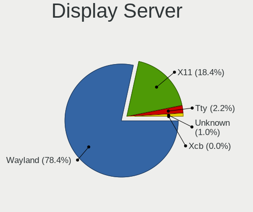

| Name    | Computers | Percent |
|---------|-----------|---------|
| Wayland | 2415      | 78.64%  |
| X11     | 563       | 18.33%  |
| Tty     | 63        | 2.05%   |
| Unknown | 29        | 0.94%   |
| Xcb     | 1         | 0.03%   |

Display Manager
---------------

SDDM, LightDM, etc.

| Name    | Computers | Percent |
|---------|-----------|---------|
| Unknown | 1941      | 63.45%  |
| GDM     | 764       | 24.98%  |
| SDDM    | 215       | 7.03%   |
| LightDM | 133       | 4.35%   |
| LXDM    | 5         | 0.16%   |
| SLiM    | 1         | 0.03%   |

OS Lang
-------

Language

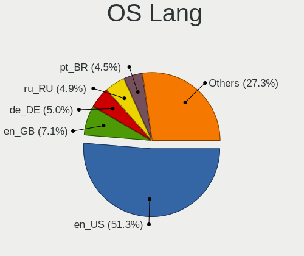

| Lang    | Computers | Percent |
|---------|-----------|---------|
| en_US   | 1563      | 51.21%  |
| en_GB   | 216       | 7.08%   |
| de_DE   | 153       | 5.01%   |
| ru_RU   | 150       | 4.91%   |
| pt_BR   | 138       | 4.52%   |
| fr_FR   | 79        | 2.59%   |
| it_IT   | 78        | 2.56%   |
| en_AU   | 75        | 2.46%   |
| en_CA   | 74        | 2.42%   |
| es_ES   | 60        | 1.97%   |
| es_MX   | 42        | 1.38%   |
| pl_PL   | 40        | 1.31%   |
| en_IN   | 30        | 0.98%   |
| es_CL   | 24        | 0.79%   |
| es_CO   | 21        | 0.69%   |
| en_DK   | 19        | 0.62%   |
| es_AR   | 18        | 0.59%   |
| Unknown | 16        | 0.52%   |
| pt_PT   | 15        | 0.49%   |
| cs_CZ   | 15        | 0.49%   |
| tr_TR   | 14        | 0.46%   |
| zh_CN   | 13        | 0.43%   |
| de_AT   | 13        | 0.43%   |
| nl_NL   | 10        | 0.33%   |
| hu_HU   | 10        | 0.33%   |
| en_IE   | 9         | 0.29%   |
| fr_CA   | 8         | 0.26%   |
| es_PE   | 8         | 0.26%   |
| en_NZ   | 8         | 0.26%   |
| nl_BE   | 7         | 0.23%   |
| zh_TW   | 6         | 0.2%    |
| ru_UA   | 6         | 0.2%    |
| en_PH   | 6         | 0.2%    |
| de_CH   | 6         | 0.2%    |
| sk_SK   | 5         | 0.16%   |
| id_ID   | 5         | 0.16%   |
| fi_FI   | 5         | 0.16%   |
| es_EC   | 5         | 0.16%   |
| en_ZA   | 5         | 0.16%   |
| da_DK   | 5         | 0.16%   |

Boot Mode
---------

EFI or BIOS

| Mode | Computers | Percent |
|------|-----------|---------|
| EFI  | 2456      | 80.34%  |
| BIOS | 601       | 19.66%  |

Filesystem
----------

Type of filesystem

| Type    | Computers | Percent |
|---------|-----------|---------|
| Btrfs   | 2526      | 83.09%  |
| Ext4    | 430       | 14.14%  |
| Xfs     | 73        | 2.4%    |
| Overlay | 4         | 0.13%   |
| Zfs     | 2         | 0.07%   |
| Unknown | 2         | 0.07%   |
| Tmpfs   | 1         | 0.03%   |
| F2fs    | 1         | 0.03%   |
| Ext3    | 1         | 0.03%   |

Part. scheme
------------

Scheme of partitioning

| Type    | Computers | Percent |
|---------|-----------|---------|
| Unknown | 1887      | 61.73%  |
| GPT     | 1106      | 36.18%  |
| MBR     | 64        | 2.09%   |

Dual Boot with Linux/BSD
------------------------

Hosting more than one Linux/BSD

| Dual boot | Computers | Percent |
|-----------|-----------|---------|
| No        | 2783      | 91.28%  |
| Yes       | 266       | 8.72%   |

Dual Boot (Win)
---------------

Hosting Linux and Windows

| Dual boot | Computers | Percent |
|-----------|-----------|---------|
| No        | 2565      | 84.38%  |
| Yes       | 475       | 15.63%  |

Board
-----

Vendor
------

Motherboard manufacturer

| Name                                 | Computers | Percent |
|--------------------------------------|-----------|---------|
| Lenovo                               | 590       | 19.45%  |
| ASUSTek Computer                     | 478       | 15.76%  |
| Hewlett-Packard                      | 385       | 12.69%  |
| Dell                                 | 375       | 12.36%  |
| MSI                                  | 218       | 7.19%   |
| Gigabyte Technology                  | 178       | 5.87%   |
| Acer                                 | 124       | 4.09%   |
| Apple                                | 113       | 3.73%   |
| ASRock                               | 95        | 3.13%   |
| HUAWEI                               | 50        | 1.65%   |
| Samsung Electronics                  | 37        | 1.22%   |
| Intel                                | 29        | 0.96%   |
| Unknown                              | 26        | 0.86%   |
| Microsoft                            | 25        | 0.82%   |
| Timi                                 | 20        | 0.66%   |
| Google                               | 20        | 0.66%   |
| Toshiba                              | 17        | 0.56%   |
| Sony                                 | 14        | 0.46%   |
| Fujitsu                              | 13        | 0.43%   |
| AZW                                  | 13        | 0.43%   |
| Pegatron                             | 11        | 0.36%   |
| Framework                            | 11        | 0.36%   |
| Notebook                             | 8         | 0.26%   |
| Chuwi                                | 7         | 0.23%   |
| System76                             | 6         | 0.2%    |
| Positivo                             | 6         | 0.2%    |
| Itautec                              | 6         | 0.2%    |
| Huanan                               | 6         | 0.2%    |
| TUXEDO                               | 5         | 0.16%   |
| Shenzhen Meigao Electronic Equipment | 5         | 0.16%   |
| Medion                               | 5         | 0.16%   |
| Schenker                             | 4         | 0.13%   |
| Razer                                | 4         | 0.13%   |
| Positivo Bahia - VAIO                | 4         | 0.13%   |
| Packard Bell                         | 4         | 0.13%   |
| HONOR                                | 4         | 0.13%   |
| AMI                                  | 4         | 0.13%   |
| Alienware                            | 4         | 0.13%   |
| raspberrypi,4-model-b                | 3         | 0.1%    |
| PC Specialist                        | 3         | 0.1%    |

Model
-----

Motherboard model

| Name                                 | Computers | Percent |
|--------------------------------------|-----------|---------|
| Unknown                              | 30        | 0.99%   |
| ASUS All Series                      | 17        | 0.56%   |
| Apple MacBookPro9,2                  | 12        | 0.4%    |
| HP Notebook                          | 10        | 0.33%   |
| Dell OptiPlex 7010                   | 10        | 0.33%   |
| Apple MacBookPro8,1                  | 10        | 0.33%   |
| Framework Laptop                     | 8         | 0.26%   |
| MSI MS-7C37                          | 7         | 0.23%   |
| Dell XPS 13 9310                     | 7         | 0.23%   |
| MSI MS-7C95                          | 6         | 0.2%    |
| MSI MS-7C91                          | 6         | 0.2%    |
| MSI MS-7C56                          | 6         | 0.2%    |
| MSI MS-7B89                          | 6         | 0.2%    |
| Lenovo IdeaPad 3 15ITL6 82H8         | 6         | 0.2%    |
| HP ENVY x360 2-in-1 Laptop 15-ey0xxx | 6         | 0.2%    |
| Gigabyte X570 I AORUS PRO WIFI       | 6         | 0.2%    |
| Dell Latitude 5420                   | 6         | 0.2%    |
| AZW SER                              | 6         | 0.2%    |
| Apple MacBookAir7,2                  | 6         | 0.2%    |
| Samsung 550XDA                       | 5         | 0.16%   |
| MSI MS-7C02                          | 5         | 0.16%   |
| MSI MS-7B79                          | 5         | 0.16%   |
| Microsoft Surface Pro 7              | 5         | 0.16%   |
| Lenovo IdeaPadFlex 5 14ALC05 82HU    | 5         | 0.16%   |
| HUAWEI CREM-WXX9                     | 5         | 0.16%   |
| HP EliteBook 840 G6                  | 5         | 0.16%   |
| HP EliteBook 840 G2                  | 5         | 0.16%   |
| Gigabyte B550 GAMING X V2            | 5         | 0.16%   |
| Gigabyte B450M DS3H                  | 5         | 0.16%   |
| Dell OptiPlex 9020                   | 5         | 0.16%   |
| Dell Latitude 7490                   | 5         | 0.16%   |
| ASUS TUF Gaming X570-PRO             | 5         | 0.16%   |
| ASUS TUF Gaming X570-PLUS            | 5         | 0.16%   |
| ASUS ROG STRIX X670E-I GAMING WIFI   | 5         | 0.16%   |
| ASUS PRIME X570-P                    | 5         | 0.16%   |
| ASRock B450M Pro4                    | 5         | 0.16%   |
| Apple MacBookPro12,1                 | 5         | 0.16%   |
| Apple MacBookPro11,1                 | 5         | 0.16%   |
| Timi Redmi Book Pro 14 2022          | 4         | 0.13%   |
| MSI MS-7C52                          | 4         | 0.13%   |

Model Family
------------

Motherboard model prefix

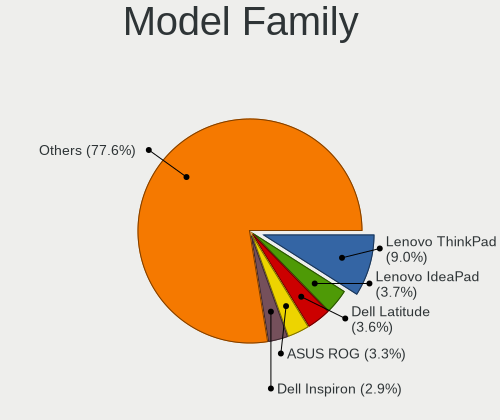

| Name               | Computers | Percent |
|--------------------|-----------|---------|
| Lenovo ThinkPad    | 270       | 8.9%    |
| Lenovo IdeaPad     | 112       | 3.69%   |
| Dell Latitude      | 108       | 3.56%   |
| ASUS ROG           | 99        | 3.26%   |
| Dell Inspiron      | 88        | 2.9%    |
| ASUS VivoBook      | 74        | 2.44%   |
| Acer Aspire        | 72        | 2.37%   |
| HP Pavilion        | 68        | 2.24%   |
| ASUS PRIME         | 62        | 2.04%   |
| HP EliteBook       | 58        | 1.91%   |
| Dell XPS           | 58        | 1.91%   |
| ASUS TUF           | 49        | 1.62%   |
| Lenovo Yoga        | 44        | 1.45%   |
| Dell OptiPlex      | 44        | 1.45%   |
| Lenovo Legion      | 40        | 1.32%   |
| HP Laptop          | 38        | 1.25%   |
| Dell Precision     | 38        | 1.25%   |
| HP ProBook         | 37        | 1.22%   |
| HP ENVY            | 35        | 1.15%   |
| Unknown            | 30        | 0.99%   |
| ASUS ASUS          | 28        | 0.92%   |
| Microsoft Surface  | 25        | 0.82%   |
| ASUS Zenbook       | 23        | 0.76%   |
| Lenovo ThinkCentre | 22        | 0.73%   |
| Lenovo ThinkBook   | 22        | 0.73%   |
| HP Compaq          | 21        | 0.69%   |
| Acer Nitro         | 20        | 0.66%   |
| Lenovo IdeaPadFlex | 18        | 0.59%   |
| ASUS All           | 17        | 0.56%   |
| Dell Vostro        | 15        | 0.49%   |
| HP OMEN            | 14        | 0.46%   |
| Toshiba Satellite  | 13        | 0.43%   |
| Apple MacBookPro9  | 13        | 0.43%   |
| Gigabyte B550M     | 12        | 0.4%    |
| Apple MacBookPro8  | 12        | 0.4%    |
| HP ZBook           | 11        | 0.36%   |
| HP EliteDesk       | 11        | 0.36%   |
| Gigabyte X570      | 11        | 0.36%   |
| Gigabyte B550      | 11        | 0.36%   |
| Framework Laptop   | 11        | 0.36%   |

MFG Year
--------

Motherboard manufacture year

| Year    | Computers | Percent |
|---------|-----------|---------|
| 2021    | 403       | 13.29%  |
| 2020    | 397       | 13.09%  |
| 2022    | 385       | 12.69%  |
| 2018    | 291       | 9.59%   |
| 2019    | 262       | 8.64%   |
| 2017    | 179       | 5.9%    |
| 2023    | 170       | 5.61%   |
| 2012    | 162       | 5.34%   |
| 2013    | 140       | 4.62%   |
| 2014    | 125       | 4.12%   |
| 2015    | 124       | 4.09%   |
| 2016    | 114       | 3.76%   |
| 2011    | 100       | 3.3%    |
| 2010    | 68        | 2.24%   |
| 2009    | 45        | 1.48%   |
| 2008    | 37        | 1.22%   |
| 2007    | 21        | 0.69%   |
| Unknown | 5         | 0.16%   |
| 2006    | 4         | 0.13%   |
| 2005    | 1         | 0.03%   |

Form Factor
-----------

Physical design of the computer

| Name           | Computers | Percent |
|----------------|-----------|---------|
| Notebook       | 1798      | 59.28%  |
| Desktop        | 944       | 31.12%  |
| Convertible    | 139       | 4.58%   |
| Tablet         | 52        | 1.71%   |
| Mini pc        | 50        | 1.65%   |
| All in one     | 30        | 0.99%   |
| Server         | 14        | 0.46%   |
| System on chip | 6         | 0.2%    |

Secure Boot
-----------

Enabled or disabled

| State    | Computers | Percent |
|----------|-----------|---------|
| Disabled | 2377      | 77.81%  |
| Enabled  | 678       | 22.19%  |

Coreboot
--------

Have coreboot on board

| Used | Computers | Percent |
|------|-----------|---------|
| No   | 3007      | 99.14%  |
| Yes  | 26        | 0.86%   |

RAM Size
--------

Total RAM memory

| Size in GB      | Computers | Percent |
|-----------------|-----------|---------|
| 16.01-24.0      | 743       | 24.33%  |
| 4.01-8.0        | 681       | 22.3%   |
| 8.01-16.0       | 569       | 18.63%  |
| 32.01-64.0      | 481       | 15.75%  |
| 3.01-4.0        | 254       | 8.32%   |
| 64.01-256.0     | 165       | 5.4%    |
| 24.01-32.0      | 108       | 3.54%   |
| 1.01-2.0        | 40        | 1.31%   |
| 2.01-3.0        | 12        | 0.39%   |
| More than 256.0 | 1         | 0.03%   |

RAM Used
--------

Used RAM memory

| Used GB     | Computers | Percent |
|-------------|-----------|---------|
| 4.01-8.0    | 1010      | 31.14%  |
| 2.01-3.0    | 825       | 25.44%  |
| 3.01-4.0    | 746       | 23%     |
| 1.01-2.0    | 336       | 10.36%  |
| 8.01-16.0   | 264       | 8.14%   |
| 0.51-1.0    | 27        | 0.83%   |
| 16.01-24.0  | 24        | 0.74%   |
| 32.01-64.0  | 5         | 0.15%   |
| 24.01-32.0  | 4         | 0.12%   |
| 64.01-256.0 | 1         | 0.03%   |
| 0.01-0.5    | 1         | 0.03%   |

Total Drives
------------

Number of drives on board

| Drives | Computers | Percent |
|--------|-----------|---------|
| 1      | 1867      | 60.7%   |
| 2      | 771       | 25.07%  |
| 3      | 231       | 7.51%   |
| 4      | 107       | 3.48%   |
| 5      | 50        | 1.63%   |
| 6      | 26        | 0.85%   |
| 0      | 7         | 0.23%   |
| 7      | 6         | 0.2%    |
| 8      | 4         | 0.13%   |
| 10     | 3         | 0.1%    |
| 11     | 2         | 0.07%   |
| 9      | 2         | 0.07%   |

Has CD-ROM
----------

Has CD-ROM on board

| Presented | Computers | Percent |
|-----------|-----------|---------|
| No        | 2427      | 79.84%  |
| Yes       | 613       | 20.16%  |

Has Ethernet
------------

Has Ethernet on board

| Presented | Computers | Percent |
|-----------|-----------|---------|
| Yes       | 2357      | 77.46%  |
| No        | 686       | 22.54%  |

Has WiFi
--------

Has WiFi module

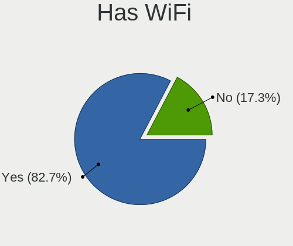

| Presented | Computers | Percent |
|-----------|-----------|---------|
| Yes       | 2561      | 84.22%  |
| No        | 480       | 15.78%  |

Has Bluetooth
-------------

Has Bluetooth module

| Presented | Computers | Percent |
|-----------|-----------|---------|
| Yes       | 2258      | 74.06%  |
| No        | 791       | 25.94%  |

Location
--------

Country
-------

Geographic location (country)

| Country     | Computers | Percent |
|-------------|-----------|---------|
| USA         | 569       | 18.7%   |
| Germany     | 234       | 7.69%   |
| Brazil      | 209       | 6.87%   |
| Russia      | 171       | 5.62%   |
| Italy       | 132       | 4.34%   |
| UK          | 115       | 3.78%   |
| Canada      | 115       | 3.78%   |
| France      | 99        | 3.25%   |
| India       | 92        | 3.02%   |
| Spain       | 85        | 2.79%   |
| Australia   | 84        | 2.76%   |
| Poland      | 78        | 2.56%   |
| Mexico      | 75        | 2.46%   |
| Netherlands | 74        | 2.43%   |
| Turkey      | 43        | 1.41%   |
| Czechia     | 37        | 1.22%   |
| Colombia    | 36        | 1.18%   |
| Chile       | 32        | 1.05%   |
| Switzerland | 31        | 1.02%   |
| Austria     | 31        | 1.02%   |
| Sweden      | 30        | 0.99%   |
| Argentina   | 29        | 0.95%   |
| Belgium     | 28        | 0.92%   |
| Portugal    | 27        | 0.89%   |
| Hungary     | 25        | 0.82%   |
| Indonesia   | 24        | 0.79%   |
| Denmark     | 24        | 0.79%   |
| Bulgaria    | 22        | 0.72%   |
| Belarus     | 22        | 0.72%   |
| Norway      | 20        | 0.66%   |
| Finland     | 20        | 0.66%   |
| Romania     | 18        | 0.59%   |
| China       | 18        | 0.59%   |
| Thailand    | 16        | 0.53%   |
| Philippines | 15        | 0.49%   |
| Israel      | 13        | 0.43%   |
| Iran        | 13        | 0.43%   |
| Serbia      | 12        | 0.39%   |
| Ireland     | 12        | 0.39%   |
| Greece      | 12        | 0.39%   |

City
----

Geographic location (city)

| City              | Computers | Percent |
|-------------------|-----------|---------|
| Moscow            | 42        | 1.35%   |
| Sydney            | 33        | 1.06%   |
| Berlin            | 27        | 0.87%   |
| Sao Paulo         | 23        | 0.74%   |
| Vienna            | 21        | 0.68%   |
| Mexico City       | 21        | 0.68%   |
| Santiago          | 19        | 0.61%   |
| Warsaw            | 17        | 0.55%   |
| St Petersburg     | 17        | 0.55%   |
| Minsk             | 17        | 0.55%   |
| Milan             | 17        | 0.55%   |
| Melbourne         | 17        | 0.55%   |
| Madrid            | 16        | 0.52%   |
| Helsinki          | 15        | 0.48%   |
| Toronto           | 14        | 0.45%   |
| Sofia             | 14        | 0.45%   |
| Delhi             | 14        | 0.45%   |
| Budapest          | 14        | 0.45%   |
| Brisbane          | 14        | 0.45%   |
| Rio de Janeiro    | 13        | 0.42%   |
| Prague            | 13        | 0.42%   |
| Paris             | 13        | 0.42%   |
| Munich            | 13        | 0.42%   |
| Montreal          | 13        | 0.42%   |
| Amsterdam         | 13        | 0.42%   |
| Palmas            | 12        | 0.39%   |
| Istanbul          | 12        | 0.39%   |
| Bogot           | 12        | 0.39%   |
| Barcelona         | 12        | 0.39%   |
| Singapore         | 11        | 0.35%   |
| Seattle           | 11        | 0.35%   |
| Lisbon            | 11        | 0.35%   |
| Hamburg           | 11        | 0.35%   |
| Brussels          | 11        | 0.35%   |
| Bangkok           | 11        | 0.35%   |
| San Jose          | 10        | 0.32%   |
| Braslia         | 10        | 0.32%   |
| New York          | 9         | 0.29%   |
| Los Angeles       | 9         | 0.29%   |
| Frankfurt am Main | 9         | 0.29%   |

Drives
------

Drive Vendor
------------

Hard drive vendors

| Vendor                       | Computers | Drives | Percent |
|------------------------------|-----------|--------|---------|
| Samsung Electronics          | 868       | 1231   | 19.51%  |
| WDC                          | 402       | 579    | 9.04%   |
| Sandisk                      | 401       | 476    | 9.02%   |
| Seagate                      | 393       | 546    | 8.84%   |
| Kingston                     | 237       | 284    | 5.33%   |
| Toshiba                      | 203       | 265    | 4.56%   |
| SK hynix                     | 163       | 179    | 3.66%   |
| Unknown                      | 160       | 197    | 3.6%    |
| Intel                        | 155       | 209    | 3.48%   |
| Micron Technology            | 154       | 167    | 3.46%   |
| Crucial                      | 154       | 202    | 3.46%   |
| Phison Electronics           | 82        | 103    | 1.84%   |
| Micron/Crucial Technology    | 68        | 75     | 1.53%   |
| Apple                        | 61        | 80     | 1.37%   |
| KIOXIA                       | 58        | 69     | 1.3%    |
| Silicon Motion               | 54        | 63     | 1.21%   |
| Kingston Technology Company  | 54        | 63     | 1.21%   |
| A-DATA Technology            | 54        | 62     | 1.21%   |
| Hitachi                      | 52        | 70     | 1.17%   |
| HGST                         | 47        | 48     | 1.06%   |
| China                        | 42        | 54     | 0.94%   |
| ADATA Technology             | 32        | 38     | 0.72%   |
| SPCC                         | 21        | 23     | 0.47%   |
| PNY                          | 21        | 25     | 0.47%   |
| Patriot                      | 20        | 26     | 0.45%   |
| Netac                        | 20        | 21     | 0.45%   |
| Realtek Semiconductor        | 18        | 22     | 0.4%    |
| MAXIO Technology (Hangzhou)  | 18        | 21     | 0.4%    |
| JMicron Technology           | 17        | 21     | 0.38%   |
| Intenso                      | 17        | 19     | 0.38%   |
| Team                         | 12        | 15     | 0.27%   |
| Shenzhen Longsys Electronics | 12        | 14     | 0.27%   |
| LITEON                       | 12        | 13     | 0.27%   |
| Unknown                      | 12        | 14     | 0.27%   |
| KingSpec                     | 11        | 12     | 0.25%   |
| Union Memory                 | 10        | 10     | 0.22%   |
| Solid State Storage          | 10        | 11     | 0.22%   |
| SABRENT                      | 10        | 10     | 0.22%   |
| LITEONIT                     | 10        | 10     | 0.22%   |
| Lenovo                       | 10        | 10     | 0.22%   |

Drive Model
-----------

Hard drive models

| Model                                                 | Computers | Percent |
|-------------------------------------------------------|-----------|---------|
| Samsung NVMe SSD Controller SM981/PM981/PM983 1TB     | 207       | 4.3%    |
| Samsung NVMe SSD Controller PM9A1/PM9A3/980PRO 1TB    | 129       | 2.68%   |
| Sandisk WD Blue SN550 NVMe SSD 2TB                    | 56        | 1.16%   |
| Micron/Crucial P2 NVMe PCIe SSD 4TB                   | 49        | 1.02%   |
| Kingston SA400S37480G 480GB SSD                       | 46        | 0.96%   |
| Kingston SA400S37240G 240GB SSD                       | 46        | 0.96%   |
| Unknown MMC Card  64GB                                | 41        | 0.85%   |
| Samsung NVMe SSD Controller SM961/PM961/SM963 1TB     | 41        | 0.85%   |
| Samsung SSD 980 1TB                                   | 39        | 0.81%   |
| Seagate ST1000LM035-1RK172 1TB                        | 36        | 0.75%   |
| Sandisk WD Black SN750 / PC SN730 NVMe SSD 512GB      | 36        | 0.75%   |
| Silicon Motion SM2263EN/SM2263XT SSD Controller 256GB | 35        | 0.73%   |
| Phison E12 NVMe Controller 2TB                        | 34        | 0.71%   |
| Unknown MMC Card  128GB                               | 33        | 0.69%   |
| Crucial CT500MX500SSD1 500GB                          | 33        | 0.69%   |
| Intel SSD 660P Series 1024GB                          | 32        | 0.66%   |
| Unknown MMC Card  32GB                                | 31        | 0.64%   |
| Samsung SSD 850 EVO 250GB                             | 27        | 0.56%   |
| Toshiba XG6 NVMe SSD Controller 1024GB                | 26        | 0.54%   |
| Seagate ST2000DM008-2FR102 2TB                        | 26        | 0.54%   |
| Sandisk WD Black SN850 512GB                          | 26        | 0.54%   |
| Intel SSDPEKNU512GZ 512GB                             | 26        | 0.54%   |
| Samsung SSD 870 EVO 1TB                               | 24        | 0.5%    |
| Samsung SSD 860 EVO 1TB                               | 24        | 0.5%    |
| Phison PS5013 E13 NVMe Controller 512GB               | 24        | 0.5%    |
| Samsung SSD 860 EVO 500GB                             | 23        | 0.48%   |
| Crucial CT1000MX500SSD1 1TB                           | 23        | 0.48%   |
| Samsung SSD 850 EVO 500GB                             | 20        | 0.42%   |
| Seagate ST500DM002-1BD142 500GB                       | 18        | 0.37%   |
| Seagate ST2000DM006-2DM164 2TB                        | 18        | 0.37%   |
| Seagate ST1000DM010-2EP102 1TB                        | 18        | 0.37%   |
| Toshiba MQ04ABF100 1TB                                | 17        | 0.35%   |
| Toshiba DT01ACA100 1TB                                | 17        | 0.35%   |
| Sandisk WD_BLACK SN770 1TB                            | 17        | 0.35%   |
| Kingston SA400S37120G 120GB SSD                       | 17        | 0.35%   |
| Crucial CT240BX500SSD1 240GB                          | 17        | 0.35%   |
| WDC WDS500G2B0A-00SM50 500GB SSD                      | 16        | 0.33%   |
| SK hynix BC501 NVMe Solid State Drive 512GB           | 16        | 0.33%   |
| Sandisk WD Blue SN500 / PC SN520 NVMe SSD 512GB       | 16        | 0.33%   |
| Phison E16 PCIe4 NVMe Controller 1TB                  | 16        | 0.33%   |

HDD Vendor
----------

Hard disk drive vendors

| Vendor              | Computers | Drives | Percent |
|---------------------|-----------|--------|---------|
| Seagate             | 376       | 516    | 36.54%  |
| WDC                 | 313       | 455    | 30.42%  |
| Toshiba             | 131       | 177    | 12.73%  |
| Hitachi             | 52        | 70     | 5.05%   |
| HGST                | 47        | 48     | 4.57%   |
| Samsung Electronics | 29        | 38     | 2.82%   |
| Apple               | 18        | 21     | 1.75%   |
| Unknown             | 14        | 17     | 1.36%   |
| JMicron Technology  | 13        | 15     | 1.26%   |
| SABRENT             | 10        | 10     | 0.97%   |
| TO Exter            | 3         | 3      | 0.29%   |
| QNAP                | 3         | 6      | 0.29%   |
| Maxtor              | 3         | 3      | 0.29%   |
| Fujitsu             | 3         | 3      | 0.29%   |
| ASMT                | 2         | 3      | 0.19%   |
| XrayDisk            | 1         | 1      | 0.1%    |
| USB3.0              | 1         | 1      | 0.1%    |
| USB                 | 1         | 1      | 0.1%    |
| SAGE                | 1         | 1      | 0.1%    |
| Mercury             | 1         | 1      | 0.1%    |
| Maxone              | 1         | 1      | 0.1%    |
| LIO-ORG             | 1         | 4      | 0.1%    |
| LaCie               | 1         | 1      | 0.1%    |
| Intenso             | 1         | 1      | 0.1%    |
| IB                  | 1         | 2      | 0.1%    |
| ASMedia             | 1         | 4      | 0.1%    |
| ACASIS              | 1         | 1      | 0.1%    |

SSD Vendor
----------

Solid state drive vendors

| Vendor              | Computers | Drives | Percent |
|---------------------|-----------|--------|---------|
| Samsung Electronics | 307       | 431    | 22.76%  |
| Kingston            | 178       | 213    | 13.19%  |
| Crucial             | 151       | 196    | 11.19%  |
| SanDisk             | 110       | 126    | 8.15%   |
| WDC                 | 90        | 110    | 6.67%   |
| A-DATA Technology   | 44        | 50     | 3.26%   |
| Intel               | 42        | 66     | 3.11%   |
| China               | 42        | 54     | 3.11%   |
| Apple               | 28        | 30     | 2.08%   |
| Micron Technology   | 26        | 27     | 1.93%   |
| Toshiba             | 24        | 29     | 1.78%   |
| SPCC                | 21        | 23     | 1.56%   |
| PNY                 | 21        | 25     | 1.56%   |
| Patriot             | 20        | 26     | 1.48%   |
| Netac               | 12        | 12     | 0.89%   |
| LITEON              | 12        | 13     | 0.89%   |
| Team                | 11        | 14     | 0.82%   |
| SK hynix            | 11        | 13     | 0.82%   |
| LITEONIT            | 10        | 10     | 0.74%   |
| KingSpec            | 10        | 11     | 0.74%   |
| Intenso             | 10        | 10     | 0.74%   |
| GOODRAM             | 10        | 14     | 0.74%   |
| Lexar               | 9         | 9      | 0.67%   |
| Transcend           | 8         | 10     | 0.59%   |
| OCZ                 | 7         | 11     | 0.52%   |
| Mushkin             | 7         | 7      | 0.52%   |
| Hewlett-Packard     | 7         | 7      | 0.52%   |
| Gigabyte Technology | 7         | 9      | 0.52%   |
| Apacer              | 7         | 9      | 0.52%   |
| Emtec               | 5         | 7      | 0.37%   |
| Smartbuy            | 4         | 4      | 0.3%    |
| AMD                 | 4         | 4      | 0.3%    |
| Unknown             | 4         | 6      | 0.3%    |
| XrayDisk            | 3         | 3      | 0.22%   |
| MidasForce          | 3         | 3      | 0.22%   |
| Lenovo              | 3         | 3      | 0.22%   |
| Fanxiang            | 3         | 3      | 0.22%   |
| Colorful            | 3         | 3      | 0.22%   |
| Aura                | 3         | 3      | 0.22%   |
| ASMT                | 3         | 3      | 0.22%   |

Drive Kind
----------

HDD or SSD

| Kind    | Computers | Drives | Percent |
|---------|-----------|--------|---------|
| NVMe    | 1777      | 2353   | 43.71%  |
| SSD     | 1172      | 1689   | 28.83%  |
| HDD     | 894       | 1404   | 21.99%  |
| MMC     | 144       | 173    | 3.54%   |
| Unknown | 78        | 89     | 1.92%   |

Drive Connector
---------------

SATA, SAS, NVMe, etc.

| Type | Computers | Drives | Percent |
|------|-----------|--------|---------|
| NVMe | 1775      | 2341   | 47.84%  |
| SATA | 1631      | 2986   | 43.96%  |
| SAS  | 160       | 208    | 4.31%   |
| MMC  | 144       | 173    | 3.88%   |

Drive Size
----------

Size of hard drive

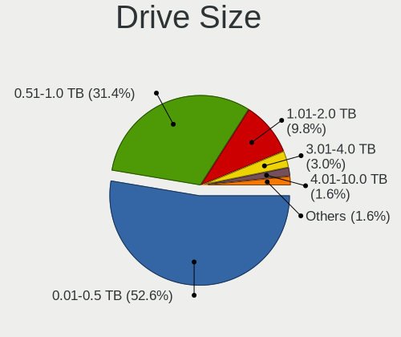

| Size in TB | Computers | Drives | Percent |
|------------|-----------|--------|---------|
| 0.01-0.5   | 1138      | 1693   | 53.3%   |
| 0.51-1.0   | 663       | 882    | 31.05%  |
| 1.01-2.0   | 203       | 297    | 9.51%   |
| 3.01-4.0   | 67        | 104    | 3.14%   |
| 4.01-10.0  | 30        | 67     | 1.41%   |
| 2.01-3.0   | 26        | 32     | 1.22%   |
| 10.01-20.0 | 8         | 18     | 0.37%   |

Space Total
-----------

Amount of disk space available on the file system

| Size in GB     | Computers | Percent |
|----------------|-----------|---------|
| 501-1000       | 704       | 22.67%  |
| 251-500        | 574       | 18.49%  |
| 1001-2000      | 509       | 16.39%  |
| 101-250        | 372       | 11.98%  |
| 1-20           | 243       | 7.83%   |
| Unknown        | 224       | 7.21%   |
| More than 3000 | 210       | 6.76%   |
| 2001-3000      | 129       | 4.15%   |
| 51-100         | 99        | 3.19%   |
| 21-50          | 40        | 1.29%   |
| 0              | 1         | 0.03%   |

Space Used
----------

Amount of used disk space

| Used GB        | Computers | Percent |
|----------------|-----------|---------|
| 1-20           | 965       | 30.36%  |
| 21-50          | 516       | 16.23%  |
| 101-250        | 399       | 12.55%  |
| 51-100         | 345       | 10.85%  |
| 251-500        | 311       | 9.78%   |
| Unknown        | 224       | 7.05%   |
| 501-1000       | 207       | 6.51%   |
| 1001-2000      | 119       | 3.74%   |
| More than 3000 | 47        | 1.48%   |
| 2001-3000      | 45        | 1.42%   |
| 0              | 1         | 0.03%   |

Malfunc. Drives
---------------

Drive models with a malfunction

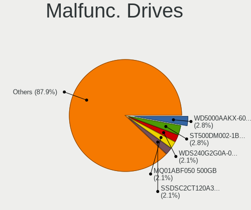

| Model                                 | Computers | Drives | Percent |
|---------------------------------------|-----------|--------|---------|
| WDC WD5000AAKX-603CA0 500GB           | 4         | 4      | 2.88%   |
| Seagate ST500DM002-1BD142 500GB       | 4         | 5      | 2.88%   |
| WDC WDS240G2G0A-00JH30 240GB SSD      | 3         | 3      | 2.16%   |
| Toshiba MQ01ABF050 500GB              | 3         | 3      | 2.16%   |
| Intel SSDSC2CT120A3 120GB             | 3         | 8      | 2.16%   |
| HGST HTS721010A9E630 1TB              | 3         | 3      | 2.16%   |
| WDC WD20EZRX-00D8PB0 2TB              | 2         | 2      | 1.44%   |
| Toshiba MQ01ABD100 1TB                | 2         | 2      | 1.44%   |
| Seagate ST500LT012-1DG142 500GB       | 2         | 2      | 1.44%   |
| Seagate ST31000524AS 1TB              | 2         | 2      | 1.44%   |
| Seagate ST1000DX001-1NS162 1TB        | 2         | 2      | 1.44%   |
| SanDisk SSD PLUS 480GB                | 2         | 2      | 1.44%   |
| SanDisk SD8SBAT256G1122 256GB SSD     | 2         | 2      | 1.44%   |
| Samsung Electronics SSD 840 EVO 250GB | 2         | 2      | 1.44%   |
| Kingston SA400S37480G 480GB SSD       | 2         | 3      | 1.44%   |
| Crucial CT120M500SSD1 120GB           | 2         | 7      | 1.44%   |
| YS SSD 240GB                          | 1         | 1      | 0.72%   |
| Wibtek W800S 256GB SSD                | 1         | 1      | 0.72%   |
| WDC WDS100T2G0A-00JH30 1TB SSD        | 1         | 1      | 0.72%   |
| WDC WD5000LPCX-60VHAT0 500GB          | 1         | 1      | 0.72%   |
| WDC WD5000BPVT-75HXZT1 500GB          | 1         | 1      | 0.72%   |
| WDC WD5000AVCS-632DY1 500GB           | 1         | 3      | 0.72%   |
| WDC WD5000AAKS-00UU3A0 500GB          | 1         | 1      | 0.72%   |
| WDC WD5000AADS-00S9B0 500GB           | 1         | 1      | 0.72%   |
| WDC WD40PURX-64GVNY0 4TB              | 1         | 1      | 0.72%   |
| WDC WD40EFRX-68N32N0 4TB              | 1         | 1      | 0.72%   |
| WDC WD3200BPVT-75ZEST0 320GB          | 1         | 1      | 0.72%   |
| WDC WD3200AAJS-00L7A0 320GB           | 1         | 1      | 0.72%   |
| WDC WD30EZRX-00SPEB0 3TB              | 1         | 1      | 0.72%   |
| WDC WD30EFRX-68AX9N0 3TB              | 1         | 2      | 0.72%   |
| WDC WD2500BEVT-80A23T0 250GB          | 1         | 1      | 0.72%   |
| WDC WD20EZRZ-22Z5HB0 2TB              | 1         | 1      | 0.72%   |
| WDC WD20EARS-00J2GB0 2TB              | 1         | 1      | 0.72%   |
| WDC WD10JPVT-60A1YT0 1TB              | 1         | 1      | 0.72%   |
| WDC WD10EZRZ-00HTKB0 1TB              | 1         | 1      | 0.72%   |
| WDC WD10EZEX-08WN4A0 1TB              | 1         | 1      | 0.72%   |
| WDC WD1002FAEX-00Y9A0 1TB             | 1         | 1      | 0.72%   |
| Toshiba MQ02ABD100H 1TB               | 1         | 1      | 0.72%   |
| Toshiba DT01ACA200 2TB                | 1         | 2      | 0.72%   |
| SSSTC CVB-8D128-HP 128GB SSD          | 1         | 1      | 0.72%   |

Malfunc. Drive Vendor
---------------------

Vendors of faulty drives

| Vendor                      | Computers | Drives | Percent |
|-----------------------------|-----------|--------|---------|
| WDC                         | 25        | 31     | 18.66%  |
| Seagate                     | 25        | 31     | 18.66%  |
| Samsung Electronics         | 14        | 20     | 10.45%  |
| Intel                       | 9         | 15     | 6.72%   |
| Hitachi                     | 9         | 9      | 6.72%   |
| Toshiba                     | 7         | 8      | 5.22%   |
| SanDisk                     | 5         | 5      | 3.73%   |
| Kingston                    | 5         | 8      | 3.73%   |
| HGST                        | 5         | 5      | 3.73%   |
| Crucial                     | 4         | 9      | 2.99%   |
| LITEONIT                    | 3         | 3      | 2.24%   |
| SK hynix                    | 2         | 2      | 1.49%   |
| Micron Technology           | 2         | 2      | 1.49%   |
| Maxtor                      | 2         | 2      | 1.49%   |
| Intenso                     | 2         | 2      | 1.49%   |
| China                       | 2         | 2      | 1.49%   |
| A-DATA Technology           | 2         | 2      | 1.49%   |
| YS                          | 1         | 1      | 0.75%   |
| Wibtek                      | 1         | 1      | 0.75%   |
| SSSTC                       | 1         | 1      | 0.75%   |
| SPCC                        | 1         | 1      | 0.75%   |
| Netac                       | 1         | 1      | 0.75%   |
| Mushkin                     | 1         | 1      | 0.75%   |
| Micron/Crucial Technology   | 1         | 1      | 0.75%   |
| MAXIO Technology (Hangzhou) | 1         | 1      | 0.75%   |
| LITEON                      | 1         | 1      | 0.75%   |
| HPE                         | 1         | 1      | 0.75%   |
| Apple                       | 1         | 1      | 0.75%   |

Malfunc. HDD Vendor
-------------------

Vendors of faulty HDD drives

| Vendor              | Computers | Drives | Percent |
|---------------------|-----------|--------|---------|
| Seagate             | 25        | 31     | 32.89%  |
| WDC                 | 22        | 27     | 28.95%  |
| Hitachi             | 9         | 9      | 11.84%  |
| Toshiba             | 7         | 8      | 9.21%   |
| Samsung Electronics | 5         | 10     | 6.58%   |
| HGST                | 5         | 5      | 6.58%   |
| Maxtor              | 2         | 2      | 2.63%   |
| Apple               | 1         | 1      | 1.32%   |

Malfunc. Drive Kind
-------------------

Kinds of faulty drives

| Kind | Computers | Drives | Percent |
|------|-----------|--------|---------|
| HDD  | 71        | 93     | 55.47%  |
| SSD  | 51        | 68     | 39.84%  |
| NVMe | 6         | 6      | 4.69%   |

Failed Drives
-------------

Failed drive models

Zero info for selected period =(

Failed Drive Vendor
-------------------

Failed drive vendors

Zero info for selected period =(

Drive Status
------------

Number of failed and malfunc. drives

| Status   | Computers | Drives | Percent |
|----------|-----------|--------|---------|
| Detected | 2046      | 3704   | 63.68%  |
| Works    | 1045      | 1837   | 32.52%  |
| Malfunc  | 122       | 167    | 3.8%    |

Storage controller
------------------

Storage Vendor
--------------

Storage controller vendors

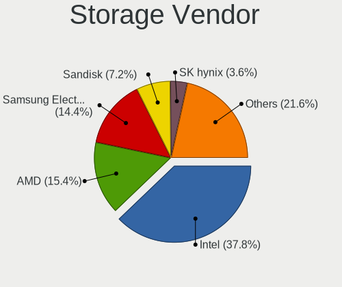

| Vendor                                  | Computers | Percent |
|-----------------------------------------|-----------|---------|
| Intel                                   | 1589      | 37.77%  |
| AMD                                     | 651       | 15.47%  |
| Samsung Electronics                     | 608       | 14.45%  |
| SanDisk                                 | 304       | 7.23%   |
| SK hynix                                | 151       | 3.59%   |
| Micron Technology                       | 128       | 3.04%   |
| Kingston Technology Company             | 118       | 2.8%    |
| Phison Electronics                      | 89        | 2.12%   |
| Micron/Crucial Technology               | 70        | 1.66%   |
| ASMedia Technology                      | 60        | 1.43%   |
| Silicon Motion                          | 56        | 1.33%   |
| KIOXIA                                  | 56        | 1.33%   |
| Toshiba America Info Systems            | 52        | 1.24%   |
| ADATA Technology                        | 41        | 0.97%   |
| Marvell Technology Group                | 29        | 0.69%   |
| Solid State Storage Technology          | 20        | 0.48%   |
| Realtek Semiconductor                   | 18        | 0.43%   |
| MAXIO Technology (Hangzhou)             | 18        | 0.43%   |
| Union Memory (Shenzhen)                 | 17        | 0.4%    |
| Nvidia                                  | 16        | 0.38%   |
| Apple                                   | 16        | 0.38%   |
| Shenzhen Longsys Electronics            | 13        | 0.31%   |
| Seagate Technology                      | 12        | 0.29%   |
| JMicron Technology                      | 12        | 0.29%   |
| Netac Technology                        | 9         | 0.21%   |
| LSI Logic / Symbios Logic               | 7         | 0.17%   |
| Lenovo                                  | 7         | 0.17%   |
| Yangtze Memory Technologies             | 6         | 0.14%   |
| Solidigm                                | 6         | 0.14%   |
| Broadcom / LSI                          | 5         | 0.12%   |
| VIA Technologies                        | 4         | 0.1%    |
| INNOGRIT                                | 4         | 0.1%    |
| Silicon Image                           | 2         | 0.05%   |
| Shenzhen Unionmemory Information System | 2         | 0.05%   |
| Lite-On Technology                      | 2         | 0.05%   |
| Biwin Storage Technology                | 2         | 0.05%   |
| Adaptec                                 | 2         | 0.05%   |
| ULi Electronics                         | 1         | 0.02%   |
| Silicon Integrated Systems [SiS]        | 1         | 0.02%   |
| PMC-Sierra                              | 1         | 0.02%   |

Storage Model
-------------

Storage controller models

| Model                                                                          | Computers | Percent |
|--------------------------------------------------------------------------------|-----------|---------|
| AMD FCH SATA Controller [AHCI mode]                                            | 407       | 8.86%   |
| Samsung NVMe SSD Controller SM981/PM981/PM983                                  | 219       | 4.77%   |
| Intel Volume Management Device NVMe RAID Controller                            | 160       | 3.48%   |
| Samsung NVMe SSD Controller 980 (DRAM-less)                                    | 158       | 3.44%   |
| Samsung NVMe SSD Controller PM9A1/PM9A3/980PRO                                 | 134       | 2.92%   |
| Intel Sunrise Point-LP SATA Controller [AHCI mode]                             | 134       | 2.92%   |
| AMD 500 Series Chipset SATA Controller                                         | 95        | 2.07%   |
| Intel 7 Series Chipset Family 6-port SATA Controller [AHCI mode]               | 94        | 2.05%   |
| AMD 400 Series Chipset SATA Controller                                         | 91        | 1.98%   |
| Intel 8 Series/C220 Series Chipset Family 6-port SATA Controller 1 [AHCI mode] | 88        | 1.92%   |
| Intel 82801 Mobile SATA Controller [RAID mode]                                 | 84        | 1.83%   |
| SK hynix Gold P31/BC711/PC711 NVMe Solid State Drive                           | 68        | 1.48%   |
| Intel Q170/Q150/B150/H170/H110/Z170/CM236 Chipset SATA Controller [AHCI Mode]  | 62        | 1.35%   |
| SanDisk Ultra 3D / WD Blue SN550 NVMe SSD                                      | 58        | 1.26%   |
| Intel 200 Series PCH SATA controller [AHCI mode]                               | 57        | 1.24%   |
| ASMedia ASM1061/ASM1062 Serial ATA Controller                                  | 55        | 1.2%    |
| Intel 6 Series/C200 Series Chipset Family 6 port Mobile SATA AHCI Controller   | 53        | 1.15%   |
| Micron/Crucial P2 [Nick P2] / P3 / P3 Plus NVMe PCIe SSD (DRAM-less)           | 51        | 1.11%   |
| AMD 600 Series Chipset SATA Controller                                         | 50        | 1.09%   |
| Intel SSD 670p Series [Keystone Harbor]                                        | 49        | 1.07%   |
| Intel Alder Lake-S PCH SATA Controller [AHCI Mode]                             | 48        | 1.04%   |
| Samsung NVMe SSD Controller SM961/PM961/SM963                                  | 46        | 1%      |
| Intel 7 Series/C210 Series Chipset Family 6-port SATA Controller [AHCI mode]   | 46        | 1%      |
| Intel Tiger Lake-LP SATA Controller                                            | 43        | 0.94%   |
| Intel Cannon Lake PCH SATA AHCI Controller                                     | 43        | 0.94%   |
| SanDisk WD Black SN770 / PC SN740 256GB / PC SN560 (DRAM-less) NVMe SSD        | 42        | 0.91%   |
| Micron 2450 NVMe SSD [HendrixV] (DRAM-less)                                    | 42        | 0.91%   |
| Intel 8 Series SATA Controller 1 [AHCI mode]                                   | 41        | 0.89%   |
| SanDisk Extreme Pro / WD Black SN750 / PC SN730 / Red SN700 NVMe SSD           | 38        | 0.83%   |
| Intel Wildcat Point-LP SATA Controller [AHCI Mode]                             | 38        | 0.83%   |
| Intel SATA Controller [RAID Mode]                                              | 38        | 0.83%   |
| Intel Cannon Lake Mobile PCH SATA AHCI Controller                              | 38        | 0.83%   |
| Intel Comet Lake SATA AHCI Controller                                          | 37        | 0.81%   |
| Silicon Motion SM2263EN/SM2263XT (DRAM-less) NVMe SSD Controllers              | 36        | 0.78%   |
| Phison E12 NVMe Controller                                                     | 35        | 0.76%   |
| AMD SB7x0/SB8x0/SB9x0 SATA Controller [AHCI mode]                              | 33        | 0.72%   |
| Intel SSD 660P Series                                                          | 32        | 0.7%    |
| Intel HM170/QM170 Chipset SATA Controller [AHCI Mode]                          | 32        | 0.7%    |
| Intel 400 Series Chipset Family SATA AHCI Controller                           | 32        | 0.7%    |
| KIOXIA NVMe SSD Controller BG4 (DRAM-less)                                     | 31        | 0.67%   |

Storage Kind
------------

Kind of storage controller (IDE, SATA, NVMe, SAS, ...)

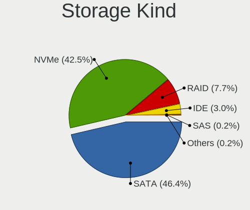

| Kind | Computers | Percent |
|------|-----------|---------|
| SATA | 1919      | 46.31%  |
| NVMe | 1766      | 42.62%  |
| RAID | 321       | 7.75%   |
| IDE  | 124       | 2.99%   |
| SAS  | 8         | 0.19%   |
| SCSI | 6         | 0.14%   |

Processor
---------

CPU Vendor
----------

Processor vendors

| Vendor                   | Computers | Percent |
|--------------------------|-----------|---------|
| Intel                    | 2080      | 68.58%  |
| AMD                      | 941       | 31.03%  |
| ARM                      | 7         | 0.23%   |
| Unknown                  | 2         | 0.07%   |
| PowerNV C1P9S01 REV 1.01 | 1         | 0.03%   |
| Loongson                 | 1         | 0.03%   |
| CentaurHauls             | 1         | 0.03%   |

CPU Model
---------

Processor models

| Model                                         | Computers | Percent |
|-----------------------------------------------|-----------|---------|
| Intel 11th Gen Core i5-1135G7 @ 2.40GHz       | 70        | 2.31%   |
| Intel 11th Gen Core i7-1165G7 @ 2.80GHz       | 48        | 1.58%   |
| AMD Ryzen 7 5800H with Radeon Graphics        | 37        | 1.22%   |
| Intel Core i5-8250U CPU @ 1.60GHz             | 36        | 1.19%   |
| AMD Ryzen 5 5500U with Radeon Graphics        | 36        | 1.19%   |
| AMD Ryzen 5 5600X 6-Core Processor            | 28        | 0.92%   |
| Intel Core i7-8565U CPU @ 1.80GHz             | 27        | 0.89%   |
| Intel Core i5-7200U CPU @ 2.50GHz             | 27        | 0.89%   |
| Intel Core i5-10210U CPU @ 1.60GHz            | 26        | 0.86%   |
| AMD Ryzen 7 5700U with Radeon Graphics        | 26        | 0.86%   |
| AMD Ryzen 5 3600 6-Core Processor             | 25        | 0.82%   |
| Intel 12th Gen Core i7-12700H                 | 24        | 0.79%   |
| Intel Core i7-8550U CPU @ 1.80GHz             | 23        | 0.76%   |
| Intel Core i5-6300U CPU @ 2.40GHz             | 23        | 0.76%   |
| Intel Core i5-3210M CPU @ 2.50GHz             | 23        | 0.76%   |
| Intel 12th Gen Core i7-1255U                  | 23        | 0.76%   |
| Intel 11th Gen Core i7-1185G7 @ 3.00GHz       | 23        | 0.76%   |
| AMD Ryzen 7 4800H with Radeon Graphics        | 23        | 0.76%   |
| AMD Ryzen 7 5800X 8-Core Processor            | 22        | 0.72%   |
| AMD Ryzen 5 3500U with Radeon Vega Mobile Gfx | 22        | 0.72%   |
| Intel Core i7-7700HQ CPU @ 2.80GHz            | 20        | 0.66%   |
| Intel Core i7-10750H CPU @ 2.60GHz            | 20        | 0.66%   |
| Intel 12th Gen Core i7-1260P                  | 20        | 0.66%   |
| Intel Core i5-8350U CPU @ 1.70GHz             | 19        | 0.63%   |
| Intel 12th Gen Core i5-1235U                  | 19        | 0.63%   |
| Intel Core i7-7500U CPU @ 2.70GHz             | 18        | 0.59%   |
| Intel Core i5-6200U CPU @ 2.30GHz             | 18        | 0.59%   |
| Intel 12th Gen Core i5-12500H                 | 18        | 0.59%   |
| AMD Ryzen 5 5600G with Radeon Graphics        | 18        | 0.59%   |
| Intel Core i7-8750H CPU @ 2.20GHz             | 17        | 0.56%   |
| AMD Ryzen 7 6800H with Radeon Graphics        | 17        | 0.56%   |
| AMD Ryzen 7 5825U with Radeon Graphics        | 17        | 0.56%   |
| AMD Ryzen 5 4500U with Radeon Graphics        | 17        | 0.56%   |
| Intel Atom x5-Z8350 CPU @ 1.44GHz             | 16        | 0.53%   |
| Intel Core i5-1035G1 CPU @ 1.00GHz            | 15        | 0.49%   |
| Intel 11th Gen Core i7-11800H @ 2.30GHz       | 15        | 0.49%   |
| AMD Ryzen 9 7950X 16-Core Processor           | 15        | 0.49%   |
| AMD Ryzen 7 4700U with Radeon Graphics        | 15        | 0.49%   |
| AMD Ryzen 7 3700X 8-Core Processor            | 15        | 0.49%   |
| AMD Ryzen 5 2600 Six-Core Processor           | 15        | 0.49%   |

CPU Model Family
----------------

Processor model prefix

| Model                   | Computers | Percent |
|-------------------------|-----------|---------|
| Intel Core i5           | 604       | 19.91%  |
| Other                   | 532       | 17.53%  |
| Intel Core i7           | 484       | 15.95%  |
| AMD Ryzen 7             | 303       | 9.99%   |
| AMD Ryzen 5             | 302       | 9.95%   |
| Intel Core i3           | 137       | 4.52%   |
| AMD Ryzen 9             | 116       | 3.82%   |
| Intel Celeron           | 88        | 2.9%    |
| Intel Xeon              | 66        | 2.18%   |
| Intel Core 2 Duo        | 46        | 1.52%   |
| Intel Atom              | 38        | 1.25%   |
| AMD Ryzen 3             | 33        | 1.09%   |
| AMD Ryzen 7 PRO         | 25        | 0.82%   |
| AMD FX                  | 25        | 0.82%   |
| Intel Pentium           | 21        | 0.69%   |
| Intel Core i9           | 20        | 0.66%   |
| Intel Pentium Silver    | 16        | 0.53%   |
| AMD Ryzen 5 PRO         | 16        | 0.53%   |
| AMD A10                 | 16        | 0.53%   |
| AMD Phenom II X4        | 15        | 0.49%   |
| AMD A6                  | 13        | 0.43%   |
| Intel Core 2 Quad       | 12        | 0.4%    |
| AMD A8                  | 12        | 0.4%    |
| AMD Ryzen Threadripper  | 9         | 0.3%    |
| AMD Athlon              | 9         | 0.3%    |
| Intel Pentium Dual-Core | 7         | 0.23%   |
| AMD A4                  | 7         | 0.23%   |
| Intel Pentium Gold      | 5         | 0.16%   |
| Intel Pentium Dual      | 5         | 0.16%   |
| AMD E2                  | 5         | 0.16%   |
| Intel Genuine           | 4         | 0.13%   |
| Intel Core 2            | 4         | 0.13%   |
| Intel Core m5           | 3         | 0.1%    |
| Intel Core m3           | 3         | 0.1%    |
| AMD Phenom II X6        | 3         | 0.1%    |
| AMD Phenom II X2        | 3         | 0.1%    |
| AMD E1                  | 3         | 0.1%    |
| AMD A12                 | 3         | 0.1%    |
| Intel Core M            | 2         | 0.07%   |
| Intel Celeron Dual-Core | 2         | 0.07%   |

CPU Cores
---------

Number of processor cores

| Number  | Computers | Percent |
|---------|-----------|---------|
| 4       | 1042      | 34.36%  |
| 2       | 740       | 24.4%   |
| 8       | 443       | 14.61%  |
| 6       | 433       | 14.28%  |
| 12      | 128       | 4.22%   |
| 10      | 84        | 2.77%   |
| 14      | 67        | 2.21%   |
| 16      | 53        | 1.75%   |
| 24      | 13        | 0.43%   |
| 1       | 11        | 0.36%   |
| 3       | 6         | 0.2%    |
| Unknown | 4         | 0.13%   |
| 20      | 3         | 0.1%    |
| 36      | 2         | 0.07%   |
| 32      | 2         | 0.07%   |
| 18      | 1         | 0.03%   |
| 11      | 1         | 0.03%   |

CPU Sockets
-----------

Number of sockets

| Number  | Computers | Percent |
|---------|-----------|---------|
| 1       | 3009      | 99.21%  |
| 2       | 19        | 0.63%   |
| Unknown | 4         | 0.13%   |
| 11      | 1         | 0.03%   |

CPU Threads
-----------

Threads per core (Hyper-Threading)

| Number  | Computers | Percent |
|---------|-----------|---------|
| 2       | 2475      | 81.58%  |
| 1       | 554       | 18.26%  |
| Unknown | 4         | 0.13%   |
| 4       | 1         | 0.03%   |

CPU Op-Modes
------------

CPU Operation Modes (32-bit, 64-bit)

| Op mode        | Computers | Percent |
|----------------|-----------|---------|
| 32-bit, 64-bit | 3024      | 99.7%   |
| 64-bit         | 6         | 0.2%    |
| Unknown        | 3         | 0.1%    |

CPU Microcode
-------------

Microcode number

| Number     | Computers | Percent |
|------------|-----------|---------|
| Unknown    | 2154      | 70.69%  |
| 0x0a50000c | 89        | 2.92%   |
| 0x0a50000d | 75        | 2.46%   |
| 0x08600106 | 51        | 1.67%   |
| 0x08108109 | 51        | 1.67%   |
| 0x0a601203 | 49        | 1.61%   |
| 0x0a404102 | 47        | 1.54%   |
| 0x08608103 | 47        | 1.54%   |
| 0x0a20120a | 45        | 1.48%   |
| 0x08701021 | 41        | 1.35%   |
| 0x0800820d | 31        | 1.02%   |
| 0x0a201016 | 21        | 0.69%   |
| 0x08600104 | 20        | 0.66%   |
| 0x08701030 | 18        | 0.59%   |
| 0x08108102 | 18        | 0.59%   |
| 0x0a404101 | 15        | 0.49%   |
| 0x06006705 | 11        | 0.36%   |
| 0x06001119 | 11        | 0.36%   |
| 0x010000c8 | 11        | 0.36%   |
| 0x08608104 | 10        | 0.33%   |
| 0x08a00008 | 9         | 0.3%    |
| 0x08608102 | 9         | 0.3%    |
| 0x0a201009 | 8         | 0.26%   |
| 0x08701013 | 8         | 0.26%   |
| 0x08600103 | 8         | 0.26%   |
| 0x08101016 | 8         | 0.26%   |
| 0x06000822 | 8         | 0.26%   |
| 0x0a704103 | 7         | 0.23%   |
| 0x0a201205 | 7         | 0.23%   |
| 0x0a201025 | 7         | 0.23%   |
| 0x08600109 | 7         | 0.23%   |
| 0x08001137 | 7         | 0.23%   |
| 0x06000852 | 7         | 0.23%   |
| 0x0810100b | 6         | 0.2%    |
| 0x08001138 | 6         | 0.2%    |
| 0x0600611a | 6         | 0.2%    |
| 0x010000b6 | 6         | 0.2%    |
| 0x0a50000b | 5         | 0.16%   |
| 0x08101007 | 5         | 0.16%   |
| 0x0700010f | 5         | 0.16%   |

CPU Microarch
-------------

Microarchitecture

| Name             | Computers | Percent |
|------------------|-----------|---------|
| KabyLake         | 503       | 16.57%  |
| Zen 3            | 281       | 9.26%   |
| Alderlake Hybrid | 262       | 8.63%   |
| Unknown          | 253       | 8.33%   |
| TigerLake        | 189       | 6.23%   |
| Haswell          | 180       | 5.93%   |
| Zen 2            | 163       | 5.37%   |
| IvyBridge        | 160       | 5.27%   |
| Skylake          | 145       | 4.78%   |
| SandyBridge      | 113       | 3.72%   |
| Zen+             | 108       | 3.56%   |
| CometLake        | 87        | 2.87%   |
| IceLake          | 86        | 2.83%   |
| Broadwell        | 63        | 2.08%   |
| Silvermont       | 60        | 1.98%   |
| Penryn           | 58        | 1.91%   |
| Westmere         | 50        | 1.65%   |
| Zen              | 43        | 1.42%   |
| Goldmont plus    | 40        | 1.32%   |
| Piledriver       | 38        | 1.25%   |
| K10              | 26        | 0.86%   |
| Excavator        | 25        | 0.82%   |
| Core             | 22        | 0.72%   |
| Goldmont         | 14        | 0.46%   |
| Tremont          | 13        | 0.43%   |
| Nehalem          | 10        | 0.33%   |
| Steamroller      | 7         | 0.23%   |
| Puma             | 7         | 0.23%   |
| Jaguar           | 7         | 0.23%   |
| K8 Hammer        | 5         | 0.16%   |
| Bulldozer        | 5         | 0.16%   |
| Bonnell          | 5         | 0.16%   |
| Gracemont        | 4         | 0.13%   |
| K10 Llano        | 2         | 0.07%   |
| K8 & K10 hybrid  | 1         | 0.03%   |
| Bobcat           | 1         | 0.03%   |

Graphics
--------

GPU Vendor
----------

Vendors of graphics cards

| Vendor                           | Computers | Percent |
|----------------------------------|-----------|---------|
| Intel                            | 1704      | 46.98%  |
| AMD                              | 973       | 26.83%  |
| Nvidia                           | 933       | 25.72%  |
| Matrox Electronics Systems       | 10        | 0.28%   |
| ASPEED Technology                | 3         | 0.08%   |
| Zhaoxin                          | 1         | 0.03%   |
| VIA Technologies                 | 1         | 0.03%   |
| Silicon Integrated Systems [SiS] | 1         | 0.03%   |
| Loongson Technology              | 1         | 0.03%   |

GPU Model
---------

Graphics card models

| Model                                                                                    | Computers | Percent |
|------------------------------------------------------------------------------------------|-----------|---------|
| Intel TigerLake-LP GT2 [Iris Xe Graphics]                                                | 176       | 4.73%   |
| AMD Cezanne [Radeon Vega Series / Radeon Vega Mobile Series]                             | 122       | 3.28%   |
| Intel UHD Graphics 620                                                                   | 95        | 2.55%   |
| Intel 3rd Gen Core processor Graphics Controller                                         | 87        | 2.34%   |
| Intel 2nd Generation Core Processor Family Integrated Graphics Controller                | 85        | 2.28%   |
| AMD Renoir [Radeon RX Vega 6 (Ryzen 4000/5000 Mobile Series)]                            | 85        | 2.28%   |
| Intel Alder Lake-P GT2 [Iris Xe Graphics]                                                | 81        | 2.18%   |
| AMD Rembrandt [Radeon 680M]                                                              | 70        | 1.88%   |
| AMD Picasso/Raven 2 [Radeon Vega Series / Radeon Vega Mobile Series]                     | 70        | 1.88%   |
| AMD Lucienne                                                                             | 68        | 1.83%   |
| Intel HD Graphics 620                                                                    | 65        | 1.75%   |
| Intel Skylake GT2 [HD Graphics 520]                                                      | 61        | 1.64%   |
| Intel CoffeeLake-H GT2 [UHD Graphics 630]                                                | 60        | 1.61%   |
| AMD Ellesmere [Radeon RX 470/480/570/570X/580/580X/590]                                  | 60        | 1.61%   |
| Intel WhiskeyLake-U GT2 [UHD Graphics 620]                                               | 59        | 1.58%   |
| Intel Haswell-ULT Integrated Graphics Controller                                         | 53        | 1.42%   |
| Intel CometLake-U GT2 [UHD Graphics]                                                     | 52        | 1.4%    |
| Intel Raptor Lake-P [Iris Xe Graphics]                                                   | 50        | 1.34%   |
| Intel CometLake-H GT2 [UHD Graphics]                                                     | 49        | 1.32%   |
| Intel HD Graphics 530                                                                    | 43        | 1.15%   |
| AMD Raphael                                                                              | 42        | 1.13%   |
| AMD Navi 23 [Radeon RX 6600/6600 XT/6600M]                                               | 41        | 1.1%    |
| Nvidia TU117M [GeForce GTX 1650 Mobile / Max-Q]                                          | 40        | 1.07%   |
| Intel HD Graphics 5500                                                                   | 40        | 1.07%   |
| AMD Barcelo                                                                              | 40        | 1.07%   |
| AMD Navi 22 [Radeon RX 6700/6700 XT/6750 XT / 6800M/6850M XT]                            | 37        | 0.99%   |
| Nvidia GA107M [GeForce RTX 3050 Mobile]                                                  | 36        | 0.97%   |
| Intel HD Graphics 630                                                                    | 36        | 0.97%   |
| Nvidia GA106M [GeForce RTX 3060 Mobile / Max-Q]                                          | 35        | 0.94%   |
| Intel Alder Lake-UP3 GT2 [Iris Xe Graphics]                                              | 35        | 0.94%   |
| Intel Xeon E3-1200 v3/4th Gen Core Processor Integrated Graphics Controller              | 32        | 0.86%   |
| Intel Atom Processor Z36xxx/Z37xxx Series Graphics & Display                             | 31        | 0.83%   |
| Intel GeminiLake [UHD Graphics 600]                                                      | 29        | 0.78%   |
| Intel Atom/Celeron/Pentium Processor x5-E8000/J3xxx/N3xxx Integrated Graphics Controller | 29        | 0.78%   |
| Nvidia GP107 [GeForce GTX 1050 Ti]                                                       | 28        | 0.75%   |
| Intel TigerLake-H GT1 [UHD Graphics]                                                     | 28        | 0.75%   |
| AMD Navi 21 [Radeon RX 6800/6800 XT / 6900 XT]                                           | 28        | 0.75%   |
| Intel CoffeeLake-S GT2 [UHD Graphics 630]                                                | 27        | 0.73%   |
| Intel 4th Gen Core Processor Integrated Graphics Controller                              | 27        | 0.73%   |
| Intel Core Processor Integrated Graphics Controller                                      | 26        | 0.7%    |

GPU Combo
---------

Combinations of graphics cards

| Name                    | Computers | Percent |
|-------------------------|-----------|---------|
| 1 x Intel               | 1203      | 39.48%  |
| 1 x AMD                 | 744       | 24.42%  |
| Intel + Nvidia          | 414       | 13.59%  |
| 1 x Nvidia              | 405       | 13.29%  |
| AMD + Nvidia            | 108       | 3.54%   |
| 2 x AMD                 | 65        | 2.13%   |
| Intel + AMD             | 57        | 1.87%   |
| 2 x Intel               | 14        | 0.46%   |
| Other                   | 11        | 0.36%   |
| 1 x Matrox              | 9         | 0.3%    |
| 2 x Nvidia              | 8         | 0.26%   |
| 1 x ASPEED              | 2         | 0.07%   |
| 1 x Zhaoxin             | 1         | 0.03%   |
| 1 x VIA                 | 1         | 0.03%   |
| 1 x SiS                 | 1         | 0.03%   |
| Nvidia + Matrox         | 1         | 0.03%   |
| 1 x Loongson Technology | 1         | 0.03%   |
| Intel + 2 x AMD         | 1         | 0.03%   |
| AMD + ASPEED            | 1         | 0.03%   |

GPU Driver
----------

Free vs proprietary

| Driver      | Computers | Percent |
|-------------|-----------|---------|
| Free        | 2526      | 82.74%  |
| Proprietary | 435       | 14.25%  |
| Unknown     | 92        | 3.01%   |

GPU Memory
----------

Total video memory

| Size in GB | Computers | Percent |
|------------|-----------|---------|
| Unknown    | 1647      | 53.58%  |
| 0.01-0.5   | 359       | 11.68%  |
| 1.01-2.0   | 271       | 8.82%   |
| 3.01-4.0   | 237       | 7.71%   |
| 7.01-8.0   | 198       | 6.44%   |
| 0.51-1.0   | 170       | 5.53%   |
| 8.01-16.0  | 98        | 3.19%   |
| 5.01-6.0   | 54        | 1.76%   |
| 16.01-24.0 | 21        | 0.68%   |
| 2.01-3.0   | 18        | 0.59%   |
| 4.01-5.0   | 1         | 0.03%   |

Monitor
-------

Monitor Vendor
--------------

Monitor vendors

| Vendor                  | Computers | Percent |
|-------------------------|-----------|---------|
| BOE                     | 437       | 12.38%  |
| Samsung Electronics     | 407       | 11.53%  |
| AU Optronics            | 373       | 10.56%  |
| Chimei Innolux          | 326       | 9.23%   |
| Goldstar                | 255       | 7.22%   |
| LG Display              | 235       | 6.66%   |
| Dell                    | 229       | 6.49%   |
| Hewlett-Packard         | 110       | 3.12%   |
| Apple                   | 100       | 2.83%   |
| Acer                    | 88        | 2.49%   |
| Sharp                   | 76        | 2.15%   |
| Lenovo                  | 74        | 2.1%    |
| AOC                     | 74        | 2.1%    |
| Philips                 | 64        | 1.81%   |
| BenQ                    | 59        | 1.67%   |
| Ancor Communications    | 48        | 1.36%   |
| ASUSTek Computer        | 46        | 1.3%    |
| PANDA                   | 42        | 1.19%   |
| CSO                     | 38        | 1.08%   |
| InfoVision              | 35        | 0.99%   |
| ViewSonic               | 27        | 0.76%   |
| Iiyama                  | 27        | 0.76%   |
| Chi Mei Optoelectronics | 22        | 0.62%   |
| MSI                     | 21        | 0.59%   |
| Gigabyte Technology     | 21        | 0.59%   |
| TMX                     | 18        | 0.51%   |
| Sceptre Tech            | 18        | 0.51%   |
| Unknown                 | 16        | 0.45%   |
| Sony                    | 14        | 0.4%    |
| Mi                      | 9         | 0.25%   |
| Toshiba                 | 8         | 0.23%   |
| LG Philips              | 8         | 0.23%   |
| Eizo                    | 8         | 0.23%   |
| Vizio                   | 7         | 0.2%    |
| Panasonic               | 7         | 0.2%    |
| Fujitsu Siemens         | 7         | 0.2%    |
| HUAWEI                  | 6         | 0.17%   |
| HKC                     | 6         | 0.17%   |
| Hitachi                 | 5         | 0.14%   |
| Belinea                 | 5         | 0.14%   |

Monitor Model
-------------

Monitor models

| Model                                                                 | Computers | Percent |
|-----------------------------------------------------------------------|-----------|---------|
| Chimei Innolux LCD Monitor CMN15E7 1920x1080 344x193mm 15.5-inch      | 21        | 0.58%   |
| Chimei Innolux LCD Monitor CMN14D4 1920x1080 309x173mm 13.9-inch      | 20        | 0.55%   |
| Goldstar FULL HD GSM5B55 1920x1080 480x270mm 21.7-inch                | 16        | 0.44%   |
| Chimei Innolux LCD Monitor CMN1521 1920x1080 344x193mm 15.5-inch      | 14        | 0.39%   |
| Goldstar HDR WFHD GSM7714 2560x1080 798x334mm 34.1-inch               | 13        | 0.36%   |
| Chimei Innolux LCD Monitor CMN15DB 1366x768 344x193mm 15.5-inch       | 13        | 0.36%   |
| AU Optronics LCD Monitor AUO403D 1920x1080 309x174mm 14.0-inch        | 13        | 0.36%   |
| PANDA LCD Monitor NCP004D 1920x1080 344x194mm 15.5-inch               | 12        | 0.33%   |
| Chimei Innolux LCD Monitor CMN15F5 1920x1080 344x193mm 15.5-inch      | 12        | 0.33%   |
| AU Optronics LCD Monitor AUO21ED 1920x1080 344x193mm 15.5-inch        | 12        | 0.33%   |
| LG Display LCD Monitor LGD0555 2736x1824 260x170mm 12.2-inch          | 11        | 0.3%    |
| BOE LCD Monitor BOE095F 2256x1504 285x190mm 13.5-inch                 | 11        | 0.3%    |
| BOE LCD Monitor BOE0872 1920x1080 344x194mm 15.5-inch                 | 11        | 0.3%    |
| AOC 27G2G3 AOC2702 1920x1080 598x336mm 27.0-inch                      | 11        | 0.3%    |
| Unknown LCD Monitor FFFF 2288x1287 2550x2550mm 142.0-inch             | 10        | 0.28%   |
| AU Optronics LCD Monitor AUOAF90 1920x1080 344x193mm 15.5-inch        | 10        | 0.28%   |
| Goldstar ULTRAWIDE GSM59F1 2560x1080 673x284mm 28.8-inch              | 9         | 0.25%   |
| Goldstar Ultra HD GSM5B09 3840x2160 600x340mm 27.2-inch               | 9         | 0.25%   |
| Goldstar IPS FULLHD GSM5AB8 1920x1080 480x270mm 21.7-inch             | 9         | 0.25%   |
| Chimei Innolux LCD Monitor CMN15E8 1920x1080 344x193mm 15.5-inch      | 9         | 0.25%   |
| Chimei Innolux LCD Monitor CMN1406 1920x1080 309x173mm 13.9-inch      | 9         | 0.25%   |
| BOE LCD Monitor BOE08D7 1920x1080 309x174mm 14.0-inch                 | 9         | 0.25%   |
| BOE LCD Monitor BOE0893 2160x1440 296x197mm 14.0-inch                 | 9         | 0.25%   |
| BOE LCD Monitor BOE0812 1920x1080 344x194mm 15.5-inch                 | 9         | 0.25%   |
| Samsung Electronics S24F350 SAM0D20 1920x1080 521x293mm 23.5-inch     | 8         | 0.22%   |
| Samsung Electronics LCD Monitor SEC5441 1366x768 344x194mm 15.5-inch  | 8         | 0.22%   |
| Samsung Electronics LCD Monitor SDC4171 2880x1800 302x189mm 14.0-inch | 8         | 0.22%   |
| Goldstar ULTRAGEAR GSM5B7F 2560x1440 597x336mm 27.0-inch              | 8         | 0.22%   |
| Goldstar HDR 4K GSM7707 3840x2160 600x340mm 27.2-inch                 | 8         | 0.22%   |
| Chimei Innolux LCD Monitor CMN14D5 1920x1080 309x173mm 13.9-inch      | 8         | 0.22%   |
| BOE LCD Monitor BOE08A8 1920x1080 344x194mm 15.5-inch                 | 8         | 0.22%   |
| Apple Color LCD APP9CC7 1280x800 286x179mm 13.3-inch                  | 8         | 0.22%   |
| Samsung Electronics LCD Monitor SDC4161 1920x1080 344x194mm 15.5-inch | 7         | 0.19%   |
| Samsung Electronics C27F390 SAM0D32 1920x1080 598x336mm 27.0-inch     | 7         | 0.19%   |
| Goldstar ULTRAWIDE GSM76F9 2560x1080 531x298mm 24.0-inch              | 7         | 0.19%   |
| Goldstar HDR 4K GSM7706 3840x2160 600x340mm 27.2-inch                 | 7         | 0.19%   |
| Gigabyte Technology M27Q GBT270D 2560x1440 596x335mm 26.9-inch        | 7         | 0.19%   |
| Dell U2412M DELA07B 1920x1200 518x324mm 24.1-inch                     | 7         | 0.19%   |
| Chimei Innolux LCD Monitor CMN14E5 1920x1080 309x173mm 13.9-inch      | 7         | 0.19%   |
| Chimei Innolux LCD Monitor CMN14D6 1366x768 309x173mm 13.9-inch       | 7         | 0.19%   |

Monitor Resolution
------------------

Monitor screen resolution

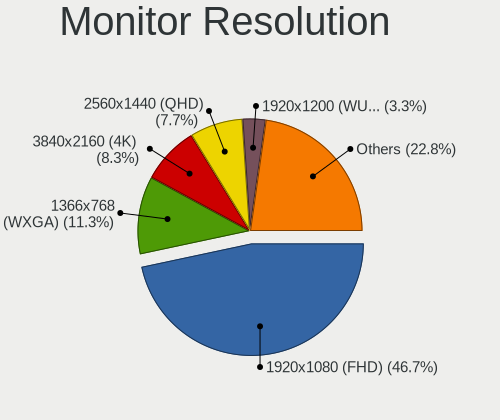

| Resolution         | Computers | Percent |
|--------------------|-----------|---------|
| 1920x1080 (FHD)    | 1553      | 46.47%  |
| 1366x768 (WXGA)    | 376       | 11.25%  |
| 3840x2160 (4K)     | 277       | 8.29%   |
| 2560x1440 (QHD)    | 256       | 7.66%   |
| 1920x1200 (WUXGA)  | 111       | 3.32%   |
| 2560x1600          | 99        | 2.96%   |
| 1600x900 (HD+)     | 86        | 2.57%   |
| 3440x1440          | 70        | 2.09%   |
| 1680x1050 (WSXGA+) | 52        | 1.56%   |
| 2880x1800          | 50        | 1.5%    |
| 2560x1080          | 49        | 1.47%   |
| 1440x900 (WXGA+)   | 49        | 1.47%   |
| 1280x1024 (SXGA)   | 47        | 1.41%   |
| 1280x800 (WXGA)    | 46        | 1.38%   |
| 3840x2400          | 20        | 0.6%    |
| 2160x1440          | 18        | 0.54%   |
| 1360x768           | 17        | 0.51%   |
| 2256x1504          | 16        | 0.48%   |
| 2736x1824          | 13        | 0.39%   |
| 3840x1080          | 12        | 0.36%   |
| 2288x1287          | 10        | 0.3%    |
| 2880x1620          | 9         | 0.27%   |
| 1920x1280          | 9         | 0.27%   |
| 3200x2000          | 7         | 0.21%   |
| 2520x1680          | 7         | 0.21%   |
| 2240x1400          | 7         | 0.21%   |
| 3840x1600          | 6         | 0.18%   |
| 1920x540           | 6         | 0.18%   |
| 3200x1800 (QHD+)   | 5         | 0.15%   |
| 2160x1350          | 5         | 0.15%   |
| 1024x768 (XGA)     | 5         | 0.15%   |
| 3456x2160          | 4         | 0.12%   |
| 3072x1920          | 4         | 0.12%   |
| 3000x2000          | 4         | 0.12%   |
| 2048x1152          | 4         | 0.12%   |
| Unknown            | 4         | 0.12%   |
| 2880x1920          | 3         | 0.09%   |
| 2400x1600          | 3         | 0.09%   |
| 1600x1200          | 3         | 0.09%   |
| 800x1280           | 2         | 0.06%   |

Monitor Diagonal
----------------

Diagonal size in inches

| Inches  | Computers | Percent |
|---------|-----------|---------|
| 15      | 833       | 23.52%  |
| 13      | 401       | 11.32%  |
| 14      | 390       | 11.01%  |
| 27      | 355       | 10.02%  |
| 24      | 256       | 7.23%   |
| 23      | 186       | 5.25%   |
| 21      | 169       | 4.77%   |
| 31      | 112       | 3.16%   |
| 34      | 108       | 3.05%   |
| 17      | 96        | 2.71%   |
| 16      | 96        | 2.71%   |
| 12      | 65        | 1.84%   |
| 19      | 52        | 1.47%   |
| 20      | 48        | 1.36%   |
| 18      | 40        | 1.13%   |
| 22      | 38        | 1.07%   |
| Unknown | 28        | 0.79%   |
| 84      | 27        | 0.76%   |
| 11      | 24        | 0.68%   |
| 72      | 21        | 0.59%   |
| 32      | 20        | 0.56%   |
| 54      | 18        | 0.51%   |
| 28      | 17        | 0.48%   |
| 40      | 14        | 0.4%    |
| 26      | 13        | 0.37%   |
| 48      | 12        | 0.34%   |
| 25      | 11        | 0.31%   |
| 142     | 10        | 0.28%   |
| 10      | 10        | 0.28%   |
| 52      | 7         | 0.2%    |
| 49      | 6         | 0.17%   |
| 37      | 6         | 0.17%   |
| 35      | 6         | 0.17%   |
| 65      | 5         | 0.14%   |
| 42      | 5         | 0.14%   |
| 33      | 4         | 0.11%   |
| 29      | 4         | 0.11%   |
| 47      | 3         | 0.08%   |
| 38      | 3         | 0.08%   |
| 7       | 3         | 0.08%   |

Monitor Width
-------------

Physical width

| Width in mm    | Computers | Percent |
|----------------|-----------|---------|
| 301-350        | 1458      | 42.08%  |
| 501-600        | 715       | 20.63%  |
| 201-300        | 340       | 9.81%   |
| 401-500        | 309       | 8.92%   |
| 601-700        | 179       | 5.17%   |
| 351-400        | 141       | 4.07%   |
| 701-800        | 133       | 3.84%   |
| 1001-1500      | 58        | 1.67%   |
| 1501-2000      | 51        | 1.47%   |
| 801-900        | 32        | 0.92%   |
| Unknown        | 28        | 0.81%   |
| More than 2000 | 10        | 0.29%   |
| 901-1000       | 8         | 0.23%   |
| 1-100          | 2         | 0.06%   |
| 101-200        | 1         | 0.03%   |

Aspect Ratio
------------

Proportional relationship between the width and the height

| Ratio   | Computers | Percent |
|---------|-----------|---------|
| 16/9    | 2333      | 74.73%  |
| 16/10   | 478       | 15.31%  |
| 21/9    | 125       | 4%      |
| 3/2     | 78        | 2.5%    |
| 5/4     | 41        | 1.31%   |
| 4/3     | 15        | 0.48%   |
| 32/9    | 15        | 0.48%   |
| 1.00    | 11        | 0.35%   |
| Unknown | 10        | 0.32%   |
| 6/5     | 6         | 0.19%   |
| 0.56    | 4         | 0.13%   |
| 3.40    | 2         | 0.06%   |
| 0.67    | 2         | 0.06%   |
| 2.12    | 1         | 0.03%   |
| 0.62    | 1         | 0.03%   |

Monitor Area
------------

Area in inch

| Area in inch | Computers | Percent |
|----------------|-----------|---------|
| 101-110        | 841       | 23.93%  |
| 81-90          | 616       | 17.52%  |
| 201-250        | 495       | 14.08%  |
| 301-350        | 365       | 10.38%  |
| 351-500        | 262       | 7.45%   |
| 71-80          | 171       | 4.86%   |
| 151-200        | 153       | 4.35%   |
| 251-300        | 108       | 3.07%   |
| More than 1000 | 105       | 2.99%   |
| 111-120        | 83        | 2.36%   |
| 121-130        | 81        | 2.3%    |
| 61-70          | 52        | 1.48%   |
| 501-1000       | 49        | 1.39%   |
| 141-150        | 46        | 1.31%   |
| 51-60          | 28        | 0.8%    |
| Unknown        | 28        | 0.8%    |
| 91-100         | 17        | 0.48%   |
| 41-50          | 8         | 0.23%   |
| 131-140        | 4         | 0.11%   |
| 1-40           | 3         | 0.09%   |

Pixel Density
-------------

Pixels per inch

| Density       | Computers | Percent |
|---------------|-----------|---------|
| 121-160       | 1093      | 32.18%  |
| 51-100        | 935       | 27.52%  |
| 101-120       | 722       | 21.25%  |
| 161-240       | 410       | 12.07%  |
| More than 240 | 130       | 3.83%   |
| 1-50          | 79        | 2.33%   |
| Unknown       | 28        | 0.82%   |

Multiple Monitors
-----------------

Total monitors connected

| Total | Computers | Percent |
|-------|-----------|---------|
| 1     | 2302      | 74.72%  |
| 2     | 590       | 19.15%  |
| 0     | 112       | 3.64%   |
| 3     | 70        | 2.27%   |
| 4     | 6         | 0.19%   |
| 5     | 1         | 0.03%   |

Network
-------

Net Controller Vendor
---------------------

Controller vendors

| Vendor                          | Computers | Percent |
|---------------------------------|-----------|---------|
| Intel                           | 1645      | 36.55%  |
| Realtek Semiconductor           | 1580      | 35.1%   |
| Qualcomm Atheros                | 279       | 6.2%    |
| Broadcom                        | 251       | 5.58%   |
| MediaTek                        | 200       | 4.44%   |
| TP-Link                         | 55        | 1.22%   |
| ASIX Electronics                | 43        | 0.96%   |
| Broadcom Limited                | 41        | 0.91%   |
| Ralink Technology               | 32        | 0.71%   |
| Ralink                          | 29        | 0.64%   |
| Samsung Electronics             | 28        | 0.62%   |
| Qualcomm                        | 26        | 0.58%   |
| Microsoft                       | 23        | 0.51%   |
| Lenovo                          | 23        | 0.51%   |
| Marvell Technology Group        | 21        | 0.47%   |
| Xiaomi                          | 19        | 0.42%   |
| DisplayLink                     | 18        | 0.4%    |
| Aquantia                        | 17        | 0.38%   |
| Google                          | 15        | 0.33%   |
| Nvidia                          | 12        | 0.27%   |
| Sierra Wireless                 | 11        | 0.24%   |
| NetGear                         | 9         | 0.2%    |
| Dell                            | 9         | 0.2%    |
| Qualcomm Atheros Communications | 8         | 0.18%   |
| OPPO Electronics                | 8         | 0.18%   |
| Hewlett-Packard                 | 8         | 0.18%   |
| D-Link                          | 8         | 0.18%   |
| ASUSTek Computer                | 7         | 0.16%   |
| Mellanox Technologies           | 6         | 0.13%   |
| Huawei Technologies             | 5         | 0.11%   |
| Motorola PCS                    | 3         | 0.07%   |
| JMicron Technology              | 3         | 0.07%   |
| ICS Advent                      | 3         | 0.07%   |
| D-Link System                   | 3         | 0.07%   |
| Apple                           | 3         | 0.07%   |
| ZyDAS                           | 2         | 0.04%   |
| Wilocity                        | 2         | 0.04%   |
| VIA Technologies                | 2         | 0.04%   |
| U-Blox                          | 2         | 0.04%   |
| STMicroelectronics              | 2         | 0.04%   |

Net Controller Model
--------------------

Controller models

| Model                                                                  | Computers | Percent |
|------------------------------------------------------------------------|-----------|---------|
| Realtek RTL8111/8168/8211/8411 PCI Express Gigabit Ethernet Controller | 1007      | 18.88%  |
| Intel Wi-Fi 6 AX200                                                    | 195       | 3.66%   |
| Intel Wi-Fi 6 AX201                                                    | 153       | 2.87%   |
| Realtek RTL8153 Gigabit Ethernet Adapter                               | 135       | 2.53%   |
| Realtek RTL8125 2.5GbE Controller                                      | 129       | 2.42%   |
| Intel Alder Lake-P PCH CNVi WiFi                                       | 123       | 2.31%   |
| Intel Wireless 8265 / 8275                                             | 113       | 2.12%   |
| Realtek RTL810xE PCI Express Fast Ethernet controller                  | 98        | 1.84%   |
| Realtek RTL8822CE 802.11ac PCIe Wireless Network Adapter               | 87        | 1.63%   |
| MediaTek MT7922 802.11ax PCI Express Wireless Network Adapter          | 83        | 1.56%   |
| Intel Wi-Fi 6E(802.11ax) AX210/AX1675* 2x2 [Typhoon Peak]              | 83        | 1.56%   |
| Intel 82579LM Gigabit Network Connection (Lewisville)                  | 81        | 1.52%   |
| MediaTek MT7921 802.11ax PCI Express Wireless Network Adapter          | 76        | 1.42%   |
| Intel Ethernet Controller I225-V                                       | 76        | 1.42%   |
| Realtek RTL8821CE 802.11ac PCIe Wireless Network Adapter               | 72        | 1.35%   |
| Intel I211 Gigabit Network Connection                                  | 69        | 1.29%   |
| Qualcomm Atheros QCA9377 802.11ac Wireless Network Adapter             | 61        | 1.14%   |
| Intel Wireless 7265                                                    | 59        | 1.11%   |
| Qualcomm Atheros QCA6174 802.11ac Wireless Network Adapter             | 53        | 0.99%   |
| Intel Raptor Lake PCH CNVi WiFi                                        | 49        | 0.92%   |
| Intel Comet Lake PCH CNVi WiFi                                         | 49        | 0.92%   |
| Intel Comet Lake PCH-LP CNVi WiFi                                      | 48        | 0.9%    |
| Intel Wireless 8260                                                    | 46        | 0.86%   |
| Intel Cannon Lake PCH CNVi WiFi                                        | 46        | 0.86%   |
| Realtek RTL8852BE PCIe 802.11ax Wireless Network Controller            | 45        | 0.84%   |
| Intel Wireless 7260                                                    | 44        | 0.82%   |
| Intel Dual Band Wireless-AC 3168NGW [Stone Peak]                       | 43        | 0.81%   |
| Realtek RTL8852AE 802.11ax PCIe Wireless Network Adapter               | 40        | 0.75%   |
| ASIX AX88179 Gigabit Ethernet                                          | 40        | 0.75%   |
| Intel Cannon Point-LP CNVi [Wireless-AC]                               | 39        | 0.73%   |
| Intel Ethernet Connection I217-LM                                      | 38        | 0.71%   |
| Intel Ethernet Connection (4) I219-LM                                  | 37        | 0.69%   |
| Intel Wireless 3165                                                    | 34        | 0.64%   |
| Qualcomm Atheros QCA9565 / AR9565 Wireless Network Adapter             | 33        | 0.62%   |
| Intel Ethernet Connection (2) I219-V                                   | 32        | 0.6%    |
| Broadcom BCM43142 802.11b/g/n                                          | 32        | 0.6%    |
| Intel Ethernet Connection (4) I219-V                                   | 30        | 0.56%   |
| Broadcom BCM4331 802.11a/b/g/n                                         | 30        | 0.56%   |
| Intel Centrino Advanced-N 6205 [Taylor Peak]                           | 28        | 0.52%   |
| Broadcom NetXtreme BCM57765 Gigabit Ethernet PCIe                      | 28        | 0.52%   |

Wireless Vendor
---------------

Wireless vendors

| Vendor                                | Computers | Percent |
|---------------------------------------|-----------|---------|
| Intel                                 | 1374      | 51.27%  |
| Realtek Semiconductor                 | 416       | 15.52%  |
| Qualcomm Atheros                      | 231       | 8.62%   |
| Broadcom                              | 201       | 7.5%    |
| MediaTek                              | 197       | 7.35%   |
| TP-Link                               | 52        | 1.94%   |
| Broadcom Limited                      | 33        | 1.23%   |
| Ralink Technology                     | 32        | 1.19%   |
| Ralink                                | 29        | 1.08%   |
| Qualcomm                              | 19        | 0.71%   |
| Microsoft                             | 19        | 0.71%   |
| Sierra Wireless                       | 11        | 0.41%   |
| NetGear                               | 9         | 0.34%   |
| Qualcomm Atheros Communications       | 8         | 0.3%    |
| Marvell Technology Group              | 7         | 0.26%   |
| ASUSTek Computer                      | 7         | 0.26%   |
| Dell                                  | 6         | 0.22%   |
| D-Link                                | 5         | 0.19%   |
| ZyDAS                                 | 2         | 0.07%   |
| Wilocity                              | 2         | 0.07%   |
| Edimax Technology                     | 2         | 0.07%   |
| D-Link System                         | 2         | 0.07%   |
| Belkin Components                     | 2         | 0.07%   |
| AVM                                   | 2         | 0.07%   |
| 802.11g Adapter [Linksys WUSB54GC v3] | 2         | 0.07%   |
| Wacom                                 | 1         | 0.04%   |
| Sitecom Europe                        | 1         | 0.04%   |
| Quectel Wireless Solutions            | 1         | 0.04%   |
| Qualcomm Technologies                 | 1         | 0.04%   |
| Mercucys                              | 1         | 0.04%   |
| Linksys                               | 1         | 0.04%   |
| IMC Networks                          | 1         | 0.04%   |
| Hewlett-Packard                       | 1         | 0.04%   |
| FIBOCOM                               | 1         | 0.04%   |
| Unknown                               | 1         | 0.04%   |

Wireless Model
--------------

Wireless models

| Model                                                                | Computers | Percent |
|----------------------------------------------------------------------|-----------|---------|
| Intel Wi-Fi 6 AX200                                                  | 195       | 7.24%   |
| Intel Wi-Fi 6 AX201                                                  | 153       | 5.68%   |
| Intel Alder Lake-P PCH CNVi WiFi                                     | 123       | 4.57%   |
| Intel Wireless 8265 / 8275                                           | 113       | 4.2%    |
| Realtek RTL8822CE 802.11ac PCIe Wireless Network Adapter             | 87        | 3.23%   |
| MediaTek MT7922 802.11ax PCI Express Wireless Network Adapter        | 83        | 3.08%   |
| Intel Wi-Fi 6E(802.11ax) AX210/AX1675* 2x2 [Typhoon Peak]            | 83        | 3.08%   |
| MediaTek MT7921 802.11ax PCI Express Wireless Network Adapter        | 76        | 2.82%   |
| Realtek RTL8821CE 802.11ac PCIe Wireless Network Adapter             | 72        | 2.67%   |
| Qualcomm Atheros QCA9377 802.11ac Wireless Network Adapter           | 61        | 2.27%   |
| Intel Wireless 7265                                                  | 59        | 2.19%   |
| Qualcomm Atheros QCA6174 802.11ac Wireless Network Adapter           | 53        | 1.97%   |
| Intel Raptor Lake PCH CNVi WiFi                                      | 49        | 1.82%   |
| Intel Comet Lake PCH CNVi WiFi                                       | 49        | 1.82%   |
| Intel Comet Lake PCH-LP CNVi WiFi                                    | 48        | 1.78%   |
| Intel Wireless 8260                                                  | 46        | 1.71%   |
| Intel Cannon Lake PCH CNVi WiFi                                      | 46        | 1.71%   |
| Realtek RTL8852BE PCIe 802.11ax Wireless Network Controller          | 45        | 1.67%   |
| Intel Wireless 7260                                                  | 44        | 1.63%   |
| Intel Dual Band Wireless-AC 3168NGW [Stone Peak]                     | 43        | 1.6%    |
| Realtek RTL8852AE 802.11ax PCIe Wireless Network Adapter             | 40        | 1.49%   |
| Intel Cannon Point-LP CNVi [Wireless-AC]                             | 39        | 1.45%   |
| Intel Wireless 3165                                                  | 34        | 1.26%   |
| Qualcomm Atheros QCA9565 / AR9565 Wireless Network Adapter           | 33        | 1.23%   |
| Broadcom BCM43142 802.11b/g/n                                        | 32        | 1.19%   |
| Broadcom BCM4331 802.11a/b/g/n                                       | 30        | 1.11%   |
| Intel Centrino Advanced-N 6205 [Taylor Peak]                         | 28        | 1.04%   |
| MediaTek MT7921K (RZ608) Wi-Fi 6E 80MHz                              | 27        | 1%      |
| Intel Wi-Fi 5(802.11ac) Wireless-AC 9x6x [Thunder Peak]              | 26        | 0.97%   |
| Intel Tiger Lake PCH CNVi WiFi                                       | 25        | 0.93%   |
| Intel Ice Lake-LP PCH CNVi WiFi                                      | 25        | 0.93%   |
| Intel Alder Lake-S PCH CNVi WiFi                                     | 25        | 0.93%   |
| Qualcomm Atheros AR9285 Wireless Network Adapter (PCI-Express)       | 22        | 0.82%   |
| Broadcom BCM43228 802.11a/b/g/n                                      | 22        | 0.82%   |
| Realtek 802.11ac NIC                                                 | 21        | 0.78%   |
| Qualcomm Atheros AR9485 Wireless Network Adapter                     | 21        | 0.78%   |
| Broadcom BCM4360 802.11ac Dual Band Wireless Network Adapter         | 21        | 0.78%   |
| Broadcom Limited BCM4360 802.11ac Dual Band Wireless Network Adapter | 18        | 0.67%   |
| Qualcomm QCNFA765 Wireless Network Adapter                           | 15        | 0.56%   |
| Broadcom BCM43602 802.11ac Wireless LAN SoC                          | 15        | 0.56%   |

Ethernet Vendor
---------------

Ethernet vendors

| Vendor                                 | Computers | Percent |
|----------------------------------------|-----------|---------|
| Realtek Semiconductor                  | 1377      | 54.3%   |
| Intel                                  | 735       | 28.98%  |
| Broadcom                               | 98        | 3.86%   |
| Qualcomm Atheros                       | 66        | 2.6%    |
| ASIX Electronics                       | 43        | 1.7%    |
| Samsung Electronics                    | 28        | 1.1%    |
| Lenovo                                 | 22        | 0.87%   |
| Xiaomi                                 | 19        | 0.75%   |
| DisplayLink                            | 18        | 0.71%   |
| Aquantia                               | 17        | 0.67%   |
| Google                                 | 15        | 0.59%   |
| Marvell Technology Group               | 14        | 0.55%   |
| Nvidia                                 | 12        | 0.47%   |
| OPPO Electronics                       | 8         | 0.32%   |
| Broadcom Limited                       | 8         | 0.32%   |
| Qualcomm                               | 7         | 0.28%   |
| Mellanox Technologies                  | 5         | 0.2%    |
| Hewlett-Packard                        | 5         | 0.2%    |
| Microsoft                              | 4         | 0.16%   |
| Huawei Technologies                    | 4         | 0.16%   |
| TP-Link                                | 3         | 0.12%   |
| JMicron Technology                     | 3         | 0.12%   |
| ICS Advent                             | 3         | 0.12%   |
| D-Link                                 | 3         | 0.12%   |
| Apple                                  | 3         | 0.12%   |
| VIA Technologies                       | 2         | 0.08%   |
| MediaTek                               | 2         | 0.08%   |
| 3Com                                   | 2         | 0.08%   |
| Tehuti Networks                        | 1         | 0.04%   |
| Spreadtrum Communications              | 1         | 0.04%   |
| Sony Ericsson Mobile Communications AB | 1         | 0.04%   |
| OnePlus Technology (Shenzhen)          | 1         | 0.04%   |
| Motorola PCS                           | 1         | 0.04%   |
| IBM                                    | 1         | 0.04%   |
| HMD Global                             | 1         | 0.04%   |
| Foxconn / Hon Hai                      | 1         | 0.04%   |
| Dell                                   | 1         | 0.04%   |
| D-Link System                          | 1         | 0.04%   |

Ethernet Model
--------------

Ethernet models

| Model                                                                  | Computers | Percent |
|------------------------------------------------------------------------|-----------|---------|
| Realtek RTL8111/8168/8211/8411 PCI Express Gigabit Ethernet Controller | 1007      | 38.61%  |
| Realtek RTL8153 Gigabit Ethernet Adapter                               | 135       | 5.18%   |
| Realtek RTL8125 2.5GbE Controller                                      | 129       | 4.95%   |
| Realtek RTL810xE PCI Express Fast Ethernet controller                  | 98        | 3.76%   |
| Intel 82579LM Gigabit Network Connection (Lewisville)                  | 81        | 3.11%   |
| Intel Ethernet Controller I225-V                                       | 76        | 2.91%   |
| Intel I211 Gigabit Network Connection                                  | 69        | 2.65%   |
| ASIX AX88179 Gigabit Ethernet                                          | 40        | 1.53%   |
| Intel Ethernet Connection I217-LM                                      | 38        | 1.46%   |
| Intel Ethernet Connection (4) I219-LM                                  | 37        | 1.42%   |
| Intel Ethernet Connection (2) I219-V                                   | 32        | 1.23%   |
| Intel Ethernet Connection (4) I219-V                                   | 30        | 1.15%   |
| Broadcom NetXtreme BCM57765 Gigabit Ethernet PCIe                      | 28        | 1.07%   |
| Intel Ethernet Connection I219-LM                                      | 26        | 1%      |
| Intel Ethernet Connection (7) I219-V                                   | 24        | 0.92%   |
| Samsung Galaxy series, misc. (tethering mode)                          | 23        | 0.88%   |
| Intel Ethernet Connection (2) I219-LM                                  | 23        | 0.88%   |
| Intel Ethernet Connection (3) I218-LM                                  | 21        | 0.81%   |
| Intel Ethernet Connection (16) I219-V                                  | 19        | 0.73%   |
| Broadcom NetXtreme BCM57766 Gigabit Ethernet PCIe                      | 17        | 0.65%   |
| Realtek Killer E2600 GbE Controller                                    | 16        | 0.61%   |
| Xiaomi Mi/Redmi series (RNDIS)                                         | 15        | 0.58%   |
| Intel Ethernet Connection (7) I219-LM                                  | 15        | 0.58%   |
| Intel Ethernet Connection (6) I219-V                                   | 15        | 0.58%   |
| Intel Ethernet Connection I217-V                                       | 13        | 0.5%    |
| Intel 82574L Gigabit Network Connection                                | 13        | 0.5%    |
| Qualcomm Atheros Killer E220x Gigabit Ethernet Controller              | 12        | 0.46%   |
| Intel Ethernet Connection (2) I218-V                                   | 12        | 0.46%   |
| Intel Ethernet Connection (16) I219-LM                                 | 12        | 0.46%   |
| Realtek RTL8152 Fast Ethernet Adapter                                  | 11        | 0.42%   |
| Qualcomm Atheros AR8151 v2.0 Gigabit Ethernet                          | 11        | 0.42%   |
| Intel I210 Gigabit Network Connection                                  | 11        | 0.42%   |
| Intel Ethernet Connection I218-LM                                      | 11        | 0.42%   |
| Intel Ethernet Connection (14) I219-V                                  | 11        | 0.42%   |
| Intel 82577LM Gigabit Network Connection                               | 11        | 0.42%   |
| Qualcomm Atheros Killer E2500 Gigabit Ethernet Controller              | 10        | 0.38%   |
| Nvidia MCP79 Ethernet                                                  | 10        | 0.38%   |
| Intel Ethernet Connection (6) I219-LM                                  | 10        | 0.38%   |
| Intel 82579V Gigabit Network Connection                                | 10        | 0.38%   |
| Google Pixel 7 Pro                                                     | 10        | 0.38%   |

Net Controller Kind
-------------------

Ethernet, WiFi or modem

| Kind     | Computers | Percent |
|----------|-----------|---------|
| WiFi     | 2557      | 51.77%  |
| Ethernet | 2350      | 47.58%  |
| Modem    | 21        | 0.43%   |
| Unknown  | 11        | 0.22%   |

Used Controller
---------------

Currently used network controller

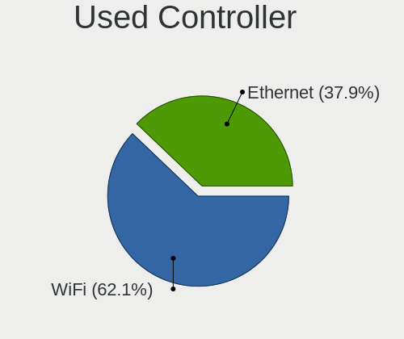

| Kind     | Computers | Percent |
|----------|-----------|---------|
| WiFi     | 2004      | 63.1%   |
| Ethernet | 1172      | 36.9%   |

NICs
----

Total network controllers on board

| Total | Computers | Percent |
|-------|-----------|---------|
| 2     | 1584      | 52.07%  |
| 1     | 1308      | 43%     |
| 3     | 72        | 2.37%   |
| 0     | 57        | 1.87%   |
| 4     | 17        | 0.56%   |
| 6     | 2         | 0.07%   |
| 5     | 2         | 0.07%   |

IPv6
----

IPv6 vs IPv4

| Used | Computers | Percent |
|------|-----------|---------|
| No   | 2112      | 68.66%  |
| Yes  | 964       | 31.34%  |

Bluetooth
---------

Bluetooth Vendor
----------------

Controller vendors

| Vendor                          | Computers | Percent |
|---------------------------------|-----------|---------|
| Intel                           | 1223      | 53.36%  |
| Realtek Semiconductor           | 253       | 11.04%  |
| Qualcomm Atheros Communications | 115       | 5.02%   |
| Foxconn / Hon Hai               | 115       | 5.02%   |
| IMC Networks                    | 102       | 4.45%   |
| Apple                           | 95        | 4.14%   |
| Broadcom                        | 78        | 3.4%    |
| Cambridge Silicon Radio         | 73        | 3.18%   |
| Lite-On Technology              | 47        | 2.05%   |
| MediaTek                        | 46        | 2.01%   |
| ASUSTek Computer                | 28        | 1.22%   |
| Realtek                         | 23        | 1%      |
| USI                             | 12        | 0.52%   |
| TP-Link                         | 12        | 0.52%   |
| Dell                            | 12        | 0.52%   |
| Toshiba                         | 8         | 0.35%   |
| Hewlett-Packard                 | 8         | 0.35%   |
| Marvell Semiconductor           | 7         | 0.31%   |
| Ralink                          | 6         | 0.26%   |
| Opticis                         | 6         | 0.26%   |
| Foxconn International           | 5         | 0.22%   |
| Unknown                         | 3         | 0.13%   |
| Dynex                           | 2         | 0.09%   |
| Askey Computer                  | 2         | 0.09%   |
| Taiyo Yuden                     | 1         | 0.04%   |
| Syntek                          | 1         | 0.04%   |
| Smart Modular Technologies      | 1         | 0.04%   |
| Qcom                            | 1         | 0.04%   |
| Mobile Action Technology        | 1         | 0.04%   |
| Fujitsu                         | 1         | 0.04%   |
| Edimax Technology               | 1         | 0.04%   |
| D-Link                          | 1         | 0.04%   |
| AVM                             | 1         | 0.04%   |
| Alps Electric                   | 1         | 0.04%   |
| Actions                         | 1         | 0.04%   |

Bluetooth Model
---------------

Controller models

| Model                                               | Computers | Percent |
|-----------------------------------------------------|-----------|---------|
| Intel AX201 Bluetooth                               | 304       | 13.25%  |
| Realtek Bluetooth Radio                             | 189       | 8.24%   |
| Intel AX200 Bluetooth                               | 188       | 8.2%    |
| Intel AX211 Bluetooth                               | 145       | 6.32%   |
| Intel Bluetooth wireless interface                  | 143       | 6.23%   |
| Intel Bluetooth 9460/9560 Jefferson Peak (JfP)      | 141       | 6.15%   |
| Intel Bluetooth Device                              | 133       | 5.8%    |
| Intel AX210 Bluetooth                               | 80        | 3.49%   |
| Cambridge Silicon Radio Bluetooth Dongle (HCI mode) | 73        | 3.18%   |
| Qualcomm Atheros  Bluetooth Device                  | 65        | 2.83%   |
| IMC Networks Wireless_Device                        | 55        | 2.4%    |
| Foxconn / Hon Hai Wireless_Device                   | 51        | 2.22%   |
| MediaTek Wireless_Device                            | 46        | 2.01%   |
| Apple Bluetooth Host Controller                     | 46        | 2.01%   |
| Intel Wireless-AC 3168 Bluetooth                    | 41        | 1.79%   |
| IMC Networks Bluetooth Radio                        | 31        | 1.35%   |
| Apple Bluetooth USB Host Controller                 | 31        | 1.35%   |
| Realtek 802.11ac WLAN Adapter                       | 27        | 1.18%   |
| Realtek  Bluetooth 4.2 Adapter                      | 26        | 1.13%   |
| Foxconn / Hon Hai MediaTek Bluetooth Adapter        | 26        | 1.13%   |
| Intel Wireless-AC 9260 Bluetooth Adapter            | 25        | 1.09%   |
| Realtek Bluetooth Radio                             | 23        | 1%      |
| Qualcomm Atheros QCA61x4 Bluetooth 4.0              | 20        | 0.87%   |
| Intel Centrino Bluetooth Wireless Transceiver       | 19        | 0.83%   |
| Foxconn / Hon Hai Bluetooth Device                  | 15        | 0.65%   |
| IMC Networks Bluetooth Device                       | 14        | 0.61%   |
| Apple Built-in Bluetooth 2.0+EDR HCI                | 14        | 0.61%   |
| USI Bluetooth Device                                | 12        | 0.52%   |
| TP-Link UB500 Adapter                               | 12        | 0.52%   |
| Qualcomm Atheros AR3011 Bluetooth                   | 12        | 0.52%   |
| Lite-On Wireless_Device                             | 12        | 0.52%   |
| Lite-On Qualcomm Atheros QCA9377 Bluetooth          | 12        | 0.52%   |
| Qualcomm Atheros AR3012 Bluetooth 4.0               | 10        | 0.44%   |
| ASUS ASUS USB-BT500                                 | 10        | 0.44%   |
| Broadcom BCM20702A0 Bluetooth 4.0                   | 9         | 0.39%   |
| Broadcom BCM2045B (BDC-2.1)                         | 9         | 0.39%   |
| Lite-On Bluetooth Device                            | 8         | 0.35%   |
| Broadcom BCM20702 Bluetooth 4.0 [ThinkPad]          | 8         | 0.35%   |
| Broadcom HP Portable Bumble Bee                     | 7         | 0.31%   |
| Broadcom BCM43142 Bluetooth 4.0                     | 7         | 0.31%   |

Sound
-----

Sound Vendor
------------

Sound card vendors

| Vendor                                       | Computers | Percent |
|----------------------------------------------|-----------|---------|
| Intel                                        | 2003      | 45.2%   |
| AMD                                          | 1053      | 23.76%  |
| Nvidia                                       | 710       | 16.02%  |
| C-Media Electronics                          | 89        | 2.01%   |
| Logitech                                     | 56        | 1.26%   |
| Lenovo                                       | 34        | 0.77%   |
| ASUSTek Computer                             | 30        | 0.68%   |
| JMTek                                        | 27        | 0.61%   |
| Kingston Technology                          | 26        | 0.59%   |
| Realtek Semiconductor                        | 25        | 0.56%   |
| GN Netcom                                    | 21        | 0.47%   |
| SteelSeries ApS                              | 18        | 0.41%   |
| Razer USA                                    | 18        | 0.41%   |
| Micro Star International                     | 18        | 0.41%   |
| Creative Labs                                | 16        | 0.36%   |
| Generalplus Technology                       | 14        | 0.32%   |
| Creative Technology                          | 14        | 0.32%   |
| Focusrite-Novation                           | 13        | 0.29%   |
| Sony                                         | 12        | 0.27%   |
| Hewlett-Packard                              | 12        | 0.27%   |
| Plantronics                                  | 11        | 0.25%   |
| Apple                                        | 10        | 0.23%   |
| Texas Instruments                            | 9         | 0.2%    |
| Dell                                         | 9         | 0.2%    |
| Corsair                                      | 8         | 0.18%   |
| RODE Microphones                             | 7         | 0.16%   |
| Microsoft                                    | 6         | 0.14%   |
| Audio-Technica                               | 6         | 0.14%   |
| Zoran Co. Personal Media Division (Nogatech) | 5         | 0.11%   |
| Yamaha                                       | 5         | 0.11%   |
| Samson Technologies                          | 5         | 0.11%   |
| FIFINE Microphones                           | 5         | 0.11%   |
| KTMicro                                      | 4         | 0.09%   |
| JBL                                          | 4         | 0.09%   |
| DSEA A/S                                     | 4         | 0.09%   |
| BR25                                         | 4         | 0.09%   |
| BEHRINGER International                      | 4         | 0.09%   |
| XMOS                                         | 3         | 0.07%   |
| Schiit Audio                                 | 3         | 0.07%   |
| SAVITECH                                     | 3         | 0.07%   |

Sound Model
-----------

Sound card models

| Model                                                                      | Computers | Percent |
|----------------------------------------------------------------------------|-----------|---------|
| AMD Family 17h/19h HD Audio Controller                                     | 543       | 10.02%  |
| AMD Renoir Radeon High Definition Audio Controller                         | 303       | 5.59%   |
| Intel Sunrise Point-LP HD Audio                                            | 244       | 4.5%    |
| Intel Tiger Lake-LP Smart Sound Technology Audio Controller                | 189       | 3.49%   |
| AMD Starship/Matisse HD Audio Controller                                   | 173       | 3.19%   |
| Intel 7 Series/C216 Chipset Family High Definition Audio Controller        | 160       | 2.95%   |
| Intel Alder Lake PCH-P High Definition Audio Controller                    | 153       | 2.82%   |
| AMD Rembrandt Radeon High Definition Audio Controller                      | 131       | 2.42%   |
| AMD Navi 21/23 HDMI/DP Audio Controller                                    | 128       | 2.36%   |
| Intel Cannon Lake PCH cAVS                                                 | 110       | 2.03%   |
| Intel 8 Series/C220 Series Chipset High Definition Audio Controller        | 104       | 1.92%   |
| Intel 6 Series/C200 Series Chipset Family High Definition Audio Controller | 97        | 1.79%   |
| AMD Raven/Raven2/Fenghuang HDMI/DP Audio Controller                        | 85        | 1.57%   |
| Nvidia Audio device                                                        | 82        | 1.51%   |
| Intel 100 Series/C230 Series Chipset Family HD Audio Controller            | 75        | 1.38%   |
| Intel Cannon Point-LP High Definition Audio Controller                     | 68        | 1.25%   |
| AMD Ellesmere HDMI Audio [Radeon RX 470/480 / 570/580/590]                 | 66        | 1.22%   |
| Intel Xeon E3-1200 v3/4th Gen Core Processor HD Audio Controller           | 65        | 1.2%    |
| Intel Comet Lake PCH cAVS                                                  | 63        | 1.16%   |
| Nvidia TU107 GeForce GTX 1650 High Definition Audio Controller             | 62        | 1.14%   |
| Nvidia GA106 High Definition Audio Controller                              | 62        | 1.14%   |
| Nvidia GA104 High Definition Audio Controller                              | 62        | 1.14%   |
| Nvidia GP107GL High Definition Audio Controller                            | 60        | 1.11%   |
| Intel 200 Series PCH HD Audio                                              | 59        | 1.09%   |
| Intel Comet Lake PCH-LP cAVS                                               | 57        | 1.05%   |
| Intel Raptor Lake-P/U/H cAVS                                               | 56        | 1.03%   |
| Intel Broadwell-U Audio Controller                                         | 55        | 1.01%   |
| Intel Wildcat Point-LP High Definition Audio Controller                    | 54        | 1%      |
| Intel Haswell-ULT HD Audio Controller                                      | 54        | 1%      |
| Intel 8 Series HD Audio Controller                                         | 54        | 1%      |
| AMD Family 17h (Models 00h-0fh) HD Audio Controller                        | 54        | 1%      |
| AMD SBx00 Azalia (Intel HDA)                                               | 49        | 0.9%    |
| Intel Alder Lake-S HD Audio Controller                                     | 47        | 0.87%   |
| Intel 5 Series/3400 Series Chipset High Definition Audio                   | 47        | 0.87%   |
| Intel Tiger Lake-H HD Audio Controller                                     | 44        | 0.81%   |
| AMD FCH Azalia Controller                                                  | 43        | 0.79%   |
| Intel Celeron/Pentium Silver Processor High Definition Audio               | 40        | 0.74%   |
| Intel Ice Lake-LP Smart Sound Technology Audio Controller                  | 39        | 0.72%   |
| Nvidia TU116 High Definition Audio Controller                              | 37        | 0.68%   |
| Nvidia GP104 High Definition Audio Controller                              | 36        | 0.66%   |

Memory
------

Memory Vendor
-------------

Memory module vendors

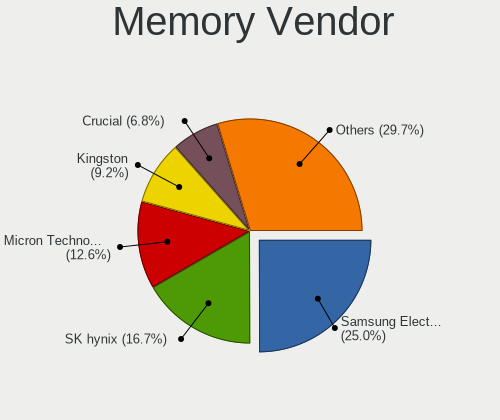

| Vendor                       | Computers | Percent |
|------------------------------|-----------|---------|
| Samsung Electronics          | 345       | 25.02%  |
| SK hynix                     | 228       | 16.53%  |
| Micron Technology            | 173       | 12.55%  |
| Kingston                     | 128       | 9.28%   |
| Crucial                      | 95        | 6.89%   |
| Corsair                      | 86        | 6.24%   |
| Unknown                      | 63        | 4.57%   |
| G.Skill                      | 62        | 4.5%    |
| A-DATA Technology            | 29        | 2.1%    |
| Unknown                      | 29        | 2.1%    |
| Ramaxel Technology           | 22        | 1.6%    |
| Smart                        | 15        | 1.09%   |
| Team                         | 9         | 0.65%   |
| Elpida                       | 9         | 0.65%   |
| Unknown (ABCD)               | 8         | 0.58%   |
| Teikon                       | 6         | 0.44%   |
| Patriot                      | 5         | 0.36%   |
| Nanya Technology             | 5         | 0.36%   |
| Apacer                       | 5         | 0.36%   |
| Transcend                    | 4         | 0.29%   |
| Timetec                      | 4         | 0.29%   |
| V-GeN                        | 3         | 0.22%   |
| Lexar                        | 3         | 0.22%   |
| GOODRAM                      | 3         | 0.22%   |
| 4ea5                         | 3         | 0.22%   |
| Silicon Power                | 2         | 0.15%   |
| Qumo                         | 2         | 0.15%   |
| PNY                          | 2         | 0.15%   |
| ff                           | 2         | 0.15%   |
| CSX                          | 2         | 0.15%   |
| AMD                          | 2         | 0.15%   |
| Unknown (8A02)               | 1         | 0.07%   |
| Unknown (0x5846)             | 1         | 0.07%   |
| Unknown (0x0E9D)             | 1         | 0.07%   |
| Unknown (0x0CDC)             | 1         | 0.07%   |
| Unknown (0x0B5E)             | 1         | 0.07%   |
| Smart Brazil                 | 1         | 0.07%   |
| Sesame                       | 1         | 0.07%   |
| PUSKILL                      | 1         | 0.07%   |
| Patriot Memory (PDP Systems) | 1         | 0.07%   |

Memory Model
------------

Memory module models

| Model                                                            | Computers | Percent |
|------------------------------------------------------------------|-----------|---------|
| Unknown                                                          | 29        | 2.02%   |
| Samsung RAM M471A1K43EB1-CWE 8GB SODIMM DDR4 3200MT/s            | 18        | 1.25%   |
| Samsung RAM M471A1G44AB0-CWE 8GB Row Of Chips DDR4 3200MT/s      | 15        | 1.04%   |
| SK hynix RAM HMAA1GS6CJR6N-XN 8GB SODIMM DDR4 3200MT/s           | 13        | 0.9%    |
| Samsung RAM M471A1G44AB0-CWE 8192MB SODIMM DDR4 3200MT/s         | 13        | 0.9%    |
| Samsung RAM M471A1K43BB1-CRC 8192MB SODIMM DDR4 2667MT/s         | 12        | 0.83%   |
| Samsung RAM M471A1G44BB0-CWE 8GB SODIMM DDR4 3200MT/s            | 12        | 0.83%   |
| SK hynix RAM HMA81GS6AFR8N-UH 8GB SODIMM DDR4 2667MT/s           | 11        | 0.76%   |
| Samsung RAM M471A1K43DB1-CWE 8GB SODIMM DDR4 3200MT/s            | 11        | 0.76%   |
| SK hynix RAM HMAA2GS6CJR8N-XN 16GB SODIMM DDR4 3200MT/s          | 10        | 0.69%   |
| Samsung RAM M471A2G44AM0-CWE 16GB SODIMM DDR4 3200MT/s           | 10        | 0.69%   |
| Samsung RAM M471A5244CB0-CWE 4GB SODIMM DDR4 3200MT/s            | 9         | 0.63%   |
| Samsung RAM M471A1K43CB1-CRC 8GB SODIMM DDR4 2667MT/s            | 9         | 0.63%   |
| Corsair RAM CMK16GX4M2B3200C16 8GB DIMM DDR4 3600MT/s            | 9         | 0.63%   |
| Samsung RAM M471A5244CB0-CTD 4GB SODIMM DDR4 3266MT/s            | 8         | 0.56%   |
| Micron RAM 4ATF1G64HZ-3G2E1 8GB Row Of Chips DDR4 3200MT/s       | 8         | 0.56%   |
| Corsair RAM CMK32GX4M2E3200C16 16GB DIMM DDR4 3534MT/s           | 8         | 0.56%   |
| Samsung RAM M471A1K43DB1-CTD 8GB SODIMM DDR4 2667MT/s            | 7         | 0.49%   |
| Micron RAM 8ATF1G64HZ-3G2R1 8GB SODIMM DDR4 3200MT/s             | 7         | 0.49%   |
| Micron RAM 4ATF1G64HZ-3G2F1 8GB SODIMM DDR4 3200MT/s             | 7         | 0.49%   |
| Micron RAM 4ATF1G64HZ-3G2E1 8GB SODIMM DDR4 3200MT/s             | 7         | 0.49%   |
| Unknown (ABCD) RAM 123456789012345678 2GB SODIMM LPDDR4 2400MT/s | 6         | 0.42%   |
| Smart RAM SH564128FH8N0TNSDR 4GB DIMM DDR3 1600MT/s              | 6         | 0.42%   |
| SK hynix RAM HMT451S6BFR8A-PB 4GB SODIMM DDR3 1600MT/s           | 6         | 0.42%   |
| SK hynix RAM HMA82GS6AFR8N-UH 16GB SODIMM DDR4 2667MT/s          | 6         | 0.42%   |
| SK hynix RAM H9CCNNNCLGALAR-NVD 8GB Row Of Chips LPDDR3 2133MT/s | 6         | 0.42%   |
| Samsung RAM M471A1K43CB1-CTD 8GB SODIMM DDR4 2667MT/s            | 6         | 0.42%   |
| Samsung RAM M425R1GB4BB0-CQKOL 8GB SODIMM 4800MT/s               | 6         | 0.42%   |
| Kingston RAM KHX3200C16D4/8GX 8GB DIMM DDR4 3733MT/s             | 6         | 0.42%   |
| Crucial RAM CT16G48C40S5.M8A1 16GB SODIMM DDR5 4800MT/s          | 6         | 0.42%   |
| SK hynix RAM Module 4GB SODIMM DDR3 1600MT/s                     | 5         | 0.35%   |
| SK hynix RAM HMT351S6BFR8C-H9 4GB SODIMM DDR3 1333MT/s           | 5         | 0.35%   |
| SK hynix RAM HMA82GS6CJR8N-VK 16GB SODIMM DDR4 2667MT/s          | 5         | 0.35%   |
| SK hynix RAM H9JCNNNCP3MLYR-N6E 2GB Row Of Chips LPDDR5 6400MT/s | 5         | 0.35%   |
| Samsung RAM Module 16GB SODIMM DDR4 3200MT/s                     | 5         | 0.35%   |
| Samsung RAM M471B5273DH0-CH9 4GB SODIMM DDR3 1334MT/s            | 5         | 0.35%   |
| Samsung RAM M471B5173QH0-YK0 4GB SODIMM DDR3 1600MT/s            | 5         | 0.35%   |
| Samsung RAM M471B1G73DB0-YK0 8GB SODIMM DDR3 1600MT/s            | 5         | 0.35%   |
| Samsung RAM M471A5244CB0-CWE 4GB Row Of Chips DDR4 3200MT/s      | 5         | 0.35%   |
| Samsung RAM M471A2K43EB1-CWE 16GB SODIMM DDR4 3200MT/s           | 5         | 0.35%   |

Memory Kind
-----------

Memory module kinds

| Kind    | Computers | Percent |
|---------|-----------|---------|
| DDR4    | 648       | 54.45%  |
| DDR3    | 225       | 18.91%  |
| DDR5    | 93        | 7.82%   |
| LPDDR5  | 73        | 6.13%   |
| LPDDR4  | 60        | 5.04%   |
| LPDDR3  | 44        | 3.7%    |
| DDR2    | 15        | 1.26%   |
| Unknown | 15        | 1.26%   |
| SDRAM   | 9         | 0.76%   |
| DRAM    | 6         | 0.5%    |
| DDR     | 2         | 0.17%   |

Memory Form Factor
------------------

Physical design of the memory module

| Name         | Computers | Percent |
|--------------|-----------|---------|
| SODIMM       | 664       | 55.52%  |
| DIMM         | 330       | 27.59%  |
| Row Of Chips | 184       | 15.38%  |
| Unknown      | 10        | 0.84%   |
| Chip         | 6         | 0.5%    |
| RIMM         | 2         | 0.17%   |

Memory Size
-----------

Memory module size

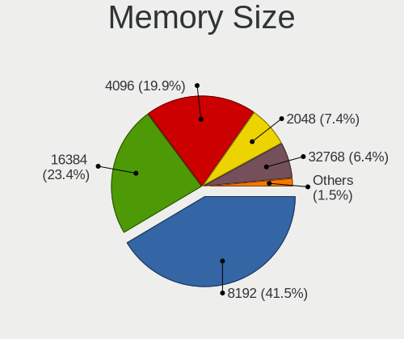

| Size  | Computers | Percent |
|-------|-----------|---------|
| 8192  | 530       | 41.6%   |
| 16384 | 291       | 22.84%  |
| 4096  | 257       | 20.17%  |
| 2048  | 94        | 7.38%   |
| 32768 | 83        | 6.51%   |
| 1024  | 17        | 1.33%   |
| 49152 | 1         | 0.08%   |
| 3072  | 1         | 0.08%   |

Memory Speed
------------

Memory module speed

| Speed   | Computers | Percent |
|---------|-----------|---------|
| 3200    | 324       | 25.59%  |
| 2667    | 157       | 12.4%   |
| 1600    | 152       | 12.01%  |
| 6400    | 73        | 5.77%   |
| 2400    | 73        | 5.77%   |
| 4800    | 61        | 4.82%   |
| 2133    | 56        | 4.42%   |
| 3600    | 44        | 3.48%   |
| 1333    | 41        | 3.24%   |
| 4267    | 32        | 2.53%   |
| 1867    | 28        | 2.21%   |
| 1334    | 20        | 1.58%   |
| 5600    | 15        | 1.18%   |
| 3733    | 13        | 1.03%   |
| 1067    | 13        | 1.03%   |
| 3800    | 10        | 0.79%   |
| 3400    | 10        | 0.79%   |
| 3266    | 10        | 0.79%   |
| 667     | 10        | 0.79%   |
| Unknown | 10        | 0.79%   |
| 4266    | 8         | 0.63%   |
| 3534    | 8         | 0.63%   |
| 800     | 8         | 0.63%   |
| 6000    | 6         | 0.47%   |
| 3000    | 6         | 0.47%   |
| 1800    | 6         | 0.47%   |
| 3866    | 5         | 0.39%   |
| 1866    | 5         | 0.39%   |
| 8400    | 4         | 0.32%   |
| 3666    | 4         | 0.32%   |
| 2666    | 4         | 0.32%   |
| 7500    | 3         | 0.24%   |
| 7467    | 3         | 0.24%   |
| 3066    | 3         | 0.24%   |
| 2933    | 3         | 0.24%   |
| 2733    | 3         | 0.24%   |
| 2048    | 3         | 0.24%   |
| 5800    | 2         | 0.16%   |
| 5500    | 2         | 0.16%   |
| 5200    | 2         | 0.16%   |

Printers & scanners
-------------------

Printer Vendor
--------------

Printer device vendors

| Vendor                        | Computers | Percent |
|-------------------------------|-----------|---------|
| Hewlett-Packard               | 20        | 43.48%  |
| Seiko Epson                   | 7         | 15.22%  |
| Brother Industries            | 6         | 13.04%  |
| Canon                         | 4         | 8.7%    |
| Dymo-CoStar                   | 3         | 6.52%   |
| Samsung Electronics           | 2         | 4.35%   |
| Pantum                        | 2         | 4.35%   |
| STMicroelectronics            | 1         | 2.17%   |
| Samsung Info. Systems America | 1         | 2.17%   |

Printer Model
-------------

Printer device models

| Model                                                                 | Computers | Percent |
|-----------------------------------------------------------------------|-----------|---------|
| HP LaserJet P1102                                                     | 3         | 6.52%   |
| Seiko Epson ME OFFICE 620F Series/Stylus Office BX305F/BX305FW/TX320F | 2         | 4.35%   |
| HP LaserJet 1010                                                      | 2         | 4.35%   |
| Dymo-CoStar DYMO LabelWriter 450 Turbo                                | 2         | 4.35%   |
| STMicroelectronics USB Printing Support                               | 1         | 2.17%   |
| Seiko Epson WF-2860 Series                                            | 1         | 2.17%   |
| Seiko Epson L312 Series                                               | 1         | 2.17%   |
| Seiko Epson L120 Series                                               | 1         | 2.17%   |
| Seiko Epson ET-2710 Series                                            | 1         | 2.17%   |
| Seiko Epson AL-M310DN                                                 | 1         | 2.17%   |
| Samsung Info. Systems America SAMSUNG SRP-270                         | 1         | 2.17%   |
| Samsung ML-216x Series Laser Printer                                  | 1         | 2.17%   |
| Samsung M2070 Series                                                  | 1         | 2.17%   |
| Pantum P2500W series                                                  | 1         | 2.17%   |
| Pantum M6500W-series                                                  | 1         | 2.17%   |
| HP OfficeJet Pro 7740 series                                          | 1         | 2.17%   |
| HP LaserJet Professional P1102w                                       | 1         | 2.17%   |
| HP LaserJet Pro M148-M149                                             | 1         | 2.17%   |
| HP LaserJet 1020                                                      | 1         | 2.17%   |
| HP Ink Tank 310 series                                                | 1         | 2.17%   |
| HP ENVY Photo 7800 series                                             | 1         | 2.17%   |
| HP ENVY Inspire 7200 series                                           | 1         | 2.17%   |
| HP ENVY 5000 series                                                   | 1         | 2.17%   |
| HP DeskJet 5810 series                                                | 1         | 2.17%   |
| HP DeskJet 5650c                                                      | 1         | 2.17%   |
| HP DeskJet 3700 series                                                | 1         | 2.17%   |
| HP DeskJet 35xx                                                       | 1         | 2.17%   |
| HP DeskJet 2700 series                                                | 1         | 2.17%   |
| HP DeskJet 2600 series                                                | 1         | 2.17%   |
| HP Deskjet 2050 J510                                                  | 1         | 2.17%   |
| Dymo-CoStar LabelWriter 400                                           | 1         | 2.17%   |
| Canon TR4500 series                                                   | 1         | 2.17%   |
| Canon PIXMA MP250                                                     | 1         | 2.17%   |
| Canon MF3010                                                          | 1         | 2.17%   |
| Canon LiDE 300                                                        | 1         | 2.17%   |
| Brother HL-L2390DW                                                    | 1         | 2.17%   |
| Brother HL-2270DW Laser Printer                                       | 1         | 2.17%   |
| Brother HL-2130 series                                                | 1         | 2.17%   |
| Brother HL-1440 Laser Printer                                         | 1         | 2.17%   |
| Brother DCP-L3550CDW                                                  | 1         | 2.17%   |

Scanner Vendor
--------------

Scanner device vendors

| Vendor      | Computers | Percent |
|-------------|-----------|---------|
| Canon       | 8         | 66.67%  |
| Seiko Epson | 4         | 33.33%  |

Scanner Model
-------------

Scanner device models

| Model                                            | Computers | Percent |
|--------------------------------------------------|-----------|---------|
| Canon CanoScan LiDE 210                          | 4         | 33.33%  |
| Seiko Epson Scanner                              | 1         | 8.33%   |
| Seiko Epson GT-X900 [Perfection V700/V750 Photo] | 1         | 8.33%   |
| Seiko Epson GT-X770 [Perfection V500]            | 1         | 8.33%   |
| Seiko Epson GT-8300UF [Perfection 1660 PHOTO]    | 1         | 8.33%   |
| Canon CanoScan LiDE 700F                         | 1         | 8.33%   |
| Canon CanoScan LiDE 220                          | 1         | 8.33%   |
| Canon CanoScan LiDE 110                          | 1         | 8.33%   |
| Canon CanoScan 4400F                             | 1         | 8.33%   |

Camera
------

Camera Vendor
-------------

Camera device vendors

| Vendor                                 | Computers | Percent |
|----------------------------------------|-----------|---------|
| Chicony Electronics                    | 356       | 17.39%  |
| IMC Networks                           | 229       | 11.19%  |
| Microdia                               | 157       | 7.67%   |
| Logitech                               | 151       | 7.38%   |
| Bison Electronics                      | 138       | 6.74%   |
| Quanta                                 | 137       | 6.69%   |
| Realtek Semiconductor                  | 132       | 6.45%   |
| Sunplus Innovation Technology          | 97        | 4.74%   |
| Apple                                  | 95        | 4.64%   |
| Cheng Uei Precision Industry (Foxlink) | 69        | 3.37%   |
| Syntek                                 | 57        | 2.78%   |
| Luxvisions Innotech Limited            | 57        | 2.78%   |
| Sonix Technology                       | 47        | 2.3%    |
| Acer                                   | 40        | 1.95%   |
| Lite-On Technology                     | 34        | 1.66%   |
| Suyin                                  | 27        | 1.32%   |
| Microsoft                              | 21        | 1.03%   |
| Silicon Motion                         | 16        | 0.78%   |
| Alcor Micro                            | 16        | 0.78%   |
| Samsung Electronics                    | 14        | 0.68%   |
| SunplusIT                              | 13        | 0.64%   |
| ShineTech                              | 10        | 0.49%   |
| Shenzhen Kingcome Optoelectronic       | 8         | 0.39%   |
| Ricoh                                  | 7         | 0.34%   |
| Razer USA                              | 7         | 0.34%   |
| Lenovo                                 | 7         | 0.34%   |
| Unknown                                | 6         | 0.29%   |
| Trust                                  | 5         | 0.24%   |
| AVerMedia Technologies                 | 5         | 0.24%   |
| ARC International                      | 5         | 0.24%   |
| MacroSilicon                           | 4         | 0.2%    |
| Importek                               | 4         | 0.2%    |
| Generalplus Technology                 | 4         | 0.2%    |
| Creative Technology                    | 4         | 0.2%    |
| 2M UVC CAMERA                          | 4         | 0.2%    |
| Z-Star Microelectronics                | 3         | 0.15%   |
| Primax Electronics                     | 3         | 0.15%   |
| Jieli Technology                       | 3         | 0.15%   |
| Google                                 | 3         | 0.15%   |
| Cubeternet                             | 3         | 0.15%   |

Camera Model
------------

Camera device models

| Model                                               | Computers | Percent |
|-----------------------------------------------------|-----------|---------|
| Chicony Integrated Camera                           | 121       | 5.87%   |
| IMC Networks Integrated Camera                      | 85        | 4.12%   |
| Microdia Integrated_Webcam_HD                       | 84        | 4.07%   |
| IMC Networks USB2.0 HD UVC WebCam                   | 74        | 3.59%   |
| Realtek Integrated_Webcam_HD                        | 62        | 3.01%   |
| Bison Integrated Camera                             | 57        | 2.76%   |
| Syntek Integrated Camera                            | 47        | 2.28%   |
| Apple iPhone 5/5C/5S/6/SE/7/8/X                     | 31        | 1.5%    |
| Sunplus Integrated_Webcam_HD                        | 29        | 1.41%   |
| Logitech Webcam C270                                | 26        | 1.26%   |
| Quanta HD User Facing                               | 25        | 1.21%   |
| Chicony HD Webcam                                   | 25        | 1.21%   |
| Apple FaceTime HD Camera                            | 25        | 1.21%   |
| Sonix USB2.0 FHD UVC WebCam                         | 24        | 1.16%   |
| Sonix USB2.0 HD UVC WebCam                          | 21        | 1.02%   |
| Quanta HP Wide Vision HD Camera                     | 21        | 1.02%   |
| Logitech HD Pro Webcam C920                         | 21        | 1.02%   |
| Acer Integrated Camera                              | 21        | 1.02%   |
| Lite-On Integrated Camera                           | 18        | 0.87%   |
| IMC Networks USB2.0 VGA UVC WebCam                  | 18        | 0.87%   |
| Apple FaceTime HD Camera (Built-in)                 | 18        | 0.87%   |
| Bison HD Webcam                                     | 17        | 0.82%   |
| Chicony Integrated Camera (1280x720@30)             | 16        | 0.78%   |
| Quanta HP HD Camera                                 | 15        | 0.73%   |
| IMC Networks HD Camera                              | 15        | 0.73%   |
| Chicony HP Truevision HD camera                     | 15        | 0.73%   |
| Chicony HP HD Camera                                | 15        | 0.73%   |
| Bison Integrated RGB Camera                         | 15        | 0.73%   |
| Samsung Galaxy series, misc. (MTP mode)             | 14        | 0.68%   |
| Apple Built-in iSight                               | 14        | 0.68%   |
| Microdia Integrated_Webcam_FHD                      | 13        | 0.63%   |
| Luxvisions Innotech Limited Integrated RGB Camera   | 13        | 0.63%   |
| Luxvisions Innotech Limited Integrated Camera       | 13        | 0.63%   |
| Logitech C920 PRO HD Webcam                         | 13        | 0.63%   |
| Quanta ACER HD User Facing                          | 12        | 0.58%   |
| Luxvisions Innotech Limited HP TrueVision HD Camera | 12        | 0.58%   |
| Logitech C922 Pro Stream Webcam                     | 12        | 0.58%   |
| Chicony HP Wide Vision HD Camera                    | 12        | 0.58%   |
| Chicony HD User Facing                              | 12        | 0.58%   |
| Realtek USB Camera                                  | 11        | 0.53%   |

Security
--------

Fingerprint Vendor
------------------

Fingerprint sensor vendors

| Vendor                             | Computers | Percent |
|------------------------------------|-----------|---------|
| Synaptics                          | 149       | 33.56%  |
| Shenzhen Goodix Technology         | 103       | 23.2%   |
| Validity Sensors                   | 91        | 20.5%   |
| Elan Microelectronics              | 37        | 8.33%   |
| Upek                               | 16        | 3.6%    |
| Realtek USB2.0 Finger Print Bridge | 15        | 3.38%   |
| LighTuning Technology              | 12        | 2.7%    |
| AuthenTec                          | 11        | 2.48%   |
| Samsung Electronics                | 8         | 1.8%    |
| STMicroelectronics                 | 1         | 0.23%   |
| Focal-systems.Corp                 | 1         | 0.23%   |

Fingerprint Model
-----------------

Fingerprint sensor models

| Model                                                                      | Computers | Percent |
|----------------------------------------------------------------------------|-----------|---------|
| Shenzhen Goodix  Fingerprint Device                                        | 68        | 15.32%  |
| Synaptics Prometheus MIS Touch Fingerprint Reader                          | 42        | 9.46%   |
| Synaptics Metallica MIS Touch Fingerprint Reader                           | 28        | 6.31%   |
| Shenzhen Goodix Fingerprint Reader                                         | 22        | 4.95%   |
| Elan ELAN:ARM-M4                                                           | 22        | 4.95%   |
| Validity Sensors VFS 5011 fingerprint sensor                               | 18        | 4.05%   |
| Validity Sensors Synaptics WBDI                                            | 18        | 4.05%   |
| Validity Sensors VFS495 Fingerprint Reader                                 | 17        | 3.83%   |
| Synaptics WBDI                                                             | 16        | 3.6%    |
| Realtek USB2.0 Finger Print Bridge FocalTech Fingerprint Device            | 15        | 3.38%   |
| Upek Biometric Touchchip/Touchstrip Fingerprint Sensor                     | 14        | 3.15%   |
| Shenzhen Goodix FingerPrint                                                | 13        | 2.93%   |
| Elan ELAN:Fingerprint                                                      | 13        | 2.93%   |
| Synaptics FS7604 Touch Fingerprint Sensor with PurePrint                   | 11        | 2.48%   |
| Synaptics UWP WBDI Device                                                  | 10        | 2.25%   |
| Validity Sensors VFS7500 Touch Fingerprint Sensor                          | 9         | 2.03%   |
| Synaptics UWP WBDI                                                         | 8         | 1.8%    |
| Synaptics Fingerprint reader [HP G6]                                       | 8         | 1.8%    |
| Validity Sensors Synaptics VFS7552 Touch Fingerprint Sensor with PurePrint | 7         | 1.58%   |
| Synaptics WBDI Fingerprint Reader USB 086                                  | 7         | 1.58%   |
| Samsung Fingerprint Sensor Device - 730B                                   | 6         | 1.35%   |
| LighTuning ES603 Swipe Fingerprint Sensor                                  | 6         | 1.35%   |
| Validity Sensors VFS491                                                    | 5         | 1.13%   |
| Synaptics  WBDI                                                            | 5         | 1.13%   |
| Validity Sensors VFS5011 Fingerprint Reader                                | 4         | 0.9%    |
| Synaptics  FS7604 Touch Fingerprint Sensor with PurePrint                  | 4         | 0.9%    |
| Synaptics Metallica MOH Touch Fingerprint Reader                           | 4         | 0.9%    |
| Synaptics TouchPad                                                         | 3         | 0.68%   |
| LighTuning Fingerprint Sensor                                              | 3         | 0.68%   |
| LighTuning EgisTec Touch Fingerprint Sensor                                | 3         | 0.68%   |
| AuthenTec AES2501 Fingerprint Sensor                                       | 3         | 0.68%   |
| Validity Sensors VFS7552 Touch Fingerprint Sensor                          | 2         | 0.45%   |
| Validity Sensors VFS471 Fingerprint Reader                                 | 2         | 0.45%   |
| Validity Sensors VFS451 Fingerprint Reader                                 | 2         | 0.45%   |
| Validity Sensors VFS301 Fingerprint Reader                                 | 2         | 0.45%   |
| Validity Sensors Swipe Fingerprint Sensor                                  | 2         | 0.45%   |
| Upek TCS5B Fingerprint sensor                                              | 2         | 0.45%   |
| Samsung Fingerprint Device                                                 | 2         | 0.45%   |
| Elan fingerprint sensor [FeinTech FPS00200]                                | 2         | 0.45%   |
| AuthenTec AES2810                                                          | 2         | 0.45%   |

Chipcard Vendor
---------------

Chipcard module vendors

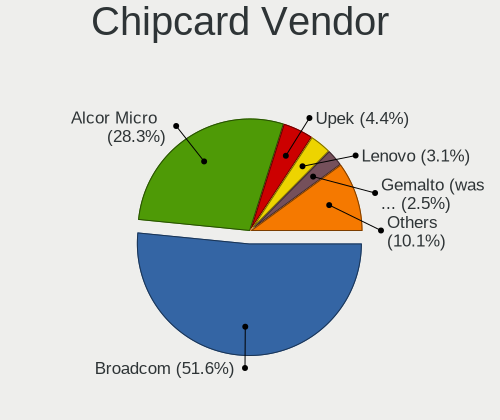

| Vendor                            | Computers | Percent |
|-----------------------------------|-----------|---------|
| Broadcom                          | 81        | 51.27%  |
| Alcor Micro                       | 45        | 28.48%  |
| Upek                              | 7         | 4.43%   |
| Lenovo                            | 5         | 3.16%   |
| Gemalto (was Gemplus)             | 4         | 2.53%   |
| Yubico.com                        | 3         | 1.9%    |
| O2 Micro                          | 3         | 1.9%    |
| Realtek Semiconductor             | 2         | 1.27%   |
| Bit4id                            | 2         | 1.27%   |
| Aladdin Knowledge Systems         | 2         | 1.27%   |
| VASCO Data Security International | 1         | 0.63%   |
| Reiner SCT Kartensysteme          | 1         | 0.63%   |
| Cherry                            | 1         | 0.63%   |
| Advanced Card Systems             | 1         | 0.63%   |

Chipcard Model
--------------

Chipcard module models

| Model                                                                        | Computers | Percent |
|------------------------------------------------------------------------------|-----------|---------|
| Alcor Micro AU9540 Smartcard Reader                                          | 45        | 28.48%  |
| Broadcom 58200                                                               | 37        | 23.42%  |
| Broadcom 5880                                                                | 19        | 12.03%  |
| Broadcom BCM5880 Secure Applications Processor                               | 14        | 8.86%   |
| Broadcom BCM5880 Secure Applications Processor with fingerprint swipe sensor | 11        | 6.96%   |
| Upek TouchChip Fingerprint Coprocessor (WBF advanced mode)                   | 7         | 4.43%   |
| Lenovo Integrated Smart Card Reader                                          | 5         | 3.16%   |
| Yubico.com Yubikey 4/5 U2F+CCID                                              | 3         | 1.9%    |
| Realtek Semiconductor Smart Card Reader Interface                            | 2         | 1.27%   |
| O2 Micro OZ776 CCID Smartcard Reader                                         | 2         | 1.27%   |
| Gemalto (was Gemplus) GemPC Twin SmartCard Reader                            | 2         | 1.27%   |
| Gemalto (was Gemplus) Compact Smart Card Reader Writer                       | 2         | 1.27%   |
| Bit4id miniLector EVO                                                        | 2         | 1.27%   |
| Aladdin Knowledge Systems Token JC                                           | 2         | 1.27%   |
| VASCO Data Security International Digipass 905 SmartCard Reader              | 1         | 0.63%   |
| Reiner SCT Kartensysteme cyberJack RFID basis contactless smartcard reader   | 1         | 0.63%   |
| O2 Micro Oz776 SmartCard Reader                                              | 1         | 0.63%   |
| Cherry Smart Terminal XX44                                                   | 1         | 0.63%   |
| Advanced Card Systems ACR39U                                                 | 1         | 0.63%   |

Unsupported
-----------

Unsupported Devices
-------------------

Total unsupported devices on board

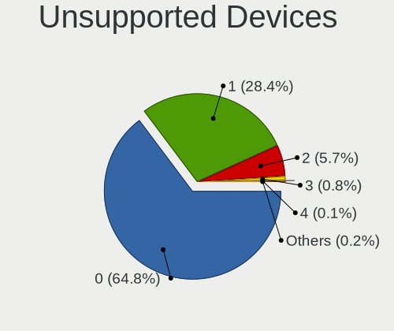

| Total | Computers | Percent |
|-------|-----------|---------|
| 0     | 2005      | 65.2%   |
| 1     | 869       | 28.26%  |
| 2     | 167       | 5.43%   |
| 3     | 24        | 0.78%   |
| 4     | 4         | 0.13%   |
| 6     | 3         | 0.1%    |
| 5     | 2         | 0.07%   |
| 8     | 1         | 0.03%   |

Unsupported Device Types
------------------------

Types of unsupported devices

| Type                     | Computers | Percent |
|--------------------------|-----------|---------|
| Fingerprint reader       | 437       | 34.27%  |
| Graphics card            | 319       | 25.02%  |
| Multimedia controller    | 185       | 14.51%  |
| Net/wireless             | 140       | 10.98%  |
| Camera                   | 33        | 2.59%   |
| Chipcard                 | 28        | 2.2%    |
| Sound                    | 23        | 1.8%    |
| Unassigned class         | 21        | 1.65%   |
| Bluetooth                | 21        | 1.65%   |
| Communication controller | 19        | 1.49%   |
| Storage                  | 14        | 1.1%    |
| Card reader              | 12        | 0.94%   |
| Net/ethernet             | 9         | 0.71%   |
| Network                  | 5         | 0.39%   |
| Modem                    | 3         | 0.24%   |
| Firewire controller      | 2         | 0.16%   |
| Storage/raid             | 1         | 0.08%   |
| Storage/nvme             | 1         | 0.08%   |
| Storage/ide              | 1         | 0.08%   |
| Dvb card                 | 1         | 0.08%   |

