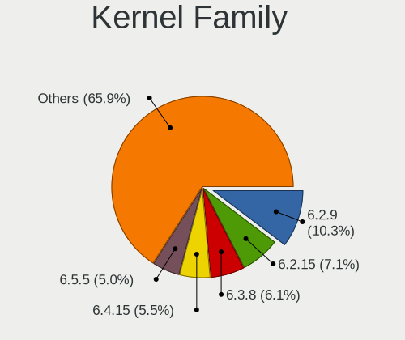
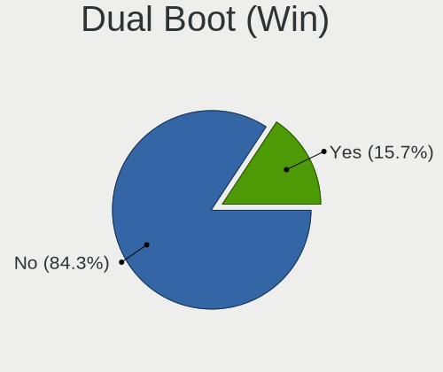
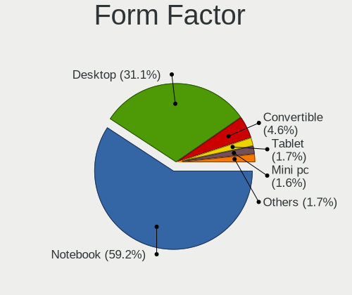
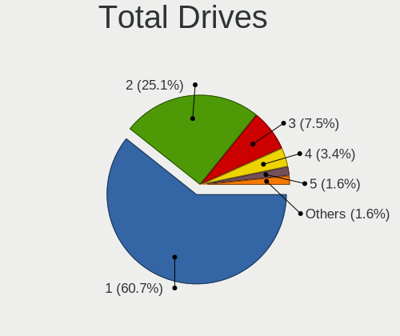
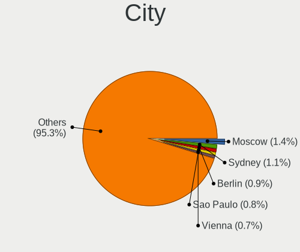
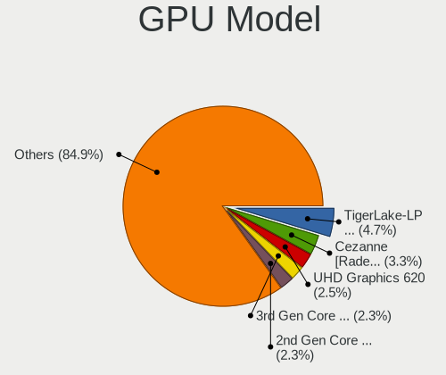
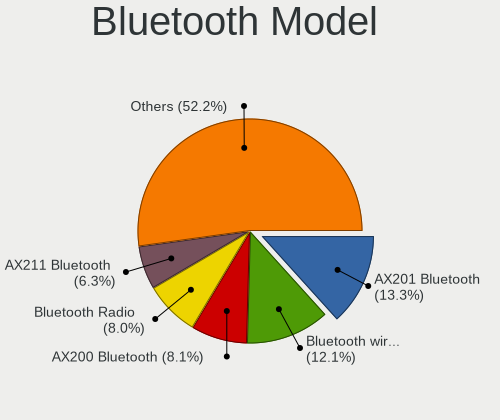
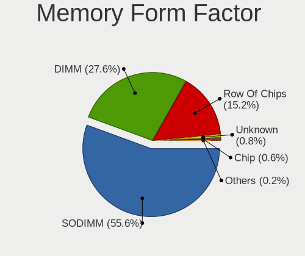
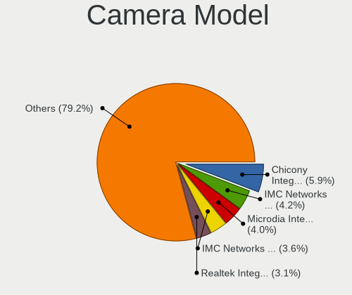

Fedora 38 - Tested Hardware & Statistics
----------------------------------------

A project to collect tested hardware configurations for Fedora 38.

Anyone can contribute to this report by the [hw-probe](https://github.com/linuxhw/hw-probe) tool:

    sudo -E hw-probe -all -upload

Please contribute! Especially if your hardware is rare.

This is a report for all computer types. See also reports for [desktops](/Dist/Fedora_38/Desktop/README.md) and [notebooks](/Dist/Fedora_38/Notebook/README.md).

Contents
--------

* [ Test Cases ](#test-cases)

* [ System ](#system)
  - [ Kernel                   ](#kernel)
  - [ Kernel Family            ](#kernel-family)
  - [ Kernel Major Ver.        ](#kernel-major-ver)
  - [ Arch                     ](#arch)
  - [ DE                       ](#de)
  - [ Display Server           ](#display-server)
  - [ Display Manager          ](#display-manager)
  - [ OS Lang                  ](#os-lang)
  - [ Boot Mode                ](#boot-mode)
  - [ Filesystem               ](#filesystem)
  - [ Part. scheme             ](#part-scheme)
  - [ Dual Boot with Linux/BSD ](#dual-boot-with-linuxbsd)
  - [ Dual Boot (Win)          ](#dual-boot-win)

* [ Board ](#board)
  - [ Vendor                   ](#vendor)
  - [ Model                    ](#model)
  - [ Model Family             ](#model-family)
  - [ MFG Year                 ](#mfg-year)
  - [ Form Factor              ](#form-factor)
  - [ Secure Boot              ](#secure-boot)
  - [ Coreboot                 ](#coreboot)
  - [ RAM Size                 ](#ram-size)
  - [ RAM Used                 ](#ram-used)
  - [ Total Drives             ](#total-drives)
  - [ Has CD-ROM               ](#has-cd-rom)
  - [ Has Ethernet             ](#has-ethernet)
  - [ Has WiFi                 ](#has-wifi)
  - [ Has Bluetooth            ](#has-bluetooth)

* [ Location ](#location)
  - [ Country                  ](#country)
  - [ City                     ](#city)

* [ Drives ](#drives)
  - [ Drive Vendor             ](#drive-vendor)
  - [ Drive Model              ](#drive-model)
  - [ HDD Vendor               ](#hdd-vendor)
  - [ SSD Vendor               ](#ssd-vendor)
  - [ Drive Kind               ](#drive-kind)
  - [ Drive Connector          ](#drive-connector)
  - [ Drive Size               ](#drive-size)
  - [ Space Total              ](#space-total)
  - [ Space Used               ](#space-used)
  - [ Malfunc. Drives          ](#malfunc-drives)
  - [ Malfunc. Drive Vendor    ](#malfunc-drive-vendor)
  - [ Malfunc. HDD Vendor      ](#malfunc-hdd-vendor)
  - [ Malfunc. Drive Kind      ](#malfunc-drive-kind)
  - [ Failed Drives            ](#failed-drives)
  - [ Failed Drive Vendor      ](#failed-drive-vendor)
  - [ Drive Status             ](#drive-status)

* [ Storage controller ](#storage-controller)
  - [ Storage Vendor           ](#storage-vendor)
  - [ Storage Model            ](#storage-model)
  - [ Storage Kind             ](#storage-kind)

* [ Processor ](#processor)
  - [ CPU Vendor               ](#cpu-vendor)
  - [ CPU Model                ](#cpu-model)
  - [ CPU Model Family         ](#cpu-model-family)
  - [ CPU Cores                ](#cpu-cores)
  - [ CPU Sockets              ](#cpu-sockets)
  - [ CPU Threads              ](#cpu-threads)
  - [ CPU Op-Modes             ](#cpu-op-modes)
  - [ CPU Microcode            ](#cpu-microcode)
  - [ CPU Microarch            ](#cpu-microarch)

* [ Graphics ](#graphics)
  - [ GPU Vendor               ](#gpu-vendor)
  - [ GPU Model                ](#gpu-model)
  - [ GPU Combo                ](#gpu-combo)
  - [ GPU Driver               ](#gpu-driver)
  - [ GPU Memory               ](#gpu-memory)

* [ Monitor ](#monitor)
  - [ Monitor Vendor           ](#monitor-vendor)
  - [ Monitor Model            ](#monitor-model)
  - [ Monitor Resolution       ](#monitor-resolution)
  - [ Monitor Diagonal         ](#monitor-diagonal)
  - [ Monitor Width            ](#monitor-width)
  - [ Aspect Ratio             ](#aspect-ratio)
  - [ Monitor Area             ](#monitor-area)
  - [ Pixel Density            ](#pixel-density)
  - [ Multiple Monitors        ](#multiple-monitors)

* [ Network ](#network)
  - [ Net Controller Vendor    ](#net-controller-vendor)
  - [ Net Controller Model     ](#net-controller-model)
  - [ Wireless Vendor          ](#wireless-vendor)
  - [ Wireless Model           ](#wireless-model)
  - [ Ethernet Vendor          ](#ethernet-vendor)
  - [ Ethernet Model           ](#ethernet-model)
  - [ Net Controller Kind      ](#net-controller-kind)
  - [ Used Controller          ](#used-controller)
  - [ NICs                     ](#nics)
  - [ IPv6                     ](#ipv6)

* [ Bluetooth ](#bluetooth)
  - [ Bluetooth Vendor         ](#bluetooth-vendor)
  - [ Bluetooth Model          ](#bluetooth-model)

* [ Sound ](#sound)
  - [ Sound Vendor             ](#sound-vendor)
  - [ Sound Model              ](#sound-model)

* [ Memory ](#memory)
  - [ Memory Vendor            ](#memory-vendor)
  - [ Memory Model             ](#memory-model)
  - [ Memory Kind              ](#memory-kind)
  - [ Memory Form Factor       ](#memory-form-factor)
  - [ Memory Size              ](#memory-size)
  - [ Memory Speed             ](#memory-speed)

* [ Printers & scanners ](#printers--scanners)
  - [ Printer Vendor           ](#printer-vendor)
  - [ Printer Model            ](#printer-model)
  - [ Scanner Vendor           ](#scanner-vendor)
  - [ Scanner Model            ](#scanner-model)

* [ Camera ](#camera)
  - [ Camera Vendor            ](#camera-vendor)
  - [ Camera Model             ](#camera-model)

* [ Security ](#security)
  - [ Fingerprint Vendor       ](#fingerprint-vendor)
  - [ Fingerprint Model        ](#fingerprint-model)
  - [ Chipcard Vendor          ](#chipcard-vendor)
  - [ Chipcard Model           ](#chipcard-model)

* [ Unsupported ](#unsupported)
  - [ Unsupported Devices      ](#unsupported-devices)
  - [ Unsupported Device Types ](#unsupported-device-types)

Test Cases
----------

Total: 3332

| Vendor        | Model                       | Form-Factor | Probe                                                      | Date         |
|---------------|-----------------------------|-------------|------------------------------------------------------------|--------------|
| Dell          | XPS 15 9500                 | Notebook    | [a8f95ea32d](https://linux-hardware.org/?probe=a8f95ea32d) | Oct 01, 2023 |
| ASUSTek       | ASUS TUF Gaming F15 FX50... | Notebook    | [34b8e1853b](https://linux-hardware.org/?probe=34b8e1853b) | Oct 01, 2023 |
| Toshiba       | Satellite L735              | Notebook    | [c969a72669](https://linux-hardware.org/?probe=c969a72669) | Oct 01, 2023 |
| Acer          | Predator PH16-71            | Notebook    | [a07278dc43](https://linux-hardware.org/?probe=a07278dc43) | Oct 01, 2023 |
| Microsoft     | Surface Pro 3               | Tablet      | [9d3a95cfd5](https://linux-hardware.org/?probe=9d3a95cfd5) | Oct 01, 2023 |
| ASUSTek       | PRIME B450M-A               | Desktop     | [1e825c5574](https://linux-hardware.org/?probe=1e825c5574) | Oct 01, 2023 |
| Dell          | Latitude 5520               | Notebook    | [024af71640](https://linux-hardware.org/?probe=024af71640) | Oct 01, 2023 |
| Apple         | MacBookPro9,2               | Notebook    | [124425b8b3](https://linux-hardware.org/?probe=124425b8b3) | Oct 01, 2023 |
| Google        | Nocturne                    | Tablet      | [966636d4d1](https://linux-hardware.org/?probe=966636d4d1) | Oct 01, 2023 |
| Google        | Nocturne                    | Tablet      | [5c4cae2a0b](https://linux-hardware.org/?probe=5c4cae2a0b) | Oct 01, 2023 |
| MSI           | X99A RAIDER                 | Desktop     | [3e13770075](https://linux-hardware.org/?probe=3e13770075) | Oct 01, 2023 |
| Gigabyte      | D525TUD                     | Desktop     | [913e98318d](https://linux-hardware.org/?probe=913e98318d) | Oct 01, 2023 |
| Gigabyte      | D525TUD                     | Desktop     | [f48a538837](https://linux-hardware.org/?probe=f48a538837) | Oct 01, 2023 |
| ASUSTek       | Z170-DELUXE                 | Desktop     | [9e04efc2d9](https://linux-hardware.org/?probe=9e04efc2d9) | Oct 01, 2023 |
| Dell          | Latitude E6420              | Notebook    | [55c45fb7cb](https://linux-hardware.org/?probe=55c45fb7cb) | Oct 01, 2023 |
| HP            | EliteBook 840 G8 Noteboo... | Notebook    | [30bf4415dc](https://linux-hardware.org/?probe=30bf4415dc) | Sep 30, 2023 |
| HUAWEI        | VLT-WX0                     | Notebook    | [a312a57d16](https://linux-hardware.org/?probe=a312a57d16) | Sep 30, 2023 |
| MSI           | Prestige 14H B12UCX         | Notebook    | [b3a006adc7](https://linux-hardware.org/?probe=b3a006adc7) | Sep 30, 2023 |
| ASUSTek       | TUF Gaming B660M-PLUS D4    | Desktop     | [f3d279f91b](https://linux-hardware.org/?probe=f3d279f91b) | Sep 30, 2023 |
| MSI           | Prestige 14H B12UCX         | Notebook    | [1c1f35d1c8](https://linux-hardware.org/?probe=1c1f35d1c8) | Sep 30, 2023 |
| ASUSTek       | Z170-A                      | Desktop     | [bee067d5dd](https://linux-hardware.org/?probe=bee067d5dd) | Sep 30, 2023 |
| ASUSTek       | TUF Gaming B660M-PLUS D4    | Desktop     | [02af70281a](https://linux-hardware.org/?probe=02af70281a) | Sep 30, 2023 |
| Dell          | Latitude 7280               | Notebook    | [dbe9d3e4be](https://linux-hardware.org/?probe=dbe9d3e4be) | Sep 30, 2023 |
| Toshiba       | PORTEGE R30-D               | Notebook    | [04ef694f1d](https://linux-hardware.org/?probe=04ef694f1d) | Sep 30, 2023 |
| Dell          | 0V8WGR A02                  | Desktop     | [9c9ded765b](https://linux-hardware.org/?probe=9c9ded765b) | Sep 30, 2023 |
| Fanless Mi... | Rev GMLR1                   | Mini pc     | [751b4d268a](https://linux-hardware.org/?probe=751b4d268a) | Sep 30, 2023 |
| ASUSTek       | ASUS EXPERTBOOK B1402CBA... | Notebook    | [91873a529a](https://linux-hardware.org/?probe=91873a529a) | Sep 30, 2023 |
| Gigabyte      | Z790 AORUS ELITE AX         | Desktop     | [9a749a1c41](https://linux-hardware.org/?probe=9a749a1c41) | Sep 30, 2023 |
| Gigabyte      | Z790 AORUS ELITE AX         | Desktop     | [452cd2622a](https://linux-hardware.org/?probe=452cd2622a) | Sep 30, 2023 |
| Lenovo        | ThinkPad T420 4180BV1       | Notebook    | [e81749053b](https://linux-hardware.org/?probe=e81749053b) | Sep 30, 2023 |
| Gigabyte      | GA-870A-UD3                 | Desktop     | [5a507ec4da](https://linux-hardware.org/?probe=5a507ec4da) | Sep 30, 2023 |
| MSI           | X99A RAIDER                 | Desktop     | [a36938e994](https://linux-hardware.org/?probe=a36938e994) | Sep 30, 2023 |
| Acer          | Aspire A514-53              | Notebook    | [6d8a5b1a13](https://linux-hardware.org/?probe=6d8a5b1a13) | Sep 30, 2023 |
| HP            | 8055                        | Desktop     | [3ddf31c78e](https://linux-hardware.org/?probe=3ddf31c78e) | Sep 30, 2023 |
| ASUSTek       | TUF Gaming B550-PLUS        | Desktop     | [3bec9011bd](https://linux-hardware.org/?probe=3bec9011bd) | Sep 30, 2023 |
| Gigabyte      | B550M AORUS ELITE           | Desktop     | [74bed86ee5](https://linux-hardware.org/?probe=74bed86ee5) | Sep 30, 2023 |
| Microsoft     | Surface Pro 4               | Tablet      | [c69ab4bc0f](https://linux-hardware.org/?probe=c69ab4bc0f) | Sep 30, 2023 |
| Microsoft     | Surface Pro 4               | Tablet      | [4a7b1ee936](https://linux-hardware.org/?probe=4a7b1ee936) | Sep 29, 2023 |
| Lenovo        | IdeaPad 5 14ALC05 82LM      | Notebook    | [c1a605af33](https://linux-hardware.org/?probe=c1a605af33) | Sep 29, 2023 |
| ASUSTek       | PRIME B450M-A               | Desktop     | [3c9f4d4aef](https://linux-hardware.org/?probe=3c9f4d4aef) | Sep 29, 2023 |
| Intel         | H61                         | Desktop     | [f6a417439c](https://linux-hardware.org/?probe=f6a417439c) | Sep 29, 2023 |
| ASUSTek       | ROG Strix G713QM_G713QM     | Notebook    | [ec1384a424](https://linux-hardware.org/?probe=ec1384a424) | Sep 29, 2023 |
| Razer         | Blade 15 Base Model (Lat... | Notebook    | [95dc405a73](https://linux-hardware.org/?probe=95dc405a73) | Sep 29, 2023 |
| ASRock        | B450M Pro4 R2.0             | Desktop     | [8e039e23f3](https://linux-hardware.org/?probe=8e039e23f3) | Sep 29, 2023 |
| Intel         | H61                         | Desktop     | [e7dac2f9ed](https://linux-hardware.org/?probe=e7dac2f9ed) | Sep 29, 2023 |
| HP            | Laptop 17-cn1xxx            | Notebook    | [051a233121](https://linux-hardware.org/?probe=051a233121) | Sep 29, 2023 |
| Lenovo        | ThinkPad L15 Gen 1 20U70... | Notebook    | [e51fd2a8e9](https://linux-hardware.org/?probe=e51fd2a8e9) | Sep 29, 2023 |
| Intel         | NUC13ANBi5 M89647-202       | Mini pc     | [e1f22fdce4](https://linux-hardware.org/?probe=e1f22fdce4) | Sep 29, 2023 |
| MSI           | PRO B660M-A DDR4            | Desktop     | [4b5a46a1e2](https://linux-hardware.org/?probe=4b5a46a1e2) | Sep 29, 2023 |
| ASUSTek       | ROG Strix G713QM_G713QM     | Notebook    | [d958b4e16a](https://linux-hardware.org/?probe=d958b4e16a) | Sep 29, 2023 |
| HP            | EliteBook 745 G5            | Notebook    | [b734ec49e2](https://linux-hardware.org/?probe=b734ec49e2) | Sep 29, 2023 |
| ANGXUN        | X99-DM3 V3.0                | Desktop     | [1a7ed0ba7d](https://linux-hardware.org/?probe=1a7ed0ba7d) | Sep 29, 2023 |
| Lenovo        | Yoga 7 15ITL5 82BJ          | Convertible | [c822d38335](https://linux-hardware.org/?probe=c822d38335) | Sep 29, 2023 |
| Lenovo        | Yoga 7 15ITL5 82BJ          | Convertible | [222c45e72e](https://linux-hardware.org/?probe=222c45e72e) | Sep 29, 2023 |
| HP            | EliteBook 840 G6            | Notebook    | [e57cdefe7a](https://linux-hardware.org/?probe=e57cdefe7a) | Sep 29, 2023 |
| HP            | Stream x360 Convertible ... | Convertible | [427ea0aa4f](https://linux-hardware.org/?probe=427ea0aa4f) | Sep 29, 2023 |
| HUAWEI        | HVY-WXX9                    | Notebook    | [713d59f3d0](https://linux-hardware.org/?probe=713d59f3d0) | Sep 29, 2023 |
| HUAWEI        | HVY-WXX9                    | Notebook    | [c434f30a15](https://linux-hardware.org/?probe=c434f30a15) | Sep 29, 2023 |
| Radxa         | ROCK Pi 4B                  | Soc         | [fac4bb4863](https://linux-hardware.org/?probe=fac4bb4863) | Sep 29, 2023 |
| Lenovo        | SHARKBAY SDK0E50510 WIN     | Desktop     | [60c04875f1](https://linux-hardware.org/?probe=60c04875f1) | Sep 29, 2023 |
| Lenovo        | IdeaPad 3 14IML05 81WA      | Notebook    | [d95e370c54](https://linux-hardware.org/?probe=d95e370c54) | Sep 29, 2023 |
| Dell          | 0YJPT1 A00                  | Desktop     | [a0a41d401e](https://linux-hardware.org/?probe=a0a41d401e) | Sep 28, 2023 |
| MSI           | H310M PRO-VD                | Desktop     | [67e14c1b2d](https://linux-hardware.org/?probe=67e14c1b2d) | Sep 28, 2023 |
| ASUSTek       | Z97-A-USB31                 | Desktop     | [b7e5fb069c](https://linux-hardware.org/?probe=b7e5fb069c) | Sep 28, 2023 |
| Radxa         | ROCK Pi 4B                  | Soc         | [1210322d55](https://linux-hardware.org/?probe=1210322d55) | Sep 28, 2023 |
| Dell          | 0XC7MM A01                  | Desktop     | [9fdfc5a13f](https://linux-hardware.org/?probe=9fdfc5a13f) | Sep 28, 2023 |
| ASUSTek       | ASUS TUF Dash F15 FX516P... | Notebook    | [4cef8be854](https://linux-hardware.org/?probe=4cef8be854) | Sep 28, 2023 |
| HP            | EliteBook 840 G2            | Notebook    | [bec979fcd0](https://linux-hardware.org/?probe=bec979fcd0) | Sep 28, 2023 |
| Lenovo        | ThinkPad E14 Gen 4 21E3S... | Notebook    | [356b5f053d](https://linux-hardware.org/?probe=356b5f053d) | Sep 28, 2023 |
| HP            | EliteBook 840 G6            | Notebook    | [5b87382fce](https://linux-hardware.org/?probe=5b87382fce) | Sep 28, 2023 |
| Lenovo        | ThinkPad P51 20HHCTO1WW     | Notebook    | [64a85b8eb3](https://linux-hardware.org/?probe=64a85b8eb3) | Sep 28, 2023 |
| ASUSTek       | ROG STRIX X570-F GAMING     | Desktop     | [5dbe8e1541](https://linux-hardware.org/?probe=5dbe8e1541) | Sep 28, 2023 |
| ASUSTek       | ROG Flow X13 GV302XU_GV3... | Convertible | [abf12be6ff](https://linux-hardware.org/?probe=abf12be6ff) | Sep 28, 2023 |
| Gigabyte      | B560M AORUS PRO AX          | Desktop     | [2e3d19e919](https://linux-hardware.org/?probe=2e3d19e919) | Sep 28, 2023 |
| Lenovo        | ThinkPad T495 20NJ000XGE    | Notebook    | [737b3910bb](https://linux-hardware.org/?probe=737b3910bb) | Sep 28, 2023 |
| Lenovo        | ThinkPad T495 20NJ000XGE    | Notebook    | [b064b5b9ca](https://linux-hardware.org/?probe=b064b5b9ca) | Sep 28, 2023 |
| HP            | Notebook                    | Notebook    | [b13debd2fa](https://linux-hardware.org/?probe=b13debd2fa) | Sep 27, 2023 |
| Dell          | Latitude 7490               | Notebook    | [6f5e4547fa](https://linux-hardware.org/?probe=6f5e4547fa) | Sep 27, 2023 |
| MSI           | MPG Z490M GAMING EDGE WI... | Desktop     | [23150c5bd3](https://linux-hardware.org/?probe=23150c5bd3) | Sep 27, 2023 |
| Lenovo        | ThinkPad X1 Carbon 7th 2... | Notebook    | [a95feaee78](https://linux-hardware.org/?probe=a95feaee78) | Sep 27, 2023 |
| Framework     | Laptop                      | Notebook    | [2a65b0dff2](https://linux-hardware.org/?probe=2a65b0dff2) | Sep 27, 2023 |
| Acer          | Predator G3-571             | Notebook    | [f301a514ad](https://linux-hardware.org/?probe=f301a514ad) | Sep 27, 2023 |
| Samsung       | 550XDA                      | Notebook    | [ab1fabfe9b](https://linux-hardware.org/?probe=ab1fabfe9b) | Sep 27, 2023 |
| ASUSTek       | PRIME B350-PLUS             | Desktop     | [546df5b57f](https://linux-hardware.org/?probe=546df5b57f) | Sep 27, 2023 |
| ASUSTek       | PRIME B350-PLUS             | Desktop     | [503570ad7a](https://linux-hardware.org/?probe=503570ad7a) | Sep 27, 2023 |
| Chuwi         | CoreBook X                  | Notebook    | [0c31a47880](https://linux-hardware.org/?probe=0c31a47880) | Sep 27, 2023 |
| ASUSTek       | ROG CROSSHAIR X670E HERO    | Desktop     | [41f0f8666c](https://linux-hardware.org/?probe=41f0f8666c) | Sep 27, 2023 |
| Gigabyte      | GA-MA785G-UD3H              | Desktop     | [4f0651ccc2](https://linux-hardware.org/?probe=4f0651ccc2) | Sep 27, 2023 |
| Notebook      | PCx0Dx                      | Notebook    | [53dd8cbd0d](https://linux-hardware.org/?probe=53dd8cbd0d) | Sep 27, 2023 |
| HP            | Stream x360 Convertible ... | Convertible | [d237ab1a11](https://linux-hardware.org/?probe=d237ab1a11) | Sep 27, 2023 |
| Lenovo        | ThinkPad T410 2522PT3       | Notebook    | [fed9f17a22](https://linux-hardware.org/?probe=fed9f17a22) | Sep 27, 2023 |
| Acer          | Predator G3-571             | Notebook    | [06b0300670](https://linux-hardware.org/?probe=06b0300670) | Sep 27, 2023 |
| Lenovo        | ThinkPad T410 2522PT3       | Notebook    | [0dd1b47aa0](https://linux-hardware.org/?probe=0dd1b47aa0) | Sep 27, 2023 |
| Lenovo        | IdeaPadFlex 5 14ARE05 81... | Convertible | [b6e832a4d8](https://linux-hardware.org/?probe=b6e832a4d8) | Sep 27, 2023 |
| Gigabyte      | B650M K                     | Desktop     | [73da1b7ade](https://linux-hardware.org/?probe=73da1b7ade) | Sep 27, 2023 |
| Dell          | Latitude E7450              | Notebook    | [afa1cce666](https://linux-hardware.org/?probe=afa1cce666) | Sep 27, 2023 |
| ASRock        | B450M Steel Legend          | Desktop     | [b4de4fe266](https://linux-hardware.org/?probe=b4de4fe266) | Sep 27, 2023 |
| Dell          | Latitude 5420               | Notebook    | [4f890f283a](https://linux-hardware.org/?probe=4f890f283a) | Sep 26, 2023 |
| Gigabyte      | B550M S2H                   | Desktop     | [f61801ddb3](https://linux-hardware.org/?probe=f61801ddb3) | Sep 26, 2023 |
| Dell          | Latitude 7490               | Notebook    | [8bb2e054ec](https://linux-hardware.org/?probe=8bb2e054ec) | Sep 26, 2023 |
| Dell          | G15 5520                    | Notebook    | [64cfeba3ee](https://linux-hardware.org/?probe=64cfeba3ee) | Sep 26, 2023 |
| Dell          | Latitude 5420               | Notebook    | [3a22857022](https://linux-hardware.org/?probe=3a22857022) | Sep 26, 2023 |
| Gigabyte      | B550M DS3H                  | Desktop     | [3bb1109d44](https://linux-hardware.org/?probe=3bb1109d44) | Sep 26, 2023 |
| HP            | Laptop 14s-dq2xxx           | Notebook    | [424e7e3d87](https://linux-hardware.org/?probe=424e7e3d87) | Sep 26, 2023 |
| ASUSTek       | ROG CROSSHAIR VIII HERO     | Desktop     | [85c6c01e63](https://linux-hardware.org/?probe=85c6c01e63) | Sep 26, 2023 |
| Lenovo        | IdeaPad 3 15ITL6 82H8       | Notebook    | [dd48e0075b](https://linux-hardware.org/?probe=dd48e0075b) | Sep 26, 2023 |
| Lenovo        | ThinkPad T14 Gen 4 21HD0... | Notebook    | [35e9d35a69](https://linux-hardware.org/?probe=35e9d35a69) | Sep 26, 2023 |
| ASUSTek       | TUF B450-PLUS GAMING        | Desktop     | [8da87a8c78](https://linux-hardware.org/?probe=8da87a8c78) | Sep 26, 2023 |
| Lenovo        | ThinkPad P15 Gen 2i 20YQ... | Notebook    | [dc762f9ae6](https://linux-hardware.org/?probe=dc762f9ae6) | Sep 26, 2023 |
| MSI           | MPG B650 CARBON WIFI        | Desktop     | [4b0aff27e8](https://linux-hardware.org/?probe=4b0aff27e8) | Sep 26, 2023 |
| MSI           | B450 GAMING PRO CARBON A... | Desktop     | [b49d28bbd4](https://linux-hardware.org/?probe=b49d28bbd4) | Sep 26, 2023 |
| ASRock        | B450M Steel Legend          | Desktop     | [ccb7f736f6](https://linux-hardware.org/?probe=ccb7f736f6) | Sep 26, 2023 |
| Lenovo        | ThinkPad T490s 20NX003NR... | Notebook    | [0a38f1e9a4](https://linux-hardware.org/?probe=0a38f1e9a4) | Sep 26, 2023 |
| Huanan        | X99-8M-F V1.2               | Desktop     | [4ddba514a1](https://linux-hardware.org/?probe=4ddba514a1) | Sep 26, 2023 |
| ASUSTek       | VivoBook_ASUSLaptop K350... | Notebook    | [14766bbd15](https://linux-hardware.org/?probe=14766bbd15) | Sep 26, 2023 |
| ASUSTek       | ASUS TUF Gaming F15 FX50... | Notebook    | [7c547aa37a](https://linux-hardware.org/?probe=7c547aa37a) | Sep 26, 2023 |
| MSI           | X99A RAIDER                 | Desktop     | [b69e9b97ec](https://linux-hardware.org/?probe=b69e9b97ec) | Sep 26, 2023 |
| Lenovo        | IdeaPad Slim 5 16IRL8 82... | Notebook    | [b22a584cea](https://linux-hardware.org/?probe=b22a584cea) | Sep 26, 2023 |
| Lenovo        | IdeaPad 5 14ALC05 82LM      | Notebook    | [73d2dae51c](https://linux-hardware.org/?probe=73d2dae51c) | Sep 26, 2023 |
| Lenovo        | Z50-70 20354                | Notebook    | [ccdfae441b](https://linux-hardware.org/?probe=ccdfae441b) | Sep 26, 2023 |
| Lenovo        | ThinkBook 15 G2 ARE 20VG    | Notebook    | [37fdb062e1](https://linux-hardware.org/?probe=37fdb062e1) | Sep 26, 2023 |
| ASUSTek       | M4A88TD-V EVO/USB3          | Desktop     | [4375a551e1](https://linux-hardware.org/?probe=4375a551e1) | Sep 25, 2023 |
| ASUSTek       | P9D WS                      | Desktop     | [fd2133400d](https://linux-hardware.org/?probe=fd2133400d) | Sep 25, 2023 |
| MSI           | MPG Z490M GAMING EDGE WI... | Desktop     | [a6ef2b5028](https://linux-hardware.org/?probe=a6ef2b5028) | Sep 25, 2023 |
| ASUSTek       | TUF B450-PLUS GAMING        | Desktop     | [b7dae6ef48](https://linux-hardware.org/?probe=b7dae6ef48) | Sep 25, 2023 |
| HP            | ENVY x360 2-in-1 Laptop ... | Convertible | [c665cddf99](https://linux-hardware.org/?probe=c665cddf99) | Sep 25, 2023 |
| Apple         | MacBookPro10,1              | Notebook    | [1c1268d4e0](https://linux-hardware.org/?probe=1c1268d4e0) | Sep 25, 2023 |
| Apple         | MacBookPro10,1              | Notebook    | [4fbb517b71](https://linux-hardware.org/?probe=4fbb517b71) | Sep 25, 2023 |
| Lenovo        | ThinkPad X1 Yoga 2nd 20J... | Convertible | [2953047bfa](https://linux-hardware.org/?probe=2953047bfa) | Sep 25, 2023 |
| HP            | EliteBook 840 G3            | Notebook    | [4e0f83e1fe](https://linux-hardware.org/?probe=4e0f83e1fe) | Sep 25, 2023 |
| HP            | EliteBook 840 G3            | Notebook    | [60ff167d14](https://linux-hardware.org/?probe=60ff167d14) | Sep 25, 2023 |
| System76      | Pangolin                    | Notebook    | [3c56c50463](https://linux-hardware.org/?probe=3c56c50463) | Sep 25, 2023 |
| Acer          | Aspire V3-571G              | Notebook    | [6b5dcea023](https://linux-hardware.org/?probe=6b5dcea023) | Sep 25, 2023 |
| Dell          | Latitude E7270              | Notebook    | [98dd5eefb6](https://linux-hardware.org/?probe=98dd5eefb6) | Sep 25, 2023 |
| ASUSTek       | Z170I PRO GAMING            | Desktop     | [f4d45948eb](https://linux-hardware.org/?probe=f4d45948eb) | Sep 25, 2023 |
| HP            | 255 G8 Notebook PC          | Notebook    | [91c3333a18](https://linux-hardware.org/?probe=91c3333a18) | Sep 25, 2023 |
| Lenovo        | ThinkPad P14s Gen 2a 21A... | Notebook    | [9a24a19f6e](https://linux-hardware.org/?probe=9a24a19f6e) | Sep 25, 2023 |
| HP            | ProBook 6570b               | Notebook    | [a67981aa91](https://linux-hardware.org/?probe=a67981aa91) | Sep 25, 2023 |
| Lenovo        | ThinkPad E14 Gen 4 21EB0... | Notebook    | [88385cbacc](https://linux-hardware.org/?probe=88385cbacc) | Sep 25, 2023 |
| Dell          | XPS 13 9310                 | Notebook    | [4233a2e5e3](https://linux-hardware.org/?probe=4233a2e5e3) | Sep 25, 2023 |
| MSI           | X99A RAIDER                 | Desktop     | [c6dc860de5](https://linux-hardware.org/?probe=c6dc860de5) | Sep 25, 2023 |
| Dell          | XPS 13 9380                 | Notebook    | [705c3fdeff](https://linux-hardware.org/?probe=705c3fdeff) | Sep 25, 2023 |
| ASRock        | B550M Pro4                  | Desktop     | [1b8b856469](https://linux-hardware.org/?probe=1b8b856469) | Sep 25, 2023 |
| Apple         | Mac-F226BEC8 PVT            | All in one  | [e741b61807](https://linux-hardware.org/?probe=e741b61807) | Sep 25, 2023 |
| MSI           | GL65 Leopard 10SER          | Notebook    | [e97a8fa2c7](https://linux-hardware.org/?probe=e97a8fa2c7) | Sep 25, 2023 |
| HP            | 250 G6 Notebook PC          | Notebook    | [88ce9be8a1](https://linux-hardware.org/?probe=88ce9be8a1) | Sep 24, 2023 |
| MSI           | GL65 Leopard 10SER          | Notebook    | [fac92f385c](https://linux-hardware.org/?probe=fac92f385c) | Sep 24, 2023 |
| Lenovo        | IdeaPad 5 14ALC05 82LM      | Notebook    | [0531db8cb8](https://linux-hardware.org/?probe=0531db8cb8) | Sep 24, 2023 |
| Acer          | TravelMate P259-MG          | Notebook    | [26ca7317b2](https://linux-hardware.org/?probe=26ca7317b2) | Sep 24, 2023 |
| Intel         | NUC7i7DNB J83500-204        | Mini pc     | [44784bdea7](https://linux-hardware.org/?probe=44784bdea7) | Sep 24, 2023 |
| Lenovo        | ThinkPad P15v Gen 3 21D8... | Notebook    | [408377c3fd](https://linux-hardware.org/?probe=408377c3fd) | Sep 24, 2023 |
| MSI           | MAG B550 TOMAHAWK MAX WI... | Desktop     | [23d9e87224](https://linux-hardware.org/?probe=23d9e87224) | Sep 24, 2023 |
| Sony          | VAIO                        | All in one  | [75e484b949](https://linux-hardware.org/?probe=75e484b949) | Sep 24, 2023 |
| Apple         | MacBookPro8,2               | Notebook    | [cba55a15ec](https://linux-hardware.org/?probe=cba55a15ec) | Sep 24, 2023 |
| AZW           | SER V1.0                    | Mini pc     | [53051aa7eb](https://linux-hardware.org/?probe=53051aa7eb) | Sep 24, 2023 |
| Dell          | Latitude 7400               | Notebook    | [f537b79d15](https://linux-hardware.org/?probe=f537b79d15) | Sep 24, 2023 |
| Lenovo        | V14-ARE 82DQ                | Notebook    | [31a635bff8](https://linux-hardware.org/?probe=31a635bff8) | Sep 24, 2023 |
| Google        | Eve                         | Convertible | [b3c890ec7a](https://linux-hardware.org/?probe=b3c890ec7a) | Sep 24, 2023 |
| Gigabyte      | X570S UD                    | Desktop     | [88653e2f06](https://linux-hardware.org/?probe=88653e2f06) | Sep 24, 2023 |
| Gigabyte      | EP45-DS3L                   | Desktop     | [57d5f67adf](https://linux-hardware.org/?probe=57d5f67adf) | Sep 24, 2023 |
| HP            | Laptop 15s-eq2xxx           | Notebook    | [72940bf53e](https://linux-hardware.org/?probe=72940bf53e) | Sep 24, 2023 |
| HP            | 350 G2                      | Notebook    | [8440938e22](https://linux-hardware.org/?probe=8440938e22) | Sep 24, 2023 |
| ASUSTek       | PRIME B660M-A AC D4         | Desktop     | [7c0eb47c16](https://linux-hardware.org/?probe=7c0eb47c16) | Sep 24, 2023 |
| Lenovo        | IdeaPad 5 14ALC05 82LM      | Notebook    | [01b1c1acdb](https://linux-hardware.org/?probe=01b1c1acdb) | Sep 24, 2023 |
| ASUSTek       | VivoBook_ASUSLaptop X513... | Notebook    | [fc14083064](https://linux-hardware.org/?probe=fc14083064) | Sep 24, 2023 |
| ASUSTek       | VivoBook_ASUSLaptop X513... | Notebook    | [acba7de2ec](https://linux-hardware.org/?probe=acba7de2ec) | Sep 24, 2023 |
| Google        | Eve                         | Convertible | [eccabb6bc2](https://linux-hardware.org/?probe=eccabb6bc2) | Sep 24, 2023 |
| Gigabyte      | X470 AORUS ULTRA GAMING-... | Desktop     | [5ed3f9381a](https://linux-hardware.org/?probe=5ed3f9381a) | Sep 23, 2023 |
| HP            | 255 15.6 inch G10           | Notebook    | [9f02426c5d](https://linux-hardware.org/?probe=9f02426c5d) | Sep 23, 2023 |
| Apple         | MacBookPro10,1              | Notebook    | [18b2a7026b](https://linux-hardware.org/?probe=18b2a7026b) | Sep 23, 2023 |
| Apple         | MacBookPro10,1              | Notebook    | [60f81eeb50](https://linux-hardware.org/?probe=60f81eeb50) | Sep 23, 2023 |
| MSI           | B450M MORTAR MAX            | Desktop     | [fa3021d826](https://linux-hardware.org/?probe=fa3021d826) | Sep 23, 2023 |
| Lenovo        | ThinkPad T550 20CK0002MZ    | Notebook    | [a34763914d](https://linux-hardware.org/?probe=a34763914d) | Sep 23, 2023 |
| HP            | Pavilion dv6                | Notebook    | [bd8ae0385b](https://linux-hardware.org/?probe=bd8ae0385b) | Sep 23, 2023 |
| ASRock        | N68C-S UCC                  | Desktop     | [844c35381f](https://linux-hardware.org/?probe=844c35381f) | Sep 23, 2023 |
| MSI           | MPG X570 GAMING EDGE WIF... | Desktop     | [f59df7021c](https://linux-hardware.org/?probe=f59df7021c) | Sep 23, 2023 |
| Dell          | Latitude 7280               | Notebook    | [1d032535e1](https://linux-hardware.org/?probe=1d032535e1) | Sep 23, 2023 |
| Gigabyte      | MZGLKBP-00                  | Desktop     | [678c17756d](https://linux-hardware.org/?probe=678c17756d) | Sep 23, 2023 |
| HP            | Pavilion Gaming Laptop 1... | Notebook    | [a6ff891fa1](https://linux-hardware.org/?probe=a6ff891fa1) | Sep 23, 2023 |
| Casper        | NIRVANA NB F500             | Notebook    | [1f66f22544](https://linux-hardware.org/?probe=1f66f22544) | Sep 23, 2023 |
| ASRock        | H61M/U3S3                   | Desktop     | [1d397abb90](https://linux-hardware.org/?probe=1d397abb90) | Sep 23, 2023 |
| Lenovo        | ThinkPad E15 20RD0011UK     | Notebook    | [d464d79df3](https://linux-hardware.org/?probe=d464d79df3) | Sep 23, 2023 |
| HP            | ENVY Laptop 13-ad1xx        | Notebook    | [11ce4105e1](https://linux-hardware.org/?probe=11ce4105e1) | Sep 23, 2023 |
| Gigabyte      | B85-HD3                     | Desktop     | [5da83e8683](https://linux-hardware.org/?probe=5da83e8683) | Sep 23, 2023 |
| ASUSTek       | PRIME B360-PLUS             | Desktop     | [5629e161ab](https://linux-hardware.org/?probe=5629e161ab) | Sep 23, 2023 |
| Lenovo        | ThinkPad L570 W10DG 20JR... | Notebook    | [b96887841e](https://linux-hardware.org/?probe=b96887841e) | Sep 23, 2023 |
| MSI           | MS-7388                     | Desktop     | [f5ee235af0](https://linux-hardware.org/?probe=f5ee235af0) | Sep 23, 2023 |
| ASUSTek       | PRIME B660M-A AC D4         | Desktop     | [1a81f24fbb](https://linux-hardware.org/?probe=1a81f24fbb) | Sep 23, 2023 |
| Dell          | 0KWVT8 A03                  | Desktop     | [c6f224508a](https://linux-hardware.org/?probe=c6f224508a) | Sep 23, 2023 |
| Toshiba       | Satellite C70-B             | Notebook    | [904a43b77e](https://linux-hardware.org/?probe=904a43b77e) | Sep 23, 2023 |
| MSI           | B450M MORTAR MAX            | Desktop     | [3b9bbcebb0](https://linux-hardware.org/?probe=3b9bbcebb0) | Sep 23, 2023 |
| Lenovo        | ThinkPad P15 Gen 2i 20YR... | Notebook    | [6a6fde2ca9](https://linux-hardware.org/?probe=6a6fde2ca9) | Sep 23, 2023 |
| Toshiba       | Satellite C70-B             | Notebook    | [eedf248084](https://linux-hardware.org/?probe=eedf248084) | Sep 23, 2023 |
| Acer          | Aspire ES1-520              | Notebook    | [22ce921c1e](https://linux-hardware.org/?probe=22ce921c1e) | Sep 22, 2023 |
| Lenovo        | ThinkPad L570 W10DG 20JR... | Notebook    | [535d4769c8](https://linux-hardware.org/?probe=535d4769c8) | Sep 22, 2023 |
| Acer          | Aspire A715-51G             | Notebook    | [674c086aa5](https://linux-hardware.org/?probe=674c086aa5) | Sep 22, 2023 |
| Apple         | MacBookPro11,1              | Notebook    | [169fe58269](https://linux-hardware.org/?probe=169fe58269) | Sep 22, 2023 |
| MSI           | H110M PRO-D                 | Desktop     | [40380b4dce](https://linux-hardware.org/?probe=40380b4dce) | Sep 22, 2023 |
| HP            | 834F                        | Desktop     | [b69b667f2c](https://linux-hardware.org/?probe=b69b667f2c) | Sep 22, 2023 |
| Apple         | MacBookPro14,1              | Notebook    | [8b1188ba33](https://linux-hardware.org/?probe=8b1188ba33) | Sep 22, 2023 |
| HUAWEI        | BOD-WXX9                    | Notebook    | [909efbf81b](https://linux-hardware.org/?probe=909efbf81b) | Sep 22, 2023 |
| Gigabyte      | H61M-S2PV                   | Desktop     | [fd5d5651ce](https://linux-hardware.org/?probe=fd5d5651ce) | Sep 22, 2023 |
| Dell          | Latitude 5420               | Notebook    | [d9c1c1537f](https://linux-hardware.org/?probe=d9c1c1537f) | Sep 22, 2023 |
| Lenovo        | IdeaPad 3 15ITL6 82H8       | Notebook    | [7b093ed910](https://linux-hardware.org/?probe=7b093ed910) | Sep 22, 2023 |
| ASUSTek       | PRIME X570-P                | Desktop     | [21b73523cf](https://linux-hardware.org/?probe=21b73523cf) | Sep 22, 2023 |
| Gigabyte      | Z170-D3H-CF                 | Desktop     | [2e715ca7b2](https://linux-hardware.org/?probe=2e715ca7b2) | Sep 22, 2023 |
| HP            | EliteBook 840 G5 NOTEBOO... | Notebook    | [0e85445e8e](https://linux-hardware.org/?probe=0e85445e8e) | Sep 21, 2023 |
| Lenovo        | 1036 SDK0Q40104 WIN 3305... | Desktop     | [80c7b750ea](https://linux-hardware.org/?probe=80c7b750ea) | Sep 21, 2023 |
| HP            | EliteBook 840 G5 NOTEBOO... | Notebook    | [3a372bed63](https://linux-hardware.org/?probe=3a372bed63) | Sep 21, 2023 |
| Lenovo        | Slim 7 14IRP8 83A4          | Notebook    | [b1ccf59045](https://linux-hardware.org/?probe=b1ccf59045) | Sep 21, 2023 |
| HP            | Pavilion dv6                | Notebook    | [270b0c0878](https://linux-hardware.org/?probe=270b0c0878) | Sep 21, 2023 |
| ASUSTek       | Vivobook Go E1504FA_E150... | Notebook    | [3cd9b7841a](https://linux-hardware.org/?probe=3cd9b7841a) | Sep 21, 2023 |
| ASUSTek       | M5A78L-M/USB3               | Desktop     | [609a91b51f](https://linux-hardware.org/?probe=609a91b51f) | Sep 21, 2023 |
| Apple         | Mac-F2268CC8                | All in one  | [b8821b0cf1](https://linux-hardware.org/?probe=b8821b0cf1) | Sep 21, 2023 |
| ANGXUN        | X99-DM3 V3.0                | Desktop     | [20e0572ade](https://linux-hardware.org/?probe=20e0572ade) | Sep 21, 2023 |
| Intel         | B75                         | Desktop     | [37b59e6605](https://linux-hardware.org/?probe=37b59e6605) | Sep 21, 2023 |
| HP            | 1495                        | Desktop     | [ad97ea883d](https://linux-hardware.org/?probe=ad97ea883d) | Sep 21, 2023 |
| HP            | 3047h                       | Desktop     | [cb19fdc589](https://linux-hardware.org/?probe=cb19fdc589) | Sep 21, 2023 |
| Apple         | Mac-27AD2F918AE68F61 Mac... | Desktop     | [ff9bab7040](https://linux-hardware.org/?probe=ff9bab7040) | Sep 21, 2023 |
| Gigabyte      | B360M D3H-CF                | Desktop     | [875f4f3f2a](https://linux-hardware.org/?probe=875f4f3f2a) | Sep 21, 2023 |
| Lenovo        | Mullins-LarneML             | Notebook    | [56157a1cff](https://linux-hardware.org/?probe=56157a1cff) | Sep 21, 2023 |
| Samsung       | R530/R730/R540              | Notebook    | [658ca13022](https://linux-hardware.org/?probe=658ca13022) | Sep 21, 2023 |
| ASUSTek       | V230IC                      | Desktop     | [aea46e7fc6](https://linux-hardware.org/?probe=aea46e7fc6) | Sep 21, 2023 |
| Samsung       | 550XBE/350XBE               | Notebook    | [522d50a437](https://linux-hardware.org/?probe=522d50a437) | Sep 21, 2023 |
| MSI           | Z270M MORTAR                | Desktop     | [ec0adfb60f](https://linux-hardware.org/?probe=ec0adfb60f) | Sep 21, 2023 |
| HP            | Pavilion g6                 | Notebook    | [11c60c8645](https://linux-hardware.org/?probe=11c60c8645) | Sep 21, 2023 |
| Dell          | Vostro 1310                 | Notebook    | [bc0c23c23c](https://linux-hardware.org/?probe=bc0c23c23c) | Sep 21, 2023 |
| Sony          | VAIO                        | All in one  | [5cd160ea53](https://linux-hardware.org/?probe=5cd160ea53) | Sep 21, 2023 |
| Dell          | XPS 15 9520                 | Notebook    | [2bb7ed1454](https://linux-hardware.org/?probe=2bb7ed1454) | Sep 21, 2023 |
| ASUSTek       | PRIME A320M-K/BR            | Desktop     | [5e05853c00](https://linux-hardware.org/?probe=5e05853c00) | Sep 20, 2023 |
| HP            | 250 G7 Notebook PC          | Notebook    | [a2a2bc81e9](https://linux-hardware.org/?probe=a2a2bc81e9) | Sep 20, 2023 |
| HP            | ProBook 450 15.6 inch G9... | Notebook    | [b4f1770e14](https://linux-hardware.org/?probe=b4f1770e14) | Sep 20, 2023 |
| Lenovo        | IdeaPad 130-15IKB 81H7      | Notebook    | [ddf1d6a712](https://linux-hardware.org/?probe=ddf1d6a712) | Sep 20, 2023 |
| MSI           | Prestige 14 A10SC           | Notebook    | [6f81167a6c](https://linux-hardware.org/?probe=6f81167a6c) | Sep 20, 2023 |
| ASUSTek       | ZenBook UX333FA_UX333FA     | Notebook    | [7377101d6d](https://linux-hardware.org/?probe=7377101d6d) | Sep 20, 2023 |
| HP            | ProBook 450 15.6 inch G9... | Notebook    | [79111191a0](https://linux-hardware.org/?probe=79111191a0) | Sep 20, 2023 |
| HP            | 3397                        | Desktop     | [f202c90e23](https://linux-hardware.org/?probe=f202c90e23) | Sep 20, 2023 |
| MSI           | Prestige 14 A10SC           | Notebook    | [e0ee68b1a7](https://linux-hardware.org/?probe=e0ee68b1a7) | Sep 20, 2023 |
| Dell          | 0WN7Y6 A01                  | Desktop     | [f4d4f80645](https://linux-hardware.org/?probe=f4d4f80645) | Sep 20, 2023 |
| TUXEDO        | P65_P67RGRERA               | Notebook    | [97bae35595](https://linux-hardware.org/?probe=97bae35595) | Sep 20, 2023 |
| TUXEDO        | P65_P67RGRERA               | Notebook    | [0aefa5e3c6](https://linux-hardware.org/?probe=0aefa5e3c6) | Sep 20, 2023 |
| Apple         | MacBook4,1                  | Notebook    | [3434dd8b54](https://linux-hardware.org/?probe=3434dd8b54) | Sep 20, 2023 |
| Gigabyte      | Z77MX-D3H                   | Desktop     | [624ebbd6c1](https://linux-hardware.org/?probe=624ebbd6c1) | Sep 20, 2023 |
| Samsung       | NC210/NC110                 | Notebook    | [1e194a2568](https://linux-hardware.org/?probe=1e194a2568) | Sep 20, 2023 |
| ASUSTek       | Z170I PRO GAMING            | Desktop     | [238224ef08](https://linux-hardware.org/?probe=238224ef08) | Sep 20, 2023 |
| ASUSTek       | Zenbook 15 UM3504DA_UM35... | Notebook    | [27002ca3a9](https://linux-hardware.org/?probe=27002ca3a9) | Sep 20, 2023 |
| Timi          | Xiaomi Book Pro 16 2022     | Notebook    | [94e8c710d5](https://linux-hardware.org/?probe=94e8c710d5) | Sep 20, 2023 |
| Gigabyte      | H110M-DS2-CF                | Desktop     | [b2519e8577](https://linux-hardware.org/?probe=b2519e8577) | Sep 20, 2023 |
| Dell          | 06HR05 A00                  | Desktop     | [a01d6b8630](https://linux-hardware.org/?probe=a01d6b8630) | Sep 20, 2023 |
| Acer          | Aspire A515-56              | Notebook    | [bb52b1ddc5](https://linux-hardware.org/?probe=bb52b1ddc5) | Sep 20, 2023 |
| Samsung       | 960XFH                      | Notebook    | [c25c858bd4](https://linux-hardware.org/?probe=c25c858bd4) | Sep 19, 2023 |
| Maibenben     | MaiBook M Series            | Notebook    | [dc2eb7a7d7](https://linux-hardware.org/?probe=dc2eb7a7d7) | Sep 19, 2023 |
| MSI           | A320M-A PRO MAX             | Desktop     | [411b34f287](https://linux-hardware.org/?probe=411b34f287) | Sep 19, 2023 |
| ASUSTek       | PRIME B550M-A               | Desktop     | [56d2a67030](https://linux-hardware.org/?probe=56d2a67030) | Sep 19, 2023 |
| Apple         | MacBookAir7,2               | Notebook    | [6edec4d045](https://linux-hardware.org/?probe=6edec4d045) | Sep 19, 2023 |
| Lenovo        | IdeaPad Gaming 3 15IAH7 ... | Notebook    | [ca0ad87f0b](https://linux-hardware.org/?probe=ca0ad87f0b) | Sep 19, 2023 |
| Gigabyte      | J1900M-D2P                  | Desktop     | [1bd6653d3e](https://linux-hardware.org/?probe=1bd6653d3e) | Sep 19, 2023 |
| HP            | Pavilion Laptop 15-eg3xx... | Notebook    | [aeffbe0fe5](https://linux-hardware.org/?probe=aeffbe0fe5) | Sep 19, 2023 |
| Lenovo        | ThinkPad W540 20BG0014US    | Notebook    | [2d1c5101ea](https://linux-hardware.org/?probe=2d1c5101ea) | Sep 19, 2023 |
| HP            | ProBook 6475b               | Notebook    | [43c4870e11](https://linux-hardware.org/?probe=43c4870e11) | Sep 19, 2023 |
| ASUSTek       | Zenbook UM3402YA_UM3402Y... | Notebook    | [f9e5656f54](https://linux-hardware.org/?probe=f9e5656f54) | Sep 19, 2023 |
| Lenovo        | ThinkPad X240 20AMS1WN0A    | Notebook    | [858aed6617](https://linux-hardware.org/?probe=858aed6617) | Sep 19, 2023 |
| Dell          | Precision 3581              | Notebook    | [e1c8eb2810](https://linux-hardware.org/?probe=e1c8eb2810) | Sep 18, 2023 |
| AMI           | Intel                       | Convertible | [31bb2bf7aa](https://linux-hardware.org/?probe=31bb2bf7aa) | Sep 18, 2023 |
| HUAWEI        | DRC-WXX                     | Tablet      | [defee9ae2d](https://linux-hardware.org/?probe=defee9ae2d) | Sep 18, 2023 |
| Positivo      | POS-EIH610EX 11187943       | Desktop     | [10fbe8fd9b](https://linux-hardware.org/?probe=10fbe8fd9b) | Sep 18, 2023 |
| Lenovo        | ThinkCentre M58p 7220A72    | Desktop     | [39d6e8a728](https://linux-hardware.org/?probe=39d6e8a728) | Sep 18, 2023 |
| Dell          | Inspiron 5480               | Notebook    | [51aca22643](https://linux-hardware.org/?probe=51aca22643) | Sep 18, 2023 |
| Dell          | 0DY2X0 A01                  | Server      | [2384b2e12c](https://linux-hardware.org/?probe=2384b2e12c) | Sep 18, 2023 |
| Gigabyte      | GA-880GM-UD2H               | Desktop     | [7e05f3299f](https://linux-hardware.org/?probe=7e05f3299f) | Sep 18, 2023 |
| HP            | ProBook 445 G8 Notebook ... | Notebook    | [4d986c5384](https://linux-hardware.org/?probe=4d986c5384) | Sep 18, 2023 |
| Dell          | Latitude 5490               | Notebook    | [94eb709dfc](https://linux-hardware.org/?probe=94eb709dfc) | Sep 18, 2023 |
| Gigabyte      | B550I AORUS PRO AX          | Desktop     | [517795acfd](https://linux-hardware.org/?probe=517795acfd) | Sep 18, 2023 |
| MSI           | Katana GF76 11UD            | Notebook    | [f797b137a3](https://linux-hardware.org/?probe=f797b137a3) | Sep 18, 2023 |
| Acer          | Aspire 5755G                | Notebook    | [f58cf1f72d](https://linux-hardware.org/?probe=f58cf1f72d) | Sep 18, 2023 |
| Acer          | Aspire 5755G                | Notebook    | [68cef2242a](https://linux-hardware.org/?probe=68cef2242a) | Sep 18, 2023 |
| HUAWEI        | KLVDZ-WXX9                  | Notebook    | [a4964c1b7a](https://linux-hardware.org/?probe=a4964c1b7a) | Sep 18, 2023 |
| HP            | EliteBook 745 G2            | Notebook    | [7e5ee5a990](https://linux-hardware.org/?probe=7e5ee5a990) | Sep 18, 2023 |
| Lenovo        | ThinkPad T480 20L6SCYF0P    | Notebook    | [c406bf7b56](https://linux-hardware.org/?probe=c406bf7b56) | Sep 18, 2023 |
| Kllisre       | X99-B5 V1.1                 | Desktop     | [5597daf348](https://linux-hardware.org/?probe=5597daf348) | Sep 18, 2023 |
| Gigabyte      | 970A-DS3P                   | Desktop     | [b0de1885b9](https://linux-hardware.org/?probe=b0de1885b9) | Sep 18, 2023 |
| Lenovo        | G50-30 80G0                 | Notebook    | [fa9bd484cd](https://linux-hardware.org/?probe=fa9bd484cd) | Sep 17, 2023 |
| Lenovo        | G400 20235                  | Notebook    | [bd7a7a6f22](https://linux-hardware.org/?probe=bd7a7a6f22) | Sep 17, 2023 |
| Lenovo        | G400 20235                  | Notebook    | [c8ecd1e0c9](https://linux-hardware.org/?probe=c8ecd1e0c9) | Sep 17, 2023 |
| MSI           | B550M PRO-VDH WIFI          | Desktop     | [8566235f94](https://linux-hardware.org/?probe=8566235f94) | Sep 17, 2023 |
| Timi          | Xiaomi Book Pro 16 2022     | Notebook    | [290f6c66d1](https://linux-hardware.org/?probe=290f6c66d1) | Sep 17, 2023 |
| Dell          | 0MGK50 A02                  | Desktop     | [ec87c19874](https://linux-hardware.org/?probe=ec87c19874) | Sep 17, 2023 |
| Dell          | XPS 15 9520                 | Notebook    | [2b66c2969e](https://linux-hardware.org/?probe=2b66c2969e) | Sep 17, 2023 |
| HP            | Pavilion g6                 | Notebook    | [dd1ade8736](https://linux-hardware.org/?probe=dd1ade8736) | Sep 17, 2023 |
| ASUSTek       | ROG Zephyrus G14 GA402XY... | Notebook    | [93d01648a0](https://linux-hardware.org/?probe=93d01648a0) | Sep 17, 2023 |
| ASUSTek       | ROG Ally RC71L_RC71L        | Tablet      | [a0d31a56e5](https://linux-hardware.org/?probe=a0d31a56e5) | Sep 17, 2023 |
| Dell          | Inspiron 1464               | Notebook    | [9830a0345b](https://linux-hardware.org/?probe=9830a0345b) | Sep 17, 2023 |
| ASRock        | B450 Pro4                   | Desktop     | [2e8cd612d8](https://linux-hardware.org/?probe=2e8cd612d8) | Sep 17, 2023 |
| Intel         | NUC5i3RYB H41000-503        | Mini pc     | [0ac315fe1c](https://linux-hardware.org/?probe=0ac315fe1c) | Sep 17, 2023 |
| Lenovo        | ThinkPad T460 20FN002JUS    | Notebook    | [21b0d9faff](https://linux-hardware.org/?probe=21b0d9faff) | Sep 17, 2023 |
| MSI           | Modern 14 B4MW              | Notebook    | [83a224edea](https://linux-hardware.org/?probe=83a224edea) | Sep 17, 2023 |
| Dell          | Inspiron 5566               | Notebook    | [56f2d4d1eb](https://linux-hardware.org/?probe=56f2d4d1eb) | Sep 17, 2023 |
| ASUSTek       | VivoBook_ASUSLaptop M350... | Notebook    | [3bb8e84b6b](https://linux-hardware.org/?probe=3bb8e84b6b) | Sep 17, 2023 |
| Lenovo        | Legion 5 15ARH05H 82B1      | Notebook    | [a53b964a47](https://linux-hardware.org/?probe=a53b964a47) | Sep 17, 2023 |
| Lenovo        | Legion 5 15ARH05H 82B1      | Notebook    | [648af5d937](https://linux-hardware.org/?probe=648af5d937) | Sep 17, 2023 |
| ASUSTek       | Zenbook 15 UM3504DA_UM35... | Notebook    | [77a72808f7](https://linux-hardware.org/?probe=77a72808f7) | Sep 17, 2023 |
| HP            | 250 G1                      | Notebook    | [0e052c1de2](https://linux-hardware.org/?probe=0e052c1de2) | Sep 17, 2023 |
| Lenovo        | IdeaPad Gaming 3 15IAH7 ... | Notebook    | [bf532ab6ec](https://linux-hardware.org/?probe=bf532ab6ec) | Sep 16, 2023 |
| HP            | EliteBook 820 G4            | Notebook    | [a16a2ef714](https://linux-hardware.org/?probe=a16a2ef714) | Sep 16, 2023 |
| MSI           | Modern 14 B4MW              | Notebook    | [06e45359c0](https://linux-hardware.org/?probe=06e45359c0) | Sep 16, 2023 |
| Lenovo        | Legion 5-15IMH05H 81Y6      | Notebook    | [1b2e11b609](https://linux-hardware.org/?probe=1b2e11b609) | Sep 16, 2023 |
| Lenovo        | IdeaPad Z500 5931           | Notebook    | [0986123aac](https://linux-hardware.org/?probe=0986123aac) | Sep 16, 2023 |
| ASUSTek       | PRIME H270-PRO              | Desktop     | [394d932643](https://linux-hardware.org/?probe=394d932643) | Sep 16, 2023 |
| ASUSTek       | TUF Gaming X570-PLUS        | Desktop     | [83c2fb6018](https://linux-hardware.org/?probe=83c2fb6018) | Sep 16, 2023 |
| Lenovo        | ThinkPad T14s Gen 4 21F7... | Notebook    | [2c90700f4f](https://linux-hardware.org/?probe=2c90700f4f) | Sep 16, 2023 |
| HP            | Laptop 14s-dq2xxx           | Notebook    | [12456f4694](https://linux-hardware.org/?probe=12456f4694) | Sep 16, 2023 |
| Dell          | XPS 9320                    | Notebook    | [99fce2103f](https://linux-hardware.org/?probe=99fce2103f) | Sep 16, 2023 |
| ASUSTek       | TUF Gaming B550-PLUS        | Notebook    | [a5c073ca7a](https://linux-hardware.org/?probe=a5c073ca7a) | Sep 16, 2023 |
| ASUSTek       | ROG Strix G513RM_G513RM     | Notebook    | [2085bafc62](https://linux-hardware.org/?probe=2085bafc62) | Sep 16, 2023 |
| Acer          | TravelMate 5335             | Notebook    | [d440c12063](https://linux-hardware.org/?probe=d440c12063) | Sep 16, 2023 |
| Dell          | XPS L501X                   | Notebook    | [13d0075027](https://linux-hardware.org/?probe=13d0075027) | Sep 16, 2023 |
| Dell          | Inspiron M5010              | Notebook    | [c78ab23cc7](https://linux-hardware.org/?probe=c78ab23cc7) | Sep 16, 2023 |
| Intel         | DQ45CB AAE30148-207         | Desktop     | [2c74d735db](https://linux-hardware.org/?probe=2c74d735db) | Sep 16, 2023 |
| Framework     | Laptop (12th Gen Intel C... | Notebook    | [ec3d359099](https://linux-hardware.org/?probe=ec3d359099) | Sep 15, 2023 |
| Gigabyte      | GA-H81M-DS2-CF              | Desktop     | [3ebcf35cf2](https://linux-hardware.org/?probe=3ebcf35cf2) | Sep 15, 2023 |
| ASUSTek       | Zenbook 15 UM3504DA_UM35... | Notebook    | [fa207e873a](https://linux-hardware.org/?probe=fa207e873a) | Sep 15, 2023 |
| Lenovo        | G550 20023                  | Notebook    | [054463900e](https://linux-hardware.org/?probe=054463900e) | Sep 15, 2023 |
| Lenovo        | V15 G2 ALC 82KD             | Notebook    | [b76ae8f9db](https://linux-hardware.org/?probe=b76ae8f9db) | Sep 15, 2023 |
| Lenovo        | G550 20023                  | Notebook    | [cdc9163353](https://linux-hardware.org/?probe=cdc9163353) | Sep 15, 2023 |
| Timi          | Mi NoteBook Ultra           | Notebook    | [1c5a009557](https://linux-hardware.org/?probe=1c5a009557) | Sep 15, 2023 |
| ASUSTek       | Zenbook UP6502ZD_UP6502Z... | Convertible | [54221437db](https://linux-hardware.org/?probe=54221437db) | Sep 15, 2023 |
| Gigabyte      | GA-H81M-DS2-CF              | Desktop     | [8e5f637ac0](https://linux-hardware.org/?probe=8e5f637ac0) | Sep 15, 2023 |
| Lenovo        | Legion Pro 7 16IRX8 82WR    | Notebook    | [951dc3d5b0](https://linux-hardware.org/?probe=951dc3d5b0) | Sep 15, 2023 |
| HP            | EliteBook Folio 9470m       | Notebook    | [4a598eb0b3](https://linux-hardware.org/?probe=4a598eb0b3) | Sep 15, 2023 |
| Acer          | Swift SF314-43              | Notebook    | [ae2f1fa903](https://linux-hardware.org/?probe=ae2f1fa903) | Sep 15, 2023 |
| Lenovo        | ThinkPad X1 Carbon 6th 2... | Notebook    | [982f29b6cc](https://linux-hardware.org/?probe=982f29b6cc) | Sep 14, 2023 |
| HP            | 3397                        | Desktop     | [3cf175e939](https://linux-hardware.org/?probe=3cf175e939) | Sep 14, 2023 |
| HP            | ENVY x360 Convertible 13... | Convertible | [43020fecfb](https://linux-hardware.org/?probe=43020fecfb) | Sep 14, 2023 |
| MSI           | 2A9C                        | Desktop     | [378490ed0b](https://linux-hardware.org/?probe=378490ed0b) | Sep 14, 2023 |
| Fujitsu       | LIFEBOOK A357               | Notebook    | [a02233b901](https://linux-hardware.org/?probe=a02233b901) | Sep 14, 2023 |
| Lenovo        | ThinkPad P1 Gen 3 20TJS5... | Notebook    | [934dc9c297](https://linux-hardware.org/?probe=934dc9c297) | Sep 14, 2023 |
| Apple         | MacBookPro9,2               | Notebook    | [37e1d06001](https://linux-hardware.org/?probe=37e1d06001) | Sep 14, 2023 |
| Acer          | Swift SF314-42              | Notebook    | [d907642716](https://linux-hardware.org/?probe=d907642716) | Sep 14, 2023 |
| Samsung       | 300E4A/300E5A/300E7A/343... | Notebook    | [426914b6e5](https://linux-hardware.org/?probe=426914b6e5) | Sep 14, 2023 |
| ASUSTek       | Zenbook 15 UM3504DA_UM35... | Notebook    | [756eff685a](https://linux-hardware.org/?probe=756eff685a) | Sep 14, 2023 |
| ASRock        | B450M-HDV R4.0              | Desktop     | [305679af22](https://linux-hardware.org/?probe=305679af22) | Sep 14, 2023 |
| System76      | Darter Pro                  | Notebook    | [78c45153a3](https://linux-hardware.org/?probe=78c45153a3) | Sep 14, 2023 |
| HP            | 8459                        | Desktop     | [e7cbc6d34d](https://linux-hardware.org/?probe=e7cbc6d34d) | Sep 14, 2023 |
| Samsung       | 300E4A/300E5A/300E7A/343... | Notebook    | [820a13876a](https://linux-hardware.org/?probe=820a13876a) | Sep 14, 2023 |
| Dell          | Latitude 7390               | Notebook    | [4d8e0cb72b](https://linux-hardware.org/?probe=4d8e0cb72b) | Sep 14, 2023 |
| Dell          | 0YXT71 A02                  | Desktop     | [f462fe5985](https://linux-hardware.org/?probe=f462fe5985) | Sep 14, 2023 |
| Intel         | DH87MC AAG74242-401         | Desktop     | [6c37cc0b51](https://linux-hardware.org/?probe=6c37cc0b51) | Sep 14, 2023 |
| HP            | Pavilion 13 x360 PC         | Notebook    | [58de71a548](https://linux-hardware.org/?probe=58de71a548) | Sep 14, 2023 |
| Lenovo        | IdeaPadFlex 5 14ABR8 82X... | Convertible | [d56bacdbb8](https://linux-hardware.org/?probe=d56bacdbb8) | Sep 14, 2023 |
| HP            | 843B                        | Desktop     | [08ce9ca0eb](https://linux-hardware.org/?probe=08ce9ca0eb) | Sep 14, 2023 |
| Toshiba       | PORTEGE M750                | Notebook    | [1c3442d87f](https://linux-hardware.org/?probe=1c3442d87f) | Sep 14, 2023 |
| ASUSTek       | VivoBook_ASUSLaptop X712... | Notebook    | [9ace0dfae8](https://linux-hardware.org/?probe=9ace0dfae8) | Sep 14, 2023 |
| ASUSTek       | ROG Strix G713PI_G713PI     | Notebook    | [d61823257e](https://linux-hardware.org/?probe=d61823257e) | Sep 13, 2023 |
| MSI           | MPG Z690 EDGE WIFI          | Desktop     | [2ad1c71fce](https://linux-hardware.org/?probe=2ad1c71fce) | Sep 13, 2023 |
| Lenovo        | IdeaPadFlex 5 14ARE05 81... | Convertible | [acd8db76a1](https://linux-hardware.org/?probe=acd8db76a1) | Sep 13, 2023 |
| Dell          | Latitude 5421               | Notebook    | [6942c0131d](https://linux-hardware.org/?probe=6942c0131d) | Sep 13, 2023 |
| ASUSTek       | ASUS EXPERTBOOK B9400CEA... | Notebook    | [cb29d8cb77](https://linux-hardware.org/?probe=cb29d8cb77) | Sep 13, 2023 |
| Gigabyte      | Z170-D3H-CF                 | Desktop     | [418eee8ea7](https://linux-hardware.org/?probe=418eee8ea7) | Sep 13, 2023 |
| Dell          | Latitude 7390               | Notebook    | [2afdbd653c](https://linux-hardware.org/?probe=2afdbd653c) | Sep 13, 2023 |
| Fujitsu       | LIFEBOOK UH554              | Notebook    | [92f2e6135e](https://linux-hardware.org/?probe=92f2e6135e) | Sep 13, 2023 |
| Dell          | Inspiron 5566               | Notebook    | [6c9eaad10e](https://linux-hardware.org/?probe=6c9eaad10e) | Sep 13, 2023 |
| ASUSTek       | PRIME X570-PRO              | Desktop     | [746f94b75d](https://linux-hardware.org/?probe=746f94b75d) | Sep 13, 2023 |
| Dell          | Inspiron 5558               | Notebook    | [046d28d32d](https://linux-hardware.org/?probe=046d28d32d) | Sep 13, 2023 |
| Gigabyte      | X570 I AORUS PRO WIFI       | Desktop     | [035fb7f099](https://linux-hardware.org/?probe=035fb7f099) | Sep 13, 2023 |
| Lenovo        | ThinkPad X1 Carbon Gen 1... | Notebook    | [0918609cf3](https://linux-hardware.org/?probe=0918609cf3) | Sep 13, 2023 |
| Apple         | MacBookPro9,2               | Notebook    | [e8b1e251a3](https://linux-hardware.org/?probe=e8b1e251a3) | Sep 13, 2023 |
| MSI           | MAG B460M MORTAR            | Desktop     | [c0980eee03](https://linux-hardware.org/?probe=c0980eee03) | Sep 13, 2023 |
| Gigabyte      | GA-870A-UD3                 | Desktop     | [20ec05f55b](https://linux-hardware.org/?probe=20ec05f55b) | Sep 13, 2023 |
| Lenovo        | Yoga 7 14ARB7 82QF          | Convertible | [caa54219cf](https://linux-hardware.org/?probe=caa54219cf) | Sep 13, 2023 |
| ASUSTek       | ZenBook UX325EA_UX325EA     | Notebook    | [0317b3bcf6](https://linux-hardware.org/?probe=0317b3bcf6) | Sep 13, 2023 |
| ASUSTek       | ZenBook UX325EA_UX325EA     | Notebook    | [37f8406bab](https://linux-hardware.org/?probe=37f8406bab) | Sep 13, 2023 |
| ASUSTek       | TUF Gaming X570-PRO         | Desktop     | [a7e93922ce](https://linux-hardware.org/?probe=a7e93922ce) | Sep 13, 2023 |
| Acer          | F690GVM                     | Desktop     | [a9a370c528](https://linux-hardware.org/?probe=a9a370c528) | Sep 13, 2023 |
| Lenovo        | 312D SDK0J40697 WIN 3305... | Mini pc     | [a09109e90c](https://linux-hardware.org/?probe=a09109e90c) | Sep 13, 2023 |
| Lenovo        | IdeaPad Slim 3 15AMN8 82... | Notebook    | [fcac50bfba](https://linux-hardware.org/?probe=fcac50bfba) | Sep 13, 2023 |
| Lenovo        | IdeaPad 5 Pro 14ARH7 82S... | Notebook    | [52a1dc1e19](https://linux-hardware.org/?probe=52a1dc1e19) | Sep 12, 2023 |
| Pegatron      | IPMSB-VH1/HDMI/ODM          | Desktop     | [fd4e189b56](https://linux-hardware.org/?probe=fd4e189b56) | Sep 12, 2023 |
| ASUSTek       | K53SK                       | Notebook    | [5dcbdaa6d7](https://linux-hardware.org/?probe=5dcbdaa6d7) | Sep 12, 2023 |
| HP            | ENVY x360 Convertible 15... | Convertible | [8179292c32](https://linux-hardware.org/?probe=8179292c32) | Sep 12, 2023 |
| ASUSTek       | X550JK                      | Notebook    | [0965a776b0](https://linux-hardware.org/?probe=0965a776b0) | Sep 12, 2023 |
| ASUSTek       | TUF Gaming FX505GD_FX505... | Notebook    | [d1d5edf95c](https://linux-hardware.org/?probe=d1d5edf95c) | Sep 12, 2023 |
| Lenovo        | ThinkPad E15 Gen 4 21EES... | Notebook    | [b11bc1c28f](https://linux-hardware.org/?probe=b11bc1c28f) | Sep 12, 2023 |
| ASUSTek       | X550JK                      | Notebook    | [00a34c8719](https://linux-hardware.org/?probe=00a34c8719) | Sep 12, 2023 |
| Lenovo        | ThinkPad E15 Gen 2 20TD0... | Notebook    | [3ef24a5b48](https://linux-hardware.org/?probe=3ef24a5b48) | Sep 12, 2023 |
| Lenovo        | ThinkPad P1 Gen 3 20TJS2... | Notebook    | [4715a2425e](https://linux-hardware.org/?probe=4715a2425e) | Sep 12, 2023 |
| ASUSTek       | ZenBook UX363EA_UX363EA     | Convertible | [b26d76e8b1](https://linux-hardware.org/?probe=b26d76e8b1) | Sep 12, 2023 |
| Apple         | MacBookPro9,2               | Notebook    | [77db8877eb](https://linux-hardware.org/?probe=77db8877eb) | Sep 12, 2023 |
| Gigabyte      | B450M S2H                   | Desktop     | [9099ebc0a7](https://linux-hardware.org/?probe=9099ebc0a7) | Sep 12, 2023 |
| ASUSTek       | VivoBook_ASUSLaptop X571... | Notebook    | [564a2ea72e](https://linux-hardware.org/?probe=564a2ea72e) | Sep 12, 2023 |
| ASUSTek       | VivoBook_ASUSLaptop X150... | Notebook    | [58b852c7cb](https://linux-hardware.org/?probe=58b852c7cb) | Sep 12, 2023 |
| ASUSTek       | Maximus VI EXTREME          | Desktop     | [e1eea73611](https://linux-hardware.org/?probe=e1eea73611) | Sep 12, 2023 |
| ASUSTek       | VivoBook_ASUSLaptop X150... | Notebook    | [10ff64dcf5](https://linux-hardware.org/?probe=10ff64dcf5) | Sep 12, 2023 |
| HP            | Laptop 15-dy5xxx            | Notebook    | [20ff9ece53](https://linux-hardware.org/?probe=20ff9ece53) | Sep 12, 2023 |
| Lenovo        | G770 20089                  | Notebook    | [39c8088b09](https://linux-hardware.org/?probe=39c8088b09) | Sep 12, 2023 |
| HP            | 3397                        | Desktop     | [ed9caadb58](https://linux-hardware.org/?probe=ed9caadb58) | Sep 12, 2023 |
| Apple         | MacBookAir6,2               | Notebook    | [e71b5644ea](https://linux-hardware.org/?probe=e71b5644ea) | Sep 12, 2023 |
| Dell          | XPS L521X                   | Notebook    | [d9e9a65142](https://linux-hardware.org/?probe=d9e9a65142) | Sep 12, 2023 |
| Positivo      | S14CT01                     | Notebook    | [57ed555d4b](https://linux-hardware.org/?probe=57ed555d4b) | Sep 11, 2023 |
| Lenovo        | Legion 5 Pro 16ACH6H 82J... | Notebook    | [84f6190c40](https://linux-hardware.org/?probe=84f6190c40) | Sep 11, 2023 |
| Microsoft     | Surface Go 3                | Tablet      | [6fa64d3a51](https://linux-hardware.org/?probe=6fa64d3a51) | Sep 11, 2023 |
| MSI           | MPG Z490 GAMING PLUS        | Desktop     | [f5b3cd74bc](https://linux-hardware.org/?probe=f5b3cd74bc) | Sep 11, 2023 |
| HUAWEI        | MACHC-WAX9                  | Notebook    | [3cafef18bf](https://linux-hardware.org/?probe=3cafef18bf) | Sep 11, 2023 |
| Dell          | XPS L322X                   | Notebook    | [77135f7967](https://linux-hardware.org/?probe=77135f7967) | Sep 11, 2023 |
| Dell          | Inspiron M5010              | Notebook    | [70147b0015](https://linux-hardware.org/?probe=70147b0015) | Sep 11, 2023 |
| ASUSTek       | VivoBook_ASUSLaptop X340... | Notebook    | [d4178bc91c](https://linux-hardware.org/?probe=d4178bc91c) | Sep 11, 2023 |
| HP            | ProBook 645 G1              | Notebook    | [ced1631b20](https://linux-hardware.org/?probe=ced1631b20) | Sep 11, 2023 |
| ASUSTek       | X505BA                      | Notebook    | [cbb45a815f](https://linux-hardware.org/?probe=cbb45a815f) | Sep 11, 2023 |
| Lenovo        | IdeaPadFlex 5 14ALC05 82... | Convertible | [eb75d89868](https://linux-hardware.org/?probe=eb75d89868) | Sep 11, 2023 |
| Lenovo        | Yoga 6 13ALC6 82ND          | Convertible | [4c5091412b](https://linux-hardware.org/?probe=4c5091412b) | Sep 11, 2023 |
| Dell          | XPS L322X                   | Notebook    | [fdf4ba47e1](https://linux-hardware.org/?probe=fdf4ba47e1) | Sep 11, 2023 |
| Lenovo        | Yoga 710-15IKB 80V5         | Convertible | [286bb0aa81](https://linux-hardware.org/?probe=286bb0aa81) | Sep 11, 2023 |
| Lenovo        | Yoga 6 13ALC6 82ND          | Convertible | [a4ababdc3d](https://linux-hardware.org/?probe=a4ababdc3d) | Sep 11, 2023 |
| HP            | EliteBook 2570p             | Notebook    | [6259de24be](https://linux-hardware.org/?probe=6259de24be) | Sep 11, 2023 |
| Samsung       | 530XBB                      | Notebook    | [f6039477c2](https://linux-hardware.org/?probe=f6039477c2) | Sep 11, 2023 |
| Dell          | Inspiron 7548               | Notebook    | [0259762efc](https://linux-hardware.org/?probe=0259762efc) | Sep 11, 2023 |
| Lenovo        | 3741 SDK0T76463 WIN 3422... | Desktop     | [baeb174dc3](https://linux-hardware.org/?probe=baeb174dc3) | Sep 10, 2023 |
| HP            | OMEN by Laptop 15-dc0xxx    | Notebook    | [38a80416eb](https://linux-hardware.org/?probe=38a80416eb) | Sep 10, 2023 |
| HP            | ProBook 645 G1              | Notebook    | [e78c297114](https://linux-hardware.org/?probe=e78c297114) | Sep 10, 2023 |
| Lenovo        | ThinkPad T480s 20L8S6RF0... | Notebook    | [6c62d111db](https://linux-hardware.org/?probe=6c62d111db) | Sep 10, 2023 |
| ASRock        | B550M Pro4                  | Desktop     | [92eb1e3aa7](https://linux-hardware.org/?probe=92eb1e3aa7) | Sep 10, 2023 |
| Acer          | Aspire 5742G                | Notebook    | [8dc4477486](https://linux-hardware.org/?probe=8dc4477486) | Sep 10, 2023 |
| Acer          | Aspire 5742G                | Notebook    | [e737851117](https://linux-hardware.org/?probe=e737851117) | Sep 10, 2023 |
| ASUSTek       | TUF H310M-PLUS GAMING/BR    | Desktop     | [6dc842bbb4](https://linux-hardware.org/?probe=6dc842bbb4) | Sep 10, 2023 |
| Apple         | MacBookPro8,1               | Notebook    | [d3b821a061](https://linux-hardware.org/?probe=d3b821a061) | Sep 10, 2023 |
| Dell          | 042P49 A01                  | Desktop     | [fc47b9c2f4](https://linux-hardware.org/?probe=fc47b9c2f4) | Sep 10, 2023 |
| MSI           | Modern 14 A10M              | Notebook    | [c78162f5fd](https://linux-hardware.org/?probe=c78162f5fd) | Sep 10, 2023 |
| ASUSTek       | ASUS TUF Dash F15 FX516P... | Notebook    | [30fd7bf070](https://linux-hardware.org/?probe=30fd7bf070) | Sep 10, 2023 |
| Dell          | Latitude E6400              | Notebook    | [b0943a149a](https://linux-hardware.org/?probe=b0943a149a) | Sep 10, 2023 |
| Packard Be... | EasyNote TK85               | Notebook    | [45261be082](https://linux-hardware.org/?probe=45261be082) | Sep 10, 2023 |
| ASUSTek       | ASUS TUF Gaming F15 FX50... | Notebook    | [8b6b039242](https://linux-hardware.org/?probe=8b6b039242) | Sep 10, 2023 |
| Acer          | Veriton M2631 V:1.0         | Desktop     | [ec947814d1](https://linux-hardware.org/?probe=ec947814d1) | Sep 10, 2023 |
| Apple         | MacBookPro13,3              | Notebook    | [225a9ae1c5](https://linux-hardware.org/?probe=225a9ae1c5) | Sep 10, 2023 |
| ASRock        | H570M Pro4                  | Desktop     | [4124ca4b35](https://linux-hardware.org/?probe=4124ca4b35) | Sep 10, 2023 |
| Lenovo        | IdeaPadFlex 5 14ABR8 82X... | Convertible | [a8aea269b6](https://linux-hardware.org/?probe=a8aea269b6) | Sep 10, 2023 |
| Dell          | 084J0R A00                  | Desktop     | [25d0f0d7ef](https://linux-hardware.org/?probe=25d0f0d7ef) | Sep 10, 2023 |
| HP            | ENVY x360 2-in-1 Laptop ... | Convertible | [5dd4c03563](https://linux-hardware.org/?probe=5dd4c03563) | Sep 10, 2023 |
| GreatWall     | W1011                       | Tablet      | [8b75bc883d](https://linux-hardware.org/?probe=8b75bc883d) | Sep 10, 2023 |
| HP            | Laptop 14-ck0xxx            | Notebook    | [8c5abbf5a2](https://linux-hardware.org/?probe=8c5abbf5a2) | Sep 10, 2023 |
| Packard Be... | EasyNote TK85               | Notebook    | [4dfd50fada](https://linux-hardware.org/?probe=4dfd50fada) | Sep 10, 2023 |
| MSI           | MAG Z390 TOMAHAWK           | Desktop     | [7b441b9b50](https://linux-hardware.org/?probe=7b441b9b50) | Sep 10, 2023 |
| Apple         | MacBookPro8,1               | Notebook    | [69a1a556e0](https://linux-hardware.org/?probe=69a1a556e0) | Sep 09, 2023 |
| HUAWEI        | BOHK-WAX9X                  | Notebook    | [64ea9bc56d](https://linux-hardware.org/?probe=64ea9bc56d) | Sep 09, 2023 |
| MSI           | MPG Z790I EDGE WIFI         | Desktop     | [1225463e4a](https://linux-hardware.org/?probe=1225463e4a) | Sep 09, 2023 |
| ASUSTek       | PRIME B550M-A               | Desktop     | [7d3f7effe2](https://linux-hardware.org/?probe=7d3f7effe2) | Sep 09, 2023 |
| Lenovo        | IdeaPadFlex 5 14ARE05 81... | Convertible | [7e7e94f2af](https://linux-hardware.org/?probe=7e7e94f2af) | Sep 09, 2023 |
| Dell          | XPS 13 9310                 | Notebook    | [f898a390e2](https://linux-hardware.org/?probe=f898a390e2) | Sep 09, 2023 |
| Acer          | Aspire 5745G                | Notebook    | [0528523e15](https://linux-hardware.org/?probe=0528523e15) | Sep 09, 2023 |
| Acer          | Aspire A715-51G             | Notebook    | [25649c8a92](https://linux-hardware.org/?probe=25649c8a92) | Sep 09, 2023 |
| Dell          | Inspiron 15-3552            | Notebook    | [eaf6dbaf3e](https://linux-hardware.org/?probe=eaf6dbaf3e) | Sep 09, 2023 |
| Acer          | Predator PH16-71            | Notebook    | [f0b0cc7736](https://linux-hardware.org/?probe=f0b0cc7736) | Sep 09, 2023 |
| Unknown       | Unknown                     | Desktop     | [aa67f256bc](https://linux-hardware.org/?probe=aa67f256bc) | Sep 09, 2023 |
| Intel         | NUC11PABi5 K90634-302       | Mini pc     | [0e97d18f32](https://linux-hardware.org/?probe=0e97d18f32) | Sep 09, 2023 |
| Gigabyte      | B450M DS3H-CF               | Desktop     | [c8e3d0d7f9](https://linux-hardware.org/?probe=c8e3d0d7f9) | Sep 09, 2023 |
| Apple         | MacBookPro11,1              | Notebook    | [bc1887667f](https://linux-hardware.org/?probe=bc1887667f) | Sep 09, 2023 |
| Apple         | MacBookPro11,1              | Notebook    | [2da701e211](https://linux-hardware.org/?probe=2da701e211) | Sep 09, 2023 |
| Dell          | Inspiron 1545               | Notebook    | [95d13f26f0](https://linux-hardware.org/?probe=95d13f26f0) | Sep 09, 2023 |
| Lenovo        | 30D0 SDK0J40697 WIN 3305... | Desktop     | [b15cd2d6e5](https://linux-hardware.org/?probe=b15cd2d6e5) | Sep 09, 2023 |
| Lenovo        | 30D0 SDK0J40697 WIN 3305... | Desktop     | [d6302862b1](https://linux-hardware.org/?probe=d6302862b1) | Sep 09, 2023 |
| Lenovo        | ThinkPad P16s Gen 1 21CK... | Notebook    | [ec08aee6ff](https://linux-hardware.org/?probe=ec08aee6ff) | Sep 09, 2023 |
| Lenovo        | Yoga 6 13ALC6 82ND          | Convertible | [cd512452f9](https://linux-hardware.org/?probe=cd512452f9) | Sep 09, 2023 |
| Lenovo        | Legion Pro 7 16IRX8 82WR    | Notebook    | [aa6e5c75fc](https://linux-hardware.org/?probe=aa6e5c75fc) | Sep 09, 2023 |
| Lenovo        | Flex 2-14 20404             | Notebook    | [139a93ab8b](https://linux-hardware.org/?probe=139a93ab8b) | Sep 09, 2023 |
| Dell          | 00V62H A00                  | Desktop     | [fc7937d763](https://linux-hardware.org/?probe=fc7937d763) | Sep 09, 2023 |
| HUAWEI        | KLVL-WXX9                   | Notebook    | [ff8e50a7ea](https://linux-hardware.org/?probe=ff8e50a7ea) | Sep 08, 2023 |
| ASRock        | B450M Pro4                  | Desktop     | [a47195331c](https://linux-hardware.org/?probe=a47195331c) | Sep 08, 2023 |
| ASUSTek       | P8Z77-I DELUXE              | Desktop     | [b5081191af](https://linux-hardware.org/?probe=b5081191af) | Sep 08, 2023 |
| ASUSTek       | ROG CROSSHAIR VIII HERO     | Desktop     | [6e57fc6cf2](https://linux-hardware.org/?probe=6e57fc6cf2) | Sep 08, 2023 |
| Gigabyte      | B650I AORUS ULTRA           | Desktop     | [03a233a395](https://linux-hardware.org/?probe=03a233a395) | Sep 08, 2023 |
| HP            | ProLiant ML110 G7           | Desktop     | [5f806b31b4](https://linux-hardware.org/?probe=5f806b31b4) | Sep 08, 2023 |
| Lenovo        | IdeaPad Y510P 20217         | Notebook    | [a7026388f3](https://linux-hardware.org/?probe=a7026388f3) | Sep 08, 2023 |
| ASUSTek       | VivoBook_ASUSLaptop X571... | Notebook    | [7c5a19bc69](https://linux-hardware.org/?probe=7c5a19bc69) | Sep 08, 2023 |
| Lenovo        | IdeaPad Y510P 20217         | Notebook    | [6ea0b6ed9f](https://linux-hardware.org/?probe=6ea0b6ed9f) | Sep 08, 2023 |
| HP            | 630                         | Notebook    | [11393e1391](https://linux-hardware.org/?probe=11393e1391) | Sep 08, 2023 |
| Lenovo        | ThinkPad E14 20RA001BUK     | Notebook    | [6bd319be4e](https://linux-hardware.org/?probe=6bd319be4e) | Sep 08, 2023 |
| Lenovo        | 310B SDK0J40697 WIN 3305... | Mini pc     | [c5110eb504](https://linux-hardware.org/?probe=c5110eb504) | Sep 08, 2023 |
| Dell          | Inspiron 3543               | Notebook    | [74e5f6b8a5](https://linux-hardware.org/?probe=74e5f6b8a5) | Sep 08, 2023 |
| Dell          | Inspiron 3543               | Notebook    | [d4df00af33](https://linux-hardware.org/?probe=d4df00af33) | Sep 08, 2023 |
| Gigabyte      | G41MT-D3                    | Desktop     | [0940dc7ebd](https://linux-hardware.org/?probe=0940dc7ebd) | Sep 08, 2023 |
| Gigabyte      | X470 AORUS ULTRA GAMING-... | Desktop     | [860985ecc0](https://linux-hardware.org/?probe=860985ecc0) | Sep 08, 2023 |
| Unknown       | W1415A                      | Notebook    | [67fc8d5ea8](https://linux-hardware.org/?probe=67fc8d5ea8) | Sep 08, 2023 |
| MSI           | X99A RAIDER                 | Desktop     | [362b2dadfc](https://linux-hardware.org/?probe=362b2dadfc) | Sep 08, 2023 |
| Acer          | Predator PH315-51           | Notebook    | [89e33145c3](https://linux-hardware.org/?probe=89e33145c3) | Sep 08, 2023 |
| Sony          | SVE14A25CLW                 | Notebook    | [9646f55c7d](https://linux-hardware.org/?probe=9646f55c7d) | Sep 08, 2023 |
| Sony          | SVE14A25CLW                 | Notebook    | [3f8a5dcaaf](https://linux-hardware.org/?probe=3f8a5dcaaf) | Sep 08, 2023 |
| ASUSTek       | Zenbook UP6502ZD_UP6502Z... | Convertible | [77d59088a8](https://linux-hardware.org/?probe=77d59088a8) | Sep 07, 2023 |
| ASUSTek       | VivoBook_ASUSLaptop K660... | Notebook    | [0de4c341fa](https://linux-hardware.org/?probe=0de4c341fa) | Sep 07, 2023 |
| Lenovo        | IdeaPad 3 15ALC6 82MF       | Notebook    | [89772ef854](https://linux-hardware.org/?probe=89772ef854) | Sep 07, 2023 |
| Lenovo        | IdeaPad 3 15ALC6 82MF       | Notebook    | [c9ea6ff204](https://linux-hardware.org/?probe=c9ea6ff204) | Sep 07, 2023 |
| HP            | 1497                        | Desktop     | [1729554f58](https://linux-hardware.org/?probe=1729554f58) | Sep 07, 2023 |
| Dell          | 0J37VM A01                  | Desktop     | [7781be38be](https://linux-hardware.org/?probe=7781be38be) | Sep 07, 2023 |
| ASUSTek       | TUF Gaming Z690-PLUS D4     | Desktop     | [d98f5a5a06](https://linux-hardware.org/?probe=d98f5a5a06) | Sep 07, 2023 |
| ASUSTek       | TUF Gaming Z690-PLUS D4     | Desktop     | [35b6b3a9dd](https://linux-hardware.org/?probe=35b6b3a9dd) | Sep 07, 2023 |
| Acer          | Aspire V5-531               | Notebook    | [f2df6b2c70](https://linux-hardware.org/?probe=f2df6b2c70) | Sep 07, 2023 |
| Acer          | Aspire V5-531               | Notebook    | [e39cb4e3e6](https://linux-hardware.org/?probe=e39cb4e3e6) | Sep 07, 2023 |
| Lenovo        | ThinkPad P15v Gen 2i 21A... | Notebook    | [69fc5aab82](https://linux-hardware.org/?probe=69fc5aab82) | Sep 07, 2023 |
| Lenovo        | V580c 20160                 | Notebook    | [87f8bad27d](https://linux-hardware.org/?probe=87f8bad27d) | Sep 07, 2023 |
| Lenovo        | ThinkPad P15v Gen 2i 21A... | Notebook    | [384d2074ad](https://linux-hardware.org/?probe=384d2074ad) | Sep 07, 2023 |
| Lenovo        | IdeaPad S145-15API 81UT     | Notebook    | [8a05090057](https://linux-hardware.org/?probe=8a05090057) | Sep 07, 2023 |
| Lenovo        | ThinkBook 15 G4 IAP 21DJ    | Notebook    | [a2fab791b4](https://linux-hardware.org/?probe=a2fab791b4) | Sep 07, 2023 |
| Timi          | Redmi Book Pro 14S          | Notebook    | [b2776d8282](https://linux-hardware.org/?probe=b2776d8282) | Sep 07, 2023 |
| Lenovo        | IdeaPad S145-14AST 81ST     | Notebook    | [24eca3030c](https://linux-hardware.org/?probe=24eca3030c) | Sep 07, 2023 |
| Lenovo        | ThinkPad T410 2522PT3       | Notebook    | [da7303433d](https://linux-hardware.org/?probe=da7303433d) | Sep 07, 2023 |
| Dell          | 0NDYHG A01                  | Desktop     | [250bc7b8ea](https://linux-hardware.org/?probe=250bc7b8ea) | Sep 07, 2023 |
| NZXT          | N7 Z370                     | Desktop     | [34a23bdc5f](https://linux-hardware.org/?probe=34a23bdc5f) | Sep 07, 2023 |
| HUAWEI        | NBLK-WAX9X                  | Notebook    | [9911fc5254](https://linux-hardware.org/?probe=9911fc5254) | Sep 07, 2023 |
| Dell          | 088DT1 A01                  | Desktop     | [e7d12d040e](https://linux-hardware.org/?probe=e7d12d040e) | Sep 07, 2023 |
| MSI           | Bravo 17 A4DDR              | Notebook    | [2592f883ef](https://linux-hardware.org/?probe=2592f883ef) | Sep 07, 2023 |
| ASUSTek       | ASUS TUF Gaming F15 FX50... | Notebook    | [b982251e82](https://linux-hardware.org/?probe=b982251e82) | Sep 07, 2023 |
| MSI           | X99A RAIDER                 | Desktop     | [0434d08b59](https://linux-hardware.org/?probe=0434d08b59) | Sep 07, 2023 |
| Intel         | NUC5i3RYB H41000-503        | Mini pc     | [67e211cb5d](https://linux-hardware.org/?probe=67e211cb5d) | Sep 07, 2023 |
| Dell          | Latitude E6500              | Notebook    | [b4b035c4f7](https://linux-hardware.org/?probe=b4b035c4f7) | Sep 07, 2023 |
| Gigabyte      | G41MT-D3                    | Desktop     | [f0c3188082](https://linux-hardware.org/?probe=f0c3188082) | Sep 07, 2023 |
| ASUSTek       | ASUS TUF Dash F15 FX516P... | Notebook    | [3c6e29c3c3](https://linux-hardware.org/?probe=3c6e29c3c3) | Sep 06, 2023 |
| ASUSTek       | PRIME B550M-A               | Desktop     | [b17a5edce5](https://linux-hardware.org/?probe=b17a5edce5) | Sep 06, 2023 |
| GPU Compan... | GWNR71517                   | Notebook    | [b6a521128f](https://linux-hardware.org/?probe=b6a521128f) | Sep 06, 2023 |
| Samsung       | 550P5C/550P7C               | Notebook    | [f59dbec9af](https://linux-hardware.org/?probe=f59dbec9af) | Sep 06, 2023 |
| Samsung       | 550P5C/550P7C               | Notebook    | [83c77f6733](https://linux-hardware.org/?probe=83c77f6733) | Sep 06, 2023 |
| Pegatron      | 2AB6                        | Desktop     | [40b17904fa](https://linux-hardware.org/?probe=40b17904fa) | Sep 06, 2023 |
| Lenovo        | IdeaPad 3 15ALC6 82KU       | Notebook    | [c8ee0a00a5](https://linux-hardware.org/?probe=c8ee0a00a5) | Sep 06, 2023 |
| HP            | 3047h                       | Desktop     | [9b6ecf8471](https://linux-hardware.org/?probe=9b6ecf8471) | Sep 06, 2023 |
| Dell          | XPS 13 9310                 | Notebook    | [7e81f7531b](https://linux-hardware.org/?probe=7e81f7531b) | Sep 06, 2023 |
| HP            | 3047h                       | Desktop     | [51ba95dc5a](https://linux-hardware.org/?probe=51ba95dc5a) | Sep 06, 2023 |
| Lenovo        | ThinkPad P1 Gen 6 21FV00... | Notebook    | [c9a07c44d5](https://linux-hardware.org/?probe=c9a07c44d5) | Sep 06, 2023 |
| ASRock        | B650E PG-ITX WiFi           | Desktop     | [9dd5c2a861](https://linux-hardware.org/?probe=9dd5c2a861) | Sep 06, 2023 |
| Dell          | Inspiron 3542               | Notebook    | [1756563167](https://linux-hardware.org/?probe=1756563167) | Sep 06, 2023 |
| Dell          | 02YYK5 A01                  | Desktop     | [ce6860153d](https://linux-hardware.org/?probe=ce6860153d) | Sep 06, 2023 |
| Lenovo        | Legion Pro 7 16IRX8 82WR    | Notebook    | [f946665a24](https://linux-hardware.org/?probe=f946665a24) | Sep 06, 2023 |
| Lenovo        | ThinkPad X1C 5th W10DG 2... | Notebook    | [b5f142ae13](https://linux-hardware.org/?probe=b5f142ae13) | Sep 06, 2023 |
| Pegatron      | TRUCKEE                     | Desktop     | [145414b8e3](https://linux-hardware.org/?probe=145414b8e3) | Sep 06, 2023 |
| ASUSTek       | PRIME B550M-A               | Desktop     | [7b99e058ff](https://linux-hardware.org/?probe=7b99e058ff) | Sep 06, 2023 |
| Apple         | MacBookPro13,1              | Notebook    | [d6b6455af2](https://linux-hardware.org/?probe=d6b6455af2) | Sep 06, 2023 |
| Gigabyte      | Z68MA-D2H-B3                | Desktop     | [7db6779b5c](https://linux-hardware.org/?probe=7db6779b5c) | Sep 06, 2023 |
| Lenovo        | Yoga S740-15IRH 81NX        | Notebook    | [c31e15f2ba](https://linux-hardware.org/?probe=c31e15f2ba) | Sep 05, 2023 |
| MSI           | A320M PRO-VH PLUS           | Desktop     | [9614656d9b](https://linux-hardware.org/?probe=9614656d9b) | Sep 05, 2023 |
| HP            | EliteBook 845 14 inch G9... | Notebook    | [25ec8e4a16](https://linux-hardware.org/?probe=25ec8e4a16) | Sep 05, 2023 |
| Dell          | Latitude 7400               | Notebook    | [e1ea4eb614](https://linux-hardware.org/?probe=e1ea4eb614) | Sep 05, 2023 |
| Lenovo        | V15 G4 AMN 82YU             | Notebook    | [bb7f6aed1a](https://linux-hardware.org/?probe=bb7f6aed1a) | Sep 05, 2023 |
| ASUSTek       | E402SA                      | Notebook    | [efad2958a0](https://linux-hardware.org/?probe=efad2958a0) | Sep 05, 2023 |
| Lenovo        | IdeaPad 5 15ITL05 82FG      | Notebook    | [3c55d4d55b](https://linux-hardware.org/?probe=3c55d4d55b) | Sep 05, 2023 |
| HP            | 82E0                        | Desktop     | [a86ac881df](https://linux-hardware.org/?probe=a86ac881df) | Sep 05, 2023 |
| ASUSTek       | ROG Strix G713RM_G713RM     | Notebook    | [0309bcca29](https://linux-hardware.org/?probe=0309bcca29) | Sep 05, 2023 |
| Dell          | Latitude 7490               | Notebook    | [c03e42edee](https://linux-hardware.org/?probe=c03e42edee) | Sep 05, 2023 |
| Unknown       | Unknown                     | Notebook    | [9b4d95cf35](https://linux-hardware.org/?probe=9b4d95cf35) | Sep 05, 2023 |
| HP            | ProBook 450 G8 Notebook ... | Notebook    | [5dbf7515d1](https://linux-hardware.org/?probe=5dbf7515d1) | Sep 05, 2023 |
| ASUSTek       | ROG Flow X13 GV301QH_GV3... | Notebook    | [7619d8e5e8](https://linux-hardware.org/?probe=7619d8e5e8) | Sep 05, 2023 |
| ASRock        | AD525PV3                    | Desktop     | [0fa982f7ad](https://linux-hardware.org/?probe=0fa982f7ad) | Sep 05, 2023 |
| ASRock        | AD525PV3                    | Desktop     | [9ab25d4913](https://linux-hardware.org/?probe=9ab25d4913) | Sep 05, 2023 |
| Lenovo        | ThinkPad T480s 20L8S1R50... | Notebook    | [ea1d0861a1](https://linux-hardware.org/?probe=ea1d0861a1) | Sep 05, 2023 |
| Lenovo        | ThinkBook 15 G3 ACL 21A4    | Notebook    | [229ca6e8cb](https://linux-hardware.org/?probe=229ca6e8cb) | Sep 05, 2023 |
| Lenovo        | IdeaPad 5 15ITL05 82FG      | Notebook    | [ab9c556dc7](https://linux-hardware.org/?probe=ab9c556dc7) | Sep 05, 2023 |
| Intel         | NUC5i3RYB H41000-503        | Mini pc     | [05ad9c1b7b](https://linux-hardware.org/?probe=05ad9c1b7b) | Sep 05, 2023 |
| Acer          | Aspire 4738Z                | Notebook    | [88b34596c0](https://linux-hardware.org/?probe=88b34596c0) | Sep 05, 2023 |
| MSI           | A320M PRO-VH PLUS           | Desktop     | [3e2b7d52c5](https://linux-hardware.org/?probe=3e2b7d52c5) | Sep 05, 2023 |
| MSI           | X99A RAIDER                 | Desktop     | [c06fdd0648](https://linux-hardware.org/?probe=c06fdd0648) | Sep 05, 2023 |
| Dell          | XPS 13 7390                 | Notebook    | [5154be8883](https://linux-hardware.org/?probe=5154be8883) | Sep 05, 2023 |
| ASUSTek       | A8R32-MVP Deluxe            | Desktop     | [d20cf2e835](https://linux-hardware.org/?probe=d20cf2e835) | Sep 05, 2023 |
| Dell          | G15 5530                    | Notebook    | [91dcc569ee](https://linux-hardware.org/?probe=91dcc569ee) | Sep 05, 2023 |
| HP            | ENVY x360 Convertible 15... | Convertible | [bf7eead9e6](https://linux-hardware.org/?probe=bf7eead9e6) | Sep 05, 2023 |
| HUAWEI        | KLVL-WXX9                   | Notebook    | [d3cde5f4c5](https://linux-hardware.org/?probe=d3cde5f4c5) | Sep 04, 2023 |
| ASRock        | H310M-STX                   | Desktop     | [5585353638](https://linux-hardware.org/?probe=5585353638) | Sep 04, 2023 |
| ASUSTek       | X99-M WS                    | Desktop     | [f324b3dd33](https://linux-hardware.org/?probe=f324b3dd33) | Sep 04, 2023 |
| HP            | EliteBook 840 G8 Noteboo... | Notebook    | [2a53f8dc55](https://linux-hardware.org/?probe=2a53f8dc55) | Sep 04, 2023 |
| ASUSTek       | PRIME B550M-A               | Desktop     | [d99ec42689](https://linux-hardware.org/?probe=d99ec42689) | Sep 04, 2023 |
| Dell          | Inspiron 3576               | Notebook    | [5139d104cc](https://linux-hardware.org/?probe=5139d104cc) | Sep 04, 2023 |
| Acer          | Aspire E1-571               | Notebook    | [032fca9d1d](https://linux-hardware.org/?probe=032fca9d1d) | Sep 04, 2023 |
| MSI           | MPG X570S EDGE MAX WIFI     | Desktop     | [59b20fdfab](https://linux-hardware.org/?probe=59b20fdfab) | Sep 04, 2023 |
| HP            | Laptop 14s-dq2xxx           | Notebook    | [3a5b200954](https://linux-hardware.org/?probe=3a5b200954) | Sep 04, 2023 |
| ASUSTek       | ROG Zephyrus G14 GA401QE... | Notebook    | [da42098f81](https://linux-hardware.org/?probe=da42098f81) | Sep 04, 2023 |
| Dell          | XPS 13 9380                 | Notebook    | [94e7b43fe2](https://linux-hardware.org/?probe=94e7b43fe2) | Sep 04, 2023 |
| HP            | Laptop 15-dw2xxx            | Notebook    | [fff758a5d9](https://linux-hardware.org/?probe=fff758a5d9) | Sep 04, 2023 |
| ASUSTek       | ROG STRIX X670E-A GAMING... | Desktop     | [80a94d69c2](https://linux-hardware.org/?probe=80a94d69c2) | Sep 04, 2023 |
| Chuwi         | GemiBook                    | Notebook    | [cfdc48e9f6](https://linux-hardware.org/?probe=cfdc48e9f6) | Sep 04, 2023 |
| ASUSTek       | VivoBook 15_ASUS Laptop ... | Notebook    | [1d6a4b4279](https://linux-hardware.org/?probe=1d6a4b4279) | Sep 04, 2023 |
| Dell          | Latitude 5285               | Notebook    | [9ddc47c6a9](https://linux-hardware.org/?probe=9ddc47c6a9) | Sep 04, 2023 |
| Maibenben     | MaiBook M                   | Notebook    | [7189994067](https://linux-hardware.org/?probe=7189994067) | Sep 04, 2023 |
| MSI           | X99A RAIDER                 | Desktop     | [6bf9db20f8](https://linux-hardware.org/?probe=6bf9db20f8) | Sep 04, 2023 |
| Dell          | 042P49 A01                  | Desktop     | [29e55d4d72](https://linux-hardware.org/?probe=29e55d4d72) | Sep 04, 2023 |
| MSI           | B450M PRO-VDH PLUS          | Desktop     | [7e0c89dfdb](https://linux-hardware.org/?probe=7e0c89dfdb) | Sep 04, 2023 |
| Lenovo        | IdeaPad S340-15API 81NC     | Notebook    | [18d1abc9ca](https://linux-hardware.org/?probe=18d1abc9ca) | Sep 04, 2023 |
| Lenovo        | IdeaPadFlex 5 15ITL05 82... | Convertible | [a28608cf93](https://linux-hardware.org/?probe=a28608cf93) | Sep 04, 2023 |
| ASUSTek       | PRIME B550M-A               | Desktop     | [2252b35243](https://linux-hardware.org/?probe=2252b35243) | Sep 03, 2023 |
| HUAWEI        | KLVL-WXX9                   | Notebook    | [c3e4035d47](https://linux-hardware.org/?probe=c3e4035d47) | Sep 03, 2023 |
| ASUSTek       | ASUS TUF Gaming F15 FX50... | Notebook    | [1211fca3e2](https://linux-hardware.org/?probe=1211fca3e2) | Sep 03, 2023 |
| Notebook      | PCx0Dx                      | Notebook    | [89d5a9b606](https://linux-hardware.org/?probe=89d5a9b606) | Sep 03, 2023 |
| Lenovo        | ThinkPad T550 20CKA00ECD    | Notebook    | [20be702d65](https://linux-hardware.org/?probe=20be702d65) | Sep 03, 2023 |
| HP            | OMEN by Laptop 15-ce0xx     | Notebook    | [2973871c04](https://linux-hardware.org/?probe=2973871c04) | Sep 03, 2023 |
| HP            | Pavilion Gaming Laptop      | Notebook    | [733f5cb987](https://linux-hardware.org/?probe=733f5cb987) | Sep 03, 2023 |
| Framework     | Laptop                      | Notebook    | [d153316fdd](https://linux-hardware.org/?probe=d153316fdd) | Sep 03, 2023 |
| MSI           | MAG B460M MORTAR            | Desktop     | [dd19cc0d48](https://linux-hardware.org/?probe=dd19cc0d48) | Sep 03, 2023 |
| MSI           | MAG B460M MORTAR            | Desktop     | [fc0731667e](https://linux-hardware.org/?probe=fc0731667e) | Sep 03, 2023 |
| MSI           | MAG B460M MORTAR            | Desktop     | [5e3f2f01d4](https://linux-hardware.org/?probe=5e3f2f01d4) | Sep 03, 2023 |
| Dell          | Latitude 3540               | Notebook    | [e7d1d4f160](https://linux-hardware.org/?probe=e7d1d4f160) | Sep 03, 2023 |
| ASUSTek       | ROG STRIX B450-F GAMING     | Desktop     | [926751fb6e](https://linux-hardware.org/?probe=926751fb6e) | Sep 03, 2023 |
| Apple         | Mac-942B59F58194171B iMa... | All in one  | [60d302fc0f](https://linux-hardware.org/?probe=60d302fc0f) | Sep 03, 2023 |
| Intel         | NUC8BEB J72693-307          | Mini pc     | [720b306ad4](https://linux-hardware.org/?probe=720b306ad4) | Sep 03, 2023 |
| Gigabyte      | X79-UP4                     | Desktop     | [3593994f4e](https://linux-hardware.org/?probe=3593994f4e) | Sep 03, 2023 |
| ASUSTek       | VivoBook_ASUSLaptop X515... | Notebook    | [e0f8242693](https://linux-hardware.org/?probe=e0f8242693) | Sep 02, 2023 |
| Dell          | 0HHV7N A00                  | Desktop     | [9ae746229d](https://linux-hardware.org/?probe=9ae746229d) | Sep 02, 2023 |
| Lenovo        | Legion Slim 5 16IRH8 82Y... | Notebook    | [8f29742c47](https://linux-hardware.org/?probe=8f29742c47) | Sep 02, 2023 |
| ASUSTek       | X540NA                      | Notebook    | [69ccd7d6f2](https://linux-hardware.org/?probe=69ccd7d6f2) | Sep 02, 2023 |
| Lenovo        | 3129 SDK0J40700 WIN 3258... | Desktop     | [c4c911d725](https://linux-hardware.org/?probe=c4c911d725) | Sep 02, 2023 |
| Lenovo        | 3129 SDK0J40700 WIN 3258... | Desktop     | [bc7e99e576](https://linux-hardware.org/?probe=bc7e99e576) | Sep 02, 2023 |
| Gigabyte      | MZGLKBP-00                  | Desktop     | [e6c5ae208f](https://linux-hardware.org/?probe=e6c5ae208f) | Sep 02, 2023 |
| Dell          | Latitude 5400               | Notebook    | [aac8791780](https://linux-hardware.org/?probe=aac8791780) | Sep 02, 2023 |
| HP            | ENVY x360 2-in-1 Laptop ... | Convertible | [fc9ec80df9](https://linux-hardware.org/?probe=fc9ec80df9) | Sep 02, 2023 |
| Dell          | 0GY6Y8 A01                  | Desktop     | [f592e65a04](https://linux-hardware.org/?probe=f592e65a04) | Sep 02, 2023 |
| Dell          | Inspiron 5482               | Convertible | [05c6ec6d26](https://linux-hardware.org/?probe=05c6ec6d26) | Sep 02, 2023 |
| Lenovo        | 14w Gen 2 82N9              | Notebook    | [87c8a118b5](https://linux-hardware.org/?probe=87c8a118b5) | Sep 02, 2023 |
| Fujitsu       | D3430-A1 S26361-D3430-A1    | Desktop     | [d7fcde026e](https://linux-hardware.org/?probe=d7fcde026e) | Sep 02, 2023 |
| ASUSTek       | PRIME Z370-P                | Desktop     | [f6a5d73879](https://linux-hardware.org/?probe=f6a5d73879) | Sep 01, 2023 |
| Prestigio     | Multipad Visconte V         | Notebook    | [3c60fe1d14](https://linux-hardware.org/?probe=3c60fe1d14) | Sep 01, 2023 |
| Acer          | One S1003                   | Tablet      | [b49022d342](https://linux-hardware.org/?probe=b49022d342) | Sep 01, 2023 |
| ASUSTek       | ROG Strix G513IC_G513IC     | Notebook    | [3080550241](https://linux-hardware.org/?probe=3080550241) | Sep 01, 2023 |
| Fujitsu       | LIFEBOOK S760               | Notebook    | [b7439f4404](https://linux-hardware.org/?probe=b7439f4404) | Sep 01, 2023 |
| HP            | 89B5 A                      | Desktop     | [3b6a46c308](https://linux-hardware.org/?probe=3b6a46c308) | Sep 01, 2023 |
| ASUSTek       | M5A78L-M/USB3               | Desktop     | [90be513b41](https://linux-hardware.org/?probe=90be513b41) | Sep 01, 2023 |
| Timi          | Mi NoteBook Pro             | Notebook    | [7d3823ff94](https://linux-hardware.org/?probe=7d3823ff94) | Sep 01, 2023 |
| Acer          | Aspire E5-551G              | Notebook    | [864a10779f](https://linux-hardware.org/?probe=864a10779f) | Sep 01, 2023 |
| ASUSTek       | E3M-ET V5 SERIES            | Desktop     | [62d1008e3a](https://linux-hardware.org/?probe=62d1008e3a) | Sep 01, 2023 |
| HP            | EliteBook 820 G3            | Notebook    | [24d0eafc15](https://linux-hardware.org/?probe=24d0eafc15) | Sep 01, 2023 |
| Apple         | MacBookAir5,2               | Notebook    | [bda3b1837c](https://linux-hardware.org/?probe=bda3b1837c) | Sep 01, 2023 |
| ASUSTek       | ZenBook UX535LI_UX535LI     | Notebook    | [edd00c35fd](https://linux-hardware.org/?probe=edd00c35fd) | Sep 01, 2023 |
| Apple         | MacBookAir4,1               | Notebook    | [61da3436a8](https://linux-hardware.org/?probe=61da3436a8) | Sep 01, 2023 |
| ASUSTek       | ROG STRIX B450-F GAMING     | Desktop     | [81e9e055de](https://linux-hardware.org/?probe=81e9e055de) | Sep 01, 2023 |
| Lenovo        | Legion Pro 7 16IRX8 82WR    | Notebook    | [239b46961f](https://linux-hardware.org/?probe=239b46961f) | Sep 01, 2023 |
| Lenovo        | ThinkPad X270 20HMS6AT00    | Notebook    | [e111bad271](https://linux-hardware.org/?probe=e111bad271) | Sep 01, 2023 |
| Lenovo        | 310B SDK0J40697 WIN 3305... | Desktop     | [a4ee14b9ac](https://linux-hardware.org/?probe=a4ee14b9ac) | Sep 01, 2023 |
| HP            | EliteBook 860 16 inch G9... | Notebook    | [5e0da96bdd](https://linux-hardware.org/?probe=5e0da96bdd) | Sep 01, 2023 |
| Dell          | Latitude 5290 2-in-1        | Notebook    | [3a4c0e0930](https://linux-hardware.org/?probe=3a4c0e0930) | Aug 31, 2023 |
| Apple         | MacBook9,1                  | Notebook    | [b6a28c1e1a](https://linux-hardware.org/?probe=b6a28c1e1a) | Aug 31, 2023 |
| Dell          | Latitude 5290 2-in-1        | Notebook    | [5b632410e7](https://linux-hardware.org/?probe=5b632410e7) | Aug 31, 2023 |
| ASUSTek       | ASUS EXPERTBOOK L2402CYA... | Notebook    | [9881dd3268](https://linux-hardware.org/?probe=9881dd3268) | Aug 31, 2023 |
| Lenovo        | ThinkPad L470 20J40010GE    | Notebook    | [53adc42d66](https://linux-hardware.org/?probe=53adc42d66) | Aug 31, 2023 |
| Unknown       | H110M2                      | Desktop     | [bff031410a](https://linux-hardware.org/?probe=bff031410a) | Aug 31, 2023 |
| Lenovo        | ThinkPad X380 Yoga 20LH0... | Convertible | [2d86125311](https://linux-hardware.org/?probe=2d86125311) | Aug 31, 2023 |
| MSI           | MAG B550M MORTAR WIFI       | Desktop     | [57ecd81ed7](https://linux-hardware.org/?probe=57ecd81ed7) | Aug 31, 2023 |
| ASUSTek       | Crosshair V Formula         | Desktop     | [85cb771ac1](https://linux-hardware.org/?probe=85cb771ac1) | Aug 31, 2023 |
| MSI           | MAG B550M MORTAR WIFI       | Desktop     | [ffa39e6acd](https://linux-hardware.org/?probe=ffa39e6acd) | Aug 31, 2023 |
| Dell          | Latitude 5590               | Notebook    | [59d99ec581](https://linux-hardware.org/?probe=59d99ec581) | Aug 31, 2023 |
| HP            | Pavilion Laptop 15-eg3xx... | Notebook    | [c3d8f5daca](https://linux-hardware.org/?probe=c3d8f5daca) | Aug 31, 2023 |
| Lenovo        | ThinkPad L450 20DSS0LR00    | Notebook    | [a85743e60e](https://linux-hardware.org/?probe=a85743e60e) | Aug 31, 2023 |
| Gigabyte      | Z270X-Gaming K5             | Desktop     | [189647b3df](https://linux-hardware.org/?probe=189647b3df) | Aug 31, 2023 |
| HP            | Pavilion Laptop 15-eg3xx... | Notebook    | [f94ed7f5d1](https://linux-hardware.org/?probe=f94ed7f5d1) | Aug 31, 2023 |
| ASUSTek       | EX-H110M-V3                 | Desktop     | [c38af5d04d](https://linux-hardware.org/?probe=c38af5d04d) | Aug 31, 2023 |
| System76      | Lemur Pro                   | Notebook    | [c04af9751f](https://linux-hardware.org/?probe=c04af9751f) | Aug 31, 2023 |
| Gigabyte      | H77N-WIFI                   | Desktop     | [84ed05802d](https://linux-hardware.org/?probe=84ed05802d) | Aug 31, 2023 |
| Gigabyte      | D525TUD                     | Desktop     | [9a459d2372](https://linux-hardware.org/?probe=9a459d2372) | Aug 31, 2023 |
| Gigabyte      | Z77MX-D3H                   | Desktop     | [ffb1e72844](https://linux-hardware.org/?probe=ffb1e72844) | Aug 31, 2023 |
| ASUSTek       | EX-H110M-V3                 | Desktop     | [e2b97e4436](https://linux-hardware.org/?probe=e2b97e4436) | Aug 31, 2023 |
| MSI           | 970 GAMING                  | Desktop     | [f5aaee7de3](https://linux-hardware.org/?probe=f5aaee7de3) | Aug 31, 2023 |
| ASUSTek       | PHOENIX                     | Desktop     | [5fa96dfd97](https://linux-hardware.org/?probe=5fa96dfd97) | Aug 31, 2023 |
| Gigabyte      | MZGLKBP-00                  | Desktop     | [2ed0efb0a0](https://linux-hardware.org/?probe=2ed0efb0a0) | Aug 31, 2023 |
| LattePanda    | 3 Delta LP-BS-7-S70JR120... | Desktop     | [04d647ae08](https://linux-hardware.org/?probe=04d647ae08) | Aug 30, 2023 |
| Apple         | MacBookPro15,2              | Notebook    | [a93751de6d](https://linux-hardware.org/?probe=a93751de6d) | Aug 30, 2023 |
| HP            | EliteBook 845 14 inch G9... | Notebook    | [4c595a576a](https://linux-hardware.org/?probe=4c595a576a) | Aug 30, 2023 |
| HP            | 83DD                        | Mini pc     | [2955a0b6c5](https://linux-hardware.org/?probe=2955a0b6c5) | Aug 30, 2023 |
| ASUSTek       | ROG Flow X13 GV301QH_GV3... | Notebook    | [78e163bc13](https://linux-hardware.org/?probe=78e163bc13) | Aug 30, 2023 |
| Timi          | Redmi Book Pro 14 2022      | Notebook    | [0842215d23](https://linux-hardware.org/?probe=0842215d23) | Aug 30, 2023 |
| Lenovo        | IdeaPadFlex 5 14ALC05 82... | Convertible | [53b237137d](https://linux-hardware.org/?probe=53b237137d) | Aug 30, 2023 |
| Acer          | TravelMate P259-MG          | Notebook    | [dc9b122d90](https://linux-hardware.org/?probe=dc9b122d90) | Aug 30, 2023 |
| Dell          | Latitude 5430               | Notebook    | [477898be1f](https://linux-hardware.org/?probe=477898be1f) | Aug 30, 2023 |
| Dell          | 0J2J3Y A00                  | Desktop     | [57ac609885](https://linux-hardware.org/?probe=57ac609885) | Aug 30, 2023 |
| Gigabyte      | Z270X-Gaming K5             | Desktop     | [193a50f761](https://linux-hardware.org/?probe=193a50f761) | Aug 30, 2023 |
| MSI           | H110M PRO-VD PLUS           | Desktop     | [a75e60a457](https://linux-hardware.org/?probe=a75e60a457) | Aug 30, 2023 |
| ASUSTek       | PRIME Z490-A                | Desktop     | [3cfa79235e](https://linux-hardware.org/?probe=3cfa79235e) | Aug 30, 2023 |
| MSI           | Z270M MORTAR                | Desktop     | [416723b60c](https://linux-hardware.org/?probe=416723b60c) | Aug 30, 2023 |
| Dell          | Latitude 5480               | Notebook    | [88c6621b31](https://linux-hardware.org/?probe=88c6621b31) | Aug 29, 2023 |
| Dell          | Precision 5480              | Notebook    | [5fd5bf187d](https://linux-hardware.org/?probe=5fd5bf187d) | Aug 29, 2023 |
| Lenovo        | Yoga 7 14ARB7 82QF          | Convertible | [dadd0516b5](https://linux-hardware.org/?probe=dadd0516b5) | Aug 29, 2023 |
| Lenovo        | ThinkBook 14 G4+ IAP 21C... | Notebook    | [0eeb1276f0](https://linux-hardware.org/?probe=0eeb1276f0) | Aug 29, 2023 |
| Lenovo        | ThinkPad X1 Carbon 7th 2... | Notebook    | [d036282290](https://linux-hardware.org/?probe=d036282290) | Aug 29, 2023 |
| Gigabyte      | G41MT-D3                    | Desktop     | [a2f594cf56](https://linux-hardware.org/?probe=a2f594cf56) | Aug 29, 2023 |
| Lenovo        | Yoga Slim 7 Pro 14IAH7 8... | Notebook    | [7e48b59643](https://linux-hardware.org/?probe=7e48b59643) | Aug 29, 2023 |
| Timi          | A34S                        | Notebook    | [eb6a3c2430](https://linux-hardware.org/?probe=eb6a3c2430) | Aug 29, 2023 |
| Acer          | Aspire E1-571               | Notebook    | [3208c59e9c](https://linux-hardware.org/?probe=3208c59e9c) | Aug 29, 2023 |
| Gigabyte      | AB350-Gaming 3-CF           | Desktop     | [1fd98a124f](https://linux-hardware.org/?probe=1fd98a124f) | Aug 29, 2023 |
| ASRock        | X570 Phantom Gaming 4       | Desktop     | [7674d12aa5](https://linux-hardware.org/?probe=7674d12aa5) | Aug 28, 2023 |
| ASUSTek       | VivoBook_ASUSLaptop X515... | Notebook    | [d627b8c625](https://linux-hardware.org/?probe=d627b8c625) | Aug 28, 2023 |
| Lenovo        | IdeaPadFlex 5 14ITL05 82... | Convertible | [07d9ceca83](https://linux-hardware.org/?probe=07d9ceca83) | Aug 28, 2023 |
| Fujitsu       | D3817-A1 S26361-D3817-A1... | Desktop     | [50e64dbfa2](https://linux-hardware.org/?probe=50e64dbfa2) | Aug 28, 2023 |
| Dell          | XPS 15 9510                 | Notebook    | [4b78bfab47](https://linux-hardware.org/?probe=4b78bfab47) | Aug 28, 2023 |
| Dell          | Latitude E6400              | Notebook    | [2af0a423ef](https://linux-hardware.org/?probe=2af0a423ef) | Aug 28, 2023 |
| Acidanther... | Mac-27AD2F918AE68F61 Mac... | Desktop     | [b68e4634b7](https://linux-hardware.org/?probe=b68e4634b7) | Aug 28, 2023 |
| Dell          | XPS 15 9560                 | Notebook    | [8288d35dff](https://linux-hardware.org/?probe=8288d35dff) | Aug 28, 2023 |
| ASUSTek       | VivoBook_ASUSLaptop X412... | Notebook    | [5fddb9cc18](https://linux-hardware.org/?probe=5fddb9cc18) | Aug 28, 2023 |
| HP            | Victus by Laptop 16-e0xx... | Notebook    | [a762e96941](https://linux-hardware.org/?probe=a762e96941) | Aug 28, 2023 |
| Microsoft     | Surface Pro 9               | Tablet      | [d6a04f712b](https://linux-hardware.org/?probe=d6a04f712b) | Aug 28, 2023 |
| Lenovo        | ThinkPad E480 20KQ000EBR    | Notebook    | [40c64b6ec2](https://linux-hardware.org/?probe=40c64b6ec2) | Aug 28, 2023 |
| Acer          | Nitro AN515-57              | Notebook    | [7608fab281](https://linux-hardware.org/?probe=7608fab281) | Aug 28, 2023 |
| Lenovo        | IdeaPad 1 14IAU7 82QC       | Notebook    | [90e0cad295](https://linux-hardware.org/?probe=90e0cad295) | Aug 28, 2023 |
| Lenovo        | ThinkPad X380 Yoga 20LH0... | Convertible | [d302b80de1](https://linux-hardware.org/?probe=d302b80de1) | Aug 27, 2023 |
| ASUSTek       | VivoBook_ASUSLaptop X150... | Notebook    | [da73419cb5](https://linux-hardware.org/?probe=da73419cb5) | Aug 27, 2023 |
| Framework     | Laptop                      | Notebook    | [b3e9d2d48d](https://linux-hardware.org/?probe=b3e9d2d48d) | Aug 27, 2023 |
| Corsair       | Voyager a1600               | Notebook    | [405bce7897](https://linux-hardware.org/?probe=405bce7897) | Aug 27, 2023 |
| Lenovo        | IdeaPad 3 15ALC6 82KU       | Notebook    | [8acc158836](https://linux-hardware.org/?probe=8acc158836) | Aug 27, 2023 |
| Gigabyte      | EP45-DS3L                   | Desktop     | [c326205a9b](https://linux-hardware.org/?probe=c326205a9b) | Aug 27, 2023 |
| HP            | Laptop 15s-eq2xxx           | Notebook    | [864a9d9f37](https://linux-hardware.org/?probe=864a9d9f37) | Aug 27, 2023 |
| ASUSTek       | T100TA                      | Notebook    | [69d14b429e](https://linux-hardware.org/?probe=69d14b429e) | Aug 27, 2023 |
| Fujitsu       | D3417-B1 S26361-D3417-B1    | Desktop     | [492a021411](https://linux-hardware.org/?probe=492a021411) | Aug 27, 2023 |
| Dell          | 0KFKMF A00                  | All in one  | [c15583fc1c](https://linux-hardware.org/?probe=c15583fc1c) | Aug 27, 2023 |
| Acer          | Veriton X2631G V:1.0        | Desktop     | [47b9d876af](https://linux-hardware.org/?probe=47b9d876af) | Aug 27, 2023 |
| Dell          | Latitude E6400              | Notebook    | [fdcbc50452](https://linux-hardware.org/?probe=fdcbc50452) | Aug 27, 2023 |
| ASUSTek       | GL753VD                     | Notebook    | [3903bc9e14](https://linux-hardware.org/?probe=3903bc9e14) | Aug 27, 2023 |
| Lenovo        | ThinkPad E14 Gen 3 20YDC... | Notebook    | [fe02fb8d64](https://linux-hardware.org/?probe=fe02fb8d64) | Aug 27, 2023 |
| Fujitsu       | D3417-B1 S26361-D3417-B1    | Desktop     | [c1bea53459](https://linux-hardware.org/?probe=c1bea53459) | Aug 27, 2023 |
| Timi          | TM1701                      | Notebook    | [2a6a4225a0](https://linux-hardware.org/?probe=2a6a4225a0) | Aug 27, 2023 |
| Timi          | TM1701                      | Notebook    | [8ea7c21e18](https://linux-hardware.org/?probe=8ea7c21e18) | Aug 27, 2023 |
| HP            | Pavilion 15                 | Notebook    | [1731ba4ae5](https://linux-hardware.org/?probe=1731ba4ae5) | Aug 27, 2023 |
| Lenovo        | ThinkPad P15 Gen 2i 20YQ... | Notebook    | [5d220003c1](https://linux-hardware.org/?probe=5d220003c1) | Aug 27, 2023 |
| HP            | Pavilion 15                 | Notebook    | [0f51268684](https://linux-hardware.org/?probe=0f51268684) | Aug 27, 2023 |
| Lenovo        | ThinkPad X1 Carbon Gen 1... | Notebook    | [a8600db157](https://linux-hardware.org/?probe=a8600db157) | Aug 27, 2023 |
| ASUSTek       | K55VD                       | Notebook    | [7bdfc94045](https://linux-hardware.org/?probe=7bdfc94045) | Aug 27, 2023 |
| Gigabyte      | H77N-WIFI                   | Desktop     | [d80e4744e9](https://linux-hardware.org/?probe=d80e4744e9) | Aug 27, 2023 |
| MSI           | MS-7388                     | Desktop     | [42530086f2](https://linux-hardware.org/?probe=42530086f2) | Aug 27, 2023 |
| Dell          | 04Y8V0 A02                  | Desktop     | [629b07f8bc](https://linux-hardware.org/?probe=629b07f8bc) | Aug 27, 2023 |
| Gigabyte      | B560M AORUS ELITE           | Desktop     | [f71c3553e6](https://linux-hardware.org/?probe=f71c3553e6) | Aug 27, 2023 |
| Gigabyte      | GA-880GM-UD2H               | Desktop     | [08748d2c86](https://linux-hardware.org/?probe=08748d2c86) | Aug 27, 2023 |
| Lenovo        | IdeaPad Z570 1024DCU        | Notebook    | [8a11757d37](https://linux-hardware.org/?probe=8a11757d37) | Aug 26, 2023 |
| Corsair       | Voyager a1600               | Notebook    | [97a1c576f7](https://linux-hardware.org/?probe=97a1c576f7) | Aug 26, 2023 |
| Lenovo        | ThinkBook 14 G4 IAP 21DH    | Notebook    | [4e5f7a05c6](https://linux-hardware.org/?probe=4e5f7a05c6) | Aug 26, 2023 |
| ASUSTek       | Strix 17 GL703GE            | Notebook    | [b2ad72336f](https://linux-hardware.org/?probe=b2ad72336f) | Aug 26, 2023 |
| HP            | OMEN by Laptop              | Notebook    | [df71a92503](https://linux-hardware.org/?probe=df71a92503) | Aug 26, 2023 |
| Acer          | Aspire A715-72G             | Notebook    | [cbbaecabb1](https://linux-hardware.org/?probe=cbbaecabb1) | Aug 26, 2023 |
| Samsung       | Galaxy Book 12 LTE          | Tablet      | [c2efac4748](https://linux-hardware.org/?probe=c2efac4748) | Aug 26, 2023 |
| ASUSTek       | Z170-P                      | Desktop     | [9e90f8b308](https://linux-hardware.org/?probe=9e90f8b308) | Aug 26, 2023 |
| ASUSTek       | X542BP                      | Notebook    | [58cc535a58](https://linux-hardware.org/?probe=58cc535a58) | Aug 26, 2023 |
| AZW           | U59                         | Desktop     | [ea7bf087cc](https://linux-hardware.org/?probe=ea7bf087cc) | Aug 26, 2023 |
| AZW           | U59                         | Desktop     | [d35717e2e4](https://linux-hardware.org/?probe=d35717e2e4) | Aug 26, 2023 |
| Chuwi         | CoreBook X                  | Notebook    | [95548b426e](https://linux-hardware.org/?probe=95548b426e) | Aug 26, 2023 |
| Chuwi         | CoreBook X                  | Notebook    | [6bd0ecde29](https://linux-hardware.org/?probe=6bd0ecde29) | Aug 26, 2023 |
| Acer          | Predator PH16-71            | Notebook    | [ef267bc627](https://linux-hardware.org/?probe=ef267bc627) | Aug 26, 2023 |
| Apple         | MacBookPro13,2              | Notebook    | [b910d52198](https://linux-hardware.org/?probe=b910d52198) | Aug 26, 2023 |
| ASRock        | B560 Steel Legend           | Desktop     | [b2e8cd4ed2](https://linux-hardware.org/?probe=b2e8cd4ed2) | Aug 26, 2023 |
| ASUSTek       | TUF Gaming X570-PRO         | Desktop     | [771adfa310](https://linux-hardware.org/?probe=771adfa310) | Aug 25, 2023 |
| MSI           | MS-7388                     | Desktop     | [5c1e4b0c2b](https://linux-hardware.org/?probe=5c1e4b0c2b) | Aug 25, 2023 |
| Acer          | Nitro AN515-44              | Notebook    | [b14dfb0798](https://linux-hardware.org/?probe=b14dfb0798) | Aug 25, 2023 |
| Acer          | Veriton N4640G              | Desktop     | [914ba9937f](https://linux-hardware.org/?probe=914ba9937f) | Aug 25, 2023 |
| Acer          | Aspire ES1-512              | Notebook    | [22187e6de0](https://linux-hardware.org/?probe=22187e6de0) | Aug 25, 2023 |
| Lenovo        | IdeaPad 5 15ITL05 82FG      | Notebook    | [810ccd6f4f](https://linux-hardware.org/?probe=810ccd6f4f) | Aug 25, 2023 |
| Dell          | Latitude 3490               | Notebook    | [05705b1834](https://linux-hardware.org/?probe=05705b1834) | Aug 25, 2023 |
| ASUSTek       | T100TA                      | Notebook    | [ef7b263d48](https://linux-hardware.org/?probe=ef7b263d48) | Aug 25, 2023 |
| Toshiba       | Satellite C70-B             | Notebook    | [2647e2edd8](https://linux-hardware.org/?probe=2647e2edd8) | Aug 24, 2023 |
| HP            | ENVY x360 2-in-1 Laptop ... | Convertible | [30ee0ec0ba](https://linux-hardware.org/?probe=30ee0ec0ba) | Aug 24, 2023 |
| HP            | 3047h                       | Desktop     | [5c415723ef](https://linux-hardware.org/?probe=5c415723ef) | Aug 24, 2023 |
| Dell          | 088DT1 A01                  | Desktop     | [0d9ddb7de2](https://linux-hardware.org/?probe=0d9ddb7de2) | Aug 24, 2023 |
| Packard Be... | GA-T671MG                   | Desktop     | [ba401056e8](https://linux-hardware.org/?probe=ba401056e8) | Aug 24, 2023 |
| Packard Be... | GA-T671MG                   | Desktop     | [d51fb378a1](https://linux-hardware.org/?probe=d51fb378a1) | Aug 24, 2023 |
| Dell          | G15 5510                    | Notebook    | [f9e857e751](https://linux-hardware.org/?probe=f9e857e751) | Aug 24, 2023 |
| HP            | Victus by Laptop 16-e0xx... | Notebook    | [7e6a7de337](https://linux-hardware.org/?probe=7e6a7de337) | Aug 24, 2023 |
| Sony          | SVF15A1M2ES                 | Notebook    | [b352453232](https://linux-hardware.org/?probe=b352453232) | Aug 24, 2023 |
| Dell          | Inspiron 5759               | Notebook    | [bf7413fc5f](https://linux-hardware.org/?probe=bf7413fc5f) | Aug 24, 2023 |
| MSI           | A320M-A PRO                 | Desktop     | [25dc707bff](https://linux-hardware.org/?probe=25dc707bff) | Aug 24, 2023 |
| ASUSTek       | VivoBook_ASUSLaptop X409... | Notebook    | [1a9c135840](https://linux-hardware.org/?probe=1a9c135840) | Aug 24, 2023 |
| LDLC          | SPC-I                       | Notebook    | [bb114215e6](https://linux-hardware.org/?probe=bb114215e6) | Aug 24, 2023 |
| ASRock        | B560M-ITX/ac                | Desktop     | [1330f2ac2a](https://linux-hardware.org/?probe=1330f2ac2a) | Aug 24, 2023 |
| Lenovo        | 310B SDK0J40697 WIN 3305... | Mini pc     | [329842693e](https://linux-hardware.org/?probe=329842693e) | Aug 24, 2023 |
| Lenovo        | ThinkPad T560 20FJS18V00    | Notebook    | [5f18850003](https://linux-hardware.org/?probe=5f18850003) | Aug 24, 2023 |
| Lenovo        | ThinkPad T560 20FJS18V00    | Notebook    | [de37c3c7eb](https://linux-hardware.org/?probe=de37c3c7eb) | Aug 24, 2023 |
| Lenovo        | ThinkPad E14 Gen 3 20Y70... | Notebook    | [ce5f964a0c](https://linux-hardware.org/?probe=ce5f964a0c) | Aug 24, 2023 |
| Dell          | Latitude 3490               | Notebook    | [148d4806cb](https://linux-hardware.org/?probe=148d4806cb) | Aug 24, 2023 |
| HP            | 255 G8 Notebook PC          | Notebook    | [68c01672c3](https://linux-hardware.org/?probe=68c01672c3) | Aug 24, 2023 |
| Gigabyte      | H310M M.2                   | Desktop     | [9b1205f50a](https://linux-hardware.org/?probe=9b1205f50a) | Aug 24, 2023 |
| ASUSTek       | B85M-E                      | Desktop     | [a06cf8de37](https://linux-hardware.org/?probe=a06cf8de37) | Aug 24, 2023 |
| ASUSTek       | B85M-E                      | Desktop     | [b6591e9fd9](https://linux-hardware.org/?probe=b6591e9fd9) | Aug 24, 2023 |
| AZW           | GTR V02                     | Desktop     | [6c91212b1a](https://linux-hardware.org/?probe=6c91212b1a) | Aug 24, 2023 |
| Xplore        | iX104C6                     | Notebook    | [5d8ea1a454](https://linux-hardware.org/?probe=5d8ea1a454) | Aug 24, 2023 |
| Lenovo        | Yoga710-14ISK 80TY          | Notebook    | [17525a9aef](https://linux-hardware.org/?probe=17525a9aef) | Aug 24, 2023 |
| Positivo B... | VJFE59F11X-B0411H           | Notebook    | [5e5059f835](https://linux-hardware.org/?probe=5e5059f835) | Aug 23, 2023 |
| ASRock        | FP6D4-P1                    | Desktop     | [722789f2ac](https://linux-hardware.org/?probe=722789f2ac) | Aug 23, 2023 |
| ASUSTek       | TUF Gaming B660M-PLUS D4    | Desktop     | [fd9fa02e66](https://linux-hardware.org/?probe=fd9fa02e66) | Aug 23, 2023 |
| Apple         | Mac-AA95B1DDAB278B95 iMa... | All in one  | [1bd1add449](https://linux-hardware.org/?probe=1bd1add449) | Aug 23, 2023 |
| Lenovo        | Yoga 910-13IKB 80VF         | Convertible | [62a1cc3d3b](https://linux-hardware.org/?probe=62a1cc3d3b) | Aug 23, 2023 |
| MSI           | B550-A PRO                  | Desktop     | [f2f57d0e61](https://linux-hardware.org/?probe=f2f57d0e61) | Aug 23, 2023 |
| Lenovo        | ThinkPad X200 74591P0       | Notebook    | [adda6295fb](https://linux-hardware.org/?probe=adda6295fb) | Aug 23, 2023 |
| Acer          | Predator PT715-51           | Notebook    | [e187e199c9](https://linux-hardware.org/?probe=e187e199c9) | Aug 23, 2023 |
| Dell          | XPS 15 7590                 | Notebook    | [66b46e04d3](https://linux-hardware.org/?probe=66b46e04d3) | Aug 23, 2023 |
| Gigabyte      | B85M-D3V-A                  | Desktop     | [e11053f833](https://linux-hardware.org/?probe=e11053f833) | Aug 23, 2023 |
| Linx          | LINX12X64                   | Tablet      | [8e57cc64f6](https://linux-hardware.org/?probe=8e57cc64f6) | Aug 23, 2023 |
| Gigabyte      | GA-A55M-S2V                 | Desktop     | [e9b32aa827](https://linux-hardware.org/?probe=e9b32aa827) | Aug 23, 2023 |
| Google        | Nami                        | Notebook    | [db2c6bfb0a](https://linux-hardware.org/?probe=db2c6bfb0a) | Aug 23, 2023 |
| HUAWEI        | BOM-WXX9                    | Notebook    | [08801db21d](https://linux-hardware.org/?probe=08801db21d) | Aug 23, 2023 |
| HUAWEI        | BOM-WXX9                    | Notebook    | [9b3cf2a525](https://linux-hardware.org/?probe=9b3cf2a525) | Aug 23, 2023 |
| MSI           | Z370-OC PRO                 | Desktop     | [4ee0bb1c63](https://linux-hardware.org/?probe=4ee0bb1c63) | Aug 23, 2023 |
| Lenovo        | Legion Y9000P IAH7H 82RF    | Notebook    | [f429d18938](https://linux-hardware.org/?probe=f429d18938) | Aug 23, 2023 |
| Dell          | Inspiron 5559               | Notebook    | [310e1f561c](https://linux-hardware.org/?probe=310e1f561c) | Aug 22, 2023 |
| HUAWEI        | BOHB-WAX9                   | Notebook    | [f7580a556b](https://linux-hardware.org/?probe=f7580a556b) | Aug 22, 2023 |
| ASUSTek       | VivoBook_ASUSLaptop N760... | Notebook    | [68d28831a5](https://linux-hardware.org/?probe=68d28831a5) | Aug 22, 2023 |
| ASUSTek       | ASUS TUF Gaming A17 FA70... | Notebook    | [25d163ad9e](https://linux-hardware.org/?probe=25d163ad9e) | Aug 22, 2023 |
| MSI           | PRO B660M-A WIFI DDR4       | Desktop     | [64f3da359d](https://linux-hardware.org/?probe=64f3da359d) | Aug 22, 2023 |
| Google        | Nami                        | Notebook    | [69d8c7bfb8](https://linux-hardware.org/?probe=69d8c7bfb8) | Aug 22, 2023 |
| Lenovo        | ThinkPad P15 Gen 2i 20YR... | Notebook    | [9ad109a4df](https://linux-hardware.org/?probe=9ad109a4df) | Aug 22, 2023 |
| HP            | Pavilion 11 x360 PC         | Notebook    | [bf401f98a7](https://linux-hardware.org/?probe=bf401f98a7) | Aug 22, 2023 |
| HP            | EliteBook 8440p             | Notebook    | [f35c644052](https://linux-hardware.org/?probe=f35c644052) | Aug 22, 2023 |
| HP            | EliteBook 8440p             | Notebook    | [4f4bed768e](https://linux-hardware.org/?probe=4f4bed768e) | Aug 22, 2023 |
| Dell          | Latitude 7430               | Notebook    | [1ccbb8329f](https://linux-hardware.org/?probe=1ccbb8329f) | Aug 22, 2023 |
| HP            | ProBook 655 G1              | Notebook    | [39dbb86112](https://linux-hardware.org/?probe=39dbb86112) | Aug 22, 2023 |
| HP            | ProBook 655 G1              | Notebook    | [2d616412f1](https://linux-hardware.org/?probe=2d616412f1) | Aug 22, 2023 |
| Gigabyte      | B450 AORUS ELITE            | Desktop     | [73a003bf4b](https://linux-hardware.org/?probe=73a003bf4b) | Aug 22, 2023 |
| Dell          | Inspiron 5567               | Notebook    | [76c16d7ffe](https://linux-hardware.org/?probe=76c16d7ffe) | Aug 22, 2023 |
| MSI           | Z370-OC PRO                 | Desktop     | [bbd85c94d6](https://linux-hardware.org/?probe=bbd85c94d6) | Aug 22, 2023 |
| ASUSTek       | B460M-N                     | Desktop     | [382640772b](https://linux-hardware.org/?probe=382640772b) | Aug 22, 2023 |
| HUAWEI        | HVY-WXX9                    | Notebook    | [55e95b21f1](https://linux-hardware.org/?probe=55e95b21f1) | Aug 22, 2023 |
| Gigabyte      | X570 GAMING X               | Desktop     | [6a3c737df2](https://linux-hardware.org/?probe=6a3c737df2) | Aug 22, 2023 |
| ASUSTek       | ROG STRIX X670E-I GAMING... | Desktop     | [05c761f480](https://linux-hardware.org/?probe=05c761f480) | Aug 22, 2023 |
| Intel         | DH77EB AAG39073-304         | Desktop     | [70399bc4c6](https://linux-hardware.org/?probe=70399bc4c6) | Aug 21, 2023 |
| Lenovo        | 3111 SDK0J40697 WIN 3305... | Mini pc     | [0091cd8a97](https://linux-hardware.org/?probe=0091cd8a97) | Aug 21, 2023 |
| Lenovo        | ThinkPad L13 Yoga Gen 2 ... | Convertible | [a03d5e6451](https://linux-hardware.org/?probe=a03d5e6451) | Aug 21, 2023 |
| Gigabyte      | B550 AORUS ELITE AX V2      | Desktop     | [fdfc3b92f9](https://linux-hardware.org/?probe=fdfc3b92f9) | Aug 21, 2023 |
| HP            | Laptop 15-fc0xxx            | Notebook    | [d2378787ac](https://linux-hardware.org/?probe=d2378787ac) | Aug 21, 2023 |
| Dell          | Latitude 3301               | Notebook    | [69389fff09](https://linux-hardware.org/?probe=69389fff09) | Aug 21, 2023 |
| ASUSTek       | P8Z77-I DELUXE              | Desktop     | [09d57c6701](https://linux-hardware.org/?probe=09d57c6701) | Aug 21, 2023 |
| Apple         | MacBookPro9,2               | Notebook    | [63b37fd7f7](https://linux-hardware.org/?probe=63b37fd7f7) | Aug 21, 2023 |
| Lenovo        | ThinkPad T430 2347C32       | Notebook    | [6956f76011](https://linux-hardware.org/?probe=6956f76011) | Aug 21, 2023 |
| Dell          | Inspiron 5547               | Notebook    | [b5b7a6d8f8](https://linux-hardware.org/?probe=b5b7a6d8f8) | Aug 21, 2023 |
| MSI           | GE63 Raider RGB 8RF         | Notebook    | [dd12e382c8](https://linux-hardware.org/?probe=dd12e382c8) | Aug 21, 2023 |
| HP            | 3048h                       | Desktop     | [959637abde](https://linux-hardware.org/?probe=959637abde) | Aug 21, 2023 |
| ASUSTek       | ROG Strix G713IE_G713IE     | Notebook    | [22443858cb](https://linux-hardware.org/?probe=22443858cb) | Aug 21, 2023 |
| Apple         | MacBookPro9,2               | Notebook    | [a8a1e5df49](https://linux-hardware.org/?probe=a8a1e5df49) | Aug 21, 2023 |
| Lenovo        | IdeaPad 5 Pro 14ACN6 82L... | Notebook    | [359cd5a655](https://linux-hardware.org/?probe=359cd5a655) | Aug 21, 2023 |
| Dell          | Latitude 7490               | Notebook    | [90685f1b4d](https://linux-hardware.org/?probe=90685f1b4d) | Aug 21, 2023 |
| Lenovo        | Legion 5 82B5               | Notebook    | [6047cef31c](https://linux-hardware.org/?probe=6047cef31c) | Aug 21, 2023 |
| Lenovo        | Legion 5 82B5               | Notebook    | [986599dc77](https://linux-hardware.org/?probe=986599dc77) | Aug 21, 2023 |
| Lenovo        | ThinkPad L14 Gen 1 20U50... | Notebook    | [c1a5eb75bf](https://linux-hardware.org/?probe=c1a5eb75bf) | Aug 21, 2023 |
| ASUSTek       | X510URR                     | Notebook    | [d1ee285db9](https://linux-hardware.org/?probe=d1ee285db9) | Aug 21, 2023 |
| HP            | ProBook 640 G1              | Notebook    | [f38ba797d9](https://linux-hardware.org/?probe=f38ba797d9) | Aug 21, 2023 |
| ASUSTek       | TUF Gaming B650-PLUS WIF... | Desktop     | [735e03f0f9](https://linux-hardware.org/?probe=735e03f0f9) | Aug 21, 2023 |
| Toshiba       | Satellite C70-B             | Notebook    | [d4f90e5eff](https://linux-hardware.org/?probe=d4f90e5eff) | Aug 21, 2023 |
| MSI           | PRO B650M-A WIFI            | Desktop     | [da3f4808a1](https://linux-hardware.org/?probe=da3f4808a1) | Aug 20, 2023 |
| Lenovo        | Legion 5 15IAH7 82RC        | Notebook    | [5fa4b8ae13](https://linux-hardware.org/?probe=5fa4b8ae13) | Aug 20, 2023 |
| ASRock        | A520M-HDV                   | Desktop     | [cb333c6fae](https://linux-hardware.org/?probe=cb333c6fae) | Aug 20, 2023 |
| Pegatron      | TRUCKEE                     | Desktop     | [c3a8668cee](https://linux-hardware.org/?probe=c3a8668cee) | Aug 20, 2023 |
| Pegatron      | TRUCKEE                     | Desktop     | [7da89c9360](https://linux-hardware.org/?probe=7da89c9360) | Aug 20, 2023 |
| HP            | ProBook 430 G1              | Notebook    | [24a2760d65](https://linux-hardware.org/?probe=24a2760d65) | Aug 20, 2023 |
| Lenovo        | Yoga 6 13ALC6 82ND          | Convertible | [f3151f84cb](https://linux-hardware.org/?probe=f3151f84cb) | Aug 20, 2023 |
| ASUSTek       | ASUS BR1100CKA BR1100CKA... | Notebook    | [448603376e](https://linux-hardware.org/?probe=448603376e) | Aug 20, 2023 |
| MSI           | H310M PRO-VDH               | Desktop     | [c6f278a589](https://linux-hardware.org/?probe=c6f278a589) | Aug 20, 2023 |
| HP            | EliteBook 850 G8 Noteboo... | Notebook    | [8e91f085b4](https://linux-hardware.org/?probe=8e91f085b4) | Aug 20, 2023 |
| HP            | 3032h                       | Desktop     | [f3292df409](https://linux-hardware.org/?probe=f3292df409) | Aug 20, 2023 |
| ASUSTek       | Rampage V EXTREME           | Desktop     | [1b7a1416fc](https://linux-hardware.org/?probe=1b7a1416fc) | Aug 20, 2023 |
| Acer          | Aspire A315-53              | Notebook    | [03bd8885a0](https://linux-hardware.org/?probe=03bd8885a0) | Aug 20, 2023 |
| Dell          | 04Y8V0 A02                  | Desktop     | [645bd9ed6b](https://linux-hardware.org/?probe=645bd9ed6b) | Aug 20, 2023 |
| Gigabyte      | B450M DS3H-CF               | Desktop     | [978af80f5a](https://linux-hardware.org/?probe=978af80f5a) | Aug 20, 2023 |
| Gigabyte      | B450M DS3H-CF               | Desktop     | [06daace50c](https://linux-hardware.org/?probe=06daace50c) | Aug 20, 2023 |
| PC Special... | Ionico 16                   | Notebook    | [96fb68dc70](https://linux-hardware.org/?probe=96fb68dc70) | Aug 20, 2023 |
| Lenovo        | ThinkPad X1 Yoga 3rd 20L... | Convertible | [d79d66d11e](https://linux-hardware.org/?probe=d79d66d11e) | Aug 20, 2023 |
| Sony          | SVF1521USTW                 | Notebook    | [ce7fbec260](https://linux-hardware.org/?probe=ce7fbec260) | Aug 20, 2023 |
| Lenovo        | ThinkPad X1 Yoga 3rd 20L... | Convertible | [2561456785](https://linux-hardware.org/?probe=2561456785) | Aug 20, 2023 |
| Hardkernel    | ODROID-N2Plus               | Soc         | [ae3c86cccf](https://linux-hardware.org/?probe=ae3c86cccf) | Aug 19, 2023 |
| Gigabyte      | B650 AORUS ELITE AX         | Desktop     | [a15e796833](https://linux-hardware.org/?probe=a15e796833) | Aug 19, 2023 |
| Sony          | SVF1521USTW                 | Notebook    | [e92fad444f](https://linux-hardware.org/?probe=e92fad444f) | Aug 19, 2023 |
| ASUSTek       | M4A77                       | Desktop     | [89bb5a2821](https://linux-hardware.org/?probe=89bb5a2821) | Aug 19, 2023 |
| Packard Be... | EasyNote ENTF71BM           | Notebook    | [36417c2601](https://linux-hardware.org/?probe=36417c2601) | Aug 19, 2023 |
| Lenovo        | ThinkPad SL510 28477MG      | Notebook    | [ed572b9b04](https://linux-hardware.org/?probe=ed572b9b04) | Aug 19, 2023 |
| Packard Be... | EasyNote ENTF71BM           | Notebook    | [81dd9b9a7a](https://linux-hardware.org/?probe=81dd9b9a7a) | Aug 19, 2023 |
| Lenovo        | Yoga 7 14IAL7 82QE          | Convertible | [dc5d42e6cb](https://linux-hardware.org/?probe=dc5d42e6cb) | Aug 19, 2023 |
| HP            | Victus by Laptop 16-e0xx... | Notebook    | [651f263a9d](https://linux-hardware.org/?probe=651f263a9d) | Aug 19, 2023 |
| HUAWEI        | NBM-WXX9                    | Notebook    | [ac85dd7bb4](https://linux-hardware.org/?probe=ac85dd7bb4) | Aug 19, 2023 |
| ASUSTek       | TUF Gaming Z490-PLUS        | Desktop     | [c99b76f9fe](https://linux-hardware.org/?probe=c99b76f9fe) | Aug 19, 2023 |
| Acer          | Swift SF114-32              | Notebook    | [c6f3f044c9](https://linux-hardware.org/?probe=c6f3f044c9) | Aug 19, 2023 |
| Acer          | Swift SF114-32              | Notebook    | [9734816ff1](https://linux-hardware.org/?probe=9734816ff1) | Aug 19, 2023 |
| ASUSTek       | VivoBook_ASUSLaptop K650... | Notebook    | [80b304814d](https://linux-hardware.org/?probe=80b304814d) | Aug 19, 2023 |
| HP            | Pavilion dv4                | Notebook    | [5f1e0c4484](https://linux-hardware.org/?probe=5f1e0c4484) | Aug 19, 2023 |
| Acer          | Aspire A514-55              | Notebook    | [98ebe4bf9a](https://linux-hardware.org/?probe=98ebe4bf9a) | Aug 19, 2023 |
| Dell          | Inspiron 7520               | Notebook    | [3cdfdae368](https://linux-hardware.org/?probe=3cdfdae368) | Aug 19, 2023 |
| Dell          | 0HT36J A01                  | All in one  | [670a695599](https://linux-hardware.org/?probe=670a695599) | Aug 18, 2023 |
| Lenovo        | IdeaPad Gaming 3 15ACH6 ... | Notebook    | [dee14abe77](https://linux-hardware.org/?probe=dee14abe77) | Aug 18, 2023 |
| Apple         | Mac-AA95B1DDAB278B95 iMa... | All in one  | [c43c2f3798](https://linux-hardware.org/?probe=c43c2f3798) | Aug 18, 2023 |
| Apple         | Mac-AA95B1DDAB278B95 iMa... | All in one  | [64428e8ca9](https://linux-hardware.org/?probe=64428e8ca9) | Aug 18, 2023 |
| Acer          | Aspire A514-55              | Notebook    | [cace7d6efb](https://linux-hardware.org/?probe=cace7d6efb) | Aug 18, 2023 |
| Samsung       | 750QFG                      | Convertible | [ff0b9fb300](https://linux-hardware.org/?probe=ff0b9fb300) | Aug 18, 2023 |
| Gigabyte      | B450M H                     | Desktop     | [722707e986](https://linux-hardware.org/?probe=722707e986) | Aug 18, 2023 |
| Lenovo        | IdeaPad Slim 3 15ABR8 82... | Notebook    | [12c6ae9006](https://linux-hardware.org/?probe=12c6ae9006) | Aug 18, 2023 |
| Dell          | 0YJMC0 A02                  | Desktop     | [f4818214d5](https://linux-hardware.org/?probe=f4818214d5) | Aug 18, 2023 |
| Lenovo        | IdeaPad Pro 5 14APH8 83A... | Notebook    | [f7d0bbc3d9](https://linux-hardware.org/?probe=f7d0bbc3d9) | Aug 18, 2023 |
| Lenovo        | IdeaPad 320-17ISK 80XJ      | Notebook    | [c9e9e56ddd](https://linux-hardware.org/?probe=c9e9e56ddd) | Aug 18, 2023 |
| Dell          | 06D7TR A00                  | Desktop     | [f719885fe3](https://linux-hardware.org/?probe=f719885fe3) | Aug 18, 2023 |
| Dell          | Latitude 7320               | Notebook    | [a51289d9dd](https://linux-hardware.org/?probe=a51289d9dd) | Aug 18, 2023 |
| System76      | Pangolin                    | Notebook    | [5191e3a345](https://linux-hardware.org/?probe=5191e3a345) | Aug 18, 2023 |
| Schenker      | MEDIA (M22)                 | Notebook    | [463903cc03](https://linux-hardware.org/?probe=463903cc03) | Aug 18, 2023 |
| PC Special... | Ionico 16                   | Notebook    | [da33e8f1c1](https://linux-hardware.org/?probe=da33e8f1c1) | Aug 18, 2023 |
| ASUSTek       | PN52                        | Mini pc     | [405bf1e224](https://linux-hardware.org/?probe=405bf1e224) | Aug 18, 2023 |
| MSI           | MS-1057                     | Notebook    | [081ae63942](https://linux-hardware.org/?probe=081ae63942) | Aug 18, 2023 |
| MSI           | MS-1057                     | Notebook    | [615f03f3b8](https://linux-hardware.org/?probe=615f03f3b8) | Aug 18, 2023 |
| Acer          | Aspire E5-575               | Notebook    | [cfbf5747b3](https://linux-hardware.org/?probe=cfbf5747b3) | Aug 18, 2023 |
| MSI           | X470 GAMING M7 AC           | Desktop     | [92f8391f8f](https://linux-hardware.org/?probe=92f8391f8f) | Aug 18, 2023 |
| Lenovo        | Yoga Slim 7 ProX 14IAH7 ... | Notebook    | [b8e5fd59d3](https://linux-hardware.org/?probe=b8e5fd59d3) | Aug 18, 2023 |
| Lenovo        | ThinkPad L480 20LTS6S904    | Notebook    | [32ded049ec](https://linux-hardware.org/?probe=32ded049ec) | Aug 17, 2023 |
| ASUSTek       | Z97-PRO                     | Desktop     | [607356bb8f](https://linux-hardware.org/?probe=607356bb8f) | Aug 17, 2023 |
| Lenovo        | IdeaPad Pro 5 14APH8 83A... | Notebook    | [df194863d1](https://linux-hardware.org/?probe=df194863d1) | Aug 17, 2023 |
| ASUSTek       | PRIME B550-PLUS             | Desktop     | [8958908392](https://linux-hardware.org/?probe=8958908392) | Aug 17, 2023 |
| Lenovo        | IdeaPad Pro 5 14APH8 83A... | Notebook    | [87a6bd39ae](https://linux-hardware.org/?probe=87a6bd39ae) | Aug 17, 2023 |
| ASUSTek       | TUF Gaming B660-PLUS WIF... | Desktop     | [4b8894823c](https://linux-hardware.org/?probe=4b8894823c) | Aug 17, 2023 |
| HP            | ProBook 640 G1              | Notebook    | [e688e27904](https://linux-hardware.org/?probe=e688e27904) | Aug 17, 2023 |
| Intel         | NUC5i3RYB H41000-503        | Mini pc     | [3f0d1e0d44](https://linux-hardware.org/?probe=3f0d1e0d44) | Aug 17, 2023 |
| Dell          | Latitude 7440               | Notebook    | [e56c46e8fe](https://linux-hardware.org/?probe=e56c46e8fe) | Aug 17, 2023 |
| Dell          | Latitude 7440               | Notebook    | [aef57d5421](https://linux-hardware.org/?probe=aef57d5421) | Aug 17, 2023 |
| ASUSTek       | VivoBook_ASUSLaptop X412... | Notebook    | [d0d3c76bb8](https://linux-hardware.org/?probe=d0d3c76bb8) | Aug 17, 2023 |
| ASUSTek       | Pro B550M-C                 | Desktop     | [0af0e7a958](https://linux-hardware.org/?probe=0af0e7a958) | Aug 17, 2023 |
| ASUSTek       | ZenBook UX482EG_UX482EG     | Notebook    | [c753cfdb08](https://linux-hardware.org/?probe=c753cfdb08) | Aug 17, 2023 |
| MSI           | A320M PRO-VH PLUS           | Desktop     | [65a1f155c0](https://linux-hardware.org/?probe=65a1f155c0) | Aug 17, 2023 |
| ASUSTek       | ROG STRIX B650E-E GAMING... | Desktop     | [ae88c56896](https://linux-hardware.org/?probe=ae88c56896) | Aug 17, 2023 |
| Lenovo        | Legion 5 15IAH7 82RC        | Notebook    | [75556aed08](https://linux-hardware.org/?probe=75556aed08) | Aug 16, 2023 |
| ASRock        | A320M-HD R4.0               | Desktop     | [f67dd298b1](https://linux-hardware.org/?probe=f67dd298b1) | Aug 16, 2023 |
| Lenovo        | Legion 5 15ACH6H 82JU       | Notebook    | [82c579f8a7](https://linux-hardware.org/?probe=82c579f8a7) | Aug 16, 2023 |
| Microsoft     | Surface Laptop 3            | Tablet      | [66691707c9](https://linux-hardware.org/?probe=66691707c9) | Aug 16, 2023 |
| Lenovo        | ThinkPad T480s 20L7001VG... | Notebook    | [b0b2f8a7e1](https://linux-hardware.org/?probe=b0b2f8a7e1) | Aug 16, 2023 |
| Lenovo        | ThinkPad T480s 20L7001VG... | Notebook    | [07b5827382](https://linux-hardware.org/?probe=07b5827382) | Aug 16, 2023 |
| Dell          | 0VRWRC A00                  | Desktop     | [b27f36262e](https://linux-hardware.org/?probe=b27f36262e) | Aug 16, 2023 |
| HP            | EliteBook 845 G8 Noteboo... | Notebook    | [f3c603341d](https://linux-hardware.org/?probe=f3c603341d) | Aug 16, 2023 |
| Lenovo        | ThinkPad P14s Gen 4 21HF... | Notebook    | [af217ce6dc](https://linux-hardware.org/?probe=af217ce6dc) | Aug 16, 2023 |
| Lenovo        | ThinkPad P14s Gen 4 21HF... | Notebook    | [feeb3d8bbe](https://linux-hardware.org/?probe=feeb3d8bbe) | Aug 16, 2023 |
| Dell          | 0HFG24 A01                  | Server      | [b2377a274f](https://linux-hardware.org/?probe=b2377a274f) | Aug 16, 2023 |
| ASUSTek       | X541NA                      | Notebook    | [8e3f72e46d](https://linux-hardware.org/?probe=8e3f72e46d) | Aug 16, 2023 |
| HP            | Laptop 17-ca0xxx            | Notebook    | [bbf606d6e8](https://linux-hardware.org/?probe=bbf606d6e8) | Aug 16, 2023 |
| Dell          | Latitude E5400              | Notebook    | [7d861c3812](https://linux-hardware.org/?probe=7d861c3812) | Aug 16, 2023 |
| Dell          | Latitude 5420               | Notebook    | [12d46be852](https://linux-hardware.org/?probe=12d46be852) | Aug 16, 2023 |
| Lenovo        | ThinkPad X1 Carbon Gen 1... | Notebook    | [b326fccb63](https://linux-hardware.org/?probe=b326fccb63) | Aug 16, 2023 |
| HUAWEI        | CREM-WXX9                   | Notebook    | [24cd5deaa3](https://linux-hardware.org/?probe=24cd5deaa3) | Aug 16, 2023 |
| Dell          | Latitude 7490               | Notebook    | [efb4abea09](https://linux-hardware.org/?probe=efb4abea09) | Aug 16, 2023 |
| Lenovo        | ThinkPad E14 Gen 4 21E3S... | Notebook    | [ff958dc821](https://linux-hardware.org/?probe=ff958dc821) | Aug 16, 2023 |
| HUAWEI        | CREM-WXX9                   | Notebook    | [b42d5dec8e](https://linux-hardware.org/?probe=b42d5dec8e) | Aug 16, 2023 |
| Microsoft     | Surface Laptop Studio       | Tablet      | [99da6f8732](https://linux-hardware.org/?probe=99da6f8732) | Aug 16, 2023 |
| ASUSTek       | ROG Zephyrus G14 GA402XI... | Notebook    | [da5582d4bf](https://linux-hardware.org/?probe=da5582d4bf) | Aug 16, 2023 |
| ASUSTek       | ROG Zephyrus G14 GA402XI... | Notebook    | [63f2bc3a80](https://linux-hardware.org/?probe=63f2bc3a80) | Aug 16, 2023 |
| Apple         | MacBookPro5,5               | Notebook    | [ee72caa76d](https://linux-hardware.org/?probe=ee72caa76d) | Aug 16, 2023 |
| Lenovo        | IdeaPad Gaming 3 15IHU6 ... | Notebook    | [8733f22b33](https://linux-hardware.org/?probe=8733f22b33) | Aug 16, 2023 |
| Lenovo        | ThinkPad T440p 20AWS03V0... | Notebook    | [f50a83684f](https://linux-hardware.org/?probe=f50a83684f) | Aug 16, 2023 |
| Lenovo        | ThinkPad T550 20CJS1JT00    | Notebook    | [78cd2292c2](https://linux-hardware.org/?probe=78cd2292c2) | Aug 16, 2023 |
| ASUSTek       | M5A78L-M/USB3               | Desktop     | [725cdd1013](https://linux-hardware.org/?probe=725cdd1013) | Aug 16, 2023 |
| MSI           | Z170A GAMING M9 ACK         | Desktop     | [1ff9bff198](https://linux-hardware.org/?probe=1ff9bff198) | Aug 15, 2023 |
| Dell          | Latitude 3301               | Notebook    | [8cbe049a08](https://linux-hardware.org/?probe=8cbe049a08) | Aug 15, 2023 |
| HP            | 3047h                       | Desktop     | [b136128b47](https://linux-hardware.org/?probe=b136128b47) | Aug 15, 2023 |
| Lenovo        | 1036 SDK0Q40104 WIN 3305... | Desktop     | [4ac83eed41](https://linux-hardware.org/?probe=4ac83eed41) | Aug 15, 2023 |
| Samsung       | 550XDA                      | Notebook    | [5e5606074a](https://linux-hardware.org/?probe=5e5606074a) | Aug 15, 2023 |
| ASUSTek       | ZenBook UX434IQ_Q407IQ      | Notebook    | [cfa082df13](https://linux-hardware.org/?probe=cfa082df13) | Aug 15, 2023 |
| ASUSTek       | TUF Gaming B450M-PRO II     | Desktop     | [6e7b731daa](https://linux-hardware.org/?probe=6e7b731daa) | Aug 15, 2023 |
| Intel         | NUC8BEB J72693-307          | Mini pc     | [9f3c41bd31](https://linux-hardware.org/?probe=9f3c41bd31) | Aug 15, 2023 |
| Lenovo        | ThinkPad E15 Gen 4 21E60... | Notebook    | [30e2a20d37](https://linux-hardware.org/?probe=30e2a20d37) | Aug 15, 2023 |
| Lenovo        | ThinkBook 14-IIL 20SL       | Notebook    | [6c933602ca](https://linux-hardware.org/?probe=6c933602ca) | Aug 15, 2023 |
| Topstar       | Cantiga & ICH9M Chipset     | Notebook    | [5102056c71](https://linux-hardware.org/?probe=5102056c71) | Aug 15, 2023 |
| Lenovo        | ThinkBook 14-IIL 20SL       | Notebook    | [618b4d5598](https://linux-hardware.org/?probe=618b4d5598) | Aug 15, 2023 |
| Dell          | Latitude E6530              | Notebook    | [9cbe752127](https://linux-hardware.org/?probe=9cbe752127) | Aug 15, 2023 |
| Toshiba       | Satellite C55D-A            | Notebook    | [5a86eae963](https://linux-hardware.org/?probe=5a86eae963) | Aug 15, 2023 |
| Google        | Bobba360                    | Notebook    | [e2ae1afdcc](https://linux-hardware.org/?probe=e2ae1afdcc) | Aug 14, 2023 |
| Medion        | MS-7800                     | Desktop     | [afab92f1e4](https://linux-hardware.org/?probe=afab92f1e4) | Aug 14, 2023 |
| MSI           | H510M PRO                   | Desktop     | [df350cd466](https://linux-hardware.org/?probe=df350cd466) | Aug 14, 2023 |
| Lenovo        | ThinkPad T14 Gen 2a 20XK... | Notebook    | [52bd9574d8](https://linux-hardware.org/?probe=52bd9574d8) | Aug 14, 2023 |
| MSI           | GE60 2OC\2OD\2OE            | Notebook    | [f99741ec7f](https://linux-hardware.org/?probe=f99741ec7f) | Aug 14, 2023 |
| Google        | Bobba360                    | Notebook    | [f211501fde](https://linux-hardware.org/?probe=f211501fde) | Aug 14, 2023 |
| Lenovo        | 1046 SBB1C50531 WIN 3556... | Desktop     | [f24668bfd7](https://linux-hardware.org/?probe=f24668bfd7) | Aug 14, 2023 |
| HP            | Notebook                    | Notebook    | [f32b596c87](https://linux-hardware.org/?probe=f32b596c87) | Aug 14, 2023 |
| Lenovo        | ThinkPad S1 Yoga 20C0A0C... | Notebook    | [c192c37af2](https://linux-hardware.org/?probe=c192c37af2) | Aug 14, 2023 |
| ASUSTek       | ROG STRIX B660-F GAMING ... | Desktop     | [d2ccdc066b](https://linux-hardware.org/?probe=d2ccdc066b) | Aug 14, 2023 |
| Apple         | MacBookPro11,1              | Notebook    | [11b8c16b30](https://linux-hardware.org/?probe=11b8c16b30) | Aug 14, 2023 |
| Gigabyte      | Z77M-D3H-MVP                | Desktop     | [c939a92f1d](https://linux-hardware.org/?probe=c939a92f1d) | Aug 14, 2023 |
| Unknown       | V00                         | Mini pc     | [a043004a53](https://linux-hardware.org/?probe=a043004a53) | Aug 14, 2023 |
| Lenovo        | ThinkPad T14 Gen 2a 20XK... | Notebook    | [74eb1759e1](https://linux-hardware.org/?probe=74eb1759e1) | Aug 14, 2023 |
| Gigabyte      | Z77M-D3H-MVP                | Desktop     | [56efab026f](https://linux-hardware.org/?probe=56efab026f) | Aug 14, 2023 |
| ASUSTek       | VivoBook_ASUSLaptop M540... | Notebook    | [24b85b3417](https://linux-hardware.org/?probe=24b85b3417) | Aug 14, 2023 |
| Lenovo        | IdeaPadFlex 5 14ALC05 82... | Convertible | [28be66d0b1](https://linux-hardware.org/?probe=28be66d0b1) | Aug 14, 2023 |
| ASUSTek       | ROG STRIX X670E-E GAMING... | Desktop     | [cc343d2dce](https://linux-hardware.org/?probe=cc343d2dce) | Aug 14, 2023 |
| ASUSTek       | PRIME B550M-A               | Desktop     | [361ad7057c](https://linux-hardware.org/?probe=361ad7057c) | Aug 13, 2023 |
| Lenovo        | ThinkPad 10 2nd 20E4S0SQ... | Tablet      | [833489f8a8](https://linux-hardware.org/?probe=833489f8a8) | Aug 13, 2023 |
| Apple         | Mac-F65AE981FFA204ED Mac... | Mini pc     | [f256ce0d84](https://linux-hardware.org/?probe=f256ce0d84) | Aug 13, 2023 |
| Dell          | Latitude E7470              | Notebook    | [99518b81f7](https://linux-hardware.org/?probe=99518b81f7) | Aug 13, 2023 |
| Apple         | Mac-F65AE981FFA204ED Mac... | Mini pc     | [7612329440](https://linux-hardware.org/?probe=7612329440) | Aug 13, 2023 |
| Google        | Blorb                       | Notebook    | [d1abf19439](https://linux-hardware.org/?probe=d1abf19439) | Aug 13, 2023 |
| Dell          | Latitude 5290 2-in-1        | Notebook    | [400e17fe60](https://linux-hardware.org/?probe=400e17fe60) | Aug 13, 2023 |
| HP            | ProBook 6450b               | Notebook    | [8862a40143](https://linux-hardware.org/?probe=8862a40143) | Aug 13, 2023 |
| Dell          | 0CRWCR A01                  | All in one  | [c7e0716355](https://linux-hardware.org/?probe=c7e0716355) | Aug 13, 2023 |
| Acer          | Aspire E5-721               | Notebook    | [9a7018c6cb](https://linux-hardware.org/?probe=9a7018c6cb) | Aug 13, 2023 |
| HP            | EliteBook 845 14 inch G9... | Notebook    | [0650746552](https://linux-hardware.org/?probe=0650746552) | Aug 13, 2023 |
| Lenovo        | ThinkPad P15 Gen 2i 20YQ... | Notebook    | [8ef1bbdcec](https://linux-hardware.org/?probe=8ef1bbdcec) | Aug 13, 2023 |
| Lenovo        | ThinkPad X250 20CLS3320C    | Notebook    | [51f9e0c482](https://linux-hardware.org/?probe=51f9e0c482) | Aug 13, 2023 |
| HP            | Pavilion Laptop 15z-eh00... | Notebook    | [6f54d654ac](https://linux-hardware.org/?probe=6f54d654ac) | Aug 13, 2023 |
| Toshiba       | Satellite C55D-A            | Notebook    | [136ac6835c](https://linux-hardware.org/?probe=136ac6835c) | Aug 13, 2023 |
| MSI           | X99A RAIDER                 | Desktop     | [88056b62e3](https://linux-hardware.org/?probe=88056b62e3) | Aug 13, 2023 |
| Lenovo        | SHARKBAY 0B98401 WIN        | Desktop     | [45cb1198bb](https://linux-hardware.org/?probe=45cb1198bb) | Aug 13, 2023 |
| Dell          | Inspiron M5010              | Notebook    | [dd2538ba1a](https://linux-hardware.org/?probe=dd2538ba1a) | Aug 13, 2023 |
| MSI           | GT62VR 7RE                  | Notebook    | [105839bee0](https://linux-hardware.org/?probe=105839bee0) | Aug 13, 2023 |
| HP            | 0B4Ch D                     | Desktop     | [b718d1c1f8](https://linux-hardware.org/?probe=b718d1c1f8) | Aug 13, 2023 |
| Framework     | Laptop                      | Notebook    | [8ac155813e](https://linux-hardware.org/?probe=8ac155813e) | Aug 13, 2023 |
| Apple         | MacBookPro14,3              | Notebook    | [05a4c5e1ec](https://linux-hardware.org/?probe=05a4c5e1ec) | Aug 13, 2023 |
| ASUSTek       | Z97-PRO GAMER               | Desktop     | [25a3921b74](https://linux-hardware.org/?probe=25a3921b74) | Aug 13, 2023 |
| Dell          | XPS 13 9300                 | Notebook    | [ed549bc47c](https://linux-hardware.org/?probe=ed549bc47c) | Aug 12, 2023 |
| ASRock        | H55M-LE                     | Desktop     | [3751d5807e](https://linux-hardware.org/?probe=3751d5807e) | Aug 12, 2023 |
| HONOR         | NMH-WCX9                    | Notebook    | [788c2c9e31](https://linux-hardware.org/?probe=788c2c9e31) | Aug 12, 2023 |
| Gigabyte      | X670E AORUS MASTER          | Desktop     | [57a63573fc](https://linux-hardware.org/?probe=57a63573fc) | Aug 12, 2023 |
| HP            | ENVY Laptop 13-ad1xx        | Notebook    | [def5f9423e](https://linux-hardware.org/?probe=def5f9423e) | Aug 12, 2023 |
| HP            | Laptop 14s-dq2xxx           | Notebook    | [f2f4f8a844](https://linux-hardware.org/?probe=f2f4f8a844) | Aug 12, 2023 |
| HP            | Laptop 15-db0xxx            | Notebook    | [3d875407fc](https://linux-hardware.org/?probe=3d875407fc) | Aug 12, 2023 |
| MSI           | MPG X570 GAMING PLUS        | Desktop     | [22690b9d65](https://linux-hardware.org/?probe=22690b9d65) | Aug 12, 2023 |
| Apple         | MacBookPro13,3              | Notebook    | [b43e2738d9](https://linux-hardware.org/?probe=b43e2738d9) | Aug 12, 2023 |
| Dell          | G15 5510                    | Notebook    | [3cfac2d234](https://linux-hardware.org/?probe=3cfac2d234) | Aug 12, 2023 |
| Lenovo        | ThinkPad T460p 20FXS1C30... | Notebook    | [08542d994e](https://linux-hardware.org/?probe=08542d994e) | Aug 12, 2023 |
| ASUSTek       | K55VD                       | Notebook    | [05024005e4](https://linux-hardware.org/?probe=05024005e4) | Aug 12, 2023 |
| Lenovo        | ThinkPad E15 20RD0011UK     | Notebook    | [411b9f412c](https://linux-hardware.org/?probe=411b9f412c) | Aug 12, 2023 |
| Lenovo        | ThinkPad P53 20QN0011IV     | Notebook    | [d25ab08211](https://linux-hardware.org/?probe=d25ab08211) | Aug 12, 2023 |
| MSI           | X99A RAIDER                 | Desktop     | [90816726b0](https://linux-hardware.org/?probe=90816726b0) | Aug 12, 2023 |
| Toshiba       | Satellite C55-A             | Notebook    | [d1bf5ba3c3](https://linux-hardware.org/?probe=d1bf5ba3c3) | Aug 12, 2023 |
| Mini PC       | Rev JSL5 DDR4               | Mini pc     | [783651bb7d](https://linux-hardware.org/?probe=783651bb7d) | Aug 12, 2023 |

...

See full list of test cases in the file [Test_Cases.md](</Dist/Fedora_38/All/Test_Cases.md>).

System
------

Kernel
------

Version of the Linux kernel

| Version                             | Computers | Percent |
|-------------------------------------|-----------|---------|
| 6.2.9-300.fc38.x86_64               | 281       | 10.7%   |
| 6.2.15-300.fc38.x86_64              | 230       | 8.76%   |
| 6.3.8-200.fc38.x86_64               | 208       | 7.92%   |
| 6.4.15-200.fc38.x86_64              | 179       | 6.81%   |
| 6.2.14-300.fc38.x86_64              | 153       | 5.82%   |
| 6.2.11-300.fc38.x86_64              | 133       | 5.06%   |
| 6.3.12-200.fc38.x86_64              | 119       | 4.53%   |
| 6.4.11-200.fc38.x86_64              | 92        | 3.5%    |
| 6.4.6-200.fc38.x86_64               | 90        | 3.43%   |
| 6.3.11-200.fc38.x86_64              | 88        | 3.35%   |
| 6.4.12-200.fc38.x86_64              | 80        | 3.05%   |
| 6.4.14-200.fc38.x86_64              | 78        | 2.97%   |
| 6.4.7-200.fc38.x86_64               | 75        | 2.85%   |
| 6.3.5-200.fc38.x86_64               | 75        | 2.85%   |
| 6.4.13-200.fc38.x86_64              | 74        | 2.82%   |
| 6.2.13-300.fc38.x86_64              | 72        | 2.74%   |
| 6.4.10-200.fc38.x86_64              | 68        | 2.59%   |
| 6.3.6-200.fc38.x86_64               | 62        | 2.36%   |
| 6.2.12-300.fc38.x86_64              | 57        | 2.17%   |
| 6.4.4-200.fc38.x86_64               | 51        | 1.94%   |
| 6.3.4-201.fc38.x86_64               | 50        | 1.9%    |
| 6.3.7-200.fc38.x86_64               | 49        | 1.87%   |
| 6.4.9-200.fc38.x86_64               | 42        | 1.6%    |
| 6.5.5-200.fc38.x86_64               | 37        | 1.41%   |
| 6.2.8-300.fc38.x86_64               | 14        | 0.53%   |
| 6.4.8-200.fc38.x86_64               | 12        | 0.46%   |
| 6.2.6-300.fc38.x86_64               | 12        | 0.46%   |
| 6.2.10-300.fc38.x86_64              | 10        | 0.38%   |
| 6.2.7-300.fc38.x86_64               | 7         | 0.27%   |
| 6.2.2-301.fc38.x86_64               | 7         | 0.27%   |
| 6.3.3-200.fc38.x86_64               | 6         | 0.23%   |
| 6.2.15-703.inttf.fc38.x86_64        | 6         | 0.23%   |
| 6.2.0-63.fc38.x86_64                | 4         | 0.15%   |
| 6.3.10-200.fc38.x86_64              | 3         | 0.11%   |
| 6.2.2-300.fc38.x86_64               | 3         | 0.11%   |
| 6.4.16-200.fc38.x86_64              | 2         | 0.08%   |
| 6.4.0-0.rc4.334.vanilla.fc38.x86_64 | 2         | 0.08%   |
| 6.3.13-2.surface.fc38.x86_64        | 2         | 0.08%   |
| 6.3.1-200.fc38.x86_64               | 2         | 0.08%   |
| 6.2.9-300.fc38.aarch64              | 2         | 0.08%   |

Kernel Family
-------------

Linux kernel without a distro release

| Version | Computers | Percent |
|---------|-----------|---------|
| 6.2.9   | 283       | 10.78%  |
| 6.2.15  | 238       | 9.06%   |
| 6.3.8   | 210       | 8%      |
| 6.4.15  | 179       | 6.82%   |
| 6.2.14  | 155       | 5.9%    |
| 6.2.11  | 135       | 5.14%   |
| 6.3.12  | 119       | 4.53%   |
| 6.4.11  | 92        | 3.5%    |
| 6.4.6   | 91        | 3.47%   |
| 6.3.11  | 89        | 3.39%   |
| 6.4.12  | 81        | 3.08%   |
| 6.4.14  | 78        | 2.97%   |
| 6.4.7   | 77        | 2.93%   |
| 6.4.13  | 75        | 2.86%   |
| 6.3.5   | 75        | 2.86%   |
| 6.2.13  | 72        | 2.74%   |
| 6.4.10  | 70        | 2.67%   |
| 6.3.6   | 63        | 2.4%    |
| 6.2.12  | 57        | 2.17%   |
| 6.4.4   | 53        | 2.02%   |
| 6.3.4   | 50        | 1.9%    |
| 6.3.7   | 49        | 1.87%   |
| 6.4.9   | 42        | 1.6%    |
| 6.5.5   | 39        | 1.49%   |
| 6.2.8   | 14        | 0.53%   |
| 6.4.8   | 12        | 0.46%   |
| 6.2.6   | 12        | 0.46%   |
| 6.2.10  | 12        | 0.46%   |
| 6.2.0   | 12        | 0.46%   |
| 6.2.2   | 10        | 0.38%   |
| 6.3.3   | 8         | 0.3%    |
| 6.2.7   | 7         | 0.27%   |
| 6.5.0   | 6         | 0.23%   |
| 6.4.0   | 6         | 0.23%   |
| 6.3.1   | 5         | 0.19%   |
| 6.1.0   | 5         | 0.19%   |
| 6.0.8   | 4         | 0.15%   |
| 6.6.0   | 3         | 0.11%   |
| 6.5.2   | 3         | 0.11%   |
| 6.3.10  | 3         | 0.11%   |

Kernel Major Ver.
-----------------

Linux kernel major version

| Version | Computers | Percent |
|---------|-----------|---------|
| 6.2     | 974       | 38.44%  |
| 6.4     | 826       | 32.6%   |
| 6.3     | 656       | 25.89%  |
| 6.5     | 49        | 1.93%   |
| 6.1     | 10        | 0.39%   |
| 6.0     | 10        | 0.39%   |
| 6.6     | 3         | 0.12%   |
| 5.19    | 2         | 0.08%   |
| 5.15    | 2         | 0.08%   |
| 5.11    | 1         | 0.04%   |
| 5.10    | 1         | 0.04%   |

Arch
----

OS architecture (x86_64, i586, etc.)

| Name    | Computers | Percent |
|---------|-----------|---------|
| x86_64  | 2367      | 99.66%  |
| aarch64 | 7         | 0.29%   |
| ppc64le | 1         | 0.04%   |

DE
--

Desktop Environment

| Name          | Computers | Percent |
|---------------|-----------|---------|
| GNOME         | 1859      | 77.59%  |
| KDE5          | 339       | 14.15%  |
| Unknown       | 46        | 1.92%   |
| XFCE          | 36        | 1.5%    |
| X-Cinnamon    | 27        | 1.13%   |
| Cinnamon      | 24        | 1%      |
| GNOME Classic | 16        | 0.67%   |
| MATE          | 10        | 0.42%   |
| sway          | 8         | 0.33%   |
| Hyprland      | 7         | 0.29%   |
| Budgie        | 7         | 0.29%   |
| LXDE          | 4         | 0.17%   |
| i3            | 4         | 0.17%   |
| LXQt          | 3         | 0.13%   |
| Unity         | 1         | 0.04%   |
| Pantheon      | 1         | 0.04%   |
| openbox       | 1         | 0.04%   |
| KDE4          | 1         | 0.04%   |
| KDE           | 1         | 0.04%   |
| Deepin        | 1         | 0.04%   |

Display Server
--------------

X11 or Wayland

| Name    | Computers | Percent |
|---------|-----------|---------|
| Wayland | 1908      | 79.53%  |
| X11     | 416       | 17.34%  |
| Tty     | 50        | 2.08%   |
| Unknown | 24        | 1%      |
| Xcb     | 1         | 0.04%   |

Display Manager
---------------

SDDM, LightDM, etc.

| Name    | Computers | Percent |
|---------|-----------|---------|
| Unknown | 1560      | 65.24%  |
| GDM     | 563       | 23.55%  |
| SDDM    | 158       | 6.61%   |
| LightDM | 105       | 4.39%   |
| LXDM    | 4         | 0.17%   |
| SLiM    | 1         | 0.04%   |

OS Lang
-------

Language

| Lang    | Computers | Percent |
|---------|-----------|---------|
| en_US   | 1215      | 50.86%  |
| en_GB   | 170       | 7.12%   |
| ru_RU   | 126       | 5.27%   |
| de_DE   | 118       | 4.94%   |
| pt_BR   | 116       | 4.86%   |
| en_AU   | 67        | 2.8%    |
| fr_FR   | 64        | 2.68%   |
| en_CA   | 57        | 2.39%   |
| it_IT   | 50        | 2.09%   |
| es_ES   | 41        | 1.72%   |
| pl_PL   | 35        | 1.47%   |
| es_MX   | 32        | 1.34%   |
| en_IN   | 24        | 1%      |
| es_CO   | 19        | 0.8%    |
| es_CL   | 19        | 0.8%    |
| es_AR   | 14        | 0.59%   |
| en_DK   | 13        | 0.54%   |
| pt_PT   | 12        | 0.5%    |
| cs_CZ   | 12        | 0.5%    |
| zh_CN   | 11        | 0.46%   |
| tr_TR   | 10        | 0.42%   |
| hu_HU   | 10        | 0.42%   |
| de_AT   | 10        | 0.42%   |
| Unknown | 9         | 0.38%   |
| nl_NL   | 8         | 0.33%   |
| fr_CA   | 7         | 0.29%   |
| es_PE   | 7         | 0.29%   |
| ru_UA   | 6         | 0.25%   |
| en_NZ   | 6         | 0.25%   |
| en_IE   | 6         | 0.25%   |
| sk_SK   | 5         | 0.21%   |
| en_PH   | 5         | 0.21%   |
| de_CH   | 5         | 0.21%   |
| sv_SE   | 4         | 0.17%   |
| nl_BE   | 4         | 0.17%   |
| id_ID   | 4         | 0.17%   |
| es_EC   | 4         | 0.17%   |
| en_ZA   | 4         | 0.17%   |
| en_BW   | 4         | 0.17%   |
| da_DK   | 4         | 0.17%   |

Boot Mode
---------

EFI or BIOS

| Mode | Computers | Percent |
|------|-----------|---------|
| EFI  | 1938      | 81.26%  |
| BIOS | 447       | 18.74%  |

Filesystem
----------

Type of filesystem

| Type    | Computers | Percent |
|---------|-----------|---------|
| Btrfs   | 1994      | 83.71%  |
| Ext4    | 325       | 13.64%  |
| Xfs     | 55        | 2.31%   |
| Overlay | 4         | 0.17%   |
| Zfs     | 1         | 0.04%   |
| F2fs    | 1         | 0.04%   |
| Ext3    | 1         | 0.04%   |
| Unknown | 1         | 0.04%   |

Part. scheme
------------

Scheme of partitioning

| Type    | Computers | Percent |
|---------|-----------|---------|
| Unknown | 1522      | 63.68%  |
| GPT     | 822       | 34.39%  |
| MBR     | 46        | 1.92%   |

Dual Boot with Linux/BSD
------------------------

Hosting more than one Linux/BSD

| Dual boot | Computers | Percent |
|-----------|-----------|---------|
| No        | 2200      | 92.17%  |
| Yes       | 187       | 7.83%   |

Dual Boot (Win)
---------------

Hosting Linux and Windows

| Dual boot | Computers | Percent |
|-----------|-----------|---------|
| No        | 2032      | 85.34%  |
| Yes       | 349       | 14.66%  |

Board
-----

Vendor
------

Motherboard manufacturer

| Name                                 | Computers | Percent |
|--------------------------------------|-----------|---------|
| Lenovo                               | 459       | 19.33%  |
| ASUSTek Computer                     | 377       | 15.87%  |
| Dell                                 | 302       | 12.72%  |
| Hewlett-Packard                      | 301       | 12.67%  |
| MSI                                  | 164       | 6.91%   |
| Gigabyte Technology                  | 143       | 6.02%   |
| Acer                                 | 95        | 4%      |
| Apple                                | 89        | 3.75%   |
| ASRock                               | 62        | 2.61%   |
| HUAWEI                               | 43        | 1.81%   |
| Samsung Electronics                  | 29        | 1.22%   |
| Intel                                | 24        | 1.01%   |
| Unknown                              | 21        | 0.88%   |
| Microsoft                            | 20        | 0.84%   |
| Timi                                 | 17        | 0.72%   |
| Google                               | 15        | 0.63%   |
| Toshiba                              | 13        | 0.55%   |
| Sony                                 | 11        | 0.46%   |
| Fujitsu                              | 11        | 0.46%   |
| AZW                                  | 11        | 0.46%   |
| Pegatron                             | 8         | 0.34%   |
| Framework                            | 8         | 0.34%   |
| Notebook                             | 7         | 0.29%   |
| System76                             | 6         | 0.25%   |
| Positivo                             | 6         | 0.25%   |
| Huanan                               | 5         | 0.21%   |
| Chuwi                                | 5         | 0.21%   |
| TUXEDO                               | 4         | 0.17%   |
| Razer                                | 4         | 0.17%   |
| Itautec                              | 4         | 0.17%   |
| AMI                                  | 4         | 0.17%   |
| Shenzhen Meigao Electronic Equipment | 3         | 0.13%   |
| Positivo Bahia - VAIO                | 3         | 0.13%   |
| PC Specialist                        | 3         | 0.13%   |
| Packard Bell                         | 3         | 0.13%   |
| Medion                               | 3         | 0.13%   |
| HONOR                                | 3         | 0.13%   |
| GPU Company                          | 3         | 0.13%   |
| Avell High Performance               | 3         | 0.13%   |
| Alienware                            | 3         | 0.13%   |

Model
-----

Motherboard model

| Name                                    | Computers | Percent |
|-----------------------------------------|-----------|---------|
| Unknown                                 | 24        | 1.01%   |
| ASUS All Series                         | 14        | 0.59%   |
| Apple MacBookPro9,2                     | 12        | 0.51%   |
| Dell OptiPlex 7010                      | 8         | 0.34%   |
| Apple MacBookPro8,1                     | 8         | 0.34%   |
| MSI MS-7C37                             | 7         | 0.29%   |
| HP Notebook                             | 7         | 0.29%   |
| Framework Laptop                        | 7         | 0.29%   |
| Dell XPS 13 9310                        | 7         | 0.29%   |
| Samsung 550XDA                          | 5         | 0.21%   |
| MSI MS-7B89                             | 5         | 0.21%   |
| Lenovo IdeaPad 3 15ITL6 82H8            | 5         | 0.21%   |
| HP ENVY x360 2-in-1 Laptop 15-ey0xxx    | 5         | 0.21%   |
| HP EliteBook 840 G6                     | 5         | 0.21%   |
| Gigabyte B550 GAMING X V2               | 5         | 0.21%   |
| AZW SER                                 | 5         | 0.21%   |
| Apple MacBookPro11,1                    | 5         | 0.21%   |
| Apple MacBookAir7,2                     | 5         | 0.21%   |
| MSI MS-7C95                             | 4         | 0.17%   |
| MSI MS-7C02                             | 4         | 0.17%   |
| MSI MS-7A38                             | 4         | 0.17%   |
| Lenovo Yoga 6 13ALC6 82ND               | 4         | 0.17%   |
| Lenovo Legion 5 Pro 16ACH6H 82JQ        | 4         | 0.17%   |
| Lenovo IdeaPadFlex 5 14ARE05 81X2       | 4         | 0.17%   |
| Lenovo IdeaPadFlex 5 14ALC05 82HU       | 4         | 0.17%   |
| HUAWEI HVY-WXX9                         | 4         | 0.17%   |
| HP Victus by Laptop 16-e0xxx            | 4         | 0.17%   |
| HP ProBook 450 15.6 inch G9 Notebook PC | 4         | 0.17%   |
| HP ProBook 445 G8 Notebook PC           | 4         | 0.17%   |
| HP Pavilion x2 Detachable               | 4         | 0.17%   |
| HP Pavilion Aero Laptop 13-be0xxx       | 4         | 0.17%   |
| HP 255 G8 Notebook PC                   | 4         | 0.17%   |
| Gigabyte X570 I AORUS PRO WIFI          | 4         | 0.17%   |
| Dell XPS 15 9560                        | 4         | 0.17%   |
| Dell XPS 13 9380                        | 4         | 0.17%   |
| Dell XPS 13 9305                        | 4         | 0.17%   |
| Dell Latitude E7470                     | 4         | 0.17%   |
| Dell Latitude E7450                     | 4         | 0.17%   |
| Dell Latitude 7490                      | 4         | 0.17%   |
| Dell Latitude 5420                      | 4         | 0.17%   |

Model Family
------------

Motherboard model prefix

| Name               | Computers | Percent |
|--------------------|-----------|---------|
| Lenovo ThinkPad    | 207       | 8.72%   |
| Dell Latitude      | 89        | 3.75%   |
| Lenovo IdeaPad     | 87        | 3.66%   |
| ASUS ROG           | 81        | 3.41%   |
| Dell Inspiron      | 74        | 3.12%   |
| ASUS VivoBook      | 60        | 2.53%   |
| Acer Aspire        | 55        | 2.32%   |
| HP Pavilion        | 53        | 2.23%   |
| Dell XPS           | 51        | 2.15%   |
| ASUS PRIME         | 50        | 2.11%   |
| HP EliteBook       | 41        | 1.73%   |
| ASUS TUF           | 41        | 1.73%   |
| Dell OptiPlex      | 37        | 1.56%   |
| Lenovo Yoga        | 35        | 1.47%   |
| HP Laptop          | 32        | 1.35%   |
| Lenovo Legion      | 31        | 1.31%   |
| HP ProBook         | 29        | 1.22%   |
| HP ENVY            | 29        | 1.22%   |
| Dell Precision     | 24        | 1.01%   |
| Unknown            | 24        | 1.01%   |
| ASUS ASUS          | 23        | 0.97%   |
| Microsoft Surface  | 20        | 0.84%   |
| Lenovo ThinkBook   | 19        | 0.8%    |
| HP Compaq          | 19        | 0.8%    |
| Lenovo ThinkCentre | 18        | 0.76%   |
| ASUS ZenBook       | 17        | 0.72%   |
| Lenovo IdeaPadFlex | 15        | 0.63%   |
| Acer Nitro         | 15        | 0.63%   |
| ASUS All           | 14        | 0.59%   |
| Apple MacBookPro9  | 13        | 0.55%   |
| HP OMEN            | 12        | 0.51%   |
| Gigabyte B550M     | 10        | 0.42%   |
| Dell Vostro        | 10        | 0.42%   |
| Apple MacBookPro8  | 10        | 0.42%   |
| Toshiba Satellite  | 9         | 0.38%   |
| HP EliteDesk       | 9         | 0.38%   |
| ASRock B450M       | 9         | 0.38%   |
| HP Victus          | 8         | 0.34%   |
| HP 255             | 8         | 0.34%   |
| Gigabyte X570      | 8         | 0.34%   |

MFG Year
--------

Motherboard manufacture year

| Year    | Computers | Percent |
|---------|-----------|---------|
| 2021    | 347       | 14.61%  |
| 2022    | 309       | 13.01%  |
| 2020    | 296       | 12.46%  |
| 2018    | 229       | 9.64%   |
| 2019    | 217       | 9.14%   |
| 2017    | 145       | 6.11%   |
| 2012    | 123       | 5.18%   |
| 2023    | 114       | 4.8%    |
| 2015    | 105       | 4.42%   |
| 2013    | 101       | 4.25%   |
| 2014    | 98        | 4.13%   |
| 2016    | 84        | 3.54%   |
| 2011    | 75        | 3.16%   |
| 2010    | 55        | 2.32%   |
| 2009    | 30        | 1.26%   |
| 2008    | 29        | 1.22%   |
| 2007    | 10        | 0.42%   |
| 2006    | 4         | 0.17%   |
| Unknown | 3         | 0.13%   |
| 2005    | 1         | 0.04%   |

Form Factor
-----------

Physical design of the computer

| Name           | Computers | Percent |
|----------------|-----------|---------|
| Notebook       | 1418      | 59.71%  |
| Desktop        | 722       | 30.4%   |
| Convertible    | 107       | 4.51%   |
| Tablet         | 44        | 1.85%   |
| Mini pc        | 42        | 1.77%   |
| All in one     | 26        | 1.09%   |
| Server         | 11        | 0.46%   |
| System on chip | 5         | 0.21%   |

Secure Boot
-----------

Enabled or disabled

| State    | Computers | Percent |
|----------|-----------|---------|
| Disabled | 1838      | 76.84%  |
| Enabled  | 554       | 23.16%  |

Coreboot
--------

Have coreboot on board

| Used | Computers | Percent |
|------|-----------|---------|
| No   | 2354      | 99.12%  |
| Yes  | 21        | 0.88%   |

RAM Size
--------

Total RAM memory

| Size in GB      | Computers | Percent |
|-----------------|-----------|---------|
| 16.01-24.0      | 603       | 25.21%  |
| 4.01-8.0        | 545       | 22.78%  |
| 8.01-16.0       | 436       | 18.23%  |
| 32.01-64.0      | 358       | 14.97%  |
| 3.01-4.0        | 194       | 8.11%   |
| 64.01-256.0     | 128       | 5.35%   |
| 24.01-32.0      | 87        | 3.64%   |
| 1.01-2.0        | 33        | 1.38%   |
| 2.01-3.0        | 7         | 0.29%   |
| More than 256.0 | 1         | 0.04%   |

RAM Used
--------

Used RAM memory

| Used GB     | Computers | Percent |
|-------------|-----------|---------|
| 4.01-8.0    | 752       | 29.86%  |
| 2.01-3.0    | 667       | 26.49%  |
| 3.01-4.0    | 610       | 24.23%  |
| 1.01-2.0    | 246       | 9.77%   |
| 8.01-16.0   | 192       | 7.63%   |
| 0.51-1.0    | 24        | 0.95%   |
| 16.01-24.0  | 19        | 0.75%   |
| 32.01-64.0  | 4         | 0.16%   |
| 24.01-32.0  | 2         | 0.08%   |
| 64.01-256.0 | 1         | 0.04%   |
| 0.01-0.5    | 1         | 0.04%   |

Total Drives
------------

Number of drives on board

| Drives | Computers | Percent |
|--------|-----------|---------|
| 1      | 1458      | 60.57%  |
| 2      | 612       | 25.43%  |
| 3      | 178       | 7.4%    |
| 4      | 83        | 3.45%   |
| 5      | 38        | 1.58%   |
| 6      | 18        | 0.75%   |
| 0      | 7         | 0.29%   |
| 8      | 4         | 0.17%   |
| 7      | 4         | 0.17%   |
| 10     | 3         | 0.12%   |
| 11     | 2         | 0.08%   |

Has CD-ROM
----------

Has CD-ROM on board

| Presented | Computers | Percent |
|-----------|-----------|---------|
| No        | 1912      | 80.3%   |
| Yes       | 469       | 19.7%   |

Has Ethernet
------------

Has Ethernet on board

| Presented | Computers | Percent |
|-----------|-----------|---------|
| Yes       | 1847      | 77.54%  |
| No        | 535       | 22.46%  |

Has WiFi
--------

Has WiFi module

| Presented | Computers | Percent |
|-----------|-----------|---------|
| Yes       | 2004      | 84.13%  |
| No        | 378       | 15.87%  |

Has Bluetooth
-------------

Has Bluetooth module

| Presented | Computers | Percent |
|-----------|-----------|---------|
| Yes       | 1785      | 74.75%  |
| No        | 603       | 25.25%  |

Location
--------

Country
-------

Geographic location (country)

| Country     | Computers | Percent |
|-------------|-----------|---------|
| USA         | 437       | 18.34%  |
| Germany     | 180       | 7.55%   |
| Brazil      | 175       | 7.34%   |
| Russia      | 140       | 5.87%   |
| Canada      | 93        | 3.9%    |
| UK          | 86        | 3.61%   |
| Italy       | 84        | 3.52%   |
| France      | 76        | 3.19%   |
| India       | 75        | 3.15%   |
| Australia   | 71        | 2.98%   |
| Poland      | 66        | 2.77%   |
| Mexico      | 59        | 2.48%   |
| Netherlands | 56        | 2.35%   |
| Spain       | 55        | 2.31%   |
| Turkey      | 38        | 1.59%   |
| Colombia    | 32        | 1.34%   |
| Czechia     | 30        | 1.26%   |
| Chile       | 26        | 1.09%   |
| Switzerland | 25        | 1.05%   |
| Hungary     | 24        | 1.01%   |
| Austria     | 24        | 1.01%   |
| Sweden      | 23        | 0.97%   |
| Portugal    | 22        | 0.92%   |
| Belgium     | 22        | 0.92%   |
| Argentina   | 20        | 0.84%   |
| Norway      | 19        | 0.8%    |
| Indonesia   | 19        | 0.8%    |
| Belarus     | 19        | 0.8%    |
| Finland     | 16        | 0.67%   |
| Thailand    | 15        | 0.63%   |
| Denmark     | 15        | 0.63%   |
| Bulgaria    | 15        | 0.63%   |
| Philippines | 14        | 0.59%   |
| China       | 14        | 0.59%   |
| Romania     | 13        | 0.55%   |
| Serbia      | 12        | 0.5%    |
| Israel      | 11        | 0.46%   |
| Ireland     | 11        | 0.46%   |
| Greece      | 11        | 0.46%   |
| Ukraine     | 10        | 0.42%   |

City
----

Geographic location (city)

| City              | Computers | Percent |
|-------------------|-----------|---------|
| Moscow            | 33        | 1.36%   |
| Sydney            | 30        | 1.24%   |
| Sao Paulo         | 22        | 0.91%   |
| Berlin            | 19        | 0.78%   |
| Mexico City       | 18        | 0.74%   |
| Vienna            | 17        | 0.7%    |
| Minsk             | 16        | 0.66%   |
| Warsaw            | 15        | 0.62%   |
| St Petersburg     | 15        | 0.62%   |
| Santiago          | 15        | 0.62%   |
| Melbourne         | 15        | 0.62%   |
| Delhi             | 13        | 0.54%   |
| Budapest          | 13        | 0.54%   |
| Rio de Janeiro    | 12        | 0.5%    |
| Madrid            | 12        | 0.5%    |
| Helsinki          | 12        | 0.5%    |
| Prague            | 11        | 0.45%   |
| Paris             | 11        | 0.45%   |
| Montreal          | 11        | 0.45%   |
| Milan             | 11        | 0.45%   |
| Istanbul          | 11        | 0.45%   |
| Bogot           | 11        | 0.45%   |
| Amsterdam         | 11        | 0.45%   |
| Sofia             | 10        | 0.41%   |
| Seattle           | 10        | 0.41%   |
| Munich            | 10        | 0.41%   |
| Lisbon            | 10        | 0.41%   |
| Brussels          | 10        | 0.41%   |
| Braslia         | 10        | 0.41%   |
| Bangkok           | 10        | 0.41%   |
| Toronto           | 9         | 0.37%   |
| Singapore         | 9         | 0.37%   |
| Palmas            | 9         | 0.37%   |
| New York          | 9         | 0.37%   |
| Brisbane          | 9         | 0.37%   |
| Bengaluru         | 9         | 0.37%   |
| Ottawa            | 8         | 0.33%   |
| Hamburg           | 8         | 0.33%   |
| Frankfurt am Main | 8         | 0.33%   |
| Atlanta           | 8         | 0.33%   |

Drives
------

Drive Vendor
------------

Hard drive vendors

| Vendor                         | Computers | Drives | Percent |
|--------------------------------|-----------|--------|---------|
| Samsung Electronics            | 676       | 952    | 19.49%  |
| SanDisk                        | 312       | 371    | 9%      |
| WDC                            | 303       | 425    | 8.74%   |
| Seagate                        | 296       | 398    | 8.54%   |
| Kingston                       | 193       | 225    | 5.57%   |
| Toshiba                        | 166       | 207    | 4.79%   |
| SK hynix                       | 126       | 137    | 3.63%   |
| Unknown                        | 123       | 148    | 3.55%   |
| Crucial                        | 121       | 159    | 3.49%   |
| Intel                          | 120       | 161    | 3.46%   |
| Micron Technology              | 116       | 122    | 3.34%   |
| Phison Electronics             | 61        | 76     | 1.76%   |
| Micron/Crucial Technology      | 53        | 57     | 1.53%   |
| KIOXIA                         | 50        | 57     | 1.44%   |
| Silicon Motion                 | 47        | 55     | 1.36%   |
| A-DATA Technology              | 47        | 52     | 1.36%   |
| Apple                          | 43        | 60     | 1.24%   |
| Hitachi                        | 40        | 54     | 1.15%   |
| Kingston Technology Company    | 38        | 43     | 1.1%    |
| China                          | 37        | 48     | 1.07%   |
| HGST                           | 35        | 35     | 1.01%   |
| ADATA Technology               | 28        | 30     | 0.81%   |
| Netac                          | 19        | 20     | 0.55%   |
| SPCC                           | 17        | 19     | 0.49%   |
| Patriot                        | 17        | 22     | 0.49%   |
| JMicron Technology             | 16        | 20     | 0.46%   |
| MAXIO Technology (Hangzhou)    | 15        | 18     | 0.43%   |
| PNY                            | 14        | 17     | 0.4%    |
| Realtek Semiconductor          | 13        | 17     | 0.37%   |
| Intenso                        | 13        | 14     | 0.37%   |
| Unknown                        | 11        | 13     | 0.32%   |
| Solid State Storage Technology | 9         | 9      | 0.26%   |
| Shenzhen Longsys Electronics   | 9         | 9      | 0.26%   |
| SABRENT                        | 9         | 9      | 0.26%   |
| Phison                         | 9         | 11     | 0.26%   |
| KingSpec                       | 9         | 9      | 0.26%   |
| Union Memory (Shenzhen)        | 8         | 12     | 0.23%   |
| Union Memory                   | 8         | 8      | 0.23%   |
| Transcend                      | 8         | 10     | 0.23%   |
| Team                           | 8         | 9      | 0.23%   |

Drive Model
-----------

Hard drive models

| Model                                                             | Computers | Percent |
|-------------------------------------------------------------------|-----------|---------|
| Samsung NVMe SSD Controller SM981/PM981/PM983 256GB               | 159       | 4.25%   |
| Samsung NVMe SSD Controller PM9A1/PM9A3/980PRO 1TB                | 97        | 2.59%   |
| Sandisk WD Blue SN550 NVMe SSD 512GB                              | 44        | 1.18%   |
| Micron/Crucial P2 NVMe PCIe SSD 1TB                               | 38        | 1.02%   |
| Kingston SA400S37480G 480GB SSD                                   | 38        | 1.02%   |
| Kingston SA400S37240G 240GB SSD                                   | 37        | 0.99%   |
| Unknown MMC Card  64GB                                            | 34        | 0.91%   |
| Samsung NVMe SSD Controller SM961/PM961/SM963 500GB               | 33        | 0.88%   |
| Samsung SSD 980 1TB                                               | 31        | 0.83%   |
| Silicon Motion SM2263EN/SM2263XT SSD Controller 512GB             | 29        | 0.78%   |
| Phison E12 NVMe Controller 2TB                                    | 28        | 0.75%   |
| Seagate ST1000LM035-1RK172 1TB                                    | 27        | 0.72%   |
| Sandisk WD Black SN750 / PC SN730 NVMe SSD 512GB                  | 27        | 0.72%   |
| Intel SSD 660P Series 1024GB                                      | 25        | 0.67%   |
| Crucial CT500MX500SSD1 500GB                                      | 24        | 0.64%   |
| Unknown MMC Card  32GB                                            | 23        | 0.61%   |
| Unknown MMC Card  128GB                                           | 22        | 0.59%   |
| Intel SSDPEKNU512GZ 512GB                                         | 21        | 0.56%   |
| Toshiba XG6 NVMe SSD Controller 512GB                             | 20        | 0.53%   |
| Sandisk WD Black SN850 1TB                                        | 19        | 0.51%   |
| Samsung SSD 870 EVO 1TB                                           | 19        | 0.51%   |
| Samsung SSD 860 EVO 500GB                                         | 19        | 0.51%   |
| Samsung SSD 850 EVO 250GB                                         | 19        | 0.51%   |
| Crucial CT1000MX500SSD1 1TB                                       | 18        | 0.48%   |
| Samsung SSD 860 EVO 1TB                                           | 17        | 0.45%   |
| Phison PS5013 E13 NVMe Controller 512GB                           | 17        | 0.45%   |
| Seagate ST2000DM008-2FR102 2TB                                    | 16        | 0.43%   |
| Samsung SSD 850 EVO 500GB                                         | 16        | 0.43%   |
| WDC WDS500G2B0A-00SM50 500GB SSD                                  | 15        | 0.4%    |
| Seagate ST2000DM006-2DM164 2TB                                    | 15        | 0.4%    |
| Seagate ST1000DM010-2EP102 1TB                                    | 15        | 0.4%    |
| ADATA XPG SX8200 Pro PCIe Gen3x4 M.2 2280 Solid State Drive 256GB | 15        | 0.4%    |
| Toshiba MQ01ABD100 1TB                                            | 14        | 0.37%   |
| Toshiba DT01ACA100 1TB                                            | 14        | 0.37%   |
| SK hynix BC501 NVMe Solid State Drive 512GB                       | 13        | 0.35%   |
| Seagate ST500DM002-1BD142 500GB                                   | 13        | 0.35%   |
| Sandisk WD Blue SN500 / PC SN520 NVMe SSD 256GB                   | 13        | 0.35%   |
| MAXIO (Hangzhou) NVMe SSD Controller MAP1202 512GB                | 13        | 0.35%   |
| Kingston SA400S37120G 120GB SSD                                   | 13        | 0.35%   |
| Toshiba MQ04ABF100 1TB                                            | 12        | 0.32%   |

HDD Vendor
----------

Hard disk drive vendors

| Vendor              | Computers | Drives | Percent |
|---------------------|-----------|--------|---------|
| Seagate             | 282       | 376    | 36.58%  |
| WDC                 | 229       | 328    | 29.7%   |
| Toshiba             | 111       | 139    | 14.4%   |
| Hitachi             | 40        | 54     | 5.19%   |
| HGST                | 35        | 35     | 4.54%   |
| Samsung Electronics | 25        | 30     | 3.24%   |
| Apple               | 15        | 17     | 1.95%   |
| Unknown             | 9         | 11     | 1.17%   |
| SABRENT             | 9         | 9      | 1.17%   |
| QNAP                | 3         | 6      | 0.39%   |
| Maxtor              | 2         | 2      | 0.26%   |
| Fujitsu             | 2         | 2      | 0.26%   |
| USB3.0              | 1         | 1      | 0.13%   |
| USB                 | 1         | 1      | 0.13%   |
| SAGE                | 1         | 1      | 0.13%   |
| LaCie               | 1         | 1      | 0.13%   |
| JMicron Technology  | 1         | 1      | 0.13%   |
| Intenso             | 1         | 1      | 0.13%   |
| IB                  | 1         | 2      | 0.13%   |
| ASMT                | 1         | 2      | 0.13%   |
| ACASIS              | 1         | 1      | 0.13%   |

SSD Vendor
----------

Solid state drive vendors

| Vendor              | Computers | Drives | Percent |
|---------------------|-----------|--------|---------|
| Samsung Electronics | 241       | 338    | 22.46%  |
| Kingston            | 142       | 166    | 13.23%  |
| Crucial             | 118       | 153    | 11%     |
| SanDisk             | 83        | 96     | 7.74%   |
| WDC                 | 73        | 83     | 6.8%    |
| A-DATA Technology   | 38        | 43     | 3.54%   |
| China               | 37        | 48     | 3.45%   |
| Intel               | 36        | 55     | 3.36%   |
| Apple               | 22        | 24     | 2.05%   |
| Micron Technology   | 20        | 21     | 1.86%   |
| Toshiba             | 17        | 22     | 1.58%   |
| SPCC                | 17        | 19     | 1.58%   |
| Patriot             | 17        | 22     | 1.58%   |
| PNY                 | 14        | 17     | 1.3%    |
| Netac               | 11        | 11     | 1.03%   |
| JMicron Technology  | 11        | 13     | 1.03%   |
| LITEONIT            | 8         | 8      | 0.75%   |
| KingSpec            | 8         | 8      | 0.75%   |
| GOODRAM             | 8         | 11     | 0.75%   |
| Transcend           | 7         | 9      | 0.65%   |
| Team                | 7         | 8      | 0.65%   |
| LITEON              | 7         | 7      | 0.65%   |
| Lexar               | 7         | 7      | 0.65%   |
| Intenso             | 7         | 7      | 0.65%   |
| SK hynix            | 6         | 6      | 0.56%   |
| OCZ                 | 6         | 10     | 0.56%   |
| Gigabyte Technology | 6         | 8      | 0.56%   |
| Apacer              | 5         | 6      | 0.47%   |
| Hewlett-Packard     | 4         | 4      | 0.37%   |
| AMD                 | 4         | 4      | 0.37%   |
| Unknown             | 4         | 6      | 0.37%   |
| TO Exter            | 3         | 3      | 0.28%   |
| Mushkin             | 3         | 3      | 0.28%   |
| MidasForce          | 3         | 3      | 0.28%   |
| Emtec               | 3         | 4      | 0.28%   |
| ASMT                | 3         | 3      | 0.28%   |
| Advantech           | 3         | 3      | 0.28%   |
| XrayDisk            | 2         | 2      | 0.19%   |
| Smartbuy            | 2         | 2      | 0.19%   |
| S3+                 | 2         | 2      | 0.19%   |

Drive Kind
----------

HDD or SSD

| Kind    | Computers | Drives | Percent |
|---------|-----------|--------|---------|
| NVMe    | 1386      | 1812   | 43.65%  |
| SSD     | 937       | 1332   | 29.51%  |
| HDD     | 671       | 1020   | 21.13%  |
| MMC     | 114       | 134    | 3.59%   |
| Unknown | 67        | 75     | 2.11%   |

Drive Connector
---------------

SATA, SAS, NVMe, etc.

| Type | Computers | Drives | Percent |
|------|-----------|--------|---------|
| NVMe | 1386      | 1810   | 47.81%  |
| SATA | 1280      | 2280   | 44.15%  |
| SAS  | 119       | 149    | 4.1%    |
| MMC  | 114       | 134    | 3.93%   |

Drive Size
----------

Size of hard drive

| Size in TB | Computers | Drives | Percent |
|------------|-----------|--------|---------|
| 0.01-0.5   | 900       | 1308   | 54.02%  |
| 0.51-1.0   | 526       | 689    | 31.57%  |
| 1.01-2.0   | 148       | 202    | 8.88%   |
| 3.01-4.0   | 47        | 68     | 2.82%   |
| 4.01-10.0  | 25        | 52     | 1.5%    |
| 2.01-3.0   | 15        | 18     | 0.9%    |
| 10.01-20.0 | 5         | 15     | 0.3%    |

Space Total
-----------

Amount of disk space available on the file system

| Size in GB     | Computers | Percent |
|----------------|-----------|---------|
| 501-1000       | 564       | 23.26%  |
| 251-500        | 457       | 18.85%  |
| 1001-2000      | 402       | 16.58%  |
| 101-250        | 287       | 11.84%  |
| 1-20           | 179       | 7.38%   |
| Unknown        | 171       | 7.05%   |
| More than 3000 | 148       | 6.1%    |
| 2001-3000      | 98        | 4.04%   |
| 51-100         | 82        | 3.38%   |
| 21-50          | 36        | 1.48%   |
| 0              | 1         | 0.04%   |

Space Used
----------

Amount of used disk space

| Used GB        | Computers | Percent |
|----------------|-----------|---------|
| 1-20           | 776       | 31.3%   |
| 21-50          | 422       | 17.02%  |
| 101-250        | 318       | 12.83%  |
| 51-100         | 264       | 10.65%  |
| 251-500        | 224       | 9.04%   |
| Unknown        | 171       | 6.9%    |
| 501-1000       | 152       | 6.13%   |
| 1001-2000      | 83        | 3.35%   |
| More than 3000 | 35        | 1.41%   |
| 2001-3000      | 33        | 1.33%   |
| 0              | 1         | 0.04%   |

Malfunc. Drives
---------------

Drive models with a malfunction

| Model                                 | Computers | Drives | Percent |
|---------------------------------------|-----------|--------|---------|
| WDC WDS240G2G0A-00JH30 240GB SSD      | 3         | 3      | 2.91%   |
| Seagate ST500DM002-1BD142 500GB       | 3         | 3      | 2.91%   |
| Intel SSDSC2CT120A3 120GB             | 3         | 7      | 2.91%   |
| HGST HTS721010A9E630 1TB              | 3         | 3      | 2.91%   |
| Toshiba MQ01ABF050 500GB              | 2         | 2      | 1.94%   |
| Toshiba MQ01ABD100 1TB                | 2         | 2      | 1.94%   |
| Seagate ST31000524AS 1TB              | 2         | 2      | 1.94%   |
| SanDisk SD8SBAT256G1122 256GB SSD     | 2         | 2      | 1.94%   |
| Kingston SA400S37480G 480GB SSD       | 2         | 3      | 1.94%   |
| Crucial CT120M500SSD1 120GB           | 2         | 7      | 1.94%   |
| YS SSD 240GB                          | 1         | 1      | 0.97%   |
| Wibtek W800S 512GB SSD                | 1         | 1      | 0.97%   |
| WDC WDS100T2G0A-00JH30 1TB SSD        | 1         | 1      | 0.97%   |
| WDC WD5000BPVT-75HXZT1 500GB          | 1         | 1      | 0.97%   |
| WDC WD5000AVCS-632DY1 500GB           | 1         | 2      | 0.97%   |
| WDC WD5000AAKX-603CA0 500GB           | 1         | 1      | 0.97%   |
| WDC WD5000AADS-00S9B0 500GB           | 1         | 1      | 0.97%   |
| WDC WD40PURX-64GVNY0 4TB              | 1         | 1      | 0.97%   |
| WDC WD2500BEVT-80A23T0 250GB          | 1         | 1      | 0.97%   |
| WDC WD20EZRZ-22Z5HB0 2TB              | 1         | 1      | 0.97%   |
| WDC WD20EZRX-00D8PB0 2TB              | 1         | 1      | 0.97%   |
| WDC WD10JPVT-60A1YT0 1TB              | 1         | 1      | 0.97%   |
| WDC WD10EZRZ-00HTKB0 1TB              | 1         | 1      | 0.97%   |
| WDC WD10EZEX-08WN4A0 1TB              | 1         | 1      | 0.97%   |
| WDC WD1002FAEX-00Y9A0 1TB             | 1         | 1      | 0.97%   |
| Toshiba MQ02ABD100H 1TB               | 1         | 1      | 0.97%   |
| SSSTC CVB-8D128-HP 128GB              | 1         | 1      | 0.97%   |
| SPCC Solid State Disk 128GB           | 1         | 1      | 0.97%   |
| SK hynix HFS128G3AMNB-2200A 128GB SSD | 1         | 1      | 0.97%   |
| Seagate ST9750420AS 752GB             | 1         | 1      | 0.97%   |
| Seagate ST9250827AS 250GB             | 1         | 1      | 0.97%   |
| Seagate ST9160412AS 160GB             | 1         | 1      | 0.97%   |
| Seagate ST500LT012-1DG142 500GB       | 1         | 1      | 0.97%   |
| Seagate ST3750528AS 752GB             | 1         | 1      | 0.97%   |
| Seagate ST3500630NS 500GB             | 1         | 1      | 0.97%   |
| Seagate ST3500418AS 500GB             | 1         | 3      | 0.97%   |
| Seagate ST3320613AS 320GB             | 1         | 1      | 0.97%   |
| Seagate ST2000VX000-1CU164 2TB        | 1         | 1      | 0.97%   |
| Seagate ST2000DM008-2FR102 2TB        | 1         | 1      | 0.97%   |
| Seagate ST2000DM001-1CH164 2TB        | 1         | 1      | 0.97%   |

Malfunc. Drive Vendor
---------------------

Vendors of faulty drives

| Vendor                      | Computers | Drives | Percent |
|-----------------------------|-----------|--------|---------|
| Seagate                     | 19        | 22     | 19%     |
| WDC                         | 14        | 17     | 14%     |
| Samsung Electronics         | 13        | 16     | 13%     |
| Intel                       | 8         | 12     | 8%      |
| Toshiba                     | 5         | 5      | 5%      |
| Kingston                    | 5         | 8      | 5%      |
| SanDisk                     | 4         | 4      | 4%      |
| Hitachi                     | 4         | 4      | 4%      |
| HGST                        | 4         | 4      | 4%      |
| Crucial                     | 4         | 9      | 4%      |
| Micron Technology           | 2         | 2      | 2%      |
| LITEONIT                    | 2         | 2      | 2%      |
| Intenso                     | 2         | 2      | 2%      |
| A-DATA Technology           | 2         | 2      | 2%      |
| YS                          | 1         | 1      | 1%      |
| Wibtek                      | 1         | 1      | 1%      |
| SSSTC                       | 1         | 1      | 1%      |
| SPCC                        | 1         | 1      | 1%      |
| SK hynix                    | 1         | 1      | 1%      |
| Netac                       | 1         | 1      | 1%      |
| Maxtor                      | 1         | 1      | 1%      |
| MAXIO Technology (Hangzhou) | 1         | 1      | 1%      |
| LITEON                      | 1         | 1      | 1%      |
| HPE                         | 1         | 1      | 1%      |
| China                       | 1         | 1      | 1%      |
| Apple                       | 1         | 1      | 1%      |

Malfunc. HDD Vendor
-------------------

Vendors of faulty HDD drives

| Vendor              | Computers | Drives | Percent |
|---------------------|-----------|--------|---------|
| Seagate             | 19        | 22     | 38.78%  |
| WDC                 | 11        | 13     | 22.45%  |
| Toshiba             | 5         | 5      | 10.2%   |
| Samsung Electronics | 4         | 6      | 8.16%   |
| Hitachi             | 4         | 4      | 8.16%   |
| HGST                | 4         | 4      | 8.16%   |
| Maxtor              | 1         | 1      | 2.04%   |
| Apple               | 1         | 1      | 2.04%   |

Malfunc. Drive Kind
-------------------

Kinds of faulty drives

| Kind | Computers | Drives | Percent |
|------|-----------|--------|---------|
| HDD  | 47        | 56     | 48.45%  |
| SSD  | 45        | 60     | 46.39%  |
| NVMe | 5         | 5      | 5.15%   |

Failed Drives
-------------

Failed drive models

Zero info for selected period =(

Failed Drive Vendor
-------------------

Failed drive vendors

Zero info for selected period =(

Drive Status
------------

Number of failed and malfunc. drives

| Status   | Computers | Drives | Percent |
|----------|-----------|--------|---------|
| Detected | 1636      | 2885   | 65.21%  |
| Works    | 782       | 1367   | 31.17%  |
| Malfunc  | 91        | 121    | 3.63%   |

Storage controller
------------------

Storage Vendor
--------------

Storage controller vendors

| Vendor                                  | Computers | Percent |
|-----------------------------------------|-----------|---------|
| Intel                                   | 1262      | 38.31%  |
| AMD                                     | 491       | 14.91%  |
| Samsung Electronics                     | 470       | 14.27%  |
| SanDisk                                 | 241       | 7.32%   |
| SK hynix                                | 119       | 3.61%   |
| Micron Technology                       | 96        | 2.91%   |
| Kingston Technology Company             | 92        | 2.79%   |
| Phison Electronics                      | 68        | 2.06%   |
| Micron/Crucial Technology               | 55        | 1.67%   |
| Silicon Motion                          | 49        | 1.49%   |
| KIOXIA                                  | 47        | 1.43%   |
| ASMedia Technology                      | 45        | 1.37%   |
| Toshiba America Info Systems            | 42        | 1.28%   |
| ADATA Technology                        | 36        | 1.09%   |
| Marvell Technology Group                | 23        | 0.7%    |
| Solid State Storage Technology          | 16        | 0.49%   |
| Union Memory (Shenzhen)                 | 15        | 0.46%   |
| MAXIO Technology (Hangzhou)             | 15        | 0.46%   |
| Realtek Semiconductor                   | 13        | 0.39%   |
| Nvidia                                  | 12        | 0.36%   |
| Seagate Technology                      | 11        | 0.33%   |
| Shenzhen Longsys Electronics            | 9         | 0.27%   |
| Netac Technology                        | 9         | 0.27%   |
| JMicron Technology                      | 9         | 0.27%   |
| LSI Logic / Symbios Logic               | 7         | 0.21%   |
| Lenovo                                  | 7         | 0.21%   |
| Apple                                   | 7         | 0.21%   |
| Yangtze Memory Technologies             | 5         | 0.15%   |
| Solidigm                                | 4         | 0.12%   |
| VIA Technologies                        | 3         | 0.09%   |
| Silicon Image                           | 2         | 0.06%   |
| Shenzhen Unionmemory Information System | 2         | 0.06%   |
| INNOGRIT                                | 2         | 0.06%   |
| Broadcom / LSI                          | 2         | 0.06%   |
| Biwin Storage Technology                | 2         | 0.06%   |
| Adaptec                                 | 2         | 0.06%   |
| ULi Electronics                         | 1         | 0.03%   |
| Silicon Integrated Systems [SiS]        | 1         | 0.03%   |
| PMC-Sierra                              | 1         | 0.03%   |
| Lite-On Technology                      | 1         | 0.03%   |

Storage Model
-------------

Storage controller models

| Model                                                                          | Computers | Percent |
|--------------------------------------------------------------------------------|-----------|---------|
| AMD FCH SATA Controller [AHCI mode]                                            | 348       | 9.74%   |
| Samsung NVMe SSD Controller SM981/PM981/PM983                                  | 171       | 4.79%   |
| Intel Volume Management Device NVMe RAID Controller                            | 127       | 3.55%   |
| Samsung NVMe SSD Controller 980                                                | 121       | 3.39%   |
| Intel Sunrise Point-LP SATA Controller [AHCI mode]                             | 107       | 2.99%   |
| Samsung NVMe SSD Controller PM9A1/PM9A3/980PRO                                 | 103       | 2.88%   |
| Intel 7 Series Chipset Family 6-port SATA Controller [AHCI mode]               | 79        | 2.21%   |
| Intel 8 Series/C220 Series Chipset Family 6-port SATA Controller 1 [AHCI mode] | 69        | 1.93%   |
| AMD 400 Series Chipset SATA Controller                                         | 69        | 1.93%   |
| AMD 500 Series Chipset SATA Controller                                         | 68        | 1.9%    |
| Intel 82801 Mobile SATA Controller [RAID mode]                                 | 64        | 1.79%   |
| Intel Q170/Q150/B150/H170/H110/Z170/CM236 Chipset SATA Controller [AHCI Mode]  | 55        | 1.54%   |
| SK hynix Gold P31/BC711/PC711 NVMe Solid State Drive                           | 54        | 1.51%   |
| SanDisk WD Blue SN550 NVMe SSD                                                 | 46        | 1.29%   |
| Intel 200 Series PCH SATA controller [AHCI mode]                               | 44        | 1.23%   |
| ASMedia ASM1062 Serial ATA Controller                                          | 42        | 1.18%   |
| Micron/Crucial P2 [Nick P2] / P3 / P3 Plus NVMe PCIe SSD (DRAM-less)           | 40        | 1.12%   |
| Intel Cannon Lake PCH SATA AHCI Controller                                     | 39        | 1.09%   |
| Intel Alder Lake-S PCH SATA Controller [AHCI Mode]                             | 39        | 1.09%   |
| Samsung NVMe SSD Controller SM961/PM961/SM963                                  | 38        | 1.06%   |
| Intel 6 Series/C200 Series Chipset Family 6 port Mobile SATA AHCI Controller   | 38        | 1.06%   |
| Intel Tiger Lake-LP SATA Controller                                            | 37        | 1.04%   |
| Intel 8 Series SATA Controller 1 [AHCI mode]                                   | 37        | 1.04%   |
| Intel 7 Series/C210 Series Chipset Family 6-port SATA Controller [AHCI mode]   | 37        | 1.04%   |
| Intel SSD 670p Series [Keystone Harbor]                                        | 35        | 0.98%   |
| Micron 2450 NVMe SSD [HendrixV] (DRAM-less)                                    | 32        | 0.9%    |
| Intel Comet Lake SATA AHCI Controller                                          | 31        | 0.87%   |
| Silicon Motion SM2263EN/SM2263XT (DRAM-less) NVMe SSD Controllers              | 30        | 0.84%   |
| Intel Cannon Lake Mobile PCH SATA AHCI Controller                              | 30        | 0.84%   |
| SanDisk WD Black SN750 / PC SN730 NVMe SSD                                     | 29        | 0.81%   |
| Phison E12 NVMe Controller                                                     | 29        | 0.81%   |
| Intel HM170/QM170 Chipset SATA Controller [AHCI Mode]                          | 29        | 0.81%   |
| SanDisk WD Black SN770 / PC SN740 256GB / PC SN560 (DRAM-less) NVMe SSD        | 28        | 0.78%   |
| Intel Wildcat Point-LP SATA Controller [AHCI Mode]                             | 28        | 0.78%   |
| KIOXIA NVMe SSD Controller BG4 (DRAM-less)                                     | 27        | 0.76%   |
| Intel Celeron/Pentium Silver Processor SATA Controller                         | 27        | 0.76%   |
| Intel SSD 660P Series                                                          | 25        | 0.7%    |
| Kingston Company Company Non-Volatile memory controller                        | 24        | 0.67%   |
| Intel 500 Series Chipset Family SATA AHCI Controller                           | 24        | 0.67%   |
| Intel 400 Series Chipset Family SATA AHCI Controller                           | 24        | 0.67%   |

Storage Kind
------------

Kind of storage controller (IDE, SATA, NVMe, SAS, ...)

| Kind | Computers | Percent |
|------|-----------|---------|
| SATA | 1518      | 46.95%  |
| NVMe | 1378      | 42.62%  |
| RAID | 245       | 7.58%   |
| IDE  | 84        | 2.6%    |
| SAS  | 4         | 0.12%   |
| SCSI | 4         | 0.12%   |

Processor
---------

CPU Vendor
----------

Processor vendors

| Vendor                   | Computers | Percent |
|--------------------------|-----------|---------|
| Intel                    | 1654      | 69.64%  |
| AMD                      | 712       | 29.98%  |
| ARM                      | 6         | 0.25%   |
| PowerNV C1P9S01 REV 1.01 | 1         | 0.04%   |
| CentaurHauls             | 1         | 0.04%   |
| Unknown                  | 1         | 0.04%   |

CPU Model
---------

Processor models

| Model                                         | Computers | Percent |
|-----------------------------------------------|-----------|---------|
| Intel 11th Gen Core i5-1135G7 @ 2.40GHz       | 61        | 2.57%   |
| Intel 11th Gen Core i7-1165G7 @ 2.80GHz       | 38        | 1.6%    |
| AMD Ryzen 7 5800H with Radeon Graphics        | 31        | 1.3%    |
| AMD Ryzen 5 5500U with Radeon Graphics        | 31        | 1.3%    |
| Intel Core i5-8250U CPU @ 1.60GHz             | 26        | 1.09%   |
| Intel Core i5-3210M CPU @ 2.50GHz             | 22        | 0.93%   |
| AMD Ryzen 5 5600X 6-Core Processor            | 22        | 0.93%   |
| Intel 12th Gen Core i7-12700H                 | 21        | 0.88%   |
| AMD Ryzen 7 5700U with Radeon Graphics        | 21        | 0.88%   |
| Intel Core i7-8565U CPU @ 1.80GHz             | 20        | 0.84%   |
| Intel Core i7-8550U CPU @ 1.80GHz             | 20        | 0.84%   |
| Intel Core i5-6300U CPU @ 2.40GHz             | 20        | 0.84%   |
| Intel Core i5-10210U CPU @ 1.60GHz            | 20        | 0.84%   |
| AMD Ryzen 5 3600 6-Core Processor             | 20        | 0.84%   |
| Intel Core i7-7700HQ CPU @ 2.80GHz            | 19        | 0.8%    |
| Intel Core i5-7200U CPU @ 2.50GHz             | 19        | 0.8%    |
| Intel 11th Gen Core i7-1185G7 @ 3.00GHz       | 19        | 0.8%    |
| Intel 12th Gen Core i7-1255U                  | 18        | 0.76%   |
| AMD Ryzen 7 4800H with Radeon Graphics        | 18        | 0.76%   |
| AMD Ryzen 5 3500U with Radeon Vega Mobile Gfx | 18        | 0.76%   |
| Intel Core i7-10750H CPU @ 2.60GHz            | 16        | 0.67%   |
| Intel 12th Gen Core i5-12500H                 | 16        | 0.67%   |
| Intel Core i7-7500U CPU @ 2.70GHz             | 15        | 0.63%   |
| Intel 12th Gen Core i7-1260P                  | 15        | 0.63%   |
| AMD Ryzen 7 5800X 8-Core Processor            | 15        | 0.63%   |
| AMD Ryzen 5 5600G with Radeon Graphics        | 15        | 0.63%   |
| AMD Ryzen 5 4500U with Radeon Graphics        | 15        | 0.63%   |
| AMD Ryzen 5 2600 Six-Core Processor           | 15        | 0.63%   |
| Intel Core i7-8750H CPU @ 2.20GHz             | 14        | 0.59%   |
| Intel 12th Gen Core i5-1235U                  | 14        | 0.59%   |
| AMD Ryzen 7 6800H with Radeon Graphics        | 14        | 0.59%   |
| AMD Ryzen 7 5825U with Radeon Graphics        | 14        | 0.59%   |
| Intel Core i5-8350U CPU @ 1.70GHz             | 13        | 0.55%   |
| Intel Core i5-1035G1 CPU @ 1.00GHz            | 13        | 0.55%   |
| Intel Atom x5-Z8350 CPU @ 1.44GHz             | 13        | 0.55%   |
| Intel Core i5-6200U CPU @ 2.30GHz             | 12        | 0.5%    |
| Intel 11th Gen Core i7-11800H @ 2.30GHz       | 12        | 0.5%    |
| AMD Ryzen 9 7950X 16-Core Processor           | 12        | 0.5%    |
| AMD Ryzen 5 5600U with Radeon Graphics        | 12        | 0.5%    |
| AMD Ryzen 5 5600H with Radeon Graphics        | 12        | 0.5%    |

CPU Model Family
----------------

Processor model prefix

| Model                   | Computers | Percent |
|-------------------------|-----------|---------|
| Intel Core i5           | 470       | 19.78%  |
| Other                   | 421       | 17.72%  |
| Intel Core i7           | 393       | 16.54%  |
| AMD Ryzen 5             | 241       | 10.14%  |
| AMD Ryzen 7             | 223       | 9.39%   |
| Intel Core i3           | 116       | 4.88%   |
| AMD Ryzen 9             | 91        | 3.83%   |
| Intel Celeron           | 69        | 2.9%    |
| Intel Xeon              | 50        | 2.1%    |
| Intel Core 2 Duo        | 38        | 1.6%    |
| Intel Atom              | 31        | 1.3%    |
| AMD Ryzen 3             | 25        | 1.05%   |
| Intel Pentium           | 18        | 0.76%   |
| AMD FX                  | 18        | 0.76%   |
| Intel Core i9           | 16        | 0.67%   |
| AMD Ryzen 7 PRO         | 16        | 0.67%   |
| Intel Pentium Silver    | 15        | 0.63%   |
| AMD Phenom II X4        | 12        | 0.51%   |
| AMD A6                  | 12        | 0.51%   |
| AMD Ryzen 5 PRO         | 11        | 0.46%   |
| Intel Core 2 Quad       | 10        | 0.42%   |
| AMD A10                 | 10        | 0.42%   |
| AMD A8                  | 9         | 0.38%   |
| AMD Ryzen Threadripper  | 6         | 0.25%   |
| Intel Pentium Dual      | 5         | 0.21%   |
| AMD Athlon              | 4         | 0.17%   |
| AMD A4                  | 4         | 0.17%   |
| Intel Pentium Gold      | 3         | 0.13%   |
| Intel Genuine           | 3         | 0.13%   |
| Intel Core m5           | 3         | 0.13%   |
| AMD E2                  | 3         | 0.13%   |
| AMD E1                  | 3         | 0.13%   |
| Intel Pentium Dual-Core | 2         | 0.08%   |
| Intel Core m3           | 2         | 0.08%   |
| Intel Core 2            | 2         | 0.08%   |
| Intel Celeron Dual-Core | 2         | 0.08%   |
| AMD Ryzen 3 PRO         | 2         | 0.08%   |
| AMD Phenom II X2        | 2         | 0.08%   |
| AMD Athlon II X2        | 2         | 0.08%   |
| AMD Athlon 64 X2        | 2         | 0.08%   |

CPU Cores
---------

Number of processor cores

| Number  | Computers | Percent |
|---------|-----------|---------|
| 4       | 831       | 34.99%  |
| 2       | 582       | 24.51%  |
| 6       | 350       | 14.74%  |
| 8       | 332       | 13.98%  |
| 12      | 104       | 4.38%   |
| 10      | 59        | 2.48%   |
| 14      | 52        | 2.19%   |
| 16      | 40        | 1.68%   |
| 24      | 8         | 0.34%   |
| 3       | 5         | 0.21%   |
| 1       | 5         | 0.21%   |
| 32      | 2         | 0.08%   |
| Unknown | 2         | 0.08%   |
| 36      | 1         | 0.04%   |
| 20      | 1         | 0.04%   |
| 18      | 1         | 0.04%   |

CPU Sockets
-----------

Number of sockets

| Number  | Computers | Percent |
|---------|-----------|---------|
| 1       | 2359      | 99.33%  |
| 2       | 14        | 0.59%   |
| Unknown | 2         | 0.08%   |

CPU Threads
-----------

Threads per core (Hyper-Threading)

| Number  | Computers | Percent |
|---------|-----------|---------|
| 2       | 1922      | 80.93%  |
| 1       | 450       | 18.95%  |
| Unknown | 2         | 0.08%   |
| 4       | 1         | 0.04%   |

CPU Op-Modes
------------

CPU Operation Modes (32-bit, 64-bit)

| Op mode        | Computers | Percent |
|----------------|-----------|---------|
| 32-bit, 64-bit | 2369      | 99.75%  |
| 64-bit         | 5         | 0.21%   |
| Unknown        | 1         | 0.04%   |

CPU Microcode
-------------

Microcode number

| Number     | Computers | Percent |
|------------|-----------|---------|
| Unknown    | 1691      | 70.96%  |
| 0x0a50000c | 76        | 3.19%   |
| 0x0a50000d | 56        | 2.35%   |
| 0x08108109 | 42        | 1.76%   |
| 0x08608103 | 41        | 1.72%   |
| 0x0a404102 | 37        | 1.55%   |
| 0x08600106 | 37        | 1.55%   |
| 0x0a601203 | 36        | 1.51%   |
| 0x0a20120a | 35        | 1.47%   |
| 0x08701021 | 33        | 1.38%   |
| 0x0800820d | 25        | 1.05%   |
| 0x0a201016 | 18        | 0.76%   |
| 0x08600104 | 17        | 0.71%   |
| 0x08108102 | 15        | 0.63%   |
| 0x08701030 | 14        | 0.59%   |
| 0x0a404101 | 13        | 0.55%   |
| 0x06006705 | 10        | 0.42%   |
| 0x010000c8 | 10        | 0.42%   |
| 0x08608104 | 8         | 0.34%   |
| 0x06000822 | 8         | 0.34%   |
| 0x0a201025 | 7         | 0.29%   |
| 0x08600103 | 7         | 0.29%   |
| 0x06001119 | 7         | 0.29%   |
| 0x08701013 | 6         | 0.25%   |
| 0x08608102 | 6         | 0.25%   |
| 0x08001138 | 6         | 0.25%   |
| 0x0600611a | 6         | 0.25%   |
| 0x0a704103 | 5         | 0.21%   |
| 0x0a201009 | 5         | 0.21%   |
| 0x08101016 | 5         | 0.21%   |
| 0x010000b6 | 5         | 0.21%   |
| 0x0a201205 | 4         | 0.17%   |
| 0x0810100b | 4         | 0.17%   |
| 0x08001137 | 4         | 0.17%   |
| 0x0700010f | 4         | 0.17%   |
| 0x0a601201 | 3         | 0.13%   |
| 0x0a50000b | 3         | 0.13%   |
| 0x0a201204 | 3         | 0.13%   |
| 0x08a00008 | 3         | 0.13%   |
| 0x08101007 | 3         | 0.13%   |

CPU Microarch
-------------

Microarchitecture

| Name             | Computers | Percent |
|------------------|-----------|---------|
| KabyLake         | 400       | 16.83%  |
| Zen 3            | 218       | 9.17%   |
| Alderlake Hybrid | 198       | 8.33%   |
| Unknown          | 186       | 7.82%   |
| TigerLake        | 157       | 6.6%    |
| Haswell          | 140       | 5.89%   |
| IvyBridge        | 130       | 5.47%   |
| Zen 2            | 120       | 5.05%   |
| Skylake          | 119       | 5.01%   |
| Zen+             | 89        | 3.74%   |
| SandyBridge      | 83        | 3.49%   |
| CometLake        | 73        | 3.07%   |
| Icelake          | 71        | 2.99%   |
| Silvermont       | 50        | 2.1%    |
| Broadwell        | 49        | 2.06%   |
| Penryn           | 45        | 1.89%   |
| Westmere         | 44        | 1.85%   |
| Goldmont plus    | 35        | 1.47%   |
| Zen              | 29        | 1.22%   |
| Piledriver       | 27        | 1.14%   |
| Excavator        | 20        | 0.84%   |
| K10              | 19        | 0.8%    |
| Core             | 17        | 0.72%   |
| Tremont          | 11        | 0.46%   |
| Nehalem          | 8         | 0.34%   |
| Goldmont         | 7         | 0.29%   |
| Puma             | 5         | 0.21%   |
| Jaguar           | 5         | 0.21%   |
| Bonnell          | 5         | 0.21%   |
| K8 Hammer        | 4         | 0.17%   |
| Bulldozer        | 4         | 0.17%   |
| Steamroller      | 3         | 0.13%   |
| Gracemont        | 3         | 0.13%   |
| K10 Llano        | 2         | 0.08%   |
| Bobcat           | 1         | 0.04%   |

Graphics
--------

GPU Vendor
----------

Vendors of graphics cards

| Vendor                           | Computers | Percent |
|----------------------------------|-----------|---------|
| Intel                            | 1360      | 47.79%  |
| AMD                              | 745       | 26.18%  |
| Nvidia                           | 726       | 25.51%  |
| Matrox Electronics Systems       | 9         | 0.32%   |
| ASPEED Technology                | 3         | 0.11%   |
| Zhaoxin                          | 1         | 0.04%   |
| VIA Technologies                 | 1         | 0.04%   |
| Silicon Integrated Systems [SiS] | 1         | 0.04%   |

GPU Model
---------

Graphics card models

| Model                                                                                    | Computers | Percent |
|------------------------------------------------------------------------------------------|-----------|---------|
| Intel TigerLake-LP GT2 [Iris Xe Graphics]                                                | 148       | 5.07%   |
| AMD Cezanne [Radeon Vega Series / Radeon Vega Mobile Series]                             | 100       | 3.42%   |
| Intel Alder Lake-P Integrated Graphics Controller                                        | 75        | 2.57%   |
| Intel UHD Graphics 620                                                                   | 74        | 2.53%   |
| Intel 3rd Gen Core processor Graphics Controller                                         | 73        | 2.5%    |
| Intel 2nd Generation Core Processor Family Integrated Graphics Controller                | 64        | 2.19%   |
| AMD Renoir                                                                               | 62        | 2.12%   |
| AMD Picasso/Raven 2 [Radeon Vega Series / Radeon Vega Mobile Series]                     | 58        | 1.99%   |
| AMD Lucienne                                                                             | 57        | 1.95%   |
| AMD Rembrandt [Radeon 680M]                                                              | 54        | 1.85%   |
| Intel HD Graphics 620                                                                    | 53        | 1.81%   |
| AMD Ellesmere [Radeon RX 470/480/570/570X/580/580X/590]                                  | 52        | 1.78%   |
| Intel Skylake GT2 [HD Graphics 520]                                                      | 48        | 1.64%   |
| Intel WhiskeyLake-U GT2 [UHD Graphics 620]                                               | 47        | 1.61%   |
| Intel Haswell-ULT Integrated Graphics Controller                                         | 47        | 1.61%   |
| Intel CoffeeLake-H GT2 [UHD Graphics 630]                                                | 47        | 1.61%   |
| Intel CometLake-U GT2 [UHD Graphics]                                                     | 41        | 1.4%    |
| Intel CometLake-H GT2 [UHD Graphics]                                                     | 39        | 1.34%   |
| Intel HD Graphics 530                                                                    | 36        | 1.23%   |
| AMD Navi 23 [Radeon RX 6600/6600 XT/6600M]                                               | 34        | 1.16%   |
| Intel Raptor Lake-P [Iris Xe Graphics]                                                   | 33        | 1.13%   |
| Intel HD Graphics 630                                                                    | 33        | 1.13%   |
| AMD Raphael                                                                              | 33        | 1.13%   |
| Intel HD Graphics 5500                                                                   | 31        | 1.06%   |
| Nvidia GA106M [GeForce RTX 3060 Mobile / Max-Q]                                          | 29        | 0.99%   |
| AMD Barcelo                                                                              | 29        | 0.99%   |
| Nvidia GA107M [GeForce RTX 3050 Mobile]                                                  | 28        | 0.96%   |
| Nvidia TU117M [GeForce GTX 1650 Mobile / Max-Q]                                          | 27        | 0.92%   |
| AMD Navi 22 [Radeon RX 6700/6700 XT/6750 XT / 6800M/6850M XT]                            | 27        | 0.92%   |
| Intel Atom Processor Z36xxx/Z37xxx Series Graphics & Display                             | 26        | 0.89%   |
| Intel Alder Lake-UP3 GT2 [Iris Xe Graphics]                                              | 26        | 0.89%   |
| Intel TigerLake-H GT1 [UHD Graphics]                                                     | 25        | 0.86%   |
| Intel GeminiLake [UHD Graphics 600]                                                      | 25        | 0.86%   |
| Intel Core Processor Integrated Graphics Controller                                      | 25        | 0.86%   |
| Intel Xeon E3-1200 v3/4th Gen Core Processor Integrated Graphics Controller              | 24        | 0.82%   |
| Intel CoffeeLake-S GT2 [UHD Graphics 630]                                                | 24        | 0.82%   |
| Intel Atom/Celeron/Pentium Processor x5-E8000/J3xxx/N3xxx Integrated Graphics Controller | 24        | 0.82%   |
| Nvidia GP107 [GeForce GTX 1050 Ti]                                                       | 23        | 0.79%   |
| Nvidia GP107M [GeForce GTX 1050 Mobile]                                                  | 19        | 0.65%   |
| Intel Iris Plus Graphics G1 (Ice Lake)                                                   | 19        | 0.65%   |

GPU Combo
---------

Combinations of graphics cards

| Name            | Computers | Percent |
|-----------------|-----------|---------|
| 1 x Intel       | 958       | 40.18%  |
| 1 x AMD         | 564       | 23.66%  |
| Intel + Nvidia  | 327       | 13.72%  |
| 1 x Nvidia      | 308       | 12.92%  |
| AMD + Nvidia    | 85        | 3.57%   |
| 2 x AMD         | 49        | 2.06%   |
| Intel + AMD     | 47        | 1.97%   |
| 2 x Intel       | 14        | 0.59%   |
| Other           | 10        | 0.42%   |
| 1 x Matrox      | 8         | 0.34%   |
| 2 x Nvidia      | 7         | 0.29%   |
| 1 x ASPEED      | 2         | 0.08%   |
| 1 x Zhaoxin     | 1         | 0.04%   |
| 1 x VIA         | 1         | 0.04%   |
| 1 x SiS         | 1         | 0.04%   |
| Nvidia + Matrox | 1         | 0.04%   |
| AMD + ASPEED    | 1         | 0.04%   |

GPU Driver
----------

Free vs proprietary

| Driver      | Computers | Percent |
|-------------|-----------|---------|
| Free        | 1978      | 82.76%  |
| Proprietary | 339       | 14.18%  |
| Unknown     | 73        | 3.05%   |

GPU Memory
----------

Total video memory

| Size in GB | Computers | Percent |
|------------|-----------|---------|
| Unknown    | 1291      | 53.86%  |
| 0.01-0.5   | 266       | 11.1%   |
| 1.01-2.0   | 205       | 8.55%   |
| 3.01-4.0   | 196       | 8.18%   |
| 7.01-8.0   | 163       | 6.8%    |
| 0.51-1.0   | 126       | 5.26%   |
| 8.01-16.0  | 73        | 3.05%   |
| 5.01-6.0   | 45        | 1.88%   |
| 16.01-24.0 | 16        | 0.67%   |
| 2.01-3.0   | 15        | 0.63%   |
| 4.01-5.0   | 1         | 0.04%   |

Monitor
-------

Monitor Vendor
--------------

Monitor vendors

| Vendor                  | Computers | Percent |
|-------------------------|-----------|---------|
| BOE                     | 339       | 12.28%  |
| Samsung Electronics     | 302       | 10.94%  |
| AU Optronics            | 292       | 10.58%  |
| Chimei Innolux          | 256       | 9.27%   |
| LG Display              | 194       | 7.03%   |
| Goldstar                | 193       | 6.99%   |
| Dell                    | 189       | 6.85%   |
| Hewlett-Packard         | 85        | 3.08%   |
| Apple                   | 82        | 2.97%   |
| Acer                    | 66        | 2.39%   |
| Sharp                   | 62        | 2.25%   |
| Lenovo                  | 56        | 2.03%   |
| AOC                     | 52        | 1.88%   |
| Philips                 | 50        | 1.81%   |
| BenQ                    | 49        | 1.77%   |
| Ancor Communications    | 38        | 1.38%   |
| ASUSTek Computer        | 37        | 1.34%   |
| PANDA                   | 33        | 1.2%    |
| CSO                     | 30        | 1.09%   |
| InfoVision              | 29        | 1.05%   |
| Iiyama                  | 21        | 0.76%   |
| ViewSonic               | 20        | 0.72%   |
| Gigabyte Technology     | 17        | 0.62%   |
| Chi Mei Optoelectronics | 16        | 0.58%   |
| TMX                     | 15        | 0.54%   |
| Unknown                 | 14        | 0.51%   |
| Sceptre Tech            | 14        | 0.51%   |
| MSI                     | 14        | 0.51%   |
| Sony                    | 10        | 0.36%   |
| Toshiba                 | 8         | 0.29%   |
| Mi                      | 8         | 0.29%   |
| LG Philips              | 8         | 0.29%   |
| Fujitsu Siemens         | 6         | 0.22%   |
| HUAWEI                  | 5         | 0.18%   |
| HKC                     | 5         | 0.18%   |
| Eizo                    | 5         | 0.18%   |
| ___                     | 4         | 0.14%   |
| Vizio                   | 4         | 0.14%   |
| NEC Computers           | 4         | 0.14%   |
| Hitachi                 | 4         | 0.14%   |

Monitor Model
-------------

Monitor models

| Model                                                                | Computers | Percent |
|----------------------------------------------------------------------|-----------|---------|
| Chimei Innolux LCD Monitor CMN14D4 1920x1080 309x173mm 13.9-inch     | 17        | 0.6%    |
| Chimei Innolux LCD Monitor CMN15E7 1920x1080 344x193mm 15.5-inch     | 16        | 0.56%   |
| Goldstar FULL HD GSM5B55 1920x1080 480x270mm 21.7-inch               | 12        | 0.42%   |
| Chimei Innolux LCD Monitor CMN1521 1920x1080 344x193mm 15.5-inch     | 12        | 0.42%   |
| Chimei Innolux LCD Monitor CMN15DB 1366x768 344x193mm 15.5-inch      | 11        | 0.39%   |
| Goldstar HDR WFHD GSM7714 2560x1080 798x334mm 34.1-inch              | 10        | 0.35%   |
| BOE LCD Monitor BOE0872 1920x1080 344x194mm 15.5-inch                | 10        | 0.35%   |
| AU Optronics LCD Monitor AUO403D 1920x1080 309x173mm 13.9-inch       | 10        | 0.35%   |
| AU Optronics LCD Monitor AUO21ED 1920x1080 344x194mm 15.5-inch       | 10        | 0.35%   |
| BOE LCD Monitor BOE095F 2256x1504 285x190mm 13.5-inch                | 9         | 0.32%   |
| BOE LCD Monitor BOE08D7 1920x1080 309x174mm 14.0-inch                | 9         | 0.32%   |
| BOE LCD Monitor BOE0812 1920x1080 344x194mm 15.5-inch                | 9         | 0.32%   |
| Unknown LCD Monitor FFFF 2288x1287 2550x2550mm 142.0-inch            | 8         | 0.28%   |
| PANDA LCD Monitor NCP004D 1920x1080 344x194mm 15.5-inch              | 8         | 0.28%   |
| Chimei Innolux LCD Monitor CMN1406 1920x1080 309x173mm 13.9-inch     | 8         | 0.28%   |
| AU Optronics LCD Monitor AUOAF90 1920x1080 344x193mm 15.5-inch       | 8         | 0.28%   |
| LG Display LCD Monitor LGD0555 2736x1824 260x173mm 12.3-inch         | 7         | 0.25%   |
| Goldstar ULTRAWIDE GSM59F1 2560x1080 673x284mm 28.8-inch             | 7         | 0.25%   |
| Goldstar Ultra HD GSM5B09 3840x2160 600x340mm 27.2-inch              | 7         | 0.25%   |
| Goldstar 27GL850 GSM5B7F 2560x1440 597x336mm 27.0-inch               | 7         | 0.25%   |
| Chimei Innolux LCD Monitor CMN15F5 1920x1080 344x193mm 15.5-inch     | 7         | 0.25%   |
| BOE LCD Monitor BOE0893 2160x1440 296x197mm 14.0-inch                | 7         | 0.25%   |
| Apple Color LCD APP9CC7 1280x800 286x179mm 13.3-inch                 | 7         | 0.25%   |
| Samsung Electronics LCD Monitor SEC5441 1366x768 344x194mm 15.5-inch | 6         | 0.21%   |
| Samsung Electronics C27F390 SAM0D32 1920x1080 598x336mm 27.0-inch    | 6         | 0.21%   |
| Goldstar ULTRAWIDE GSM76F9 2560x1080 798x334mm 34.1-inch             | 6         | 0.21%   |
| Goldstar IPS FULLHD GSM5AB8 1920x1080 480x270mm 21.7-inch            | 6         | 0.21%   |
| Goldstar HDR 4K GSM7707 3840x2160 600x340mm 27.2-inch                | 6         | 0.21%   |
| Goldstar HDR 4K GSM7706 3840x2160 600x340mm 27.2-inch                | 6         | 0.21%   |
| Gigabyte Technology M27Q GBT270D 2560x1440 700x390mm 31.5-inch       | 6         | 0.21%   |
| Dell S3220DGF DELD0F4 2560x1440 697x392mm 31.5-inch                  | 6         | 0.21%   |
| Chimei Innolux LCD Monitor CMN14E5 1920x1080 309x173mm 13.9-inch     | 6         | 0.21%   |
| Chimei Innolux LCD Monitor CMN14D6 1366x768 309x173mm 13.9-inch      | 6         | 0.21%   |
| Chimei Innolux LCD Monitor CMN14D5 1920x1080 309x173mm 13.9-inch     | 6         | 0.21%   |
| Chimei Innolux LCD Monitor CMN1482 1600x900 309x174mm 14.0-inch      | 6         | 0.21%   |
| BOE LCD Monitor BOE08A8 1920x1080 344x194mm 15.5-inch                | 6         | 0.21%   |
| BOE LCD Monitor BOE07F6 1920x1080 309x174mm 14.0-inch                | 6         | 0.21%   |
| AU Optronics LCD Monitor AUO61ED 1920x1080 340x190mm 15.3-inch       | 6         | 0.21%   |
| AU Optronics LCD Monitor AUO38ED 1920x1080 344x193mm 15.5-inch       | 6         | 0.21%   |
| Apple LCD Monitor APP9CC3 1280x800 286x179mm 13.3-inch               | 6         | 0.21%   |

Monitor Resolution
------------------

Monitor screen resolution

| Resolution         | Computers | Percent |
|--------------------|-----------|---------|
| 1920x1080 (FHD)    | 1198      | 45.87%  |
| 1366x768 (WXGA)    | 311       | 11.91%  |
| 2560x1440 (QHD)    | 215       | 8.23%   |
| 3840x2160 (4K)     | 210       | 8.04%   |
| 1920x1200 (WUXGA)  | 83        | 3.18%   |
| 2560x1600          | 69        | 2.64%   |
| 3440x1440          | 58        | 2.22%   |
| 1600x900 (HD+)     | 57        | 2.18%   |
| 1680x1050 (WSXGA+) | 43        | 1.65%   |
| 1440x900 (WXGA+)   | 41        | 1.57%   |
| 1280x800 (WXGA)    | 41        | 1.57%   |
| 1280x1024 (SXGA)   | 38        | 1.45%   |
| 2880x1800          | 37        | 1.42%   |
| 2560x1080          | 35        | 1.34%   |
| 2160x1440          | 15        | 0.57%   |
| 1360x768           | 15        | 0.57%   |
| 3840x2400          | 14        | 0.54%   |
| 2256x1504          | 13        | 0.5%    |
| 2736x1824          | 9         | 0.34%   |
| 3840x1080          | 8         | 0.31%   |
| 2880x1620          | 8         | 0.31%   |
| 2288x1287          | 8         | 0.31%   |
| 1920x1280          | 7         | 0.27%   |
| 3200x2000          | 6         | 0.23%   |
| 2240x1400          | 6         | 0.23%   |
| 1920x540           | 6         | 0.23%   |
| 3840x1600          | 5         | 0.19%   |
| 2160x1350          | 5         | 0.19%   |
| 3456x2160          | 4         | 0.15%   |
| 2520x1680          | 4         | 0.15%   |
| 1024x768 (XGA)     | 4         | 0.15%   |
| Unknown            | 4         | 0.15%   |
| 3072x1920          | 3         | 0.11%   |
| 3000x2000          | 3         | 0.11%   |
| 2880x1920          | 3         | 0.11%   |
| 2048x1152          | 3         | 0.11%   |
| 1600x1200          | 3         | 0.11%   |
| 3840x2560          | 2         | 0.08%   |
| 3840x1100          | 2         | 0.08%   |
| 3200x1800 (QHD+)   | 2         | 0.08%   |

Monitor Diagonal
----------------

Diagonal size in inches

| Inches  | Computers | Percent |
|---------|-----------|---------|
| 15      | 661       | 23.82%  |
| 13      | 323       | 11.64%  |
| 14      | 304       | 10.95%  |
| 27      | 285       | 10.27%  |
| 24      | 195       | 7.03%   |
| 23      | 138       | 4.97%   |
| 21      | 130       | 4.68%   |
| 34      | 83        | 2.99%   |
| 31      | 83        | 2.99%   |
| 17      | 72        | 2.59%   |
| 16      | 70        | 2.52%   |
| 12      | 53        | 1.91%   |
| 19      | 43        | 1.55%   |
| 18      | 36        | 1.3%    |
| 20      | 35        | 1.26%   |
| 22      | 31        | 1.12%   |
| Unknown | 27        | 0.97%   |
| 11      | 20        | 0.72%   |
| 84      | 18        | 0.65%   |
| 32      | 17        | 0.61%   |
| 72      | 16        | 0.58%   |
| 54      | 14        | 0.5%    |
| 28      | 14        | 0.5%    |
| 40      | 13        | 0.47%   |
| 25      | 10        | 0.36%   |
| 35      | 9         | 0.32%   |
| 26      | 9         | 0.32%   |
| 142     | 8         | 0.29%   |
| 48      | 8         | 0.29%   |
| 10      | 7         | 0.25%   |
| 52      | 6         | 0.22%   |
| 65      | 5         | 0.18%   |
| 37      | 5         | 0.18%   |
| 42      | 4         | 0.14%   |
| 49      | 3         | 0.11%   |
| 33      | 3         | 0.11%   |
| 86      | 2         | 0.07%   |
| 63      | 2         | 0.07%   |
| 57      | 2         | 0.07%   |
| 38      | 2         | 0.07%   |

Monitor Width
-------------

Physical width

| Width in mm    | Computers | Percent |
|----------------|-----------|---------|
| 301-350        | 1150      | 42.33%  |
| 501-600        | 558       | 20.54%  |
| 201-300        | 273       | 10.05%  |
| 401-500        | 242       | 8.91%   |
| 601-700        | 133       | 4.9%    |
| 351-400        | 108       | 3.97%   |
| 701-800        | 103       | 3.79%   |
| 1001-1500      | 39        | 1.44%   |
| 1501-2000      | 36        | 1.32%   |
| 801-900        | 32        | 1.18%   |
| Unknown        | 27        | 0.99%   |
| More than 2000 | 8         | 0.29%   |
| 901-1000       | 6         | 0.22%   |
| 101-200        | 1         | 0.04%   |
| 1-100          | 1         | 0.04%   |

Aspect Ratio
------------

Proportional relationship between the width and the height

| Ratio   | Computers | Percent |
|---------|-----------|---------|
| 16/9    | 1828      | 74.8%   |
| 16/10   | 369       | 15.1%   |
| 21/9    | 99        | 4.05%   |
| 3/2     | 60        | 2.45%   |
| 5/4     | 35        | 1.43%   |
| 4/3     | 12        | 0.49%   |
| Unknown | 10        | 0.41%   |
| 32/9    | 9         | 0.37%   |
| 1.00    | 9         | 0.37%   |
| 6/5     | 4         | 0.16%   |
| 0.56    | 4         | 0.16%   |
| 3.40    | 2         | 0.08%   |
| 2.12    | 1         | 0.04%   |
| 0.67    | 1         | 0.04%   |
| 0.62    | 1         | 0.04%   |

Monitor Area
------------

Area in inch

| Area in inch | Computers | Percent |
|----------------|-----------|---------|
| 101-110        | 669       | 24.3%   |
| 81-90          | 484       | 17.58%  |
| 201-250        | 374       | 13.59%  |
| 301-350        | 290       | 10.53%  |
| 351-500        | 203       | 7.37%   |
| 71-80          | 136       | 4.94%   |
| 151-200        | 120       | 4.36%   |
| 251-300        | 84        | 3.05%   |
| More than 1000 | 80        | 2.91%   |
| 111-120        | 61        | 2.22%   |
| 121-130        | 58        | 2.11%   |
| 61-70          | 46        | 1.67%   |
| 141-150        | 40        | 1.45%   |
| 501-1000       | 34        | 1.24%   |
| Unknown        | 27        | 0.98%   |
| 51-60          | 24        | 0.87%   |
| 91-100         | 13        | 0.47%   |
| 41-50          | 5         | 0.18%   |
| 131-140        | 3         | 0.11%   |
| 1-40           | 2         | 0.07%   |

Pixel Density
-------------

Pixels per inch

| Density       | Computers | Percent |
|---------------|-----------|---------|
| 121-160       | 861       | 32.24%  |
| 51-100        | 704       | 26.36%  |
| 101-120       | 593       | 22.2%   |
| 161-240       | 318       | 11.91%  |
| More than 240 | 103       | 3.86%   |
| 1-50          | 65        | 2.43%   |
| Unknown       | 27        | 1.01%   |

Multiple Monitors
-----------------

Total monitors connected

| Total | Computers | Percent |
|-------|-----------|---------|
| 1     | 1784      | 74.24%  |
| 2     | 463       | 19.27%  |
| 0     | 91        | 3.79%   |
| 3     | 60        | 2.5%    |
| 4     | 5         | 0.21%   |

Network
-------

Net Controller Vendor
---------------------

Controller vendors

| Vendor                                | Computers | Percent |
|---------------------------------------|-----------|---------|
| Intel                                 | 1303      | 37%     |
| Realtek Semiconductor                 | 1225      | 34.78%  |
| Qualcomm Atheros                      | 217       | 6.16%   |
| Broadcom                              | 205       | 5.82%   |
| MediaTek                              | 151       | 4.29%   |
| TP-Link                               | 44        | 1.25%   |
| Broadcom Limited                      | 35        | 0.99%   |
| ASIX Electronics                      | 33        | 0.94%   |
| Ralink Technology                     | 25        | 0.71%   |
| Ralink                                | 21        | 0.6%    |
| Qualcomm                              | 19        | 0.54%   |
| Marvell Technology Group              | 19        | 0.54%   |
| Samsung Electronics                   | 18        | 0.51%   |
| Microsoft                             | 18        | 0.51%   |
| Lenovo                                | 18        | 0.51%   |
| Aquantia                              | 15        | 0.43%   |
| Xiaomi                                | 13        | 0.37%   |
| Nvidia                                | 11        | 0.31%   |
| Sierra Wireless                       | 10        | 0.28%   |
| DisplayLink                           | 10        | 0.28%   |
| Qualcomm Atheros Communications       | 8         | 0.23%   |
| OPPO Electronics                      | 8         | 0.23%   |
| NetGear                               | 8         | 0.23%   |
| Google                                | 8         | 0.23%   |
| Dell                                  | 7         | 0.2%    |
| Mellanox Technologies                 | 6         | 0.17%   |
| D-Link                                | 6         | 0.17%   |
| Hewlett-Packard                       | 5         | 0.14%   |
| ASUSTek Computer                      | 5         | 0.14%   |
| Huawei Technologies                   | 4         | 0.11%   |
| ICS Advent                            | 3         | 0.09%   |
| ZyDAS                                 | 2         | 0.06%   |
| Wilocity                              | 2         | 0.06%   |
| STMicroelectronics                    | 2         | 0.06%   |
| Motorola PCS                          | 2         | 0.06%   |
| Ericsson Business Mobile Networks     | 2         | 0.06%   |
| Edimax Technology                     | 2         | 0.06%   |
| AVM                                   | 2         | 0.06%   |
| Apple                                 | 2         | 0.06%   |
| 802.11g Adapter [Linksys WUSB54GC v3] | 2         | 0.06%   |

Net Controller Model
--------------------

Controller models

| Model                                                             | Computers | Percent |
|-------------------------------------------------------------------|-----------|---------|
| Realtek RTL8111/8168/8411 PCI Express Gigabit Ethernet Controller | 790       | 18.96%  |
| Intel Wi-Fi 6 AX200                                               | 157       | 3.77%   |
| Intel Wi-Fi 6 AX201                                               | 131       | 3.14%   |
| Realtek RTL8153 Gigabit Ethernet Adapter                          | 105       | 2.52%   |
| Intel Alder Lake-P PCH CNVi WiFi                                  | 96        | 2.3%    |
| Realtek RTL8125 2.5GbE Controller                                 | 91        | 2.18%   |
| Intel Wireless 8265 / 8275                                        | 90        | 2.16%   |
| Realtek RTL810xE PCI Express Fast Ethernet controller             | 82        | 1.97%   |
| Realtek RTL8822CE 802.11ac PCIe Wireless Network Adapter          | 67        | 1.61%   |
| Intel Wi-Fi 6 AX210/AX211/AX411 160MHz                            | 67        | 1.61%   |
| MediaTek MT7921 802.11ax PCI Express Wireless Network Adapter     | 65        | 1.56%   |
| Intel Ethernet Controller I225-V                                  | 63        | 1.51%   |
| MediaTek MT7922 802.11ax PCI Express Wireless Network Adapter     | 61        | 1.46%   |
| Intel 82579LM Gigabit Network Connection (Lewisville)             | 61        | 1.46%   |
| Intel I211 Gigabit Network Connection                             | 51        | 1.22%   |
| Realtek RTL8821CE 802.11ac PCIe Wireless Network Adapter          | 50        | 1.2%    |
| Qualcomm Atheros QCA9377 802.11ac Wireless Network Adapter        | 49        | 1.18%   |
| Intel Wireless 7265                                               | 47        | 1.13%   |
| Intel Comet Lake PCH CNVi WiFi                                    | 41        | 0.98%   |
| Intel Wireless 8260                                               | 38        | 0.91%   |
| Realtek RTL8852BE PCIe 802.11ax Wireless Network Controller       | 37        | 0.89%   |
| Qualcomm Atheros QCA6174 802.11ac Wireless Network Adapter        | 37        | 0.89%   |
| Intel Comet Lake PCH-LP CNVi WiFi                                 | 37        | 0.89%   |
| Realtek RTL8852AE 802.11ax PCIe Wireless Network Adapter          | 36        | 0.86%   |
| Intel Cannon Lake PCH CNVi WiFi                                   | 36        | 0.86%   |
| Intel Wireless 7260                                               | 34        | 0.82%   |
| Qualcomm Atheros QCA9565 / AR9565 Wireless Network Adapter        | 31        | 0.74%   |
| Intel Raptor Lake PCH CNVi WiFi                                   | 31        | 0.74%   |
| Intel Cannon Point-LP CNVi [Wireless-AC]                          | 31        | 0.74%   |
| ASIX AX88179 Gigabit Ethernet                                     | 31        | 0.74%   |
| Intel Ethernet Connection (4) I219-LM                             | 30        | 0.72%   |
| Intel Wireless 3165                                               | 29        | 0.7%    |
| Intel Dual Band Wireless-AC 3168NGW [Stone Peak]                  | 29        | 0.7%    |
| Intel Ethernet Connection I217-LM                                 | 27        | 0.65%   |
| Broadcom BCM4331 802.11a/b/g/n                                    | 26        | 0.62%   |
| Broadcom BCM43142 802.11b/g/n                                     | 26        | 0.62%   |
| Intel Ethernet Connection (2) I219-V                              | 25        | 0.6%    |
| Broadcom NetXtreme BCM57765 Gigabit Ethernet PCIe                 | 25        | 0.6%    |
| Intel Wireless-AC 9260                                            | 22        | 0.53%   |
| Intel Ethernet Connection I219-LM                                 | 22        | 0.53%   |

Wireless Vendor
---------------

Wireless vendors

| Vendor                                | Computers | Percent |
|---------------------------------------|-----------|---------|
| Intel                                 | 1089      | 51.83%  |
| Realtek Semiconductor                 | 315       | 14.99%  |
| Qualcomm Atheros                      | 181       | 8.61%   |
| Broadcom                              | 160       | 7.62%   |
| MediaTek                              | 150       | 7.14%   |
| TP-Link                               | 41        | 1.95%   |
| Broadcom Limited                      | 30        | 1.43%   |
| Ralink Technology                     | 25        | 1.19%   |
| Ralink                                | 21        | 1%      |
| Microsoft                             | 15        | 0.71%   |
| Qualcomm                              | 14        | 0.67%   |
| Sierra Wireless                       | 10        | 0.48%   |
| Qualcomm Atheros Communications       | 8         | 0.38%   |
| NetGear                               | 8         | 0.38%   |
| Marvell Technology Group              | 6         | 0.29%   |
| ASUSTek Computer                      | 5         | 0.24%   |
| Dell                                  | 4         | 0.19%   |
| D-Link                                | 3         | 0.14%   |
| ZyDAS                                 | 2         | 0.1%    |
| Wilocity                              | 2         | 0.1%    |
| Edimax Technology                     | 2         | 0.1%    |
| AVM                                   | 2         | 0.1%    |
| 802.11g Adapter [Linksys WUSB54GC v3] | 2         | 0.1%    |
| Sitecom Europe                        | 1         | 0.05%   |
| Quectel Wireless Solutions            | 1         | 0.05%   |
| Qualcomm Technologies                 | 1         | 0.05%   |
| Mercucys                              | 1         | 0.05%   |
| Hewlett-Packard                       | 1         | 0.05%   |
| Belkin Components                     | 1         | 0.05%   |

Wireless Model
--------------

Wireless models

| Model                                                          | Computers | Percent |
|----------------------------------------------------------------|-----------|---------|
| Intel Wi-Fi 6 AX200                                            | 157       | 7.44%   |
| Intel Wi-Fi 6 AX201                                            | 131       | 6.21%   |
| Intel Alder Lake-P PCH CNVi WiFi                               | 95        | 4.5%    |
| Intel Wireless 8265 / 8275                                     | 90        | 4.26%   |
| Realtek RTL8822CE 802.11ac PCIe Wireless Network Adapter       | 67        | 3.17%   |
| Intel Wi-Fi 6 AX210/AX211/AX411 160MHz                         | 67        | 3.17%   |
| MediaTek MT7921 802.11ax PCI Express Wireless Network Adapter  | 65        | 3.08%   |
| MediaTek MT7922 802.11ax PCI Express Wireless Network Adapter  | 61        | 2.89%   |
| Realtek RTL8821CE 802.11ac PCIe Wireless Network Adapter       | 50        | 2.37%   |
| Qualcomm Atheros QCA9377 802.11ac Wireless Network Adapter     | 49        | 2.32%   |
| Intel Wireless 7265                                            | 47        | 2.23%   |
| Intel Comet Lake PCH CNVi WiFi                                 | 41        | 1.94%   |
| Intel Wireless 8260                                            | 38        | 1.8%    |
| Realtek RTL8852BE PCIe 802.11ax Wireless Network Controller    | 37        | 1.75%   |
| Qualcomm Atheros QCA6174 802.11ac Wireless Network Adapter     | 37        | 1.75%   |
| Intel Comet Lake PCH-LP CNVi WiFi                              | 37        | 1.75%   |
| Realtek RTL8852AE 802.11ax PCIe Wireless Network Adapter       | 36        | 1.71%   |
| Intel Cannon Lake PCH CNVi WiFi                                | 36        | 1.71%   |
| Intel Wireless 7260                                            | 34        | 1.61%   |
| Qualcomm Atheros QCA9565 / AR9565 Wireless Network Adapter     | 31        | 1.47%   |
| Intel Cannon Point-LP CNVi [Wireless-AC]                       | 31        | 1.47%   |
| Intel Raptor Lake PCH CNVi WiFi                                | 30        | 1.42%   |
| Intel Wireless 3165                                            | 29        | 1.37%   |
| Intel Dual Band Wireless-AC 3168NGW [Stone Peak]               | 29        | 1.37%   |
| Broadcom BCM4331 802.11a/b/g/n                                 | 26        | 1.23%   |
| Broadcom BCM43142 802.11b/g/n                                  | 26        | 1.23%   |
| Intel Wireless-AC 9260                                         | 22        | 1.04%   |
| Intel Tiger Lake PCH CNVi WiFi                                 | 20        | 0.95%   |
| Intel Alder Lake-S PCH CNVi WiFi                               | 20        | 0.95%   |
| MediaTek MT7921K (RZ608) Wi-Fi 6E 80MHz                        | 19        | 0.9%    |
| Intel Centrino Advanced-N 6205 [Taylor Peak]                   | 19        | 0.9%    |
| Realtek 802.11ac NIC                                           | 18        | 0.85%   |
| Intel Ice Lake-LP PCH CNVi WiFi                                | 18        | 0.85%   |
| Broadcom BCM43228 802.11a/b/g/n                                | 18        | 0.85%   |
| Qualcomm Atheros AR9485 Wireless Network Adapter               | 17        | 0.81%   |
| Broadcom Limited BCM4360 802.11ac Wireless Network Adapter     | 17        | 0.81%   |
| Broadcom BCM4360 802.11ac Wireless Network Adapter             | 17        | 0.81%   |
| Qualcomm Atheros AR9285 Wireless Network Adapter (PCI-Express) | 16        | 0.76%   |
| Broadcom BCM43602 802.11ac Wireless LAN SoC                    | 12        | 0.57%   |
| Ralink MT7601U Wireless Adapter                                | 11        | 0.52%   |

Ethernet Vendor
---------------

Ethernet vendors

| Vendor                                 | Computers | Percent |
|----------------------------------------|-----------|---------|
| Realtek Semiconductor                  | 1073      | 54.11%  |
| Intel                                  | 581       | 29.3%   |
| Broadcom                               | 85        | 4.29%   |
| Qualcomm Atheros                       | 50        | 2.52%   |
| ASIX Electronics                       | 33        | 1.66%   |
| Samsung Electronics                    | 18        | 0.91%   |
| Lenovo                                 | 18        | 0.91%   |
| Aquantia                               | 15        | 0.76%   |
| Xiaomi                                 | 13        | 0.66%   |
| Marvell Technology Group               | 13        | 0.66%   |
| Nvidia                                 | 11        | 0.55%   |
| DisplayLink                            | 10        | 0.5%    |
| OPPO Electronics                       | 8         | 0.4%    |
| Google                                 | 8         | 0.4%    |
| Qualcomm                               | 5         | 0.25%   |
| Mellanox Technologies                  | 5         | 0.25%   |
| Broadcom Limited                       | 5         | 0.25%   |
| TP-Link                                | 3         | 0.15%   |
| Microsoft                              | 3         | 0.15%   |
| ICS Advent                             | 3         | 0.15%   |
| Huawei Technologies                    | 3         | 0.15%   |
| Hewlett-Packard                        | 3         | 0.15%   |
| D-Link                                 | 3         | 0.15%   |
| Apple                                  | 2         | 0.1%    |
| VIA Technologies                       | 1         | 0.05%   |
| Tehuti Networks                        | 1         | 0.05%   |
| Sony Ericsson Mobile Communications AB | 1         | 0.05%   |
| OnePlus Technology (Shenzhen)          | 1         | 0.05%   |
| Motorola PCS                           | 1         | 0.05%   |
| MediaTek                               | 1         | 0.05%   |
| JMicron Technology                     | 1         | 0.05%   |
| IBM                                    | 1         | 0.05%   |
| HMD Global                             | 1         | 0.05%   |
| Foxconn / Hon Hai                      | 1         | 0.05%   |
| Dell                                   | 1         | 0.05%   |
| 3Com                                   | 1         | 0.05%   |

Ethernet Model
--------------

Ethernet models

| Model                                                             | Computers | Percent |
|-------------------------------------------------------------------|-----------|---------|
| Realtek RTL8111/8168/8411 PCI Express Gigabit Ethernet Controller | 790       | 38.86%  |
| Realtek RTL8153 Gigabit Ethernet Adapter                          | 105       | 5.16%   |
| Realtek RTL8125 2.5GbE Controller                                 | 91        | 4.48%   |
| Realtek RTL810xE PCI Express Fast Ethernet controller             | 82        | 4.03%   |
| Intel Ethernet Controller I225-V                                  | 63        | 3.1%    |
| Intel 82579LM Gigabit Network Connection (Lewisville)             | 61        | 3%      |
| Intel I211 Gigabit Network Connection                             | 51        | 2.51%   |
| ASIX AX88179 Gigabit Ethernet                                     | 31        | 1.52%   |
| Intel Ethernet Connection (4) I219-LM                             | 30        | 1.48%   |
| Intel Ethernet Connection I217-LM                                 | 27        | 1.33%   |
| Intel Ethernet Connection (2) I219-V                              | 25        | 1.23%   |
| Broadcom NetXtreme BCM57765 Gigabit Ethernet PCIe                 | 25        | 1.23%   |
| Intel Ethernet Connection I219-LM                                 | 22        | 1.08%   |
| Intel Ethernet Connection (4) I219-V                              | 22        | 1.08%   |
| Intel Ethernet Connection (2) I219-LM                             | 21        | 1.03%   |
| Intel Ethernet Connection (7) I219-V                              | 20        | 0.98%   |
| Samsung Galaxy series, misc. (tethering mode)                     | 14        | 0.69%   |
| Intel Ethernet Connection (3) I218-LM                             | 14        | 0.69%   |
| Intel Ethernet Connection (16) I219-V                             | 14        | 0.69%   |
| Broadcom NetXtreme BCM57766 Gigabit Ethernet PCIe                 | 13        | 0.64%   |
| Realtek Killer E2600 Gigabit Ethernet Controller                  | 12        | 0.59%   |
| Intel Ethernet Connection (7) I219-LM                             | 11        | 0.54%   |
| Intel Ethernet Connection (6) I219-V                              | 11        | 0.54%   |
| Xiaomi Mi/Redmi series (RNDIS)                                    | 10        | 0.49%   |
| Intel Ethernet Connection (2) I218-V                              | 10        | 0.49%   |
| Intel Ethernet Connection (14) I219-V                             | 10        | 0.49%   |
| Intel 82577LM Gigabit Network Connection                          | 10        | 0.49%   |
| Realtek RTL8152 Fast Ethernet Adapter                             | 9         | 0.44%   |
| Qualcomm Atheros Killer E2500 Gigabit Ethernet Controller         | 9         | 0.44%   |
| Qualcomm Atheros AR8151 v2.0 Gigabit Ethernet                     | 9         | 0.44%   |
| Nvidia MCP79 Ethernet                                             | 9         | 0.44%   |
| Intel Ethernet Connection I218-LM                                 | 9         | 0.44%   |
| Intel Ethernet Connection (6) I219-LM                             | 9         | 0.44%   |
| Intel Ethernet Connection (16) I219-LM                            | 9         | 0.44%   |
| Qualcomm Atheros Killer E220x Gigabit Ethernet Controller         | 8         | 0.39%   |
| Intel I210 Gigabit Network Connection                             | 8         | 0.39%   |
| Intel Ethernet Connection I217-V                                  | 8         | 0.39%   |
| Intel 82579V Gigabit Network Connection                           | 8         | 0.39%   |
| Lenovo ThinkPad TBT 3 Dock                                        | 7         | 0.34%   |
| Intel Ethernet Connection (13) I219-LM                            | 7         | 0.34%   |

Net Controller Kind
-------------------

Ethernet, WiFi or modem

| Kind     | Computers | Percent |
|----------|-----------|---------|
| WiFi     | 2004      | 51.81%  |
| Ethernet | 1842      | 47.62%  |
| Modem    | 17        | 0.44%   |
| Unknown  | 5         | 0.13%   |

Used Controller
---------------

Currently used network controller

| Kind     | Computers | Percent |
|----------|-----------|---------|
| WiFi     | 1573      | 63.3%   |
| Ethernet | 912       | 36.7%   |

NICs
----

Total network controllers on board

| Total | Computers | Percent |
|-------|-----------|---------|
| 2     | 1240      | 52.04%  |
| 1     | 1020      | 42.8%   |
| 3     | 60        | 2.52%   |
| 0     | 44        | 1.85%   |
| 4     | 15        | 0.63%   |
| 6     | 2         | 0.08%   |
| 5     | 2         | 0.08%   |

IPv6
----

IPv6 vs IPv4

| Used | Computers | Percent |
|------|-----------|---------|
| No   | 1652      | 68.86%  |
| Yes  | 747       | 31.14%  |

Bluetooth
---------

Bluetooth Vendor
----------------

Controller vendors

| Vendor                          | Computers | Percent |
|---------------------------------|-----------|---------|
| Intel                           | 975       | 53.78%  |
| Realtek Semiconductor           | 200       | 11.03%  |
| Foxconn / Hon Hai               | 95        | 5.24%   |
| Qualcomm Atheros Communications | 88        | 4.85%   |
| Apple                           | 81        | 4.47%   |
| IMC Networks                    | 74        | 4.08%   |
| Broadcom                        | 63        | 3.47%   |
| Cambridge Silicon Radio         | 59        | 3.25%   |
| Lite-On Technology              | 36        | 1.99%   |
| MediaTek                        | 29        | 1.6%    |
| ASUSTek Computer                | 21        | 1.16%   |
| Realtek                         | 16        | 0.88%   |
| Dell                            | 10        | 0.55%   |
| TP-Link                         | 9         | 0.5%    |
| USI                             | 8         | 0.44%   |
| Hewlett-Packard                 | 8         | 0.44%   |
| Toshiba                         | 6         | 0.33%   |
| Opticis                         | 6         | 0.33%   |
| Marvell Semiconductor           | 6         | 0.33%   |
| Ralink                          | 5         | 0.28%   |
| Foxconn International           | 5         | 0.28%   |
| Askey Computer                  | 2         | 0.11%   |
| Unknown                         | 2         | 0.11%   |
| Taiyo Yuden                     | 1         | 0.06%   |
| Syntek                          | 1         | 0.06%   |
| Smart Modular Technologies      | 1         | 0.06%   |
| Fujitsu                         | 1         | 0.06%   |
| Edimax Technology               | 1         | 0.06%   |
| D-Link                          | 1         | 0.06%   |
| AVM                             | 1         | 0.06%   |
| Alps Electric                   | 1         | 0.06%   |
| Actions                         | 1         | 0.06%   |

Bluetooth Model
---------------

Controller models

| Model                                               | Computers | Percent |
|-----------------------------------------------------|-----------|---------|
| Intel AX201 Bluetooth                               | 249       | 13.72%  |
| Intel Bluetooth wireless interface                  | 220       | 12.12%  |
| Realtek Bluetooth Radio                             | 168       | 9.26%   |
| Intel AX200 Bluetooth                               | 152       | 8.37%   |
| Intel Bluetooth 9460/9560 Jefferson Peak (JfP)      | 116       | 6.39%   |
| Intel Bluetooth Device                              | 106       | 5.84%   |
| Intel AX210 Bluetooth                               | 65        | 3.58%   |
| Cambridge Silicon Radio Bluetooth Dongle (HCI mode) | 59        | 3.25%   |
| Qualcomm Atheros  Bluetooth Device                  | 51        | 2.81%   |
| IMC Networks Wireless_Device                        | 41        | 2.26%   |
| Foxconn / Hon Hai Wireless_Device                   | 39        | 2.15%   |
| Apple Bluetooth Host Controller                     | 38        | 2.09%   |
| MediaTek Wireless_Device                            | 29        | 1.6%    |
| Apple Bluetooth USB Host Controller                 | 28        | 1.54%   |
| Intel Wireless-AC 3168 Bluetooth                    | 27        | 1.49%   |
| Realtek  Bluetooth 4.2 Adapter                      | 26        | 1.43%   |
| Foxconn / Hon Hai MediaTek Bluetooth Adapter        | 23        | 1.27%   |
| Intel Wireless-AC 9260 Bluetooth Adapter            | 22        | 1.21%   |
| IMC Networks Bluetooth Radio                        | 20        | 1.1%    |
| Realtek Bluetooth Radio                             | 16        | 0.88%   |
| Intel Centrino Bluetooth Wireless Transceiver       | 15        | 0.83%   |
| Foxconn / Hon Hai Bluetooth Device                  | 14        | 0.77%   |
| Qualcomm Atheros QCA61x4 Bluetooth 4.0              | 12        | 0.66%   |
| IMC Networks Bluetooth Device                       | 11        | 0.61%   |
| Apple Built-in Bluetooth 2.0+EDR HCI                | 11        | 0.61%   |
| Lite-On Qualcomm Atheros QCA9377 Bluetooth          | 10        | 0.55%   |
| TP-Link UB5A Adapter                                | 9         | 0.5%    |
| Qualcomm Atheros AR3012 Bluetooth 4.0               | 9         | 0.5%    |
| Lite-On Wireless_Device                             | 9         | 0.5%    |
| Broadcom BCM20702A0 Bluetooth 4.0                   | 9         | 0.5%    |
| USI Bluetooth Device                                | 8         | 0.44%   |
| Qualcomm Atheros AR3011 Bluetooth                   | 8         | 0.44%   |
| Broadcom BCM43142 Bluetooth 4.0                     | 7         | 0.39%   |
| ASUS ASUS USB-BT500                                 | 7         | 0.39%   |
| Opticis Bluetooth Radio                             | 6         | 0.33%   |
| Lite-On Atheros AR3012 Bluetooth                    | 6         | 0.33%   |
| HP Broadcom 2070 Bluetooth Combo                    | 6         | 0.33%   |
| Broadcom BCM20702 Bluetooth 4.0 [ThinkPad]          | 6         | 0.33%   |
| Broadcom BCM2045B (BDC-2.1)                         | 6         | 0.33%   |
| Ralink RT3290 Bluetooth                             | 5         | 0.28%   |

Sound
-----

Sound Vendor
------------

Sound card vendors

| Vendor                                       | Computers | Percent |
|----------------------------------------------|-----------|---------|
| Intel                                        | 1592      | 45.92%  |
| AMD                                          | 800       | 23.07%  |
| Nvidia                                       | 553       | 15.95%  |
| C-Media Electronics                          | 71        | 2.05%   |
| Logitech                                     | 40        | 1.15%   |
| Lenovo                                       | 29        | 0.84%   |
| ASUSTek Computer                             | 25        | 0.72%   |
| Realtek Semiconductor                        | 23        | 0.66%   |
| JMTek                                        | 22        | 0.63%   |
| GN Netcom                                    | 17        | 0.49%   |
| Razer USA                                    | 16        | 0.46%   |
| Kingston Technology                          | 16        | 0.46%   |
| SteelSeries ApS                              | 15        | 0.43%   |
| Micro Star International                     | 14        | 0.4%    |
| Focusrite-Novation                           | 13        | 0.37%   |
| Creative Labs                                | 13        | 0.37%   |
| Generalplus Technology                       | 11        | 0.32%   |
| Sony                                         | 10        | 0.29%   |
| Creative Technology                          | 10        | 0.29%   |
| Texas Instruments                            | 9         | 0.26%   |
| Hewlett-Packard                              | 8         | 0.23%   |
| Corsair                                      | 8         | 0.23%   |
| Dell                                         | 7         | 0.2%    |
| Plantronics                                  | 6         | 0.17%   |
| Microsoft                                    | 6         | 0.17%   |
| Samson Technologies                          | 5         | 0.14%   |
| Audio-Technica                               | 5         | 0.14%   |
| Zoran Co. Personal Media Division (Nogatech) | 4         | 0.12%   |
| Yamaha                                       | 4         | 0.12%   |
| RODE Microphones                             | 4         | 0.12%   |
| KTMicro                                      | 4         | 0.12%   |
| fifine Microphones                           | 4         | 0.12%   |
| BEHRINGER International                      | 4         | 0.12%   |
| Schiit Audio                                 | 3         | 0.09%   |
| DSEA A/S                                     | 3         | 0.09%   |
| Blue Microphones                             | 3         | 0.09%   |
| Arturia                                      | 3         | 0.09%   |
| VIA Technologies                             | 2         | 0.06%   |
| Unknown                                      | 2         | 0.06%   |
| Trust                                        | 2         | 0.06%   |

Sound Model
-----------

Sound card models

| Model                                                                      | Computers | Percent |
|----------------------------------------------------------------------------|-----------|---------|
| AMD Family 17h/19h HD Audio Controller                                     | 416       | 9.87%   |
| AMD Renoir Radeon High Definition Audio Controller                         | 235       | 5.58%   |
| Intel Sunrise Point-LP HD Audio                                            | 191       | 4.53%   |
| Intel Tiger Lake-LP Smart Sound Technology Audio Controller                | 157       | 3.72%   |
| Intel 7 Series/C216 Chipset Family High Definition Audio Controller        | 133       | 3.16%   |
| AMD Starship/Matisse HD Audio Controller                                   | 129       | 3.06%   |
| Intel Alder Lake PCH-P High Definition Audio Controller                    | 121       | 2.87%   |
| AMD Rembrandt Radeon High Definition Audio Controller                      | 93        | 2.21%   |
| AMD Navi 21/23 HDMI/DP Audio Controller                                    | 92        | 2.18%   |
| Intel Cannon Lake PCH cAVS                                                 | 90        | 2.14%   |
| Intel 8 Series/C220 Series Chipset High Definition Audio Controller        | 77        | 1.83%   |
| Intel 6 Series/C200 Series Chipset Family High Definition Audio Controller | 70        | 1.66%   |
| AMD Raven/Raven2/Fenghuang HDMI/DP Audio Controller                        | 66        | 1.57%   |
| Nvidia Audio device                                                        | 65        | 1.54%   |
| Intel 100 Series/C230 Series Chipset Family HD Audio Controller            | 65        | 1.54%   |
| AMD Ellesmere HDMI Audio [Radeon RX 470/480 / 570/580/590]                 | 57        | 1.35%   |
| Nvidia GA106 High Definition Audio Controller                              | 53        | 1.26%   |
| Intel Cannon Point-LP High Definition Audio Controller                     | 52        | 1.23%   |
| Intel Comet Lake PCH cAVS                                                  | 51        | 1.21%   |
| Nvidia GP107GL High Definition Audio Controller                            | 48        | 1.14%   |
| Intel Haswell-ULT HD Audio Controller                                      | 48        | 1.14%   |
| Intel 8 Series HD Audio Controller                                         | 48        | 1.14%   |
| Nvidia TU107 GeForce GTX 1650 High Definition Audio Controller             | 47        | 1.12%   |
| Intel Xeon E3-1200 v3/4th Gen Core Processor HD Audio Controller           | 47        | 1.12%   |
| Nvidia GA104 High Definition Audio Controller                              | 46        | 1.09%   |
| Intel Comet Lake PCH-LP cAVS                                               | 46        | 1.09%   |
| Intel 200 Series PCH HD Audio                                              | 46        | 1.09%   |
| AMD Family 17h (Models 00h-0fh) HD Audio Controller                        | 42        | 1%      |
| Intel Broadwell-U Audio Controller                                         | 41        | 0.97%   |
| Intel 5 Series/3400 Series Chipset High Definition Audio                   | 41        | 0.97%   |
| Intel Wildcat Point-LP High Definition Audio Controller                    | 40        | 0.95%   |
| Intel Tiger Lake-H HD Audio Controller                                     | 38        | 0.9%    |
| Intel Alder Lake-S HD Audio Controller                                     | 37        | 0.88%   |
| Intel Raptor Lake-P/U/H cAVS                                               | 35        | 0.83%   |
| Intel Celeron/Pentium Silver Processor High Definition Audio               | 35        | 0.83%   |
| AMD SBx00 Azalia (Intel HDA)                                               | 34        | 0.81%   |
| Intel Ice Lake-LP Smart Sound Technology Audio Controller                  | 31        | 0.74%   |
| AMD FCH Azalia Controller                                                  | 30        | 0.71%   |
| Nvidia GP104 High Definition Audio Controller                              | 29        | 0.69%   |
| Nvidia TU116 High Definition Audio Controller                              | 27        | 0.64%   |

Memory
------

Memory Vendor
-------------

Memory module vendors

| Vendor                       | Computers | Percent |
|------------------------------|-----------|---------|
| Samsung Electronics          | 243       | 23.25%  |
| SK hynix                     | 178       | 17.03%  |
| Micron Technology            | 139       | 13.3%   |
| Kingston                     | 102       | 9.76%   |
| Crucial                      | 71        | 6.79%   |
| Corsair                      | 63        | 6.03%   |
| Unknown                      | 47        | 4.5%    |
| G.Skill                      | 42        | 4.02%   |
| A-DATA Technology            | 25        | 2.39%   |
| Unknown                      | 21        | 2.01%   |
| Ramaxel Technology           | 17        | 1.63%   |
| Smart                        | 10        | 0.96%   |
| Team                         | 8         | 0.77%   |
| Elpida                       | 8         | 0.77%   |
| Teikon                       | 6         | 0.57%   |
| Unknown (ABCD)               | 5         | 0.48%   |
| Nanya Technology             | 4         | 0.38%   |
| Apacer                       | 4         | 0.38%   |
| V-GeN                        | 3         | 0.29%   |
| Timetec                      | 3         | 0.29%   |
| Patriot                      | 3         | 0.29%   |
| Lexar                        | 3         | 0.29%   |
| GOODRAM                      | 3         | 0.29%   |
| 4ea5                         | 3         | 0.29%   |
| Transcend                    | 2         | 0.19%   |
| Qumo                         | 2         | 0.19%   |
| PNY                          | 2         | 0.19%   |
| ff                           | 2         | 0.19%   |
| CSX                          | 2         | 0.19%   |
| AMD                          | 2         | 0.19%   |
| Unknown (8A02)               | 1         | 0.1%    |
| Unknown (0x5846)             | 1         | 0.1%    |
| Unknown (0x0E9D)             | 1         | 0.1%    |
| Unknown (0x0CDC)             | 1         | 0.1%    |
| Unknown (0x0B5E)             | 1         | 0.1%    |
| Smart Brazil                 | 1         | 0.1%    |
| Silicon Power                | 1         | 0.1%    |
| Sesame                       | 1         | 0.1%    |
| PUSKILL                      | 1         | 0.1%    |
| Patriot Memory (PDP Systems) | 1         | 0.1%    |

Memory Model
------------

Memory module models

| Model                                                            | Computers | Percent |
|------------------------------------------------------------------|-----------|---------|
| Unknown                                                          | 21        | 1.93%   |
| Samsung RAM M471A1K43EB1-CWE 8GB SODIMM DDR4 3200MT/s            | 13        | 1.19%   |
| Samsung RAM M471A1G44AB0-CWE 8GB SODIMM DDR4 3200MT/s            | 11        | 1.01%   |
| Samsung RAM M471A1G44AB0-CWE 8GB Row Of Chips DDR4 3200MT/s      | 11        | 1.01%   |
| Samsung RAM M471A1K43DB1-CWE 8GB SODIMM DDR4 3200MT/s            | 10        | 0.92%   |
| SK hynix RAM HMAA1GS6CJR6N-XN 8GB SODIMM DDR4 3200MT/s           | 9         | 0.83%   |
| SK hynix RAM HMA81GS6AFR8N-UH 8GB SODIMM DDR4 2667MT/s           | 9         | 0.83%   |
| Samsung RAM M471A1K43BB1-CRC 8GB SODIMM DDR4 2667MT/s            | 9         | 0.83%   |
| Samsung RAM M471A2G44AM0-CWE 16GB SODIMM DDR4 3200MT/s           | 8         | 0.73%   |
| SK hynix RAM HMAA2GS6CJR8N-XN 16GB SODIMM DDR4 3200MT/s          | 7         | 0.64%   |
| Samsung RAM M471A5244CB0-CTD 4GB SODIMM DDR4 3266MT/s            | 7         | 0.64%   |
| Samsung RAM M471A1K43CB1-CRC 8GB SODIMM DDR4 2667MT/s            | 7         | 0.64%   |
| Samsung RAM M471A1G44BB0-CWE 8GB SODIMM DDR4 3200MT/s            | 7         | 0.64%   |
| Corsair RAM CMK16GX4M2B3200C16 8GB DIMM DDR4 3600MT/s            | 7         | 0.64%   |
| SK hynix RAM H9CCNNNCLGALAR-NVD 8GB Row Of Chips LPDDR3 2133MT/s | 6         | 0.55%   |
| Samsung RAM M471A1K43CB1-CTD 8GB SODIMM DDR4 2667MT/s            | 6         | 0.55%   |
| Micron RAM 8ATF1G64HZ-3G2R1 8GB SODIMM DDR4 3200MT/s             | 6         | 0.55%   |
| Micron RAM 4ATF1G64HZ-3G2F1 8GB SODIMM DDR4 3200MT/s             | 6         | 0.55%   |
| Micron RAM 4ATF1G64HZ-3G2E1 8GB SODIMM DDR4 3200MT/s             | 6         | 0.55%   |
| Micron RAM 4ATF1G64HZ-3G2E1 8GB Row Of Chips DDR4 3200MT/s       | 6         | 0.55%   |
| SK hynix RAM Module 4GB SODIMM DDR3 1600MT/s                     | 5         | 0.46%   |
| SK hynix RAM HMA82GS6AFR8N-UH 16GB SODIMM DDR4 2667MT/s          | 5         | 0.46%   |
| Samsung RAM M471A5244CB0-CWE 4GB SODIMM DDR4 3200MT/s            | 5         | 0.46%   |
| Samsung RAM M471A1K43DB1-CTD 8GB SODIMM DDR4 2667MT/s            | 5         | 0.46%   |
| Micron RAM 4ATF51264HZ-3G2J1 4GB Row Of Chips DDR4 3200MT/s      | 5         | 0.46%   |
| Kingston RAM KHX3200C16D4/8GX 8GB DIMM DDR4 3600MT/s             | 5         | 0.46%   |
| Crucial RAM CT16G48C40S5.M8A1 16GB SODIMM DDR5 4800MT/s          | 5         | 0.46%   |
| Corsair RAM CMK32GX4M2E3200C16 16GB DIMM DDR4 3534MT/s           | 5         | 0.46%   |
| Unknown (ABCD) RAM 123456789012345678 1GB SODIMM LPDDR4 2400MT/s | 4         | 0.37%   |
| Smart RAM SH564128FH8N0TNSDR 4GB DIMM DDR3 1600MT/s              | 4         | 0.37%   |
| SK hynix RAM HMT451S6BFR8A-PB 4GB SODIMM DDR3 1600MT/s           | 4         | 0.37%   |
| SK hynix RAM HMT351S6BFR8C-H9 4GB SODIMM DDR3 1333MT/s           | 4         | 0.37%   |
| SK hynix RAM HMA851S6CJR6N-VK 4096MB SODIMM DDR4 2667MT/s        | 4         | 0.37%   |
| SK hynix RAM HMA82GS6CJR8N-VK 16GB SODIMM DDR4 2667MT/s          | 4         | 0.37%   |
| Samsung RAM UBE3D4AA-MGCR 2048MB Row Of Chips LPDDR4 4267MT/s    | 4         | 0.37%   |
| Samsung RAM M471B5273DH0-CH9 4GB SODIMM DDR3 1334MT/s            | 4         | 0.37%   |
| Samsung RAM M471A2G43AB2-CWE 16GB SODIMM DDR4 3200MT/s           | 4         | 0.37%   |
| Samsung RAM M425R1GB4BB0-CQKOL 8GB SODIMM DDR5 4800MT/s          | 4         | 0.37%   |
| Micron RAM Module 2GB Row Of Chips LPDDR5 6400MT/s               | 4         | 0.37%   |
| Kingston RAM KF3200C20S4/16G 16GB SODIMM DDR4 3200MT/s           | 4         | 0.37%   |

Memory Kind
-----------

Memory module kinds

| Kind    | Computers | Percent |
|---------|-----------|---------|
| DDR4    | 504       | 56.25%  |
| DDR3    | 166       | 18.53%  |
| DDR5    | 66        | 7.37%   |
| LPDDR4  | 46        | 5.13%   |
| LPDDR5  | 43        | 4.8%    |
| LPDDR3  | 34        | 3.79%   |
| DDR2    | 13        | 1.45%   |
| Unknown | 12        | 1.34%   |
| SDRAM   | 7         | 0.78%   |
| DRAM    | 4         | 0.45%   |
| DDR     | 1         | 0.11%   |

Memory Form Factor
------------------

Physical design of the memory module

| Name         | Computers | Percent |
|--------------|-----------|---------|
| SODIMM       | 512       | 56.64%  |
| DIMM         | 244       | 26.99%  |
| Row Of Chips | 134       | 14.82%  |
| Unknown      | 8         | 0.88%   |
| Chip         | 5         | 0.55%   |
| RIMM         | 1         | 0.11%   |

Memory Size
-----------

Memory module size

| Size  | Computers | Percent |
|-------|-----------|---------|
| 8192  | 412       | 42.74%  |
| 16384 | 202       | 20.95%  |
| 4096  | 200       | 20.75%  |
| 2048  | 72        | 7.47%   |
| 32768 | 64        | 6.64%   |
| 1024  | 14        | 1.45%   |

Memory Speed
------------

Memory module speed

| Speed   | Computers | Percent |
|---------|-----------|---------|
| 3200    | 262       | 27.29%  |
| 2667    | 121       | 12.6%   |
| 1600    | 109       | 11.35%  |
| 2400    | 56        | 5.83%   |
| 2133    | 47        | 4.9%    |
| 6400    | 46        | 4.79%   |
| 4800    | 46        | 4.79%   |
| 3600    | 37        | 3.85%   |
| 1333    | 30        | 3.13%   |
| 4267    | 26        | 2.71%   |
| 1867    | 21        | 2.19%   |
| 1334    | 17        | 1.77%   |
| 1067    | 12        | 1.25%   |
| 5600    | 9         | 0.94%   |
| 3266    | 9         | 0.94%   |
| 667     | 9         | 0.94%   |
| 3400    | 7         | 0.73%   |
| 800     | 7         | 0.73%   |
| 4266    | 6         | 0.63%   |
| Unknown | 6         | 0.63%   |
| 3800    | 5         | 0.52%   |
| 3534    | 5         | 0.52%   |
| 1866    | 5         | 0.52%   |
| 6000    | 4         | 0.42%   |
| 3733    | 4         | 0.42%   |
| 2800    | 4         | 0.42%   |
| 1800    | 4         | 0.42%   |
| 3866    | 3         | 0.31%   |
| 3000    | 3         | 0.31%   |
| 2933    | 3         | 0.31%   |
| 2666    | 3         | 0.31%   |
| 5800    | 2         | 0.21%   |
| 5200    | 2         | 0.21%   |
| 3666    | 2         | 0.21%   |
| 3466    | 2         | 0.21%   |
| 3334    | 2         | 0.21%   |
| 2733    | 2         | 0.21%   |
| 2448    | 2         | 0.21%   |
| 2048    | 2         | 0.21%   |
| 1639    | 2         | 0.21%   |

Printers & scanners
-------------------

Printer Vendor
--------------

Printer device vendors

| Vendor              | Computers | Percent |
|---------------------|-----------|---------|
| Hewlett-Packard     | 16        | 47.06%  |
| Seiko Epson         | 5         | 14.71%  |
| Brother Industries  | 4         | 11.76%  |
| Dymo-CoStar         | 3         | 8.82%   |
| Samsung Electronics | 2         | 5.88%   |
| Canon               | 2         | 5.88%   |
| STMicroelectronics  | 1         | 2.94%   |
| Pantum              | 1         | 2.94%   |

Printer Model
-------------

Printer device models

| Model                                                                 | Computers | Percent |
|-----------------------------------------------------------------------|-----------|---------|
| Seiko Epson ME OFFICE 620F Series/Stylus Office BX305F/BX305FW/TX320F | 2         | 5.88%   |
| HP LaserJet P1102                                                     | 2         | 5.88%   |
| HP LaserJet 1010                                                      | 2         | 5.88%   |
| Dymo-CoStar DYMO LabelWriter 450 Turbo                                | 2         | 5.88%   |
| STMicroelectronics USB Printing Support                               | 1         | 2.94%   |
| Seiko Epson WF-2860 Series                                            | 1         | 2.94%   |
| Seiko Epson L120 Series                                               | 1         | 2.94%   |
| Seiko Epson ET-2710 Series                                            | 1         | 2.94%   |
| Samsung ML-216x Series Laser Printer                                  | 1         | 2.94%   |
| Samsung M2070 Series                                                  | 1         | 2.94%   |
| Pantum M6500W-series                                                  | 1         | 2.94%   |
| HP LaserJet Professional P1102w                                       | 1         | 2.94%   |
| HP LaserJet Pro M148-M149                                             | 1         | 2.94%   |
| HP LaserJet 1020                                                      | 1         | 2.94%   |
| HP Ink Tank 310 series                                                | 1         | 2.94%   |
| HP ENVY Photo 7800 series                                             | 1         | 2.94%   |
| HP ENVY Inspire 7200 series                                           | 1         | 2.94%   |
| HP ENVY 5000 series                                                   | 1         | 2.94%   |
| HP DeskJet 5650c                                                      | 1         | 2.94%   |
| HP DeskJet 3700 series                                                | 1         | 2.94%   |
| HP DeskJet 2700 series                                                | 1         | 2.94%   |
| HP DeskJet 2600 series                                                | 1         | 2.94%   |
| HP Deskjet 2050 J510                                                  | 1         | 2.94%   |
| Dymo-CoStar LabelWriter 400                                           | 1         | 2.94%   |
| Canon TR4500 series                                                   | 1         | 2.94%   |
| Canon PIXMA MP250                                                     | 1         | 2.94%   |
| Brother HL-L2390DW                                                    | 1         | 2.94%   |
| Brother HL-2130 series                                                | 1         | 2.94%   |
| Brother HL-1440 Laser Printer                                         | 1         | 2.94%   |
| Brother DCP-1600                                                      | 1         | 2.94%   |

Scanner Vendor
--------------

Scanner device vendors

| Vendor      | Computers | Percent |
|-------------|-----------|---------|
| Canon       | 3         | 60%     |
| Seiko Epson | 2         | 40%     |

Scanner Model
-------------

Scanner device models

| Model                                 | Computers | Percent |
|---------------------------------------|-----------|---------|
| Canon CanoScan LiDE 210               | 2         | 40%     |
| Seiko Epson Scanner                   | 1         | 20%     |
| Seiko Epson GT-X770 [Perfection V500] | 1         | 20%     |
| Canon CanoScan 4400F                  | 1         | 20%     |

Camera
------

Camera Vendor
-------------

Camera device vendors

| Vendor                                 | Computers | Percent |
|----------------------------------------|-----------|---------|
| Chicony Electronics                    | 268       | 16.65%  |
| IMC Networks                           | 187       | 11.61%  |
| Microdia                               | 126       | 7.83%   |
| Logitech                               | 118       | 7.33%   |
| Quanta                                 | 113       | 7.02%   |
| Bison Electronics                      | 111       | 6.89%   |
| Realtek Semiconductor                  | 99        | 6.15%   |
| Apple                                  | 82        | 5.09%   |
| Sunplus Innovation Technology          | 74        | 4.6%    |
| Cheng Uei Precision Industry (Foxlink) | 57        | 3.54%   |
| Luxvisions Innotech Limited            | 46        | 2.86%   |
| Syntek                                 | 39        | 2.42%   |
| Sonix Technology                       | 38        | 2.36%   |
| Acer                                   | 32        | 1.99%   |
| Lite-On Technology                     | 24        | 1.49%   |
| Suyin                                  | 22        | 1.37%   |
| Microsoft                              | 16        | 0.99%   |
| Alcor Micro                            | 12        | 0.75%   |
| SunplusIT                              | 11        | 0.68%   |
| Silicon Motion                         | 11        | 0.68%   |
| Samsung Electronics                    | 8         | 0.5%    |
| Shenzhen Kingcome Optoelectronic       | 6         | 0.37%   |
| Ricoh                                  | 6         | 0.37%   |
| Lenovo                                 | 6         | 0.37%   |
| Unknown                                | 6         | 0.37%   |
| Shinetech                              | 5         | 0.31%   |
| Razer USA                              | 5         | 0.31%   |
| AVerMedia Technologies                 | 5         | 0.31%   |
| Trust                                  | 4         | 0.25%   |
| Importek                               | 4         | 0.25%   |
| ARC International                      | 4         | 0.25%   |
| webcamvendor                           | 3         | 0.19%   |
| Primax Electronics                     | 3         | 0.19%   |
| Google                                 | 3         | 0.19%   |
| Generalplus Technology                 | 3         | 0.19%   |
| Cubeternet                             | 3         | 0.19%   |
| ALi                                    | 3         | 0.19%   |
| Z-Star Microelectronics                | 2         | 0.12%   |
| XHT-211220-ZW                          | 2         | 0.12%   |
| Unknown (3730304231385031345945)       | 2         | 0.12%   |

Camera Model
------------

Camera device models

| Model                                               | Computers | Percent |
|-----------------------------------------------------|-----------|---------|
| Chicony Integrated Camera                           | 92        | 5.67%   |
| Microdia Integrated_Webcam_HD                       | 72        | 4.44%   |
| IMC Networks Integrated Camera                      | 67        | 4.13%   |
| IMC Networks USB2.0 HD UVC WebCam                   | 63        | 3.88%   |
| Realtek Integrated_Webcam_HD                        | 51        | 3.14%   |
| Bison Integrated Camera                             | 46        | 2.84%   |
| Syntek Integrated Camera                            | 32        | 1.97%   |
| Sunplus Integrated_Webcam_HD                        | 27        | 1.66%   |
| Logitech HD Pro Webcam C920                         | 26        | 1.6%    |
| Apple iPhone 5/5C/5S/6/SE/7/8/X/XR                  | 25        | 1.54%   |
| Apple FaceTime HD Camera                            | 23        | 1.42%   |
| Sonix USB2.0 FHD UVC WebCam                         | 20        | 1.23%   |
| Quanta HD User Facing                               | 19        | 1.17%   |
| Chicony HD Webcam                                   | 19        | 1.17%   |
| Quanta HP Wide Vision HD Camera                     | 18        | 1.11%   |
| Logitech Webcam C270                                | 18        | 1.11%   |
| Sonix USB2.0 HD UVC WebCam                          | 16        | 0.99%   |
| IMC Networks USB2.0 VGA UVC WebCam                  | 15        | 0.92%   |
| Bison Integrated RGB Camera                         | 15        | 0.92%   |
| Bison HD Webcam                                     | 15        | 0.92%   |
| Apple FaceTime HD Camera (Built-in)                 | 15        | 0.92%   |
| Apple Built-in iSight                               | 14        | 0.86%   |
| Acer Integrated Camera                              | 14        | 0.86%   |
| Lite-On Integrated Camera                           | 13        | 0.8%    |
| Chicony Integrated Camera (1280x720@30)             | 13        | 0.8%    |
| Luxvisions Innotech Limited Integrated Camera       | 12        | 0.74%   |
| Chicony HP TrueVision HD Camera                     | 12        | 0.74%   |
| Quanta HP HD Camera                                 | 11        | 0.68%   |
| Luxvisions Innotech Limited HP TrueVision HD Camera | 11        | 0.68%   |
| Chicony HP HD Camera                                | 11        | 0.68%   |
| Quanta HD Camera                                    | 10        | 0.62%   |
| Quanta ACER HD User Facing                          | 10        | 0.62%   |
| Quanta HD Webcam                                    | 9         | 0.55%   |
| Microdia Integrated_Webcam_FHD                      | 9         | 0.55%   |
| Luxvisions Innotech Limited Integrated RGB Camera   | 9         | 0.55%   |
| Logitech HD Webcam C525                             | 9         | 0.55%   |
| Logitech C922 Pro Stream Webcam                     | 9         | 0.55%   |
| IMC Networks HD Camera                              | 9         | 0.55%   |
| Chicony HP Wide Vision HD Camera                    | 9         | 0.55%   |
| Chicony HD User Facing                              | 9         | 0.55%   |

Security
--------

Fingerprint Vendor
------------------

Fingerprint sensor vendors

| Vendor                             | Computers | Percent |
|------------------------------------|-----------|---------|
| Synaptics                          | 115       | 32.76%  |
| Shenzhen Goodix Technology         | 87        | 24.79%  |
| Validity Sensors                   | 68        | 19.37%  |
| Elan Microelectronics              | 30        | 8.55%   |
| Realtek USB2.0 Finger Print Bridge | 13        | 3.7%    |
| Upek                               | 12        | 3.42%   |
| LighTuning Technology              | 10        | 2.85%   |
| AuthenTec                          | 9         | 2.56%   |
| Samsung Electronics                | 5         | 1.42%   |
| STMicroelectronics                 | 1         | 0.28%   |
| Focal-systems.Corp                 | 1         | 0.28%   |

Fingerprint Model
-----------------

Fingerprint sensor models

| Model                                                                      | Computers | Percent |
|----------------------------------------------------------------------------|-----------|---------|
| Shenzhen Goodix  Fingerprint Device                                        | 57        | 16.24%  |
| Synaptics Prometheus MIS Touch Fingerprint Reader                          | 35        | 9.97%   |
| Synaptics Metallica MIS Touch Fingerprint Reader                           | 19        | 5.41%   |
| Shenzhen Goodix Fingerprint Reader                                         | 19        | 5.41%   |
| Elan ELAN:ARM-M4                                                           | 18        | 5.13%   |
| Validity Sensors Synaptics WBDI                                            | 15        | 4.27%   |
| Validity Sensors VFS 5011 fingerprint sensor                               | 14        | 3.99%   |
| Realtek USB2.0 Finger Print Bridge FocalTech Fingerprint Device            | 13        | 3.7%    |
| Validity Sensors VFS495 Fingerprint Reader                                 | 11        | 3.13%   |
| Synaptics WBDI                                                             | 11        | 3.13%   |
| Shenzhen Goodix FingerPrint                                                | 11        | 3.13%   |
| Upek Biometric Touchchip/Touchstrip Fingerprint Sensor                     | 10        | 2.85%   |
| Synaptics UWP WBDI Device                                                  | 10        | 2.85%   |
| Synaptics FS7604 Touch Fingerprint Sensor with PurePrint                   | 8         | 2.28%   |
| Elan ELAN:Fingerprint                                                      | 8         | 2.28%   |
| Validity Sensors VFS7500 Touch Fingerprint Sensor                          | 7         | 1.99%   |
| Synaptics UWP WBDI                                                         | 7         | 1.99%   |
| Synaptics Fingerprint reader [HP G6]                                       | 6         | 1.71%   |
| LighTuning ES603 Swipe Fingerprint Sensor                                  | 6         | 1.71%   |
| Validity Sensors VFS491                                                    | 5         | 1.42%   |
| Validity Sensors Synaptics VFS7552 Touch Fingerprint Sensor with PurePrint | 5         | 1.42%   |
| Synaptics WBDI Fingerprint Reader USB 086                                  | 5         | 1.42%   |
| Synaptics  WBDI                                                            | 4         | 1.14%   |
| Synaptics Metallica MOH Touch Fingerprint Reader                           | 4         | 1.14%   |
| Samsung Fingerprint Sensor Device - 730B                                   | 4         | 1.14%   |
| Validity Sensors VFS5011 Fingerprint Reader                                | 3         | 0.85%   |
| Synaptics  FS7604 Touch Fingerprint Sensor with PurePrint                  | 3         | 0.85%   |
| AuthenTec AES2501 Fingerprint Sensor                                       | 3         | 0.85%   |
| Validity Sensors VFS451 Fingerprint Reader                                 | 2         | 0.57%   |
| Validity Sensors VFS301 Fingerprint Reader                                 | 2         | 0.57%   |
| Upek TCS5B Fingerprint sensor                                              | 2         | 0.57%   |
| LighTuning Fingerprint Sensor                                              | 2         | 0.57%   |
| LighTuning EgisTec Touch Fingerprint Sensor                                | 2         | 0.57%   |
| Elan WBF Fingerprint Sensor                                                | 2         | 0.57%   |
| Elan fingerprint sensor [FeinTech FPS00200]                                | 2         | 0.57%   |
| AuthenTec AES2550 Fingerprint Sensor                                       | 2         | 0.57%   |
| Validity Sensors VFS7552 Touch Fingerprint Sensor                          | 1         | 0.28%   |
| Validity Sensors Synaptics VFS7552 Touch Fingerprint Sensor                | 1         | 0.28%   |
| Validity Sensors Swipe Fingerprint Sensor                                  | 1         | 0.28%   |
| Validity Sensors Fingerprint scanner                                       | 1         | 0.28%   |

Chipcard Vendor
---------------

Chipcard module vendors

| Vendor                | Computers | Percent |
|-----------------------|-----------|---------|
| Broadcom              | 65        | 55.56%  |
| Alcor Micro           | 32        | 27.35%  |
| Upek                  | 5         | 4.27%   |
| Lenovo                | 4         | 3.42%   |
| O2 Micro              | 3         | 2.56%   |
| Gemalto (was Gemplus) | 3         | 2.56%   |
| Yubico.com            | 2         | 1.71%   |
| Realtek Semiconductor | 1         | 0.85%   |
| Cherry                | 1         | 0.85%   |
| BIT4ID                | 1         | 0.85%   |

Chipcard Model
--------------

Chipcard module models

| Model                                                                        | Computers | Percent |
|------------------------------------------------------------------------------|-----------|---------|
| Alcor Micro AU9540 Smartcard Reader                                          | 32        | 27.35%  |
| Broadcom 58200                                                               | 31        | 26.5%   |
| Broadcom 5880                                                                | 14        | 11.97%  |
| Broadcom BCM5880 Secure Applications Processor                               | 11        | 9.4%    |
| Broadcom BCM5880 Secure Applications Processor with fingerprint swipe sensor | 9         | 7.69%   |
| Upek TouchChip Fingerprint Coprocessor (WBF advanced mode)                   | 5         | 4.27%   |
| Lenovo Integrated Smart Card Reader                                          | 4         | 3.42%   |
| Yubico.com Yubikey 4/5 U2F+CCID                                              | 2         | 1.71%   |
| O2 Micro OZ776 CCID Smartcard Reader                                         | 2         | 1.71%   |
| Gemalto (was Gemplus) Compact Smart Card Reader Writer                       | 2         | 1.71%   |
| Realtek Semiconductor Smart Card Reader Interface                            | 1         | 0.85%   |
| O2 Micro Oz776 SmartCard Reader                                              | 1         | 0.85%   |
| Gemalto (was Gemplus) GemPC Twin SmartCard Reader                            | 1         | 0.85%   |
| Cherry Smart Terminal XX44                                                   | 1         | 0.85%   |
| BIT4ID miniLector EVO                                                        | 1         | 0.85%   |

Unsupported
-----------

Unsupported Devices
-------------------

Total unsupported devices on board

| Total | Computers | Percent |
|-------|-----------|---------|
| 0     | 1560      | 64.92%  |
| 1     | 676       | 28.13%  |
| 2     | 143       | 5.95%   |
| 3     | 18        | 0.75%   |
| 6     | 2         | 0.08%   |
| 4     | 2         | 0.08%   |
| 8     | 1         | 0.04%   |
| 5     | 1         | 0.04%   |

Unsupported Device Types
------------------------

Types of unsupported devices

| Type                     | Computers | Percent |
|--------------------------|-----------|---------|
| Fingerprint reader       | 345       | 34.33%  |
| Graphics card            | 256       | 25.47%  |
| Multimedia controller    | 145       | 14.43%  |
| Net/wireless             | 112       | 11.14%  |
| Camera                   | 27        | 2.69%   |
| Chipcard                 | 20        | 1.99%   |
| Bluetooth                | 20        | 1.99%   |
| Unassigned class         | 15        | 1.49%   |
| Communication controller | 15        | 1.49%   |
| Sound                    | 12        | 1.19%   |
| Storage                  | 11        | 1.09%   |
| Card reader              | 11        | 1.09%   |
| Net/ethernet             | 8         | 0.8%    |
| Network                  | 2         | 0.2%    |
| Modem                    | 2         | 0.2%    |
| Firewire controller      | 2         | 0.2%    |
| Storage/raid             | 1         | 0.1%    |
| Storage/nvme             | 1         | 0.1%    |

