Fedora 38 - Tested Hardware & Statistics
----------------------------------------

A project to collect tested hardware configurations for Fedora 38.

Anyone can contribute to this report by the [hw-probe](https://github.com/linuxhw/hw-probe) tool:

    sudo -E hw-probe -all -upload

Please contribute! Especially if your hardware is rare.

This is a report for all computer types. See also reports for [desktops](/Dist/Fedora_38/Desktop/README.md) and [notebooks](/Dist/Fedora_38/Notebook/README.md).

Contents
--------

* [ Test Cases ](#test-cases)

* [ System ](#system)
  - [ Kernel                   ](#kernel)
  - [ Kernel Family            ](#kernel-family)
  - [ Kernel Major Ver.        ](#kernel-major-ver)
  - [ Arch                     ](#arch)
  - [ DE                       ](#de)
  - [ Display Server           ](#display-server)
  - [ Display Manager          ](#display-manager)
  - [ OS Lang                  ](#os-lang)
  - [ Boot Mode                ](#boot-mode)
  - [ Filesystem               ](#filesystem)
  - [ Part. scheme             ](#part-scheme)
  - [ Dual Boot with Linux/BSD ](#dual-boot-with-linuxbsd)
  - [ Dual Boot (Win)          ](#dual-boot-win)

* [ Board ](#board)
  - [ Vendor                   ](#vendor)
  - [ Model                    ](#model)
  - [ Model Family             ](#model-family)
  - [ MFG Year                 ](#mfg-year)
  - [ Form Factor              ](#form-factor)
  - [ Secure Boot              ](#secure-boot)
  - [ Coreboot                 ](#coreboot)
  - [ RAM Size                 ](#ram-size)
  - [ RAM Used                 ](#ram-used)
  - [ Total Drives             ](#total-drives)
  - [ Has CD-ROM               ](#has-cd-rom)
  - [ Has Ethernet             ](#has-ethernet)
  - [ Has WiFi                 ](#has-wifi)
  - [ Has Bluetooth            ](#has-bluetooth)

* [ Location ](#location)
  - [ Country                  ](#country)
  - [ City                     ](#city)

* [ Drives ](#drives)
  - [ Drive Vendor             ](#drive-vendor)
  - [ Drive Model              ](#drive-model)
  - [ HDD Vendor               ](#hdd-vendor)
  - [ SSD Vendor               ](#ssd-vendor)
  - [ Drive Kind               ](#drive-kind)
  - [ Drive Connector          ](#drive-connector)
  - [ Drive Size               ](#drive-size)
  - [ Space Total              ](#space-total)
  - [ Space Used               ](#space-used)
  - [ Malfunc. Drives          ](#malfunc-drives)
  - [ Malfunc. Drive Vendor    ](#malfunc-drive-vendor)
  - [ Malfunc. HDD Vendor      ](#malfunc-hdd-vendor)
  - [ Malfunc. Drive Kind      ](#malfunc-drive-kind)
  - [ Failed Drives            ](#failed-drives)
  - [ Failed Drive Vendor      ](#failed-drive-vendor)
  - [ Drive Status             ](#drive-status)

* [ Storage controller ](#storage-controller)
  - [ Storage Vendor           ](#storage-vendor)
  - [ Storage Model            ](#storage-model)
  - [ Storage Kind             ](#storage-kind)

* [ Processor ](#processor)
  - [ CPU Vendor               ](#cpu-vendor)
  - [ CPU Model                ](#cpu-model)
  - [ CPU Model Family         ](#cpu-model-family)
  - [ CPU Cores                ](#cpu-cores)
  - [ CPU Sockets              ](#cpu-sockets)
  - [ CPU Threads              ](#cpu-threads)
  - [ CPU Op-Modes             ](#cpu-op-modes)
  - [ CPU Microcode            ](#cpu-microcode)
  - [ CPU Microarch            ](#cpu-microarch)

* [ Graphics ](#graphics)
  - [ GPU Vendor               ](#gpu-vendor)
  - [ GPU Model                ](#gpu-model)
  - [ GPU Combo                ](#gpu-combo)
  - [ GPU Driver               ](#gpu-driver)
  - [ GPU Memory               ](#gpu-memory)

* [ Monitor ](#monitor)
  - [ Monitor Vendor           ](#monitor-vendor)
  - [ Monitor Model            ](#monitor-model)
  - [ Monitor Resolution       ](#monitor-resolution)
  - [ Monitor Diagonal         ](#monitor-diagonal)
  - [ Monitor Width            ](#monitor-width)
  - [ Aspect Ratio             ](#aspect-ratio)
  - [ Monitor Area             ](#monitor-area)
  - [ Pixel Density            ](#pixel-density)
  - [ Multiple Monitors        ](#multiple-monitors)

* [ Network ](#network)
  - [ Net Controller Vendor    ](#net-controller-vendor)
  - [ Net Controller Model     ](#net-controller-model)
  - [ Wireless Vendor          ](#wireless-vendor)
  - [ Wireless Model           ](#wireless-model)
  - [ Ethernet Vendor          ](#ethernet-vendor)
  - [ Ethernet Model           ](#ethernet-model)
  - [ Net Controller Kind      ](#net-controller-kind)
  - [ Used Controller          ](#used-controller)
  - [ NICs                     ](#nics)
  - [ IPv6                     ](#ipv6)

* [ Bluetooth ](#bluetooth)
  - [ Bluetooth Vendor         ](#bluetooth-vendor)
  - [ Bluetooth Model          ](#bluetooth-model)

* [ Sound ](#sound)
  - [ Sound Vendor             ](#sound-vendor)
  - [ Sound Model              ](#sound-model)

* [ Memory ](#memory)
  - [ Memory Vendor            ](#memory-vendor)
  - [ Memory Model             ](#memory-model)
  - [ Memory Kind              ](#memory-kind)
  - [ Memory Form Factor       ](#memory-form-factor)
  - [ Memory Size              ](#memory-size)
  - [ Memory Speed             ](#memory-speed)

* [ Printers & scanners ](#printers--scanners)
  - [ Printer Vendor           ](#printer-vendor)
  - [ Printer Model            ](#printer-model)
  - [ Scanner Vendor           ](#scanner-vendor)
  - [ Scanner Model            ](#scanner-model)

* [ Camera ](#camera)
  - [ Camera Vendor            ](#camera-vendor)
  - [ Camera Model             ](#camera-model)

* [ Security ](#security)
  - [ Fingerprint Vendor       ](#fingerprint-vendor)
  - [ Fingerprint Model        ](#fingerprint-model)
  - [ Chipcard Vendor          ](#chipcard-vendor)
  - [ Chipcard Model           ](#chipcard-model)

* [ Unsupported ](#unsupported)
  - [ Unsupported Devices      ](#unsupported-devices)
  - [ Unsupported Device Types ](#unsupported-device-types)

Test Cases
----------

Total: 1202

| Vendor        | Model                       | Form-Factor | Probe                                                      | Date         |
|---------------|-----------------------------|-------------|------------------------------------------------------------|--------------|
| ASUSTek       | X541UVK                     | Notebook    | [22a8a9d964](https://linux-hardware.org/?probe=22a8a9d964) | Jun 10, 2023 |
| Apple         | MacBookAir5,2               | Notebook    | [18e80281cc](https://linux-hardware.org/?probe=18e80281cc) | Jun 10, 2023 |
| Samsung       | 730QCJ/730QCR               | Notebook    | [96b21d42f1](https://linux-hardware.org/?probe=96b21d42f1) | Jun 10, 2023 |
| Gigabyte      | Z87X-UD4H-CF                | Desktop     | [abd31d2f92](https://linux-hardware.org/?probe=abd31d2f92) | Jun 10, 2023 |
| Apple         | MacBookAir5,2               | Notebook    | [f7bd03dbb9](https://linux-hardware.org/?probe=f7bd03dbb9) | Jun 10, 2023 |
| Lenovo        | 32E9 SDK0T76465 WIN 3422... | Desktop     | [2ac8db1b4c](https://linux-hardware.org/?probe=2ac8db1b4c) | Jun 10, 2023 |
| Lenovo        | G580 ChiefRiver Platform    | Notebook    | [ac48eeb92c](https://linux-hardware.org/?probe=ac48eeb92c) | Jun 10, 2023 |
| Lenovo        | G580 ChiefRiver Platform    | Notebook    | [ade15528d8](https://linux-hardware.org/?probe=ade15528d8) | Jun 10, 2023 |
| HP            | Pavilion Laptop 14-ec1xx... | Notebook    | [1eeb12a5ca](https://linux-hardware.org/?probe=1eeb12a5ca) | Jun 10, 2023 |
| HP            | Pavilion Laptop 14-ec1xx... | Notebook    | [e46f2fe66e](https://linux-hardware.org/?probe=e46f2fe66e) | Jun 10, 2023 |
| Dell          | 0N4YC8 A00                  | Desktop     | [bc832400b4](https://linux-hardware.org/?probe=bc832400b4) | Jun 10, 2023 |
| Unknown       | Unknown                     | Soc         | [a61c241455](https://linux-hardware.org/?probe=a61c241455) | Jun 10, 2023 |
| HP            | ENVY Laptop 13-ad1xx        | Notebook    | [1de48a4515](https://linux-hardware.org/?probe=1de48a4515) | Jun 10, 2023 |
| HP            | ZBook 15 G2                 | Notebook    | [68c941fe5d](https://linux-hardware.org/?probe=68c941fe5d) | Jun 10, 2023 |
| Toshiba       | PORTEGE Z10t-A              | Notebook    | [4a0712b322](https://linux-hardware.org/?probe=4a0712b322) | Jun 10, 2023 |
| Dell          | Inspiron 7506 2n1           | Convertible | [392ff8bfbb](https://linux-hardware.org/?probe=392ff8bfbb) | Jun 10, 2023 |
| Apple         | MacBookPro13,2              | Notebook    | [929c318674](https://linux-hardware.org/?probe=929c318674) | Jun 10, 2023 |
| MSI           | MS-7388                     | Desktop     | [6d3a406400](https://linux-hardware.org/?probe=6d3a406400) | Jun 10, 2023 |
| Lenovo        | IdeaPad 3 15ITL6 82H8       | Notebook    | [1a36e2fa98](https://linux-hardware.org/?probe=1a36e2fa98) | Jun 10, 2023 |
| Dell          | Inspiron 5515               | Notebook    | [36016c0c6b](https://linux-hardware.org/?probe=36016c0c6b) | Jun 10, 2023 |
| HUAWEI        | BOD-WXX9                    | Notebook    | [c4063bcf07](https://linux-hardware.org/?probe=c4063bcf07) | Jun 09, 2023 |
| HUAWEI        | BOD-WXX9                    | Notebook    | [9016ad81ae](https://linux-hardware.org/?probe=9016ad81ae) | Jun 09, 2023 |
| HP            | Laptop 15-db0xxx            | Notebook    | [881d5dc409](https://linux-hardware.org/?probe=881d5dc409) | Jun 09, 2023 |
| HP            | ZBook 15 G2                 | Notebook    | [2851b41659](https://linux-hardware.org/?probe=2851b41659) | Jun 09, 2023 |
| Lenovo        | IdeaPad L340-15API 81LW     | Notebook    | [1794287cf0](https://linux-hardware.org/?probe=1794287cf0) | Jun 09, 2023 |
| Lenovo        | ThinkPad P1 20MD001VUS      | Notebook    | [9765261d02](https://linux-hardware.org/?probe=9765261d02) | Jun 09, 2023 |
| HP            | 339B                        | Desktop     | [bc6de07e07](https://linux-hardware.org/?probe=bc6de07e07) | Jun 09, 2023 |
| Lenovo        | ThinkPad T460 20FN002JUS    | Notebook    | [8cc29c049e](https://linux-hardware.org/?probe=8cc29c049e) | Jun 09, 2023 |
| Lenovo        | IdeaPadFlex 5 14ITL05 82... | Convertible | [7bc800675d](https://linux-hardware.org/?probe=7bc800675d) | Jun 09, 2023 |
| Lenovo        | ThinkPad P53 20QN0011IV     | Notebook    | [9e3dfb25be](https://linux-hardware.org/?probe=9e3dfb25be) | Jun 09, 2023 |
| Dell          | XPS 13 9370                 | Notebook    | [c605e51eca](https://linux-hardware.org/?probe=c605e51eca) | Jun 09, 2023 |
| ASUSTek       | A8R32-MVP Deluxe            | Desktop     | [f02bc23dd0](https://linux-hardware.org/?probe=f02bc23dd0) | Jun 09, 2023 |
| HP            | Laptop 15-db0xxx            | Notebook    | [5dd8c1fed8](https://linux-hardware.org/?probe=5dd8c1fed8) | Jun 09, 2023 |
| ASRock        | AB350M Pro4                 | Desktop     | [8f0087d741](https://linux-hardware.org/?probe=8f0087d741) | Jun 09, 2023 |
| Lenovo        | IdeaPad 5 14ARE05 81YM      | Notebook    | [e246e70bb6](https://linux-hardware.org/?probe=e246e70bb6) | Jun 09, 2023 |
| Lenovo        | Yoga Slim 7 Carbon 13ITL... | Notebook    | [27c0e57cb3](https://linux-hardware.org/?probe=27c0e57cb3) | Jun 09, 2023 |
| MSI           | 760GM-P23                   | Desktop     | [abc3a3d8a1](https://linux-hardware.org/?probe=abc3a3d8a1) | Jun 09, 2023 |
| MSI           | 760GM-P23                   | Desktop     | [fc826b3cb1](https://linux-hardware.org/?probe=fc826b3cb1) | Jun 09, 2023 |
| ASUSTek       | STRIX B250F GAMING          | Desktop     | [c0fd33b9cc](https://linux-hardware.org/?probe=c0fd33b9cc) | Jun 09, 2023 |
| Dell          | Inspiron 3493               | Notebook    | [ffcd21fc3b](https://linux-hardware.org/?probe=ffcd21fc3b) | Jun 09, 2023 |
| ASUSTek       | STRIX B250F GAMING          | Desktop     | [76c3e6625b](https://linux-hardware.org/?probe=76c3e6625b) | Jun 09, 2023 |
| Dell          | 0FDY5C A00                  | Desktop     | [1caf029f79](https://linux-hardware.org/?probe=1caf029f79) | Jun 09, 2023 |
| Dell          | Precision 7540              | Notebook    | [41fe2f93ff](https://linux-hardware.org/?probe=41fe2f93ff) | Jun 09, 2023 |
| Apple         | MacBookPro9,2               | Notebook    | [c22081b097](https://linux-hardware.org/?probe=c22081b097) | Jun 09, 2023 |
| ASRock        | A320M-HD                    | Desktop     | [9e88454384](https://linux-hardware.org/?probe=9e88454384) | Jun 09, 2023 |
| Apple         | MacBookPro8,1               | Notebook    | [70fea7478a](https://linux-hardware.org/?probe=70fea7478a) | Jun 08, 2023 |
| ASUSTek       | Z97M-PLUS                   | Desktop     | [24f6f6e727](https://linux-hardware.org/?probe=24f6f6e727) | Jun 08, 2023 |
| Dell          | Latitude 5175               | Notebook    | [63d6fcf641](https://linux-hardware.org/?probe=63d6fcf641) | Jun 08, 2023 |
| Lenovo        | ThinkPad E14 20RA0016GE     | Notebook    | [4c8d8758b7](https://linux-hardware.org/?probe=4c8d8758b7) | Jun 08, 2023 |
| ASUSTek       | Z97M-PLUS                   | Desktop     | [8d4e2bedde](https://linux-hardware.org/?probe=8d4e2bedde) | Jun 08, 2023 |
| Lenovo        | IdeaPadFlex 5 14ITL05 82... | Convertible | [0c923e1174](https://linux-hardware.org/?probe=0c923e1174) | Jun 08, 2023 |
| Colorful T... | A520M-K PRO V14             | Desktop     | [48c4aa3d8c](https://linux-hardware.org/?probe=48c4aa3d8c) | Jun 08, 2023 |
| ASUSTek       | TUF Gaming X570-PRO         | Desktop     | [b9e1c5e320](https://linux-hardware.org/?probe=b9e1c5e320) | Jun 08, 2023 |
| Gigabyte      | X570 I AORUS PRO WIFI       | Desktop     | [bf2fc7d3b7](https://linux-hardware.org/?probe=bf2fc7d3b7) | Jun 08, 2023 |
| ASUSTek       | VivoBook_ASUSLaptop M350... | Notebook    | [59ff5486a9](https://linux-hardware.org/?probe=59ff5486a9) | Jun 08, 2023 |
| HP            | 240 G6 Notebook PC          | Notebook    | [eda13b898c](https://linux-hardware.org/?probe=eda13b898c) | Jun 08, 2023 |
| ASUSTek       | ROG Strix G713PI_G713PI     | Notebook    | [13b0e73872](https://linux-hardware.org/?probe=13b0e73872) | Jun 08, 2023 |
| TUXEDO        | Stellaris Intel Gen4        | Notebook    | [e6cb646bd4](https://linux-hardware.org/?probe=e6cb646bd4) | Jun 08, 2023 |
| HP            | OMEN by Laptop 16-c0xxx     | Notebook    | [6de4ea13fe](https://linux-hardware.org/?probe=6de4ea13fe) | Jun 08, 2023 |
| Lenovo        | Legion S7 15ACH6 82K8       | Notebook    | [8f160a999a](https://linux-hardware.org/?probe=8f160a999a) | Jun 08, 2023 |
| Lenovo        | Legion 5 15ACH6A 82NW       | Notebook    | [0aea375d78](https://linux-hardware.org/?probe=0aea375d78) | Jun 08, 2023 |
| Dell          | Precision 3551              | Notebook    | [0e484bd6a5](https://linux-hardware.org/?probe=0e484bd6a5) | Jun 08, 2023 |
| HP            | Pavilion g6                 | Notebook    | [12b1174ce8](https://linux-hardware.org/?probe=12b1174ce8) | Jun 08, 2023 |
| MSI           | B450M PRO-VDH MAX           | Desktop     | [c96be9f4cd](https://linux-hardware.org/?probe=c96be9f4cd) | Jun 08, 2023 |
| Lenovo        | ThinkPad P14s Gen 2a 21A... | Notebook    | [7543a0bbc1](https://linux-hardware.org/?probe=7543a0bbc1) | Jun 08, 2023 |
| Dell          | Precision 5510              | Notebook    | [24317d94ff](https://linux-hardware.org/?probe=24317d94ff) | Jun 08, 2023 |
| Lenovo        | ThinkPad T580 20L90047US    | Notebook    | [bee34052a3](https://linux-hardware.org/?probe=bee34052a3) | Jun 08, 2023 |
| HP            | Pavilion Aero Laptop 13-... | Notebook    | [9c9fb1b1a6](https://linux-hardware.org/?probe=9c9fb1b1a6) | Jun 08, 2023 |
| Gigabyte      | B75M-D3H                    | Desktop     | [65e06561cf](https://linux-hardware.org/?probe=65e06561cf) | Jun 08, 2023 |
| Lenovo        | IdeaPad 3 15ITL6 82H8       | Notebook    | [82d0019a0b](https://linux-hardware.org/?probe=82d0019a0b) | Jun 08, 2023 |
| Gigabyte      | Z77MX-D3H                   | Desktop     | [e1fdfde650](https://linux-hardware.org/?probe=e1fdfde650) | Jun 08, 2023 |
| HPE           | ProLiant MicroServer Gen... | Desktop     | [e95900bc0c](https://linux-hardware.org/?probe=e95900bc0c) | Jun 08, 2023 |
| Gigabyte      | Z370 AORUS Gaming 5-CF      | Desktop     | [74f55613b5](https://linux-hardware.org/?probe=74f55613b5) | Jun 08, 2023 |
| Dell          | Inspiron 5505               | Notebook    | [05973f7d9b](https://linux-hardware.org/?probe=05973f7d9b) | Jun 08, 2023 |
| Unknown       | Unknown                     | Notebook    | [829839a3b3](https://linux-hardware.org/?probe=829839a3b3) | Jun 07, 2023 |
| Dell          | Inspiron 15 5510            | Notebook    | [98d7cb7ea7](https://linux-hardware.org/?probe=98d7cb7ea7) | Jun 07, 2023 |
| Dell          | Inspiron 5565               | Notebook    | [91fc26029a](https://linux-hardware.org/?probe=91fc26029a) | Jun 07, 2023 |
| TYAN Compu... | S7020                       | Server      | [6b39aa397f](https://linux-hardware.org/?probe=6b39aa397f) | Jun 07, 2023 |
| Gigabyte      | Z390 GAMING SLI-CF          | Desktop     | [5f0e8ab63a](https://linux-hardware.org/?probe=5f0e8ab63a) | Jun 07, 2023 |
| Lenovo        | ThinkPad E15 Gen 4 21EES... | Notebook    | [06608c68d7](https://linux-hardware.org/?probe=06608c68d7) | Jun 07, 2023 |
| Gigabyte      | Z87X-UD5H-CF                | Desktop     | [fd156e669f](https://linux-hardware.org/?probe=fd156e669f) | Jun 07, 2023 |
| Fujitsu       | CELSIUS H730                | Notebook    | [a1e397f4a7](https://linux-hardware.org/?probe=a1e397f4a7) | Jun 07, 2023 |
| HP            | Pavilion dv7                | Notebook    | [75a37cd4c8](https://linux-hardware.org/?probe=75a37cd4c8) | Jun 07, 2023 |
| Lenovo        | SHARKBAY NOK                | Desktop     | [cf560e91e7](https://linux-hardware.org/?probe=cf560e91e7) | Jun 07, 2023 |
| Apple         | MacBookPro9,2               | Notebook    | [2a0add5b7e](https://linux-hardware.org/?probe=2a0add5b7e) | Jun 07, 2023 |
| HP            | 339B                        | Desktop     | [a1739aa36b](https://linux-hardware.org/?probe=a1739aa36b) | Jun 07, 2023 |
| HP            | Pavilion Laptop 15-eg3xx... | Notebook    | [e103817b2d](https://linux-hardware.org/?probe=e103817b2d) | Jun 07, 2023 |
| Gigabyte      | H77N-WIFI                   | Desktop     | [1c8078b748](https://linux-hardware.org/?probe=1c8078b748) | Jun 07, 2023 |
| Lenovo        | Yoga Pro 9 14IRP8 83BU      | Notebook    | [7d33fb0564](https://linux-hardware.org/?probe=7d33fb0564) | Jun 07, 2023 |
| Lenovo        | Yoga Slim 7 Carbon 13ITL... | Notebook    | [b6bb7bad1d](https://linux-hardware.org/?probe=b6bb7bad1d) | Jun 07, 2023 |
| Apple         | MacBookPro9,2               | Notebook    | [8d70c1dd42](https://linux-hardware.org/?probe=8d70c1dd42) | Jun 07, 2023 |
| Gigabyte      | B550 VISION D               | Desktop     | [94cf7f5675](https://linux-hardware.org/?probe=94cf7f5675) | Jun 07, 2023 |
| Acer          | Aspire E5-411G              | Notebook    | [9a69b50d97](https://linux-hardware.org/?probe=9a69b50d97) | Jun 07, 2023 |
| Lenovo        | ThinkPad T14 Gen 1 20S1S... | Notebook    | [f9b3588ff3](https://linux-hardware.org/?probe=f9b3588ff3) | Jun 07, 2023 |
| Lenovo        | ThinkPad T495 20NKS10K00    | Notebook    | [f205c52b8f](https://linux-hardware.org/?probe=f205c52b8f) | Jun 07, 2023 |
| MSI           | GT72 2QE                    | Notebook    | [211494a051](https://linux-hardware.org/?probe=211494a051) | Jun 07, 2023 |
| Lenovo        | ThinkPad P1 20MD001VUS      | Notebook    | [8c505b5d84](https://linux-hardware.org/?probe=8c505b5d84) | Jun 06, 2023 |
| Lenovo        | ThinkPad X270 W10DG 20K5... | Notebook    | [9afe34cdd8](https://linux-hardware.org/?probe=9afe34cdd8) | Jun 06, 2023 |
| ASUSTek       | VivoBook_ASUSLaptop X512... | Notebook    | [b7ab29fbb5](https://linux-hardware.org/?probe=b7ab29fbb5) | Jun 06, 2023 |
| MSI           | B350M GAMING PRO            | Desktop     | [eb3fbddd2c](https://linux-hardware.org/?probe=eb3fbddd2c) | Jun 06, 2023 |
| ASUSTek       | ZenBook UX325JA_UX325JA     | Notebook    | [721ff5908a](https://linux-hardware.org/?probe=721ff5908a) | Jun 06, 2023 |
| Gigabyte      | B250-FinTech-CF             | Desktop     | [022138ad16](https://linux-hardware.org/?probe=022138ad16) | Jun 06, 2023 |
| Toshiba       | Satellite L40               | Notebook    | [16c5f74991](https://linux-hardware.org/?probe=16c5f74991) | Jun 06, 2023 |
| Apple         | MacBookPro14,1              | Notebook    | [16aa33fdfe](https://linux-hardware.org/?probe=16aa33fdfe) | Jun 06, 2023 |
| Dell          | 0427JK A00                  | Desktop     | [addb15771e](https://linux-hardware.org/?probe=addb15771e) | Jun 06, 2023 |
| Lenovo        | ThinkPad W520 4282AB9       | Notebook    | [790550e99f](https://linux-hardware.org/?probe=790550e99f) | Jun 06, 2023 |
| Lenovo        | ThinkPad T460 20FMS2292K    | Notebook    | [380ffe6574](https://linux-hardware.org/?probe=380ffe6574) | Jun 06, 2023 |
| Dell          | 0NW6H5 A00                  | Desktop     | [631e6bba84](https://linux-hardware.org/?probe=631e6bba84) | Jun 06, 2023 |
| Dell          | 06X1TJ A00                  | Desktop     | [c3f02841f4](https://linux-hardware.org/?probe=c3f02841f4) | Jun 06, 2023 |
| Dell          | XPS 15 9560                 | Notebook    | [0d326774c9](https://linux-hardware.org/?probe=0d326774c9) | Jun 06, 2023 |
| Dell          | 06X1TJ A00                  | Desktop     | [4cec4f0517](https://linux-hardware.org/?probe=4cec4f0517) | Jun 06, 2023 |
| HP            | 83E1                        | Desktop     | [227e410c6f](https://linux-hardware.org/?probe=227e410c6f) | Jun 06, 2023 |
| Lenovo        | 30D0 NOK                    | Desktop     | [045b011b7a](https://linux-hardware.org/?probe=045b011b7a) | Jun 06, 2023 |
| HP            | Pavilion Laptop 15-eg3xx... | Notebook    | [2a612dc748](https://linux-hardware.org/?probe=2a612dc748) | Jun 06, 2023 |
| HP            | 8918                        | Desktop     | [917b8c425f](https://linux-hardware.org/?probe=917b8c425f) | Jun 06, 2023 |
| System76      | Oryx Pro                    | Notebook    | [4f39b2d690](https://linux-hardware.org/?probe=4f39b2d690) | Jun 06, 2023 |
| realme        | CloudProXXXX                | Notebook    | [22cced9066](https://linux-hardware.org/?probe=22cced9066) | Jun 05, 2023 |
| Acer          | Nitro AN515-44              | Notebook    | [d7a2c59432](https://linux-hardware.org/?probe=d7a2c59432) | Jun 05, 2023 |
| Gigabyte      | X570 I AORUS PRO WIFI       | Desktop     | [91ee57c108](https://linux-hardware.org/?probe=91ee57c108) | Jun 05, 2023 |
| Gigabyte      | B250-FinTech-CF             | Desktop     | [e22c496628](https://linux-hardware.org/?probe=e22c496628) | Jun 05, 2023 |
| Dell          | Latitude E7450              | Notebook    | [e19dbd1a84](https://linux-hardware.org/?probe=e19dbd1a84) | Jun 05, 2023 |
| Unknown       | Unknown                     | Desktop     | [292269611c](https://linux-hardware.org/?probe=292269611c) | Jun 05, 2023 |
| Dell          | XPS 13 9305                 | Notebook    | [78459738e9](https://linux-hardware.org/?probe=78459738e9) | Jun 05, 2023 |
| Lenovo        | ThinkPad S1 Yoga 20CD003... | Notebook    | [9a1c9022af](https://linux-hardware.org/?probe=9a1c9022af) | Jun 05, 2023 |
| Lenovo        | ThinkPad P53 20QN0011IV     | Notebook    | [bb29d15c61](https://linux-hardware.org/?probe=bb29d15c61) | Jun 05, 2023 |
| Acer          | Predator PT515-51           | Notebook    | [5c3daec3c7](https://linux-hardware.org/?probe=5c3daec3c7) | Jun 05, 2023 |
| GPU Compan... | GWTC116-2                   | Notebook    | [de8a3d6dab](https://linux-hardware.org/?probe=de8a3d6dab) | Jun 05, 2023 |
| Samsung       | 950XEE                      | Notebook    | [cc47fd0df0](https://linux-hardware.org/?probe=cc47fd0df0) | Jun 05, 2023 |
| Lenovo        | ThinkPad E450 20DC003WUS    | Notebook    | [6abecb1cd3](https://linux-hardware.org/?probe=6abecb1cd3) | Jun 05, 2023 |
| MSI           | B360M PRO-VH                | Desktop     | [8e4ad66edc](https://linux-hardware.org/?probe=8e4ad66edc) | Jun 05, 2023 |
| ASUSTek       | PRIME B350M-A               | Desktop     | [3a0576b177](https://linux-hardware.org/?probe=3a0576b177) | Jun 05, 2023 |
| Dell          | Precision 7540              | Notebook    | [a10ecca056](https://linux-hardware.org/?probe=a10ecca056) | Jun 04, 2023 |
| Sony          | VPCSC1AFM                   | Notebook    | [2cf80cf628](https://linux-hardware.org/?probe=2cf80cf628) | Jun 04, 2023 |
| Apple         | MacBookPro8,1               | Notebook    | [e3f89d1faa](https://linux-hardware.org/?probe=e3f89d1faa) | Jun 04, 2023 |
| ASUSTek       | PRIME B550M-A               | Desktop     | [d6befa925e](https://linux-hardware.org/?probe=d6befa925e) | Jun 04, 2023 |
| MECHREVO      | Code01 Ver2.0               | Notebook    | [d311022361](https://linux-hardware.org/?probe=d311022361) | Jun 04, 2023 |
| HP            | ENVY x360 Convertible 15... | Convertible | [f254b0806d](https://linux-hardware.org/?probe=f254b0806d) | Jun 04, 2023 |
| ASUSTek       | VivoBook_ASUSLaptop X571... | Notebook    | [dfb8881ffe](https://linux-hardware.org/?probe=dfb8881ffe) | Jun 04, 2023 |
| HP            | Laptop 17-cp0xxx            | Notebook    | [253c561829](https://linux-hardware.org/?probe=253c561829) | Jun 04, 2023 |
| Dell          | Latitude 7210 2-in-1        | Tablet      | [a735050ced](https://linux-hardware.org/?probe=a735050ced) | Jun 04, 2023 |
| AMI           | Intel                       | Notebook    | [cd2beb79d2](https://linux-hardware.org/?probe=cd2beb79d2) | Jun 04, 2023 |
| Dell          | 09D7F7 A00                  | Desktop     | [9b80703b01](https://linux-hardware.org/?probe=9b80703b01) | Jun 04, 2023 |
| UNOWHY        | Y13G002S4EI                 | Notebook    | [f1b932f397](https://linux-hardware.org/?probe=f1b932f397) | Jun 04, 2023 |
| ASUSTek       | ROG STRIX B550-A GAMING     | Desktop     | [5b35735d26](https://linux-hardware.org/?probe=5b35735d26) | Jun 04, 2023 |
| ASUSTek       | VivoBook Flip 14_ASUS Fl... | Convertible | [267010517a](https://linux-hardware.org/?probe=267010517a) | Jun 04, 2023 |
| MSI           | X470 GAMING PLUS            | Desktop     | [7af9263ba9](https://linux-hardware.org/?probe=7af9263ba9) | Jun 04, 2023 |
| MSI           | X470 GAMING PLUS            | Desktop     | [ae24cbf98d](https://linux-hardware.org/?probe=ae24cbf98d) | Jun 04, 2023 |
| Lenovo        | 32E9 SDK0T76465 WIN 3422... | Desktop     | [fa41f1f3c2](https://linux-hardware.org/?probe=fa41f1f3c2) | Jun 04, 2023 |
| Lenovo        | B570 HuronRiver Platform    | Notebook    | [43cffb0d0f](https://linux-hardware.org/?probe=43cffb0d0f) | Jun 04, 2023 |
| Lenovo        | B570 HuronRiver Platform    | Notebook    | [cef2bf28c9](https://linux-hardware.org/?probe=cef2bf28c9) | Jun 04, 2023 |
| Dell          | Latitude D620               | Notebook    | [0e1b7f4320](https://linux-hardware.org/?probe=0e1b7f4320) | Jun 03, 2023 |
| HP            | ZBook 15 G2                 | Notebook    | [19ed8e22e6](https://linux-hardware.org/?probe=19ed8e22e6) | Jun 03, 2023 |
| Lenovo        | Yoga 6 13ALC7 82UD          | Convertible | [78786ec91a](https://linux-hardware.org/?probe=78786ec91a) | Jun 03, 2023 |
| Apple         | MacBookPro8,1               | Notebook    | [7bdff81d7d](https://linux-hardware.org/?probe=7bdff81d7d) | Jun 03, 2023 |
| Lenovo        | Yoga Slim 7 Carbon 13ITL... | Notebook    | [f241c0cf38](https://linux-hardware.org/?probe=f241c0cf38) | Jun 03, 2023 |
| Lenovo        | Yoga Slim 7 Carbon 13ITL... | Notebook    | [aea1babfb7](https://linux-hardware.org/?probe=aea1babfb7) | Jun 03, 2023 |
| Dell          | Latitude E6420              | Notebook    | [4d1ad8d52a](https://linux-hardware.org/?probe=4d1ad8d52a) | Jun 03, 2023 |
| Dell          | 0KRC95 A02                  | Desktop     | [3fb87e5a0e](https://linux-hardware.org/?probe=3fb87e5a0e) | Jun 03, 2023 |
| MSI           | A320M PRO-VH PLUS           | Desktop     | [8ba76b1e88](https://linux-hardware.org/?probe=8ba76b1e88) | Jun 03, 2023 |
| Lenovo        | Yoga 720-15IKB 80X7         | Convertible | [7ae3c54a4c](https://linux-hardware.org/?probe=7ae3c54a4c) | Jun 03, 2023 |
| Apple         | MacBookAir6,1               | Notebook    | [20a14caf03](https://linux-hardware.org/?probe=20a14caf03) | Jun 03, 2023 |
| MSI           | MAG B550M MORTAR            | Desktop     | [3d911ac9c9](https://linux-hardware.org/?probe=3d911ac9c9) | Jun 03, 2023 |
| Lenovo        | ThinkPad X220 4291WSH       | Notebook    | [f95d5c3046](https://linux-hardware.org/?probe=f95d5c3046) | Jun 03, 2023 |
| Gigabyte      | B650M GAMING X AX           | Desktop     | [610ba5871f](https://linux-hardware.org/?probe=610ba5871f) | Jun 03, 2023 |
| HONOR         | BBR-WAX9                    | Notebook    | [fe03659a55](https://linux-hardware.org/?probe=fe03659a55) | Jun 02, 2023 |
| Sony          | SVF1521A1EW                 | Notebook    | [4e3fe0308e](https://linux-hardware.org/?probe=4e3fe0308e) | Jun 02, 2023 |
| Lenovo        | IdeaPad 5 14ALC05 82LM      | Notebook    | [d856669333](https://linux-hardware.org/?probe=d856669333) | Jun 02, 2023 |
| Gigabyte      | G5 GE                       | Notebook    | [558ee7e63f](https://linux-hardware.org/?probe=558ee7e63f) | Jun 02, 2023 |
| ASUSTek       | VivoBook_ASUSLaptop X571... | Notebook    | [3a51aa06b9](https://linux-hardware.org/?probe=3a51aa06b9) | Jun 02, 2023 |
| Gigabyte      | Z590 UD AC                  | Desktop     | [da5b2056e4](https://linux-hardware.org/?probe=da5b2056e4) | Jun 02, 2023 |
| ASUSTek       | P8Z77-V LK                  | Desktop     | [d50ca19dc3](https://linux-hardware.org/?probe=d50ca19dc3) | Jun 02, 2023 |
| Lenovo        | ThinkPad T460 20FMS0WN00    | Notebook    | [f576f54ff2](https://linux-hardware.org/?probe=f576f54ff2) | Jun 02, 2023 |
| ASUSTek       | ROG Zephyrus G14 GA402XI... | Notebook    | [e920b77fbb](https://linux-hardware.org/?probe=e920b77fbb) | Jun 02, 2023 |
| HP            | Unknown                     | Notebook    | [626075d6f2](https://linux-hardware.org/?probe=626075d6f2) | Jun 02, 2023 |
| HP            | Unknown                     | Notebook    | [2289bb8d24](https://linux-hardware.org/?probe=2289bb8d24) | Jun 02, 2023 |
| Gigabyte      | B85-HD3                     | Desktop     | [9931f8e663](https://linux-hardware.org/?probe=9931f8e663) | Jun 02, 2023 |
| Lenovo        | ThinkPad P16s Gen 1 21CK... | Notebook    | [0a6e1e6be8](https://linux-hardware.org/?probe=0a6e1e6be8) | Jun 02, 2023 |
| ASUSTek       | ROG STRIX X670E-E GAMING... | Desktop     | [5562bc75b8](https://linux-hardware.org/?probe=5562bc75b8) | Jun 02, 2023 |
| Lenovo        | ThinkPad E14 Gen 2 20TAS... | Notebook    | [13adb1e221](https://linux-hardware.org/?probe=13adb1e221) | Jun 02, 2023 |
| MSI           | PRO X670-P WIFI             | Desktop     | [714ed7283d](https://linux-hardware.org/?probe=714ed7283d) | Jun 02, 2023 |
| MSI           | PRO X670-P WIFI             | Desktop     | [bb2776b990](https://linux-hardware.org/?probe=bb2776b990) | Jun 02, 2023 |
| Acer          | Nitro AN515-51              | Notebook    | [2dc3c08466](https://linux-hardware.org/?probe=2dc3c08466) | Jun 02, 2023 |
| MSI           | MS-7388                     | Desktop     | [fc12ac6b90](https://linux-hardware.org/?probe=fc12ac6b90) | Jun 02, 2023 |
| Alienware     | 0N43JM A00                  | Desktop     | [047bfb6e8e](https://linux-hardware.org/?probe=047bfb6e8e) | Jun 02, 2023 |
| Lenovo        | ThinkPad T430 2350BG7       | Notebook    | [29d6e72544](https://linux-hardware.org/?probe=29d6e72544) | Jun 02, 2023 |
| Lenovo        | ThinkPad X220 42911H8       | Notebook    | [e28e041a5c](https://linux-hardware.org/?probe=e28e041a5c) | Jun 02, 2023 |
| Dell          | 04Y8V0 A02                  | Desktop     | [ce749a8df5](https://linux-hardware.org/?probe=ce749a8df5) | Jun 02, 2023 |
| Lenovo        | ThinkPad X220 42911H8       | Notebook    | [dcba8dc683](https://linux-hardware.org/?probe=dcba8dc683) | Jun 02, 2023 |
| Dell          | Latitude 7400               | Notebook    | [ef9ef10e4e](https://linux-hardware.org/?probe=ef9ef10e4e) | Jun 02, 2023 |
| Lenovo        | IdeaPad L340-17IRH Gamin... | Notebook    | [ca904474bf](https://linux-hardware.org/?probe=ca904474bf) | Jun 02, 2023 |
| Positivo B... | VJFE43F11X-XXXXXX           | Notebook    | [ea337d3d2a](https://linux-hardware.org/?probe=ea337d3d2a) | Jun 02, 2023 |
| Gigabyte      | GA-78LMT-USB3               | Desktop     | [def2c6020b](https://linux-hardware.org/?probe=def2c6020b) | Jun 01, 2023 |
| HP            | EliteBook 8470p             | Notebook    | [bc606409ff](https://linux-hardware.org/?probe=bc606409ff) | Jun 01, 2023 |
| ASUSTek       | PRIME X570-P                | Desktop     | [cde4aaef3e](https://linux-hardware.org/?probe=cde4aaef3e) | Jun 01, 2023 |
| HONOR         | BBR-WAX9                    | Notebook    | [0a536c1198](https://linux-hardware.org/?probe=0a536c1198) | Jun 01, 2023 |
| Lenovo        | MIIX 320-10ICR 80XF         | Tablet      | [57db123250](https://linux-hardware.org/?probe=57db123250) | Jun 01, 2023 |
| Itautec       | ST 4265 ST-4265 Padrao 0... | Desktop     | [7ac5ec7c05](https://linux-hardware.org/?probe=7ac5ec7c05) | Jun 01, 2023 |
| UNOWHY        | Y13G002S4EI                 | Notebook    | [0bb0a8be66](https://linux-hardware.org/?probe=0bb0a8be66) | Jun 01, 2023 |
| HP            | ZBook 15 G3                 | Notebook    | [28eec89b69](https://linux-hardware.org/?probe=28eec89b69) | Jun 01, 2023 |
| ASRock        | H310M-HDV                   | Desktop     | [3dc5138ecd](https://linux-hardware.org/?probe=3dc5138ecd) | Jun 01, 2023 |
| HP            | 845A                        | Desktop     | [b68054952b](https://linux-hardware.org/?probe=b68054952b) | Jun 01, 2023 |
| Unknown       | Unknown                     | Tablet      | [40aebbf364](https://linux-hardware.org/?probe=40aebbf364) | Jun 01, 2023 |
| Lenovo        | SHARKBAY NOK                | Desktop     | [108cb2ce17](https://linux-hardware.org/?probe=108cb2ce17) | Jun 01, 2023 |
| Dell          | Precision 7540              | Notebook    | [de2fc5bc92](https://linux-hardware.org/?probe=de2fc5bc92) | Jun 01, 2023 |
| Timi          | A35S                        | Notebook    | [c9ce47a446](https://linux-hardware.org/?probe=c9ce47a446) | Jun 01, 2023 |
| HP            | 339A                        | Desktop     | [24ab8463bb](https://linux-hardware.org/?probe=24ab8463bb) | Jun 01, 2023 |
| ASUSTek       | TUF Gaming B550M-PLUS WI... | Desktop     | [9afffc17a1](https://linux-hardware.org/?probe=9afffc17a1) | Jun 01, 2023 |
| ASUSTek       | PRIME B550M-A               | Desktop     | [8799da8513](https://linux-hardware.org/?probe=8799da8513) | Jun 01, 2023 |
| Samsung       | 750QFG                      | Convertible | [7720d51647](https://linux-hardware.org/?probe=7720d51647) | Jun 01, 2023 |
| Dell          | Latitude 5490               | Notebook    | [34dde30b90](https://linux-hardware.org/?probe=34dde30b90) | Jun 01, 2023 |
| Gigabyte      | J1900M-D2P                  | Desktop     | [0e89db7255](https://linux-hardware.org/?probe=0e89db7255) | Jun 01, 2023 |
| Microsoft     | Surface Pro                 | Tablet      | [5c9c446c66](https://linux-hardware.org/?probe=5c9c446c66) | Jun 01, 2023 |
| Lenovo        | ThinkPad L15 Gen 1 20U7C... | Notebook    | [8c16cec2e8](https://linux-hardware.org/?probe=8c16cec2e8) | Jun 01, 2023 |
| Dell          | Latitude 5531               | Notebook    | [5dc2ae0939](https://linux-hardware.org/?probe=5dc2ae0939) | Jun 01, 2023 |
| Timi          | TM1801                      | Notebook    | [aa1db210df](https://linux-hardware.org/?probe=aa1db210df) | Jun 01, 2023 |
| Lenovo        | ThinkPad X1 Yoga 1st 20F... | Convertible | [1dfd1982d8](https://linux-hardware.org/?probe=1dfd1982d8) | May 31, 2023 |
| ASUSTek       | ROG Flow X13 GV301QH_GV3... | Notebook    | [0b0c375bb8](https://linux-hardware.org/?probe=0b0c375bb8) | May 31, 2023 |
| HP            | Pavilion x360 Convertibl... | Convertible | [e365621d30](https://linux-hardware.org/?probe=e365621d30) | May 31, 2023 |
| ASUSTek       | PRIME H510M-K               | Desktop     | [f6f91b620c](https://linux-hardware.org/?probe=f6f91b620c) | May 31, 2023 |
| Lenovo        | IdeaPad 3 14ALC6 82KT       | Notebook    | [65b03710b2](https://linux-hardware.org/?probe=65b03710b2) | May 31, 2023 |
| Lenovo        | ThinkPad T430 2350BG7       | Notebook    | [a09171afde](https://linux-hardware.org/?probe=a09171afde) | May 31, 2023 |
| Lenovo        | ThinkPad Z13 Gen 1 21D20... | Notebook    | [f1e9073b3d](https://linux-hardware.org/?probe=f1e9073b3d) | May 31, 2023 |
| Dell          | Inspiron 15 5510            | Notebook    | [bd2319fd67](https://linux-hardware.org/?probe=bd2319fd67) | May 31, 2023 |
| Intel Clie... | LAPRC710                    | Notebook    | [ef0d589f75](https://linux-hardware.org/?probe=ef0d589f75) | May 31, 2023 |
| HP            | Unknown                     | Notebook    | [3eb658702b](https://linux-hardware.org/?probe=3eb658702b) | May 31, 2023 |
| Apple         | MacBookPro9,1               | Notebook    | [0b958e0c5c](https://linux-hardware.org/?probe=0b958e0c5c) | May 31, 2023 |
| ASUSTek       | VivoBook_ASUSLaptop X571... | Notebook    | [93ac1fb021](https://linux-hardware.org/?probe=93ac1fb021) | May 31, 2023 |
| Lenovo        | ZhaoYangN4620Z 20A0Z037K... | Notebook    | [7e07cca977](https://linux-hardware.org/?probe=7e07cca977) | May 31, 2023 |
| Acer          | Nitro AN515-42              | Notebook    | [75f612c4db](https://linux-hardware.org/?probe=75f612c4db) | May 31, 2023 |
| ASUSTek       | ROG STRIX X670E-I GAMING... | Desktop     | [3718997542](https://linux-hardware.org/?probe=3718997542) | May 31, 2023 |
| ASUSTek       | VivoBook_ASUSLaptop X515... | Notebook    | [32ba69494b](https://linux-hardware.org/?probe=32ba69494b) | May 31, 2023 |
| Lenovo        | ThinkPad Z13 Gen 1 21D20... | Notebook    | [2f61fcf47d](https://linux-hardware.org/?probe=2f61fcf47d) | May 31, 2023 |
| Gigabyte      | B450 I AORUS PRO WIFI-CF    | Desktop     | [ad79be40f5](https://linux-hardware.org/?probe=ad79be40f5) | May 31, 2023 |
| Lenovo        | ThinkBook 15 G2 ITL 20VE    | Notebook    | [6d6d7c65a8](https://linux-hardware.org/?probe=6d6d7c65a8) | May 31, 2023 |
| ASUSTek       | ROG Strix G712LW_G712LW     | Notebook    | [5e96e1c54e](https://linux-hardware.org/?probe=5e96e1c54e) | May 31, 2023 |
| Lenovo        | ThinkPad X270 20HMS1RM02    | Notebook    | [8f39bcbb17](https://linux-hardware.org/?probe=8f39bcbb17) | May 30, 2023 |
| Acer          | Nitro AN515-51              | Notebook    | [d3ee3757e0](https://linux-hardware.org/?probe=d3ee3757e0) | May 30, 2023 |
| Lenovo        | IdeaPad C340-14API 81N6     | Notebook    | [29ec12f64d](https://linux-hardware.org/?probe=29ec12f64d) | May 30, 2023 |
| ASUSTek       | ZenBook UX333FA_UX333FA     | Notebook    | [5881fb6ae2](https://linux-hardware.org/?probe=5881fb6ae2) | May 30, 2023 |
| Notebook      | P15SM-A/SM1-A               | Notebook    | [e71d8e3bc0](https://linux-hardware.org/?probe=e71d8e3bc0) | May 30, 2023 |
| Gigabyte      | B250-FinTech-CF             | Desktop     | [1903d991a3](https://linux-hardware.org/?probe=1903d991a3) | May 30, 2023 |
| Lenovo        | ThinkPad T480 20L6S09E00    | Notebook    | [894bac5d62](https://linux-hardware.org/?probe=894bac5d62) | May 30, 2023 |
| Shenzhen M... | F7BFC                       | Desktop     | [c496e8a74f](https://linux-hardware.org/?probe=c496e8a74f) | May 30, 2023 |
| ASUSTek       | PRIME B550M-A               | Desktop     | [349eb108ab](https://linux-hardware.org/?probe=349eb108ab) | May 30, 2023 |
| HP            | ENVY Laptop 16-h0xxx        | Notebook    | [59e9fd9749](https://linux-hardware.org/?probe=59e9fd9749) | May 30, 2023 |
| ASRock        | B450M Steel Legend          | Desktop     | [87c3dbc5df](https://linux-hardware.org/?probe=87c3dbc5df) | May 30, 2023 |
| HP            | Unknown                     | Notebook    | [2007104aeb](https://linux-hardware.org/?probe=2007104aeb) | May 30, 2023 |
| Dell          | XPS 13 9310                 | Notebook    | [a3e4ffb4fd](https://linux-hardware.org/?probe=a3e4ffb4fd) | May 30, 2023 |
| Lenovo        | Yoga 720-15IKB 80X7         | Convertible | [b3966a1d81](https://linux-hardware.org/?probe=b3966a1d81) | May 30, 2023 |
| Apple         | Mac-7BA5B2DFE22DDD8C Mac... | Mini pc     | [049fbd746b](https://linux-hardware.org/?probe=049fbd746b) | May 30, 2023 |
| ASRock        | A320M-DVS R4.0              | Desktop     | [611b47056d](https://linux-hardware.org/?probe=611b47056d) | May 30, 2023 |
| ASUSTek       | ROG Zephyrus G15 GA503RW... | Notebook    | [74447476fe](https://linux-hardware.org/?probe=74447476fe) | May 30, 2023 |
| HP            | 8307                        | Desktop     | [c8d0506eda](https://linux-hardware.org/?probe=c8d0506eda) | May 30, 2023 |
| Dell          | Precision 5540              | Notebook    | [2f3cdafe90](https://linux-hardware.org/?probe=2f3cdafe90) | May 30, 2023 |
| ASRock        | B560M-ITX/ac                | Desktop     | [e643aa0f5d](https://linux-hardware.org/?probe=e643aa0f5d) | May 30, 2023 |
| VPU Compan... | VWNC51518                   | Notebook    | [16329bde51](https://linux-hardware.org/?probe=16329bde51) | May 30, 2023 |
| ASUSTek       | VivoBook_ASUSLaptop X571... | Notebook    | [5839982a52](https://linux-hardware.org/?probe=5839982a52) | May 29, 2023 |
| ASUSTek       | ZenBook UX431DA_UM431DA     | Notebook    | [048a3a0f30](https://linux-hardware.org/?probe=048a3a0f30) | May 29, 2023 |
| Itautec       | ST 4265                     | Desktop     | [8814373cb4](https://linux-hardware.org/?probe=8814373cb4) | May 29, 2023 |
| Lenovo        | ThinkPad E14 Gen 3 20Y70... | Notebook    | [3933dfe4f0](https://linux-hardware.org/?probe=3933dfe4f0) | May 29, 2023 |
| Lenovo        | SHARKBAY NOK                | Desktop     | [a199dc360d](https://linux-hardware.org/?probe=a199dc360d) | May 29, 2023 |
| MSI           | X370 XPOWER GAMING TITAN... | Desktop     | [3ecf79af69](https://linux-hardware.org/?probe=3ecf79af69) | May 29, 2023 |
| Sony          | VPCSA25GB                   | Notebook    | [981a09e39a](https://linux-hardware.org/?probe=981a09e39a) | May 29, 2023 |
| Sony          | VPCSA25GB                   | Notebook    | [e36e944a92](https://linux-hardware.org/?probe=e36e944a92) | May 29, 2023 |
| Lenovo        | IdeaPad L340-15API 81LW     | Notebook    | [8e09d71949](https://linux-hardware.org/?probe=8e09d71949) | May 29, 2023 |
| Itautec       | ST 4265                     | Desktop     | [b89c45a31d](https://linux-hardware.org/?probe=b89c45a31d) | May 29, 2023 |
| Acer          | Aspire A315-51              | Notebook    | [d6f1c2bdbd](https://linux-hardware.org/?probe=d6f1c2bdbd) | May 29, 2023 |
| ASUSTek       | ASUS TUF Gaming F15 FX50... | Notebook    | [230a02bfda](https://linux-hardware.org/?probe=230a02bfda) | May 29, 2023 |
| Lenovo        | ThinkPad T440p 20AWS19P0... | Notebook    | [8d25da413c](https://linux-hardware.org/?probe=8d25da413c) | May 29, 2023 |
| ASUSTek       | VivoBook S13 X330FN         | Notebook    | [e94b6fbf06](https://linux-hardware.org/?probe=e94b6fbf06) | May 29, 2023 |
| Gigabyte      | B550M DS3H AC               | Desktop     | [6dca0624e2](https://linux-hardware.org/?probe=6dca0624e2) | May 29, 2023 |
| HP            | 2820h                       | Desktop     | [d326b49f48](https://linux-hardware.org/?probe=d326b49f48) | May 29, 2023 |
| Apple         | MacBookAir7,2               | Notebook    | [2f44574d7c](https://linux-hardware.org/?probe=2f44574d7c) | May 29, 2023 |
| HP            | Laptop 15-dw0xxx            | Notebook    | [a430b5287c](https://linux-hardware.org/?probe=a430b5287c) | May 29, 2023 |
| HP            | Pavilion g4                 | Notebook    | [12bef484db](https://linux-hardware.org/?probe=12bef484db) | May 29, 2023 |
| MSI           | B350M GAMING PRO            | Desktop     | [52517395ca](https://linux-hardware.org/?probe=52517395ca) | May 29, 2023 |
| Lenovo        | IdeaPad 320-15IKB 80YH      | Notebook    | [14e5763b6f](https://linux-hardware.org/?probe=14e5763b6f) | May 29, 2023 |
| Lenovo        | Yoga 9 14IRP8 83B1          | Convertible | [64c67b0919](https://linux-hardware.org/?probe=64c67b0919) | May 29, 2023 |
| Lenovo        | ThinkPad Edge 0301DCU       | Notebook    | [5b7394bc19](https://linux-hardware.org/?probe=5b7394bc19) | May 28, 2023 |
| Apple         | MacBookAir7,2               | Notebook    | [5e146ef326](https://linux-hardware.org/?probe=5e146ef326) | May 28, 2023 |
| ASUSTek       | PRIME H510M-K               | Desktop     | [0c7bfc7977](https://linux-hardware.org/?probe=0c7bfc7977) | May 28, 2023 |
| HP            | Pavilion Laptop 14-ce3xx... | Notebook    | [01d3e0d237](https://linux-hardware.org/?probe=01d3e0d237) | May 28, 2023 |
| iRU           | J231                        | All in one  | [fdc7f7219d](https://linux-hardware.org/?probe=fdc7f7219d) | May 28, 2023 |
| Lenovo        | IdeaPad 320-15IKB 80YH      | Notebook    | [1b4eb11af8](https://linux-hardware.org/?probe=1b4eb11af8) | May 28, 2023 |
| Acer          | Aspire A315-41              | Notebook    | [8bdf6722e2](https://linux-hardware.org/?probe=8bdf6722e2) | May 28, 2023 |
| Dell          | Inspiron 3542               | Notebook    | [423fe90cad](https://linux-hardware.org/?probe=423fe90cad) | May 28, 2023 |
| ASRock        | B550M Phantom Gaming 4      | Desktop     | [773f0d5242](https://linux-hardware.org/?probe=773f0d5242) | May 28, 2023 |
| Razer         | Blade 15 Advanced Model ... | Notebook    | [92b96250d1](https://linux-hardware.org/?probe=92b96250d1) | May 28, 2023 |
| Toshiba       | Satellite C850-C5K          | Notebook    | [481789fa1e](https://linux-hardware.org/?probe=481789fa1e) | May 28, 2023 |
| Dell          | 0W2F8G A00                  | Desktop     | [f5a76aaf01](https://linux-hardware.org/?probe=f5a76aaf01) | May 28, 2023 |
| ASUSTek       | ROG STRIX X670E-E GAMING... | Desktop     | [4e1ad3c652](https://linux-hardware.org/?probe=4e1ad3c652) | May 28, 2023 |
| Dell          | 0W2F8G A00                  | Desktop     | [419c0c7359](https://linux-hardware.org/?probe=419c0c7359) | May 28, 2023 |
| MSI           | X470 GAMING PRO CARBON      | Desktop     | [db3d362e28](https://linux-hardware.org/?probe=db3d362e28) | May 28, 2023 |
| MSI           | X470 GAMING PRO CARBON      | Desktop     | [94fe283791](https://linux-hardware.org/?probe=94fe283791) | May 28, 2023 |
| Positivo      | N1250                       | Notebook    | [f014b93eba](https://linux-hardware.org/?probe=f014b93eba) | May 28, 2023 |
| Intel         | X99                         | Desktop     | [6826d78921](https://linux-hardware.org/?probe=6826d78921) | May 28, 2023 |
| Lenovo        | ThinkPad X240 20AMS1UB1H    | Notebook    | [4147fc8cb7](https://linux-hardware.org/?probe=4147fc8cb7) | May 27, 2023 |
| Dell          | Latitude E6330              | Notebook    | [dd302db25c](https://linux-hardware.org/?probe=dd302db25c) | May 27, 2023 |
| Lenovo        | ThinkPad X240 20AMS1UB1H    | Notebook    | [d9295f37bc](https://linux-hardware.org/?probe=d9295f37bc) | May 27, 2023 |
| Lenovo        | IdeaPadFlex 5 14ALC05 82... | Convertible | [9d6faf76a0](https://linux-hardware.org/?probe=9d6faf76a0) | May 27, 2023 |
| Lenovo        | ThinkPad T470 20HES0FA03    | Notebook    | [c8c8087ee8](https://linux-hardware.org/?probe=c8c8087ee8) | May 27, 2023 |
| HP            | Laptop 14s-dk0xxx           | Notebook    | [902b837f1a](https://linux-hardware.org/?probe=902b837f1a) | May 27, 2023 |
| ASUSTek       | ASUS TUF Gaming F15 FX50... | Notebook    | [767c697ac8](https://linux-hardware.org/?probe=767c697ac8) | May 27, 2023 |
| Lenovo        | 3111 SDK0J40697 WIN 3305... | Mini pc     | [0ff9159d89](https://linux-hardware.org/?probe=0ff9159d89) | May 27, 2023 |
| ASUSTek       | ROG STRIX B660-I GAMING ... | Desktop     | [906e585809](https://linux-hardware.org/?probe=906e585809) | May 27, 2023 |
| Huanan        | X79 249PC V2.2              | Desktop     | [0723379042](https://linux-hardware.org/?probe=0723379042) | May 27, 2023 |
| Huanan        | X79 249PC V2.2              | Desktop     | [ef1a056412](https://linux-hardware.org/?probe=ef1a056412) | May 27, 2023 |
| MSI           | X370 GAMING PRO CARBON A... | Desktop     | [ffbc308836](https://linux-hardware.org/?probe=ffbc308836) | May 27, 2023 |
| HP            | 8307                        | Desktop     | [94cad3911e](https://linux-hardware.org/?probe=94cad3911e) | May 27, 2023 |
| MSI           | MAG B550 TOMAHAWK           | Desktop     | [9a3691f3f2](https://linux-hardware.org/?probe=9a3691f3f2) | May 27, 2023 |
| Dell          | Latitude E6330              | Notebook    | [f93b318d71](https://linux-hardware.org/?probe=f93b318d71) | May 27, 2023 |
| Lenovo        | IdeaPad Gaming 3 15IMH05... | Notebook    | [82cad47c63](https://linux-hardware.org/?probe=82cad47c63) | May 27, 2023 |
| Lenovo        | IdeaPad Gaming 3 15IMH05... | Notebook    | [09cc59aa19](https://linux-hardware.org/?probe=09cc59aa19) | May 27, 2023 |
| Gigabyte      | P75-D3P                     | Desktop     | [c341cbff1b](https://linux-hardware.org/?probe=c341cbff1b) | May 26, 2023 |
| HP            | Laptop 14s-dk0xxx           | Notebook    | [5cf35078b0](https://linux-hardware.org/?probe=5cf35078b0) | May 26, 2023 |
| Acer          | Aspire F5-573G              | Notebook    | [f8ec1083ad](https://linux-hardware.org/?probe=f8ec1083ad) | May 26, 2023 |
| MSI           | B450 TOMAHAWK MAX II        | Desktop     | [ecf6ecb00d](https://linux-hardware.org/?probe=ecf6ecb00d) | May 26, 2023 |
| Acer          | Aspire F5-573G              | Notebook    | [eb636c0b30](https://linux-hardware.org/?probe=eb636c0b30) | May 26, 2023 |
| ASUSTek       | PRIME B550M-A               | Desktop     | [424078f376](https://linux-hardware.org/?probe=424078f376) | May 26, 2023 |
| Lenovo        | ThinkPad T460s 20F90058G... | Notebook    | [71a2e90192](https://linux-hardware.org/?probe=71a2e90192) | May 26, 2023 |
| ASUSTek       | TUF Gaming B550-PLUS        | Desktop     | [16d7a61394](https://linux-hardware.org/?probe=16d7a61394) | May 26, 2023 |
| Dell          | XPS 13 9310                 | Notebook    | [689eec8b51](https://linux-hardware.org/?probe=689eec8b51) | May 26, 2023 |
| HP            | 0AECh D                     | Desktop     | [30868178ea](https://linux-hardware.org/?probe=30868178ea) | May 26, 2023 |
| Notebook      | NV4xPZ                      | Notebook    | [750cb90d83](https://linux-hardware.org/?probe=750cb90d83) | May 26, 2023 |
| HP            | EliteBook x360 1040 G5      | Convertible | [5037ec3f4a](https://linux-hardware.org/?probe=5037ec3f4a) | May 26, 2023 |
| Acer          | Aspire V3-551               | Notebook    | [9d609ccd4a](https://linux-hardware.org/?probe=9d609ccd4a) | May 26, 2023 |
| Apple         | Mac-F42386C8 PVT            | All in one  | [2a7c9f1c06](https://linux-hardware.org/?probe=2a7c9f1c06) | May 26, 2023 |
| Dell          | Inspiron 15-3567            | Notebook    | [0f79b43742](https://linux-hardware.org/?probe=0f79b43742) | May 26, 2023 |
| Dell          | G15 5525                    | Notebook    | [b2c8f44d8b](https://linux-hardware.org/?probe=b2c8f44d8b) | May 26, 2023 |
| Samsung       | 550XDA                      | Notebook    | [6cc9f3cbe4](https://linux-hardware.org/?probe=6cc9f3cbe4) | May 26, 2023 |
| HP            | Spectre x360 Convertible... | Convertible | [4a59deb075](https://linux-hardware.org/?probe=4a59deb075) | May 25, 2023 |
| ASUSTek       | X705UVR                     | Notebook    | [bedbf77e16](https://linux-hardware.org/?probe=bedbf77e16) | May 25, 2023 |
| Lenovo        | ThinkPad T490 20N3S5DQ02    | Notebook    | [bb00a96df8](https://linux-hardware.org/?probe=bb00a96df8) | May 25, 2023 |
| Dell          | Precision 7540              | Notebook    | [99c7b41c6b](https://linux-hardware.org/?probe=99c7b41c6b) | May 25, 2023 |
| Unknown       | Unknown                     | Notebook    | [cfaffcaa0a](https://linux-hardware.org/?probe=cfaffcaa0a) | May 25, 2023 |
| Lenovo        | IdeaPad 3 15ALC6 82KU       | Notebook    | [913f21a49c](https://linux-hardware.org/?probe=913f21a49c) | May 25, 2023 |
| Lenovo        | IdeaPad 330-15IGM 81FN      | Notebook    | [3304e68c39](https://linux-hardware.org/?probe=3304e68c39) | May 25, 2023 |
| Lenovo        | IdeaPad Duet 5 12IAU7 82... | Tablet      | [b88a90f9d3](https://linux-hardware.org/?probe=b88a90f9d3) | May 25, 2023 |
| Gigabyte      | J1900M-D2P                  | Desktop     | [f0c2fede02](https://linux-hardware.org/?probe=f0c2fede02) | May 25, 2023 |
| Gigabyte      | B560M AORUS ELITE           | Desktop     | [c2d85ba655](https://linux-hardware.org/?probe=c2d85ba655) | May 25, 2023 |
| ASUSTek       | GL553VD                     | Notebook    | [51dbf3c463](https://linux-hardware.org/?probe=51dbf3c463) | May 25, 2023 |
| Dell          | Vostro 3480                 | Notebook    | [490c47960a](https://linux-hardware.org/?probe=490c47960a) | May 25, 2023 |
| Lenovo        | ThinkPad T440p 20AW0045M... | Notebook    | [355e03f684](https://linux-hardware.org/?probe=355e03f684) | May 25, 2023 |
| Gigabyte      | J1900M-D2P                  | Desktop     | [a167562cba](https://linux-hardware.org/?probe=a167562cba) | May 25, 2023 |
| Lenovo        | ThinkPad X1 Carbon 5th 2... | Notebook    | [9294d16ea5](https://linux-hardware.org/?probe=9294d16ea5) | May 25, 2023 |
| Google        | Voxel                       | Notebook    | [9dae4b7464](https://linux-hardware.org/?probe=9dae4b7464) | May 25, 2023 |
| Foxconn       | 2ABF                        | Desktop     | [8472aba19b](https://linux-hardware.org/?probe=8472aba19b) | May 25, 2023 |
| HP            | Victus by Laptop 16-d1xx... | Notebook    | [d03d942df4](https://linux-hardware.org/?probe=d03d942df4) | May 24, 2023 |
| Apple         | Mac-F42386C8 PVT            | All in one  | [fe046d6420](https://linux-hardware.org/?probe=fe046d6420) | May 24, 2023 |
| Dell          | Precision 7540              | Notebook    | [65605ee5e8](https://linux-hardware.org/?probe=65605ee5e8) | May 24, 2023 |
| ASUSTek       | VivoBook_ASUSLaptop TP42... | Convertible | [85202f4e41](https://linux-hardware.org/?probe=85202f4e41) | May 24, 2023 |
| Dell          | Vostro 3480                 | Notebook    | [ae4f8dba2c](https://linux-hardware.org/?probe=ae4f8dba2c) | May 24, 2023 |
| ASUSTek       | PRIME Z390-P                | Desktop     | [909becff79](https://linux-hardware.org/?probe=909becff79) | May 24, 2023 |
| Lenovo        | G500s 20245                 | Notebook    | [dd15a8197e](https://linux-hardware.org/?probe=dd15a8197e) | May 24, 2023 |
| Lenovo        | ThinkPad T530 24297XG       | Notebook    | [520e3d90a6](https://linux-hardware.org/?probe=520e3d90a6) | May 24, 2023 |
| ASUSTek       | UL30A                       | Notebook    | [d7ab3b0ed3](https://linux-hardware.org/?probe=d7ab3b0ed3) | May 24, 2023 |
| ASUSTek       | X542UN                      | Notebook    | [29547f8e99](https://linux-hardware.org/?probe=29547f8e99) | May 24, 2023 |
| HP            | Pavilion Aero Laptop 13-... | Notebook    | [ba72bf9d52](https://linux-hardware.org/?probe=ba72bf9d52) | May 24, 2023 |
| Lenovo        | ThinkPad X1 Carbon 7th 2... | Notebook    | [64ceddcdd4](https://linux-hardware.org/?probe=64ceddcdd4) | May 24, 2023 |
| ASUSTek       | ASUS TUF Dash F15 FX517Z... | Notebook    | [d99af6bab2](https://linux-hardware.org/?probe=d99af6bab2) | May 24, 2023 |
| ASUSTek       | ROG STRIX X670E-E GAMING... | Desktop     | [d6ec4cc9bc](https://linux-hardware.org/?probe=d6ec4cc9bc) | May 24, 2023 |
| MSI           | 2A9C                        | Desktop     | [acaff65dda](https://linux-hardware.org/?probe=acaff65dda) | May 24, 2023 |
| ASUSTek       | SABERTOOTH 990FX R2.0       | Desktop     | [bcb5af2775](https://linux-hardware.org/?probe=bcb5af2775) | May 24, 2023 |
| HP            | 8307                        | Desktop     | [6797c02e08](https://linux-hardware.org/?probe=6797c02e08) | May 24, 2023 |
| ASUSTek       | ASUS TUF Gaming F15 FX50... | Notebook    | [fff0e981f2](https://linux-hardware.org/?probe=fff0e981f2) | May 23, 2023 |
| Lenovo        | Yoga Slim 7 14ARE05 82A2    | Notebook    | [0dfd1ede62](https://linux-hardware.org/?probe=0dfd1ede62) | May 23, 2023 |
| Unknown       | 0R5KP9 A09                  | Server      | [b77be6c666](https://linux-hardware.org/?probe=b77be6c666) | May 23, 2023 |
| Dell          | Inspiron 3593               | Notebook    | [715800f05d](https://linux-hardware.org/?probe=715800f05d) | May 23, 2023 |
| Samsung       | 930QED                      | Convertible | [14f0193b6a](https://linux-hardware.org/?probe=14f0193b6a) | May 23, 2023 |
| ASUSTek       | VivoBook_ASUSLaptop M340... | Notebook    | [691b17e221](https://linux-hardware.org/?probe=691b17e221) | May 23, 2023 |
| ASUSTek       | ROG ZENITH EXTREME          | Desktop     | [402231776b](https://linux-hardware.org/?probe=402231776b) | May 23, 2023 |
| Gigabyte      | B250-FinTech-CF             | Desktop     | [d8d33293ef](https://linux-hardware.org/?probe=d8d33293ef) | May 23, 2023 |
| HUAWEI        | BOHK-WAX9X                  | Notebook    | [eaa5b878d3](https://linux-hardware.org/?probe=eaa5b878d3) | May 23, 2023 |
| Lenovo        | ThinkPad E14 Gen 4 21EB0... | Notebook    | [90235c6d2e](https://linux-hardware.org/?probe=90235c6d2e) | May 23, 2023 |
| MSI           | B460M PRO                   | Desktop     | [94ce62125f](https://linux-hardware.org/?probe=94ce62125f) | May 23, 2023 |
| MSI           | GF65 Thin 9SE               | Notebook    | [c485674a13](https://linux-hardware.org/?probe=c485674a13) | May 23, 2023 |
| HP            | 3647h                       | Desktop     | [fc8cf5c799](https://linux-hardware.org/?probe=fc8cf5c799) | May 23, 2023 |
| ASUSTek       | N75SF                       | Notebook    | [a385375f4d](https://linux-hardware.org/?probe=a385375f4d) | May 23, 2023 |
| Dell          | G5 5587                     | Notebook    | [18faf1497f](https://linux-hardware.org/?probe=18faf1497f) | May 23, 2023 |
| Apple         | MacBookPro8,1               | Notebook    | [fadd25f4c5](https://linux-hardware.org/?probe=fadd25f4c5) | May 23, 2023 |
| Lenovo        | ThinkPad E495 20NE001GMX    | Notebook    | [cc966f1ede](https://linux-hardware.org/?probe=cc966f1ede) | May 23, 2023 |
| Lenovo        | Legion Y7000P IAH7 82RC     | Notebook    | [c4040a0905](https://linux-hardware.org/?probe=c4040a0905) | May 23, 2023 |
| ASRock        | B450M Pro4                  | Desktop     | [2d42a4443c](https://linux-hardware.org/?probe=2d42a4443c) | May 23, 2023 |
| Lenovo        | ThinkPad T420 4180Q3U       | Notebook    | [56042328ac](https://linux-hardware.org/?probe=56042328ac) | May 23, 2023 |
| Lenovo        | ThinkPad T420 4180Q3U       | Notebook    | [0d63b518e4](https://linux-hardware.org/?probe=0d63b518e4) | May 23, 2023 |
| ASUSTek       | ET2321I                     | Notebook    | [829fe9b078](https://linux-hardware.org/?probe=829fe9b078) | May 23, 2023 |
| Dell          | Precision 7540              | Notebook    | [95bbab11f1](https://linux-hardware.org/?probe=95bbab11f1) | May 23, 2023 |
| UNOWHY        | Y13G011S4EI                 | Notebook    | [3642f34cd6](https://linux-hardware.org/?probe=3642f34cd6) | May 23, 2023 |
| Lenovo        | ThinkPad L480 20LTA01LLM    | Notebook    | [ed45fc495a](https://linux-hardware.org/?probe=ed45fc495a) | May 22, 2023 |
| HP            | EliteBook 840 G5            | Notebook    | [74a0ea4304](https://linux-hardware.org/?probe=74a0ea4304) | May 22, 2023 |
| ASUSTek       | PRIME B550M-A               | Desktop     | [de335816aa](https://linux-hardware.org/?probe=de335816aa) | May 22, 2023 |
| ASRock        | B550 Taichi                 | Desktop     | [175272b7e0](https://linux-hardware.org/?probe=175272b7e0) | May 22, 2023 |
| Gigabyte      | GA-880GM-UD2H               | Desktop     | [e110548f6e](https://linux-hardware.org/?probe=e110548f6e) | May 22, 2023 |
| Lenovo        | ThinkPad T490s 20NYS7K91... | Notebook    | [7d81e00b27](https://linux-hardware.org/?probe=7d81e00b27) | May 22, 2023 |
| MSI           | X370 GAMING PRO CARBON A... | Desktop     | [71730fa381](https://linux-hardware.org/?probe=71730fa381) | May 22, 2023 |
| Lenovo        | ThinkCentre M58p 7220A72    | Desktop     | [c2965aff69](https://linux-hardware.org/?probe=c2965aff69) | May 22, 2023 |
| Framework     | Laptop                      | Notebook    | [7715f5f056](https://linux-hardware.org/?probe=7715f5f056) | May 22, 2023 |
| Apple         | MacBookPro5,5               | Notebook    | [a4b0d5fd13](https://linux-hardware.org/?probe=a4b0d5fd13) | May 22, 2023 |
| Lenovo        | ThinkPad E14 Gen 4 21EB0... | Notebook    | [c492073bac](https://linux-hardware.org/?probe=c492073bac) | May 22, 2023 |
| ASUSTek       | PRIME B550M-A               | Desktop     | [63b100e342](https://linux-hardware.org/?probe=63b100e342) | May 22, 2023 |
| HP            | 1589                        | Desktop     | [a7d56849a5](https://linux-hardware.org/?probe=a7d56849a5) | May 22, 2023 |
| Unknown       | Unknown                     | Desktop     | [9cc7b8d0a8](https://linux-hardware.org/?probe=9cc7b8d0a8) | May 22, 2023 |
| Dell          | Precision 5560              | Notebook    | [1fc79f4cc0](https://linux-hardware.org/?probe=1fc79f4cc0) | May 22, 2023 |
| ASUSTek       | ROG STRIX B660-F GAMING ... | Desktop     | [94c7ddea69](https://linux-hardware.org/?probe=94c7ddea69) | May 21, 2023 |
| Microsoft     | Surface 3                   | Tablet      | [bc39784c46](https://linux-hardware.org/?probe=bc39784c46) | May 21, 2023 |
| Fujitsu Si... | D2831-S1 S26361-D2831-S1    | Desktop     | [0d2426a070](https://linux-hardware.org/?probe=0d2426a070) | May 21, 2023 |
| MSI           | Modern 14 B11MOL            | Notebook    | [7bc8f5e875](https://linux-hardware.org/?probe=7bc8f5e875) | May 21, 2023 |
| Micro Elec... | MG-VCP17I-3070              | Notebook    | [8c8c77d9a3](https://linux-hardware.org/?probe=8c8c77d9a3) | May 21, 2023 |
| Gigabyte      | B550M AORUS ELITE           | Desktop     | [2ae04bd0d4](https://linux-hardware.org/?probe=2ae04bd0d4) | May 21, 2023 |
| Gigabyte      | X570S AORUS ELITE AX        | Desktop     | [2adc02040e](https://linux-hardware.org/?probe=2adc02040e) | May 21, 2023 |
| HP            | Laptop 15-dy5xxx            | Notebook    | [3ab3a101e8](https://linux-hardware.org/?probe=3ab3a101e8) | May 21, 2023 |
| ASRock        | B550M-ITX/ac                | Desktop     | [b03cb56dfa](https://linux-hardware.org/?probe=b03cb56dfa) | May 21, 2023 |
| Lenovo        | ThinkPad T460s 20FAS0W90... | Notebook    | [0b3265b088](https://linux-hardware.org/?probe=0b3265b088) | May 21, 2023 |
| ASUSTek       | ZenBook UX425JA_UX425JA     | Notebook    | [916d381f2f](https://linux-hardware.org/?probe=916d381f2f) | May 21, 2023 |
| Dell          | XPS 13 9310                 | Notebook    | [19be933f8a](https://linux-hardware.org/?probe=19be933f8a) | May 21, 2023 |
| ASUSTek       | G10DK                       | Desktop     | [b19380fb21](https://linux-hardware.org/?probe=b19380fb21) | May 21, 2023 |
| Acer          | Aspire XC-705               | Desktop     | [bdd393edd7](https://linux-hardware.org/?probe=bdd393edd7) | May 21, 2023 |
| Acer          | TravelMate Spin P614RN-5... | Convertible | [de2fc32d08](https://linux-hardware.org/?probe=de2fc32d08) | May 21, 2023 |
| Lenovo        | ThinkBook 14 G5+ ARP 21H... | Notebook    | [5a30bf445a](https://linux-hardware.org/?probe=5a30bf445a) | May 21, 2023 |
| Lenovo        | ThinkPad Helix 36986DG      | Notebook    | [a6b4b230da](https://linux-hardware.org/?probe=a6b4b230da) | May 21, 2023 |
| MSI           | Summit E13FlipEvo A11MT     | Notebook    | [ef2b821a84](https://linux-hardware.org/?probe=ef2b821a84) | May 21, 2023 |
| ASRock        | H310CM-HG4                  | Desktop     | [6f698f47d8](https://linux-hardware.org/?probe=6f698f47d8) | May 21, 2023 |
| ASUSTek       | G75VW                       | Notebook    | [7063bb70eb](https://linux-hardware.org/?probe=7063bb70eb) | May 21, 2023 |
| ASUSTek       | PRIME Z370-P                | Desktop     | [b3564ca1cf](https://linux-hardware.org/?probe=b3564ca1cf) | May 20, 2023 |
| ASUSTek       | ASUS TUF Gaming A17 FA70... | Notebook    | [fc75b5ebda](https://linux-hardware.org/?probe=fc75b5ebda) | May 20, 2023 |
| Lenovo        | ThinkPad E14 Gen 4 21EB0... | Notebook    | [4fff2c9c8a](https://linux-hardware.org/?probe=4fff2c9c8a) | May 20, 2023 |
| HP            | 255 G8 Notebook PC          | Notebook    | [157b535164](https://linux-hardware.org/?probe=157b535164) | May 20, 2023 |
| Apple         | Mac-F2238AC8                | All in one  | [5f02199d8d](https://linux-hardware.org/?probe=5f02199d8d) | May 20, 2023 |
| Lenovo        | ThinkPad E14 Gen 3 20Y70... | Notebook    | [b695d18b13](https://linux-hardware.org/?probe=b695d18b13) | May 20, 2023 |
| HP            | ZBook 17 G2                 | Notebook    | [50b19fc413](https://linux-hardware.org/?probe=50b19fc413) | May 20, 2023 |
| Lenovo        | G500s 20245                 | Notebook    | [fc125408b5](https://linux-hardware.org/?probe=fc125408b5) | May 20, 2023 |
| Lenovo        | IdeaPad U430 Touch 20270    | Notebook    | [36d4349090](https://linux-hardware.org/?probe=36d4349090) | May 20, 2023 |
| Google        | Akemi                       | Notebook    | [595f8b1a24](https://linux-hardware.org/?probe=595f8b1a24) | May 20, 2023 |
| Dell          | Vostro 15-3568              | Notebook    | [5c6dbc1b8a](https://linux-hardware.org/?probe=5c6dbc1b8a) | May 20, 2023 |
| Lenovo        | ThinkPad W530 24382LU       | Notebook    | [908f53f58b](https://linux-hardware.org/?probe=908f53f58b) | May 20, 2023 |
| HP            | Victus by Laptop 16-e0xx... | Notebook    | [e464ddd1b6](https://linux-hardware.org/?probe=e464ddd1b6) | May 20, 2023 |
| HP            | Laptop 17-by0061st          | Notebook    | [68e551f58a](https://linux-hardware.org/?probe=68e551f58a) | May 20, 2023 |
| ASUSTek       | P5B                         | Desktop     | [3effc437bb](https://linux-hardware.org/?probe=3effc437bb) | May 20, 2023 |
| Apple         | MacBookPro12,1              | Notebook    | [c25d920f3d](https://linux-hardware.org/?probe=c25d920f3d) | May 20, 2023 |
| ASRock        | A320M-HD                    | Desktop     | [1a05e80ee5](https://linux-hardware.org/?probe=1a05e80ee5) | May 20, 2023 |
| HP            | Pavilion dv3                | Notebook    | [34c6a2c14a](https://linux-hardware.org/?probe=34c6a2c14a) | May 20, 2023 |
| Acer          | Nitro AN515-54              | Notebook    | [4f27fb9c64](https://linux-hardware.org/?probe=4f27fb9c64) | May 20, 2023 |
| Apple         | MacBookPro9,2               | Notebook    | [ac3d3ea87c](https://linux-hardware.org/?probe=ac3d3ea87c) | May 19, 2023 |
| Gigabyte      | B550M S2H                   | Desktop     | [04dac52364](https://linux-hardware.org/?probe=04dac52364) | May 19, 2023 |
| MSI           | 2A9C                        | Desktop     | [78d54a3ebf](https://linux-hardware.org/?probe=78d54a3ebf) | May 19, 2023 |
| HP            | Laptop 15-dw2xxx            | Notebook    | [7d7bdf142c](https://linux-hardware.org/?probe=7d7bdf142c) | May 19, 2023 |
| HP            | Laptop 15-dw2xxx            | Notebook    | [e0a1fa9223](https://linux-hardware.org/?probe=e0a1fa9223) | May 19, 2023 |
| Lenovo        | G500s 20245                 | Notebook    | [8c6b9dc52f](https://linux-hardware.org/?probe=8c6b9dc52f) | May 19, 2023 |
| Acer          | Aspire A515-57              | Notebook    | [3272ba5e49](https://linux-hardware.org/?probe=3272ba5e49) | May 19, 2023 |
| Dell          | Precision 5470              | Notebook    | [e600af2d5a](https://linux-hardware.org/?probe=e600af2d5a) | May 19, 2023 |
| Lenovo        | ThinkPad T61 6463B45        | Notebook    | [a2445821f3](https://linux-hardware.org/?probe=a2445821f3) | May 19, 2023 |
| ASRock        | X470 Taichi                 | Desktop     | [a6755db2c4](https://linux-hardware.org/?probe=a6755db2c4) | May 19, 2023 |
| ASUSTek       | TUF Gaming Z490-PLUS        | Desktop     | [52bfbb69ee](https://linux-hardware.org/?probe=52bfbb69ee) | May 19, 2023 |
| ASUSTek       | TUF Gaming Z490-PLUS        | Desktop     | [6d04bdb08d](https://linux-hardware.org/?probe=6d04bdb08d) | May 19, 2023 |
| Google        | Candy                       | Notebook    | [2ed0555d82](https://linux-hardware.org/?probe=2ed0555d82) | May 19, 2023 |
| Lenovo        | ThinkPad P52 20MAS88000     | Notebook    | [f9a256566b](https://linux-hardware.org/?probe=f9a256566b) | May 19, 2023 |
| Lenovo        | ThinkBook 15-IIL 20SM       | Notebook    | [7f2ca00e36](https://linux-hardware.org/?probe=7f2ca00e36) | May 18, 2023 |
| Lenovo        | 314F SDK0J40697 WIN 3305... | Desktop     | [ebe436d0b5](https://linux-hardware.org/?probe=ebe436d0b5) | May 18, 2023 |
| ASRock        | B85M-HDS                    | Desktop     | [411344a862](https://linux-hardware.org/?probe=411344a862) | May 18, 2023 |
| Dell          | Precision 3560              | Notebook    | [f83f42ab2f](https://linux-hardware.org/?probe=f83f42ab2f) | May 18, 2023 |
| ASRock        | B85M-HDS                    | Desktop     | [868d98e4f4](https://linux-hardware.org/?probe=868d98e4f4) | May 18, 2023 |
| Gigabyte      | X99-UD4-CF                  | Desktop     | [0eec4b5bbe](https://linux-hardware.org/?probe=0eec4b5bbe) | May 18, 2023 |
| MSI           | GE72 7RE                    | Notebook    | [15a31e188f](https://linux-hardware.org/?probe=15a31e188f) | May 18, 2023 |
| Dell          | XPS 13 9305                 | Notebook    | [3eb1bee421](https://linux-hardware.org/?probe=3eb1bee421) | May 18, 2023 |
| MSI           | GS70 2PC Stealth            | Notebook    | [254f42a469](https://linux-hardware.org/?probe=254f42a469) | May 18, 2023 |
| HP            | Victus by Laptop 16-e0xx... | Notebook    | [d4fc64a451](https://linux-hardware.org/?probe=d4fc64a451) | May 18, 2023 |
| HP            | 630                         | Notebook    | [bd7bdf5942](https://linux-hardware.org/?probe=bd7bdf5942) | May 18, 2023 |
| MSI           | MPG B650I EDGE WIFI         | Desktop     | [c15ff8f4c4](https://linux-hardware.org/?probe=c15ff8f4c4) | May 18, 2023 |
| Dell          | Precision 7540              | Notebook    | [98727430ff](https://linux-hardware.org/?probe=98727430ff) | May 18, 2023 |
| Lenovo        | IdeaPad Z470                | Notebook    | [158feeb98d](https://linux-hardware.org/?probe=158feeb98d) | May 18, 2023 |
| ASUSTek       | ROG STRIX X670E-E GAMING... | Desktop     | [4c72848255](https://linux-hardware.org/?probe=4c72848255) | May 18, 2023 |
| Lenovo        | MAHOBAY NOK                 | Desktop     | [a33efd912c](https://linux-hardware.org/?probe=a33efd912c) | May 18, 2023 |
| Lenovo        | ThinkPad Edge E430 3254T... | Notebook    | [681fd36c12](https://linux-hardware.org/?probe=681fd36c12) | May 18, 2023 |
| Dell          | Precision 5520              | Notebook    | [6e4c751579](https://linux-hardware.org/?probe=6e4c751579) | May 18, 2023 |
| Dell          | Inspiron 15 3511            | Notebook    | [255961cb74](https://linux-hardware.org/?probe=255961cb74) | May 18, 2023 |
| Gigabyte      | Z790 GAMING X AX            | Desktop     | [09f9f2e231](https://linux-hardware.org/?probe=09f9f2e231) | May 17, 2023 |
| Dell          | Latitude 7420               | Convertible | [947b45703a](https://linux-hardware.org/?probe=947b45703a) | May 17, 2023 |
| HP            | 3048h                       | Desktop     | [9e65995057](https://linux-hardware.org/?probe=9e65995057) | May 17, 2023 |
| ASUSTek       | M5A97 R2.0                  | Desktop     | [5d77e9825a](https://linux-hardware.org/?probe=5d77e9825a) | May 17, 2023 |
| Dell          | Latitude 7490               | Notebook    | [392cde1432](https://linux-hardware.org/?probe=392cde1432) | May 17, 2023 |
| ASUSTek       | ROG Strix G513QY_G513QY     | Notebook    | [b22bdcc636](https://linux-hardware.org/?probe=b22bdcc636) | May 17, 2023 |
| Dell          | XPS 13 9305                 | Notebook    | [6adf226281](https://linux-hardware.org/?probe=6adf226281) | May 17, 2023 |
| Dell          | 0D6H9T A00                  | Desktop     | [e4787e9b05](https://linux-hardware.org/?probe=e4787e9b05) | May 17, 2023 |
| ASUSTek       | PRIME Z490-A                | Desktop     | [c3f3d961bb](https://linux-hardware.org/?probe=c3f3d961bb) | May 17, 2023 |
| ASUSTek       | PRIME Z370-A                | Desktop     | [cf08703fd3](https://linux-hardware.org/?probe=cf08703fd3) | May 17, 2023 |
| ASUSTek       | D700SC                      | Desktop     | [eab212a67d](https://linux-hardware.org/?probe=eab212a67d) | May 17, 2023 |
| HP            | ProBook 4540s               | Notebook    | [2a2712560e](https://linux-hardware.org/?probe=2a2712560e) | May 17, 2023 |
| Acer          | Aspire E5-576G              | Notebook    | [6cba75fa36](https://linux-hardware.org/?probe=6cba75fa36) | May 17, 2023 |
| HP            | OMEN by Laptop 15-ce0xx     | Notebook    | [7d818512b8](https://linux-hardware.org/?probe=7d818512b8) | May 17, 2023 |
| HP            | 8055                        | Desktop     | [0efb5c8b5d](https://linux-hardware.org/?probe=0efb5c8b5d) | May 17, 2023 |
| ASUSTek       | PRIME B550M-A               | Desktop     | [d4b209ad20](https://linux-hardware.org/?probe=d4b209ad20) | May 17, 2023 |
| HP            | 8055                        | Desktop     | [d660088965](https://linux-hardware.org/?probe=d660088965) | May 17, 2023 |
| HP            | Pavilion Aero Laptop 13-... | Notebook    | [f31be9149e](https://linux-hardware.org/?probe=f31be9149e) | May 17, 2023 |
| Dell          | XPS 13 7390                 | Notebook    | [51ff9a820a](https://linux-hardware.org/?probe=51ff9a820a) | May 16, 2023 |
| ASRock        | B450M Pro4                  | Desktop     | [c05d5e127e](https://linux-hardware.org/?probe=c05d5e127e) | May 16, 2023 |
| Dell          | XPS 13 7390                 | Notebook    | [e98b404c17](https://linux-hardware.org/?probe=e98b404c17) | May 16, 2023 |
| ASUSTek       | TUF Gaming X570-PRO WIFI... | Desktop     | [9b29aafd95](https://linux-hardware.org/?probe=9b29aafd95) | May 16, 2023 |
| HP            | EliteBook 8540p             | Notebook    | [4f5efbc9fe](https://linux-hardware.org/?probe=4f5efbc9fe) | May 16, 2023 |
| ASUSTek       | G73Sw                       | Notebook    | [ec9817e3d1](https://linux-hardware.org/?probe=ec9817e3d1) | May 16, 2023 |
| HP            | EliteBook 8540p             | Notebook    | [8041b17525](https://linux-hardware.org/?probe=8041b17525) | May 16, 2023 |
| Dell          | Latitude 7420               | Notebook    | [4e1680877b](https://linux-hardware.org/?probe=4e1680877b) | May 16, 2023 |
| Samsung       | 550XDA                      | Notebook    | [75bc1cdfb3](https://linux-hardware.org/?probe=75bc1cdfb3) | May 16, 2023 |
| Dell          | Inspiron 16 7620 2-in-1     | Convertible | [5408ecb0b7](https://linux-hardware.org/?probe=5408ecb0b7) | May 16, 2023 |
| HP            | 630                         | Notebook    | [3527caae6f](https://linux-hardware.org/?probe=3527caae6f) | May 16, 2023 |
| HP            | 630                         | Notebook    | [f34f960671](https://linux-hardware.org/?probe=f34f960671) | May 16, 2023 |
| HP            | ENVY x360 Convertible 13... | Convertible | [a7d169fdf8](https://linux-hardware.org/?probe=a7d169fdf8) | May 16, 2023 |
| Dell          | Latitude 7430               | Notebook    | [d137c2d73b](https://linux-hardware.org/?probe=d137c2d73b) | May 16, 2023 |
| HP            | ENVY x360 Convertible 13... | Convertible | [c03dec75f1](https://linux-hardware.org/?probe=c03dec75f1) | May 16, 2023 |
| Lenovo        | IdeaPad Gaming 3 15IMH05... | Notebook    | [055aae99b8](https://linux-hardware.org/?probe=055aae99b8) | May 16, 2023 |
| MSI           | MAG B560M MORTAR            | Desktop     | [2323128fd2](https://linux-hardware.org/?probe=2323128fd2) | May 16, 2023 |
| HP            | ProBook 450 G2              | Notebook    | [a399b17822](https://linux-hardware.org/?probe=a399b17822) | May 16, 2023 |
| iRU           | A231                        | Desktop     | [0b35bba039](https://linux-hardware.org/?probe=0b35bba039) | May 16, 2023 |
| Gigabyte      | GA-990FX-GAMING             | Desktop     | [d7503c22b2](https://linux-hardware.org/?probe=d7503c22b2) | May 16, 2023 |
| Microsoft     | Surface Pro 3               | Tablet      | [10c0c499c2](https://linux-hardware.org/?probe=10c0c499c2) | May 16, 2023 |
| Microsoft     | Surface Pro 3               | Tablet      | [cc0f5fc70a](https://linux-hardware.org/?probe=cc0f5fc70a) | May 16, 2023 |
| Dell          | 09KPNV A01                  | Desktop     | [15b4320ae1](https://linux-hardware.org/?probe=15b4320ae1) | May 16, 2023 |
| ASUSTek       | ROG STRIX B650E-F GAMING... | Desktop     | [294fe7853f](https://linux-hardware.org/?probe=294fe7853f) | May 15, 2023 |
| Acer          | Aspire A515-45              | Notebook    | [2375fac142](https://linux-hardware.org/?probe=2375fac142) | May 15, 2023 |
| Gigabyte      | GA-990FX-GAMING             | Desktop     | [cc42c4e227](https://linux-hardware.org/?probe=cc42c4e227) | May 15, 2023 |
| HP            | Pavilion Gaming Laptop 1... | Notebook    | [2ffc331e90](https://linux-hardware.org/?probe=2ffc331e90) | May 15, 2023 |
| Gigabyte      | B450 AORUS ELITE            | Desktop     | [4529ae76bb](https://linux-hardware.org/?probe=4529ae76bb) | May 15, 2023 |
| Apple         | Mac-031B6874CF7F642A iMa... | All in one  | [9cb65eaaf2](https://linux-hardware.org/?probe=9cb65eaaf2) | May 15, 2023 |
| MSI           | Summit E14FlipEvo A13MT     | Notebook    | [60e19220b9](https://linux-hardware.org/?probe=60e19220b9) | May 15, 2023 |
| Gigabyte      | H310M S2H x.x               | Desktop     | [8f36de95ee](https://linux-hardware.org/?probe=8f36de95ee) | May 15, 2023 |
| Gigabyte      | H310M S2H x.x               | Desktop     | [975de0cf0d](https://linux-hardware.org/?probe=975de0cf0d) | May 15, 2023 |
| Lenovo        | IdeaPad 3 14ITL6 82H7       | Notebook    | [38482c1a10](https://linux-hardware.org/?probe=38482c1a10) | May 15, 2023 |
| Lenovo        | IdeaPad U430 Touch 20270    | Notebook    | [1e7e92e7e8](https://linux-hardware.org/?probe=1e7e92e7e8) | May 15, 2023 |
| Gigabyte      | B450M S2H                   | Desktop     | [5a28a0c505](https://linux-hardware.org/?probe=5a28a0c505) | May 15, 2023 |
| ASUSTek       | ROG STRIX X670E-E GAMING... | Desktop     | [14a0c32722](https://linux-hardware.org/?probe=14a0c32722) | May 15, 2023 |
| ASUSTek       | M5A78L-M LX/BR              | Desktop     | [58f493d242](https://linux-hardware.org/?probe=58f493d242) | May 15, 2023 |
| Dell          | Latitude E6520              | Notebook    | [e4d8abe098](https://linux-hardware.org/?probe=e4d8abe098) | May 15, 2023 |
| AMI           | Intel                       | Desktop     | [05850f17d5](https://linux-hardware.org/?probe=05850f17d5) | May 14, 2023 |
| Dell          | Latitude 5490               | Notebook    | [0a6ee8c111](https://linux-hardware.org/?probe=0a6ee8c111) | May 14, 2023 |
| HUAWEI        | BOHK-WAX9X                  | Notebook    | [e9ce1757ae](https://linux-hardware.org/?probe=e9ce1757ae) | May 14, 2023 |
| iRU           | A231                        | Desktop     | [8c941b1457](https://linux-hardware.org/?probe=8c941b1457) | May 14, 2023 |
| Unknown       | Apple MacBook Pro (14-in... | Notebook    | [66e7dc292e](https://linux-hardware.org/?probe=66e7dc292e) | May 14, 2023 |
| Lenovo        | ThinkPad T480 20L6A0XKUK    | Notebook    | [8921a6d64e](https://linux-hardware.org/?probe=8921a6d64e) | May 14, 2023 |
| Lenovo        | SHARKBAY 0B98401 PRO        | Desktop     | [71acd5de88](https://linux-hardware.org/?probe=71acd5de88) | May 14, 2023 |
| HP            | ProBook 450 G2              | Notebook    | [2ab0709f22](https://linux-hardware.org/?probe=2ab0709f22) | May 14, 2023 |
| Lenovo        | IdeaPad Gaming 3 15IMH05... | Notebook    | [0060b3cb1c](https://linux-hardware.org/?probe=0060b3cb1c) | May 14, 2023 |
| Lenovo        | ThinkBook Plus G2 ITG 20... | Notebook    | [2881ffcb77](https://linux-hardware.org/?probe=2881ffcb77) | May 14, 2023 |
| ASRock        | B450M Pro4                  | Desktop     | [1f657b2f59](https://linux-hardware.org/?probe=1f657b2f59) | May 14, 2023 |
| Dell          | Latitude E6520              | Notebook    | [78aaf99b7b](https://linux-hardware.org/?probe=78aaf99b7b) | May 14, 2023 |
| ASUSTek       | VivoBook_ASUSLaptop M650... | Notebook    | [72eaf980ad](https://linux-hardware.org/?probe=72eaf980ad) | May 14, 2023 |
| Gigabyte      | A320M-S2H-CF                | Desktop     | [f5fa402f37](https://linux-hardware.org/?probe=f5fa402f37) | May 14, 2023 |
| Lenovo        | G50-45 80E3                 | Notebook    | [9298a8529a](https://linux-hardware.org/?probe=9298a8529a) | May 14, 2023 |
| HP            | 630                         | Notebook    | [40e895a75a](https://linux-hardware.org/?probe=40e895a75a) | May 14, 2023 |
| Dell          | XPS 15 9560                 | Notebook    | [d0a6a8e29e](https://linux-hardware.org/?probe=d0a6a8e29e) | May 14, 2023 |
| ASRock        | AD2700-ITX                  | Desktop     | [fe80771d2e](https://linux-hardware.org/?probe=fe80771d2e) | May 14, 2023 |
| ASUSTek       | PRIME B450M-A               | Desktop     | [784de41090](https://linux-hardware.org/?probe=784de41090) | May 14, 2023 |
| ASUSTek       | PRIME B450M-A               | Desktop     | [e3dedcbd6a](https://linux-hardware.org/?probe=e3dedcbd6a) | May 14, 2023 |
| MSI           | 990XA-GD55                  | Desktop     | [98693ec64b](https://linux-hardware.org/?probe=98693ec64b) | May 14, 2023 |
| Gigabyte      | B550M DS3H                  | Desktop     | [f2d7d4ba58](https://linux-hardware.org/?probe=f2d7d4ba58) | May 14, 2023 |
| ASUSTek       | X510UQR                     | Notebook    | [2062004d5f](https://linux-hardware.org/?probe=2062004d5f) | May 14, 2023 |
| HP            | Compaq Presario CQ40        | Notebook    | [22d379cd2f](https://linux-hardware.org/?probe=22d379cd2f) | May 13, 2023 |
| Lenovo        | ThinkPad Z13 Gen 1 21D20... | Notebook    | [0f3a2fae1b](https://linux-hardware.org/?probe=0f3a2fae1b) | May 13, 2023 |
| Lenovo        | ThinkPad E14 Gen 2 20TAS... | Notebook    | [4a322b398b](https://linux-hardware.org/?probe=4a322b398b) | May 13, 2023 |
| Lenovo        | ThinkPad E14 Gen 2 20TAS... | Notebook    | [d251ccd249](https://linux-hardware.org/?probe=d251ccd249) | May 13, 2023 |
| ASUSTek       | GL502VMK                    | Notebook    | [0b7232826d](https://linux-hardware.org/?probe=0b7232826d) | May 13, 2023 |
| Lenovo        | Legion Y530-15ICH 81FV      | Notebook    | [1e5caac049](https://linux-hardware.org/?probe=1e5caac049) | May 13, 2023 |
| Dell          | Latitude 7490               | Notebook    | [16cfe08da3](https://linux-hardware.org/?probe=16cfe08da3) | May 13, 2023 |
| ASUSTek       | PRIME H310M-K               | Desktop     | [12b97cd9b6](https://linux-hardware.org/?probe=12b97cd9b6) | May 13, 2023 |
| ASUSTek       | ASUS TUF Gaming F15 FX50... | Notebook    | [804de32208](https://linux-hardware.org/?probe=804de32208) | May 13, 2023 |
| Gigabyte      | A320M-S2H-CF                | Desktop     | [fd2bd3be00](https://linux-hardware.org/?probe=fd2bd3be00) | May 13, 2023 |
| ASRock        | H55M-LE                     | Desktop     | [e31e211aa2](https://linux-hardware.org/?probe=e31e211aa2) | May 13, 2023 |
| ASRock        | H55M-LE                     | Desktop     | [8f2f79fb45](https://linux-hardware.org/?probe=8f2f79fb45) | May 13, 2023 |
| GPU Compan... | GWTN156-11                  | Notebook    | [afb2844cb4](https://linux-hardware.org/?probe=afb2844cb4) | May 13, 2023 |
| ASUSTek       | K53SV                       | Notebook    | [60d7b5acf8](https://linux-hardware.org/?probe=60d7b5acf8) | May 13, 2023 |
| Gigabyte      | B550 GAMING X V2            | Desktop     | [68573d1b85](https://linux-hardware.org/?probe=68573d1b85) | May 13, 2023 |
| ASUSTek       | PRIME Z690-P WIFI D4        | Desktop     | [efab80e399](https://linux-hardware.org/?probe=efab80e399) | May 13, 2023 |
| ASUSTek       | VivoBook_ASUSLaptop M650... | Notebook    | [a7e9891909](https://linux-hardware.org/?probe=a7e9891909) | May 12, 2023 |
| ASUSTek       | P5Q-E                       | Desktop     | [9efa5d994b](https://linux-hardware.org/?probe=9efa5d994b) | May 12, 2023 |
| ASUSTek       | VivoBook_ASUSLaptop X513... | Notebook    | [5a39aa9b41](https://linux-hardware.org/?probe=5a39aa9b41) | May 12, 2023 |
| Dell          | Latitude E7450              | Notebook    | [cb96fcfaff](https://linux-hardware.org/?probe=cb96fcfaff) | May 12, 2023 |
| Dell          | XPS 13 9350                 | Notebook    | [e3c61280ed](https://linux-hardware.org/?probe=e3c61280ed) | May 12, 2023 |
| Lenovo        | IdeaPad 330-15IKB 81DE      | Notebook    | [1713b94d26](https://linux-hardware.org/?probe=1713b94d26) | May 12, 2023 |
| Gigabyte      | Z87X-OC-CF                  | Desktop     | [068ef24174](https://linux-hardware.org/?probe=068ef24174) | May 12, 2023 |
| Positivo      | J14GL11                     | Notebook    | [bfdf0df9b8](https://linux-hardware.org/?probe=bfdf0df9b8) | May 12, 2023 |
| HP            | ENVY Laptop 14-eb0xxx       | Notebook    | [64353c7d87](https://linux-hardware.org/?probe=64353c7d87) | May 12, 2023 |
| Lenovo        | ThinkPad X1 Carbon 5th 2... | Notebook    | [c590339049](https://linux-hardware.org/?probe=c590339049) | May 12, 2023 |
| ASUSTek       | TUF Gaming X670E-PLUS       | Desktop     | [b9a3dfd029](https://linux-hardware.org/?probe=b9a3dfd029) | May 12, 2023 |
| Apple         | Mac-35C5E08120C7EEAF Mac... | Mini pc     | [c9a6fca8a8](https://linux-hardware.org/?probe=c9a6fca8a8) | May 12, 2023 |
| Biostar       | A320MH                      | Desktop     | [d30baf9379](https://linux-hardware.org/?probe=d30baf9379) | May 12, 2023 |
| Lenovo        | ThinkPad X13 Gen 2a 20XH... | Notebook    | [b01a016489](https://linux-hardware.org/?probe=b01a016489) | May 12, 2023 |
| Huanan        | B75 V10.1 376               | Desktop     | [3c8b5aefd8](https://linux-hardware.org/?probe=3c8b5aefd8) | May 11, 2023 |
| Supermicro    | X12SAE-5                    | Server      | [6481a9f2cb](https://linux-hardware.org/?probe=6481a9f2cb) | May 11, 2023 |
| Toshiba       | Satellite L40               | Notebook    | [9945f20a3a](https://linux-hardware.org/?probe=9945f20a3a) | May 11, 2023 |
| Lenovo        | ThinkPad X13 Gen 2a 20XH... | Notebook    | [637d09143c](https://linux-hardware.org/?probe=637d09143c) | May 11, 2023 |
| ASUSTek       | ASUS TUF Gaming F15 FX50... | Notebook    | [a1cb5cae49](https://linux-hardware.org/?probe=a1cb5cae49) | May 11, 2023 |
| Lenovo        | IdeaPadFlex 5-1570 81CA     | Convertible | [6cd766b17e](https://linux-hardware.org/?probe=6cd766b17e) | May 11, 2023 |
| ASUSTek       | Z170-P                      | Desktop     | [17d57b61d7](https://linux-hardware.org/?probe=17d57b61d7) | May 11, 2023 |
| HP            | Laptop 15s-eq2xxx           | Notebook    | [32b3c782ff](https://linux-hardware.org/?probe=32b3c782ff) | May 11, 2023 |
| Acer          | Aspire A515-57G             | Notebook    | [a00d7ec568](https://linux-hardware.org/?probe=a00d7ec568) | May 11, 2023 |
| Lenovo        | IdeaPad 320-15AST 80XV      | Notebook    | [9ff409cce8](https://linux-hardware.org/?probe=9ff409cce8) | May 11, 2023 |
| Gigabyte      | G41MT-D3                    | Desktop     | [393b2da4bc](https://linux-hardware.org/?probe=393b2da4bc) | May 11, 2023 |
| Positivo      | J14GL11                     | Notebook    | [9594837399](https://linux-hardware.org/?probe=9594837399) | May 11, 2023 |
| ASUSTek       | PRIME B550M-A               | Desktop     | [d03175163f](https://linux-hardware.org/?probe=d03175163f) | May 11, 2023 |
| Unknown       | M-140BI3                    | Notebook    | [eb6507c151](https://linux-hardware.org/?probe=eb6507c151) | May 11, 2023 |
| MSI           | PRO H610M-E DDR4            | Desktop     | [ceff5a622d](https://linux-hardware.org/?probe=ceff5a622d) | May 11, 2023 |
| ASUSTek       | PRIME Z270-P                | Desktop     | [e826ca7941](https://linux-hardware.org/?probe=e826ca7941) | May 11, 2023 |
| ASUSTek       | ROG Zephyrus Duo 16 GX65... | Notebook    | [d30d7d859b](https://linux-hardware.org/?probe=d30d7d859b) | May 11, 2023 |
| HP            | Victus by Gaming Laptop ... | Notebook    | [6b9e3d06b1](https://linux-hardware.org/?probe=6b9e3d06b1) | May 11, 2023 |
| HP            | Laptop 14-dq1xxx            | Notebook    | [76f23f434d](https://linux-hardware.org/?probe=76f23f434d) | May 10, 2023 |
| Apple         | Mac-031B6874CF7F642A iMa... | All in one  | [b93ef808c5](https://linux-hardware.org/?probe=b93ef808c5) | May 10, 2023 |
| Dell          | Latitude 5510               | Notebook    | [2c279a470e](https://linux-hardware.org/?probe=2c279a470e) | May 10, 2023 |
| Gigabyte      | GA-78LMT-USB3 x.x           | Desktop     | [cb4250603d](https://linux-hardware.org/?probe=cb4250603d) | May 10, 2023 |
| ASUSTek       | M5A99X EVO R2.0             | Desktop     | [d9f5e85b9b](https://linux-hardware.org/?probe=d9f5e85b9b) | May 10, 2023 |
| Lenovo        | ThinkPad T550 20CJS0AP00    | Notebook    | [f628b12917](https://linux-hardware.org/?probe=f628b12917) | May 10, 2023 |
| AOpen         | aA70Mx-VW R1.01 55DE8100... | Desktop     | [400b616f1c](https://linux-hardware.org/?probe=400b616f1c) | May 10, 2023 |
| HP            | 250 G6 Notebook PC          | Notebook    | [a7cc3561af](https://linux-hardware.org/?probe=a7cc3561af) | May 10, 2023 |
| Lenovo        | IdeaPad Duet 5 12IAU7 82... | Tablet      | [036d26ffb3](https://linux-hardware.org/?probe=036d26ffb3) | May 10, 2023 |
| Lenovo        | ThinkPad X220 42911H8       | Notebook    | [d6933984d7](https://linux-hardware.org/?probe=d6933984d7) | May 10, 2023 |
| ASUSTek       | PRIME B550M-A               | Desktop     | [ea1c5040a8](https://linux-hardware.org/?probe=ea1c5040a8) | May 10, 2023 |
| ASUSTek       | E3M-ET V5 SERIES            | Desktop     | [64f08f10f3](https://linux-hardware.org/?probe=64f08f10f3) | May 10, 2023 |
| Lenovo        | ThinkPad X220 42911H8       | Notebook    | [6beb57f72d](https://linux-hardware.org/?probe=6beb57f72d) | May 10, 2023 |
| Dell          | 04Y8V0 A02                  | Desktop     | [d21ef87b63](https://linux-hardware.org/?probe=d21ef87b63) | May 10, 2023 |
| Lenovo        | ThinkPad T480 20L50018US    | Notebook    | [b98dfd1940](https://linux-hardware.org/?probe=b98dfd1940) | May 10, 2023 |
| Intel         | S5520HC E26045-454          | Server      | [deecc1260f](https://linux-hardware.org/?probe=deecc1260f) | May 10, 2023 |
| Positivo      | Q432BP                      | Convertible | [dbf8652c6c](https://linux-hardware.org/?probe=dbf8652c6c) | May 10, 2023 |
| Lenovo        | ThinkPad T450 20BUS3E800    | Notebook    | [c419e60853](https://linux-hardware.org/?probe=c419e60853) | May 09, 2023 |
| Apple         | Mac-F2218EC8                | All in one  | [a4a673b42a](https://linux-hardware.org/?probe=a4a673b42a) | May 09, 2023 |
| Acer          | Swift SF114-34              | Notebook    | [deab607d5b](https://linux-hardware.org/?probe=deab607d5b) | May 09, 2023 |
| Apple         | MacBookPro11,3              | Notebook    | [9bd04974e8](https://linux-hardware.org/?probe=9bd04974e8) | May 09, 2023 |
| Dell          | 0VXN67 A01                  | Desktop     | [0985b52dee](https://linux-hardware.org/?probe=0985b52dee) | May 09, 2023 |
| Dell          | 0VXN67 A01                  | Desktop     | [b7fd2a3e2f](https://linux-hardware.org/?probe=b7fd2a3e2f) | May 09, 2023 |
| ASUSTek       | B85M-GAMER                  | Desktop     | [2f0a5430a3](https://linux-hardware.org/?probe=2f0a5430a3) | May 09, 2023 |
| Dell          | Inspiron 5555               | Notebook    | [378acd7874](https://linux-hardware.org/?probe=378acd7874) | May 09, 2023 |
| Dell          | Inspiron 5555               | Notebook    | [534af3636c](https://linux-hardware.org/?probe=534af3636c) | May 09, 2023 |
| Lenovo        | IdeaPad Duet 3 10IGL5 82... | Tablet      | [e63410f299](https://linux-hardware.org/?probe=e63410f299) | May 09, 2023 |
| Lenovo        | IdeaPad 5 15ARE05 81YQ      | Notebook    | [96d3be3118](https://linux-hardware.org/?probe=96d3be3118) | May 09, 2023 |
| ASUSTek       | VivoBook_ASUSLaptop E410... | Notebook    | [dfe5f362e2](https://linux-hardware.org/?probe=dfe5f362e2) | May 09, 2023 |
| Dell          | 08NPPY A00                  | Desktop     | [6c55bc2118](https://linux-hardware.org/?probe=6c55bc2118) | May 09, 2023 |
| Toshiba       | Satellite C55-C             | Notebook    | [1f5654331d](https://linux-hardware.org/?probe=1f5654331d) | May 09, 2023 |
| HUAWEI        | BOM-WXX9                    | Notebook    | [8f910a1997](https://linux-hardware.org/?probe=8f910a1997) | May 09, 2023 |
| HP            | 630                         | Notebook    | [69a6753dab](https://linux-hardware.org/?probe=69a6753dab) | May 09, 2023 |
| HP            | 630                         | Notebook    | [d729f66fa2](https://linux-hardware.org/?probe=d729f66fa2) | May 09, 2023 |
| Dell          | Inspiron N5010              | Notebook    | [5dd91a589b](https://linux-hardware.org/?probe=5dd91a589b) | May 09, 2023 |
| Lenovo        | ThinkPad P1 Gen 3 20THCT... | Notebook    | [bae6aba4fb](https://linux-hardware.org/?probe=bae6aba4fb) | May 09, 2023 |
| Lenovo        | IdeaPad S540-14API 81NH     | Notebook    | [ce04ace3b3](https://linux-hardware.org/?probe=ce04ace3b3) | May 09, 2023 |
| Dell          | Inspiron 3442               | Notebook    | [e858474ff0](https://linux-hardware.org/?probe=e858474ff0) | May 09, 2023 |
| Lenovo        | ThinkPad X1 Yoga 1st 20F... | Convertible | [dd221c51f9](https://linux-hardware.org/?probe=dd221c51f9) | May 09, 2023 |
| Intel         | S5520HC E26045-454          | Server      | [eb9f5de2f5](https://linux-hardware.org/?probe=eb9f5de2f5) | May 09, 2023 |
| HP            | EliteBook 840 14 inch G9... | Notebook    | [a3e5adab46](https://linux-hardware.org/?probe=a3e5adab46) | May 08, 2023 |
| Lenovo        | IdeaPad 3 15ALC6 82MF       | Notebook    | [205b8a8ca7](https://linux-hardware.org/?probe=205b8a8ca7) | May 08, 2023 |
| ASUSTek       | PRIME X570-PRO              | Desktop     | [249e9efecb](https://linux-hardware.org/?probe=249e9efecb) | May 08, 2023 |
| HP            | EliteBook 8740w             | Notebook    | [29d129229b](https://linux-hardware.org/?probe=29d129229b) | May 08, 2023 |
| Lenovo        | IdeaPad L340-15API 81LW     | Notebook    | [8bbe8f0a3f](https://linux-hardware.org/?probe=8bbe8f0a3f) | May 08, 2023 |
| Avell High... | A65 MOB                     | Notebook    | [d6c6781535](https://linux-hardware.org/?probe=d6c6781535) | May 08, 2023 |
| Dell          | Latitude E7450              | Notebook    | [0eff8f87c6](https://linux-hardware.org/?probe=0eff8f87c6) | May 08, 2023 |
| Medion        | S1219T MD99922              | Tablet      | [7502ce9679](https://linux-hardware.org/?probe=7502ce9679) | May 08, 2023 |
| Gigabyte      | GA-78LMT-S2                 | Desktop     | [631317f909](https://linux-hardware.org/?probe=631317f909) | May 08, 2023 |
| ASRock        | Z87 Pro4                    | Desktop     | [e3971068b6](https://linux-hardware.org/?probe=e3971068b6) | May 08, 2023 |
| Gigabyte      | B450 AORUS ELITE            | Desktop     | [e6ead6e953](https://linux-hardware.org/?probe=e6ead6e953) | May 08, 2023 |
| ASUSTek       | VivoBook_ASUS Laptop E41... | Notebook    | [75fe05267b](https://linux-hardware.org/?probe=75fe05267b) | May 08, 2023 |
| HP            | 86F3 00100                  | All in one  | [dc3ade850c](https://linux-hardware.org/?probe=dc3ade850c) | May 08, 2023 |
| HP            | Laptop 15-ef2xxx            | Notebook    | [96c2411d79](https://linux-hardware.org/?probe=96c2411d79) | May 08, 2023 |
| Lenovo        | Legion Y540-15IRH 81SX      | Notebook    | [00df9b6bda](https://linux-hardware.org/?probe=00df9b6bda) | May 08, 2023 |
| ASUSTek       | PRIME B550M-A               | Desktop     | [e7f4395ed8](https://linux-hardware.org/?probe=e7f4395ed8) | May 08, 2023 |
| Apple         | Mac-F2218EC8                | All in one  | [d7b87b2b8c](https://linux-hardware.org/?probe=d7b87b2b8c) | May 08, 2023 |
| MSI           | B550M PRO-VDH WIFI          | Desktop     | [76748da9cd](https://linux-hardware.org/?probe=76748da9cd) | May 08, 2023 |
| AZW           | SER V01                     | Mini pc     | [6097531bfc](https://linux-hardware.org/?probe=6097531bfc) | May 08, 2023 |
| ASUSTek       | G75VW                       | Notebook    | [273bbe68d5](https://linux-hardware.org/?probe=273bbe68d5) | May 07, 2023 |
| HP            | Pavilion Laptop 13-an0xx... | Notebook    | [ce611516ec](https://linux-hardware.org/?probe=ce611516ec) | May 07, 2023 |
| Dell          | Precision 5510              | Notebook    | [9a4ba61d41](https://linux-hardware.org/?probe=9a4ba61d41) | May 07, 2023 |
| HP            | Pavilion Aero Laptop 13-... | Notebook    | [69dfa20c09](https://linux-hardware.org/?probe=69dfa20c09) | May 07, 2023 |
| Lenovo        | SHARKBAY NOK                | Desktop     | [e35b234e43](https://linux-hardware.org/?probe=e35b234e43) | May 07, 2023 |
| HP            | Pavilion g6                 | Notebook    | [d6e340501e](https://linux-hardware.org/?probe=d6e340501e) | May 07, 2023 |
| Lenovo        | IdeaPad 5 Pro 14IAP7 82S... | Notebook    | [02fb267cbc](https://linux-hardware.org/?probe=02fb267cbc) | May 07, 2023 |
| HPE           | ProLiant ML30 Gen10 Plus    | Desktop     | [3a75fa5c03](https://linux-hardware.org/?probe=3a75fa5c03) | May 07, 2023 |
| Dell          | 042P49 A02                  | Desktop     | [de394c8663](https://linux-hardware.org/?probe=de394c8663) | May 07, 2023 |
| PC Special... | NP5x_NP6x_NP7xPNP           | Notebook    | [72d9dac16b](https://linux-hardware.org/?probe=72d9dac16b) | May 07, 2023 |
| Lenovo        | B590 20208                  | Notebook    | [e505ff2542](https://linux-hardware.org/?probe=e505ff2542) | May 07, 2023 |
| MSI           | PRO B660M-A DDR4            | Desktop     | [13e08da76d](https://linux-hardware.org/?probe=13e08da76d) | May 07, 2023 |
| ASRock        | X570 Phantom Gaming X       | Desktop     | [4681975f9d](https://linux-hardware.org/?probe=4681975f9d) | May 07, 2023 |
| ASUSTek       | ASUS TUF Gaming F15 FX50... | Notebook    | [741b9f90e1](https://linux-hardware.org/?probe=741b9f90e1) | May 07, 2023 |
| Dell          | Inspiron N5010              | Notebook    | [2a418b4e97](https://linux-hardware.org/?probe=2a418b4e97) | May 07, 2023 |
| HT            | C20C WSTKA001               | Notebook    | [a7ffbb2fe3](https://linux-hardware.org/?probe=a7ffbb2fe3) | May 07, 2023 |
| HUAWEI        | CREM-WXX9                   | Notebook    | [93aaae065b](https://linux-hardware.org/?probe=93aaae065b) | May 07, 2023 |
| Alienware     | 18                          | Notebook    | [4c6abf91cd](https://linux-hardware.org/?probe=4c6abf91cd) | May 07, 2023 |
| ASRock        | B360M IB-R1                 | Desktop     | [ac982522ab](https://linux-hardware.org/?probe=ac982522ab) | May 07, 2023 |
| Gigabyte      | X570S AORUS ELITE AX        | Desktop     | [bdafbe06aa](https://linux-hardware.org/?probe=bdafbe06aa) | May 07, 2023 |
| ASUSTek       | TUF Gaming X670E-PLUS WI... | Desktop     | [98008481eb](https://linux-hardware.org/?probe=98008481eb) | May 07, 2023 |
| HP            | 86F3 00100                  | All in one  | [dcea510152](https://linux-hardware.org/?probe=dcea510152) | May 06, 2023 |
| ASUSTek       | P5Q SE/R                    | Desktop     | [4d78dbbdc6](https://linux-hardware.org/?probe=4d78dbbdc6) | May 06, 2023 |
| Lenovo        | ThinkPad T470 20HD0001MX    | Notebook    | [66b49186cb](https://linux-hardware.org/?probe=66b49186cb) | May 06, 2023 |
| ASUSTek       | VivoBook_ASUSLaptop X512... | Notebook    | [85648a82df](https://linux-hardware.org/?probe=85648a82df) | May 06, 2023 |
| Lenovo        | ThinkPad E15 Gen 2 20TDS... | Notebook    | [2a8bbbef3d](https://linux-hardware.org/?probe=2a8bbbef3d) | May 06, 2023 |
| Lenovo        | IdeaPad S145-15IIL 82DJ     | Notebook    | [696525cf17](https://linux-hardware.org/?probe=696525cf17) | May 06, 2023 |
| Monster       | ABRA A5 V16.4               | Notebook    | [a5507638d0](https://linux-hardware.org/?probe=a5507638d0) | May 06, 2023 |
| Lenovo        | V14-IIL 82C4                | Notebook    | [3ff6a3dac0](https://linux-hardware.org/?probe=3ff6a3dac0) | May 06, 2023 |
| MSI           | H310M PRO-VDH PLUS          | Desktop     | [e5488a0dc9](https://linux-hardware.org/?probe=e5488a0dc9) | May 06, 2023 |
| HP            | ProBook 445 G7              | Notebook    | [c78f20f332](https://linux-hardware.org/?probe=c78f20f332) | May 06, 2023 |
| HP            | Pavilion Laptop 15t-cs20... | Notebook    | [177e6fefb1](https://linux-hardware.org/?probe=177e6fefb1) | May 06, 2023 |
| ASUSTek       | ROG STRIX X470-I GAMING     | Desktop     | [d9a3afa732](https://linux-hardware.org/?probe=d9a3afa732) | May 06, 2023 |
| Lenovo        | Yoga 3 Pro-1370 80HE        | Notebook    | [b577b4aa25](https://linux-hardware.org/?probe=b577b4aa25) | May 06, 2023 |
| Dell          | XPS 15 9560                 | Notebook    | [644110c9b9](https://linux-hardware.org/?probe=644110c9b9) | May 06, 2023 |
| HP            | ProBook 6570b               | Notebook    | [d240b443c4](https://linux-hardware.org/?probe=d240b443c4) | May 06, 2023 |
| ASUSTek       | Strix GL504GS_GL504GS       | Notebook    | [cdb842cc09](https://linux-hardware.org/?probe=cdb842cc09) | May 06, 2023 |
| Acer          | NC-V3-772G-747A8G1TMAKK     | Notebook    | [58f420d816](https://linux-hardware.org/?probe=58f420d816) | May 06, 2023 |
| HP            | Laptop 15s-eq2xxx           | Notebook    | [fe4b074a5c](https://linux-hardware.org/?probe=fe4b074a5c) | May 06, 2023 |
| HP            | Pavilion g6                 | Notebook    | [6c8f0f4521](https://linux-hardware.org/?probe=6c8f0f4521) | May 06, 2023 |
| Lenovo        | ThinkPad T460p 20FXS0BB0... | Notebook    | [881068ac47](https://linux-hardware.org/?probe=881068ac47) | May 06, 2023 |
| Lenovo        | ThinkPad T580 20L9CTO1WW    | Notebook    | [620d5955bb](https://linux-hardware.org/?probe=620d5955bb) | May 06, 2023 |
| Gigabyte      | J1900M-D2P                  | Desktop     | [f743e9293e](https://linux-hardware.org/?probe=f743e9293e) | May 06, 2023 |
| Timi          | Redmi Book Pro 14 2022      | Notebook    | [384cc356fc](https://linux-hardware.org/?probe=384cc356fc) | May 06, 2023 |
| Lenovo        | IdeaPad 110-15IBR 80T7      | Notebook    | [c3ef7b4de9](https://linux-hardware.org/?probe=c3ef7b4de9) | May 06, 2023 |
| Avell High... | A70 HYB                     | Notebook    | [0d871806d1](https://linux-hardware.org/?probe=0d871806d1) | May 05, 2023 |
| Avell High... | A70 HYB                     | Notebook    | [9519eef96f](https://linux-hardware.org/?probe=9519eef96f) | May 05, 2023 |
| AZW           | SER V1.0                    | Mini pc     | [ecf58906e7](https://linux-hardware.org/?probe=ecf58906e7) | May 05, 2023 |
| ASUSTek       | ROG Flow X16 GV601RW_GV6... | Convertible | [df455b6f4b](https://linux-hardware.org/?probe=df455b6f4b) | May 05, 2023 |
| Gigabyte      | Z370 AORUS Gaming 5-CF      | Desktop     | [421f2de1c3](https://linux-hardware.org/?probe=421f2de1c3) | May 05, 2023 |
| HP            | 630                         | Notebook    | [20d6860e43](https://linux-hardware.org/?probe=20d6860e43) | May 05, 2023 |
| HP            | 630                         | Notebook    | [57d5ffbec9](https://linux-hardware.org/?probe=57d5ffbec9) | May 05, 2023 |
| Apple         | MacBook10,1                 | Notebook    | [b951048d8f](https://linux-hardware.org/?probe=b951048d8f) | May 05, 2023 |
| Apple         | MacBook10,1                 | Notebook    | [6796aa4cf0](https://linux-hardware.org/?probe=6796aa4cf0) | May 05, 2023 |
| ASUSTek       | PRIME B350M-A               | Desktop     | [c5a8cec4f6](https://linux-hardware.org/?probe=c5a8cec4f6) | May 05, 2023 |
| Lenovo        | IdeaPad 5 14ALC05 82LM      | Notebook    | [65ddedbd24](https://linux-hardware.org/?probe=65ddedbd24) | May 05, 2023 |
| Dell          | 0YXT71 A01                  | Desktop     | [bbe145a1a2](https://linux-hardware.org/?probe=bbe145a1a2) | May 05, 2023 |
| Acer          | TravelMate P214-53          | Notebook    | [8e78c8d139](https://linux-hardware.org/?probe=8e78c8d139) | May 05, 2023 |
| Dell          | Inspiron 7520               | Notebook    | [2ae295d2a0](https://linux-hardware.org/?probe=2ae295d2a0) | May 05, 2023 |
| Dell          | Inspiron 5490               | Notebook    | [a6c9c8b3b5](https://linux-hardware.org/?probe=a6c9c8b3b5) | May 05, 2023 |
| Lenovo        | ThinkPad Edge E530 62723... | Notebook    | [61e998f782](https://linux-hardware.org/?probe=61e998f782) | May 05, 2023 |
| ASUSTek       | ROG CROSSHAIR VIII DARK ... | Desktop     | [c15634ffe4](https://linux-hardware.org/?probe=c15634ffe4) | May 05, 2023 |
| HP            | 255 G8 Notebook PC          | Notebook    | [49152448eb](https://linux-hardware.org/?probe=49152448eb) | May 05, 2023 |
| Acer          | Nitro AN515-55              | Notebook    | [6264cfc1e6](https://linux-hardware.org/?probe=6264cfc1e6) | May 04, 2023 |
| Samsung       | 300E4A/300E5A/300E7A/343... | Notebook    | [3b1960bc9d](https://linux-hardware.org/?probe=3b1960bc9d) | May 04, 2023 |
| ASRock        | H81M-HG4 R4.0               | Desktop     | [cc6641b5d9](https://linux-hardware.org/?probe=cc6641b5d9) | May 04, 2023 |
| Dell          | XPS 13 9310                 | Notebook    | [0cd2974406](https://linux-hardware.org/?probe=0cd2974406) | May 04, 2023 |
| Apple         | MacBookAir7,2               | Notebook    | [d681957d5b](https://linux-hardware.org/?probe=d681957d5b) | May 04, 2023 |
| Lenovo        | SHARKBAY NOK                | Desktop     | [2ebe14f5d0](https://linux-hardware.org/?probe=2ebe14f5d0) | May 04, 2023 |
| Acidanther... | Mac-4B682C642B45593E iMa... | All in one  | [5ff8444666](https://linux-hardware.org/?probe=5ff8444666) | May 04, 2023 |
| HUAWEI        | BDZ-WXX9                    | Notebook    | [6f864fb399](https://linux-hardware.org/?probe=6f864fb399) | May 04, 2023 |
| Gigabyte      | G5 KD                       | Notebook    | [15f1eb707f](https://linux-hardware.org/?probe=15f1eb707f) | May 04, 2023 |
| MSI           | Stealth 15M B12UE           | Notebook    | [9e3dbb15ed](https://linux-hardware.org/?probe=9e3dbb15ed) | May 04, 2023 |
| Lenovo        | ThinkPad T15 Gen 2i 20W4... | Notebook    | [c83ed0c49b](https://linux-hardware.org/?probe=c83ed0c49b) | May 04, 2023 |
| ASUSTek       | ASUS TUF Gaming F15 FX50... | Notebook    | [b8933c29ce](https://linux-hardware.org/?probe=b8933c29ce) | May 04, 2023 |
| HUAWEI        | RLEF-XX                     | Notebook    | [f4964352ac](https://linux-hardware.org/?probe=f4964352ac) | May 04, 2023 |
| HUAWEI        | BOHK-WAX9X                  | Notebook    | [fbc24a91e6](https://linux-hardware.org/?probe=fbc24a91e6) | May 04, 2023 |
| HP            | EliteBook x360 1030 G3      | Convertible | [08a19ae7b9](https://linux-hardware.org/?probe=08a19ae7b9) | May 04, 2023 |
| MSI           | MAG B660M MORTAR MAX WIF... | Desktop     | [826499629c](https://linux-hardware.org/?probe=826499629c) | May 04, 2023 |
| Lenovo        | IdeaPad 3 14ITL6 82H7       | Notebook    | [6fc095ce39](https://linux-hardware.org/?probe=6fc095ce39) | May 04, 2023 |
| Google        | Samus                       | Notebook    | [a7dfa29233](https://linux-hardware.org/?probe=a7dfa29233) | May 04, 2023 |
| Apple         | Mac-031AEE4D24BFF0B1 Mac... | Mini pc     | [3da35d8bc2](https://linux-hardware.org/?probe=3da35d8bc2) | May 04, 2023 |
| Lenovo        | ThinkPad T540p 20BFS0MQ0... | Notebook    | [fc03f40473](https://linux-hardware.org/?probe=fc03f40473) | May 04, 2023 |
| Lenovo        | ThinkPad T540p 20BFS0MQ0... | Notebook    | [b5a88798e7](https://linux-hardware.org/?probe=b5a88798e7) | May 04, 2023 |
| Lenovo        | IdeaPad Yoga 11S 20246      | Notebook    | [fde0845fa4](https://linux-hardware.org/?probe=fde0845fa4) | May 04, 2023 |
| HP            | Pavilion Laptop 15-eg0xx... | Notebook    | [a00f293aa7](https://linux-hardware.org/?probe=a00f293aa7) | May 04, 2023 |
| Apple         | MacBookPro8,1               | Notebook    | [e3dd9f70f6](https://linux-hardware.org/?probe=e3dd9f70f6) | May 04, 2023 |
| Lenovo        | IdeaPad Yoga 11S 20246      | Notebook    | [1a15177f0a](https://linux-hardware.org/?probe=1a15177f0a) | May 04, 2023 |
| Dell          | Latitude 3470               | Notebook    | [532cd0124e](https://linux-hardware.org/?probe=532cd0124e) | May 04, 2023 |
| HP            | Laptop 15-ef2xxx            | Notebook    | [d29dae3c91](https://linux-hardware.org/?probe=d29dae3c91) | May 04, 2023 |
| Lenovo        | ThinkPad X230 23252CG       | Notebook    | [00ff147a9a](https://linux-hardware.org/?probe=00ff147a9a) | May 03, 2023 |
| Dell          | Inspiron 7506 2n1           | Convertible | [54449e43d5](https://linux-hardware.org/?probe=54449e43d5) | May 03, 2023 |
| ASUSTek       | ROG CROSSHAIR VIII IMPAC... | Desktop     | [c490e68d59](https://linux-hardware.org/?probe=c490e68d59) | May 03, 2023 |
| HP            | Unknown                     | Notebook    | [b99510884b](https://linux-hardware.org/?probe=b99510884b) | May 03, 2023 |
| Dell          | Latitude 5490               | Notebook    | [20c5ad2ee2](https://linux-hardware.org/?probe=20c5ad2ee2) | May 03, 2023 |
| Gigabyte      | B85-HD3                     | Desktop     | [1e7a8a2576](https://linux-hardware.org/?probe=1e7a8a2576) | May 03, 2023 |
| ASUSTek       | VivoBook_ASUSLaptop X510... | Notebook    | [4280750d03](https://linux-hardware.org/?probe=4280750d03) | May 03, 2023 |
| MSI           | B450M MORTAR MAX            | Desktop     | [91f2551511](https://linux-hardware.org/?probe=91f2551511) | May 03, 2023 |
| MSI           | MPG X570 GAMING PRO CARB... | Desktop     | [f8d80b7cf0](https://linux-hardware.org/?probe=f8d80b7cf0) | May 03, 2023 |
| ASUSTek       | VivoBook_ASUSLaptop X571... | Notebook    | [1515ab9d19](https://linux-hardware.org/?probe=1515ab9d19) | May 03, 2023 |
| MSI           | MS-7388                     | Desktop     | [948e1d2358](https://linux-hardware.org/?probe=948e1d2358) | May 03, 2023 |
| Dell          | Latitude 7420               | Notebook    | [7986f6779d](https://linux-hardware.org/?probe=7986f6779d) | May 03, 2023 |
| HP            | ProBook x360 435 G8 Note... | Convertible | [82dfed3806](https://linux-hardware.org/?probe=82dfed3806) | May 03, 2023 |
| Samsung       | 300E4A/300E5A/300E7A/343... | Notebook    | [cefcc36d0e](https://linux-hardware.org/?probe=cefcc36d0e) | May 03, 2023 |
| Lenovo        | IdeaPad S540-14API 81NH     | Notebook    | [29f68ce8d7](https://linux-hardware.org/?probe=29f68ce8d7) | May 03, 2023 |
| Dell          | Inspiron 5391               | Notebook    | [5edc4b5738](https://linux-hardware.org/?probe=5edc4b5738) | May 03, 2023 |
| Acer          | Spin SP313-51N              | Convertible | [bf291a2a58](https://linux-hardware.org/?probe=bf291a2a58) | May 03, 2023 |
| ASUSTek       | ASUS TUF Gaming F15 FX50... | Notebook    | [3b04b16c3e](https://linux-hardware.org/?probe=3b04b16c3e) | May 03, 2023 |
| ASUSTek       | ASUS TUF Gaming F15 FX50... | Notebook    | [1234a4cf5a](https://linux-hardware.org/?probe=1234a4cf5a) | May 03, 2023 |
| ASUSTek       | VivoBook_ASUSLaptop X571... | Notebook    | [61faf68b9f](https://linux-hardware.org/?probe=61faf68b9f) | May 03, 2023 |
| Adreamer      | PN1308P                     | Notebook    | [8ae75bc5a0](https://linux-hardware.org/?probe=8ae75bc5a0) | May 02, 2023 |
| Lenovo        | Legion 5 15ACH6H 82JU       | Notebook    | [f2c18c96df](https://linux-hardware.org/?probe=f2c18c96df) | May 02, 2023 |
| Lenovo        | SHARKBAY NOK                | Desktop     | [71bf54960f](https://linux-hardware.org/?probe=71bf54960f) | May 02, 2023 |
| MSI           | MAG X570 TOMAHAWK WIFI      | Desktop     | [3a39bf574b](https://linux-hardware.org/?probe=3a39bf574b) | May 02, 2023 |
| MSI           | A520M PRO                   | Desktop     | [c87539eaec](https://linux-hardware.org/?probe=c87539eaec) | May 02, 2023 |
| HP            | Laptop 15s-eq3xxx           | Notebook    | [5375a4f57c](https://linux-hardware.org/?probe=5375a4f57c) | May 02, 2023 |
| Samsung       | 730QCJ/730QCR               | Notebook    | [4541d2e721](https://linux-hardware.org/?probe=4541d2e721) | May 02, 2023 |
| Gigabyte      | GA-880GM-UD2H               | Desktop     | [a23cace014](https://linux-hardware.org/?probe=a23cace014) | May 02, 2023 |
| ASUSTek       | PRIME B550M-A               | Desktop     | [fb9d21e345](https://linux-hardware.org/?probe=fb9d21e345) | May 02, 2023 |
| Lenovo        | IdeaPad 3 14ITL6 82H7       | Notebook    | [c4841e9b59](https://linux-hardware.org/?probe=c4841e9b59) | May 02, 2023 |
| Apple         | Mac-35C5E08120C7EEAF Mac... | Mini pc     | [3742def878](https://linux-hardware.org/?probe=3742def878) | May 02, 2023 |
| Intel         | NUC13SBBi5 M89887-303       | Mini pc     | [77577a0447](https://linux-hardware.org/?probe=77577a0447) | May 02, 2023 |
| HP            | Dragonfly Pro               | Notebook    | [365260c678](https://linux-hardware.org/?probe=365260c678) | May 01, 2023 |
| HP            | Dragonfly Pro               | Notebook    | [89a652fc25](https://linux-hardware.org/?probe=89a652fc25) | May 01, 2023 |
| HP            | 255 G4                      | Notebook    | [b06ddec94b](https://linux-hardware.org/?probe=b06ddec94b) | May 01, 2023 |
| ASUSTek       | VivoBook_ASUSLaptop X512... | Notebook    | [ed2a323b49](https://linux-hardware.org/?probe=ed2a323b49) | May 01, 2023 |
| ASUSTek       | X401A1                      | Notebook    | [2a7d35cc4e](https://linux-hardware.org/?probe=2a7d35cc4e) | May 01, 2023 |
| Intel         | S5520HC E26045-454          | Server      | [5c00e2d415](https://linux-hardware.org/?probe=5c00e2d415) | May 01, 2023 |
| ASRock        | H61M-VS                     | Desktop     | [4946cab965](https://linux-hardware.org/?probe=4946cab965) | May 01, 2023 |
| ASUSTek       | PRIME A320M-K               | Desktop     | [c2b7a8dbe1](https://linux-hardware.org/?probe=c2b7a8dbe1) | May 01, 2023 |
| HUAWEI        | BOHK-WAX9X                  | Notebook    | [c604e4ce30](https://linux-hardware.org/?probe=c604e4ce30) | May 01, 2023 |
| HUAWEI        | HVY-WXX9                    | Notebook    | [c5c9bbda3d](https://linux-hardware.org/?probe=c5c9bbda3d) | May 01, 2023 |
| Notebook      | NS5x_NS7xPU                 | Notebook    | [ee97e0f5f0](https://linux-hardware.org/?probe=ee97e0f5f0) | May 01, 2023 |
| Gigabyte      | B550 GAMING X V2            | Desktop     | [15c40bae27](https://linux-hardware.org/?probe=15c40bae27) | May 01, 2023 |
| HP            | Compaq 6910p                | Notebook    | [a697e756f5](https://linux-hardware.org/?probe=a697e756f5) | May 01, 2023 |
| ASRock        | B550 Taichi                 | Desktop     | [826fd3bad0](https://linux-hardware.org/?probe=826fd3bad0) | May 01, 2023 |
| MSI           | MS-7388                     | Desktop     | [ec819aca80](https://linux-hardware.org/?probe=ec819aca80) | May 01, 2023 |
| ASUSTek       | ROG STRIX X670E-A GAMING... | Desktop     | [a1b8584d65](https://linux-hardware.org/?probe=a1b8584d65) | May 01, 2023 |
| Dell          | Inspiron 14 5420            | Notebook    | [cc65b3de6f](https://linux-hardware.org/?probe=cc65b3de6f) | May 01, 2023 |
| MSI           | MPG X570 GAMING PRO CARB... | Desktop     | [d02d21f47a](https://linux-hardware.org/?probe=d02d21f47a) | May 01, 2023 |
| ASUSTek       | PRIME B550M-A               | Desktop     | [9146d12231](https://linux-hardware.org/?probe=9146d12231) | May 01, 2023 |
| Valve         | Jupiter                     | Notebook    | [07ef050535](https://linux-hardware.org/?probe=07ef050535) | May 01, 2023 |
| HP            | Laptop 15z-fc000            | Notebook    | [7b57cc42a0](https://linux-hardware.org/?probe=7b57cc42a0) | May 01, 2023 |
| HP            | ElitePad 1000 G2            | Notebook    | [8ae27e00f6](https://linux-hardware.org/?probe=8ae27e00f6) | May 01, 2023 |
| HUAWEI        | CREM-WXX9                   | Notebook    | [ba99960d5f](https://linux-hardware.org/?probe=ba99960d5f) | May 01, 2023 |
| Lenovo        | IdeaPad 310-15ISK 80UH      | Notebook    | [a7d6d782b2](https://linux-hardware.org/?probe=a7d6d782b2) | May 01, 2023 |
| MSI           | MPG X570 GAMING EDGE WIF... | Desktop     | [2fcc250a35](https://linux-hardware.org/?probe=2fcc250a35) | May 01, 2023 |
| Microsoft     | Surface Pro 7               | Tablet      | [7c8d87170f](https://linux-hardware.org/?probe=7c8d87170f) | Apr 30, 2023 |
| Lenovo        | IdeaPad S340-15IWLTouch ... | Notebook    | [6857a16a6c](https://linux-hardware.org/?probe=6857a16a6c) | Apr 30, 2023 |
| ASRock        | A520M-ITX/ac                | Desktop     | [5a9f58bcc0](https://linux-hardware.org/?probe=5a9f58bcc0) | Apr 30, 2023 |
| Lenovo        | IdeaPad 320-15AST 80XV      | Notebook    | [0784fc9b1c](https://linux-hardware.org/?probe=0784fc9b1c) | Apr 30, 2023 |
| HP            | Notebook                    | Notebook    | [fd6aa4aeb6](https://linux-hardware.org/?probe=fd6aa4aeb6) | Apr 30, 2023 |
| VIOS          | LTH17                       | Notebook    | [4d1a86ee61](https://linux-hardware.org/?probe=4d1a86ee61) | Apr 30, 2023 |
| Lenovo        | IdeaPad 320-15AST 80XV      | Notebook    | [9c07454907](https://linux-hardware.org/?probe=9c07454907) | Apr 30, 2023 |
| HP            | Pavilion Gaming Laptop 1... | Notebook    | [43a167afad](https://linux-hardware.org/?probe=43a167afad) | Apr 30, 2023 |
| HP            | Pavilion Gaming Laptop 1... | Notebook    | [0ae3fb5506](https://linux-hardware.org/?probe=0ae3fb5506) | Apr 30, 2023 |
| ZOTAC         | ZBOX-CI527/CI547            | Mini pc     | [86e1a89b72](https://linux-hardware.org/?probe=86e1a89b72) | Apr 30, 2023 |
| Gigabyte      | 970A-DS3P                   | Desktop     | [c1fe7a5f87](https://linux-hardware.org/?probe=c1fe7a5f87) | Apr 30, 2023 |
| Samsung       | 730QED                      | Convertible | [f29e3300d2](https://linux-hardware.org/?probe=f29e3300d2) | Apr 30, 2023 |
| Lenovo        | ThinkPad T490s 20NX002SG... | Notebook    | [874f19f26e](https://linux-hardware.org/?probe=874f19f26e) | Apr 30, 2023 |
| Gigabyte      | AB350-Gaming 3-CF           | Desktop     | [01311e320c](https://linux-hardware.org/?probe=01311e320c) | Apr 30, 2023 |
| Intel         | S5520HC E26045-454          | Server      | [f1db72cddb](https://linux-hardware.org/?probe=f1db72cddb) | Apr 30, 2023 |
| Acer          | Nitro AN515-45              | Notebook    | [9b28e69254](https://linux-hardware.org/?probe=9b28e69254) | Apr 30, 2023 |
| MSI           | MPG B650I EDGE WIFI         | Desktop     | [eda4874295](https://linux-hardware.org/?probe=eda4874295) | Apr 30, 2023 |
| Lenovo        | IdeaPadFlex 5 14ITL05 82... | Convertible | [2113c6457a](https://linux-hardware.org/?probe=2113c6457a) | Apr 29, 2023 |
| Framework     | Laptop                      | Notebook    | [84b3b9547b](https://linux-hardware.org/?probe=84b3b9547b) | Apr 29, 2023 |
| Dell          | XPS 13 7390                 | Notebook    | [b976cc9656](https://linux-hardware.org/?probe=b976cc9656) | Apr 29, 2023 |
| ASUSTek       | X99-A                       | Desktop     | [6505e46b86](https://linux-hardware.org/?probe=6505e46b86) | Apr 29, 2023 |
| ASUSTek       | TUF Gaming FX505DD_FX505... | Notebook    | [6f6a016997](https://linux-hardware.org/?probe=6f6a016997) | Apr 29, 2023 |
| Lenovo        | ThinkPad T550 20CKA00ECD    | Notebook    | [2545d9dd31](https://linux-hardware.org/?probe=2545d9dd31) | Apr 29, 2023 |
| HUAWEI        | CREM-WXX9                   | Notebook    | [c17b468722](https://linux-hardware.org/?probe=c17b468722) | Apr 29, 2023 |
| Chuwi         | HeroBook Air                | Notebook    | [123f6df9f8](https://linux-hardware.org/?probe=123f6df9f8) | Apr 29, 2023 |
| Insyde        | CherryTrail                 | Notebook    | [a9f658c8af](https://linux-hardware.org/?probe=a9f658c8af) | Apr 29, 2023 |
| Lenovo        | ThinkPad X1 Extreme Gen ... | Notebook    | [cd266d7680](https://linux-hardware.org/?probe=cd266d7680) | Apr 29, 2023 |
| ASUSTek       | P5B-Deluxe                  | Desktop     | [d0d3458299](https://linux-hardware.org/?probe=d0d3458299) | Apr 29, 2023 |
| Acer          | Nitro AN515-58              | Notebook    | [2c335c5bfb](https://linux-hardware.org/?probe=2c335c5bfb) | Apr 29, 2023 |
| GMKtec        | NucBox7                     | Mini pc     | [7398ad2411](https://linux-hardware.org/?probe=7398ad2411) | Apr 29, 2023 |
| Google        | Banon                       | Notebook    | [c21a57806c](https://linux-hardware.org/?probe=c21a57806c) | Apr 29, 2023 |
| Microsoft     | Surface Laptop Go           | Tablet      | [3c891a7698](https://linux-hardware.org/?probe=3c891a7698) | Apr 29, 2023 |
| Lenovo        | IdeaPad 530S-14ARR 81H1     | Notebook    | [e70d66b3ba](https://linux-hardware.org/?probe=e70d66b3ba) | Apr 29, 2023 |
| Lenovo        | IdeaPad 1 14IGL7 82V6       | Notebook    | [2aa69de3ca](https://linux-hardware.org/?probe=2aa69de3ca) | Apr 29, 2023 |
| Gigabyte      | X570 I AORUS PRO WIFI       | Desktop     | [4b47a4606b](https://linux-hardware.org/?probe=4b47a4606b) | Apr 29, 2023 |
| MSI           | B450 TOMAHAWK               | Desktop     | [1404923301](https://linux-hardware.org/?probe=1404923301) | Apr 28, 2023 |
| Gigabyte      | X570 AORUS ELITE WIFI       | Desktop     | [e65094a8f6](https://linux-hardware.org/?probe=e65094a8f6) | Apr 28, 2023 |
| HUAWEI        | BOHK-WAX9X                  | Notebook    | [4de963cbc6](https://linux-hardware.org/?probe=4de963cbc6) | Apr 28, 2023 |
| Lenovo        | ThinkPad P53 20QN0011IV     | Notebook    | [d8af950fd8](https://linux-hardware.org/?probe=d8af950fd8) | Apr 28, 2023 |
| Acer          | Aspire E5-571               | Notebook    | [1d36dafa86](https://linux-hardware.org/?probe=1d36dafa86) | Apr 28, 2023 |
| ASUSTek       | ROG CROSSHAIR X670E GENE    | Desktop     | [c416a3f44a](https://linux-hardware.org/?probe=c416a3f44a) | Apr 28, 2023 |
| Dell          | Precision 3551              | Notebook    | [99ff11c325](https://linux-hardware.org/?probe=99ff11c325) | Apr 28, 2023 |
| Lenovo        | ThinkPad T470p 20J60018M... | Notebook    | [a8deb2307c](https://linux-hardware.org/?probe=a8deb2307c) | Apr 28, 2023 |
| Dell          | Precision 3551              | Notebook    | [93a38e7384](https://linux-hardware.org/?probe=93a38e7384) | Apr 28, 2023 |
| Dell          | 0VHWTR A01                  | Desktop     | [1a73639c02](https://linux-hardware.org/?probe=1a73639c02) | Apr 28, 2023 |
| ASUSTek       | PRIME A520M-E               | Desktop     | [048fda2c60](https://linux-hardware.org/?probe=048fda2c60) | Apr 28, 2023 |
| Lenovo        | ThinkPad X260 20F5S56G00    | Notebook    | [8da21e9a17](https://linux-hardware.org/?probe=8da21e9a17) | Apr 28, 2023 |
| Lenovo        | Yoga 6 13ALC6 82ND          | Convertible | [a931ac9451](https://linux-hardware.org/?probe=a931ac9451) | Apr 28, 2023 |
| ASUSTek       | Zenbook UM5302TA_UM5302T... | Notebook    | [5cb9fe1ae9](https://linux-hardware.org/?probe=5cb9fe1ae9) | Apr 28, 2023 |
| ASUSTek       | Zenbook UM5302TA_UM5302T... | Notebook    | [3669ef1de9](https://linux-hardware.org/?probe=3669ef1de9) | Apr 28, 2023 |
| Unknown       | HX90                        | Desktop     | [8454daed68](https://linux-hardware.org/?probe=8454daed68) | Apr 28, 2023 |
| Dell          | 0VHWTR A01                  | Desktop     | [6f56840307](https://linux-hardware.org/?probe=6f56840307) | Apr 28, 2023 |
| Lenovo        | ThinkPad P14s Gen 2a 21A... | Notebook    | [b5a953a984](https://linux-hardware.org/?probe=b5a953a984) | Apr 28, 2023 |
| HP            | ProBook 455 15.6 inch G9... | Notebook    | [1cfc210ce1](https://linux-hardware.org/?probe=1cfc210ce1) | Apr 28, 2023 |
| Acer          | Nitro AN515-54              | Notebook    | [000022b2dd](https://linux-hardware.org/?probe=000022b2dd) | Apr 28, 2023 |
| Sony          | VPCEG23EL                   | Notebook    | [c28e3338ce](https://linux-hardware.org/?probe=c28e3338ce) | Apr 28, 2023 |
| HP            | 83E9                        | Desktop     | [ac8ad5d3d5](https://linux-hardware.org/?probe=ac8ad5d3d5) | Apr 28, 2023 |
| HP            | 8062                        | Desktop     | [61c4685659](https://linux-hardware.org/?probe=61c4685659) | Apr 27, 2023 |
| Lenovo        | Legion 7-16-ITHg6 82K6      | Notebook    | [2baf2cbc85](https://linux-hardware.org/?probe=2baf2cbc85) | Apr 27, 2023 |
| ASUSTek       | Zephyrus M GU502GW_GU502... | Notebook    | [94d9250bc1](https://linux-hardware.org/?probe=94d9250bc1) | Apr 27, 2023 |
| Dell          | Inspiron 5482               | Convertible | [530ed5285a](https://linux-hardware.org/?probe=530ed5285a) | Apr 27, 2023 |
| ASUSTek       | PRIME A320M-K               | Desktop     | [155ce08a00](https://linux-hardware.org/?probe=155ce08a00) | Apr 27, 2023 |
| Lenovo        | ThinkPad P53 20QN0011IV     | Notebook    | [854cf327d8](https://linux-hardware.org/?probe=854cf327d8) | Apr 27, 2023 |
| HUAWEI        | HVY-WXX9                    | Notebook    | [dd5391c20d](https://linux-hardware.org/?probe=dd5391c20d) | Apr 27, 2023 |
| HP            | Laptop 17-ak0xx             | Notebook    | [6eed1fda15](https://linux-hardware.org/?probe=6eed1fda15) | Apr 27, 2023 |
| HP            | Pavilion Laptop 15-cs0xx... | Notebook    | [4cd1484039](https://linux-hardware.org/?probe=4cd1484039) | Apr 27, 2023 |
| HP            | Pavilion Laptop 15-cs0xx... | Notebook    | [0796e35c73](https://linux-hardware.org/?probe=0796e35c73) | Apr 27, 2023 |
| Dell          | XPS 15 9500                 | Notebook    | [a7cc631b80](https://linux-hardware.org/?probe=a7cc631b80) | Apr 27, 2023 |
| Timi          | Redmi Book Pro 14 2022      | Notebook    | [dcc8c22535](https://linux-hardware.org/?probe=dcc8c22535) | Apr 27, 2023 |
| MSI           | X570-A PRO                  | Desktop     | [15b900cf50](https://linux-hardware.org/?probe=15b900cf50) | Apr 27, 2023 |
| MSI           | X570-A PRO                  | Desktop     | [d5b1ec921a](https://linux-hardware.org/?probe=d5b1ec921a) | Apr 27, 2023 |
| Dell          | Vostro 15 3515              | Notebook    | [f58ab8b9c4](https://linux-hardware.org/?probe=f58ab8b9c4) | Apr 27, 2023 |
| Lenovo        | Yoga 6 13ALC6 82ND          | Convertible | [ae51577ddc](https://linux-hardware.org/?probe=ae51577ddc) | Apr 27, 2023 |
| ASUSTek       | PRIME Z490-A                | Desktop     | [9088ae517a](https://linux-hardware.org/?probe=9088ae517a) | Apr 27, 2023 |
| Lenovo        | ThinkPad X270 20HN001HUS    | Notebook    | [3f6586f0d1](https://linux-hardware.org/?probe=3f6586f0d1) | Apr 27, 2023 |
| Lenovo        | ThinkPad T480s 20L8S45W0... | Notebook    | [0e8490c41f](https://linux-hardware.org/?probe=0e8490c41f) | Apr 27, 2023 |
| Acer          | Spin SP313-51N              | Convertible | [0b7c7f7681](https://linux-hardware.org/?probe=0b7c7f7681) | Apr 27, 2023 |
| ASUSTek       | Zephyrus M GU502GW_GU502... | Notebook    | [67c865f449](https://linux-hardware.org/?probe=67c865f449) | Apr 27, 2023 |
| Acer          | Aspire A315-54              | Notebook    | [8137aa9008](https://linux-hardware.org/?probe=8137aa9008) | Apr 27, 2023 |
| HP            | EliteBook 630 13 inch G9... | Notebook    | [96bd4f8398](https://linux-hardware.org/?probe=96bd4f8398) | Apr 27, 2023 |
| Apple         | MacBookAir6,1               | Notebook    | [c0f967c0bc](https://linux-hardware.org/?probe=c0f967c0bc) | Apr 27, 2023 |
| Lenovo        | SHARKBAY NOK                | Desktop     | [e694779b17](https://linux-hardware.org/?probe=e694779b17) | Apr 26, 2023 |
| Lenovo        | SHARKBAY NOK                | Desktop     | [1e07e42dd3](https://linux-hardware.org/?probe=1e07e42dd3) | Apr 26, 2023 |
| MSI           | X470 GAMING PLUS            | Desktop     | [a5d42a7b78](https://linux-hardware.org/?probe=a5d42a7b78) | Apr 26, 2023 |
| ASUSTek       | VivoBook_ASUS Laptop X50... | Notebook    | [c443269a81](https://linux-hardware.org/?probe=c443269a81) | Apr 26, 2023 |
| ASUSTek       | ROG Strix G512LW_G512LW     | Notebook    | [a950f656f7](https://linux-hardware.org/?probe=a950f656f7) | Apr 26, 2023 |
| MSI           | MPG B550I GAMING EDGE WI... | Desktop     | [474c43577f](https://linux-hardware.org/?probe=474c43577f) | Apr 26, 2023 |
| Timi          | TM1703                      | Notebook    | [7e6b948ea9](https://linux-hardware.org/?probe=7e6b948ea9) | Apr 26, 2023 |
| ASUSTek       | ROG STRIX B550-I GAMING     | Desktop     | [e14205d01a](https://linux-hardware.org/?probe=e14205d01a) | Apr 26, 2023 |
| ASUSTek       | ROG Zephyrus G14 GA401IV... | Notebook    | [96006a1098](https://linux-hardware.org/?probe=96006a1098) | Apr 26, 2023 |
| HUAWEI        | KLVL-WXXW                   | Notebook    | [de95ac0857](https://linux-hardware.org/?probe=de95ac0857) | Apr 26, 2023 |
| HUAWEI        | KLVL-WXXW                   | Notebook    | [07906a30e3](https://linux-hardware.org/?probe=07906a30e3) | Apr 26, 2023 |
| Dell          | Latitude 5520               | Notebook    | [7ee153b691](https://linux-hardware.org/?probe=7ee153b691) | Apr 26, 2023 |
| Lenovo        | ThinkBook 14 G3 ACL 21A2    | Notebook    | [86ba8ccc07](https://linux-hardware.org/?probe=86ba8ccc07) | Apr 26, 2023 |
| ASUSTek       | ROG STRIX X670E-F GAMING... | Desktop     | [f1f2ad2731](https://linux-hardware.org/?probe=f1f2ad2731) | Apr 26, 2023 |
| Lenovo        | ThinkPad T480s 20L8002WM... | Notebook    | [82bd4b0d20](https://linux-hardware.org/?probe=82bd4b0d20) | Apr 26, 2023 |
| Gigabyte      | B450 I AORUS PRO WIFI-CF    | Desktop     | [5ce448176d](https://linux-hardware.org/?probe=5ce448176d) | Apr 26, 2023 |
| Dell          | Latitude 5520               | Notebook    | [3071d4a9d8](https://linux-hardware.org/?probe=3071d4a9d8) | Apr 26, 2023 |
| Dell          | Latitude 5520               | Notebook    | [23fe32affd](https://linux-hardware.org/?probe=23fe32affd) | Apr 26, 2023 |
| Acer          | Swift SF114-32              | Notebook    | [13d7dc019c](https://linux-hardware.org/?probe=13d7dc019c) | Apr 26, 2023 |
| ASUSTek       | ROG Zephyrus G14 GA401IV... | Notebook    | [a3df65a55c](https://linux-hardware.org/?probe=a3df65a55c) | Apr 26, 2023 |
| ASUSTek       | PRIME H610M-A D4            | Desktop     | [a7e77375d4](https://linux-hardware.org/?probe=a7e77375d4) | Apr 26, 2023 |
| ASUSTek       | PRIME B550M-A               | Desktop     | [ba83f4a4f7](https://linux-hardware.org/?probe=ba83f4a4f7) | Apr 26, 2023 |
| HP            | 1489                        | All in one  | [1058adaefd](https://linux-hardware.org/?probe=1058adaefd) | Apr 26, 2023 |
| ASUSTek       | P8H61-M LE                  | Desktop     | [a7a9d5069c](https://linux-hardware.org/?probe=a7a9d5069c) | Apr 26, 2023 |
| ASUSTek       | P8H61-M LE                  | Desktop     | [cd60dbbd6a](https://linux-hardware.org/?probe=cd60dbbd6a) | Apr 26, 2023 |
| Huanan        | X79 INTEL (INTEL Xeon E5... | Desktop     | [8c9b08bcab](https://linux-hardware.org/?probe=8c9b08bcab) | Apr 26, 2023 |
| Razer         | Blade                       | Notebook    | [b170226896](https://linux-hardware.org/?probe=b170226896) | Apr 25, 2023 |
| Dell          | Inspiron 5748               | Notebook    | [dd4d50839d](https://linux-hardware.org/?probe=dd4d50839d) | Apr 25, 2023 |
| ASUSTek       | VivoBook_ASUSLaptop TP41... | Convertible | [f9228e78d3](https://linux-hardware.org/?probe=f9228e78d3) | Apr 25, 2023 |
| Huanan        | X79 INTEL (INTEL Xeon E5... | Desktop     | [6007547b60](https://linux-hardware.org/?probe=6007547b60) | Apr 25, 2023 |
| Dell          | Precision 7550              | Notebook    | [987df8038c](https://linux-hardware.org/?probe=987df8038c) | Apr 25, 2023 |
| Dell          | G15 5515                    | Notebook    | [a0dd3f2003](https://linux-hardware.org/?probe=a0dd3f2003) | Apr 25, 2023 |
| Dell          | Vostro 3550                 | Notebook    | [653c3c4650](https://linux-hardware.org/?probe=653c3c4650) | Apr 25, 2023 |
| ASRock        | X300M-STX                   | Desktop     | [4a8d662bee](https://linux-hardware.org/?probe=4a8d662bee) | Apr 25, 2023 |
| Lenovo        | ThinkPad E14 20RAS1DB00     | Notebook    | [8e09a153f5](https://linux-hardware.org/?probe=8e09a153f5) | Apr 25, 2023 |
| HP            | Dragonfly Pro               | Notebook    | [9bc83e741f](https://linux-hardware.org/?probe=9bc83e741f) | Apr 25, 2023 |
| HP            | Dragonfly Pro               | Notebook    | [b47e30ac80](https://linux-hardware.org/?probe=b47e30ac80) | Apr 25, 2023 |
| Lenovo        | ThinkPad L15 Gen 3 21C8S... | Notebook    | [765b52074c](https://linux-hardware.org/?probe=765b52074c) | Apr 25, 2023 |
| Lenovo        | ThinkPad L15 Gen 3 21C8S... | Notebook    | [9cd6c064cc](https://linux-hardware.org/?probe=9cd6c064cc) | Apr 25, 2023 |
| Lenovo        | ThinkPad X1 Carbon Gen 9... | Notebook    | [5236dde38f](https://linux-hardware.org/?probe=5236dde38f) | Apr 25, 2023 |
| Apple         | MacBookPro11,1              | Notebook    | [7309ce024f](https://linux-hardware.org/?probe=7309ce024f) | Apr 25, 2023 |
| Dell          | 040DDP A00                  | Desktop     | [8595139862](https://linux-hardware.org/?probe=8595139862) | Apr 25, 2023 |
| Dell          | 0YXT71 A03                  | Desktop     | [abc091f5c0](https://linux-hardware.org/?probe=abc091f5c0) | Apr 25, 2023 |
| Intel         | DQ67OW AAG12528-307         | Desktop     | [28245ea080](https://linux-hardware.org/?probe=28245ea080) | Apr 25, 2023 |
| LDLC          | SPC-I                       | Notebook    | [899fb46a02](https://linux-hardware.org/?probe=899fb46a02) | Apr 25, 2023 |
| Chuwi         | GemiBook Pro                | Notebook    | [1287b17594](https://linux-hardware.org/?probe=1287b17594) | Apr 25, 2023 |
| ASUSTek       | ProArt X670E-CREATOR WIF... | Desktop     | [f878b7d23a](https://linux-hardware.org/?probe=f878b7d23a) | Apr 25, 2023 |
| Dell          | G3 3500                     | Notebook    | [46996524d0](https://linux-hardware.org/?probe=46996524d0) | Apr 25, 2023 |
| ASRock        | H310M-STX                   | Desktop     | [9988bc063a](https://linux-hardware.org/?probe=9988bc063a) | Apr 25, 2023 |
| Dell          | XPS 13 9380                 | Notebook    | [290a99fee9](https://linux-hardware.org/?probe=290a99fee9) | Apr 25, 2023 |
| Acer          | Spin SP513-52N              | Convertible | [bdab97deeb](https://linux-hardware.org/?probe=bdab97deeb) | Apr 25, 2023 |
| ASUSTek       | PRIME B550M-A               | Desktop     | [8fbbad22fa](https://linux-hardware.org/?probe=8fbbad22fa) | Apr 25, 2023 |
| Lenovo        | Legion 5 17IMH05 82B3       | Notebook    | [2e542c241d](https://linux-hardware.org/?probe=2e542c241d) | Apr 25, 2023 |
| TUXEDO        | Pulse 15 Gen1               | Notebook    | [0db2c54b2a](https://linux-hardware.org/?probe=0db2c54b2a) | Apr 24, 2023 |
| Dell          | Latitude 5580               | Notebook    | [a153ad5277](https://linux-hardware.org/?probe=a153ad5277) | Apr 24, 2023 |
| HP            | ProBook 445 G8 Notebook ... | Notebook    | [de3ad583ab](https://linux-hardware.org/?probe=de3ad583ab) | Apr 24, 2023 |
| HP            | Laptop 15s-eq2xxx           | Notebook    | [699adff825](https://linux-hardware.org/?probe=699adff825) | Apr 24, 2023 |
| Lenovo        | IdeaPad L3 15IML05 81Y3     | Notebook    | [e028b13685](https://linux-hardware.org/?probe=e028b13685) | Apr 24, 2023 |
| HP            | ENVY x360 Convertible 13... | Convertible | [76b3daef92](https://linux-hardware.org/?probe=76b3daef92) | Apr 24, 2023 |
| HP            | Spectre x360 Convertible... | Convertible | [e36f5e17a5](https://linux-hardware.org/?probe=e36f5e17a5) | Apr 24, 2023 |
| Intel         | NUC6i7KYB H90766-408        | Mini pc     | [d7e9027e6a](https://linux-hardware.org/?probe=d7e9027e6a) | Apr 24, 2023 |
| Dell          | Vostro 5402                 | Notebook    | [b6cb9c9140](https://linux-hardware.org/?probe=b6cb9c9140) | Apr 24, 2023 |
| ASUSTek       | TUF Gaming B550M-PLUS       | Desktop     | [98ffa037d9](https://linux-hardware.org/?probe=98ffa037d9) | Apr 24, 2023 |
| Lenovo        | ThinkPad P53 20QN0011IV     | Notebook    | [d805c85a12](https://linux-hardware.org/?probe=d805c85a12) | Apr 24, 2023 |
| Dell          | 08WXMX A02                  | Desktop     | [5f68c6a285](https://linux-hardware.org/?probe=5f68c6a285) | Apr 24, 2023 |
| HP            | Laptop 14-cm0xxx            | Notebook    | [4591d1bf9d](https://linux-hardware.org/?probe=4591d1bf9d) | Apr 24, 2023 |
| Dell          | Latitude 9520               | Notebook    | [0ab9a83db6](https://linux-hardware.org/?probe=0ab9a83db6) | Apr 23, 2023 |
| ASUSTek       | ROG Strix G513QY_G513QY     | Notebook    | [696ee85cc9](https://linux-hardware.org/?probe=696ee85cc9) | Apr 23, 2023 |
| HP            | 18E7                        | Desktop     | [c5bc4d9c7f](https://linux-hardware.org/?probe=c5bc4d9c7f) | Apr 23, 2023 |
| ASUSTek       | ROG STRIX X470-F GAMING     | Desktop     | [88036a75ec](https://linux-hardware.org/?probe=88036a75ec) | Apr 23, 2023 |
| Samsung       | 730QDA                      | Convertible | [a6fef02901](https://linux-hardware.org/?probe=a6fef02901) | Apr 23, 2023 |
| ASUSTek       | ASUS TUF Gaming F15 FX50... | Notebook    | [43aae4850b](https://linux-hardware.org/?probe=43aae4850b) | Apr 23, 2023 |
| Dynabook      | PORTEGE X30L-K              | Notebook    | [da178b8987](https://linux-hardware.org/?probe=da178b8987) | Apr 23, 2023 |
| HP            | x2 Detachable 10-p0XX       | Tablet      | [815d54b61b](https://linux-hardware.org/?probe=815d54b61b) | Apr 23, 2023 |
| Linx          | LINX10V64                   | Tablet      | [84fc9aff4b](https://linux-hardware.org/?probe=84fc9aff4b) | Apr 23, 2023 |
| HP            | Laptop 15-bs2xx             | Notebook    | [c40dac306c](https://linux-hardware.org/?probe=c40dac306c) | Apr 23, 2023 |
| ASUSTek       | X510UAR                     | Notebook    | [3321ccb912](https://linux-hardware.org/?probe=3321ccb912) | Apr 23, 2023 |
| Lenovo        | ThinkPad T14 Gen 2i 20W0... | Notebook    | [9a6f040039](https://linux-hardware.org/?probe=9a6f040039) | Apr 23, 2023 |
| Lenovo        | ThinkPad T495 20NJ000XGE    | Notebook    | [155072c012](https://linux-hardware.org/?probe=155072c012) | Apr 23, 2023 |
| Dell          | Latitude E6520              | Notebook    | [a8b5c5c3ad](https://linux-hardware.org/?probe=a8b5c5c3ad) | Apr 23, 2023 |
| Acer          | Aspire A514-55              | Notebook    | [d98f78cc01](https://linux-hardware.org/?probe=d98f78cc01) | Apr 23, 2023 |
| MSI           | MAG X570 TOMAHAWK WIFI      | Desktop     | [b9496d6431](https://linux-hardware.org/?probe=b9496d6431) | Apr 23, 2023 |
| HP            | 8062                        | Desktop     | [37cde2dc48](https://linux-hardware.org/?probe=37cde2dc48) | Apr 23, 2023 |
| ASUSTek       | VivoBook_ASUSLaptop X515... | Notebook    | [9a92345b08](https://linux-hardware.org/?probe=9a92345b08) | Apr 23, 2023 |
| Lenovo        | ThinkPad X220 4291WSH       | Notebook    | [5a626f5754](https://linux-hardware.org/?probe=5a626f5754) | Apr 23, 2023 |
| Dell          | 0HD5W2 A00                  | Desktop     | [336c1b5da9](https://linux-hardware.org/?probe=336c1b5da9) | Apr 23, 2023 |
| Dell          | Latitude E6430              | Notebook    | [e844bce31c](https://linux-hardware.org/?probe=e844bce31c) | Apr 23, 2023 |
| Dell          | Latitude E6420              | Notebook    | [ef822feab1](https://linux-hardware.org/?probe=ef822feab1) | Apr 22, 2023 |
| ASUSTek       | Pro WS WRX80E-SAGE SE WI... | Desktop     | [a82d805ad2](https://linux-hardware.org/?probe=a82d805ad2) | Apr 22, 2023 |
| Pegatron      | Benicia                     | Desktop     | [362a3ff341](https://linux-hardware.org/?probe=362a3ff341) | Apr 22, 2023 |
| Gigabyte      | B550M DS3H                  | Desktop     | [1950979b24](https://linux-hardware.org/?probe=1950979b24) | Apr 22, 2023 |
| HUAWEI        | MRGF-XX                     | Notebook    | [25233eb8d1](https://linux-hardware.org/?probe=25233eb8d1) | Apr 22, 2023 |
| MSI           | B450M MORTAR MAX            | Desktop     | [7560923404](https://linux-hardware.org/?probe=7560923404) | Apr 22, 2023 |
| Dell          | 0CRH6C A00                  | Desktop     | [cbb78e1785](https://linux-hardware.org/?probe=cbb78e1785) | Apr 22, 2023 |
| MSI           | Prestige 15 A10SC           | Notebook    | [f64336848a](https://linux-hardware.org/?probe=f64336848a) | Apr 22, 2023 |
| HP            | ENVY Laptop 13-ad1xx        | Notebook    | [bb1a40d839](https://linux-hardware.org/?probe=bb1a40d839) | Apr 22, 2023 |
| Gigabyte      | E3000N                      | Desktop     | [a6d7a7356a](https://linux-hardware.org/?probe=a6d7a7356a) | Apr 22, 2023 |
| Dell          | Latitude D620               | Notebook    | [7b0c5ec6f2](https://linux-hardware.org/?probe=7b0c5ec6f2) | Apr 22, 2023 |
| ASUSTek       | Zenbook UP6502ZD_UP6502Z... | Convertible | [9cd180c75a](https://linux-hardware.org/?probe=9cd180c75a) | Apr 22, 2023 |
| Lenovo        | Legion 5 Pro 16ACH6H 82J... | Notebook    | [e682d7b9dd](https://linux-hardware.org/?probe=e682d7b9dd) | Apr 22, 2023 |
| AZW           | GTR V02                     | Desktop     | [104badc0d7](https://linux-hardware.org/?probe=104badc0d7) | Apr 22, 2023 |
| Lenovo        | Legion Y530-15ICH 81FV      | Notebook    | [510237facd](https://linux-hardware.org/?probe=510237facd) | Apr 22, 2023 |
| HP            | Notebook                    | Notebook    | [1d975dfc4f](https://linux-hardware.org/?probe=1d975dfc4f) | Apr 22, 2023 |
| HUAWEI        | BOHB-WAX9                   | Notebook    | [5cceab0ac3](https://linux-hardware.org/?probe=5cceab0ac3) | Apr 22, 2023 |
| Gigabyte      | B450 I AORUS PRO WIFI-CF    | Desktop     | [079c071335](https://linux-hardware.org/?probe=079c071335) | Apr 22, 2023 |
| ASUSTek       | ASUS TUF Dash F15 FX516P... | Notebook    | [c1139db413](https://linux-hardware.org/?probe=c1139db413) | Apr 22, 2023 |
| Dell          | XPS 15 9550                 | Notebook    | [2defeff264](https://linux-hardware.org/?probe=2defeff264) | Apr 22, 2023 |
| Dell          | Precision 5510              | Notebook    | [94b5586a2c](https://linux-hardware.org/?probe=94b5586a2c) | Apr 22, 2023 |
| Acer          | Nitro AN515-58              | Notebook    | [d342e4d24c](https://linux-hardware.org/?probe=d342e4d24c) | Apr 22, 2023 |
| Acer          | TP-SW3-013-181M             | Notebook    | [d231dc8846](https://linux-hardware.org/?probe=d231dc8846) | Apr 22, 2023 |
| Techvision    | TVI7309X B0                 | Desktop     | [26e981dab3](https://linux-hardware.org/?probe=26e981dab3) | Apr 22, 2023 |
| Lenovo        | Yoga Slim 7 14ARE05 82A2    | Notebook    | [a7359e872e](https://linux-hardware.org/?probe=a7359e872e) | Apr 22, 2023 |

...

See full list of test cases in the file [Test_Cases.md](</Dist/Fedora_38/All/Test_Cases.md>).

System
------

Kernel
------

Version of the Linux kernel

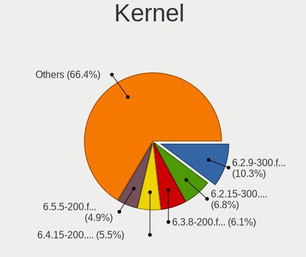

| Version                                                          | Computers | Percent |
|------------------------------------------------------------------|-----------|---------|
| 6.2.15-300.fc38.x86_64                                           | 215       | 22.23%  |
| 6.2.14-300.fc38.x86_64                                           | 151       | 15.62%  |
| 6.2.11-300.fc38.x86_64                                           | 132       | 13.65%  |
| 6.2.9-300.fc38.x86_64                                            | 99        | 10.24%  |
| 6.2.13-300.fc38.x86_64                                           | 72        | 7.45%   |
| 6.3.5-200.fc38.x86_64                                            | 65        | 6.72%   |
| 6.2.12-300.fc38.x86_64                                           | 56        | 5.79%   |
| 6.3.4-201.fc38.x86_64                                            | 50        | 5.17%   |
| 6.3.6-200.fc38.x86_64                                            | 15        | 1.55%   |
| 6.2.8-300.fc38.x86_64                                            | 14        | 1.45%   |
| 6.2.6-300.fc38.x86_64                                            | 11        | 1.14%   |
| 6.2.10-300.fc38.x86_64                                           | 10        | 1.03%   |
| 6.2.7-300.fc38.x86_64                                            | 7         | 0.72%   |
| 6.2.2-301.fc38.x86_64                                            | 6         | 0.62%   |
| 6.3.3-200.fc38.x86_64                                            | 5         | 0.52%   |
| 6.2.0-63.fc38.x86_64                                             | 4         | 0.41%   |
| 6.2.2-300.fc38.x86_64                                            | 3         | 0.31%   |
| 6.2.15-703.inttf.fc38.x86_64                                     | 3         | 0.31%   |
| 6.4.0-0.rc4.334.vanilla.fc38.x86_64                              | 2         | 0.21%   |
| 6.2.5-300.fc38.x86_64                                            | 2         | 0.21%   |
| 6.2.11-703.inttf.fc38.x86_64                                     | 2         | 0.21%   |
| 6.1.26-200.fc38.x86_64                                           | 2         | 0.21%   |
| 6.4.0-0.rc5.20230607gta4d7d701.342.vanilla.fc38.x86_64           | 1         | 0.1%    |
| 6.4.0-0.rc2.23.fc39.ppc64le                                      | 1         | 0.1%    |
| 6.3.6-cb1.0.fc38.x86_64                                          | 1         | 0.1%    |
| 6.3.3-cb1.0.fc38.x86_64                                          | 1         | 0.1%    |
| 6.3.3-1.surface.fc38.x86_64                                      | 1         | 0.1%    |
| 6.3.2-cbl1.0.fc38.x86_64                                         | 1         | 0.1%    |
| 6.3.1-cb3.0.fc38.x86_64                                          | 1         | 0.1%    |
| 6.3.1-350.vanilla.fc38.x86_64                                    | 1         | 0.1%    |
| 6.3.1-200.fc38.x86_64                                            | 1         | 0.1%    |
| 6.3.0+                                                           | 1         | 0.1%    |
| 6.2.3-300.fc38.x86_64                                            | 1         | 0.1%    |
| 6.2.15-200.fc37.x86_64                                           | 1         | 0.1%    |
| 6.2.14-703.inttf.fc38.x86_64                                     | 1         | 0.1%    |
| 6.2.14-450.asahi.fc38.aarch64                                    | 1         | 0.1%    |
| 6.2.10-300.rog.fc38.x86_64                                       | 1         | 0.1%    |
| 6.2.10-1.surface.fc38.x86_64                                     | 1         | 0.1%    |
| 6.2.1-300.fc38.x86_64                                            | 1         | 0.1%    |
| 6.2.0-rc1-1b929c02afd37871d5afb9d498426f83432e71c2-btrfs-debug4+ | 1         | 0.1%    |

Kernel Family
-------------

Linux kernel without a distro release

| Version | Computers | Percent |
|---------|-----------|---------|
| 6.2.15  | 219       | 22.67%  |
| 6.2.14  | 153       | 15.84%  |
| 6.2.11  | 134       | 13.87%  |
| 6.2.9   | 99        | 10.25%  |
| 6.2.13  | 72        | 7.45%   |
| 6.3.5   | 65        | 6.73%   |
| 6.2.12  | 56        | 5.8%    |
| 6.3.4   | 50        | 5.18%   |
| 6.3.6   | 16        | 1.66%   |
| 6.2.8   | 14        | 1.45%   |
| 6.2.10  | 12        | 1.24%   |
| 6.2.0   | 12        | 1.24%   |
| 6.2.6   | 11        | 1.14%   |
| 6.2.2   | 9         | 0.93%   |
| 6.3.3   | 7         | 0.72%   |
| 6.2.7   | 7         | 0.72%   |
| 6.1.0   | 5         | 0.52%   |
| 6.4.0   | 4         | 0.41%   |
| 6.3.1   | 3         | 0.31%   |
| 6.2.5   | 2         | 0.21%   |
| 6.1.26  | 2         | 0.21%   |
| 6.0.0   | 2         | 0.21%   |
| 6.3.2   | 1         | 0.1%    |
| 6.3.0   | 1         | 0.1%    |
| 6.2.3   | 1         | 0.1%    |
| 6.2.1   | 1         | 0.1%    |
| 6.1.31  | 1         | 0.1%    |
| 6.1.18  | 1         | 0.1%    |
| 6.0.17  | 1         | 0.1%    |
| 6.0.12  | 1         | 0.1%    |
| 6.0.11  | 1         | 0.1%    |
| 5.19.7  | 1         | 0.1%    |
| 5.15.55 | 1         | 0.1%    |
| 5.11.18 | 1         | 0.1%    |

Kernel Major Ver.
-----------------

Linux kernel major version

| Version | Computers | Percent |
|---------|-----------|---------|
| 6.2     | 769       | 82.42%  |
| 6.3     | 143       | 15.33%  |
| 6.1     | 9         | 0.96%   |
| 6.0     | 5         | 0.54%   |
| 6.4     | 4         | 0.43%   |
| 5.19    | 1         | 0.11%   |
| 5.15    | 1         | 0.11%   |
| 5.11    | 1         | 0.11%   |

Arch
----

OS architecture (x86_64, i586, etc.)

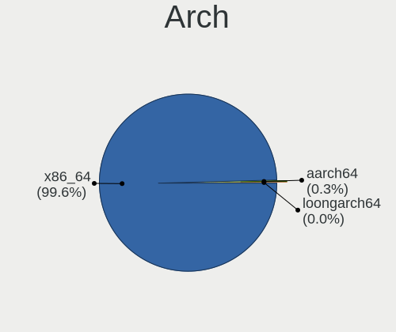

| Name    | Computers | Percent |
|---------|-----------|---------|
| x86_64  | 911       | 99.67%  |
| aarch64 | 2         | 0.22%   |
| ppc64le | 1         | 0.11%   |

DE
--

Desktop Environment

| Name          | Computers | Percent |
|---------------|-----------|---------|
| GNOME         | 723       | 79.02%  |
| KDE5          | 129       | 14.1%   |
| Unknown       | 18        | 1.97%   |
| Cinnamon      | 14        | 1.53%   |
| XFCE          | 9         | 0.98%   |
| X-Cinnamon    | 5         | 0.55%   |
| MATE          | 5         | 0.55%   |
| LXDE          | 2         | 0.22%   |
| i3            | 2         | 0.22%   |
| Hyprland      | 2         | 0.22%   |
| sway          | 1         | 0.11%   |
| LXQt          | 1         | 0.11%   |
| KDE           | 1         | 0.11%   |
| GNOME Classic | 1         | 0.11%   |
| Deepin        | 1         | 0.11%   |
| Budgie        | 1         | 0.11%   |

Display Server
--------------

X11 or Wayland

| Name    | Computers | Percent |
|---------|-----------|---------|
| Wayland | 733       | 79.76%  |
| X11     | 155       | 16.87%  |
| Tty     | 17        | 1.85%   |
| Unknown | 13        | 1.41%   |
| Xcb     | 1         | 0.11%   |

Display Manager
---------------

SDDM, LightDM, etc.

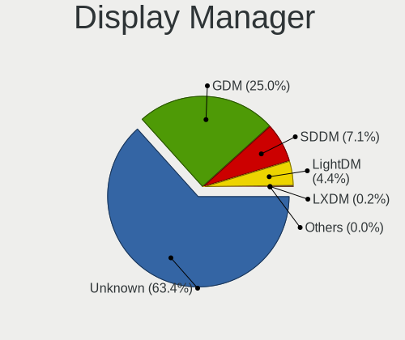

| Name    | Computers | Percent |
|---------|-----------|---------|
| Unknown | 599       | 65.39%  |
| GDM     | 216       | 23.58%  |
| SDDM    | 62        | 6.77%   |
| LightDM | 36        | 3.93%   |
| LXDM    | 2         | 0.22%   |
| SLiM    | 1         | 0.11%   |

OS Lang
-------

Language

| Lang  | Computers | Percent |
|-------|-----------|---------|
| en_US | 459       | 50.05%  |
| en_GB | 58        | 6.32%   |
| pt_BR | 55        | 6%      |
| ru_RU | 47        | 5.13%   |
| de_DE | 45        | 4.91%   |
| fr_FR | 31        | 3.38%   |
| en_CA | 24        | 2.62%   |
| en_AU | 22        | 2.4%    |
| it_IT | 20        | 2.18%   |
| pl_PL | 14        | 1.53%   |
| es_ES | 12        | 1.31%   |
| es_MX | 11        | 1.2%    |
| es_CL | 8         | 0.87%   |
| es_AR | 8         | 0.87%   |
| hu_HU | 6         | 0.65%   |
| en_IN | 6         | 0.65%   |
| pt_PT | 5         | 0.55%   |
| de_AT | 5         | 0.55%   |
| tr_TR | 4         | 0.44%   |
| nl_NL | 4         | 0.44%   |
| fr_CA | 4         | 0.44%   |
| es_PE | 4         | 0.44%   |
| es_CO | 4         | 0.44%   |
| de_CH | 4         | 0.44%   |
| cs_CZ | 4         | 0.44%   |
| zh_CN | 3         | 0.33%   |
| ru_UA | 3         | 0.33%   |
| es_EC | 3         | 0.33%   |
| en_NZ | 3         | 0.33%   |
| zh_TW | 2         | 0.22%   |
| sv_SE | 2         | 0.22%   |
| sk_SK | 2         | 0.22%   |
| nl_BE | 2         | 0.22%   |
| id_ID | 2         | 0.22%   |
| hr_HR | 2         | 0.22%   |
| fi_FI | 2         | 0.22%   |
| es_VE | 2         | 0.22%   |
| en_IL | 2         | 0.22%   |
| en_DK | 2         | 0.22%   |
| C     | 2         | 0.22%   |

Boot Mode
---------

EFI or BIOS

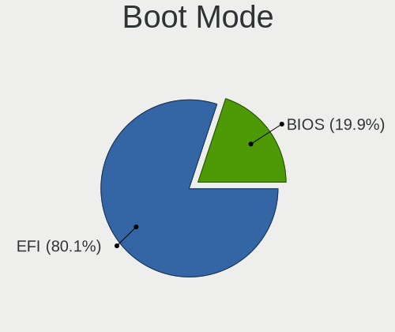

| Mode | Computers | Percent |
|------|-----------|---------|
| EFI  | 744       | 81.13%  |
| BIOS | 173       | 18.87%  |

Filesystem
----------

Type of filesystem

| Type    | Computers | Percent |
|---------|-----------|---------|
| Btrfs   | 771       | 84.35%  |
| Ext4    | 120       | 13.13%  |
| Xfs     | 18        | 1.97%   |
| Overlay | 3         | 0.33%   |
| Zfs     | 1         | 0.11%   |
| F2fs    | 1         | 0.11%   |

Part. scheme
------------

Scheme of partitioning

| Type    | Computers | Percent |
|---------|-----------|---------|
| Unknown | 583       | 63.65%  |
| GPT     | 311       | 33.95%  |
| MBR     | 22        | 2.4%    |

Dual Boot with Linux/BSD
------------------------

Hosting more than one Linux/BSD

| Dual boot | Computers | Percent |
|-----------|-----------|---------|
| No        | 844       | 92.24%  |
| Yes       | 71        | 7.76%   |

Dual Boot (Win)
---------------

Hosting Linux and Windows

| Dual boot | Computers | Percent |
|-----------|-----------|---------|
| No        | 785       | 85.79%  |
| Yes       | 130       | 14.21%  |

Board
-----

Vendor
------

Motherboard manufacturer

| Name                   | Computers | Percent |
|------------------------|-----------|---------|
| Lenovo                 | 186       | 20.35%  |
| ASUSTek Computer       | 149       | 16.3%   |
| Dell                   | 114       | 12.47%  |
| Hewlett-Packard        | 113       | 12.36%  |
| Gigabyte Technology    | 55        | 6.02%   |
| MSI                    | 50        | 5.47%   |
| Acer                   | 35        | 3.83%   |
| Apple                  | 29        | 3.17%   |
| ASRock                 | 27        | 2.95%   |
| HUAWEI                 | 17        | 1.86%   |
| Unknown                | 12        | 1.31%   |
| Samsung Electronics    | 11        | 1.2%    |
| Intel                  | 7         | 0.77%   |
| Toshiba                | 6         | 0.66%   |
| Timi                   | 6         | 0.66%   |
| Microsoft              | 6         | 0.66%   |
| Google                 | 5         | 0.55%   |
| Sony                   | 4         | 0.44%   |
| Positivo               | 4         | 0.44%   |
| Notebook               | 3         | 0.33%   |
| Framework              | 3         | 0.33%   |
| AZW                    | 3         | 0.33%   |
| UNOWHY                 | 2         | 0.22%   |
| TUXEDO                 | 2         | 0.22%   |
| Razer                  | 2         | 0.22%   |
| Pegatron               | 2         | 0.22%   |
| PC Specialist          | 2         | 0.22%   |
| Medion                 | 2         | 0.22%   |
| MECHREVO               | 2         | 0.22%   |
| Itautec                | 2         | 0.22%   |
| iRU                    | 2         | 0.22%   |
| Huanan                 | 2         | 0.22%   |
| HPE                    | 2         | 0.22%   |
| GPU Company            | 2         | 0.22%   |
| Chuwi                  | 2         | 0.22%   |
| Biostar                | 2         | 0.22%   |
| Avell High Performance | 2         | 0.22%   |
| AMI                    | 2         | 0.22%   |
| Alienware              | 2         | 0.22%   |
| ZOTAC                  | 1         | 0.11%   |

Model
-----

Motherboard model

| Name                                 | Computers | Percent |
|--------------------------------------|-----------|---------|
| Unknown                              | 14        | 1.53%   |
| HP Pavilion Aero Laptop 13-be0xxx    | 4         | 0.44%   |
| Dell XPS 13 9310                     | 4         | 0.44%   |
| Dell OptiPlex 7010                   | 4         | 0.44%   |
| Apple MacBookPro9,2                  | 4         | 0.44%   |
| Apple MacBookPro8,1                  | 4         | 0.44%   |
| MSI MS-7C37                          | 3         | 0.33%   |
| Lenovo IdeaPadFlex 5 14ITL05 82HS    | 3         | 0.33%   |
| Gigabyte X570 I AORUS PRO WIFI       | 3         | 0.33%   |
| Framework Laptop                     | 3         | 0.33%   |
| Dell XPS 13 9305                     | 3         | 0.33%   |
| Dell XPS 13 7390                     | 3         | 0.33%   |
| Dell Precision 7540                  | 3         | 0.33%   |
| Dell Latitude E7450                  | 3         | 0.33%   |
| Dell Latitude 7420                   | 3         | 0.33%   |
| Dell Latitude 5490                   | 3         | 0.33%   |
| Dell Inspiron 15 5510                | 3         | 0.33%   |
| ASUS ROG Strix G513QY_G513QY         | 3         | 0.33%   |
| ASUS All Series                      | 3         | 0.33%   |
| ASRock B450M Pro4                    | 3         | 0.33%   |
| Acer Nitro AN515-54                  | 3         | 0.33%   |
| Timi Redmi Book Pro 14 2022          | 2         | 0.22%   |
| Samsung 730QCJ/730QCR                | 2         | 0.22%   |
| Samsung 550XDA                       | 2         | 0.22%   |
| MSI MS-7C84                          | 2         | 0.22%   |
| MSI MS-7C02                          | 2         | 0.22%   |
| MSI MS-7B89                          | 2         | 0.22%   |
| MSI MS-7B79                          | 2         | 0.22%   |
| MSI MS-7A39                          | 2         | 0.22%   |
| MSI Modern 14 B11MOL                 | 2         | 0.22%   |
| Medion S1219T MD99922                | 2         | 0.22%   |
| Lenovo Yoga Slim 7 14ARE05 82A2      | 2         | 0.22%   |
| Lenovo Yoga 6 13ALC6 82ND            | 2         | 0.22%   |
| Lenovo ThinkPad X220 42911H8         | 2         | 0.22%   |
| Lenovo Legion Y530-15ICH 81FV        | 2         | 0.22%   |
| Lenovo IdeaPad L340-15API 81LW       | 2         | 0.22%   |
| Lenovo IdeaPad Gaming 3 15IMH05 82CG | 2         | 0.22%   |
| Lenovo IdeaPad 5 14ALC05 82LM        | 2         | 0.22%   |
| Lenovo IdeaPad 3 15ITL6 82H8         | 2         | 0.22%   |
| HUAWEI RLEF-XX                       | 2         | 0.22%   |

Model Family
------------

Motherboard model prefix

| Name               | Computers | Percent |
|--------------------|-----------|---------|
| Lenovo ThinkPad    | 92        | 10.07%  |
| Lenovo IdeaPad     | 36        | 3.94%   |
| ASUS ROG           | 32        | 3.5%    |
| Dell Latitude      | 28        | 3.06%   |
| ASUS PRIME         | 25        | 2.74%   |
| Dell Inspiron      | 24        | 2.63%   |
| HP Pavilion        | 22        | 2.41%   |
| ASUS VivoBook      | 22        | 2.41%   |
| Dell XPS           | 20        | 2.19%   |
| Dell OptiPlex      | 17        | 1.86%   |
| HP Laptop          | 16        | 1.75%   |
| Acer Aspire        | 16        | 1.75%   |
| Dell Precision     | 14        | 1.53%   |
| Unknown            | 14        | 1.53%   |
| ASUS TUF           | 13        | 1.42%   |
| Lenovo Yoga        | 12        | 1.31%   |
| Lenovo Legion      | 11        | 1.2%    |
| ASUS ASUS          | 11        | 1.2%    |
| HP EliteBook       | 10        | 1.09%   |
| HP ENVY            | 9         | 0.98%   |
| Acer Nitro         | 9         | 0.98%   |
| Lenovo ThinkBook   | 8         | 0.88%   |
| HP ProBook         | 8         | 0.88%   |
| Lenovo ThinkCentre | 7         | 0.77%   |
| Lenovo IdeaPadFlex | 7         | 0.77%   |
| HP Compaq          | 7         | 0.77%   |
| Microsoft Surface  | 6         | 0.66%   |
| Dell Vostro        | 6         | 0.66%   |
| ASUS Zenbook       | 6         | 0.66%   |
| HP ZBook           | 5         | 0.55%   |
| Gigabyte B550M     | 5         | 0.55%   |
| Apple MacBookPro9  | 5         | 0.55%   |
| Toshiba Satellite  | 4         | 0.44%   |
| HP Victus          | 4         | 0.44%   |
| HP OMEN            | 4         | 0.44%   |
| HP EliteDesk       | 4         | 0.44%   |
| Gigabyte X570      | 4         | 0.44%   |
| Gigabyte B450      | 4         | 0.44%   |
| ASRock B450M       | 4         | 0.44%   |
| Apple MacBookPro8  | 4         | 0.44%   |

MFG Year
--------

Motherboard manufacture year

| Year    | Computers | Percent |
|---------|-----------|---------|
| 2021    | 132       | 14.44%  |
| 2020    | 122       | 13.35%  |
| 2022    | 115       | 12.58%  |
| 2019    | 97        | 10.61%  |
| 2018    | 93        | 10.18%  |
| 2017    | 59        | 6.46%   |
| 2012    | 50        | 5.47%   |
| 2014    | 37        | 4.05%   |
| 2013    | 37        | 4.05%   |
| 2011    | 36        | 3.94%   |
| 2023    | 33        | 3.61%   |
| 2016    | 30        | 3.28%   |
| 2015    | 29        | 3.17%   |
| 2010    | 15        | 1.64%   |
| 2009    | 10        | 1.09%   |
| 2008    | 9         | 0.98%   |
| 2006    | 4         | 0.44%   |
| 2007    | 3         | 0.33%   |
| Unknown | 3         | 0.33%   |

Form Factor
-----------

Physical design of the computer

| Name           | Computers | Percent |
|----------------|-----------|---------|
| Notebook       | 553       | 60.5%   |
| Desktop        | 274       | 29.98%  |
| Convertible    | 45        | 4.92%   |
| Tablet         | 16        | 1.75%   |
| Mini pc        | 14        | 1.53%   |
| All in one     | 7         | 0.77%   |
| Server         | 4         | 0.44%   |
| System on chip | 1         | 0.11%   |

Secure Boot
-----------

Enabled or disabled

| State    | Computers | Percent |
|----------|-----------|---------|
| Disabled | 719       | 78.32%  |
| Enabled  | 199       | 21.68%  |

Coreboot
--------

Have coreboot on board

| Used | Computers | Percent |
|------|-----------|---------|
| No   | 906       | 99.12%  |
| Yes  | 8         | 0.88%   |

RAM Size
--------

Total RAM memory

| Size in GB  | Computers | Percent |
|-------------|-----------|---------|
| 16.01-24.0  | 238       | 25.93%  |
| 4.01-8.0    | 215       | 23.42%  |
| 8.01-16.0   | 172       | 18.74%  |
| 32.01-64.0  | 129       | 14.05%  |
| 3.01-4.0    | 71        | 7.73%   |
| 64.01-256.0 | 43        | 4.68%   |
| 24.01-32.0  | 36        | 3.92%   |
| 1.01-2.0    | 14        | 1.53%   |

RAM Used
--------

Used RAM memory

| Used GB    | Computers | Percent |
|------------|-----------|---------|
| 4.01-8.0   | 279       | 29.62%  |
| 2.01-3.0   | 260       | 27.6%   |
| 3.01-4.0   | 235       | 24.95%  |
| 1.01-2.0   | 98        | 10.4%   |
| 8.01-16.0  | 52        | 5.52%   |
| 0.51-1.0   | 11        | 1.17%   |
| 16.01-24.0 | 5         | 0.53%   |
| 32.01-64.0 | 2         | 0.21%   |

Total Drives
------------

Number of drives on board

| Drives | Computers | Percent |
|--------|-----------|---------|
| 1      | 557       | 60.41%  |
| 2      | 245       | 26.57%  |
| 3      | 61        | 6.62%   |
| 4      | 30        | 3.25%   |
| 5      | 15        | 1.63%   |
| 6      | 8         | 0.87%   |
| 10     | 2         | 0.22%   |
| 7      | 2         | 0.22%   |
| 11     | 1         | 0.11%   |
| 0      | 1         | 0.11%   |

Has CD-ROM
----------

Has CD-ROM on board

| Presented | Computers | Percent |
|-----------|-----------|---------|
| No        | 741       | 80.81%  |
| Yes       | 176       | 19.19%  |

Has Ethernet
------------

Has Ethernet on board

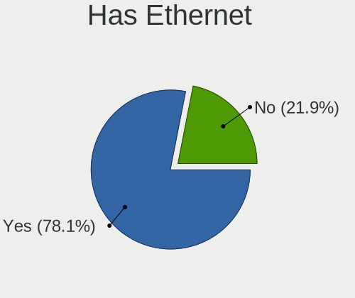

| Presented | Computers | Percent |
|-----------|-----------|---------|
| Yes       | 688       | 75.27%  |
| No        | 226       | 24.73%  |

Has WiFi
--------

Has WiFi module

| Presented | Computers | Percent |
|-----------|-----------|---------|
| Yes       | 775       | 84.7%   |
| No        | 140       | 15.3%   |

Has Bluetooth
-------------

Has Bluetooth module

| Presented | Computers | Percent |
|-----------|-----------|---------|
| Yes       | 686       | 74.73%  |
| No        | 232       | 25.27%  |

Location
--------

Country
-------

Geographic location (country)

| Country     | Computers | Percent |
|-------------|-----------|---------|
| USA         | 166       | 18.1%   |
| Brazil      | 77        | 8.4%    |
| Germany     | 67        | 7.31%   |
| Russia      | 52        | 5.67%   |
| Canada      | 37        | 4.03%   |
| France      | 36        | 3.93%   |
| Italy       | 31        | 3.38%   |
| Poland      | 29        | 3.16%   |
| Netherlands | 25        | 2.73%   |
| Australia   | 25        | 2.73%   |
| UK          | 24        | 2.62%   |
| India       | 23        | 2.51%   |
| Mexico      | 20        | 2.18%   |
| Hungary     | 16        | 1.74%   |
| Spain       | 15        | 1.64%   |
| Turkey      | 14        | 1.53%   |
| Switzerland | 13        | 1.42%   |
| Czechia     | 10        | 1.09%   |
| Chile       | 10        | 1.09%   |
| Belgium     | 10        | 1.09%   |
| Austria     | 10        | 1.09%   |
| Argentina   | 9         | 0.98%   |
| Thailand    | 8         | 0.87%   |
| Sweden      | 8         | 0.87%   |
| Portugal    | 8         | 0.87%   |
| Finland     | 8         | 0.87%   |
| Colombia    | 8         | 0.87%   |
| Belarus     | 8         | 0.87%   |
| Romania     | 7         | 0.76%   |
| Norway      | 7         | 0.76%   |
| Indonesia   | 6         | 0.65%   |
| Denmark     | 6         | 0.65%   |
| Croatia     | 6         | 0.65%   |
| Taiwan      | 5         | 0.55%   |
| South Korea | 5         | 0.55%   |
| Singapore   | 5         | 0.55%   |
| Serbia      | 5         | 0.55%   |
| Peru        | 5         | 0.55%   |
| Israel      | 5         | 0.55%   |
| Greece      | 5         | 0.55%   |

City
----

Geographic location (city)

| City           | Computers | Percent |
|----------------|-----------|---------|
| Sydney         | 13        | 1.4%    |
| Sao Paulo      | 11        | 1.18%   |
| Moscow         | 11        | 1.18%   |
| Santiago       | 7         | 0.75%   |
| Rio de Janeiro | 7         | 0.75%   |
| Mexico City    | 7         | 0.75%   |
| Helsinki       | 7         | 0.75%   |
| Budapest       | 7         | 0.75%   |
| Amsterdam      | 7         | 0.75%   |
| Vienna         | 6         | 0.65%   |
| Minsk          | 6         | 0.65%   |
| Singapore      | 5         | 0.54%   |
| Paris          | 5         | 0.54%   |
| Istanbul       | 5         | 0.54%   |
| Fortaleza      | 5         | 0.54%   |
| Brussels       | 5         | 0.54%   |
| Berlin         | 5         | 0.54%   |
| Bengaluru      | 5         | 0.54%   |
| Bangkok        | 5         | 0.54%   |
| Warsaw         | 4         | 0.43%   |
| Toronto        | 4         | 0.43%   |
| St Petersburg  | 4         | 0.43%   |
| Seattle        | 4         | 0.43%   |
| Prague         | 4         | 0.43%   |
| Ottawa         | 4         | 0.43%   |
| New York       | 4         | 0.43%   |
| Montreal       | 4         | 0.43%   |
| Melbourne      | 4         | 0.43%   |
| Madrid         | 4         | 0.43%   |
| Gdansk         | 4         | 0.43%   |
| Brisbane       | 4         | 0.43%   |
| Braslia      | 4         | 0.43%   |
| Atlanta        | 4         | 0.43%   |
| Alliston       | 4         | 0.43%   |
| Zurich         | 3         | 0.32%   |
| Zagreb         | 3         | 0.32%   |
| Winnipeg       | 3         | 0.32%   |
| Ufa            | 3         | 0.32%   |
| Springfield    | 3         | 0.32%   |
| Sofia          | 3         | 0.32%   |

Drives
------

Drive Vendor
------------

Hard drive vendors

| Vendor                         | Computers | Drives | Percent |
|--------------------------------|-----------|--------|---------|
| Samsung Electronics            | 256       | 351    | 19.09%  |
| Sandisk                        | 126       | 135    | 9.4%    |
| WDC                            | 112       | 148    | 8.35%   |
| Seagate                        | 100       | 128    | 7.46%   |
| Kingston                       | 81        | 87     | 6.04%   |
| Toshiba                        | 75        | 81     | 5.59%   |
| Unknown                        | 56        | 68     | 4.18%   |
| SK hynix                       | 56        | 59     | 4.18%   |
| Crucial                        | 47        | 58     | 3.5%    |
| Intel                          | 44        | 54     | 3.28%   |
| Micron Technology              | 43        | 45     | 3.21%   |
| Phison Electronics             | 23        | 33     | 1.72%   |
| China                          | 23        | 24     | 1.72%   |
| A-DATA Technology              | 21        | 25     | 1.57%   |
| KIOXIA                         | 20        | 21     | 1.49%   |
| Micron/Crucial Technology      | 18        | 19     | 1.34%   |
| Apple                          | 15        | 23     | 1.12%   |
| Silicon Motion                 | 14        | 15     | 1.04%   |
| Hitachi                        | 13        | 17     | 0.97%   |
| HGST                           | 13        | 13     | 0.97%   |
| SPCC                           | 10        | 10     | 0.75%   |
| ADATA Technology               | 10        | 10     | 0.75%   |
| Netac                          | 9         | 9      | 0.67%   |
| Kingston Technology Company    | 9         | 11     | 0.67%   |
| PNY                            | 8         | 10     | 0.6%    |
| Patriot                        | 8         | 10     | 0.6%    |
| Phison                         | 7         | 8      | 0.52%   |
| JMicron Technology             | 6         | 7      | 0.45%   |
| Transcend                      | 4         | 4      | 0.3%    |
| Solid State Storage Technology | 4         | 4      | 0.3%    |
| SABRENT                        | 4         | 4      | 0.3%    |
| Realtek Semiconductor          | 4         | 7      | 0.3%    |
| LITEON                         | 4         | 4      | 0.3%    |
| Lexar                          | 4         | 4      | 0.3%    |
| Intenso                        | 4         | 4      | 0.3%    |
| Gigabyte Technology            | 4         | 5      | 0.3%    |
| Unknown                        | 4         | 4      | 0.3%    |
| Union Memory (Shenzhen)        | 3         | 3      | 0.22%   |
| Union Memory                   | 3         | 3      | 0.22%   |
| KingSpec                       | 3         | 3      | 0.22%   |

Drive Model
-----------

Hard drive models

| Model                                               | Computers | Percent |
|-----------------------------------------------------|-----------|---------|
| Samsung NVMe SSD Controller SM981/PM981/PM983 256GB | 56        | 3.89%   |
| Samsung NVMe SSD Controller PM9A1/PM9A3/980PRO 1TB  | 33        | 2.29%   |
| Kingston SA400S37240G 240GB SSD                     | 21        | 1.46%   |
| Sandisk WD Blue SN550 NVMe SSD 512GB                | 17        | 1.18%   |
| Unknown MMC Card  32GB                              | 15        | 1.04%   |
| Unknown MMC Card  64GB                              | 13        | 0.9%    |
| Samsung SSD 980 1TB                                 | 13        | 0.9%    |
| Samsung NVMe SSD Controller SM961/PM961/SM963 256GB | 13        | 0.9%    |
| Micron/Crucial P2 NVMe PCIe SSD 1TB                 | 13        | 0.9%    |
| Seagate ST1000LM035-1RK172 1TB                      | 12        | 0.83%   |
| Kingston SA400S37480G 480GB SSD                     | 12        | 0.83%   |
| Crucial CT500MX500SSD1 500GB                        | 11        | 0.76%   |
| Samsung SSD 860 EVO 1TB                             | 10        | 0.7%    |
| Phison E12 NVMe Controller 256GB                    | 10        | 0.7%    |
| Intel SSD 660P Series 512GB                         | 10        | 0.7%    |
| Sandisk WD Black SN750 / PC SN730 NVMe SSD 256GB    | 9         | 0.63%   |
| Unknown MMC Card  128GB                             | 8         | 0.56%   |
| Silicon Motion SM2263EN/SM2263XT SSD Controller 1TB | 8         | 0.56%   |
| Samsung SSD 870 EVO 1TB                             | 8         | 0.56%   |
| Phison E16 PCIe4 NVMe Controller 1TB                | 8         | 0.56%   |
| Kingston SA400S37120G 120GB SSD                     | 8         | 0.56%   |
| WDC WDS500G2B0A-00SM50 500GB SSD                    | 7         | 0.49%   |
| Toshiba XG6 NVMe SSD Controller 256GB               | 7         | 0.49%   |
| Toshiba DT01ACA100 1TB                              | 7         | 0.49%   |
| SK hynix BC511 256GB                                | 7         | 0.49%   |
| Toshiba MQ04ABF100 1TB                              | 6         | 0.42%   |
| Toshiba MQ01ABD100 1TB                              | 6         | 0.42%   |
| Sandisk WD Blue SN500 / PC SN520 NVMe SSD 512GB     | 6         | 0.42%   |
| Sandisk WD Black SN850 500GB                        | 6         | 0.42%   |
| Samsung SSD 860 EVO 250GB                           | 6         | 0.42%   |
| Samsung SSD 850 EVO 250GB                           | 6         | 0.42%   |
| WDC WDS240G2G0A-00JH30 240GB SSD                    | 5         | 0.35%   |
| SK hynix PC401 NVMe Solid State Drive 256GB         | 5         | 0.35%   |
| Seagate ST2000DM008-2FR102 2TB                      | 5         | 0.35%   |
| Seagate ST2000DM006-2DM164 2TB                      | 5         | 0.35%   |
| Seagate ST1000DM010-2EP102 1TB                      | 5         | 0.35%   |
| Sandisk WDC PC SN530 SDBPMPZ-512G-1101 512GB        | 5         | 0.35%   |
| SanDisk SSD PLUS 480GB                              | 5         | 0.35%   |
| Samsung SSD 850 EVO 500GB                           | 5         | 0.35%   |
| Samsung MZVLQ512HBLU-00BH1 512GB                    | 5         | 0.35%   |

HDD Vendor
----------

Hard disk drive vendors

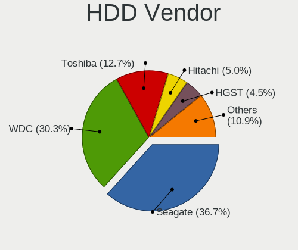

| Vendor              | Computers | Drives | Percent |
|---------------------|-----------|--------|---------|
| Seagate             | 95        | 118    | 34.8%   |
| WDC                 | 78        | 109    | 28.57%  |
| Toshiba             | 50        | 53     | 18.32%  |
| Hitachi             | 13        | 17     | 4.76%   |
| HGST                | 13        | 13     | 4.76%   |
| Samsung Electronics | 9         | 9      | 3.3%    |
| Apple               | 5         | 5      | 1.83%   |
| Unknown             | 3         | 3      | 1.1%    |
| QNAP                | 2         | 2      | 0.73%   |
| USB3.0              | 1         | 1      | 0.37%   |
| USB                 | 1         | 1      | 0.37%   |
| SAGE                | 1         | 1      | 0.37%   |
| LaCie               | 1         | 1      | 0.37%   |
| ASMT                | 1         | 2      | 0.37%   |

SSD Vendor
----------

Solid state drive vendors

| Vendor              | Computers | Drives | Percent |
|---------------------|-----------|--------|---------|
| Samsung Electronics | 91        | 120    | 20.78%  |
| Kingston            | 63        | 68     | 14.38%  |
| Crucial             | 45        | 54     | 10.27%  |
| SanDisk             | 36        | 37     | 8.22%   |
| WDC                 | 26        | 26     | 5.94%   |
| China               | 23        | 24     | 5.25%   |
| A-DATA Technology   | 17        | 21     | 3.88%   |
| Intel               | 14        | 16     | 3.2%    |
| SPCC                | 10        | 10     | 2.28%   |
| Toshiba             | 8         | 9      | 1.83%   |
| PNY                 | 8         | 10     | 1.83%   |
| Patriot             | 8         | 10     | 1.83%   |
| Micron Technology   | 7         | 7      | 1.6%    |
| Netac               | 6         | 6      | 1.37%   |
| JMicron Technology  | 5         | 6      | 1.14%   |
| Apple               | 5         | 6      | 1.14%   |
| SABRENT             | 4         | 4      | 0.91%   |
| LITEON              | 4         | 4      | 0.91%   |
| Lexar               | 4         | 4      | 0.91%   |
| Transcend           | 3         | 3      | 0.68%   |
| KingSpec            | 3         | 3      | 0.68%   |
| GOODRAM             | 3         | 6      | 0.68%   |
| Gigabyte Technology | 3         | 4      | 0.68%   |
| TO Exter            | 2         | 2      | 0.46%   |
| SK hynix            | 2         | 2      | 0.46%   |
| Ramsta              | 2         | 2      | 0.46%   |
| Kimtigo             | 2         | 2      | 0.46%   |
| Hewlett-Packard     | 2         | 2      | 0.46%   |
| Apacer              | 2         | 2      | 0.46%   |
| AMD                 | 2         | 2      | 0.46%   |
| Advantech           | 2         | 2      | 0.46%   |
| Acer                | 2         | 4      | 0.46%   |
| XrayDisk            | 1         | 1      | 0.23%   |
| Union Memory        | 1         | 1      | 0.23%   |
| Team                | 1         | 1      | 0.23%   |
| TAMMUZ              | 1         | 1      | 0.23%   |
| Smart               | 1         | 1      | 0.23%   |
| Pichau              | 1         | 1      | 0.23%   |
| Phison              | 1         | 1      | 0.23%   |
| OEM                 | 1         | 1      | 0.23%   |

Drive Kind
----------

HDD or SSD

| Kind    | Computers | Drives | Percent |
|---------|-----------|--------|---------|
| NVMe    | 529       | 684    | 43.33%  |
| SSD     | 376       | 504    | 30.79%  |
| HDD     | 242       | 335    | 19.82%  |
| MMC     | 54        | 65     | 4.42%   |
| Unknown | 20        | 23     | 1.64%   |

Drive Connector
---------------

SATA, SAS, NVMe, etc.

| Type | Computers | Drives | Percent |
|------|-----------|--------|---------|
| NVMe | 529       | 684    | 47.19%  |
| SATA | 492       | 800    | 43.89%  |
| MMC  | 54        | 65     | 4.82%   |
| SAS  | 46        | 62     | 4.1%    |

Drive Size
----------

Size of hard drive

| Size in TB | Computers | Drives | Percent |
|------------|-----------|--------|---------|
| 0.01-0.5   | 341       | 472    | 53.96%  |
| 0.51-1.0   | 206       | 255    | 32.59%  |
| 1.01-2.0   | 51        | 63     | 8.07%   |
| 3.01-4.0   | 12        | 14     | 1.9%    |
| 4.01-10.0  | 9         | 15     | 1.42%   |
| 2.01-3.0   | 7         | 8      | 1.11%   |
| 10.01-20.0 | 6         | 12     | 0.95%   |

Space Total
-----------

Amount of disk space available on the file system

| Size in GB     | Computers | Percent |
|----------------|-----------|---------|
| 501-1000       | 198       | 21.5%   |
| 251-500        | 179       | 19.44%  |
| 1001-2000      | 147       | 15.96%  |
| 101-250        | 114       | 12.38%  |
| 1-20           | 69        | 7.49%   |
| Unknown        | 69        | 7.49%   |
| More than 3000 | 60        | 6.51%   |
| 2001-3000      | 37        | 4.02%   |
| 51-100         | 32        | 3.47%   |
| 21-50          | 16        | 1.74%   |

Space Used
----------

Amount of used disk space

| Used GB        | Computers | Percent |
|----------------|-----------|---------|
| 1-20           | 299       | 32.29%  |
| 21-50          | 162       | 17.49%  |
| 101-250        | 104       | 11.23%  |
| 51-100         | 103       | 11.12%  |
| 251-500        | 87        | 9.4%    |
| Unknown        | 69        | 7.45%   |
| 501-1000       | 53        | 5.72%   |
| 1001-2000      | 32        | 3.46%   |
| More than 3000 | 10        | 1.08%   |
| 2001-3000      | 7         | 0.76%   |

Malfunc. Drives
---------------

Drive models with a malfunction

| Model                                         | Computers | Drives | Percent |
|-----------------------------------------------|-----------|--------|---------|
| WDC WDS240G2G0A-00JH30 240GB SSD              | 2         | 2      | 6.25%   |
| Seagate ST500DM002-1BD142 500GB               | 2         | 2      | 6.25%   |
| Intel SSDSC2CT120A3 120GB                     | 2         | 3      | 6.25%   |
| Crucial CT120M500SSD1 120GB                   | 2         | 5      | 6.25%   |
| WDC WDS100T2G0A-00JH30 1TB SSD                | 1         | 1      | 3.13%   |
| WDC WD5000AADS-00S9B0 500GB                   | 1         | 1      | 3.13%   |
| WDC WD20EZRX-00D8PB0 2TB                      | 1         | 1      | 3.13%   |
| WDC WD10JPVT-60A1YT0 1TB                      | 1         | 1      | 3.13%   |
| WDC WD1002FAEX-00Y9A0 1TB                     | 1         | 1      | 3.13%   |
| Toshiba MQ02ABD100H 1TB                       | 1         | 1      | 3.13%   |
| Toshiba MQ01ABF050 500GB                      | 1         | 1      | 3.13%   |
| Toshiba MQ01ABD100 1TB                        | 1         | 1      | 3.13%   |
| SK hynix HFS128G3AMNB-2200A 128GB SSD         | 1         | 1      | 3.13%   |
| Seagate ST9160412AS 160GB                     | 1         | 1      | 3.13%   |
| Seagate ST3750528AS 752GB                     | 1         | 1      | 3.13%   |
| Seagate ST3500630NS 500GB                     | 1         | 1      | 3.13%   |
| Seagate ST3500418AS 500GB                     | 1         | 1      | 3.13%   |
| Seagate ST2000DM008-2FR102 2TB                | 1         | 1      | 3.13%   |
| SanDisk SSD PLUS 480GB                        | 1         | 1      | 3.13%   |
| SanDisk SD8SBAT256G1122 256GB SSD             | 1         | 1      | 3.13%   |
| Samsung Electronics SSD 840 PRO Series 256GB  | 1         | 1      | 3.13%   |
| Samsung Electronics SSD 840 EVO 250GB         | 1         | 1      | 3.13%   |
| Samsung Electronics HD322GJ 320GB             | 1         | 1      | 3.13%   |
| Micron Technology MTFDDAK128MAM-1J1 128GB SSD | 1         | 1      | 3.13%   |
| Kingston SA400S37120G 120GB SSD               | 1         | 1      | 3.13%   |
| Intenso SSD 240GB                             | 1         | 1      | 3.13%   |
| Intel SSDSC2KG019T7R 2TB                      | 1         | 1      | 3.13%   |
| Intel SSDSC2BF240A5L 240GB                    | 1         | 1      | 3.13%   |

Malfunc. Drive Vendor
---------------------

Vendors of faulty drives

| Vendor              | Computers | Drives | Percent |
|---------------------|-----------|--------|---------|
| Seagate             | 7         | 7      | 23.33%  |
| WDC                 | 5         | 7      | 16.67%  |
| Intel               | 4         | 5      | 13.33%  |
| Toshiba             | 3         | 3      | 10%     |
| Samsung Electronics | 3         | 3      | 10%     |
| SanDisk             | 2         | 2      | 6.67%   |
| Crucial             | 2         | 5      | 6.67%   |
| SK hynix            | 1         | 1      | 3.33%   |
| Micron Technology   | 1         | 1      | 3.33%   |
| Kingston            | 1         | 1      | 3.33%   |
| Intenso             | 1         | 1      | 3.33%   |

Malfunc. HDD Vendor
-------------------

Vendors of faulty HDD drives

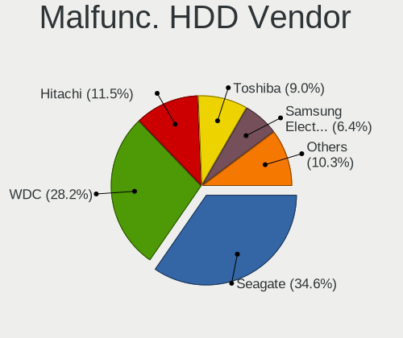

| Vendor              | Computers | Drives | Percent |
|---------------------|-----------|--------|---------|
| Seagate             | 7         | 7      | 50%     |
| WDC                 | 3         | 4      | 21.43%  |
| Toshiba             | 3         | 3      | 21.43%  |
| Samsung Electronics | 1         | 1      | 7.14%   |

Malfunc. Drive Kind
-------------------

Kinds of faulty drives

| Kind | Computers | Drives | Percent |
|------|-----------|--------|---------|
| SSD  | 16        | 21     | 53.33%  |
| HDD  | 14        | 15     | 46.67%  |

Failed Drives
-------------

Failed drive models

Zero info for selected period =(

Failed Drive Vendor
-------------------

Failed drive vendors

Zero info for selected period =(

Drive Status
------------

Number of failed and malfunc. drives

| Status   | Computers | Drives | Percent |
|----------|-----------|--------|---------|
| Detected | 644       | 1099   | 66.67%  |
| Works    | 294       | 476    | 30.43%  |
| Malfunc  | 28        | 36     | 2.9%    |

Storage controller
------------------

Storage Vendor
--------------

Storage controller vendors

| Vendor                         | Computers | Percent |
|--------------------------------|-----------|---------|
| Intel                          | 486       | 38.3%   |
| AMD                            | 196       | 15.45%  |
| Samsung Electronics            | 181       | 14.26%  |
| SanDisk                        | 98        | 7.72%   |
| SK hynix                       | 54        | 4.26%   |
| Micron Technology              | 36        | 2.84%   |
| Phison Electronics             | 28        | 2.21%   |
| Kingston Technology Company    | 27        | 2.13%   |
| Toshiba America Info Systems   | 20        | 1.58%   |
| Micron/Crucial Technology      | 19        | 1.5%    |
| KIOXIA                         | 17        | 1.34%   |
| Silicon Motion                 | 16        | 1.26%   |
| ADATA Technology               | 14        | 1.1%    |
| ASMedia Technology             | 12        | 0.95%   |
| Marvell Technology Group       | 11        | 0.87%   |
| Solid State Storage Technology | 7         | 0.55%   |
| Union Memory (Shenzhen)        | 6         | 0.47%   |
| Seagate Technology             | 6         | 0.47%   |
| Realtek Semiconductor          | 4         | 0.32%   |
| JMicron Technology             | 4         | 0.32%   |
| Apple                          | 4         | 0.32%   |
| Netac Technology               | 3         | 0.24%   |
| MAXIO Technology (Hangzhou)    | 3         | 0.24%   |
| LSI Logic / Symbios Logic      | 3         | 0.24%   |
| Yangtze Memory Technologies    | 2         | 0.16%   |
| Solidigm                       | 2         | 0.16%   |
| Shenzhen Longsys Electronics   | 2         | 0.16%   |
| VIA Technologies               | 1         | 0.08%   |
| ULi Electronics                | 1         | 0.08%   |
| Silicon Image                  | 1         | 0.08%   |
| PMC-Sierra                     | 1         | 0.08%   |
| Nvidia                         | 1         | 0.08%   |
| INNOGRIT                       | 1         | 0.08%   |
| Broadcom / LSI                 | 1         | 0.08%   |
| Adaptec                        | 1         | 0.08%   |

Storage Model
-------------

Storage controller models

| Model                                                                          | Computers | Percent |
|--------------------------------------------------------------------------------|-----------|---------|
| AMD FCH SATA Controller [AHCI mode]                                            | 138       | 10.03%  |
| Samsung NVMe SSD Controller SM981/PM981/PM983                                  | 70        | 5.09%   |
| Samsung NVMe SSD Controller 980                                                | 48        | 3.49%   |
| Intel Volume Management Device NVMe RAID Controller                            | 47        | 3.42%   |
| Intel Sunrise Point-LP SATA Controller [AHCI mode]                             | 42        | 3.05%   |
| Samsung NVMe SSD Controller PM9A1/PM9A3/980PRO                                 | 40        | 2.91%   |
| Micron NVMe Storage Controller                                                 | 34        | 2.47%   |
| Intel 82801 Mobile SATA Controller [RAID mode]                                 | 29        | 2.11%   |
| Intel 8 Series/C220 Series Chipset Family 6-port SATA Controller 1 [AHCI mode] | 29        | 2.11%   |
| Intel 7 Series Chipset Family 6-port SATA Controller [AHCI mode]               | 28        | 2.03%   |
| AMD 500 Series Chipset SATA Controller                                         | 28        | 2.03%   |
| SK hynix Gold P31/PC711 NVMe Solid State Drive                                 | 23        | 1.67%   |
| SanDisk Non-Volatile memory controller                                         | 22        | 1.6%    |
| AMD 400 Series Chipset SATA Controller                                         | 21        | 1.53%   |
| Intel 6 Series/C200 Series Chipset Family 6 port Mobile SATA AHCI Controller   | 20        | 1.45%   |
| SanDisk WD Blue SN550 NVMe SSD                                                 | 19        | 1.38%   |
| Samsung NVMe SSD Controller SM961/PM961/SM963                                  | 18        | 1.31%   |
| Intel Cannon Lake Mobile PCH SATA AHCI Controller                              | 18        | 1.31%   |
| Kingston Company Company Non-Volatile memory controller                        | 17        | 1.24%   |
| Intel 200 Series PCH SATA controller [AHCI mode]                               | 17        | 1.24%   |
| Intel Celeron/Pentium Silver Processor SATA Controller                         | 16        | 1.16%   |
| Intel Alder Lake-S PCH SATA Controller [AHCI Mode]                             | 16        | 1.16%   |
| Intel HM170/QM170 Chipset SATA Controller [AHCI Mode]                          | 15        | 1.09%   |
| Intel Cannon Lake PCH SATA AHCI Controller                                     | 15        | 1.09%   |
| Intel 8 Series SATA Controller 1 [AHCI mode]                                   | 15        | 1.09%   |
| Intel 7 Series/C210 Series Chipset Family 6-port SATA Controller [AHCI mode]   | 15        | 1.09%   |
| Micron/Crucial P2 NVMe PCIe SSD                                                | 14        | 1.02%   |
| Intel Tiger Lake-LP SATA Controller                                            | 12        | 0.87%   |
| Intel 500 Series Chipset Family SATA AHCI Controller                           | 12        | 0.87%   |
| ASMedia ASM1062 Serial ATA Controller                                          | 12        | 0.87%   |
| SanDisk WD Black SN750 / PC SN730 NVMe SSD                                     | 11        | 0.8%    |
| Phison E12 NVMe Controller                                                     | 11        | 0.8%    |
| Intel Comet Lake SATA AHCI Controller                                          | 11        | 0.8%    |
| Intel 400 Series Chipset Family SATA AHCI Controller                           | 11        | 0.8%    |
| AMD SB7x0/SB8x0/SB9x0 IDE Controller                                           | 11        | 0.8%    |
| Toshiba America Info Systems XG6 NVMe SSD Controller                           | 10        | 0.73%   |
| SK hynix BC511                                                                 | 10        | 0.73%   |
| Intel SSD 660P Series                                                          | 10        | 0.73%   |
| Intel SATA Controller [RAID mode]                                              | 10        | 0.73%   |
| Intel Q170/Q150/B150/H170/H110/Z170/CM236 Chipset SATA Controller [AHCI Mode]  | 10        | 0.73%   |

Storage Kind
------------

Kind of storage controller (IDE, SATA, NVMe, SAS, ...)

| Kind | Computers | Percent |
|------|-----------|---------|
| SATA | 584       | 46.79%  |
| NVMe | 525       | 42.07%  |
| RAID | 96        | 7.69%   |
| IDE  | 38        | 3.04%   |
| SAS  | 4         | 0.32%   |
| SCSI | 1         | 0.08%   |

Processor
---------

CPU Vendor
----------

Processor vendors

| Vendor                   | Computers | Percent |
|--------------------------|-----------|---------|
| Intel                    | 630       | 68.93%  |
| AMD                      | 280       | 30.63%  |
| PowerNV C1P9S01 REV 1.01 | 1         | 0.11%   |
| CentaurHauls             | 1         | 0.11%   |
| ARM                      | 1         | 0.11%   |
| Unknown                  | 1         | 0.11%   |

CPU Model
---------

Processor models

| Model                                         | Computers | Percent |
|-----------------------------------------------|-----------|---------|
| Intel 11th Gen Core i5-1135G7 @ 2.40GHz       | 26        | 2.84%   |
| Intel 11th Gen Core i7-1165G7 @ 2.80GHz       | 14        | 1.53%   |
| AMD Ryzen 5 5600X 6-Core Processor            | 13        | 1.42%   |
| AMD Ryzen 5 5500U with Radeon Graphics        | 13        | 1.42%   |
| AMD Ryzen 5 3500U with Radeon Vega Mobile Gfx | 12        | 1.31%   |
| AMD Ryzen 7 5800H with Radeon Graphics        | 11        | 1.2%    |
| Intel Core i5-8250U CPU @ 1.60GHz             | 10        | 1.09%   |
| Intel Core i5-3210M CPU @ 2.50GHz             | 10        | 1.09%   |
| Intel Core i7-8550U CPU @ 1.80GHz             | 9         | 0.98%   |
| Intel Core i5-10210U CPU @ 1.60GHz            | 9         | 0.98%   |
| Intel 11th Gen Core i7-1185G7 @ 3.00GHz       | 9         | 0.98%   |
| Intel Core i7-8750H CPU @ 2.20GHz             | 8         | 0.88%   |
| Intel Core i7-10750H CPU @ 2.60GHz            | 8         | 0.88%   |
| Intel 12th Gen Core i7-12700H                 | 8         | 0.88%   |
| AMD Ryzen 7 5700U with Radeon Graphics        | 8         | 0.88%   |
| AMD Ryzen 5 3600 6-Core Processor             | 8         | 0.88%   |
| Intel Core i7-9750H CPU @ 2.60GHz             | 7         | 0.77%   |
| Intel Core i7-7700HQ CPU @ 2.80GHz            | 7         | 0.77%   |
| Intel Core i5-1035G1 CPU @ 1.00GHz            | 7         | 0.77%   |
| Intel Atom x5-Z8350 CPU @ 1.44GHz             | 7         | 0.77%   |
| Intel 12th Gen Core i7-1260P                  | 7         | 0.77%   |
| Intel Core i7-8565U CPU @ 1.80GHz             | 6         | 0.66%   |
| Intel Core i7-3770 CPU @ 3.40GHz              | 6         | 0.66%   |
| Intel Core i5-8350U CPU @ 1.70GHz             | 6         | 0.66%   |
| Intel Celeron N4020 CPU @ 1.10GHz             | 6         | 0.66%   |
| AMD Ryzen 7 6800H with Radeon Graphics        | 6         | 0.66%   |
| AMD Ryzen 7 5800X 8-Core Processor            | 6         | 0.66%   |
| AMD Ryzen 7 3700X 8-Core Processor            | 6         | 0.66%   |
| AMD Ryzen 5 5600U with Radeon Graphics        | 6         | 0.66%   |
| Intel Pentium Silver N5030 CPU @ 1.10GHz      | 5         | 0.55%   |
| Intel Core i7-4810MQ CPU @ 2.80GHz            | 5         | 0.55%   |
| Intel Core i5-7200U CPU @ 2.50GHz             | 5         | 0.55%   |
| Intel Core i5-6300U CPU @ 2.40GHz             | 5         | 0.55%   |
| Intel Core i5-5300U CPU @ 2.30GHz             | 5         | 0.55%   |
| Intel Core i5-10300H CPU @ 2.50GHz            | 5         | 0.55%   |
| Intel 12th Gen Core i7-1255U                  | 5         | 0.55%   |
| Intel 12th Gen Core i5-1235U                  | 5         | 0.55%   |
| AMD Ryzen 9 7950X 16-Core Processor           | 5         | 0.55%   |
| AMD Ryzen 9 5900X 12-Core Processor           | 5         | 0.55%   |
| AMD Ryzen 9 5900HX with Radeon Graphics       | 5         | 0.55%   |

CPU Model Family
----------------

Processor model prefix

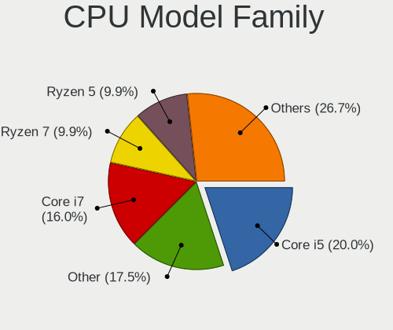

| Model                   | Computers | Percent |
|-------------------------|-----------|---------|
| Intel Core i5           | 167       | 18.27%  |
| Intel Core i7           | 162       | 17.72%  |
| Other                   | 150       | 16.41%  |
| AMD Ryzen 5             | 100       | 10.94%  |
| AMD Ryzen 7             | 76        | 8.32%   |
| Intel Core i3           | 49        | 5.36%   |
| AMD Ryzen 9             | 38        | 4.16%   |
| Intel Celeron           | 28        | 3.06%   |
| Intel Xeon              | 18        | 1.97%   |
| Intel Atom              | 15        | 1.64%   |
| AMD Ryzen 3             | 11        | 1.2%    |
| Intel Core 2 Duo        | 10        | 1.09%   |
| AMD FX                  | 10        | 1.09%   |
| Intel Pentium Silver    | 9         | 0.98%   |
| Intel Pentium           | 8         | 0.88%   |
| Intel Core i9           | 7         | 0.77%   |
| AMD Ryzen 7 PRO         | 7         | 0.77%   |
| AMD Ryzen 5 PRO         | 7         | 0.77%   |
| Intel Core 2 Quad       | 5         | 0.55%   |
| AMD Phenom II X4        | 4         | 0.44%   |
| AMD A8                  | 4         | 0.44%   |
| AMD A6                  | 4         | 0.44%   |
| AMD A10                 | 3         | 0.33%   |
| Intel Pentium Dual-Core | 2         | 0.22%   |
| Intel Pentium Dual      | 2         | 0.22%   |
| AMD Ryzen Threadripper  | 2         | 0.22%   |
| AMD Athlon              | 2         | 0.22%   |
| Intel Pentium Gold      | 1         | 0.11%   |
| Intel Genuine           | 1         | 0.11%   |
| Intel Core m5           | 1         | 0.11%   |
| Intel Core m3           | 1         | 0.11%   |
| Intel Core 2 Extreme    | 1         | 0.11%   |
| Intel Core 2            | 1         | 0.11%   |
| AMD Phenom II X2        | 1         | 0.11%   |
| AMD Opteron             | 1         | 0.11%   |
| AMD E2                  | 1         | 0.11%   |
| AMD E1                  | 1         | 0.11%   |
| AMD Athlon II X2        | 1         | 0.11%   |
| AMD Athlon 64 X2        | 1         | 0.11%   |
| AMD A4                  | 1         | 0.11%   |

CPU Cores
---------

Number of processor cores

| Number | Computers | Percent |
|--------|-----------|---------|
| 4      | 339       | 37.09%  |
| 2      | 221       | 24.18%  |
| 6      | 140       | 15.32%  |
| 8      | 124       | 13.57%  |
| 12     | 36        | 3.94%   |
| 14     | 16        | 1.75%   |
| 10     | 16        | 1.75%   |
| 16     | 14        | 1.53%   |
| 3      | 4         | 0.44%   |
| 24     | 3         | 0.33%   |
| 18     | 1         | 0.11%   |

CPU Sockets
-----------

Number of sockets

| Number | Computers | Percent |
|--------|-----------|---------|
| 1      | 911       | 99.67%  |
| 2      | 3         | 0.33%   |

CPU Threads
-----------

Threads per core (Hyper-Threading)

| Number | Computers | Percent |
|--------|-----------|---------|
| 2      | 740       | 80.96%  |
| 1      | 173       | 18.93%  |
| 4      | 1         | 0.11%   |

CPU Op-Modes
------------

CPU Operation Modes (32-bit, 64-bit)

| Op mode        | Computers | Percent |
|----------------|-----------|---------|
| 32-bit, 64-bit | 911       | 99.67%  |
| 64-bit         | 2         | 0.22%   |
| Unknown        | 1         | 0.11%   |

CPU Microcode
-------------

Microcode number

| Number     | Computers | Percent |
|------------|-----------|---------|
| Unknown    | 639       | 69.84%  |
| 0x0a50000c | 28        | 3.06%   |
| 0x0a50000d | 20        | 2.19%   |
| 0x08108109 | 19        | 2.08%   |
| 0x08701021 | 18        | 1.97%   |
| 0x08608103 | 18        | 1.97%   |
| 0x0a601203 | 14        | 1.53%   |
| 0x0a404102 | 14        | 1.53%   |
| 0x0a20120a | 13        | 1.42%   |
| 0x08600106 | 10        | 1.09%   |
| 0x08108102 | 9         | 0.98%   |
| 0x0800820d | 9         | 0.98%   |
| 0x0a201016 | 8         | 0.87%   |
| 0x06000822 | 6         | 0.66%   |
| 0x08701030 | 5         | 0.55%   |
| 0x08600104 | 5         | 0.55%   |
| 0x0a404101 | 4         | 0.44%   |
| 0x0a201025 | 4         | 0.44%   |
| 0x06006705 | 4         | 0.44%   |
| 0x08608102 | 3         | 0.33%   |
| 0x0800820c | 3         | 0.33%   |
| 0x0600611a | 3         | 0.33%   |
| 0x06001116 | 3         | 0.33%   |
| 0x010000c8 | 3         | 0.33%   |
| 0x906ea    | 2         | 0.22%   |
| 0x806e9    | 2         | 0.22%   |
| 0x806c1    | 2         | 0.22%   |
| 0x0a50000b | 2         | 0.22%   |
| 0x0a201205 | 2         | 0.22%   |
| 0x0a201204 | 2         | 0.22%   |
| 0x08608104 | 2         | 0.22%   |
| 0x08600103 | 2         | 0.22%   |
| 0x08101016 | 2         | 0.22%   |
| 0x0810100b | 2         | 0.22%   |
| 0x08101007 | 2         | 0.22%   |
| 0x08001138 | 2         | 0.22%   |
| 0x06000629 | 2         | 0.22%   |
| 0x010000b6 | 2         | 0.22%   |
| 0x506c9    | 1         | 0.11%   |
| 0x306a9    | 1         | 0.11%   |

CPU Microarch
-------------

Microarchitecture

| Name             | Computers | Percent |
|------------------|-----------|---------|
| KabyLake         | 165       | 18.05%  |
| Zen 3            | 86        | 9.41%   |
| Unknown          | 69        | 7.55%   |
| TigerLake        | 63        | 6.89%   |
| Alderlake Hybrid | 62        | 6.78%   |
| Haswell          | 56        | 6.13%   |
| IvyBridge        | 50        | 5.47%   |
| Zen 2            | 44        | 4.81%   |
| Zen+             | 40        | 4.38%   |
| SandyBridge      | 36        | 3.94%   |
| Skylake          | 31        | 3.39%   |
| Icelake          | 31        | 3.39%   |
| CometLake        | 29        | 3.17%   |
| Silvermont       | 21        | 2.3%    |
| Goldmont plus    | 18        | 1.97%   |
| Westmere         | 15        | 1.64%   |
| Penryn           | 14        | 1.53%   |
| Broadwell        | 14        | 1.53%   |
| Zen              | 12        | 1.31%   |
| Piledriver       | 12        | 1.31%   |
| Excavator        | 9         | 0.98%   |
| Core             | 9         | 0.98%   |
| K10              | 6         | 0.66%   |
| Tremont          | 4         | 0.44%   |
| Goldmont         | 4         | 0.44%   |
| Nehalem          | 3         | 0.33%   |
| Bulldozer        | 3         | 0.33%   |
| Puma             | 2         | 0.22%   |
| Jaguar           | 2         | 0.22%   |
| K8 Hammer        | 1         | 0.11%   |
| K10 Llano        | 1         | 0.11%   |
| Gracemont        | 1         | 0.11%   |
| Bonnell          | 1         | 0.11%   |

Graphics
--------

GPU Vendor
----------

Vendors of graphics cards

| Vendor                     | Computers | Percent |
|----------------------------|-----------|---------|
| Intel                      | 525       | 47.55%  |
| Nvidia                     | 288       | 26.09%  |
| AMD                        | 286       | 25.91%  |
| Matrox Electronics Systems | 2         | 0.18%   |
| ASPEED Technology          | 2         | 0.18%   |
| Zhaoxin                    | 1         | 0.09%   |

GPU Model
---------

Graphics card models

| Model                                                                                    | Computers | Percent |
|------------------------------------------------------------------------------------------|-----------|---------|
| Intel TigerLake-LP GT2 [Iris Xe Graphics]                                                | 59        | 5.22%   |
| AMD Cezanne [Radeon Vega Series / Radeon Vega Mobile Series]                             | 38        | 3.36%   |
| Intel UHD Graphics 620                                                                   | 29        | 2.56%   |
| Intel 2nd Generation Core Processor Family Integrated Graphics Controller                | 28        | 2.48%   |
| AMD Picasso/Raven 2 [Radeon Vega Series / Radeon Vega Mobile Series]                     | 28        | 2.48%   |
| Intel CoffeeLake-H GT2 [UHD Graphics 630]                                                | 27        | 2.39%   |
| Intel Alder Lake-P Integrated Graphics Controller                                        | 27        | 2.39%   |
| Intel 3rd Gen Core processor Graphics Controller                                         | 26        | 2.3%    |
| AMD Lucienne                                                                             | 25        | 2.21%   |
| AMD Ellesmere [Radeon RX 470/480/570/570X/580/580X/590]                                  | 22        | 1.95%   |
| Intel CometLake-U GT2 [UHD Graphics]                                                     | 20        | 1.77%   |
| AMD Rembrandt [Radeon 680M]                                                              | 19        | 1.68%   |
| Intel HD Graphics 630                                                                    | 18        | 1.59%   |
| Intel HD Graphics 620                                                                    | 18        | 1.59%   |
| Intel CometLake-H GT2 [UHD Graphics]                                                     | 18        | 1.59%   |
| AMD Renoir                                                                               | 18        | 1.59%   |
| Intel WhiskeyLake-U GT2 [UHD Graphics 620]                                               | 17        | 1.5%    |
| Intel Haswell-ULT Integrated Graphics Controller                                         | 16        | 1.41%   |
| Intel Skylake GT2 [HD Graphics 520]                                                      | 14        | 1.24%   |
| AMD Navi 23 [Radeon RX 6600/6600 XT/6600M]                                               | 14        | 1.24%   |
| Intel Xeon E3-1200 v3/4th Gen Core Processor Integrated Graphics Controller              | 13        | 1.15%   |
| Intel GeminiLake [UHD Graphics 600]                                                      | 12        | 1.06%   |
| Intel CoffeeLake-S GT2 [UHD Graphics 630]                                                | 12        | 1.06%   |
| AMD Raphael                                                                              | 12        | 1.06%   |
| Nvidia GA106M [GeForce RTX 3060 Mobile / Max-Q]                                          | 11        | 0.97%   |
| Intel Iris Plus Graphics G1 (Ice Lake)                                                   | 11        | 0.97%   |
| Intel Atom/Celeron/Pentium Processor x5-E8000/J3xxx/N3xxx Integrated Graphics Controller | 11        | 0.97%   |
| AMD Navi 22 [Radeon RX 6700/6700 XT/6750 XT / 6800M/6850M XT]                            | 11        | 0.97%   |
| AMD Barcelo                                                                              | 11        | 0.97%   |
| Nvidia TU117M [GeForce GTX 1650 Mobile / Max-Q]                                          | 10        | 0.88%   |
| Intel HD Graphics 5500                                                                   | 10        | 0.88%   |
| Intel Atom Processor Z36xxx/Z37xxx Series Graphics & Display                             | 10        | 0.88%   |
| Intel HD Graphics 530                                                                    | 9         | 0.8%    |
| Intel Alder Lake-UP3 GT2 [Iris Xe Graphics]                                              | 9         | 0.8%    |
| Intel 4th Gen Core Processor Integrated Graphics Controller                              | 9         | 0.8%    |
| Nvidia TU117M [GeForce GTX 1650 Ti Mobile]                                               | 8         | 0.71%   |
| Nvidia GP107M [GeForce GTX 1050 Ti Mobile]                                               | 8         | 0.71%   |
| Nvidia GP107 [GeForce GTX 1050 Ti]                                                       | 8         | 0.71%   |
| AMD Navi 21 [Radeon RX 6800/6800 XT / 6900 XT]                                           | 8         | 0.71%   |
| AMD Navi 10 [Radeon RX 5600 OEM/5600 XT / 5700/5700 XT]                                  | 8         | 0.71%   |

GPU Combo
---------

Combinations of graphics cards

| Name           | Computers | Percent |
|----------------|-----------|---------|
| 1 x Intel      | 361       | 39.37%  |
| 1 x AMD        | 228       | 24.86%  |
| Intel + Nvidia | 140       | 15.27%  |
| 1 x Nvidia     | 115       | 12.54%  |
| AMD + Nvidia   | 30        | 3.27%   |
| Intel + AMD    | 14        | 1.53%   |
| 2 x AMD        | 13        | 1.42%   |
| 2 x Intel      | 5         | 0.55%   |
| 2 x Nvidia     | 4         | 0.44%   |
| Other          | 2         | 0.22%   |
| 1 x Matrox     | 2         | 0.22%   |
| 1 x ASPEED     | 2         | 0.22%   |
| 1 x Zhaoxin    | 1         | 0.11%   |

GPU Driver
----------

Free vs proprietary

| Driver      | Computers | Percent |
|-------------|-----------|---------|
| Free        | 778       | 84.84%  |
| Proprietary | 116       | 12.65%  |
| Unknown     | 23        | 2.51%   |

GPU Memory
----------

Total video memory

| Size in GB | Computers | Percent |
|------------|-----------|---------|
| Unknown    | 487       | 52.88%  |
| 0.01-0.5   | 100       | 10.86%  |
| 1.01-2.0   | 90        | 9.77%   |
| 3.01-4.0   | 73        | 7.93%   |
| 7.01-8.0   | 61        | 6.62%   |
| 0.51-1.0   | 48        | 5.21%   |
| 8.01-16.0  | 29        | 3.15%   |
| 5.01-6.0   | 22        | 2.39%   |
| 16.01-24.0 | 6         | 0.65%   |
| 2.01-3.0   | 5         | 0.54%   |

Monitor
-------

Monitor Vendor
--------------

Monitor vendors

| Vendor                  | Computers | Percent |
|-------------------------|-----------|---------|
| BOE                     | 134       | 12.91%  |
| AU Optronics            | 118       | 11.37%  |
| Chimei Innolux          | 103       | 9.92%   |
| Samsung Electronics     | 96        | 9.25%   |
| LG Display              | 75        | 7.23%   |
| Dell                    | 71        | 6.84%   |
| Goldstar                | 66        | 6.36%   |
| Sharp                   | 28        | 2.7%    |
| Apple                   | 26        | 2.5%    |
| Hewlett-Packard         | 24        | 2.31%   |
| Acer                    | 22        | 2.12%   |
| Lenovo                  | 21        | 2.02%   |
| Philips                 | 19        | 1.83%   |
| ASUSTek Computer        | 19        | 1.83%   |
| Ancor Communications    | 18        | 1.73%   |
| PANDA                   | 16        | 1.54%   |
| BenQ                    | 16        | 1.54%   |
| AOC                     | 16        | 1.54%   |
| CSO                     | 15        | 1.45%   |
| InfoVision              | 11        | 1.06%   |
| ViewSonic               | 8         | 0.77%   |
| Chi Mei Optoelectronics | 8         | 0.77%   |
| Mi                      | 7         | 0.67%   |
| Iiyama                  | 7         | 0.67%   |
| Gigabyte Technology     | 6         | 0.58%   |
| MSI                     | 5         | 0.48%   |
| Fujitsu Siemens         | 5         | 0.48%   |
| Sony                    | 4         | 0.39%   |
| Sceptre Tech            | 4         | 0.39%   |
| LG Philips              | 4         | 0.39%   |
| Vizio                   | 3         | 0.29%   |
| Vestel Elektronik       | 3         | 0.29%   |
| Unknown                 | 3         | 0.29%   |
| GDH                     | 3         | 0.29%   |
| Belinea                 | 3         | 0.29%   |
| Unknown (XXX)           | 2         | 0.19%   |
| Toshiba                 | 2         | 0.19%   |
| TMX                     | 2         | 0.19%   |
| TCT                     | 2         | 0.19%   |
| SANYO                   | 2         | 0.19%   |

Monitor Model
-------------

Monitor models

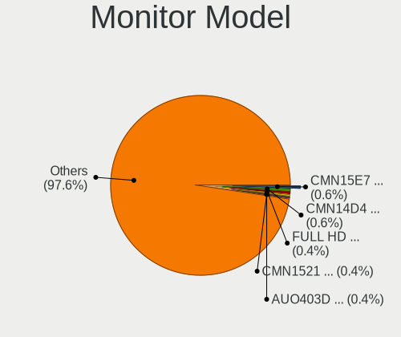

| Model                                                                | Computers | Percent |
|----------------------------------------------------------------------|-----------|---------|
| AU Optronics LCD Monitor AUO21ED 1920x1080 344x194mm 15.5-inch       | 8         | 0.75%   |
| Chimei Innolux LCD Monitor CMN1521 1920x1080 344x193mm 15.5-inch     | 6         | 0.56%   |
| BOE LCD Monitor BOE0872 1920x1080 344x194mm 15.5-inch                | 6         | 0.56%   |
| Goldstar FULL HD GSM5B55 1920x1080 480x270mm 21.7-inch               | 5         | 0.47%   |
| Chimei Innolux LCD Monitor CMN15E7 1920x1080 344x193mm 15.5-inch     | 5         | 0.47%   |
| Chimei Innolux LCD Monitor CMN14D4 1920x1080 309x173mm 13.9-inch     | 5         | 0.47%   |
| LG Display LCD Monitor LGD046D 1920x1080 309x174mm 14.0-inch         | 4         | 0.38%   |
| Goldstar ULTRAWIDE GSM59F1 2560x1080 673x284mm 28.8-inch             | 4         | 0.38%   |
| Chimei Innolux LCD Monitor CMN15DB 1366x768 344x193mm 15.5-inch      | 4         | 0.38%   |
| Chimei Innolux LCD Monitor CMN14E5 1920x1080 309x173mm 13.9-inch     | 4         | 0.38%   |
| Chimei Innolux LCD Monitor CMN1406 1920x1080 309x173mm 13.9-inch     | 4         | 0.38%   |
| BOE LCD Monitor BOE09DE 1920x1080 309x174mm 14.0-inch                | 4         | 0.38%   |
| BOE LCD Monitor BOE095F 2256x1504 285x190mm 13.5-inch                | 4         | 0.38%   |
| BOE LCD Monitor BOE07F6 1920x1080 309x174mm 14.0-inch                | 4         | 0.38%   |
| AU Optronics LCD Monitor AUO403D 1920x1080 309x173mm 13.9-inch       | 4         | 0.38%   |
| AU Optronics LCD Monitor AUO38ED 1920x1080 344x193mm 15.5-inch       | 4         | 0.38%   |
| Apple LCD Monitor APP9CC5 1280x800 286x179mm 13.3-inch               | 4         | 0.38%   |
| AOC 27P2DG5 AOC2702 1920x1080 598x336mm 27.0-inch                    | 4         | 0.38%   |
| Vestel Elektronik 43UHD_LCD_TV VES3700 3840x2160 950x540mm 43.0-inch | 3         | 0.28%   |
| Sharp LCD Monitor SHP14F9 1920x1200 288x180mm 13.4-inch              | 3         | 0.28%   |
| Sharp LCD Monitor SHP1453 1920x1080 346x194mm 15.6-inch              | 3         | 0.28%   |
| Samsung Electronics LC27G5xT SAM7079 2560x1440 597x336mm 27.0-inch   | 3         | 0.28%   |
| PANDA LCD Monitor NCP0036 1920x1080 344x194mm 15.5-inch              | 3         | 0.28%   |
| LG Display LCD Monitor LGD0555 1536x1024 263x175mm 12.4-inch         | 3         | 0.28%   |
| LG Display LCD Monitor LGD02E9 1366x768 309x174mm 14.0-inch          | 3         | 0.28%   |
| Lenovo LEN L28u-30 LEN65FA 3840x2160 621x341mm 27.9-inch             | 3         | 0.28%   |
| Lenovo LCD Monitor LEN40BA 1920x1080 344x194mm 15.5-inch             | 3         | 0.28%   |
| Lenovo LCD Monitor LEN40B2 1920x1080 344x193mm 15.5-inch             | 3         | 0.28%   |
| InfoVision LCD Monitor IVO057D 1920x1080 309x174mm 14.0-inch         | 3         | 0.28%   |
| InfoVision LCD Monitor IVO0535 1920x1080 294x165mm 13.3-inch         | 3         | 0.28%   |
| Iiyama PL2530H IVM6133 1920x1080 544x303mm 24.5-inch                 | 3         | 0.28%   |
| Goldstar Ultra HD GSM5B09 3840x2160 600x340mm 27.2-inch              | 3         | 0.28%   |
| Goldstar IPS FULLHD GSM5AB8 1920x1080 480x270mm 21.7-inch            | 3         | 0.28%   |
| Goldstar HDR WFHD GSM7714 2560x1080 798x334mm 34.1-inch              | 3         | 0.28%   |
| Gigabyte Technology M27Q GBT270D 2560x1440 596x335mm 26.9-inch       | 3         | 0.28%   |
| Dell E2011H DEL406B 1600x900 443x249mm 20.0-inch                     | 3         | 0.28%   |
| Chimei Innolux LCD Monitor CMN15E8 1920x1080 344x193mm 15.5-inch     | 3         | 0.28%   |
| Chimei Innolux LCD Monitor CMN15E6 1366x768 344x193mm 15.5-inch      | 3         | 0.28%   |
| Chimei Innolux LCD Monitor CMN15DC 1366x768 344x193mm 15.5-inch      | 3         | 0.28%   |
| Chimei Innolux LCD Monitor CMN15C3 1920x1080 344x193mm 15.5-inch     | 3         | 0.28%   |

Monitor Resolution
------------------

Monitor screen resolution

| Resolution         | Computers | Percent |
|--------------------|-----------|---------|
| 1920x1080 (FHD)    | 478       | 48.78%  |
| 1366x768 (WXGA)    | 100       | 10.2%   |
| 2560x1440 (QHD)    | 91        | 9.29%   |
| 3840x2160 (4K)     | 67        | 6.84%   |
| 1920x1200 (WUXGA)  | 32        | 3.27%   |
| 1600x900 (HD+)     | 28        | 2.86%   |
| 2560x1600          | 23        | 2.35%   |
| 1680x1050 (WSXGA+) | 22        | 2.24%   |
| 3440x1440          | 20        | 2.04%   |
| 1280x1024 (SXGA)   | 18        | 1.84%   |
| 1440x900 (WXGA+)   | 16        | 1.63%   |
| 1280x800 (WXGA)    | 15        | 1.53%   |
| 2880x1800          | 10        | 1.02%   |
| 2560x1080          | 10        | 1.02%   |
| 2160x1440          | 6         | 0.61%   |
| 2256x1504          | 5         | 0.51%   |
| 3840x2400          | 3         | 0.31%   |
| 2736x1824          | 3         | 0.31%   |
| 3840x1600          | 2         | 0.2%    |
| 3840x1100          | 2         | 0.2%    |
| 3456x2160          | 2         | 0.2%    |
| 2880x1620          | 2         | 0.2%    |
| 2520x1680          | 2         | 0.2%    |
| 2288x1287          | 2         | 0.2%    |
| 2048x1152          | 2         | 0.2%    |
| 1920x1280          | 2         | 0.2%    |
| 1600x1200          | 2         | 0.2%    |
| 1360x768           | 2         | 0.2%    |
| 1024x768 (XGA)     | 2         | 0.2%    |
| 800x1280           | 1         | 0.1%    |
| 3840x1080          | 1         | 0.1%    |
| 3200x2000          | 1         | 0.1%    |
| 3200x1800 (QHD+)   | 1         | 0.1%    |
| 3120x2080          | 1         | 0.1%    |
| 3072x1920          | 1         | 0.1%    |
| 3000x2000          | 1         | 0.1%    |
| 2304x1440          | 1         | 0.1%    |
| 2160x1350          | 1         | 0.1%    |
| 1920x540           | 1         | 0.1%    |
| 1280x960           | 1         | 0.1%    |

Monitor Diagonal
----------------

Diagonal size in inches

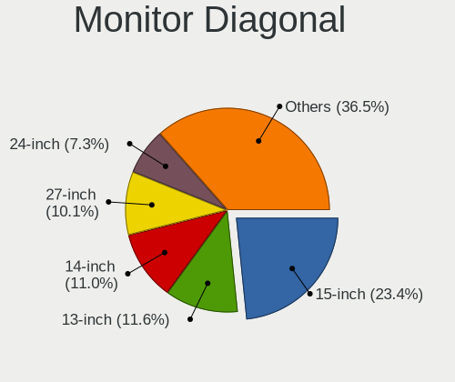

| Inches  | Computers | Percent |
|---------|-----------|---------|
| 15      | 257       | 24.71%  |
| 13      | 138       | 13.27%  |
| 14      | 115       | 11.06%  |
| 27      | 105       | 10.1%   |
| 24      | 71        | 6.83%   |
| 23      | 47        | 4.52%   |
| 21      | 42        | 4.04%   |
| 31      | 31        | 2.98%   |
| 34      | 29        | 2.79%   |
| 17      | 29        | 2.79%   |
| 19      | 21        | 2.02%   |
| 22      | 18        | 1.73%   |
| 16      | 18        | 1.73%   |
| 12      | 16        | 1.54%   |
| 20      | 15        | 1.44%   |
| 18      | 11        | 1.06%   |
| 84      | 10        | 0.96%   |
| 11      | 8         | 0.77%   |
| 54      | 5         | 0.48%   |
| 40      | 5         | 0.48%   |
| 32      | 5         | 0.48%   |
| 28      | 5         | 0.48%   |
| 10      | 5         | 0.48%   |
| Unknown | 4         | 0.38%   |
| 72      | 3         | 0.29%   |
| 65      | 3         | 0.29%   |
| 48      | 3         | 0.29%   |
| 25      | 3         | 0.29%   |
| 142     | 2         | 0.19%   |
| 63      | 2         | 0.19%   |
| 52      | 2         | 0.19%   |
| 42      | 2         | 0.19%   |
| 37      | 2         | 0.19%   |
| 35      | 2         | 0.19%   |
| 26      | 2         | 0.19%   |
| 49      | 1         | 0.1%    |
| 38      | 1         | 0.1%    |
| 33      | 1         | 0.1%    |
| 7       | 1         | 0.1%    |

Monitor Width
-------------

Physical width

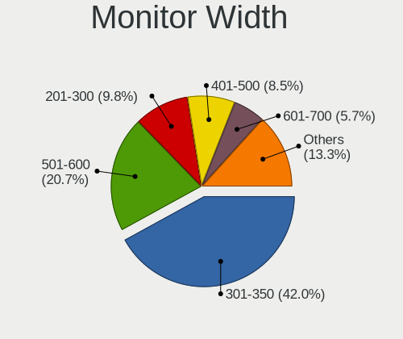

| Width in mm    | Computers | Percent |
|----------------|-----------|---------|
| 301-350        | 438       | 43.03%  |
| 501-600        | 199       | 19.55%  |
| 201-300        | 116       | 11.39%  |
| 401-500        | 92        | 9.04%   |
| 601-700        | 50        | 4.91%   |
| 351-400        | 40        | 3.93%   |
| 701-800        | 35        | 3.44%   |
| 1001-1500      | 16        | 1.57%   |
| 1501-2000      | 13        | 1.28%   |
| 801-900        | 10        | 0.98%   |
| Unknown        | 4         | 0.39%   |
| More than 2000 | 2         | 0.2%    |
| 901-1000       | 2         | 0.2%    |
| 1-100          | 1         | 0.1%    |

Aspect Ratio
------------

Proportional relationship between the width and the height

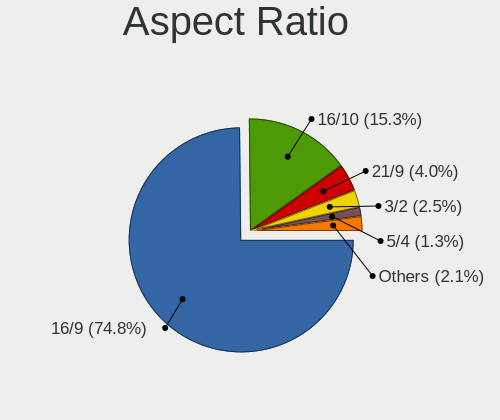

| Ratio | Computers | Percent |
|-------|-----------|---------|
| 16/9  | 708       | 76.96%  |
| 16/10 | 132       | 14.35%  |
| 21/9  | 31        | 3.37%   |
| 3/2   | 19        | 2.07%   |
| 5/4   | 18        | 1.96%   |
| 4/3   | 5         | 0.54%   |
| 3.40  | 2         | 0.22%   |
| 1.00  | 2         | 0.22%   |
| 6/5   | 1         | 0.11%   |
| 32/9  | 1         | 0.11%   |
| 0.67  | 1         | 0.11%   |

Monitor Area
------------

Area in inch

| Area in inch | Computers | Percent |
|----------------|-----------|---------|
| 101-110        | 259       | 25.02%  |
| 81-90          | 184       | 17.78%  |
| 201-250        | 139       | 13.43%  |
| 301-350        | 108       | 10.43%  |
| 351-500        | 71        | 6.86%   |
| 71-80          | 65        | 6.28%   |
| 151-200        | 52        | 5.02%   |
| More than 1000 | 30        | 2.9%    |
| 251-300        | 24        | 2.32%   |
| 121-130        | 21        | 2.03%   |
| 141-150        | 16        | 1.55%   |
| 111-120        | 16        | 1.55%   |
| 61-70          | 13        | 1.26%   |
| 51-60          | 11        | 1.06%   |
| 501-1000       | 11        | 1.06%   |
| 41-50          | 4         | 0.39%   |
| 91-100         | 4         | 0.39%   |
| Unknown        | 4         | 0.39%   |
| 131-140        | 2         | 0.19%   |
| 1-40           | 1         | 0.1%    |

Pixel Density
-------------

Pixels per inch

| Density       | Computers | Percent |
|---------------|-----------|---------|
| 121-160       | 355       | 35.57%  |
| 51-100        | 267       | 26.75%  |
| 101-120       | 204       | 20.44%  |
| 161-240       | 117       | 11.72%  |
| More than 240 | 32        | 3.21%   |
| 1-50          | 19        | 1.9%    |
| Unknown       | 4         | 0.4%    |

Multiple Monitors
-----------------

Total monitors connected

| Total | Computers | Percent |
|-------|-----------|---------|
| 1     | 704       | 76.52%  |
| 2     | 159       | 17.28%  |
| 0     | 32        | 3.48%   |
| 3     | 23        | 2.5%    |
| 4     | 2         | 0.22%   |

Network
-------

Net Controller Vendor
---------------------

Controller vendors

| Vendor                                 | Computers | Percent |
|----------------------------------------|-----------|---------|
| Intel                                  | 503       | 37.62%  |
| Realtek Semiconductor                  | 474       | 35.45%  |
| Qualcomm Atheros                       | 81        | 6.06%   |
| Broadcom                               | 69        | 5.16%   |
| MediaTek                               | 55        | 4.11%   |
| TP-Link                                | 17        | 1.27%   |
| Samsung Electronics                    | 9         | 0.67%   |
| Microsoft                              | 9         | 0.67%   |
| Marvell Technology Group               | 8         | 0.6%    |
| Lenovo                                 | 8         | 0.6%    |
| Broadcom Limited                       | 8         | 0.6%    |
| Aquantia                               | 8         | 0.6%    |
| Ralink Technology                      | 7         | 0.52%   |
| Ralink                                 | 7         | 0.52%   |
| Qualcomm Atheros Communications        | 7         | 0.52%   |
| ASIX Electronics                       | 7         | 0.52%   |
| Sierra Wireless                        | 6         | 0.45%   |
| DisplayLink                            | 6         | 0.45%   |
| Xiaomi                                 | 5         | 0.37%   |
| Qualcomm                               | 5         | 0.37%   |
| OPPO Electronics                       | 4         | 0.3%    |
| NetGear                                | 3         | 0.22%   |
| Mellanox Technologies                  | 3         | 0.22%   |
| D-Link                                 | 3         | 0.22%   |
| Ericsson Business Mobile Networks      | 2         | 0.15%   |
| Dell                                   | 2         | 0.15%   |
| ASUSTek Computer                       | 2         | 0.15%   |
| Wilocity                               | 1         | 0.07%   |
| WEMOS.CC                               | 1         | 0.07%   |
| Sony Ericsson Mobile Communications AB | 1         | 0.07%   |
| Quectel Wireless Solutions             | 1         | 0.07%   |
| Qualcomm Technologies                  | 1         | 0.07%   |
| OnePlus Technology (Shenzhen)          | 1         | 0.07%   |
| Nvidia                                 | 1         | 0.07%   |
| Microchip Technology                   | 1         | 0.07%   |
| MCS                                    | 1         | 0.07%   |
| JMicron Technology                     | 1         | 0.07%   |
| ICS Advent                             | 1         | 0.07%   |
| Huawei Technologies                    | 1         | 0.07%   |
| HMD Global                             | 1         | 0.07%   |

Net Controller Model
--------------------

Controller models

| Model                                                             | Computers | Percent |
|-------------------------------------------------------------------|-----------|---------|
| Realtek RTL8111/8168/8411 PCI Express Gigabit Ethernet Controller | 307       | 19.32%  |
| Intel Wi-Fi 6 AX200                                               | 71        | 4.47%   |
| Intel Wi-Fi 6 AX201                                               | 53        | 3.34%   |
| Intel Alder Lake-P PCH CNVi WiFi                                  | 37        | 2.33%   |
| Realtek RTL8125 2.5GbE Controller                                 | 36        | 2.27%   |
| Intel Wireless 8265 / 8275                                        | 35        | 2.2%    |
| Realtek RTL8153 Gigabit Ethernet Adapter                          | 34        | 2.14%   |
| Intel 82579LM Gigabit Network Connection (Lewisville)             | 29        | 1.83%   |
| Realtek RTL8822CE 802.11ac PCIe Wireless Network Adapter          | 27        | 1.7%    |
| MediaTek MT7921 802.11ax PCI Express Wireless Network Adapter     | 26        | 1.64%   |
| Qualcomm Atheros QCA9377 802.11ac Wireless Network Adapter        | 25        | 1.57%   |
| Realtek RTL8821CE 802.11ac PCIe Wireless Network Adapter          | 24        | 1.51%   |
| Realtek RTL810xE PCI Express Fast Ethernet controller             | 23        | 1.45%   |
| Intel Ethernet Controller I225-V                                  | 23        | 1.45%   |
| Intel Wi-Fi 6 AX210/AX211/AX411 160MHz                            | 21        | 1.32%   |
| MediaTek MT7922 802.11ax PCI Express Wireless Network Adapter     | 19        | 1.2%    |
| Intel Comet Lake PCH CNVi WiFi                                    | 19        | 1.2%    |
| Intel Wireless 7265                                               | 18        | 1.13%   |
| Intel I211 Gigabit Network Connection                             | 17        | 1.07%   |
| Intel Cannon Lake PCH CNVi WiFi                                   | 17        | 1.07%   |
| Intel Comet Lake PCH-LP CNVi WiFi                                 | 16        | 1.01%   |
| Realtek RTL8852AE 802.11ax PCIe Wireless Network Adapter          | 15        | 0.94%   |
| Intel Wireless 7260                                               | 15        | 0.94%   |
| Intel Ethernet Connection I217-LM                                 | 14        | 0.88%   |
| Realtek RTL8852BE PCIe 802.11ax Wireless Network Controller       | 13        | 0.82%   |
| Intel Wireless 8260                                               | 13        | 0.82%   |
| Intel Centrino Advanced-N 6205 [Taylor Peak]                      | 13        | 0.82%   |
| Intel Cannon Point-LP CNVi [Wireless-AC]                          | 13        | 0.82%   |
| Qualcomm Atheros QCA6174 802.11ac Wireless Network Adapter        | 12        | 0.76%   |
| Intel Ethernet Connection (4) I219-LM                             | 12        | 0.76%   |
| Intel Dual Band Wireless-AC 3168NGW [Stone Peak]                  | 12        | 0.76%   |
| Intel Wireless 3165                                               | 11        | 0.69%   |
| Intel Alder Lake-S PCH CNVi WiFi                                  | 11        | 0.69%   |
| Broadcom BCM4331 802.11a/b/g/n                                    | 10        | 0.63%   |
| Qualcomm Atheros AR9285 Wireless Network Adapter (PCI-Express)    | 9         | 0.57%   |
| MediaTek MT7921K (RZ608) Wi-Fi 6E 80MHz                           | 9         | 0.57%   |
| Broadcom NetXtreme BCM57765 Gigabit Ethernet PCIe                 | 9         | 0.57%   |
| Broadcom BCM43142 802.11b/g/n                                     | 9         | 0.57%   |
| Samsung Galaxy series, misc. (tethering mode)                     | 8         | 0.5%    |
| Qualcomm Atheros QCA9565 / AR9565 Wireless Network Adapter        | 8         | 0.5%    |

Wireless Vendor
---------------

Wireless vendors

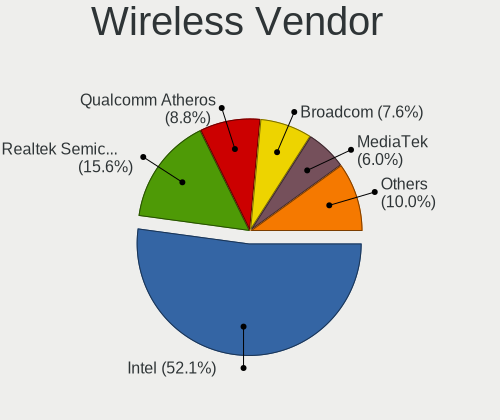

| Vendor                                | Computers | Percent |
|---------------------------------------|-----------|---------|
| Intel                                 | 431       | 53.08%  |
| Realtek Semiconductor                 | 134       | 16.5%   |
| Qualcomm Atheros                      | 67        | 8.25%   |
| MediaTek                              | 54        | 6.65%   |
| Broadcom                              | 54        | 6.65%   |
| TP-Link                               | 12        | 1.48%   |
| Ralink Technology                     | 7         | 0.86%   |
| Ralink                                | 7         | 0.86%   |
| Qualcomm Atheros Communications       | 7         | 0.86%   |
| Microsoft                             | 7         | 0.86%   |
| Broadcom Limited                      | 7         | 0.86%   |
| Sierra Wireless                       | 6         | 0.74%   |
| Qualcomm                              | 3         | 0.37%   |
| NetGear                               | 3         | 0.37%   |
| Marvell Technology Group              | 3         | 0.37%   |
| ASUSTek Computer                      | 2         | 0.25%   |
| Wilocity                              | 1         | 0.12%   |
| Quectel Wireless Solutions            | 1         | 0.12%   |
| Qualcomm Technologies                 | 1         | 0.12%   |
| Dell                                  | 1         | 0.12%   |
| D-Link                                | 1         | 0.12%   |
| Belkin Components                     | 1         | 0.12%   |
| AVM                                   | 1         | 0.12%   |
| 802.11g Adapter [Linksys WUSB54GC v3] | 1         | 0.12%   |

Wireless Model
--------------

Wireless models

| Model                                                          | Computers | Percent |
|----------------------------------------------------------------|-----------|---------|
| Intel Wi-Fi 6 AX200                                            | 71        | 8.71%   |
| Intel Wi-Fi 6 AX201                                            | 53        | 6.5%    |
| Intel Alder Lake-P PCH CNVi WiFi                               | 37        | 4.54%   |
| Intel Wireless 8265 / 8275                                     | 35        | 4.29%   |
| Realtek RTL8822CE 802.11ac PCIe Wireless Network Adapter       | 27        | 3.31%   |
| MediaTek MT7921 802.11ax PCI Express Wireless Network Adapter  | 26        | 3.19%   |
| Qualcomm Atheros QCA9377 802.11ac Wireless Network Adapter     | 25        | 3.07%   |
| Realtek RTL8821CE 802.11ac PCIe Wireless Network Adapter       | 24        | 2.94%   |
| Intel Wi-Fi 6 AX210/AX211/AX411 160MHz                         | 21        | 2.58%   |
| MediaTek MT7922 802.11ax PCI Express Wireless Network Adapter  | 19        | 2.33%   |
| Intel Comet Lake PCH CNVi WiFi                                 | 19        | 2.33%   |
| Intel Wireless 7265                                            | 18        | 2.21%   |
| Intel Cannon Lake PCH CNVi WiFi                                | 17        | 2.09%   |
| Intel Comet Lake PCH-LP CNVi WiFi                              | 16        | 1.96%   |
| Realtek RTL8852AE 802.11ax PCIe Wireless Network Adapter       | 15        | 1.84%   |
| Intel Wireless 7260                                            | 15        | 1.84%   |
| Realtek RTL8852BE PCIe 802.11ax Wireless Network Controller    | 13        | 1.6%    |
| Intel Wireless 8260                                            | 13        | 1.6%    |
| Intel Centrino Advanced-N 6205 [Taylor Peak]                   | 13        | 1.6%    |
| Intel Cannon Point-LP CNVi [Wireless-AC]                       | 13        | 1.6%    |
| Qualcomm Atheros QCA6174 802.11ac Wireless Network Adapter     | 12        | 1.47%   |
| Intel Dual Band Wireless-AC 3168NGW [Stone Peak]               | 12        | 1.47%   |
| Intel Wireless 3165                                            | 11        | 1.35%   |
| Intel Alder Lake-S PCH CNVi WiFi                               | 11        | 1.35%   |
| Broadcom BCM4331 802.11a/b/g/n                                 | 10        | 1.23%   |
| Qualcomm Atheros AR9285 Wireless Network Adapter (PCI-Express) | 9         | 1.1%    |
| MediaTek MT7921K (RZ608) Wi-Fi 6E 80MHz                        | 9         | 1.1%    |
| Broadcom BCM43142 802.11b/g/n                                  | 9         | 1.1%    |
| Qualcomm Atheros QCA9565 / AR9565 Wireless Network Adapter     | 8         | 0.98%   |
| Intel Tiger Lake PCH CNVi WiFi                                 | 8         | 0.98%   |
| Intel Wireless-AC 9260                                         | 7         | 0.86%   |
| Intel Ice Lake-LP PCH CNVi WiFi                                | 7         | 0.86%   |
| Realtek 802.11ac NIC                                           | 6         | 0.74%   |
| Broadcom Limited BCM4360 802.11ac Wireless Network Adapter     | 6         | 0.74%   |
| Broadcom BCM4360 802.11ac Wireless Network Adapter             | 6         | 0.74%   |
| Sierra Wireless EM7455                                         | 5         | 0.61%   |
| Qualcomm Atheros AR9485 Wireless Network Adapter               | 5         | 0.61%   |
| Microsoft XBOX ACC                                             | 5         | 0.61%   |
| Broadcom BCM4313 802.11bgn Wireless Network Adapter            | 5         | 0.61%   |
| TP-Link 802.11ac WLAN Adapter                                  | 4         | 0.49%   |

Ethernet Vendor
---------------

Ethernet vendors

| Vendor                                 | Computers | Percent |
|----------------------------------------|-----------|---------|
| Realtek Semiconductor                  | 403       | 54.09%  |
| Intel                                  | 220       | 29.53%  |
| Broadcom                               | 28        | 3.76%   |
| Qualcomm Atheros                       | 20        | 2.68%   |
| Samsung Electronics                    | 8         | 1.07%   |
| Lenovo                                 | 8         | 1.07%   |
| Aquantia                               | 8         | 1.07%   |
| ASIX Electronics                       | 7         | 0.94%   |
| DisplayLink                            | 6         | 0.81%   |
| Xiaomi                                 | 5         | 0.67%   |
| TP-Link                                | 5         | 0.67%   |
| Marvell Technology Group               | 5         | 0.67%   |
| OPPO Electronics                       | 4         | 0.54%   |
| Mellanox Technologies                  | 3         | 0.4%    |
| Qualcomm                               | 2         | 0.27%   |
| Microsoft                              | 2         | 0.27%   |
| D-Link                                 | 2         | 0.27%   |
| Sony Ericsson Mobile Communications AB | 1         | 0.13%   |
| OnePlus Technology (Shenzhen)          | 1         | 0.13%   |
| Nvidia                                 | 1         | 0.13%   |
| MediaTek                               | 1         | 0.13%   |
| JMicron Technology                     | 1         | 0.13%   |
| ICS Advent                             | 1         | 0.13%   |
| HMD Global                             | 1         | 0.13%   |
| Google                                 | 1         | 0.13%   |
| Broadcom Limited                       | 1         | 0.13%   |

Ethernet Model
--------------

Ethernet models

| Model                                                             | Computers | Percent |
|-------------------------------------------------------------------|-----------|---------|
| Realtek RTL8111/8168/8411 PCI Express Gigabit Ethernet Controller | 307       | 40.24%  |
| Realtek RTL8125 2.5GbE Controller                                 | 36        | 4.72%   |
| Realtek RTL8153 Gigabit Ethernet Adapter                          | 34        | 4.46%   |
| Intel 82579LM Gigabit Network Connection (Lewisville)             | 29        | 3.8%    |
| Realtek RTL810xE PCI Express Fast Ethernet controller             | 23        | 3.01%   |
| Intel Ethernet Controller I225-V                                  | 23        | 3.01%   |
| Intel I211 Gigabit Network Connection                             | 17        | 2.23%   |
| Intel Ethernet Connection I217-LM                                 | 14        | 1.83%   |
| Intel Ethernet Connection (4) I219-LM                             | 12        | 1.57%   |
| Broadcom NetXtreme BCM57765 Gigabit Ethernet PCIe                 | 9         | 1.18%   |
| Samsung Galaxy series, misc. (tethering mode)                     | 8         | 1.05%   |
| Intel Ethernet Connection (4) I219-V                              | 8         | 1.05%   |
| Intel Ethernet Connection I219-LM                                 | 7         | 0.92%   |
| Intel Ethernet Connection (7) I219-LM                             | 7         | 0.92%   |
| Intel Ethernet Connection (2) I219-V                              | 7         | 0.92%   |
| ASIX AX88179 Gigabit Ethernet                                     | 7         | 0.92%   |
| Qualcomm Atheros AR8151 v2.0 Gigabit Ethernet                     | 6         | 0.79%   |
| Intel Ethernet Connection (7) I219-V                              | 6         | 0.79%   |
| Intel Ethernet Connection (2) I219-LM                             | 6         | 0.79%   |
| Xiaomi Mi/Redmi series (RNDIS)                                    | 5         | 0.66%   |
| Realtek Killer E2600 Gigabit Ethernet Controller                  | 5         | 0.66%   |
| Intel Ethernet Connection I217-V                                  | 5         | 0.66%   |
| Intel Ethernet Connection (3) I218-LM                             | 5         | 0.66%   |
| Intel Ethernet Connection (16) I219-LM                            | 5         | 0.66%   |
| Intel Ethernet Connection (14) I219-V                             | 5         | 0.66%   |
| Broadcom NetXtreme BCM57766 Gigabit Ethernet PCIe                 | 5         | 0.66%   |
| Qualcomm Atheros Killer E220x Gigabit Ethernet Controller         | 4         | 0.52%   |
| Intel Ethernet Connection (2) I218-V                              | 4         | 0.52%   |
| Intel Ethernet Connection (16) I219-V                             | 4         | 0.52%   |
| Intel Ethernet Connection (11) I219-LM                            | 4         | 0.52%   |
| DisplayLink Dell Universal Dock D6000                             | 4         | 0.52%   |
| TP-Link UE300 10/100/1000 LAN (ethernet mode) [Realtek RTL8153]   | 3         | 0.39%   |
| Realtek RTL8152 Fast Ethernet Adapter                             | 3         | 0.39%   |
| Qualcomm Atheros Killer E2500 Gigabit Ethernet Controller         | 3         | 0.39%   |
| OPPO SM8350-MTP _SN:1518BD09                                      | 3         | 0.39%   |
| Lenovo ThinkPad TBT 3 Dock                                        | 3         | 0.39%   |
| Intel Ethernet Connection (6) I219-LM                             | 3         | 0.39%   |
| Intel Ethernet Connection (13) I219-LM                            | 3         | 0.39%   |
| Intel Ethernet Connection (10) I219-LM                            | 3         | 0.39%   |
| Intel 82577LM Gigabit Network Connection                          | 3         | 0.39%   |

Net Controller Kind
-------------------

Ethernet, WiFi or modem

| Kind     | Computers | Percent |
|----------|-----------|---------|
| WiFi     | 776       | 52.72%  |
| Ethernet | 685       | 46.54%  |
| Modem    | 10        | 0.68%   |
| Unknown  | 1         | 0.07%   |

Used Controller
---------------

Currently used network controller

| Kind     | Computers | Percent |
|----------|-----------|---------|
| WiFi     | 625       | 64.77%  |
| Ethernet | 340       | 35.23%  |

NICs
----

Total network controllers on board

| Total | Computers | Percent |
|-------|-----------|---------|
| 2     | 459       | 50.16%  |
| 1     | 397       | 43.39%  |
| 3     | 28        | 3.06%   |
| 0     | 22        | 2.4%    |
| 4     | 6         | 0.66%   |
| 5     | 2         | 0.22%   |
| 6     | 1         | 0.11%   |

IPv6
----

IPv6 vs IPv4

| Used | Computers | Percent |
|------|-----------|---------|
| No   | 638       | 69.57%  |
| Yes  | 279       | 30.43%  |

Bluetooth
---------

Bluetooth Vendor
----------------

Controller vendors

| Vendor                          | Computers | Percent |
|---------------------------------|-----------|---------|
| Intel                           | 386       | 55.38%  |
| Realtek Semiconductor           | 77        | 11.05%  |
| Foxconn / Hon Hai               | 36        | 5.16%   |
| Qualcomm Atheros Communications | 35        | 5.02%   |
| IMC Networks                    | 31        | 4.45%   |
| Broadcom                        | 28        | 4.02%   |
| Apple                           | 25        | 3.59%   |
| Cambridge Silicon Radio         | 22        | 3.16%   |
| Lite-On Technology              | 12        | 1.72%   |
| MediaTek                        | 11        | 1.58%   |
| Realtek                         | 5         | 0.72%   |
| Dell                            | 5         | 0.72%   |
| USI                             | 4         | 0.57%   |
| Opticis                         | 3         | 0.43%   |
| Marvell Semiconductor           | 3         | 0.43%   |
| Hewlett-Packard                 | 3         | 0.43%   |
| Toshiba                         | 2         | 0.29%   |
| Foxconn International           | 2         | 0.29%   |
| ASUSTek Computer                | 2         | 0.29%   |
| TP-Link                         | 1         | 0.14%   |
| Smart Modular Technologies      | 1         | 0.14%   |
| Fujitsu                         | 1         | 0.14%   |
| D-Link                          | 1         | 0.14%   |
| Unknown                         | 1         | 0.14%   |

Bluetooth Model
---------------

Controller models

| Model                                                                               | Computers | Percent |
|-------------------------------------------------------------------------------------|-----------|---------|
| Intel AX201 Bluetooth                                                               | 103       | 14.78%  |
| Intel Bluetooth wireless interface                                                  | 85        | 12.2%   |
| Intel AX200 Bluetooth                                                               | 70        | 10.04%  |
| Realtek Bluetooth Radio                                                             | 61        | 8.75%   |
| Intel Bluetooth 9460/9560 Jefferson Peak (JfP)                                      | 51        | 7.32%   |
| Intel Bluetooth Device                                                              | 30        | 4.3%    |
| Qualcomm Atheros  Bluetooth Device                                                  | 24        | 3.44%   |
| Cambridge Silicon Radio Bluetooth Dongle (HCI mode)                                 | 22        | 3.16%   |
| Intel AX210 Bluetooth                                                               | 21        | 3.01%   |
| Foxconn / Hon Hai Wireless_Device                                                   | 16        | 2.3%    |
| Realtek  Bluetooth 4.2 Adapter                                                      | 13        | 1.87%   |
| IMC Networks Wireless_Device                                                        | 13        | 1.87%   |
| Apple Bluetooth Host Controller                                                     | 12        | 1.72%   |
| MediaTek Wireless_Device                                                            | 11        | 1.58%   |
| Intel Wireless-AC 3168 Bluetooth                                                    | 11        | 1.58%   |
| IMC Networks Bluetooth Radio                                                        | 11        | 1.58%   |
| Foxconn / Hon Hai MediaTek Bluetooth Adapter                                        | 10        | 1.43%   |
| Apple Bluetooth USB Host Controller                                                 | 9         | 1.29%   |
| Intel Wireless-AC 9260 Bluetooth Adapter                                            | 8         | 1.15%   |
| Intel Centrino Bluetooth Wireless Transceiver                                       | 7         | 1%      |
| IMC Networks Bluetooth Device                                                       | 6         | 0.86%   |
| Realtek Bluetooth Radio                                                             | 5         | 0.72%   |
| Qualcomm Atheros AR3011 Bluetooth                                                   | 5         | 0.72%   |
| Lite-On Qualcomm Atheros QCA9377 Bluetooth                                          | 5         | 0.72%   |
| Broadcom BCM20702A0 Bluetooth 4.0                                                   | 5         | 0.72%   |
| USI Bluetooth Device                                                                | 4         | 0.57%   |
| Broadcom BCM20702 Bluetooth 4.0 [ThinkPad]                                          | 4         | 0.57%   |
| Broadcom BCM2045B (BDC-2.1)                                                         | 4         | 0.57%   |
| Qualcomm Atheros QCA61x4 Bluetooth 4.0                                              | 3         | 0.43%   |
| Opticis Bluetooth Radio                                                             | 3         | 0.43%   |
| Lite-On Wireless_Device                                                             | 3         | 0.43%   |
| HP Broadcom 2070 Bluetooth Combo                                                    | 3         | 0.43%   |
| Foxconn / Hon Hai Bluetooth Device                                                  | 3         | 0.43%   |
| Qualcomm Atheros AR3012 Bluetooth 4.0                                               | 2         | 0.29%   |
| Marvell Bluetooth and Wireless LAN Composite                                        | 2         | 0.29%   |
| Lite-On Atheros AR3012 Bluetooth                                                    | 2         | 0.29%   |
| Foxconn International BCM43142A0 Bluetooth module                                   | 2         | 0.29%   |
| Foxconn / Hon Hai Foxconn T77H114 BCM2070 [Single-Chip Bluetooth 2.1 + EDR Adapter] | 2         | 0.29%   |
| Foxconn / Hon Hai Broadcom Bluetooth 2.1 Device                                     | 2         | 0.29%   |
| Dell DW375 Bluetooth Module                                                         | 2         | 0.29%   |

Sound
-----

Sound Vendor
------------

Sound card vendors

| Vendor                                       | Computers | Percent |
|----------------------------------------------|-----------|---------|
| Intel                                        | 605       | 45.63%  |
| AMD                                          | 316       | 23.83%  |
| Nvidia                                       | 221       | 16.67%  |
| C-Media Electronics                          | 25        | 1.89%   |
| Logitech                                     | 14        | 1.06%   |
| Realtek Semiconductor                        | 11        | 0.83%   |
| ASUSTek Computer                             | 11        | 0.83%   |
| JMTek                                        | 9         | 0.68%   |
| Lenovo                                       | 8         | 0.6%    |
| Kingston Technology                          | 8         | 0.6%    |
| Focusrite-Novation                           | 7         | 0.53%   |
| Generalplus Technology                       | 6         | 0.45%   |
| SteelSeries ApS                              | 5         | 0.38%   |
| Razer USA                                    | 5         | 0.38%   |
| GN Netcom                                    | 5         | 0.38%   |
| Creative Technology                          | 5         | 0.38%   |
| Hewlett-Packard                              | 4         | 0.3%    |
| Texas Instruments                            | 3         | 0.23%   |
| Samson Technologies                          | 3         | 0.23%   |
| RODE Microphones                             | 3         | 0.23%   |
| Micro Star International                     | 3         | 0.23%   |
| Creative Labs                                | 3         | 0.23%   |
| Corsair                                      | 3         | 0.23%   |
| Zoran Co. Personal Media Division (Nogatech) | 2         | 0.15%   |
| Microsoft                                    | 2         | 0.15%   |
| FIFINE Microphones                           | 2         | 0.15%   |
| Blue Microphones                             | 2         | 0.15%   |
| BEHRINGER International                      | 2         | 0.15%   |
| Zhaoxin                                      | 1         | 0.08%   |
| Yamaha                                       | 1         | 0.08%   |
| Weltrend Semiconductor                       | 1         | 0.08%   |
| Unknown                                      | 1         | 0.08%   |
| Universal Audio                              | 1         | 0.08%   |
| ULi Electronics                              | 1         | 0.08%   |
| Trust                                        | 1         | 0.08%   |
| TerraTec Electronic                          | 1         | 0.08%   |
| Tenx Technology                              | 1         | 0.08%   |
| Synaptics                                    | 1         | 0.08%   |
| Solid State Logic                            | 1         | 0.08%   |
| Silicon Motion                               | 1         | 0.08%   |

Sound Model
-----------

Sound card models

| Model                                                                      | Computers | Percent |
|----------------------------------------------------------------------------|-----------|---------|
| AMD Family 17h/19h HD Audio Controller                                     | 158       | 9.79%   |
| AMD Renoir Radeon High Definition Audio Controller                         | 91        | 5.64%   |
| Intel Sunrise Point-LP HD Audio                                            | 68        | 4.21%   |
| Intel Tiger Lake-LP Smart Sound Technology Audio Controller                | 63        | 3.9%    |
| AMD Starship/Matisse HD Audio Controller                                   | 57        | 3.53%   |
| Intel 7 Series/C216 Chipset Family High Definition Audio Controller        | 51        | 3.16%   |
| Intel Cannon Lake PCH cAVS                                                 | 44        | 2.73%   |
| Intel Alder Lake PCH-P High Definition Audio Controller                    | 42        | 2.6%    |
| AMD Navi 21/23 HDMI/DP Audio Controller                                    | 37        | 2.29%   |
| Intel 8 Series/C220 Series Chipset High Definition Audio Controller        | 35        | 2.17%   |
| AMD Rembrandt Radeon High Definition Audio Controller                      | 32        | 1.98%   |
| AMD Raven/Raven2/Fenghuang HDMI/DP Audio Controller                        | 32        | 1.98%   |
| Intel 6 Series/C200 Series Chipset Family High Definition Audio Controller | 31        | 1.92%   |
| Nvidia GA104 High Definition Audio Controller                              | 25        | 1.55%   |
| Nvidia TU107 GeForce GTX 1650 High Definition Audio Controller             | 24        | 1.49%   |
| Intel Comet Lake PCH cAVS                                                  | 24        | 1.49%   |
| Nvidia GP107GL High Definition Audio Controller                            | 23        | 1.43%   |
| AMD Ellesmere HDMI Audio [Radeon RX 470/480 / 570/580/590]                 | 23        | 1.43%   |
| Intel Xeon E3-1200 v3/4th Gen Core Processor HD Audio Controller           | 22        | 1.36%   |
| Intel Comet Lake PCH-LP cAVS                                               | 22        | 1.36%   |
| Intel 200 Series PCH HD Audio                                              | 19        | 1.18%   |
| Nvidia GA106 High Definition Audio Controller                              | 18        | 1.12%   |
| Intel Celeron/Pentium Silver Processor High Definition Audio               | 18        | 1.12%   |
| Nvidia Audio device                                                        | 17        | 1.05%   |
| Intel Haswell-ULT HD Audio Controller                                      | 17        | 1.05%   |
| Intel Cannon Point-LP High Definition Audio Controller                     | 17        | 1.05%   |
| Intel 8 Series HD Audio Controller                                         | 17        | 1.05%   |
| AMD SBx00 Azalia (Intel HDA)                                               | 16        | 0.99%   |
| AMD Family 17h (Models 00h-0fh) HD Audio Controller                        | 16        | 0.99%   |
| Intel Ice Lake-LP Smart Sound Technology Audio Controller                  | 15        | 0.93%   |
| Intel Tiger Lake-H HD Audio Controller                                     | 14        | 0.87%   |
| Intel Broadwell-U Audio Controller                                         | 14        | 0.87%   |
| Intel Alder Lake-S HD Audio Controller                                     | 14        | 0.87%   |
| Intel Wildcat Point-LP High Definition Audio Controller                    | 13        | 0.81%   |
| Intel 5 Series/3400 Series Chipset High Definition Audio                   | 13        | 0.81%   |
| Intel 100 Series/C230 Series Chipset Family HD Audio Controller            | 13        | 0.81%   |
| Nvidia GP106 High Definition Audio Controller                              | 12        | 0.74%   |
| Intel CM238 HD Audio Controller                                            | 12        | 0.74%   |
| Nvidia GF108 High Definition Audio Controller                              | 11        | 0.68%   |
| Nvidia TU106 High Definition Audio Controller                              | 10        | 0.62%   |

Memory
------

Memory Vendor
-------------

Memory module vendors

| Vendor              | Computers | Percent |
|---------------------|-----------|---------|
| Samsung Electronics | 96        | 24%     |
| SK hynix            | 66        | 16.5%   |
| Micron Technology   | 53        | 13.25%  |
| Kingston            | 36        | 9%      |
| Crucial             | 31        | 7.75%   |
| Corsair             | 24        | 6%      |
| Unknown             | 20        | 5%      |
| G.Skill             | 15        | 3.75%   |
| A-DATA Technology   | 12        | 3%      |
| Ramaxel Technology  | 9         | 2.25%   |
| Teikon              | 5         | 1.25%   |
| Smart               | 5         | 1.25%   |
| Unknown (ABCD)      | 4         | 1%      |
| Team                | 2         | 0.5%    |
| Nanya Technology    | 2         | 0.5%    |
| Elpida              | 2         | 0.5%    |
| Apacer              | 2         | 0.5%    |
| Unknown             | 2         | 0.5%    |
| Unknown (0x0E9D)    | 1         | 0.25%   |
| Timetec             | 1         | 0.25%   |
| Silicon Power       | 1         | 0.25%   |
| Qumo                | 1         | 0.25%   |
| PNY                 | 1         | 0.25%   |
| Patriot             | 1         | 0.25%   |
| Neo Forza           | 1         | 0.25%   |
| Lexar               | 1         | 0.25%   |
| GOODRAM             | 1         | 0.25%   |
| CSX                 | 1         | 0.25%   |
| Avant               | 1         | 0.25%   |
| AMD                 | 1         | 0.25%   |
| 89450000830B        | 1         | 0.25%   |
| 4ea5                | 1         | 0.25%   |

Memory Model
------------

Memory module models

| Model                                                            | Computers | Percent |
|------------------------------------------------------------------|-----------|---------|
| SK hynix RAM HMA81GS6AFR8N-UH 8GB SODIMM DDR4 2667MT/s           | 6         | 1.42%   |
| Samsung RAM M471A1K43BB1-CRC 8GB SODIMM DDR4 2667MT/s            | 6         | 1.42%   |
| Samsung RAM M471A5244CB0-CTD 4GB SODIMM DDR4 3266MT/s            | 5         | 1.18%   |
| Unknown (ABCD) RAM 123456789012345678 2GB SODIMM LPDDR4 2400MT/s | 4         | 0.94%   |
| SK hynix RAM HMA82GS6AFR8N-UH 16GB SODIMM DDR4 2667MT/s          | 4         | 0.94%   |
| SK hynix RAM HMA81GS6DJR8N-XN 8GB SODIMM DDR4 3200MT/s           | 4         | 0.94%   |
| Samsung RAM M471A1G44AB0-CWE 8GB SODIMM DDR4 3200MT/s            | 4         | 0.94%   |
| Unknown RAM Module 2GB Row Of Chips LPDDR4 4267MT/s              | 3         | 0.71%   |
| Teikon RAM TMA81GS6AFR8N-UHSC 8GB SODIMM DDR4 2400MT/s           | 3         | 0.71%   |
| SK hynix RAM H9CCNNNCLGALAR-NVD 8GB Row Of Chips LPDDR3 2133MT/s | 3         | 0.71%   |
| Samsung RAM M471B5273DH0-CH9 4GB SODIMM DDR3 1334MT/s            | 3         | 0.71%   |
| Samsung RAM M471A5244CB0-CWE 4GB SODIMM DDR4 3200MT/s            | 3         | 0.71%   |
| Samsung RAM M471A2G44AM0-CWE 16GB SODIMM DDR4 3200MT/s           | 3         | 0.71%   |
| Samsung RAM M471A1K43EB1-CWE 8GB SODIMM DDR4 3200MT/s            | 3         | 0.71%   |
| Samsung RAM M471A1K43DB1-CWE 8GB SODIMM DDR4 3200MT/s            | 3         | 0.71%   |
| Samsung RAM M471A1K43DB1-CTD 8GB SODIMM DDR4 2667MT/s            | 3         | 0.71%   |
| Samsung RAM M471A1K43CB1-CRC 8GB SODIMM DDR4 2667MT/s            | 3         | 0.71%   |
| Samsung RAM M471A1G44BB0-CWE 8GB SODIMM DDR4 3200MT/s            | 3         | 0.71%   |
| Samsung RAM M471A1G44AB0-CWE 8GB Row Of Chips DDR4 3200MT/s      | 3         | 0.71%   |
| Micron RAM 8ATF1G64HZ-3G2R1 8GB SODIMM DDR4 3200MT/s             | 3         | 0.71%   |
| Micron RAM 4ATS2G64HZ-3G2B1 16GB SODIMM DDR4 3200MT/s            | 3         | 0.71%   |
| Micron RAM 4ATF1G64HZ-3G2E1 8GB SODIMM DDR4 3200MT/s             | 3         | 0.71%   |
| Corsair RAM CMK16GX4M2B3200C16 8GB DIMM DDR4 3600MT/s            | 3         | 0.71%   |
| Unknown RAM Module 2GB SODIMM DDR3 1600MT/s                      | 2         | 0.47%   |
| Smart RAM SH564128FH8N0TNSDR 4GB DIMM DDR3 1600MT/s              | 2         | 0.47%   |
| SK hynix RAM Module 4GB SODIMM DDR3 1600MT/s                     | 2         | 0.47%   |
| SK hynix RAM Module 2GB SODIMM DDR3 1600MT/s                     | 2         | 0.47%   |
| SK hynix RAM HMT351S6BFR8C-H9 4GB SODIMM DDR3 1333MT/s           | 2         | 0.47%   |
| SK hynix RAM HMT112U6TFR8C-H9 1GB DIMM DDR3 1333MT/s             | 2         | 0.47%   |
| SK hynix RAM HMCG88MEBSA095N 32GB SODIMM DDR5 4800MT/s           | 2         | 0.47%   |
| SK hynix RAM HMAA2GS6CJR8N-XN 16GB SODIMM DDR4 3200MT/s          | 2         | 0.47%   |
| SK hynix RAM HMAA1GS6CJR6N-XN 8GB SODIMM DDR4 3200MT/s           | 2         | 0.47%   |
| SK hynix RAM HMAA1GS6CJR6N-XN 8192MB SODIMM DDR4 3200MT/s        | 2         | 0.47%   |
| SK hynix RAM HMA851S6AFR6N-UH 4GB SODIMM DDR4 2667MT/s           | 2         | 0.47%   |
| SK hynix RAM HMA82GS6CJR8N-VK 16GB SODIMM DDR4 2667MT/s          | 2         | 0.47%   |
| Samsung RAM UBE3D4AA-MGCR 2GB Row Of Chips LPDDR4 4267MT/s       | 2         | 0.47%   |
| Samsung RAM M471B1G73EB0-YK0 8GB SODIMM DDR3 1600MT/s            | 2         | 0.47%   |
| Samsung RAM M471A5244CB0-CTD 4GB Row Of Chips DDR4 2667MT/s      | 2         | 0.47%   |
| Samsung RAM M471A5244CB0-CTD 4GB DDR4 2667MT/s                   | 2         | 0.47%   |
| Samsung RAM M471A2G43AB2-CWE 16GB SODIMM DDR4 3200MT/s           | 2         | 0.47%   |

Memory Kind
-----------

Memory module kinds

| Kind    | Computers | Percent |
|---------|-----------|---------|
| DDR4    | 195       | 56.85%  |
| DDR3    | 62        | 18.08%  |
| LPDDR4  | 25        | 7.29%   |
| DDR5    | 20        | 5.83%   |
| LPDDR3  | 14        | 4.08%   |
| LPDDR5  | 13        | 3.79%   |
| DDR2    | 6         | 1.75%   |
| SDRAM   | 4         | 1.17%   |
| Unknown | 3         | 0.87%   |
| DDR     | 1         | 0.29%   |

Memory Form Factor
------------------

Physical design of the memory module

| Name         | Computers | Percent |
|--------------|-----------|---------|
| SODIMM       | 198       | 57.39%  |
| DIMM         | 93        | 26.96%  |
| Row Of Chips | 49        | 14.2%   |
| Unknown      | 4         | 1.16%   |
| Chip         | 1         | 0.29%   |

Memory Size
-----------

Memory module size

| Size  | Computers | Percent |
|-------|-----------|---------|
| 8192  | 158       | 42.7%   |
| 4096  | 77        | 20.81%  |
| 16384 | 72        | 19.46%  |
| 2048  | 32        | 8.65%   |
| 32768 | 23        | 6.22%   |
| 1024  | 8         | 2.16%   |

Memory Speed
------------

Memory module speed

| Speed   | Computers | Percent |
|---------|-----------|---------|
| 3200    | 99        | 26.61%  |
| 2667    | 55        | 14.78%  |
| 1600    | 44        | 11.83%  |
| 2400    | 23        | 6.18%   |
| 2133    | 17        | 4.57%   |
| 4267    | 16        | 4.3%    |
| 4800    | 15        | 4.03%   |
| 6400    | 13        | 3.49%   |
| 1333    | 12        | 3.23%   |
| 3600    | 11        | 2.96%   |
| 1867    | 7         | 1.88%   |
| 1334    | 7         | 1.88%   |
| 3800    | 5         | 1.34%   |
| 3266    | 5         | 1.34%   |
| 667     | 5         | 1.34%   |
| 1866    | 4         | 1.08%   |
| 3400    | 3         | 0.81%   |
| 1067    | 3         | 0.81%   |
| 5200    | 2         | 0.54%   |
| 4266    | 2         | 0.54%   |
| 3534    | 2         | 0.54%   |
| 3000    | 2         | 0.54%   |
| 1639    | 2         | 0.54%   |
| 1066    | 2         | 0.54%   |
| 800     | 2         | 0.54%   |
| Unknown | 2         | 0.54%   |
| 12800   | 1         | 0.27%   |
| 6000    | 1         | 0.27%   |
| 5800    | 1         | 0.27%   |
| 3933    | 1         | 0.27%   |
| 3666    | 1         | 0.27%   |
| 3334    | 1         | 0.27%   |
| 2800    | 1         | 0.27%   |
| 2666    | 1         | 0.27%   |
| 1400    | 1         | 0.27%   |
| 533     | 1         | 0.27%   |
| 400     | 1         | 0.27%   |
| 333     | 1         | 0.27%   |

Printers & scanners
-------------------

Printer Vendor
--------------

Printer device vendors

| Vendor             | Computers | Percent |
|--------------------|-----------|---------|
| Hewlett-Packard    | 6         | 50%     |
| Seiko Epson        | 3         | 25%     |
| Brother Industries | 2         | 16.67%  |
| Dymo-CoStar        | 1         | 8.33%   |

Printer Model
-------------

Printer device models

| Model                                                                 | Computers | Percent |
|-----------------------------------------------------------------------|-----------|---------|
| Seiko Epson WF-2860 Series                                            | 1         | 8.33%   |
| Seiko Epson ME OFFICE 620F Series/Stylus Office BX305F/BX305FW/TX320F | 1         | 8.33%   |
| Seiko Epson L120 Series                                               | 1         | 8.33%   |
| HP LaserJet Professional P1102w                                       | 1         | 8.33%   |
| HP LaserJet 1020                                                      | 1         | 8.33%   |
| HP LaserJet 1010                                                      | 1         | 8.33%   |
| HP ENVY Inspire 7200 series                                           | 1         | 8.33%   |
| HP ENVY 5000 series                                                   | 1         | 8.33%   |
| HP Deskjet 2050 J510                                                  | 1         | 8.33%   |
| Dymo-CoStar DYMO LabelWriter 450 Turbo                                | 1         | 8.33%   |
| Brother HL-2130 series                                                | 1         | 8.33%   |
| Brother HL-1440 Laser Printer                                         | 1         | 8.33%   |

Scanner Vendor
--------------

Scanner device vendors

| Vendor      | Computers | Percent |
|-------------|-----------|---------|
| Canon       | 2         | 66.67%  |
| Seiko Epson | 1         | 33.33%  |

Scanner Model
-------------

Scanner device models

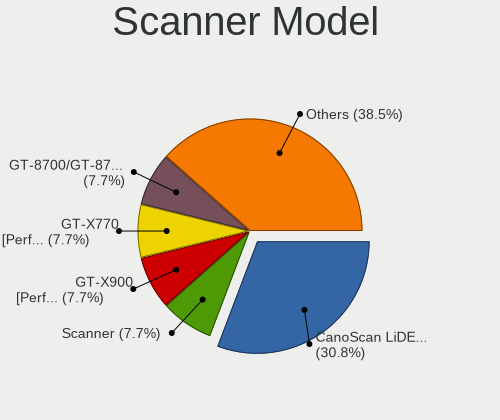

| Model                                 | Computers | Percent |
|---------------------------------------|-----------|---------|
| Seiko Epson GT-X770 [Perfection V500] | 1         | 33.33%  |
| Canon CanoScan LiDE 210               | 1         | 33.33%  |
| Canon CanoScan 4400F                  | 1         | 33.33%  |

Camera
------

Camera Vendor
-------------

Camera device vendors

| Vendor                                 | Computers | Percent |
|----------------------------------------|-----------|---------|
| Chicony Electronics                    | 106       | 16.96%  |
| IMC Networks                           | 72        | 11.52%  |
| Microdia                               | 54        | 8.64%   |
| Logitech                               | 46        | 7.36%   |
| Quanta                                 | 42        | 6.72%   |
| Realtek Semiconductor                  | 37        | 5.92%   |
| Bison Electronics                      | 36        | 5.76%   |
| Sunplus Innovation Technology          | 27        | 4.32%   |
| Acer                                   | 26        | 4.16%   |
| Apple                                  | 22        | 3.52%   |
| Cheng Uei Precision Industry (Foxlink) | 20        | 3.2%    |
| Syntek                                 | 18        | 2.88%   |
| Luxvisions Innotech Limited            | 18        | 2.88%   |
| Sonix Technology                       | 16        | 2.56%   |
| Lite-On Technology                     | 10        | 1.6%    |
| SunplusIT                              | 9         | 1.44%   |
| Microsoft                              | 9         | 1.44%   |
| Alcor Micro                            | 6         | 0.96%   |
| Suyin                                  | 5         | 0.8%    |
| Silicon Motion                         | 3         | 0.48%   |
| Shenzhen Kingcome Optoelectronic       | 3         | 0.48%   |
| Trust                                  | 2         | 0.32%   |
| ShineTech                              | 2         | 0.32%   |
| Ricoh                                  | 2         | 0.32%   |
| Razer USA                              | 2         | 0.32%   |
| Primax Electronics                     | 2         | 0.32%   |
| Lenovo                                 | 2         | 0.32%   |
| icSpring                               | 2         | 0.32%   |
| Google                                 | 2         | 0.32%   |
| AVerMedia Technologies                 | 2         | 0.32%   |
| ARC International                      | 2         | 0.32%   |
| Unknown                                | 2         | 0.32%   |
| ZOOM                                   | 1         | 0.16%   |
| XHT-211220-ZW                          | 1         | 0.16%   |
| webcam                                 | 1         | 0.16%   |
| Tobii Technology AB                    | 1         | 0.16%   |
| Samsung Electronics                    | 1         | 0.16%   |
| Remo Tech                              | 1         | 0.16%   |
| Pixart Imaging                         | 1         | 0.16%   |
| MacroSilicon                           | 1         | 0.16%   |

Camera Model
------------

Camera device models

| Model                                                           | Computers | Percent |
|-----------------------------------------------------------------|-----------|---------|
| Chicony Integrated Camera                                       | 35        | 5.56%   |
| Microdia Integrated_Webcam_HD                                   | 34        | 5.4%    |
| IMC Networks USB2.0 HD UVC WebCam                               | 24        | 3.81%   |
| IMC Networks Integrated Camera                                  | 24        | 3.81%   |
| Realtek Integrated_Webcam_HD                                    | 18        | 2.86%   |
| Syntek Integrated Camera                                        | 13        | 2.06%   |
| Bison Integrated Camera                                         | 13        | 2.06%   |
| Logitech HD Pro Webcam C920                                     | 11        | 1.75%   |
| Acer Integrated Camera                                          | 11        | 1.75%   |
| Chicony HD WebCam                                               | 10        | 1.59%   |
| Apple FaceTime HD Camera                                        | 9         | 1.43%   |
| Sonix USB2.0 HD UVC WebCam                                      | 8         | 1.27%   |
| Chicony Integrated Camera (1280x720@30)                         | 8         | 1.27%   |
| Sonix USB2.0 FHD UVC WebCam                                     | 7         | 1.11%   |
| Cheng Uei Precision Industry (Foxlink) HP Wide Vision HD Camera | 7         | 1.11%   |
| Sunplus Integrated_Webcam_HD                                    | 6         | 0.95%   |
| Quanta HP Wide Vision HD Camera                                 | 6         | 0.95%   |
| Quanta HD User Facing                                           | 6         | 0.95%   |
| Logitech HD Webcam C525                                         | 6         | 0.95%   |
| Lite-On Integrated Camera                                       | 6         | 0.95%   |
| Apple iPhone 5/5C/5S/6/SE/7/8/X                                 | 6         | 0.95%   |
| Microdia Integrated_Webcam_FHD                                  | 5         | 0.79%   |
| Luxvisions Innotech Limited Integrated Camera                   | 5         | 0.79%   |
| Chicony HP Wide Vision HD Camera                                | 5         | 0.79%   |
| Chicony HP TrueVision HD Camera                                 | 5         | 0.79%   |
| Acer Integrated RGB Camera                                      | 5         | 0.79%   |
| Acer BisonCam,NB Pro                                            | 5         | 0.79%   |
| Realtek USB Camera                                              | 4         | 0.63%   |
| Quanta VGA WebCam                                               | 4         | 0.63%   |
| Quanta HP HD Camera                                             | 4         | 0.63%   |
| Quanta ACER HD User Facing                                      | 4         | 0.63%   |
| Luxvisions Innotech Limited HP Wide Vision HD Camera            | 4         | 0.63%   |
| Luxvisions Innotech Limited HP TrueVision HD Camera             | 4         | 0.63%   |
| Logitech Webcam C270                                            | 4         | 0.63%   |
| IMC Networks USB2.0 VGA UVC WebCam                              | 4         | 0.63%   |
| IMC Networks ov9734_azurewave_camera                            | 4         | 0.63%   |
| Chicony HD User Facing                                          | 4         | 0.63%   |
| Bison SunplusIT Integrated Camera                               | 4         | 0.63%   |
| Apple Built-in iSight                                           | 4         | 0.63%   |
| SunplusIT MTD camera                                            | 3         | 0.48%   |

Security
--------

Fingerprint Vendor
------------------

Fingerprint sensor vendors

| Vendor                             | Computers | Percent |
|------------------------------------|-----------|---------|
| Synaptics                          | 43        | 28.48%  |
| Shenzhen Goodix Technology         | 40        | 26.49%  |
| Validity Sensors                   | 28        | 18.54%  |
| Elan Microelectronics              | 16        | 10.6%   |
| Upek                               | 8         | 5.3%    |
| LighTuning Technology              | 6         | 3.97%   |
| Samsung Electronics                | 3         | 1.99%   |
| Realtek USB2.0 Finger Print Bridge | 3         | 1.99%   |
| AuthenTec                          | 3         | 1.99%   |
| STMicroelectronics                 | 1         | 0.66%   |

Fingerprint Model
-----------------

Fingerprint sensor models

| Model                                                                      | Computers | Percent |
|----------------------------------------------------------------------------|-----------|---------|
| Shenzhen Goodix  FingerPrint Device                                        | 25        | 16.56%  |
| Synaptics Prometheus MIS Touch Fingerprint Reader                          | 17        | 11.26%  |
| Elan ELAN:ARM-M4                                                           | 11        | 7.28%   |
| Shenzhen Goodix Fingerprint Reader                                         | 10        | 6.62%   |
| Validity Sensors Synaptics WBDI                                            | 8         | 5.3%    |
| Synaptics Metallica MIS Touch Fingerprint Reader                           | 8         | 5.3%    |
| Upek Biometric Touchchip/Touchstrip Fingerprint Sensor                     | 7         | 4.64%   |
| Validity Sensors VFS 5011 fingerprint sensor                               | 6         | 3.97%   |
| Shenzhen Goodix FingerPrint                                                | 5         | 3.31%   |
| Synaptics WBDI                                                             | 4         | 2.65%   |
| Elan ELAN:Fingerprint                                                      | 4         | 2.65%   |
| Validity Sensors VFS7500 Touch Fingerprint Sensor                          | 3         | 1.99%   |
| Validity Sensors VFS491                                                    | 3         | 1.99%   |
| Validity Sensors Synaptics VFS7552 Touch Fingerprint Sensor with PurePrint | 3         | 1.99%   |
| Synaptics UWP WBDI                                                         | 3         | 1.99%   |
| Samsung Fingerprint Sensor Device - 730B                                   | 3         | 1.99%   |
| Realtek USB2.0 Finger Print Bridge FocalTech Fingerprint Device            | 3         | 1.99%   |
| LighTuning ES603 Swipe Fingerprint Sensor                                  | 3         | 1.99%   |
| Validity Sensors VFS495 Fingerprint Reader                                 | 2         | 1.32%   |
| Synaptics UWP WBDI Device                                                  | 2         | 1.32%   |
| Synaptics  WBDI                                                            | 2         | 1.32%   |
| Synaptics  FS7604 Touch Fingerprint Sensor with PurePrint                  | 2         | 1.32%   |
| Synaptics FS7604 Touch Fingerprint Sensor with PurePrint                   | 2         | 1.32%   |
| LighTuning EgisTec Touch Fingerprint Sensor                                | 2         | 1.32%   |
| Validity Sensors VFS7552 Touch Fingerprint Sensor                          | 1         | 0.66%   |
| Validity Sensors VFS451 Fingerprint Reader                                 | 1         | 0.66%   |
| Validity Sensors VFS301 Fingerprint Reader                                 | 1         | 0.66%   |
| Upek TCS5B Fingerprint sensor                                              | 1         | 0.66%   |
| Synaptics WBDI Fingerprint Reader USB 102                                  | 1         | 0.66%   |
| Synaptics WBDI Fingerprint Reader USB 086                                  | 1         | 0.66%   |
| Synaptics  VFS7552 Touch Fingerprint Sensor with PurePrint                 | 1         | 0.66%   |
| STMicroelectronics Fingerprint Reader                                      | 1         | 0.66%   |
| LighTuning Fingerprint Sensor                                              | 1         | 0.66%   |
| Elan fingerprint sensor [FeinTech FPS00200]                                | 1         | 0.66%   |
| AuthenTec Fingerprint Sensor                                               | 1         | 0.66%   |
| AuthenTec AES2501 Fingerprint Sensor                                       | 1         | 0.66%   |
| AuthenTec AES1660 Fingerprint Sensor                                       | 1         | 0.66%   |

Chipcard Vendor
---------------

Chipcard module vendors

| Vendor                | Computers | Percent |
|-----------------------|-----------|---------|
| Broadcom              | 26        | 49.06%  |
| Alcor Micro           | 14        | 26.42%  |
| Lenovo                | 4         | 7.55%   |
| Upek                  | 3         | 5.66%   |
| O2 Micro              | 2         | 3.77%   |
| Gemalto (was Gemplus) | 2         | 3.77%   |
| Yubico.com            | 1         | 1.89%   |
| BIT4ID                | 1         | 1.89%   |

Chipcard Model
--------------

Chipcard module models

| Model                                                                        | Computers | Percent |
|------------------------------------------------------------------------------|-----------|---------|
| Broadcom 58200                                                               | 14        | 26.42%  |
| Alcor Micro AU9540 Smartcard Reader                                          | 14        | 26.42%  |
| Broadcom BCM5880 Secure Applications Processor with fingerprint swipe sensor | 7         | 13.21%  |
| Lenovo Integrated Smart Card Reader                                          | 4         | 7.55%   |
| Upek TouchChip Fingerprint Coprocessor (WBF advanced mode)                   | 3         | 5.66%   |
| Broadcom 5880                                                                | 3         | 5.66%   |
| Gemalto (was Gemplus) Compact Smart Card Reader Writer                       | 2         | 3.77%   |
| Broadcom BCM5880 Secure Applications Processor                               | 2         | 3.77%   |
| Yubico.com Yubikey 4/5 U2F+CCID                                              | 1         | 1.89%   |
| O2 Micro Oz776 SmartCard Reader                                              | 1         | 1.89%   |
| O2 Micro OZ776 CCID Smartcard Reader                                         | 1         | 1.89%   |
| BIT4ID miniLector EVO                                                        | 1         | 1.89%   |

Unsupported
-----------

Unsupported Devices
-------------------

Total unsupported devices on board

| Total | Computers | Percent |
|-------|-----------|---------|
| 0     | 608       | 66.02%  |
| 1     | 254       | 27.58%  |
| 2     | 53        | 5.75%   |
| 3     | 3         | 0.33%   |
| 8     | 1         | 0.11%   |
| 6     | 1         | 0.11%   |
| 4     | 1         | 0.11%   |

Unsupported Device Types
------------------------

Types of unsupported devices

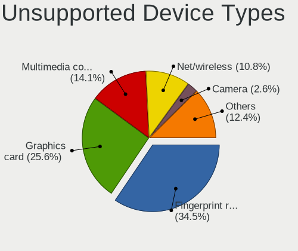

| Type                     | Computers | Percent |
|--------------------------|-----------|---------|
| Fingerprint reader       | 148       | 39.26%  |
| Graphics card            | 98        | 25.99%  |
| Multimedia controller    | 49        | 13%     |
| Net/wireless             | 37        | 9.81%   |
| Chipcard                 | 10        | 2.65%   |
| Camera                   | 9         | 2.39%   |
| Sound                    | 7         | 1.86%   |
| Communication controller | 5         | 1.33%   |
| Unassigned class         | 3         | 0.8%    |
| Storage                  | 3         | 0.8%    |
| Card reader              | 3         | 0.8%    |
| Net/ethernet             | 2         | 0.53%   |
| Bluetooth                | 2         | 0.53%   |
| Modem                    | 1         | 0.27%   |

