Fedora 39 - Tested Hardware & Statistics
----------------------------------------

A project to collect tested hardware configurations for Fedora 39.

Anyone can contribute to this report by the [hw-probe](https://github.com/linuxhw/hw-probe) tool:

    sudo -E hw-probe -all -upload

Please contribute! Especially if your hardware is rare.

This is a report for all computer types. See also reports for [desktops](/Dist/Fedora_39/Desktop/README.md) and [notebooks](/Dist/Fedora_39/Notebook/README.md).

Contents
--------

* [ Test Cases ](#test-cases)

* [ System ](#system)
  - [ Kernel                   ](#kernel)
  - [ Kernel Family            ](#kernel-family)
  - [ Kernel Major Ver.        ](#kernel-major-ver)
  - [ Arch                     ](#arch)
  - [ DE                       ](#de)
  - [ Display Server           ](#display-server)
  - [ Display Manager          ](#display-manager)
  - [ OS Lang                  ](#os-lang)
  - [ Boot Mode                ](#boot-mode)
  - [ Filesystem               ](#filesystem)
  - [ Part. scheme             ](#part-scheme)
  - [ Dual Boot with Linux/BSD ](#dual-boot-with-linuxbsd)
  - [ Dual Boot (Win)          ](#dual-boot-win)

* [ Board ](#board)
  - [ Vendor                   ](#vendor)
  - [ Model                    ](#model)
  - [ Model Family             ](#model-family)
  - [ MFG Year                 ](#mfg-year)
  - [ Form Factor              ](#form-factor)
  - [ Secure Boot              ](#secure-boot)
  - [ Coreboot                 ](#coreboot)
  - [ RAM Size                 ](#ram-size)
  - [ RAM Used                 ](#ram-used)
  - [ Total Drives             ](#total-drives)
  - [ Has CD-ROM               ](#has-cd-rom)
  - [ Has Ethernet             ](#has-ethernet)
  - [ Has WiFi                 ](#has-wifi)
  - [ Has Bluetooth            ](#has-bluetooth)

* [ Location ](#location)
  - [ Country                  ](#country)
  - [ City                     ](#city)

* [ Drives ](#drives)
  - [ Drive Vendor             ](#drive-vendor)
  - [ Drive Model              ](#drive-model)
  - [ HDD Vendor               ](#hdd-vendor)
  - [ SSD Vendor               ](#ssd-vendor)
  - [ Drive Kind               ](#drive-kind)
  - [ Drive Connector          ](#drive-connector)
  - [ Drive Size               ](#drive-size)
  - [ Space Total              ](#space-total)
  - [ Space Used               ](#space-used)
  - [ Malfunc. Drives          ](#malfunc-drives)
  - [ Malfunc. Drive Vendor    ](#malfunc-drive-vendor)
  - [ Malfunc. HDD Vendor      ](#malfunc-hdd-vendor)
  - [ Malfunc. Drive Kind      ](#malfunc-drive-kind)
  - [ Failed Drives            ](#failed-drives)
  - [ Failed Drive Vendor      ](#failed-drive-vendor)
  - [ Drive Status             ](#drive-status)

* [ Storage controller ](#storage-controller)
  - [ Storage Vendor           ](#storage-vendor)
  - [ Storage Model            ](#storage-model)
  - [ Storage Kind             ](#storage-kind)

* [ Processor ](#processor)
  - [ CPU Vendor               ](#cpu-vendor)
  - [ CPU Model                ](#cpu-model)
  - [ CPU Model Family         ](#cpu-model-family)
  - [ CPU Cores                ](#cpu-cores)
  - [ CPU Sockets              ](#cpu-sockets)
  - [ CPU Threads              ](#cpu-threads)
  - [ CPU Op-Modes             ](#cpu-op-modes)
  - [ CPU Microcode            ](#cpu-microcode)
  - [ CPU Microarch            ](#cpu-microarch)

* [ Graphics ](#graphics)
  - [ GPU Vendor               ](#gpu-vendor)
  - [ GPU Model                ](#gpu-model)
  - [ GPU Combo                ](#gpu-combo)
  - [ GPU Driver               ](#gpu-driver)
  - [ GPU Memory               ](#gpu-memory)

* [ Monitor ](#monitor)
  - [ Monitor Vendor           ](#monitor-vendor)
  - [ Monitor Model            ](#monitor-model)
  - [ Monitor Resolution       ](#monitor-resolution)
  - [ Monitor Diagonal         ](#monitor-diagonal)
  - [ Monitor Width            ](#monitor-width)
  - [ Aspect Ratio             ](#aspect-ratio)
  - [ Monitor Area             ](#monitor-area)
  - [ Pixel Density            ](#pixel-density)
  - [ Multiple Monitors        ](#multiple-monitors)

* [ Network ](#network)
  - [ Net Controller Vendor    ](#net-controller-vendor)
  - [ Net Controller Model     ](#net-controller-model)
  - [ Wireless Vendor          ](#wireless-vendor)
  - [ Wireless Model           ](#wireless-model)
  - [ Ethernet Vendor          ](#ethernet-vendor)
  - [ Ethernet Model           ](#ethernet-model)
  - [ Net Controller Kind      ](#net-controller-kind)
  - [ Used Controller          ](#used-controller)
  - [ NICs                     ](#nics)
  - [ IPv6                     ](#ipv6)

* [ Bluetooth ](#bluetooth)
  - [ Bluetooth Vendor         ](#bluetooth-vendor)
  - [ Bluetooth Model          ](#bluetooth-model)

* [ Sound ](#sound)
  - [ Sound Vendor             ](#sound-vendor)
  - [ Sound Model              ](#sound-model)

* [ Memory ](#memory)
  - [ Memory Vendor            ](#memory-vendor)
  - [ Memory Model             ](#memory-model)
  - [ Memory Kind              ](#memory-kind)
  - [ Memory Form Factor       ](#memory-form-factor)
  - [ Memory Size              ](#memory-size)
  - [ Memory Speed             ](#memory-speed)

* [ Printers & scanners ](#printers--scanners)
  - [ Printer Vendor           ](#printer-vendor)
  - [ Printer Model            ](#printer-model)
  - [ Scanner Vendor           ](#scanner-vendor)
  - [ Scanner Model            ](#scanner-model)

* [ Camera ](#camera)
  - [ Camera Vendor            ](#camera-vendor)
  - [ Camera Model             ](#camera-model)

* [ Security ](#security)
  - [ Fingerprint Vendor       ](#fingerprint-vendor)
  - [ Fingerprint Model        ](#fingerprint-model)
  - [ Chipcard Vendor          ](#chipcard-vendor)
  - [ Chipcard Model           ](#chipcard-model)

* [ Unsupported ](#unsupported)
  - [ Unsupported Devices      ](#unsupported-devices)
  - [ Unsupported Device Types ](#unsupported-device-types)

Test Cases
----------

Total: 4041

| Vendor        | Model                       | Form-Factor | Probe                                                      | Date         |
|---------------|-----------------------------|-------------|------------------------------------------------------------|--------------|
| Sony          | VPCYB45JB                   | Notebook    | [6f70d22391](https://linux-hardware.org/?probe=6f70d22391) | May 09, 2024 |
| Avell High... | A70 MOB                     | Notebook    | [2be654083e](https://linux-hardware.org/?probe=2be654083e) | May 08, 2024 |
| HP            | EliteBook 840 G6            | Notebook    | [1baa287464](https://linux-hardware.org/?probe=1baa287464) | May 08, 2024 |
| ASUSTek       | M5A78L-M PLUS/USB3          | Desktop     | [48be6a2dbb](https://linux-hardware.org/?probe=48be6a2dbb) | May 07, 2024 |
| Dell          | XPS 15 9520                 | Notebook    | [70022231bd](https://linux-hardware.org/?probe=70022231bd) | May 07, 2024 |
| HP            | ENVY Notebook 13-ab0XX      | Notebook    | [7d6b757088](https://linux-hardware.org/?probe=7d6b757088) | May 07, 2024 |
| HP            | ENVY Notebook 13-ab0XX      | Notebook    | [a9d1c1234c](https://linux-hardware.org/?probe=a9d1c1234c) | May 07, 2024 |
| Star Labs     | StarBook                    | Notebook    | [7e37692a50](https://linux-hardware.org/?probe=7e37692a50) | May 06, 2024 |
| ASUSTek       | X550CA                      | Notebook    | [5038e329fc](https://linux-hardware.org/?probe=5038e329fc) | May 06, 2024 |
| ASUSTek       | ROG Strix G731GV_G731GV     | Notebook    | [00ceb2ea16](https://linux-hardware.org/?probe=00ceb2ea16) | May 06, 2024 |
| Positivo      | J14GL11                     | Notebook    | [71f761fa87](https://linux-hardware.org/?probe=71f761fa87) | May 05, 2024 |
| ASUSTek       | X510UAR                     | Notebook    | [3317acbe53](https://linux-hardware.org/?probe=3317acbe53) | May 05, 2024 |
| ASUSTek       | TUF Gaming FX505GE_FX505... | Notebook    | [6794452c3b](https://linux-hardware.org/?probe=6794452c3b) | May 05, 2024 |
| HP            | 240 G8                      | Notebook    | [8b7c23e6cb](https://linux-hardware.org/?probe=8b7c23e6cb) | May 05, 2024 |
| Unknown       | Unknown                     | Notebook    | [b7866b963f](https://linux-hardware.org/?probe=b7866b963f) | May 04, 2024 |
| Gigabyte      | Z68MA-D2H-B3                | Desktop     | [b7c53048d5](https://linux-hardware.org/?probe=b7c53048d5) | May 04, 2024 |
| MSI           | Raider GE68HX 13VG          | Notebook    | [b3f866a8e6](https://linux-hardware.org/?probe=b3f866a8e6) | May 04, 2024 |
| SLIMBOOK      | HERO-S-TGL-RTX              | Notebook    | [eac9faa98c](https://linux-hardware.org/?probe=eac9faa98c) | May 03, 2024 |
| HP            | OMEN by Laptop 16-c0xxx     | Notebook    | [44e9f4946e](https://linux-hardware.org/?probe=44e9f4946e) | May 03, 2024 |
| HP            | OMEN by Laptop 16-c0xxx     | Notebook    | [02a14960a9](https://linux-hardware.org/?probe=02a14960a9) | May 03, 2024 |
| Lenovo        | IdeaPad Z500 20202          | Notebook    | [41468a4e5c](https://linux-hardware.org/?probe=41468a4e5c) | May 03, 2024 |
| Schenker      | XMG CORE 15(M20, RTX 206... | Notebook    | [e22a67c560](https://linux-hardware.org/?probe=e22a67c560) | May 02, 2024 |
| Lenovo        | IdeaPad Z500 20202          | Notebook    | [f7e35750cd](https://linux-hardware.org/?probe=f7e35750cd) | May 02, 2024 |
| LG Electro... | 16Z90P-G.AA76G              | Notebook    | [f9bdc22f6f](https://linux-hardware.org/?probe=f9bdc22f6f) | May 01, 2024 |
| Dell          | Inspiron 7537               | Notebook    | [d27f9ad169](https://linux-hardware.org/?probe=d27f9ad169) | May 01, 2024 |
| Gigabyte      | Z77MX-D3H                   | Desktop     | [7faebd43a1](https://linux-hardware.org/?probe=7faebd43a1) | May 01, 2024 |
| Lenovo        | ThinkPad SL510 2847Q7G      | Notebook    | [c2f435ff58](https://linux-hardware.org/?probe=c2f435ff58) | May 01, 2024 |
| ASUSTek       | VivoBook_ASUSLaptop X515... | Notebook    | [badf656eaf](https://linux-hardware.org/?probe=badf656eaf) | May 01, 2024 |
| Apple         | MacBookPro15,2              | Notebook    | [5d0cceea3e](https://linux-hardware.org/?probe=5d0cceea3e) | Apr 30, 2024 |
| ASUSTek       | PRIME H610I-PLUS D4         | Desktop     | [1c4e390f2d](https://linux-hardware.org/?probe=1c4e390f2d) | Apr 30, 2024 |
| ASUSTek       | VivoBook_ASUSLaptop X350... | Notebook    | [3c551032a7](https://linux-hardware.org/?probe=3c551032a7) | Apr 30, 2024 |
| ASUSTek       | CG8480                      | Desktop     | [7567b12c01](https://linux-hardware.org/?probe=7567b12c01) | Apr 30, 2024 |
| HP            | EliteBook 840 G4            | Notebook    | [86a58844a8](https://linux-hardware.org/?probe=86a58844a8) | Apr 30, 2024 |
| Dell          | 0H8GYJ A02                  | Server      | [26c6662d67](https://linux-hardware.org/?probe=26c6662d67) | Apr 29, 2024 |
| Lenovo        | ThinkPad L15 Gen 1 20U70... | Notebook    | [d4e717f7b6](https://linux-hardware.org/?probe=d4e717f7b6) | Apr 29, 2024 |
| Dell          | Latitude 5420               | Notebook    | [0a95f2013b](https://linux-hardware.org/?probe=0a95f2013b) | Apr 28, 2024 |
| Lenovo        | ThinkPad T14 Gen 2i 20W0... | Notebook    | [e2a9d44509](https://linux-hardware.org/?probe=e2a9d44509) | Apr 28, 2024 |
| HP            | Pavilion Notebook           | Notebook    | [6da1776d42](https://linux-hardware.org/?probe=6da1776d42) | Apr 28, 2024 |
| Star Labs     | StarBook                    | Notebook    | [99017e5822](https://linux-hardware.org/?probe=99017e5822) | Apr 28, 2024 |
| HP            | Notebook                    | Notebook    | [6252c3e002](https://linux-hardware.org/?probe=6252c3e002) | Apr 28, 2024 |
| ASUSTek       | G20AJ                       | Desktop     | [d314388bb1](https://linux-hardware.org/?probe=d314388bb1) | Apr 28, 2024 |
| HP            | ENVY x360 2-in-1 Laptop ... | Convertible | [ffc336849d](https://linux-hardware.org/?probe=ffc336849d) | Apr 28, 2024 |
| HP            | ENVY x360 2-in-1 Laptop ... | Convertible | [cd0143ba78](https://linux-hardware.org/?probe=cd0143ba78) | Apr 28, 2024 |
| Apple         | Mac-F60DEB81FF30ACF6 Mac... | Desktop     | [1af94235a9](https://linux-hardware.org/?probe=1af94235a9) | Apr 28, 2024 |
| Biostar       | Hi-Fi Z87X 3D               | Desktop     | [09d7331f2b](https://linux-hardware.org/?probe=09d7331f2b) | Apr 27, 2024 |
| ASUSTek       | TUF B450-PRO GAMING         | Desktop     | [29c763baa8](https://linux-hardware.org/?probe=29c763baa8) | Apr 27, 2024 |
| HP            | EliteBook 830 G6            | Notebook    | [6b74d2c1b5](https://linux-hardware.org/?probe=6b74d2c1b5) | Apr 27, 2024 |
| Acer          | Nitro AN515-58              | Notebook    | [5192e9d32b](https://linux-hardware.org/?probe=5192e9d32b) | Apr 27, 2024 |
| Lenovo        | ThinkStation D20 4155CTO    | Desktop     | [54cae1f375](https://linux-hardware.org/?probe=54cae1f375) | Apr 27, 2024 |
| Acer          | Aspire A314-35              | Notebook    | [b81c267e1b](https://linux-hardware.org/?probe=b81c267e1b) | Apr 27, 2024 |
| Dell          | Inspiron 15 3520            | Notebook    | [e8f25e02cb](https://linux-hardware.org/?probe=e8f25e02cb) | Apr 27, 2024 |
| HP            | Elite x2 G8 Tablet          | Tablet      | [ce51f2c1ab](https://linux-hardware.org/?probe=ce51f2c1ab) | Apr 26, 2024 |
| Lenovo        | LOQ 15APH8 82XT             | Notebook    | [fad4840965](https://linux-hardware.org/?probe=fad4840965) | Apr 26, 2024 |
| Lenovo        | Legion 5 Pro 16ACH6H 82J... | Notebook    | [46e559a9de](https://linux-hardware.org/?probe=46e559a9de) | Apr 26, 2024 |
| Gigabyte      | B450M DS3H WIFI-CF          | Desktop     | [14dee832b2](https://linux-hardware.org/?probe=14dee832b2) | Apr 26, 2024 |
| Acer          | Aspire A315-53G             | Notebook    | [2a3e224f63](https://linux-hardware.org/?probe=2a3e224f63) | Apr 26, 2024 |
| Lenovo        | IdeaPad 5 Pro 14ACN6 82L... | Notebook    | [ae5dddd784](https://linux-hardware.org/?probe=ae5dddd784) | Apr 25, 2024 |
| Gigabyte      | X399 AORUS PRO-CF           | Desktop     | [ae667fce92](https://linux-hardware.org/?probe=ae667fce92) | Apr 25, 2024 |
| ASUSTek       | N751JK                      | Notebook    | [f49afec710](https://linux-hardware.org/?probe=f49afec710) | Apr 25, 2024 |
| Alienware     | M18xR1                      | Notebook    | [d6f3028e98](https://linux-hardware.org/?probe=d6f3028e98) | Apr 25, 2024 |
| HP            | ZBook 15                    | Notebook    | [b5181afe2b](https://linux-hardware.org/?probe=b5181afe2b) | Apr 25, 2024 |
| HP            | Laptop 15s-du1xxx           | Notebook    | [b1502b6440](https://linux-hardware.org/?probe=b1502b6440) | Apr 25, 2024 |
| Gigabyte      | 970A-UD3P                   | Desktop     | [e4237a07f0](https://linux-hardware.org/?probe=e4237a07f0) | Apr 24, 2024 |
| ASUSTek       | M2N-SLI DELUXE              | Desktop     | [e74da3b338](https://linux-hardware.org/?probe=e74da3b338) | Apr 24, 2024 |
| HP            | Victus by Gaming Laptop ... | Notebook    | [8d2850aa6b](https://linux-hardware.org/?probe=8d2850aa6b) | Apr 24, 2024 |
| ASRock        | B450 Pro4                   | Desktop     | [a43f744651](https://linux-hardware.org/?probe=a43f744651) | Apr 24, 2024 |
| Lenovo        | G500s 20245                 | Notebook    | [9742cd9e94](https://linux-hardware.org/?probe=9742cd9e94) | Apr 24, 2024 |
| ASUSTek       | A88X-PLUS                   | Desktop     | [758736ef94](https://linux-hardware.org/?probe=758736ef94) | Apr 24, 2024 |
| Gigabyte      | GA-A55M-S2V                 | Desktop     | [cc1a7f7fef](https://linux-hardware.org/?probe=cc1a7f7fef) | Apr 24, 2024 |
| HP            | 15                          | Notebook    | [4ecce71b7d](https://linux-hardware.org/?probe=4ecce71b7d) | Apr 24, 2024 |
| Gigabyte      | B75M-D3V                    | Desktop     | [719891e7c2](https://linux-hardware.org/?probe=719891e7c2) | Apr 24, 2024 |
| ASUSTek       | PRIME B550M-A AC            | Desktop     | [7e76ea0f76](https://linux-hardware.org/?probe=7e76ea0f76) | Apr 24, 2024 |
| Dell          | Precision M6700             | Notebook    | [cc8f317f9d](https://linux-hardware.org/?probe=cc8f317f9d) | Apr 24, 2024 |
| Toshiba       | STI NI 1401                 | Notebook    | [caed126d9e](https://linux-hardware.org/?probe=caed126d9e) | Apr 24, 2024 |
| Digiboard     | MPxx                        | Desktop     | [e277b1a1d5](https://linux-hardware.org/?probe=e277b1a1d5) | Apr 24, 2024 |
| HP            | 21D0                        | Desktop     | [fe5b1a679c](https://linux-hardware.org/?probe=fe5b1a679c) | Apr 24, 2024 |
| Apple         | MacBookPro8,1               | Notebook    | [cf1ac0276a](https://linux-hardware.org/?probe=cf1ac0276a) | Apr 24, 2024 |
| Acer          | Aspire A315-24P             | Notebook    | [e25a1d0676](https://linux-hardware.org/?probe=e25a1d0676) | Apr 24, 2024 |
| Lenovo        | ThinkPad X1 Carbon 7th 2... | Notebook    | [2bc3bf2f34](https://linux-hardware.org/?probe=2bc3bf2f34) | Apr 23, 2024 |
| Dell          | 0VNGWR A01                  | All in one  | [b95fa4f6b0](https://linux-hardware.org/?probe=b95fa4f6b0) | Apr 23, 2024 |
| Acer          | Nitro AN515-46              | Notebook    | [0a90ca1966](https://linux-hardware.org/?probe=0a90ca1966) | Apr 23, 2024 |
| Intel         | NUC11PHBi7 M26151-404       | Mini pc     | [7fc49ffc5f](https://linux-hardware.org/?probe=7fc49ffc5f) | Apr 23, 2024 |
| Lenovo        | IdeaPad Gaming 3 15IMH05... | Notebook    | [6f01a069fa](https://linux-hardware.org/?probe=6f01a069fa) | Apr 23, 2024 |
| Apple         | MacBook5,1                  | Notebook    | [83ab8ba33c](https://linux-hardware.org/?probe=83ab8ba33c) | Apr 23, 2024 |
| Dell          | 0YGYJY A01                  | Desktop     | [c922a511fd](https://linux-hardware.org/?probe=c922a511fd) | Apr 23, 2024 |
| Lenovo        | ThinkPad P16s Gen 2 21K9... | Notebook    | [95453a6898](https://linux-hardware.org/?probe=95453a6898) | Apr 23, 2024 |
| Dell          | 0HHV7N A00                  | Desktop     | [328456d99c](https://linux-hardware.org/?probe=328456d99c) | Apr 23, 2024 |
| Dell          | 0HHV7N A00                  | Desktop     | [dbe31bb448](https://linux-hardware.org/?probe=dbe31bb448) | Apr 23, 2024 |
| Lenovo        | ThinkPad L14 Gen 3 21C10... | Notebook    | [72b47f3d18](https://linux-hardware.org/?probe=72b47f3d18) | Apr 23, 2024 |
| Apple         | Mac-F226BEC8 PVT            | All in one  | [06c04ebd74](https://linux-hardware.org/?probe=06c04ebd74) | Apr 23, 2024 |
| HP            | 8299                        | Desktop     | [e2ee3223fd](https://linux-hardware.org/?probe=e2ee3223fd) | Apr 23, 2024 |
| TUXEDO        | InfinityBook Pro Gen7 (M... | Notebook    | [894feb1a4d](https://linux-hardware.org/?probe=894feb1a4d) | Apr 23, 2024 |
| ASUSTek       | VivoBook_ASUSLaptop X150... | Notebook    | [a7180ee8da](https://linux-hardware.org/?probe=a7180ee8da) | Apr 23, 2024 |
| Framework     | Laptop (12th Gen Intel C... | Notebook    | [e79a07e085](https://linux-hardware.org/?probe=e79a07e085) | Apr 23, 2024 |
| ASUSTek       | VivoBook_ASUSLaptop X570... | Notebook    | [cda9b90e74](https://linux-hardware.org/?probe=cda9b90e74) | Apr 23, 2024 |
| ASUSTek       | VivoBook_ASUSLaptop X570... | Notebook    | [922e4ea114](https://linux-hardware.org/?probe=922e4ea114) | Apr 23, 2024 |
| Gigabyte      | X570S AORUS MASTER          | Desktop     | [864cdaee54](https://linux-hardware.org/?probe=864cdaee54) | Apr 23, 2024 |
| Gigabyte      | X570 AORUS ELITE            | Desktop     | [a06e5411c0](https://linux-hardware.org/?probe=a06e5411c0) | Apr 23, 2024 |
| ASUSTek       | ROG STRIX B450-F GAMING ... | Desktop     | [4626c1b15a](https://linux-hardware.org/?probe=4626c1b15a) | Apr 23, 2024 |
| ASUSTek       | PRIME Z590-A                | Desktop     | [ab2310f0d6](https://linux-hardware.org/?probe=ab2310f0d6) | Apr 22, 2024 |
| Gigabyte      | Z170XP-SLI-CF               | Desktop     | [90e696166f](https://linux-hardware.org/?probe=90e696166f) | Apr 22, 2024 |
| MSI           | CSM-H81M-P32                | Desktop     | [056face9de](https://linux-hardware.org/?probe=056face9de) | Apr 22, 2024 |
| ASUSTek       | TUF Gaming B550M-PLUS WI... | Desktop     | [a671f5391b](https://linux-hardware.org/?probe=a671f5391b) | Apr 22, 2024 |
| Apple         | MacBookPro9,2               | Notebook    | [da3cb2d356](https://linux-hardware.org/?probe=da3cb2d356) | Apr 22, 2024 |
| Acer          | Aspire A315-56              | Notebook    | [92fb8268cc](https://linux-hardware.org/?probe=92fb8268cc) | Apr 22, 2024 |
| MSI           | B550-A PRO                  | Desktop     | [f1d18ed809](https://linux-hardware.org/?probe=f1d18ed809) | Apr 22, 2024 |
| Intel         | X99H                        | Desktop     | [cca155cf13](https://linux-hardware.org/?probe=cca155cf13) | Apr 22, 2024 |
| ASUSTek       | M5A78L-M PLUS/USB3          | Desktop     | [68d6575b15](https://linux-hardware.org/?probe=68d6575b15) | Apr 22, 2024 |
| HP            | Victus by Gaming Laptop ... | Notebook    | [4ffd3e632b](https://linux-hardware.org/?probe=4ffd3e632b) | Apr 22, 2024 |
| Lenovo        | ThinkPad X1 Yoga 4th 20Q... | Convertible | [ec24097ebe](https://linux-hardware.org/?probe=ec24097ebe) | Apr 22, 2024 |
| Lenovo        | Legion R7000P APH8 82Y9     | Notebook    | [a3f2909959](https://linux-hardware.org/?probe=a3f2909959) | Apr 22, 2024 |
| Lenovo        | IdeaPad 100-15IBD 80QQ      | Notebook    | [a8d83edd62](https://linux-hardware.org/?probe=a8d83edd62) | Apr 22, 2024 |
| Acer          | Aspire A514-54              | Notebook    | [3685be6a35](https://linux-hardware.org/?probe=3685be6a35) | Apr 22, 2024 |
| ASUSTek       | ROG STRIX Z690-A GAMING ... | Desktop     | [0cac32bd87](https://linux-hardware.org/?probe=0cac32bd87) | Apr 22, 2024 |
| AZW           | SER V10                     | Mini pc     | [f8795eab03](https://linux-hardware.org/?probe=f8795eab03) | Apr 22, 2024 |
| ASUSTek       | ROG Strix G713PV_G713PV     | Notebook    | [d7a06f7d8d](https://linux-hardware.org/?probe=d7a06f7d8d) | Apr 22, 2024 |
| Lenovo        | Yoga Pro 7 14APH8 82Y8      | Notebook    | [e36ba9916d](https://linux-hardware.org/?probe=e36ba9916d) | Apr 22, 2024 |
| Biostar       | Hi-Fi Z87X 3D               | Desktop     | [8c77d98a43](https://linux-hardware.org/?probe=8c77d98a43) | Apr 21, 2024 |
| Positivo      | S14SL01                     | Notebook    | [4840897917](https://linux-hardware.org/?probe=4840897917) | Apr 21, 2024 |
| Microsoft     | Surface Go                  | Tablet      | [7bc00f9635](https://linux-hardware.org/?probe=7bc00f9635) | Apr 21, 2024 |
| ASUSTek       | PRIME B660M-A AC D4         | Desktop     | [6c6b1a2edd](https://linux-hardware.org/?probe=6c6b1a2edd) | Apr 21, 2024 |
| ASUSTek       | PRIME B660M-A AC D4         | Desktop     | [7f5ce15d32](https://linux-hardware.org/?probe=7f5ce15d32) | Apr 21, 2024 |
| Lenovo        | IdeaPad 5 14ITL05 82FE      | Notebook    | [e0c405894c](https://linux-hardware.org/?probe=e0c405894c) | Apr 21, 2024 |
| Lenovo        | ThinkPad T570 W10DG 20JX... | Notebook    | [458a4bd2b2](https://linux-hardware.org/?probe=458a4bd2b2) | Apr 21, 2024 |
| ASRock        | B450M-HDV R4.0              | Desktop     | [c5eedce567](https://linux-hardware.org/?probe=c5eedce567) | Apr 21, 2024 |
| Acer          | RS780DV                     | Desktop     | [2fd4cf8e84](https://linux-hardware.org/?probe=2fd4cf8e84) | Apr 21, 2024 |
| ASUSTek       | TUF Gaming X570-PLUS        | Desktop     | [2c617e212d](https://linux-hardware.org/?probe=2c617e212d) | Apr 21, 2024 |
| Lenovo        | ThinkPad E595 20NF001PTX    | Notebook    | [6e6ef1d063](https://linux-hardware.org/?probe=6e6ef1d063) | Apr 21, 2024 |
| HP            | ProBook 4530s               | Notebook    | [11f3df5775](https://linux-hardware.org/?probe=11f3df5775) | Apr 21, 2024 |
| MSI           | B450 TOMAHAWK MAX II        | Desktop     | [9287fd48fd](https://linux-hardware.org/?probe=9287fd48fd) | Apr 21, 2024 |
| MSI           | B550M PRO-VDH WIFI          | Desktop     | [40c04cd535](https://linux-hardware.org/?probe=40c04cd535) | Apr 21, 2024 |
| ASUSTek       | PRIME A520M-E               | Desktop     | [fa784dad84](https://linux-hardware.org/?probe=fa784dad84) | Apr 21, 2024 |
| Acer          | Aspire A514-54              | Notebook    | [b06b4f2ac7](https://linux-hardware.org/?probe=b06b4f2ac7) | Apr 21, 2024 |
| Dell          | Latitude 5440               | Notebook    | [58cc268fb3](https://linux-hardware.org/?probe=58cc268fb3) | Apr 21, 2024 |
| ASUSTek       | PRIME X370-PRO              | Desktop     | [a4e68832be](https://linux-hardware.org/?probe=a4e68832be) | Apr 21, 2024 |
| ASUSTek       | VivoBook_ASUSLaptop E510... | Notebook    | [ceca4cef9c](https://linux-hardware.org/?probe=ceca4cef9c) | Apr 21, 2024 |
| HP            | ENVY x360 2-in-1 Laptop ... | Convertible | [7b75dbd834](https://linux-hardware.org/?probe=7b75dbd834) | Apr 21, 2024 |
| MSI           | MAG X570S TOMAHAWK MAX W... | Desktop     | [dc0120c1ae](https://linux-hardware.org/?probe=dc0120c1ae) | Apr 21, 2024 |
| MSI           | MPG Z790 EDGE TI MAX WIF... | Desktop     | [34da91dacf](https://linux-hardware.org/?probe=34da91dacf) | Apr 21, 2024 |
| HP            | Laptop 17-cp0xxx            | Notebook    | [9eff554fa4](https://linux-hardware.org/?probe=9eff554fa4) | Apr 21, 2024 |
| ASUSTek       | G75VW                       | Notebook    | [1853702bed](https://linux-hardware.org/?probe=1853702bed) | Apr 21, 2024 |
| Alienware     | x15 R1                      | Notebook    | [63bd9e4e5b](https://linux-hardware.org/?probe=63bd9e4e5b) | Apr 21, 2024 |
| Alienware     | x15 R1                      | Notebook    | [adfa8b3aea](https://linux-hardware.org/?probe=adfa8b3aea) | Apr 21, 2024 |
| HP            | 805B                        | Desktop     | [06e17f3461](https://linux-hardware.org/?probe=06e17f3461) | Apr 21, 2024 |
| HP            | 87D6 SMVB                   | Desktop     | [b3862648a1](https://linux-hardware.org/?probe=b3862648a1) | Apr 21, 2024 |
| ASUSTek       | P6T                         | Desktop     | [d2206947bb](https://linux-hardware.org/?probe=d2206947bb) | Apr 21, 2024 |
| HP            | ProBook 470 G5              | Notebook    | [0c1225132c](https://linux-hardware.org/?probe=0c1225132c) | Apr 21, 2024 |
| ASUSTek       | G20AJ                       | Desktop     | [0b3321dc98](https://linux-hardware.org/?probe=0b3321dc98) | Apr 21, 2024 |
| Apple         | Mac-031AEE4D24BFF0B1 Mac... | Mini pc     | [fdae0762c0](https://linux-hardware.org/?probe=fdae0762c0) | Apr 20, 2024 |
| HP            | Laptop 17-cp0xxx            | Notebook    | [fea13a098d](https://linux-hardware.org/?probe=fea13a098d) | Apr 20, 2024 |
| Colorful T... | CVN Z690 GAMING FROZEN V... | Desktop     | [09cbde09ca](https://linux-hardware.org/?probe=09cbde09ca) | Apr 20, 2024 |
| Apple         | MacBookPro11,2              | Notebook    | [802dfe39ec](https://linux-hardware.org/?probe=802dfe39ec) | Apr 20, 2024 |
| Gigabyte      | X570 AORUS ELITE WIFI       | Desktop     | [a343ca7f17](https://linux-hardware.org/?probe=a343ca7f17) | Apr 20, 2024 |
| Gigabyte      | X570 AORUS ELITE WIFI       | Desktop     | [9836019d80](https://linux-hardware.org/?probe=9836019d80) | Apr 20, 2024 |
| ASUSTek       | H110M-PLUS                  | Desktop     | [98eba50e5b](https://linux-hardware.org/?probe=98eba50e5b) | Apr 20, 2024 |
| Acer          | Aspire A315-44P             | Notebook    | [6636df5576](https://linux-hardware.org/?probe=6636df5576) | Apr 20, 2024 |
| ASUSTek       | VivoBook_ASUSLaptop X712... | Notebook    | [35685d6f90](https://linux-hardware.org/?probe=35685d6f90) | Apr 20, 2024 |
| Samsung       | 750QFG                      | Convertible | [19c7a1d90b](https://linux-hardware.org/?probe=19c7a1d90b) | Apr 20, 2024 |
| HP            | Victus by Laptop 16-e0xx... | Notebook    | [5b3e452e53](https://linux-hardware.org/?probe=5b3e452e53) | Apr 20, 2024 |
| Lenovo        | ThinkPad X1 Yoga 4th 20S... | Convertible | [94fe70153d](https://linux-hardware.org/?probe=94fe70153d) | Apr 20, 2024 |
| Samsung       | 750QFG                      | Convertible | [958ad1cbf7](https://linux-hardware.org/?probe=958ad1cbf7) | Apr 20, 2024 |
| Dell          | Inspiron 3501               | Notebook    | [0f62918ed2](https://linux-hardware.org/?probe=0f62918ed2) | Apr 20, 2024 |
| HP            | EliteBook 840 G8 Noteboo... | Notebook    | [e090d79256](https://linux-hardware.org/?probe=e090d79256) | Apr 20, 2024 |
| Valve         | Jupiter                     | Notebook    | [da44a88ec3](https://linux-hardware.org/?probe=da44a88ec3) | Apr 19, 2024 |
| Lenovo        | SDK0E50510 WIN              | Desktop     | [bc958fb0e5](https://linux-hardware.org/?probe=bc958fb0e5) | Apr 19, 2024 |
| ASUSTek       | ROG Zephyrus G15 GA503RW    | Notebook    | [8d5622069d](https://linux-hardware.org/?probe=8d5622069d) | Apr 19, 2024 |
| Lenovo        | ThinkPad T450s 20BWS00V0... | Notebook    | [8d933e8d9e](https://linux-hardware.org/?probe=8d933e8d9e) | Apr 19, 2024 |
| Dell          | 08NPPY A00                  | Desktop     | [dad92afe76](https://linux-hardware.org/?probe=dad92afe76) | Apr 19, 2024 |
| Dell          | G15 5530                    | Notebook    | [c1f49dc2d9](https://linux-hardware.org/?probe=c1f49dc2d9) | Apr 19, 2024 |
| Fujitsu       | LIFEBOOK T902               | Notebook    | [1f6b5be9dc](https://linux-hardware.org/?probe=1f6b5be9dc) | Apr 19, 2024 |
| Dell          | Latitude E6400              | Notebook    | [d084b4b030](https://linux-hardware.org/?probe=d084b4b030) | Apr 19, 2024 |
| Google        | Shyvana                     | Notebook    | [a0d110b275](https://linux-hardware.org/?probe=a0d110b275) | Apr 19, 2024 |
| Acer          | Aspire A715-43G             | Notebook    | [737b4f2bfb](https://linux-hardware.org/?probe=737b4f2bfb) | Apr 19, 2024 |
| Acer          | Aspire A715-43G             | Notebook    | [b1605729ff](https://linux-hardware.org/?probe=b1605729ff) | Apr 19, 2024 |
| Lenovo        | Yoga 14sACH 2021 82MS       | Notebook    | [a2fb569143](https://linux-hardware.org/?probe=a2fb569143) | Apr 19, 2024 |
| HP            | Elite x2 G8 Tablet          | Tablet      | [eded3eb6dd](https://linux-hardware.org/?probe=eded3eb6dd) | Apr 19, 2024 |
| Lenovo        | Yoga 14sACH 2021 82MS       | Notebook    | [b70a3e9c9f](https://linux-hardware.org/?probe=b70a3e9c9f) | Apr 19, 2024 |
| ASUSTek       | PRIME B650M-A AX II         | Desktop     | [6b0dd29862](https://linux-hardware.org/?probe=6b0dd29862) | Apr 19, 2024 |
| Dell          | 0Y2MRG A00                  | Desktop     | [6abe6d21fc](https://linux-hardware.org/?probe=6abe6d21fc) | Apr 19, 2024 |
| Lenovo        | G50-80 80E5                 | Notebook    | [5de5267a1a](https://linux-hardware.org/?probe=5de5267a1a) | Apr 19, 2024 |
| Dell          | Latitude 5290 2-in-1        | Tablet      | [a813962065](https://linux-hardware.org/?probe=a813962065) | Apr 18, 2024 |
| Lenovo        | ThinkPad X1 Carbon 6th 2... | Notebook    | [d173c3e7d7](https://linux-hardware.org/?probe=d173c3e7d7) | Apr 18, 2024 |
| Pegatron      | 2AB5                        | Desktop     | [36f9f1b443](https://linux-hardware.org/?probe=36f9f1b443) | Apr 18, 2024 |
| Lenovo        | IdeaPad Slim 3 15IAN8 82... | Notebook    | [7e7a28ef89](https://linux-hardware.org/?probe=7e7a28ef89) | Apr 18, 2024 |
| Unknown       | T100                        | Desktop     | [cbe8f3e9af](https://linux-hardware.org/?probe=cbe8f3e9af) | Apr 18, 2024 |
| Unknown       | T100                        | Desktop     | [03f07534d1](https://linux-hardware.org/?probe=03f07534d1) | Apr 18, 2024 |
| Lenovo        | ThinkPad X1 Extreme Gen ... | Notebook    | [43a3e3b36d](https://linux-hardware.org/?probe=43a3e3b36d) | Apr 18, 2024 |
| Lenovo        | ThinkPad X1 Extreme Gen ... | Notebook    | [8c079004f7](https://linux-hardware.org/?probe=8c079004f7) | Apr 18, 2024 |
| Dell          | Precision M4800             | Notebook    | [e1bbe5bf56](https://linux-hardware.org/?probe=e1bbe5bf56) | Apr 18, 2024 |
| Lenovo        | ThinkPad X1 Carbon 6th 2... | Notebook    | [aaef73d221](https://linux-hardware.org/?probe=aaef73d221) | Apr 18, 2024 |
| Acer          | Aspire E5-571G              | Notebook    | [c0cb351a9c](https://linux-hardware.org/?probe=c0cb351a9c) | Apr 18, 2024 |
| MSI           | B450 GAMING PLUS            | Desktop     | [7f84bae081](https://linux-hardware.org/?probe=7f84bae081) | Apr 18, 2024 |
| HP            | EliteBook x360 1030 G4      | Convertible | [019a0a3f80](https://linux-hardware.org/?probe=019a0a3f80) | Apr 18, 2024 |
| Lenovo        | ThinkPad T14 Gen 3 21CF0... | Notebook    | [011644727b](https://linux-hardware.org/?probe=011644727b) | Apr 18, 2024 |
| Samsung       | 730QED                      | Convertible | [c4f2b15449](https://linux-hardware.org/?probe=c4f2b15449) | Apr 18, 2024 |
| HP            | EliteBook 2540p             | Notebook    | [9748a3188e](https://linux-hardware.org/?probe=9748a3188e) | Apr 18, 2024 |
| Acer          | V5-131                      | Notebook    | [5ca622b910](https://linux-hardware.org/?probe=5ca622b910) | Apr 18, 2024 |
| Acer          | V5-131                      | Notebook    | [984da3beb5](https://linux-hardware.org/?probe=984da3beb5) | Apr 18, 2024 |
| HP            | Pavilion Gaming Laptop 1... | Notebook    | [59aceeb367](https://linux-hardware.org/?probe=59aceeb367) | Apr 18, 2024 |
| Fujitsu       | D2778-C1 S26361-D2778-C1    | Desktop     | [a344875df9](https://linux-hardware.org/?probe=a344875df9) | Apr 18, 2024 |
| Dell          | Inspiron 15-7568            | Notebook    | [cf77d5e408](https://linux-hardware.org/?probe=cf77d5e408) | Apr 18, 2024 |
| Acer          | Aspire E5-571G              | Notebook    | [f225a565f5](https://linux-hardware.org/?probe=f225a565f5) | Apr 18, 2024 |
| ASUSTek       | X450LN                      | Notebook    | [bab98faa56](https://linux-hardware.org/?probe=bab98faa56) | Apr 18, 2024 |
| MSI           | Z270 GAMING PLUS            | Desktop     | [4e997cc9d3](https://linux-hardware.org/?probe=4e997cc9d3) | Apr 18, 2024 |
| Dell          | Latitude 5310               | Notebook    | [e46914e458](https://linux-hardware.org/?probe=e46914e458) | Apr 17, 2024 |
| ASUSTek       | PRIME N100I-D D4            | Desktop     | [1b1bec34e3](https://linux-hardware.org/?probe=1b1bec34e3) | Apr 17, 2024 |
| ASUSTek       | ASUS TUF Gaming F15 FX50... | Notebook    | [0eb26f6fcc](https://linux-hardware.org/?probe=0eb26f6fcc) | Apr 17, 2024 |
| ASUSTek       | K53BE                       | Notebook    | [26673bc3d5](https://linux-hardware.org/?probe=26673bc3d5) | Apr 17, 2024 |
| ASRock        | B550 Extreme4               | Desktop     | [6ee8d62842](https://linux-hardware.org/?probe=6ee8d62842) | Apr 17, 2024 |
| Dell          | XPS 9320                    | Notebook    | [572e9a9030](https://linux-hardware.org/?probe=572e9a9030) | Apr 17, 2024 |
| Dell          | XPS 9320                    | Notebook    | [ba5e5d3733](https://linux-hardware.org/?probe=ba5e5d3733) | Apr 17, 2024 |
| HP            | Laptop 15-dy2xxx            | Notebook    | [0e9bf013da](https://linux-hardware.org/?probe=0e9bf013da) | Apr 17, 2024 |
| ASRock        | B550 Phantom Gaming 4/ac    | Desktop     | [344e87c2a8](https://linux-hardware.org/?probe=344e87c2a8) | Apr 17, 2024 |
| Lenovo        | ThinkPad X13 Gen 1 20T20... | Notebook    | [32d8be9f50](https://linux-hardware.org/?probe=32d8be9f50) | Apr 17, 2024 |
| TrekStor      | SurfTab twin 11.6           | Convertible | [a72554e3cd](https://linux-hardware.org/?probe=a72554e3cd) | Apr 17, 2024 |
| ASUSTek       | VivoBook_ASUSLaptop X150... | Notebook    | [a776a9677a](https://linux-hardware.org/?probe=a776a9677a) | Apr 17, 2024 |
| ASUSTek       | VivoBook_ASUSLaptop X150... | Notebook    | [4f7d67acb4](https://linux-hardware.org/?probe=4f7d67acb4) | Apr 17, 2024 |
| Lenovo        | ThinkPad X13 Gen 1 20T20... | Notebook    | [0ce853dae6](https://linux-hardware.org/?probe=0ce853dae6) | Apr 17, 2024 |
| Lenovo        | IdeaPadFlex 5 14ABR8 82X... | Convertible | [47a3594e98](https://linux-hardware.org/?probe=47a3594e98) | Apr 17, 2024 |
| Sony          | VPCEH25EN                   | Notebook    | [3bf6f9edaa](https://linux-hardware.org/?probe=3bf6f9edaa) | Apr 17, 2024 |
| ASUSTek       | TUF Gaming B550M-PLUS WI... | Desktop     | [eb6c0896d5](https://linux-hardware.org/?probe=eb6c0896d5) | Apr 17, 2024 |
| MSI           | MPG B550I GAMING EDGE WI... | Desktop     | [ddf96b058d](https://linux-hardware.org/?probe=ddf96b058d) | Apr 17, 2024 |
| Lenovo        | ThinkBook 14 G4+ ARA 21D... | Notebook    | [eea2672841](https://linux-hardware.org/?probe=eea2672841) | Apr 17, 2024 |
| ASRock        | B550M Pro4                  | Notebook    | [2a69ec7381](https://linux-hardware.org/?probe=2a69ec7381) | Apr 17, 2024 |
| Dell          | 0P99M4 A01                  | Desktop     | [77e4450298](https://linux-hardware.org/?probe=77e4450298) | Apr 16, 2024 |
| Lenovo        | Yoga 7 16IRL8 82YN          | Convertible | [4ca70a3152](https://linux-hardware.org/?probe=4ca70a3152) | Apr 16, 2024 |
| ASUSTek       | P8Z68 DELUXE                | Desktop     | [f77a3ef205](https://linux-hardware.org/?probe=f77a3ef205) | Apr 16, 2024 |
| Dell          | 0MWYPT A01                  | Desktop     | [1dcea45437](https://linux-hardware.org/?probe=1dcea45437) | Apr 16, 2024 |
| Gigabyte      | Z690 GAMING X DDR4          | Desktop     | [4bc71ebee3](https://linux-hardware.org/?probe=4bc71ebee3) | Apr 16, 2024 |
| ASUSTek       | ASUS TUF Gaming A15 FA50... | Notebook    | [7809a3250e](https://linux-hardware.org/?probe=7809a3250e) | Apr 16, 2024 |
| HP            | 8617                        | Desktop     | [4f55f454d0](https://linux-hardware.org/?probe=4f55f454d0) | Apr 16, 2024 |
| Lenovo        | V15 G3 ABA 82TV             | Notebook    | [6877dcd901](https://linux-hardware.org/?probe=6877dcd901) | Apr 16, 2024 |
| HP            | ENVY x360 Convertible 15... | Convertible | [4767337e78](https://linux-hardware.org/?probe=4767337e78) | Apr 16, 2024 |
| Apple         | Mac-27ADBB7B4CEE8E61 iMa... | All in one  | [6110ef887b](https://linux-hardware.org/?probe=6110ef887b) | Apr 16, 2024 |
| Lenovo        | ThinkPad T450s 20BWS00V0... | Notebook    | [763289fa74](https://linux-hardware.org/?probe=763289fa74) | Apr 16, 2024 |
| HP            | EliteBook 840 G1            | Notebook    | [a810237e8f](https://linux-hardware.org/?probe=a810237e8f) | Apr 16, 2024 |
| Notebook      | PD5x_7xSNC_SND_SNE          | Notebook    | [a0b18d9fe1](https://linux-hardware.org/?probe=a0b18d9fe1) | Apr 16, 2024 |
| Apple         | MacBookPro8,2               | Notebook    | [2e79d9d11e](https://linux-hardware.org/?probe=2e79d9d11e) | Apr 16, 2024 |
| Dell          | 0Y2MRG A00                  | Desktop     | [693ad9a009](https://linux-hardware.org/?probe=693ad9a009) | Apr 16, 2024 |
| ASUSTek       | UX305CA                     | Notebook    | [e25d8c8e00](https://linux-hardware.org/?probe=e25d8c8e00) | Apr 16, 2024 |
| Lenovo        | 1030 SBB0J05441 WIN 3305... | Desktop     | [3370e4360d](https://linux-hardware.org/?probe=3370e4360d) | Apr 16, 2024 |
| Lenovo        | V15 G2 ITL 82KB             | Notebook    | [a596d334bf](https://linux-hardware.org/?probe=a596d334bf) | Apr 16, 2024 |
| Dell          | 0KV62T A00                  | Desktop     | [13b11b28fc](https://linux-hardware.org/?probe=13b11b28fc) | Apr 16, 2024 |
| ASRock        | B550 Phantom Gaming 4/ac    | Desktop     | [5be1a4715b](https://linux-hardware.org/?probe=5be1a4715b) | Apr 16, 2024 |
| ASUSTek       | X551MA                      | Notebook    | [9ef43fd0f2](https://linux-hardware.org/?probe=9ef43fd0f2) | Apr 16, 2024 |
| Lenovo        | Legion 5 15ARH05H 82B1      | Notebook    | [862eca9c16](https://linux-hardware.org/?probe=862eca9c16) | Apr 16, 2024 |
| Dell          | XPS 15 9560                 | Notebook    | [5e92237577](https://linux-hardware.org/?probe=5e92237577) | Apr 16, 2024 |
| ASUSTek       | H87-PLUS                    | Desktop     | [7da05aaadf](https://linux-hardware.org/?probe=7da05aaadf) | Apr 16, 2024 |
| ASRock        | B650M Pro RS WiFi           | Desktop     | [eb9f0768cf](https://linux-hardware.org/?probe=eb9f0768cf) | Apr 16, 2024 |
| Lenovo        | IdeaPad Gaming 3 15ARH7 ... | Notebook    | [54ea7f1e25](https://linux-hardware.org/?probe=54ea7f1e25) | Apr 16, 2024 |
| MSI           | MAG B650 TOMAHAWK WIFI      | Desktop     | [d74cf44500](https://linux-hardware.org/?probe=d74cf44500) | Apr 16, 2024 |
| HUAWEI        | RLEF-XX                     | Notebook    | [461426c098](https://linux-hardware.org/?probe=461426c098) | Apr 16, 2024 |
| Apple         | MacBookAir7,2               | Notebook    | [163f3a262e](https://linux-hardware.org/?probe=163f3a262e) | Apr 15, 2024 |
| ASUSTek       | ROG Strix G513QY_G513QY     | Notebook    | [7c4f1e45c9](https://linux-hardware.org/?probe=7c4f1e45c9) | Apr 15, 2024 |
| ASUSTek       | H110M-A                     | Desktop     | [fcc681df4b](https://linux-hardware.org/?probe=fcc681df4b) | Apr 15, 2024 |
| Microsoft     | Surface Pro 4               | Tablet      | [9e42a69ea4](https://linux-hardware.org/?probe=9e42a69ea4) | Apr 15, 2024 |
| Lenovo        | IdeaPadFlex 5 14ABR8 82X... | Convertible | [ffc28a2270](https://linux-hardware.org/?probe=ffc28a2270) | Apr 15, 2024 |
| Lenovo        | ThinkPad E460 20EUS00000    | Notebook    | [aa85d58506](https://linux-hardware.org/?probe=aa85d58506) | Apr 15, 2024 |
| ASUSTek       | H110M-A                     | Desktop     | [d46d720322](https://linux-hardware.org/?probe=d46d720322) | Apr 15, 2024 |
| Acer          | Aspire A515-51              | Notebook    | [7ff3e868b5](https://linux-hardware.org/?probe=7ff3e868b5) | Apr 15, 2024 |
| ASUSTek       | VivoBook_ASUSLaptop X571... | Notebook    | [5378d5a780](https://linux-hardware.org/?probe=5378d5a780) | Apr 15, 2024 |
| Lenovo        | ThinkPad X13 Gen 3 21CMA... | Notebook    | [9820ac9335](https://linux-hardware.org/?probe=9820ac9335) | Apr 15, 2024 |
| Dell          | 0KJCC5 A00                  | Desktop     | [688001e950](https://linux-hardware.org/?probe=688001e950) | Apr 15, 2024 |
| LG Electro... | 17Z90R-G.AA77G              | Notebook    | [c3c12d00f2](https://linux-hardware.org/?probe=c3c12d00f2) | Apr 15, 2024 |
| HP            | ZBook 15                    | Notebook    | [f581a351ed](https://linux-hardware.org/?probe=f581a351ed) | Apr 15, 2024 |
| Apple         | MacBookPro9,2               | Notebook    | [60e642d93c](https://linux-hardware.org/?probe=60e642d93c) | Apr 15, 2024 |
| MSI           | Z270M MORTAR                | Desktop     | [2d81483fa4](https://linux-hardware.org/?probe=2d81483fa4) | Apr 15, 2024 |
| HP            | OMEN by Laptop 16-c0xxx     | Notebook    | [c249f10628](https://linux-hardware.org/?probe=c249f10628) | Apr 15, 2024 |
| Apple         | Mac-F42C88C8 Proto1         | Desktop     | [583357f85f](https://linux-hardware.org/?probe=583357f85f) | Apr 15, 2024 |
| LG Electro... | 17Z90R-G.AA77G              | Notebook    | [9adb0d4728](https://linux-hardware.org/?probe=9adb0d4728) | Apr 15, 2024 |
| ASUSTek       | PRIME H510M-K               | Desktop     | [8ae1401a90](https://linux-hardware.org/?probe=8ae1401a90) | Apr 14, 2024 |
| Gigabyte      | B450M K-CF                  | Desktop     | [b2bcb4464b](https://linux-hardware.org/?probe=b2bcb4464b) | Apr 14, 2024 |
| Apple         | Mac-35C5E08120C7EEAF Mac... | Mini pc     | [4114d5cfe4](https://linux-hardware.org/?probe=4114d5cfe4) | Apr 14, 2024 |
| Dell          | Precision 5520              | Notebook    | [6a85a306b8](https://linux-hardware.org/?probe=6a85a306b8) | Apr 14, 2024 |
| Gigabyte      | X670E AORUS PRO X           | Desktop     | [c7a6c2d6ed](https://linux-hardware.org/?probe=c7a6c2d6ed) | Apr 14, 2024 |
| Apple         | Mac-35C5E08120C7EEAF Mac... | Mini pc     | [ca106270ee](https://linux-hardware.org/?probe=ca106270ee) | Apr 14, 2024 |
| ASUSTek       | PRIME Z270-P                | Desktop     | [aaed2b7478](https://linux-hardware.org/?probe=aaed2b7478) | Apr 14, 2024 |
| ASUSTek       | P10S-I Series               | Desktop     | [c0afefe9bc](https://linux-hardware.org/?probe=c0afefe9bc) | Apr 14, 2024 |
| ASUSTek       | TUF H310M-PLUS GAMING/BR    | Desktop     | [5de5178742](https://linux-hardware.org/?probe=5de5178742) | Apr 14, 2024 |
| HP            | 255 15.6 inch G10           | Notebook    | [b72fb5d156](https://linux-hardware.org/?probe=b72fb5d156) | Apr 14, 2024 |
| ASRock        | B650M-HDV/M.2               | Desktop     | [8ed3523f0a](https://linux-hardware.org/?probe=8ed3523f0a) | Apr 14, 2024 |
| ASUSTek       | TUF H310M-PLUS GAMING/BR    | Desktop     | [e96012759d](https://linux-hardware.org/?probe=e96012759d) | Apr 14, 2024 |
| TUXEDO        | Gemini Gen2                 | Notebook    | [89fbde8b2d](https://linux-hardware.org/?probe=89fbde8b2d) | Apr 14, 2024 |
| HP            | EliteBook x360 1030 G3      | Convertible | [38168a41b4](https://linux-hardware.org/?probe=38168a41b4) | Apr 14, 2024 |
| HP            | EliteBook x360 1030 G3      | Convertible | [4a91844828](https://linux-hardware.org/?probe=4a91844828) | Apr 14, 2024 |
| ASUSTek       | ROG Zephyrus G14 GA401IV... | Notebook    | [476daae154](https://linux-hardware.org/?probe=476daae154) | Apr 14, 2024 |
| ASUSTek       | ROG STRIX X570-E GAMING     | Desktop     | [5bb8884eee](https://linux-hardware.org/?probe=5bb8884eee) | Apr 14, 2024 |
| ASUSTek       | ROG STRIX X570-E GAMING     | Desktop     | [841b3d5f2e](https://linux-hardware.org/?probe=841b3d5f2e) | Apr 14, 2024 |
| Gigabyte      | H61M-S2-B3                  | Desktop     | [5e533a401e](https://linux-hardware.org/?probe=5e533a401e) | Apr 14, 2024 |
| Gigabyte      | X570 AORUS ULTRA            | Desktop     | [776d567b36](https://linux-hardware.org/?probe=776d567b36) | Apr 14, 2024 |
| Lenovo        | Yoga 6 13ABR8 83B2          | Convertible | [31da76530e](https://linux-hardware.org/?probe=31da76530e) | Apr 13, 2024 |
| Dell          | Latitude E6420              | Notebook    | [713c9b9514](https://linux-hardware.org/?probe=713c9b9514) | Apr 13, 2024 |
| ASUSTek       | H81M-E                      | Desktop     | [7af65eace4](https://linux-hardware.org/?probe=7af65eace4) | Apr 13, 2024 |
| Lenovo        | 3102 SDK0J40697 WIN 3305... | Desktop     | [2bb2f2f042](https://linux-hardware.org/?probe=2bb2f2f042) | Apr 13, 2024 |
| ASUSTek       | PRIME B650M-K               | Desktop     | [702273a412](https://linux-hardware.org/?probe=702273a412) | Apr 13, 2024 |
| ASUSTek       | PRIME H610I-PLUS D4         | Desktop     | [cf8e423d4c](https://linux-hardware.org/?probe=cf8e423d4c) | Apr 13, 2024 |
| Apple         | MacBookPro11,3              | Notebook    | [abbfebcf21](https://linux-hardware.org/?probe=abbfebcf21) | Apr 13, 2024 |
| Lenovo        | IdeaPad 310-15IKB 80TV      | Notebook    | [75ef2f2d7a](https://linux-hardware.org/?probe=75ef2f2d7a) | Apr 13, 2024 |
| HP            | ProBook 450 G0              | Notebook    | [686202a739](https://linux-hardware.org/?probe=686202a739) | Apr 13, 2024 |
| HP            | 1905                        | Desktop     | [85c5b91f0d](https://linux-hardware.org/?probe=85c5b91f0d) | Apr 13, 2024 |
| Lenovo        | IdeaPadFlex 5 14ARE05 81... | Convertible | [8ac09a4b58](https://linux-hardware.org/?probe=8ac09a4b58) | Apr 13, 2024 |
| Acer          | Spin SP513-55N              | Convertible | [7592d772c2](https://linux-hardware.org/?probe=7592d772c2) | Apr 13, 2024 |
| MSI           | B450 GAMING PLUS            | Desktop     | [fe95b1e7e7](https://linux-hardware.org/?probe=fe95b1e7e7) | Apr 13, 2024 |
| HUAWEI        | BOM-WXX9                    | Notebook    | [c5720fd484](https://linux-hardware.org/?probe=c5720fd484) | Apr 13, 2024 |
| MSI           | B450M MORTAR MAX            | Desktop     | [bebccc0dd1](https://linux-hardware.org/?probe=bebccc0dd1) | Apr 13, 2024 |
| Shenzhen M... | F7BAA                       | Desktop     | [1015688c75](https://linux-hardware.org/?probe=1015688c75) | Apr 13, 2024 |
| ASUSTek       | ZenBook UX482EG_UX482EG     | Notebook    | [c4c0c27585](https://linux-hardware.org/?probe=c4c0c27585) | Apr 13, 2024 |
| MSI           | X99A RAIDER                 | Desktop     | [84a01ab668](https://linux-hardware.org/?probe=84a01ab668) | Apr 13, 2024 |
| Acer          | Aspire A315-41              | Notebook    | [df30810cbe](https://linux-hardware.org/?probe=df30810cbe) | Apr 13, 2024 |
| Gigabyte      | H81M-DS2                    | Desktop     | [b8407eb44d](https://linux-hardware.org/?probe=b8407eb44d) | Apr 13, 2024 |
| Apple         | MacBookPro14,1              | Notebook    | [02b8d8e933](https://linux-hardware.org/?probe=02b8d8e933) | Apr 12, 2024 |
| HP            | Laptop 15-dy2xxx            | Notebook    | [b93bba8226](https://linux-hardware.org/?probe=b93bba8226) | Apr 12, 2024 |
| HP            | ProBook 6570b               | Notebook    | [d17831e754](https://linux-hardware.org/?probe=d17831e754) | Apr 12, 2024 |
| Acer          | Nitro AN515-44              | Notebook    | [8b8b4193c8](https://linux-hardware.org/?probe=8b8b4193c8) | Apr 12, 2024 |
| ASUSTek       | ROG STRIX B550-F GAMING ... | Desktop     | [aa96253b80](https://linux-hardware.org/?probe=aa96253b80) | Apr 12, 2024 |
| ASUSTek       | K52Je                       | Notebook    | [7cfd3a8614](https://linux-hardware.org/?probe=7cfd3a8614) | Apr 12, 2024 |
| Gigabyte      | X570 AORUS XTREME           | Desktop     | [f0de46fc9a](https://linux-hardware.org/?probe=f0de46fc9a) | Apr 12, 2024 |
| HP            | ProBook 450 G0              | Notebook    | [becdc6cf99](https://linux-hardware.org/?probe=becdc6cf99) | Apr 12, 2024 |
| ASUSTek       | ROG ZENITH EXTREME          | Desktop     | [4f51073d9c](https://linux-hardware.org/?probe=4f51073d9c) | Apr 12, 2024 |
| Gigabyte      | Z170XP-SLI-CF               | Desktop     | [16f0af2047](https://linux-hardware.org/?probe=16f0af2047) | Apr 12, 2024 |
| Gigabyte      | Z170XP-SLI-CF               | Desktop     | [2ee7ec3b1f](https://linux-hardware.org/?probe=2ee7ec3b1f) | Apr 12, 2024 |
| Dell          | G15 5510                    | Notebook    | [9820798256](https://linux-hardware.org/?probe=9820798256) | Apr 12, 2024 |
| Lenovo        | Yoga 9 14IRP8 83B1          | Convertible | [dcabc6c4f7](https://linux-hardware.org/?probe=dcabc6c4f7) | Apr 12, 2024 |
| Pegatron      | H81-M1                      | Desktop     | [ad6b67560b](https://linux-hardware.org/?probe=ad6b67560b) | Apr 12, 2024 |
| HP            | Split 13 x2 Detachable P... | Notebook    | [17c8956856](https://linux-hardware.org/?probe=17c8956856) | Apr 12, 2024 |
| raspberryp... | Raspberry Pi 4 Model B R... | Soc         | [533488aa1d](https://linux-hardware.org/?probe=533488aa1d) | Apr 12, 2024 |
| Dell          | XPS 9315                    | Notebook    | [a034dc4942](https://linux-hardware.org/?probe=a034dc4942) | Apr 12, 2024 |
| Lenovo        | ThinkPad T470p 20J7S0FA0... | Notebook    | [77db3dff9e](https://linux-hardware.org/?probe=77db3dff9e) | Apr 12, 2024 |
| Dell          | Inspiron 15-7568            | Notebook    | [939c6125de](https://linux-hardware.org/?probe=939c6125de) | Apr 12, 2024 |
| MSI           | B350M GAMING PRO            | Desktop     | [448a1d81fb](https://linux-hardware.org/?probe=448a1d81fb) | Apr 12, 2024 |
| ASUSTek       | PRIME Z270-A                | Desktop     | [6a4269d6d1](https://linux-hardware.org/?probe=6a4269d6d1) | Apr 12, 2024 |
| ASUSTek       | K52Je                       | Notebook    | [e825e3871d](https://linux-hardware.org/?probe=e825e3871d) | Apr 12, 2024 |
| HP            | ZBook 15 G3                 | Notebook    | [5f48d3ede1](https://linux-hardware.org/?probe=5f48d3ede1) | Apr 12, 2024 |
| MSI           | B350M GAMING PRO            | Desktop     | [25ed2372d0](https://linux-hardware.org/?probe=25ed2372d0) | Apr 12, 2024 |
| Juana Mans... | SF20GM7                     | Notebook    | [2a01eeac36](https://linux-hardware.org/?probe=2a01eeac36) | Apr 12, 2024 |
| Lenovo        | ThinkPad T580 20L9001EUS    | Notebook    | [95d21ed0f1](https://linux-hardware.org/?probe=95d21ed0f1) | Apr 12, 2024 |
| Lenovo        | ThinkBook 16 G6+ AHP 21L... | Notebook    | [fd2fc14275](https://linux-hardware.org/?probe=fd2fc14275) | Apr 12, 2024 |
| ASUSTek       | ROG ZENITH EXTREME          | Desktop     | [d81a8d46ed](https://linux-hardware.org/?probe=d81a8d46ed) | Apr 12, 2024 |
| Acer          | Nitro ANV15-51              | Notebook    | [b78fb4e0df](https://linux-hardware.org/?probe=b78fb4e0df) | Apr 12, 2024 |
| Dell          | Precision 5750              | Notebook    | [f59c1fa6c6](https://linux-hardware.org/?probe=f59c1fa6c6) | Apr 12, 2024 |
| Lenovo        | ThinkPad T580 20L9001EUS    | Notebook    | [9f0cfb04b0](https://linux-hardware.org/?probe=9f0cfb04b0) | Apr 12, 2024 |
| Toshiba       | Satellite C70-B             | Notebook    | [305c87ae5d](https://linux-hardware.org/?probe=305c87ae5d) | Apr 12, 2024 |
| Timi          | TM1701                      | Notebook    | [0af4854c82](https://linux-hardware.org/?probe=0af4854c82) | Apr 12, 2024 |
| Apple         | MacBookPro14,1              | Notebook    | [f6720efacd](https://linux-hardware.org/?probe=f6720efacd) | Apr 11, 2024 |
| Apple         | Mac-FFE5EF870D7BA81A iMa... | All in one  | [c614d887b6](https://linux-hardware.org/?probe=c614d887b6) | Apr 11, 2024 |
| ASUSTek       | ASUS TUF Gaming F15 FX50... | Notebook    | [f7ab9249b4](https://linux-hardware.org/?probe=f7ab9249b4) | Apr 11, 2024 |
| ASUSTek       | Z170-DELUXE                 | Desktop     | [8efe50aabf](https://linux-hardware.org/?probe=8efe50aabf) | Apr 11, 2024 |
| Lenovo        | ThinkPad X1 Yoga Gen 6 2... | Convertible | [6fd7de9ca4](https://linux-hardware.org/?probe=6fd7de9ca4) | Apr 11, 2024 |
| ASRock        | H77 Pro4-M                  | Desktop     | [7b10a71ade](https://linux-hardware.org/?probe=7b10a71ade) | Apr 11, 2024 |
| Gigabyte      | Z77MX-D3H                   | Desktop     | [1234bcb2a4](https://linux-hardware.org/?probe=1234bcb2a4) | Apr 11, 2024 |
| SZQFTX        | MI2-SC                      | Desktop     | [be8172007e](https://linux-hardware.org/?probe=be8172007e) | Apr 11, 2024 |
| Intel         | B365                        | Desktop     | [7abeea79f6](https://linux-hardware.org/?probe=7abeea79f6) | Apr 11, 2024 |
| ASUSTek       | ROG Zephyrus M16 GU604VI... | Notebook    | [988ea47737](https://linux-hardware.org/?probe=988ea47737) | Apr 11, 2024 |
| Acer          | Swift SF314-43              | Notebook    | [a02fa9c7cf](https://linux-hardware.org/?probe=a02fa9c7cf) | Apr 11, 2024 |
| Lenovo        | ThinkPad X1 Yoga Gen 7 2... | Convertible | [3d83075443](https://linux-hardware.org/?probe=3d83075443) | Apr 11, 2024 |
| Dell          | Inspiron 5566               | Notebook    | [bd5c43f6c8](https://linux-hardware.org/?probe=bd5c43f6c8) | Apr 11, 2024 |
| Lenovo        | ThinkPad T480 20L6S29D0W    | Notebook    | [7d55e2a84d](https://linux-hardware.org/?probe=7d55e2a84d) | Apr 11, 2024 |
| Lenovo        | ThinkBook 16 G6+ AHP 21L... | Notebook    | [52de364ea7](https://linux-hardware.org/?probe=52de364ea7) | Apr 11, 2024 |
| Lenovo        | IdeaPadFlex 5 14ARE05 81... | Convertible | [2294836c34](https://linux-hardware.org/?probe=2294836c34) | Apr 11, 2024 |
| HP            | ZBook Firefly 14 inch G8... | Notebook    | [1d9ef42930](https://linux-hardware.org/?probe=1d9ef42930) | Apr 11, 2024 |
| Dell          | Studio 1558                 | Notebook    | [195acc75cf](https://linux-hardware.org/?probe=195acc75cf) | Apr 10, 2024 |
| Dell          | Studio 1558                 | Notebook    | [92678a06a0](https://linux-hardware.org/?probe=92678a06a0) | Apr 10, 2024 |
| Lenovo        | ThinkPad E16 Gen 1 21JTC... | Notebook    | [38d04908c1](https://linux-hardware.org/?probe=38d04908c1) | Apr 10, 2024 |
| Lenovo        | ThinkPad T480 20L6S5QH00    | Notebook    | [5068f44f3b](https://linux-hardware.org/?probe=5068f44f3b) | Apr 10, 2024 |
| HP            | Pavilion x360 Convertibl... | Convertible | [301474cde1](https://linux-hardware.org/?probe=301474cde1) | Apr 10, 2024 |
| Dell          | Precision 3571              | Notebook    | [6bef26b856](https://linux-hardware.org/?probe=6bef26b856) | Apr 10, 2024 |
| Gigabyte      | GA-870A-UD3                 | Desktop     | [ef8d387984](https://linux-hardware.org/?probe=ef8d387984) | Apr 10, 2024 |
| Gigabyte      | G41MT-D3                    | Desktop     | [4ec86b2e5d](https://linux-hardware.org/?probe=4ec86b2e5d) | Apr 10, 2024 |
| Lenovo        | Legion 5 Pro 16ACH6H 82J... | Notebook    | [9a15677135](https://linux-hardware.org/?probe=9a15677135) | Apr 10, 2024 |
| Gigabyte      | B550M GAMING                | Desktop     | [d85fa6cbe3](https://linux-hardware.org/?probe=d85fa6cbe3) | Apr 10, 2024 |
| Dell          | Precision M6800             | Notebook    | [fbdc7e53c6](https://linux-hardware.org/?probe=fbdc7e53c6) | Apr 10, 2024 |
| Lenovo        | 3306 SDK0T76528 WIN 3556... | All in one  | [06b63083c7](https://linux-hardware.org/?probe=06b63083c7) | Apr 10, 2024 |
| Alienware     | m15 R7 AMD                  | Notebook    | [effd96032c](https://linux-hardware.org/?probe=effd96032c) | Apr 10, 2024 |
| Lenovo        | ThinkPad P50 20EN0013US     | Notebook    | [afbcbc9b57](https://linux-hardware.org/?probe=afbcbc9b57) | Apr 10, 2024 |
| ASUSTek       | M5A97 R2.0                  | Desktop     | [eadf15884b](https://linux-hardware.org/?probe=eadf15884b) | Apr 10, 2024 |
| Gigabyte      | TRX40 DESIGNARE             | Desktop     | [e86ef24429](https://linux-hardware.org/?probe=e86ef24429) | Apr 10, 2024 |
| MSI           | Raider GE66 12UGS           | Notebook    | [e45ec711e7](https://linux-hardware.org/?probe=e45ec711e7) | Apr 10, 2024 |
| Lenovo        | IdeaPad 3 15ITL6 82H8       | Notebook    | [184f279e1e](https://linux-hardware.org/?probe=184f279e1e) | Apr 10, 2024 |
| HP            | ENVY x360 m6 Convertible    | Convertible | [a8283e57e1](https://linux-hardware.org/?probe=a8283e57e1) | Apr 10, 2024 |
| HP            | ENVY x360 m6 Convertible    | Convertible | [63c063feab](https://linux-hardware.org/?probe=63c063feab) | Apr 10, 2024 |
| Lenovo        | ThinkPad T14s Gen 2a 20X... | Notebook    | [0a7b693def](https://linux-hardware.org/?probe=0a7b693def) | Apr 10, 2024 |
| Lenovo        | ThinkPad T430 2349SA2       | Notebook    | [f892422654](https://linux-hardware.org/?probe=f892422654) | Apr 10, 2024 |
| ASUSTek       | ZenBook UX482EG_UX482EG     | Notebook    | [4d6466d304](https://linux-hardware.org/?probe=4d6466d304) | Apr 10, 2024 |
| HP            | 250 G8 Notebook PC          | Notebook    | [73ef8a88c7](https://linux-hardware.org/?probe=73ef8a88c7) | Apr 10, 2024 |
| ASUSTek       | ROG Zephyrus M16 GU604VI... | Notebook    | [5b99de1b59](https://linux-hardware.org/?probe=5b99de1b59) | Apr 10, 2024 |
| ASUSTek       | ROG STRIX B550-F GAMING     | Desktop     | [be0f54854d](https://linux-hardware.org/?probe=be0f54854d) | Apr 10, 2024 |
| HP            | Laptop 15-dy5xxx            | Notebook    | [716e9907f4](https://linux-hardware.org/?probe=716e9907f4) | Apr 10, 2024 |
| HP            | Laptop 15-dy5xxx            | Notebook    | [41bec233fb](https://linux-hardware.org/?probe=41bec233fb) | Apr 10, 2024 |
| HP            | ProBook 440 G2              | Notebook    | [1761f221f8](https://linux-hardware.org/?probe=1761f221f8) | Apr 09, 2024 |
| Dell          | 030VXY A01                  | Desktop     | [793be088c2](https://linux-hardware.org/?probe=793be088c2) | Apr 09, 2024 |
| Dell          | 030VXY A01                  | Desktop     | [64ed2bb4d3](https://linux-hardware.org/?probe=64ed2bb4d3) | Apr 09, 2024 |
| HP            | ProBook 440 G2              | Notebook    | [84b8f6128b](https://linux-hardware.org/?probe=84b8f6128b) | Apr 09, 2024 |
| Acer          | Aspire E5-771G              | Notebook    | [752982118a](https://linux-hardware.org/?probe=752982118a) | Apr 09, 2024 |
| Lenovo        | ThinkPad X1 Nano Gen 1 2... | Notebook    | [1c025781a3](https://linux-hardware.org/?probe=1c025781a3) | Apr 09, 2024 |
| Digiboard     | MPxx                        | Desktop     | [fe1ed8d822](https://linux-hardware.org/?probe=fe1ed8d822) | Apr 09, 2024 |
| Gigabyte      | B450M GAMING                | Desktop     | [e033d32271](https://linux-hardware.org/?probe=e033d32271) | Apr 09, 2024 |
| HP            | ENVY x360 2-in-1 Laptop ... | Convertible | [d712921459](https://linux-hardware.org/?probe=d712921459) | Apr 09, 2024 |
| Lenovo        | ThinkPad X1 Carbon Gen 1... | Notebook    | [d21570a024](https://linux-hardware.org/?probe=d21570a024) | Apr 09, 2024 |
| Gigabyte      | Z390 M GAMING-CF            | Desktop     | [cb1ab91477](https://linux-hardware.org/?probe=cb1ab91477) | Apr 09, 2024 |
| Dell          | Latitude 7420               | Notebook    | [8dc657f9e2](https://linux-hardware.org/?probe=8dc657f9e2) | Apr 09, 2024 |
| Gigabyte      | B650M DS3H                  | Desktop     | [2c7e501a12](https://linux-hardware.org/?probe=2c7e501a12) | Apr 09, 2024 |
| HP            | 250 15.6 inch G9 Noteboo... | Notebook    | [717e8590bb](https://linux-hardware.org/?probe=717e8590bb) | Apr 09, 2024 |
| Lenovo        | ThinkPad X1 Carbon 4th 2... | Notebook    | [3ed13a3d8a](https://linux-hardware.org/?probe=3ed13a3d8a) | Apr 09, 2024 |
| Samsung       | 930XCJ/931XCJ/930XCR        | Notebook    | [c08adc1120](https://linux-hardware.org/?probe=c08adc1120) | Apr 09, 2024 |
| Foxconn       | H55MX-S Series              | Desktop     | [e659b4546f](https://linux-hardware.org/?probe=e659b4546f) | Apr 09, 2024 |
| Alienware     | 0XJKKD A01                  | Desktop     | [891952c62d](https://linux-hardware.org/?probe=891952c62d) | Apr 09, 2024 |
| Gigabyte      | GA-MA785G-UD3H              | Desktop     | [7e40bc4b0a](https://linux-hardware.org/?probe=7e40bc4b0a) | Apr 09, 2024 |
| Lenovo        | ThinkPad X1 Carbon 4th 2... | Notebook    | [32842b7d56](https://linux-hardware.org/?probe=32842b7d56) | Apr 09, 2024 |
| Foxconn       | H55MX-S Series              | Desktop     | [93deba6ce5](https://linux-hardware.org/?probe=93deba6ce5) | Apr 09, 2024 |
| ASRock        | B550M-C                     | Desktop     | [dd5090a053](https://linux-hardware.org/?probe=dd5090a053) | Apr 09, 2024 |
| Toshiba       | Satellite L750              | Notebook    | [296a0d80a0](https://linux-hardware.org/?probe=296a0d80a0) | Apr 09, 2024 |
| Alienware     | 07HV66 A01                  | Desktop     | [5557c9197d](https://linux-hardware.org/?probe=5557c9197d) | Apr 09, 2024 |
| Itautec       | ST 4265                     | Desktop     | [256c04b1e3](https://linux-hardware.org/?probe=256c04b1e3) | Apr 09, 2024 |
| Alienware     | m18 R1 AMD                  | Notebook    | [8031bfa7f7](https://linux-hardware.org/?probe=8031bfa7f7) | Apr 08, 2024 |
| Itautec       | ST 4265                     | Desktop     | [052c74a17d](https://linux-hardware.org/?probe=052c74a17d) | Apr 08, 2024 |
| Acer          | Aspire 5750ZG               | Notebook    | [b80881ad3d](https://linux-hardware.org/?probe=b80881ad3d) | Apr 08, 2024 |
| Infinix       | ZERO BOOK 13                | Notebook    | [f27647e9bb](https://linux-hardware.org/?probe=f27647e9bb) | Apr 08, 2024 |
| Dell          | Precision M4800             | Notebook    | [3ec884f458](https://linux-hardware.org/?probe=3ec884f458) | Apr 08, 2024 |
| Gigabyte      | Z68MA-D2H-B3                | Desktop     | [cc080ae6d6](https://linux-hardware.org/?probe=cc080ae6d6) | Apr 08, 2024 |
| Lenovo        | Legion Pro 5 16ARX8 82WM    | Notebook    | [9d9dacedb7](https://linux-hardware.org/?probe=9d9dacedb7) | Apr 08, 2024 |
| Timi          | Mi NoteBook Pro             | Notebook    | [ab28993dd3](https://linux-hardware.org/?probe=ab28993dd3) | Apr 08, 2024 |
| Lenovo        | ThinkPad X1 Carbon Gen 1... | Notebook    | [97879c1052](https://linux-hardware.org/?probe=97879c1052) | Apr 08, 2024 |
| Lenovo        | ThinkPad T15 Gen 2i 20W4... | Notebook    | [e9cd6d780b](https://linux-hardware.org/?probe=e9cd6d780b) | Apr 08, 2024 |
| ASUSTek       | X553MA                      | Notebook    | [3e60ae1de4](https://linux-hardware.org/?probe=3e60ae1de4) | Apr 08, 2024 |
| AYANEO        | GEEK 1S                     | Tablet      | [2b4664da0c](https://linux-hardware.org/?probe=2b4664da0c) | Apr 08, 2024 |
| Dell          | Latitude 3410               | Notebook    | [0922287873](https://linux-hardware.org/?probe=0922287873) | Apr 08, 2024 |
| HP            | 8595                        | Desktop     | [75999844ff](https://linux-hardware.org/?probe=75999844ff) | Apr 08, 2024 |
| ASUSTek       | Zenbook UP6502ZD_Q539ZD     | Convertible | [67cdf98b8b](https://linux-hardware.org/?probe=67cdf98b8b) | Apr 08, 2024 |
| ASUSTek       | VivoBook_ASUSLaptop M340... | Notebook    | [3c71179d12](https://linux-hardware.org/?probe=3c71179d12) | Apr 08, 2024 |
| HP            | 8595                        | Desktop     | [78e64097d4](https://linux-hardware.org/?probe=78e64097d4) | Apr 08, 2024 |
| Apple         | MacBookPro10,1              | Notebook    | [62d0c49e82](https://linux-hardware.org/?probe=62d0c49e82) | Apr 08, 2024 |
| Apple         | MacBookPro10,1              | Notebook    | [96e5d2941a](https://linux-hardware.org/?probe=96e5d2941a) | Apr 08, 2024 |
| Apple         | Mac-F2268DAE                | All in one  | [abc57ed409](https://linux-hardware.org/?probe=abc57ed409) | Apr 08, 2024 |
| HP            | 2000                        | Notebook    | [1dd10f95ab](https://linux-hardware.org/?probe=1dd10f95ab) | Apr 08, 2024 |
| MSI           | X99A RAIDER                 | Desktop     | [8ebbe74fff](https://linux-hardware.org/?probe=8ebbe74fff) | Apr 08, 2024 |
| HP            | 2000                        | Notebook    | [023731233e](https://linux-hardware.org/?probe=023731233e) | Apr 08, 2024 |
| HP            | 2B38                        | Desktop     | [db7129fcde](https://linux-hardware.org/?probe=db7129fcde) | Apr 07, 2024 |
| ASUSTek       | PRIME B550-PLUS             | Desktop     | [0553161eac](https://linux-hardware.org/?probe=0553161eac) | Apr 07, 2024 |
| Toshiba       | dynabook T554/45LB          | Notebook    | [da72e21681](https://linux-hardware.org/?probe=da72e21681) | Apr 07, 2024 |
| HP            | 2B38                        | Desktop     | [44386f0027](https://linux-hardware.org/?probe=44386f0027) | Apr 07, 2024 |
| HP            | ENVY x360 Convertible 15... | Convertible | [7d61a78399](https://linux-hardware.org/?probe=7d61a78399) | Apr 07, 2024 |
| HP            | ENVY x360 Convertible 15... | Convertible | [4461108096](https://linux-hardware.org/?probe=4461108096) | Apr 07, 2024 |
| Dell          | Precision 3571              | Notebook    | [fdab7d40f5](https://linux-hardware.org/?probe=fdab7d40f5) | Apr 07, 2024 |
| ASUSTek       | PRIME B350M-A               | Desktop     | [57145c3161](https://linux-hardware.org/?probe=57145c3161) | Apr 07, 2024 |
| Shenzhen M... | F7BSC                       | Desktop     | [5a07da097a](https://linux-hardware.org/?probe=5a07da097a) | Apr 07, 2024 |
| HP            | EliteBook x360 1040 G5      | Convertible | [bbdb88ab07](https://linux-hardware.org/?probe=bbdb88ab07) | Apr 07, 2024 |
| HP            | EliteBook 745 G3            | Notebook    | [ac1e80470e](https://linux-hardware.org/?probe=ac1e80470e) | Apr 07, 2024 |
| Acer          | Aspire A715-51G             | Notebook    | [0d3fb54918](https://linux-hardware.org/?probe=0d3fb54918) | Apr 07, 2024 |
| HP            | EliteBook 840 G5            | Notebook    | [daefa26759](https://linux-hardware.org/?probe=daefa26759) | Apr 07, 2024 |
| Lenovo        | IdeaPad 5 15ITL05 82FG      | Notebook    | [87286d8d57](https://linux-hardware.org/?probe=87286d8d57) | Apr 07, 2024 |
| Lenovo        | IdeaPad 5 15ITL05 82FG      | Notebook    | [9d2377e611](https://linux-hardware.org/?probe=9d2377e611) | Apr 07, 2024 |
| MSI           | MAG Z790 TOMAHAWK WIFI D... | Desktop     | [e499150ab3](https://linux-hardware.org/?probe=e499150ab3) | Apr 07, 2024 |
| ASRock        | B450M-HDV                   | Desktop     | [a06329df00](https://linux-hardware.org/?probe=a06329df00) | Apr 07, 2024 |
| MSI           | X99A RAIDER                 | Desktop     | [b35623df85](https://linux-hardware.org/?probe=b35623df85) | Apr 07, 2024 |
| MSI           | B450M MORTAR MAX            | Desktop     | [67dad6a68c](https://linux-hardware.org/?probe=67dad6a68c) | Apr 07, 2024 |
| HP            | Pavilion Gaming Laptop 1... | Notebook    | [5d346ffec7](https://linux-hardware.org/?probe=5d346ffec7) | Apr 07, 2024 |
| HP            | Pavilion Gaming Laptop 1... | Notebook    | [3f40831832](https://linux-hardware.org/?probe=3f40831832) | Apr 07, 2024 |
| Intel         | X99                         | Desktop     | [7dca188f3d](https://linux-hardware.org/?probe=7dca188f3d) | Apr 07, 2024 |
| HP            | Pavilion Gaming Laptop 1... | Notebook    | [46543ad5d6](https://linux-hardware.org/?probe=46543ad5d6) | Apr 07, 2024 |
| HP            | Pavilion Gaming Laptop 1... | Notebook    | [b5368ebb47](https://linux-hardware.org/?probe=b5368ebb47) | Apr 07, 2024 |
| Intel         | X99                         | Desktop     | [8821705436](https://linux-hardware.org/?probe=8821705436) | Apr 07, 2024 |
| Gigabyte      | A520M K V2                  | Desktop     | [d0dc207772](https://linux-hardware.org/?probe=d0dc207772) | Apr 07, 2024 |
| Notebook      | NS5x_NS7xAU                 | Notebook    | [782d5db9e2](https://linux-hardware.org/?probe=782d5db9e2) | Apr 06, 2024 |
| ASUSTek       | PRIME A320M-K               | Desktop     | [4a15d1a355](https://linux-hardware.org/?probe=4a15d1a355) | Apr 06, 2024 |
| Lenovo        | IdeaPad Slim 3 15IAN8 82... | Notebook    | [5d0259d7a1](https://linux-hardware.org/?probe=5d0259d7a1) | Apr 06, 2024 |
| Timi          | Mi NoteBook Pro             | Notebook    | [96fefe11d7](https://linux-hardware.org/?probe=96fefe11d7) | Apr 06, 2024 |
| Lenovo        | ThinkPad E14 Gen 2 20T7S... | Notebook    | [278e4869ad](https://linux-hardware.org/?probe=278e4869ad) | Apr 06, 2024 |
| Lenovo        | ThinkPad E14 Gen 2 20T7S... | Notebook    | [65816fc70b](https://linux-hardware.org/?probe=65816fc70b) | Apr 06, 2024 |
| HP            | 870C                        | Desktop     | [eb08ffa35d](https://linux-hardware.org/?probe=eb08ffa35d) | Apr 06, 2024 |
| HP            | Pavilion Gaming Laptop 1... | Notebook    | [595c1e3d71](https://linux-hardware.org/?probe=595c1e3d71) | Apr 06, 2024 |
| ASUSTek       | ROG Strix G713PI_G713PI     | Notebook    | [ed719f8ced](https://linux-hardware.org/?probe=ed719f8ced) | Apr 06, 2024 |
| ASUSTek       | Maximus IX FORMULA          | Desktop     | [0bb98b6d5d](https://linux-hardware.org/?probe=0bb98b6d5d) | Apr 06, 2024 |
| SCHNEIDER     | SCL141CTP                   | Notebook    | [33e14fe576](https://linux-hardware.org/?probe=33e14fe576) | Apr 06, 2024 |
| HUAWEI        | KLVF-XX                     | Notebook    | [775f139f3b](https://linux-hardware.org/?probe=775f139f3b) | Apr 06, 2024 |
| Acer          | Aspire E5-573G              | Notebook    | [da60008a10](https://linux-hardware.org/?probe=da60008a10) | Apr 06, 2024 |
| Lenovo        | ThinkPad T480s 20L7001NG... | Notebook    | [ec916e14d1](https://linux-hardware.org/?probe=ec916e14d1) | Apr 06, 2024 |
| HUAWEI        | KLVF-XX                     | Notebook    | [6d24eb8f58](https://linux-hardware.org/?probe=6d24eb8f58) | Apr 06, 2024 |
| Apple         | Mac-F2238AC8                | All in one  | [62598c6d50](https://linux-hardware.org/?probe=62598c6d50) | Apr 06, 2024 |
| Gigabyte      | GA-MA785G-UD3H              | Desktop     | [f675a67959](https://linux-hardware.org/?probe=f675a67959) | Apr 06, 2024 |
| Lenovo        | ThinkPad P15 Gen 2i 20YQ... | Notebook    | [6fd20472e0](https://linux-hardware.org/?probe=6fd20472e0) | Apr 06, 2024 |
| ASUSTek       | H61M-A/BR                   | Desktop     | [4c0e6e4b31](https://linux-hardware.org/?probe=4c0e6e4b31) | Apr 06, 2024 |
| Lenovo        | IdeaPad 5 Pro 14ACN6 82L... | Notebook    | [abf1d82267](https://linux-hardware.org/?probe=abf1d82267) | Apr 06, 2024 |
| HP            | EliteBook 845 G8 Noteboo... | Notebook    | [e4ace3a2df](https://linux-hardware.org/?probe=e4ace3a2df) | Apr 06, 2024 |
| MSI           | X99A RAIDER                 | Desktop     | [bae1a9abd7](https://linux-hardware.org/?probe=bae1a9abd7) | Apr 06, 2024 |
| Gigabyte      | GA-870A-UD3                 | Desktop     | [b99319c775](https://linux-hardware.org/?probe=b99319c775) | Apr 06, 2024 |
| Lenovo        | ThinkPad L380 Yoga 20M8S... | Convertible | [971729512a](https://linux-hardware.org/?probe=971729512a) | Apr 06, 2024 |
| Google        | Voxel                       | Notebook    | [7c1c455196](https://linux-hardware.org/?probe=7c1c455196) | Apr 06, 2024 |
| HP            | 250 G8 Notebook PC          | Notebook    | [62cd5c6263](https://linux-hardware.org/?probe=62cd5c6263) | Apr 06, 2024 |
| HP            | EliteBook x360 1030 G3      | Convertible | [9f2cc7f5dc](https://linux-hardware.org/?probe=9f2cc7f5dc) | Apr 06, 2024 |
| Foxconn       | H55MX-S Series              | Desktop     | [57dab83b95](https://linux-hardware.org/?probe=57dab83b95) | Apr 06, 2024 |
| Foxconn       | H55MX-S Series              | Desktop     | [111eb94f46](https://linux-hardware.org/?probe=111eb94f46) | Apr 06, 2024 |
| ASUSTek       | TUF Gaming Z790-PLUS WIF... | Desktop     | [5bc8966967](https://linux-hardware.org/?probe=5bc8966967) | Apr 06, 2024 |
| Lenovo        | ThinkPad P52 20MAS1DM00     | Notebook    | [c83b503bb6](https://linux-hardware.org/?probe=c83b503bb6) | Apr 06, 2024 |
| Gigabyte      | G41MT-D3                    | Desktop     | [ae8d66a693](https://linux-hardware.org/?probe=ae8d66a693) | Apr 06, 2024 |
| Google        | Bluebird                    | Notebook    | [a41a0e7278](https://linux-hardware.org/?probe=a41a0e7278) | Apr 06, 2024 |
| Lenovo        | 3307 NOK                    | Mini pc     | [06b644930d](https://linux-hardware.org/?probe=06b644930d) | Apr 05, 2024 |
| Lenovo        | IdeaPadFlex 5 14ALC05 82... | Convertible | [bae97d2c1c](https://linux-hardware.org/?probe=bae97d2c1c) | Apr 05, 2024 |
| ASUSTek       | PRIME B650M-A WIFI II       | Desktop     | [68d2448180](https://linux-hardware.org/?probe=68d2448180) | Apr 05, 2024 |
| Lenovo        | IdeaPad Slim 3 15IAN8 82... | Notebook    | [47c56bd4ee](https://linux-hardware.org/?probe=47c56bd4ee) | Apr 05, 2024 |
| HUAWEI        | MRGF-XX                     | Notebook    | [aeccfe5e22](https://linux-hardware.org/?probe=aeccfe5e22) | Apr 05, 2024 |
| Win elemen... | M600                        | Desktop     | [9f4d0b35c6](https://linux-hardware.org/?probe=9f4d0b35c6) | Apr 05, 2024 |
| Win elemen... | M600                        | Desktop     | [bed5926e13](https://linux-hardware.org/?probe=bed5926e13) | Apr 05, 2024 |
| Framework     | Laptop                      | Notebook    | [3349129590](https://linux-hardware.org/?probe=3349129590) | Apr 05, 2024 |
| ASUSTek       | ROG STRIX X570-E GAMING     | Desktop     | [6496d4176b](https://linux-hardware.org/?probe=6496d4176b) | Apr 05, 2024 |
| ASUSTek       | Maximus IX FORMULA          | Desktop     | [a7245399da](https://linux-hardware.org/?probe=a7245399da) | Apr 05, 2024 |
| Haier         | Y11C                        | Notebook    | [412c266aec](https://linux-hardware.org/?probe=412c266aec) | Apr 05, 2024 |
| MSI           | PRO B760-VC WIFI            | Desktop     | [f6466041c0](https://linux-hardware.org/?probe=f6466041c0) | Apr 05, 2024 |
| Lenovo        | ThinkPad E580 20KS003LCA    | Notebook    | [a6320acff1](https://linux-hardware.org/?probe=a6320acff1) | Apr 05, 2024 |
| Gigabyte      | B650 GAMING X AX            | Desktop     | [490811d61a](https://linux-hardware.org/?probe=490811d61a) | Apr 05, 2024 |
| OEM           | X99-Turbo                   | Desktop     | [ad20e3f989](https://linux-hardware.org/?probe=ad20e3f989) | Apr 05, 2024 |
| MSI           | PRO B760-VC WIFI            | Desktop     | [2847b39ae3](https://linux-hardware.org/?probe=2847b39ae3) | Apr 05, 2024 |
| HUAWEI        | RLEF-XX                     | Notebook    | [912bbd56b1](https://linux-hardware.org/?probe=912bbd56b1) | Apr 05, 2024 |
| MSI           | A320M PRO-VH PLUS           | Desktop     | [943c2e486a](https://linux-hardware.org/?probe=943c2e486a) | Apr 05, 2024 |
| Dell          | Inspiron 5459               | Notebook    | [fb9702f65e](https://linux-hardware.org/?probe=fb9702f65e) | Apr 05, 2024 |
| Lenovo        | ThinkPad P16v Gen 1 21FF... | Notebook    | [9cceb657f4](https://linux-hardware.org/?probe=9cceb657f4) | Apr 05, 2024 |
| MSI           | A320M PRO-VH PLUS           | Desktop     | [15b41ef5b3](https://linux-hardware.org/?probe=15b41ef5b3) | Apr 04, 2024 |
| Lenovo        | Legion Y7000P IAH7 82RC     | Notebook    | [2edfed7d6c](https://linux-hardware.org/?probe=2edfed7d6c) | Apr 04, 2024 |
| TUXEDO        | InfinityBook S 15/17 Gen... | Notebook    | [77e3ddbb44](https://linux-hardware.org/?probe=77e3ddbb44) | Apr 04, 2024 |
| Dell          | 07N90W A02                  | Desktop     | [4d11f26d4c](https://linux-hardware.org/?probe=4d11f26d4c) | Apr 04, 2024 |
| ASRock        | B550M-C                     | Desktop     | [7601b80b80](https://linux-hardware.org/?probe=7601b80b80) | Apr 04, 2024 |
| HP            | EliteBook 820 G3            | Notebook    | [5179c6e5f3](https://linux-hardware.org/?probe=5179c6e5f3) | Apr 04, 2024 |
| Lenovo        | IdeaPad Slim 3 15IAN8 82... | Notebook    | [a9490d11d7](https://linux-hardware.org/?probe=a9490d11d7) | Apr 04, 2024 |
| Chuwi         | UBook XPro                  | Notebook    | [f7f05e8aa2](https://linux-hardware.org/?probe=f7f05e8aa2) | Apr 04, 2024 |
| Apple         | MacBookPro9,1               | Notebook    | [b8436b6a3c](https://linux-hardware.org/?probe=b8436b6a3c) | Apr 04, 2024 |
| Acer          | Aspire V5-572G              | Notebook    | [ca5e1f767e](https://linux-hardware.org/?probe=ca5e1f767e) | Apr 04, 2024 |
| Dell          | Inspiron 5566               | Notebook    | [a22633719c](https://linux-hardware.org/?probe=a22633719c) | Apr 04, 2024 |
| MSI           | GX780R/GT780R/GT780DXR      | Notebook    | [c4e752d06c](https://linux-hardware.org/?probe=c4e752d06c) | Apr 04, 2024 |
| MSI           | GX780R/GT780R/GT780DXR      | Notebook    | [100d6d2fcd](https://linux-hardware.org/?probe=100d6d2fcd) | Apr 04, 2024 |
| Dell          | 0P99M4 A01                  | Desktop     | [7a869aaf6e](https://linux-hardware.org/?probe=7a869aaf6e) | Apr 04, 2024 |
| HP            | 2175                        | Desktop     | [d21c1aaf46](https://linux-hardware.org/?probe=d21c1aaf46) | Apr 04, 2024 |
| Framework     | Laptop (12th Gen Intel C... | Notebook    | [6ea19c4f02](https://linux-hardware.org/?probe=6ea19c4f02) | Apr 04, 2024 |
| Framework     | Laptop (13th Gen Intel C... | Notebook    | [ba3e37736d](https://linux-hardware.org/?probe=ba3e37736d) | Apr 04, 2024 |
| ASUSTek       | ZenBook Pro Duo UX582HS_... | Notebook    | [ab6e09c508](https://linux-hardware.org/?probe=ab6e09c508) | Apr 04, 2024 |
| HP            | ENVY x360 Convertible 15... | Convertible | [1dd4bee031](https://linux-hardware.org/?probe=1dd4bee031) | Apr 04, 2024 |
| Lenovo        | Legion Pro 5 16IRX8 82WK    | Notebook    | [323bf9fa10](https://linux-hardware.org/?probe=323bf9fa10) | Apr 04, 2024 |
| HP            | Laptop 15-bs1xx             | Notebook    | [d52b8f5295](https://linux-hardware.org/?probe=d52b8f5295) | Apr 04, 2024 |
| HP            | 8590                        | Notebook    | [2d3f6d27a2](https://linux-hardware.org/?probe=2d3f6d27a2) | Apr 04, 2024 |
| HP            | EliteBook 840 G6            | Notebook    | [c7e57e0c0b](https://linux-hardware.org/?probe=c7e57e0c0b) | Apr 04, 2024 |
| MSI           | PRO B650-P WIFI             | Desktop     | [8856db4940](https://linux-hardware.org/?probe=8856db4940) | Apr 04, 2024 |
| Apple         | Mac-F65AE981FFA204ED Mac... | Mini pc     | [38feac2aaa](https://linux-hardware.org/?probe=38feac2aaa) | Apr 04, 2024 |
| Lenovo        | Legion Pro 5 16IRX8 82WK    | Notebook    | [c41823fc76](https://linux-hardware.org/?probe=c41823fc76) | Apr 04, 2024 |
| Lenovo        | Legion Pro 5 16IRX8 82WK    | Notebook    | [09a8421999](https://linux-hardware.org/?probe=09a8421999) | Apr 04, 2024 |
| Apple         | MacBookAir7,2               | Notebook    | [c5ce1039fa](https://linux-hardware.org/?probe=c5ce1039fa) | Apr 04, 2024 |
| Lenovo        | IdeaPad S340-15IIL 81VW     | Notebook    | [bf0d1ddab3](https://linux-hardware.org/?probe=bf0d1ddab3) | Apr 04, 2024 |
| Apple         | MacBookAir7,2               | Notebook    | [86c8aec82f](https://linux-hardware.org/?probe=86c8aec82f) | Apr 04, 2024 |
| Intel         | B75 V124A                   | Desktop     | [df800a1252](https://linux-hardware.org/?probe=df800a1252) | Apr 04, 2024 |
| MSI           | B550M PRO-VDH WIFI          | Desktop     | [071d177bf5](https://linux-hardware.org/?probe=071d177bf5) | Apr 04, 2024 |
| ASUSTek       | ROG Zephyrus G16 GU605MI... | Notebook    | [4581288732](https://linux-hardware.org/?probe=4581288732) | Apr 04, 2024 |
| ASUSTek       | ROG CROSSHAIR VIII HERO     | Desktop     | [8946117fdf](https://linux-hardware.org/?probe=8946117fdf) | Apr 04, 2024 |
| Lenovo        | ThinkPad P14s Gen 4 21K5... | Notebook    | [c38ed1feec](https://linux-hardware.org/?probe=c38ed1feec) | Apr 03, 2024 |
| HP            | Pro Tablet 10 EE G1         | Notebook    | [364cf44bfa](https://linux-hardware.org/?probe=364cf44bfa) | Apr 03, 2024 |
| HP            | Pro Tablet 10 EE G1         | Notebook    | [a76cafaf48](https://linux-hardware.org/?probe=a76cafaf48) | Apr 03, 2024 |
| Dell          | Latitude 9440 2-in-1        | Convertible | [705dbea40c](https://linux-hardware.org/?probe=705dbea40c) | Apr 03, 2024 |
| Lenovo        | ThinkPad T14 Gen 1 20UD0... | Notebook    | [2768c4333f](https://linux-hardware.org/?probe=2768c4333f) | Apr 03, 2024 |
| Lenovo        | ThinkPad X13 Gen 3 21BN0... | Notebook    | [91168e1623](https://linux-hardware.org/?probe=91168e1623) | Apr 03, 2024 |
| HP            | 1497                        | Desktop     | [86bbef8ff3](https://linux-hardware.org/?probe=86bbef8ff3) | Apr 03, 2024 |
| ASUSTek       | TUF Gaming X570-PLUS        | Desktop     | [4eb39c2cf0](https://linux-hardware.org/?probe=4eb39c2cf0) | Apr 03, 2024 |
| HP            | EliteBook x360 1040 G5      | Convertible | [10a4a26f0e](https://linux-hardware.org/?probe=10a4a26f0e) | Apr 03, 2024 |
| Apple         | MacBookAir5,2               | Notebook    | [3c05445a49](https://linux-hardware.org/?probe=3c05445a49) | Apr 03, 2024 |
| ASUSTek       | Zenbook UX8402VU_UX8402V... | Notebook    | [2cea574673](https://linux-hardware.org/?probe=2cea574673) | Apr 03, 2024 |
| ASRock        | B650M Pro RS WiFi           | Desktop     | [e0b3cba959](https://linux-hardware.org/?probe=e0b3cba959) | Apr 03, 2024 |
| HP            | 8434 11                     | Desktop     | [a1a62e20a4](https://linux-hardware.org/?probe=a1a62e20a4) | Apr 03, 2024 |
| HP            | 1495                        | Desktop     | [7bb71cc6c8](https://linux-hardware.org/?probe=7bb71cc6c8) | Apr 03, 2024 |
| HP            | 1495                        | Desktop     | [369904b953](https://linux-hardware.org/?probe=369904b953) | Apr 03, 2024 |
| Lenovo        | Legion Go 8APU1 83E1        | Tablet      | [bdff9c20d1](https://linux-hardware.org/?probe=bdff9c20d1) | Apr 03, 2024 |
| ASRock        | B650M Pro RS WiFi           | Desktop     | [60c648fc52](https://linux-hardware.org/?probe=60c648fc52) | Apr 03, 2024 |
| Dell          | Latitude E6400              | Notebook    | [bb95390cc4](https://linux-hardware.org/?probe=bb95390cc4) | Apr 03, 2024 |
| Dell          | Latitude E6400              | Notebook    | [39d6e5102c](https://linux-hardware.org/?probe=39d6e5102c) | Apr 03, 2024 |
| Lenovo        | 3709 SDK0J40700 WIN 3258... | Desktop     | [1e11e401a4](https://linux-hardware.org/?probe=1e11e401a4) | Apr 03, 2024 |
| Dell          | Inspiron 15 3525            | Notebook    | [76e8934737](https://linux-hardware.org/?probe=76e8934737) | Apr 03, 2024 |
| Lenovo        | Legion Y7000P IAH7 82RC     | Notebook    | [dd2a60e142](https://linux-hardware.org/?probe=dd2a60e142) | Apr 03, 2024 |
| ASRock        | B650M-H/M.2+                | Desktop     | [2e3ed0f79c](https://linux-hardware.org/?probe=2e3ed0f79c) | Apr 02, 2024 |
| Lenovo        | ThinkPad L530 24793J2       | Notebook    | [1e4c7768c1](https://linux-hardware.org/?probe=1e4c7768c1) | Apr 02, 2024 |
| Acer          | Aspire A315-56              | Notebook    | [c44e1a4b30](https://linux-hardware.org/?probe=c44e1a4b30) | Apr 02, 2024 |
| Lenovo        | ThinkPad L530 24793J2       | Notebook    | [9f6aec0751](https://linux-hardware.org/?probe=9f6aec0751) | Apr 02, 2024 |
| Lenovo        | ThinkPad X220 Tablet 429... | Notebook    | [78a7a3ff32](https://linux-hardware.org/?probe=78a7a3ff32) | Apr 02, 2024 |
| HP            | EliteBook x360 1040 G5      | Convertible | [faec4d68cd](https://linux-hardware.org/?probe=faec4d68cd) | Apr 02, 2024 |
| Dell          | Latitude 3540               | Notebook    | [452a3babe4](https://linux-hardware.org/?probe=452a3babe4) | Apr 02, 2024 |
| Avell High... | B.ON                        | Notebook    | [27a4a2ab6d](https://linux-hardware.org/?probe=27a4a2ab6d) | Apr 02, 2024 |
| ASUSTek       | PRIME B650M-K               | Desktop     | [5f3337af59](https://linux-hardware.org/?probe=5f3337af59) | Apr 02, 2024 |
| Apple         | Mac-FFE5EF870D7BA81A iMa... | All in one  | [48ed166001](https://linux-hardware.org/?probe=48ed166001) | Apr 02, 2024 |
| Gigabyte      | H510M S2H V3                | Desktop     | [860e8667e1](https://linux-hardware.org/?probe=860e8667e1) | Apr 02, 2024 |
| Lenovo        | ThinkPad S5-S531 20B0004... | Notebook    | [2dd77820c8](https://linux-hardware.org/?probe=2dd77820c8) | Apr 02, 2024 |
| Dell          | 0GY6Y8 A01                  | Desktop     | [ae35aaa6fe](https://linux-hardware.org/?probe=ae35aaa6fe) | Apr 02, 2024 |
| HP            | Pavilion Aero Laptop 13-... | Notebook    | [7f542aae1b](https://linux-hardware.org/?probe=7f542aae1b) | Apr 02, 2024 |
| HP            | Pavilion Aero Laptop 13-... | Notebook    | [0474c0e2a0](https://linux-hardware.org/?probe=0474c0e2a0) | Apr 02, 2024 |
| Lenovo        | Mullins-LarneML             | Notebook    | [07f3f21f7f](https://linux-hardware.org/?probe=07f3f21f7f) | Apr 02, 2024 |
| Gigabyte      | Z390 AORUS PRO-CF           | Desktop     | [aedfa9ff53](https://linux-hardware.org/?probe=aedfa9ff53) | Apr 02, 2024 |
| Lenovo        | ThinkPad E15 Gen 2 20TD0... | Notebook    | [3a49180fbf](https://linux-hardware.org/?probe=3a49180fbf) | Apr 02, 2024 |
| Apple         | MacBookPro9,2               | Notebook    | [4bc1c20e34](https://linux-hardware.org/?probe=4bc1c20e34) | Apr 02, 2024 |
| Avell High... | A62 LIV                     | Notebook    | [a7d1ceac6e](https://linux-hardware.org/?probe=a7d1ceac6e) | Apr 02, 2024 |
| MSI           | B365M PRO-VH                | Desktop     | [3b94bbe5fe](https://linux-hardware.org/?probe=3b94bbe5fe) | Apr 02, 2024 |
| Lenovo        | ThinkPad X240 20AMS1PT06    | Notebook    | [fb2384d93e](https://linux-hardware.org/?probe=fb2384d93e) | Apr 02, 2024 |
| ASUSTek       | ROG STRIX Z690-A GAMING ... | Desktop     | [3bf4dbf87e](https://linux-hardware.org/?probe=3bf4dbf87e) | Apr 02, 2024 |
| Dell          | Precision 5560              | Notebook    | [2a88b33a32](https://linux-hardware.org/?probe=2a88b33a32) | Apr 02, 2024 |
| Dell          | Precision 5560              | Notebook    | [e9dfd89a49](https://linux-hardware.org/?probe=e9dfd89a49) | Apr 01, 2024 |
| Gigabyte      | X470 AORUS ULTRA GAMING-... | Desktop     | [9c151ab347](https://linux-hardware.org/?probe=9c151ab347) | Apr 01, 2024 |
| ASUSTek       | VivoBook_ASUSLaptop X412... | Notebook    | [d21f6d3fe4](https://linux-hardware.org/?probe=d21f6d3fe4) | Apr 01, 2024 |
| Dell          | Inspiron 5770               | Notebook    | [3a6a7880c9](https://linux-hardware.org/?probe=3a6a7880c9) | Apr 01, 2024 |
| HP            | 8ACF 0100                   | All in one  | [0fd2395383](https://linux-hardware.org/?probe=0fd2395383) | Apr 01, 2024 |
| HP            | ENVY Laptop 13-ba1xxx       | Notebook    | [4b4bfa93ee](https://linux-hardware.org/?probe=4b4bfa93ee) | Apr 01, 2024 |
| Dell          | Latitude 3540               | Notebook    | [11fa6df76e](https://linux-hardware.org/?probe=11fa6df76e) | Apr 01, 2024 |
| HP            | 1632                        | Desktop     | [09e29cc1bb](https://linux-hardware.org/?probe=09e29cc1bb) | Apr 01, 2024 |
| HP            | 1632                        | Desktop     | [746200a8d4](https://linux-hardware.org/?probe=746200a8d4) | Apr 01, 2024 |
| HP            | EliteBook 850 G6            | Notebook    | [eb4d7e2521](https://linux-hardware.org/?probe=eb4d7e2521) | Apr 01, 2024 |
| Lenovo        | G460 20041                  | Notebook    | [1e27980b1d](https://linux-hardware.org/?probe=1e27980b1d) | Apr 01, 2024 |
| Dell          | Latitude 7430               | Notebook    | [d8fb269186](https://linux-hardware.org/?probe=d8fb269186) | Apr 01, 2024 |
| ASUSTek       | PRIME B360-PLUS             | Desktop     | [1fd384a408](https://linux-hardware.org/?probe=1fd384a408) | Apr 01, 2024 |
| Apple         | MacBook10,1                 | Notebook    | [2da6005f10](https://linux-hardware.org/?probe=2da6005f10) | Apr 01, 2024 |
| Apple         | MacBook10,1                 | Notebook    | [36d6f74236](https://linux-hardware.org/?probe=36d6f74236) | Apr 01, 2024 |
| Gigabyte      | X570S AORUS PRO AX          | Desktop     | [f0329002c8](https://linux-hardware.org/?probe=f0329002c8) | Apr 01, 2024 |
| HP            | ProBook 4720s               | Notebook    | [978eb70871](https://linux-hardware.org/?probe=978eb70871) | Apr 01, 2024 |
| Timi          | Mi NoteBook Pro             | Notebook    | [79e676b7a6](https://linux-hardware.org/?probe=79e676b7a6) | Apr 01, 2024 |
| Lenovo        | 3769 NO DPK                 | Desktop     | [c532b6c4ed](https://linux-hardware.org/?probe=c532b6c4ed) | Apr 01, 2024 |
| ASUSTek       | TUF Gaming B550-PLUS        | Desktop     | [e9b930b832](https://linux-hardware.org/?probe=e9b930b832) | Apr 01, 2024 |
| HP            | Pavilion Gaming Laptop 1... | Notebook    | [900e722a10](https://linux-hardware.org/?probe=900e722a10) | Apr 01, 2024 |
| MSI           | PRO Z690-A DDR4             | Desktop     | [48dfdf4137](https://linux-hardware.org/?probe=48dfdf4137) | Apr 01, 2024 |
| Apple         | MacBookAir2,1               | Notebook    | [a80e8486df](https://linux-hardware.org/?probe=a80e8486df) | Apr 01, 2024 |
| MSI           | PRO Z690-A DDR4             | Desktop     | [d209d00332](https://linux-hardware.org/?probe=d209d00332) | Apr 01, 2024 |
| Apple         | MacBookAir2,1               | Notebook    | [72fee9e6ec](https://linux-hardware.org/?probe=72fee9e6ec) | Apr 01, 2024 |
| Acer          | Aspire ES1-111              | Notebook    | [5135f2fbd2](https://linux-hardware.org/?probe=5135f2fbd2) | Apr 01, 2024 |
| AZW           | SER V2.0                    | Mini pc     | [b5f8522b51](https://linux-hardware.org/?probe=b5f8522b51) | Apr 01, 2024 |
| Timi          | Mi Laptop Pro 15            | Notebook    | [fc9cd1b4e0](https://linux-hardware.org/?probe=fc9cd1b4e0) | Apr 01, 2024 |
| Huanan        | X79 V2.47                   | Desktop     | [46ef932a9f](https://linux-hardware.org/?probe=46ef932a9f) | Mar 31, 2024 |
| HP            | Pavilion x360 Convertibl... | Convertible | [1d2d3e6e05](https://linux-hardware.org/?probe=1d2d3e6e05) | Mar 31, 2024 |
| Gigabyte      | H81M-S                      | Desktop     | [d18c354852](https://linux-hardware.org/?probe=d18c354852) | Mar 31, 2024 |
| Gigabyte      | B450 AORUS M                | Desktop     | [e3f1b781a2](https://linux-hardware.org/?probe=e3f1b781a2) | Mar 31, 2024 |
| Gigabyte      | H61M-S2-B3                  | Desktop     | [a7615a9986](https://linux-hardware.org/?probe=a7615a9986) | Mar 31, 2024 |
| Apple         | MacBookPro11,2              | Notebook    | [7ccfbb7054](https://linux-hardware.org/?probe=7ccfbb7054) | Mar 31, 2024 |
| Gigabyte      | B450 AORUS M                | Desktop     | [145a13951d](https://linux-hardware.org/?probe=145a13951d) | Mar 31, 2024 |
| HMT           | W042-67A                    | Notebook    | [957c1d9647](https://linux-hardware.org/?probe=957c1d9647) | Mar 31, 2024 |
| HMT           | W042-67A                    | Notebook    | [1d219ca2d5](https://linux-hardware.org/?probe=1d219ca2d5) | Mar 31, 2024 |
| Gigabyte      | H61M-S2-B3                  | Desktop     | [00de19b7af](https://linux-hardware.org/?probe=00de19b7af) | Mar 31, 2024 |
| ASUSTek       | H87-PLUS                    | Desktop     | [a32a6e5814](https://linux-hardware.org/?probe=a32a6e5814) | Mar 31, 2024 |
| ASUSTek       | GL552VW                     | Notebook    | [4c759cffbe](https://linux-hardware.org/?probe=4c759cffbe) | Mar 31, 2024 |
| Gigabyte      | B85-HD3                     | Desktop     | [bd45787501](https://linux-hardware.org/?probe=bd45787501) | Mar 31, 2024 |
| GEEKOM        | A5                          | Desktop     | [da516126ba](https://linux-hardware.org/?probe=da516126ba) | Mar 31, 2024 |
| HP            | ProBook 450 G5              | Notebook    | [eaa846245d](https://linux-hardware.org/?probe=eaa846245d) | Mar 31, 2024 |
| MSI           | B560M-A PRO                 | Desktop     | [e365e673d0](https://linux-hardware.org/?probe=e365e673d0) | Mar 31, 2024 |
| Apple         | MacBookPro13,3              | Notebook    | [df99c64127](https://linux-hardware.org/?probe=df99c64127) | Mar 31, 2024 |
| MSI           | Z390-A PRO                  | Desktop     | [bbd24ce2a1](https://linux-hardware.org/?probe=bbd24ce2a1) | Mar 31, 2024 |
| Apple         | Mac-FA842E06C61E91C5 iMa... | All in one  | [5cefaeeb6a](https://linux-hardware.org/?probe=5cefaeeb6a) | Mar 31, 2024 |
| Lenovo        | Yoga Slim 6 14IRH8 83E0     | Notebook    | [31ba9b687a](https://linux-hardware.org/?probe=31ba9b687a) | Mar 31, 2024 |
| Chuwi         | GemiBook Pro                | Notebook    | [bfb77127c6](https://linux-hardware.org/?probe=bfb77127c6) | Mar 31, 2024 |
| ASUSTek       | VivoBook_ASUSLaptop X515... | Notebook    | [17f9e8a736](https://linux-hardware.org/?probe=17f9e8a736) | Mar 31, 2024 |
| Dell          | Latitude E6440              | Notebook    | [a13e07b860](https://linux-hardware.org/?probe=a13e07b860) | Mar 31, 2024 |
| Lenovo        | IdeaPad Slim 3 15IAH8 83... | Notebook    | [f6171acc29](https://linux-hardware.org/?probe=f6171acc29) | Mar 31, 2024 |
| Dell          | XPS 15 9560                 | Notebook    | [e49bbb6862](https://linux-hardware.org/?probe=e49bbb6862) | Mar 30, 2024 |
| ASUSTek       | X542UR                      | Notebook    | [4710a67397](https://linux-hardware.org/?probe=4710a67397) | Mar 30, 2024 |
| Radxa         | ROCK 5 Model B              | Soc         | [c251818c1a](https://linux-hardware.org/?probe=c251818c1a) | Mar 30, 2024 |
| ASUSTek       | ASUS TUF Gaming A15 FA50... | Notebook    | [8a68f21257](https://linux-hardware.org/?probe=8a68f21257) | Mar 30, 2024 |
| Fujitsu       | LIFEBOOK T902               | Notebook    | [791d0e46d7](https://linux-hardware.org/?probe=791d0e46d7) | Mar 30, 2024 |
| Lenovo        | ThinkPad E580 20KS006FMZ    | Notebook    | [94d109d91e](https://linux-hardware.org/?probe=94d109d91e) | Mar 30, 2024 |
| Lenovo        | Yoga 7 16IAH7 82UF          | Convertible | [48e1b75074](https://linux-hardware.org/?probe=48e1b75074) | Mar 30, 2024 |
| Gigabyte      | B550 AORUS ELITE V2         | Desktop     | [7f3b57dade](https://linux-hardware.org/?probe=7f3b57dade) | Mar 30, 2024 |
| Foxconn       | H61MXL-K                    | Desktop     | [967587e883](https://linux-hardware.org/?probe=967587e883) | Mar 30, 2024 |
| Lenovo        | LOQ 16APH8 82XU             | Notebook    | [818d4cdfe2](https://linux-hardware.org/?probe=818d4cdfe2) | Mar 30, 2024 |
| ASRock        | B365M IB-R                  | Desktop     | [870917e4e8](https://linux-hardware.org/?probe=870917e4e8) | Mar 30, 2024 |
| HP            | Laptop 15-dw1xxx            | Notebook    | [e28e296839](https://linux-hardware.org/?probe=e28e296839) | Mar 30, 2024 |
| MSI           | MS-B9181                    | Desktop     | [1ae3e9b8ba](https://linux-hardware.org/?probe=1ae3e9b8ba) | Mar 30, 2024 |
| HP            | EliteBook 865 16 inch G1... | Notebook    | [cda1c99c4d](https://linux-hardware.org/?probe=cda1c99c4d) | Mar 30, 2024 |
| HP            | ProBook 450 G2              | Notebook    | [1753d19bc6](https://linux-hardware.org/?probe=1753d19bc6) | Mar 30, 2024 |
| Lenovo        | IdeaPad C340-14API 81N6     | Notebook    | [3aeea5fae7](https://linux-hardware.org/?probe=3aeea5fae7) | Mar 30, 2024 |
| HP            | Laptop 15-bs0xx             | Notebook    | [922723cbd4](https://linux-hardware.org/?probe=922723cbd4) | Mar 30, 2024 |
| HP            | Laptop 15-bs0xx             | Notebook    | [3932e020fb](https://linux-hardware.org/?probe=3932e020fb) | Mar 30, 2024 |
| ASUSTek       | ASUS TUF Gaming F17 FX70... | Notebook    | [e49cbff800](https://linux-hardware.org/?probe=e49cbff800) | Mar 30, 2024 |
| ASUSTek       | ROG STRIX B450-F GAMING ... | Desktop     | [c8e50aef4c](https://linux-hardware.org/?probe=c8e50aef4c) | Mar 30, 2024 |
| ASUSTek       | ROG STRIX B450-F GAMING ... | Desktop     | [dc808b758c](https://linux-hardware.org/?probe=dc808b758c) | Mar 30, 2024 |
| Lenovo        | IdeaPad 3 15ITL6 82MD       | Notebook    | [b56fd43be2](https://linux-hardware.org/?probe=b56fd43be2) | Mar 30, 2024 |
| HP            | 886C                        | Desktop     | [c36efe4b45](https://linux-hardware.org/?probe=c36efe4b45) | Mar 30, 2024 |
| ASUSTek       | P5G41T-M LX2/BR             | Desktop     | [6edb48c733](https://linux-hardware.org/?probe=6edb48c733) | Mar 29, 2024 |
| Gigabyte      | B450 AORUS M                | Desktop     | [ba62c18a47](https://linux-hardware.org/?probe=ba62c18a47) | Mar 29, 2024 |
| Gigabyte      | B450 AORUS M                | Desktop     | [d58ea5ec2c](https://linux-hardware.org/?probe=d58ea5ec2c) | Mar 29, 2024 |
| Alienware     | 15 R2                       | Notebook    | [2b6cb8a942](https://linux-hardware.org/?probe=2b6cb8a942) | Mar 29, 2024 |
| Acer          | Aspire A715-43G             | Notebook    | [d75576fddc](https://linux-hardware.org/?probe=d75576fddc) | Mar 29, 2024 |
| Dell          | Latitude 5289               | Convertible | [b1101aa5b9](https://linux-hardware.org/?probe=b1101aa5b9) | Mar 29, 2024 |
| Alienware     | 15 R2                       | Notebook    | [de21034f41](https://linux-hardware.org/?probe=de21034f41) | Mar 29, 2024 |
| Acer          | Aspire A715-43G             | Notebook    | [dd44e47f72](https://linux-hardware.org/?probe=dd44e47f72) | Mar 29, 2024 |
| Lenovo        | ThinkPad P51 W10DG 20MNS... | Notebook    | [3a7607450d](https://linux-hardware.org/?probe=3a7607450d) | Mar 29, 2024 |
| Lenovo        | IdeaPad Gaming 3 15IMH05... | Notebook    | [9d668bab07](https://linux-hardware.org/?probe=9d668bab07) | Mar 29, 2024 |
| Framework     | Laptop (12th Gen Intel C... | Notebook    | [3ccfef4564](https://linux-hardware.org/?probe=3ccfef4564) | Mar 29, 2024 |
| ASUSTek       | PRIME B660M-A WIFI D4       | Desktop     | [b8f102aaac](https://linux-hardware.org/?probe=b8f102aaac) | Mar 29, 2024 |
| ASUSTek       | VivoBook_ASUSLaptop M160... | Notebook    | [21ef6a026f](https://linux-hardware.org/?probe=21ef6a026f) | Mar 29, 2024 |
| HP            | EliteBook 850 G1            | Notebook    | [3448f4cb60](https://linux-hardware.org/?probe=3448f4cb60) | Mar 29, 2024 |
| ASUSTek       | PRIME B560M-K               | Desktop     | [75a6f1b690](https://linux-hardware.org/?probe=75a6f1b690) | Mar 29, 2024 |
| ASRock        | B550M Pro4                  | Desktop     | [4190d386b3](https://linux-hardware.org/?probe=4190d386b3) | Mar 29, 2024 |
| HP            | ENVY x360 Convertible 15... | Convertible | [dbd9faa279](https://linux-hardware.org/?probe=dbd9faa279) | Mar 29, 2024 |
| ASUSTek       | GA35DX                      | Desktop     | [9f86bc906c](https://linux-hardware.org/?probe=9f86bc906c) | Mar 29, 2024 |
| ASRock        | AD2700-ITX                  | Desktop     | [52eb0a99d1](https://linux-hardware.org/?probe=52eb0a99d1) | Mar 29, 2024 |
| Dell          | Inspiron 5570               | Notebook    | [57667ea730](https://linux-hardware.org/?probe=57667ea730) | Mar 29, 2024 |
| Apple         | Mac-F221BEC8                | Desktop     | [eadd458a1d](https://linux-hardware.org/?probe=eadd458a1d) | Mar 29, 2024 |
| Gigabyte      | Z87X-OC-CF                  | Desktop     | [ef8f367c13](https://linux-hardware.org/?probe=ef8f367c13) | Mar 29, 2024 |
| Lenovo        | ThinkPad T490s 20NYS41L0... | Notebook    | [2fcbfc4400](https://linux-hardware.org/?probe=2fcbfc4400) | Mar 29, 2024 |
| Dell          | 0K837J A02                  | Desktop     | [d4e979b93a](https://linux-hardware.org/?probe=d4e979b93a) | Mar 29, 2024 |
| Dell          | 0K837J A02                  | Desktop     | [86c44e64e6](https://linux-hardware.org/?probe=86c44e64e6) | Mar 29, 2024 |
| Intel         | X99                         | Desktop     | [f0dc0b1cf7](https://linux-hardware.org/?probe=f0dc0b1cf7) | Mar 28, 2024 |
| Gigabyte      | AORUS 5 KE                  | Notebook    | [aee8f4658d](https://linux-hardware.org/?probe=aee8f4658d) | Mar 28, 2024 |
| ASUSTek       | Zenbook 15 UM3504DA_UM35... | Notebook    | [612a0c054e](https://linux-hardware.org/?probe=612a0c054e) | Mar 28, 2024 |
| ASUSTek       | ROG STRIX X399-E GAMING     | Desktop     | [208d350948](https://linux-hardware.org/?probe=208d350948) | Mar 28, 2024 |
| Lenovo        | 1066 NOK                    | Desktop     | [43b1e20967](https://linux-hardware.org/?probe=43b1e20967) | Mar 28, 2024 |
| ASUSTek       | Zenbook UM5401QA_UM5401Q... | Notebook    | [39e3f850a3](https://linux-hardware.org/?probe=39e3f850a3) | Mar 28, 2024 |
| ASUSTek       | PRIME B660M-K D4            | Desktop     | [ec561b98c0](https://linux-hardware.org/?probe=ec561b98c0) | Mar 28, 2024 |
| Intel         | X99                         | Desktop     | [9770a63f27](https://linux-hardware.org/?probe=9770a63f27) | Mar 28, 2024 |
| Dell          | Inspiron 1545               | Notebook    | [9f48c2854c](https://linux-hardware.org/?probe=9f48c2854c) | Mar 28, 2024 |
| Dell          | Precision 7710              | Notebook    | [02cc10dc57](https://linux-hardware.org/?probe=02cc10dc57) | Mar 28, 2024 |
| Lenovo        | ThinkPad P14s Gen 2a 21A... | Notebook    | [3eb36392bc](https://linux-hardware.org/?probe=3eb36392bc) | Mar 28, 2024 |
| MSI           | MPG Z790 CARBON WIFI        | Desktop     | [2854efe003](https://linux-hardware.org/?probe=2854efe003) | Mar 28, 2024 |
| Notebook      | PCx0Dx                      | Notebook    | [b1ca622c4a](https://linux-hardware.org/?probe=b1ca622c4a) | Mar 28, 2024 |
| Apple         | Mac-7BA5B2DFE22DDD8C Mac... | Mini pc     | [4ee87d5c77](https://linux-hardware.org/?probe=4ee87d5c77) | Mar 28, 2024 |
| HP            | Laptop 15-fd0xxx            | Notebook    | [2fc457195f](https://linux-hardware.org/?probe=2fc457195f) | Mar 28, 2024 |
| Insyde        | i101c                       | Notebook    | [fd15a3a81f](https://linux-hardware.org/?probe=fd15a3a81f) | Mar 28, 2024 |
| Gigabyte      | 990FXA-UD3                  | Desktop     | [ef4427b153](https://linux-hardware.org/?probe=ef4427b153) | Mar 28, 2024 |
| ASUSTek       | TUF Gaming B550M-PLUS       | Desktop     | [1248f2ac01](https://linux-hardware.org/?probe=1248f2ac01) | Mar 27, 2024 |
| Fujitsu       | LIFEBOOK T902               | Notebook    | [bf4d3d25ce](https://linux-hardware.org/?probe=bf4d3d25ce) | Mar 27, 2024 |
| Dell          | Latitude 7200 2-in-1        | Tablet      | [5720c32c5f](https://linux-hardware.org/?probe=5720c32c5f) | Mar 27, 2024 |
| Dell          | Latitude 7200 2-in-1        | Tablet      | [90e07f5656](https://linux-hardware.org/?probe=90e07f5656) | Mar 27, 2024 |
| HP            | EliteBook 865 16 inch G1... | Notebook    | [b0de881978](https://linux-hardware.org/?probe=b0de881978) | Mar 27, 2024 |
| Gigabyte      | B560M DS3H                  | Desktop     | [483f5486da](https://linux-hardware.org/?probe=483f5486da) | Mar 27, 2024 |
| Gigabyte      | Z77MX-D3H                   | Desktop     | [6d24bca5f3](https://linux-hardware.org/?probe=6d24bca5f3) | Mar 27, 2024 |
| ASUSTek       | TUF Gaming B550-PLUS        | Desktop     | [56d77f445e](https://linux-hardware.org/?probe=56d77f445e) | Mar 27, 2024 |
| ASUSTek       | UX550VE                     | Notebook    | [25985cf7e8](https://linux-hardware.org/?probe=25985cf7e8) | Mar 27, 2024 |
| HP            | 18E7                        | Desktop     | [ff6a9328f3](https://linux-hardware.org/?probe=ff6a9328f3) | Mar 27, 2024 |
| ASUSTek       | UX550VE                     | Notebook    | [433914ac7c](https://linux-hardware.org/?probe=433914ac7c) | Mar 27, 2024 |
| ASUSTek       | ASUS TUF Gaming A15 FA50... | Notebook    | [e11313b626](https://linux-hardware.org/?probe=e11313b626) | Mar 27, 2024 |
| ASRock        | X570 Phantom Gaming 4       | Desktop     | [b46c9ec4ab](https://linux-hardware.org/?probe=b46c9ec4ab) | Mar 27, 2024 |
| Lenovo        | Mullins-LarneML             | Notebook    | [5f1162baa1](https://linux-hardware.org/?probe=5f1162baa1) | Mar 27, 2024 |
| Lenovo        | ThinkPad E14 Gen 2 20T7S... | Notebook    | [e23a935b8e](https://linux-hardware.org/?probe=e23a935b8e) | Mar 27, 2024 |
| Lenovo        | ThinkPad T480 20L6S4G713    | Notebook    | [00b299696d](https://linux-hardware.org/?probe=00b299696d) | Mar 27, 2024 |
| Lenovo        | ThinkPad E14 Gen 2 20T7S... | Notebook    | [650cc5973f](https://linux-hardware.org/?probe=650cc5973f) | Mar 27, 2024 |
| Apple         | MacBookPro14,2              | Notebook    | [8af3aa3110](https://linux-hardware.org/?probe=8af3aa3110) | Mar 27, 2024 |
| Lenovo        | ThinkPad T490s 20NYS42N0... | Notebook    | [5c7d81f9a4](https://linux-hardware.org/?probe=5c7d81f9a4) | Mar 27, 2024 |
| Timi          | TM1701                      | Notebook    | [63336e0c6c](https://linux-hardware.org/?probe=63336e0c6c) | Mar 27, 2024 |
| ASUSTek       | ROG Zephyrus G14 GA402XV... | Notebook    | [e4c56c90e5](https://linux-hardware.org/?probe=e4c56c90e5) | Mar 26, 2024 |
| ASRock        | B550M Pro4                  | Desktop     | [d8557bf301](https://linux-hardware.org/?probe=d8557bf301) | Mar 26, 2024 |
| Dell          | Latitude 5290 2-in-1        | Tablet      | [18b1b5d0e9](https://linux-hardware.org/?probe=18b1b5d0e9) | Mar 26, 2024 |
| Lenovo        | IdeaPad S145-15IIL 82DJ     | Notebook    | [a089051410](https://linux-hardware.org/?probe=a089051410) | Mar 26, 2024 |
| Lenovo        | ThinkPad X1 Nano Gen 2 2... | Notebook    | [66a18f2732](https://linux-hardware.org/?probe=66a18f2732) | Mar 26, 2024 |
| Lenovo        | ThinkPad P1 20MDCTO1WW      | Notebook    | [1f9d8fad3e](https://linux-hardware.org/?probe=1f9d8fad3e) | Mar 26, 2024 |
| Apple         | Mac-F60DEB81FF30ACF6 Mac... | Desktop     | [fed078783d](https://linux-hardware.org/?probe=fed078783d) | Mar 26, 2024 |
| HP            | Laptop 15s-dr0xxx           | Notebook    | [a41db03c5b](https://linux-hardware.org/?probe=a41db03c5b) | Mar 26, 2024 |
| HP            | 8767 A                      | Desktop     | [ad38b06d7e](https://linux-hardware.org/?probe=ad38b06d7e) | Mar 26, 2024 |
| Lenovo        | G500 20236                  | Notebook    | [8709768753](https://linux-hardware.org/?probe=8709768753) | Mar 26, 2024 |
| Star Labs     | StarBook                    | Notebook    | [91ff4c71fc](https://linux-hardware.org/?probe=91ff4c71fc) | Mar 26, 2024 |
| HP            | 829A                        | Mini pc     | [7a40583e00](https://linux-hardware.org/?probe=7a40583e00) | Mar 26, 2024 |
| Lenovo        | Yoga 3 Pro-1370 80HE        | Notebook    | [529873e41c](https://linux-hardware.org/?probe=529873e41c) | Mar 26, 2024 |
| ASUSTek       | VivoBook_ASUSLaptop M150... | Notebook    | [2f1729ec9e](https://linux-hardware.org/?probe=2f1729ec9e) | Mar 26, 2024 |
| SZQFTX        | MI2-SC                      | Desktop     | [4364c74d90](https://linux-hardware.org/?probe=4364c74d90) | Mar 26, 2024 |
| ASUSTek       | TUF Gaming FX504GD_FX80G... | Notebook    | [bddc045346](https://linux-hardware.org/?probe=bddc045346) | Mar 26, 2024 |
| HP            | 829A                        | Mini pc     | [20b59f532b](https://linux-hardware.org/?probe=20b59f532b) | Mar 26, 2024 |
| ASUSTek       | VivoBook_ASUSLaptop X760... | Notebook    | [ec5f9e5af3](https://linux-hardware.org/?probe=ec5f9e5af3) | Mar 26, 2024 |
| HP            | EliteBook 860 16 inch G9... | Notebook    | [687163bf58](https://linux-hardware.org/?probe=687163bf58) | Mar 26, 2024 |
| Apple         | MacBookPro16,1              | Notebook    | [82901b0cb6](https://linux-hardware.org/?probe=82901b0cb6) | Mar 26, 2024 |
| Dell          | Inspiron 1545               | Notebook    | [8a3260b7d8](https://linux-hardware.org/?probe=8a3260b7d8) | Mar 26, 2024 |
| HP            | Pavilion Laptop 15-eh2xx... | Notebook    | [68220addb3](https://linux-hardware.org/?probe=68220addb3) | Mar 26, 2024 |
| Lenovo        | ThinkPad P1 Gen 5 21DC00... | Notebook    | [4e53b595db](https://linux-hardware.org/?probe=4e53b595db) | Mar 26, 2024 |
| Gigabyte      | B450M DS3H V2               | Desktop     | [e506b0242a](https://linux-hardware.org/?probe=e506b0242a) | Mar 26, 2024 |
| HP            | 8643 SMVB                   | Desktop     | [752af4f00b](https://linux-hardware.org/?probe=752af4f00b) | Mar 26, 2024 |
| Lenovo        | IdeaPad 3 15ITL6 82H8       | Notebook    | [97fd197cc6](https://linux-hardware.org/?probe=97fd197cc6) | Mar 26, 2024 |
| MSI           | GS65 Stealth Thin 8RE       | Notebook    | [4b3fce45c9](https://linux-hardware.org/?probe=4b3fce45c9) | Mar 26, 2024 |
| ASUSTek       | PRIME X570-P                | Desktop     | [e347c5c90a](https://linux-hardware.org/?probe=e347c5c90a) | Mar 26, 2024 |
| ASRock        | B550 PG Velocita            | Desktop     | [b81f82d351](https://linux-hardware.org/?probe=b81f82d351) | Mar 25, 2024 |
| Lenovo        | IdeaPad 5 Pro 16ACH6 82L... | Notebook    | [d15637af96](https://linux-hardware.org/?probe=d15637af96) | Mar 25, 2024 |
| ASUSTek       | PRIME X570-P                | Desktop     | [90bb672c8b](https://linux-hardware.org/?probe=90bb672c8b) | Mar 25, 2024 |
| Apple         | MacBook4,1                  | Notebook    | [2a77e891e5](https://linux-hardware.org/?probe=2a77e891e5) | Mar 25, 2024 |
| HP            | Pavilion x360 Convertibl... | Convertible | [d11f38f81c](https://linux-hardware.org/?probe=d11f38f81c) | Mar 25, 2024 |
| HP            | EliteBook 2540p             | Notebook    | [99983f8fbf](https://linux-hardware.org/?probe=99983f8fbf) | Mar 25, 2024 |
| ASUSTek       | P6X58D-E                    | Desktop     | [079fb4b5bc](https://linux-hardware.org/?probe=079fb4b5bc) | Mar 25, 2024 |
| Lenovo        | 1036 NO DPK                 | Desktop     | [2eceb99d09](https://linux-hardware.org/?probe=2eceb99d09) | Mar 25, 2024 |
| HP            | 3646h                       | Desktop     | [94d980596e](https://linux-hardware.org/?probe=94d980596e) | Mar 25, 2024 |
| MSI           | H61M-P20/W8                 | Desktop     | [24a58b5cc3](https://linux-hardware.org/?probe=24a58b5cc3) | Mar 25, 2024 |
| Lenovo        | 30C0 SBB0M45864 WIN 3305... | Desktop     | [c49adde538](https://linux-hardware.org/?probe=c49adde538) | Mar 25, 2024 |
| Lenovo        | ThinkBook 16 G6 IRL 21KH    | Notebook    | [b81f5867ef](https://linux-hardware.org/?probe=b81f5867ef) | Mar 25, 2024 |
| ASUSTek       | ROG Strix G531GU_G531GU     | Notebook    | [0bbd95d6e5](https://linux-hardware.org/?probe=0bbd95d6e5) | Mar 25, 2024 |
| Lenovo        | ThinkPad T14 Gen 2a 20XK... | Notebook    | [d09473d0ee](https://linux-hardware.org/?probe=d09473d0ee) | Mar 25, 2024 |
| HP            | ProBook 450 G5              | Notebook    | [e256bda48f](https://linux-hardware.org/?probe=e256bda48f) | Mar 25, 2024 |
| System76      | Lemur                       | Notebook    | [a5fb83b20e](https://linux-hardware.org/?probe=a5fb83b20e) | Mar 25, 2024 |
| HP            | Pavilion Gaming Laptop 1... | Notebook    | [e5e4d98f62](https://linux-hardware.org/?probe=e5e4d98f62) | Mar 25, 2024 |
| Dell          | Vostro 5490                 | Notebook    | [8f0042ce48](https://linux-hardware.org/?probe=8f0042ce48) | Mar 25, 2024 |
| ASRock        | B550 PG Velocita            | Desktop     | [ae39da586e](https://linux-hardware.org/?probe=ae39da586e) | Mar 25, 2024 |
| Acer          | Nitro AN515-57              | Notebook    | [c455ccf61a](https://linux-hardware.org/?probe=c455ccf61a) | Mar 25, 2024 |
| MSI           | PRO H610M-E DDR4            | Desktop     | [cf6f76433e](https://linux-hardware.org/?probe=cf6f76433e) | Mar 25, 2024 |
| ASRock        | B550M Pro4                  | Notebook    | [6bfc2f7f08](https://linux-hardware.org/?probe=6bfc2f7f08) | Mar 25, 2024 |
| Juana Mans... | SF20GM7                     | Notebook    | [96b7025093](https://linux-hardware.org/?probe=96b7025093) | Mar 25, 2024 |
| Dell          | G15 5525                    | Notebook    | [504ff7b25b](https://linux-hardware.org/?probe=504ff7b25b) | Mar 25, 2024 |
| MSI           | H61M-P20/W8                 | Desktop     | [733e7093b1](https://linux-hardware.org/?probe=733e7093b1) | Mar 25, 2024 |
| Apple         | MacBookPro9,1               | Notebook    | [b0266d88c6](https://linux-hardware.org/?probe=b0266d88c6) | Mar 25, 2024 |
| ASUSTek       | Maximus IV Extreme          | Desktop     | [0eb022bd57](https://linux-hardware.org/?probe=0eb022bd57) | Mar 25, 2024 |
| Lenovo        | IdeaPad Y700-15ISK 80NV     | Notebook    | [5e09efbd44](https://linux-hardware.org/?probe=5e09efbd44) | Mar 25, 2024 |
| HP            | Pavilion Gaming Laptop 1... | Notebook    | [e2f8f7ac57](https://linux-hardware.org/?probe=e2f8f7ac57) | Mar 24, 2024 |
| HP            | Pavilion Gaming Laptop 1... | Notebook    | [4788b61821](https://linux-hardware.org/?probe=4788b61821) | Mar 24, 2024 |
| ASUSTek       | PRIME H610M-D D4            | Desktop     | [68bda24263](https://linux-hardware.org/?probe=68bda24263) | Mar 24, 2024 |
| Intel         | DH55TC AAE70932-302         | Desktop     | [67b164f712](https://linux-hardware.org/?probe=67b164f712) | Mar 24, 2024 |
| HP            | ProBook 645 G1              | Notebook    | [62db4c657a](https://linux-hardware.org/?probe=62db4c657a) | Mar 24, 2024 |
| Lenovo        | IdeaPad S340-15API 81NC     | Notebook    | [4f98b7fda2](https://linux-hardware.org/?probe=4f98b7fda2) | Mar 24, 2024 |
| Lenovo        | 330S-15ARR 81FB             | Notebook    | [664ff42149](https://linux-hardware.org/?probe=664ff42149) | Mar 24, 2024 |
| ASUSTek       | VivoBook_ASUSLaptop M350... | Notebook    | [843460ad8c](https://linux-hardware.org/?probe=843460ad8c) | Mar 24, 2024 |
| Jumper        | EZbook                      | Notebook    | [0aab28b972](https://linux-hardware.org/?probe=0aab28b972) | Mar 24, 2024 |
| Lenovo        | ThinkPad L15 Gen 1 20U70... | Notebook    | [2cf44c6715](https://linux-hardware.org/?probe=2cf44c6715) | Mar 24, 2024 |
| Gigabyte      | X670 AORUS ELITE AX         | Notebook    | [1120862001](https://linux-hardware.org/?probe=1120862001) | Mar 24, 2024 |
| Lenovo        | G50-45 80E3                 | Notebook    | [f3d66b5b1b](https://linux-hardware.org/?probe=f3d66b5b1b) | Mar 24, 2024 |
| Lenovo        | Yoga S740-15IRH 81NX        | Notebook    | [d6b26c4897](https://linux-hardware.org/?probe=d6b26c4897) | Mar 24, 2024 |
| HP            | EliteBook 840 G4            | Notebook    | [c29d13bf92](https://linux-hardware.org/?probe=c29d13bf92) | Mar 24, 2024 |
| Dell          | 0XD433 A00                  | Desktop     | [dd7aca8bce](https://linux-hardware.org/?probe=dd7aca8bce) | Mar 24, 2024 |
| ASRock        | M3N78D FX                   | Desktop     | [ac75a8caa6](https://linux-hardware.org/?probe=ac75a8caa6) | Mar 24, 2024 |
| ASUSTek       | TUF Gaming B650-PLUS WIF... | Desktop     | [c3b5853d94](https://linux-hardware.org/?probe=c3b5853d94) | Mar 24, 2024 |
| ASUSTek       | TUF Gaming B550M-PLUS WI... | Desktop     | [ef64fb9837](https://linux-hardware.org/?probe=ef64fb9837) | Mar 24, 2024 |
| ASUSTek       | ROG Flow X13 GV302XV_GV3... | Convertible | [99b3e366c2](https://linux-hardware.org/?probe=99b3e366c2) | Mar 24, 2024 |
| ASUSTek       | ASUS TUF Dash F15 FX516P... | Notebook    | [433fee63bc](https://linux-hardware.org/?probe=433fee63bc) | Mar 24, 2024 |
| Gigabyte      | Z790 GAMING X AX            | Desktop     | [a3bda8f86d](https://linux-hardware.org/?probe=a3bda8f86d) | Mar 24, 2024 |
| ASUSTek       | ASUS TUF Dash F15 FX516P... | Notebook    | [bbb4a23341](https://linux-hardware.org/?probe=bbb4a23341) | Mar 24, 2024 |
| MSI           | GT62VR 7RE                  | Notebook    | [5a46a7a194](https://linux-hardware.org/?probe=5a46a7a194) | Mar 24, 2024 |
| Gigabyte      | Z790 GAMING X AX            | Desktop     | [aa71eb1fea](https://linux-hardware.org/?probe=aa71eb1fea) | Mar 24, 2024 |
| Apple         | MacBookPro8,1               | Notebook    | [55f07fcb9e](https://linux-hardware.org/?probe=55f07fcb9e) | Mar 24, 2024 |
| Lenovo        | ThinkPad T14 Gen 1 20UES... | Notebook    | [95ba85ab58](https://linux-hardware.org/?probe=95ba85ab58) | Mar 24, 2024 |
| Lenovo        | ThinkPad T14 Gen 1 20UES... | Notebook    | [67fc1bc6d4](https://linux-hardware.org/?probe=67fc1bc6d4) | Mar 24, 2024 |
| MSI           | B450 TOMAHAWK MAX           | Desktop     | [0defdbcedd](https://linux-hardware.org/?probe=0defdbcedd) | Mar 24, 2024 |
| Gigabyte      | B550M K                     | Desktop     | [bfc7e96b9c](https://linux-hardware.org/?probe=bfc7e96b9c) | Mar 24, 2024 |
| Lenovo        | IdeaPad Gaming 3 15ACH6 ... | Notebook    | [8ee75a3460](https://linux-hardware.org/?probe=8ee75a3460) | Mar 23, 2024 |
| Gigabyte      | B450M DS3H-CF               | Desktop     | [58ff9b49c3](https://linux-hardware.org/?probe=58ff9b49c3) | Mar 23, 2024 |
| Dell          | Precision M4500             | Notebook    | [64b323b223](https://linux-hardware.org/?probe=64b323b223) | Mar 23, 2024 |
| HP            | 8767 A                      | Desktop     | [5149a8ba78](https://linux-hardware.org/?probe=5149a8ba78) | Mar 23, 2024 |
| ASRock        | AB350 Pro4                  | Desktop     | [98053d03fb](https://linux-hardware.org/?probe=98053d03fb) | Mar 23, 2024 |
| ASRock        | AB350 Pro4                  | Desktop     | [6a4491e402](https://linux-hardware.org/?probe=6a4491e402) | Mar 23, 2024 |
| Biostar       | H61MLV                      | Desktop     | [c4a166928e](https://linux-hardware.org/?probe=c4a166928e) | Mar 23, 2024 |
| MSI           | B450 TOMAHAWK MAX           | Desktop     | [810fea77aa](https://linux-hardware.org/?probe=810fea77aa) | Mar 23, 2024 |
| MSI           | MAG B650 TOMAHAWK WIFI      | Desktop     | [b4b14726e3](https://linux-hardware.org/?probe=b4b14726e3) | Mar 23, 2024 |
| MSI           | MAG B650 TOMAHAWK WIFI      | Desktop     | [2b17261b3a](https://linux-hardware.org/?probe=2b17261b3a) | Mar 23, 2024 |
| Lenovo        | ThinkPad X280 20KES0301F    | Notebook    | [4f2119ccf5](https://linux-hardware.org/?probe=4f2119ccf5) | Mar 23, 2024 |
| ASUSTek       | ROG STRIX X570-E GAMING     | Desktop     | [2e37fef15e](https://linux-hardware.org/?probe=2e37fef15e) | Mar 23, 2024 |
| Gigabyte      | J1900M-D2P                  | Desktop     | [2c072e707c](https://linux-hardware.org/?probe=2c072e707c) | Mar 23, 2024 |
| Dell          | Precision 3550              | Notebook    | [94674b699c](https://linux-hardware.org/?probe=94674b699c) | Mar 23, 2024 |
| Lenovo        | ThinkPad X220 4289A92       | Notebook    | [419b67eb72](https://linux-hardware.org/?probe=419b67eb72) | Mar 23, 2024 |
| HP            | EliteBook 8560w             | Notebook    | [1bf5084448](https://linux-hardware.org/?probe=1bf5084448) | Mar 23, 2024 |
| ASUSTek       | PRIME B650M-K               | Desktop     | [c554279c73](https://linux-hardware.org/?probe=c554279c73) | Mar 23, 2024 |
| Dell          | 0XD433 A00                  | Desktop     | [7493f7d748](https://linux-hardware.org/?probe=7493f7d748) | Mar 23, 2024 |
| Samsung       | 340XAA/350XAA/550XAA        | Notebook    | [ffe8ceea5a](https://linux-hardware.org/?probe=ffe8ceea5a) | Mar 23, 2024 |
| Gigabyte      | B550 AORUS ELITE V2         | Desktop     | [2441f80f98](https://linux-hardware.org/?probe=2441f80f98) | Mar 23, 2024 |
| ASUSTek       | ASUS TUF Dash F15 FX516P... | Notebook    | [b97398e770](https://linux-hardware.org/?probe=b97398e770) | Mar 23, 2024 |
| ASRock        | X300M-STX                   | Desktop     | [41f3f09405](https://linux-hardware.org/?probe=41f3f09405) | Mar 23, 2024 |
| ASUSTek       | ROG STRIX X570-E GAMING     | Desktop     | [d402ccab08](https://linux-hardware.org/?probe=d402ccab08) | Mar 23, 2024 |
| ASUSTek       | ROG CROSSHAIR VIII DARK ... | Desktop     | [a0d5a96cf4](https://linux-hardware.org/?probe=a0d5a96cf4) | Mar 23, 2024 |
| Dell          | Latitude 5290 2-in-1        | Tablet      | [b7acd6ef4f](https://linux-hardware.org/?probe=b7acd6ef4f) | Mar 23, 2024 |
| Apple         | MacBookPro8,1               | Notebook    | [44bf0e419e](https://linux-hardware.org/?probe=44bf0e419e) | Mar 23, 2024 |
| Dell          | Latitude 9420               | Convertible | [a125bb2e0b](https://linux-hardware.org/?probe=a125bb2e0b) | Mar 23, 2024 |
| Lenovo        | IdeaPad S145-15API 81V7     | Notebook    | [815151eddd](https://linux-hardware.org/?probe=815151eddd) | Mar 23, 2024 |
| ASRock        | Z77 Extreme6                | Desktop     | [72c7021b55](https://linux-hardware.org/?probe=72c7021b55) | Mar 22, 2024 |
| Dell          | Precision 5510              | Notebook    | [da71f8326d](https://linux-hardware.org/?probe=da71f8326d) | Mar 22, 2024 |
| Lenovo        | 330S-15ARR 81FB             | Notebook    | [b825f202f8](https://linux-hardware.org/?probe=b825f202f8) | Mar 22, 2024 |
| HP            | 212B                        | Desktop     | [c2e77d634d](https://linux-hardware.org/?probe=c2e77d634d) | Mar 22, 2024 |
| HP            | 212B                        | Desktop     | [6862acf2e2](https://linux-hardware.org/?probe=6862acf2e2) | Mar 22, 2024 |
| Apple         | Mac-FFE5EF870D7BA81A iMa... | All in one  | [3016735d7d](https://linux-hardware.org/?probe=3016735d7d) | Mar 22, 2024 |
| MSI           | PRO B660M-E DDR4            | Desktop     | [083addc44d](https://linux-hardware.org/?probe=083addc44d) | Mar 22, 2024 |
| Apple         | Mac-FFE5EF870D7BA81A iMa... | All in one  | [19966c4e65](https://linux-hardware.org/?probe=19966c4e65) | Mar 22, 2024 |
| ASUSTek       | ROG STRIX X670E-I GAMING... | Desktop     | [08adc47cd0](https://linux-hardware.org/?probe=08adc47cd0) | Mar 22, 2024 |
| HP            | Pavilion dv9700             | Notebook    | [6851f7a21a](https://linux-hardware.org/?probe=6851f7a21a) | Mar 22, 2024 |
| NCR           | Misano                      | Desktop     | [d31ebf4987](https://linux-hardware.org/?probe=d31ebf4987) | Mar 22, 2024 |
| Lenovo        | Y70-70 Touch 80DU           | Notebook    | [bea5a82b81](https://linux-hardware.org/?probe=bea5a82b81) | Mar 22, 2024 |
| Lenovo        | Y70-70 Touch 80DU           | Notebook    | [5768f6b7e4](https://linux-hardware.org/?probe=5768f6b7e4) | Mar 22, 2024 |
| Biostar       | H61MLV                      | Desktop     | [8f05e7d694](https://linux-hardware.org/?probe=8f05e7d694) | Mar 22, 2024 |
| MSI           | B450M BAZOOKA               | Desktop     | [a4ff7791f6](https://linux-hardware.org/?probe=a4ff7791f6) | Mar 22, 2024 |
| Dell          | Latitude 5480               | Notebook    | [ff785a4ce1](https://linux-hardware.org/?probe=ff785a4ce1) | Mar 22, 2024 |
| ASUSTek       | Zenbook UM5302TA_UM5302T... | Notebook    | [88d382ec33](https://linux-hardware.org/?probe=88d382ec33) | Mar 22, 2024 |
| Lenovo        | ThinkPad X1 Carbon 3444F... | Notebook    | [3f2b9d56d7](https://linux-hardware.org/?probe=3f2b9d56d7) | Mar 22, 2024 |
| Dell          | 07WP95 A01                  | Desktop     | [91d3a8ab75](https://linux-hardware.org/?probe=91d3a8ab75) | Mar 21, 2024 |
| Dell          | Latitude E6230              | Notebook    | [78a94f507a](https://linux-hardware.org/?probe=78a94f507a) | Mar 21, 2024 |
| Apple         | MacBookPro9,1               | Notebook    | [4197088580](https://linux-hardware.org/?probe=4197088580) | Mar 21, 2024 |
| Dell          | Precision M4800             | Notebook    | [b5e30ec426](https://linux-hardware.org/?probe=b5e30ec426) | Mar 21, 2024 |
| ASUSTek       | TUF Gaming X570-PRO         | Desktop     | [1c26aa3298](https://linux-hardware.org/?probe=1c26aa3298) | Mar 21, 2024 |
| Dell          | XPS 13 9315 2-in-1          | Tablet      | [de8dd973e4](https://linux-hardware.org/?probe=de8dd973e4) | Mar 21, 2024 |
| ASUSTek       | PRIME A320M-K               | Desktop     | [73769f6724](https://linux-hardware.org/?probe=73769f6724) | Mar 21, 2024 |
| Apple         | MacBookPro15,2              | Notebook    | [4f4b3cdccb](https://linux-hardware.org/?probe=4f4b3cdccb) | Mar 21, 2024 |
| Apple         | MacBookAir7,2               | Notebook    | [b013bb39fe](https://linux-hardware.org/?probe=b013bb39fe) | Mar 21, 2024 |
| Gigabyte      | H97M-HD3                    | Desktop     | [e80f6ad755](https://linux-hardware.org/?probe=e80f6ad755) | Mar 21, 2024 |
| Lenovo        | IdeaPad S340-15IIL 81VW     | Notebook    | [b2e638abe8](https://linux-hardware.org/?probe=b2e638abe8) | Mar 21, 2024 |
| HP            | 8054                        | Desktop     | [269251e535](https://linux-hardware.org/?probe=269251e535) | Mar 21, 2024 |
| Apple         | MacBook4,1                  | Notebook    | [bf0e5c50ea](https://linux-hardware.org/?probe=bf0e5c50ea) | Mar 21, 2024 |
| SLIMBOOK      | TITAN                       | Notebook    | [a0b40ac666](https://linux-hardware.org/?probe=a0b40ac666) | Mar 21, 2024 |
| Fujitsu       | LIFEBOOK E734               | Notebook    | [840661dcba](https://linux-hardware.org/?probe=840661dcba) | Mar 21, 2024 |
| ECS           | H61H2-MV                    | Desktop     | [2ab5b82fb2](https://linux-hardware.org/?probe=2ab5b82fb2) | Mar 21, 2024 |
| Dell          | 07WP95 A01                  | Desktop     | [8d213c1708](https://linux-hardware.org/?probe=8d213c1708) | Mar 21, 2024 |
| Dell          | Inspiron N4010              | Notebook    | [b0bf69df9a](https://linux-hardware.org/?probe=b0bf69df9a) | Mar 21, 2024 |
| Acer          | Aspire TC-1660 V:1.1        | Desktop     | [c0dfdce31b](https://linux-hardware.org/?probe=c0dfdce31b) | Mar 21, 2024 |
| Lenovo        | G770 20089                  | Notebook    | [806788c3e5](https://linux-hardware.org/?probe=806788c3e5) | Mar 21, 2024 |
| Lenovo        | G770 20089                  | Notebook    | [4cb900586e](https://linux-hardware.org/?probe=4cb900586e) | Mar 21, 2024 |
| Gigabyte      | X570 AORUS MASTER           | Desktop     | [fc00eb107c](https://linux-hardware.org/?probe=fc00eb107c) | Mar 21, 2024 |
| Alienware     | 17 R2                       | Notebook    | [eb210f842b](https://linux-hardware.org/?probe=eb210f842b) | Mar 21, 2024 |
| HONOR         | HLYL-WXX9                   | Notebook    | [62fe7bdcd7](https://linux-hardware.org/?probe=62fe7bdcd7) | Mar 21, 2024 |
| ASUSTek       | ROG Flow Z13 GZ301ZA_GZ3... | Tablet      | [eb41a04421](https://linux-hardware.org/?probe=eb41a04421) | Mar 21, 2024 |
| Dell          | Inspiron N4010              | Notebook    | [df814c37dd](https://linux-hardware.org/?probe=df814c37dd) | Mar 20, 2024 |
| ASUSTek       | TUF Gaming X570-PLUS        | Desktop     | [5a3211374f](https://linux-hardware.org/?probe=5a3211374f) | Mar 20, 2024 |
| ASUSTek       | VivoBook_ASUSLaptop M760... | Notebook    | [c369a7c1ed](https://linux-hardware.org/?probe=c369a7c1ed) | Mar 20, 2024 |
| ASUSTek       | ROG Ally RC71L_RC71L        | Tablet      | [8c417336e4](https://linux-hardware.org/?probe=8c417336e4) | Mar 20, 2024 |
| Lenovo        | ThinkPad E16 Gen 1 21JN0... | Notebook    | [8b103ba076](https://linux-hardware.org/?probe=8b103ba076) | Mar 20, 2024 |
| Framework     | Laptop (12th Gen Intel C... | Notebook    | [65d705c744](https://linux-hardware.org/?probe=65d705c744) | Mar 20, 2024 |
| HP            | OMEN Laptop 15-ek0xxx       | Notebook    | [04e9ad11ab](https://linux-hardware.org/?probe=04e9ad11ab) | Mar 20, 2024 |
| Lenovo        | ThinkPad X1 Carbon Gen 1... | Notebook    | [abd25548fc](https://linux-hardware.org/?probe=abd25548fc) | Mar 20, 2024 |
| Lenovo        | ThinkCentre M58p 7220A72    | Desktop     | [9d5723ac83](https://linux-hardware.org/?probe=9d5723ac83) | Mar 20, 2024 |
| ASUSTek       | P552LA                      | Notebook    | [1e7c8ea0f7](https://linux-hardware.org/?probe=1e7c8ea0f7) | Mar 20, 2024 |
| ASUSTek       | VivoBook_ASUSLaptop X509... | Notebook    | [fd5a3402a1](https://linux-hardware.org/?probe=fd5a3402a1) | Mar 20, 2024 |
| MSI           | B450M-A PRO MAX II          | Desktop     | [81d81323e9](https://linux-hardware.org/?probe=81d81323e9) | Mar 20, 2024 |
| raspberryp... | Raspberry Pi 4 Model B R... | Soc         | [c2e0be62a6](https://linux-hardware.org/?probe=c2e0be62a6) | Mar 20, 2024 |
| HUAWEI        | CREM-WXX9                   | Notebook    | [38269c9b67](https://linux-hardware.org/?probe=38269c9b67) | Mar 20, 2024 |
| ASUSTek       | Z87-A                       | Desktop     | [82226d4eeb](https://linux-hardware.org/?probe=82226d4eeb) | Mar 20, 2024 |
| Lenovo        | Yoga 9 2-in-1 14IMH9 83A... | Convertible | [5e5fe24b41](https://linux-hardware.org/?probe=5e5fe24b41) | Mar 20, 2024 |
| Acer          | Aspire A514-54              | Notebook    | [fbe957e40f](https://linux-hardware.org/?probe=fbe957e40f) | Mar 20, 2024 |
| ASUSTek       | UX31E                       | Notebook    | [bb8b9596e5](https://linux-hardware.org/?probe=bb8b9596e5) | Mar 20, 2024 |
| Dell          | Latitude E7470              | Notebook    | [ab8a5e8ce5](https://linux-hardware.org/?probe=ab8a5e8ce5) | Mar 20, 2024 |
| ASUSTek       | TUF Gaming B550M-ZAKU       | Desktop     | [aef062b601](https://linux-hardware.org/?probe=aef062b601) | Mar 20, 2024 |
| Foxconn       | 2ADA                        | Desktop     | [cbc6b7f4f8](https://linux-hardware.org/?probe=cbc6b7f4f8) | Mar 20, 2024 |
| HP            | EliteBook 2560p             | Notebook    | [a67fc46555](https://linux-hardware.org/?probe=a67fc46555) | Mar 19, 2024 |
| HP            | EliteBook 2560p             | Notebook    | [93c91024ea](https://linux-hardware.org/?probe=93c91024ea) | Mar 19, 2024 |
| Lenovo        | ThinkPad P53s 20N6001GGE    | Notebook    | [c4bc693f1f](https://linux-hardware.org/?probe=c4bc693f1f) | Mar 19, 2024 |
| ASUSTek       | PRIME B350-PLUS             | Desktop     | [59f4fda949](https://linux-hardware.org/?probe=59f4fda949) | Mar 19, 2024 |
| ASUSTek       | PRIME B450-PLUS             | Desktop     | [a5aa554570](https://linux-hardware.org/?probe=a5aa554570) | Mar 19, 2024 |
| Acer          | Aspire A314-23P             | Notebook    | [f7b12c681f](https://linux-hardware.org/?probe=f7b12c681f) | Mar 19, 2024 |
| Intel         | X99H                        | Desktop     | [d2bcb78b08](https://linux-hardware.org/?probe=d2bcb78b08) | Mar 19, 2024 |
| Dell          | 0K2NWM A00                  | Desktop     | [c74bd3823a](https://linux-hardware.org/?probe=c74bd3823a) | Mar 19, 2024 |
| Acer          | Aspire E5-771G              | Notebook    | [3b5d0f6921](https://linux-hardware.org/?probe=3b5d0f6921) | Mar 19, 2024 |
| MSI           | B450M BAZOOKA               | Desktop     | [8acd0b4f67](https://linux-hardware.org/?probe=8acd0b4f67) | Mar 19, 2024 |
| HP            | Notebook                    | Notebook    | [90535a0e4b](https://linux-hardware.org/?probe=90535a0e4b) | Mar 19, 2024 |
| HP            | Notebook                    | Notebook    | [97043bd58f](https://linux-hardware.org/?probe=97043bd58f) | Mar 19, 2024 |
| Dell          | XPS 13 9360                 | Notebook    | [75bac9573b](https://linux-hardware.org/?probe=75bac9573b) | Mar 19, 2024 |
| ASUSTek       | PRIME Z270-P                | Desktop     | [12f62966ac](https://linux-hardware.org/?probe=12f62966ac) | Mar 19, 2024 |
| LTD Delovo... | 15U                         | Notebook    | [86fd7e6d4a](https://linux-hardware.org/?probe=86fd7e6d4a) | Mar 19, 2024 |
| Lenovo        | V15 G2 ITL 82KB             | Notebook    | [0fa9c73550](https://linux-hardware.org/?probe=0fa9c73550) | Mar 19, 2024 |
| Lenovo        | ThinkPad S5-S531 20B0004... | Notebook    | [62154aaa67](https://linux-hardware.org/?probe=62154aaa67) | Mar 19, 2024 |
| HP            | ZBook Firefly 14 inch G8... | Notebook    | [74a0af3ace](https://linux-hardware.org/?probe=74a0af3ace) | Mar 19, 2024 |
| Razer         | Blade 14 - RZ09-0482        | Notebook    | [44a58b94b5](https://linux-hardware.org/?probe=44a58b94b5) | Mar 19, 2024 |
| HP            | Laptop 15-bs1xx             | Notebook    | [f341009f68](https://linux-hardware.org/?probe=f341009f68) | Mar 19, 2024 |
| Dell          | Inspiron 5570               | Notebook    | [12eb329aea](https://linux-hardware.org/?probe=12eb329aea) | Mar 19, 2024 |
| ASRock        | B450M Pro4 R2.0             | Desktop     | [09cc580df1](https://linux-hardware.org/?probe=09cc580df1) | Mar 19, 2024 |
| Lenovo        | 314F SDK0J40697 WIN 3305... | Desktop     | [868c239b34](https://linux-hardware.org/?probe=868c239b34) | Mar 19, 2024 |
| ASUSTek       | PRIME A320M-K               | Desktop     | [2559083db4](https://linux-hardware.org/?probe=2559083db4) | Mar 19, 2024 |
| Microsoft     | Surface Pro 4               | Tablet      | [2c436cf880](https://linux-hardware.org/?probe=2c436cf880) | Mar 19, 2024 |
| ASUSTek       | UX31E                       | Notebook    | [569f3ba982](https://linux-hardware.org/?probe=569f3ba982) | Mar 19, 2024 |
| Apple         | MacBookPro8,2               | Notebook    | [2a946685c1](https://linux-hardware.org/?probe=2a946685c1) | Mar 18, 2024 |
| Lenovo        | Yoga Slim 7 ProX 14ARH7 ... | Notebook    | [f7da71747e](https://linux-hardware.org/?probe=f7da71747e) | Mar 18, 2024 |
| MSI           | B450M PRO-VDH MAX           | Desktop     | [d2157076ae](https://linux-hardware.org/?probe=d2157076ae) | Mar 18, 2024 |
| MSI           | B350M MORTAR                | Desktop     | [8d5526d959](https://linux-hardware.org/?probe=8d5526d959) | Mar 18, 2024 |
| Razer         | Blade 14 - RZ09-0482        | Notebook    | [11880dc6e0](https://linux-hardware.org/?probe=11880dc6e0) | Mar 18, 2024 |
| Dell          | 02YYK5 A01                  | Desktop     | [ea80b38e6e](https://linux-hardware.org/?probe=ea80b38e6e) | Mar 18, 2024 |
| Dell          | Inspiron 15-3567            | Notebook    | [4c1a37011d](https://linux-hardware.org/?probe=4c1a37011d) | Mar 18, 2024 |
| Dell          | Inspiron 15-3567            | Notebook    | [b322a7f7ff](https://linux-hardware.org/?probe=b322a7f7ff) | Mar 18, 2024 |
| Dell          | XPS 13 7390                 | Notebook    | [bd22d0e0ca](https://linux-hardware.org/?probe=bd22d0e0ca) | Mar 18, 2024 |
| Lenovo        | ThinkPad E16 Gen 1 21JT0... | Notebook    | [01f3900ba8](https://linux-hardware.org/?probe=01f3900ba8) | Mar 18, 2024 |
| Dell          | Latitude E6500              | Notebook    | [b094579770](https://linux-hardware.org/?probe=b094579770) | Mar 18, 2024 |
| HP            | ENVY x360 Convertible 15... | Convertible | [44bb14cf6d](https://linux-hardware.org/?probe=44bb14cf6d) | Mar 18, 2024 |
| Unknown       | Unknown                     | Notebook    | [f2d92ae386](https://linux-hardware.org/?probe=f2d92ae386) | Mar 18, 2024 |
| Gigabyte      | B650I AORUS ULTRA           | Desktop     | [72fa1a6cd1](https://linux-hardware.org/?probe=72fa1a6cd1) | Mar 18, 2024 |
| MSI           | B560M-A PRO                 | Desktop     | [5e5b0f7c8e](https://linux-hardware.org/?probe=5e5b0f7c8e) | Mar 18, 2024 |
| ASUSTek       | ASUS TUF Gaming A17 FA70... | Notebook    | [5d767c4912](https://linux-hardware.org/?probe=5d767c4912) | Mar 18, 2024 |
| Intel         | H81                         | Desktop     | [36c10e3626](https://linux-hardware.org/?probe=36c10e3626) | Mar 18, 2024 |
| Intel         | H81                         | Desktop     | [1bdef11f1d](https://linux-hardware.org/?probe=1bdef11f1d) | Mar 18, 2024 |
| Lenovo        | IdeaPad Gaming 3 15ACH6 ... | Notebook    | [313c63108b](https://linux-hardware.org/?probe=313c63108b) | Mar 18, 2024 |
| MSI           | MAG B660M MORTAR WIFI DD... | Notebook    | [dff417deef](https://linux-hardware.org/?probe=dff417deef) | Mar 18, 2024 |
| Alienware     | M17x                        | Notebook    | [fbdbfea7d8](https://linux-hardware.org/?probe=fbdbfea7d8) | Mar 18, 2024 |
| HP            | Laptop 15-bs1xx             | Notebook    | [eac08b7374](https://linux-hardware.org/?probe=eac08b7374) | Mar 18, 2024 |
| Packard Be... | EasyNote TJ65               | Notebook    | [00b7925953](https://linux-hardware.org/?probe=00b7925953) | Mar 18, 2024 |
| HP            | EliteBook 840 Aero G8 No... | Notebook    | [ad05f2ffb7](https://linux-hardware.org/?probe=ad05f2ffb7) | Mar 18, 2024 |
| Dell          | Latitude E6230              | Notebook    | [67bc6aae53](https://linux-hardware.org/?probe=67bc6aae53) | Mar 18, 2024 |
| Dell          | Latitude E6500              | Notebook    | [610674fdb6](https://linux-hardware.org/?probe=610674fdb6) | Mar 17, 2024 |
| ASUSTek       | PB50                        | Desktop     | [48a3c760f1](https://linux-hardware.org/?probe=48a3c760f1) | Mar 17, 2024 |
| Lenovo        | G505 20240                  | Notebook    | [15a2296a5e](https://linux-hardware.org/?probe=15a2296a5e) | Mar 17, 2024 |
| Dell          | Latitude 5290 2-in-1        | Tablet      | [033fa2fabf](https://linux-hardware.org/?probe=033fa2fabf) | Mar 17, 2024 |
| Apple         | MacBookPro8,1               | Notebook    | [d4f946dccd](https://linux-hardware.org/?probe=d4f946dccd) | Mar 17, 2024 |
| Apple         | MacBookPro8,1               | Notebook    | [b291ca03c0](https://linux-hardware.org/?probe=b291ca03c0) | Mar 17, 2024 |
| Dell          | Latitude E5440              | Notebook    | [4dfea625ba](https://linux-hardware.org/?probe=4dfea625ba) | Mar 17, 2024 |
| Lenovo        | Y520-15IKBN 80WK            | Notebook    | [1ce88ca0ff](https://linux-hardware.org/?probe=1ce88ca0ff) | Mar 17, 2024 |
| Lenovo        | Y520-15IKBN 80WK            | Notebook    | [e7b96ba325](https://linux-hardware.org/?probe=e7b96ba325) | Mar 17, 2024 |
| MSI           | Z390 PLUS                   | Desktop     | [8aabf6b948](https://linux-hardware.org/?probe=8aabf6b948) | Mar 17, 2024 |
| MSI           | Z390 PLUS                   | Desktop     | [d2c68bfc8c](https://linux-hardware.org/?probe=d2c68bfc8c) | Mar 17, 2024 |
| Gigabyte      | B550I AORUS PRO AX          | Desktop     | [6cc40f1ab5](https://linux-hardware.org/?probe=6cc40f1ab5) | Mar 17, 2024 |
| Gigabyte      | B550I AORUS PRO AX          | Desktop     | [fcf4a969ac](https://linux-hardware.org/?probe=fcf4a969ac) | Mar 17, 2024 |
| ASUSTek       | Strix 17 GL703GE            | Notebook    | [78fc7bc120](https://linux-hardware.org/?probe=78fc7bc120) | Mar 17, 2024 |
| Lenovo        | V15 G2 ITL 82KB             | Notebook    | [8dcb3c6e6e](https://linux-hardware.org/?probe=8dcb3c6e6e) | Mar 17, 2024 |
| Dell          | 0VRWRC A00                  | Desktop     | [858ec63e4e](https://linux-hardware.org/?probe=858ec63e4e) | Mar 17, 2024 |
| Fujitsu       | D3041-A1 S26361-D3041-A1    | Desktop     | [7347a50168](https://linux-hardware.org/?probe=7347a50168) | Mar 17, 2024 |
| ASUSTek       | TUF Gaming Z590-PLUS WIF... | Desktop     | [9a74259cf6](https://linux-hardware.org/?probe=9a74259cf6) | Mar 17, 2024 |
| ASUSTek       | ROG Zephyrus M15 GU502LU... | Notebook    | [6cf8b6dfbb](https://linux-hardware.org/?probe=6cf8b6dfbb) | Mar 17, 2024 |
| HP            | Pavilion g6                 | Notebook    | [19c3a7e428](https://linux-hardware.org/?probe=19c3a7e428) | Mar 17, 2024 |
| Apple         | MacBookPro8,1               | Notebook    | [ffea228279](https://linux-hardware.org/?probe=ffea228279) | Mar 16, 2024 |
| Lenovo        | Legion 9 16IRX8 83AG        | Notebook    | [ca665b8165](https://linux-hardware.org/?probe=ca665b8165) | Mar 16, 2024 |
| ASUSTek       | PRIME A320M-K               | Desktop     | [e1d8b9713d](https://linux-hardware.org/?probe=e1d8b9713d) | Mar 16, 2024 |
| Lenovo        | Yoga 9 14IRP8 83B1          | Convertible | [37fbbc175c](https://linux-hardware.org/?probe=37fbbc175c) | Mar 16, 2024 |
| Lenovo        | ThinkPad T490 20N3S3FX00    | Notebook    | [819d84d41f](https://linux-hardware.org/?probe=819d84d41f) | Mar 16, 2024 |
| Acer          | Predator PH16-71            | Notebook    | [e45e64cb9d](https://linux-hardware.org/?probe=e45e64cb9d) | Mar 16, 2024 |
| Dell          | XPS 15 9510                 | Notebook    | [3eb0629810](https://linux-hardware.org/?probe=3eb0629810) | Mar 16, 2024 |
| MSI           | B350M BAZOOKA               | Desktop     | [e8c63c54a8](https://linux-hardware.org/?probe=e8c63c54a8) | Mar 16, 2024 |
| ASUSTek       | PRIME B550M-A               | Desktop     | [e7849fe0ba](https://linux-hardware.org/?probe=e7849fe0ba) | Mar 16, 2024 |
| HP            | EliteBook x360 830 G6       | Convertible | [5ce32e78ba](https://linux-hardware.org/?probe=5ce32e78ba) | Mar 16, 2024 |
| Fujitsu       | UH-X                        | Notebook    | [570594b1b8](https://linux-hardware.org/?probe=570594b1b8) | Mar 16, 2024 |
| ASUSTek       | PRIME B650M-A WIFI II       | Desktop     | [598011953e](https://linux-hardware.org/?probe=598011953e) | Mar 16, 2024 |
| Dell          | Latitude 7320 Detachable    | Tablet      | [d6abfb46e1](https://linux-hardware.org/?probe=d6abfb46e1) | Mar 16, 2024 |
| ASUSTek       | ASUS EXPERTBOOK B7402FBA... | Convertible | [43b39cedea](https://linux-hardware.org/?probe=43b39cedea) | Mar 16, 2024 |
| Apple         | Mac-F2218EA9                | All in one  | [d24745dec4](https://linux-hardware.org/?probe=d24745dec4) | Mar 16, 2024 |
| MSI           | MPG X670E CARBON WIFI       | Desktop     | [a60433b2f9](https://linux-hardware.org/?probe=a60433b2f9) | Mar 16, 2024 |
| MSI           | MEG Z390 GODLIKE            | Desktop     | [86b5c5939b](https://linux-hardware.org/?probe=86b5c5939b) | Mar 16, 2024 |
| Lenovo        | ThinkPad X1 Carbon 6th 2... | Notebook    | [3f171c561b](https://linux-hardware.org/?probe=3f171c561b) | Mar 16, 2024 |
| Dell          | 0GK1K2 A00                  | Desktop     | [8b61a57322](https://linux-hardware.org/?probe=8b61a57322) | Mar 16, 2024 |
| Lenovo        | IdeaPad Gaming 3 15ACH6 ... | Notebook    | [6b70347aa7](https://linux-hardware.org/?probe=6b70347aa7) | Mar 16, 2024 |
| HUAWEI        | BOM-WXX9                    | Notebook    | [4523fc3b5b](https://linux-hardware.org/?probe=4523fc3b5b) | Mar 16, 2024 |

...

See full list of test cases in the file [Test_Cases.md](</Dist/Fedora_39/All/Test_Cases.md>).

System
------

Kernel
------

Version of the Linux kernel

| Version                      | Computers | Percent |
|------------------------------|-----------|---------|
| 6.5.6-300.fc39.x86_64        | 368       | 11.27%  |
| 6.7.9-200.fc39.x86_64        | 222       | 6.8%    |
| 6.5.11-300.fc39.x86_64       | 209       | 6.4%    |
| 6.6.9-200.fc39.x86_64        | 205       | 6.28%   |
| 6.7.4-200.fc39.x86_64        | 193       | 5.91%   |
| 6.6.8-200.fc39.x86_64        | 170       | 5.21%   |
| 6.7.7-200.fc39.x86_64        | 144       | 4.41%   |
| 6.6.13-200.fc39.x86_64       | 114       | 3.49%   |
| 6.5.12-300.fc39.x86_64       | 108       | 3.31%   |
| 6.6.11-200.fc39.x86_64       | 100       | 3.06%   |
| 6.6.4-200.fc39.x86_64        | 96        | 2.94%   |
| 6.6.6-200.fc39.x86_64        | 95        | 2.91%   |
| 6.8.4-200.fc39.x86_64        | 89        | 2.73%   |
| 6.7.5-200.fc39.x86_64        | 88        | 2.69%   |
| 6.7.10-200.fc39.x86_64       | 87        | 2.66%   |
| 6.6.7-200.fc39.x86_64        | 86        | 2.63%   |
| 6.6.2-201.fc39.x86_64        | 81        | 2.48%   |
| 6.8.6-200.fc39.x86_64        | 80        | 2.45%   |
| 6.7.6-200.fc39.x86_64        | 77        | 2.36%   |
| 6.7.11-200.fc39.x86_64       | 73        | 2.24%   |
| 6.7.3-200.fc39.x86_64        | 69        | 2.11%   |
| 6.8.5-201.fc39.x86_64        | 61        | 1.87%   |
| 6.6.14-200.fc39.x86_64       | 52        | 1.59%   |
| 6.6.12-200.fc39.x86_64       | 46        | 1.41%   |
| 6.8.7-200.fc39.x86_64        | 43        | 1.32%   |
| 6.5.10-300.fc39.x86_64       | 42        | 1.29%   |
| 6.6.3-200.fc39.x86_64        | 37        | 1.13%   |
| 6.5.9-300.fc39.x86_64        | 19        | 0.58%   |
| 6.5.5-300.fc39.x86_64        | 16        | 0.49%   |
| 6.7.9-207.fsync.fc39.x86_64  | 9         | 0.28%   |
| 6.8.8-200.fc39.x86_64        | 8         | 0.24%   |
| 6.7.9-204.fsync.fc39.x86_64  | 7         | 0.21%   |
| 6.5.2-301.fc39.x86_64        | 7         | 0.21%   |
| 6.5.8-300.fc39.x86_64        | 6         | 0.18%   |
| 6.6.12-201.fsync.fc39.x86_64 | 5         | 0.15%   |
| 6.5.7-300.fc39.x86_64        | 5         | 0.15%   |
| 6.5.4-300.fc39.x86_64        | 5         | 0.15%   |
| 6.6.10-200.fc39.x86_64       | 4         | 0.12%   |
| 6.6.1-300.fc39.x86_64        | 4         | 0.12%   |
| 6.7.7-200.t2.fc39.x86_64     | 3         | 0.09%   |

Kernel Family
-------------

Linux kernel without a distro release

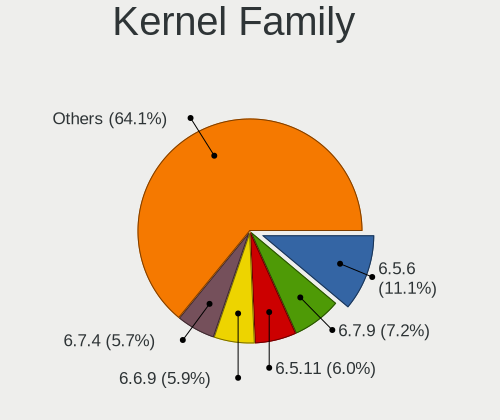

| Version | Computers | Percent |
|---------|-----------|---------|
| 6.5.6   | 368       | 11.28%  |
| 6.7.9   | 243       | 7.45%   |
| 6.5.11  | 210       | 6.44%   |
| 6.6.9   | 206       | 6.31%   |
| 6.7.4   | 196       | 6.01%   |
| 6.6.8   | 174       | 5.33%   |
| 6.7.7   | 151       | 4.63%   |
| 6.6.13  | 115       | 3.52%   |
| 6.5.12  | 108       | 3.31%   |
| 6.6.11  | 101       | 3.1%    |
| 6.6.4   | 98        | 3%      |
| 6.6.6   | 96        | 2.94%   |
| 6.7.5   | 92        | 2.82%   |
| 6.8.4   | 91        | 2.79%   |
| 6.6.7   | 91        | 2.79%   |
| 6.7.10  | 87        | 2.67%   |
| 6.7.6   | 82        | 2.51%   |
| 6.6.2   | 81        | 2.48%   |
| 6.8.6   | 80        | 2.45%   |
| 6.7.11  | 75        | 2.3%    |
| 6.7.3   | 71        | 2.18%   |
| 6.8.5   | 61        | 1.87%   |
| 6.6.14  | 54        | 1.65%   |
| 6.6.12  | 51        | 1.56%   |
| 6.5.10  | 46        | 1.41%   |
| 6.8.7   | 44        | 1.35%   |
| 6.6.3   | 39        | 1.2%    |
| 6.5.9   | 19        | 0.58%   |
| 6.5.5   | 16        | 0.49%   |
| 6.7.0   | 11        | 0.34%   |
| 6.8.8   | 9         | 0.28%   |
| 6.8.0   | 7         | 0.21%   |
| 6.5.2   | 7         | 0.21%   |
| 6.4.0   | 7         | 0.21%   |
| 6.5.8   | 6         | 0.18%   |
| 6.5.0   | 6         | 0.18%   |
| 6.3.0   | 6         | 0.18%   |
| 6.7.1   | 5         | 0.15%   |
| 6.6.10  | 5         | 0.15%   |
| 6.6.1   | 5         | 0.15%   |

Kernel Major Ver.
-----------------

Linux kernel major version

| Version | Computers | Percent |
|---------|-----------|---------|
| 6.6     | 1054      | 33.55%  |
| 6.7     | 977       | 31.09%  |
| 6.5     | 792       | 25.21%  |
| 6.8     | 292       | 9.29%   |
| 6.4     | 10        | 0.32%   |
| 6.3     | 6         | 0.19%   |
| 6.2     | 5         | 0.16%   |
| 6.9     | 3         | 0.1%    |
| 6.0     | 2         | 0.06%   |
| 5.0     | 1         | 0.03%   |

Arch
----

OS architecture (x86_64, i586, etc.)

| Name    | Computers | Percent |
|---------|-----------|---------|
| x86_64  | 2963      | 99.76%  |
| aarch64 | 7         | 0.24%   |

DE
--

Desktop Environment

| Name           | Computers | Percent |
|----------------|-----------|---------|
| GNOME          | 2304      | 77.32%  |
| KDE5           | 419       | 14.06%  |
| Unknown        | 49        | 1.64%   |
| X-Cinnamon     | 36        | 1.21%   |
| XFCE           | 35        | 1.17%   |
| Cinnamon       | 27        | 0.91%   |
| Budgie         | 25        | 0.84%   |
| GNOME Classic  | 21        | 0.7%    |
| MATE           | 20        | 0.67%   |
| sway           | 9         | 0.3%    |
| Hyprland       | 8         | 0.27%   |
| KDE6           | 5         | 0.17%   |
| LXQt           | 4         | 0.13%   |
| KDE            | 4         | 0.13%   |
| i3             | 4         | 0.13%   |
| GNOME-Classic  | 2         | 0.07%   |
| Deepin         | 2         | 0.07%   |
| wlroots        | 1         | 0.03%   |
| WindowMaker    | 1         | 0.03%   |
| river          | 1         | 0.03%   |
| LXDE           | 1         | 0.03%   |
| i3-with-shmlog | 1         | 0.03%   |
| bspwm          | 1         | 0.03%   |

Display Server
--------------

X11 or Wayland

| Name    | Computers | Percent |
|---------|-----------|---------|
| Wayland | 2451      | 81.65%  |
| X11     | 474       | 15.79%  |
| Tty     | 49        | 1.63%   |
| Unknown | 27        | 0.9%    |
| Web     | 1         | 0.03%   |

Display Manager
---------------

SDDM, LightDM, etc.

| Name    | Computers | Percent |
|---------|-----------|---------|
| Unknown | 2004      | 67.05%  |
| GDM     | 648       | 21.68%  |
| SDDM    | 210       | 7.03%   |
| LightDM | 125       | 4.18%   |
| LXDM    | 1         | 0.03%   |
| GREETD  | 1         | 0.03%   |

OS Lang
-------

Language

| Lang    | Computers | Percent |
|---------|-----------|---------|
| en_US   | 1498      | 50.3%   |
| en_GB   | 216       | 7.25%   |
| ru_RU   | 175       | 5.88%   |
| de_DE   | 151       | 5.07%   |
| pt_BR   | 146       | 4.9%    |
| fr_FR   | 86        | 2.89%   |
| it_IT   | 85        | 2.85%   |
| en_AU   | 68        | 2.28%   |
| en_CA   | 67        | 2.25%   |
| pl_PL   | 52        | 1.75%   |
| es_ES   | 43        | 1.44%   |
| en_IN   | 38        | 1.28%   |
| es_MX   | 33        | 1.11%   |
| tr_TR   | 23        | 0.77%   |
| cs_CZ   | 21        | 0.71%   |
| de_AT   | 16        | 0.54%   |
| zh_CN   | 15        | 0.5%    |
| hu_HU   | 15        | 0.5%    |
| de_CH   | 15        | 0.5%    |
| es_AR   | 14        | 0.47%   |
| es_CL   | 12        | 0.4%    |
| es_CO   | 10        | 0.34%   |
| en_NZ   | 10        | 0.34%   |
| pt_PT   | 9         | 0.3%    |
| en_DK   | 9         | 0.3%    |
| fr_CA   | 8         | 0.27%   |
| en_ZA   | 8         | 0.27%   |
| ru_UA   | 7         | 0.24%   |
| nl_NL   | 7         | 0.24%   |
| fr_BE   | 7         | 0.24%   |
| Unknown | 7         | 0.24%   |
| nb_NO   | 6         | 0.2%    |
| ko_KR   | 6         | 0.2%    |
| fr_CH   | 6         | 0.2%    |
| en_IE   | 6         | 0.2%    |
| ja_JP   | 5         | 0.17%   |
| da_DK   | 5         | 0.17%   |
| sv_SE   | 4         | 0.13%   |
| ro_RO   | 4         | 0.13%   |
| fi_FI   | 4         | 0.13%   |

Boot Mode
---------

EFI or BIOS

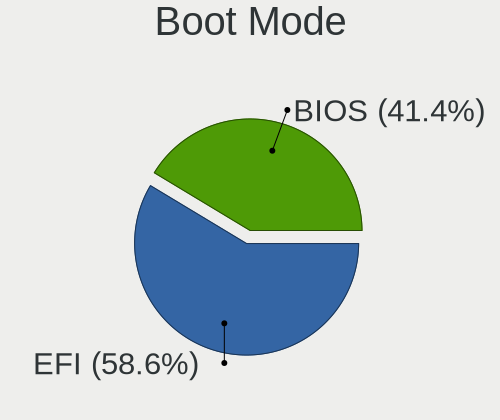

| Mode | Computers | Percent |
|------|-----------|---------|
| EFI  | 1803      | 59.47%  |
| BIOS | 1229      | 40.53%  |

Filesystem
----------

Type of filesystem

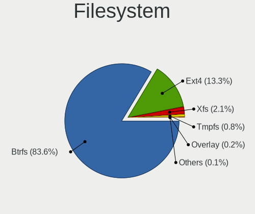

| Type    | Computers | Percent |
|---------|-----------|---------|
| Btrfs   | 2520      | 84.62%  |
| Ext4    | 375       | 12.59%  |
| Xfs     | 55        | 1.85%   |
| Tmpfs   | 22        | 0.74%   |
| Overlay | 4         | 0.13%   |
| XXXXX   | 1         | 0.03%   |
| Unknown | 1         | 0.03%   |

Part. scheme
------------

Scheme of partitioning

| Type    | Computers | Percent |
|---------|-----------|---------|
| Unknown | 1954      | 65.33%  |
| GPT     | 991       | 33.13%  |
| MBR     | 46        | 1.54%   |

Dual Boot with Linux/BSD
------------------------

Hosting more than one Linux/BSD

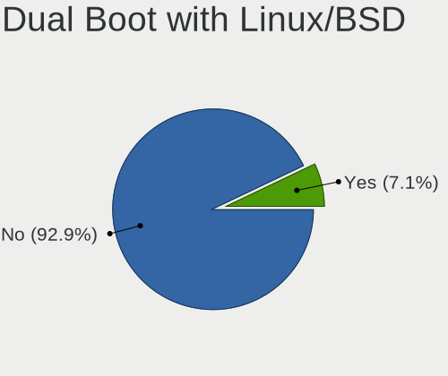

| Dual boot | Computers | Percent |
|-----------|-----------|---------|
| No        | 2773      | 93.08%  |
| Yes       | 206       | 6.92%   |

Dual Boot (Win)
---------------

Hosting Linux and Windows

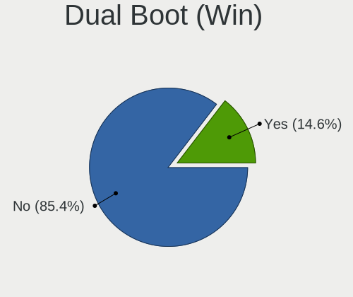

| Dual boot | Computers | Percent |
|-----------|-----------|---------|
| No        | 2553      | 85.76%  |
| Yes       | 424       | 14.24%  |

Board
-----

Vendor
------

Motherboard manufacturer

| Name                                 | Computers | Percent |
|--------------------------------------|-----------|---------|
| Lenovo                               | 556       | 18.72%  |
| ASUSTek Computer                     | 511       | 17.21%  |
| Hewlett-Packard                      | 374       | 12.59%  |
| Dell                                 | 339       | 11.41%  |
| MSI                                  | 195       | 6.57%   |
| Gigabyte Technology                  | 164       | 5.52%   |
| Apple                                | 157       | 5.29%   |
| Acer                                 | 127       | 4.28%   |
| ASRock                               | 83        | 2.79%   |
| HUAWEI                               | 46        | 1.55%   |
| Intel                                | 32        | 1.08%   |
| Samsung Electronics                  | 24        | 0.81%   |
| Framework                            | 23        | 0.77%   |
| Fujitsu                              | 20        | 0.67%   |
| Unknown                              | 18        | 0.61%   |
| Google                               | 15        | 0.51%   |
| Toshiba                              | 14        | 0.47%   |
| Alienware                            | 14        | 0.47%   |
| Timi                                 | 13        | 0.44%   |
| AZW                                  | 12        | 0.4%    |
| Chuwi                                | 11        | 0.37%   |
| Microsoft                            | 10        | 0.34%   |
| Shenzhen Meigao Electronic Equipment | 9         | 0.3%    |
| Pegatron                             | 8         | 0.27%   |
| Sony                                 | 7         | 0.24%   |
| Positivo                             | 7         | 0.24%   |
| Notebook                             | 7         | 0.24%   |
| LG Electronics                       | 7         | 0.24%   |
| TUXEDO                               | 6         | 0.2%    |
| HONOR                                | 6         | 0.2%    |
| Biostar                              | 6         | 0.2%    |
| Medion                               | 5         | 0.17%   |
| Foxconn                              | 5         | 0.17%   |
| AMI                                  | 5         | 0.17%   |
| SLIMBOOK                             | 4         | 0.13%   |
| Razer                                | 4         | 0.13%   |
| Panasonic                            | 4         | 0.13%   |
| Avell High Performance               | 4         | 0.13%   |
| XIAOMI                               | 3         | 0.1%    |
| Star Labs                            | 3         | 0.1%    |

Model
-----

Motherboard model

| Name                                              | Computers | Percent |
|---------------------------------------------------|-----------|---------|
| Unknown                                           | 24        | 0.81%   |
| ASUS All Series                                   | 15        | 0.51%   |
| Framework Laptop 13 (AMD Ryzen 7040Series)        | 13        | 0.44%   |
| Apple MacBookPro14,1                              | 12        | 0.4%    |
| Apple MacBookAir7,2                               | 8         | 0.27%   |
| MSI MS-7C95                                       | 7         | 0.24%   |
| MSI MS-7C37                                       | 7         | 0.24%   |
| HP Notebook                                       | 7         | 0.24%   |
| ASUS ROG STRIX B550-F GAMING                      | 7         | 0.24%   |
| Apple MacBookPro9,2                               | 7         | 0.24%   |
| Apple MacBookPro8,1                               | 7         | 0.24%   |
| MSI MS-7B89                                       | 6         | 0.2%    |
| HUAWEI RLEF-XX                                    | 6         | 0.2%    |
| HUAWEI BOM-WXX9                                   | 6         | 0.2%    |
| AZW SER                                           | 6         | 0.2%    |
| ASUS TUF Gaming X570-PLUS                         | 6         | 0.2%    |
| ASUS PRIME A320M-K                                | 6         | 0.2%    |
| Apple MacBookPro11,3                              | 6         | 0.2%    |
| MSI MS-7C02                                       | 5         | 0.17%   |
| Lenovo ThinkBook 16 G6 IRL 21KH                   | 5         | 0.17%   |
| Lenovo Legion 5 Pro 16ACH6H 82JQ                  | 5         | 0.17%   |
| Intel X99                                         | 5         | 0.17%   |
| Framework Laptop (12th Gen Intel Core)            | 5         | 0.17%   |
| Dell Precision M4800                              | 5         | 0.17%   |
| Dell Latitude 5290 2-in-1                         | 5         | 0.17%   |
| ASUS Zenbook UM3402YAR_UM3402YA                   | 5         | 0.17%   |
| ASUS TUF Gaming B550-PLUS                         | 5         | 0.17%   |
| ASUS ROG STRIX X570-E GAMING                      | 5         | 0.17%   |
| Apple MacPro5,1                                   | 5         | 0.17%   |
| Apple Macmini6,1                                  | 5         | 0.17%   |
| Apple MacBookPro12,1                              | 5         | 0.17%   |
| Apple MacBookPro11,1                              | 5         | 0.17%   |
| Apple MacBookPro10,1                              | 5         | 0.17%   |
| AMI Intel                                         | 5         | 0.17%   |
| Acer Aspire A515-57                               | 5         | 0.17%   |
| Shenzhen Meigao Electronic Equipment Venus series | 4         | 0.13%   |
| MSI MS-7D78                                       | 4         | 0.13%   |
| MSI MS-7D54                                       | 4         | 0.13%   |
| MSI MS-7C91                                       | 4         | 0.13%   |
| MSI MS-7C56                                       | 4         | 0.13%   |

Model Family
------------

Motherboard model prefix

| Name               | Computers | Percent |
|--------------------|-----------|---------|
| Lenovo ThinkPad    | 260       | 8.75%   |
| ASUS ROG           | 106       | 3.57%   |
| Dell Latitude      | 96        | 3.23%   |
| Lenovo IdeaPad     | 92        | 3.1%    |
| Dell Inspiron      | 76        | 2.56%   |
| ASUS PRIME         | 76        | 2.56%   |
| Acer Aspire        | 74        | 2.49%   |
| ASUS VivoBook      | 69        | 2.32%   |
| HP EliteBook       | 65        | 2.19%   |
| HP Laptop          | 52        | 1.75%   |
| Dell XPS           | 50        | 1.68%   |
| ASUS TUF           | 50        | 1.68%   |
| HP Pavilion        | 46        | 1.55%   |
| HP ENVY            | 43        | 1.45%   |
| Dell Precision     | 43        | 1.45%   |
| Lenovo Legion      | 40        | 1.35%   |
| Lenovo Yoga        | 39        | 1.31%   |
| Dell OptiPlex      | 37        | 1.25%   |
| ASUS ASUS          | 37        | 1.25%   |
| ASUS Zenbook       | 31        | 1.04%   |
| HP ProBook         | 26        | 0.88%   |
| Unknown            | 24        | 0.81%   |
| Framework Laptop   | 23        | 0.77%   |
| Acer Nitro         | 22        | 0.74%   |
| Apple MacBookPro11 | 20        | 0.67%   |
| Lenovo ThinkCentre | 18        | 0.61%   |
| Lenovo ThinkBook   | 17        | 0.57%   |
| HP EliteDesk       | 16        | 0.54%   |
| ASUS All           | 15        | 0.51%   |
| HP OMEN            | 14        | 0.47%   |
| Gigabyte X570      | 14        | 0.47%   |
| Gigabyte B550M     | 14        | 0.47%   |
| Dell Vostro        | 14        | 0.47%   |
| Apple MacBookPro14 | 14        | 0.47%   |
| Toshiba Satellite  | 11        | 0.37%   |
| Lenovo IdeaPadFlex | 11        | 0.37%   |
| Gigabyte B550      | 11        | 0.37%   |
| Apple MacBookPro8  | 11        | 0.37%   |
| Acer Swift         | 11        | 0.37%   |
| Microsoft Surface  | 10        | 0.34%   |

MFG Year
--------

Motherboard manufacture year

| Year    | Computers | Percent |
|---------|-----------|---------|
| 2022    | 373       | 12.56%  |
| 2021    | 369       | 12.42%  |
| 2023    | 359       | 12.09%  |
| 2020    | 321       | 10.81%  |
| 2019    | 247       | 8.32%   |
| 2018    | 238       | 8.01%   |
| 2017    | 171       | 5.76%   |
| 2013    | 131       | 4.41%   |
| 2012    | 129       | 4.34%   |
| 2014    | 126       | 4.24%   |
| 2015    | 112       | 3.77%   |
| 2016    | 104       | 3.5%    |
| 2011    | 93        | 3.13%   |
| 2010    | 72        | 2.42%   |
| 2009    | 40        | 1.35%   |
| 2008    | 39        | 1.31%   |
| 2007    | 21        | 0.71%   |
| 2024    | 18        | 0.61%   |
| 2006    | 4         | 0.13%   |
| Unknown | 2         | 0.07%   |
| 2005    | 1         | 0.03%   |

Form Factor
-----------

Physical design of the computer

| Name           | Computers | Percent |
|----------------|-----------|---------|
| Notebook       | 1736      | 58.45%  |
| Desktop        | 916       | 30.84%  |
| Convertible    | 152       | 5.12%   |
| Mini pc        | 57        | 1.92%   |
| Tablet         | 52        | 1.75%   |
| All in one     | 44        | 1.48%   |
| Server         | 7         | 0.24%   |
| System on chip | 5         | 0.17%   |
| Other          | 1         | 0.03%   |

Secure Boot
-----------

Enabled or disabled

| State    | Computers | Percent |
|----------|-----------|---------|
| Disabled | 2495      | 83.42%  |
| Enabled  | 496       | 16.58%  |

Coreboot
--------

Have coreboot on board

| Used | Computers | Percent |
|------|-----------|---------|
| No   | 2952      | 99.39%  |
| Yes  | 18        | 0.61%   |

RAM Size
--------

Total RAM memory

| Size in GB      | Computers | Percent |
|-----------------|-----------|---------|
| 16.01-24.0      | 704       | 23.59%  |
| 4.01-8.0        | 657       | 22.02%  |
| 8.01-16.0       | 565       | 18.93%  |
| 32.01-64.0      | 522       | 17.49%  |
| 3.01-4.0        | 192       | 6.43%   |
| 64.01-256.0     | 168       | 5.63%   |
| 24.01-32.0      | 141       | 4.73%   |
| 1.01-2.0        | 23        | 0.77%   |
| 2.01-3.0        | 10        | 0.34%   |
| More than 256.0 | 2         | 0.07%   |

RAM Used
--------

Used RAM memory

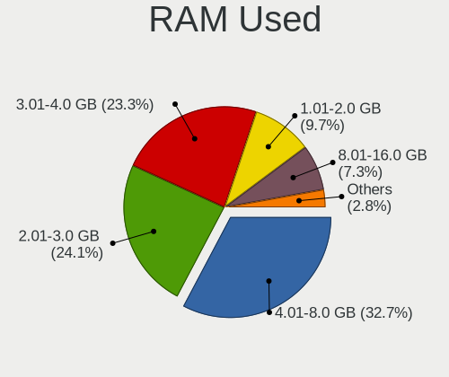

| Used GB     | Computers | Percent |
|-------------|-----------|---------|
| 4.01-8.0    | 1029      | 32.77%  |
| 2.01-3.0    | 763       | 24.3%   |
| 3.01-4.0    | 742       | 23.63%  |
| 1.01-2.0    | 304       | 9.68%   |
| 8.01-16.0   | 215       | 6.85%   |
| 16.01-24.0  | 44        | 1.4%    |
| 0.51-1.0    | 30        | 0.96%   |
| 24.01-32.0  | 7         | 0.22%   |
| 32.01-64.0  | 4         | 0.13%   |
| 64.01-256.0 | 2         | 0.06%   |

Total Drives
------------

Number of drives on board

| Drives | Computers | Percent |
|--------|-----------|---------|
| 1      | 1878      | 62.54%  |
| 2      | 670       | 22.31%  |
| 3      | 248       | 8.26%   |
| 4      | 104       | 3.46%   |
| 5      | 53        | 1.76%   |
| 6      | 22        | 0.73%   |
| 8      | 8         | 0.27%   |
| 7      | 5         | 0.17%   |
| 0      | 5         | 0.17%   |
| 9      | 3         | 0.1%    |
| 12     | 2         | 0.07%   |
| 10     | 2         | 0.07%   |
| 22     | 1         | 0.03%   |
| 13     | 1         | 0.03%   |
| 11     | 1         | 0.03%   |

Has CD-ROM
----------

Has CD-ROM on board

| Presented | Computers | Percent |
|-----------|-----------|---------|
| No        | 2434      | 81.73%  |
| Yes       | 544       | 18.27%  |

Has Ethernet
------------

Has Ethernet on board

| Presented | Computers | Percent |
|-----------|-----------|---------|
| Yes       | 2242      | 75.31%  |
| No        | 735       | 24.69%  |

Has WiFi
--------

Has WiFi module

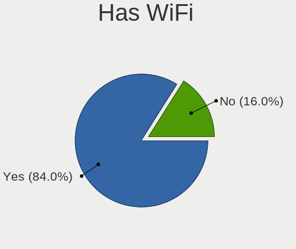

| Presented | Computers | Percent |
|-----------|-----------|---------|
| Yes       | 2554      | 85.76%  |
| No        | 424       | 14.24%  |

Has Bluetooth
-------------

Has Bluetooth module

| Presented | Computers | Percent |
|-----------|-----------|---------|
| Yes       | 2304      | 77.26%  |
| No        | 678       | 22.74%  |

Location
--------

Country
-------

Geographic location (country)

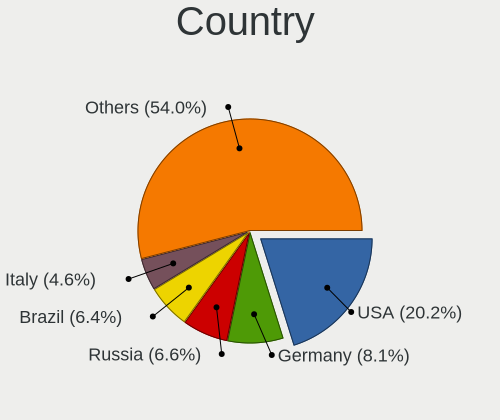

| Country     | Computers | Percent |
|-------------|-----------|---------|
| USA         | 595       | 19.97%  |
| Germany     | 243       | 8.15%   |
| Russia      | 195       | 6.54%   |
| Brazil      | 192       | 6.44%   |
| Italy       | 140       | 4.7%    |
| UK          | 123       | 4.13%   |
| France      | 114       | 3.83%   |
| Canada      | 112       | 3.76%   |
| Poland      | 95        | 3.19%   |
| India       | 85        | 2.85%   |
| Australia   | 78        | 2.62%   |
| Spain       | 70        | 2.35%   |
| Netherlands | 55        | 1.85%   |
| Mexico      | 50        | 1.68%   |
| Switzerland | 45        | 1.51%   |
| Czechia     | 41        | 1.38%   |
| Austria     | 41        | 1.38%   |
| Turkey      | 40        | 1.34%   |
| Romania     | 34        | 1.14%   |
| Sweden      | 31        | 1.04%   |
| Portugal    | 29        | 0.97%   |
| Hungary     | 29        | 0.97%   |
| Argentina   | 28        | 0.94%   |
| Belgium     | 23        | 0.77%   |
| Finland     | 22        | 0.74%   |
| Bulgaria    | 20        | 0.67%   |
| Colombia    | 19        | 0.64%   |
| Norway      | 18        | 0.6%    |
| Chile       | 17        | 0.57%   |
| Belarus     | 16        | 0.54%   |
| Egypt       | 15        | 0.5%    |
| Denmark     | 15        | 0.5%    |
| China       | 15        | 0.5%    |
| Japan       | 14        | 0.47%   |
| Indonesia   | 13        | 0.44%   |
| Greece      | 12        | 0.4%    |
| Serbia      | 11        | 0.37%   |
| Philippines | 11        | 0.37%   |
| Morocco     | 11        | 0.37%   |
| Croatia     | 10        | 0.34%   |

City
----

Geographic location (city)

| City           | Computers | Percent |
|----------------|-----------|---------|
| Moscow         | 48        | 1.58%   |
| Sydney         | 31        | 1.02%   |
| St Petersburg  | 29        | 0.96%   |
| Berlin         | 25        | 0.82%   |
| Vienna         | 23        | 0.76%   |
| Paris          | 21        | 0.69%   |
| Warsaw         | 19        | 0.63%   |
| Seattle        | 18        | 0.59%   |
| Toronto        | 17        | 0.56%   |
| Munich         | 17        | 0.56%   |
| Sao Paulo      | 16        | 0.53%   |
| Milan          | 15        | 0.49%   |
| Montreal       | 14        | 0.46%   |
| Prague         | 13        | 0.43%   |
| Bengaluru      | 13        | 0.43%   |
| Zurich         | 12        | 0.4%    |
| Stuttgart      | 12        | 0.4%    |
| Minsk          | 12        | 0.4%    |
| Los Angeles    | 12        | 0.4%    |
| Istanbul       | 12        | 0.4%    |
| Helsinki       | 12        | 0.4%    |
| Yekaterinburg  | 11        | 0.36%   |
| Rome           | 11        | 0.36%   |
| Melbourne      | 11        | 0.36%   |
| Hamburg        | 11        | 0.36%   |
| Budapest       | 11        | 0.36%   |
| Santiago       | 10        | 0.33%   |
| Rio de Janeiro | 10        | 0.33%   |
| Mexico City    | 10        | 0.33%   |
| London         | 10        | 0.33%   |
| Brisbane       | 10        | 0.33%   |
| Tashkent       | 9         | 0.3%    |
| Sofia          | 9         | 0.3%    |
| Poznan         | 9         | 0.3%    |
| Porto Alegre   | 9         | 0.3%    |
| Milano         | 9         | 0.3%    |
| Denver         | 9         | 0.3%    |
| Delhi          | 9         | 0.3%    |
| Bucharest      | 9         | 0.3%    |
| Ankara         | 9         | 0.3%    |

Drives
------

Drive Vendor
------------

Hard drive vendors

| Vendor                       | Computers | Drives | Percent |
|------------------------------|-----------|--------|---------|
| Samsung Electronics          | 812       | 1124   | 18.73%  |
| Sandisk                      | 404       | 475    | 9.32%   |
| WDC                          | 376       | 552    | 8.67%   |
| Seagate                      | 337       | 476    | 7.77%   |
| Kingston                     | 203       | 250    | 4.68%   |
| SK hynix                     | 193       | 210    | 4.45%   |
| Toshiba                      | 159       | 189    | 3.67%   |
| Micron Technology            | 154       | 164    | 3.55%   |
| Intel                        | 143       | 178    | 3.3%    |
| Unknown                      | 133       | 160    | 3.07%   |
| Crucial                      | 131       | 161    | 3.02%   |
| Micron/Crucial Technology    | 111       | 146    | 2.56%   |
| Phison Electronics           | 101       | 122    | 2.33%   |
| Apple                        | 89        | 122    | 2.05%   |
| KIOXIA                       | 69        | 77     | 1.59%   |
| Kingston Technology Company  | 56        | 61     | 1.29%   |
| MAXIO Technology (Hangzhou)  | 55        | 62     | 1.27%   |
| Hitachi                      | 51        | 60     | 1.18%   |
| A-DATA Technology            | 51        | 56     | 1.18%   |
| Silicon Motion               | 50        | 64     | 1.15%   |
| ADATA Technology             | 50        | 63     | 1.15%   |
| HGST                         | 46        | 59     | 1.06%   |
| China                        | 41        | 48     | 0.95%   |
| PNY                          | 23        | 28     | 0.53%   |
| Realtek Semiconductor        | 22        | 23     | 0.51%   |
| Shenzhen Longsys Electronics | 20        | 24     | 0.46%   |
| SPCC                         | 19        | 24     | 0.44%   |
| Unknown                      | 17        | 19     | 0.39%   |
| Patriot                      | 16        | 21     | 0.37%   |
| Netac                        | 15        | 19     | 0.35%   |
| JMicron Technology           | 15        | 20     | 0.35%   |
| Intenso                      | 14        | 16     | 0.32%   |
| Transcend                    | 13        | 15     | 0.3%    |
| GOODRAM                      | 12        | 14     | 0.28%   |
| Apacer                       | 12        | 15     | 0.28%   |
| Team                         | 11        | 13     | 0.25%   |
| LITEON                       | 11        | 14     | 0.25%   |
| Lexar                        | 11        | 14     | 0.25%   |
| Union Memory (Shenzhen)      | 10        | 10     | 0.23%   |
| Union Memory                 | 9         | 11     | 0.21%   |

Drive Model
-----------

Hard drive models

| Model                                                 | Computers | Percent |
|-------------------------------------------------------|-----------|---------|
| Samsung NVMe SSD Controller SM981/PM981/PM983 1TB     | 208       | 4.42%   |
| Samsung NVMe SSD Controller PM9A1/PM9A3/980PRO 1TB    | 137       | 2.91%   |
| Micron/Crucial P2 NVMe PCIe SSD 4TB                   | 80        | 1.7%    |
| Sandisk WD Blue SN550 NVMe SSD 2TB                    | 52        | 1.11%   |
| Kingston SA400S37240G 240GB SSD                       | 43        | 0.91%   |
| Sandisk WD Black SN750 / PC SN730 NVMe SSD 512GB      | 41        | 0.87%   |
| Samsung NVMe SSD Controller SM961/PM961/SM963 1TB     | 39        | 0.83%   |
| Phison E12 NVMe Controller 2TB                        | 39        | 0.83%   |
| MAXIO (Hangzhou) NVMe SSD Controller MAP1202 256GB    | 39        | 0.83%   |
| Samsung SSD 860 EVO 500GB                             | 36        | 0.77%   |
| Kingston SA400S37480G 480GB SSD                       | 34        | 0.72%   |
| Intel SSDPEKNU512GZ 512GB                             | 33        | 0.7%    |
| Intel SSD 660P Series 1024GB                          | 31        | 0.66%   |
| Silicon Motion SM2263EN/SM2263XT SSD Controller 256GB | 30        | 0.64%   |
| Unknown MMC Card  128GB                               | 28        | 0.6%    |
| Unknown MMC Card  32GB                                | 27        | 0.57%   |
| Samsung SSD 980 1TB                                   | 26        | 0.55%   |
| Samsung SSD 850 EVO 250GB                             | 26        | 0.55%   |
| Samsung SSD 860 EVO 1TB                               | 25        | 0.53%   |
| Samsung SSD 850 EVO 500GB                             | 24        | 0.51%   |
| Seagate ST1000DM010-2EP102 1TB                        | 23        | 0.49%   |
| Kingston Company SNV2S1000G 1TB                       | 23        | 0.49%   |
| Unknown MMC Card  64GB                                | 22        | 0.47%   |
| Crucial CT1000MX500SSD1 1TB                           | 22        | 0.47%   |
| Seagate ST1000LM035-1RK172 1TB                        | 21        | 0.45%   |
| Sandisk WD Black SN850 512GB                          | 21        | 0.45%   |
| Phison PS5013 E13 NVMe Controller 512GB               | 21        | 0.45%   |
| Toshiba XG6 NVMe SSD Controller 1024GB                | 19        | 0.4%    |
| SK hynix BC501 NVMe Solid State Drive 512GB           | 19        | 0.4%    |
| Seagate ST2000DM008-2FR102 2TB                        | 19        | 0.4%    |
| Sandisk WD_BLACK SN850X 1000GB                        | 18        | 0.38%   |
| Samsung SSD 870 EVO 1TB                               | 18        | 0.38%   |
| Crucial CT500MX500SSD1 500GB                          | 18        | 0.38%   |
| Seagate ST500DM002-1BD142 500GB                       | 17        | 0.36%   |
| Samsung SSD 990 PRO 2TB                               | 17        | 0.36%   |
| Phison E16 PCIe4 NVMe Controller 1TB                  | 17        | 0.36%   |
| HGST HTS721010A9E630 1TB                              | 17        | 0.36%   |
| Crucial CT480BX500SSD1 480GB                          | 17        | 0.36%   |
| Unknown                                               | 17        | 0.36%   |
| Kingston SA400S37120G 120GB SSD                       | 16        | 0.34%   |

HDD Vendor
----------

Hard disk drive vendors

| Vendor              | Computers | Drives | Percent |
|---------------------|-----------|--------|---------|
| Seagate             | 324       | 456    | 35.22%  |
| WDC                 | 312       | 457    | 33.91%  |
| Toshiba             | 95        | 118    | 10.33%  |
| Hitachi             | 51        | 60     | 5.54%   |
| HGST                | 45        | 58     | 4.89%   |
| Samsung Electronics | 30        | 44     | 3.26%   |
| Apple               | 15        | 17     | 1.63%   |
| Unknown             | 13        | 13     | 1.41%   |
| JMicron Technology  | 10        | 15     | 1.09%   |
| Maxtor              | 4         | 4      | 0.43%   |
| SABRENT             | 3         | 3      | 0.33%   |
| ASMT                | 2         | 7      | 0.22%   |
| USB3.0              | 1         | 1      | 0.11%   |
| TO Exter            | 1         | 2      | 0.11%   |
| SAGE                | 1         | 1      | 0.11%   |
| ORICO               | 1         | 1      | 0.11%   |
| Lenovo              | 1         | 1      | 0.11%   |
| KINGWIN             | 1         | 1      | 0.11%   |
| Intenso             | 1         | 1      | 0.11%   |
| Inateck             | 1         | 2      | 0.11%   |
| ICY BOX             | 1         | 1      | 0.11%   |
| IB-377U3            | 1         | 1      | 0.11%   |
| HGST HTS            | 1         | 1      | 0.11%   |
| Hewlett-Packard     | 1         | 20     | 0.11%   |
| Fujitsu             | 1         | 1      | 0.11%   |
| External            | 1         | 1      | 0.11%   |
| ASMedia             | 1         | 1      | 0.11%   |
| Asm                 | 1         | 1      | 0.11%   |

SSD Vendor
----------

Solid state drive vendors

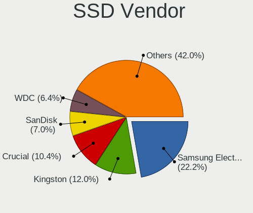

| Vendor              | Computers | Drives | Percent |
|---------------------|-----------|--------|---------|
| Samsung Electronics | 290       | 401    | 22.53%  |
| Kingston            | 151       | 179    | 11.73%  |
| Crucial             | 131       | 161    | 10.18%  |
| SanDisk             | 93        | 108    | 7.23%   |
| WDC                 | 76        | 91     | 5.91%   |
| Apple               | 51        | 53     | 3.96%   |
| China               | 41        | 48     | 3.19%   |
| A-DATA Technology   | 41        | 45     | 3.19%   |
| SK hynix            | 35        | 36     | 2.72%   |
| Intel               | 31        | 45     | 2.41%   |
| Micron Technology   | 25        | 26     | 1.94%   |
| PNY                 | 23        | 28     | 1.79%   |
| SPCC                | 19        | 24     | 1.48%   |
| Toshiba             | 17        | 18     | 1.32%   |
| Patriot             | 15        | 20     | 1.17%   |
| Intenso             | 12        | 14     | 0.93%   |
| GOODRAM             | 12        | 14     | 0.93%   |
| Apacer              | 12        | 15     | 0.93%   |
| Transcend           | 11        | 13     | 0.85%   |
| Team                | 11        | 13     | 0.85%   |
| LITEON              | 11        | 14     | 0.85%   |
| Netac               | 10        | 12     | 0.78%   |
| Lexar               | 10        | 13     | 0.78%   |
| OCZ                 | 9         | 12     | 0.7%    |
| LITEONIT            | 9         | 11     | 0.7%    |
| KingSpec            | 9         | 11     | 0.7%    |
| Hewlett-Packard     | 6         | 7      | 0.47%   |
| Gigabyte Technology | 6         | 6      | 0.47%   |
| Unknown             | 6         | 8      | 0.47%   |
| Fanxiang            | 5         | 7      | 0.39%   |
| External            | 5         | 9      | 0.39%   |
| Corsair             | 5         | 6      | 0.39%   |
| Smartbuy            | 4         | 5      | 0.31%   |
| Seagate             | 4         | 4      | 0.31%   |
| Plextor             | 4         | 8      | 0.31%   |
| USB3.0              | 3         | 3      | 0.23%   |
| FORESEE             | 3         | 4      | 0.23%   |
| Emtec               | 3         | 3      | 0.23%   |
| AirDisk             | 3         | 3      | 0.23%   |
| XrayDisk            | 2         | 2      | 0.16%   |

Drive Kind
----------

HDD or SSD

| Kind    | Computers | Drives | Percent |
|---------|-----------|--------|---------|
| NVMe    | 1852      | 2440   | 47.26%  |
| SSD     | 1112      | 1580   | 28.37%  |
| HDD     | 782       | 1289   | 19.95%  |
| MMC     | 97        | 119    | 2.48%   |
| Unknown | 76        | 91     | 1.94%   |

Drive Connector
---------------

SATA, SAS, NVMe, etc.

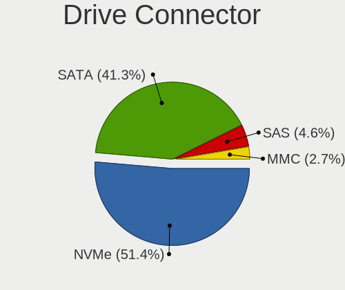

| Type | Computers | Drives | Percent |
|------|-----------|--------|---------|
| NVMe | 1850      | 2430   | 51.27%  |
| SATA | 1494      | 2745   | 41.41%  |
| SAS  | 167       | 225    | 4.63%   |
| MMC  | 97        | 119    | 2.69%   |

Drive Size
----------

Size of hard drive

| Size in TB | Computers | Drives | Percent |
|------------|-----------|--------|---------|
| 0.01-0.5   | 1031      | 1513   | 51.63%  |
| 0.51-1.0   | 623       | 845    | 31.2%   |
| 1.01-2.0   | 175       | 242    | 8.76%   |
| 3.01-4.0   | 76        | 114    | 3.81%   |
| 4.01-10.0  | 49        | 89     | 2.45%   |
| 2.01-3.0   | 23        | 34     | 1.15%   |
| 10.01-20.0 | 20        | 32     | 1%      |

Space Total
-----------

Amount of disk space available on the file system

| Size in GB     | Computers | Percent |
|----------------|-----------|---------|
| 501-1000       | 684       | 22.54%  |
| 251-500        | 532       | 17.53%  |
| 1001-2000      | 523       | 17.23%  |
| 101-250        | 358       | 11.8%   |
| More than 3000 | 245       | 8.07%   |
| Unknown        | 243       | 8.01%   |
| 1-20           | 210       | 6.92%   |
| 2001-3000      | 116       | 3.82%   |
| 51-100         | 89        | 2.93%   |
| 21-50          | 35        | 1.15%   |

Space Used
----------

Amount of used disk space

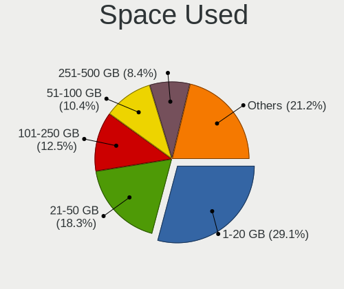

| Used GB        | Computers | Percent |
|----------------|-----------|---------|
| 1-20           | 922       | 29.87%  |
| 21-50          | 575       | 18.63%  |
| 101-250        | 375       | 12.15%  |
| 51-100         | 316       | 10.24%  |
| 251-500        | 246       | 7.97%   |
| Unknown        | 243       | 7.87%   |
| 501-1000       | 181       | 5.86%   |
| 1001-2000      | 124       | 4.02%   |
| More than 3000 | 69        | 2.24%   |
| 2001-3000      | 36        | 1.17%   |

Malfunc. Drives
---------------

Drive models with a malfunction

| Model                                                         | Computers | Drives | Percent |
|---------------------------------------------------------------|-----------|--------|---------|
| WDC WD40EFRX-68N32N0 4TB                                      | 4         | 4      | 4.17%   |
| Samsung Electronics NVMe SSD Controller SM981/PM981/PM983 1TB | 3         | 4      | 3.13%   |
| WDC WDS240G2G0A-00JH30 240GB SSD                              | 2         | 2      | 2.08%   |
| Toshiba THNSNK256GVN8 M.2 2280 256GB SSD                      | 2         | 2      | 2.08%   |
| Realtek Semiconductor RTS5763DL NVMe SSD Controller 256GB     | 2         | 2      | 2.08%   |
| Intel SSDSC2CT120A3 120GB                                     | 2         | 8      | 2.08%   |
| HGST HTS721010A9E630 1TB                                      | 2         | 2      | 2.08%   |
| Crucial CT128MX100SSD1 128GB                                  | 2         | 2      | 2.08%   |
| WDC WDS240G2G0B-00EPW0 240GB SSD                              | 1         | 1      | 1.04%   |
| WDC WD7500BPKX-00HPJT0 752GB                                  | 1         | 1      | 1.04%   |
| WDC WD6400AAKS-65A7B2 640GB                                   | 1         | 1      | 1.04%   |
| WDC WD5000LPVX-22V0TT0 500GB                                  | 1         | 1      | 1.04%   |
| WDC WD5000BPVT-22HXZT1 500GB                                  | 1         | 1      | 1.04%   |
| WDC WD5000AVDS-63U7B1 500GB                                   | 1         | 2      | 1.04%   |
| WDC WD5000AVCS-632DY1 500GB                                   | 1         | 3      | 1.04%   |
| WDC WD5000AAKX-00ERMA0 500GB                                  | 1         | 2      | 1.04%   |
| WDC WD5000AAKS-00UU3A0 500GB                                  | 1         | 1      | 1.04%   |
| WDC WD40EFRX-68WT0N0 4TB                                      | 1         | 1      | 1.04%   |
| WDC WD3200AAKS-22B3A0 320GB                                   | 1         | 1      | 1.04%   |
| WDC WD30 EZRX-00SPEB0 3TB                                     | 1         | 1      | 1.04%   |
| WDC WD20EADS-00S2B0 2TB                                       | 1         | 1      | 1.04%   |
| WDC WD2003FZEX-00SRLA0 2TB                                    | 1         | 1      | 1.04%   |
| WDC WD20 EZRX-00D8PB0 2TB                                     | 1         | 1      | 1.04%   |
| WDC WD1600AVVS-63L2B0 160GB                                   | 1         | 1      | 1.04%   |
| WDC WD15EARS-00MVWB0 1TB                                      | 1         | 1      | 1.04%   |
| WDC WD10JPVT-75A1YT0 1TB                                      | 1         | 1      | 1.04%   |
| WDC WD10EZEX-08WN4A0 1TB                                      | 1         | 1      | 1.04%   |
| WDC WD10EARS-22Y5B1 1TB                                       | 1         | 1      | 1.04%   |
| WDC WD10EADS-11M2B2 1TB                                       | 1         | 1      | 1.04%   |
| WDC WD10EADS-00L5B1 1TB                                       | 1         | 1      | 1.04%   |
| WDC WD Green 2.5 480GB SSD                                    | 1         | 1      | 1.04%   |
| WDC WD Blue SA510 2.5 500GB SSD                               | 1         | 1      | 1.04%   |
| Toshiba MQ01ABF050 500GB                                      | 1         | 1      | 1.04%   |
| Toshiba MQ01ABD050 500GB                                      | 1         | 4      | 1.04%   |
| Toshiba MK5056GSYF 500GB                                      | 1         | 1      | 1.04%   |
| Toshiba DT01ACA100 1TB                                        | 1         | 1      | 1.04%   |
| Toshiba BG3 NVMe SSD Controller 128GB                         | 1         | 1      | 1.04%   |
| SK hynix BC711 HFM512GD3JX013N 512GB                          | 1         | 1      | 1.04%   |
| Seagate ST9500420AS 500GB                                     | 1         | 1      | 1.04%   |
| Seagate ST9500325AS 500GB                                     | 1         | 1      | 1.04%   |

Malfunc. Drive Vendor
---------------------

Vendors of faulty drives

| Vendor                | Computers | Drives | Percent |
|-----------------------|-----------|--------|---------|
| WDC                   | 27        | 34     | 29.35%  |
| Seagate               | 16        | 22     | 17.39%  |
| Samsung Electronics   | 9         | 20     | 9.78%   |
| Toshiba               | 7         | 10     | 7.61%   |
| Hitachi               | 7         | 7      | 7.61%   |
| Crucial               | 5         | 8      | 5.43%   |
| SanDisk               | 3         | 3      | 3.26%   |
| Intel                 | 3         | 9      | 3.26%   |
| HGST                  | 3         | 3      | 3.26%   |
| Realtek Semiconductor | 2         | 2      | 2.17%   |
| Micron Technology     | 2         | 2      | 2.17%   |
| Apple                 | 2         | 2      | 2.17%   |
| SK hynix              | 1         | 1      | 1.09%   |
| Neo                   | 1         | 1      | 1.09%   |
| Mushkin               | 1         | 1      | 1.09%   |
| Maxtor                | 1         | 1      | 1.09%   |
| Kingston              | 1         | 1      | 1.09%   |
| China                 | 1         | 1      | 1.09%   |

Malfunc. HDD Vendor
-------------------

Vendors of faulty HDD drives

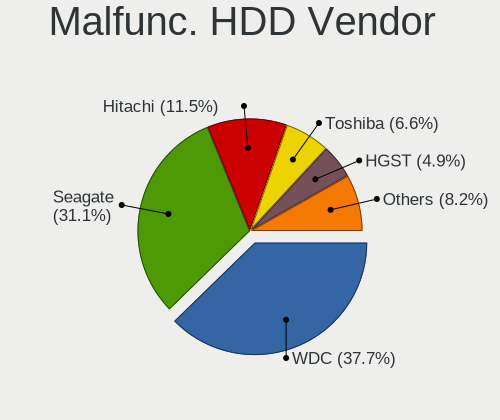

| Vendor              | Computers | Drives | Percent |
|---------------------|-----------|--------|---------|
| WDC                 | 23        | 29     | 40.35%  |
| Seagate             | 16        | 22     | 28.07%  |
| Hitachi             | 7         | 7      | 12.28%  |
| Toshiba             | 4         | 7      | 7.02%   |
| HGST                | 3         | 3      | 5.26%   |
| Samsung Electronics | 2         | 12     | 3.51%   |
| Maxtor              | 1         | 1      | 1.75%   |
| Apple               | 1         | 1      | 1.75%   |

Malfunc. Drive Kind
-------------------

Kinds of faulty drives

| Kind | Computers | Drives | Percent |
|------|-----------|--------|---------|
| HDD  | 52        | 82     | 59.09%  |
| SSD  | 27        | 36     | 30.68%  |
| NVMe | 9         | 10     | 10.23%  |

Failed Drives
-------------

Failed drive models

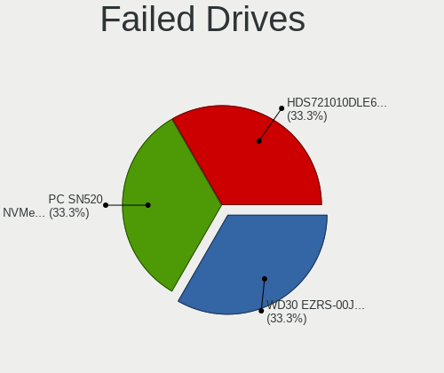

| Model                           | Computers | Drives | Percent |
|---------------------------------|-----------|--------|---------|
| WDC WD30 EZRS-00J99B0 3TB       | 1         | 1      | 33.33%  |
| Sandisk PC SN520 NVMe SSD 512GB | 1         | 1      | 33.33%  |
| Hitachi HDS721010DLE630 1TB     | 1         | 2      | 33.33%  |

Failed Drive Vendor
-------------------

Failed drive vendors

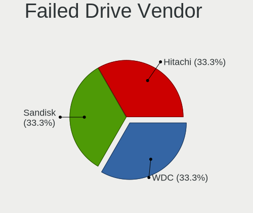

| Vendor  | Computers | Drives | Percent |
|---------|-----------|--------|---------|
| WDC     | 1         | 1      | 33.33%  |
| Sandisk | 1         | 1      | 33.33%  |
| Hitachi | 1         | 2      | 33.33%  |

Drive Status
------------

Number of failed and malfunc. drives

| Status   | Computers | Drives | Percent |
|----------|-----------|--------|---------|
| Detected | 2111      | 3829   | 68.12%  |
| Works    | 902       | 1558   | 29.11%  |
| Malfunc  | 83        | 128    | 2.68%   |
| Failed   | 3         | 4      | 0.1%    |

Storage controller
------------------

Storage Vendor
--------------

Storage controller vendors

| Vendor                                  | Computers | Percent |
|-----------------------------------------|-----------|---------|
| Intel                                   | 1511      | 35.78%  |
| AMD                                     | 598       | 14.16%  |
| Samsung Electronics                     | 588       | 13.92%  |
| SanDisk                                 | 314       | 7.44%   |
| SK hynix                                | 159       | 3.77%   |
| Micron Technology                       | 129       | 3.05%   |
| Kingston Technology Company             | 113       | 2.68%   |
| Micron/Crucial Technology               | 111       | 2.63%   |
| Phison Electronics                      | 104       | 2.46%   |
| ASMedia Technology                      | 71        | 1.68%   |
| KIOXIA                                  | 69        | 1.63%   |
| ADATA Technology                        | 60        | 1.42%   |
| MAXIO Technology (Hangzhou)             | 56        | 1.33%   |
| Silicon Motion                          | 50        | 1.18%   |
| Toshiba America Info Systems            | 49        | 1.16%   |
| Marvell Technology Group                | 25        | 0.59%   |
| JMicron Technology                      | 23        | 0.54%   |
| Apple                                   | 23        | 0.54%   |
| Realtek Semiconductor                   | 22        | 0.52%   |
| Nvidia                                  | 22        | 0.52%   |
| Shenzhen Longsys Electronics            | 20        | 0.47%   |
| Solidigm                                | 15        | 0.36%   |
| Solid State Storage Technology          | 13        | 0.31%   |
| Union Memory (Shenzhen)                 | 11        | 0.26%   |
| Shenzhen Unionmemory Information System | 8         | 0.19%   |
| INNOGRIT                                | 8         | 0.19%   |
| Seagate Technology                      | 6         | 0.14%   |
| Lenovo                                  | 6         | 0.14%   |
| Yangtze Memory Technologies             | 5         | 0.12%   |
| Broadcom / LSI                          | 5         | 0.12%   |
| Netac Technology                        | 4         | 0.09%   |
| Transcend                               | 3         | 0.07%   |
| Lite-On Technology                      | 3         | 0.07%   |
| Biwin Storage Technology                | 3         | 0.07%   |
| VIA Technologies                        | 2         | 0.05%   |
| LSI Logic / Symbios Logic               | 2         | 0.05%   |
| Hosin Global Electronics                | 2         | 0.05%   |
| ULi Electronics                         | 1         | 0.02%   |
| Silicon Image                           | 1         | 0.02%   |
| Promise Technology                      | 1         | 0.02%   |

Storage Model
-------------

Storage controller models

| Model                                                                          | Computers | Percent |
|--------------------------------------------------------------------------------|-----------|---------|
| AMD FCH SATA Controller [AHCI mode]                                            | 320       | 6.93%   |
| Samsung NVMe SSD Controller SM981/PM981/PM983                                  | 209       | 4.53%   |
| Intel Volume Management Device NVMe RAID Controller                            | 164       | 3.55%   |
| Intel Sunrise Point-LP SATA Controller [AHCI mode]                             | 139       | 3.01%   |
| Samsung NVMe SSD Controller PM9A1/PM9A3/980PRO                                 | 136       | 2.95%   |
| Samsung NVMe SSD Controller 980 (DRAM-less)                                    | 117       | 2.53%   |
| AMD 500 Series Chipset SATA Controller                                         | 108       | 2.34%   |
| Intel 82801 Mobile SATA Controller [RAID mode]                                 | 92        | 1.99%   |
| Intel 8 Series/C220 Series Chipset Family 6-port SATA Controller 1 [AHCI mode] | 88        | 1.91%   |
| Micron/Crucial P2 [Nick P2] / P3 / P3 Plus NVMe PCIe SSD (DRAM-less)           | 80        | 1.73%   |
| AMD 600 Series Chipset SATA Controller                                         | 77        | 1.67%   |
| AMD 400 Series Chipset SATA Controller                                         | 77        | 1.67%   |
| Intel 7 Series Chipset Family 6-port SATA Controller [AHCI mode]               | 75        | 1.62%   |
| ASMedia ASM1061/ASM1062 Serial ATA Controller                                  | 60        | 1.3%    |
| SanDisk WD Black SN770 / PC SN740 256GB / PC SN560 (DRAM-less) NVMe SSD        | 58        | 1.26%   |
| Intel 6 Series/C200 Series Chipset Family 6 port Mobile SATA AHCI Controller   | 57        | 1.23%   |
| Intel Q170/Q150/B150/H170/H110/Z170/CM236 Chipset SATA Controller [AHCI Mode]  | 56        | 1.21%   |
| Intel SSD 670p Series [Keystone Harbor]                                        | 54        | 1.17%   |
| SK hynix Gold P31/BC711/PC711 NVMe Solid State Drive                           | 53        | 1.15%   |
| SanDisk Ultra 3D / WD Blue SN550 NVMe SSD                                      | 52        | 1.13%   |
| Intel Alder Lake-S PCH SATA Controller [AHCI Mode]                             | 48        | 1.04%   |
| Intel 8 Series SATA Controller 1 [AHCI mode]                                   | 47        | 1.02%   |
| Sandisk WD Black SN850X NVMe SSD                                               | 42        | 0.91%   |
| Intel Wildcat Point-LP SATA Controller [AHCI Mode]                             | 41        | 0.89%   |
| Intel Tiger Lake-LP SATA Controller                                            | 41        | 0.89%   |
| SanDisk Extreme Pro / WD Black SN750 / PC SN730 / Red SN700 NVMe SSD           | 40        | 0.87%   |
| MAXIO (Hangzhou) NVMe SSD Controller MAP1202 (DRAM-less)                       | 40        | 0.87%   |
| Samsung NVMe SSD Controller SM961/PM961/SM963                                  | 39        | 0.84%   |
| Phison E12 NVMe Controller                                                     | 39        | 0.84%   |
| Intel Alder Lake-P SATA AHCI Controller                                        | 38        | 0.82%   |
| Intel 200 Series PCH SATA controller [AHCI mode]                               | 38        | 0.82%   |
| SK hynix Platinum P41/PC801 NVMe Solid State Drive                             | 37        | 0.8%    |
| Intel Volume Management Device NVMe RAID Controller Intel Corporation          | 37        | 0.8%    |
| Samsung NVMe SSD Controller PM9B1 (DRAM-less)                                  | 36        | 0.78%   |
| Kingston Company NV2 NVMe SSD SM2267XT (DRAM-less)                             | 36        | 0.78%   |
| Intel Cannon Lake PCH SATA AHCI Controller                                     | 35        | 0.76%   |
| Intel 6 Series/C200 Series Chipset Family 6 port Desktop SATA AHCI Controller  | 34        | 0.74%   |
| Intel SATA Controller [RAID mode]                                              | 33        | 0.71%   |
| Intel Comet Lake SATA AHCI Controller                                          | 33        | 0.71%   |
| Intel SSD 660P Series                                                          | 31        | 0.67%   |

Storage Kind
------------

Kind of storage controller (IDE, SATA, NVMe, SAS, ...)

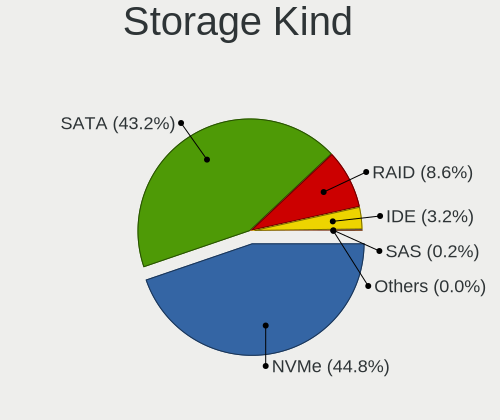

| Kind | Computers | Percent |
|------|-----------|---------|
| NVMe | 1844      | 44.86%  |
| SATA | 1786      | 43.44%  |
| RAID | 342       | 8.32%   |
| IDE  | 132       | 3.21%   |
| SAS  | 5         | 0.12%   |
| SCSI | 2         | 0.05%   |

Processor
---------

CPU Vendor
----------

Processor vendors

| Vendor  | Computers | Percent |
|---------|-----------|---------|
| Intel   | 2011      | 67.71%  |
| AMD     | 952       | 32.05%  |
| ARM     | 5         | 0.17%   |
| Unknown | 2         | 0.07%   |

CPU Model
---------

Processor models

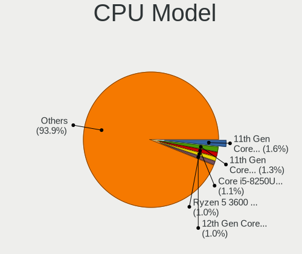

| Model                                      | Computers | Percent |
|--------------------------------------------|-----------|---------|
| Intel 11th Gen Core i5-1135G7 @ 2.40GHz    | 49        | 1.65%   |
| Intel 11th Gen Core i7-1165G7 @ 2.80GHz    | 38        | 1.28%   |
| Intel Core i5-8250U CPU @ 1.60GHz          | 34        | 1.14%   |
| AMD Ryzen 5 3600 6-Core Processor          | 33        | 1.11%   |
| Intel 12th Gen Core i7-12700H              | 29        | 0.98%   |
| AMD Ryzen 5 5600X 6-Core Processor         | 27        | 0.91%   |
| AMD Ryzen 7 5800H with Radeon Graphics     | 26        | 0.87%   |
| AMD Ryzen 7 5700U with Radeon Graphics     | 26        | 0.87%   |
| AMD Ryzen 5 5500U with Radeon Graphics     | 25        | 0.84%   |
| Intel Core i5-7200U CPU @ 2.50GHz          | 24        | 0.81%   |
| AMD Ryzen 7 3700X 8-Core Processor         | 22        | 0.74%   |
| Intel Core i7-8650U CPU @ 1.90GHz          | 21        | 0.71%   |
| Intel Core i5-8265U CPU @ 1.60GHz          | 20        | 0.67%   |
| Intel 12th Gen Core i5-1235U               | 20        | 0.67%   |
| Intel 12th Gen Core i5-12450H              | 19        | 0.64%   |
| AMD Ryzen 7 5800X 8-Core Processor         | 19        | 0.64%   |
| AMD Ryzen 5 5600G with Radeon Graphics     | 19        | 0.64%   |
| Intel Core i7-8550U CPU @ 1.80GHz          | 18        | 0.61%   |
| Intel Core i5-8350U CPU @ 1.70GHz          | 18        | 0.61%   |
| Intel Core i7-7500U CPU @ 2.70GHz          | 17        | 0.57%   |
| Intel Core i5-1035G1 CPU @ 1.00GHz         | 17        | 0.57%   |
| Intel Core i5-10210U CPU @ 1.60GHz         | 17        | 0.57%   |
| AMD Ryzen 9 7940HS w/ Radeon 780M Graphics | 17        | 0.57%   |
| AMD Ryzen 7 5700G with Radeon Graphics     | 17        | 0.57%   |
| Intel Core i7-8750H CPU @ 2.20GHz          | 16        | 0.54%   |
| Intel 13th Gen Core i7-13700H              | 16        | 0.54%   |
| Intel 13th Gen Core i7-1355U               | 16        | 0.54%   |
| Intel 12th Gen Core i7-1255U               | 16        | 0.54%   |
| AMD Ryzen 9 5900X 12-Core Processor        | 16        | 0.54%   |
| AMD Ryzen 7 7840HS w/ Radeon 780M Graphics | 16        | 0.54%   |
| AMD Ryzen 5 4600H with Radeon Graphics     | 16        | 0.54%   |
| Intel Core i5-7300U CPU @ 2.60GHz          | 15        | 0.5%    |
| AMD Ryzen 9 5950X 16-Core Processor        | 15        | 0.5%    |
| AMD Ryzen 5 5600H with Radeon Graphics     | 15        | 0.5%    |
| Intel Core i7-7700HQ CPU @ 2.80GHz         | 14        | 0.47%   |
| Intel Core i7-10750H CPU @ 2.60GHz         | 14        | 0.47%   |
| Intel Core i7-10510U CPU @ 1.80GHz         | 14        | 0.47%   |
| Intel Core i5-6200U CPU @ 2.30GHz          | 14        | 0.47%   |
| Intel Celeron N4020 CPU @ 1.10GHz          | 14        | 0.47%   |
| Intel 12th Gen Core i7-1260P               | 14        | 0.47%   |

CPU Model Family
----------------

Processor model prefix

| Model                   | Computers | Percent |
|-------------------------|-----------|---------|
| Other                   | 574       | 19.31%  |
| Intel Core i5           | 557       | 18.74%  |
| Intel Core i7           | 468       | 15.74%  |
| AMD Ryzen 7             | 315       | 10.6%   |
| AMD Ryzen 5             | 282       | 9.49%   |
| Intel Core i3           | 140       | 4.71%   |
| AMD Ryzen 9             | 124       | 4.17%   |
| Intel Celeron           | 73        | 2.46%   |
| Intel Xeon              | 57        | 1.92%   |
| Intel Core 2 Duo        | 47        | 1.58%   |
| AMD Ryzen 3             | 43        | 1.45%   |
| AMD Ryzen 7 PRO         | 39        | 1.31%   |
| Intel Pentium           | 29        | 0.98%   |
| Intel Atom              | 20        | 0.67%   |
| AMD Ryzen 5 PRO         | 20        | 0.67%   |
| AMD FX                  | 18        | 0.61%   |
| Intel Core i9           | 17        | 0.57%   |
| Intel Core 2 Quad       | 14        | 0.47%   |
| AMD A6                  | 14        | 0.47%   |
| AMD Ryzen Threadripper  | 12        | 0.4%    |
| AMD A8                  | 10        | 0.34%   |
| AMD Phenom II X6        | 7         | 0.24%   |
| AMD A4                  | 7         | 0.24%   |
| AMD A10                 | 7         | 0.24%   |
| Intel Core m3           | 6         | 0.2%    |
| Intel Pentium Silver    | 5         | 0.17%   |
| Intel Core              | 5         | 0.17%   |
| AMD Phenom II X4        | 5         | 0.17%   |
| AMD Athlon 64 X2        | 5         | 0.17%   |
| Intel Pentium Dual-Core | 4         | 0.13%   |
| Intel Core m5           | 4         | 0.13%   |
| AMD E                   | 4         | 0.13%   |
| Intel Genuine           | 3         | 0.1%    |
| AMD Ryzen 3 PRO         | 3         | 0.1%    |
| AMD Athlon              | 3         | 0.1%    |
| Intel Pentium Dual      | 2         | 0.07%   |
| Intel Core M            | 2         | 0.07%   |
| Intel Core 2 Extreme    | 2         | 0.07%   |
| AMD Turion 64 X2 Mobile | 2         | 0.07%   |
| AMD Phenom II X2        | 2         | 0.07%   |

CPU Cores
---------

Number of processor cores

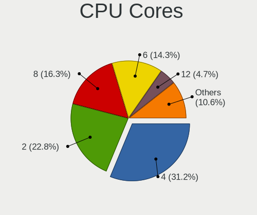

| Number  | Computers | Percent |
|---------|-----------|---------|
| 4       | 928       | 31.22%  |
| 2       | 682       | 22.95%  |
| 8       | 485       | 16.32%  |
| 6       | 427       | 14.37%  |
| 12      | 141       | 4.74%   |
| 10      | 105       | 3.53%   |
| 14      | 89        | 2.99%   |
| 16      | 58        | 1.95%   |
| 24      | 26        | 0.87%   |
| 1       | 9         | 0.3%    |
| 3       | 5         | 0.17%   |
| 32      | 4         | 0.13%   |
| 28      | 3         | 0.1%    |
| 20      | 3         | 0.1%    |
| Unknown | 3         | 0.1%    |
| 18      | 2         | 0.07%   |
| 40      | 1         | 0.03%   |
| 5       | 1         | 0.03%   |

CPU Sockets
-----------

Number of sockets

| Number  | Computers | Percent |
|---------|-----------|---------|
| 1       | 2954      | 99.46%  |
| 2       | 13        | 0.44%   |
| Unknown | 3         | 0.1%    |

CPU Threads
-----------

Threads per core (Hyper-Threading)

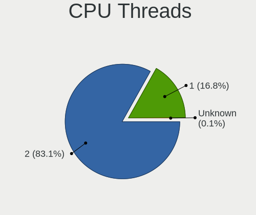

| Number  | Computers | Percent |
|---------|-----------|---------|
| 2       | 2472      | 83.18%  |
| 1       | 497       | 16.72%  |
| Unknown | 3         | 0.1%    |

CPU Op-Modes
------------

CPU Operation Modes (32-bit, 64-bit)

| Op mode        | Computers | Percent |
|----------------|-----------|---------|
| 32-bit, 64-bit | 2966      | 99.87%  |
| 64-bit         | 4         | 0.13%   |

CPU Microcode
-------------

Microcode number

| Number     | Computers | Percent |
|------------|-----------|---------|
| Unknown    | 2455      | 81.53%  |
| 0x0a50000d | 56        | 1.86%   |
| 0x0a704103 | 35        | 1.16%   |
| 0x0a404102 | 34        | 1.13%   |
| 0x0a50000c | 29        | 0.96%   |
| 0x08701021 | 28        | 0.93%   |
| 0x08608103 | 26        | 0.86%   |
| 0x0a601206 | 24        | 0.8%    |
| 0x0a601203 | 23        | 0.76%   |
| 0x08600106 | 23        | 0.76%   |
| 0x0a20120a | 21        | 0.7%    |
| 0x08108109 | 19        | 0.63%   |
| 0x08701030 | 17        | 0.56%   |
| 0x0a201016 | 14        | 0.46%   |
| 0x010000c8 | 11        | 0.37%   |
| 0x08600109 | 10        | 0.33%   |
| 0x08101016 | 10        | 0.33%   |
| 0x0800820d | 10        | 0.33%   |
| 0x0a50000f | 9         | 0.3%    |
| 0x0a20120e | 9         | 0.3%    |
| 0x08701013 | 7         | 0.23%   |
| 0x0a704104 | 6         | 0.2%    |
| 0x08608104 | 6         | 0.2%    |
| 0x08608102 | 6         | 0.2%    |
| 0x08600103 | 6         | 0.2%    |
| 0x0a404101 | 5         | 0.17%   |
| 0x08001138 | 5         | 0.17%   |
| 0x08001137 | 5         | 0.17%   |
| 0x06006705 | 5         | 0.17%   |
| 0x06001119 | 5         | 0.17%   |
| 0x06000852 | 5         | 0.17%   |
| 0x0a704101 | 4         | 0.13%   |
| 0x08a00008 | 4         | 0.13%   |
| 0x08600104 | 4         | 0.13%   |
| 0x0a50000b | 3         | 0.1%    |
| 0x0a20102b | 3         | 0.1%    |
| 0x08a00006 | 3         | 0.1%    |
| 0x08108102 | 3         | 0.1%    |
| 0x0810100b | 3         | 0.1%    |
| 0x07030105 | 3         | 0.1%    |

CPU Microarch
-------------

Microarchitecture

| Name              | Computers | Percent |
|-------------------|-----------|---------|
| KabyLake          | 476       | 15.94%  |
| Unknown           | 432       | 14.47%  |
| Zen 3             | 276       | 9.24%   |
| Alderlake Hybrid  | 267       | 8.94%   |
| Haswell           | 197       | 6.6%    |
| Zen 2             | 157       | 5.26%   |
| TigerLake         | 154       | 5.16%   |
| Skylake           | 128       | 4.29%   |
| IvyBridge         | 124       | 4.15%   |
| SandyBridge       | 101       | 3.38%   |
| Broadwell         | 73        | 2.44%   |
| CometLake         | 72        | 2.41%   |
| Zen+              | 67        | 2.24%   |
| IceLake           | 65        | 2.18%   |
| Penryn            | 60        | 2.01%   |
| Zen               | 48        | 1.61%   |
| Westmere          | 48        | 1.61%   |
| Silvermont        | 43        | 1.44%   |
| Goldmont plus     | 33        | 1.11%   |
| Piledriver        | 26        | 0.87%   |
| K10               | 24        | 0.8%    |
| Nehalem           | 20        | 0.67%   |
| Excavator         | 17        | 0.57%   |
| Core              | 15        | 0.5%    |
| K8 Hammer         | 9         | 0.3%    |
| Puma              | 8         | 0.27%   |
| Gracemont         | 8         | 0.27%   |
| Steamroller       | 7         | 0.23%   |
| Tremont           | 6         | 0.2%    |
| Jaguar            | 6         | 0.2%    |
| Bobcat            | 6         | 0.2%    |
| Goldmont          | 5         | 0.17%   |
| Meteorlake Hybrid | 3         | 0.1%    |
| Bonnell           | 3         | 0.1%    |
| K10 Llano         | 2         | 0.07%   |

Graphics
--------

GPU Vendor
----------

Vendors of graphics cards

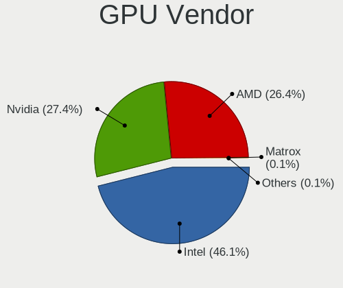

| Vendor                     | Computers | Percent |
|----------------------------|-----------|---------|
| Intel                      | 1671      | 46.17%  |
| Nvidia                     | 984       | 27.19%  |
| AMD                        | 958       | 26.47%  |
| Matrox Electronics Systems | 3         | 0.08%   |
| ASPEED Technology          | 2         | 0.06%   |
| VIA Technologies           | 1         | 0.03%   |

GPU Model
---------

Graphics card models

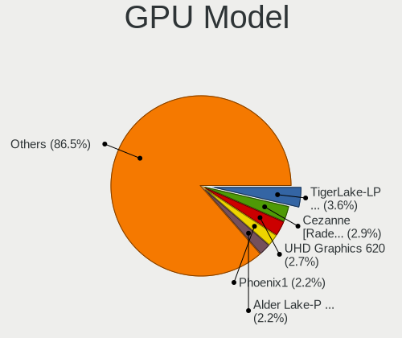

| Model                                                                       | Computers | Percent |
|-----------------------------------------------------------------------------|-----------|---------|
| Intel TigerLake-LP GT2 [Iris Xe Graphics]                                   | 135       | 3.64%   |
| Intel UHD Graphics 620                                                      | 100       | 2.7%    |
| AMD Cezanne [Radeon Vega Series / Radeon Vega Mobile Series]                | 100       | 2.7%    |
| AMD Phoenix1                                                                | 84        | 2.27%   |
| Intel Alder Lake-P GT2 [Iris Xe Graphics]                                   | 80        | 2.16%   |
| Intel 3rd Gen Core processor Graphics Controller                            | 75        | 2.02%   |
| Intel 2nd Generation Core Processor Family Integrated Graphics Controller   | 75        | 2.02%   |
| Intel Raptor Lake-P [Iris Xe Graphics]                                      | 71        | 1.92%   |
| Intel HD Graphics 620                                                       | 71        | 1.92%   |
| AMD Renoir [Radeon RX Vega 6 (Ryzen 4000/5000 Mobile Series)]               | 68        | 1.83%   |
| AMD Rembrandt [Radeon 680M]                                                 | 66        | 1.78%   |
| AMD Raphael                                                                 | 61        | 1.65%   |
| Intel Haswell-ULT Integrated Graphics Controller                            | 59        | 1.59%   |
| AMD Lucienne                                                                | 55        | 1.48%   |
| Intel WhiskeyLake-U GT2 [UHD Graphics 620]                                  | 54        | 1.46%   |
| Intel Skylake GT2 [HD Graphics 520]                                         | 52        | 1.4%    |
| Intel CoffeeLake-H GT2 [UHD Graphics 630]                                   | 48        | 1.29%   |
| AMD Picasso/Raven 2 [Radeon Vega Series / Radeon Vega Mobile Series]        | 47        | 1.27%   |
| Intel CometLake-U GT2 [UHD Graphics]                                        | 41        | 1.11%   |
| Intel HD Graphics 5500                                                      | 40        | 1.08%   |
| Intel 4th Gen Core Processor Integrated Graphics Controller                 | 40        | 1.08%   |
| AMD Barcelo                                                                 | 40        | 1.08%   |
| AMD Ellesmere [Radeon RX 470/480/570/570X/580/580X/590]                     | 39        | 1.05%   |
| Intel HD Graphics 530                                                       | 38        | 1.03%   |
| Intel CometLake-H GT2 [UHD Graphics]                                        | 38        | 1.03%   |
| Nvidia TU117M [GeForce GTX 1650 Mobile / Max-Q]                             | 37        | 1%      |
| Nvidia GA107M [GeForce RTX 3050 Mobile]                                     | 37        | 1%      |
| Nvidia GA106M [GeForce RTX 3060 Mobile / Max-Q]                             | 35        | 0.94%   |
| Intel HD Graphics 630                                                       | 34        | 0.92%   |
| Intel Alder Lake-UP3 GT2 [Iris Xe Graphics]                                 | 34        | 0.92%   |
| Intel Xeon E3-1200 v3/4th Gen Core Processor Integrated Graphics Controller | 31        | 0.84%   |
| Intel TigerLake-H GT1 [UHD Graphics]                                        | 31        | 0.84%   |
| AMD Navi 23 [Radeon RX 6600/6600 XT/6600M]                                  | 30        | 0.81%   |
| AMD Navi 22 [Radeon RX 6700/6700 XT/6750 XT / 6800M/6850M XT]               | 30        | 0.81%   |
| Intel GeminiLake [UHD Graphics 600]                                         | 29        | 0.78%   |
| Intel CoffeeLake-S GT2 [UHD Graphics 630]                                   | 29        | 0.78%   |
| Intel Core Processor Integrated Graphics Controller                         | 28        | 0.76%   |
| AMD Navi 32 [Radeon RX 7700 XT / 7800 XT]                                   | 25        | 0.67%   |
| Intel Iris Plus Graphics G1 (Ice Lake)                                      | 24        | 0.65%   |
| AMD Navi 21 [Radeon RX 6800/6800 XT / 6900 XT]                              | 24        | 0.65%   |

GPU Combo
---------

Combinations of graphics cards

| Name             | Computers | Percent |
|------------------|-----------|---------|
| 1 x Intel        | 1144      | 38.38%  |
| 1 x AMD          | 697       | 23.38%  |
| 1 x Nvidia       | 425       | 14.26%  |
| Intel + Nvidia   | 423       | 14.19%  |
| AMD + Nvidia     | 128       | 4.29%   |
| 2 x AMD          | 65        | 2.18%   |
| Intel + AMD      | 65        | 2.18%   |
| Other            | 12        | 0.4%    |
| 2 x Intel        | 9         | 0.3%    |
| 2 x Nvidia       | 6         | 0.2%    |
| 1 x Matrox       | 3         | 0.1%    |
| 1 x ASPEED       | 2         | 0.07%   |
| 1 x VIA          | 1         | 0.03%   |
| AMD + 2 x Nvidia | 1         | 0.03%   |

GPU Driver
----------

Free vs proprietary

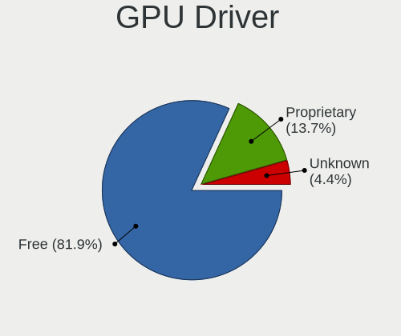

| Driver      | Computers | Percent |
|-------------|-----------|---------|
| Free        | 2462      | 82.4%   |
| Proprietary | 402       | 13.45%  |
| Unknown     | 124       | 4.15%   |

GPU Memory
----------

Total video memory

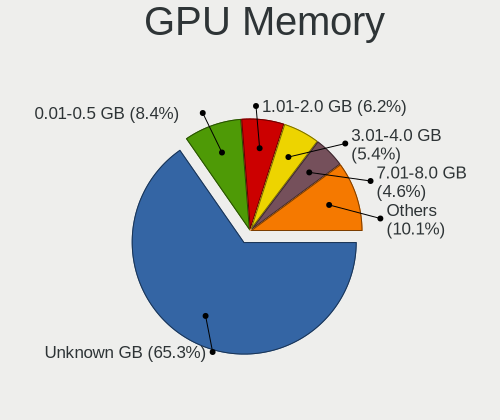

| Size in GB | Computers | Percent |
|------------|-----------|---------|
| Unknown    | 1965      | 64.94%  |
| 0.01-0.5   | 263       | 8.69%   |
| 1.01-2.0   | 188       | 6.21%   |
| 3.01-4.0   | 163       | 5.39%   |
| 7.01-8.0   | 141       | 4.66%   |
| 0.51-1.0   | 122       | 4.03%   |
| 8.01-16.0  | 95        | 3.14%   |
| 5.01-6.0   | 53        | 1.75%   |
| 16.01-24.0 | 19        | 0.63%   |
| 2.01-3.0   | 16        | 0.53%   |
| 4.01-5.0   | 1         | 0.03%   |

Monitor
-------

Monitor Vendor
--------------

Monitor vendors

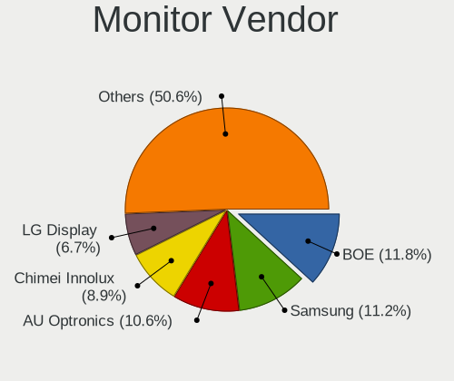

| Vendor                  | Computers | Percent |
|-------------------------|-----------|---------|
| BOE                     | 404       | 11.94%  |
| Samsung Electronics     | 383       | 11.32%  |
| AU Optronics            | 360       | 10.64%  |
| Chimei Innolux          | 296       | 8.75%   |
| LG Display              | 231       | 6.83%   |
| Dell                    | 217       | 6.41%   |
| Goldstar                | 201       | 5.94%   |
| Apple                   | 134       | 3.96%   |
| Acer                    | 92        | 2.72%   |
| Hewlett-Packard         | 89        | 2.63%   |
| Lenovo                  | 79        | 2.33%   |
| Sharp                   | 73        | 2.16%   |
| AOC                     | 73        | 2.16%   |
| Philips                 | 72        | 2.13%   |
| ASUSTek Computer        | 53        | 1.57%   |
| CSO                     | 52        | 1.54%   |
| Ancor Communications    | 48        | 1.42%   |
| BenQ                    | 44        | 1.3%    |
| PANDA                   | 37        | 1.09%   |
| InfoVision              | 34        | 1%      |
| MSI                     | 32        | 0.95%   |
| Iiyama                  | 26        | 0.77%   |
| ViewSonic               | 25        | 0.74%   |
| Gigabyte Technology     | 23        | 0.68%   |
| Sony                    | 20        | 0.59%   |
| TMX                     | 19        | 0.56%   |
| Chi Mei Optoelectronics | 16        | 0.47%   |
| Mi                      | 11        | 0.33%   |
| Sceptre Tech            | 9         | 0.27%   |
| Panasonic               | 9         | 0.27%   |
| NEC Computers           | 9         | 0.27%   |
| HKC                     | 9         | 0.27%   |
| Unknown                 | 8         | 0.24%   |
| Vizio                   | 7         | 0.21%   |
| Insignia                | 7         | 0.21%   |
| Eizo                    | 7         | 0.21%   |
| TMA                     | 5         | 0.15%   |
| HUAWEI                  | 5         | 0.15%   |
| Gateway                 | 5         | 0.15%   |
| Fujitsu Siemens         | 5         | 0.15%   |

Monitor Model
-------------

Monitor models

| Model                                                                 | Computers | Percent |
|-----------------------------------------------------------------------|-----------|---------|
| PANDA LCD Monitor NCP004D 1920x1080 344x194mm 15.5-inch               | 16        | 0.46%   |
| Chimei Innolux LCD Monitor CMN14D4 1920x1080 309x173mm 13.9-inch      | 16        | 0.46%   |
| Chimei Innolux LCD Monitor CMN15F5 1920x1080 344x193mm 15.5-inch      | 13        | 0.37%   |
| BOE LCD Monitor BOE0BCA 2256x1504 285x190mm 13.5-inch                 | 13        | 0.37%   |
| AU Optronics LCD Monitor AUO21ED 1920x1080 344x193mm 15.5-inch        | 13        | 0.37%   |
| Chimei Innolux LCD Monitor CMN15E7 1920x1080 344x193mm 15.5-inch      | 12        | 0.34%   |
| Apple Color LCD APPA034 2880x1800 286x179mm 13.3-inch                 | 12        | 0.34%   |
| AOC 27G2G3 AOC2702 1920x1080 598x336mm 27.0-inch                      | 12        | 0.34%   |
| Chimei Innolux LCD Monitor CMN1521 1920x1080 344x193mm 15.5-inch      | 11        | 0.32%   |
| BOE LCD Monitor BOE095F 2256x1504 285x190mm 13.5-inch                 | 11        | 0.32%   |
| BOE LCD Monitor BOE08D5 1920x1080 344x194mm 15.5-inch                 | 10        | 0.29%   |
| AU Optronics LCD Monitor AUO403D 1920x1080 309x174mm 14.0-inch        | 10        | 0.29%   |
| Samsung Electronics LCD Monitor SEC5441 1366x768 344x194mm 15.5-inch  | 9         | 0.26%   |
| Samsung Electronics LCD Monitor SDC4171 2880x1800 302x189mm 14.0-inch | 9         | 0.26%   |
| Samsung Electronics C24F390 SAM0D2C 1920x1080 521x293mm 23.5-inch     | 9         | 0.26%   |
| Goldstar HDR 4K GSM7707 3840x2160 600x340mm 27.2-inch                 | 9         | 0.26%   |
| Goldstar FULL HD GSM5B55 1920x1080 480x270mm 21.7-inch                | 9         | 0.26%   |
| BOE LCD Monitor BOE0872 1920x1080 344x194mm 15.5-inch                 | 9         | 0.26%   |
| Chimei Innolux LCD Monitor CMN15E8 1920x1080 344x193mm 15.5-inch      | 8         | 0.23%   |
| Chimei Innolux LCD Monitor CMN14C9 1920x1080 309x173mm 13.9-inch      | 8         | 0.23%   |
| Unknown LCD Monitor FFFF 2288x1287 2550x2550mm 142.0-inch             | 7         | 0.2%    |
| Samsung Electronics LCD Monitor SDC4193 2880x1800 302x189mm 14.0-inch | 7         | 0.2%    |
| Samsung Electronics LCD Monitor SDC416E 2880x1620 344x194mm 15.5-inch | 7         | 0.2%    |
| Dell U2412M DELA07A 1920x1200 518x324mm 24.1-inch                     | 7         | 0.2%    |
| Dell S2721DGF DEL41D9 2560x1440 597x336mm 27.0-inch                   | 7         | 0.2%    |
| Chimei Innolux LCD Monitor CMN1406 1920x1080 309x173mm 13.9-inch      | 7         | 0.2%    |
| AU Optronics LCD Monitor AUOD1ED 1920x1080 344x193mm 15.5-inch        | 7         | 0.2%    |
| AU Optronics LCD Monitor AUO71EC 1366x768 344x193mm 15.5-inch         | 7         | 0.2%    |
| Apple iMac APPA012 1920x1080 475x267mm 21.5-inch                      | 7         | 0.2%    |
| Apple Color LCD APP9CC7 1280x800 286x179mm 13.3-inch                  | 7         | 0.2%    |
| AOC 24B1W1G5 AOC2401 1920x1080 527x296mm 23.8-inch                    | 7         | 0.2%    |
| Sharp LCD Monitor SHP1453 1920x1080 346x194mm 15.6-inch               | 6         | 0.17%   |
| Samsung Electronics LCD Monitor SDC4161 1920x1080 344x194mm 15.5-inch | 6         | 0.17%   |
| LG Display LCD Monitor LGD02DC 1366x768 344x194mm 15.5-inch           | 6         | 0.17%   |
| Goldstar ULTRAGEAR GSM5BD3 2560x1440 697x392mm 31.5-inch              | 6         | 0.17%   |
| Goldstar Ultra HD GSM5B09 3840x2160 600x340mm 27.2-inch               | 6         | 0.17%   |
| Goldstar HDR WFHD GSM7714 2560x1080 798x334mm 34.1-inch               | 6         | 0.17%   |
| Goldstar HDR 4K GSM774F 3840x2160 697x392mm 31.5-inch                 | 6         | 0.17%   |
| Goldstar HDR 4K GSM7706 3840x2160 600x340mm 27.2-inch                 | 6         | 0.17%   |
| BOE LCD Monitor BOE0A74 1920x1200 345x215mm 16.0-inch                 | 6         | 0.17%   |

Monitor Resolution
------------------

Monitor screen resolution

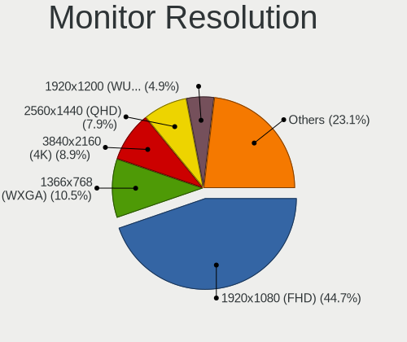

| Resolution         | Computers | Percent |
|--------------------|-----------|---------|
| 1920x1080 (FHD)    | 1449      | 44.9%   |
| 1366x768 (WXGA)    | 336       | 10.41%  |
| 3840x2160 (4K)     | 274       | 8.49%   |
| 2560x1440 (QHD)    | 255       | 7.9%    |
| 1920x1200 (WUXGA)  | 157       | 4.87%   |
| 2880x1800          | 94        | 2.91%   |
| 2560x1600          | 90        | 2.79%   |
| 1600x900 (HD+)     | 71        | 2.2%    |
| 3440x1440          | 57        | 1.77%   |
| 1440x900 (WXGA+)   | 51        | 1.58%   |
| 1680x1050 (WSXGA+) | 46        | 1.43%   |
| 1280x1024 (SXGA)   | 45        | 1.39%   |
| 2560x1080          | 36        | 1.12%   |
| 1280x800 (WXGA)    | 32        | 0.99%   |
| 2256x1504          | 24        | 0.74%   |
| 2160x1440          | 20        | 0.62%   |
| 3840x2400          | 16        | 0.5%    |
| 1920x1280          | 16        | 0.5%    |
| 3840x1080          | 13        | 0.4%    |
| 3200x2000          | 12        | 0.37%   |
| 2880x1620          | 10        | 0.31%   |
| Unknown            | 10        | 0.31%   |
| 3456x2160          | 9         | 0.28%   |
| 1920x540           | 9         | 0.28%   |
| 3072x1920          | 8         | 0.25%   |
| 1360x768           | 8         | 0.25%   |
| 2288x1287          | 7         | 0.22%   |
| 1600x1200          | 7         | 0.22%   |
| 3000x2000          | 6         | 0.19%   |
| 2736x1824          | 6         | 0.19%   |
| 3200x1800 (QHD+)   | 5         | 0.15%   |
| 2240x1400          | 5         | 0.15%   |
| 3840x1600          | 4         | 0.12%   |
| 2520x1680          | 4         | 0.12%   |
| 800x1280           | 3         | 0.09%   |
| 3120x2080          | 3         | 0.09%   |
| 2304x1440          | 3         | 0.09%   |
| 3840x1100          | 2         | 0.06%   |
| 2880x1920          | 2         | 0.06%   |
| 2160x1350          | 2         | 0.06%   |

Monitor Diagonal
----------------

Diagonal size in inches

| Inches  | Computers | Percent |
|---------|-----------|---------|
| 15      | 801       | 23.65%  |
| 13      | 380       | 11.22%  |
| 27      | 359       | 10.6%   |
| 14      | 337       | 9.95%   |
| 24      | 238       | 7.03%   |
| 23      | 179       | 5.28%   |
| 21      | 152       | 4.49%   |
| 16      | 135       | 3.99%   |
| 31      | 120       | 3.54%   |
| 17      | 111       | 3.28%   |
| 34      | 83        | 2.45%   |
| 12      | 68        | 2.01%   |
| 19      | 47        | 1.39%   |
| 18      | 39        | 1.15%   |
| 20      | 37        | 1.09%   |
| Unknown | 37        | 1.09%   |
| 22      | 27        | 0.8%    |
| 11      | 25        | 0.74%   |
| 84      | 24        | 0.71%   |
| 26      | 20        | 0.59%   |
| 54      | 18        | 0.53%   |
| 32      | 17        | 0.5%    |
| 40      | 14        | 0.41%   |
| 72      | 13        | 0.38%   |
| 48      | 12        | 0.35%   |
| 28      | 9         | 0.27%   |
| 142     | 7         | 0.21%   |
| 25      | 7         | 0.21%   |
| 42      | 5         | 0.15%   |
| 37      | 5         | 0.15%   |
| 33      | 5         | 0.15%   |
| 29      | 5         | 0.15%   |
| 36      | 4         | 0.12%   |
| 10      | 4         | 0.12%   |
| 47      | 3         | 0.09%   |
| 46      | 3         | 0.09%   |
| 39      | 3         | 0.09%   |
| 38      | 3         | 0.09%   |
| 7       | 3         | 0.09%   |
| 86      | 2         | 0.06%   |

Monitor Width
-------------

Physical width

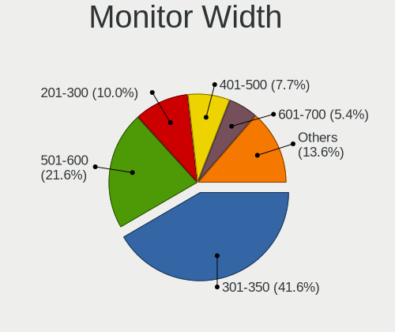

| Width in mm    | Computers | Percent |
|----------------|-----------|---------|
| 301-350        | 1385      | 41.75%  |
| 501-600        | 705       | 21.25%  |
| 201-300        | 339       | 10.22%  |
| 401-500        | 265       | 7.99%   |
| 601-700        | 170       | 5.13%   |
| 351-400        | 165       | 4.97%   |
| 701-800        | 110       | 3.32%   |
| 1001-1500      | 51        | 1.54%   |
| 1501-2000      | 41        | 1.24%   |
| Unknown        | 37        | 1.12%   |
| 801-900        | 25        | 0.75%   |
| 901-1000       | 12        | 0.36%   |
| More than 2000 | 7         | 0.21%   |
| 101-200        | 3         | 0.09%   |
| 1-100          | 2         | 0.06%   |

Aspect Ratio
------------

Proportional relationship between the width and the height

| Ratio   | Computers | Percent |
|---------|-----------|---------|
| 16/9    | 2182      | 72.32%  |
| 16/10   | 538       | 17.83%  |
| 21/9    | 94        | 3.12%   |
| 3/2     | 88        | 2.92%   |
| 5/4     | 40        | 1.33%   |
| Unknown | 20        | 0.66%   |
| 4/3     | 14        | 0.46%   |
| 32/9    | 13        | 0.43%   |
| 1.00    | 7         | 0.23%   |
| 6/5     | 6         | 0.2%    |
| 0.56    | 3         | 0.1%    |
| 3.40    | 2         | 0.07%   |
| 1.96    | 2         | 0.07%   |
| 0.67    | 2         | 0.07%   |
| 0.62    | 2         | 0.07%   |
| 3.73    | 1         | 0.03%   |
| 3.33    | 1         | 0.03%   |
| 2.12    | 1         | 0.03%   |
| 0.89    | 1         | 0.03%   |

Monitor Area
------------

Area in inch

| Area in inch | Computers | Percent |
|----------------|-----------|---------|
| 101-110        | 812       | 24.18%  |
| 81-90          | 553       | 16.47%  |
| 201-250        | 466       | 13.88%  |
| 301-350        | 373       | 11.11%  |
| 351-500        | 235       | 7%      |
| 71-80          | 153       | 4.56%   |
| 151-200        | 129       | 3.84%   |
| 111-120        | 120       | 3.57%   |
| 121-130        | 90        | 2.68%   |
| 251-300        | 87        | 2.59%   |
| More than 1000 | 80        | 2.38%   |
| 501-1000       | 60        | 1.79%   |
| 61-70          | 57        | 1.7%    |
| 141-150        | 37        | 1.1%    |
| Unknown        | 37        | 1.1%    |
| 51-60          | 28        | 0.83%   |
| 91-100         | 23        | 0.68%   |
| 131-140        | 10        | 0.3%    |
| 1-40           | 5         | 0.15%   |
| 41-50          | 3         | 0.09%   |

Pixel Density
-------------

Pixels per inch

| Density       | Computers | Percent |
|---------------|-----------|---------|
| 121-160       | 1037      | 31.86%  |
| 51-100        | 855       | 26.27%  |
| 101-120       | 642       | 19.72%  |
| 161-240       | 465       | 14.29%  |
| More than 240 | 160       | 4.92%   |
| 1-50          | 59        | 1.81%   |
| Unknown       | 37        | 1.14%   |

Multiple Monitors
-----------------

Total monitors connected

| Total | Computers | Percent |
|-------|-----------|---------|
| 1     | 2292      | 76.3%   |
| 2     | 521       | 17.34%  |
| 0     | 118       | 3.93%   |
| 3     | 58        | 1.93%   |
| 4     | 13        | 0.43%   |
| 6     | 2         | 0.07%   |

Network
-------

Net Controller Vendor
---------------------

Controller vendors

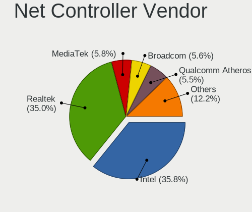

| Vendor                            | Computers | Percent |
|-----------------------------------|-----------|---------|
| Intel                             | 1575      | 35.51%  |
| Realtek Semiconductor             | 1556      | 35.08%  |
| Broadcom                          | 257       | 5.79%   |
| MediaTek                          | 256       | 5.77%   |
| Qualcomm Atheros                  | 251       | 5.66%   |
| ASIX Electronics                  | 55        | 1.24%   |
| Broadcom Limited                  | 46        | 1.04%   |
| TP-Link                           | 44        | 0.99%   |
| Qualcomm                          | 39        | 0.88%   |
| Ralink Technology                 | 27        | 0.61%   |
| Ralink                            | 23        | 0.52%   |
| Microsoft                         | 22        | 0.5%    |
| Marvell Technology Group          | 22        | 0.5%    |
| Nvidia                            | 16        | 0.36%   |
| Lenovo                            | 16        | 0.36%   |
| Dell                              | 15        | 0.34%   |
| Sierra Wireless                   | 14        | 0.32%   |
| Aquantia                          | 13        | 0.29%   |
| Samsung Electronics               | 12        | 0.27%   |
| DisplayLink                       | 12        | 0.27%   |
| Xiaomi                            | 11        | 0.25%   |
| NetGear                           | 10        | 0.23%   |
| D-Link                            | 10        | 0.23%   |
| ASUSTek Computer                  | 10        | 0.23%   |
| Qualcomm Atheros Communications   | 9         | 0.2%    |
| Motorola PCS                      | 9         | 0.2%    |
| Hewlett-Packard                   | 8         | 0.18%   |
| Google                            | 8         | 0.18%   |
| OPPO Electronics                  | 7         | 0.16%   |
| Apple                             | 6         | 0.14%   |
| Qualcomm Technologies             | 5         | 0.11%   |
| FIBOCOM                           | 5         | 0.11%   |
| U-Blox                            | 4         | 0.09%   |
| JMicron Technology                | 3         | 0.07%   |
| Huawei Technologies               | 3         | 0.07%   |
| Ericsson Business Mobile Networks | 3         | 0.07%   |
| Arduino SA                        | 3         | 0.07%   |
| Unknown                           | 3         | 0.07%   |
| ZyDAS                             | 2         | 0.05%   |
| QinHeng Electronics               | 2         | 0.05%   |

Net Controller Model
--------------------

Controller models

| Model                                                                  | Computers | Percent |
|------------------------------------------------------------------------|-----------|---------|
| Realtek RTL8111/8168/8211/8411 PCI Express Gigabit Ethernet Controller | 922       | 17.67%  |
| Realtek RTL8125 2.5GbE Controller                                      | 184       | 3.53%   |
| Intel Wi-Fi 6 AX200                                                    | 177       | 3.39%   |
| Intel Alder Lake-P PCH CNVi WiFi                                       | 135       | 2.59%   |
| Intel Wireless 8265 / 8275                                             | 121       | 2.32%   |
| Realtek RTL8153 Gigabit Ethernet Adapter                               | 114       | 2.18%   |
| MediaTek MT7922 802.11ax PCI Express Wireless Network Adapter          | 113       | 2.17%   |
| Intel Wi-Fi 6 AX201                                                    | 110       | 2.11%   |
| Intel Wi-Fi 6E(802.11ax) AX210/AX1675* 2x2 [Typhoon Peak]              | 106       | 2.03%   |
| MediaTek MT7921 802.11ax PCI Express Wireless Network Adapter          | 95        | 1.82%   |
| Realtek RTL8822CE 802.11ac PCIe Wireless Network Adapter               | 91        | 1.74%   |
| Realtek RTL810xE PCI Express Fast Ethernet controller                  | 88        | 1.69%   |
| Realtek RTL8821CE 802.11ac PCIe Wireless Network Adapter               | 78        | 1.49%   |
| Intel I211 Gigabit Network Connection                                  | 68        | 1.3%    |
| Intel Ethernet Controller I225-V                                       | 66        | 1.26%   |
| Intel Raptor Lake PCH CNVi WiFi                                        | 64        | 1.23%   |
| Intel Wireless 7265                                                    | 58        | 1.11%   |
| Realtek RTL8852BE PCIe 802.11ax Wireless Network Controller            | 52        | 1%      |
| Qualcomm Atheros QCA9377 802.11ac Wireless Network Adapter             | 48        | 0.92%   |
| Intel Ethernet Connection (4) I219-LM                                  | 48        | 0.92%   |
| Qualcomm Atheros QCA6174 802.11ac Wireless Network Adapter             | 47        | 0.9%    |
| Intel Wireless 7260                                                    | 47        | 0.9%    |
| ASIX AX88179 Gigabit Ethernet                                          | 46        | 0.88%   |
| Intel Wireless 8260                                                    | 45        | 0.86%   |
| Intel Comet Lake PCH CNVi WiFi                                         | 40        | 0.77%   |
| Intel Cannon Point-LP CNVi [Wireless-AC]                               | 38        | 0.73%   |
| Intel 82579LM Gigabit Network Connection (Lewisville)                  | 38        | 0.73%   |
| Intel Ethernet Connection I217-LM                                      | 37        | 0.71%   |
| Broadcom BCM4360 802.11ac Dual Band Wireless Network Adapter           | 37        | 0.71%   |
| Intel Cannon Lake PCH CNVi WiFi                                        | 35        | 0.67%   |
| Intel Comet Lake PCH-LP CNVi WiFi                                      | 34        | 0.65%   |
| Qualcomm Atheros QCA9565 / AR9565 Wireless Network Adapter             | 33        | 0.63%   |
| Intel Raptor Lake-S PCH CNVi WiFi                                      | 33        | 0.63%   |
| Intel Dual Band Wireless-AC 3168NGW [Stone Peak]                       | 33        | 0.63%   |
| Intel Ethernet Connection (2) I219-V                                   | 32        | 0.61%   |
| Qualcomm QCNFA765 Wireless Network Adapter                             | 31        | 0.59%   |
| Intel Wireless 3165                                                    | 29        | 0.56%   |
| Broadcom BCM4331 802.11a/b/g/n                                         | 29        | 0.56%   |
| Broadcom BCM43142 802.11b/g/n                                          | 28        | 0.54%   |
| Intel Tiger Lake PCH CNVi WiFi                                         | 27        | 0.52%   |

Wireless Vendor
---------------

Wireless vendors

| Vendor                                | Computers | Percent |
|---------------------------------------|-----------|---------|
| Intel                                 | 1327      | 49.35%  |
| Realtek Semiconductor                 | 424       | 15.77%  |
| MediaTek                              | 252       | 9.37%   |
| Broadcom                              | 207       | 7.7%    |
| Qualcomm Atheros                      | 196       | 7.29%   |
| Broadcom Limited                      | 43        | 1.6%    |
| TP-Link                               | 40        | 1.49%   |
| Qualcomm                              | 35        | 1.3%    |
| Ralink Technology                     | 27        | 1%      |
| Ralink                                | 23        | 0.86%   |
| Microsoft                             | 18        | 0.67%   |
| Sierra Wireless                       | 14        | 0.52%   |
| Dell                                  | 12        | 0.45%   |
| NetGear                               | 10        | 0.37%   |
| ASUSTek Computer                      | 10        | 0.37%   |
| Qualcomm Atheros Communications       | 9         | 0.33%   |
| D-Link                                | 8         | 0.3%    |
| Marvell Technology Group              | 6         | 0.22%   |
| Qualcomm Technologies                 | 5         | 0.19%   |
| FIBOCOM                               | 5         | 0.19%   |
| ZyDAS                                 | 2         | 0.07%   |
| Mercucys                              | 2         | 0.07%   |
| Linksys                               | 2         | 0.07%   |
| Edimax Technology                     | 2         | 0.07%   |
| AVM                                   | 2         | 0.07%   |
| Unknown                               | 2         | 0.07%   |
| Wacom                                 | 1         | 0.04%   |
| Sagem                                 | 1         | 0.04%   |
| Hewlett-Packard                       | 1         | 0.04%   |
| D-Link System                         | 1         | 0.04%   |
| Belkin Components                     | 1         | 0.04%   |
| 802.11g Adapter [Linksys WUSB54GC v3] | 1         | 0.04%   |

Wireless Model
--------------

Wireless models

| Model                                                                | Computers | Percent |
|----------------------------------------------------------------------|-----------|---------|
| Intel Wi-Fi 6 AX200                                                  | 177       | 6.56%   |
| Intel Alder Lake-P PCH CNVi WiFi                                     | 135       | 5%      |
| Intel Wireless 8265 / 8275                                           | 121       | 4.48%   |
| MediaTek MT7922 802.11ax PCI Express Wireless Network Adapter        | 113       | 4.19%   |
| Intel Wi-Fi 6 AX201                                                  | 110       | 4.07%   |
| Intel Wi-Fi 6E(802.11ax) AX210/AX1675* 2x2 [Typhoon Peak]            | 106       | 3.93%   |
| MediaTek MT7921 802.11ax PCI Express Wireless Network Adapter        | 95        | 3.52%   |
| Realtek RTL8822CE 802.11ac PCIe Wireless Network Adapter             | 91        | 3.37%   |
| Realtek RTL8821CE 802.11ac PCIe Wireless Network Adapter             | 78        | 2.89%   |
| Intel Raptor Lake PCH CNVi WiFi                                      | 64        | 2.37%   |
| Intel Wireless 7265                                                  | 58        | 2.15%   |
| Realtek RTL8852BE PCIe 802.11ax Wireless Network Controller          | 52        | 1.93%   |
| Qualcomm Atheros QCA9377 802.11ac Wireless Network Adapter           | 48        | 1.78%   |
| Qualcomm Atheros QCA6174 802.11ac Wireless Network Adapter           | 47        | 1.74%   |
| Intel Wireless 7260                                                  | 47        | 1.74%   |
| Intel Wireless 8260                                                  | 45        | 1.67%   |
| Intel Comet Lake PCH CNVi WiFi                                       | 40        | 1.48%   |
| Intel Cannon Point-LP CNVi [Wireless-AC]                             | 38        | 1.41%   |
| Broadcom BCM4360 802.11ac Dual Band Wireless Network Adapter         | 37        | 1.37%   |
| Intel Cannon Lake PCH CNVi WiFi                                      | 35        | 1.3%    |
| Intel Comet Lake PCH-LP CNVi WiFi                                    | 34        | 1.26%   |
| Qualcomm Atheros QCA9565 / AR9565 Wireless Network Adapter           | 33        | 1.22%   |
| Intel Raptor Lake-S PCH CNVi WiFi                                    | 33        | 1.22%   |
| Intel Dual Band Wireless-AC 3168NGW [Stone Peak]                     | 33        | 1.22%   |
| Qualcomm QCNFA765 Wireless Network Adapter                           | 31        | 1.15%   |
| Intel Wireless 3165                                                  | 29        | 1.07%   |
| Broadcom BCM4331 802.11a/b/g/n                                       | 29        | 1.07%   |
| Broadcom BCM43142 802.11b/g/n                                        | 28        | 1.04%   |
| Intel Tiger Lake PCH CNVi WiFi                                       | 27        | 1%      |
| Realtek RTL8852AE 802.11ax PCIe Wireless Network Adapter             | 26        | 0.96%   |
| MediaTek MT7921K (RZ608) Wi-Fi 6E 80MHz                              | 25        | 0.93%   |
| Qualcomm Atheros AR9485 Wireless Network Adapter                     | 22        | 0.81%   |
| Intel Centrino Advanced-N 6205 [Taylor Peak]                         | 22        | 0.81%   |
| Intel Alder Lake-S PCH CNVi WiFi                                     | 21        | 0.78%   |
| Broadcom Limited BCM4360 802.11ac Dual Band Wireless Network Adapter | 21        | 0.78%   |
| Broadcom BCM43602 802.11ac Wireless LAN SoC                          | 21        | 0.78%   |
| Intel Dual Band Wireless-AC 3165 Plus Bluetooth                      | 20        | 0.74%   |
| Realtek RTL8852CE PCIe 802.11ax Wireless Network Controller          | 18        | 0.67%   |
| Realtek RTL8822BE 802.11a/b/g/n/ac WiFi adapter                      | 18        | 0.67%   |
| Intel Wireless 3160                                                  | 18        | 0.67%   |

Ethernet Vendor
---------------

Ethernet vendors

| Vendor                                 | Computers | Percent |
|----------------------------------------|-----------|---------|
| Realtek Semiconductor                  | 1343      | 55.68%  |
| Intel                                  | 665       | 27.57%  |
| Broadcom                               | 113       | 4.68%   |
| Qualcomm Atheros                       | 71        | 2.94%   |
| ASIX Electronics                       | 55        | 2.28%   |
| Nvidia                                 | 16        | 0.66%   |
| Marvell Technology Group               | 16        | 0.66%   |
| Lenovo                                 | 16        | 0.66%   |
| Aquantia                               | 13        | 0.54%   |
| Samsung Electronics                    | 12        | 0.5%    |
| DisplayLink                            | 12        | 0.5%    |
| Xiaomi                                 | 11        | 0.46%   |
| Motorola PCS                           | 8         | 0.33%   |
| Google                                 | 8         | 0.33%   |
| OPPO Electronics                       | 7         | 0.29%   |
| Apple                                  | 6         | 0.25%   |
| TP-Link                                | 4         | 0.17%   |
| Qualcomm                               | 4         | 0.17%   |
| Hewlett-Packard                        | 4         | 0.17%   |
| JMicron Technology                     | 3         | 0.12%   |
| Broadcom Limited                       | 3         | 0.12%   |
| Microsoft                              | 2         | 0.08%   |
| Mellanox Technologies                  | 2         | 0.08%   |
| MediaTek                               | 2         | 0.08%   |
| Huawei Technologies                    | 2         | 0.08%   |
| D-Link                                 | 2         | 0.08%   |
| ZyXEL Communications                   | 1         | 0.04%   |
| ZTE WCDMA Technologies MSM             | 1         | 0.04%   |
| VIA Technologies                       | 1         | 0.04%   |
| Tehuti Networks                        | 1         | 0.04%   |
| Spreadtrum Communications              | 1         | 0.04%   |
| Sony Ericsson Mobile Communications AB | 1         | 0.04%   |
| Solarflare Communications              | 1         | 0.04%   |
| Sharp                                  | 1         | 0.04%   |
| ICS Advent                             | 1         | 0.04%   |
| D-Link System                          | 1         | 0.04%   |
| American Megatrends                    | 1         | 0.04%   |
| 3Com                                   | 1         | 0.04%   |

Ethernet Model
--------------

Ethernet models

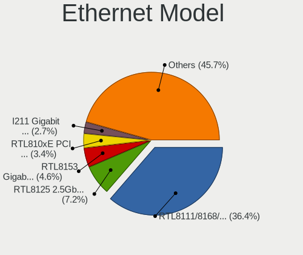

| Model                                                                  | Computers | Percent |
|------------------------------------------------------------------------|-----------|---------|
| Realtek RTL8111/8168/8211/8411 PCI Express Gigabit Ethernet Controller | 922       | 37.25%  |
| Realtek RTL8125 2.5GbE Controller                                      | 184       | 7.43%   |
| Realtek RTL8153 Gigabit Ethernet Adapter                               | 114       | 4.61%   |
| Realtek RTL810xE PCI Express Fast Ethernet controller                  | 88        | 3.56%   |
| Intel I211 Gigabit Network Connection                                  | 68        | 2.75%   |
| Intel Ethernet Controller I225-V                                       | 66        | 2.67%   |
| Intel Ethernet Connection (4) I219-LM                                  | 48        | 1.94%   |
| ASIX AX88179 Gigabit Ethernet                                          | 46        | 1.86%   |
| Intel 82579LM Gigabit Network Connection (Lewisville)                  | 38        | 1.54%   |
| Intel Ethernet Connection I217-LM                                      | 37        | 1.49%   |
| Intel Ethernet Connection (2) I219-V                                   | 32        | 1.29%   |
| Intel Ethernet Connection (4) I219-V                                   | 26        | 1.05%   |
| Broadcom NetXtreme BCM57766 Gigabit Ethernet PCIe                      | 26        | 1.05%   |
| Broadcom NetXtreme BCM57765 Gigabit Ethernet PCIe                      | 25        | 1.01%   |
| Realtek Killer E2600 GbE Controller                                    | 23        | 0.93%   |
| Intel Ethernet Connection (2) I219-LM                                  | 22        | 0.89%   |
| Intel Ethernet Connection (7) I219-V                                   | 19        | 0.77%   |
| Realtek Killer E3000 2.5GbE Controller                                 | 17        | 0.69%   |
| Intel Ethernet Connection (6) I219-LM                                  | 16        | 0.65%   |
| Intel Ethernet Connection (3) I218-LM                                  | 16        | 0.65%   |
| Intel Ethernet Connection I219-LM                                      | 15        | 0.61%   |
| Intel 82574L Gigabit Network Connection                                | 15        | 0.61%   |
| Intel Ethernet Connection (16) I219-V                                  | 14        | 0.57%   |
| Intel I210 Gigabit Network Connection                                  | 13        | 0.53%   |
| Intel Ethernet Connection (7) I219-LM                                  | 13        | 0.53%   |
| Intel Ethernet Connection (6) I219-V                                   | 13        | 0.53%   |
| Intel 82577LM Gigabit Network Connection                               | 13        | 0.53%   |
| Intel Ethernet Connection I218-LM                                      | 12        | 0.48%   |
| Intel Ethernet Connection (13) I219-V                                  | 12        | 0.48%   |
| Qualcomm Atheros Killer E2400 Gigabit Ethernet Controller              | 11        | 0.44%   |
| Qualcomm Atheros AR8151 v2.0 Gigabit Ethernet                          | 11        | 0.44%   |
| Intel Ethernet Connection (17) I219-V                                  | 11        | 0.44%   |
| Intel 82579V Gigabit Network Connection                                | 11        | 0.44%   |
| Broadcom NetXtreme BCM57762 Gigabit Ethernet PCIe                      | 11        | 0.44%   |
| Qualcomm Atheros Killer E220x Gigabit Ethernet Controller              | 10        | 0.4%    |
| Intel Ethernet Connection I219-V                                       | 10        | 0.4%    |
| Samsung Galaxy series, misc. (tethering mode)                          | 9         | 0.36%   |
| Realtek PCIe GbE Family Controller                                     | 9         | 0.36%   |
| Intel Ethernet Controller I226-V                                       | 9         | 0.36%   |
| Intel Ethernet Connection (5) I219-LM                                  | 9         | 0.36%   |

Net Controller Kind
-------------------

Ethernet, WiFi or modem

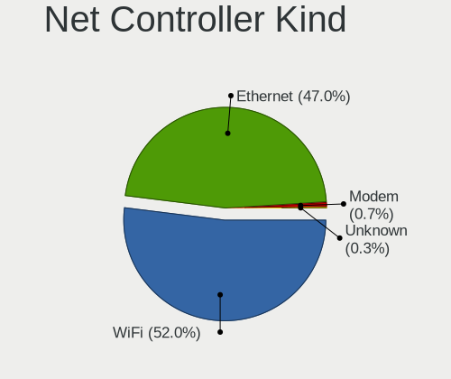

| Kind     | Computers | Percent |
|----------|-----------|---------|
| WiFi     | 2557      | 52.92%  |
| Ethernet | 2231      | 46.17%  |
| Modem    | 30        | 0.62%   |
| Unknown  | 14        | 0.29%   |

Used Controller
---------------

Currently used network controller

| Kind     | Computers | Percent |
|----------|-----------|---------|
| WiFi     | 2037      | 65.44%  |
| Ethernet | 1076      | 34.56%  |

NICs
----

Total network controllers on board

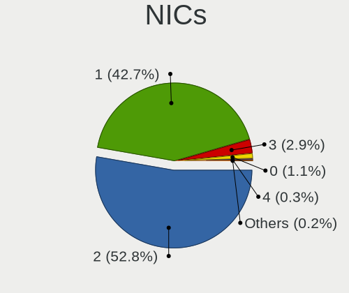

| Total | Computers | Percent |
|-------|-----------|---------|
| 2     | 1559      | 52.39%  |
| 1     | 1283      | 43.11%  |
| 3     | 83        | 2.79%   |
| 0     | 34        | 1.14%   |
| 4     | 11        | 0.37%   |
| 5     | 3         | 0.1%    |
| 6     | 2         | 0.07%   |
| 11    | 1         | 0.03%   |

IPv6
----

IPv6 vs IPv4

| Used | Computers | Percent |
|------|-----------|---------|
| No   | 2016      | 67.29%  |
| Yes  | 980       | 32.71%  |

Bluetooth
---------

Bluetooth Vendor
----------------

Controller vendors

| Vendor                          | Computers | Percent |
|---------------------------------|-----------|---------|
| Intel                           | 1191      | 51.16%  |
| Realtek Semiconductor           | 270       | 11.6%   |
| IMC Networks                    | 140       | 6.01%   |
| Apple                           | 126       | 5.41%   |
| Foxconn / Hon Hai               | 106       | 4.55%   |
| Qualcomm Atheros Communications | 95        | 4.08%   |
| MediaTek                        | 69        | 2.96%   |
| Cambridge Silicon Radio         | 61        | 2.62%   |
| Lite-On Technology              | 55        | 2.36%   |
| Broadcom                        | 55        | 2.36%   |
| ASUSTek Computer                | 30        | 1.29%   |
| Realtek                         | 23        | 0.99%   |
| TP-Link                         | 22        | 0.95%   |
| USI                             | 21        | 0.9%    |
| Hewlett-Packard                 | 8         | 0.34%   |
| Foxconn International           | 7         | 0.3%    |
| Dell                            | 7         | 0.3%    |
| Ralink                          | 6         | 0.26%   |
| Marvell Semiconductor           | 6         | 0.26%   |
| Actions                         | 5         | 0.21%   |
| Ralink Technology               | 4         | 0.17%   |
| Toshiba                         | 3         | 0.13%   |
| Integrated System Solution      | 3         | 0.13%   |
| Edimax Technology               | 3         | 0.13%   |
| Dynex                           | 2         | 0.09%   |
| Belkin Components               | 2         | 0.09%   |
| Alps Electric                   | 2         | 0.09%   |
| Unknown                         | 2         | 0.09%   |
| Smart Modular Technologies      | 1         | 0.04%   |
| Opticis                         | 1         | 0.04%   |
| Fujitsu                         | 1         | 0.04%   |
| Askey Computer                  | 1         | 0.04%   |

Bluetooth Model
---------------

Controller models

| Model                                               | Computers | Percent |
|-----------------------------------------------------|-----------|---------|
| Intel AX201 Bluetooth                               | 255       | 10.95%  |
| Intel AX211 Bluetooth                               | 191       | 8.2%    |
| Realtek Bluetooth Radio                             | 178       | 7.65%   |
| Intel AX200 Bluetooth                               | 163       | 7%      |
| Intel Bluetooth wireless interface                  | 153       | 6.57%   |
| Intel Bluetooth Device                              | 149       | 6.4%    |
| Intel Bluetooth 9460/9560 Jefferson Peak (JfP)      | 111       | 4.77%   |
| Intel AX210 Bluetooth                               | 102       | 4.38%   |
| IMC Networks Wireless_Device                        | 83        | 3.57%   |
| MediaTek Wireless_Device                            | 69        | 2.96%   |
| Apple Bluetooth Host Controller                     | 65        | 2.79%   |
| Cambridge Silicon Radio Bluetooth Dongle (HCI mode) | 61        | 2.62%   |
| Foxconn / Hon Hai Wireless_Device                   | 52        | 2.23%   |
| Qualcomm Atheros  Bluetooth Device                  | 50        | 2.15%   |
| Realtek 802.11ac WLAN Adapter                       | 39        | 1.68%   |
| Apple Bluetooth USB Host Controller                 | 39        | 1.68%   |
| IMC Networks Bluetooth Radio                        | 38        | 1.63%   |
| Realtek  Bluetooth 4.2 Adapter                      | 34        | 1.46%   |
| Intel Wireless-AC 3168 Bluetooth                    | 33        | 1.42%   |
| Foxconn / Hon Hai MediaTek Bluetooth Adapter        | 25        | 1.07%   |
| Realtek Bluetooth Radio                             | 23        | 0.99%   |
| TP-Link UB500 Adapter                               | 22        | 0.95%   |
| USI Bluetooth Device                                | 21        | 0.9%    |
| Lite-On Wireless_Device                             | 18        | 0.77%   |
| Intel Wireless-AC 9260 Bluetooth Adapter            | 18        | 0.77%   |
| Qualcomm Atheros QCA61x4 Bluetooth 4.0              | 17        | 0.73%   |
| Foxconn / Hon Hai Bluetooth Device                  | 13        | 0.56%   |
| Apple Built-in Bluetooth 2.0+EDR HCI                | 13        | 0.56%   |
| Lite-On Qualcomm Atheros QCA9377 Bluetooth          | 12        | 0.52%   |
| Lite-On Bluetooth Device                            | 12        | 0.52%   |
| Intel Centrino Bluetooth Wireless Transceiver       | 12        | 0.52%   |
| Qualcomm Atheros AR3012 Bluetooth 4.0               | 11        | 0.47%   |
| IMC Networks Bluetooth Device                       | 11        | 0.47%   |
| Broadcom BCM20702A0 Bluetooth 4.0                   | 10        | 0.43%   |
| Broadcom BCM2045B (BDC-2.1)                         | 10        | 0.43%   |
| ASUS ASUS USB-BT500                                 | 10        | 0.43%   |
| Qualcomm Atheros AR3011 Bluetooth                   | 8         | 0.34%   |
| Qualcomm Atheros AR9462 Bluetooth                   | 7         | 0.3%    |
| Foxconn International BCM43142A0 Bluetooth module   | 7         | 0.3%    |
| Broadcom BCM43142A0 Bluetooth 4.0                   | 7         | 0.3%    |

Sound
-----

Sound Vendor
------------

Sound card vendors

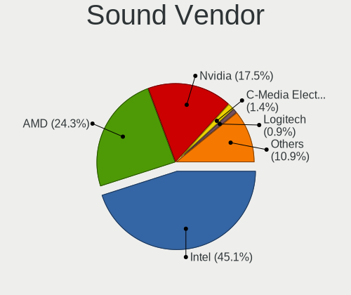

| Vendor                               | Computers | Percent |
|--------------------------------------|-----------|---------|
| Intel                                | 1970      | 45.17%  |
| AMD                                  | 1069      | 24.51%  |
| Nvidia                               | 761       | 17.45%  |
| C-Media Electronics                  | 55        | 1.26%   |
| Logitech                             | 41        | 0.94%   |
| JMTek                                | 27        | 0.62%   |
| ASUSTek Computer                     | 23        | 0.53%   |
| Micro Star International             | 22        | 0.5%    |
| GN Netcom                            | 20        | 0.46%   |
| Generalplus Technology               | 20        | 0.46%   |
| Hewlett-Packard                      | 19        | 0.44%   |
| Texas Instruments                    | 18        | 0.41%   |
| SteelSeries ApS                      | 18        | 0.41%   |
| Razer USA                            | 18        | 0.41%   |
| Lenovo                               | 18        | 0.41%   |
| Creative Labs                        | 17        | 0.39%   |
| Realtek Semiconductor                | 16        | 0.37%   |
| Kingston Technology                  | 14        | 0.32%   |
| Apple                                | 12        | 0.28%   |
| Focusrite-Novation                   | 10        | 0.23%   |
| Corsair                              | 10        | 0.23%   |
| Plantronics                          | 9         | 0.21%   |
| Thesycon Systemsoftware & Consulting | 8         | 0.18%   |
| Sony                                 | 8         | 0.18%   |
| RODE Microphones                     | 6         | 0.14%   |
| Samson Technologies                  | 5         | 0.11%   |
| FiiO Electronics Technology          | 5         | 0.11%   |
| BR25                                 | 5         | 0.11%   |
| BEHRINGER International              | 5         | 0.11%   |
| FIFINE Microphones                   | 4         | 0.09%   |
| DSEA A/S                             | 4         | 0.09%   |
| Creative Technology                  | 4         | 0.09%   |
| Blue Microphones                     | 4         | 0.09%   |
| ASRock                               | 4         | 0.09%   |
| Arturia                              | 4         | 0.09%   |
| VIA Technologies                     | 3         | 0.07%   |
| TTGK Technology                      | 3         | 0.07%   |
| Trust                                | 3         | 0.07%   |
| Tenx Technology                      | 3         | 0.07%   |
| Schiit Audio                         | 3         | 0.07%   |

Sound Model
-----------

Sound card models

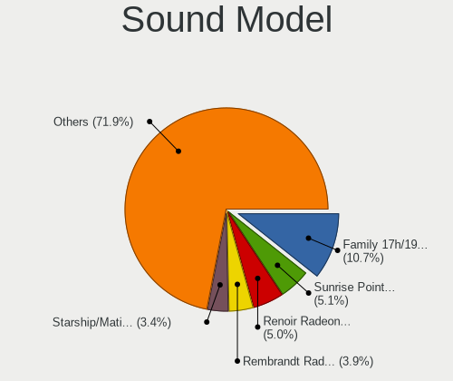

| Model                                                                      | Computers | Percent |
|----------------------------------------------------------------------------|-----------|---------|
| AMD Family 17h/19h HD Audio Controller                                     | 574       | 10.74%  |
| Intel Sunrise Point-LP HD Audio                                            | 268       | 5.01%   |
| AMD Renoir Radeon High Definition Audio Controller                         | 266       | 4.98%   |
| AMD Rembrandt Radeon High Definition Audio Controller                      | 215       | 4.02%   |
| AMD Starship/Matisse HD Audio Controller                                   | 185       | 3.46%   |
| Intel Alder Lake PCH-P High Definition Audio Controller                    | 161       | 3.01%   |
| Intel Tiger Lake-LP Smart Sound Technology Audio Controller                | 154       | 2.88%   |
| Nvidia Audio device                                                        | 124       | 2.32%   |
| Intel 8 Series/C220 Series Chipset High Definition Audio Controller        | 117       | 2.19%   |
| Intel 7 Series/C216 Chipset Family High Definition Audio Controller        | 114       | 2.13%   |
| AMD Navi 21/23 HDMI/DP Audio Controller                                    | 106       | 1.98%   |
| Intel 6 Series/C200 Series Chipset Family High Definition Audio Controller | 102       | 1.91%   |
| Intel Cannon Lake PCH cAVS                                                 | 94        | 1.76%   |
| Intel Raptor Lake-P/U/H cAVS                                               | 84        | 1.57%   |
| Nvidia GA106 High Definition Audio Controller                              | 75        | 1.4%    |
| Intel Xeon E3-1200 v3/4th Gen Core Processor HD Audio Controller           | 72        | 1.35%   |
| Nvidia GA104 High Definition Audio Controller                              | 66        | 1.24%   |
| Intel 100 Series/C230 Series Chipset Family HD Audio Controller            | 66        | 1.24%   |
| AMD Raven/Raven2/Fenghuang HDMI/DP Audio Controller                        | 64        | 1.2%    |
| Intel Haswell-ULT HD Audio Controller                                      | 61        | 1.14%   |
| Intel Cannon Point-LP High Definition Audio Controller                     | 61        | 1.14%   |
| Intel Broadwell-U Audio Controller                                         | 61        | 1.14%   |
| Intel Wildcat Point-LP High Definition Audio Controller                    | 58        | 1.09%   |
| Intel 8 Series HD Audio Controller                                         | 58        | 1.09%   |
| AMD Navi 31 HDMI/DP Audio                                                  | 57        | 1.07%   |
| Nvidia TU107 GeForce GTX 1650 High Definition Audio Controller             | 55        | 1.03%   |
| Intel 5 Series/3400 Series Chipset High Definition Audio                   | 55        | 1.03%   |
| Intel Comet Lake PCH cAVS                                                  | 54        | 1.01%   |
| AMD Ellesmere HDMI Audio [Radeon RX 470/480 / 570/580/590]                 | 54        | 1.01%   |
| Intel Alder Lake-S HD Audio Controller                                     | 48        | 0.9%    |
| AMD Family 17h (Models 00h-0fh) HD Audio Controller                        | 45        | 0.84%   |
| Intel Tiger Lake-H HD Audio Controller                                     | 43        | 0.8%    |
| Intel Comet Lake PCH-LP cAVS                                               | 43        | 0.8%    |
| Intel 200 Series PCH HD Audio                                              | 42        | 0.79%   |
| AMD SBx00 Azalia (Intel HDA)                                               | 41        | 0.77%   |
| Nvidia TU106 High Definition Audio Controller                              | 40        | 0.75%   |
| Nvidia GP107GL High Definition Audio Controller                            | 40        | 0.75%   |
| Intel Raptor Lake High Definition Audio Controller                         | 39        | 0.73%   |
| Nvidia TU116 High Definition Audio Controller                              | 36        | 0.67%   |
| Intel Ice Lake-LP Smart Sound Technology Audio Controller                  | 34        | 0.64%   |

Memory
------

Memory Vendor
-------------

Memory module vendors

| Vendor              | Computers | Percent |
|---------------------|-----------|---------|
| Samsung Electronics | 266       | 22.87%  |
| SK hynix            | 213       | 18.31%  |
| Micron Technology   | 166       | 14.27%  |
| Kingston            | 119       | 10.23%  |
| Crucial             | 75        | 6.45%   |
| Corsair             | 64        | 5.5%    |
| G.Skill             | 56        | 4.82%   |
| Unknown             | 49        | 4.21%   |
| A-DATA Technology   | 22        | 1.89%   |
| Unknown             | 20        | 1.72%   |
| Ramaxel Technology  | 17        | 1.46%   |
| Team                | 12        | 1.03%   |
| Nanya Technology    | 10        | 0.86%   |
| Elpida              | 7         | 0.6%    |
| Smart               | 5         | 0.43%   |
| Patriot             | 5         | 0.43%   |
| Unknown (ABCD)      | 4         | 0.34%   |
| Lexar               | 4         | 0.34%   |
| Timetec             | 3         | 0.26%   |
| AMD                 | 3         | 0.26%   |
| Transcend           | 2         | 0.17%   |
| Patriot Memory      | 2         | 0.17%   |
| Kllisre             | 2         | 0.17%   |
| Hikvision           | 2         | 0.17%   |
| ChangXin Memory     | 2         | 0.17%   |
| Atermiter           | 2         | 0.17%   |
| Apacer              | 2         | 0.17%   |
| Wodposit            | 1         | 0.09%   |
| Wilk                | 1         | 0.09%   |
| V-GeN               | 1         | 0.09%   |
| Unknown (8A5D)      | 1         | 0.09%   |
| Unknown (83DA)      | 1         | 0.09%   |
| Unknown (130B)      | 1         | 0.09%   |
| Unknown (0x8A02)    | 1         | 0.09%   |
| Unknown (0x7FFF)    | 1         | 0.09%   |
| Unknown (0x0B5E)    | 1         | 0.09%   |
| Unknown (09D5)      | 1         | 0.09%   |
| Teikon              | 1         | 0.09%   |
| TBD                 | 1         | 0.09%   |
| TakeMS              | 1         | 0.09%   |

Memory Model
------------

Memory module models

| Model                                                            | Computers | Percent |
|------------------------------------------------------------------|-----------|---------|
| Unknown                                                          | 20        | 1.62%   |
| Samsung RAM M471A1G44BB0-CWE 8GB SODIMM DDR4 3200MT/s            | 16        | 1.3%    |
| Samsung RAM M471A1K43EB1-CWE 8GB SODIMM DDR4 3200MT/s            | 14        | 1.14%   |
| Samsung RAM M471A1G44AB0-CWE 8192MB SODIMM DDR4 3200MT/s         | 12        | 0.97%   |
| SK hynix RAM HMA81GS6AFR8N-UH 8GB SODIMM DDR4 2667MT/s           | 10        | 0.81%   |
| SK hynix RAM HMAA1GS6CJR6N-XN 8GB SODIMM DDR4 3200MT/s           | 9         | 0.73%   |
| SK hynix RAM H9JCNNNCP3MLYR-N6E 2GB Row Of Chips LPDDR5 6400MT/s | 8         | 0.65%   |
| Samsung RAM M471A5244CB0-CWE 4GB SODIMM DDR4 3200MT/s            | 8         | 0.65%   |
| Micron RAM 8ATF1G64HZ-3G2R1 8GB SODIMM DDR4 3200MT/s             | 8         | 0.65%   |
| SK hynix RAM Module 4GB SODIMM DDR3 1600MT/s                     | 7         | 0.57%   |
| SK hynix RAM HMT41GS6BFR8A-PB 8GB SODIMM DDR3 1600MT/s           | 7         | 0.57%   |
| Samsung RAM M471A5244CB0-CWE 4GB Row Of Chips DDR4 3200MT/s      | 7         | 0.57%   |
| Samsung RAM M471A1K43DB1-CWE 8GB SODIMM DDR4 3200MT/s            | 7         | 0.57%   |
| Samsung RAM M471A1G44AB0-CWE 8GB Row Of Chips DDR4 3200MT/s      | 7         | 0.57%   |
| Micron RAM MT62F2G32D4DS-026 WT 8GB SODIMM LPDDR5 7500MT/s       | 7         | 0.57%   |
| SK hynix RAM HMT451S6BFR8A-PB 4GB SODIMM DDR3 1600MT/s           | 6         | 0.49%   |
| SK hynix RAM HMCG66AGBSA092N 8GB SODIMM DDR5 5600MT/s            | 6         | 0.49%   |
| Samsung RAM M471B1G73EB0-YK0 8GB SODIMM DDR3 1600MT/s            | 6         | 0.49%   |
| Samsung RAM M471A2K43EB1-CWE 16GB SODIMM DDR4 3200MT/s           | 6         | 0.49%   |
| Samsung RAM K3LKBKB@BM-MGCP 2GB Row Of Chips LPDDR5 6400MT/s     | 6         | 0.49%   |
| Micron RAM Module 4GB SODIMM LPDDR3 2133MT/s                     | 6         | 0.49%   |
| SK hynix RAM Module 8GB SODIMM DDR3 1600MT/s                     | 5         | 0.41%   |
| SK hynix RAM HMA851S6DJR6N-XN 4GB SODIMM DDR4 3200MT/s           | 5         | 0.41%   |
| SK hynix RAM HMA82GS6AFR8N-UH 16GB SODIMM DDR4 2667MT/s          | 5         | 0.41%   |
| Samsung RAM M471B5273DH0-CH9 4GB SODIMM DDR3 1334MT/s            | 5         | 0.41%   |
| Samsung RAM M471A2K43DB1-CWE 16GB SODIMM DDR4 3200MT/s           | 5         | 0.41%   |
| Samsung RAM M471A1K43CB1-CRC 8GB SODIMM DDR4 2667MT/s            | 5         | 0.41%   |
| Micron RAM Module 8GB SODIMM DDR3 1600MT/s                       | 5         | 0.41%   |
| Micron RAM 4ATF1G64HZ-3G2F1 8GB SODIMM DDR4 3200MT/s             | 5         | 0.41%   |
| Micron RAM 4ATF1G64HZ-3G2E2 8GB SODIMM DDR4 3200MT/s             | 5         | 0.41%   |
| Unknown RAM Module 8GB SODIMM DDR3 1600MT/s                      | 4         | 0.32%   |
| Unknown RAM Module 2GB Row Of Chips LPDDR4 4267MT/s              | 4         | 0.32%   |
| SK hynix RAM Module 8GB SODIMM DDR4 2133MT/s                     | 4         | 0.32%   |
| SK hynix RAM HMCG66MEBSA095N 8GB SODIMM DDR5 4800MT/s            | 4         | 0.32%   |
| SK hynix RAM HMAA2GS6CJR8N-XN 16GB SODIMM DDR4 3200MT/s          | 4         | 0.32%   |
| SK hynix RAM HMA81GS6DJR8N-XN 8GB SODIMM DDR4 3200MT/s           | 4         | 0.32%   |
| Samsung RAM Module 8GB SODIMM DDR4 2133MT/s                      | 4         | 0.32%   |
| Samsung RAM M471A5244CB0-CTD 4GB SODIMM DDR4 3266MT/s            | 4         | 0.32%   |
| Samsung RAM M471A2G44AM0-CWE 16GB SODIMM DDR4 3200MT/s           | 4         | 0.32%   |
| Samsung RAM M471A2G43AB2-CWE 16GB SODIMM DDR4 3200MT/s           | 4         | 0.32%   |

Memory Kind
-----------

Memory module kinds

| Kind    | Computers | Percent |
|---------|-----------|---------|
| DDR4    | 530       | 51.26%  |
| DDR3    | 174       | 16.83%  |
| DDR5    | 118       | 11.41%  |
| LPDDR5  | 88        | 8.51%   |
| LPDDR4  | 51        | 4.93%   |
| LPDDR3  | 43        | 4.16%   |
| DDR2    | 10        | 0.97%   |
| Unknown | 10        | 0.97%   |
| SDRAM   | 7         | 0.68%   |
| DDR     | 2         | 0.19%   |
| DRAM    | 1         | 0.1%    |

Memory Form Factor
------------------

Physical design of the memory module

| Name         | Computers | Percent |
|--------------|-----------|---------|
| SODIMM       | 616       | 58.78%  |
| DIMM         | 269       | 25.67%  |
| Row Of Chips | 151       | 14.41%  |
| Chip         | 8         | 0.76%   |
| Unknown      | 3         | 0.29%   |
| RIMM         | 1         | 0.1%    |

Memory Size
-----------

Memory module size

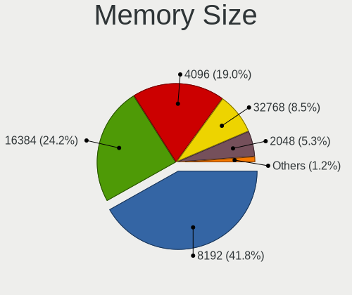

| Size  | Computers | Percent |
|-------|-----------|---------|
| 8192  | 460       | 41.67%  |
| 16384 | 258       | 23.37%  |
| 4096  | 224       | 20.29%  |
| 32768 | 92        | 8.33%   |
| 2048  | 58        | 5.25%   |
| 1024  | 6         | 0.54%   |
| 65536 | 2         | 0.18%   |
| 49152 | 2         | 0.18%   |
| 3072  | 2         | 0.18%   |

Memory Speed
------------

Memory module speed

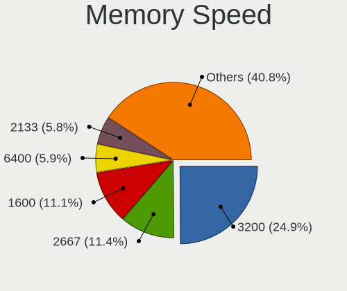

| Speed   | Computers | Percent |
|---------|-----------|---------|
| 3200    | 267       | 24.56%  |
| 1600    | 124       | 11.41%  |
| 2667    | 120       | 11.04%  |
| 6400    | 72        | 6.62%   |
| 2133    | 63        | 5.8%    |
| 2400    | 52        | 4.78%   |
| 4800    | 50        | 4.6%    |
| 5600    | 42        | 3.86%   |
| 3600    | 35        | 3.22%   |
| 1333    | 31        | 2.85%   |
| 4267    | 26        | 2.39%   |
| 1867    | 24        | 2.21%   |
| 1334    | 18        | 1.66%   |
| 3733    | 17        | 1.56%   |
| 7500    | 16        | 1.47%   |
| 6000    | 14        | 1.29%   |
| 4266    | 13        | 1.2%    |
| 3800    | 7         | 0.64%   |
| 3400    | 7         | 0.64%   |
| 800     | 7         | 0.64%   |
| Unknown | 7         | 0.64%   |
| 5200    | 6         | 0.55%   |
| 3000    | 6         | 0.55%   |
| 3266    | 5         | 0.46%   |
| 1066    | 5         | 0.46%   |
| 667     | 5         | 0.46%   |
| 7467    | 4         | 0.37%   |
| 4000    | 4         | 0.37%   |
| 3866    | 4         | 0.37%   |
| 1866    | 4         | 0.37%   |
| 2666    | 3         | 0.28%   |
| 1067    | 3         | 0.28%   |
| 5800    | 2         | 0.18%   |
| 3534    | 2         | 0.18%   |
| 3466    | 2         | 0.18%   |
| 3066    | 2         | 0.18%   |
| 400     | 2         | 0.18%   |
| 8400    | 1         | 0.09%   |
| 7000    | 1         | 0.09%   |
| 4199    | 1         | 0.09%   |

Printers & scanners
-------------------

Printer Vendor
--------------

Printer device vendors

| Vendor              | Computers | Percent |
|---------------------|-----------|---------|
| Hewlett-Packard     | 19        | 40.43%  |
| Brother Industries  | 9         | 19.15%  |
| Canon               | 6         | 12.77%  |
| Seiko Epson         | 4         | 8.51%   |
| Dymo-CoStar         | 4         | 8.51%   |
| Samsung Electronics | 2         | 4.26%   |
| SAT                 | 1         | 2.13%   |
| Minolta             | 1         | 2.13%   |
| Dell                | 1         | 2.13%   |

Printer Model
-------------

Printer device models

| Model                                  | Computers | Percent |
|----------------------------------------|-----------|---------|
| Dymo-CoStar LabelWriter 450            | 2         | 4.26%   |
| Brother MFC-L2710DW series             | 2         | 4.26%   |
| Seiko Epson XP-4100 Series             | 1         | 2.13%   |
| Seiko Epson L300 Series                | 1         | 2.13%   |
| Seiko Epson ET-2710 Series             | 1         | 2.13%   |
| Seiko Epson AL-M310DN                  | 1         | 2.13%   |
| SAT SAT38TUSE                          | 1         | 2.13%   |
| Samsung ML-216x Series Laser Printer   | 1         | 2.13%   |
| Samsung M203x Series                   | 1         | 2.13%   |
| Minolta PagePro 1300W                  | 1         | 2.13%   |
| HP Smart Tank 7300 series              | 1         | 2.13%   |
| HP Smart Tank 510 series               | 1         | 2.13%   |
| HP PSC-1315/PSC-1317                   | 1         | 2.13%   |
| HP LaserJet Pro M404-M405              | 1         | 2.13%   |
| HP LaserJet P2015 series               | 1         | 2.13%   |
| HP LaserJet P1006                      | 1         | 2.13%   |
| HP LaserJet P1005                      | 1         | 2.13%   |
| HP LaserJet 400 color M451dn           | 1         | 2.13%   |
| HP LaserJet 2200                       | 1         | 2.13%   |
| HP LaserJet 1020                       | 1         | 2.13%   |
| HP LaserJet 1010                       | 1         | 2.13%   |
| HP HP LaserJet M14-M17                 | 1         | 2.13%   |
| HP ENVY Photo 7800 series              | 1         | 2.13%   |
| HP ENVY Photo 6200 series              | 1         | 2.13%   |
| HP ENVY 5000 series                    | 1         | 2.13%   |
| HP ENVY 4500 series                    | 1         | 2.13%   |
| HP DeskJet 3940                        | 1         | 2.13%   |
| HP DeskJet 2700 series                 | 1         | 2.13%   |
| HP DeskJet 2600 series                 | 1         | 2.13%   |
| Dymo-CoStar DYMO LabelWriter 450 Turbo | 1         | 2.13%   |
| Dymo-CoStar DYMO LabelWriter 450 DUO   | 1         | 2.13%   |
| Dell C1660w Color Printer              | 1         | 2.13%   |
| Canon TS5300 series                    | 1         | 2.13%   |
| Canon TS3100 series                    | 1         | 2.13%   |
| Canon TR4700 series                    | 1         | 2.13%   |
| Canon PIXMA MX470 Series               | 1         | 2.13%   |
| Canon PIXMA MG3500 Series              | 1         | 2.13%   |
| Canon MF3010                           | 1         | 2.13%   |
| Brother Printer                        | 1         | 2.13%   |
| Brother MFC-L2740DW                    | 1         | 2.13%   |

Scanner Vendor
--------------

Scanner device vendors

| Vendor             | Computers | Percent |
|--------------------|-----------|---------|
| Canon              | 5         | 55.56%  |
| Seiko Epson        | 3         | 33.33%  |
| Ultima Electronics | 1         | 11.11%  |

Scanner Model
-------------

Scanner device models

| Model                                       | Computers | Percent |
|---------------------------------------------|-----------|---------|
| Seiko Epson GT-X820 [Perfection V600 Photo] | 2         | 22.22%  |
| Canon CanoScan LiDE 220                     | 2         | 22.22%  |
| Ultima Artec E+ Pro                         | 1         | 11.11%  |
| Seiko Epson GT-X770 [Perfection V500]       | 1         | 11.11%  |
| Canon CanoScan N670U/N676U/LiDE 20          | 1         | 11.11%  |
| Canon CanoScan LiDE 210                     | 1         | 11.11%  |
| Canon CanoScan LiDE 110                     | 1         | 11.11%  |

Camera
------

Camera Vendor
-------------

Camera device vendors

| Vendor                                 | Computers | Percent |
|----------------------------------------|-----------|---------|
| Chicony Electronics                    | 359       | 18.49%  |
| IMC Networks                           | 215       | 11.07%  |
| Microdia                               | 160       | 8.24%   |
| Quanta                                 | 130       | 6.69%   |
| Bison Electronics                      | 130       | 6.69%   |
| Realtek Semiconductor                  | 121       | 6.23%   |
| Logitech                               | 103       | 5.3%    |
| Apple                                  | 90        | 4.63%   |
| Luxvisions Innotech Limited            | 89        | 4.58%   |
| Sunplus Innovation Technology          | 86        | 4.43%   |
| Cheng Uei Precision Industry (Foxlink) | 52        | 2.68%   |
| Sonix Technology                       | 51        | 2.63%   |
| Syntek                                 | 50        | 2.57%   |
| Acer                                   | 44        | 2.27%   |
| Lite-On Technology                     | 32        | 1.65%   |
| Suyin                                  | 20        | 1.03%   |
| Microsoft                              | 16        | 0.82%   |
| SunplusIT                              | 15        | 0.77%   |
| Silicon Motion                         | 14        | 0.72%   |
| ShineTech                              | 13        | 0.67%   |
| Samsung Electronics                    | 13        | 0.67%   |
| Alcor Micro                            | 13        | 0.67%   |
| Generalplus Technology                 | 7         | 0.36%   |
| Lenovo                                 | 6         | 0.31%   |
| ARC International                      | 6         | 0.31%   |
| Ricoh                                  | 5         | 0.26%   |
| Razer USA                              | 5         | 0.26%   |
| Trust                                  | 4         | 0.21%   |
| Shenzhen Kingcome Optoelectronic       | 4         | 0.21%   |
| icSpring                               | 4         | 0.21%   |
| AVerMedia Technologies                 | 4         | 0.21%   |
| Alpha Imaging Technology               | 4         | 0.21%   |
| 2M UVC CAMERA                          | 4         | 0.21%   |
| Z-Star Microelectronics                | 3         | 0.15%   |
| Qtech                                  | 3         | 0.15%   |
| Primax Electronics                     | 3         | 0.15%   |
| MacroSilicon                           | 3         | 0.15%   |
| KYE Systems (Mouse Systems)            | 3         | 0.15%   |
| GEMBIRD                                | 3         | 0.15%   |
| Creative Technology                    | 3         | 0.15%   |

Camera Model
------------

Camera device models

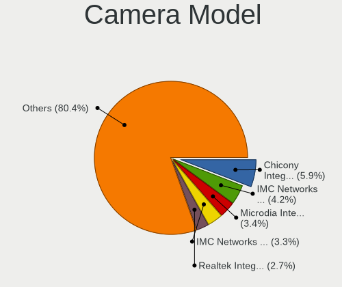

| Model                                               | Computers | Percent |
|-----------------------------------------------------|-----------|---------|
| Chicony Integrated Camera                           | 116       | 5.9%    |
| IMC Networks USB2.0 HD UVC WebCam                   | 83        | 4.22%   |
| IMC Networks Integrated Camera                      | 67        | 3.41%   |
| Microdia Integrated_Webcam_HD                       | 65        | 3.3%    |
| Realtek Integrated_Webcam_HD                        | 52        | 2.64%   |
| Bison Integrated Camera                             | 49        | 2.49%   |
| Syntek Integrated Camera                            | 39        | 1.98%   |
| Sunplus Integrated_Webcam_HD                        | 30        | 1.53%   |
| Apple FaceTime HD Camera (Built-in)                 | 29        | 1.47%   |
| Sonix USB2.0 HD UVC WebCam                          | 27        | 1.37%   |
| Quanta HD User Facing                               | 26        | 1.32%   |
| Luxvisions Innotech Limited Integrated Camera       | 23        | 1.17%   |
| Apple FaceTime HD Camera                            | 21        | 1.07%   |
| Chicony HD Webcam                                   | 20        | 1.02%   |
| Apple iPhone 5/5C/5S/6/SE/7/8/X                     | 20        | 1.02%   |
| Acer Integrated Camera                              | 20        | 1.02%   |
| Sonix USB2.0 FHD UVC WebCam                         | 19        | 0.97%   |
| Chicony HP HD Camera                                | 19        | 0.97%   |
| Luxvisions Innotech Limited Integrated RGB Camera   | 18        | 0.92%   |
| Luxvisions Innotech Limited HP TrueVision HD Camera | 18        | 0.92%   |
| Logitech Webcam C270                                | 17        | 0.86%   |
| IMC Networks USB2.0 VGA UVC WebCam                  | 17        | 0.86%   |
| Apple Built-in iSight                               | 17        | 0.86%   |
| Quanta ACER HD User Facing                          | 16        | 0.81%   |
| Chicony Integrated Camera (1280x720@30)             | 16        | 0.81%   |
| Bison SunplusIT Integrated Camera                   | 16        | 0.81%   |
| Microdia USB 2.0 Camera                             | 15        | 0.76%   |
| Microdia Webcam Vitade AF                           | 14        | 0.71%   |
| Chicony HP Wide Vision HD Camera                    | 14        | 0.71%   |
| Chicony HP Truevision HD camera                     | 14        | 0.71%   |
| Bison HD Webcam                                     | 14        | 0.71%   |
| Samsung Galaxy series, misc. (MTP mode)             | 13        | 0.66%   |
| Quanta HP Wide Vision HD Camera                     | 13        | 0.66%   |
| Quanta HP TrueVision HD Camera                      | 13        | 0.66%   |
| Chicony HP TrueVision HD                            | 13        | 0.66%   |
| Chicony HD User Facing                              | 13        | 0.66%   |
| Bison Integrated RGB Camera                         | 13        | 0.66%   |
| Microdia Integrated_Webcam_FHD                      | 12        | 0.61%   |
| Microdia Integrated Webcam                          | 12        | 0.61%   |
| Logitech HD Pro Webcam C920                         | 12        | 0.61%   |

Security
--------

Fingerprint Vendor
------------------

Fingerprint sensor vendors

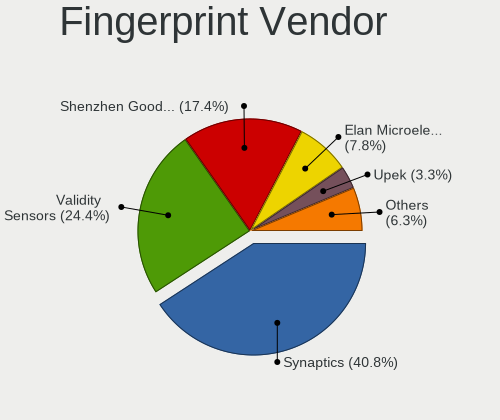

| Vendor                             | Computers | Percent |
|------------------------------------|-----------|---------|
| Synaptics                          | 134       | 37.64%  |
| Validity Sensors                   | 92        | 25.84%  |
| Shenzhen Goodix Technology         | 64        | 17.98%  |
| Elan Microelectronics              | 29        | 8.15%   |
| Upek                               | 13        | 3.65%   |
| LighTuning Technology              | 9         | 2.53%   |
| Realtek USB2.0 Finger Print Bridge | 8         | 2.25%   |
| Samsung Electronics                | 2         | 0.56%   |
| AuthenTec                          | 2         | 0.56%   |
| FocalTech                          | 1         | 0.28%   |
| Focal-systems.Corp                 | 1         | 0.28%   |
| Dell                               | 1         | 0.28%   |

Fingerprint Model
-----------------

Fingerprint sensor models

| Model                                                                      | Computers | Percent |
|----------------------------------------------------------------------------|-----------|---------|
| Synaptics Prometheus MIS Touch Fingerprint Reader                          | 36        | 10.11%  |
| Shenzhen Goodix  Fingerprint Device                                        | 35        | 9.83%   |
| Validity Sensors VFS495 Fingerprint Reader                                 | 30        | 8.43%   |
| Synaptics Metallica MIS Touch Fingerprint Reader                           | 23        | 6.46%   |
| Shenzhen Goodix Fingerprint Reader                                         | 23        | 6.46%   |
| Elan ELAN:Fingerprint                                                      | 15        | 4.21%   |
| Synaptics UWP WBDI Device                                                  | 14        | 3.93%   |
| Elan ELAN:ARM-M4                                                           | 14        | 3.93%   |
| Validity Sensors Synaptics WBDI                                            | 13        | 3.65%   |
| Synaptics FS7604 Touch Fingerprint Sensor with PurePrint                   | 13        | 3.65%   |
| Upek Biometric Touchchip/Touchstrip Fingerprint Sensor                     | 11        | 3.09%   |
| Validity Sensors VFS 5011 fingerprint sensor                               | 10        | 2.81%   |
| Synaptics UWP WBDI                                                         | 9         | 2.53%   |
| Synaptics Fingerprint reader [HP G6]                                       | 9         | 2.53%   |
| Synaptics WBDI                                                             | 8         | 2.25%   |
| Realtek USB2.0 Finger Print Bridge FocalTech Fingerprint Device            | 8         | 2.25%   |
| Synaptics WBDI Fingerprint Reader USB 086                                  | 7         | 1.97%   |
| Validity Sensors VFS5011 Fingerprint Reader                                | 6         | 1.69%   |
| Validity Sensors Synaptics VFS7552 Touch Fingerprint Sensor with PurePrint | 6         | 1.69%   |
| Synaptics  FS7604 Touch Fingerprint Sensor with PurePrint                  | 6         | 1.69%   |
| Shenzhen Goodix FingerPrint                                                | 6         | 1.69%   |
| Validity Sensors VFS7500 Touch Fingerprint Sensor                          | 5         | 1.4%    |
| Synaptics Metallica MOH Touch Fingerprint Reader                           | 5         | 1.4%    |
| Validity Sensors VFS491                                                    | 4         | 1.12%   |
| Validity Sensors VFS471 Fingerprint Reader                                 | 4         | 1.12%   |
| Validity Sensors VFS7552 Touch Fingerprint Sensor                          | 3         | 0.84%   |
| Validity Sensors VFS300 Fingerprint Reader                                 | 3         | 0.84%   |
| Validity Sensors Synaptics VFS7552 Touch Fingerprint Sensor                | 3         | 0.84%   |
| LighTuning Fingerprint Sensor                                              | 3         | 0.84%   |
| LighTuning ES603 Swipe Fingerprint Sensor                                  | 3         | 0.84%   |
| LighTuning EgisTec Touch Fingerprint Sensor                                | 3         | 0.84%   |
| Validity Sensors VFS451 Fingerprint Reader                                 | 2         | 0.56%   |
| Synaptics  WBDI                                                            | 2         | 0.56%   |
| Samsung Fingerprint Sensor Device - 730B                                   | 2         | 0.56%   |
| Validity Sensors VFS Fingerprint sensor                                    | 1         | 0.28%   |
| Validity Sensors Swipe Fingerprint Sensor                                  | 1         | 0.28%   |
| Validity Sensors Fingerprint scanner                                       | 1         | 0.28%   |
| Upek TCS5B Fingerprint sensor                                              | 1         | 0.28%   |
| Upek TCS1C EIM/STM32 Fingerprint sensor                                    | 1         | 0.28%   |
| Synaptics TouchPad                                                         | 1         | 0.28%   |

Chipcard Vendor
---------------

Chipcard module vendors

| Vendor                    | Computers | Percent |
|---------------------------|-----------|---------|
| Broadcom                  | 76        | 49.35%  |
| Alcor Micro               | 56        | 36.36%  |
| Upek                      | 4         | 2.6%    |
| Lenovo                    | 3         | 1.95%   |
| Advanced Card Systems     | 3         | 1.95%   |
| OmniKey                   | 2         | 1.3%    |
| CHERRY                    | 2         | 1.3%    |
| Yubico.com                | 1         | 0.65%   |
| Reiner SCT Kartensysteme  | 1         | 0.65%   |
| Realtek Semiconductor     | 1         | 0.65%   |
| O2 Micro                  | 1         | 0.65%   |
| NXP Semiconductors        | 1         | 0.65%   |
| Gemalto (was Gemplus)     | 1         | 0.65%   |
| Aladdin Knowledge Systems | 1         | 0.65%   |
| Aktiv                     | 1         | 0.65%   |

Chipcard Model
--------------

Chipcard module models

| Model                                                                        | Computers | Percent |
|------------------------------------------------------------------------------|-----------|---------|
| Alcor Micro AU9540 Smartcard Reader                                          | 56        | 36.36%  |
| Broadcom 58200                                                               | 26        | 16.88%  |
| Broadcom BCM5880 Secure Applications Processor                               | 21        | 13.64%  |
| Broadcom 5880                                                                | 20        | 12.99%  |
| Broadcom BCM5880 Secure Applications Processor with fingerprint swipe sensor | 8         | 5.19%   |
| Upek TouchChip Fingerprint Coprocessor (WBF advanced mode)                   | 4         | 2.6%    |
| Lenovo Integrated Smart Card Reader                                          | 3         | 1.95%   |
| CHERRY SmartCard Reader Keyboard KC 1000 SC                                  | 2         | 1.3%    |
| Yubico.com Yubikey 4/5 U2F+CCID                                              | 1         | 0.65%   |
| Reiner SCT Kartensysteme cyberJack RFID basis contactless smartcard reader   | 1         | 0.65%   |
| Realtek Semiconductor Smart Card Reader Interface                            | 1         | 0.65%   |
| OmniKey CardMan Smart@Link                                                   | 1         | 0.65%   |
| OmniKey CardMan 3021 / 3121                                                  | 1         | 0.65%   |
| O2 Micro OZ776 CCID Smartcard Reader                                         | 1         | 0.65%   |
| NXP Semiconductors PR533                                                     | 1         | 0.65%   |
| Gemalto (was Gemplus) GemPC Twin SmartCard Reader                            | 1         | 0.65%   |
| Broadcom BCM5880 Secure Applications Processor with fingerprint touch sensor | 1         | 0.65%   |
| Aladdin Knowledge Systems Token JC                                           | 1         | 0.65%   |
| Aktiv Rutoken lite                                                           | 1         | 0.65%   |
| Advanced Card Systems ACR1281 1S Dual Reader                                 | 1         | 0.65%   |
| Advanced Card Systems ACR1252 Dual Reader                                    | 1         | 0.65%   |
| Advanced Card Systems ACR1252 CL Reader PICC                                 | 1         | 0.65%   |

Unsupported
-----------

Unsupported Devices
-------------------

Total unsupported devices on board

| Total | Computers | Percent |
|-------|-----------|---------|
| 0     | 2020      | 67.63%  |
| 1     | 814       | 27.25%  |
| 2     | 131       | 4.39%   |
| 3     | 13        | 0.44%   |
| 4     | 4         | 0.13%   |
| 7     | 2         | 0.07%   |
| 5     | 2         | 0.07%   |
| 6     | 1         | 0.03%   |

Unsupported Device Types
------------------------

Types of unsupported devices

| Type                     | Computers | Percent |
|--------------------------|-----------|---------|
| Fingerprint reader       | 351       | 31.34%  |
| Graphics card            | 324       | 28.93%  |
| Multimedia controller    | 190       | 16.96%  |
| Net/wireless             | 107       | 9.55%   |
| Unassigned class         | 23        | 2.05%   |
| Sound                    | 23        | 2.05%   |
| Chipcard                 | 23        | 2.05%   |
| Camera                   | 19        | 1.7%    |
| Bluetooth                | 15        | 1.34%   |
| Net/ethernet             | 12        | 1.07%   |
| Communication controller | 7         | 0.63%   |
| Network                  | 6         | 0.54%   |
| Storage/raid             | 5         | 0.45%   |
| Storage                  | 5         | 0.45%   |
| Card reader              | 5         | 0.45%   |
| Modem                    | 3         | 0.27%   |
| Storage/nvme             | 1         | 0.09%   |
| Storage/ide              | 1         | 0.09%   |

