Fedora 39 - Tested Hardware & Statistics
----------------------------------------

A project to collect tested hardware configurations for Fedora 39.

Anyone can contribute to this report by the [hw-probe](https://github.com/linuxhw/hw-probe) tool:

    sudo -E hw-probe -all -upload

Please contribute! Especially if your hardware is rare.

This is a report for all computer types. See also reports for [desktops](/Dist/Fedora_39/Desktop/README.md) and [notebooks](/Dist/Fedora_39/Notebook/README.md).

Contents
--------

* [ Test Cases ](#test-cases)

* [ System ](#system)
  - [ Kernel                   ](#kernel)
  - [ Kernel Family            ](#kernel-family)
  - [ Kernel Major Ver.        ](#kernel-major-ver)
  - [ Arch                     ](#arch)
  - [ DE                       ](#de)
  - [ Display Server           ](#display-server)
  - [ Display Manager          ](#display-manager)
  - [ OS Lang                  ](#os-lang)
  - [ Boot Mode                ](#boot-mode)
  - [ Filesystem               ](#filesystem)
  - [ Part. scheme             ](#part-scheme)
  - [ Dual Boot with Linux/BSD ](#dual-boot-with-linuxbsd)
  - [ Dual Boot (Win)          ](#dual-boot-win)

* [ Board ](#board)
  - [ Vendor                   ](#vendor)
  - [ Model                    ](#model)
  - [ Model Family             ](#model-family)
  - [ MFG Year                 ](#mfg-year)
  - [ Form Factor              ](#form-factor)
  - [ Secure Boot              ](#secure-boot)
  - [ Coreboot                 ](#coreboot)
  - [ RAM Size                 ](#ram-size)
  - [ RAM Used                 ](#ram-used)
  - [ Total Drives             ](#total-drives)
  - [ Has CD-ROM               ](#has-cd-rom)
  - [ Has Ethernet             ](#has-ethernet)
  - [ Has WiFi                 ](#has-wifi)
  - [ Has Bluetooth            ](#has-bluetooth)

* [ Location ](#location)
  - [ Country                  ](#country)
  - [ City                     ](#city)

* [ Drives ](#drives)
  - [ Drive Vendor             ](#drive-vendor)
  - [ Drive Model              ](#drive-model)
  - [ HDD Vendor               ](#hdd-vendor)
  - [ SSD Vendor               ](#ssd-vendor)
  - [ Drive Kind               ](#drive-kind)
  - [ Drive Connector          ](#drive-connector)
  - [ Drive Size               ](#drive-size)
  - [ Space Total              ](#space-total)
  - [ Space Used               ](#space-used)
  - [ Malfunc. Drives          ](#malfunc-drives)
  - [ Malfunc. Drive Vendor    ](#malfunc-drive-vendor)
  - [ Malfunc. HDD Vendor      ](#malfunc-hdd-vendor)
  - [ Malfunc. Drive Kind      ](#malfunc-drive-kind)
  - [ Failed Drives            ](#failed-drives)
  - [ Failed Drive Vendor      ](#failed-drive-vendor)
  - [ Drive Status             ](#drive-status)

* [ Storage controller ](#storage-controller)
  - [ Storage Vendor           ](#storage-vendor)
  - [ Storage Model            ](#storage-model)
  - [ Storage Kind             ](#storage-kind)

* [ Processor ](#processor)
  - [ CPU Vendor               ](#cpu-vendor)
  - [ CPU Model                ](#cpu-model)
  - [ CPU Model Family         ](#cpu-model-family)
  - [ CPU Cores                ](#cpu-cores)
  - [ CPU Sockets              ](#cpu-sockets)
  - [ CPU Threads              ](#cpu-threads)
  - [ CPU Op-Modes             ](#cpu-op-modes)
  - [ CPU Microcode            ](#cpu-microcode)
  - [ CPU Microarch            ](#cpu-microarch)

* [ Graphics ](#graphics)
  - [ GPU Vendor               ](#gpu-vendor)
  - [ GPU Model                ](#gpu-model)
  - [ GPU Combo                ](#gpu-combo)
  - [ GPU Driver               ](#gpu-driver)
  - [ GPU Memory               ](#gpu-memory)

* [ Monitor ](#monitor)
  - [ Monitor Vendor           ](#monitor-vendor)
  - [ Monitor Model            ](#monitor-model)
  - [ Monitor Resolution       ](#monitor-resolution)
  - [ Monitor Diagonal         ](#monitor-diagonal)
  - [ Monitor Width            ](#monitor-width)
  - [ Aspect Ratio             ](#aspect-ratio)
  - [ Monitor Area             ](#monitor-area)
  - [ Pixel Density            ](#pixel-density)
  - [ Multiple Monitors        ](#multiple-monitors)

* [ Network ](#network)
  - [ Net Controller Vendor    ](#net-controller-vendor)
  - [ Net Controller Model     ](#net-controller-model)
  - [ Wireless Vendor          ](#wireless-vendor)
  - [ Wireless Model           ](#wireless-model)
  - [ Ethernet Vendor          ](#ethernet-vendor)
  - [ Ethernet Model           ](#ethernet-model)
  - [ Net Controller Kind      ](#net-controller-kind)
  - [ Used Controller          ](#used-controller)
  - [ NICs                     ](#nics)
  - [ IPv6                     ](#ipv6)

* [ Bluetooth ](#bluetooth)
  - [ Bluetooth Vendor         ](#bluetooth-vendor)
  - [ Bluetooth Model          ](#bluetooth-model)

* [ Sound ](#sound)
  - [ Sound Vendor             ](#sound-vendor)
  - [ Sound Model              ](#sound-model)

* [ Memory ](#memory)
  - [ Memory Vendor            ](#memory-vendor)
  - [ Memory Model             ](#memory-model)
  - [ Memory Kind              ](#memory-kind)
  - [ Memory Form Factor       ](#memory-form-factor)
  - [ Memory Size              ](#memory-size)
  - [ Memory Speed             ](#memory-speed)

* [ Printers & scanners ](#printers--scanners)
  - [ Printer Vendor           ](#printer-vendor)
  - [ Printer Model            ](#printer-model)
  - [ Scanner Vendor           ](#scanner-vendor)
  - [ Scanner Model            ](#scanner-model)

* [ Camera ](#camera)
  - [ Camera Vendor            ](#camera-vendor)
  - [ Camera Model             ](#camera-model)

* [ Security ](#security)
  - [ Fingerprint Vendor       ](#fingerprint-vendor)
  - [ Fingerprint Model        ](#fingerprint-model)
  - [ Chipcard Vendor          ](#chipcard-vendor)
  - [ Chipcard Model           ](#chipcard-model)

* [ Unsupported ](#unsupported)
  - [ Unsupported Devices      ](#unsupported-devices)
  - [ Unsupported Device Types ](#unsupported-device-types)

Test Cases
----------

Total: 2084

| Vendor        | Model                       | Form-Factor | Probe                                                      | Date         |
|---------------|-----------------------------|-------------|------------------------------------------------------------|--------------|
| Acer          | Nitro AN515-54              | Notebook    | [051e477b5f](https://linux-hardware.org/?probe=051e477b5f) | Feb 02, 2024 |
| ASRock        | X670E Pro RS                | Desktop     | [fd02477c14](https://linux-hardware.org/?probe=fd02477c14) | Feb 02, 2024 |
| HP            | EliteBook 8560w             | Notebook    | [6ff665aaf5](https://linux-hardware.org/?probe=6ff665aaf5) | Feb 02, 2024 |
| HP            | 83E9                        | Desktop     | [a140a989be](https://linux-hardware.org/?probe=a140a989be) | Feb 02, 2024 |
| HP            | Spectre x360 Convertible    | Convertible | [a63a142388](https://linux-hardware.org/?probe=a63a142388) | Feb 02, 2024 |
| ASUSTek       | Zenbook UX3404VA_Q420VA     | Notebook    | [2b3f583bc7](https://linux-hardware.org/?probe=2b3f583bc7) | Feb 02, 2024 |
| Dell          | XPS 15 7590                 | Notebook    | [214b9d35cb](https://linux-hardware.org/?probe=214b9d35cb) | Feb 02, 2024 |
| ASUSTek       | Zenbook UX3404VA_Q420VA     | Notebook    | [a569cab490](https://linux-hardware.org/?probe=a569cab490) | Feb 02, 2024 |
| ASUSTek       | H110M-R                     | Desktop     | [2902d23de2](https://linux-hardware.org/?probe=2902d23de2) | Feb 02, 2024 |
| Pegatron      | IPM41-D3                    | Desktop     | [5884d40085](https://linux-hardware.org/?probe=5884d40085) | Feb 02, 2024 |
| Lenovo        | Legion Go 8APU1 83E1        | Tablet      | [5661819818](https://linux-hardware.org/?probe=5661819818) | Feb 02, 2024 |
| Dell          | Latitude 3420               | Notebook    | [15de060676](https://linux-hardware.org/?probe=15de060676) | Feb 02, 2024 |
| MSI           | X99A RAIDER                 | Desktop     | [158530e4dc](https://linux-hardware.org/?probe=158530e4dc) | Feb 02, 2024 |
| ASRock        | A320M-ITX                   | Desktop     | [7c3ebbb23c](https://linux-hardware.org/?probe=7c3ebbb23c) | Feb 02, 2024 |
| ASUSTek       | TUF Gaming B450M-PRO S      | Desktop     | [654e691a5d](https://linux-hardware.org/?probe=654e691a5d) | Feb 02, 2024 |
| ASUSTek       | TUF Gaming B450M-PRO S      | Desktop     | [279e68de12](https://linux-hardware.org/?probe=279e68de12) | Feb 02, 2024 |
| MSI           | B450 GAMING PLUS MAX        | Desktop     | [e8554aab57](https://linux-hardware.org/?probe=e8554aab57) | Feb 02, 2024 |
| Framework     | Laptop 13 (AMD Ryzen 704... | Notebook    | [d9a0906eac](https://linux-hardware.org/?probe=d9a0906eac) | Feb 02, 2024 |
| Lenovo        | Z50-70 20354                | Notebook    | [d6023b78a2](https://linux-hardware.org/?probe=d6023b78a2) | Feb 02, 2024 |
| Acer          | Swift SF314-43              | Notebook    | [e87efb031b](https://linux-hardware.org/?probe=e87efb031b) | Feb 02, 2024 |
| HP            | EliteBook Revolve 810 G2    | Notebook    | [788fb13f23](https://linux-hardware.org/?probe=788fb13f23) | Feb 02, 2024 |
| MSI           | B450 GAMING PLUS MAX        | Desktop     | [73e32179ef](https://linux-hardware.org/?probe=73e32179ef) | Feb 02, 2024 |
| Dell          | Inspiron N5110              | Notebook    | [e7338ad21d](https://linux-hardware.org/?probe=e7338ad21d) | Feb 01, 2024 |
| Lenovo        | IdeaPad 3 15IGL05 81WQ      | Notebook    | [f2003839e0](https://linux-hardware.org/?probe=f2003839e0) | Feb 01, 2024 |
| Intel         | NUC11PHBi7 M26151-404       | Mini pc     | [db8ba8a942](https://linux-hardware.org/?probe=db8ba8a942) | Feb 01, 2024 |
| ASUSTek       | PRIME B560M-K               | Desktop     | [007e574396](https://linux-hardware.org/?probe=007e574396) | Feb 01, 2024 |
| ASUSTek       | PRIME B560M-K               | Desktop     | [9d4315d3e3](https://linux-hardware.org/?probe=9d4315d3e3) | Feb 01, 2024 |
| Pegatron      | IPM41-D3                    | Desktop     | [7969244295](https://linux-hardware.org/?probe=7969244295) | Feb 01, 2024 |
| HONOR         | BRN-HXX                     | Notebook    | [9e92d94ecb](https://linux-hardware.org/?probe=9e92d94ecb) | Feb 01, 2024 |
| Dell          | Latitude 5300 2-in-1        | Convertible | [7f56291587](https://linux-hardware.org/?probe=7f56291587) | Feb 01, 2024 |
| Dell          | Precision 5520              | Notebook    | [60d35bb7a2](https://linux-hardware.org/?probe=60d35bb7a2) | Feb 01, 2024 |
| realme        | CloudProXXXX                | Notebook    | [1299621a5e](https://linux-hardware.org/?probe=1299621a5e) | Feb 01, 2024 |
| Apple         | MacBookPro11,3              | Notebook    | [9b4ae891b7](https://linux-hardware.org/?probe=9b4ae891b7) | Feb 01, 2024 |
| HP            | 870C                        | Desktop     | [14801c4f80](https://linux-hardware.org/?probe=14801c4f80) | Feb 01, 2024 |
| Gigabyte      | G41MT-D3                    | Desktop     | [88c563b03e](https://linux-hardware.org/?probe=88c563b03e) | Feb 01, 2024 |
| Dell          | XPS 15 9530                 | Notebook    | [3aa974d8a0](https://linux-hardware.org/?probe=3aa974d8a0) | Feb 01, 2024 |
| MSI           | X99A RAIDER                 | Desktop     | [3953592045](https://linux-hardware.org/?probe=3953592045) | Feb 01, 2024 |
| Dell          | Inspiron 5748               | Notebook    | [1eaa79e492](https://linux-hardware.org/?probe=1eaa79e492) | Feb 01, 2024 |
| Dell          | Vostro 3500                 | Notebook    | [1d57e2e0b1](https://linux-hardware.org/?probe=1d57e2e0b1) | Feb 01, 2024 |
| Apple         | MacBookPro11,3              | Notebook    | [3a809ef1d0](https://linux-hardware.org/?probe=3a809ef1d0) | Jan 31, 2024 |
| ASUSTek       | VivoBook_ASUSLaptop M160... | Notebook    | [0414c66c77](https://linux-hardware.org/?probe=0414c66c77) | Jan 31, 2024 |
| Unknown       | Unknown                     | Desktop     | [66102cc055](https://linux-hardware.org/?probe=66102cc055) | Jan 31, 2024 |
| Dell          | Inspiron 5748               | Notebook    | [7a50d780ce](https://linux-hardware.org/?probe=7a50d780ce) | Jan 31, 2024 |
| Lenovo        | ThinkPad E16 Gen 1 21JTC... | Notebook    | [e91ff8608c](https://linux-hardware.org/?probe=e91ff8608c) | Jan 31, 2024 |
| HP            | EliteBook 8560w             | Notebook    | [6d3b73b144](https://linux-hardware.org/?probe=6d3b73b144) | Jan 31, 2024 |
| Acer          | Swift SF514-56T             | Notebook    | [320f3db548](https://linux-hardware.org/?probe=320f3db548) | Jan 31, 2024 |
| Apple         | Mac-F65AE981FFA204ED Mac... | Mini pc     | [462775ac8b](https://linux-hardware.org/?probe=462775ac8b) | Jan 31, 2024 |
| Lenovo        | G50-30 80G0                 | Notebook    | [16e8c28b87](https://linux-hardware.org/?probe=16e8c28b87) | Jan 31, 2024 |
| Dell          | Latitude 7280               | Notebook    | [0a79c87afb](https://linux-hardware.org/?probe=0a79c87afb) | Jan 31, 2024 |
| ASUSTek       | ZenBook UX425IA_UM425IA     | Notebook    | [4838799f43](https://linux-hardware.org/?probe=4838799f43) | Jan 31, 2024 |
| ASUSTek       | TUF Gaming B650M-PLUS       | Desktop     | [0b234564e9](https://linux-hardware.org/?probe=0b234564e9) | Jan 31, 2024 |
| HP            | Laptop 14-cf2xxx            | Notebook    | [7984b3ffda](https://linux-hardware.org/?probe=7984b3ffda) | Jan 31, 2024 |
| HP            | EliteBook 840 G7 Noteboo... | Notebook    | [e79be04d28](https://linux-hardware.org/?probe=e79be04d28) | Jan 31, 2024 |
| MSI           | X99A RAIDER                 | Desktop     | [ffaf5dab37](https://linux-hardware.org/?probe=ffaf5dab37) | Jan 31, 2024 |
| Avell         | B.ON                        | Notebook    | [45a01901e9](https://linux-hardware.org/?probe=45a01901e9) | Jan 31, 2024 |
| Dell          | Inspiron 5537               | Notebook    | [7c7904f383](https://linux-hardware.org/?probe=7c7904f383) | Jan 31, 2024 |
| Dell          | Inspiron 5537               | Notebook    | [7a4e4ac7ba](https://linux-hardware.org/?probe=7a4e4ac7ba) | Jan 31, 2024 |
| HP            | Laptop 15-dy1xxx            | Notebook    | [5a506021d1](https://linux-hardware.org/?probe=5a506021d1) | Jan 31, 2024 |
| HP            | Laptop 15-dy1xxx            | Notebook    | [999c7694d0](https://linux-hardware.org/?probe=999c7694d0) | Jan 31, 2024 |
| ASUSTek       | M4N68T-M LE                 | Desktop     | [31e2d90ef4](https://linux-hardware.org/?probe=31e2d90ef4) | Jan 31, 2024 |
| Dell          | 00V62H A01                  | Desktop     | [4a42c319b4](https://linux-hardware.org/?probe=4a42c319b4) | Jan 30, 2024 |
| Google        | Cyan                        | Notebook    | [15ee2dfc2f](https://linux-hardware.org/?probe=15ee2dfc2f) | Jan 30, 2024 |
| Dell          | Latitude 5590               | Notebook    | [d10e7cf975](https://linux-hardware.org/?probe=d10e7cf975) | Jan 30, 2024 |
| Dell          | XPS 9315                    | Notebook    | [dd96b44e05](https://linux-hardware.org/?probe=dd96b44e05) | Jan 30, 2024 |
| MSI           | AMETHYST-M                  | Desktop     | [865d868008](https://linux-hardware.org/?probe=865d868008) | Jan 30, 2024 |
| AZW           | GTR V21                     | Mini pc     | [f0a278c92d](https://linux-hardware.org/?probe=f0a278c92d) | Jan 30, 2024 |
| Lenovo        | Yoga 710-15IKB 80V5         | Convertible | [f8bab29110](https://linux-hardware.org/?probe=f8bab29110) | Jan 30, 2024 |
| ASUSTek       | TUF Gaming Z490-PLUS        | Desktop     | [fac7cfcfce](https://linux-hardware.org/?probe=fac7cfcfce) | Jan 30, 2024 |
| Lenovo        | IdeaPad Slim 3 15IAH8 83... | Notebook    | [76cc91cd14](https://linux-hardware.org/?probe=76cc91cd14) | Jan 30, 2024 |
| MSI           | AMETHYST-M                  | Desktop     | [da16f0848e](https://linux-hardware.org/?probe=da16f0848e) | Jan 30, 2024 |
| HP            | ENVY x360 Convertible 15... | Convertible | [c81a513b27](https://linux-hardware.org/?probe=c81a513b27) | Jan 30, 2024 |
| MECHREVO      | WUJIE14 PRO                 | Notebook    | [5e58868dbf](https://linux-hardware.org/?probe=5e58868dbf) | Jan 30, 2024 |
| Dell          | G15 5510                    | Notebook    | [9f3691e991](https://linux-hardware.org/?probe=9f3691e991) | Jan 30, 2024 |
| HUAWEI        | BOM-WXX9                    | Notebook    | [93b76b804d](https://linux-hardware.org/?probe=93b76b804d) | Jan 30, 2024 |
| ASRock        | B550 Phantom Gaming 4       | Desktop     | [9d98a77586](https://linux-hardware.org/?probe=9d98a77586) | Jan 30, 2024 |
| ASUSTek       | ASUS EXPERTBOOK B7402FBA... | Convertible | [f2b4ad5d19](https://linux-hardware.org/?probe=f2b4ad5d19) | Jan 30, 2024 |
| ASUSTek       | X99-DELUXE                  | Desktop     | [482b1946f4](https://linux-hardware.org/?probe=482b1946f4) | Jan 30, 2024 |
| Lenovo        | ThinkPad P15 Gen 2i 20YR... | Notebook    | [b0ebb1ac3b](https://linux-hardware.org/?probe=b0ebb1ac3b) | Jan 30, 2024 |
| Samsung       | 940XFG                      | Notebook    | [5dea9b20b4](https://linux-hardware.org/?probe=5dea9b20b4) | Jan 30, 2024 |
| Fujitsu       | LIFEBOOK E5512A             | Notebook    | [e4d7a0ca3a](https://linux-hardware.org/?probe=e4d7a0ca3a) | Jan 30, 2024 |
| ASRock        | B550 Pro4                   | Desktop     | [9617266ebe](https://linux-hardware.org/?probe=9617266ebe) | Jan 30, 2024 |
| ASUSTek       | ROG STRIX B550-F GAMING     | Desktop     | [0a68bb3157](https://linux-hardware.org/?probe=0a68bb3157) | Jan 30, 2024 |
| ASUSTek       | VivoBook_ASUSLaptop X512... | Notebook    | [bd5392e681](https://linux-hardware.org/?probe=bd5392e681) | Jan 30, 2024 |
| Dell          | 0U880P A01                  | Desktop     | [d3d4142e1e](https://linux-hardware.org/?probe=d3d4142e1e) | Jan 30, 2024 |
| HP            | EliteBook Folio 9480m       | Notebook    | [648e9e296d](https://linux-hardware.org/?probe=648e9e296d) | Jan 30, 2024 |
| ASUSTek       | Zenbook Flip UP5302ZA_UP... | Convertible | [cc27f48922](https://linux-hardware.org/?probe=cc27f48922) | Jan 30, 2024 |
| MSI           | B760 GAMING PLUS WIFI       | Desktop     | [193e9e6c74](https://linux-hardware.org/?probe=193e9e6c74) | Jan 30, 2024 |
| Lenovo        | ThinkPad X1 Carbon Gen 1... | Notebook    | [69f602b6c5](https://linux-hardware.org/?probe=69f602b6c5) | Jan 30, 2024 |
| Lenovo        | ThinkPad X1 Carbon Gen 1... | Notebook    | [89f648ad66](https://linux-hardware.org/?probe=89f648ad66) | Jan 30, 2024 |
| Apple         | MacBookPro14,2              | Notebook    | [c2b9f915d1](https://linux-hardware.org/?probe=c2b9f915d1) | Jan 29, 2024 |
| ASRock        | B450M Pro4                  | Desktop     | [c0f87d75df](https://linux-hardware.org/?probe=c0f87d75df) | Jan 29, 2024 |
| Dell          | Latitude 5590               | Notebook    | [9ab8c26d03](https://linux-hardware.org/?probe=9ab8c26d03) | Jan 29, 2024 |
| MSI           | Z490M-S01                   | Desktop     | [ed7f213619](https://linux-hardware.org/?probe=ed7f213619) | Jan 29, 2024 |
| ASRock        | A320M-HD                    | Desktop     | [5c0864b392](https://linux-hardware.org/?probe=5c0864b392) | Jan 29, 2024 |
| HP            | ENVY Laptop 17-cr0xxx       | Notebook    | [3aa33cea08](https://linux-hardware.org/?probe=3aa33cea08) | Jan 29, 2024 |
| MSI           | Modern 14 C12M              | Notebook    | [39450e20cc](https://linux-hardware.org/?probe=39450e20cc) | Jan 29, 2024 |
| HP            | 255 15.6 inch G9 Noteboo... | Notebook    | [dd92e4a676](https://linux-hardware.org/?probe=dd92e4a676) | Jan 29, 2024 |
| Acer          | TravelMate B113             | Notebook    | [7f86bed0b1](https://linux-hardware.org/?probe=7f86bed0b1) | Jan 29, 2024 |
| HP            | Laptop 15-ef2xxx            | Notebook    | [db29833c5b](https://linux-hardware.org/?probe=db29833c5b) | Jan 29, 2024 |
| Lenovo        | V370 HuronRiver Platform    | Notebook    | [9d6e253461](https://linux-hardware.org/?probe=9d6e253461) | Jan 29, 2024 |
| Lenovo        | V370 HuronRiver Platform    | Notebook    | [77ec188a66](https://linux-hardware.org/?probe=77ec188a66) | Jan 29, 2024 |
| MSI           | MAG B550M BAZOOKA           | Desktop     | [c0d98503dd](https://linux-hardware.org/?probe=c0d98503dd) | Jan 29, 2024 |
| Intel         | NUC12WSBi5 M93888-302       | Mini pc     | [2cb078cb9c](https://linux-hardware.org/?probe=2cb078cb9c) | Jan 29, 2024 |
| Dell          | Precision M4800             | Notebook    | [54bea54d08](https://linux-hardware.org/?probe=54bea54d08) | Jan 29, 2024 |
| HP            | ENVY x360 Convertible 13... | Convertible | [1380d4cadd](https://linux-hardware.org/?probe=1380d4cadd) | Jan 29, 2024 |
| HUAWEI        | NbDE-WXX9                   | Notebook    | [39f2e4dc9e](https://linux-hardware.org/?probe=39f2e4dc9e) | Jan 29, 2024 |
| Gigabyte      | B550 GAMING X V2            | Desktop     | [99e90d2b89](https://linux-hardware.org/?probe=99e90d2b89) | Jan 29, 2024 |
| HUAWEI        | NbDE-WXX9                   | Notebook    | [bf90b37fe4](https://linux-hardware.org/?probe=bf90b37fe4) | Jan 29, 2024 |
| Dell          | Vostro 3558                 | Notebook    | [f2c958ad91](https://linux-hardware.org/?probe=f2c958ad91) | Jan 29, 2024 |
| Lenovo        | IdeaPadFlex 5 14ABR8 82X... | Convertible | [4bdd7a9f8c](https://linux-hardware.org/?probe=4bdd7a9f8c) | Jan 29, 2024 |
| General Dy... | Tadpole TOPAZ               | Notebook    | [2d773d0793](https://linux-hardware.org/?probe=2d773d0793) | Jan 29, 2024 |
| Lenovo        | ThinkPad T14 Gen 2i 20W0... | Notebook    | [454031382d](https://linux-hardware.org/?probe=454031382d) | Jan 29, 2024 |
| Acer          | Swift SF314-56G             | Notebook    | [a6aac17123](https://linux-hardware.org/?probe=a6aac17123) | Jan 29, 2024 |
| Acer          | Swift SF314-56G             | Notebook    | [b259912831](https://linux-hardware.org/?probe=b259912831) | Jan 29, 2024 |
| Intel         | DB75EN AAG39650-302         | Desktop     | [dcc6332a8e](https://linux-hardware.org/?probe=dcc6332a8e) | Jan 29, 2024 |
| MSI           | Z790 GAMING PRO WIFI        | Desktop     | [3e946efe3c](https://linux-hardware.org/?probe=3e946efe3c) | Jan 29, 2024 |
| HP            | Spectre x360 2-in-1 Lapt... | Convertible | [732e7ddffb](https://linux-hardware.org/?probe=732e7ddffb) | Jan 28, 2024 |
| Huanan        | X99-QD4 V1.0                | Desktop     | [2194293ede](https://linux-hardware.org/?probe=2194293ede) | Jan 28, 2024 |
| Lenovo        | Yoga Pro 9 16IRP8 83BY      | Notebook    | [f46d220d2e](https://linux-hardware.org/?probe=f46d220d2e) | Jan 28, 2024 |
| HP            | Pavilion x360 Convertibl... | Convertible | [a03abdfb44](https://linux-hardware.org/?probe=a03abdfb44) | Jan 28, 2024 |
| Dell          | Latitude 5490               | Notebook    | [02270e4c1f](https://linux-hardware.org/?probe=02270e4c1f) | Jan 28, 2024 |
| Acer          | TravelMate P259-MG          | Notebook    | [0192eb7c53](https://linux-hardware.org/?probe=0192eb7c53) | Jan 28, 2024 |
| Dell          | Latitude 5490               | Notebook    | [6e91f2be02](https://linux-hardware.org/?probe=6e91f2be02) | Jan 28, 2024 |
| Apple         | Mac-4B682C642B45593E iMa... | All in one  | [feb1a8c3aa](https://linux-hardware.org/?probe=feb1a8c3aa) | Jan 28, 2024 |
| MSI           | 880GMS-E35                  | Desktop     | [0216fb4b4f](https://linux-hardware.org/?probe=0216fb4b4f) | Jan 28, 2024 |
| Gigabyte      | AX370-Gaming 5              | Desktop     | [c3f740ce88](https://linux-hardware.org/?probe=c3f740ce88) | Jan 28, 2024 |
| Lenovo        | SDK0F82993 WIN              | All in one  | [23d9f4ae6c](https://linux-hardware.org/?probe=23d9f4ae6c) | Jan 28, 2024 |
| Apple         | MacBookPro10,1              | Notebook    | [35238c08e4](https://linux-hardware.org/?probe=35238c08e4) | Jan 28, 2024 |
| ASUSTek       | VivoBook_ASUSLaptop M350... | Notebook    | [e78406b431](https://linux-hardware.org/?probe=e78406b431) | Jan 28, 2024 |
| MSI           | H81M-E34                    | Desktop     | [9aec3e7a36](https://linux-hardware.org/?probe=9aec3e7a36) | Jan 28, 2024 |
| ASUSTek       | PRIME B550M-A AC            | Desktop     | [35b6b0dd05](https://linux-hardware.org/?probe=35b6b0dd05) | Jan 28, 2024 |
| Lenovo        | ThinkPad T410 2522PT3       | Notebook    | [5116ee6ad3](https://linux-hardware.org/?probe=5116ee6ad3) | Jan 28, 2024 |
| Lenovo        | 1046 SDK0T08861 WIN 3305... | Desktop     | [cfc0d0a745](https://linux-hardware.org/?probe=cfc0d0a745) | Jan 28, 2024 |
| MSI           | MAG B550M MORTAR WIFI       | Desktop     | [59ce08f802](https://linux-hardware.org/?probe=59ce08f802) | Jan 28, 2024 |
| MSI           | X470 GAMING PLUS            | Desktop     | [a896c739ca](https://linux-hardware.org/?probe=a896c739ca) | Jan 28, 2024 |
| Dell          | Inspiron 5415               | Notebook    | [c7bd6068fa](https://linux-hardware.org/?probe=c7bd6068fa) | Jan 28, 2024 |
| Gigabyte      | B650 GAMING X AX            | Desktop     | [f728617f20](https://linux-hardware.org/?probe=f728617f20) | Jan 28, 2024 |
| ASUSTek       | PRIME B450M-A II            | Desktop     | [1d4239bc71](https://linux-hardware.org/?probe=1d4239bc71) | Jan 27, 2024 |
| Microsoft     | Surface Pro 4               | Tablet      | [47492f32db](https://linux-hardware.org/?probe=47492f32db) | Jan 27, 2024 |
| HP            | Laptop 14-dq2xxx            | Notebook    | [54cf5ffabf](https://linux-hardware.org/?probe=54cf5ffabf) | Jan 27, 2024 |
| Microsoft     | Surface Pro 4               | Tablet      | [42cf7d0ef3](https://linux-hardware.org/?probe=42cf7d0ef3) | Jan 27, 2024 |
| Acer          | Aspire A315-41G             | Notebook    | [e0d994ac23](https://linux-hardware.org/?probe=e0d994ac23) | Jan 27, 2024 |
| ASUSTek       | PRIME X370-A                | Desktop     | [e3c045bb8c](https://linux-hardware.org/?probe=e3c045bb8c) | Jan 27, 2024 |
| Acer          | Aspire A315-41G             | Notebook    | [1b15d869d4](https://linux-hardware.org/?probe=1b15d869d4) | Jan 27, 2024 |
| MSI           | Modern 15 H B13M            | Notebook    | [53eae9905c](https://linux-hardware.org/?probe=53eae9905c) | Jan 27, 2024 |
| Gigabyte      | X570 I AORUS PRO WIFI       | Desktop     | [26c552f089](https://linux-hardware.org/?probe=26c552f089) | Jan 27, 2024 |
| Gigabyte      | Z77MX-D3H                   | Desktop     | [618155f762](https://linux-hardware.org/?probe=618155f762) | Jan 27, 2024 |
| Lenovo        | ThinkPad T490s 20NYS1AM0... | Notebook    | [eb0027485d](https://linux-hardware.org/?probe=eb0027485d) | Jan 27, 2024 |
| Apple         | MacBookPro11,3              | Notebook    | [efdf2169af](https://linux-hardware.org/?probe=efdf2169af) | Jan 27, 2024 |
| MSI           | MPG X570 GAMING PLUS        | Desktop     | [9d4827b4a5](https://linux-hardware.org/?probe=9d4827b4a5) | Jan 27, 2024 |
| Dell          | Latitude 5310               | Notebook    | [334e579e92](https://linux-hardware.org/?probe=334e579e92) | Jan 27, 2024 |
| ASUSTek       | TUF Gaming X670E-PLUS       | Desktop     | [57f2a52748](https://linux-hardware.org/?probe=57f2a52748) | Jan 27, 2024 |
| Timi          | Xiaomi Book Pro 16 2022     | Notebook    | [60e1022aef](https://linux-hardware.org/?probe=60e1022aef) | Jan 27, 2024 |
| Lenovo        | ThinkPad E580 20KTS0TF00    | Notebook    | [1f1d3ff8f9](https://linux-hardware.org/?probe=1f1d3ff8f9) | Jan 27, 2024 |
| HP            | ProBook 650 G1              | Notebook    | [26cf710a63](https://linux-hardware.org/?probe=26cf710a63) | Jan 27, 2024 |
| Lenovo        | B590 20206                  | Notebook    | [31fa6a22ea](https://linux-hardware.org/?probe=31fa6a22ea) | Jan 27, 2024 |
| ASUSTek       | TUF Z390M-PRO GAMING        | Desktop     | [85fd42ad4d](https://linux-hardware.org/?probe=85fd42ad4d) | Jan 27, 2024 |
| Lenovo        | ThinkPad T490s 20NYS1AM0... | Notebook    | [48a5f801fc](https://linux-hardware.org/?probe=48a5f801fc) | Jan 27, 2024 |
| Unknown       | Unknown                     | Notebook    | [5c676b44c6](https://linux-hardware.org/?probe=5c676b44c6) | Jan 27, 2024 |
| Unknown       | Unknown                     | Notebook    | [52522836b8](https://linux-hardware.org/?probe=52522836b8) | Jan 27, 2024 |
| Gigabyte      | TRX40 AORUS XTREME          | Desktop     | [cdf9d5dadb](https://linux-hardware.org/?probe=cdf9d5dadb) | Jan 27, 2024 |
| Gigabyte      | G41MT-D3                    | Desktop     | [327217e107](https://linux-hardware.org/?probe=327217e107) | Jan 27, 2024 |
| MSI           | MEG Z690I UNIFY             | Desktop     | [42f4602ff3](https://linux-hardware.org/?probe=42f4602ff3) | Jan 27, 2024 |
| Lenovo        | ThinkPad E14 Gen 2 20T7S... | Notebook    | [32f526010e](https://linux-hardware.org/?probe=32f526010e) | Jan 27, 2024 |
| ASUSTek       | VivoBook_ASUSLaptop X515... | Notebook    | [2d82723a5a](https://linux-hardware.org/?probe=2d82723a5a) | Jan 27, 2024 |
| Quanta        | S2B-MB 31S2BMB0040          | Server      | [845035a51b](https://linux-hardware.org/?probe=845035a51b) | Jan 27, 2024 |
| ASUSTek       | N551JX                      | Notebook    | [6a0be842aa](https://linux-hardware.org/?probe=6a0be842aa) | Jan 27, 2024 |
| ASUSTek       | PRIME X670-P                | Desktop     | [1d4943457c](https://linux-hardware.org/?probe=1d4943457c) | Jan 26, 2024 |
| ASUSTek       | ROG STRIX B450-F GAMING ... | Desktop     | [8ac63955c7](https://linux-hardware.org/?probe=8ac63955c7) | Jan 26, 2024 |
| HUAWEI        | WRT-WX9                     | Notebook    | [4fe4c818d5](https://linux-hardware.org/?probe=4fe4c818d5) | Jan 26, 2024 |
| Lenovo        | Yoga 6 13ABR8 83B2          | Convertible | [d83af4e1b0](https://linux-hardware.org/?probe=d83af4e1b0) | Jan 26, 2024 |
| MSI           | MPG X570 GAMING PLUS        | Desktop     | [9b55015259](https://linux-hardware.org/?probe=9b55015259) | Jan 26, 2024 |
| MSI           | MPG X570 GAMING PLUS        | Desktop     | [3cecdef02f](https://linux-hardware.org/?probe=3cecdef02f) | Jan 26, 2024 |
| ASUSTek       | Zenbook UN5401QAB_UN5401... | Convertible | [9b5946c096](https://linux-hardware.org/?probe=9b5946c096) | Jan 26, 2024 |
| Lenovo        | ThinkPad T14 Gen 4 21K4S... | Notebook    | [275a598957](https://linux-hardware.org/?probe=275a598957) | Jan 26, 2024 |
| HP            | 843B                        | Desktop     | [9a021639c5](https://linux-hardware.org/?probe=9a021639c5) | Jan 26, 2024 |
| ASUSTek       | Zenbook UN5401QAB_UN5401... | Convertible | [47103de931](https://linux-hardware.org/?probe=47103de931) | Jan 26, 2024 |
| AZW           | GTR V21                     | Mini pc     | [6c644d4df7](https://linux-hardware.org/?probe=6c644d4df7) | Jan 26, 2024 |
| mPTech        | Techbite ZIN 3              | Notebook    | [57234bbbc3](https://linux-hardware.org/?probe=57234bbbc3) | Jan 26, 2024 |
| HUAWEI        | MACHC-WAX9                  | Notebook    | [4cfadd11cf](https://linux-hardware.org/?probe=4cfadd11cf) | Jan 26, 2024 |
| HP            | EliteBook 845 14 inch G1... | Notebook    | [c890800eff](https://linux-hardware.org/?probe=c890800eff) | Jan 26, 2024 |
| Notebook      | NS5x_NS7xAU                 | Notebook    | [25b199fd9d](https://linux-hardware.org/?probe=25b199fd9d) | Jan 26, 2024 |
| ASUSTek       | VivoBook_ASUSLaptop X421... | Notebook    | [3932a6e2cf](https://linux-hardware.org/?probe=3932a6e2cf) | Jan 26, 2024 |
| LG Electro... | 16Z90Q-G.AA54C2             | Notebook    | [34806d0240](https://linux-hardware.org/?probe=34806d0240) | Jan 26, 2024 |
| Lenovo        | ThinkPad E15 Gen 2 20TDA... | Notebook    | [6456dc0020](https://linux-hardware.org/?probe=6456dc0020) | Jan 26, 2024 |
| Lenovo        | ThinkPad E420 114155F       | Notebook    | [cdee2fb160](https://linux-hardware.org/?probe=cdee2fb160) | Jan 26, 2024 |
| ASUSTek       | PRIME X670-P                | Desktop     | [75379edae7](https://linux-hardware.org/?probe=75379edae7) | Jan 26, 2024 |
| Framework     | Laptop                      | Notebook    | [002ca05701](https://linux-hardware.org/?probe=002ca05701) | Jan 26, 2024 |
| ASUSTek       | A8R32-MVP Deluxe            | Desktop     | [f59710809d](https://linux-hardware.org/?probe=f59710809d) | Jan 26, 2024 |
| Dell          | Inspiron 5521               | Notebook    | [e9f2d87f0f](https://linux-hardware.org/?probe=e9f2d87f0f) | Jan 26, 2024 |
| ASUSTek       | VivoBook_ASUSLaptop X415... | Notebook    | [660c45b7e5](https://linux-hardware.org/?probe=660c45b7e5) | Jan 26, 2024 |
| Dell          | Inspiron 5521               | Notebook    | [1c9b6b485d](https://linux-hardware.org/?probe=1c9b6b485d) | Jan 26, 2024 |
| ASUSTek       | VivoBook_ASUSLaptop X515... | Notebook    | [182e75dbe2](https://linux-hardware.org/?probe=182e75dbe2) | Jan 26, 2024 |
| MACHENIKE     | S15C                        | Notebook    | [7429416572](https://linux-hardware.org/?probe=7429416572) | Jan 25, 2024 |
| Lenovo        | V15-ADA 82C7                | Notebook    | [a72a3bb0e5](https://linux-hardware.org/?probe=a72a3bb0e5) | Jan 25, 2024 |
| MSI           | H81M-E34                    | Desktop     | [c53fb2b81b](https://linux-hardware.org/?probe=c53fb2b81b) | Jan 25, 2024 |
| Lenovo        | IdeaPad Gaming 3 16IAH7 ... | Notebook    | [e7a39e7734](https://linux-hardware.org/?probe=e7a39e7734) | Jan 25, 2024 |
| Apple         | MacBookAir6,2               | Notebook    | [07460c8e19](https://linux-hardware.org/?probe=07460c8e19) | Jan 25, 2024 |
| Lenovo        | ThinkBook 16 G6 ABP 21KK    | Notebook    | [3ed9ff642f](https://linux-hardware.org/?probe=3ed9ff642f) | Jan 25, 2024 |
| ASUSTek       | TUF Gaming B550-PLUS WIF... | Desktop     | [813ed73797](https://linux-hardware.org/?probe=813ed73797) | Jan 25, 2024 |
| ASUSTek       | Z97-P                       | Desktop     | [0803e06982](https://linux-hardware.org/?probe=0803e06982) | Jan 25, 2024 |
| Lenovo        | ThinkPad X201 36805B8       | Notebook    | [cf0a1641da](https://linux-hardware.org/?probe=cf0a1641da) | Jan 25, 2024 |
| HP            | EliteBook 865 16 inch G1... | Notebook    | [72f849d40c](https://linux-hardware.org/?probe=72f849d40c) | Jan 25, 2024 |
| ASUSTek       | Zenbook UX3402ZA_Q409ZA     | Notebook    | [49a536ed05](https://linux-hardware.org/?probe=49a536ed05) | Jan 25, 2024 |
| Fujitsu       | LIFEBOOK A555               | Notebook    | [4d1f942627](https://linux-hardware.org/?probe=4d1f942627) | Jan 25, 2024 |
| Apple         | Mac-F22C86C8                | Mini pc     | [78d29adc26](https://linux-hardware.org/?probe=78d29adc26) | Jan 25, 2024 |
| Lenovo        | Yoga 510-14ISK 80S7         | Convertible | [a2c3ceeb83](https://linux-hardware.org/?probe=a2c3ceeb83) | Jan 25, 2024 |
| Gigabyte      | Z68MA-D2H-B3                | Desktop     | [ac31169eb1](https://linux-hardware.org/?probe=ac31169eb1) | Jan 25, 2024 |
| Lenovo        | IdeaPad Slim 5 14IRL8 82... | Notebook    | [0e4d078f49](https://linux-hardware.org/?probe=0e4d078f49) | Jan 25, 2024 |
| Lenovo        | Unknown                     | Notebook    | [ae59a4d618](https://linux-hardware.org/?probe=ae59a4d618) | Jan 25, 2024 |
| ASUSTek       | H110M-D                     | Desktop     | [7f2b907eb8](https://linux-hardware.org/?probe=7f2b907eb8) | Jan 25, 2024 |
| MSI           | B450M BAZOOKA V2            | Desktop     | [3f0ed24a76](https://linux-hardware.org/?probe=3f0ed24a76) | Jan 25, 2024 |
| Dell          | Precision M4800             | Notebook    | [a945621369](https://linux-hardware.org/?probe=a945621369) | Jan 25, 2024 |
| ASUSTek       | TUF Gaming B550-PLUS WIF... | Desktop     | [869af9b5c0](https://linux-hardware.org/?probe=869af9b5c0) | Jan 25, 2024 |
| ASUSTek       | G20AJ                       | Desktop     | [4dd87f5aeb](https://linux-hardware.org/?probe=4dd87f5aeb) | Jan 24, 2024 |
| HP            | Pavilion dv6                | Notebook    | [073fe44f35](https://linux-hardware.org/?probe=073fe44f35) | Jan 24, 2024 |
| Dell          | Precision 5510              | Notebook    | [e1e543eaa4](https://linux-hardware.org/?probe=e1e543eaa4) | Jan 24, 2024 |
| ASUSTek       | PRIME H310M-E R2.0          | Desktop     | [0786b58816](https://linux-hardware.org/?probe=0786b58816) | Jan 24, 2024 |
| MSI           | MPG B550 GAMING PLUS        | Desktop     | [f38d7bb62a](https://linux-hardware.org/?probe=f38d7bb62a) | Jan 24, 2024 |
| Apple         | MacBookPro14,1              | Notebook    | [77704a62ca](https://linux-hardware.org/?probe=77704a62ca) | Jan 24, 2024 |
| Lenovo        | ThinkPad X270 20HN0012MX    | Notebook    | [ac867529fa](https://linux-hardware.org/?probe=ac867529fa) | Jan 24, 2024 |
| ASUSTek       | ROG Strix G513IC_G513IC     | Notebook    | [4b9301ae7f](https://linux-hardware.org/?probe=4b9301ae7f) | Jan 24, 2024 |
| ASUSTek       | X507UA                      | Notebook    | [ebf2dc120a](https://linux-hardware.org/?probe=ebf2dc120a) | Jan 24, 2024 |
| Apple         | MacBookPro14,1              | Notebook    | [01d5416f71](https://linux-hardware.org/?probe=01d5416f71) | Jan 24, 2024 |
| MSI           | MAG Z690 TOMAHAWK WIFI D... | Desktop     | [9bf161df69](https://linux-hardware.org/?probe=9bf161df69) | Jan 24, 2024 |
| LG Electro... | 14Z990-V.AR52A2             | Notebook    | [346844d302](https://linux-hardware.org/?probe=346844d302) | Jan 24, 2024 |
| MSI           | FM2-A75MA-E35               | Desktop     | [78cddbe37f](https://linux-hardware.org/?probe=78cddbe37f) | Jan 24, 2024 |
| ASUSTek       | ROG STRIX X570-E GAMING     | Desktop     | [8d6b0dcab0](https://linux-hardware.org/?probe=8d6b0dcab0) | Jan 24, 2024 |
| ASRock        | Z690-C/D5                   | Desktop     | [534911d3a7](https://linux-hardware.org/?probe=534911d3a7) | Jan 24, 2024 |
| ASRock        | B660-ITX                    | Desktop     | [c82f95d7de](https://linux-hardware.org/?probe=c82f95d7de) | Jan 24, 2024 |
| HP            | Notebook                    | Notebook    | [e862ba4d2b](https://linux-hardware.org/?probe=e862ba4d2b) | Jan 24, 2024 |
| Gigabyte      | H61M-S2V-B3                 | Desktop     | [74874054dd](https://linux-hardware.org/?probe=74874054dd) | Jan 24, 2024 |
| Lenovo        | U41-70 80JV                 | Notebook    | [48ea1ff4a5](https://linux-hardware.org/?probe=48ea1ff4a5) | Jan 24, 2024 |
| Dell          | Inspiron N5040              | Notebook    | [79bca2224b](https://linux-hardware.org/?probe=79bca2224b) | Jan 24, 2024 |
| Lenovo        | ThinkPad T14 Gen 3 21AH0... | Notebook    | [789bbeb50a](https://linux-hardware.org/?probe=789bbeb50a) | Jan 24, 2024 |
| Acer          | Aspire A315-24P             | Notebook    | [ab51a416c0](https://linux-hardware.org/?probe=ab51a416c0) | Jan 23, 2024 |
| Gigabyte      | H110M-S2H-CF                | Desktop     | [81f34fc65a](https://linux-hardware.org/?probe=81f34fc65a) | Jan 23, 2024 |
| Dell          | 0KN5W4 A03                  | Desktop     | [4665315883](https://linux-hardware.org/?probe=4665315883) | Jan 23, 2024 |
| Dell          | Inspiron 13-7378            | Notebook    | [f1abc906bc](https://linux-hardware.org/?probe=f1abc906bc) | Jan 23, 2024 |
| ASUSTek       | P5Q SE2                     | Desktop     | [06fae6b7bf](https://linux-hardware.org/?probe=06fae6b7bf) | Jan 23, 2024 |
| Quanta        | S2B-MB 31S2BMB0040          | Server      | [c83ba710f9](https://linux-hardware.org/?probe=c83ba710f9) | Jan 23, 2024 |
| Lenovo        | ThinkPad P50 20EQS3B30R     | Notebook    | [27804a7892](https://linux-hardware.org/?probe=27804a7892) | Jan 23, 2024 |
| MSI           | PRO B660M-E DDR4            | Desktop     | [7357312922](https://linux-hardware.org/?probe=7357312922) | Jan 23, 2024 |
| Lenovo        | MAHOBAY NO DPK              | Desktop     | [1eeda8c8f1](https://linux-hardware.org/?probe=1eeda8c8f1) | Jan 23, 2024 |
| Dell          | XPS 15 9500                 | Notebook    | [909b4a8f7c](https://linux-hardware.org/?probe=909b4a8f7c) | Jan 23, 2024 |
| ASUSTek       | ROG Zephyrus G15 GA503RM... | Notebook    | [48f8a71c93](https://linux-hardware.org/?probe=48f8a71c93) | Jan 23, 2024 |
| Lenovo        | ThinkPad P53 20QN0011IV     | Notebook    | [a80c29ee33](https://linux-hardware.org/?probe=a80c29ee33) | Jan 23, 2024 |
| ASUSTek       | VivoBook_ASUSLaptop K340... | Notebook    | [59eb577232](https://linux-hardware.org/?probe=59eb577232) | Jan 23, 2024 |
| Lenovo        | ThinkCentre M90p 5536AN5    | Desktop     | [8305fcdce9](https://linux-hardware.org/?probe=8305fcdce9) | Jan 23, 2024 |
| Gigabyte      | GA-MA790FXT-UD5P            | Desktop     | [9f48506578](https://linux-hardware.org/?probe=9f48506578) | Jan 23, 2024 |
| Dell          | System Inspiron N7110       | Notebook    | [e764df92ee](https://linux-hardware.org/?probe=e764df92ee) | Jan 23, 2024 |
| HP            | Pavilion x360 Convertibl... | Convertible | [bb81e33384](https://linux-hardware.org/?probe=bb81e33384) | Jan 23, 2024 |
| ASUSTek       | ASUS Zenbook 14 UX3405MA... | Notebook    | [d0cd433ae4](https://linux-hardware.org/?probe=d0cd433ae4) | Jan 23, 2024 |
| ASUSTek       | ASUS Zenbook 14 UX3405MA... | Notebook    | [23edfb46f4](https://linux-hardware.org/?probe=23edfb46f4) | Jan 23, 2024 |
| Lenovo        | ThinkPad L480 20LTS8CY00    | Notebook    | [a18fc04450](https://linux-hardware.org/?probe=a18fc04450) | Jan 23, 2024 |
| Dell          | Precision 5530              | Notebook    | [585fb7de16](https://linux-hardware.org/?probe=585fb7de16) | Jan 22, 2024 |
| Unknown       | Unknown                     | Notebook    | [dd7b17439f](https://linux-hardware.org/?probe=dd7b17439f) | Jan 22, 2024 |
| Acer          | Predator PH315-53           | Notebook    | [74ca3f63e2](https://linux-hardware.org/?probe=74ca3f63e2) | Jan 22, 2024 |
| HP            | Laptop 14-cf2xxx            | Notebook    | [72068173b9](https://linux-hardware.org/?probe=72068173b9) | Jan 22, 2024 |
| Toshiba       | Satellite C850-C5K          | Notebook    | [11b9b2c55a](https://linux-hardware.org/?probe=11b9b2c55a) | Jan 22, 2024 |
| Dell          | Latitude E7440              | Notebook    | [4e05575433](https://linux-hardware.org/?probe=4e05575433) | Jan 22, 2024 |
| Dell          | Inspiron 5770               | Notebook    | [8d01c56fca](https://linux-hardware.org/?probe=8d01c56fca) | Jan 22, 2024 |
| ASUSTek       | P5Q PRO TURBO               | Desktop     | [93762ed6a5](https://linux-hardware.org/?probe=93762ed6a5) | Jan 22, 2024 |
| ASUSTek       | ROG STRIX B550-F GAMING     | Desktop     | [6dbdc40268](https://linux-hardware.org/?probe=6dbdc40268) | Jan 22, 2024 |
| HP            | 240 G7 Notebook PC          | Notebook    | [5225ed2250](https://linux-hardware.org/?probe=5225ed2250) | Jan 22, 2024 |
| Apple         | MacBook5,1                  | Notebook    | [0833d2c5c5](https://linux-hardware.org/?probe=0833d2c5c5) | Jan 22, 2024 |
| Lenovo        | ThinkPad T480 20L6S1AL00    | Notebook    | [f5c1f6e080](https://linux-hardware.org/?probe=f5c1f6e080) | Jan 22, 2024 |
| ASUSTek       | PRIME Z690M-PLUS D4         | Desktop     | [2c38517137](https://linux-hardware.org/?probe=2c38517137) | Jan 22, 2024 |
| Lenovo        | ThinkPad X220 42911H8       | Notebook    | [2ab9e19a09](https://linux-hardware.org/?probe=2ab9e19a09) | Jan 22, 2024 |
| Biostar       | A68MHE                      | Desktop     | [bd1cb81b9d](https://linux-hardware.org/?probe=bd1cb81b9d) | Jan 22, 2024 |
| Apple         | MacBookPro14,1              | Notebook    | [2be86e592f](https://linux-hardware.org/?probe=2be86e592f) | Jan 22, 2024 |
| ASUSTek       | ROG STRIX Z690-E GAMING ... | Desktop     | [bc06fb13b6](https://linux-hardware.org/?probe=bc06fb13b6) | Jan 22, 2024 |
| Apple         | MacBookPro9,2               | Notebook    | [835a20ab23](https://linux-hardware.org/?probe=835a20ab23) | Jan 21, 2024 |
| ASUSTek       | X550LA                      | Notebook    | [3010861da1](https://linux-hardware.org/?probe=3010861da1) | Jan 21, 2024 |
| HP            | ENVY x360 Convertible 15... | Convertible | [166f7c91c7](https://linux-hardware.org/?probe=166f7c91c7) | Jan 21, 2024 |
| ASUSTek       | P7P55D                      | Desktop     | [8d8fab9b27](https://linux-hardware.org/?probe=8d8fab9b27) | Jan 21, 2024 |
| MSI           | X370 SLI PLUS               | Desktop     | [c4729b1c7c](https://linux-hardware.org/?probe=c4729b1c7c) | Jan 21, 2024 |
| ASUSTek       | M5A97 R2.0                  | Desktop     | [de6fb94ac8](https://linux-hardware.org/?probe=de6fb94ac8) | Jan 21, 2024 |
| Gigabyte      | B550 AORUS PRO AC           | Desktop     | [d67daf2078](https://linux-hardware.org/?probe=d67daf2078) | Jan 21, 2024 |
| HP            | 8618                        | Desktop     | [d1bd70f41d](https://linux-hardware.org/?probe=d1bd70f41d) | Jan 21, 2024 |
| HP            | Laptop 15s-gr0xxx           | Notebook    | [320f2c215a](https://linux-hardware.org/?probe=320f2c215a) | Jan 21, 2024 |
| Gigabyte      | B550M AORUS ELITE           | Desktop     | [f313b1c112](https://linux-hardware.org/?probe=f313b1c112) | Jan 21, 2024 |
| Lenovo        | IdeaPad Slim 5 16IRL8 82... | Notebook    | [ddb59f8c7e](https://linux-hardware.org/?probe=ddb59f8c7e) | Jan 21, 2024 |
| HP            | 83DD                        | Mini pc     | [3a9b84ded5](https://linux-hardware.org/?probe=3a9b84ded5) | Jan 21, 2024 |
| Pegatron      | 2AB6                        | Desktop     | [57a1fef3f7](https://linux-hardware.org/?probe=57a1fef3f7) | Jan 21, 2024 |
| ASUSTek       | PRIME B550M-A               | Desktop     | [7069f9af65](https://linux-hardware.org/?probe=7069f9af65) | Jan 21, 2024 |
| ASUSTek       | ROG Zephyrus G14 GA402RJ... | Notebook    | [97e1f1353f](https://linux-hardware.org/?probe=97e1f1353f) | Jan 21, 2024 |
| Acer          | Aspire R3-471T              | Notebook    | [5cf2f2b404](https://linux-hardware.org/?probe=5cf2f2b404) | Jan 21, 2024 |
| Acer          | Aspire R3-471T              | Notebook    | [3e062ccf04](https://linux-hardware.org/?probe=3e062ccf04) | Jan 21, 2024 |
| ASUSTek       | VivoBook_ASUSLaptop X170... | Notebook    | [4bc0f00e37](https://linux-hardware.org/?probe=4bc0f00e37) | Jan 21, 2024 |
| ASUSTek       | PRIME B350-PLUS             | Desktop     | [fbc836a9ff](https://linux-hardware.org/?probe=fbc836a9ff) | Jan 21, 2024 |
| HP            | EliteBook 830 G6            | Notebook    | [7f5c817c53](https://linux-hardware.org/?probe=7f5c817c53) | Jan 21, 2024 |
| Lenovo        | ThinkPad P1 Gen 3 20THCT... | Notebook    | [ef2b018f0e](https://linux-hardware.org/?probe=ef2b018f0e) | Jan 21, 2024 |
| Toshiba       | Satellite C70-B             | Notebook    | [452f1d82f7](https://linux-hardware.org/?probe=452f1d82f7) | Jan 21, 2024 |
| Apple         | MacBookPro11,5              | Notebook    | [f3fe3777b0](https://linux-hardware.org/?probe=f3fe3777b0) | Jan 21, 2024 |
| Dell          | Inspiron 14 5410            | Notebook    | [018d9742c7](https://linux-hardware.org/?probe=018d9742c7) | Jan 21, 2024 |
| Lenovo        | ThinkPad T480 20L6S3C100    | Notebook    | [ef29c6e451](https://linux-hardware.org/?probe=ef29c6e451) | Jan 20, 2024 |
| Dell          | Precision 5480              | Notebook    | [2ebc089368](https://linux-hardware.org/?probe=2ebc089368) | Jan 20, 2024 |
| Sony          | SVF1521A1EW                 | Notebook    | [034a736927](https://linux-hardware.org/?probe=034a736927) | Jan 20, 2024 |
| ASUSTek       | ROG STRIX B550-F GAMING     | Desktop     | [5c9deadb93](https://linux-hardware.org/?probe=5c9deadb93) | Jan 20, 2024 |
| MSI           | Z790 GAMING PRO WIFI        | Desktop     | [bdcd287661](https://linux-hardware.org/?probe=bdcd287661) | Jan 20, 2024 |
| Lenovo        | Yoga 7 14ARB7 82QF          | Convertible | [93339e731d](https://linux-hardware.org/?probe=93339e731d) | Jan 20, 2024 |
| Acer          | Aspire A315-35              | Notebook    | [baff1b7c03](https://linux-hardware.org/?probe=baff1b7c03) | Jan 20, 2024 |
| LG Electro... | 16Z90Q-G.AA54C2             | Notebook    | [d847e907f7](https://linux-hardware.org/?probe=d847e907f7) | Jan 20, 2024 |
| ASUSTek       | PRIME Z690-P WIFI D4        | Desktop     | [a535d51ede](https://linux-hardware.org/?probe=a535d51ede) | Jan 20, 2024 |
| Intel         | NUC8i7HVB J68196-600        | Mini pc     | [c1db8b0a81](https://linux-hardware.org/?probe=c1db8b0a81) | Jan 20, 2024 |
| Gigabyte      | B550I AORUS PRO AX          | Desktop     | [1db270091f](https://linux-hardware.org/?probe=1db270091f) | Jan 20, 2024 |
| HP            | EliteBook 840 G8 Noteboo... | Notebook    | [a6f32a12ea](https://linux-hardware.org/?probe=a6f32a12ea) | Jan 20, 2024 |
| MSI           | MS-B106                     | All in one  | [253773b958](https://linux-hardware.org/?probe=253773b958) | Jan 20, 2024 |
| Lenovo        | ThinkPad E16 Gen 1 21JTC... | Notebook    | [9f7b8c991a](https://linux-hardware.org/?probe=9f7b8c991a) | Jan 20, 2024 |
| Dell          | Latitude 5300 2-in-1        | Convertible | [dfd374db65](https://linux-hardware.org/?probe=dfd374db65) | Jan 20, 2024 |
| Lenovo        | Legion 9 16IRX8 83AG        | Notebook    | [4ec76f803c](https://linux-hardware.org/?probe=4ec76f803c) | Jan 20, 2024 |
| Lenovo        | Legion 9 16IRX8 83AG        | Notebook    | [fbcde01158](https://linux-hardware.org/?probe=fbcde01158) | Jan 20, 2024 |
| Lenovo        | ThinkPad X1 Carbon 7th 2... | Notebook    | [8a52bc7ddc](https://linux-hardware.org/?probe=8a52bc7ddc) | Jan 20, 2024 |
| Apple         | Mac-77EB7D7DAF985301 iMa... | All in one  | [917e91868b](https://linux-hardware.org/?probe=917e91868b) | Jan 20, 2024 |
| Infinix       | ZERO BOOK 13                | Notebook    | [5f3718642b](https://linux-hardware.org/?probe=5f3718642b) | Jan 20, 2024 |
| MSI           | MS-7388                     | Desktop     | [e151be731a](https://linux-hardware.org/?probe=e151be731a) | Jan 20, 2024 |
| Dell          | 04Y8V0 A02                  | Desktop     | [c7ac75fb19](https://linux-hardware.org/?probe=c7ac75fb19) | Jan 20, 2024 |
| Shenzhen M... | F7BSD                       | Mini pc     | [f428b07efd](https://linux-hardware.org/?probe=f428b07efd) | Jan 20, 2024 |
| Dell          | Inspiron N5040              | Notebook    | [80702016eb](https://linux-hardware.org/?probe=80702016eb) | Jan 20, 2024 |
| HP            | 8A96 11                     | Desktop     | [8b913e22cd](https://linux-hardware.org/?probe=8b913e22cd) | Jan 20, 2024 |
| HP            | 8A96 11                     | Desktop     | [3fa20439d9](https://linux-hardware.org/?probe=3fa20439d9) | Jan 20, 2024 |
| Dell          | Latitude 3490               | Notebook    | [367100a9ad](https://linux-hardware.org/?probe=367100a9ad) | Jan 20, 2024 |
| Gigabyte      | GA-870A-UD3                 | Desktop     | [7c13b83bff](https://linux-hardware.org/?probe=7c13b83bff) | Jan 20, 2024 |
| Lenovo        | G580 2189                   | Notebook    | [a46c26bc93](https://linux-hardware.org/?probe=a46c26bc93) | Jan 20, 2024 |
| ASRock        | B760M PG SONIC WiFi         | Desktop     | [987717796a](https://linux-hardware.org/?probe=987717796a) | Jan 20, 2024 |
| ASUSTek       | PRIME Z690-P WIFI           | Desktop     | [5ab5b74cfa](https://linux-hardware.org/?probe=5ab5b74cfa) | Jan 20, 2024 |
| ASUSTek       | ROG STRIX B550-I GAMING     | Desktop     | [d166663637](https://linux-hardware.org/?probe=d166663637) | Jan 19, 2024 |
| Lenovo        | Yoga 7 16ARP8 83BS          | Convertible | [a9b8760e3e](https://linux-hardware.org/?probe=a9b8760e3e) | Jan 19, 2024 |
| ASUSTek       | ProArt B550-CREATOR         | Desktop     | [97f56eac35](https://linux-hardware.org/?probe=97f56eac35) | Jan 19, 2024 |
| MSI           | MPG X670E CARBON WIFI       | Desktop     | [0eb94b3491](https://linux-hardware.org/?probe=0eb94b3491) | Jan 19, 2024 |
| MSI           | MPG X670E CARBON WIFI       | Desktop     | [b6dfff4b78](https://linux-hardware.org/?probe=b6dfff4b78) | Jan 19, 2024 |
| Samsung       | 960XFH                      | Notebook    | [fa6946bc7b](https://linux-hardware.org/?probe=fa6946bc7b) | Jan 19, 2024 |
| Foxconn       | 2ABF                        | Desktop     | [9a5efc4dd3](https://linux-hardware.org/?probe=9a5efc4dd3) | Jan 19, 2024 |
| Samsung       | 730QED                      | Convertible | [faad9abb88](https://linux-hardware.org/?probe=faad9abb88) | Jan 19, 2024 |
| Gigabyte      | EP45-DS3L                   | Desktop     | [c3a9225062](https://linux-hardware.org/?probe=c3a9225062) | Jan 19, 2024 |
| ASUSTek       | TUF Gaming X670E-PLUS WI... | Desktop     | [008c387c2b](https://linux-hardware.org/?probe=008c387c2b) | Jan 19, 2024 |
| Dell          | Latitude 5300 2-in-1        | Convertible | [382a776ac2](https://linux-hardware.org/?probe=382a776ac2) | Jan 19, 2024 |
| HONOR         | BMH-WCX9                    | Notebook    | [45113bdfbb](https://linux-hardware.org/?probe=45113bdfbb) | Jan 19, 2024 |
| HP            | 829A                        | Mini pc     | [e2d69ba528](https://linux-hardware.org/?probe=e2d69ba528) | Jan 19, 2024 |
| HP            | 829A                        | Mini pc     | [ee6750b80c](https://linux-hardware.org/?probe=ee6750b80c) | Jan 19, 2024 |
| AZW           | GTR V21                     | Mini pc     | [5ae635d23e](https://linux-hardware.org/?probe=5ae635d23e) | Jan 19, 2024 |
| Lenovo        | IdeaPad 3 15IGL05 81WQ      | Notebook    | [aca7a5c7c5](https://linux-hardware.org/?probe=aca7a5c7c5) | Jan 19, 2024 |
| Gigabyte      | GA-MA780G-UD3H              | Desktop     | [9e1182e93f](https://linux-hardware.org/?probe=9e1182e93f) | Jan 19, 2024 |
| ASUSTek       | CG8480                      | Desktop     | [4610686acc](https://linux-hardware.org/?probe=4610686acc) | Jan 19, 2024 |
| Pegatron      | 2AB6                        | Desktop     | [9a9b3ef258](https://linux-hardware.org/?probe=9a9b3ef258) | Jan 19, 2024 |
| Dell          | Inspiron 3501               | Notebook    | [dcd7920f8c](https://linux-hardware.org/?probe=dcd7920f8c) | Jan 19, 2024 |
| Lenovo        | ThinkPad T450s 20BWS12V0... | Notebook    | [237a06ae54](https://linux-hardware.org/?probe=237a06ae54) | Jan 19, 2024 |
| MSI           | MS-B9181                    | Desktop     | [503f0edf6a](https://linux-hardware.org/?probe=503f0edf6a) | Jan 19, 2024 |
| ASRock        | X370 Pro4                   | Desktop     | [9dfd5fe2cb](https://linux-hardware.org/?probe=9dfd5fe2cb) | Jan 19, 2024 |
| ASUSTek       | ROG STRIX X399-E GAMING     | Desktop     | [89d65b315c](https://linux-hardware.org/?probe=89d65b315c) | Jan 19, 2024 |
| HP            | Pavilion Laptop 15-cs3xx... | Notebook    | [0ce8f49628](https://linux-hardware.org/?probe=0ce8f49628) | Jan 19, 2024 |
| GPD           | P2 MAX                      | Notebook    | [ec59cadd15](https://linux-hardware.org/?probe=ec59cadd15) | Jan 19, 2024 |
| Apple         | MacBookPro10,1              | Notebook    | [f866974a0b](https://linux-hardware.org/?probe=f866974a0b) | Jan 18, 2024 |
| Fujitsu       | D3120-A1 S26361-D3120-A1    | Desktop     | [27b2376cad](https://linux-hardware.org/?probe=27b2376cad) | Jan 18, 2024 |
| MSI           | MEG X570 UNIFY              | Desktop     | [01d5509c12](https://linux-hardware.org/?probe=01d5509c12) | Jan 18, 2024 |
| Dell          | Inspiron 3480               | Notebook    | [0c15974fbb](https://linux-hardware.org/?probe=0c15974fbb) | Jan 18, 2024 |
| ASRock        | H310M-STX                   | Desktop     | [8e7c70643c](https://linux-hardware.org/?probe=8e7c70643c) | Jan 18, 2024 |
| Dell          | 0KN5W4 A03                  | Desktop     | [64f7b3272e](https://linux-hardware.org/?probe=64f7b3272e) | Jan 18, 2024 |
| Lenovo        | V15 G2 ITL 82KB             | Notebook    | [c765a21a05](https://linux-hardware.org/?probe=c765a21a05) | Jan 18, 2024 |
| ASUSTek       | X550VQ                      | Notebook    | [f20c1955ef](https://linux-hardware.org/?probe=f20c1955ef) | Jan 18, 2024 |
| Lenovo        | ThinkPad P1 Gen 4i 20Y4S... | Notebook    | [3b679561c7](https://linux-hardware.org/?probe=3b679561c7) | Jan 18, 2024 |
| Gigabyte      | GA-MA785G-UD3H              | Desktop     | [16f764cb39](https://linux-hardware.org/?probe=16f764cb39) | Jan 18, 2024 |
| ASUSTek       | PRIME B360-PLUS             | Desktop     | [7f55ddb513](https://linux-hardware.org/?probe=7f55ddb513) | Jan 18, 2024 |
| Gigabyte      | B85-HD3                     | Desktop     | [66b0dbb818](https://linux-hardware.org/?probe=66b0dbb818) | Jan 18, 2024 |
| MSI           | GE72 6QD                    | Notebook    | [17fb69aaa6](https://linux-hardware.org/?probe=17fb69aaa6) | Jan 18, 2024 |
| HP            | 3048h                       | Desktop     | [e24f1cffa1](https://linux-hardware.org/?probe=e24f1cffa1) | Jan 18, 2024 |
| HP            | 2B0F                        | Desktop     | [ce5907f486](https://linux-hardware.org/?probe=ce5907f486) | Jan 18, 2024 |
| ASRock        | AD2700-ITX                  | Desktop     | [93eee675be](https://linux-hardware.org/?probe=93eee675be) | Jan 18, 2024 |
| Gigabyte      | J1900M-D2P                  | Desktop     | [3c5d80f1e7](https://linux-hardware.org/?probe=3c5d80f1e7) | Jan 18, 2024 |
| ASUSTek       | P8Z77-V                     | Desktop     | [cc154717f4](https://linux-hardware.org/?probe=cc154717f4) | Jan 18, 2024 |
| Lenovo        | ThinkPad X260 20F5S3J301    | Notebook    | [90905d3416](https://linux-hardware.org/?probe=90905d3416) | Jan 17, 2024 |
| Acer          | Aspire A315-57G             | Notebook    | [8c8ccb9324](https://linux-hardware.org/?probe=8c8ccb9324) | Jan 17, 2024 |
| Acer          | Aspire A315-57G             | Notebook    | [f7eb7dc2e9](https://linux-hardware.org/?probe=f7eb7dc2e9) | Jan 17, 2024 |
| Lenovo        | IdeaPad Slim 3 16IRU8 82... | Notebook    | [7c0ccbc993](https://linux-hardware.org/?probe=7c0ccbc993) | Jan 17, 2024 |
| Acer          | Swift SF314-43              | Notebook    | [a60906f053](https://linux-hardware.org/?probe=a60906f053) | Jan 17, 2024 |
| MSI           | MAG X570 TOMAHAWK WIFI      | Desktop     | [04707ec04e](https://linux-hardware.org/?probe=04707ec04e) | Jan 17, 2024 |
| Lenovo        | ThinkPad X1 Carbon 7th 2... | Notebook    | [39d3f0ad0b](https://linux-hardware.org/?probe=39d3f0ad0b) | Jan 17, 2024 |
| ASUSTek       | ASUS EXPERTBOOK B1500CEA... | Notebook    | [385ae61d79](https://linux-hardware.org/?probe=385ae61d79) | Jan 17, 2024 |
| Panasonic     | CF-52PFN61PM                | Notebook    | [971bbaea1a](https://linux-hardware.org/?probe=971bbaea1a) | Jan 17, 2024 |
| HUAWEI        | MRGFG-XX                    | Notebook    | [826b284720](https://linux-hardware.org/?probe=826b284720) | Jan 17, 2024 |
| Gigabyte      | F2A55M-DS2                  | Desktop     | [972e4192b6](https://linux-hardware.org/?probe=972e4192b6) | Jan 17, 2024 |
| ASUSTek       | PRIME X670E-PRO WIFI        | Desktop     | [842faed623](https://linux-hardware.org/?probe=842faed623) | Jan 17, 2024 |
| Lenovo        | ThinkCentre M58p 7220A72    | Desktop     | [9d8436f707](https://linux-hardware.org/?probe=9d8436f707) | Jan 17, 2024 |
| HP            | ENVY Notebook               | Notebook    | [f1289ece27](https://linux-hardware.org/?probe=f1289ece27) | Jan 17, 2024 |
| ASUSTek       | ASUS TUF Gaming F15 FX50... | Notebook    | [02bc66202e](https://linux-hardware.org/?probe=02bc66202e) | Jan 17, 2024 |
| ASUSTek       | Zenbook UM3402YAR_UM3402... | Notebook    | [09c8624b31](https://linux-hardware.org/?probe=09c8624b31) | Jan 16, 2024 |
| ASUSTek       | Zenbook UM3402YAR_UM3402... | Notebook    | [83ccef18c2](https://linux-hardware.org/?probe=83ccef18c2) | Jan 16, 2024 |
| Lenovo        | IdeaPad S145-15AST 81N3     | Notebook    | [78896edb96](https://linux-hardware.org/?probe=78896edb96) | Jan 16, 2024 |
| Unknown       | Unknown                     | Notebook    | [40de727301](https://linux-hardware.org/?probe=40de727301) | Jan 16, 2024 |
| ASRock        | X670E Pro RS                | Desktop     | [08a25334a9](https://linux-hardware.org/?probe=08a25334a9) | Jan 16, 2024 |
| Lenovo        | Yoga 520-14IKB 80X8         | Convertible | [74029ad1ec](https://linux-hardware.org/?probe=74029ad1ec) | Jan 16, 2024 |
| Dell          | Vostro 5502                 | Notebook    | [a134c0eb16](https://linux-hardware.org/?probe=a134c0eb16) | Jan 16, 2024 |
| LG Electro... | P300-U.ABRAG                | Notebook    | [1336576fec](https://linux-hardware.org/?probe=1336576fec) | Jan 16, 2024 |
| Apple         | MacBookAir7,2               | Notebook    | [240262c43c](https://linux-hardware.org/?probe=240262c43c) | Jan 16, 2024 |
| Apple         | MacBookAir7,2               | Notebook    | [43f1d0cbe1](https://linux-hardware.org/?probe=43f1d0cbe1) | Jan 16, 2024 |
| ASUSTek       | ROG Zephyrus G14 GA402RK... | Notebook    | [a28b135223](https://linux-hardware.org/?probe=a28b135223) | Jan 16, 2024 |
| Apple         | Mac-F2268CC8                | All in one  | [76a074b730](https://linux-hardware.org/?probe=76a074b730) | Jan 16, 2024 |
| Lenovo        | ThinkPad E490 20N90000BR    | Notebook    | [94ef2c20ba](https://linux-hardware.org/?probe=94ef2c20ba) | Jan 16, 2024 |
| Gigabyte      | Z370 AORUS Gaming 5-CF      | Desktop     | [6b8df5e5f8](https://linux-hardware.org/?probe=6b8df5e5f8) | Jan 16, 2024 |
| HP            | 802F                        | Desktop     | [891f0c3076](https://linux-hardware.org/?probe=891f0c3076) | Jan 15, 2024 |
| ASUSTek       | ROG STRIX X670E-E GAMING... | Desktop     | [ad209d60d3](https://linux-hardware.org/?probe=ad209d60d3) | Jan 15, 2024 |
| ECS           | H61H2-MV                    | Desktop     | [09c20c7740](https://linux-hardware.org/?probe=09c20c7740) | Jan 15, 2024 |
| Apple         | MacBookAir7,2               | Notebook    | [11c9a4f149](https://linux-hardware.org/?probe=11c9a4f149) | Jan 15, 2024 |
| Lenovo        | ThinkPad L390 Yoga 20NTC... | Convertible | [b190a1f79a](https://linux-hardware.org/?probe=b190a1f79a) | Jan 15, 2024 |
| ASUSTek       | TUF Gaming X570-PLUS        | Desktop     | [3d6f9a4f65](https://linux-hardware.org/?probe=3d6f9a4f65) | Jan 15, 2024 |
| Lenovo        | Legion 5 15ACH6A 82NW       | Notebook    | [c2a719d955](https://linux-hardware.org/?probe=c2a719d955) | Jan 15, 2024 |
| ASRock        | X570 Phantom Gaming 4       | Desktop     | [b81d575e86](https://linux-hardware.org/?probe=b81d575e86) | Jan 15, 2024 |
| Lenovo        | ThinkPad T14s Gen 1 20T1... | Notebook    | [09e866e5e9](https://linux-hardware.org/?probe=09e866e5e9) | Jan 15, 2024 |
| ASRock        | X570 Phantom Gaming 4       | Desktop     | [2be91db1f9](https://linux-hardware.org/?probe=2be91db1f9) | Jan 15, 2024 |
| MSI           | PRO H610M-G DDR4            | Desktop     | [9dc779fa6c](https://linux-hardware.org/?probe=9dc779fa6c) | Jan 15, 2024 |
| Lenovo        | ThinkPad L13 Yoga Gen 4 ... | Convertible | [374fdb45b2](https://linux-hardware.org/?probe=374fdb45b2) | Jan 15, 2024 |
| Casper        | EXCALIBUR G900              | Notebook    | [8531ff6e44](https://linux-hardware.org/?probe=8531ff6e44) | Jan 15, 2024 |
| HPE           | ProLiant MicroServer Gen... | Server      | [1fd689ece1](https://linux-hardware.org/?probe=1fd689ece1) | Jan 15, 2024 |
| Casper        | EXCALIBUR G900              | Notebook    | [efb49fa361](https://linux-hardware.org/?probe=efb49fa361) | Jan 15, 2024 |
| ASUSTek       | N56VB                       | Notebook    | [3542693793](https://linux-hardware.org/?probe=3542693793) | Jan 15, 2024 |
| HP            | 630                         | Notebook    | [15cea68071](https://linux-hardware.org/?probe=15cea68071) | Jan 15, 2024 |
| Dell          | Inspiron 3501               | Notebook    | [fecc6a63eb](https://linux-hardware.org/?probe=fecc6a63eb) | Jan 15, 2024 |
| Apple         | Mac-F2238BAE iMac11,3       | All in one  | [1af5c7bda4](https://linux-hardware.org/?probe=1af5c7bda4) | Jan 15, 2024 |
| ASUSTek       | Z97M-PLUS                   | Desktop     | [6565fd5500](https://linux-hardware.org/?probe=6565fd5500) | Jan 15, 2024 |
| HP            | Laptop 15s-fq4xxx           | Notebook    | [4b0eb86898](https://linux-hardware.org/?probe=4b0eb86898) | Jan 15, 2024 |
| MSI           | Z370-OC PRO                 | Desktop     | [4ffb04a6df](https://linux-hardware.org/?probe=4ffb04a6df) | Jan 15, 2024 |
| ASUSTek       | VivoBook_ASUSLaptop K360... | Notebook    | [4a57c65ec3](https://linux-hardware.org/?probe=4a57c65ec3) | Jan 15, 2024 |
| Dell          | 00V62H A01                  | Desktop     | [77fa76ca79](https://linux-hardware.org/?probe=77fa76ca79) | Jan 15, 2024 |
| Unknown       | Unknown                     | Notebook    | [cc6ea90bc9](https://linux-hardware.org/?probe=cc6ea90bc9) | Jan 15, 2024 |
| SPA CONDOR    | WM15-CCLPRO                 | Notebook    | [ad4f96e106](https://linux-hardware.org/?probe=ad4f96e106) | Jan 15, 2024 |
| MSI           | B450 TOMAHAWK MAX II        | Desktop     | [29d93a66fe](https://linux-hardware.org/?probe=29d93a66fe) | Jan 15, 2024 |
| ASUSTek       | TUF Gaming B550-PLUS        | Desktop     | [5ba2479207](https://linux-hardware.org/?probe=5ba2479207) | Jan 15, 2024 |
| Intel         | NUC13ANBi5 M89647-203       | Mini pc     | [39377d7997](https://linux-hardware.org/?probe=39377d7997) | Jan 15, 2024 |
| Apple         | MacBookPro10,1              | Notebook    | [29522391fa](https://linux-hardware.org/?probe=29522391fa) | Jan 15, 2024 |
| Lenovo        | ThinkPad E14 Gen 4 21E3C... | Notebook    | [46074255e9](https://linux-hardware.org/?probe=46074255e9) | Jan 14, 2024 |
| HP            | ENVY x360 Convertible 15... | Convertible | [416aea7097](https://linux-hardware.org/?probe=416aea7097) | Jan 14, 2024 |
| Dell          | 0GM819                      | Desktop     | [b55d9b9a52](https://linux-hardware.org/?probe=b55d9b9a52) | Jan 14, 2024 |
| Toshiba       | Satellite C75D-B            | Notebook    | [8716ceb6bd](https://linux-hardware.org/?probe=8716ceb6bd) | Jan 14, 2024 |
| ASUSTek       | G750JS                      | Notebook    | [ce24ff4784](https://linux-hardware.org/?probe=ce24ff4784) | Jan 14, 2024 |
| Intel         | NUC11PHBi7 M26151-404       | Mini pc     | [9d33a3913f](https://linux-hardware.org/?probe=9d33a3913f) | Jan 14, 2024 |
| Gigabyte      | X570 I AORUS PRO WIFI       | Desktop     | [c4edc08fb7](https://linux-hardware.org/?probe=c4edc08fb7) | Jan 14, 2024 |
| Dell          | Inspiron 15-3567            | Notebook    | [fe568bbc5d](https://linux-hardware.org/?probe=fe568bbc5d) | Jan 14, 2024 |
| Lenovo        | IdeaPad 330-15IKB 81FE      | Notebook    | [95569b47c5](https://linux-hardware.org/?probe=95569b47c5) | Jan 14, 2024 |
| Lenovo        | ThinkPad X250 20CM004XIX    | Notebook    | [5834e700db](https://linux-hardware.org/?probe=5834e700db) | Jan 14, 2024 |
| Lenovo        | Yoga Slim 6 14IAP8 83C7     | Notebook    | [4e4c095efb](https://linux-hardware.org/?probe=4e4c095efb) | Jan 14, 2024 |
| Gigabyte      | G5 KD                       | Notebook    | [1f4984ff1a](https://linux-hardware.org/?probe=1f4984ff1a) | Jan 14, 2024 |
| HP            | ENVY x360 Convertible 15... | Convertible | [ec35eb7a72](https://linux-hardware.org/?probe=ec35eb7a72) | Jan 14, 2024 |
| ASUSTek       | Zenbook UX3402ZA_UX3402Z... | Notebook    | [3b89bdc1d9](https://linux-hardware.org/?probe=3b89bdc1d9) | Jan 14, 2024 |
| Lenovo        | ThinkPad P16s Gen 1 21CK... | Notebook    | [ea56655c50](https://linux-hardware.org/?probe=ea56655c50) | Jan 14, 2024 |
| HP            | OMEN Laptop 15-en0xxx       | Notebook    | [60e35c48cf](https://linux-hardware.org/?probe=60e35c48cf) | Jan 14, 2024 |
| Lenovo        | ThinkPad A285 20MXS0GT00    | Notebook    | [6fe7454ae4](https://linux-hardware.org/?probe=6fe7454ae4) | Jan 14, 2024 |
| ASUSTek       | PRIME Z690M-PLUS D4         | Desktop     | [721d114c58](https://linux-hardware.org/?probe=721d114c58) | Jan 14, 2024 |
| MSI           | GE70 2PE                    | Notebook    | [5f5076a207](https://linux-hardware.org/?probe=5f5076a207) | Jan 14, 2024 |
| Acer          | Predator PH16-71            | Notebook    | [e2d230f52c](https://linux-hardware.org/?probe=e2d230f52c) | Jan 14, 2024 |
| MSI           | GT62VR 7RE                  | Notebook    | [11a6fc29dd](https://linux-hardware.org/?probe=11a6fc29dd) | Jan 14, 2024 |
| Lenovo        | ThinkPad T14 Gen 3 21AH0... | Notebook    | [9ede09f25a](https://linux-hardware.org/?probe=9ede09f25a) | Jan 14, 2024 |
| MSI           | A320M-A PRO                 | Desktop     | [0c48e7148e](https://linux-hardware.org/?probe=0c48e7148e) | Jan 14, 2024 |
| Dell          | Precision M6500             | Notebook    | [a295e6f19f](https://linux-hardware.org/?probe=a295e6f19f) | Jan 14, 2024 |
| Lenovo        | IdeaPad 320-15IKB 80YH      | Notebook    | [c7e3069d99](https://linux-hardware.org/?probe=c7e3069d99) | Jan 14, 2024 |
| MSI           | B450M BAZOOKA V2            | Desktop     | [016db84158](https://linux-hardware.org/?probe=016db84158) | Jan 14, 2024 |
| Dell          | Latitude 5491               | Notebook    | [47908d47c4](https://linux-hardware.org/?probe=47908d47c4) | Jan 14, 2024 |
| AMI           | Intel                       | Desktop     | [8cea24270b](https://linux-hardware.org/?probe=8cea24270b) | Jan 14, 2024 |
| Google        | Barla                       | Notebook    | [a2dc4bce8c](https://linux-hardware.org/?probe=a2dc4bce8c) | Jan 14, 2024 |
| HP            | Pro x2 612 G2               | Tablet      | [2ada395167](https://linux-hardware.org/?probe=2ada395167) | Jan 14, 2024 |
| ASUSTek       | ROG STRIX X670E-A GAMING... | Desktop     | [90337c194c](https://linux-hardware.org/?probe=90337c194c) | Jan 14, 2024 |
| Positivo B... | VJFE53F11X-XXXXXX           | Notebook    | [ebd0135392](https://linux-hardware.org/?probe=ebd0135392) | Jan 14, 2024 |
| Dell          | Precision M6500             | Notebook    | [8768db9ec2](https://linux-hardware.org/?probe=8768db9ec2) | Jan 13, 2024 |
| Intel         | NUC12WSBi3 M36953-304       | Mini pc     | [9b934c4a38](https://linux-hardware.org/?probe=9b934c4a38) | Jan 13, 2024 |
| ASUSTek       | PRIME B550-PLUS             | Desktop     | [6443f8b7e5](https://linux-hardware.org/?probe=6443f8b7e5) | Jan 13, 2024 |
| ASUSTek       | P8Z77-V LX                  | Desktop     | [6be6b20963](https://linux-hardware.org/?probe=6be6b20963) | Jan 13, 2024 |
| ASUSTek       | P8Z77-V LX                  | Desktop     | [dba611325e](https://linux-hardware.org/?probe=dba611325e) | Jan 13, 2024 |
| Lenovo        | IdeaPad 5 Pro 16ARH7 82S... | Notebook    | [6f915e2f99](https://linux-hardware.org/?probe=6f915e2f99) | Jan 13, 2024 |
| RCA           | W101SA23T2                  | Tablet      | [ad61c4c1cf](https://linux-hardware.org/?probe=ad61c4c1cf) | Jan 13, 2024 |
| Apple         | MacBookPro11,3              | Notebook    | [e47ef53e7f](https://linux-hardware.org/?probe=e47ef53e7f) | Jan 13, 2024 |
| ASUSTek       | PRIME B660M-A D4            | Desktop     | [cd57f74a31](https://linux-hardware.org/?probe=cd57f74a31) | Jan 13, 2024 |
| HP            | EliteBook 745 G5            | Notebook    | [64314a5149](https://linux-hardware.org/?probe=64314a5149) | Jan 13, 2024 |
| MSI           | H310M PRO-VH PLUS           | Desktop     | [7b76b0de4f](https://linux-hardware.org/?probe=7b76b0de4f) | Jan 13, 2024 |
| ASUSTek       | G750JS                      | Notebook    | [a8eb3fc6f4](https://linux-hardware.org/?probe=a8eb3fc6f4) | Jan 13, 2024 |
| Dell          | Latitude E5450              | Notebook    | [a9275ec728](https://linux-hardware.org/?probe=a9275ec728) | Jan 13, 2024 |
| Lenovo        | IdeaPad 5 Pro 16ARH7 82S... | Notebook    | [f68b62b601](https://linux-hardware.org/?probe=f68b62b601) | Jan 13, 2024 |
| Gigabyte      | Z590 UD AC                  | Desktop     | [17dc5fdc19](https://linux-hardware.org/?probe=17dc5fdc19) | Jan 13, 2024 |
| Lenovo        | MIIX 520-12IKB 20M3         | Tablet      | [01dbc106fd](https://linux-hardware.org/?probe=01dbc106fd) | Jan 13, 2024 |
| Dell          | Inspiron 15 3520            | Notebook    | [cec67d41f8](https://linux-hardware.org/?probe=cec67d41f8) | Jan 13, 2024 |
| Apple         | MacBookPro10,1              | Notebook    | [dc905da8e7](https://linux-hardware.org/?probe=dc905da8e7) | Jan 12, 2024 |
| RCA           | W101SA23T2                  | Tablet      | [2cd2a3d3b7](https://linux-hardware.org/?probe=2cd2a3d3b7) | Jan 12, 2024 |
| Dell          | Latitude 3440               | Notebook    | [b8145337d1](https://linux-hardware.org/?probe=b8145337d1) | Jan 12, 2024 |
| MSI           | GF615M-P33                  | Desktop     | [7d32db9104](https://linux-hardware.org/?probe=7d32db9104) | Jan 12, 2024 |
| Lenovo        | Yoga 6 13ABR8 83B2          | Convertible | [80798361e5](https://linux-hardware.org/?probe=80798361e5) | Jan 12, 2024 |
| HUAWEI        | BOM-WXX9                    | Notebook    | [77d4403dbe](https://linux-hardware.org/?probe=77d4403dbe) | Jan 12, 2024 |
| TUXEDO        | Pulse 14 Gen3               | Notebook    | [661a86f920](https://linux-hardware.org/?probe=661a86f920) | Jan 12, 2024 |
| ASUSTek       | ROG Zephyrus G14 GA401QC... | Notebook    | [df073dcede](https://linux-hardware.org/?probe=df073dcede) | Jan 12, 2024 |
| Dell          | Latitude 5290 2-in-1        | Tablet      | [12499c1f9e](https://linux-hardware.org/?probe=12499c1f9e) | Jan 12, 2024 |
| Apple         | Mac-F2208EC8                | Mini pc     | [f26cc3860a](https://linux-hardware.org/?probe=f26cc3860a) | Jan 12, 2024 |
| Lenovo        | ThinkPad X1 Yoga Gen 6 2... | Convertible | [a6f216bb97](https://linux-hardware.org/?probe=a6f216bb97) | Jan 12, 2024 |
| Acer          | Predator PH315-53           | Notebook    | [bb3670e4b7](https://linux-hardware.org/?probe=bb3670e4b7) | Jan 12, 2024 |
| HP            | Pavilion Aero Laptop 13-... | Notebook    | [27a04d94e5](https://linux-hardware.org/?probe=27a04d94e5) | Jan 12, 2024 |
| Dell          | Latitude 7300               | Notebook    | [0ad6fa9f50](https://linux-hardware.org/?probe=0ad6fa9f50) | Jan 12, 2024 |
| Lenovo        | ThinkPad X1 Titanium Gen... | Convertible | [264c1e67c4](https://linux-hardware.org/?probe=264c1e67c4) | Jan 12, 2024 |
| HP            | ProBook 450 G1              | Notebook    | [aada05f6c2](https://linux-hardware.org/?probe=aada05f6c2) | Jan 12, 2024 |
| Lenovo        | ThinkPad E14 Gen 4 21E3S... | Notebook    | [c9788a2dac](https://linux-hardware.org/?probe=c9788a2dac) | Jan 12, 2024 |
| ASUSTek       | VivoBook_ASUSLaptop X515... | Notebook    | [ee354e10c1](https://linux-hardware.org/?probe=ee354e10c1) | Jan 12, 2024 |
| MSI           | H77MA-G43                   | Desktop     | [51882b379d](https://linux-hardware.org/?probe=51882b379d) | Jan 12, 2024 |
| Dell          | Precision 3581              | Notebook    | [2bf1e4d7f0](https://linux-hardware.org/?probe=2bf1e4d7f0) | Jan 12, 2024 |
| Dell          | Latitude E6430              | Notebook    | [d09873629d](https://linux-hardware.org/?probe=d09873629d) | Jan 12, 2024 |
| Apple         | Mac-F221BEC8                | Desktop     | [79039b79e4](https://linux-hardware.org/?probe=79039b79e4) | Jan 12, 2024 |
| Dell          | Latitude E7470              | Notebook    | [c4cb105efd](https://linux-hardware.org/?probe=c4cb105efd) | Jan 12, 2024 |
| ASUSTek       | ZenBook Pro Duo UX582HS_... | Notebook    | [23667dd048](https://linux-hardware.org/?probe=23667dd048) | Jan 12, 2024 |
| ASRock        | X670E Pro RS                | Desktop     | [2f899514f8](https://linux-hardware.org/?probe=2f899514f8) | Jan 12, 2024 |
| Gigabyte      | B550M AORUS ELITE           | Desktop     | [b47717df63](https://linux-hardware.org/?probe=b47717df63) | Jan 12, 2024 |
| Gigabyte      | B550 AORUS ELITE V2         | Desktop     | [c8b80fe147](https://linux-hardware.org/?probe=c8b80fe147) | Jan 12, 2024 |
| ASRock        | Z370 IB-R                   | Desktop     | [60d0873a83](https://linux-hardware.org/?probe=60d0873a83) | Jan 11, 2024 |
| Lenovo        | B50-30 20382                | Notebook    | [0ca9774d55](https://linux-hardware.org/?probe=0ca9774d55) | Jan 11, 2024 |
| Lenovo        | B50-30 20382                | Notebook    | [a2ee63de30](https://linux-hardware.org/?probe=a2ee63de30) | Jan 11, 2024 |
| MSI           | MAG X570 TOMAHAWK WIFI      | Desktop     | [6f2ff7e922](https://linux-hardware.org/?probe=6f2ff7e922) | Jan 11, 2024 |
| Lenovo        | ThinkPad T470 W10DG 20JN... | Notebook    | [70593d8eb2](https://linux-hardware.org/?probe=70593d8eb2) | Jan 11, 2024 |
| Lenovo        | ThinkPad T470 W10DG 20JN... | Notebook    | [7378080744](https://linux-hardware.org/?probe=7378080744) | Jan 11, 2024 |
| Lenovo        | IdeaPad 5 14IIL05 81YH      | Notebook    | [4d02212cbc](https://linux-hardware.org/?probe=4d02212cbc) | Jan 11, 2024 |
| HP            | EliteBook x360 1040 G8 N... | Convertible | [ff101aebc8](https://linux-hardware.org/?probe=ff101aebc8) | Jan 11, 2024 |
| Gigabyte      | X670E AORUS MASTER          | Desktop     | [537c95bdae](https://linux-hardware.org/?probe=537c95bdae) | Jan 11, 2024 |
| Dell          | XPS 13 9305                 | Notebook    | [382558433d](https://linux-hardware.org/?probe=382558433d) | Jan 11, 2024 |
| Unknown       | Unknown                     | Notebook    | [f6ae9e1e1d](https://linux-hardware.org/?probe=f6ae9e1e1d) | Jan 11, 2024 |
| Lenovo        | 32E4 NOK                    | Mini pc     | [3efb9c70eb](https://linux-hardware.org/?probe=3efb9c70eb) | Jan 11, 2024 |
| MSI           | B550M PRO-VDH WIFI          | Desktop     | [2e480c8e36](https://linux-hardware.org/?probe=2e480c8e36) | Jan 11, 2024 |
| Acer          | Predator PH16-71            | Notebook    | [a2cae97378](https://linux-hardware.org/?probe=a2cae97378) | Jan 11, 2024 |
| ASUSTek       | TUF Gaming B550-PLUS        | Desktop     | [0b4b01f1aa](https://linux-hardware.org/?probe=0b4b01f1aa) | Jan 11, 2024 |
| ASUSTek       | X542UQ                      | Notebook    | [80e9791b86](https://linux-hardware.org/?probe=80e9791b86) | Jan 11, 2024 |
| ASUSTek       | PRIME B450M-A               | Desktop     | [4bfba10e3f](https://linux-hardware.org/?probe=4bfba10e3f) | Jan 11, 2024 |
| Acer          | Swift SFG14-42              | Notebook    | [15da646623](https://linux-hardware.org/?probe=15da646623) | Jan 11, 2024 |
| Dell          | Inspiron 16 5620            | Notebook    | [6ee5c8e435](https://linux-hardware.org/?probe=6ee5c8e435) | Jan 11, 2024 |
| ASUSTek       | VivoBook_ASUSLaptop E410... | Notebook    | [be9bd3885e](https://linux-hardware.org/?probe=be9bd3885e) | Jan 11, 2024 |
| General Dy... | Tadpole TOPAZ               | Notebook    | [2fb322cd2e](https://linux-hardware.org/?probe=2fb322cd2e) | Jan 11, 2024 |
| ASUSTek       | H81M-A/BR                   | Desktop     | [9d4a2ac12b](https://linux-hardware.org/?probe=9d4a2ac12b) | Jan 11, 2024 |
| HUAWEI        | MRGFG-XX                    | Notebook    | [93269856b2](https://linux-hardware.org/?probe=93269856b2) | Jan 11, 2024 |
| ASUSTek       | VivoBook_ASUSLaptop X160... | Notebook    | [68a601314f](https://linux-hardware.org/?probe=68a601314f) | Jan 10, 2024 |
| HP            | 8459                        | Desktop     | [1d15c6aed7](https://linux-hardware.org/?probe=1d15c6aed7) | Jan 10, 2024 |
| Dell          | Latitude 5580               | Notebook    | [d97f97cf29](https://linux-hardware.org/?probe=d97f97cf29) | Jan 10, 2024 |
| ASUSTek       | ROG Strix G513QM_G513QM     | Notebook    | [d205c03e58](https://linux-hardware.org/?probe=d205c03e58) | Jan 10, 2024 |
| HP            | Victus by Gaming Laptop ... | Notebook    | [fb2aecbc70](https://linux-hardware.org/?probe=fb2aecbc70) | Jan 10, 2024 |
| MSI           | Bravo 15 C7VE               | Notebook    | [6c44184013](https://linux-hardware.org/?probe=6c44184013) | Jan 10, 2024 |
| HP            | Laptop 17-cp0xxx            | Notebook    | [49486d60b3](https://linux-hardware.org/?probe=49486d60b3) | Jan 10, 2024 |
| Lenovo        | ThinkPad T430 2349RN6       | Notebook    | [787844bb19](https://linux-hardware.org/?probe=787844bb19) | Jan 10, 2024 |
| Acer          | Aspire 5733                 | Notebook    | [21d89e2212](https://linux-hardware.org/?probe=21d89e2212) | Jan 10, 2024 |
| HP            | 8618                        | Desktop     | [0abc5ffc81](https://linux-hardware.org/?probe=0abc5ffc81) | Jan 10, 2024 |
| Lenovo        | Yoga 7 14ARB7 82QF          | Convertible | [6d0d8beeed](https://linux-hardware.org/?probe=6d0d8beeed) | Jan 10, 2024 |
| Dell          | XPS 9320                    | Notebook    | [86cf8ad410](https://linux-hardware.org/?probe=86cf8ad410) | Jan 10, 2024 |
| Lenovo        | ThinkPad T480 20L6S3C100    | Notebook    | [c54acdce25](https://linux-hardware.org/?probe=c54acdce25) | Jan 10, 2024 |
| HP            | EliteBook 865 16 inch G9... | Notebook    | [ba001a1e95](https://linux-hardware.org/?probe=ba001a1e95) | Jan 10, 2024 |
| MSI           | H310M PRO-VH PLUS           | Desktop     | [8431e0e3d7](https://linux-hardware.org/?probe=8431e0e3d7) | Jan 10, 2024 |
| Lenovo        | ThinkPad T14 Gen 4 21K4S... | Notebook    | [8d20d6aac5](https://linux-hardware.org/?probe=8d20d6aac5) | Jan 10, 2024 |
| Lenovo        | ThinkPad W530 24474LG       | Notebook    | [7c1349e97d](https://linux-hardware.org/?probe=7c1349e97d) | Jan 10, 2024 |
| Lenovo        | 313E SDK0J40697 WIN 3305... | All in one  | [ac74555172](https://linux-hardware.org/?probe=ac74555172) | Jan 10, 2024 |
| Apple         | Mac-F2268CC8                | All in one  | [ff20490847](https://linux-hardware.org/?probe=ff20490847) | Jan 10, 2024 |
| Dell          | OptiPlex 5050               | Desktop     | [ad6a14b4dc](https://linux-hardware.org/?probe=ad6a14b4dc) | Jan 10, 2024 |
| Gigabyte      | J1900M-D2P                  | Desktop     | [b48b4a8698](https://linux-hardware.org/?probe=b48b4a8698) | Jan 10, 2024 |
| Dell          | 0XC7MM A01                  | Desktop     | [d2cc3e306e](https://linux-hardware.org/?probe=d2cc3e306e) | Jan 10, 2024 |
| Dell          | Latitude 5521               | Notebook    | [8058baf2cb](https://linux-hardware.org/?probe=8058baf2cb) | Jan 10, 2024 |
| MSI           | Stealth GS66 12UGS          | Notebook    | [302723b72f](https://linux-hardware.org/?probe=302723b72f) | Jan 10, 2024 |
| MSI           | PRO B650M-A WIFI            | Desktop     | [245ccd0eb9](https://linux-hardware.org/?probe=245ccd0eb9) | Jan 09, 2024 |
| Dell          | Inspiron 16 7610            | Notebook    | [2605684e23](https://linux-hardware.org/?probe=2605684e23) | Jan 09, 2024 |
| HP            | Laptop 15s-eq2xxx           | Notebook    | [376c519812](https://linux-hardware.org/?probe=376c519812) | Jan 09, 2024 |
| HP            | EliteBook 860 16 inch G1... | Notebook    | [efb5e0a5f7](https://linux-hardware.org/?probe=efb5e0a5f7) | Jan 09, 2024 |
| Dell          | Inspiron 5481               | Convertible | [da4c30eb50](https://linux-hardware.org/?probe=da4c30eb50) | Jan 09, 2024 |
| Lenovo        | IdeaPad 3 15ITL6 82H8       | Notebook    | [6c8905667e](https://linux-hardware.org/?probe=6c8905667e) | Jan 09, 2024 |
| HP            | 17E2                        | Mini pc     | [a2be55ec15](https://linux-hardware.org/?probe=a2be55ec15) | Jan 09, 2024 |
| Dell          | Latitude 5290 2-in-1        | Notebook    | [b6d519e34c](https://linux-hardware.org/?probe=b6d519e34c) | Jan 09, 2024 |
| Lenovo        | SKYBAY SDK0J40700 WIN 32... | All in one  | [d22ff7b37d](https://linux-hardware.org/?probe=d22ff7b37d) | Jan 09, 2024 |
| MSI           | GS66 Stealth 10SE           | Notebook    | [4af36bad9f](https://linux-hardware.org/?probe=4af36bad9f) | Jan 09, 2024 |
| ASUSTek       | TUF Gaming B550-PLUS        | Desktop     | [8a25bf8215](https://linux-hardware.org/?probe=8a25bf8215) | Jan 09, 2024 |
| Dell          | Latitude 7420               | Notebook    | [03a0ad44ae](https://linux-hardware.org/?probe=03a0ad44ae) | Jan 09, 2024 |
| Gigabyte      | B650 AORUS ELITE AX         | Desktop     | [ad3bd18e36](https://linux-hardware.org/?probe=ad3bd18e36) | Jan 09, 2024 |
| HP            | ZBook 17 G4                 | Notebook    | [5dc1550956](https://linux-hardware.org/?probe=5dc1550956) | Jan 09, 2024 |
| Lenovo        | ThinkPad X220 42911H8       | Notebook    | [65ec7304a9](https://linux-hardware.org/?probe=65ec7304a9) | Jan 09, 2024 |
| Lenovo        | 312D SDK0J40697 WIN 3305... | Mini pc     | [0059f112c0](https://linux-hardware.org/?probe=0059f112c0) | Jan 09, 2024 |
| HP            | Laptop 14s-dy5xxx           | Notebook    | [f64c72ed00](https://linux-hardware.org/?probe=f64c72ed00) | Jan 09, 2024 |
| Shenzhen M... | F7BRC                       | Desktop     | [f40f768b40](https://linux-hardware.org/?probe=f40f768b40) | Jan 09, 2024 |
| Apple         | MacBookPro14,2              | Notebook    | [0d3413c236](https://linux-hardware.org/?probe=0d3413c236) | Jan 09, 2024 |
| Lenovo        | IdeaPad Slim 3 15AMN8 82... | Notebook    | [9a12d1146d](https://linux-hardware.org/?probe=9a12d1146d) | Jan 09, 2024 |
| Apple         | Mac-DB15BD556843C820 iMa... | All in one  | [e7512ad5bf](https://linux-hardware.org/?probe=e7512ad5bf) | Jan 09, 2024 |
| Intel         | B75                         | Desktop     | [cc1767546e](https://linux-hardware.org/?probe=cc1767546e) | Jan 09, 2024 |
| Razer         | Blade 15 Base Model (Ear... | Notebook    | [a7c594cca5](https://linux-hardware.org/?probe=a7c594cca5) | Jan 08, 2024 |
| Dell          | Latitude 5511               | Notebook    | [6c6f30a5dd](https://linux-hardware.org/?probe=6c6f30a5dd) | Jan 08, 2024 |
| Lenovo        | ThinkPad T440 20B7A1P700    | Notebook    | [825a5ed72b](https://linux-hardware.org/?probe=825a5ed72b) | Jan 08, 2024 |
| HP            | ENVY x360 Convertible 13... | Convertible | [9c87f1e9b6](https://linux-hardware.org/?probe=9c87f1e9b6) | Jan 08, 2024 |
| Apple         | MacBookAir6,2               | Notebook    | [45ab810378](https://linux-hardware.org/?probe=45ab810378) | Jan 08, 2024 |
| Apple         | Mac-F4238CC8 PVT            | All in one  | [4801c48bb7](https://linux-hardware.org/?probe=4801c48bb7) | Jan 08, 2024 |
| Dell          | Latitude 5511               | Notebook    | [9b5387e81f](https://linux-hardware.org/?probe=9b5387e81f) | Jan 08, 2024 |
| Lenovo        | ThinkPad T14 Gen 3 21CGS... | Notebook    | [c16e85c0b1](https://linux-hardware.org/?probe=c16e85c0b1) | Jan 08, 2024 |
| MSI           | Modern 15 A5M               | Notebook    | [1032489aa7](https://linux-hardware.org/?probe=1032489aa7) | Jan 08, 2024 |
| Acer          | Aspire A315-24P             | Notebook    | [716c2f37dd](https://linux-hardware.org/?probe=716c2f37dd) | Jan 08, 2024 |
| Dell          | Precision 5510              | Notebook    | [521a57df4a](https://linux-hardware.org/?probe=521a57df4a) | Jan 08, 2024 |
| HP            | Stream Laptop 11-ah1XX      | Notebook    | [bb9623d23f](https://linux-hardware.org/?probe=bb9623d23f) | Jan 08, 2024 |
| HP            | Laptop 15-ef1xxx            | Notebook    | [ab9812dca2](https://linux-hardware.org/?probe=ab9812dca2) | Jan 08, 2024 |
| Notebook      | NL5xRU                      | Notebook    | [8e36b92a02](https://linux-hardware.org/?probe=8e36b92a02) | Jan 08, 2024 |
| Lenovo        | ThinkPad P1 Gen 3 20TJS2... | Notebook    | [9ee22790e4](https://linux-hardware.org/?probe=9ee22790e4) | Jan 08, 2024 |
| Acer          | Aspire A315-24P             | Notebook    | [ba75fc0540](https://linux-hardware.org/?probe=ba75fc0540) | Jan 08, 2024 |
| HP            | Laptop                      | Notebook    | [0fce2e2603](https://linux-hardware.org/?probe=0fce2e2603) | Jan 08, 2024 |
| Lenovo        | ThinkPad X1 Carbon 6th 2... | Notebook    | [86ebfc719f](https://linux-hardware.org/?probe=86ebfc719f) | Jan 08, 2024 |
| Lenovo        | ThinkPad P53 20QN0011IV     | Notebook    | [26b15c1102](https://linux-hardware.org/?probe=26b15c1102) | Jan 08, 2024 |
| Lenovo        | ThinkPad Yoga 370 20JJS3... | Convertible | [5a278ad2e2](https://linux-hardware.org/?probe=5a278ad2e2) | Jan 08, 2024 |
| Lenovo        | IdeaPad Flex-15IML 81XH     | Convertible | [b1ec708b83](https://linux-hardware.org/?probe=b1ec708b83) | Jan 08, 2024 |
| Dell          | Inspiron 5481               | Convertible | [d12558d570](https://linux-hardware.org/?probe=d12558d570) | Jan 08, 2024 |
| ASUSTek       | PRIME B550M-A               | Desktop     | [9f2c754db2](https://linux-hardware.org/?probe=9f2c754db2) | Jan 08, 2024 |
| ASUSTek       | H81M-E                      | Desktop     | [4fc71cdf2e](https://linux-hardware.org/?probe=4fc71cdf2e) | Jan 08, 2024 |
| HP            | 8906 SMVB                   | Desktop     | [fd4b6e8840](https://linux-hardware.org/?probe=fd4b6e8840) | Jan 08, 2024 |
| ASUSTek       | X99-DELUXE II               | Desktop     | [8362692262](https://linux-hardware.org/?probe=8362692262) | Jan 08, 2024 |
| MSI           | Bravo 15 C7VE               | Notebook    | [0235f555a0](https://linux-hardware.org/?probe=0235f555a0) | Jan 07, 2024 |
| ASUSTek       | ASUS TUF Gaming A15 FA50... | Notebook    | [be56ab0378](https://linux-hardware.org/?probe=be56ab0378) | Jan 07, 2024 |
| GEEKOM        | A5                          | Desktop     | [a46bf9499e](https://linux-hardware.org/?probe=a46bf9499e) | Jan 07, 2024 |
| HP            | ProBook 6360b               | Notebook    | [e47b503ba6](https://linux-hardware.org/?probe=e47b503ba6) | Jan 07, 2024 |
| Lenovo        | ThinkPad T480s 20L8S0R30... | Notebook    | [9cfe296019](https://linux-hardware.org/?probe=9cfe296019) | Jan 07, 2024 |
| ENTITY        | ENTYG11Q1                   | Notebook    | [b2ca051044](https://linux-hardware.org/?probe=b2ca051044) | Jan 07, 2024 |
| Biostar       | A68MHE                      | Desktop     | [ed7007dc1f](https://linux-hardware.org/?probe=ed7007dc1f) | Jan 07, 2024 |
| Apple         | MacBookPro13,2              | Notebook    | [c7e8eb2475](https://linux-hardware.org/?probe=c7e8eb2475) | Jan 07, 2024 |
| ASUSTek       | ASUS EXPERTBOOK B7402FBA... | Convertible | [a643d41e16](https://linux-hardware.org/?probe=a643d41e16) | Jan 07, 2024 |
| ENTITY        | ENTYG11Q1                   | Notebook    | [f9b0c03994](https://linux-hardware.org/?probe=f9b0c03994) | Jan 07, 2024 |
| HUAWEI        | WRT-WX9                     | Notebook    | [33092c4e45](https://linux-hardware.org/?probe=33092c4e45) | Jan 07, 2024 |
| Samsung       | 900X3L                      | Notebook    | [d77974be8d](https://linux-hardware.org/?probe=d77974be8d) | Jan 07, 2024 |
| Lenovo        | IdeaPad Gaming 3 15ARH05... | Notebook    | [31daef8900](https://linux-hardware.org/?probe=31daef8900) | Jan 07, 2024 |
| MSI           | Modern 15 B5M               | Notebook    | [edf62d9f68](https://linux-hardware.org/?probe=edf62d9f68) | Jan 07, 2024 |
| Gigabyte      | B650 GAMING X               | Desktop     | [33c147e1f3](https://linux-hardware.org/?probe=33c147e1f3) | Jan 07, 2024 |
| Dell          | Inspiron 15 3520            | Notebook    | [c540776adb](https://linux-hardware.org/?probe=c540776adb) | Jan 07, 2024 |
| Lenovo        | IdeaPad 1 14IAU7 82QC       | Notebook    | [5854a4d3e2](https://linux-hardware.org/?probe=5854a4d3e2) | Jan 07, 2024 |
| Lenovo        | IdeaPad 1 14IAU7 82QC       | Notebook    | [a402710280](https://linux-hardware.org/?probe=a402710280) | Jan 07, 2024 |
| Apple         | MacBookAir8,2               | Notebook    | [d9ddd91356](https://linux-hardware.org/?probe=d9ddd91356) | Jan 07, 2024 |
| Samsung       | RV415/RV515                 | Notebook    | [5451d552aa](https://linux-hardware.org/?probe=5451d552aa) | Jan 07, 2024 |
| ASUSTek       | PRIME Z690-P WIFI D4        | Desktop     | [46a12dff06](https://linux-hardware.org/?probe=46a12dff06) | Jan 07, 2024 |
| Lenovo        | G710 20252                  | Notebook    | [0ee32cd03b](https://linux-hardware.org/?probe=0ee32cd03b) | Jan 07, 2024 |
| MSI           | A320M PRO-VH PLUS           | Desktop     | [3ff7f414fe](https://linux-hardware.org/?probe=3ff7f414fe) | Jan 07, 2024 |
| Gigabyte      | Z68MA-D2H-B3                | Desktop     | [96907e78c1](https://linux-hardware.org/?probe=96907e78c1) | Jan 07, 2024 |
| ASUSTek       | PRIME B550-PLUS             | Desktop     | [d7bd0a9659](https://linux-hardware.org/?probe=d7bd0a9659) | Jan 07, 2024 |
| MSI           | B460M PRO-VDH WIFI          | Desktop     | [a642b9a382](https://linux-hardware.org/?probe=a642b9a382) | Jan 07, 2024 |
| Dell          | Inspiron 14 7420 2-in-1     | Convertible | [e2f8052245](https://linux-hardware.org/?probe=e2f8052245) | Jan 07, 2024 |
| HP            | Spectre x360 Laptop 14-e... | Convertible | [949e152d54](https://linux-hardware.org/?probe=949e152d54) | Jan 07, 2024 |
| Gigabyte      | B660M DS3H DDR4             | Notebook    | [3e8e2de847](https://linux-hardware.org/?probe=3e8e2de847) | Jan 06, 2024 |
| Acer          | Aspire E5-574               | Notebook    | [4c6e591812](https://linux-hardware.org/?probe=4c6e591812) | Jan 06, 2024 |
| GPD           | G1621-02                    | Notebook    | [ea062fdae3](https://linux-hardware.org/?probe=ea062fdae3) | Jan 06, 2024 |
| MSI           | MAG B550 TOMAHAWK           | Desktop     | [c1203b6f85](https://linux-hardware.org/?probe=c1203b6f85) | Jan 06, 2024 |
| Lenovo        | ThinkPad T460 20FN002JUS    | Notebook    | [c6b6b98947](https://linux-hardware.org/?probe=c6b6b98947) | Jan 06, 2024 |
| Dell          | Latitude E6530              | Notebook    | [a813f516b9](https://linux-hardware.org/?probe=a813f516b9) | Jan 06, 2024 |
| AMD           | A520                        | Desktop     | [844129c6ba](https://linux-hardware.org/?probe=844129c6ba) | Jan 06, 2024 |
| Dell          | Inspiron N5110              | Notebook    | [0f0d661119](https://linux-hardware.org/?probe=0f0d661119) | Jan 06, 2024 |
| Acer          | Aspire E1-522               | Notebook    | [bc948a749d](https://linux-hardware.org/?probe=bc948a749d) | Jan 06, 2024 |
| Apple         | MacBookPro16,2              | Notebook    | [4a4cf1f56b](https://linux-hardware.org/?probe=4a4cf1f56b) | Jan 06, 2024 |
| Acer          | Aspire E5-722               | Notebook    | [f037171af4](https://linux-hardware.org/?probe=f037171af4) | Jan 06, 2024 |
| Lenovo        | Yoga C940-14IIL 81Q9        | Convertible | [0db892b1e2](https://linux-hardware.org/?probe=0db892b1e2) | Jan 06, 2024 |
| Intel         | B75                         | Desktop     | [b2190f0cff](https://linux-hardware.org/?probe=b2190f0cff) | Jan 06, 2024 |
| ASUSTek       | PRIME B660M-A WIFI D4       | Desktop     | [41582699c7](https://linux-hardware.org/?probe=41582699c7) | Jan 06, 2024 |
| Fujitsu       | LIFEBOOK U747               | Notebook    | [4e93444c15](https://linux-hardware.org/?probe=4e93444c15) | Jan 06, 2024 |
| MSI           | GL62M 7REX                  | Notebook    | [d3f10df70f](https://linux-hardware.org/?probe=d3f10df70f) | Jan 06, 2024 |
| Fujitsu       | LIFEBOOK U747               | Notebook    | [7bee789f15](https://linux-hardware.org/?probe=7bee789f15) | Jan 06, 2024 |
| Acer          | Aspire A515-51G             | Notebook    | [6b47dd8ec2](https://linux-hardware.org/?probe=6b47dd8ec2) | Jan 06, 2024 |
| MSI           | GF63 Thin 10SC              | Notebook    | [001230dba0](https://linux-hardware.org/?probe=001230dba0) | Jan 06, 2024 |
| Gigabyte      | GA-MA785G-UD3H              | Desktop     | [dda07da31a](https://linux-hardware.org/?probe=dda07da31a) | Jan 06, 2024 |
| HP            | Spectre x360 Convertible... | Convertible | [39f7575967](https://linux-hardware.org/?probe=39f7575967) | Jan 06, 2024 |
| Lenovo        | ThinkPad X270 20HMS22H00    | Notebook    | [302c8659c3](https://linux-hardware.org/?probe=302c8659c3) | Jan 06, 2024 |
| ASUSTek       | Unknown                     | Notebook    | [d79d018083](https://linux-hardware.org/?probe=d79d018083) | Jan 06, 2024 |
| Acer          | Aspire A315-53              | Notebook    | [5828fad4a5](https://linux-hardware.org/?probe=5828fad4a5) | Jan 06, 2024 |
| Gigabyte      | GA-870A-UD3                 | Desktop     | [d273ae013f](https://linux-hardware.org/?probe=d273ae013f) | Jan 06, 2024 |
| AMD           | A520                        | Desktop     | [ab02db5a08](https://linux-hardware.org/?probe=ab02db5a08) | Jan 06, 2024 |
| Gigabyte      | G41MT-D3                    | Desktop     | [a78a3d75b9](https://linux-hardware.org/?probe=a78a3d75b9) | Jan 06, 2024 |
| OEM           | Unknown                     | Notebook    | [de6b4bdba5](https://linux-hardware.org/?probe=de6b4bdba5) | Jan 06, 2024 |
| Dell          | Inspiron 5480               | Notebook    | [fb0ac8ac2b](https://linux-hardware.org/?probe=fb0ac8ac2b) | Jan 06, 2024 |
| Microsoft     | Surface Go                  | Tablet      | [f700903573](https://linux-hardware.org/?probe=f700903573) | Jan 05, 2024 |
| Microsoft     | Surface Go                  | Tablet      | [776a847312](https://linux-hardware.org/?probe=776a847312) | Jan 05, 2024 |
| Foxconn       | 2ABF                        | Desktop     | [d7443c3161](https://linux-hardware.org/?probe=d7443c3161) | Jan 05, 2024 |
| Foxconn       | 2ABF                        | Desktop     | [83a9bffcf5](https://linux-hardware.org/?probe=83a9bffcf5) | Jan 05, 2024 |
| Lenovo        | IdeaPad 3 15ITL6 82H8       | Notebook    | [cc89127000](https://linux-hardware.org/?probe=cc89127000) | Jan 05, 2024 |
| HP            | 1589                        | Desktop     | [662d0bf8cd](https://linux-hardware.org/?probe=662d0bf8cd) | Jan 05, 2024 |
| ASUSTek       | M3A79-T DELUXE              | Desktop     | [fae924a6fc](https://linux-hardware.org/?probe=fae924a6fc) | Jan 05, 2024 |
| Toshiba       | Satellite C850-C5K          | Notebook    | [55c4519a60](https://linux-hardware.org/?probe=55c4519a60) | Jan 05, 2024 |
| Toshiba       | Satellite C855-2J5          | Notebook    | [3a219077df](https://linux-hardware.org/?probe=3a219077df) | Jan 05, 2024 |
| AZW           | SER                         | Mini pc     | [f4be01e0c9](https://linux-hardware.org/?probe=f4be01e0c9) | Jan 05, 2024 |
| Acer          | Nitro AN515-44              | Notebook    | [4116ba8fb4](https://linux-hardware.org/?probe=4116ba8fb4) | Jan 05, 2024 |
| Dell          | Inspiron 3593               | Notebook    | [94cefd3624](https://linux-hardware.org/?probe=94cefd3624) | Jan 05, 2024 |
| Sony          | VPCS12AFJ                   | Notebook    | [b46e630517](https://linux-hardware.org/?probe=b46e630517) | Jan 05, 2024 |
| ASUSTek       | VivoBook_ASUSLaptop X513... | Notebook    | [05eebccb0b](https://linux-hardware.org/?probe=05eebccb0b) | Jan 05, 2024 |
| Apple         | Mac-031AEE4D24BFF0B1 Mac... | Mini pc     | [e4ce5a17a5](https://linux-hardware.org/?probe=e4ce5a17a5) | Jan 05, 2024 |
| HP            | 8055                        | Desktop     | [ee3ece9007](https://linux-hardware.org/?probe=ee3ece9007) | Jan 05, 2024 |
| MSI           | MS-7142                     | Desktop     | [f2d4db6983](https://linux-hardware.org/?probe=f2d4db6983) | Jan 05, 2024 |
| Dell          | 00V62H A01                  | Desktop     | [22aa170ce4](https://linux-hardware.org/?probe=22aa170ce4) | Jan 05, 2024 |
| MSI           | GE63VR 7RF                  | Notebook    | [9dc00ce09b](https://linux-hardware.org/?probe=9dc00ce09b) | Jan 05, 2024 |
| Lenovo        | ThinkPad X1 Yoga 3rd 20L... | Convertible | [e8a1ad1ce7](https://linux-hardware.org/?probe=e8a1ad1ce7) | Jan 05, 2024 |
| HP            | 89B4 A                      | Desktop     | [44908d808d](https://linux-hardware.org/?probe=44908d808d) | Jan 05, 2024 |
| Lenovo        | V15 G3 IAP CTO 83C4         | Notebook    | [050c0c3ac6](https://linux-hardware.org/?probe=050c0c3ac6) | Jan 04, 2024 |
| ASUSTek       | ROG STRIX X670E-F GAMING... | Desktop     | [bda6010293](https://linux-hardware.org/?probe=bda6010293) | Jan 04, 2024 |
| MSI           | Prestige 15 A11SCS          | Notebook    | [c96226d4ac](https://linux-hardware.org/?probe=c96226d4ac) | Jan 04, 2024 |
| Toshiba       | Satellite C855-2J5          | Notebook    | [1e44b5beda](https://linux-hardware.org/?probe=1e44b5beda) | Jan 04, 2024 |
| ASUSTek       | ROG Zephyrus M16 GU604VI... | Notebook    | [5d5a6bbf4e](https://linux-hardware.org/?probe=5d5a6bbf4e) | Jan 04, 2024 |
| Unknown       | V00                         | Mini pc     | [32ca2bbb84](https://linux-hardware.org/?probe=32ca2bbb84) | Jan 04, 2024 |
| Lenovo        | IdeaPad 1 15ALC7 82R4       | Notebook    | [514f7e46c3](https://linux-hardware.org/?probe=514f7e46c3) | Jan 04, 2024 |
| MSI           | MPG X570 GAMING PRO CARB... | Desktop     | [d8329e0062](https://linux-hardware.org/?probe=d8329e0062) | Jan 04, 2024 |
| Dell          | Inspiron 5583               | Notebook    | [1c3475390d](https://linux-hardware.org/?probe=1c3475390d) | Jan 04, 2024 |
| HUAWEI        | WRT-WX9                     | Notebook    | [1c7bfceeec](https://linux-hardware.org/?probe=1c7bfceeec) | Jan 04, 2024 |
| Lenovo        | ThinkPad P16s Gen 2 21K9... | Notebook    | [6fae764b45](https://linux-hardware.org/?probe=6fae764b45) | Jan 04, 2024 |
| Acer          | Aspire A315-21              | Notebook    | [7d4f4c0cbc](https://linux-hardware.org/?probe=7d4f4c0cbc) | Jan 04, 2024 |
| HP            | 83C1                        | Desktop     | [0f9107b4c6](https://linux-hardware.org/?probe=0f9107b4c6) | Jan 04, 2024 |
| HP            | ENVY x360 Convertible 15... | Convertible | [63d4243a7a](https://linux-hardware.org/?probe=63d4243a7a) | Jan 04, 2024 |
| ASUSTek       | K53SV                       | Notebook    | [c5f4f5d73b](https://linux-hardware.org/?probe=c5f4f5d73b) | Jan 04, 2024 |
| ASUSTek       | K53SV                       | Notebook    | [0dd63031cf](https://linux-hardware.org/?probe=0dd63031cf) | Jan 04, 2024 |
| HP            | EliteBook 840 G6            | Notebook    | [7fc5a1c4d0](https://linux-hardware.org/?probe=7fc5a1c4d0) | Jan 04, 2024 |
| ASUSTek       | PRIME B550-PLUS             | Desktop     | [0113813f07](https://linux-hardware.org/?probe=0113813f07) | Jan 04, 2024 |
| HP            | ZBook Studio G3             | Notebook    | [21b560e443](https://linux-hardware.org/?probe=21b560e443) | Jan 04, 2024 |
| HP            | Notebook                    | Notebook    | [34b0db7948](https://linux-hardware.org/?probe=34b0db7948) | Jan 04, 2024 |
| MSI           | B150 GAMING M3              | Desktop     | [217eb67035](https://linux-hardware.org/?probe=217eb67035) | Jan 03, 2024 |
| Lenovo        | ThinkPad T410 2518FMG       | Notebook    | [d2e50fca98](https://linux-hardware.org/?probe=d2e50fca98) | Jan 03, 2024 |
| Lenovo        | ThinkPad T410 2518FMG       | Notebook    | [e1d4b75f1c](https://linux-hardware.org/?probe=e1d4b75f1c) | Jan 03, 2024 |
| Lenovo        | IdeaPad 1 15ALC7 82R4       | Notebook    | [88f364d196](https://linux-hardware.org/?probe=88f364d196) | Jan 03, 2024 |
| ASUSTek       | VivoBook_ASUSLaptop K650... | Notebook    | [1b25631ac9](https://linux-hardware.org/?probe=1b25631ac9) | Jan 03, 2024 |
| ASUSTek       | X99-DELUXE II               | Desktop     | [73c3f784f9](https://linux-hardware.org/?probe=73c3f784f9) | Jan 03, 2024 |
| Dell          | Inspiron 3543               | Notebook    | [d4e58353b1](https://linux-hardware.org/?probe=d4e58353b1) | Jan 03, 2024 |
| Lenovo        | IdeaPadFlex 5 16ABR8 82X... | Convertible | [e923fbb11a](https://linux-hardware.org/?probe=e923fbb11a) | Jan 03, 2024 |
| HP            | ENVY x360 2-in-1 Laptop ... | Convertible | [839171e42d](https://linux-hardware.org/?probe=839171e42d) | Jan 03, 2024 |
| ASUSTek       | PRIME B450M-K II            | Desktop     | [3055333756](https://linux-hardware.org/?probe=3055333756) | Jan 03, 2024 |
| Dell          | Latitude E7250              | Notebook    | [0c6c42e76e](https://linux-hardware.org/?probe=0c6c42e76e) | Jan 03, 2024 |
| Dell          | Latitude E6410              | Notebook    | [88d0787a66](https://linux-hardware.org/?probe=88d0787a66) | Jan 03, 2024 |
| MSI           | X99A GAMING 7               | Desktop     | [1d4efc3026](https://linux-hardware.org/?probe=1d4efc3026) | Jan 03, 2024 |
| Dell          | XPS 15 9570                 | Notebook    | [08ce6196e7](https://linux-hardware.org/?probe=08ce6196e7) | Jan 03, 2024 |
| ASUSTek       | TUF Gaming X570-PLUS        | Desktop     | [2f31bf4a09](https://linux-hardware.org/?probe=2f31bf4a09) | Jan 03, 2024 |
| ASUSTek       | PRIME H310M-E               | Desktop     | [6fe5c13887](https://linux-hardware.org/?probe=6fe5c13887) | Jan 03, 2024 |
| Acer          | Aspire 5733Z                | Notebook    | [3a3502aceb](https://linux-hardware.org/?probe=3a3502aceb) | Jan 03, 2024 |
| MSI           | X99A RAIDER                 | Desktop     | [353e6f7966](https://linux-hardware.org/?probe=353e6f7966) | Jan 03, 2024 |
| ASUSTek       | A8R32-MVP Deluxe            | Desktop     | [0f0e24cce5](https://linux-hardware.org/?probe=0f0e24cce5) | Jan 03, 2024 |
| ASRock        | X370 Pro4                   | Desktop     | [f2bd8e4b5d](https://linux-hardware.org/?probe=f2bd8e4b5d) | Jan 03, 2024 |
| Alienware     | M17x                        | Notebook    | [c699c086bb](https://linux-hardware.org/?probe=c699c086bb) | Jan 03, 2024 |
| Chuwi         | UBook X                     | Convertible | [de96f98e33](https://linux-hardware.org/?probe=de96f98e33) | Jan 03, 2024 |
| Gigabyte      | X670 GAMING X AX V2         | Desktop     | [e4a3d2463f](https://linux-hardware.org/?probe=e4a3d2463f) | Jan 03, 2024 |
| Dell          | XPS 13 9360                 | Notebook    | [f115f9696c](https://linux-hardware.org/?probe=f115f9696c) | Jan 02, 2024 |
| Gigabyte      | GA-MA790FXT-UD5P            | Desktop     | [bd15a62f1a](https://linux-hardware.org/?probe=bd15a62f1a) | Jan 02, 2024 |
| Lenovo        | ThinkPad L540 20AUS2J000    | Notebook    | [a39424a752](https://linux-hardware.org/?probe=a39424a752) | Jan 02, 2024 |
| Lenovo        | Legion R9000P ARX8 82WM     | Notebook    | [2903680651](https://linux-hardware.org/?probe=2903680651) | Jan 02, 2024 |
| Google        | Blooglet                    | Notebook    | [e9a02f38b1](https://linux-hardware.org/?probe=e9a02f38b1) | Jan 02, 2024 |
| HP            | ProBook 6570b               | Notebook    | [113503a0a8](https://linux-hardware.org/?probe=113503a0a8) | Jan 02, 2024 |
| ASUSTek       | Crosshair V Formula         | Desktop     | [2db319c529](https://linux-hardware.org/?probe=2db319c529) | Jan 02, 2024 |
| Dell          | Latitude 5290 2-in-1        | Notebook    | [30ccf5163b](https://linux-hardware.org/?probe=30ccf5163b) | Jan 02, 2024 |
| ASUSTek       | ROG Strix G533ZM_G533ZM     | Notebook    | [00e99b0067](https://linux-hardware.org/?probe=00e99b0067) | Jan 02, 2024 |
| Lenovo        | G50-70 20351                | Notebook    | [cb1029f101](https://linux-hardware.org/?probe=cb1029f101) | Jan 02, 2024 |
| Lenovo        | ThinkPad L15 Gen 1 20U7C... | Notebook    | [389ae3afc8](https://linux-hardware.org/?probe=389ae3afc8) | Jan 02, 2024 |
| MSI           | X99A RAIDER                 | Desktop     | [0c40685bac](https://linux-hardware.org/?probe=0c40685bac) | Jan 02, 2024 |
| Lenovo        | ThinkPad T410 2522PT3       | Notebook    | [db100cd948](https://linux-hardware.org/?probe=db100cd948) | Jan 02, 2024 |
| Fujitsu       | D3501-A1 S26361-D3501-A1    | Desktop     | [9711c69823](https://linux-hardware.org/?probe=9711c69823) | Jan 02, 2024 |
| Gigabyte      | B560 DS3H AC-Y1             | Desktop     | [9868062aa3](https://linux-hardware.org/?probe=9868062aa3) | Jan 02, 2024 |
| Samsung       | 730QDA                      | Convertible | [e9603387e6](https://linux-hardware.org/?probe=e9603387e6) | Jan 02, 2024 |
| Apple         | MacBookPro9,2               | Notebook    | [133a9d6ebc](https://linux-hardware.org/?probe=133a9d6ebc) | Jan 02, 2024 |
| Dell          | 0NDYHG A01                  | Desktop     | [68cde01489](https://linux-hardware.org/?probe=68cde01489) | Jan 02, 2024 |
| Dell          | Inspiron 15 3530            | Notebook    | [ee21ee0e37](https://linux-hardware.org/?probe=ee21ee0e37) | Jan 01, 2024 |
| ASUSTek       | VivoBook_ASUSLaptop X509... | Notebook    | [d4335b1132](https://linux-hardware.org/?probe=d4335b1132) | Jan 01, 2024 |
| ASUSTek       | TUF Gaming Z490-PLUS        | Desktop     | [ccaa0646d7](https://linux-hardware.org/?probe=ccaa0646d7) | Jan 01, 2024 |
| ASUSTek       | H81M-A/BR                   | Desktop     | [6f2227d209](https://linux-hardware.org/?probe=6f2227d209) | Jan 01, 2024 |
| ASUSTek       | VivoBook_ASUSLaptop K650... | Notebook    | [20f988146c](https://linux-hardware.org/?probe=20f988146c) | Jan 01, 2024 |
| Dell          | Latitude 5310               | Notebook    | [87c543db6f](https://linux-hardware.org/?probe=87c543db6f) | Jan 01, 2024 |
| HP            | ENVY x360 Convertible 15... | Convertible | [a3d3e92cce](https://linux-hardware.org/?probe=a3d3e92cce) | Jan 01, 2024 |
| ASUSTek       | PRIME B550M-A               | Desktop     | [a4cf1bb1ea](https://linux-hardware.org/?probe=a4cf1bb1ea) | Jan 01, 2024 |
| ASUSTek       | VivoBook_ASUSLaptop X571... | Notebook    | [de7126bf06](https://linux-hardware.org/?probe=de7126bf06) | Jan 01, 2024 |
| ASUSTek       | H97-PLUS                    | Desktop     | [e208caf8f1](https://linux-hardware.org/?probe=e208caf8f1) | Jan 01, 2024 |
| MSI           | X99A RAIDER                 | Desktop     | [bb37fe4632](https://linux-hardware.org/?probe=bb37fe4632) | Jan 01, 2024 |
| Lenovo        | IdeaPad 3 15ITL6 82H8       | Notebook    | [4eb26f2685](https://linux-hardware.org/?probe=4eb26f2685) | Jan 01, 2024 |
| Dell          | XPS 15 9530                 | Notebook    | [22ba5950e3](https://linux-hardware.org/?probe=22ba5950e3) | Jan 01, 2024 |
| Dell          | XPS 15 9530                 | Notebook    | [dddd9b59bf](https://linux-hardware.org/?probe=dddd9b59bf) | Jan 01, 2024 |
| MSI           | 880GM-E41                   | Desktop     | [caf8e2f533](https://linux-hardware.org/?probe=caf8e2f533) | Dec 31, 2023 |
| ASUSTek       | VivoBook_ASUSLaptop TP42... | Convertible | [fe68cbddbb](https://linux-hardware.org/?probe=fe68cbddbb) | Dec 31, 2023 |
| Apple         | MacBookAir7,2               | Notebook    | [b25bae6ded](https://linux-hardware.org/?probe=b25bae6ded) | Dec 31, 2023 |
| HUAWEI        | KLVL-WXX9                   | Notebook    | [28ad8513b4](https://linux-hardware.org/?probe=28ad8513b4) | Dec 31, 2023 |
| Lenovo        | ThinkPad T470s 20HGS1R90... | Notebook    | [c0587a6f3f](https://linux-hardware.org/?probe=c0587a6f3f) | Dec 31, 2023 |
| ASUSTek       | H81M-A/BR                   | Desktop     | [61946a6719](https://linux-hardware.org/?probe=61946a6719) | Dec 31, 2023 |
| ASUSTek       | VivoBook_ASUSLaptop X571... | Notebook    | [cd2840bccc](https://linux-hardware.org/?probe=cd2840bccc) | Dec 31, 2023 |
| HP            | Laptop 14s-dq1xxx           | Notebook    | [f5f0fa82e5](https://linux-hardware.org/?probe=f5f0fa82e5) | Dec 31, 2023 |
| OEM           | G41 775 ICH7 8712           | Desktop     | [bfb91f354b](https://linux-hardware.org/?probe=bfb91f354b) | Dec 31, 2023 |
| Apple         | MacBookPro6,2               | Notebook    | [1a25482d3d](https://linux-hardware.org/?probe=1a25482d3d) | Dec 31, 2023 |
| AMI           | Intel                       | Desktop     | [532ef0e65e](https://linux-hardware.org/?probe=532ef0e65e) | Dec 31, 2023 |
| Lenovo        | IdeaPad 3 15ITL6 82H8       | Notebook    | [47e1e3c766](https://linux-hardware.org/?probe=47e1e3c766) | Dec 31, 2023 |
| ASUSTek       | H81M-K                      | Desktop     | [8262129320](https://linux-hardware.org/?probe=8262129320) | Dec 31, 2023 |
| Gigabyte      | Z490 AORUS ELITE AC         | Desktop     | [4faca6dad4](https://linux-hardware.org/?probe=4faca6dad4) | Dec 31, 2023 |
| Thirdwave     | Prime Series                | Notebook    | [dc3d167b01](https://linux-hardware.org/?probe=dc3d167b01) | Dec 31, 2023 |
| HP            | ProBook 11 G2               | Notebook    | [6cf8228f10](https://linux-hardware.org/?probe=6cf8228f10) | Dec 31, 2023 |
| Gigabyte      | Z370 HD3P-CF                | Desktop     | [83ef33bf03](https://linux-hardware.org/?probe=83ef33bf03) | Dec 31, 2023 |
| Lenovo        | ThinkPad X1 Tablet 20GG0... | Tablet      | [c1b48795ed](https://linux-hardware.org/?probe=c1b48795ed) | Dec 31, 2023 |
| Lenovo        | ThinkPad X1 Tablet 20GG0... | Tablet      | [094fb36931](https://linux-hardware.org/?probe=094fb36931) | Dec 31, 2023 |
| Acer          | Predator PH16-71            | Notebook    | [deae7730f2](https://linux-hardware.org/?probe=deae7730f2) | Dec 31, 2023 |
| MSI           | X99A RAIDER                 | Desktop     | [a9aee13c48](https://linux-hardware.org/?probe=a9aee13c48) | Dec 31, 2023 |
| Apple         | Mac-F221BEC8                | Desktop     | [57b09cabf5](https://linux-hardware.org/?probe=57b09cabf5) | Dec 31, 2023 |
| MSI           | H110M PRO-VD                | Desktop     | [d508dc8f38](https://linux-hardware.org/?probe=d508dc8f38) | Dec 31, 2023 |
| MSI           | 970 GAMING                  | Desktop     | [7f7f8f09ae](https://linux-hardware.org/?probe=7f7f8f09ae) | Dec 31, 2023 |
| Apple         | Mac-7BA5B2DFE22DDD8C Mac... | Mini pc     | [7fa25fe746](https://linux-hardware.org/?probe=7fa25fe746) | Dec 30, 2023 |
| Dell          | Inspiron 3505               | Notebook    | [bbcd14000a](https://linux-hardware.org/?probe=bbcd14000a) | Dec 30, 2023 |
| Dell          | Latitude 5540               | Notebook    | [604aab0481](https://linux-hardware.org/?probe=604aab0481) | Dec 30, 2023 |
| Packard Be... | EasyNote TS44HR             | Notebook    | [a06265dd1e](https://linux-hardware.org/?probe=a06265dd1e) | Dec 30, 2023 |
| HP            | ENVY x360 2-in-1 Laptop ... | Convertible | [bee026166f](https://linux-hardware.org/?probe=bee026166f) | Dec 30, 2023 |
| ASUSTek       | M5A97 R2.0                  | Desktop     | [674f54c42c](https://linux-hardware.org/?probe=674f54c42c) | Dec 30, 2023 |
| Dell          | Inspiron 7386               | Convertible | [f462e5f53d](https://linux-hardware.org/?probe=f462e5f53d) | Dec 30, 2023 |
| Lenovo        | Yoga S740-15IRH 81NX        | Notebook    | [aa1bee686a](https://linux-hardware.org/?probe=aa1bee686a) | Dec 30, 2023 |
| Lenovo        | V15 G3 IAP 82TT             | Notebook    | [adf7c97dab](https://linux-hardware.org/?probe=adf7c97dab) | Dec 30, 2023 |
| ASRock        | B450M Pro4 R2.0             | Desktop     | [fa7e23a6ee](https://linux-hardware.org/?probe=fa7e23a6ee) | Dec 30, 2023 |
| ASUSTek       | TUF Z390M-PRO GAMING        | Desktop     | [b7be314f8d](https://linux-hardware.org/?probe=b7be314f8d) | Dec 30, 2023 |
| Dell          | 0R6PCT A01                  | Desktop     | [8409c4a0d6](https://linux-hardware.org/?probe=8409c4a0d6) | Dec 30, 2023 |
| HP            | EliteBook 840 G3            | Notebook    | [d3bb35f033](https://linux-hardware.org/?probe=d3bb35f033) | Dec 30, 2023 |
| ASUSTek       | VivoBook_ASUSLaptop X421... | Notebook    | [f391231013](https://linux-hardware.org/?probe=f391231013) | Dec 30, 2023 |
| HP            | EliteBook 840 G3            | Notebook    | [52ed3f7e82](https://linux-hardware.org/?probe=52ed3f7e82) | Dec 30, 2023 |
| Gigabyte      | GA-870A-UD3                 | Desktop     | [090ed6d6f3](https://linux-hardware.org/?probe=090ed6d6f3) | Dec 30, 2023 |
| Lenovo        | IdeaPad 3 15ITL6 82MD       | Notebook    | [33556742c3](https://linux-hardware.org/?probe=33556742c3) | Dec 30, 2023 |
| Gigabyte      | G41MT-D3                    | Desktop     | [442c87e7d9](https://linux-hardware.org/?probe=442c87e7d9) | Dec 30, 2023 |
| ASUSTek       | VivoBook_ASUSLaptop M760... | Notebook    | [60da2c756f](https://linux-hardware.org/?probe=60da2c756f) | Dec 30, 2023 |
| ASUSTek       | U52F                        | Notebook    | [acf3ac6f23](https://linux-hardware.org/?probe=acf3ac6f23) | Dec 30, 2023 |
| Lenovo        | ThinkPad P15v Gen 1 20TR... | Notebook    | [017090bd57](https://linux-hardware.org/?probe=017090bd57) | Dec 30, 2023 |
| ASUSTek       | VivoBook_ASUSLaptop M760... | Notebook    | [f805c2c9fc](https://linux-hardware.org/?probe=f805c2c9fc) | Dec 30, 2023 |
| ASUSTek       | N551JW                      | Notebook    | [12339778af](https://linux-hardware.org/?probe=12339778af) | Dec 30, 2023 |
| Lenovo        | ThinkPad P53 20QNCTO1WW     | Notebook    | [76f94ce16a](https://linux-hardware.org/?probe=76f94ce16a) | Dec 29, 2023 |
| Lenovo        | ThinkBook 15 G2 ITL 20VE    | Notebook    | [63af20b791](https://linux-hardware.org/?probe=63af20b791) | Dec 29, 2023 |
| Lenovo        | Legion Slim 5 14APH8 82Y... | Notebook    | [402a1c70b8](https://linux-hardware.org/?probe=402a1c70b8) | Dec 29, 2023 |
| ASUSTek       | VivoBook_ASUSLaptop X515... | Notebook    | [e0fa90555a](https://linux-hardware.org/?probe=e0fa90555a) | Dec 29, 2023 |
| Lenovo        | Legion Slim 5 14APH8 82Y... | Notebook    | [13e876e5cf](https://linux-hardware.org/?probe=13e876e5cf) | Dec 29, 2023 |
| Lenovo        | ThinkPad T410 2537BY8       | Notebook    | [0117a0ab48](https://linux-hardware.org/?probe=0117a0ab48) | Dec 29, 2023 |
| ASUSTek       | VivoBook_ASUSLaptop X515... | Notebook    | [03199adbd4](https://linux-hardware.org/?probe=03199adbd4) | Dec 29, 2023 |
| Apple         | MacBookPro5,2               | Notebook    | [b6269d662d](https://linux-hardware.org/?probe=b6269d662d) | Dec 29, 2023 |
| Razer         | Blade                       | Notebook    | [87f8a27b0a](https://linux-hardware.org/?probe=87f8a27b0a) | Dec 29, 2023 |
| Dell          | Vostro 3405                 | Notebook    | [e527034e74](https://linux-hardware.org/?probe=e527034e74) | Dec 29, 2023 |
| Dell          | Vostro 3405                 | Notebook    | [aee31d728f](https://linux-hardware.org/?probe=aee31d728f) | Dec 29, 2023 |
| MSI           | B450 TOMAHAWK MAX           | Desktop     | [403210cab1](https://linux-hardware.org/?probe=403210cab1) | Dec 29, 2023 |
| ASUSTek       | TUF Gaming X570-PLUS        | Desktop     | [50eef7421d](https://linux-hardware.org/?probe=50eef7421d) | Dec 29, 2023 |
| Gigabyte      | X670 GAMING X AX V2         | Desktop     | [fb8e3461de](https://linux-hardware.org/?probe=fb8e3461de) | Dec 29, 2023 |
| HP            | ENVY Laptop 13-ba1xxx       | Notebook    | [99561c9ed3](https://linux-hardware.org/?probe=99561c9ed3) | Dec 29, 2023 |
| HP            | ENVY Laptop 13-ba1xxx       | Notebook    | [13e6674db0](https://linux-hardware.org/?probe=13e6674db0) | Dec 29, 2023 |
| ASRock        | AD2700-ITX                  | Desktop     | [3296b05cf8](https://linux-hardware.org/?probe=3296b05cf8) | Dec 29, 2023 |
| Gigabyte      | B450M DS3H V2               | Desktop     | [c8430d442b](https://linux-hardware.org/?probe=c8430d442b) | Dec 29, 2023 |
| Framework     | Laptop (12th Gen Intel C... | Notebook    | [fb4b958ae6](https://linux-hardware.org/?probe=fb4b958ae6) | Dec 29, 2023 |
| Apple         | MacBookAir4,2               | Notebook    | [ab4628dffe](https://linux-hardware.org/?probe=ab4628dffe) | Dec 29, 2023 |
| Microsoft     | Surface Go                  | Tablet      | [cf4b641dde](https://linux-hardware.org/?probe=cf4b641dde) | Dec 29, 2023 |
| HONOR         | NMH-WDX9                    | Notebook    | [a632604865](https://linux-hardware.org/?probe=a632604865) | Dec 29, 2023 |
| Star Labs     | StarBook                    | Notebook    | [930fb359dd](https://linux-hardware.org/?probe=930fb359dd) | Dec 29, 2023 |
| HP            | Laptop 15-da0xxx            | Notebook    | [03ad95c394](https://linux-hardware.org/?probe=03ad95c394) | Dec 29, 2023 |
| Lenovo        | ThinkPad X1 Carbon 7th 2... | Notebook    | [c0a8fdcf6f](https://linux-hardware.org/?probe=c0a8fdcf6f) | Dec 29, 2023 |
| Apple         | MacBookAir4,2               | Notebook    | [9a7ee6f89e](https://linux-hardware.org/?probe=9a7ee6f89e) | Dec 29, 2023 |
| HP            | 8719                        | Desktop     | [91c89a31b5](https://linux-hardware.org/?probe=91c89a31b5) | Dec 29, 2023 |
| Lenovo        | ThinkPad L14 Gen 2 20X2S... | Notebook    | [09f37233e4](https://linux-hardware.org/?probe=09f37233e4) | Dec 29, 2023 |
| Pegatron      | IPMIP-GS                    | Desktop     | [d8ace6bbb7](https://linux-hardware.org/?probe=d8ace6bbb7) | Dec 29, 2023 |
| Dell          | Inspiron 3542               | Notebook    | [06e3a35d05](https://linux-hardware.org/?probe=06e3a35d05) | Dec 29, 2023 |
| Lenovo        | ThinkPad T14s Gen 2a 20X... | Notebook    | [92c8c4f42c](https://linux-hardware.org/?probe=92c8c4f42c) | Dec 28, 2023 |
| Panasonic     | CF-33-1                     | Tablet      | [93c6a1711e](https://linux-hardware.org/?probe=93c6a1711e) | Dec 28, 2023 |
| Lenovo        | G700 20251                  | Notebook    | [3426bbc85d](https://linux-hardware.org/?probe=3426bbc85d) | Dec 28, 2023 |
| Lenovo        | G700 20251                  | Notebook    | [78b29bb9e8](https://linux-hardware.org/?probe=78b29bb9e8) | Dec 28, 2023 |
| MSI           | GS70 2OD                    | Notebook    | [13dab050a1](https://linux-hardware.org/?probe=13dab050a1) | Dec 28, 2023 |
| MSI           | GS70 2OD                    | Notebook    | [7092678d3b](https://linux-hardware.org/?probe=7092678d3b) | Dec 28, 2023 |
| Acer          | Nitro AN515-54              | Notebook    | [b310676172](https://linux-hardware.org/?probe=b310676172) | Dec 28, 2023 |
| Apple         | MacBookPro15,4              | Notebook    | [b3691ac681](https://linux-hardware.org/?probe=b3691ac681) | Dec 28, 2023 |
| BAKED         | P65xRP                      | Notebook    | [4bd66fa9db](https://linux-hardware.org/?probe=4bd66fa9db) | Dec 28, 2023 |
| Pegatron      | 2AB6                        | Desktop     | [faf90bb1a2](https://linux-hardware.org/?probe=faf90bb1a2) | Dec 28, 2023 |
| Gigabyte      | B450 AORUS M                | Desktop     | [e01ab0c412](https://linux-hardware.org/?probe=e01ab0c412) | Dec 28, 2023 |
| MSI           | MS-7390                     | Desktop     | [ca9f0bde00](https://linux-hardware.org/?probe=ca9f0bde00) | Dec 28, 2023 |
| Unknown       | Unknown                     | Notebook    | [7c86c2f5dc](https://linux-hardware.org/?probe=7c86c2f5dc) | Dec 28, 2023 |
| Pegatron      | 2AB6                        | Desktop     | [6eb51d9bd9](https://linux-hardware.org/?probe=6eb51d9bd9) | Dec 28, 2023 |
| Dell          | 0R230R A00                  | Desktop     | [50111db215](https://linux-hardware.org/?probe=50111db215) | Dec 28, 2023 |
| Lenovo        | ThinkPad T14 Gen 4 21K4S... | Notebook    | [a135119148](https://linux-hardware.org/?probe=a135119148) | Dec 28, 2023 |
| HP            | ENVY Laptop 13-aq1xxx       | Notebook    | [44df1c7cc6](https://linux-hardware.org/?probe=44df1c7cc6) | Dec 28, 2023 |
| Lenovo        | ThinkPad X1 Carbon Gen 1... | Notebook    | [cc024fb567](https://linux-hardware.org/?probe=cc024fb567) | Dec 28, 2023 |
| Apple         | Mac-7BA5B2DFE22DDD8C Mac... | Mini pc     | [67b966b660](https://linux-hardware.org/?probe=67b966b660) | Dec 28, 2023 |
| Lenovo        | ThinkPad T510 43492RU       | Notebook    | [87b76140e0](https://linux-hardware.org/?probe=87b76140e0) | Dec 28, 2023 |
| Apple         | MacBookPro15,4              | Notebook    | [1d368b7c25](https://linux-hardware.org/?probe=1d368b7c25) | Dec 28, 2023 |
| Gigabyte      | Z77MX-D3H                   | Desktop     | [3357d873d5](https://linux-hardware.org/?probe=3357d873d5) | Dec 28, 2023 |
| HP            | Notebook                    | Notebook    | [5b3e4ada9c](https://linux-hardware.org/?probe=5b3e4ada9c) | Dec 28, 2023 |
| HP            | ProBook 11 G2               | Notebook    | [3ad144c68e](https://linux-hardware.org/?probe=3ad144c68e) | Dec 28, 2023 |
| ASRock        | X570 Steel Legend           | Desktop     | [a2a45575d5](https://linux-hardware.org/?probe=a2a45575d5) | Dec 28, 2023 |
| Lenovo        | ThinkPad T560 20FH002GUS    | Notebook    | [76926807cc](https://linux-hardware.org/?probe=76926807cc) | Dec 28, 2023 |
| ASUSTek       | PRIME Z690M-PLUS D4         | Desktop     | [7a9ff71d9b](https://linux-hardware.org/?probe=7a9ff71d9b) | Dec 28, 2023 |
| Lenovo        | ThinkPad T560 20FH002GUS    | Notebook    | [cf5b823135](https://linux-hardware.org/?probe=cf5b823135) | Dec 28, 2023 |
| ASRock        | X570 Steel Legend           | Desktop     | [836a55f0b6](https://linux-hardware.org/?probe=836a55f0b6) | Dec 28, 2023 |
| MSI           | MPG X570 GAMING PLUS        | Desktop     | [0b3af4418c](https://linux-hardware.org/?probe=0b3af4418c) | Dec 27, 2023 |
| ASUSTek       | ROG Strix G614JZ_G614JZ     | Notebook    | [3ec4d2a40d](https://linux-hardware.org/?probe=3ec4d2a40d) | Dec 27, 2023 |
| Lenovo        | ThinkBook 14 G4+ IAP 21C... | Notebook    | [151f072ac9](https://linux-hardware.org/?probe=151f072ac9) | Dec 27, 2023 |
| Lenovo        | Mullins-LarneML             | Notebook    | [e545ddc079](https://linux-hardware.org/?probe=e545ddc079) | Dec 27, 2023 |
| Apple         | MacBookPro11,1              | Notebook    | [344f1c919a](https://linux-hardware.org/?probe=344f1c919a) | Dec 27, 2023 |
| MSI           | Z97 GAMING 5                | Desktop     | [3b0901d1a4](https://linux-hardware.org/?probe=3b0901d1a4) | Dec 27, 2023 |
| MSI           | Modern 15 B7M               | Notebook    | [2c7f48c9ad](https://linux-hardware.org/?probe=2c7f48c9ad) | Dec 27, 2023 |
| ASRock        | X399 Phantom Gaming 6       | Desktop     | [3d57263239](https://linux-hardware.org/?probe=3d57263239) | Dec 27, 2023 |
| Lenovo        | Legion 7 16ACHg6 82N6       | Notebook    | [7378a1bdb4](https://linux-hardware.org/?probe=7378a1bdb4) | Dec 27, 2023 |
| ASUSTek       | GL753VD                     | Notebook    | [73bbd42b1f](https://linux-hardware.org/?probe=73bbd42b1f) | Dec 27, 2023 |
| Dell          | XPS 15 9570                 | Notebook    | [25466d5d3b](https://linux-hardware.org/?probe=25466d5d3b) | Dec 27, 2023 |
| MSI           | B450 TOMAHAWK MAX           | Desktop     | [d661150c95](https://linux-hardware.org/?probe=d661150c95) | Dec 27, 2023 |
| Lenovo        | ThinkPad X13 Yoga Gen 3 ... | Convertible | [793c6c630d](https://linux-hardware.org/?probe=793c6c630d) | Dec 27, 2023 |
| Lenovo        | ThinkPad X13 Yoga Gen 3 ... | Convertible | [b7d225eab5](https://linux-hardware.org/?probe=b7d225eab5) | Dec 27, 2023 |
| Lenovo        | ThinkPad X1 Carbon Gen 1... | Notebook    | [10918ac964](https://linux-hardware.org/?probe=10918ac964) | Dec 27, 2023 |
| ASUSTek       | H81M-A/BR                   | Desktop     | [87cae62baf](https://linux-hardware.org/?probe=87cae62baf) | Dec 27, 2023 |
| HP            | Laptop 14s-dy5xxx           | Notebook    | [de602b4dc6](https://linux-hardware.org/?probe=de602b4dc6) | Dec 27, 2023 |
| Dell          | XPS 17 9720                 | Notebook    | [ff40dc8bad](https://linux-hardware.org/?probe=ff40dc8bad) | Dec 27, 2023 |
| Lenovo        | ThinkPad X1 Yoga Gen 6 2... | Convertible | [bb6cb6170d](https://linux-hardware.org/?probe=bb6cb6170d) | Dec 27, 2023 |
| Lenovo        | ThinkPad X1 Yoga Gen 6 2... | Convertible | [87205c3306](https://linux-hardware.org/?probe=87205c3306) | Dec 27, 2023 |
| HP            | Stream Laptop 14-ax0XX      | Notebook    | [d304e99c16](https://linux-hardware.org/?probe=d304e99c16) | Dec 27, 2023 |
| Acer          | TravelMate P256-M           | Notebook    | [c4f9e9de5e](https://linux-hardware.org/?probe=c4f9e9de5e) | Dec 27, 2023 |
| Acer          | TravelMate P256-M           | Notebook    | [c129debcae](https://linux-hardware.org/?probe=c129debcae) | Dec 27, 2023 |
| Gigabyte      | D525TUD                     | Desktop     | [8625448d34](https://linux-hardware.org/?probe=8625448d34) | Dec 27, 2023 |
| HP            | ZBook Studio G7 Mobile W... | Notebook    | [df9f1cce5b](https://linux-hardware.org/?probe=df9f1cce5b) | Dec 27, 2023 |
| Unknown       | Unknown                     | Desktop     | [d9355d1b8b](https://linux-hardware.org/?probe=d9355d1b8b) | Dec 27, 2023 |
| Acer          | Aspire E5-571G              | Notebook    | [a143ecb3c3](https://linux-hardware.org/?probe=a143ecb3c3) | Dec 27, 2023 |
| Lenovo        | ThinkPad T510 43492RU       | Notebook    | [d3f51b650d](https://linux-hardware.org/?probe=d3f51b650d) | Dec 27, 2023 |
| ASUSTek       | PRIME X570-PRO              | Desktop     | [104529fd86](https://linux-hardware.org/?probe=104529fd86) | Dec 26, 2023 |
| Lenovo        | IdeaPad 5 15ALC05 82LN      | Notebook    | [e832f6b336](https://linux-hardware.org/?probe=e832f6b336) | Dec 26, 2023 |
| HUAWEI        | MRGFG-XX                    | Notebook    | [8ac7316911](https://linux-hardware.org/?probe=8ac7316911) | Dec 26, 2023 |
| MSI           | B450 TOMAHAWK               | Desktop     | [40a7073595](https://linux-hardware.org/?probe=40a7073595) | Dec 26, 2023 |
| Gigabyte      | Z170-HD3-CF                 | Desktop     | [99e618d817](https://linux-hardware.org/?probe=99e618d817) | Dec 26, 2023 |
| Lenovo        | ThinkBook 15 G4 IAP 21DJ    | Notebook    | [a32866554a](https://linux-hardware.org/?probe=a32866554a) | Dec 26, 2023 |
| ASRock        | B365M Pro4                  | Desktop     | [3c41d3773a](https://linux-hardware.org/?probe=3c41d3773a) | Dec 26, 2023 |
| Lenovo        | ThinkPad W530 24474LG       | Notebook    | [180b4817c4](https://linux-hardware.org/?probe=180b4817c4) | Dec 26, 2023 |
| Gigabyte      | X670 AORUS ELITE AX         | Desktop     | [267c545497](https://linux-hardware.org/?probe=267c545497) | Dec 26, 2023 |
| Apple         | MacBookPro13,1              | Notebook    | [63344458c9](https://linux-hardware.org/?probe=63344458c9) | Dec 26, 2023 |
| Framework     | Laptop 13 (AMD Ryzen 704... | Notebook    | [3fd8513ee7](https://linux-hardware.org/?probe=3fd8513ee7) | Dec 26, 2023 |
| HP            | OMEN by Gaming Laptop 16... | Notebook    | [c436ff8cab](https://linux-hardware.org/?probe=c436ff8cab) | Dec 26, 2023 |
| Gigabyte      | J1900M-D2P                  | Desktop     | [96c4736340](https://linux-hardware.org/?probe=96c4736340) | Dec 26, 2023 |
| Dell          | XPS 13 9343                 | Notebook    | [8ba85bdc8c](https://linux-hardware.org/?probe=8ba85bdc8c) | Dec 26, 2023 |
| Shenzhen M... | F7BSD                       | Mini pc     | [7ef8b526bf](https://linux-hardware.org/?probe=7ef8b526bf) | Dec 26, 2023 |
| Lenovo        | ThinkPad T14s Gen 2a 20X... | Notebook    | [ef91ce6df3](https://linux-hardware.org/?probe=ef91ce6df3) | Dec 26, 2023 |
| Acer          | Nitro AN16-41               | Notebook    | [ae0d837def](https://linux-hardware.org/?probe=ae0d837def) | Dec 26, 2023 |
| ASUSTek       | V241IC-R                    | All in one  | [35dc305128](https://linux-hardware.org/?probe=35dc305128) | Dec 26, 2023 |
| Chuwi         | GemiBook Pro                | Notebook    | [0fceb23d42](https://linux-hardware.org/?probe=0fceb23d42) | Dec 25, 2023 |
| Apple         | MacBookPro13,1              | Notebook    | [555e444fe5](https://linux-hardware.org/?probe=555e444fe5) | Dec 25, 2023 |
| HP            | ENVY x360 2-in-1 Laptop ... | Convertible | [66bea55dd4](https://linux-hardware.org/?probe=66bea55dd4) | Dec 25, 2023 |
| Gigabyte      | GA-970A-UD3                 | Desktop     | [a68e5c51b4](https://linux-hardware.org/?probe=a68e5c51b4) | Dec 25, 2023 |
| Dell          | Latitude E5470              | Notebook    | [71121b89c8](https://linux-hardware.org/?probe=71121b89c8) | Dec 25, 2023 |
| ASUSTek       | ASUS TUF Dash F15 FX517Z... | Notebook    | [c38f5ee95e](https://linux-hardware.org/?probe=c38f5ee95e) | Dec 25, 2023 |
| Dell          | Latitude 6430U              | Notebook    | [4c20fee408](https://linux-hardware.org/?probe=4c20fee408) | Dec 25, 2023 |
| MSI           | B350M MORTAR ARCTIC         | Desktop     | [68c1102e98](https://linux-hardware.org/?probe=68c1102e98) | Dec 25, 2023 |
| ASUSTek       | ROG STRIX Z790-H GAMING ... | Desktop     | [a5a641b111](https://linux-hardware.org/?probe=a5a641b111) | Dec 25, 2023 |
| MSI           | B350M MORTAR ARCTIC         | Desktop     | [f22547b26f](https://linux-hardware.org/?probe=f22547b26f) | Dec 25, 2023 |
| Lenovo        | ThinkPad X1 Tablet Gen 2... | Tablet      | [db4944275c](https://linux-hardware.org/?probe=db4944275c) | Dec 25, 2023 |
| Dell          | Latitude E6230              | Notebook    | [618343f74c](https://linux-hardware.org/?probe=618343f74c) | Dec 25, 2023 |
| Gigabyte      | H77N-WIFI                   | Desktop     | [22bbfabce0](https://linux-hardware.org/?probe=22bbfabce0) | Dec 25, 2023 |
| HP            | Laptop 15s-eq2xxx           | Notebook    | [41f592a596](https://linux-hardware.org/?probe=41f592a596) | Dec 25, 2023 |
| ASUSTek       | T102HA                      | Tablet      | [02f6066234](https://linux-hardware.org/?probe=02f6066234) | Dec 25, 2023 |
| ASUSTek       | VivoBook_ASUSLaptop X150... | Notebook    | [69ec584b3a](https://linux-hardware.org/?probe=69ec584b3a) | Dec 25, 2023 |
| Lenovo        | IdeaPad 3 15ITL6 82H8       | Notebook    | [5b4d3b8b68](https://linux-hardware.org/?probe=5b4d3b8b68) | Dec 25, 2023 |
| ASUSTek       | PRIME X570-PRO              | Desktop     | [d6f1c37a34](https://linux-hardware.org/?probe=d6f1c37a34) | Dec 25, 2023 |
| Gigabyte      | AORUS 15 XE4                | Notebook    | [4fa06b2483](https://linux-hardware.org/?probe=4fa06b2483) | Dec 25, 2023 |
| Lenovo        | V15 G3 IAP 82TT             | Notebook    | [66915e859e](https://linux-hardware.org/?probe=66915e859e) | Dec 25, 2023 |
| MSI           | A320M PRO-VH PLUS           | Desktop     | [53fae0e708](https://linux-hardware.org/?probe=53fae0e708) | Dec 25, 2023 |
| Framework     | Laptop 13 (AMD Ryzen 704... | Notebook    | [d775a90c0e](https://linux-hardware.org/?probe=d775a90c0e) | Dec 25, 2023 |
| Dell          | Inspiron 5520               | Notebook    | [27f944d802](https://linux-hardware.org/?probe=27f944d802) | Dec 25, 2023 |
| Dell          | Inspiron 5520               | Notebook    | [7cc405c94d](https://linux-hardware.org/?probe=7cc405c94d) | Dec 25, 2023 |
| ASUSTek       | G10DK                       | Desktop     | [b1132c5478](https://linux-hardware.org/?probe=b1132c5478) | Dec 25, 2023 |
| ASUSTek       | ROG STRIX B550-F GAMING     | Desktop     | [5dea927ca9](https://linux-hardware.org/?probe=5dea927ca9) | Dec 24, 2023 |
| Lenovo        | ThinkPad P14s Gen 3 21J6... | Notebook    | [eb3b2bf56b](https://linux-hardware.org/?probe=eb3b2bf56b) | Dec 24, 2023 |
| Framework     | Laptop 13 (AMD Ryzen 704... | Notebook    | [3dcd1787be](https://linux-hardware.org/?probe=3dcd1787be) | Dec 24, 2023 |
| HP            | Pavilion g7                 | Notebook    | [f6a852d547](https://linux-hardware.org/?probe=f6a852d547) | Dec 24, 2023 |
| pine64,pin... | Pinebook Pro                | Soc         | [8e5ebecea9](https://linux-hardware.org/?probe=8e5ebecea9) | Dec 24, 2023 |
| Lenovo        | Legion 5 Pro 16ACH6H 82J... | Notebook    | [23f36cddd3](https://linux-hardware.org/?probe=23f36cddd3) | Dec 24, 2023 |
| Acer          | Aspire TC-885 V:1.1         | Desktop     | [5c7f2ef98c](https://linux-hardware.org/?probe=5c7f2ef98c) | Dec 24, 2023 |
| Samsung       | 930QDB                      | Convertible | [1186a306c8](https://linux-hardware.org/?probe=1186a306c8) | Dec 24, 2023 |
| MSI           | A320M PRO-VH PLUS           | Desktop     | [0a5b67d3f4](https://linux-hardware.org/?probe=0a5b67d3f4) | Dec 24, 2023 |
| Lenovo        | Slim Pro 7 14ARP8 83AX      | Notebook    | [65afff0074](https://linux-hardware.org/?probe=65afff0074) | Dec 24, 2023 |
| Lenovo        | Slim Pro 7 14ARP8 83AX      | Notebook    | [496c9bc11f](https://linux-hardware.org/?probe=496c9bc11f) | Dec 24, 2023 |
| Lenovo        | ThinkPad T440 20B7A1P700    | Notebook    | [3bd91ab067](https://linux-hardware.org/?probe=3bd91ab067) | Dec 24, 2023 |
| Lenovo        | IdeaPad L340-15IRH Gamin... | Notebook    | [a5d5ac012b](https://linux-hardware.org/?probe=a5d5ac012b) | Dec 24, 2023 |
| Dell          | Latitude 7390               | Notebook    | [6b0dcd03de](https://linux-hardware.org/?probe=6b0dcd03de) | Dec 24, 2023 |
| HP            | ENVY x360 2-in-1 Laptop ... | Convertible | [8db407c59c](https://linux-hardware.org/?probe=8db407c59c) | Dec 24, 2023 |
| MSI           | MS-7388                     | Desktop     | [efab378a60](https://linux-hardware.org/?probe=efab378a60) | Dec 24, 2023 |
| Lenovo        | ThinkPad E580 20KTS0TF00    | Notebook    | [9822ecf249](https://linux-hardware.org/?probe=9822ecf249) | Dec 24, 2023 |
| Lenovo        | IdeaPad 3 15ITL6 82H8       | Notebook    | [720ff4cf67](https://linux-hardware.org/?probe=720ff4cf67) | Dec 24, 2023 |
| Dell          | 0WMJ54 A01                  | Desktop     | [31f29a3843](https://linux-hardware.org/?probe=31f29a3843) | Dec 24, 2023 |
| Lenovo        | ThinkPad E460 20ET0016US    | Notebook    | [96959ec0a3](https://linux-hardware.org/?probe=96959ec0a3) | Dec 24, 2023 |
| Lenovo        | IdeaPad Pro 5 16APH8 83A... | Notebook    | [de6b5ead5b](https://linux-hardware.org/?probe=de6b5ead5b) | Dec 24, 2023 |
| MSI           | B450 GAMING PLUS MAX        | Desktop     | [587884179e](https://linux-hardware.org/?probe=587884179e) | Dec 24, 2023 |
| Apple         | Mac-7BA5B2DFE22DDD8C Mac... | Mini pc     | [33ab4000ee](https://linux-hardware.org/?probe=33ab4000ee) | Dec 24, 2023 |
| Acer          | Aspire TC-885 V:1.1         | Desktop     | [bdb39d60de](https://linux-hardware.org/?probe=bdb39d60de) | Dec 24, 2023 |
| MAXSUN        | MS-Terminator B550M         | Desktop     | [57ce047c4c](https://linux-hardware.org/?probe=57ce047c4c) | Dec 24, 2023 |
| Acer          | Aspire 5742Z                | Notebook    | [ddf1553f4b](https://linux-hardware.org/?probe=ddf1553f4b) | Dec 24, 2023 |
| Samsung       | RV415/RV515                 | Notebook    | [da980644b4](https://linux-hardware.org/?probe=da980644b4) | Dec 24, 2023 |
| ASUSTek       | PRIME B450M-A II            | Desktop     | [6484f4217b](https://linux-hardware.org/?probe=6484f4217b) | Dec 24, 2023 |
| ASUSTek       | ROG Zephyrus G14 GA402RJ... | Notebook    | [29b4b5a349](https://linux-hardware.org/?probe=29b4b5a349) | Dec 24, 2023 |
| Dell          | G16 7630                    | Notebook    | [71f36f8ed0](https://linux-hardware.org/?probe=71f36f8ed0) | Dec 24, 2023 |
| ASUSTek       | VivoBook_ASUS Laptop E41... | Notebook    | [c0ff23eba6](https://linux-hardware.org/?probe=c0ff23eba6) | Dec 24, 2023 |
| Lenovo        | ThinkPad T440 20B7A1P700    | Notebook    | [d49a8fe4d4](https://linux-hardware.org/?probe=d49a8fe4d4) | Dec 24, 2023 |
| Lenovo        | ThinkPad T440 20B7A1P700    | Notebook    | [f1c9eab3f4](https://linux-hardware.org/?probe=f1c9eab3f4) | Dec 24, 2023 |
| Acer          | Aspire A515-43              | Notebook    | [922518c025](https://linux-hardware.org/?probe=922518c025) | Dec 23, 2023 |
| Dell          | Inspiron 15 3530            | Notebook    | [0688896e27](https://linux-hardware.org/?probe=0688896e27) | Dec 23, 2023 |
| HP            | Elite x2 1012 G1            | Notebook    | [b093087b3c](https://linux-hardware.org/?probe=b093087b3c) | Dec 23, 2023 |
| Gigabyte      | GA-78LMT-USB3               | Desktop     | [dd658b1151](https://linux-hardware.org/?probe=dd658b1151) | Dec 23, 2023 |
| Lenovo        | IdeaPad Gaming 3 15IAH7 ... | Notebook    | [a79885417a](https://linux-hardware.org/?probe=a79885417a) | Dec 23, 2023 |
| Lenovo        | ThinkPad X1 Tablet Gen 2... | Tablet      | [caa5d04521](https://linux-hardware.org/?probe=caa5d04521) | Dec 23, 2023 |
| Apple         | Mac-7BA5B2DFE22DDD8C Mac... | Mini pc     | [aef21854a2](https://linux-hardware.org/?probe=aef21854a2) | Dec 23, 2023 |
| Dell          | Latitude E6420              | Notebook    | [82c13c188b](https://linux-hardware.org/?probe=82c13c188b) | Dec 23, 2023 |
| Lenovo        | IdeaPad 5 15ALC05 82LN      | Notebook    | [b3e3c041d7](https://linux-hardware.org/?probe=b3e3c041d7) | Dec 23, 2023 |
| Fujitsu       | D3161-A1 S26361-D3161-A1    | Desktop     | [c8bab56547](https://linux-hardware.org/?probe=c8bab56547) | Dec 23, 2023 |
| HUAWEI        | BOM-WXX9                    | Notebook    | [40ba77bcb8](https://linux-hardware.org/?probe=40ba77bcb8) | Dec 23, 2023 |
| HP            | 2ADC                        | Desktop     | [2c9d8d03d2](https://linux-hardware.org/?probe=2c9d8d03d2) | Dec 23, 2023 |
| Samsung       | 730QED                      | Convertible | [c7670723ff](https://linux-hardware.org/?probe=c7670723ff) | Dec 23, 2023 |
| ASRock        | X370 Taichi                 | Desktop     | [689d51f57e](https://linux-hardware.org/?probe=689d51f57e) | Dec 23, 2023 |
| Gigabyte      | B85-HD3                     | Desktop     | [79fbb89592](https://linux-hardware.org/?probe=79fbb89592) | Dec 23, 2023 |
| ASUSTek       | PRIME B360-PLUS             | Desktop     | [4cd7d986cd](https://linux-hardware.org/?probe=4cd7d986cd) | Dec 23, 2023 |
| Dell          | 04Y8V0 A02                  | Desktop     | [1c3e40ac13](https://linux-hardware.org/?probe=1c3e40ac13) | Dec 23, 2023 |
| Dell          | XPS 13 9310                 | Notebook    | [78b73643ff](https://linux-hardware.org/?probe=78b73643ff) | Dec 23, 2023 |
| AOKZOE        | A1 AR07                     | Tablet      | [788f53e0dd](https://linux-hardware.org/?probe=788f53e0dd) | Dec 23, 2023 |
| MSI           | MS-7388                     | Desktop     | [5027d4b8ed](https://linux-hardware.org/?probe=5027d4b8ed) | Dec 23, 2023 |
| HP            | Elite x2 1012 G2            | Tablet      | [fd17cc0e66](https://linux-hardware.org/?probe=fd17cc0e66) | Dec 23, 2023 |
| ASUSTek       | PRIME A320M-K               | Desktop     | [aaf6ab3d26](https://linux-hardware.org/?probe=aaf6ab3d26) | Dec 23, 2023 |
| Toshiba       | Satellite P850              | Notebook    | [e16f04d074](https://linux-hardware.org/?probe=e16f04d074) | Dec 23, 2023 |
| Danew         | Dbook 131                   | Notebook    | [a3880bd02c](https://linux-hardware.org/?probe=a3880bd02c) | Dec 23, 2023 |
| Lenovo        | Slim Pro 7 14ARP8 83AX      | Notebook    | [1ace47e8fd](https://linux-hardware.org/?probe=1ace47e8fd) | Dec 23, 2023 |
| HP            | Pavilion x360 Convertibl... | Convertible | [4da8d961c0](https://linux-hardware.org/?probe=4da8d961c0) | Dec 23, 2023 |
| Gigabyte      | G41MT-D3                    | Desktop     | [d7f5fd2175](https://linux-hardware.org/?probe=d7f5fd2175) | Dec 23, 2023 |
| ASRock        | Z370 Professional Gaming... | Desktop     | [d46814af3c](https://linux-hardware.org/?probe=d46814af3c) | Dec 23, 2023 |
| HP            | Pavilion x360 Convertibl... | Convertible | [9e269e6a94](https://linux-hardware.org/?probe=9e269e6a94) | Dec 23, 2023 |
| Lenovo        | ThinkPad T480 20L6S69B00    | Notebook    | [16b6aaa173](https://linux-hardware.org/?probe=16b6aaa173) | Dec 23, 2023 |
| Lenovo        | Legion Slim 7 16APH8 82Y... | Notebook    | [9a5d0ca94a](https://linux-hardware.org/?probe=9a5d0ca94a) | Dec 23, 2023 |
| Lenovo        | Legion 5 15IAH7H 82RB       | Notebook    | [2ca58f3eb8](https://linux-hardware.org/?probe=2ca58f3eb8) | Dec 23, 2023 |
| Lenovo        | ThinkPad P14s Gen 4 21K6... | Notebook    | [d53640436b](https://linux-hardware.org/?probe=d53640436b) | Dec 22, 2023 |
| Lenovo        | ThinkPad T550 20CK0002MZ    | Notebook    | [dbfd9ef700](https://linux-hardware.org/?probe=dbfd9ef700) | Dec 22, 2023 |
| Dell          | 0K3CM7 A00                  | Desktop     | [019b46745e](https://linux-hardware.org/?probe=019b46745e) | Dec 22, 2023 |
| ASUSTek       | Maximus VIII RANGER         | Desktop     | [3fa9465c1a](https://linux-hardware.org/?probe=3fa9465c1a) | Dec 22, 2023 |
| Dell          | Latitude 7300               | Notebook    | [8792895835](https://linux-hardware.org/?probe=8792895835) | Dec 22, 2023 |

...

See full list of test cases in the file [Test_Cases.md](</Dist/Fedora_39/All/Test_Cases.md>).

System
------

Kernel
------

Version of the Linux kernel

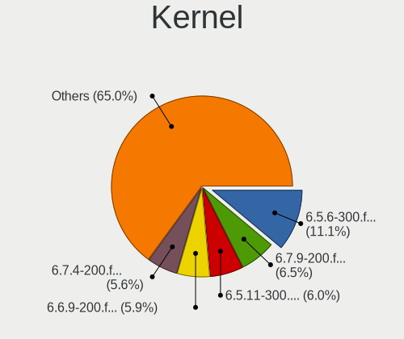

| Version                                            | Computers | Percent |
|----------------------------------------------------|-----------|---------|
| 6.5.11-300.fc39.x86_64                             | 208       | 12.31%  |
| 6.6.9-200.fc39.x86_64                              | 201       | 11.9%   |
| 6.5.6-300.fc39.x86_64                              | 182       | 10.78%  |
| 6.6.8-200.fc39.x86_64                              | 165       | 9.77%   |
| 6.5.12-300.fc39.x86_64                             | 108       | 6.39%   |
| 6.6.13-200.fc39.x86_64                             | 101       | 5.98%   |
| 6.6.11-200.fc39.x86_64                             | 95        | 5.62%   |
| 6.6.4-200.fc39.x86_64                              | 93        | 5.51%   |
| 6.6.6-200.fc39.x86_64                              | 92        | 5.45%   |
| 6.6.7-200.fc39.x86_64                              | 86        | 5.09%   |
| 6.6.2-201.fc39.x86_64                              | 81        | 4.8%    |
| 6.5.10-300.fc39.x86_64                             | 43        | 2.55%   |
| 6.6.12-200.fc39.x86_64                             | 41        | 2.43%   |
| 6.6.3-200.fc39.x86_64                              | 38        | 2.25%   |
| 6.5.9-300.fc39.x86_64                              | 19        | 1.12%   |
| 6.5.5-300.fc39.x86_64                              | 16        | 0.95%   |
| 6.5.2-301.fc39.x86_64                              | 7         | 0.41%   |
| 6.6.14-200.fc39.x86_64                             | 6         | 0.36%   |
| 6.5.8-300.fc39.x86_64                              | 6         | 0.36%   |
| 6.6.12-201.fsync.fc39.x86_64                       | 5         | 0.3%    |
| 6.5.7-300.fc39.x86_64                              | 5         | 0.3%    |
| 6.5.4-300.fc39.x86_64                              | 5         | 0.3%    |
| 6.6.10-200.fc39.x86_64                             | 4         | 0.24%   |
| 6.6.1-300.fc39.x86_64                              | 4         | 0.24%   |
| 6.5.3-300.fc39.x86_64                              | 3         | 0.18%   |
| 6.5.0-0.rc7.20230821gitf7757129e3de.50.fc39.x86_64 | 3         | 0.18%   |
| 6.2.9-300.fc38.x86_64                              | 3         | 0.18%   |
| 6.7.1-0.rc1.250.vanilla.fc39.x86_64                | 2         | 0.12%   |
| 6.7.0-cb1.0.fc39.x86_64                            | 2         | 0.12%   |
| 6.7.0-367.vanilla.fc39.x86_64                      | 2         | 0.12%   |
| 6.6.8-200.t2.fc39.x86_64                           | 2         | 0.12%   |
| 6.6.7-666.rog.fc39.x86_64                          | 2         | 0.12%   |
| 6.6.4-cb1.0.fc39.x86_64                            | 2         | 0.12%   |
| 6.6.0-61.fc40.x86_64                               | 2         | 0.12%   |
| 6.5.10-200.fc38.x86_64                             | 2         | 0.12%   |
| 6.4.0-0.rc6.20230614gitb6dad5178cea.49.fc39.x86_64 | 2         | 0.12%   |
| 6.3.0-0.rc0.20230223gita5c95ca18a98.4.fc39.x86_64  | 2         | 0.12%   |
| 6.7.2-250.vanilla.fc39.x86_64                      | 1         | 0.06%   |
| 6.7.2-200.fc39.x86_64                              | 1         | 0.06%   |
| 6.7.1-200.fc39.x86_64                              | 1         | 0.06%   |

Kernel Family
-------------

Linux kernel without a distro release

| Version | Computers | Percent |
|---------|-----------|---------|
| 6.5.11  | 209       | 12.4%   |
| 6.6.9   | 201       | 11.92%  |
| 6.5.6   | 182       | 10.79%  |
| 6.6.8   | 168       | 9.96%   |
| 6.5.12  | 108       | 6.41%   |
| 6.6.13  | 102       | 6.05%   |
| 6.6.11  | 96        | 5.69%   |
| 6.6.4   | 95        | 5.63%   |
| 6.6.6   | 93        | 5.52%   |
| 6.6.7   | 91        | 5.4%    |
| 6.6.2   | 81        | 4.8%    |
| 6.5.10  | 47        | 2.79%   |
| 6.6.12  | 46        | 2.73%   |
| 6.6.3   | 39        | 2.31%   |
| 6.5.9   | 19        | 1.13%   |
| 6.5.5   | 16        | 0.95%   |
| 6.7.0   | 11        | 0.65%   |
| 6.6.14  | 7         | 0.42%   |
| 6.5.2   | 7         | 0.42%   |
| 6.4.0   | 7         | 0.42%   |
| 6.5.8   | 6         | 0.36%   |
| 6.5.0   | 6         | 0.36%   |
| 6.3.0   | 6         | 0.36%   |
| 6.6.10  | 5         | 0.3%    |
| 6.6.1   | 5         | 0.3%    |
| 6.5.7   | 5         | 0.3%    |
| 6.5.4   | 5         | 0.3%    |
| 6.7.1   | 4         | 0.24%   |
| 6.6.0   | 4         | 0.24%   |
| 6.5.3   | 3         | 0.18%   |
| 6.2.9   | 3         | 0.18%   |
| 6.7.2   | 2         | 0.12%   |
| 6.4.15  | 2         | 0.12%   |
| 6.5.1   | 1         | 0.06%   |
| 6.4.16  | 1         | 0.06%   |
| 6.2.15  | 1         | 0.06%   |
| 6.2.0   | 1         | 0.06%   |
| 6.0.8   | 1         | 0.06%   |

Kernel Major Ver.
-----------------

Linux kernel major version

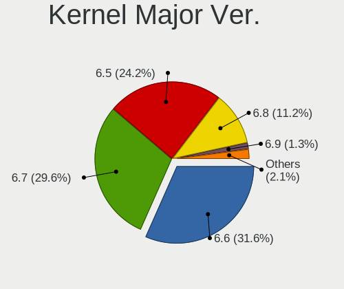

| Version | Computers | Percent |
|---------|-----------|---------|
| 6.6     | 975       | 60.19%  |
| 6.5     | 606       | 37.41%  |
| 6.7     | 17        | 1.05%   |
| 6.4     | 10        | 0.62%   |
| 6.3     | 6         | 0.37%   |
| 6.2     | 5         | 0.31%   |
| 6.0     | 1         | 0.06%   |

Arch
----

OS architecture (x86_64, i586, etc.)

| Name    | Computers | Percent |
|---------|-----------|---------|
| x86_64  | 1560      | 99.87%  |
| aarch64 | 2         | 0.13%   |

DE
--

Desktop Environment

| Name           | Computers | Percent |
|----------------|-----------|---------|
| GNOME          | 1193      | 76.04%  |
| KDE5           | 229       | 14.6%   |
| Unknown        | 26        | 1.66%   |
| Cinnamon       | 22        | 1.4%    |
| X-Cinnamon     | 19        | 1.21%   |
| XFCE           | 18        | 1.15%   |
| Budgie         | 17        | 1.08%   |
| MATE           | 14        | 0.89%   |
| GNOME Classic  | 9         | 0.57%   |
| sway           | 7         | 0.45%   |
| LXQt           | 3         | 0.19%   |
| Hyprland       | 3         | 0.19%   |
| KDE            | 2         | 0.13%   |
| i3             | 2         | 0.13%   |
| WindowMaker    | 1         | 0.06%   |
| i3-with-shmlog | 1         | 0.06%   |
| GNOME-Classic  | 1         | 0.06%   |
| Deepin         | 1         | 0.06%   |
| bspwm          | 1         | 0.06%   |

Display Server
--------------

X11 or Wayland

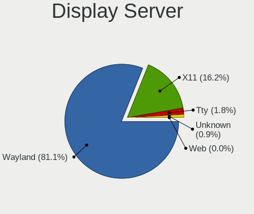

| Name    | Computers | Percent |
|---------|-----------|---------|
| Wayland | 1264      | 80.36%  |
| X11     | 255       | 16.21%  |
| Tty     | 35        | 2.23%   |
| Unknown | 18        | 1.14%   |
| Web     | 1         | 0.06%   |

Display Manager
---------------

SDDM, LightDM, etc.

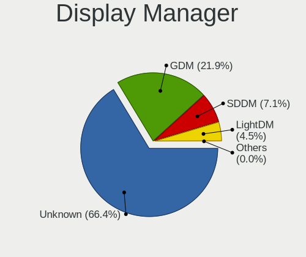

| Name    | Computers | Percent |
|---------|-----------|---------|
| Unknown | 1028      | 65.52%  |
| GDM     | 344       | 21.92%  |
| SDDM    | 115       | 7.33%   |
| LightDM | 81        | 5.16%   |
| GREETD  | 1         | 0.06%   |

OS Lang
-------

Language

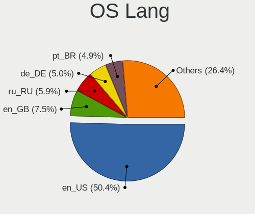

| Lang    | Computers | Percent |
|---------|-----------|---------|
| en_US   | 764       | 48.79%  |
| en_GB   | 120       | 7.66%   |
| ru_RU   | 90        | 5.75%   |
| de_DE   | 86        | 5.49%   |
| pt_BR   | 73        | 4.66%   |
| it_IT   | 47        | 3%      |
| en_AU   | 43        | 2.75%   |
| fr_FR   | 42        | 2.68%   |
| en_CA   | 40        | 2.55%   |
| pl_PL   | 24        | 1.53%   |
| en_IN   | 23        | 1.47%   |
| es_ES   | 22        | 1.4%    |
| zh_CN   | 12        | 0.77%   |
| tr_TR   | 12        | 0.77%   |
| es_MX   | 12        | 0.77%   |
| hu_HU   | 10        | 0.64%   |
| de_AT   | 10        | 0.64%   |
| cs_CZ   | 10        | 0.64%   |
| pt_PT   | 9         | 0.57%   |
| de_CH   | 8         | 0.51%   |
| es_CL   | 7         | 0.45%   |
| es_CO   | 6         | 0.38%   |
| fr_CA   | 5         | 0.32%   |
| en_ZA   | 5         | 0.32%   |
| en_NZ   | 5         | 0.32%   |
| en_DK   | 5         | 0.32%   |
| ru_UA   | 4         | 0.26%   |
| nb_NO   | 4         | 0.26%   |
| es_AR   | 4         | 0.26%   |
| Unknown | 4         | 0.26%   |
| sv_SE   | 3         | 0.19%   |
| ro_RO   | 3         | 0.19%   |
| nl_NL   | 3         | 0.19%   |
| ja_JP   | 3         | 0.19%   |
| fr_BE   | 3         | 0.19%   |
| en_IE   | 3         | 0.19%   |
| en_BW   | 3         | 0.19%   |
| da_DK   | 3         | 0.19%   |
| sk_SK   | 2         | 0.13%   |
| fr_CH   | 2         | 0.13%   |

Boot Mode
---------

EFI or BIOS

| Mode | Computers | Percent |
|------|-----------|---------|
| EFI  | 1277      | 81.44%  |
| BIOS | 291       | 18.56%  |

Filesystem
----------

Type of filesystem

| Type    | Computers | Percent |
|---------|-----------|---------|
| Btrfs   | 1326      | 84.78%  |
| Ext4    | 206       | 13.17%  |
| Xfs     | 30        | 1.92%   |
| Tmpfs   | 1         | 0.06%   |
| Overlay | 1         | 0.06%   |

Part. scheme
------------

Scheme of partitioning

| Type    | Computers | Percent |
|---------|-----------|---------|
| Unknown | 1002      | 63.82%  |
| GPT     | 537       | 34.2%   |
| MBR     | 31        | 1.97%   |

Dual Boot with Linux/BSD
------------------------

Hosting more than one Linux/BSD

| Dual boot | Computers | Percent |
|-----------|-----------|---------|
| No        | 1447      | 92.52%  |
| Yes       | 117       | 7.48%   |

Dual Boot (Win)
---------------

Hosting Linux and Windows

| Dual boot | Computers | Percent |
|-----------|-----------|---------|
| No        | 1313      | 84.01%  |
| Yes       | 250       | 15.99%  |

Board
-----

Vendor
------

Motherboard manufacturer

| Name                                 | Computers | Percent |
|--------------------------------------|-----------|---------|
| Lenovo                               | 305       | 19.53%  |
| ASUSTek Computer                     | 272       | 17.41%  |
| Hewlett-Packard                      | 183       | 11.72%  |
| Dell                                 | 183       | 11.72%  |
| MSI                                  | 114       | 7.3%    |
| Gigabyte Technology                  | 83        | 5.31%   |
| Apple                                | 75        | 4.8%    |
| Acer                                 | 67        | 4.29%   |
| ASRock                               | 40        | 2.56%   |
| HUAWEI                               | 28        | 1.79%   |
| Intel                                | 19        | 1.22%   |
| Samsung Electronics                  | 15        | 0.96%   |
| Fujitsu                              | 12        | 0.77%   |
| Framework                            | 10        | 0.64%   |
| Unknown                              | 10        | 0.64%   |
| Toshiba                              | 7         | 0.45%   |
| AZW                                  | 7         | 0.45%   |
| Timi                                 | 6         | 0.38%   |
| Microsoft                            | 6         | 0.38%   |
| Google                               | 5         | 0.32%   |
| Alienware                            | 5         | 0.32%   |
| Shenzhen Meigao Electronic Equipment | 4         | 0.26%   |
| Pegatron                             | 4         | 0.26%   |
| Notebook                             | 4         | 0.26%   |
| HONOR                                | 4         | 0.26%   |
| TUXEDO                               | 3         | 0.19%   |
| Sony                                 | 3         | 0.19%   |
| Panasonic                            | 3         | 0.19%   |
| LG Electronics                       | 3         | 0.19%   |
| GPD                                  | 3         | 0.19%   |
| Chuwi                                | 3         | 0.19%   |
| AMI                                  | 3         | 0.19%   |
| XIAOMI                               | 2         | 0.13%   |
| Trigkey                              | 2         | 0.13%   |
| Razer                                | 2         | 0.13%   |
| Positivo                             | 2         | 0.13%   |
| Packard Bell                         | 2         | 0.13%   |
| OEM                                  | 2         | 0.13%   |
| Medion                               | 2         | 0.13%   |
| MACHENIKE                            | 2         | 0.13%   |

Model
-----

Motherboard model

| Name                                              | Computers | Percent |
|---------------------------------------------------|-----------|---------|
| Unknown                                           | 14        | 0.9%    |
| ASUS All Series                                   | 10        | 0.64%   |
| Framework Laptop 13 (AMD Ryzen 7040Series)        | 8         | 0.51%   |
| MSI MS-7C37                                       | 6         | 0.38%   |
| Apple MacBookPro9,2                               | 5         | 0.32%   |
| Apple MacBookPro14,1                              | 5         | 0.32%   |
| Apple MacBookPro11,3                              | 5         | 0.32%   |
| MSI MS-7C91                                       | 4         | 0.26%   |
| MSI MS-7C02                                       | 4         | 0.26%   |
| HP Notebook                                       | 4         | 0.26%   |
| HP ENVY x360 2-in-1 Laptop 13-bf0xxx              | 4         | 0.26%   |
| ASUS ROG STRIX B550-F GAMING                      | 4         | 0.26%   |
| ASUS PRIME X570-PRO                               | 4         | 0.26%   |
| Apple MacBookPro10,1                              | 4         | 0.26%   |
| Apple MacBookAir7,2                               | 4         | 0.26%   |
| Acer Aspire A515-57                               | 4         | 0.26%   |
| Timi A35S                                         | 3         | 0.19%   |
| Shenzhen Meigao Electronic Equipment Venus series | 3         | 0.19%   |
| MSI MS-7C95                                       | 3         | 0.19%   |
| MSI MS-7C84                                       | 3         | 0.19%   |
| MSI MS-7B89                                       | 3         | 0.19%   |
| Lenovo Yoga 7 14ARB7 82QF                         | 3         | 0.19%   |
| Lenovo MIIX 520-12IKB 20M3                        | 3         | 0.19%   |
| Lenovo Legion 5 Pro 16ACH6H 82JQ                  | 3         | 0.19%   |
| Lenovo IdeaPad 5 15ALC05 82LN                     | 3         | 0.19%   |
| HUAWEI RLEF-XX                                    | 3         | 0.19%   |
| HP Laptop 15-da0xxx                               | 3         | 0.19%   |
| HP ENVY x360 2-in-1 Laptop 15-fh0xxx              | 3         | 0.19%   |
| Dell XPS 15 9570                                  | 3         | 0.19%   |
| Dell XPS 15 9530                                  | 3         | 0.19%   |
| Dell Precision M6500                              | 3         | 0.19%   |
| Dell Inspiron 3593                                | 3         | 0.19%   |
| AZW GTR                                           | 3         | 0.19%   |
| ASUS Zenbook UM3402YAR_UM3402YA                   | 3         | 0.19%   |
| ASUS TUF Gaming X570-PLUS                         | 3         | 0.19%   |
| ASUS TUF Gaming B550-PLUS                         | 3         | 0.19%   |
| ASUS PRIME Z690M-PLUS D4                          | 3         | 0.19%   |
| ASUS PRIME B550-PLUS                              | 3         | 0.19%   |
| Apple MacPro5,1                                   | 3         | 0.19%   |
| Apple Macmini6,1                                  | 3         | 0.19%   |

Model Family
------------

Motherboard model prefix

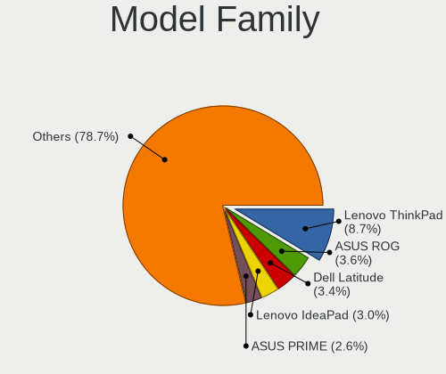

| Name               | Computers | Percent |
|--------------------|-----------|---------|
| Lenovo ThinkPad    | 149       | 9.54%   |
| Dell Latitude      | 57        | 3.65%   |
| ASUS ROG           | 55        | 3.52%   |
| Dell Inspiron      | 49        | 3.14%   |
| Lenovo IdeaPad     | 45        | 2.88%   |
| ASUS VivoBook      | 43        | 2.75%   |
| ASUS PRIME         | 38        | 2.43%   |
| Acer Aspire        | 35        | 2.24%   |
| HP Laptop          | 29        | 1.86%   |
| HP EliteBook       | 26        | 1.66%   |
| Dell XPS           | 26        | 1.66%   |
| HP ENVY            | 24        | 1.54%   |
| ASUS TUF           | 24        | 1.54%   |
| Lenovo Yoga        | 20        | 1.28%   |
| HP Pavilion        | 19        | 1.22%   |
| ASUS ASUS          | 18        | 1.15%   |
| Lenovo Legion      | 17        | 1.09%   |
| ASUS Zenbook       | 17        | 1.09%   |
| Dell Precision     | 16        | 1.02%   |
| Dell OptiPlex      | 15        | 0.96%   |
| HP ProBook         | 14        | 0.9%    |
| Unknown            | 14        | 0.9%    |
| Lenovo ThinkCentre | 12        | 0.77%   |
| Acer Nitro         | 12        | 0.77%   |
| Apple MacBookPro11 | 11        | 0.7%    |
| Lenovo ThinkBook   | 10        | 0.64%   |
| Framework Laptop   | 10        | 0.64%   |
| ASUS All           | 10        | 0.64%   |
| HP EliteDesk       | 9         | 0.58%   |
| Dell Vostro        | 9         | 0.58%   |
| Acer Swift         | 9         | 0.58%   |
| Gigabyte B550      | 8         | 0.51%   |
| Toshiba Satellite  | 7         | 0.45%   |
| Lenovo IdeaPadFlex | 7         | 0.45%   |
| Gigabyte B550M     | 7         | 0.45%   |
| Fujitsu LIFEBOOK   | 7         | 0.45%   |
| Apple MacBookPro14 | 7         | 0.45%   |
| MSI MS-7C37        | 6         | 0.38%   |
| Microsoft Surface  | 6         | 0.38%   |
| HP Spectre         | 6         | 0.38%   |

MFG Year
--------

Motherboard manufacture year

| Year | Computers | Percent |
|------|-----------|---------|
| 2022 | 218       | 13.96%  |
| 2021 | 182       | 11.65%  |
| 2023 | 181       | 11.59%  |
| 2020 | 171       | 10.95%  |
| 2019 | 135       | 8.64%   |
| 2018 | 120       | 7.68%   |
| 2017 | 85        | 5.44%   |
| 2012 | 74        | 4.74%   |
| 2014 | 67        | 4.29%   |
| 2013 | 66        | 4.23%   |
| 2016 | 63        | 4.03%   |
| 2015 | 51        | 3.27%   |
| 2011 | 49        | 3.14%   |
| 2010 | 37        | 2.37%   |
| 2009 | 26        | 1.66%   |
| 2008 | 19        | 1.22%   |
| 2007 | 14        | 0.9%    |
| 2006 | 2         | 0.13%   |
| 2024 | 1         | 0.06%   |
| 2005 | 1         | 0.06%   |

Form Factor
-----------

Physical design of the computer

| Name           | Computers | Percent |
|----------------|-----------|---------|
| Notebook       | 919       | 58.83%  |
| Desktop        | 463       | 29.64%  |
| Convertible    | 88        | 5.63%   |
| Mini pc        | 39        | 2.5%    |
| Tablet         | 25        | 1.6%    |
| All in one     | 21        | 1.34%   |
| Server         | 4         | 0.26%   |
| System on chip | 2         | 0.13%   |
| Other          | 1         | 0.06%   |

Secure Boot
-----------

Enabled or disabled

| State    | Computers | Percent |
|----------|-----------|---------|
| Disabled | 1194      | 76.05%  |
| Enabled  | 376       | 23.95%  |

Coreboot
--------

Have coreboot on board

| Used | Computers | Percent |
|------|-----------|---------|
| No   | 1556      | 99.62%  |
| Yes  | 6         | 0.38%   |

RAM Size
--------

Total RAM memory

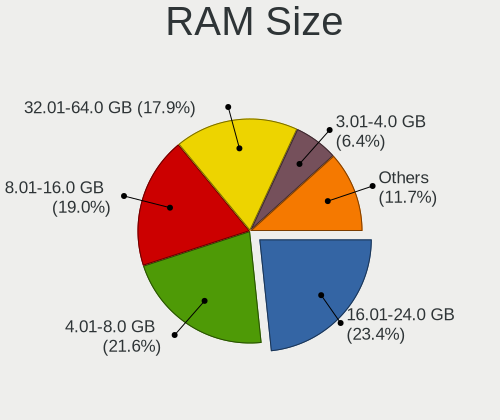

| Size in GB      | Computers | Percent |
|-----------------|-----------|---------|
| 16.01-24.0      | 363       | 23.17%  |
| 4.01-8.0        | 353       | 22.53%  |
| 8.01-16.0       | 299       | 19.08%  |
| 32.01-64.0      | 270       | 17.23%  |
| 3.01-4.0        | 103       | 6.57%   |
| 64.01-256.0     | 84        | 5.36%   |
| 24.01-32.0      | 80        | 5.11%   |
| 2.01-3.0        | 7         | 0.45%   |
| 1.01-2.0        | 7         | 0.45%   |
| More than 256.0 | 1         | 0.06%   |

RAM Used
--------

Used RAM memory

| Used GB     | Computers | Percent |
|-------------|-----------|---------|
| 4.01-8.0    | 527       | 32%     |
| 3.01-4.0    | 416       | 25.26%  |
| 2.01-3.0    | 406       | 24.65%  |
| 1.01-2.0    | 146       | 8.86%   |
| 8.01-16.0   | 108       | 6.56%   |
| 16.01-24.0  | 19        | 1.15%   |
| 0.51-1.0    | 19        | 1.15%   |
| 32.01-64.0  | 2         | 0.12%   |
| 24.01-32.0  | 2         | 0.12%   |
| 64.01-256.0 | 2         | 0.12%   |

Total Drives
------------

Number of drives on board

| Drives | Computers | Percent |
|--------|-----------|---------|
| 1      | 1008      | 63.88%  |
| 2      | 352       | 22.31%  |
| 3      | 109       | 6.91%   |
| 4      | 51        | 3.23%   |
| 5      | 30        | 1.9%    |
| 6      | 10        | 0.63%   |
| 8      | 7         | 0.44%   |
| 7      | 3         | 0.19%   |
| 10     | 2         | 0.13%   |
| 0      | 2         | 0.13%   |
| 13     | 1         | 0.06%   |
| 12     | 1         | 0.06%   |
| 11     | 1         | 0.06%   |
| 9      | 1         | 0.06%   |

Has CD-ROM
----------

Has CD-ROM on board

| Presented | Computers | Percent |
|-----------|-----------|---------|
| No        | 1273      | 81.34%  |
| Yes       | 292       | 18.66%  |

Has Ethernet
------------

Has Ethernet on board

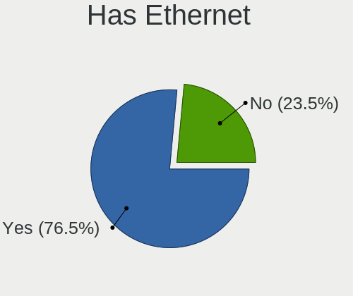

| Presented | Computers | Percent |
|-----------|-----------|---------|
| Yes       | 1171      | 74.87%  |
| No        | 393       | 25.13%  |

Has WiFi
--------

Has WiFi module

| Presented | Computers | Percent |
|-----------|-----------|---------|
| Yes       | 1355      | 86.53%  |
| No        | 211       | 13.47%  |

Has Bluetooth
-------------

Has Bluetooth module

| Presented | Computers | Percent |
|-----------|-----------|---------|
| Yes       | 1216      | 77.5%   |
| No        | 353       | 22.5%   |

Location
--------

Country
-------

Geographic location (country)

| Country      | Computers | Percent |
|--------------|-----------|---------|
| USA          | 288       | 18.43%  |
| Germany      | 130       | 8.32%   |
| Russia       | 97        | 6.21%   |
| Brazil       | 91        | 5.82%   |
| Italy        | 79        | 5.05%   |
| UK           | 62        | 3.97%   |
| Canada       | 61        | 3.9%    |
| France       | 58        | 3.71%   |
| Poland       | 48        | 3.07%   |
| Australia    | 47        | 3.01%   |
| India        | 43        | 2.75%   |
| Spain        | 42        | 2.69%   |
| Netherlands  | 30        | 1.92%   |
| Switzerland  | 28        | 1.79%   |
| Austria      | 26        | 1.66%   |
| Portugal     | 22        | 1.41%   |
| Mexico       | 22        | 1.41%   |
| Turkey       | 21        | 1.34%   |
| Romania      | 21        | 1.34%   |
| Czechia      | 18        | 1.15%   |
| Hungary      | 16        | 1.02%   |
| Sweden       | 15        | 0.96%   |
| Belgium      | 15        | 0.96%   |
| Colombia     | 13        | 0.83%   |
| Argentina    | 13        | 0.83%   |
| Finland      | 11        | 0.7%    |
| China        | 11        | 0.7%    |
| Belarus      | 11        | 0.7%    |
| Philippines  | 9         | 0.58%   |
| Norway       | 9         | 0.58%   |
| Denmark      | 9         | 0.58%   |
| Bulgaria     | 9         | 0.58%   |
| Chile        | 8         | 0.51%   |
| South Africa | 7         | 0.45%   |
| Japan        | 7         | 0.45%   |
| Indonesia    | 7         | 0.45%   |
| Greece       | 7         | 0.45%   |
| Egypt        | 7         | 0.45%   |
| Uzbekistan   | 6         | 0.38%   |
| Thailand     | 6         | 0.38%   |

City
----

Geographic location (city)

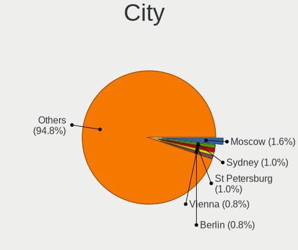

| City          | Computers | Percent |
|---------------|-----------|---------|
| Sydney        | 26        | 1.64%   |
| Moscow        | 25        | 1.58%   |
| Vienna        | 13        | 0.82%   |
| Paris         | 12        | 0.76%   |
| Warsaw        | 11        | 0.69%   |
| St Petersburg | 11        | 0.69%   |
| Berlin        | 11        | 0.69%   |
| Toronto       | 10        | 0.63%   |
| Zurich        | 9         | 0.57%   |
| Stuttgart     | 9         | 0.57%   |
| Munich        | 9         | 0.57%   |
| Minsk         | 9         | 0.57%   |
| Sao Paulo     | 8         | 0.5%    |
| Helsinki      | 8         | 0.5%    |
| Yekaterinburg | 7         | 0.44%   |
| Seattle       | 7         | 0.44%   |
| Milano        | 7         | 0.44%   |
| Milan         | 7         | 0.44%   |
| Istanbul      | 7         | 0.44%   |
| Bucharest     | 7         | 0.44%   |
| Tashkent      | 6         | 0.38%   |
| Santiago      | 6         | 0.38%   |
| Poznan        | 6         | 0.38%   |
| Melbourne     | 6         | 0.38%   |
| Lisbon        | 6         | 0.38%   |
| Hamburg       | 6         | 0.38%   |
| Denver        | 6         | 0.38%   |
| Brussels      | 6         | 0.38%   |
| Bengaluru     | 6         | 0.38%   |
| Barcelona     | 6         | 0.38%   |
| Rome          | 5         | 0.32%   |
| Porto Alegre  | 5         | 0.32%   |
| Nuremberg     | 5         | 0.32%   |
| Montreal      | 5         | 0.32%   |
| Jacksonville  | 5         | 0.32%   |
| Budapest      | 5         | 0.32%   |
| Atlanta       | 5         | 0.32%   |
| Ankara        | 5         | 0.32%   |
| Amsterdam     | 5         | 0.32%   |
| Adelaide      | 5         | 0.32%   |

Drives
------

Drive Vendor
------------

Hard drive vendors

| Vendor                       | Computers | Drives | Percent |
|------------------------------|-----------|--------|---------|
| Samsung Electronics          | 440       | 604    | 19.49%  |
| Sandisk                      | 207       | 246    | 9.17%   |
| WDC                          | 196       | 280    | 8.68%   |
| Seagate                      | 164       | 228    | 7.26%   |
| SK hynix                     | 102       | 110    | 4.52%   |
| Kingston                     | 98        | 112    | 4.34%   |
| Toshiba                      | 87        | 104    | 3.85%   |
| Intel                        | 79        | 103    | 3.5%    |
| Micron Technology            | 78        | 82     | 3.45%   |
| Unknown                      | 76        | 95     | 3.37%   |
| Crucial                      | 74        | 88     | 3.28%   |
| Phison Electronics           | 60        | 68     | 2.66%   |
| Micron/Crucial Technology    | 58        | 79     | 2.57%   |
| KIOXIA                       | 46        | 49     | 2.04%   |
| Apple                        | 45        | 57     | 1.99%   |
| Silicon Motion               | 27        | 29     | 1.2%    |
| MAXIO Technology (Hangzhou)  | 25        | 28     | 1.11%   |
| Kingston Technology Company  | 25        | 27     | 1.11%   |
| Hitachi                      | 25        | 32     | 1.11%   |
| HGST                         | 25        | 31     | 1.11%   |
| ADATA Technology             | 25        | 29     | 1.11%   |
| A-DATA Technology            | 25        | 27     | 1.11%   |
| China                        | 19        | 19     | 0.84%   |
| PNY                          | 15        | 19     | 0.66%   |
| SPCC                         | 11        | 13     | 0.49%   |
| Shenzhen Longsys Electronics | 8         | 8      | 0.35%   |
| JMicron Technology           | 8         | 12     | 0.35%   |
| Netac                        | 7         | 8      | 0.31%   |
| LITEONIT                     | 7         | 8      | 0.31%   |
| Lexar                        | 7         | 8      | 0.31%   |
| Apacer                       | 7         | 7      | 0.31%   |
| Union Memory                 | 6         | 6      | 0.27%   |
| Realtek Semiconductor        | 6         | 6      | 0.27%   |
| LITEON                       | 6         | 8      | 0.27%   |
| Union Memory (Shenzhen)      | 5         | 5      | 0.22%   |
| Transcend                    | 5         | 5      | 0.22%   |
| Patriot                      | 5         | 5      | 0.22%   |
| HS-SSD-E100                  | 5         | 5      | 0.22%   |
| Hewlett-Packard              | 5         | 6      | 0.22%   |
| Unknown                      | 5         | 5      | 0.22%   |

Drive Model
-----------

Hard drive models

| Model                                                           | Computers | Percent |
|-----------------------------------------------------------------|-----------|---------|
| Samsung NVMe SSD Controller SM981/PM981/PM983 1TB               | 104       | 4.23%   |
| Samsung NVMe SSD Controller PM9A1/PM9A3/980PRO 2TB              | 75        | 3.05%   |
| Micron/Crucial P2 NVMe PCIe SSD 1TB                             | 44        | 1.79%   |
| Sandisk WD Blue SN550 NVMe SSD 512GB                            | 32        | 1.3%    |
| Samsung NVMe SSD Controller SM961/PM961/SM963 256GB             | 25        | 1.02%   |
| Phison E12 NVMe Controller 1TB                                  | 21        | 0.85%   |
| Intel SSDPEKNU512GZ 512GB                                       | 20        | 0.81%   |
| Samsung SSD 860 EVO 500GB                                       | 19        | 0.77%   |
| MAXIO (Hangzhou) NVMe SSD Controller MAP1202 512GB              | 19        | 0.77%   |
| Kingston SA400S37240G 240GB SSD                                 | 19        | 0.77%   |
| Unknown MMC Card  128GB                                         | 17        | 0.69%   |
| Silicon Motion SM2263EN/SM2263XT SSD Controller 128GB           | 17        | 0.69%   |
| Samsung SSD 860 EVO 1TB                                         | 17        | 0.69%   |
| Samsung SSD 850 EVO 250GB                                       | 17        | 0.69%   |
| Unknown MMC Card  32GB                                          | 16        | 0.65%   |
| Samsung SSD 980 1TB                                             | 16        | 0.65%   |
| Kingston SA400S37480G 480GB SSD                                 | 16        | 0.65%   |
| Intel SSD 660P Series 1024GB                                    | 15        | 0.61%   |
| Sandisk WD Black SN750 / PC SN730 NVMe SSD 512GB                | 14        | 0.57%   |
| Phison PS5013 E13 NVMe Controller 256GB                         | 14        | 0.57%   |
| Crucial CT1000MX500SSD1 1TB                                     | 14        | 0.57%   |
| Unknown MMC Card  64GB                                          | 13        | 0.53%   |
| Phison E16 PCIe4 NVMe Controller 2TB                            | 13        | 0.53%   |
| Seagate ST1000LM035-1RK172 1TB                                  | 12        | 0.49%   |
| Samsung SSD 870 EVO 1TB                                         | 12        | 0.49%   |
| HGST HTS721010A9E630 1TB                                        | 12        | 0.49%   |
| SK hynix BC501 NVMe Solid State Drive 512GB                     | 11        | 0.45%   |
| Sandisk WD_BLACK SN850X 2000GB                                  | 11        | 0.45%   |
| Sandisk WD_BLACK SN850X 1000GB                                  | 11        | 0.45%   |
| Sandisk WD_BLACK SN770 1TB                                      | 11        | 0.45%   |
| Sandisk WD Black SN850 1024GB                                   | 11        | 0.45%   |
| Intel SSD Pro 7600p/760p/E 6100p Series 1024GB                  | 11        | 0.45%   |
| Toshiba DT01ACA100 1TB                                          | 10        | 0.41%   |
| Sandisk WD Blue SN570 1TB                                       | 10        | 0.41%   |
| Crucial CT500MX500SSD1 500GB                                    | 10        | 0.41%   |
| ADATA XPG SX8200 Pro PCIe Gen3x4 M.2 2280 Solid State Drive 2TB | 10        | 0.41%   |
| Toshiba XG6 NVMe SSD Controller 256GB                           | 9         | 0.37%   |
| Seagate ST500DM002-1BD142 500GB                                 | 9         | 0.37%   |
| Seagate ST2000DM008-2FR102 2TB                                  | 9         | 0.37%   |
| Samsung SSD 870 QVO 1TB                                         | 9         | 0.37%   |

HDD Vendor
----------

Hard disk drive vendors

| Vendor              | Computers | Drives | Percent |
|---------------------|-----------|--------|---------|
| WDC                 | 159       | 227    | 33.76%  |
| Seagate             | 156       | 218    | 33.12%  |
| Toshiba             | 55        | 69     | 11.68%  |
| Hitachi             | 25        | 32     | 5.31%   |
| HGST                | 25        | 31     | 5.31%   |
| Samsung Electronics | 15        | 25     | 3.18%   |
| JMicron Technology  | 8         | 12     | 1.7%    |
| Unknown             | 7         | 7      | 1.49%   |
| Apple               | 7         | 7      | 1.49%   |
| External            | 3         | 5      | 0.64%   |
| Maxtor              | 2         | 2      | 0.42%   |
| StoreJet            | 1         | 2      | 0.21%   |
| SAGE                | 1         | 1      | 0.21%   |
| KINGWIN             | 1         | 1      | 0.21%   |
| Intenso             | 1         | 1      | 0.21%   |
| Inateck             | 1         | 2      | 0.21%   |
| IB-377U3            | 1         | 1      | 0.21%   |
| HGST HTS            | 1         | 1      | 0.21%   |
| ASMT                | 1         | 5      | 0.21%   |
| Asm                 | 1         | 1      | 0.21%   |

SSD Vendor
----------

Solid state drive vendors

| Vendor              | Computers | Drives | Percent |
|---------------------|-----------|--------|---------|
| Samsung Electronics | 163       | 218    | 24.51%  |
| Crucial             | 74        | 88     | 11.13%  |
| Kingston            | 66        | 73     | 9.92%   |
| WDC                 | 45        | 52     | 6.77%   |
| SanDisk             | 45        | 52     | 6.77%   |
| Apple               | 26        | 27     | 3.91%   |
| SK hynix            | 21        | 22     | 3.16%   |
| A-DATA Technology   | 21        | 23     | 3.16%   |
| China               | 19        | 19     | 2.86%   |
| Intel               | 16        | 24     | 2.41%   |
| PNY                 | 15        | 19     | 2.26%   |
| Micron Technology   | 12        | 12     | 1.8%    |
| SPCC                | 11        | 13     | 1.65%   |
| Toshiba             | 8         | 8      | 1.2%    |
| LITEONIT            | 7         | 8      | 1.05%   |
| Apacer              | 7         | 7      | 1.05%   |
| LITEON              | 6         | 8      | 0.9%    |
| Lexar               | 6         | 7      | 0.9%    |
| Patriot             | 5         | 5      | 0.75%   |
| Netac               | 5         | 6      | 0.75%   |
| Transcend           | 4         | 4      | 0.6%    |
| OCZ                 | 4         | 5      | 0.6%    |
| Hewlett-Packard     | 4         | 5      | 0.6%    |
| Team                | 3         | 3      | 0.45%   |
| Plextor             | 3         | 6      | 0.45%   |
| Intenso             | 3         | 3      | 0.45%   |
| GOODRAM             | 3         | 3      | 0.45%   |
| Gigabyte Technology | 3         | 3      | 0.45%   |
| Fanxiang            | 3         | 4      | 0.45%   |
| USB3.0              | 2         | 2      | 0.3%    |
| USB                 | 2         | 2      | 0.3%    |
| Smartbuy            | 2         | 2      | 0.3%    |
| Lenovo              | 2         | 2      | 0.3%    |
| KingSpec            | 2         | 3      | 0.3%    |
| HS-SSD-E100         | 2         | 2      | 0.3%    |
| FORESEE             | 2         | 3      | 0.3%    |
| Emtec               | 2         | 2      | 0.3%    |
| Corsair             | 2         | 3      | 0.3%    |
| ASMedia             | 2         | 2      | 0.3%    |
| Acer                | 2         | 2      | 0.3%    |

Drive Kind
----------

HDD or SSD

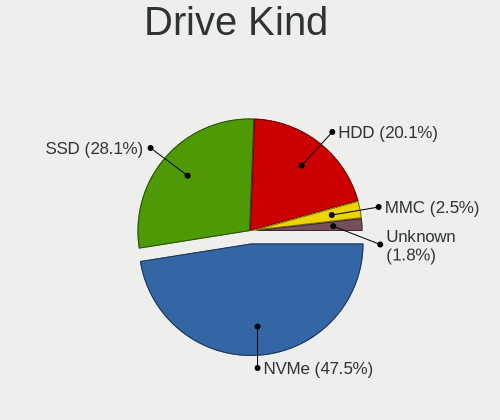

| Kind    | Computers | Drives | Percent |
|---------|-----------|--------|---------|
| NVMe    | 972       | 1264   | 47.46%  |
| SSD     | 584       | 789    | 28.52%  |
| HDD     | 394       | 650    | 19.24%  |
| MMC     | 55        | 68     | 2.69%   |
| Unknown | 43        | 51     | 2.1%    |

Drive Connector
---------------

SATA, SAS, NVMe, etc.

| Type | Computers | Drives | Percent |
|------|-----------|--------|---------|
| NVMe | 971       | 1259   | 51.46%  |
| SATA | 773       | 1369   | 40.96%  |
| SAS  | 88        | 126    | 4.66%   |
| MMC  | 55        | 68     | 2.91%   |

Drive Size
----------

Size of hard drive

| Size in TB | Computers | Drives | Percent |
|------------|-----------|--------|---------|
| 0.01-0.5   | 528       | 742    | 51.21%  |
| 0.51-1.0   | 321       | 436    | 31.13%  |
| 1.01-2.0   | 91        | 116    | 8.83%   |
| 3.01-4.0   | 44        | 67     | 4.27%   |
| 4.01-10.0  | 26        | 43     | 2.52%   |
| 2.01-3.0   | 15        | 23     | 1.45%   |
| 10.01-20.0 | 6         | 12     | 0.58%   |

Space Total
-----------

Amount of disk space available on the file system

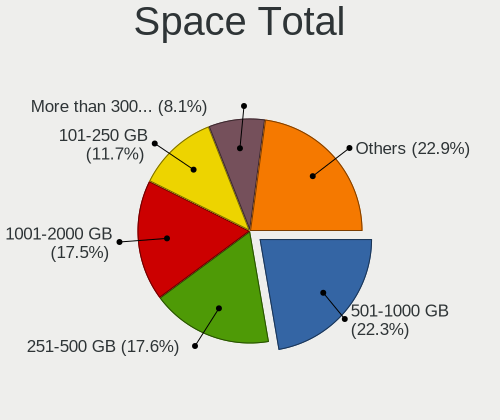

| Size in GB     | Computers | Percent |
|----------------|-----------|---------|
| 501-1000       | 351       | 22.15%  |
| 251-500        | 278       | 17.54%  |
| 1001-2000      | 258       | 16.28%  |
| 101-250        | 196       | 12.37%  |
| Unknown        | 135       | 8.52%   |
| More than 3000 | 126       | 7.95%   |
| 1-20           | 115       | 7.26%   |
| 51-100         | 55        | 3.47%   |
| 2001-3000      | 54        | 3.41%   |
| 21-50          | 17        | 1.07%   |

Space Used
----------

Amount of used disk space

| Used GB        | Computers | Percent |
|----------------|-----------|---------|
| 1-20           | 464       | 28.91%  |
| 21-50          | 289       | 18.01%  |
| 101-250        | 208       | 12.96%  |
| 51-100         | 161       | 10.03%  |
| 251-500        | 135       | 8.41%   |
| Unknown        | 135       | 8.41%   |
| 501-1000       | 89        | 5.55%   |
| 1001-2000      | 64        | 3.99%   |
| More than 3000 | 39        | 2.43%   |
| 2001-3000      | 21        | 1.31%   |

Malfunc. Drives
---------------

Drive models with a malfunction

| Model                                                         | Computers | Drives | Percent |
|---------------------------------------------------------------|-----------|--------|---------|
| WDC WD40EFRX-68N32N0 4TB                                      | 4         | 4      | 7.84%   |
| Intel SSDSC2CT120A3 120GB                                     | 2         | 7      | 3.92%   |
| Crucial CT128MX100SSD1 128GB                                  | 2         | 2      | 3.92%   |
| WDC WDS240G2G0B-00EPW0 240GB SSD                              | 1         | 1      | 1.96%   |
| WDC WD6400AAKS-65A7B2 640GB                                   | 1         | 1      | 1.96%   |
| WDC WD5000AVDS-63U7B1 500GB                                   | 1         | 2      | 1.96%   |
| WDC WD5000AVCS-632DY1 500GB                                   | 1         | 2      | 1.96%   |
| WDC WD5000AAKX-00ERMA0 500GB                                  | 1         | 2      | 1.96%   |
| WDC WD5000AAKS-00UU3A0 500GB                                  | 1         | 1      | 1.96%   |
| WDC WD40EFRX-68WT0N0 4TB                                      | 1         | 1      | 1.96%   |
| WDC WD3200AAKS-22B3A0 320GB                                   | 1         | 1      | 1.96%   |
| WDC WD30 EZRX-00SPEB0 3TB                                     | 1         | 1      | 1.96%   |
| WDC WD20 EZRX-00D8PB0 2TB                                     | 1         | 1      | 1.96%   |
| WDC WD1600AVVS-63L2B0 160GB                                   | 1         | 1      | 1.96%   |
| WDC WD10JPVT-75A1YT0 1TB                                      | 1         | 1      | 1.96%   |
| WDC WD10EZEX-08WN4A0 1TB                                      | 1         | 1      | 1.96%   |
| WDC WD10EARS-22Y5B1 1TB                                       | 1         | 1      | 1.96%   |
| WDC WD10EADS-11M2B2 1TB                                       | 1         | 1      | 1.96%   |
| WDC WD Green 2.5 480GB SSD                                    | 1         | 1      | 1.96%   |
| WDC WD Blue SA510 2.5 500GB                                   | 1         | 1      | 1.96%   |
| Toshiba THNSNK256GVN8 M.2 2280 256GB SSD                      | 1         | 1      | 1.96%   |
| Toshiba MQ01ABF050 500GB                                      | 1         | 1      | 1.96%   |
| Toshiba MQ01ABD050 500GB                                      | 1         | 2      | 1.96%   |
| Toshiba MK5056GSYF 500GB                                      | 1         | 1      | 1.96%   |
| Toshiba DT01ACA100 1TB                                        | 1         | 1      | 1.96%   |
| Seagate ST9500325AS 500GB                                     | 1         | 1      | 1.96%   |
| Seagate ST4000DM000-1F2168 4TB                                | 1         | 1      | 1.96%   |
| Seagate ST3500320AS 500GB                                     | 1         | 1      | 1.96%   |
| Seagate ST2000LM003 HN-M201RAD 2TB                            | 1         | 1      | 1.96%   |
| Seagate ST2000DX002-2DV164 2TB                                | 1         | 1      | 1.96%   |
| Seagate ST1000LX015-1U7172 1TB                                | 1         | 1      | 1.96%   |
| Seagate ST1000DX001-1NS162 1TB                                | 1         | 2      | 1.96%   |
| SanDisk SSD PLUS 240GB                                        | 1         | 1      | 1.96%   |
| Samsung Electronics NVMe SSD Controller SM981/PM981/PM983 1TB | 1         | 1      | 1.96%   |
| Samsung Electronics HD501LJ 500GB                             | 1         | 2      | 1.96%   |
| Samsung Electronics HD103UJ 1TB                               | 1         | 6      | 1.96%   |
| Micron Technology MTFDDAK128MAY-1AH1ZABHA 128GB SSD           | 1         | 1      | 1.96%   |
| Micron Technology 1100_MTFDDAV512TBN 512GB SSD                | 1         | 1      | 1.96%   |
| Maxtor 6Y080L0 82GB                                           | 1         | 1      | 1.96%   |
| Hitachi HUS724030ALE641 3TB                                   | 1         | 1      | 1.96%   |

Malfunc. Drive Vendor
---------------------

Vendors of faulty drives

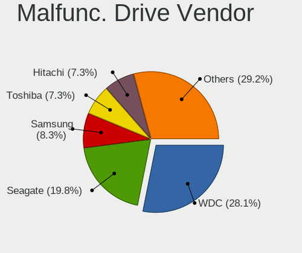

| Vendor              | Computers | Drives | Percent |
|---------------------|-----------|--------|---------|
| WDC                 | 18        | 24     | 38.3%   |
| Seagate             | 6         | 8      | 12.77%  |
| Toshiba             | 5         | 6      | 10.64%  |
| Crucial             | 5         | 7      | 10.64%  |
| Samsung Electronics | 3         | 9      | 6.38%   |
| Micron Technology   | 2         | 2      | 4.26%   |
| Intel               | 2         | 7      | 4.26%   |
| Hitachi             | 2         | 2      | 4.26%   |
| SanDisk             | 1         | 1      | 2.13%   |
| Maxtor              | 1         | 1      | 2.13%   |
| HGST                | 1         | 1      | 2.13%   |
| Apple               | 1         | 1      | 2.13%   |

Malfunc. HDD Vendor
-------------------

Vendors of faulty HDD drives

| Vendor              | Computers | Drives | Percent |
|---------------------|-----------|--------|---------|
| WDC                 | 16        | 21     | 50%     |
| Seagate             | 6         | 8      | 18.75%  |
| Toshiba             | 4         | 5      | 12.5%   |
| Samsung Electronics | 2         | 8      | 6.25%   |
| Hitachi             | 2         | 2      | 6.25%   |
| Maxtor              | 1         | 1      | 3.13%   |
| HGST                | 1         | 1      | 3.13%   |

Malfunc. Drive Kind
-------------------

Kinds of faulty drives

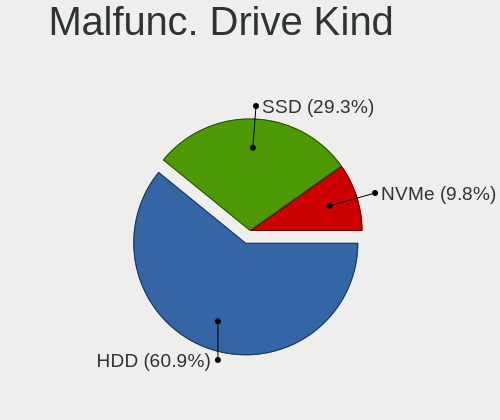

| Kind | Computers | Drives | Percent |
|------|-----------|--------|---------|
| HDD  | 30        | 46     | 65.22%  |
| SSD  | 15        | 22     | 32.61%  |
| NVMe | 1         | 1      | 2.17%   |

Failed Drives
-------------

Failed drive models

| Model                       | Computers | Drives | Percent |
|-----------------------------|-----------|--------|---------|
| WDC WD30 EZRS-00J99B0 3TB   | 1         | 1      | 50%     |
| Hitachi HDS721010DLE630 1TB | 1         | 2      | 50%     |

Failed Drive Vendor
-------------------

Failed drive vendors

| Vendor  | Computers | Drives | Percent |
|---------|-----------|--------|---------|
| WDC     | 1         | 1      | 50%     |
| Hitachi | 1         | 2      | 50%     |

Drive Status
------------

Number of failed and malfunc. drives

| Status   | Computers | Drives | Percent |
|----------|-----------|--------|---------|
| Detected | 1084      | 1908   | 66.42%  |
| Works    | 503       | 842    | 30.82%  |
| Malfunc  | 43        | 69     | 2.63%   |
| Failed   | 2         | 3      | 0.12%   |

Storage controller
------------------

Storage Vendor
--------------

Storage controller vendors

| Vendor                                  | Computers | Percent |
|-----------------------------------------|-----------|---------|
| Intel                                   | 804       | 36.02%  |
| AMD                                     | 321       | 14.38%  |
| Samsung Electronics                     | 315       | 14.11%  |
| SanDisk                                 | 166       | 7.44%   |
| SK hynix                                | 81        | 3.63%   |
| Micron Technology                       | 66        | 2.96%   |
| Phison Electronics                      | 63        | 2.82%   |
| Micron/Crucial Technology               | 58        | 2.6%    |
| Kingston Technology Company             | 58        | 2.6%    |
| KIOXIA                                  | 46        | 2.06%   |
| ASMedia Technology                      | 37        | 1.66%   |
| ADATA Technology                        | 29        | 1.3%    |
| Silicon Motion                          | 27        | 1.21%   |
| Toshiba America Info Systems            | 26        | 1.16%   |
| MAXIO Technology (Hangzhou)             | 26        | 1.16%   |
| JMicron Technology                      | 13        | 0.58%   |
| Nvidia                                  | 11        | 0.49%   |
| Apple                                   | 11        | 0.49%   |
| Solidigm                                | 10        | 0.45%   |
| Marvell Technology Group                | 10        | 0.45%   |
| Union Memory (Shenzhen)                 | 8         | 0.36%   |
| Shenzhen Longsys Electronics            | 8         | 0.36%   |
| Realtek Semiconductor                   | 6         | 0.27%   |
| INNOGRIT                                | 5         | 0.22%   |
| Solid State Storage Technology          | 4         | 0.18%   |
| Shenzhen Unionmemory Information System | 3         | 0.13%   |
| Broadcom / LSI                          | 3         | 0.13%   |
| Biwin Storage Technology                | 3         | 0.13%   |
| Yangtze Memory Technologies             | 2         | 0.09%   |
| VIA Technologies                        | 2         | 0.09%   |
| Seagate Technology                      | 2         | 0.09%   |
| ULi Electronics                         | 1         | 0.04%   |
| Transcend                               | 1         | 0.04%   |
| Silicon Image                           | 1         | 0.04%   |
| Promise Technology                      | 1         | 0.04%   |
| Netac Technology                        | 1         | 0.04%   |
| Lite-On Technology                      | 1         | 0.04%   |
| Lenovo                                  | 1         | 0.04%   |
| Hosin Global Electronics                | 1         | 0.04%   |

Storage Model
-------------

Storage controller models

| Model                                                                          | Computers | Percent |
|--------------------------------------------------------------------------------|-----------|---------|
| AMD FCH SATA Controller [AHCI mode]                                            | 162       | 6.63%   |
| Samsung NVMe SSD Controller SM981/PM981/PM983                                  | 105       | 4.29%   |
| Intel Volume Management Device NVMe RAID Controller                            | 89        | 3.64%   |
| Intel Sunrise Point-LP SATA Controller [AHCI mode]                             | 78        | 3.19%   |
| Samsung NVMe SSD Controller PM9A1/PM9A3/980PRO                                 | 75        | 3.07%   |
| Samsung NVMe SSD Controller 980 (DRAM-less)                                    | 70        | 2.86%   |
| AMD 500 Series Chipset SATA Controller                                         | 60        | 2.45%   |
| Intel 82801 Mobile SATA Controller [RAID mode]                                 | 48        | 1.96%   |
| Micron/Crucial P2 [Nick P2] / P3 / P3 Plus NVMe PCIe SSD (DRAM-less)           | 44        | 1.8%    |
| Intel 8 Series/C220 Series Chipset Family 6-port SATA Controller 1 [AHCI mode] | 44        | 1.8%    |
| Intel 7 Series Chipset Family 6-port SATA Controller [AHCI mode]               | 43        | 1.76%   |
| AMD 600 Series Chipset SATA Controller                                         | 42        | 1.72%   |
| AMD 400 Series Chipset SATA Controller                                         | 38        | 1.55%   |
| SanDisk WD Black SN770 / PC SN740 256GB / PC SN560 (DRAM-less) NVMe SSD        | 33        | 1.35%   |
| SanDisk Ultra 3D / WD Blue SN550 NVMe SSD                                      | 32        | 1.31%   |
| ASMedia ASM1061/ASM1062 Serial ATA Controller                                  | 31        | 1.27%   |
| SK hynix Gold P31/BC711/PC711 NVMe Solid State Drive                           | 29        | 1.19%   |
| Intel SSD 670p Series [Keystone Harbor]                                        | 29        | 1.19%   |
| Intel Q170/Q150/B150/H170/H110/Z170/CM236 Chipset SATA Controller [AHCI Mode]  | 29        | 1.19%   |
| Intel 6 Series/C200 Series Chipset Family 6 port Mobile SATA AHCI Controller   | 29        | 1.19%   |
| Sandisk WD Black SN850X NVMe SSD                                               | 28        | 1.15%   |
| Intel Alder Lake-S PCH SATA Controller [AHCI Mode]                             | 26        | 1.06%   |
| Samsung NVMe SSD Controller SM961/PM961/SM963                                  | 25        | 1.02%   |
| Intel Alder Lake-P SATA AHCI Controller                                        | 25        | 1.02%   |
| Intel Wildcat Point-LP SATA Controller [AHCI Mode]                             | 24        | 0.98%   |
| Samsung NVMe SSD Controller PM9B1 (DRAM-less)                                  | 23        | 0.94%   |
| Intel Volume Management Device NVMe RAID Controller Intel Corporation          | 23        | 0.94%   |
| Intel 8 Series SATA Controller 1 [AHCI mode]                                   | 23        | 0.94%   |
| Intel Comet Lake SATA AHCI Controller                                          | 22        | 0.9%    |
| Phison E12 NVMe Controller                                                     | 21        | 0.86%   |
| MAXIO (Hangzhou) NVMe SSD Controller MAP1202 (DRAM-less)                       | 20        | 0.82%   |
| KIOXIA NVMe SSD Controller BG4 (DRAM-less)                                     | 20        | 0.82%   |
| Intel Tiger Lake-LP SATA Controller                                            | 20        | 0.82%   |
| Intel Cannon Lake PCH SATA AHCI Controller                                     | 20        | 0.82%   |
| Intel 5 Series/3400 Series Chipset 6 port SATA AHCI Controller                 | 20        | 0.82%   |
| SK hynix Platinum P41/PC801 NVMe Solid State Drive                             | 18        | 0.74%   |
| AMD SB7x0/SB8x0/SB9x0 IDE Controller                                           | 18        | 0.74%   |
| Silicon Motion SM2263EN/SM2263XT (DRAM-less) NVMe SSD Controllers              | 17        | 0.7%    |
| Kingston Company KC3000/FURY Renegade NVMe SSD E18                             | 17        | 0.7%    |
| Intel 200 Series PCH SATA controller [AHCI mode]                               | 17        | 0.7%    |

Storage Kind
------------

Kind of storage controller (IDE, SATA, NVMe, SAS, ...)

| Kind | Computers | Percent |
|------|-----------|---------|
| NVMe | 970       | 44.25%  |
| SATA | 959       | 43.75%  |
| RAID | 179       | 8.17%   |
| IDE  | 80        | 3.65%   |
| SAS  | 4         | 0.18%   |

Processor
---------

CPU Vendor
----------

Processor vendors

| Vendor | Computers | Percent |
|--------|-----------|---------|
| Intel  | 1059      | 67.8%   |
| AMD    | 501       | 32.07%  |
| ARM    | 2         | 0.13%   |

CPU Model
---------

Processor models

| Model                                         | Computers | Percent |
|-----------------------------------------------|-----------|---------|
| Intel 11th Gen Core i5-1135G7 @ 2.40GHz       | 24        | 1.53%   |
| Intel 11th Gen Core i7-1165G7 @ 2.80GHz       | 20        | 1.28%   |
| AMD Ryzen 5 3600 6-Core Processor             | 19        | 1.21%   |
| AMD Ryzen 7 5700U with Radeon Graphics        | 18        | 1.15%   |
| AMD Ryzen 7 3700X 8-Core Processor            | 16        | 1.02%   |
| AMD Ryzen 5 5500U with Radeon Graphics        | 16        | 1.02%   |
| Intel Core i5-7200U CPU @ 2.50GHz             | 15        | 0.96%   |
| Intel 12th Gen Core i7-1255U                  | 15        | 0.96%   |
| Intel Core i5-8250U CPU @ 1.60GHz             | 13        | 0.83%   |
| Intel 12th Gen Core i7-12700H                 | 13        | 0.83%   |
| AMD Ryzen 7 5800H with Radeon Graphics        | 13        | 0.83%   |
| Intel Core i7-7500U CPU @ 2.70GHz             | 12        | 0.77%   |
| Intel Core i5-8265U CPU @ 1.60GHz             | 12        | 0.77%   |
| Intel 12th Gen Core i5-12450H                 | 12        | 0.77%   |
| Intel 12th Gen Core i5-1235U                  | 12        | 0.77%   |
| Intel Core i7-8650U CPU @ 1.90GHz             | 11        | 0.7%    |
| Intel Core i5-1035G1 CPU @ 1.00GHz            | 11        | 0.7%    |
| Intel 13th Gen Core i7-1355U                  | 11        | 0.7%    |
| AMD Ryzen 7 7840HS w/ Radeon 780M Graphics    | 11        | 0.7%    |
| AMD Ryzen 5 5600X 6-Core Processor            | 11        | 0.7%    |
| AMD Ryzen 5 5600G with Radeon Graphics        | 11        | 0.7%    |
| Intel Core i5-10210U CPU @ 1.60GHz            | 10        | 0.64%   |
| AMD Ryzen 7 5800X 8-Core Processor            | 10        | 0.64%   |
| AMD Ryzen 7 5700G with Radeon Graphics        | 10        | 0.64%   |
| AMD Ryzen 5 7530U with Radeon Graphics        | 10        | 0.64%   |
| Intel Core i7-8550U CPU @ 1.80GHz             | 9         | 0.58%   |
| Intel Core i7-6500U CPU @ 2.50GHz             | 9         | 0.58%   |
| Intel Core i5-5200U CPU @ 2.20GHz             | 9         | 0.58%   |
| Intel 12th Gen Core i7-1260P                  | 9         | 0.58%   |
| Intel 12th Gen Core i5-1240P                  | 9         | 0.58%   |
| AMD Ryzen 7 PRO 7840U w/ Radeon 780M Graphics | 9         | 0.58%   |
| AMD Ryzen 7 7730U with Radeon Graphics        | 9         | 0.58%   |
| AMD Ryzen 7 5700X 8-Core Processor            | 9         | 0.58%   |
| Intel Core i7-7700HQ CPU @ 2.80GHz            | 8         | 0.51%   |
| Intel Core i5-7300U CPU @ 2.60GHz             | 8         | 0.51%   |
| Intel Core i5-6200U CPU @ 2.30GHz             | 8         | 0.51%   |
| Intel Celeron N4020 CPU @ 1.10GHz             | 8         | 0.51%   |
| AMD Ryzen 9 7950X 16-Core Processor           | 8         | 0.51%   |
| AMD Ryzen 7 7840U w/ Radeon 780M Graphics     | 8         | 0.51%   |
| Intel Core i7-10850H CPU @ 2.70GHz            | 7         | 0.45%   |

CPU Model Family
----------------

Processor model prefix

| Model                   | Computers | Percent |
|-------------------------|-----------|---------|
| Other                   | 306       | 19.55%  |
| Intel Core i5           | 295       | 18.85%  |
| Intel Core i7           | 251       | 16.04%  |
| AMD Ryzen 7             | 180       | 11.5%   |
| AMD Ryzen 5             | 147       | 9.39%   |
| Intel Core i3           | 72        | 4.6%    |
| AMD Ryzen 9             | 51        | 3.26%   |
| Intel Celeron           | 37        | 2.36%   |
| AMD Ryzen 7 PRO         | 25        | 1.6%    |
| Intel Core 2 Duo        | 22        | 1.41%   |
| Intel Pentium           | 18        | 1.15%   |
| AMD Ryzen 3             | 16        | 1.02%   |
| Intel Xeon              | 15        | 0.96%   |
| Intel Core i9           | 11        | 0.7%    |
| Intel Core 2 Quad       | 10        | 0.64%   |
| Intel Atom              | 10        | 0.64%   |
| AMD Ryzen 5 PRO         | 9         | 0.58%   |
| AMD A8                  | 8         | 0.51%   |
| AMD FX                  | 7         | 0.45%   |
| AMD A6                  | 7         | 0.45%   |
| AMD Ryzen Threadripper  | 5         | 0.32%   |
| AMD Phenom II X6        | 5         | 0.32%   |
| AMD A4                  | 5         | 0.32%   |
| Intel Pentium Silver    | 4         | 0.26%   |
| Intel Core m5           | 4         | 0.26%   |
| AMD Phenom II X4        | 4         | 0.26%   |
| Intel Pentium Dual-Core | 3         | 0.19%   |
| AMD Ryzen 3 PRO         | 3         | 0.19%   |
| AMD Athlon 64 X2        | 3         | 0.19%   |
| Intel Pentium Dual      | 2         | 0.13%   |
| Intel Genuine           | 2         | 0.13%   |
| Intel Core m3           | 2         | 0.13%   |
| Intel Core 2 Extreme    | 2         | 0.13%   |
| AMD Phenom II X2        | 2         | 0.13%   |
| AMD E                   | 2         | 0.13%   |
| AMD Athlon II X4        | 2         | 0.13%   |
| AMD Athlon II X3        | 2         | 0.13%   |
| AMD Athlon II           | 2         | 0.13%   |
| AMD Athlon              | 2         | 0.13%   |
| Intel Xeon Gold         | 1         | 0.06%   |

CPU Cores
---------

Number of processor cores

| Number  | Computers | Percent |
|---------|-----------|---------|
| 4       | 475       | 30.37%  |
| 2       | 373       | 23.85%  |
| 8       | 265       | 16.94%  |
| 6       | 213       | 13.62%  |
| 10      | 67        | 4.28%   |
| 12      | 65        | 4.16%   |
| 14      | 49        | 3.13%   |
| 16      | 30        | 1.92%   |
| 24      | 9         | 0.58%   |
| 1       | 6         | 0.38%   |
| 3       | 3         | 0.19%   |
| 32      | 2         | 0.13%   |
| 20      | 2         | 0.13%   |
| 40      | 1         | 0.06%   |
| 28      | 1         | 0.06%   |
| 18      | 1         | 0.06%   |
| 5       | 1         | 0.06%   |
| Unknown | 1         | 0.06%   |

CPU Sockets
-----------

Number of sockets

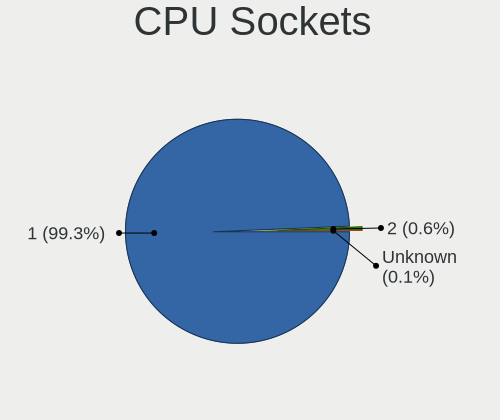

| Number  | Computers | Percent |
|---------|-----------|---------|
| 1       | 1555      | 99.55%  |
| 2       | 6         | 0.38%   |
| Unknown | 1         | 0.06%   |

CPU Threads
-----------

Threads per core (Hyper-Threading)

| Number  | Computers | Percent |
|---------|-----------|---------|
| 2       | 1302      | 83.25%  |
| 1       | 261       | 16.69%  |
| Unknown | 1         | 0.06%   |

CPU Op-Modes
------------

CPU Operation Modes (32-bit, 64-bit)

| Op mode        | Computers | Percent |
|----------------|-----------|---------|
| 32-bit, 64-bit | 1562      | 100%    |

CPU Microcode
-------------

Microcode number

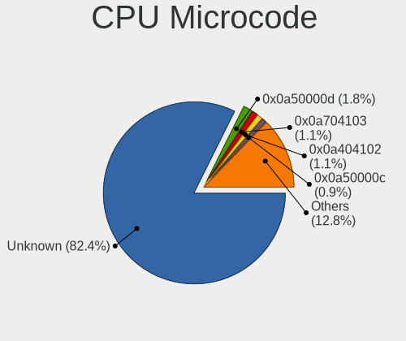

| Number     | Computers | Percent |
|------------|-----------|---------|
| Unknown    | 1085      | 69.15%  |
| 0x0a50000d | 50        | 3.19%   |
| 0x0a404102 | 31        | 1.98%   |
| 0x0a704103 | 29        | 1.85%   |
| 0x0a50000c | 27        | 1.72%   |
| 0x08701021 | 24        | 1.53%   |
| 0x0a601203 | 21        | 1.34%   |
| 0x08608103 | 21        | 1.34%   |
| 0x08600106 | 21        | 1.34%   |
| 0x0a601206 | 19        | 1.21%   |
| 0x0a20120a | 19        | 1.21%   |
| 0x08701030 | 17        | 1.08%   |
| 0x08108109 | 16        | 1.02%   |
| 0x0a201016 | 14        | 0.89%   |
| 0x08101016 | 10        | 0.64%   |
| 0x0800820d | 10        | 0.64%   |
| 0x010000c8 | 10        | 0.64%   |
| 0x0a20120e | 8         | 0.51%   |
| 0x0a704104 | 6         | 0.38%   |
| 0x0a50000f | 6         | 0.38%   |
| 0x08608104 | 6         | 0.38%   |
| 0x08608102 | 6         | 0.38%   |
| 0x08600109 | 6         | 0.38%   |
| 0x08701013 | 5         | 0.32%   |
| 0x06006705 | 5         | 0.32%   |
| 0x0a704101 | 4         | 0.25%   |
| 0x0a404101 | 4         | 0.25%   |
| 0x08a00008 | 4         | 0.25%   |
| 0x08600103 | 4         | 0.25%   |
| 0x08001138 | 4         | 0.25%   |
| 0x06001119 | 4         | 0.25%   |
| 0x0a20102b | 3         | 0.19%   |
| 0x08108102 | 3         | 0.19%   |
| 0x0810100b | 3         | 0.19%   |
| 0x07030105 | 3         | 0.19%   |
| 0x06006704 | 3         | 0.19%   |
| 0x06000852 | 3         | 0.19%   |
| 0x010000dc | 3         | 0.19%   |
| 0x0a601201 | 2         | 0.13%   |
| 0x0a50000b | 2         | 0.13%   |

CPU Microarch
-------------

Microarchitecture

| Name              | Computers | Percent |
|-------------------|-----------|---------|
| KabyLake          | 243       | 15.52%  |
| Alderlake Hybrid  | 193       | 12.32%  |
| Unknown           | 179       | 11.43%  |
| Zen 3             | 138       | 8.81%   |
| Haswell           | 95        | 6.07%   |
| Zen 2             | 83        | 5.3%    |
| TigerLake         | 78        | 4.98%   |
| Skylake           | 76        | 4.85%   |
| IvyBridge         | 68        | 4.34%   |
| SandyBridge       | 49        | 3.13%   |
| Icelake           | 41        | 2.62%   |
| CometLake         | 37        | 2.36%   |
| Broadwell         | 36        | 2.3%    |
| Penryn            | 31        | 1.98%   |
| Zen+              | 29        | 1.85%   |
| Westmere          | 28        | 1.79%   |
| Zen               | 26        | 1.66%   |
| Silvermont        | 20        | 1.28%   |
| K10               | 20        | 1.28%   |
| Goldmont plus     | 19        | 1.21%   |
| Excavator         | 12        | 0.77%   |
| Piledriver        | 11        | 0.7%    |
| Nehalem           | 10        | 0.64%   |
| Core              | 10        | 0.64%   |
| Tremont           | 5         | 0.32%   |
| K8 Hammer         | 5         | 0.32%   |
| Goldmont          | 4         | 0.26%   |
| Steamroller       | 3         | 0.19%   |
| Puma              | 3         | 0.19%   |
| Jaguar            | 3         | 0.19%   |
| Bonnell           | 3         | 0.19%   |
| Bobcat            | 3         | 0.19%   |
| K10 Llano         | 2         | 0.13%   |
| Gracemont         | 2         | 0.13%   |
| Meteorlake Hybrid | 1         | 0.06%   |

Graphics
--------

GPU Vendor
----------

Vendors of graphics cards

| Vendor                     | Computers | Percent |
|----------------------------|-----------|---------|
| Intel                      | 903       | 48.08%  |
| AMD                        | 500       | 26.62%  |
| Nvidia                     | 472       | 25.13%  |
| VIA Technologies           | 1         | 0.05%   |
| Matrox Electronics Systems | 1         | 0.05%   |
| ASPEED Technology          | 1         | 0.05%   |

GPU Model
---------

Graphics card models

| Model                                                                     | Computers | Percent |
|---------------------------------------------------------------------------|-----------|---------|
| Intel TigerLake-LP GT2 [Iris Xe Graphics]                                 | 70        | 3.63%   |
| AMD Cezanne [Radeon Vega Series / Radeon Vega Mobile Series]              | 47        | 2.44%   |
| Intel UHD Graphics 620                                                    | 45        | 2.33%   |
| Intel Alder Lake-P GT2 [Iris Xe Graphics]                                 | 45        | 2.33%   |
| Intel Raptor Lake-P [Iris Xe Graphics]                                    | 42        | 2.18%   |
| Intel HD Graphics 620                                                     | 42        | 2.18%   |
| Intel 3rd Gen Core processor Graphics Controller                          | 41        | 2.13%   |
| AMD Phoenix1                                                              | 41        | 2.13%   |
| Intel 2nd Generation Core Processor Family Integrated Graphics Controller | 40        | 2.07%   |
| AMD Rembrandt [Radeon 680M]                                               | 36        | 1.87%   |
| AMD Lucienne                                                              | 35        | 1.81%   |
| AMD Renoir [Radeon RX Vega 6 (Ryzen 4000/5000 Mobile Series)]             | 32        | 1.66%   |
| AMD Raphael                                                               | 32        | 1.66%   |
| Intel Haswell-ULT Integrated Graphics Controller                          | 31        | 1.61%   |
| Intel Skylake GT2 [HD Graphics 520]                                       | 30        | 1.56%   |
| Intel WhiskeyLake-U GT2 [UHD Graphics 620]                                | 29        | 1.5%    |
| AMD Barcelo                                                               | 26        | 1.35%   |
| Intel HD Graphics 5500                                                    | 25        | 1.3%    |
| Intel Alder Lake-UP3 GT2 [Iris Xe Graphics]                               | 25        | 1.3%    |
| Intel CoffeeLake-H GT2 [UHD Graphics 630]                                 | 24        | 1.24%   |
| Intel CometLake-U GT2 [UHD Graphics]                                      | 23        | 1.19%   |
| Intel 4th Gen Core Processor Integrated Graphics Controller               | 23        | 1.19%   |
| Nvidia GA106M [GeForce RTX 3060 Mobile / Max-Q]                           | 22        | 1.14%   |
| Intel HD Graphics 530                                                     | 22        | 1.14%   |
| AMD Ellesmere [Radeon RX 470/480/570/570X/580/580X/590]                   | 22        | 1.14%   |
| Intel CometLake-H GT2 [UHD Graphics]                                      | 21        | 1.09%   |
| Intel Core Processor Integrated Graphics Controller                       | 19        | 0.98%   |
| AMD Picasso/Raven 2 [Radeon Vega Series / Radeon Vega Mobile Series]      | 19        | 0.98%   |
| Intel CoffeeLake-S GT2 [UHD Graphics 630]                                 | 18        | 0.93%   |
| Intel HD Graphics 630                                                     | 17        | 0.88%   |
| Nvidia GA107M [GeForce RTX 3050 Mobile]                                   | 16        | 0.83%   |
| Intel GeminiLake [UHD Graphics 600]                                       | 16        | 0.83%   |
| Intel Alder Lake-P GT1 [UHD Graphics]                                     | 16        | 0.83%   |
| AMD Navi 21 [Radeon RX 6800/6800 XT / 6900 XT]                            | 16        | 0.83%   |
| Nvidia TU117M [GeForce GTX 1650 Mobile / Max-Q]                           | 15        | 0.78%   |
| Intel TigerLake-H GT1 [UHD Graphics]                                      | 15        | 0.78%   |
| AMD Navi 31 [Radeon RX 7900 XT/7900 XTX/7900M]                            | 15        | 0.78%   |
| AMD Navi 22 [Radeon RX 6700/6700 XT/6750 XT / 6800M/6850M XT]             | 15        | 0.78%   |
| Intel Iris Plus Graphics G1 (Ice Lake)                                    | 14        | 0.73%   |
| AMD Raven Ridge [Radeon Vega Series / Radeon Vega Mobile Series]          | 14        | 0.73%   |

GPU Combo
---------

Combinations of graphics cards

| Name             | Computers | Percent |
|------------------|-----------|---------|
| 1 x Intel        | 631       | 40.32%  |
| 1 x AMD          | 379       | 24.22%  |
| Intel + Nvidia   | 213       | 13.61%  |
| 1 x Nvidia       | 205       | 13.1%   |
| AMD + Nvidia     | 49        | 3.13%   |
| 2 x AMD          | 37        | 2.36%   |
| Intel + AMD      | 33        | 2.11%   |
| 2 x Intel        | 7         | 0.45%   |
| Other            | 4         | 0.26%   |
| 2 x Nvidia       | 3         | 0.19%   |
| 1 x VIA          | 1         | 0.06%   |
| 1 x Matrox       | 1         | 0.06%   |
| 1 x ASPEED       | 1         | 0.06%   |
| AMD + 2 x Nvidia | 1         | 0.06%   |

GPU Driver
----------

Free vs proprietary

| Driver      | Computers | Percent |
|-------------|-----------|---------|
| Free        | 1299      | 82.95%  |
| Proprietary | 216       | 13.79%  |
| Unknown     | 51        | 3.26%   |

GPU Memory
----------

Total video memory

| Size in GB | Computers | Percent |
|------------|-----------|---------|
| Unknown    | 841       | 53.33%  |
| 0.01-0.5   | 183       | 11.6%   |
| 1.01-2.0   | 150       | 9.51%   |
| 3.01-4.0   | 102       | 6.47%   |
| 7.01-8.0   | 94        | 5.96%   |
| 0.51-1.0   | 90        | 5.71%   |
| 8.01-16.0  | 55        | 3.49%   |
| 5.01-6.0   | 35        | 2.22%   |
| 16.01-24.0 | 16        | 1.01%   |
| 2.01-3.0   | 11        | 0.7%    |

Monitor
-------

Monitor Vendor
--------------

Monitor vendors

| Vendor                  | Computers | Percent |
|-------------------------|-----------|---------|
| Samsung Electronics     | 213       | 11.99%  |
| BOE                     | 197       | 11.09%  |
| AU Optronics            | 191       | 10.75%  |
| Chimei Innolux          | 169       | 9.52%   |
| LG Display              | 127       | 7.15%   |
| Goldstar                | 110       | 6.19%   |
| Dell                    | 104       | 5.86%   |
| Apple                   | 62        | 3.49%   |
| Hewlett-Packard         | 48        | 2.7%    |
| Lenovo                  | 46        | 2.59%   |
| Acer                    | 44        | 2.48%   |
| Philips                 | 39        | 2.2%    |
| Sharp                   | 38        | 2.14%   |
| AOC                     | 36        | 2.03%   |
| Ancor Communications    | 26        | 1.46%   |
| CSO                     | 25        | 1.41%   |
| ASUSTek Computer        | 24        | 1.35%   |
| BenQ                    | 21        | 1.18%   |
| InfoVision              | 17        | 0.96%   |
| ViewSonic               | 15        | 0.84%   |
| PANDA                   | 15        | 0.84%   |
| MSI                     | 15        | 0.84%   |
| Iiyama                  | 15        | 0.84%   |
| Chi Mei Optoelectronics | 14        | 0.79%   |
| Sony                    | 13        | 0.73%   |
| Gigabyte Technology     | 12        | 0.68%   |
| TMX                     | 10        | 0.56%   |
| Unknown                 | 6         | 0.34%   |
| Panasonic               | 6         | 0.34%   |
| NEC Computers           | 6         | 0.34%   |
| Mi                      | 6         | 0.34%   |
| HKC                     | 5         | 0.28%   |
| TMA                     | 4         | 0.23%   |
| RTK                     | 4         | 0.23%   |
| Insignia                | 4         | 0.23%   |
| Vizio                   | 3         | 0.17%   |
| Sceptre Tech            | 3         | 0.17%   |
| HUAWEI                  | 3         | 0.17%   |
| HannStar                | 3         | 0.17%   |
| Fujitsu Siemens         | 3         | 0.17%   |

Monitor Model
-------------

Monitor models

| Model                                                                 | Computers | Percent |
|-----------------------------------------------------------------------|-----------|---------|
| Chimei Innolux LCD Monitor CMN14D4 1920x1080 309x173mm 13.9-inch      | 10        | 0.55%   |
| Goldstar FULL HD GSM5B55 1920x1080 480x270mm 21.7-inch                | 7         | 0.38%   |
| Chimei Innolux LCD Monitor CMN15F5 1920x1080 344x193mm 15.5-inch      | 7         | 0.38%   |
| BOE LCD Monitor BOE0BCA 2256x1504 285x190mm 13.5-inch                 | 7         | 0.38%   |
| BOE LCD Monitor BOE08D5 1920x1080 344x194mm 15.5-inch                 | 7         | 0.38%   |
| Unknown LCD Monitor FFFF 2288x1287 2550x2550mm 142.0-inch             | 6         | 0.33%   |
| Samsung Electronics LCD Monitor SEC5441 1366x768 344x194mm 15.5-inch  | 6         | 0.33%   |
| Samsung Electronics LCD Monitor SDC4171 2880x1800 302x189mm 14.0-inch | 6         | 0.33%   |
| Samsung Electronics LCD Monitor SDC416E 2880x1620 344x194mm 15.5-inch | 6         | 0.33%   |
| Goldstar HDR 4K GSM7707 3840x2160 600x340mm 27.2-inch                 | 6         | 0.33%   |
| Dell S2721DGF DEL41D9 2560x1440 597x336mm 27.0-inch                   | 6         | 0.33%   |
| Chimei Innolux LCD Monitor CMN1521 1920x1080 344x193mm 15.5-inch      | 6         | 0.33%   |
| AU Optronics LCD Monitor AUO21ED 1920x1080 344x193mm 15.5-inch        | 6         | 0.33%   |
| LG Display LCD Monitor LGD0521 1920x1080 309x174mm 14.0-inch          | 5         | 0.27%   |
| LG Display LCD Monitor LGD046F 1920x1080 345x194mm 15.6-inch          | 5         | 0.27%   |
| Chimei Innolux LCD Monitor CMN15E7 1920x1080 344x193mm 15.5-inch      | 5         | 0.27%   |
| Chimei Innolux LCD Monitor CMN14C9 1920x1080 309x173mm 13.9-inch      | 5         | 0.27%   |
| Chimei Innolux LCD Monitor CMN143F 1920x1200 301x188mm 14.0-inch      | 5         | 0.27%   |
| BOE LCD Monitor BOE0872 1920x1080 344x194mm 15.5-inch                 | 5         | 0.27%   |
| AU Optronics LCD Monitor AUO403D 1920x1080 309x174mm 14.0-inch        | 5         | 0.27%   |
| AU Optronics LCD Monitor AUO26EC 1366x768 344x193mm 15.5-inch         | 5         | 0.27%   |
| Apple Color LCD APPA034 2880x1800 286x179mm 13.3-inch                 | 5         | 0.27%   |
| AOC 27G2G8 AOC2702 1920x1080 598x336mm 27.0-inch                      | 5         | 0.27%   |
| AOC 24G2W1G4 AOC2402 1920x1080 527x296mm 23.8-inch                    | 5         | 0.27%   |
| Samsung Electronics LCD Monitor SDC4193 2880x1800 302x189mm 14.0-inch | 4         | 0.22%   |
| Samsung Electronics LCD Monitor SDC4156 1920x1080 294x165mm 13.3-inch | 4         | 0.22%   |
| Samsung Electronics LCD Monitor SDC4150 3456x2160 336x210mm 15.6-inch | 4         | 0.22%   |
| Samsung Electronics C27F390 SAM0D32 1920x1080 598x336mm 27.0-inch     | 4         | 0.22%   |
| Samsung Electronics C24F390 SAM0D2C 1920x1080 521x293mm 23.5-inch     | 4         | 0.22%   |
| PANDA LCD Monitor NCP004D 1920x1080 344x194mm 15.5-inch               | 4         | 0.22%   |
| Lenovo LEN L1711pC LEN13B7 1280x1024 338x270mm 17.0-inch              | 4         | 0.22%   |
| Goldstar Ultra HD GSM5B09 3840x2160 600x340mm 27.2-inch               | 4         | 0.22%   |
| Goldstar HDR WFHD GSM7714 2560x1080 798x334mm 34.1-inch               | 4         | 0.22%   |
| Goldstar HDR 4K GSM774F 3840x2160 697x392mm 31.5-inch                 | 4         | 0.22%   |
| Dell S2719DGF DELD0E6 2560x1440 600x340mm 27.2-inch                   | 4         | 0.22%   |
| Chimei Innolux LCD Monitor CMN1735 1920x1080 382x215mm 17.3-inch      | 4         | 0.22%   |
| Chimei Innolux LCD Monitor CMN1618 1920x1200 344x215mm 16.0-inch      | 4         | 0.22%   |
| Chimei Innolux LCD Monitor CMN15E8 1920x1080 344x193mm 15.5-inch      | 4         | 0.22%   |
| Chimei Innolux LCD Monitor CMN15C4 1920x1080 344x193mm 15.5-inch      | 4         | 0.22%   |
| Chimei Innolux LCD Monitor CMN14D6 1366x768 309x173mm 13.9-inch       | 4         | 0.22%   |

Monitor Resolution
------------------

Monitor screen resolution

| Resolution         | Computers | Percent |
|--------------------|-----------|---------|
| 1920x1080 (FHD)    | 760       | 44.68%  |
| 1366x768 (WXGA)    | 181       | 10.64%  |
| 3840x2160 (4K)     | 145       | 8.52%   |
| 2560x1440 (QHD)    | 133       | 7.82%   |
| 1920x1200 (WUXGA)  | 95        | 5.58%   |
| 2880x1800          | 50        | 2.94%   |
| 2560x1600          | 40        | 2.35%   |
| 1600x900 (HD+)     | 36        | 2.12%   |
| 1280x1024 (SXGA)   | 29        | 1.7%    |
| 1440x900 (WXGA+)   | 28        | 1.65%   |
| 1680x1050 (WSXGA+) | 21        | 1.23%   |
| 3440x1440          | 19        | 1.12%   |
| 2560x1080          | 17        | 1%      |
| 2160x1440          | 14        | 0.82%   |
| 1280x800 (WXGA)    | 14        | 0.82%   |
| 3840x2400          | 11        | 0.65%   |
| 2256x1504          | 10        | 0.59%   |
| 3840x1080          | 9         | 0.53%   |
| 1920x1280          | 8         | 0.47%   |
| 2880x1620          | 7         | 0.41%   |
| 3456x2160          | 6         | 0.35%   |
| 3200x2000          | 6         | 0.35%   |
| 2288x1287          | 6         | 0.35%   |
| 3000x2000          | 5         | 0.29%   |
| 1920x540           | 5         | 0.29%   |
| 3840x1600          | 4         | 0.24%   |
| 3200x1800 (QHD+)   | 4         | 0.24%   |
| 1600x1200          | 4         | 0.24%   |
| 1360x768           | 4         | 0.24%   |
| Unknown            | 4         | 0.24%   |
| 3120x2080          | 3         | 0.18%   |
| 3072x1920          | 3         | 0.18%   |
| 2240x1400          | 3         | 0.18%   |
| 3840x1100          | 2         | 0.12%   |
| 2736x1824          | 2         | 0.12%   |
| 2520x1680          | 2         | 0.12%   |
| 1800x1200          | 2         | 0.12%   |
| 1400x1050          | 2         | 0.12%   |
| 1280x720 (HD)      | 2         | 0.12%   |
| 800x1280           | 1         | 0.06%   |

Monitor Diagonal
----------------

Diagonal size in inches

| Inches  | Computers | Percent |
|---------|-----------|---------|
| 15      | 423       | 23.66%  |
| 13      | 202       | 11.3%   |
| 14      | 197       | 11.02%  |
| 27      | 188       | 10.51%  |
| 24      | 113       | 6.32%   |
| 23      | 106       | 5.93%   |
| 21      | 77        | 4.31%   |
| 16      | 69        | 3.86%   |
| 31      | 68        | 3.8%    |
| 17      | 52        | 2.91%   |
| 19      | 32        | 1.79%   |
| 12      | 32        | 1.79%   |
| 34      | 31        | 1.73%   |
| 20      | 21        | 1.17%   |
| 18      | 17        | 0.95%   |
| Unknown | 17        | 0.95%   |
| 22      | 13        | 0.73%   |
| 84      | 12        | 0.67%   |
| 26      | 12        | 0.67%   |
| 11      | 10        | 0.56%   |
| 72      | 9         | 0.5%    |
| 48      | 8         | 0.45%   |
| 32      | 7         | 0.39%   |
| 142     | 6         | 0.34%   |
| 54      | 6         | 0.34%   |
| 25      | 6         | 0.34%   |
| 40      | 5         | 0.28%   |
| 33      | 4         | 0.22%   |
| 28      | 4         | 0.22%   |
| 46      | 3         | 0.17%   |
| 42      | 3         | 0.17%   |
| 37      | 3         | 0.17%   |
| 10      | 3         | 0.17%   |
| 86      | 2         | 0.11%   |
| 85      | 2         | 0.11%   |
| 57      | 2         | 0.11%   |
| 49      | 2         | 0.11%   |
| 47      | 2         | 0.11%   |
| 41      | 2         | 0.11%   |
| 38      | 2         | 0.11%   |

Monitor Width
-------------

Physical width

| Width in mm    | Computers | Percent |
|----------------|-----------|---------|
| 301-350        | 743       | 42.46%  |
| 501-600        | 375       | 21.43%  |
| 201-300        | 178       | 10.17%  |
| 401-500        | 137       | 7.83%   |
| 601-700        | 88        | 5.03%   |
| 351-400        | 86        | 4.91%   |
| 701-800        | 45        | 2.57%   |
| 1001-1500      | 30        | 1.71%   |
| 1501-2000      | 24        | 1.37%   |
| Unknown        | 17        | 0.97%   |
| 801-900        | 11        | 0.63%   |
| 901-1000       | 7         | 0.4%    |
| More than 2000 | 6         | 0.34%   |
| 101-200        | 2         | 0.11%   |
| 1-100          | 1         | 0.06%   |

Aspect Ratio
------------

Proportional relationship between the width and the height

| Ratio   | Computers | Percent |
|---------|-----------|---------|
| 16/9    | 1142      | 72.55%  |
| 16/10   | 280       | 17.79%  |
| 3/2     | 47        | 2.99%   |
| 21/9    | 36        | 2.29%   |
| 5/4     | 24        | 1.52%   |
| 32/9    | 10        | 0.64%   |
| 4/3     | 8         | 0.51%   |
| Unknown | 8         | 0.51%   |
| 6/5     | 6         | 0.38%   |
| 1.00    | 6         | 0.38%   |
| 3.40    | 2         | 0.13%   |
| 0.56    | 2         | 0.13%   |
| 1.96    | 1         | 0.06%   |
| 0.67    | 1         | 0.06%   |
| 0.62    | 1         | 0.06%   |

Monitor Area
------------

Area in inch

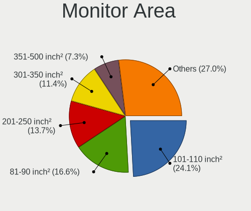

| Area in inch | Computers | Percent |
|----------------|-----------|---------|
| 101-110        | 428       | 24.15%  |
| 81-90          | 302       | 17.04%  |
| 201-250        | 256       | 14.45%  |
| 301-350        | 196       | 11.06%  |
| 351-500        | 114       | 6.43%   |
| 71-80          | 84        | 4.74%   |
| 151-200        | 71        | 4.01%   |
| 111-120        | 61        | 3.44%   |
| More than 1000 | 46        | 2.6%    |
| 121-130        | 41        | 2.31%   |
| 251-300        | 35        | 1.98%   |
| 501-1000       | 35        | 1.98%   |
| 61-70          | 29        | 1.64%   |
| Unknown        | 17        | 0.96%   |
| 141-150        | 16        | 0.9%    |
| 91-100         | 16        | 0.9%    |
| 51-60          | 13        | 0.73%   |
| 131-140        | 7         | 0.4%    |
| 1-40           | 3         | 0.17%   |
| 41-50          | 2         | 0.11%   |

Pixel Density
-------------

Pixels per inch

| Density       | Computers | Percent |
|---------------|-----------|---------|
| 121-160       | 536       | 31.16%  |
| 51-100        | 465       | 27.03%  |
| 101-120       | 329       | 19.13%  |
| 161-240       | 246       | 14.3%   |
| More than 240 | 91        | 5.29%   |
| 1-50          | 36        | 2.09%   |
| Unknown       | 17        | 0.99%   |

Multiple Monitors
-----------------

Total monitors connected

| Total | Computers | Percent |
|-------|-----------|---------|
| 1     | 1208      | 76.55%  |
| 2     | 280       | 17.74%  |
| 0     | 54        | 3.42%   |
| 3     | 31        | 1.96%   |
| 4     | 3         | 0.19%   |
| 6     | 2         | 0.13%   |

Network
-------

Net Controller Vendor
---------------------

Controller vendors

| Vendor                                 | Computers | Percent |
|----------------------------------------|-----------|---------|
| Intel                                  | 854       | 36.5%   |
| Realtek Semiconductor                  | 806       | 34.44%  |
| Qualcomm Atheros                       | 135       | 5.77%   |
| MediaTek                               | 135       | 5.77%   |
| Broadcom                               | 126       | 5.38%   |
| TP-Link                                | 26        | 1.11%   |
| ASIX Electronics                       | 26        | 1.11%   |
| Broadcom Limited                       | 25        | 1.07%   |
| Qualcomm                               | 22        | 0.94%   |
| Marvell Technology Group               | 12        | 0.51%   |
| Ralink Technology                      | 11        | 0.47%   |
| Microsoft                              | 11        | 0.47%   |
| Ralink                                 | 10        | 0.43%   |
| Lenovo                                 | 10        | 0.43%   |
| Dell                                   | 10        | 0.43%   |
| Nvidia                                 | 9         | 0.38%   |
| Sierra Wireless                        | 8         | 0.34%   |
| Samsung Electronics                    | 7         | 0.3%    |
| Qualcomm Atheros Communications        | 7         | 0.3%    |
| DisplayLink                            | 7         | 0.3%    |
| NetGear                                | 6         | 0.26%   |
| D-Link                                 | 6         | 0.26%   |
| Aquantia                               | 6         | 0.26%   |
| Xiaomi                                 | 5         | 0.21%   |
| Google                                 | 5         | 0.21%   |
| Motorola PCS                           | 4         | 0.17%   |
| Hewlett-Packard                        | 4         | 0.17%   |
| Fibocom                                | 4         | 0.17%   |
| OPPO Electronics                       | 3         | 0.13%   |
| U-Blox                                 | 2         | 0.09%   |
| Mellanox Technologies                  | 2         | 0.09%   |
| Huawei Technologies                    | 2         | 0.09%   |
| Ericsson Business Mobile Networks      | 2         | 0.09%   |
| Edimax Technology                      | 2         | 0.09%   |
| D-Link System                          | 2         | 0.09%   |
| ASUSTek Computer                       | 2         | 0.09%   |
| Unknown                                | 2         | 0.09%   |
| ZyDAS                                  | 1         | 0.04%   |
| VIA Technologies                       | 1         | 0.04%   |
| Sony Ericsson Mobile Communications AB | 1         | 0.04%   |

Net Controller Model
--------------------

Controller models

| Model                                                                  | Computers | Percent |
|------------------------------------------------------------------------|-----------|---------|
| Realtek RTL8111/8168/8211/8411 PCI Express Gigabit Ethernet Controller | 475       | 17.32%  |
| Intel Wi-Fi 6 AX200                                                    | 95        | 3.46%   |
| Realtek RTL8125 2.5GbE Controller                                      | 90        | 3.28%   |
| Intel Alder Lake-P PCH CNVi WiFi                                       | 86        | 3.14%   |
| Realtek RTL8153 Gigabit Ethernet Adapter                               | 69        | 2.52%   |
| MediaTek MT7922 802.11ax PCI Express Wireless Network Adapter          | 63        | 2.3%    |
| Intel Wireless 8265 / 8275                                             | 63        | 2.3%    |
| Intel Wi-Fi 6E(802.11ax) AX210/AX1675* 2x2 [Typhoon Peak]              | 58        | 2.12%   |
| Intel Wi-Fi 6 AX201                                                    | 57        | 2.08%   |
| Realtek RTL810xE PCI Express Fast Ethernet controller                  | 52        | 1.9%    |
| MediaTek MT7921 802.11ax PCI Express Wireless Network Adapter          | 48        | 1.75%   |
| Intel Raptor Lake PCH CNVi WiFi                                        | 41        | 1.5%    |
| Realtek RTL8822CE 802.11ac PCIe Wireless Network Adapter               | 39        | 1.42%   |
| Realtek RTL8821CE 802.11ac PCIe Wireless Network Adapter               | 39        | 1.42%   |
| Intel Ethernet Controller I225-V                                       | 35        | 1.28%   |
| Intel Wireless 7265                                                    | 33        | 1.2%    |
| Intel I211 Gigabit Network Connection                                  | 33        | 1.2%    |
| Qualcomm Atheros QCA6174 802.11ac Wireless Network Adapter             | 27        | 0.98%   |
| Intel Wireless 8260                                                    | 27        | 0.98%   |
| Intel Wireless 7260                                                    | 27        | 0.98%   |
| Realtek RTL8852BE PCIe 802.11ax Wireless Network Controller            | 26        | 0.95%   |
| Intel Ethernet Connection (4) I219-LM                                  | 26        | 0.95%   |
| Intel Comet Lake PCH CNVi WiFi                                         | 26        | 0.95%   |
| Qualcomm Atheros QCA9377 802.11ac Wireless Network Adapter             | 23        | 0.84%   |
| Intel Cannon Point-LP CNVi [Wireless-AC]                               | 23        | 0.84%   |
| ASIX AX88179 Gigabit Ethernet                                          | 22        | 0.8%    |
| Intel Comet Lake PCH-LP CNVi WiFi                                      | 21        | 0.77%   |
| Qualcomm QCNFA765 Wireless Network Adapter                             | 19        | 0.69%   |
| Intel Wireless 3165                                                    | 18        | 0.66%   |
| Intel 82579LM Gigabit Network Connection (Lewisville)                  | 18        | 0.66%   |
| Broadcom BCM43142 802.11b/g/n                                          | 17        | 0.62%   |
| Qualcomm Atheros QCA9565 / AR9565 Wireless Network Adapter             | 16        | 0.58%   |
| Broadcom BCM4360 802.11ac Dual Band Wireless Network Adapter           | 16        | 0.58%   |
| Intel Raptor Lake-S PCH CNVi WiFi                                      | 15        | 0.55%   |
| Intel Dual Band Wireless-AC 3168NGW [Stone Peak]                       | 15        | 0.55%   |
| MediaTek MT7921K (RZ608) Wi-Fi 6E 80MHz                                | 14        | 0.51%   |
| Intel Ethernet Connection (4) I219-V                                   | 14        | 0.51%   |
| Realtek Killer E2600 GbE Controller                                    | 13        | 0.47%   |
| Qualcomm Atheros AR9485 Wireless Network Adapter                       | 13        | 0.47%   |
| Intel Ethernet Connection (2) I219-V                                   | 13        | 0.47%   |

Wireless Vendor
---------------

Wireless vendors

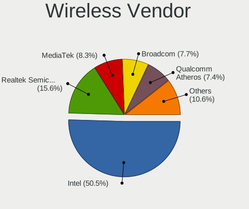

| Vendor                          | Computers | Percent |
|---------------------------------|-----------|---------|
| Intel                           | 732       | 51.4%   |
| Realtek Semiconductor           | 202       | 14.19%  |
| MediaTek                        | 135       | 9.48%   |
| Broadcom                        | 103       | 7.23%   |
| Qualcomm Atheros                | 102       | 7.16%   |
| TP-Link                         | 25        | 1.76%   |
| Broadcom Limited                | 23        | 1.62%   |
| Qualcomm                        | 21        | 1.47%   |
| Ralink Technology               | 11        | 0.77%   |
| Ralink                          | 10        | 0.7%    |
| Sierra Wireless                 | 8         | 0.56%   |
| Dell                            | 8         | 0.56%   |
| Qualcomm Atheros Communications | 7         | 0.49%   |
| Microsoft                       | 7         | 0.49%   |
| NetGear                         | 6         | 0.42%   |
| Fibocom                         | 4         | 0.28%   |
| D-Link                          | 4         | 0.28%   |
| Marvell Technology Group        | 3         | 0.21%   |
| Edimax Technology               | 2         | 0.14%   |
| ASUSTek Computer                | 2         | 0.14%   |
| ZyDAS                           | 1         | 0.07%   |
| Qualcomm Technologies           | 1         | 0.07%   |
| Mercucys                        | 1         | 0.07%   |
| Linksys                         | 1         | 0.07%   |
| Hewlett-Packard                 | 1         | 0.07%   |
| D-Link System                   | 1         | 0.07%   |
| Belkin Components               | 1         | 0.07%   |
| AVM                             | 1         | 0.07%   |
| Unknown                         | 1         | 0.07%   |

Wireless Model
--------------

Wireless models

| Model                                                                | Computers | Percent |
|----------------------------------------------------------------------|-----------|---------|
| Intel Wi-Fi 6 AX200                                                  | 95        | 6.64%   |
| Intel Alder Lake-P PCH CNVi WiFi                                     | 86        | 6.01%   |
| MediaTek MT7922 802.11ax PCI Express Wireless Network Adapter        | 63        | 4.41%   |
| Intel Wireless 8265 / 8275                                           | 63        | 4.41%   |
| Intel Wi-Fi 6E(802.11ax) AX210/AX1675* 2x2 [Typhoon Peak]            | 58        | 4.06%   |
| Intel Wi-Fi 6 AX201                                                  | 57        | 3.99%   |
| MediaTek MT7921 802.11ax PCI Express Wireless Network Adapter        | 48        | 3.36%   |
| Intel Raptor Lake PCH CNVi WiFi                                      | 41        | 2.87%   |
| Realtek RTL8822CE 802.11ac PCIe Wireless Network Adapter             | 39        | 2.73%   |
| Realtek RTL8821CE 802.11ac PCIe Wireless Network Adapter             | 39        | 2.73%   |
| Intel Wireless 7265                                                  | 33        | 2.31%   |
| Qualcomm Atheros QCA6174 802.11ac Wireless Network Adapter           | 27        | 1.89%   |
| Intel Wireless 8260                                                  | 27        | 1.89%   |
| Intel Wireless 7260                                                  | 27        | 1.89%   |
| Realtek RTL8852BE PCIe 802.11ax Wireless Network Controller          | 26        | 1.82%   |
| Intel Comet Lake PCH CNVi WiFi                                       | 26        | 1.82%   |
| Qualcomm Atheros QCA9377 802.11ac Wireless Network Adapter           | 23        | 1.61%   |
| Intel Cannon Point-LP CNVi [Wireless-AC]                             | 23        | 1.61%   |
| Intel Comet Lake PCH-LP CNVi WiFi                                    | 21        | 1.47%   |
| Qualcomm QCNFA765 Wireless Network Adapter                           | 19        | 1.33%   |
| Intel Wireless 3165                                                  | 18        | 1.26%   |
| Broadcom BCM43142 802.11b/g/n                                        | 17        | 1.19%   |
| Qualcomm Atheros QCA9565 / AR9565 Wireless Network Adapter           | 16        | 1.12%   |
| Broadcom BCM4360 802.11ac Dual Band Wireless Network Adapter         | 16        | 1.12%   |
| Intel Raptor Lake-S PCH CNVi WiFi                                    | 15        | 1.05%   |
| Intel Dual Band Wireless-AC 3168NGW [Stone Peak]                     | 15        | 1.05%   |
| MediaTek MT7921K (RZ608) Wi-Fi 6E 80MHz                              | 14        | 0.98%   |
| Qualcomm Atheros AR9485 Wireless Network Adapter                     | 13        | 0.91%   |
| Intel Cannon Lake PCH CNVi WiFi                                      | 13        | 0.91%   |
| Realtek RTL8822BE 802.11a/b/g/n/ac WiFi adapter                      | 12        | 0.84%   |
| Intel Tiger Lake PCH CNVi WiFi                                       | 12        | 0.84%   |
| Broadcom BCM4331 802.11a/b/g/n                                       | 12        | 0.84%   |
| Intel Wireless 3160                                                  | 11        | 0.77%   |
| Broadcom Limited BCM4360 802.11ac Dual Band Wireless Network Adapter | 11        | 0.77%   |
| Realtek RTL8852CE PCIe 802.11ax Wireless Network Controller          | 10        | 0.7%    |
| Intel Wi-Fi 5(802.11ac) Wireless-AC 9x6x [Thunder Peak]              | 10        | 0.7%    |
| Intel Centrino Advanced-N 6205 [Taylor Peak]                         | 10        | 0.7%    |
| Intel Alder Lake-S PCH CNVi WiFi                                     | 10        | 0.7%    |
| Broadcom BCM43602 802.11ac Wireless LAN SoC                          | 10        | 0.7%    |
| Realtek RTL8852AE 802.11ax PCIe Wireless Network Adapter             | 9         | 0.63%   |

Ethernet Vendor
---------------

Ethernet vendors

| Vendor                                 | Computers | Percent |
|----------------------------------------|-----------|---------|
| Realtek Semiconductor                  | 707       | 56.2%   |
| Intel                                  | 351       | 27.9%   |
| Broadcom                               | 48        | 3.82%   |
| Qualcomm Atheros                       | 41        | 3.26%   |
| ASIX Electronics                       | 26        | 2.07%   |
| Lenovo                                 | 10        | 0.79%   |
| Nvidia                                 | 9         | 0.72%   |
| Marvell Technology Group               | 9         | 0.72%   |
| Samsung Electronics                    | 7         | 0.56%   |
| DisplayLink                            | 7         | 0.56%   |
| Aquantia                               | 6         | 0.48%   |
| Xiaomi                                 | 5         | 0.4%    |
| Google                                 | 5         | 0.4%    |
| Motorola PCS                           | 4         | 0.32%   |
| OPPO Electronics                       | 3         | 0.24%   |
| Microsoft                              | 2         | 0.16%   |
| Mellanox Technologies                  | 2         | 0.16%   |
| Hewlett-Packard                        | 2         | 0.16%   |
| D-Link                                 | 2         | 0.16%   |
| Broadcom Limited                       | 2         | 0.16%   |
| VIA Technologies                       | 1         | 0.08%   |
| TP-Link                                | 1         | 0.08%   |
| Sony Ericsson Mobile Communications AB | 1         | 0.08%   |
| Sharp                                  | 1         | 0.08%   |
| Qualcomm                               | 1         | 0.08%   |
| JMicron Technology                     | 1         | 0.08%   |
| Huawei Technologies                    | 1         | 0.08%   |
| D-Link System                          | 1         | 0.08%   |
| Apple                                  | 1         | 0.08%   |
| American Megatrends                    | 1         | 0.08%   |

Ethernet Model
--------------

Ethernet models

| Model                                                                  | Computers | Percent |
|------------------------------------------------------------------------|-----------|---------|
| Realtek RTL8111/8168/8211/8411 PCI Express Gigabit Ethernet Controller | 475       | 36.88%  |
| Realtek RTL8125 2.5GbE Controller                                      | 90        | 6.99%   |
| Realtek RTL8153 Gigabit Ethernet Adapter                               | 69        | 5.36%   |
| Realtek RTL810xE PCI Express Fast Ethernet controller                  | 52        | 4.04%   |
| Intel Ethernet Controller I225-V                                       | 35        | 2.72%   |
| Intel I211 Gigabit Network Connection                                  | 33        | 2.56%   |
| Intel Ethernet Connection (4) I219-LM                                  | 26        | 2.02%   |
| ASIX AX88179 Gigabit Ethernet                                          | 22        | 1.71%   |
| Intel 82579LM Gigabit Network Connection (Lewisville)                  | 18        | 1.4%    |
| Intel Ethernet Connection (4) I219-V                                   | 14        | 1.09%   |
| Realtek Killer E2600 GbE Controller                                    | 13        | 1.01%   |
| Intel Ethernet Connection (2) I219-V                                   | 13        | 1.01%   |
| Intel Ethernet Connection (2) I219-LM                                  | 12        | 0.93%   |
| Intel Ethernet Connection (16) I219-V                                  | 12        | 0.93%   |
| Intel Ethernet Connection I217-LM                                      | 11        | 0.85%   |
| Intel Ethernet Connection (3) I218-LM                                  | 11        | 0.85%   |
| Broadcom NetXtreme BCM57766 Gigabit Ethernet PCIe                      | 11        | 0.85%   |
| Realtek Killer E3000 2.5GbE Controller                                 | 10        | 0.78%   |
| Intel Ethernet Connection (7) I219-V                                   | 10        | 0.78%   |
| Intel 82574L Gigabit Network Connection                                | 10        | 0.78%   |
| Intel Ethernet Connection (17) I219-V                                  | 9         | 0.7%    |
| Intel 82577LM Gigabit Network Connection                               | 9         | 0.7%    |
| Intel Ethernet Connection I219-LM                                      | 8         | 0.62%   |
| Intel Ethernet Connection (13) I219-V                                  | 8         | 0.62%   |
| Broadcom NetXtreme BCM57765 Gigabit Ethernet PCIe                      | 8         | 0.62%   |
| Qualcomm Atheros Killer E2400 Gigabit Ethernet Controller              | 7         | 0.54%   |
| Qualcomm Atheros Killer E220x Gigabit Ethernet Controller              | 7         | 0.54%   |
| Intel Ethernet Connection (6) I219-V                                   | 7         | 0.54%   |
| Intel 82579V Gigabit Network Connection                                | 7         | 0.54%   |
| Qualcomm Atheros AR8151 v2.0 Gigabit Ethernet                          | 6         | 0.47%   |
| Intel I210 Gigabit Network Connection                                  | 6         | 0.47%   |
| Intel Ethernet Connection I219-V                                       | 6         | 0.47%   |
| Intel Ethernet Connection I218-LM                                      | 6         | 0.47%   |
| Intel Ethernet Connection I217-V                                       | 6         | 0.47%   |
| Intel Ethernet Connection (6) I219-LM                                  | 6         | 0.47%   |
| Intel Ethernet Connection (5) I219-LM                                  | 6         | 0.47%   |
| Intel Ethernet Connection (2) I218-V                                   | 6         | 0.47%   |
| Samsung Galaxy series, misc. (tethering mode)                          | 5         | 0.39%   |
| Nvidia MCP79 Ethernet                                                  | 5         | 0.39%   |
| Marvell Group 88E8058 PCI-E Gigabit Ethernet Controller                | 5         | 0.39%   |

Net Controller Kind
-------------------

Ethernet, WiFi or modem

| Kind     | Computers | Percent |
|----------|-----------|---------|
| WiFi     | 1356      | 53.28%  |
| Ethernet | 1165      | 45.78%  |
| Modem    | 16        | 0.63%   |
| Unknown  | 8         | 0.31%   |

Used Controller
---------------

Currently used network controller

| Kind     | Computers | Percent |
|----------|-----------|---------|
| WiFi     | 1066      | 65.16%  |
| Ethernet | 570       | 34.84%  |

NICs
----

Total network controllers on board

| Total | Computers | Percent |
|-------|-----------|---------|
| 2     | 817       | 52.24%  |
| 1     | 676       | 43.22%  |
| 3     | 44        | 2.81%   |
| 0     | 18        | 1.15%   |
| 4     | 5         | 0.32%   |
| 5     | 2         | 0.13%   |
| 11    | 1         | 0.06%   |
| 6     | 1         | 0.06%   |

IPv6
----

IPv6 vs IPv4

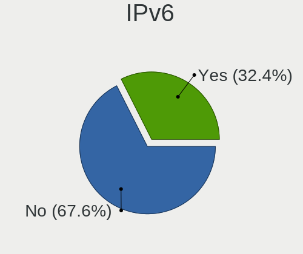

| Used | Computers | Percent |
|------|-----------|---------|
| No   | 1051      | 66.86%  |
| Yes  | 521       | 33.14%  |

Bluetooth
---------

Bluetooth Vendor
----------------

Controller vendors

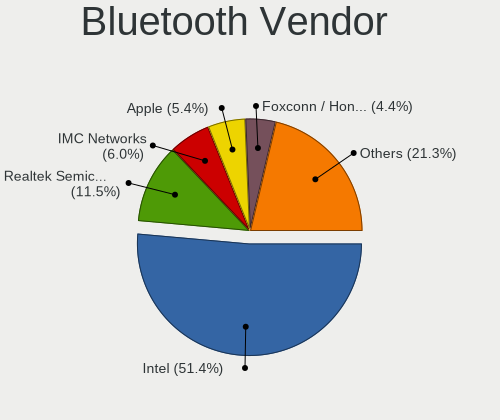

| Vendor                          | Computers | Percent |
|---------------------------------|-----------|---------|
| Intel                           | 657       | 53.41%  |
| Realtek Semiconductor           | 130       | 10.57%  |
| IMC Networks                    | 64        | 5.2%    |
| Apple                           | 59        | 4.8%    |
| Foxconn / Hon Hai               | 54        | 4.39%   |
| Qualcomm Atheros Communications | 50        | 4.07%   |
| MediaTek                        | 38        | 3.09%   |
| Broadcom                        | 35        | 2.85%   |
| Lite-On Technology              | 32        | 2.6%    |
| Cambridge Silicon Radio         | 31        | 2.52%   |
| ASUSTek Computer                | 16        | 1.3%    |
| USI                             | 13        | 1.06%   |
| TP-Link                         | 10        | 0.81%   |
| Realtek                         | 10        | 0.81%   |
| Foxconn International           | 5         | 0.41%   |
| Toshiba                         | 3         | 0.24%   |
| Ralink                          | 3         | 0.24%   |
| Marvell Semiconductor           | 3         | 0.24%   |
| Hewlett-Packard                 | 3         | 0.24%   |
| Actions                         | 3         | 0.24%   |
| Integrated System Solution      | 2         | 0.16%   |
| Dell                            | 2         | 0.16%   |
| Smart Modular Technologies      | 1         | 0.08%   |
| Ralink Technology               | 1         | 0.08%   |
| Fujitsu                         | 1         | 0.08%   |
| Edimax Technology               | 1         | 0.08%   |
| Belkin Components               | 1         | 0.08%   |
| Askey Computer                  | 1         | 0.08%   |
| Alps Electric                   | 1         | 0.08%   |

Bluetooth Model
---------------

Controller models

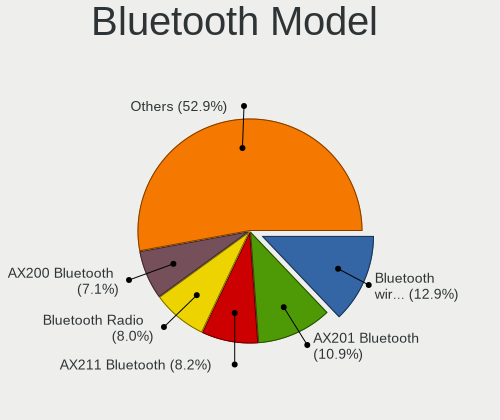

| Model                                               | Computers | Percent |
|-----------------------------------------------------|-----------|---------|
| Intel Bluetooth wireless interface                  | 167       | 13.58%  |
| Intel AX201 Bluetooth                               | 137       | 11.14%  |
| Intel Bluetooth Device                              | 118       | 9.59%   |
| Realtek Bluetooth Radio                             | 98        | 7.97%   |
| Intel AX200 Bluetooth                               | 88        | 7.15%   |
| Intel Bluetooth 9460/9560 Jefferson Peak (JfP)      | 59        | 4.8%    |
| Intel AX210 Bluetooth                               | 56        | 4.55%   |
| Foxconn / Hon Hai Wireless_Device                   | 43        | 3.5%    |
| MediaTek Wireless_Device                            | 38        | 3.09%   |
| IMC Networks Wireless_Device                        | 38        | 3.09%   |
| Cambridge Silicon Radio Bluetooth Dongle (HCI mode) | 31        | 2.52%   |
| Apple Bluetooth Host Controller                     | 26        | 2.11%   |
| Qualcomm Atheros  Bluetooth Device                  | 24        | 1.95%   |
| Realtek  Bluetooth 4.2 Adapter                      | 23        | 1.87%   |
| Apple Bluetooth USB Host Controller                 | 21        | 1.71%   |
| IMC Networks Bluetooth Radio                        | 17        | 1.38%   |
| Intel Wireless-AC 3168 Bluetooth                    | 15        | 1.22%   |
| USI Bluetooth Device                                | 13        | 1.06%   |
| Lite-On Wireless_Device                             | 13        | 1.06%   |
| TP-Link UB500 Adapter                               | 10        | 0.81%   |
| Realtek Bluetooth Radio                             | 10        | 0.81%   |
| Qualcomm Atheros QCA61x4 Bluetooth 4.0              | 10        | 0.81%   |
| Intel Wireless-AC 9260 Bluetooth Adapter            | 10        | 0.81%   |
| Qualcomm Atheros AR3012 Bluetooth 4.0               | 7         | 0.57%   |
| Lite-On Qualcomm Atheros QCA9377 Bluetooth          | 7         | 0.57%   |
| Intel Centrino Bluetooth Wireless Transceiver       | 7         | 0.57%   |
| Broadcom BCM2045B (BDC-2.1)                         | 7         | 0.57%   |
| Apple Built-in Bluetooth 2.0+EDR HCI                | 7         | 0.57%   |
| Lite-On Bluetooth Device                            | 6         | 0.49%   |
| IMC Networks Bluetooth Device                       | 6         | 0.49%   |
| Foxconn / Hon Hai Bluetooth Device                  | 6         | 0.49%   |
| ASUS ASUS USB-BT500                                 | 6         | 0.49%   |
| Foxconn International BCM43142A0 Bluetooth module   | 5         | 0.41%   |
| Broadcom BCM43142 Bluetooth 4.0                     | 5         | 0.41%   |
| Broadcom BCM20702A0 Bluetooth 4.0                   | 5         | 0.41%   |
| Realtek RTL8723B Bluetooth                          | 4         | 0.33%   |
| Qualcomm Atheros AR9462 Bluetooth                   | 4         | 0.33%   |
| Qualcomm Atheros AR3011 Bluetooth                   | 4         | 0.33%   |
| Broadcom HP Portable Bumble Bee                     | 4         | 0.33%   |
| Realtek RTL8822BE Bluetooth 4.2 Adapter             | 3         | 0.24%   |

Sound
-----

Sound Vendor
------------

Sound card vendors

| Vendor                               | Computers | Percent |
|--------------------------------------|-----------|---------|
| Intel                                | 1040      | 46.16%  |
| AMD                                  | 549       | 24.37%  |
| Nvidia                               | 354       | 15.71%  |
| C-Media Electronics                  | 39        | 1.73%   |
| Logitech                             | 18        | 0.8%    |
| ASUSTek Computer                     | 16        | 0.71%   |
| JMTek                                | 14        | 0.62%   |
| GN Netcom                            | 14        | 0.62%   |
| SteelSeries ApS                      | 13        | 0.58%   |
| Realtek Semiconductor                | 11        | 0.49%   |
| Lenovo                               | 11        | 0.49%   |
| Generalplus Technology               | 11        | 0.49%   |
| Texas Instruments                    | 10        | 0.44%   |
| Micro Star International             | 9         | 0.4%    |
| Hewlett-Packard                      | 9         | 0.4%    |
| Creative Labs                        | 9         | 0.4%    |
| Kingston Technology                  | 7         | 0.31%   |
| Focusrite-Novation                   | 7         | 0.31%   |
| Thesycon Systemsoftware & Consulting | 6         | 0.27%   |
| Sony                                 | 6         | 0.27%   |
| Razer USA                            | 6         | 0.27%   |
| Apple                                | 6         | 0.27%   |
| RODE Microphones                     | 5         | 0.22%   |
| Samson Technologies                  | 4         | 0.18%   |
| Plantronics                          | 4         | 0.18%   |
| Tenx Technology                      | 3         | 0.13%   |
| Nordic Semiconductor ASA             | 3         | 0.13%   |
| FIFINE Microphones                   | 3         | 0.13%   |
| Corsair                              | 3         | 0.13%   |
| ASRock                               | 3         | 0.13%   |
| Panasonic (Matsushita)               | 2         | 0.09%   |
| Mark of the Unicorn                  | 2         | 0.09%   |
| M-Audio                              | 2         | 0.09%   |
| KTMicro                              | 2         | 0.09%   |
| JBL                                  | 2         | 0.09%   |
| FiiO Electronics Technology          | 2         | 0.09%   |
| Elite Silicon                        | 2         | 0.09%   |
| Dell                                 | 2         | 0.09%   |
| Creative Technology                  | 2         | 0.09%   |
| BEHRINGER International              | 2         | 0.09%   |

Sound Model
-----------

Sound card models

| Model                                                                      | Computers | Percent |
|----------------------------------------------------------------------------|-----------|---------|
| AMD Family 17h/19h HD Audio Controller                                     | 298       | 10.73%  |
| Intel Sunrise Point-LP HD Audio                                            | 143       | 5.15%   |
| AMD Renoir Radeon High Definition Audio Controller                         | 142       | 5.11%   |
| AMD Rembrandt Radeon High Definition Audio Controller                      | 115       | 4.14%   |
| Intel Alder Lake PCH-P High Definition Audio Controller                    | 101       | 3.64%   |
| AMD Starship/Matisse HD Audio Controller                                   | 95        | 3.42%   |
| Intel Tiger Lake-LP Smart Sound Technology Audio Controller                | 78        | 2.81%   |
| Intel 7 Series/C216 Chipset Family High Definition Audio Controller        | 65        | 2.34%   |
| AMD Navi 21/23 HDMI/DP Audio Controller                                    | 55        | 1.98%   |
| Intel 8 Series/C220 Series Chipset High Definition Audio Controller        | 54        | 1.94%   |
| Nvidia Audio device                                                        | 52        | 1.87%   |
| Intel 6 Series/C200 Series Chipset Family High Definition Audio Controller | 49        | 1.76%   |
| Intel Raptor Lake-P/U/H cAVS                                               | 47        | 1.69%   |
| Intel Cannon Lake PCH cAVS                                                 | 47        | 1.69%   |
| Nvidia GA106 High Definition Audio Controller                              | 40        | 1.44%   |
| Intel 100 Series/C230 Series Chipset Family HD Audio Controller            | 36        | 1.3%    |
| Intel Xeon E3-1200 v3/4th Gen Core Processor HD Audio Controller           | 35        | 1.26%   |
| Intel 5 Series/3400 Series Chipset High Definition Audio                   | 35        | 1.26%   |
| Intel Cannon Point-LP High Definition Audio Controller                     | 34        | 1.22%   |
| Intel Wildcat Point-LP High Definition Audio Controller                    | 32        | 1.15%   |
| Intel Broadwell-U Audio Controller                                         | 32        | 1.15%   |
| AMD Raven/Raven2/Fenghuang HDMI/DP Audio Controller                        | 32        | 1.15%   |
| Intel Haswell-ULT HD Audio Controller                                      | 31        | 1.12%   |
| Intel Comet Lake PCH cAVS                                                  | 31        | 1.12%   |
| AMD Navi 31 HDMI/DP Audio                                                  | 31        | 1.12%   |
| Intel 8 Series HD Audio Controller                                         | 30        | 1.08%   |
| AMD SBx00 Azalia (Intel HDA)                                               | 28        | 1.01%   |
| AMD Ellesmere HDMI Audio [Radeon RX 470/480 / 570/580/590]                 | 28        | 1.01%   |
| Intel Alder Lake-S HD Audio Controller                                     | 26        | 0.94%   |
| Nvidia TU107 GeForce GTX 1650 High Definition Audio Controller             | 24        | 0.86%   |
| Intel Comet Lake PCH-LP cAVS                                               | 24        | 0.86%   |
| AMD Family 17h (Models 00h-0fh) HD Audio Controller                        | 21        | 0.76%   |
| Nvidia GA104 High Definition Audio Controller                              | 20        | 0.72%   |
| Intel Ice Lake-LP Smart Sound Technology Audio Controller                  | 20        | 0.72%   |
| Nvidia TU106 High Definition Audio Controller                              | 19        | 0.68%   |
| Nvidia GF108 High Definition Audio Controller                              | 19        | 0.68%   |
| Intel Tiger Lake-H HD Audio Controller                                     | 19        | 0.68%   |
| Intel Celeron/Pentium Silver Processor High Definition Audio               | 19        | 0.68%   |
| Intel 200 Series PCH HD Audio                                              | 19        | 0.68%   |
| Nvidia TU116 High Definition Audio Controller                              | 18        | 0.65%   |

Memory
------

Memory Vendor
-------------

Memory module vendors

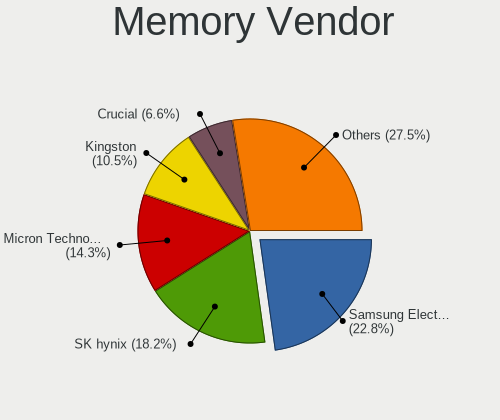

| Vendor                               | Computers | Percent |
|--------------------------------------|-----------|---------|
| Samsung Electronics                  | 147       | 22.79%  |
| SK hynix                             | 119       | 18.45%  |
| Micron Technology                    | 97        | 15.04%  |
| Kingston                             | 59        | 9.15%   |
| Crucial                              | 44        | 6.82%   |
| Corsair                              | 34        | 5.27%   |
| Unknown                              | 32        | 4.96%   |
| G.Skill                              | 30        | 4.65%   |
| Ramaxel Technology                   | 8         | 1.24%   |
| A-DATA Technology                    | 8         | 1.24%   |
| Unknown                              | 8         | 1.24%   |
| Team                                 | 7         | 1.09%   |
| Nanya Technology                     | 7         | 1.09%   |
| Patriot                              | 5         | 0.78%   |
| Unknown (ABCD)                       | 4         | 0.62%   |
| Lexar                                | 3         | 0.47%   |
| Elpida                               | 3         | 0.47%   |
| Patriot Memory                       | 2         | 0.31%   |
| Kllisre                              | 2         | 0.31%   |
| ChangXin Memory                      | 2         | 0.31%   |
| Apacer                               | 2         | 0.31%   |
| Wodposit                             | 1         | 0.16%   |
| V-GeN                                | 1         | 0.16%   |
| Unknown (8A5D)                       | 1         | 0.16%   |
| Unknown (130B)                       | 1         | 0.16%   |
| Unknown (0x8A02)                     | 1         | 0.16%   |
| Unknown (09D5)                       | 1         | 0.16%   |
| Teikon                               | 1         | 0.16%   |
| TakeMS                               | 1         | 0.16%   |
| Smart                                | 1         | 0.16%   |
| Silicon Power                        | 1         | 0.16%   |
| Shenzhen Longsys                     | 1         | 0.16%   |
| PNY                                  | 1         | 0.16%   |
| Neo Forza                            | 1         | 0.16%   |
| Kingmax                              | 1         | 0.16%   |
| King Tiger                           | 1         | 0.16%   |
| Hikvision                            | 1         | 0.16%   |
| CUSO                                 | 1         | 0.16%   |
| Chun Well Technology Holding Limited | 1         | 0.16%   |
| Chun Well                            | 1         | 0.16%   |

Memory Model
------------

Memory module models

| Model                                                            | Computers | Percent |
|------------------------------------------------------------------|-----------|---------|
| Samsung RAM M471A1G44BB0-CWE 8GB SODIMM DDR4 3200MT/s            | 12        | 1.75%   |
| Samsung RAM M471A1K43EB1-CWE 8GB SODIMM DDR4 3200MT/s            | 10        | 1.46%   |
| Unknown                                                          | 8         | 1.17%   |
| Samsung RAM M471A5244CB0-CWE 4GB SODIMM DDR4 3200MT/s            | 7         | 1.02%   |
| SK hynix RAM HMAA1GS6CJR6N-XN 8GB SODIMM DDR4 3200MT/s           | 6         | 0.88%   |
| SK hynix RAM HMA81GS6AFR8N-UH 8GB SODIMM DDR4 2667MT/s           | 6         | 0.88%   |
| Samsung RAM M471A1G44AB0-CWE 8GB Row Of Chips DDR4 3200MT/s      | 6         | 0.88%   |
| SK hynix RAM HMT41GS6BFR8A-PB 8GB SODIMM DDR3 1600MT/s           | 5         | 0.73%   |
| SK hynix RAM H9JCNNNCP3MLYR-N6E 2GB Row Of Chips LPDDR5 6400MT/s | 5         | 0.73%   |
| Samsung RAM M471A5244CB0-CWE 4GB Row Of Chips DDR4 3200MT/s      | 5         | 0.73%   |
| SK hynix RAM Module 4GB SODIMM DDR3 1600MT/s                     | 4         | 0.58%   |
| SK hynix RAM HMA81GS6DJR8N-XN 8GB SODIMM DDR4 3200MT/s           | 4         | 0.58%   |
| Samsung RAM M471B5273DH0-CH9 4GB SODIMM DDR3 1334MT/s            | 4         | 0.58%   |
| Samsung RAM M471A2K43EB1-CWE 16GB SODIMM DDR4 3200MT/s           | 4         | 0.58%   |
| Samsung RAM M471A2K43DB1-CWE 16GB SODIMM DDR4 3200MT/s           | 4         | 0.58%   |
| Samsung RAM M471A1K43DB1-CWE 8GB SODIMM DDR4 3200MT/s            | 4         | 0.58%   |
| Samsung RAM M471A1K43CB1-CRC 8GB SODIMM DDR4 2667MT/s            | 4         | 0.58%   |
| Micron RAM MT62F2G32D4DS-026 WT 8GB SODIMM LPDDR5 7500MT/s       | 4         | 0.58%   |
| Unknown RAM Module 4GB DIMM 1333MT/s                             | 3         | 0.44%   |
| Unknown RAM Module 2GB DIMM DDR2 800MT/s                         | 3         | 0.44%   |
| Team RAM TEAMGROUP-UD4-3200 16GB DIMM DDR4 3733MT/s              | 3         | 0.44%   |
| SK hynix RAM HMAA2GS6CJR8N-XN 16GB SODIMM DDR4 3200MT/s          | 3         | 0.44%   |
| SK hynix RAM HMA851S6DJR6N-XN 4GB SODIMM DDR4 3200MT/s           | 3         | 0.44%   |
| Samsung RAM M471B1G73EB0-YK0 8GB SODIMM DDR3 1600MT/s            | 3         | 0.44%   |
| Samsung RAM M471A5244CB0-CTD 4096MB SODIMM DDR4 3266MT/s         | 3         | 0.44%   |
| Samsung RAM M471A2K43CB1-CRC 16GB SODIMM DDR4 2667MT/s           | 3         | 0.44%   |
| Samsung RAM M471A2G44AM0-CWE 16GB SODIMM DDR4 3200MT/s           | 3         | 0.44%   |
| Samsung RAM M471A1G44BB0-CWE 8192MB Row Of Chips DDR4 3200MT/s   | 3         | 0.44%   |
| Samsung RAM K3LKCKC0BM-MGCP 8GB SODIMM LPDDR5 6400MT/s           | 3         | 0.44%   |
| Samsung RAM K3LKBKB@BM-MGCP 2GB Row Of Chips LPDDR5 6400MT/s     | 3         | 0.44%   |
| Micron RAM MTC4C10163S1SC48BA1 8GB SODIMM DDR5 4800MT/s          | 3         | 0.44%   |
| Micron RAM MT62F4G32D8DV-026 WT 16GB SODIMM LPDDR5 6400MT/s      | 3         | 0.44%   |
| Micron RAM MT62F1G32D4DR-031 WT 4GB SODIMM LPDDR5 6400MT/s       | 3         | 0.44%   |
| Micron RAM 8KTF51264HZ-1G6E1 4096MB SODIMM DDR3 1600MT/s         | 3         | 0.44%   |
| Micron RAM 8ATF1G64HZ-3G2R1 8GB SODIMM DDR4 3200MT/s             | 3         | 0.44%   |
| Micron RAM 4ATF1G64HZ-3G2F1 8GB SODIMM DDR4 3200MT/s             | 3         | 0.44%   |
| Micron RAM 4ATF1G64HZ-3G2E2 8GB SODIMM DDR4 3200MT/s             | 3         | 0.44%   |
| Unknown RAM Module 8GB SODIMM DDR3 1600MT/s                      | 2         | 0.29%   |
| Unknown RAM Module 8GB DIMM 1333MT/s                             | 2         | 0.29%   |
| Unknown RAM Module 4GB SODIMM DDR3 1600MT/s                      | 2         | 0.29%   |

Memory Kind
-----------

Memory module kinds

| Kind    | Computers | Percent |
|---------|-----------|---------|
| DDR4    | 293       | 51.4%   |
| DDR3    | 93        | 16.32%  |
| LPDDR5  | 52        | 9.12%   |
| DDR5    | 52        | 9.12%   |
| LPDDR4  | 33        | 5.79%   |
| LPDDR3  | 22        | 3.86%   |
| DDR2    | 10        | 1.75%   |
| Unknown | 10        | 1.75%   |
| SDRAM   | 2         | 0.35%   |
| DDR     | 2         | 0.35%   |
| DRAM    | 1         | 0.18%   |

Memory Form Factor
------------------

Physical design of the memory module

| Name         | Computers | Percent |
|--------------|-----------|---------|
| SODIMM       | 328       | 56.55%  |
| DIMM         | 154       | 26.55%  |
| Row Of Chips | 92        | 15.86%  |
| Chip         | 4         | 0.69%   |
| Unknown      | 2         | 0.34%   |

Memory Size
-----------

Memory module size

| Size  | Computers | Percent |
|-------|-----------|---------|
| 8192  | 256       | 41.83%  |
| 16384 | 134       | 21.9%   |
| 4096  | 130       | 21.24%  |
| 32768 | 48        | 7.84%   |
| 2048  | 38        | 6.21%   |
| 1024  | 3         | 0.49%   |
| 49152 | 2         | 0.33%   |
| 65536 | 1         | 0.16%   |

Memory Speed
------------

Memory module speed

| Speed   | Computers | Percent |
|---------|-----------|---------|
| 3200    | 143       | 23.71%  |
| 1600    | 72        | 11.94%  |
| 2667    | 66        | 10.95%  |
| 6400    | 48        | 7.96%   |
| 2133    | 35        | 5.8%    |
| 2400    | 34        | 5.64%   |
| 4800    | 26        | 4.31%   |
| 1333    | 20        | 3.32%   |
| 5600    | 17        | 2.82%   |
| 3600    | 16        | 2.65%   |
| 4267    | 14        | 2.32%   |
| 3733    | 13        | 2.16%   |
| 1334    | 12        | 1.99%   |
| 4266    | 10        | 1.66%   |
| 1867    | 7         | 1.16%   |
| 800     | 7         | 1.16%   |
| 667     | 5         | 0.83%   |
| 7500    | 4         | 0.66%   |
| 6000    | 4         | 0.66%   |
| 3800    | 4         | 0.66%   |
| 3000    | 4         | 0.66%   |
| 3400    | 3         | 0.5%    |
| 3266    | 3         | 0.5%    |
| 1066    | 3         | 0.5%    |
| Unknown | 3         | 0.5%    |
| 7467    | 2         | 0.33%   |
| 5200    | 2         | 0.33%   |
| 4000    | 2         | 0.33%   |
| 3866    | 2         | 0.33%   |
| 2666    | 2         | 0.33%   |
| 1067    | 2         | 0.33%   |
| 400     | 2         | 0.33%   |
| 7000    | 1         | 0.17%   |
| 5800    | 1         | 0.17%   |
| 4199    | 1         | 0.17%   |
| 3933    | 1         | 0.17%   |
| 3534    | 1         | 0.17%   |
| 3533    | 1         | 0.17%   |
| 3467    | 1         | 0.17%   |
| 3466    | 1         | 0.17%   |

Printers & scanners
-------------------

Printer Vendor
--------------

Printer device vendors

| Vendor             | Computers | Percent |
|--------------------|-----------|---------|
| Hewlett-Packard    | 9         | 36%     |
| Canon              | 5         | 20%     |
| Brother Industries | 5         | 20%     |
| Seiko Epson        | 2         | 8%      |
| Dymo-CoStar        | 2         | 8%      |
| SAT                | 1         | 4%      |
| Minolta            | 1         | 4%      |

Printer Model
-------------

Printer device models

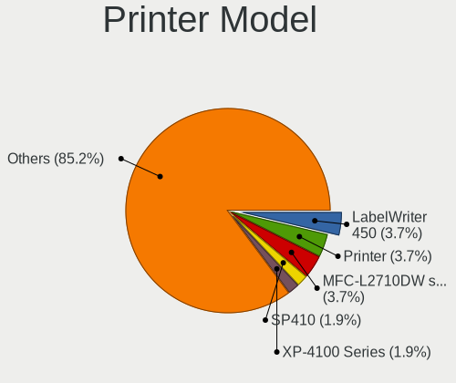

| Model                       | Computers | Percent |
|-----------------------------|-----------|---------|
| Dymo-CoStar LabelWriter 450 | 2         | 8%      |
| Brother MFC-L2710DW series  | 2         | 8%      |
| Seiko Epson L300 Series     | 1         | 4%      |
| Seiko Epson AL-M310DN       | 1         | 4%      |
| SAT SAT38TUSE               | 1         | 4%      |
| Minolta PagePro 1300W       | 1         | 4%      |
| HP Smart Tank 7300 series   | 1         | 4%      |
| HP Smart Tank 510 series    | 1         | 4%      |
| HP LaserJet P1006           | 1         | 4%      |
| HP LaserJet 2200            | 1         | 4%      |
| HP ENVY Photo 7800 series   | 1         | 4%      |
| HP ENVY Photo 6200 series   | 1         | 4%      |
| HP ENVY 5000 series         | 1         | 4%      |
| HP DeskJet 3940             | 1         | 4%      |
| HP DeskJet 2700 series      | 1         | 4%      |
| Canon TS5300 series         | 1         | 4%      |
| Canon TS3100 series         | 1         | 4%      |
| Canon TR4700 series         | 1         | 4%      |
| Canon PIXMA MX470 Series    | 1         | 4%      |
| Canon PIXMA MG3500 Series   | 1         | 4%      |
| Brother MFC-L2740DW         | 1         | 4%      |
| Brother HL-3040CN series    | 1         | 4%      |
| Brother HL-2240D series     | 1         | 4%      |

Scanner Vendor
--------------

Scanner device vendors

| Vendor             | Computers | Percent |
|--------------------|-----------|---------|
| Seiko Epson        | 2         | 40%     |
| Canon              | 2         | 40%     |
| Ultima Electronics | 1         | 20%     |

Scanner Model
-------------

Scanner device models

| Model                                       | Computers | Percent |
|---------------------------------------------|-----------|---------|
| Ultima Artec E+ Pro                         | 1         | 20%     |
| Seiko Epson GT-X820 [Perfection V600 Photo] | 1         | 20%     |
| Seiko Epson GT-X770 [Perfection V500]       | 1         | 20%     |
| Canon CanoScan N670U/N676U/LiDE 20          | 1         | 20%     |
| Canon CanoScan LiDE 220                     | 1         | 20%     |

Camera
------

Camera Vendor
-------------

Camera device vendors

| Vendor                                 | Computers | Percent |
|----------------------------------------|-----------|---------|
| Chicony Electronics                    | 181       | 17.32%  |
| IMC Networks                           | 114       | 10.91%  |
| Microdia                               | 94        | 9%      |
| Bison Electronics                      | 76        | 7.27%   |
| Realtek Semiconductor                  | 69        | 6.6%    |
| Quanta                                 | 68        | 6.51%   |
| Logitech                               | 55        | 5.26%   |
| Luxvisions Innotech Limited            | 49        | 4.69%   |
| Sunplus Innovation Technology          | 42        | 4.02%   |
| Apple                                  | 42        | 4.02%   |
| Sonix Technology                       | 31        | 2.97%   |
| Acer                                   | 29        | 2.78%   |
| Cheng Uei Precision Industry (Foxlink) | 27        | 2.58%   |
| Syntek                                 | 26        | 2.49%   |
| Lite-On Technology                     | 16        | 1.53%   |
| Suyin                                  | 9         | 0.86%   |
| Silicon Motion                         | 9         | 0.86%   |
| Microsoft                              | 8         | 0.77%   |
| Alcor Micro                            | 7         | 0.67%   |
| SunplusIT                              | 6         | 0.57%   |
| ShineTech                              | 6         | 0.57%   |
| Samsung Electronics                    | 5         | 0.48%   |
| Razer USA                              | 4         | 0.38%   |
| ARC International                      | 4         | 0.38%   |
| Z-Star Microelectronics                | 3         | 0.29%   |
| USB Camera                             | 3         | 0.29%   |
| Shenzhen Kingcome Optoelectronic       | 3         | 0.29%   |
| Ricoh                                  | 3         | 0.29%   |
| Generalplus Technology                 | 3         | 0.29%   |
| Alpha Imaging Technology               | 3         | 0.29%   |
| Unknown (3730304233333731323245)       | 2         | 0.19%   |
| Trust                                  | 2         | 0.19%   |
| Sunplus Technology                     | 2         | 0.19%   |
| Primax Electronics                     | 2         | 0.19%   |
| Owon                                   | 2         | 0.19%   |
| MacroSilicon                           | 2         | 0.19%   |
| Lenovo                                 | 2         | 0.19%   |
| KYE Systems (Mouse Systems)            | 2         | 0.19%   |
| Creative Technology                    | 2         | 0.19%   |
| AVerMedia Technologies                 | 2         | 0.19%   |

Camera Model
------------

Camera device models

| Model                                               | Computers | Percent |
|-----------------------------------------------------|-----------|---------|
| Chicony Integrated Camera                           | 69        | 6.54%   |
| IMC Networks USB2.0 HD UVC WebCam                   | 43        | 4.08%   |
| Microdia Integrated_Webcam_HD                       | 41        | 3.89%   |
| Realtek Integrated_Webcam_HD                        | 36        | 3.41%   |
| IMC Networks Integrated Camera                      | 35        | 3.32%   |
| Bison Integrated Camera                             | 25        | 2.37%   |
| Syntek Integrated Camera                            | 20        | 1.9%    |
| Sonix USB2.0 HD UVC WebCam                          | 19        | 1.8%    |
| Sunplus Integrated_Webcam_HD                        | 16        | 1.52%   |
| Chicony HD WebCam                                   | 14        | 1.33%   |
| Apple iPhone 5/5C/5S/6/SE/7/8/X/XR                  | 14        | 1.33%   |
| Quanta HD User Facing                               | 12        | 1.14%   |
| Apple FaceTime HD Camera (Built-in)                 | 12        | 1.14%   |
| Acer Integrated Camera                              | 12        | 1.14%   |
| Luxvisions Innotech Limited Integrated Camera       | 10        | 0.95%   |
| Luxvisions Innotech Limited HP TrueVision HD Camera | 10        | 0.95%   |
| IMC Networks USB2.0 VGA UVC WebCam                  | 10        | 0.95%   |
| Sonix USB2.0 FHD UVC WebCam                         | 9         | 0.85%   |
| Microdia Integrated_Webcam_FHD                      | 9         | 0.85%   |
| Luxvisions Innotech Limited Integrated RGB Camera   | 9         | 0.85%   |
| Chicony HP TrueVision HD Camera                     | 9         | 0.85%   |
| Apple Built-in iSight                               | 9         | 0.85%   |
| Quanta ACER HD User Facing                          | 8         | 0.76%   |
| Lite-On Integrated Camera                           | 8         | 0.76%   |
| Acer SunplusIT Integrated Camera                    | 8         | 0.76%   |
| Microdia USB 2.0 Camera                             | 7         | 0.66%   |
| Logitech Webcam C270                                | 7         | 0.66%   |
| Logitech HD Pro Webcam C920                         | 7         | 0.66%   |
| Chicony HD User Facing                              | 7         | 0.66%   |
| Bison HD Webcam                                     | 7         | 0.66%   |
| Apple FaceTime HD Camera                            | 7         | 0.66%   |
| Acer Integrated RGB Camera                          | 7         | 0.66%   |
| Quanta ov9734_techfront_camera                      | 6         | 0.57%   |
| Quanta HP Wide Vision HD Camera                     | 6         | 0.57%   |
| Microdia Webcam Vitade AF                           | 6         | 0.57%   |
| Luxvisions Innotech Limited HP HD Camera            | 6         | 0.57%   |
| Chicony FJ Camera                                   | 6         | 0.57%   |
| Syntek Lenovo EasyCamera                            | 5         | 0.47%   |
| Sunplus FHD Camera Microphone                       | 5         | 0.47%   |
| Samsung Galaxy series, misc. (MTP mode)             | 5         | 0.47%   |

Security
--------

Fingerprint Vendor
------------------

Fingerprint sensor vendors

| Vendor                             | Computers | Percent |
|------------------------------------|-----------|---------|
| Synaptics                          | 70        | 36.65%  |
| Validity Sensors                   | 45        | 23.56%  |
| Shenzhen Goodix Technology         | 34        | 17.8%   |
| Elan Microelectronics              | 16        | 8.38%   |
| Upek                               | 9         | 4.71%   |
| LighTuning Technology              | 9         | 4.71%   |
| Realtek USB2.0 Finger Print Bridge | 5         | 2.62%   |
| Samsung Electronics                | 1         | 0.52%   |
| FocalTech                          | 1         | 0.52%   |
| Dell                               | 1         | 0.52%   |

Fingerprint Model
-----------------

Fingerprint sensor models

| Model                                                           | Computers | Percent |
|-----------------------------------------------------------------|-----------|---------|
| Shenzhen Goodix  Fingerprint Device                             | 19        | 9.95%   |
| Synaptics Prometheus MIS Touch Fingerprint Reader               | 17        | 8.9%    |
| Synaptics Metallica MIS Touch Fingerprint Reader                | 12        | 6.28%   |
| Shenzhen Goodix Fingerprint Reader                              | 12        | 6.28%   |
| Validity Sensors VFS495 Fingerprint Reader                      | 11        | 5.76%   |
| Elan ELAN:Fingerprint                                           | 9         | 4.71%   |
| Validity Sensors Synaptics WBDI                                 | 8         | 4.19%   |
| Synaptics UWP WBDI Device                                       | 8         | 4.19%   |
| Validity Sensors VFS 5011 fingerprint sensor                    | 7         | 3.66%   |
| Upek Biometric Touchchip/Touchstrip Fingerprint Sensor          | 7         | 3.66%   |
| Synaptics UWP WBDI                                              | 7         | 3.66%   |
| Elan ELAN:ARM-M4                                                | 7         | 3.66%   |
| Synaptics WBDI                                                  | 6         | 3.14%   |
| Synaptics WBDI Fingerprint Reader USB 086                       | 5         | 2.62%   |
| Synaptics  FS7604 Touch Fingerprint Sensor with PurePrint       | 5         | 2.62%   |
| Realtek USB2.0 Finger Print Bridge FocalTech Fingerprint Device | 5         | 2.62%   |
| Validity Sensors VFS5011 Fingerprint Reader                     | 4         | 2.09%   |
| Validity Sensors VFS7552 Touch Fingerprint Sensor               | 3         | 1.57%   |
| Validity Sensors VFS491                                         | 3         | 1.57%   |
| Validity Sensors VFS471 Fingerprint Reader                      | 3         | 1.57%   |
| Synaptics Metallica MOH Touch Fingerprint Reader                | 3         | 1.57%   |
| Synaptics FS7604 Touch Fingerprint Sensor with PurePrint        | 3         | 1.57%   |
| Synaptics Fingerprint reader [HP G6]                            | 3         | 1.57%   |
| Shenzhen Goodix FingerPrint                                     | 3         | 1.57%   |
| LighTuning Fingerprint Sensor                                   | 3         | 1.57%   |
| LighTuning ES603 Swipe Fingerprint Sensor                       | 3         | 1.57%   |
| LighTuning EgisTec Touch Fingerprint Sensor                     | 3         | 1.57%   |
| Validity Sensors VFS7500 Touch Fingerprint Sensor               | 2         | 1.05%   |
| Validity Sensors VFS300 Fingerprint Reader                      | 2         | 1.05%   |
| Validity Sensors Synaptics VFS7552 Touch Fingerprint Sensor     | 1         | 0.52%   |
| Validity Sensors Fingerprint scanner                            | 1         | 0.52%   |
| Upek TCS5B Fingerprint sensor                                   | 1         | 0.52%   |
| Upek TCS1C EIM/STM32 Fingerprint sensor                         | 1         | 0.52%   |
| Synaptics  WBDI                                                 | 1         | 0.52%   |
| Samsung Fingerprint Sensor Device - 730B                        | 1         | 0.52%   |
| FocalTech Fingerprint Device                                    | 1         | 0.52%   |
| Dell MS819 Wired Mouse With Fingerprint Reader                  | 1         | 0.52%   |

Chipcard Vendor
---------------

Chipcard module vendors

| Vendor                    | Computers | Percent |
|---------------------------|-----------|---------|
| Broadcom                  | 38        | 44.71%  |
| Alcor Micro               | 33        | 38.82%  |
| Lenovo                    | 3         | 3.53%   |
| Upek                      | 2         | 2.35%   |
| OmniKey                   | 2         | 2.35%   |
| Yubico.com                | 1         | 1.18%   |
| Reiner SCT Kartensysteme  | 1         | 1.18%   |
| NXP Semiconductors        | 1         | 1.18%   |
| Gemalto (was Gemplus)     | 1         | 1.18%   |
| Aladdin Knowledge Systems | 1         | 1.18%   |
| Aktiv                     | 1         | 1.18%   |
| Advanced Card Systems     | 1         | 1.18%   |

Chipcard Model
--------------

Chipcard module models

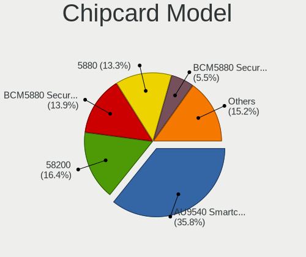

| Model                                                                        | Computers | Percent |
|------------------------------------------------------------------------------|-----------|---------|
| Alcor Micro AU9540 Smartcard Reader                                          | 33        | 38.82%  |
| Broadcom 58200                                                               | 14        | 16.47%  |
| Broadcom 5880                                                                | 12        | 14.12%  |
| Broadcom BCM5880 Secure Applications Processor                               | 8         | 9.41%   |
| Broadcom BCM5880 Secure Applications Processor with fingerprint swipe sensor | 4         | 4.71%   |
| Lenovo Integrated Smart Card Reader                                          | 3         | 3.53%   |
| Upek TouchChip Fingerprint Coprocessor (WBF advanced mode)                   | 2         | 2.35%   |
| Yubico.com Yubikey 4/5 U2F+CCID                                              | 1         | 1.18%   |
| Reiner SCT Kartensysteme cyberJack RFID basis contactless smartcard reader   | 1         | 1.18%   |
| OmniKey CardMan Smart@Link                                                   | 1         | 1.18%   |
| OmniKey CardMan 3021 / 3121                                                  | 1         | 1.18%   |
| NXP Semiconductors PR533                                                     | 1         | 1.18%   |
| Gemalto (was Gemplus) GemPC Twin SmartCard Reader                            | 1         | 1.18%   |
| Aladdin Knowledge Systems Token JC                                           | 1         | 1.18%   |
| Aktiv Rutoken lite                                                           | 1         | 1.18%   |
| Advanced Card Systems ACR1281 1S Dual Reader                                 | 1         | 1.18%   |

Unsupported
-----------

Unsupported Devices
-------------------

Total unsupported devices on board

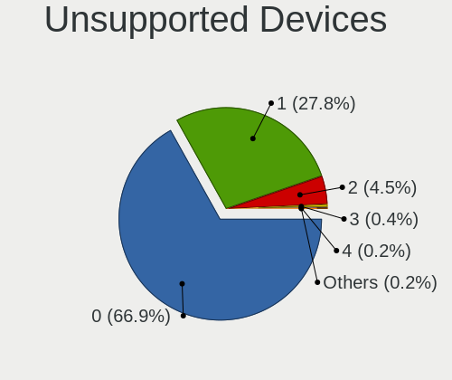

| Total | Computers | Percent |
|-------|-----------|---------|
| 0     | 1060      | 67.69%  |
| 1     | 435       | 27.78%  |
| 2     | 61        | 3.9%    |
| 3     | 5         | 0.32%   |
| 4     | 3         | 0.19%   |
| 7     | 1         | 0.06%   |
| 6     | 1         | 0.06%   |

Unsupported Device Types
------------------------

Types of unsupported devices

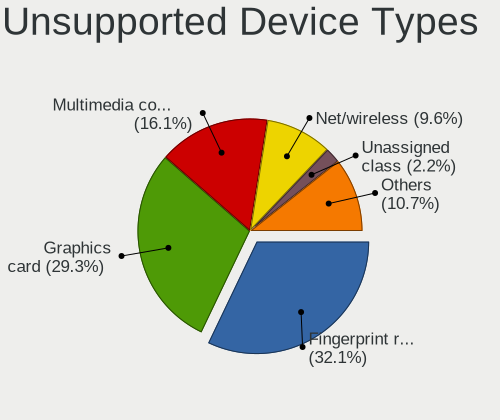

| Type                     | Computers | Percent |
|--------------------------|-----------|---------|
| Fingerprint reader       | 186       | 32.29%  |
| Graphics card            | 166       | 28.82%  |
| Multimedia controller    | 94        | 16.32%  |
| Net/wireless             | 52        | 9.03%   |
| Sound                    | 14        | 2.43%   |
| Camera                   | 13        | 2.26%   |
| Chipcard                 | 12        | 2.08%   |
| Bluetooth                | 9         | 1.56%   |
| Unassigned class         | 8         | 1.39%   |
| Net/ethernet             | 6         | 1.04%   |
| Network                  | 4         | 0.69%   |
| Card reader              | 3         | 0.52%   |
| Storage/raid             | 2         | 0.35%   |
| Storage                  | 2         | 0.35%   |
| Communication controller | 2         | 0.35%   |
| Storage/nvme             | 1         | 0.17%   |
| Storage/ide              | 1         | 0.17%   |
| Modem                    | 1         | 0.17%   |

