Fedora 39 - Tested Hardware & Statistics (Desktops)
---------------------------------------------------

A project to collect tested hardware configurations for Fedora 39.

Anyone can contribute to this report by the [hw-probe](https://github.com/linuxhw/hw-probe) tool:

    sudo -E hw-probe -all -upload

Please contribute! Especially if your hardware is rare.

Contents
--------

* [ Test Cases ](#test-cases)

* [ System ](#system)
  - [ Kernel                   ](#kernel)
  - [ Kernel Family            ](#kernel-family)
  - [ Kernel Major Ver.        ](#kernel-major-ver)
  - [ Arch                     ](#arch)
  - [ DE                       ](#de)
  - [ Display Server           ](#display-server)
  - [ Display Manager          ](#display-manager)
  - [ OS Lang                  ](#os-lang)
  - [ Boot Mode                ](#boot-mode)
  - [ Filesystem               ](#filesystem)
  - [ Part. scheme             ](#part-scheme)
  - [ Dual Boot with Linux/BSD ](#dual-boot-with-linuxbsd)
  - [ Dual Boot (Win)          ](#dual-boot-win)

* [ Board ](#board)
  - [ Vendor                   ](#vendor)
  - [ Model                    ](#model)
  - [ Model Family             ](#model-family)
  - [ MFG Year                 ](#mfg-year)
  - [ Form Factor              ](#form-factor)
  - [ Secure Boot              ](#secure-boot)
  - [ Coreboot                 ](#coreboot)
  - [ RAM Size                 ](#ram-size)
  - [ RAM Used                 ](#ram-used)
  - [ Total Drives             ](#total-drives)
  - [ Has CD-ROM               ](#has-cd-rom)
  - [ Has Ethernet             ](#has-ethernet)
  - [ Has WiFi                 ](#has-wifi)
  - [ Has Bluetooth            ](#has-bluetooth)

* [ Location ](#location)
  - [ Country                  ](#country)
  - [ City                     ](#city)

* [ Drives ](#drives)
  - [ Drive Vendor             ](#drive-vendor)
  - [ Drive Model              ](#drive-model)
  - [ HDD Vendor               ](#hdd-vendor)
  - [ SSD Vendor               ](#ssd-vendor)
  - [ Drive Kind               ](#drive-kind)
  - [ Drive Connector          ](#drive-connector)
  - [ Drive Size               ](#drive-size)
  - [ Space Total              ](#space-total)
  - [ Space Used               ](#space-used)
  - [ Malfunc. Drives          ](#malfunc-drives)
  - [ Malfunc. Drive Vendor    ](#malfunc-drive-vendor)
  - [ Malfunc. HDD Vendor      ](#malfunc-hdd-vendor)
  - [ Malfunc. Drive Kind      ](#malfunc-drive-kind)
  - [ Failed Drives            ](#failed-drives)
  - [ Failed Drive Vendor      ](#failed-drive-vendor)
  - [ Drive Status             ](#drive-status)

* [ Storage controller ](#storage-controller)
  - [ Storage Vendor           ](#storage-vendor)
  - [ Storage Model            ](#storage-model)
  - [ Storage Kind             ](#storage-kind)

* [ Processor ](#processor)
  - [ CPU Vendor               ](#cpu-vendor)
  - [ CPU Model                ](#cpu-model)
  - [ CPU Model Family         ](#cpu-model-family)
  - [ CPU Cores                ](#cpu-cores)
  - [ CPU Sockets              ](#cpu-sockets)
  - [ CPU Threads              ](#cpu-threads)
  - [ CPU Op-Modes             ](#cpu-op-modes)
  - [ CPU Microcode            ](#cpu-microcode)
  - [ CPU Microarch            ](#cpu-microarch)

* [ Graphics ](#graphics)
  - [ GPU Vendor               ](#gpu-vendor)
  - [ GPU Model                ](#gpu-model)
  - [ GPU Combo                ](#gpu-combo)
  - [ GPU Driver               ](#gpu-driver)
  - [ GPU Memory               ](#gpu-memory)

* [ Monitor ](#monitor)
  - [ Monitor Vendor           ](#monitor-vendor)
  - [ Monitor Model            ](#monitor-model)
  - [ Monitor Resolution       ](#monitor-resolution)
  - [ Monitor Diagonal         ](#monitor-diagonal)
  - [ Monitor Width            ](#monitor-width)
  - [ Aspect Ratio             ](#aspect-ratio)
  - [ Monitor Area             ](#monitor-area)
  - [ Pixel Density            ](#pixel-density)
  - [ Multiple Monitors        ](#multiple-monitors)

* [ Network ](#network)
  - [ Net Controller Vendor    ](#net-controller-vendor)
  - [ Net Controller Model     ](#net-controller-model)
  - [ Wireless Vendor          ](#wireless-vendor)
  - [ Wireless Model           ](#wireless-model)
  - [ Ethernet Vendor          ](#ethernet-vendor)
  - [ Ethernet Model           ](#ethernet-model)
  - [ Net Controller Kind      ](#net-controller-kind)
  - [ Used Controller          ](#used-controller)
  - [ NICs                     ](#nics)
  - [ IPv6                     ](#ipv6)

* [ Bluetooth ](#bluetooth)
  - [ Bluetooth Vendor         ](#bluetooth-vendor)
  - [ Bluetooth Model          ](#bluetooth-model)

* [ Sound ](#sound)
  - [ Sound Vendor             ](#sound-vendor)
  - [ Sound Model              ](#sound-model)

* [ Memory ](#memory)
  - [ Memory Vendor            ](#memory-vendor)
  - [ Memory Model             ](#memory-model)
  - [ Memory Kind              ](#memory-kind)
  - [ Memory Form Factor       ](#memory-form-factor)
  - [ Memory Size              ](#memory-size)
  - [ Memory Speed             ](#memory-speed)

* [ Printers & scanners ](#printers--scanners)
  - [ Printer Vendor           ](#printer-vendor)
  - [ Printer Model            ](#printer-model)
  - [ Scanner Vendor           ](#scanner-vendor)
  - [ Scanner Model            ](#scanner-model)

* [ Camera ](#camera)
  - [ Camera Vendor            ](#camera-vendor)
  - [ Camera Model             ](#camera-model)

* [ Security ](#security)
  - [ Fingerprint Vendor       ](#fingerprint-vendor)
  - [ Fingerprint Model        ](#fingerprint-model)
  - [ Chipcard Vendor          ](#chipcard-vendor)
  - [ Chipcard Model           ](#chipcard-model)

* [ Unsupported ](#unsupported)
  - [ Unsupported Devices      ](#unsupported-devices)
  - [ Unsupported Device Types ](#unsupported-device-types)

Test Cases
----------

Total: 633

| Vendor        | Model                       | Probe                                                      | Date         |
|---------------|-----------------------------|------------------------------------------------------------|--------------|
| ASRock        | X670E Pro RS                | [fd02477c14](https://linux-hardware.org/?probe=fd02477c14) | Feb 02, 2024 |
| HP            | 83E9                        | [a140a989be](https://linux-hardware.org/?probe=a140a989be) | Feb 02, 2024 |
| ASUSTek       | H110M-R                     | [2902d23de2](https://linux-hardware.org/?probe=2902d23de2) | Feb 02, 2024 |
| Pegatron      | IPM41-D3                    | [5884d40085](https://linux-hardware.org/?probe=5884d40085) | Feb 02, 2024 |
| MSI           | X99A RAIDER                 | [158530e4dc](https://linux-hardware.org/?probe=158530e4dc) | Feb 02, 2024 |
| ASRock        | A320M-ITX                   | [7c3ebbb23c](https://linux-hardware.org/?probe=7c3ebbb23c) | Feb 02, 2024 |
| ASUSTek       | TUF Gaming B450M-PRO S      | [654e691a5d](https://linux-hardware.org/?probe=654e691a5d) | Feb 02, 2024 |
| ASUSTek       | TUF Gaming B450M-PRO S      | [279e68de12](https://linux-hardware.org/?probe=279e68de12) | Feb 02, 2024 |
| MSI           | B450 GAMING PLUS MAX        | [e8554aab57](https://linux-hardware.org/?probe=e8554aab57) | Feb 02, 2024 |
| MSI           | B450 GAMING PLUS MAX        | [73e32179ef](https://linux-hardware.org/?probe=73e32179ef) | Feb 02, 2024 |
| ASUSTek       | PRIME B560M-K               | [007e574396](https://linux-hardware.org/?probe=007e574396) | Feb 01, 2024 |
| ASUSTek       | PRIME B560M-K               | [9d4315d3e3](https://linux-hardware.org/?probe=9d4315d3e3) | Feb 01, 2024 |
| Pegatron      | IPM41-D3                    | [7969244295](https://linux-hardware.org/?probe=7969244295) | Feb 01, 2024 |
| HP            | 870C                        | [14801c4f80](https://linux-hardware.org/?probe=14801c4f80) | Feb 01, 2024 |
| Gigabyte      | G41MT-D3                    | [88c563b03e](https://linux-hardware.org/?probe=88c563b03e) | Feb 01, 2024 |
| MSI           | X99A RAIDER                 | [3953592045](https://linux-hardware.org/?probe=3953592045) | Feb 01, 2024 |
| Unknown       | Unknown                     | [66102cc055](https://linux-hardware.org/?probe=66102cc055) | Jan 31, 2024 |
| ASUSTek       | TUF Gaming B650M-PLUS       | [0b234564e9](https://linux-hardware.org/?probe=0b234564e9) | Jan 31, 2024 |
| MSI           | X99A RAIDER                 | [ffaf5dab37](https://linux-hardware.org/?probe=ffaf5dab37) | Jan 31, 2024 |
| ASUSTek       | M4N68T-M LE                 | [31e2d90ef4](https://linux-hardware.org/?probe=31e2d90ef4) | Jan 31, 2024 |
| Dell          | 00V62H A01                  | [4a42c319b4](https://linux-hardware.org/?probe=4a42c319b4) | Jan 30, 2024 |
| MSI           | AMETHYST-M                  | [865d868008](https://linux-hardware.org/?probe=865d868008) | Jan 30, 2024 |
| ASUSTek       | TUF Gaming Z490-PLUS        | [fac7cfcfce](https://linux-hardware.org/?probe=fac7cfcfce) | Jan 30, 2024 |
| MSI           | AMETHYST-M                  | [da16f0848e](https://linux-hardware.org/?probe=da16f0848e) | Jan 30, 2024 |
| ASRock        | B550 Phantom Gaming 4       | [9d98a77586](https://linux-hardware.org/?probe=9d98a77586) | Jan 30, 2024 |
| ASUSTek       | X99-DELUXE                  | [482b1946f4](https://linux-hardware.org/?probe=482b1946f4) | Jan 30, 2024 |
| ASRock        | B550 Pro4                   | [9617266ebe](https://linux-hardware.org/?probe=9617266ebe) | Jan 30, 2024 |
| ASUSTek       | ROG STRIX B550-F GAMING     | [0a68bb3157](https://linux-hardware.org/?probe=0a68bb3157) | Jan 30, 2024 |
| Dell          | 0U880P A01                  | [d3d4142e1e](https://linux-hardware.org/?probe=d3d4142e1e) | Jan 30, 2024 |
| MSI           | B760 GAMING PLUS WIFI       | [193e9e6c74](https://linux-hardware.org/?probe=193e9e6c74) | Jan 30, 2024 |
| ASRock        | B450M Pro4                  | [c0f87d75df](https://linux-hardware.org/?probe=c0f87d75df) | Jan 29, 2024 |
| MSI           | Z490M-S01                   | [ed7f213619](https://linux-hardware.org/?probe=ed7f213619) | Jan 29, 2024 |
| ASRock        | A320M-HD                    | [5c0864b392](https://linux-hardware.org/?probe=5c0864b392) | Jan 29, 2024 |
| MSI           | MAG B550M BAZOOKA           | [c0d98503dd](https://linux-hardware.org/?probe=c0d98503dd) | Jan 29, 2024 |
| Gigabyte      | B550 GAMING X V2            | [99e90d2b89](https://linux-hardware.org/?probe=99e90d2b89) | Jan 29, 2024 |
| Intel         | DB75EN AAG39650-302         | [dcc6332a8e](https://linux-hardware.org/?probe=dcc6332a8e) | Jan 29, 2024 |
| MSI           | Z790 GAMING PRO WIFI        | [3e946efe3c](https://linux-hardware.org/?probe=3e946efe3c) | Jan 29, 2024 |
| Huanan        | X99-QD4 V1.0                | [2194293ede](https://linux-hardware.org/?probe=2194293ede) | Jan 28, 2024 |
| MSI           | 880GMS-E35                  | [0216fb4b4f](https://linux-hardware.org/?probe=0216fb4b4f) | Jan 28, 2024 |
| Gigabyte      | AX370-Gaming 5              | [c3f740ce88](https://linux-hardware.org/?probe=c3f740ce88) | Jan 28, 2024 |
| MSI           | H81M-E34                    | [9aec3e7a36](https://linux-hardware.org/?probe=9aec3e7a36) | Jan 28, 2024 |
| ASUSTek       | PRIME B550M-A AC            | [35b6b0dd05](https://linux-hardware.org/?probe=35b6b0dd05) | Jan 28, 2024 |
| Lenovo        | 1046 SDK0T08861 WIN 3305... | [cfc0d0a745](https://linux-hardware.org/?probe=cfc0d0a745) | Jan 28, 2024 |
| MSI           | MAG B550M MORTAR WIFI       | [59ce08f802](https://linux-hardware.org/?probe=59ce08f802) | Jan 28, 2024 |
| MSI           | X470 GAMING PLUS            | [a896c739ca](https://linux-hardware.org/?probe=a896c739ca) | Jan 28, 2024 |
| Gigabyte      | B650 GAMING X AX            | [f728617f20](https://linux-hardware.org/?probe=f728617f20) | Jan 28, 2024 |
| ASUSTek       | PRIME B450M-A II            | [1d4239bc71](https://linux-hardware.org/?probe=1d4239bc71) | Jan 27, 2024 |
| ASUSTek       | PRIME X370-A                | [e3c045bb8c](https://linux-hardware.org/?probe=e3c045bb8c) | Jan 27, 2024 |
| Gigabyte      | X570 I AORUS PRO WIFI       | [26c552f089](https://linux-hardware.org/?probe=26c552f089) | Jan 27, 2024 |
| Gigabyte      | Z77MX-D3H                   | [618155f762](https://linux-hardware.org/?probe=618155f762) | Jan 27, 2024 |
| MSI           | MPG X570 GAMING PLUS        | [9d4827b4a5](https://linux-hardware.org/?probe=9d4827b4a5) | Jan 27, 2024 |
| ASUSTek       | TUF Gaming X670E-PLUS       | [57f2a52748](https://linux-hardware.org/?probe=57f2a52748) | Jan 27, 2024 |
| ASUSTek       | TUF Z390M-PRO GAMING        | [85fd42ad4d](https://linux-hardware.org/?probe=85fd42ad4d) | Jan 27, 2024 |
| Gigabyte      | TRX40 AORUS XTREME          | [cdf9d5dadb](https://linux-hardware.org/?probe=cdf9d5dadb) | Jan 27, 2024 |
| Gigabyte      | G41MT-D3                    | [327217e107](https://linux-hardware.org/?probe=327217e107) | Jan 27, 2024 |
| MSI           | MEG Z690I UNIFY             | [42f4602ff3](https://linux-hardware.org/?probe=42f4602ff3) | Jan 27, 2024 |
| ASUSTek       | PRIME X670-P                | [1d4943457c](https://linux-hardware.org/?probe=1d4943457c) | Jan 26, 2024 |
| ASUSTek       | ROG STRIX B450-F GAMING ... | [8ac63955c7](https://linux-hardware.org/?probe=8ac63955c7) | Jan 26, 2024 |
| MSI           | MPG X570 GAMING PLUS        | [9b55015259](https://linux-hardware.org/?probe=9b55015259) | Jan 26, 2024 |
| MSI           | MPG X570 GAMING PLUS        | [3cecdef02f](https://linux-hardware.org/?probe=3cecdef02f) | Jan 26, 2024 |
| HP            | 843B                        | [9a021639c5](https://linux-hardware.org/?probe=9a021639c5) | Jan 26, 2024 |
| ASUSTek       | PRIME X670-P                | [75379edae7](https://linux-hardware.org/?probe=75379edae7) | Jan 26, 2024 |
| ASUSTek       | A8R32-MVP Deluxe            | [f59710809d](https://linux-hardware.org/?probe=f59710809d) | Jan 26, 2024 |
| MSI           | H81M-E34                    | [c53fb2b81b](https://linux-hardware.org/?probe=c53fb2b81b) | Jan 25, 2024 |
| ASUSTek       | TUF Gaming B550-PLUS WIF... | [813ed73797](https://linux-hardware.org/?probe=813ed73797) | Jan 25, 2024 |
| ASUSTek       | Z97-P                       | [0803e06982](https://linux-hardware.org/?probe=0803e06982) | Jan 25, 2024 |
| Gigabyte      | Z68MA-D2H-B3                | [ac31169eb1](https://linux-hardware.org/?probe=ac31169eb1) | Jan 25, 2024 |
| ASUSTek       | H110M-D                     | [7f2b907eb8](https://linux-hardware.org/?probe=7f2b907eb8) | Jan 25, 2024 |
| MSI           | B450M BAZOOKA V2            | [3f0ed24a76](https://linux-hardware.org/?probe=3f0ed24a76) | Jan 25, 2024 |
| ASUSTek       | TUF Gaming B550-PLUS WIF... | [869af9b5c0](https://linux-hardware.org/?probe=869af9b5c0) | Jan 25, 2024 |
| ASUSTek       | G20AJ                       | [4dd87f5aeb](https://linux-hardware.org/?probe=4dd87f5aeb) | Jan 24, 2024 |
| ASUSTek       | PRIME H310M-E R2.0          | [0786b58816](https://linux-hardware.org/?probe=0786b58816) | Jan 24, 2024 |
| MSI           | MPG B550 GAMING PLUS        | [f38d7bb62a](https://linux-hardware.org/?probe=f38d7bb62a) | Jan 24, 2024 |
| MSI           | MAG Z690 TOMAHAWK WIFI D... | [9bf161df69](https://linux-hardware.org/?probe=9bf161df69) | Jan 24, 2024 |
| MSI           | FM2-A75MA-E35               | [78cddbe37f](https://linux-hardware.org/?probe=78cddbe37f) | Jan 24, 2024 |
| ASUSTek       | ROG STRIX X570-E GAMING     | [8d6b0dcab0](https://linux-hardware.org/?probe=8d6b0dcab0) | Jan 24, 2024 |
| ASRock        | Z690-C/D5                   | [534911d3a7](https://linux-hardware.org/?probe=534911d3a7) | Jan 24, 2024 |
| ASRock        | B660-ITX                    | [c82f95d7de](https://linux-hardware.org/?probe=c82f95d7de) | Jan 24, 2024 |
| Gigabyte      | H61M-S2V-B3                 | [74874054dd](https://linux-hardware.org/?probe=74874054dd) | Jan 24, 2024 |
| Gigabyte      | H110M-S2H-CF                | [81f34fc65a](https://linux-hardware.org/?probe=81f34fc65a) | Jan 23, 2024 |
| Dell          | 0KN5W4 A03                  | [4665315883](https://linux-hardware.org/?probe=4665315883) | Jan 23, 2024 |
| ASUSTek       | P5Q SE2                     | [06fae6b7bf](https://linux-hardware.org/?probe=06fae6b7bf) | Jan 23, 2024 |
| MSI           | PRO B660M-E DDR4            | [7357312922](https://linux-hardware.org/?probe=7357312922) | Jan 23, 2024 |
| Lenovo        | MAHOBAY NO DPK              | [1eeda8c8f1](https://linux-hardware.org/?probe=1eeda8c8f1) | Jan 23, 2024 |
| Lenovo        | ThinkCentre M90p 5536AN5    | [8305fcdce9](https://linux-hardware.org/?probe=8305fcdce9) | Jan 23, 2024 |
| Gigabyte      | GA-MA790FXT-UD5P            | [9f48506578](https://linux-hardware.org/?probe=9f48506578) | Jan 23, 2024 |
| ASUSTek       | P5Q PRO TURBO               | [93762ed6a5](https://linux-hardware.org/?probe=93762ed6a5) | Jan 22, 2024 |
| ASUSTek       | ROG STRIX B550-F GAMING     | [6dbdc40268](https://linux-hardware.org/?probe=6dbdc40268) | Jan 22, 2024 |
| ASUSTek       | PRIME Z690M-PLUS D4         | [2c38517137](https://linux-hardware.org/?probe=2c38517137) | Jan 22, 2024 |
| Biostar       | A68MHE                      | [bd1cb81b9d](https://linux-hardware.org/?probe=bd1cb81b9d) | Jan 22, 2024 |
| ASUSTek       | ROG STRIX Z690-E GAMING ... | [bc06fb13b6](https://linux-hardware.org/?probe=bc06fb13b6) | Jan 22, 2024 |
| ASUSTek       | P7P55D                      | [8d8fab9b27](https://linux-hardware.org/?probe=8d8fab9b27) | Jan 21, 2024 |
| MSI           | X370 SLI PLUS               | [c4729b1c7c](https://linux-hardware.org/?probe=c4729b1c7c) | Jan 21, 2024 |
| ASUSTek       | M5A97 R2.0                  | [de6fb94ac8](https://linux-hardware.org/?probe=de6fb94ac8) | Jan 21, 2024 |
| Gigabyte      | B550 AORUS PRO AC           | [d67daf2078](https://linux-hardware.org/?probe=d67daf2078) | Jan 21, 2024 |
| HP            | 8618                        | [d1bd70f41d](https://linux-hardware.org/?probe=d1bd70f41d) | Jan 21, 2024 |
| Gigabyte      | B550M AORUS ELITE           | [f313b1c112](https://linux-hardware.org/?probe=f313b1c112) | Jan 21, 2024 |
| Pegatron      | 2AB6                        | [57a1fef3f7](https://linux-hardware.org/?probe=57a1fef3f7) | Jan 21, 2024 |
| ASUSTek       | PRIME B550M-A               | [7069f9af65](https://linux-hardware.org/?probe=7069f9af65) | Jan 21, 2024 |
| ASUSTek       | PRIME B350-PLUS             | [fbc836a9ff](https://linux-hardware.org/?probe=fbc836a9ff) | Jan 21, 2024 |
| ASUSTek       | ROG STRIX B550-F GAMING     | [5c9deadb93](https://linux-hardware.org/?probe=5c9deadb93) | Jan 20, 2024 |
| MSI           | Z790 GAMING PRO WIFI        | [bdcd287661](https://linux-hardware.org/?probe=bdcd287661) | Jan 20, 2024 |
| ASUSTek       | PRIME Z690-P WIFI D4        | [a535d51ede](https://linux-hardware.org/?probe=a535d51ede) | Jan 20, 2024 |
| Gigabyte      | B550I AORUS PRO AX          | [1db270091f](https://linux-hardware.org/?probe=1db270091f) | Jan 20, 2024 |
| MSI           | MS-7388                     | [e151be731a](https://linux-hardware.org/?probe=e151be731a) | Jan 20, 2024 |
| Dell          | 04Y8V0 A02                  | [c7ac75fb19](https://linux-hardware.org/?probe=c7ac75fb19) | Jan 20, 2024 |
| HP            | 8A96 11                     | [8b913e22cd](https://linux-hardware.org/?probe=8b913e22cd) | Jan 20, 2024 |
| HP            | 8A96 11                     | [3fa20439d9](https://linux-hardware.org/?probe=3fa20439d9) | Jan 20, 2024 |
| Gigabyte      | GA-870A-UD3                 | [7c13b83bff](https://linux-hardware.org/?probe=7c13b83bff) | Jan 20, 2024 |
| ASRock        | B760M PG SONIC WiFi         | [987717796a](https://linux-hardware.org/?probe=987717796a) | Jan 20, 2024 |
| ASUSTek       | PRIME Z690-P WIFI           | [5ab5b74cfa](https://linux-hardware.org/?probe=5ab5b74cfa) | Jan 20, 2024 |
| ASUSTek       | ROG STRIX B550-I GAMING     | [d166663637](https://linux-hardware.org/?probe=d166663637) | Jan 19, 2024 |
| ASUSTek       | ProArt B550-CREATOR         | [97f56eac35](https://linux-hardware.org/?probe=97f56eac35) | Jan 19, 2024 |
| MSI           | MPG X670E CARBON WIFI       | [0eb94b3491](https://linux-hardware.org/?probe=0eb94b3491) | Jan 19, 2024 |
| MSI           | MPG X670E CARBON WIFI       | [b6dfff4b78](https://linux-hardware.org/?probe=b6dfff4b78) | Jan 19, 2024 |
| Foxconn       | 2ABF                        | [9a5efc4dd3](https://linux-hardware.org/?probe=9a5efc4dd3) | Jan 19, 2024 |
| Gigabyte      | EP45-DS3L                   | [c3a9225062](https://linux-hardware.org/?probe=c3a9225062) | Jan 19, 2024 |
| ASUSTek       | TUF Gaming X670E-PLUS WI... | [008c387c2b](https://linux-hardware.org/?probe=008c387c2b) | Jan 19, 2024 |
| Gigabyte      | GA-MA780G-UD3H              | [9e1182e93f](https://linux-hardware.org/?probe=9e1182e93f) | Jan 19, 2024 |
| ASUSTek       | CG8480                      | [4610686acc](https://linux-hardware.org/?probe=4610686acc) | Jan 19, 2024 |
| Pegatron      | 2AB6                        | [9a9b3ef258](https://linux-hardware.org/?probe=9a9b3ef258) | Jan 19, 2024 |
| MSI           | MS-B9181                    | [503f0edf6a](https://linux-hardware.org/?probe=503f0edf6a) | Jan 19, 2024 |
| ASRock        | X370 Pro4                   | [9dfd5fe2cb](https://linux-hardware.org/?probe=9dfd5fe2cb) | Jan 19, 2024 |
| ASUSTek       | ROG STRIX X399-E GAMING     | [89d65b315c](https://linux-hardware.org/?probe=89d65b315c) | Jan 19, 2024 |
| Fujitsu       | D3120-A1 S26361-D3120-A1    | [27b2376cad](https://linux-hardware.org/?probe=27b2376cad) | Jan 18, 2024 |
| MSI           | MEG X570 UNIFY              | [01d5509c12](https://linux-hardware.org/?probe=01d5509c12) | Jan 18, 2024 |
| ASRock        | H310M-STX                   | [8e7c70643c](https://linux-hardware.org/?probe=8e7c70643c) | Jan 18, 2024 |
| Dell          | 0KN5W4 A03                  | [64f7b3272e](https://linux-hardware.org/?probe=64f7b3272e) | Jan 18, 2024 |
| Gigabyte      | GA-MA785G-UD3H              | [16f764cb39](https://linux-hardware.org/?probe=16f764cb39) | Jan 18, 2024 |
| ASUSTek       | PRIME B360-PLUS             | [7f55ddb513](https://linux-hardware.org/?probe=7f55ddb513) | Jan 18, 2024 |
| Gigabyte      | B85-HD3                     | [66b0dbb818](https://linux-hardware.org/?probe=66b0dbb818) | Jan 18, 2024 |
| HP            | 3048h                       | [e24f1cffa1](https://linux-hardware.org/?probe=e24f1cffa1) | Jan 18, 2024 |
| HP            | 2B0F                        | [ce5907f486](https://linux-hardware.org/?probe=ce5907f486) | Jan 18, 2024 |
| ASRock        | AD2700-ITX                  | [93eee675be](https://linux-hardware.org/?probe=93eee675be) | Jan 18, 2024 |
| Gigabyte      | J1900M-D2P                  | [3c5d80f1e7](https://linux-hardware.org/?probe=3c5d80f1e7) | Jan 18, 2024 |
| ASUSTek       | P8Z77-V                     | [cc154717f4](https://linux-hardware.org/?probe=cc154717f4) | Jan 18, 2024 |
| MSI           | MAG X570 TOMAHAWK WIFI      | [04707ec04e](https://linux-hardware.org/?probe=04707ec04e) | Jan 17, 2024 |
| Gigabyte      | F2A55M-DS2                  | [972e4192b6](https://linux-hardware.org/?probe=972e4192b6) | Jan 17, 2024 |
| ASUSTek       | PRIME X670E-PRO WIFI        | [842faed623](https://linux-hardware.org/?probe=842faed623) | Jan 17, 2024 |
| Lenovo        | ThinkCentre M58p 7220A72    | [9d8436f707](https://linux-hardware.org/?probe=9d8436f707) | Jan 17, 2024 |
| ASRock        | X670E Pro RS                | [08a25334a9](https://linux-hardware.org/?probe=08a25334a9) | Jan 16, 2024 |
| Gigabyte      | Z370 AORUS Gaming 5-CF      | [6b8df5e5f8](https://linux-hardware.org/?probe=6b8df5e5f8) | Jan 16, 2024 |
| HP            | 802F                        | [891f0c3076](https://linux-hardware.org/?probe=891f0c3076) | Jan 15, 2024 |
| ASUSTek       | ROG STRIX X670E-E GAMING... | [ad209d60d3](https://linux-hardware.org/?probe=ad209d60d3) | Jan 15, 2024 |
| ECS           | H61H2-MV                    | [09c20c7740](https://linux-hardware.org/?probe=09c20c7740) | Jan 15, 2024 |
| ASUSTek       | TUF Gaming X570-PLUS        | [3d6f9a4f65](https://linux-hardware.org/?probe=3d6f9a4f65) | Jan 15, 2024 |
| ASRock        | X570 Phantom Gaming 4       | [b81d575e86](https://linux-hardware.org/?probe=b81d575e86) | Jan 15, 2024 |
| ASRock        | X570 Phantom Gaming 4       | [2be91db1f9](https://linux-hardware.org/?probe=2be91db1f9) | Jan 15, 2024 |
| MSI           | PRO H610M-G DDR4            | [9dc779fa6c](https://linux-hardware.org/?probe=9dc779fa6c) | Jan 15, 2024 |
| ASUSTek       | Z97M-PLUS                   | [6565fd5500](https://linux-hardware.org/?probe=6565fd5500) | Jan 15, 2024 |
| MSI           | Z370-OC PRO                 | [4ffb04a6df](https://linux-hardware.org/?probe=4ffb04a6df) | Jan 15, 2024 |
| Dell          | 00V62H A01                  | [77fa76ca79](https://linux-hardware.org/?probe=77fa76ca79) | Jan 15, 2024 |
| MSI           | B450 TOMAHAWK MAX II        | [29d93a66fe](https://linux-hardware.org/?probe=29d93a66fe) | Jan 15, 2024 |
| ASUSTek       | TUF Gaming B550-PLUS        | [5ba2479207](https://linux-hardware.org/?probe=5ba2479207) | Jan 15, 2024 |
| Dell          | 0GM819                      | [b55d9b9a52](https://linux-hardware.org/?probe=b55d9b9a52) | Jan 14, 2024 |
| Gigabyte      | X570 I AORUS PRO WIFI       | [c4edc08fb7](https://linux-hardware.org/?probe=c4edc08fb7) | Jan 14, 2024 |
| ASUSTek       | PRIME Z690M-PLUS D4         | [721d114c58](https://linux-hardware.org/?probe=721d114c58) | Jan 14, 2024 |
| MSI           | A320M-A PRO                 | [0c48e7148e](https://linux-hardware.org/?probe=0c48e7148e) | Jan 14, 2024 |
| MSI           | B450M BAZOOKA V2            | [016db84158](https://linux-hardware.org/?probe=016db84158) | Jan 14, 2024 |
| AMI           | Intel                       | [8cea24270b](https://linux-hardware.org/?probe=8cea24270b) | Jan 14, 2024 |
| ASUSTek       | ROG STRIX X670E-A GAMING... | [90337c194c](https://linux-hardware.org/?probe=90337c194c) | Jan 14, 2024 |
| ASUSTek       | PRIME B550-PLUS             | [6443f8b7e5](https://linux-hardware.org/?probe=6443f8b7e5) | Jan 13, 2024 |
| ASUSTek       | P8Z77-V LX                  | [6be6b20963](https://linux-hardware.org/?probe=6be6b20963) | Jan 13, 2024 |
| ASUSTek       | P8Z77-V LX                  | [dba611325e](https://linux-hardware.org/?probe=dba611325e) | Jan 13, 2024 |
| ASUSTek       | PRIME B660M-A D4            | [cd57f74a31](https://linux-hardware.org/?probe=cd57f74a31) | Jan 13, 2024 |
| MSI           | H310M PRO-VH PLUS           | [7b76b0de4f](https://linux-hardware.org/?probe=7b76b0de4f) | Jan 13, 2024 |
| Gigabyte      | Z590 UD AC                  | [17dc5fdc19](https://linux-hardware.org/?probe=17dc5fdc19) | Jan 13, 2024 |
| MSI           | GF615M-P33                  | [7d32db9104](https://linux-hardware.org/?probe=7d32db9104) | Jan 12, 2024 |
| MSI           | H77MA-G43                   | [51882b379d](https://linux-hardware.org/?probe=51882b379d) | Jan 12, 2024 |
| Apple         | Mac-F221BEC8                | [79039b79e4](https://linux-hardware.org/?probe=79039b79e4) | Jan 12, 2024 |
| ASRock        | X670E Pro RS                | [2f899514f8](https://linux-hardware.org/?probe=2f899514f8) | Jan 12, 2024 |
| Gigabyte      | B550M AORUS ELITE           | [b47717df63](https://linux-hardware.org/?probe=b47717df63) | Jan 12, 2024 |
| Gigabyte      | B550 AORUS ELITE V2         | [c8b80fe147](https://linux-hardware.org/?probe=c8b80fe147) | Jan 12, 2024 |
| ASRock        | Z370 IB-R                   | [60d0873a83](https://linux-hardware.org/?probe=60d0873a83) | Jan 11, 2024 |
| MSI           | MAG X570 TOMAHAWK WIFI      | [6f2ff7e922](https://linux-hardware.org/?probe=6f2ff7e922) | Jan 11, 2024 |
| Gigabyte      | X670E AORUS MASTER          | [537c95bdae](https://linux-hardware.org/?probe=537c95bdae) | Jan 11, 2024 |
| MSI           | B550M PRO-VDH WIFI          | [2e480c8e36](https://linux-hardware.org/?probe=2e480c8e36) | Jan 11, 2024 |
| ASUSTek       | TUF Gaming B550-PLUS        | [0b4b01f1aa](https://linux-hardware.org/?probe=0b4b01f1aa) | Jan 11, 2024 |
| ASUSTek       | PRIME B450M-A               | [4bfba10e3f](https://linux-hardware.org/?probe=4bfba10e3f) | Jan 11, 2024 |
| ASUSTek       | H81M-A/BR                   | [9d4a2ac12b](https://linux-hardware.org/?probe=9d4a2ac12b) | Jan 11, 2024 |
| HP            | 8459                        | [1d15c6aed7](https://linux-hardware.org/?probe=1d15c6aed7) | Jan 10, 2024 |
| HP            | 8618                        | [0abc5ffc81](https://linux-hardware.org/?probe=0abc5ffc81) | Jan 10, 2024 |
| MSI           | H310M PRO-VH PLUS           | [8431e0e3d7](https://linux-hardware.org/?probe=8431e0e3d7) | Jan 10, 2024 |
| Dell          | OptiPlex 5050               | [ad6a14b4dc](https://linux-hardware.org/?probe=ad6a14b4dc) | Jan 10, 2024 |
| Gigabyte      | J1900M-D2P                  | [b48b4a8698](https://linux-hardware.org/?probe=b48b4a8698) | Jan 10, 2024 |
| Dell          | 0XC7MM A01                  | [d2cc3e306e](https://linux-hardware.org/?probe=d2cc3e306e) | Jan 10, 2024 |
| MSI           | PRO B650M-A WIFI            | [245ccd0eb9](https://linux-hardware.org/?probe=245ccd0eb9) | Jan 09, 2024 |
| ASUSTek       | TUF Gaming B550-PLUS        | [8a25bf8215](https://linux-hardware.org/?probe=8a25bf8215) | Jan 09, 2024 |
| Gigabyte      | B650 AORUS ELITE AX         | [ad3bd18e36](https://linux-hardware.org/?probe=ad3bd18e36) | Jan 09, 2024 |
| Shenzhen M... | F7BRC                       | [f40f768b40](https://linux-hardware.org/?probe=f40f768b40) | Jan 09, 2024 |
| Intel         | B75                         | [cc1767546e](https://linux-hardware.org/?probe=cc1767546e) | Jan 09, 2024 |
| ASUSTek       | PRIME B550M-A               | [9f2c754db2](https://linux-hardware.org/?probe=9f2c754db2) | Jan 08, 2024 |
| ASUSTek       | H81M-E                      | [4fc71cdf2e](https://linux-hardware.org/?probe=4fc71cdf2e) | Jan 08, 2024 |
| HP            | 8906 SMVB                   | [fd4b6e8840](https://linux-hardware.org/?probe=fd4b6e8840) | Jan 08, 2024 |
| ASUSTek       | X99-DELUXE II               | [8362692262](https://linux-hardware.org/?probe=8362692262) | Jan 08, 2024 |
| GEEKOM        | A5                          | [a46bf9499e](https://linux-hardware.org/?probe=a46bf9499e) | Jan 07, 2024 |
| Biostar       | A68MHE                      | [ed7007dc1f](https://linux-hardware.org/?probe=ed7007dc1f) | Jan 07, 2024 |
| Gigabyte      | B650 GAMING X               | [33c147e1f3](https://linux-hardware.org/?probe=33c147e1f3) | Jan 07, 2024 |
| ASUSTek       | PRIME Z690-P WIFI D4        | [46a12dff06](https://linux-hardware.org/?probe=46a12dff06) | Jan 07, 2024 |
| MSI           | A320M PRO-VH PLUS           | [3ff7f414fe](https://linux-hardware.org/?probe=3ff7f414fe) | Jan 07, 2024 |
| Gigabyte      | Z68MA-D2H-B3                | [96907e78c1](https://linux-hardware.org/?probe=96907e78c1) | Jan 07, 2024 |
| ASUSTek       | PRIME B550-PLUS             | [d7bd0a9659](https://linux-hardware.org/?probe=d7bd0a9659) | Jan 07, 2024 |
| MSI           | B460M PRO-VDH WIFI          | [a642b9a382](https://linux-hardware.org/?probe=a642b9a382) | Jan 07, 2024 |
| MSI           | MAG B550 TOMAHAWK           | [c1203b6f85](https://linux-hardware.org/?probe=c1203b6f85) | Jan 06, 2024 |
| AMD           | A520                        | [844129c6ba](https://linux-hardware.org/?probe=844129c6ba) | Jan 06, 2024 |
| Intel         | B75                         | [b2190f0cff](https://linux-hardware.org/?probe=b2190f0cff) | Jan 06, 2024 |
| ASUSTek       | PRIME B660M-A WIFI D4       | [41582699c7](https://linux-hardware.org/?probe=41582699c7) | Jan 06, 2024 |
| Gigabyte      | GA-MA785G-UD3H              | [dda07da31a](https://linux-hardware.org/?probe=dda07da31a) | Jan 06, 2024 |
| Gigabyte      | GA-870A-UD3                 | [d273ae013f](https://linux-hardware.org/?probe=d273ae013f) | Jan 06, 2024 |
| AMD           | A520                        | [ab02db5a08](https://linux-hardware.org/?probe=ab02db5a08) | Jan 06, 2024 |
| Gigabyte      | G41MT-D3                    | [a78a3d75b9](https://linux-hardware.org/?probe=a78a3d75b9) | Jan 06, 2024 |
| Foxconn       | 2ABF                        | [d7443c3161](https://linux-hardware.org/?probe=d7443c3161) | Jan 05, 2024 |
| Foxconn       | 2ABF                        | [83a9bffcf5](https://linux-hardware.org/?probe=83a9bffcf5) | Jan 05, 2024 |
| HP            | 1589                        | [662d0bf8cd](https://linux-hardware.org/?probe=662d0bf8cd) | Jan 05, 2024 |
| ASUSTek       | M3A79-T DELUXE              | [fae924a6fc](https://linux-hardware.org/?probe=fae924a6fc) | Jan 05, 2024 |
| HP            | 8055                        | [ee3ece9007](https://linux-hardware.org/?probe=ee3ece9007) | Jan 05, 2024 |
| MSI           | MS-7142                     | [f2d4db6983](https://linux-hardware.org/?probe=f2d4db6983) | Jan 05, 2024 |
| Dell          | 00V62H A01                  | [22aa170ce4](https://linux-hardware.org/?probe=22aa170ce4) | Jan 05, 2024 |
| HP            | 89B4 A                      | [44908d808d](https://linux-hardware.org/?probe=44908d808d) | Jan 05, 2024 |
| ASUSTek       | ROG STRIX X670E-F GAMING... | [bda6010293](https://linux-hardware.org/?probe=bda6010293) | Jan 04, 2024 |
| MSI           | MPG X570 GAMING PRO CARB... | [d8329e0062](https://linux-hardware.org/?probe=d8329e0062) | Jan 04, 2024 |
| HP            | 83C1                        | [0f9107b4c6](https://linux-hardware.org/?probe=0f9107b4c6) | Jan 04, 2024 |
| ASUSTek       | PRIME B550-PLUS             | [0113813f07](https://linux-hardware.org/?probe=0113813f07) | Jan 04, 2024 |
| MSI           | B150 GAMING M3              | [217eb67035](https://linux-hardware.org/?probe=217eb67035) | Jan 03, 2024 |
| ASUSTek       | X99-DELUXE II               | [73c3f784f9](https://linux-hardware.org/?probe=73c3f784f9) | Jan 03, 2024 |
| ASUSTek       | PRIME B450M-K II            | [3055333756](https://linux-hardware.org/?probe=3055333756) | Jan 03, 2024 |
| MSI           | X99A GAMING 7               | [1d4efc3026](https://linux-hardware.org/?probe=1d4efc3026) | Jan 03, 2024 |
| ASUSTek       | TUF Gaming X570-PLUS        | [2f31bf4a09](https://linux-hardware.org/?probe=2f31bf4a09) | Jan 03, 2024 |
| ASUSTek       | PRIME H310M-E               | [6fe5c13887](https://linux-hardware.org/?probe=6fe5c13887) | Jan 03, 2024 |
| MSI           | X99A RAIDER                 | [353e6f7966](https://linux-hardware.org/?probe=353e6f7966) | Jan 03, 2024 |
| ASUSTek       | A8R32-MVP Deluxe            | [0f0e24cce5](https://linux-hardware.org/?probe=0f0e24cce5) | Jan 03, 2024 |
| ASRock        | X370 Pro4                   | [f2bd8e4b5d](https://linux-hardware.org/?probe=f2bd8e4b5d) | Jan 03, 2024 |
| Gigabyte      | X670 GAMING X AX V2         | [e4a3d2463f](https://linux-hardware.org/?probe=e4a3d2463f) | Jan 03, 2024 |
| Gigabyte      | GA-MA790FXT-UD5P            | [bd15a62f1a](https://linux-hardware.org/?probe=bd15a62f1a) | Jan 02, 2024 |
| ASUSTek       | Crosshair V Formula         | [2db319c529](https://linux-hardware.org/?probe=2db319c529) | Jan 02, 2024 |
| MSI           | X99A RAIDER                 | [0c40685bac](https://linux-hardware.org/?probe=0c40685bac) | Jan 02, 2024 |
| Fujitsu       | D3501-A1 S26361-D3501-A1    | [9711c69823](https://linux-hardware.org/?probe=9711c69823) | Jan 02, 2024 |
| Gigabyte      | B560 DS3H AC-Y1             | [9868062aa3](https://linux-hardware.org/?probe=9868062aa3) | Jan 02, 2024 |
| Dell          | 0NDYHG A01                  | [68cde01489](https://linux-hardware.org/?probe=68cde01489) | Jan 02, 2024 |
| ASUSTek       | TUF Gaming Z490-PLUS        | [ccaa0646d7](https://linux-hardware.org/?probe=ccaa0646d7) | Jan 01, 2024 |
| ASUSTek       | H81M-A/BR                   | [6f2227d209](https://linux-hardware.org/?probe=6f2227d209) | Jan 01, 2024 |
| ASUSTek       | PRIME B550M-A               | [a4cf1bb1ea](https://linux-hardware.org/?probe=a4cf1bb1ea) | Jan 01, 2024 |
| ASUSTek       | H97-PLUS                    | [e208caf8f1](https://linux-hardware.org/?probe=e208caf8f1) | Jan 01, 2024 |
| MSI           | X99A RAIDER                 | [bb37fe4632](https://linux-hardware.org/?probe=bb37fe4632) | Jan 01, 2024 |
| MSI           | 880GM-E41                   | [caf8e2f533](https://linux-hardware.org/?probe=caf8e2f533) | Dec 31, 2023 |
| ASUSTek       | H81M-A/BR                   | [61946a6719](https://linux-hardware.org/?probe=61946a6719) | Dec 31, 2023 |
| OEM           | G41 775 ICH7 8712           | [bfb91f354b](https://linux-hardware.org/?probe=bfb91f354b) | Dec 31, 2023 |
| AMI           | Intel                       | [532ef0e65e](https://linux-hardware.org/?probe=532ef0e65e) | Dec 31, 2023 |
| ASUSTek       | H81M-K                      | [8262129320](https://linux-hardware.org/?probe=8262129320) | Dec 31, 2023 |
| Gigabyte      | Z490 AORUS ELITE AC         | [4faca6dad4](https://linux-hardware.org/?probe=4faca6dad4) | Dec 31, 2023 |
| Gigabyte      | Z370 HD3P-CF                | [83ef33bf03](https://linux-hardware.org/?probe=83ef33bf03) | Dec 31, 2023 |
| MSI           | X99A RAIDER                 | [a9aee13c48](https://linux-hardware.org/?probe=a9aee13c48) | Dec 31, 2023 |
| Apple         | Mac-F221BEC8                | [57b09cabf5](https://linux-hardware.org/?probe=57b09cabf5) | Dec 31, 2023 |
| MSI           | H110M PRO-VD                | [d508dc8f38](https://linux-hardware.org/?probe=d508dc8f38) | Dec 31, 2023 |
| MSI           | 970 GAMING                  | [7f7f8f09ae](https://linux-hardware.org/?probe=7f7f8f09ae) | Dec 31, 2023 |
| ASUSTek       | M5A97 R2.0                  | [674f54c42c](https://linux-hardware.org/?probe=674f54c42c) | Dec 30, 2023 |
| ASRock        | B450M Pro4 R2.0             | [fa7e23a6ee](https://linux-hardware.org/?probe=fa7e23a6ee) | Dec 30, 2023 |
| ASUSTek       | TUF Z390M-PRO GAMING        | [b7be314f8d](https://linux-hardware.org/?probe=b7be314f8d) | Dec 30, 2023 |
| Dell          | 0R6PCT A01                  | [8409c4a0d6](https://linux-hardware.org/?probe=8409c4a0d6) | Dec 30, 2023 |
| Gigabyte      | GA-870A-UD3                 | [090ed6d6f3](https://linux-hardware.org/?probe=090ed6d6f3) | Dec 30, 2023 |
| Gigabyte      | G41MT-D3                    | [442c87e7d9](https://linux-hardware.org/?probe=442c87e7d9) | Dec 30, 2023 |
| MSI           | B450 TOMAHAWK MAX           | [403210cab1](https://linux-hardware.org/?probe=403210cab1) | Dec 29, 2023 |
| ASUSTek       | TUF Gaming X570-PLUS        | [50eef7421d](https://linux-hardware.org/?probe=50eef7421d) | Dec 29, 2023 |
| Gigabyte      | X670 GAMING X AX V2         | [fb8e3461de](https://linux-hardware.org/?probe=fb8e3461de) | Dec 29, 2023 |
| ASRock        | AD2700-ITX                  | [3296b05cf8](https://linux-hardware.org/?probe=3296b05cf8) | Dec 29, 2023 |
| Gigabyte      | B450M DS3H V2               | [c8430d442b](https://linux-hardware.org/?probe=c8430d442b) | Dec 29, 2023 |
| HP            | 8719                        | [91c89a31b5](https://linux-hardware.org/?probe=91c89a31b5) | Dec 29, 2023 |
| Pegatron      | IPMIP-GS                    | [d8ace6bbb7](https://linux-hardware.org/?probe=d8ace6bbb7) | Dec 29, 2023 |
| Pegatron      | 2AB6                        | [faf90bb1a2](https://linux-hardware.org/?probe=faf90bb1a2) | Dec 28, 2023 |
| Gigabyte      | B450 AORUS M                | [e01ab0c412](https://linux-hardware.org/?probe=e01ab0c412) | Dec 28, 2023 |
| MSI           | MS-7390                     | [ca9f0bde00](https://linux-hardware.org/?probe=ca9f0bde00) | Dec 28, 2023 |
| Pegatron      | 2AB6                        | [6eb51d9bd9](https://linux-hardware.org/?probe=6eb51d9bd9) | Dec 28, 2023 |
| Dell          | 0R230R A00                  | [50111db215](https://linux-hardware.org/?probe=50111db215) | Dec 28, 2023 |
| Gigabyte      | Z77MX-D3H                   | [3357d873d5](https://linux-hardware.org/?probe=3357d873d5) | Dec 28, 2023 |
| ASRock        | X570 Steel Legend           | [a2a45575d5](https://linux-hardware.org/?probe=a2a45575d5) | Dec 28, 2023 |
| ASUSTek       | PRIME Z690M-PLUS D4         | [7a9ff71d9b](https://linux-hardware.org/?probe=7a9ff71d9b) | Dec 28, 2023 |
| ASRock        | X570 Steel Legend           | [836a55f0b6](https://linux-hardware.org/?probe=836a55f0b6) | Dec 28, 2023 |
| MSI           | MPG X570 GAMING PLUS        | [0b3af4418c](https://linux-hardware.org/?probe=0b3af4418c) | Dec 27, 2023 |
| MSI           | Z97 GAMING 5                | [3b0901d1a4](https://linux-hardware.org/?probe=3b0901d1a4) | Dec 27, 2023 |
| ASRock        | X399 Phantom Gaming 6       | [3d57263239](https://linux-hardware.org/?probe=3d57263239) | Dec 27, 2023 |
| MSI           | B450 TOMAHAWK MAX           | [d661150c95](https://linux-hardware.org/?probe=d661150c95) | Dec 27, 2023 |
| ASUSTek       | H81M-A/BR                   | [87cae62baf](https://linux-hardware.org/?probe=87cae62baf) | Dec 27, 2023 |
| Gigabyte      | D525TUD                     | [8625448d34](https://linux-hardware.org/?probe=8625448d34) | Dec 27, 2023 |
| Unknown       | Unknown                     | [d9355d1b8b](https://linux-hardware.org/?probe=d9355d1b8b) | Dec 27, 2023 |
| ASUSTek       | PRIME X570-PRO              | [104529fd86](https://linux-hardware.org/?probe=104529fd86) | Dec 26, 2023 |
| MSI           | B450 TOMAHAWK               | [40a7073595](https://linux-hardware.org/?probe=40a7073595) | Dec 26, 2023 |
| Gigabyte      | Z170-HD3-CF                 | [99e618d817](https://linux-hardware.org/?probe=99e618d817) | Dec 26, 2023 |
| ASRock        | B365M Pro4                  | [3c41d3773a](https://linux-hardware.org/?probe=3c41d3773a) | Dec 26, 2023 |
| Gigabyte      | X670 AORUS ELITE AX         | [267c545497](https://linux-hardware.org/?probe=267c545497) | Dec 26, 2023 |
| Gigabyte      | J1900M-D2P                  | [96c4736340](https://linux-hardware.org/?probe=96c4736340) | Dec 26, 2023 |
| Gigabyte      | GA-970A-UD3                 | [a68e5c51b4](https://linux-hardware.org/?probe=a68e5c51b4) | Dec 25, 2023 |
| MSI           | B350M MORTAR ARCTIC         | [68c1102e98](https://linux-hardware.org/?probe=68c1102e98) | Dec 25, 2023 |
| ASUSTek       | ROG STRIX Z790-H GAMING ... | [a5a641b111](https://linux-hardware.org/?probe=a5a641b111) | Dec 25, 2023 |
| MSI           | B350M MORTAR ARCTIC         | [f22547b26f](https://linux-hardware.org/?probe=f22547b26f) | Dec 25, 2023 |
| Gigabyte      | H77N-WIFI                   | [22bbfabce0](https://linux-hardware.org/?probe=22bbfabce0) | Dec 25, 2023 |
| ASUSTek       | PRIME X570-PRO              | [d6f1c37a34](https://linux-hardware.org/?probe=d6f1c37a34) | Dec 25, 2023 |
| MSI           | A320M PRO-VH PLUS           | [53fae0e708](https://linux-hardware.org/?probe=53fae0e708) | Dec 25, 2023 |
| ASUSTek       | G10DK                       | [b1132c5478](https://linux-hardware.org/?probe=b1132c5478) | Dec 25, 2023 |
| ASUSTek       | ROG STRIX B550-F GAMING     | [5dea927ca9](https://linux-hardware.org/?probe=5dea927ca9) | Dec 24, 2023 |
| Acer          | Aspire TC-885 V:1.1         | [5c7f2ef98c](https://linux-hardware.org/?probe=5c7f2ef98c) | Dec 24, 2023 |
| MSI           | A320M PRO-VH PLUS           | [0a5b67d3f4](https://linux-hardware.org/?probe=0a5b67d3f4) | Dec 24, 2023 |
| MSI           | MS-7388                     | [efab378a60](https://linux-hardware.org/?probe=efab378a60) | Dec 24, 2023 |
| Dell          | 0WMJ54 A01                  | [31f29a3843](https://linux-hardware.org/?probe=31f29a3843) | Dec 24, 2023 |
| MSI           | B450 GAMING PLUS MAX        | [587884179e](https://linux-hardware.org/?probe=587884179e) | Dec 24, 2023 |
| Acer          | Aspire TC-885 V:1.1         | [bdb39d60de](https://linux-hardware.org/?probe=bdb39d60de) | Dec 24, 2023 |
| MAXSUN        | MS-Terminator B550M         | [57ce047c4c](https://linux-hardware.org/?probe=57ce047c4c) | Dec 24, 2023 |
| ASUSTek       | PRIME B450M-A II            | [6484f4217b](https://linux-hardware.org/?probe=6484f4217b) | Dec 24, 2023 |
| Gigabyte      | GA-78LMT-USB3               | [dd658b1151](https://linux-hardware.org/?probe=dd658b1151) | Dec 23, 2023 |
| Fujitsu       | D3161-A1 S26361-D3161-A1    | [c8bab56547](https://linux-hardware.org/?probe=c8bab56547) | Dec 23, 2023 |
| HP            | 2ADC                        | [2c9d8d03d2](https://linux-hardware.org/?probe=2c9d8d03d2) | Dec 23, 2023 |
| ASRock        | X370 Taichi                 | [689d51f57e](https://linux-hardware.org/?probe=689d51f57e) | Dec 23, 2023 |
| Gigabyte      | B85-HD3                     | [79fbb89592](https://linux-hardware.org/?probe=79fbb89592) | Dec 23, 2023 |
| ASUSTek       | PRIME B360-PLUS             | [4cd7d986cd](https://linux-hardware.org/?probe=4cd7d986cd) | Dec 23, 2023 |
| Dell          | 04Y8V0 A02                  | [1c3e40ac13](https://linux-hardware.org/?probe=1c3e40ac13) | Dec 23, 2023 |
| MSI           | MS-7388                     | [5027d4b8ed](https://linux-hardware.org/?probe=5027d4b8ed) | Dec 23, 2023 |
| ASUSTek       | PRIME A320M-K               | [aaf6ab3d26](https://linux-hardware.org/?probe=aaf6ab3d26) | Dec 23, 2023 |
| Gigabyte      | G41MT-D3                    | [d7f5fd2175](https://linux-hardware.org/?probe=d7f5fd2175) | Dec 23, 2023 |
| ASRock        | Z370 Professional Gaming... | [d46814af3c](https://linux-hardware.org/?probe=d46814af3c) | Dec 23, 2023 |
| Dell          | 0K3CM7 A00                  | [019b46745e](https://linux-hardware.org/?probe=019b46745e) | Dec 22, 2023 |
| ASUSTek       | Maximus VIII RANGER         | [3fa9465c1a](https://linux-hardware.org/?probe=3fa9465c1a) | Dec 22, 2023 |
| ASUSTek       | P8H61 EVO                   | [a123efbb84](https://linux-hardware.org/?probe=a123efbb84) | Dec 22, 2023 |
| ASUSTek       | H110M-K                     | [1049cbc16b](https://linux-hardware.org/?probe=1049cbc16b) | Dec 22, 2023 |
| Colorful T... | A320M-M.2 PRO V15           | [821494cfbf](https://linux-hardware.org/?probe=821494cfbf) | Dec 22, 2023 |
| ASUSTek       | PRIME A320M-K               | [c83a6a5f5d](https://linux-hardware.org/?probe=c83a6a5f5d) | Dec 22, 2023 |
| PCWare        | IPMH61R3                    | [891c2058a8](https://linux-hardware.org/?probe=891c2058a8) | Dec 22, 2023 |
| Gigabyte      | Z68MA-D2H-B3                | [f3f83a4f0a](https://linux-hardware.org/?probe=f3f83a4f0a) | Dec 22, 2023 |
| ASRock        | J3160DC-ITX                 | [c84aa85d4e](https://linux-hardware.org/?probe=c84aa85d4e) | Dec 22, 2023 |
| Gigabyte      | B760M AORUS ELITE AX        | [7eb85caf57](https://linux-hardware.org/?probe=7eb85caf57) | Dec 21, 2023 |
| ASUSTek       | TUF Gaming B650M-PLUS       | [0dc09851b1](https://linux-hardware.org/?probe=0dc09851b1) | Dec 21, 2023 |
| Dell          | 0WMJ54 A01                  | [6cacd38012](https://linux-hardware.org/?probe=6cacd38012) | Dec 21, 2023 |
| ASUSTek       | X99-DELUXE II               | [dca266a251](https://linux-hardware.org/?probe=dca266a251) | Dec 21, 2023 |
| ASUSTek       | X99-DELUXE II               | [b9409f01d5](https://linux-hardware.org/?probe=b9409f01d5) | Dec 21, 2023 |
| ASRock        | B550M Pro4                  | [bb26992a0a](https://linux-hardware.org/?probe=bb26992a0a) | Dec 21, 2023 |
| HP            | 2B4B                        | [19a3edb061](https://linux-hardware.org/?probe=19a3edb061) | Dec 21, 2023 |
| ASUSTek       | ROG STRIX Z390-F GAMING     | [761fb59fa5](https://linux-hardware.org/?probe=761fb59fa5) | Dec 20, 2023 |
| Dell          | 042P49 A01                  | [fb968ffb8b](https://linux-hardware.org/?probe=fb968ffb8b) | Dec 20, 2023 |
| MSI           | PRO Z690-A WIFI             | [d6a5b20ac6](https://linux-hardware.org/?probe=d6a5b20ac6) | Dec 20, 2023 |
| ASUSTek       | TUF Gaming B650M-PLUS       | [088b57605f](https://linux-hardware.org/?probe=088b57605f) | Dec 20, 2023 |
| AZW           | MINI S                      | [78169fe4be](https://linux-hardware.org/?probe=78169fe4be) | Dec 20, 2023 |
| Gigabyte      | B650 AORUS ELITE AX         | [8703894e1c](https://linux-hardware.org/?probe=8703894e1c) | Dec 20, 2023 |
| ASUSTek       | TUF Gaming Z690-PLUS D4     | [ec86cf0c12](https://linux-hardware.org/?probe=ec86cf0c12) | Dec 19, 2023 |
| HP            | 3033h                       | [e57ef2fb67](https://linux-hardware.org/?probe=e57ef2fb67) | Dec 19, 2023 |
| Gigabyte      | B550 AORUS MASTER           | [7bd446ee65](https://linux-hardware.org/?probe=7bd446ee65) | Dec 18, 2023 |
| ASUSTek       | ROG STRIX X470-F GAMING     | [2501635862](https://linux-hardware.org/?probe=2501635862) | Dec 18, 2023 |
| ASRock        | B450M-HDV R4.0              | [da0af8ac25](https://linux-hardware.org/?probe=da0af8ac25) | Dec 18, 2023 |
| Gigabyte      | GA-A55M-S2V                 | [c66e6657fe](https://linux-hardware.org/?probe=c66e6657fe) | Dec 18, 2023 |
| ASUSTek       | PRIME H310M-A R2.0          | [c0b618e2ab](https://linux-hardware.org/?probe=c0b618e2ab) | Dec 18, 2023 |
| HP            | 802E                        | [191904a770](https://linux-hardware.org/?probe=191904a770) | Dec 17, 2023 |
| ASRock        | H310M-STX                   | [df11c23d7c](https://linux-hardware.org/?probe=df11c23d7c) | Dec 17, 2023 |
| Fujitsu       | D3501-A1 S26361-D3501-A1    | [47747d42ef](https://linux-hardware.org/?probe=47747d42ef) | Dec 17, 2023 |
| Intel         | LADPNVMO AAE76523-300       | [9f0d5821e3](https://linux-hardware.org/?probe=9f0d5821e3) | Dec 16, 2023 |
| Dell          | 0HY9JP A00                  | [5af488fb21](https://linux-hardware.org/?probe=5af488fb21) | Dec 16, 2023 |
| HP            | 8265                        | [58cc9fa090](https://linux-hardware.org/?probe=58cc9fa090) | Dec 16, 2023 |
| Gigabyte      | G41MT-D3                    | [39e7517ac6](https://linux-hardware.org/?probe=39e7517ac6) | Dec 16, 2023 |
| Gigabyte      | X570 AORUS MASTER           | [68a9708e6a](https://linux-hardware.org/?probe=68a9708e6a) | Dec 16, 2023 |
| ASRock        | B450M-HDV R4.0              | [e93c46f2e9](https://linux-hardware.org/?probe=e93c46f2e9) | Dec 16, 2023 |
| ASRock        | B450M-HDV R4.0              | [25eb2af58f](https://linux-hardware.org/?probe=25eb2af58f) | Dec 16, 2023 |
| MSI           | MPG B550 GAMING PLUS        | [7ad9484605](https://linux-hardware.org/?probe=7ad9484605) | Dec 16, 2023 |
| MSI           | MPG B650 CARBON WIFI        | [dd6121c135](https://linux-hardware.org/?probe=dd6121c135) | Dec 15, 2023 |
| MSI           | MPG B650 CARBON WIFI        | [9268266cec](https://linux-hardware.org/?probe=9268266cec) | Dec 15, 2023 |
| PCWare        | IPMH61R3                    | [ecac398c88](https://linux-hardware.org/?probe=ecac398c88) | Dec 15, 2023 |
| Dell          | 0HY9JP A00                  | [3a2a8878eb](https://linux-hardware.org/?probe=3a2a8878eb) | Dec 15, 2023 |
| MSI           | FM2-A75MA-E35               | [f589fd16ee](https://linux-hardware.org/?probe=f589fd16ee) | Dec 15, 2023 |
| Gigabyte      | Z170-D3H-CF                 | [059715d1bf](https://linux-hardware.org/?probe=059715d1bf) | Dec 15, 2023 |
| Gigabyte      | X570 AORUS ELITE WIFI       | [8a3e0ce72f](https://linux-hardware.org/?probe=8a3e0ce72f) | Dec 15, 2023 |
| Gigabyte      | B550M DS3H AC               | [95a15638a4](https://linux-hardware.org/?probe=95a15638a4) | Dec 15, 2023 |
| Gigabyte      | B550M DS3H AC               | [7482b66564](https://linux-hardware.org/?probe=7482b66564) | Dec 15, 2023 |
| ASUSTek       | PRIME B550M-A               | [fe2ebbb9af](https://linux-hardware.org/?probe=fe2ebbb9af) | Dec 14, 2023 |
| Gigabyte      | B450M DS3H-CF               | [c8d2a05aea](https://linux-hardware.org/?probe=c8d2a05aea) | Dec 14, 2023 |
| MSI           | PRO B650M-P                 | [acee62fb75](https://linux-hardware.org/?probe=acee62fb75) | Dec 13, 2023 |
| ASRock        | X570 Phantom Gaming 4       | [ba53faacb0](https://linux-hardware.org/?probe=ba53faacb0) | Dec 13, 2023 |
| ASUSTek       | H61M-K                      | [15f1f8f029](https://linux-hardware.org/?probe=15f1f8f029) | Dec 13, 2023 |
| Gigabyte      | H77N-WIFI                   | [017252c955](https://linux-hardware.org/?probe=017252c955) | Dec 13, 2023 |
| Apple         | Mac-F60DEB81FF30ACF6 Mac... | [5435277f12](https://linux-hardware.org/?probe=5435277f12) | Dec 13, 2023 |
| HP            | 8061                        | [9700867e8c](https://linux-hardware.org/?probe=9700867e8c) | Dec 13, 2023 |
| ASUSTek       | ROG CROSSHAIR X670E HERO    | [978ed7ec9c](https://linux-hardware.org/?probe=978ed7ec9c) | Dec 13, 2023 |
| ASUSTek       | H61M-K                      | [d7a660dbef](https://linux-hardware.org/?probe=d7a660dbef) | Dec 13, 2023 |
| Gigabyte      | P35-DS3                     | [b8b172a5f2](https://linux-hardware.org/?probe=b8b172a5f2) | Dec 12, 2023 |
| Gigabyte      | P35-DS3                     | [d386a28d7e](https://linux-hardware.org/?probe=d386a28d7e) | Dec 12, 2023 |
| Gigabyte      | Z77MX-D3H                   | [45cc0c507d](https://linux-hardware.org/?probe=45cc0c507d) | Dec 12, 2023 |
| HP            | 1495                        | [9fb4cb4ac8](https://linux-hardware.org/?probe=9fb4cb4ac8) | Dec 12, 2023 |
| Gigabyte      | GA-890FXA-UD7               | [92c2bcd902](https://linux-hardware.org/?probe=92c2bcd902) | Dec 12, 2023 |
| ASUSTek       | Pro B550M-C                 | [9887ecb3b0](https://linux-hardware.org/?probe=9887ecb3b0) | Dec 12, 2023 |
| Lenovo        | SKYBAY SDK0J40705 WIN 34... | [0720cbce6b](https://linux-hardware.org/?probe=0720cbce6b) | Dec 12, 2023 |
| Gigabyte      | EP45-UD3L                   | [e71c3884d8](https://linux-hardware.org/?probe=e71c3884d8) | Dec 11, 2023 |
| HP            | 802E                        | [606309324b](https://linux-hardware.org/?probe=606309324b) | Dec 11, 2023 |
| Gigabyte      | J1900M-D2P                  | [f706bd9261](https://linux-hardware.org/?probe=f706bd9261) | Dec 11, 2023 |
| Intel         | HM570                       | [a0f2eecda0](https://linux-hardware.org/?probe=a0f2eecda0) | Dec 11, 2023 |
| ASUSTek       | ROG STRIX X570-E GAMING     | [83d630d21f](https://linux-hardware.org/?probe=83d630d21f) | Dec 11, 2023 |
| Dell          | 055H3G A00                  | [501e07bc4d](https://linux-hardware.org/?probe=501e07bc4d) | Dec 10, 2023 |
| Gigabyte      | Z490 VISION G               | [184c82a359](https://linux-hardware.org/?probe=184c82a359) | Dec 10, 2023 |
| ASUSTek       | A8R32-MVP Deluxe            | [069b020cd5](https://linux-hardware.org/?probe=069b020cd5) | Dec 10, 2023 |
| Gigabyte      | B450 AORUS ELITE V2         | [505f85e4d4](https://linux-hardware.org/?probe=505f85e4d4) | Dec 10, 2023 |
| HP            | 18E7                        | [dad5884f78](https://linux-hardware.org/?probe=dad5884f78) | Dec 10, 2023 |
| MSI           | MPG B760I EDGE WIFI DDR4    | [14c50f3617](https://linux-hardware.org/?probe=14c50f3617) | Dec 10, 2023 |
| ASUSTek       | PRIME A320M-C R2.0          | [a8685fb67b](https://linux-hardware.org/?probe=a8685fb67b) | Dec 10, 2023 |
| MSI           | A88XM-E35                   | [c0bf97d7e0](https://linux-hardware.org/?probe=c0bf97d7e0) | Dec 09, 2023 |
| ASUSTek       | ROG CROSSHAIR VIII DARK ... | [31821d09d8](https://linux-hardware.org/?probe=31821d09d8) | Dec 09, 2023 |
| Gigabyte      | B550 AORUS ELITE V2         | [e468ba51f6](https://linux-hardware.org/?probe=e468ba51f6) | Dec 09, 2023 |
| ASUSTek       | A88XM-A                     | [2b60976ef6](https://linux-hardware.org/?probe=2b60976ef6) | Dec 09, 2023 |
| ASUSTek       | H170-PRO                    | [5e8d3ff468](https://linux-hardware.org/?probe=5e8d3ff468) | Dec 09, 2023 |
| MSI           | B450 TOMAHAWK MAX II        | [210d482f6d](https://linux-hardware.org/?probe=210d482f6d) | Dec 09, 2023 |
| MSI           | A88XM-E35                   | [b90d791132](https://linux-hardware.org/?probe=b90d791132) | Dec 08, 2023 |
| ASUSTek       | ROG STRIX B650E-F GAMING... | [7267af3f34](https://linux-hardware.org/?probe=7267af3f34) | Dec 08, 2023 |
| ASRock        | B450 Pro4                   | [25627a5644](https://linux-hardware.org/?probe=25627a5644) | Dec 08, 2023 |
| ASUSTek       | ROG STRIX B650E-F GAMING... | [8d7f7aebab](https://linux-hardware.org/?probe=8d7f7aebab) | Dec 08, 2023 |
| ASUSTek       | ROG STRIX B550-F GAMING ... | [70f37dae85](https://linux-hardware.org/?probe=70f37dae85) | Dec 08, 2023 |
| ANGXUN        | X99 V1.0                    | [88919a1403](https://linux-hardware.org/?probe=88919a1403) | Dec 08, 2023 |
| ASUSTek       | TUF Gaming Z690-PLUS D4     | [2b349d78ce](https://linux-hardware.org/?probe=2b349d78ce) | Dec 07, 2023 |
| Gigabyte      | B650 AORUS ELITE AX         | [3c37d1bb9f](https://linux-hardware.org/?probe=3c37d1bb9f) | Dec 07, 2023 |
| ASRock        | B450M Pro4 R2.0             | [38c8286c83](https://linux-hardware.org/?probe=38c8286c83) | Dec 06, 2023 |
| MSI           | B460M PRO                   | [107b14c2d9](https://linux-hardware.org/?probe=107b14c2d9) | Dec 06, 2023 |
| ASUSTek       | ROG STRIX B650E-I GAMING... | [38945d6d2e](https://linux-hardware.org/?probe=38945d6d2e) | Dec 05, 2023 |
| EVGA          | 132-YW-E178-FTW 1           | [3898078db1](https://linux-hardware.org/?probe=3898078db1) | Dec 05, 2023 |
| Unknown       | NISB 3500                   | [454871dab4](https://linux-hardware.org/?probe=454871dab4) | Dec 05, 2023 |
| Gigabyte      | B550 AORUS ELITE AX V2      | [53dbcd2c87](https://linux-hardware.org/?probe=53dbcd2c87) | Dec 05, 2023 |
| Gigabyte      | B550 AORUS ELITE AX V2      | [5ec26a4bca](https://linux-hardware.org/?probe=5ec26a4bca) | Dec 05, 2023 |
| ASRock        | AD2700-ITX                  | [3681f281ac](https://linux-hardware.org/?probe=3681f281ac) | Dec 05, 2023 |
| MSI           | PRO B550M-VC WIFI           | [6e9785a58a](https://linux-hardware.org/?probe=6e9785a58a) | Dec 05, 2023 |
| MSI           | B450 TOMAHAWK               | [56afeffd34](https://linux-hardware.org/?probe=56afeffd34) | Dec 04, 2023 |
| Intel         | B75                         | [4290424c1d](https://linux-hardware.org/?probe=4290424c1d) | Dec 04, 2023 |
| Gigabyte      | GA-880GM-USB3               | [f4078eb310](https://linux-hardware.org/?probe=f4078eb310) | Dec 04, 2023 |
| MSI           | MPG B550 GAMING EDGE WIF... | [bb0ded92ef](https://linux-hardware.org/?probe=bb0ded92ef) | Dec 03, 2023 |
| Gigabyte      | 970A-DS3P                   | [6fce5f3dec](https://linux-hardware.org/?probe=6fce5f3dec) | Dec 03, 2023 |
| MSI           | B360-A PRO                  | [7df9fbb107](https://linux-hardware.org/?probe=7df9fbb107) | Dec 03, 2023 |
| MSI           | PRO B650-VC WIFI            | [9e15f48c96](https://linux-hardware.org/?probe=9e15f48c96) | Dec 03, 2023 |
| Intel         | H61                         | [71c32c973c](https://linux-hardware.org/?probe=71c32c973c) | Dec 03, 2023 |
| Intel         | X99                         | [b1ae912db2](https://linux-hardware.org/?probe=b1ae912db2) | Dec 03, 2023 |
| Gigabyte      | X570 I AORUS PRO WIFI       | [52374a1dea](https://linux-hardware.org/?probe=52374a1dea) | Dec 03, 2023 |
| MSI           | B360-A PRO                  | [f9da2a7d45](https://linux-hardware.org/?probe=f9da2a7d45) | Dec 03, 2023 |
| ASUSTek       | STRIX Z270E GAMING          | [e3950352ba](https://linux-hardware.org/?probe=e3950352ba) | Dec 03, 2023 |
| Lenovo        | 312A SDK0J40697 WIN 3305... | [fb15da06c7](https://linux-hardware.org/?probe=fb15da06c7) | Dec 03, 2023 |
| ASUSTek       | ROG STRIX B650E-I GAMING... | [d869b4e21b](https://linux-hardware.org/?probe=d869b4e21b) | Dec 03, 2023 |
| Huanan        | X99-TF                      | [c617461c74](https://linux-hardware.org/?probe=c617461c74) | Dec 03, 2023 |
| HP            | 2215                        | [f29d88c563](https://linux-hardware.org/?probe=f29d88c563) | Dec 03, 2023 |
| Positivo      | POS-SIGL40BX POSITIVO       | [d6bdfaf7b5](https://linux-hardware.org/?probe=d6bdfaf7b5) | Dec 03, 2023 |
| ASUSTek       | PRIME X670-P                | [f7bf7a5dcc](https://linux-hardware.org/?probe=f7bf7a5dcc) | Dec 02, 2023 |
| Biostar       | B450MH                      | [e490dfb129](https://linux-hardware.org/?probe=e490dfb129) | Dec 02, 2023 |
| Dell          | 0GDG8Y A00                  | [97b3234a72](https://linux-hardware.org/?probe=97b3234a72) | Dec 02, 2023 |
| Gigabyte      | B650M DS3H                  | [0cd9d3d156](https://linux-hardware.org/?probe=0cd9d3d156) | Dec 02, 2023 |
| Dell          | 02YRK5 A03                  | [ae544eff63](https://linux-hardware.org/?probe=ae544eff63) | Dec 02, 2023 |
| MSI           | PRO B660M-A WIFI            | [d3a2fc2cb0](https://linux-hardware.org/?probe=d3a2fc2cb0) | Dec 02, 2023 |
| Gigabyte      | B550M DS3H                  | [a7ab6a0555](https://linux-hardware.org/?probe=a7ab6a0555) | Dec 02, 2023 |
| ASRock        | B650E PG-ITX WiFi           | [94317ffd1f](https://linux-hardware.org/?probe=94317ffd1f) | Dec 02, 2023 |
| MSI           | MPG Z390 GAMING EDGE AC     | [d029e3819c](https://linux-hardware.org/?probe=d029e3819c) | Dec 02, 2023 |
| Gigabyte      | GA-870A-UD3                 | [a827e0cc16](https://linux-hardware.org/?probe=a827e0cc16) | Dec 02, 2023 |
| Gigabyte      | J1900M-D2P                  | [0d2ac061a9](https://linux-hardware.org/?probe=0d2ac061a9) | Dec 02, 2023 |
| ASUSTek       | Z87-PRO                     | [7946f9a622](https://linux-hardware.org/?probe=7946f9a622) | Dec 01, 2023 |
| ASUSTek       | ROG STRIX B460-G GAMING     | [320fdec41d](https://linux-hardware.org/?probe=320fdec41d) | Dec 01, 2023 |
| HP            | 8061                        | [8f86201dfb](https://linux-hardware.org/?probe=8f86201dfb) | Dec 01, 2023 |
| Intel         | LADPNVMO AAE76523-300       | [0ed139ee9c](https://linux-hardware.org/?probe=0ed139ee9c) | Dec 01, 2023 |
| ASUSTek       | PRIME B450M-GAMING/BR       | [14b776bc4a](https://linux-hardware.org/?probe=14b776bc4a) | Dec 01, 2023 |
| Lenovo        | Win8 STD MM DPK IPG         | [59610f075c](https://linux-hardware.org/?probe=59610f075c) | Nov 30, 2023 |
| Gigabyte      | A520M AORUS ELITE           | [ae6274f798](https://linux-hardware.org/?probe=ae6274f798) | Nov 30, 2023 |
| ASRock        | AD2700-ITX                  | [215e772a98](https://linux-hardware.org/?probe=215e772a98) | Nov 30, 2023 |
| Lenovo        | Win8 STD MM DPK IPG         | [1959f30d83](https://linux-hardware.org/?probe=1959f30d83) | Nov 30, 2023 |
| Pegatron      | IPMIP-GS                    | [ebe5fd5255](https://linux-hardware.org/?probe=ebe5fd5255) | Nov 30, 2023 |
| Pegatron      | IPMIP-GS                    | [7b6f94666e](https://linux-hardware.org/?probe=7b6f94666e) | Nov 30, 2023 |
| MSI           | B450M-A PRO MAX             | [a6ae767fad](https://linux-hardware.org/?probe=a6ae767fad) | Nov 30, 2023 |
| Dell          | 08HPGT A01                  | [b9576cf1a9](https://linux-hardware.org/?probe=b9576cf1a9) | Nov 29, 2023 |
| MSI           | MAG Z690 TOMAHAWK WIFI      | [a418438d62](https://linux-hardware.org/?probe=a418438d62) | Nov 29, 2023 |
| ASUSTek       | PRIME B660M-A WIFI D4       | [c6673a5a66](https://linux-hardware.org/?probe=c6673a5a66) | Nov 29, 2023 |
| MSI           | B450 TOMAHAWK MAX II        | [a5a00f200f](https://linux-hardware.org/?probe=a5a00f200f) | Nov 29, 2023 |
| ASUSTek       | TUF Gaming X570-PLUS        | [816bb46c28](https://linux-hardware.org/?probe=816bb46c28) | Nov 29, 2023 |
| ASRock        | X570 Taichi                 | [0b316f9f1b](https://linux-hardware.org/?probe=0b316f9f1b) | Nov 28, 2023 |
| Gigabyte      | B550M AORUS ELITE           | [82528116e5](https://linux-hardware.org/?probe=82528116e5) | Nov 28, 2023 |
| MSI           | MAG X570S TOMAHAWK MAX W... | [348a2974d6](https://linux-hardware.org/?probe=348a2974d6) | Nov 28, 2023 |
| ASUSTek       | ROG STRIX B550-E GAMING     | [dcfc4409e2](https://linux-hardware.org/?probe=dcfc4409e2) | Nov 28, 2023 |
| HP            | 1495                        | [17732cf790](https://linux-hardware.org/?probe=17732cf790) | Nov 28, 2023 |
| ASUSTek       | TUF Gaming B650M-E WIFI     | [bb86b33f71](https://linux-hardware.org/?probe=bb86b33f71) | Nov 28, 2023 |
| ASRock        | H97M Pro4                   | [88bee4d4f2](https://linux-hardware.org/?probe=88bee4d4f2) | Nov 28, 2023 |
| ASUSTek       | ROG STRIX B550-F GAMING     | [3397e49e8a](https://linux-hardware.org/?probe=3397e49e8a) | Nov 27, 2023 |
| Gigabyte      | B550 AORUS PRO V2           | [fccb07c19e](https://linux-hardware.org/?probe=fccb07c19e) | Nov 27, 2023 |
| ASRock        | X570 Pro4                   | [b1375e1720](https://linux-hardware.org/?probe=b1375e1720) | Nov 27, 2023 |
| MSI           | MPG B650I EDGE WIFI         | [e1e2845536](https://linux-hardware.org/?probe=e1e2845536) | Nov 27, 2023 |
| Gigabyte      | Z77MX-D3H                   | [af4437b421](https://linux-hardware.org/?probe=af4437b421) | Nov 27, 2023 |
| ASUSTek       | X99-DELUXE II               | [2bb0010426](https://linux-hardware.org/?probe=2bb0010426) | Nov 27, 2023 |
| Gigabyte      | H77N-WIFI                   | [b71948f3b9](https://linux-hardware.org/?probe=b71948f3b9) | Nov 27, 2023 |
| Dell          | 02YRK5 A03                  | [3b55d8f733](https://linux-hardware.org/?probe=3b55d8f733) | Nov 27, 2023 |
| Gigabyte      | GA-MA790X-DS4               | [5435d9e2ba](https://linux-hardware.org/?probe=5435d9e2ba) | Nov 26, 2023 |
| ASUSTek       | P7P55D PRO                  | [69ca3b417c](https://linux-hardware.org/?probe=69ca3b417c) | Nov 26, 2023 |
| Gigabyte      | B550M S2H                   | [284f7d2451](https://linux-hardware.org/?probe=284f7d2451) | Nov 26, 2023 |
| Gigabyte      | B650M GAMING X AX           | [dc0fce7e4a](https://linux-hardware.org/?probe=dc0fce7e4a) | Nov 26, 2023 |
| MSI           | B450M MORTAR MAX            | [7667f4a2a0](https://linux-hardware.org/?probe=7667f4a2a0) | Nov 26, 2023 |
| MSI           | X570-A PRO                  | [17cd5f34c3](https://linux-hardware.org/?probe=17cd5f34c3) | Nov 25, 2023 |
| MSI           | MAG B550 TOMAHAWK           | [976fa4dff9](https://linux-hardware.org/?probe=976fa4dff9) | Nov 25, 2023 |
| ASUSTek       | TUF Gaming X570-PRO         | [84b3b5a3a1](https://linux-hardware.org/?probe=84b3b5a3a1) | Nov 25, 2023 |
| Gigabyte      | G41MT-D3                    | [39af83330a](https://linux-hardware.org/?probe=39af83330a) | Nov 25, 2023 |
| Gigabyte      | B650 GAMING X AX            | [c79d47b7b4](https://linux-hardware.org/?probe=c79d47b7b4) | Nov 24, 2023 |
| ASUSTek       | TUF Gaming B550M-E          | [5e32800db0](https://linux-hardware.org/?probe=5e32800db0) | Nov 24, 2023 |
| Lenovo        | MAHOBAY Win8 STD MM DPK ... | [b7ae8810af](https://linux-hardware.org/?probe=b7ae8810af) | Nov 24, 2023 |
| Gigabyte      | Z170-D3H-CF                 | [7aa3c32e86](https://linux-hardware.org/?probe=7aa3c32e86) | Nov 24, 2023 |
| ASUSTek       | ROG STRIX X670E-A GAMING... | [8bb53007a4](https://linux-hardware.org/?probe=8bb53007a4) | Nov 24, 2023 |
| Apple         | Mac-F221BEC8                | [4d9238845b](https://linux-hardware.org/?probe=4d9238845b) | Nov 24, 2023 |
| MSI           | MAG B550 TOMAHAWK           | [4cfc87a4cd](https://linux-hardware.org/?probe=4cfc87a4cd) | Nov 24, 2023 |
| ASRock        | B760M PG SONIC WiFi         | [48b39eec4f](https://linux-hardware.org/?probe=48b39eec4f) | Nov 23, 2023 |
| ASUSTek       | PRIME B350-PLUS             | [ecad990a24](https://linux-hardware.org/?probe=ecad990a24) | Nov 23, 2023 |
| MSI           | MAG X570 TOMAHAWK WIFI      | [206b5d76fb](https://linux-hardware.org/?probe=206b5d76fb) | Nov 23, 2023 |
| ASUSTek       | A8R32-MVP Deluxe            | [a4af0718ed](https://linux-hardware.org/?probe=a4af0718ed) | Nov 23, 2023 |
| Gigabyte      | GA-78LMT-USB3 SEx           | [8414b3b3f1](https://linux-hardware.org/?probe=8414b3b3f1) | Nov 23, 2023 |
| Lenovo        | SHARKBAY SDK0E50510 WIN     | [32822f68c4](https://linux-hardware.org/?probe=32822f68c4) | Nov 23, 2023 |
| Lenovo        | SHARKBAY SDK0E50510 WIN     | [b64c66f4a2](https://linux-hardware.org/?probe=b64c66f4a2) | Nov 23, 2023 |
| ASUSTek       | M4A88T-M                    | [65c6061eb3](https://linux-hardware.org/?probe=65c6061eb3) | Nov 23, 2023 |
| HP            | 8906 SMVB                   | [c2e4fe7e50](https://linux-hardware.org/?probe=c2e4fe7e50) | Nov 23, 2023 |
| ASUSTek       | M5A97 LE R2.0               | [eeae51d065](https://linux-hardware.org/?probe=eeae51d065) | Nov 23, 2023 |
| Fujitsu       | D3220-A1 S26361-D3220-A1    | [3e89253fa2](https://linux-hardware.org/?probe=3e89253fa2) | Nov 22, 2023 |
| Fujitsu       | D3220-A1 S26361-D3220-A1    | [667c79209d](https://linux-hardware.org/?probe=667c79209d) | Nov 21, 2023 |
| MSI           | IONA                        | [ccadf6afaf](https://linux-hardware.org/?probe=ccadf6afaf) | Nov 21, 2023 |
| MSI           | MPG X570 GAMING EDGE WIF... | [49770e98c5](https://linux-hardware.org/?probe=49770e98c5) | Nov 21, 2023 |
| MSI           | MPG X570 GAMING EDGE WIF... | [9bffc312f2](https://linux-hardware.org/?probe=9bffc312f2) | Nov 21, 2023 |
| Fujitsu       | D3220-A1 S26361-D3220-A1    | [8ea017cbfe](https://linux-hardware.org/?probe=8ea017cbfe) | Nov 21, 2023 |
| ASRock        | B450 Pro4                   | [5ca9f6c5df](https://linux-hardware.org/?probe=5ca9f6c5df) | Nov 21, 2023 |
| MSI           | A320M-A PRO MAX             | [9f22b27f2f](https://linux-hardware.org/?probe=9f22b27f2f) | Nov 21, 2023 |
| ASUSTek       | PRIME A320M-K               | [928f91a2f4](https://linux-hardware.org/?probe=928f91a2f4) | Nov 20, 2023 |
| Pegatron      | SM 3322                     | [aed1cc686d](https://linux-hardware.org/?probe=aed1cc686d) | Nov 20, 2023 |
| Pegatron      | SM 3322                     | [4f37480be5](https://linux-hardware.org/?probe=4f37480be5) | Nov 20, 2023 |
| ASUSTek       | TUF Gaming B450-PLUS II     | [6eb6350799](https://linux-hardware.org/?probe=6eb6350799) | Nov 20, 2023 |
| ASUSTek       | PRIME B550-PLUS AC-HES      | [6c52c4606d](https://linux-hardware.org/?probe=6c52c4606d) | Nov 20, 2023 |
| ASRock        | B450 Gaming-ITX/ac          | [3c3adef14e](https://linux-hardware.org/?probe=3c3adef14e) | Nov 20, 2023 |
| Lenovo        | 314F SDK0J40697 WIN 3305... | [a4523c2cf4](https://linux-hardware.org/?probe=a4523c2cf4) | Nov 19, 2023 |
| Gigabyte      | B550 AORUS ELITE AX V2      | [cc1d17df2e](https://linux-hardware.org/?probe=cc1d17df2e) | Nov 19, 2023 |
| ASUSTek       | ROG STRIX B450-F GAMING     | [6d6dcd50b3](https://linux-hardware.org/?probe=6d6dcd50b3) | Nov 19, 2023 |
| ASRock        | Z790-C                      | [81515ad1b7](https://linux-hardware.org/?probe=81515ad1b7) | Nov 19, 2023 |
| MSI           | A88XM-E35                   | [daa37d291c](https://linux-hardware.org/?probe=daa37d291c) | Nov 19, 2023 |
| ASRock        | B450 Pro4                   | [98f95c1aee](https://linux-hardware.org/?probe=98f95c1aee) | Nov 19, 2023 |
| Dell          | 0H4VK7 A01                  | [4b95cfdbc2](https://linux-hardware.org/?probe=4b95cfdbc2) | Nov 19, 2023 |
| Gigabyte      | G41MT-D3                    | [2ccdec1495](https://linux-hardware.org/?probe=2ccdec1495) | Nov 19, 2023 |
| Intel         | HM570                       | [d266b38bab](https://linux-hardware.org/?probe=d266b38bab) | Nov 19, 2023 |
| ASUSTek       | G10DK                       | [253859ae2a](https://linux-hardware.org/?probe=253859ae2a) | Nov 19, 2023 |
| ASUSTek       | PRIME X570-P                | [88e978f447](https://linux-hardware.org/?probe=88e978f447) | Nov 18, 2023 |
| ASUSTek       | PRIME X570-P                | [4230260e34](https://linux-hardware.org/?probe=4230260e34) | Nov 18, 2023 |
| Gigabyte      | GA-870A-UD3                 | [aebca817af](https://linux-hardware.org/?probe=aebca817af) | Nov 18, 2023 |
| HP            | 8906 SMVB                   | [c54f0b7e59](https://linux-hardware.org/?probe=c54f0b7e59) | Nov 18, 2023 |
| Acer          | H57M01                      | [3f362e7745](https://linux-hardware.org/?probe=3f362e7745) | Nov 18, 2023 |
| MSI           | X370 XPOWER GAMING TITAN... | [4cb5f6eae9](https://linux-hardware.org/?probe=4cb5f6eae9) | Nov 17, 2023 |
| ASUSTek       | ROG CROSSHAIR VII HERO      | [756a8e0f19](https://linux-hardware.org/?probe=756a8e0f19) | Nov 17, 2023 |
| Gigabyte      | J1900M-D2P                  | [d7673aaf5a](https://linux-hardware.org/?probe=d7673aaf5a) | Nov 17, 2023 |
| MSI           | Z97 GAMING 7                | [739c27fcff](https://linux-hardware.org/?probe=739c27fcff) | Nov 17, 2023 |
| Gigabyte      | Z68MA-D2H-B3                | [f072eeb8d6](https://linux-hardware.org/?probe=f072eeb8d6) | Nov 17, 2023 |
| ASUSTek       | H170 PRO GAMING             | [8274f1048a](https://linux-hardware.org/?probe=8274f1048a) | Nov 16, 2023 |
| MSI           | PRO B650-P WIFI             | [19753f50b2](https://linux-hardware.org/?probe=19753f50b2) | Nov 16, 2023 |
| AZW           | SEi                         | [03993012e9](https://linux-hardware.org/?probe=03993012e9) | Nov 16, 2023 |
| Dell          | 0478VN A00                  | [d2b8c293ea](https://linux-hardware.org/?probe=d2b8c293ea) | Nov 16, 2023 |
| ASUSTek       | A88XM-PLUS                  | [c951dffd5f](https://linux-hardware.org/?probe=c951dffd5f) | Nov 15, 2023 |
| ASUSTek       | A88XM-PLUS                  | [cc83fead4c](https://linux-hardware.org/?probe=cc83fead4c) | Nov 15, 2023 |
| ASUSTek       | M4A88T-M                    | [0c9c1b8513](https://linux-hardware.org/?probe=0c9c1b8513) | Nov 15, 2023 |
| ASUSTek       | P5G41T-M                    | [5ee5424fe6](https://linux-hardware.org/?probe=5ee5424fe6) | Nov 15, 2023 |
| ASUSTek       | AM1M-A                      | [4029b9094e](https://linux-hardware.org/?probe=4029b9094e) | Nov 15, 2023 |
| ASUSTek       | Maximus VIII HERO ALPHA     | [173b320fd8](https://linux-hardware.org/?probe=173b320fd8) | Nov 14, 2023 |
| Alienware     | 0P0JWX A00                  | [06fd25c3b5](https://linux-hardware.org/?probe=06fd25c3b5) | Nov 14, 2023 |
| MSI           | MPG B550I GAMING EDGE WI... | [c15516679b](https://linux-hardware.org/?probe=c15516679b) | Nov 14, 2023 |
| Gigabyte      | J1900M-D2P                  | [95eda79d27](https://linux-hardware.org/?probe=95eda79d27) | Nov 14, 2023 |
| Gigabyte      | B650M K                     | [8abd967216](https://linux-hardware.org/?probe=8abd967216) | Nov 13, 2023 |
| ASUSTek       | P7P55D PRO                  | [9d6ebd2770](https://linux-hardware.org/?probe=9d6ebd2770) | Nov 13, 2023 |
| MSI           | MAG X570 TOMAHAWK WIFI      | [6dac6c11a3](https://linux-hardware.org/?probe=6dac6c11a3) | Nov 13, 2023 |
| ASRock        | 890GM Pro3                  | [a88696f0e2](https://linux-hardware.org/?probe=a88696f0e2) | Nov 13, 2023 |
| Gigabyte      | H610M S2H DDR4              | [ec1ca3afc1](https://linux-hardware.org/?probe=ec1ca3afc1) | Nov 12, 2023 |
| MSI           | 880GMA-E35                  | [a03280c10b](https://linux-hardware.org/?probe=a03280c10b) | Nov 12, 2023 |
| ASUSTek       | CROSSHAIR VI HERO           | [018fda89b5](https://linux-hardware.org/?probe=018fda89b5) | Nov 12, 2023 |
| ASUSTek       | PRIME B660M-A D4            | [79accb8ead](https://linux-hardware.org/?probe=79accb8ead) | Nov 12, 2023 |
| eMachines     | EL1360G                     | [9929beb9eb](https://linux-hardware.org/?probe=9929beb9eb) | Nov 11, 2023 |
| ASUSTek       | P8Z77-V                     | [5fcc1a42c3](https://linux-hardware.org/?probe=5fcc1a42c3) | Nov 11, 2023 |
| HP            | 8459                        | [af904894a6](https://linux-hardware.org/?probe=af904894a6) | Nov 11, 2023 |
| ASUSTek       | P8Z77-V LX                  | [dd321d1fb2](https://linux-hardware.org/?probe=dd321d1fb2) | Nov 11, 2023 |
| Lenovo        | ThinkCentre M58p 7220A72    | [687a21becc](https://linux-hardware.org/?probe=687a21becc) | Nov 11, 2023 |
| Gigabyte      | AB350M-D3H-CF               | [a52b5d73c3](https://linux-hardware.org/?probe=a52b5d73c3) | Nov 11, 2023 |
| ASUSTek       | PRIME B550-PLUS             | [4859d7ce93](https://linux-hardware.org/?probe=4859d7ce93) | Nov 10, 2023 |
| Gigabyte      | GA-MA785G-UD3H              | [9fcef5c1ff](https://linux-hardware.org/?probe=9fcef5c1ff) | Nov 10, 2023 |
| Gigabyte      | Z170-D3H-CF                 | [c34342b820](https://linux-hardware.org/?probe=c34342b820) | Nov 10, 2023 |
| MSI           | X470 GAMING PLUS MAX        | [ca677ba9c3](https://linux-hardware.org/?probe=ca677ba9c3) | Nov 10, 2023 |
| ASUSTek       | PHOENIX                     | [6d2ed74abd](https://linux-hardware.org/?probe=6d2ed74abd) | Nov 10, 2023 |
| MSI           | Z97 GAMING 7                | [0e9b33eef5](https://linux-hardware.org/?probe=0e9b33eef5) | Nov 10, 2023 |
| ASUSTek       | TUF Gaming B550M-PLUS WI... | [f1d0c200c0](https://linux-hardware.org/?probe=f1d0c200c0) | Nov 09, 2023 |
| ASUSTek       | TUF Gaming B550M-PLUS WI... | [9d1f66b6c6](https://linux-hardware.org/?probe=9d1f66b6c6) | Nov 09, 2023 |
| ASUSTek       | PRIME X570-PRO              | [107047edc5](https://linux-hardware.org/?probe=107047edc5) | Nov 09, 2023 |
| Gigabyte      | A520I AC                    | [5a4538afb3](https://linux-hardware.org/?probe=5a4538afb3) | Nov 09, 2023 |
| MSI           | B450M MORTAR                | [838e2f455b](https://linux-hardware.org/?probe=838e2f455b) | Nov 09, 2023 |
| HP            | 83E9                        | [77c04a83a4](https://linux-hardware.org/?probe=77c04a83a4) | Nov 09, 2023 |
| Dell          | 0101XX A00                  | [da57698f7d](https://linux-hardware.org/?probe=da57698f7d) | Nov 09, 2023 |
| Intel         | LADPNVMO AAE76523-300       | [27e7e9866d](https://linux-hardware.org/?probe=27e7e9866d) | Nov 09, 2023 |
| Dell          | 02YYK5 A01                  | [e475e8c7d9](https://linux-hardware.org/?probe=e475e8c7d9) | Nov 08, 2023 |
| Gigabyte      | H610M S2H DDR4              | [3f45bd8f8d](https://linux-hardware.org/?probe=3f45bd8f8d) | Nov 08, 2023 |
| ASUSTek       | TUF Gaming X670E-PLUS WI... | [978f54c17b](https://linux-hardware.org/?probe=978f54c17b) | Nov 08, 2023 |
| Dell          | 0YJMC0 A02                  | [7a1de78213](https://linux-hardware.org/?probe=7a1de78213) | Nov 08, 2023 |
| Dell          | 0YJMC0 A02                  | [57fb2a4f18](https://linux-hardware.org/?probe=57fb2a4f18) | Nov 08, 2023 |
| ASUSTek       | Z170-K                      | [e83f07f0c3](https://linux-hardware.org/?probe=e83f07f0c3) | Nov 08, 2023 |
| ASUSTek       | TUF Gaming X570-PLUS_BR     | [17d6ddf22a](https://linux-hardware.org/?probe=17d6ddf22a) | Nov 08, 2023 |
| ASRock        | X670E Taichi Carrara        | [3436cc704a](https://linux-hardware.org/?probe=3436cc704a) | Nov 08, 2023 |
| ASUSTek       | TUF B450M-PLUS GAMING       | [eb9b1302fd](https://linux-hardware.org/?probe=eb9b1302fd) | Nov 08, 2023 |
| EVGA          | X299 DARK                   | [1fe3dbc8cc](https://linux-hardware.org/?probe=1fe3dbc8cc) | Nov 08, 2023 |
| ASUSTek       | ROG CROSSHAIR X670E GENE    | [655da69777](https://linux-hardware.org/?probe=655da69777) | Nov 07, 2023 |
| ASUSTek       | TUF Gaming B550-PLUS WIF... | [980eb7c13d](https://linux-hardware.org/?probe=980eb7c13d) | Nov 06, 2023 |
| MSI           | A88XM-E35                   | [c7d6ab1d5a](https://linux-hardware.org/?probe=c7d6ab1d5a) | Nov 06, 2023 |
| ASRock        | X670E Taichi                | [6f05d717db](https://linux-hardware.org/?probe=6f05d717db) | Nov 05, 2023 |
| ASRock        | X670E Taichi                | [a366b27921](https://linux-hardware.org/?probe=a366b27921) | Nov 05, 2023 |
| ASUSTek       | ROG STRIX X670E-E GAMING... | [a3eb4c9d76](https://linux-hardware.org/?probe=a3eb4c9d76) | Nov 04, 2023 |
| MSI           | B450M MORTAR MAX            | [960c1dbbd2](https://linux-hardware.org/?probe=960c1dbbd2) | Nov 01, 2023 |
| ABIT          | F-I90HD                     | [2d6d01983c](https://linux-hardware.org/?probe=2d6d01983c) | Nov 01, 2023 |
| MSI           | X570-A PRO                  | [a198e0f9c2](https://linux-hardware.org/?probe=a198e0f9c2) | Oct 30, 2023 |
| MSI           | MPG X570 GAMING PLUS        | [e4d622b76b](https://linux-hardware.org/?probe=e4d622b76b) | Oct 30, 2023 |
| Gigabyte      | B85M-D3V-A                  | [c35ab1031d](https://linux-hardware.org/?probe=c35ab1031d) | Oct 30, 2023 |
| Gigabyte      | G41MT-S2PT                  | [0b67401f8c](https://linux-hardware.org/?probe=0b67401f8c) | Oct 22, 2023 |
| Gigabyte      | G41MT-S2PT                  | [5a2f8368e1](https://linux-hardware.org/?probe=5a2f8368e1) | Oct 22, 2023 |
| Gigabyte      | B85-HD3                     | [36f840931d](https://linux-hardware.org/?probe=36f840931d) | Oct 21, 2023 |
| ASUSTek       | PRIME B360-PLUS             | [1190f127a2](https://linux-hardware.org/?probe=1190f127a2) | Oct 21, 2023 |
| ASUSTek       | ROG STRIX B450-E GAMING     | [2d07542448](https://linux-hardware.org/?probe=2d07542448) | Oct 20, 2023 |
| Gigabyte      | G41MT-S2PT                  | [e437f5edcb](https://linux-hardware.org/?probe=e437f5edcb) | Oct 18, 2023 |
| ASRock        | B365M Pro4                  | [c84d539a84](https://linux-hardware.org/?probe=c84d539a84) | Oct 17, 2023 |
| MSI           | MAG B650M MORTAR WIFI       | [01bccdaf20](https://linux-hardware.org/?probe=01bccdaf20) | Oct 16, 2023 |
| MSI           | MAG B650M MORTAR WIFI       | [bc4d536f22](https://linux-hardware.org/?probe=bc4d536f22) | Oct 16, 2023 |
| AMI           | Intel                       | [888a4e1a0f](https://linux-hardware.org/?probe=888a4e1a0f) | Oct 13, 2023 |
| ASRock        | B550 Steel Legend           | [c699787ab8](https://linux-hardware.org/?probe=c699787ab8) | Oct 11, 2023 |
| LattePanda    | 3 Delta LP-BS-7-S70JR120... | [107d1f4d14](https://linux-hardware.org/?probe=107d1f4d14) | Oct 09, 2023 |
| Gigabyte      | B85M-D3V-A                  | [1a20748a43](https://linux-hardware.org/?probe=1a20748a43) | Oct 06, 2023 |
| MSI           | PRO B660M-A DDR4            | [a7683dc02d](https://linux-hardware.org/?probe=a7683dc02d) | Sep 30, 2023 |
| ASUSTek       | ROG STRIX Z590-E GAMING ... | [3d40d7878a](https://linux-hardware.org/?probe=3d40d7878a) | Sep 30, 2023 |
| ASUSTek       | PRIME X570-PRO              | [74ec125e88](https://linux-hardware.org/?probe=74ec125e88) | Sep 29, 2023 |
| ASUSTek       | PRIME X570-PRO              | [cc8c6efba3](https://linux-hardware.org/?probe=cc8c6efba3) | Sep 28, 2023 |
| Dell          | 0773VG A00                  | [a68caa37d8](https://linux-hardware.org/?probe=a68caa37d8) | Sep 26, 2023 |
| Dell          | 0773VG A00                  | [5e34f7d424](https://linux-hardware.org/?probe=5e34f7d424) | Sep 26, 2023 |
| HP            | 3397                        | [fa230ba389](https://linux-hardware.org/?probe=fa230ba389) | Sep 23, 2023 |
| Gigabyte      | X570 AORUS ELITE WIFI       | [96a6758726](https://linux-hardware.org/?probe=96a6758726) | Sep 18, 2023 |
| Lenovo        | SHARKBAY NOK                | [a09c6ad4a9](https://linux-hardware.org/?probe=a09c6ad4a9) | Sep 08, 2023 |
| ASUSTek       | TUF Gaming B550-PLUS        | [09e4ad77a9](https://linux-hardware.org/?probe=09e4ad77a9) | Sep 06, 2023 |
| MSI           | MAG X570 TOMAHAWK WIFI      | [44c55bd588](https://linux-hardware.org/?probe=44c55bd588) | Sep 05, 2023 |
| ASUSTek       | TUF Gaming B550-PLUS        | [c86651dbd3](https://linux-hardware.org/?probe=c86651dbd3) | Aug 24, 2023 |
| ASUSTek       | ROG Maximus XII APEX        | [b8a5aee838](https://linux-hardware.org/?probe=b8a5aee838) | Aug 02, 2023 |
| MSI           | MEG Z390 GODLIKE            | [9a2170442d](https://linux-hardware.org/?probe=9a2170442d) | Jul 09, 2023 |
| Gigabyte      | 970A-DS3P                   | [50edacf233](https://linux-hardware.org/?probe=50edacf233) | Jul 05, 2023 |
| Intel         | DG965RY AAD41691-301        | [3f18a24757](https://linux-hardware.org/?probe=3f18a24757) | Jun 18, 2023 |
| MSI           | MPG B650I EDGE WIFI         | [8fdbd504af](https://linux-hardware.org/?probe=8fdbd504af) | May 27, 2023 |
| MSI           | MEG Z390 GODLIKE            | [89a9759dfb](https://linux-hardware.org/?probe=89a9759dfb) | May 03, 2023 |
| ZOTAC         | H67ITX-C-E                  | [1da59d5440](https://linux-hardware.org/?probe=1da59d5440) | Mar 17, 2023 |

...

See full list of test cases in the file [Test_Cases.md](</Dist/Fedora_39/Desktop/Test_Cases.md>).

System
------

Kernel
------

Version of the Linux kernel

| Version                                                | Desktops | Percent |
|--------------------------------------------------------|----------|---------|
| 6.6.9-200.fc39.x86_64                                  | 63       | 12.26%  |
| 6.5.6-300.fc39.x86_64                                  | 48       | 9.34%   |
| 6.5.11-300.fc39.x86_64                                 | 47       | 9.14%   |
| 6.6.8-200.fc39.x86_64                                  | 46       | 8.95%   |
| 6.5.12-300.fc39.x86_64                                 | 35       | 6.81%   |
| 6.6.2-201.fc39.x86_64                                  | 34       | 6.61%   |
| 6.6.11-200.fc39.x86_64                                 | 33       | 6.42%   |
| 6.6.7-200.fc39.x86_64                                  | 32       | 6.23%   |
| 6.6.13-200.fc39.x86_64                                 | 29       | 5.64%   |
| 6.6.4-200.fc39.x86_64                                  | 28       | 5.45%   |
| 6.6.6-200.fc39.x86_64                                  | 26       | 5.06%   |
| 6.6.12-200.fc39.x86_64                                 | 18       | 3.5%    |
| 6.5.10-300.fc39.x86_64                                 | 15       | 2.92%   |
| 6.6.3-200.fc39.x86_64                                  | 9        | 1.75%   |
| 6.5.9-300.fc39.x86_64                                  | 6        | 1.17%   |
| 6.5.5-300.fc39.x86_64                                  | 6        | 1.17%   |
| 6.6.12-201.fsync.fc39.x86_64                           | 4        | 0.78%   |
| 6.6.14-200.fc39.x86_64                                 | 3        | 0.58%   |
| 6.5.8-300.fc39.x86_64                                  | 2        | 0.39%   |
| 6.5.7-300.fc39.x86_64                                  | 2        | 0.39%   |
| 6.5.2-301.fc39.x86_64                                  | 2        | 0.39%   |
| 6.5.10-200.fc38.x86_64                                 | 2        | 0.39%   |
| 6.5.0-0.rc7.20230821gitf7757129e3de.50.fc39.x86_64     | 2        | 0.39%   |
| 6.7.1-0.rc1.250.vanilla.fc39.x86_64                    | 1        | 0.19%   |
| 6.7.0-367.vanilla.fc39.x86_64                          | 1        | 0.19%   |
| 6.7.0-0.rc3.20231202gt815fb87b.332.vanilla.fc39.x86_64 | 1        | 0.19%   |
| 6.7.0-0.rc1.315.vanilla.fc39.x86_64                    | 1        | 0.19%   |
| 6.6.7_tkg_bore_llvm                                    | 1        | 0.19%   |
| 6.6.6-100.fc38.x86_64                                  | 1        | 0.19%   |
| 6.6.13-201.fsync.fc39.x86_64                           | 1        | 0.19%   |
| 6.6.1-300.fc39.x86_64                                  | 1        | 0.19%   |
| 6.6.0-cbrt1.0.fc39.x86_64                              | 1        | 0.19%   |
| 6.6.0-61.fc40.x86_64                                   | 1        | 0.19%   |
| 6.5.4-300.fc39.x86_64                                  | 1        | 0.19%   |
| 6.5.10-xm1.0e20231102.fc39.x86_64                      | 1        | 0.19%   |
| 6.5.1-300.fc39.x86_64                                  | 1        | 0.19%   |
| 6.5.0-0.rc4.30.fc39.x86_64                             | 1        | 0.19%   |
| 6.5.0-0.rc0.20230703gita901a3568fd2.8.fc39.x86_64      | 1        | 0.19%   |
| 6.4.15-200.fc38.x86_64                                 | 1        | 0.19%   |
| 6.4.15-100.fc37.x86_64                                 | 1        | 0.19%   |

Kernel Family
-------------

Linux kernel without a distro release

| Version | Desktops | Percent |
|---------|----------|---------|
| 6.6.9   | 63       | 12.26%  |
| 6.5.6   | 48       | 9.34%   |
| 6.5.11  | 47       | 9.14%   |
| 6.6.8   | 46       | 8.95%   |
| 6.5.12  | 35       | 6.81%   |
| 6.6.2   | 34       | 6.61%   |
| 6.6.7   | 33       | 6.42%   |
| 6.6.11  | 33       | 6.42%   |
| 6.6.13  | 30       | 5.84%   |
| 6.6.4   | 28       | 5.45%   |
| 6.6.6   | 27       | 5.25%   |
| 6.6.12  | 22       | 4.28%   |
| 6.5.10  | 18       | 3.5%    |
| 6.6.3   | 9        | 1.75%   |
| 6.5.9   | 6        | 1.17%   |
| 6.5.5   | 6        | 1.17%   |
| 6.5.0   | 4        | 0.78%   |
| 6.7.0   | 3        | 0.58%   |
| 6.6.14  | 3        | 0.58%   |
| 6.4.0   | 3        | 0.58%   |
| 6.6.0   | 2        | 0.39%   |
| 6.5.8   | 2        | 0.39%   |
| 6.5.7   | 2        | 0.39%   |
| 6.5.2   | 2        | 0.39%   |
| 6.4.15  | 2        | 0.39%   |
| 6.7.1   | 1        | 0.19%   |
| 6.6.1   | 1        | 0.19%   |
| 6.5.4   | 1        | 0.19%   |
| 6.5.1   | 1        | 0.19%   |
| 6.3.0   | 1        | 0.19%   |
| 6.2.15  | 1        | 0.19%   |

Kernel Major Ver.
-----------------

Linux kernel major version

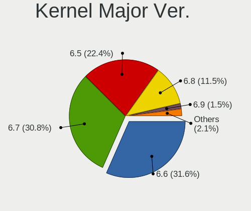

| Version | Desktops | Percent |
|---------|----------|---------|
| 6.6     | 303      | 62.47%  |
| 6.5     | 171      | 35.26%  |
| 6.4     | 5        | 1.03%   |
| 6.7     | 4        | 0.82%   |
| 6.3     | 1        | 0.21%   |
| 6.2     | 1        | 0.21%   |

Arch
----

OS architecture (x86_64, i586, etc.)

| Name   | Desktops | Percent |
|--------|----------|---------|
| x86_64 | 463      | 100%    |

DE
--

Desktop Environment

| Name          | Desktops | Percent |
|---------------|----------|---------|
| GNOME         | 323      | 69.61%  |
| KDE5          | 83       | 17.89%  |
| Cinnamon      | 16       | 3.45%   |
| X-Cinnamon    | 10       | 2.16%   |
| Budgie        | 8        | 1.72%   |
| Unknown       | 6        | 1.29%   |
| XFCE          | 5        | 1.08%   |
| GNOME Classic | 4        | 0.86%   |
| MATE          | 3        | 0.65%   |
| WindowMaker   | 1        | 0.22%   |
| LXQt          | 1        | 0.22%   |
| KDE           | 1        | 0.22%   |
| i3            | 1        | 0.22%   |
| Hyprland      | 1        | 0.22%   |
| bspwm         | 1        | 0.22%   |

Display Server
--------------

X11 or Wayland

| Name    | Desktops | Percent |
|---------|----------|---------|
| Wayland | 326      | 69.96%  |
| X11     | 113      | 24.25%  |
| Tty     | 22       | 4.72%   |
| Unknown | 5        | 1.07%   |

Display Manager
---------------

SDDM, LightDM, etc.

| Name    | Desktops | Percent |
|---------|----------|---------|
| Unknown | 311      | 67.03%  |
| GDM     | 86       | 18.53%  |
| SDDM    | 36       | 7.76%   |
| LightDM | 31       | 6.68%   |

OS Lang
-------

Language

| Lang  | Desktops | Percent |
|-------|----------|---------|
| en_US | 222      | 47.74%  |
| en_GB | 30       | 6.45%   |
| pt_BR | 29       | 6.24%   |
| en_AU | 28       | 6.02%   |
| de_DE | 26       | 5.59%   |
| ru_RU | 24       | 5.16%   |
| en_CA | 12       | 2.58%   |
| fr_FR | 11       | 2.37%   |
| it_IT | 9        | 1.94%   |
| pl_PL | 7        | 1.51%   |
| es_MX | 7        | 1.51%   |
| zh_CN | 6        | 1.29%   |
| hu_HU | 6        | 1.29%   |
| es_ES | 6        | 1.29%   |
| de_AT | 6        | 1.29%   |
| cs_CZ | 6        | 1.29%   |
| pt_PT | 4        | 0.86%   |
| tr_TR | 3        | 0.65%   |
| fr_CA | 3        | 0.65%   |
| sv_SE | 2        | 0.43%   |
| nl_NL | 2        | 0.43%   |
| ja_JP | 2        | 0.43%   |
| fr_BE | 2        | 0.43%   |
| en_NZ | 2        | 0.43%   |
| en_IN | 2        | 0.43%   |
| zh_SG | 1        | 0.22%   |
| sr_RS | 1        | 0.22%   |
| lv_LV | 1        | 0.22%   |
| es_SV | 1        | 0.22%   |
| es_EC | 1        | 0.22%   |
| en_IE | 1        | 0.22%   |
| en_DK | 1        | 0.22%   |
| en_BW | 1        | 0.22%   |

Boot Mode
---------

EFI or BIOS

| Mode | Desktops | Percent |
|------|----------|---------|
| EFI  | 311      | 66.74%  |
| BIOS | 155      | 33.26%  |

Filesystem
----------

Type of filesystem

| Type  | Desktops | Percent |
|-------|----------|---------|
| Btrfs | 370      | 79.74%  |
| Ext4  | 80       | 17.24%  |
| Xfs   | 14       | 3.02%   |

Part. scheme
------------

Scheme of partitioning

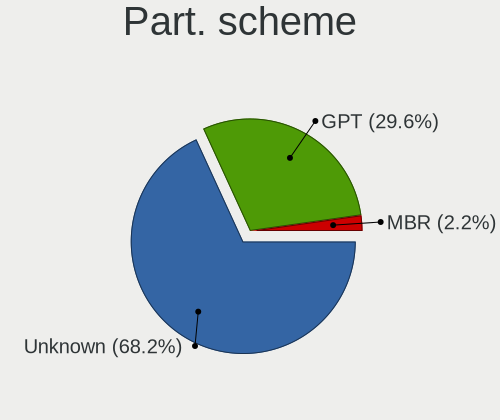

| Type    | Desktops | Percent |
|---------|----------|---------|
| Unknown | 305      | 65.59%  |
| GPT     | 144      | 30.97%  |
| MBR     | 16       | 3.44%   |

Dual Boot with Linux/BSD
------------------------

Hosting more than one Linux/BSD

| Dual boot | Desktops | Percent |
|-----------|----------|---------|
| No        | 423      | 90.97%  |
| Yes       | 42       | 9.03%   |

Dual Boot (Win)
---------------

Hosting Linux and Windows

| Dual boot | Desktops | Percent |
|-----------|----------|---------|
| No        | 386      | 83.37%  |
| Yes       | 77       | 16.63%  |

Board
-----

Vendor
------

Motherboard manufacturer

| Name                                 | Desktops | Percent |
|--------------------------------------|----------|---------|
| ASUSTek Computer                     | 142      | 30.67%  |
| MSI                                  | 89       | 19.22%  |
| Gigabyte Technology                  | 77       | 16.63%  |
| ASRock                               | 38       | 8.21%   |
| Hewlett-Packard                      | 27       | 5.83%   |
| Dell                                 | 25       | 5.4%    |
| Lenovo                               | 11       | 2.38%   |
| Intel                                | 9        | 1.94%   |
| Fujitsu                              | 5        | 1.08%   |
| Pegatron                             | 4        | 0.86%   |
| Apple                                | 4        | 0.86%   |
| AMI                                  | 3        | 0.65%   |
| Unknown                              | 3        | 0.65%   |
| Foxconn                              | 2        | 0.43%   |
| EVGA                                 | 2        | 0.43%   |
| Biostar                              | 2        | 0.43%   |
| AZW                                  | 2        | 0.43%   |
| Acer                                 | 2        | 0.43%   |
| ZOTAC                                | 1        | 0.22%   |
| Shenzhen Meigao Electronic Equipment | 1        | 0.22%   |
| Positivo                             | 1        | 0.22%   |
| PCWare                               | 1        | 0.22%   |
| OEM                                  | 1        | 0.22%   |
| MAXSUN                               | 1        | 0.22%   |
| LattePanda                           | 1        | 0.22%   |
| Huanan                               | 1        | 0.22%   |
| GEEKOM                               | 1        | 0.22%   |
| eMachines                            | 1        | 0.22%   |
| ECS                                  | 1        | 0.22%   |
| Colorful Technology                  | 1        | 0.22%   |
| ANGXUN                               | 1        | 0.22%   |
| AMD                                  | 1        | 0.22%   |
| Alienware                            | 1        | 0.22%   |
| ABIT                                 | 1        | 0.22%   |

Model
-----

Motherboard model

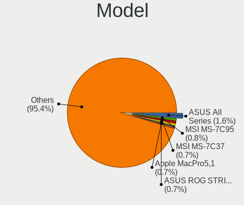

| Name                            | Desktops | Percent |
|---------------------------------|----------|---------|
| ASUS All Series                 | 10       | 2.16%   |
| MSI MS-7C37                     | 6        | 1.3%    |
| MSI MS-7C91                     | 4        | 0.86%   |
| MSI MS-7C02                     | 4        | 0.86%   |
| ASUS ROG STRIX B550-F GAMING    | 4        | 0.86%   |
| ASUS PRIME X570-PRO             | 4        | 0.86%   |
| MSI MS-7C95                     | 3        | 0.65%   |
| MSI MS-7C84                     | 3        | 0.65%   |
| MSI MS-7B89                     | 3        | 0.65%   |
| ASUS TUF Gaming X570-PLUS       | 3        | 0.65%   |
| ASUS TUF Gaming B550-PLUS       | 3        | 0.65%   |
| ASUS PRIME Z690M-PLUS D4        | 3        | 0.65%   |
| ASUS PRIME B550-PLUS            | 3        | 0.65%   |
| Apple MacPro5,1                 | 3        | 0.65%   |
| AMI Intel                       | 3        | 0.65%   |
| Unknown                         | 3        | 0.65%   |
| MSI MS-7D78                     | 2        | 0.43%   |
| MSI MS-7D73                     | 2        | 0.43%   |
| MSI MS-7D46                     | 2        | 0.43%   |
| MSI MS-7D43                     | 2        | 0.43%   |
| MSI MS-7D32                     | 2        | 0.43%   |
| MSI MS-7C56                     | 2        | 0.43%   |
| MSI MS-7B86                     | 2        | 0.43%   |
| MSI MS-7B79                     | 2        | 0.43%   |
| MSI MS-7885                     | 2        | 0.43%   |
| MSI MS-7721                     | 2        | 0.43%   |
| MSI MS-7641                     | 2        | 0.43%   |
| Intel HM570                     | 2        | 0.43%   |
| Intel B75                       | 2        | 0.43%   |
| HP Z240 SFF Workstation         | 2        | 0.43%   |
| Gigabyte X570 I AORUS PRO WIFI  | 2        | 0.43%   |
| Gigabyte X570 AORUS ELITE WIFI  | 2        | 0.43%   |
| Gigabyte J1900M-D2P             | 2        | 0.43%   |
| Gigabyte B650 GAMING X AX       | 2        | 0.43%   |
| Gigabyte B650 AORUS ELITE AX    | 2        | 0.43%   |
| Gigabyte B550M AORUS ELITE      | 2        | 0.43%   |
| Gigabyte B550 AORUS ELITE V2    | 2        | 0.43%   |
| Gigabyte B550 AORUS ELITE AX V2 | 2        | 0.43%   |
| Gigabyte 970A-DS3P              | 2        | 0.43%   |
| Foxconn Pro3500 Series          | 2        | 0.43%   |

Model Family
------------

Motherboard model prefix

| Name               | Desktops | Percent |
|--------------------|----------|---------|
| ASUS PRIME         | 38       | 8.21%   |
| ASUS ROG           | 34       | 7.34%   |
| ASUS TUF           | 23       | 4.97%   |
| Dell OptiPlex      | 15       | 3.24%   |
| ASUS All           | 10       | 2.16%   |
| Gigabyte B550      | 8        | 1.73%   |
| Lenovo ThinkCentre | 7        | 1.51%   |
| HP EliteDesk       | 7        | 1.51%   |
| MSI MS-7C37        | 6        | 1.3%    |
| Gigabyte X570      | 5        | 1.08%   |
| Gigabyte B650      | 5        | 1.08%   |
| Gigabyte B550M     | 5        | 1.08%   |
| Fujitsu ESPRIMO    | 5        | 1.08%   |
| MSI MS-7C91        | 4        | 0.86%   |
| MSI MS-7C02        | 4        | 0.86%   |
| HP Compaq          | 4        | 0.86%   |
| Dell Inspiron      | 4        | 0.86%   |
| ASUS P8Z77-V       | 4        | 0.86%   |
| ASRock X670E       | 4        | 0.86%   |
| ASRock X570        | 4        | 0.86%   |
| MSI MS-7C95        | 3        | 0.65%   |
| MSI MS-7C84        | 3        | 0.65%   |
| MSI MS-7B89        | 3        | 0.65%   |
| HP Z240            | 3        | 0.65%   |
| HP ProDesk         | 3        | 0.65%   |
| Gigabyte B650M     | 3        | 0.65%   |
| ASUS P7P55D        | 3        | 0.65%   |
| ASRock B550        | 3        | 0.65%   |
| ASRock B450M       | 3        | 0.65%   |
| ASRock B450        | 3        | 0.65%   |
| Apple MacPro5      | 3        | 0.65%   |
| AMI Intel          | 3        | 0.65%   |
| Unknown            | 3        | 0.65%   |
| MSI MS-7D78        | 2        | 0.43%   |
| MSI MS-7D73        | 2        | 0.43%   |
| MSI MS-7D46        | 2        | 0.43%   |
| MSI MS-7D43        | 2        | 0.43%   |
| MSI MS-7D32        | 2        | 0.43%   |
| MSI MS-7C56        | 2        | 0.43%   |
| MSI MS-7B86        | 2        | 0.43%   |

MFG Year
--------

Motherboard manufacture year

| Year | Desktops | Percent |
|------|----------|---------|
| 2020 | 64       | 13.82%  |
| 2022 | 60       | 12.96%  |
| 2019 | 47       | 10.15%  |
| 2021 | 39       | 8.42%   |
| 2018 | 39       | 8.42%   |
| 2023 | 30       | 6.48%   |
| 2012 | 28       | 6.05%   |
| 2014 | 24       | 5.18%   |
| 2017 | 23       | 4.97%   |
| 2013 | 18       | 3.89%   |
| 2010 | 18       | 3.89%   |
| 2011 | 16       | 3.46%   |
| 2015 | 13       | 2.81%   |
| 2009 | 12       | 2.59%   |
| 2016 | 11       | 2.38%   |
| 2008 | 11       | 2.38%   |
| 2007 | 7        | 1.51%   |
| 2006 | 2        | 0.43%   |
| 2005 | 1        | 0.22%   |

Form Factor
-----------

Physical design of the computer

| Name    | Desktops | Percent |
|---------|----------|---------|
| Desktop | 463      | 100%    |

Secure Boot
-----------

Enabled or disabled

| State    | Desktops | Percent |
|----------|----------|---------|
| Disabled | 398      | 85.59%  |
| Enabled  | 67       | 14.41%  |

Coreboot
--------

Have coreboot on board

| Used | Desktops | Percent |
|------|----------|---------|
| No   | 463      | 100%    |

RAM Size
--------

Total RAM memory

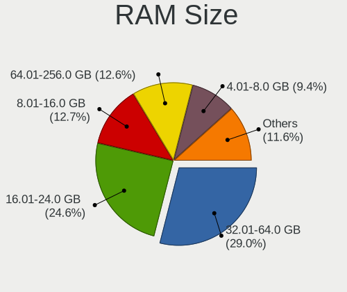

| Size in GB  | Desktops | Percent |
|-------------|----------|---------|
| 32.01-64.0  | 128      | 27.47%  |
| 16.01-24.0  | 115      | 24.68%  |
| 8.01-16.0   | 62       | 13.3%   |
| 64.01-256.0 | 56       | 12.02%  |
| 4.01-8.0    | 44       | 9.44%   |
| 24.01-32.0  | 33       | 7.08%   |
| 3.01-4.0    | 24       | 5.15%   |
| 1.01-2.0    | 3        | 0.64%   |
| 2.01-3.0    | 1        | 0.21%   |

RAM Used
--------

Used RAM memory

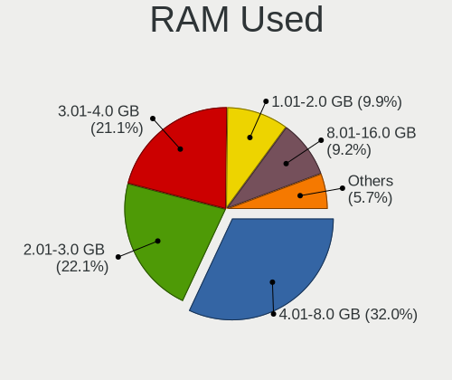

| Used GB     | Desktops | Percent |
|-------------|----------|---------|
| 4.01-8.0    | 156      | 31.39%  |
| 3.01-4.0    | 113      | 22.74%  |
| 2.01-3.0    | 112      | 22.54%  |
| 8.01-16.0   | 43       | 8.65%   |
| 1.01-2.0    | 42       | 8.45%   |
| 0.51-1.0    | 15       | 3.02%   |
| 16.01-24.0  | 12       | 2.41%   |
| 24.01-32.0  | 2        | 0.4%    |
| 32.01-64.0  | 1        | 0.2%    |
| 64.01-256.0 | 1        | 0.2%    |

Total Drives
------------

Number of drives on board

| Drives | Desktops | Percent |
|--------|----------|---------|
| 1      | 151      | 31.99%  |
| 2      | 140      | 29.66%  |
| 3      | 83       | 17.58%  |
| 4      | 46       | 9.75%   |
| 5      | 29       | 6.14%   |
| 6      | 10       | 2.12%   |
| 8      | 7        | 1.48%   |
| 7      | 2        | 0.42%   |
| 12     | 1        | 0.21%   |
| 11     | 1        | 0.21%   |
| 10     | 1        | 0.21%   |
| 9      | 1        | 0.21%   |

Has CD-ROM
----------

Has CD-ROM on board

| Presented | Desktops | Percent |
|-----------|----------|---------|
| No        | 334      | 71.98%  |
| Yes       | 130      | 28.02%  |

Has Ethernet
------------

Has Ethernet on board

| Presented | Desktops | Percent |
|-----------|----------|---------|
| Yes       | 452      | 97.62%  |
| No        | 11       | 2.38%   |

Has WiFi
--------

Has WiFi module

| Presented | Desktops | Percent |
|-----------|----------|---------|
| Yes       | 275      | 58.89%  |
| No        | 192      | 41.11%  |

Has Bluetooth
-------------

Has Bluetooth module

| Presented | Desktops | Percent |
|-----------|----------|---------|
| Yes       | 245      | 52.46%  |
| No        | 222      | 47.54%  |

Location
--------

Country
-------

Geographic location (country)

| Country     | Desktops | Percent |
|-------------|----------|---------|
| USA         | 107      | 23.06%  |
| Germany     | 36       | 7.76%   |
| Brazil      | 35       | 7.54%   |
| Australia   | 29       | 6.25%   |
| Russia      | 27       | 5.82%   |
| Italy       | 16       | 3.45%   |
| Canada      | 16       | 3.45%   |
| UK          | 15       | 3.23%   |
| France      | 14       | 3.02%   |
| Spain       | 12       | 2.59%   |
| Poland      | 10       | 2.16%   |
| Mexico      | 9        | 1.94%   |
| Czechia     | 9        | 1.94%   |
| Sweden      | 8        | 1.72%   |
| Portugal    | 8        | 1.72%   |
| Netherlands | 8        | 1.72%   |
| Hungary     | 8        | 1.72%   |
| Austria     | 8        | 1.72%   |
| Turkey      | 6        | 1.29%   |
| Belgium     | 6        | 1.29%   |
| Argentina   | 5        | 1.08%   |
| Switzerland | 4        | 0.86%   |
| India       | 4        | 0.86%   |
| Egypt       | 4        | 0.86%   |
| Colombia    | 4        | 0.86%   |
| China       | 4        | 0.86%   |
| Bulgaria    | 4        | 0.86%   |
| Thailand    | 3        | 0.65%   |
| Taiwan      | 3        | 0.65%   |
| Romania     | 3        | 0.65%   |
| Norway      | 3        | 0.65%   |
| New Zealand | 3        | 0.65%   |
| Finland     | 3        | 0.65%   |
| Serbia      | 2        | 0.43%   |
| Puerto Rico | 2        | 0.43%   |
| Malaysia    | 2        | 0.43%   |
| Latvia      | 2        | 0.43%   |
| Japan       | 2        | 0.43%   |
| Indonesia   | 2        | 0.43%   |
| Belarus     | 2        | 0.43%   |

City
----

Geographic location (city)

| City                 | Desktops | Percent |
|----------------------|----------|---------|
| Sydney               | 20       | 4.27%   |
| Moscow               | 7        | 1.5%    |
| Berlin               | 5        | 1.07%   |
| Warsaw               | 3        | 0.64%   |
| Valencia             | 3        | 0.64%   |
| Stuttgart            | 3        | 0.64%   |
| Rio de Janeiro       | 3        | 0.64%   |
| Melbourne            | 3        | 0.64%   |
| Lisbon               | 3        | 0.64%   |
| Fortaleza            | 3        | 0.64%   |
| Denver               | 3        | 0.64%   |
| Brisbane             | 3        | 0.64%   |
| Ankara               | 3        | 0.64%   |
| Yekaterinburg        | 2        | 0.43%   |
| Vienna               | 2        | 0.43%   |
| Ulm                  | 2        | 0.43%   |
| Timioara           | 2        | 0.43%   |
| Taipei               | 2        | 0.43%   |
| Springfield          | 2        | 0.43%   |
| Seattle              | 2        | 0.43%   |
| Saratov              | 2        | 0.43%   |
| Sao Jos dos Campos | 2        | 0.43%   |
| San Luis             | 2        | 0.43%   |
| San Antonio          | 2        | 0.43%   |
| Roseburg             | 2        | 0.43%   |
| Rome                 | 2        | 0.43%   |
| Riga                 | 2        | 0.43%   |
| Ravensburg           | 2        | 0.43%   |
| Prague               | 2        | 0.43%   |
| Porto Alegre         | 2        | 0.43%   |
| Paulinia             | 2        | 0.43%   |
| Ober-Morlen          | 2        | 0.43%   |
| Montreal             | 2        | 0.43%   |
| Mississauga          | 2        | 0.43%   |
| Minsk                | 2        | 0.43%   |
| Milano               | 2        | 0.43%   |
| Mexico City          | 2        | 0.43%   |
| Kuala Lumpur         | 2        | 0.43%   |
| Flushing             | 2        | 0.43%   |
| Crdoba             | 2        | 0.43%   |

Drives
------

Drive Vendor
------------

Hard drive vendors

| Vendor                       | Desktops | Drives | Percent |
|------------------------------|----------|--------|---------|
| Samsung Electronics          | 173      | 294    | 18.72%  |
| WDC                          | 133      | 215    | 14.39%  |
| Seagate                      | 114      | 176    | 12.34%  |
| Sandisk                      | 69       | 91     | 7.47%   |
| Kingston                     | 47       | 58     | 5.09%   |
| Crucial                      | 43       | 56     | 4.65%   |
| Toshiba                      | 37       | 46     | 4%      |
| Micron/Crucial Technology    | 29       | 41     | 3.14%   |
| Phison Electronics           | 27       | 32     | 2.92%   |
| Intel                        | 23       | 32     | 2.49%   |
| Hitachi                      | 17       | 23     | 1.84%   |
| MAXIO Technology (Hangzhou)  | 14       | 15     | 1.52%   |
| SK hynix                     | 13       | 15     | 1.41%   |
| ADATA Technology             | 13       | 15     | 1.41%   |
| Silicon Motion               | 11       | 12     | 1.19%   |
| Unknown                      | 10       | 13     | 1.08%   |
| Kingston Technology Company  | 10       | 11     | 1.08%   |
| A-DATA Technology            | 10       | 11     | 1.08%   |
| China                        | 9        | 9      | 0.97%   |
| PNY                          | 7        | 9      | 0.76%   |
| HGST                         | 7        | 13     | 0.76%   |
| Micron Technology            | 6        | 7      | 0.65%   |
| SPCC                         | 5        | 6      | 0.54%   |
| Apacer                       | 5        | 5      | 0.54%   |
| Realtek Semiconductor        | 4        | 4      | 0.43%   |
| KIOXIA                       | 4        | 5      | 0.43%   |
| JMicron Technology           | 4        | 4      | 0.43%   |
| Team                         | 3        | 3      | 0.32%   |
| Shenzhen Longsys Electronics | 3        | 3      | 0.32%   |
| Patriot                      | 3        | 3      | 0.32%   |
| Netac                        | 3        | 4      | 0.32%   |
| Intenso                      | 3        | 3      | 0.32%   |
| Fanxiang                     | 3        | 4      | 0.32%   |
| Apple                        | 3        | 3      | 0.32%   |
| Transcend                    | 2        | 2      | 0.22%   |
| Smartbuy                     | 2        | 2      | 0.22%   |
| OCZ                          | 2        | 2      | 0.22%   |
| Maxtor                       | 2        | 2      | 0.22%   |
| Lexar                        | 2        | 3      | 0.22%   |
| HS-SSD-E100                  | 2        | 2      | 0.22%   |

Drive Model
-----------

Hard drive models

| Model                                                           | Desktops | Percent |
|-----------------------------------------------------------------|----------|---------|
| Samsung NVMe SSD Controller SM981/PM981/PM983 1TB               | 51       | 4.68%   |
| Samsung NVMe SSD Controller PM9A1/PM9A3/980PRO 2TB              | 23       | 2.11%   |
| Micron/Crucial P2 NVMe PCIe SSD 1TB                             | 21       | 1.93%   |
| Samsung SSD 860 EVO 1TB                                         | 14       | 1.29%   |
| Samsung SSD 850 EVO 250GB                                       | 13       | 1.19%   |
| Phison E12 NVMe Controller 1TB                                  | 12       | 1.1%    |
| Kingston SA400S37480G 480GB SSD                                 | 12       | 1.1%    |
| Samsung SSD 860 EVO 500GB                                       | 11       | 1.01%   |
| MAXIO (Hangzhou) NVMe SSD Controller MAP1202 512GB              | 11       | 1.01%   |
| Toshiba DT01ACA100 1TB                                          | 10       | 0.92%   |
| Samsung SSD 980 1TB                                             | 10       | 0.92%   |
| Silicon Motion SM2263EN/SM2263XT SSD Controller 128GB           | 9        | 0.83%   |
| Seagate ST2000DM008-2FR102 2TB                                  | 9        | 0.83%   |
| Seagate ST500DM002-1BD142 500GB                                 | 8        | 0.73%   |
| Sandisk WD Blue SN550 NVMe SSD 512GB                            | 8        | 0.73%   |
| Samsung SSD 870 QVO 1TB                                         | 8        | 0.73%   |
| Samsung NVMe SSD Controller SM961/PM961/SM963 256GB             | 8        | 0.73%   |
| Crucial CT1000MX500SSD1 1TB                                     | 8        | 0.73%   |
| Seagate ST4000DM004-2CV104 4TB                                  | 7        | 0.64%   |
| Sandisk WD_BLACK SN850X 1000GB                                  | 7        | 0.64%   |
| Phison E16 PCIe4 NVMe Controller 2TB                            | 7        | 0.64%   |
| ADATA XPG SX8200 Pro PCIe Gen3x4 M.2 2280 Solid State Drive 2TB | 7        | 0.64%   |
| WDC WD40EFRX-68N32N0 4TB                                        | 6        | 0.55%   |
| WDC WD10EZEX-08WN4A0 1TB                                        | 6        | 0.55%   |
| Seagate ST2000DM001-1ER164 2TB                                  | 6        | 0.55%   |
| Sandisk WD_BLACK SN850X 2000GB                                  | 6        | 0.55%   |
| Sandisk WD Black SN850 1024GB                                   | 6        | 0.55%   |
| Samsung SSD 870 EVO 1TB                                         | 6        | 0.55%   |
| Kingston Company SNV2S1000G 1TB                                 | 6        | 0.55%   |
| Kingston SA400S37120G 120GB SSD                                 | 6        | 0.55%   |
| WDC WDS500G2B0A-00SM50 500GB SSD                                | 5        | 0.46%   |
| Seagate ST2000DM006-2DM164 2TB                                  | 5        | 0.46%   |
| Seagate ST1000DM010-2EP102 1TB                                  | 5        | 0.46%   |
| Sandisk WD_BLACK SN770 1TB                                      | 5        | 0.46%   |
| Sandisk WD Black 2018/SN750 / PC SN720 NVMe SSD 1TB             | 5        | 0.46%   |
| Samsung SSD 870 QVO 2TB                                         | 5        | 0.46%   |
| Intel SSD 660P Series 1024GB                                    | 5        | 0.46%   |
| Crucial CT500MX500SSD1 500GB                                    | 5        | 0.46%   |
| WDC WD40EZRZ-00GXCB0 4TB                                        | 4        | 0.37%   |
| WDC WD10EZEX-00WN4A0 1TB                                        | 4        | 0.37%   |

HDD Vendor
----------

Hard disk drive vendors

| Vendor              | Desktops | Drives | Percent |
|---------------------|----------|--------|---------|
| WDC                 | 112      | 180    | 35.67%  |
| Seagate             | 111      | 172    | 35.35%  |
| Toshiba             | 35       | 44     | 11.15%  |
| Hitachi             | 17       | 23     | 5.41%   |
| Samsung Electronics | 15       | 25     | 4.78%   |
| HGST                | 7        | 13     | 2.23%   |
| Unknown             | 4        | 4      | 1.27%   |
| JMicron Technology  | 4        | 4      | 1.27%   |
| Maxtor              | 2        | 2      | 0.64%   |
| SAGE                | 1        | 1      | 0.32%   |
| KINGWIN             | 1        | 1      | 0.32%   |
| Intenso             | 1        | 1      | 0.32%   |
| IB-377U3            | 1        | 1      | 0.32%   |
| External            | 1        | 2      | 0.32%   |
| ASMT                | 1        | 5      | 0.32%   |
| Apple               | 1        | 1      | 0.32%   |

SSD Vendor
----------

Solid state drive vendors

| Vendor              | Desktops | Drives | Percent |
|---------------------|----------|--------|---------|
| Samsung Electronics | 94       | 140    | 29.19%  |
| Crucial             | 43       | 56     | 13.35%  |
| Kingston            | 34       | 39     | 10.56%  |
| WDC                 | 30       | 35     | 9.32%   |
| SanDisk             | 20       | 24     | 6.21%   |
| A-DATA Technology   | 10       | 11     | 3.11%   |
| China               | 9        | 9      | 2.8%    |
| PNY                 | 7        | 9      | 2.17%   |
| Intel               | 7        | 13     | 2.17%   |
| SK hynix            | 6        | 7      | 1.86%   |
| SPCC                | 5        | 6      | 1.55%   |
| Apacer              | 5        | 5      | 1.55%   |
| Team                | 3        | 3      | 0.93%   |
| Patriot             | 3        | 3      | 0.93%   |
| Micron Technology   | 3        | 3      | 0.93%   |
| Fanxiang            | 3        | 4      | 0.93%   |
| Transcend           | 2        | 2      | 0.62%   |
| Smartbuy            | 2        | 2      | 0.62%   |
| OCZ                 | 2        | 2      | 0.62%   |
| Netac               | 2        | 3      | 0.62%   |
| Intenso             | 2        | 2      | 0.62%   |
| Hewlett-Packard     | 2        | 3      | 0.62%   |
| Apple               | 2        | 2      | 0.62%   |
| Acer                | 2        | 2      | 0.62%   |
| WDC WDS1            | 1        | 1      | 0.31%   |
| V7                  | 1        | 1      | 0.31%   |
| USB3.0              | 1        | 1      | 0.31%   |
| USB                 | 1        | 1      | 0.31%   |
| Toshiba             | 1        | 1      | 0.31%   |
| TECH                | 1        | 1      | 0.31%   |
| SD                  | 1        | 2      | 0.31%   |
| Mushkin             | 1        | 1      | 0.31%   |
| MaxDigital          | 1        | 1      | 0.31%   |
| LITEONIT            | 1        | 2      | 0.31%   |
| LITEON              | 1        | 1      | 0.31%   |
| Lexar               | 1        | 2      | 0.31%   |
| KUIJIA              | 1        | 1      | 0.31%   |
| KingSpec            | 1        | 2      | 0.31%   |
| GOODRAM             | 1        | 1      | 0.31%   |
| FORESEE             | 1        | 1      | 0.31%   |

Drive Kind
----------

HDD or SSD

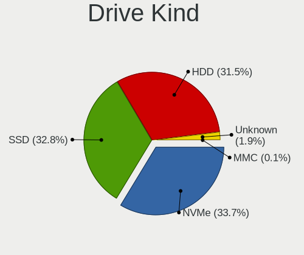

| Kind    | Desktops | Drives | Percent |
|---------|----------|--------|---------|
| SSD     | 260      | 415    | 33.16%  |
| NVMe    | 259      | 398    | 33.04%  |
| HDD     | 246      | 479    | 31.38%  |
| Unknown | 18       | 24     | 2.3%    |
| MMC     | 1        | 1      | 0.13%   |

Drive Connector
---------------

SATA, SAS, NVMe, etc.

| Type | Desktops | Drives | Percent |
|------|----------|--------|---------|
| SATA | 361      | 863    | 55.11%  |
| NVMe | 258      | 395    | 39.39%  |
| SAS  | 35       | 58     | 5.34%   |
| MMC  | 1        | 1      | 0.15%   |

Drive Size
----------

Size of hard drive

| Size in TB | Desktops | Drives | Percent |
|------------|----------|--------|---------|
| 0.01-0.5   | 231      | 388    | 40.74%  |
| 0.51-1.0   | 175      | 269    | 30.86%  |
| 1.01-2.0   | 77       | 101    | 13.58%  |
| 3.01-4.0   | 40       | 62     | 7.05%   |
| 4.01-10.0  | 24       | 41     | 4.23%   |
| 2.01-3.0   | 15       | 23     | 2.65%   |
| 10.01-20.0 | 5        | 10     | 0.88%   |

Space Total
-----------

Amount of disk space available on the file system

| Size in GB     | Desktops | Percent |
|----------------|----------|---------|
| 1001-2000      | 99       | 20.97%  |
| More than 3000 | 90       | 19.07%  |
| 501-1000       | 87       | 18.43%  |
| 251-500        | 50       | 10.59%  |
| 101-250        | 46       | 9.75%   |
| 2001-3000      | 33       | 6.99%   |
| Unknown        | 26       | 5.51%   |
| 51-100         | 20       | 4.24%   |
| 1-20           | 18       | 3.81%   |
| 21-50          | 3        | 0.64%   |

Space Used
----------

Amount of used disk space

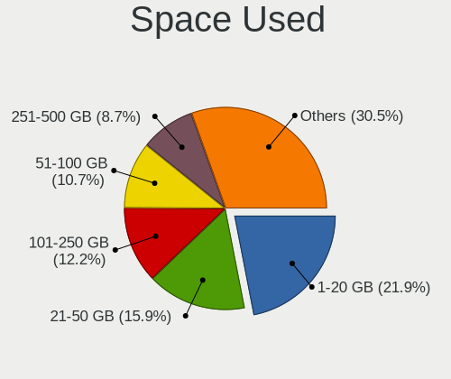

| Used GB        | Desktops | Percent |
|----------------|----------|---------|
| 1-20           | 101      | 21.26%  |
| 21-50          | 71       | 14.95%  |
| 101-250        | 61       | 12.84%  |
| 51-100         | 50       | 10.53%  |
| 251-500        | 41       | 8.63%   |
| 1001-2000      | 37       | 7.79%   |
| 501-1000       | 37       | 7.79%   |
| More than 3000 | 34       | 7.16%   |
| Unknown        | 26       | 5.47%   |
| 2001-3000      | 17       | 3.58%   |

Malfunc. Drives
---------------

Drive models with a malfunction

| Model                                                         | Desktops | Drives | Percent |
|---------------------------------------------------------------|----------|--------|---------|
| WDC WD40EFRX-68N32N0 4TB                                      | 3        | 3      | 8.57%   |
| Intel SSDSC2CT120A3 120GB                                     | 2        | 7      | 5.71%   |
| WDC WDS240G2G0B-00EPW0 240GB SSD                              | 1        | 1      | 2.86%   |
| WDC WD6400AAKS-65A7B2 640GB                                   | 1        | 1      | 2.86%   |
| WDC WD5000AVDS-63U7B1 500GB                                   | 1        | 2      | 2.86%   |
| WDC WD5000AVCS-632DY1 500GB                                   | 1        | 2      | 2.86%   |
| WDC WD5000AAKX-00ERMA0 500GB                                  | 1        | 2      | 2.86%   |
| WDC WD5000AAKS-00UU3A0 500GB                                  | 1        | 1      | 2.86%   |
| WDC WD40EFRX-68WT0N0 4TB                                      | 1        | 1      | 2.86%   |
| WDC WD3200AAKS-22B3A0 320GB                                   | 1        | 1      | 2.86%   |
| WDC WD30 EZRX-00SPEB0 3TB                                     | 1        | 1      | 2.86%   |
| WDC WD20 EZRX-00D8PB0 2TB                                     | 1        | 1      | 2.86%   |
| WDC WD1600AVVS-63L2B0 160GB                                   | 1        | 1      | 2.86%   |
| WDC WD10EZEX-08WN4A0 1TB                                      | 1        | 1      | 2.86%   |
| WDC WD10EARS-22Y5B1 1TB                                       | 1        | 1      | 2.86%   |
| WDC WD10EADS-11M2B2 1TB                                       | 1        | 1      | 2.86%   |
| Toshiba MQ01ABD050 500GB                                      | 1        | 2      | 2.86%   |
| Toshiba DT01ACA100 1TB                                        | 1        | 1      | 2.86%   |
| Seagate ST4000DM000-1F2168 4TB                                | 1        | 1      | 2.86%   |
| Seagate ST3500320AS 500GB                                     | 1        | 1      | 2.86%   |
| Seagate ST2000DX002-2DV164 2TB                                | 1        | 1      | 2.86%   |
| Seagate ST1000DX001-1NS162 1TB                                | 1        | 2      | 2.86%   |
| SanDisk SSD PLUS 240GB                                        | 1        | 1      | 2.86%   |
| Samsung Electronics NVMe SSD Controller SM981/PM981/PM983 1TB | 1        | 1      | 2.86%   |
| Samsung Electronics HD501LJ 500GB                             | 1        | 2      | 2.86%   |
| Samsung Electronics HD103UJ 1TB                               | 1        | 6      | 2.86%   |
| Micron Technology MTFDDAK128MAY-1AH1ZABHA 128GB SSD           | 1        | 1      | 2.86%   |
| Maxtor 6Y080L0 82GB                                           | 1        | 1      | 2.86%   |
| Hitachi HUS724030ALE641 3TB                                   | 1        | 1      | 2.86%   |
| Hitachi HDS721010CLA332 1TB                                   | 1        | 1      | 2.86%   |
| Crucial CT275MX300SSD1 275GB                                  | 1        | 1      | 2.86%   |
| Crucial CT120M500SSD1 120GB                                   | 1        | 3      | 2.86%   |

Malfunc. Drive Vendor
---------------------

Vendors of faulty drives

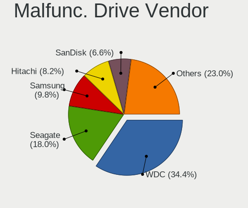

| Vendor              | Desktops | Drives | Percent |
|---------------------|----------|--------|---------|
| WDC                 | 14       | 20     | 45.16%  |
| Seagate             | 3        | 5      | 9.68%   |
| Samsung Electronics | 3        | 9      | 9.68%   |
| Toshiba             | 2        | 3      | 6.45%   |
| Intel               | 2        | 7      | 6.45%   |
| Hitachi             | 2        | 2      | 6.45%   |
| Crucial             | 2        | 4      | 6.45%   |
| SanDisk             | 1        | 1      | 3.23%   |
| Micron Technology   | 1        | 1      | 3.23%   |
| Maxtor              | 1        | 1      | 3.23%   |

Malfunc. HDD Vendor
-------------------

Vendors of faulty HDD drives

| Vendor              | Desktops | Drives | Percent |
|---------------------|----------|--------|---------|
| WDC                 | 14       | 19     | 58.33%  |
| Seagate             | 3        | 5      | 12.5%   |
| Toshiba             | 2        | 3      | 8.33%   |
| Samsung Electronics | 2        | 8      | 8.33%   |
| Hitachi             | 2        | 2      | 8.33%   |
| Maxtor              | 1        | 1      | 4.17%   |

Malfunc. Drive Kind
-------------------

Kinds of faulty drives

| Kind | Desktops | Drives | Percent |
|------|----------|--------|---------|
| HDD  | 22       | 38     | 73.33%  |
| SSD  | 7        | 14     | 23.33%  |
| NVMe | 1        | 1      | 3.33%   |

Failed Drives
-------------

Failed drive models

| Model                       | Desktops | Drives | Percent |
|-----------------------------|----------|--------|---------|
| WDC WD30 EZRS-00J99B0 3TB   | 1        | 1      | 50%     |
| Hitachi HDS721010DLE630 1TB | 1        | 2      | 50%     |

Failed Drive Vendor
-------------------

Failed drive vendors

| Vendor  | Desktops | Drives | Percent |
|---------|----------|--------|---------|
| WDC     | 1        | 1      | 50%     |
| Hitachi | 1        | 2      | 50%     |

Drive Status
------------

Number of failed and malfunc. drives

| Status   | Desktops | Drives | Percent |
|----------|----------|--------|---------|
| Detected | 327      | 873    | 65.66%  |
| Works    | 142      | 388    | 28.51%  |
| Malfunc  | 27       | 53     | 5.42%   |
| Failed   | 2        | 3      | 0.4%    |

Storage controller
------------------

Storage Vendor
--------------

Storage controller vendors

| Vendor                       | Desktops | Percent |
|------------------------------|----------|---------|
| AMD                          | 236      | 28.64%  |
| Intel                        | 223      | 27.06%  |
| Samsung Electronics          | 99       | 12.01%  |
| SanDisk                      | 52       | 6.31%   |
| ASMedia Technology           | 36       | 4.37%   |
| Micron/Crucial Technology    | 29       | 3.52%   |
| Phison Electronics           | 27       | 3.28%   |
| Kingston Technology Company  | 24       | 2.91%   |
| MAXIO Technology (Hangzhou)  | 14       | 1.7%    |
| JMicron Technology           | 13       | 1.58%   |
| ADATA Technology             | 13       | 1.58%   |
| Silicon Motion               | 11       | 1.33%   |
| SK hynix                     | 7        | 0.85%   |
| Nvidia                       | 5        | 0.61%   |
| Marvell Technology Group     | 5        | 0.61%   |
| Realtek Semiconductor        | 4        | 0.49%   |
| KIOXIA                       | 4        | 0.49%   |
| Solidigm                     | 3        | 0.36%   |
| Shenzhen Longsys Electronics | 3        | 0.36%   |
| Micron Technology            | 3        | 0.36%   |
| VIA Technologies             | 2        | 0.24%   |
| INNOGRIT                     | 2        | 0.24%   |
| Yangtze Memory Technologies  | 1        | 0.12%   |
| ULi Electronics              | 1        | 0.12%   |
| Toshiba America Info Systems | 1        | 0.12%   |
| Silicon Image                | 1        | 0.12%   |
| Promise Technology           | 1        | 0.12%   |
| Netac Technology             | 1        | 0.12%   |
| Lite-On Technology           | 1        | 0.12%   |
| Broadcom / LSI               | 1        | 0.12%   |
| Biwin Storage Technology     | 1        | 0.12%   |

Storage Model
-------------

Storage controller models

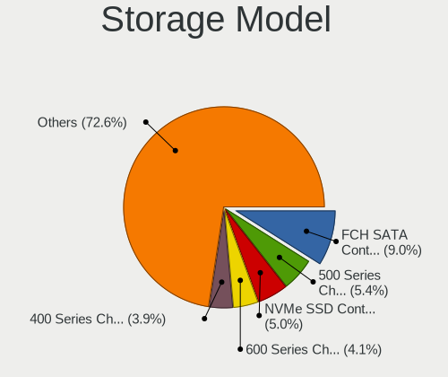

| Model                                                                          | Desktops | Percent |
|--------------------------------------------------------------------------------|----------|---------|
| AMD FCH SATA Controller [AHCI mode]                                            | 83       | 8.62%   |
| AMD 500 Series Chipset SATA Controller                                         | 58       | 6.02%   |
| Samsung NVMe SSD Controller SM981/PM981/PM983                                  | 51       | 5.3%    |
| AMD 600 Series Chipset SATA Controller                                         | 42       | 4.36%   |
| AMD 400 Series Chipset SATA Controller                                         | 38       | 3.95%   |
| ASMedia ASM1061/ASM1062 Serial ATA Controller                                  | 30       | 3.12%   |
| Intel Alder Lake-S PCH SATA Controller [AHCI Mode]                             | 25       | 2.6%    |
| Samsung NVMe SSD Controller PM9A1/PM9A3/980PRO                                 | 23       | 2.39%   |
| Micron/Crucial P2 [Nick P2] / P3 / P3 Plus NVMe PCIe SSD (DRAM-less)           | 21       | 2.18%   |
| Intel 8 Series/C220 Series Chipset Family 6-port SATA Controller 1 [AHCI mode] | 20       | 2.08%   |
| Intel Q170/Q150/B150/H170/H110/Z170/CM236 Chipset SATA Controller [AHCI Mode]  | 18       | 1.87%   |
| Sandisk WD Black SN850X NVMe SSD                                               | 17       | 1.77%   |
| AMD SB7x0/SB8x0/SB9x0 IDE Controller                                           | 17       | 1.77%   |
| Samsung NVMe SSD Controller 980 (DRAM-less)                                    | 16       | 1.66%   |
| Intel 7 Series/C210 Series Chipset Family 6-port SATA Controller [AHCI mode]   | 16       | 1.66%   |
| Intel Cannon Lake PCH SATA AHCI Controller                                     | 15       | 1.56%   |
| Intel 200 Series PCH SATA controller [AHCI mode]                               | 14       | 1.45%   |
| Intel 6 Series/C200 Series Chipset Family 6 port Desktop SATA AHCI Controller  | 13       | 1.35%   |
| Phison E12 NVMe Controller                                                     | 12       | 1.25%   |
| Intel Volume Management Device NVMe RAID Controller                            | 12       | 1.25%   |
| AMD SB7x0/SB8x0/SB9x0 SATA Controller [AHCI mode]                              | 12       | 1.25%   |
| MAXIO (Hangzhou) NVMe SSD Controller MAP1202 (DRAM-less)                       | 11       | 1.14%   |
| Kingston Company KC3000/FURY Renegade NVMe SSD E18                             | 10       | 1.04%   |
| JMicron JMB363 SATA/IDE Controller                                             | 10       | 1.04%   |
| AMD SB7x0/SB8x0/SB9x0 SATA Controller [IDE mode]                               | 10       | 1.04%   |
| Silicon Motion SM2263EN/SM2263XT (DRAM-less) NVMe SSD Controllers              | 9        | 0.93%   |
| SanDisk WD Black SN770 / PC SN740 256GB / PC SN560 (DRAM-less) NVMe SSD        | 9        | 0.93%   |
| Kingston Company NV2 NVMe SSD SM2267XT (DRAM-less)                             | 9        | 0.93%   |
| AMD FCH SATA Controller D                                                      | 9        | 0.93%   |
| SanDisk Ultra 3D / WD Blue SN550 NVMe SSD                                      | 8        | 0.83%   |
| Samsung NVMe SSD Controller SM961/PM961/SM963                                  | 8        | 0.83%   |
| Intel SATA Controller [RAID mode]                                              | 8        | 0.83%   |
| Intel Raptor Lake SATA AHCI Controller                                         | 8        | 0.83%   |
| Intel Comet Lake SATA AHCI Controller                                          | 8        | 0.83%   |
| Phison E16 PCIe4 NVMe Controller                                               | 7        | 0.73%   |
| Intel NM10/ICH7 Family SATA Controller [IDE mode]                              | 7        | 0.73%   |
| AMD X370 Series Chipset SATA Controller                                        | 7        | 0.73%   |
| AMD 300 Series Chipset SATA Controller                                         | 7        | 0.73%   |
| ADATA XPG SX8200 Pro PCIe Gen3x4 M.2 2280 Solid State Drive                    | 7        | 0.73%   |
| SanDisk WD PC SN810 / Black SN850 NVMe SSD                                     | 6        | 0.62%   |

Storage Kind
------------

Kind of storage controller (IDE, SATA, NVMe, SAS, ...)

| Kind | Desktops | Percent |
|------|----------|---------|
| SATA | 424      | 54.5%   |
| NVMe | 258      | 33.16%  |
| IDE  | 63       | 8.1%    |
| RAID | 30       | 3.86%   |
| SAS  | 3        | 0.39%   |

Processor
---------

CPU Vendor
----------

Processor vendors

| Vendor | Desktops | Percent |
|--------|----------|---------|
| AMD    | 243      | 52.48%  |
| Intel  | 220      | 47.52%  |

CPU Model
---------

Processor models

| Model                                  | Desktops | Percent |
|----------------------------------------|----------|---------|
| AMD Ryzen 5 3600 6-Core Processor      | 19       | 4.08%   |
| AMD Ryzen 7 3700X 8-Core Processor     | 16       | 3.43%   |
| AMD Ryzen 5 5600X 6-Core Processor     | 11       | 2.36%   |
| AMD Ryzen 5 5600G with Radeon Graphics | 11       | 2.36%   |
| AMD Ryzen 7 5800X 8-Core Processor     | 10       | 2.15%   |
| AMD Ryzen 7 5700G with Radeon Graphics | 10       | 2.15%   |
| AMD Ryzen 9 7950X 16-Core Processor    | 8        | 1.72%   |
| AMD Ryzen 7 5700X 8-Core Processor     | 8        | 1.72%   |
| AMD Ryzen 7 7800X3D 8-Core Processor   | 7        | 1.5%    |
| Intel Core i5-8400 CPU @ 2.80GHz       | 6        | 1.29%   |
| AMD Ryzen 9 5950X 16-Core Processor    | 6        | 1.29%   |
| AMD Ryzen 9 3900X 12-Core Processor    | 6        | 1.29%   |
| Intel Core i5-6500 CPU @ 3.20GHz       | 5        | 1.07%   |
| Intel Core i5-3470 CPU @ 3.20GHz       | 5        | 1.07%   |
| AMD Ryzen 7 7700 8-Core Processor      | 5        | 1.07%   |
| AMD Ryzen 7 5800X3D 8-Core Processor   | 5        | 1.07%   |
| AMD Ryzen 5 5600 6-Core Processor      | 5        | 1.07%   |
| AMD Ryzen 5 2600 Six-Core Processor    | 5        | 1.07%   |
| Intel Core i7-8700 CPU @ 3.20GHz       | 4        | 0.86%   |
| Intel Core i7-3770 CPU @ 3.40GHz       | 4        | 0.86%   |
| Intel Core i7 CPU 860 @ 2.80GHz        | 4        | 0.86%   |
| Intel Core i5-4590 CPU @ 3.30GHz       | 4        | 0.86%   |
| Intel Core 2 Duo CPU E8400 @ 3.00GHz   | 4        | 0.86%   |
| Intel 12th Gen Core i9-12900K          | 4        | 0.86%   |
| Intel 12th Gen Core i7-12700K          | 4        | 0.86%   |
| AMD Ryzen 9 7900X 12-Core Processor    | 4        | 0.86%   |
| AMD Ryzen 9 5900X 12-Core Processor    | 4        | 0.86%   |
| AMD Ryzen 5 7600X 6-Core Processor     | 4        | 0.86%   |
| AMD Ryzen 5 7600 6-Core Processor      | 4        | 0.86%   |
| AMD Ryzen 5 5500                       | 4        | 0.86%   |
| Intel Core i9-9900K CPU @ 3.60GHz      | 3        | 0.64%   |
| Intel Core i7-8700K CPU @ 3.70GHz      | 3        | 0.64%   |
| Intel Core i7-6700K CPU @ 4.00GHz      | 3        | 0.64%   |
| Intel Core i7-4790 CPU @ 3.60GHz       | 3        | 0.64%   |
| Intel Core i5-4570 CPU @ 3.20GHz       | 3        | 0.64%   |
| Intel Core i5-3570K CPU @ 3.40GHz      | 3        | 0.64%   |
| Intel Core i3-4150 CPU @ 3.50GHz       | 3        | 0.64%   |
| Intel Core i3-3220 CPU @ 3.30GHz       | 3        | 0.64%   |
| Intel Core 2 Quad CPU Q9550 @ 2.83GHz  | 3        | 0.64%   |
| Intel 13th Gen Core i7-13700KF         | 3        | 0.64%   |

CPU Model Family
----------------

Processor model prefix

| Model                   | Desktops | Percent |
|-------------------------|----------|---------|
| AMD Ryzen 7             | 76       | 16.31%  |
| AMD Ryzen 5             | 74       | 15.88%  |
| Intel Core i5           | 63       | 13.52%  |
| Intel Core i7           | 46       | 9.87%   |
| Other                   | 39       | 8.37%   |
| AMD Ryzen 9             | 36       | 7.73%   |
| Intel Core i3           | 20       | 4.29%   |
| Intel Xeon              | 12       | 2.58%   |
| Intel Core 2 Quad       | 10       | 2.15%   |
| Intel Celeron           | 8        | 1.72%   |
| Intel Core i9           | 7        | 1.5%    |
| Intel Core 2 Duo        | 7        | 1.5%    |
| AMD Ryzen 3             | 7        | 1.5%    |
| AMD FX                  | 7        | 1.5%    |
| AMD Phenom II X6        | 5        | 1.07%   |
| AMD Ryzen Threadripper  | 4        | 0.86%   |
| AMD Phenom II X4        | 4        | 0.86%   |
| AMD A8                  | 4        | 0.86%   |
| Intel Pentium           | 3        | 0.64%   |
| AMD Ryzen 5 PRO         | 3        | 0.64%   |
| AMD Athlon 64 X2        | 3        | 0.64%   |
| AMD A4                  | 3        | 0.64%   |
| Intel Genuine           | 2        | 0.43%   |
| Intel Atom              | 2        | 0.43%   |
| AMD Phenom II X2        | 2        | 0.43%   |
| AMD Athlon II X4        | 2        | 0.43%   |
| AMD Athlon II X3        | 2        | 0.43%   |
| AMD A6                  | 2        | 0.43%   |
| Intel Pentium Dual-Core | 1        | 0.21%   |
| Intel Core 2 Extreme    | 1        | 0.21%   |
| Intel Core 2            | 1        | 0.21%   |
| AMD Turion 64 X2 Mobile | 1        | 0.21%   |
| AMD Sempron             | 1        | 0.21%   |
| AMD Ryzen 7 PRO         | 1        | 0.21%   |
| AMD Ryzen 3 PRO         | 1        | 0.21%   |
| AMD PRO A10             | 1        | 0.21%   |
| AMD Phenom              | 1        | 0.21%   |
| AMD E                   | 1        | 0.21%   |
| AMD Athlon II X2        | 1        | 0.21%   |
| AMD Athlon              | 1        | 0.21%   |

CPU Cores
---------

Number of processor cores

| Number | Desktops | Percent |
|--------|----------|---------|
| 4      | 125      | 26.88%  |
| 6      | 109      | 23.44%  |
| 8      | 96       | 20.65%  |
| 2      | 53       | 11.4%   |
| 12     | 29       | 6.24%   |
| 16     | 28       | 6.02%   |
| 10     | 6        | 1.29%   |
| 14     | 5        | 1.08%   |
| 1      | 5        | 1.08%   |
| 3      | 3        | 0.65%   |
| 32     | 2        | 0.43%   |
| 28     | 1        | 0.22%   |
| 24     | 1        | 0.22%   |
| 18     | 1        | 0.22%   |
| 5      | 1        | 0.22%   |

CPU Sockets
-----------

Number of sockets

| Number | Desktops | Percent |
|--------|----------|---------|
| 1      | 459      | 99.14%  |
| 2      | 4        | 0.86%   |

CPU Threads
-----------

Threads per core (Hyper-Threading)

| Number | Desktops | Percent |
|--------|----------|---------|
| 2      | 338      | 72.69%  |
| 1      | 127      | 27.31%  |

CPU Op-Modes
------------

CPU Operation Modes (32-bit, 64-bit)

| Op mode        | Desktops | Percent |
|----------------|----------|---------|
| 32-bit, 64-bit | 463      | 100%    |

CPU Microcode
-------------

Microcode number

| Number     | Desktops | Percent |
|------------|----------|---------|
| Unknown    | 236      | 50.43%  |
| 0x08701021 | 24       | 5.13%   |
| 0x0a601203 | 20       | 4.27%   |
| 0x0a601206 | 19       | 4.06%   |
| 0x0a20120a | 17       | 3.63%   |
| 0x08701030 | 17       | 3.63%   |
| 0x0a50000d | 14       | 2.99%   |
| 0x0a201016 | 14       | 2.99%   |
| 0x0800820d | 10       | 2.14%   |
| 0x0a20120e | 8        | 1.71%   |
| 0x010000c8 | 8        | 1.71%   |
| 0x08101016 | 6        | 1.28%   |
| 0x0a50000f | 5        | 1.07%   |
| 0x0a50000c | 5        | 1.07%   |
| 0x08701013 | 5        | 1.07%   |
| 0x08108109 | 4        | 0.85%   |
| 0x08001138 | 4        | 0.85%   |
| 0x06001119 | 4        | 0.85%   |
| 0x0a20102b | 3        | 0.64%   |
| 0x06000852 | 3        | 0.64%   |
| 0x010000dc | 3        | 0.64%   |
| 0x0a601201 | 2        | 0.43%   |
| 0x0a201205 | 2        | 0.43%   |
| 0x0a201025 | 2        | 0.43%   |
| 0x0830107b | 2        | 0.43%   |
| 0x08001137 | 2        | 0.43%   |
| 0x0800111c | 2        | 0.43%   |
| 0x06003106 | 2        | 0.43%   |
| 0x0600081c | 2        | 0.43%   |
| 0x010000bf | 2        | 0.43%   |
| 0x01000086 | 2        | 0.43%   |
| 0x0a50000b | 1        | 0.21%   |
| 0x0a404102 | 1        | 0.21%   |
| 0x0a201204 | 1        | 0.21%   |
| 0x08600106 | 1        | 0.21%   |
| 0x08001129 | 1        | 0.21%   |
| 0x08001105 | 1        | 0.21%   |
| 0x0700010b | 1        | 0.21%   |
| 0x06006705 | 1        | 0.21%   |
| 0x0600611a | 1        | 0.21%   |

CPU Microarch
-------------

Microarchitecture

| Name             | Desktops | Percent |
|------------------|----------|---------|
| Zen 3            | 76       | 16.34%  |
| Zen 2            | 51       | 10.97%  |
| Unknown          | 45       | 9.68%   |
| Alderlake Hybrid | 33       | 7.1%    |
| KabyLake         | 32       | 6.88%   |
| Haswell          | 29       | 6.24%   |
| IvyBridge        | 25       | 5.38%   |
| Skylake          | 20       | 4.3%    |
| K10              | 18       | 3.87%   |
| Zen              | 17       | 3.66%   |
| Penryn           | 16       | 3.44%   |
| Zen+             | 14       | 3.01%   |
| SandyBridge      | 13       | 2.8%    |
| CometLake        | 12       | 2.58%   |
| Piledriver       | 11       | 2.37%   |
| Icelake          | 8        | 1.72%   |
| Westmere         | 6        | 1.29%   |
| Nehalem          | 6        | 1.29%   |
| K8 Hammer        | 5        | 1.08%   |
| Core             | 5        | 1.08%   |
| Broadwell        | 4        | 0.86%   |
| Steamroller      | 3        | 0.65%   |
| Silvermont       | 3        | 0.65%   |
| Excavator        | 3        | 0.65%   |
| Bonnell          | 3        | 0.65%   |
| Tremont          | 2        | 0.43%   |
| Goldmont plus    | 2        | 0.43%   |
| K10 Llano        | 1        | 0.22%   |
| Jaguar           | 1        | 0.22%   |
| Bobcat           | 1        | 0.22%   |

Graphics
--------

GPU Vendor
----------

Vendors of graphics cards

| Vendor           | Desktops | Percent |
|------------------|----------|---------|
| AMD              | 205      | 40.51%  |
| Nvidia           | 189      | 37.35%  |
| Intel            | 111      | 21.94%  |
| VIA Technologies | 1        | 0.2%    |

GPU Model
---------

Graphics card models

| Model                                                                       | Desktops | Percent |
|-----------------------------------------------------------------------------|----------|---------|
| AMD Raphael                                                                 | 32       | 5.99%   |
| AMD Ellesmere [Radeon RX 470/480/570/570X/580/580X/590]                     | 21       | 3.93%   |
| AMD Navi 21 [Radeon RX 6800/6800 XT / 6900 XT]                              | 16       | 3%      |
| Intel CoffeeLake-S GT2 [UHD Graphics 630]                                   | 14       | 2.62%   |
| AMD Navi 22 [Radeon RX 6700/6700 XT/6750 XT / 6800M/6850M XT]               | 14       | 2.62%   |
| AMD Cezanne [Radeon Vega Series / Radeon Vega Mobile Series]                | 14       | 2.62%   |
| AMD Navi 31 [Radeon RX 7900 XT/7900 XTX/7900M]                              | 13       | 2.43%   |
| Intel Xeon E3-1200 v3/4th Gen Core Processor Integrated Graphics Controller | 12       | 2.25%   |
| Intel Xeon E3-1200 v2/3rd Gen Core processor Graphics Controller            | 12       | 2.25%   |
| Nvidia GP108 [GeForce GT 1030]                                              | 10       | 1.87%   |
| AMD Navi 23 [Radeon RX 6600/6600 XT/6600M]                                  | 10       | 1.87%   |
| Nvidia GA106 [GeForce RTX 3060 Lite Hash Rate]                              | 9        | 1.69%   |
| AMD Navi 32 [Radeon RX 7700 XT / 7800 XT]                                   | 9        | 1.69%   |
| Intel HD Graphics 530                                                       | 8        | 1.5%    |
| Intel AlderLake-S GT1                                                       | 8        | 1.5%    |
| AMD Navi 10 [Radeon RX 5600 OEM/5600 XT / 5700/5700 XT]                     | 8        | 1.5%    |
| Nvidia GK208B [GeForce GT 710]                                              | 7        | 1.31%   |
| Nvidia GA104 [GeForce RTX 3060 Ti Lite Hash Rate]                           | 7        | 1.31%   |
| Nvidia GP107 [GeForce GTX 1050 Ti]                                          | 6        | 1.12%   |
| Nvidia GP104 [GeForce GTX 1070]                                             | 6        | 1.12%   |
| Nvidia GM107 [GeForce GTX 750 Ti]                                           | 6        | 1.12%   |
| Nvidia GF119 [GeForce GT 610]                                               | 6        | 1.12%   |
| Intel 2nd Generation Core Processor Family Integrated Graphics Controller   | 6        | 1.12%   |
| AMD Raven Ridge [Radeon Vega Series / Radeon Vega Mobile Series]            | 6        | 1.12%   |
| AMD Polaris 20 XL [Radeon RX 580 2048SP]                                    | 6        | 1.12%   |
| Nvidia TU116 [GeForce GTX 1660 Ti]                                          | 5        | 0.94%   |
| Nvidia TU116 [GeForce GTX 1660 SUPER]                                       | 5        | 0.94%   |
| Nvidia GP106 [GeForce GTX 1060 6GB]                                         | 5        | 0.94%   |
| Nvidia GA106 [Geforce RTX 3050]                                             | 5        | 0.94%   |
| Nvidia GA102 [GeForce RTX 3090]                                             | 5        | 0.94%   |
| Intel IvyBridge GT2 [HD Graphics 4000]                                      | 5        | 0.94%   |
| Intel DG2 [Arc A750]                                                        | 5        | 0.94%   |
| Intel 4 Series Chipset Integrated Graphics Controller                       | 5        | 0.94%   |
| AMD Navi 24 [Radeon RX 6400/6500 XT/6500M]                                  | 5        | 0.94%   |
| AMD Navi 14 [Radeon RX 5500/5500M / Pro 5500M]                              | 5        | 0.94%   |
| AMD Caicos [Radeon HD 6450/7450/8450 / R5 230 OEM]                          | 5        | 0.94%   |
| Nvidia TU117 [GeForce GTX 1650]                                             | 4        | 0.75%   |
| Nvidia TU106 [GeForce RTX 2060 SUPER]                                       | 4        | 0.75%   |
| Nvidia TU106 [GeForce RTX 2060 Rev. A]                                      | 4        | 0.75%   |
| Nvidia TU104 [GeForce RTX 2070 SUPER]                                       | 4        | 0.75%   |

GPU Combo
---------

Combinations of graphics cards

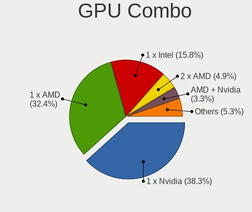

| Name           | Desktops | Percent |
|----------------|----------|---------|
| 1 x Nvidia     | 167      | 35.91%  |
| 1 x AMD        | 160      | 34.41%  |
| 1 x Intel      | 82       | 17.63%  |
| 2 x AMD        | 23       | 4.95%   |
| AMD + Nvidia   | 13       | 2.8%    |
| Intel + AMD    | 7        | 1.51%   |
| Intel + Nvidia | 6        | 1.29%   |
| 2 x Intel      | 3        | 0.65%   |
| 2 x Nvidia     | 2        | 0.43%   |
| Other          | 1        | 0.22%   |
| 1 x VIA        | 1        | 0.22%   |

GPU Driver
----------

Free vs proprietary

| Driver      | Desktops | Percent |
|-------------|----------|---------|
| Free        | 337      | 72.32%  |
| Proprietary | 100      | 21.46%  |
| Unknown     | 29       | 6.22%   |

GPU Memory
----------

Total video memory

| Size in GB | Desktops | Percent |
|------------|----------|---------|
| Unknown    | 160      | 33.9%   |
| 7.01-8.0   | 70       | 14.83%  |
| 8.01-16.0  | 50       | 10.59%  |
| 1.01-2.0   | 46       | 9.75%   |
| 3.01-4.0   | 42       | 8.9%    |
| 0.51-1.0   | 35       | 7.42%   |
| 0.01-0.5   | 35       | 7.42%   |
| 5.01-6.0   | 17       | 3.6%    |
| 16.01-24.0 | 14       | 2.97%   |
| 2.01-3.0   | 3        | 0.64%   |

Monitor
-------

Monitor Vendor
--------------

Monitor vendors

| Vendor               | Desktops | Percent |
|----------------------|----------|---------|
| Goldstar             | 77       | 14.86%  |
| Samsung Electronics  | 75       | 14.48%  |
| Dell                 | 70       | 13.51%  |
| Acer                 | 33       | 6.37%   |
| Hewlett-Packard      | 26       | 5.02%   |
| AOC                  | 24       | 4.63%   |
| Philips              | 21       | 4.05%   |
| Ancor Communications | 21       | 4.05%   |
| Lenovo               | 17       | 3.28%   |
| BenQ                 | 16       | 3.09%   |
| ASUSTek Computer     | 15       | 2.9%    |
| MSI                  | 14       | 2.7%    |
| ViewSonic            | 9        | 1.74%   |
| Iiyama               | 8        | 1.54%   |
| Sony                 | 6        | 1.16%   |
| Mi                   | 6        | 1.16%   |
| Gigabyte Technology  | 6        | 1.16%   |
| Unknown              | 5        | 0.97%   |
| Panasonic            | 5        | 0.97%   |
| NEC Computers        | 5        | 0.97%   |
| Insignia             | 4        | 0.77%   |
| Vizio                | 3        | 0.58%   |
| RTK                  | 3        | 0.58%   |
| HannStar             | 3        | 0.58%   |
| VIE                  | 2        | 0.39%   |
| Toshiba              | 2        | 0.39%   |
| Sceptre Tech         | 2        | 0.39%   |
| Pixio                | 2        | 0.39%   |
| Medion               | 2        | 0.39%   |
| Kogan                | 2        | 0.39%   |
| HUAWEI               | 2        | 0.39%   |
| Fujitsu Siemens      | 2        | 0.39%   |
| Eizo                 | 2        | 0.39%   |
| AOpen                | 2        | 0.39%   |
| ___                  | 1        | 0.19%   |
| UGD                  | 1        | 0.19%   |
| TXD                  | 1        | 0.19%   |
| STD                  | 1        | 0.19%   |
| SANSUI               | 1        | 0.19%   |
| SAC                  | 1        | 0.19%   |

Monitor Model
-------------

Monitor models

| Model                                                                   | Desktops | Percent |
|-------------------------------------------------------------------------|----------|---------|
| Dell S2721DGF DEL41D9 2560x1440 597x336mm 27.0-inch                     | 6        | 1.07%   |
| Unknown LCD Monitor FFFF 2288x1287 2550x2550mm 142.0-inch               | 5        | 0.89%   |
| AOC 27G2G8 AOC2702 1920x1080 598x336mm 27.0-inch                        | 5        | 0.89%   |
| Lenovo LEN L1711pC LEN13B7 1280x1024 338x270mm 17.0-inch                | 4        | 0.71%   |
| Goldstar HDR 4K GSM7707 3840x2160 600x340mm 27.2-inch                   | 4        | 0.71%   |
| Dell S2719DGF DELD0E6 2560x1440 600x340mm 27.2-inch                     | 4        | 0.71%   |
| Samsung Electronics C24F390 SAM0D2C 1920x1080 521x293mm 23.5-inch       | 3        | 0.53%   |
| Panasonic TV MEIA296 3840x2160 698x392mm 31.5-inch                      | 3        | 0.53%   |
| MSI G241 MSI3BA4 1920x1080 527x296mm 23.8-inch                          | 3        | 0.53%   |
| Mi Monitor XMI3444 3440x1440 797x334mm 34.0-inch                        | 3        | 0.53%   |
| Goldstar Ultra HD GSM5B09 3840x2160 600x340mm 27.2-inch                 | 3        | 0.53%   |
| Goldstar TV SSCR2 GSMC0C8 3840x2160                                     | 3        | 0.53%   |
| Goldstar LG ULTRAGEAR GSM5B7F 2560x1440 600x340mm 27.2-inch             | 3        | 0.53%   |
| Goldstar HDR 4K GSM774F 3840x2160 697x392mm 31.5-inch                   | 3        | 0.53%   |
| Goldstar FULL HD GSM5B55 1920x1080 480x270mm 21.7-inch                  | 3        | 0.53%   |
| Dell P1917S DELD091 1280x1024 380x300mm 19.1-inch                       | 3        | 0.53%   |
| ASUSTek Computer VP28U AUS28B1 3840x2160 621x341mm 27.9-inch            | 3        | 0.53%   |
| AOC 24G2W1G4 AOC2402 1920x1080 527x296mm 23.8-inch                      | 3        | 0.53%   |
| ViewSonic VX3276-QHD VSCE635 2560x1440 698x393mm 31.5-inch              | 2        | 0.36%   |
| Sony TV SNYA102 1920x1080 708x398mm 32.0-inch                           | 2        | 0.36%   |
| Samsung Electronics U32J59x SAM0F35 3840x2160 697x392mm 31.5-inch       | 2        | 0.36%   |
| Samsung Electronics U28E590 SAM0C4D 3840x2160 607x345mm 27.5-inch       | 2        | 0.36%   |
| Samsung Electronics SyncMaster SAM0526 1920x1080 510x287mm 23.0-inch    | 2        | 0.36%   |
| Samsung Electronics SyncMaster SAM03E1 1440x900 410x260mm 19.1-inch     | 2        | 0.36%   |
| Samsung Electronics S27F350 SAM0D22 1920x1080 598x336mm 27.0-inch       | 2        | 0.36%   |
| Samsung Electronics S27D360 SAM0B27 1920x1080 598x336mm 27.0-inch       | 2        | 0.36%   |
| Samsung Electronics S24D590 SAM0B47 1920x1080 521x293mm 23.5-inch       | 2        | 0.36%   |
| Samsung Electronics S24D300 SAM0B43 1920x1080 531x299mm 24.0-inch       | 2        | 0.36%   |
| Samsung Electronics LS49AG95 SAM71AC 3840x1080 1193x336mm 48.8-inch     | 2        | 0.36%   |
| Samsung Electronics LF27T35 SAM707F 1920x1080 598x337mm 27.0-inch       | 2        | 0.36%   |
| Samsung Electronics LF24T35 SAM707D 1920x1080 528x297mm 23.9-inch       | 2        | 0.36%   |
| Samsung Electronics LCD Monitor SAM7048 1366x768 522x293mm 23.6-inch    | 2        | 0.36%   |
| Samsung Electronics LCD Monitor SAM7016 3840x2160 1872x1053mm 84.6-inch | 2        | 0.36%   |
| Samsung Electronics LCD Monitor SAM0659 1920x1080                       | 2        | 0.36%   |
| Philips PHL 276E8V PHLC18F 3840x2160 597x336mm 27.0-inch                | 2        | 0.36%   |
| Philips PHL 272E1GJ PHLC245 1920x1080 598x336mm 27.0-inch               | 2        | 0.36%   |
| Philips PHL 243V5 PHLC0D1 1920x1080 521x293mm 23.5-inch                 | 2        | 0.36%   |
| MSI MP242 MSI30A1 1920x1080 527x296mm 23.8-inch                         | 2        | 0.36%   |
| Lenovo D24-20 LEN66AE 1920x1080 527x296mm 23.8-inch                     | 2        | 0.36%   |
| Iiyama PLE2483H IVM6113 1920x1080 531x299mm 24.0-inch                   | 2        | 0.36%   |

Monitor Resolution
------------------

Monitor screen resolution

| Resolution         | Desktops | Percent |
|--------------------|----------|---------|
| 1920x1080 (FHD)    | 217      | 42.8%   |
| 3840x2160 (4K)     | 81       | 15.98%  |
| 2560x1440 (QHD)    | 74       | 14.6%   |
| 1280x1024 (SXGA)   | 26       | 5.13%   |
| 1680x1050 (WSXGA+) | 14       | 2.76%   |
| 3440x1440          | 13       | 2.56%   |
| 1366x768 (WXGA)    | 13       | 2.56%   |
| 2560x1080          | 11       | 2.17%   |
| 1600x900 (HD+)     | 10       | 1.97%   |
| 1440x900 (WXGA+)   | 10       | 1.97%   |
| 1920x1200 (WUXGA)  | 8        | 1.58%   |
| 3840x1080          | 7        | 1.38%   |
| 2288x1287          | 5        | 0.99%   |
| 1920x540           | 4        | 0.79%   |
| 1600x1200          | 4        | 0.79%   |
| 1360x768           | 4        | 0.79%   |
| 3840x1600          | 2        | 0.39%   |
| 2200x1650          | 1        | 0.2%    |
| 1280x800 (WXGA)    | 1        | 0.2%    |
| 1280x720 (HD)      | 1        | 0.2%    |
| Unknown            | 1        | 0.2%    |

Monitor Diagonal
----------------

Diagonal size in inches

| Inches  | Desktops | Percent |
|---------|----------|---------|
| 27      | 115      | 21.7%   |
| 23      | 73       | 13.77%  |
| 24      | 67       | 12.64%  |
| 31      | 50       | 9.43%   |
| 21      | 48       | 9.06%   |
| 19      | 26       | 4.91%   |
| 34      | 22       | 4.15%   |
| 20      | 15       | 2.83%   |
| 18      | 13       | 2.45%   |
| Unknown | 12       | 2.26%   |
| 84      | 8        | 1.51%   |
| 22      | 8        | 1.51%   |
| 48      | 7        | 1.32%   |
| 72      | 6        | 1.13%   |
| 17      | 6        | 1.13%   |
| 142     | 5        | 0.94%   |
| 32      | 5        | 0.94%   |
| 26      | 5        | 0.94%   |
| 25      | 5        | 0.94%   |
| 15      | 4        | 0.75%   |
| 54      | 3        | 0.57%   |
| 42      | 3        | 0.57%   |
| 28      | 3        | 0.57%   |
| 47      | 2        | 0.38%   |
| 46      | 2        | 0.38%   |
| 37      | 2        | 0.38%   |
| 36      | 2        | 0.38%   |
| 33      | 2        | 0.38%   |
| 86      | 1        | 0.19%   |
| 85      | 1        | 0.19%   |
| 63      | 1        | 0.19%   |
| 60      | 1        | 0.19%   |
| 50      | 1        | 0.19%   |
| 49      | 1        | 0.19%   |
| 44      | 1        | 0.19%   |
| 41      | 1        | 0.19%   |
| 38      | 1        | 0.19%   |
| 35      | 1        | 0.19%   |
| 14      | 1        | 0.19%   |

Monitor Width
-------------

Physical width

| Width in mm    | Desktops | Percent |
|----------------|----------|---------|
| 501-600        | 230      | 45.63%  |
| 401-500        | 90       | 17.86%  |
| 601-700        | 62       | 12.3%   |
| 701-800        | 31       | 6.15%   |
| 351-400        | 21       | 4.17%   |
| 1001-1500      | 19       | 3.77%   |
| 1501-2000      | 15       | 2.98%   |
| Unknown        | 12       | 2.38%   |
| 301-350        | 9        | 1.79%   |
| More than 2000 | 5        | 0.99%   |
| 901-1000       | 5        | 0.99%   |
| 801-900        | 4        | 0.79%   |
| 201-300        | 1        | 0.2%    |

Aspect Ratio
------------

Proportional relationship between the width and the height

| Ratio   | Desktops | Percent |
|---------|----------|---------|
| 16/9    | 349      | 75.54%  |
| 16/10   | 37       | 8.01%   |
| 21/9    | 25       | 5.41%   |
| 5/4     | 21       | 4.55%   |
| 32/9    | 7        | 1.52%   |
| 6/5     | 5        | 1.08%   |
| 4/3     | 5        | 1.08%   |
| 1.00    | 5        | 1.08%   |
| Unknown | 5        | 1.08%   |
| 3/2     | 1        | 0.22%   |
| 1.96    | 1        | 0.22%   |
| 0.56    | 1        | 0.22%   |

Monitor Area
------------

Area in inch

| Area in inch | Desktops | Percent |
|----------------|----------|---------|
| 201-250        | 161      | 31.14%  |
| 301-350        | 118      | 22.82%  |
| 351-500        | 81       | 15.67%  |
| 151-200        | 56       | 10.83%  |
| More than 1000 | 28       | 5.42%   |
| 501-1000       | 22       | 4.26%   |
| 251-300        | 21       | 4.06%   |
| 141-150        | 12       | 2.32%   |
| Unknown        | 12       | 2.32%   |
| 101-110        | 4        | 0.77%   |
| 131-140        | 1        | 0.19%   |
| 91-100         | 1        | 0.19%   |

Pixel Density
-------------

Pixels per inch

| Density | Desktops | Percent |
|---------|----------|---------|
| 51-100  | 292      | 60.71%  |
| 101-120 | 106      | 22.04%  |
| 121-160 | 35       | 7.28%   |
| 1-50    | 22       | 4.57%   |
| 161-240 | 14       | 2.91%   |
| Unknown | 12       | 2.49%   |

Multiple Monitors
-----------------

Total monitors connected

| Total | Desktops | Percent |
|-------|----------|---------|
| 1     | 332      | 70.49%  |
| 2     | 97       | 20.59%  |
| 0     | 25       | 5.31%   |
| 3     | 14       | 2.97%   |
| 6     | 2        | 0.42%   |
| 4     | 1        | 0.21%   |

Network
-------

Net Controller Vendor
---------------------

Controller vendors

| Vendor                          | Desktops | Percent |
|---------------------------------|----------|---------|
| Realtek Semiconductor           | 308      | 43.69%  |
| Intel                           | 230      | 32.62%  |
| MediaTek                        | 34       | 4.82%   |
| Qualcomm Atheros                | 25       | 3.55%   |
| Broadcom                        | 19       | 2.7%    |
| TP-Link                         | 12       | 1.7%    |
| Qualcomm Atheros Communications | 7        | 0.99%   |
| Microsoft                       | 7        | 0.99%   |
| Ralink Technology               | 6        | 0.85%   |
| Ralink                          | 6        | 0.85%   |
| NetGear                         | 5        | 0.71%   |
| ASIX Electronics                | 5        | 0.71%   |
| Nvidia                          | 4        | 0.57%   |
| Aquantia                        | 4        | 0.57%   |
| Google                          | 3        | 0.43%   |
| D-Link                          | 3        | 0.43%   |
| Motorola PCS                    | 2        | 0.28%   |
| Mellanox Technologies           | 2        | 0.28%   |
| Marvell Technology Group        | 2        | 0.28%   |
| ZyDAS                           | 1        | 0.14%   |
| Xiaomi                          | 1        | 0.14%   |
| VIA Technologies                | 1        | 0.14%   |
| Sharp                           | 1        | 0.14%   |
| Qualcomm                        | 1        | 0.14%   |
| OPPO Electronics                | 1        | 0.14%   |
| Oculus VR                       | 1        | 0.14%   |
| Mercucys                        | 1        | 0.14%   |
| Linksys                         | 1        | 0.14%   |
| Lenovo                          | 1        | 0.14%   |
| JMicron Technology              | 1        | 0.14%   |
| Hyperkin                        | 1        | 0.14%   |
| Huawei Technologies             | 1        | 0.14%   |
| Holtek Semiconductor            | 1        | 0.14%   |
| DisplayLink                     | 1        | 0.14%   |
| D-Link System                   | 1        | 0.14%   |
| Broadcom Limited                | 1        | 0.14%   |
| AVM                             | 1        | 0.14%   |
| ASUSTek Computer                | 1        | 0.14%   |
| American Future Technology      | 1        | 0.14%   |
| Unknown                         | 1        | 0.14%   |

Net Controller Model
--------------------

Controller models

| Model                                                                  | Desktops | Percent |
|------------------------------------------------------------------------|----------|---------|
| Realtek RTL8111/8168/8211/8411 PCI Express Gigabit Ethernet Controller | 209      | 25.74%  |
| Realtek RTL8125 2.5GbE Controller                                      | 72       | 8.87%   |
| Intel Wi-Fi 6 AX200                                                    | 45       | 5.54%   |
| Intel I211 Gigabit Network Connection                                  | 33       | 4.06%   |
| Intel Ethernet Controller I225-V                                       | 31       | 3.82%   |
| Intel Wi-Fi 6E(802.11ax) AX210/AX1675* 2x2 [Typhoon Peak]              | 26       | 3.2%    |
| MediaTek MT7922 802.11ax PCI Express Wireless Network Adapter          | 20       | 2.46%   |
| Intel Ethernet Connection (2) I219-V                                   | 13       | 1.6%    |
| Intel Alder Lake-S PCH CNVi WiFi                                       | 10       | 1.23%   |
| Intel Wi-Fi 5(802.11ac) Wireless-AC 9x6x [Thunder Peak]                | 9        | 1.11%   |
| Intel Ethernet Connection (17) I219-V                                  | 9        | 1.11%   |
| Intel Dual Band Wireless-AC 3168NGW [Stone Peak]                       | 9        | 1.11%   |
| Intel 82574L Gigabit Network Connection                                | 9        | 1.11%   |
| Broadcom BCM4360 802.11ac Dual Band Wireless Network Adapter           | 9        | 1.11%   |
| Realtek RTL8821CE 802.11ac PCIe Wireless Network Adapter               | 8        | 0.99%   |
| MediaTek MT7921K (RZ608) Wi-Fi 6E 80MHz                                | 7        | 0.86%   |
| Intel Ethernet Connection (7) I219-V                                   | 7        | 0.86%   |
| Realtek RTL8188EUS 802.11n Wireless Network Adapter                    | 6        | 0.74%   |
| Qualcomm Atheros AR9271 802.11n                                        | 6        | 0.74%   |
| Intel Raptor Lake-S PCH CNVi WiFi                                      | 6        | 0.74%   |
| Intel Ethernet Connection (2) I218-V                                   | 6        | 0.74%   |
| Intel 82579LM Gigabit Network Connection (Lewisville)                  | 6        | 0.74%   |
| Realtek RTL8153 Gigabit Ethernet Adapter                               | 5        | 0.62%   |
| Realtek Killer E3000 2.5GbE Controller                                 | 5        | 0.62%   |
| Qualcomm Atheros AR9485 Wireless Network Adapter                       | 5        | 0.62%   |
| Microsoft Xbox Wireless Adapter for Windows                            | 5        | 0.62%   |
| Intel Ethernet Connection I217-LM                                      | 5        | 0.62%   |
| Intel Ethernet Connection (2) I219-LM                                  | 5        | 0.62%   |
| Realtek RTL8852CE PCIe 802.11ax Wireless Network Controller            | 4        | 0.49%   |
| Realtek RTL8822BE 802.11a/b/g/n/ac WiFi adapter                        | 4        | 0.49%   |
| Realtek RTL810xE PCI Express Fast Ethernet controller                  | 4        | 0.49%   |
| Ralink MT7601U Wireless Adapter                                        | 4        | 0.49%   |
| Qualcomm Atheros Killer E220x Gigabit Ethernet Controller              | 4        | 0.49%   |
| MediaTek MT7921 802.11ax PCI Express Wireless Network Adapter          | 4        | 0.49%   |
| Intel Wireless 7260                                                    | 4        | 0.49%   |
| Intel Wireless 3165                                                    | 4        | 0.49%   |
| Intel Comet Lake PCH CNVi WiFi                                         | 4        | 0.49%   |
| Intel 82579V Gigabit Network Connection                                | 4        | 0.49%   |
| Intel 82567LM-3 Gigabit Network Connection                             | 4        | 0.49%   |
| ASIX AX88179 Gigabit Ethernet                                          | 4        | 0.49%   |

Wireless Vendor
---------------

Wireless vendors

| Vendor                          | Desktops | Percent |
|---------------------------------|----------|---------|
| Intel                           | 128      | 44.6%   |
| Realtek Semiconductor           | 49       | 17.07%  |
| MediaTek                        | 34       | 11.85%  |
| Broadcom                        | 14       | 4.88%   |
| TP-Link                         | 12       | 4.18%   |
| Qualcomm Atheros                | 12       | 4.18%   |
| Qualcomm Atheros Communications | 7        | 2.44%   |
| Microsoft                       | 7        | 2.44%   |
| Ralink Technology               | 6        | 2.09%   |
| Ralink                          | 6        | 2.09%   |
| NetGear                         | 5        | 1.74%   |
| D-Link                          | 2        | 0.7%    |
| ZyDAS                           | 1        | 0.35%   |
| Mercucys                        | 1        | 0.35%   |
| Linksys                         | 1        | 0.35%   |
| AVM                             | 1        | 0.35%   |
| ASUSTek Computer                | 1        | 0.35%   |

Wireless Model
--------------

Wireless models

| Model                                                         | Desktops | Percent |
|---------------------------------------------------------------|----------|---------|
| Intel Wi-Fi 6 AX200                                           | 45       | 15.68%  |
| Intel Wi-Fi 6E(802.11ax) AX210/AX1675* 2x2 [Typhoon Peak]     | 26       | 9.06%   |
| MediaTek MT7922 802.11ax PCI Express Wireless Network Adapter | 20       | 6.97%   |
| Intel Alder Lake-S PCH CNVi WiFi                              | 10       | 3.48%   |
| Intel Wi-Fi 5(802.11ac) Wireless-AC 9x6x [Thunder Peak]       | 9        | 3.14%   |
| Intel Dual Band Wireless-AC 3168NGW [Stone Peak]              | 9        | 3.14%   |
| Broadcom BCM4360 802.11ac Dual Band Wireless Network Adapter  | 9        | 3.14%   |
| Realtek RTL8821CE 802.11ac PCIe Wireless Network Adapter      | 8        | 2.79%   |
| MediaTek MT7921K (RZ608) Wi-Fi 6E 80MHz                       | 7        | 2.44%   |
| Realtek RTL8188EUS 802.11n Wireless Network Adapter           | 6        | 2.09%   |
| Qualcomm Atheros AR9271 802.11n                               | 6        | 2.09%   |
| Intel Raptor Lake-S PCH CNVi WiFi                             | 6        | 2.09%   |
| Qualcomm Atheros AR9485 Wireless Network Adapter              | 5        | 1.74%   |
| Microsoft Xbox Wireless Adapter for Windows                   | 5        | 1.74%   |
| Realtek RTL8852CE PCIe 802.11ax Wireless Network Controller   | 4        | 1.39%   |
| Realtek RTL8822BE 802.11a/b/g/n/ac WiFi adapter               | 4        | 1.39%   |
| Ralink MT7601U Wireless Adapter                               | 4        | 1.39%   |
| MediaTek MT7921 802.11ax PCI Express Wireless Network Adapter | 4        | 1.39%   |
| Intel Wireless 7260                                           | 4        | 1.39%   |
| Intel Wireless 3165                                           | 4        | 1.39%   |
| Intel Comet Lake PCH CNVi WiFi                                | 4        | 1.39%   |
| TP-Link TL-WN722N v2/v3 [Realtek RTL8188EUS]                  | 3        | 1.05%   |
| Realtek RTL8852BE PCIe 802.11ax Wireless Network Controller   | 3        | 1.05%   |
| Realtek RTL8192CU 802.11n WLAN Adapter                        | 3        | 1.05%   |
| Realtek RTL8188EE Wireless Network Adapter                    | 3        | 1.05%   |
| Intel Wireless 7265                                           | 3        | 1.05%   |
| TP-Link TL-WN823N v2/v3 [Realtek RTL8192EU]                   | 2        | 0.7%    |
| TP-Link 802.11n NIC                                           | 2        | 0.7%    |
| Realtek RTL88x2bu [AC1200 Techkey]                            | 2        | 0.7%    |
| Realtek RTL8822CE 802.11ac PCIe Wireless Network Adapter      | 2        | 0.7%    |
| Realtek RTL8812AE 802.11ac PCIe Wireless Network Adapter      | 2        | 0.7%    |
| Realtek RTL8188CE 802.11b/g/n WiFi Adapter                    | 2        | 0.7%    |
| Realtek 802.11ac WLAN Adapter                                 | 2        | 0.7%    |
| Qualcomm Atheros QCA9565 / AR9565 Wireless Network Adapter    | 2        | 0.7%    |
| Qualcomm Atheros QCA6174 802.11ac Wireless Network Adapter    | 2        | 0.7%    |
| NetGear WG111v3 54 Mbps Wireless [realtek RTL8187B]           | 2        | 0.7%    |
| Microsoft Xbox 360 Wireless Adapter                           | 2        | 0.7%    |
| MediaTek WiFi                                                 | 2        | 0.7%    |
| Intel Wireless 8260                                           | 2        | 0.7%    |
| Intel Centrino Wireless-N 2230                                | 2        | 0.7%    |

Ethernet Vendor
---------------

Ethernet vendors

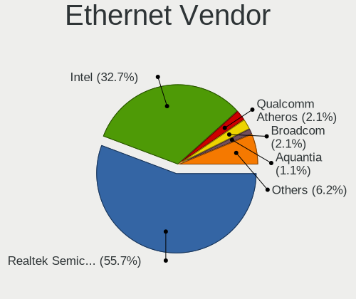

| Vendor                   | Desktops | Percent |
|--------------------------|----------|---------|
| Realtek Semiconductor    | 292      | 58.28%  |
| Intel                    | 157      | 31.34%  |
| Qualcomm Atheros         | 13       | 2.59%   |
| Broadcom                 | 6        | 1.2%    |
| ASIX Electronics         | 5        | 1%      |
| Nvidia                   | 4        | 0.8%    |
| Aquantia                 | 4        | 0.8%    |
| Google                   | 3        | 0.6%    |
| Motorola PCS             | 2        | 0.4%    |
| Mellanox Technologies    | 2        | 0.4%    |
| Marvell Technology Group | 2        | 0.4%    |
| Xiaomi                   | 1        | 0.2%    |
| VIA Technologies         | 1        | 0.2%    |
| Sharp                    | 1        | 0.2%    |
| Qualcomm                 | 1        | 0.2%    |
| OPPO Electronics         | 1        | 0.2%    |
| Lenovo                   | 1        | 0.2%    |
| JMicron Technology       | 1        | 0.2%    |
| DisplayLink              | 1        | 0.2%    |
| D-Link System            | 1        | 0.2%    |
| D-Link                   | 1        | 0.2%    |
| Broadcom Limited         | 1        | 0.2%    |

Ethernet Model
--------------

Ethernet models

| Model                                                                          | Desktops | Percent |
|--------------------------------------------------------------------------------|----------|---------|
| Realtek RTL8111/8168/8211/8411 PCI Express Gigabit Ethernet Controller         | 209      | 40.27%  |
| Realtek RTL8125 2.5GbE Controller                                              | 72       | 13.87%  |
| Intel I211 Gigabit Network Connection                                          | 33       | 6.36%   |
| Intel Ethernet Controller I225-V                                               | 31       | 5.97%   |
| Intel Ethernet Connection (2) I219-V                                           | 13       | 2.5%    |
| Intel Ethernet Connection (17) I219-V                                          | 9        | 1.73%   |
| Intel 82574L Gigabit Network Connection                                        | 9        | 1.73%   |
| Intel Ethernet Connection (7) I219-V                                           | 7        | 1.35%   |
| Intel Ethernet Connection (2) I218-V                                           | 6        | 1.16%   |
| Intel 82579LM Gigabit Network Connection (Lewisville)                          | 6        | 1.16%   |
| Realtek RTL8153 Gigabit Ethernet Adapter                                       | 5        | 0.96%   |
| Realtek Killer E3000 2.5GbE Controller                                         | 5        | 0.96%   |
| Intel Ethernet Connection I217-LM                                              | 5        | 0.96%   |
| Intel Ethernet Connection (2) I219-LM                                          | 5        | 0.96%   |
| Realtek RTL810xE PCI Express Fast Ethernet controller                          | 4        | 0.77%   |
| Qualcomm Atheros Killer E220x Gigabit Ethernet Controller                      | 4        | 0.77%   |
| Intel 82579V Gigabit Network Connection                                        | 4        | 0.77%   |
| Intel 82567LM-3 Gigabit Network Connection                                     | 4        | 0.77%   |
| ASIX AX88179 Gigabit Ethernet                                                  | 4        | 0.77%   |
| Qualcomm Atheros AR8151 v2.0 Gigabit Ethernet                                  | 3        | 0.58%   |
| Intel Ethernet Connection I217-V                                               | 3        | 0.58%   |
| Realtek RTL8169 PCI Gigabit Ethernet Controller                                | 2        | 0.39%   |
| Qualcomm Atheros Killer E2500 Gigabit Ethernet Controller                      | 2        | 0.39%   |
| Qualcomm Atheros AR8131 Gigabit Ethernet                                       | 2        | 0.39%   |
| Motorola PCS moto g52                                                          | 2        | 0.39%   |
| Intel I210 Gigabit Network Connection                                          | 2        | 0.39%   |
| Intel Ethernet Connection (11) I219-V                                          | 2        | 0.39%   |
| Intel Ethernet Connection (11) I219-LM                                         | 2        | 0.39%   |
| Intel 82575EB Gigabit Network Connection                                       | 2        | 0.39%   |
| Intel 82557/8/9/0/1 Ethernet Pro 100                                           | 2        | 0.39%   |
| Intel 82546GB Gigabit Ethernet Controller                                      | 2        | 0.39%   |
| Google Pixel 8                                                                 | 2        | 0.39%   |
| Broadcom NetXtreme BCM5762 Gigabit Ethernet PCIe                               | 2        | 0.39%   |
| Aquantia AQtion AQC107 NBase-T/IEEE 802.3an Ethernet Controller [Atlantic 10G] | 2        | 0.39%   |
| Xiaomi Mi/Redmi series (RNDIS + ADB)                                           | 1        | 0.19%   |
| VIA VT6102/VT6103 [Rhine-II]                                                   | 1        | 0.19%   |
| Sharp SH-M24                                                                   | 1        | 0.19%   |
| Realtek RTL8152 Fast Ethernet Adapter                                          | 1        | 0.19%   |
| Realtek RTL-8100/8101L/8139 PCI Fast Ethernet Adapter                          | 1        | 0.19%   |
| Realtek Killer E2600 GbE Controller                                            | 1        | 0.19%   |

Net Controller Kind
-------------------

Ethernet, WiFi or modem

| Kind     | Desktops | Percent |
|----------|----------|---------|
| Ethernet | 452      | 61.66%  |
| WiFi     | 275      | 37.52%  |
| Modem    | 4        | 0.55%   |
| Unknown  | 2        | 0.27%   |

Used Controller
---------------

Currently used network controller

| Kind     | Desktops | Percent |
|----------|----------|---------|
| Ethernet | 340      | 68%     |
| WiFi     | 160      | 32%     |

NICs
----

Total network controllers on board

| Total | Desktops | Percent |
|-------|----------|---------|
| 2     | 213      | 45.81%  |
| 1     | 213      | 45.81%  |
| 3     | 29       | 6.24%   |
| 4     | 4        | 0.86%   |
| 0     | 3        | 0.65%   |
| 5     | 2        | 0.43%   |
| 11    | 1        | 0.22%   |

IPv6
----

IPv6 vs IPv4

| Used | Desktops | Percent |
|------|----------|---------|
| No   | 305      | 65.31%  |
| Yes  | 162      | 34.69%  |

Bluetooth
---------

Bluetooth Vendor
----------------

Controller vendors

| Vendor                          | Desktops | Percent |
|---------------------------------|----------|---------|
| Intel                           | 119      | 47.41%  |
| Cambridge Silicon Radio         | 27       | 10.76%  |
| Realtek Semiconductor           | 24       | 9.56%   |
| MediaTek                        | 21       | 8.37%   |
| ASUSTek Computer                | 15       | 5.98%   |
| IMC Networks                    | 11       | 4.38%   |
| TP-Link                         | 8        | 3.19%   |
| Foxconn / Hon Hai               | 6        | 2.39%   |
| Apple                           | 4        | 1.59%   |
| Broadcom                        | 3        | 1.2%    |
| Realtek                         | 2        | 0.8%    |
| Qualcomm Atheros Communications | 2        | 0.8%    |
| Integrated System Solution      | 2        | 0.8%    |
| Actions                         | 2        | 0.8%    |
| Ralink                          | 1        | 0.4%    |
| Lite-On Technology              | 1        | 0.4%    |
| Hewlett-Packard                 | 1        | 0.4%    |
| Edimax Technology               | 1        | 0.4%    |
| Belkin Components               | 1        | 0.4%    |

Bluetooth Model
---------------

Controller models

| Model                                                 | Desktops | Percent |
|-------------------------------------------------------|----------|---------|
| Intel AX200 Bluetooth                                 | 41       | 16.33%  |
| Cambridge Silicon Radio Bluetooth Dongle (HCI mode)   | 27       | 10.76%  |
| Intel AX210 Bluetooth                                 | 24       | 9.56%   |
| MediaTek Wireless_Device                              | 21       | 8.37%   |
| Realtek Bluetooth Radio                               | 19       | 7.57%   |
| Intel Bluetooth Device                                | 12       | 4.78%   |
| Intel Bluetooth wireless interface                    | 11       | 4.38%   |
| Intel Wireless-AC 9260 Bluetooth Adapter              | 9        | 3.59%   |
| Intel Wireless-AC 3168 Bluetooth                      | 9        | 3.59%   |
| TP-Link UB500 Adapter                                 | 8        | 3.19%   |
| Intel AX201 Bluetooth                                 | 8        | 3.19%   |
| IMC Networks Bluetooth Radio                          | 6        | 2.39%   |
| Foxconn / Hon Hai Wireless_Device                     | 6        | 2.39%   |
| IMC Networks Wireless_Device                          | 5        | 1.99%   |
| ASUS ASUS USB-BT500                                   | 5        | 1.99%   |
| Intel Bluetooth 9460/9560 Jefferson Peak (JfP)        | 3        | 1.2%    |
| Broadcom BCM20702A0 Bluetooth 4.0                     | 3        | 1.2%    |
| ASUS Broadcom BCM20702A0 Bluetooth                    | 3        | 1.2%    |
| Realtek  Bluetooth 4.2 Adapter                        | 2        | 0.8%    |
| Realtek Bluetooth 5.3 Radio                           | 2        | 0.8%    |
| Realtek Bluetooth Radio                               | 2        | 0.8%    |
| Intel Centrino Bluetooth Wireless Transceiver         | 2        | 0.8%    |
| Integrated System Solution Bluetooth Device           | 2        | 0.8%    |
| ASUS Qualcomm Bluetooth 4.1                           | 2        | 0.8%    |
| ASUS Broadcom BCM20702 Single-Chip Bluetooth 4.0 + LE | 2        | 0.8%    |
| ASUS Bluetooth Radio                                  | 2        | 0.8%    |
| Apple Built-in Bluetooth 2.0+EDR HCI                  | 2        | 0.8%    |
| Actions general adapter                               | 2        | 0.8%    |
| Realtek RTL8822BE Bluetooth 4.2 Adapter               | 1        | 0.4%    |
| Ralink RT3290 Bluetooth                               | 1        | 0.4%    |
| Qualcomm Atheros  Bluetooth Device                    | 1        | 0.4%    |
| Qualcomm Atheros AR9462 Bluetooth                     | 1        | 0.4%    |
| Lite-On Bluetooth Radio                               | 1        | 0.4%    |
| HP Bluetooth 2.0 Interface [Broadcom BCM2045]         | 1        | 0.4%    |
| Edimax Bluetooth Adapter                              | 1        | 0.4%    |
| Belkin Components F8T013 Bluetooth Adapter            | 1        | 0.4%    |
| ASUS Bluetooth Device                                 | 1        | 0.4%    |
| Apple Bluetooth USB Host Controller                   | 1        | 0.4%    |
| Apple Bluetooth Host Controller                       | 1        | 0.4%    |

Sound
-----

Sound Vendor
------------

Sound card vendors

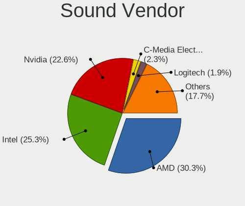

| Vendor                               | Desktops | Percent |
|--------------------------------------|----------|---------|
| AMD                                  | 278      | 31.81%  |
| Intel                                | 216      | 24.71%  |
| Nvidia                               | 185      | 21.17%  |
| C-Media Electronics                  | 24       | 2.75%   |
| Logitech                             | 15       | 1.72%   |
| SteelSeries ApS                      | 11       | 1.26%   |
| ASUSTek Computer                     | 11       | 1.26%   |
| Micro Star International             | 9        | 1.03%   |
| Creative Labs                        | 8        | 0.92%   |
| JMTek                                | 7        | 0.8%    |
| Generalplus Technology               | 7        | 0.8%    |
| Kingston Technology                  | 6        | 0.69%   |
| GN Netcom                            | 6        | 0.69%   |
| Thesycon Systemsoftware & Consulting | 5        | 0.57%   |
| Razer USA                            | 5        | 0.57%   |
| Texas Instruments                    | 4        | 0.46%   |
| RODE Microphones                     | 4        | 0.46%   |
| Plantronics                          | 4        | 0.46%   |
| Hewlett-Packard                      | 4        | 0.46%   |
| Focusrite-Novation                   | 4        | 0.46%   |
| Samson Technologies                  | 3        | 0.34%   |
| Realtek Semiconductor                | 3        | 0.34%   |
| FIFINE Microphones                   | 3        | 0.34%   |
| Corsair                              | 3        | 0.34%   |
| Tenx Technology                      | 2        | 0.23%   |
| Nordic Semiconductor ASA             | 2        | 0.23%   |
| Mark of the Unicorn                  | 2        | 0.23%   |
| M-Audio                              | 2        | 0.23%   |
| JBL                                  | 2        | 0.23%   |
| Elite Silicon                        | 2        | 0.23%   |
| BEHRINGER International              | 2        | 0.23%   |
| ASRock                               | 2        | 0.23%   |
| Arturia                              | 2        | 0.23%   |
| Weltrend Semiconductor               | 1        | 0.11%   |
| VIA Technologies                     | 1        | 0.11%   |
| Valve Software                       | 1        | 0.11%   |
| Trust                                | 1        | 0.11%   |
| Soundprese                           | 1        | 0.11%   |
| Sony                                 | 1        | 0.11%   |
| Solid State Logic                    | 1        | 0.11%   |

Sound Model
-----------

Sound card models

| Model                                                                      | Desktops | Percent |
|----------------------------------------------------------------------------|----------|---------|
| AMD Starship/Matisse HD Audio Controller                                   | 92       | 8.61%   |
| AMD Family 17h/19h HD Audio Controller                                     | 70       | 6.55%   |
| AMD Navi 21/23 HDMI/DP Audio Controller                                    | 48       | 4.49%   |
| AMD Rembrandt Radeon High Definition Audio Controller                      | 33       | 3.09%   |
| AMD Renoir Radeon High Definition Audio Controller                         | 27       | 2.53%   |
| AMD Ellesmere HDMI Audio [Radeon RX 470/480 / 570/580/590]                 | 27       | 2.53%   |
| Intel Alder Lake-S HD Audio Controller                                     | 25       | 2.34%   |
| AMD Navi 31 HDMI/DP Audio                                                  | 25       | 2.34%   |
| AMD SBx00 Azalia (Intel HDA)                                               | 24       | 2.25%   |
| AMD Family 17h (Models 00h-0fh) HD Audio Controller                        | 21       | 1.97%   |
| Intel 8 Series/C220 Series Chipset High Definition Audio Controller        | 20       | 1.87%   |
| Intel 100 Series/C230 Series Chipset Family HD Audio Controller            | 20       | 1.87%   |
| Intel 6 Series/C200 Series Chipset Family High Definition Audio Controller | 18       | 1.69%   |
| Nvidia GA106 High Definition Audio Controller                              | 17       | 1.59%   |
| Intel 7 Series/C216 Chipset Family High Definition Audio Controller        | 17       | 1.59%   |
| Intel Cannon Lake PCH cAVS                                                 | 16       | 1.5%    |
| Intel 200 Series PCH HD Audio                                              | 16       | 1.5%    |
| Nvidia TU116 High Definition Audio Controller                              | 15       | 1.4%    |
| Intel Xeon E3-1200 v3/4th Gen Core Processor HD Audio Controller           | 13       | 1.22%   |
| AMD Navi 10 HDMI Audio                                                     | 13       | 1.22%   |
| Nvidia TU106 High Definition Audio Controller                              | 12       | 1.12%   |
| Nvidia GP104 High Definition Audio Controller                              | 12       | 1.12%   |
| Nvidia GA104 High Definition Audio Controller                              | 11       | 1.03%   |
| Nvidia Audio device                                                        | 11       | 1.03%   |
| ASUSTek Computer USB Audio                                                 | 11       | 1.03%   |
| Nvidia GP108 High Definition Audio Controller                              | 10       | 0.94%   |
| Nvidia GK208 HDMI/DP Audio Controller                                      | 9        | 0.84%   |
| Nvidia GF119 HDMI Audio Controller                                         | 9        | 0.84%   |
| Nvidia GA102 High Definition Audio Controller                              | 9        | 0.84%   |
| Micro Star International USB Audio                                         | 9        | 0.84%   |
| Intel 5 Series/3400 Series Chipset High Definition Audio                   | 9        | 0.84%   |
| AMD Raven/Raven2/Fenghuang HDMI/DP Audio Controller                        | 9        | 0.84%   |
| AMD FCH Azalia Controller                                                  | 9        | 0.84%   |
| AMD Baffin HDMI/DP Audio [Radeon RX 550 640SP / RX 560/560X]               | 9        | 0.84%   |
| Nvidia TU104 HD Audio Controller                                           | 8        | 0.75%   |
| Nvidia GP107GL High Definition Audio Controller                            | 8        | 0.75%   |
| Intel Raptor Lake High Definition Audio Controller                         | 8        | 0.75%   |
| Intel NM10/ICH7 Family High Definition Audio Controller                    | 8        | 0.75%   |
| Nvidia GP106 High Definition Audio Controller                              | 7        | 0.66%   |
| Nvidia GM107 High Definition Audio Controller [GeForce 940MX]              | 7        | 0.66%   |

Memory
------

Memory Vendor
-------------

Memory module vendors

| Vendor                               | Desktops | Percent |
|--------------------------------------|----------|---------|
| Corsair                              | 29       | 17.37%  |
| G.Skill                              | 26       | 15.57%  |
| Kingston                             | 23       | 13.77%  |
| Unknown                              | 20       | 11.98%  |
| Crucial                              | 16       | 9.58%   |
| Samsung Electronics                  | 7        | 4.19%   |
| SK hynix                             | 6        | 3.59%   |
| Team                                 | 5        | 2.99%   |
| Unknown                              | 4        | 2.4%    |
| Patriot                              | 3        | 1.8%    |
| Micron Technology                    | 3        | 1.8%    |
| A-DATA Technology                    | 3        | 1.8%    |
| Patriot Memory                       | 2        | 1.2%    |
| Nanya Technology                     | 2        | 1.2%    |
| Wodposit                             | 1        | 0.6%    |
| V-GeN                                | 1        | 0.6%    |
| Unknown (ABCD)                       | 1        | 0.6%    |
| Unknown (09D5)                       | 1        | 0.6%    |
| TakeMS                               | 1        | 0.6%    |
| Smart                                | 1        | 0.6%    |
| Silicon Power                        | 1        | 0.6%    |
| Ramaxel Technology                   | 1        | 0.6%    |
| Lexar                                | 1        | 0.6%    |
| Kllisre                              | 1        | 0.6%    |
| Kingmax                              | 1        | 0.6%    |
| Hikvision                            | 1        | 0.6%    |
| CUSO                                 | 1        | 0.6%    |
| Chun Well Technology Holding Limited | 1        | 0.6%    |
| Chun Well                            | 1        | 0.6%    |
| Atermiter                            | 1        | 0.6%    |
| Apacer                               | 1        | 0.6%    |
| AMD                                  | 1        | 0.6%    |

Memory Model
------------

Memory module models

| Model                                                          | Desktops | Percent |
|----------------------------------------------------------------|----------|---------|
| Unknown                                                        | 4        | 2.23%   |
| Unknown RAM Module 4GB DIMM 1333MT/s                           | 3        | 1.68%   |
| Unknown RAM Module 2GB DIMM DDR2 800MT/s                       | 3        | 1.68%   |
| Team RAM TEAMGROUP-UD4-3200 16GB DIMM DDR4 3733MT/s            | 3        | 1.68%   |
| Unknown RAM Module 8GB DIMM 1333MT/s                           | 2        | 1.12%   |
| Unknown RAM Module 4GB DIMM DDR3 1333MT/s                      | 2        | 1.12%   |
| Unknown RAM Module 2GB DIMM 667MT/s                            | 2        | 1.12%   |
| SK hynix RAM Module 8GB DIMM DDR4 2133MT/s                     | 2        | 1.12%   |
| Samsung RAM M471B1G73DB0-YK0 8GB SODIMM DDR3 1600MT/s          | 2        | 1.12%   |
| Patriot Memory RAM 3200 C16 Series 8GB DIMM DDR4 3400MT/s      | 2        | 1.12%   |
| Kingston RAM KF560C36-32 32GB DIMM DDR5 4800MT/s               | 2        | 1.12%   |
| G.Skill RAM F4-3200C16-8GTZR 8GB DIMM DDR4 3200MT/s            | 2        | 1.12%   |
| G.Skill RAM F4-3200C14-8GFX 8GB DIMM DDR4 3733MT/s             | 2        | 1.12%   |
| Crucial RAM CT32G4SFD8266.C16FB 32GB SODIMM DDR4 2667MT/s      | 2        | 1.12%   |
| Crucial RAM BL8G32C16U4B.M8FE1 8192MB DIMM DDR4 3600MT/s       | 2        | 1.12%   |
| Corsair RAM CMK64GX5M2B5600C40 32GB DIMM DDR5 5600MT/s         | 2        | 1.12%   |
| Corsair RAM CMK32GX4M2D3600C18 16GB DIMM DDR4 3800MT/s         | 2        | 1.12%   |
| Corsair RAM CMK16GX4M2A2133C13 8GB DIMM DDR4 3000MT/s          | 2        | 1.12%   |
| Wodposit RAM WPBH32D408SWM-16G 16GB SODIMM DDR4 3200MT/s       | 1        | 0.56%   |
| V-GeN RAM D3R4GL16B8R 4GB DIMM DDR3 1600MT/s                   | 1        | 0.56%   |
| Unknown RAM Module 8GB DIMM DDR3 1600MT/s                      | 1        | 0.56%   |
| Unknown RAM Module 8GB DIMM DDR3 1333MT/s                      | 1        | 0.56%   |
| Unknown RAM Module 8GB DIMM                                    | 1        | 0.56%   |
| Unknown RAM Module 4GB DIMM DDR 1066MT/s                       | 1        | 0.56%   |
| Unknown RAM Module 4GB DIMM 667MT/s                            | 1        | 0.56%   |
| Unknown RAM Module 4GB DIMM 400MT/s                            | 1        | 0.56%   |
| Unknown RAM Module 2GB DIMM DDR2 667MT/s                       | 1        | 0.56%   |
| Unknown RAM Module 2GB DIMM DDR2 1067MT/s                      | 1        | 0.56%   |
| Unknown RAM Module 2GB DIMM 400MT/s                            | 1        | 0.56%   |
| Unknown RAM Module 2GB DIMM 1333MT/s                           | 1        | 0.56%   |
| Unknown RAM Module 1GB DIMM DDR 333MT/s                        | 1        | 0.56%   |
| Unknown RAM Module 1GB DIMM 667MT/s                            | 1        | 0.56%   |
| Unknown (ABCD) RAM 123456789012345678 2GB DIMM LPDDR4 2400MT/s | 1        | 0.56%   |
| Unknown (09D5) RAM Module 8GB DIMM DDR4 2400MT/s               | 1        | 0.56%   |
| Team RAM TEAMGROUP-UD4-3600 8GB DIMM DDR4 3733MT/s             | 1        | 0.56%   |
| Team RAM TEAMGROUP-UD4-3200 16GB DIMM DDR4 3800MT/s            | 1        | 0.56%   |
| TakeMS RAM Module 2GB DIMM DDR2 800MT/s                        | 1        | 0.56%   |
| Smart RAM SH564568FH8N6PHSF 2GB DIMM DDR3 1333MT/s             | 1        | 0.56%   |
| SK hynix RAM Module 16GB DIMM DDR3 1866MT/s                    | 1        | 0.56%   |
| SK hynix RAM HYMP125S64CP8-S6 2GB DIMM DDR2 800MT/s            | 1        | 0.56%   |

Memory Kind
-----------

Memory module kinds

| Kind    | Desktops | Percent |
|---------|----------|---------|
| DDR4    | 83       | 53.55%  |
| DDR3    | 25       | 16.13%  |
| DDR5    | 23       | 14.84%  |
| Unknown | 10       | 6.45%   |
| DDR2    | 8        | 5.16%   |
| LPDDR4  | 2        | 1.29%   |
| DDR     | 2        | 1.29%   |
| SDRAM   | 1        | 0.65%   |
| DRAM    | 1        | 0.65%   |

Memory Form Factor
------------------

Physical design of the memory module

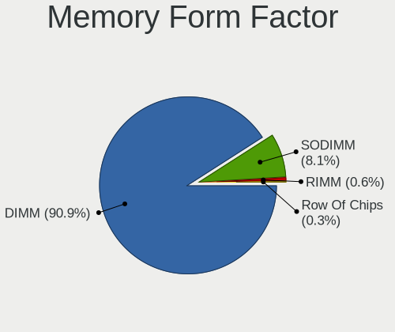

| Name         | Desktops | Percent |
|--------------|----------|---------|
| DIMM         | 148      | 95.48%  |
| SODIMM       | 6        | 3.87%   |
| Row Of Chips | 1        | 0.65%   |

Memory Size
-----------

Memory module size

| Size  | Desktops | Percent |
|-------|----------|---------|
| 8192  | 65       | 39.63%  |
| 16384 | 40       | 24.39%  |
| 32768 | 24       | 14.63%  |
| 4096  | 16       | 9.76%   |
| 2048  | 16       | 9.76%   |
| 1024  | 2        | 1.22%   |
| 49152 | 1        | 0.61%   |

Memory Speed
------------

Memory module speed

| Speed   | Desktops | Percent |
|---------|----------|---------|
| 3200    | 19       | 11.45%  |
| 1600    | 19       | 11.45%  |
| 3600    | 16       | 9.64%   |
| 1333    | 13       | 7.83%   |
| 4800    | 10       | 6.02%   |
| 3733    | 10       | 6.02%   |
| 2133    | 9        | 5.42%   |
| 2400    | 7        | 4.22%   |
| 800     | 7        | 4.22%   |
| 6000    | 4        | 2.41%   |
| 5600    | 4        | 2.41%   |
| 3800    | 4        | 2.41%   |
| 3000    | 4        | 2.41%   |
| 2667    | 4        | 2.41%   |
| 3400    | 3        | 1.81%   |
| 667     | 3        | 1.81%   |
| 6400    | 2        | 1.2%    |
| 4000    | 2        | 1.2%    |
| 3866    | 2        | 1.2%    |
| 2666    | 2        | 1.2%    |
| 400     | 2        | 1.2%    |
| Unknown | 2        | 1.2%    |
| 7000    | 1        | 0.6%    |
| 5800    | 1        | 0.6%    |
| 5200    | 1        | 0.6%    |
| 3933    | 1        | 0.6%    |
| 3534    | 1        | 0.6%    |
| 3533    | 1        | 0.6%    |
| 3467    | 1        | 0.6%    |
| 3466    | 1        | 0.6%    |
| 3066    | 1        | 0.6%    |
| 2934    | 1        | 0.6%    |
| 2800    | 1        | 0.6%    |
| 2733    | 1        | 0.6%    |
| 2448    | 1        | 0.6%    |
| 1866    | 1        | 0.6%    |
| 1334    | 1        | 0.6%    |
| 1067    | 1        | 0.6%    |
| 1066    | 1        | 0.6%    |
| 333     | 1        | 0.6%    |

Printers & scanners
-------------------

Printer Vendor
--------------

Printer device vendors

| Vendor             | Desktops | Percent |
|--------------------|----------|---------|
| Hewlett-Packard    | 8        | 42.11%  |
| Brother Industries | 4        | 21.05%  |
| Canon              | 3        | 15.79%  |
| Seiko Epson        | 2        | 10.53%  |
| SAT                | 1        | 5.26%   |
| Dymo-CoStar        | 1        | 5.26%   |

Printer Model
-------------

Printer device models

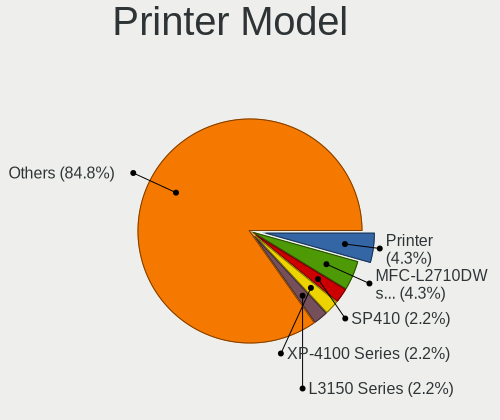

| Model                       | Desktops | Percent |
|-----------------------------|----------|---------|
| Brother MFC-L2710DW series  | 2        | 10.53%  |
| Seiko Epson L300 Series     | 1        | 5.26%   |
| Seiko Epson AL-M310DN       | 1        | 5.26%   |
| SAT SAT38TUSE               | 1        | 5.26%   |
| HP Smart Tank 7300 series   | 1        | 5.26%   |
| HP LaserJet P1006           | 1        | 5.26%   |
| HP LaserJet 2200            | 1        | 5.26%   |
| HP ENVY Photo 7800 series   | 1        | 5.26%   |
| HP ENVY Photo 6200 series   | 1        | 5.26%   |
| HP ENVY 5000 series         | 1        | 5.26%   |
| HP DeskJet 3940             | 1        | 5.26%   |
| HP DeskJet 2700 series      | 1        | 5.26%   |
| Dymo-CoStar LabelWriter 450 | 1        | 5.26%   |
| Canon TS3100 series         | 1        | 5.26%   |
| Canon TR4700 series         | 1        | 5.26%   |
| Canon PIXMA MX470 Series    | 1        | 5.26%   |
| Brother MFC-L2740DW         | 1        | 5.26%   |
| Brother HL-3040CN series    | 1        | 5.26%   |

Scanner Vendor
--------------

Scanner device vendors

| Vendor             | Desktops | Percent |
|--------------------|----------|---------|
| Seiko Epson        | 2        | 40%     |
| Canon              | 2        | 40%     |
| Ultima Electronics | 1        | 20%     |

Scanner Model
-------------

Scanner device models

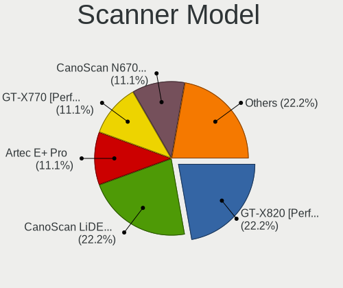

| Model                                       | Desktops | Percent |
|---------------------------------------------|----------|---------|
| Ultima Artec E+ Pro                         | 1        | 20%     |
| Seiko Epson GT-X820 [Perfection V600 Photo] | 1        | 20%     |
| Seiko Epson GT-X770 [Perfection V500]       | 1        | 20%     |
| Canon CanoScan N670U/N676U/LiDE 20          | 1        | 20%     |
| Canon CanoScan LiDE 220                     | 1        | 20%     |

Camera
------

Camera Vendor
-------------

Camera device vendors

| Vendor                                 | Desktops | Percent |
|----------------------------------------|----------|---------|
| Logitech                               | 38       | 35.51%  |
| Microdia                               | 10       | 9.35%   |
| Microsoft                              | 5        | 4.67%   |
| Sunplus Innovation Technology          | 4        | 3.74%   |
| ARC International                      | 4        | 3.74%   |
| Z-Star Microelectronics                | 3        | 2.8%    |
| Realtek Semiconductor                  | 3        | 2.8%    |
| Razer USA                              | 3        | 2.8%    |
| Generalplus Technology                 | 3        | 2.8%    |
| Apple                                  | 3        | 2.8%    |
| Trust                                  | 2        | 1.87%   |
| Owon                                   | 2        | 1.87%   |
| KYE Systems (Mouse Systems)            | 2        | 1.87%   |
| Chicony Electronics                    | 2        | 1.87%   |
| AVerMedia Technologies                 | 2        | 1.87%   |
| Alpha Imaging Technology               | 2        | 1.87%   |
| webcamvendor                           | 1        | 0.93%   |
| WaveRider Communications               | 1        | 0.93%   |
| Valve Software                         | 1        | 0.93%   |
| Spreadtrum Communications              | 1        | 0.93%   |
| Sonix Technology                       | 1        | 0.93%   |
| Samsung Electronics                    | 1        | 0.93%   |
| Quanta                                 | 1        | 0.93%   |
| MacroSilicon                           | 1        | 0.93%   |
| Linux Foundation                       | 1        | 0.93%   |
| Jieli Technology                       | 1        | 0.93%   |
| Hopewin Electronic Material            | 1        | 0.93%   |
| GenesysLogic Technology                | 1        | 0.93%   |
| GEMBIRD                                | 1        | 0.93%   |
| eMeet                                  | 1        | 0.93%   |
| Elgato Systems                         | 1        | 0.93%   |
| Creative Technology                    | 1        | 0.93%   |
| Cheng Uei Precision Industry (Foxlink) | 1        | 0.93%   |
| Aveo Technology                        | 1        | 0.93%   |
| A4Tech                                 | 1        | 0.93%   |

Camera Model
------------

Camera device models

| Model                                   | Desktops | Percent |
|-----------------------------------------|----------|---------|
| Microdia USB 2.0 Camera                 | 5        | 4.59%   |
| Logitech HD Pro Webcam C920             | 5        | 4.59%   |
| Logitech Webcam C270                    | 4        | 3.67%   |
| Logitech C920 PRO HD Webcam             | 4        | 3.67%   |
| ARC International Camera                | 4        | 3.67%   |
| Razer USA Razer Kiyo Pro                | 3        | 2.75%   |
| Logitech C922 Pro Stream Webcam         | 3        | 2.75%   |
| Logitech BRIO Ultra HD Webcam           | 3        | 2.75%   |
| Apple iPhone 5/5C/5S/6/SE/7/8/X/XR      | 3        | 2.75%   |
| Sunplus FHD Camera Microphone           | 2        | 1.83%   |
| Owon USB CAMERA                         | 2        | 1.83%   |
| Microdia Sonix USB 2.0 Camera           | 2        | 1.83%   |
| Logitech Webcam C930e                   | 2        | 1.83%   |
| Logitech Webcam C310                    | 2        | 1.83%   |
| Logitech Webcam C170                    | 2        | 1.83%   |
| Logitech QuickCam E 3500                | 2        | 1.83%   |
| Generalplus 808 Camera                  | 2        | 1.83%   |
| AVerMedia Live Streamer CAM 313         | 2        | 1.83%   |
| Z-Star Venus USB2.0 Camera              | 1        | 0.92%   |
| Z-Star Vega USB 2.0 Camera              | 1        | 0.92%   |
| Z-Star A4 TECH USB2.0 PC Camera J       | 1        | 0.92%   |
| webcamvendor webcamproduct              | 1        | 0.92%   |
| WaveRider USB 2.0 Camera                | 1        | 0.92%   |
| Valve Software 3D Camera                | 1        | 0.92%   |
| Trust USB Camera                        | 1        | 0.92%   |
| Trust Full HD Webcam                    | 1        | 0.92%   |
| Sunplus USB 2.0 Camera                  | 1        | 0.92%   |
| Sunplus FHD Capture                     | 1        | 0.92%   |
| Spreadtrum Spreadtrum Phone             | 1        | 0.92%   |
| Sonix GENERAL WEBCAM                    | 1        | 0.92%   |
| Samsung Galaxy series, misc. (MTP mode) | 1        | 0.92%   |
| Realtek Thronmax Webcam Mic             | 1        | 0.92%   |
| Realtek Thronmax StreamGo Webcam        | 1        | 0.92%   |
| Realtek NexiGo N660P FHD Webcam         | 1        | 0.92%   |
| Realtek HP 1.0MP High Definition Webcam | 1        | 0.92%   |
| Quanta HP Display Camera                | 1        | 0.92%   |
| Microsoft Microsoft LifeCam Studio    | 1        | 0.92%   |
| Microsoft LifeCam VX-2000               | 1        | 0.92%   |
| Microsoft LifeCam Studio                | 1        | 0.92%   |
| Microsoft LifeCam HD-5000               | 1        | 0.92%   |

Security
--------

Fingerprint Vendor
------------------

Fingerprint sensor vendors

| Vendor | Desktops | Percent |
|--------|----------|---------|
| Upek   | 1        | 50%     |
| Dell   | 1        | 50%     |

Fingerprint Model
-----------------

Fingerprint sensor models

| Model                                          | Desktops | Percent |
|------------------------------------------------|----------|---------|
| Upek TCS1C EIM/STM32 Fingerprint sensor        | 1        | 50%     |
| Dell MS819 Wired Mouse With Fingerprint Reader | 1        | 50%     |

Chipcard Vendor
---------------

Chipcard module vendors

| Vendor                    | Desktops | Percent |
|---------------------------|----------|---------|
| Aladdin Knowledge Systems | 1        | 50%     |
| Advanced Card Systems     | 1        | 50%     |

Chipcard Model
--------------

Chipcard module models

| Model                                        | Desktops | Percent |
|----------------------------------------------|----------|---------|
| Aladdin Knowledge Systems Token JC           | 1        | 50%     |
| Advanced Card Systems ACR1281 1S Dual Reader | 1        | 50%     |

Unsupported
-----------

Unsupported Devices
-------------------

Total unsupported devices on board

| Total | Desktops | Percent |
|-------|----------|---------|
| 0     | 388      | 83.62%  |
| 1     | 64       | 13.79%  |
| 2     | 7        | 1.51%   |
| 3     | 3        | 0.65%   |
| 4     | 2        | 0.43%   |

Unsupported Device Types
------------------------

Types of unsupported devices

| Type                  | Desktops | Percent |
|-----------------------|----------|---------|
| Graphics card         | 45       | 50%     |
| Net/wireless          | 19       | 21.11%  |
| Sound                 | 7        | 7.78%   |
| Unassigned class      | 5        | 5.56%   |
| Multimedia controller | 4        | 4.44%   |
| Bluetooth             | 4        | 4.44%   |
| Camera                | 2        | 2.22%   |
| Storage/raid          | 1        | 1.11%   |
| Net/ethernet          | 1        | 1.11%   |
| Fingerprint reader    | 1        | 1.11%   |
| Chipcard              | 1        | 1.11%   |

