Fedora 39 - Tested Hardware & Statistics (Desktops)
---------------------------------------------------

A project to collect tested hardware configurations for Fedora 39.

Anyone can contribute to this report by the [hw-probe](https://github.com/linuxhw/hw-probe) tool:

    sudo -E hw-probe -all -upload

Please contribute! Especially if your hardware is rare.

Contents
--------

* [ Test Cases ](#test-cases)

* [ System ](#system)
  - [ Kernel                   ](#kernel)
  - [ Kernel Family            ](#kernel-family)
  - [ Kernel Major Ver.        ](#kernel-major-ver)
  - [ Arch                     ](#arch)
  - [ DE                       ](#de)
  - [ Display Server           ](#display-server)
  - [ Display Manager          ](#display-manager)
  - [ OS Lang                  ](#os-lang)
  - [ Boot Mode                ](#boot-mode)
  - [ Filesystem               ](#filesystem)
  - [ Part. scheme             ](#part-scheme)
  - [ Dual Boot with Linux/BSD ](#dual-boot-with-linuxbsd)
  - [ Dual Boot (Win)          ](#dual-boot-win)

* [ Board ](#board)
  - [ Vendor                   ](#vendor)
  - [ Model                    ](#model)
  - [ Model Family             ](#model-family)
  - [ MFG Year                 ](#mfg-year)
  - [ Form Factor              ](#form-factor)
  - [ Secure Boot              ](#secure-boot)
  - [ Coreboot                 ](#coreboot)
  - [ RAM Size                 ](#ram-size)
  - [ RAM Used                 ](#ram-used)
  - [ Total Drives             ](#total-drives)
  - [ Has CD-ROM               ](#has-cd-rom)
  - [ Has Ethernet             ](#has-ethernet)
  - [ Has WiFi                 ](#has-wifi)
  - [ Has Bluetooth            ](#has-bluetooth)

* [ Location ](#location)
  - [ Country                  ](#country)
  - [ City                     ](#city)

* [ Drives ](#drives)
  - [ Drive Vendor             ](#drive-vendor)
  - [ Drive Model              ](#drive-model)
  - [ HDD Vendor               ](#hdd-vendor)
  - [ SSD Vendor               ](#ssd-vendor)
  - [ Drive Kind               ](#drive-kind)
  - [ Drive Connector          ](#drive-connector)
  - [ Drive Size               ](#drive-size)
  - [ Space Total              ](#space-total)
  - [ Space Used               ](#space-used)
  - [ Malfunc. Drives          ](#malfunc-drives)
  - [ Malfunc. Drive Vendor    ](#malfunc-drive-vendor)
  - [ Malfunc. HDD Vendor      ](#malfunc-hdd-vendor)
  - [ Malfunc. Drive Kind      ](#malfunc-drive-kind)
  - [ Failed Drives            ](#failed-drives)
  - [ Failed Drive Vendor      ](#failed-drive-vendor)
  - [ Drive Status             ](#drive-status)

* [ Storage controller ](#storage-controller)
  - [ Storage Vendor           ](#storage-vendor)
  - [ Storage Model            ](#storage-model)
  - [ Storage Kind             ](#storage-kind)

* [ Processor ](#processor)
  - [ CPU Vendor               ](#cpu-vendor)
  - [ CPU Model                ](#cpu-model)
  - [ CPU Model Family         ](#cpu-model-family)
  - [ CPU Cores                ](#cpu-cores)
  - [ CPU Sockets              ](#cpu-sockets)
  - [ CPU Threads              ](#cpu-threads)
  - [ CPU Op-Modes             ](#cpu-op-modes)
  - [ CPU Microcode            ](#cpu-microcode)
  - [ CPU Microarch            ](#cpu-microarch)

* [ Graphics ](#graphics)
  - [ GPU Vendor               ](#gpu-vendor)
  - [ GPU Model                ](#gpu-model)
  - [ GPU Combo                ](#gpu-combo)
  - [ GPU Driver               ](#gpu-driver)
  - [ GPU Memory               ](#gpu-memory)

* [ Monitor ](#monitor)
  - [ Monitor Vendor           ](#monitor-vendor)
  - [ Monitor Model            ](#monitor-model)
  - [ Monitor Resolution       ](#monitor-resolution)
  - [ Monitor Diagonal         ](#monitor-diagonal)
  - [ Monitor Width            ](#monitor-width)
  - [ Aspect Ratio             ](#aspect-ratio)
  - [ Monitor Area             ](#monitor-area)
  - [ Pixel Density            ](#pixel-density)
  - [ Multiple Monitors        ](#multiple-monitors)

* [ Network ](#network)
  - [ Net Controller Vendor    ](#net-controller-vendor)
  - [ Net Controller Model     ](#net-controller-model)
  - [ Wireless Vendor          ](#wireless-vendor)
  - [ Wireless Model           ](#wireless-model)
  - [ Ethernet Vendor          ](#ethernet-vendor)
  - [ Ethernet Model           ](#ethernet-model)
  - [ Net Controller Kind      ](#net-controller-kind)
  - [ Used Controller          ](#used-controller)
  - [ NICs                     ](#nics)
  - [ IPv6                     ](#ipv6)

* [ Bluetooth ](#bluetooth)
  - [ Bluetooth Vendor         ](#bluetooth-vendor)
  - [ Bluetooth Model          ](#bluetooth-model)

* [ Sound ](#sound)
  - [ Sound Vendor             ](#sound-vendor)
  - [ Sound Model              ](#sound-model)

* [ Memory ](#memory)
  - [ Memory Vendor            ](#memory-vendor)
  - [ Memory Model             ](#memory-model)
  - [ Memory Kind              ](#memory-kind)
  - [ Memory Form Factor       ](#memory-form-factor)
  - [ Memory Size              ](#memory-size)
  - [ Memory Speed             ](#memory-speed)

* [ Printers & scanners ](#printers--scanners)
  - [ Printer Vendor           ](#printer-vendor)
  - [ Printer Model            ](#printer-model)
  - [ Scanner Vendor           ](#scanner-vendor)
  - [ Scanner Model            ](#scanner-model)

* [ Camera ](#camera)
  - [ Camera Vendor            ](#camera-vendor)
  - [ Camera Model             ](#camera-model)

* [ Security ](#security)
  - [ Fingerprint Vendor       ](#fingerprint-vendor)
  - [ Fingerprint Model        ](#fingerprint-model)
  - [ Chipcard Vendor          ](#chipcard-vendor)
  - [ Chipcard Model           ](#chipcard-model)

* [ Unsupported ](#unsupported)
  - [ Unsupported Devices      ](#unsupported-devices)
  - [ Unsupported Device Types ](#unsupported-device-types)

Test Cases
----------

Total: 1306

| Vendor        | Model                       | Probe                                                      | Date         |
|---------------|-----------------------------|------------------------------------------------------------|--------------|
| ASUSTek       | M5A78L-M PLUS/USB3          | [48be6a2dbb](https://linux-hardware.org/?probe=48be6a2dbb) | May 07, 2024 |
| Gigabyte      | Z68MA-D2H-B3                | [b7c53048d5](https://linux-hardware.org/?probe=b7c53048d5) | May 04, 2024 |
| Gigabyte      | Z77MX-D3H                   | [7faebd43a1](https://linux-hardware.org/?probe=7faebd43a1) | May 01, 2024 |
| ASUSTek       | PRIME H610I-PLUS D4         | [1c4e390f2d](https://linux-hardware.org/?probe=1c4e390f2d) | Apr 30, 2024 |
| ASUSTek       | CG8480                      | [7567b12c01](https://linux-hardware.org/?probe=7567b12c01) | Apr 30, 2024 |
| ASUSTek       | G20AJ                       | [d314388bb1](https://linux-hardware.org/?probe=d314388bb1) | Apr 28, 2024 |
| Apple         | Mac-F60DEB81FF30ACF6 Mac... | [1af94235a9](https://linux-hardware.org/?probe=1af94235a9) | Apr 28, 2024 |
| Biostar       | Hi-Fi Z87X 3D               | [09d7331f2b](https://linux-hardware.org/?probe=09d7331f2b) | Apr 27, 2024 |
| ASUSTek       | TUF B450-PRO GAMING         | [29c763baa8](https://linux-hardware.org/?probe=29c763baa8) | Apr 27, 2024 |
| Lenovo        | ThinkStation D20 4155CTO    | [54cae1f375](https://linux-hardware.org/?probe=54cae1f375) | Apr 27, 2024 |
| Gigabyte      | B450M DS3H WIFI-CF          | [14dee832b2](https://linux-hardware.org/?probe=14dee832b2) | Apr 26, 2024 |
| Gigabyte      | X399 AORUS PRO-CF           | [ae667fce92](https://linux-hardware.org/?probe=ae667fce92) | Apr 25, 2024 |
| Gigabyte      | 970A-UD3P                   | [e4237a07f0](https://linux-hardware.org/?probe=e4237a07f0) | Apr 24, 2024 |
| ASUSTek       | M2N-SLI DELUXE              | [e74da3b338](https://linux-hardware.org/?probe=e74da3b338) | Apr 24, 2024 |
| ASRock        | B450 Pro4                   | [a43f744651](https://linux-hardware.org/?probe=a43f744651) | Apr 24, 2024 |
| ASUSTek       | A88X-PLUS                   | [758736ef94](https://linux-hardware.org/?probe=758736ef94) | Apr 24, 2024 |
| Gigabyte      | GA-A55M-S2V                 | [cc1a7f7fef](https://linux-hardware.org/?probe=cc1a7f7fef) | Apr 24, 2024 |
| Gigabyte      | B75M-D3V                    | [719891e7c2](https://linux-hardware.org/?probe=719891e7c2) | Apr 24, 2024 |
| ASUSTek       | PRIME B550M-A AC            | [7e76ea0f76](https://linux-hardware.org/?probe=7e76ea0f76) | Apr 24, 2024 |
| Digiboard     | MPxx                        | [e277b1a1d5](https://linux-hardware.org/?probe=e277b1a1d5) | Apr 24, 2024 |
| HP            | 21D0                        | [fe5b1a679c](https://linux-hardware.org/?probe=fe5b1a679c) | Apr 24, 2024 |
| Dell          | 0YGYJY A01                  | [c922a511fd](https://linux-hardware.org/?probe=c922a511fd) | Apr 23, 2024 |
| Dell          | 0HHV7N A00                  | [328456d99c](https://linux-hardware.org/?probe=328456d99c) | Apr 23, 2024 |
| Dell          | 0HHV7N A00                  | [dbe31bb448](https://linux-hardware.org/?probe=dbe31bb448) | Apr 23, 2024 |
| HP            | 8299                        | [e2ee3223fd](https://linux-hardware.org/?probe=e2ee3223fd) | Apr 23, 2024 |
| Gigabyte      | X570S AORUS MASTER          | [864cdaee54](https://linux-hardware.org/?probe=864cdaee54) | Apr 23, 2024 |
| Gigabyte      | X570 AORUS ELITE            | [a06e5411c0](https://linux-hardware.org/?probe=a06e5411c0) | Apr 23, 2024 |
| ASUSTek       | ROG STRIX B450-F GAMING ... | [4626c1b15a](https://linux-hardware.org/?probe=4626c1b15a) | Apr 23, 2024 |
| ASUSTek       | PRIME Z590-A                | [ab2310f0d6](https://linux-hardware.org/?probe=ab2310f0d6) | Apr 22, 2024 |
| Gigabyte      | Z170XP-SLI-CF               | [90e696166f](https://linux-hardware.org/?probe=90e696166f) | Apr 22, 2024 |
| MSI           | CSM-H81M-P32                | [056face9de](https://linux-hardware.org/?probe=056face9de) | Apr 22, 2024 |
| ASUSTek       | TUF Gaming B550M-PLUS WI... | [a671f5391b](https://linux-hardware.org/?probe=a671f5391b) | Apr 22, 2024 |
| MSI           | B550-A PRO                  | [f1d18ed809](https://linux-hardware.org/?probe=f1d18ed809) | Apr 22, 2024 |
| Intel         | X99H                        | [cca155cf13](https://linux-hardware.org/?probe=cca155cf13) | Apr 22, 2024 |
| ASUSTek       | M5A78L-M PLUS/USB3          | [68d6575b15](https://linux-hardware.org/?probe=68d6575b15) | Apr 22, 2024 |
| ASUSTek       | ROG STRIX Z690-A GAMING ... | [0cac32bd87](https://linux-hardware.org/?probe=0cac32bd87) | Apr 22, 2024 |
| Biostar       | Hi-Fi Z87X 3D               | [8c77d98a43](https://linux-hardware.org/?probe=8c77d98a43) | Apr 21, 2024 |
| ASUSTek       | PRIME B660M-A AC D4         | [6c6b1a2edd](https://linux-hardware.org/?probe=6c6b1a2edd) | Apr 21, 2024 |
| ASUSTek       | PRIME B660M-A AC D4         | [7f5ce15d32](https://linux-hardware.org/?probe=7f5ce15d32) | Apr 21, 2024 |
| ASRock        | B450M-HDV R4.0              | [c5eedce567](https://linux-hardware.org/?probe=c5eedce567) | Apr 21, 2024 |
| Acer          | RS780DV                     | [2fd4cf8e84](https://linux-hardware.org/?probe=2fd4cf8e84) | Apr 21, 2024 |
| ASUSTek       | TUF Gaming X570-PLUS        | [2c617e212d](https://linux-hardware.org/?probe=2c617e212d) | Apr 21, 2024 |
| MSI           | B450 TOMAHAWK MAX II        | [9287fd48fd](https://linux-hardware.org/?probe=9287fd48fd) | Apr 21, 2024 |
| MSI           | B550M PRO-VDH WIFI          | [40c04cd535](https://linux-hardware.org/?probe=40c04cd535) | Apr 21, 2024 |
| ASUSTek       | PRIME A520M-E               | [fa784dad84](https://linux-hardware.org/?probe=fa784dad84) | Apr 21, 2024 |
| ASUSTek       | PRIME X370-PRO              | [a4e68832be](https://linux-hardware.org/?probe=a4e68832be) | Apr 21, 2024 |
| MSI           | MAG X570S TOMAHAWK MAX W... | [dc0120c1ae](https://linux-hardware.org/?probe=dc0120c1ae) | Apr 21, 2024 |
| MSI           | MPG Z790 EDGE TI MAX WIF... | [34da91dacf](https://linux-hardware.org/?probe=34da91dacf) | Apr 21, 2024 |
| HP            | 805B                        | [06e17f3461](https://linux-hardware.org/?probe=06e17f3461) | Apr 21, 2024 |
| HP            | 87D6 SMVB                   | [b3862648a1](https://linux-hardware.org/?probe=b3862648a1) | Apr 21, 2024 |
| ASUSTek       | P6T                         | [d2206947bb](https://linux-hardware.org/?probe=d2206947bb) | Apr 21, 2024 |
| ASUSTek       | G20AJ                       | [0b3321dc98](https://linux-hardware.org/?probe=0b3321dc98) | Apr 21, 2024 |
| Colorful T... | CVN Z690 GAMING FROZEN V... | [09cbde09ca](https://linux-hardware.org/?probe=09cbde09ca) | Apr 20, 2024 |
| Gigabyte      | X570 AORUS ELITE WIFI       | [a343ca7f17](https://linux-hardware.org/?probe=a343ca7f17) | Apr 20, 2024 |
| Gigabyte      | X570 AORUS ELITE WIFI       | [9836019d80](https://linux-hardware.org/?probe=9836019d80) | Apr 20, 2024 |
| ASUSTek       | H110M-PLUS                  | [98eba50e5b](https://linux-hardware.org/?probe=98eba50e5b) | Apr 20, 2024 |
| Lenovo        | SDK0E50510 WIN              | [bc958fb0e5](https://linux-hardware.org/?probe=bc958fb0e5) | Apr 19, 2024 |
| Dell          | 08NPPY A00                  | [dad92afe76](https://linux-hardware.org/?probe=dad92afe76) | Apr 19, 2024 |
| ASUSTek       | PRIME B650M-A AX II         | [6b0dd29862](https://linux-hardware.org/?probe=6b0dd29862) | Apr 19, 2024 |
| Dell          | 0Y2MRG A00                  | [6abe6d21fc](https://linux-hardware.org/?probe=6abe6d21fc) | Apr 19, 2024 |
| Pegatron      | 2AB5                        | [36f9f1b443](https://linux-hardware.org/?probe=36f9f1b443) | Apr 18, 2024 |
| Unknown       | T100                        | [cbe8f3e9af](https://linux-hardware.org/?probe=cbe8f3e9af) | Apr 18, 2024 |
| Unknown       | T100                        | [03f07534d1](https://linux-hardware.org/?probe=03f07534d1) | Apr 18, 2024 |
| MSI           | B450 GAMING PLUS            | [7f84bae081](https://linux-hardware.org/?probe=7f84bae081) | Apr 18, 2024 |
| Fujitsu       | D2778-C1 S26361-D2778-C1    | [a344875df9](https://linux-hardware.org/?probe=a344875df9) | Apr 18, 2024 |
| MSI           | Z270 GAMING PLUS            | [4e997cc9d3](https://linux-hardware.org/?probe=4e997cc9d3) | Apr 18, 2024 |
| ASUSTek       | PRIME N100I-D D4            | [1b1bec34e3](https://linux-hardware.org/?probe=1b1bec34e3) | Apr 17, 2024 |
| ASRock        | B550 Extreme4               | [6ee8d62842](https://linux-hardware.org/?probe=6ee8d62842) | Apr 17, 2024 |
| ASRock        | B550 Phantom Gaming 4/ac    | [344e87c2a8](https://linux-hardware.org/?probe=344e87c2a8) | Apr 17, 2024 |
| ASUSTek       | TUF Gaming B550M-PLUS WI... | [eb6c0896d5](https://linux-hardware.org/?probe=eb6c0896d5) | Apr 17, 2024 |
| MSI           | MPG B550I GAMING EDGE WI... | [ddf96b058d](https://linux-hardware.org/?probe=ddf96b058d) | Apr 17, 2024 |
| Dell          | 0P99M4 A01                  | [77e4450298](https://linux-hardware.org/?probe=77e4450298) | Apr 16, 2024 |
| ASUSTek       | P8Z68 DELUXE                | [f77a3ef205](https://linux-hardware.org/?probe=f77a3ef205) | Apr 16, 2024 |
| Dell          | 0MWYPT A01                  | [1dcea45437](https://linux-hardware.org/?probe=1dcea45437) | Apr 16, 2024 |
| Gigabyte      | Z690 GAMING X DDR4          | [4bc71ebee3](https://linux-hardware.org/?probe=4bc71ebee3) | Apr 16, 2024 |
| HP            | 8617                        | [4f55f454d0](https://linux-hardware.org/?probe=4f55f454d0) | Apr 16, 2024 |
| Dell          | 0Y2MRG A00                  | [693ad9a009](https://linux-hardware.org/?probe=693ad9a009) | Apr 16, 2024 |
| Lenovo        | 1030 SBB0J05441 WIN 3305... | [3370e4360d](https://linux-hardware.org/?probe=3370e4360d) | Apr 16, 2024 |
| Dell          | 0KV62T A00                  | [13b11b28fc](https://linux-hardware.org/?probe=13b11b28fc) | Apr 16, 2024 |
| ASRock        | B550 Phantom Gaming 4/ac    | [5be1a4715b](https://linux-hardware.org/?probe=5be1a4715b) | Apr 16, 2024 |
| ASUSTek       | H87-PLUS                    | [7da05aaadf](https://linux-hardware.org/?probe=7da05aaadf) | Apr 16, 2024 |
| ASRock        | B650M Pro RS WiFi           | [eb9f0768cf](https://linux-hardware.org/?probe=eb9f0768cf) | Apr 16, 2024 |
| MSI           | MAG B650 TOMAHAWK WIFI      | [d74cf44500](https://linux-hardware.org/?probe=d74cf44500) | Apr 16, 2024 |
| ASUSTek       | H110M-A                     | [fcc681df4b](https://linux-hardware.org/?probe=fcc681df4b) | Apr 15, 2024 |
| ASUSTek       | H110M-A                     | [d46d720322](https://linux-hardware.org/?probe=d46d720322) | Apr 15, 2024 |
| Dell          | 0KJCC5 A00                  | [688001e950](https://linux-hardware.org/?probe=688001e950) | Apr 15, 2024 |
| MSI           | Z270M MORTAR                | [2d81483fa4](https://linux-hardware.org/?probe=2d81483fa4) | Apr 15, 2024 |
| Apple         | Mac-F42C88C8 Proto1         | [583357f85f](https://linux-hardware.org/?probe=583357f85f) | Apr 15, 2024 |
| ASUSTek       | PRIME H510M-K               | [8ae1401a90](https://linux-hardware.org/?probe=8ae1401a90) | Apr 14, 2024 |
| Gigabyte      | B450M K-CF                  | [b2bcb4464b](https://linux-hardware.org/?probe=b2bcb4464b) | Apr 14, 2024 |
| Gigabyte      | X670E AORUS PRO X           | [c7a6c2d6ed](https://linux-hardware.org/?probe=c7a6c2d6ed) | Apr 14, 2024 |
| ASUSTek       | PRIME Z270-P                | [aaed2b7478](https://linux-hardware.org/?probe=aaed2b7478) | Apr 14, 2024 |
| ASUSTek       | P10S-I Series               | [c0afefe9bc](https://linux-hardware.org/?probe=c0afefe9bc) | Apr 14, 2024 |
| ASUSTek       | TUF H310M-PLUS GAMING/BR    | [5de5178742](https://linux-hardware.org/?probe=5de5178742) | Apr 14, 2024 |
| ASRock        | B650M-HDV/M.2               | [8ed3523f0a](https://linux-hardware.org/?probe=8ed3523f0a) | Apr 14, 2024 |
| ASUSTek       | TUF H310M-PLUS GAMING/BR    | [e96012759d](https://linux-hardware.org/?probe=e96012759d) | Apr 14, 2024 |
| ASUSTek       | ROG STRIX X570-E GAMING     | [5bb8884eee](https://linux-hardware.org/?probe=5bb8884eee) | Apr 14, 2024 |
| ASUSTek       | ROG STRIX X570-E GAMING     | [841b3d5f2e](https://linux-hardware.org/?probe=841b3d5f2e) | Apr 14, 2024 |
| Gigabyte      | H61M-S2-B3                  | [5e533a401e](https://linux-hardware.org/?probe=5e533a401e) | Apr 14, 2024 |
| Gigabyte      | X570 AORUS ULTRA            | [776d567b36](https://linux-hardware.org/?probe=776d567b36) | Apr 14, 2024 |
| ASUSTek       | H81M-E                      | [7af65eace4](https://linux-hardware.org/?probe=7af65eace4) | Apr 13, 2024 |
| Lenovo        | 3102 SDK0J40697 WIN 3305... | [2bb2f2f042](https://linux-hardware.org/?probe=2bb2f2f042) | Apr 13, 2024 |
| ASUSTek       | PRIME B650M-K               | [702273a412](https://linux-hardware.org/?probe=702273a412) | Apr 13, 2024 |
| ASUSTek       | PRIME H610I-PLUS D4         | [cf8e423d4c](https://linux-hardware.org/?probe=cf8e423d4c) | Apr 13, 2024 |
| HP            | 1905                        | [85c5b91f0d](https://linux-hardware.org/?probe=85c5b91f0d) | Apr 13, 2024 |
| MSI           | B450 GAMING PLUS            | [fe95b1e7e7](https://linux-hardware.org/?probe=fe95b1e7e7) | Apr 13, 2024 |
| MSI           | B450M MORTAR MAX            | [bebccc0dd1](https://linux-hardware.org/?probe=bebccc0dd1) | Apr 13, 2024 |
| Shenzhen M... | F7BAA                       | [1015688c75](https://linux-hardware.org/?probe=1015688c75) | Apr 13, 2024 |
| MSI           | X99A RAIDER                 | [84a01ab668](https://linux-hardware.org/?probe=84a01ab668) | Apr 13, 2024 |
| Gigabyte      | H81M-DS2                    | [b8407eb44d](https://linux-hardware.org/?probe=b8407eb44d) | Apr 13, 2024 |
| ASUSTek       | ROG STRIX B550-F GAMING ... | [aa96253b80](https://linux-hardware.org/?probe=aa96253b80) | Apr 12, 2024 |
| Gigabyte      | X570 AORUS XTREME           | [f0de46fc9a](https://linux-hardware.org/?probe=f0de46fc9a) | Apr 12, 2024 |
| ASUSTek       | ROG ZENITH EXTREME          | [4f51073d9c](https://linux-hardware.org/?probe=4f51073d9c) | Apr 12, 2024 |
| Gigabyte      | Z170XP-SLI-CF               | [16f0af2047](https://linux-hardware.org/?probe=16f0af2047) | Apr 12, 2024 |
| Gigabyte      | Z170XP-SLI-CF               | [2ee7ec3b1f](https://linux-hardware.org/?probe=2ee7ec3b1f) | Apr 12, 2024 |
| Pegatron      | H81-M1                      | [ad6b67560b](https://linux-hardware.org/?probe=ad6b67560b) | Apr 12, 2024 |
| MSI           | B350M GAMING PRO            | [448a1d81fb](https://linux-hardware.org/?probe=448a1d81fb) | Apr 12, 2024 |
| ASUSTek       | PRIME Z270-A                | [6a4269d6d1](https://linux-hardware.org/?probe=6a4269d6d1) | Apr 12, 2024 |
| MSI           | B350M GAMING PRO            | [25ed2372d0](https://linux-hardware.org/?probe=25ed2372d0) | Apr 12, 2024 |
| ASUSTek       | ROG ZENITH EXTREME          | [d81a8d46ed](https://linux-hardware.org/?probe=d81a8d46ed) | Apr 12, 2024 |
| ASUSTek       | Z170-DELUXE                 | [8efe50aabf](https://linux-hardware.org/?probe=8efe50aabf) | Apr 11, 2024 |
| ASRock        | H77 Pro4-M                  | [7b10a71ade](https://linux-hardware.org/?probe=7b10a71ade) | Apr 11, 2024 |
| Gigabyte      | Z77MX-D3H                   | [1234bcb2a4](https://linux-hardware.org/?probe=1234bcb2a4) | Apr 11, 2024 |
| SZQFTX        | MI2-SC                      | [be8172007e](https://linux-hardware.org/?probe=be8172007e) | Apr 11, 2024 |
| Intel         | B365                        | [7abeea79f6](https://linux-hardware.org/?probe=7abeea79f6) | Apr 11, 2024 |
| Gigabyte      | GA-870A-UD3                 | [ef8d387984](https://linux-hardware.org/?probe=ef8d387984) | Apr 10, 2024 |
| Gigabyte      | G41MT-D3                    | [4ec86b2e5d](https://linux-hardware.org/?probe=4ec86b2e5d) | Apr 10, 2024 |
| Gigabyte      | B550M GAMING                | [d85fa6cbe3](https://linux-hardware.org/?probe=d85fa6cbe3) | Apr 10, 2024 |
| ASUSTek       | M5A97 R2.0                  | [eadf15884b](https://linux-hardware.org/?probe=eadf15884b) | Apr 10, 2024 |
| Gigabyte      | TRX40 DESIGNARE             | [e86ef24429](https://linux-hardware.org/?probe=e86ef24429) | Apr 10, 2024 |
| ASUSTek       | ROG STRIX B550-F GAMING     | [be0f54854d](https://linux-hardware.org/?probe=be0f54854d) | Apr 10, 2024 |
| Dell          | 030VXY A01                  | [793be088c2](https://linux-hardware.org/?probe=793be088c2) | Apr 09, 2024 |
| Dell          | 030VXY A01                  | [64ed2bb4d3](https://linux-hardware.org/?probe=64ed2bb4d3) | Apr 09, 2024 |
| Digiboard     | MPxx                        | [fe1ed8d822](https://linux-hardware.org/?probe=fe1ed8d822) | Apr 09, 2024 |
| Gigabyte      | B450M GAMING                | [e033d32271](https://linux-hardware.org/?probe=e033d32271) | Apr 09, 2024 |
| Gigabyte      | Z390 M GAMING-CF            | [cb1ab91477](https://linux-hardware.org/?probe=cb1ab91477) | Apr 09, 2024 |
| Gigabyte      | B650M DS3H                  | [2c7e501a12](https://linux-hardware.org/?probe=2c7e501a12) | Apr 09, 2024 |
| Foxconn       | H55MX-S Series              | [e659b4546f](https://linux-hardware.org/?probe=e659b4546f) | Apr 09, 2024 |
| Alienware     | 0XJKKD A01                  | [891952c62d](https://linux-hardware.org/?probe=891952c62d) | Apr 09, 2024 |
| Gigabyte      | GA-MA785G-UD3H              | [7e40bc4b0a](https://linux-hardware.org/?probe=7e40bc4b0a) | Apr 09, 2024 |
| Foxconn       | H55MX-S Series              | [93deba6ce5](https://linux-hardware.org/?probe=93deba6ce5) | Apr 09, 2024 |
| ASRock        | B550M-C                     | [dd5090a053](https://linux-hardware.org/?probe=dd5090a053) | Apr 09, 2024 |
| Alienware     | 07HV66 A01                  | [5557c9197d](https://linux-hardware.org/?probe=5557c9197d) | Apr 09, 2024 |
| Itautec       | ST 4265                     | [256c04b1e3](https://linux-hardware.org/?probe=256c04b1e3) | Apr 09, 2024 |
| Itautec       | ST 4265                     | [052c74a17d](https://linux-hardware.org/?probe=052c74a17d) | Apr 08, 2024 |
| Gigabyte      | Z68MA-D2H-B3                | [cc080ae6d6](https://linux-hardware.org/?probe=cc080ae6d6) | Apr 08, 2024 |
| HP            | 8595                        | [75999844ff](https://linux-hardware.org/?probe=75999844ff) | Apr 08, 2024 |
| HP            | 8595                        | [78e64097d4](https://linux-hardware.org/?probe=78e64097d4) | Apr 08, 2024 |
| MSI           | X99A RAIDER                 | [8ebbe74fff](https://linux-hardware.org/?probe=8ebbe74fff) | Apr 08, 2024 |
| HP            | 2B38                        | [db7129fcde](https://linux-hardware.org/?probe=db7129fcde) | Apr 07, 2024 |
| ASUSTek       | PRIME B550-PLUS             | [0553161eac](https://linux-hardware.org/?probe=0553161eac) | Apr 07, 2024 |
| HP            | 2B38                        | [44386f0027](https://linux-hardware.org/?probe=44386f0027) | Apr 07, 2024 |
| ASUSTek       | PRIME B350M-A               | [57145c3161](https://linux-hardware.org/?probe=57145c3161) | Apr 07, 2024 |
| Shenzhen M... | F7BSC                       | [5a07da097a](https://linux-hardware.org/?probe=5a07da097a) | Apr 07, 2024 |
| MSI           | MAG Z790 TOMAHAWK WIFI D... | [e499150ab3](https://linux-hardware.org/?probe=e499150ab3) | Apr 07, 2024 |
| ASRock        | B450M-HDV                   | [a06329df00](https://linux-hardware.org/?probe=a06329df00) | Apr 07, 2024 |
| MSI           | X99A RAIDER                 | [b35623df85](https://linux-hardware.org/?probe=b35623df85) | Apr 07, 2024 |
| MSI           | B450M MORTAR MAX            | [67dad6a68c](https://linux-hardware.org/?probe=67dad6a68c) | Apr 07, 2024 |
| Intel         | X99                         | [7dca188f3d](https://linux-hardware.org/?probe=7dca188f3d) | Apr 07, 2024 |
| Intel         | X99                         | [8821705436](https://linux-hardware.org/?probe=8821705436) | Apr 07, 2024 |
| Gigabyte      | A520M K V2                  | [d0dc207772](https://linux-hardware.org/?probe=d0dc207772) | Apr 07, 2024 |
| ASUSTek       | PRIME A320M-K               | [4a15d1a355](https://linux-hardware.org/?probe=4a15d1a355) | Apr 06, 2024 |
| HP            | 870C                        | [eb08ffa35d](https://linux-hardware.org/?probe=eb08ffa35d) | Apr 06, 2024 |
| ASUSTek       | Maximus IX FORMULA          | [0bb98b6d5d](https://linux-hardware.org/?probe=0bb98b6d5d) | Apr 06, 2024 |
| Gigabyte      | GA-MA785G-UD3H              | [f675a67959](https://linux-hardware.org/?probe=f675a67959) | Apr 06, 2024 |
| ASUSTek       | H61M-A/BR                   | [4c0e6e4b31](https://linux-hardware.org/?probe=4c0e6e4b31) | Apr 06, 2024 |
| MSI           | X99A RAIDER                 | [bae1a9abd7](https://linux-hardware.org/?probe=bae1a9abd7) | Apr 06, 2024 |
| Gigabyte      | GA-870A-UD3                 | [b99319c775](https://linux-hardware.org/?probe=b99319c775) | Apr 06, 2024 |
| Foxconn       | H55MX-S Series              | [57dab83b95](https://linux-hardware.org/?probe=57dab83b95) | Apr 06, 2024 |
| Foxconn       | H55MX-S Series              | [111eb94f46](https://linux-hardware.org/?probe=111eb94f46) | Apr 06, 2024 |
| ASUSTek       | TUF Gaming Z790-PLUS WIF... | [5bc8966967](https://linux-hardware.org/?probe=5bc8966967) | Apr 06, 2024 |
| Gigabyte      | G41MT-D3                    | [ae8d66a693](https://linux-hardware.org/?probe=ae8d66a693) | Apr 06, 2024 |
| ASUSTek       | PRIME B650M-A WIFI II       | [68d2448180](https://linux-hardware.org/?probe=68d2448180) | Apr 05, 2024 |
| Win elemen... | M600                        | [9f4d0b35c6](https://linux-hardware.org/?probe=9f4d0b35c6) | Apr 05, 2024 |
| Win elemen... | M600                        | [bed5926e13](https://linux-hardware.org/?probe=bed5926e13) | Apr 05, 2024 |
| ASUSTek       | ROG STRIX X570-E GAMING     | [6496d4176b](https://linux-hardware.org/?probe=6496d4176b) | Apr 05, 2024 |
| ASUSTek       | Maximus IX FORMULA          | [a7245399da](https://linux-hardware.org/?probe=a7245399da) | Apr 05, 2024 |
| MSI           | PRO B760-VC WIFI            | [f6466041c0](https://linux-hardware.org/?probe=f6466041c0) | Apr 05, 2024 |
| Gigabyte      | B650 GAMING X AX            | [490811d61a](https://linux-hardware.org/?probe=490811d61a) | Apr 05, 2024 |
| OEM           | X99-Turbo                   | [ad20e3f989](https://linux-hardware.org/?probe=ad20e3f989) | Apr 05, 2024 |
| MSI           | PRO B760-VC WIFI            | [2847b39ae3](https://linux-hardware.org/?probe=2847b39ae3) | Apr 05, 2024 |
| MSI           | A320M PRO-VH PLUS           | [943c2e486a](https://linux-hardware.org/?probe=943c2e486a) | Apr 05, 2024 |
| MSI           | A320M PRO-VH PLUS           | [15b41ef5b3](https://linux-hardware.org/?probe=15b41ef5b3) | Apr 04, 2024 |
| Dell          | 07N90W A02                  | [4d11f26d4c](https://linux-hardware.org/?probe=4d11f26d4c) | Apr 04, 2024 |
| ASRock        | B550M-C                     | [7601b80b80](https://linux-hardware.org/?probe=7601b80b80) | Apr 04, 2024 |
| Dell          | 0P99M4 A01                  | [7a869aaf6e](https://linux-hardware.org/?probe=7a869aaf6e) | Apr 04, 2024 |
| HP            | 2175                        | [d21c1aaf46](https://linux-hardware.org/?probe=d21c1aaf46) | Apr 04, 2024 |
| MSI           | PRO B650-P WIFI             | [8856db4940](https://linux-hardware.org/?probe=8856db4940) | Apr 04, 2024 |
| Intel         | B75 V124A                   | [df800a1252](https://linux-hardware.org/?probe=df800a1252) | Apr 04, 2024 |
| MSI           | B550M PRO-VDH WIFI          | [071d177bf5](https://linux-hardware.org/?probe=071d177bf5) | Apr 04, 2024 |
| ASUSTek       | ROG CROSSHAIR VIII HERO     | [8946117fdf](https://linux-hardware.org/?probe=8946117fdf) | Apr 04, 2024 |
| HP            | 1497                        | [86bbef8ff3](https://linux-hardware.org/?probe=86bbef8ff3) | Apr 03, 2024 |
| ASUSTek       | TUF Gaming X570-PLUS        | [4eb39c2cf0](https://linux-hardware.org/?probe=4eb39c2cf0) | Apr 03, 2024 |
| ASRock        | B650M Pro RS WiFi           | [e0b3cba959](https://linux-hardware.org/?probe=e0b3cba959) | Apr 03, 2024 |
| HP            | 8434 11                     | [a1a62e20a4](https://linux-hardware.org/?probe=a1a62e20a4) | Apr 03, 2024 |
| HP            | 1495                        | [7bb71cc6c8](https://linux-hardware.org/?probe=7bb71cc6c8) | Apr 03, 2024 |
| HP            | 1495                        | [369904b953](https://linux-hardware.org/?probe=369904b953) | Apr 03, 2024 |
| ASRock        | B650M Pro RS WiFi           | [60c648fc52](https://linux-hardware.org/?probe=60c648fc52) | Apr 03, 2024 |
| Lenovo        | 3709 SDK0J40700 WIN 3258... | [1e11e401a4](https://linux-hardware.org/?probe=1e11e401a4) | Apr 03, 2024 |
| ASRock        | B650M-H/M.2+                | [2e3ed0f79c](https://linux-hardware.org/?probe=2e3ed0f79c) | Apr 02, 2024 |
| ASUSTek       | PRIME B650M-K               | [5f3337af59](https://linux-hardware.org/?probe=5f3337af59) | Apr 02, 2024 |
| Gigabyte      | H510M S2H V3                | [860e8667e1](https://linux-hardware.org/?probe=860e8667e1) | Apr 02, 2024 |
| Dell          | 0GY6Y8 A01                  | [ae35aaa6fe](https://linux-hardware.org/?probe=ae35aaa6fe) | Apr 02, 2024 |
| Gigabyte      | Z390 AORUS PRO-CF           | [aedfa9ff53](https://linux-hardware.org/?probe=aedfa9ff53) | Apr 02, 2024 |
| MSI           | B365M PRO-VH                | [3b94bbe5fe](https://linux-hardware.org/?probe=3b94bbe5fe) | Apr 02, 2024 |
| ASUSTek       | ROG STRIX Z690-A GAMING ... | [3bf4dbf87e](https://linux-hardware.org/?probe=3bf4dbf87e) | Apr 02, 2024 |
| Gigabyte      | X470 AORUS ULTRA GAMING-... | [9c151ab347](https://linux-hardware.org/?probe=9c151ab347) | Apr 01, 2024 |
| HP            | 1632                        | [09e29cc1bb](https://linux-hardware.org/?probe=09e29cc1bb) | Apr 01, 2024 |
| HP            | 1632                        | [746200a8d4](https://linux-hardware.org/?probe=746200a8d4) | Apr 01, 2024 |
| ASUSTek       | PRIME B360-PLUS             | [1fd384a408](https://linux-hardware.org/?probe=1fd384a408) | Apr 01, 2024 |
| Gigabyte      | X570S AORUS PRO AX          | [f0329002c8](https://linux-hardware.org/?probe=f0329002c8) | Apr 01, 2024 |
| Lenovo        | 3769 NO DPK                 | [c532b6c4ed](https://linux-hardware.org/?probe=c532b6c4ed) | Apr 01, 2024 |
| ASUSTek       | TUF Gaming B550-PLUS        | [e9b930b832](https://linux-hardware.org/?probe=e9b930b832) | Apr 01, 2024 |
| MSI           | PRO Z690-A DDR4             | [48dfdf4137](https://linux-hardware.org/?probe=48dfdf4137) | Apr 01, 2024 |
| MSI           | PRO Z690-A DDR4             | [d209d00332](https://linux-hardware.org/?probe=d209d00332) | Apr 01, 2024 |
| Huanan        | X79 V2.47                   | [46ef932a9f](https://linux-hardware.org/?probe=46ef932a9f) | Mar 31, 2024 |
| Gigabyte      | H81M-S                      | [d18c354852](https://linux-hardware.org/?probe=d18c354852) | Mar 31, 2024 |
| Gigabyte      | B450 AORUS M                | [e3f1b781a2](https://linux-hardware.org/?probe=e3f1b781a2) | Mar 31, 2024 |
| Gigabyte      | H61M-S2-B3                  | [a7615a9986](https://linux-hardware.org/?probe=a7615a9986) | Mar 31, 2024 |
| Gigabyte      | B450 AORUS M                | [145a13951d](https://linux-hardware.org/?probe=145a13951d) | Mar 31, 2024 |
| Gigabyte      | H61M-S2-B3                  | [00de19b7af](https://linux-hardware.org/?probe=00de19b7af) | Mar 31, 2024 |
| ASUSTek       | H87-PLUS                    | [a32a6e5814](https://linux-hardware.org/?probe=a32a6e5814) | Mar 31, 2024 |
| Gigabyte      | B85-HD3                     | [bd45787501](https://linux-hardware.org/?probe=bd45787501) | Mar 31, 2024 |
| GEEKOM        | A5                          | [da516126ba](https://linux-hardware.org/?probe=da516126ba) | Mar 31, 2024 |
| MSI           | B560M-A PRO                 | [e365e673d0](https://linux-hardware.org/?probe=e365e673d0) | Mar 31, 2024 |
| MSI           | Z390-A PRO                  | [bbd24ce2a1](https://linux-hardware.org/?probe=bbd24ce2a1) | Mar 31, 2024 |
| Gigabyte      | B550 AORUS ELITE V2         | [7f3b57dade](https://linux-hardware.org/?probe=7f3b57dade) | Mar 30, 2024 |
| Foxconn       | H61MXL-K                    | [967587e883](https://linux-hardware.org/?probe=967587e883) | Mar 30, 2024 |
| ASRock        | B365M IB-R                  | [870917e4e8](https://linux-hardware.org/?probe=870917e4e8) | Mar 30, 2024 |
| MSI           | MS-B9181                    | [1ae3e9b8ba](https://linux-hardware.org/?probe=1ae3e9b8ba) | Mar 30, 2024 |
| ASUSTek       | ROG STRIX B450-F GAMING ... | [c8e50aef4c](https://linux-hardware.org/?probe=c8e50aef4c) | Mar 30, 2024 |
| ASUSTek       | ROG STRIX B450-F GAMING ... | [dc808b758c](https://linux-hardware.org/?probe=dc808b758c) | Mar 30, 2024 |
| HP            | 886C                        | [c36efe4b45](https://linux-hardware.org/?probe=c36efe4b45) | Mar 30, 2024 |
| ASUSTek       | P5G41T-M LX2/BR             | [6edb48c733](https://linux-hardware.org/?probe=6edb48c733) | Mar 29, 2024 |
| Gigabyte      | B450 AORUS M                | [ba62c18a47](https://linux-hardware.org/?probe=ba62c18a47) | Mar 29, 2024 |
| Gigabyte      | B450 AORUS M                | [d58ea5ec2c](https://linux-hardware.org/?probe=d58ea5ec2c) | Mar 29, 2024 |
| ASUSTek       | PRIME B660M-A WIFI D4       | [b8f102aaac](https://linux-hardware.org/?probe=b8f102aaac) | Mar 29, 2024 |
| ASUSTek       | PRIME B560M-K               | [75a6f1b690](https://linux-hardware.org/?probe=75a6f1b690) | Mar 29, 2024 |
| ASRock        | B550M Pro4                  | [4190d386b3](https://linux-hardware.org/?probe=4190d386b3) | Mar 29, 2024 |
| ASUSTek       | GA35DX                      | [9f86bc906c](https://linux-hardware.org/?probe=9f86bc906c) | Mar 29, 2024 |
| ASRock        | AD2700-ITX                  | [52eb0a99d1](https://linux-hardware.org/?probe=52eb0a99d1) | Mar 29, 2024 |
| Apple         | Mac-F221BEC8                | [eadd458a1d](https://linux-hardware.org/?probe=eadd458a1d) | Mar 29, 2024 |
| Gigabyte      | Z87X-OC-CF                  | [ef8f367c13](https://linux-hardware.org/?probe=ef8f367c13) | Mar 29, 2024 |
| Dell          | 0K837J A02                  | [d4e979b93a](https://linux-hardware.org/?probe=d4e979b93a) | Mar 29, 2024 |
| Dell          | 0K837J A02                  | [86c44e64e6](https://linux-hardware.org/?probe=86c44e64e6) | Mar 29, 2024 |
| Intel         | X99                         | [f0dc0b1cf7](https://linux-hardware.org/?probe=f0dc0b1cf7) | Mar 28, 2024 |
| ASUSTek       | ROG STRIX X399-E GAMING     | [208d350948](https://linux-hardware.org/?probe=208d350948) | Mar 28, 2024 |
| Lenovo        | 1066 NOK                    | [43b1e20967](https://linux-hardware.org/?probe=43b1e20967) | Mar 28, 2024 |
| ASUSTek       | PRIME B660M-K D4            | [ec561b98c0](https://linux-hardware.org/?probe=ec561b98c0) | Mar 28, 2024 |
| Intel         | X99                         | [9770a63f27](https://linux-hardware.org/?probe=9770a63f27) | Mar 28, 2024 |
| MSI           | MPG Z790 CARBON WIFI        | [2854efe003](https://linux-hardware.org/?probe=2854efe003) | Mar 28, 2024 |
| Gigabyte      | 990FXA-UD3                  | [ef4427b153](https://linux-hardware.org/?probe=ef4427b153) | Mar 28, 2024 |
| ASUSTek       | TUF Gaming B550M-PLUS       | [1248f2ac01](https://linux-hardware.org/?probe=1248f2ac01) | Mar 27, 2024 |
| Gigabyte      | B560M DS3H                  | [483f5486da](https://linux-hardware.org/?probe=483f5486da) | Mar 27, 2024 |
| Gigabyte      | Z77MX-D3H                   | [6d24bca5f3](https://linux-hardware.org/?probe=6d24bca5f3) | Mar 27, 2024 |
| ASUSTek       | TUF Gaming B550-PLUS        | [56d77f445e](https://linux-hardware.org/?probe=56d77f445e) | Mar 27, 2024 |
| HP            | 18E7                        | [ff6a9328f3](https://linux-hardware.org/?probe=ff6a9328f3) | Mar 27, 2024 |
| ASRock        | X570 Phantom Gaming 4       | [b46c9ec4ab](https://linux-hardware.org/?probe=b46c9ec4ab) | Mar 27, 2024 |
| ASRock        | B550M Pro4                  | [d8557bf301](https://linux-hardware.org/?probe=d8557bf301) | Mar 26, 2024 |
| Apple         | Mac-F60DEB81FF30ACF6 Mac... | [fed078783d](https://linux-hardware.org/?probe=fed078783d) | Mar 26, 2024 |
| HP            | 8767 A                      | [ad38b06d7e](https://linux-hardware.org/?probe=ad38b06d7e) | Mar 26, 2024 |
| SZQFTX        | MI2-SC                      | [4364c74d90](https://linux-hardware.org/?probe=4364c74d90) | Mar 26, 2024 |
| Gigabyte      | B450M DS3H V2               | [e506b0242a](https://linux-hardware.org/?probe=e506b0242a) | Mar 26, 2024 |
| HP            | 8643 SMVB                   | [752af4f00b](https://linux-hardware.org/?probe=752af4f00b) | Mar 26, 2024 |
| ASUSTek       | PRIME X570-P                | [e347c5c90a](https://linux-hardware.org/?probe=e347c5c90a) | Mar 26, 2024 |
| ASRock        | B550 PG Velocita            | [b81f82d351](https://linux-hardware.org/?probe=b81f82d351) | Mar 25, 2024 |
| ASUSTek       | PRIME X570-P                | [90bb672c8b](https://linux-hardware.org/?probe=90bb672c8b) | Mar 25, 2024 |
| ASUSTek       | P6X58D-E                    | [079fb4b5bc](https://linux-hardware.org/?probe=079fb4b5bc) | Mar 25, 2024 |
| Lenovo        | 1036 NO DPK                 | [2eceb99d09](https://linux-hardware.org/?probe=2eceb99d09) | Mar 25, 2024 |
| HP            | 3646h                       | [94d980596e](https://linux-hardware.org/?probe=94d980596e) | Mar 25, 2024 |
| MSI           | H61M-P20/W8                 | [24a58b5cc3](https://linux-hardware.org/?probe=24a58b5cc3) | Mar 25, 2024 |
| Lenovo        | 30C0 SBB0M45864 WIN 3305... | [c49adde538](https://linux-hardware.org/?probe=c49adde538) | Mar 25, 2024 |
| ASRock        | B550 PG Velocita            | [ae39da586e](https://linux-hardware.org/?probe=ae39da586e) | Mar 25, 2024 |
| MSI           | PRO H610M-E DDR4            | [cf6f76433e](https://linux-hardware.org/?probe=cf6f76433e) | Mar 25, 2024 |
| MSI           | H61M-P20/W8                 | [733e7093b1](https://linux-hardware.org/?probe=733e7093b1) | Mar 25, 2024 |
| ASUSTek       | Maximus IV Extreme          | [0eb022bd57](https://linux-hardware.org/?probe=0eb022bd57) | Mar 25, 2024 |
| ASUSTek       | PRIME H610M-D D4            | [68bda24263](https://linux-hardware.org/?probe=68bda24263) | Mar 24, 2024 |
| Intel         | DH55TC AAE70932-302         | [67b164f712](https://linux-hardware.org/?probe=67b164f712) | Mar 24, 2024 |
| Dell          | 0XD433 A00                  | [dd7aca8bce](https://linux-hardware.org/?probe=dd7aca8bce) | Mar 24, 2024 |
| ASRock        | M3N78D FX                   | [ac75a8caa6](https://linux-hardware.org/?probe=ac75a8caa6) | Mar 24, 2024 |
| ASUSTek       | TUF Gaming B650-PLUS WIF... | [c3b5853d94](https://linux-hardware.org/?probe=c3b5853d94) | Mar 24, 2024 |
| ASUSTek       | TUF Gaming B550M-PLUS WI... | [ef64fb9837](https://linux-hardware.org/?probe=ef64fb9837) | Mar 24, 2024 |
| Gigabyte      | Z790 GAMING X AX            | [a3bda8f86d](https://linux-hardware.org/?probe=a3bda8f86d) | Mar 24, 2024 |
| Gigabyte      | Z790 GAMING X AX            | [aa71eb1fea](https://linux-hardware.org/?probe=aa71eb1fea) | Mar 24, 2024 |
| MSI           | B450 TOMAHAWK MAX           | [0defdbcedd](https://linux-hardware.org/?probe=0defdbcedd) | Mar 24, 2024 |
| Gigabyte      | B550M K                     | [bfc7e96b9c](https://linux-hardware.org/?probe=bfc7e96b9c) | Mar 24, 2024 |
| Gigabyte      | B450M DS3H-CF               | [58ff9b49c3](https://linux-hardware.org/?probe=58ff9b49c3) | Mar 23, 2024 |
| HP            | 8767 A                      | [5149a8ba78](https://linux-hardware.org/?probe=5149a8ba78) | Mar 23, 2024 |
| ASRock        | AB350 Pro4                  | [98053d03fb](https://linux-hardware.org/?probe=98053d03fb) | Mar 23, 2024 |
| ASRock        | AB350 Pro4                  | [6a4491e402](https://linux-hardware.org/?probe=6a4491e402) | Mar 23, 2024 |
| Biostar       | H61MLV                      | [c4a166928e](https://linux-hardware.org/?probe=c4a166928e) | Mar 23, 2024 |
| MSI           | B450 TOMAHAWK MAX           | [810fea77aa](https://linux-hardware.org/?probe=810fea77aa) | Mar 23, 2024 |
| MSI           | MAG B650 TOMAHAWK WIFI      | [b4b14726e3](https://linux-hardware.org/?probe=b4b14726e3) | Mar 23, 2024 |
| MSI           | MAG B650 TOMAHAWK WIFI      | [2b17261b3a](https://linux-hardware.org/?probe=2b17261b3a) | Mar 23, 2024 |
| ASUSTek       | ROG STRIX X570-E GAMING     | [2e37fef15e](https://linux-hardware.org/?probe=2e37fef15e) | Mar 23, 2024 |
| Gigabyte      | J1900M-D2P                  | [2c072e707c](https://linux-hardware.org/?probe=2c072e707c) | Mar 23, 2024 |
| ASUSTek       | PRIME B650M-K               | [c554279c73](https://linux-hardware.org/?probe=c554279c73) | Mar 23, 2024 |
| Dell          | 0XD433 A00                  | [7493f7d748](https://linux-hardware.org/?probe=7493f7d748) | Mar 23, 2024 |
| Gigabyte      | B550 AORUS ELITE V2         | [2441f80f98](https://linux-hardware.org/?probe=2441f80f98) | Mar 23, 2024 |
| ASRock        | X300M-STX                   | [41f3f09405](https://linux-hardware.org/?probe=41f3f09405) | Mar 23, 2024 |
| ASUSTek       | ROG STRIX X570-E GAMING     | [d402ccab08](https://linux-hardware.org/?probe=d402ccab08) | Mar 23, 2024 |
| ASUSTek       | ROG CROSSHAIR VIII DARK ... | [a0d5a96cf4](https://linux-hardware.org/?probe=a0d5a96cf4) | Mar 23, 2024 |
| ASRock        | Z77 Extreme6                | [72c7021b55](https://linux-hardware.org/?probe=72c7021b55) | Mar 22, 2024 |
| HP            | 212B                        | [c2e77d634d](https://linux-hardware.org/?probe=c2e77d634d) | Mar 22, 2024 |
| HP            | 212B                        | [6862acf2e2](https://linux-hardware.org/?probe=6862acf2e2) | Mar 22, 2024 |
| MSI           | PRO B660M-E DDR4            | [083addc44d](https://linux-hardware.org/?probe=083addc44d) | Mar 22, 2024 |
| ASUSTek       | ROG STRIX X670E-I GAMING... | [08adc47cd0](https://linux-hardware.org/?probe=08adc47cd0) | Mar 22, 2024 |
| NCR           | Misano                      | [d31ebf4987](https://linux-hardware.org/?probe=d31ebf4987) | Mar 22, 2024 |
| Biostar       | H61MLV                      | [8f05e7d694](https://linux-hardware.org/?probe=8f05e7d694) | Mar 22, 2024 |
| MSI           | B450M BAZOOKA               | [a4ff7791f6](https://linux-hardware.org/?probe=a4ff7791f6) | Mar 22, 2024 |
| Dell          | 07WP95 A01                  | [91d3a8ab75](https://linux-hardware.org/?probe=91d3a8ab75) | Mar 21, 2024 |
| ASUSTek       | TUF Gaming X570-PRO         | [1c26aa3298](https://linux-hardware.org/?probe=1c26aa3298) | Mar 21, 2024 |
| ASUSTek       | PRIME A320M-K               | [73769f6724](https://linux-hardware.org/?probe=73769f6724) | Mar 21, 2024 |
| Gigabyte      | H97M-HD3                    | [e80f6ad755](https://linux-hardware.org/?probe=e80f6ad755) | Mar 21, 2024 |
| HP            | 8054                        | [269251e535](https://linux-hardware.org/?probe=269251e535) | Mar 21, 2024 |
| ECS           | H61H2-MV                    | [2ab5b82fb2](https://linux-hardware.org/?probe=2ab5b82fb2) | Mar 21, 2024 |
| Dell          | 07WP95 A01                  | [8d213c1708](https://linux-hardware.org/?probe=8d213c1708) | Mar 21, 2024 |
| Acer          | Aspire TC-1660 V:1.1        | [c0dfdce31b](https://linux-hardware.org/?probe=c0dfdce31b) | Mar 21, 2024 |
| Gigabyte      | X570 AORUS MASTER           | [fc00eb107c](https://linux-hardware.org/?probe=fc00eb107c) | Mar 21, 2024 |
| ASUSTek       | TUF Gaming X570-PLUS        | [5a3211374f](https://linux-hardware.org/?probe=5a3211374f) | Mar 20, 2024 |
| Lenovo        | ThinkCentre M58p 7220A72    | [9d5723ac83](https://linux-hardware.org/?probe=9d5723ac83) | Mar 20, 2024 |
| MSI           | B450M-A PRO MAX II          | [81d81323e9](https://linux-hardware.org/?probe=81d81323e9) | Mar 20, 2024 |
| ASUSTek       | Z87-A                       | [82226d4eeb](https://linux-hardware.org/?probe=82226d4eeb) | Mar 20, 2024 |
| ASUSTek       | TUF Gaming B550M-ZAKU       | [aef062b601](https://linux-hardware.org/?probe=aef062b601) | Mar 20, 2024 |
| Foxconn       | 2ADA                        | [cbc6b7f4f8](https://linux-hardware.org/?probe=cbc6b7f4f8) | Mar 20, 2024 |
| ASUSTek       | PRIME B350-PLUS             | [59f4fda949](https://linux-hardware.org/?probe=59f4fda949) | Mar 19, 2024 |
| ASUSTek       | PRIME B450-PLUS             | [a5aa554570](https://linux-hardware.org/?probe=a5aa554570) | Mar 19, 2024 |
| Intel         | X99H                        | [d2bcb78b08](https://linux-hardware.org/?probe=d2bcb78b08) | Mar 19, 2024 |
| Dell          | 0K2NWM A00                  | [c74bd3823a](https://linux-hardware.org/?probe=c74bd3823a) | Mar 19, 2024 |
| MSI           | B450M BAZOOKA               | [8acd0b4f67](https://linux-hardware.org/?probe=8acd0b4f67) | Mar 19, 2024 |
| ASUSTek       | PRIME Z270-P                | [12f62966ac](https://linux-hardware.org/?probe=12f62966ac) | Mar 19, 2024 |
| ASRock        | B450M Pro4 R2.0             | [09cc580df1](https://linux-hardware.org/?probe=09cc580df1) | Mar 19, 2024 |
| Lenovo        | 314F SDK0J40697 WIN 3305... | [868c239b34](https://linux-hardware.org/?probe=868c239b34) | Mar 19, 2024 |
| ASUSTek       | PRIME A320M-K               | [2559083db4](https://linux-hardware.org/?probe=2559083db4) | Mar 19, 2024 |
| MSI           | B450M PRO-VDH MAX           | [d2157076ae](https://linux-hardware.org/?probe=d2157076ae) | Mar 18, 2024 |
| MSI           | B350M MORTAR                | [8d5526d959](https://linux-hardware.org/?probe=8d5526d959) | Mar 18, 2024 |
| Dell          | 02YYK5 A01                  | [ea80b38e6e](https://linux-hardware.org/?probe=ea80b38e6e) | Mar 18, 2024 |
| Gigabyte      | B650I AORUS ULTRA           | [72fa1a6cd1](https://linux-hardware.org/?probe=72fa1a6cd1) | Mar 18, 2024 |
| MSI           | B560M-A PRO                 | [5e5b0f7c8e](https://linux-hardware.org/?probe=5e5b0f7c8e) | Mar 18, 2024 |
| Intel         | H81                         | [36c10e3626](https://linux-hardware.org/?probe=36c10e3626) | Mar 18, 2024 |
| Intel         | H81                         | [1bdef11f1d](https://linux-hardware.org/?probe=1bdef11f1d) | Mar 18, 2024 |
| ASUSTek       | PB50                        | [48a3c760f1](https://linux-hardware.org/?probe=48a3c760f1) | Mar 17, 2024 |
| MSI           | Z390 PLUS                   | [8aabf6b948](https://linux-hardware.org/?probe=8aabf6b948) | Mar 17, 2024 |
| MSI           | Z390 PLUS                   | [d2c68bfc8c](https://linux-hardware.org/?probe=d2c68bfc8c) | Mar 17, 2024 |
| Gigabyte      | B550I AORUS PRO AX          | [6cc40f1ab5](https://linux-hardware.org/?probe=6cc40f1ab5) | Mar 17, 2024 |
| Gigabyte      | B550I AORUS PRO AX          | [fcf4a969ac](https://linux-hardware.org/?probe=fcf4a969ac) | Mar 17, 2024 |
| Dell          | 0VRWRC A00                  | [858ec63e4e](https://linux-hardware.org/?probe=858ec63e4e) | Mar 17, 2024 |
| Fujitsu       | D3041-A1 S26361-D3041-A1    | [7347a50168](https://linux-hardware.org/?probe=7347a50168) | Mar 17, 2024 |
| ASUSTek       | TUF Gaming Z590-PLUS WIF... | [9a74259cf6](https://linux-hardware.org/?probe=9a74259cf6) | Mar 17, 2024 |
| ASUSTek       | PRIME A320M-K               | [e1d8b9713d](https://linux-hardware.org/?probe=e1d8b9713d) | Mar 16, 2024 |
| MSI           | B350M BAZOOKA               | [e8c63c54a8](https://linux-hardware.org/?probe=e8c63c54a8) | Mar 16, 2024 |
| ASUSTek       | PRIME B550M-A               | [e7849fe0ba](https://linux-hardware.org/?probe=e7849fe0ba) | Mar 16, 2024 |
| ASUSTek       | PRIME B650M-A WIFI II       | [598011953e](https://linux-hardware.org/?probe=598011953e) | Mar 16, 2024 |
| MSI           | MPG X670E CARBON WIFI       | [a60433b2f9](https://linux-hardware.org/?probe=a60433b2f9) | Mar 16, 2024 |
| MSI           | MEG Z390 GODLIKE            | [86b5c5939b](https://linux-hardware.org/?probe=86b5c5939b) | Mar 16, 2024 |
| Dell          | 0GK1K2 A00                  | [8b61a57322](https://linux-hardware.org/?probe=8b61a57322) | Mar 16, 2024 |
| MSI           | PRO Z690-A DDR4             | [8a0b5bf53d](https://linux-hardware.org/?probe=8a0b5bf53d) | Mar 16, 2024 |
| ASUSTek       | PRIME H310M-A               | [972b9375c7](https://linux-hardware.org/?probe=972b9375c7) | Mar 16, 2024 |
| Dell          | 0C2KJT A00                  | [b049e2f049](https://linux-hardware.org/?probe=b049e2f049) | Mar 15, 2024 |
| ASUSTek       | ROG STRIX B550-I GAMING     | [10889b5773](https://linux-hardware.org/?probe=10889b5773) | Mar 15, 2024 |
| MSI           | B450-A PRO                  | [fbea84b6b4](https://linux-hardware.org/?probe=fbea84b6b4) | Mar 15, 2024 |
| ASUSTek       | P8Z68-V LX                  | [3573b604cc](https://linux-hardware.org/?probe=3573b604cc) | Mar 15, 2024 |
| MSI           | MAG B650M MORTAR WIFI       | [fd9e14f869](https://linux-hardware.org/?probe=fd9e14f869) | Mar 15, 2024 |
| ASRock        | B450 Pro4                   | [723f208e9b](https://linux-hardware.org/?probe=723f208e9b) | Mar 14, 2024 |
| ASRock        | B450 Pro4                   | [a3a7dd03fc](https://linux-hardware.org/?probe=a3a7dd03fc) | Mar 14, 2024 |
| ASUSTek       | TUF Gaming B650-PLUS        | [dbc28d0198](https://linux-hardware.org/?probe=dbc28d0198) | Mar 14, 2024 |
| MSI           | MPG Z790I EDGE WIFI         | [6933f4969f](https://linux-hardware.org/?probe=6933f4969f) | Mar 14, 2024 |
| GEEKOM        | A7                          | [41bbc04266](https://linux-hardware.org/?probe=41bbc04266) | Mar 13, 2024 |
| Gigabyte      | B85M-D3V-A                  | [dd00485e27](https://linux-hardware.org/?probe=dd00485e27) | Mar 13, 2024 |
| ASUSTek       | TUF Gaming B550M-PLUS WI... | [da89580342](https://linux-hardware.org/?probe=da89580342) | Mar 13, 2024 |
| Dell          | 00V62H A01                  | [d0b41424bf](https://linux-hardware.org/?probe=d0b41424bf) | Mar 12, 2024 |
| Dell          | 0M5DCD A00                  | [6a7520951e](https://linux-hardware.org/?probe=6a7520951e) | Mar 12, 2024 |
| MSI           | MAG B650M MORTAR WIFI       | [37790d3110](https://linux-hardware.org/?probe=37790d3110) | Mar 12, 2024 |
| Lenovo        | 1052 NOK                    | [a07900782f](https://linux-hardware.org/?probe=a07900782f) | Mar 12, 2024 |
| ASUSTek       | TUF Gaming X570-PRO         | [86024c45ed](https://linux-hardware.org/?probe=86024c45ed) | Mar 12, 2024 |
| ASUSTek       | TUF Gaming X570-PRO         | [a65a82b4d4](https://linux-hardware.org/?probe=a65a82b4d4) | Mar 12, 2024 |
| NZXT          | N7 B650E                    | [66453a8f80](https://linux-hardware.org/?probe=66453a8f80) | Mar 12, 2024 |
| Gigabyte      | H81M-DS2                    | [dde5a90821](https://linux-hardware.org/?probe=dde5a90821) | Mar 12, 2024 |
| NZXT          | N7 B650E                    | [b788fa656b](https://linux-hardware.org/?probe=b788fa656b) | Mar 12, 2024 |
| Intel         | X99-P4 V5.0                 | [d15a83afa0](https://linux-hardware.org/?probe=d15a83afa0) | Mar 12, 2024 |
| ASRock        | P45TS                       | [34e6cab182](https://linux-hardware.org/?probe=34e6cab182) | Mar 12, 2024 |
| GALAX         | B365M G10b                  | [728ae3d168](https://linux-hardware.org/?probe=728ae3d168) | Mar 12, 2024 |
| ASRock        | H55M-LE                     | [43f3ef8fd5](https://linux-hardware.org/?probe=43f3ef8fd5) | Mar 11, 2024 |
| ASUSTek       | P8Z77-M PRO                 | [3aaabd554f](https://linux-hardware.org/?probe=3aaabd554f) | Mar 10, 2024 |
| Gigabyte      | X570S AORUS ELITE AX        | [45963ebb10](https://linux-hardware.org/?probe=45963ebb10) | Mar 10, 2024 |
| Dell          | 040DDP A01                  | [61d64de417](https://linux-hardware.org/?probe=61d64de417) | Mar 10, 2024 |
| Huanan        | X99-F8 GAMING V5.0          | [014ec83828](https://linux-hardware.org/?probe=014ec83828) | Mar 10, 2024 |
| MSI           | 760GM-P34                   | [cef041a8ee](https://linux-hardware.org/?probe=cef041a8ee) | Mar 10, 2024 |
| Dell          | 0X501H A00                  | [b65adc134f](https://linux-hardware.org/?probe=b65adc134f) | Mar 10, 2024 |
| Gigabyte      | J1900M-D2P                  | [f638c5db6a](https://linux-hardware.org/?probe=f638c5db6a) | Mar 10, 2024 |
| AZW           | SER V1                      | [03fbf37ce1](https://linux-hardware.org/?probe=03fbf37ce1) | Mar 10, 2024 |
| ASUSTek       | M5A97 EVO R2.0              | [001f42acad](https://linux-hardware.org/?probe=001f42acad) | Mar 10, 2024 |
| Gigabyte      | B450M GAMING                | [d7a9a275ed](https://linux-hardware.org/?probe=d7a9a275ed) | Mar 10, 2024 |
| ASUSTek       | PRIME B450-PLUS             | [5e7d500ce9](https://linux-hardware.org/?probe=5e7d500ce9) | Mar 10, 2024 |
| ASUSTek       | ROG STRIX B650E-F GAMING... | [e2818e065c](https://linux-hardware.org/?probe=e2818e065c) | Mar 09, 2024 |
| MSI           | B450M MORTAR MAX            | [e1ab158ccf](https://linux-hardware.org/?probe=e1ab158ccf) | Mar 09, 2024 |
| Dell          | 0V8WGR A01                  | [addd0c2871](https://linux-hardware.org/?probe=addd0c2871) | Mar 09, 2024 |
| Gigabyte      | X570 I AORUS PRO WIFI       | [2a6047cea9](https://linux-hardware.org/?probe=2a6047cea9) | Mar 09, 2024 |
| Google        | Panther                     | [9fee846e7c](https://linux-hardware.org/?probe=9fee846e7c) | Mar 09, 2024 |
| Google        | Panther                     | [9b94bb7555](https://linux-hardware.org/?probe=9b94bb7555) | Mar 09, 2024 |
| MSI           | MAG X670E TOMAHAWK WIFI     | [c02282268e](https://linux-hardware.org/?probe=c02282268e) | Mar 09, 2024 |
| Gigabyte      | Z68MA-D2H-B3                | [94f8b9a5ec](https://linux-hardware.org/?probe=94f8b9a5ec) | Mar 08, 2024 |
| ASUSTek       | TUF Gaming B460M-PLUS       | [6e9090d743](https://linux-hardware.org/?probe=6e9090d743) | Mar 08, 2024 |
| HP            | 83EE                        | [0129a70225](https://linux-hardware.org/?probe=0129a70225) | Mar 08, 2024 |
| ASUSTek       | TUF Gaming B460M-PLUS       | [103c096047](https://linux-hardware.org/?probe=103c096047) | Mar 07, 2024 |
| Gigabyte      | AB350M-HD3-CF se1           | [6f60e3f76e](https://linux-hardware.org/?probe=6f60e3f76e) | Mar 07, 2024 |
| Gigabyte      | B550M DS3H AC               | [203f82333d](https://linux-hardware.org/?probe=203f82333d) | Mar 07, 2024 |
| Gigabyte      | H97M-HD3                    | [1b028e3789](https://linux-hardware.org/?probe=1b028e3789) | Mar 07, 2024 |
| Intel         | DG33BU AAD79951-405         | [2cdebaa501](https://linux-hardware.org/?probe=2cdebaa501) | Mar 07, 2024 |
| ASUSTek       | ROG STRIX B760-I GAMING ... | [1719342e74](https://linux-hardware.org/?probe=1719342e74) | Mar 07, 2024 |
| MSI           | MEG X570 UNIFY              | [c3ecdc1d99](https://linux-hardware.org/?probe=c3ecdc1d99) | Mar 06, 2024 |
| ASRock        | H61M-VG3                    | [717618a9c6](https://linux-hardware.org/?probe=717618a9c6) | Mar 06, 2024 |
| ASUSTek       | TUF Gaming B650M-PLUS       | [ab740da693](https://linux-hardware.org/?probe=ab740da693) | Mar 06, 2024 |
| ASUSTek       | P8Z68-V PRO                 | [cd72ba8c02](https://linux-hardware.org/?probe=cd72ba8c02) | Mar 06, 2024 |
| Gigabyte      | X570 I AORUS PRO WIFI       | [92ee6b2bfe](https://linux-hardware.org/?probe=92ee6b2bfe) | Mar 06, 2024 |
| MSI           | B350 TOMAHAWK PLUS          | [a17b71b49d](https://linux-hardware.org/?probe=a17b71b49d) | Mar 05, 2024 |
| AMD           | A520                        | [bf763dfa9d](https://linux-hardware.org/?probe=bf763dfa9d) | Mar 05, 2024 |
| Digiboard     | MPxx                        | [9551902d2d](https://linux-hardware.org/?probe=9551902d2d) | Mar 05, 2024 |
| Unknown       | Unknown                     | [7709b92d0a](https://linux-hardware.org/?probe=7709b92d0a) | Mar 05, 2024 |
| Gigabyte      | B550M DS3H                  | [c3069142cb](https://linux-hardware.org/?probe=c3069142cb) | Mar 05, 2024 |
| ASRock        | B660-ITX                    | [4e2d037487](https://linux-hardware.org/?probe=4e2d037487) | Mar 05, 2024 |
| Pegatron      | 2AC2A                       | [ae3cc4af6d](https://linux-hardware.org/?probe=ae3cc4af6d) | Mar 04, 2024 |
| ASUSTek       | TUF Gaming X570-PLUS        | [7da52267ed](https://linux-hardware.org/?probe=7da52267ed) | Mar 04, 2024 |
| Dell          | 0Y2MRG A01                  | [e86dfdef50](https://linux-hardware.org/?probe=e86dfdef50) | Mar 04, 2024 |
| MSI           | MPG B550 GAMING PLUS        | [29b34c19d3](https://linux-hardware.org/?probe=29b34c19d3) | Mar 04, 2024 |
| HP            | 87D6 SMVB                   | [ddea20ce6c](https://linux-hardware.org/?probe=ddea20ce6c) | Mar 03, 2024 |
| Dell          | 0V8WGR A01                  | [7365a2624f](https://linux-hardware.org/?probe=7365a2624f) | Mar 03, 2024 |
| ASRock        | B550M-ITX/ac                | [52ee74e340](https://linux-hardware.org/?probe=52ee74e340) | Mar 03, 2024 |
| Gigabyte      | H61M-S2V-B3                 | [eaa7dc4743](https://linux-hardware.org/?probe=eaa7dc4743) | Mar 03, 2024 |
| MSI           | MEG X570 UNIFY              | [46fef61e9e](https://linux-hardware.org/?probe=46fef61e9e) | Mar 03, 2024 |
| Gigabyte      | AX370-Gaming K5-CF          | [03ffd1aa1b](https://linux-hardware.org/?probe=03ffd1aa1b) | Mar 03, 2024 |
| Dell          | 088DT1 A01                  | [52c4382ecc](https://linux-hardware.org/?probe=52c4382ecc) | Mar 03, 2024 |
| MSI           | MS-B9201                    | [11682d05a0](https://linux-hardware.org/?probe=11682d05a0) | Mar 03, 2024 |
| MSI           | MS-B9201                    | [a6baa17c48](https://linux-hardware.org/?probe=a6baa17c48) | Mar 03, 2024 |
| HP            | 1905                        | [e98cd386ed](https://linux-hardware.org/?probe=e98cd386ed) | Mar 03, 2024 |
| MSI           | MAG X570S TOMAHAWK MAX W... | [109efd5c05](https://linux-hardware.org/?probe=109efd5c05) | Mar 03, 2024 |
| ASRock        | B660M-HDV                   | [427836e454](https://linux-hardware.org/?probe=427836e454) | Mar 02, 2024 |
| Fujitsu       | D3430-U1 S26361-D3430-U1    | [87afd5cfa6](https://linux-hardware.org/?probe=87afd5cfa6) | Mar 02, 2024 |
| Dell          | 042P49 A02                  | [a707d0b8f6](https://linux-hardware.org/?probe=a707d0b8f6) | Mar 02, 2024 |
| ASRock        | B660M-HDV                   | [68b50166f3](https://linux-hardware.org/?probe=68b50166f3) | Mar 02, 2024 |
| Fujitsu       | D3231-S1 S26361-D3231-S1    | [3445498936](https://linux-hardware.org/?probe=3445498936) | Mar 02, 2024 |
| ASUSTek       | D500TC                      | [78a01397ae](https://linux-hardware.org/?probe=78a01397ae) | Mar 02, 2024 |
| ASUSTek       | D500TC                      | [06e510f9b4](https://linux-hardware.org/?probe=06e510f9b4) | Mar 02, 2024 |
| ASRock        | B450M Pro4-F R2.0           | [97b861c12b](https://linux-hardware.org/?probe=97b861c12b) | Mar 01, 2024 |
| ASUSTek       | P5G41T-M LX                 | [e0de46817d](https://linux-hardware.org/?probe=e0de46817d) | Mar 01, 2024 |
| ASRock        | 990FX Killer                | [0e0a9543b3](https://linux-hardware.org/?probe=0e0a9543b3) | Mar 01, 2024 |
| Gigabyte      | A620M GAMING X AX           | [bcf877e80c](https://linux-hardware.org/?probe=bcf877e80c) | Mar 01, 2024 |
| ASUSTek       | P8H61-M LE/CSM              | [41206d8b5d](https://linux-hardware.org/?probe=41206d8b5d) | Mar 01, 2024 |
| ASUSTek       | ROG STRIX X570-E GAMING     | [c886c83137](https://linux-hardware.org/?probe=c886c83137) | Feb 29, 2024 |
| Apple         | Mac-F221BEC8                | [263d7989cb](https://linux-hardware.org/?probe=263d7989cb) | Feb 29, 2024 |
| ASRock        | B650E Taichi Lite           | [45d4f1a6c1](https://linux-hardware.org/?probe=45d4f1a6c1) | Feb 29, 2024 |
| ASUSTek       | ROG STRIX B450-I GAMING     | [6fe990a29c](https://linux-hardware.org/?probe=6fe990a29c) | Feb 29, 2024 |
| ASUSTek       | CROSSBLADE RANGER           | [fa61c6c7a1](https://linux-hardware.org/?probe=fa61c6c7a1) | Feb 29, 2024 |
| ASUSTek       | A8R32-MVP Deluxe            | [8fa6673f0c](https://linux-hardware.org/?probe=8fa6673f0c) | Feb 29, 2024 |
| HP            | 1998                        | [de124e0aad](https://linux-hardware.org/?probe=de124e0aad) | Feb 29, 2024 |
| Dell          | 0DFRFW A01                  | [0f4cb380d0](https://linux-hardware.org/?probe=0f4cb380d0) | Feb 28, 2024 |
| Gigabyte      | Z390 GAMING X-CF            | [7039330487](https://linux-hardware.org/?probe=7039330487) | Feb 28, 2024 |
| MSI           | PRO B660M-E DDR4            | [6d9ef71e3b](https://linux-hardware.org/?probe=6d9ef71e3b) | Feb 28, 2024 |
| MSI           | B460M PRO-VDH WIFI          | [4bb4a14245](https://linux-hardware.org/?probe=4bb4a14245) | Feb 28, 2024 |
| Gigabyte      | B450M DS3H-CF               | [b379aba175](https://linux-hardware.org/?probe=b379aba175) | Feb 28, 2024 |
| ASRock        | FM2A68M-HD+                 | [4869de3185](https://linux-hardware.org/?probe=4869de3185) | Feb 28, 2024 |
| MSI           | MPG B550 GAMING PLUS        | [ca82540f11](https://linux-hardware.org/?probe=ca82540f11) | Feb 28, 2024 |
| Gigabyte      | H310M S2H                   | [482a7100d8](https://linux-hardware.org/?probe=482a7100d8) | Feb 27, 2024 |
| ASRock        | B550M-ITX/ac                | [c3ea9f352f](https://linux-hardware.org/?probe=c3ea9f352f) | Feb 27, 2024 |
| ASUSTek       | TUF Gaming X570-PLUS        | [d5d958e5d9](https://linux-hardware.org/?probe=d5d958e5d9) | Feb 27, 2024 |
| HP            | 805D                        | [a4e341ef12](https://linux-hardware.org/?probe=a4e341ef12) | Feb 27, 2024 |
| Unknown       | Unknown                     | [5f88523016](https://linux-hardware.org/?probe=5f88523016) | Feb 27, 2024 |
| ASUSTek       | ROG STRIX B550-I GAMING     | [056d94a05f](https://linux-hardware.org/?probe=056d94a05f) | Feb 27, 2024 |
| AMD           | A520                        | [606f339d84](https://linux-hardware.org/?probe=606f339d84) | Feb 27, 2024 |
| Gigabyte      | B550 GAMING X V2            | [2810a78cf4](https://linux-hardware.org/?probe=2810a78cf4) | Feb 27, 2024 |
| ASRock        | X570 Phantom Gaming 4       | [fdf2db398f](https://linux-hardware.org/?probe=fdf2db398f) | Feb 27, 2024 |
| Gigabyte      | B550 GAMING X V2            | [81c23b536b](https://linux-hardware.org/?probe=81c23b536b) | Feb 27, 2024 |
| ASUSTek       | ROG STRIX B550-I GAMING     | [a4fa28e88f](https://linux-hardware.org/?probe=a4fa28e88f) | Feb 26, 2024 |
| Shenzhen M... | F7BAA                       | [d261d09b18](https://linux-hardware.org/?probe=d261d09b18) | Feb 26, 2024 |
| ASUSTek       | TUF Gaming B650M-E WIFI     | [ebdfb428a7](https://linux-hardware.org/?probe=ebdfb428a7) | Feb 26, 2024 |
| MSI           | MAG B650 TOMAHAWK WIFI      | [a98b039841](https://linux-hardware.org/?probe=a98b039841) | Feb 26, 2024 |
| Gigabyte      | B550M DS3H AC               | [86575e9e0c](https://linux-hardware.org/?probe=86575e9e0c) | Feb 26, 2024 |
| Gigabyte      | GA-970A-UD3                 | [1be2150566](https://linux-hardware.org/?probe=1be2150566) | Feb 26, 2024 |
| Gigabyte      | Z77MX-D3H                   | [e2f7db70cc](https://linux-hardware.org/?probe=e2f7db70cc) | Feb 26, 2024 |
| ASUSTek       | ROG STRIX B550-F GAMING     | [a99365833b](https://linux-hardware.org/?probe=a99365833b) | Feb 26, 2024 |
| Shenzhen M... | F7BAA                       | [67da95b542](https://linux-hardware.org/?probe=67da95b542) | Feb 25, 2024 |
| ASRock        | B550M-ITX/ac                | [70921daf0d](https://linux-hardware.org/?probe=70921daf0d) | Feb 25, 2024 |
| ASUSTek       | Pro WS TRX50-SAGE WIFI      | [fe14f1d35b](https://linux-hardware.org/?probe=fe14f1d35b) | Feb 25, 2024 |
| ASRock        | N68C-S UCC                  | [4aff653920](https://linux-hardware.org/?probe=4aff653920) | Feb 25, 2024 |
| ASUSTek       | PRIME B450M-A II            | [ad4c84d385](https://linux-hardware.org/?probe=ad4c84d385) | Feb 25, 2024 |
| ASUSTek       | PRIME B550M-A WIFI II       | [4bc9aa7d3a](https://linux-hardware.org/?probe=4bc9aa7d3a) | Feb 25, 2024 |
| ASRock        | FM2A68M-HD+                 | [daafafcf94](https://linux-hardware.org/?probe=daafafcf94) | Feb 25, 2024 |
| ASUSTek       | ROG STRIX B450-I GAMING     | [075f3b55c8](https://linux-hardware.org/?probe=075f3b55c8) | Feb 25, 2024 |
| ASUSTek       | ROG STRIX B650E-F GAMING... | [8231c10128](https://linux-hardware.org/?probe=8231c10128) | Feb 25, 2024 |
| ASUSTek       | TUF Gaming B650M-E WIFI     | [9455775381](https://linux-hardware.org/?probe=9455775381) | Feb 25, 2024 |
| ASUSTek       | ROG STRIX B450-F GAMING     | [a6f08967ca](https://linux-hardware.org/?probe=a6f08967ca) | Feb 24, 2024 |
| ASUSTek       | TUF Gaming X570-PRO         | [2b1b229936](https://linux-hardware.org/?probe=2b1b229936) | Feb 24, 2024 |
| ASUSTek       | P9X79 LE                    | [9fc143e2b9](https://linux-hardware.org/?probe=9fc143e2b9) | Feb 24, 2024 |
| Gigabyte      | GA-MA785G-UD3H              | [8784f6d9f3](https://linux-hardware.org/?probe=8784f6d9f3) | Feb 24, 2024 |
| ASUSTek       | PRIME Z390-A                | [b3e5fe0754](https://linux-hardware.org/?probe=b3e5fe0754) | Feb 24, 2024 |
| Gigabyte      | Z370M DS3H-CF               | [e290f43bee](https://linux-hardware.org/?probe=e290f43bee) | Feb 24, 2024 |
| Gigabyte      | Z370M DS3H-CF               | [b7a3d79295](https://linux-hardware.org/?probe=b7a3d79295) | Feb 24, 2024 |
| Biostar       | A320MH                      | [4480fb658b](https://linux-hardware.org/?probe=4480fb658b) | Feb 24, 2024 |
| Gigabyte      | 970A-DS3P                   | [a62c77eb85](https://linux-hardware.org/?probe=a62c77eb85) | Feb 24, 2024 |
| Dell          | 00V62H A01                  | [3db9227dda](https://linux-hardware.org/?probe=3db9227dda) | Feb 24, 2024 |
| MSI           | MS-7388                     | [2429edf24b](https://linux-hardware.org/?probe=2429edf24b) | Feb 24, 2024 |
| Gigabyte      | G41MT-D3                    | [dd00b434af](https://linux-hardware.org/?probe=dd00b434af) | Feb 24, 2024 |
| Gigabyte      | GA-870A-UD3                 | [e6acbeff7e](https://linux-hardware.org/?probe=e6acbeff7e) | Feb 24, 2024 |
| Gigabyte      | J1900M-D2P                  | [5339633565](https://linux-hardware.org/?probe=5339633565) | Feb 24, 2024 |
| Gigabyte      | X570 I AORUS PRO WIFI       | [8bb9b8a42a](https://linux-hardware.org/?probe=8bb9b8a42a) | Feb 24, 2024 |
| ASUSTek       | Pro WS WRX80E-SAGE SE WI... | [b72538d4d2](https://linux-hardware.org/?probe=b72538d4d2) | Feb 24, 2024 |
| Fujitsu       | D3430-U1 S26361-D3430-U1    | [949f1cd85d](https://linux-hardware.org/?probe=949f1cd85d) | Feb 23, 2024 |
| Dell          | 0KJCC5 A00                  | [5d71445a1c](https://linux-hardware.org/?probe=5d71445a1c) | Feb 23, 2024 |
| ASUSTek       | PRIME B450M-A II            | [d9780d8472](https://linux-hardware.org/?probe=d9780d8472) | Feb 23, 2024 |
| ASUSTek       | PRIME B760-PLUS D4          | [b1897a476e](https://linux-hardware.org/?probe=b1897a476e) | Feb 23, 2024 |
| Apple         | Mac-F60DEB81FF30ACF6 Mac... | [4ad6003e14](https://linux-hardware.org/?probe=4ad6003e14) | Feb 23, 2024 |
| Apple         | Mac-F60DEB81FF30ACF6 Mac... | [11c7902587](https://linux-hardware.org/?probe=11c7902587) | Feb 23, 2024 |
| ASUSTek       | TUF Gaming B550-PRO         | [244cd38058](https://linux-hardware.org/?probe=244cd38058) | Feb 23, 2024 |
| ASUSTek       | PRIME H310M-E R2.0/BR       | [51148df849](https://linux-hardware.org/?probe=51148df849) | Feb 23, 2024 |
| MSI           | MAG B550M MORTAR WIFI       | [9470ab96b2](https://linux-hardware.org/?probe=9470ab96b2) | Feb 23, 2024 |
| MSI           | MAG B550M MORTAR WIFI       | [d32fba0e96](https://linux-hardware.org/?probe=d32fba0e96) | Feb 23, 2024 |
| ASRock        | B650M-HDV/M.2               | [23c90ffd3a](https://linux-hardware.org/?probe=23c90ffd3a) | Feb 22, 2024 |
| ASUSTek       | TUF Gaming X570-PLUS        | [a1083e09fa](https://linux-hardware.org/?probe=a1083e09fa) | Feb 22, 2024 |
| HP            | 805D                        | [bfe43c8f6f](https://linux-hardware.org/?probe=bfe43c8f6f) | Feb 22, 2024 |
| MSI           | MAG B660M BAZOOKA DDR4      | [b870f14a33](https://linux-hardware.org/?probe=b870f14a33) | Feb 22, 2024 |
| Gigabyte      | Z170X-Gaming 5              | [4199cffa4f](https://linux-hardware.org/?probe=4199cffa4f) | Feb 21, 2024 |
| ASRock        | Z97E-ITX/ac                 | [0b4dc072fe](https://linux-hardware.org/?probe=0b4dc072fe) | Feb 21, 2024 |
| ASRock        | G41C-GS                     | [afd3704033](https://linux-hardware.org/?probe=afd3704033) | Feb 21, 2024 |
| Dell          | 0VRWRC A00                  | [e5e91a26f8](https://linux-hardware.org/?probe=e5e91a26f8) | Feb 21, 2024 |
| Lenovo        | 30D9 SDK0J40705 WIN 3425... | [d63458f668](https://linux-hardware.org/?probe=d63458f668) | Feb 21, 2024 |
| Lenovo        | SKYBAY SDK0J40700 WIN 32... | [ede6bceec9](https://linux-hardware.org/?probe=ede6bceec9) | Feb 21, 2024 |
| Gigabyte      | Z390 M-CF                   | [da7b2aabc9](https://linux-hardware.org/?probe=da7b2aabc9) | Feb 21, 2024 |
| HP            | 2215                        | [3333f97016](https://linux-hardware.org/?probe=3333f97016) | Feb 21, 2024 |
| Gigabyte      | Z68MA-D2H-B3                | [cc456069d3](https://linux-hardware.org/?probe=cc456069d3) | Feb 21, 2024 |
| MSI           | MAG B660M BAZOOKA DDR4      | [a655bdeb74](https://linux-hardware.org/?probe=a655bdeb74) | Feb 20, 2024 |
| Dell          | 0HN7XN A00                  | [49c1c6a80a](https://linux-hardware.org/?probe=49c1c6a80a) | Feb 20, 2024 |
| ASUSTek       | PRIME Z270-P                | [03c4445d03](https://linux-hardware.org/?probe=03c4445d03) | Feb 20, 2024 |
| Acer          | Veriton X4110G              | [85c69e6034](https://linux-hardware.org/?probe=85c69e6034) | Feb 20, 2024 |
| Unknown       | Unknown                     | [13504f6300](https://linux-hardware.org/?probe=13504f6300) | Feb 20, 2024 |
| Pegatron      | IPMH61P1                    | [438f1fc09d](https://linux-hardware.org/?probe=438f1fc09d) | Feb 20, 2024 |
| ASUSTek       | ROG STRIX B550-F GAMING     | [219f9cb0cb](https://linux-hardware.org/?probe=219f9cb0cb) | Feb 20, 2024 |
| MSI           | A320M-A PRO                 | [088d4b8a65](https://linux-hardware.org/?probe=088d4b8a65) | Feb 20, 2024 |
| HP            | 2215                        | [8fec3e792a](https://linux-hardware.org/?probe=8fec3e792a) | Feb 19, 2024 |
| MSI           | H510I PRO WIFI              | [52e9a0e485](https://linux-hardware.org/?probe=52e9a0e485) | Feb 19, 2024 |
| HP            | 83E9                        | [5c64b48b20](https://linux-hardware.org/?probe=5c64b48b20) | Feb 19, 2024 |
| ASUSTek       | ROG STRIX B550-F GAMING     | [b667bc9122](https://linux-hardware.org/?probe=b667bc9122) | Feb 19, 2024 |
| ASUSTek       | ROG STRIX B550-F GAMING     | [3f562021a9](https://linux-hardware.org/?probe=3f562021a9) | Feb 19, 2024 |
| ASUSTek       | ROG STRIX B550-F GAMING     | [b8c09f036b](https://linux-hardware.org/?probe=b8c09f036b) | Feb 19, 2024 |
| ASRock        | G41C-GS                     | [b28c13684a](https://linux-hardware.org/?probe=b28c13684a) | Feb 19, 2024 |
| ASUSTek       | M2N-TE                      | [e1931b720e](https://linux-hardware.org/?probe=e1931b720e) | Feb 19, 2024 |
| Lenovo        | 30D0 SDK0J40705 WIN 3425... | [6ebb084fa0](https://linux-hardware.org/?probe=6ebb084fa0) | Feb 19, 2024 |
| Gigabyte      | Z790 AORUS ELITE AX         | [6eb913e53f](https://linux-hardware.org/?probe=6eb913e53f) | Feb 19, 2024 |
| Gigabyte      | X670E AORUS PRO X           | [f10a5d0844](https://linux-hardware.org/?probe=f10a5d0844) | Feb 19, 2024 |
| HP            | 8A96 11                     | [6f03ec0a38](https://linux-hardware.org/?probe=6f03ec0a38) | Feb 19, 2024 |
| Gigabyte      | P35C-DS3R                   | [a573f2f068](https://linux-hardware.org/?probe=a573f2f068) | Feb 19, 2024 |
| MSI           | X99A RAIDER                 | [2a1f27fe39](https://linux-hardware.org/?probe=2a1f27fe39) | Feb 19, 2024 |
| ASRock        | X99 Taichi                  | [98640d2d16](https://linux-hardware.org/?probe=98640d2d16) | Feb 19, 2024 |
| ASRock        | B365M Pro4                  | [420e3cc35b](https://linux-hardware.org/?probe=420e3cc35b) | Feb 18, 2024 |
| ASRock        | B365M Pro4                  | [cd216bb151](https://linux-hardware.org/?probe=cd216bb151) | Feb 18, 2024 |
| Intel         | X99 V1.0                    | [53be939fd4](https://linux-hardware.org/?probe=53be939fd4) | Feb 18, 2024 |
| MSI           | A520M-A PRO                 | [dd37fb4492](https://linux-hardware.org/?probe=dd37fb4492) | Feb 18, 2024 |
| MSI           | B450 GAMING PLUS MAX        | [92a3da7b06](https://linux-hardware.org/?probe=92a3da7b06) | Feb 18, 2024 |
| Gigabyte      | X570 AORUS PRO              | [c71d21d3c2](https://linux-hardware.org/?probe=c71d21d3c2) | Feb 18, 2024 |
| Dell          | 0KJCC5 A00                  | [fab0a7953d](https://linux-hardware.org/?probe=fab0a7953d) | Feb 18, 2024 |
| ASRock        | A320M Pro4-F                | [d4007897b9](https://linux-hardware.org/?probe=d4007897b9) | Feb 18, 2024 |
| ASRock        | X570 Phantom Gaming 4S      | [56e7d1d3ea](https://linux-hardware.org/?probe=56e7d1d3ea) | Feb 18, 2024 |
| MSI           | X99A RAIDER                 | [20ae1292c5](https://linux-hardware.org/?probe=20ae1292c5) | Feb 18, 2024 |
| MSI           | PRO B650-P WIFI             | [753b761dd6](https://linux-hardware.org/?probe=753b761dd6) | Feb 18, 2024 |
| ASUSTek       | PRIME H270-PLUS             | [ae5261f6af](https://linux-hardware.org/?probe=ae5261f6af) | Feb 17, 2024 |
| Fujitsu       | D3430-U1 S26361-D3430-U1    | [2df79d1eff](https://linux-hardware.org/?probe=2df79d1eff) | Feb 17, 2024 |
| BESSTAR Te... | TH50                        | [ee4866df27](https://linux-hardware.org/?probe=ee4866df27) | Feb 17, 2024 |
| Gigabyte      | H110M-H DDR3-CF             | [03bf287af9](https://linux-hardware.org/?probe=03bf287af9) | Feb 17, 2024 |
| Gigabyte      | G41MT-D3                    | [1478dc157c](https://linux-hardware.org/?probe=1478dc157c) | Feb 17, 2024 |
| MSI           | AMETHYST-M                  | [ca908328d9](https://linux-hardware.org/?probe=ca908328d9) | Feb 17, 2024 |
| MSI           | B550M PRO-VDH WIFI          | [195ccec5ac](https://linux-hardware.org/?probe=195ccec5ac) | Feb 16, 2024 |
| MSI           | AMETHYST-M                  | [1701f5e6a9](https://linux-hardware.org/?probe=1701f5e6a9) | Feb 16, 2024 |
| ASUSTek       | PRIME B350-PLUS             | [5e676dc488](https://linux-hardware.org/?probe=5e676dc488) | Feb 16, 2024 |
| MSI           | PRO B660M-E DDR4            | [40d28adbd5](https://linux-hardware.org/?probe=40d28adbd5) | Feb 15, 2024 |
| Gigabyte      | X570 AORUS ELITE            | [317a98ac74](https://linux-hardware.org/?probe=317a98ac74) | Feb 15, 2024 |
| ASUSTek       | ROG STRIX Z690-A GAMING ... | [f3dad0af31](https://linux-hardware.org/?probe=f3dad0af31) | Feb 15, 2024 |
| ASUSTek       | PRIME B450M-A II            | [58dc65db56](https://linux-hardware.org/?probe=58dc65db56) | Feb 15, 2024 |
| HP            | 0AECh D                     | [f542fee953](https://linux-hardware.org/?probe=f542fee953) | Feb 15, 2024 |
| ASUSTek       | M5A97 EVO R2.0              | [a62bdc7719](https://linux-hardware.org/?probe=a62bdc7719) | Feb 15, 2024 |
| ASUSTek       | PRIME B450M-A II            | [e0715ac544](https://linux-hardware.org/?probe=e0715ac544) | Feb 15, 2024 |
| Unknown       | Unknown                     | [d4ffec2f30](https://linux-hardware.org/?probe=d4ffec2f30) | Feb 15, 2024 |
| MSI           | H310M PRO-VDH PLUS          | [526c74c210](https://linux-hardware.org/?probe=526c74c210) | Feb 15, 2024 |
| Dell          | 0HHV7N A00                  | [809cfa76c6](https://linux-hardware.org/?probe=809cfa76c6) | Feb 15, 2024 |
| Dell          | 0HHV7N A00                  | [f975ea14f6](https://linux-hardware.org/?probe=f975ea14f6) | Feb 14, 2024 |
| ASUSTek       | Z170 PRO GAMING             | [6637baf0a5](https://linux-hardware.org/?probe=6637baf0a5) | Feb 14, 2024 |
| MSI           | H110M PRO-VD PLUS           | [3c66be1385](https://linux-hardware.org/?probe=3c66be1385) | Feb 14, 2024 |
| Acer          | Predator PO3-630            | [45ef053c68](https://linux-hardware.org/?probe=45ef053c68) | Feb 14, 2024 |
| MSI           | B550M PRO-VDH WIFI          | [bfbd5c6295](https://linux-hardware.org/?probe=bfbd5c6295) | Feb 14, 2024 |
| ASRock        | X570 Phantom Gaming 4S      | [01e9c9ed92](https://linux-hardware.org/?probe=01e9c9ed92) | Feb 13, 2024 |
| Gigabyte      | Z790 AORUS ELITE AX         | [1c7c2e02cb](https://linux-hardware.org/?probe=1c7c2e02cb) | Feb 13, 2024 |
| MSI           | MAG X570 TOMAHAWK WIFI      | [fda923c904](https://linux-hardware.org/?probe=fda923c904) | Feb 13, 2024 |
| ASUSTek       | ROG STRIX X670E-E GAMING... | [fd550d37e4](https://linux-hardware.org/?probe=fd550d37e4) | Feb 12, 2024 |
| Gigabyte      | A320M-H-CF                  | [76b99bc559](https://linux-hardware.org/?probe=76b99bc559) | Feb 12, 2024 |
| MSI           | B450 GAMING PLUS MAX        | [6486a2883f](https://linux-hardware.org/?probe=6486a2883f) | Feb 12, 2024 |
| Gigabyte      | B650 AORUS ELITE AX         | [a81e54d797](https://linux-hardware.org/?probe=a81e54d797) | Feb 12, 2024 |
| HP            | 1495                        | [047dcce2b9](https://linux-hardware.org/?probe=047dcce2b9) | Feb 12, 2024 |
| MSI           | MAG X570S TOMAHAWK MAX W... | [01b810943e](https://linux-hardware.org/?probe=01b810943e) | Feb 12, 2024 |
| ASUSTek       | ROG STRIX X670E-E GAMING... | [58bd1f7aed](https://linux-hardware.org/?probe=58bd1f7aed) | Feb 12, 2024 |
| Biostar       | A68MHE                      | [adf7cb9274](https://linux-hardware.org/?probe=adf7cb9274) | Feb 12, 2024 |
| Dell          | 0KRC95 A02                  | [5f2be5fefa](https://linux-hardware.org/?probe=5f2be5fefa) | Feb 11, 2024 |
| Dell          | 0YNVJG A02                  | [c979ee9419](https://linux-hardware.org/?probe=c979ee9419) | Feb 11, 2024 |
| MACHINIST     | X99-RS9 V3.1                | [f77f3320c0](https://linux-hardware.org/?probe=f77f3320c0) | Feb 11, 2024 |
| MACHINIST     | X99-RS9 V3.1                | [86e543bb4c](https://linux-hardware.org/?probe=86e543bb4c) | Feb 11, 2024 |
| HP            | 8055                        | [5814a9f75b](https://linux-hardware.org/?probe=5814a9f75b) | Feb 11, 2024 |
| Gigabyte      | Z77MX-D3H                   | [e3d87c07aa](https://linux-hardware.org/?probe=e3d87c07aa) | Feb 11, 2024 |
| ASUSTek       | TUF Gaming X570-PLUS        | [0d347a5da4](https://linux-hardware.org/?probe=0d347a5da4) | Feb 11, 2024 |
| MSI           | X470 GAMING PLUS MAX        | [d0a7bef49e](https://linux-hardware.org/?probe=d0a7bef49e) | Feb 11, 2024 |
| Dell          | 004FN1 A01                  | [832b78549b](https://linux-hardware.org/?probe=832b78549b) | Feb 11, 2024 |
| MSI           | MPG X570 GAMING EDGE WIF... | [633fc33096](https://linux-hardware.org/?probe=633fc33096) | Feb 10, 2024 |
| ASUSTek       | ROG CROSSHAIR VIII DARK ... | [6d6b8b6d7d](https://linux-hardware.org/?probe=6d6b8b6d7d) | Feb 10, 2024 |
| Gigabyte      | X570 AORUS ELITE            | [0c36321ae6](https://linux-hardware.org/?probe=0c36321ae6) | Feb 10, 2024 |
| ASUSTek       | H110M-R                     | [9df19beabd](https://linux-hardware.org/?probe=9df19beabd) | Feb 10, 2024 |
| ASUSTek       | H110M-R                     | [4d0e061568](https://linux-hardware.org/?probe=4d0e061568) | Feb 10, 2024 |
| Gigabyte      | GA-MA785G-UD3H              | [179f28f8e3](https://linux-hardware.org/?probe=179f28f8e3) | Feb 10, 2024 |
| MSI           | MAG B550 TOMAHAWK           | [662e5df955](https://linux-hardware.org/?probe=662e5df955) | Feb 10, 2024 |
| Lenovo        | Bantry CRB SDK0J40700 WI... | [e85583dafa](https://linux-hardware.org/?probe=e85583dafa) | Feb 10, 2024 |
| MSI           | B450 TOMAHAWK MAX II        | [1a9fd9bdbd](https://linux-hardware.org/?probe=1a9fd9bdbd) | Feb 10, 2024 |
| Gigabyte      | GA-870A-UD3                 | [b69eecd28e](https://linux-hardware.org/?probe=b69eecd28e) | Feb 10, 2024 |
| ASUSTek       | PRIME B760-PLUS             | [4c75dbf3e4](https://linux-hardware.org/?probe=4c75dbf3e4) | Feb 10, 2024 |
| ASUSTek       | Pro WS X570-ACE             | [dbd67f16dc](https://linux-hardware.org/?probe=dbd67f16dc) | Feb 09, 2024 |
| Gigabyte      | B550M AORUS ELITE           | [37d98b4cbf](https://linux-hardware.org/?probe=37d98b4cbf) | Feb 09, 2024 |
| ASUSTek       | PRIME B550M-A AC            | [982dc2cfb4](https://linux-hardware.org/?probe=982dc2cfb4) | Feb 09, 2024 |
| ASUSTek       | PRIME Z590-P                | [697011e701](https://linux-hardware.org/?probe=697011e701) | Feb 09, 2024 |
| ASUSTek       | TUF Z390M-PRO GAMING        | [308b87d845](https://linux-hardware.org/?probe=308b87d845) | Feb 09, 2024 |
| Gigabyte      | B85M-D3V-A                  | [f4251d37e2](https://linux-hardware.org/?probe=f4251d37e2) | Feb 09, 2024 |
| Gigabyte      | H310M S2H                   | [87512d7e7e](https://linux-hardware.org/?probe=87512d7e7e) | Feb 09, 2024 |
| Gigabyte      | J1900M-D2P                  | [86467d10dc](https://linux-hardware.org/?probe=86467d10dc) | Feb 09, 2024 |
| Dell          | 0HHV7N A00                  | [6cc19e9f8a](https://linux-hardware.org/?probe=6cc19e9f8a) | Feb 09, 2024 |
| ASUSTek       | ROG STRIX X570-F GAMING     | [8234b16b6a](https://linux-hardware.org/?probe=8234b16b6a) | Feb 08, 2024 |
| ASUSTek       | PRIME A320M-A               | [f85fa50f25](https://linux-hardware.org/?probe=f85fa50f25) | Feb 08, 2024 |
| Acer          | Predator PO3-630            | [c0f6de019d](https://linux-hardware.org/?probe=c0f6de019d) | Feb 08, 2024 |
| ASUSTek       | ROG STRIX X570-I GAMING     | [bc288692b8](https://linux-hardware.org/?probe=bc288692b8) | Feb 08, 2024 |
| MSI           | B450M MORTAR MAX            | [7d93273d71](https://linux-hardware.org/?probe=7d93273d71) | Feb 08, 2024 |
| Dell          | 0TDG4V A01                  | [aae07824f6](https://linux-hardware.org/?probe=aae07824f6) | Feb 08, 2024 |
| Danuri        | B550M-PX                    | [2e639c4202](https://linux-hardware.org/?probe=2e639c4202) | Feb 07, 2024 |
| ASUSTek       | M5A99FX PRO R2.0            | [894a9128d0](https://linux-hardware.org/?probe=894a9128d0) | Feb 07, 2024 |
| ASUSTek       | P9X79 LE                    | [d718121ccc](https://linux-hardware.org/?probe=d718121ccc) | Feb 07, 2024 |
| Lenovo        | SDK0E50510 WIN              | [f8b45adf06](https://linux-hardware.org/?probe=f8b45adf06) | Feb 07, 2024 |
| MSI           | Z370-A PRO                  | [1bb42a007e](https://linux-hardware.org/?probe=1bb42a007e) | Feb 07, 2024 |
| Intel         | H55                         | [cadc3711e0](https://linux-hardware.org/?probe=cadc3711e0) | Feb 07, 2024 |
| Lenovo        | ThinkCentre M58p 7220A72    | [3fda097acd](https://linux-hardware.org/?probe=3fda097acd) | Feb 07, 2024 |
| Shenzhen M... | DRFXI                       | [0f6bdc262a](https://linux-hardware.org/?probe=0f6bdc262a) | Feb 07, 2024 |
| Shenzhen M... | DRFXI                       | [e30d161f24](https://linux-hardware.org/?probe=e30d161f24) | Feb 07, 2024 |
| Gigabyte      | B550 AORUS ELITE V2         | [4f4a731909](https://linux-hardware.org/?probe=4f4a731909) | Feb 07, 2024 |
| HP            | 0B54h D                     | [95d93c776d](https://linux-hardware.org/?probe=95d93c776d) | Feb 06, 2024 |
| Gigabyte      | Z68MA-D2H-B3                | [48146cfed7](https://linux-hardware.org/?probe=48146cfed7) | Feb 06, 2024 |
| ASUSTek       | X99-DELUXE II               | [cde1b607e4](https://linux-hardware.org/?probe=cde1b607e4) | Feb 06, 2024 |
| Gigabyte      | B550M DS3H                  | [a50feca5c5](https://linux-hardware.org/?probe=a50feca5c5) | Feb 05, 2024 |
| Gigabyte      | H77M-D3H                    | [cccac82c9f](https://linux-hardware.org/?probe=cccac82c9f) | Feb 05, 2024 |
| MSI           | MAG B760M MORTAR MAX WIF... | [c82d881aee](https://linux-hardware.org/?probe=c82d881aee) | Feb 05, 2024 |
| ASRock        | 970 Extreme3                | [06dc9ae1ab](https://linux-hardware.org/?probe=06dc9ae1ab) | Feb 05, 2024 |
| ASUSTek       | H97M-E                      | [80a217fc53](https://linux-hardware.org/?probe=80a217fc53) | Feb 05, 2024 |
| Gigabyte      | GA-MA785G-UD3H              | [72838f01dc](https://linux-hardware.org/?probe=72838f01dc) | Feb 05, 2024 |
| ASRock        | AB350 Gaming-ITX/ac         | [5051c554ea](https://linux-hardware.org/?probe=5051c554ea) | Feb 05, 2024 |
| ASUSTek       | Pro WS TRX50-SAGE WIFI      | [ab931f7c26](https://linux-hardware.org/?probe=ab931f7c26) | Feb 05, 2024 |
| ASUSTek       | STRIX B250F GAMING          | [c54da6844e](https://linux-hardware.org/?probe=c54da6844e) | Feb 05, 2024 |
| Gigabyte      | B550 AORUS ELITE V2         | [15012c2832](https://linux-hardware.org/?probe=15012c2832) | Feb 05, 2024 |
| HP            | 0AECh D                     | [8e34a7f2b3](https://linux-hardware.org/?probe=8e34a7f2b3) | Feb 04, 2024 |
| Gigabyte      | H77M-D3H                    | [4e70174dd5](https://linux-hardware.org/?probe=4e70174dd5) | Feb 04, 2024 |
| HP            | 8618                        | [df55ae931a](https://linux-hardware.org/?probe=df55ae931a) | Feb 04, 2024 |
| Dell          | 0KJCC5 A00                  | [da239f62cb](https://linux-hardware.org/?probe=da239f62cb) | Feb 04, 2024 |
| Gigabyte      | B660M GAMING X DDR4         | [d7207d9c77](https://linux-hardware.org/?probe=d7207d9c77) | Feb 04, 2024 |
| MSI           | Z490M-S01                   | [49a63046bd](https://linux-hardware.org/?probe=49a63046bd) | Feb 04, 2024 |
| AZW           | EQ                          | [8923cbe776](https://linux-hardware.org/?probe=8923cbe776) | Feb 04, 2024 |
| ASRock        | Z170 Pro4                   | [8a577144aa](https://linux-hardware.org/?probe=8a577144aa) | Feb 04, 2024 |
| ASRock        | A320M-HDV R4.0              | [a15632e04c](https://linux-hardware.org/?probe=a15632e04c) | Feb 04, 2024 |
| ASRock        | X670E Pro RS                | [b5f16b7125](https://linux-hardware.org/?probe=b5f16b7125) | Feb 03, 2024 |
| ASUSTek       | Z170-DELUXE                 | [ae245dd993](https://linux-hardware.org/?probe=ae245dd993) | Feb 03, 2024 |
| Gigabyte      | H410M S2 V2                 | [05931d928d](https://linux-hardware.org/?probe=05931d928d) | Feb 03, 2024 |
| ASUSTek       | PRIME A320M-K               | [63e5f0957e](https://linux-hardware.org/?probe=63e5f0957e) | Feb 03, 2024 |
| ASRock        | Z170 Pro4                   | [a5eafa5e5f](https://linux-hardware.org/?probe=a5eafa5e5f) | Feb 03, 2024 |
| MSI           | X99A RAIDER                 | [4e9d6930c7](https://linux-hardware.org/?probe=4e9d6930c7) | Feb 03, 2024 |
| Gigabyte      | G41MT-D3                    | [966b04c0cc](https://linux-hardware.org/?probe=966b04c0cc) | Feb 03, 2024 |
| ASUSTek       | X99-E WS                    | [03ddf903a2](https://linux-hardware.org/?probe=03ddf903a2) | Feb 02, 2024 |
| ASRock        | X670E Pro RS                | [fd02477c14](https://linux-hardware.org/?probe=fd02477c14) | Feb 02, 2024 |
| HP            | 83E9                        | [a140a989be](https://linux-hardware.org/?probe=a140a989be) | Feb 02, 2024 |
| ASUSTek       | H110M-R                     | [2902d23de2](https://linux-hardware.org/?probe=2902d23de2) | Feb 02, 2024 |
| Pegatron      | IPM41-D3                    | [5884d40085](https://linux-hardware.org/?probe=5884d40085) | Feb 02, 2024 |
| MSI           | X99A RAIDER                 | [158530e4dc](https://linux-hardware.org/?probe=158530e4dc) | Feb 02, 2024 |
| ASRock        | A320M-ITX                   | [7c3ebbb23c](https://linux-hardware.org/?probe=7c3ebbb23c) | Feb 02, 2024 |
| ASUSTek       | TUF Gaming B450M-PRO S      | [654e691a5d](https://linux-hardware.org/?probe=654e691a5d) | Feb 02, 2024 |
| ASUSTek       | TUF Gaming B450M-PRO S      | [279e68de12](https://linux-hardware.org/?probe=279e68de12) | Feb 02, 2024 |
| MSI           | B450 GAMING PLUS MAX        | [e8554aab57](https://linux-hardware.org/?probe=e8554aab57) | Feb 02, 2024 |
| MSI           | B450 GAMING PLUS MAX        | [73e32179ef](https://linux-hardware.org/?probe=73e32179ef) | Feb 02, 2024 |
| ASUSTek       | PRIME B560M-K               | [007e574396](https://linux-hardware.org/?probe=007e574396) | Feb 01, 2024 |
| ASUSTek       | PRIME B560M-K               | [9d4315d3e3](https://linux-hardware.org/?probe=9d4315d3e3) | Feb 01, 2024 |
| Pegatron      | IPM41-D3                    | [7969244295](https://linux-hardware.org/?probe=7969244295) | Feb 01, 2024 |
| HP            | 870C                        | [14801c4f80](https://linux-hardware.org/?probe=14801c4f80) | Feb 01, 2024 |
| Gigabyte      | G41MT-D3                    | [88c563b03e](https://linux-hardware.org/?probe=88c563b03e) | Feb 01, 2024 |
| MSI           | X99A RAIDER                 | [3953592045](https://linux-hardware.org/?probe=3953592045) | Feb 01, 2024 |
| Unknown       | Unknown                     | [66102cc055](https://linux-hardware.org/?probe=66102cc055) | Jan 31, 2024 |
| ASUSTek       | TUF Gaming B650M-PLUS       | [0b234564e9](https://linux-hardware.org/?probe=0b234564e9) | Jan 31, 2024 |
| MSI           | X99A RAIDER                 | [ffaf5dab37](https://linux-hardware.org/?probe=ffaf5dab37) | Jan 31, 2024 |
| ASUSTek       | M4N68T-M LE                 | [31e2d90ef4](https://linux-hardware.org/?probe=31e2d90ef4) | Jan 31, 2024 |
| Dell          | 00V62H A01                  | [4a42c319b4](https://linux-hardware.org/?probe=4a42c319b4) | Jan 30, 2024 |
| MSI           | AMETHYST-M                  | [865d868008](https://linux-hardware.org/?probe=865d868008) | Jan 30, 2024 |
| ASUSTek       | TUF Gaming Z490-PLUS        | [fac7cfcfce](https://linux-hardware.org/?probe=fac7cfcfce) | Jan 30, 2024 |
| MSI           | AMETHYST-M                  | [da16f0848e](https://linux-hardware.org/?probe=da16f0848e) | Jan 30, 2024 |
| ASRock        | B550 Phantom Gaming 4       | [9d98a77586](https://linux-hardware.org/?probe=9d98a77586) | Jan 30, 2024 |
| ASUSTek       | X99-DELUXE                  | [482b1946f4](https://linux-hardware.org/?probe=482b1946f4) | Jan 30, 2024 |
| ASRock        | B550 Pro4                   | [9617266ebe](https://linux-hardware.org/?probe=9617266ebe) | Jan 30, 2024 |
| ASUSTek       | ROG STRIX B550-F GAMING     | [0a68bb3157](https://linux-hardware.org/?probe=0a68bb3157) | Jan 30, 2024 |
| Dell          | 0U880P A01                  | [d3d4142e1e](https://linux-hardware.org/?probe=d3d4142e1e) | Jan 30, 2024 |
| MSI           | B760 GAMING PLUS WIFI       | [193e9e6c74](https://linux-hardware.org/?probe=193e9e6c74) | Jan 30, 2024 |
| ASRock        | B450M Pro4                  | [c0f87d75df](https://linux-hardware.org/?probe=c0f87d75df) | Jan 29, 2024 |
| MSI           | Z490M-S01                   | [ed7f213619](https://linux-hardware.org/?probe=ed7f213619) | Jan 29, 2024 |
| ASRock        | A320M-HD                    | [5c0864b392](https://linux-hardware.org/?probe=5c0864b392) | Jan 29, 2024 |
| MSI           | MAG B550M BAZOOKA           | [c0d98503dd](https://linux-hardware.org/?probe=c0d98503dd) | Jan 29, 2024 |
| Gigabyte      | B550 GAMING X V2            | [99e90d2b89](https://linux-hardware.org/?probe=99e90d2b89) | Jan 29, 2024 |
| Intel         | DB75EN AAG39650-302         | [dcc6332a8e](https://linux-hardware.org/?probe=dcc6332a8e) | Jan 29, 2024 |
| MSI           | Z790 GAMING PRO WIFI        | [3e946efe3c](https://linux-hardware.org/?probe=3e946efe3c) | Jan 29, 2024 |
| Huanan        | X99-QD4 V1.0                | [2194293ede](https://linux-hardware.org/?probe=2194293ede) | Jan 28, 2024 |
| MSI           | 880GMS-E35                  | [0216fb4b4f](https://linux-hardware.org/?probe=0216fb4b4f) | Jan 28, 2024 |
| Gigabyte      | AX370-Gaming 5              | [c3f740ce88](https://linux-hardware.org/?probe=c3f740ce88) | Jan 28, 2024 |
| MSI           | H81M-E34                    | [9aec3e7a36](https://linux-hardware.org/?probe=9aec3e7a36) | Jan 28, 2024 |
| ASUSTek       | PRIME B550M-A AC            | [35b6b0dd05](https://linux-hardware.org/?probe=35b6b0dd05) | Jan 28, 2024 |
| Lenovo        | 1046 SDK0T08861 WIN 3305... | [cfc0d0a745](https://linux-hardware.org/?probe=cfc0d0a745) | Jan 28, 2024 |
| MSI           | MAG B550M MORTAR WIFI       | [59ce08f802](https://linux-hardware.org/?probe=59ce08f802) | Jan 28, 2024 |
| MSI           | X470 GAMING PLUS            | [a896c739ca](https://linux-hardware.org/?probe=a896c739ca) | Jan 28, 2024 |
| Gigabyte      | B650 GAMING X AX            | [f728617f20](https://linux-hardware.org/?probe=f728617f20) | Jan 28, 2024 |
| ASUSTek       | PRIME B450M-A II            | [1d4239bc71](https://linux-hardware.org/?probe=1d4239bc71) | Jan 27, 2024 |
| ASUSTek       | PRIME X370-A                | [e3c045bb8c](https://linux-hardware.org/?probe=e3c045bb8c) | Jan 27, 2024 |
| Gigabyte      | X570 I AORUS PRO WIFI       | [26c552f089](https://linux-hardware.org/?probe=26c552f089) | Jan 27, 2024 |
| Gigabyte      | Z77MX-D3H                   | [618155f762](https://linux-hardware.org/?probe=618155f762) | Jan 27, 2024 |
| MSI           | MPG X570 GAMING PLUS        | [9d4827b4a5](https://linux-hardware.org/?probe=9d4827b4a5) | Jan 27, 2024 |
| ASUSTek       | TUF Gaming X670E-PLUS       | [57f2a52748](https://linux-hardware.org/?probe=57f2a52748) | Jan 27, 2024 |
| ASUSTek       | TUF Z390M-PRO GAMING        | [85fd42ad4d](https://linux-hardware.org/?probe=85fd42ad4d) | Jan 27, 2024 |
| Gigabyte      | TRX40 AORUS XTREME          | [cdf9d5dadb](https://linux-hardware.org/?probe=cdf9d5dadb) | Jan 27, 2024 |
| Gigabyte      | G41MT-D3                    | [327217e107](https://linux-hardware.org/?probe=327217e107) | Jan 27, 2024 |
| MSI           | MEG Z690I UNIFY             | [42f4602ff3](https://linux-hardware.org/?probe=42f4602ff3) | Jan 27, 2024 |
| ASUSTek       | PRIME X670-P                | [1d4943457c](https://linux-hardware.org/?probe=1d4943457c) | Jan 26, 2024 |
| ASUSTek       | ROG STRIX B450-F GAMING ... | [8ac63955c7](https://linux-hardware.org/?probe=8ac63955c7) | Jan 26, 2024 |
| MSI           | MPG X570 GAMING PLUS        | [9b55015259](https://linux-hardware.org/?probe=9b55015259) | Jan 26, 2024 |
| MSI           | MPG X570 GAMING PLUS        | [3cecdef02f](https://linux-hardware.org/?probe=3cecdef02f) | Jan 26, 2024 |
| HP            | 843B                        | [9a021639c5](https://linux-hardware.org/?probe=9a021639c5) | Jan 26, 2024 |
| ASUSTek       | PRIME X670-P                | [75379edae7](https://linux-hardware.org/?probe=75379edae7) | Jan 26, 2024 |
| ASUSTek       | A8R32-MVP Deluxe            | [f59710809d](https://linux-hardware.org/?probe=f59710809d) | Jan 26, 2024 |
| MSI           | H81M-E34                    | [c53fb2b81b](https://linux-hardware.org/?probe=c53fb2b81b) | Jan 25, 2024 |
| ASUSTek       | TUF Gaming B550-PLUS WIF... | [813ed73797](https://linux-hardware.org/?probe=813ed73797) | Jan 25, 2024 |
| ASUSTek       | Z97-P                       | [0803e06982](https://linux-hardware.org/?probe=0803e06982) | Jan 25, 2024 |
| Gigabyte      | Z68MA-D2H-B3                | [ac31169eb1](https://linux-hardware.org/?probe=ac31169eb1) | Jan 25, 2024 |
| ASUSTek       | H110M-D                     | [7f2b907eb8](https://linux-hardware.org/?probe=7f2b907eb8) | Jan 25, 2024 |
| MSI           | B450M BAZOOKA V2            | [3f0ed24a76](https://linux-hardware.org/?probe=3f0ed24a76) | Jan 25, 2024 |
| ASUSTek       | TUF Gaming B550-PLUS WIF... | [869af9b5c0](https://linux-hardware.org/?probe=869af9b5c0) | Jan 25, 2024 |
| ASUSTek       | G20AJ                       | [4dd87f5aeb](https://linux-hardware.org/?probe=4dd87f5aeb) | Jan 24, 2024 |
| ASUSTek       | PRIME H310M-E R2.0          | [0786b58816](https://linux-hardware.org/?probe=0786b58816) | Jan 24, 2024 |
| MSI           | MPG B550 GAMING PLUS        | [f38d7bb62a](https://linux-hardware.org/?probe=f38d7bb62a) | Jan 24, 2024 |
| MSI           | MAG Z690 TOMAHAWK WIFI D... | [9bf161df69](https://linux-hardware.org/?probe=9bf161df69) | Jan 24, 2024 |
| MSI           | FM2-A75MA-E35               | [78cddbe37f](https://linux-hardware.org/?probe=78cddbe37f) | Jan 24, 2024 |
| ASUSTek       | ROG STRIX X570-E GAMING     | [8d6b0dcab0](https://linux-hardware.org/?probe=8d6b0dcab0) | Jan 24, 2024 |
| ASRock        | Z690-C/D5                   | [534911d3a7](https://linux-hardware.org/?probe=534911d3a7) | Jan 24, 2024 |
| ASRock        | B660-ITX                    | [c82f95d7de](https://linux-hardware.org/?probe=c82f95d7de) | Jan 24, 2024 |
| Gigabyte      | H61M-S2V-B3                 | [74874054dd](https://linux-hardware.org/?probe=74874054dd) | Jan 24, 2024 |
| Gigabyte      | H110M-S2H-CF                | [81f34fc65a](https://linux-hardware.org/?probe=81f34fc65a) | Jan 23, 2024 |
| Dell          | 0KN5W4 A03                  | [4665315883](https://linux-hardware.org/?probe=4665315883) | Jan 23, 2024 |
| ASUSTek       | P5Q SE2                     | [06fae6b7bf](https://linux-hardware.org/?probe=06fae6b7bf) | Jan 23, 2024 |
| MSI           | PRO B660M-E DDR4            | [7357312922](https://linux-hardware.org/?probe=7357312922) | Jan 23, 2024 |
| Lenovo        | MAHOBAY NO DPK              | [1eeda8c8f1](https://linux-hardware.org/?probe=1eeda8c8f1) | Jan 23, 2024 |
| Lenovo        | ThinkCentre M90p 5536AN5    | [8305fcdce9](https://linux-hardware.org/?probe=8305fcdce9) | Jan 23, 2024 |
| Gigabyte      | GA-MA790FXT-UD5P            | [9f48506578](https://linux-hardware.org/?probe=9f48506578) | Jan 23, 2024 |
| ASUSTek       | P5Q PRO TURBO               | [93762ed6a5](https://linux-hardware.org/?probe=93762ed6a5) | Jan 22, 2024 |
| ASUSTek       | ROG STRIX B550-F GAMING     | [6dbdc40268](https://linux-hardware.org/?probe=6dbdc40268) | Jan 22, 2024 |
| ASUSTek       | PRIME Z690M-PLUS D4         | [2c38517137](https://linux-hardware.org/?probe=2c38517137) | Jan 22, 2024 |
| Biostar       | A68MHE                      | [bd1cb81b9d](https://linux-hardware.org/?probe=bd1cb81b9d) | Jan 22, 2024 |
| ASUSTek       | ROG STRIX Z690-E GAMING ... | [bc06fb13b6](https://linux-hardware.org/?probe=bc06fb13b6) | Jan 22, 2024 |
| ASUSTek       | P7P55D                      | [8d8fab9b27](https://linux-hardware.org/?probe=8d8fab9b27) | Jan 21, 2024 |
| MSI           | X370 SLI PLUS               | [c4729b1c7c](https://linux-hardware.org/?probe=c4729b1c7c) | Jan 21, 2024 |
| ASUSTek       | M5A97 R2.0                  | [de6fb94ac8](https://linux-hardware.org/?probe=de6fb94ac8) | Jan 21, 2024 |
| Gigabyte      | B550 AORUS PRO AC           | [d67daf2078](https://linux-hardware.org/?probe=d67daf2078) | Jan 21, 2024 |
| HP            | 8618                        | [d1bd70f41d](https://linux-hardware.org/?probe=d1bd70f41d) | Jan 21, 2024 |
| Gigabyte      | B550M AORUS ELITE           | [f313b1c112](https://linux-hardware.org/?probe=f313b1c112) | Jan 21, 2024 |
| Pegatron      | 2AB6                        | [57a1fef3f7](https://linux-hardware.org/?probe=57a1fef3f7) | Jan 21, 2024 |
| ASUSTek       | PRIME B550M-A               | [7069f9af65](https://linux-hardware.org/?probe=7069f9af65) | Jan 21, 2024 |
| ASUSTek       | PRIME B350-PLUS             | [fbc836a9ff](https://linux-hardware.org/?probe=fbc836a9ff) | Jan 21, 2024 |
| ASUSTek       | ROG STRIX B550-F GAMING     | [5c9deadb93](https://linux-hardware.org/?probe=5c9deadb93) | Jan 20, 2024 |
| MSI           | Z790 GAMING PRO WIFI        | [bdcd287661](https://linux-hardware.org/?probe=bdcd287661) | Jan 20, 2024 |
| ASUSTek       | PRIME Z690-P WIFI D4        | [a535d51ede](https://linux-hardware.org/?probe=a535d51ede) | Jan 20, 2024 |
| Gigabyte      | B550I AORUS PRO AX          | [1db270091f](https://linux-hardware.org/?probe=1db270091f) | Jan 20, 2024 |
| MSI           | MS-7388                     | [e151be731a](https://linux-hardware.org/?probe=e151be731a) | Jan 20, 2024 |
| Dell          | 04Y8V0 A02                  | [c7ac75fb19](https://linux-hardware.org/?probe=c7ac75fb19) | Jan 20, 2024 |
| HP            | 8A96 11                     | [8b913e22cd](https://linux-hardware.org/?probe=8b913e22cd) | Jan 20, 2024 |
| HP            | 8A96 11                     | [3fa20439d9](https://linux-hardware.org/?probe=3fa20439d9) | Jan 20, 2024 |
| Gigabyte      | GA-870A-UD3                 | [7c13b83bff](https://linux-hardware.org/?probe=7c13b83bff) | Jan 20, 2024 |
| ASRock        | B760M PG SONIC WiFi         | [987717796a](https://linux-hardware.org/?probe=987717796a) | Jan 20, 2024 |
| ASUSTek       | PRIME Z690-P WIFI           | [5ab5b74cfa](https://linux-hardware.org/?probe=5ab5b74cfa) | Jan 20, 2024 |
| ASUSTek       | ROG STRIX B550-I GAMING     | [d166663637](https://linux-hardware.org/?probe=d166663637) | Jan 19, 2024 |
| ASUSTek       | ProArt B550-CREATOR         | [97f56eac35](https://linux-hardware.org/?probe=97f56eac35) | Jan 19, 2024 |
| MSI           | MPG X670E CARBON WIFI       | [0eb94b3491](https://linux-hardware.org/?probe=0eb94b3491) | Jan 19, 2024 |
| MSI           | MPG X670E CARBON WIFI       | [b6dfff4b78](https://linux-hardware.org/?probe=b6dfff4b78) | Jan 19, 2024 |
| Foxconn       | 2ABF                        | [9a5efc4dd3](https://linux-hardware.org/?probe=9a5efc4dd3) | Jan 19, 2024 |
| Gigabyte      | EP45-DS3L                   | [c3a9225062](https://linux-hardware.org/?probe=c3a9225062) | Jan 19, 2024 |
| ASUSTek       | TUF Gaming X670E-PLUS WI... | [008c387c2b](https://linux-hardware.org/?probe=008c387c2b) | Jan 19, 2024 |
| Gigabyte      | GA-MA780G-UD3H              | [9e1182e93f](https://linux-hardware.org/?probe=9e1182e93f) | Jan 19, 2024 |
| ASUSTek       | CG8480                      | [4610686acc](https://linux-hardware.org/?probe=4610686acc) | Jan 19, 2024 |
| Pegatron      | 2AB6                        | [9a9b3ef258](https://linux-hardware.org/?probe=9a9b3ef258) | Jan 19, 2024 |
| MSI           | MS-B9181                    | [503f0edf6a](https://linux-hardware.org/?probe=503f0edf6a) | Jan 19, 2024 |
| ASRock        | X370 Pro4                   | [9dfd5fe2cb](https://linux-hardware.org/?probe=9dfd5fe2cb) | Jan 19, 2024 |
| ASUSTek       | ROG STRIX X399-E GAMING     | [89d65b315c](https://linux-hardware.org/?probe=89d65b315c) | Jan 19, 2024 |
| Fujitsu       | D3120-A1 S26361-D3120-A1    | [27b2376cad](https://linux-hardware.org/?probe=27b2376cad) | Jan 18, 2024 |
| MSI           | MEG X570 UNIFY              | [01d5509c12](https://linux-hardware.org/?probe=01d5509c12) | Jan 18, 2024 |
| ASRock        | H310M-STX                   | [8e7c70643c](https://linux-hardware.org/?probe=8e7c70643c) | Jan 18, 2024 |
| Dell          | 0KN5W4 A03                  | [64f7b3272e](https://linux-hardware.org/?probe=64f7b3272e) | Jan 18, 2024 |
| Gigabyte      | GA-MA785G-UD3H              | [16f764cb39](https://linux-hardware.org/?probe=16f764cb39) | Jan 18, 2024 |
| ASUSTek       | PRIME B360-PLUS             | [7f55ddb513](https://linux-hardware.org/?probe=7f55ddb513) | Jan 18, 2024 |
| Gigabyte      | B85-HD3                     | [66b0dbb818](https://linux-hardware.org/?probe=66b0dbb818) | Jan 18, 2024 |
| HP            | 3048h                       | [e24f1cffa1](https://linux-hardware.org/?probe=e24f1cffa1) | Jan 18, 2024 |
| HP            | 2B0F                        | [ce5907f486](https://linux-hardware.org/?probe=ce5907f486) | Jan 18, 2024 |
| ASRock        | AD2700-ITX                  | [93eee675be](https://linux-hardware.org/?probe=93eee675be) | Jan 18, 2024 |
| Gigabyte      | J1900M-D2P                  | [3c5d80f1e7](https://linux-hardware.org/?probe=3c5d80f1e7) | Jan 18, 2024 |
| ASUSTek       | P8Z77-V                     | [cc154717f4](https://linux-hardware.org/?probe=cc154717f4) | Jan 18, 2024 |
| MSI           | MAG X570 TOMAHAWK WIFI      | [04707ec04e](https://linux-hardware.org/?probe=04707ec04e) | Jan 17, 2024 |
| Gigabyte      | F2A55M-DS2                  | [972e4192b6](https://linux-hardware.org/?probe=972e4192b6) | Jan 17, 2024 |
| ASUSTek       | PRIME X670E-PRO WIFI        | [842faed623](https://linux-hardware.org/?probe=842faed623) | Jan 17, 2024 |
| Lenovo        | ThinkCentre M58p 7220A72    | [9d8436f707](https://linux-hardware.org/?probe=9d8436f707) | Jan 17, 2024 |
| ASRock        | X670E Pro RS                | [08a25334a9](https://linux-hardware.org/?probe=08a25334a9) | Jan 16, 2024 |
| Gigabyte      | Z370 AORUS Gaming 5-CF      | [6b8df5e5f8](https://linux-hardware.org/?probe=6b8df5e5f8) | Jan 16, 2024 |
| HP            | 802F                        | [891f0c3076](https://linux-hardware.org/?probe=891f0c3076) | Jan 15, 2024 |
| ASUSTek       | ROG STRIX X670E-E GAMING... | [ad209d60d3](https://linux-hardware.org/?probe=ad209d60d3) | Jan 15, 2024 |
| ECS           | H61H2-MV                    | [09c20c7740](https://linux-hardware.org/?probe=09c20c7740) | Jan 15, 2024 |
| ASUSTek       | TUF Gaming X570-PLUS        | [3d6f9a4f65](https://linux-hardware.org/?probe=3d6f9a4f65) | Jan 15, 2024 |
| ASRock        | X570 Phantom Gaming 4       | [b81d575e86](https://linux-hardware.org/?probe=b81d575e86) | Jan 15, 2024 |
| ASRock        | X570 Phantom Gaming 4       | [2be91db1f9](https://linux-hardware.org/?probe=2be91db1f9) | Jan 15, 2024 |
| MSI           | PRO H610M-G DDR4            | [9dc779fa6c](https://linux-hardware.org/?probe=9dc779fa6c) | Jan 15, 2024 |
| ASUSTek       | Z97M-PLUS                   | [6565fd5500](https://linux-hardware.org/?probe=6565fd5500) | Jan 15, 2024 |
| MSI           | Z370-OC PRO                 | [4ffb04a6df](https://linux-hardware.org/?probe=4ffb04a6df) | Jan 15, 2024 |
| Dell          | 00V62H A01                  | [77fa76ca79](https://linux-hardware.org/?probe=77fa76ca79) | Jan 15, 2024 |
| MSI           | B450 TOMAHAWK MAX II        | [29d93a66fe](https://linux-hardware.org/?probe=29d93a66fe) | Jan 15, 2024 |
| ASUSTek       | TUF Gaming B550-PLUS        | [5ba2479207](https://linux-hardware.org/?probe=5ba2479207) | Jan 15, 2024 |
| Dell          | 0GM819                      | [b55d9b9a52](https://linux-hardware.org/?probe=b55d9b9a52) | Jan 14, 2024 |
| Gigabyte      | X570 I AORUS PRO WIFI       | [c4edc08fb7](https://linux-hardware.org/?probe=c4edc08fb7) | Jan 14, 2024 |
| ASUSTek       | PRIME Z690M-PLUS D4         | [721d114c58](https://linux-hardware.org/?probe=721d114c58) | Jan 14, 2024 |
| MSI           | A320M-A PRO                 | [0c48e7148e](https://linux-hardware.org/?probe=0c48e7148e) | Jan 14, 2024 |
| MSI           | B450M BAZOOKA V2            | [016db84158](https://linux-hardware.org/?probe=016db84158) | Jan 14, 2024 |
| AMI           | Intel                       | [8cea24270b](https://linux-hardware.org/?probe=8cea24270b) | Jan 14, 2024 |
| ASUSTek       | ROG STRIX X670E-A GAMING... | [90337c194c](https://linux-hardware.org/?probe=90337c194c) | Jan 14, 2024 |
| ASUSTek       | PRIME B550-PLUS             | [6443f8b7e5](https://linux-hardware.org/?probe=6443f8b7e5) | Jan 13, 2024 |
| ASUSTek       | P8Z77-V LX                  | [6be6b20963](https://linux-hardware.org/?probe=6be6b20963) | Jan 13, 2024 |
| ASUSTek       | P8Z77-V LX                  | [dba611325e](https://linux-hardware.org/?probe=dba611325e) | Jan 13, 2024 |
| ASUSTek       | PRIME B660M-A D4            | [cd57f74a31](https://linux-hardware.org/?probe=cd57f74a31) | Jan 13, 2024 |
| MSI           | H310M PRO-VH PLUS           | [7b76b0de4f](https://linux-hardware.org/?probe=7b76b0de4f) | Jan 13, 2024 |
| Gigabyte      | Z590 UD AC                  | [17dc5fdc19](https://linux-hardware.org/?probe=17dc5fdc19) | Jan 13, 2024 |
| MSI           | GF615M-P33                  | [7d32db9104](https://linux-hardware.org/?probe=7d32db9104) | Jan 12, 2024 |
| MSI           | H77MA-G43                   | [51882b379d](https://linux-hardware.org/?probe=51882b379d) | Jan 12, 2024 |
| Apple         | Mac-F221BEC8                | [79039b79e4](https://linux-hardware.org/?probe=79039b79e4) | Jan 12, 2024 |
| ASRock        | X670E Pro RS                | [2f899514f8](https://linux-hardware.org/?probe=2f899514f8) | Jan 12, 2024 |
| Gigabyte      | B550M AORUS ELITE           | [b47717df63](https://linux-hardware.org/?probe=b47717df63) | Jan 12, 2024 |
| Gigabyte      | B550 AORUS ELITE V2         | [c8b80fe147](https://linux-hardware.org/?probe=c8b80fe147) | Jan 12, 2024 |
| ASRock        | Z370 IB-R                   | [60d0873a83](https://linux-hardware.org/?probe=60d0873a83) | Jan 11, 2024 |
| MSI           | MAG X570 TOMAHAWK WIFI      | [6f2ff7e922](https://linux-hardware.org/?probe=6f2ff7e922) | Jan 11, 2024 |
| Gigabyte      | X670E AORUS MASTER          | [537c95bdae](https://linux-hardware.org/?probe=537c95bdae) | Jan 11, 2024 |
| MSI           | B550M PRO-VDH WIFI          | [2e480c8e36](https://linux-hardware.org/?probe=2e480c8e36) | Jan 11, 2024 |
| ASUSTek       | TUF Gaming B550-PLUS        | [0b4b01f1aa](https://linux-hardware.org/?probe=0b4b01f1aa) | Jan 11, 2024 |
| ASUSTek       | PRIME B450M-A               | [4bfba10e3f](https://linux-hardware.org/?probe=4bfba10e3f) | Jan 11, 2024 |
| ASUSTek       | H81M-A/BR                   | [9d4a2ac12b](https://linux-hardware.org/?probe=9d4a2ac12b) | Jan 11, 2024 |
| HP            | 8459                        | [1d15c6aed7](https://linux-hardware.org/?probe=1d15c6aed7) | Jan 10, 2024 |
| HP            | 8618                        | [0abc5ffc81](https://linux-hardware.org/?probe=0abc5ffc81) | Jan 10, 2024 |
| MSI           | H310M PRO-VH PLUS           | [8431e0e3d7](https://linux-hardware.org/?probe=8431e0e3d7) | Jan 10, 2024 |
| Dell          | OptiPlex 5050               | [ad6a14b4dc](https://linux-hardware.org/?probe=ad6a14b4dc) | Jan 10, 2024 |
| Gigabyte      | J1900M-D2P                  | [b48b4a8698](https://linux-hardware.org/?probe=b48b4a8698) | Jan 10, 2024 |
| Dell          | 0XC7MM A01                  | [d2cc3e306e](https://linux-hardware.org/?probe=d2cc3e306e) | Jan 10, 2024 |
| MSI           | PRO B650M-A WIFI            | [245ccd0eb9](https://linux-hardware.org/?probe=245ccd0eb9) | Jan 09, 2024 |
| ASUSTek       | TUF Gaming B550-PLUS        | [8a25bf8215](https://linux-hardware.org/?probe=8a25bf8215) | Jan 09, 2024 |
| Gigabyte      | B650 AORUS ELITE AX         | [ad3bd18e36](https://linux-hardware.org/?probe=ad3bd18e36) | Jan 09, 2024 |
| Shenzhen M... | F7BRC                       | [f40f768b40](https://linux-hardware.org/?probe=f40f768b40) | Jan 09, 2024 |
| Intel         | B75                         | [cc1767546e](https://linux-hardware.org/?probe=cc1767546e) | Jan 09, 2024 |
| ASUSTek       | PRIME B550M-A               | [9f2c754db2](https://linux-hardware.org/?probe=9f2c754db2) | Jan 08, 2024 |
| ASUSTek       | H81M-E                      | [4fc71cdf2e](https://linux-hardware.org/?probe=4fc71cdf2e) | Jan 08, 2024 |
| HP            | 8906 SMVB                   | [fd4b6e8840](https://linux-hardware.org/?probe=fd4b6e8840) | Jan 08, 2024 |
| ASUSTek       | X99-DELUXE II               | [8362692262](https://linux-hardware.org/?probe=8362692262) | Jan 08, 2024 |
| GEEKOM        | A5                          | [a46bf9499e](https://linux-hardware.org/?probe=a46bf9499e) | Jan 07, 2024 |
| Biostar       | A68MHE                      | [ed7007dc1f](https://linux-hardware.org/?probe=ed7007dc1f) | Jan 07, 2024 |
| Gigabyte      | B650 GAMING X               | [33c147e1f3](https://linux-hardware.org/?probe=33c147e1f3) | Jan 07, 2024 |
| ASUSTek       | PRIME Z690-P WIFI D4        | [46a12dff06](https://linux-hardware.org/?probe=46a12dff06) | Jan 07, 2024 |
| MSI           | A320M PRO-VH PLUS           | [3ff7f414fe](https://linux-hardware.org/?probe=3ff7f414fe) | Jan 07, 2024 |
| Gigabyte      | Z68MA-D2H-B3                | [96907e78c1](https://linux-hardware.org/?probe=96907e78c1) | Jan 07, 2024 |
| ASUSTek       | PRIME B550-PLUS             | [d7bd0a9659](https://linux-hardware.org/?probe=d7bd0a9659) | Jan 07, 2024 |
| MSI           | B460M PRO-VDH WIFI          | [a642b9a382](https://linux-hardware.org/?probe=a642b9a382) | Jan 07, 2024 |
| MSI           | MAG B550 TOMAHAWK           | [c1203b6f85](https://linux-hardware.org/?probe=c1203b6f85) | Jan 06, 2024 |
| AMD           | A520                        | [844129c6ba](https://linux-hardware.org/?probe=844129c6ba) | Jan 06, 2024 |
| Intel         | B75                         | [b2190f0cff](https://linux-hardware.org/?probe=b2190f0cff) | Jan 06, 2024 |
| ASUSTek       | PRIME B660M-A WIFI D4       | [41582699c7](https://linux-hardware.org/?probe=41582699c7) | Jan 06, 2024 |
| Gigabyte      | GA-MA785G-UD3H              | [dda07da31a](https://linux-hardware.org/?probe=dda07da31a) | Jan 06, 2024 |
| Gigabyte      | GA-870A-UD3                 | [d273ae013f](https://linux-hardware.org/?probe=d273ae013f) | Jan 06, 2024 |
| AMD           | A520                        | [ab02db5a08](https://linux-hardware.org/?probe=ab02db5a08) | Jan 06, 2024 |
| Gigabyte      | G41MT-D3                    | [a78a3d75b9](https://linux-hardware.org/?probe=a78a3d75b9) | Jan 06, 2024 |
| Foxconn       | 2ABF                        | [d7443c3161](https://linux-hardware.org/?probe=d7443c3161) | Jan 05, 2024 |
| Foxconn       | 2ABF                        | [83a9bffcf5](https://linux-hardware.org/?probe=83a9bffcf5) | Jan 05, 2024 |
| HP            | 1589                        | [662d0bf8cd](https://linux-hardware.org/?probe=662d0bf8cd) | Jan 05, 2024 |
| ASUSTek       | M3A79-T DELUXE              | [fae924a6fc](https://linux-hardware.org/?probe=fae924a6fc) | Jan 05, 2024 |
| HP            | 8055                        | [ee3ece9007](https://linux-hardware.org/?probe=ee3ece9007) | Jan 05, 2024 |
| MSI           | MS-7142                     | [f2d4db6983](https://linux-hardware.org/?probe=f2d4db6983) | Jan 05, 2024 |
| Dell          | 00V62H A01                  | [22aa170ce4](https://linux-hardware.org/?probe=22aa170ce4) | Jan 05, 2024 |
| HP            | 89B4 A                      | [44908d808d](https://linux-hardware.org/?probe=44908d808d) | Jan 05, 2024 |
| ASUSTek       | ROG STRIX X670E-F GAMING... | [bda6010293](https://linux-hardware.org/?probe=bda6010293) | Jan 04, 2024 |
| MSI           | MPG X570 GAMING PRO CARB... | [d8329e0062](https://linux-hardware.org/?probe=d8329e0062) | Jan 04, 2024 |
| HP            | 83C1                        | [0f9107b4c6](https://linux-hardware.org/?probe=0f9107b4c6) | Jan 04, 2024 |
| ASUSTek       | PRIME B550-PLUS             | [0113813f07](https://linux-hardware.org/?probe=0113813f07) | Jan 04, 2024 |
| MSI           | B150 GAMING M3              | [217eb67035](https://linux-hardware.org/?probe=217eb67035) | Jan 03, 2024 |
| ASUSTek       | X99-DELUXE II               | [73c3f784f9](https://linux-hardware.org/?probe=73c3f784f9) | Jan 03, 2024 |
| ASUSTek       | PRIME B450M-K II            | [3055333756](https://linux-hardware.org/?probe=3055333756) | Jan 03, 2024 |
| MSI           | X99A GAMING 7               | [1d4efc3026](https://linux-hardware.org/?probe=1d4efc3026) | Jan 03, 2024 |
| ASUSTek       | TUF Gaming X570-PLUS        | [2f31bf4a09](https://linux-hardware.org/?probe=2f31bf4a09) | Jan 03, 2024 |
| ASUSTek       | PRIME H310M-E               | [6fe5c13887](https://linux-hardware.org/?probe=6fe5c13887) | Jan 03, 2024 |
| MSI           | X99A RAIDER                 | [353e6f7966](https://linux-hardware.org/?probe=353e6f7966) | Jan 03, 2024 |
| ASUSTek       | A8R32-MVP Deluxe            | [0f0e24cce5](https://linux-hardware.org/?probe=0f0e24cce5) | Jan 03, 2024 |
| ASRock        | X370 Pro4                   | [f2bd8e4b5d](https://linux-hardware.org/?probe=f2bd8e4b5d) | Jan 03, 2024 |
| Gigabyte      | X670 GAMING X AX V2         | [e4a3d2463f](https://linux-hardware.org/?probe=e4a3d2463f) | Jan 03, 2024 |
| Gigabyte      | GA-MA790FXT-UD5P            | [bd15a62f1a](https://linux-hardware.org/?probe=bd15a62f1a) | Jan 02, 2024 |
| ASUSTek       | Crosshair V Formula         | [2db319c529](https://linux-hardware.org/?probe=2db319c529) | Jan 02, 2024 |
| MSI           | X99A RAIDER                 | [0c40685bac](https://linux-hardware.org/?probe=0c40685bac) | Jan 02, 2024 |
| Fujitsu       | D3501-A1 S26361-D3501-A1    | [9711c69823](https://linux-hardware.org/?probe=9711c69823) | Jan 02, 2024 |
| Gigabyte      | B560 DS3H AC-Y1             | [9868062aa3](https://linux-hardware.org/?probe=9868062aa3) | Jan 02, 2024 |
| Dell          | 0NDYHG A01                  | [68cde01489](https://linux-hardware.org/?probe=68cde01489) | Jan 02, 2024 |
| ASUSTek       | TUF Gaming Z490-PLUS        | [ccaa0646d7](https://linux-hardware.org/?probe=ccaa0646d7) | Jan 01, 2024 |
| ASUSTek       | H81M-A/BR                   | [6f2227d209](https://linux-hardware.org/?probe=6f2227d209) | Jan 01, 2024 |
| ASUSTek       | PRIME B550M-A               | [a4cf1bb1ea](https://linux-hardware.org/?probe=a4cf1bb1ea) | Jan 01, 2024 |
| ASUSTek       | H97-PLUS                    | [e208caf8f1](https://linux-hardware.org/?probe=e208caf8f1) | Jan 01, 2024 |
| MSI           | X99A RAIDER                 | [bb37fe4632](https://linux-hardware.org/?probe=bb37fe4632) | Jan 01, 2024 |
| MSI           | 880GM-E41                   | [caf8e2f533](https://linux-hardware.org/?probe=caf8e2f533) | Dec 31, 2023 |
| ASUSTek       | H81M-A/BR                   | [61946a6719](https://linux-hardware.org/?probe=61946a6719) | Dec 31, 2023 |
| OEM           | G41 775 ICH7 8712           | [bfb91f354b](https://linux-hardware.org/?probe=bfb91f354b) | Dec 31, 2023 |
| AMI           | Intel                       | [532ef0e65e](https://linux-hardware.org/?probe=532ef0e65e) | Dec 31, 2023 |
| ASUSTek       | H81M-K                      | [8262129320](https://linux-hardware.org/?probe=8262129320) | Dec 31, 2023 |
| Gigabyte      | Z490 AORUS ELITE AC         | [4faca6dad4](https://linux-hardware.org/?probe=4faca6dad4) | Dec 31, 2023 |
| Gigabyte      | Z370 HD3P-CF                | [83ef33bf03](https://linux-hardware.org/?probe=83ef33bf03) | Dec 31, 2023 |
| MSI           | X99A RAIDER                 | [a9aee13c48](https://linux-hardware.org/?probe=a9aee13c48) | Dec 31, 2023 |
| Apple         | Mac-F221BEC8                | [57b09cabf5](https://linux-hardware.org/?probe=57b09cabf5) | Dec 31, 2023 |
| MSI           | H110M PRO-VD                | [d508dc8f38](https://linux-hardware.org/?probe=d508dc8f38) | Dec 31, 2023 |
| MSI           | 970 GAMING                  | [7f7f8f09ae](https://linux-hardware.org/?probe=7f7f8f09ae) | Dec 31, 2023 |
| ASUSTek       | M5A97 R2.0                  | [674f54c42c](https://linux-hardware.org/?probe=674f54c42c) | Dec 30, 2023 |
| ASRock        | B450M Pro4 R2.0             | [fa7e23a6ee](https://linux-hardware.org/?probe=fa7e23a6ee) | Dec 30, 2023 |
| ASUSTek       | TUF Z390M-PRO GAMING        | [b7be314f8d](https://linux-hardware.org/?probe=b7be314f8d) | Dec 30, 2023 |
| Dell          | 0R6PCT A01                  | [8409c4a0d6](https://linux-hardware.org/?probe=8409c4a0d6) | Dec 30, 2023 |
| Gigabyte      | GA-870A-UD3                 | [090ed6d6f3](https://linux-hardware.org/?probe=090ed6d6f3) | Dec 30, 2023 |
| Gigabyte      | G41MT-D3                    | [442c87e7d9](https://linux-hardware.org/?probe=442c87e7d9) | Dec 30, 2023 |
| MSI           | B450 TOMAHAWK MAX           | [403210cab1](https://linux-hardware.org/?probe=403210cab1) | Dec 29, 2023 |
| ASUSTek       | TUF Gaming X570-PLUS        | [50eef7421d](https://linux-hardware.org/?probe=50eef7421d) | Dec 29, 2023 |
| Gigabyte      | X670 GAMING X AX V2         | [fb8e3461de](https://linux-hardware.org/?probe=fb8e3461de) | Dec 29, 2023 |
| ASRock        | AD2700-ITX                  | [3296b05cf8](https://linux-hardware.org/?probe=3296b05cf8) | Dec 29, 2023 |
| Gigabyte      | B450M DS3H V2               | [c8430d442b](https://linux-hardware.org/?probe=c8430d442b) | Dec 29, 2023 |
| HP            | 8719                        | [91c89a31b5](https://linux-hardware.org/?probe=91c89a31b5) | Dec 29, 2023 |
| Pegatron      | IPMIP-GS                    | [d8ace6bbb7](https://linux-hardware.org/?probe=d8ace6bbb7) | Dec 29, 2023 |
| Pegatron      | 2AB6                        | [faf90bb1a2](https://linux-hardware.org/?probe=faf90bb1a2) | Dec 28, 2023 |
| Gigabyte      | B450 AORUS M                | [e01ab0c412](https://linux-hardware.org/?probe=e01ab0c412) | Dec 28, 2023 |
| MSI           | MS-7390                     | [ca9f0bde00](https://linux-hardware.org/?probe=ca9f0bde00) | Dec 28, 2023 |
| Pegatron      | 2AB6                        | [6eb51d9bd9](https://linux-hardware.org/?probe=6eb51d9bd9) | Dec 28, 2023 |
| Dell          | 0R230R A00                  | [50111db215](https://linux-hardware.org/?probe=50111db215) | Dec 28, 2023 |
| Gigabyte      | Z77MX-D3H                   | [3357d873d5](https://linux-hardware.org/?probe=3357d873d5) | Dec 28, 2023 |
| ASRock        | X570 Steel Legend           | [a2a45575d5](https://linux-hardware.org/?probe=a2a45575d5) | Dec 28, 2023 |
| ASUSTek       | PRIME Z690M-PLUS D4         | [7a9ff71d9b](https://linux-hardware.org/?probe=7a9ff71d9b) | Dec 28, 2023 |
| ASRock        | X570 Steel Legend           | [836a55f0b6](https://linux-hardware.org/?probe=836a55f0b6) | Dec 28, 2023 |
| MSI           | MPG X570 GAMING PLUS        | [0b3af4418c](https://linux-hardware.org/?probe=0b3af4418c) | Dec 27, 2023 |
| MSI           | Z97 GAMING 5                | [3b0901d1a4](https://linux-hardware.org/?probe=3b0901d1a4) | Dec 27, 2023 |
| ASRock        | X399 Phantom Gaming 6       | [3d57263239](https://linux-hardware.org/?probe=3d57263239) | Dec 27, 2023 |
| MSI           | B450 TOMAHAWK MAX           | [d661150c95](https://linux-hardware.org/?probe=d661150c95) | Dec 27, 2023 |
| ASUSTek       | H81M-A/BR                   | [87cae62baf](https://linux-hardware.org/?probe=87cae62baf) | Dec 27, 2023 |
| Gigabyte      | D525TUD                     | [8625448d34](https://linux-hardware.org/?probe=8625448d34) | Dec 27, 2023 |
| Unknown       | Unknown                     | [d9355d1b8b](https://linux-hardware.org/?probe=d9355d1b8b) | Dec 27, 2023 |
| ASUSTek       | PRIME X570-PRO              | [104529fd86](https://linux-hardware.org/?probe=104529fd86) | Dec 26, 2023 |
| MSI           | B450 TOMAHAWK               | [40a7073595](https://linux-hardware.org/?probe=40a7073595) | Dec 26, 2023 |
| Gigabyte      | Z170-HD3-CF                 | [99e618d817](https://linux-hardware.org/?probe=99e618d817) | Dec 26, 2023 |
| ASRock        | B365M Pro4                  | [3c41d3773a](https://linux-hardware.org/?probe=3c41d3773a) | Dec 26, 2023 |
| Gigabyte      | X670 AORUS ELITE AX         | [267c545497](https://linux-hardware.org/?probe=267c545497) | Dec 26, 2023 |
| Gigabyte      | J1900M-D2P                  | [96c4736340](https://linux-hardware.org/?probe=96c4736340) | Dec 26, 2023 |
| Gigabyte      | GA-970A-UD3                 | [a68e5c51b4](https://linux-hardware.org/?probe=a68e5c51b4) | Dec 25, 2023 |
| MSI           | B350M MORTAR ARCTIC         | [68c1102e98](https://linux-hardware.org/?probe=68c1102e98) | Dec 25, 2023 |
| ASUSTek       | ROG STRIX Z790-H GAMING ... | [a5a641b111](https://linux-hardware.org/?probe=a5a641b111) | Dec 25, 2023 |
| MSI           | B350M MORTAR ARCTIC         | [f22547b26f](https://linux-hardware.org/?probe=f22547b26f) | Dec 25, 2023 |
| Gigabyte      | H77N-WIFI                   | [22bbfabce0](https://linux-hardware.org/?probe=22bbfabce0) | Dec 25, 2023 |
| ASUSTek       | PRIME X570-PRO              | [d6f1c37a34](https://linux-hardware.org/?probe=d6f1c37a34) | Dec 25, 2023 |
| MSI           | A320M PRO-VH PLUS           | [53fae0e708](https://linux-hardware.org/?probe=53fae0e708) | Dec 25, 2023 |
| ASUSTek       | G10DK                       | [b1132c5478](https://linux-hardware.org/?probe=b1132c5478) | Dec 25, 2023 |
| ASUSTek       | ROG STRIX B550-F GAMING     | [5dea927ca9](https://linux-hardware.org/?probe=5dea927ca9) | Dec 24, 2023 |
| Acer          | Aspire TC-885 V:1.1         | [5c7f2ef98c](https://linux-hardware.org/?probe=5c7f2ef98c) | Dec 24, 2023 |
| MSI           | A320M PRO-VH PLUS           | [0a5b67d3f4](https://linux-hardware.org/?probe=0a5b67d3f4) | Dec 24, 2023 |
| MSI           | MS-7388                     | [efab378a60](https://linux-hardware.org/?probe=efab378a60) | Dec 24, 2023 |
| Dell          | 0WMJ54 A01                  | [31f29a3843](https://linux-hardware.org/?probe=31f29a3843) | Dec 24, 2023 |
| MSI           | B450 GAMING PLUS MAX        | [587884179e](https://linux-hardware.org/?probe=587884179e) | Dec 24, 2023 |
| Acer          | Aspire TC-885 V:1.1         | [bdb39d60de](https://linux-hardware.org/?probe=bdb39d60de) | Dec 24, 2023 |
| MAXSUN        | MS-Terminator B550M         | [57ce047c4c](https://linux-hardware.org/?probe=57ce047c4c) | Dec 24, 2023 |
| ASUSTek       | PRIME B450M-A II            | [6484f4217b](https://linux-hardware.org/?probe=6484f4217b) | Dec 24, 2023 |
| Gigabyte      | GA-78LMT-USB3               | [dd658b1151](https://linux-hardware.org/?probe=dd658b1151) | Dec 23, 2023 |
| Fujitsu       | D3161-A1 S26361-D3161-A1    | [c8bab56547](https://linux-hardware.org/?probe=c8bab56547) | Dec 23, 2023 |
| HP            | 2ADC                        | [2c9d8d03d2](https://linux-hardware.org/?probe=2c9d8d03d2) | Dec 23, 2023 |
| ASRock        | X370 Taichi                 | [689d51f57e](https://linux-hardware.org/?probe=689d51f57e) | Dec 23, 2023 |
| Gigabyte      | B85-HD3                     | [79fbb89592](https://linux-hardware.org/?probe=79fbb89592) | Dec 23, 2023 |
| ASUSTek       | PRIME B360-PLUS             | [4cd7d986cd](https://linux-hardware.org/?probe=4cd7d986cd) | Dec 23, 2023 |
| Dell          | 04Y8V0 A02                  | [1c3e40ac13](https://linux-hardware.org/?probe=1c3e40ac13) | Dec 23, 2023 |
| MSI           | MS-7388                     | [5027d4b8ed](https://linux-hardware.org/?probe=5027d4b8ed) | Dec 23, 2023 |
| ASUSTek       | PRIME A320M-K               | [aaf6ab3d26](https://linux-hardware.org/?probe=aaf6ab3d26) | Dec 23, 2023 |
| Gigabyte      | G41MT-D3                    | [d7f5fd2175](https://linux-hardware.org/?probe=d7f5fd2175) | Dec 23, 2023 |
| ASRock        | Z370 Professional Gaming... | [d46814af3c](https://linux-hardware.org/?probe=d46814af3c) | Dec 23, 2023 |
| Dell          | 0K3CM7 A00                  | [019b46745e](https://linux-hardware.org/?probe=019b46745e) | Dec 22, 2023 |
| ASUSTek       | Maximus VIII RANGER         | [3fa9465c1a](https://linux-hardware.org/?probe=3fa9465c1a) | Dec 22, 2023 |
| ASUSTek       | P8H61 EVO                   | [a123efbb84](https://linux-hardware.org/?probe=a123efbb84) | Dec 22, 2023 |
| ASUSTek       | H110M-K                     | [1049cbc16b](https://linux-hardware.org/?probe=1049cbc16b) | Dec 22, 2023 |
| Colorful T... | A320M-M.2 PRO V15           | [821494cfbf](https://linux-hardware.org/?probe=821494cfbf) | Dec 22, 2023 |
| ASUSTek       | PRIME A320M-K               | [c83a6a5f5d](https://linux-hardware.org/?probe=c83a6a5f5d) | Dec 22, 2023 |
| PCWare        | IPMH61R3                    | [891c2058a8](https://linux-hardware.org/?probe=891c2058a8) | Dec 22, 2023 |
| Gigabyte      | Z68MA-D2H-B3                | [f3f83a4f0a](https://linux-hardware.org/?probe=f3f83a4f0a) | Dec 22, 2023 |
| ASRock        | J3160DC-ITX                 | [c84aa85d4e](https://linux-hardware.org/?probe=c84aa85d4e) | Dec 22, 2023 |
| Gigabyte      | B760M AORUS ELITE AX        | [7eb85caf57](https://linux-hardware.org/?probe=7eb85caf57) | Dec 21, 2023 |

...

See full list of test cases in the file [Test_Cases.md](</Dist/Fedora_39/Desktop/Test_Cases.md>).

System
------

Kernel
------

Version of the Linux kernel

| Version                                                | Desktops | Percent |
|--------------------------------------------------------|----------|---------|
| 6.5.6-300.fc39.x86_64                                  | 106      | 10.23%  |
| 6.7.9-200.fc39.x86_64                                  | 86       | 8.3%    |
| 6.6.9-200.fc39.x86_64                                  | 64       | 6.18%   |
| 6.7.4-200.fc39.x86_64                                  | 58       | 5.6%    |
| 6.6.8-200.fc39.x86_64                                  | 49       | 4.73%   |
| 6.5.11-300.fc39.x86_64                                 | 49       | 4.73%   |
| 6.7.7-200.fc39.x86_64                                  | 40       | 3.86%   |
| 6.6.11-200.fc39.x86_64                                 | 36       | 3.47%   |
| 6.6.13-200.fc39.x86_64                                 | 35       | 3.38%   |
| 6.5.12-300.fc39.x86_64                                 | 35       | 3.38%   |
| 6.6.2-201.fc39.x86_64                                  | 34       | 3.28%   |
| 6.6.7-200.fc39.x86_64                                  | 32       | 3.09%   |
| 6.7.10-200.fc39.x86_64                                 | 29       | 2.8%    |
| 6.6.6-200.fc39.x86_64                                  | 28       | 2.7%    |
| 6.6.4-200.fc39.x86_64                                  | 28       | 2.7%    |
| 6.8.6-200.fc39.x86_64                                  | 27       | 2.61%   |
| 6.8.4-200.fc39.x86_64                                  | 27       | 2.61%   |
| 6.7.5-200.fc39.x86_64                                  | 27       | 2.61%   |
| 6.7.11-200.fc39.x86_64                                 | 27       | 2.61%   |
| 6.7.3-200.fc39.x86_64                                  | 26       | 2.51%   |
| 6.7.6-200.fc39.x86_64                                  | 23       | 2.22%   |
| 6.8.5-201.fc39.x86_64                                  | 22       | 2.12%   |
| 6.6.12-200.fc39.x86_64                                 | 21       | 2.03%   |
| 6.6.14-200.fc39.x86_64                                 | 18       | 1.74%   |
| 6.8.7-200.fc39.x86_64                                  | 15       | 1.45%   |
| 6.5.10-300.fc39.x86_64                                 | 14       | 1.35%   |
| 6.6.3-200.fc39.x86_64                                  | 9        | 0.87%   |
| 6.5.9-300.fc39.x86_64                                  | 6        | 0.58%   |
| 6.5.5-300.fc39.x86_64                                  | 6        | 0.58%   |
| 6.7.9-207.fsync.fc39.x86_64                            | 5        | 0.48%   |
| 6.7.9-204.fsync.fc39.x86_64                            | 4        | 0.39%   |
| 6.6.12-201.fsync.fc39.x86_64                           | 4        | 0.39%   |
| 6.5.8-300.fc39.x86_64                                  | 2        | 0.19%   |
| 6.5.7-300.fc39.x86_64                                  | 2        | 0.19%   |
| 6.5.2-301.fc39.x86_64                                  | 2        | 0.19%   |
| 6.5.10-200.fc38.x86_64                                 | 2        | 0.19%   |
| 6.5.0-0.rc7.20230821gitf7757129e3de.50.fc39.x86_64     | 2        | 0.19%   |
| 6.9.0-0.rc3.20240411gte8c39d0f.232.vanilla.fc39.x86_64 | 1        | 0.1%    |
| 6.8.8-200.fc39.x86_64                                  | 1        | 0.1%    |
| 6.8.4-cb1.0.fc39.x86_64                                | 1        | 0.1%    |

Kernel Family
-------------

Linux kernel without a distro release

| Version | Desktops | Percent |
|---------|----------|---------|
| 6.5.6   | 106      | 10.23%  |
| 6.7.9   | 97       | 9.36%   |
| 6.6.9   | 64       | 6.18%   |
| 6.7.4   | 58       | 5.6%    |
| 6.6.8   | 49       | 4.73%   |
| 6.5.11  | 49       | 4.73%   |
| 6.7.7   | 41       | 3.96%   |
| 6.6.13  | 36       | 3.47%   |
| 6.6.11  | 36       | 3.47%   |
| 6.5.12  | 35       | 3.38%   |
| 6.6.2   | 34       | 3.28%   |
| 6.6.7   | 33       | 3.19%   |
| 6.7.10  | 29       | 2.8%    |
| 6.6.6   | 29       | 2.8%    |
| 6.8.4   | 28       | 2.7%    |
| 6.7.5   | 28       | 2.7%    |
| 6.6.4   | 28       | 2.7%    |
| 6.8.6   | 27       | 2.61%   |
| 6.7.3   | 27       | 2.61%   |
| 6.7.11  | 27       | 2.61%   |
| 6.6.12  | 25       | 2.41%   |
| 6.7.6   | 24       | 2.32%   |
| 6.8.5   | 22       | 2.12%   |
| 6.6.14  | 19       | 1.83%   |
| 6.5.10  | 17       | 1.64%   |
| 6.8.7   | 15       | 1.45%   |
| 6.6.3   | 9        | 0.87%   |
| 6.5.9   | 6        | 0.58%   |
| 6.5.5   | 6        | 0.58%   |
| 6.5.0   | 4        | 0.39%   |
| 6.7.0   | 3        | 0.29%   |
| 6.4.0   | 3        | 0.29%   |
| 6.8.0   | 2        | 0.19%   |
| 6.7.12  | 2        | 0.19%   |
| 6.6.0   | 2        | 0.19%   |
| 6.5.8   | 2        | 0.19%   |
| 6.5.7   | 2        | 0.19%   |
| 6.5.2   | 2        | 0.19%   |
| 6.4.15  | 2        | 0.19%   |
| 6.9.0   | 1        | 0.1%    |

Kernel Major Ver.
-----------------

Linux kernel major version

| Version | Desktops | Percent |
|---------|----------|---------|
| 6.6     | 333      | 33.84%  |
| 6.7     | 320      | 32.52%  |
| 6.5     | 230      | 23.37%  |
| 6.8     | 93       | 9.45%   |
| 6.4     | 5        | 0.51%   |
| 6.9     | 1        | 0.1%    |
| 6.3     | 1        | 0.1%    |
| 6.2     | 1        | 0.1%    |

Arch
----

OS architecture (x86_64, i586, etc.)

| Name   | Desktops | Percent |
|--------|----------|---------|
| x86_64 | 916      | 100%    |

DE
--

Desktop Environment

| Name          | Desktops | Percent |
|---------------|----------|---------|
| GNOME         | 669      | 72.88%  |
| KDE5          | 153      | 16.67%  |
| Cinnamon      | 17       | 1.85%   |
| X-Cinnamon    | 16       | 1.74%   |
| Unknown       | 15       | 1.63%   |
| Budgie        | 12       | 1.31%   |
| XFCE          | 11       | 1.2%    |
| GNOME Classic | 7        | 0.76%   |
| MATE          | 6        | 0.65%   |
| KDE6          | 2        | 0.22%   |
| KDE           | 2        | 0.22%   |
| Hyprland      | 2        | 0.22%   |
| WindowMaker   | 1        | 0.11%   |
| sway          | 1        | 0.11%   |
| LXQt          | 1        | 0.11%   |
| i3            | 1        | 0.11%   |
| Deepin        | 1        | 0.11%   |
| bspwm         | 1        | 0.11%   |

Display Server
--------------

X11 or Wayland

| Name    | Desktops | Percent |
|---------|----------|---------|
| Wayland | 683      | 73.28%  |
| X11     | 217      | 23.28%  |
| Tty     | 25       | 2.68%   |
| Unknown | 7        | 0.75%   |

Display Manager
---------------

SDDM, LightDM, etc.

| Name    | Desktops | Percent |
|---------|----------|---------|
| Unknown | 643      | 69.97%  |
| GDM     | 165      | 17.95%  |
| SDDM    | 69       | 7.51%   |
| LightDM | 42       | 4.57%   |

OS Lang
-------

Language

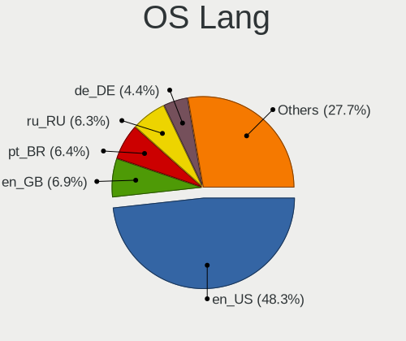

| Lang  | Desktops | Percent |
|-------|----------|---------|
| en_US | 443      | 48.2%   |
| ru_RU | 61       | 6.64%   |
| pt_BR | 60       | 6.53%   |
| en_GB | 58       | 6.31%   |
| de_DE | 40       | 4.35%   |
| en_AU | 39       | 4.24%   |
| fr_FR | 28       | 3.05%   |
| en_CA | 23       | 2.5%    |
| it_IT | 19       | 2.07%   |
| es_ES | 15       | 1.63%   |
| pl_PL | 14       | 1.52%   |
| es_MX | 14       | 1.52%   |
| cs_CZ | 13       | 1.41%   |
| de_AT | 8        | 0.87%   |
| hu_HU | 7        | 0.76%   |
| zh_CN | 6        | 0.65%   |
| tr_TR | 5        | 0.54%   |
| nl_NL | 5        | 0.54%   |
| fr_BE | 5        | 0.54%   |
| en_NZ | 5        | 0.54%   |
| pt_PT | 4        | 0.44%   |
| ko_KR | 4        | 0.44%   |
| fr_CA | 4        | 0.44%   |
| es_AR | 4        | 0.44%   |
| ja_JP | 3        | 0.33%   |
| en_IE | 3        | 0.33%   |
| en_DK | 3        | 0.33%   |
| sv_SE | 2        | 0.22%   |
| en_IN | 2        | 0.22%   |
| en_BW | 2        | 0.22%   |
| zh_SG | 1        | 0.11%   |
| zh_HK | 1        | 0.11%   |
| sr_RS | 1        | 0.11%   |
| ro_RO | 1        | 0.11%   |
| nb_NO | 1        | 0.11%   |
| lv_LV | 1        | 0.11%   |
| hr_HR | 1        | 0.11%   |
| he_IL | 1        | 0.11%   |
| fr_CH | 1        | 0.11%   |
| fi_FI | 1        | 0.11%   |

Boot Mode
---------

EFI or BIOS

| Mode | Desktops | Percent |
|------|----------|---------|
| BIOS | 483      | 51.49%  |
| EFI  | 455      | 48.51%  |

Filesystem
----------

Type of filesystem

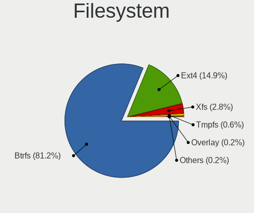

| Type    | Desktops | Percent |
|---------|----------|---------|
| Btrfs   | 755      | 82.07%  |
| Ext4    | 132      | 14.35%  |
| Xfs     | 24       | 2.61%   |
| Tmpfs   | 6        | 0.65%   |
| XXXXX   | 1        | 0.11%   |
| Overlay | 1        | 0.11%   |
| Unknown | 1        | 0.11%   |

Part. scheme
------------

Scheme of partitioning

| Type    | Desktops | Percent |
|---------|----------|---------|
| Unknown | 630      | 68.48%  |
| GPT     | 270      | 29.35%  |
| MBR     | 20       | 2.17%   |

Dual Boot with Linux/BSD
------------------------

Hosting more than one Linux/BSD

| Dual boot | Desktops | Percent |
|-----------|----------|---------|
| No        | 844      | 91.64%  |
| Yes       | 77       | 8.36%   |

Dual Boot (Win)
---------------

Hosting Linux and Windows

| Dual boot | Desktops | Percent |
|-----------|----------|---------|
| No        | 778      | 84.84%  |
| Yes       | 139      | 15.16%  |

Board
-----

Vendor
------

Motherboard manufacturer

| Name                                 | Desktops | Percent |
|--------------------------------------|----------|---------|
| ASUSTek Computer                     | 269      | 29.37%  |
| MSI                                  | 154      | 16.81%  |
| Gigabyte Technology                  | 152      | 16.59%  |
| ASRock                               | 80       | 8.73%   |
| Dell                                 | 64       | 6.99%   |
| Hewlett-Packard                      | 55       | 6%      |
| Lenovo                               | 25       | 2.73%   |
| Intel                                | 20       | 2.18%   |
| Apple                                | 10       | 1.09%   |
| Fujitsu                              | 9        | 0.98%   |
| Pegatron                             | 8        | 0.87%   |
| Biostar                              | 6        | 0.66%   |
| Acer                                 | 6        | 0.66%   |
| Unknown                              | 6        | 0.66%   |
| Shenzhen Meigao Electronic Equipment | 5        | 0.55%   |
| Foxconn                              | 5        | 0.55%   |
| AZW                                  | 4        | 0.44%   |
| Huanan                               | 3        | 0.33%   |
| GEEKOM                               | 3        | 0.33%   |
| AMI                                  | 3        | 0.33%   |
| Alienware                            | 3        | 0.33%   |
| OEM                                  | 2        | 0.22%   |
| EVGA                                 | 2        | 0.22%   |
| Colorful Technology                  | 2        | 0.22%   |
| ZOTAC                                | 1        | 0.11%   |
| SZQFTX                               | 1        | 0.11%   |
| Positivo                             | 1        | 0.11%   |
| PCWare                               | 1        | 0.11%   |
| NZXT                                 | 1        | 0.11%   |
| NCR                                  | 1        | 0.11%   |
| MAXSUN                               | 1        | 0.11%   |
| MACHINIST                            | 1        | 0.11%   |
| LattePanda                           | 1        | 0.11%   |
| Itautec                              | 1        | 0.11%   |
| Google                               | 1        | 0.11%   |
| GALAX                                | 1        | 0.11%   |
| eMachines                            | 1        | 0.11%   |
| ECS                                  | 1        | 0.11%   |
| Digiboard                            | 1        | 0.11%   |
| Danuri                               | 1        | 0.11%   |

Model
-----

Motherboard model

| Name                           | Desktops | Percent |
|--------------------------------|----------|---------|
| ASUS All Series                | 15       | 1.64%   |
| MSI MS-7C95                    | 7        | 0.76%   |
| MSI MS-7C37                    | 7        | 0.76%   |
| ASUS ROG STRIX B550-F GAMING   | 7        | 0.76%   |
| MSI MS-7B89                    | 6        | 0.66%   |
| ASUS TUF Gaming X570-PLUS      | 6        | 0.66%   |
| ASUS PRIME A320M-K             | 6        | 0.66%   |
| Unknown                        | 6        | 0.66%   |
| MSI MS-7C02                    | 5        | 0.55%   |
| Intel X99                      | 5        | 0.55%   |
| ASUS TUF Gaming B550-PLUS      | 5        | 0.55%   |
| ASUS ROG STRIX X570-E GAMING   | 5        | 0.55%   |
| Apple MacPro5,1                | 5        | 0.55%   |
| MSI MS-7D78                    | 4        | 0.44%   |
| MSI MS-7D54                    | 4        | 0.44%   |
| MSI MS-7C91                    | 4        | 0.44%   |
| MSI MS-7C56                    | 4        | 0.44%   |
| MSI MS-7B86                    | 4        | 0.44%   |
| MSI MS-7A38                    | 4        | 0.44%   |
| Gigabyte X570 I AORUS PRO WIFI | 4        | 0.44%   |
| Gigabyte B550 AORUS ELITE V2   | 4        | 0.44%   |
| Dell Precision Tower 5810      | 4        | 0.44%   |
| Dell OptiPlex 9020             | 4        | 0.44%   |
| Dell OptiPlex 7010             | 4        | 0.44%   |
| ASUS TUF Gaming X570-PRO       | 4        | 0.44%   |
| ASUS PRIME X570-PRO            | 4        | 0.44%   |
| ASUS PRIME B550-PLUS           | 4        | 0.44%   |
| ASUS PRIME B450M-A II          | 4        | 0.44%   |
| Apple MacPro6,1                | 4        | 0.44%   |
| MSI MS-7D76                    | 3        | 0.33%   |
| MSI MS-7D75                    | 3        | 0.33%   |
| MSI MS-7D43                    | 3        | 0.33%   |
| MSI MS-7D25                    | 3        | 0.33%   |
| MSI MS-7C84                    | 3        | 0.33%   |
| MSI MS-7B79                    | 3        | 0.33%   |
| MSI MS-7885                    | 3        | 0.33%   |
| MSI MS-7641                    | 3        | 0.33%   |
| Gigabyte X570 AORUS ELITE WIFI | 3        | 0.33%   |
| Gigabyte B650 GAMING X AX      | 3        | 0.33%   |
| Gigabyte B650 AORUS ELITE AX   | 3        | 0.33%   |

Model Family
------------

Motherboard model prefix

| Name                | Desktops | Percent |
|---------------------|----------|---------|
| ASUS PRIME          | 76       | 8.3%    |
| ASUS ROG            | 61       | 6.66%   |
| ASUS TUF            | 45       | 4.91%   |
| Dell OptiPlex       | 36       | 3.93%   |
| ASUS All            | 15       | 1.64%   |
| HP EliteDesk        | 14       | 1.53%   |
| Gigabyte X570       | 14       | 1.53%   |
| Gigabyte B550M      | 11       | 1.2%    |
| Gigabyte B550       | 11       | 1.2%    |
| Lenovo ThinkCentre  | 10       | 1.09%   |
| Dell Precision      | 10       | 1.09%   |
| Lenovo ThinkStation | 9        | 0.98%   |
| Gigabyte B450M      | 9        | 0.98%   |
| MSI MS-7C95         | 7        | 0.76%   |
| MSI MS-7C37         | 7        | 0.76%   |
| HP ProDesk          | 7        | 0.76%   |
| HP Compaq           | 7        | 0.76%   |
| Gigabyte B650       | 7        | 0.76%   |
| Fujitsu ESPRIMO     | 7        | 0.76%   |
| ASRock B550         | 7        | 0.76%   |
| MSI MS-7B89         | 6        | 0.66%   |
| Intel X99           | 6        | 0.66%   |
| Dell Inspiron       | 6        | 0.66%   |
| ASRock X570         | 6        | 0.66%   |
| Unknown             | 6        | 0.66%   |
| MSI MS-7C02         | 5        | 0.55%   |
| Dell XPS            | 5        | 0.55%   |
| ASUS Pro            | 5        | 0.55%   |
| ASRock B450M        | 5        | 0.55%   |
| Apple MacPro5       | 5        | 0.55%   |
| MSI MS-7D78         | 4        | 0.44%   |
| MSI MS-7D54         | 4        | 0.44%   |
| MSI MS-7C91         | 4        | 0.44%   |
| MSI MS-7C56         | 4        | 0.44%   |
| MSI MS-7B86         | 4        | 0.44%   |
| MSI MS-7A38         | 4        | 0.44%   |
| HP Pavilion         | 4        | 0.44%   |
| Gigabyte B650M      | 4        | 0.44%   |
| Gigabyte B450       | 4        | 0.44%   |
| ASUS P8Z77-V        | 4        | 0.44%   |

MFG Year
--------

Motherboard manufacture year

| Year | Desktops | Percent |
|------|----------|---------|
| 2020 | 122      | 13.32%  |
| 2022 | 114      | 12.45%  |
| 2019 | 87       | 9.5%    |
| 2021 | 77       | 8.41%   |
| 2018 | 76       | 8.3%    |
| 2023 | 71       | 7.75%   |
| 2017 | 55       | 6%      |
| 2013 | 45       | 4.91%   |
| 2012 | 45       | 4.91%   |
| 2014 | 43       | 4.69%   |
| 2010 | 35       | 3.82%   |
| 2011 | 31       | 3.38%   |
| 2015 | 30       | 3.28%   |
| 2016 | 29       | 3.17%   |
| 2009 | 19       | 2.07%   |
| 2008 | 17       | 1.86%   |
| 2007 | 9        | 0.98%   |
| 2024 | 6        | 0.66%   |
| 2006 | 4        | 0.44%   |
| 2005 | 1        | 0.11%   |

Form Factor
-----------

Physical design of the computer

| Name    | Desktops | Percent |
|---------|----------|---------|
| Desktop | 916      | 100%    |

Secure Boot
-----------

Enabled or disabled

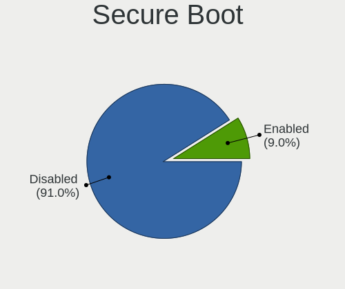

| State    | Desktops | Percent |
|----------|----------|---------|
| Disabled | 831      | 90.42%  |
| Enabled  | 88       | 9.58%   |

Coreboot
--------

Have coreboot on board

| Used | Desktops | Percent |
|------|----------|---------|
| No   | 915      | 99.89%  |
| Yes  | 1        | 0.11%   |

RAM Size
--------

Total RAM memory

| Size in GB      | Desktops | Percent |
|-----------------|----------|---------|
| 32.01-64.0      | 269      | 29.08%  |
| 16.01-24.0      | 229      | 24.76%  |
| 8.01-16.0       | 116      | 12.54%  |
| 64.01-256.0     | 114      | 12.32%  |
| 4.01-8.0        | 92       | 9.95%   |
| 24.01-32.0      | 61       | 6.59%   |
| 3.01-4.0        | 34       | 3.68%   |
| 1.01-2.0        | 7        | 0.76%   |
| 2.01-3.0        | 2        | 0.22%   |
| More than 256.0 | 1        | 0.11%   |

RAM Used
--------

Used RAM memory

| Used GB     | Desktops | Percent |
|-------------|----------|---------|
| 4.01-8.0    | 313      | 31.78%  |
| 2.01-3.0    | 225      | 22.84%  |
| 3.01-4.0    | 213      | 21.62%  |
| 1.01-2.0    | 93       | 9.44%   |
| 8.01-16.0   | 86       | 8.73%   |
| 16.01-24.0  | 28       | 2.84%   |
| 0.51-1.0    | 20       | 2.03%   |
| 24.01-32.0  | 4        | 0.41%   |
| 32.01-64.0  | 2        | 0.2%    |
| 64.01-256.0 | 1        | 0.1%    |

Total Drives
------------

Number of drives on board

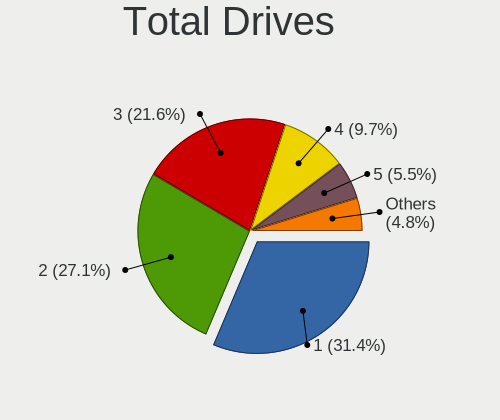

| Drives | Desktops | Percent |
|--------|----------|---------|
| 1      | 296      | 31.59%  |
| 2      | 258      | 27.53%  |
| 3      | 200      | 21.34%  |
| 4      | 93       | 9.93%   |
| 5      | 50       | 5.34%   |
| 6      | 21       | 2.24%   |
| 8      | 8        | 0.85%   |
| 7      | 4        | 0.43%   |
| 9      | 3        | 0.32%   |
| 12     | 2        | 0.21%   |
| 11     | 1        | 0.11%   |
| 10     | 1        | 0.11%   |

Has CD-ROM
----------

Has CD-ROM on board

| Presented | Desktops | Percent |
|-----------|----------|---------|
| No        | 669      | 72.64%  |
| Yes       | 252      | 27.36%  |

Has Ethernet
------------

Has Ethernet on board

| Presented | Desktops | Percent |
|-----------|----------|---------|
| Yes       | 903      | 98.58%  |
| No        | 13       | 1.42%   |

Has WiFi
--------

Has WiFi module

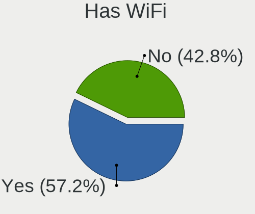

| Presented | Desktops | Percent |
|-----------|----------|---------|
| Yes       | 538      | 58.29%  |
| No        | 385      | 41.71%  |

Has Bluetooth
-------------

Has Bluetooth module

| Presented | Desktops | Percent |
|-----------|----------|---------|
| Yes       | 494      | 53.64%  |
| No        | 427      | 46.36%  |

Location
--------

Country
-------

Geographic location (country)

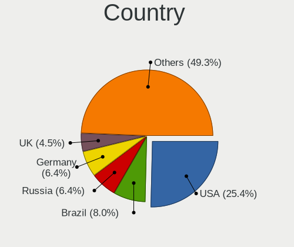

| Country     | Desktops | Percent |
|-------------|----------|---------|
| USA         | 227      | 24.75%  |
| Brazil      | 75       | 8.18%   |
| Russia      | 62       | 6.76%   |
| Germany     | 59       | 6.43%   |
| Australia   | 43       | 4.69%   |
| UK          | 36       | 3.93%   |
| France      | 33       | 3.6%    |
| Canada      | 33       | 3.6%    |
| Italy       | 30       | 3.27%   |
| Poland      | 21       | 2.29%   |
| Spain       | 19       | 2.07%   |
| Netherlands | 19       | 2.07%   |
| Mexico      | 19       | 2.07%   |
| Czechia     | 19       | 2.07%   |
| Sweden      | 13       | 1.42%   |
| Belgium     | 12       | 1.31%   |
| Austria     | 12       | 1.31%   |
| Argentina   | 12       | 1.31%   |
| Hungary     | 11       | 1.2%    |
| Turkey      | 10       | 1.09%   |
| Portugal    | 10       | 1.09%   |
| Switzerland | 9        | 0.98%   |
| Romania     | 8        | 0.87%   |
| Norway      | 7        | 0.76%   |
| Finland     | 7        | 0.76%   |
| Egypt       | 7        | 0.76%   |
| New Zealand | 6        | 0.65%   |
| India       | 6        | 0.65%   |
| Bulgaria    | 6        | 0.65%   |
| Taiwan      | 5        | 0.55%   |
| Colombia    | 5        | 0.55%   |
| China       | 5        | 0.55%   |
| Thailand    | 4        | 0.44%   |
| South Korea | 4        | 0.44%   |
| Kazakhstan  | 4        | 0.44%   |
| Belarus     | 4        | 0.44%   |
| Serbia      | 3        | 0.33%   |
| Puerto Rico | 3        | 0.33%   |
| Malaysia    | 3        | 0.33%   |
| Latvia      | 3        | 0.33%   |

City
----

Geographic location (city)

| City           | Desktops | Percent |
|----------------|----------|---------|
| Sydney         | 22       | 2.37%   |
| Moscow         | 15       | 1.62%   |
| Seattle        | 8        | 0.86%   |
| Warsaw         | 7        | 0.76%   |
| Rio de Janeiro | 7        | 0.76%   |
| Prague         | 7        | 0.76%   |
| Brisbane       | 7        | 0.76%   |
| Berlin         | 7        | 0.76%   |
| Sao Paulo      | 6        | 0.65%   |
| St Petersburg  | 5        | 0.54%   |
| Mexico City    | 5        | 0.54%   |
| Melbourne      | 5        | 0.54%   |
| Ankara         | 5        | 0.54%   |
| Alexandria     | 5        | 0.54%   |
| Vienna         | 4        | 0.43%   |
| Rome           | 4        | 0.43%   |
| Porto Alegre   | 4        | 0.43%   |
| Palmas         | 4        | 0.43%   |
| Brussels       | 4        | 0.43%   |
| Austin         | 4        | 0.43%   |
| Yekaterinburg  | 3        | 0.32%   |
| Valencia       | 3        | 0.32%   |
| Toronto        | 3        | 0.32%   |
| Timioara     | 3        | 0.32%   |
| Taipei         | 3        | 0.32%   |
| Stuttgart      | 3        | 0.32%   |
| Sofia          | 3        | 0.32%   |
| Scarborough    | 3        | 0.32%   |
| Roswell        | 3        | 0.32%   |
| Riga           | 3        | 0.32%   |
| Perth          | 3        | 0.32%   |
| Paris          | 3        | 0.32%   |
| Montreal       | 3        | 0.32%   |
| Minsk          | 3        | 0.32%   |
| Milano         | 3        | 0.32%   |
| Los Angeles    | 3        | 0.32%   |
| Lisbon         | 3        | 0.32%   |
| Kuala Lumpur   | 3        | 0.32%   |
| Fortaleza      | 3        | 0.32%   |
| Denver         | 3        | 0.32%   |

Drives
------

Drive Vendor
------------

Hard drive vendors

| Vendor                       | Desktops | Drives | Percent |
|------------------------------|----------|--------|---------|
| Samsung Electronics          | 317      | 545    | 17.2%   |
| WDC                          | 262      | 427    | 14.22%  |
| Seagate                      | 232      | 351    | 12.59%  |
| SanDisk                      | 126      | 165    | 6.84%   |
| Kingston                     | 108      | 146    | 5.86%   |
| Crucial                      | 82       | 108    | 4.45%   |
| Toshiba                      | 69       | 88     | 3.74%   |
| Micron/Crucial Technology    | 57       | 78     | 3.09%   |
| Phison Electronics           | 52       | 67     | 2.82%   |
| Intel                        | 44       | 56     | 2.39%   |
| Hitachi                      | 34       | 41     | 1.84%   |
| MAXIO Technology (Hangzhou)  | 33       | 36     | 1.79%   |
| SK hynix                     | 30       | 33     | 1.63%   |
| ADATA Technology             | 30       | 39     | 1.63%   |
| Kingston Technology Company  | 23       | 26     | 1.25%   |
| China                        | 22       | 29     | 1.19%   |
| Silicon Motion               | 21       | 32     | 1.14%   |
| A-DATA Technology            | 20       | 23     | 1.09%   |
| HGST                         | 18       | 29     | 0.98%   |
| Micron Technology            | 17       | 20     | 0.92%   |
| Realtek Semiconductor        | 13       | 14     | 0.71%   |
| Unknown                      | 12       | 15     | 0.65%   |
| SPCC                         | 10       | 13     | 0.54%   |
| PNY                          | 10       | 12     | 0.54%   |
| Patriot                      | 10       | 15     | 0.54%   |
| Intenso                      | 9        | 10     | 0.49%   |
| Apacer                       | 9        | 12     | 0.49%   |
| Team                         | 8        | 10     | 0.43%   |
| Shenzhen Longsys Electronics | 8        | 11     | 0.43%   |
| Unknown                      | 8        | 10     | 0.43%   |
| OCZ                          | 7        | 7      | 0.38%   |
| Netac                        | 7        | 10     | 0.38%   |
| JMicron Technology           | 7        | 7      | 0.38%   |
| Transcend                    | 5        | 6      | 0.27%   |
| Maxtor                       | 5        | 5      | 0.27%   |
| KIOXIA                       | 5        | 6      | 0.27%   |
| KingSpec                     | 5        | 6      | 0.27%   |
| GOODRAM                      | 5        | 6      | 0.27%   |
| Fanxiang                     | 5        | 7      | 0.27%   |
| Apple                        | 5        | 5      | 0.27%   |

Drive Model
-----------

Hard drive models

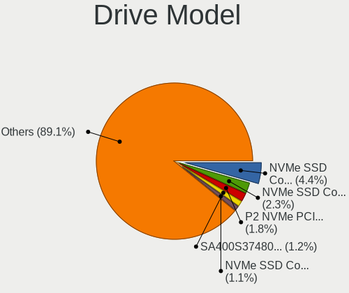

| Model                                                           | Desktops | Percent |
|-----------------------------------------------------------------|----------|---------|
| Samsung NVMe SSD Controller SM981/PM981/PM983 1TB               | 95       | 4.44%   |
| Samsung NVMe SSD Controller PM9A1/PM9A3/980PRO 1TB              | 47       | 2.2%    |
| Micron/Crucial P2 NVMe PCIe SSD 4TB                             | 40       | 1.87%   |
| Kingston SA400S37480G 480GB SSD                                 | 27       | 1.26%   |
| Seagate ST1000DM010-2EP102 1TB                                  | 23       | 1.08%   |
| Phison E12 NVMe Controller 2TB                                  | 23       | 1.08%   |
| Samsung SSD 860 EVO 500GB                                       | 22       | 1.03%   |
| MAXIO (Hangzhou) NVMe SSD Controller MAP1202 256GB              | 22       | 1.03%   |
| Samsung SSD 860 EVO 1TB                                         | 21       | 0.98%   |
| Samsung SSD 850 EVO 250GB                                       | 20       | 0.94%   |
| Seagate ST2000DM008-2FR102 2TB                                  | 19       | 0.89%   |
| Silicon Motion SM2263EN/SM2263XT SSD Controller 256GB           | 16       | 0.75%   |
| Seagate ST500DM002-1BD142 500GB                                 | 16       | 0.75%   |
| Sandisk WD Blue SN550 NVMe SSD 2TB                              | 16       | 0.75%   |
| Samsung SSD 980 1TB                                             | 16       | 0.75%   |
| Samsung SSD 850 EVO 500GB                                       | 16       | 0.75%   |
| Kingston SA400S37240G 240GB SSD                                 | 16       | 0.75%   |
| Toshiba DT01ACA100 1TB                                          | 15       | 0.7%    |
| Kingston Company SNV2S1000G 1TB                                 | 14       | 0.65%   |
| Crucial CT1000MX500SSD1 1TB                                     | 14       | 0.65%   |
| Intel SSD 660P Series 1024GB                                    | 13       | 0.61%   |
| Kingston SA400S37120G 120GB SSD                                 | 12       | 0.56%   |
| ADATA XPG SX8200 Pro PCIe Gen3x4 M.2 2280 Solid State Drive 1TB | 12       | 0.56%   |
| WDC WD10EZEX-08WN4A0 1TB                                        | 11       | 0.51%   |
| Seagate ST4000DM004-2CV104 4TB                                  | 11       | 0.51%   |
| Seagate ST2000DM008-2UB102 2TB                                  | 11       | 0.51%   |
| Samsung SSD 990 PRO 2TB                                         | 11       | 0.51%   |
| Samsung NVMe SSD Controller SM961/PM961/SM963 1TB               | 11       | 0.51%   |
| Phison E16 PCIe4 NVMe Controller 1TB                            | 11       | 0.51%   |
| WDC WDS500G2B0A-00SM50 500GB SSD                                | 10       | 0.47%   |
| Seagate ST2000DM001-1ER164 2TB                                  | 10       | 0.47%   |
| Sandisk WD_BLACK SN850X 1000GB                                  | 10       | 0.47%   |
| Samsung SSD 870 QVO 1TB                                         | 10       | 0.47%   |
| Samsung SSD 870 EVO 1TB                                         | 10       | 0.47%   |
| Crucial CT500MX500SSD1 500GB                                    | 10       | 0.47%   |
| Crucial CT480BX500SSD1 480GB                                    | 10       | 0.47%   |
| Sandisk WD Black SN750 / PC SN730 NVMe SSD 512GB                | 9        | 0.42%   |
| Samsung SSD 980 500GB                                           | 9        | 0.42%   |
| Toshiba HDWD110 1TB                                             | 8        | 0.37%   |
| Seagate ST2000DM006-2DM164 2TB                                  | 8        | 0.37%   |

HDD Vendor
----------

Hard disk drive vendors

| Vendor              | Desktops | Drives | Percent |
|---------------------|----------|--------|---------|
| WDC                 | 228      | 370    | 36.95%  |
| Seagate             | 228      | 344    | 36.95%  |
| Toshiba             | 59       | 77     | 9.56%   |
| Hitachi             | 34       | 41     | 5.51%   |
| Samsung Electronics | 26       | 40     | 4.21%   |
| HGST                | 17       | 28     | 2.76%   |
| JMicron Technology  | 6        | 6      | 0.97%   |
| Unknown             | 4        | 4      | 0.65%   |
| Maxtor              | 4        | 4      | 0.65%   |
| SABRENT             | 2        | 2      | 0.32%   |
| TO Exter            | 1        | 2      | 0.16%   |
| SAGE                | 1        | 1      | 0.16%   |
| Lenovo              | 1        | 1      | 0.16%   |
| KINGWIN             | 1        | 1      | 0.16%   |
| Intenso             | 1        | 1      | 0.16%   |
| ICY BOX             | 1        | 1      | 0.16%   |
| IB-377U3            | 1        | 1      | 0.16%   |
| ASMT                | 1        | 5      | 0.16%   |
| Apple               | 1        | 1      | 0.16%   |

SSD Vendor
----------

Solid state drive vendors

| Vendor              | Desktops | Drives | Percent |
|---------------------|----------|--------|---------|
| Samsung Electronics | 162      | 258    | 24.88%  |
| Kingston            | 88       | 111    | 13.52%  |
| Crucial             | 82       | 108    | 12.6%   |
| WDC                 | 47       | 57     | 7.22%   |
| SanDisk             | 43       | 51     | 6.61%   |
| China               | 22       | 29     | 3.38%   |
| A-DATA Technology   | 20       | 23     | 3.07%   |
| Intel               | 17       | 26     | 2.61%   |
| SK hynix            | 11       | 12     | 1.69%   |
| SPCC                | 10       | 13     | 1.54%   |
| PNY                 | 10       | 12     | 1.54%   |
| Patriot             | 10       | 15     | 1.54%   |
| Apacer              | 9        | 12     | 1.38%   |
| Team                | 8        | 10     | 1.23%   |
| Intenso             | 8        | 9      | 1.23%   |
| OCZ                 | 7        | 7      | 1.08%   |
| Toshiba             | 6        | 7      | 0.92%   |
| Micron Technology   | 6        | 7      | 0.92%   |
| Transcend           | 5        | 6      | 0.77%   |
| KingSpec            | 5        | 6      | 0.77%   |
| GOODRAM             | 5        | 6      | 0.77%   |
| Smartbuy            | 4        | 5      | 0.61%   |
| Netac               | 4        | 5      | 0.61%   |
| Fanxiang            | 4        | 5      | 0.61%   |
| External            | 4        | 7      | 0.61%   |
| Corsair             | 4        | 5      | 0.61%   |
| Apple               | 4        | 4      | 0.61%   |
| Unknown             | 3        | 5      | 0.46%   |
| USB3.0              | 2        | 2      | 0.31%   |
| Seagate             | 2        | 2      | 0.31%   |
| Mushkin             | 2        | 2      | 0.31%   |
| Lexar               | 2        | 4      | 0.31%   |
| Hewlett-Packard     | 2        | 3      | 0.31%   |
| Emtec               | 2        | 2      | 0.31%   |
| Acer                | 2        | 2      | 0.31%   |
| XrayDisk            | 1        | 1      | 0.15%   |
| WDC WDS1            | 1        | 1      | 0.15%   |
| V7                  | 1        | 1      | 0.15%   |
| USB                 | 1        | 1      | 0.15%   |
| TECH                | 1        | 1      | 0.15%   |

Drive Kind
----------

HDD or SSD

| Kind    | Desktops | Drives | Percent |
|---------|----------|--------|---------|
| NVMe    | 518      | 801    | 33.23%  |
| SSD     | 515      | 872    | 33.03%  |
| HDD     | 493      | 930    | 31.62%  |
| Unknown | 32       | 40     | 2.05%   |
| MMC     | 1        | 1      | 0.06%   |

Drive Connector
---------------

SATA, SAS, NVMe, etc.

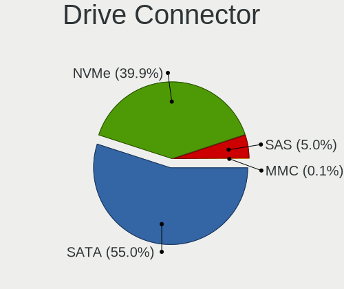

| Type | Desktops | Drives | Percent |
|------|----------|--------|---------|
| SATA | 720      | 1753   | 55.34%  |
| NVMe | 517      | 797    | 39.74%  |
| SAS  | 63       | 93     | 4.84%   |
| MMC  | 1        | 1      | 0.08%   |

Drive Size
----------

Size of hard drive

| Size in TB | Desktops | Drives | Percent |
|------------|----------|--------|---------|
| 0.01-0.5   | 472      | 824    | 42.22%  |
| 0.51-1.0   | 349      | 531    | 31.22%  |
| 1.01-2.0   | 143      | 204    | 12.79%  |
| 3.01-4.0   | 69       | 106    | 6.17%   |
| 4.01-10.0  | 45       | 75     | 4.03%   |
| 2.01-3.0   | 23       | 34     | 2.06%   |
| 10.01-20.0 | 17       | 28     | 1.52%   |

Space Total
-----------

Amount of disk space available on the file system

| Size in GB     | Desktops | Percent |
|----------------|----------|---------|
| 1001-2000      | 215      | 22.73%  |
| More than 3000 | 179      | 18.92%  |
| 501-1000       | 176      | 18.6%   |
| 251-500        | 111      | 11.73%  |
| 101-250        | 75       | 7.93%   |
| 2001-3000      | 67       | 7.08%   |
| Unknown        | 49       | 5.18%   |
| 1-20           | 36       | 3.81%   |
| 51-100         | 29       | 3.07%   |
| 21-50          | 9        | 0.95%   |

Space Used
----------

Amount of used disk space

| Used GB        | Desktops | Percent |
|----------------|----------|---------|
| 1-20           | 217      | 22.65%  |
| 21-50          | 154      | 16.08%  |
| 101-250        | 116      | 12.11%  |
| 51-100         | 101      | 10.54%  |
| 251-500        | 81       | 8.46%   |
| 501-1000       | 77       | 8.04%   |
| 1001-2000      | 76       | 7.93%   |
| More than 3000 | 60       | 6.26%   |
| Unknown        | 49       | 5.11%   |
| 2001-3000      | 27       | 2.82%   |

Malfunc. Drives
---------------

Drive models with a malfunction

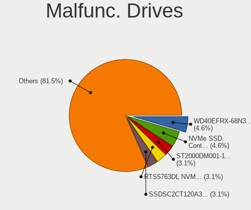

| Model                                                         | Desktops | Drives | Percent |
|---------------------------------------------------------------|----------|--------|---------|
| WDC WD40EFRX-68N32N0 4TB                                      | 3        | 3      | 4.76%   |
| Samsung Electronics NVMe SSD Controller SM981/PM981/PM983 1TB | 3        | 4      | 4.76%   |
| Realtek Semiconductor RTS5763DL NVMe SSD Controller 256GB     | 2        | 2      | 3.17%   |
| Intel SSDSC2CT120A3 120GB                                     | 2        | 8      | 3.17%   |
| WDC WDS240G2G0B-00EPW0 240GB SSD                              | 1        | 1      | 1.59%   |
| WDC WDS240G2G0A-00JH30 240GB SSD                              | 1        | 1      | 1.59%   |
| WDC WD7500BPKX-00HPJT0 752GB                                  | 1        | 1      | 1.59%   |
| WDC WD6400AAKS-65A7B2 640GB                                   | 1        | 1      | 1.59%   |
| WDC WD5000LPVX-22V0TT0 500GB                                  | 1        | 1      | 1.59%   |
| WDC WD5000AVDS-63U7B1 500GB                                   | 1        | 2      | 1.59%   |
| WDC WD5000AVCS-632DY1 500GB                                   | 1        | 3      | 1.59%   |
| WDC WD5000AAKX-00ERMA0 500GB                                  | 1        | 2      | 1.59%   |
| WDC WD5000AAKS-00UU3A0 500GB                                  | 1        | 1      | 1.59%   |
| WDC WD40EFRX-68WT0N0 4TB                                      | 1        | 1      | 1.59%   |
| WDC WD3200AAKS-22B3A0 320GB                                   | 1        | 1      | 1.59%   |
| WDC WD30 EZRX-00SPEB0 3TB                                     | 1        | 1      | 1.59%   |
| WDC WD20EADS-00S2B0 2TB                                       | 1        | 1      | 1.59%   |
| WDC WD2003FZEX-00SRLA0 2TB                                    | 1        | 1      | 1.59%   |
| WDC WD20 EZRX-00D8PB0 2TB                                     | 1        | 1      | 1.59%   |
| WDC WD1600AVVS-63L2B0 160GB                                   | 1        | 1      | 1.59%   |
| WDC WD15EARS-00MVWB0 1TB                                      | 1        | 1      | 1.59%   |
| WDC WD10EZEX-08WN4A0 1TB                                      | 1        | 1      | 1.59%   |
| WDC WD10EARS-22Y5B1 1TB                                       | 1        | 1      | 1.59%   |
| WDC WD10EADS-11M2B2 1TB                                       | 1        | 1      | 1.59%   |
| WDC WD10EADS-00L5B1 1TB                                       | 1        | 1      | 1.59%   |
| Toshiba MQ01ABD050 500GB                                      | 1        | 4      | 1.59%   |
| Toshiba DT01ACA100 1TB                                        | 1        | 1      | 1.59%   |
| Seagate ST500LM034-2GH17A 500GB                               | 1        | 1      | 1.59%   |
| Seagate ST500DM002-1BD142 500GB                               | 1        | 1      | 1.59%   |
| Seagate ST5000LM000-2AN170 5TB                                | 1        | 1      | 1.59%   |
| Seagate ST4000DM000-1F2168 4TB                                | 1        | 1      | 1.59%   |
| Seagate ST3500320AS 500GB                                     | 1        | 1      | 1.59%   |
| Seagate ST31000524AS 1TB                                      | 1        | 4      | 1.59%   |
| Seagate ST31000333AS 1TB                                      | 1        | 2      | 1.59%   |
| Seagate ST2000DX002-2DV164 2TB                                | 1        | 1      | 1.59%   |
| Seagate ST2000DM001-1ER164 2TB                                | 1        | 1      | 1.59%   |
| Seagate ST1000DX001-1NS162 1TB                                | 1        | 2      | 1.59%   |
| Seagate ST1000DM003-1SB102 1TB                                | 1        | 1      | 1.59%   |
| SanDisk SSD PLUS 240GB                                        | 1        | 1      | 1.59%   |
| SanDisk SSD PLUS 120GB                                        | 1        | 1      | 1.59%   |

Malfunc. Drive Vendor
---------------------

Vendors of faulty drives

| Vendor                | Desktops | Drives | Percent |
|-----------------------|----------|--------|---------|
| WDC                   | 21       | 28     | 35.59%  |
| Seagate               | 10       | 16     | 16.95%  |
| Samsung Electronics   | 6        | 17     | 10.17%  |
| Hitachi               | 5        | 5      | 8.47%   |
| SanDisk               | 3        | 3      | 5.08%   |
| Toshiba               | 2        | 5      | 3.39%   |
| Realtek Semiconductor | 2        | 2      | 3.39%   |
| Intel                 | 2        | 8      | 3.39%   |
| Crucial               | 2        | 5      | 3.39%   |
| Neo                   | 1        | 1      | 1.69%   |
| Mushkin               | 1        | 1      | 1.69%   |
| Micron Technology     | 1        | 1      | 1.69%   |
| Maxtor                | 1        | 1      | 1.69%   |
| Kingston              | 1        | 1      | 1.69%   |
| HGST                  | 1        | 1      | 1.69%   |

Malfunc. HDD Vendor
-------------------

Vendors of faulty HDD drives

| Vendor              | Desktops | Drives | Percent |
|---------------------|----------|--------|---------|
| WDC                 | 20       | 26     | 48.78%  |
| Seagate             | 10       | 16     | 24.39%  |
| Hitachi             | 5        | 5      | 12.2%   |
| Toshiba             | 2        | 5      | 4.88%   |
| Samsung Electronics | 2        | 12     | 4.88%   |
| Maxtor              | 1        | 1      | 2.44%   |
| HGST                | 1        | 1      | 2.44%   |

Malfunc. Drive Kind
-------------------

Kinds of faulty drives

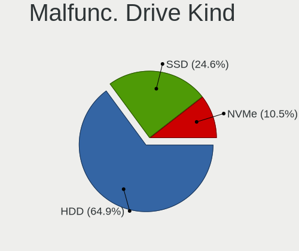

| Kind | Desktops | Drives | Percent |
|------|----------|--------|---------|
| HDD  | 36       | 66     | 65.45%  |
| SSD  | 13       | 22     | 23.64%  |
| NVMe | 6        | 7      | 10.91%  |

Failed Drives
-------------

Failed drive models

| Model                       | Desktops | Drives | Percent |
|-----------------------------|----------|--------|---------|
| WDC WD30 EZRS-00J99B0 3TB   | 1        | 1      | 50%     |
| Hitachi HDS721010DLE630 1TB | 1        | 2      | 50%     |

Failed Drive Vendor
-------------------

Failed drive vendors

| Vendor  | Desktops | Drives | Percent |
|---------|----------|--------|---------|
| WDC     | 1        | 1      | 50%     |
| Hitachi | 1        | 2      | 50%     |

Drive Status
------------

Number of failed and malfunc. drives

| Status   | Desktops | Drives | Percent |
|----------|----------|--------|---------|
| Detected | 670      | 1816   | 68.02%  |
| Works    | 263      | 730    | 26.7%   |
| Malfunc  | 50       | 95     | 5.08%   |
| Failed   | 2        | 3      | 0.2%    |

Storage controller
------------------

Storage Vendor
--------------

Storage controller vendors

| Vendor                       | Desktops | Percent |
|------------------------------|----------|---------|
| Intel                        | 457      | 28.28%  |
| AMD                          | 440      | 27.23%  |
| Samsung Electronics          | 188      | 11.63%  |
| SanDisk                      | 85       | 5.26%   |
| ASMedia Technology           | 68       | 4.21%   |
| Micron/Crucial Technology    | 57       | 3.53%   |
| Phison Electronics           | 53       | 3.28%   |
| Kingston Technology Company  | 48       | 2.97%   |
| MAXIO Technology (Hangzhou)  | 33       | 2.04%   |
| ADATA Technology             | 30       | 1.86%   |
| JMicron Technology           | 22       | 1.36%   |
| Silicon Motion               | 21       | 1.3%    |
| SK hynix                     | 19       | 1.18%   |
| Marvell Technology Group     | 17       | 1.05%   |
| Realtek Semiconductor        | 13       | 0.8%    |
| Micron Technology            | 11       | 0.68%   |
| Nvidia                       | 10       | 0.62%   |
| Shenzhen Longsys Electronics | 8        | 0.5%    |
| KIOXIA                       | 5        | 0.31%   |
| Toshiba America Info Systems | 4        | 0.25%   |
| Solidigm                     | 4        | 0.25%   |
| Netac Technology             | 3        | 0.19%   |
| VIA Technologies             | 2        | 0.12%   |
| LSI Logic / Symbios Logic    | 2        | 0.12%   |
| Lite-On Technology           | 2        | 0.12%   |
| INNOGRIT                     | 2        | 0.12%   |
| Broadcom / LSI               | 2        | 0.12%   |
| Yangtze Memory Technologies  | 1        | 0.06%   |
| Union Memory (Shenzhen)      | 1        | 0.06%   |
| ULi Electronics              | 1        | 0.06%   |
| Silicon Image                | 1        | 0.06%   |
| Promise Technology           | 1        | 0.06%   |
| OCZ Technology Group         | 1        | 0.06%   |
| HighPoint Technologies       | 1        | 0.06%   |
| HGST                         | 1        | 0.06%   |
| Biwin Storage Technology     | 1        | 0.06%   |
| Adaptec                      | 1        | 0.06%   |

Storage Model
-------------

Storage controller models

| Model                                                                          | Desktops | Percent |
|--------------------------------------------------------------------------------|----------|---------|
| AMD FCH SATA Controller [AHCI mode]                                            | 174      | 9.24%   |
| AMD 500 Series Chipset SATA Controller                                         | 104      | 5.52%   |
| Samsung NVMe SSD Controller SM981/PM981/PM983                                  | 95       | 5.05%   |
| AMD 400 Series Chipset SATA Controller                                         | 77       | 4.09%   |
| AMD 600 Series Chipset SATA Controller                                         | 76       | 4.04%   |
| ASMedia ASM1061/ASM1062 Serial ATA Controller                                  | 58       | 3.08%   |
| Intel 8 Series/C220 Series Chipset Family 6-port SATA Controller 1 [AHCI mode] | 47       | 2.5%    |
| Samsung NVMe SSD Controller PM9A1/PM9A3/980PRO                                 | 46       | 2.44%   |
| Intel Alder Lake-S PCH SATA Controller [AHCI Mode]                             | 44       | 2.34%   |
| Micron/Crucial P2 [Nick P2] / P3 / P3 Plus NVMe PCIe SSD (DRAM-less)           | 40       | 2.12%   |
| Intel Q170/Q150/B150/H170/H110/Z170/CM236 Chipset SATA Controller [AHCI Mode]  | 38       | 2.02%   |
| Intel 200 Series PCH SATA controller [AHCI mode]                               | 34       | 1.81%   |
| Intel 6 Series/C200 Series Chipset Family 6 port Desktop SATA AHCI Controller  | 32       | 1.7%    |
| Samsung NVMe SSD Controller 980 (DRAM-less)                                    | 29       | 1.54%   |
| Intel SATA Controller [RAID mode]                                              | 29       | 1.54%   |
| Intel Cannon Lake PCH SATA AHCI Controller                                     | 29       | 1.54%   |
| Sandisk WD Black SN850X NVMe SSD                                               | 26       | 1.38%   |
| Intel 7 Series/C210 Series Chipset Family 6-port SATA Controller [AHCI mode]   | 26       | 1.38%   |
| AMD SB7x0/SB8x0/SB9x0 IDE Controller                                           | 25       | 1.33%   |
| Phison E12 NVMe Controller                                                     | 23       | 1.22%   |
| MAXIO (Hangzhou) NVMe SSD Controller MAP1202 (DRAM-less)                       | 22       | 1.17%   |
| AMD SB7x0/SB8x0/SB9x0 SATA Controller [AHCI mode]                              | 21       | 1.12%   |
| Intel Volume Management Device NVMe RAID Controller                            | 20       | 1.06%   |
| Kingston Company NV2 NVMe SSD SM2267XT (DRAM-less)                             | 19       | 1.01%   |
| Kingston Company KC3000/FURY Renegade NVMe SSD E18                             | 19       | 1.01%   |
| Intel Raptor Lake SATA AHCI Controller                                         | 19       | 1.01%   |
| AMD FCH SATA Controller D                                                      | 19       | 1.01%   |
| Silicon Motion SM2263EN/SM2263XT (DRAM-less) NVMe SSD Controllers              | 16       | 0.85%   |
| SanDisk Ultra 3D / WD Blue SN550 NVMe SSD                                      | 16       | 0.85%   |
| Samsung NVMe SSD Controller S4LV008[Pascal]                                    | 16       | 0.85%   |
| AMD 300 Series Chipset SATA Controller                                         | 16       | 0.85%   |
| JMicron JMB363 SATA/IDE Controller                                             | 15       | 0.8%    |
| AMD SB7x0/SB8x0/SB9x0 SATA Controller [IDE mode]                               | 14       | 0.74%   |
| Intel SSD 660P Series                                                          | 13       | 0.69%   |
| Intel NM10/ICH7 Family SATA Controller [IDE mode]                              | 13       | 0.69%   |
| Intel C610/X99 series chipset sSATA Controller [AHCI mode]                     | 13       | 0.69%   |
| Intel 500 Series Chipset Family SATA AHCI Controller                           | 13       | 0.69%   |
| Intel C610/X99 series chipset 6-Port SATA Controller [AHCI mode]               | 12       | 0.64%   |
| ADATA XPG SX8200 Pro PCIe Gen3x4 M.2 2280 Solid State Drive                    | 12       | 0.64%   |
| SanDisk WD Black SN770 / PC SN740 256GB / PC SN560 (DRAM-less) NVMe SSD        | 11       | 0.58%   |

Storage Kind
------------

Kind of storage controller (IDE, SATA, NVMe, SAS, ...)

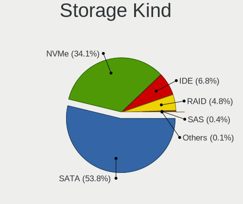

| Kind | Desktops | Percent |
|------|----------|---------|
| SATA | 819      | 54.27%  |
| NVMe | 515      | 34.13%  |
| IDE  | 104      | 6.89%   |
| RAID | 66       | 4.37%   |
| SAS  | 3        | 0.2%    |
| SCSI | 2        | 0.13%   |

Processor
---------

CPU Vendor
----------

Processor vendors

| Vendor | Desktops | Percent |
|--------|----------|---------|
| AMD    | 460      | 50.22%  |
| Intel  | 456      | 49.78%  |

CPU Model
---------

Processor models

| Model                                       | Desktops | Percent |
|---------------------------------------------|----------|---------|
| AMD Ryzen 5 3600 6-Core Processor           | 33       | 3.59%   |
| AMD Ryzen 5 5600X 6-Core Processor          | 27       | 2.94%   |
| AMD Ryzen 7 3700X 8-Core Processor          | 21       | 2.29%   |
| AMD Ryzen 5 5600G with Radeon Graphics      | 19       | 2.07%   |
| AMD Ryzen 7 5800X 8-Core Processor          | 18       | 1.96%   |
| AMD Ryzen 7 5700G with Radeon Graphics      | 17       | 1.85%   |
| AMD Ryzen 9 5900X 12-Core Processor         | 16       | 1.74%   |
| AMD Ryzen 9 5950X 16-Core Processor         | 15       | 1.63%   |
| AMD Ryzen 7 7800X3D 8-Core Processor        | 13       | 1.41%   |
| AMD Ryzen 7 5800X3D 8-Core Processor        | 12       | 1.31%   |
| Intel Core i5-4590 CPU @ 3.30GHz            | 11       | 1.2%    |
| AMD Ryzen 9 7950X 16-Core Processor         | 11       | 1.2%    |
| AMD Ryzen 7 5700X 8-Core Processor          | 11       | 1.2%    |
| AMD Ryzen 9 7900X 12-Core Processor         | 10       | 1.09%   |
| AMD Ryzen 5 2600 Six-Core Processor         | 10       | 1.09%   |
| Intel Core i5-8400 CPU @ 2.80GHz            | 9        | 0.98%   |
| AMD Ryzen 9 3900X 12-Core Processor         | 9        | 0.98%   |
| AMD Ryzen 5 5500                            | 9        | 0.98%   |
| AMD Ryzen 5 5600 6-Core Processor           | 8        | 0.87%   |
| Intel Core i7-7700K CPU @ 4.20GHz           | 7        | 0.76%   |
| Intel Core i7-6700K CPU @ 4.00GHz           | 7        | 0.76%   |
| Intel Core i7-3770 CPU @ 3.40GHz            | 7        | 0.76%   |
| Intel Core i5-6500 CPU @ 3.20GHz            | 7        | 0.76%   |
| Intel Core i5-3470 CPU @ 3.20GHz            | 7        | 0.76%   |
| Intel Core i5-2400 CPU @ 3.10GHz            | 7        | 0.76%   |
| Intel 12th Gen Core i5-12400F               | 7        | 0.76%   |
| AMD Ryzen 5 7600X 6-Core Processor          | 7        | 0.76%   |
| Intel Core i7-4790 CPU @ 3.60GHz            | 6        | 0.65%   |
| Intel Core i7-2600 CPU @ 3.40GHz            | 6        | 0.65%   |
| Intel Core i7-10700 CPU @ 2.90GHz           | 6        | 0.65%   |
| Intel Core i5-10400F CPU @ 2.90GHz          | 6        | 0.65%   |
| Intel Core i3-6100 CPU @ 3.70GHz            | 6        | 0.65%   |
| Intel Core 2 Quad CPU Q9550 @ 2.83GHz       | 6        | 0.65%   |
| AMD Ryzen 7 7700X 8-Core Processor          | 6        | 0.65%   |
| AMD Ryzen 7 1700 Eight-Core Processor       | 6        | 0.65%   |
| AMD Ryzen 3 3200G with Radeon Vega Graphics | 6        | 0.65%   |
| AMD FX-8320 Eight-Core Processor            | 6        | 0.65%   |
| Intel Core i7-7700 CPU @ 3.60GHz            | 5        | 0.54%   |
| Intel Core 2 Duo CPU E8400 @ 3.00GHz        | 5        | 0.54%   |
| Intel 12th Gen Core i9-12900K               | 5        | 0.54%   |

CPU Model Family
----------------

Processor model prefix

| Model                   | Desktops | Percent |
|-------------------------|----------|---------|
| AMD Ryzen 5             | 148      | 16.1%   |
| AMD Ryzen 7             | 132      | 14.36%  |
| Intel Core i5           | 129      | 14.04%  |
| Intel Core i7           | 95       | 10.34%  |
| Other                   | 81       | 8.81%   |
| AMD Ryzen 9             | 80       | 8.71%   |
| Intel Xeon              | 48       | 5.22%   |
| Intel Core i3           | 42       | 4.57%   |
| AMD FX                  | 18       | 1.96%   |
| AMD Ryzen 3             | 17       | 1.85%   |
| Intel Core 2 Quad       | 14       | 1.52%   |
| Intel Core 2 Duo        | 12       | 1.31%   |
| Intel Core i9           | 11       | 1.2%    |
| Intel Celeron           | 11       | 1.2%    |
| AMD Ryzen Threadripper  | 11       | 1.2%    |
| Intel Pentium           | 7        | 0.76%   |
| AMD Phenom II X6        | 7        | 0.76%   |
| AMD Phenom II X4        | 5        | 0.54%   |
| AMD Athlon 64 X2        | 5        | 0.54%   |
| AMD A8                  | 5        | 0.54%   |
| AMD A10                 | 5        | 0.54%   |
| AMD Ryzen 5 PRO         | 4        | 0.44%   |
| AMD A4                  | 4        | 0.44%   |
| Intel Genuine           | 3        | 0.33%   |
| AMD A6                  | 3        | 0.33%   |
| Intel Atom              | 2        | 0.22%   |
| AMD Phenom II X2        | 2        | 0.22%   |
| AMD Athlon II X4        | 2        | 0.22%   |
| AMD Athlon II X3        | 2        | 0.22%   |
| Intel Pentium Gold      | 1        | 0.11%   |
| Intel Pentium Dual-Core | 1        | 0.11%   |
| Intel Core 2 Extreme    | 1        | 0.11%   |
| Intel Core 2            | 1        | 0.11%   |
| AMD Turion 64 X2 Mobile | 1        | 0.11%   |
| AMD Sempron             | 1        | 0.11%   |
| AMD Ryzen 7 PRO         | 1        | 0.11%   |
| AMD Ryzen 3 PRO         | 1        | 0.11%   |
| AMD PRO A10             | 1        | 0.11%   |
| AMD Phenom              | 1        | 0.11%   |
| AMD E                   | 1        | 0.11%   |

CPU Cores
---------

Number of processor cores

| Number | Desktops | Percent |
|--------|----------|---------|
| 4      | 259      | 28.21%  |
| 6      | 219      | 23.86%  |
| 8      | 176      | 19.17%  |
| 2      | 91       | 9.91%   |
| 12     | 71       | 7.73%   |
| 16     | 49       | 5.34%   |
| 10     | 11       | 1.2%    |
| 24     | 10       | 1.09%   |
| 14     | 9        | 0.98%   |
| 1      | 7        | 0.76%   |
| 3      | 5        | 0.54%   |
| 32     | 4        | 0.44%   |
| 28     | 3        | 0.33%   |
| 18     | 2        | 0.22%   |
| 20     | 1        | 0.11%   |
| 5      | 1        | 0.11%   |

CPU Sockets
-----------

Number of sockets

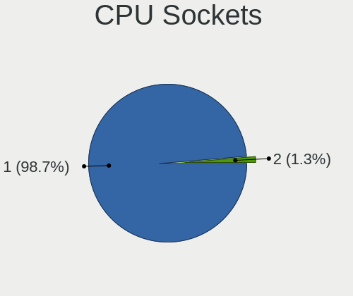

| Number | Desktops | Percent |
|--------|----------|---------|
| 1      | 907      | 99.02%  |
| 2      | 9        | 0.98%   |

CPU Threads
-----------

Threads per core (Hyper-Threading)

| Number | Desktops | Percent |
|--------|----------|---------|
| 2      | 681      | 74.18%  |
| 1      | 237      | 25.82%  |

CPU Op-Modes
------------

CPU Operation Modes (32-bit, 64-bit)

| Op mode        | Desktops | Percent |
|----------------|----------|---------|
| 32-bit, 64-bit | 916      | 100%    |

CPU Microcode
-------------

Microcode number

| Number     | Desktops | Percent |
|------------|----------|---------|
| Unknown    | 673      | 71.82%  |
| 0x08701021 | 28       | 2.99%   |
| 0x0a601206 | 24       | 2.56%   |
| 0x0a601203 | 21       | 2.24%   |
| 0x0a20120a | 19       | 2.03%   |
| 0x08701030 | 17       | 1.81%   |
| 0x0a50000d | 15       | 1.6%    |
| 0x0a201016 | 14       | 1.49%   |
| 0x0800820d | 10       | 1.07%   |
| 0x0a20120e | 9        | 0.96%   |
| 0x010000c8 | 8        | 0.85%   |
| 0x08701013 | 7        | 0.75%   |
| 0x0a50000f | 6        | 0.64%   |
| 0x08101016 | 6        | 0.64%   |
| 0x0a50000c | 5        | 0.53%   |
| 0x08108109 | 5        | 0.53%   |
| 0x08001138 | 5        | 0.53%   |
| 0x08001137 | 5        | 0.53%   |
| 0x06001119 | 5        | 0.53%   |
| 0x06000852 | 5        | 0.53%   |
| 0x0a20102b | 3        | 0.32%   |
| 0x010000dc | 3        | 0.32%   |
| 0x0a601201 | 2        | 0.21%   |
| 0x0a50000b | 2        | 0.21%   |
| 0x0a201205 | 2        | 0.21%   |
| 0x0a201025 | 2        | 0.21%   |
| 0x08600109 | 2        | 0.21%   |
| 0x08600106 | 2        | 0.21%   |
| 0x0830107b | 2        | 0.21%   |
| 0x0800111c | 2        | 0.21%   |
| 0x06003106 | 2        | 0.21%   |
| 0x0600081c | 2        | 0.21%   |
| 0x010000bf | 2        | 0.21%   |
| 0x01000086 | 2        | 0.21%   |
| 0x0a705203 | 1        | 0.11%   |
| 0x0a404102 | 1        | 0.11%   |
| 0x0a201204 | 1        | 0.11%   |
| 0x0a201009 | 1        | 0.11%   |
| 0x0a201006 | 1        | 0.11%   |
| 0x08001129 | 1        | 0.11%   |

CPU Microarch
-------------

Microarchitecture

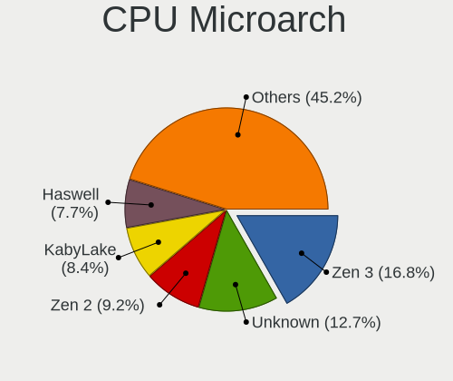

| Name             | Desktops | Percent |
|------------------|----------|---------|
| Zen 3            | 156      | 16.92%  |
| Unknown          | 115      | 12.47%  |
| Zen 2            | 88       | 9.54%   |
| KabyLake         | 77       | 8.35%   |
| Haswell          | 72       | 7.81%   |
| Alderlake Hybrid | 46       | 4.99%   |
| IvyBridge        | 44       | 4.77%   |
| Skylake          | 37       | 4.01%   |
| Zen              | 33       | 3.58%   |
| SandyBridge      | 33       | 3.58%   |
| Zen+             | 31       | 3.36%   |
| Penryn           | 26       | 2.82%   |
| CometLake        | 26       | 2.82%   |
| Piledriver       | 24       | 2.6%    |
| K10              | 21       | 2.28%   |
| Nehalem          | 13       | 1.41%   |
| Westmere         | 12       | 1.3%    |
| Broadwell        | 12       | 1.3%    |
| Icelake          | 10       | 1.08%   |
| K8 Hammer        | 8        | 0.87%   |
| Core             | 8        | 0.87%   |
| Steamroller      | 7        | 0.76%   |
| Excavator        | 5        | 0.54%   |
| Silvermont       | 4        | 0.43%   |
| Gracemont        | 3        | 0.33%   |
| Bonnell          | 3        | 0.33%   |
| Tremont          | 2        | 0.22%   |
| Goldmont plus    | 2        | 0.22%   |
| TigerLake        | 1        | 0.11%   |
| K10 Llano        | 1        | 0.11%   |
| Jaguar           | 1        | 0.11%   |
| Bobcat           | 1        | 0.11%   |

Graphics
--------

GPU Vendor
----------

Vendors of graphics cards

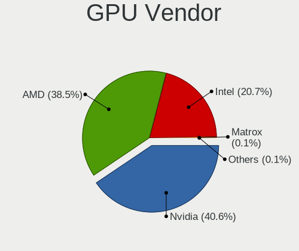

| Vendor                     | Desktops | Percent |
|----------------------------|----------|---------|
| Nvidia                     | 412      | 40.55%  |
| AMD                        | 389      | 38.29%  |
| Intel                      | 212      | 20.87%  |
| VIA Technologies           | 1        | 0.1%    |
| Matrox Electronics Systems | 1        | 0.1%    |
| ASPEED Technology          | 1        | 0.1%    |

GPU Model
---------

Graphics card models

| Model                                                                       | Desktops | Percent |
|-----------------------------------------------------------------------------|----------|---------|
| AMD Raphael                                                                 | 56       | 5.27%   |
| AMD Ellesmere [Radeon RX 470/480/570/570X/580/580X/590]                     | 36       | 3.39%   |
| Intel Xeon E3-1200 v3/4th Gen Core Processor Integrated Graphics Controller | 31       | 2.92%   |
| AMD Navi 22 [Radeon RX 6700/6700 XT/6750 XT / 6800M/6850M XT]               | 27       | 2.54%   |
| AMD Navi 23 [Radeon RX 6600/6600 XT/6600M]                                  | 26       | 2.45%   |
| Intel CoffeeLake-S GT2 [UHD Graphics 630]                                   | 25       | 2.35%   |
| AMD Cezanne [Radeon Vega Series / Radeon Vega Mobile Series]                | 25       | 2.35%   |
| AMD Navi 32 [Radeon RX 7700 XT / 7800 XT]                                   | 24       | 2.26%   |
| AMD Navi 21 [Radeon RX 6800/6800 XT / 6900 XT]                              | 24       | 2.26%   |
| Nvidia GA106 [GeForce RTX 3060 Lite Hash Rate]                              | 23       | 2.16%   |
| AMD Navi 31 [Radeon RX 7900 XT/7900 XTX/7900M]                              | 21       | 1.98%   |
| Nvidia GP107 [GeForce GTX 1050 Ti]                                          | 18       | 1.69%   |
| Intel Xeon E3-1200 v2/3rd Gen Core processor Graphics Controller            | 18       | 1.69%   |
| Intel HD Graphics 530                                                       | 17       | 1.6%    |
| AMD Polaris 20 XL [Radeon RX 580 2048SP]                                    | 15       | 1.41%   |
| Nvidia GP104 [GeForce GTX 1070]                                             | 14       | 1.32%   |
| Nvidia GP108 [GeForce GT 1030]                                              | 13       | 1.22%   |
| Nvidia TU116 [GeForce GTX 1660 SUPER]                                       | 12       | 1.13%   |
| Nvidia GM107 [GeForce GTX 750 Ti]                                           | 12       | 1.13%   |
| Nvidia GK208B [GeForce GT 710]                                              | 12       | 1.13%   |
| Nvidia GA104 [GeForce RTX 3060 Ti Lite Hash Rate]                           | 12       | 1.13%   |
| AMD Navi 10 [Radeon RX 5600 OEM/5600 XT / 5700/5700 XT]                     | 12       | 1.13%   |
| Nvidia TU117 [GeForce GTX 1650]                                             | 11       | 1.03%   |
| Nvidia TU106 [GeForce RTX 2060 Rev. A]                                      | 11       | 1.03%   |
| Nvidia GP106 [GeForce GTX 1060 6GB]                                         | 11       | 1.03%   |
| Intel Raptor Lake-S GT1 [UHD Graphics 770]                                  | 11       | 1.03%   |
| Intel 2nd Generation Core Processor Family Integrated Graphics Controller   | 11       | 1.03%   |
| AMD Baffin [Radeon RX 550 640SP / RX 560/560X]                              | 11       | 1.03%   |
| Intel HD Graphics 630                                                       | 10       | 0.94%   |
| Intel 4 Series Chipset Integrated Graphics Controller                       | 10       | 0.94%   |
| AMD Lexa PRO [Radeon 540/540X/550/550X / RX 540X/550/550X]                  | 10       | 0.94%   |
| Nvidia GA104 [GeForce RTX 3070 Lite Hash Rate]                              | 9        | 0.85%   |
| Nvidia AD104 [GeForce RTX 4070]                                             | 9        | 0.85%   |
| Intel IvyBridge GT2 [HD Graphics 4000]                                      | 9        | 0.85%   |
| Intel AlderLake-S GT1                                                       | 9        | 0.85%   |
| AMD Raven Ridge [Radeon Vega Series / Radeon Vega Mobile Series]            | 9        | 0.85%   |
| Nvidia GP104 [GeForce GTX 1080]                                             | 8        | 0.75%   |
| Nvidia GA102 [GeForce RTX 3090]                                             | 8        | 0.75%   |
| AMD Picasso/Raven 2 [Radeon Vega Series / Radeon Vega Mobile Series]        | 8        | 0.75%   |
| AMD Phoenix1                                                                | 8        | 0.75%   |

GPU Combo
---------

Combinations of graphics cards

| Name           | Desktops | Percent |
|----------------|----------|---------|
| 1 x Nvidia     | 353      | 38.24%  |
| 1 x AMD        | 302      | 32.72%  |
| 1 x Intel      | 148      | 16.03%  |
| 2 x AMD        | 41       | 4.44%   |
| AMD + Nvidia   | 30       | 3.25%   |
| Intel + Nvidia | 25       | 2.71%   |
| Intel + AMD    | 12       | 1.3%    |
| 2 x Intel      | 4        | 0.43%   |
| 2 x Nvidia     | 3        | 0.33%   |
| Other          | 2        | 0.22%   |
| 1 x VIA        | 1        | 0.11%   |
| 1 x Matrox     | 1        | 0.11%   |
| 1 x ASPEED     | 1        | 0.11%   |

GPU Driver
----------

Free vs proprietary

| Driver      | Desktops | Percent |
|-------------|----------|---------|
| Free        | 685      | 73.97%  |
| Proprietary | 181      | 19.55%  |
| Unknown     | 60       | 6.48%   |

GPU Memory
----------

Total video memory

| Size in GB | Desktops | Percent |
|------------|----------|---------|
| Unknown    | 477      | 50.74%  |
| 7.01-8.0   | 104      | 11.06%  |
| 8.01-16.0  | 86       | 9.15%   |
| 3.01-4.0   | 70       | 7.45%   |
| 1.01-2.0   | 57       | 6.06%   |
| 0.51-1.0   | 48       | 5.11%   |
| 0.01-0.5   | 46       | 4.89%   |
| 5.01-6.0   | 29       | 3.09%   |
| 16.01-24.0 | 17       | 1.81%   |
| 2.01-3.0   | 5        | 0.53%   |
| 4.01-5.0   | 1        | 0.11%   |

Monitor
-------

Monitor Vendor
--------------

Monitor vendors

| Vendor               | Desktops | Percent |
|----------------------|----------|---------|
| Samsung Electronics  | 145      | 14.15%  |
| Goldstar             | 141      | 13.76%  |
| Dell                 | 141      | 13.76%  |
| Acer                 | 71       | 6.93%   |
| Hewlett-Packard      | 52       | 5.07%   |
| AOC                  | 51       | 4.98%   |
| Philips              | 48       | 4.68%   |
| Ancor Communications | 40       | 3.9%    |
| BenQ                 | 36       | 3.51%   |
| ASUSTek Computer     | 36       | 3.51%   |
| MSI                  | 26       | 2.54%   |
| Lenovo               | 26       | 2.54%   |
| ViewSonic            | 16       | 1.56%   |
| Iiyama               | 16       | 1.56%   |
| Gigabyte Technology  | 15       | 1.46%   |
| Sony                 | 9        | 0.88%   |
| Sceptre Tech         | 8        | 0.78%   |
| Panasonic            | 8        | 0.78%   |
| Mi                   | 8        | 0.78%   |
| Unknown              | 7        | 0.68%   |
| NEC Computers        | 7        | 0.68%   |
| Insignia             | 7        | 0.68%   |
| Vizio                | 6        | 0.59%   |
| Eizo                 | 5        | 0.49%   |
| SAC                  | 4        | 0.39%   |
| HKC                  | 4        | 0.39%   |
| HannStar             | 4        | 0.39%   |
| Fujitsu Siemens      | 4        | 0.39%   |
| Apple                | 4        | 0.39%   |
| VIE                  | 3        | 0.29%   |
| Toshiba              | 3        | 0.29%   |
| RTK                  | 3        | 0.29%   |
| HUAWEI               | 3        | 0.29%   |
| Unknown (XXX)        | 2        | 0.2%    |
| Pixio                | 2        | 0.2%    |
| Medion               | 2        | 0.2%    |
| LG Electronics       | 2        | 0.2%    |
| Kogan                | 2        | 0.2%    |
| JCH                  | 2        | 0.2%    |
| Huion                | 2        | 0.2%    |

Monitor Model
-------------

Monitor models

| Model                                                                 | Desktops | Percent |
|-----------------------------------------------------------------------|----------|---------|
| AOC 27G2G3 AOC2702 1920x1080 598x336mm 27.0-inch                      | 12       | 1.09%   |
| Goldstar HDR 4K GSM7707 3840x2160 600x340mm 27.2-inch                 | 7        | 0.64%   |
| Dell S2721DGF DEL41D9 2560x1440 597x336mm 27.0-inch                   | 7        | 0.64%   |
| Unknown LCD Monitor FFFF 2288x1287 2550x2550mm 142.0-inch             | 6        | 0.55%   |
| Samsung Electronics C24F390 SAM0D2C 1920x1080 521x293mm 23.5-inch     | 6        | 0.55%   |
| Goldstar ULTRAGEAR GSM5BD3 2560x1440 697x392mm 31.5-inch              | 6        | 0.55%   |
| Philips PHL 276E8V PHLC18F 3840x2160 597x336mm 27.0-inch              | 5        | 0.46%   |
| Goldstar Ultra HD GSM5B09 3840x2160 600x340mm 27.2-inch               | 5        | 0.46%   |
| Goldstar FULL HD GSM5B55 1920x1080 480x270mm 21.7-inch                | 5        | 0.46%   |
| Dell U2412M DELA07B 1920x1200 518x324mm 24.1-inch                     | 5        | 0.46%   |
| Samsung Electronics S24F350 SAM0D20 1920x1080 521x293mm 23.5-inch     | 4        | 0.36%   |
| Philips PHL 243V5 PHLC0D1 1920x1080 521x293mm 23.5-inch               | 4        | 0.36%   |
| Panasonic TV MEIA296 1920x1080 698x392mm 31.5-inch                    | 4        | 0.36%   |
| Mi Monitor XMI3444 3440x1440 797x334mm 34.0-inch                      | 4        | 0.36%   |
| Lenovo LEN L1711pC LEN13B7 1280x1024 338x270mm 17.0-inch              | 4        | 0.36%   |
| Goldstar ULTRAWIDE GSM59F1 2560x1080 673x284mm 28.8-inch              | 4        | 0.36%   |
| Goldstar ULTRAGEAR GSM5B7F 2560x1440 597x336mm 27.0-inch              | 4        | 0.36%   |
| Goldstar HDR 4K GSM774F 3840x2160 697x392mm 31.5-inch                 | 4        | 0.36%   |
| Gigabyte Technology M27Q GBT270D 2560x1440 596x335mm 26.9-inch        | 4        | 0.36%   |
| Dell U2412M DELA07A 1920x1200 518x324mm 24.1-inch                     | 4        | 0.36%   |
| Dell S2719DGF DELD0E6 2560x1440 597x336mm 27.0-inch                   | 4        | 0.36%   |
| Dell P2214H DELA097 1920x1080 477x268mm 21.5-inch                     | 4        | 0.36%   |
| AOC Q34E2G5 AOC3402 2560x1080 800x335mm 34.1-inch                     | 4        | 0.36%   |
| AOC 24B2W1 AOC2402 1920x1080 527x296mm 23.8-inch                      | 4        | 0.36%   |
| AOC 24B1W1G5 AOC2401 1920x1080 527x296mm 23.8-inch                    | 4        | 0.36%   |
| Ancor Communications ASUS VS228 ACI22FD 1920x1080 476x268mm 21.5-inch | 4        | 0.36%   |
| Sceptre Tech E24 SPT099D 1920x1080 530x300mm 24.0-inch                | 3        | 0.27%   |
| Samsung Electronics U28E590 SAM0C4C 3840x2160 608x345mm 27.5-inch     | 3        | 0.27%   |
| Samsung Electronics S24D300 SAM0B43 1920x1080 531x299mm 24.0-inch     | 3        | 0.27%   |
| Samsung Electronics LF24T35 SAM707D 1920x1080 528x297mm 23.9-inch     | 3        | 0.27%   |
| Samsung Electronics LC27G5xT SAM7079 2560x1440 597x336mm 27.0-inch    | 3        | 0.27%   |
| MSI G241 MSI3BA4 1920x1080 527x296mm 23.8-inch                        | 3        | 0.27%   |
| Goldstar TV SSCR2 GSMC0C8 3840x2160                                   | 3        | 0.27%   |
| Goldstar HDR 4K GSM7706 3840x2160 600x340mm 27.2-inch                 | 3        | 0.27%   |
| Goldstar E2011 GSM4ED3 1600x900 443x249mm 20.0-inch                   | 3        | 0.27%   |
| Dell SE2417HG DELD08D 1920x1080 521x293mm 23.5-inch                   | 3        | 0.27%   |
| Dell S2721DGF DEL41DA 2560x1440 597x336mm 27.0-inch                   | 3        | 0.27%   |
| Dell P2213 DELF042 1680x1050 473x296mm 22.0-inch                      | 3        | 0.27%   |
| Dell P1917S DELD093 1280x1024 375x300mm 18.9-inch                     | 3        | 0.27%   |
| Dell P1917S DELD091 1280x1024 375x300mm 18.9-inch                     | 3        | 0.27%   |

Monitor Resolution
------------------

Monitor screen resolution

| Resolution         | Desktops | Percent |
|--------------------|----------|---------|
| 1920x1080 (FHD)    | 426      | 42.86%  |
| 3840x2160 (4K)     | 152      | 15.29%  |
| 2560x1440 (QHD)    | 142      | 14.29%  |
| 1280x1024 (SXGA)   | 40       | 4.02%   |
| 3440x1440          | 37       | 3.72%   |
| 1680x1050 (WSXGA+) | 32       | 3.22%   |
| 1366x768 (WXGA)    | 26       | 2.62%   |
| 2560x1080          | 21       | 2.11%   |
| 1920x1200 (WUXGA)  | 21       | 2.11%   |
| 1600x900 (HD+)     | 21       | 2.11%   |
| 1440x900 (WXGA+)   | 19       | 1.91%   |
| 3840x1080          | 11       | 1.11%   |
| 1920x540           | 8        | 0.8%    |
| 1360x768           | 7        | 0.7%    |
| 2288x1287          | 6        | 0.6%    |
| 2560x1600          | 5        | 0.5%    |
| 1600x1200          | 5        | 0.5%    |
| Unknown            | 4        | 0.4%    |
| 3840x1600          | 2        | 0.2%    |
| 640x480            | 1        | 0.1%    |
| 5520x1080          | 1        | 0.1%    |
| 5120x2880          | 1        | 0.1%    |
| 2560x2880          | 1        | 0.1%    |
| 2200x1650          | 1        | 0.1%    |
| 1360x765           | 1        | 0.1%    |
| 1280x800 (WXGA)    | 1        | 0.1%    |
| 1280x768           | 1        | 0.1%    |
| 1280x720 (HD)      | 1        | 0.1%    |

Monitor Diagonal
----------------

Diagonal size in inches

| Inches  | Desktops | Percent |
|---------|----------|---------|
| 27      | 233      | 22.71%  |
| 24      | 150      | 14.62%  |
| 23      | 118      | 11.5%   |
| 21      | 93       | 9.06%   |
| 31      | 90       | 8.77%   |
| 34      | 53       | 5.17%   |
| 19      | 39       | 3.8%    |
| 18      | 30       | 2.92%   |
| 20      | 28       | 2.73%   |
| Unknown | 24       | 2.34%   |
| 22      | 20       | 1.95%   |
| 84      | 15       | 1.46%   |
| 32      | 13       | 1.27%   |
| 54      | 11       | 1.07%   |
| 48      | 11       | 1.07%   |
| 17      | 10       | 0.97%   |
| 72      | 8        | 0.78%   |
| 26      | 8        | 0.78%   |
| 28      | 7        | 0.68%   |
| 142     | 6        | 0.58%   |
| 40      | 6        | 0.58%   |
| 25      | 6        | 0.58%   |
| 15      | 6        | 0.58%   |
| 37      | 4        | 0.39%   |
| 36      | 4        | 0.39%   |
| 29      | 4        | 0.39%   |
| 42      | 3        | 0.29%   |
| 33      | 3        | 0.29%   |
| 59      | 2        | 0.19%   |
| 47      | 2        | 0.19%   |
| 46      | 2        | 0.19%   |
| 39      | 2        | 0.19%   |
| 86      | 1        | 0.1%    |
| 85      | 1        | 0.1%    |
| 74      | 1        | 0.1%    |
| 65      | 1        | 0.1%    |
| 63      | 1        | 0.1%    |
| 60      | 1        | 0.1%    |
| 50      | 1        | 0.1%    |
| 49      | 1        | 0.1%    |

Monitor Width
-------------

Physical width

| Width in mm    | Desktops | Percent |
|----------------|----------|---------|
| 501-600        | 448      | 45.53%  |
| 401-500        | 178      | 18.09%  |
| 601-700        | 127      | 12.91%  |
| 701-800        | 73       | 7.42%   |
| 1001-1500      | 34       | 3.46%   |
| 351-400        | 32       | 3.25%   |
| 1501-2000      | 25       | 2.54%   |
| Unknown        | 24       | 2.44%   |
| 301-350        | 15       | 1.52%   |
| 801-900        | 14       | 1.42%   |
| 901-1000       | 7        | 0.71%   |
| More than 2000 | 6        | 0.61%   |
| 201-300        | 1        | 0.1%    |

Aspect Ratio
------------

Proportional relationship between the width and the height

| Ratio   | Desktops | Percent |
|---------|----------|---------|
| 16/9    | 680      | 74.48%  |
| 16/10   | 89       | 9.75%   |
| 21/9    | 60       | 6.57%   |
| 5/4     | 35       | 3.83%   |
| Unknown | 14       | 1.53%   |
| 32/9    | 10       | 1.1%    |
| 4/3     | 7        | 0.77%   |
| 1.00    | 6        | 0.66%   |
| 6/5     | 5        | 0.55%   |
| 3/2     | 2        | 0.22%   |
| 1.96    | 2        | 0.22%   |
| 2.12    | 1        | 0.11%   |
| 0.89    | 1        | 0.11%   |
| 0.56    | 1        | 0.11%   |

Monitor Area
------------

Area in inch

| Area in inch | Desktops | Percent |
|----------------|----------|---------|
| 201-250        | 297      | 29.49%  |
| 301-350        | 237      | 23.54%  |
| 351-500        | 167      | 16.58%  |
| 151-200        | 100      | 9.93%   |
| 251-300        | 57       | 5.66%   |
| More than 1000 | 50       | 4.97%   |
| 501-1000       | 39       | 3.87%   |
| 141-150        | 27       | 2.68%   |
| Unknown        | 24       | 2.38%   |
| 101-110        | 7        | 0.7%    |
| 131-140        | 1        | 0.1%    |
| 91-100         | 1        | 0.1%    |

Pixel Density
-------------

Pixels per inch

| Density | Desktops | Percent |
|---------|----------|---------|
| 51-100  | 562      | 60.11%  |
| 101-120 | 210      | 22.46%  |
| 121-160 | 67       | 7.17%   |
| 1-50    | 38       | 4.06%   |
| 161-240 | 34       | 3.64%   |
| Unknown | 24       | 2.57%   |

Multiple Monitors
-----------------

Total monitors connected

| Total | Desktops | Percent |
|-------|----------|---------|
| 1     | 646      | 69.61%  |
| 2     | 196      | 21.12%  |
| 0     | 57       | 6.14%   |
| 3     | 22       | 2.37%   |
| 4     | 5        | 0.54%   |
| 6     | 2        | 0.22%   |

Network
-------

Net Controller Vendor
---------------------

Controller vendors

| Vendor                          | Desktops | Percent |
|---------------------------------|----------|---------|
| Realtek Semiconductor           | 604      | 43.58%  |
| Intel                           | 452      | 32.61%  |
| MediaTek                        | 69       | 4.98%   |
| Broadcom                        | 47       | 3.39%   |
| Qualcomm Atheros                | 40       | 2.89%   |
| TP-Link                         | 22       | 1.59%   |
| Microsoft                       | 17       | 1.23%   |
| Ralink Technology               | 15       | 1.08%   |
| Ralink                          | 12       | 0.87%   |
| Aquantia                        | 10       | 0.72%   |
| Qualcomm Atheros Communications | 8        | 0.58%   |
| Nvidia                          | 8        | 0.58%   |
| ASIX Electronics                | 8        | 0.58%   |
| NetGear                         | 6        | 0.43%   |
| D-Link                          | 5        | 0.36%   |
| ASUSTek Computer                | 5        | 0.36%   |
| Xiaomi                          | 4        | 0.29%   |
| Motorola PCS                    | 4        | 0.29%   |
| Marvell Technology Group        | 4        | 0.29%   |
| Google                          | 4        | 0.29%   |
| Samsung Electronics             | 3        | 0.22%   |
| Qualcomm Technologies           | 2        | 0.14%   |
| Oculus VR                       | 2        | 0.14%   |
| Mercucys                        | 2        | 0.14%   |
| Mellanox Technologies           | 2        | 0.14%   |
| DisplayLink                     | 2        | 0.14%   |
| Broadcom Limited                | 2        | 0.14%   |
| AVM                             | 2        | 0.14%   |
| ZyXEL Communications            | 1        | 0.07%   |
| ZyDAS                           | 1        | 0.07%   |
| ZTE WCDMA Technologies MSM      | 1        | 0.07%   |
| VIA Technologies                | 1        | 0.07%   |
| Tehuti Networks                 | 1        | 0.07%   |
| Sharp                           | 1        | 0.07%   |
| Sagem                           | 1        | 0.07%   |
| ROCCAT                          | 1        | 0.07%   |
| Raspberry Pi                    | 1        | 0.07%   |
| Qualcomm                        | 1        | 0.07%   |
| OPPO Electronics                | 1        | 0.07%   |
| Microdia                        | 1        | 0.07%   |

Net Controller Model
--------------------

Controller models

| Model                                                                  | Desktops | Percent |
|------------------------------------------------------------------------|----------|---------|
| Realtek RTL8111/8168/8211/8411 PCI Express Gigabit Ethernet Controller | 402      | 24.88%  |
| Realtek RTL8125 2.5GbE Controller                                      | 142      | 8.79%   |
| Intel Wi-Fi 6 AX200                                                    | 80       | 4.95%   |
| Intel I211 Gigabit Network Connection                                  | 68       | 4.21%   |
| Intel Ethernet Controller I225-V                                       | 60       | 3.71%   |
| Intel Wi-Fi 6E(802.11ax) AX210/AX1675* 2x2 [Typhoon Peak]              | 46       | 2.85%   |
| MediaTek MT7922 802.11ax PCI Express Wireless Network Adapter          | 33       | 2.04%   |
| Intel Ethernet Connection (2) I219-V                                   | 29       | 1.79%   |
| Intel Dual Band Wireless-AC 3168NGW [Stone Peak]                       | 24       | 1.49%   |
| Intel Ethernet Connection I217-LM                                      | 21       | 1.3%    |
| Intel Alder Lake-S PCH CNVi WiFi                                       | 19       | 1.18%   |
| Broadcom BCM4360 802.11ac Dual Band Wireless Network Adapter           | 19       | 1.18%   |
| MediaTek MT7921K (RZ608) Wi-Fi 6E 80MHz                                | 18       | 1.11%   |
| Realtek RTL8821CE 802.11ac PCIe Wireless Network Adapter               | 15       | 0.93%   |
| Intel Ethernet Connection (7) I219-V                                   | 15       | 0.93%   |
| Realtek RTL8153 Gigabit Ethernet Adapter                               | 14       | 0.87%   |
| Intel Wi-Fi 5(802.11ac) Wireless-AC 9x6x [Thunder Peak]                | 14       | 0.87%   |
| Intel 82579LM Gigabit Network Connection (Lewisville)                  | 13       | 0.8%    |
| Intel 82574L Gigabit Network Connection                                | 13       | 0.8%    |
| Microsoft XBOX ACC                                                     | 12       | 0.74%   |
| Intel Raptor Lake-S PCH CNVi WiFi                                      | 12       | 0.74%   |
| Intel Ethernet Connection (2) I219-LM                                  | 12       | 0.74%   |
| Intel Ethernet Connection (17) I219-V                                  | 11       | 0.68%   |
| Realtek RTL8852BE PCIe 802.11ax Wireless Network Controller            | 9        | 0.56%   |
| Realtek RTL8188EUS 802.11n Wireless Network Adapter                    | 9        | 0.56%   |
| Ralink MT7601U Wireless Adapter                                        | 9        | 0.56%   |
| MediaTek MT7921 802.11ax PCI Express Wireless Network Adapter          | 9        | 0.56%   |
| Intel I210 Gigabit Network Connection                                  | 9        | 0.56%   |
| Intel Ethernet Connection (2) I218-V                                   | 9        | 0.56%   |
| Realtek RTL88x2bu [AC1200 Techkey]                                     | 8        | 0.5%    |
| Realtek RTL810xE PCI Express Fast Ethernet controller                  | 8        | 0.5%    |
| Realtek Killer E3000 2.5GbE Controller                                 | 8        | 0.5%    |
| Intel Wireless 7260                                                    | 8        | 0.5%    |
| Intel Tiger Lake PCH CNVi WiFi                                         | 8        | 0.5%    |
| Realtek RTL8852CE PCIe 802.11ax Wireless Network Controller            | 7        | 0.43%   |
| Realtek RTL8822BE 802.11a/b/g/n/ac WiFi adapter                        | 7        | 0.43%   |
| Realtek 802.11ac NIC                                                   | 7        | 0.43%   |
| Qualcomm Atheros AR9271 802.11n                                        | 7        | 0.43%   |
| Intel Wireless 7265                                                    | 7        | 0.43%   |
| Intel Ethernet Controller I226-V                                       | 7        | 0.43%   |

Wireless Vendor
---------------

Wireless vendors

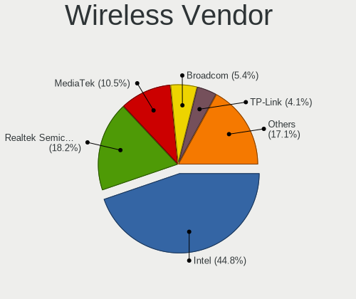

| Vendor                          | Desktops | Percent |
|---------------------------------|----------|---------|
| Intel                           | 246      | 43.54%  |
| Realtek Semiconductor           | 108      | 19.12%  |
| MediaTek                        | 66       | 11.68%  |
| Broadcom                        | 30       | 5.31%   |
| TP-Link                         | 22       | 3.89%   |
| Qualcomm Atheros                | 17       | 3.01%   |
| Microsoft                       | 17       | 3.01%   |
| Ralink Technology               | 15       | 2.65%   |
| Ralink                          | 12       | 2.12%   |
| Qualcomm Atheros Communications | 8        | 1.42%   |
| NetGear                         | 6        | 1.06%   |
| ASUSTek Computer                | 5        | 0.88%   |
| D-Link                          | 4        | 0.71%   |
| Qualcomm Technologies           | 2        | 0.35%   |
| Mercucys                        | 2        | 0.35%   |
| AVM                             | 2        | 0.35%   |
| ZyDAS                           | 1        | 0.18%   |
| Sagem                           | 1        | 0.18%   |
| Linksys                         | 1        | 0.18%   |

Wireless Model
--------------

Wireless models

| Model                                                                                         | Desktops | Percent |
|-----------------------------------------------------------------------------------------------|----------|---------|
| Intel Wi-Fi 6 AX200                                                                           | 80       | 14.08%  |
| Intel Wi-Fi 6E(802.11ax) AX210/AX1675* 2x2 [Typhoon Peak]                                     | 46       | 8.1%    |
| MediaTek MT7922 802.11ax PCI Express Wireless Network Adapter                                 | 33       | 5.81%   |
| Intel Dual Band Wireless-AC 3168NGW [Stone Peak]                                              | 24       | 4.23%   |
| Intel Alder Lake-S PCH CNVi WiFi                                                              | 19       | 3.35%   |
| Broadcom BCM4360 802.11ac Dual Band Wireless Network Adapter                                  | 19       | 3.35%   |
| MediaTek MT7921K (RZ608) Wi-Fi 6E 80MHz                                                       | 18       | 3.17%   |
| Realtek RTL8821CE 802.11ac PCIe Wireless Network Adapter                                      | 15       | 2.64%   |
| Intel Wi-Fi 5(802.11ac) Wireless-AC 9x6x [Thunder Peak]                                       | 14       | 2.46%   |
| Microsoft XBOX ACC                                                                            | 12       | 2.11%   |
| Intel Raptor Lake-S PCH CNVi WiFi                                                             | 12       | 2.11%   |
| Realtek RTL8852BE PCIe 802.11ax Wireless Network Controller                                   | 9        | 1.58%   |
| Realtek RTL8188EUS 802.11n Wireless Network Adapter                                           | 9        | 1.58%   |
| Ralink MT7601U Wireless Adapter                                                               | 9        | 1.58%   |
| MediaTek MT7921 802.11ax PCI Express Wireless Network Adapter                                 | 9        | 1.58%   |
| Realtek RTL88x2bu [AC1200 Techkey]                                                            | 8        | 1.41%   |
| Intel Wireless 7260                                                                           | 8        | 1.41%   |
| Intel Tiger Lake PCH CNVi WiFi                                                                | 8        | 1.41%   |
| Realtek RTL8852CE PCIe 802.11ax Wireless Network Controller                                   | 7        | 1.23%   |
| Realtek RTL8822BE 802.11a/b/g/n/ac WiFi adapter                                               | 7        | 1.23%   |
| Realtek 802.11ac NIC                                                                          | 7        | 1.23%   |
| Qualcomm Atheros AR9271 802.11n                                                               | 7        | 1.23%   |
| Intel Wireless 7265                                                                           | 7        | 1.23%   |
| TP-Link 802.11ac WLAN Adapter                                                                 | 5        | 0.88%   |
| Realtek RTL8822CE 802.11ac PCIe Wireless Network Adapter                                      | 5        | 0.88%   |
| Realtek RTL8812AE 802.11ac PCIe Wireless Network Adapter                                      | 5        | 0.88%   |
| Qualcomm Atheros AR9485 Wireless Network Adapter                                              | 5        | 0.88%   |
| Intel Wireless 3165                                                                           | 5        | 0.88%   |
| Intel Comet Lake PCH CNVi WiFi                                                                | 5        | 0.88%   |
| TP-Link TL-WN823N v2/v3 [Realtek RTL8192EU]                                                   | 4        | 0.7%    |
| Realtek RTL8192EU 802.11b/g/n WLAN Adapter                                                    | 4        | 0.7%    |
| Realtek RTL8188EE Wireless Network Adapter                                                    | 4        | 0.7%    |
| Realtek Realtek 8812AU/8821AU 802.11ac WLAN Adapter [USB Wireless Dual-Band Adapter 2.4/5Ghz] | 4        | 0.7%    |
| Microsoft Xbox 360 Wireless Adapter                                                           | 4        | 0.7%    |
| Intel Wireless 8260                                                                           | 4        | 0.7%    |
| Intel Cannon Lake PCH CNVi WiFi                                                               | 4        | 0.7%    |
| Broadcom BCM4322 802.11a/b/g/n Wireless LAN Controller                                        | 4        | 0.7%    |
| TP-Link TL-WN722N v2/v3 [Realtek RTL8188EUS]                                                  | 3        | 0.53%   |
| TP-Link Archer T3U [Realtek RTL8812BU]                                                        | 3        | 0.53%   |
| Realtek RTL8192EE PCIe Wireless Network Adapter                                               | 3        | 0.53%   |

Ethernet Vendor
---------------

Ethernet vendors

| Vendor                     | Desktops | Percent |
|----------------------------|----------|---------|
| Realtek Semiconductor      | 568      | 57.03%  |
| Intel                      | 318      | 31.93%  |
| Qualcomm Atheros           | 23       | 2.31%   |
| Broadcom                   | 22       | 2.21%   |
| Aquantia                   | 10       | 1%      |
| Nvidia                     | 8        | 0.8%    |
| ASIX Electronics           | 8        | 0.8%    |
| Xiaomi                     | 4        | 0.4%    |
| Motorola PCS               | 4        | 0.4%    |
| Marvell Technology Group   | 4        | 0.4%    |
| Google                     | 4        | 0.4%    |
| Samsung Electronics        | 3        | 0.3%    |
| Mellanox Technologies      | 2        | 0.2%    |
| DisplayLink                | 2        | 0.2%    |
| Broadcom Limited           | 2        | 0.2%    |
| ZyXEL Communications       | 1        | 0.1%    |
| ZTE WCDMA Technologies MSM | 1        | 0.1%    |
| VIA Technologies           | 1        | 0.1%    |
| Tehuti Networks            | 1        | 0.1%    |
| Sharp                      | 1        | 0.1%    |
| Qualcomm                   | 1        | 0.1%    |
| OPPO Electronics           | 1        | 0.1%    |
| MediaTek                   | 1        | 0.1%    |
| Lenovo                     | 1        | 0.1%    |
| JMicron Technology         | 1        | 0.1%    |
| D-Link System              | 1        | 0.1%    |
| D-Link                     | 1        | 0.1%    |
| Apple                      | 1        | 0.1%    |
| 3Com                       | 1        | 0.1%    |

Ethernet Model
--------------

Ethernet models

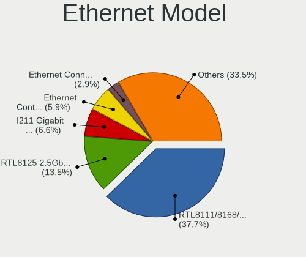

| Model                                                                          | Desktops | Percent |
|--------------------------------------------------------------------------------|----------|---------|
| Realtek RTL8111/8168/8211/8411 PCI Express Gigabit Ethernet Controller         | 402      | 38.88%  |
| Realtek RTL8125 2.5GbE Controller                                              | 142      | 13.73%  |
| Intel I211 Gigabit Network Connection                                          | 68       | 6.58%   |
| Intel Ethernet Controller I225-V                                               | 60       | 5.8%    |
| Intel Ethernet Connection (2) I219-V                                           | 29       | 2.8%    |
| Intel Ethernet Connection I217-LM                                              | 21       | 2.03%   |
| Intel Ethernet Connection (7) I219-V                                           | 15       | 1.45%   |
| Realtek RTL8153 Gigabit Ethernet Adapter                                       | 14       | 1.35%   |
| Intel 82579LM Gigabit Network Connection (Lewisville)                          | 13       | 1.26%   |
| Intel 82574L Gigabit Network Connection                                        | 13       | 1.26%   |
| Intel Ethernet Connection (2) I219-LM                                          | 12       | 1.16%   |
| Intel Ethernet Connection (17) I219-V                                          | 11       | 1.06%   |
| Intel I210 Gigabit Network Connection                                          | 9        | 0.87%   |
| Intel Ethernet Connection (2) I218-V                                           | 9        | 0.87%   |
| Realtek RTL810xE PCI Express Fast Ethernet controller                          | 8        | 0.77%   |
| Realtek Killer E3000 2.5GbE Controller                                         | 8        | 0.77%   |
| Intel Ethernet Controller I226-V                                               | 7        | 0.68%   |
| Intel 82579V Gigabit Network Connection                                        | 7        | 0.68%   |
| ASIX AX88179 Gigabit Ethernet                                                  | 7        | 0.68%   |
| Qualcomm Atheros Killer E220x Gigabit Ethernet Controller                      | 6        | 0.58%   |
| Qualcomm Atheros AR8151 v2.0 Gigabit Ethernet                                  | 6        | 0.58%   |
| Aquantia AQtion AQC107 NBase-T/IEEE 802.3an Ethernet Controller [Atlantic 10G] | 6        | 0.58%   |
| Intel Ethernet Connection (7) I219-LM                                          | 5        | 0.48%   |
| Intel 82567LM-3 Gigabit Network Connection                                     | 5        | 0.48%   |
| Motorola PCS moto g(7) power                                                   | 4        | 0.39%   |
| Intel Ethernet Connection I217-V                                               | 4        | 0.39%   |
| Intel Ethernet Connection (14) I219-V                                          | 4        | 0.39%   |
| Broadcom NetXtreme BCM57762 Gigabit Ethernet PCIe                              | 4        | 0.39%   |
| Broadcom NetLink BCM57788 Gigabit Ethernet PCIe                                | 4        | 0.39%   |
| Xiaomi Mi/Redmi series (RNDIS + ADB)                                           | 3        | 0.29%   |
| Samsung Galaxy series, misc. (tethering mode)                                  | 3        | 0.29%   |
| Realtek RTL-8100/8101L/8139 PCI Fast Ethernet Adapter                          | 3        | 0.29%   |
| Qualcomm Atheros Killer E2400 Gigabit Ethernet Controller                      | 3        | 0.29%   |
| Qualcomm Atheros AR8131 Gigabit Ethernet                                       | 3        | 0.29%   |
| Nvidia MCP55 Ethernet                                                          | 3        | 0.29%   |
| Intel Ethernet Controller X550                                                 | 3        | 0.29%   |
| Intel Ethernet Connection (2) I218-LM                                          | 3        | 0.29%   |
| Intel Ethernet Connection (11) I219-V                                          | 3        | 0.29%   |
| Intel Ethernet Connection (11) I219-LM                                         | 3        | 0.29%   |
| Google Pixel 7 Pro                                                             | 3        | 0.29%   |

Net Controller Kind
-------------------

Ethernet, WiFi or modem

| Kind     | Desktops | Percent |
|----------|----------|---------|
| Ethernet | 903      | 61.98%  |
| WiFi     | 540      | 37.06%  |
| Modem    | 10       | 0.69%   |
| Unknown  | 4        | 0.27%   |

Used Controller
---------------

Currently used network controller

| Kind     | Desktops | Percent |
|----------|----------|---------|
| Ethernet | 670      | 68.02%  |
| WiFi     | 315      | 31.98%  |

NICs
----

Total network controllers on board

| Total | Desktops | Percent |
|-------|----------|---------|
| 1     | 433      | 47.01%  |
| 2     | 411      | 44.63%  |
| 3     | 59       | 6.41%   |
| 4     | 8        | 0.87%   |
| 0     | 6        | 0.65%   |
| 5     | 2        | 0.22%   |
| 11    | 1        | 0.11%   |
| 6     | 1        | 0.11%   |

IPv6
----

IPv6 vs IPv4

| Used | Desktops | Percent |
|------|----------|---------|
| No   | 615      | 66.63%  |
| Yes  | 308      | 33.37%  |

Bluetooth
---------

Bluetooth Vendor
----------------

Controller vendors

| Vendor                          | Desktops | Percent |
|---------------------------------|----------|---------|
| Intel                           | 227      | 44.77%  |
| Cambridge Silicon Radio         | 54       | 10.65%  |
| Realtek Semiconductor           | 49       | 9.66%   |
| MediaTek                        | 44       | 8.68%   |
| IMC Networks                    | 30       | 5.92%   |
| ASUSTek Computer                | 28       | 5.52%   |
| TP-Link                         | 19       | 3.75%   |
| Apple                           | 11       | 2.17%   |
| Foxconn / Hon Hai               | 10       | 1.97%   |
| Broadcom                        | 9        | 1.78%   |
| Realtek                         | 5        | 0.99%   |
| Qualcomm Atheros Communications | 4        | 0.79%   |
| Integrated System Solution      | 3        | 0.59%   |
| Actions                         | 3        | 0.59%   |
| Edimax Technology               | 2        | 0.39%   |
| Dynex                           | 2        | 0.39%   |
| Belkin Components               | 2        | 0.39%   |
| Unknown                         | 2        | 0.39%   |
| Ralink                          | 1        | 0.2%    |
| Lite-On Technology              | 1        | 0.2%    |
| Hewlett-Packard                 | 1        | 0.2%    |

Bluetooth Model
---------------

Controller models

| Model                                                    | Desktops | Percent |
|----------------------------------------------------------|----------|---------|
| Intel AX200 Bluetooth                                    | 70       | 13.81%  |
| Cambridge Silicon Radio Bluetooth Dongle (HCI mode)      | 54       | 10.65%  |
| MediaTek Wireless_Device                                 | 44       | 8.68%   |
| Intel AX210 Bluetooth                                    | 43       | 8.48%   |
| Realtek Bluetooth Radio                                  | 34       | 6.71%   |
| Intel Wireless-AC 3168 Bluetooth                         | 24       | 4.73%   |
| Intel AX211 Bluetooth                                    | 22       | 4.34%   |
| Intel AX201 Bluetooth                                    | 22       | 4.34%   |
| TP-Link UB500 Adapter                                    | 19       | 3.75%   |
| Intel Bluetooth wireless interface                       | 18       | 3.55%   |
| IMC Networks Bluetooth Radio                             | 15       | 2.96%   |
| Intel Wireless-AC 9260 Bluetooth Adapter                 | 14       | 2.76%   |
| IMC Networks Wireless_Device                             | 13       | 2.56%   |
| ASUS ASUS USB-BT500                                      | 9        | 1.78%   |
| Intel Bluetooth 9460/9560 Jefferson Peak (JfP)           | 8        | 1.58%   |
| Foxconn / Hon Hai Wireless_Device                        | 8        | 1.58%   |
| Broadcom BCM20702A0 Bluetooth 4.0                        | 8        | 1.58%   |
| Realtek Bluetooth 5.3 Radio                              | 5        | 0.99%   |
| Realtek Bluetooth Radio                                  | 5        | 0.99%   |
| ASUS Broadcom BCM20702A0 Bluetooth                       | 5        | 0.99%   |
| Apple Bluetooth Host Controller                          | 5        | 0.99%   |
| Realtek  Bluetooth 4.2 Adapter                           | 4        | 0.79%   |
| Intel Bluetooth Device                                   | 4        | 0.79%   |
| ASUS Broadcom BCM20702 Single-Chip Bluetooth 4.0 + LE    | 4        | 0.79%   |
| ASUS Bluetooth Radio                                     | 4        | 0.79%   |
| Apple Built-in Bluetooth 2.0+EDR HCI                     | 4        | 0.79%   |
| Realtek 802.11ac WLAN Adapter                            | 3        | 0.59%   |
| ASUS Qualcomm Bluetooth 4.1                              | 3        | 0.59%   |
| Actions general adapter                                  | 3        | 0.59%   |
| Realtek RTL8822BE Bluetooth 4.2 Adapter                  | 2        | 0.39%   |
| Qualcomm Atheros AR9462 Bluetooth                        | 2        | 0.39%   |
| Intel Centrino Bluetooth Wireless Transceiver            | 2        | 0.39%   |
| Integrated System Solution Bluetooth Device              | 2        | 0.39%   |
| Foxconn / Hon Hai Bluetooth Device                       | 2        | 0.39%   |
| Edimax Edimax Bluetooth Adapter                          | 2        | 0.39%   |
| Dynex Bluetooth 4.0 Adapter [Broadcom, 1.12, BCM20702A0] | 2        | 0.39%   |
| ASUS Bluetooth Adapter                                   | 2        | 0.39%   |
| Unknown                                                  | 2        | 0.39%   |
| Realtek RTL8821A Bluetooth                               | 1        | 0.2%    |
| Ralink RT3290 Bluetooth                                  | 1        | 0.2%    |

Sound
-----

Sound Vendor
------------

Sound card vendors

| Vendor                               | Desktops | Percent |
|--------------------------------------|----------|---------|
| AMD                                  | 538      | 30.45%  |
| Intel                                | 448      | 25.35%  |
| Nvidia                               | 404      | 22.86%  |
| C-Media Electronics                  | 37       | 2.09%   |
| Logitech                             | 33       | 1.87%   |
| Micro Star International             | 22       | 1.25%   |
| JMTek                                | 18       | 1.02%   |
| ASUSTek Computer                     | 18       | 1.02%   |
| Razer USA                            | 16       | 0.91%   |
| Creative Labs                        | 16       | 0.91%   |
| SteelSeries ApS                      | 15       | 0.85%   |
| Kingston Technology                  | 13       | 0.74%   |
| Generalplus Technology               | 12       | 0.68%   |
| Texas Instruments                    | 10       | 0.57%   |
| Hewlett-Packard                      | 10       | 0.57%   |
| Corsair                              | 10       | 0.57%   |
| GN Netcom                            | 8        | 0.45%   |
| Thesycon Systemsoftware & Consulting | 7        | 0.4%    |
| Focusrite-Novation                   | 7        | 0.4%    |
| Realtek Semiconductor                | 6        | 0.34%   |
| Plantronics                          | 6        | 0.34%   |
| RODE Microphones                     | 5        | 0.28%   |
| FIFINE Microphones                   | 4        | 0.23%   |
| Blue Microphones                     | 4        | 0.23%   |
| BEHRINGER International              | 4        | 0.23%   |
| VIA Technologies                     | 3        | 0.17%   |
| TTGK Technology                      | 3        | 0.17%   |
| Trust                                | 3        | 0.17%   |
| Schiit Audio                         | 3        | 0.17%   |
| Samson Technologies                  | 3        | 0.17%   |
| Giga-Byte Technology                 | 3        | 0.17%   |
| Elgato Systems                       | 3        | 0.17%   |
| ASRock                               | 3        | 0.17%   |
| Arturia                              | 3        | 0.17%   |
| USB-MIC                              | 2        | 0.11%   |
| Tenx Technology                      | 2        | 0.11%   |
| Solid State Logic                    | 2        | 0.11%   |
| Shure                                | 2        | 0.11%   |
| Roland                               | 2        | 0.11%   |
| Nordic Semiconductor ASA             | 2        | 0.11%   |

Sound Model
-----------

Sound card models

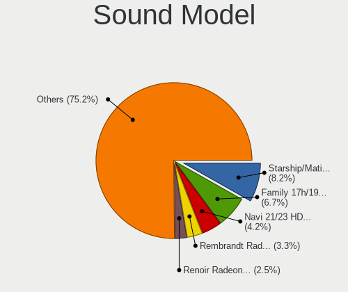

| Model                                                                      | Desktops | Percent |
|----------------------------------------------------------------------------|----------|---------|
| AMD Starship/Matisse HD Audio Controller                                   | 180      | 8.4%    |
| AMD Family 17h/19h HD Audio Controller                                     | 142      | 6.63%   |
| AMD Navi 21/23 HDMI/DP Audio Controller                                    | 91       | 4.25%   |
| AMD Rembrandt Radeon High Definition Audio Controller                      | 68       | 3.17%   |
| AMD Renoir Radeon High Definition Audio Controller                         | 54       | 2.52%   |
| Intel 8 Series/C220 Series Chipset High Definition Audio Controller        | 52       | 2.43%   |
| AMD Ellesmere HDMI Audio [Radeon RX 470/480 / 570/580/590]                 | 51       | 2.38%   |
| AMD Navi 31 HDMI/DP Audio                                                  | 50       | 2.33%   |
| AMD Family 17h (Models 00h-0fh) HD Audio Controller                        | 45       | 2.1%    |
| Intel Alder Lake-S HD Audio Controller                                     | 43       | 2.01%   |
| Intel 6 Series/C200 Series Chipset Family High Definition Audio Controller | 41       | 1.91%   |
| Intel 100 Series/C230 Series Chipset Family HD Audio Controller            | 40       | 1.87%   |
| Nvidia GA106 High Definition Audio Controller                              | 38       | 1.77%   |
| Nvidia GA104 High Definition Audio Controller                              | 38       | 1.77%   |
| Intel 200 Series PCH HD Audio                                              | 38       | 1.77%   |
| AMD SBx00 Azalia (Intel HDA)                                               | 35       | 1.63%   |
| Intel Xeon E3-1200 v3/4th Gen Core Processor HD Audio Controller           | 34       | 1.59%   |
| Intel Cannon Lake PCH cAVS                                                 | 34       | 1.59%   |
| Nvidia Audio device                                                        | 30       | 1.4%    |
| Intel 7 Series/C216 Chipset Family High Definition Audio Controller        | 28       | 1.31%   |
| Nvidia TU116 High Definition Audio Controller                              | 27       | 1.26%   |
| Nvidia GP107GL High Definition Audio Controller                            | 27       | 1.26%   |
| Nvidia GP104 High Definition Audio Controller                              | 26       | 1.21%   |
| AMD Baffin HDMI/DP Audio [Radeon RX 550 640SP / RX 560/560X]               | 26       | 1.21%   |
| Nvidia TU106 High Definition Audio Controller                              | 24       | 1.12%   |
| Micro Star International USB Audio                                         | 22       | 1.03%   |
| Nvidia GK208 HDMI/DP Audio Controller                                      | 19       | 0.89%   |
| Nvidia GA102 High Definition Audio Controller                              | 19       | 0.89%   |
| Intel Raptor Lake High Definition Audio Controller                         | 18       | 0.84%   |
| ASUSTek Computer USB Audio                                                 | 18       | 0.84%   |
| AMD Navi 10 HDMI Audio                                                     | 18       | 0.84%   |
| Intel 82801JI (ICH10 Family) HD Audio Controller                           | 17       | 0.79%   |
| AMD Raven/Raven2/Fenghuang HDMI/DP Audio Controller                        | 17       | 0.79%   |
| Nvidia GP106 High Definition Audio Controller                              | 16       | 0.75%   |
| Nvidia GM107 High Definition Audio Controller [GeForce 940MX]              | 16       | 0.75%   |
| Intel C610/X99 series chipset HD Audio Controller                          | 16       | 0.75%   |
| AMD Oland/Hainan/Cape Verde/Pitcairn HDMI Audio [Radeon HD 7000 Series]    | 15       | 0.7%    |
| Nvidia GF119 HDMI Audio Controller                                         | 14       | 0.65%   |
| JMTek USB PnP Audio Device                                                 | 14       | 0.65%   |
| Intel NM10/ICH7 Family High Definition Audio Controller                    | 14       | 0.65%   |

Memory
------

Memory Vendor
-------------

Memory module vendors

| Vendor                               | Desktops | Percent |
|--------------------------------------|----------|---------|
| Corsair                              | 55       | 18.03%  |
| Kingston                             | 51       | 16.72%  |
| G.Skill                              | 49       | 16.07%  |
| Unknown                              | 26       | 8.52%   |
| Crucial                              | 23       | 7.54%   |
| Samsung Electronics                  | 22       | 7.21%   |
| SK hynix                             | 10       | 3.28%   |
| Micron Technology                    | 9        | 2.95%   |
| A-DATA Technology                    | 9        | 2.95%   |
| Team                                 | 8        | 2.62%   |
| Unknown                              | 6        | 1.97%   |
| Smart                                | 4        | 1.31%   |
| Patriot                              | 3        | 0.98%   |
| Nanya Technology                     | 3        | 0.98%   |
| Ramaxel Technology                   | 2        | 0.66%   |
| Patriot Memory                       | 2        | 0.66%   |
| Lexar                                | 2        | 0.66%   |
| Atermiter                            | 2        | 0.66%   |
| AMD                                  | 2        | 0.66%   |
| Wodposit                             | 1        | 0.33%   |
| V-GeN                                | 1        | 0.33%   |
| Unknown (ABCD)                       | 1        | 0.33%   |
| Unknown (09D5)                       | 1        | 0.33%   |
| Transcend                            | 1        | 0.33%   |
| TakeMS                               | 1        | 0.33%   |
| Super Talent                         | 1        | 0.33%   |
| Silicon Power                        | 1        | 0.33%   |
| Shenzhen Jinge Information           | 1        | 0.33%   |
| Kllisre                              | 1        | 0.33%   |
| Kingmax                              | 1        | 0.33%   |
| Hikvision                            | 1        | 0.33%   |
| CUSO                                 | 1        | 0.33%   |
| Chun Well Technology Holding Limited | 1        | 0.33%   |
| Chun Well                            | 1        | 0.33%   |
| Avant                                | 1        | 0.33%   |
| Apacer                               | 1        | 0.33%   |

Memory Model
------------

Memory module models

| Model                                                     | Desktops | Percent |
|-----------------------------------------------------------|----------|---------|
| Unknown                                                   | 6        | 1.81%   |
| Unknown RAM Module 4GB DIMM 1333MT/s                      | 3        | 0.91%   |
| Unknown RAM Module 2GB DIMM DDR2 800MT/s                  | 3        | 0.91%   |
| Team RAM TEAMGROUP-UD4-3200 16GB DIMM DDR4 3733MT/s       | 3        | 0.91%   |
| G.Skill RAM F5-6000J3040G32G 32GB DIMM DDR5 6000MT/s      | 3        | 0.91%   |
| G.Skill RAM F4-3200C16-16GVK 16GB DIMM DDR4 3600MT/s      | 3        | 0.91%   |
| Corsair RAM CMK64GX5M2B5600C40 32GB DIMM DDR5 5600MT/s    | 3        | 0.91%   |
| Corsair RAM CMK32GX4M2D3600C18 16GB DIMM DDR4 3800MT/s    | 3        | 0.91%   |
| Corsair RAM CMK16GX4M2E3200C16 8GB DIMM DDR4 3200MT/s     | 3        | 0.91%   |
| Corsair RAM CMK16GX4M2B3200C16 8GB DIMM DDR4 3600MT/s     | 3        | 0.91%   |
| Unknown RAM Module 8GB DIMM 1333MT/s                      | 2        | 0.6%    |
| Unknown RAM Module 4GB DIMM SDRAM                         | 2        | 0.6%    |
| Unknown RAM Module 4GB DIMM DDR3 1333MT/s                 | 2        | 0.6%    |
| Unknown RAM Module 2GB DIMM 667MT/s                       | 2        | 0.6%    |
| Team RAM TEAMGROUP-UD4-3600 16GB DIMM DDR4 3733MT/s       | 2        | 0.6%    |
| SK hynix RAM Module 8GB DIMM DDR4 2133MT/s                | 2        | 0.6%    |
| Samsung RAM M471B1G73DB0-YK0 8GB SODIMM DDR3 1600MT/s     | 2        | 0.6%    |
| Samsung RAM M378A1G43EB1-CPB 8GB DIMM DDR4 2667MT/s       | 2        | 0.6%    |
| Samsung RAM M378A1G43DB0-CPB 8GB DIMM 2400MT/s            | 2        | 0.6%    |
| Patriot Memory RAM 3200 C16 Series 8GB DIMM DDR4 3400MT/s | 2        | 0.6%    |
| Kingston RAM KHX3200C16D4/16GX 16GB DIMM DDR4 3600MT/s    | 2        | 0.6%    |
| Kingston RAM KHX2666C16/16G 16GB DIMM DDR4 3200MT/s       | 2        | 0.6%    |
| Kingston RAM KHX1866C10D3/8G 8GB DIMM DDR3 2133MT/s       | 2        | 0.6%    |
| Kingston RAM KF560C36-32 32GB DIMM DDR5 6000MT/s          | 2        | 0.6%    |
| Kingston RAM KF3600C16D4/16GX 16GB DIMM DDR4 3800MT/s     | 2        | 0.6%    |
| Kingston RAM KF3200C16D4/8GX 8192MB DIMM DDR4 3600MT/s    | 2        | 0.6%    |
| Kingston RAM 99U5471-056.A00LF 8GB DIMM DDR3 1600MT/s     | 2        | 0.6%    |
| G.Skill RAM F5-6000J3636F16G 16GB DIMM DDR5 6400MT/s      | 2        | 0.6%    |
| G.Skill RAM F5-6000J3040F16G 16GB DIMM DDR5 6000MT/s      | 2        | 0.6%    |
| G.Skill RAM F5-6000J3038F16G 16GB DIMM DDR5 6000MT/s      | 2        | 0.6%    |
| G.Skill RAM F4-3600C16-16GVKC 16GB DIMM DDR4 3866MT/s     | 2        | 0.6%    |
| G.Skill RAM F4-3200C16-8GTZR 8GB DIMM DDR4 3200MT/s       | 2        | 0.6%    |
| G.Skill RAM F4-3200C14-8GFX 8GB DIMM DDR4 3733MT/s        | 2        | 0.6%    |
| G.Skill RAM F3-1600C11-8GNT 8GB DIMM DDR3 1600MT/s        | 2        | 0.6%    |
| Crucial RAM CT32G4SFD8266.C16FB 32GB SODIMM DDR4 2667MT/s | 2        | 0.6%    |
| Crucial RAM CT16G56C46S5.M8G1 16GB SODIMM DDR5 5600MT/s   | 2        | 0.6%    |
| Crucial RAM BL8G32C16U4B.M8FE1 8GB DIMM DDR4 3600MT/s     | 2        | 0.6%    |
| Corsair RAM CMW16GX4M2C3200C16 8GB DIMM DDR4 3733MT/s     | 2        | 0.6%    |
| Corsair RAM CMK8GX4M1A2400C16 8GB DIMM DDR4 3066MT/s      | 2        | 0.6%    |
| Corsair RAM CMK64GX5M2B5200C40 32GB DIMM DDR5 5200MT/s    | 2        | 0.6%    |

Memory Kind
-----------

Memory module kinds

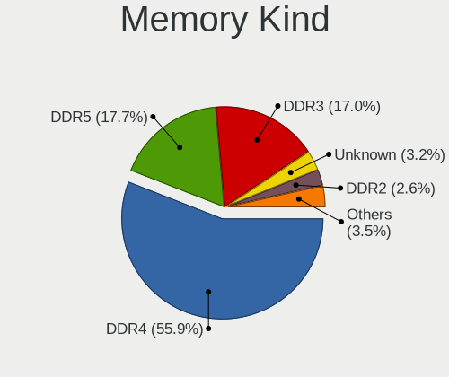

| Kind    | Desktops | Percent |
|---------|----------|---------|
| DDR4    | 160      | 55.56%  |
| DDR5    | 52       | 18.06%  |
| DDR3    | 48       | 16.67%  |
| Unknown | 10       | 3.47%   |
| DDR2    | 8        | 2.78%   |
| SDRAM   | 5        | 1.74%   |
| LPDDR4  | 2        | 0.69%   |
| DDR     | 2        | 0.69%   |
| DRAM    | 1        | 0.35%   |

Memory Form Factor
------------------

Physical design of the memory module

| Name         | Desktops | Percent |
|--------------|----------|---------|
| DIMM         | 262      | 91.29%  |
| SODIMM       | 23       | 8.01%   |
| Row Of Chips | 1        | 0.35%   |
| RIMM         | 1        | 0.35%   |

Memory Size
-----------

Memory module size

| Size  | Desktops | Percent |
|-------|----------|---------|
| 8192  | 111      | 36.51%  |
| 16384 | 90       | 29.61%  |
| 32768 | 46       | 15.13%  |
| 4096  | 33       | 10.86%  |
| 2048  | 20       | 6.58%   |
| 1024  | 2        | 0.66%   |
| 65536 | 1        | 0.33%   |
| 49152 | 1        | 0.33%   |

Memory Speed
------------

Memory module speed

| Speed   | Desktops | Percent |
|---------|----------|---------|
| 3200    | 38       | 12.3%   |
| 3600    | 35       | 11.33%  |
| 1600    | 31       | 10.03%  |
| 2400    | 18       | 5.83%   |
| 2133    | 18       | 5.83%   |
| 4800    | 17       | 5.5%    |
| 1333    | 17       | 5.5%    |
| 6000    | 14       | 4.53%   |
| 3733    | 14       | 4.53%   |
| 2667    | 11       | 3.56%   |
| 5600    | 10       | 3.24%   |
| 3800    | 7        | 2.27%   |
| 3400    | 7        | 2.27%   |
| 800     | 7        | 2.27%   |
| 3000    | 6        | 1.94%   |
| Unknown | 5        | 1.62%   |
| 6400    | 4        | 1.29%   |
| 5200    | 4        | 1.29%   |
| 4000    | 4        | 1.29%   |
| 3866    | 4        | 1.29%   |
| 1866    | 4        | 1.29%   |
| 667     | 3        | 0.97%   |
| 5800    | 2        | 0.65%   |
| 3534    | 2        | 0.65%   |
| 3466    | 2        | 0.65%   |
| 3066    | 2        | 0.65%   |
| 2666    | 2        | 0.65%   |
| 1066    | 2        | 0.65%   |
| 400     | 2        | 0.65%   |
| 7000    | 1        | 0.32%   |
| 4266    | 1        | 0.32%   |
| 3933    | 1        | 0.32%   |
| 3533    | 1        | 0.32%   |
| 3467    | 1        | 0.32%   |
| 3334    | 1        | 0.32%   |
| 3266    | 1        | 0.32%   |
| 2934    | 1        | 0.32%   |
| 2933    | 1        | 0.32%   |
| 2866    | 1        | 0.32%   |
| 2800    | 1        | 0.32%   |

Printers & scanners
-------------------

Printer Vendor
--------------

Printer device vendors

| Vendor              | Desktops | Percent |
|---------------------|----------|---------|
| Hewlett-Packard     | 18       | 43.9%   |
| Brother Industries  | 8        | 19.51%  |
| Seiko Epson         | 4        | 9.76%   |
| Canon               | 4        | 9.76%   |
| Dymo-CoStar         | 3        | 7.32%   |
| Samsung Electronics | 2        | 4.88%   |
| SAT                 | 1        | 2.44%   |
| Dell                | 1        | 2.44%   |

Printer Model
-------------

Printer device models

| Model                                  | Desktops | Percent |
|----------------------------------------|----------|---------|
| Brother MFC-L2710DW series             | 2        | 4.88%   |
| Seiko Epson XP-4100 Series             | 1        | 2.44%   |
| Seiko Epson L300 Series                | 1        | 2.44%   |
| Seiko Epson ET-2710 Series             | 1        | 2.44%   |
| Seiko Epson AL-M310DN                  | 1        | 2.44%   |
| SAT SAT38TUSE                          | 1        | 2.44%   |
| Samsung ML-216x Series Laser Printer   | 1        | 2.44%   |
| Samsung M203x Series                   | 1        | 2.44%   |
| HP Smart Tank 7300 series              | 1        | 2.44%   |
| HP PSC-1315/PSC-1317                   | 1        | 2.44%   |
| HP LaserJet Pro M404-M405              | 1        | 2.44%   |
| HP LaserJet P2015 series               | 1        | 2.44%   |
| HP LaserJet P1006                      | 1        | 2.44%   |
| HP LaserJet P1005                      | 1        | 2.44%   |
| HP LaserJet 400 color M451dn           | 1        | 2.44%   |
| HP LaserJet 2200                       | 1        | 2.44%   |
| HP LaserJet 1020                       | 1        | 2.44%   |
| HP LaserJet 1010                       | 1        | 2.44%   |
| HP HP LaserJet M14-M17                 | 1        | 2.44%   |
| HP ENVY Photo 7800 series              | 1        | 2.44%   |
| HP ENVY Photo 6200 series              | 1        | 2.44%   |
| HP ENVY 5000 series                    | 1        | 2.44%   |
| HP ENVY 4500 series                    | 1        | 2.44%   |
| HP DeskJet 3940                        | 1        | 2.44%   |
| HP DeskJet 2700 series                 | 1        | 2.44%   |
| HP DeskJet 2600 series                 | 1        | 2.44%   |
| Dymo-CoStar LabelWriter 450            | 1        | 2.44%   |
| Dymo-CoStar DYMO LabelWriter 450 Turbo | 1        | 2.44%   |
| Dymo-CoStar DYMO LabelWriter 450 DUO   | 1        | 2.44%   |
| Dell C1660w Color Printer              | 1        | 2.44%   |
| Canon TS3100 series                    | 1        | 2.44%   |
| Canon TR4700 series                    | 1        | 2.44%   |
| Canon PIXMA MX470 Series               | 1        | 2.44%   |
| Canon MF3010                           | 1        | 2.44%   |
| Brother Printer                        | 1        | 2.44%   |
| Brother MFC-L2740DW                    | 1        | 2.44%   |
| Brother HL-L2340D series               | 1        | 2.44%   |
| Brother HL-L2320D series               | 1        | 2.44%   |
| Brother HL-3040CN series               | 1        | 2.44%   |
| Brother DCP-L2510D series              | 1        | 2.44%   |

Scanner Vendor
--------------

Scanner device vendors

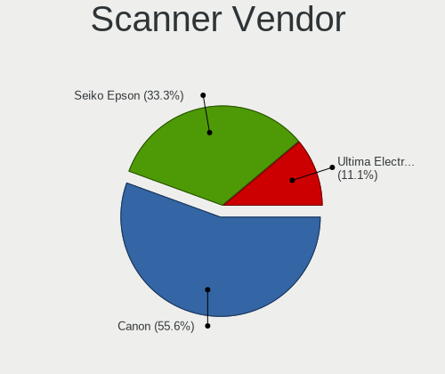

| Vendor             | Desktops | Percent |
|--------------------|----------|---------|
| Canon              | 5        | 55.56%  |
| Seiko Epson        | 3        | 33.33%  |
| Ultima Electronics | 1        | 11.11%  |

Scanner Model
-------------

Scanner device models

| Model                                       | Desktops | Percent |
|---------------------------------------------|----------|---------|
| Seiko Epson GT-X820 [Perfection V600 Photo] | 2        | 22.22%  |
| Canon CanoScan LiDE 220                     | 2        | 22.22%  |
| Ultima Artec E+ Pro                         | 1        | 11.11%  |
| Seiko Epson GT-X770 [Perfection V500]       | 1        | 11.11%  |
| Canon CanoScan N670U/N676U/LiDE 20          | 1        | 11.11%  |
| Canon CanoScan LiDE 210                     | 1        | 11.11%  |
| Canon CanoScan LiDE 110                     | 1        | 11.11%  |

Camera
------

Camera Vendor
-------------

Camera device vendors

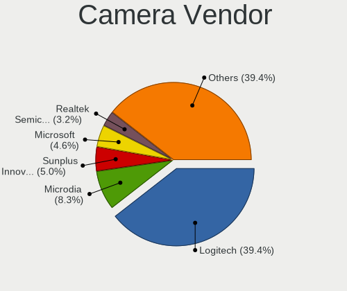

| Vendor                        | Desktops | Percent |
|-------------------------------|----------|---------|
| Logitech                      | 78       | 38.24%  |
| Microdia                      | 16       | 7.84%   |
| Sunplus Innovation Technology | 11       | 5.39%   |
| Microsoft                     | 10       | 4.9%    |
| Generalplus Technology        | 7        | 3.43%   |
| Realtek Semiconductor         | 6        | 2.94%   |
| ARC International             | 6        | 2.94%   |
| Apple                         | 5        | 2.45%   |
| Razer USA                     | 4        | 1.96%   |
| AVerMedia Technologies        | 4        | 1.96%   |
| Z-Star Microelectronics       | 3        | 1.47%   |
| Trust                         | 3        | 1.47%   |
| Samsung Electronics           | 3        | 1.47%   |
| KYE Systems (Mouse Systems)   | 3        | 1.47%   |
| GEMBIRD                       | 3        | 1.47%   |
| 2M UVC CAMERA                 | 3        | 1.47%   |
| Owon                          | 2        | 0.98%   |
| MacroSilicon                  | 2        | 0.98%   |
| Linux Foundation              | 2        | 0.98%   |
| eMeet                         | 2        | 0.98%   |
| Chicony Electronics           | 2        | 0.98%   |
| Anker PowerConf C200          | 2        | 0.98%   |
| Alpha Imaging Technology      | 2        | 0.98%   |
| A4Tech                        | 2        | 0.98%   |
| YGTek                         | 1        | 0.49%   |
| webcamvendor                  | 1        | 0.49%   |
| WCM_USB                       | 1        | 0.49%   |
| WaveRider Communications      | 1        | 0.49%   |
| Valve Software                | 1        | 0.49%   |
| Spreadtrum Communications     | 1        | 0.49%   |
| Sonix Technology              | 1        | 0.49%   |
| Sculpfun CAM500               | 1        | 0.49%   |
| Remo Tech                     | 1        | 0.49%   |
| Quanta                        | 1        | 0.49%   |
| Leap Motion                   | 1        | 0.49%   |
| Jieli Technology              | 1        | 0.49%   |
| Huawei Technologies           | 1        | 0.49%   |
| Hopewin Electronic Material   | 1        | 0.49%   |
| Hewlett-Packard               | 1        | 0.49%   |
| GoPro                         | 1        | 0.49%   |

Camera Model
------------

Camera device models

| Model                                             | Desktops | Percent |
|---------------------------------------------------|----------|---------|
| Logitech Webcam C270                              | 11       | 5.34%   |
| Logitech HD Pro Webcam C920                       | 9        | 4.37%   |
| Microdia USB 2.0 Camera                           | 8        | 3.88%   |
| Logitech C922 Pro Stream Webcam                   | 8        | 3.88%   |
| Logitech BRIO Ultra HD Webcam                     | 7        | 3.4%    |
| Logitech C920 PRO HD Webcam                       | 6        | 2.91%   |
| ARC International Camera                          | 6        | 2.91%   |
| Logitech Webcam C930e                             | 5        | 2.43%   |
| Razer USA Razer Kiyo Pro                          | 4        | 1.94%   |
| Logitech HD Webcam C615                           | 4        | 1.94%   |
| Generalplus 808 Camera                            | 4        | 1.94%   |
| Apple iPhone 5/5C/5S/6/SE/7/8/X                   | 4        | 1.94%   |
| Sunplus USB 2.0 Camera                            | 3        | 1.46%   |
| Sunplus PC Camera                                 | 3        | 1.46%   |
| Samsung Galaxy series, misc. (MTP mode)           | 3        | 1.46%   |
| Logitech QuickCam E 3500                          | 3        | 1.46%   |
| Generalplus CAMERA - UVC                          | 3        | 1.46%   |
| AVerMedia Live Streamer CAM 313                   | 3        | 1.46%   |
| 2M UVC CAMERA NexiGo N60 FHD Webcam               | 3        | 1.46%   |
| Trust Full HD Webcam                              | 2        | 0.97%   |
| Sunplus Full HD webcam                            | 2        | 0.97%   |
| Realtek USB Camera                                | 2        | 0.97%   |
| Owon USB CAMERA                                   | 2        | 0.97%   |
| Microsoft Microsoft LifeCam Studio              | 2        | 0.97%   |
| Microsoft LifeCam HD-3000                         | 2        | 0.97%   |
| Microsoft LifeCam Cinema                          | 2        | 0.97%   |
| Microdia Sonix USB 2.0 Camera                     | 2        | 0.97%   |
| Microdia Integrated Camera                        | 2        | 0.97%   |
| Microdia Camera                                   | 2        | 0.97%   |
| MacroSilicon MiraBox Capture                      | 2        | 0.97%   |
| Logitech Webcam C925e                             | 2        | 0.97%   |
| Logitech Webcam C310                              | 2        | 0.97%   |
| Logitech Webcam C170                              | 2        | 0.97%   |
| Logitech StreamCam                                | 2        | 0.97%   |
| Logitech HD Webcam C910                           | 2        | 0.97%   |
| Logitech HD Webcam C525                           | 2        | 0.97%   |
| Logitech HD Webcam C510                           | 2        | 0.97%   |
| Logitech B525 HD Webcam                           | 2        | 0.97%   |
| Linux Foundation EEM Gadget                       | 2        | 0.97%   |
| GEMBIRD Generic UVC 1.00 camera [AppoTech AX2311] | 2        | 0.97%   |

Security
--------

Fingerprint Vendor
------------------

Fingerprint sensor vendors

| Vendor | Desktops | Percent |
|--------|----------|---------|
| Upek   | 1        | 50%     |
| Dell   | 1        | 50%     |

Fingerprint Model
-----------------

Fingerprint sensor models

| Model                                               | Desktops | Percent |
|-----------------------------------------------------|----------|---------|
| Upek TCS1C EIM/STM32 Fingerprint sensor             | 1        | 50%     |
| Dell MS819 Dell Wired Mouse With Fingerprint Reader | 1        | 50%     |

Chipcard Vendor
---------------

Chipcard module vendors

| Vendor                    | Desktops | Percent |
|---------------------------|----------|---------|
| Advanced Card Systems     | 3        | 60%     |
| Realtek Semiconductor     | 1        | 20%     |
| Aladdin Knowledge Systems | 1        | 20%     |

Chipcard Model
--------------

Chipcard module models

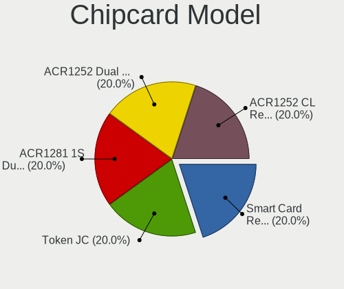

| Model                                             | Desktops | Percent |
|---------------------------------------------------|----------|---------|
| Realtek Semiconductor Smart Card Reader Interface | 1        | 20%     |
| Aladdin Knowledge Systems Token JC                | 1        | 20%     |
| Advanced Card Systems ACR1281 1S Dual Reader      | 1        | 20%     |
| Advanced Card Systems ACR1252 Dual Reader         | 1        | 20%     |
| Advanced Card Systems ACR1252 CL Reader PICC      | 1        | 20%     |

Unsupported
-----------

Unsupported Devices
-------------------

Total unsupported devices on board

| Total | Desktops | Percent |
|-------|----------|---------|
| 0     | 767      | 83.19%  |
| 1     | 132      | 14.32%  |
| 2     | 15       | 1.63%   |
| 3     | 4        | 0.43%   |
| 5     | 2        | 0.22%   |
| 4     | 2        | 0.22%   |

Unsupported Device Types
------------------------

Types of unsupported devices

| Type                     | Desktops | Percent |
|--------------------------|----------|---------|
| Graphics card            | 86       | 48.31%  |
| Net/wireless             | 37       | 20.79%  |
| Unassigned class         | 19       | 10.67%  |
| Sound                    | 10       | 5.62%   |
| Bluetooth                | 6        | 3.37%   |
| Storage/raid             | 4        | 2.25%   |
| Net/ethernet             | 4        | 2.25%   |
| Multimedia controller    | 4        | 2.25%   |
| Camera                   | 3        | 1.69%   |
| Communication controller | 2        | 1.12%   |
| Network                  | 1        | 0.56%   |
| Fingerprint reader       | 1        | 0.56%   |
| Chipcard                 | 1        | 0.56%   |

