Fedora 39 - Tested Hardware & Statistics (Notebooks)
----------------------------------------------------

A project to collect tested hardware configurations for Fedora 39.

Anyone can contribute to this report by the [hw-probe](https://github.com/linuxhw/hw-probe) tool:

    sudo -E hw-probe -all -upload

Please contribute! Especially if your hardware is rare.

Contents
--------

* [ Test Cases ](#test-cases)

* [ System ](#system)
  - [ Kernel                   ](#kernel)
  - [ Kernel Family            ](#kernel-family)
  - [ Kernel Major Ver.        ](#kernel-major-ver)
  - [ Arch                     ](#arch)
  - [ DE                       ](#de)
  - [ Display Server           ](#display-server)
  - [ Display Manager          ](#display-manager)
  - [ OS Lang                  ](#os-lang)
  - [ Boot Mode                ](#boot-mode)
  - [ Filesystem               ](#filesystem)
  - [ Part. scheme             ](#part-scheme)
  - [ Dual Boot with Linux/BSD ](#dual-boot-with-linuxbsd)
  - [ Dual Boot (Win)          ](#dual-boot-win)

* [ Board ](#board)
  - [ Vendor                   ](#vendor)
  - [ Model                    ](#model)
  - [ Model Family             ](#model-family)
  - [ MFG Year                 ](#mfg-year)
  - [ Form Factor              ](#form-factor)
  - [ Secure Boot              ](#secure-boot)
  - [ Coreboot                 ](#coreboot)
  - [ RAM Size                 ](#ram-size)
  - [ RAM Used                 ](#ram-used)
  - [ Total Drives             ](#total-drives)
  - [ Has CD-ROM               ](#has-cd-rom)
  - [ Has Ethernet             ](#has-ethernet)
  - [ Has WiFi                 ](#has-wifi)
  - [ Has Bluetooth            ](#has-bluetooth)

* [ Location ](#location)
  - [ Country                  ](#country)
  - [ City                     ](#city)

* [ Drives ](#drives)
  - [ Drive Vendor             ](#drive-vendor)
  - [ Drive Model              ](#drive-model)
  - [ HDD Vendor               ](#hdd-vendor)
  - [ SSD Vendor               ](#ssd-vendor)
  - [ Drive Kind               ](#drive-kind)
  - [ Drive Connector          ](#drive-connector)
  - [ Drive Size               ](#drive-size)
  - [ Space Total              ](#space-total)
  - [ Space Used               ](#space-used)
  - [ Malfunc. Drives          ](#malfunc-drives)
  - [ Malfunc. Drive Vendor    ](#malfunc-drive-vendor)
  - [ Malfunc. HDD Vendor      ](#malfunc-hdd-vendor)
  - [ Malfunc. Drive Kind      ](#malfunc-drive-kind)
  - [ Failed Drives            ](#failed-drives)
  - [ Failed Drive Vendor      ](#failed-drive-vendor)
  - [ Drive Status             ](#drive-status)

* [ Storage controller ](#storage-controller)
  - [ Storage Vendor           ](#storage-vendor)
  - [ Storage Model            ](#storage-model)
  - [ Storage Kind             ](#storage-kind)

* [ Processor ](#processor)
  - [ CPU Vendor               ](#cpu-vendor)
  - [ CPU Model                ](#cpu-model)
  - [ CPU Model Family         ](#cpu-model-family)
  - [ CPU Cores                ](#cpu-cores)
  - [ CPU Sockets              ](#cpu-sockets)
  - [ CPU Threads              ](#cpu-threads)
  - [ CPU Op-Modes             ](#cpu-op-modes)
  - [ CPU Microcode            ](#cpu-microcode)
  - [ CPU Microarch            ](#cpu-microarch)

* [ Graphics ](#graphics)
  - [ GPU Vendor               ](#gpu-vendor)
  - [ GPU Model                ](#gpu-model)
  - [ GPU Combo                ](#gpu-combo)
  - [ GPU Driver               ](#gpu-driver)
  - [ GPU Memory               ](#gpu-memory)

* [ Monitor ](#monitor)
  - [ Monitor Vendor           ](#monitor-vendor)
  - [ Monitor Model            ](#monitor-model)
  - [ Monitor Resolution       ](#monitor-resolution)
  - [ Monitor Diagonal         ](#monitor-diagonal)
  - [ Monitor Width            ](#monitor-width)
  - [ Aspect Ratio             ](#aspect-ratio)
  - [ Monitor Area             ](#monitor-area)
  - [ Pixel Density            ](#pixel-density)
  - [ Multiple Monitors        ](#multiple-monitors)

* [ Network ](#network)
  - [ Net Controller Vendor    ](#net-controller-vendor)
  - [ Net Controller Model     ](#net-controller-model)
  - [ Wireless Vendor          ](#wireless-vendor)
  - [ Wireless Model           ](#wireless-model)
  - [ Ethernet Vendor          ](#ethernet-vendor)
  - [ Ethernet Model           ](#ethernet-model)
  - [ Net Controller Kind      ](#net-controller-kind)
  - [ Used Controller          ](#used-controller)
  - [ NICs                     ](#nics)
  - [ IPv6                     ](#ipv6)

* [ Bluetooth ](#bluetooth)
  - [ Bluetooth Vendor         ](#bluetooth-vendor)
  - [ Bluetooth Model          ](#bluetooth-model)

* [ Sound ](#sound)
  - [ Sound Vendor             ](#sound-vendor)
  - [ Sound Model              ](#sound-model)

* [ Memory ](#memory)
  - [ Memory Vendor            ](#memory-vendor)
  - [ Memory Model             ](#memory-model)
  - [ Memory Kind              ](#memory-kind)
  - [ Memory Form Factor       ](#memory-form-factor)
  - [ Memory Size              ](#memory-size)
  - [ Memory Speed             ](#memory-speed)

* [ Printers & scanners ](#printers--scanners)
  - [ Printer Vendor           ](#printer-vendor)
  - [ Printer Model            ](#printer-model)
  - [ Scanner Vendor           ](#scanner-vendor)
  - [ Scanner Model            ](#scanner-model)

* [ Camera ](#camera)
  - [ Camera Vendor            ](#camera-vendor)
  - [ Camera Model             ](#camera-model)

* [ Security ](#security)
  - [ Fingerprint Vendor       ](#fingerprint-vendor)
  - [ Fingerprint Model        ](#fingerprint-model)
  - [ Chipcard Vendor          ](#chipcard-vendor)
  - [ Chipcard Model           ](#chipcard-model)

* [ Unsupported ](#unsupported)
  - [ Unsupported Devices      ](#unsupported-devices)
  - [ Unsupported Device Types ](#unsupported-device-types)

Test Cases
----------

Total: 2298

| Vendor        | Model                       | Probe                                                      | Date         |
|---------------|-----------------------------|------------------------------------------------------------|--------------|
| Sony          | VPCYB45JB                   | [6f70d22391](https://linux-hardware.org/?probe=6f70d22391) | May 09, 2024 |
| Avell High... | A70 MOB                     | [2be654083e](https://linux-hardware.org/?probe=2be654083e) | May 08, 2024 |
| HP            | EliteBook 840 G6            | [1baa287464](https://linux-hardware.org/?probe=1baa287464) | May 08, 2024 |
| Dell          | XPS 15 9520                 | [70022231bd](https://linux-hardware.org/?probe=70022231bd) | May 07, 2024 |
| HP            | ENVY Notebook 13-ab0XX      | [7d6b757088](https://linux-hardware.org/?probe=7d6b757088) | May 07, 2024 |
| HP            | ENVY Notebook 13-ab0XX      | [a9d1c1234c](https://linux-hardware.org/?probe=a9d1c1234c) | May 07, 2024 |
| Star Labs     | StarBook                    | [7e37692a50](https://linux-hardware.org/?probe=7e37692a50) | May 06, 2024 |
| ASUSTek       | X550CA                      | [5038e329fc](https://linux-hardware.org/?probe=5038e329fc) | May 06, 2024 |
| ASUSTek       | ROG Strix G731GV_G731GV     | [00ceb2ea16](https://linux-hardware.org/?probe=00ceb2ea16) | May 06, 2024 |
| Positivo      | J14GL11                     | [71f761fa87](https://linux-hardware.org/?probe=71f761fa87) | May 05, 2024 |
| ASUSTek       | X510UAR                     | [3317acbe53](https://linux-hardware.org/?probe=3317acbe53) | May 05, 2024 |
| ASUSTek       | TUF Gaming FX505GE_FX505... | [6794452c3b](https://linux-hardware.org/?probe=6794452c3b) | May 05, 2024 |
| HP            | 240 G8                      | [8b7c23e6cb](https://linux-hardware.org/?probe=8b7c23e6cb) | May 05, 2024 |
| Unknown       | Unknown                     | [b7866b963f](https://linux-hardware.org/?probe=b7866b963f) | May 04, 2024 |
| MSI           | Raider GE68HX 13VG          | [b3f866a8e6](https://linux-hardware.org/?probe=b3f866a8e6) | May 04, 2024 |
| SLIMBOOK      | HERO-S-TGL-RTX              | [eac9faa98c](https://linux-hardware.org/?probe=eac9faa98c) | May 03, 2024 |
| HP            | OMEN by Laptop 16-c0xxx     | [44e9f4946e](https://linux-hardware.org/?probe=44e9f4946e) | May 03, 2024 |
| HP            | OMEN by Laptop 16-c0xxx     | [02a14960a9](https://linux-hardware.org/?probe=02a14960a9) | May 03, 2024 |
| Lenovo        | IdeaPad Z500 20202          | [41468a4e5c](https://linux-hardware.org/?probe=41468a4e5c) | May 03, 2024 |
| Schenker      | XMG CORE 15(M20, RTX 206... | [e22a67c560](https://linux-hardware.org/?probe=e22a67c560) | May 02, 2024 |
| Lenovo        | IdeaPad Z500 20202          | [f7e35750cd](https://linux-hardware.org/?probe=f7e35750cd) | May 02, 2024 |
| LG Electro... | 16Z90P-G.AA76G              | [f9bdc22f6f](https://linux-hardware.org/?probe=f9bdc22f6f) | May 01, 2024 |
| Dell          | Inspiron 7537               | [d27f9ad169](https://linux-hardware.org/?probe=d27f9ad169) | May 01, 2024 |
| Lenovo        | ThinkPad SL510 2847Q7G      | [c2f435ff58](https://linux-hardware.org/?probe=c2f435ff58) | May 01, 2024 |
| ASUSTek       | VivoBook_ASUSLaptop X515... | [badf656eaf](https://linux-hardware.org/?probe=badf656eaf) | May 01, 2024 |
| Apple         | MacBookPro15,2              | [5d0cceea3e](https://linux-hardware.org/?probe=5d0cceea3e) | Apr 30, 2024 |
| ASUSTek       | VivoBook_ASUSLaptop X350... | [3c551032a7](https://linux-hardware.org/?probe=3c551032a7) | Apr 30, 2024 |
| HP            | EliteBook 840 G4            | [86a58844a8](https://linux-hardware.org/?probe=86a58844a8) | Apr 30, 2024 |
| Lenovo        | ThinkPad L15 Gen 1 20U70... | [d4e717f7b6](https://linux-hardware.org/?probe=d4e717f7b6) | Apr 29, 2024 |
| Dell          | Latitude 5420               | [0a95f2013b](https://linux-hardware.org/?probe=0a95f2013b) | Apr 28, 2024 |
| Lenovo        | ThinkPad T14 Gen 2i 20W0... | [e2a9d44509](https://linux-hardware.org/?probe=e2a9d44509) | Apr 28, 2024 |
| HP            | Pavilion Notebook           | [6da1776d42](https://linux-hardware.org/?probe=6da1776d42) | Apr 28, 2024 |
| Star Labs     | StarBook                    | [99017e5822](https://linux-hardware.org/?probe=99017e5822) | Apr 28, 2024 |
| HP            | Notebook                    | [6252c3e002](https://linux-hardware.org/?probe=6252c3e002) | Apr 28, 2024 |
| HP            | EliteBook 830 G6            | [6b74d2c1b5](https://linux-hardware.org/?probe=6b74d2c1b5) | Apr 27, 2024 |
| Acer          | Nitro AN515-58              | [5192e9d32b](https://linux-hardware.org/?probe=5192e9d32b) | Apr 27, 2024 |
| Acer          | Aspire A314-35              | [b81c267e1b](https://linux-hardware.org/?probe=b81c267e1b) | Apr 27, 2024 |
| Dell          | Inspiron 15 3520            | [e8f25e02cb](https://linux-hardware.org/?probe=e8f25e02cb) | Apr 27, 2024 |
| Lenovo        | LOQ 15APH8 82XT             | [fad4840965](https://linux-hardware.org/?probe=fad4840965) | Apr 26, 2024 |
| Lenovo        | Legion 5 Pro 16ACH6H 82J... | [46e559a9de](https://linux-hardware.org/?probe=46e559a9de) | Apr 26, 2024 |
| Acer          | Aspire A315-53G             | [2a3e224f63](https://linux-hardware.org/?probe=2a3e224f63) | Apr 26, 2024 |
| Lenovo        | IdeaPad 5 Pro 14ACN6 82L... | [ae5dddd784](https://linux-hardware.org/?probe=ae5dddd784) | Apr 25, 2024 |
| ASUSTek       | N751JK                      | [f49afec710](https://linux-hardware.org/?probe=f49afec710) | Apr 25, 2024 |
| Alienware     | M18xR1                      | [d6f3028e98](https://linux-hardware.org/?probe=d6f3028e98) | Apr 25, 2024 |
| HP            | ZBook 15                    | [b5181afe2b](https://linux-hardware.org/?probe=b5181afe2b) | Apr 25, 2024 |
| HP            | Laptop 15s-du1xxx           | [b1502b6440](https://linux-hardware.org/?probe=b1502b6440) | Apr 25, 2024 |
| HP            | Victus by Gaming Laptop ... | [8d2850aa6b](https://linux-hardware.org/?probe=8d2850aa6b) | Apr 24, 2024 |
| Lenovo        | G500s 20245                 | [9742cd9e94](https://linux-hardware.org/?probe=9742cd9e94) | Apr 24, 2024 |
| HP            | 15                          | [4ecce71b7d](https://linux-hardware.org/?probe=4ecce71b7d) | Apr 24, 2024 |
| Dell          | Precision M6700             | [cc8f317f9d](https://linux-hardware.org/?probe=cc8f317f9d) | Apr 24, 2024 |
| Toshiba       | STI NI 1401                 | [caed126d9e](https://linux-hardware.org/?probe=caed126d9e) | Apr 24, 2024 |
| Apple         | MacBookPro8,1               | [cf1ac0276a](https://linux-hardware.org/?probe=cf1ac0276a) | Apr 24, 2024 |
| Acer          | Aspire A315-24P             | [e25a1d0676](https://linux-hardware.org/?probe=e25a1d0676) | Apr 24, 2024 |
| Lenovo        | ThinkPad X1 Carbon 7th 2... | [2bc3bf2f34](https://linux-hardware.org/?probe=2bc3bf2f34) | Apr 23, 2024 |
| Acer          | Nitro AN515-46              | [0a90ca1966](https://linux-hardware.org/?probe=0a90ca1966) | Apr 23, 2024 |
| Lenovo        | IdeaPad Gaming 3 15IMH05... | [6f01a069fa](https://linux-hardware.org/?probe=6f01a069fa) | Apr 23, 2024 |
| Apple         | MacBook5,1                  | [83ab8ba33c](https://linux-hardware.org/?probe=83ab8ba33c) | Apr 23, 2024 |
| Lenovo        | ThinkPad P16s Gen 2 21K9... | [95453a6898](https://linux-hardware.org/?probe=95453a6898) | Apr 23, 2024 |
| Lenovo        | ThinkPad L14 Gen 3 21C10... | [72b47f3d18](https://linux-hardware.org/?probe=72b47f3d18) | Apr 23, 2024 |
| TUXEDO        | InfinityBook Pro Gen7 (M... | [894feb1a4d](https://linux-hardware.org/?probe=894feb1a4d) | Apr 23, 2024 |
| ASUSTek       | VivoBook_ASUSLaptop X150... | [a7180ee8da](https://linux-hardware.org/?probe=a7180ee8da) | Apr 23, 2024 |
| Framework     | Laptop (12th Gen Intel C... | [e79a07e085](https://linux-hardware.org/?probe=e79a07e085) | Apr 23, 2024 |
| ASUSTek       | VivoBook_ASUSLaptop X570... | [cda9b90e74](https://linux-hardware.org/?probe=cda9b90e74) | Apr 23, 2024 |
| ASUSTek       | VivoBook_ASUSLaptop X570... | [922e4ea114](https://linux-hardware.org/?probe=922e4ea114) | Apr 23, 2024 |
| Apple         | MacBookPro9,2               | [da3cb2d356](https://linux-hardware.org/?probe=da3cb2d356) | Apr 22, 2024 |
| Acer          | Aspire A315-56              | [92fb8268cc](https://linux-hardware.org/?probe=92fb8268cc) | Apr 22, 2024 |
| HP            | Victus by Gaming Laptop ... | [4ffd3e632b](https://linux-hardware.org/?probe=4ffd3e632b) | Apr 22, 2024 |
| Lenovo        | Legion R7000P APH8 82Y9     | [a3f2909959](https://linux-hardware.org/?probe=a3f2909959) | Apr 22, 2024 |
| Lenovo        | IdeaPad 100-15IBD 80QQ      | [a8d83edd62](https://linux-hardware.org/?probe=a8d83edd62) | Apr 22, 2024 |
| Acer          | Aspire A514-54              | [3685be6a35](https://linux-hardware.org/?probe=3685be6a35) | Apr 22, 2024 |
| ASUSTek       | ROG Strix G713PV_G713PV     | [d7a06f7d8d](https://linux-hardware.org/?probe=d7a06f7d8d) | Apr 22, 2024 |
| Lenovo        | Yoga Pro 7 14APH8 82Y8      | [e36ba9916d](https://linux-hardware.org/?probe=e36ba9916d) | Apr 22, 2024 |
| Positivo      | S14SL01                     | [4840897917](https://linux-hardware.org/?probe=4840897917) | Apr 21, 2024 |
| Lenovo        | IdeaPad 5 14ITL05 82FE      | [e0c405894c](https://linux-hardware.org/?probe=e0c405894c) | Apr 21, 2024 |
| Lenovo        | ThinkPad T570 W10DG 20JX... | [458a4bd2b2](https://linux-hardware.org/?probe=458a4bd2b2) | Apr 21, 2024 |
| Lenovo        | ThinkPad E595 20NF001PTX    | [6e6ef1d063](https://linux-hardware.org/?probe=6e6ef1d063) | Apr 21, 2024 |
| HP            | ProBook 4530s               | [11f3df5775](https://linux-hardware.org/?probe=11f3df5775) | Apr 21, 2024 |
| Acer          | Aspire A514-54              | [b06b4f2ac7](https://linux-hardware.org/?probe=b06b4f2ac7) | Apr 21, 2024 |
| Dell          | Latitude 5440               | [58cc268fb3](https://linux-hardware.org/?probe=58cc268fb3) | Apr 21, 2024 |
| ASUSTek       | VivoBook_ASUSLaptop E510... | [ceca4cef9c](https://linux-hardware.org/?probe=ceca4cef9c) | Apr 21, 2024 |
| HP            | Laptop 17-cp0xxx            | [9eff554fa4](https://linux-hardware.org/?probe=9eff554fa4) | Apr 21, 2024 |
| ASUSTek       | G75VW                       | [1853702bed](https://linux-hardware.org/?probe=1853702bed) | Apr 21, 2024 |
| Alienware     | x15 R1                      | [63bd9e4e5b](https://linux-hardware.org/?probe=63bd9e4e5b) | Apr 21, 2024 |
| Alienware     | x15 R1                      | [adfa8b3aea](https://linux-hardware.org/?probe=adfa8b3aea) | Apr 21, 2024 |
| HP            | ProBook 470 G5              | [0c1225132c](https://linux-hardware.org/?probe=0c1225132c) | Apr 21, 2024 |
| HP            | Laptop 17-cp0xxx            | [fea13a098d](https://linux-hardware.org/?probe=fea13a098d) | Apr 20, 2024 |
| Apple         | MacBookPro11,2              | [802dfe39ec](https://linux-hardware.org/?probe=802dfe39ec) | Apr 20, 2024 |
| Acer          | Aspire A315-44P             | [6636df5576](https://linux-hardware.org/?probe=6636df5576) | Apr 20, 2024 |
| ASUSTek       | VivoBook_ASUSLaptop X712... | [35685d6f90](https://linux-hardware.org/?probe=35685d6f90) | Apr 20, 2024 |
| HP            | Victus by Laptop 16-e0xx... | [5b3e452e53](https://linux-hardware.org/?probe=5b3e452e53) | Apr 20, 2024 |
| Dell          | Inspiron 3501               | [0f62918ed2](https://linux-hardware.org/?probe=0f62918ed2) | Apr 20, 2024 |
| HP            | EliteBook 840 G8 Noteboo... | [e090d79256](https://linux-hardware.org/?probe=e090d79256) | Apr 20, 2024 |
| Valve         | Jupiter                     | [da44a88ec3](https://linux-hardware.org/?probe=da44a88ec3) | Apr 19, 2024 |
| ASUSTek       | ROG Zephyrus G15 GA503RW    | [8d5622069d](https://linux-hardware.org/?probe=8d5622069d) | Apr 19, 2024 |
| Lenovo        | ThinkPad T450s 20BWS00V0... | [8d933e8d9e](https://linux-hardware.org/?probe=8d933e8d9e) | Apr 19, 2024 |
| Dell          | G15 5530                    | [c1f49dc2d9](https://linux-hardware.org/?probe=c1f49dc2d9) | Apr 19, 2024 |
| Fujitsu       | LIFEBOOK T902               | [1f6b5be9dc](https://linux-hardware.org/?probe=1f6b5be9dc) | Apr 19, 2024 |
| Dell          | Latitude E6400              | [d084b4b030](https://linux-hardware.org/?probe=d084b4b030) | Apr 19, 2024 |
| Google        | Shyvana                     | [a0d110b275](https://linux-hardware.org/?probe=a0d110b275) | Apr 19, 2024 |
| Acer          | Aspire A715-43G             | [737b4f2bfb](https://linux-hardware.org/?probe=737b4f2bfb) | Apr 19, 2024 |
| Acer          | Aspire A715-43G             | [b1605729ff](https://linux-hardware.org/?probe=b1605729ff) | Apr 19, 2024 |
| Lenovo        | Yoga 14sACH 2021 82MS       | [a2fb569143](https://linux-hardware.org/?probe=a2fb569143) | Apr 19, 2024 |
| Lenovo        | Yoga 14sACH 2021 82MS       | [b70a3e9c9f](https://linux-hardware.org/?probe=b70a3e9c9f) | Apr 19, 2024 |
| Lenovo        | G50-80 80E5                 | [5de5267a1a](https://linux-hardware.org/?probe=5de5267a1a) | Apr 19, 2024 |
| Lenovo        | ThinkPad X1 Carbon 6th 2... | [d173c3e7d7](https://linux-hardware.org/?probe=d173c3e7d7) | Apr 18, 2024 |
| Lenovo        | IdeaPad Slim 3 15IAN8 82... | [7e7a28ef89](https://linux-hardware.org/?probe=7e7a28ef89) | Apr 18, 2024 |
| Lenovo        | ThinkPad X1 Extreme Gen ... | [43a3e3b36d](https://linux-hardware.org/?probe=43a3e3b36d) | Apr 18, 2024 |
| Lenovo        | ThinkPad X1 Extreme Gen ... | [8c079004f7](https://linux-hardware.org/?probe=8c079004f7) | Apr 18, 2024 |
| Dell          | Precision M4800             | [e1bbe5bf56](https://linux-hardware.org/?probe=e1bbe5bf56) | Apr 18, 2024 |
| Lenovo        | ThinkPad X1 Carbon 6th 2... | [aaef73d221](https://linux-hardware.org/?probe=aaef73d221) | Apr 18, 2024 |
| Acer          | Aspire E5-571G              | [c0cb351a9c](https://linux-hardware.org/?probe=c0cb351a9c) | Apr 18, 2024 |
| Lenovo        | ThinkPad T14 Gen 3 21CF0... | [011644727b](https://linux-hardware.org/?probe=011644727b) | Apr 18, 2024 |
| HP            | EliteBook 2540p             | [9748a3188e](https://linux-hardware.org/?probe=9748a3188e) | Apr 18, 2024 |
| Acer          | V5-131                      | [5ca622b910](https://linux-hardware.org/?probe=5ca622b910) | Apr 18, 2024 |
| Acer          | V5-131                      | [984da3beb5](https://linux-hardware.org/?probe=984da3beb5) | Apr 18, 2024 |
| HP            | Pavilion Gaming Laptop 1... | [59aceeb367](https://linux-hardware.org/?probe=59aceeb367) | Apr 18, 2024 |
| Dell          | Inspiron 15-7568            | [cf77d5e408](https://linux-hardware.org/?probe=cf77d5e408) | Apr 18, 2024 |
| Acer          | Aspire E5-571G              | [f225a565f5](https://linux-hardware.org/?probe=f225a565f5) | Apr 18, 2024 |
| ASUSTek       | X450LN                      | [bab98faa56](https://linux-hardware.org/?probe=bab98faa56) | Apr 18, 2024 |
| Dell          | Latitude 5310               | [e46914e458](https://linux-hardware.org/?probe=e46914e458) | Apr 17, 2024 |
| ASUSTek       | ASUS TUF Gaming F15 FX50... | [0eb26f6fcc](https://linux-hardware.org/?probe=0eb26f6fcc) | Apr 17, 2024 |
| ASUSTek       | K53BE                       | [26673bc3d5](https://linux-hardware.org/?probe=26673bc3d5) | Apr 17, 2024 |
| Dell          | XPS 9320                    | [572e9a9030](https://linux-hardware.org/?probe=572e9a9030) | Apr 17, 2024 |
| Dell          | XPS 9320                    | [ba5e5d3733](https://linux-hardware.org/?probe=ba5e5d3733) | Apr 17, 2024 |
| HP            | Laptop 15-dy2xxx            | [0e9bf013da](https://linux-hardware.org/?probe=0e9bf013da) | Apr 17, 2024 |
| Lenovo        | ThinkPad X13 Gen 1 20T20... | [32d8be9f50](https://linux-hardware.org/?probe=32d8be9f50) | Apr 17, 2024 |
| ASUSTek       | VivoBook_ASUSLaptop X150... | [a776a9677a](https://linux-hardware.org/?probe=a776a9677a) | Apr 17, 2024 |
| ASUSTek       | VivoBook_ASUSLaptop X150... | [4f7d67acb4](https://linux-hardware.org/?probe=4f7d67acb4) | Apr 17, 2024 |
| Lenovo        | ThinkPad X13 Gen 1 20T20... | [0ce853dae6](https://linux-hardware.org/?probe=0ce853dae6) | Apr 17, 2024 |
| Sony          | VPCEH25EN                   | [3bf6f9edaa](https://linux-hardware.org/?probe=3bf6f9edaa) | Apr 17, 2024 |
| Lenovo        | ThinkBook 14 G4+ ARA 21D... | [eea2672841](https://linux-hardware.org/?probe=eea2672841) | Apr 17, 2024 |
| ASRock        | B550M Pro4                  | [2a69ec7381](https://linux-hardware.org/?probe=2a69ec7381) | Apr 17, 2024 |
| ASUSTek       | ASUS TUF Gaming A15 FA50... | [7809a3250e](https://linux-hardware.org/?probe=7809a3250e) | Apr 16, 2024 |
| Lenovo        | V15 G3 ABA 82TV             | [6877dcd901](https://linux-hardware.org/?probe=6877dcd901) | Apr 16, 2024 |
| Lenovo        | ThinkPad T450s 20BWS00V0... | [763289fa74](https://linux-hardware.org/?probe=763289fa74) | Apr 16, 2024 |
| HP            | EliteBook 840 G1            | [a810237e8f](https://linux-hardware.org/?probe=a810237e8f) | Apr 16, 2024 |
| Notebook      | PD5x_7xSNC_SND_SNE          | [a0b18d9fe1](https://linux-hardware.org/?probe=a0b18d9fe1) | Apr 16, 2024 |
| Apple         | MacBookPro8,2               | [2e79d9d11e](https://linux-hardware.org/?probe=2e79d9d11e) | Apr 16, 2024 |
| ASUSTek       | UX305CA                     | [e25d8c8e00](https://linux-hardware.org/?probe=e25d8c8e00) | Apr 16, 2024 |
| Lenovo        | V15 G2 ITL 82KB             | [a596d334bf](https://linux-hardware.org/?probe=a596d334bf) | Apr 16, 2024 |
| ASUSTek       | X551MA                      | [9ef43fd0f2](https://linux-hardware.org/?probe=9ef43fd0f2) | Apr 16, 2024 |
| Lenovo        | Legion 5 15ARH05H 82B1      | [862eca9c16](https://linux-hardware.org/?probe=862eca9c16) | Apr 16, 2024 |
| Dell          | XPS 15 9560                 | [5e92237577](https://linux-hardware.org/?probe=5e92237577) | Apr 16, 2024 |
| Lenovo        | IdeaPad Gaming 3 15ARH7 ... | [54ea7f1e25](https://linux-hardware.org/?probe=54ea7f1e25) | Apr 16, 2024 |
| HUAWEI        | RLEF-XX                     | [461426c098](https://linux-hardware.org/?probe=461426c098) | Apr 16, 2024 |
| Apple         | MacBookAir7,2               | [163f3a262e](https://linux-hardware.org/?probe=163f3a262e) | Apr 15, 2024 |
| ASUSTek       | ROG Strix G513QY_G513QY     | [7c4f1e45c9](https://linux-hardware.org/?probe=7c4f1e45c9) | Apr 15, 2024 |
| Lenovo        | ThinkPad E460 20EUS00000    | [aa85d58506](https://linux-hardware.org/?probe=aa85d58506) | Apr 15, 2024 |
| Acer          | Aspire A515-51              | [7ff3e868b5](https://linux-hardware.org/?probe=7ff3e868b5) | Apr 15, 2024 |
| ASUSTek       | VivoBook_ASUSLaptop X571... | [5378d5a780](https://linux-hardware.org/?probe=5378d5a780) | Apr 15, 2024 |
| Lenovo        | ThinkPad X13 Gen 3 21CMA... | [9820ac9335](https://linux-hardware.org/?probe=9820ac9335) | Apr 15, 2024 |
| LG Electro... | 17Z90R-G.AA77G              | [c3c12d00f2](https://linux-hardware.org/?probe=c3c12d00f2) | Apr 15, 2024 |
| HP            | ZBook 15                    | [f581a351ed](https://linux-hardware.org/?probe=f581a351ed) | Apr 15, 2024 |
| Apple         | MacBookPro9,2               | [60e642d93c](https://linux-hardware.org/?probe=60e642d93c) | Apr 15, 2024 |
| HP            | OMEN by Laptop 16-c0xxx     | [c249f10628](https://linux-hardware.org/?probe=c249f10628) | Apr 15, 2024 |
| LG Electro... | 17Z90R-G.AA77G              | [9adb0d4728](https://linux-hardware.org/?probe=9adb0d4728) | Apr 15, 2024 |
| Dell          | Precision 5520              | [6a85a306b8](https://linux-hardware.org/?probe=6a85a306b8) | Apr 14, 2024 |
| HP            | 255 15.6 inch G10           | [b72fb5d156](https://linux-hardware.org/?probe=b72fb5d156) | Apr 14, 2024 |
| TUXEDO        | Gemini Gen2                 | [89fbde8b2d](https://linux-hardware.org/?probe=89fbde8b2d) | Apr 14, 2024 |
| ASUSTek       | ROG Zephyrus G14 GA401IV... | [476daae154](https://linux-hardware.org/?probe=476daae154) | Apr 14, 2024 |
| Dell          | Latitude E6420              | [713c9b9514](https://linux-hardware.org/?probe=713c9b9514) | Apr 13, 2024 |
| Apple         | MacBookPro11,3              | [abbfebcf21](https://linux-hardware.org/?probe=abbfebcf21) | Apr 13, 2024 |
| Lenovo        | IdeaPad 310-15IKB 80TV      | [75ef2f2d7a](https://linux-hardware.org/?probe=75ef2f2d7a) | Apr 13, 2024 |
| HP            | ProBook 450 G0              | [686202a739](https://linux-hardware.org/?probe=686202a739) | Apr 13, 2024 |
| HUAWEI        | BOM-WXX9                    | [c5720fd484](https://linux-hardware.org/?probe=c5720fd484) | Apr 13, 2024 |
| ASUSTek       | ZenBook UX482EG_UX482EG     | [c4c0c27585](https://linux-hardware.org/?probe=c4c0c27585) | Apr 13, 2024 |
| Acer          | Aspire A315-41              | [df30810cbe](https://linux-hardware.org/?probe=df30810cbe) | Apr 13, 2024 |
| Apple         | MacBookPro14,1              | [02b8d8e933](https://linux-hardware.org/?probe=02b8d8e933) | Apr 12, 2024 |
| HP            | Laptop 15-dy2xxx            | [b93bba8226](https://linux-hardware.org/?probe=b93bba8226) | Apr 12, 2024 |
| HP            | ProBook 6570b               | [d17831e754](https://linux-hardware.org/?probe=d17831e754) | Apr 12, 2024 |
| Acer          | Nitro AN515-44              | [8b8b4193c8](https://linux-hardware.org/?probe=8b8b4193c8) | Apr 12, 2024 |
| ASUSTek       | K52Je                       | [7cfd3a8614](https://linux-hardware.org/?probe=7cfd3a8614) | Apr 12, 2024 |
| HP            | ProBook 450 G0              | [becdc6cf99](https://linux-hardware.org/?probe=becdc6cf99) | Apr 12, 2024 |
| Dell          | G15 5510                    | [9820798256](https://linux-hardware.org/?probe=9820798256) | Apr 12, 2024 |
| HP            | Split 13 x2 Detachable P... | [17c8956856](https://linux-hardware.org/?probe=17c8956856) | Apr 12, 2024 |
| Dell          | XPS 9315                    | [a034dc4942](https://linux-hardware.org/?probe=a034dc4942) | Apr 12, 2024 |
| Lenovo        | ThinkPad T470p 20J7S0FA0... | [77db3dff9e](https://linux-hardware.org/?probe=77db3dff9e) | Apr 12, 2024 |
| Dell          | Inspiron 15-7568            | [939c6125de](https://linux-hardware.org/?probe=939c6125de) | Apr 12, 2024 |
| ASUSTek       | K52Je                       | [e825e3871d](https://linux-hardware.org/?probe=e825e3871d) | Apr 12, 2024 |
| HP            | ZBook 15 G3                 | [5f48d3ede1](https://linux-hardware.org/?probe=5f48d3ede1) | Apr 12, 2024 |
| Juana Mans... | SF20GM7                     | [2a01eeac36](https://linux-hardware.org/?probe=2a01eeac36) | Apr 12, 2024 |
| Lenovo        | ThinkPad T580 20L9001EUS    | [95d21ed0f1](https://linux-hardware.org/?probe=95d21ed0f1) | Apr 12, 2024 |
| Lenovo        | ThinkBook 16 G6+ AHP 21L... | [fd2fc14275](https://linux-hardware.org/?probe=fd2fc14275) | Apr 12, 2024 |
| Acer          | Nitro ANV15-51              | [b78fb4e0df](https://linux-hardware.org/?probe=b78fb4e0df) | Apr 12, 2024 |
| Dell          | Precision 5750              | [f59c1fa6c6](https://linux-hardware.org/?probe=f59c1fa6c6) | Apr 12, 2024 |
| Lenovo        | ThinkPad T580 20L9001EUS    | [9f0cfb04b0](https://linux-hardware.org/?probe=9f0cfb04b0) | Apr 12, 2024 |
| Toshiba       | Satellite C70-B             | [305c87ae5d](https://linux-hardware.org/?probe=305c87ae5d) | Apr 12, 2024 |
| Timi          | TM1701                      | [0af4854c82](https://linux-hardware.org/?probe=0af4854c82) | Apr 12, 2024 |
| Apple         | MacBookPro14,1              | [f6720efacd](https://linux-hardware.org/?probe=f6720efacd) | Apr 11, 2024 |
| ASUSTek       | ASUS TUF Gaming F15 FX50... | [f7ab9249b4](https://linux-hardware.org/?probe=f7ab9249b4) | Apr 11, 2024 |
| ASUSTek       | ROG Zephyrus M16 GU604VI... | [988ea47737](https://linux-hardware.org/?probe=988ea47737) | Apr 11, 2024 |
| Acer          | Swift SF314-43              | [a02fa9c7cf](https://linux-hardware.org/?probe=a02fa9c7cf) | Apr 11, 2024 |
| Dell          | Inspiron 5566               | [bd5c43f6c8](https://linux-hardware.org/?probe=bd5c43f6c8) | Apr 11, 2024 |
| Lenovo        | ThinkPad T480 20L6S29D0W    | [7d55e2a84d](https://linux-hardware.org/?probe=7d55e2a84d) | Apr 11, 2024 |
| Lenovo        | ThinkBook 16 G6+ AHP 21L... | [52de364ea7](https://linux-hardware.org/?probe=52de364ea7) | Apr 11, 2024 |
| HP            | ZBook Firefly 14 inch G8... | [1d9ef42930](https://linux-hardware.org/?probe=1d9ef42930) | Apr 11, 2024 |
| Dell          | Studio 1558                 | [195acc75cf](https://linux-hardware.org/?probe=195acc75cf) | Apr 10, 2024 |
| Dell          | Studio 1558                 | [92678a06a0](https://linux-hardware.org/?probe=92678a06a0) | Apr 10, 2024 |
| Lenovo        | ThinkPad E16 Gen 1 21JTC... | [38d04908c1](https://linux-hardware.org/?probe=38d04908c1) | Apr 10, 2024 |
| Lenovo        | ThinkPad T480 20L6S5QH00    | [5068f44f3b](https://linux-hardware.org/?probe=5068f44f3b) | Apr 10, 2024 |
| Dell          | Precision 3571              | [6bef26b856](https://linux-hardware.org/?probe=6bef26b856) | Apr 10, 2024 |
| Lenovo        | Legion 5 Pro 16ACH6H 82J... | [9a15677135](https://linux-hardware.org/?probe=9a15677135) | Apr 10, 2024 |
| Dell          | Precision M6800             | [fbdc7e53c6](https://linux-hardware.org/?probe=fbdc7e53c6) | Apr 10, 2024 |
| Alienware     | m15 R7 AMD                  | [effd96032c](https://linux-hardware.org/?probe=effd96032c) | Apr 10, 2024 |
| Lenovo        | ThinkPad P50 20EN0013US     | [afbcbc9b57](https://linux-hardware.org/?probe=afbcbc9b57) | Apr 10, 2024 |
| MSI           | Raider GE66 12UGS           | [e45ec711e7](https://linux-hardware.org/?probe=e45ec711e7) | Apr 10, 2024 |
| Lenovo        | IdeaPad 3 15ITL6 82H8       | [184f279e1e](https://linux-hardware.org/?probe=184f279e1e) | Apr 10, 2024 |
| Lenovo        | ThinkPad T14s Gen 2a 20X... | [0a7b693def](https://linux-hardware.org/?probe=0a7b693def) | Apr 10, 2024 |
| Lenovo        | ThinkPad T430 2349SA2       | [f892422654](https://linux-hardware.org/?probe=f892422654) | Apr 10, 2024 |
| ASUSTek       | ZenBook UX482EG_UX482EG     | [4d6466d304](https://linux-hardware.org/?probe=4d6466d304) | Apr 10, 2024 |
| HP            | 250 G8 Notebook PC          | [73ef8a88c7](https://linux-hardware.org/?probe=73ef8a88c7) | Apr 10, 2024 |
| ASUSTek       | ROG Zephyrus M16 GU604VI... | [5b99de1b59](https://linux-hardware.org/?probe=5b99de1b59) | Apr 10, 2024 |
| HP            | Laptop 15-dy5xxx            | [716e9907f4](https://linux-hardware.org/?probe=716e9907f4) | Apr 10, 2024 |
| HP            | Laptop 15-dy5xxx            | [41bec233fb](https://linux-hardware.org/?probe=41bec233fb) | Apr 10, 2024 |
| HP            | ProBook 440 G2              | [1761f221f8](https://linux-hardware.org/?probe=1761f221f8) | Apr 09, 2024 |
| HP            | ProBook 440 G2              | [84b8f6128b](https://linux-hardware.org/?probe=84b8f6128b) | Apr 09, 2024 |
| Acer          | Aspire E5-771G              | [752982118a](https://linux-hardware.org/?probe=752982118a) | Apr 09, 2024 |
| Lenovo        | ThinkPad X1 Nano Gen 1 2... | [1c025781a3](https://linux-hardware.org/?probe=1c025781a3) | Apr 09, 2024 |
| Lenovo        | ThinkPad X1 Carbon Gen 1... | [d21570a024](https://linux-hardware.org/?probe=d21570a024) | Apr 09, 2024 |
| Dell          | Latitude 7420               | [8dc657f9e2](https://linux-hardware.org/?probe=8dc657f9e2) | Apr 09, 2024 |
| HP            | 250 15.6 inch G9 Noteboo... | [717e8590bb](https://linux-hardware.org/?probe=717e8590bb) | Apr 09, 2024 |
| Lenovo        | ThinkPad X1 Carbon 4th 2... | [3ed13a3d8a](https://linux-hardware.org/?probe=3ed13a3d8a) | Apr 09, 2024 |
| Samsung       | 930XCJ/931XCJ/930XCR        | [c08adc1120](https://linux-hardware.org/?probe=c08adc1120) | Apr 09, 2024 |
| Lenovo        | ThinkPad X1 Carbon 4th 2... | [32842b7d56](https://linux-hardware.org/?probe=32842b7d56) | Apr 09, 2024 |
| Toshiba       | Satellite L750              | [296a0d80a0](https://linux-hardware.org/?probe=296a0d80a0) | Apr 09, 2024 |
| Alienware     | m18 R1 AMD                  | [8031bfa7f7](https://linux-hardware.org/?probe=8031bfa7f7) | Apr 08, 2024 |
| Acer          | Aspire 5750ZG               | [b80881ad3d](https://linux-hardware.org/?probe=b80881ad3d) | Apr 08, 2024 |
| Infinix       | ZERO BOOK 13                | [f27647e9bb](https://linux-hardware.org/?probe=f27647e9bb) | Apr 08, 2024 |
| Dell          | Precision M4800             | [3ec884f458](https://linux-hardware.org/?probe=3ec884f458) | Apr 08, 2024 |
| Lenovo        | Legion Pro 5 16ARX8 82WM    | [9d9dacedb7](https://linux-hardware.org/?probe=9d9dacedb7) | Apr 08, 2024 |
| Timi          | Mi NoteBook Pro             | [ab28993dd3](https://linux-hardware.org/?probe=ab28993dd3) | Apr 08, 2024 |
| Lenovo        | ThinkPad X1 Carbon Gen 1... | [97879c1052](https://linux-hardware.org/?probe=97879c1052) | Apr 08, 2024 |
| Lenovo        | ThinkPad T15 Gen 2i 20W4... | [e9cd6d780b](https://linux-hardware.org/?probe=e9cd6d780b) | Apr 08, 2024 |
| ASUSTek       | X553MA                      | [3e60ae1de4](https://linux-hardware.org/?probe=3e60ae1de4) | Apr 08, 2024 |
| Dell          | Latitude 3410               | [0922287873](https://linux-hardware.org/?probe=0922287873) | Apr 08, 2024 |
| ASUSTek       | VivoBook_ASUSLaptop M340... | [3c71179d12](https://linux-hardware.org/?probe=3c71179d12) | Apr 08, 2024 |
| Apple         | MacBookPro10,1              | [62d0c49e82](https://linux-hardware.org/?probe=62d0c49e82) | Apr 08, 2024 |
| Apple         | MacBookPro10,1              | [96e5d2941a](https://linux-hardware.org/?probe=96e5d2941a) | Apr 08, 2024 |
| HP            | 2000                        | [1dd10f95ab](https://linux-hardware.org/?probe=1dd10f95ab) | Apr 08, 2024 |
| HP            | 2000                        | [023731233e](https://linux-hardware.org/?probe=023731233e) | Apr 08, 2024 |
| Toshiba       | dynabook T554/45LB          | [da72e21681](https://linux-hardware.org/?probe=da72e21681) | Apr 07, 2024 |
| Dell          | Precision 3571              | [fdab7d40f5](https://linux-hardware.org/?probe=fdab7d40f5) | Apr 07, 2024 |
| HP            | EliteBook 745 G3            | [ac1e80470e](https://linux-hardware.org/?probe=ac1e80470e) | Apr 07, 2024 |
| Acer          | Aspire A715-51G             | [0d3fb54918](https://linux-hardware.org/?probe=0d3fb54918) | Apr 07, 2024 |
| HP            | EliteBook 840 G5            | [daefa26759](https://linux-hardware.org/?probe=daefa26759) | Apr 07, 2024 |
| Lenovo        | IdeaPad 5 15ITL05 82FG      | [87286d8d57](https://linux-hardware.org/?probe=87286d8d57) | Apr 07, 2024 |
| Lenovo        | IdeaPad 5 15ITL05 82FG      | [9d2377e611](https://linux-hardware.org/?probe=9d2377e611) | Apr 07, 2024 |
| HP            | Pavilion Gaming Laptop 1... | [5d346ffec7](https://linux-hardware.org/?probe=5d346ffec7) | Apr 07, 2024 |
| HP            | Pavilion Gaming Laptop 1... | [3f40831832](https://linux-hardware.org/?probe=3f40831832) | Apr 07, 2024 |
| HP            | Pavilion Gaming Laptop 1... | [46543ad5d6](https://linux-hardware.org/?probe=46543ad5d6) | Apr 07, 2024 |
| HP            | Pavilion Gaming Laptop 1... | [b5368ebb47](https://linux-hardware.org/?probe=b5368ebb47) | Apr 07, 2024 |
| Notebook      | NS5x_NS7xAU                 | [782d5db9e2](https://linux-hardware.org/?probe=782d5db9e2) | Apr 06, 2024 |
| Lenovo        | IdeaPad Slim 3 15IAN8 82... | [5d0259d7a1](https://linux-hardware.org/?probe=5d0259d7a1) | Apr 06, 2024 |
| Timi          | Mi NoteBook Pro             | [96fefe11d7](https://linux-hardware.org/?probe=96fefe11d7) | Apr 06, 2024 |
| Lenovo        | ThinkPad E14 Gen 2 20T7S... | [278e4869ad](https://linux-hardware.org/?probe=278e4869ad) | Apr 06, 2024 |
| Lenovo        | ThinkPad E14 Gen 2 20T7S... | [65816fc70b](https://linux-hardware.org/?probe=65816fc70b) | Apr 06, 2024 |
| HP            | Pavilion Gaming Laptop 1... | [595c1e3d71](https://linux-hardware.org/?probe=595c1e3d71) | Apr 06, 2024 |
| ASUSTek       | ROG Strix G713PI_G713PI     | [ed719f8ced](https://linux-hardware.org/?probe=ed719f8ced) | Apr 06, 2024 |
| SCHNEIDER     | SCL141CTP                   | [33e14fe576](https://linux-hardware.org/?probe=33e14fe576) | Apr 06, 2024 |
| HUAWEI        | KLVF-XX                     | [775f139f3b](https://linux-hardware.org/?probe=775f139f3b) | Apr 06, 2024 |
| Acer          | Aspire E5-573G              | [da60008a10](https://linux-hardware.org/?probe=da60008a10) | Apr 06, 2024 |
| Lenovo        | ThinkPad T480s 20L7001NG... | [ec916e14d1](https://linux-hardware.org/?probe=ec916e14d1) | Apr 06, 2024 |
| HUAWEI        | KLVF-XX                     | [6d24eb8f58](https://linux-hardware.org/?probe=6d24eb8f58) | Apr 06, 2024 |
| Lenovo        | ThinkPad P15 Gen 2i 20YQ... | [6fd20472e0](https://linux-hardware.org/?probe=6fd20472e0) | Apr 06, 2024 |
| Lenovo        | IdeaPad 5 Pro 14ACN6 82L... | [abf1d82267](https://linux-hardware.org/?probe=abf1d82267) | Apr 06, 2024 |
| HP            | EliteBook 845 G8 Noteboo... | [e4ace3a2df](https://linux-hardware.org/?probe=e4ace3a2df) | Apr 06, 2024 |
| Google        | Voxel                       | [7c1c455196](https://linux-hardware.org/?probe=7c1c455196) | Apr 06, 2024 |
| HP            | 250 G8 Notebook PC          | [62cd5c6263](https://linux-hardware.org/?probe=62cd5c6263) | Apr 06, 2024 |
| Lenovo        | ThinkPad P52 20MAS1DM00     | [c83b503bb6](https://linux-hardware.org/?probe=c83b503bb6) | Apr 06, 2024 |
| Google        | Bluebird                    | [a41a0e7278](https://linux-hardware.org/?probe=a41a0e7278) | Apr 06, 2024 |
| Lenovo        | IdeaPad Slim 3 15IAN8 82... | [47c56bd4ee](https://linux-hardware.org/?probe=47c56bd4ee) | Apr 05, 2024 |
| HUAWEI        | MRGF-XX                     | [aeccfe5e22](https://linux-hardware.org/?probe=aeccfe5e22) | Apr 05, 2024 |
| Framework     | Laptop                      | [3349129590](https://linux-hardware.org/?probe=3349129590) | Apr 05, 2024 |
| Haier         | Y11C                        | [412c266aec](https://linux-hardware.org/?probe=412c266aec) | Apr 05, 2024 |
| Lenovo        | ThinkPad E580 20KS003LCA    | [a6320acff1](https://linux-hardware.org/?probe=a6320acff1) | Apr 05, 2024 |
| HUAWEI        | RLEF-XX                     | [912bbd56b1](https://linux-hardware.org/?probe=912bbd56b1) | Apr 05, 2024 |
| Dell          | Inspiron 5459               | [fb9702f65e](https://linux-hardware.org/?probe=fb9702f65e) | Apr 05, 2024 |
| Lenovo        | ThinkPad P16v Gen 1 21FF... | [9cceb657f4](https://linux-hardware.org/?probe=9cceb657f4) | Apr 05, 2024 |
| Lenovo        | Legion Y7000P IAH7 82RC     | [2edfed7d6c](https://linux-hardware.org/?probe=2edfed7d6c) | Apr 04, 2024 |
| TUXEDO        | InfinityBook S 15/17 Gen... | [77e3ddbb44](https://linux-hardware.org/?probe=77e3ddbb44) | Apr 04, 2024 |
| HP            | EliteBook 820 G3            | [5179c6e5f3](https://linux-hardware.org/?probe=5179c6e5f3) | Apr 04, 2024 |
| Lenovo        | IdeaPad Slim 3 15IAN8 82... | [a9490d11d7](https://linux-hardware.org/?probe=a9490d11d7) | Apr 04, 2024 |
| Chuwi         | UBook XPro                  | [f7f05e8aa2](https://linux-hardware.org/?probe=f7f05e8aa2) | Apr 04, 2024 |
| Apple         | MacBookPro9,1               | [b8436b6a3c](https://linux-hardware.org/?probe=b8436b6a3c) | Apr 04, 2024 |
| Acer          | Aspire V5-572G              | [ca5e1f767e](https://linux-hardware.org/?probe=ca5e1f767e) | Apr 04, 2024 |
| Dell          | Inspiron 5566               | [a22633719c](https://linux-hardware.org/?probe=a22633719c) | Apr 04, 2024 |
| MSI           | GX780R/GT780R/GT780DXR      | [c4e752d06c](https://linux-hardware.org/?probe=c4e752d06c) | Apr 04, 2024 |
| MSI           | GX780R/GT780R/GT780DXR      | [100d6d2fcd](https://linux-hardware.org/?probe=100d6d2fcd) | Apr 04, 2024 |
| Framework     | Laptop (12th Gen Intel C... | [6ea19c4f02](https://linux-hardware.org/?probe=6ea19c4f02) | Apr 04, 2024 |
| Framework     | Laptop (13th Gen Intel C... | [ba3e37736d](https://linux-hardware.org/?probe=ba3e37736d) | Apr 04, 2024 |
| ASUSTek       | ZenBook Pro Duo UX582HS_... | [ab6e09c508](https://linux-hardware.org/?probe=ab6e09c508) | Apr 04, 2024 |
| Lenovo        | Legion Pro 5 16IRX8 82WK    | [323bf9fa10](https://linux-hardware.org/?probe=323bf9fa10) | Apr 04, 2024 |
| HP            | Laptop 15-bs1xx             | [d52b8f5295](https://linux-hardware.org/?probe=d52b8f5295) | Apr 04, 2024 |
| HP            | 8590                        | [2d3f6d27a2](https://linux-hardware.org/?probe=2d3f6d27a2) | Apr 04, 2024 |
| HP            | EliteBook 840 G6            | [c7e57e0c0b](https://linux-hardware.org/?probe=c7e57e0c0b) | Apr 04, 2024 |
| Lenovo        | Legion Pro 5 16IRX8 82WK    | [c41823fc76](https://linux-hardware.org/?probe=c41823fc76) | Apr 04, 2024 |
| Lenovo        | Legion Pro 5 16IRX8 82WK    | [09a8421999](https://linux-hardware.org/?probe=09a8421999) | Apr 04, 2024 |
| Apple         | MacBookAir7,2               | [c5ce1039fa](https://linux-hardware.org/?probe=c5ce1039fa) | Apr 04, 2024 |
| Lenovo        | IdeaPad S340-15IIL 81VW     | [bf0d1ddab3](https://linux-hardware.org/?probe=bf0d1ddab3) | Apr 04, 2024 |
| Apple         | MacBookAir7,2               | [86c8aec82f](https://linux-hardware.org/?probe=86c8aec82f) | Apr 04, 2024 |
| ASUSTek       | ROG Zephyrus G16 GU605MI... | [4581288732](https://linux-hardware.org/?probe=4581288732) | Apr 04, 2024 |
| Lenovo        | ThinkPad P14s Gen 4 21K5... | [c38ed1feec](https://linux-hardware.org/?probe=c38ed1feec) | Apr 03, 2024 |
| HP            | Pro Tablet 10 EE G1         | [364cf44bfa](https://linux-hardware.org/?probe=364cf44bfa) | Apr 03, 2024 |
| HP            | Pro Tablet 10 EE G1         | [a76cafaf48](https://linux-hardware.org/?probe=a76cafaf48) | Apr 03, 2024 |
| Lenovo        | ThinkPad T14 Gen 1 20UD0... | [2768c4333f](https://linux-hardware.org/?probe=2768c4333f) | Apr 03, 2024 |
| Lenovo        | ThinkPad X13 Gen 3 21BN0... | [91168e1623](https://linux-hardware.org/?probe=91168e1623) | Apr 03, 2024 |
| Apple         | MacBookAir5,2               | [3c05445a49](https://linux-hardware.org/?probe=3c05445a49) | Apr 03, 2024 |
| ASUSTek       | Zenbook UX8402VU_UX8402V... | [2cea574673](https://linux-hardware.org/?probe=2cea574673) | Apr 03, 2024 |
| Dell          | Latitude E6400              | [bb95390cc4](https://linux-hardware.org/?probe=bb95390cc4) | Apr 03, 2024 |
| Dell          | Latitude E6400              | [39d6e5102c](https://linux-hardware.org/?probe=39d6e5102c) | Apr 03, 2024 |
| Dell          | Inspiron 15 3525            | [76e8934737](https://linux-hardware.org/?probe=76e8934737) | Apr 03, 2024 |
| Lenovo        | Legion Y7000P IAH7 82RC     | [dd2a60e142](https://linux-hardware.org/?probe=dd2a60e142) | Apr 03, 2024 |
| Lenovo        | ThinkPad L530 24793J2       | [1e4c7768c1](https://linux-hardware.org/?probe=1e4c7768c1) | Apr 02, 2024 |
| Acer          | Aspire A315-56              | [c44e1a4b30](https://linux-hardware.org/?probe=c44e1a4b30) | Apr 02, 2024 |
| Lenovo        | ThinkPad L530 24793J2       | [9f6aec0751](https://linux-hardware.org/?probe=9f6aec0751) | Apr 02, 2024 |
| Lenovo        | ThinkPad X220 Tablet 429... | [78a7a3ff32](https://linux-hardware.org/?probe=78a7a3ff32) | Apr 02, 2024 |
| Dell          | Latitude 3540               | [452a3babe4](https://linux-hardware.org/?probe=452a3babe4) | Apr 02, 2024 |
| Avell High... | B.ON                        | [27a4a2ab6d](https://linux-hardware.org/?probe=27a4a2ab6d) | Apr 02, 2024 |
| Lenovo        | ThinkPad S5-S531 20B0004... | [2dd77820c8](https://linux-hardware.org/?probe=2dd77820c8) | Apr 02, 2024 |
| HP            | Pavilion Aero Laptop 13-... | [7f542aae1b](https://linux-hardware.org/?probe=7f542aae1b) | Apr 02, 2024 |
| HP            | Pavilion Aero Laptop 13-... | [0474c0e2a0](https://linux-hardware.org/?probe=0474c0e2a0) | Apr 02, 2024 |
| Lenovo        | Mullins-LarneML             | [07f3f21f7f](https://linux-hardware.org/?probe=07f3f21f7f) | Apr 02, 2024 |
| Lenovo        | ThinkPad E15 Gen 2 20TD0... | [3a49180fbf](https://linux-hardware.org/?probe=3a49180fbf) | Apr 02, 2024 |
| Apple         | MacBookPro9,2               | [4bc1c20e34](https://linux-hardware.org/?probe=4bc1c20e34) | Apr 02, 2024 |
| Avell High... | A62 LIV                     | [a7d1ceac6e](https://linux-hardware.org/?probe=a7d1ceac6e) | Apr 02, 2024 |
| Lenovo        | ThinkPad X240 20AMS1PT06    | [fb2384d93e](https://linux-hardware.org/?probe=fb2384d93e) | Apr 02, 2024 |
| Dell          | Precision 5560              | [2a88b33a32](https://linux-hardware.org/?probe=2a88b33a32) | Apr 02, 2024 |
| Dell          | Precision 5560              | [e9dfd89a49](https://linux-hardware.org/?probe=e9dfd89a49) | Apr 01, 2024 |
| ASUSTek       | VivoBook_ASUSLaptop X412... | [d21f6d3fe4](https://linux-hardware.org/?probe=d21f6d3fe4) | Apr 01, 2024 |
| Dell          | Inspiron 5770               | [3a6a7880c9](https://linux-hardware.org/?probe=3a6a7880c9) | Apr 01, 2024 |
| HP            | ENVY Laptop 13-ba1xxx       | [4b4bfa93ee](https://linux-hardware.org/?probe=4b4bfa93ee) | Apr 01, 2024 |
| Dell          | Latitude 3540               | [11fa6df76e](https://linux-hardware.org/?probe=11fa6df76e) | Apr 01, 2024 |
| HP            | EliteBook 850 G6            | [eb4d7e2521](https://linux-hardware.org/?probe=eb4d7e2521) | Apr 01, 2024 |
| Lenovo        | G460 20041                  | [1e27980b1d](https://linux-hardware.org/?probe=1e27980b1d) | Apr 01, 2024 |
| Dell          | Latitude 7430               | [d8fb269186](https://linux-hardware.org/?probe=d8fb269186) | Apr 01, 2024 |
| Apple         | MacBook10,1                 | [2da6005f10](https://linux-hardware.org/?probe=2da6005f10) | Apr 01, 2024 |
| Apple         | MacBook10,1                 | [36d6f74236](https://linux-hardware.org/?probe=36d6f74236) | Apr 01, 2024 |
| HP            | ProBook 4720s               | [978eb70871](https://linux-hardware.org/?probe=978eb70871) | Apr 01, 2024 |
| Timi          | Mi NoteBook Pro             | [79e676b7a6](https://linux-hardware.org/?probe=79e676b7a6) | Apr 01, 2024 |
| HP            | Pavilion Gaming Laptop 1... | [900e722a10](https://linux-hardware.org/?probe=900e722a10) | Apr 01, 2024 |
| Apple         | MacBookAir2,1               | [a80e8486df](https://linux-hardware.org/?probe=a80e8486df) | Apr 01, 2024 |
| Apple         | MacBookAir2,1               | [72fee9e6ec](https://linux-hardware.org/?probe=72fee9e6ec) | Apr 01, 2024 |
| Acer          | Aspire ES1-111              | [5135f2fbd2](https://linux-hardware.org/?probe=5135f2fbd2) | Apr 01, 2024 |
| Timi          | Mi Laptop Pro 15            | [fc9cd1b4e0](https://linux-hardware.org/?probe=fc9cd1b4e0) | Apr 01, 2024 |
| Apple         | MacBookPro11,2              | [7ccfbb7054](https://linux-hardware.org/?probe=7ccfbb7054) | Mar 31, 2024 |
| HMT           | W042-67A                    | [957c1d9647](https://linux-hardware.org/?probe=957c1d9647) | Mar 31, 2024 |
| HMT           | W042-67A                    | [1d219ca2d5](https://linux-hardware.org/?probe=1d219ca2d5) | Mar 31, 2024 |
| ASUSTek       | GL552VW                     | [4c759cffbe](https://linux-hardware.org/?probe=4c759cffbe) | Mar 31, 2024 |
| HP            | ProBook 450 G5              | [eaa846245d](https://linux-hardware.org/?probe=eaa846245d) | Mar 31, 2024 |
| Apple         | MacBookPro13,3              | [df99c64127](https://linux-hardware.org/?probe=df99c64127) | Mar 31, 2024 |
| Lenovo        | Yoga Slim 6 14IRH8 83E0     | [31ba9b687a](https://linux-hardware.org/?probe=31ba9b687a) | Mar 31, 2024 |
| Chuwi         | GemiBook Pro                | [bfb77127c6](https://linux-hardware.org/?probe=bfb77127c6) | Mar 31, 2024 |
| ASUSTek       | VivoBook_ASUSLaptop X515... | [17f9e8a736](https://linux-hardware.org/?probe=17f9e8a736) | Mar 31, 2024 |
| Dell          | Latitude E6440              | [a13e07b860](https://linux-hardware.org/?probe=a13e07b860) | Mar 31, 2024 |
| Lenovo        | IdeaPad Slim 3 15IAH8 83... | [f6171acc29](https://linux-hardware.org/?probe=f6171acc29) | Mar 31, 2024 |
| Dell          | XPS 15 9560                 | [e49bbb6862](https://linux-hardware.org/?probe=e49bbb6862) | Mar 30, 2024 |
| ASUSTek       | X542UR                      | [4710a67397](https://linux-hardware.org/?probe=4710a67397) | Mar 30, 2024 |
| ASUSTek       | ASUS TUF Gaming A15 FA50... | [8a68f21257](https://linux-hardware.org/?probe=8a68f21257) | Mar 30, 2024 |
| Fujitsu       | LIFEBOOK T902               | [791d0e46d7](https://linux-hardware.org/?probe=791d0e46d7) | Mar 30, 2024 |
| Lenovo        | ThinkPad E580 20KS006FMZ    | [94d109d91e](https://linux-hardware.org/?probe=94d109d91e) | Mar 30, 2024 |
| Lenovo        | LOQ 16APH8 82XU             | [818d4cdfe2](https://linux-hardware.org/?probe=818d4cdfe2) | Mar 30, 2024 |
| HP            | Laptop 15-dw1xxx            | [e28e296839](https://linux-hardware.org/?probe=e28e296839) | Mar 30, 2024 |
| HP            | EliteBook 865 16 inch G1... | [cda1c99c4d](https://linux-hardware.org/?probe=cda1c99c4d) | Mar 30, 2024 |
| HP            | ProBook 450 G2              | [1753d19bc6](https://linux-hardware.org/?probe=1753d19bc6) | Mar 30, 2024 |
| Lenovo        | IdeaPad C340-14API 81N6     | [3aeea5fae7](https://linux-hardware.org/?probe=3aeea5fae7) | Mar 30, 2024 |
| HP            | Laptop 15-bs0xx             | [922723cbd4](https://linux-hardware.org/?probe=922723cbd4) | Mar 30, 2024 |
| HP            | Laptop 15-bs0xx             | [3932e020fb](https://linux-hardware.org/?probe=3932e020fb) | Mar 30, 2024 |
| ASUSTek       | ASUS TUF Gaming F17 FX70... | [e49cbff800](https://linux-hardware.org/?probe=e49cbff800) | Mar 30, 2024 |
| Lenovo        | IdeaPad 3 15ITL6 82MD       | [b56fd43be2](https://linux-hardware.org/?probe=b56fd43be2) | Mar 30, 2024 |
| Alienware     | 15 R2                       | [2b6cb8a942](https://linux-hardware.org/?probe=2b6cb8a942) | Mar 29, 2024 |
| Acer          | Aspire A715-43G             | [d75576fddc](https://linux-hardware.org/?probe=d75576fddc) | Mar 29, 2024 |
| Alienware     | 15 R2                       | [de21034f41](https://linux-hardware.org/?probe=de21034f41) | Mar 29, 2024 |
| Acer          | Aspire A715-43G             | [dd44e47f72](https://linux-hardware.org/?probe=dd44e47f72) | Mar 29, 2024 |
| Lenovo        | ThinkPad P51 W10DG 20MNS... | [3a7607450d](https://linux-hardware.org/?probe=3a7607450d) | Mar 29, 2024 |
| Lenovo        | IdeaPad Gaming 3 15IMH05... | [9d668bab07](https://linux-hardware.org/?probe=9d668bab07) | Mar 29, 2024 |
| Framework     | Laptop (12th Gen Intel C... | [3ccfef4564](https://linux-hardware.org/?probe=3ccfef4564) | Mar 29, 2024 |
| ASUSTek       | VivoBook_ASUSLaptop M160... | [21ef6a026f](https://linux-hardware.org/?probe=21ef6a026f) | Mar 29, 2024 |
| HP            | EliteBook 850 G1            | [3448f4cb60](https://linux-hardware.org/?probe=3448f4cb60) | Mar 29, 2024 |
| Dell          | Inspiron 5570               | [57667ea730](https://linux-hardware.org/?probe=57667ea730) | Mar 29, 2024 |
| Lenovo        | ThinkPad T490s 20NYS41L0... | [2fcbfc4400](https://linux-hardware.org/?probe=2fcbfc4400) | Mar 29, 2024 |
| Gigabyte      | AORUS 5 KE                  | [aee8f4658d](https://linux-hardware.org/?probe=aee8f4658d) | Mar 28, 2024 |
| ASUSTek       | Zenbook 15 UM3504DA_UM35... | [612a0c054e](https://linux-hardware.org/?probe=612a0c054e) | Mar 28, 2024 |
| ASUSTek       | Zenbook UM5401QA_UM5401Q... | [39e3f850a3](https://linux-hardware.org/?probe=39e3f850a3) | Mar 28, 2024 |
| Dell          | Inspiron 1545               | [9f48c2854c](https://linux-hardware.org/?probe=9f48c2854c) | Mar 28, 2024 |
| Dell          | Precision 7710              | [02cc10dc57](https://linux-hardware.org/?probe=02cc10dc57) | Mar 28, 2024 |
| Lenovo        | ThinkPad P14s Gen 2a 21A... | [3eb36392bc](https://linux-hardware.org/?probe=3eb36392bc) | Mar 28, 2024 |
| Notebook      | PCx0Dx                      | [b1ca622c4a](https://linux-hardware.org/?probe=b1ca622c4a) | Mar 28, 2024 |
| HP            | Laptop 15-fd0xxx            | [2fc457195f](https://linux-hardware.org/?probe=2fc457195f) | Mar 28, 2024 |
| Insyde        | i101c                       | [fd15a3a81f](https://linux-hardware.org/?probe=fd15a3a81f) | Mar 28, 2024 |
| Fujitsu       | LIFEBOOK T902               | [bf4d3d25ce](https://linux-hardware.org/?probe=bf4d3d25ce) | Mar 27, 2024 |
| HP            | EliteBook 865 16 inch G1... | [b0de881978](https://linux-hardware.org/?probe=b0de881978) | Mar 27, 2024 |
| ASUSTek       | UX550VE                     | [25985cf7e8](https://linux-hardware.org/?probe=25985cf7e8) | Mar 27, 2024 |
| ASUSTek       | UX550VE                     | [433914ac7c](https://linux-hardware.org/?probe=433914ac7c) | Mar 27, 2024 |
| ASUSTek       | ASUS TUF Gaming A15 FA50... | [e11313b626](https://linux-hardware.org/?probe=e11313b626) | Mar 27, 2024 |
| Lenovo        | Mullins-LarneML             | [5f1162baa1](https://linux-hardware.org/?probe=5f1162baa1) | Mar 27, 2024 |
| Lenovo        | ThinkPad E14 Gen 2 20T7S... | [e23a935b8e](https://linux-hardware.org/?probe=e23a935b8e) | Mar 27, 2024 |
| Lenovo        | ThinkPad T480 20L6S4G713    | [00b299696d](https://linux-hardware.org/?probe=00b299696d) | Mar 27, 2024 |
| Lenovo        | ThinkPad E14 Gen 2 20T7S... | [650cc5973f](https://linux-hardware.org/?probe=650cc5973f) | Mar 27, 2024 |
| Apple         | MacBookPro14,2              | [8af3aa3110](https://linux-hardware.org/?probe=8af3aa3110) | Mar 27, 2024 |
| Lenovo        | ThinkPad T490s 20NYS42N0... | [5c7d81f9a4](https://linux-hardware.org/?probe=5c7d81f9a4) | Mar 27, 2024 |
| Timi          | TM1701                      | [63336e0c6c](https://linux-hardware.org/?probe=63336e0c6c) | Mar 27, 2024 |
| ASUSTek       | ROG Zephyrus G14 GA402XV... | [e4c56c90e5](https://linux-hardware.org/?probe=e4c56c90e5) | Mar 26, 2024 |
| Lenovo        | IdeaPad S145-15IIL 82DJ     | [a089051410](https://linux-hardware.org/?probe=a089051410) | Mar 26, 2024 |
| Lenovo        | ThinkPad X1 Nano Gen 2 2... | [66a18f2732](https://linux-hardware.org/?probe=66a18f2732) | Mar 26, 2024 |
| Lenovo        | ThinkPad P1 20MDCTO1WW      | [1f9d8fad3e](https://linux-hardware.org/?probe=1f9d8fad3e) | Mar 26, 2024 |
| HP            | Laptop 15s-dr0xxx           | [a41db03c5b](https://linux-hardware.org/?probe=a41db03c5b) | Mar 26, 2024 |
| Lenovo        | G500 20236                  | [8709768753](https://linux-hardware.org/?probe=8709768753) | Mar 26, 2024 |
| Star Labs     | StarBook                    | [91ff4c71fc](https://linux-hardware.org/?probe=91ff4c71fc) | Mar 26, 2024 |
| Lenovo        | Yoga 3 Pro-1370 80HE        | [529873e41c](https://linux-hardware.org/?probe=529873e41c) | Mar 26, 2024 |
| ASUSTek       | VivoBook_ASUSLaptop M150... | [2f1729ec9e](https://linux-hardware.org/?probe=2f1729ec9e) | Mar 26, 2024 |
| ASUSTek       | TUF Gaming FX504GD_FX80G... | [bddc045346](https://linux-hardware.org/?probe=bddc045346) | Mar 26, 2024 |
| ASUSTek       | VivoBook_ASUSLaptop X760... | [ec5f9e5af3](https://linux-hardware.org/?probe=ec5f9e5af3) | Mar 26, 2024 |
| HP            | EliteBook 860 16 inch G9... | [687163bf58](https://linux-hardware.org/?probe=687163bf58) | Mar 26, 2024 |
| Apple         | MacBookPro16,1              | [82901b0cb6](https://linux-hardware.org/?probe=82901b0cb6) | Mar 26, 2024 |
| Dell          | Inspiron 1545               | [8a3260b7d8](https://linux-hardware.org/?probe=8a3260b7d8) | Mar 26, 2024 |
| HP            | Pavilion Laptop 15-eh2xx... | [68220addb3](https://linux-hardware.org/?probe=68220addb3) | Mar 26, 2024 |
| Lenovo        | ThinkPad P1 Gen 5 21DC00... | [4e53b595db](https://linux-hardware.org/?probe=4e53b595db) | Mar 26, 2024 |
| Lenovo        | IdeaPad 3 15ITL6 82H8       | [97fd197cc6](https://linux-hardware.org/?probe=97fd197cc6) | Mar 26, 2024 |
| MSI           | GS65 Stealth Thin 8RE       | [4b3fce45c9](https://linux-hardware.org/?probe=4b3fce45c9) | Mar 26, 2024 |
| Lenovo        | IdeaPad 5 Pro 16ACH6 82L... | [d15637af96](https://linux-hardware.org/?probe=d15637af96) | Mar 25, 2024 |
| Apple         | MacBook4,1                  | [2a77e891e5](https://linux-hardware.org/?probe=2a77e891e5) | Mar 25, 2024 |
| HP            | EliteBook 2540p             | [99983f8fbf](https://linux-hardware.org/?probe=99983f8fbf) | Mar 25, 2024 |
| Lenovo        | ThinkBook 16 G6 IRL 21KH    | [b81f5867ef](https://linux-hardware.org/?probe=b81f5867ef) | Mar 25, 2024 |
| ASUSTek       | ROG Strix G531GU_G531GU     | [0bbd95d6e5](https://linux-hardware.org/?probe=0bbd95d6e5) | Mar 25, 2024 |
| Lenovo        | ThinkPad T14 Gen 2a 20XK... | [d09473d0ee](https://linux-hardware.org/?probe=d09473d0ee) | Mar 25, 2024 |
| HP            | ProBook 450 G5              | [e256bda48f](https://linux-hardware.org/?probe=e256bda48f) | Mar 25, 2024 |
| System76      | Lemur                       | [a5fb83b20e](https://linux-hardware.org/?probe=a5fb83b20e) | Mar 25, 2024 |
| HP            | Pavilion Gaming Laptop 1... | [e5e4d98f62](https://linux-hardware.org/?probe=e5e4d98f62) | Mar 25, 2024 |
| Dell          | Vostro 5490                 | [8f0042ce48](https://linux-hardware.org/?probe=8f0042ce48) | Mar 25, 2024 |
| Acer          | Nitro AN515-57              | [c455ccf61a](https://linux-hardware.org/?probe=c455ccf61a) | Mar 25, 2024 |
| ASRock        | B550M Pro4                  | [6bfc2f7f08](https://linux-hardware.org/?probe=6bfc2f7f08) | Mar 25, 2024 |
| Juana Mans... | SF20GM7                     | [96b7025093](https://linux-hardware.org/?probe=96b7025093) | Mar 25, 2024 |
| Dell          | G15 5525                    | [504ff7b25b](https://linux-hardware.org/?probe=504ff7b25b) | Mar 25, 2024 |
| Apple         | MacBookPro9,1               | [b0266d88c6](https://linux-hardware.org/?probe=b0266d88c6) | Mar 25, 2024 |
| Lenovo        | IdeaPad Y700-15ISK 80NV     | [5e09efbd44](https://linux-hardware.org/?probe=5e09efbd44) | Mar 25, 2024 |
| HP            | Pavilion Gaming Laptop 1... | [e2f8f7ac57](https://linux-hardware.org/?probe=e2f8f7ac57) | Mar 24, 2024 |
| HP            | Pavilion Gaming Laptop 1... | [4788b61821](https://linux-hardware.org/?probe=4788b61821) | Mar 24, 2024 |
| HP            | ProBook 645 G1              | [62db4c657a](https://linux-hardware.org/?probe=62db4c657a) | Mar 24, 2024 |
| Lenovo        | IdeaPad S340-15API 81NC     | [4f98b7fda2](https://linux-hardware.org/?probe=4f98b7fda2) | Mar 24, 2024 |
| Lenovo        | 330S-15ARR 81FB             | [664ff42149](https://linux-hardware.org/?probe=664ff42149) | Mar 24, 2024 |
| ASUSTek       | VivoBook_ASUSLaptop M350... | [843460ad8c](https://linux-hardware.org/?probe=843460ad8c) | Mar 24, 2024 |
| Jumper        | EZbook                      | [0aab28b972](https://linux-hardware.org/?probe=0aab28b972) | Mar 24, 2024 |
| Lenovo        | ThinkPad L15 Gen 1 20U70... | [2cf44c6715](https://linux-hardware.org/?probe=2cf44c6715) | Mar 24, 2024 |
| Gigabyte      | X670 AORUS ELITE AX         | [1120862001](https://linux-hardware.org/?probe=1120862001) | Mar 24, 2024 |
| Lenovo        | G50-45 80E3                 | [f3d66b5b1b](https://linux-hardware.org/?probe=f3d66b5b1b) | Mar 24, 2024 |
| Lenovo        | Yoga S740-15IRH 81NX        | [d6b26c4897](https://linux-hardware.org/?probe=d6b26c4897) | Mar 24, 2024 |
| HP            | EliteBook 840 G4            | [c29d13bf92](https://linux-hardware.org/?probe=c29d13bf92) | Mar 24, 2024 |
| ASUSTek       | ASUS TUF Dash F15 FX516P... | [433fee63bc](https://linux-hardware.org/?probe=433fee63bc) | Mar 24, 2024 |
| ASUSTek       | ASUS TUF Dash F15 FX516P... | [bbb4a23341](https://linux-hardware.org/?probe=bbb4a23341) | Mar 24, 2024 |
| MSI           | GT62VR 7RE                  | [5a46a7a194](https://linux-hardware.org/?probe=5a46a7a194) | Mar 24, 2024 |
| Apple         | MacBookPro8,1               | [55f07fcb9e](https://linux-hardware.org/?probe=55f07fcb9e) | Mar 24, 2024 |
| Lenovo        | ThinkPad T14 Gen 1 20UES... | [95ba85ab58](https://linux-hardware.org/?probe=95ba85ab58) | Mar 24, 2024 |
| Lenovo        | ThinkPad T14 Gen 1 20UES... | [67fc1bc6d4](https://linux-hardware.org/?probe=67fc1bc6d4) | Mar 24, 2024 |
| Lenovo        | IdeaPad Gaming 3 15ACH6 ... | [8ee75a3460](https://linux-hardware.org/?probe=8ee75a3460) | Mar 23, 2024 |
| Dell          | Precision M4500             | [64b323b223](https://linux-hardware.org/?probe=64b323b223) | Mar 23, 2024 |
| Lenovo        | ThinkPad X280 20KES0301F    | [4f2119ccf5](https://linux-hardware.org/?probe=4f2119ccf5) | Mar 23, 2024 |
| Dell          | Precision 3550              | [94674b699c](https://linux-hardware.org/?probe=94674b699c) | Mar 23, 2024 |
| Lenovo        | ThinkPad X220 4289A92       | [419b67eb72](https://linux-hardware.org/?probe=419b67eb72) | Mar 23, 2024 |
| HP            | EliteBook 8560w             | [1bf5084448](https://linux-hardware.org/?probe=1bf5084448) | Mar 23, 2024 |
| Samsung       | 340XAA/350XAA/550XAA        | [ffe8ceea5a](https://linux-hardware.org/?probe=ffe8ceea5a) | Mar 23, 2024 |
| ASUSTek       | ASUS TUF Dash F15 FX516P... | [b97398e770](https://linux-hardware.org/?probe=b97398e770) | Mar 23, 2024 |
| Apple         | MacBookPro8,1               | [44bf0e419e](https://linux-hardware.org/?probe=44bf0e419e) | Mar 23, 2024 |
| Lenovo        | IdeaPad S145-15API 81V7     | [815151eddd](https://linux-hardware.org/?probe=815151eddd) | Mar 23, 2024 |
| Dell          | Precision 5510              | [da71f8326d](https://linux-hardware.org/?probe=da71f8326d) | Mar 22, 2024 |
| Lenovo        | 330S-15ARR 81FB             | [b825f202f8](https://linux-hardware.org/?probe=b825f202f8) | Mar 22, 2024 |
| HP            | Pavilion dv9700             | [6851f7a21a](https://linux-hardware.org/?probe=6851f7a21a) | Mar 22, 2024 |
| Lenovo        | Y70-70 Touch 80DU           | [bea5a82b81](https://linux-hardware.org/?probe=bea5a82b81) | Mar 22, 2024 |
| Lenovo        | Y70-70 Touch 80DU           | [5768f6b7e4](https://linux-hardware.org/?probe=5768f6b7e4) | Mar 22, 2024 |
| Dell          | Latitude 5480               | [ff785a4ce1](https://linux-hardware.org/?probe=ff785a4ce1) | Mar 22, 2024 |
| ASUSTek       | Zenbook UM5302TA_UM5302T... | [88d382ec33](https://linux-hardware.org/?probe=88d382ec33) | Mar 22, 2024 |
| Lenovo        | ThinkPad X1 Carbon 3444F... | [3f2b9d56d7](https://linux-hardware.org/?probe=3f2b9d56d7) | Mar 22, 2024 |
| Dell          | Latitude E6230              | [78a94f507a](https://linux-hardware.org/?probe=78a94f507a) | Mar 21, 2024 |
| Apple         | MacBookPro9,1               | [4197088580](https://linux-hardware.org/?probe=4197088580) | Mar 21, 2024 |
| Dell          | Precision M4800             | [b5e30ec426](https://linux-hardware.org/?probe=b5e30ec426) | Mar 21, 2024 |
| Apple         | MacBookPro15,2              | [4f4b3cdccb](https://linux-hardware.org/?probe=4f4b3cdccb) | Mar 21, 2024 |
| Apple         | MacBookAir7,2               | [b013bb39fe](https://linux-hardware.org/?probe=b013bb39fe) | Mar 21, 2024 |
| Lenovo        | IdeaPad S340-15IIL 81VW     | [b2e638abe8](https://linux-hardware.org/?probe=b2e638abe8) | Mar 21, 2024 |
| Apple         | MacBook4,1                  | [bf0e5c50ea](https://linux-hardware.org/?probe=bf0e5c50ea) | Mar 21, 2024 |
| SLIMBOOK      | TITAN                       | [a0b40ac666](https://linux-hardware.org/?probe=a0b40ac666) | Mar 21, 2024 |
| Fujitsu       | LIFEBOOK E734               | [840661dcba](https://linux-hardware.org/?probe=840661dcba) | Mar 21, 2024 |
| Dell          | Inspiron N4010              | [b0bf69df9a](https://linux-hardware.org/?probe=b0bf69df9a) | Mar 21, 2024 |
| Lenovo        | G770 20089                  | [806788c3e5](https://linux-hardware.org/?probe=806788c3e5) | Mar 21, 2024 |
| Lenovo        | G770 20089                  | [4cb900586e](https://linux-hardware.org/?probe=4cb900586e) | Mar 21, 2024 |
| Alienware     | 17 R2                       | [eb210f842b](https://linux-hardware.org/?probe=eb210f842b) | Mar 21, 2024 |
| HONOR         | HLYL-WXX9                   | [62fe7bdcd7](https://linux-hardware.org/?probe=62fe7bdcd7) | Mar 21, 2024 |
| Dell          | Inspiron N4010              | [df814c37dd](https://linux-hardware.org/?probe=df814c37dd) | Mar 20, 2024 |
| ASUSTek       | VivoBook_ASUSLaptop M760... | [c369a7c1ed](https://linux-hardware.org/?probe=c369a7c1ed) | Mar 20, 2024 |
| Lenovo        | ThinkPad E16 Gen 1 21JN0... | [8b103ba076](https://linux-hardware.org/?probe=8b103ba076) | Mar 20, 2024 |
| Framework     | Laptop (12th Gen Intel C... | [65d705c744](https://linux-hardware.org/?probe=65d705c744) | Mar 20, 2024 |
| HP            | OMEN Laptop 15-ek0xxx       | [04e9ad11ab](https://linux-hardware.org/?probe=04e9ad11ab) | Mar 20, 2024 |
| Lenovo        | ThinkPad X1 Carbon Gen 1... | [abd25548fc](https://linux-hardware.org/?probe=abd25548fc) | Mar 20, 2024 |
| ASUSTek       | P552LA                      | [1e7c8ea0f7](https://linux-hardware.org/?probe=1e7c8ea0f7) | Mar 20, 2024 |
| ASUSTek       | VivoBook_ASUSLaptop X509... | [fd5a3402a1](https://linux-hardware.org/?probe=fd5a3402a1) | Mar 20, 2024 |
| HUAWEI        | CREM-WXX9                   | [38269c9b67](https://linux-hardware.org/?probe=38269c9b67) | Mar 20, 2024 |
| Acer          | Aspire A514-54              | [fbe957e40f](https://linux-hardware.org/?probe=fbe957e40f) | Mar 20, 2024 |
| ASUSTek       | UX31E                       | [bb8b9596e5](https://linux-hardware.org/?probe=bb8b9596e5) | Mar 20, 2024 |
| Dell          | Latitude E7470              | [ab8a5e8ce5](https://linux-hardware.org/?probe=ab8a5e8ce5) | Mar 20, 2024 |
| HP            | EliteBook 2560p             | [a67fc46555](https://linux-hardware.org/?probe=a67fc46555) | Mar 19, 2024 |
| HP            | EliteBook 2560p             | [93c91024ea](https://linux-hardware.org/?probe=93c91024ea) | Mar 19, 2024 |
| Lenovo        | ThinkPad P53s 20N6001GGE    | [c4bc693f1f](https://linux-hardware.org/?probe=c4bc693f1f) | Mar 19, 2024 |
| Acer          | Aspire A314-23P             | [f7b12c681f](https://linux-hardware.org/?probe=f7b12c681f) | Mar 19, 2024 |
| Acer          | Aspire E5-771G              | [3b5d0f6921](https://linux-hardware.org/?probe=3b5d0f6921) | Mar 19, 2024 |
| HP            | Notebook                    | [90535a0e4b](https://linux-hardware.org/?probe=90535a0e4b) | Mar 19, 2024 |
| HP            | Notebook                    | [97043bd58f](https://linux-hardware.org/?probe=97043bd58f) | Mar 19, 2024 |
| Dell          | XPS 13 9360                 | [75bac9573b](https://linux-hardware.org/?probe=75bac9573b) | Mar 19, 2024 |
| LTD Delovo... | 15U                         | [86fd7e6d4a](https://linux-hardware.org/?probe=86fd7e6d4a) | Mar 19, 2024 |
| Lenovo        | V15 G2 ITL 82KB             | [0fa9c73550](https://linux-hardware.org/?probe=0fa9c73550) | Mar 19, 2024 |
| Lenovo        | ThinkPad S5-S531 20B0004... | [62154aaa67](https://linux-hardware.org/?probe=62154aaa67) | Mar 19, 2024 |
| HP            | ZBook Firefly 14 inch G8... | [74a0af3ace](https://linux-hardware.org/?probe=74a0af3ace) | Mar 19, 2024 |
| Razer         | Blade 14 - RZ09-0482        | [44a58b94b5](https://linux-hardware.org/?probe=44a58b94b5) | Mar 19, 2024 |
| HP            | Laptop 15-bs1xx             | [f341009f68](https://linux-hardware.org/?probe=f341009f68) | Mar 19, 2024 |
| Dell          | Inspiron 5570               | [12eb329aea](https://linux-hardware.org/?probe=12eb329aea) | Mar 19, 2024 |
| ASUSTek       | UX31E                       | [569f3ba982](https://linux-hardware.org/?probe=569f3ba982) | Mar 19, 2024 |
| Apple         | MacBookPro8,2               | [2a946685c1](https://linux-hardware.org/?probe=2a946685c1) | Mar 18, 2024 |
| Lenovo        | Yoga Slim 7 ProX 14ARH7 ... | [f7da71747e](https://linux-hardware.org/?probe=f7da71747e) | Mar 18, 2024 |
| Razer         | Blade 14 - RZ09-0482        | [11880dc6e0](https://linux-hardware.org/?probe=11880dc6e0) | Mar 18, 2024 |
| Dell          | Inspiron 15-3567            | [4c1a37011d](https://linux-hardware.org/?probe=4c1a37011d) | Mar 18, 2024 |
| Dell          | Inspiron 15-3567            | [b322a7f7ff](https://linux-hardware.org/?probe=b322a7f7ff) | Mar 18, 2024 |
| Dell          | XPS 13 7390                 | [bd22d0e0ca](https://linux-hardware.org/?probe=bd22d0e0ca) | Mar 18, 2024 |
| Lenovo        | ThinkPad E16 Gen 1 21JT0... | [01f3900ba8](https://linux-hardware.org/?probe=01f3900ba8) | Mar 18, 2024 |
| Dell          | Latitude E6500              | [b094579770](https://linux-hardware.org/?probe=b094579770) | Mar 18, 2024 |
| Unknown       | Unknown                     | [f2d92ae386](https://linux-hardware.org/?probe=f2d92ae386) | Mar 18, 2024 |
| ASUSTek       | ASUS TUF Gaming A17 FA70... | [5d767c4912](https://linux-hardware.org/?probe=5d767c4912) | Mar 18, 2024 |
| Lenovo        | IdeaPad Gaming 3 15ACH6 ... | [313c63108b](https://linux-hardware.org/?probe=313c63108b) | Mar 18, 2024 |
| MSI           | MAG B660M MORTAR WIFI DD... | [dff417deef](https://linux-hardware.org/?probe=dff417deef) | Mar 18, 2024 |
| Alienware     | M17x                        | [fbdbfea7d8](https://linux-hardware.org/?probe=fbdbfea7d8) | Mar 18, 2024 |
| HP            | Laptop 15-bs1xx             | [eac08b7374](https://linux-hardware.org/?probe=eac08b7374) | Mar 18, 2024 |
| Packard Be... | EasyNote TJ65               | [00b7925953](https://linux-hardware.org/?probe=00b7925953) | Mar 18, 2024 |
| HP            | EliteBook 840 Aero G8 No... | [ad05f2ffb7](https://linux-hardware.org/?probe=ad05f2ffb7) | Mar 18, 2024 |
| Dell          | Latitude E6230              | [67bc6aae53](https://linux-hardware.org/?probe=67bc6aae53) | Mar 18, 2024 |
| Dell          | Latitude E6500              | [610674fdb6](https://linux-hardware.org/?probe=610674fdb6) | Mar 17, 2024 |
| Lenovo        | G505 20240                  | [15a2296a5e](https://linux-hardware.org/?probe=15a2296a5e) | Mar 17, 2024 |
| Apple         | MacBookPro8,1               | [d4f946dccd](https://linux-hardware.org/?probe=d4f946dccd) | Mar 17, 2024 |
| Apple         | MacBookPro8,1               | [b291ca03c0](https://linux-hardware.org/?probe=b291ca03c0) | Mar 17, 2024 |
| Dell          | Latitude E5440              | [4dfea625ba](https://linux-hardware.org/?probe=4dfea625ba) | Mar 17, 2024 |
| Lenovo        | Y520-15IKBN 80WK            | [1ce88ca0ff](https://linux-hardware.org/?probe=1ce88ca0ff) | Mar 17, 2024 |
| Lenovo        | Y520-15IKBN 80WK            | [e7b96ba325](https://linux-hardware.org/?probe=e7b96ba325) | Mar 17, 2024 |
| ASUSTek       | Strix 17 GL703GE            | [78fc7bc120](https://linux-hardware.org/?probe=78fc7bc120) | Mar 17, 2024 |
| Lenovo        | V15 G2 ITL 82KB             | [8dcb3c6e6e](https://linux-hardware.org/?probe=8dcb3c6e6e) | Mar 17, 2024 |
| ASUSTek       | ROG Zephyrus M15 GU502LU... | [6cf8b6dfbb](https://linux-hardware.org/?probe=6cf8b6dfbb) | Mar 17, 2024 |
| HP            | Pavilion g6                 | [19c3a7e428](https://linux-hardware.org/?probe=19c3a7e428) | Mar 17, 2024 |
| Apple         | MacBookPro8,1               | [ffea228279](https://linux-hardware.org/?probe=ffea228279) | Mar 16, 2024 |
| Lenovo        | Legion 9 16IRX8 83AG        | [ca665b8165](https://linux-hardware.org/?probe=ca665b8165) | Mar 16, 2024 |
| Lenovo        | ThinkPad T490 20N3S3FX00    | [819d84d41f](https://linux-hardware.org/?probe=819d84d41f) | Mar 16, 2024 |
| Acer          | Predator PH16-71            | [e45e64cb9d](https://linux-hardware.org/?probe=e45e64cb9d) | Mar 16, 2024 |
| Dell          | XPS 15 9510                 | [3eb0629810](https://linux-hardware.org/?probe=3eb0629810) | Mar 16, 2024 |
| Fujitsu       | UH-X                        | [570594b1b8](https://linux-hardware.org/?probe=570594b1b8) | Mar 16, 2024 |
| Lenovo        | ThinkPad X1 Carbon 6th 2... | [3f171c561b](https://linux-hardware.org/?probe=3f171c561b) | Mar 16, 2024 |
| Lenovo        | IdeaPad Gaming 3 15ACH6 ... | [6b70347aa7](https://linux-hardware.org/?probe=6b70347aa7) | Mar 16, 2024 |
| HUAWEI        | BOM-WXX9                    | [4523fc3b5b](https://linux-hardware.org/?probe=4523fc3b5b) | Mar 16, 2024 |
| Lenovo        | IdeaPad 330-15IKB 81FE      | [abac559576](https://linux-hardware.org/?probe=abac559576) | Mar 16, 2024 |
| ASUSTek       | ASUS TUF Dash F15 FX516P... | [3693213bee](https://linux-hardware.org/?probe=3693213bee) | Mar 15, 2024 |
| Lenovo        | ThinkPad P16s Gen 2 21K9... | [2da687baba](https://linux-hardware.org/?probe=2da687baba) | Mar 15, 2024 |
| HUAWEI        | MACHC-WAX9                  | [b312700336](https://linux-hardware.org/?probe=b312700336) | Mar 15, 2024 |
| HP            | EliteBook 855 G8 Noteboo... | [7f4a2b0418](https://linux-hardware.org/?probe=7f4a2b0418) | Mar 15, 2024 |
| MSI           | Bravo 15 C7UDX              | [4441dff3bf](https://linux-hardware.org/?probe=4441dff3bf) | Mar 15, 2024 |
| Samsung       | 340XAA/350XAA/550XAA        | [637324dc21](https://linux-hardware.org/?probe=637324dc21) | Mar 15, 2024 |
| Fujitsu       | LIFEBOOK E5512A             | [a4027e3386](https://linux-hardware.org/?probe=a4027e3386) | Mar 15, 2024 |
| Lenovo        | IdeaPad Slim 5 16IRL8 82... | [e6003cf319](https://linux-hardware.org/?probe=e6003cf319) | Mar 15, 2024 |
| Acer          | Aspire A515-54G             | [7a1b6dfb64](https://linux-hardware.org/?probe=7a1b6dfb64) | Mar 15, 2024 |
| Acer          | Aspire A515-54G             | [9bf4d26fde](https://linux-hardware.org/?probe=9bf4d26fde) | Mar 15, 2024 |
| Lenovo        | ThinkPad P14s Gen 4 21K5... | [20d2994e24](https://linux-hardware.org/?probe=20d2994e24) | Mar 15, 2024 |
| PC Special... | Lafite Pro III 15           | [41257b8ee3](https://linux-hardware.org/?probe=41257b8ee3) | Mar 15, 2024 |
| ARCELIK       | GNB 1150 B1 N2              | [ebe974790a](https://linux-hardware.org/?probe=ebe974790a) | Mar 14, 2024 |
| ARCELIK       | GNB 1150 B1 N2              | [abb3de4578](https://linux-hardware.org/?probe=abb3de4578) | Mar 14, 2024 |
| HP            | EliteBook 860 16 inch G9... | [229bc29a68](https://linux-hardware.org/?probe=229bc29a68) | Mar 14, 2024 |
| ASUSTek       | VivoBook_ASUSLaptop M760... | [67558b8124](https://linux-hardware.org/?probe=67558b8124) | Mar 14, 2024 |
| ASUSTek       | ROG Zephyrus G14 GA401QE... | [afda13b5c3](https://linux-hardware.org/?probe=afda13b5c3) | Mar 14, 2024 |
| Framework     | Laptop 16 (AMD Ryzen 704... | [aaab952c4c](https://linux-hardware.org/?probe=aaab952c4c) | Mar 14, 2024 |
| Lenovo        | ThinkPad S430 336457G       | [4e64dcc89e](https://linux-hardware.org/?probe=4e64dcc89e) | Mar 14, 2024 |
| HP            | OMEN by Laptop 15-dc1xxx    | [5b53873162](https://linux-hardware.org/?probe=5b53873162) | Mar 14, 2024 |
| ASUSTek       | ROG Strix G513RC_G513RC     | [6c43f0d8df](https://linux-hardware.org/?probe=6c43f0d8df) | Mar 14, 2024 |
| LG Electro... | 17Z90P-K.AA75A1             | [654e886aea](https://linux-hardware.org/?probe=654e886aea) | Mar 14, 2024 |
| Lenovo        | ThinkPad E16 Gen 1 21JTC... | [a17c2cb5e6](https://linux-hardware.org/?probe=a17c2cb5e6) | Mar 13, 2024 |
| Lenovo        | Slim 7 ProX 14ARH7 82V2     | [2509390925](https://linux-hardware.org/?probe=2509390925) | Mar 13, 2024 |
| ASUSTek       | Zenbook 15 UM3504DA_UM35... | [b33165a798](https://linux-hardware.org/?probe=b33165a798) | Mar 13, 2024 |
| Acer          | Aspire A515-44              | [5ada3f6f2b](https://linux-hardware.org/?probe=5ada3f6f2b) | Mar 13, 2024 |
| Apple         | MacBookPro14,1              | [957aa361c1](https://linux-hardware.org/?probe=957aa361c1) | Mar 13, 2024 |
| HP            | Pavilion dm3                | [2ae7a34348](https://linux-hardware.org/?probe=2ae7a34348) | Mar 13, 2024 |
| Acer          | NG-G3-572-75Y3              | [23a29d65ee](https://linux-hardware.org/?probe=23a29d65ee) | Mar 13, 2024 |
| HP            | ProBook 640 G8 Notebook ... | [82bda69ec0](https://linux-hardware.org/?probe=82bda69ec0) | Mar 13, 2024 |
| Acer          | Predator PT515-51           | [be5eec8386](https://linux-hardware.org/?probe=be5eec8386) | Mar 13, 2024 |
| HP            | EliteBook 850 G1            | [65c6d3f39e](https://linux-hardware.org/?probe=65c6d3f39e) | Mar 13, 2024 |
| Dell          | Inspiron 3543               | [a160c09d29](https://linux-hardware.org/?probe=a160c09d29) | Mar 13, 2024 |
| Acer          | Aspire A715-51G             | [64a6a1066d](https://linux-hardware.org/?probe=64a6a1066d) | Mar 13, 2024 |
| Sony          | SVF14N13CXB                 | [e8ca8b6334](https://linux-hardware.org/?probe=e8ca8b6334) | Mar 13, 2024 |
| Apple         | MacBookPro14,1              | [7e02170101](https://linux-hardware.org/?probe=7e02170101) | Mar 13, 2024 |
| ASUSTek       | ASUS TUF Gaming A16 FA61... | [f80fc50a95](https://linux-hardware.org/?probe=f80fc50a95) | Mar 13, 2024 |
| ASUSTek       | VivoBook_ASUSLaptop K350... | [3c4326af6a](https://linux-hardware.org/?probe=3c4326af6a) | Mar 13, 2024 |
| Dell          | G7 7588                     | [956adb435e](https://linux-hardware.org/?probe=956adb435e) | Mar 12, 2024 |
| HP            | ENVY Laptop 17-cr1xxx       | [d09ef5488c](https://linux-hardware.org/?probe=d09ef5488c) | Mar 12, 2024 |
| Apple         | MacBookPro12,1              | [ab9c7984ab](https://linux-hardware.org/?probe=ab9c7984ab) | Mar 12, 2024 |
| Apple         | MacBookPro14,1              | [0dd49e19ad](https://linux-hardware.org/?probe=0dd49e19ad) | Mar 12, 2024 |
| Apple         | MacBookPro14,1              | [46c28ab6f4](https://linux-hardware.org/?probe=46c28ab6f4) | Mar 12, 2024 |
| Lenovo        | IdeaPad Slim 5 16IRL8 82... | [253a5cace0](https://linux-hardware.org/?probe=253a5cace0) | Mar 12, 2024 |
| Lenovo        | IdeaPad 320-15IKB 80XL      | [9d22ecd7c0](https://linux-hardware.org/?probe=9d22ecd7c0) | Mar 12, 2024 |
| Lenovo        | IdeaPad 320-15IKB 80XL      | [0fc00c2837](https://linux-hardware.org/?probe=0fc00c2837) | Mar 12, 2024 |
| Lenovo        | ThinkPad T14 Gen 3 21AJS... | [2605d2fe75](https://linux-hardware.org/?probe=2605d2fe75) | Mar 12, 2024 |
| CRX           | N95                         | [472d8b11b7](https://linux-hardware.org/?probe=472d8b11b7) | Mar 12, 2024 |
| Dell          | Latitude 5420               | [225e5abd98](https://linux-hardware.org/?probe=225e5abd98) | Mar 12, 2024 |
| Google        | Cyan                        | [0cc944571a](https://linux-hardware.org/?probe=0cc944571a) | Mar 12, 2024 |
| Acer          | Aspire 5750                 | [57cb2f13a9](https://linux-hardware.org/?probe=57cb2f13a9) | Mar 11, 2024 |
| Dell          | XPS 15 7590                 | [dbcb29fc4e](https://linux-hardware.org/?probe=dbcb29fc4e) | Mar 11, 2024 |
| Lenovo        | Legion 5 15IAH7H 82RB       | [47a991e51d](https://linux-hardware.org/?probe=47a991e51d) | Mar 11, 2024 |
| Lenovo        | ThinkPad L14 Gen 3 21C10... | [944358baac](https://linux-hardware.org/?probe=944358baac) | Mar 11, 2024 |
| HP            | Pavilion 17                 | [3ec0291877](https://linux-hardware.org/?probe=3ec0291877) | Mar 11, 2024 |
| Lenovo        | ThinkPad T410 2522PT3       | [d2695ebfb6](https://linux-hardware.org/?probe=d2695ebfb6) | Mar 11, 2024 |
| ASUSTek       | VivoBook_ASUSLaptop X415... | [b7c41acc81](https://linux-hardware.org/?probe=b7c41acc81) | Mar 11, 2024 |
| Acer          | Aspire A315-59              | [edf84e43ee](https://linux-hardware.org/?probe=edf84e43ee) | Mar 11, 2024 |
| Dell          | Precision 5520              | [438d4fcd8b](https://linux-hardware.org/?probe=438d4fcd8b) | Mar 11, 2024 |
| Dell          | Precision 5520              | [c6b4d698c9](https://linux-hardware.org/?probe=c6b4d698c9) | Mar 11, 2024 |
| SLIMBOOK      | TITAN                       | [551179f7cd](https://linux-hardware.org/?probe=551179f7cd) | Mar 11, 2024 |
| Gigabyte      | B550M DS3H AC               | [1550ac647f](https://linux-hardware.org/?probe=1550ac647f) | Mar 10, 2024 |
| MSI           | Modern 15 A11MU             | [147c498235](https://linux-hardware.org/?probe=147c498235) | Mar 10, 2024 |
| Lenovo        | Flex 2-14 20404             | [5da900fb67](https://linux-hardware.org/?probe=5da900fb67) | Mar 10, 2024 |
| Lenovo        | ThinkBook 13s G2 ITL 20V... | [e430a077ba](https://linux-hardware.org/?probe=e430a077ba) | Mar 10, 2024 |
| Fujitsu       | UH-X                        | [fee081fe33](https://linux-hardware.org/?probe=fee081fe33) | Mar 10, 2024 |
| Lenovo        | Legion R7000P APH8 82Y9     | [42b7066b10](https://linux-hardware.org/?probe=42b7066b10) | Mar 10, 2024 |
| Alienware     | m15 R7 AMD                  | [e6f85671a4](https://linux-hardware.org/?probe=e6f85671a4) | Mar 10, 2024 |
| HP            | ENVY Laptop 17-cr1xxx       | [8381e30586](https://linux-hardware.org/?probe=8381e30586) | Mar 10, 2024 |
| ASUSTek       | ASUS TUF Gaming F15 FX50... | [4bb97e8868](https://linux-hardware.org/?probe=4bb97e8868) | Mar 10, 2024 |
| HP            | Laptop 14s-dq2xxx           | [9edb1b8e80](https://linux-hardware.org/?probe=9edb1b8e80) | Mar 10, 2024 |
| Lenovo        | V110-15ISK 80TL             | [2341d20d26](https://linux-hardware.org/?probe=2341d20d26) | Mar 10, 2024 |
| Dell          | Latitude E6440              | [7991b019ef](https://linux-hardware.org/?probe=7991b019ef) | Mar 10, 2024 |
| Dell          | Latitude E6440              | [1729bd7da3](https://linux-hardware.org/?probe=1729bd7da3) | Mar 10, 2024 |
| HP            | EliteBook 855 G8 Noteboo... | [1729eda52e](https://linux-hardware.org/?probe=1729eda52e) | Mar 10, 2024 |
| Lenovo        | V15 G4 ABP 82YY             | [a1d9dbb33e](https://linux-hardware.org/?probe=a1d9dbb33e) | Mar 10, 2024 |
| Apple         | MacBook5,1                  | [ec5813091b](https://linux-hardware.org/?probe=ec5813091b) | Mar 10, 2024 |
| ASUSTek       | TUF Gaming FX705DD_TUF70... | [6ca07ca433](https://linux-hardware.org/?probe=6ca07ca433) | Mar 10, 2024 |
| ASUSTek       | VivoBook_ASUSLaptop X515... | [3c4fae5c89](https://linux-hardware.org/?probe=3c4fae5c89) | Mar 10, 2024 |
| HONOR         | BOHK-WAX9X                  | [d7892c8c29](https://linux-hardware.org/?probe=d7892c8c29) | Mar 10, 2024 |
| Apple         | MacBook5,1                  | [25f0708b52](https://linux-hardware.org/?probe=25f0708b52) | Mar 10, 2024 |
| Lenovo        | Z50-70 20354                | [ba1a54631e](https://linux-hardware.org/?probe=ba1a54631e) | Mar 09, 2024 |
| Acer          | NG-G3-572-75Y3              | [b1da1a8b09](https://linux-hardware.org/?probe=b1da1a8b09) | Mar 09, 2024 |
| Acer          | Aspire A515-43              | [054ae2a4a5](https://linux-hardware.org/?probe=054ae2a4a5) | Mar 09, 2024 |
| ASUSTek       | TP301UA                     | [1f8c7b7644](https://linux-hardware.org/?probe=1f8c7b7644) | Mar 09, 2024 |
| ASUSTek       | TP301UA                     | [90f550ea4c](https://linux-hardware.org/?probe=90f550ea4c) | Mar 09, 2024 |
| MSI           | GF63 Thin 8SC               | [bbc6edbc2d](https://linux-hardware.org/?probe=bbc6edbc2d) | Mar 09, 2024 |
| HUAWEI        | BOM-WXX9                    | [c3b38c2e5c](https://linux-hardware.org/?probe=c3b38c2e5c) | Mar 09, 2024 |
| Lenovo        | IdeaPad U410                | [01389d9b94](https://linux-hardware.org/?probe=01389d9b94) | Mar 09, 2024 |
| Dell          | Latitude 5289               | [fe338e3231](https://linux-hardware.org/?probe=fe338e3231) | Mar 09, 2024 |
| Dell          | Inspiron 7548               | [4447047ecb](https://linux-hardware.org/?probe=4447047ecb) | Mar 09, 2024 |
| Lenovo        | ThinkPad T560 20FH001RUS    | [dc1169ec25](https://linux-hardware.org/?probe=dc1169ec25) | Mar 09, 2024 |
| Lenovo        | ThinkPad T495 20NKS1RQ01    | [5c00b6631a](https://linux-hardware.org/?probe=5c00b6631a) | Mar 09, 2024 |
| Lenovo        | Yoga Slim 7 Pro 14ARH7 8... | [fe32daee85](https://linux-hardware.org/?probe=fe32daee85) | Mar 09, 2024 |
| HUAWEI        | MACHC-WAX9                  | [9a80e12c77](https://linux-hardware.org/?probe=9a80e12c77) | Mar 09, 2024 |
| Acer          | Aspire E5-574G              | [e2b9eeaf50](https://linux-hardware.org/?probe=e2b9eeaf50) | Mar 08, 2024 |
| ECT           | ONE GAMING Laptop Agent ... | [5de8ec763e](https://linux-hardware.org/?probe=5de8ec763e) | Mar 08, 2024 |
| ASUSTek       | Zenbook UX8402VU_UX8402V... | [11541992d2](https://linux-hardware.org/?probe=11541992d2) | Mar 08, 2024 |
| Acer          | Nitro AN515-44              | [0371716016](https://linux-hardware.org/?probe=0371716016) | Mar 08, 2024 |
| Acer          | Nitro AN515-44              | [d1ff7df797](https://linux-hardware.org/?probe=d1ff7df797) | Mar 08, 2024 |
| HP            | ZBook 14 G2                 | [7136267ed7](https://linux-hardware.org/?probe=7136267ed7) | Mar 08, 2024 |
| Acer          | Aspire A515-57              | [4767e446b4](https://linux-hardware.org/?probe=4767e446b4) | Mar 08, 2024 |
| Lenovo        | IdeaPad 3 15IIL05 81WE      | [3a321a169b](https://linux-hardware.org/?probe=3a321a169b) | Mar 08, 2024 |
| ASUSTek       | VivoBook_ASUSLaptop M760... | [10c46496a2](https://linux-hardware.org/?probe=10c46496a2) | Mar 08, 2024 |
| Dell          | Inspiron 5593               | [f80a3758f4](https://linux-hardware.org/?probe=f80a3758f4) | Mar 08, 2024 |
| Unknown       | Unknown                     | [3d2ee78848](https://linux-hardware.org/?probe=3d2ee78848) | Mar 08, 2024 |
| HP            | Pavilion Notebook           | [6c1a3e7d24](https://linux-hardware.org/?probe=6c1a3e7d24) | Mar 08, 2024 |
| HP            | Pavilion Notebook           | [71fa9b9d2e](https://linux-hardware.org/?probe=71fa9b9d2e) | Mar 08, 2024 |
| HP            | OMEN by Laptop 15-dc1xxx    | [605efa5d0e](https://linux-hardware.org/?probe=605efa5d0e) | Mar 08, 2024 |
| HP            | OMEN by Laptop 15-dc1xxx    | [e0459cc79f](https://linux-hardware.org/?probe=e0459cc79f) | Mar 08, 2024 |
| ASUSTek       | TUF Gaming FX505DT_FX505... | [7700a7a168](https://linux-hardware.org/?probe=7700a7a168) | Mar 08, 2024 |
| Dell          | XPS 15 9530                 | [2f06508328](https://linux-hardware.org/?probe=2f06508328) | Mar 08, 2024 |
| HUAWEI        | HLYL-WXX9                   | [1268e9c989](https://linux-hardware.org/?probe=1268e9c989) | Mar 08, 2024 |
| Dell          | Latitude 5480               | [45ac0c15f6](https://linux-hardware.org/?probe=45ac0c15f6) | Mar 08, 2024 |
| Lenovo        | ThinkPad X1 Carbon 34487... | [00e022702a](https://linux-hardware.org/?probe=00e022702a) | Mar 08, 2024 |
| Lenovo        | ThinkBook 16 G6 IRL 21KH    | [524c41a601](https://linux-hardware.org/?probe=524c41a601) | Mar 07, 2024 |
| Dell          | XPS 13 9370                 | [96e1e8d964](https://linux-hardware.org/?probe=96e1e8d964) | Mar 07, 2024 |
| Acer          | Aspire A514-52G             | [e272a833a9](https://linux-hardware.org/?probe=e272a833a9) | Mar 07, 2024 |
| Apple         | MacBookPro8,1               | [f1f560a5d9](https://linux-hardware.org/?probe=f1f560a5d9) | Mar 07, 2024 |
| Dell          | Precision M4800             | [8c3ccdefdf](https://linux-hardware.org/?probe=8c3ccdefdf) | Mar 07, 2024 |
| Apple         | MacBookPro14,1              | [cfac4d0bf1](https://linux-hardware.org/?probe=cfac4d0bf1) | Mar 07, 2024 |
| Dell          | Precision M4800             | [ee670169c3](https://linux-hardware.org/?probe=ee670169c3) | Mar 07, 2024 |
| Dell          | Inspiron 11-3168            | [fb161333d5](https://linux-hardware.org/?probe=fb161333d5) | Mar 07, 2024 |
| Dell          | Inspiron 15-5578            | [1989ba3a95](https://linux-hardware.org/?probe=1989ba3a95) | Mar 07, 2024 |
| Apple         | MacBookPro14,1              | [2cffa130aa](https://linux-hardware.org/?probe=2cffa130aa) | Mar 07, 2024 |
| Lenovo        | ThinkPad T480s 20L8A04HU... | [c0b7940b94](https://linux-hardware.org/?probe=c0b7940b94) | Mar 07, 2024 |
| HP            | Pavilion Laptop 14-ce2xx... | [a41d273411](https://linux-hardware.org/?probe=a41d273411) | Mar 07, 2024 |
| Framework     | Laptop                      | [61f57ff8e6](https://linux-hardware.org/?probe=61f57ff8e6) | Mar 07, 2024 |
| Lenovo        | ThinkPad T14 Gen 4 21K4S... | [d8a1f42773](https://linux-hardware.org/?probe=d8a1f42773) | Mar 07, 2024 |
| Acer          | Aspire A515-54              | [d4f875966c](https://linux-hardware.org/?probe=d4f875966c) | Mar 06, 2024 |
| Lenovo        | Legion Pro 7 16IRX8H 82W... | [316b6d3fd6](https://linux-hardware.org/?probe=316b6d3fd6) | Mar 06, 2024 |
| HUAWEI        | NBM-WXX9                    | [2e1dca9bf1](https://linux-hardware.org/?probe=2e1dca9bf1) | Mar 06, 2024 |
| Dell          | Latitude 7480               | [5de3625fd8](https://linux-hardware.org/?probe=5de3625fd8) | Mar 06, 2024 |
| Lenovo        | ThinkPad T14s Gen 1 20UH... | [a57603903a](https://linux-hardware.org/?probe=a57603903a) | Mar 06, 2024 |
| PC Special... | Standard                    | [09db510396](https://linux-hardware.org/?probe=09db510396) | Mar 06, 2024 |
| Lenovo        | ThinkPad P1 Gen 2 20QT00... | [b1f55d2745](https://linux-hardware.org/?probe=b1f55d2745) | Mar 06, 2024 |
| Dell          | Precision 7550              | [01d42b6548](https://linux-hardware.org/?probe=01d42b6548) | Mar 06, 2024 |
| Unknown       | Unknown                     | [23114923e2](https://linux-hardware.org/?probe=23114923e2) | Mar 06, 2024 |
| HP            | ProBook 4720s               | [134f6993e2](https://linux-hardware.org/?probe=134f6993e2) | Mar 06, 2024 |
| ASUSTek       | X453MA                      | [e1e03429e2](https://linux-hardware.org/?probe=e1e03429e2) | Mar 05, 2024 |
| Lenovo        | ThinkPad X1 Carbon 3rd 2... | [a3cdcfa3c5](https://linux-hardware.org/?probe=a3cdcfa3c5) | Mar 05, 2024 |
| MSI           | Modern 14 B11MOU            | [0e93128c3f](https://linux-hardware.org/?probe=0e93128c3f) | Mar 05, 2024 |
| ASUSTek       | F80Q                        | [613ffc9f22](https://linux-hardware.org/?probe=613ffc9f22) | Mar 05, 2024 |
| HUAWEI        | HVY-WXX9                    | [cfd713e6d5](https://linux-hardware.org/?probe=cfd713e6d5) | Mar 05, 2024 |
| ASUSTek       | ASUS TUF Gaming F15 FX50... | [23b7d5bdae](https://linux-hardware.org/?probe=23b7d5bdae) | Mar 05, 2024 |
| Dell          | XPS 15 9560                 | [898154cbf9](https://linux-hardware.org/?probe=898154cbf9) | Mar 05, 2024 |
| HP            | EliteBook 840 G6            | [8ad6d87c2e](https://linux-hardware.org/?probe=8ad6d87c2e) | Mar 05, 2024 |
| Chuwi         | GemiBook Pro                | [3318fa4906](https://linux-hardware.org/?probe=3318fa4906) | Mar 05, 2024 |
| Chuwi         | GemiBook Pro                | [971e3ba533](https://linux-hardware.org/?probe=971e3ba533) | Mar 05, 2024 |
| Lenovo        | Unknown                     | [821c1ffdbe](https://linux-hardware.org/?probe=821c1ffdbe) | Mar 04, 2024 |
| HP            | ZBook Studio G5             | [208ce1e5fd](https://linux-hardware.org/?probe=208ce1e5fd) | Mar 04, 2024 |
| Compaq        | PRESARIOCQ18                | [8077da8d33](https://linux-hardware.org/?probe=8077da8d33) | Mar 04, 2024 |
| Apple         | MacBookPro8,1               | [b5d292fc18](https://linux-hardware.org/?probe=b5d292fc18) | Mar 04, 2024 |
| Maibenben     | MaiBook M                   | [b589598404](https://linux-hardware.org/?probe=b589598404) | Mar 04, 2024 |
| ASUSTek       | ASUS TUF Gaming F15 FX50... | [b75f098f59](https://linux-hardware.org/?probe=b75f098f59) | Mar 04, 2024 |
| Lenovo        | IdeaPad L340-17IWL 81M0     | [c2297db77f](https://linux-hardware.org/?probe=c2297db77f) | Mar 04, 2024 |
| CSL-Comput... | T14 v2                      | [9353bbc0cb](https://linux-hardware.org/?probe=9353bbc0cb) | Mar 04, 2024 |
| Dell          | XPS 13 9310                 | [f788059abd](https://linux-hardware.org/?probe=f788059abd) | Mar 04, 2024 |
| Apple         | MacBookPro11,2              | [3c91f66fcd](https://linux-hardware.org/?probe=3c91f66fcd) | Mar 04, 2024 |
| Acer          | Nitro AN515-54              | [b1cac18eb5](https://linux-hardware.org/?probe=b1cac18eb5) | Mar 04, 2024 |
| Lenovo        | IdeaPad 3 14ADA05 81W0      | [6e670eec25](https://linux-hardware.org/?probe=6e670eec25) | Mar 04, 2024 |
| Dell          | XPS 9320                    | [cb10809a8f](https://linux-hardware.org/?probe=cb10809a8f) | Mar 04, 2024 |
| Toshiba       | QOSMIO X70-A                | [2d2a35d8df](https://linux-hardware.org/?probe=2d2a35d8df) | Mar 03, 2024 |
| Toshiba       | QOSMIO X70-A                | [1d948103cf](https://linux-hardware.org/?probe=1d948103cf) | Mar 03, 2024 |
| THUNDEROBO... | 911S                        | [71618e3421](https://linux-hardware.org/?probe=71618e3421) | Mar 03, 2024 |
| THUNDEROBO... | 911S                        | [77d46f40ce](https://linux-hardware.org/?probe=77d46f40ce) | Mar 03, 2024 |
| ASUSTek       | Zenbook UM3402YA_UM3402Y... | [6662caaaad](https://linux-hardware.org/?probe=6662caaaad) | Mar 03, 2024 |
| Lenovo        | IdeaPad 1 15AMN7 82VG       | [a0f65ca405](https://linux-hardware.org/?probe=a0f65ca405) | Mar 03, 2024 |
| Acer          | Aspire A515-55G             | [9d2dde6d8c](https://linux-hardware.org/?probe=9d2dde6d8c) | Mar 03, 2024 |
| Dell          | Latitude E6230              | [49f05d7c23](https://linux-hardware.org/?probe=49f05d7c23) | Mar 03, 2024 |
| Apple         | MacBook10,1                 | [55ec44d9b3](https://linux-hardware.org/?probe=55ec44d9b3) | Mar 03, 2024 |
| Apple         | MacBook10,1                 | [ba5be41b6e](https://linux-hardware.org/?probe=ba5be41b6e) | Mar 03, 2024 |
| Google        | Kled                        | [31628d29e1](https://linux-hardware.org/?probe=31628d29e1) | Mar 03, 2024 |
| TECNO Mobi... | MEGABOOK T1 TGL             | [b55c18be6e](https://linux-hardware.org/?probe=b55c18be6e) | Mar 03, 2024 |
| Dell          | Inspiron 15-3567            | [ae4cdbb501](https://linux-hardware.org/?probe=ae4cdbb501) | Mar 03, 2024 |
| ASUSTek       | Zenbook UX425QA_UM425QA     | [21975edff4](https://linux-hardware.org/?probe=21975edff4) | Mar 03, 2024 |
| Lenovo        | Slim 7 ProX 14ARH7 82V2     | [24dd3cbd21](https://linux-hardware.org/?probe=24dd3cbd21) | Mar 03, 2024 |
| Linx          | LINX1010B                   | [185483454f](https://linux-hardware.org/?probe=185483454f) | Mar 03, 2024 |
| Apple         | MacBookPro14,1              | [69f0e32aa7](https://linux-hardware.org/?probe=69f0e32aa7) | Mar 02, 2024 |
| Apple         | MacBookPro14,1              | [d96fbfaa4d](https://linux-hardware.org/?probe=d96fbfaa4d) | Mar 02, 2024 |
| Lenovo        | ThinkPad L480 20LTS4Y600    | [e28b6be6f7](https://linux-hardware.org/?probe=e28b6be6f7) | Mar 02, 2024 |
| Google        | Cyan                        | [e74753d72c](https://linux-hardware.org/?probe=e74753d72c) | Mar 02, 2024 |
| HP            | OMEN by Laptop 16-c0xxx     | [231c4ecf3b](https://linux-hardware.org/?probe=231c4ecf3b) | Mar 02, 2024 |
| HUAWEI        | BOM-WXX9                    | [3a7fd5ff3f](https://linux-hardware.org/?probe=3a7fd5ff3f) | Mar 02, 2024 |
| ASUSTek       | ROG Strix G513QM_G513QM     | [c9a57d1573](https://linux-hardware.org/?probe=c9a57d1573) | Mar 02, 2024 |
| ASUSTek       | VivoBook S14 X430UA         | [b85a5f54e0](https://linux-hardware.org/?probe=b85a5f54e0) | Mar 02, 2024 |
| ASUSTek       | K501LB                      | [d40732a5f1](https://linux-hardware.org/?probe=d40732a5f1) | Mar 02, 2024 |
| Acer          | Nitro AN515-46              | [968c22dfbb](https://linux-hardware.org/?probe=968c22dfbb) | Mar 02, 2024 |
| HP            | EliteBook 840 G3            | [3c120a627d](https://linux-hardware.org/?probe=3c120a627d) | Mar 02, 2024 |
| Lenovo        | ThinkPad L380 20M6A00800    | [b85a1da621](https://linux-hardware.org/?probe=b85a1da621) | Mar 02, 2024 |
| Lenovo        | ThinkPad T450 20BUS0QT03    | [40e1c764cc](https://linux-hardware.org/?probe=40e1c764cc) | Mar 01, 2024 |
| SLIMBOOK      | PROX15-AMD                  | [b50ca64146](https://linux-hardware.org/?probe=b50ca64146) | Mar 01, 2024 |
| HP            | EliteBook 840 G3            | [6067e37980](https://linux-hardware.org/?probe=6067e37980) | Mar 01, 2024 |
| HP            | Laptop 17-bs0xx             | [019d8a8d68](https://linux-hardware.org/?probe=019d8a8d68) | Mar 01, 2024 |
| Lenovo        | IdeaPad Gaming 3 15IAH7 ... | [204971811b](https://linux-hardware.org/?probe=204971811b) | Mar 01, 2024 |
| Lenovo        | IdeaPad 3 15ALC6 82MF       | [edcd356d73](https://linux-hardware.org/?probe=edcd356d73) | Mar 01, 2024 |
| AMI           | Intel                       | [e9dc6ddc46](https://linux-hardware.org/?probe=e9dc6ddc46) | Mar 01, 2024 |
| Dell          | Precision 7760              | [e032c1878e](https://linux-hardware.org/?probe=e032c1878e) | Mar 01, 2024 |
| HP            | Pavilion g6                 | [f6ef470081](https://linux-hardware.org/?probe=f6ef470081) | Mar 01, 2024 |
| Chuwi         | Hi10 Go                     | [8f143f6874](https://linux-hardware.org/?probe=8f143f6874) | Mar 01, 2024 |
| Lenovo        | IdeaPad 3 15ALC6 82MF       | [fe3f707bbb](https://linux-hardware.org/?probe=fe3f707bbb) | Mar 01, 2024 |
| Acer          | Aspire A514-52G             | [bbb24a24fa](https://linux-hardware.org/?probe=bbb24a24fa) | Feb 29, 2024 |
| Dell          | Latitude 5430               | [7898f47001](https://linux-hardware.org/?probe=7898f47001) | Feb 29, 2024 |
| Unknown       | WY133A                      | [ac6776d5fc](https://linux-hardware.org/?probe=ac6776d5fc) | Feb 29, 2024 |
| ASUSTek       | ASUS TUF Gaming A17 FA70... | [88e7a5c628](https://linux-hardware.org/?probe=88e7a5c628) | Feb 29, 2024 |
| Positivo      | C4240AI-15                  | [9c0dc5edf3](https://linux-hardware.org/?probe=9c0dc5edf3) | Feb 29, 2024 |
| Acer          | Extensa 2511                | [0f4bcc7a0f](https://linux-hardware.org/?probe=0f4bcc7a0f) | Feb 29, 2024 |
| MSI           | Modern 14 B11SBU            | [5a5e7d82d7](https://linux-hardware.org/?probe=5a5e7d82d7) | Feb 29, 2024 |
| Lenovo        | Yoga Pro 7 14IMH9 83E2      | [935b64ed30](https://linux-hardware.org/?probe=935b64ed30) | Feb 29, 2024 |
| Acer          | Nitro AN515-57              | [7e202b0bf0](https://linux-hardware.org/?probe=7e202b0bf0) | Feb 29, 2024 |
| ASUSTek       | ASUS TUF Gaming A17 FA70... | [a387b3439f](https://linux-hardware.org/?probe=a387b3439f) | Feb 29, 2024 |
| Lenovo        | LOQ 15IRH8 82XV             | [a89a6188f3](https://linux-hardware.org/?probe=a89a6188f3) | Feb 29, 2024 |
| XIAOMI        | Redmi Book Pro 15 2023      | [3226e99762](https://linux-hardware.org/?probe=3226e99762) | Feb 28, 2024 |
| Lenovo        | Legion 5 15ARH05H 82B1      | [4032a951c0](https://linux-hardware.org/?probe=4032a951c0) | Feb 28, 2024 |
| Google        | Fleex                       | [8e0e838293](https://linux-hardware.org/?probe=8e0e838293) | Feb 28, 2024 |
| Lenovo        | Legion Y530-15ICH 81FV      | [a33280c60d](https://linux-hardware.org/?probe=a33280c60d) | Feb 28, 2024 |
| Dell          | Precision 7720              | [51cdb8ec52](https://linux-hardware.org/?probe=51cdb8ec52) | Feb 28, 2024 |
| Lenovo        | ThinkPad T470 20HD000EHV    | [e398f98431](https://linux-hardware.org/?probe=e398f98431) | Feb 28, 2024 |
| Toshiba       | Satellite L875              | [a10c5ac721](https://linux-hardware.org/?probe=a10c5ac721) | Feb 28, 2024 |
| HP            | EliteBook Folio 1040 G3     | [74e42de463](https://linux-hardware.org/?probe=74e42de463) | Feb 28, 2024 |
| ASUSTek       | ASUS TUF Gaming A15 FA50... | [a599204e74](https://linux-hardware.org/?probe=a599204e74) | Feb 28, 2024 |
| ASUSTek       | M80TA                       | [5f355dcdbe](https://linux-hardware.org/?probe=5f355dcdbe) | Feb 28, 2024 |
| Lenovo        | ThinkPad T495 20NJ0008US    | [48f5d48f4f](https://linux-hardware.org/?probe=48f5d48f4f) | Feb 28, 2024 |
| Framework     | Laptop 13 (AMD Ryzen 704... | [1eb393358b](https://linux-hardware.org/?probe=1eb393358b) | Feb 28, 2024 |
| HP            | Pavilion Aero Laptop 13-... | [80e87858cf](https://linux-hardware.org/?probe=80e87858cf) | Feb 27, 2024 |
| HP            | EliteBook Folio 1040 G3     | [f8ca8ffa74](https://linux-hardware.org/?probe=f8ca8ffa74) | Feb 27, 2024 |
| ASUSTek       | ASUS TUF Gaming F15 FX50... | [fb716bf15a](https://linux-hardware.org/?probe=fb716bf15a) | Feb 27, 2024 |
| Timi          | Redmi Book Pro 14 2022      | [b2c8fa2bd5](https://linux-hardware.org/?probe=b2c8fa2bd5) | Feb 27, 2024 |
| Dell          | Precision 3530              | [e0f9df42ca](https://linux-hardware.org/?probe=e0f9df42ca) | Feb 27, 2024 |
| Lenovo        | IdeaPad 330S-14IKB 81F4     | [dc511ffd5f](https://linux-hardware.org/?probe=dc511ffd5f) | Feb 27, 2024 |
| ASUSTek       | ROG Strix G513IM_G513IM     | [44cc34fb38](https://linux-hardware.org/?probe=44cc34fb38) | Feb 27, 2024 |
| Dell          | Latitude 5590               | [9c7d2af833](https://linux-hardware.org/?probe=9c7d2af833) | Feb 27, 2024 |
| Timi          | Mi NoteBook Ultra           | [be15da34bb](https://linux-hardware.org/?probe=be15da34bb) | Feb 27, 2024 |
| ASUSTek       | Zenbook UM3402YAR_UM3402... | [354d18fbcc](https://linux-hardware.org/?probe=354d18fbcc) | Feb 27, 2024 |
| Apple         | MacBookPro14,3              | [c0ebb71a0b](https://linux-hardware.org/?probe=c0ebb71a0b) | Feb 27, 2024 |
| Intel         | intibook                    | [7668db4bcd](https://linux-hardware.org/?probe=7668db4bcd) | Feb 27, 2024 |
| HP            | OMEN by Laptop 15-dc0xxx    | [ce35471f83](https://linux-hardware.org/?probe=ce35471f83) | Feb 27, 2024 |
| Dell          | Latitude E6430              | [1121d113bf](https://linux-hardware.org/?probe=1121d113bf) | Feb 26, 2024 |
| Dell          | Latitude E6430              | [860bbdc112](https://linux-hardware.org/?probe=860bbdc112) | Feb 26, 2024 |
| HP            | Laptop 15s-eq2xxx           | [0fa9131028](https://linux-hardware.org/?probe=0fa9131028) | Feb 26, 2024 |
| Clevo         | D900C                       | [4f01daad16](https://linux-hardware.org/?probe=4f01daad16) | Feb 26, 2024 |
| ASUSTek       | VivoBook 15_ASUS Laptop ... | [c7441889f1](https://linux-hardware.org/?probe=c7441889f1) | Feb 26, 2024 |
| Lenovo        | V15 G2 ITL 82KB             | [34a532791a](https://linux-hardware.org/?probe=34a532791a) | Feb 26, 2024 |
| ASUSTek       | ASUS Zenbook 14 UX3405MA... | [339c1aaeb1](https://linux-hardware.org/?probe=339c1aaeb1) | Feb 26, 2024 |
| HUAWEI        | HKD-WXX                     | [f13b90ff35](https://linux-hardware.org/?probe=f13b90ff35) | Feb 26, 2024 |
| ASUSTek       | VivoBook_ASUSLaptop X412... | [fd7cecbb27](https://linux-hardware.org/?probe=fd7cecbb27) | Feb 26, 2024 |
| ASUSTek       | VivoBook_ASUSLaptop M740... | [42410484b6](https://linux-hardware.org/?probe=42410484b6) | Feb 26, 2024 |
| ASUSTek       | X202EP                      | [0500d514e8](https://linux-hardware.org/?probe=0500d514e8) | Feb 26, 2024 |
| Apple         | MacBookPro12,1              | [3e204ee57c](https://linux-hardware.org/?probe=3e204ee57c) | Feb 25, 2024 |
| Apple         | MacBookPro11,5              | [e079325d3f](https://linux-hardware.org/?probe=e079325d3f) | Feb 25, 2024 |
| Toshiba       | PORTEGE Z20T-B              | [5c0becae45](https://linux-hardware.org/?probe=5c0becae45) | Feb 25, 2024 |
| Acer          | Aspire 5733                 | [3f1c51c526](https://linux-hardware.org/?probe=3f1c51c526) | Feb 25, 2024 |
| ASUSTek       | ROG Strix G513IM_G513IM     | [d3f9302555](https://linux-hardware.org/?probe=d3f9302555) | Feb 25, 2024 |
| Samsung       | 300E4A/300E5A/300E7A/343... | [0abb317a3d](https://linux-hardware.org/?probe=0abb317a3d) | Feb 25, 2024 |
| Lenovo        | ThinkPad X200 Tablet 745... | [7d1fbbf6ed](https://linux-hardware.org/?probe=7d1fbbf6ed) | Feb 25, 2024 |
| Samsung       | RV411/RV511/E3511/S3511     | [5af12a1d29](https://linux-hardware.org/?probe=5af12a1d29) | Feb 25, 2024 |
| HP            | OMEN by Laptop              | [f5d826478a](https://linux-hardware.org/?probe=f5d826478a) | Feb 25, 2024 |
| Lenovo        | ThinkPad L380 20M6A00800    | [b65e205358](https://linux-hardware.org/?probe=b65e205358) | Feb 25, 2024 |
| HP            | Laptop 14-fq0xxx            | [30277355f3](https://linux-hardware.org/?probe=30277355f3) | Feb 25, 2024 |
| Dell          | XPS 15 9530                 | [a04353dfd1](https://linux-hardware.org/?probe=a04353dfd1) | Feb 25, 2024 |
| Samsung       | 300E4A/300E5A/300E7A/343... | [d2703786e9](https://linux-hardware.org/?probe=d2703786e9) | Feb 25, 2024 |
| Lenovo        | ThinkPad L480 20LTS7T800    | [522229ee6f](https://linux-hardware.org/?probe=522229ee6f) | Feb 24, 2024 |
| ASUSTek       | Zenbook UX3404VA_UX3404V... | [474d7d9a50](https://linux-hardware.org/?probe=474d7d9a50) | Feb 24, 2024 |
| Apple         | MacBookPro12,1              | [6fa1f75e39](https://linux-hardware.org/?probe=6fa1f75e39) | Feb 24, 2024 |
| Medion        | E14304                      | [364518962e](https://linux-hardware.org/?probe=364518962e) | Feb 24, 2024 |
| HP            | Laptop 14s-fq1xxx           | [6bb2788890](https://linux-hardware.org/?probe=6bb2788890) | Feb 24, 2024 |
| ASUSTek       | ASUS TUF Gaming F15 FX50... | [296f52bf01](https://linux-hardware.org/?probe=296f52bf01) | Feb 24, 2024 |
| HP            | ZHAN 66 Pro A 14 G4 Note... | [e21ac7c0a0](https://linux-hardware.org/?probe=e21ac7c0a0) | Feb 24, 2024 |
| Dell          | Latitude E6430              | [efb55db7dd](https://linux-hardware.org/?probe=efb55db7dd) | Feb 24, 2024 |
| Lenovo        | ThinkPad T480s 20L8S70N0... | [e22e9c6b98](https://linux-hardware.org/?probe=e22e9c6b98) | Feb 24, 2024 |
| Medion        | E14304                      | [ca85dce24e](https://linux-hardware.org/?probe=ca85dce24e) | Feb 24, 2024 |
| HP            | Laptop 14s-fq1xxx           | [db0b93e1b9](https://linux-hardware.org/?probe=db0b93e1b9) | Feb 24, 2024 |
| Acer          | Aspire A315-55G             | [f5b7121a08](https://linux-hardware.org/?probe=f5b7121a08) | Feb 24, 2024 |
| Lenovo        | ThinkPad L15 Gen 2a 20X7... | [18d49fdf41](https://linux-hardware.org/?probe=18d49fdf41) | Feb 24, 2024 |
| Lenovo        | ThinkPad T14 Gen 3 21AH0... | [3cac5a9fac](https://linux-hardware.org/?probe=3cac5a9fac) | Feb 24, 2024 |
| Lenovo        | ThinkBook 15 G4 IAP 21DJ    | [c651e72886](https://linux-hardware.org/?probe=c651e72886) | Feb 24, 2024 |
| Lenovo        | ThinkPad P50 20EN002WAD     | [19f5064a8e](https://linux-hardware.org/?probe=19f5064a8e) | Feb 24, 2024 |
| Lenovo        | ThinkPad P50 20EN002WAD     | [d6e9ae9de6](https://linux-hardware.org/?probe=d6e9ae9de6) | Feb 24, 2024 |
| HP            | ZBook Fury 17.3 inch G8 ... | [125a06b18a](https://linux-hardware.org/?probe=125a06b18a) | Feb 24, 2024 |
| TUXEDO        | Pulse 14 Gen3               | [f63d2faf13](https://linux-hardware.org/?probe=f63d2faf13) | Feb 24, 2024 |
| Lenovo        | ThinkPad X390 20Q1A005CD    | [136a52a9df](https://linux-hardware.org/?probe=136a52a9df) | Feb 23, 2024 |
| Lenovo        | ThinkPad T490 20N3SC8T00    | [9c2ae2e6d2](https://linux-hardware.org/?probe=9c2ae2e6d2) | Feb 23, 2024 |
| Acer          | Aspire A515-55G             | [46ccc39ce8](https://linux-hardware.org/?probe=46ccc39ce8) | Feb 23, 2024 |
| Lenovo        | ThinkPad X280 20KES0301F    | [1f22e2a01a](https://linux-hardware.org/?probe=1f22e2a01a) | Feb 23, 2024 |
| Medion        | ERAZER P6705 MD61409        | [1acf80df5e](https://linux-hardware.org/?probe=1acf80df5e) | Feb 23, 2024 |
| ASUSTek       | VivoBook_ASUSLaptop X512... | [4725f6700e](https://linux-hardware.org/?probe=4725f6700e) | Feb 23, 2024 |
| Medion        | ERAZER P6705 MD61409        | [7ae2637aad](https://linux-hardware.org/?probe=7ae2637aad) | Feb 23, 2024 |
| ASUSTek       | ROG Zephyrus G14 GA402XV... | [854b480d0e](https://linux-hardware.org/?probe=854b480d0e) | Feb 23, 2024 |
| HP            | Victus by Gaming Laptop ... | [46e3558e2c](https://linux-hardware.org/?probe=46e3558e2c) | Feb 23, 2024 |
| Lenovo        | IdeaPad 1 15AMN7 82VG       | [6a88d5ebaf](https://linux-hardware.org/?probe=6a88d5ebaf) | Feb 23, 2024 |
| HUAWEI        | BOM-WXX9                    | [31008e9ce3](https://linux-hardware.org/?probe=31008e9ce3) | Feb 23, 2024 |
| HP            | Victus by Gaming Laptop ... | [32aa95befd](https://linux-hardware.org/?probe=32aa95befd) | Feb 23, 2024 |
| Positivo      | C4128E-S                    | [ef50210dea](https://linux-hardware.org/?probe=ef50210dea) | Feb 23, 2024 |
| Apple         | MacBookPro8,2               | [274dd5ae51](https://linux-hardware.org/?probe=274dd5ae51) | Feb 23, 2024 |
| HP            | EliteBook 850 G3            | [bf5310d274](https://linux-hardware.org/?probe=bf5310d274) | Feb 23, 2024 |
| Lenovo        | ThinkPad E16 Gen 1 21JTC... | [d3b0041d5d](https://linux-hardware.org/?probe=d3b0041d5d) | Feb 22, 2024 |
| Dell          | Vostro 3700                 | [17fd185a72](https://linux-hardware.org/?probe=17fd185a72) | Feb 22, 2024 |
| Dell          | Precision 5520              | [ef95414cdd](https://linux-hardware.org/?probe=ef95414cdd) | Feb 22, 2024 |
| ASUSTek       | VivoBook_ASUSLaptop M650... | [1736ebc6c2](https://linux-hardware.org/?probe=1736ebc6c2) | Feb 22, 2024 |
| HP            | ENVY m7 Notebook            | [e16748a252](https://linux-hardware.org/?probe=e16748a252) | Feb 22, 2024 |
| ASUSTek       | ROG Strix G513RM_G513RM     | [4aa25676bc](https://linux-hardware.org/?probe=4aa25676bc) | Feb 22, 2024 |
| Lenovo        | ThinkPad T590 20N4000KIX    | [d2636dcfb3](https://linux-hardware.org/?probe=d2636dcfb3) | Feb 22, 2024 |
| HP            | Pavilion g6                 | [1efc8ab27b](https://linux-hardware.org/?probe=1efc8ab27b) | Feb 22, 2024 |
| Lenovo        | Legion S7 15ACH6 82K8       | [97e36603b8](https://linux-hardware.org/?probe=97e36603b8) | Feb 22, 2024 |
| Dell          | G15 5510                    | [b2428b7c77](https://linux-hardware.org/?probe=b2428b7c77) | Feb 22, 2024 |
| HP            | Pavilion Gaming Laptop 1... | [6780bc7e37](https://linux-hardware.org/?probe=6780bc7e37) | Feb 22, 2024 |
| HUAWEI        | RLEF-XX                     | [40120d3797](https://linux-hardware.org/?probe=40120d3797) | Feb 22, 2024 |
| Framework     | Laptop 13 (AMD Ryzen 704... | [da58b372fb](https://linux-hardware.org/?probe=da58b372fb) | Feb 22, 2024 |
| Timi          | Xiaomi NoteBook Pro         | [8534bd02bf](https://linux-hardware.org/?probe=8534bd02bf) | Feb 21, 2024 |
| HUAWEI        | BOM-WXX9                    | [b837b638a6](https://linux-hardware.org/?probe=b837b638a6) | Feb 21, 2024 |
| Acer          | Predator PT314-51s          | [19842ec54d](https://linux-hardware.org/?probe=19842ec54d) | Feb 21, 2024 |
| HP            | 14                          | [3ad74f832e](https://linux-hardware.org/?probe=3ad74f832e) | Feb 21, 2024 |
| Lenovo        | ThinkPad T450s 20BX001AU... | [cf6c5dbf00](https://linux-hardware.org/?probe=cf6c5dbf00) | Feb 21, 2024 |
| Samsung       | 960XFH                      | [8e5835109d](https://linux-hardware.org/?probe=8e5835109d) | Feb 21, 2024 |
| Samsung       | 960XFH                      | [a2402bb44c](https://linux-hardware.org/?probe=a2402bb44c) | Feb 21, 2024 |
| HP            | Pavilion Laptop 15-eg3xx... | [5c1801b253](https://linux-hardware.org/?probe=5c1801b253) | Feb 21, 2024 |
| Lenovo        | ThinkPad P14s Gen 4 21K5... | [a56a359af7](https://linux-hardware.org/?probe=a56a359af7) | Feb 21, 2024 |
| Dell          | XPS 15 9570                 | [609d007819](https://linux-hardware.org/?probe=609d007819) | Feb 21, 2024 |
| MSI           | Prestige 15 A12UD           | [394b529b94](https://linux-hardware.org/?probe=394b529b94) | Feb 21, 2024 |
| HP            | ProBook 650 G3              | [6a8954a88d](https://linux-hardware.org/?probe=6a8954a88d) | Feb 21, 2024 |
| Dell          | Inspiron 3442               | [cd19fdf665](https://linux-hardware.org/?probe=cd19fdf665) | Feb 21, 2024 |
| Lenovo        | ThinkPad T480s 20L8S70N0... | [f71f7f9b8a](https://linux-hardware.org/?probe=f71f7f9b8a) | Feb 21, 2024 |
| ASUSTek       | UX301LAA                    | [161f96f02d](https://linux-hardware.org/?probe=161f96f02d) | Feb 21, 2024 |
| Lenovo        | IdeaPad 330-17ICH 81FL      | [b6d0c92b59](https://linux-hardware.org/?probe=b6d0c92b59) | Feb 21, 2024 |
| Acer          | Nitro AN515-44              | [2edb7ab7a3](https://linux-hardware.org/?probe=2edb7ab7a3) | Feb 20, 2024 |
| HP            | Laptop 17-cn0xxx            | [a30eaacc92](https://linux-hardware.org/?probe=a30eaacc92) | Feb 20, 2024 |
| Lenovo        | Z50-70 20354                | [754df3f45b](https://linux-hardware.org/?probe=754df3f45b) | Feb 20, 2024 |
| Lenovo        | ThinkBook 13x G2 IAP 21A... | [359f99d954](https://linux-hardware.org/?probe=359f99d954) | Feb 20, 2024 |
| Apple         | MacBookPro7,1               | [848f94b7ca](https://linux-hardware.org/?probe=848f94b7ca) | Feb 20, 2024 |
| Lenovo        | IdeaPad S340-15API 81NC     | [656953e587](https://linux-hardware.org/?probe=656953e587) | Feb 20, 2024 |
| Lenovo        | ThinkBook 16 G6 IRL 21KH    | [2d31338386](https://linux-hardware.org/?probe=2d31338386) | Feb 20, 2024 |
| Dell          | XPS 15 9520                 | [2f6c12306f](https://linux-hardware.org/?probe=2f6c12306f) | Feb 20, 2024 |
| Gigabyte      | G5 KD                       | [0743c222ba](https://linux-hardware.org/?probe=0743c222ba) | Feb 20, 2024 |
| Lenovo        | ThinkBook 16 G6 IRL 21KH    | [7e9fc506ec](https://linux-hardware.org/?probe=7e9fc506ec) | Feb 20, 2024 |
| Framework     | Laptop 13 (AMD Ryzen 704... | [16345a6d7c](https://linux-hardware.org/?probe=16345a6d7c) | Feb 20, 2024 |
| Lenovo        | IdeaPad Gaming 3 15ARH05... | [b5e81cd1b4](https://linux-hardware.org/?probe=b5e81cd1b4) | Feb 20, 2024 |
| Lenovo        | IdeaPad Gaming 3 15ARH05... | [04c342c7e3](https://linux-hardware.org/?probe=04c342c7e3) | Feb 20, 2024 |
| Lenovo        | ThinkPad E14 Gen 3 20Y70... | [ea53553832](https://linux-hardware.org/?probe=ea53553832) | Feb 19, 2024 |
| HP            | 250 15.6 inch G9 Noteboo... | [70cd83d1df](https://linux-hardware.org/?probe=70cd83d1df) | Feb 19, 2024 |
| HP            | Laptop 15-dy1xxx            | [c9cf46dddd](https://linux-hardware.org/?probe=c9cf46dddd) | Feb 19, 2024 |
| Gigabyte      | AORUS 15P XD                | [a09f92cc39](https://linux-hardware.org/?probe=a09f92cc39) | Feb 19, 2024 |
| ASUSTek       | VivoBook_ASUSLaptop K360... | [1c13d8e845](https://linux-hardware.org/?probe=1c13d8e845) | Feb 19, 2024 |
| Alienware     | M17x                        | [14abbdfe87](https://linux-hardware.org/?probe=14abbdfe87) | Feb 19, 2024 |
| ASUSTek       | G750JS                      | [b3f540a872](https://linux-hardware.org/?probe=b3f540a872) | Feb 19, 2024 |
| Dell          | Latitude 5320               | [2c5adf4e42](https://linux-hardware.org/?probe=2c5adf4e42) | Feb 19, 2024 |
| Apple         | MacBookAir7,1               | [9391305651](https://linux-hardware.org/?probe=9391305651) | Feb 19, 2024 |
| Acer          | Swift SF514-56T             | [b0d174ec2e](https://linux-hardware.org/?probe=b0d174ec2e) | Feb 19, 2024 |
| Apple         | MacBookAir7,1               | [ffb23828e8](https://linux-hardware.org/?probe=ffb23828e8) | Feb 19, 2024 |
| Apple         | MacBookAir7,1               | [9546f7bf8c](https://linux-hardware.org/?probe=9546f7bf8c) | Feb 19, 2024 |
| Framework     | Laptop 13 (AMD Ryzen 704... | [ad1d775ac3](https://linux-hardware.org/?probe=ad1d775ac3) | Feb 19, 2024 |
| ASUSTek       | ASUS TUF Gaming A15 FA50... | [6558f6c67e](https://linux-hardware.org/?probe=6558f6c67e) | Feb 19, 2024 |
| ASUSTek       | ASUS TUF Gaming A15 FA50... | [d2b78263e4](https://linux-hardware.org/?probe=d2b78263e4) | Feb 19, 2024 |
| HUAWEI        | KLVL-WXX9                   | [ab395da879](https://linux-hardware.org/?probe=ab395da879) | Feb 19, 2024 |
| MSI           | Katana GF76 11UC            | [90af60d3ea](https://linux-hardware.org/?probe=90af60d3ea) | Feb 18, 2024 |
| HP            | ENVY m7 Notebook            | [193e46a1ff](https://linux-hardware.org/?probe=193e46a1ff) | Feb 18, 2024 |
| Lenovo        | LOQ 15APH8 82XT             | [6c222d9534](https://linux-hardware.org/?probe=6c222d9534) | Feb 18, 2024 |
| Apple         | MacBookPro11,1              | [b7b3adc644](https://linux-hardware.org/?probe=b7b3adc644) | Feb 18, 2024 |
| Lenovo        | ThinkPad T470s W10DG 20J... | [d6d1ba25a8](https://linux-hardware.org/?probe=d6d1ba25a8) | Feb 18, 2024 |
| HP            | Laptop 15-db0xxx            | [86f9451f3f](https://linux-hardware.org/?probe=86f9451f3f) | Feb 18, 2024 |
| HP            | Laptop 15-db0xxx            | [513504a90a](https://linux-hardware.org/?probe=513504a90a) | Feb 18, 2024 |
| HP            | 15                          | [8db827dc11](https://linux-hardware.org/?probe=8db827dc11) | Feb 18, 2024 |
| Lenovo        | Legion Pro 5 16IRX8 82WK    | [3260a2265c](https://linux-hardware.org/?probe=3260a2265c) | Feb 18, 2024 |
| Apple         | MacBookAir6,2               | [044e1f50b1](https://linux-hardware.org/?probe=044e1f50b1) | Feb 18, 2024 |
| Apple         | MacBookAir6,2               | [d586fc31c0](https://linux-hardware.org/?probe=d586fc31c0) | Feb 18, 2024 |
| Lenovo        | IdeaPad S145-15IKB 81XM     | [f99270aed9](https://linux-hardware.org/?probe=f99270aed9) | Feb 18, 2024 |
| Acer          | Nitro AN517-51              | [aa63ebaaa2](https://linux-hardware.org/?probe=aa63ebaaa2) | Feb 18, 2024 |
| HP            | Pavilion Laptop 14-ce2xx... | [81da9433a4](https://linux-hardware.org/?probe=81da9433a4) | Feb 18, 2024 |
| Apple         | MacBookAir7,2               | [f4c061b91b](https://linux-hardware.org/?probe=f4c061b91b) | Feb 18, 2024 |
| Lenovo        | ThinkPad L380 20M6A00800    | [ccdfb132cb](https://linux-hardware.org/?probe=ccdfb132cb) | Feb 18, 2024 |
| Lenovo        | Legion 7 15IMH05 81YT       | [50ee0e9df3](https://linux-hardware.org/?probe=50ee0e9df3) | Feb 17, 2024 |
| ASUSTek       | Zenbook UM3402YA_UM3402Y... | [b1a752802c](https://linux-hardware.org/?probe=b1a752802c) | Feb 17, 2024 |
| ASUSTek       | T100TAM                     | [c1216daf6a](https://linux-hardware.org/?probe=c1216daf6a) | Feb 17, 2024 |
| HP            | EliteBook 840 G5            | [691bdbcea6](https://linux-hardware.org/?probe=691bdbcea6) | Feb 17, 2024 |
| Lenovo        | ThinkPad T480s 20L8S3SW0... | [941056ba26](https://linux-hardware.org/?probe=941056ba26) | Feb 17, 2024 |
| Lenovo        | Yoga 300-11IBY 80M0         | [ced438a574](https://linux-hardware.org/?probe=ced438a574) | Feb 17, 2024 |
| Acer          | Aspire A515-51G             | [95a4fc5f97](https://linux-hardware.org/?probe=95a4fc5f97) | Feb 17, 2024 |
| MSI           | P65 Creator 8RD             | [2bfa08aab7](https://linux-hardware.org/?probe=2bfa08aab7) | Feb 17, 2024 |
| Lenovo        | G50-30 80G0                 | [16a4080794](https://linux-hardware.org/?probe=16a4080794) | Feb 17, 2024 |
| MSI           | P65 Creator 8RD             | [8b69bda254](https://linux-hardware.org/?probe=8b69bda254) | Feb 17, 2024 |
| HP            | OMEN by Laptop 16-c0xxx     | [35a9df6c32](https://linux-hardware.org/?probe=35a9df6c32) | Feb 17, 2024 |
| HP            | Laptop 15s-fq2xxx           | [9ea66a8713](https://linux-hardware.org/?probe=9ea66a8713) | Feb 17, 2024 |
| ASUSTek       | ROG Zephyrus G14 GA402RK... | [ab77f779e8](https://linux-hardware.org/?probe=ab77f779e8) | Feb 17, 2024 |
| Lenovo        | ThinkPad X250 20CLS08N00    | [98270b4353](https://linux-hardware.org/?probe=98270b4353) | Feb 17, 2024 |
| HUAWEI        | HVY-WXX9                    | [47841ddf05](https://linux-hardware.org/?probe=47841ddf05) | Feb 17, 2024 |
| Dell          | Precision 7670              | [793c465ca6](https://linux-hardware.org/?probe=793c465ca6) | Feb 17, 2024 |
| Framework     | Laptop 13 (AMD Ryzen 704... | [72f0f8a3fc](https://linux-hardware.org/?probe=72f0f8a3fc) | Feb 17, 2024 |
| Dell          | Inspiron 7520               | [1b8a0fcdbe](https://linux-hardware.org/?probe=1b8a0fcdbe) | Feb 17, 2024 |
| Notebook      | NL5xNU                      | [04ef2dff2b](https://linux-hardware.org/?probe=04ef2dff2b) | Feb 16, 2024 |
| Dell          | Latitude 5420               | [3689b27c71](https://linux-hardware.org/?probe=3689b27c71) | Feb 16, 2024 |
| Dell          | Latitude 3490               | [6543669d2f](https://linux-hardware.org/?probe=6543669d2f) | Feb 16, 2024 |
| Dell          | Latitude 3490               | [0def17ed92](https://linux-hardware.org/?probe=0def17ed92) | Feb 16, 2024 |
| ASUSTek       | VivoBook_ASUSLaptop K340... | [67a700d383](https://linux-hardware.org/?probe=67a700d383) | Feb 16, 2024 |
| Lenovo        | ThinkPad T580 20LAS8HJ20    | [8e1d88b922](https://linux-hardware.org/?probe=8e1d88b922) | Feb 16, 2024 |
| MSI           | Summit E13FlipEvo A13MT     | [8fac79d312](https://linux-hardware.org/?probe=8fac79d312) | Feb 16, 2024 |
| HP            | ENVY Laptop 15-ep0xxx       | [f8d949c6e1](https://linux-hardware.org/?probe=f8d949c6e1) | Feb 16, 2024 |
| HP            | ENVY Laptop 15-ep0xxx       | [dcd36d6705](https://linux-hardware.org/?probe=dcd36d6705) | Feb 16, 2024 |
| HP            | EliteBook 850 G4            | [d380866ad3](https://linux-hardware.org/?probe=d380866ad3) | Feb 15, 2024 |
| OnLogic       | HX511                       | [0e51241435](https://linux-hardware.org/?probe=0e51241435) | Feb 15, 2024 |
| HP            | OMEN by Laptop              | [a1de52f7c7](https://linux-hardware.org/?probe=a1de52f7c7) | Feb 15, 2024 |
| Acer          | Aspire E5-571G              | [4cbf2ad192](https://linux-hardware.org/?probe=4cbf2ad192) | Feb 15, 2024 |
| Toshiba       | Satellite C75D-B            | [7813c274e1](https://linux-hardware.org/?probe=7813c274e1) | Feb 15, 2024 |
| Apple         | MacBookPro8,2               | [c0874b3628](https://linux-hardware.org/?probe=c0874b3628) | Feb 15, 2024 |
| Dell          | Inspiron 3543               | [fecf34c51f](https://linux-hardware.org/?probe=fecf34c51f) | Feb 15, 2024 |
| Chuwi         | LarkBook                    | [2b83713d38](https://linux-hardware.org/?probe=2b83713d38) | Feb 15, 2024 |
| Apple         | MacBookPro5,2               | [ef6d436777](https://linux-hardware.org/?probe=ef6d436777) | Feb 15, 2024 |
| Apple         | MacBookPro11,5              | [4216786605](https://linux-hardware.org/?probe=4216786605) | Feb 15, 2024 |
| Lenovo        | IdeaPad 3 15ADA05 81W1      | [a1707b6a36](https://linux-hardware.org/?probe=a1707b6a36) | Feb 15, 2024 |
| HP            | Laptop 14-dk1xxx            | [68fc73575f](https://linux-hardware.org/?probe=68fc73575f) | Feb 15, 2024 |
| HP            | Stream Laptop 11-ah1XX      | [3e6a4a7a11](https://linux-hardware.org/?probe=3e6a4a7a11) | Feb 15, 2024 |
| HP            | Laptop 15t-dy100            | [cda52a7dcf](https://linux-hardware.org/?probe=cda52a7dcf) | Feb 15, 2024 |
| HP            | Laptop 15s-eq2xxx           | [f2321427cf](https://linux-hardware.org/?probe=f2321427cf) | Feb 15, 2024 |
| Gigabyte      | AORUS 15 XE4                | [aae58ed0bd](https://linux-hardware.org/?probe=aae58ed0bd) | Feb 14, 2024 |
| Apple         | MacBookPro11,1              | [62786854fc](https://linux-hardware.org/?probe=62786854fc) | Feb 14, 2024 |
| HUAWEI        | HVY-WXX9                    | [c26220f7e3](https://linux-hardware.org/?probe=c26220f7e3) | Feb 14, 2024 |
| Medion        | E14412                      | [6d14dd3a06](https://linux-hardware.org/?probe=6d14dd3a06) | Feb 14, 2024 |
| Dell          | Precision M6800             | [1c65b0bfde](https://linux-hardware.org/?probe=1c65b0bfde) | Feb 14, 2024 |
| Dell          | Precision M6800             | [004817466b](https://linux-hardware.org/?probe=004817466b) | Feb 14, 2024 |
| HP            | Notebook                    | [08eb6ea21a](https://linux-hardware.org/?probe=08eb6ea21a) | Feb 14, 2024 |
| Schenker      | VISION (E22)                | [dba47a52cd](https://linux-hardware.org/?probe=dba47a52cd) | Feb 14, 2024 |
| Lenovo        | Slim 7 ProX 14ARH7 82V2     | [c1a2603de4](https://linux-hardware.org/?probe=c1a2603de4) | Feb 14, 2024 |
| ASUSTek       | ZenBook UX425UAZ_UM425UA... | [bfcafffd57](https://linux-hardware.org/?probe=bfcafffd57) | Feb 14, 2024 |
| Lenovo        | IdeaPad 3 14IIL05 81WD      | [4ceccf5b29](https://linux-hardware.org/?probe=4ceccf5b29) | Feb 14, 2024 |
| Apple         | MacBookPro16,1              | [357bcd5d24](https://linux-hardware.org/?probe=357bcd5d24) | Feb 14, 2024 |
| Samsung       | 940XFG                      | [dd9f6ec593](https://linux-hardware.org/?probe=dd9f6ec593) | Feb 14, 2024 |
| HP            | 15                          | [7a2b0b9a6f](https://linux-hardware.org/?probe=7a2b0b9a6f) | Feb 14, 2024 |
| Lenovo        | ThinkPad T410 2522PT3       | [bdf3a664be](https://linux-hardware.org/?probe=bdf3a664be) | Feb 14, 2024 |
| Apple         | MacBookPro11,2              | [1cfece38f0](https://linux-hardware.org/?probe=1cfece38f0) | Feb 14, 2024 |
| Apple         | MacBookPro11,2              | [6b27d1985b](https://linux-hardware.org/?probe=6b27d1985b) | Feb 14, 2024 |
| Acer          | Aspire E1-571               | [ef7cd90556](https://linux-hardware.org/?probe=ef7cd90556) | Feb 14, 2024 |
| Google        | Berknip                     | [cab3f6a686](https://linux-hardware.org/?probe=cab3f6a686) | Feb 13, 2024 |
| HP            | EliteBook 850 G1            | [4cc22792a8](https://linux-hardware.org/?probe=4cc22792a8) | Feb 13, 2024 |
| MSI           | Alpha 17 C7VG               | [c6580a01b8](https://linux-hardware.org/?probe=c6580a01b8) | Feb 13, 2024 |
| Lenovo        | Yoga 500-14ACL 80NA         | [784165711b](https://linux-hardware.org/?probe=784165711b) | Feb 13, 2024 |
| Panasonic     | CF-F9KWHZZ1M                | [a1b8aa909c](https://linux-hardware.org/?probe=a1b8aa909c) | Feb 13, 2024 |
| Lenovo        | ThinkPad T480 20L5S31T00    | [201fa11f75](https://linux-hardware.org/?probe=201fa11f75) | Feb 13, 2024 |
| HUAWEI        | NBD-WXX9                    | [40e3859a30](https://linux-hardware.org/?probe=40e3859a30) | Feb 13, 2024 |
| Dell          | Vostro 5470                 | [205cc0dc82](https://linux-hardware.org/?probe=205cc0dc82) | Feb 13, 2024 |
| ASUSTek       | ZenBook UX425UAZ_UM425UA... | [008d9c1471](https://linux-hardware.org/?probe=008d9c1471) | Feb 13, 2024 |
| HP            | 14                          | [136a016b8a](https://linux-hardware.org/?probe=136a016b8a) | Feb 13, 2024 |
| Dell          | Precision M4800             | [7ed8c14668](https://linux-hardware.org/?probe=7ed8c14668) | Feb 13, 2024 |
| HP            | ENVY 15                     | [8189fc89e4](https://linux-hardware.org/?probe=8189fc89e4) | Feb 13, 2024 |
| Google        | Kohaku                      | [f26474041d](https://linux-hardware.org/?probe=f26474041d) | Feb 13, 2024 |
| ASUSTek       | VivoBook_ASUSLaptop K660... | [0888f06dd2](https://linux-hardware.org/?probe=0888f06dd2) | Feb 13, 2024 |
| Lenovo        | ThinkPad P14s Gen 4 21K5... | [cad88bab63](https://linux-hardware.org/?probe=cad88bab63) | Feb 13, 2024 |
| Lenovo        | ThinkPad T400 2765N6G       | [1d3bfc2800](https://linux-hardware.org/?probe=1d3bfc2800) | Feb 12, 2024 |
| Timi          | Redmi Book Pro 14 2022      | [5fb1a12085](https://linux-hardware.org/?probe=5fb1a12085) | Feb 12, 2024 |
| MSI           | Modern 15 A11M              | [a3255728e7](https://linux-hardware.org/?probe=a3255728e7) | Feb 12, 2024 |
| Lenovo        | Legion 5 Pro 16ITH6H 82J... | [2743423175](https://linux-hardware.org/?probe=2743423175) | Feb 12, 2024 |
| Lenovo        | ThinkPad E420 11414JG       | [ad72467614](https://linux-hardware.org/?probe=ad72467614) | Feb 12, 2024 |
| Lenovo        | ThinkPad T520 4242AU2       | [60e90a3d32](https://linux-hardware.org/?probe=60e90a3d32) | Feb 12, 2024 |

...

See full list of test cases in the file [Test_Cases.md](</Dist/Fedora_39/Notebook/Test_Cases.md>).

System
------

Kernel
------

Version of the Linux kernel

| Version                     | Notebooks | Percent |
|-----------------------------|-----------|---------|
| 6.5.6-300.fc39.x86_64       | 226       | 12.06%  |
| 6.5.11-300.fc39.x86_64      | 137       | 7.31%   |
| 6.7.9-200.fc39.x86_64       | 120       | 6.4%    |
| 6.6.9-200.fc39.x86_64       | 110       | 5.87%   |
| 6.7.4-200.fc39.x86_64       | 108       | 5.76%   |
| 6.6.8-200.fc39.x86_64       | 104       | 5.55%   |
| 6.7.7-200.fc39.x86_64       | 86        | 4.59%   |
| 6.6.13-200.fc39.x86_64      | 68        | 3.63%   |
| 6.5.12-300.fc39.x86_64      | 60        | 3.2%    |
| 6.6.4-200.fc39.x86_64       | 57        | 3.04%   |
| 6.6.6-200.fc39.x86_64       | 55        | 2.93%   |
| 6.8.4-200.fc39.x86_64       | 54        | 2.88%   |
| 6.7.5-200.fc39.x86_64       | 54        | 2.88%   |
| 6.6.11-200.fc39.x86_64      | 50        | 2.67%   |
| 6.7.10-200.fc39.x86_64      | 48        | 2.56%   |
| 6.6.7-200.fc39.x86_64       | 47        | 2.51%   |
| 6.7.6-200.fc39.x86_64       | 46        | 2.45%   |
| 6.8.6-200.fc39.x86_64       | 45        | 2.4%    |
| 6.7.3-200.fc39.x86_64       | 41        | 2.19%   |
| 6.6.2-201.fc39.x86_64       | 41        | 2.19%   |
| 6.7.11-200.fc39.x86_64      | 38        | 2.03%   |
| 6.8.5-201.fc39.x86_64       | 30        | 1.6%    |
| 6.6.14-200.fc39.x86_64      | 30        | 1.6%    |
| 6.8.7-200.fc39.x86_64       | 25        | 1.33%   |
| 6.6.3-200.fc39.x86_64       | 23        | 1.23%   |
| 6.6.12-200.fc39.x86_64      | 23        | 1.23%   |
| 6.5.10-300.fc39.x86_64      | 19        | 1.01%   |
| 6.5.9-300.fc39.x86_64       | 12        | 0.64%   |
| 6.5.5-300.fc39.x86_64       | 10        | 0.53%   |
| 6.8.8-200.fc39.x86_64       | 7         | 0.37%   |
| 6.5.8-300.fc39.x86_64       | 4         | 0.21%   |
| 6.5.4-300.fc39.x86_64       | 4         | 0.21%   |
| 6.5.2-301.fc39.x86_64       | 4         | 0.21%   |
| 6.7.7-200.t2.fc39.x86_64    | 3         | 0.16%   |
| 6.5.7-300.fc39.x86_64       | 3         | 0.16%   |
| 6.5.3-300.fc39.x86_64       | 3         | 0.16%   |
| 6.2.9-300.fc38.x86_64       | 3         | 0.16%   |
| 6.8.1-cb1.0.fc39.x86_64     | 2         | 0.11%   |
| 6.7.9-204.fsync.fc39.x86_64 | 2         | 0.11%   |
| 6.7.4-204.fsync.fc39.x86_64 | 2         | 0.11%   |

Kernel Family
-------------

Linux kernel without a distro release

| Version | Notebooks | Percent |
|---------|-----------|---------|
| 6.5.6   | 226       | 12.07%  |
| 6.5.11  | 137       | 7.31%   |
| 6.7.9   | 124       | 6.62%   |
| 6.7.4   | 111       | 5.93%   |
| 6.6.9   | 111       | 5.93%   |
| 6.6.8   | 108       | 5.77%   |
| 6.7.7   | 91        | 4.86%   |
| 6.6.13  | 68        | 3.63%   |
| 6.5.12  | 60        | 3.2%    |
| 6.6.4   | 59        | 3.15%   |
| 6.7.5   | 56        | 2.99%   |
| 6.6.6   | 55        | 2.94%   |
| 6.8.4   | 54        | 2.88%   |
| 6.6.7   | 50        | 2.67%   |
| 6.6.11  | 50        | 2.67%   |
| 6.7.6   | 48        | 2.56%   |
| 6.7.10  | 48        | 2.56%   |
| 6.8.6   | 45        | 2.4%    |
| 6.7.3   | 42        | 2.24%   |
| 6.6.2   | 41        | 2.19%   |
| 6.7.11  | 39        | 2.08%   |
| 6.8.5   | 30        | 1.6%    |
| 6.6.14  | 30        | 1.6%    |
| 6.8.7   | 26        | 1.39%   |
| 6.6.3   | 25        | 1.33%   |
| 6.6.12  | 24        | 1.28%   |
| 6.5.10  | 20        | 1.07%   |
| 6.5.9   | 12        | 0.64%   |
| 6.5.5   | 10        | 0.53%   |
| 6.8.8   | 8         | 0.43%   |
| 6.7.0   | 7         | 0.37%   |
| 6.8.0   | 4         | 0.21%   |
| 6.7.1   | 4         | 0.21%   |
| 6.5.8   | 4         | 0.21%   |
| 6.5.4   | 4         | 0.21%   |
| 6.5.2   | 4         | 0.21%   |
| 6.4.0   | 4         | 0.21%   |
| 6.6.10  | 3         | 0.16%   |
| 6.6.1   | 3         | 0.16%   |
| 6.5.7   | 3         | 0.16%   |

Kernel Major Ver.
-----------------

Linux kernel major version

| Version | Notebooks | Percent |
|---------|-----------|---------|
| 6.6     | 603       | 33.13%  |
| 6.7     | 553       | 30.38%  |
| 6.5     | 478       | 26.26%  |
| 6.8     | 169       | 9.29%   |
| 6.4     | 5         | 0.27%   |
| 6.2     | 4         | 0.22%   |
| 6.3     | 3         | 0.16%   |
| 6.9     | 2         | 0.11%   |
| 6.0     | 2         | 0.11%   |
| 5.0     | 1         | 0.05%   |

Arch
----

OS architecture (x86_64, i586, etc.)

| Name    | Notebooks | Percent |
|---------|-----------|---------|
| x86_64  | 1734      | 99.88%  |
| aarch64 | 2         | 0.12%   |

DE
--

Desktop Environment

| Name           | Notebooks | Percent |
|----------------|-----------|---------|
| GNOME          | 1386      | 79.52%  |
| KDE5           | 228       | 13.08%  |
| XFCE           | 22        | 1.26%   |
| Unknown        | 22        | 1.26%   |
| X-Cinnamon     | 14        | 0.8%    |
| MATE           | 13        | 0.75%   |
| GNOME Classic  | 13        | 0.75%   |
| Budgie         | 10        | 0.57%   |
| Cinnamon       | 9         | 0.52%   |
| sway           | 7         | 0.4%    |
| Hyprland       | 5         | 0.29%   |
| LXQt           | 3         | 0.17%   |
| i3             | 3         | 0.17%   |
| KDE6           | 2         | 0.11%   |
| GNOME-Classic  | 2         | 0.11%   |
| river          | 1         | 0.06%   |
| KDE            | 1         | 0.06%   |
| i3-with-shmlog | 1         | 0.06%   |
| Deepin         | 1         | 0.06%   |

Display Server
--------------

X11 or Wayland

| Name    | Notebooks | Percent |
|---------|-----------|---------|
| Wayland | 1495      | 85.38%  |
| X11     | 225       | 12.85%  |
| Tty     | 18        | 1.03%   |
| Unknown | 13        | 0.74%   |

Display Manager
---------------

SDDM, LightDM, etc.

| Name    | Notebooks | Percent |
|---------|-----------|---------|
| Unknown | 1142      | 65.33%  |
| GDM     | 416       | 23.8%   |
| SDDM    | 119       | 6.81%   |
| LightDM | 71        | 4.06%   |

OS Lang
-------

Language

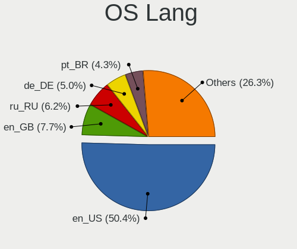

| Lang    | Notebooks | Percent |
|---------|-----------|---------|
| en_US   | 872       | 50.11%  |
| en_GB   | 134       | 7.7%    |
| ru_RU   | 106       | 6.09%   |
| de_DE   | 89        | 5.11%   |
| pt_BR   | 76        | 4.37%   |
| it_IT   | 56        | 3.22%   |
| fr_FR   | 48        | 2.76%   |
| pl_PL   | 38        | 2.18%   |
| en_IN   | 35        | 2.01%   |
| en_CA   | 31        | 1.78%   |
| en_AU   | 26        | 1.49%   |
| es_ES   | 22        | 1.26%   |
| es_MX   | 18        | 1.03%   |
| tr_TR   | 17        | 0.98%   |
| es_CL   | 12        | 0.69%   |
| es_AR   | 10        | 0.57%   |
| de_CH   | 10        | 0.57%   |
| zh_CN   | 9         | 0.52%   |
| es_CO   | 9         | 0.52%   |
| de_AT   | 7         | 0.4%    |
| cs_CZ   | 7         | 0.4%    |
| hu_HU   | 6         | 0.34%   |
| en_ZA   | 6         | 0.34%   |
| en_DK   | 6         | 0.34%   |
| ru_UA   | 5         | 0.29%   |
| pt_PT   | 5         | 0.29%   |
| nb_NO   | 5         | 0.29%   |
| Unknown | 5         | 0.29%   |
| uk_UA   | 3         | 0.17%   |
| fr_CH   | 3         | 0.17%   |
| fr_CA   | 3         | 0.17%   |
| fi_FI   | 3         | 0.17%   |
| es_PE   | 3         | 0.17%   |
| en_PH   | 3         | 0.17%   |
| en_NZ   | 3         | 0.17%   |
| en_IL   | 3         | 0.17%   |
| en_IE   | 3         | 0.17%   |
| el_GR   | 3         | 0.17%   |
| da_DK   | 3         | 0.17%   |
| zh_HK   | 2         | 0.11%   |

Boot Mode
---------

EFI or BIOS

| Mode | Notebooks | Percent |
|------|-----------|---------|
| EFI  | 1127      | 63.71%  |
| BIOS | 642       | 36.29%  |

Filesystem
----------

Type of filesystem

| Type    | Notebooks | Percent |
|---------|-----------|---------|
| Btrfs   | 1493      | 85.8%   |
| Ext4    | 211       | 12.13%  |
| Xfs     | 22        | 1.26%   |
| Tmpfs   | 12        | 0.69%   |
| Overlay | 2         | 0.11%   |

Part. scheme
------------

Scheme of partitioning

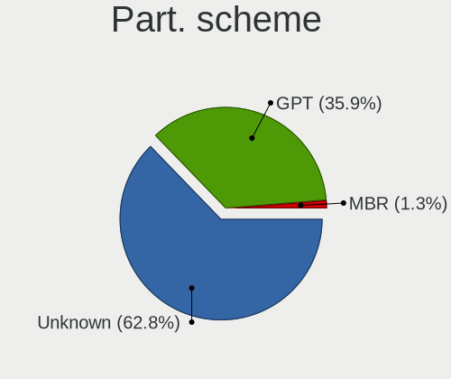

| Type    | Notebooks | Percent |
|---------|-----------|---------|
| Unknown | 1117      | 63.83%  |
| GPT     | 609       | 34.8%   |
| MBR     | 24        | 1.37%   |

Dual Boot with Linux/BSD
------------------------

Hosting more than one Linux/BSD

| Dual boot | Notebooks | Percent |
|-----------|-----------|---------|
| No        | 1636      | 94.02%  |
| Yes       | 104       | 5.98%   |

Dual Boot (Win)
---------------

Hosting Linux and Windows

| Dual boot | Notebooks | Percent |
|-----------|-----------|---------|
| No        | 1497      | 85.99%  |
| Yes       | 244       | 14.01%  |

Board
-----

Vendor
------

Motherboard manufacturer

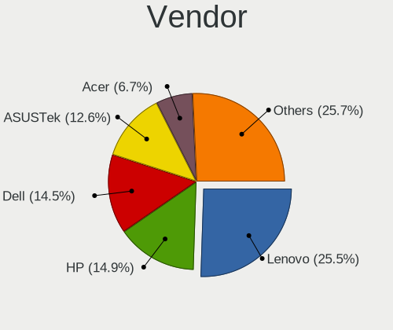

| Name                   | Notebooks | Percent |
|------------------------|-----------|---------|
| Lenovo                 | 451       | 25.98%  |
| Hewlett-Packard        | 251       | 14.46%  |
| Dell                   | 246       | 14.17%  |
| ASUSTek Computer       | 218       | 12.56%  |
| Acer                   | 120       | 6.91%   |
| Apple                  | 106       | 6.11%   |
| HUAWEI                 | 45        | 2.59%   |
| MSI                    | 40        | 2.3%    |
| Framework              | 23        | 1.32%   |
| Samsung Electronics    | 16        | 0.92%   |
| Toshiba                | 14        | 0.81%   |
| Google                 | 14        | 0.81%   |
| Timi                   | 13        | 0.75%   |
| Gigabyte Technology    | 12        | 0.69%   |
| Alienware              | 11        | 0.63%   |
| Unknown                | 11        | 0.63%   |
| Fujitsu                | 10        | 0.58%   |
| Sony                   | 7         | 0.4%    |
| Notebook               | 7         | 0.4%    |
| TUXEDO                 | 6         | 0.35%   |
| LG Electronics         | 6         | 0.35%   |
| HONOR                  | 6         | 0.35%   |
| Chuwi                  | 6         | 0.35%   |
| Positivo               | 5         | 0.29%   |
| SLIMBOOK               | 4         | 0.23%   |
| Razer                  | 4         | 0.23%   |
| Medion                 | 4         | 0.23%   |
| Avell High Performance | 4         | 0.23%   |
| XIAOMI                 | 3         | 0.17%   |
| Star Labs              | 3         | 0.17%   |
| Schenker               | 3         | 0.17%   |
| Packard Bell           | 3         | 0.17%   |
| Juana Manso            | 3         | 0.17%   |
| GPD                    | 3         | 0.17%   |
| Valve                  | 2         | 0.12%   |
| Semp Toshiba           | 2         | 0.12%   |
| PC Specialist          | 2         | 0.12%   |
| Panasonic              | 2         | 0.12%   |
| MACHENIKE              | 2         | 0.12%   |
| Linx                   | 2         | 0.12%   |

Model
-----

Motherboard model

| Name                                       | Notebooks | Percent |
|--------------------------------------------|-----------|---------|
| Unknown                                    | 17        | 0.98%   |
| Framework Laptop 13 (AMD Ryzen 7040Series) | 13        | 0.75%   |
| Apple MacBookPro14,1                       | 12        | 0.69%   |
| Apple MacBookAir7,2                        | 8         | 0.46%   |
| HP Notebook                                | 7         | 0.4%    |
| Apple MacBookPro9,2                        | 7         | 0.4%    |
| Apple MacBookPro8,1                        | 7         | 0.4%    |
| HUAWEI RLEF-XX                             | 6         | 0.35%   |
| HUAWEI BOM-WXX9                            | 6         | 0.35%   |
| Apple MacBookPro11,3                       | 6         | 0.35%   |
| Lenovo ThinkBook 16 G6 IRL 21KH            | 5         | 0.29%   |
| Lenovo Legion 5 Pro 16ACH6H 82JQ           | 5         | 0.29%   |
| Framework Laptop (12th Gen Intel Core)     | 5         | 0.29%   |
| Dell Precision M4800                       | 5         | 0.29%   |
| ASUS Zenbook UM3402YAR_UM3402YA            | 5         | 0.29%   |
| Apple MacBookPro12,1                       | 5         | 0.29%   |
| Apple MacBookPro11,1                       | 5         | 0.29%   |
| Apple MacBookPro10,1                       | 5         | 0.29%   |
| Acer Aspire A515-57                        | 5         | 0.29%   |
| Lenovo IdeaPad Gaming 3 15ACH6 82K2        | 4         | 0.23%   |
| HUAWEI HVY-WXX9                            | 4         | 0.23%   |
| HP Pavilion Notebook                       | 4         | 0.23%   |
| HP OMEN by Laptop 16-c0xxx                 | 4         | 0.23%   |
| HP EliteBook 840 G6                        | 4         | 0.23%   |
| HP EliteBook 840 G5                        | 4         | 0.23%   |
| HP EliteBook 840 G4                        | 4         | 0.23%   |
| Dell XPS 9320                              | 4         | 0.23%   |
| Dell XPS 15 9570                           | 4         | 0.23%   |
| Dell XPS 15 9560                           | 4         | 0.23%   |
| Dell XPS 15 9530                           | 4         | 0.23%   |
| Dell Inspiron 15-3567                      | 4         | 0.23%   |
| Apple MacBookPro8,2                        | 4         | 0.23%   |
| Apple MacBookPro11,5                       | 4         | 0.23%   |
| Apple MacBookPro11,2                       | 4         | 0.23%   |
| Apple MacBookAir6,2                        | 4         | 0.23%   |
| Acer Aspire A315-24P                       | 4         | 0.23%   |
| XIAOMI Redmi Book Pro 15 2023              | 3         | 0.17%   |
| Timi A35S                                  | 3         | 0.17%   |
| Star Labs StarBook                         | 3         | 0.17%   |
| Lenovo V15 G2 ITL 82KB                     | 3         | 0.17%   |

Model Family
------------

Motherboard model prefix

| Name               | Notebooks | Percent |
|--------------------|-----------|---------|
| Lenovo ThinkPad    | 236       | 13.59%  |
| Lenovo IdeaPad     | 89        | 5.13%   |
| Dell Latitude      | 82        | 4.72%   |
| Acer Aspire        | 71        | 4.09%   |
| ASUS VivoBook      | 66        | 3.8%    |
| Dell Inspiron      | 63        | 3.63%   |
| HP EliteBook       | 58        | 3.34%   |
| HP Laptop          | 52        | 3%      |
| Dell XPS           | 40        | 2.3%    |
| ASUS ROG           | 37        | 2.13%   |
| Lenovo Legion      | 35        | 2.02%   |
| ASUS ASUS          | 35        | 2.02%   |
| HP Pavilion        | 34        | 1.96%   |
| Dell Precision     | 33        | 1.9%    |
| HP ProBook         | 26        | 1.5%    |
| ASUS Zenbook       | 26        | 1.5%    |
| Framework Laptop   | 23        | 1.32%   |
| Acer Nitro         | 22        | 1.27%   |
| Apple MacBookPro11 | 20        | 1.15%   |
| Lenovo Yoga        | 19        | 1.09%   |
| Unknown            | 17        | 0.98%   |
| Lenovo ThinkBook   | 16        | 0.92%   |
| Apple MacBookPro14 | 14        | 0.81%   |
| HP ENVY            | 13        | 0.75%   |
| HP OMEN            | 12        | 0.69%   |
| Toshiba Satellite  | 11        | 0.63%   |
| Dell Vostro        | 11        | 0.63%   |
| Apple MacBookPro8  | 11        | 0.63%   |
| Acer Swift         | 11        | 0.63%   |
| HP ZBook           | 10        | 0.58%   |
| Fujitsu LIFEBOOK   | 9         | 0.52%   |
| Dell G15           | 9         | 0.52%   |
| Apple MacBookPro9  | 9         | 0.52%   |
| Apple MacBookAir7  | 9         | 0.52%   |
| MSI Modern         | 8         | 0.46%   |
| Lenovo V15         | 8         | 0.46%   |
| HP Notebook        | 7         | 0.4%    |
| HP 250             | 7         | 0.4%    |
| MSI Prestige       | 6         | 0.35%   |
| Lenovo LOQ         | 6         | 0.35%   |

MFG Year
--------

Motherboard manufacture year

| Year    | Notebooks | Percent |
|---------|-----------|---------|
| 2021    | 260       | 14.98%  |
| 2023    | 227       | 13.08%  |
| 2022    | 208       | 11.98%  |
| 2020    | 171       | 9.85%   |
| 2018    | 125       | 7.2%    |
| 2019    | 122       | 7.03%   |
| 2017    | 103       | 5.93%   |
| 2013    | 86        | 4.95%   |
| 2014    | 80        | 4.61%   |
| 2012    | 73        | 4.21%   |
| 2015    | 70        | 4.03%   |
| 2011    | 60        | 3.46%   |
| 2016    | 58        | 3.34%   |
| 2010    | 31        | 1.79%   |
| 2009    | 20        | 1.15%   |
| 2008    | 18        | 1.04%   |
| 2024    | 11        | 0.63%   |
| 2007    | 11        | 0.63%   |
| Unknown | 2         | 0.12%   |

Form Factor
-----------

Physical design of the computer

| Name     | Notebooks | Percent |
|----------|-----------|---------|
| Notebook | 1736      | 100%    |

Secure Boot
-----------

Enabled or disabled

| State    | Notebooks | Percent |
|----------|-----------|---------|
| Disabled | 1420      | 81.1%   |
| Enabled  | 331       | 18.9%   |

Coreboot
--------

Have coreboot on board

| Used | Notebooks | Percent |
|------|-----------|---------|
| No   | 1719      | 99.02%  |
| Yes  | 17        | 0.98%   |

RAM Size
--------

Total RAM memory

| Size in GB  | Notebooks | Percent |
|-------------|-----------|---------|
| 4.01-8.0    | 476       | 27.36%  |
| 16.01-24.0  | 398       | 22.87%  |
| 8.01-16.0   | 374       | 21.49%  |
| 32.01-64.0  | 230       | 13.22%  |
| 3.01-4.0    | 131       | 7.53%   |
| 24.01-32.0  | 70        | 4.02%   |
| 64.01-256.0 | 40        | 2.3%    |
| 1.01-2.0    | 13        | 0.75%   |
| 2.01-3.0    | 8         | 0.46%   |

RAM Used
--------

Used RAM memory

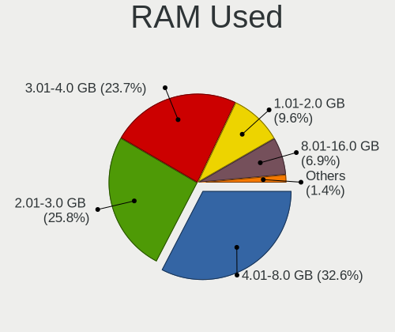

| Used GB    | Notebooks | Percent |
|------------|-----------|---------|
| 4.01-8.0   | 598       | 32.84%  |
| 2.01-3.0   | 467       | 25.65%  |
| 3.01-4.0   | 435       | 23.89%  |
| 1.01-2.0   | 181       | 9.94%   |
| 8.01-16.0  | 115       | 6.32%   |
| 16.01-24.0 | 13        | 0.71%   |
| 0.51-1.0   | 7         | 0.38%   |
| 24.01-32.0 | 3         | 0.16%   |
| 32.01-64.0 | 2         | 0.11%   |

Total Drives
------------

Number of drives on board

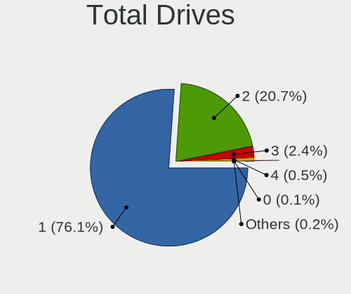

| Drives | Notebooks | Percent |
|--------|-----------|---------|
| 1      | 1328      | 76.06%  |
| 2      | 360       | 20.62%  |
| 3      | 42        | 2.41%   |
| 4      | 10        | 0.57%   |
| 5      | 2         | 0.11%   |
| 0      | 2         | 0.11%   |
| 7      | 1         | 0.06%   |
| 6      | 1         | 0.06%   |

Has CD-ROM
----------

Has CD-ROM on board

| Presented | Notebooks | Percent |
|-----------|-----------|---------|
| No        | 1474      | 84.81%  |
| Yes       | 264       | 15.19%  |

Has Ethernet
------------

Has Ethernet on board

| Presented | Notebooks | Percent |
|-----------|-----------|---------|
| Yes       | 1182      | 67.93%  |
| No        | 558       | 32.07%  |

Has WiFi
--------

Has WiFi module

| Presented | Notebooks | Percent |
|-----------|-----------|---------|
| Yes       | 1715      | 98.73%  |
| No        | 22        | 1.27%   |

Has Bluetooth
-------------

Has Bluetooth module

| Presented | Notebooks | Percent |
|-----------|-----------|---------|
| Yes       | 1520      | 87.21%  |
| No        | 223       | 12.79%  |

Location
--------

Country
-------

Geographic location (country)

| Country      | Notebooks | Percent |
|--------------|-----------|---------|
| USA          | 279       | 16%     |
| Germany      | 148       | 8.49%   |
| Russia       | 119       | 6.82%   |
| Brazil       | 107       | 6.14%   |
| Italy        | 95        | 5.45%   |
| India        | 72        | 4.13%   |
| UK           | 71        | 4.07%   |
| Poland       | 71        | 4.07%   |
| France       | 63        | 3.61%   |
| Canada       | 60        | 3.44%   |
| Spain        | 42        | 2.41%   |
| Netherlands  | 32        | 1.83%   |
| Turkey       | 30        | 1.72%   |
| Australia    | 30        | 1.72%   |
| Mexico       | 29        | 1.66%   |
| Switzerland  | 26        | 1.49%   |
| Romania      | 25        | 1.43%   |
| Czechia      | 20        | 1.15%   |
| Austria      | 20        | 1.15%   |
| Hungary      | 16        | 0.92%   |
| Chile        | 16        | 0.92%   |
| Portugal     | 15        | 0.86%   |
| Argentina    | 15        | 0.86%   |
| Sweden       | 14        | 0.8%    |
| Finland      | 14        | 0.8%    |
| Colombia     | 14        | 0.8%    |
| Bulgaria     | 14        | 0.8%    |
| Denmark      | 11        | 0.63%   |
| Belgium      | 11        | 0.63%   |
| Belarus      | 11        | 0.63%   |
| Philippines  | 10        | 0.57%   |
| Norway       | 10        | 0.57%   |
| Morocco      | 9         | 0.52%   |
| Greece       | 9         | 0.52%   |
| China        | 9         | 0.52%   |
| South Africa | 8         | 0.46%   |
| Indonesia    | 8         | 0.46%   |
| Croatia      | 8         | 0.46%   |
| Uzbekistan   | 7         | 0.4%    |
| Slovakia     | 7         | 0.4%    |

City
----

Geographic location (city)

| City          | Notebooks | Percent |
|---------------|-----------|---------|
| Moscow        | 28        | 1.58%   |
| St Petersburg | 23        | 1.29%   |
| Berlin        | 16        | 0.9%    |
| Paris         | 14        | 0.79%   |
| Vienna        | 13        | 0.73%   |
| Warsaw        | 12        | 0.68%   |
| Munich        | 12        | 0.68%   |
| Milan         | 11        | 0.62%   |
| Istanbul      | 11        | 0.62%   |
| Helsinki      | 11        | 0.62%   |
| Bengaluru     | 11        | 0.62%   |
| Montreal      | 10        | 0.56%   |
| Zurich        | 9         | 0.51%   |
| Toronto       | 9         | 0.51%   |
| Sydney        | 9         | 0.51%   |
| Santiago      | 9         | 0.51%   |
| Seattle       | 8         | 0.45%   |
| Sao Paulo     | 8         | 0.45%   |
| Minsk         | 8         | 0.45%   |
| Los Angeles   | 8         | 0.45%   |
| Chennai       | 8         | 0.45%   |
| Budapest      | 8         | 0.45%   |
| Bucharest     | 8         | 0.45%   |
| Amsterdam     | 8         | 0.45%   |
| Yekaterinburg | 7         | 0.39%   |
| Tashkent      | 7         | 0.39%   |
| Stuttgart     | 7         | 0.39%   |
| Perm          | 7         | 0.39%   |
| Madrid        | 7         | 0.39%   |
| London        | 7         | 0.39%   |
| Delhi         | 7         | 0.39%   |
| Sofia         | 6         | 0.34%   |
| Prague        | 6         | 0.34%   |
| Poznan        | 6         | 0.34%   |
| Nuremberg     | 6         | 0.34%   |
| Hamburg       | 6         | 0.34%   |
| Barcelona     | 6         | 0.34%   |
| Wroclaw       | 5         | 0.28%   |
| Sanford       | 5         | 0.28%   |
| Mexico City   | 5         | 0.28%   |

Drives
------

Drive Vendor
------------

Hard drive vendors

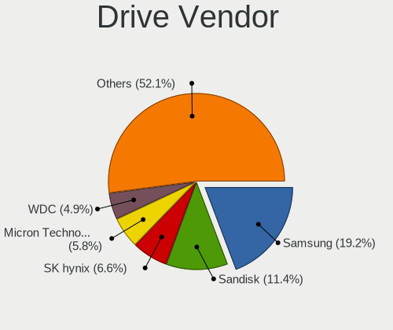

| Vendor                       | Notebooks | Drives | Percent |
|------------------------------|-----------|--------|---------|
| Samsung Electronics          | 402       | 478    | 19.12%  |
| Sandisk                      | 231       | 250    | 10.98%  |
| SK hynix                     | 138       | 149    | 6.56%   |
| Micron Technology            | 124       | 129    | 5.9%    |
| WDC                          | 101       | 110    | 4.8%    |
| Seagate                      | 97        | 116    | 4.61%   |
| Unknown                      | 91        | 110    | 4.33%   |
| Intel                        | 89        | 111    | 4.23%   |
| Kingston                     | 88        | 96     | 4.18%   |
| Toshiba                      | 71        | 79     | 3.38%   |
| Apple                        | 66        | 92     | 3.14%   |
| KIOXIA                       | 51        | 57     | 2.43%   |
| Phison Electronics           | 45        | 51     | 2.14%   |
| Micron/Crucial Technology    | 43        | 50     | 2.04%   |
| Crucial                      | 42        | 46     | 2%      |
| Kingston Technology Company  | 29        | 31     | 1.38%   |
| A-DATA Technology            | 29        | 30     | 1.38%   |
| Silicon Motion               | 26        | 28     | 1.24%   |
| HGST                         | 26        | 28     | 1.24%   |
| MAXIO Technology (Hangzhou)  | 19        | 22     | 0.9%    |
| China                        | 17        | 17     | 0.81%   |
| ADATA Technology             | 17        | 18     | 0.81%   |
| Hitachi                      | 12        | 13     | 0.57%   |
| SPCC                         | 9         | 11     | 0.43%   |
| PNY                          | 9         | 11     | 0.43%   |
| Union Memory (Shenzhen)      | 8         | 8      | 0.38%   |
| Solid State Storage          | 8         | 8      | 0.38%   |
| Shenzhen Longsys Electronics | 8         | 9      | 0.38%   |
| LITEONIT                     | 8         | 8      | 0.38%   |
| LITEON                       | 8         | 8      | 0.38%   |
| Lexar                        | 8         | 9      | 0.38%   |
| Union Memory                 | 7         | 9      | 0.33%   |
| Transcend                    | 7         | 8      | 0.33%   |
| Realtek Semiconductor        | 7         | 7      | 0.33%   |
| Netac                        | 7         | 8      | 0.33%   |
| Lenovo                       | 7         | 8      | 0.33%   |
| GOODRAM                      | 7         | 8      | 0.33%   |
| Gigabyte Technology          | 7         | 7      | 0.33%   |
| Unknown                      | 7         | 7      | 0.33%   |
| Patriot                      | 6         | 6      | 0.29%   |

Drive Model
-----------

Hard drive models

| Model                                                 | Notebooks | Percent |
|-------------------------------------------------------|-----------|---------|
| Samsung NVMe SSD Controller SM981/PM981/PM983 1TB     | 94        | 4.36%   |
| Samsung NVMe SSD Controller PM9A1/PM9A3/980PRO 1TB    | 78        | 3.62%   |
| Sandisk WD Blue SN550 NVMe SSD 2TB                    | 35        | 1.62%   |
| Intel SSDPEKNU512GZ 512GB                             | 30        | 1.39%   |
| Micron/Crucial P2 NVMe PCIe SSD 4TB                   | 29        | 1.34%   |
| Sandisk WD Black SN750 / PC SN730 NVMe SSD 512GB      | 27        | 1.25%   |
| Kingston SA400S37240G 240GB SSD                       | 25        | 1.16%   |
| Unknown MMC Card  32GB                                | 22        | 1.02%   |
| Unknown MMC Card  128GB                               | 19        | 0.88%   |
| Seagate ST1000LM035-1RK172 1TB                        | 17        | 0.79%   |
| Samsung NVMe SSD Controller SM961/PM961/SM963 1TB     | 17        | 0.79%   |
| Intel SSD 660P Series 1024GB                          | 16        | 0.74%   |
| Unknown MMC Card  64GB                                | 15        | 0.7%    |
| Phison E12 NVMe Controller 2TB                        | 15        | 0.7%    |
| SK hynix BC501 NVMe Solid State Drive 512GB           | 14        | 0.65%   |
| MAXIO (Hangzhou) NVMe SSD Controller MAP1202 256GB    | 14        | 0.65%   |
| Apple S3X NVMe Controller 121GB                       | 14        | 0.65%   |
| Samsung SSD 860 EVO 500GB                             | 13        | 0.6%    |
| Phison PS5013 E13 NVMe Controller 512GB               | 13        | 0.6%    |
| Toshiba XG6 NVMe SSD Controller 1024GB                | 12        | 0.56%   |
| Sandisk WD Black SN850 512GB                          | 12        | 0.56%   |
| Silicon Motion SM2263EN/SM2263XT SSD Controller 256GB | 11        | 0.51%   |
| Micron 2450_MTFDKBA512TFK 512GB                       | 11        | 0.51%   |
| HGST HTS721010A9E630 1TB                              | 11        | 0.51%   |
| Sandisk WD_BLACK SN770 1TB                            | 10        | 0.46%   |
| Micron 2400_MTFDKBA512QFM 512GB                       | 10        | 0.46%   |
| Unknown NVMe SSD Drive 512GB                          | 9         | 0.42%   |
| SK hynix BC511 256GB                                  | 9         | 0.42%   |
| Samsung SSD 980 1TB                                   | 9         | 0.42%   |
| Samsung MZALQ512HBLU-00BL2 512GB                      | 9         | 0.42%   |
| Micron 2400_MTFDKBA1T0QFM 1TB                         | 9         | 0.42%   |
| Intel SSD Pro 7600p/760p/E 6100p Series 256GB         | 9         | 0.42%   |
| Toshiba MQ04ABF100 1TB                                | 8         | 0.37%   |
| SK hynix SKHynix_HFS001TEJ9X162N 1TB                  | 8         | 0.37%   |
| SK hynix HFM512GD3JX013N 512GB                        | 8         | 0.37%   |
| Silicon Motion PCIe-8 SSD 512GB                       | 8         | 0.37%   |
| Seagate ST500LT012-1DG142 500GB                       | 8         | 0.37%   |
| Seagate ST1000LM024 HN-M101MBB 1TB                    | 8         | 0.37%   |
| Sandisk WD Blue SN500 / PC SN520 NVMe SSD 512GB       | 8         | 0.37%   |
| Samsung MZVLQ512HBLU-00B00 512GB                      | 8         | 0.37%   |

HDD Vendor
----------

Hard disk drive vendors

| Vendor              | Notebooks | Drives | Percent |
|---------------------|-----------|--------|---------|
| Seagate             | 88        | 104    | 34.11%  |
| WDC                 | 76        | 79     | 29.46%  |
| Toshiba             | 34        | 38     | 13.18%  |
| HGST                | 26        | 28     | 10.08%  |
| Hitachi             | 12        | 13     | 4.65%   |
| Unknown             | 5         | 5      | 1.94%   |
| Samsung Electronics | 4         | 4      | 1.55%   |
| JMicron Technology  | 3         | 5      | 1.16%   |
| Apple               | 2         | 2      | 0.78%   |
| USB3.0              | 1         | 1      | 0.39%   |
| SABRENT             | 1         | 1      | 0.39%   |
| HGST HTS            | 1         | 1      | 0.39%   |
| Fujitsu             | 1         | 1      | 0.39%   |
| External            | 1         | 1      | 0.39%   |
| ASMT                | 1         | 2      | 0.39%   |
| ASMedia             | 1         | 1      | 0.39%   |
| Asm                 | 1         | 1      | 0.39%   |

SSD Vendor
----------

Solid state drive vendors

| Vendor              | Notebooks | Drives | Percent |
|---------------------|-----------|--------|---------|
| Samsung Electronics | 109       | 122    | 19.57%  |
| Kingston            | 59        | 63     | 10.59%  |
| SanDisk             | 46        | 52     | 8.26%   |
| Crucial             | 42        | 46     | 7.54%   |
| Apple               | 41        | 42     | 7.36%   |
| WDC                 | 26        | 30     | 4.67%   |
| A-DATA Technology   | 19        | 19     | 3.41%   |
| Micron Technology   | 18        | 18     | 3.23%   |
| SK hynix            | 17        | 17     | 3.05%   |
| China               | 17        | 17     | 3.05%   |
| Intel               | 13        | 18     | 2.33%   |
| Toshiba             | 9         | 9      | 1.62%   |
| SPCC                | 9         | 11     | 1.62%   |
| PNY                 | 9         | 11     | 1.62%   |
| LITEONIT            | 8         | 8      | 1.44%   |
| LITEON              | 8         | 8      | 1.44%   |
| Lexar               | 8         | 9      | 1.44%   |
| GOODRAM             | 7         | 8      | 1.26%   |
| Transcend           | 6         | 7      | 1.08%   |
| Gigabyte Technology | 6         | 6      | 1.08%   |
| Patriot             | 5         | 5      | 0.9%    |
| Netac               | 5         | 6      | 0.9%    |
| KingSpec            | 4         | 5      | 0.72%   |
| Intenso             | 4         | 5      | 0.72%   |
| Hewlett-Packard     | 4         | 4      | 0.72%   |
| Team                | 3         | 3      | 0.54%   |
| Plextor             | 3         | 7      | 0.54%   |
| Unknown             | 3         | 3      | 0.54%   |
| Seagate             | 2         | 2      | 0.36%   |
| OCZ                 | 2         | 5      | 0.36%   |
| Lenovo              | 2         | 2      | 0.36%   |
| KingFast            | 2         | 2      | 0.36%   |
| KingDian            | 2         | 2      | 0.36%   |
| HS-SSD-E100         | 2         | 2      | 0.36%   |
| BIWIN               | 2         | 2      | 0.36%   |
| Apacer              | 2         | 2      | 0.36%   |
| AMD                 | 2         | 2      | 0.36%   |
| XrayDisk            | 1         | 1      | 0.18%   |
| Win Memory          | 1         | 1      | 0.18%   |
| Wdxsky              | 1         | 1      | 0.18%   |

Drive Kind
----------

HDD or SSD

| Kind    | Notebooks | Drives | Percent |
|---------|-----------|--------|---------|
| NVMe    | 1108      | 1367   | 55.76%  |
| SSD     | 528       | 617    | 26.57%  |
| HDD     | 248       | 287    | 12.48%  |
| MMC     | 70        | 87     | 3.52%   |
| Unknown | 33        | 38     | 1.66%   |

Drive Connector
---------------

SATA, SAS, NVMe, etc.

| Type | Notebooks | Drives | Percent |
|------|-----------|--------|---------|
| NVMe | 1107      | 1362   | 57.12%  |
| SATA | 683       | 855    | 35.24%  |
| SAS  | 78        | 92     | 4.02%   |
| MMC  | 70        | 87     | 3.61%   |

Drive Size
----------

Size of hard drive

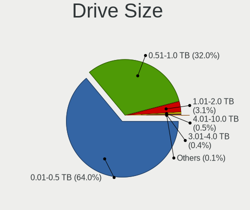

| Size in TB | Notebooks | Drives | Percent |
|------------|-----------|--------|---------|
| 0.01-0.5   | 492       | 585    | 64.23%  |
| 0.51-1.0   | 239       | 274    | 31.2%   |
| 1.01-2.0   | 25        | 27     | 3.26%   |
| 3.01-4.0   | 7         | 8      | 0.91%   |
| 4.01-10.0  | 2         | 9      | 0.26%   |
| 10.01-20.0 | 1         | 1      | 0.13%   |

Space Total
-----------

Amount of disk space available on the file system

| Size in GB     | Notebooks | Percent |
|----------------|-----------|---------|
| 501-1000       | 432       | 24.5%   |
| 251-500        | 367       | 20.82%  |
| 1001-2000      | 254       | 14.41%  |
| 101-250        | 234       | 13.27%  |
| Unknown        | 163       | 9.25%   |
| 1-20           | 150       | 8.51%   |
| 51-100         | 52        | 2.95%   |
| More than 3000 | 50        | 2.84%   |
| 2001-3000      | 40        | 2.27%   |
| 21-50          | 21        | 1.19%   |

Space Used
----------

Amount of used disk space

| Used GB        | Notebooks | Percent |
|----------------|-----------|---------|
| 1-20           | 606       | 33.82%  |
| 21-50          | 342       | 19.08%  |
| 101-250        | 224       | 12.5%   |
| 51-100         | 181       | 10.1%   |
| Unknown        | 163       | 9.1%    |
| 251-500        | 143       | 7.98%   |
| 501-1000       | 83        | 4.63%   |
| 1001-2000      | 37        | 2.06%   |
| 2001-3000      | 7         | 0.39%   |
| More than 3000 | 6         | 0.33%   |

Malfunc. Drives
---------------

Drive models with a malfunction

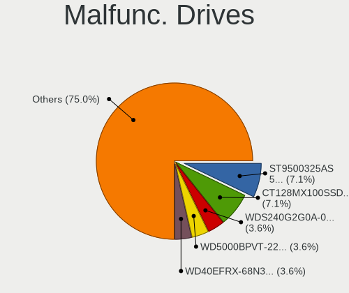

| Model                                          | Notebooks | Drives | Percent |
|------------------------------------------------|-----------|--------|---------|
| HGST HTS721010A9E630 1TB                       | 2         | 2      | 7.69%   |
| Crucial CT128MX100SSD1 128GB                   | 2         | 2      | 7.69%   |
| WDC WDS240G2G0A-00JH30 240GB SSD               | 1         | 1      | 3.85%   |
| WDC WD5000BPVT-22HXZT1 500GB                   | 1         | 1      | 3.85%   |
| WDC WD40EFRX-68N32N0 4TB                       | 1         | 1      | 3.85%   |
| WDC WD Green 2.5 480GB SSD                     | 1         | 1      | 3.85%   |
| WDC WD Blue SA510 2.5 500GB SSD                | 1         | 1      | 3.85%   |
| Toshiba THNSNK256GVN8 M.2 2280 256GB SSD       | 1         | 1      | 3.85%   |
| Toshiba MQ01ABF050 500GB                       | 1         | 1      | 3.85%   |
| Toshiba MK5056GSYF 500GB                       | 1         | 1      | 3.85%   |
| SK hynix BC711 HFM512GD3JX013N 512GB           | 1         | 1      | 3.85%   |
| Seagate ST9500420AS 500GB                      | 1         | 1      | 3.85%   |
| Seagate ST9500325AS 500GB                      | 1         | 1      | 3.85%   |
| Seagate ST500LT012-1DG142 500GB                | 1         | 1      | 3.85%   |
| Seagate ST2000LM003 HN-M201RAD 2TB             | 1         | 1      | 3.85%   |
| Seagate ST1000LX015-1U7172 1TB                 | 1         | 1      | 3.85%   |
| Seagate ST1000LM048-2E7172 1TB                 | 1         | 1      | 3.85%   |
| Samsung Electronics SSD 870 QVO 1TB            | 1         | 1      | 3.85%   |
| Samsung Electronics SSD 840 EVO 250GB          | 1         | 1      | 3.85%   |
| Micron Technology 1100_MTFDDAV512TBN 512GB SSD | 1         | 1      | 3.85%   |
| Intel SSD 600P Series 256GB                    | 1         | 1      | 3.85%   |
| Hitachi HTS543232A7A384 320GB                  | 1         | 1      | 3.85%   |
| Crucial CT1000MX500SSD1 1TB                    | 1         | 1      | 3.85%   |
| China G521N256GB SSD                           | 1         | 1      | 3.85%   |

Malfunc. Drive Vendor
---------------------

Vendors of faulty drives

| Vendor              | Notebooks | Drives | Percent |
|---------------------|-----------|--------|---------|
| Seagate             | 6         | 6      | 23.08%  |
| WDC                 | 5         | 5      | 19.23%  |
| Toshiba             | 3         | 3      | 11.54%  |
| Crucial             | 3         | 3      | 11.54%  |
| Samsung Electronics | 2         | 2      | 7.69%   |
| HGST                | 2         | 2      | 7.69%   |
| SK hynix            | 1         | 1      | 3.85%   |
| Micron Technology   | 1         | 1      | 3.85%   |
| Intel               | 1         | 1      | 3.85%   |
| Hitachi             | 1         | 1      | 3.85%   |
| China               | 1         | 1      | 3.85%   |

Malfunc. HDD Vendor
-------------------

Vendors of faulty HDD drives

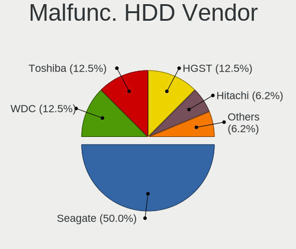

| Vendor  | Notebooks | Drives | Percent |
|---------|-----------|--------|---------|
| Seagate | 6         | 6      | 46.15%  |
| WDC     | 2         | 2      | 15.38%  |
| Toshiba | 2         | 2      | 15.38%  |
| HGST    | 2         | 2      | 15.38%  |
| Hitachi | 1         | 1      | 7.69%   |

Malfunc. Drive Kind
-------------------

Kinds of faulty drives

| Kind | Notebooks | Drives | Percent |
|------|-----------|--------|---------|
| HDD  | 13        | 13     | 50%     |
| SSD  | 11        | 11     | 42.31%  |
| NVMe | 2         | 2      | 7.69%   |

Failed Drives
-------------

Failed drive models

| Model                           | Notebooks | Drives | Percent |
|---------------------------------|-----------|--------|---------|
| Sandisk PC SN520 NVMe SSD 512GB | 1         | 1      | 100%    |

Failed Drive Vendor
-------------------

Failed drive vendors

| Vendor  | Notebooks | Drives | Percent |
|---------|-----------|--------|---------|
| Sandisk | 1         | 1      | 100%    |

Drive Status
------------

Number of failed and malfunc. drives

| Status   | Notebooks | Drives | Percent |
|----------|-----------|--------|---------|
| Detected | 1204      | 1678   | 67.79%  |
| Works    | 545       | 691    | 30.69%  |
| Malfunc  | 26        | 26     | 1.46%   |
| Failed   | 1         | 1      | 0.06%   |

Storage controller
------------------

Storage Vendor
--------------

Storage controller vendors

| Vendor                                  | Notebooks | Percent |
|-----------------------------------------|-----------|---------|
| Intel                                   | 918       | 41.41%  |
| Samsung Electronics                     | 323       | 14.57%  |
| SanDisk                                 | 185       | 8.34%   |
| AMD                                     | 140       | 6.31%   |
| SK hynix                                | 122       | 5.5%    |
| Micron Technology                       | 106       | 4.78%   |
| Kingston Technology Company             | 58        | 2.62%   |
| KIOXIA                                  | 51        | 2.3%    |
| Phison Electronics                      | 47        | 2.12%   |
| Micron/Crucial Technology               | 43        | 1.94%   |
| Toshiba America Info Systems            | 29        | 1.31%   |
| ADATA Technology                        | 27        | 1.22%   |
| Silicon Motion                          | 26        | 1.17%   |
| Apple                                   | 21        | 0.95%   |
| MAXIO Technology (Hangzhou)             | 20        | 0.9%    |
| Solid State Storage Technology          | 13        | 0.59%   |
| Solidigm                                | 10        | 0.45%   |
| Union Memory (Shenzhen)                 | 9         | 0.41%   |
| Nvidia                                  | 9         | 0.41%   |
| Shenzhen Longsys Electronics            | 8         | 0.36%   |
| Realtek Semiconductor                   | 7         | 0.32%   |
| Shenzhen Unionmemory Information System | 6         | 0.27%   |
| Seagate Technology                      | 6         | 0.27%   |
| INNOGRIT                                | 6         | 0.27%   |
| Marvell Technology Group                | 5         | 0.23%   |
| Lenovo                                  | 5         | 0.23%   |
| Yangtze Memory Technologies             | 4         | 0.18%   |
| ASMedia Technology                      | 3         | 0.14%   |
| Transcend                               | 2         | 0.09%   |
| Hosin Global Electronics                | 2         | 0.09%   |
| Netac Technology                        | 1         | 0.05%   |
| Lite-On Technology                      | 1         | 0.05%   |
| JMicron Technology                      | 1         | 0.05%   |
| Biwin Storage Technology                | 1         | 0.05%   |
| Beijing Starblaze Technology            | 1         | 0.05%   |
| Unknown                                 | 1         | 0.05%   |

Storage Model
-------------

Storage controller models

| Model                                                                          | Notebooks | Percent |
|--------------------------------------------------------------------------------|-----------|---------|
| AMD FCH SATA Controller [AHCI mode]                                            | 129       | 5.54%   |
| Intel Volume Management Device NVMe RAID Controller                            | 126       | 5.41%   |
| Intel Sunrise Point-LP SATA Controller [AHCI mode]                             | 112       | 4.81%   |
| Samsung NVMe SSD Controller SM981/PM981/PM983                                  | 96        | 4.12%   |
| Intel 82801 Mobile SATA Controller [RAID mode]                                 | 87        | 3.74%   |
| Samsung NVMe SSD Controller PM9A1/PM9A3/980PRO                                 | 78        | 3.35%   |
| Samsung NVMe SSD Controller 980 (DRAM-less)                                    | 74        | 3.18%   |
| Intel 7 Series Chipset Family 6-port SATA Controller [AHCI mode]               | 66        | 2.83%   |
| Intel 6 Series/C200 Series Chipset Family 6 port Mobile SATA AHCI Controller   | 56        | 2.4%    |
| Intel SSD 670p Series [Keystone Harbor]                                        | 44        | 1.89%   |
| Intel 8 Series SATA Controller 1 [AHCI mode]                                   | 43        | 1.85%   |
| SK hynix Gold P31/BC711/PC711 NVMe Solid State Drive                           | 41        | 1.76%   |
| Intel Wildcat Point-LP SATA Controller [AHCI Mode]                             | 41        | 1.76%   |
| SanDisk WD Black SN770 / PC SN740 256GB / PC SN560 (DRAM-less) NVMe SSD        | 40        | 1.72%   |
| Intel Tiger Lake-LP SATA Controller                                            | 39        | 1.67%   |
| SanDisk Ultra 3D / WD Blue SN550 NVMe SSD                                      | 35        | 1.5%    |
| Intel 8 Series/C220 Series Chipset Family 6-port SATA Controller 1 [AHCI mode] | 34        | 1.46%   |
| Intel Alder Lake-P SATA AHCI Controller                                        | 33        | 1.42%   |
| Intel Volume Management Device NVMe RAID Controller Intel Corporation          | 31        | 1.33%   |
| Intel Cannon Lake Mobile PCH SATA AHCI Controller                              | 30        | 1.29%   |
| Micron/Crucial P2 [Nick P2] / P3 / P3 Plus NVMe PCIe SSD (DRAM-less)           | 29        | 1.25%   |
| SK hynix Platinum P41/PC801 NVMe Solid State Drive                             | 28        | 1.2%    |
| SanDisk Extreme Pro / WD Black SN750 / PC SN730 / Red SN700 NVMe SSD           | 27        | 1.16%   |
| Micron 2400 NVMe SSD (DRAM-less)                                               | 26        | 1.12%   |
| Samsung NVMe SSD Controller PM9B1 (DRAM-less)                                  | 24        | 1.03%   |
| KIOXIA NVMe SSD Controller BG4 (DRAM-less)                                     | 22        | 0.94%   |
| Intel HM170/QM170 Chipset SATA Controller [AHCI Mode]                          | 22        | 0.94%   |
| Micron 2450 NVMe SSD [HendrixV] (DRAM-less)                                    | 21        | 0.9%    |
| Intel Comet Lake SATA AHCI Controller                                          | 20        | 0.86%   |
| Intel Celeron/Pentium Silver Processor SATA Controller                         | 20        | 0.86%   |
| Intel 5 Series/3400 Series Chipset 6 port SATA AHCI Controller                 | 20        | 0.86%   |
| Micron 3400 NVMe SSD [Hendrix]                                                 | 19        | 0.82%   |
| KIOXIA NVMe SSD Controller BG5 (DRAM-less)                                     | 18        | 0.77%   |
| Samsung NVMe SSD Controller SM961/PM961/SM963                                  | 17        | 0.73%   |
| Intel SSD 660P Series                                                          | 16        | 0.69%   |
| Intel 5 Series/3400 Series Chipset 4 port SATA AHCI Controller                 | 16        | 0.69%   |
| Phison E12 NVMe Controller                                                     | 15        | 0.64%   |
| MAXIO (Hangzhou) NVMe SSD Controller MAP1202 (DRAM-less)                       | 15        | 0.64%   |
| Intel 400 Series Chipset Family SATA AHCI Controller                           | 15        | 0.64%   |
| SK hynix BC901 NVMe Solid State Drive (DRAM-less)                              | 14        | 0.6%    |

Storage Kind
------------

Kind of storage controller (IDE, SATA, NVMe, SAS, ...)

| Kind | Notebooks | Percent |
|------|-----------|---------|
| NVMe | 1103      | 49.84%  |
| SATA | 841       | 38%     |
| RAID | 247       | 11.16%  |
| IDE  | 22        | 0.99%   |

Processor
---------

CPU Vendor
----------

Processor vendors

| Vendor  | Notebooks | Percent |
|---------|-----------|---------|
| Intel   | 1314      | 75.69%  |
| AMD     | 420       | 24.19%  |
| Unknown | 2         | 0.12%   |

CPU Model
---------

Processor models

| Model                                         | Notebooks | Percent |
|-----------------------------------------------|-----------|---------|
| Intel 11th Gen Core i5-1135G7 @ 2.40GHz       | 43        | 2.48%   |
| Intel Core i5-8250U CPU @ 1.60GHz             | 27        | 1.55%   |
| Intel 12th Gen Core i7-12700H                 | 25        | 1.44%   |
| Intel 11th Gen Core i7-1165G7 @ 2.80GHz       | 25        | 1.44%   |
| AMD Ryzen 7 5800H with Radeon Graphics        | 22        | 1.27%   |
| AMD Ryzen 7 5700U with Radeon Graphics        | 22        | 1.27%   |
| AMD Ryzen 5 5500U with Radeon Graphics        | 22        | 1.27%   |
| Intel Core i5-7200U CPU @ 2.50GHz             | 20        | 1.15%   |
| Intel 12th Gen Core i5-12450H                 | 18        | 1.04%   |
| Intel 12th Gen Core i5-1235U                  | 17        | 0.98%   |
| Intel Core i7-8750H CPU @ 2.20GHz             | 16        | 0.92%   |
| Intel Core i5-8265U CPU @ 1.60GHz             | 16        | 0.92%   |
| Intel Core i5-1035G1 CPU @ 1.00GHz            | 16        | 0.92%   |
| AMD Ryzen 5 4600H with Radeon Graphics        | 16        | 0.92%   |
| Intel Core i7-8550U CPU @ 1.80GHz             | 15        | 0.86%   |
| Intel Core i5-10210U CPU @ 1.60GHz            | 15        | 0.86%   |
| Intel 13th Gen Core i7-13700H                 | 15        | 0.86%   |
| Intel Core i7-7700HQ CPU @ 2.80GHz            | 14        | 0.81%   |
| Intel Core i7-7500U CPU @ 2.70GHz             | 14        | 0.81%   |
| Intel Core i5-8350U CPU @ 1.70GHz             | 14        | 0.81%   |
| AMD Ryzen 7 PRO 7840U w/ Radeon 780M Graphics | 14        | 0.81%   |
| AMD Ryzen 7 4800H with Radeon Graphics        | 14        | 0.81%   |
| AMD Ryzen 5 5600H with Radeon Graphics        | 14        | 0.81%   |
| Intel Core i7-9750H CPU @ 2.60GHz             | 13        | 0.75%   |
| Intel Core i7-8650U CPU @ 1.90GHz             | 13        | 0.75%   |
| Intel Core i7-10750H CPU @ 2.60GHz            | 13        | 0.75%   |
| Intel Core i5-6200U CPU @ 2.30GHz             | 13        | 0.75%   |
| Intel Celeron N4020 CPU @ 1.10GHz             | 13        | 0.75%   |
| Intel 12th Gen Core i7-1260P                  | 13        | 0.75%   |
| Intel 11th Gen Core i3-1115G4 @ 3.00GHz       | 13        | 0.75%   |
| AMD Ryzen 7 7840U w/ Radeon 780M Graphics     | 12        | 0.69%   |
| AMD Ryzen 7 7840HS w/ Radeon 780M Graphics    | 12        | 0.69%   |
| Intel Core i7-8665U CPU @ 1.90GHz             | 11        | 0.63%   |
| Intel Core i7-10510U CPU @ 1.80GHz            | 11        | 0.63%   |
| Intel Core i5-7360U CPU @ 2.30GHz             | 11        | 0.63%   |
| Intel Core i5-5200U CPU @ 2.20GHz             | 11        | 0.63%   |
| Intel Core i5-4210U CPU @ 1.70GHz             | 11        | 0.63%   |
| Intel Core i5-10300H CPU @ 2.50GHz            | 11        | 0.63%   |
| Intel 13th Gen Core i7-1355U                  | 11        | 0.63%   |
| Intel 12th Gen Core i5-1240P                  | 11        | 0.63%   |

CPU Model Family
----------------

Processor model prefix

| Model                   | Notebooks | Percent |
|-------------------------|-----------|---------|
| Other                   | 405       | 23.33%  |
| Intel Core i5           | 355       | 20.45%  |
| Intel Core i7           | 328       | 18.89%  |
| AMD Ryzen 7             | 154       | 8.87%   |
| AMD Ryzen 5             | 114       | 6.57%   |
| Intel Core i3           | 89        | 5.13%   |
| Intel Celeron           | 54        | 3.11%   |
| AMD Ryzen 7 PRO         | 38        | 2.19%   |
| AMD Ryzen 9             | 35        | 2.02%   |
| Intel Core 2 Duo        | 28        | 1.61%   |
| AMD Ryzen 3             | 24        | 1.38%   |
| Intel Pentium           | 18        | 1.04%   |
| AMD Ryzen 5 PRO         | 15        | 0.86%   |
| Intel Atom              | 12        | 0.69%   |
| AMD A6                  | 10        | 0.58%   |
| Intel Xeon              | 6         | 0.35%   |
| Intel Core m3           | 5         | 0.29%   |
| Intel Core i9           | 5         | 0.29%   |
| AMD A8                  | 5         | 0.29%   |
| Intel Pentium Silver    | 4         | 0.23%   |
| Intel Core              | 4         | 0.23%   |
| Intel Pentium Dual-Core | 3         | 0.17%   |
| Intel Core m5           | 3         | 0.17%   |
| AMD E                   | 3         | 0.17%   |
| AMD A4                  | 3         | 0.17%   |
| Intel Pentium Dual      | 2         | 0.12%   |
| Intel Core M            | 2         | 0.12%   |
| AMD Athlon II           | 2         | 0.12%   |
| AMD Athlon              | 2         | 0.12%   |
| AMD A10                 | 2         | 0.12%   |
| Intel Core m7           | 1         | 0.06%   |
| AMD Turion 64 X2 Mobile | 1         | 0.06%   |
| AMD Ryzen 3 PRO         | 1         | 0.06%   |
| AMD E2                  | 1         | 0.06%   |
| AMD E1                  | 1         | 0.06%   |
| AMD Athlon II Neo       | 1         | 0.06%   |

CPU Cores
---------

Number of processor cores

| Number | Notebooks | Percent |
|--------|-----------|---------|
| 4      | 543       | 31.28%  |
| 2      | 527       | 30.36%  |
| 8      | 266       | 15.32%  |
| 6      | 180       | 10.37%  |
| 14     | 73        | 4.21%   |
| 10     | 69        | 3.97%   |
| 12     | 56        | 3.23%   |
| 24     | 15        | 0.86%   |
| 16     | 5         | 0.29%   |
| 20     | 1         | 0.06%   |
| 1      | 1         | 0.06%   |

CPU Sockets
-----------

Number of sockets

| Number | Notebooks | Percent |
|--------|-----------|---------|
| 1      | 1736      | 100%    |

CPU Threads
-----------

Threads per core (Hyper-Threading)

| Number | Notebooks | Percent |
|--------|-----------|---------|
| 2      | 1545      | 89%     |
| 1      | 191       | 11%     |

CPU Op-Modes
------------

CPU Operation Modes (32-bit, 64-bit)

| Op mode        | Notebooks | Percent |
|----------------|-----------|---------|
| 32-bit, 64-bit | 1734      | 99.88%  |
| 64-bit         | 2         | 0.12%   |

CPU Microcode
-------------

Microcode number

| Number     | Notebooks | Percent |
|------------|-----------|---------|
| Unknown    | 1509      | 86.18%  |
| 0x0a704103 | 29        | 1.66%   |
| 0x0a50000d | 27        | 1.54%   |
| 0x0a404102 | 27        | 1.54%   |
| 0x08608103 | 22        | 1.26%   |
| 0x0a50000c | 21        | 1.2%    |
| 0x08600106 | 19        | 1.09%   |
| 0x08108109 | 13        | 0.74%   |
| 0x08608102 | 6         | 0.34%   |
| 0x08600109 | 6         | 0.34%   |
| 0x08600103 | 6         | 0.34%   |
| 0x08608104 | 5         | 0.29%   |
| 0x0a704104 | 4         | 0.23%   |
| 0x0a704101 | 4         | 0.23%   |
| 0x0a404101 | 4         | 0.23%   |
| 0x08a00008 | 4         | 0.23%   |
| 0x06006705 | 4         | 0.23%   |
| 0x0a50000f | 3         | 0.17%   |
| 0x08a00006 | 3         | 0.17%   |
| 0x08600104 | 3         | 0.17%   |
| 0x08108102 | 3         | 0.17%   |
| 0x0810100b | 3         | 0.17%   |
| 0x07030105 | 3         | 0.17%   |
| 0x0700010f | 3         | 0.17%   |
| 0x06006704 | 3         | 0.17%   |
| 0x010000c8 | 3         | 0.17%   |
| 0x0a601203 | 2         | 0.11%   |
| 0x0a20120a | 2         | 0.11%   |
| 0x08200103 | 2         | 0.11%   |
| 0x08101016 | 2         | 0.11%   |
| 0x206a7    | 1         | 0.06%   |
| 0x0a50000b | 1         | 0.06%   |
| 0x08900201 | 1         | 0.06%   |
| 0x06006110 | 1         | 0.06%   |
| 0x05000119 | 1         | 0.06%   |
| 0x03000027 | 1         | 0.06%   |

CPU Microarch
-------------

Microarchitecture

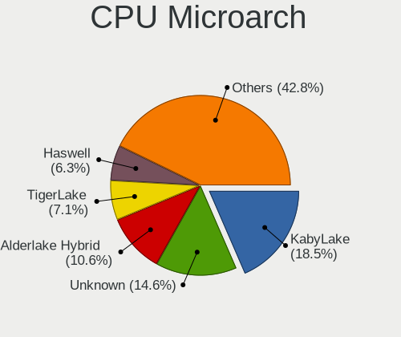

| Name              | Notebooks | Percent |
|-------------------|-----------|---------|
| KabyLake          | 318       | 18.23%  |
| Unknown           | 260       | 14.91%  |
| Alderlake Hybrid  | 189       | 10.84%  |
| TigerLake         | 124       | 7.11%   |
| Haswell           | 111       | 6.36%   |
| Zen 3             | 100       | 5.73%   |
| Skylake           | 76        | 4.36%   |
| IvyBridge         | 70        | 4.01%   |
| SandyBridge       | 65        | 3.73%   |
| Zen 2             | 59        | 3.38%   |
| Broadwell         | 58        | 3.33%   |
| IceLake           | 51        | 2.92%   |
| CometLake         | 43        | 2.47%   |
| Zen+              | 35        | 2.01%   |
| Westmere          | 34        | 1.95%   |
| Silvermont        | 30        | 1.72%   |
| Penryn            | 28        | 1.61%   |
| Goldmont plus     | 26        | 1.49%   |
| Zen               | 12        | 0.69%   |
| Excavator         | 10        | 0.57%   |
| Puma              | 7         | 0.4%    |
| Nehalem           | 5         | 0.29%   |
| Jaguar            | 5         | 0.29%   |
| Core              | 5         | 0.29%   |
| Gracemont         | 4         | 0.23%   |
| Goldmont          | 4         | 0.23%   |
| Bobcat            | 4         | 0.23%   |
| K10               | 3         | 0.17%   |
| Tremont           | 2         | 0.11%   |
| Piledriver        | 2         | 0.11%   |
| Meteorlake Hybrid | 2         | 0.11%   |
| K8 Hammer         | 1         | 0.06%   |
| K10 Llano         | 1         | 0.06%   |

Graphics
--------

GPU Vendor
----------

Vendors of graphics cards

| Vendor | Notebooks | Percent |
|--------|-----------|---------|
| Intel  | 1245      | 54.85%  |
| Nvidia | 546       | 24.05%  |
| AMD    | 479       | 21.1%   |

GPU Model
---------

Graphics card models

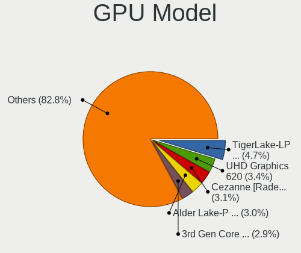

| Model                                                                     | Notebooks | Percent |
|---------------------------------------------------------------------------|-----------|---------|
| Intel TigerLake-LP GT2 [Iris Xe Graphics]                                 | 108       | 4.69%   |
| Intel UHD Graphics 620                                                    | 77        | 3.34%   |
| Intel Alder Lake-P GT2 [Iris Xe Graphics]                                 | 68        | 2.95%   |
| AMD Cezanne [Radeon Vega Series / Radeon Vega Mobile Series]              | 68        | 2.95%   |
| Intel 3rd Gen Core processor Graphics Controller                          | 67        | 2.91%   |
| Intel 2nd Generation Core Processor Family Integrated Graphics Controller | 61        | 2.65%   |
| AMD Phoenix1                                                              | 61        | 2.65%   |
| Intel Raptor Lake-P [Iris Xe Graphics]                                    | 56        | 2.43%   |
| AMD Renoir [Radeon RX Vega 6 (Ryzen 4000/5000 Mobile Series)]             | 56        | 2.43%   |
| Intel HD Graphics 620                                                     | 55        | 2.39%   |
| Intel Haswell-ULT Integrated Graphics Controller                          | 54        | 2.34%   |
| AMD Rembrandt [Radeon 680M]                                               | 53        | 2.3%    |
| AMD Lucienne                                                              | 47        | 2.04%   |
| Intel CoffeeLake-H GT2 [UHD Graphics 630]                                 | 46        | 2%      |
| Intel Skylake GT2 [HD Graphics 520]                                       | 45        | 1.95%   |
| Intel WhiskeyLake-U GT2 [UHD Graphics 620]                                | 43        | 1.87%   |
| Intel HD Graphics 5500                                                    | 40        | 1.74%   |
| Intel 4th Gen Core Processor Integrated Graphics Controller               | 39        | 1.69%   |
| AMD Picasso/Raven 2 [Radeon Vega Series / Radeon Vega Mobile Series]      | 38        | 1.65%   |
| Nvidia TU117M [GeForce GTX 1650 Mobile / Max-Q]                           | 37        | 1.61%   |
| Nvidia GA107M [GeForce RTX 3050 Mobile]                                   | 37        | 1.61%   |
| Intel CometLake-H GT2 [UHD Graphics]                                      | 37        | 1.61%   |
| Intel CometLake-U GT2 [UHD Graphics]                                      | 36        | 1.56%   |
| Nvidia GA106M [GeForce RTX 3060 Mobile / Max-Q]                           | 34        | 1.48%   |
| Intel TigerLake-H GT1 [UHD Graphics]                                      | 29        | 1.26%   |
| AMD Barcelo                                                               | 27        | 1.17%   |
| Intel Core Processor Integrated Graphics Controller                       | 26        | 1.13%   |
| Intel Alder Lake-UP3 GT2 [Iris Xe Graphics]                               | 25        | 1.09%   |
| Intel Iris Plus Graphics G1 (Ice Lake)                                    | 23        | 1%      |
| Intel GeminiLake [UHD Graphics 600]                                       | 23        | 1%      |
| Intel Alder Lake-P GT1 [UHD Graphics]                                     | 22        | 0.96%   |
| Intel HD Graphics 630                                                     | 21        | 0.91%   |
| Nvidia AD107M [GeForce RTX 4060 Max-Q / Mobile]                           | 20        | 0.87%   |
| Intel HD Graphics 530                                                     | 18        | 0.78%   |
| Intel Atom Processor Z36xxx/Z37xxx Series Graphics & Display              | 18        | 0.78%   |
| Intel Raptor Lake-S UHD Graphics                                          | 17        | 0.74%   |
| Nvidia AD106M [GeForce RTX 4070 Max-Q / Mobile]                           | 15        | 0.65%   |
| Intel Tiger Lake-LP GT2 [UHD Graphics G4]                                 | 15        | 0.65%   |
| Intel Raptor Lake-P [UHD Graphics]                                        | 15        | 0.65%   |
| Nvidia TU117M [GeForce GTX 1650 Ti Mobile]                                | 14        | 0.61%   |

GPU Combo
---------

Combinations of graphics cards

| Name           | Notebooks | Percent |
|----------------|-----------|---------|
| 1 x Intel      | 800       | 45.98%  |
| Intel + Nvidia | 386       | 22.18%  |
| 1 x AMD        | 311       | 17.87%  |
| AMD + Nvidia   | 95        | 5.46%   |
| 1 x Nvidia     | 63        | 3.62%   |
| Intel + AMD    | 52        | 2.99%   |
| 2 x AMD        | 23        | 1.32%   |
| Other          | 5         | 0.29%   |
| 2 x Intel      | 3         | 0.17%   |
| 2 x Nvidia     | 2         | 0.11%   |

GPU Driver
----------

Free vs proprietary

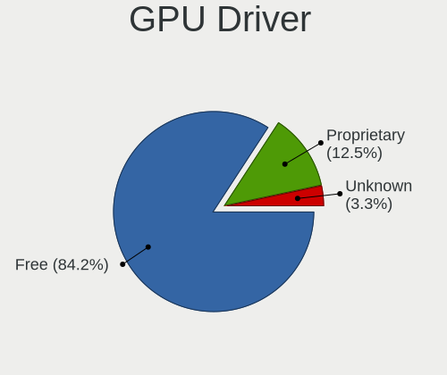

| Driver      | Notebooks | Percent |
|-------------|-----------|---------|
| Free        | 1482      | 84.98%  |
| Proprietary | 213       | 12.21%  |
| Unknown     | 49        | 2.81%   |

GPU Memory
----------

Total video memory

| Size in GB | Notebooks | Percent |
|------------|-----------|---------|
| Unknown    | 1239      | 70.28%  |
| 0.01-0.5   | 181       | 10.27%  |
| 1.01-2.0   | 118       | 6.69%   |
| 3.01-4.0   | 86        | 4.88%   |
| 0.51-1.0   | 67        | 3.8%    |
| 7.01-8.0   | 33        | 1.87%   |
| 5.01-6.0   | 22        | 1.25%   |
| 8.01-16.0  | 9         | 0.51%   |
| 2.01-3.0   | 7         | 0.4%    |
| 16.01-24.0 | 1         | 0.06%   |

Monitor
-------

Monitor Vendor
--------------

Monitor vendors

| Vendor                  | Notebooks | Percent |
|-------------------------|-----------|---------|
| BOE                     | 365       | 18.02%  |
| AU Optronics            | 335       | 16.54%  |
| Chimei Innolux          | 267       | 13.18%  |
| LG Display              | 212       | 10.46%  |
| Samsung Electronics     | 192       | 9.48%   |
| Apple                   | 101       | 4.99%   |
| Dell                    | 58        | 2.86%   |
| Sharp                   | 54        | 2.67%   |
| CSO                     | 51        | 2.52%   |
| Goldstar                | 48        | 2.37%   |
| Lenovo                  | 40        | 1.97%   |
| PANDA                   | 37        | 1.83%   |
| Hewlett-Packard         | 25        | 1.23%   |
| InfoVision              | 21        | 1.04%   |
| Philips                 | 20        | 0.99%   |
| AOC                     | 18        | 0.89%   |
| TMX                     | 17        | 0.84%   |
| Chi Mei Optoelectronics | 16        | 0.79%   |
| Acer                    | 16        | 0.79%   |
| ASUSTek Computer        | 12        | 0.59%   |
| Iiyama                  | 10        | 0.49%   |
| Sony                    | 9         | 0.44%   |
| ViewSonic               | 8         | 0.39%   |
| Gigabyte Technology     | 7         | 0.35%   |
| MSI                     | 6         | 0.3%    |
| BenQ                    | 6         | 0.3%    |
| HKC                     | 5         | 0.25%   |
| KDB                     | 4         | 0.2%    |
| CTO                     | 4         | 0.2%    |
| Ancor Communications    | 4         | 0.2%    |
| TMA                     | 3         | 0.15%   |
| STA                     | 3         | 0.15%   |
| Mi                      | 3         | 0.15%   |
| KDC                     | 3         | 0.15%   |
| Valve                   | 2         | 0.1%    |
| NEC Computers           | 2         | 0.1%    |
| LG Philips              | 2         | 0.1%    |
| JDI                     | 2         | 0.1%    |
| InnoLux Display         | 2         | 0.1%    |
| HUAWEI                  | 2         | 0.1%    |

Monitor Model
-------------

Monitor models

| Model                                                                 | Notebooks | Percent |
|-----------------------------------------------------------------------|-----------|---------|
| PANDA LCD Monitor NCP004D 1920x1080 344x194mm 15.5-inch               | 16        | 0.78%   |
| Chimei Innolux LCD Monitor CMN15F5 1920x1080 344x193mm 15.5-inch      | 13        | 0.63%   |
| Chimei Innolux LCD Monitor CMN14D4 1920x1080 309x173mm 13.9-inch      | 13        | 0.63%   |
| BOE LCD Monitor BOE0BCA 2256x1504 285x190mm 13.5-inch                 | 13        | 0.63%   |
| Chimei Innolux LCD Monitor CMN15E7 1920x1080 344x193mm 15.5-inch      | 12        | 0.59%   |
| AU Optronics LCD Monitor AUO21ED 1920x1080 344x193mm 15.5-inch        | 12        | 0.59%   |
| Apple Color LCD APPA034 2880x1800 286x179mm 13.3-inch                 | 12        | 0.59%   |
| Chimei Innolux LCD Monitor CMN1521 1920x1080 344x193mm 15.5-inch      | 11        | 0.54%   |
| BOE LCD Monitor BOE095F 2256x1504 285x190mm 13.5-inch                 | 10        | 0.49%   |
| BOE LCD Monitor BOE08D5 1920x1080 344x194mm 15.5-inch                 | 10        | 0.49%   |
| Samsung Electronics LCD Monitor SEC5441 1366x768 344x194mm 15.5-inch  | 9         | 0.44%   |
| Samsung Electronics LCD Monitor SDC4171 2880x1800 302x189mm 14.0-inch | 9         | 0.44%   |
| BOE LCD Monitor BOE0872 1920x1080 344x194mm 15.5-inch                 | 9         | 0.44%   |
| Chimei Innolux LCD Monitor CMN15E8 1920x1080 344x193mm 15.5-inch      | 8         | 0.39%   |
| Chimei Innolux LCD Monitor CMN14C9 1920x1080 309x173mm 13.9-inch      | 8         | 0.39%   |
| AU Optronics LCD Monitor AUO403D 1920x1080 309x174mm 14.0-inch        | 8         | 0.39%   |
| AU Optronics LCD Monitor AUOD1ED 1920x1080 344x193mm 15.5-inch        | 7         | 0.34%   |
| AU Optronics LCD Monitor AUO71EC 1366x768 344x193mm 15.5-inch         | 7         | 0.34%   |
| Apple Color LCD APP9CC7 1280x800 286x179mm 13.3-inch                  | 7         | 0.34%   |
| Sharp LCD Monitor SHP1453 1920x1080 346x194mm 15.6-inch               | 6         | 0.29%   |
| Samsung Electronics LCD Monitor SDC4193 2880x1800 302x189mm 14.0-inch | 6         | 0.29%   |
| Samsung Electronics LCD Monitor SDC4161 1920x1080 344x194mm 15.5-inch | 6         | 0.29%   |
| LG Display LCD Monitor LGD02DC 1366x768 344x194mm 15.5-inch           | 6         | 0.29%   |
| BOE LCD Monitor BOE0A74 1920x1200 345x215mm 16.0-inch                 | 6         | 0.29%   |
| BOE LCD Monitor BOE0877 1920x1080 309x173mm 13.9-inch                 | 6         | 0.29%   |
| BOE LCD Monitor BOE07CB 1920x1080 344x193mm 15.5-inch                 | 6         | 0.29%   |
| AU Optronics LCD Monitor AUO26EC 1366x768 344x193mm 15.5-inch         | 6         | 0.29%   |
| Apple Color LCD APP9CF0 1440x900 290x180mm 13.4-inch                  | 6         | 0.29%   |
| Samsung Electronics LCD Monitor SDC416E 2880x1620 344x194mm 15.5-inch | 5         | 0.24%   |
| LG Display LCD Monitor LGD065A 1920x1080 344x194mm 15.5-inch          | 5         | 0.24%   |
| LG Display LCD Monitor LGD05E5 1920x1080 344x194mm 15.5-inch          | 5         | 0.24%   |
| LG Display LCD Monitor LGD0521 1920x1080 309x174mm 14.0-inch          | 5         | 0.24%   |
| LG Display LCD Monitor LGD046F 1920x1080 340x190mm 15.3-inch          | 5         | 0.24%   |
| Chimei Innolux LCD Monitor CMN1735 1920x1080 382x215mm 17.3-inch      | 5         | 0.24%   |
| Chimei Innolux LCD Monitor CMN162B 1920x1200 344x215mm 16.0-inch      | 5         | 0.24%   |
| Chimei Innolux LCD Monitor CMN1618 1920x1200 344x215mm 16.0-inch      | 5         | 0.24%   |
| Chimei Innolux LCD Monitor CMN15DB 1366x768 344x193mm 15.5-inch       | 5         | 0.24%   |
| Chimei Innolux LCD Monitor CMN15C4 1920x1080 344x193mm 15.5-inch      | 5         | 0.24%   |
| Chimei Innolux LCD Monitor CMN1538 1920x1080 344x193mm 15.5-inch      | 5         | 0.24%   |
| Chimei Innolux LCD Monitor CMN14E5 1920x1080 309x173mm 13.9-inch      | 5         | 0.24%   |

Monitor Resolution
------------------

Monitor screen resolution

| Resolution         | Notebooks | Percent |
|--------------------|-----------|---------|
| 1920x1080 (FHD)    | 879       | 45.9%   |
| 1366x768 (WXGA)    | 303       | 15.82%  |
| 1920x1200 (WUXGA)  | 103       | 5.38%   |
| 2560x1440 (QHD)    | 94        | 4.91%   |
| 3840x2160 (4K)     | 93        | 4.86%   |
| 2880x1800          | 84        | 4.39%   |
| 2560x1600          | 77        | 4.02%   |
| 1600x900 (HD+)     | 49        | 2.56%   |
| 1440x900 (WXGA+)   | 31        | 1.62%   |
| 1280x800 (WXGA)    | 31        | 1.62%   |
| 2256x1504          | 23        | 1.2%    |
| 3440x1440          | 16        | 0.84%   |
| 3840x2400          | 15        | 0.78%   |
| 2560x1080          | 14        | 0.73%   |
| 3200x2000          | 12        | 0.63%   |
| 2160x1440          | 11        | 0.57%   |
| 3456x2160          | 9         | 0.47%   |
| 1680x1050 (WSXGA+) | 9         | 0.47%   |
| 2880x1620          | 8         | 0.42%   |
| 3072x1920          | 7         | 0.37%   |
| 3200x1800 (QHD+)   | 4         | 0.21%   |
| 2520x1680          | 4         | 0.21%   |
| 2240x1400          | 4         | 0.21%   |
| 3120x2080          | 3         | 0.16%   |
| 2304x1440          | 3         | 0.16%   |
| 1920x1280          | 3         | 0.16%   |
| 1280x1024 (SXGA)   | 3         | 0.16%   |
| 800x1280           | 2         | 0.1%    |
| 3840x1100          | 2         | 0.1%    |
| 3840x1080          | 2         | 0.1%    |
| 3000x2000          | 2         | 0.1%    |
| 2160x1350          | 2         | 0.1%    |
| 1400x1050          | 2         | 0.1%    |
| Unknown            | 2         | 0.1%    |
| 3840x1600          | 1         | 0.05%   |
| 2880x864           | 1         | 0.05%   |
| 2160x1200          | 1         | 0.05%   |
| 2048x1152          | 1         | 0.05%   |
| 1920x540           | 1         | 0.05%   |
| 1920x515           | 1         | 0.05%   |

Monitor Diagonal
----------------

Diagonal size in inches

| Inches  | Notebooks | Percent |
|---------|-----------|---------|
| 15      | 758       | 37.38%  |
| 13      | 313       | 15.43%  |
| 14      | 297       | 14.64%  |
| 16      | 124       | 6.11%   |
| 17      | 98        | 4.83%   |
| 27      | 91        | 4.49%   |
| 24      | 66        | 3.25%   |
| 23      | 46        | 2.27%   |
| 12      | 40        | 1.97%   |
| 21      | 32        | 1.58%   |
| 34      | 27        | 1.33%   |
| 31      | 23        | 1.13%   |
| 11      | 22        | 1.08%   |
| 26      | 9         | 0.44%   |
| 18      | 8         | 0.39%   |
| 84      | 7         | 0.35%   |
| 40      | 7         | 0.35%   |
| Unknown | 7         | 0.35%   |
| 22      | 6         | 0.3%    |
| 20      | 5         | 0.25%   |
| 19      | 5         | 0.25%   |
| 72      | 4         | 0.2%    |
| 54      | 4         | 0.2%    |
| 32      | 4         | 0.2%    |
| 38      | 2         | 0.1%    |
| 28      | 2         | 0.1%    |
| 7       | 2         | 0.1%    |
| 85      | 1         | 0.05%   |
| 64      | 1         | 0.05%   |
| 58      | 1         | 0.05%   |
| 57      | 1         | 0.05%   |
| 55      | 1         | 0.05%   |
| 52      | 1         | 0.05%   |
| 49      | 1         | 0.05%   |
| 48      | 1         | 0.05%   |
| 47      | 1         | 0.05%   |
| 46      | 1         | 0.05%   |
| 44      | 1         | 0.05%   |
| 42      | 1         | 0.05%   |
| 39      | 1         | 0.05%   |

Monitor Width
-------------

Physical width

| Width in mm | Notebooks | Percent |
|-------------|-----------|---------|
| 301-350     | 1274      | 63.6%   |
| 201-300     | 248       | 12.38%  |
| 501-600     | 185       | 9.24%   |
| 351-400     | 129       | 6.44%   |
| 401-500     | 53        | 2.65%   |
| 601-700     | 34        | 1.7%    |
| 701-800     | 32        | 1.6%    |
| 1001-1500   | 13        | 0.65%   |
| 1501-2000   | 12        | 0.6%    |
| 801-900     | 9         | 0.45%   |
| Unknown     | 7         | 0.35%   |
| 901-1000    | 3         | 0.15%   |
| 101-200     | 2         | 0.1%    |
| 1-100       | 2         | 0.1%    |

Aspect Ratio
------------

Proportional relationship between the width and the height

| Ratio   | Notebooks | Percent |
|---------|-----------|---------|
| 16/9    | 1305      | 72.91%  |
| 16/10   | 384       | 21.45%  |
| 3/2     | 50        | 2.79%   |
| 21/9    | 30        | 1.68%   |
| 4/3     | 5         | 0.28%   |
| 5/4     | 3         | 0.17%   |
| 32/9    | 3         | 0.17%   |
| Unknown | 3         | 0.17%   |
| 3.40    | 2         | 0.11%   |
| 0.67    | 2         | 0.11%   |
| 3.73    | 1         | 0.06%   |
| 3.33    | 1         | 0.06%   |
| 0.62    | 1         | 0.06%   |

Monitor Area
------------

Area in inch

| Area in inch | Notebooks | Percent |
|----------------|-----------|---------|
| 101-110        | 768       | 38%     |
| 81-90          | 494       | 24.44%  |
| 201-250        | 124       | 6.14%   |
| 111-120        | 111       | 5.49%   |
| 71-80          | 98        | 4.85%   |
| 301-350        | 98        | 4.85%   |
| 121-130        | 88        | 4.35%   |
| 351-500        | 57        | 2.82%   |
| 61-70          | 37        | 1.83%   |
| 51-60          | 24        | 1.19%   |
| 91-100         | 22        | 1.09%   |
| More than 1000 | 20        | 0.99%   |
| 251-300        | 19        | 0.94%   |
| 501-1000       | 17        | 0.84%   |
| 151-200        | 15        | 0.74%   |
| 131-140        | 9         | 0.45%   |
| 141-150        | 8         | 0.4%    |
| Unknown        | 7         | 0.35%   |
| 1-40           | 4         | 0.2%    |
| 41-50          | 1         | 0.05%   |

Pixel Density
-------------

Pixels per inch

| Density       | Notebooks | Percent |
|---------------|-----------|---------|
| 121-160       | 906       | 45.5%   |
| 101-120       | 380       | 19.09%  |
| 161-240       | 325       | 16.32%  |
| 51-100        | 229       | 11.5%   |
| More than 240 | 131       | 6.58%   |
| 1-50          | 13        | 0.65%   |
| Unknown       | 7         | 0.35%   |

Multiple Monitors
-----------------

Total monitors connected

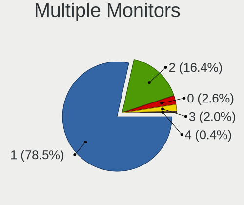

| Total | Notebooks | Percent |
|-------|-----------|---------|
| 1     | 1381      | 78.73%  |
| 2     | 285       | 16.25%  |
| 0     | 47        | 2.68%   |
| 3     | 33        | 1.88%   |
| 4     | 8         | 0.46%   |

Network
-------

Net Controller Vendor
---------------------

Controller vendors

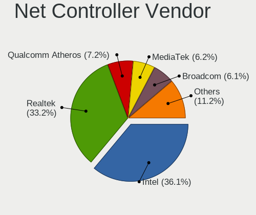

| Vendor                                 | Notebooks | Percent |
|----------------------------------------|-----------|---------|
| Intel                                  | 936       | 35.81%  |
| Realtek Semiconductor                  | 860       | 32.9%   |
| Qualcomm Atheros                       | 192       | 7.35%   |
| Broadcom                               | 165       | 6.31%   |
| MediaTek                               | 163       | 6.24%   |
| Broadcom Limited                       | 40        | 1.53%   |
| Qualcomm                               | 38        | 1.45%   |
| ASIX Electronics                       | 36        | 1.38%   |
| TP-Link                                | 18        | 0.69%   |
| Lenovo                                 | 13        | 0.5%    |
| Dell                                   | 13        | 0.5%    |
| Ralink Technology                      | 12        | 0.46%   |
| Ralink                                 | 11        | 0.42%   |
| Sierra Wireless                        | 10        | 0.38%   |
| Samsung Electronics                    | 8         | 0.31%   |
| Xiaomi                                 | 7         | 0.27%   |
| Nvidia                                 | 7         | 0.27%   |
| Marvell Technology Group               | 7         | 0.27%   |
| DisplayLink                            | 7         | 0.27%   |
| OPPO Electronics                       | 6         | 0.23%   |
| Hewlett-Packard                        | 6         | 0.23%   |
| Motorola PCS                           | 5         | 0.19%   |
| FIBOCOM                                | 4         | 0.15%   |
| D-Link                                 | 4         | 0.15%   |
| ASUSTek Computer                       | 4         | 0.15%   |
| Apple                                  | 4         | 0.15%   |
| Qualcomm Technologies                  | 3         | 0.11%   |
| NetGear                                | 3         | 0.11%   |
| Google                                 | 3         | 0.11%   |
| Ericsson Business Mobile Networks      | 3         | 0.11%   |
| QinHeng Electronics                    | 2         | 0.08%   |
| JMicron Technology                     | 2         | 0.08%   |
| Edimax Technology                      | 2         | 0.08%   |
| Bose                                   | 2         | 0.08%   |
| Arduino SA                             | 2         | 0.08%   |
| Unknown                                | 2         | 0.08%   |
| Wacom                                  | 1         | 0.04%   |
| Spreadtrum Communications              | 1         | 0.04%   |
| Sony Ericsson Mobile Communications AB | 1         | 0.04%   |
| Shenzhen Goodix Technology             | 1         | 0.04%   |

Net Controller Model
--------------------

Controller models

| Model                                                                  | Notebooks | Percent |
|------------------------------------------------------------------------|-----------|---------|
| Realtek RTL8111/8168/8211/8411 PCI Express Gigabit Ethernet Controller | 492       | 15.91%  |
| Intel Alder Lake-P PCH CNVi WiFi                                       | 109       | 3.52%   |
| Intel Wireless 8265 / 8275                                             | 85        | 2.75%   |
| Intel Wi-Fi 6 AX201                                                    | 85        | 2.75%   |
| Realtek RTL8153 Gigabit Ethernet Adapter                               | 80        | 2.59%   |
| Realtek RTL810xE PCI Express Fast Ethernet controller                  | 80        | 2.59%   |
| MediaTek MT7921 802.11ax PCI Express Wireless Network Adapter          | 80        | 2.59%   |
| Intel Wi-Fi 6 AX200                                                    | 80        | 2.59%   |
| Realtek RTL8822CE 802.11ac PCIe Wireless Network Adapter               | 75        | 2.42%   |
| MediaTek MT7922 802.11ax PCI Express Wireless Network Adapter          | 65        | 2.1%    |
| Realtek RTL8821CE 802.11ac PCIe Wireless Network Adapter               | 58        | 1.88%   |
| Intel Raptor Lake PCH CNVi WiFi                                        | 50        | 1.62%   |
| Intel Wi-Fi 6E(802.11ax) AX210/AX1675* 2x2 [Typhoon Peak]              | 47        | 1.52%   |
| Intel Wireless 7265                                                    | 45        | 1.45%   |
| Qualcomm Atheros QCA9377 802.11ac Wireless Network Adapter             | 44        | 1.42%   |
| Intel Ethernet Connection (4) I219-LM                                  | 42        | 1.36%   |
| Qualcomm Atheros QCA6174 802.11ac Wireless Network Adapter             | 39        | 1.26%   |
| Intel Wireless 8260                                                    | 37        | 1.2%    |
| Intel Wireless 7260                                                    | 37        | 1.2%    |
| Realtek RTL8852BE PCIe 802.11ax Wireless Network Controller            | 36        | 1.16%   |
| Intel Comet Lake PCH CNVi WiFi                                         | 34        | 1.1%    |
| Realtek RTL8125 2.5GbE Controller                                      | 31        | 1%      |
| Qualcomm QCNFA765 Wireless Network Adapter                             | 31        | 1%      |
| Intel Comet Lake PCH-LP CNVi WiFi                                      | 30        | 0.97%   |
| ASIX AX88179 Gigabit Ethernet                                          | 30        | 0.97%   |
| Qualcomm Atheros QCA9565 / AR9565 Wireless Network Adapter             | 29        | 0.94%   |
| Intel Cannon Point-LP CNVi [Wireless-AC]                               | 29        | 0.94%   |
| Intel Cannon Lake PCH CNVi WiFi                                        | 29        | 0.94%   |
| Broadcom BCM43142 802.11b/g/n                                          | 27        | 0.87%   |
| Intel 82579LM Gigabit Network Connection (Lewisville)                  | 25        | 0.81%   |
| Intel Ethernet Connection (4) I219-V                                   | 22        | 0.71%   |
| Intel Centrino Advanced-N 6205 [Taylor Peak]                           | 22        | 0.71%   |
| Realtek RTL8852AE 802.11ax PCIe Wireless Network Adapter               | 21        | 0.68%   |
| Realtek Killer E2600 GbE Controller                                    | 21        | 0.68%   |
| Intel Wireless 3165                                                    | 21        | 0.68%   |
| Intel Raptor Lake-S PCH CNVi WiFi                                      | 21        | 0.68%   |
| Broadcom BCM4331 802.11a/b/g/n                                         | 21        | 0.68%   |
| Broadcom NetXtreme BCM57765 Gigabit Ethernet PCIe                      | 20        | 0.65%   |
| Broadcom Limited BCM4360 802.11ac Dual Band Wireless Network Adapter   | 20        | 0.65%   |
| Intel Tiger Lake PCH CNVi WiFi                                         | 19        | 0.61%   |

Wireless Vendor
---------------

Wireless vendors

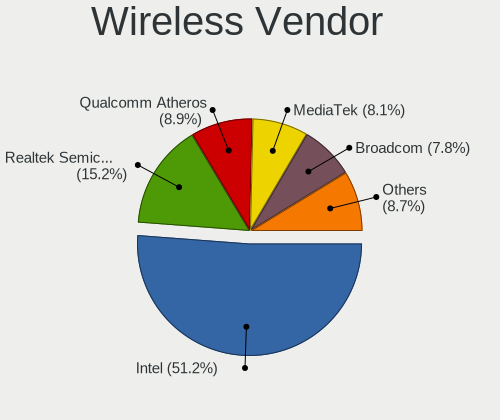

| Vendor                                | Notebooks | Percent |
|---------------------------------------|-----------|---------|
| Intel                                 | 902       | 49.97%  |
| Realtek Semiconductor                 | 276       | 15.29%  |
| MediaTek                              | 162       | 8.98%   |
| Qualcomm Atheros                      | 161       | 8.92%   |
| Broadcom                              | 143       | 7.92%   |
| Broadcom Limited                      | 39        | 2.16%   |
| Qualcomm                              | 35        | 1.94%   |
| TP-Link                               | 14        | 0.78%   |
| Ralink Technology                     | 12        | 0.66%   |
| Ralink                                | 11        | 0.61%   |
| Sierra Wireless                       | 10        | 0.55%   |
| Dell                                  | 10        | 0.55%   |
| FIBOCOM                               | 4         | 0.22%   |
| D-Link                                | 4         | 0.22%   |
| ASUSTek Computer                      | 4         | 0.22%   |
| Qualcomm Technologies                 | 3         | 0.17%   |
| NetGear                               | 3         | 0.17%   |
| Edimax Technology                     | 2         | 0.11%   |
| Unknown                               | 2         | 0.11%   |
| Wacom                                 | 1         | 0.06%   |
| Qualcomm Atheros Communications       | 1         | 0.06%   |
| Microsoft                             | 1         | 0.06%   |
| Linksys                               | 1         | 0.06%   |
| Hewlett-Packard                       | 1         | 0.06%   |
| D-Link System                         | 1         | 0.06%   |
| Belkin Components                     | 1         | 0.06%   |
| 802.11g Adapter [Linksys WUSB54GC v3] | 1         | 0.06%   |

Wireless Model
--------------

Wireless models

| Model                                                                | Notebooks | Percent |
|----------------------------------------------------------------------|-----------|---------|
| Intel Alder Lake-P PCH CNVi WiFi                                     | 109       | 6.02%   |
| Intel Wireless 8265 / 8275                                           | 85        | 4.69%   |
| Intel Wi-Fi 6 AX201                                                  | 85        | 4.69%   |
| MediaTek MT7921 802.11ax PCI Express Wireless Network Adapter        | 80        | 4.42%   |
| Intel Wi-Fi 6 AX200                                                  | 80        | 4.42%   |
| Realtek RTL8822CE 802.11ac PCIe Wireless Network Adapter             | 75        | 4.14%   |
| MediaTek MT7922 802.11ax PCI Express Wireless Network Adapter        | 65        | 3.59%   |
| Realtek RTL8821CE 802.11ac PCIe Wireless Network Adapter             | 58        | 3.2%    |
| Intel Raptor Lake PCH CNVi WiFi                                      | 50        | 2.76%   |
| Intel Wi-Fi 6E(802.11ax) AX210/AX1675* 2x2 [Typhoon Peak]            | 47        | 2.59%   |
| Intel Wireless 7265                                                  | 45        | 2.48%   |
| Qualcomm Atheros QCA9377 802.11ac Wireless Network Adapter           | 44        | 2.43%   |
| Qualcomm Atheros QCA6174 802.11ac Wireless Network Adapter           | 39        | 2.15%   |
| Intel Wireless 8260                                                  | 37        | 2.04%   |
| Intel Wireless 7260                                                  | 37        | 2.04%   |
| Realtek RTL8852BE PCIe 802.11ax Wireless Network Controller          | 36        | 1.99%   |
| Intel Comet Lake PCH CNVi WiFi                                       | 34        | 1.88%   |
| Qualcomm QCNFA765 Wireless Network Adapter                           | 31        | 1.71%   |
| Intel Comet Lake PCH-LP CNVi WiFi                                    | 30        | 1.66%   |
| Qualcomm Atheros QCA9565 / AR9565 Wireless Network Adapter           | 29        | 1.6%    |
| Intel Cannon Point-LP CNVi [Wireless-AC]                             | 29        | 1.6%    |
| Intel Cannon Lake PCH CNVi WiFi                                      | 29        | 1.6%    |
| Broadcom BCM43142 802.11b/g/n                                        | 27        | 1.49%   |
| Intel Centrino Advanced-N 6205 [Taylor Peak]                         | 22        | 1.21%   |
| Realtek RTL8852AE 802.11ax PCIe Wireless Network Adapter             | 21        | 1.16%   |
| Intel Wireless 3165                                                  | 21        | 1.16%   |
| Intel Raptor Lake-S PCH CNVi WiFi                                    | 21        | 1.16%   |
| Broadcom BCM4331 802.11a/b/g/n                                       | 21        | 1.16%   |
| Broadcom Limited BCM4360 802.11ac Dual Band Wireless Network Adapter | 20        | 1.1%    |
| Intel Tiger Lake PCH CNVi WiFi                                       | 19        | 1.05%   |
| Intel Wireless 3160                                                  | 17        | 0.94%   |
| Qualcomm Atheros AR9485 Wireless Network Adapter                     | 16        | 0.88%   |
| Qualcomm Atheros AR9285 Wireless Network Adapter (PCI-Express)       | 16        | 0.88%   |
| Broadcom BCM4350 802.11ac Wireless Network Adapter                   | 16        | 0.88%   |
| Realtek RTL8723BE PCIe Wireless Network Adapter                      | 14        | 0.77%   |
| Intel Dual Band Wireless-AC 3165 Plus Bluetooth                      | 14        | 0.77%   |
| Broadcom BCM43602 802.11ac Wireless LAN SoC                          | 14        | 0.77%   |
| Broadcom BCM4313 802.11bgn Wireless Network Adapter                  | 14        | 0.77%   |
| MediaTek Wi-Fi 6E MT7902 Wireless Network Adapter                    | 13        | 0.72%   |
| Intel Centrino Advanced-N 6200                                       | 12        | 0.66%   |

Ethernet Vendor
---------------

Ethernet vendors

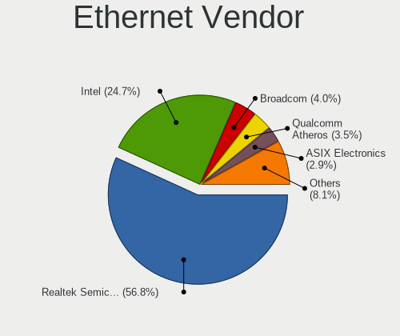

| Vendor                                 | Notebooks | Percent |
|----------------------------------------|-----------|---------|
| Realtek Semiconductor                  | 714       | 57.49%  |
| Intel                                  | 309       | 24.88%  |
| Broadcom                               | 52        | 4.19%   |
| Qualcomm Atheros                       | 47        | 3.78%   |
| ASIX Electronics                       | 36        | 2.9%    |
| Lenovo                                 | 13        | 1.05%   |
| Samsung Electronics                    | 8         | 0.64%   |
| Xiaomi                                 | 7         | 0.56%   |
| Nvidia                                 | 7         | 0.56%   |
| Marvell Technology Group               | 7         | 0.56%   |
| DisplayLink                            | 7         | 0.56%   |
| OPPO Electronics                       | 6         | 0.48%   |
| TP-Link                                | 4         | 0.32%   |
| Motorola PCS                           | 4         | 0.32%   |
| Apple                                  | 4         | 0.32%   |
| Qualcomm                               | 3         | 0.24%   |
| Hewlett-Packard                        | 3         | 0.24%   |
| Google                                 | 3         | 0.24%   |
| JMicron Technology                     | 2         | 0.16%   |
| Spreadtrum Communications              | 1         | 0.08%   |
| Sony Ericsson Mobile Communications AB | 1         | 0.08%   |
| MediaTek                               | 1         | 0.08%   |
| ICS Advent                             | 1         | 0.08%   |
| Huawei Technologies                    | 1         | 0.08%   |
| Broadcom Limited                       | 1         | 0.08%   |

Ethernet Model
--------------

Ethernet models

| Model                                                                  | Notebooks | Percent |
|------------------------------------------------------------------------|-----------|---------|
| Realtek RTL8111/8168/8211/8411 PCI Express Gigabit Ethernet Controller | 492       | 39.05%  |
| Realtek RTL8153 Gigabit Ethernet Adapter                               | 80        | 6.35%   |
| Realtek RTL810xE PCI Express Fast Ethernet controller                  | 80        | 6.35%   |
| Intel Ethernet Connection (4) I219-LM                                  | 42        | 3.33%   |
| Realtek RTL8125 2.5GbE Controller                                      | 31        | 2.46%   |
| ASIX AX88179 Gigabit Ethernet                                          | 30        | 2.38%   |
| Intel 82579LM Gigabit Network Connection (Lewisville)                  | 25        | 1.98%   |
| Intel Ethernet Connection (4) I219-V                                   | 22        | 1.75%   |
| Realtek Killer E2600 GbE Controller                                    | 21        | 1.67%   |
| Broadcom NetXtreme BCM57765 Gigabit Ethernet PCIe                      | 20        | 1.59%   |
| Intel Ethernet Connection I217-LM                                      | 16        | 1.27%   |
| Intel Ethernet Connection (3) I218-LM                                  | 16        | 1.27%   |
| Intel Ethernet Connection I219-LM                                      | 15        | 1.19%   |
| Intel Ethernet Connection (6) I219-LM                                  | 15        | 1.19%   |
| Intel Ethernet Connection (16) I219-V                                  | 13        | 1.03%   |
| Intel Ethernet Connection I218-LM                                      | 12        | 0.95%   |
| Intel 82577LM Gigabit Network Connection                               | 12        | 0.95%   |
| Intel Ethernet Connection (13) I219-V                                  | 11        | 0.87%   |
| Intel Ethernet Connection I219-V                                       | 10        | 0.79%   |
| Intel Ethernet Connection (6) I219-V                                   | 10        | 0.79%   |
| Realtek PCIe GbE Family Controller                                     | 9         | 0.71%   |
| Realtek Killer E3000 2.5GbE Controller                                 | 9         | 0.71%   |
| Intel Ethernet Connection (2) I219-LM                                  | 9         | 0.71%   |
| Broadcom NetLink BCM57785 Gigabit Ethernet PCIe                        | 9         | 0.71%   |
| Intel 82567LM Gigabit Network Connection                               | 8         | 0.63%   |
| Qualcomm Atheros QCA8172 Fast Ethernet                                 | 7         | 0.56%   |
| Qualcomm Atheros QCA8171 Gigabit Ethernet                              | 7         | 0.56%   |
| Qualcomm Atheros Killer E2400 Gigabit Ethernet Controller              | 7         | 0.56%   |
| Intel Ethernet Connection (16) I219-LM                                 | 7         | 0.56%   |
| Nvidia MCP79 Ethernet                                                  | 6         | 0.48%   |
| Intel Ethernet Connection (7) I219-LM                                  | 6         | 0.48%   |
| Intel Ethernet Connection (23) I219-V                                  | 6         | 0.48%   |
| Broadcom NetXtreme BCM57762 Gigabit Ethernet PCIe                      | 6         | 0.48%   |
| Samsung Galaxy series, misc. (tethering mode)                          | 5         | 0.4%    |
| Qualcomm Atheros AR8151 v2.0 Gigabit Ethernet                          | 5         | 0.4%    |
| Lenovo ThinkPad TBT 3 Dock                                             | 5         | 0.4%    |
| Intel Ethernet Connection (5) I219-LM                                  | 5         | 0.4%    |
| Broadcom NetXtreme BCM57786 Gigabit Ethernet PCIe                      | 5         | 0.4%    |
| Broadcom NetLink BCM57780 Gigabit Ethernet PCIe                        | 5         | 0.4%    |
| Xiaomi Mi/Redmi series (RNDIS)                                         | 4         | 0.32%   |

Net Controller Kind
-------------------

Ethernet, WiFi or modem

| Kind     | Notebooks | Percent |
|----------|-----------|---------|
| WiFi     | 1716      | 58.97%  |
| Ethernet | 1173      | 40.31%  |
| Modem    | 16        | 0.55%   |
| Unknown  | 5         | 0.17%   |

Used Controller
---------------

Currently used network controller

| Kind     | Notebooks | Percent |
|----------|-----------|---------|
| WiFi     | 1481      | 82.23%  |
| Ethernet | 320       | 17.77%  |

NICs
----

Total network controllers on board

| Total | Notebooks | Percent |
|-------|-----------|---------|
| 2     | 1043      | 60.05%  |
| 1     | 662       | 38.11%  |
| 0     | 18        | 1.04%   |
| 3     | 13        | 0.75%   |
| 4     | 1         | 0.06%   |

IPv6
----

IPv6 vs IPv4

| Used | Notebooks | Percent |
|------|-----------|---------|
| No   | 1189      | 67.98%  |
| Yes  | 560       | 32.02%  |

Bluetooth
---------

Bluetooth Vendor
----------------

Controller vendors

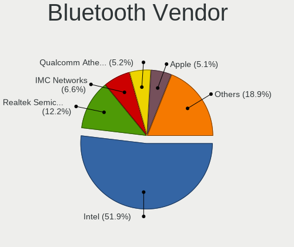

| Vendor                          | Notebooks | Percent |
|---------------------------------|-----------|---------|
| Intel                           | 786       | 51.47%  |
| Realtek Semiconductor           | 189       | 12.38%  |
| IMC Networks                    | 101       | 6.61%   |
| Qualcomm Atheros Communications | 82        | 5.37%   |
| Foxconn / Hon Hai               | 81        | 5.3%    |
| Apple                           | 78        | 5.11%   |
| Lite-On Technology              | 54        | 3.54%   |
| Broadcom                        | 45        | 2.95%   |
| MediaTek                        | 22        | 1.44%   |
| USI                             | 21        | 1.38%   |
| Realtek                         | 18        | 1.18%   |
| Hewlett-Packard                 | 7         | 0.46%   |
| Foxconn International           | 7         | 0.46%   |
| Dell                            | 7         | 0.46%   |
| Cambridge Silicon Radio         | 6         | 0.39%   |
| Ralink                          | 5         | 0.33%   |
| Ralink Technology               | 4         | 0.26%   |
| Toshiba                         | 3         | 0.2%    |
| ASUSTek Computer                | 2         | 0.13%   |
| Alps Electric                   | 2         | 0.13%   |
| TP-Link                         | 1         | 0.07%   |
| Smart Modular Technologies      | 1         | 0.07%   |
| Opticis                         | 1         | 0.07%   |
| Fujitsu                         | 1         | 0.07%   |
| Edimax Technology               | 1         | 0.07%   |
| Askey Computer                  | 1         | 0.07%   |
| Actions                         | 1         | 0.07%   |

Bluetooth Model
---------------

Controller models

| Model                                               | Notebooks | Percent |
|-----------------------------------------------------|-----------|---------|
| Intel AX201 Bluetooth                               | 195       | 12.77%  |
| Intel AX211 Bluetooth                               | 130       | 8.51%   |
| Realtek Bluetooth Radio                             | 121       | 7.92%   |
| Intel Bluetooth wireless interface                  | 119       | 7.79%   |
| Intel Bluetooth Device                              | 105       | 6.88%   |
| Intel Bluetooth 9460/9560 Jefferson Peak (JfP)      | 90        | 5.89%   |
| Intel AX200 Bluetooth                               | 77        | 5.04%   |
| IMC Networks Wireless_Device                        | 64        | 4.19%   |
| Apple Bluetooth Host Controller                     | 47        | 3.08%   |
| Intel AX210 Bluetooth                               | 46        | 3.01%   |
| Qualcomm Atheros  Bluetooth Device                  | 43        | 2.82%   |
| Foxconn / Hon Hai Wireless_Device                   | 32        | 2.1%    |
| Realtek 802.11ac WLAN Adapter                       | 30        | 1.96%   |
| Realtek  Bluetooth 4.2 Adapter                      | 27        | 1.77%   |
| Apple Bluetooth USB Host Controller                 | 25        | 1.64%   |
| Foxconn / Hon Hai MediaTek Bluetooth Adapter        | 23        | 1.51%   |
| MediaTek Wireless_Device                            | 22        | 1.44%   |
| IMC Networks Bluetooth Radio                        | 22        | 1.44%   |
| USI Bluetooth Device                                | 21        | 1.38%   |
| Realtek Bluetooth Radio                             | 18        | 1.18%   |
| Lite-On Wireless_Device                             | 18        | 1.18%   |
| Qualcomm Atheros QCA61x4 Bluetooth 4.0              | 15        | 0.98%   |
| Lite-On Qualcomm Atheros QCA9377 Bluetooth          | 12        | 0.79%   |
| Lite-On Bluetooth Device                            | 12        | 0.79%   |
| Foxconn / Hon Hai Bluetooth Device                  | 11        | 0.72%   |
| Qualcomm Atheros AR3012 Bluetooth 4.0               | 10        | 0.65%   |
| Intel Centrino Bluetooth Wireless Transceiver       | 10        | 0.65%   |
| Broadcom BCM2045B (BDC-2.1)                         | 10        | 0.65%   |
| IMC Networks Bluetooth Device                       | 8         | 0.52%   |
| Qualcomm Atheros AR3011 Bluetooth                   | 7         | 0.46%   |
| Foxconn International BCM43142A0 Bluetooth module   | 7         | 0.46%   |
| Intel Wireless-AC 3168 Bluetooth                    | 6         | 0.39%   |
| HP Broadcom 2070 Bluetooth Combo                    | 6         | 0.39%   |
| Cambridge Silicon Radio Bluetooth Dongle (HCI mode) | 6         | 0.39%   |
| Broadcom BCM43142A0 Bluetooth 4.0                   | 6         | 0.39%   |
| Realtek RTL8723B Bluetooth                          | 5         | 0.33%   |
| Ralink RT3290 Bluetooth                             | 5         | 0.33%   |
| Qualcomm Atheros AR9462 Bluetooth                   | 5         | 0.33%   |
| Broadcom BCM43142 Bluetooth 4.0                     | 5         | 0.33%   |
| Realtek RTL8822BE Bluetooth 4.2 Adapter             | 4         | 0.26%   |

Sound
-----

Sound Vendor
------------

Sound card vendors

| Vendor                                          | Notebooks | Percent |
|-------------------------------------------------|-----------|---------|
| Intel                                           | 1294      | 58.29%  |
| AMD                                             | 446       | 20.09%  |
| Nvidia                                          | 339       | 15.27%  |
| Lenovo                                          | 15        | 0.68%   |
| GN Netcom                                       | 12        | 0.54%   |
| C-Media Electronics                             | 12        | 0.54%   |
| Hewlett-Packard                                 | 9         | 0.41%   |
| Apple                                           | 8         | 0.36%   |
| Sony                                            | 7         | 0.32%   |
| Realtek Semiconductor                           | 7         | 0.32%   |
| Logitech                                        | 6         | 0.27%   |
| JMTek                                           | 5         | 0.23%   |
| Generalplus Technology                          | 5         | 0.23%   |
| ASUSTek Computer                                | 5         | 0.23%   |
| Texas Instruments                               | 3         | 0.14%   |
| Plantronics                                     | 3         | 0.14%   |
| Focusrite-Novation                              | 3         | 0.14%   |
| DSEA A/S                                        | 3         | 0.14%   |
| SteelSeries ApS                                 | 2         | 0.09%   |
| Samson Technologies                             | 2         | 0.09%   |
| Razer USA                                       | 2         | 0.09%   |
| FiiO Electronics Technology                     | 2         | 0.09%   |
| Creative Technology                             | 2         | 0.09%   |
| BR25                                            | 2         | 0.09%   |
| Unknown                                         | 2         | 0.09%   |
| Yealink Network Technology                      | 1         | 0.05%   |
| Thesycon Systemsoftware & Consulting            | 1         | 0.05%   |
| Tenx Technology                                 | 1         | 0.05%   |
| Silicon Motion                                  | 1         | 0.05%   |
| RODE Microphones                                | 1         | 0.05%   |
| RME                                             | 1         | 0.05%   |
| Panasonic (Matsushita)                          | 1         | 0.05%   |
| Nordic Semiconductor ASA                        | 1         | 0.05%   |
| Microchip Technology                            | 1         | 0.05%   |
| M-Audio                                         | 1         | 0.05%   |
| Lotoo                                           | 1         | 0.05%   |
| Licensed by Sony Computer Entertainment America | 1         | 0.05%   |
| Kingston Technology                             | 1         | 0.05%   |
| JBL                                             | 1         | 0.05%   |
| GS3                                             | 1         | 0.05%   |

Sound Model
-----------

Sound card models

| Model                                                                      | Notebooks | Percent |
|----------------------------------------------------------------------------|-----------|---------|
| AMD Family 17h/19h HD Audio Controller                                     | 366       | 13.33%  |
| Intel Sunrise Point-LP HD Audio                                            | 209       | 7.61%   |
| AMD Renoir Radeon High Definition Audio Controller                         | 174       | 6.34%   |
| Intel Alder Lake PCH-P High Definition Audio Controller                    | 138       | 5.03%   |
| Intel Tiger Lake-LP Smart Sound Technology Audio Controller                | 124       | 4.52%   |
| AMD Rembrandt Radeon High Definition Audio Controller                      | 123       | 4.48%   |
| Nvidia Audio device                                                        | 90        | 3.28%   |
| Intel 7 Series/C216 Chipset Family High Definition Audio Controller        | 77        | 2.81%   |
| Intel Raptor Lake-P/U/H cAVS                                               | 68        | 2.48%   |
| Intel Wildcat Point-LP High Definition Audio Controller                    | 58        | 2.11%   |
| Intel Broadwell-U Audio Controller                                         | 58        | 2.11%   |
| Intel 6 Series/C200 Series Chipset Family High Definition Audio Controller | 58        | 2.11%   |
| Intel Haswell-ULT HD Audio Controller                                      | 56        | 2.04%   |
| Intel 8 Series/C220 Series Chipset High Definition Audio Controller        | 55        | 2%      |
| Intel 8 Series HD Audio Controller                                         | 53        | 1.93%   |
| Intel Cannon Lake PCH cAVS                                                 | 52        | 1.89%   |
| Intel Cannon Point-LP High Definition Audio Controller                     | 48        | 1.75%   |
| AMD Raven/Raven2/Fenghuang HDMI/DP Audio Controller                        | 43        | 1.57%   |
| Nvidia TU107 GeForce GTX 1650 High Definition Audio Controller             | 42        | 1.53%   |
| Intel Comet Lake PCH cAVS                                                  | 42        | 1.53%   |
| Intel 5 Series/3400 Series Chipset High Definition Audio                   | 39        | 1.42%   |
| Nvidia GA106 High Definition Audio Controller                              | 37        | 1.35%   |
| Intel Comet Lake PCH-LP cAVS                                               | 37        | 1.35%   |
| Intel Xeon E3-1200 v3/4th Gen Core Processor HD Audio Controller           | 36        | 1.31%   |
| Intel Tiger Lake-H HD Audio Controller                                     | 33        | 1.2%    |
| Intel Ice Lake-LP Smart Sound Technology Audio Controller                  | 30        | 1.09%   |
| Nvidia GA104 High Definition Audio Controller                              | 26        | 0.95%   |
| Intel CM238 HD Audio Controller                                            | 26        | 0.95%   |
| Intel Celeron/Pentium Silver Processor High Definition Audio               | 26        | 0.95%   |
| Intel 100 Series/C230 Series Chipset Family HD Audio Controller            | 22        | 0.8%    |
| Intel Raptor Lake High Definition Audio Controller                         | 21        | 0.77%   |
| Nvidia GK107 HDMI Audio Controller                                         | 18        | 0.66%   |
| Nvidia GF108 High Definition Audio Controller                              | 18        | 0.66%   |
| Intel 82801I (ICH9 Family) HD Audio Controller                             | 17        | 0.62%   |
| AMD FCH Azalia Controller                                                  | 17        | 0.62%   |
| Nvidia TU106 High Definition Audio Controller                              | 15        | 0.55%   |
| AMD Navi 21/23 HDMI/DP Audio Controller                                    | 15        | 0.55%   |
| AMD Kabini HDMI/DP Audio                                                   | 14        | 0.51%   |
| Nvidia GP107GL High Definition Audio Controller                            | 13        | 0.47%   |
| Nvidia GM107 High Definition Audio Controller [GeForce 940MX]              | 13        | 0.47%   |

Memory
------

Memory Vendor
-------------

Memory module vendors

| Vendor              | Notebooks | Percent |
|---------------------|-----------|---------|
| Samsung Electronics | 208       | 28.11%  |
| SK hynix            | 176       | 23.78%  |
| Micron Technology   | 134       | 18.11%  |
| Kingston            | 65        | 8.78%   |
| Crucial             | 45        | 6.08%   |
| Unknown             | 17        | 2.3%    |
| Ramaxel Technology  | 15        | 2.03%   |
| A-DATA Technology   | 13        | 1.76%   |
| Unknown             | 10        | 1.35%   |
| Nanya Technology    | 7         | 0.95%   |
| Corsair             | 7         | 0.95%   |
| G.Skill             | 6         | 0.81%   |
| Elpida              | 5         | 0.68%   |
| Team                | 4         | 0.54%   |
| Timetec             | 3         | 0.41%   |
| Patriot             | 2         | 0.27%   |
| ChangXin Memory     | 2         | 0.27%   |
| Wilk                | 1         | 0.14%   |
| Unknown (ABCD)      | 1         | 0.14%   |
| Unknown (8A5D)      | 1         | 0.14%   |
| Unknown (83DA)      | 1         | 0.14%   |
| Unknown (0x7FFF)    | 1         | 0.14%   |
| Unknown (0x0B5E)    | 1         | 0.14%   |
| Transcend           | 1         | 0.14%   |
| Teikon              | 1         | 0.14%   |
| Spectek             | 1         | 0.14%   |
| Smart Brazil        | 1         | 0.14%   |
| Smart               | 1         | 0.14%   |
| PNY                 | 1         | 0.14%   |
| Neo Forza           | 1         | 0.14%   |
| Lexar               | 1         | 0.14%   |
| Kllisre             | 1         | 0.14%   |
| King Tiger          | 1         | 0.14%   |
| Innodisk            | 1         | 0.14%   |
| Hikvision           | 1         | 0.14%   |
| ASint Technology    | 1         | 0.14%   |
| Apacer              | 1         | 0.14%   |
| AMD                 | 1         | 0.14%   |

Memory Model
------------

Memory module models

| Model                                                            | Notebooks | Percent |
|------------------------------------------------------------------|-----------|---------|
| Samsung RAM M471A1G44BB0-CWE 8GB SODIMM DDR4 3200MT/s            | 15        | 1.93%   |
| Samsung RAM M471A1K43EB1-CWE 8GB SODIMM DDR4 3200MT/s            | 12        | 1.54%   |
| Samsung RAM M471A1G44AB0-CWE 8192MB SODIMM DDR4 3200MT/s         | 12        | 1.54%   |
| Unknown                                                          | 10        | 1.29%   |
| SK hynix RAM HMA81GS6AFR8N-UH 8GB SODIMM DDR4 2667MT/s           | 9         | 1.16%   |
| Samsung RAM M471A5244CB0-CWE 4GB SODIMM DDR4 3200MT/s            | 8         | 1.03%   |
| Micron RAM 8ATF1G64HZ-3G2R1 8GB SODIMM DDR4 3200MT/s             | 8         | 1.03%   |
| SK hynix RAM Module 4GB SODIMM DDR3 1600MT/s                     | 7         | 0.9%    |
| SK hynix RAM HMT41GS6BFR8A-PB 8GB SODIMM DDR3 1600MT/s           | 7         | 0.9%    |
| SK hynix RAM HMAA1GS6CJR6N-XN 8GB SODIMM DDR4 3200MT/s           | 7         | 0.9%    |
| SK hynix RAM H9JCNNNCP3MLYR-N6E 2GB Row Of Chips LPDDR5 6400MT/s | 7         | 0.9%    |
| Micron RAM MT62F2G32D4DS-026 WT 8GB SODIMM LPDDR5 7500MT/s       | 7         | 0.9%    |
| SK hynix RAM HMT451S6BFR8A-PB 4GB SODIMM DDR3 1600MT/s           | 6         | 0.77%   |
| SK hynix RAM HMCG66AGBSA092N 8GB SODIMM DDR5 5600MT/s            | 6         | 0.77%   |
| Samsung RAM M471A5244CB0-CWE 4GB Row Of Chips DDR4 3200MT/s      | 6         | 0.77%   |
| Samsung RAM M471A2K43EB1-CWE 16GB SODIMM DDR4 3200MT/s           | 6         | 0.77%   |
| Micron RAM Module 4GB SODIMM LPDDR3 2133MT/s                     | 6         | 0.77%   |
| SK hynix RAM HMA851S6DJR6N-XN 4GB SODIMM DDR4 3200MT/s           | 5         | 0.64%   |
| SK hynix RAM HMA82GS6AFR8N-UH 16GB SODIMM DDR4 2667MT/s          | 5         | 0.64%   |
| Samsung RAM M471B5273DH0-CH9 4GB SODIMM DDR3 1334MT/s            | 5         | 0.64%   |
| Samsung RAM M471B1G73EB0-YK0 8GB SODIMM DDR3 1600MT/s            | 5         | 0.64%   |
| Samsung RAM M471A1K43DB1-CWE 8GB SODIMM DDR4 3200MT/s            | 5         | 0.64%   |
| Samsung RAM M471A1K43CB1-CRC 8GB SODIMM DDR4 2667MT/s            | 5         | 0.64%   |
| Samsung RAM M471A1G44AB0-CWE 8GB Row Of Chips DDR4 3200MT/s      | 5         | 0.64%   |
| Micron RAM Module 8GB SODIMM DDR3 1600MT/s                       | 5         | 0.64%   |
| Micron RAM 4ATF1G64HZ-3G2F1 8GB SODIMM DDR4 3200MT/s             | 5         | 0.64%   |
| Micron RAM 4ATF1G64HZ-3G2E2 8GB SODIMM DDR4 3200MT/s             | 5         | 0.64%   |
| Unknown RAM Module 2GB Row Of Chips LPDDR4 4267MT/s              | 4         | 0.51%   |
| SK hynix RAM Module 8GB SODIMM DDR4 2133MT/s                     | 4         | 0.51%   |
| SK hynix RAM Module 8GB SODIMM DDR3 1600MT/s                     | 4         | 0.51%   |
| SK hynix RAM HMCG66MEBSA095N 8GB SODIMM DDR5 4800MT/s            | 4         | 0.51%   |
| SK hynix RAM HMAA2GS6CJR8N-XN 16GB SODIMM DDR4 3200MT/s          | 4         | 0.51%   |
| Samsung RAM M471A5244CB0-CTD 4GB SODIMM DDR4 3266MT/s            | 4         | 0.51%   |
| Samsung RAM M471A2K43DB1-CWE 16GB SODIMM DDR4 3200MT/s           | 4         | 0.51%   |
| Samsung RAM M471A2G44AM0-CWE 16GB SODIMM DDR4 3200MT/s           | 4         | 0.51%   |
| Samsung RAM M471A2G43AB2-CWE 16GB SODIMM DDR4 3200MT/s           | 4         | 0.51%   |
| Samsung RAM K3LKBKB@BM-MGCP 2GB Row Of Chips LPDDR5 6400MT/s     | 4         | 0.51%   |
| Samsung RAM K3KL9L90CM-MGCT 4GB Row Of Chips LPDDR5 7467MT/s     | 4         | 0.51%   |
| Micron RAM MT62F4G32D8DV-026 WT 16GB SODIMM LPDDR5 7500MT/s      | 4         | 0.51%   |
| Micron RAM MT62F1G32D4DR-031 WT 4GB SODIMM LPDDR5 6400MT/s       | 4         | 0.51%   |

Memory Kind
-----------

Memory module kinds

| Kind   | Notebooks | Percent |
|--------|-----------|---------|
| DDR4   | 328       | 51.74%  |
| DDR3   | 111       | 17.51%  |
| LPDDR5 | 72        | 11.36%  |
| DDR5   | 61        | 9.62%   |
| LPDDR3 | 32        | 5.05%   |
| LPDDR4 | 26        | 4.1%    |
| SDRAM  | 2         | 0.32%   |
| DDR2   | 2         | 0.32%   |

Memory Form Factor
------------------

Physical design of the memory module

| Name         | Notebooks | Percent |
|--------------|-----------|---------|
| SODIMM       | 534       | 82.41%  |
| Row Of Chips | 106       | 16.36%  |
| Chip         | 6         | 0.93%   |
| DIMM         | 1         | 0.15%   |
| Unknown      | 1         | 0.15%   |

Memory Size
-----------

Memory module size

| Size  | Notebooks | Percent |
|-------|-----------|---------|
| 8192  | 300       | 43.99%  |
| 4096  | 156       | 22.87%  |
| 16384 | 151       | 22.14%  |
| 32768 | 41        | 6.01%   |
| 2048  | 29        | 4.25%   |
| 1024  | 3         | 0.44%   |
| 3072  | 2         | 0.29%   |

Memory Speed
------------

Memory module speed

| Speed   | Notebooks | Percent |
|---------|-----------|---------|
| 3200    | 203       | 30.53%  |
| 2667    | 102       | 15.34%  |
| 1600    | 85        | 12.78%  |
| 6400    | 54        | 8.12%   |
| 2133    | 33        | 4.96%   |
| 4800    | 31        | 4.66%   |
| 5600    | 28        | 4.21%   |
| 2400    | 28        | 4.21%   |
| 1334    | 17        | 2.56%   |
| 7500    | 14        | 2.11%   |
| 1867    | 14        | 2.11%   |
| 1333    | 12        | 1.8%    |
| 4267    | 10        | 1.5%    |
| 4266    | 9         | 1.35%   |
| 7467    | 4         | 0.6%    |
| 3266    | 4         | 0.6%    |
| 3733    | 3         | 0.45%   |
| 1066    | 3         | 0.45%   |
| 5200    | 2         | 0.3%    |
| 667     | 2         | 0.3%    |
| 8400    | 1         | 0.15%   |
| 4199    | 1         | 0.15%   |
| 2666    | 1         | 0.15%   |
| 2048    | 1         | 0.15%   |
| 1776    | 1         | 0.15%   |
| 1067    | 1         | 0.15%   |
| Unknown | 1         | 0.15%   |

Printers & scanners
-------------------

Printer Vendor
--------------

Printer device vendors

| Vendor             | Notebooks | Percent |
|--------------------|-----------|---------|
| Minolta            | 1         | 20%     |
| Hewlett-Packard    | 1         | 20%     |
| Dymo-CoStar        | 1         | 20%     |
| Canon              | 1         | 20%     |
| Brother Industries | 1         | 20%     |

Printer Model
-------------

Printer device models

| Model                       | Notebooks | Percent |
|-----------------------------|-----------|---------|
| Minolta PagePro 1300W       | 1         | 20%     |
| HP Smart Tank 510 series    | 1         | 20%     |
| Dymo-CoStar LabelWriter 450 | 1         | 20%     |
| Canon PIXMA MG3500 Series   | 1         | 20%     |
| Brother HL-2240D series     | 1         | 20%     |

Scanner Vendor
--------------

Scanner device vendors

Zero info for selected period =(

Scanner Model
-------------

Scanner device models

Zero info for selected period =(

Camera
------

Camera Vendor
-------------

Camera device vendors

| Vendor                                 | Notebooks | Percent |
|----------------------------------------|-----------|---------|
| Chicony Electronics                    | 328       | 21.59%  |
| IMC Networks                           | 196       | 12.9%   |
| Microdia                               | 129       | 8.49%   |
| Quanta                                 | 116       | 7.64%   |
| Bison Electronics                      | 105       | 6.91%   |
| Realtek Semiconductor                  | 104       | 6.85%   |
| Luxvisions Innotech Limited            | 74        | 4.87%   |
| Sunplus Innovation Technology          | 64        | 4.21%   |
| Apple                                  | 53        | 3.49%   |
| Sonix Technology                       | 47        | 3.09%   |
| Cheng Uei Precision Industry (Foxlink) | 46        | 3.03%   |
| Syntek                                 | 44        | 2.9%    |
| Acer                                   | 43        | 2.83%   |
| Lite-On Technology                     | 27        | 1.78%   |
| Suyin                                  | 17        | 1.12%   |
| Logitech                               | 17        | 1.12%   |
| Silicon Motion                         | 14        | 0.92%   |
| ShineTech                              | 13        | 0.86%   |
| Alcor Micro                            | 12        | 0.79%   |
| SunplusIT                              | 10        | 0.66%   |
| Samsung Electronics                    | 8         | 0.53%   |
| Lenovo                                 | 6         | 0.39%   |
| Ricoh                                  | 5         | 0.33%   |
| Microsoft                              | 4         | 0.26%   |
| icSpring                               | 4         | 0.26%   |
| Qtech                                  | 3         | 0.2%    |
| Primax Electronics                     | 3         | 0.2%    |
| Importek                               | 2         | 0.13%   |
| Goodong Industry                       | 2         | 0.13%   |
| Creative Technology                    | 2         | 0.13%   |
| Alpha Imaging Technology               | 2         | 0.13%   |
| Unknown                                | 2         | 0.13%   |
| Y Media                                | 1         | 0.07%   |
| Tripath Technology                     | 1         | 0.07%   |
| Tobii Technology AB                    | 1         | 0.07%   |
| Sunplus Technology                     | 1         | 0.07%   |
| Sunplus IT                             | 1         | 0.07%   |
| ShineOptics                            | 1         | 0.07%   |
| Shenzhen Kingcome Optoelectronic       | 1         | 0.07%   |
| Razer USA                              | 1         | 0.07%   |

Camera Model
------------

Camera device models

| Model                                               | Notebooks | Percent |
|-----------------------------------------------------|-----------|---------|
| Chicony Integrated Camera                           | 105       | 6.84%   |
| IMC Networks USB2.0 HD UVC WebCam                   | 72        | 4.69%   |
| Microdia Integrated_Webcam_HD                       | 61        | 3.98%   |
| IMC Networks Integrated Camera                      | 61        | 3.98%   |
| Realtek Integrated_Webcam_HD                        | 48        | 3.13%   |
| Syntek Integrated Camera                            | 35        | 2.28%   |
| Bison Integrated Camera                             | 33        | 2.15%   |
| Sunplus Integrated_Webcam_HD                        | 27        | 1.76%   |
| Sonix USB2.0 HD UVC WebCam                          | 27        | 1.76%   |
| Quanta HD User Facing                               | 26        | 1.69%   |
| Luxvisions Innotech Limited Integrated Camera       | 21        | 1.37%   |
| Apple FaceTime HD Camera                            | 21        | 1.37%   |
| Chicony HD Webcam                                   | 19        | 1.24%   |
| Acer Integrated Camera                              | 19        | 1.24%   |
| Luxvisions Innotech Limited HP TrueVision HD Camera | 18        | 1.17%   |
| Chicony HP HD Camera                                | 18        | 1.17%   |
| IMC Networks USB2.0 VGA UVC WebCam                  | 17        | 1.11%   |
| Sonix USB2.0 FHD UVC WebCam                         | 16        | 1.04%   |
| Quanta ACER HD User Facing                          | 16        | 1.04%   |
| Chicony Integrated Camera (1280x720@30)             | 15        | 0.98%   |
| Chicony HP Truevision HD camera                     | 14        | 0.91%   |
| Bison SunplusIT Integrated Camera                   | 14        | 0.91%   |
| Bison HD Webcam                                     | 14        | 0.91%   |
| Quanta HP TrueVision HD Camera                      | 13        | 0.85%   |
| Chicony HP TrueVision HD                            | 13        | 0.85%   |
| Chicony HD User Facing                              | 13        | 0.85%   |
| Apple iPhone 5/5C/5S/6/SE/7/8/X                     | 13        | 0.85%   |
| Microdia Webcam Vitade AF                           | 12        | 0.78%   |
| IMC Networks HD Camera                              | 12        | 0.78%   |
| Microdia Integrated Webcam                          | 11        | 0.72%   |
| Luxvisions Innotech Limited Integrated RGB Camera   | 11        | 0.72%   |
| Bison Integrated RGB Camera                         | 11        | 0.72%   |
| Quanta ov9734_techfront_camera                      | 10        | 0.65%   |
| Luxvisions Innotech Limited HP HD Camera            | 10        | 0.65%   |
| Bison BisonCam,NB Pro                               | 10        | 0.65%   |
| Realtek Laptop Camera                               | 9         | 0.59%   |
| Quanta HP Wide Vision HD Camera                     | 9         | 0.59%   |
| Microdia Integrated_Webcam_FHD                      | 9         | 0.59%   |
| Lite-On Integrated Camera                           | 9         | 0.59%   |
| Lite-On HP HD Camera                                | 9         | 0.59%   |

Security
--------

Fingerprint Vendor
------------------

Fingerprint sensor vendors

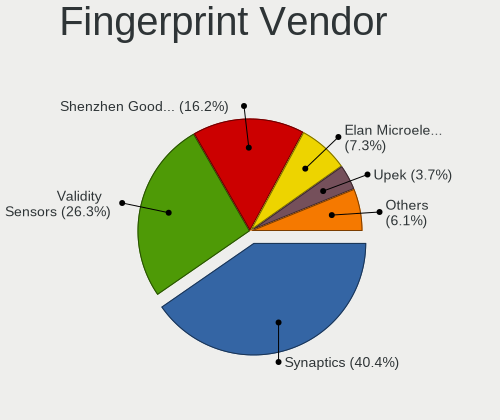

| Vendor                             | Notebooks | Percent |
|------------------------------------|-----------|---------|
| Synaptics                          | 110       | 37.67%  |
| Validity Sensors                   | 81        | 27.74%  |
| Shenzhen Goodix Technology         | 48        | 16.44%  |
| Elan Microelectronics              | 22        | 7.53%   |
| Upek                               | 12        | 4.11%   |
| Realtek USB2.0 Finger Print Bridge | 8         | 2.74%   |
| LighTuning Technology              | 6         | 2.05%   |
| AuthenTec                          | 2         | 0.68%   |
| Samsung Electronics                | 1         | 0.34%   |
| FocalTech                          | 1         | 0.34%   |
| Focal-systems.Corp                 | 1         | 0.34%   |

Fingerprint Model
-----------------

Fingerprint sensor models

| Model                                                                      | Notebooks | Percent |
|----------------------------------------------------------------------------|-----------|---------|
| Synaptics Prometheus MIS Touch Fingerprint Reader                          | 34        | 11.64%  |
| Shenzhen Goodix  Fingerprint Device                                        | 33        | 11.3%   |
| Validity Sensors VFS495 Fingerprint Reader                                 | 30        | 10.27%  |
| Synaptics Metallica MIS Touch Fingerprint Reader                           | 22        | 7.53%   |
| Synaptics UWP WBDI Device                                                  | 12        | 4.11%   |
| Synaptics FS7604 Touch Fingerprint Sensor with PurePrint                   | 12        | 4.11%   |
| Validity Sensors Synaptics WBDI                                            | 11        | 3.77%   |
| Upek Biometric Touchchip/Touchstrip Fingerprint Sensor                     | 11        | 3.77%   |
| Elan ELAN:Fingerprint                                                      | 11        | 3.77%   |
| Elan ELAN:ARM-M4                                                           | 11        | 3.77%   |
| Validity Sensors VFS 5011 fingerprint sensor                               | 10        | 3.42%   |
| Shenzhen Goodix Fingerprint Reader                                         | 9         | 3.08%   |
| Realtek USB2.0 Finger Print Bridge FocalTech Fingerprint Device            | 8         | 2.74%   |
| Synaptics WBDI Fingerprint Reader USB 086                                  | 7         | 2.4%    |
| Synaptics Fingerprint reader [HP G6]                                       | 7         | 2.4%    |
| Shenzhen Goodix FingerPrint                                                | 6         | 2.05%   |
| Validity Sensors VFS7500 Touch Fingerprint Sensor                          | 5         | 1.71%   |
| Validity Sensors VFS5011 Fingerprint Reader                                | 5         | 1.71%   |
| Synaptics  FS7604 Touch Fingerprint Sensor with PurePrint                  | 5         | 1.71%   |
| Validity Sensors VFS491                                                    | 4         | 1.37%   |
| Validity Sensors VFS471 Fingerprint Reader                                 | 4         | 1.37%   |
| Synaptics Metallica MOH Touch Fingerprint Reader                           | 4         | 1.37%   |
| Validity Sensors VFS300 Fingerprint Reader                                 | 3         | 1.03%   |
| Synaptics WBDI                                                             | 3         | 1.03%   |
| Synaptics UWP WBDI                                                         | 3         | 1.03%   |
| LighTuning ES603 Swipe Fingerprint Sensor                                  | 3         | 1.03%   |
| LighTuning EgisTec Touch Fingerprint Sensor                                | 3         | 1.03%   |
| Validity Sensors VFS7552 Touch Fingerprint Sensor                          | 2         | 0.68%   |
| Validity Sensors VFS451 Fingerprint Reader                                 | 2         | 0.68%   |
| Validity Sensors Synaptics VFS7552 Touch Fingerprint Sensor with PurePrint | 2         | 0.68%   |
| Validity Sensors VFS Fingerprint sensor                                    | 1         | 0.34%   |
| Validity Sensors Swipe Fingerprint Sensor                                  | 1         | 0.34%   |
| Validity Sensors Fingerprint scanner                                       | 1         | 0.34%   |
| Upek TCS5B Fingerprint sensor                                              | 1         | 0.34%   |
| Synaptics TouchPad                                                         | 1         | 0.34%   |
| Samsung Fingerprint Sensor Device - 730B                                   | 1         | 0.34%   |
| FocalTech Fingerprint Device                                               | 1         | 0.34%   |
| Focal-systems.Corp FT9201Fingerprint.                                      | 1         | 0.34%   |
| AuthenTec AES2810                                                          | 1         | 0.34%   |
| AuthenTec AES2501 Fingerprint Sensor                                       | 1         | 0.34%   |

Chipcard Vendor
---------------

Chipcard module vendors

| Vendor                   | Notebooks | Percent |
|--------------------------|-----------|---------|
| Broadcom                 | 69        | 50.74%  |
| Alcor Micro              | 51        | 37.5%   |
| Upek                     | 4         | 2.94%   |
| Lenovo                   | 3         | 2.21%   |
| OmniKey                  | 2         | 1.47%   |
| CHERRY                   | 2         | 1.47%   |
| Yubico.com               | 1         | 0.74%   |
| Reiner SCT Kartensysteme | 1         | 0.74%   |
| O2 Micro                 | 1         | 0.74%   |
| Gemalto (was Gemplus)    | 1         | 0.74%   |
| Aktiv                    | 1         | 0.74%   |

Chipcard Model
--------------

Chipcard module models

| Model                                                                        | Notebooks | Percent |
|------------------------------------------------------------------------------|-----------|---------|
| Alcor Micro AU9540 Smartcard Reader                                          | 51        | 37.5%   |
| Broadcom BCM5880 Secure Applications Processor                               | 21        | 15.44%  |
| Broadcom 58200                                                               | 21        | 15.44%  |
| Broadcom 5880                                                                | 18        | 13.24%  |
| Broadcom BCM5880 Secure Applications Processor with fingerprint swipe sensor | 8         | 5.88%   |
| Upek TouchChip Fingerprint Coprocessor (WBF advanced mode)                   | 4         | 2.94%   |
| Lenovo Integrated Smart Card Reader                                          | 3         | 2.21%   |
| CHERRY SmartCard Reader Keyboard KC 1000 SC                                  | 2         | 1.47%   |
| Yubico.com Yubikey 4/5 U2F+CCID                                              | 1         | 0.74%   |
| Reiner SCT Kartensysteme cyberJack RFID basis contactless smartcard reader   | 1         | 0.74%   |
| OmniKey CardMan Smart@Link                                                   | 1         | 0.74%   |
| OmniKey CardMan 3021 / 3121                                                  | 1         | 0.74%   |
| O2 Micro OZ776 CCID Smartcard Reader                                         | 1         | 0.74%   |
| Gemalto (was Gemplus) GemPC Twin SmartCard Reader                            | 1         | 0.74%   |
| Broadcom BCM5880 Secure Applications Processor with fingerprint touch sensor | 1         | 0.74%   |
| Aktiv Rutoken lite                                                           | 1         | 0.74%   |

Unsupported
-----------

Unsupported Devices
-------------------

Total unsupported devices on board

| Total | Notebooks | Percent |
|-------|-----------|---------|
| 0     | 1049      | 60.15%  |
| 1     | 590       | 33.83%  |
| 2     | 97        | 5.56%   |
| 3     | 6         | 0.34%   |
| 6     | 1         | 0.06%   |
| 4     | 1         | 0.06%   |

Unsupported Device Types
------------------------

Types of unsupported devices

| Type                     | Notebooks | Percent |
|--------------------------|-----------|---------|
| Fingerprint reader       | 289       | 36.49%  |
| Graphics card            | 223       | 28.16%  |
| Multimedia controller    | 147       | 18.56%  |
| Net/wireless             | 60        | 7.58%   |
| Chipcard                 | 18        | 2.27%   |
| Camera                   | 15        | 1.89%   |
| Sound                    | 9         | 1.14%   |
| Net/ethernet             | 8         | 1.01%   |
| Bluetooth                | 8         | 1.01%   |
| Card reader              | 5         | 0.63%   |
| Storage                  | 3         | 0.38%   |
| Modem                    | 3         | 0.38%   |
| Network                  | 2         | 0.25%   |
| Communication controller | 2         | 0.25%   |

